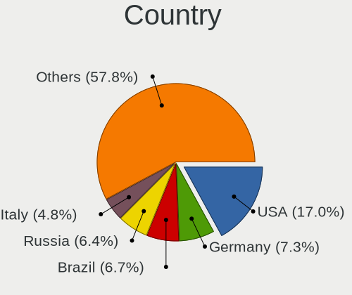
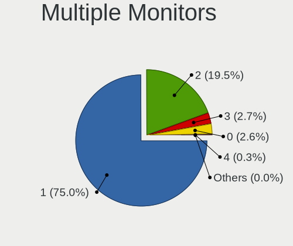

Fedora - Tested Hardware & Statistics (Notebooks)
-------------------------------------------------

A project to collect tested hardware configurations for Fedora.

Anyone can contribute to this report by the [hw-probe](https://github.com/linuxhw/hw-probe) tool:

    sudo -E hw-probe -all -upload

Please contribute! Especially if your hardware is rare.

Contents
--------

* [ Test Cases ](#test-cases)

* [ System ](#system)
  - [ OS                       ](#os)
  - [ OS Family                ](#os-family)
  - [ Kernel                   ](#kernel)
  - [ Kernel Family            ](#kernel-family)
  - [ Kernel Major Ver.        ](#kernel-major-ver)
  - [ Arch                     ](#arch)
  - [ DE                       ](#de)
  - [ Display Server           ](#display-server)
  - [ Display Manager          ](#display-manager)
  - [ OS Lang                  ](#os-lang)
  - [ Boot Mode                ](#boot-mode)
  - [ Filesystem               ](#filesystem)
  - [ Part. scheme             ](#part-scheme)
  - [ Dual Boot with Linux/BSD ](#dual-boot-with-linuxbsd)
  - [ Dual Boot (Win)          ](#dual-boot-win)

* [ Board ](#board)
  - [ Vendor                   ](#vendor)
  - [ Model                    ](#model)
  - [ Model Family             ](#model-family)
  - [ MFG Year                 ](#mfg-year)
  - [ Form Factor              ](#form-factor)
  - [ Secure Boot              ](#secure-boot)
  - [ Coreboot                 ](#coreboot)
  - [ RAM Size                 ](#ram-size)
  - [ RAM Used                 ](#ram-used)
  - [ Total Drives             ](#total-drives)
  - [ Has CD-ROM               ](#has-cd-rom)
  - [ Has Ethernet             ](#has-ethernet)
  - [ Has WiFi                 ](#has-wifi)
  - [ Has Bluetooth            ](#has-bluetooth)

* [ Location ](#location)
  - [ Country                  ](#country)
  - [ City                     ](#city)

* [ Drives ](#drives)
  - [ Drive Vendor             ](#drive-vendor)
  - [ Drive Model              ](#drive-model)
  - [ HDD Vendor               ](#hdd-vendor)
  - [ SSD Vendor               ](#ssd-vendor)
  - [ Drive Kind               ](#drive-kind)
  - [ Drive Connector          ](#drive-connector)
  - [ Drive Size               ](#drive-size)
  - [ Space Total              ](#space-total)
  - [ Space Used               ](#space-used)
  - [ Malfunc. Drives          ](#malfunc-drives)
  - [ Malfunc. Drive Vendor    ](#malfunc-drive-vendor)
  - [ Malfunc. HDD Vendor      ](#malfunc-hdd-vendor)
  - [ Malfunc. Drive Kind      ](#malfunc-drive-kind)
  - [ Failed Drives            ](#failed-drives)
  - [ Failed Drive Vendor      ](#failed-drive-vendor)
  - [ Drive Status             ](#drive-status)

* [ Storage controller ](#storage-controller)
  - [ Storage Vendor           ](#storage-vendor)
  - [ Storage Model            ](#storage-model)
  - [ Storage Kind             ](#storage-kind)

* [ Processor ](#processor)
  - [ CPU Vendor               ](#cpu-vendor)
  - [ CPU Model                ](#cpu-model)
  - [ CPU Model Family         ](#cpu-model-family)
  - [ CPU Cores                ](#cpu-cores)
  - [ CPU Sockets              ](#cpu-sockets)
  - [ CPU Threads              ](#cpu-threads)
  - [ CPU Op-Modes             ](#cpu-op-modes)
  - [ CPU Microcode            ](#cpu-microcode)
  - [ CPU Microarch            ](#cpu-microarch)

* [ Graphics ](#graphics)
  - [ GPU Vendor               ](#gpu-vendor)
  - [ GPU Model                ](#gpu-model)
  - [ GPU Combo                ](#gpu-combo)
  - [ GPU Driver               ](#gpu-driver)
  - [ GPU Memory               ](#gpu-memory)

* [ Monitor ](#monitor)
  - [ Monitor Vendor           ](#monitor-vendor)
  - [ Monitor Model            ](#monitor-model)
  - [ Monitor Resolution       ](#monitor-resolution)
  - [ Monitor Diagonal         ](#monitor-diagonal)
  - [ Monitor Width            ](#monitor-width)
  - [ Aspect Ratio             ](#aspect-ratio)
  - [ Monitor Area             ](#monitor-area)
  - [ Pixel Density            ](#pixel-density)
  - [ Multiple Monitors        ](#multiple-monitors)

* [ Network ](#network)
  - [ Net Controller Vendor    ](#net-controller-vendor)
  - [ Net Controller Model     ](#net-controller-model)
  - [ Wireless Vendor          ](#wireless-vendor)
  - [ Wireless Model           ](#wireless-model)
  - [ Ethernet Vendor          ](#ethernet-vendor)
  - [ Ethernet Model           ](#ethernet-model)
  - [ Net Controller Kind      ](#net-controller-kind)
  - [ Used Controller          ](#used-controller)
  - [ NICs                     ](#nics)
  - [ IPv6                     ](#ipv6)

* [ Bluetooth ](#bluetooth)
  - [ Bluetooth Vendor         ](#bluetooth-vendor)
  - [ Bluetooth Model          ](#bluetooth-model)

* [ Sound ](#sound)
  - [ Sound Vendor             ](#sound-vendor)
  - [ Sound Model              ](#sound-model)

* [ Memory ](#memory)
  - [ Memory Vendor            ](#memory-vendor)
  - [ Memory Model             ](#memory-model)
  - [ Memory Kind              ](#memory-kind)
  - [ Memory Form Factor       ](#memory-form-factor)
  - [ Memory Size              ](#memory-size)
  - [ Memory Speed             ](#memory-speed)

* [ Printers & scanners ](#printers--scanners)
  - [ Printer Vendor           ](#printer-vendor)
  - [ Printer Model            ](#printer-model)
  - [ Scanner Vendor           ](#scanner-vendor)
  - [ Scanner Model            ](#scanner-model)

* [ Camera ](#camera)
  - [ Camera Vendor            ](#camera-vendor)
  - [ Camera Model             ](#camera-model)

* [ Security ](#security)
  - [ Fingerprint Vendor       ](#fingerprint-vendor)
  - [ Fingerprint Model        ](#fingerprint-model)
  - [ Chipcard Vendor          ](#chipcard-vendor)
  - [ Chipcard Model           ](#chipcard-model)

* [ Unsupported ](#unsupported)
  - [ Unsupported Devices      ](#unsupported-devices)
  - [ Unsupported Device Types ](#unsupported-device-types)

Test Cases
----------

Total: 8568

| Vendor        | Model                       | Probe                                                      | Date         |
|---------------|-----------------------------|------------------------------------------------------------|--------------|
| ASUSTek       | VivoBook_ASUSLaptop M540... | [8bc290ef67](https://linux-hardware.org/?probe=8bc290ef67) | Feb 01, 2023 |
| MSI           | Modern 14 B11MOU            | [542173e9a2](https://linux-hardware.org/?probe=542173e9a2) | Feb 01, 2023 |
| ASUSTek       | ASUS TUF Gaming F15 FX50... | [ab31f6153e](https://linux-hardware.org/?probe=ab31f6153e) | Feb 01, 2023 |
| Lenovo        | ThinkPad P1 Gen 3 20TJS2... | [22abfb4a79](https://linux-hardware.org/?probe=22abfb4a79) | Feb 01, 2023 |
| Lenovo        | ThinkPad A485 20MVS0U500    | [b398a8e8e6](https://linux-hardware.org/?probe=b398a8e8e6) | Feb 01, 2023 |
| ASUSTek       | N552VW                      | [1ebeeec517](https://linux-hardware.org/?probe=1ebeeec517) | Feb 01, 2023 |
| Dell          | Inspiron 7501               | [426493e8a5](https://linux-hardware.org/?probe=426493e8a5) | Feb 01, 2023 |
| HP            | Laptop 14-dq4xxx            | [c102edf6a0](https://linux-hardware.org/?probe=c102edf6a0) | Feb 01, 2023 |
| Lenovo        | ThinkPad T14s Gen 3 21CQ... | [6b9dc508e1](https://linux-hardware.org/?probe=6b9dc508e1) | Feb 01, 2023 |
| Dell          | Inspiron 5748               | [7ee6505f8d](https://linux-hardware.org/?probe=7ee6505f8d) | Feb 01, 2023 |
| ASUSTek       | Zenbook UX8402ZA_UX8402Z... | [1d212c67b2](https://linux-hardware.org/?probe=1d212c67b2) | Jan 31, 2023 |
| Lenovo        | ThinkPad X1 Extreme 20MF... | [70310e25d1](https://linux-hardware.org/?probe=70310e25d1) | Jan 31, 2023 |
| HUAWEI        | HN-WX9X                     | [4b8ddf5d09](https://linux-hardware.org/?probe=4b8ddf5d09) | Jan 31, 2023 |
| Dell          | Inspiron 5748               | [ecbd4ac8b6](https://linux-hardware.org/?probe=ecbd4ac8b6) | Jan 31, 2023 |
| Lenovo        | ThinkPad T530 2429F27       | [85ac6a588d](https://linux-hardware.org/?probe=85ac6a588d) | Jan 31, 2023 |
| ASUSTek       | Zenbook UX8402ZA_UX8402Z... | [4dcc88b215](https://linux-hardware.org/?probe=4dcc88b215) | Jan 31, 2023 |
| TUXEDO        | Stellaris Intel Gen4        | [2df9f60f2e](https://linux-hardware.org/?probe=2df9f60f2e) | Jan 31, 2023 |
| Acer          | Predator PH315-52           | [b1c77eb9c7](https://linux-hardware.org/?probe=b1c77eb9c7) | Jan 31, 2023 |
| Notebook      | PD5x_7xPNP_PNN_PNT          | [a64ae29757](https://linux-hardware.org/?probe=a64ae29757) | Jan 31, 2023 |
| Samsung       | 550XCJ/550XCR               | [75fad3daf3](https://linux-hardware.org/?probe=75fad3daf3) | Jan 31, 2023 |
| Dell          | XPS 15 9570                 | [ee60c1c921](https://linux-hardware.org/?probe=ee60c1c921) | Jan 31, 2023 |
| Lenovo        | ThinkPad E14 Gen 4 21E30... | [87904d9d06](https://linux-hardware.org/?probe=87904d9d06) | Jan 31, 2023 |
| MACHENIKE     | MACHCREATOR-16              | [c44c077d1e](https://linux-hardware.org/?probe=c44c077d1e) | Jan 30, 2023 |
| Dell          | Vostro 15 3515              | [357d14774f](https://linux-hardware.org/?probe=357d14774f) | Jan 30, 2023 |
| ASUSTek       | ROG Zephyrus M16 GU603ZX... | [7442c84b55](https://linux-hardware.org/?probe=7442c84b55) | Jan 30, 2023 |
| Dell          | Latitude 7480               | [f3a84b494f](https://linux-hardware.org/?probe=f3a84b494f) | Jan 30, 2023 |
| ASUSTek       | VivoBook_ASUSLaptop X515... | [1ecef01472](https://linux-hardware.org/?probe=1ecef01472) | Jan 30, 2023 |
| HP            | Pavilion 15                 | [6ceccb3d73](https://linux-hardware.org/?probe=6ceccb3d73) | Jan 30, 2023 |
| Lenovo        | ThinkPad T430 2347G4U       | [5802e6b9b9](https://linux-hardware.org/?probe=5802e6b9b9) | Jan 30, 2023 |
| Dell          | XPS 15 9570                 | [1d06f2715a](https://linux-hardware.org/?probe=1d06f2715a) | Jan 30, 2023 |
| Dell          | Vostro 7620                 | [b6d43b8741](https://linux-hardware.org/?probe=b6d43b8741) | Jan 29, 2023 |
| MACHENIKE     | MACHCREATOR-16              | [e3d7c03a2e](https://linux-hardware.org/?probe=e3d7c03a2e) | Jan 29, 2023 |
| Lenovo        | 3000 N200 0769BAG           | [f8f410eb2a](https://linux-hardware.org/?probe=f8f410eb2a) | Jan 29, 2023 |
| HP            | Laptop 14-cm0xxx            | [9b93652159](https://linux-hardware.org/?probe=9b93652159) | Jan 29, 2023 |
| Acer          | Aspire V5-573G              | [e253d5b49b](https://linux-hardware.org/?probe=e253d5b49b) | Jan 29, 2023 |
| HP            | OMEN by Laptop 16-c0xxx     | [32d5472e21](https://linux-hardware.org/?probe=32d5472e21) | Jan 29, 2023 |
| Lenovo        | ThinkPad X1 Carbon Gen 8... | [47246aa8b5](https://linux-hardware.org/?probe=47246aa8b5) | Jan 29, 2023 |
| Lenovo        | Legion 5 15ACH6H 82JU       | [dd07a46c6a](https://linux-hardware.org/?probe=dd07a46c6a) | Jan 29, 2023 |
| TECNO         | MEGABOOK T1                 | [db0e6c89b4](https://linux-hardware.org/?probe=db0e6c89b4) | Jan 29, 2023 |
| Lenovo        | IdeaPad S340-14IML 81N9     | [58e620077b](https://linux-hardware.org/?probe=58e620077b) | Jan 29, 2023 |
| Razer         | Blade 15 (2022) - RZ09-0... | [41d33a9029](https://linux-hardware.org/?probe=41d33a9029) | Jan 29, 2023 |
| Lenovo        | IdeaPad 3 14ITL6 82H7       | [086e08a04b](https://linux-hardware.org/?probe=086e08a04b) | Jan 29, 2023 |
| Acer          | Aspire 5733                 | [da753d74a1](https://linux-hardware.org/?probe=da753d74a1) | Jan 29, 2023 |
| Dell          | XPS 13 7390                 | [60c03ee1f7](https://linux-hardware.org/?probe=60c03ee1f7) | Jan 29, 2023 |
| HP            | EliteBook 840 G1            | [30549ebd3a](https://linux-hardware.org/?probe=30549ebd3a) | Jan 28, 2023 |
| HP            | Laptop 15-da2xxx            | [8384a02b4b](https://linux-hardware.org/?probe=8384a02b4b) | Jan 28, 2023 |
| Lenovo        | ThinkBook 16p Gen 2 20YM    | [53015adc9d](https://linux-hardware.org/?probe=53015adc9d) | Jan 28, 2023 |
| HUAWEI        | MACH-WX9                    | [5b00f79b72](https://linux-hardware.org/?probe=5b00f79b72) | Jan 28, 2023 |
| HP            | ENVY Laptop 17-cg0xxx       | [ed1ce46901](https://linux-hardware.org/?probe=ed1ce46901) | Jan 28, 2023 |
| Lenovo        | ThinkPad T14 Gen 3 21AH0... | [844e4e4b2a](https://linux-hardware.org/?probe=844e4e4b2a) | Jan 28, 2023 |
| HP            | ENVY Laptop 17-cg0xxx       | [ab3f84f96b](https://linux-hardware.org/?probe=ab3f84f96b) | Jan 28, 2023 |
| Apple         | MacBookPro11,4              | [8a5423443a](https://linux-hardware.org/?probe=8a5423443a) | Jan 28, 2023 |
| Timi          | Redmi Book Pro 15 2022      | [7e6cf30d81](https://linux-hardware.org/?probe=7e6cf30d81) | Jan 28, 2023 |
| Timi          | A35S                        | [b6611f9b22](https://linux-hardware.org/?probe=b6611f9b22) | Jan 28, 2023 |
| Lenovo        | Legion 5 15ACH6H 82JU       | [4a82904f14](https://linux-hardware.org/?probe=4a82904f14) | Jan 28, 2023 |
| Lenovo        | ThinkPad X1 Extreme 20MF... | [fb7b1bdaf5](https://linux-hardware.org/?probe=fb7b1bdaf5) | Jan 27, 2023 |
| Lenovo        | ThinkPad T450s 20BWS23W0... | [41c82dbadb](https://linux-hardware.org/?probe=41c82dbadb) | Jan 27, 2023 |
| Lenovo        | IdeaPad 330-15IKB 81DE      | [a69331d2ea](https://linux-hardware.org/?probe=a69331d2ea) | Jan 27, 2023 |
| Acer          | Swift SF314-511             | [c47b08d2a9](https://linux-hardware.org/?probe=c47b08d2a9) | Jan 27, 2023 |
| HONOR         | BMH-WCX9                    | [882bb3b505](https://linux-hardware.org/?probe=882bb3b505) | Jan 27, 2023 |
| MECHREVO      | Code10-7CC6U                | [86e769b2a3](https://linux-hardware.org/?probe=86e769b2a3) | Jan 27, 2023 |
| Dell          | XPS 15 7590                 | [4ecf66ddd9](https://linux-hardware.org/?probe=4ecf66ddd9) | Jan 27, 2023 |
| Dell          | Precision 3550              | [4c42615cef](https://linux-hardware.org/?probe=4c42615cef) | Jan 27, 2023 |
| HUAWEI        | BOHB-WAX9                   | [00e21c8359](https://linux-hardware.org/?probe=00e21c8359) | Jan 27, 2023 |
| Dynabook      | TECRA A50-J                 | [a2ad3f4eb3](https://linux-hardware.org/?probe=a2ad3f4eb3) | Jan 27, 2023 |
| Dynabook      | TECRA A50-J                 | [3921b100b4](https://linux-hardware.org/?probe=3921b100b4) | Jan 27, 2023 |
| ASUSTek       | X550VX                      | [37d2157b37](https://linux-hardware.org/?probe=37d2157b37) | Jan 26, 2023 |
| Lenovo        | Yoga Slim 7 Pro 16ACH6 8... | [9dfc820ceb](https://linux-hardware.org/?probe=9dfc820ceb) | Jan 26, 2023 |
| Lenovo        | Yoga Slim 7 Pro 16ACH6 8... | [0168a5cae2](https://linux-hardware.org/?probe=0168a5cae2) | Jan 26, 2023 |
| HP            | OMEN by Laptop 16-c0xxx     | [4024f7c3bd](https://linux-hardware.org/?probe=4024f7c3bd) | Jan 26, 2023 |
| ASUSTek       | K55VD                       | [b2b19ec3f1](https://linux-hardware.org/?probe=b2b19ec3f1) | Jan 26, 2023 |
| Acer          | Swift SF314-511             | [9c04ff43a3](https://linux-hardware.org/?probe=9c04ff43a3) | Jan 26, 2023 |
| Lenovo        | ThinkPad T495 20NKS01Y00    | [a1dfc58700](https://linux-hardware.org/?probe=a1dfc58700) | Jan 26, 2023 |
| ASUSTek       | VivoBook_ASUSLaptop X515... | [303593899d](https://linux-hardware.org/?probe=303593899d) | Jan 26, 2023 |
| Dell          | Latitude 7480               | [3cb61c5b71](https://linux-hardware.org/?probe=3cb61c5b71) | Jan 26, 2023 |
| ASUSTek       | ROG Zephyrus M16 GU603HM... | [26f64a2ad0](https://linux-hardware.org/?probe=26f64a2ad0) | Jan 26, 2023 |
| GPU Compan... | GWTN156-11                  | [e7f1ea09b5](https://linux-hardware.org/?probe=e7f1ea09b5) | Jan 26, 2023 |
| Multilaser    | PC150                       | [1c4ace00d1](https://linux-hardware.org/?probe=1c4ace00d1) | Jan 26, 2023 |
| Lenovo        | Yoga Slim 7 Pro 14ACH5 D... | [d2a46bd14a](https://linux-hardware.org/?probe=d2a46bd14a) | Jan 26, 2023 |
| HP            | Pavilion Laptop 15-cs3xx... | [8725d530e5](https://linux-hardware.org/?probe=8725d530e5) | Jan 26, 2023 |
| HP            | EliteBook 855 G8 Noteboo... | [ea142e4848](https://linux-hardware.org/?probe=ea142e4848) | Jan 25, 2023 |
| HP            | EliteBook 2540p             | [f03240c746](https://linux-hardware.org/?probe=f03240c746) | Jan 25, 2023 |
| ASUSTek       | VivoBook_ASUSLaptop X415... | [af63cfc79a](https://linux-hardware.org/?probe=af63cfc79a) | Jan 25, 2023 |
| Clevo         | M815P                       | [cfc5f6689f](https://linux-hardware.org/?probe=cfc5f6689f) | Jan 25, 2023 |
| MSI           | GL63 8RC                    | [138e8de541](https://linux-hardware.org/?probe=138e8de541) | Jan 25, 2023 |
| Acer          | Aspire A315-59              | [33292253d0](https://linux-hardware.org/?probe=33292253d0) | Jan 25, 2023 |
| HP            | ZBook Power 15.6 inch G9... | [dd2f21ab84](https://linux-hardware.org/?probe=dd2f21ab84) | Jan 25, 2023 |
| Dynabook      | TECRA A50-J                 | [2f24f18672](https://linux-hardware.org/?probe=2f24f18672) | Jan 25, 2023 |
| ASUSTek       | ROG Zephyrus G14 GA402RK... | [993ba3e73b](https://linux-hardware.org/?probe=993ba3e73b) | Jan 25, 2023 |
| Lenovo        | ThinkPad T14 Gen 1 20UES... | [aa6488b6b8](https://linux-hardware.org/?probe=aa6488b6b8) | Jan 25, 2023 |
| Fujitsu Si... | AMILO Notebook Xa 3530      | [e8384494a3](https://linux-hardware.org/?probe=e8384494a3) | Jan 25, 2023 |
| Dell          | Inspiron 5402               | [d8df4aafe8](https://linux-hardware.org/?probe=d8df4aafe8) | Jan 25, 2023 |
| Dell          | Inspiron 5468               | [3e59c1f38b](https://linux-hardware.org/?probe=3e59c1f38b) | Jan 25, 2023 |
| Acer          | Nitro AN515-42              | [cb02367642](https://linux-hardware.org/?probe=cb02367642) | Jan 25, 2023 |
| Dell          | Latitude 5420               | [cd6dc3695e](https://linux-hardware.org/?probe=cd6dc3695e) | Jan 24, 2023 |
| Dell          | Latitude 5520               | [662284824b](https://linux-hardware.org/?probe=662284824b) | Jan 24, 2023 |
| HP            | ProBook 6570b               | [841250ba59](https://linux-hardware.org/?probe=841250ba59) | Jan 24, 2023 |
| Dell          | Latitude E6410              | [854634fb32](https://linux-hardware.org/?probe=854634fb32) | Jan 24, 2023 |
| Dell          | Latitude E6410              | [a5edbef8d2](https://linux-hardware.org/?probe=a5edbef8d2) | Jan 24, 2023 |
| Lenovo        | ThinkPad T500 2082BPG       | [08a30fd24c](https://linux-hardware.org/?probe=08a30fd24c) | Jan 24, 2023 |
| Lenovo        | ThinkPad E15 20RD0011RT     | [3fb25133ec](https://linux-hardware.org/?probe=3fb25133ec) | Jan 24, 2023 |
| HP            | OMEN Laptop 15-en0xxx       | [c2226035ce](https://linux-hardware.org/?probe=c2226035ce) | Jan 24, 2023 |
| Google        | Treeya                      | [27a381272a](https://linux-hardware.org/?probe=27a381272a) | Jan 24, 2023 |
| HUAWEI        | NBLK-WAX9X                  | [a227de29c5](https://linux-hardware.org/?probe=a227de29c5) | Jan 24, 2023 |
| Dell          | Precision 3551              | [1338d3df20](https://linux-hardware.org/?probe=1338d3df20) | Jan 23, 2023 |
| HP            | ProBook 430 G8 Notebook ... | [335275777a](https://linux-hardware.org/?probe=335275777a) | Jan 23, 2023 |
| Dell          | Latitude 3420               | [d2a8b9657a](https://linux-hardware.org/?probe=d2a8b9657a) | Jan 23, 2023 |
| Dell          | Latitude 7490               | [e40bb2f01f](https://linux-hardware.org/?probe=e40bb2f01f) | Jan 23, 2023 |
| Dell          | Latitude 7490               | [31789ae630](https://linux-hardware.org/?probe=31789ae630) | Jan 23, 2023 |
| Lenovo        | ThinkPad E15 Gen 3 20YHS... | [091effd2ac](https://linux-hardware.org/?probe=091effd2ac) | Jan 23, 2023 |
| Apple         | MacBookPro9,1               | [0a597ba033](https://linux-hardware.org/?probe=0a597ba033) | Jan 23, 2023 |
| MACHENIKE     | MACHCREATOR-16              | [7b3107564a](https://linux-hardware.org/?probe=7b3107564a) | Jan 23, 2023 |
| Lenovo        | Erazer Z500 20226           | [6e7a21c6d5](https://linux-hardware.org/?probe=6e7a21c6d5) | Jan 23, 2023 |
| MACHENIKE     | MACHCREATOR-16              | [6b370a283e](https://linux-hardware.org/?probe=6b370a283e) | Jan 23, 2023 |
| Lenovo        | Erazer Z500 20226           | [7d6077c27c](https://linux-hardware.org/?probe=7d6077c27c) | Jan 23, 2023 |
| Apple         | MacBookPro9,1               | [90884b19a9](https://linux-hardware.org/?probe=90884b19a9) | Jan 23, 2023 |
| Lenovo        | ThinkPad P50 20EQS12Q3M     | [e46b5a8b46](https://linux-hardware.org/?probe=e46b5a8b46) | Jan 23, 2023 |
| Dell          | Latitude E6500              | [ba7c36fe15](https://linux-hardware.org/?probe=ba7c36fe15) | Jan 23, 2023 |
| Dynabook      | TECRA A50-J                 | [689fe06d4d](https://linux-hardware.org/?probe=689fe06d4d) | Jan 23, 2023 |
| Dynabook      | TECRA A50-J                 | [92690b43cd](https://linux-hardware.org/?probe=92690b43cd) | Jan 23, 2023 |
| ASUSTek       | TUF Gaming FX505DT_FX505... | [d03b7c0a68](https://linux-hardware.org/?probe=d03b7c0a68) | Jan 22, 2023 |
| Lenovo        | Legion 5 Pro 16ACH6H 82J... | [07005e3e32](https://linux-hardware.org/?probe=07005e3e32) | Jan 22, 2023 |
| ASUSTek       | VivoBook_ASUSLaptop X740... | [d999192dbf](https://linux-hardware.org/?probe=d999192dbf) | Jan 22, 2023 |
| HP            | EliteBook 820 G3            | [3edd4ab0dc](https://linux-hardware.org/?probe=3edd4ab0dc) | Jan 22, 2023 |
| ASUSTek       | ASUS TUF Gaming F15 FX50... | [523d0331a1](https://linux-hardware.org/?probe=523d0331a1) | Jan 21, 2023 |
| HP            | Victus by Gaming Laptop ... | [0aa98390a7](https://linux-hardware.org/?probe=0aa98390a7) | Jan 21, 2023 |
| Acer          | Predator G9-591             | [0544a1b07c](https://linux-hardware.org/?probe=0544a1b07c) | Jan 21, 2023 |
| Dell          | XPS 9315                    | [9dfb19b7c1](https://linux-hardware.org/?probe=9dfb19b7c1) | Jan 21, 2023 |
| Lenovo        | ThinkPad T14s Gen 2i 20W... | [e8a0c0066b](https://linux-hardware.org/?probe=e8a0c0066b) | Jan 21, 2023 |
| HP            | OMEN Laptop 15-en1xxx       | [adeb24c41e](https://linux-hardware.org/?probe=adeb24c41e) | Jan 21, 2023 |
| Dell          | G5 5587                     | [96ca22c550](https://linux-hardware.org/?probe=96ca22c550) | Jan 21, 2023 |
| Dell          | G5 5587                     | [a070a8ba69](https://linux-hardware.org/?probe=a070a8ba69) | Jan 21, 2023 |
| Lenovo        | ThinkPad P15v Gen 1 20TQ... | [c228c064b7](https://linux-hardware.org/?probe=c228c064b7) | Jan 20, 2023 |
| Positivo B... | VJFE43F11X-XXXXXX           | [138a9b3b0c](https://linux-hardware.org/?probe=138a9b3b0c) | Jan 20, 2023 |
| Dell          | Venue 8 Pro 5830            | [4f815d5b4f](https://linux-hardware.org/?probe=4f815d5b4f) | Jan 20, 2023 |
| Acer          | Aspire A315-42G             | [ed4c536efa](https://linux-hardware.org/?probe=ed4c536efa) | Jan 20, 2023 |
| Lenovo        | ThinkPad T490 20N3S0E000    | [d324a863a5](https://linux-hardware.org/?probe=d324a863a5) | Jan 20, 2023 |
| ASUSTek       | ZenBook UX434IQ_UM433IQ     | [17b4a2466c](https://linux-hardware.org/?probe=17b4a2466c) | Jan 20, 2023 |
| Acer          | Aspire A515-45              | [9d5faff505](https://linux-hardware.org/?probe=9d5faff505) | Jan 20, 2023 |
| MSI           | GS66 Stealth 10UE           | [d5a2a6aaa8](https://linux-hardware.org/?probe=d5a2a6aaa8) | Jan 19, 2023 |
| Positivo B... | VJFE43F11X-XXXXXX           | [cc9e6f8862](https://linux-hardware.org/?probe=cc9e6f8862) | Jan 19, 2023 |
| SLIMBOOK      | TITAN                       | [15c0522754](https://linux-hardware.org/?probe=15c0522754) | Jan 19, 2023 |
| SLIMBOOK      | TITAN                       | [e81652a68c](https://linux-hardware.org/?probe=e81652a68c) | Jan 19, 2023 |
| Dell          | Precision 3551              | [4ff5a0ab8d](https://linux-hardware.org/?probe=4ff5a0ab8d) | Jan 19, 2023 |
| Lenovo        | IdeaPad 320-15IKB 80YH      | [440ff298e7](https://linux-hardware.org/?probe=440ff298e7) | Jan 19, 2023 |
| ASUSTek       | VivoBook_ASUSLaptop E410... | [0f079e1dc7](https://linux-hardware.org/?probe=0f079e1dc7) | Jan 19, 2023 |
| Acer          | Aspire A315-23              | [90049e4bb7](https://linux-hardware.org/?probe=90049e4bb7) | Jan 19, 2023 |
| Acer          | Nitro AN515-42              | [d6a24ede85](https://linux-hardware.org/?probe=d6a24ede85) | Jan 19, 2023 |
| HP            | ENVY Laptop 13-ad1xx        | [6a47296f0c](https://linux-hardware.org/?probe=6a47296f0c) | Jan 19, 2023 |
| Dell          | Latitude 3410               | [187aebc2cd](https://linux-hardware.org/?probe=187aebc2cd) | Jan 19, 2023 |
| Intel Clie... | LAPRC510                    | [6d570a1aee](https://linux-hardware.org/?probe=6d570a1aee) | Jan 19, 2023 |
| HP            | ENVY Laptop 17-ce0xxx       | [1a0f3869dd](https://linux-hardware.org/?probe=1a0f3869dd) | Jan 18, 2023 |
| ASUSTek       | X455LF                      | [9995b86c04](https://linux-hardware.org/?probe=9995b86c04) | Jan 18, 2023 |
| HP            | Victus by Gaming Laptop ... | [533d99e2f1](https://linux-hardware.org/?probe=533d99e2f1) | Jan 18, 2023 |
| Lenovo        | ThinkPad E15 20RD0011RT     | [d27ca45841](https://linux-hardware.org/?probe=d27ca45841) | Jan 18, 2023 |
| Dell          | Precision 3561              | [9528d74be6](https://linux-hardware.org/?probe=9528d74be6) | Jan 18, 2023 |
| Dell          | Precision 3561              | [5f23addbde](https://linux-hardware.org/?probe=5f23addbde) | Jan 18, 2023 |
| Acer          | Swift SFX14-41G             | [1b916fe30d](https://linux-hardware.org/?probe=1b916fe30d) | Jan 18, 2023 |
| Lenovo        | Yoga 500-14IHW 80N5         | [e233e8d6d2](https://linux-hardware.org/?probe=e233e8d6d2) | Jan 18, 2023 |
| Acer          | Nitro AN515-54              | [4a997fa99d](https://linux-hardware.org/?probe=4a997fa99d) | Jan 17, 2023 |
| Lenovo        | Legion 5 15ACH6H 82JU       | [a81a940d33](https://linux-hardware.org/?probe=a81a940d33) | Jan 17, 2023 |
| HP            | Laptop 17-ca0xxx            | [a8fbe01fc5](https://linux-hardware.org/?probe=a8fbe01fc5) | Jan 17, 2023 |
| Acer          | Aspire A315-59              | [469c40ec75](https://linux-hardware.org/?probe=469c40ec75) | Jan 17, 2023 |
| Timi          | Xiaomi NoteBook Pro         | [681de2b0c1](https://linux-hardware.org/?probe=681de2b0c1) | Jan 17, 2023 |
| Lenovo        | IdeaPad Slim 1-14AST-05 ... | [aa6ca0d358](https://linux-hardware.org/?probe=aa6ca0d358) | Jan 17, 2023 |
| Lenovo        | ThinkBook 15 G2 ITL 20VE    | [7b36d7e8eb](https://linux-hardware.org/?probe=7b36d7e8eb) | Jan 17, 2023 |
| Timi          | Xiaomi NoteBook Pro         | [f1ee502754](https://linux-hardware.org/?probe=f1ee502754) | Jan 17, 2023 |
| ASUSTek       | ASUS TUF Gaming A15 FA50... | [0d91852ebf](https://linux-hardware.org/?probe=0d91852ebf) | Jan 17, 2023 |
| ASUSTek       | VivoBook_ASUSLaptop X515... | [c16356f056](https://linux-hardware.org/?probe=c16356f056) | Jan 17, 2023 |
| ASUSTek       | VivoBook_ASUSLaptop X515... | [70b8007dcc](https://linux-hardware.org/?probe=70b8007dcc) | Jan 17, 2023 |
| Acer          | Aspire AV14-51              | [596219796d](https://linux-hardware.org/?probe=596219796d) | Jan 17, 2023 |
| HUAWEI        | BOHB-WAX9                   | [b39c4fc9b7](https://linux-hardware.org/?probe=b39c4fc9b7) | Jan 16, 2023 |
| Lenovo        | IdeaPad 5 Pro 14ARH7 82S... | [1c81e8c322](https://linux-hardware.org/?probe=1c81e8c322) | Jan 16, 2023 |
| Dell          | Inspiron 11 - 3147          | [af542a44ad](https://linux-hardware.org/?probe=af542a44ad) | Jan 16, 2023 |
| PC Special... | Recoil II RTX               | [33850c8810](https://linux-hardware.org/?probe=33850c8810) | Jan 16, 2023 |
| Lenovo        | IdeaPad 3 15ALC6 82MF       | [b53dd87f87](https://linux-hardware.org/?probe=b53dd87f87) | Jan 16, 2023 |
| Schenker      | XMG CORE 15 (M22)           | [6c2b631f12](https://linux-hardware.org/?probe=6c2b631f12) | Jan 16, 2023 |
| HP            | 15                          | [ae082994e2](https://linux-hardware.org/?probe=ae082994e2) | Jan 16, 2023 |
| Acer          | Nitro AN515-46              | [1de96d005a](https://linux-hardware.org/?probe=1de96d005a) | Jan 16, 2023 |
| Acer          | Nitro AN515-46              | [f0eab1c81a](https://linux-hardware.org/?probe=f0eab1c81a) | Jan 16, 2023 |
| Lenovo        | IdeaPad 3 14ADA05 81W0      | [e1aa5d3186](https://linux-hardware.org/?probe=e1aa5d3186) | Jan 16, 2023 |
| Lenovo        | IdeaPad Gaming 3 15IHU6 ... | [1a51848ffb](https://linux-hardware.org/?probe=1a51848ffb) | Jan 16, 2023 |
| ASUSTek       | Zenbook UM3402YA_UM3402Y... | [b36eb94e80](https://linux-hardware.org/?probe=b36eb94e80) | Jan 16, 2023 |
| HP            | 255 G6 Notebook PC          | [4d2e9f3ee4](https://linux-hardware.org/?probe=4d2e9f3ee4) | Jan 16, 2023 |
| Lenovo        | ThinkPad T440s 20AQ0069G... | [cb2e9f2623](https://linux-hardware.org/?probe=cb2e9f2623) | Jan 16, 2023 |
| ASUSTek       | VivoBook_ASUSLaptop X515... | [8fb168e741](https://linux-hardware.org/?probe=8fb168e741) | Jan 16, 2023 |
| Lenovo        | ThinkPad T460s 20FAS5QW0... | [dd953776aa](https://linux-hardware.org/?probe=dd953776aa) | Jan 16, 2023 |
| Lenovo        | Legion 5 15ACH6H 82JU       | [a38eb750aa](https://linux-hardware.org/?probe=a38eb750aa) | Jan 16, 2023 |
| ASUSTek       | VivoBook 15_ASUS Laptop ... | [9ac2f0ab83](https://linux-hardware.org/?probe=9ac2f0ab83) | Jan 15, 2023 |
| HP            | EliteBook 840 G2            | [4850c49a4a](https://linux-hardware.org/?probe=4850c49a4a) | Jan 15, 2023 |
| Lenovo        | ThinkPad X1 Carbon 5th 2... | [448ae92dc8](https://linux-hardware.org/?probe=448ae92dc8) | Jan 15, 2023 |
| HP            | EliteBook 840 G2            | [972e3e026a](https://linux-hardware.org/?probe=972e3e026a) | Jan 15, 2023 |
| ASUSTek       | Zenbook UM3402YA_UM3402Y... | [57d99b139f](https://linux-hardware.org/?probe=57d99b139f) | Jan 15, 2023 |
| Acer          | Aspire A515-43              | [cefbe7ee6e](https://linux-hardware.org/?probe=cefbe7ee6e) | Jan 15, 2023 |
| Lenovo        | IdeaPad L340-15IRH Gamin... | [fcc6481e2a](https://linux-hardware.org/?probe=fcc6481e2a) | Jan 15, 2023 |
| HP            | Pavilion Laptop 14-bk0xx    | [ebe90b5052](https://linux-hardware.org/?probe=ebe90b5052) | Jan 15, 2023 |
| Dell          | Inspiron N5110              | [20625ce99d](https://linux-hardware.org/?probe=20625ce99d) | Jan 14, 2023 |
| HP            | Pavilion dv6                | [60f339781c](https://linux-hardware.org/?probe=60f339781c) | Jan 14, 2023 |
| Olivetti      | Olibook P55-431W850-8G50... | [fe5c9c2425](https://linux-hardware.org/?probe=fe5c9c2425) | Jan 14, 2023 |
| Olivetti      | Olibook P55-431W850-8G50... | [649546bc61](https://linux-hardware.org/?probe=649546bc61) | Jan 14, 2023 |
| Lenovo        | IdeaPad 330-15IKB 81DE      | [86fff559f5](https://linux-hardware.org/?probe=86fff559f5) | Jan 14, 2023 |
| HP            | Pavilion Laptop 14-bk0xx    | [bcbf941284](https://linux-hardware.org/?probe=bcbf941284) | Jan 14, 2023 |
| ASUSTek       | ASUS TUF Gaming A15 FA50... | [efffe2d61b](https://linux-hardware.org/?probe=efffe2d61b) | Jan 14, 2023 |
| MSI           | PS63 Modern 8RC             | [e55e0d9d0a](https://linux-hardware.org/?probe=e55e0d9d0a) | Jan 14, 2023 |
| HP            | ZBook 15 G4                 | [3325b8ab60](https://linux-hardware.org/?probe=3325b8ab60) | Jan 14, 2023 |
| System76      | Oryx Pro                    | [f706b667bb](https://linux-hardware.org/?probe=f706b667bb) | Jan 14, 2023 |
| Lenovo        | ThinkPad L15 Gen 1 20U70... | [5047da7461](https://linux-hardware.org/?probe=5047da7461) | Jan 14, 2023 |
| Acer          | Swift SF314-43              | [e292f699eb](https://linux-hardware.org/?probe=e292f699eb) | Jan 14, 2023 |
| Acer          | Nitro AN515-54              | [ea080033f1](https://linux-hardware.org/?probe=ea080033f1) | Jan 14, 2023 |
| Lenovo        | ThinkPad X1 Carbon Gen 9... | [9096450d56](https://linux-hardware.org/?probe=9096450d56) | Jan 14, 2023 |
| Lenovo        | ThinkPad L14 Gen 2a 20X5... | [bbf1dabe59](https://linux-hardware.org/?probe=bbf1dabe59) | Jan 14, 2023 |
| Dell          | Latitude 7430               | [9caa5939ef](https://linux-hardware.org/?probe=9caa5939ef) | Jan 13, 2023 |
| Lenovo        | ThinkPad P53 20QN0011IV     | [61c432b134](https://linux-hardware.org/?probe=61c432b134) | Jan 13, 2023 |
| Apple         | MacBookPro11,3              | [c94f291c81](https://linux-hardware.org/?probe=c94f291c81) | Jan 13, 2023 |
| Acer          | Nitro AN515-44              | [b2c96e31d9](https://linux-hardware.org/?probe=b2c96e31d9) | Jan 13, 2023 |
| ASUSTek       | ASUS TUF Gaming A15 FA50... | [810b2daeef](https://linux-hardware.org/?probe=810b2daeef) | Jan 13, 2023 |
| Toshiba       | Satellite L855D             | [0606d04520](https://linux-hardware.org/?probe=0606d04520) | Jan 13, 2023 |
| Dell          | Inspiron 5721               | [b9435f9f7d](https://linux-hardware.org/?probe=b9435f9f7d) | Jan 13, 2023 |
| Acer          | Predator PH315-52           | [c6a710b940](https://linux-hardware.org/?probe=c6a710b940) | Jan 13, 2023 |
| HP            | EliteBook 850 G8 Noteboo... | [64c403ce6d](https://linux-hardware.org/?probe=64c403ce6d) | Jan 13, 2023 |
| Lenovo        | ThinkPad T495s 20QKS2R40... | [28d821da5f](https://linux-hardware.org/?probe=28d821da5f) | Jan 13, 2023 |
| ASUSTek       | ASUS TUF Gaming A15 FA50... | [f9d244586a](https://linux-hardware.org/?probe=f9d244586a) | Jan 13, 2023 |
| Lenovo        | ThinkPad T495s 20QKS2R40... | [e78a057172](https://linux-hardware.org/?probe=e78a057172) | Jan 13, 2023 |
| Lenovo        | Legion Y540-17IRH 81Q4      | [05899ebb86](https://linux-hardware.org/?probe=05899ebb86) | Jan 13, 2023 |
| TUXEDO        | Pulse 15 Gen1               | [033a92981f](https://linux-hardware.org/?probe=033a92981f) | Jan 13, 2023 |
| ASUSTek       | VivoBook_ASUSLaptop X421... | [4236e82f21](https://linux-hardware.org/?probe=4236e82f21) | Jan 13, 2023 |
| Acer          | Predator PT515-51           | [150f12dceb](https://linux-hardware.org/?probe=150f12dceb) | Jan 12, 2023 |
| Dell          | G15 5520                    | [1aeaf74f9a](https://linux-hardware.org/?probe=1aeaf74f9a) | Jan 12, 2023 |
| HP            | ProBook 450 G6              | [f675188c46](https://linux-hardware.org/?probe=f675188c46) | Jan 12, 2023 |
| Lenovo        | ThinkPad T430 2347B85       | [01fce134df](https://linux-hardware.org/?probe=01fce134df) | Jan 12, 2023 |
| Lenovo        | ThinkPad L14 Gen 2a 20X5... | [e9783891d1](https://linux-hardware.org/?probe=e9783891d1) | Jan 12, 2023 |
| Acer          | Nitro AN517-42              | [c8440739f9](https://linux-hardware.org/?probe=c8440739f9) | Jan 12, 2023 |
| Dell          | Latitude E5550              | [0b14eb18d9](https://linux-hardware.org/?probe=0b14eb18d9) | Jan 12, 2023 |
| Lenovo        | ThinkPad T430 2349W1C       | [1f310a8a2e](https://linux-hardware.org/?probe=1f310a8a2e) | Jan 12, 2023 |
| Lenovo        | IdeaPad 5 15ABA7 82SG       | [fad743f278](https://linux-hardware.org/?probe=fad743f278) | Jan 12, 2023 |
| HUAWEI        | KLVL-WXXW                   | [1270cfda4e](https://linux-hardware.org/?probe=1270cfda4e) | Jan 11, 2023 |
| Lenovo        | IdeaPad 3 15ALC6 82KU       | [8c1eb7fc02](https://linux-hardware.org/?probe=8c1eb7fc02) | Jan 11, 2023 |
| Dell          | Latitude E5550              | [5e76d378f9](https://linux-hardware.org/?probe=5e76d378f9) | Jan 11, 2023 |
| HP            | Pavilion Aero Laptop 13-... | [ec0f3564ed](https://linux-hardware.org/?probe=ec0f3564ed) | Jan 11, 2023 |
| Acer          | Aspire A315-59              | [a436e3e89f](https://linux-hardware.org/?probe=a436e3e89f) | Jan 11, 2023 |
| ASUSTek       | VivoBook_ASUSLaptop X512... | [c79ad1fc10](https://linux-hardware.org/?probe=c79ad1fc10) | Jan 11, 2023 |
| Acer          | Predator G9-591             | [aa9794813e](https://linux-hardware.org/?probe=aa9794813e) | Jan 11, 2023 |
| Dell          | Latitude E7440              | [bfdc9dfc63](https://linux-hardware.org/?probe=bfdc9dfc63) | Jan 11, 2023 |
| Lenovo        | ThinkPad X1 Carbon Gen 9... | [25090a9dcb](https://linux-hardware.org/?probe=25090a9dcb) | Jan 11, 2023 |
| MSI           | Modern 14 B4MW              | [815ee96451](https://linux-hardware.org/?probe=815ee96451) | Jan 11, 2023 |
| HP            | Pavilion Laptop 13-bb0xx... | [790736a10e](https://linux-hardware.org/?probe=790736a10e) | Jan 11, 2023 |
| HP            | Pavilion Laptop 15-eh1xx... | [fdb726b276](https://linux-hardware.org/?probe=fdb726b276) | Jan 11, 2023 |
| Infinix       | INBOOK X2                   | [11aac46bdc](https://linux-hardware.org/?probe=11aac46bdc) | Jan 10, 2023 |
| ASUSTek       | X510UAR                     | [dc3e0fffe7](https://linux-hardware.org/?probe=dc3e0fffe7) | Jan 10, 2023 |
| ASUSTek       | X510UAR                     | [53d6bec0e8](https://linux-hardware.org/?probe=53d6bec0e8) | Jan 10, 2023 |
| HP            | OMEN by Laptop 16-c0xxx     | [62ddf88d2d](https://linux-hardware.org/?probe=62ddf88d2d) | Jan 10, 2023 |
| Lenovo        | ThinkPad T590 20N5S4R800    | [51d6d75e64](https://linux-hardware.org/?probe=51d6d75e64) | Jan 10, 2023 |
| ASUSTek       | FX503VD                     | [c3a958527e](https://linux-hardware.org/?probe=c3a958527e) | Jan 10, 2023 |
| HP            | ProBook 450 15.6 inch G9... | [37b5b1648e](https://linux-hardware.org/?probe=37b5b1648e) | Jan 10, 2023 |
| Lenovo        | ThinkPad P53 20QNS00X00     | [e16ef8937b](https://linux-hardware.org/?probe=e16ef8937b) | Jan 09, 2023 |
| HP            | ProBook 4520s               | [8e1eba4ad4](https://linux-hardware.org/?probe=8e1eba4ad4) | Jan 09, 2023 |
| Alienware     | m15 Ryzen Ed. R5            | [ef83299ad4](https://linux-hardware.org/?probe=ef83299ad4) | Jan 09, 2023 |
| Chuwi         | GemiBook                    | [918dc5f283](https://linux-hardware.org/?probe=918dc5f283) | Jan 09, 2023 |
| HP            | OMEN by Laptop 16-c0xxx     | [ad39556257](https://linux-hardware.org/?probe=ad39556257) | Jan 09, 2023 |
| HP            | EliteBook 850 G4            | [e6cb9446f5](https://linux-hardware.org/?probe=e6cb9446f5) | Jan 09, 2023 |
| HP            | Laptop 15-da1xxx            | [2fa89881b4](https://linux-hardware.org/?probe=2fa89881b4) | Jan 09, 2023 |
| Dell          | XPS 15 9520                 | [2e13f150e6](https://linux-hardware.org/?probe=2e13f150e6) | Jan 09, 2023 |
| ASUSTek       | ASUS TUF Gaming A15 FA50... | [6e756926b8](https://linux-hardware.org/?probe=6e756926b8) | Jan 09, 2023 |
| Apple         | MacBookPro11,1              | [92a4be502c](https://linux-hardware.org/?probe=92a4be502c) | Jan 09, 2023 |
| Acer          | Iconia W700                 | [bcfec36896](https://linux-hardware.org/?probe=bcfec36896) | Jan 09, 2023 |
| ASUSTek       | ROG Zephyrus M16 GU603HM... | [8be13470fb](https://linux-hardware.org/?probe=8be13470fb) | Jan 09, 2023 |
| Lenovo        | IdeaPad 720-15IKB 81AG      | [8c76c72880](https://linux-hardware.org/?probe=8c76c72880) | Jan 08, 2023 |
| HP            | ProBook 6465b               | [336f10e70b](https://linux-hardware.org/?probe=336f10e70b) | Jan 08, 2023 |
| ASUSTek       | X541UVK                     | [50e9caee7f](https://linux-hardware.org/?probe=50e9caee7f) | Jan 08, 2023 |
| Lenovo        | V330-15IKB 81AX             | [1ca4c751d8](https://linux-hardware.org/?probe=1ca4c751d8) | Jan 08, 2023 |
| Framework     | Laptop                      | [0c13e3ab8d](https://linux-hardware.org/?probe=0c13e3ab8d) | Jan 08, 2023 |
| Acer          | Aspire A315-41              | [b4ed141fd3](https://linux-hardware.org/?probe=b4ed141fd3) | Jan 08, 2023 |
| Lenovo        | ThinkPad T14s Gen 3 21CR... | [ff783dac11](https://linux-hardware.org/?probe=ff783dac11) | Jan 08, 2023 |
| Lenovo        | ThinkPad Z16 Gen 1 21D4C... | [d2e10cee5b](https://linux-hardware.org/?probe=d2e10cee5b) | Jan 08, 2023 |
| Dell          | Latitude 3450               | [e4e8bee1cb](https://linux-hardware.org/?probe=e4e8bee1cb) | Jan 08, 2023 |
| HP            | EliteBook 745 G5            | [b732d98167](https://linux-hardware.org/?probe=b732d98167) | Jan 08, 2023 |
| Acer          | Aspire A715-42G             | [206359e4ad](https://linux-hardware.org/?probe=206359e4ad) | Jan 08, 2023 |
| ASUSTek       | ROG Strix G512LI_G512LI     | [f75fea559f](https://linux-hardware.org/?probe=f75fea559f) | Jan 08, 2023 |
| Acer          | Aspire A715-42G             | [eed9db8255](https://linux-hardware.org/?probe=eed9db8255) | Jan 08, 2023 |
| Lenovo        | ThinkPad P53 20QNS00X00     | [6290949f56](https://linux-hardware.org/?probe=6290949f56) | Jan 08, 2023 |
| HP            | ZBook Fury 15 G7 Mobile ... | [2b8c216e1a](https://linux-hardware.org/?probe=2b8c216e1a) | Jan 08, 2023 |
| Dell          | Vostro 15-3568              | [a6c731c83b](https://linux-hardware.org/?probe=a6c731c83b) | Jan 08, 2023 |
| Dell          | Inspiron 5567               | [a43647cad6](https://linux-hardware.org/?probe=a43647cad6) | Jan 08, 2023 |
| Acer          | Predator PT515-51           | [a33d9c5a74](https://linux-hardware.org/?probe=a33d9c5a74) | Jan 07, 2023 |
| HP            | EliteBook 850 G6            | [595e6fa89a](https://linux-hardware.org/?probe=595e6fa89a) | Jan 07, 2023 |
| Dell          | XPS 15 9510                 | [f0a688060c](https://linux-hardware.org/?probe=f0a688060c) | Jan 07, 2023 |
| Lenovo        | ThinkPad T530 2392CTO       | [8c1cf48875](https://linux-hardware.org/?probe=8c1cf48875) | Jan 07, 2023 |
| Framework     | Laptop                      | [cfabfdec3c](https://linux-hardware.org/?probe=cfabfdec3c) | Jan 07, 2023 |
| System76      | Lemur Pro                   | [36156d9aa7](https://linux-hardware.org/?probe=36156d9aa7) | Jan 07, 2023 |
| Dell          | Inspiron 13 5320            | [0007a36030](https://linux-hardware.org/?probe=0007a36030) | Jan 07, 2023 |
| HP            | EliteBook 840 G3            | [667330c83f](https://linux-hardware.org/?probe=667330c83f) | Jan 07, 2023 |
| HP            | ZBook Studio G5             | [dfd35ce9ca](https://linux-hardware.org/?probe=dfd35ce9ca) | Jan 07, 2023 |
| Alienware     | m15 Ryzen Ed. R5            | [bf4c8770e7](https://linux-hardware.org/?probe=bf4c8770e7) | Jan 07, 2023 |
| Dell          | Inspiron 7577               | [ff95fa094b](https://linux-hardware.org/?probe=ff95fa094b) | Jan 06, 2023 |
| HP            | EliteBook 845 G8 Noteboo... | [1fc8d104f7](https://linux-hardware.org/?probe=1fc8d104f7) | Jan 06, 2023 |
| Lenovo        | ThinkPad T14 Gen 3 21AH0... | [0a6589c07d](https://linux-hardware.org/?probe=0a6589c07d) | Jan 06, 2023 |
| Lenovo        | IdeaPad 5 Pro 14ACN6 82L... | [ab29e81efd](https://linux-hardware.org/?probe=ab29e81efd) | Jan 06, 2023 |
| HP            | Laptop 15s-eq2xxx           | [684653e302](https://linux-hardware.org/?probe=684653e302) | Jan 06, 2023 |
| Acer          | Aspire A515-47              | [896288776d](https://linux-hardware.org/?probe=896288776d) | Jan 06, 2023 |
| HP            | Victus by Laptop 16-e0xx... | [9946b25232](https://linux-hardware.org/?probe=9946b25232) | Jan 06, 2023 |
| ASUSTek       | ASUS TUF Gaming A15 FA50... | [fd5120fea6](https://linux-hardware.org/?probe=fd5120fea6) | Jan 06, 2023 |
| Lenovo        | ThinkPad T430 2349KB4       | [4546ecbe85](https://linux-hardware.org/?probe=4546ecbe85) | Jan 06, 2023 |
| Chuwi         | HeroBook Air                | [58434d2c3c](https://linux-hardware.org/?probe=58434d2c3c) | Jan 06, 2023 |
| Dell          | XPS 15 9520                 | [ec6743fa1b](https://linux-hardware.org/?probe=ec6743fa1b) | Jan 06, 2023 |
| Lenovo        | IdeaPad Z570 HuronRiver ... | [c84d3b6b03](https://linux-hardware.org/?probe=c84d3b6b03) | Jan 06, 2023 |
| Dell          | G15 5525                    | [2c61cbc942](https://linux-hardware.org/?probe=2c61cbc942) | Jan 06, 2023 |
| HP            | 240 G8                      | [efc7e61483](https://linux-hardware.org/?probe=efc7e61483) | Jan 06, 2023 |
| Lenovo        | IdeaPad 330-15IKB 81DE      | [cddb2a7b81](https://linux-hardware.org/?probe=cddb2a7b81) | Jan 06, 2023 |
| Lenovo        | Z50-75 80EC                 | [7fe70dc4c8](https://linux-hardware.org/?probe=7fe70dc4c8) | Jan 06, 2023 |
| Apple         | MacBookPro12,1              | [0cca8fbbb6](https://linux-hardware.org/?probe=0cca8fbbb6) | Jan 05, 2023 |
| Lenovo        | IdeaPad 5 Pro 16ACH6 82L... | [c47405aaf4](https://linux-hardware.org/?probe=c47405aaf4) | Jan 05, 2023 |
| Lenovo        | ThinkPad X220 4290KJ6       | [8296e61afd](https://linux-hardware.org/?probe=8296e61afd) | Jan 05, 2023 |
| Acer          | Predator PT515-51           | [77651b16db](https://linux-hardware.org/?probe=77651b16db) | Jan 05, 2023 |
| Lenovo        | ThinkPad T460 20FMS49100    | [28af5637ef](https://linux-hardware.org/?probe=28af5637ef) | Jan 05, 2023 |
| Lenovo        | ThinkBook 15 G2 ITL 20VE    | [1d25f1df44](https://linux-hardware.org/?probe=1d25f1df44) | Jan 05, 2023 |
| Lenovo        | ThinkPad T460 20FMS49100    | [4605f322cb](https://linux-hardware.org/?probe=4605f322cb) | Jan 05, 2023 |
| Lenovo        | Legion 5 15ACH6H 82JU       | [31f9cd0972](https://linux-hardware.org/?probe=31f9cd0972) | Jan 05, 2023 |
| Lenovo        | IdeaPad 3 15ABA7 82RN       | [a2ec6616aa](https://linux-hardware.org/?probe=a2ec6616aa) | Jan 05, 2023 |
| Lenovo        | ThinkBook 14 G3 ACL 21A2    | [8ac0b43549](https://linux-hardware.org/?probe=8ac0b43549) | Jan 05, 2023 |
| MSI           | Modern 14 B4MW              | [b7855a84cf](https://linux-hardware.org/?probe=b7855a84cf) | Jan 05, 2023 |
| Lenovo        | ThinkPad T460s 20FAS5QW0... | [4853686d6c](https://linux-hardware.org/?probe=4853686d6c) | Jan 05, 2023 |
| HP            | EliteBook 840 G5 NOTEBOO... | [343d0f4c48](https://linux-hardware.org/?probe=343d0f4c48) | Jan 04, 2023 |
| Samsung       | 355V4C/355V4X/355V5C/355... | [e06b51ae0a](https://linux-hardware.org/?probe=e06b51ae0a) | Jan 04, 2023 |
| ASUSTek       | X510UAR                     | [39f45e87d1](https://linux-hardware.org/?probe=39f45e87d1) | Jan 04, 2023 |
| ASUSTek       | X510UAR                     | [2f4bb5b17d](https://linux-hardware.org/?probe=2f4bb5b17d) | Jan 04, 2023 |
| Chuwi         | GemiBook Pro                | [272d23ec5d](https://linux-hardware.org/?probe=272d23ec5d) | Jan 04, 2023 |
| HP            | EliteBook 840 G3            | [76f2ef98b9](https://linux-hardware.org/?probe=76f2ef98b9) | Jan 04, 2023 |
| Acer          | Swift SF314-43              | [50d8f0c1cb](https://linux-hardware.org/?probe=50d8f0c1cb) | Jan 04, 2023 |
| HP            | Notebook                    | [679c0bfbe8](https://linux-hardware.org/?probe=679c0bfbe8) | Jan 04, 2023 |
| HP            | EliteBook 845 14 inch G9... | [26826e3c23](https://linux-hardware.org/?probe=26826e3c23) | Jan 04, 2023 |
| Dell          | XPS 15 9550                 | [72f8edfe5b](https://linux-hardware.org/?probe=72f8edfe5b) | Jan 04, 2023 |
| HP            | ZBook 15 G3                 | [6a38362bbe](https://linux-hardware.org/?probe=6a38362bbe) | Jan 04, 2023 |
| Unknown       | Unknown                     | [b363093f89](https://linux-hardware.org/?probe=b363093f89) | Jan 04, 2023 |
| Acer          | Nitro AN515-45              | [5741654cdc](https://linux-hardware.org/?probe=5741654cdc) | Jan 04, 2023 |
| MSI           | Modern 14 B11MOU            | [036ae164e8](https://linux-hardware.org/?probe=036ae164e8) | Jan 04, 2023 |
| Toshiba       | Satellite C75D-B            | [d5380976a2](https://linux-hardware.org/?probe=d5380976a2) | Jan 03, 2023 |
| Clevo         | M815P                       | [7f1503c5e6](https://linux-hardware.org/?probe=7f1503c5e6) | Jan 03, 2023 |
| MSI           | Katana GF66 11SC            | [d788f444ff](https://linux-hardware.org/?probe=d788f444ff) | Jan 03, 2023 |
| HP            | ProBook 6570b               | [875054c6d7](https://linux-hardware.org/?probe=875054c6d7) | Jan 03, 2023 |
| ASUSTek       | X453MA                      | [1584b0616c](https://linux-hardware.org/?probe=1584b0616c) | Jan 03, 2023 |
| Lenovo        | IdeaPad 3 15ABA7 82RN       | [40af3a30ca](https://linux-hardware.org/?probe=40af3a30ca) | Jan 03, 2023 |
| Lenovo        | ThinkPad T590 20N5S2NC1V    | [c621679405](https://linux-hardware.org/?probe=c621679405) | Jan 03, 2023 |
| HP            | 240 G8 Notebook PC          | [a316608c78](https://linux-hardware.org/?probe=a316608c78) | Jan 03, 2023 |
| Lenovo        | ThinkPad T460s 20FAS5QW0... | [373efc41b0](https://linux-hardware.org/?probe=373efc41b0) | Jan 03, 2023 |
| MSI           | Katana GF66 11SC            | [5a078a161f](https://linux-hardware.org/?probe=5a078a161f) | Jan 03, 2023 |
| Lenovo        | ThinkPad T530 24296FG       | [303cb1bd6f](https://linux-hardware.org/?probe=303cb1bd6f) | Jan 02, 2023 |
| Toshiba       | Satellite C50-A             | [9b02393248](https://linux-hardware.org/?probe=9b02393248) | Jan 02, 2023 |
| HP            | Notebook                    | [530e6cfeb9](https://linux-hardware.org/?probe=530e6cfeb9) | Jan 02, 2023 |
| Clevo         | M815P                       | [034cecc238](https://linux-hardware.org/?probe=034cecc238) | Jan 02, 2023 |
| HP            | ZBook 15 G3                 | [7ef67aea7b](https://linux-hardware.org/?probe=7ef67aea7b) | Jan 02, 2023 |
| Lenovo        | ThinkBook 13s G2 ITL 20V... | [daeb060f32](https://linux-hardware.org/?probe=daeb060f32) | Jan 02, 2023 |
| Acer          | Aspire A315-31              | [4a79c65764](https://linux-hardware.org/?probe=4a79c65764) | Jan 02, 2023 |
| ASUSTek       | X756UXK                     | [f0bc632c50](https://linux-hardware.org/?probe=f0bc632c50) | Jan 02, 2023 |
| Dell          | Latitude 7410               | [acb8ce902e](https://linux-hardware.org/?probe=acb8ce902e) | Jan 01, 2023 |
| Dell          | Inspiron 5580               | [c6a044c898](https://linux-hardware.org/?probe=c6a044c898) | Jan 01, 2023 |
| Acer          | Aspire A315-59              | [f84116ec07](https://linux-hardware.org/?probe=f84116ec07) | Jan 01, 2023 |
| Dell          | Latitude E7240              | [ca82922df4](https://linux-hardware.org/?probe=ca82922df4) | Jan 01, 2023 |
| Lenovo        | ThinkPad T14 Gen 2i 20W0... | [5a95ae3186](https://linux-hardware.org/?probe=5a95ae3186) | Jan 01, 2023 |
| Fujitsu       | LIFEBOOK U749               | [c09072c09f](https://linux-hardware.org/?probe=c09072c09f) | Jan 01, 2023 |
| Lenovo        | Y520-15IKBN 80WK            | [f438866c0d](https://linux-hardware.org/?probe=f438866c0d) | Jan 01, 2023 |
| Acer          | Aspire 4750                 | [f871c26332](https://linux-hardware.org/?probe=f871c26332) | Jan 01, 2023 |
| Lenovo        | ThinkPad X270 20K60018GE    | [a92939c1f5](https://linux-hardware.org/?probe=a92939c1f5) | Jan 01, 2023 |
| Lenovo        | ThinkPad X390 20Q00051GE    | [5b3d1b750d](https://linux-hardware.org/?probe=5b3d1b750d) | Dec 31, 2022 |
| Valve         | Jupiter                     | [c0fb48bccb](https://linux-hardware.org/?probe=c0fb48bccb) | Dec 31, 2022 |
| System76      | Oryx Pro                    | [0d65e57758](https://linux-hardware.org/?probe=0d65e57758) | Dec 31, 2022 |
| Lenovo        | ThinkPad X390 20Q00051GE    | [775096be09](https://linux-hardware.org/?probe=775096be09) | Dec 31, 2022 |
| Lenovo        | ThinkPad T14 Gen 3 21AH0... | [322cf5484d](https://linux-hardware.org/?probe=322cf5484d) | Dec 31, 2022 |
| Lenovo        | ThinkPad E15 Gen 3 20YHS... | [5fbe1632b0](https://linux-hardware.org/?probe=5fbe1632b0) | Dec 31, 2022 |
| Lenovo        | ThinkPad E15 Gen 3 20YHS... | [5a479fed95](https://linux-hardware.org/?probe=5a479fed95) | Dec 31, 2022 |
| Lenovo        | ThinkPad T14 Gen 3 21AH0... | [591d985e85](https://linux-hardware.org/?probe=591d985e85) | Dec 31, 2022 |
| HP            | Pavilion dv6700             | [4b3b106bee](https://linux-hardware.org/?probe=4b3b106bee) | Dec 30, 2022 |
| MACHENIKE     | MACHCREATOR-16              | [f7ed4a6609](https://linux-hardware.org/?probe=f7ed4a6609) | Dec 30, 2022 |
| Dell          | Inspiron 3421               | [d2cd50a2a6](https://linux-hardware.org/?probe=d2cd50a2a6) | Dec 30, 2022 |
| Timi          | A35S                        | [c62c9ae956](https://linux-hardware.org/?probe=c62c9ae956) | Dec 30, 2022 |
| Dell          | Inspiron 3421               | [ae7d821823](https://linux-hardware.org/?probe=ae7d821823) | Dec 30, 2022 |
| Dell          | XPS 15 9520                 | [19b4bfd852](https://linux-hardware.org/?probe=19b4bfd852) | Dec 30, 2022 |
| HUAWEI        | BOHK-WAX9X                  | [68b3b51892](https://linux-hardware.org/?probe=68b3b51892) | Dec 30, 2022 |
| MSI           | GP72MVR 7RFX                | [cefedef93c](https://linux-hardware.org/?probe=cefedef93c) | Dec 30, 2022 |
| MSI           | Stealth GS66 12UGS          | [da812c8fa2](https://linux-hardware.org/?probe=da812c8fa2) | Dec 30, 2022 |
| Lenovo        | Z70-80 80FG                 | [16419f6991](https://linux-hardware.org/?probe=16419f6991) | Dec 30, 2022 |
| Lenovo        | Z70-80 80FG                 | [4386242be1](https://linux-hardware.org/?probe=4386242be1) | Dec 30, 2022 |
| Lenovo        | ThinkPad P15v Gen 1 20TQ... | [770c5eee84](https://linux-hardware.org/?probe=770c5eee84) | Dec 30, 2022 |
| Dell          | XPS 15 9570                 | [cc31efb32d](https://linux-hardware.org/?probe=cc31efb32d) | Dec 30, 2022 |
| Dell          | Inspiron N4050              | [b34f09894d](https://linux-hardware.org/?probe=b34f09894d) | Dec 29, 2022 |
| Lenovo        | IdeaPad 330-15IKB 81DE      | [ed5315b768](https://linux-hardware.org/?probe=ed5315b768) | Dec 29, 2022 |
| MACHENIKE     | MACHCREATOR-16              | [3c627bc707](https://linux-hardware.org/?probe=3c627bc707) | Dec 29, 2022 |
| MACHENIKE     | MACHCREATOR-16              | [b246257695](https://linux-hardware.org/?probe=b246257695) | Dec 29, 2022 |
| HP            | Stream Notebook PC 13       | [2154a332b0](https://linux-hardware.org/?probe=2154a332b0) | Dec 29, 2022 |
| Lenovo        | Yoga Slim 7 Pro 16ACH6 8... | [1c46a3fdd3](https://linux-hardware.org/?probe=1c46a3fdd3) | Dec 29, 2022 |
| MSI           | Modern 15 A5M               | [1e7182cb70](https://linux-hardware.org/?probe=1e7182cb70) | Dec 29, 2022 |
| HP            | ZBook Fury 16 G9 Mobile ... | [6c67e1435e](https://linux-hardware.org/?probe=6c67e1435e) | Dec 29, 2022 |
| Lenovo        | ThinkPad T480 20L5001DUS    | [51bb19bbf2](https://linux-hardware.org/?probe=51bb19bbf2) | Dec 29, 2022 |
| Lenovo        | ThinkPad T15 Gen 1 20S7S... | [74f8dcfbb4](https://linux-hardware.org/?probe=74f8dcfbb4) | Dec 29, 2022 |
| Schenker      | VISION 16 Pro (L22)         | [bbd6e1daf5](https://linux-hardware.org/?probe=bbd6e1daf5) | Dec 29, 2022 |
| Acer          | Predator PH315-53           | [d5d0e740c1](https://linux-hardware.org/?probe=d5d0e740c1) | Dec 29, 2022 |
| Schenker      | VISION 16 Pro (L22)         | [2412713729](https://linux-hardware.org/?probe=2412713729) | Dec 29, 2022 |
| Dell          | G5 5590                     | [58bd69f40b](https://linux-hardware.org/?probe=58bd69f40b) | Dec 28, 2022 |
| Lenovo        | ThinkPad T14 Gen 3 21AH0... | [8901206dd0](https://linux-hardware.org/?probe=8901206dd0) | Dec 28, 2022 |
| Dell          | Inspiron 5458               | [269d455191](https://linux-hardware.org/?probe=269d455191) | Dec 28, 2022 |
| HP            | ProBook 440 14 inch G9 N... | [e23c23e61f](https://linux-hardware.org/?probe=e23c23e61f) | Dec 28, 2022 |
| HP            | ProBook 440 14 inch G9 N... | [5c4856e5c8](https://linux-hardware.org/?probe=5c4856e5c8) | Dec 28, 2022 |
| Lenovo        | IdeaPad L3 15ITL6 82HL      | [0852995abb](https://linux-hardware.org/?probe=0852995abb) | Dec 28, 2022 |
| Lenovo        | IdeaPad 330-14IGM 81D0      | [e12c24fd74](https://linux-hardware.org/?probe=e12c24fd74) | Dec 28, 2022 |
| Google        | Voxel rev3                  | [430244f188](https://linux-hardware.org/?probe=430244f188) | Dec 28, 2022 |
| HP            | ProBook 440 G6              | [6240bc3677](https://linux-hardware.org/?probe=6240bc3677) | Dec 28, 2022 |
| HP            | ProBook 440 G6              | [f5689c6edc](https://linux-hardware.org/?probe=f5689c6edc) | Dec 28, 2022 |
| Dell          | Inspiron 16 5625            | [dbc2d2fc6f](https://linux-hardware.org/?probe=dbc2d2fc6f) | Dec 28, 2022 |
| HUAWEI        | HLYL-WXX9                   | [790b3dcdde](https://linux-hardware.org/?probe=790b3dcdde) | Dec 28, 2022 |
| ASUSTek       | ASUS TUF Gaming F15 FX50... | [ad33bb0d6f](https://linux-hardware.org/?probe=ad33bb0d6f) | Dec 28, 2022 |
| HP            | G62                         | [05ad917600](https://linux-hardware.org/?probe=05ad917600) | Dec 28, 2022 |
| ASUSTek       | ROG Zephyrus G14 GA401IU... | [d1f63174e4](https://linux-hardware.org/?probe=d1f63174e4) | Dec 28, 2022 |
| HUAWEI        | BOM-WXX9                    | [826a683b58](https://linux-hardware.org/?probe=826a683b58) | Dec 28, 2022 |
| ASUSTek       | ROG Strix G513QE_G513QE     | [00a92c3818](https://linux-hardware.org/?probe=00a92c3818) | Dec 28, 2022 |
| ASUSTek       | ROG Zephyrus G14 GA401IU... | [6eaa690ff2](https://linux-hardware.org/?probe=6eaa690ff2) | Dec 28, 2022 |
| Lenovo        | ThinkPad E15 Gen 2 20T80... | [538bf2bb33](https://linux-hardware.org/?probe=538bf2bb33) | Dec 28, 2022 |
| MSI           | GL63 8RC                    | [0b973e252f](https://linux-hardware.org/?probe=0b973e252f) | Dec 27, 2022 |
| Lenovo        | ThinkBook 15-IIL 20SM       | [d579ff34ee](https://linux-hardware.org/?probe=d579ff34ee) | Dec 27, 2022 |
| ASUSTek       | ROG Strix G513QY_G513QY     | [cedce58f23](https://linux-hardware.org/?probe=cedce58f23) | Dec 27, 2022 |
| Dell          | Inspiron 15 3525            | [64a70af984](https://linux-hardware.org/?probe=64a70af984) | Dec 27, 2022 |
| ASUSTek       | ROG Strix G513QY_G513QY     | [0e063e5fd5](https://linux-hardware.org/?probe=0e063e5fd5) | Dec 27, 2022 |
| HP            | Laptop 15-dy5xxx            | [d7daff3ed1](https://linux-hardware.org/?probe=d7daff3ed1) | Dec 27, 2022 |
| Timi          | RedmiBook 15                | [cf38b14bc5](https://linux-hardware.org/?probe=cf38b14bc5) | Dec 27, 2022 |
| Lenovo        | ThinkPad T14 Gen 3 21AH0... | [e41c8ca4ee](https://linux-hardware.org/?probe=e41c8ca4ee) | Dec 27, 2022 |
| Dell          | Latitude E7440              | [f2c052dde9](https://linux-hardware.org/?probe=f2c052dde9) | Dec 27, 2022 |
| Dell          | Inspiron 15-3567            | [2f5381fa26](https://linux-hardware.org/?probe=2f5381fa26) | Dec 26, 2022 |
| HP            | ProBook 450 G7              | [dfedb566ff](https://linux-hardware.org/?probe=dfedb566ff) | Dec 26, 2022 |
| Lenovo        | G510 20238                  | [812d6eb07e](https://linux-hardware.org/?probe=812d6eb07e) | Dec 26, 2022 |
| Lenovo        | ThinkBook 16p Gen 2 20YM    | [c7babe827f](https://linux-hardware.org/?probe=c7babe827f) | Dec 26, 2022 |
| Dell          | Inspiron 3521               | [9d544fbcd4](https://linux-hardware.org/?probe=9d544fbcd4) | Dec 26, 2022 |
| Dell          | Inspiron 5458               | [4e393c7334](https://linux-hardware.org/?probe=4e393c7334) | Dec 26, 2022 |
| Lenovo        | ThinkPad X1 Extreme Gen ... | [ce352bf1b1](https://linux-hardware.org/?probe=ce352bf1b1) | Dec 26, 2022 |
| Acer          | Aspire A515-51              | [e763dd5dfe](https://linux-hardware.org/?probe=e763dd5dfe) | Dec 26, 2022 |
| MSI           | GT60                        | [3917ca13e3](https://linux-hardware.org/?probe=3917ca13e3) | Dec 26, 2022 |
| ASUSTek       | ASUS TUF Gaming F15 FX50... | [62869e3d8c](https://linux-hardware.org/?probe=62869e3d8c) | Dec 26, 2022 |
| Dell          | Inspiron 5759               | [d1938219e9](https://linux-hardware.org/?probe=d1938219e9) | Dec 26, 2022 |
| Dell          | Latitude 5580               | [72c0e42aeb](https://linux-hardware.org/?probe=72c0e42aeb) | Dec 26, 2022 |
| Acer          | Aspire A315-59              | [6625ce058f](https://linux-hardware.org/?probe=6625ce058f) | Dec 25, 2022 |
| HP            | ProBook 6465b               | [d0f5218f72](https://linux-hardware.org/?probe=d0f5218f72) | Dec 25, 2022 |
| ASUSTek       | K55VD                       | [52df2ba00b](https://linux-hardware.org/?probe=52df2ba00b) | Dec 25, 2022 |
| Lenovo        | ThinkBook 15p 20V3          | [5aa14f474e](https://linux-hardware.org/?probe=5aa14f474e) | Dec 25, 2022 |
| MSI           | Modern 14 B4MW              | [e9dbd838ec](https://linux-hardware.org/?probe=e9dbd838ec) | Dec 25, 2022 |
| ASUSTek       | ASUS TUF Gaming F15 FX50... | [fa7183c982](https://linux-hardware.org/?probe=fa7183c982) | Dec 25, 2022 |
| Dell          | XPS 15 9510                 | [6c809c224c](https://linux-hardware.org/?probe=6c809c224c) | Dec 24, 2022 |
| Dell          | Latitude 5510               | [68e4810231](https://linux-hardware.org/?probe=68e4810231) | Dec 24, 2022 |
| HUAWEI        | CREM-WXX9                   | [a48a2f6362](https://linux-hardware.org/?probe=a48a2f6362) | Dec 24, 2022 |
| HP            | Pavilion g6                 | [71d7947da6](https://linux-hardware.org/?probe=71d7947da6) | Dec 24, 2022 |
| MSI           | Stealth 15M B12UE           | [a8e294154b](https://linux-hardware.org/?probe=a8e294154b) | Dec 24, 2022 |
| Lenovo        | ThinkPad T470s 20HGS0AY0... | [28e67f37bc](https://linux-hardware.org/?probe=28e67f37bc) | Dec 24, 2022 |
| Acer          | Aspire A514-54              | [ea57f4aa3a](https://linux-hardware.org/?probe=ea57f4aa3a) | Dec 24, 2022 |
| Samsung       | 550XBE/350XBE               | [4ea620705d](https://linux-hardware.org/?probe=4ea620705d) | Dec 24, 2022 |
| Toshiba       | Satellite C75D-B            | [04282775ba](https://linux-hardware.org/?probe=04282775ba) | Dec 24, 2022 |
| Dell          | Latitude 5420               | [201e81d0ed](https://linux-hardware.org/?probe=201e81d0ed) | Dec 23, 2022 |
| Dell          | Latitude 5420               | [9fd9875465](https://linux-hardware.org/?probe=9fd9875465) | Dec 23, 2022 |
| HUAWEI        | NBLK-WAX9X                  | [f114731a78](https://linux-hardware.org/?probe=f114731a78) | Dec 23, 2022 |
| ASUSTek       | X750JN                      | [d933b1a80b](https://linux-hardware.org/?probe=d933b1a80b) | Dec 23, 2022 |
| Toshiba       | Satellite C850-C5K          | [a67d24c9f9](https://linux-hardware.org/?probe=a67d24c9f9) | Dec 23, 2022 |
| Samsung       | 300E4A/300E5A/300E7A/343... | [6b2cd55178](https://linux-hardware.org/?probe=6b2cd55178) | Dec 23, 2022 |
| Jooyon Tec... | J6BF                        | [dabe200abe](https://linux-hardware.org/?probe=dabe200abe) | Dec 23, 2022 |
| ASUSTek       | ASUS EXPERTBOOK B3302CEA... | [756390ae0c](https://linux-hardware.org/?probe=756390ae0c) | Dec 23, 2022 |
| ASUSTek       | ASUS EXPERTBOOK B3302CEA... | [c2dd56664a](https://linux-hardware.org/?probe=c2dd56664a) | Dec 23, 2022 |
| ASUSTek       | VivoBook_ASUSLaptop X513... | [627186e9e8](https://linux-hardware.org/?probe=627186e9e8) | Dec 23, 2022 |
| ASUSTek       | ASUS TUF Gaming F15 FX50... | [fe159bf4ca](https://linux-hardware.org/?probe=fe159bf4ca) | Dec 23, 2022 |
| HUAWEI        | NBLB-WAX9N                  | [77e30fee83](https://linux-hardware.org/?probe=77e30fee83) | Dec 23, 2022 |
| Acer          | Aspire A515-57G             | [a208b5598e](https://linux-hardware.org/?probe=a208b5598e) | Dec 22, 2022 |
| Acer          | Aspire A515-57G             | [cccd3d01d7](https://linux-hardware.org/?probe=cccd3d01d7) | Dec 22, 2022 |
| Acer          | Aspire V5-571               | [b4de144f3e](https://linux-hardware.org/?probe=b4de144f3e) | Dec 22, 2022 |
| Lenovo        | Legion 5 15ACH6H 82JU       | [2505eabeaf](https://linux-hardware.org/?probe=2505eabeaf) | Dec 22, 2022 |
| ASUSTek       | ASUS TUF Gaming A15 FA50... | [677cb5b0b3](https://linux-hardware.org/?probe=677cb5b0b3) | Dec 22, 2022 |
| MSI           | Stealth 15M B12UE           | [65d1cc61ba](https://linux-hardware.org/?probe=65d1cc61ba) | Dec 22, 2022 |
| Acer          | Aspire A315-54              | [c603811f9a](https://linux-hardware.org/?probe=c603811f9a) | Dec 22, 2022 |
| Lenovo        | XiaoXinPro 16ACH 2021 82... | [2b25ab8790](https://linux-hardware.org/?probe=2b25ab8790) | Dec 22, 2022 |
| GPD           | P3 MAX                      | [9069ed5580](https://linux-hardware.org/?probe=9069ed5580) | Dec 22, 2022 |
| ASUSTek       | Zenbook UM5302TA_UM5302T... | [6db25ba5ca](https://linux-hardware.org/?probe=6db25ba5ca) | Dec 22, 2022 |
| Lenovo        | ThinkPad X1 Carbon Gen 1... | [fb60e7984c](https://linux-hardware.org/?probe=fb60e7984c) | Dec 21, 2022 |
| ASUSTek       | X450CA                      | [5b793f14ff](https://linux-hardware.org/?probe=5b793f14ff) | Dec 21, 2022 |
| ASUSTek       | ASUS TUF Gaming F15 FX50... | [721bc5f662](https://linux-hardware.org/?probe=721bc5f662) | Dec 21, 2022 |
| MSI           | Stealth 15M B12UE           | [6f7a27c8c5](https://linux-hardware.org/?probe=6f7a27c8c5) | Dec 21, 2022 |
| Apple         | MacBookPro9,2               | [5bc62fc208](https://linux-hardware.org/?probe=5bc62fc208) | Dec 21, 2022 |
| MSI           | Stealth 15M B12UE           | [ce6c271622](https://linux-hardware.org/?probe=ce6c271622) | Dec 21, 2022 |
| HP            | Stream Notebook PC 13       | [9c88ffc394](https://linux-hardware.org/?probe=9c88ffc394) | Dec 21, 2022 |
| Positivo B... | VJFE41F11X-XXXXXX           | [77c9275988](https://linux-hardware.org/?probe=77c9275988) | Dec 21, 2022 |
| Lenovo        | ThinkPad T14 Gen 1 20UD0... | [47ac3ac319](https://linux-hardware.org/?probe=47ac3ac319) | Dec 21, 2022 |
| Lenovo        | ThinkPad E14 Gen 2 20TB0... | [ec20f98178](https://linux-hardware.org/?probe=ec20f98178) | Dec 21, 2022 |
| Dell          | Latitude 5520               | [203652b6dd](https://linux-hardware.org/?probe=203652b6dd) | Dec 21, 2022 |
| Lenovo        | ThinkPad E15 20RD0011RT     | [1f1c718c61](https://linux-hardware.org/?probe=1f1c718c61) | Dec 21, 2022 |
| Timi          | Mi NoteBook Pro             | [b5bbb4f410](https://linux-hardware.org/?probe=b5bbb4f410) | Dec 21, 2022 |
| MSI           | Modern 14 B4MW              | [2d446beedf](https://linux-hardware.org/?probe=2d446beedf) | Dec 21, 2022 |
| ASUSTek       | ASUS TUF Gaming F15 FX50... | [d9db7be046](https://linux-hardware.org/?probe=d9db7be046) | Dec 21, 2022 |
| Dell          | Latitude 5521               | [6fcbfd9271](https://linux-hardware.org/?probe=6fcbfd9271) | Dec 21, 2022 |
| Dell          | Latitude 3420               | [99d501d768](https://linux-hardware.org/?probe=99d501d768) | Dec 20, 2022 |
| ASUSTek       | ASUS TUF Gaming F15 FX50... | [89b8982148](https://linux-hardware.org/?probe=89b8982148) | Dec 20, 2022 |
| ASUSTek       | ASUS TUF Gaming F15 FX50... | [082a1fb19e](https://linux-hardware.org/?probe=082a1fb19e) | Dec 20, 2022 |
| Positivo B... | VJFE41F11X-XXXXXX           | [383b0f3311](https://linux-hardware.org/?probe=383b0f3311) | Dec 20, 2022 |
| Dell          | Inspiron 15 7000 Gaming     | [0d59e38c20](https://linux-hardware.org/?probe=0d59e38c20) | Dec 20, 2022 |
| HP            | ZBook 15                    | [a3bf671d64](https://linux-hardware.org/?probe=a3bf671d64) | Dec 20, 2022 |
| Lenovo        | IdeaPad 3 15ARE05 81W4      | [af14f0c425](https://linux-hardware.org/?probe=af14f0c425) | Dec 20, 2022 |
| Lenovo        | IdeaPad 3 15ARE05 81W4      | [e7393fd2b7](https://linux-hardware.org/?probe=e7393fd2b7) | Dec 20, 2022 |
| Dell          | Vostro 5620                 | [005d388376](https://linux-hardware.org/?probe=005d388376) | Dec 20, 2022 |
| Acer          | Aspire A515-52              | [b052f8434a](https://linux-hardware.org/?probe=b052f8434a) | Dec 20, 2022 |
| Lenovo        | ThinkPad E15 20RD0011RT     | [bbfea042cd](https://linux-hardware.org/?probe=bbfea042cd) | Dec 20, 2022 |
| HP            | Pavilion dv6                | [8b0f82599c](https://linux-hardware.org/?probe=8b0f82599c) | Dec 20, 2022 |
| ASUSTek       | Zenbook UX5400EA_UX5400E... | [011d3e746d](https://linux-hardware.org/?probe=011d3e746d) | Dec 20, 2022 |
| ASUSTek       | VivoBook_ASUSLaptop X340... | [b30bf77d27](https://linux-hardware.org/?probe=b30bf77d27) | Dec 19, 2022 |
| Lenovo        | ThinkPad T14s Gen 1 20T1... | [c67b4d2b31](https://linux-hardware.org/?probe=c67b4d2b31) | Dec 19, 2022 |
| HP            | OMEN by Laptop 16-c0xxx     | [9f5a91c628](https://linux-hardware.org/?probe=9f5a91c628) | Dec 19, 2022 |
| Sony          | SVE15133CNB                 | [a2bee3bb3f](https://linux-hardware.org/?probe=a2bee3bb3f) | Dec 19, 2022 |
| ASUSTek       | X556UJ                      | [256957850d](https://linux-hardware.org/?probe=256957850d) | Dec 19, 2022 |
| MSI           | GE63 Raider RGB 8RF         | [a85193c482](https://linux-hardware.org/?probe=a85193c482) | Dec 19, 2022 |
| ASUSTek       | ASUS TUF Gaming A15 FA50... | [714d2a6dea](https://linux-hardware.org/?probe=714d2a6dea) | Dec 19, 2022 |
| HP            | OMEN by Laptop 16-c0xxx     | [ab3b4786ea](https://linux-hardware.org/?probe=ab3b4786ea) | Dec 19, 2022 |
| Lenovo        | ThinkPad T470s W10DG 20J... | [856515e522](https://linux-hardware.org/?probe=856515e522) | Dec 19, 2022 |
| Lenovo        | IdeaPad 510-15ISK 80SR      | [a5a207a46d](https://linux-hardware.org/?probe=a5a207a46d) | Dec 19, 2022 |
| MSI           | PS42 8RB                    | [42422af633](https://linux-hardware.org/?probe=42422af633) | Dec 19, 2022 |
| MSI           | GL63 8RC                    | [6a5bc85513](https://linux-hardware.org/?probe=6a5bc85513) | Dec 18, 2022 |
| Acer          | Swift SF114-32              | [757b666913](https://linux-hardware.org/?probe=757b666913) | Dec 18, 2022 |
| Lenovo        | ThinkBook 15 G3 ACL 21A4    | [23b255ed61](https://linux-hardware.org/?probe=23b255ed61) | Dec 18, 2022 |
| Lenovo        | ThinkPad A485 20MVS0LG00    | [86c9426d80](https://linux-hardware.org/?probe=86c9426d80) | Dec 18, 2022 |
| Lenovo        | ThinkPad A485 20MVS0LG00    | [05fcf7302f](https://linux-hardware.org/?probe=05fcf7302f) | Dec 18, 2022 |
| Acer          | Aspire A315-31              | [e391c56a47](https://linux-hardware.org/?probe=e391c56a47) | Dec 18, 2022 |
| Lenovo        | ThinkPad W550s 20E2000PG... | [938c10075a](https://linux-hardware.org/?probe=938c10075a) | Dec 18, 2022 |
| HP            | Laptop 15-da0xxx            | [b712a7bd77](https://linux-hardware.org/?probe=b712a7bd77) | Dec 18, 2022 |
| ASUSTek       | Zenbook UM5302TA_UM5302T... | [56e75d70fa](https://linux-hardware.org/?probe=56e75d70fa) | Dec 18, 2022 |
| HP            | ProBook 450 G7              | [ad9bf6b390](https://linux-hardware.org/?probe=ad9bf6b390) | Dec 17, 2022 |
| Dell          | Inspiron 7720               | [0a7621cb40](https://linux-hardware.org/?probe=0a7621cb40) | Dec 17, 2022 |
| Lenovo        | ThinkPad X1 Extreme Gen ... | [c9cc617e08](https://linux-hardware.org/?probe=c9cc617e08) | Dec 17, 2022 |
| Lenovo        | IdeaPad 510-15ISK 80SR      | [f047451b08](https://linux-hardware.org/?probe=f047451b08) | Dec 17, 2022 |
| Sony          | SVE15133CNB                 | [acca7c4697](https://linux-hardware.org/?probe=acca7c4697) | Dec 17, 2022 |
| Lenovo        | ThinkPad E14 Gen 3 20Y70... | [49969f1b81](https://linux-hardware.org/?probe=49969f1b81) | Dec 17, 2022 |
| Lenovo        | ThinkBook 15 G3 ACL 21A4    | [df49d0114f](https://linux-hardware.org/?probe=df49d0114f) | Dec 17, 2022 |
| Lenovo        | Legion 5 15ACH6H 82JU       | [c94cd1a926](https://linux-hardware.org/?probe=c94cd1a926) | Dec 17, 2022 |
| ASUSTek       | ASUS EXPERTBOOK B1400CEA... | [a481e4a590](https://linux-hardware.org/?probe=a481e4a590) | Dec 17, 2022 |
| GPD           | P2 MAX                      | [de5983ec37](https://linux-hardware.org/?probe=de5983ec37) | Dec 17, 2022 |
| ASUSTek       | X45C                        | [80377ba23f](https://linux-hardware.org/?probe=80377ba23f) | Dec 17, 2022 |
| HP            | Pavilion Laptop 14-ce1xx... | [8d631bb590](https://linux-hardware.org/?probe=8d631bb590) | Dec 17, 2022 |
| Dell          | Inspiron 3583               | [5629961182](https://linux-hardware.org/?probe=5629961182) | Dec 17, 2022 |
| HP            | ProBook 440 14 inch G9 N... | [5ab1c3b848](https://linux-hardware.org/?probe=5ab1c3b848) | Dec 17, 2022 |
| Lenovo        | IdeaPad 510-15ISK 80SR      | [645e7245d4](https://linux-hardware.org/?probe=645e7245d4) | Dec 17, 2022 |
| ASUSTek       | VivoBook_ASUSLaptop M540... | [2ba98da01d](https://linux-hardware.org/?probe=2ba98da01d) | Dec 16, 2022 |
| HUAWEI        | KLVL-WXX9                   | [a767e0fbf0](https://linux-hardware.org/?probe=a767e0fbf0) | Dec 16, 2022 |
| HP            | Laptop 14-cm0xxx            | [a5bdc5f3c9](https://linux-hardware.org/?probe=a5bdc5f3c9) | Dec 16, 2022 |
| Dell          | Vostro 5590                 | [3735674d3f](https://linux-hardware.org/?probe=3735674d3f) | Dec 16, 2022 |
| Lenovo        | IdeaPad 3 15ALC6 82KU       | [7c678e18cd](https://linux-hardware.org/?probe=7c678e18cd) | Dec 16, 2022 |
| Dell          | Inspiron 5566               | [ccfc358303](https://linux-hardware.org/?probe=ccfc358303) | Dec 16, 2022 |
| ASUSTek       | X550LD                      | [2960bdb195](https://linux-hardware.org/?probe=2960bdb195) | Dec 16, 2022 |
| Lenovo        | ThinkPad W530 243858U       | [9dc4fb1abb](https://linux-hardware.org/?probe=9dc4fb1abb) | Dec 16, 2022 |
| ASUSTek       | VivoBook_ASUSLaptop K350... | [955de558cb](https://linux-hardware.org/?probe=955de558cb) | Dec 16, 2022 |
| ASUSTek       | VivoBook_ASUSLaptop K350... | [e1d8403247](https://linux-hardware.org/?probe=e1d8403247) | Dec 16, 2022 |
| Dell          | XPS 15 9570                 | [ce6ac8ec7f](https://linux-hardware.org/?probe=ce6ac8ec7f) | Dec 16, 2022 |
| Dell          | XPS 13 9380                 | [719f489e01](https://linux-hardware.org/?probe=719f489e01) | Dec 15, 2022 |
| Dell          | Inspiron 7501               | [1749ece1b3](https://linux-hardware.org/?probe=1749ece1b3) | Dec 15, 2022 |
| Lenovo        | ThinkPad T14 Gen 3 21AH0... | [b8cc280665](https://linux-hardware.org/?probe=b8cc280665) | Dec 15, 2022 |
| HP            | OMEN by Laptop 16-c0xxx     | [5e8318b8b8](https://linux-hardware.org/?probe=5e8318b8b8) | Dec 15, 2022 |
| HUAWEI        | KLVL-WXXW                   | [1dd0f2a71f](https://linux-hardware.org/?probe=1dd0f2a71f) | Dec 15, 2022 |
| HP            | OMEN by Laptop 16-c0xxx     | [d5c9abda1e](https://linux-hardware.org/?probe=d5c9abda1e) | Dec 15, 2022 |
| Lenovo        | ThinkPad P14s Gen 1 20Y1... | [85c38f0af3](https://linux-hardware.org/?probe=85c38f0af3) | Dec 15, 2022 |
| Lenovo        | ThinkBook 15-IML 20RW       | [06d690e9fe](https://linux-hardware.org/?probe=06d690e9fe) | Dec 15, 2022 |
| HP            | ProBook 440 14 inch G9 N... | [1380e253a5](https://linux-hardware.org/?probe=1380e253a5) | Dec 14, 2022 |
| Samsung       | 750XDA                      | [0120054e9f](https://linux-hardware.org/?probe=0120054e9f) | Dec 14, 2022 |
| Lenovo        | ThinkBook 15-IML 20RW       | [fe7f585504](https://linux-hardware.org/?probe=fe7f585504) | Dec 14, 2022 |
| Dell          | Inspiron 3583               | [70992b154e](https://linux-hardware.org/?probe=70992b154e) | Dec 14, 2022 |
| Lenovo        | IdeaPad 3 15ALC6 82KU       | [b2d808ab85](https://linux-hardware.org/?probe=b2d808ab85) | Dec 14, 2022 |
| Lenovo        | ThinkPad T480s 20L8S4GU0... | [bed7f6d44e](https://linux-hardware.org/?probe=bed7f6d44e) | Dec 14, 2022 |
| Lenovo        | ThinkPad E15 Gen 2 20T80... | [95aca2679a](https://linux-hardware.org/?probe=95aca2679a) | Dec 14, 2022 |
| ASUSTek       | ASUSPRO P1440FAC_P1440FA    | [44484456f8](https://linux-hardware.org/?probe=44484456f8) | Dec 14, 2022 |
| HUAWEI        | NBLK-WAX9X                  | [5ea80edee8](https://linux-hardware.org/?probe=5ea80edee8) | Dec 14, 2022 |
| HP            | Laptop 14-fq1xxx            | [2da9ae7906](https://linux-hardware.org/?probe=2da9ae7906) | Dec 14, 2022 |
| Lenovo        | ThinkPad E14 Gen 4 21ECS... | [034b34f6d6](https://linux-hardware.org/?probe=034b34f6d6) | Dec 13, 2022 |
| Pegatron      | C17A                        | [adde308568](https://linux-hardware.org/?probe=adde308568) | Dec 13, 2022 |
| HP            | Laptop 14-fq1xxx            | [ed92313ebc](https://linux-hardware.org/?probe=ed92313ebc) | Dec 13, 2022 |
| HP            | ProBook 440 G7              | [ca2ba2d622](https://linux-hardware.org/?probe=ca2ba2d622) | Dec 13, 2022 |
| Toshiba       | TECRA A10                   | [760bda2b7d](https://linux-hardware.org/?probe=760bda2b7d) | Dec 13, 2022 |
| Acer          | Predator G9-591             | [838b0e0f8c](https://linux-hardware.org/?probe=838b0e0f8c) | Dec 13, 2022 |
| ASUSTek       | ROG Zephyrus G15 GA503QM... | [6fc042d213](https://linux-hardware.org/?probe=6fc042d213) | Dec 13, 2022 |
| Lenovo        | ThinkBook 15-IML 20RW       | [63cbf5d0e9](https://linux-hardware.org/?probe=63cbf5d0e9) | Dec 13, 2022 |
| MSI           | Modern 14 B4MW              | [8489ca12d8](https://linux-hardware.org/?probe=8489ca12d8) | Dec 13, 2022 |
| ASUSTek       | ASUS EXPERTBOOK P2451FA_... | [3eb157838e](https://linux-hardware.org/?probe=3eb157838e) | Dec 13, 2022 |
| Lenovo        | ThinkBook 15-IML 20RW       | [3c5a5379a4](https://linux-hardware.org/?probe=3c5a5379a4) | Dec 13, 2022 |
| Dell          | Inspiron 13-5368            | [952dd9d819](https://linux-hardware.org/?probe=952dd9d819) | Dec 13, 2022 |
| Lenovo        | ThinkPad T480s 20L8002WM... | [d742af8997](https://linux-hardware.org/?probe=d742af8997) | Dec 13, 2022 |
| HUAWEI        | KLVL-WXX9                   | [469a37f1e4](https://linux-hardware.org/?probe=469a37f1e4) | Dec 12, 2022 |
| Dell          | Inspiron 7380               | [29d4feb456](https://linux-hardware.org/?probe=29d4feb456) | Dec 12, 2022 |
| Lenovo        | Legion 5 15ACH6H 82JU       | [fd0700b7ae](https://linux-hardware.org/?probe=fd0700b7ae) | Dec 12, 2022 |
| HP            | ProBook 6570b               | [a6b67497a1](https://linux-hardware.org/?probe=a6b67497a1) | Dec 12, 2022 |
| HUAWEI        | KLVL-WXX9                   | [bdddbb7807](https://linux-hardware.org/?probe=bdddbb7807) | Dec 12, 2022 |
| Dell          | XPS 15 9570                 | [b7b1ed9d8b](https://linux-hardware.org/?probe=b7b1ed9d8b) | Dec 12, 2022 |
| ASUSTek       | K55VD                       | [f74382c966](https://linux-hardware.org/?probe=f74382c966) | Dec 12, 2022 |
| Lenovo        | ThinkPad T590 20N5S4R800    | [9fb659eea3](https://linux-hardware.org/?probe=9fb659eea3) | Dec 12, 2022 |
| MSI           | GE63 Raider RGB 8RF         | [b311865418](https://linux-hardware.org/?probe=b311865418) | Dec 12, 2022 |
| MSI           | Modern 14 B11MOU            | [9739ffdf34](https://linux-hardware.org/?probe=9739ffdf34) | Dec 12, 2022 |
| Lenovo        | ThinkPad P15 Gen 2i 20YR... | [257e692fa4](https://linux-hardware.org/?probe=257e692fa4) | Dec 11, 2022 |
| Toshiba       | Satellite A300              | [211e44e5d2](https://linux-hardware.org/?probe=211e44e5d2) | Dec 11, 2022 |
| Lenovo        | IdeaPad 3 15IIL05 81WE      | [50e8243e50](https://linux-hardware.org/?probe=50e8243e50) | Dec 11, 2022 |
| Acer          | Aspire E5-576G              | [9cc371883c](https://linux-hardware.org/?probe=9cc371883c) | Dec 11, 2022 |
| Samsung       | 930X5J/910S5J/940X5J        | [deb721084b](https://linux-hardware.org/?probe=deb721084b) | Dec 11, 2022 |
| ASUSTek       | X75VD                       | [5cdd66c849](https://linux-hardware.org/?probe=5cdd66c849) | Dec 11, 2022 |
| ASUSTek       | X75VD                       | [624ea43f9d](https://linux-hardware.org/?probe=624ea43f9d) | Dec 11, 2022 |
| Notebook      | WA50SRQ                     | [da74211ac6](https://linux-hardware.org/?probe=da74211ac6) | Dec 11, 2022 |
| HP            | Pavilion g6                 | [b5662e5fec](https://linux-hardware.org/?probe=b5662e5fec) | Dec 11, 2022 |
| Dell          | Latitude E7240              | [591f0ad589](https://linux-hardware.org/?probe=591f0ad589) | Dec 11, 2022 |
| MSI           | Prestige 15 A11SCX          | [5941b1aed7](https://linux-hardware.org/?probe=5941b1aed7) | Dec 10, 2022 |
| MSI           | Prestige 15 A11SCX          | [ab1334fca2](https://linux-hardware.org/?probe=ab1334fca2) | Dec 10, 2022 |
| Dell          | G5 5505                     | [60053b5d4b](https://linux-hardware.org/?probe=60053b5d4b) | Dec 10, 2022 |
| Dell          | XPS 17 9700                 | [0426545e91](https://linux-hardware.org/?probe=0426545e91) | Dec 10, 2022 |
| Acer          | Predator PH315-52           | [e80dfca4a8](https://linux-hardware.org/?probe=e80dfca4a8) | Dec 10, 2022 |
| Lenovo        | ThinkPad P14s Gen 2a 21A... | [25d5b5623b](https://linux-hardware.org/?probe=25d5b5623b) | Dec 10, 2022 |
| Acer          | Predator PH315-52           | [72f0e70b26](https://linux-hardware.org/?probe=72f0e70b26) | Dec 10, 2022 |
| Lenovo        | ThinkPad T480s 20L8S2N80... | [ad87e1559a](https://linux-hardware.org/?probe=ad87e1559a) | Dec 09, 2022 |
| Pegatron      | C17A                        | [2437a88730](https://linux-hardware.org/?probe=2437a88730) | Dec 09, 2022 |
| Lenovo        | ThinkPad T480s 20L7CTO1W... | [b524e6fd67](https://linux-hardware.org/?probe=b524e6fd67) | Dec 09, 2022 |
| Lenovo        | ThinkPad T15 Gen 2i 20W4... | [ad09795330](https://linux-hardware.org/?probe=ad09795330) | Dec 09, 2022 |
| Schenker      | VIA 15                      | [25883b06a1](https://linux-hardware.org/?probe=25883b06a1) | Dec 09, 2022 |
| MSI           | Modern 15 A11MU             | [e5ba0c8749](https://linux-hardware.org/?probe=e5ba0c8749) | Dec 09, 2022 |
| HP            | 245 G8 Notebook PC          | [c291bac936](https://linux-hardware.org/?probe=c291bac936) | Dec 09, 2022 |
| Lenovo        | ThinkBook 14 G3 ACL 21A2    | [5250630bdd](https://linux-hardware.org/?probe=5250630bdd) | Dec 09, 2022 |
| Acer          | Aspire E1-572G              | [2dabd7cf91](https://linux-hardware.org/?probe=2dabd7cf91) | Dec 09, 2022 |
| Lenovo        | IdeaPad 3 15ALC6 82KU       | [1595cc246a](https://linux-hardware.org/?probe=1595cc246a) | Dec 09, 2022 |
| HP            | Laptop 15-db0xxx            | [b0de030271](https://linux-hardware.org/?probe=b0de030271) | Dec 09, 2022 |
| Lenovo        | IdeaPad 3 15ALC6 82KU       | [94c151e95d](https://linux-hardware.org/?probe=94c151e95d) | Dec 09, 2022 |
| HP            | Pavilion dv5                | [cdd08235ff](https://linux-hardware.org/?probe=cdd08235ff) | Dec 09, 2022 |
| Lenovo        | ThinkPad T520 4243CJ2       | [93e5e0ca9b](https://linux-hardware.org/?probe=93e5e0ca9b) | Dec 08, 2022 |
| Lenovo        | ThinkPad P1 Gen 3 20THCT... | [182678a056](https://linux-hardware.org/?probe=182678a056) | Dec 08, 2022 |
| Acer          | Aspire E1-572G              | [df78e85dfe](https://linux-hardware.org/?probe=df78e85dfe) | Dec 08, 2022 |
| HP            | ProBook 640 G1              | [c3bf44d032](https://linux-hardware.org/?probe=c3bf44d032) | Dec 08, 2022 |
| Lenovo        | Legion 5 15ACH6H 82JU       | [9122edaf0a](https://linux-hardware.org/?probe=9122edaf0a) | Dec 08, 2022 |
| HUAWEI        | MACH-WX9                    | [5ed19862a7](https://linux-hardware.org/?probe=5ed19862a7) | Dec 08, 2022 |
| HP            | Laptop 14-dk1xxx            | [1c73b61db3](https://linux-hardware.org/?probe=1c73b61db3) | Dec 08, 2022 |
| Dell          | Inspiron 5566               | [dcf5539e74](https://linux-hardware.org/?probe=dcf5539e74) | Dec 08, 2022 |
| Lenovo        | ThinkPad P14s Gen 2a 21A... | [091e12e551](https://linux-hardware.org/?probe=091e12e551) | Dec 08, 2022 |
| Lenovo        | V14 G2 ITL 82NM             | [00995baaae](https://linux-hardware.org/?probe=00995baaae) | Dec 07, 2022 |
| HP            | EliteBook 820 G1            | [59118a0638](https://linux-hardware.org/?probe=59118a0638) | Dec 07, 2022 |
| Dell          | XPS 13 9350                 | [9779817777](https://linux-hardware.org/?probe=9779817777) | Dec 07, 2022 |
| Lenovo        | ThinkPad T460 20FN002JUS    | [efe4d93e2d](https://linux-hardware.org/?probe=efe4d93e2d) | Dec 07, 2022 |
| Lenovo        | ThinkPad P14s Gen 1 20Y1... | [82d49749a2](https://linux-hardware.org/?probe=82d49749a2) | Dec 07, 2022 |
| Acer          | Aspire E5-571               | [d5d013b642](https://linux-hardware.org/?probe=d5d013b642) | Dec 07, 2022 |
| HP            | Laptop 14-dk1xxx            | [3e50ee3f94](https://linux-hardware.org/?probe=3e50ee3f94) | Dec 07, 2022 |
| HP            | EliteBook 820 G1            | [a214979767](https://linux-hardware.org/?probe=a214979767) | Dec 07, 2022 |
| Dell          | Latitude E6420              | [e87ced9ea4](https://linux-hardware.org/?probe=e87ced9ea4) | Dec 06, 2022 |
| Dell          | Latitude E6420              | [17c9263444](https://linux-hardware.org/?probe=17c9263444) | Dec 06, 2022 |
| Framework     | Laptop (12th Gen Intel C... | [a3b78e7093](https://linux-hardware.org/?probe=a3b78e7093) | Dec 06, 2022 |
| Acer          | Predator G9-591             | [6e8fe2e030](https://linux-hardware.org/?probe=6e8fe2e030) | Dec 06, 2022 |
| Acer          | Aspire E5-571               | [e9d00a798c](https://linux-hardware.org/?probe=e9d00a798c) | Dec 06, 2022 |
| HP            | Laptop 17-ak0xx             | [9fb5c9d094](https://linux-hardware.org/?probe=9fb5c9d094) | Dec 06, 2022 |
| Lenovo        | Yoga S740-15IRH 81NX        | [2f14f32399](https://linux-hardware.org/?probe=2f14f32399) | Dec 06, 2022 |
| BANGHO        | BES T5                      | [db1db74a86](https://linux-hardware.org/?probe=db1db74a86) | Dec 06, 2022 |
| HP            | Laptop 14-fq1xxx            | [4f93d8895e](https://linux-hardware.org/?probe=4f93d8895e) | Dec 06, 2022 |
| ASUSTek       | ASUS TUF Dash F15 FX516P... | [12e33b1925](https://linux-hardware.org/?probe=12e33b1925) | Dec 06, 2022 |
| Lenovo        | Legion 5 15ACH6H 82JU       | [36985fd47e](https://linux-hardware.org/?probe=36985fd47e) | Dec 05, 2022 |
| Lenovo        | ThinkPad X1 Carbon Gen 9... | [a6763bdd89](https://linux-hardware.org/?probe=a6763bdd89) | Dec 05, 2022 |
| Dell          | Latitude 7490               | [7377ad6d99](https://linux-hardware.org/?probe=7377ad6d99) | Dec 05, 2022 |
| Dell          | XPS 13 9343                 | [476763a913](https://linux-hardware.org/?probe=476763a913) | Dec 05, 2022 |
| Lenovo        | IdeaPad Gaming 3 15ACH6 ... | [c22a748043](https://linux-hardware.org/?probe=c22a748043) | Dec 05, 2022 |
| Dell          | Latitude 7490               | [e75a902d11](https://linux-hardware.org/?probe=e75a902d11) | Dec 05, 2022 |
| ASUSTek       | X510UNR                     | [b85ac74a3f](https://linux-hardware.org/?probe=b85ac74a3f) | Dec 05, 2022 |
| MSI           | Modern 14 B4MW              | [03c0b9e50d](https://linux-hardware.org/?probe=03c0b9e50d) | Dec 05, 2022 |
| Lenovo        | ThinkPad neo 14 21DN0009... | [80c8d84387](https://linux-hardware.org/?probe=80c8d84387) | Dec 05, 2022 |
| HP            | 245 G7                      | [57ed16df1f](https://linux-hardware.org/?probe=57ed16df1f) | Dec 05, 2022 |
| HP            | Pavilion Laptop 15-eg2xx... | [9b87c97ed5](https://linux-hardware.org/?probe=9b87c97ed5) | Dec 05, 2022 |
| HP            | Pavilion Laptop 15-eg2xx... | [fe17634e66](https://linux-hardware.org/?probe=fe17634e66) | Dec 05, 2022 |
| HP            | ProBook 440 14 inch G9 N... | [41a365e56e](https://linux-hardware.org/?probe=41a365e56e) | Dec 04, 2022 |
| Dell          | Inspiron 13-7378            | [b628250da9](https://linux-hardware.org/?probe=b628250da9) | Dec 04, 2022 |
| MSI           | GE72 6QD                    | [257a807435](https://linux-hardware.org/?probe=257a807435) | Dec 04, 2022 |
| Sony          | SVE15133CNB                 | [16f43f11a1](https://linux-hardware.org/?probe=16f43f11a1) | Dec 04, 2022 |
| Dell          | Inspiron 5459               | [9b714617c8](https://linux-hardware.org/?probe=9b714617c8) | Dec 04, 2022 |
| Apple         | MacBookPro8,1               | [29fa28c3f1](https://linux-hardware.org/?probe=29fa28c3f1) | Dec 04, 2022 |
| Lenovo        | ThinkPad X1 Carbon 7th 2... | [076685806a](https://linux-hardware.org/?probe=076685806a) | Dec 04, 2022 |
| Lenovo        | ThinkPad T470s W10DG 20J... | [fb96bd56ad](https://linux-hardware.org/?probe=fb96bd56ad) | Dec 04, 2022 |
| Dell          | Inspiron 5566               | [fb9c1854a2](https://linux-hardware.org/?probe=fb9c1854a2) | Dec 04, 2022 |
| Lenovo        | ThinkPad T14 Gen 1 20UDS... | [937053920b](https://linux-hardware.org/?probe=937053920b) | Dec 04, 2022 |
| Acer          | Aspire A515-45              | [48d98f5da4](https://linux-hardware.org/?probe=48d98f5da4) | Dec 04, 2022 |
| ASUSTek       | VivoBook_ASUSLaptop M340... | [f93dd5ad2d](https://linux-hardware.org/?probe=f93dd5ad2d) | Dec 03, 2022 |
| Apple         | MacBookPro9,2               | [eadd4cd3e1](https://linux-hardware.org/?probe=eadd4cd3e1) | Dec 03, 2022 |
| Pegatron      | A15W8                       | [f33c1aea21](https://linux-hardware.org/?probe=f33c1aea21) | Dec 03, 2022 |
| HP            | Laptop 15s-fr2xxx           | [623e794238](https://linux-hardware.org/?probe=623e794238) | Dec 03, 2022 |
| HP            | Pavilion Laptop 15-eh1xx... | [3807efd1f4](https://linux-hardware.org/?probe=3807efd1f4) | Dec 03, 2022 |
| Lenovo        | ThinkPad T14 Gen 1 20UD0... | [c00aab388c](https://linux-hardware.org/?probe=c00aab388c) | Dec 03, 2022 |
| ASUSTek       | ASUS EXPERTBOOK P2451FA_... | [037216f966](https://linux-hardware.org/?probe=037216f966) | Dec 03, 2022 |
| ASUSTek       | ASUS EXPERTBOOK P2451FA_... | [1c27bd3d06](https://linux-hardware.org/?probe=1c27bd3d06) | Dec 03, 2022 |
| MSI           | Modern 14 B4MW              | [6890b98eeb](https://linux-hardware.org/?probe=6890b98eeb) | Dec 03, 2022 |
| Lenovo        | Legion 5 Pro 16ITH6H 82J... | [77651c30c5](https://linux-hardware.org/?probe=77651c30c5) | Dec 03, 2022 |
| Dell          | Inspiron 5567               | [d64c6bc6f4](https://linux-hardware.org/?probe=d64c6bc6f4) | Dec 03, 2022 |
| Dell          | Inspiron 5567               | [a9f812a233](https://linux-hardware.org/?probe=a9f812a233) | Dec 03, 2022 |
| Acer          | Aspire A715-51G             | [65aa3f7e69](https://linux-hardware.org/?probe=65aa3f7e69) | Dec 03, 2022 |
| HUAWEI        | MACHC-WAX9                  | [958e17ffc9](https://linux-hardware.org/?probe=958e17ffc9) | Dec 03, 2022 |
| Toshiba       | Satellite C50D-A-138        | [ccda846d5e](https://linux-hardware.org/?probe=ccda846d5e) | Dec 03, 2022 |
| HP            | Laptop 14-dk1xxx            | [38d691df3b](https://linux-hardware.org/?probe=38d691df3b) | Dec 03, 2022 |
| Acer          | Nitro AN515-44              | [56a2d42adc](https://linux-hardware.org/?probe=56a2d42adc) | Dec 02, 2022 |
| Dell          | XPS 13 9350                 | [38c002d686](https://linux-hardware.org/?probe=38c002d686) | Dec 02, 2022 |
| Google        | Lick                        | [a03c415d36](https://linux-hardware.org/?probe=a03c415d36) | Dec 02, 2022 |
| ASUSTek       | VivoBook_ASUSLaptop E410... | [dc80fd6907](https://linux-hardware.org/?probe=dc80fd6907) | Dec 02, 2022 |
| Dell          | Inspiron 16 5625            | [6e1523c2e8](https://linux-hardware.org/?probe=6e1523c2e8) | Dec 02, 2022 |
| HP            | ProBook 6570b               | [be8f757095](https://linux-hardware.org/?probe=be8f757095) | Dec 02, 2022 |
| HP            | ProBook 6570b               | [1e40d6a94b](https://linux-hardware.org/?probe=1e40d6a94b) | Dec 02, 2022 |
| HP            | Pavilion Laptop 14-bk0xx    | [57c3eeaf3d](https://linux-hardware.org/?probe=57c3eeaf3d) | Dec 02, 2022 |
| HP            | EliteBook 820 G3            | [2414a84e4f](https://linux-hardware.org/?probe=2414a84e4f) | Dec 02, 2022 |
| Acer          | Aspire A515-45              | [495abda40a](https://linux-hardware.org/?probe=495abda40a) | Dec 02, 2022 |
| Sony          | VPCEB1M1E                   | [7ea8161a05](https://linux-hardware.org/?probe=7ea8161a05) | Dec 01, 2022 |
| ASUSTek       | VivoBook_ASUSLaptop E410... | [2397eee427](https://linux-hardware.org/?probe=2397eee427) | Dec 01, 2022 |
| Google        | Kasumi                      | [d67591d35c](https://linux-hardware.org/?probe=d67591d35c) | Dec 01, 2022 |
| Acer          | Iconia W4-820               | [cf25eeba85](https://linux-hardware.org/?probe=cf25eeba85) | Dec 01, 2022 |
| Lenovo        | Legion S7 15ACH6 82K8       | [4ab89a8ad2](https://linux-hardware.org/?probe=4ab89a8ad2) | Dec 01, 2022 |
| Dell          | Latitude E5450              | [305bf364f6](https://linux-hardware.org/?probe=305bf364f6) | Dec 01, 2022 |
| ASUSTek       | Zephyrus M GU502GV_GU502... | [de34f148b9](https://linux-hardware.org/?probe=de34f148b9) | Dec 01, 2022 |
| Dell          | Latitude E5450              | [2b934a729c](https://linux-hardware.org/?probe=2b934a729c) | Dec 01, 2022 |
| TUXEDO        | InfinityBook Pro 14 Gen6    | [946e66e35e](https://linux-hardware.org/?probe=946e66e35e) | Dec 01, 2022 |
| HUAWEI        | MACH-WX9                    | [a37f48c68a](https://linux-hardware.org/?probe=a37f48c68a) | Dec 01, 2022 |
| Lenovo        | Legion 5 15ACH6H 82JU       | [2cf7f9ab67](https://linux-hardware.org/?probe=2cf7f9ab67) | Dec 01, 2022 |
| ASUSTek       | ASUS TUF Dash F15 FX516P... | [0128a48982](https://linux-hardware.org/?probe=0128a48982) | Dec 01, 2022 |
| HP            | ProBook 440 G7              | [a54a325001](https://linux-hardware.org/?probe=a54a325001) | Dec 01, 2022 |
| Lenovo        | ThinkPad X13 Gen 2a 20XH... | [f0ee9f78bd](https://linux-hardware.org/?probe=f0ee9f78bd) | Dec 01, 2022 |
| ASUSTek       | K55VD                       | [149d517fa5](https://linux-hardware.org/?probe=149d517fa5) | Dec 01, 2022 |
| HP            | EliteBook 8570w             | [a4ae0cdd6a](https://linux-hardware.org/?probe=a4ae0cdd6a) | Dec 01, 2022 |
| HUAWEI        | CREM-WXX9                   | [2436f4cf5e](https://linux-hardware.org/?probe=2436f4cf5e) | Nov 30, 2022 |
| Lenovo        | ThinkPad X220 4291WSH       | [3e67e44d23](https://linux-hardware.org/?probe=3e67e44d23) | Nov 30, 2022 |
| Lenovo        | ThinkPad X1 Carbon Gen 1... | [0aa3ec7616](https://linux-hardware.org/?probe=0aa3ec7616) | Nov 30, 2022 |
| Lenovo        | ThinkPad P1 Gen 3 20TJS5... | [2df1670891](https://linux-hardware.org/?probe=2df1670891) | Nov 30, 2022 |
| Lenovo        | Legion 5 15ACH6H 82JU       | [944ace565b](https://linux-hardware.org/?probe=944ace565b) | Nov 30, 2022 |
| HP            | Notebook                    | [afac08b852](https://linux-hardware.org/?probe=afac08b852) | Nov 30, 2022 |
| Dell          | Inspiron 3580               | [6bc2705d99](https://linux-hardware.org/?probe=6bc2705d99) | Nov 30, 2022 |
| HP            | Laptop 15s-fq4xxx           | [19b00c186f](https://linux-hardware.org/?probe=19b00c186f) | Nov 30, 2022 |
| HP            | Laptop 15s-fq4xxx           | [18ec3bc77e](https://linux-hardware.org/?probe=18ec3bc77e) | Nov 30, 2022 |
| Lenovo        | ThinkPad T480 20L6S01Q3K    | [9fd6308179](https://linux-hardware.org/?probe=9fd6308179) | Nov 30, 2022 |
| Lenovo        | ThinkPad X1 Carbon 6th 2... | [38c4009dba](https://linux-hardware.org/?probe=38c4009dba) | Nov 30, 2022 |
| Lenovo        | ThinkPad T16 Gen 1 21BWS... | [3f19147b70](https://linux-hardware.org/?probe=3f19147b70) | Nov 29, 2022 |
| HP            | Pavilion Laptop 14-dv0xx... | [4a49152177](https://linux-hardware.org/?probe=4a49152177) | Nov 29, 2022 |
| Acer          | Nitro AN515-58              | [6bb64e8108](https://linux-hardware.org/?probe=6bb64e8108) | Nov 29, 2022 |
| Acer          | Nitro AN515-51              | [ba6d4f20e7](https://linux-hardware.org/?probe=ba6d4f20e7) | Nov 29, 2022 |
| Lenovo        | ThinkPad E550 20DF004RGE    | [a06fd97ee3](https://linux-hardware.org/?probe=a06fd97ee3) | Nov 29, 2022 |
| ASUSTek       | X756UXK                     | [a8fde1c59a](https://linux-hardware.org/?probe=a8fde1c59a) | Nov 29, 2022 |
| Lenovo        | ThinkPad L14 Gen 1 20U50... | [9216162e85](https://linux-hardware.org/?probe=9216162e85) | Nov 29, 2022 |
| Dell          | Latitude D620               | [9f6317405c](https://linux-hardware.org/?probe=9f6317405c) | Nov 29, 2022 |
| Dell          | Inspiron 16 5625            | [50912d5fa9](https://linux-hardware.org/?probe=50912d5fa9) | Nov 29, 2022 |
| HP            | ZBook Power G7 Mobile Wo... | [bb023e130b](https://linux-hardware.org/?probe=bb023e130b) | Nov 29, 2022 |
| Lenovo        | ThinkPad L15 Gen 1 20U70... | [fd821a4b54](https://linux-hardware.org/?probe=fd821a4b54) | Nov 29, 2022 |
| Lenovo        | IdeaPad 5 Pro 16ACH6 82L... | [39e771bd92](https://linux-hardware.org/?probe=39e771bd92) | Nov 28, 2022 |
| Dell          | Latitude 7480               | [409c2f27c8](https://linux-hardware.org/?probe=409c2f27c8) | Nov 28, 2022 |
| Dell          | Inspiron 16 5625            | [22da2f8729](https://linux-hardware.org/?probe=22da2f8729) | Nov 28, 2022 |
| HP            | EliteBook 845 G7 Noteboo... | [e1495dc120](https://linux-hardware.org/?probe=e1495dc120) | Nov 28, 2022 |
| Lenovo        | ThinkBook 15 G3 ACL 21A4    | [901fa6e871](https://linux-hardware.org/?probe=901fa6e871) | Nov 28, 2022 |
| Lenovo        | ThinkPad P15s Gen 2i 20W... | [ea6f1fc82e](https://linux-hardware.org/?probe=ea6f1fc82e) | Nov 28, 2022 |
| ASUSTek       | ROG Zephyrus G15 GA502IV... | [86f58e68b6](https://linux-hardware.org/?probe=86f58e68b6) | Nov 28, 2022 |
| Dell          | Inspiron 5458               | [624e6b243c](https://linux-hardware.org/?probe=624e6b243c) | Nov 28, 2022 |
| Dell          | Inspiron 5458               | [54e985a956](https://linux-hardware.org/?probe=54e985a956) | Nov 28, 2022 |
| ASUSTek       | TUF Gaming FX505DV_FX505... | [68e68e1e01](https://linux-hardware.org/?probe=68e68e1e01) | Nov 28, 2022 |
| Acer          | Nitro AN517-54              | [a9b90b8910](https://linux-hardware.org/?probe=a9b90b8910) | Nov 27, 2022 |
| Unknown       | Unknown                     | [4f73de3788](https://linux-hardware.org/?probe=4f73de3788) | Nov 27, 2022 |
| Lenovo        | IdeaPad 3 15IGL05 81WQ      | [415a8f0d8b](https://linux-hardware.org/?probe=415a8f0d8b) | Nov 27, 2022 |
| Acer          | Nitro AN517-54              | [445583d2bb](https://linux-hardware.org/?probe=445583d2bb) | Nov 27, 2022 |
| HP            | Laptop 15-da1xxx            | [8c4cae32db](https://linux-hardware.org/?probe=8c4cae32db) | Nov 27, 2022 |
| Acer          | Aspire V3-571               | [ab9e6cc193](https://linux-hardware.org/?probe=ab9e6cc193) | Nov 27, 2022 |
| Acer          | Aspire V3-571               | [a4d6ce5fa1](https://linux-hardware.org/?probe=a4d6ce5fa1) | Nov 27, 2022 |
| HP            | Laptop 15s-eq2xxx           | [bdc1a14cd4](https://linux-hardware.org/?probe=bdc1a14cd4) | Nov 27, 2022 |
| HP            | Pavilion Laptop 14-ec0xx... | [26083dd909](https://linux-hardware.org/?probe=26083dd909) | Nov 27, 2022 |
| ASUSTek       | N53Jf                       | [e4dc6e5cd9](https://linux-hardware.org/?probe=e4dc6e5cd9) | Nov 27, 2022 |
| AVITA         | NS14A6                      | [b9cc8fe757](https://linux-hardware.org/?probe=b9cc8fe757) | Nov 27, 2022 |
| Lenovo        | ThinkPad T440p 20AWS0XX0... | [f91c391079](https://linux-hardware.org/?probe=f91c391079) | Nov 26, 2022 |
| HP            | Pavilion Gaming Laptop 1... | [dc561bb107](https://linux-hardware.org/?probe=dc561bb107) | Nov 26, 2022 |
| HP            | Pavilion Gaming Laptop 1... | [336d829333](https://linux-hardware.org/?probe=336d829333) | Nov 26, 2022 |
| HP            | EliteBook 830 G5            | [bda395e731](https://linux-hardware.org/?probe=bda395e731) | Nov 26, 2022 |
| HP            | EliteBook 830 G5            | [0138561b29](https://linux-hardware.org/?probe=0138561b29) | Nov 26, 2022 |
| ASUSTek       | ASUS TUF Gaming A15 FA50... | [74fcf5cb22](https://linux-hardware.org/?probe=74fcf5cb22) | Nov 26, 2022 |
| ASUSTek       | ASUS TUF Gaming A15 FA50... | [a4dbfc0da9](https://linux-hardware.org/?probe=a4dbfc0da9) | Nov 26, 2022 |
| MACHENIKE     | MACHCREATOR-16              | [15d49eb71a](https://linux-hardware.org/?probe=15d49eb71a) | Nov 26, 2022 |
| Apple         | MacBookPro15,2              | [446ef54cb5](https://linux-hardware.org/?probe=446ef54cb5) | Nov 26, 2022 |
| Apple         | MacBookAir8,1               | [6656b4e315](https://linux-hardware.org/?probe=6656b4e315) | Nov 26, 2022 |
| MSI           | Modern 14 B5M               | [bf3c55e13b](https://linux-hardware.org/?probe=bf3c55e13b) | Nov 26, 2022 |
| ASUSTek       | ASUS TUF Gaming A15 FA50... | [ab6ce548bc](https://linux-hardware.org/?probe=ab6ce548bc) | Nov 26, 2022 |
| Lenovo        | B51-80 80LM                 | [848b6ab7b3](https://linux-hardware.org/?probe=848b6ab7b3) | Nov 26, 2022 |
| Lenovo        | B51-80 80LM                 | [c34893c661](https://linux-hardware.org/?probe=c34893c661) | Nov 26, 2022 |
| ASUSTek       | ROG Zephyrus G15 GA503RM... | [83a97530e1](https://linux-hardware.org/?probe=83a97530e1) | Nov 26, 2022 |
| Google        | Glimmer                     | [8ad30368c9](https://linux-hardware.org/?probe=8ad30368c9) | Nov 26, 2022 |
| GPD           | G1621-02                    | [f0e9e8442c](https://linux-hardware.org/?probe=f0e9e8442c) | Nov 26, 2022 |
| ASUSTek       | ZenBook UX534FTC_UX534FT    | [d845cbb51d](https://linux-hardware.org/?probe=d845cbb51d) | Nov 26, 2022 |
| Lenovo        | ThinkPad L15 Gen 1 20U70... | [18130ae317](https://linux-hardware.org/?probe=18130ae317) | Nov 25, 2022 |
| Sony          | SVE15133CNB                 | [376fc86892](https://linux-hardware.org/?probe=376fc86892) | Nov 25, 2022 |
| Sony          | SVE15133CNB                 | [f46e1bc341](https://linux-hardware.org/?probe=f46e1bc341) | Nov 25, 2022 |
| Lenovo        | ThinkBook 14 G2 ITL 20VD    | [4261949a3e](https://linux-hardware.org/?probe=4261949a3e) | Nov 25, 2022 |
| HP            | EliteBook 850 G8 Noteboo... | [8acafcf4ab](https://linux-hardware.org/?probe=8acafcf4ab) | Nov 25, 2022 |
| ASUSTek       | VivoBook_ASUSLaptop M540... | [682993f58f](https://linux-hardware.org/?probe=682993f58f) | Nov 25, 2022 |
| HP            | Laptop 14-dq1xxx            | [1e6fa19cc3](https://linux-hardware.org/?probe=1e6fa19cc3) | Nov 25, 2022 |
| Acer          | Nitro AN515-54              | [9226b4c616](https://linux-hardware.org/?probe=9226b4c616) | Nov 24, 2022 |
| Dell          | XPS 13 9300                 | [43fe4ed852](https://linux-hardware.org/?probe=43fe4ed852) | Nov 24, 2022 |
| MSI           | Summit E16Flip A12UCT       | [95f653bddb](https://linux-hardware.org/?probe=95f653bddb) | Nov 24, 2022 |
| MSI           | Summit E16Flip A12UCT       | [a4a2b60b09](https://linux-hardware.org/?probe=a4a2b60b09) | Nov 24, 2022 |
| Lenovo        | Yoga 510-14ISK 80S7         | [10e706472c](https://linux-hardware.org/?probe=10e706472c) | Nov 24, 2022 |
| Dell          | Inspiron 5370               | [469b2c3fd4](https://linux-hardware.org/?probe=469b2c3fd4) | Nov 24, 2022 |
| Lenovo        | ThinkBook 15-IIL 20SM       | [0f96032f10](https://linux-hardware.org/?probe=0f96032f10) | Nov 24, 2022 |
| Toshiba       | Satellite S55-A             | [5466c61736](https://linux-hardware.org/?probe=5466c61736) | Nov 24, 2022 |
| ASUSTek       | Q550LF                      | [713f7b2c74](https://linux-hardware.org/?probe=713f7b2c74) | Nov 24, 2022 |
| Lenovo        | ThinkPad P15s Gen 2i 20W... | [1c65fff6e7](https://linux-hardware.org/?probe=1c65fff6e7) | Nov 24, 2022 |
| HP            | OMEN Laptop 15-en0xxx       | [d84bc82678](https://linux-hardware.org/?probe=d84bc82678) | Nov 23, 2022 |
| ASUSTek       | ZenBook UX534FTC_UX534FT    | [5b18e83e0d](https://linux-hardware.org/?probe=5b18e83e0d) | Nov 23, 2022 |
| Lenovo        | IdeaPad 520S-14IKB 80X2     | [57dfd88985](https://linux-hardware.org/?probe=57dfd88985) | Nov 23, 2022 |
| HP            | Laptop 15-da0xxx            | [fa989478ad](https://linux-hardware.org/?probe=fa989478ad) | Nov 23, 2022 |
| HP            | Laptop 15-dw3xxx            | [fbf991818d](https://linux-hardware.org/?probe=fbf991818d) | Nov 23, 2022 |
| Apple         | MacBookPro9,2               | [3e176f0c26](https://linux-hardware.org/?probe=3e176f0c26) | Nov 22, 2022 |
| Acer          | Extensa 4220                | [af778b2ec9](https://linux-hardware.org/?probe=af778b2ec9) | Nov 22, 2022 |
| Acer          | Extensa 4220                | [04187e0d6e](https://linux-hardware.org/?probe=04187e0d6e) | Nov 22, 2022 |
| Lenovo        | ThinkPad T14s Gen 1 20UH... | [923ccf8b76](https://linux-hardware.org/?probe=923ccf8b76) | Nov 22, 2022 |
| HP            | ProBook 430 G8 Notebook ... | [8a773e7358](https://linux-hardware.org/?probe=8a773e7358) | Nov 22, 2022 |
| Lenovo        | ThinkPad P53 20QNS00X00     | [d49ca08585](https://linux-hardware.org/?probe=d49ca08585) | Nov 22, 2022 |
| Lenovo        | ThinkPad X1 Nano Gen 1 2... | [d48ad61c01](https://linux-hardware.org/?probe=d48ad61c01) | Nov 22, 2022 |
| Acer          | Aspire A515-45              | [0dcdb72cd6](https://linux-hardware.org/?probe=0dcdb72cd6) | Nov 22, 2022 |
| HP            | EliteBook 850 G8 Noteboo... | [a5dcbbbacd](https://linux-hardware.org/?probe=a5dcbbbacd) | Nov 22, 2022 |
| Acer          | Predator PH315-55           | [f411f75743](https://linux-hardware.org/?probe=f411f75743) | Nov 22, 2022 |
| HP            | Laptop 15-da0xxx            | [aef0888523](https://linux-hardware.org/?probe=aef0888523) | Nov 21, 2022 |
| ASUSTek       | X541NA                      | [8c624c76fa](https://linux-hardware.org/?probe=8c624c76fa) | Nov 21, 2022 |
| Acer          | Aspire A315-51              | [bcff111ecd](https://linux-hardware.org/?probe=bcff111ecd) | Nov 21, 2022 |
| Lenovo        | IdeaPad S540-15IWL          | [bce41d01ae](https://linux-hardware.org/?probe=bce41d01ae) | Nov 21, 2022 |
| Dell          | Precision 5510              | [63c0b8aa0c](https://linux-hardware.org/?probe=63c0b8aa0c) | Nov 21, 2022 |
| HP            | Laptop 17-cn0xxx            | [3b9a05e385](https://linux-hardware.org/?probe=3b9a05e385) | Nov 21, 2022 |
| HP            | Laptop 17-cn0xxx            | [489ded27aa](https://linux-hardware.org/?probe=489ded27aa) | Nov 21, 2022 |
| ASUSTek       | X45C                        | [02a232c4ef](https://linux-hardware.org/?probe=02a232c4ef) | Nov 21, 2022 |
| Dell          | XPS 15 9510                 | [09e98d8c02](https://linux-hardware.org/?probe=09e98d8c02) | Nov 21, 2022 |
| Dell          | Latitude D620               | [d45ad40496](https://linux-hardware.org/?probe=d45ad40496) | Nov 21, 2022 |
| Apple         | MacBookPro10,1              | [71cb60b441](https://linux-hardware.org/?probe=71cb60b441) | Nov 21, 2022 |
| Dell          | Inspiron 3505               | [634f7d190d](https://linux-hardware.org/?probe=634f7d190d) | Nov 21, 2022 |
| HP            | Laptop 17-by0xxx            | [4d903aa73b](https://linux-hardware.org/?probe=4d903aa73b) | Nov 21, 2022 |
| HP            | ZBook 15 G4                 | [3378343bab](https://linux-hardware.org/?probe=3378343bab) | Nov 21, 2022 |
| HP            | Pavilion Laptop 14-ce2xx... | [0e9d717db2](https://linux-hardware.org/?probe=0e9d717db2) | Nov 21, 2022 |
| ASUSTek       | X541NA                      | [aa4d9601ee](https://linux-hardware.org/?probe=aa4d9601ee) | Nov 21, 2022 |
| MSI           | Stealth GS66 12UGS          | [ca3d88f38d](https://linux-hardware.org/?probe=ca3d88f38d) | Nov 21, 2022 |
| Dell          | Latitude 7420               | [ca5319fd67](https://linux-hardware.org/?probe=ca5319fd67) | Nov 21, 2022 |
| Acer          | Aspire A515-45              | [5739045caa](https://linux-hardware.org/?probe=5739045caa) | Nov 20, 2022 |
| HUAWEI        | MACH-WX9                    | [32fa69ea64](https://linux-hardware.org/?probe=32fa69ea64) | Nov 20, 2022 |
| Dell          | XPS 13 7390                 | [9f6c38b4ee](https://linux-hardware.org/?probe=9f6c38b4ee) | Nov 20, 2022 |
| Acer          | Aspire A515-45              | [11e00d597d](https://linux-hardware.org/?probe=11e00d597d) | Nov 20, 2022 |
| Lenovo        | ThinkPad X13 Gen 1 20UFS... | [678cfec38b](https://linux-hardware.org/?probe=678cfec38b) | Nov 20, 2022 |
| MSI           | Katana GF76 11UD            | [1f47d7c31b](https://linux-hardware.org/?probe=1f47d7c31b) | Nov 20, 2022 |
| Lenovo        | ThinkPad P15 Gen 2i 20YQ... | [ade5f58f0e](https://linux-hardware.org/?probe=ade5f58f0e) | Nov 20, 2022 |
| Lenovo        | ThinkPad P53 20QN0011IV     | [58c63522a4](https://linux-hardware.org/?probe=58c63522a4) | Nov 20, 2022 |
| Lenovo        | ThinkPad T460 20FN004CMD    | [1b7140151d](https://linux-hardware.org/?probe=1b7140151d) | Nov 20, 2022 |
| Lenovo        | ThinkPad X240 20AMS56K00    | [5ff1608320](https://linux-hardware.org/?probe=5ff1608320) | Nov 19, 2022 |
| Apple         | MacBookPro11,5              | [3b5c35b319](https://linux-hardware.org/?probe=3b5c35b319) | Nov 19, 2022 |
| HASEE Comp... | V1x0PNPx                    | [e75868724e](https://linux-hardware.org/?probe=e75868724e) | Nov 19, 2022 |
| Google        | Celes                       | [00ed0ea4b5](https://linux-hardware.org/?probe=00ed0ea4b5) | Nov 19, 2022 |
| Lenovo        | ThinkPad P1 Gen 2 20QUS1... | [f5cbe0bfa2](https://linux-hardware.org/?probe=f5cbe0bfa2) | Nov 19, 2022 |
| Sony          | SVE15133CNB                 | [3d78ceb657](https://linux-hardware.org/?probe=3d78ceb657) | Nov 19, 2022 |
| Lenovo        | ThinkPad T580 20L9CTO1WW    | [bed1f98f04](https://linux-hardware.org/?probe=bed1f98f04) | Nov 19, 2022 |
| HUAWEI        | CREM-WXX9                   | [f9b8181279](https://linux-hardware.org/?probe=f9b8181279) | Nov 19, 2022 |
| Google        | Lick                        | [6d8750d974](https://linux-hardware.org/?probe=6d8750d974) | Nov 19, 2022 |
| Lenovo        | ThinkBook 15 G2 ARE 20VG    | [87d8a1ee6b](https://linux-hardware.org/?probe=87d8a1ee6b) | Nov 19, 2022 |
| Acer          | Aspire E1-572G              | [36c1e37d05](https://linux-hardware.org/?probe=36c1e37d05) | Nov 18, 2022 |
| ASUSTek       | M80TA                       | [d2427d8942](https://linux-hardware.org/?probe=d2427d8942) | Nov 18, 2022 |
| Lenovo        | ThinkPad T480 20L6S3L400    | [ae98e93989](https://linux-hardware.org/?probe=ae98e93989) | Nov 18, 2022 |
| Lenovo        | Legion 5 82B5               | [907810c0ac](https://linux-hardware.org/?probe=907810c0ac) | Nov 18, 2022 |
| Google        | Careena                     | [81dd8e9906](https://linux-hardware.org/?probe=81dd8e9906) | Nov 18, 2022 |
| HP            | EliteBook 840 14 inch G9... | [b5d4ff63a5](https://linux-hardware.org/?probe=b5d4ff63a5) | Nov 18, 2022 |
| HP            | Laptop 15-ef1xxx            | [2e47c9c20f](https://linux-hardware.org/?probe=2e47c9c20f) | Nov 18, 2022 |
| Dell          | XPS 13 7390                 | [19d18ac52c](https://linux-hardware.org/?probe=19d18ac52c) | Nov 17, 2022 |
| ASUSTek       | VivoBook_ASUSLaptop X421... | [33113bb27d](https://linux-hardware.org/?probe=33113bb27d) | Nov 17, 2022 |
| Exo           | Smart XS1                   | [d51bf05ac5](https://linux-hardware.org/?probe=d51bf05ac5) | Nov 17, 2022 |
| NEC Comput... | NEC VERSA M160              | [a49b4b95b9](https://linux-hardware.org/?probe=a49b4b95b9) | Nov 17, 2022 |
| Dell          | Latitude 5530               | [35a6ba0a9f](https://linux-hardware.org/?probe=35a6ba0a9f) | Nov 17, 2022 |
| Lenovo        | IdeaPad 720S-13ARR 81BR     | [2cb56b8c63](https://linux-hardware.org/?probe=2cb56b8c63) | Nov 17, 2022 |
| Lenovo        | ThinkPad T480s 20L8S1R50... | [61f6e057e6](https://linux-hardware.org/?probe=61f6e057e6) | Nov 17, 2022 |
| Acer          | Aspire A515-51              | [ee9d0faeef](https://linux-hardware.org/?probe=ee9d0faeef) | Nov 17, 2022 |
| HP            | Pavilion Laptop 14-dv0xx... | [190c6d9cc7](https://linux-hardware.org/?probe=190c6d9cc7) | Nov 17, 2022 |
| HP            | Pavilion Gaming Laptop 1... | [450e658685](https://linux-hardware.org/?probe=450e658685) | Nov 16, 2022 |
| Lenovo        | ThinkPad E15 Gen 2 20T80... | [6f2f504425](https://linux-hardware.org/?probe=6f2f504425) | Nov 16, 2022 |
| Lenovo        | ThinkPad Edge 03192AG       | [48da1b11bc](https://linux-hardware.org/?probe=48da1b11bc) | Nov 16, 2022 |
| Apple         | MacBookPro11,5              | [62586ed7f9](https://linux-hardware.org/?probe=62586ed7f9) | Nov 16, 2022 |
| ASUSTek       | VivoBook_ASUSLaptop X513... | [8b2d48cd24](https://linux-hardware.org/?probe=8b2d48cd24) | Nov 16, 2022 |
| MSI           | Katana GF76 11UD            | [fec345f330](https://linux-hardware.org/?probe=fec345f330) | Nov 16, 2022 |
| Dell          | XPS 15 9570                 | [69b281a787](https://linux-hardware.org/?probe=69b281a787) | Nov 16, 2022 |
| GPD           | G1619-04                    | [c1e365fd5d](https://linux-hardware.org/?probe=c1e365fd5d) | Nov 16, 2022 |
| Acer          | Aspire V3-571               | [7aa6773734](https://linux-hardware.org/?probe=7aa6773734) | Nov 16, 2022 |
| Acer          | Aspire V3-571               | [d5c4a2f02e](https://linux-hardware.org/?probe=d5c4a2f02e) | Nov 16, 2022 |
| HP            | Laptop 15-dw3xxx            | [03426a19e5](https://linux-hardware.org/?probe=03426a19e5) | Nov 16, 2022 |
| Lenovo        | IdeaPad 5 Pro 14ACN6 82L... | [e7343719c2](https://linux-hardware.org/?probe=e7343719c2) | Nov 16, 2022 |
| HP            | ZBook Fury 15 G7 Mobile ... | [5d11a28230](https://linux-hardware.org/?probe=5d11a28230) | Nov 16, 2022 |
| ASUSTek       | ASUS TUF Gaming A15 FA50... | [94983688d2](https://linux-hardware.org/?probe=94983688d2) | Nov 16, 2022 |
| Lenovo        | ThinkPad E15 Gen 4 21E60... | [bafff409d9](https://linux-hardware.org/?probe=bafff409d9) | Nov 16, 2022 |
| Acer          | Aspire E5-573G              | [6b14e6a41b](https://linux-hardware.org/?probe=6b14e6a41b) | Nov 16, 2022 |
| Lenovo        | ThinkBook 14 G4+ IAP 21C... | [1104a26017](https://linux-hardware.org/?probe=1104a26017) | Nov 16, 2022 |
| Lenovo        | IdeaPad 3 15ITL6 82H8       | [119f9da4af](https://linux-hardware.org/?probe=119f9da4af) | Nov 16, 2022 |
| Lenovo        | ThinkBook 14 G3 ACL 21A2    | [4c05f821c1](https://linux-hardware.org/?probe=4c05f821c1) | Nov 16, 2022 |
| Lenovo        | ThinkPad P1 Gen 3 20TJS2... | [2d0fb1c5d1](https://linux-hardware.org/?probe=2d0fb1c5d1) | Nov 16, 2022 |
| HP            | Pavilion Aero Laptop 13-... | [76d056b728](https://linux-hardware.org/?probe=76d056b728) | Nov 15, 2022 |
| HP            | Laptop 15s-eq2xxx           | [6af7c2ad85](https://linux-hardware.org/?probe=6af7c2ad85) | Nov 15, 2022 |
| Schenker      | XMG FUSION 15 (XFU15L19)    | [d2cf28fbb9](https://linux-hardware.org/?probe=d2cf28fbb9) | Nov 15, 2022 |
| Kraftway      | ACCORD                      | [7021cedadf](https://linux-hardware.org/?probe=7021cedadf) | Nov 15, 2022 |
| MSI           | PS63 Modern 8RC             | [699ea2cc17](https://linux-hardware.org/?probe=699ea2cc17) | Nov 15, 2022 |
| ASUSTek       | Zenbook UM3402YA_UM3402Y... | [66737bb1cc](https://linux-hardware.org/?probe=66737bb1cc) | Nov 15, 2022 |
| Lenovo        | ThinkBook 15 G2 ITL 20VE    | [d6b19cfd9d](https://linux-hardware.org/?probe=d6b19cfd9d) | Nov 15, 2022 |
| HP            | Laptop 17-by0xxx            | [ecdad4661a](https://linux-hardware.org/?probe=ecdad4661a) | Nov 15, 2022 |
| Lenovo        | Legion 5 15ACH6H 82JU       | [465bc481e2](https://linux-hardware.org/?probe=465bc481e2) | Nov 14, 2022 |
| HUAWEI        | BOM-WXX9                    | [c332019d7e](https://linux-hardware.org/?probe=c332019d7e) | Nov 14, 2022 |
| Lenovo        | ThinkPad L450 20DSS1GD00    | [b0ea02b16c](https://linux-hardware.org/?probe=b0ea02b16c) | Nov 13, 2022 |
| Lenovo        | IdeaPad 3 14ITL05 81X7      | [09285b9428](https://linux-hardware.org/?probe=09285b9428) | Nov 13, 2022 |
| Lenovo        | ThinkBook 15-IIL 20SM       | [be61d3792c](https://linux-hardware.org/?probe=be61d3792c) | Nov 13, 2022 |
| Dell          | G3 3579                     | [a2e410da57](https://linux-hardware.org/?probe=a2e410da57) | Nov 12, 2022 |
| Apple         | MacBook5,1                  | [aea8b4a908](https://linux-hardware.org/?probe=aea8b4a908) | Nov 12, 2022 |
| Apple         | MacBook5,1                  | [4aa0411587](https://linux-hardware.org/?probe=4aa0411587) | Nov 12, 2022 |
| Alienware     | Area-51m                    | [11c59a838f](https://linux-hardware.org/?probe=11c59a838f) | Nov 12, 2022 |
| Acer          | Swift SF314-512             | [eb533b483e](https://linux-hardware.org/?probe=eb533b483e) | Nov 12, 2022 |
| Lenovo        | Yoga 2 13 20344             | [deb10be02b](https://linux-hardware.org/?probe=deb10be02b) | Nov 12, 2022 |
| Dell          | Latitude E6420              | [056daa7806](https://linux-hardware.org/?probe=056daa7806) | Nov 12, 2022 |
| Apple         | MacBook9,1                  | [755a70132f](https://linux-hardware.org/?probe=755a70132f) | Nov 12, 2022 |
| Apple         | MacBook9,1                  | [4371465097](https://linux-hardware.org/?probe=4371465097) | Nov 12, 2022 |
| HP            | Laptop 15s-fq1xxx           | [eb5ece0bb3](https://linux-hardware.org/?probe=eb5ece0bb3) | Nov 12, 2022 |
| ASUSTek       | ASUS TUF Gaming A15 FA50... | [adf09c8455](https://linux-hardware.org/?probe=adf09c8455) | Nov 11, 2022 |
| Lenovo        | Yoga Slim 7 Pro 14ACH5 O... | [270045ffa3](https://linux-hardware.org/?probe=270045ffa3) | Nov 11, 2022 |
| HP            | Laptop 15s-eq2xxx           | [b64a32327f](https://linux-hardware.org/?probe=b64a32327f) | Nov 11, 2022 |
| ASUSTek       | X550JD                      | [9c88cc6c32](https://linux-hardware.org/?probe=9c88cc6c32) | Nov 11, 2022 |
| ASUSTek       | ASUS TUF Gaming F15 FX50... | [0e3e3c885a](https://linux-hardware.org/?probe=0e3e3c885a) | Nov 11, 2022 |
| Lenovo        | IdeaPad Gaming 3 15ARH05... | [68e5509696](https://linux-hardware.org/?probe=68e5509696) | Nov 11, 2022 |
| ASUSTek       | ASUS TUF Gaming F15 FX50... | [2421b6c5a4](https://linux-hardware.org/?probe=2421b6c5a4) | Nov 11, 2022 |
| Apple         | MacBookPro9,2               | [695b0b0356](https://linux-hardware.org/?probe=695b0b0356) | Nov 11, 2022 |
| Dell          | XPS 15 9510                 | [2db7764d25](https://linux-hardware.org/?probe=2db7764d25) | Nov 11, 2022 |
| ASUSTek       | VivoBook 15_ASUS Laptop ... | [3bcdc36fff](https://linux-hardware.org/?probe=3bcdc36fff) | Nov 11, 2022 |
| Dell          | Latitude 7480               | [cd19ef7ab8](https://linux-hardware.org/?probe=cd19ef7ab8) | Nov 10, 2022 |
| HP            | Pavilion Aero Laptop 13-... | [f927960881](https://linux-hardware.org/?probe=f927960881) | Nov 10, 2022 |
| Lenovo        | ThinkPad T15 Gen 2i 20W4... | [b995c794aa](https://linux-hardware.org/?probe=b995c794aa) | Nov 10, 2022 |
| Monster       | ABRA A5 V15.6               | [3bf45390cc](https://linux-hardware.org/?probe=3bf45390cc) | Nov 10, 2022 |
| ASUSTek       | VivoBook_ASUSLaptop X509... | [fc22f217b3](https://linux-hardware.org/?probe=fc22f217b3) | Nov 10, 2022 |
| Dell          | Latitude 7480               | [100bc3303a](https://linux-hardware.org/?probe=100bc3303a) | Nov 10, 2022 |
| Acer          | Nitro AN515-46              | [741209999d](https://linux-hardware.org/?probe=741209999d) | Nov 10, 2022 |
| Lenovo        | ThinkPad P53 20QNS00X00     | [7973c1467f](https://linux-hardware.org/?probe=7973c1467f) | Nov 10, 2022 |
| HUAWEI        | CREM-WXX9                   | [4e535c916f](https://linux-hardware.org/?probe=4e535c916f) | Nov 10, 2022 |
| ASUSTek       | N752VX                      | [a5b6d827b2](https://linux-hardware.org/?probe=a5b6d827b2) | Nov 10, 2022 |
| Lenovo        | ThinkPad E595 20NF001PTX    | [7638b6abf6](https://linux-hardware.org/?probe=7638b6abf6) | Nov 09, 2022 |
| Dell          | XPS 13 9300                 | [af6fa726d1](https://linux-hardware.org/?probe=af6fa726d1) | Nov 09, 2022 |
| Lenovo        | Legion 5 Pro 16ACH6H 82J... | [4366631db8](https://linux-hardware.org/?probe=4366631db8) | Nov 09, 2022 |
| Lenovo        | ThinkPad P53 20QQS44Q00     | [29ddbee669](https://linux-hardware.org/?probe=29ddbee669) | Nov 09, 2022 |
| MSI           | GP76 Leopard 11UG           | [5bccf91e38](https://linux-hardware.org/?probe=5bccf91e38) | Nov 09, 2022 |
| GPD           | G1619-04                    | [cf4cb47a12](https://linux-hardware.org/?probe=cf4cb47a12) | Nov 09, 2022 |
| Lenovo        | ThinkPad W541 20EFCTO1WW    | [4a6aec2eb8](https://linux-hardware.org/?probe=4a6aec2eb8) | Nov 09, 2022 |
| Lenovo        | ThinkPad P53 20QNS00X00     | [17c345f111](https://linux-hardware.org/?probe=17c345f111) | Nov 09, 2022 |
| ASUSTek       | VivoBook S15 X510UF         | [a2e9b34d94](https://linux-hardware.org/?probe=a2e9b34d94) | Nov 09, 2022 |
| MSI           | Modern 15 A11MU             | [b10bd50d9c](https://linux-hardware.org/?probe=b10bd50d9c) | Nov 09, 2022 |
| Lenovo        | Legion 7 16ARHA7 82UH       | [b8dae15ebf](https://linux-hardware.org/?probe=b8dae15ebf) | Nov 09, 2022 |
| Dell          | Vostro 3401                 | [0b1b8bf15d](https://linux-hardware.org/?probe=0b1b8bf15d) | Nov 09, 2022 |
| Lenovo        | Legion 7 16IAX7 82TD        | [d224ed7da8](https://linux-hardware.org/?probe=d224ed7da8) | Nov 09, 2022 |
| Acer          | Aspire A515-45              | [73c9a3d81e](https://linux-hardware.org/?probe=73c9a3d81e) | Nov 09, 2022 |
| Lenovo        | IdeaPad 5 14ARE05 81YM      | [423a8f624c](https://linux-hardware.org/?probe=423a8f624c) | Nov 08, 2022 |
| Lenovo        | ThinkPad T480 20L6S24N00    | [0b17fc5246](https://linux-hardware.org/?probe=0b17fc5246) | Nov 08, 2022 |
| Lenovo        | ThinkPad E14 Gen 2 20TA0... | [c62cbe8eb5](https://linux-hardware.org/?probe=c62cbe8eb5) | Nov 08, 2022 |
| Acer          | SW5-017                     | [d4ff3ee29e](https://linux-hardware.org/?probe=d4ff3ee29e) | Nov 08, 2022 |
| ASUSTek       | ROG Zephyrus G14 GA401QH... | [0144bb5a89](https://linux-hardware.org/?probe=0144bb5a89) | Nov 08, 2022 |
| Lenovo        | ThinkPad P14s Gen 2a 21A... | [1cca3aa247](https://linux-hardware.org/?probe=1cca3aa247) | Nov 08, 2022 |
| Dell          | Inspiron 3580               | [33b2dbfcc2](https://linux-hardware.org/?probe=33b2dbfcc2) | Nov 08, 2022 |
| Dell          | Inspiron 3580               | [265707c6a3](https://linux-hardware.org/?probe=265707c6a3) | Nov 08, 2022 |
| Eluktronic... | P670RE3                     | [d96ecdf7ab](https://linux-hardware.org/?probe=d96ecdf7ab) | Nov 08, 2022 |
| HP            | Notebook                    | [5cbade7533](https://linux-hardware.org/?probe=5cbade7533) | Nov 08, 2022 |
| ASUSTek       | ASUS TUF Gaming F15 FX50... | [fc4fb9249e](https://linux-hardware.org/?probe=fc4fb9249e) | Nov 08, 2022 |
| TUXEDO        | Pulse 15 Gen2               | [f0c2157642](https://linux-hardware.org/?probe=f0c2157642) | Nov 07, 2022 |
| Acer          | Aspire A315-41              | [df6426eef5](https://linux-hardware.org/?probe=df6426eef5) | Nov 07, 2022 |
| Acer          | Aspire A315-41              | [bae4adcff9](https://linux-hardware.org/?probe=bae4adcff9) | Nov 07, 2022 |
| Dell          | Latitude 3410               | [f6532fe0ee](https://linux-hardware.org/?probe=f6532fe0ee) | Nov 07, 2022 |
| Acer          | Aspire VN7-591G             | [541d3bfeca](https://linux-hardware.org/?probe=541d3bfeca) | Nov 07, 2022 |
| HP            | ProBook 430 G5              | [e362ce5bdf](https://linux-hardware.org/?probe=e362ce5bdf) | Nov 07, 2022 |
| HP            | Pavilion Aero Laptop 13-... | [3f207bc4c3](https://linux-hardware.org/?probe=3f207bc4c3) | Nov 07, 2022 |
| Dell          | G3 3579                     | [b793526167](https://linux-hardware.org/?probe=b793526167) | Nov 06, 2022 |
| ASUSTek       | FX503VD                     | [0373b83f63](https://linux-hardware.org/?probe=0373b83f63) | Nov 06, 2022 |
| HP            | Pavilion g6                 | [43eefaca07](https://linux-hardware.org/?probe=43eefaca07) | Nov 06, 2022 |
| Dell          | Inspiron 7720               | [38d24e4b4a](https://linux-hardware.org/?probe=38d24e4b4a) | Nov 06, 2022 |
| Toshiba       | Satellite C660              | [47ca2c5cb7](https://linux-hardware.org/?probe=47ca2c5cb7) | Nov 06, 2022 |
| Quanta        | TWS                         | [1ad872afcd](https://linux-hardware.org/?probe=1ad872afcd) | Nov 06, 2022 |
| Lenovo        | ThinkPad X1 Carbon 6th 2... | [af69f66287](https://linux-hardware.org/?probe=af69f66287) | Nov 06, 2022 |
| Lenovo        | ThinkPad X1 Carbon 6th 2... | [256002ea80](https://linux-hardware.org/?probe=256002ea80) | Nov 06, 2022 |
| Lenovo        | ThinkPad A275 20KDS01S00    | [a8eacd4e3a](https://linux-hardware.org/?probe=a8eacd4e3a) | Nov 06, 2022 |
| Lenovo        | ThinkPad T14s Gen 2a 20X... | [d9952c90a5](https://linux-hardware.org/?probe=d9952c90a5) | Nov 05, 2022 |
| Dell          | Inspiron 15 3510            | [fb8bc290d6](https://linux-hardware.org/?probe=fb8bc290d6) | Nov 05, 2022 |
| TUXEDO        | Stellaris Intel Gen4        | [2b4987c9e8](https://linux-hardware.org/?probe=2b4987c9e8) | Nov 05, 2022 |
| ASUSTek       | Zenbook UX5401EA_UX5401E... | [84bf8d9578](https://linux-hardware.org/?probe=84bf8d9578) | Nov 05, 2022 |
| ASUSTek       | FX503VD                     | [f80b5eaa0b](https://linux-hardware.org/?probe=f80b5eaa0b) | Nov 05, 2022 |
| Lenovo        | G50-70 20351                | [e29a593971](https://linux-hardware.org/?probe=e29a593971) | Nov 05, 2022 |
| Dell          | Vostro 13 5310              | [c25e192969](https://linux-hardware.org/?probe=c25e192969) | Nov 05, 2022 |
| Timi          | RedmiBook 14 II             | [374be77f36](https://linux-hardware.org/?probe=374be77f36) | Nov 05, 2022 |
| Dell          | Inspiron 15 3510            | [f0f862d5c5](https://linux-hardware.org/?probe=f0f862d5c5) | Nov 05, 2022 |
| ASUSTek       | X750JN                      | [3c8b130af7](https://linux-hardware.org/?probe=3c8b130af7) | Nov 05, 2022 |
| Dell          | Latitude 5591               | [e0e1ffe014](https://linux-hardware.org/?probe=e0e1ffe014) | Nov 05, 2022 |
| Dell          | Latitude 5591               | [b649030512](https://linux-hardware.org/?probe=b649030512) | Nov 05, 2022 |
| Acer          | Aspire 4820T                | [300aa32e45](https://linux-hardware.org/?probe=300aa32e45) | Nov 04, 2022 |
| Lenovo        | ThinkPad L15 Gen 1 20U70... | [a2905cad90](https://linux-hardware.org/?probe=a2905cad90) | Nov 04, 2022 |
| HP            | Laptop 15s-eq2xxx           | [3cb1f34e2a](https://linux-hardware.org/?probe=3cb1f34e2a) | Nov 04, 2022 |
| Lenovo        | ThinkPad T430 2347AP9       | [80dbecb998](https://linux-hardware.org/?probe=80dbecb998) | Nov 04, 2022 |
| MSI           | Bravo 15 B5DD               | [2c605465bb](https://linux-hardware.org/?probe=2c605465bb) | Nov 04, 2022 |
| Acer          | Aspire E1-570G              | [3614ee4149](https://linux-hardware.org/?probe=3614ee4149) | Nov 04, 2022 |
| TUXEDO        | InfinityBook S 15 Gen6      | [4e666fbb8f](https://linux-hardware.org/?probe=4e666fbb8f) | Nov 04, 2022 |
| Acer          | Aspire E1-570G              | [c58816cb3d](https://linux-hardware.org/?probe=c58816cb3d) | Nov 04, 2022 |
| Acer          | Aspire E5-575G              | [af85812864](https://linux-hardware.org/?probe=af85812864) | Nov 04, 2022 |
| Apple         | MacBookPro10,1              | [b2af134ab3](https://linux-hardware.org/?probe=b2af134ab3) | Nov 04, 2022 |
| HP            | ProBook 640 G1              | [9d1ba43c71](https://linux-hardware.org/?probe=9d1ba43c71) | Nov 04, 2022 |
| Packard Be... | EasyNote LX                 | [41070f6bfe](https://linux-hardware.org/?probe=41070f6bfe) | Nov 04, 2022 |
| Lenovo        | Unknown                     | [0825807141](https://linux-hardware.org/?probe=0825807141) | Nov 04, 2022 |
| HP            | ProBook 640 G1              | [dac055fa29](https://linux-hardware.org/?probe=dac055fa29) | Nov 04, 2022 |
| ASUSTek       | Unknown                     | [f1a58eaa87](https://linux-hardware.org/?probe=f1a58eaa87) | Nov 04, 2022 |
| SLIMBOOK      | Executive                   | [cff86cc921](https://linux-hardware.org/?probe=cff86cc921) | Nov 04, 2022 |
| Lenovo        | IdeaPad 5 Pro 16ACH6 82L... | [9af713ef6e](https://linux-hardware.org/?probe=9af713ef6e) | Nov 04, 2022 |
| GEO           | GEOBOOK 2E                  | [2a802edc5a](https://linux-hardware.org/?probe=2a802edc5a) | Nov 04, 2022 |
| Framework     | Laptop (12th Gen Intel C... | [d87e75abbf](https://linux-hardware.org/?probe=d87e75abbf) | Nov 04, 2022 |
| Lenovo        | IdeaPad 5 Pro 16ACH6 82L... | [dae32fcba7](https://linux-hardware.org/?probe=dae32fcba7) | Nov 04, 2022 |
| GEO           | GEOBOOK 2E                  | [80e1206b6d](https://linux-hardware.org/?probe=80e1206b6d) | Nov 04, 2022 |
| Framework     | Laptop (12th Gen Intel C... | [c39a19fa2f](https://linux-hardware.org/?probe=c39a19fa2f) | Nov 04, 2022 |
| HP            | ZBook 15 G4                 | [775987aacb](https://linux-hardware.org/?probe=775987aacb) | Nov 04, 2022 |
| Alienware     | x17 R2                      | [2e25d30db1](https://linux-hardware.org/?probe=2e25d30db1) | Nov 04, 2022 |
| Lenovo        | IdeaPad Yoga 13 20175       | [a2d3502165](https://linux-hardware.org/?probe=a2d3502165) | Nov 04, 2022 |
| UNOWHY        | Y13G011S4EI                 | [da784a5c82](https://linux-hardware.org/?probe=da784a5c82) | Nov 04, 2022 |
| Lenovo        | ThinkPad T14s Gen 2a 20X... | [0c186f330b](https://linux-hardware.org/?probe=0c186f330b) | Nov 04, 2022 |
| Lenovo        | ThinkPad T14s Gen 2a 20X... | [2d53ffb628](https://linux-hardware.org/?probe=2d53ffb628) | Nov 04, 2022 |

...

See full list of test cases in the file [Test_Cases.md](</Dist/Fedora/Notebook/Test_Cases.md>).

System
------

OS
--

Installed operating systems

| Name      | Notebooks | Percent |
|-----------|-----------|---------|
| Fedora 36 | 1199      | 19.47%  |
| Fedora 35 | 959       | 15.57%  |
| Fedora 34 | 928       | 15.07%  |
| Fedora 33 | 853       | 13.85%  |
| Fedora 32 | 746       | 12.11%  |
| Fedora 37 | 669       | 10.86%  |
| Fedora 31 | 503       | 8.17%   |
| Fedora 30 | 162       | 2.63%   |
| Fedora 29 | 90        | 1.46%   |
| Fedora 28 | 22        | 0.36%   |
| Fedora 38 | 9         | 0.15%   |
| Fedora 27 | 8         | 0.13%   |
| Fedora 24 | 4         | 0.06%   |
| Fedora 21 | 4         | 0.06%   |
| Fedora 25 | 2         | 0.03%   |

OS Family
---------

OS without a version

| Name   | Notebooks | Percent |
|--------|-----------|---------|
| Fedora | 5519      | 100%    |

Kernel
------

Version of the Linux kernel

| Version                 | Notebooks | Percent |
|-------------------------|-----------|---------|
| 5.17.5-300.fc36.x86_64  | 110       | 1.6%    |
| 5.16.18-200.fc35.x86_64 | 92        | 1.34%   |
| 5.9.16-200.fc33.x86_64  | 90        | 1.31%   |
| 5.11.12-300.fc34.x86_64 | 76        | 1.11%   |
| 6.0.15-300.fc37.x86_64  | 75        | 1.09%   |
| 6.0.5-200.fc36.x86_64   | 69        | 1%      |
| 5.14.10-300.fc35.x86_64 | 69        | 1%      |
| 5.8.16-300.fc33.x86_64  | 64        | 0.93%   |
| 5.18.13-200.fc36.x86_64 | 61        | 0.89%   |
| 5.8.15-301.fc33.x86_64  | 60        | 0.87%   |
| 5.8.4-200.fc32.x86_64   | 57        | 0.83%   |
| 6.0.8-300.fc37.x86_64   | 54        | 0.79%   |
| 5.13.12-200.fc34.x86_64 | 54        | 0.79%   |
| 6.0.9-300.fc37.x86_64   | 51        | 0.74%   |
| 5.18.11-200.fc36.x86_64 | 50        | 0.73%   |
| 6.0.12-300.fc37.x86_64  | 49        | 0.71%   |
| 6.1.7-200.fc37.x86_64   | 48        | 0.7%    |
| 5.19.16-200.fc36.x86_64 | 47        | 0.68%   |
| 6.0.7-301.fc37.x86_64   | 46        | 0.67%   |
| 5.8.18-300.fc33.x86_64  | 46        | 0.67%   |
| 5.17.11-300.fc36.x86_64 | 46        | 0.67%   |
| 5.14.16-301.fc35.x86_64 | 46        | 0.67%   |
| 5.9.8-200.fc33.x86_64   | 45        | 0.66%   |
| 5.18.16-200.fc36.x86_64 | 45        | 0.66%   |
| 5.16.16-200.fc35.x86_64 | 44        | 0.64%   |
| 5.17.6-300.fc36.x86_64  | 43        | 0.63%   |
| 5.19.9-200.fc36.x86_64  | 42        | 0.61%   |
| 5.15.6-200.fc35.x86_64  | 42        | 0.61%   |
| 5.16.12-200.fc35.x86_64 | 41        | 0.6%    |
| 5.10.19-200.fc33.x86_64 | 41        | 0.6%    |
| 5.9.11-200.fc33.x86_64  | 40        | 0.58%   |
| 5.3.16-300.fc31.x86_64  | 39        | 0.57%   |
| 5.18.17-200.fc36.x86_64 | 39        | 0.57%   |
| 5.12.13-300.fc34.x86_64 | 39        | 0.57%   |
| 5.7.8-200.fc32.x86_64   | 38        | 0.55%   |
| 5.19.8-200.fc36.x86_64  | 38        | 0.55%   |
| 5.18.5-200.fc36.x86_64  | 38        | 0.55%   |
| 5.15.12-200.fc35.x86_64 | 38        | 0.55%   |
| 5.14.18-300.fc35.x86_64 | 38        | 0.55%   |
| 5.7.10-201.fc32.x86_64  | 36        | 0.52%   |

Kernel Family
-------------

Linux kernel without a distro release

| Version | Notebooks | Percent |
|---------|-----------|---------|
| 5.17.5  | 144       | 2.1%    |
| 5.9.16  | 96        | 1.4%    |
| 5.16.18 | 95        | 1.38%   |
| 5.8.15  | 87        | 1.27%   |
| 6.0.15  | 85        | 1.24%   |
| 5.11.12 | 83        | 1.21%   |
| 5.8.16  | 81        | 1.18%   |
| 5.14.10 | 78        | 1.14%   |
| 6.0.5   | 75        | 1.09%   |
| 5.19.16 | 75        | 1.09%   |
| 6.0.9   | 66        | 0.96%   |
| 5.11.11 | 66        | 0.96%   |
| 5.18.13 | 65        | 0.95%   |
| 5.8.18  | 64        | 0.93%   |
| 6.0.8   | 62        | 0.9%    |
| 5.8.4   | 57        | 0.83%   |
| 5.13.12 | 57        | 0.83%   |
| 6.0.7   | 56        | 0.82%   |
| 6.0.12  | 55        | 0.8%    |
| 5.14.18 | 55        | 0.8%    |
| 5.18.11 | 53        | 0.77%   |
| 6.1.7   | 52        | 0.76%   |
| 5.14.16 | 52        | 0.76%   |
| 5.9.8   | 51        | 0.74%   |
| 5.19.8  | 50        | 0.73%   |
| 5.17.11 | 50        | 0.73%   |
| 5.15.6  | 50        | 0.73%   |
| 5.19.9  | 49        | 0.71%   |
| 5.18.16 | 48        | 0.7%    |
| 5.17.6  | 47        | 0.68%   |
| 5.16.16 | 47        | 0.68%   |
| 5.16.12 | 46        | 0.67%   |
| 6.0.10  | 45        | 0.66%   |
| 5.10.19 | 45        | 0.66%   |
| 5.6.6   | 44        | 0.64%   |
| 5.18.5  | 44        | 0.64%   |
| 5.9.11  | 43        | 0.63%   |
| 5.15.12 | 43        | 0.63%   |
| 5.19.15 | 42        | 0.61%   |
| 5.17.4  | 42        | 0.61%   |

Kernel Major Ver.
-----------------

Linux kernel major version

| Version | Notebooks | Percent |
|---------|-----------|---------|
| 6.0     | 587       | 8.95%   |
| 5.17    | 502       | 7.65%   |
| 5.8     | 464       | 7.07%   |
| 5.11    | 448       | 6.83%   |
| 5.19    | 446       | 6.8%    |
| 5.18    | 409       | 6.23%   |
| 5.14    | 391       | 5.96%   |
| 5.16    | 384       | 5.85%   |
| 5.15    | 310       | 4.72%   |
| 5.9     | 304       | 4.63%   |
| 5.13    | 303       | 4.62%   |
| 5.10    | 291       | 4.44%   |
| 5.6     | 286       | 4.36%   |
| 5.12    | 282       | 4.3%    |
| 5.7     | 221       | 3.37%   |
| 5.3     | 194       | 2.96%   |
| 5.5     | 183       | 2.79%   |
| 5.4     | 168       | 2.56%   |
| 6.1     | 134       | 2.04%   |
| 5.0     | 61        | 0.93%   |
| 5.2     | 47        | 0.72%   |
| 5.1     | 43        | 0.66%   |
| 4.19    | 30        | 0.46%   |
| 4.18    | 27        | 0.41%   |
| 4.20    | 18        | 0.27%   |
| 6.2     | 7         | 0.11%   |
| 4.16    | 3         | 0.05%   |
| 4.15    | 3         | 0.05%   |
| 4.11    | 3         | 0.05%   |
| 4.1     | 3         | 0.05%   |
| 4.8     | 2         | 0.03%   |
| 4.17    | 2         | 0.03%   |
| 4.5     | 1         | 0.02%   |
| 4.14    | 1         | 0.02%   |
| 4.10    | 1         | 0.02%   |
| 3.17    | 1         | 0.02%   |
| Unknown | 1         | 0.02%   |

Arch
----

OS architecture (x86_64, i586, etc.)

| Name    | Notebooks | Percent |
|---------|-----------|---------|
| x86_64  | 5511      | 99.84%  |
| i686    | 5         | 0.09%   |
| aarch64 | 3         | 0.05%   |
| Unknown | 1         | 0.02%   |

DE
--

Desktop Environment

| Name            | Notebooks | Percent |
|-----------------|-----------|---------|
| GNOME           | 4168      | 73.34%  |
| KDE5            | 605       | 10.65%  |
| Unknown         | 295       | 5.19%   |
| KDE             | 135       | 2.38%   |
| XFCE            | 117       | 2.06%   |
| X-Cinnamon      | 80        | 1.41%   |
| MATE            | 77        | 1.35%   |
| Cinnamon        | 67        | 1.18%   |
| i3              | 27        | 0.48%   |
| LXQt            | 21        | 0.37%   |
| GNOME Classic   | 20        | 0.35%   |
| LXDE            | 16        | 0.28%   |
| sway            | 13        | 0.23%   |
| Deepin          | 12        | 0.21%   |
| Pantheon        | 4         | 0.07%   |
| awesome         | 4         | 0.07%   |
| openbox         | 3         | 0.05%   |
| KDE4            | 3         | 0.05%   |
| GNOME Flashback | 3         | 0.05%   |
| fluxbox         | 3         | 0.05%   |
| Budgie          | 3         | 0.05%   |
| bspwm           | 2         | 0.04%   |
| xmonad          | 1         | 0.02%   |
| xinit-compat    | 1         | 0.02%   |
| qtile           | 1         | 0.02%   |
| KDE:old         | 1         | 0.02%   |
| DWM             | 1         | 0.02%   |

Display Server
--------------

X11 or Wayland

| Name    | Notebooks | Percent |
|---------|-----------|---------|
| Wayland | 3647      | 63.56%  |
| X11     | 1856      | 32.35%  |
| Unknown | 193       | 3.36%   |
| Tty     | 42        | 0.73%   |

Display Manager
---------------

SDDM, LightDM, etc.

| Name    | Notebooks | Percent |
|---------|-----------|---------|
| Unknown | 2840      | 50.03%  |
| GDM     | 2131      | 37.54%  |
| SDDM    | 391       | 6.89%   |
| LightDM | 203       | 3.58%   |
| TDM     | 87        | 1.53%   |
| XDM     | 10        | 0.18%   |
| KDM     | 8         | 0.14%   |
| LXDM    | 5         | 0.09%   |
| Ly      | 1         | 0.02%   |
| GREETD  | 1         | 0.02%   |

OS Lang
-------

Language

| Lang    | Notebooks | Percent |
|---------|-----------|---------|
| en_US   | 2854      | 50.72%  |
| en_GB   | 375       | 6.66%   |
| Unknown | 364       | 6.47%   |
| pt_BR   | 268       | 4.76%   |
| ru_RU   | 245       | 4.35%   |
| de_DE   | 191       | 3.39%   |
| fr_FR   | 167       | 2.97%   |
| it_IT   | 151       | 2.68%   |
| pl_PL   | 95        | 1.69%   |
| es_ES   | 83        | 1.48%   |
| en_CA   | 81        | 1.44%   |
| en_AU   | 75        | 1.33%   |
| en_IN   | 70        | 1.24%   |
| es_MX   | 49        | 0.87%   |
| cs_CZ   | 37        | 0.66%   |
| es_AR   | 30        | 0.53%   |
| es_CL   | 29        | 0.52%   |
| tr_TR   | 27        | 0.48%   |
| zh_CN   | 25        | 0.44%   |
| nl_NL   | 24        | 0.43%   |
| de_AT   | 21        | 0.37%   |
| pt_PT   | 20        | 0.36%   |
| en_NZ   | 20        | 0.36%   |
| sv_SE   | 19        | 0.34%   |
| C       | 18        | 0.32%   |
| hu_HU   | 17        | 0.3%    |
| es_CO   | 16        | 0.28%   |
| en_DK   | 16        | 0.28%   |
| en_IE   | 15        | 0.27%   |
| en_ZA   | 13        | 0.23%   |
| fi_FI   | 12        | 0.21%   |
| ru_UA   | 11        | 0.2%    |
| fr_CA   | 11        | 0.2%    |
| fr_BE   | 10        | 0.18%   |
| de_CH   | 10        | 0.18%   |
| nb_NO   | 9         | 0.16%   |
| uk_UA   | 8         | 0.14%   |
| sk_SK   | 8         | 0.14%   |
| da_DK   | 8         | 0.14%   |
| en_SG   | 7         | 0.12%   |

Boot Mode
---------

EFI or BIOS

| Mode | Notebooks | Percent |
|------|-----------|---------|
| EFI  | 4429      | 79.16%  |
| BIOS | 1166      | 20.84%  |

Filesystem
----------

Type of filesystem

| Type                | Notebooks | Percent |
|---------------------|-----------|---------|
| Btrfs               | 3204      | 56.55%  |
| Ext4                | 2109      | 37.22%  |
| Unknown             | 195       | 3.44%   |
| Xfs                 | 140       | 2.47%   |
| Overlay             | 10        | 0.18%   |
| F2fs                | 3         | 0.05%   |
| Zfs                 | 2         | 0.04%   |
| Fuse.fuse-overlayfs | 2         | 0.04%   |
| Ext3                | 1         | 0.02%   |

Part. scheme
------------

Scheme of partitioning

| Type    | Notebooks | Percent |
|---------|-----------|---------|
| Unknown | 2832      | 50.13%  |
| GPT     | 2443      | 43.25%  |
| MBR     | 374       | 6.62%   |

Dual Boot with Linux/BSD
------------------------

Hosting more than one Linux/BSD

| Dual boot | Notebooks | Percent |
|-----------|-----------|---------|
| No        | 5071      | 90.78%  |
| Yes       | 515       | 9.22%   |

Dual Boot (Win)
---------------

Hosting Linux and Windows

| Dual boot | Notebooks | Percent |
|-----------|-----------|---------|
| No        | 4549      | 81.39%  |
| Yes       | 1040      | 18.61%  |

Board
-----

Vendor
------

Motherboard manufacturer

| Name                   | Notebooks | Percent |
|------------------------|-----------|---------|
| Lenovo                 | 1665      | 30.17%  |
| Dell                   | 1015      | 18.39%  |
| Hewlett-Packard        | 820       | 14.86%  |
| ASUSTek Computer       | 537       | 9.73%   |
| Acer                   | 371       | 6.72%   |
| Apple                  | 144       | 2.61%   |
| MSI                    | 121       | 2.19%   |
| HUAWEI                 | 102       | 1.85%   |
| Toshiba                | 79        | 1.43%   |
| Samsung Electronics    | 71        | 1.29%   |
| Sony                   | 47        | 0.85%   |
| Notebook               | 45        | 0.82%   |
| Timi                   | 36        | 0.65%   |
| Framework              | 29        | 0.53%   |
| Unknown                | 28        | 0.51%   |
| Positivo               | 22        | 0.4%    |
| Fujitsu                | 22        | 0.4%    |
| Alienware              | 22        | 0.4%    |
| Google                 | 19        | 0.34%   |
| System76               | 17        | 0.31%   |
| TUXEDO                 | 16        | 0.29%   |
| LG Electronics         | 16        | 0.29%   |
| Razer                  | 15        | 0.27%   |
| Chuwi                  | 11        | 0.2%    |
| Gigabyte Technology    | 9         | 0.16%   |
| Avell High Performance | 9         | 0.16%   |
| PC Specialist          | 8         | 0.14%   |
| SLIMBOOK               | 7         | 0.13%   |
| Schenker               | 7         | 0.13%   |
| Panasonic              | 7         | 0.13%   |
| GPU Company            | 7         | 0.13%   |
| GPD                    | 7         | 0.13%   |
| Fujitsu Siemens        | 7         | 0.13%   |
| Packard Bell           | 6         | 0.11%   |
| HONOR                  | 5         | 0.09%   |
| Hampoo                 | 5         | 0.09%   |
| Gateway                | 5         | 0.09%   |
| eMachines              | 5         | 0.09%   |
| Clevo                  | 5         | 0.09%   |
| Pegatron               | 4         | 0.07%   |

Model
-----

Motherboard model

| Name                                       | Notebooks | Percent |
|--------------------------------------------|-----------|---------|
| Unknown                                    | 46        | 0.83%   |
| HP Notebook                                | 27        | 0.49%   |
| Dell XPS 15 9570                           | 25        | 0.45%   |
| Framework Laptop                           | 23        | 0.42%   |
| Dell XPS 15 7590                           | 22        | 0.4%    |
| Dell XPS 13 9370                           | 21        | 0.38%   |
| Dell Latitude 7490                         | 21        | 0.38%   |
| Dell XPS 13 9360                           | 19        | 0.34%   |
| Dell XPS 15 9560                           | 18        | 0.33%   |
| HP Pavilion dv6                            | 17        | 0.31%   |
| HP EliteBook 840 G6                        | 17        | 0.31%   |
| Dell XPS 13 7390                           | 16        | 0.29%   |
| HP Pavilion 15                             | 15        | 0.27%   |
| Dell XPS 15 9550                           | 15        | 0.27%   |
| Dell Latitude E7450                        | 15        | 0.27%   |
| Dell XPS 15 9500                           | 14        | 0.25%   |
| Dell XPS 13 9310                           | 14        | 0.25%   |
| Lenovo ThinkPad X1 Carbon Gen 8 20U9CTO1WW | 13        | 0.24%   |
| Lenovo ThinkBook 15 G2 ITL 20VE            | 13        | 0.24%   |
| HP Laptop 15-da0xxx                        | 13        | 0.24%   |
| Dell XPS 13 9300                           | 13        | 0.24%   |
| Dell Latitude 5480                         | 13        | 0.24%   |
| Dell Inspiron 15 7000 Gaming               | 13        | 0.24%   |
| Apple MacBookPro12,1                       | 13        | 0.24%   |
| Lenovo IdeaPad 5 15ARE05 81YQ              | 12        | 0.22%   |
| HP Pavilion Notebook                       | 12        | 0.22%   |
| HP EliteBook 840 G3                        | 12        | 0.22%   |
| Dell Latitude E7440                        | 12        | 0.22%   |
| Dell Latitude E6420                        | 12        | 0.22%   |
| Dell Inspiron 5570                         | 12        | 0.22%   |
| HUAWEI NBLK-WAX9X                          | 11        | 0.2%    |
| HUAWEI KLVL-WXX9                           | 11        | 0.2%    |
| Apple MacBookPro9,2                        | 11        | 0.2%    |
| Acer Aspire E5-573G                        | 11        | 0.2%    |
| HP Pavilion dv7                            | 10        | 0.18%   |
| Dell XPS 13 9380                           | 10        | 0.18%   |
| Dell XPS 13 9350                           | 10        | 0.18%   |
| Dell Latitude E6520                        | 10        | 0.18%   |
| ASUS ROG Zephyrus G14 GA401QM_GA401QM      | 10        | 0.18%   |
| Lenovo ThinkPad X1 Carbon Gen 9 20XWCTO1WW | 9         | 0.16%   |

Model Family
------------

Motherboard model prefix

| Name               | Notebooks | Percent |
|--------------------|-----------|---------|
| Lenovo ThinkPad    | 1023      | 18.54%  |
| Lenovo IdeaPad     | 338       | 6.12%   |
| Dell Latitude      | 296       | 5.36%   |
| Dell Inspiron      | 291       | 5.27%   |
| Dell XPS           | 239       | 4.33%   |
| Acer Aspire        | 239       | 4.33%   |
| HP Pavilion        | 173       | 3.13%   |
| HP EliteBook       | 161       | 2.92%   |
| HP ProBook         | 130       | 2.36%   |
| HP Laptop          | 117       | 2.12%   |
| ASUS VivoBook      | 94        | 1.7%    |
| ASUS ROG           | 83        | 1.5%    |
| Dell Precision     | 81        | 1.47%   |
| Toshiba Satellite  | 67        | 1.21%   |
| Lenovo Legion      | 61        | 1.11%   |
| Lenovo ThinkBook   | 58        | 1.05%   |
| Dell Vostro        | 50        | 0.91%   |
| HP ZBook           | 49        | 0.89%   |
| Acer Nitro         | 47        | 0.85%   |
| Lenovo Yoga        | 46        | 0.83%   |
| Unknown            | 46        | 0.83%   |
| ASUS ASUS          | 44        | 0.8%    |
| ASUS ZenBook       | 42        | 0.76%   |
| Acer Swift         | 39        | 0.71%   |
| HP ENVY            | 35        | 0.63%   |
| Framework Laptop   | 29        | 0.53%   |
| Apple MacBookPro11 | 29        | 0.53%   |
| HP Notebook        | 27        | 0.49%   |
| HP OMEN            | 26        | 0.47%   |
| ASUS TUF           | 26        | 0.47%   |
| MSI Modern         | 18        | 0.33%   |
| Fujitsu LIFEBOOK   | 18        | 0.33%   |
| Dell G5            | 18        | 0.33%   |
| Acer Predator      | 17        | 0.31%   |
| Razer Blade        | 14        | 0.25%   |
| Apple MacBookPro9  | 14        | 0.25%   |
| Apple MacBookPro12 | 13        | 0.24%   |
| Dell G3            | 12        | 0.22%   |
| HUAWEI NBLK-WAX9X  | 11        | 0.2%    |
| HUAWEI KLVL-WXX9   | 11        | 0.2%    |

MFG Year
--------

Motherboard manufacture year

| Year    | Notebooks | Percent |
|---------|-----------|---------|
| 2020    | 754       | 13.66%  |
| 2019    | 747       | 13.54%  |
| 2018    | 613       | 11.11%  |
| 2021    | 606       | 10.98%  |
| 2017    | 446       | 8.08%   |
| 2015    | 361       | 6.54%   |
| 2016    | 341       | 6.18%   |
| 2012    | 323       | 5.85%   |
| 2013    | 316       | 5.73%   |
| 2014    | 266       | 4.82%   |
| 2011    | 253       | 4.58%   |
| 2022    | 196       | 3.55%   |
| 2010    | 132       | 2.39%   |
| 2008    | 80        | 1.45%   |
| 2009    | 61        | 1.11%   |
| 2007    | 15        | 0.27%   |
| 2006    | 5         | 0.09%   |
| Unknown | 3         | 0.05%   |
| 2003    | 1         | 0.02%   |

Form Factor
-----------

Physical design of the computer

| Name     | Notebooks | Percent |
|----------|-----------|---------|
| Notebook | 5519      | 100%    |

Secure Boot
-----------

Enabled or disabled

| State    | Notebooks | Percent |
|----------|-----------|---------|
| Disabled | 4479      | 79.84%  |
| Enabled  | 1131      | 20.16%  |

Coreboot
--------

Have coreboot on board

| Used | Notebooks | Percent |
|------|-----------|---------|
| No   | 5485      | 99.38%  |
| Yes  | 34        | 0.62%   |

RAM Size
--------

Total RAM memory

| Size in GB  | Notebooks | Percent |
|-------------|-----------|---------|
| 4.01-8.0    | 1670      | 29.81%  |
| 16.01-24.0  | 1345      | 24%     |
| 8.01-16.0   | 1112      | 19.85%  |
| 32.01-64.0  | 597       | 10.66%  |
| 3.01-4.0    | 555       | 9.91%   |
| 1.01-2.0    | 105       | 1.87%   |
| 64.01-256.0 | 92        | 1.64%   |
| 24.01-32.0  | 91        | 1.62%   |
| 2.01-3.0    | 24        | 0.43%   |
| 0.51-1.0    | 10        | 0.18%   |
| Unknown     | 2         | 0.04%   |

RAM Used
--------

Used RAM memory

| Used GB    | Notebooks | Percent |
|------------|-----------|---------|
| 2.01-3.0   | 1758      | 28.29%  |
| 4.01-8.0   | 1678      | 27%     |
| 3.01-4.0   | 1342      | 21.59%  |
| 1.01-2.0   | 865       | 13.92%  |
| 8.01-16.0  | 437       | 7.03%   |
| 0.51-1.0   | 67        | 1.08%   |
| 16.01-24.0 | 48        | 0.77%   |
| 24.01-32.0 | 10        | 0.16%   |
| 32.01-64.0 | 5         | 0.08%   |
| 0.01-0.5   | 3         | 0.05%   |
| Unknown    | 2         | 0.03%   |

Total Drives
------------

Number of drives on board

| Drives | Notebooks | Percent |
|--------|-----------|---------|
| 1      | 4044      | 71.98%  |
| 2      | 1349      | 24.01%  |
| 3      | 160       | 2.85%   |
| 0      | 32        | 0.57%   |
| 4      | 22        | 0.39%   |
| 5      | 6         | 0.11%   |
| 6      | 5         | 0.09%   |

Has CD-ROM
----------

Has CD-ROM on board

| Presented | Notebooks | Percent |
|-----------|-----------|---------|
| No        | 4344      | 78.31%  |
| Yes       | 1203      | 21.69%  |

Has Ethernet
------------

Has Ethernet on board

| Presented | Notebooks | Percent |
|-----------|-----------|---------|
| Yes       | 4144      | 74.67%  |
| No        | 1406      | 25.33%  |

Has WiFi
--------

Has WiFi module

| Presented | Notebooks | Percent |
|-----------|-----------|---------|
| Yes       | 5417      | 98.06%  |
| No        | 107       | 1.94%   |

Has Bluetooth
-------------

Has Bluetooth module

| Presented | Notebooks | Percent |
|-----------|-----------|---------|
| Yes       | 4617      | 82.64%  |
| No        | 970       | 17.36%  |

Location
--------

Country
-------

Geographic location (country)

| Country     | Notebooks | Percent |
|-------------|-----------|---------|
| USA         | 952       | 17.07%  |
| Brazil      | 412       | 7.39%   |
| Germany     | 378       | 6.78%   |
| Russia      | 354       | 6.35%   |
| Italy       | 262       | 4.7%    |
| France      | 231       | 4.14%   |
| India       | 218       | 3.91%   |
| UK          | 190       | 3.41%   |
| Poland      | 166       | 2.98%   |
| Netherlands | 162       | 2.91%   |
| Canada      | 155       | 2.78%   |
| Spain       | 131       | 2.35%   |
| Czechia     | 97        | 1.74%   |
| Mexico      | 96        | 1.72%   |
| Australia   | 93        | 1.67%   |
| Turkey      | 87        | 1.56%   |
| Austria     | 77        | 1.38%   |
| Sweden      | 74        | 1.33%   |
| Switzerland | 61        | 1.09%   |
| Ukraine     | 58        | 1.04%   |
| Argentina   | 56        | 1%      |
| Portugal    | 51        | 0.91%   |
| Romania     | 50        | 0.9%    |
| Norway      | 50        | 0.9%    |
| Indonesia   | 50        | 0.9%    |
| Belgium     | 50        | 0.9%    |
| Finland     | 49        | 0.88%   |
| Hungary     | 45        | 0.81%   |
| Chile       | 41        | 0.74%   |
| Denmark     | 38        | 0.68%   |
| China       | 36        | 0.65%   |
| Iran        | 33        | 0.59%   |
| Colombia    | 32        | 0.57%   |
| Slovakia    | 29        | 0.52%   |
| Greece      | 29        | 0.52%   |
| Bulgaria    | 29        | 0.52%   |
| Belarus     | 26        | 0.47%   |
| New Zealand | 25        | 0.45%   |
| Japan       | 24        | 0.43%   |
| Israel      | 24        | 0.43%   |

City
----

Geographic location (city)

| City              | Notebooks | Percent |
|-------------------|-----------|---------|
| Moscow            | 120       | 2.02%   |
| Sao Paulo         | 58        | 0.98%   |
| St Petersburg     | 50        | 0.84%   |
| Vienna            | 49        | 0.82%   |
| Paris             | 44        | 0.74%   |
| Amsterdam         | 43        | 0.72%   |
| Prague            | 41        | 0.69%   |
| Warsaw            | 40        | 0.67%   |
| Istanbul          | 40        | 0.67%   |
| Milan             | 38        | 0.64%   |
| Berlin            | 38        | 0.64%   |
| Madrid            | 32        | 0.54%   |
| Munich            | 30        | 0.5%    |
| Oslo              | 29        | 0.49%   |
| Bengaluru         | 29        | 0.49%   |
| Helsinki          | 28        | 0.47%   |
| Sydney            | 27        | 0.45%   |
| Mexico City       | 25        | 0.42%   |
| Melbourne         | 25        | 0.42%   |
| Rio de Janeiro    | 22        | 0.37%   |
| Kyiv              | 22        | 0.37%   |
| Frankfurt am Main | 22        | 0.37%   |
| Budapest          | 22        | 0.37%   |
| Brisbane          | 22        | 0.37%   |
| Zurich            | 21        | 0.35%   |
| Bucharest         | 21        | 0.35%   |
| Hamburg           | 20        | 0.34%   |
| Tehran            | 19        | 0.32%   |
| Jakarta           | 19        | 0.32%   |
| Singapore         | 18        | 0.3%    |
| Rome              | 18        | 0.3%    |
| Montreal          | 18        | 0.3%    |
| Lisbon            | 18        | 0.3%    |
| Delft             | 18        | 0.3%    |
| Brno              | 18        | 0.3%    |
| Sofia             | 17        | 0.29%   |
| Seattle           | 17        | 0.29%   |
| Santiago          | 17        | 0.29%   |
| Portland          | 17        | 0.29%   |
| Minsk             | 17        | 0.29%   |

Drives
------

Drive Vendor
------------

Hard drive vendors

| Vendor                    | Notebooks | Drives | Percent |
|---------------------------|-----------|--------|---------|
| Samsung Electronics       | 1471      | 2130   | 21.01%  |
| WDC                       | 732       | 928    | 10.45%  |
| Seagate                   | 548       | 726    | 7.83%   |
| Toshiba                   | 496       | 616    | 7.08%   |
| SanDisk                   | 492       | 644    | 7.03%   |
| SK hynix                  | 424       | 520    | 6.05%   |
| Unknown                   | 366       | 481    | 5.23%   |
| Kingston                  | 338       | 417    | 4.83%   |
| Intel                     | 297       | 415    | 4.24%   |
| Crucial                   | 216       | 278    | 3.08%   |
| Micron Technology         | 211       | 273    | 3.01%   |
| HGST                      | 146       | 208    | 2.08%   |
| A-DATA Technology         | 107       | 124    | 1.53%   |
| KIOXIA                    | 99        | 136    | 1.41%   |
| Apple                     | 83        | 101    | 1.19%   |
| Hitachi                   | 75        | 87     | 1.07%   |
| LITEON                    | 71        | 76     | 1.01%   |
| Phison                    | 52        | 57     | 0.74%   |
| China                     | 44        | 50     | 0.63%   |
| Silicon Motion            | 37        | 53     | 0.53%   |
| Transcend                 | 35        | 52     | 0.5%    |
| PNY                       | 31        | 41     | 0.44%   |
| SPCC                      | 29        | 37     | 0.41%   |
| LITEONIT                  | 24        | 30     | 0.34%   |
| ADATA Technology          | 20        | 20     | 0.29%   |
| Lenovo                    | 19        | 22     | 0.27%   |
| Corsair                   | 19        | 24     | 0.27%   |
| Micron/Crucial Technology | 18        | 19     | 0.26%   |
| XPG                       | 17        | 26     | 0.24%   |
| Patriot                   | 17        | 22     | 0.24%   |
| Unknown                   | 17        | 20     | 0.24%   |
| Realtek Semiconductor     | 16        | 21     | 0.23%   |
| OCZ                       | 15        | 17     | 0.21%   |
| Team                      | 14        | 17     | 0.2%    |
| UMIS                      | 13        | 16     | 0.19%   |
| Phison Electronics        | 13        | 14     | 0.19%   |
| JMicron Technology        | 13        | 15     | 0.19%   |
| Lite-On                   | 12        | 18     | 0.17%   |
| KingSpec                  | 12        | 14     | 0.17%   |
| Hewlett-Packard           | 12        | 11     | 0.17%   |

Drive Model
-----------

Hard drive models

| Model                                                | Notebooks | Percent |
|------------------------------------------------------|-----------|---------|
| Seagate ST1000LM035-1RK172 1TB                       | 116       | 1.58%   |
| Samsung NVMe SSD Drive 512GB                         | 113       | 1.54%   |
| Samsung SM963 2.5" NVMe PCIe SSD 256GB               | 83        | 1.13%   |
| SanDisk NVMe SSD Drive 512GB                         | 77        | 1.05%   |
| Seagate ST1000LM024 HN-M101MBB 1TB                   | 66        | 0.9%    |
| Kingston SA400S37240G 240GB SSD                      | 66        | 0.9%    |
| HGST HTS721010A9E630 1TB                             | 63        | 0.86%   |
| Toshiba MQ04ABF100 1TB                               | 59        | 0.8%    |
| Unknown MMC Card  32GB                               | 55        | 0.75%   |
| Samsung SSD 860 EVO 500GB                            | 53        | 0.72%   |
| Toshiba MQ01ABD100 1TB                               | 51        | 0.69%   |
| SK hynix NVMe SSD Drive 512GB                        | 51        | 0.69%   |
| Samsung NVMe SSD Drive 1024GB                        | 51        | 0.69%   |
| Samsung NVMe SSD Controller SM981/PM981/PM983 500GB  | 49        | 0.67%   |
| Unknown MMC Card  64GB                               | 47        | 0.64%   |
| SanDisk NVMe SSD Drive 256GB                         | 46        | 0.63%   |
| Intel NVMe SSD Drive 512GB                           | 46        | 0.63%   |
| Samsung NVMe SSD Drive 1TB                           | 43        | 0.59%   |
| Kingston SA400S37480G 480GB SSD                      | 40        | 0.54%   |
| Samsung SSD 850 EVO 250GB                            | 39        | 0.53%   |
| Toshiba NVMe SSD Drive 512GB                         | 38        | 0.52%   |
| Samsung SSD 850 EVO 500GB                            | 38        | 0.52%   |
| Unknown MMC Card  128GB                              | 34        | 0.46%   |
| Toshiba NVMe SSD Drive 256GB                         | 33        | 0.45%   |
| Seagate ST500LT012-1DG142 500GB                      | 32        | 0.44%   |
| Samsung NVMe SSD Drive 500GB                         | 32        | 0.44%   |
| Seagate Expansion 240GB                              | 31        | 0.42%   |
| SK hynix NVMe SSD Drive 256GB                        | 30        | 0.41%   |
| Samsung SSD 860 EVO 250GB                            | 30        | 0.41%   |
| Samsung SSD 860 EVO 1TB                              | 30        | 0.41%   |
| Crucial CT240BX500SSD1 240GB                         | 29        | 0.39%   |
| Samsung SSD 970 EVO Plus 1TB                         | 28        | 0.38%   |
| HGST HTS541010A9E680 1TB                             | 28        | 0.38%   |
| WDC WD10SPZX-21Z10T0 1TB                             | 27        | 0.37%   |
| Crucial CT1000MX500SSD1 1TB                          | 27        | 0.37%   |
| Samsung MZVLB512HBJQ-000L7 512GB                     | 26        | 0.35%   |
| Samsung NVMe SSD Controller PM9A1/PM9A3/980PRO 512GB | 25        | 0.34%   |
| Samsung MZVLB1T0HBLR-000L7 1TB                       | 25        | 0.34%   |
| WDC WD10SPZX-24Z10 1TB                               | 24        | 0.33%   |
| Seagate ST1000LM048-2E7172 1TB                       | 24        | 0.33%   |

HDD Vendor
----------

Hard disk drive vendors

| Vendor              | Notebooks | Drives | Percent |
|---------------------|-----------|--------|---------|
| Seagate             | 530       | 698    | 37.19%  |
| WDC                 | 369       | 474    | 25.89%  |
| Toshiba             | 234       | 284    | 16.42%  |
| HGST                | 146       | 208    | 10.25%  |
| Hitachi             | 75        | 87     | 5.26%   |
| Unknown             | 19        | 26     | 1.33%   |
| Samsung Electronics | 13        | 16     | 0.91%   |
| Fujitsu             | 10        | 10     | 0.7%    |
| SABRENT             | 9         | 9      | 0.63%   |
| Apple               | 7         | 8      | 0.49%   |
| USB3.0              | 2         | 2      | 0.14%   |
| LIO-ORG             | 2         | 8      | 0.14%   |
| External            | 2         | 2      | 0.14%   |
| ASMT                | 2         | 2      | 0.14%   |
| Phison              | 1         | 2      | 0.07%   |
| LaCie               | 1         | 2      | 0.07%   |
| JMicron Technology  | 1         | 1      | 0.07%   |
| IB-AC703            | 1         | 1      | 0.07%   |
| HGST HTS            | 1         | 1      | 0.07%   |

SSD Vendor
----------

Solid state drive vendors

| Vendor              | Notebooks | Drives | Percent |
|---------------------|-----------|--------|---------|
| Samsung Electronics | 559       | 806    | 25.31%  |
| Kingston            | 242       | 297    | 10.96%  |
| SanDisk             | 235       | 329    | 10.64%  |
| Crucial             | 191       | 252    | 8.65%   |
| WDC                 | 115       | 151    | 5.21%   |
| Intel               | 87        | 137    | 3.94%   |
| Micron Technology   | 74        | 91     | 3.35%   |
| A-DATA Technology   | 70        | 83     | 3.17%   |
| SK hynix            | 60        | 74     | 2.72%   |
| Apple               | 57        | 63     | 2.58%   |
| LITEON              | 56        | 61     | 2.54%   |
| Toshiba             | 45        | 58     | 2.04%   |
| China               | 43        | 49     | 1.95%   |
| Transcend           | 30        | 43     | 1.36%   |
| PNY                 | 30        | 39     | 1.36%   |
| LITEONIT            | 24        | 30     | 1.09%   |
| SPCC                | 23        | 31     | 1.04%   |
| Patriot             | 15        | 19     | 0.68%   |
| OCZ                 | 14        | 16     | 0.63%   |
| Corsair             | 12        | 14     | 0.54%   |
| KingSpec            | 11        | 12     | 0.5%    |
| Intenso             | 10        | 12     | 0.45%   |
| GOODRAM             | 10        | 14     | 0.45%   |
| Gigabyte Technology | 10        | 12     | 0.45%   |
| Team                | 9         | 12     | 0.41%   |
| Seagate             | 9         | 9      | 0.41%   |
| Netac               | 9         | 10     | 0.41%   |
| Lexar               | 8         | 16     | 0.36%   |
| Apacer              | 8         | 8      | 0.36%   |
| JMicron Technology  | 7         | 9      | 0.32%   |
| Unknown             | 6         | 6      | 0.27%   |
| Hewlett-Packard     | 6         | 6      | 0.27%   |
| Plextor             | 5         | 6      | 0.23%   |
| FORESEE             | 5         | 5      | 0.23%   |
| TO Exter            | 4         | 4      | 0.18%   |
| Mushkin             | 4         | 11     | 0.18%   |
| Dogfish             | 4         | 4      | 0.18%   |
| BIWIN               | 4         | 5      | 0.18%   |
| Unknown             | 4         | 5      | 0.18%   |
| Vaseky              | 3         | 4      | 0.14%   |

Drive Kind
----------

HDD or SSD

| Kind    | Notebooks | Drives | Percent |
|---------|-----------|--------|---------|
| NVMe    | 2778      | 3875   | 41.97%  |
| SSD     | 2045      | 2923   | 30.9%   |
| HDD     | 1377      | 1841   | 20.8%   |
| MMC     | 341       | 459    | 5.15%   |
| Unknown | 78        | 88     | 1.18%   |

Drive Connector
---------------

SATA, SAS, NVMe, etc.

| Type | Notebooks | Drives | Percent |
|------|-----------|--------|---------|
| SATA | 2992      | 4566   | 47.26%  |
| NVMe | 2778      | 3869   | 43.88%  |
| MMC  | 341       | 459    | 5.39%   |
| SAS  | 220       | 292    | 3.47%   |

Drive Size
----------

Size of hard drive

| Size in TB | Notebooks | Drives | Percent |
|------------|-----------|--------|---------|
| 0.01-0.5   | 2122      | 3024   | 62.36%  |
| 0.51-1.0   | 1138      | 1539   | 33.44%  |
| 1.01-2.0   | 111       | 168    | 3.26%   |
| 3.01-4.0   | 17        | 17     | 0.5%    |
| 4.01-10.0  | 14        | 14     | 0.41%   |
| 0          | 1         | 2      | 0.03%   |

Space Total
-----------

Amount of disk space available on the file system

| Size in GB     | Notebooks | Percent |
|----------------|-----------|---------|
| 251-500        | 1285      | 22.18%  |
| 501-1000       | 1209      | 20.87%  |
| 101-250        | 1109      | 19.14%  |
| 1-20           | 613       | 10.58%  |
| 1001-2000      | 584       | 10.08%  |
| Unknown        | 401       | 6.92%   |
| 51-100         | 241       | 4.16%   |
| 21-50          | 135       | 2.33%   |
| 2001-3000      | 110       | 1.9%    |
| More than 3000 | 107       | 1.85%   |

Space Used
----------

Amount of used disk space

| Used GB        | Notebooks | Percent |
|----------------|-----------|---------|
| 1-20           | 1783      | 29.31%  |
| 21-50          | 1084      | 17.82%  |
| 101-250        | 969       | 15.93%  |
| 51-100         | 819       | 13.46%  |
| 251-500        | 571       | 9.39%   |
| Unknown        | 401       | 6.59%   |
| 501-1000       | 325       | 5.34%   |
| 1001-2000      | 102       | 1.68%   |
| More than 3000 | 16        | 0.26%   |
| 2001-3000      | 12        | 0.2%    |
| 0              | 1         | 0.02%   |

Malfunc. Drives
---------------

Drive models with a malfunction

| Model                                          | Notebooks | Drives | Percent |
|------------------------------------------------|-----------|--------|---------|
| Seagate ST500LT012-1DG142 500GB                | 9         | 9      | 3.5%    |
| Seagate ST1000LM024 HN-M101MBB 1TB             | 9         | 19     | 3.5%    |
| Seagate ST1000LM035-1RK172 1TB                 | 7         | 7      | 2.72%   |
| Toshiba MQ01ABD100 1TB                         | 6         | 6      | 2.33%   |
| Seagate ST9500325AS 500GB                      | 6         | 8      | 2.33%   |
| Micron Technology 1100_MTFDDAV256TBN 256GB SSD | 6         | 6      | 2.33%   |
| HGST HTS545050A7E680 500GB                     | 6         | 6      | 2.33%   |
| HGST HTS541010A9E680 1TB                       | 6         | 6      | 2.33%   |
| HGST HTS721010A9E630 1TB                       | 5         | 7      | 1.95%   |
| Toshiba MQ01ABD075 752GB                       | 4         | 4      | 1.56%   |
| Hitachi HTS547575A9E384 752GB                  | 4         | 6      | 1.56%   |
| Seagate ST9320325AS 320GB                      | 3         | 3      | 1.17%   |
| Seagate ST500LM021-1KJ152 500GB                | 3         | 4      | 1.17%   |
| Hitachi HTS545050B9A300 500GB                  | 3         | 3      | 1.17%   |
| Crucial CT1000P1SSD8 1TB                       | 3         | 3      | 1.17%   |
| WDC WD10SPZX-24Z10 1TB                         | 2         | 2      | 0.78%   |
| Toshiba MQ01ACF050 500GB                       | 2         | 2      | 0.78%   |
| Toshiba MQ01ABD050V 500GB                      | 2         | 2      | 0.78%   |
| Toshiba MK5061GSY 500GB                        | 2         | 2      | 0.78%   |
| Toshiba MK3275GSX 320GB                        | 2         | 3      | 0.78%   |
| SPCC Solid State Disk 256GB                    | 2         | 2      | 0.78%   |
| SK hynix SC308 SATA 128GB SSD                  | 2         | 2      | 0.78%   |
| SK hynix HFS256G39TND-N210A 256GB SSD          | 2         | 2      | 0.78%   |
| Seagate ST9500420AS 500GB                      | 2         | 3      | 0.78%   |
| Seagate ST500LM000-SSHD-8GB                    | 2         | 3      | 0.78%   |
| Seagate ST1000LM014-1EJ164 1TB                 | 2         | 2      | 0.78%   |
| SanDisk SSD PLUS 240GB                         | 2         | 2      | 0.78%   |
| SanDisk SD6PP4M-256G-1006 256GB SSD            | 2         | 2      | 0.78%   |
| Samsung Electronics SSD 870 EVO 500GB          | 2         | 5      | 0.78%   |
| LITEON CV8-8E128-HP 128GB SSD                  | 2         | 2      | 0.78%   |
| Kingston SV300S37A480G 480GB SSD               | 2         | 2      | 0.78%   |
| Intel SSDSC2BF180A5L 180GB                     | 2         | 2      | 0.78%   |
| Hitachi HTS545032B9A300 320GB                  | 2         | 2      | 0.78%   |
| Hitachi HTS545025B9SA02 250GB                  | 2         | 3      | 0.78%   |
| HGST HTS725050A7E630 500GB                     | 2         | 2      | 0.78%   |
| Fujitsu MHY2120BH 120GB                        | 2         | 2      | 0.78%   |
| Crucial CT1050MX300SSD1 1TB                    | 2         | 8      | 0.78%   |
| WDC WDS240G2G0B-00EPW0 240GB SSD               | 1         | 1      | 0.39%   |
| WDC WD7500BPVX-60JC3T0 752GB                   | 1         | 1      | 0.39%   |
| WDC WD6400BPVT-75HXZT3 640GB                   | 1         | 1      | 0.39%   |

Malfunc. Drive Vendor
---------------------

Vendors of faulty drives

| Vendor              | Notebooks | Drives | Percent |
|---------------------|-----------|--------|---------|
| Seagate             | 55        | 72     | 21.48%  |
| Toshiba             | 28        | 29     | 10.94%  |
| WDC                 | 26        | 29     | 10.16%  |
| HGST                | 22        | 24     | 8.59%   |
| Samsung Electronics | 19        | 24     | 7.42%   |
| Hitachi             | 19        | 22     | 7.42%   |
| Micron Technology   | 12        | 15     | 4.69%   |
| Intel               | 12        | 23     | 4.69%   |
| SK hynix            | 10        | 11     | 3.91%   |
| SanDisk             | 10        | 12     | 3.91%   |
| Crucial             | 10        | 16     | 3.91%   |
| Kingston            | 6         | 6      | 2.34%   |
| A-DATA Technology   | 5         | 5      | 1.95%   |
| LITEON              | 4         | 4      | 1.56%   |
| Fujitsu             | 3         | 3      | 1.17%   |
| SPCC                | 2         | 2      | 0.78%   |
| LITEONIT            | 2         | 3      | 0.78%   |
| walram              | 1         | 1      | 0.39%   |
| Union Memory        | 1         | 1      | 0.39%   |
| Teclast             | 1         | 1      | 0.39%   |
| SSD                 | 1         | 1      | 0.39%   |
| PNY                 | 1         | 1      | 0.39%   |
| Plextor             | 1         | 1      | 0.39%   |
| Origin              | 1         | 1      | 0.39%   |
| OCZ-VERTEX3         | 1         | 1      | 0.39%   |
| Lenovo              | 1         | 2      | 0.39%   |
| China               | 1         | 1      | 0.39%   |
| Unknown             | 1         | 1      | 0.39%   |

Malfunc. HDD Vendor
-------------------

Vendors of faulty HDD drives

| Vendor              | Notebooks | Drives | Percent |
|---------------------|-----------|--------|---------|
| Seagate             | 55        | 72     | 35.71%  |
| Toshiba             | 27        | 28     | 17.53%  |
| WDC                 | 25        | 28     | 16.23%  |
| HGST                | 22        | 24     | 14.29%  |
| Hitachi             | 19        | 22     | 12.34%  |
| Samsung Electronics | 3         | 3      | 1.95%   |
| Fujitsu             | 3         | 3      | 1.95%   |

Malfunc. Drive Kind
-------------------

Kinds of faulty drives

| Kind | Notebooks | Drives | Percent |
|------|-----------|--------|---------|
| HDD  | 153       | 180    | 60.24%  |
| SSD  | 83        | 111    | 32.68%  |
| NVMe | 18        | 21     | 7.09%   |

Failed Drives
-------------

Failed drive models

| Model                                | Notebooks | Drives | Percent |
|--------------------------------------|-----------|--------|---------|
| WDC PC SN520 SDAPMUW-512G-1001 512GB | 1         | 1      | 16.67%  |
| Toshiba THNSN5512GPUK NVMe 512GB     | 1         | 1      | 16.67%  |
| Seagate ST1000LM035-1RK172 1TB       | 1         | 1      | 16.67%  |
| Samsung Electronics SSD 980 500GB    | 1         | 1      | 16.67%  |
| Samsung Electronics SSD 980 1TB      | 1         | 1      | 16.67%  |
| HGST HTS721010A9E630 1TB             | 1         | 1      | 16.67%  |

Failed Drive Vendor
-------------------

Failed drive vendors

| Vendor              | Notebooks | Drives | Percent |
|---------------------|-----------|--------|---------|
| Samsung Electronics | 2         | 2      | 33.33%  |
| WDC                 | 1         | 1      | 16.67%  |
| Toshiba             | 1         | 1      | 16.67%  |
| Seagate             | 1         | 1      | 16.67%  |
| HGST                | 1         | 1      | 16.67%  |

Drive Status
------------

Number of failed and malfunc. drives

| Status   | Notebooks | Drives | Percent |
|----------|-----------|--------|---------|
| Detected | 3137      | 5243   | 52.89%  |
| Works    | 2540      | 3625   | 42.83%  |
| Malfunc  | 248       | 312    | 4.18%   |
| Failed   | 6         | 6      | 0.1%    |

Storage controller
------------------

Storage Vendor
--------------

Storage controller vendors

| Vendor                                  | Notebooks | Percent |
|-----------------------------------------|-----------|---------|
| Intel                                   | 3462      | 50.43%  |
| Samsung Electronics                     | 978       | 14.25%  |
| AMD                                     | 585       | 8.52%   |
| SanDisk                                 | 491       | 7.15%   |
| SK hynix                                | 350       | 5.1%    |
| Toshiba America Info Systems            | 219       | 3.19%   |
| Micron Technology                       | 139       | 2.02%   |
| Kingston Technology Company             | 103       | 1.5%    |
| KIOXIA                                  | 101       | 1.47%   |
| Phison Electronics                      | 75        | 1.09%   |
| ADATA Technology                        | 67        | 0.98%   |
| Silicon Motion                          | 53        | 0.77%   |
| Micron/Crucial Technology               | 41        | 0.6%    |
| Lite-On Technology                      | 27        | 0.39%   |
| Union Memory (Shenzhen)                 | 26        | 0.38%   |
| Nvidia                                  | 23        | 0.34%   |
| Realtek Semiconductor                   | 22        | 0.32%   |
| Solid State Storage Technology          | 21        | 0.31%   |
| Lenovo                                  | 19        | 0.28%   |
| Apple                                   | 17        | 0.25%   |
| Seagate Technology                      | 9         | 0.13%   |
| Yangtze Memory Technologies             | 6         | 0.09%   |
| Marvell Technology Group                | 6         | 0.09%   |
| Shenzhen Longsys Electronics            | 4         | 0.06%   |
| JMicron Technology                      | 4         | 0.06%   |
| Biwin Storage Technology                | 3         | 0.04%   |
| Silicon Integrated Systems [SiS]        | 2         | 0.03%   |
| ULi Electronics                         | 1         | 0.01%   |
| Transcend                               | 1         | 0.01%   |
| Shenzhen Unionmemory Information System | 1         | 0.01%   |
| OCZ Technology Group                    | 1         | 0.01%   |
| Netac Technology                        | 1         | 0.01%   |
| MAXIO Technology (Hangzhou)             | 1         | 0.01%   |
| Lite-On IT Corp. / Plextor              | 1         | 0.01%   |
| INNOGRIT                                | 1         | 0.01%   |
| Enmotus                                 | 1         | 0.01%   |
| Beijing Starblaze Technology            | 1         | 0.01%   |
| ASMedia Technology                      | 1         | 0.01%   |
| Unknown                                 | 1         | 0.01%   |

Storage Model
-------------

Storage controller models

| Model                                                                          | Notebooks | Percent |
|--------------------------------------------------------------------------------|-----------|---------|
| Intel Sunrise Point-LP SATA Controller [AHCI mode]                             | 569       | 7.94%   |
| AMD FCH SATA Controller [AHCI mode]                                            | 555       | 7.74%   |
| Samsung NVMe SSD Controller SM981/PM981/PM983                                  | 511       | 7.13%   |
| Intel 7 Series Chipset Family 6-port SATA Controller [AHCI mode]               | 347       | 4.84%   |
| Intel 82801 Mobile SATA Controller [RAID mode]                                 | 341       | 4.76%   |
| Intel Cannon Lake Mobile PCH SATA AHCI Controller                              | 226       | 3.15%   |
| Intel 6 Series/C200 Series Chipset Family 6 port Mobile SATA AHCI Controller   | 207       | 2.89%   |
| Intel Volume Management Device NVMe RAID Controller                            | 205       | 2.86%   |
| Samsung NVMe SSD Controller 980                                                | 204       | 2.85%   |
| Intel 8 Series SATA Controller 1 [AHCI mode]                                   | 197       | 2.75%   |
| Intel Wildcat Point-LP SATA Controller [AHCI Mode]                             | 172       | 2.4%    |
| Intel 8 Series/C220 Series Chipset Family 6-port SATA Controller 1 [AHCI mode] | 162       | 2.26%   |
| SanDisk WD Black SN750 / PC SN730 NVMe SSD                                     | 150       | 2.09%   |
| Intel HM170/QM170 Chipset SATA Controller [AHCI Mode]                          | 141       | 1.97%   |
| Micron Non-Volatile memory controller                                          | 139       | 1.94%   |
| SK hynix Gold P31/PC711 NVMe Solid State Drive                                 | 128       | 1.79%   |
| Samsung NVMe SSD Controller PM9A1/PM9A3/980PRO                                 | 112       | 1.56%   |
| Toshiba America Info Systems XG6 NVMe SSD Controller                           | 96        | 1.34%   |
| Samsung NVMe SSD Controller SM961/PM961/SM963                                  | 96        | 1.34%   |
| Intel Comet Lake SATA AHCI Controller                                          | 94        | 1.31%   |
| SanDisk WD Blue SN550 NVMe SSD                                                 | 91        | 1.27%   |
| Intel Tiger Lake-LP SATA Controller                                            | 91        | 1.27%   |
| KIOXIA NVMe SSD Controller BG4                                                 | 88        | 1.23%   |
| SanDisk Non-Volatile memory controller                                         | 86        | 1.2%    |
| Intel Cannon Point-LP SATA Controller [AHCI Mode]                              | 82        | 1.14%   |
| Intel SSD 660P Series                                                          | 78        | 1.09%   |
| SK hynix Non-Volatile memory controller                                        | 69        | 0.96%   |
| Intel 5 Series/3400 Series Chipset 4 port SATA AHCI Controller                 | 68        | 0.95%   |
| SK hynix BC501 NVMe Solid State Drive                                          | 61        | 0.85%   |
| Intel 82801IBM/IEM (ICH9M/ICH9M-E) 4 port SATA Controller [AHCI mode]          | 61        | 0.85%   |
| Intel SSD Pro 7600p/760p/E 6100p Series                                        | 59        | 0.82%   |
| Intel 400 Series Chipset Family SATA AHCI Controller                           | 59        | 0.82%   |
| Intel Q170/Q150/B150/H170/H110/Z170/CM236 Chipset SATA Controller [AHCI Mode]  | 56        | 0.78%   |
| SK hynix BC511                                                                 | 53        | 0.74%   |
| Intel Celeron/Pentium Silver Processor SATA Controller                         | 53        | 0.74%   |
| Intel Non-Volatile memory controller                                           | 50        | 0.7%    |
| Intel 5 Series/3400 Series Chipset 6 port SATA AHCI Controller                 | 50        | 0.7%    |
| SanDisk WD Blue SN500 / PC SN520 NVMe SSD                                      | 49        | 0.68%   |
| SanDisk WD Black 2018/SN750 / PC SN720 NVMe SSD                                | 49        | 0.68%   |
| Toshiba America Info Systems XG5 NVMe SSD Controller                           | 47        | 0.66%   |

Storage Kind
------------

Kind of storage controller (IDE, SATA, NVMe, SAS, ...)

| Kind | Notebooks | Percent |
|------|-----------|---------|
| SATA | 3482      | 50.31%  |
| NVMe | 2784      | 40.23%  |
| RAID | 558       | 8.06%   |
| IDE  | 97        | 1.4%    |

Processor
---------

CPU Vendor
----------

Processor vendors

| Vendor  | Notebooks | Percent |
|---------|-----------|---------|
| Intel   | 4482      | 81.21%  |
| AMD     | 1033      | 18.72%  |
| ARM     | 3         | 0.05%   |
| Unknown | 1         | 0.02%   |

CPU Model
---------

Processor models

| Model                                         | Notebooks | Percent |
|-----------------------------------------------|-----------|---------|
| Intel Core i7-8550U CPU @ 1.80GHz             | 148       | 2.68%   |
| Intel Core i5-8250U CPU @ 1.60GHz             | 123       | 2.23%   |
| Intel 11th Gen Core i7-1165G7 @ 2.80GHz       | 116       | 2.1%    |
| Intel 11th Gen Core i5-1135G7 @ 2.40GHz       | 116       | 2.1%    |
| Intel Core i7-8750H CPU @ 2.20GHz             | 105       | 1.9%    |
| Intel Core i7-8565U CPU @ 1.80GHz             | 99        | 1.79%   |
| AMD Ryzen 5 3500U with Radeon Vega Mobile Gfx | 97        | 1.76%   |
| Intel Core i5-7200U CPU @ 2.50GHz             | 95        | 1.72%   |
| Intel Core i7-10510U CPU @ 1.80GHz            | 94        | 1.7%    |
| Intel Core i5-8265U CPU @ 1.60GHz             | 93        | 1.68%   |
| Intel Core i7-7500U CPU @ 2.70GHz             | 87        | 1.58%   |
| Intel Core i7-9750H CPU @ 2.60GHz             | 85        | 1.54%   |
| Intel Core i5-10210U CPU @ 1.60GHz            | 82        | 1.49%   |
| Intel Core i7-7700HQ CPU @ 2.80GHz            | 79        | 1.43%   |
| Intel Core i5-6200U CPU @ 2.30GHz             | 77        | 1.39%   |
| AMD Ryzen 7 4800H with Radeon Graphics        | 69        | 1.25%   |
| Intel Core i5-5200U CPU @ 2.20GHz             | 62        | 1.12%   |
| Intel Core i7-6700HQ CPU @ 2.60GHz            | 61        | 1.11%   |
| Intel Core i5-3320M CPU @ 2.60GHz             | 58        | 1.05%   |
| Intel Core i7-8650U CPU @ 1.90GHz             | 57        | 1.03%   |
| Intel Core i7-10750H CPU @ 2.60GHz            | 56        | 1.01%   |
| Intel Core i5-2520M CPU @ 2.50GHz             | 55        | 1%      |
| AMD Ryzen 5 5500U with Radeon Graphics        | 54        | 0.98%   |
| Intel Core i5-6300U CPU @ 2.40GHz             | 48        | 0.87%   |
| AMD Ryzen 7 5800H with Radeon Graphics        | 44        | 0.8%    |
| Intel Core i7-8665U CPU @ 1.90GHz             | 43        | 0.78%   |
| Intel Core i5-1035G1 CPU @ 1.00GHz            | 43        | 0.78%   |
| Intel Core i7-6600U CPU @ 2.60GHz             | 42        | 0.76%   |
| AMD Ryzen 7 PRO 4750U with Radeon Graphics    | 41        | 0.74%   |
| Intel Core i5-5300U CPU @ 2.30GHz             | 39        | 0.71%   |
| AMD Ryzen 5 4500U with Radeon Graphics        | 39        | 0.71%   |
| Intel Core i7-6500U CPU @ 2.50GHz             | 37        | 0.67%   |
| Intel 11th Gen Core i7-1185G7 @ 3.00GHz       | 37        | 0.67%   |
| Intel Core i7-1065G7 CPU @ 1.30GHz            | 36        | 0.65%   |
| Intel Core i5-3210M CPU @ 2.50GHz             | 36        | 0.65%   |
| AMD Ryzen 7 5700U with Radeon Graphics        | 36        | 0.65%   |
| Intel Core i5-4200U CPU @ 1.60GHz             | 33        | 0.6%    |
| Intel Core i5-3230M CPU @ 2.60GHz             | 33        | 0.6%    |
| AMD Ryzen 5 2500U with Radeon Vega Mobile Gfx | 33        | 0.6%    |
| Intel Core i7-5500U CPU @ 2.40GHz             | 32        | 0.58%   |

CPU Model Family
----------------

Processor model prefix

| Model                          | Notebooks | Percent |
|--------------------------------|-----------|---------|
| Intel Core i7                  | 1728      | 31.31%  |
| Intel Core i5                  | 1412      | 25.58%  |
| Other                          | 511       | 9.26%   |
| Intel Core i3                  | 341       | 6.18%   |
| AMD Ryzen 5                    | 317       | 5.74%   |
| AMD Ryzen 7                    | 300       | 5.44%   |
| Intel Celeron                  | 126       | 2.28%   |
| Intel Core 2 Duo               | 93        | 1.69%   |
| Intel Atom                     | 86        | 1.56%   |
| AMD Ryzen 9                    | 73        | 1.32%   |
| AMD Ryzen 7 PRO                | 72        | 1.3%    |
| Intel Pentium                  | 65        | 1.18%   |
| Intel Core i9                  | 52        | 0.94%   |
| AMD Ryzen 5 PRO                | 43        | 0.78%   |
| AMD Ryzen 3                    | 43        | 0.78%   |
| AMD A6                         | 33        | 0.6%    |
| AMD A10                        | 28        | 0.51%   |
| AMD A8                         | 23        | 0.42%   |
| Intel Pentium Silver           | 20        | 0.36%   |
| AMD A4                         | 20        | 0.36%   |
| Intel Xeon                     | 14        | 0.25%   |
| Intel Pentium Dual-Core        | 13        | 0.24%   |
| AMD E1                         | 11        | 0.2%    |
| AMD Athlon                     | 9         | 0.16%   |
| AMD A12                        | 8         | 0.14%   |
| AMD E                          | 7         | 0.13%   |
| Intel Pentium Dual             | 6         | 0.11%   |
| Intel Core m5                  | 6         | 0.11%   |
| Intel Core m3                  | 6         | 0.11%   |
| Intel Genuine                  | 5         | 0.09%   |
| Intel Core M                   | 5         | 0.09%   |
| Intel Core m7                  | 4         | 0.07%   |
| AMD PRO A10                    | 4         | 0.07%   |
| AMD Phenom II                  | 4         | 0.07%   |
| AMD E2                         | 4         | 0.07%   |
| AMD Turion X2 Dual-Core Mobile | 3         | 0.05%   |
| AMD Athlon II                  | 3         | 0.05%   |
| Intel Core 2                   | 2         | 0.04%   |
| Intel Celeron Dual-Core        | 2         | 0.04%   |
| AMD Turion 64 X2 Mobile        | 2         | 0.04%   |

CPU Cores
---------

Number of processor cores

| Number  | Notebooks | Percent |
|---------|-----------|---------|
| 4       | 2280      | 41.3%   |
| 2       | 2079      | 37.66%  |
| 6       | 543       | 9.84%   |
| 8       | 499       | 9.04%   |
| 14      | 39        | 0.71%   |
| 12      | 35        | 0.63%   |
| 10      | 21        | 0.38%   |
| 1       | 20        | 0.36%   |
| 16      | 2         | 0.04%   |
| 3       | 2         | 0.04%   |
| Unknown | 1         | 0.02%   |

CPU Sockets
-----------

Number of sockets

| Number  | Notebooks | Percent |
|---------|-----------|---------|
| 1       | 5518      | 99.96%  |
| 2       | 1         | 0.02%   |
| Unknown | 1         | 0.02%   |

CPU Threads
-----------

Threads per core (Hyper-Threading)

| Number  | Notebooks | Percent |
|---------|-----------|---------|
| 2       | 4835      | 87.46%  |
| 1       | 692       | 12.52%  |
| Unknown | 1         | 0.02%   |

CPU Op-Modes
------------

CPU Operation Modes (32-bit, 64-bit)

| Op mode        | Notebooks | Percent |
|----------------|-----------|---------|
| 32-bit, 64-bit | 5383      | 97.17%  |
| Unknown        | 151       | 2.73%   |
| 32-bit         | 4         | 0.07%   |
| 64-bit         | 2         | 0.04%   |

CPU Microcode
-------------

Microcode number

| Number     | Notebooks | Percent |
|------------|-----------|---------|
| 0x806ec    | 375       | 6.68%   |
| 0x806ea    | 358       | 6.38%   |
| 0x306a9    | 343       | 6.11%   |
| Unknown    | 330       | 5.88%   |
| 0x806c1    | 312       | 5.56%   |
| 0x206a7    | 267       | 4.76%   |
| 0x806e9    | 258       | 4.59%   |
| 0x906ea    | 256       | 4.56%   |
| 0x406e3    | 251       | 4.47%   |
| 0x40651    | 216       | 3.85%   |
| 0x306d4    | 205       | 3.65%   |
| 0x306c3    | 163       | 2.9%    |
| 0xa0652    | 149       | 2.65%   |
| 0x0a50000c | 145       | 2.58%   |
| 0x906e9    | 114       | 2.03%   |
| 0x08600106 | 114       | 2.03%   |
| 0x08108102 | 106       | 1.89%   |
| 0x506e3    | 104       | 1.85%   |
| 0x706e5    | 97        | 1.73%   |
| 0x08108109 | 96        | 1.71%   |
| 0x20655    | 81        | 1.44%   |
| 0x806eb    | 73        | 1.3%    |
| 0x906a3    | 71        | 1.26%   |
| 0x30678    | 67        | 1.19%   |
| 0x1067a    | 67        | 1.19%   |
| 0x08608103 | 66        | 1.18%   |
| 0x08600104 | 66        | 1.18%   |
| 0x906ed    | 55        | 0.98%   |
| 0x806d1    | 50        | 0.89%   |
| 0x08600103 | 48        | 0.85%   |
| 0x406c4    | 38        | 0.68%   |
| 0x706a8    | 33        | 0.59%   |
| 0x0810100b | 33        | 0.59%   |
| 0x406c3    | 29        | 0.52%   |
| 0x506c9    | 28        | 0.5%    |
| 0x08608102 | 27        | 0.48%   |
| 0x20652    | 26        | 0.46%   |
| 0x10676    | 26        | 0.46%   |
| 0x0a404101 | 26        | 0.46%   |
| 0x40661    | 25        | 0.45%   |

CPU Microarch
-------------

Microarchitecture

| Name             | Notebooks | Percent |
|------------------|-----------|---------|
| KabyLake         | 1578      | 28.58%  |
| Haswell          | 419       | 7.59%   |
| Skylake          | 377       | 6.83%   |
| IvyBridge        | 355       | 6.43%   |
| TigerLake        | 346       | 6.27%   |
| SandyBridge      | 277       | 5.02%   |
| Zen 2            | 267       | 4.84%   |
| Zen+             | 211       | 3.82%   |
| Broadwell        | 207       | 3.75%   |
| Zen 3            | 175       | 3.17%   |
| CometLake        | 168       | 3.04%   |
| Unknown          | 158       | 2.86%   |
| IceLake          | 155       | 2.81%   |
| Silvermont       | 147       | 2.66%   |
| Westmere         | 112       | 2.03%   |
| Penryn           | 95        | 1.72%   |
| Alderlake Hybrid | 93        | 1.68%   |
| Zen              | 61        | 1.1%    |
| Goldmont plus    | 57        | 1.03%   |
| Excavator        | 53        | 0.96%   |
| Goldmont         | 29        | 0.53%   |
| Puma             | 28        | 0.51%   |
| Core             | 26        | 0.47%   |
| Piledriver       | 23        | 0.42%   |
| Jaguar           | 19        | 0.34%   |
| Nehalem          | 17        | 0.31%   |
| Bobcat           | 14        | 0.25%   |
| Tremont          | 11        | 0.2%    |
| K10              | 10        | 0.18%   |
| K10 Llano        | 9         | 0.16%   |
| Steamroller      | 6         | 0.11%   |
| K8 & K10 hybrid  | 5         | 0.09%   |
| Bonnell          | 5         | 0.09%   |
| K8 Hammer        | 4         | 0.07%   |
| P6               | 3         | 0.05%   |
| NetBurst         | 1         | 0.02%   |

Graphics
--------

GPU Vendor
----------

Vendors of graphics cards

| Vendor                           | Notebooks | Percent |
|----------------------------------|-----------|---------|
| Intel                            | 4223      | 57.9%   |
| Nvidia                           | 1751      | 24.01%  |
| AMD                              | 1319      | 18.08%  |
| Silicon Integrated Systems [SiS] | 1         | 0.01%   |

GPU Model
---------

Graphics card models

| Model                                                                                    | Notebooks | Percent |
|------------------------------------------------------------------------------------------|-----------|---------|
| Intel UHD Graphics 620                                                                   | 372       | 5.01%   |
| Intel 3rd Gen Core processor Graphics Controller                                         | 330       | 4.44%   |
| Intel TigerLake-LP GT2 [Iris Xe Graphics]                                                | 317       | 4.27%   |
| Intel CoffeeLake-H GT2 [UHD Graphics 630]                                                | 277       | 3.73%   |
| Intel HD Graphics 620                                                                    | 260       | 3.5%    |
| AMD Renoir                                                                               | 260       | 3.5%    |
| Intel WhiskeyLake-U GT2 [UHD Graphics 620]                                               | 259       | 3.49%   |
| Intel 2nd Generation Core Processor Family Integrated Graphics Controller                | 245       | 3.3%    |
| Intel Skylake GT2 [HD Graphics 520]                                                      | 229       | 3.08%   |
| Intel Haswell-ULT Integrated Graphics Controller                                         | 219       | 2.95%   |
| AMD Picasso/Raven 2 [Radeon Vega Series / Radeon Vega Mobile Series]                     | 212       | 2.85%   |
| Intel CometLake-U GT2 [UHD Graphics]                                                     | 206       | 2.77%   |
| Intel HD Graphics 5500                                                                   | 182       | 2.45%   |
| Intel 4th Gen Core Processor Integrated Graphics Controller                              | 165       | 2.22%   |
| AMD Cezanne [Radeon Vega Series / Radeon Vega Mobile Series]                             | 151       | 2.03%   |
| Intel CometLake-H GT2 [UHD Graphics]                                                     | 140       | 1.89%   |
| Intel HD Graphics 630                                                                    | 106       | 1.43%   |
| Intel HD Graphics 530                                                                    | 96        | 1.29%   |
| AMD Lucienne                                                                             | 96        | 1.29%   |
| Nvidia TU117M [GeForce GTX 1650 Mobile / Max-Q]                                          | 87        | 1.17%   |
| Intel Core Processor Integrated Graphics Controller                                      | 87        | 1.17%   |
| Nvidia GP107M [GeForce GTX 1050 Ti Mobile]                                               | 81        | 1.09%   |
| Intel Atom Processor Z36xxx/Z37xxx Series Graphics & Display                             | 80        | 1.08%   |
| AMD Topaz XT [Radeon R7 M260/M265 / M340/M360 / M440/M445 / 530/535 / 620/625 Mobile]    | 76        | 1.02%   |
| Nvidia GP107M [GeForce GTX 1050 Mobile]                                                  | 75        | 1.01%   |
| Intel Alder Lake-P Integrated Graphics Controller                                        | 70        | 0.94%   |
| Nvidia GA106M [GeForce RTX 3060 Mobile / Max-Q]                                          | 69        | 0.93%   |
| Intel Atom/Celeron/Pentium Processor x5-E8000/J3xxx/N3xxx Integrated Graphics Controller | 67        | 0.9%    |
| Intel Iris Plus Graphics G1 (Ice Lake)                                                   | 63        | 0.85%   |
| Nvidia GP108M [GeForce MX150]                                                            | 62        | 0.83%   |
| AMD Raven Ridge [Radeon Vega Series / Radeon Vega Mobile Series]                         | 56        | 0.75%   |
| Nvidia TU117M [GeForce GTX 1650 Ti Mobile]                                               | 52        | 0.7%    |
| Nvidia TU116M [GeForce GTX 1660 Ti Mobile]                                               | 51        | 0.69%   |
| Nvidia GM108M [GeForce 940MX]                                                            | 51        | 0.69%   |
| AMD Rembrandt [Radeon 680M]                                                              | 51        | 0.69%   |
| Intel TigerLake-H GT1 [UHD Graphics]                                                     | 50        | 0.67%   |
| AMD Sun XT [Radeon HD 8670A/8670M/8690M / R5 M330 / M430 / Radeon 520 Mobile]            | 44        | 0.59%   |
| Intel GeminiLake [UHD Graphics 600]                                                      | 43        | 0.58%   |
| Nvidia GM107M [GeForce GTX 960M]                                                         | 42        | 0.57%   |
| Nvidia GF117M [GeForce 610M/710M/810M/820M / GT 620M/625M/630M/720M]                     | 41        | 0.55%   |

GPU Combo
---------

Combinations of graphics cards

| Name               | Notebooks | Percent |
|--------------------|-----------|---------|
| 1 x Intel          | 2636      | 47.61%  |
| Intel + Nvidia     | 1357      | 24.51%  |
| 1 x AMD            | 812       | 14.66%  |
| Intel + AMD        | 227       | 4.1%    |
| 1 x Nvidia         | 212       | 3.83%   |
| AMD + Nvidia       | 181       | 3.27%   |
| 2 x AMD            | 99        | 1.79%   |
| Other              | 6         | 0.11%   |
| 2 x Nvidia         | 2         | 0.04%   |
| 2 x Intel          | 2         | 0.04%   |
| Intel + 2 x Nvidia | 2         | 0.04%   |
| 1 x SiS            | 1         | 0.02%   |

GPU Driver
----------

Free vs proprietary

| Driver      | Notebooks | Percent |
|-------------|-----------|---------|
| Free        | 4755      | 85.15%  |
| Proprietary | 765       | 13.7%   |
| Unknown     | 64        | 1.15%   |

GPU Memory
----------

Total video memory

| Size in GB | Notebooks | Percent |
|------------|-----------|---------|
| Unknown    | 3433      | 61%     |
| 1.01-2.0   | 775       | 13.77%  |
| 0.01-0.5   | 579       | 10.29%  |
| 3.01-4.0   | 361       | 6.41%   |
| 0.51-1.0   | 303       | 5.38%   |
| 5.01-6.0   | 72        | 1.28%   |
| 7.01-8.0   | 66        | 1.17%   |
| 2.01-3.0   | 23        | 0.41%   |
| 8.01-16.0  | 16        | 0.28%   |

Monitor
-------

Monitor Vendor
--------------

Monitor vendors

| Vendor                  | Notebooks | Percent |
|-------------------------|-----------|---------|
| AU Optronics            | 1224      | 17.82%  |
| BOE                     | 972       | 14.15%  |
| LG Display              | 919       | 13.38%  |
| Chimei Innolux          | 904       | 13.16%  |
| Samsung Electronics     | 532       | 7.74%   |
| Dell                    | 330       | 4.8%    |
| Sharp                   | 298       | 4.34%   |
| Goldstar                | 216       | 3.14%   |
| Lenovo                  | 148       | 2.15%   |
| Apple                   | 143       | 2.08%   |
| PANDA                   | 129       | 1.88%   |
| Hewlett-Packard         | 119       | 1.73%   |
| BenQ                    | 76        | 1.11%   |
| CSO                     | 75        | 1.09%   |
| Acer                    | 75        | 1.09%   |
| Philips                 | 72        | 1.05%   |
| Chi Mei Optoelectronics | 72        | 1.05%   |
| AOC                     | 69        | 1%      |
| InfoVision              | 62        | 0.9%    |
| Ancor Communications    | 54        | 0.79%   |
| Iiyama                  | 31        | 0.45%   |
| ViewSonic               | 28        | 0.41%   |
| TMX                     | 25        | 0.36%   |
| ASUSTek Computer        | 23        | 0.33%   |
| Panasonic               | 19        | 0.28%   |
| Sony                    | 18        | 0.26%   |
| JDI                     | 17        | 0.25%   |
| Toshiba                 | 14        | 0.2%    |
| Sceptre Tech            | 10        | 0.15%   |
| MSI                     | 10        | 0.15%   |
| LG Philips              | 9         | 0.13%   |
| CPT                     | 9         | 0.13%   |
| HannStar                | 8         | 0.12%   |
| Vizio                   | 7         | 0.1%    |
| Eizo                    | 7         | 0.1%    |
| Vestel Elektronik       | 6         | 0.09%   |
| Fujitsu Siemens         | 6         | 0.09%   |
| RTK                     | 5         | 0.07%   |
| NEC Computers           | 5         | 0.07%   |
| InnoLux Display         | 5         | 0.07%   |

Monitor Model
-------------

Monitor models

| Model                                                                 | Notebooks | Percent |
|-----------------------------------------------------------------------|-----------|---------|
| Chimei Innolux LCD Monitor CMN14D4 1920x1080 309x173mm 13.9-inch      | 59        | 0.84%   |
| AU Optronics LCD Monitor AUO21ED 1920x1080 344x194mm 15.5-inch        | 48        | 0.69%   |
| AU Optronics LCD Monitor AUO403D 1920x1080 309x173mm 13.9-inch        | 46        | 0.66%   |
| Chimei Innolux LCD Monitor CMN15F5 1920x1080 344x193mm 15.5-inch      | 44        | 0.63%   |
| AU Optronics LCD Monitor AUO38ED 1920x1080 344x193mm 15.5-inch        | 42        | 0.6%    |
| AU Optronics LCD Monitor AUO573D 1920x1080 309x174mm 14.0-inch        | 38        | 0.54%   |
| AU Optronics LCD Monitor AUO61ED 1920x1080 344x194mm 15.5-inch        | 36        | 0.52%   |
| Chimei Innolux LCD Monitor CMN15E7 1920x1080 344x193mm 15.5-inch      | 34        | 0.49%   |
| Chimei Innolux LCD Monitor CMN15DB 1366x768 344x193mm 15.5-inch       | 33        | 0.47%   |
| PANDA LCD Monitor NCP004D 1920x1080 344x194mm 15.5-inch               | 32        | 0.46%   |
| Chimei Innolux LCD Monitor CMN14C9 1920x1080 309x173mm 13.9-inch      | 31        | 0.44%   |
| BOE LCD Monitor BOE095F 2256x1504 285x190mm 13.5-inch                 | 30        | 0.43%   |
| Chimei Innolux LCD Monitor CMN15E8 1920x1080 344x193mm 15.5-inch      | 29        | 0.42%   |
| AU Optronics LCD Monitor AUO106C 1366x768 276x155mm 12.5-inch         | 28        | 0.4%    |
| Samsung Electronics LCD Monitor SEC5441 1366x768 344x194mm 15.5-inch  | 26        | 0.37%   |
| Chimei Innolux LCD Monitor CMN1521 1920x1080 344x193mm 15.5-inch      | 26        | 0.37%   |
| Lenovo LCD Monitor LEN40BA 1920x1080 344x194mm 15.5-inch              | 25        | 0.36%   |
| Goldstar LG ULTRAWIDE GSM59F1 2560x1080 670x280mm 28.6-inch           | 24        | 0.34%   |
| Chimei Innolux LCD Monitor CMN14D5 1920x1080 309x173mm 13.9-inch      | 24        | 0.34%   |
| LG Display LCD Monitor LGD0521 1920x1080 309x174mm 14.0-inch          | 23        | 0.33%   |
| LG Display LCD Monitor LGD046F 1920x1080 344x194mm 15.5-inch          | 22        | 0.31%   |
| Chimei Innolux LCD Monitor CMN15C4 1920x1080 344x193mm 15.5-inch      | 22        | 0.31%   |
| Dell U2412M DELA07A 1920x1200 518x324mm 24.1-inch                     | 21        | 0.3%    |
| BOE LCD Monitor BOE0812 1920x1080 344x194mm 15.5-inch                 | 21        | 0.3%    |
| AU Optronics LCD Monitor AUO23ED 1920x1080 344x194mm 15.5-inch        | 21        | 0.3%    |
| AU Optronics LCD Monitor AUO133D 1920x1080 309x173mm 13.9-inch        | 21        | 0.3%    |
| LG Display LCD Monitor LGD02DC 1366x768 344x194mm 15.5-inch           | 20        | 0.29%   |
| LG Display LCD Monitor LGD02D8 1366x768 277x156mm 12.5-inch           | 20        | 0.29%   |
| Sharp LCD Monitor SHP1453 1920x1080 346x194mm 15.6-inch               | 19        | 0.27%   |
| LG Display LCD Monitor LGD05E5 1920x1080 344x194mm 15.5-inch          | 19        | 0.27%   |
| LG Display LCD Monitor LGD033A 1366x768 344x194mm 15.5-inch           | 19        | 0.27%   |
| InfoVision LCD Monitor IVO057D 1920x1080 309x174mm 14.0-inch          | 19        | 0.27%   |
| BOE LCD Monitor BOE08D7 1920x1080 309x174mm 14.0-inch                 | 19        | 0.27%   |
| AU Optronics LCD Monitor AUO5B2D 1920x1080 293x162mm 13.2-inch        | 19        | 0.27%   |
| Chimei Innolux LCD Monitor CMN15D5 1920x1080 344x193mm 15.5-inch      | 18        | 0.26%   |
| BOE LCD Monitor BOE06A4 1366x768 344x194mm 15.5-inch                  | 18        | 0.26%   |
| Sharp LCD Monitor SHP149A 1920x1080 344x194mm 15.5-inch               | 17        | 0.24%   |
| Samsung Electronics LCD Monitor SDCA029 3840x2160 344x194mm 15.5-inch | 17        | 0.24%   |
| LG Display LCD Monitor LGD046D 1920x1080 309x174mm 14.0-inch          | 17        | 0.24%   |
| Chimei Innolux LCD Monitor CMN15E6 1366x768 344x193mm 15.5-inch       | 17        | 0.24%   |

Monitor Resolution
------------------

Monitor screen resolution

| Resolution         | Notebooks | Percent |
|--------------------|-----------|---------|
| 1920x1080 (FHD)    | 3216      | 51.13%  |
| 1366x768 (WXGA)    | 1250      | 19.87%  |
| 3840x2160 (4K)     | 367       | 5.83%   |
| 2560x1440 (QHD)    | 268       | 4.26%   |
| 1600x900 (HD+)     | 226       | 3.59%   |
| 1920x1200 (WUXGA)  | 177       | 2.81%   |
| 2560x1600          | 108       | 1.72%   |
| 1280x800 (WXGA)    | 94        | 1.49%   |
| 2880x1800          | 75        | 1.19%   |
| 2560x1080          | 63        | 1%      |
| 1440x900 (WXGA+)   | 56        | 0.89%   |
| 3440x1440          | 50        | 0.79%   |
| 3840x2400          | 38        | 0.6%    |
| 1680x1050 (WSXGA+) | 38        | 0.6%    |
| 2160x1440          | 36        | 0.57%   |
| 1280x1024 (SXGA)   | 33        | 0.52%   |
| 3200x1800 (QHD+)   | 31        | 0.49%   |
| 2256x1504          | 30        | 0.48%   |
| 1360x768           | 16        | 0.25%   |
| 3000x2000          | 15        | 0.24%   |
| 3200x2000          | 9         | 0.14%   |
| 2240x1400          | 9         | 0.14%   |
| 3456x2160          | 8         | 0.13%   |
| 2520x1680          | 7         | 0.11%   |
| 3072x1920          | 6         | 0.1%    |
| 2160x1350          | 6         | 0.1%    |
| 3840x1600          | 5         | 0.08%   |
| 3840x1080          | 5         | 0.08%   |
| 1920x540           | 5         | 0.08%   |
| 1920x1280          | 5         | 0.08%   |
| 1024x768 (XGA)     | 5         | 0.08%   |
| 1024x600           | 5         | 0.08%   |
| Unknown            | 3         | 0.05%   |
| 2880x1920          | 2         | 0.03%   |
| 2736x1824          | 2         | 0.03%   |
| 1920x515           | 2         | 0.03%   |
| 1680x945           | 2         | 0.03%   |
| 1600x1200          | 2         | 0.03%   |
| 9360x2160          | 1         | 0.02%   |
| 800x1280           | 1         | 0.02%   |

Monitor Diagonal
----------------

Diagonal size in inches

| Inches  | Notebooks | Percent |
|---------|-----------|---------|
| 15      | 2550      | 37.07%  |
| 13      | 1120      | 16.28%  |
| 14      | 964       | 14.02%  |
| 17      | 347       | 5.05%   |
| 27      | 336       | 4.89%   |
| 24      | 317       | 4.61%   |
| 23      | 223       | 3.24%   |
| 12      | 183       | 2.66%   |
| 21      | 160       | 2.33%   |
| 34      | 98        | 1.42%   |
| 16      | 86        | 1.25%   |
| 31      | 71        | 1.03%   |
| 18      | 65        | 0.95%   |
| 11      | 61        | 0.89%   |
| 20      | 33        | 0.48%   |
| 19      | 33        | 0.48%   |
| 22      | 26        | 0.38%   |
| Unknown | 22        | 0.32%   |
| 25      | 21        | 0.31%   |
| 40      | 20        | 0.29%   |
| 84      | 16        | 0.23%   |
| 32      | 14        | 0.2%    |
| 29      | 12        | 0.17%   |
| 26      | 11        | 0.16%   |
| 10      | 11        | 0.16%   |
| 35      | 10        | 0.15%   |
| 72      | 8         | 0.12%   |
| 54      | 8         | 0.12%   |
| 48      | 6         | 0.09%   |
| 37      | 6         | 0.09%   |
| 39      | 5         | 0.07%   |
| 28      | 5         | 0.07%   |
| 57      | 3         | 0.04%   |
| 33      | 3         | 0.04%   |
| 74      | 2         | 0.03%   |
| 63      | 2         | 0.03%   |
| 58      | 2         | 0.03%   |
| 52      | 2         | 0.03%   |
| 47      | 2         | 0.03%   |
| 46      | 2         | 0.03%   |

Monitor Width
-------------

Physical width

| Width in mm | Notebooks | Percent |
|-------------|-----------|---------|
| 301-350     | 4133      | 60.76%  |
| 501-600     | 812       | 11.94%  |
| 201-300     | 772       | 11.35%  |
| 351-400     | 421       | 6.19%   |
| 401-500     | 298       | 4.38%   |
| 601-700     | 123       | 1.81%   |
| 701-800     | 115       | 1.69%   |
| 801-900     | 42        | 0.62%   |
| 1001-1500   | 30        | 0.44%   |
| 1501-2000   | 27        | 0.4%    |
| Unknown     | 22        | 0.32%   |
| 901-1000    | 5         | 0.07%   |
| 101-200     | 1         | 0.01%   |
| 1-100       | 1         | 0.01%   |

Aspect Ratio
------------

Proportional relationship between the width and the height

| Ratio   | Notebooks | Percent |
|---------|-----------|---------|
| 16/9    | 4844      | 83.66%  |
| 16/10   | 645       | 11.14%  |
| 21/9    | 119       | 2.06%   |
| 3/2     | 108       | 1.87%   |
| 5/4     | 31        | 0.54%   |
| 4/3     | 15        | 0.26%   |
| 32/9    | 9         | 0.16%   |
| Unknown | 9         | 0.16%   |
| 6/5     | 2         | 0.03%   |
| 3.88    | 1         | 0.02%   |
| 3.73    | 1         | 0.02%   |
| 3.40    | 1         | 0.02%   |
| 3.33    | 1         | 0.02%   |
| 0.89    | 1         | 0.02%   |
| 0.67    | 1         | 0.02%   |
| 0.62    | 1         | 0.02%   |
| 0.56    | 1         | 0.02%   |

Monitor Area
------------

Area in inch

| Area in inch | Notebooks | Percent |
|----------------|-----------|---------|
| 101-110        | 2556      | 37.24%  |
| 81-90          | 1663      | 24.23%  |
| 201-250        | 573       | 8.35%   |
| 71-80          | 417       | 6.08%   |
| 301-350        | 346       | 5.04%   |
| 121-130        | 315       | 4.59%   |
| 351-500        | 206       | 3%      |
| 61-70          | 176       | 2.56%   |
| 251-300        | 134       | 1.95%   |
| 151-200        | 102       | 1.49%   |
| 111-120        | 77        | 1.12%   |
| 141-150        | 68        | 0.99%   |
| 51-60          | 62        | 0.9%    |
| More than 1000 | 48        | 0.7%    |
| 501-1000       | 46        | 0.67%   |
| 131-140        | 27        | 0.39%   |
| Unknown        | 22        | 0.32%   |
| 41-50          | 11        | 0.16%   |
| 91-100         | 11        | 0.16%   |
| 1-40           | 3         | 0.04%   |

Pixel Density
-------------

Pixels per inch

| Density       | Notebooks | Percent |
|---------------|-----------|---------|
| 121-160       | 3037      | 45.35%  |
| 101-120       | 1484      | 22.16%  |
| 51-100        | 1068      | 15.95%  |
| 161-240       | 695       | 10.38%  |
| More than 240 | 353       | 5.27%   |
| 1-50          | 38        | 0.57%   |
| Unknown       | 22        | 0.33%   |

Multiple Monitors
-----------------

Total monitors connected

| Total | Notebooks | Percent |
|-------|-----------|---------|
| 1     | 4178      | 73.09%  |
| 2     | 1253      | 21.92%  |
| 3     | 164       | 2.87%   |
| 0     | 109       | 1.91%   |
| 4     | 10        | 0.17%   |
| 5     | 2         | 0.03%   |

Network
-------

Net Controller Vendor
---------------------

Controller vendors

| Vendor                            | Notebooks | Percent |
|-----------------------------------|-----------|---------|
| Intel                             | 3371      | 40.15%  |
| Realtek Semiconductor             | 2737      | 32.6%   |
| Qualcomm Atheros                  | 994       | 11.84%  |
| Broadcom                          | 358       | 4.26%   |
| MediaTek                          | 158       | 1.88%   |
| Broadcom Limited                  | 84        | 1%      |
| Lenovo                            | 77        | 0.92%   |
| Sierra Wireless                   | 56        | 0.67%   |
| TP-Link                           | 54        | 0.64%   |
| ASIX Electronics                  | 52        | 0.62%   |
| Ralink                            | 38        | 0.45%   |
| Dell                              | 36        | 0.43%   |
| DisplayLink                       | 34        | 0.41%   |
| Marvell Technology Group          | 33        | 0.39%   |
| Qualcomm                          | 27        | 0.32%   |
| Ericsson Business Mobile Networks | 27        | 0.32%   |
| Ralink Technology                 | 26        | 0.31%   |
| Hewlett-Packard                   | 23        | 0.27%   |
| Samsung Electronics               | 19        | 0.23%   |
| Nvidia                            | 17        | 0.2%    |
| Huawei Technologies               | 16        | 0.19%   |
| Xiaomi                            | 14        | 0.17%   |
| ASUSTek Computer                  | 14        | 0.17%   |
| Apple                             | 13        | 0.15%   |
| Fibocom                           | 11        | 0.13%   |
| Google                            | 10        | 0.12%   |
| JMicron Technology                | 9         | 0.11%   |
| NetGear                           | 8         | 0.1%    |
| Qualcomm Atheros Communications   | 6         | 0.07%   |
| Linksys                           | 6         | 0.07%   |
| D-Link                            | 6         | 0.07%   |
| T & A Mobile Phones               | 5         | 0.06%   |
| D-Link System                     | 5         | 0.06%   |
| OPPO Electronics                  | 4         | 0.05%   |
| OnePlus Technology (Shenzhen)     | 4         | 0.05%   |
| Motorola PCS                      | 4         | 0.05%   |
| Microsoft                         | 4         | 0.05%   |
| Edimax Technology                 | 4         | 0.05%   |
| Cypress Semiconductor             | 3         | 0.04%   |
| Silicon Integrated Systems [SiS]  | 2         | 0.02%   |

Net Controller Model
--------------------

Controller models

| Model                                                             | Notebooks | Percent |
|-------------------------------------------------------------------|-----------|---------|
| Realtek RTL8111/8168/8411 PCI Express Gigabit Ethernet Controller | 1721      | 16.78%  |
| Intel Wi-Fi 6 AX200                                               | 418       | 4.07%   |
| Realtek RTL810xE PCI Express Fast Ethernet controller             | 368       | 3.59%   |
| Intel Wireless 8265 / 8275                                        | 366       | 3.57%   |
| Realtek RTL8153 Gigabit Ethernet Adapter                          | 308       | 3%      |
| Intel Wi-Fi 6 AX201                                               | 261       | 2.54%   |
| Qualcomm Atheros QCA9377 802.11ac Wireless Network Adapter        | 234       | 2.28%   |
| Intel 82579LM Gigabit Network Connection (Lewisville)             | 220       | 2.14%   |
| Qualcomm Atheros QCA6174 802.11ac Wireless Network Adapter        | 216       | 2.11%   |
| Intel Wireless 8260                                               | 209       | 2.04%   |
| Intel Wireless 7260                                               | 194       | 1.89%   |
| Intel Wireless 7265                                               | 182       | 1.77%   |
| Intel Comet Lake PCH-LP CNVi WiFi                                 | 167       | 1.63%   |
| Realtek RTL8822CE 802.11ac PCIe Wireless Network Adapter          | 165       | 1.61%   |
| Intel Cannon Point-LP CNVi [Wireless-AC]                          | 160       | 1.56%   |
| Qualcomm Atheros QCA9565 / AR9565 Wireless Network Adapter        | 148       | 1.44%   |
| Intel Cannon Lake PCH CNVi WiFi                                   | 146       | 1.42%   |
| Intel Centrino Advanced-N 6205 [Taylor Peak]                      | 137       | 1.34%   |
| Intel Ethernet Connection (4) I219-LM                             | 135       | 1.32%   |
| Realtek RTL8821CE 802.11ac PCIe Wireless Network Adapter          | 133       | 1.3%    |
| Qualcomm Atheros AR9485 Wireless Network Adapter                  | 132       | 1.29%   |
| Intel Comet Lake PCH CNVi WiFi                                    | 132       | 1.29%   |
| MediaTek MT7921 802.11ax PCI Express Wireless Network Adapter     | 115       | 1.12%   |
| Intel Wireless 3165                                               | 100       | 0.97%   |
| Intel Wireless-AC 9260                                            | 87        | 0.85%   |
| Intel Ethernet Connection I219-LM                                 | 85        | 0.83%   |
| Realtek RTL8822BE 802.11a/b/g/n/ac WiFi adapter                   | 84        | 0.82%   |
| Intel Wi-Fi 6 AX210/AX211/AX411 160MHz                            | 82        | 0.8%    |
| Intel Ethernet Connection (4) I219-V                              | 82        | 0.8%    |
| Realtek RTL8723BE PCIe Wireless Network Adapter                   | 79        | 0.77%   |
| Qualcomm Atheros AR9285 Wireless Network Adapter (PCI-Express)    | 74        | 0.72%   |
| Intel Dual Band Wireless-AC 3165 Plus Bluetooth                   | 73        | 0.71%   |
| Intel Ethernet Connection I218-LM                                 | 72        | 0.7%    |
| Intel Alder Lake-P PCH CNVi WiFi                                  | 72        | 0.7%    |
| Intel Ice Lake-LP PCH CNVi WiFi                                   | 66        | 0.64%   |
| Intel Centrino Ultimate-N 6300                                    | 65        | 0.63%   |
| Intel Wireless 3160                                               | 63        | 0.61%   |
| Intel Ethernet Connection (6) I219-V                              | 63        | 0.61%   |
| Intel Ethernet Connection (3) I218-LM                             | 60        | 0.58%   |
| Broadcom BCM4313 802.11bgn Wireless Network Adapter               | 59        | 0.58%   |

Wireless Vendor
---------------

Wireless vendors

| Vendor                            | Notebooks | Percent |
|-----------------------------------|-----------|---------|
| Intel                             | 3285      | 57.79%  |
| Qualcomm Atheros                  | 874       | 15.38%  |
| Realtek Semiconductor             | 739       | 13%     |
| Broadcom                          | 290       | 5.1%    |
| MediaTek                          | 153       | 2.69%   |
| Broadcom Limited                  | 63        | 1.11%   |
| Sierra Wireless                   | 56        | 0.99%   |
| TP-Link                           | 38        | 0.67%   |
| Ralink                            | 38        | 0.67%   |
| Dell                              | 27        | 0.48%   |
| Ralink Technology                 | 26        | 0.46%   |
| Qualcomm                          | 19        | 0.33%   |
| ASUSTek Computer                  | 13        | 0.23%   |
| Fibocom                           | 11        | 0.19%   |
| Ericsson Business Mobile Networks | 8         | 0.14%   |
| NetGear                           | 7         | 0.12%   |
| Qualcomm Atheros Communications   | 6         | 0.11%   |
| Hewlett-Packard                   | 6         | 0.11%   |
| Linksys                           | 5         | 0.09%   |
| D-Link System                     | 5         | 0.09%   |
| Edimax Technology                 | 4         | 0.07%   |
| Microsoft                         | 3         | 0.05%   |
| D-Link                            | 3         | 0.05%   |
| Belkin Components                 | 2         | 0.04%   |
| TRENDnet                          | 1         | 0.02%   |
| Quectel Wireless Solutions        | 1         | 0.02%   |
| IMC Networks                      | 1         | 0.02%   |

Wireless Model
--------------

Wireless models

| Model                                                          | Notebooks | Percent |
|----------------------------------------------------------------|-----------|---------|
| Intel Wi-Fi 6 AX200                                            | 418       | 7.31%   |
| Intel Wireless 8265 / 8275                                     | 366       | 6.4%    |
| Intel Wi-Fi 6 AX201                                            | 261       | 4.57%   |
| Qualcomm Atheros QCA9377 802.11ac Wireless Network Adapter     | 234       | 4.09%   |
| Qualcomm Atheros QCA6174 802.11ac Wireless Network Adapter     | 216       | 3.78%   |
| Intel Wireless 8260                                            | 209       | 3.66%   |
| Intel Wireless 7260                                            | 194       | 3.39%   |
| Intel Wireless 7265                                            | 182       | 3.18%   |
| Intel Comet Lake PCH-LP CNVi WiFi                              | 167       | 2.92%   |
| Realtek RTL8822CE 802.11ac PCIe Wireless Network Adapter       | 165       | 2.89%   |
| Intel Cannon Point-LP CNVi [Wireless-AC]                       | 160       | 2.8%    |
| Qualcomm Atheros QCA9565 / AR9565 Wireless Network Adapter     | 148       | 2.59%   |
| Intel Cannon Lake PCH CNVi WiFi                                | 146       | 2.55%   |
| Intel Centrino Advanced-N 6205 [Taylor Peak]                   | 137       | 2.4%    |
| Realtek RTL8821CE 802.11ac PCIe Wireless Network Adapter       | 133       | 2.33%   |
| Qualcomm Atheros AR9485 Wireless Network Adapter               | 132       | 2.31%   |
| Intel Comet Lake PCH CNVi WiFi                                 | 132       | 2.31%   |
| MediaTek MT7921 802.11ax PCI Express Wireless Network Adapter  | 115       | 2.01%   |
| Intel Wireless 3165                                            | 100       | 1.75%   |
| Intel Wireless-AC 9260                                         | 87        | 1.52%   |
| Realtek RTL8822BE 802.11a/b/g/n/ac WiFi adapter                | 84        | 1.47%   |
| Intel Wi-Fi 6 AX210/AX211/AX411 160MHz                         | 82        | 1.43%   |
| Realtek RTL8723BE PCIe Wireless Network Adapter                | 79        | 1.38%   |
| Qualcomm Atheros AR9285 Wireless Network Adapter (PCI-Express) | 74        | 1.29%   |
| Intel Dual Band Wireless-AC 3165 Plus Bluetooth                | 73        | 1.28%   |
| Intel Alder Lake-P PCH CNVi WiFi                               | 72        | 1.26%   |
| Intel Ice Lake-LP PCH CNVi WiFi                                | 66        | 1.15%   |
| Intel Centrino Ultimate-N 6300                                 | 65        | 1.14%   |
| Intel Wireless 3160                                            | 63        | 1.1%    |
| Broadcom BCM4313 802.11bgn Wireless Network Adapter            | 59        | 1.03%   |
| Broadcom BCM43142 802.11b/g/n                                  | 53        | 0.93%   |
| Realtek RTL8852AE 802.11ax PCIe Wireless Network Adapter       | 51        | 0.89%   |
| Intel Dual Band Wireless-AC 3168NGW [Stone Peak]               | 41        | 0.72%   |
| Intel Centrino Advanced-N 6235                                 | 39        | 0.68%   |
| Intel Tiger Lake PCH CNVi WiFi                                 | 35        | 0.61%   |
| Broadcom BCM43602 802.11ac Wireless LAN SoC                    | 34        | 0.59%   |
| Qualcomm Atheros AR9462 Wireless Network Adapter               | 32        | 0.56%   |
| Realtek RTL8723DE Wireless Network Adapter                     | 29        | 0.51%   |
| Realtek RTL8188EE Wireless Network Adapter                     | 28        | 0.49%   |
| Intel Centrino Advanced-N 6200                                 | 28        | 0.49%   |

Ethernet Vendor
---------------

Ethernet vendors

| Vendor                           | Notebooks | Percent |
|----------------------------------|-----------|---------|
| Realtek Semiconductor            | 2439      | 55.41%  |
| Intel                            | 1266      | 28.76%  |
| Qualcomm Atheros                 | 207       | 4.7%    |
| Broadcom                         | 117       | 2.66%   |
| Lenovo                           | 76        | 1.73%   |
| ASIX Electronics                 | 52        | 1.18%   |
| DisplayLink                      | 34        | 0.77%   |
| Marvell Technology Group         | 33        | 0.75%   |
| Broadcom Limited                 | 21        | 0.48%   |
| Samsung Electronics              | 19        | 0.43%   |
| TP-Link                          | 18        | 0.41%   |
| Nvidia                           | 17        | 0.39%   |
| Xiaomi                           | 14        | 0.32%   |
| Apple                            | 13        | 0.3%    |
| Google                           | 10        | 0.23%   |
| JMicron Technology               | 9         | 0.2%    |
| Qualcomm                         | 8         | 0.18%   |
| Huawei Technologies              | 8         | 0.18%   |
| Hewlett-Packard                  | 6         | 0.14%   |
| MediaTek                         | 5         | 0.11%   |
| OPPO Electronics                 | 4         | 0.09%   |
| OnePlus Technology (Shenzhen)    | 3         | 0.07%   |
| D-Link                           | 3         | 0.07%   |
| Cypress Semiconductor            | 3         | 0.07%   |
| Silicon Integrated Systems [SiS] | 2         | 0.05%   |
| ICS Advent                       | 2         | 0.05%   |
| ZTE WCDMA Technologies MSM       | 1         | 0.02%   |
| vivo                             | 1         | 0.02%   |
| T & A Mobile Phones              | 1         | 0.02%   |
| Spreadtrum Communications        | 1         | 0.02%   |
| Novatel Wireless                 | 1         | 0.02%   |
| NetGear                          | 1         | 0.02%   |
| Motorola PCS                     | 1         | 0.02%   |
| Microsoft                        | 1         | 0.02%   |
| Linksys                          | 1         | 0.02%   |
| LG Electronics                   | 1         | 0.02%   |
| HMD Global                       | 1         | 0.02%   |
| ASUSTek Computer                 | 1         | 0.02%   |
| Aquantia                         | 1         | 0.02%   |

Ethernet Model
--------------

Ethernet models

| Model                                                             | Notebooks | Percent |
|-------------------------------------------------------------------|-----------|---------|
| Realtek RTL8111/8168/8411 PCI Express Gigabit Ethernet Controller | 1721      | 38.47%  |
| Realtek RTL810xE PCI Express Fast Ethernet controller             | 368       | 8.23%   |
| Realtek RTL8153 Gigabit Ethernet Adapter                          | 308       | 6.88%   |
| Intel 82579LM Gigabit Network Connection (Lewisville)             | 220       | 4.92%   |
| Intel Ethernet Connection (4) I219-LM                             | 135       | 3.02%   |
| Intel Ethernet Connection I219-LM                                 | 85        | 1.9%    |
| Intel Ethernet Connection (4) I219-V                              | 82        | 1.83%   |
| Intel Ethernet Connection I218-LM                                 | 72        | 1.61%   |
| Intel Ethernet Connection (6) I219-V                              | 63        | 1.41%   |
| Intel Ethernet Connection (3) I218-LM                             | 60        | 1.34%   |
| Intel Ethernet Connection I217-LM                                 | 55        | 1.23%   |
| Intel Ethernet Connection (7) I219-LM                             | 52        | 1.16%   |
| Intel Ethernet Connection (10) I219-V                             | 52        | 1.16%   |
| Intel Ethernet Connection (6) I219-LM                             | 47        | 1.05%   |
| ASIX AX88179 Gigabit Ethernet                                     | 47        | 1.05%   |
| Intel 82577LM Gigabit Network Connection                          | 38        | 0.85%   |
| Intel Ethernet Connection (2) I219-LM                             | 36        | 0.8%    |
| Intel Ethernet Connection I219-V                                  | 35        | 0.78%   |
| Lenovo ThinkPad TBT 3 Dock                                        | 32        | 0.72%   |
| Realtek Killer E2600 Gigabit Ethernet Controller                  | 31        | 0.69%   |
| Qualcomm Atheros Killer E2500 Gigabit Ethernet Controller         | 29        | 0.65%   |
| Intel Ethernet Connection (13) I219-V                             | 28        | 0.63%   |
| Qualcomm Atheros AR8151 v2.0 Gigabit Ethernet                     | 27        | 0.6%    |
| Realtek RTL8125 2.5GbE Controller                                 | 25        | 0.56%   |
| Intel Ethernet Connection (7) I219-V                              | 25        | 0.56%   |
| Realtek RTL8152 Fast Ethernet Adapter                             | 24        | 0.54%   |
| Qualcomm Atheros Killer E2400 Gigabit Ethernet Controller         | 24        | 0.54%   |
| Broadcom NetXtreme BCM57765 Gigabit Ethernet PCIe                 | 24        | 0.54%   |
| Qualcomm Atheros AR8161 Gigabit Ethernet                          | 23        | 0.51%   |
| Qualcomm Atheros AR8162 Fast Ethernet                             | 22        | 0.49%   |
| Broadcom NetXtreme BCM57786 Gigabit Ethernet PCIe                 | 22        | 0.49%   |
| Broadcom NetLink BCM57785 Gigabit Ethernet PCIe                   | 20        | 0.45%   |
| Qualcomm Atheros QCA8172 Fast Ethernet                            | 18        | 0.4%    |
| Intel Ethernet Connection I217-V                                  | 18        | 0.4%    |
| Lenovo ThinkPad TBT3 LAN                                          | 16        | 0.36%   |
| Intel 82567LM Gigabit Network Connection                          | 16        | 0.36%   |
| TP-Link UE300 10/100/1000 LAN (ethernet mode) [Realtek RTL8153]   | 15        | 0.34%   |
| Intel Ethernet Connection (5) I219-LM                             | 15        | 0.34%   |
| Samsung Galaxy series, misc. (tethering mode)                     | 14        | 0.31%   |
| Realtek Killer E3000 2.5GbE Controller                            | 14        | 0.31%   |

Net Controller Kind
-------------------

Ethernet, WiFi or modem

| Kind     | Notebooks | Percent |
|----------|-----------|---------|
| WiFi     | 5419      | 56.28%  |
| Ethernet | 4140      | 43%     |
| Modem    | 58        | 0.6%    |
| Unknown  | 11        | 0.11%   |

Used Controller
---------------

Currently used network controller

| Kind     | Notebooks | Percent |
|----------|-----------|---------|
| WiFi     | 4730      | 80.14%  |
| Ethernet | 1170      | 19.82%  |
| Modem    | 2         | 0.03%   |

NICs
----

Total network controllers on board

| Total | Notebooks | Percent |
|-------|-----------|---------|
| 2     | 3728      | 67.46%  |
| 1     | 1625      | 29.41%  |
| 0     | 104       | 1.88%   |
| 3     | 69        | 1.25%   |

IPv6
----

IPv6 vs IPv4

| Used    | Notebooks | Percent |
|---------|-----------|---------|
| No      | 4664      | 82.87%  |
| Yes     | 961       | 17.08%  |
| Unknown | 3         | 0.05%   |

Bluetooth
---------

Bluetooth Vendor
----------------

Controller vendors

| Vendor                          | Notebooks | Percent |
|---------------------------------|-----------|---------|
| Intel                           | 2703      | 58.04%  |
| Realtek Semiconductor           | 437       | 9.38%   |
| Qualcomm Atheros Communications | 429       | 9.21%   |
| IMC Networks                    | 193       | 4.14%   |
| Broadcom                        | 193       | 4.14%   |
| Lite-On Technology              | 181       | 3.89%   |
| Foxconn / Hon Hai               | 155       | 3.33%   |
| Apple                           | 118       | 2.53%   |
| Realtek                         | 53        | 1.14%   |
| Cambridge Silicon Radio         | 39        | 0.84%   |
| Dell                            | 34        | 0.73%   |
| Ralink                          | 26        | 0.56%   |
| Hewlett-Packard                 | 25        | 0.54%   |
| Toshiba                         | 20        | 0.43%   |
| ASUSTek Computer                | 14        | 0.3%    |
| Foxconn International           | 9         | 0.19%   |
| Opticis                         | 5         | 0.11%   |
| Ralink Technology               | 4         | 0.09%   |
| MediaTek                        | 4         | 0.09%   |
| Alps Electric                   | 3         | 0.06%   |
| USI                             | 2         | 0.04%   |
| Unknown                         | 2         | 0.04%   |
| Qcom                            | 2         | 0.04%   |
| Chicony Electronics             | 2         | 0.04%   |
| Taiyo Yuden                     | 1         | 0.02%   |
| Micro Star International        | 1         | 0.02%   |
| Corsair                         | 1         | 0.02%   |
| Askey Computer                  | 1         | 0.02%   |

Bluetooth Model
---------------

Controller models

| Model                                               | Notebooks | Percent |
|-----------------------------------------------------|-----------|---------|
| Intel Bluetooth wireless interface                  | 1028      | 22.06%  |
| Intel Bluetooth Device                              | 577       | 12.38%  |
| Intel Bluetooth 9460/9560 Jefferson Peak (JfP)      | 417       | 8.95%   |
| Intel AX200 Bluetooth                               | 408       | 8.76%   |
| Realtek Bluetooth Radio                             | 251       | 5.39%   |
| Qualcomm Atheros  Bluetooth Device                  | 249       | 5.34%   |
| Lite-On Bluetooth Device                            | 112       | 2.4%    |
| Realtek  Bluetooth 4.2 Adapter                      | 109       | 2.34%   |
| Apple Bluetooth Host Controller                     | 86        | 1.85%   |
| Intel AX210 Bluetooth                               | 80        | 1.72%   |
| Intel Wireless-AC 9260 Bluetooth Adapter            | 76        | 1.63%   |
| Qualcomm Atheros QCA61x4 Bluetooth 4.0              | 72        | 1.55%   |
| IMC Networks Wireless_Device                        | 66        | 1.42%   |
| Intel Centrino Bluetooth Wireless Transceiver       | 63        | 1.35%   |
| IMC Networks Bluetooth Radio                        | 59        | 1.27%   |
| Foxconn / Hon Hai Wireless_Device                   | 56        | 1.2%    |
| Foxconn / Hon Hai Bluetooth Device                  | 56        | 1.2%    |
| Realtek Bluetooth Radio                             | 53        | 1.14%   |
| Qualcomm Atheros AR3012 Bluetooth 4.0               | 44        | 0.94%   |
| Broadcom BCM20702 Bluetooth 4.0 [ThinkPad]          | 42        | 0.9%    |
| Realtek RTL8822BE Bluetooth 4.2 Adapter             | 40        | 0.86%   |
| Intel Wireless-AC 3168 Bluetooth                    | 39        | 0.84%   |
| Cambridge Silicon Radio Bluetooth Dongle (HCI mode) | 39        | 0.84%   |
| Broadcom BCM2045B (BDC-2.1)                         | 34        | 0.73%   |
| Qualcomm Atheros AR3011 Bluetooth                   | 33        | 0.71%   |
| IMC Networks Bluetooth Device                       | 29        | 0.62%   |
| Ralink RT3290 Bluetooth                             | 26        | 0.56%   |
| Lite-On Atheros AR3012 Bluetooth                    | 23        | 0.49%   |
| IMC Networks Atheros AR3012 Bluetooth 4.0 Adapter   | 22        | 0.47%   |
| Realtek RTL8723B Bluetooth                          | 21        | 0.45%   |
| Apple Bluetooth USB Host Controller                 | 21        | 0.45%   |
| HP Broadcom 2070 Bluetooth Combo                    | 19        | 0.41%   |
| Lite-On Wireless_Device                             | 18        | 0.39%   |
| Intel Centrino Advanced-N 6230 Bluetooth adapter    | 18        | 0.39%   |
| Dell DW375 Bluetooth Module                         | 17        | 0.36%   |
| Realtek RTL8821A Bluetooth                          | 14        | 0.3%    |
| Dell BCM20702A0 Bluetooth Module                    | 14        | 0.3%    |
| Qualcomm Atheros AR9462 Bluetooth                   | 12        | 0.26%   |
| Broadcom HP Portable SoftSailing                    | 12        | 0.26%   |
| Broadcom HP Portable Bumble Bee                     | 12        | 0.26%   |

Sound
-----

Sound Vendor
------------

Sound card vendors

| Vendor                      | Notebooks | Percent |
|-----------------------------|-----------|---------|
| Intel                       | 4368      | 61.57%  |
| AMD                         | 1110      | 15.65%  |
| Nvidia                      | 925       | 13.04%  |
| Lenovo                      | 90        | 1.27%   |
| C-Media Electronics         | 72        | 1.01%   |
| Realtek Semiconductor       | 70        | 0.99%   |
| GN Netcom                   | 50        | 0.7%    |
| Logitech                    | 46        | 0.65%   |
| Plantronics                 | 35        | 0.49%   |
| Hewlett-Packard             | 26        | 0.37%   |
| JMTek                       | 19        | 0.27%   |
| Texas Instruments           | 14        | 0.2%    |
| Kingston Technology         | 14        | 0.2%    |
| Creative Technology         | 14        | 0.2%    |
| SteelSeries ApS             | 13        | 0.18%   |
| Razer USA                   | 11        | 0.16%   |
| Apple                       | 11        | 0.16%   |
| Sennheiser Communications   | 10        | 0.14%   |
| Corsair                     | 10        | 0.14%   |
| Sony                        | 9         | 0.13%   |
| Samson Technologies         | 8         | 0.11%   |
| Generalplus Technology      | 8         | 0.11%   |
| Blue Microphones            | 8         | 0.11%   |
| RODE Microphones            | 7         | 0.1%    |
| Conexant Systems            | 7         | 0.1%    |
| XMOS                        | 6         | 0.08%   |
| Microsoft                   | 6         | 0.08%   |
| Focusrite-Novation          | 6         | 0.08%   |
| Dell                        | 6         | 0.08%   |
| CMX Systems                 | 6         | 0.08%   |
| SAVITECH                    | 5         | 0.07%   |
| Samsung Electronics         | 5         | 0.07%   |
| ASUSTek Computer            | 5         | 0.07%   |
| Tenx Technology             | 4         | 0.06%   |
| PreSonus Audio Electronics  | 4         | 0.06%   |
| No brand                    | 4         | 0.06%   |
| GYROCOM C&C                 | 4         | 0.06%   |
| FiiO Electronics Technology | 4         | 0.06%   |
| M-Audio                     | 3         | 0.04%   |
| Huawei Technologies         | 3         | 0.04%   |

Sound Model
-----------

Sound card models

| Model                                                                      | Notebooks | Percent |
|----------------------------------------------------------------------------|-----------|---------|
| Intel Sunrise Point-LP HD Audio                                            | 920       | 10.63%  |
| AMD Family 17h/19h HD Audio Controller                                     | 830       | 9.59%   |
| AMD Renoir Radeon High Definition Audio Controller                         | 455       | 5.26%   |
| Intel 7 Series/C216 Chipset Family High Definition Audio Controller        | 392       | 4.53%   |
| Intel Tiger Lake-LP Smart Sound Technology Audio Controller                | 345       | 3.99%   |
| Intel Cannon Lake PCH cAVS                                                 | 320       | 3.7%    |
| Intel Cannon Point-LP High Definition Audio Controller                     | 264       | 3.05%   |
| AMD Raven/Raven2/Fenghuang HDMI/DP Audio Controller                        | 253       | 2.92%   |
| Intel 6 Series/C200 Series Chipset Family High Definition Audio Controller | 240       | 2.77%   |
| Intel Haswell-ULT HD Audio Controller                                      | 222       | 2.57%   |
| Intel Comet Lake PCH-LP cAVS                                               | 222       | 2.57%   |
| Intel 8 Series HD Audio Controller                                         | 222       | 2.57%   |
| Intel Broadwell-U Audio Controller                                         | 207       | 2.39%   |
| Intel Wildcat Point-LP High Definition Audio Controller                    | 205       | 2.37%   |
| Intel 8 Series/C220 Series Chipset High Definition Audio Controller        | 197       | 2.28%   |
| Intel Xeon E3-1200 v3/4th Gen Core Processor HD Audio Controller           | 160       | 1.85%   |
| Intel Comet Lake PCH cAVS                                                  | 152       | 1.76%   |
| Nvidia TU107 GeForce GTX 1650 High Definition Audio Controller             | 142       | 1.64%   |
| Intel 5 Series/3400 Series Chipset High Definition Audio                   | 128       | 1.48%   |
| Intel CM238 HD Audio Controller                                            | 125       | 1.44%   |
| Nvidia GP107GL High Definition Audio Controller                            | 121       | 1.4%    |
| Intel 100 Series/C230 Series Chipset Family HD Audio Controller            | 110       | 1.27%   |
| Intel Ice Lake-LP Smart Sound Technology Audio Controller                  | 103       | 1.19%   |
| Intel Alder Lake PCH-P High Definition Audio Controller                    | 93        | 1.07%   |
| AMD FCH Azalia Controller                                                  | 93        | 1.07%   |
| AMD Kabini HDMI/DP Audio                                                   | 75        | 0.87%   |
| Nvidia TU106 High Definition Audio Controller                              | 73        | 0.84%   |
| Realtek Semiconductor USB Audio                                            | 69        | 0.8%    |
| Nvidia GA106 High Definition Audio Controller                              | 68        | 0.79%   |
| Intel 82801I (ICH9 Family) HD Audio Controller                             | 65        | 0.75%   |
| Nvidia GF108 High Definition Audio Controller                              | 60        | 0.69%   |
| Intel Celeron/Pentium Silver Processor High Definition Audio               | 57        | 0.66%   |
| Nvidia GK107 HDMI Audio Controller                                         | 56        | 0.65%   |
| Nvidia TU116 High Definition Audio Controller                              | 52        | 0.6%    |
| Intel Tiger Lake-H HD Audio Controller                                     | 52        | 0.6%    |
| AMD Family 15h (Models 60h-6fh) Audio Controller                           | 50        | 0.58%   |
| AMD Rembrandt Radeon High Definition Audio Controller                      | 46        | 0.53%   |
| Nvidia GP106 High Definition Audio Controller                              | 43        | 0.5%    |
| Nvidia GA104 High Definition Audio Controller                              | 41        | 0.47%   |
| Nvidia GM107 High Definition Audio Controller [GeForce 940MX]              | 37        | 0.43%   |

Memory
------

Memory Vendor
-------------

Memory module vendors

| Vendor              | Notebooks | Percent |
|---------------------|-----------|---------|
| Samsung Electronics | 1033      | 29.46%  |
| SK hynix            | 793       | 22.61%  |
| Micron Technology   | 501       | 14.29%  |
| Kingston            | 294       | 8.38%   |
| Crucial             | 195       | 5.56%   |
| Unknown             | 179       | 5.1%    |
| Ramaxel Technology  | 86        | 2.45%   |
| A-DATA Technology   | 84        | 2.4%    |
| Corsair             | 51        | 1.45%   |
| Elpida              | 32        | 0.91%   |
| Smart               | 27        | 0.77%   |
| Unknown (ABCD)      | 24        | 0.68%   |
| G.Skill             | 22        | 0.63%   |
| Team                | 20        | 0.57%   |
| Nanya Technology    | 18        | 0.51%   |
| Patriot             | 16        | 0.46%   |
| Unknown             | 16        | 0.46%   |
| Smart Brazil        | 11        | 0.31%   |
| Teikon              | 10        | 0.29%   |
| GOODRAM             | 9         | 0.26%   |
| Transcend           | 8         | 0.23%   |
| Avant               | 8         | 0.23%   |
| Goldkey             | 5         | 0.14%   |
| Silicon Power       | 4         | 0.11%   |
| Apacer              | 4         | 0.11%   |
| OnBoard             | 3         | 0.09%   |
| Kllisre             | 3         | 0.09%   |
| CSX                 | 3         | 0.09%   |
| Timetec             | 2         | 0.06%   |
| SHARETRONIC         | 2         | 0.06%   |
| Sesame              | 2         | 0.06%   |
| RZX                 | 2         | 0.06%   |
| Qimonda             | 2         | 0.06%   |
| PUSKILL             | 2         | 0.06%   |
| PNY                 | 2         | 0.06%   |
| Memox               | 2         | 0.06%   |
| Lexar               | 2         | 0.06%   |
| ChangXin Memory     | 2         | 0.06%   |
| ASint Technology    | 2         | 0.06%   |
| Wilk                | 1         | 0.03%   |

Memory Model
------------

Memory module models

| Model                                                            | Notebooks | Percent |
|------------------------------------------------------------------|-----------|---------|
| SK hynix RAM HMA81GS6AFR8N-UH 8192MB SODIMM DDR4 2667MT/s        | 66        | 1.79%   |
| Samsung RAM M471A1K43DB1-CWE 8GB SODIMM DDR4 3200MT/s            | 63        | 1.7%    |
| Samsung RAM M471A5244CB0-CTD 4GB SODIMM DDR4 3266MT/s            | 48        | 1.3%    |
| Samsung RAM M471A1G44AB0-CWE 8GB SODIMM DDR4 3200MT/s            | 46        | 1.24%   |
| Samsung RAM M471A1K43DB1-CTD 8GB SODIMM DDR4 2667MT/s            | 33        | 0.89%   |
| Micron RAM 4ATF1G64HZ-3G2E1 8GB SODIMM DDR4 3200MT/s             | 29        | 0.78%   |
| SK hynix RAM HMT41GS6BFR8A-PB 8GB SODIMM DDR3 1600MT/s           | 28        | 0.76%   |
| Samsung RAM M471A1G44AB0-CWE 8GB Row Of Chips DDR4 3200MT/s      | 28        | 0.76%   |
| Micron RAM 8ATF1G64HZ-3G2J1 8GB SODIMM DDR4 3200MT/s             | 28        | 0.76%   |
| Micron RAM 4ATF51264HZ-2G6E1 4GB SODIMM DDR4 2667MT/s            | 28        | 0.76%   |
| Samsung RAM M471A2G44AM0-CWE 16GB SODIMM DDR4 3200MT/s           | 27        | 0.73%   |
| Samsung RAM M471A1K43CB1-CTD 8GB SODIMM DDR4 2667MT/s            | 27        | 0.73%   |
| SK hynix RAM HMA81GS6JJR8N-VK 8GB SODIMM DDR4 2667MT/s           | 26        | 0.7%    |
| SK hynix RAM HMAA1GS6CJR6N-XN 8GB SODIMM DDR4 3200MT/s           | 25        | 0.68%   |
| SK hynix RAM HMA81GS6DJR8N-XN 8GB SODIMM DDR4 3200MT/s           | 25        | 0.68%   |
| SK hynix RAM HMA81GS6CJR8N-VK 8GB SODIMM DDR4 2667MT/s           | 25        | 0.68%   |
| Samsung RAM M471B5173QH0-YK0 4GB SODIMM DDR3 1600MT/s            | 25        | 0.68%   |
| Samsung RAM M471B5273DH0-CH9 4GB SODIMM DDR3 1334MT/s            | 24        | 0.65%   |
| Samsung RAM M471A1K43CB1-CRC 8GB SODIMM DDR4 2667MT/s            | 24        | 0.65%   |
| SK hynix RAM H9CCNNNCLGALAR-NVD 8GB Row Of Chips LPDDR3 2133MT/s | 23        | 0.62%   |
| Samsung RAM M471A2K43DB1-CWE 16GB SODIMM DDR4 3200MT/s           | 23        | 0.62%   |
| Unknown (ABCD) RAM 123456789012345678 2GB SODIMM LPDDR4 2400MT/s | 22        | 0.6%    |
| Samsung RAM M471B1G73DB0-YK0 8GB SODIMM DDR3 1600MT/s            | 22        | 0.6%    |
| Samsung RAM M471A2K43DB1-CTD 16GB SODIMM DDR4 2667MT/s           | 22        | 0.6%    |
| Samsung RAM M471A1K43EB1-CWE 8GB SODIMM DDR4 3200MT/s            | 22        | 0.6%    |
| Samsung RAM M471B5173DB0-YK0 4GB SODIMM DDR3 1600MT/s            | 21        | 0.57%   |
| Samsung RAM M471B1G73QH0-YK0 8GB SODIMM DDR3 1867MT/s            | 21        | 0.57%   |
| Samsung RAM M471A2K43CB1-CTD 16384MB SODIMM DDR4 8400MT/s        | 21        | 0.57%   |
| Samsung RAM M471B5173EB0-YK0 4GB SODIMM DDR3 1600MT/s            | 20        | 0.54%   |
| SK hynix RAM HMA82GS6JJR8N-VK 16GB SODIMM DDR4 2667MT/s          | 19        | 0.51%   |
| SK hynix RAM HMA82GS6AFR8N-UH 16GB SODIMM DDR4 2667MT/s          | 19        | 0.51%   |
| Samsung RAM M471A5244CB0-CRC 4GB SODIMM DDR4 2667MT/s            | 19        | 0.51%   |
| Micron RAM 4ATF51264HZ-3G2J1 4GB SODIMM DDR4 3200MT/s            | 19        | 0.51%   |
| Samsung RAM M471B1G73EB0-YK0 8GB SODIMM DDR3 1600MT/s            | 18        | 0.49%   |
| Samsung RAM M471A5244CB0-CWE 4GB SODIMM DDR4 3200MT/s            | 18        | 0.49%   |
| Samsung RAM M471A2K43CB1-CRC 16GB SODIMM DDR4 2667MT/s           | 18        | 0.49%   |
| Samsung RAM M471A1K43BB1-CTD 8GB SODIMM DDR4 2667MT/s            | 18        | 0.49%   |
| Samsung RAM M471A1K43BB1-CRC 8GB SODIMM DDR4 2667MT/s            | 18        | 0.49%   |
| Micron RAM 8ATF1G64HZ-2G6E1 8GB SODIMM DDR4 2667MT/s             | 18        | 0.49%   |
| SK hynix RAM HMA41GS6AFR8N-TF 8GB SODIMM DDR4 2667MT/s           | 17        | 0.46%   |

Memory Kind
-----------

Memory module kinds

| Kind    | Notebooks | Percent |
|---------|-----------|---------|
| DDR4    | 1684      | 57.61%  |
| DDR3    | 781       | 26.72%  |
| LPDDR3  | 172       | 5.88%   |
| LPDDR4  | 154       | 5.27%   |
| DDR2    | 38        | 1.3%    |
| LPDDR5  | 30        | 1.03%   |
| DDR5    | 29        | 0.99%   |
| SDRAM   | 17        | 0.58%   |
| Unknown | 14        | 0.48%   |
| DDR     | 3         | 0.1%    |
| DRAM    | 1         | 0.03%   |

Memory Form Factor
------------------

Physical design of the memory module

| Name         | Notebooks | Percent |
|--------------|-----------|---------|
| SODIMM       | 2518      | 84.44%  |
| Row Of Chips | 390       | 13.08%  |
| Chip         | 45        | 1.51%   |
| DIMM         | 18        | 0.6%    |
| Unknown      | 11        | 0.37%   |

Memory Size
-----------

Memory module size

| Size  | Notebooks | Percent |
|-------|-----------|---------|
| 8192  | 1363      | 42.89%  |
| 4096  | 863       | 27.16%  |
| 16384 | 576       | 18.12%  |
| 2048  | 230       | 7.24%   |
| 32768 | 104       | 3.27%   |
| 1024  | 38        | 1.2%    |
| 3072  | 2         | 0.06%   |
| 512   | 1         | 0.03%   |
| 64    | 1         | 0.03%   |

Memory Speed
------------

Memory module speed

| Speed   | Notebooks | Percent |
|---------|-----------|---------|
| 2667    | 776       | 24.6%   |
| 3200    | 682       | 21.62%  |
| 1600    | 569       | 18.04%  |
| 2400    | 262       | 8.31%   |
| 2133    | 224       | 7.1%    |
| 1333    | 99        | 3.14%   |
| 1334    | 92        | 2.92%   |
| 4267    | 73        | 2.31%   |
| 1867    | 67        | 2.12%   |
| 3266    | 48        | 1.52%   |
| 4800    | 35        | 1.11%   |
| 1067    | 33        | 1.05%   |
| 6400    | 30        | 0.95%   |
| Unknown | 27        | 0.86%   |
| 8400    | 24        | 0.76%   |
| 667     | 23        | 0.73%   |
| 4266    | 21        | 0.67%   |
| 4199    | 14        | 0.44%   |
| 1066    | 14        | 0.44%   |
| 3733    | 11        | 0.35%   |
| 800     | 11        | 0.35%   |
| 2933    | 4         | 0.13%   |
| 975     | 3         | 0.1%    |
| 933     | 2         | 0.06%   |
| 533     | 2         | 0.06%   |
| 3400    | 1         | 0.03%   |
| 2800    | 1         | 0.03%   |
| 2048    | 1         | 0.03%   |
| 1866    | 1         | 0.03%   |
| 1639    | 1         | 0.03%   |
| 1200    | 1         | 0.03%   |
| 333     | 1         | 0.03%   |
| 133     | 1         | 0.03%   |

Printers & scanners
-------------------

Printer Vendor
--------------

Printer device vendors

| Vendor              | Notebooks | Percent |
|---------------------|-----------|---------|
| Hewlett-Packard     | 9         | 25.71%  |
| Canon               | 8         | 22.86%  |
| Samsung Electronics | 6         | 17.14%  |
| Brother Industries  | 4         | 11.43%  |
| Seiko Epson         | 3         | 8.57%   |
| Prolific Technology | 2         | 5.71%   |
| Ricoh               | 1         | 2.86%   |
| Pantum              | 1         | 2.86%   |
| NXP Semiconductors  | 1         | 2.86%   |

Printer Model
-------------

Printer device models

| Model                                | Notebooks | Percent |
|--------------------------------------|-----------|---------|
| Prolific PL2305 Parallel Port        | 2         | 5.71%   |
| Seiko Epson WF-2830 Series           | 1         | 2.86%   |
| Seiko Epson L200 Series              | 1         | 2.86%   |
| Seiko Epson ET-2710 Series           | 1         | 2.86%   |
| Samsung SCX-4200 series              | 1         | 2.86%   |
| Samsung SCX-3200 Series              | 1         | 2.86%   |
| Samsung ML-331x Series Laser Printer | 1         | 2.86%   |
| Samsung M2070 Series                 | 1         | 2.86%   |
| Samsung CLX-6260 Series              | 1         | 2.86%   |
| Samsung C43x Series                  | 1         | 2.86%   |
| Ricoh SP 212SUw                      | 1         | 2.86%   |
| Pantum P2500W series                 | 1         | 2.86%   |
| NXP Semiconductors Printer-80        | 1         | 2.86%   |
| HP Photosmart B010 series            | 1         | 2.86%   |
| HP Officejet 2620 series             | 1         | 2.86%   |
| HP LaserJet 400 colorMFP M475dw      | 1         | 2.86%   |
| HP ENVY Pro 6400 series              | 1         | 2.86%   |
| HP ENVY 4500 series                  | 1         | 2.86%   |
| HP Deskjet 3510 series               | 1         | 2.86%   |
| HP Deskjet 3050A                     | 1         | 2.86%   |
| HP DeskJet 2300 series               | 1         | 2.86%   |
| HP DeskJet 2130 series               | 1         | 2.86%   |
| Canon TR8500 series                  | 1         | 2.86%   |
| Canon TR150 series                   | 1         | 2.86%   |
| Canon PIXMA MG3600 Series            | 1         | 2.86%   |
| Canon PIXMA MG3500 Series            | 1         | 2.86%   |
| Canon PIXMA MG3000 series            | 1         | 2.86%   |
| Canon MF3110                         | 1         | 2.86%   |
| Canon MF220 Series                   | 1         | 2.86%   |
| Canon iP7200 series                  | 1         | 2.86%   |
| Brother Printer                      | 1         | 2.86%   |
| Brother HL-5250DN Printer            | 1         | 2.86%   |
| Brother DCP-T220                     | 1         | 2.86%   |
| Brother DCP-1600                     | 1         | 2.86%   |

Scanner Vendor
--------------

Scanner device vendors

| Vendor      | Notebooks | Percent |
|-------------|-----------|---------|
| Canon       | 5         | 62.5%   |
| Seiko Epson | 3         | 37.5%   |

Scanner Model
-------------

Scanner device models

| Model                                       | Notebooks | Percent |
|---------------------------------------------|-----------|---------|
| Canon CanoScan LiDE 220                     | 2         | 25%     |
| Seiko Epson GT-X820 [Perfection V600 Photo] | 1         | 12.5%   |
| Seiko Epson GT-X770 [Perfection V500]       | 1         | 12.5%   |
| Seiko Epson ES-D400 [GT-S80]                | 1         | 12.5%   |
| Canon CanoScan N670U/N676U/LiDE 20          | 1         | 12.5%   |
| Canon CanoScan N650U/N656U                  | 1         | 12.5%   |
| Canon CanoScan LiDE 210                     | 1         | 12.5%   |

Camera
------

Camera Vendor
-------------

Camera device vendors

| Vendor                                 | Notebooks | Percent |
|----------------------------------------|-----------|---------|
| Chicony Electronics                    | 1289      | 24.79%  |
| IMC Networks                           | 624       | 12%     |
| Acer                                   | 488       | 9.39%   |
| Microdia                               | 468       | 9%      |
| Realtek Semiconductor                  | 458       | 8.81%   |
| Quanta                                 | 290       | 5.58%   |
| Sunplus Innovation Technology          | 277       | 5.33%   |
| Cheng Uei Precision Industry (Foxlink) | 213       | 4.1%    |
| Lite-On Technology                     | 158       | 3.04%   |
| Syntek                                 | 143       | 2.75%   |
| Logitech                               | 120       | 2.31%   |
| Apple                                  | 110       | 2.12%   |
| Suyin                                  | 87        | 1.67%   |
| Luxvisions Innotech Limited            | 83        | 1.6%    |
| Silicon Motion                         | 63        | 1.21%   |
| Alcor Micro                            | 37        | 0.71%   |
| Samsung Electronics                    | 35        | 0.67%   |
| Ricoh                                  | 31        | 0.6%    |
| Lenovo                                 | 20        | 0.38%   |
| Sonix Technology                       | 19        | 0.37%   |
| Primax Electronics                     | 19        | 0.37%   |
| Microsoft                              | 15        | 0.29%   |
| Importek                               | 13        | 0.25%   |
| Z-Star Microelectronics                | 11        | 0.21%   |
| SunplusIT                              | 10        | 0.19%   |
| icSpring                               | 8         | 0.15%   |
| Generalplus Technology                 | 8         | 0.15%   |
| ARC International                      | 8         | 0.15%   |
| KYE Systems (Mouse Systems)            | 6         | 0.12%   |
| ALi                                    | 6         | 0.12%   |
| Pixart Imaging                         | 5         | 0.1%    |
| MacroSilicon                           | 5         | 0.1%    |
| Intel                                  | 5         | 0.1%    |
| Unknown                                | 4         | 0.08%   |
| WaveRider Communications               | 3         | 0.06%   |
| Tripath Technology                     | 3         | 0.06%   |
| Tobii Technology AB                    | 3         | 0.06%   |
| Razer USA                              | 3         | 0.06%   |
| Hewlett-Packard                        | 3         | 0.06%   |
| Genesys Logic                          | 3         | 0.06%   |

Camera Model
------------

Camera device models

| Model                                                                      | Notebooks | Percent |
|----------------------------------------------------------------------------|-----------|---------|
| Chicony Integrated Camera                                                  | 444       | 8.46%   |
| Microdia Integrated_Webcam_HD                                              | 274       | 5.22%   |
| IMC Networks Integrated Camera                                             | 252       | 4.8%    |
| Realtek Integrated_Webcam_HD                                               | 204       | 3.89%   |
| IMC Networks USB2.0 HD UVC WebCam                                          | 156       | 2.97%   |
| Acer Integrated Camera                                                     | 150       | 2.86%   |
| Chicony HD Webcam                                                          | 135       | 2.57%   |
| Sunplus Integrated_Webcam_HD                                               | 120       | 2.29%   |
| Syntek Integrated Camera                                                   | 91        | 1.73%   |
| Chicony Integrated Camera (1280x720@30)                                    | 77        | 1.47%   |
| Lite-On Integrated Camera                                                  | 74        | 1.41%   |
| Quanta HD User Facing                                                      | 63        | 1.2%    |
| Acer Lenovo EasyCamera                                                     | 60        | 1.14%   |
| Chicony HP HD Camera                                                       | 55        | 1.05%   |
| Acer SunplusIT Integrated Camera                                           | 53        | 1.01%   |
| Quanta HP TrueVision HD Camera                                             | 49        | 0.93%   |
| IMC Networks USB2.0 VGA UVC WebCam                                         | 46        | 0.88%   |
| Cheng Uei Precision Industry (Foxlink) HP HD Camera                        | 43        | 0.82%   |
| Microdia Integrated Webcam                                                 | 41        | 0.78%   |
| Acer HD Webcam                                                             | 40        | 0.76%   |
| Quanta HD Webcam                                                           | 38        | 0.72%   |
| Chicony USB2.0 Camera                                                      | 37        | 0.71%   |
| Quanta HP HD Camera                                                        | 36        | 0.69%   |
| Lite-On HP HD Camera                                                       | 36        | 0.69%   |
| Samsung Galaxy A5 (MTP)                                                    | 35        | 0.67%   |
| Chicony HP Wide Vision HD Camera                                           | 33        | 0.63%   |
| Chicony HP TrueVision HD Camera                                            | 33        | 0.63%   |
| Apple iPhone 5/5C/5S/6/SE                                                  | 33        | 0.63%   |
| Realtek Integrated Webcam                                                  | 32        | 0.61%   |
| Sunplus HD WebCam                                                          | 31        | 0.59%   |
| Realtek USB Camera                                                         | 31        | 0.59%   |
| Realtek Integrated Webcam HD                                               | 31        | 0.59%   |
| IMC Networks HD Camera                                                     | 31        | 0.59%   |
| Logitech HD Pro Webcam C920                                                | 30        | 0.57%   |
| Apple Built-in iSight                                                      | 30        | 0.57%   |
| Acer BisonCam, NB Pro                                                      | 30        | 0.57%   |
| Chicony HD User Facing                                                     | 28        | 0.53%   |
| Microdia Integrated Webcam HD                                              | 27        | 0.51%   |
| Chicony USB2.0 HD UVC WebCam                                               | 27        | 0.51%   |
| Cheng Uei Precision Industry (Foxlink) HP Wide Vision HD Integrated Webcam | 27        | 0.51%   |

Security
--------

Fingerprint Vendor
------------------

Fingerprint sensor vendors

| Vendor                             | Notebooks | Percent |
|------------------------------------|-----------|---------|
| Synaptics                          | 490       | 36.03%  |
| Validity Sensors                   | 428       | 31.47%  |
| Shenzhen Goodix Technology         | 218       | 16.03%  |
| Elan Microelectronics              | 80        | 5.88%   |
| Upek                               | 54        | 3.97%   |
| LighTuning Technology              | 46        | 3.38%   |
| AuthenTec                          | 29        | 2.13%   |
| Samsung Electronics                | 5         | 0.37%   |
| STMicroelectronics                 | 4         | 0.29%   |
| Focal-systems.Corp                 | 4         | 0.29%   |
| Realtek USB2.0 Finger Print Bridge | 1         | 0.07%   |
| Dell                               | 1         | 0.07%   |

Fingerprint Model
-----------------

Fingerprint sensor models

| Model                                                                      | Notebooks | Percent |
|----------------------------------------------------------------------------|-----------|---------|
| Synaptics Prometheus MIS Touch Fingerprint Reader                          | 239       | 17.56%  |
| Shenzhen Goodix  Fingerprint Device                                        | 127       | 9.33%   |
| Validity Sensors VFS495 Fingerprint Reader                                 | 98        | 7.2%    |
| Synaptics Metallica MIS Touch Fingerprint Reader                           | 85        | 6.25%   |
| Validity Sensors VFS 5011 fingerprint sensor                               | 84        | 6.17%   |
| Unknown                                                                    | 66        | 4.85%   |
| Upek Biometric Touchchip/Touchstrip Fingerprint Sensor                     | 52        | 3.82%   |
| Elan ELAN:Fingerprint                                                      | 51        | 3.75%   |
| Shenzhen Goodix FingerPrint                                                | 48        | 3.53%   |
| Validity Sensors Synaptics WBDI                                            | 44        | 3.23%   |
| Shenzhen Goodix Fingerprint Reader                                         | 43        | 3.16%   |
| Validity Sensors VFS7500 Touch Fingerprint Sensor                          | 39        | 2.87%   |
| Validity Sensors VFS5011 Fingerprint Reader                                | 37        | 2.72%   |
| Synaptics  VFS7552 Touch Fingerprint Sensor with PurePrint                 | 34        | 2.5%    |
| Elan ELAN:ARM-M4                                                           | 28        | 2.06%   |
| LighTuning EgisTec Touch Fingerprint Sensor                                | 26        | 1.91%   |
| Validity Sensors Synaptics VFS7552 Touch Fingerprint Sensor with PurePrint | 25        | 1.84%   |
| Validity Sensors VFS491                                                    | 23        | 1.69%   |
| Synaptics Metallica MOH Touch Fingerprint Reader                           | 22        | 1.62%   |
| Synaptics  WBDI                                                            | 20        | 1.47%   |
| Validity Sensors Fingerprint scanner                                       | 17        | 1.25%   |
| Synaptics  FS7604 Touch Fingerprint Sensor with PurePrint                  | 17        | 1.25%   |
| LighTuning ES603 Swipe Fingerprint Sensor                                  | 15        | 1.1%    |
| Validity Sensors VFS7552 Touch Fingerprint Sensor                          | 13        | 0.96%   |
| Validity Sensors VFS471 Fingerprint Reader                                 | 13        | 0.96%   |
| Validity Sensors VFS451 Fingerprint Reader                                 | 12        | 0.88%   |
| Validity Sensors Swipe Fingerprint Sensor                                  | 11        | 0.81%   |
| AuthenTec Fingerprint Sensor                                               | 8         | 0.59%   |
| Validity Sensors VFS301 Fingerprint Reader                                 | 6         | 0.44%   |
| Synaptics WBDI Device                                                      | 6         | 0.44%   |
| AuthenTec AES2810                                                          | 6         | 0.44%   |
| AuthenTec AES2501 Fingerprint Sensor                                       | 5         | 0.37%   |
| Validity Sensors VFS Fingerprint sensor                                    | 4         | 0.29%   |
| STMicroelectronics Fingerprint Reader                                      | 4         | 0.29%   |
| LighTuning Fingerprint Reader                                              | 4         | 0.29%   |
| Focal-systems.Corp FT9201Fingerprint.                                      | 4         | 0.29%   |
| AuthenTec AES1660 Fingerprint Sensor                                       | 4         | 0.29%   |
| Samsung Fingerprint Device                                                 | 3         | 0.22%   |
| AuthenTec AES2550 Fingerprint Sensor                                       | 3         | 0.22%   |
| AuthenTec AES1600                                                          | 3         | 0.22%   |

Chipcard Vendor
---------------

Chipcard module vendors

| Vendor                     | Notebooks | Percent |
|----------------------------|-----------|---------|
| Alcor Micro                | 222       | 42.53%  |
| Broadcom                   | 201       | 38.51%  |
| Upek                       | 35        | 6.7%    |
| Lenovo                     | 30        | 5.75%   |
| O2 Micro                   | 11        | 2.11%   |
| Gemalto (was Gemplus)      | 5         | 0.96%   |
| SCM Microsystems           | 3         | 0.57%   |
| OmniKey                    | 3         | 0.57%   |
| Aladdin Knowledge Systems  | 3         | 0.57%   |
| Yubico.com                 | 2         | 0.38%   |
| Realtek Semiconductor      | 2         | 0.38%   |
| Reiner SCT Kartensysteme   | 1         | 0.19%   |
| Hewlett-Packard            | 1         | 0.19%   |
| Chicony Electronics        | 1         | 0.19%   |
| Athena Smartcard Solutions | 1         | 0.19%   |
| Advanced Card Systems      | 1         | 0.19%   |

Chipcard Model
--------------

Chipcard module models

| Model                                                                        | Notebooks | Percent |
|------------------------------------------------------------------------------|-----------|---------|
| Alcor Micro AU9540 Smartcard Reader                                          | 221       | 42.34%  |
| Broadcom 5880                                                                | 65        | 12.45%  |
| Broadcom BCM5880 Secure Applications Processor                               | 50        | 9.58%   |
| Broadcom 58200                                                               | 49        | 9.39%   |
| Upek TouchChip Fingerprint Coprocessor (WBF advanced mode)                   | 35        | 6.7%    |
| Broadcom BCM5880 Secure Applications Processor with fingerprint swipe sensor | 35        | 6.7%    |
| Lenovo Integrated Smart Card Reader                                          | 29        | 5.56%   |
| O2 Micro OZ776 CCID Smartcard Reader                                         | 9         | 1.72%   |
| Gemalto (was Gemplus) Compact Smart Card Reader Writer                       | 4         | 0.77%   |
| Aladdin Knowledge Systems Token JC                                           | 3         | 0.57%   |
| Yubico.com Yubikey 4/5 U2F+CCID                                              | 2         | 0.38%   |
| Realtek Semiconductor Smart Card Reader Interface                            | 2         | 0.38%   |
| O2 Micro Oz776 SmartCard Reader                                              | 2         | 0.38%   |
| Broadcom BCM5880 Secure Applications Processor with fingerprint touch sensor | 2         | 0.38%   |
| SCM Microsystems SCR331-LC1 / SCR3310 SmartCard Reader                       | 1         | 0.19%   |
| SCM Microsystems SCR331 SmartCard Reader                                     | 1         | 0.19%   |
| SCM Microsystems CLOUD 2900 R Smart Card Reader                              | 1         | 0.19%   |
| Reiner SCT Kartensysteme tanJack USB                                         | 1         | 0.19%   |
| OmniKey CardMan 4321                                                         | 1         | 0.19%   |
| OmniKey CardMan 3021 / 3121                                                  | 1         | 0.19%   |
| OmniKey CardMan 1021                                                         | 1         | 0.19%   |
| Lenovo Smartcard Keyboard                                                    | 1         | 0.19%   |
| Hewlett-Packard SC Keyboard - Apollo (Liteon)                                | 1         | 0.19%   |
| Gemalto (was Gemplus) GemPC Twin SmartCard Reader                            | 1         | 0.19%   |
| Chicony Electronics HP Skylab USB Smartcard Keyboard                         | 1         | 0.19%   |
| Athena Smartcard Solutions ASEDrive CCID                                     | 1         | 0.19%   |
| Alcor Micro EMV Smartcard Reader                                             | 1         | 0.19%   |
| Advanced Card Systems ACR39U                                                 | 1         | 0.19%   |

Unsupported
-----------

Unsupported Devices
-------------------

Total unsupported devices on board

| Total | Notebooks | Percent |
|-------|-----------|---------|
| 0     | 3308      | 58.11%  |
| 1     | 1958      | 34.39%  |
| 2     | 367       | 6.45%   |
| 3     | 45        | 0.79%   |
| 4     | 7         | 0.12%   |
| 5     | 4         | 0.07%   |
| 6     | 3         | 0.05%   |
| 8     | 1         | 0.02%   |

Unsupported Device Types
------------------------

Types of unsupported devices

| Type                     | Notebooks | Percent |
|--------------------------|-----------|---------|
| Fingerprint reader       | 1347      | 48.37%  |
| Graphics card            | 495       | 17.77%  |
| Multimedia controller    | 248       | 8.9%    |
| Chipcard                 | 189       | 6.79%   |
| Net/wireless             | 186       | 6.68%   |
| Camera                   | 109       | 3.91%   |
| Bluetooth                | 56        | 2.01%   |
| Storage                  | 42        | 1.51%   |
| Card reader              | 40        | 1.44%   |
| Net/ethernet             | 17        | 0.61%   |
| Network                  | 15        | 0.54%   |
| Communication controller | 15        | 0.54%   |
| Sound                    | 14        | 0.5%    |
| Modem                    | 8         | 0.29%   |
| Flash memory             | 2         | 0.07%   |
| Video                    | 1         | 0.04%   |
| Dvb card                 | 1         | 0.04%   |

