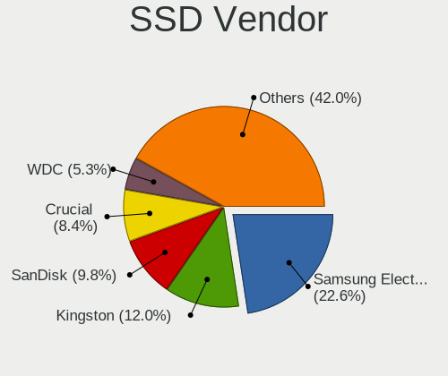
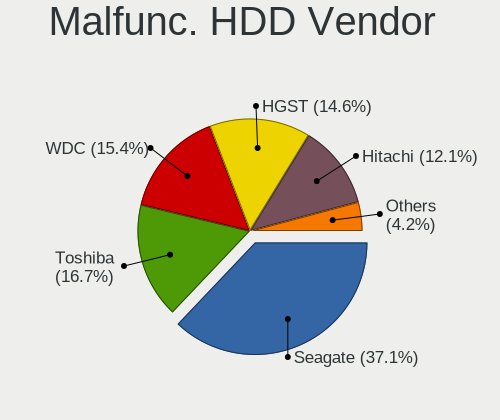
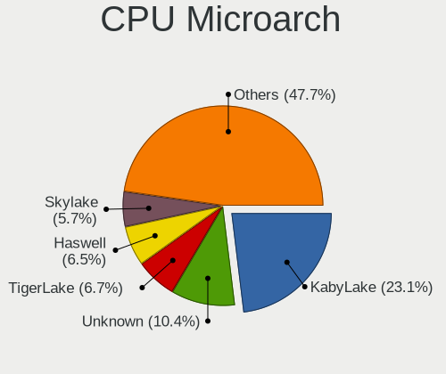

Fedora - Tested Hardware & Statistics (Notebooks)
-------------------------------------------------

A project to collect tested hardware configurations for Fedora.

Anyone can contribute to this report by the [hw-probe](https://github.com/linuxhw/hw-probe) tool:

    sudo -E hw-probe -all -upload

Please contribute! Especially if your hardware is rare.

Contents
--------

* [ Test Cases ](#test-cases)

* [ System ](#system)
  - [ OS                       ](#os)
  - [ OS Family                ](#os-family)
  - [ Kernel                   ](#kernel)
  - [ Kernel Family            ](#kernel-family)
  - [ Kernel Major Ver.        ](#kernel-major-ver)
  - [ Arch                     ](#arch)
  - [ DE                       ](#de)
  - [ Display Server           ](#display-server)
  - [ Display Manager          ](#display-manager)
  - [ OS Lang                  ](#os-lang)
  - [ Boot Mode                ](#boot-mode)
  - [ Filesystem               ](#filesystem)
  - [ Part. scheme             ](#part-scheme)
  - [ Dual Boot with Linux/BSD ](#dual-boot-with-linuxbsd)
  - [ Dual Boot (Win)          ](#dual-boot-win)

* [ Board ](#board)
  - [ Vendor                   ](#vendor)
  - [ Model                    ](#model)
  - [ Model Family             ](#model-family)
  - [ MFG Year                 ](#mfg-year)
  - [ Form Factor              ](#form-factor)
  - [ Secure Boot              ](#secure-boot)
  - [ Coreboot                 ](#coreboot)
  - [ RAM Size                 ](#ram-size)
  - [ RAM Used                 ](#ram-used)
  - [ Total Drives             ](#total-drives)
  - [ Has CD-ROM               ](#has-cd-rom)
  - [ Has Ethernet             ](#has-ethernet)
  - [ Has WiFi                 ](#has-wifi)
  - [ Has Bluetooth            ](#has-bluetooth)

* [ Location ](#location)
  - [ Country                  ](#country)
  - [ City                     ](#city)

* [ Drives ](#drives)
  - [ Drive Vendor             ](#drive-vendor)
  - [ Drive Model              ](#drive-model)
  - [ HDD Vendor               ](#hdd-vendor)
  - [ SSD Vendor               ](#ssd-vendor)
  - [ Drive Kind               ](#drive-kind)
  - [ Drive Connector          ](#drive-connector)
  - [ Drive Size               ](#drive-size)
  - [ Space Total              ](#space-total)
  - [ Space Used               ](#space-used)
  - [ Malfunc. Drives          ](#malfunc-drives)
  - [ Malfunc. Drive Vendor    ](#malfunc-drive-vendor)
  - [ Malfunc. HDD Vendor      ](#malfunc-hdd-vendor)
  - [ Malfunc. Drive Kind      ](#malfunc-drive-kind)
  - [ Failed Drives            ](#failed-drives)
  - [ Failed Drive Vendor      ](#failed-drive-vendor)
  - [ Drive Status             ](#drive-status)

* [ Storage controller ](#storage-controller)
  - [ Storage Vendor           ](#storage-vendor)
  - [ Storage Model            ](#storage-model)
  - [ Storage Kind             ](#storage-kind)

* [ Processor ](#processor)
  - [ CPU Vendor               ](#cpu-vendor)
  - [ CPU Model                ](#cpu-model)
  - [ CPU Model Family         ](#cpu-model-family)
  - [ CPU Cores                ](#cpu-cores)
  - [ CPU Sockets              ](#cpu-sockets)
  - [ CPU Threads              ](#cpu-threads)
  - [ CPU Op-Modes             ](#cpu-op-modes)
  - [ CPU Microcode            ](#cpu-microcode)
  - [ CPU Microarch            ](#cpu-microarch)

* [ Graphics ](#graphics)
  - [ GPU Vendor               ](#gpu-vendor)
  - [ GPU Model                ](#gpu-model)
  - [ GPU Combo                ](#gpu-combo)
  - [ GPU Driver               ](#gpu-driver)
  - [ GPU Memory               ](#gpu-memory)

* [ Monitor ](#monitor)
  - [ Monitor Vendor           ](#monitor-vendor)
  - [ Monitor Model            ](#monitor-model)
  - [ Monitor Resolution       ](#monitor-resolution)
  - [ Monitor Diagonal         ](#monitor-diagonal)
  - [ Monitor Width            ](#monitor-width)
  - [ Aspect Ratio             ](#aspect-ratio)
  - [ Monitor Area             ](#monitor-area)
  - [ Pixel Density            ](#pixel-density)
  - [ Multiple Monitors        ](#multiple-monitors)

* [ Network ](#network)
  - [ Net Controller Vendor    ](#net-controller-vendor)
  - [ Net Controller Model     ](#net-controller-model)
  - [ Wireless Vendor          ](#wireless-vendor)
  - [ Wireless Model           ](#wireless-model)
  - [ Ethernet Vendor          ](#ethernet-vendor)
  - [ Ethernet Model           ](#ethernet-model)
  - [ Net Controller Kind      ](#net-controller-kind)
  - [ Used Controller          ](#used-controller)
  - [ NICs                     ](#nics)
  - [ IPv6                     ](#ipv6)

* [ Bluetooth ](#bluetooth)
  - [ Bluetooth Vendor         ](#bluetooth-vendor)
  - [ Bluetooth Model          ](#bluetooth-model)

* [ Sound ](#sound)
  - [ Sound Vendor             ](#sound-vendor)
  - [ Sound Model              ](#sound-model)

* [ Memory ](#memory)
  - [ Memory Vendor            ](#memory-vendor)
  - [ Memory Model             ](#memory-model)
  - [ Memory Kind              ](#memory-kind)
  - [ Memory Form Factor       ](#memory-form-factor)
  - [ Memory Size              ](#memory-size)
  - [ Memory Speed             ](#memory-speed)

* [ Printers & scanners ](#printers--scanners)
  - [ Printer Vendor           ](#printer-vendor)
  - [ Printer Model            ](#printer-model)
  - [ Scanner Vendor           ](#scanner-vendor)
  - [ Scanner Model            ](#scanner-model)

* [ Camera ](#camera)
  - [ Camera Vendor            ](#camera-vendor)
  - [ Camera Model             ](#camera-model)

* [ Security ](#security)
  - [ Fingerprint Vendor       ](#fingerprint-vendor)
  - [ Fingerprint Model        ](#fingerprint-model)
  - [ Chipcard Vendor          ](#chipcard-vendor)
  - [ Chipcard Model           ](#chipcard-model)

* [ Unsupported ](#unsupported)
  - [ Unsupported Devices      ](#unsupported-devices)
  - [ Unsupported Device Types ](#unsupported-device-types)

Test Cases
----------

Total: 9548

| Vendor        | Model                       | Probe                                                      | Date         |
|---------------|-----------------------------|------------------------------------------------------------|--------------|
| Valve         | Jupiter                     | [07ef050535](https://linux-hardware.org/?probe=07ef050535) | May 01, 2023 |
| HP            | Laptop 15z-fc000            | [7b57cc42a0](https://linux-hardware.org/?probe=7b57cc42a0) | May 01, 2023 |
| HP            | ElitePad 1000 G2            | [8ae27e00f6](https://linux-hardware.org/?probe=8ae27e00f6) | May 01, 2023 |
| HUAWEI        | CREM-WXX9                   | [ba99960d5f](https://linux-hardware.org/?probe=ba99960d5f) | May 01, 2023 |
| Lenovo        | IdeaPad 310-15ISK 80UH      | [a7d6d782b2](https://linux-hardware.org/?probe=a7d6d782b2) | May 01, 2023 |
| Intel         | CHERRYVIEW D1 PLATFORM      | [6c58138c35](https://linux-hardware.org/?probe=6c58138c35) | May 01, 2023 |
| Lenovo        | IdeaPad S340-15IWLTouch ... | [6857a16a6c](https://linux-hardware.org/?probe=6857a16a6c) | Apr 30, 2023 |
| Lenovo        | IdeaPad 320-15AST 80XV      | [0784fc9b1c](https://linux-hardware.org/?probe=0784fc9b1c) | Apr 30, 2023 |
| HP            | Notebook                    | [fd6aa4aeb6](https://linux-hardware.org/?probe=fd6aa4aeb6) | Apr 30, 2023 |
| VIOS          | LTH17                       | [4d1a86ee61](https://linux-hardware.org/?probe=4d1a86ee61) | Apr 30, 2023 |
| Lenovo        | IdeaPad 320-15AST 80XV      | [9c07454907](https://linux-hardware.org/?probe=9c07454907) | Apr 30, 2023 |
| HP            | Pavilion Gaming Laptop 1... | [43a167afad](https://linux-hardware.org/?probe=43a167afad) | Apr 30, 2023 |
| HP            | Pavilion Gaming Laptop 1... | [0ae3fb5506](https://linux-hardware.org/?probe=0ae3fb5506) | Apr 30, 2023 |
| ASUSTek       | X555QG                      | [5263b174b2](https://linux-hardware.org/?probe=5263b174b2) | Apr 30, 2023 |
| Lenovo        | ThinkPad T490s 20NX002SG... | [874f19f26e](https://linux-hardware.org/?probe=874f19f26e) | Apr 30, 2023 |
| Dell          | Latitude 5521               | [1629b4efc4](https://linux-hardware.org/?probe=1629b4efc4) | Apr 30, 2023 |
| HP            | Laptop 17-by3xxx            | [552dac328b](https://linux-hardware.org/?probe=552dac328b) | Apr 30, 2023 |
| HP            | EliteBook 840 G3            | [c262e81ab9](https://linux-hardware.org/?probe=c262e81ab9) | Apr 30, 2023 |
| Acer          | Nitro AN515-45              | [9b28e69254](https://linux-hardware.org/?probe=9b28e69254) | Apr 30, 2023 |
| Framework     | Laptop                      | [84b3b9547b](https://linux-hardware.org/?probe=84b3b9547b) | Apr 29, 2023 |
| Dell          | XPS 13 7390                 | [b976cc9656](https://linux-hardware.org/?probe=b976cc9656) | Apr 29, 2023 |
| Dell          | XPS 13 9380                 | [c6591b0852](https://linux-hardware.org/?probe=c6591b0852) | Apr 29, 2023 |
| Intel         | CHERRYVIEW D1 PLATFORM      | [edf1d60e46](https://linux-hardware.org/?probe=edf1d60e46) | Apr 29, 2023 |
| ASUSTek       | TUF Gaming FX505DD_FX505... | [6f6a016997](https://linux-hardware.org/?probe=6f6a016997) | Apr 29, 2023 |
| Lenovo        | ThinkPad T550 20CKA00ECD    | [2545d9dd31](https://linux-hardware.org/?probe=2545d9dd31) | Apr 29, 2023 |
| MSI           | Modern 14 B11MOU            | [6b3fcf3fcc](https://linux-hardware.org/?probe=6b3fcf3fcc) | Apr 29, 2023 |
| HUAWEI        | CREM-WXX9                   | [c17b468722](https://linux-hardware.org/?probe=c17b468722) | Apr 29, 2023 |
| Chuwi         | HeroBook Air                | [123f6df9f8](https://linux-hardware.org/?probe=123f6df9f8) | Apr 29, 2023 |
| Insyde        | M890BAP                     | [151efb0278](https://linux-hardware.org/?probe=151efb0278) | Apr 29, 2023 |
| Insyde        | CherryTrail                 | [a9f658c8af](https://linux-hardware.org/?probe=a9f658c8af) | Apr 29, 2023 |
| Lenovo        | ThinkPad X1 Extreme Gen ... | [cd266d7680](https://linux-hardware.org/?probe=cd266d7680) | Apr 29, 2023 |
| Acer          | Nitro AN515-58              | [2c335c5bfb](https://linux-hardware.org/?probe=2c335c5bfb) | Apr 29, 2023 |
| Google        | Banon                       | [c21a57806c](https://linux-hardware.org/?probe=c21a57806c) | Apr 29, 2023 |
| Lenovo        | IdeaPad 530S-14ARR 81H1     | [e70d66b3ba](https://linux-hardware.org/?probe=e70d66b3ba) | Apr 29, 2023 |
| Lenovo        | IdeaPad 1 14IGL7 82V6       | [2aa69de3ca](https://linux-hardware.org/?probe=2aa69de3ca) | Apr 29, 2023 |
| ASUSTek       | X555QG                      | [b33f41d3c3](https://linux-hardware.org/?probe=b33f41d3c3) | Apr 28, 2023 |
| HUAWEI        | BOHK-WAX9X                  | [4de963cbc6](https://linux-hardware.org/?probe=4de963cbc6) | Apr 28, 2023 |
| Lenovo        | ThinkPad P53 20QN0011IV     | [d8af950fd8](https://linux-hardware.org/?probe=d8af950fd8) | Apr 28, 2023 |
| Acer          | Aspire E5-571               | [1d36dafa86](https://linux-hardware.org/?probe=1d36dafa86) | Apr 28, 2023 |
| Dell          | Precision 3551              | [99ff11c325](https://linux-hardware.org/?probe=99ff11c325) | Apr 28, 2023 |
| Lenovo        | ThinkPad T470p 20J60018M... | [a8deb2307c](https://linux-hardware.org/?probe=a8deb2307c) | Apr 28, 2023 |
| Dell          | Precision 3551              | [93a38e7384](https://linux-hardware.org/?probe=93a38e7384) | Apr 28, 2023 |
| Lenovo        | ThinkPad X260 20F5S56G00    | [8da21e9a17](https://linux-hardware.org/?probe=8da21e9a17) | Apr 28, 2023 |
| ASUSTek       | Zenbook UM5302TA_UM5302T... | [5cb9fe1ae9](https://linux-hardware.org/?probe=5cb9fe1ae9) | Apr 28, 2023 |
| ASUSTek       | Zenbook UM5302TA_UM5302T... | [3669ef1de9](https://linux-hardware.org/?probe=3669ef1de9) | Apr 28, 2023 |
| Lenovo        | ThinkPad T14 Gen 3 21AH0... | [e0ef7894af](https://linux-hardware.org/?probe=e0ef7894af) | Apr 28, 2023 |
| Lenovo        | ThinkPad P14s Gen 2a 21A... | [b5a953a984](https://linux-hardware.org/?probe=b5a953a984) | Apr 28, 2023 |
| HP            | ProBook 455 15.6 inch G9... | [1cfc210ce1](https://linux-hardware.org/?probe=1cfc210ce1) | Apr 28, 2023 |
| Acer          | Nitro AN515-54              | [000022b2dd](https://linux-hardware.org/?probe=000022b2dd) | Apr 28, 2023 |
| Sony          | VPCEG23EL                   | [c28e3338ce](https://linux-hardware.org/?probe=c28e3338ce) | Apr 28, 2023 |
| Lenovo        | Legion 7-16-ITHg6 82K6      | [2baf2cbc85](https://linux-hardware.org/?probe=2baf2cbc85) | Apr 27, 2023 |
| Lenovo        | ThinkPad X230 2325O32       | [b38ef1a717](https://linux-hardware.org/?probe=b38ef1a717) | Apr 27, 2023 |
| ASUSTek       | Zephyrus M GU502GW_GU502... | [94d9250bc1](https://linux-hardware.org/?probe=94d9250bc1) | Apr 27, 2023 |
| Lenovo        | ThinkPad P53 20QN0011IV     | [854cf327d8](https://linux-hardware.org/?probe=854cf327d8) | Apr 27, 2023 |
| HUAWEI        | HVY-WXX9                    | [dd5391c20d](https://linux-hardware.org/?probe=dd5391c20d) | Apr 27, 2023 |
| HP            | Laptop 17-ak0xx             | [6eed1fda15](https://linux-hardware.org/?probe=6eed1fda15) | Apr 27, 2023 |
| HP            | Pavilion Laptop 15-cs0xx... | [4cd1484039](https://linux-hardware.org/?probe=4cd1484039) | Apr 27, 2023 |
| HP            | Pavilion Laptop 15-cs0xx... | [0796e35c73](https://linux-hardware.org/?probe=0796e35c73) | Apr 27, 2023 |
| Dell          | XPS 15 9500                 | [a7cc631b80](https://linux-hardware.org/?probe=a7cc631b80) | Apr 27, 2023 |
| Timi          | Redmi Book Pro 14 2022      | [dcc8c22535](https://linux-hardware.org/?probe=dcc8c22535) | Apr 27, 2023 |
| Lenovo        | ThinkPad T420 4177QKU       | [cbabefb1fa](https://linux-hardware.org/?probe=cbabefb1fa) | Apr 27, 2023 |
| Dell          | Vostro 15 3515              | [f58ab8b9c4](https://linux-hardware.org/?probe=f58ab8b9c4) | Apr 27, 2023 |
| Lenovo        | ThinkPad X270 20HN001HUS    | [3f6586f0d1](https://linux-hardware.org/?probe=3f6586f0d1) | Apr 27, 2023 |
| Lenovo        | ThinkPad T480s 20L8S45W0... | [0e8490c41f](https://linux-hardware.org/?probe=0e8490c41f) | Apr 27, 2023 |
| ASUSTek       | Zephyrus M GU502GW_GU502... | [67c865f449](https://linux-hardware.org/?probe=67c865f449) | Apr 27, 2023 |
| Acer          | Aspire A315-54              | [8137aa9008](https://linux-hardware.org/?probe=8137aa9008) | Apr 27, 2023 |
| HP            | EliteBook 630 13 inch G9... | [96bd4f8398](https://linux-hardware.org/?probe=96bd4f8398) | Apr 27, 2023 |
| Apple         | MacBookAir6,1               | [c0f967c0bc](https://linux-hardware.org/?probe=c0f967c0bc) | Apr 27, 2023 |
| Acer          | Aspire E5-575G              | [3497feda9f](https://linux-hardware.org/?probe=3497feda9f) | Apr 27, 2023 |
| ASUSTek       | VivoBook_ASUS Laptop X50... | [c443269a81](https://linux-hardware.org/?probe=c443269a81) | Apr 26, 2023 |
| ASUSTek       | ROG Strix G512LW_G512LW     | [a950f656f7](https://linux-hardware.org/?probe=a950f656f7) | Apr 26, 2023 |
| Timi          | TM1703                      | [7e6b948ea9](https://linux-hardware.org/?probe=7e6b948ea9) | Apr 26, 2023 |
| ASUSTek       | ROG Zephyrus G14 GA401IV... | [96006a1098](https://linux-hardware.org/?probe=96006a1098) | Apr 26, 2023 |
| HUAWEI        | KLVL-WXXW                   | [de95ac0857](https://linux-hardware.org/?probe=de95ac0857) | Apr 26, 2023 |
| HUAWEI        | KLVL-WXXW                   | [07906a30e3](https://linux-hardware.org/?probe=07906a30e3) | Apr 26, 2023 |
| Acer          | Aspire E5-575G              | [3a7b41fb49](https://linux-hardware.org/?probe=3a7b41fb49) | Apr 26, 2023 |
| Dell          | Latitude 5520               | [7ee153b691](https://linux-hardware.org/?probe=7ee153b691) | Apr 26, 2023 |
| Lenovo        | ThinkPad E14 Gen 4 21EBC... | [3a6e27c6ce](https://linux-hardware.org/?probe=3a6e27c6ce) | Apr 26, 2023 |
| Lenovo        | ThinkBook 14 G3 ACL 21A2    | [86ba8ccc07](https://linux-hardware.org/?probe=86ba8ccc07) | Apr 26, 2023 |
| Lenovo        | ThinkPad T480s 20L8002WM... | [82bd4b0d20](https://linux-hardware.org/?probe=82bd4b0d20) | Apr 26, 2023 |
| Dell          | Latitude 5520               | [3071d4a9d8](https://linux-hardware.org/?probe=3071d4a9d8) | Apr 26, 2023 |
| Dell          | Latitude 5520               | [23fe32affd](https://linux-hardware.org/?probe=23fe32affd) | Apr 26, 2023 |
| Acer          | Swift SF114-32              | [13d7dc019c](https://linux-hardware.org/?probe=13d7dc019c) | Apr 26, 2023 |
| ASUSTek       | ROG Zephyrus G14 GA401IV... | [a3df65a55c](https://linux-hardware.org/?probe=a3df65a55c) | Apr 26, 2023 |
| MSI           | Creator 15 A10SGS           | [1b364e385a](https://linux-hardware.org/?probe=1b364e385a) | Apr 26, 2023 |
| Razer         | Blade                       | [b170226896](https://linux-hardware.org/?probe=b170226896) | Apr 25, 2023 |
| Dell          | Inspiron 5748               | [dd4d50839d](https://linux-hardware.org/?probe=dd4d50839d) | Apr 25, 2023 |
| HP            | Laptop 15-fc0xxx            | [cc994920bf](https://linux-hardware.org/?probe=cc994920bf) | Apr 25, 2023 |
| Dell          | Precision 7550              | [987df8038c](https://linux-hardware.org/?probe=987df8038c) | Apr 25, 2023 |
| Dell          | G15 5515                    | [a0dd3f2003](https://linux-hardware.org/?probe=a0dd3f2003) | Apr 25, 2023 |
| Dell          | Vostro 3550                 | [653c3c4650](https://linux-hardware.org/?probe=653c3c4650) | Apr 25, 2023 |
| Lenovo        | ThinkPad E14 20RAS1DB00     | [8e09a153f5](https://linux-hardware.org/?probe=8e09a153f5) | Apr 25, 2023 |
| HP            | Dragonfly Pro               | [9bc83e741f](https://linux-hardware.org/?probe=9bc83e741f) | Apr 25, 2023 |
| HP            | Dragonfly Pro               | [b47e30ac80](https://linux-hardware.org/?probe=b47e30ac80) | Apr 25, 2023 |
| Lenovo        | ThinkPad L15 Gen 3 21C8S... | [765b52074c](https://linux-hardware.org/?probe=765b52074c) | Apr 25, 2023 |
| Lenovo        | ThinkPad L15 Gen 3 21C8S... | [9cd6c064cc](https://linux-hardware.org/?probe=9cd6c064cc) | Apr 25, 2023 |
| Lenovo        | ThinkPad X1 Carbon Gen 9... | [5236dde38f](https://linux-hardware.org/?probe=5236dde38f) | Apr 25, 2023 |
| Apple         | MacBookPro11,1              | [7309ce024f](https://linux-hardware.org/?probe=7309ce024f) | Apr 25, 2023 |
| HUAWEI        | BOHK-WAX9X                  | [c0d8e6e6b5](https://linux-hardware.org/?probe=c0d8e6e6b5) | Apr 25, 2023 |
| LDLC          | SPC-I                       | [899fb46a02](https://linux-hardware.org/?probe=899fb46a02) | Apr 25, 2023 |
| Chuwi         | GemiBook Pro                | [1287b17594](https://linux-hardware.org/?probe=1287b17594) | Apr 25, 2023 |
| Dell          | G3 3500                     | [46996524d0](https://linux-hardware.org/?probe=46996524d0) | Apr 25, 2023 |
| Dell          | XPS 13 9380                 | [290a99fee9](https://linux-hardware.org/?probe=290a99fee9) | Apr 25, 2023 |
| Lenovo        | Legion 5 17IMH05 82B3       | [2e542c241d](https://linux-hardware.org/?probe=2e542c241d) | Apr 25, 2023 |
| Sony          | SVS13A25PXB                 | [a31acd0a66](https://linux-hardware.org/?probe=a31acd0a66) | Apr 25, 2023 |
| TUXEDO        | Pulse 15 Gen1               | [0db2c54b2a](https://linux-hardware.org/?probe=0db2c54b2a) | Apr 24, 2023 |
| Notebook      | P95_96_97Ex,Rx              | [297da8c979](https://linux-hardware.org/?probe=297da8c979) | Apr 24, 2023 |
| Lenovo        | V130-15IKB 81HN             | [1b26b3f89b](https://linux-hardware.org/?probe=1b26b3f89b) | Apr 24, 2023 |
| Sony          | SVS13A25PXB                 | [06138dd58a](https://linux-hardware.org/?probe=06138dd58a) | Apr 24, 2023 |
| Dell          | Latitude 5580               | [a153ad5277](https://linux-hardware.org/?probe=a153ad5277) | Apr 24, 2023 |
| HP            | ProBook 445 G8 Notebook ... | [de3ad583ab](https://linux-hardware.org/?probe=de3ad583ab) | Apr 24, 2023 |
| HP            | Pavilion Laptop 15-cc1xx    | [2f3390afca](https://linux-hardware.org/?probe=2f3390afca) | Apr 24, 2023 |
| HP            | Laptop 15s-eq2xxx           | [699adff825](https://linux-hardware.org/?probe=699adff825) | Apr 24, 2023 |
| Lenovo        | IdeaPad L3 15IML05 81Y3     | [e028b13685](https://linux-hardware.org/?probe=e028b13685) | Apr 24, 2023 |
| Dell          | Vostro 5402                 | [b6cb9c9140](https://linux-hardware.org/?probe=b6cb9c9140) | Apr 24, 2023 |
| Lenovo        | ThinkPad P53 20QN0011IV     | [d805c85a12](https://linux-hardware.org/?probe=d805c85a12) | Apr 24, 2023 |
| HP            | Laptop 14-cm0xxx            | [4591d1bf9d](https://linux-hardware.org/?probe=4591d1bf9d) | Apr 24, 2023 |
| BTO           | 17X1183                     | [134a6ead50](https://linux-hardware.org/?probe=134a6ead50) | Apr 23, 2023 |
| BTO           | 17X1183                     | [181163b5e8](https://linux-hardware.org/?probe=181163b5e8) | Apr 23, 2023 |
| Dell          | Latitude 9520               | [0ab9a83db6](https://linux-hardware.org/?probe=0ab9a83db6) | Apr 23, 2023 |
| ASUSTek       | ROG Strix G513QY_G513QY     | [696ee85cc9](https://linux-hardware.org/?probe=696ee85cc9) | Apr 23, 2023 |
| ASUSTek       | ASUS TUF Gaming F15 FX50... | [43aae4850b](https://linux-hardware.org/?probe=43aae4850b) | Apr 23, 2023 |
| Apple         | MacBookPro11,3              | [db4dd7bc7a](https://linux-hardware.org/?probe=db4dd7bc7a) | Apr 23, 2023 |
| Dynabook      | PORTEGE X30L-K              | [da178b8987](https://linux-hardware.org/?probe=da178b8987) | Apr 23, 2023 |
| HP            | Laptop 15-bs2xx             | [c40dac306c](https://linux-hardware.org/?probe=c40dac306c) | Apr 23, 2023 |
| Notebook      | NLxxPUx                     | [3648be5b0f](https://linux-hardware.org/?probe=3648be5b0f) | Apr 23, 2023 |
| ASUSTek       | X510UAR                     | [3321ccb912](https://linux-hardware.org/?probe=3321ccb912) | Apr 23, 2023 |
| Lenovo        | ThinkPad T14 Gen 2i 20W0... | [9a6f040039](https://linux-hardware.org/?probe=9a6f040039) | Apr 23, 2023 |
| Lenovo        | ThinkPad T495 20NJ000XGE    | [155072c012](https://linux-hardware.org/?probe=155072c012) | Apr 23, 2023 |
| Dell          | Latitude E6520              | [a8b5c5c3ad](https://linux-hardware.org/?probe=a8b5c5c3ad) | Apr 23, 2023 |
| Acer          | Aspire A514-55              | [d98f78cc01](https://linux-hardware.org/?probe=d98f78cc01) | Apr 23, 2023 |
| ASUSTek       | VivoBook_ASUSLaptop X515... | [9a92345b08](https://linux-hardware.org/?probe=9a92345b08) | Apr 23, 2023 |
| Lenovo        | ThinkPad X220 4291WSH       | [5a626f5754](https://linux-hardware.org/?probe=5a626f5754) | Apr 23, 2023 |
| Dell          | Latitude E6430              | [e844bce31c](https://linux-hardware.org/?probe=e844bce31c) | Apr 23, 2023 |
| ASUSTek       | ZenBook UX425UA_UM425UA     | [a8644a5b03](https://linux-hardware.org/?probe=a8644a5b03) | Apr 23, 2023 |
| Lenovo        | IdeaPad Gaming 3 15IMH05... | [0e798db6a8](https://linux-hardware.org/?probe=0e798db6a8) | Apr 23, 2023 |
| ASUSTek       | X550CC                      | [f51db9e4de](https://linux-hardware.org/?probe=f51db9e4de) | Apr 23, 2023 |
| Dell          | Latitude E6420              | [ef822feab1](https://linux-hardware.org/?probe=ef822feab1) | Apr 22, 2023 |
| HUAWEI        | MRGF-XX                     | [25233eb8d1](https://linux-hardware.org/?probe=25233eb8d1) | Apr 22, 2023 |
| MSI           | Prestige 15 A10SC           | [f64336848a](https://linux-hardware.org/?probe=f64336848a) | Apr 22, 2023 |
| HP            | ENVY Laptop 13-ad1xx        | [bb1a40d839](https://linux-hardware.org/?probe=bb1a40d839) | Apr 22, 2023 |
| Dell          | Latitude D620               | [7b0c5ec6f2](https://linux-hardware.org/?probe=7b0c5ec6f2) | Apr 22, 2023 |
| Lenovo        | Legion 5 Pro 16ACH6H 82J... | [e682d7b9dd](https://linux-hardware.org/?probe=e682d7b9dd) | Apr 22, 2023 |
| Lenovo        | Legion Y530-15ICH 81FV      | [510237facd](https://linux-hardware.org/?probe=510237facd) | Apr 22, 2023 |
| HP            | Notebook                    | [1d975dfc4f](https://linux-hardware.org/?probe=1d975dfc4f) | Apr 22, 2023 |
| HUAWEI        | BOHB-WAX9                   | [5cceab0ac3](https://linux-hardware.org/?probe=5cceab0ac3) | Apr 22, 2023 |
| ASUSTek       | ASUS TUF Dash F15 FX516P... | [c1139db413](https://linux-hardware.org/?probe=c1139db413) | Apr 22, 2023 |
| Dell          | XPS 15 9550                 | [2defeff264](https://linux-hardware.org/?probe=2defeff264) | Apr 22, 2023 |
| Dell          | Precision 5510              | [94b5586a2c](https://linux-hardware.org/?probe=94b5586a2c) | Apr 22, 2023 |
| Acer          | Nitro AN515-58              | [d342e4d24c](https://linux-hardware.org/?probe=d342e4d24c) | Apr 22, 2023 |
| Acer          | TP-SW3-013-181M             | [d231dc8846](https://linux-hardware.org/?probe=d231dc8846) | Apr 22, 2023 |
| Lenovo        | Yoga Slim 7 14ARE05 82A2    | [a7359e872e](https://linux-hardware.org/?probe=a7359e872e) | Apr 22, 2023 |
| Acer          | Nitro AN515-54              | [452177f9a5](https://linux-hardware.org/?probe=452177f9a5) | Apr 21, 2023 |
| Dell          | XPS 13 9310                 | [5c9b8fef2e](https://linux-hardware.org/?probe=5c9b8fef2e) | Apr 21, 2023 |
| ASUSTek       | ASUS TUF Gaming F15 FX50... | [dae63185d5](https://linux-hardware.org/?probe=dae63185d5) | Apr 21, 2023 |
| Lenovo        | ThinkPad E15 Gen 2 20TD0... | [517662dd54](https://linux-hardware.org/?probe=517662dd54) | Apr 21, 2023 |
| Dynabook      | PORTEGE X30L-K              | [b52552ec7f](https://linux-hardware.org/?probe=b52552ec7f) | Apr 21, 2023 |
| Lenovo        | Yoga Slim 7 Pro 14ACH5 8... | [db069c8b89](https://linux-hardware.org/?probe=db069c8b89) | Apr 21, 2023 |
| HP            | Laptop 15s-eq2xxx           | [94bd5fe556](https://linux-hardware.org/?probe=94bd5fe556) | Apr 21, 2023 |
| Lenovo        | ThinkPad P14s Gen 1 20Y1... | [c46312dc86](https://linux-hardware.org/?probe=c46312dc86) | Apr 21, 2023 |
| Timi          | Redmi Book Pro 15 2022      | [3fd583ee9b](https://linux-hardware.org/?probe=3fd583ee9b) | Apr 21, 2023 |
| Digibras      | NH4CU53                     | [d6571e3d78](https://linux-hardware.org/?probe=d6571e3d78) | Apr 21, 2023 |
| ASUSTek       | ROG Zephyrus G14 GA401IV... | [f2f6b7ab4e](https://linux-hardware.org/?probe=f2f6b7ab4e) | Apr 21, 2023 |
| Positivo      | N6440                       | [b0a1fe417d](https://linux-hardware.org/?probe=b0a1fe417d) | Apr 21, 2023 |
| Lenovo        | IdeaPad S540-15IWL          | [8578f44f47](https://linux-hardware.org/?probe=8578f44f47) | Apr 21, 2023 |
| Apple         | MacBookPro11,3              | [09a203e882](https://linux-hardware.org/?probe=09a203e882) | Apr 21, 2023 |
| Lenovo        | ThinkBook 15 G3 ACL 21A4    | [8b18bb529f](https://linux-hardware.org/?probe=8b18bb529f) | Apr 21, 2023 |
| Framework     | Laptop                      | [226765247b](https://linux-hardware.org/?probe=226765247b) | Apr 20, 2023 |
| ASUSTek       | VivoBook_ASUSLaptop X540... | [91999697ba](https://linux-hardware.org/?probe=91999697ba) | Apr 20, 2023 |
| ASUSTek       | ZenBook UX425EA_UX425EA     | [b7f138b04c](https://linux-hardware.org/?probe=b7f138b04c) | Apr 20, 2023 |
| ASUSTek       | VivoBook_ASUSLaptop X415... | [901b3d11dc](https://linux-hardware.org/?probe=901b3d11dc) | Apr 20, 2023 |
| Acer          | Swift SF314-511             | [96fd44e94a](https://linux-hardware.org/?probe=96fd44e94a) | Apr 20, 2023 |
| Dell          | G15 5510                    | [724945ee92](https://linux-hardware.org/?probe=724945ee92) | Apr 20, 2023 |
| HP            | ProBook 450 15.6 inch G9... | [3219512811](https://linux-hardware.org/?probe=3219512811) | Apr 20, 2023 |
| Dell          | XPS 13 9310                 | [55685c168f](https://linux-hardware.org/?probe=55685c168f) | Apr 20, 2023 |
| Dell          | Latitude 7490               | [57a719ce62](https://linux-hardware.org/?probe=57a719ce62) | Apr 20, 2023 |
| Lenovo        | ThinkPad T14 Gen 3 21AHS... | [59d7ef5ddd](https://linux-hardware.org/?probe=59d7ef5ddd) | Apr 20, 2023 |
| Toshiba       | Satellite L515              | [5262a186b5](https://linux-hardware.org/?probe=5262a186b5) | Apr 20, 2023 |
| Lenovo        | ThinkPad P52 20MAS5KM00     | [06ab19cc37](https://linux-hardware.org/?probe=06ab19cc37) | Apr 20, 2023 |
| Getac         | B300G5                      | [307cc71aa3](https://linux-hardware.org/?probe=307cc71aa3) | Apr 20, 2023 |
| Lenovo        | ThinkPad T410 2522PT3       | [8daf9af9b5](https://linux-hardware.org/?probe=8daf9af9b5) | Apr 20, 2023 |
| Lenovo        | ThinkPad T430 2349S4D       | [4b57440851](https://linux-hardware.org/?probe=4b57440851) | Apr 20, 2023 |
| MECHREVO      | Code10-7CC6U                | [0964cd2b26](https://linux-hardware.org/?probe=0964cd2b26) | Apr 20, 2023 |
| MECHREVO      | Code10-7CC6U                | [5ddc83a95c](https://linux-hardware.org/?probe=5ddc83a95c) | Apr 20, 2023 |
| Samsung       | 550P5C/550P7C               | [3648dd39f8](https://linux-hardware.org/?probe=3648dd39f8) | Apr 20, 2023 |
| Lenovo        | G40-30 80FY                 | [923b3fd46b](https://linux-hardware.org/?probe=923b3fd46b) | Apr 19, 2023 |
| HP            | Laptop 15s-eq2xxx           | [9f5fa03bfd](https://linux-hardware.org/?probe=9f5fa03bfd) | Apr 19, 2023 |
| Lenovo        | G50-30 80G0                 | [42cb984b27](https://linux-hardware.org/?probe=42cb984b27) | Apr 19, 2023 |
| Dell          | Inspiron 7460               | [bbfe51bf3c](https://linux-hardware.org/?probe=bbfe51bf3c) | Apr 19, 2023 |
| Lenovo        | IdeaPad 520-15IKB 81BF      | [b1c04430cc](https://linux-hardware.org/?probe=b1c04430cc) | Apr 19, 2023 |
| Lenovo        | IdeaPad 520-15IKB 81BF      | [b2873d15a0](https://linux-hardware.org/?probe=b2873d15a0) | Apr 19, 2023 |
| Lenovo        | ThinkPad T14 Gen 1 20UDS... | [258a5bb354](https://linux-hardware.org/?probe=258a5bb354) | Apr 19, 2023 |
| HP            | Pavilion x2 Detachable      | [1c7cd2fe1d](https://linux-hardware.org/?probe=1c7cd2fe1d) | Apr 19, 2023 |
| Dell          | Precision 5540              | [66b58fad6c](https://linux-hardware.org/?probe=66b58fad6c) | Apr 19, 2023 |
| Dell          | Precision 5540              | [e114fb911c](https://linux-hardware.org/?probe=e114fb911c) | Apr 19, 2023 |
| HP            | Pavilion 17                 | [66df49c906](https://linux-hardware.org/?probe=66df49c906) | Apr 19, 2023 |
| Dell          | XPS 13 7390                 | [357c45c81c](https://linux-hardware.org/?probe=357c45c81c) | Apr 19, 2023 |
| Apple         | MacBookAir6,1               | [5a600ce01b](https://linux-hardware.org/?probe=5a600ce01b) | Apr 19, 2023 |
| HUAWEI        | NBD-WXX9                    | [a55a03e648](https://linux-hardware.org/?probe=a55a03e648) | Apr 19, 2023 |
| PC Special... | PCx0Dx                      | [0f82987a84](https://linux-hardware.org/?probe=0f82987a84) | Apr 18, 2023 |
| Toshiba       | Kronos 10CUG                | [228e28e6a8](https://linux-hardware.org/?probe=228e28e6a8) | Apr 18, 2023 |
| Dell          | G5 5590                     | [c7334114be](https://linux-hardware.org/?probe=c7334114be) | Apr 18, 2023 |
| Lenovo        | Yoga Pro 7 14ARP8 83AU      | [3b3f4afdd8](https://linux-hardware.org/?probe=3b3f4afdd8) | Apr 18, 2023 |
| Lenovo        | ThinkPad E15 Gen 4 21ED0... | [0ec2388253](https://linux-hardware.org/?probe=0ec2388253) | Apr 18, 2023 |
| Lenovo        | ThinkBook 15 G4 IAP 21DJ    | [1a5add814c](https://linux-hardware.org/?probe=1a5add814c) | Apr 18, 2023 |
| HUAWEI        | RLEF-XX                     | [b425e2afaf](https://linux-hardware.org/?probe=b425e2afaf) | Apr 18, 2023 |
| HUAWEI        | BOHK-WAX9X                  | [67a6474ece](https://linux-hardware.org/?probe=67a6474ece) | Apr 18, 2023 |
| Fujitsu       | LIFEBOOK U7510              | [21605e555f](https://linux-hardware.org/?probe=21605e555f) | Apr 18, 2023 |
| ASUSTek       | GL502VML                    | [7c65476ce9](https://linux-hardware.org/?probe=7c65476ce9) | Apr 18, 2023 |
| Lenovo        | ThinkPad Edge 031946U       | [f9d813509a](https://linux-hardware.org/?probe=f9d813509a) | Apr 18, 2023 |
| Lenovo        | ThinkPad P52 20MAS11D00     | [c2227e5f29](https://linux-hardware.org/?probe=c2227e5f29) | Apr 18, 2023 |
| Lenovo        | Unknown                     | [99a0c76ea9](https://linux-hardware.org/?probe=99a0c76ea9) | Apr 18, 2023 |
| Lenovo        | ThinkPad P52 20MAS11D00     | [f56edbb1d1](https://linux-hardware.org/?probe=f56edbb1d1) | Apr 18, 2023 |
| HP            | Pavilion x2 Detachable      | [5d56d95ea5](https://linux-hardware.org/?probe=5d56d95ea5) | Apr 18, 2023 |
| Acer          | Nitro AN515-54              | [7b3a68ca48](https://linux-hardware.org/?probe=7b3a68ca48) | Apr 18, 2023 |
| Lenovo        | IdeaPad S145-15API 81V7     | [90c4ba9f6e](https://linux-hardware.org/?probe=90c4ba9f6e) | Apr 17, 2023 |
| Lenovo        | ThinkPad E15 Gen 4 21ED0... | [a196246f09](https://linux-hardware.org/?probe=a196246f09) | Apr 17, 2023 |
| Dell          | Inspiron N5110              | [48b2d021fa](https://linux-hardware.org/?probe=48b2d021fa) | Apr 17, 2023 |
| Lenovo        | Unknown                     | [653cf225b8](https://linux-hardware.org/?probe=653cf225b8) | Apr 17, 2023 |
| Lenovo        | ThinkBook 15 G4 IAP 21DJ    | [f8a45caf43](https://linux-hardware.org/?probe=f8a45caf43) | Apr 17, 2023 |
| Dell          | Inspiron 15 7000 Gaming     | [7ca92cfada](https://linux-hardware.org/?probe=7ca92cfada) | Apr 17, 2023 |
| Dell          | XPS 15 9500                 | [1a55ffc593](https://linux-hardware.org/?probe=1a55ffc593) | Apr 17, 2023 |
| HP            | Pavilion 17                 | [a09113d5ab](https://linux-hardware.org/?probe=a09113d5ab) | Apr 17, 2023 |
| HUAWEI        | HVY-WXX9                    | [3d14cefd78](https://linux-hardware.org/?probe=3d14cefd78) | Apr 17, 2023 |
| Lenovo        | ThinkBook 13s G2 ITL 20V... | [5e265fd8e1](https://linux-hardware.org/?probe=5e265fd8e1) | Apr 16, 2023 |
| ASUSTek       | ASUS TUF Gaming A15 FA50... | [3ea28c33c9](https://linux-hardware.org/?probe=3ea28c33c9) | Apr 16, 2023 |
| HP            | EliteBook 845 14 inch G9... | [fd256ca124](https://linux-hardware.org/?probe=fd256ca124) | Apr 16, 2023 |
| Lenovo        | IdeaPad Gaming 3 15IAH7 ... | [391b43ba8c](https://linux-hardware.org/?probe=391b43ba8c) | Apr 16, 2023 |
| ASUSTek       | ROG Flow X13 GV301QH_GV3... | [2092251807](https://linux-hardware.org/?probe=2092251807) | Apr 16, 2023 |
| HP            | 15-dc1018ur                 | [7df35a90ad](https://linux-hardware.org/?probe=7df35a90ad) | Apr 16, 2023 |
| Framework     | Laptop                      | [c03bcdf19a](https://linux-hardware.org/?probe=c03bcdf19a) | Apr 16, 2023 |
| Apple         | MacBookAir7,2               | [ed6f18d5ab](https://linux-hardware.org/?probe=ed6f18d5ab) | Apr 16, 2023 |
| Apple         | MacBookAir7,2               | [82509b267d](https://linux-hardware.org/?probe=82509b267d) | Apr 16, 2023 |
| ASUSTek       | ASUS TUF Dash F15 FX517Z... | [afc478cf27](https://linux-hardware.org/?probe=afc478cf27) | Apr 16, 2023 |
| Dell          | Inspiron 3501               | [19b858e5f8](https://linux-hardware.org/?probe=19b858e5f8) | Apr 16, 2023 |
| Sony          | VPCCA1S1E                   | [05ab5df066](https://linux-hardware.org/?probe=05ab5df066) | Apr 16, 2023 |
| Acer          | Nitro AN515-54              | [73c46e2901](https://linux-hardware.org/?probe=73c46e2901) | Apr 15, 2023 |
| Google        | Dragonair                   | [be10ee5035](https://linux-hardware.org/?probe=be10ee5035) | Apr 15, 2023 |
| Sony          | VPCCA1S1E                   | [30625007d9](https://linux-hardware.org/?probe=30625007d9) | Apr 15, 2023 |
| Google        | Dragonair                   | [cb2aa57d07](https://linux-hardware.org/?probe=cb2aa57d07) | Apr 15, 2023 |
| Acer          | Aspire A114-33              | [53c9fe0b8d](https://linux-hardware.org/?probe=53c9fe0b8d) | Apr 15, 2023 |
| Acer          | Aspire A114-33              | [99f95937d4](https://linux-hardware.org/?probe=99f95937d4) | Apr 15, 2023 |
| Acer          | Aspire E1-572               | [acf5e9b9f5](https://linux-hardware.org/?probe=acf5e9b9f5) | Apr 15, 2023 |
| Apple         | MacBookAir6,1               | [c649f1b898](https://linux-hardware.org/?probe=c649f1b898) | Apr 15, 2023 |
| HP            | Pavilion Laptop 15-eh1xx... | [37eee19e22](https://linux-hardware.org/?probe=37eee19e22) | Apr 15, 2023 |
| HONOR         | HYM-WXX                     | [109b28f217](https://linux-hardware.org/?probe=109b28f217) | Apr 15, 2023 |
| Panasonic     | CF-C2CCEZXCM                | [361573ef78](https://linux-hardware.org/?probe=361573ef78) | Apr 14, 2023 |
| Dell          | Inspiron 7460               | [ae861b54cd](https://linux-hardware.org/?probe=ae861b54cd) | Apr 14, 2023 |
| HP            | Victus by Laptop 16-e0xx... | [b60b4dbb07](https://linux-hardware.org/?probe=b60b4dbb07) | Apr 14, 2023 |
| Dell          | Precision 5560              | [b6d20ef4bf](https://linux-hardware.org/?probe=b6d20ef4bf) | Apr 14, 2023 |
| Dell          | Precision 5560              | [b76f840bd9](https://linux-hardware.org/?probe=b76f840bd9) | Apr 14, 2023 |
| HP            | ZBook 15                    | [c5397a7fbb](https://linux-hardware.org/?probe=c5397a7fbb) | Apr 14, 2023 |
| ASUSTek       | TUF Gaming FX505DU_TUF50... | [91d7747b6f](https://linux-hardware.org/?probe=91d7747b6f) | Apr 14, 2023 |
| ASUSTek       | TUF Gaming FX505DU_TUF50... | [59b4139974](https://linux-hardware.org/?probe=59b4139974) | Apr 14, 2023 |
| Dell          | Latitude 7400               | [0f917420a1](https://linux-hardware.org/?probe=0f917420a1) | Apr 14, 2023 |
| HP            | Laptop 15-db0xxx            | [f02a5fef82](https://linux-hardware.org/?probe=f02a5fef82) | Apr 14, 2023 |
| Lenovo        | Legion 5 15IAH7 82RC        | [9cb53e6d6f](https://linux-hardware.org/?probe=9cb53e6d6f) | Apr 13, 2023 |
| HP            | ZBook 15                    | [aaaa838a8f](https://linux-hardware.org/?probe=aaaa838a8f) | Apr 13, 2023 |
| Dell          | Inspiron N5110              | [065b7d4c01](https://linux-hardware.org/?probe=065b7d4c01) | Apr 13, 2023 |
| 3Logic Gro... | Graviton N15i-K2            | [7b75b7b08e](https://linux-hardware.org/?probe=7b75b7b08e) | Apr 13, 2023 |
| Dell          | Inspiron 5515               | [e7306b2521](https://linux-hardware.org/?probe=e7306b2521) | Apr 13, 2023 |
| HP            | ENVY Laptop 15-ep0xxx       | [04eb10296f](https://linux-hardware.org/?probe=04eb10296f) | Apr 13, 2023 |
| Lenovo        | ThinkBook 15 G3 ACL 21A4    | [cc0b87e611](https://linux-hardware.org/?probe=cc0b87e611) | Apr 13, 2023 |
| Lenovo        | ThinkPad T490 20N2000NRT    | [ea97cd752d](https://linux-hardware.org/?probe=ea97cd752d) | Apr 13, 2023 |
| ASUSTek       | ROG Zephyrus G14 GA401QM... | [2d321f3134](https://linux-hardware.org/?probe=2d321f3134) | Apr 13, 2023 |
| Lenovo        | ThinkPad P15s Gen 2i 20W... | [1707343b9b](https://linux-hardware.org/?probe=1707343b9b) | Apr 13, 2023 |
| HUAWEI        | KLVL-WXX9                   | [3166746b52](https://linux-hardware.org/?probe=3166746b52) | Apr 12, 2023 |
| Lenovo        | IdeaPad 5 15ITL05 82FG      | [77384847ef](https://linux-hardware.org/?probe=77384847ef) | Apr 12, 2023 |
| Lenovo        | ThinkPad X220 42911H8       | [7eee4a859e](https://linux-hardware.org/?probe=7eee4a859e) | Apr 12, 2023 |
| Lenovo        | ThinkPad X220 42911H8       | [874513db8d](https://linux-hardware.org/?probe=874513db8d) | Apr 12, 2023 |
| Lenovo        | ThinkBook 15-IIL 20SM       | [55a12acf3a](https://linux-hardware.org/?probe=55a12acf3a) | Apr 12, 2023 |
| Dell          | XPS 13 9370                 | [66924704d2](https://linux-hardware.org/?probe=66924704d2) | Apr 12, 2023 |
| ASUSTek       | ROG Strix G713QR_G713QR     | [65bb44978f](https://linux-hardware.org/?probe=65bb44978f) | Apr 12, 2023 |
| Lenovo        | IdeaPad Slim 9 14ITL5 82... | [16a7a866f1](https://linux-hardware.org/?probe=16a7a866f1) | Apr 12, 2023 |
| MSI           | Prestige 14Evo B13M         | [f1cafa77dd](https://linux-hardware.org/?probe=f1cafa77dd) | Apr 12, 2023 |
| Lenovo        | IdeaPad 110-15IBR 80T7      | [c33ef2ceeb](https://linux-hardware.org/?probe=c33ef2ceeb) | Apr 11, 2023 |
| HUAWEI        | HVY-WXX9                    | [10da0191c4](https://linux-hardware.org/?probe=10da0191c4) | Apr 11, 2023 |
| Lenovo        | IdeaPad 5 Pro 16ACH6 82L... | [5662df110d](https://linux-hardware.org/?probe=5662df110d) | Apr 11, 2023 |
| Dell          | XPS 13 7390                 | [da86532b55](https://linux-hardware.org/?probe=da86532b55) | Apr 11, 2023 |
| ASUSTek       | ASUS TUF Gaming F15 FX50... | [3792cccd19](https://linux-hardware.org/?probe=3792cccd19) | Apr 11, 2023 |
| HUAWEI        | KLVL-WXX9                   | [52e50e17de](https://linux-hardware.org/?probe=52e50e17de) | Apr 11, 2023 |
| HP            | ProBook 650 G1              | [1a09ecfcd1](https://linux-hardware.org/?probe=1a09ecfcd1) | Apr 11, 2023 |
| Notebook      | NH55RGQ                     | [7fc1310fc2](https://linux-hardware.org/?probe=7fc1310fc2) | Apr 11, 2023 |
| Dell          | Latitude 5511               | [fa30633c71](https://linux-hardware.org/?probe=fa30633c71) | Apr 11, 2023 |
| Lenovo        | ThinkPad X1 Carbon 4th 2... | [3c1e7c6f4a](https://linux-hardware.org/?probe=3c1e7c6f4a) | Apr 11, 2023 |
| ASUSTek       | VivoBook_ASUSLaptop X160... | [9d3c5ea28d](https://linux-hardware.org/?probe=9d3c5ea28d) | Apr 11, 2023 |
| ASUSTek       | ROG Zephyrus Duo 16 GX65... | [69f8d7dfdf](https://linux-hardware.org/?probe=69f8d7dfdf) | Apr 11, 2023 |
| Lenovo        | Legion 5 15ACH6H 82JU       | [ac983c99b9](https://linux-hardware.org/?probe=ac983c99b9) | Apr 10, 2023 |
| HUAWEI        | HVY-WXX9                    | [11ecb91fec](https://linux-hardware.org/?probe=11ecb91fec) | Apr 09, 2023 |
| ASUSTek       | GL552VW                     | [396850fd22](https://linux-hardware.org/?probe=396850fd22) | Apr 09, 2023 |
| ASUSTek       | P552LA                      | [803ac095e7](https://linux-hardware.org/?probe=803ac095e7) | Apr 08, 2023 |
| Lenovo        | ThinkBook 13s G2 ITL 20V... | [a334fb8e82](https://linux-hardware.org/?probe=a334fb8e82) | Apr 08, 2023 |
| Lenovo        | ThinkBook 13s-IML 20RR      | [c06058447c](https://linux-hardware.org/?probe=c06058447c) | Apr 08, 2023 |
| ASUSTek       | VivoBook 15_ASUS Laptop ... | [5605228f3b](https://linux-hardware.org/?probe=5605228f3b) | Apr 08, 2023 |
| ASUSTek       | X553MA                      | [0a307c8c2b](https://linux-hardware.org/?probe=0a307c8c2b) | Apr 07, 2023 |
| HP            | Pavilion dv7                | [3a159264b1](https://linux-hardware.org/?probe=3a159264b1) | Apr 07, 2023 |
| Dell          | Inspiron N5110              | [a3ecc0f893](https://linux-hardware.org/?probe=a3ecc0f893) | Apr 07, 2023 |
| Timi          | Redmi Book Pro 15 2022      | [8c1127cfab](https://linux-hardware.org/?probe=8c1127cfab) | Apr 07, 2023 |
| Dell          | Latitude 7490               | [01957ea955](https://linux-hardware.org/?probe=01957ea955) | Apr 07, 2023 |
| Google        | Bluebird                    | [6ab22238ac](https://linux-hardware.org/?probe=6ab22238ac) | Apr 07, 2023 |
| Lenovo        | IdeaPad 5 Pro 16ACH6 82L... | [8d68ef79c3](https://linux-hardware.org/?probe=8d68ef79c3) | Apr 06, 2023 |
| Clevo         | M815P                       | [e5194b9fea](https://linux-hardware.org/?probe=e5194b9fea) | Apr 06, 2023 |
| Dell          | XPS 9320                    | [ff14e0074a](https://linux-hardware.org/?probe=ff14e0074a) | Apr 06, 2023 |
| MSI           | Katana 17 B12VGK            | [0f8f9e8ba8](https://linux-hardware.org/?probe=0f8f9e8ba8) | Apr 06, 2023 |
| HP            | Sona                        | [64fa63647b](https://linux-hardware.org/?probe=64fa63647b) | Apr 06, 2023 |
| Samsung       | 760XDA                      | [625178fa5a](https://linux-hardware.org/?probe=625178fa5a) | Apr 06, 2023 |
| NEC Comput... | PC-VK27MCZCK                | [e9572ebd2e](https://linux-hardware.org/?probe=e9572ebd2e) | Apr 06, 2023 |
| Lenovo        | ThinkBook 14 G2 ARE 20VF    | [320195c782](https://linux-hardware.org/?probe=320195c782) | Apr 06, 2023 |
| MSI           | Delta 15 A5EFK              | [d3066bb3d4](https://linux-hardware.org/?probe=d3066bb3d4) | Apr 06, 2023 |
| ASUSTek       | GL552VW                     | [ab450c0ddd](https://linux-hardware.org/?probe=ab450c0ddd) | Apr 06, 2023 |
| HP            | OMEN by Laptop 16-b1xxx     | [d741226152](https://linux-hardware.org/?probe=d741226152) | Apr 06, 2023 |
| Dell          | Latitude E7470              | [64721a0d8a](https://linux-hardware.org/?probe=64721a0d8a) | Apr 05, 2023 |
| ASUSTek       | T100TAF                     | [fed8f42482](https://linux-hardware.org/?probe=fed8f42482) | Apr 05, 2023 |
| Lenovo        | IdeaPad 3 15ITL6 82H8       | [a64c365f62](https://linux-hardware.org/?probe=a64c365f62) | Apr 05, 2023 |
| ASUSTek       | VivoBook_ASUSLaptop M650... | [0af2f7cc7f](https://linux-hardware.org/?probe=0af2f7cc7f) | Apr 05, 2023 |
| Lenovo        | ThinkPad X1 Carbon Gen 1... | [f98b9efce7](https://linux-hardware.org/?probe=f98b9efce7) | Apr 05, 2023 |
| HUAWEI        | MACHD-WXX9                  | [7e5be74f0b](https://linux-hardware.org/?probe=7e5be74f0b) | Apr 05, 2023 |
| Lenovo        | ThinkPad X1 Nano Gen 2 2... | [36338ecf6e](https://linux-hardware.org/?probe=36338ecf6e) | Apr 05, 2023 |
| Lenovo        | G50-80 80E5                 | [b469666726](https://linux-hardware.org/?probe=b469666726) | Apr 05, 2023 |
| Apple         | MacBookPro9,2               | [3a70dc24db](https://linux-hardware.org/?probe=3a70dc24db) | Apr 05, 2023 |
| HUAWEI        | NBLB-WAX9N                  | [4710939159](https://linux-hardware.org/?probe=4710939159) | Apr 05, 2023 |
| Lenovo        | Legion 7 16ACHg6 82N6       | [8982660d51](https://linux-hardware.org/?probe=8982660d51) | Apr 05, 2023 |
| HP            | 255 G8 Notebook PC          | [4c46d2ae80](https://linux-hardware.org/?probe=4c46d2ae80) | Apr 04, 2023 |
| ASUSTek       | X550JK                      | [b75b9b9fa2](https://linux-hardware.org/?probe=b75b9b9fa2) | Apr 04, 2023 |
| HP            | Notebook                    | [935131a649](https://linux-hardware.org/?probe=935131a649) | Apr 04, 2023 |
| HP            | Notebook                    | [f35bee3b90](https://linux-hardware.org/?probe=f35bee3b90) | Apr 04, 2023 |
| Lenovo        | ThinkPad X1 Carbon Gen 1... | [c2240b20c2](https://linux-hardware.org/?probe=c2240b20c2) | Apr 04, 2023 |
| Dell          | XPS 15 9520                 | [1158a2ec97](https://linux-hardware.org/?probe=1158a2ec97) | Apr 04, 2023 |
| Notebook      | L140PU                      | [628319771e](https://linux-hardware.org/?probe=628319771e) | Apr 04, 2023 |
| Lenovo        | ThinkPad E15 Gen 4 21E60... | [ddbd47af34](https://linux-hardware.org/?probe=ddbd47af34) | Apr 04, 2023 |
| Dell          | Vostro 15 3515              | [95a98c59b1](https://linux-hardware.org/?probe=95a98c59b1) | Apr 03, 2023 |
| Fujitsu       | LIFEBOOK U747               | [868448ea4b](https://linux-hardware.org/?probe=868448ea4b) | Apr 03, 2023 |
| Apple         | MacBookPro9,2               | [f4343acc49](https://linux-hardware.org/?probe=f4343acc49) | Apr 03, 2023 |
| Lenovo        | ThinkPad P14s Gen 1 20Y1... | [e6a732e9b0](https://linux-hardware.org/?probe=e6a732e9b0) | Apr 03, 2023 |
| ASUSTek       | ASUS TUF Dash F15 FX517Z... | [0b97a5a77a](https://linux-hardware.org/?probe=0b97a5a77a) | Apr 03, 2023 |
| Dell          | Inspiron 7577               | [ada2cb6e08](https://linux-hardware.org/?probe=ada2cb6e08) | Apr 02, 2023 |
| Dell          | Inspiron 7577               | [a761c8f978](https://linux-hardware.org/?probe=a761c8f978) | Apr 02, 2023 |
| Toshiba       | Satellite C55-B             | [da341e3be8](https://linux-hardware.org/?probe=da341e3be8) | Apr 02, 2023 |
| ASUSTek       | VivoBook_ASUSLaptop X510... | [f995b3a81f](https://linux-hardware.org/?probe=f995b3a81f) | Apr 02, 2023 |
| Apple         | MacBookPro9,2               | [3e558165a4](https://linux-hardware.org/?probe=3e558165a4) | Apr 02, 2023 |
| Lenovo        | ThinkPad X270 W10DG 20K5... | [65cee818b6](https://linux-hardware.org/?probe=65cee818b6) | Apr 02, 2023 |
| Samsung       | 550P5C/550P7C               | [8e6191f4bb](https://linux-hardware.org/?probe=8e6191f4bb) | Apr 02, 2023 |
| ilife         | S806                        | [d089301e66](https://linux-hardware.org/?probe=d089301e66) | Apr 02, 2023 |
| Lenovo        | ThinkPad E14 20RAS0D800     | [ea2f5b484f](https://linux-hardware.org/?probe=ea2f5b484f) | Apr 02, 2023 |
| Lenovo        | ThinkPad E495 20NE001RTX    | [804bf25c27](https://linux-hardware.org/?probe=804bf25c27) | Apr 02, 2023 |
| HP            | Laptop 17-by3xxx            | [76ad9ff828](https://linux-hardware.org/?probe=76ad9ff828) | Apr 02, 2023 |
| Dell          | Inspiron N5110              | [aa74b25c97](https://linux-hardware.org/?probe=aa74b25c97) | Apr 02, 2023 |
| Lenovo        | ThinkPad A485 20MUCTO1WW    | [f64cf6a2ae](https://linux-hardware.org/?probe=f64cf6a2ae) | Apr 02, 2023 |
| HP            | Snappy                      | [993161a4c7](https://linux-hardware.org/?probe=993161a4c7) | Apr 02, 2023 |
| ilife         | S806                        | [3a3ccd7c55](https://linux-hardware.org/?probe=3a3ccd7c55) | Apr 02, 2023 |
| ASUSTek       | VivoBook_ASUS Laptop E41... | [dabe76e4ca](https://linux-hardware.org/?probe=dabe76e4ca) | Apr 01, 2023 |
| Lenovo        | ThinkPad X1 Carbon Gen 1... | [95c5f574c9](https://linux-hardware.org/?probe=95c5f574c9) | Apr 01, 2023 |
| Dell          | Latitude E5450              | [89701abaa1](https://linux-hardware.org/?probe=89701abaa1) | Apr 01, 2023 |
| HP            | ProBook 6475b               | [680348d948](https://linux-hardware.org/?probe=680348d948) | Apr 01, 2023 |
| ASUSTek       | T100TA                      | [5be9a0230e](https://linux-hardware.org/?probe=5be9a0230e) | Apr 01, 2023 |
| Lenovo        | ThinkPad P14s Gen 2a 21A... | [36fab57ba7](https://linux-hardware.org/?probe=36fab57ba7) | Mar 31, 2023 |
| Dell          | Inspiron 7577               | [5800e3859c](https://linux-hardware.org/?probe=5800e3859c) | Mar 31, 2023 |
| Acer          | Nitro AN515-54              | [9e7aa15a9f](https://linux-hardware.org/?probe=9e7aa15a9f) | Mar 31, 2023 |
| HUAWEI        | HN-WX9X                     | [b10ed7894c](https://linux-hardware.org/?probe=b10ed7894c) | Mar 31, 2023 |
| Acer          | Swift SF113-31              | [fc0539603c](https://linux-hardware.org/?probe=fc0539603c) | Mar 31, 2023 |
| Lenovo        | ThinkPad P15v Gen 2i 21A... | [c76f4f4354](https://linux-hardware.org/?probe=c76f4f4354) | Mar 31, 2023 |
| Lenovo        | ThinkPad P15v Gen 2i 21A... | [3a74487ae8](https://linux-hardware.org/?probe=3a74487ae8) | Mar 31, 2023 |
| Toshiba       | Satellite U940              | [277dba9c1f](https://linux-hardware.org/?probe=277dba9c1f) | Mar 31, 2023 |
| Toshiba       | Satellite U940              | [8a5046cad7](https://linux-hardware.org/?probe=8a5046cad7) | Mar 31, 2023 |
| HP            | EliteBook 8460p             | [1d5f866283](https://linux-hardware.org/?probe=1d5f866283) | Mar 31, 2023 |
| MSI           | GS66 Stealth 10SF           | [a2589dd6f5](https://linux-hardware.org/?probe=a2589dd6f5) | Mar 31, 2023 |
| Google        | Cave                        | [8bd24407be](https://linux-hardware.org/?probe=8bd24407be) | Mar 31, 2023 |
| Exo           | Smart XL4                   | [6421142cb6](https://linux-hardware.org/?probe=6421142cb6) | Mar 31, 2023 |
| Dell          | Latitude D620               | [801ede47a2](https://linux-hardware.org/?probe=801ede47a2) | Mar 31, 2023 |
| Acer          | Swift SFA16-41              | [e110fbb7d6](https://linux-hardware.org/?probe=e110fbb7d6) | Mar 31, 2023 |
| HP            | EliteBook 6930p             | [5b087b11f5](https://linux-hardware.org/?probe=5b087b11f5) | Mar 30, 2023 |
| Dell          | Precision 5510              | [4bbf7f5ef2](https://linux-hardware.org/?probe=4bbf7f5ef2) | Mar 30, 2023 |
| AIR           | CX30500                     | [2ea4d0ec83](https://linux-hardware.org/?probe=2ea4d0ec83) | Mar 30, 2023 |
| Lenovo        | ThinkPad T470s 20HGS23V0... | [6af08c4bfe](https://linux-hardware.org/?probe=6af08c4bfe) | Mar 30, 2023 |
| Lenovo        | ThinkPad T470s 20HGS23V0... | [6f0d3fd82b](https://linux-hardware.org/?probe=6f0d3fd82b) | Mar 30, 2023 |
| HUAWEI        | KLVL-WXXW                   | [ab31f6f63d](https://linux-hardware.org/?probe=ab31f6f63d) | Mar 30, 2023 |
| Dell          | Inspiron 15 5510            | [162132b606](https://linux-hardware.org/?probe=162132b606) | Mar 30, 2023 |
| Toshiba       | Satellite C850-C5K          | [8fc7451def](https://linux-hardware.org/?probe=8fc7451def) | Mar 30, 2023 |
| HP            | Pavilion Laptop 15-cs0xx... | [5cf96e41e0](https://linux-hardware.org/?probe=5cf96e41e0) | Mar 30, 2023 |
| HP            | EliteBook 850 G8 Noteboo... | [c73c5374a4](https://linux-hardware.org/?probe=c73c5374a4) | Mar 30, 2023 |
| Dell          | G15 5515                    | [7bb6311632](https://linux-hardware.org/?probe=7bb6311632) | Mar 30, 2023 |
| HP            | 250 G6 Notebook PC          | [159d154fca](https://linux-hardware.org/?probe=159d154fca) | Mar 30, 2023 |
| Dell          | Latitude 5580               | [84157deda8](https://linux-hardware.org/?probe=84157deda8) | Mar 29, 2023 |
| Dell          | XPS 13 7390                 | [2eb96be1ee](https://linux-hardware.org/?probe=2eb96be1ee) | Mar 29, 2023 |
| Lenovo        | ThinkPad T470s 20HGS07D0... | [7a8b075b23](https://linux-hardware.org/?probe=7a8b075b23) | Mar 29, 2023 |
| ASUSTek       | ASUS TUF Gaming A15 FA50... | [d74490158e](https://linux-hardware.org/?probe=d74490158e) | Mar 29, 2023 |
| Apple         | MacBookPro8,1               | [6023df2b8b](https://linux-hardware.org/?probe=6023df2b8b) | Mar 29, 2023 |
| Dell          | Latitude 5420               | [aee5c648e7](https://linux-hardware.org/?probe=aee5c648e7) | Mar 29, 2023 |
| Dell          | Latitude 7430               | [3f3b04c185](https://linux-hardware.org/?probe=3f3b04c185) | Mar 29, 2023 |
| HP            | EliteBook 8770w             | [46a3f1d497](https://linux-hardware.org/?probe=46a3f1d497) | Mar 29, 2023 |
| ASUSTek       | ROG Strix G513QY_G513QY     | [2f6655b77c](https://linux-hardware.org/?probe=2f6655b77c) | Mar 29, 2023 |
| HP            | EliteBook 855 G7 Noteboo... | [bf2f7820cd](https://linux-hardware.org/?probe=bf2f7820cd) | Mar 29, 2023 |
| Notebook      | L140CU                      | [e24f4b285d](https://linux-hardware.org/?probe=e24f4b285d) | Mar 29, 2023 |
| Notebook      | L140CU                      | [b1b0a5fc03](https://linux-hardware.org/?probe=b1b0a5fc03) | Mar 29, 2023 |
| ASUSTek       | Zenbook UX5401ZA_UX5401Z... | [c8f2b78c09](https://linux-hardware.org/?probe=c8f2b78c09) | Mar 29, 2023 |
| Clevo         | M815P                       | [ac4eae2a0b](https://linux-hardware.org/?probe=ac4eae2a0b) | Mar 29, 2023 |
| HP            | Pavilion g7                 | [5b1e547f92](https://linux-hardware.org/?probe=5b1e547f92) | Mar 29, 2023 |
| Lenovo        | Legion 5 15ACH6H 82JU       | [ccb2d60f5c](https://linux-hardware.org/?probe=ccb2d60f5c) | Mar 29, 2023 |
| HP            | Pavilion g7                 | [ce74564fd9](https://linux-hardware.org/?probe=ce74564fd9) | Mar 28, 2023 |
| Lenovo        | IdeaPad 3 15IML05 81WB      | [5520b0fc5f](https://linux-hardware.org/?probe=5520b0fc5f) | Mar 28, 2023 |
| Lenovo        | ThinkPad P50 20EN0013US     | [67789fc0d1](https://linux-hardware.org/?probe=67789fc0d1) | Mar 28, 2023 |
| Lenovo        | ThinkPad T470p 20J7S0QK0... | [7f5fb11940](https://linux-hardware.org/?probe=7f5fb11940) | Mar 28, 2023 |
| ASUSTek       | TX201LA                     | [27c77d0b6c](https://linux-hardware.org/?probe=27c77d0b6c) | Mar 28, 2023 |
| Lenovo        | ThinkPad T495 20NJ000XGE    | [70715024f2](https://linux-hardware.org/?probe=70715024f2) | Mar 28, 2023 |
| HP            | Compaq 6720s                | [9998cb9bfb](https://linux-hardware.org/?probe=9998cb9bfb) | Mar 27, 2023 |
| Dell          | Inspiron N5110              | [7ff133a50e](https://linux-hardware.org/?probe=7ff133a50e) | Mar 27, 2023 |
| HP            | 250 G1                      | [75cf798dde](https://linux-hardware.org/?probe=75cf798dde) | Mar 27, 2023 |
| Lenovo        | ThinkBook 14-IIL 20SL       | [3173dc99b6](https://linux-hardware.org/?probe=3173dc99b6) | Mar 27, 2023 |
| Dell          | Latitude E5250              | [7d9e678484](https://linux-hardware.org/?probe=7d9e678484) | Mar 27, 2023 |
| Dell          | Inspiron N5110              | [6b3c579924](https://linux-hardware.org/?probe=6b3c579924) | Mar 27, 2023 |
| Alienware     | 17 R4                       | [4a61d300b5](https://linux-hardware.org/?probe=4a61d300b5) | Mar 27, 2023 |
| Acer          | Predator PT515-51           | [2ac6541cf1](https://linux-hardware.org/?probe=2ac6541cf1) | Mar 27, 2023 |
| Dell          | Latitude 7280               | [409cf549eb](https://linux-hardware.org/?probe=409cf549eb) | Mar 27, 2023 |
| HP            | Pavilion Laptop 15-eh2xx... | [0ab4054ab9](https://linux-hardware.org/?probe=0ab4054ab9) | Mar 26, 2023 |
| Dell          | G15 5515                    | [3af5157823](https://linux-hardware.org/?probe=3af5157823) | Mar 26, 2023 |
| Chuwi         | HeroBook Air                | [836112a53f](https://linux-hardware.org/?probe=836112a53f) | Mar 26, 2023 |
| Lenovo        | G50-80 80E5                 | [250e0a99d1](https://linux-hardware.org/?probe=250e0a99d1) | Mar 26, 2023 |
| Acer          | Nitro AN515-55              | [36d5ba7071](https://linux-hardware.org/?probe=36d5ba7071) | Mar 26, 2023 |
| Acer          | Nitro AN515-54              | [2163c72a12](https://linux-hardware.org/?probe=2163c72a12) | Mar 25, 2023 |
| Dell          | Vostro 15 3515              | [a999580cf7](https://linux-hardware.org/?probe=a999580cf7) | Mar 25, 2023 |
| ASUSTek       | VivoBook_ASUSLaptop X515... | [31788e7103](https://linux-hardware.org/?probe=31788e7103) | Mar 25, 2023 |
| Dell          | Latitude E6230              | [1a248bdc33](https://linux-hardware.org/?probe=1a248bdc33) | Mar 25, 2023 |
| Lenovo        | G580 2189                   | [edba6da5b6](https://linux-hardware.org/?probe=edba6da5b6) | Mar 25, 2023 |
| ASUSTek       | ROG Zephyrus G14 GA401II... | [ae09be520b](https://linux-hardware.org/?probe=ae09be520b) | Mar 25, 2023 |
| HP            | OMEN by Laptop 16-b1xxx     | [0096d3d3b1](https://linux-hardware.org/?probe=0096d3d3b1) | Mar 25, 2023 |
| ASUSTek       | GL503VS                     | [8e066fcf6e](https://linux-hardware.org/?probe=8e066fcf6e) | Mar 25, 2023 |
| MSI           | Summit E16FlipEvo A11MT     | [62839dd4ac](https://linux-hardware.org/?probe=62839dd4ac) | Mar 24, 2023 |
| HP            | Pavilion Aero Laptop 13-... | [24784bc54d](https://linux-hardware.org/?probe=24784bc54d) | Mar 24, 2023 |
| HP            | Pavilion Aero Laptop 13-... | [c2255f36b2](https://linux-hardware.org/?probe=c2255f36b2) | Mar 24, 2023 |
| ASUSTek       | ROG Strix G512LW_G512LW     | [cbb1418cfa](https://linux-hardware.org/?probe=cbb1418cfa) | Mar 24, 2023 |
| Acer          | Aspire E5-574               | [51a085fb56](https://linux-hardware.org/?probe=51a085fb56) | Mar 24, 2023 |
| Dell          | G15 5515                    | [3510cdb4cf](https://linux-hardware.org/?probe=3510cdb4cf) | Mar 24, 2023 |
| Dell          | Precision 3551              | [bc979e320b](https://linux-hardware.org/?probe=bc979e320b) | Mar 24, 2023 |
| Dell          | Precision 3551              | [0509bee16a](https://linux-hardware.org/?probe=0509bee16a) | Mar 24, 2023 |
| ASUSTek       | ZenBook UX433FN_BX433FN     | [d8e67b032e](https://linux-hardware.org/?probe=d8e67b032e) | Mar 24, 2023 |
| MSI           | Modern 14 B4MW              | [c81d9f3b07](https://linux-hardware.org/?probe=c81d9f3b07) | Mar 24, 2023 |
| HP            | Laptop 17-by3xxx            | [01cac0e411](https://linux-hardware.org/?probe=01cac0e411) | Mar 24, 2023 |
| Lenovo        | IdeaPad Yoga 13 20175       | [56d564423e](https://linux-hardware.org/?probe=56d564423e) | Mar 24, 2023 |
| Lenovo        | Legion 5 15ACH6H 82JU       | [ca7d9a9342](https://linux-hardware.org/?probe=ca7d9a9342) | Mar 24, 2023 |
| Dell          | Latitude 5580               | [d4ad4c55a6](https://linux-hardware.org/?probe=d4ad4c55a6) | Mar 24, 2023 |
| Dell          | Latitude 5285               | [a8114ded15](https://linux-hardware.org/?probe=a8114ded15) | Mar 23, 2023 |
| HP            | 250 G4                      | [e0ff721413](https://linux-hardware.org/?probe=e0ff721413) | Mar 23, 2023 |
| Dell          | Latitude 5285               | [baa8f358cf](https://linux-hardware.org/?probe=baa8f358cf) | Mar 23, 2023 |
| Framework     | Laptop (12th Gen Intel C... | [aeb25bc22b](https://linux-hardware.org/?probe=aeb25bc22b) | Mar 23, 2023 |
| ASUSTek       | VivoBook_ASUSLaptop M650... | [2d44e8f5c2](https://linux-hardware.org/?probe=2d44e8f5c2) | Mar 23, 2023 |
| HP            | Pavilion Gaming Laptop 1... | [19efb75aa1](https://linux-hardware.org/?probe=19efb75aa1) | Mar 23, 2023 |
| HP            | Pavilion Gaming Laptop 1... | [85accc79b1](https://linux-hardware.org/?probe=85accc79b1) | Mar 23, 2023 |
| Dell          | Latitude 5480               | [ff60b91842](https://linux-hardware.org/?probe=ff60b91842) | Mar 23, 2023 |
| Acer          | Aspire E3-112               | [721e804a03](https://linux-hardware.org/?probe=721e804a03) | Mar 23, 2023 |
| Lenovo        | Yoga Slim 7 13ACN5 82CY     | [950e4b69e8](https://linux-hardware.org/?probe=950e4b69e8) | Mar 23, 2023 |
| Dell          | Inspiron N5110              | [69e58cde56](https://linux-hardware.org/?probe=69e58cde56) | Mar 23, 2023 |
| HUAWEI        | KPL-W0X                     | [80e6d9af10](https://linux-hardware.org/?probe=80e6d9af10) | Mar 22, 2023 |
| Lenovo        | ThinkPad L380 20M6S3Q000    | [aab8aada0e](https://linux-hardware.org/?probe=aab8aada0e) | Mar 22, 2023 |
| Lenovo        | Legion 5 82B5               | [5298c41263](https://linux-hardware.org/?probe=5298c41263) | Mar 22, 2023 |
| Dell          | Inspiron N5110              | [2be6f0d943](https://linux-hardware.org/?probe=2be6f0d943) | Mar 22, 2023 |
| Apple         | MacBookPro11,5              | [ac5768cd3f](https://linux-hardware.org/?probe=ac5768cd3f) | Mar 22, 2023 |
| HP            | Laptop 15s-eq2xxx           | [ea18262536](https://linux-hardware.org/?probe=ea18262536) | Mar 22, 2023 |
| Dell          | XPS 13 9310                 | [386f37d114](https://linux-hardware.org/?probe=386f37d114) | Mar 22, 2023 |
| Samsung       | 550XDA                      | [b145c438d7](https://linux-hardware.org/?probe=b145c438d7) | Mar 22, 2023 |
| HP            | OMEN by Laptop 16-c0xxx     | [4ee498d9fc](https://linux-hardware.org/?probe=4ee498d9fc) | Mar 22, 2023 |
| MSI           | GF63 Thin 11SC              | [a63c9ded60](https://linux-hardware.org/?probe=a63c9ded60) | Mar 22, 2023 |
| MSI           | GF63 Thin 11SC              | [cc5ca6f040](https://linux-hardware.org/?probe=cc5ca6f040) | Mar 22, 2023 |
| HP            | ENVY Laptop 13-ad1xx        | [5207701ff8](https://linux-hardware.org/?probe=5207701ff8) | Mar 22, 2023 |
| Lenovo        | Legion 5 82B5               | [8dfc670e24](https://linux-hardware.org/?probe=8dfc670e24) | Mar 22, 2023 |
| Lenovo        | ThinkPad X270 W10DG 20K5... | [23e4353a34](https://linux-hardware.org/?probe=23e4353a34) | Mar 22, 2023 |
| HP            | EliteBook 8470p             | [61025e6e8b](https://linux-hardware.org/?probe=61025e6e8b) | Mar 22, 2023 |
| Lenovo        | ThinkPad P15s Gen 2i 20W... | [80d1a2d67d](https://linux-hardware.org/?probe=80d1a2d67d) | Mar 22, 2023 |
| Lenovo        | ThinkPad P15s Gen 2i 20W... | [eb718edb23](https://linux-hardware.org/?probe=eb718edb23) | Mar 22, 2023 |
| ASUSTek       | ROG Zephyrus G14 GA401QH... | [883d4de906](https://linux-hardware.org/?probe=883d4de906) | Mar 21, 2023 |
| Lenovo        | B50-10 80QR                 | [134bf99094](https://linux-hardware.org/?probe=134bf99094) | Mar 21, 2023 |
| HP            | 250 15.6 inch G9 Noteboo... | [b4d5442d02](https://linux-hardware.org/?probe=b4d5442d02) | Mar 21, 2023 |
| HP            | Pavilion Laptop 15-cs2xx... | [6d96576431](https://linux-hardware.org/?probe=6d96576431) | Mar 21, 2023 |
| Acer          | Aspire F5-573G              | [ec2390af74](https://linux-hardware.org/?probe=ec2390af74) | Mar 21, 2023 |
| Dell          | Vostro 14-5480              | [ee892df403](https://linux-hardware.org/?probe=ee892df403) | Mar 21, 2023 |
| Notebook      | W51XTU                      | [de60f3fcba](https://linux-hardware.org/?probe=de60f3fcba) | Mar 21, 2023 |
| HP            | ProBook 445 G8 Notebook ... | [57663c8d60](https://linux-hardware.org/?probe=57663c8d60) | Mar 21, 2023 |
| HP            | ProBook 445 G8 Notebook ... | [f5cbd1977f](https://linux-hardware.org/?probe=f5cbd1977f) | Mar 20, 2023 |
| Hampoo        | Cherry Trail CR Hampoo_r... | [e7eb855568](https://linux-hardware.org/?probe=e7eb855568) | Mar 20, 2023 |
| HP            | Laptop 15-dy1xxx            | [1686ba2df4](https://linux-hardware.org/?probe=1686ba2df4) | Mar 20, 2023 |
| Lenovo        | ThinkPad T480s 20L8002WM... | [762762da77](https://linux-hardware.org/?probe=762762da77) | Mar 20, 2023 |
| ASUSTek       | VivoBook_ASUSLaptop X571... | [7fb78c1c79](https://linux-hardware.org/?probe=7fb78c1c79) | Mar 20, 2023 |
| HUAWEI        | FRD-WX9                     | [b5a517c552](https://linux-hardware.org/?probe=b5a517c552) | Mar 20, 2023 |
| Acer          | Aspire F5-573G              | [e3e0efa236](https://linux-hardware.org/?probe=e3e0efa236) | Mar 20, 2023 |
| Lenovo        | ThinkPad X1 Carbon Gen 9... | [3c0b6b8fdf](https://linux-hardware.org/?probe=3c0b6b8fdf) | Mar 20, 2023 |
| Acer          | Aspire 5935                 | [0634ed91ba](https://linux-hardware.org/?probe=0634ed91ba) | Mar 19, 2023 |
| Dell          | XPS 15 9570                 | [4ad2d5c249](https://linux-hardware.org/?probe=4ad2d5c249) | Mar 19, 2023 |
| Prestigio     | PSB141C01BFH                | [9190e0a0e7](https://linux-hardware.org/?probe=9190e0a0e7) | Mar 19, 2023 |
| ASUSTek       | ASUS TUF Dash F15 FX516P... | [4223bbbf7e](https://linux-hardware.org/?probe=4223bbbf7e) | Mar 19, 2023 |
| Avell High... | B.ON                        | [b215c2fd75](https://linux-hardware.org/?probe=b215c2fd75) | Mar 19, 2023 |
| HP            | 250 G7 Notebook PC          | [5033dda127](https://linux-hardware.org/?probe=5033dda127) | Mar 19, 2023 |
| Lenovo        | ThinkPad P16 Gen 1 21D60... | [63b182c7d6](https://linux-hardware.org/?probe=63b182c7d6) | Mar 19, 2023 |
| Toshiba       | Satellite C75D-B            | [1ff56ed31f](https://linux-hardware.org/?probe=1ff56ed31f) | Mar 19, 2023 |
| HP            | G62                         | [2cb4092da0](https://linux-hardware.org/?probe=2cb4092da0) | Mar 19, 2023 |
| HP            | G62                         | [76d7e36f21](https://linux-hardware.org/?probe=76d7e36f21) | Mar 19, 2023 |
| HONOR         | GLO-FX6P                    | [0fb3ebc365](https://linux-hardware.org/?probe=0fb3ebc365) | Mar 19, 2023 |
| HP            | ProBook 640 G8 Notebook ... | [88b7883383](https://linux-hardware.org/?probe=88b7883383) | Mar 19, 2023 |
| ASUSTek       | VivoBook_ASUSLaptop X509... | [cbad8c5f1e](https://linux-hardware.org/?probe=cbad8c5f1e) | Mar 18, 2023 |
| Acer          | Aspire A315-54              | [49b005770d](https://linux-hardware.org/?probe=49b005770d) | Mar 18, 2023 |
| Acer          | Aspire A315-54              | [6af556d727](https://linux-hardware.org/?probe=6af556d727) | Mar 18, 2023 |
| HP            | Laptop 15-db1xxx            | [08df29b00e](https://linux-hardware.org/?probe=08df29b00e) | Mar 18, 2023 |
| Dell          | Vostro 5471                 | [3b0eb35766](https://linux-hardware.org/?probe=3b0eb35766) | Mar 18, 2023 |
| Dell          | Vostro 5471                 | [7743b2a5a9](https://linux-hardware.org/?probe=7743b2a5a9) | Mar 18, 2023 |
| ASUSTek       | X750JN                      | [7dd8257bc8](https://linux-hardware.org/?probe=7dd8257bc8) | Mar 18, 2023 |
| MSI           | GF65 Thin 10UE              | [8d2db4b0fe](https://linux-hardware.org/?probe=8d2db4b0fe) | Mar 17, 2023 |
| ASUSTek       | ROG Zephyrus G14 GA402RK... | [f219a6e14a](https://linux-hardware.org/?probe=f219a6e14a) | Mar 17, 2023 |
| HIPER         | WORKBOOK                    | [ed14fd6e80](https://linux-hardware.org/?probe=ed14fd6e80) | Mar 17, 2023 |
| ASUSTek       | X750JN                      | [7ee3dac323](https://linux-hardware.org/?probe=7ee3dac323) | Mar 17, 2023 |
| Dell          | Inspiron 3542               | [d79a6ae160](https://linux-hardware.org/?probe=d79a6ae160) | Mar 17, 2023 |
| Dell          | Inspiron 3542               | [691f338c53](https://linux-hardware.org/?probe=691f338c53) | Mar 17, 2023 |
| ASUSTek       | X555LB                      | [a00be2eabe](https://linux-hardware.org/?probe=a00be2eabe) | Mar 17, 2023 |
| Lenovo        | ThinkPad X1 Carbon 7th 2... | [2ab659150c](https://linux-hardware.org/?probe=2ab659150c) | Mar 16, 2023 |
| HONOR         | BMH-WCX9                    | [47a9ec2aa1](https://linux-hardware.org/?probe=47a9ec2aa1) | Mar 16, 2023 |
| Lenovo        | IdeaPad 5 14ITL05 82FE      | [03123126d0](https://linux-hardware.org/?probe=03123126d0) | Mar 16, 2023 |
| HP            | Laptop 15-da0xxx            | [d00b579583](https://linux-hardware.org/?probe=d00b579583) | Mar 16, 2023 |
| HP            | EliteBook 850 G2            | [f2b9853f35](https://linux-hardware.org/?probe=f2b9853f35) | Mar 16, 2023 |
| Lenovo        | ThinkPad T540p 20BFS1N00... | [03b210c1f8](https://linux-hardware.org/?probe=03b210c1f8) | Mar 16, 2023 |
| Dell          | Latitude D620               | [1731735e10](https://linux-hardware.org/?probe=1731735e10) | Mar 16, 2023 |
| LG Electro... | 15Z980-G.BH72P1             | [0bba01d850](https://linux-hardware.org/?probe=0bba01d850) | Mar 16, 2023 |
| Lenovo        | ThinkPad P15 Gen 1 20SUS... | [5667e8416e](https://linux-hardware.org/?probe=5667e8416e) | Mar 16, 2023 |
| Dell          | Latitude E5470              | [cc4f08349d](https://linux-hardware.org/?probe=cc4f08349d) | Mar 16, 2023 |
| Lenovo        | ThinkPad T14s Gen 1 20T1... | [5bf235f5d3](https://linux-hardware.org/?probe=5bf235f5d3) | Mar 16, 2023 |
| Dell          | Latitude E6430              | [e48fceb5f2](https://linux-hardware.org/?probe=e48fceb5f2) | Mar 16, 2023 |
| ASUSTek       | ASUS TUF Dash F15 FX516P... | [907581c9cc](https://linux-hardware.org/?probe=907581c9cc) | Mar 16, 2023 |
| MSI           | Modern 14 B11MOL            | [33bbc272c0](https://linux-hardware.org/?probe=33bbc272c0) | Mar 15, 2023 |
| Lenovo        | ThinkPad P52s 20LBS0AF00    | [fe02ac3290](https://linux-hardware.org/?probe=fe02ac3290) | Mar 15, 2023 |
| Toshiba       | Satellite P870              | [113fcf770d](https://linux-hardware.org/?probe=113fcf770d) | Mar 15, 2023 |
| HP            | Pavilion Notebook           | [db96098c80](https://linux-hardware.org/?probe=db96098c80) | Mar 15, 2023 |
| Dell          | Inspiron 7577               | [d19eaf791f](https://linux-hardware.org/?probe=d19eaf791f) | Mar 15, 2023 |
| Dell          | Latitude 7430               | [58024877c3](https://linux-hardware.org/?probe=58024877c3) | Mar 15, 2023 |
| Lenovo        | Legion 5 15ACH6A 82NW       | [1e802bfcd0](https://linux-hardware.org/?probe=1e802bfcd0) | Mar 15, 2023 |
| Dell          | Latitude 5530               | [aac966a8af](https://linux-hardware.org/?probe=aac966a8af) | Mar 15, 2023 |
| ASUSTek       | TUF Gaming FX504GE_FX80G... | [59d7fa9a34](https://linux-hardware.org/?probe=59d7fa9a34) | Mar 15, 2023 |
| HIPER         | WORKBOOK                    | [3d1c928bcb](https://linux-hardware.org/?probe=3d1c928bcb) | Mar 15, 2023 |
| Dell          | Latitude 7390               | [7cc6b3a278](https://linux-hardware.org/?probe=7cc6b3a278) | Mar 15, 2023 |
| Dell          | Inspiron 7577               | [a519acdd2e](https://linux-hardware.org/?probe=a519acdd2e) | Mar 15, 2023 |
| ASUSTek       | ASUS TUF Gaming A17 FA70... | [96f3739077](https://linux-hardware.org/?probe=96f3739077) | Mar 15, 2023 |
| HP            | 245 G8 Notebook PC          | [6c73c46184](https://linux-hardware.org/?probe=6c73c46184) | Mar 15, 2023 |
| ASUSTek       | X550MD                      | [2cd5ae8a43](https://linux-hardware.org/?probe=2cd5ae8a43) | Mar 15, 2023 |
| Toshiba       | Satellite P55t-B            | [7bd981d445](https://linux-hardware.org/?probe=7bd981d445) | Mar 15, 2023 |
| Lenovo        | Yoga Slim 7 14ARE05 82A2    | [fb73add0f6](https://linux-hardware.org/?probe=fb73add0f6) | Mar 14, 2023 |
| Dell          | Inspiron 7375               | [430599b2da](https://linux-hardware.org/?probe=430599b2da) | Mar 14, 2023 |
| Lenovo        | ThinkPad T490 20N3S3UL00    | [a9db94aee2](https://linux-hardware.org/?probe=a9db94aee2) | Mar 14, 2023 |
| ASUSTek       | VivoBook_ASUSLaptop K650... | [112d979fc6](https://linux-hardware.org/?probe=112d979fc6) | Mar 14, 2023 |
| Exo           | Smart XS1                   | [e1e04684eb](https://linux-hardware.org/?probe=e1e04684eb) | Mar 14, 2023 |
| HUAWEI        | CREM-WXX9                   | [933110cc30](https://linux-hardware.org/?probe=933110cc30) | Mar 14, 2023 |
| Lenovo        | Legion 7 16ARHA7 82UH       | [d23ddde885](https://linux-hardware.org/?probe=d23ddde885) | Mar 14, 2023 |
| ASUSTek       | TUF Gaming FX504GD_FX80G... | [eac2f2ae40](https://linux-hardware.org/?probe=eac2f2ae40) | Mar 14, 2023 |
| System76      | Gazelle                     | [d45f36e46f](https://linux-hardware.org/?probe=d45f36e46f) | Mar 14, 2023 |
| MSI           | Katana GF76 11UD            | [37edbdcce5](https://linux-hardware.org/?probe=37edbdcce5) | Mar 14, 2023 |
| Lenovo        | ThinkPad P16 Gen 1 21D60... | [2c2920d462](https://linux-hardware.org/?probe=2c2920d462) | Mar 14, 2023 |
| HP            | ProBook 450 G3              | [d422d0d291](https://linux-hardware.org/?probe=d422d0d291) | Mar 14, 2023 |
| Lenovo        | ThinkPad E15 Gen 4 21ED0... | [e6792912bf](https://linux-hardware.org/?probe=e6792912bf) | Mar 14, 2023 |
| Dell          | Inspiron M5010              | [0a5d0c9169](https://linux-hardware.org/?probe=0a5d0c9169) | Mar 14, 2023 |
| MSI           | Stealth GS77 12UHS          | [fe00606a03](https://linux-hardware.org/?probe=fe00606a03) | Mar 14, 2023 |
| Lenovo        | ThinkPad X1 Extreme Gen ... | [59d2c50a02](https://linux-hardware.org/?probe=59d2c50a02) | Mar 14, 2023 |
| Toshiba       | Satellite L40               | [bfc73429bb](https://linux-hardware.org/?probe=bfc73429bb) | Mar 13, 2023 |
| Dell          | Inspiron 13 5320            | [efbe50cd5c](https://linux-hardware.org/?probe=efbe50cd5c) | Mar 13, 2023 |
| ASUSTek       | TUF Gaming FX504GD_FX80G... | [70de894994](https://linux-hardware.org/?probe=70de894994) | Mar 13, 2023 |
| ASUSTek       | X510UAR                     | [815dfc26ec](https://linux-hardware.org/?probe=815dfc26ec) | Mar 13, 2023 |
| Samsung       | 300E5M/300E5L               | [8567b21f41](https://linux-hardware.org/?probe=8567b21f41) | Mar 13, 2023 |
| HUAWEI        | BOD-WXX9                    | [74452c1274](https://linux-hardware.org/?probe=74452c1274) | Mar 13, 2023 |
| Acer          | Aspire R7-371T              | [b6aef449b6](https://linux-hardware.org/?probe=b6aef449b6) | Mar 13, 2023 |
| Lenovo        | IdeaPad U300s 20111         | [aaaee5fcf5](https://linux-hardware.org/?probe=aaaee5fcf5) | Mar 12, 2023 |
| Lenovo        | IdeaPad U300s 20111         | [3f3945f7e3](https://linux-hardware.org/?probe=3f3945f7e3) | Mar 12, 2023 |
| Lenovo        | ThinkPad 11e 3rd Gen 20G... | [1e037723cc](https://linux-hardware.org/?probe=1e037723cc) | Mar 12, 2023 |
| TECNO         | MEGABOOK T1                 | [000c3e4761](https://linux-hardware.org/?probe=000c3e4761) | Mar 12, 2023 |
| Dell          | Inspiron 5565               | [9415690de2](https://linux-hardware.org/?probe=9415690de2) | Mar 12, 2023 |
| Insyde        | BayTrail                    | [8d0337a8ee](https://linux-hardware.org/?probe=8d0337a8ee) | Mar 12, 2023 |
| Lenovo        | ThinkPad E590 20NBA000AU    | [47bfd44610](https://linux-hardware.org/?probe=47bfd44610) | Mar 12, 2023 |
| Lenovo        | ThinkPad X1 Carbon 7th 2... | [5c45eb6864](https://linux-hardware.org/?probe=5c45eb6864) | Mar 12, 2023 |
| HUAWEI        | BOD-WXX9                    | [1875fd875d](https://linux-hardware.org/?probe=1875fd875d) | Mar 12, 2023 |
| Lenovo        | ThinkPad P15 Gen 2i 20YQ... | [28769bd85b](https://linux-hardware.org/?probe=28769bd85b) | Mar 12, 2023 |
| Dell          | Vostro 14-5480              | [3ea64e75d4](https://linux-hardware.org/?probe=3ea64e75d4) | Mar 12, 2023 |
| Unknown       | Apple MacBook Pro (14-in... | [8a8b88087b](https://linux-hardware.org/?probe=8a8b88087b) | Mar 12, 2023 |
| TUXEDO        | InfinityBook S 15/17 Gen... | [8aff6217a5](https://linux-hardware.org/?probe=8aff6217a5) | Mar 11, 2023 |
| Dell          | XPS 13 9310                 | [599f8de7ba](https://linux-hardware.org/?probe=599f8de7ba) | Mar 11, 2023 |
| TUXEDO        | InfinityBook S 15/17 Gen... | [2a0539c2b1](https://linux-hardware.org/?probe=2a0539c2b1) | Mar 11, 2023 |
| Unknown       | Apple MacBook Pro (14-in... | [5d69c96eca](https://linux-hardware.org/?probe=5d69c96eca) | Mar 11, 2023 |
| BESSTAR Te... | X300                        | [3f12a2f32e](https://linux-hardware.org/?probe=3f12a2f32e) | Mar 11, 2023 |
| BESSTAR Te... | X300                        | [a6ba9c1545](https://linux-hardware.org/?probe=a6ba9c1545) | Mar 11, 2023 |
| Lenovo        | ThinkPad Edge E535 32605... | [ade1e690bb](https://linux-hardware.org/?probe=ade1e690bb) | Mar 11, 2023 |
| Proline       | V146SH                      | [460deab2ea](https://linux-hardware.org/?probe=460deab2ea) | Mar 11, 2023 |
| Dell          | XPS 13 9300                 | [d3b7f2f978](https://linux-hardware.org/?probe=d3b7f2f978) | Mar 11, 2023 |
| ASUSTek       | G752VL                      | [4a4ea6f987](https://linux-hardware.org/?probe=4a4ea6f987) | Mar 11, 2023 |
| Fujitsu       | LIFEBOOK U759               | [01025c7c43](https://linux-hardware.org/?probe=01025c7c43) | Mar 11, 2023 |
| ASUSTek       | ZenBook 13 UX331UAL         | [9b38c9668e](https://linux-hardware.org/?probe=9b38c9668e) | Mar 10, 2023 |
| Dell          | XPS 13 9310                 | [037f2e4a2d](https://linux-hardware.org/?probe=037f2e4a2d) | Mar 10, 2023 |
| HONOR         | NMH-WCX9                    | [f9cf8b06f6](https://linux-hardware.org/?probe=f9cf8b06f6) | Mar 10, 2023 |
| Lenovo        | ThinkPad T460 20LPS3K002    | [c375b36f4a](https://linux-hardware.org/?probe=c375b36f4a) | Mar 10, 2023 |
| Acer          | Swift SFX14-41G             | [80ecfacebf](https://linux-hardware.org/?probe=80ecfacebf) | Mar 10, 2023 |
| Unknown       | Unknown                     | [cd382356be](https://linux-hardware.org/?probe=cd382356be) | Mar 10, 2023 |
| HP            | Laptop 14-cm0xxx            | [d35d11c64e](https://linux-hardware.org/?probe=d35d11c64e) | Mar 09, 2023 |
| Lenovo        | ThinkPad X1 Carbon Gen 1... | [d35772b8bc](https://linux-hardware.org/?probe=d35772b8bc) | Mar 09, 2023 |
| HP            | Notebook                    | [b5ee32f085](https://linux-hardware.org/?probe=b5ee32f085) | Mar 09, 2023 |
| Lenovo        | ThinkPad T440p 20AWS0XX0... | [780937bb9f](https://linux-hardware.org/?probe=780937bb9f) | Mar 09, 2023 |
| Dell          | XPS 15 9530                 | [d7129009b0](https://linux-hardware.org/?probe=d7129009b0) | Mar 09, 2023 |
| Lenovo        | ThinkBook 14 G4+ ARA 21D... | [e4164a80cd](https://linux-hardware.org/?probe=e4164a80cd) | Mar 09, 2023 |
| HP            | EliteBook 850 G8 Noteboo... | [c50daaf3b9](https://linux-hardware.org/?probe=c50daaf3b9) | Mar 09, 2023 |
| HP            | ENVY Laptop 13-ad1xx        | [5535b412ed](https://linux-hardware.org/?probe=5535b412ed) | Mar 09, 2023 |
| Dell          | Inspiron 7375               | [2dbb99bbb2](https://linux-hardware.org/?probe=2dbb99bbb2) | Mar 09, 2023 |
| ASUSTek       | VivoBook_ASUSLaptop X712... | [2664be8926](https://linux-hardware.org/?probe=2664be8926) | Mar 09, 2023 |
| HP            | ENVY Laptop 17-cr0xxx       | [dc915e443d](https://linux-hardware.org/?probe=dc915e443d) | Mar 09, 2023 |
| HP            | Laptop 15-dy2xxx            | [97698bd9a9](https://linux-hardware.org/?probe=97698bd9a9) | Mar 09, 2023 |
| Google        | Cave                        | [37d6d413b7](https://linux-hardware.org/?probe=37d6d413b7) | Mar 09, 2023 |
| Dell          | Inspiron 3505               | [5ffa875792](https://linux-hardware.org/?probe=5ffa875792) | Mar 08, 2023 |
| ASUSTek       | ASUS TUF Gaming F15 FX50... | [b349a8eedd](https://linux-hardware.org/?probe=b349a8eedd) | Mar 08, 2023 |
| Lenovo        | ThinkPad P15 Gen 2i 20YQ... | [ac772ea51f](https://linux-hardware.org/?probe=ac772ea51f) | Mar 08, 2023 |
| Lenovo        | ThinkPad T450s 20BX0013G... | [11cf435bfe](https://linux-hardware.org/?probe=11cf435bfe) | Mar 08, 2023 |
| Acer          | Aspire A315-58              | [f4de2d1a2a](https://linux-hardware.org/?probe=f4de2d1a2a) | Mar 08, 2023 |
| HP            | OMEN by Laptop              | [a3a369de93](https://linux-hardware.org/?probe=a3a369de93) | Mar 08, 2023 |
| ASUSTek       | ASUS TUF Gaming A15 FA50... | [439ea07bc5](https://linux-hardware.org/?probe=439ea07bc5) | Mar 08, 2023 |
| Lenovo        | ThinkPad T14 Gen 1 20S0S... | [2e864ba25e](https://linux-hardware.org/?probe=2e864ba25e) | Mar 08, 2023 |
| Dell          | Inspiron 14 5420            | [cb6ec54195](https://linux-hardware.org/?probe=cb6ec54195) | Mar 08, 2023 |
| Dell          | Latitude 5400               | [3d2504745e](https://linux-hardware.org/?probe=3d2504745e) | Mar 08, 2023 |
| HP            | ProBook 440 G7              | [7f4678dcf1](https://linux-hardware.org/?probe=7f4678dcf1) | Mar 07, 2023 |
| HP            | ProBook 450 G6              | [44c6479881](https://linux-hardware.org/?probe=44c6479881) | Mar 07, 2023 |
| Dell          | Latitude 7290               | [38f12088b2](https://linux-hardware.org/?probe=38f12088b2) | Mar 07, 2023 |
| HUAWEI        | CREM-WXX9                   | [1aaf3d1b9f](https://linux-hardware.org/?probe=1aaf3d1b9f) | Mar 07, 2023 |
| MSI           | Modern 15 A5M               | [e88ffa7e1d](https://linux-hardware.org/?probe=e88ffa7e1d) | Mar 07, 2023 |
| Acer          | One S1001                   | [b43d7f0a84](https://linux-hardware.org/?probe=b43d7f0a84) | Mar 06, 2023 |
| HUAWEI        | KLVD-WXX9                   | [1209c224e1](https://linux-hardware.org/?probe=1209c224e1) | Mar 06, 2023 |
| Lenovo        | ThinkPad P1 Gen 2 20QUS1... | [798d6e74da](https://linux-hardware.org/?probe=798d6e74da) | Mar 06, 2023 |
| HP            | ProBook 450 G4              | [72af4386e5](https://linux-hardware.org/?probe=72af4386e5) | Mar 06, 2023 |
| Lenovo        | ThinkPad L14 Gen 2a 20X6... | [bd9c4997b0](https://linux-hardware.org/?probe=bd9c4997b0) | Mar 06, 2023 |
| Lenovo        | ThinkPad X1 Carbon 6th 2... | [98a2c9f264](https://linux-hardware.org/?probe=98a2c9f264) | Mar 06, 2023 |
| Lenovo        | ThinkPad P53 20QN0011IV     | [4e05d0a0e9](https://linux-hardware.org/?probe=4e05d0a0e9) | Mar 06, 2023 |
| Lenovo        | ThinkPad T14s Gen 1 20UH... | [4b6c93e678](https://linux-hardware.org/?probe=4b6c93e678) | Mar 06, 2023 |
| Lenovo        | ThinkPad P14s Gen 2a 21A... | [0fca5ee94e](https://linux-hardware.org/?probe=0fca5ee94e) | Mar 06, 2023 |
| ASUSTek       | ROG Zephyrus G14 GA401QM... | [d256faa9fc](https://linux-hardware.org/?probe=d256faa9fc) | Mar 06, 2023 |
| Dell          | Inspiron 15 3525            | [cc3e080ded](https://linux-hardware.org/?probe=cc3e080ded) | Mar 06, 2023 |
| Dell          | Inspiron 3593               | [f33f04396c](https://linux-hardware.org/?probe=f33f04396c) | Mar 05, 2023 |
| Acer          | Aspire A515-57T             | [ebd1e9103e](https://linux-hardware.org/?probe=ebd1e9103e) | Mar 05, 2023 |
| Google        | Lillipup                    | [6c7cf4cd9e](https://linux-hardware.org/?probe=6c7cf4cd9e) | Mar 05, 2023 |
| Lenovo        | ThinkPad T15p Gen 1 20TN... | [0811163639](https://linux-hardware.org/?probe=0811163639) | Mar 05, 2023 |
| Lenovo        | Legion 5 15ACH6H 82JU       | [42469e8f5d](https://linux-hardware.org/?probe=42469e8f5d) | Mar 05, 2023 |
| ASUSTek       | ROG Strix G513QY_G513QY     | [d42a19d17b](https://linux-hardware.org/?probe=d42a19d17b) | Mar 05, 2023 |
| Dell          | Latitude 5410               | [6f55e8bbfe](https://linux-hardware.org/?probe=6f55e8bbfe) | Mar 05, 2023 |
| Lenovo        | ThinkPad L15 Gen 1 20U4S... | [fb996384c6](https://linux-hardware.org/?probe=fb996384c6) | Mar 05, 2023 |
| Lenovo        | ThinkPad P1 Gen 3 20TJS2... | [925e02d1dc](https://linux-hardware.org/?probe=925e02d1dc) | Mar 04, 2023 |
| Lenovo        | ThinkPad P14s Gen 2a 21A... | [e2ad6f0e57](https://linux-hardware.org/?probe=e2ad6f0e57) | Mar 04, 2023 |
| Lenovo        | ThinkPad P1 Gen 3 20TJS2... | [7d9acf8639](https://linux-hardware.org/?probe=7d9acf8639) | Mar 04, 2023 |
| ASUSTek       | ROG Strix G513QY_G513QY     | [a28f5eeec0](https://linux-hardware.org/?probe=a28f5eeec0) | Mar 04, 2023 |
| Toshiba       | Satellite L40               | [bd108fcfba](https://linux-hardware.org/?probe=bd108fcfba) | Mar 04, 2023 |
| Lenovo        | ThinkPad X230 23255SM       | [2f5cd26eae](https://linux-hardware.org/?probe=2f5cd26eae) | Mar 04, 2023 |
| Lenovo        | ThinkPad P14s Gen 2a 21A... | [6f7115f084](https://linux-hardware.org/?probe=6f7115f084) | Mar 04, 2023 |
| Purism        | Librem 14                   | [fbae41cbd5](https://linux-hardware.org/?probe=fbae41cbd5) | Mar 04, 2023 |
| ASUSTek       | VivoBook_ASUSLaptop X512... | [bd5e51c339](https://linux-hardware.org/?probe=bd5e51c339) | Mar 04, 2023 |
| Toshiba       | Satellite L40               | [e3f1423c39](https://linux-hardware.org/?probe=e3f1423c39) | Mar 04, 2023 |
| Lenovo        | ThinkPad Z16 Gen 1 21D40... | [1bcec582e3](https://linux-hardware.org/?probe=1bcec582e3) | Mar 03, 2023 |
| Clevo         | W25xHNx                     | [5227127f81](https://linux-hardware.org/?probe=5227127f81) | Mar 03, 2023 |
| ASUSTek       | VivoBook_ASUSLaptop X512... | [1ee7b087a8](https://linux-hardware.org/?probe=1ee7b087a8) | Mar 03, 2023 |
| Lenovo        | ThinkPad P14s Gen 1 20Y1... | [4b20311834](https://linux-hardware.org/?probe=4b20311834) | Mar 03, 2023 |
| HP            | EliteBook 830 G5            | [cd6c75d08e](https://linux-hardware.org/?probe=cd6c75d08e) | Mar 03, 2023 |
| Chuwi         | HeroBook Air                | [43248e0ae9](https://linux-hardware.org/?probe=43248e0ae9) | Mar 03, 2023 |
| Toshiba       | Satellite L515              | [daf95cc1e5](https://linux-hardware.org/?probe=daf95cc1e5) | Mar 03, 2023 |
| MSI           | GS63VR 6RF                  | [dd60a9c73b](https://linux-hardware.org/?probe=dd60a9c73b) | Mar 03, 2023 |
| ASUSTek       | VivoBook_ASUSLaptop X512... | [5906e1b848](https://linux-hardware.org/?probe=5906e1b848) | Mar 03, 2023 |
| Lenovo        | ThinkPad X1 Extreme Gen ... | [c4c7ebf544](https://linux-hardware.org/?probe=c4c7ebf544) | Mar 03, 2023 |
| Samsung       | 300E5EV/300E4EV/270E5EV/... | [e5b411431c](https://linux-hardware.org/?probe=e5b411431c) | Mar 02, 2023 |
| Lenovo        | ThinkPad E14 Gen 3 20YDS... | [22c9e146ee](https://linux-hardware.org/?probe=22c9e146ee) | Mar 02, 2023 |
| Lenovo        | ThinkPad P15 Gen 1 20ST0... | [aa0e36b22e](https://linux-hardware.org/?probe=aa0e36b22e) | Mar 02, 2023 |
| Apple         | MacBookAir5,2               | [6b7925d129](https://linux-hardware.org/?probe=6b7925d129) | Mar 02, 2023 |
| HP            | 255 G3                      | [78c4cd0a9c](https://linux-hardware.org/?probe=78c4cd0a9c) | Mar 01, 2023 |
| HUAWEI        | KLVD-WXX9                   | [8c878d99a1](https://linux-hardware.org/?probe=8c878d99a1) | Mar 01, 2023 |
| Lenovo        | ThinkPad X1 Carbon Gen 9... | [9ba7cfbdeb](https://linux-hardware.org/?probe=9ba7cfbdeb) | Mar 01, 2023 |
| Lenovo        | ThinkBook 15 G4 ABA 21DL    | [94809b7bc2](https://linux-hardware.org/?probe=94809b7bc2) | Mar 01, 2023 |
| Apple         | MacBookPro7,1               | [4d1bdc90ea](https://linux-hardware.org/?probe=4d1bdc90ea) | Mar 01, 2023 |
| HP            | Pavilion Laptop 15-eg0xx... | [6a99428156](https://linux-hardware.org/?probe=6a99428156) | Mar 01, 2023 |
| Lenovo        | ThinkPad P53 20QN0011IV     | [3db8300147](https://linux-hardware.org/?probe=3db8300147) | Mar 01, 2023 |
| HP            | OMEN by Laptop 16-c0xxx     | [1c09e468d0](https://linux-hardware.org/?probe=1c09e468d0) | Mar 01, 2023 |
| Lenovo        | ThinkBook 15 G3 ACL 21A4    | [165c0356a5](https://linux-hardware.org/?probe=165c0356a5) | Mar 01, 2023 |
| Lenovo        | ThinkPad X13 Gen 3 21CM0... | [40516fd80e](https://linux-hardware.org/?probe=40516fd80e) | Mar 01, 2023 |
| HUAWEI        | CREM-WXX9                   | [22d51a725f](https://linux-hardware.org/?probe=22d51a725f) | Feb 28, 2023 |
| Dell          | Latitude E7270              | [2718026d03](https://linux-hardware.org/?probe=2718026d03) | Feb 28, 2023 |
| TECNO         | MEGABOOK T1                 | [3b70c27ca4](https://linux-hardware.org/?probe=3b70c27ca4) | Feb 28, 2023 |
| HUAWEI        | MRC-WX0                     | [e2776f99bf](https://linux-hardware.org/?probe=e2776f99bf) | Feb 28, 2023 |
| HP            | ProBook 635 Aero G8 Note... | [93ee76f198](https://linux-hardware.org/?probe=93ee76f198) | Feb 28, 2023 |
| Acer          | Aspire A315-59              | [9a897f5d7c](https://linux-hardware.org/?probe=9a897f5d7c) | Feb 28, 2023 |
| Lenovo        | ThinkPad Z13 Gen 1 21D2C... | [b5a4a1809f](https://linux-hardware.org/?probe=b5a4a1809f) | Feb 28, 2023 |
| TECNO         | MEGABOOK T1                 | [3d003c6d17](https://linux-hardware.org/?probe=3d003c6d17) | Feb 28, 2023 |
| ASUSTek       | ROG Strix G712LW_G712LW     | [ed67c567d2](https://linux-hardware.org/?probe=ed67c567d2) | Feb 28, 2023 |
| Standard      | Unknown                     | [63732ac2da](https://linux-hardware.org/?probe=63732ac2da) | Feb 28, 2023 |
| Dell          | Precision 5570              | [7e8d7c37cb](https://linux-hardware.org/?probe=7e8d7c37cb) | Feb 28, 2023 |
| HP            | OMEN by Laptop 16-c0xxx     | [c829e9e0b8](https://linux-hardware.org/?probe=c829e9e0b8) | Feb 27, 2023 |
| HP            | EliteBook Folio 9470m       | [45403acec9](https://linux-hardware.org/?probe=45403acec9) | Feb 27, 2023 |
| HUAWEI        | MACHR-WX9                   | [b1ef7c7ea1](https://linux-hardware.org/?probe=b1ef7c7ea1) | Feb 27, 2023 |
| Apple         | MacBookAir6,1               | [1c1dc86eb1](https://linux-hardware.org/?probe=1c1dc86eb1) | Feb 27, 2023 |
| HP            | EliteBook 845 14 inch G9... | [ed251c6cfe](https://linux-hardware.org/?probe=ed251c6cfe) | Feb 27, 2023 |
| Lenovo        | ThinkPad P15 Gen 1 20SUS... | [dd5ce2c6db](https://linux-hardware.org/?probe=dd5ce2c6db) | Feb 27, 2023 |
| Toshiba       | Satellite P870              | [6d9216b866](https://linux-hardware.org/?probe=6d9216b866) | Feb 27, 2023 |
| Dell          | Inspiron 15 3511            | [4c96506f38](https://linux-hardware.org/?probe=4c96506f38) | Feb 27, 2023 |
| ASUSTek       | VivoBook_ASUSLaptop X513... | [d7e55bb97e](https://linux-hardware.org/?probe=d7e55bb97e) | Feb 27, 2023 |
| ASUSTek       | VivoBook_ASUS Laptop E41... | [091e4e3188](https://linux-hardware.org/?probe=091e4e3188) | Feb 27, 2023 |
| Apple         | MacBookAir6,1               | [058ecdce01](https://linux-hardware.org/?probe=058ecdce01) | Feb 27, 2023 |
| Lenovo        | ThinkPad X395 20NL0006US    | [9030fac261](https://linux-hardware.org/?probe=9030fac261) | Feb 26, 2023 |
| ASUSTek       | VivoBook_ASUS Laptop X50... | [fe8735a027](https://linux-hardware.org/?probe=fe8735a027) | Feb 26, 2023 |
| HP            | Notebook                    | [ab0dddc914](https://linux-hardware.org/?probe=ab0dddc914) | Feb 26, 2023 |
| Lenovo        | IdeaPad L340-15IRH Gamin... | [6b712e555f](https://linux-hardware.org/?probe=6b712e555f) | Feb 26, 2023 |
| Dell          | Vostro 3578                 | [da6968c8ac](https://linux-hardware.org/?probe=da6968c8ac) | Feb 26, 2023 |
| Samsung       | 370E4K                      | [7b769eb33e](https://linux-hardware.org/?probe=7b769eb33e) | Feb 26, 2023 |
| HUAWEI        | CREM-WXX9                   | [c026a25fb2](https://linux-hardware.org/?probe=c026a25fb2) | Feb 26, 2023 |
| HP            | 250 G6 Notebook PC          | [af6a897a26](https://linux-hardware.org/?probe=af6a897a26) | Feb 26, 2023 |
| Timi          | TM1612                      | [eb4a3f330e](https://linux-hardware.org/?probe=eb4a3f330e) | Feb 26, 2023 |
| Lenovo        | ThinkPad P15 Gen 1 20SUS... | [d3b6621252](https://linux-hardware.org/?probe=d3b6621252) | Feb 26, 2023 |
| Acer          | Nitro AN515-52              | [f589c3687b](https://linux-hardware.org/?probe=f589c3687b) | Feb 26, 2023 |
| ASUSTek       | VivoBook 15_ASUS Laptop ... | [d610badec8](https://linux-hardware.org/?probe=d610badec8) | Feb 26, 2023 |
| Acer          | TravelMate P633-V           | [b4841d9589](https://linux-hardware.org/?probe=b4841d9589) | Feb 26, 2023 |
| Lenovo        | ThinkPad T61 6464A13        | [e981803528](https://linux-hardware.org/?probe=e981803528) | Feb 26, 2023 |
| Standard      | Unknown                     | [9d002e0593](https://linux-hardware.org/?probe=9d002e0593) | Feb 26, 2023 |
| Lenovo        | Legion 5 82B5               | [8db23a7237](https://linux-hardware.org/?probe=8db23a7237) | Feb 25, 2023 |
| Lenovo        | Yoga Slim 7 14ARE05 82A2    | [bd2c3ecd74](https://linux-hardware.org/?probe=bd2c3ecd74) | Feb 25, 2023 |
| Lenovo        | ThinkPad T480 20L5S03600    | [5c9736ab0c](https://linux-hardware.org/?probe=5c9736ab0c) | Feb 25, 2023 |
| Dell          | Vostro 14-5459              | [1f96898a48](https://linux-hardware.org/?probe=1f96898a48) | Feb 25, 2023 |
| Dell          | Latitude E6420              | [7ae4fe9340](https://linux-hardware.org/?probe=7ae4fe9340) | Feb 25, 2023 |
| Acer          | TravelMate P633-V           | [fd426b6c71](https://linux-hardware.org/?probe=fd426b6c71) | Feb 25, 2023 |
| Dell          | Latitude 5511               | [4402838fb3](https://linux-hardware.org/?probe=4402838fb3) | Feb 25, 2023 |
| Google        | Voxel                       | [ce917fe8ec](https://linux-hardware.org/?probe=ce917fe8ec) | Feb 25, 2023 |
| Google        | Voxel                       | [93ea143f69](https://linux-hardware.org/?probe=93ea143f69) | Feb 25, 2023 |
| Dell          | Inspiron 5759               | [be0b15660e](https://linux-hardware.org/?probe=be0b15660e) | Feb 25, 2023 |
| HUAWEI        | MACH-WX9                    | [52924074db](https://linux-hardware.org/?probe=52924074db) | Feb 25, 2023 |
| Dell          | Precision 5520              | [c41014658b](https://linux-hardware.org/?probe=c41014658b) | Feb 25, 2023 |
| Dell          | System XPS L321X            | [4de5ba1c80](https://linux-hardware.org/?probe=4de5ba1c80) | Feb 25, 2023 |
| Lenovo        | ThinkPad T14s Gen 1 20T1... | [1c1e5c991f](https://linux-hardware.org/?probe=1c1e5c991f) | Feb 25, 2023 |
| Samsung       | 340XAA/350XAA/550XAA        | [9cbbaaf012](https://linux-hardware.org/?probe=9cbbaaf012) | Feb 24, 2023 |
| Chuwi         | GemiBook Pro                | [f8f1005d73](https://linux-hardware.org/?probe=f8f1005d73) | Feb 24, 2023 |
| ASUSTek       | ASUS TUF Gaming A15 FA50... | [787270bc9e](https://linux-hardware.org/?probe=787270bc9e) | Feb 24, 2023 |
| Lenovo        | Yoga Pro 14s IAH7 82TK      | [ade006d016](https://linux-hardware.org/?probe=ade006d016) | Feb 24, 2023 |
| ASUSTek       | VivoBook_ASUSLaptop X512... | [2bbce041f5](https://linux-hardware.org/?probe=2bbce041f5) | Feb 24, 2023 |
| ASUSTek       | ASUS TUF Gaming A15 FA50... | [f7063f868f](https://linux-hardware.org/?probe=f7063f868f) | Feb 24, 2023 |
| HP            | 245 G8 Notebook PC          | [7686bcd76d](https://linux-hardware.org/?probe=7686bcd76d) | Feb 24, 2023 |
| Dell          | Inspiron 13-7359            | [7858955f02](https://linux-hardware.org/?probe=7858955f02) | Feb 24, 2023 |
| Toshiba       | Satellite L515              | [969c2042b9](https://linux-hardware.org/?probe=969c2042b9) | Feb 24, 2023 |
| Dell          | G5 5587                     | [1f43871064](https://linux-hardware.org/?probe=1f43871064) | Feb 24, 2023 |
| Lenovo        | Yoga Slim 7 ProX 14ARH7 ... | [f92ac89547](https://linux-hardware.org/?probe=f92ac89547) | Feb 23, 2023 |
| Lenovo        | ThinkPad P15 Gen 1 20SUS... | [4b0436b55d](https://linux-hardware.org/?probe=4b0436b55d) | Feb 23, 2023 |
| Lenovo        | ThinkPad P15 Gen 1 20SUS... | [a4c4313238](https://linux-hardware.org/?probe=a4c4313238) | Feb 23, 2023 |
| HP            | EliteBook 840 G6            | [ea6777bf2d](https://linux-hardware.org/?probe=ea6777bf2d) | Feb 23, 2023 |
| HP            | Pavilion Laptop 14-ec0xx... | [bb2bef71e0](https://linux-hardware.org/?probe=bb2bef71e0) | Feb 23, 2023 |
| Lenovo        | ThinkPad X230 2325CS6       | [ed9501bbcb](https://linux-hardware.org/?probe=ed9501bbcb) | Feb 23, 2023 |
| Dell          | Inspiron 13-7359            | [39d95063c3](https://linux-hardware.org/?probe=39d95063c3) | Feb 23, 2023 |
| ASUSTek       | K56CA                       | [d8475e4c48](https://linux-hardware.org/?probe=d8475e4c48) | Feb 23, 2023 |
| Lenovo        | IdeaPad S145-15API 81V7     | [e23562af05](https://linux-hardware.org/?probe=e23562af05) | Feb 23, 2023 |
| Lenovo        | ThinkBook 15 G2 ARE 20VG    | [becb5b0ba1](https://linux-hardware.org/?probe=becb5b0ba1) | Feb 22, 2023 |
| CyberPower... | Tracer IV GM5MQ8W           | [284e8a4fb1](https://linux-hardware.org/?probe=284e8a4fb1) | Feb 22, 2023 |
| Dell          | Latitude E5570              | [338538c1c9](https://linux-hardware.org/?probe=338538c1c9) | Feb 22, 2023 |
| Gigabyte      | G5 KD                       | [65c50530c8](https://linux-hardware.org/?probe=65c50530c8) | Feb 22, 2023 |
| HP            | ProBook 445 G8 Notebook ... | [7d3442e2a7](https://linux-hardware.org/?probe=7d3442e2a7) | Feb 22, 2023 |
| Alienware     | x14                         | [0b32a33625](https://linux-hardware.org/?probe=0b32a33625) | Feb 22, 2023 |
| Alienware     | x14                         | [04094754b6](https://linux-hardware.org/?probe=04094754b6) | Feb 22, 2023 |
| HP            | Notebook                    | [f6d3ba25ba](https://linux-hardware.org/?probe=f6d3ba25ba) | Feb 22, 2023 |
| Samsung       | 767XCL                      | [3fb09fb626](https://linux-hardware.org/?probe=3fb09fb626) | Feb 22, 2023 |
| Dell          | Latitude 5491               | [fd68ba9595](https://linux-hardware.org/?probe=fd68ba9595) | Feb 21, 2023 |
| Lenovo        | ThinkPad P15 Gen 2i 20YQ... | [a459216464](https://linux-hardware.org/?probe=a459216464) | Feb 21, 2023 |
| Lenovo        | ThinkPad T470s W10DG 20J... | [7ead9488ae](https://linux-hardware.org/?probe=7ead9488ae) | Feb 21, 2023 |
| Apple         | MacBookAir6,1               | [b9117f0c6f](https://linux-hardware.org/?probe=b9117f0c6f) | Feb 21, 2023 |
| TUXEDO        | Polaris Intel Gen3 (TGL)    | [c0733771d5](https://linux-hardware.org/?probe=c0733771d5) | Feb 21, 2023 |
| TUXEDO        | Polaris Intel Gen3 (TGL)    | [039bb422e0](https://linux-hardware.org/?probe=039bb422e0) | Feb 21, 2023 |
| Acer          | Aspire SW3-013              | [f0111df214](https://linux-hardware.org/?probe=f0111df214) | Feb 21, 2023 |
| Alienware     | 15 R2                       | [96aa09ae59](https://linux-hardware.org/?probe=96aa09ae59) | Feb 21, 2023 |
| HP            | EliteBook 2540p             | [bf037f7503](https://linux-hardware.org/?probe=bf037f7503) | Feb 21, 2023 |
| Lenovo        | ThinkPad P53 20QN0011IV     | [d1f67d5e08](https://linux-hardware.org/?probe=d1f67d5e08) | Feb 21, 2023 |
| Acer          | Nitro AN515-52              | [9989903f85](https://linux-hardware.org/?probe=9989903f85) | Feb 21, 2023 |
| Dell          | XPS 13 7390                 | [2b329d108f](https://linux-hardware.org/?probe=2b329d108f) | Feb 21, 2023 |
| Lenovo        | IdeaPad 5 15ARE05 81YQ      | [53737369e8](https://linux-hardware.org/?probe=53737369e8) | Feb 21, 2023 |
| Lenovo        | ThinkPad E15 Gen 4 21EES... | [b8c4b41baf](https://linux-hardware.org/?probe=b8c4b41baf) | Feb 21, 2023 |
| Dell          | XPS 13 7390                 | [a3ed8101b1](https://linux-hardware.org/?probe=a3ed8101b1) | Feb 20, 2023 |
| MSI           | Modern 15 A5M               | [f6c80ff7a9](https://linux-hardware.org/?probe=f6c80ff7a9) | Feb 20, 2023 |
| Fujitsu       | LIFEBOOK E559               | [5e4c3607c7](https://linux-hardware.org/?probe=5e4c3607c7) | Feb 20, 2023 |
| Fujitsu       | LIFEBOOK A357               | [a813f73ea2](https://linux-hardware.org/?probe=a813f73ea2) | Feb 20, 2023 |
| MSI           | Bravo 15 B5ED               | [a0b7f1b5f8](https://linux-hardware.org/?probe=a0b7f1b5f8) | Feb 20, 2023 |
| Lenovo        | ThinkPad T530 239265U       | [9f60ca6bf5](https://linux-hardware.org/?probe=9f60ca6bf5) | Feb 20, 2023 |
| Dell          | XPS 13 7390                 | [542077cc42](https://linux-hardware.org/?probe=542077cc42) | Feb 20, 2023 |
| Lenovo        | ThinkPad T14s Gen 2a 20X... | [057dcdc86b](https://linux-hardware.org/?probe=057dcdc86b) | Feb 20, 2023 |
| HP            | Pavilion Laptop 14-ec0xx... | [d8abf7361b](https://linux-hardware.org/?probe=d8abf7361b) | Feb 20, 2023 |
| Lenovo        | ThinkPad T14s Gen 2a 20X... | [89eb85b36f](https://linux-hardware.org/?probe=89eb85b36f) | Feb 19, 2023 |
| Chuwi         | HeroBook Air                | [c669fff700](https://linux-hardware.org/?probe=c669fff700) | Feb 19, 2023 |
| Acer          | Predator PH315-52           | [7432db815e](https://linux-hardware.org/?probe=7432db815e) | Feb 19, 2023 |
| Acer          | Predator PH315-52           | [aaee9da394](https://linux-hardware.org/?probe=aaee9da394) | Feb 19, 2023 |
| ASUSTek       | ROG Strix G733ZW_G733ZW     | [72f074b930](https://linux-hardware.org/?probe=72f074b930) | Feb 19, 2023 |
| ASUSTek       | ROG Strix G733ZW_G733ZW     | [c6d06c27c7](https://linux-hardware.org/?probe=c6d06c27c7) | Feb 19, 2023 |
| Dell          | Latitude E6430              | [23c0ff9281](https://linux-hardware.org/?probe=23c0ff9281) | Feb 19, 2023 |
| ASUSTek       | VivoBook_ASUSLaptop K650... | [b1d168b6ce](https://linux-hardware.org/?probe=b1d168b6ce) | Feb 19, 2023 |
| Dell          | Latitude E6430              | [d97087b55f](https://linux-hardware.org/?probe=d97087b55f) | Feb 19, 2023 |
| Lenovo        | ThinkPad E555 20DH000TUK    | [b2d5c9de8b](https://linux-hardware.org/?probe=b2d5c9de8b) | Feb 19, 2023 |
| Standard      | Unknown                     | [149bdc4e40](https://linux-hardware.org/?probe=149bdc4e40) | Feb 19, 2023 |
| Lenovo        | IdeaPad 5 15ALC05 82LN      | [9b0ecbd3c7](https://linux-hardware.org/?probe=9b0ecbd3c7) | Feb 19, 2023 |
| Lenovo        | ThinkPad T480s 20L70028U... | [ee24b75c39](https://linux-hardware.org/?probe=ee24b75c39) | Feb 19, 2023 |
| Dell          | Precision M4500             | [b0d8bf3c56](https://linux-hardware.org/?probe=b0d8bf3c56) | Feb 19, 2023 |
| Apple         | MacBookAir6,1               | [5cade7cfc3](https://linux-hardware.org/?probe=5cade7cfc3) | Feb 19, 2023 |
| Google        | Kled                        | [788d726509](https://linux-hardware.org/?probe=788d726509) | Feb 18, 2023 |
| HP            | EliteBook 850 G8 Noteboo... | [9b53b2b842](https://linux-hardware.org/?probe=9b53b2b842) | Feb 18, 2023 |
| Lenovo        | ThinkBook 14 G2 ITL 20VD    | [cdfcc639d3](https://linux-hardware.org/?probe=cdfcc639d3) | Feb 18, 2023 |
| Lenovo        | ThinkPad T530 2429F27       | [b835147a32](https://linux-hardware.org/?probe=b835147a32) | Feb 18, 2023 |
| Unknown       | Apple MacBook Pro (14-in... | [fb2cbe3576](https://linux-hardware.org/?probe=fb2cbe3576) | Feb 18, 2023 |
| ASUSTek       | ASUS TUF Gaming F15 FX50... | [a424b3aa47](https://linux-hardware.org/?probe=a424b3aa47) | Feb 18, 2023 |
| Lenovo        | ThinkPad T14 Gen 2i 20W1... | [e7988c5ab6](https://linux-hardware.org/?probe=e7988c5ab6) | Feb 18, 2023 |
| ASUSTek       | VivoBook_ASUSLaptop S540... | [6d2b283e83](https://linux-hardware.org/?probe=6d2b283e83) | Feb 18, 2023 |
| Dell          | Precision 5560              | [24e5de4a3d](https://linux-hardware.org/?probe=24e5de4a3d) | Feb 18, 2023 |
| HP            | Pavilion Laptop 15-eg0xx... | [c4a1fe4a4f](https://linux-hardware.org/?probe=c4a1fe4a4f) | Feb 17, 2023 |
| Lenovo        | ThinkPad T490 20N2001YUS    | [53ef9ffad8](https://linux-hardware.org/?probe=53ef9ffad8) | Feb 17, 2023 |
| Dell          | Latitude 5491               | [8a3298cdff](https://linux-hardware.org/?probe=8a3298cdff) | Feb 17, 2023 |
| Lenovo        | ThinkBook 15 G3 ACL 21A4    | [e4483255db](https://linux-hardware.org/?probe=e4483255db) | Feb 17, 2023 |
| Lenovo        | Legion 5 15ACH6H 82JU       | [09aefeb3d6](https://linux-hardware.org/?probe=09aefeb3d6) | Feb 17, 2023 |
| Dell          | Inspiron 5566               | [502adcba49](https://linux-hardware.org/?probe=502adcba49) | Feb 17, 2023 |
| Lenovo        | ThinkPad Z16 Gen 1 21D40... | [cc44156b99](https://linux-hardware.org/?probe=cc44156b99) | Feb 17, 2023 |
| Lenovo        | ThinkPad Z16 Gen 1 21D40... | [bc234d0b32](https://linux-hardware.org/?probe=bc234d0b32) | Feb 17, 2023 |
| HP            | ENVY Laptop 17-ch2xxx       | [c1abb80cb1](https://linux-hardware.org/?probe=c1abb80cb1) | Feb 17, 2023 |
| Lenovo        | ZIWB2                       | [8ade075157](https://linux-hardware.org/?probe=8ade075157) | Feb 16, 2023 |
| HP            | 245 G8 Notebook PC          | [c48e458030](https://linux-hardware.org/?probe=c48e458030) | Feb 16, 2023 |
| ASUSTek       | VivoBook_ASUSLaptop X515... | [4657fc266d](https://linux-hardware.org/?probe=4657fc266d) | Feb 16, 2023 |
| Acer          | Swift SF314-511             | [71778cedf9](https://linux-hardware.org/?probe=71778cedf9) | Feb 16, 2023 |
| Samsung       | 940XFG                      | [56f236f8ab](https://linux-hardware.org/?probe=56f236f8ab) | Feb 16, 2023 |
| HP            | Pavilion Laptop 15-eg0xx... | [ddc2c7ec7a](https://linux-hardware.org/?probe=ddc2c7ec7a) | Feb 16, 2023 |
| Lenovo        | ThinkPad P51 20HHCTO1WW     | [5a3b0950b3](https://linux-hardware.org/?probe=5a3b0950b3) | Feb 16, 2023 |
| Lenovo        | Y50-70 20378                | [09301690c5](https://linux-hardware.org/?probe=09301690c5) | Feb 15, 2023 |
| ASUSTek       | VivoBook_ASUSLaptop S540... | [159244d1a4](https://linux-hardware.org/?probe=159244d1a4) | Feb 15, 2023 |
| HP            | Notebook                    | [9fe647f9a1](https://linux-hardware.org/?probe=9fe647f9a1) | Feb 15, 2023 |
| Lenovo        | IdeaPad 530S-14ARR 81H1     | [36f57d56f8](https://linux-hardware.org/?probe=36f57d56f8) | Feb 15, 2023 |
| HP            | Notebook                    | [c4516fb37a](https://linux-hardware.org/?probe=c4516fb37a) | Feb 15, 2023 |
| Lenovo        | Legion 5 15ARH05H 82B1      | [7fd55795a0](https://linux-hardware.org/?probe=7fd55795a0) | Feb 15, 2023 |
| Lenovo        | ThinkPad P50 20EQS64N09     | [72fad631b7](https://linux-hardware.org/?probe=72fad631b7) | Feb 15, 2023 |
| Lenovo        | ThinkPad T14s Gen 1 20T1... | [70885f1dfd](https://linux-hardware.org/?probe=70885f1dfd) | Feb 15, 2023 |
| HP            | Laptop 15s-eq2xxx           | [92a9452070](https://linux-hardware.org/?probe=92a9452070) | Feb 15, 2023 |
| Dell          | Inspiron 7375               | [3916d619ed](https://linux-hardware.org/?probe=3916d619ed) | Feb 15, 2023 |
| Lenovo        | IdeaPad Gaming 3 15IHU6 ... | [1ca19c3d1d](https://linux-hardware.org/?probe=1ca19c3d1d) | Feb 14, 2023 |
| ASUSTek       | UL30A                       | [90114a4fe4](https://linux-hardware.org/?probe=90114a4fe4) | Feb 14, 2023 |
| Lenovo        | ThinkPad P53 20QN0011IV     | [390686f5f6](https://linux-hardware.org/?probe=390686f5f6) | Feb 14, 2023 |
| HP            | ProBook 440 G7              | [bc4811db07](https://linux-hardware.org/?probe=bc4811db07) | Feb 14, 2023 |
| HP            | OMEN by Laptop 16-c0xxx     | [cbcadcf80a](https://linux-hardware.org/?probe=cbcadcf80a) | Feb 14, 2023 |
| Dell          | Latitude E7270              | [03199b7612](https://linux-hardware.org/?probe=03199b7612) | Feb 14, 2023 |
| Lenovo        | IdeaPad 520S-14IKB 81BL     | [008d06fbf8](https://linux-hardware.org/?probe=008d06fbf8) | Feb 14, 2023 |
| Timi          | Xiaomi NoteBook Pro         | [561e1a6160](https://linux-hardware.org/?probe=561e1a6160) | Feb 14, 2023 |
| Dell          | Latitude 7430               | [82dcb0a8a2](https://linux-hardware.org/?probe=82dcb0a8a2) | Feb 14, 2023 |
| Dell          | G3 3579                     | [35c8b69b8c](https://linux-hardware.org/?probe=35c8b69b8c) | Feb 14, 2023 |
| HP            | Pavilion Gaming Laptop 1... | [a3b0220b10](https://linux-hardware.org/?probe=a3b0220b10) | Feb 14, 2023 |
| HP            | EliteBook 840 G5            | [2f78b0c253](https://linux-hardware.org/?probe=2f78b0c253) | Feb 14, 2023 |
| Lenovo        | ThinkPad T14 Gen 1 20UD0... | [ac71e5b8ef](https://linux-hardware.org/?probe=ac71e5b8ef) | Feb 14, 2023 |
| Dell          | Inspiron 14 5420            | [45862fde09](https://linux-hardware.org/?probe=45862fde09) | Feb 13, 2023 |
| Lenovo        | Legion 5 15ACH6A 82NW       | [1f0e965483](https://linux-hardware.org/?probe=1f0e965483) | Feb 13, 2023 |
| Dell          | Inspiron 14 5420            | [8153aeb3fb](https://linux-hardware.org/?probe=8153aeb3fb) | Feb 13, 2023 |
| Dell          | XPS 15 9560                 | [01319ac289](https://linux-hardware.org/?probe=01319ac289) | Feb 13, 2023 |
| Lenovo        | ThinkPad T14 Gen 1 20UD0... | [f701208fd4](https://linux-hardware.org/?probe=f701208fd4) | Feb 13, 2023 |
| Lenovo        | Legion 5 15ACH6A 82NW       | [3b7765dfcc](https://linux-hardware.org/?probe=3b7765dfcc) | Feb 13, 2023 |
| Lenovo        | ThinkPad X1 Carbon Gen 9... | [6add161dbe](https://linux-hardware.org/?probe=6add161dbe) | Feb 13, 2023 |
| Dell          | Latitude 5511               | [161095d97a](https://linux-hardware.org/?probe=161095d97a) | Feb 13, 2023 |
| Lenovo        | ThinkPad P15v Gen 2i 21A... | [7e90fe56d1](https://linux-hardware.org/?probe=7e90fe56d1) | Feb 13, 2023 |
| MSI           | Raider GE77HX 12UHS         | [abd464b0d3](https://linux-hardware.org/?probe=abd464b0d3) | Feb 13, 2023 |
| HP            | ProBook 445 G7              | [7fdcffc633](https://linux-hardware.org/?probe=7fdcffc633) | Feb 13, 2023 |
| ASUSTek       | Zenbook UM5401QAB_UM5401... | [0560a363b8](https://linux-hardware.org/?probe=0560a363b8) | Feb 12, 2023 |
| Dell          | Venue 10 Pro 5055           | [7afcfff799](https://linux-hardware.org/?probe=7afcfff799) | Feb 12, 2023 |
| MACHENIKE     | MACHCREATOR-16              | [cde8e637d2](https://linux-hardware.org/?probe=cde8e637d2) | Feb 12, 2023 |
| MACHENIKE     | MACHCREATOR-16              | [a3ac4db738](https://linux-hardware.org/?probe=a3ac4db738) | Feb 12, 2023 |
| Acer          | Aspire A715-74G             | [cdd913ae48](https://linux-hardware.org/?probe=cdd913ae48) | Feb 12, 2023 |
| Dell          | Latitude E6420              | [6ffa1ea310](https://linux-hardware.org/?probe=6ffa1ea310) | Feb 12, 2023 |
| ASUSTek       | ASUS TUF Gaming F15 FX50... | [04cfa15383](https://linux-hardware.org/?probe=04cfa15383) | Feb 12, 2023 |
| ASUSTek       | VivoBook_ASUSLaptop X512... | [3c8717baf4](https://linux-hardware.org/?probe=3c8717baf4) | Feb 12, 2023 |
| Lenovo        | IdeaPad S340-15IIL 81VW     | [8f74caf33e](https://linux-hardware.org/?probe=8f74caf33e) | Feb 12, 2023 |
| HP            | EliteBook 840 G5            | [b569293b7b](https://linux-hardware.org/?probe=b569293b7b) | Feb 12, 2023 |
| Lenovo        | IdeaPad S145-15IWL 81MV     | [a4b4558244](https://linux-hardware.org/?probe=a4b4558244) | Feb 12, 2023 |
| Lenovo        | ThinkPad X1 Carbon 6th 2... | [1e3ceef5e6](https://linux-hardware.org/?probe=1e3ceef5e6) | Feb 12, 2023 |
| HP            | Notebook                    | [729f2b5250](https://linux-hardware.org/?probe=729f2b5250) | Feb 12, 2023 |
| HP            | Notebook                    | [155c8fa16e](https://linux-hardware.org/?probe=155c8fa16e) | Feb 12, 2023 |
| ASUSTek       | X510UAR                     | [365b6606cd](https://linux-hardware.org/?probe=365b6606cd) | Feb 12, 2023 |
| HUAWEI        | NBD-WXX9                    | [c8caa92db3](https://linux-hardware.org/?probe=c8caa92db3) | Feb 11, 2023 |
| Lenovo        | IdeaPad S540-15IWL          | [321710ca2d](https://linux-hardware.org/?probe=321710ca2d) | Feb 11, 2023 |
| ASUSTek       | VivoBook_ASUSLaptop X412... | [40116058d1](https://linux-hardware.org/?probe=40116058d1) | Feb 11, 2023 |
| HONOR         | BBR-WAX9                    | [de54b14304](https://linux-hardware.org/?probe=de54b14304) | Feb 11, 2023 |
| ASUSTek       | VivoBook_ASUSLaptop X412... | [8e00bdf032](https://linux-hardware.org/?probe=8e00bdf032) | Feb 11, 2023 |
| Dell          | Vostro 15 3515              | [22d5eabee5](https://linux-hardware.org/?probe=22d5eabee5) | Feb 11, 2023 |
| HP            | Pavilion Power Laptop 15... | [2beb0c0b30](https://linux-hardware.org/?probe=2beb0c0b30) | Feb 11, 2023 |
| Lenovo        | ThinkPad P16s Gen 1 21CK... | [a1133b56be](https://linux-hardware.org/?probe=a1133b56be) | Feb 11, 2023 |
| ASUSTek       | G75VW                       | [e2eeee26af](https://linux-hardware.org/?probe=e2eeee26af) | Feb 11, 2023 |
| Acer          | Aspire A315-23              | [f56c83d6dd](https://linux-hardware.org/?probe=f56c83d6dd) | Feb 11, 2023 |
| Dell          | Latitude E7270              | [c684709755](https://linux-hardware.org/?probe=c684709755) | Feb 11, 2023 |
| Dell          | XPS 15 9500                 | [11222774d3](https://linux-hardware.org/?probe=11222774d3) | Feb 10, 2023 |
| Acer          | TravelMate 7730             | [a9a9e21b5a](https://linux-hardware.org/?probe=a9a9e21b5a) | Feb 10, 2023 |
| Lenovo        | ThinkPad L15 Gen 2 20X4S... | [a64bb02ece](https://linux-hardware.org/?probe=a64bb02ece) | Feb 10, 2023 |
| Dell          | Inspiron 7559               | [956a602343](https://linux-hardware.org/?probe=956a602343) | Feb 10, 2023 |
| ASUSTek       | ROG Strix G733QR_G733QR     | [da12318597](https://linux-hardware.org/?probe=da12318597) | Feb 10, 2023 |
| Dell          | XPS 13 9310                 | [0461c55b4a](https://linux-hardware.org/?probe=0461c55b4a) | Feb 10, 2023 |
| MSI           | Raider GE77HX 12UHS         | [d77cac7fb6](https://linux-hardware.org/?probe=d77cac7fb6) | Feb 10, 2023 |
| Apple         | MacBookPro11,3              | [b0ffb00d43](https://linux-hardware.org/?probe=b0ffb00d43) | Feb 10, 2023 |
| Lenovo        | ThinkBook 13s G4 ARB 21A... | [9b8563ab53](https://linux-hardware.org/?probe=9b8563ab53) | Feb 10, 2023 |
| Acer          | Swift SF314-54              | [8d92b8e7c5](https://linux-hardware.org/?probe=8d92b8e7c5) | Feb 09, 2023 |
| ASUSTek       | VivoBook_ASUSLaptop X521... | [3f4b71a601](https://linux-hardware.org/?probe=3f4b71a601) | Feb 09, 2023 |
| Lenovo        | ThinkPad E14 Gen 2 20TA0... | [25e4994344](https://linux-hardware.org/?probe=25e4994344) | Feb 09, 2023 |
| Lenovo        | ThinkPad T590 20N5S4R800    | [6a55f84594](https://linux-hardware.org/?probe=6a55f84594) | Feb 09, 2023 |
| HP            | EliteBook 8460p             | [91de8b5956](https://linux-hardware.org/?probe=91de8b5956) | Feb 09, 2023 |
| Monster       | TULPAR T7 V5.x              | [edc2a0bc35](https://linux-hardware.org/?probe=edc2a0bc35) | Feb 09, 2023 |
| Monster       | TULPAR T7 V5.x              | [8d1a082e35](https://linux-hardware.org/?probe=8d1a082e35) | Feb 09, 2023 |
| ASUSTek       | ASUS TUF Gaming A15 FA50... | [8d2e488f38](https://linux-hardware.org/?probe=8d2e488f38) | Feb 09, 2023 |
| Lenovo        | IdeaPad Z570 HuronRiver ... | [467c3e9149](https://linux-hardware.org/?probe=467c3e9149) | Feb 09, 2023 |
| HP            | 2000                        | [f76b7389d7](https://linux-hardware.org/?probe=f76b7389d7) | Feb 09, 2023 |
| Lenovo        | ThinkPad T14s Gen 2i 20W... | [81a3a141ba](https://linux-hardware.org/?probe=81a3a141ba) | Feb 08, 2023 |
| Acer          | Aspire A315-59              | [78d55087bb](https://linux-hardware.org/?probe=78d55087bb) | Feb 08, 2023 |
| Lenovo        | ThinkPad L15 Gen 3 21C7C... | [26fb33ec6c](https://linux-hardware.org/?probe=26fb33ec6c) | Feb 08, 2023 |
| Dell          | Latitude 3570               | [dc460632ef](https://linux-hardware.org/?probe=dc460632ef) | Feb 08, 2023 |
| ASUSTek       | ROG Zephyrus G15 GA503QM... | [bc2ea675c8](https://linux-hardware.org/?probe=bc2ea675c8) | Feb 08, 2023 |
| ASUSTek       | VivoBook 15_ASUS Laptop ... | [f268d3da5e](https://linux-hardware.org/?probe=f268d3da5e) | Feb 08, 2023 |
| ASUSTek       | X510UAR                     | [0b2a31bed4](https://linux-hardware.org/?probe=0b2a31bed4) | Feb 08, 2023 |
| Lenovo        | ThinkPad P1 Gen 3 20TJS1... | [9bf97a14cf](https://linux-hardware.org/?probe=9bf97a14cf) | Feb 08, 2023 |
| ASUSTek       | X510UAR                     | [b440353d20](https://linux-hardware.org/?probe=b440353d20) | Feb 08, 2023 |
| Google        | Delbin                      | [268fbe9849](https://linux-hardware.org/?probe=268fbe9849) | Feb 08, 2023 |
| Google        | Delbin                      | [1afd4fec8d](https://linux-hardware.org/?probe=1afd4fec8d) | Feb 08, 2023 |
| Lenovo        | ThinkPad P1 Gen 3 20TJS1... | [5e5ec021d0](https://linux-hardware.org/?probe=5e5ec021d0) | Feb 08, 2023 |
| Apple         | MacBookPro10,1              | [fd61c4416f](https://linux-hardware.org/?probe=fd61c4416f) | Feb 08, 2023 |
| HP            | Pavilion 17                 | [9bd81582a4](https://linux-hardware.org/?probe=9bd81582a4) | Feb 07, 2023 |
| HP            | Pavilion 17                 | [45eb87271b](https://linux-hardware.org/?probe=45eb87271b) | Feb 07, 2023 |
| TUXEDO        | InfinityBook S 14 Gen6      | [9e019a0396](https://linux-hardware.org/?probe=9e019a0396) | Feb 07, 2023 |
| MSI           | Modern 14 B11MOU            | [325806b7cc](https://linux-hardware.org/?probe=325806b7cc) | Feb 07, 2023 |
| MSI           | Modern 14 B11MOU            | [870a2912c9](https://linux-hardware.org/?probe=870a2912c9) | Feb 07, 2023 |
| HUAWEI        | MACH-WX9                    | [263101d492](https://linux-hardware.org/?probe=263101d492) | Feb 07, 2023 |
| Dell          | Latitude 5330               | [30cd96be4d](https://linux-hardware.org/?probe=30cd96be4d) | Feb 07, 2023 |
| Timi          | TM1613                      | [503133b0db](https://linux-hardware.org/?probe=503133b0db) | Feb 07, 2023 |
| Samsung       | 900X5N                      | [91793918de](https://linux-hardware.org/?probe=91793918de) | Feb 07, 2023 |
| HP            | Laptop 15-bw0xx             | [da8dac3c03](https://linux-hardware.org/?probe=da8dac3c03) | Feb 07, 2023 |
| Google        | Kefka                       | [5f290f685b](https://linux-hardware.org/?probe=5f290f685b) | Feb 06, 2023 |
| Dell          | Latitude 5490               | [95de125f35](https://linux-hardware.org/?probe=95de125f35) | Feb 06, 2023 |
| ASUSTek       | P453UA                      | [476ff28577](https://linux-hardware.org/?probe=476ff28577) | Feb 06, 2023 |
| MSI           | Stealth 15M B12UE           | [44de7ac1aa](https://linux-hardware.org/?probe=44de7ac1aa) | Feb 06, 2023 |
| ASUSTek       | G73Sw                       | [42e7c32817](https://linux-hardware.org/?probe=42e7c32817) | Feb 06, 2023 |
| Dell          | Inspiron 5749               | [2fbf439175](https://linux-hardware.org/?probe=2fbf439175) | Feb 06, 2023 |
| HONOR         | NMH-WCX9                    | [1f2418bafb](https://linux-hardware.org/?probe=1f2418bafb) | Feb 06, 2023 |
| Toshiba       | Satellite L50-B             | [fe59cbe322](https://linux-hardware.org/?probe=fe59cbe322) | Feb 06, 2023 |
| HP            | 2000                        | [5e672192b6](https://linux-hardware.org/?probe=5e672192b6) | Feb 06, 2023 |
| HP            | Pavilion Laptop 15-eh1xx... | [f3ec6a2ed1](https://linux-hardware.org/?probe=f3ec6a2ed1) | Feb 06, 2023 |
| Lenovo        | ThinkPad X1 Carbon Gen 1... | [da270fa237](https://linux-hardware.org/?probe=da270fa237) | Feb 05, 2023 |
| Lenovo        | IdeaPad Gaming 3 15ARH05... | [69b76f313e](https://linux-hardware.org/?probe=69b76f313e) | Feb 05, 2023 |
| ASUSTek       | ASUS TUF Gaming A15 FA50... | [de72d92ada](https://linux-hardware.org/?probe=de72d92ada) | Feb 05, 2023 |
| HUAWEI        | KLVL-WXX9                   | [c222b31f37](https://linux-hardware.org/?probe=c222b31f37) | Feb 05, 2023 |
| Google        | Kefka                       | [59e3f92752](https://linux-hardware.org/?probe=59e3f92752) | Feb 05, 2023 |
| Lenovo        | ThinkPad P1 Gen 4i 20Y4S... | [a0fea9707e](https://linux-hardware.org/?probe=a0fea9707e) | Feb 05, 2023 |
| ASUSTek       | X556UV                      | [ae90dba4ca](https://linux-hardware.org/?probe=ae90dba4ca) | Feb 04, 2023 |
| Dell          | Inspiron 3593               | [2e87d3f607](https://linux-hardware.org/?probe=2e87d3f607) | Feb 04, 2023 |
| Dell          | Vostro 15 3515              | [c4c5c0888a](https://linux-hardware.org/?probe=c4c5c0888a) | Feb 04, 2023 |
| HP            | Pavilion Laptop 14-bf0xx    | [8771985f5b](https://linux-hardware.org/?probe=8771985f5b) | Feb 04, 2023 |
| HP            | Pavilion Laptop 14-bf0xx    | [9592836c3b](https://linux-hardware.org/?probe=9592836c3b) | Feb 04, 2023 |
| Dell          | XPS 15 9550                 | [200495d065](https://linux-hardware.org/?probe=200495d065) | Feb 04, 2023 |
| ASUSTek       | X200CA                      | [38cdc2564e](https://linux-hardware.org/?probe=38cdc2564e) | Feb 04, 2023 |
| HP            | Laptop 17-ak0xx             | [2ec4deba0b](https://linux-hardware.org/?probe=2ec4deba0b) | Feb 04, 2023 |
| Lenovo        | IdeaPad 330-15IKB 81DE      | [cfaa43cc81](https://linux-hardware.org/?probe=cfaa43cc81) | Feb 04, 2023 |
| ASUSTek       | X200CA                      | [8c2a91c204](https://linux-hardware.org/?probe=8c2a91c204) | Feb 04, 2023 |
| SiComputer    | Nauta 01C                   | [1579a837f7](https://linux-hardware.org/?probe=1579a837f7) | Feb 04, 2023 |
| HUAWEI        | CREM-WXX9                   | [43a0910ff6](https://linux-hardware.org/?probe=43a0910ff6) | Feb 04, 2023 |
| Lenovo        | ThinkPad P72 20MB0005GE     | [6322972a9c](https://linux-hardware.org/?probe=6322972a9c) | Feb 04, 2023 |
| MSI           | Stealth 15M B12UE           | [c0434c976e](https://linux-hardware.org/?probe=c0434c976e) | Feb 04, 2023 |
| HP            | ZBook Power 15.6 inch G9... | [1e38d08821](https://linux-hardware.org/?probe=1e38d08821) | Feb 03, 2023 |
| Lenovo        | ThinkPad P1 Gen 3 20TJS2... | [0b73c3afe8](https://linux-hardware.org/?probe=0b73c3afe8) | Feb 03, 2023 |
| Dell          | Latitude 5530               | [dd0a933124](https://linux-hardware.org/?probe=dd0a933124) | Feb 03, 2023 |
| Dynabook      | PORTEGE X30L-K              | [af43366b45](https://linux-hardware.org/?probe=af43366b45) | Feb 03, 2023 |
| Acer          | Aspire 5750G                | [fa1e255519](https://linux-hardware.org/?probe=fa1e255519) | Feb 03, 2023 |
| Lenovo        | IdeaPad 330-15IKB 81DC      | [d7fff6982b](https://linux-hardware.org/?probe=d7fff6982b) | Feb 03, 2023 |
| Acer          | Aspire 5750G                | [ada6dd2b76](https://linux-hardware.org/?probe=ada6dd2b76) | Feb 03, 2023 |
| MACHENIKE     | MACHCREATOR-16              | [4608209d2d](https://linux-hardware.org/?probe=4608209d2d) | Feb 03, 2023 |
| Lenovo        | Legion 5 15ACH6A 82NW       | [a1073e64f7](https://linux-hardware.org/?probe=a1073e64f7) | Feb 03, 2023 |
| Dell          | Latitude E6430              | [10b3b0cfbb](https://linux-hardware.org/?probe=10b3b0cfbb) | Feb 03, 2023 |
| ASUSTek       | VivoBook_ASUSLaptop X421... | [9c5cfbc1a1](https://linux-hardware.org/?probe=9c5cfbc1a1) | Feb 03, 2023 |
| Lenovo        | Legion 5 15ACH6H 82JU       | [b660fd4859](https://linux-hardware.org/?probe=b660fd4859) | Feb 03, 2023 |
| ASUSTek       | UL30A                       | [11885376b2](https://linux-hardware.org/?probe=11885376b2) | Feb 03, 2023 |
| HP            | ProBook 440 G7              | [f9a4f80656](https://linux-hardware.org/?probe=f9a4f80656) | Feb 03, 2023 |
| ASUSTek       | G751JT                      | [2085089213](https://linux-hardware.org/?probe=2085089213) | Feb 03, 2023 |
| HUAWEI        | CREM-WXX9                   | [f794d33e76](https://linux-hardware.org/?probe=f794d33e76) | Feb 02, 2023 |
| Lenovo        | ThinkBook 15 G4 IAP 21DJ    | [8c9b8348a4](https://linux-hardware.org/?probe=8c9b8348a4) | Feb 02, 2023 |
| Lenovo        | ThinkBook 14-IIL 20SL       | [bd19e14a45](https://linux-hardware.org/?probe=bd19e14a45) | Feb 02, 2023 |
| Lenovo        | IdeaPad 5 15ARE05 81YQ      | [e49b22de8a](https://linux-hardware.org/?probe=e49b22de8a) | Feb 02, 2023 |
| Acer          | Aspire F5-573G              | [ba43497e32](https://linux-hardware.org/?probe=ba43497e32) | Feb 02, 2023 |
| Acer          | Aspire A715-42G             | [a169951063](https://linux-hardware.org/?probe=a169951063) | Feb 02, 2023 |
| HP            | EliteBook 840 G2            | [7dd8dceb80](https://linux-hardware.org/?probe=7dd8dceb80) | Feb 02, 2023 |
| Lenovo        | ThinkPad T14 Gen 3 21AH0... | [27c816b62a](https://linux-hardware.org/?probe=27c816b62a) | Feb 02, 2023 |
| HP            | EliteBook 840 G2            | [3339c49f38](https://linux-hardware.org/?probe=3339c49f38) | Feb 02, 2023 |
| Lenovo        | ThinkPad X1 Extreme 20MF... | [1c6ed7ede6](https://linux-hardware.org/?probe=1c6ed7ede6) | Feb 02, 2023 |
| ASUSTek       | ZenBook UX425JA_UX425JA     | [367646ee16](https://linux-hardware.org/?probe=367646ee16) | Feb 02, 2023 |
| Lenovo        | ZIWB2                       | [b7ff6b4dd5](https://linux-hardware.org/?probe=b7ff6b4dd5) | Feb 02, 2023 |
| ASUSTek       | K54L                        | [8568b17267](https://linux-hardware.org/?probe=8568b17267) | Feb 02, 2023 |
| Acer          | Aspire A715-42G             | [45890fca78](https://linux-hardware.org/?probe=45890fca78) | Feb 02, 2023 |
| Lenovo        | IdeaPad Gaming 3 15IMH05... | [159a453649](https://linux-hardware.org/?probe=159a453649) | Feb 02, 2023 |
| Lenovo        | IdeaPad Gaming 3 15IMH05... | [0538afb301](https://linux-hardware.org/?probe=0538afb301) | Feb 02, 2023 |
| Dell          | XPS 15 9510                 | [78ea388883](https://linux-hardware.org/?probe=78ea388883) | Feb 02, 2023 |
| MACHENIKE     | MACHCREATOR-16              | [81e773eade](https://linux-hardware.org/?probe=81e773eade) | Feb 02, 2023 |
| Dell          | Latitude E6430              | [55c398146b](https://linux-hardware.org/?probe=55c398146b) | Feb 01, 2023 |
| ASUSTek       | VivoBook_ASUSLaptop M540... | [8bc290ef67](https://linux-hardware.org/?probe=8bc290ef67) | Feb 01, 2023 |
| MSI           | Modern 14 B11MOU            | [542173e9a2](https://linux-hardware.org/?probe=542173e9a2) | Feb 01, 2023 |
| ASUSTek       | ASUS TUF Gaming F15 FX50... | [ab31f6153e](https://linux-hardware.org/?probe=ab31f6153e) | Feb 01, 2023 |
| Lenovo        | ThinkPad P1 Gen 3 20TJS2... | [22abfb4a79](https://linux-hardware.org/?probe=22abfb4a79) | Feb 01, 2023 |
| Lenovo        | ThinkPad A485 20MVS0U500    | [b398a8e8e6](https://linux-hardware.org/?probe=b398a8e8e6) | Feb 01, 2023 |
| ASUSTek       | N552VW                      | [1ebeeec517](https://linux-hardware.org/?probe=1ebeeec517) | Feb 01, 2023 |
| Dell          | Inspiron 7501               | [426493e8a5](https://linux-hardware.org/?probe=426493e8a5) | Feb 01, 2023 |
| HP            | Laptop 14-dq4xxx            | [c102edf6a0](https://linux-hardware.org/?probe=c102edf6a0) | Feb 01, 2023 |
| Lenovo        | ThinkPad T14s Gen 3 21CQ... | [6b9dc508e1](https://linux-hardware.org/?probe=6b9dc508e1) | Feb 01, 2023 |
| Dell          | Inspiron 5748               | [7ee6505f8d](https://linux-hardware.org/?probe=7ee6505f8d) | Feb 01, 2023 |
| ASUSTek       | Zenbook UX8402ZA_UX8402Z... | [1d212c67b2](https://linux-hardware.org/?probe=1d212c67b2) | Jan 31, 2023 |
| Lenovo        | ThinkPad X1 Extreme 20MF... | [70310e25d1](https://linux-hardware.org/?probe=70310e25d1) | Jan 31, 2023 |
| HUAWEI        | HN-WX9X                     | [4b8ddf5d09](https://linux-hardware.org/?probe=4b8ddf5d09) | Jan 31, 2023 |
| Dell          | Inspiron 5748               | [ecbd4ac8b6](https://linux-hardware.org/?probe=ecbd4ac8b6) | Jan 31, 2023 |
| Lenovo        | ThinkPad T530 2429F27       | [85ac6a588d](https://linux-hardware.org/?probe=85ac6a588d) | Jan 31, 2023 |
| ASUSTek       | Zenbook UX8402ZA_UX8402Z... | [4dcc88b215](https://linux-hardware.org/?probe=4dcc88b215) | Jan 31, 2023 |
| TUXEDO        | Stellaris Intel Gen4        | [2df9f60f2e](https://linux-hardware.org/?probe=2df9f60f2e) | Jan 31, 2023 |
| Acer          | Predator PH315-52           | [b1c77eb9c7](https://linux-hardware.org/?probe=b1c77eb9c7) | Jan 31, 2023 |
| Notebook      | PD5x_7xPNP_PNN_PNT          | [a64ae29757](https://linux-hardware.org/?probe=a64ae29757) | Jan 31, 2023 |
| Samsung       | 550XCJ/550XCR               | [75fad3daf3](https://linux-hardware.org/?probe=75fad3daf3) | Jan 31, 2023 |
| Dell          | XPS 15 9570                 | [ee60c1c921](https://linux-hardware.org/?probe=ee60c1c921) | Jan 31, 2023 |

...

See full list of test cases in the file [Test_Cases.md](</Dist/Fedora/Notebook/Test_Cases.md>).

System
------

OS
--

Installed operating systems

| Name      | Notebooks | Percent |
|-----------|-----------|---------|
| Fedora 36 | 1218      | 17.75%  |
| Fedora 37 | 1150      | 16.76%  |
| Fedora 35 | 964       | 14.05%  |
| Fedora 34 | 936       | 13.64%  |
| Fedora 33 | 855       | 12.46%  |
| Fedora 32 | 746       | 10.87%  |
| Fedora 31 | 503       | 7.33%   |
| Fedora 38 | 194       | 2.83%   |
| Fedora 30 | 162       | 2.36%   |
| Fedora 29 | 90        | 1.31%   |
| Fedora 28 | 22        | 0.32%   |
| Fedora 27 | 8         | 0.12%   |
| Fedora 39 | 5         | 0.07%   |
| Fedora 24 | 4         | 0.06%   |
| Fedora 21 | 4         | 0.06%   |
| Fedora 25 | 2         | 0.03%   |

OS Family
---------

OS without a version

| Name   | Notebooks | Percent |
|--------|-----------|---------|
| Fedora | 6138      | 100%    |

Kernel
------

Version of the Linux kernel

| Version                 | Notebooks | Percent |
|-------------------------|-----------|---------|
| 5.17.5-300.fc36.x86_64  | 111       | 1.45%   |
| 5.16.18-200.fc35.x86_64 | 92        | 1.2%    |
| 5.9.16-200.fc33.x86_64  | 90        | 1.18%   |
| 6.0.7-301.fc37.x86_64   | 83        | 1.08%   |
| 6.2.11-300.fc38.x86_64  | 81        | 1.06%   |
| 5.11.12-300.fc34.x86_64 | 77        | 1.01%   |
| 6.0.15-300.fc37.x86_64  | 75        | 0.98%   |
| 6.0.5-200.fc36.x86_64   | 69        | 0.9%    |
| 5.14.10-300.fc35.x86_64 | 69        | 0.9%    |
| 5.8.16-300.fc33.x86_64  | 64        | 0.84%   |
| 5.18.13-200.fc36.x86_64 | 61        | 0.8%    |
| 6.1.14-200.fc37.x86_64  | 60        | 0.78%   |
| 5.8.15-301.fc33.x86_64  | 60        | 0.78%   |
| 5.8.4-200.fc32.x86_64   | 57        | 0.75%   |
| 6.1.7-200.fc37.x86_64   | 56        | 0.73%   |
| 6.0.8-300.fc37.x86_64   | 54        | 0.71%   |
| 5.13.12-200.fc34.x86_64 | 54        | 0.71%   |
| 6.1.18-200.fc37.x86_64  | 51        | 0.67%   |
| 6.0.9-300.fc37.x86_64   | 51        | 0.67%   |
| 6.0.12-300.fc37.x86_64  | 51        | 0.67%   |
| 5.18.11-200.fc36.x86_64 | 50        | 0.65%   |
| 5.19.16-200.fc36.x86_64 | 47        | 0.61%   |
| 6.2.8-200.fc37.x86_64   | 46        | 0.6%    |
| 5.8.18-300.fc33.x86_64  | 46        | 0.6%    |
| 5.17.11-300.fc36.x86_64 | 46        | 0.6%    |
| 5.14.16-301.fc35.x86_64 | 46        | 0.6%    |
| 5.9.8-200.fc33.x86_64   | 45        | 0.59%   |
| 5.18.16-200.fc36.x86_64 | 45        | 0.59%   |
| 5.16.16-200.fc35.x86_64 | 44        | 0.58%   |
| 6.1.8-200.fc37.x86_64   | 43        | 0.56%   |
| 5.17.6-300.fc36.x86_64  | 43        | 0.56%   |
| 6.1.11-200.fc37.x86_64  | 42        | 0.55%   |
| 5.19.9-200.fc36.x86_64  | 42        | 0.55%   |
| 5.15.6-200.fc35.x86_64  | 42        | 0.55%   |
| 5.16.12-200.fc35.x86_64 | 41        | 0.54%   |
| 5.10.19-200.fc33.x86_64 | 41        | 0.54%   |
| 5.9.11-200.fc33.x86_64  | 40        | 0.52%   |
| 5.18.17-200.fc36.x86_64 | 40        | 0.52%   |
| 6.1.9-200.fc37.x86_64   | 39        | 0.51%   |
| 5.3.16-300.fc31.x86_64  | 39        | 0.51%   |

Kernel Family
-------------

Linux kernel without a distro release

| Version | Notebooks | Percent |
|---------|-----------|---------|
| 5.17.5  | 145       | 1.9%    |
| 5.9.16  | 96        | 1.26%   |
| 5.16.18 | 95        | 1.24%   |
| 6.0.7   | 93        | 1.22%   |
| 6.2.11  | 90        | 1.18%   |
| 5.8.15  | 87        | 1.14%   |
| 6.0.15  | 85        | 1.11%   |
| 5.11.12 | 84        | 1.1%    |
| 5.8.16  | 81        | 1.06%   |
| 5.14.10 | 78        | 1.02%   |
| 6.0.5   | 75        | 0.98%   |
| 5.19.16 | 75        | 0.98%   |
| 6.0.9   | 66        | 0.86%   |
| 5.11.11 | 66        | 0.86%   |
| 5.18.13 | 65        | 0.85%   |
| 6.0.8   | 64        | 0.84%   |
| 5.8.18  | 64        | 0.84%   |
| 6.1.14  | 63        | 0.82%   |
| 6.0.12  | 62        | 0.81%   |
| 6.2.9   | 61        | 0.8%    |
| 6.1.7   | 60        | 0.78%   |
| 6.2.8   | 57        | 0.75%   |
| 5.8.4   | 57        | 0.75%   |
| 5.13.12 | 57        | 0.75%   |
| 5.14.18 | 56        | 0.73%   |
| 5.18.11 | 53        | 0.69%   |
| 6.1.18  | 52        | 0.68%   |
| 5.14.16 | 52        | 0.68%   |
| 5.9.8   | 51        | 0.67%   |
| 5.19.8  | 50        | 0.65%   |
| 5.17.11 | 50        | 0.65%   |
| 5.15.6  | 50        | 0.65%   |
| 5.19.9  | 49        | 0.64%   |
| 5.18.16 | 48        | 0.63%   |
| 5.17.6  | 47        | 0.61%   |
| 5.16.16 | 47        | 0.61%   |
| 6.1.8   | 46        | 0.6%    |
| 5.16.12 | 46        | 0.6%    |
| 6.1.11  | 45        | 0.59%   |
| 6.0.10  | 45        | 0.59%   |

Kernel Major Ver.
-----------------

Linux kernel major version

| Version | Notebooks | Percent |
|---------|-----------|---------|
| 6.0     | 631       | 8.64%   |
| 5.17    | 511       | 7%      |
| 6.1     | 476       | 6.52%   |
| 5.8     | 464       | 6.35%   |
| 5.11    | 449       | 6.15%   |
| 5.19    | 446       | 6.11%   |
| 5.18    | 410       | 5.61%   |
| 5.14    | 392       | 5.37%   |
| 5.16    | 384       | 5.26%   |
| 6.2     | 342       | 4.68%   |
| 5.15    | 310       | 4.24%   |
| 5.9     | 304       | 4.16%   |
| 5.13    | 303       | 4.15%   |
| 5.10    | 293       | 4.01%   |
| 5.6     | 286       | 3.92%   |
| 5.12    | 282       | 3.86%   |
| 5.7     | 221       | 3.03%   |
| 5.3     | 194       | 2.66%   |
| 5.5     | 183       | 2.51%   |
| 5.4     | 168       | 2.3%    |
| 5.0     | 61        | 0.84%   |
| 5.2     | 47        | 0.64%   |
| 5.1     | 43        | 0.59%   |
| 4.19    | 30        | 0.41%   |
| 4.18    | 27        | 0.37%   |
| 4.20    | 18        | 0.25%   |
| 6.3     | 9         | 0.12%   |
| 4.16    | 3         | 0.04%   |
| 4.15    | 3         | 0.04%   |
| 4.11    | 3         | 0.04%   |
| 4.1     | 3         | 0.04%   |
| 4.8     | 2         | 0.03%   |
| 4.17    | 2         | 0.03%   |
| 4.5     | 1         | 0.01%   |
| 4.14    | 1         | 0.01%   |
| 4.10    | 1         | 0.01%   |
| 3.17    | 1         | 0.01%   |
| Unknown | 1         | 0.01%   |

Arch
----

OS architecture (x86_64, i586, etc.)

| Name    | Notebooks | Percent |
|---------|-----------|---------|
| x86_64  | 6129      | 99.84%  |
| i686    | 5         | 0.08%   |
| aarch64 | 4         | 0.07%   |
| Unknown | 1         | 0.02%   |

DE
--

Desktop Environment

| Name            | Notebooks | Percent |
|-----------------|-----------|---------|
| GNOME           | 4644      | 73.56%  |
| KDE5            | 695       | 11.01%  |
| Unknown         | 310       | 4.91%   |
| KDE             | 136       | 2.15%   |
| XFCE            | 134       | 2.12%   |
| X-Cinnamon      | 88        | 1.39%   |
| MATE            | 84        | 1.33%   |
| Cinnamon        | 69        | 1.09%   |
| i3              | 30        | 0.48%   |
| LXQt            | 23        | 0.36%   |
| GNOME Classic   | 21        | 0.33%   |
| LXDE            | 16        | 0.25%   |
| sway            | 15        | 0.24%   |
| Deepin          | 12        | 0.19%   |
| Pantheon        | 4         | 0.06%   |
| Budgie          | 4         | 0.06%   |
| awesome         | 4         | 0.06%   |
| openbox         | 3         | 0.05%   |
| KDE4            | 3         | 0.05%   |
| GNOME Flashback | 3         | 0.05%   |
| fluxbox         | 3         | 0.05%   |
| xinit-compat    | 2         | 0.03%   |
| GNOME-Classic   | 2         | 0.03%   |
| DWM             | 2         | 0.03%   |
| bspwm           | 2         | 0.03%   |
| xmonad          | 1         | 0.02%   |
| qtile           | 1         | 0.02%   |
| KDE:old         | 1         | 0.02%   |
| custom          | 1         | 0.02%   |

Display Server
--------------

X11 or Wayland

| Name    | Notebooks | Percent |
|---------|-----------|---------|
| Wayland | 4124      | 64.65%  |
| X11     | 2009      | 31.49%  |
| Unknown | 199       | 3.12%   |
| Tty     | 47        | 0.74%   |

Display Manager
---------------

SDDM, LightDM, etc.

| Name    | Notebooks | Percent |
|---------|-----------|---------|
| Unknown | 3139      | 49.71%  |
| GDM     | 2378      | 37.66%  |
| SDDM    | 444       | 7.03%   |
| LightDM | 240       | 3.8%    |
| TDM     | 87        | 1.38%   |
| XDM     | 10        | 0.16%   |
| KDM     | 8         | 0.13%   |
| LXDM    | 6         | 0.1%    |
| Ly      | 1         | 0.02%   |
| GREETD  | 1         | 0.02%   |

OS Lang
-------

Language

| Lang    | Notebooks | Percent |
|---------|-----------|---------|
| en_US   | 3205      | 51.24%  |
| en_GB   | 419       | 6.7%    |
| Unknown | 367       | 5.87%   |
| pt_BR   | 289       | 4.62%   |
| ru_RU   | 286       | 4.57%   |
| de_DE   | 213       | 3.41%   |
| fr_FR   | 188       | 3.01%   |
| it_IT   | 169       | 2.7%    |
| pl_PL   | 102       | 1.63%   |
| es_ES   | 95        | 1.52%   |
| en_CA   | 88        | 1.41%   |
| en_IN   | 77        | 1.23%   |
| en_AU   | 77        | 1.23%   |
| es_MX   | 57        | 0.91%   |
| cs_CZ   | 41        | 0.66%   |
| es_CL   | 36        | 0.58%   |
| tr_TR   | 32        | 0.51%   |
| es_AR   | 31        | 0.5%    |
| zh_CN   | 30        | 0.48%   |
| nl_NL   | 25        | 0.4%    |
| de_AT   | 24        | 0.38%   |
| sv_SE   | 21        | 0.34%   |
| pt_PT   | 21        | 0.34%   |
| en_NZ   | 20        | 0.32%   |
| C       | 20        | 0.32%   |
| es_CO   | 19        | 0.3%    |
| hu_HU   | 17        | 0.27%   |
| en_DK   | 17        | 0.27%   |
| en_IE   | 15        | 0.24%   |
| en_ZA   | 14        | 0.22%   |
| ru_UA   | 13        | 0.21%   |
| fr_CA   | 12        | 0.19%   |
| fi_FI   | 12        | 0.19%   |
| fr_BE   | 11        | 0.18%   |
| de_CH   | 11        | 0.18%   |
| uk_UA   | 9         | 0.14%   |
| nb_NO   | 9         | 0.14%   |
| sk_SK   | 8         | 0.13%   |
| en_SG   | 8         | 0.13%   |
| da_DK   | 8         | 0.13%   |

Boot Mode
---------

EFI or BIOS

| Mode | Notebooks | Percent |
|------|-----------|---------|
| EFI  | 4979      | 80.01%  |
| BIOS | 1244      | 19.99%  |

Filesystem
----------

Type of filesystem

| Type                | Notebooks | Percent |
|---------------------|-----------|---------|
| Btrfs               | 3718      | 59.07%  |
| Ext4                | 2205      | 35.03%  |
| Unknown             | 195       | 3.1%    |
| Xfs                 | 153       | 2.43%   |
| Overlay             | 12        | 0.19%   |
| Zfs                 | 3         | 0.05%   |
| F2fs                | 3         | 0.05%   |
| Ext3                | 3         | 0.05%   |
| Fuse.fuse-overlayfs | 2         | 0.03%   |

Part. scheme
------------

Scheme of partitioning

| Type    | Notebooks | Percent |
|---------|-----------|---------|
| Unknown | 3125      | 49.71%  |
| GPT     | 2773      | 44.11%  |
| MBR     | 388       | 6.17%   |

Dual Boot with Linux/BSD
------------------------

Hosting more than one Linux/BSD

| Dual boot | Notebooks | Percent |
|-----------|-----------|---------|
| No        | 5639      | 90.79%  |
| Yes       | 572       | 9.21%   |

Dual Boot (Win)
---------------

Hosting Linux and Windows

| Dual boot | Notebooks | Percent |
|-----------|-----------|---------|
| No        | 5064      | 81.47%  |
| Yes       | 1152      | 18.53%  |

Board
-----

Vendor
------

Motherboard manufacturer

| Name                   | Notebooks | Percent |
|------------------------|-----------|---------|
| Lenovo                 | 1827      | 29.77%  |
| Dell                   | 1110      | 18.08%  |
| Hewlett-Packard        | 903       | 14.71%  |
| ASUSTek Computer       | 627       | 10.22%  |
| Acer                   | 405       | 6.6%    |
| Apple                  | 153       | 2.49%   |
| MSI                    | 138       | 2.25%   |
| HUAWEI                 | 130       | 2.12%   |
| Toshiba                | 87        | 1.42%   |
| Samsung Electronics    | 81        | 1.32%   |
| Sony                   | 50        | 0.81%   |
| Notebook               | 49        | 0.8%    |
| Timi                   | 43        | 0.7%    |
| Framework              | 32        | 0.52%   |
| Unknown                | 30        | 0.49%   |
| Google                 | 28        | 0.46%   |
| Fujitsu                | 26        | 0.42%   |
| Alienware              | 25        | 0.41%   |
| Positivo               | 23        | 0.37%   |
| TUXEDO                 | 18        | 0.29%   |
| System76               | 18        | 0.29%   |
| Razer                  | 16        | 0.26%   |
| LG Electronics         | 16        | 0.26%   |
| Chuwi                  | 12        | 0.2%    |
| HONOR                  | 11        | 0.18%   |
| Gigabyte Technology    | 10        | 0.16%   |
| Avell High Performance | 10        | 0.16%   |
| PC Specialist          | 9         | 0.15%   |
| Panasonic              | 8         | 0.13%   |
| SLIMBOOK               | 7         | 0.11%   |
| Schenker               | 7         | 0.11%   |
| GPU Company            | 7         | 0.11%   |
| GPD                    | 7         | 0.11%   |
| Fujitsu Siemens        | 7         | 0.11%   |
| Packard Bell           | 6         | 0.1%    |
| Insyde                 | 6         | 0.1%    |
| Hampoo                 | 6         | 0.1%    |
| Clevo                  | 6         | 0.1%    |
| Standard               | 5         | 0.08%   |
| Gateway                | 5         | 0.08%   |

Model
-----

Motherboard model

| Name                                       | Notebooks | Percent |
|--------------------------------------------|-----------|---------|
| Unknown                                    | 51        | 0.83%   |
| HP Notebook                                | 32        | 0.52%   |
| Framework Laptop                           | 25        | 0.41%   |
| Dell XPS 15 9570                           | 25        | 0.41%   |
| Dell XPS 15 7590                           | 22        | 0.36%   |
| Dell XPS 13 9370                           | 22        | 0.36%   |
| Dell Latitude 7490                         | 22        | 0.36%   |
| Dell XPS 15 9560                           | 19        | 0.31%   |
| Dell XPS 13 9360                           | 19        | 0.31%   |
| Dell XPS 13 9310                           | 19        | 0.31%   |
| HP EliteBook 840 G6                        | 18        | 0.29%   |
| Dell XPS 13 7390                           | 18        | 0.29%   |
| HP Pavilion dv6                            | 17        | 0.28%   |
| Dell XPS 15 9550                           | 17        | 0.28%   |
| Dell XPS 15 9500                           | 17        | 0.28%   |
| HP Pavilion 15                             | 15        | 0.24%   |
| Dell Latitude E7450                        | 15        | 0.24%   |
| HP Laptop 15-da0xxx                        | 14        | 0.23%   |
| Dell XPS 13 9300                           | 14        | 0.23%   |
| Lenovo ThinkPad X1 Carbon Gen 8 20U9CTO1WW | 13        | 0.21%   |
| Lenovo ThinkBook 15 G2 ITL 20VE            | 13        | 0.21%   |
| HUAWEI KLVL-WXX9                           | 13        | 0.21%   |
| HP Pavilion Notebook                       | 13        | 0.21%   |
| HP EliteBook 840 G3                        | 13        | 0.21%   |
| Dell Latitude E6420                        | 13        | 0.21%   |
| Dell Latitude 5480                         | 13        | 0.21%   |
| Dell Inspiron 15 7000 Gaming               | 13        | 0.21%   |
| Apple MacBookPro12,1                       | 13        | 0.21%   |
| Lenovo IdeaPad 5 15ARE05 81YQ              | 12        | 0.2%    |
| Dell XPS 13 9380                           | 12        | 0.2%    |
| Dell Latitude E7440                        | 12        | 0.2%    |
| Dell Inspiron 5570                         | 12        | 0.2%    |
| ASUS ROG Zephyrus G14 GA401QM_GA401QM      | 12        | 0.2%    |
| Apple MacBookPro9,2                        | 12        | 0.2%    |
| Acer Nitro AN515-54                        | 12        | 0.2%    |
| HUAWEI NBLK-WAX9X                          | 11        | 0.18%   |
| HP Pavilion dv7                            | 11        | 0.18%   |
| Dell Latitude E6520                        | 11        | 0.18%   |
| ASUS ROG Strix G513QY_G513QY               | 11        | 0.18%   |
| Acer Aspire E5-573G                        | 11        | 0.18%   |

Model Family
------------

Motherboard model prefix

| Name               | Notebooks | Percent |
|--------------------|-----------|---------|
| Lenovo ThinkPad    | 1120      | 18.25%  |
| Lenovo IdeaPad     | 364       | 5.93%   |
| Dell Latitude      | 329       | 5.36%   |
| Dell Inspiron      | 308       | 5.02%   |
| Dell XPS           | 260       | 4.24%   |
| Acer Aspire        | 257       | 4.19%   |
| HP Pavilion        | 192       | 3.13%   |
| HP EliteBook       | 175       | 2.85%   |
| HP ProBook         | 142       | 2.31%   |
| HP Laptop          | 130       | 2.12%   |
| ASUS VivoBook      | 120       | 1.96%   |
| ASUS ROG           | 99        | 1.61%   |
| Dell Precision     | 89        | 1.45%   |
| Toshiba Satellite  | 74        | 1.21%   |
| Lenovo Legion      | 72        | 1.17%   |
| Lenovo ThinkBook   | 70        | 1.14%   |
| Dell Vostro        | 57        | 0.93%   |
| Acer Nitro         | 56        | 0.91%   |
| ASUS ASUS          | 55        | 0.9%    |
| Lenovo Yoga        | 53        | 0.86%   |
| Unknown            | 51        | 0.83%   |
| HP ZBook           | 50        | 0.81%   |
| ASUS ZenBook       | 50        | 0.81%   |
| Acer Swift         | 41        | 0.67%   |
| HP ENVY            | 37        | 0.6%    |
| Apple MacBookPro11 | 33        | 0.54%   |
| HP Notebook        | 32        | 0.52%   |
| Framework Laptop   | 32        | 0.52%   |
| ASUS TUF           | 30        | 0.49%   |
| HP OMEN            | 29        | 0.47%   |
| MSI Modern         | 23        | 0.37%   |
| Fujitsu LIFEBOOK   | 22        | 0.36%   |
| Dell G5            | 20        | 0.33%   |
| Acer Predator      | 18        | 0.29%   |
| HP 250             | 16        | 0.26%   |
| Razer Blade        | 15        | 0.24%   |
| Apple MacBookPro9  | 15        | 0.24%   |
| Dell G3            | 14        | 0.23%   |
| HUAWEI KLVL-WXX9   | 13        | 0.21%   |
| Apple MacBookPro12 | 13        | 0.21%   |

MFG Year
--------

Motherboard manufacture year

| Year    | Notebooks | Percent |
|---------|-----------|---------|
| 2020    | 852       | 13.88%  |
| 2019    | 817       | 13.31%  |
| 2021    | 703       | 11.45%  |
| 2018    | 666       | 10.85%  |
| 2017    | 483       | 7.87%   |
| 2015    | 384       | 6.26%   |
| 2016    | 372       | 6.06%   |
| 2012    | 344       | 5.6%    |
| 2013    | 343       | 5.59%   |
| 2014    | 290       | 4.72%   |
| 2022    | 287       | 4.68%   |
| 2011    | 269       | 4.38%   |
| 2010    | 136       | 2.22%   |
| 2008    | 84        | 1.37%   |
| 2009    | 63        | 1.03%   |
| 2007    | 17        | 0.28%   |
| 2023    | 15        | 0.24%   |
| 2006    | 6         | 0.1%    |
| Unknown | 6         | 0.1%    |
| 2003    | 1         | 0.02%   |

Form Factor
-----------

Physical design of the computer

| Name     | Notebooks | Percent |
|----------|-----------|---------|
| Notebook | 6138      | 100%    |

Secure Boot
-----------

Enabled or disabled

| State    | Notebooks | Percent |
|----------|-----------|---------|
| Disabled | 4947      | 79.22%  |
| Enabled  | 1298      | 20.78%  |

Coreboot
--------

Have coreboot on board

| Used | Notebooks | Percent |
|------|-----------|---------|
| No   | 6091      | 99.23%  |
| Yes  | 47        | 0.77%   |

RAM Size
--------

Total RAM memory

| Size in GB  | Notebooks | Percent |
|-------------|-----------|---------|
| 4.01-8.0    | 1819      | 29.2%   |
| 16.01-24.0  | 1495      | 24%     |
| 8.01-16.0   | 1237      | 19.86%  |
| 32.01-64.0  | 687       | 11.03%  |
| 3.01-4.0    | 609       | 9.78%   |
| 1.01-2.0    | 122       | 1.96%   |
| 24.01-32.0  | 116       | 1.86%   |
| 64.01-256.0 | 107       | 1.72%   |
| 2.01-3.0    | 24        | 0.39%   |
| 0.51-1.0    | 11        | 0.18%   |
| Unknown     | 2         | 0.03%   |

RAM Used
--------

Used RAM memory

| Used GB    | Notebooks | Percent |
|------------|-----------|---------|
| 2.01-3.0   | 1939      | 28.06%  |
| 4.01-8.0   | 1873      | 27.11%  |
| 3.01-4.0   | 1518      | 21.97%  |
| 1.01-2.0   | 922       | 13.34%  |
| 8.01-16.0  | 498       | 7.21%   |
| 0.51-1.0   | 77        | 1.11%   |
| 16.01-24.0 | 57        | 0.82%   |
| 24.01-32.0 | 14        | 0.2%    |
| 32.01-64.0 | 7         | 0.1%    |
| 0.01-0.5   | 3         | 0.04%   |
| Unknown    | 2         | 0.03%   |

Total Drives
------------

Number of drives on board

| Drives | Notebooks | Percent |
|--------|-----------|---------|
| 1      | 4504      | 72.12%  |
| 2      | 1489      | 23.84%  |
| 3      | 176       | 2.82%   |
| 0      | 36        | 0.58%   |
| 4      | 27        | 0.43%   |
| 5      | 7         | 0.11%   |
| 6      | 6         | 0.1%    |

Has CD-ROM
----------

Has CD-ROM on board

| Presented | Notebooks | Percent |
|-----------|-----------|---------|
| No        | 4878      | 79.11%  |
| Yes       | 1288      | 20.89%  |

Has Ethernet
------------

Has Ethernet on board

| Presented | Notebooks | Percent |
|-----------|-----------|---------|
| Yes       | 4552      | 73.78%  |
| No        | 1618      | 26.22%  |

Has WiFi
--------

Has WiFi module

| Presented | Notebooks | Percent |
|-----------|-----------|---------|
| Yes       | 6020      | 98%     |
| No        | 123       | 2%      |

Has Bluetooth
-------------

Has Bluetooth module

| Presented | Notebooks | Percent |
|-----------|-----------|---------|
| Yes       | 5158      | 83.03%  |
| No        | 1054      | 16.97%  |

Location
--------

Country
-------

Geographic location (country)

| Country      | Notebooks | Percent |
|--------------|-----------|---------|
| USA          | 1044      | 16.82%  |
| Brazil       | 450       | 7.25%   |
| Germany      | 425       | 6.85%   |
| Russia       | 402       | 6.48%   |
| Italy        | 294       | 4.74%   |
| France       | 255       | 4.11%   |
| India        | 235       | 3.79%   |
| UK           | 213       | 3.43%   |
| Poland       | 189       | 3.05%   |
| Netherlands  | 183       | 2.95%   |
| Canada       | 169       | 2.72%   |
| Spain        | 149       | 2.4%    |
| Mexico       | 106       | 1.71%   |
| Czechia      | 104       | 1.68%   |
| Turkey       | 101       | 1.63%   |
| Australia    | 96        | 1.55%   |
| Sweden       | 83        | 1.34%   |
| Austria      | 83        | 1.34%   |
| Switzerland  | 68        | 1.1%    |
| Ukraine      | 61        | 0.98%   |
| Portugal     | 60        | 0.97%   |
| Belgium      | 59        | 0.95%   |
| Argentina    | 59        | 0.95%   |
| Indonesia    | 55        | 0.89%   |
| Romania      | 53        | 0.85%   |
| Norway       | 52        | 0.84%   |
| Finland      | 51        | 0.82%   |
| Hungary      | 50        | 0.81%   |
| Chile        | 49        | 0.79%   |
| Denmark      | 43        | 0.69%   |
| China        | 39        | 0.63%   |
| Iran         | 37        | 0.6%    |
| Colombia     | 36        | 0.58%   |
| Bulgaria     | 33        | 0.53%   |
| Greece       | 32        | 0.52%   |
| Slovakia     | 30        | 0.48%   |
| Israel       | 30        | 0.48%   |
| Belarus      | 30        | 0.48%   |
| New Zealand  | 27        | 0.44%   |
| South Africa | 26        | 0.42%   |

City
----

Geographic location (city)

| City              | Notebooks | Percent |
|-------------------|-----------|---------|
| Moscow            | 134       | 2.02%   |
| Sao Paulo         | 63        | 0.95%   |
| St Petersburg     | 58        | 0.88%   |
| Vienna            | 52        | 0.78%   |
| Paris             | 51        | 0.77%   |
| Berlin            | 49        | 0.74%   |
| Istanbul          | 46        | 0.69%   |
| Warsaw            | 44        | 0.66%   |
| Prague            | 44        | 0.66%   |
| Milan             | 44        | 0.66%   |
| Amsterdam         | 44        | 0.66%   |
| Madrid            | 38        | 0.57%   |
| Munich            | 33        | 0.5%    |
| Bengaluru         | 32        | 0.48%   |
| Oslo              | 31        | 0.47%   |
| Helsinki          | 29        | 0.44%   |
| Sydney            | 28        | 0.42%   |
| Mexico City       | 28        | 0.42%   |
| Melbourne         | 28        | 0.42%   |
| Frankfurt am Main | 27        | 0.41%   |
| Delft             | 26        | 0.39%   |
| Zurich            | 24        | 0.36%   |
| Rio de Janeiro    | 24        | 0.36%   |
| Budapest          | 24        | 0.36%   |
| Kyiv              | 23        | 0.35%   |
| Bucharest         | 23        | 0.35%   |
| Lisbon            | 22        | 0.33%   |
| Brisbane          | 22        | 0.33%   |
| Tehran            | 21        | 0.32%   |
| London            | 21        | 0.32%   |
| Jakarta           | 21        | 0.32%   |
| Sofia             | 20        | 0.3%    |
| Singapore         | 20        | 0.3%    |
| Santiago          | 20        | 0.3%    |
| Montreal          | 20        | 0.3%    |
| Hamburg           | 20        | 0.3%    |
| Pune              | 19        | 0.29%   |
| Chicago           | 19        | 0.29%   |
| Brno              | 19        | 0.29%   |
| Braslia         | 19        | 0.29%   |

Drives
------

Drive Vendor
------------

Hard drive vendors

| Vendor                    | Notebooks | Drives | Percent |
|---------------------------|-----------|--------|---------|
| Samsung Electronics       | 1653      | 2388   | 21.21%  |
| WDC                       | 800       | 1013   | 10.27%  |
| Seagate                   | 583       | 771    | 7.48%   |
| SanDisk                   | 557       | 724    | 7.15%   |
| Toshiba                   | 540       | 672    | 6.93%   |
| SK hynix                  | 469       | 580    | 6.02%   |
| Unknown                   | 415       | 543    | 5.33%   |
| Kingston                  | 378       | 465    | 4.85%   |
| Intel                     | 325       | 457    | 4.17%   |
| Micron Technology         | 247       | 329    | 3.17%   |
| Crucial                   | 234       | 307    | 3%      |
| HGST                      | 159       | 224    | 2.04%   |
| KIOXIA                    | 116       | 162    | 1.49%   |
| A-DATA Technology         | 115       | 133    | 1.48%   |
| Apple                     | 88        | 113    | 1.13%   |
| Hitachi                   | 77        | 89     | 0.99%   |
| LITEON                    | 72        | 78     | 0.92%   |
| Phison                    | 60        | 66     | 0.77%   |
| China                     | 50        | 57     | 0.64%   |
| Silicon Motion            | 40        | 57     | 0.51%   |
| Transcend                 | 37        | 54     | 0.47%   |
| PNY                       | 36        | 48     | 0.46%   |
| SPCC                      | 32        | 41     | 0.41%   |
| ADATA Technology          | 27        | 29     | 0.35%   |
| Micron/Crucial Technology | 26        | 29     | 0.33%   |
| LITEONIT                  | 26        | 32     | 0.33%   |
| Corsair                   | 22        | 27     | 0.28%   |
| Unknown                   | 22        | 26     | 0.28%   |
| Phison Electronics        | 21        | 22     | 0.27%   |
| Lenovo                    | 21        | 24     | 0.27%   |
| XPG                       | 18        | 27     | 0.23%   |
| Realtek Semiconductor     | 18        | 23     | 0.23%   |
| UMIS                      | 17        | 20     | 0.22%   |
| Patriot                   | 17        | 23     | 0.22%   |
| JMicron Technology        | 17        | 20     | 0.22%   |
| Team                      | 16        | 19     | 0.21%   |
| OCZ                       | 15        | 17     | 0.19%   |
| KingSpec                  | 14        | 17     | 0.18%   |
| Intenso                   | 14        | 17     | 0.18%   |
| Gigabyte Technology       | 14        | 16     | 0.18%   |

Drive Model
-----------

Hard drive models

| Model                                              | Notebooks | Percent |
|----------------------------------------------------|-----------|---------|
| Seagate ST1000LM035-1RK172 970GB                   | 125       | 1.53%   |
| Samsung NVMe SSD Drive 512GB                       | 113       | 1.38%   |
| Samsung NVMe SSD Controller SM981/PM981/PM983 1TB  | 84        | 1.03%   |
| Samsung NVMe SSD Drive 256GB                       | 83        | 1.01%   |
| SanDisk NVMe SSD Drive 512GB                       | 80        | 0.98%   |
| Toshiba MQ04ABF100 1TB                             | 70        | 0.86%   |
| Kingston SA400S37240G 240GB SSD                    | 69        | 0.84%   |
| Seagate ST1000LM024 HN-M101MBB 1TB                 | 67        | 0.82%   |
| HGST HTS721010A9E630 1TB                           | 67        | 0.82%   |
| Unknown MMC Card  32GB                             | 66        | 0.81%   |
| Toshiba MQ01ABD100 1TB                             | 55        | 0.67%   |
| Samsung SSD 860 EVO 500GB                          | 54        | 0.66%   |
| Unknown MMC Card  64GB                             | 53        | 0.65%   |
| SK hynix NVMe SSD Drive 512GB                      | 51        | 0.62%   |
| Samsung NVMe SSD Drive 1024GB                      | 51        | 0.62%   |
| Kingston SA400S37480G 480GB SSD                    | 49        | 0.6%    |
| SanDisk NVMe SSD Drive 256GB                       | 48        | 0.59%   |
| Intel NVMe SSD Drive 512GB                         | 46        | 0.56%   |
| Samsung NVMe SSD Drive 1TB                         | 43        | 0.53%   |
| Samsung NVMe SSD Controller PM9A1/PM9A3/980PRO 2TB | 42        | 0.51%   |
| Samsung SSD 850 EVO 250GB                          | 40        | 0.49%   |
| Samsung SSD 850 EVO 500GB                          | 39        | 0.48%   |
| Toshiba NVMe SSD Drive 512GB                       | 38        | 0.46%   |
| Unknown MMC Card  128GB                            | 37        | 0.45%   |
| Seagate ST500LT012-1DG142 500GB                    | 35        | 0.43%   |
| Crucial CT240BX500SSD1 240GB                       | 34        | 0.42%   |
| Toshiba NVMe SSD Drive 256GB                       | 33        | 0.4%    |
| Samsung SSD 860 EVO 250GB                          | 33        | 0.4%    |
| Samsung NVMe SSD Drive 500GB                       | 33        | 0.4%    |
| Seagate Expansion 4TB                              | 31        | 0.38%   |
| Samsung SSD 860 EVO 1TB                            | 31        | 0.38%   |
| WDC WD10SPZX-21Z10T0 1TB                           | 30        | 0.37%   |
| SK hynix NVMe SSD Drive 256GB                      | 30        | 0.37%   |
| Crucial CT1000MX500SSD1 1TB                        | 30        | 0.37%   |
| Samsung MZVLB512HBJQ-000L7 512GB                   | 29        | 0.35%   |
| Samsung SSD 970 EVO Plus 1TB                       | 28        | 0.34%   |
| Samsung MZVLB1T0HBLR-000L7 1TB                     | 28        | 0.34%   |
| HGST HTS541010A9E680 1TB                           | 28        | 0.34%   |
| Samsung MZALQ512HALU-000L2 512GB                   | 27        | 0.33%   |
| Seagate ST1000LM048-2E7172 1TB                     | 26        | 0.32%   |

HDD Vendor
----------

Hard disk drive vendors

| Vendor              | Notebooks | Drives | Percent |
|---------------------|-----------|--------|---------|
| Seagate             | 561       | 739    | 36.52%  |
| WDC                 | 400       | 515    | 26.04%  |
| Toshiba             | 262       | 318    | 17.06%  |
| HGST                | 159       | 224    | 10.35%  |
| Hitachi             | 77        | 89     | 5.01%   |
| Unknown             | 20        | 29     | 1.3%    |
| Samsung Electronics | 13        | 16     | 0.85%   |
| Fujitsu             | 11        | 11     | 0.72%   |
| JMicron Technology  | 10        | 13     | 0.65%   |
| Apple               | 8         | 9      | 0.52%   |
| USB3.0              | 2         | 2      | 0.13%   |
| LIO-ORG             | 2         | 8      | 0.13%   |
| HGST HTS            | 2         | 2      | 0.13%   |
| External            | 2         | 2      | 0.13%   |
| Phison              | 1         | 2      | 0.07%   |
| LaCie               | 1         | 2      | 0.07%   |
| Intenso             | 1         | 1      | 0.07%   |
| Inateck             | 1         | 1      | 0.07%   |
| IB-AC703            | 1         | 1      | 0.07%   |
| ASMT                | 1         | 1      | 0.07%   |
| ASMedia             | 1         | 1      | 0.07%   |

SSD Vendor
----------

Solid state drive vendors

| Vendor              | Notebooks | Drives | Percent |
|---------------------|-----------|--------|---------|
| Samsung Electronics | 600       | 864    | 25.17%  |
| Kingston            | 269       | 330    | 11.28%  |
| SanDisk             | 252       | 347    | 10.57%  |
| Crucial             | 206       | 277    | 8.64%   |
| WDC                 | 127       | 164    | 5.33%   |
| Intel               | 87        | 138    | 3.65%   |
| Micron Technology   | 80        | 99     | 3.36%   |
| A-DATA Technology   | 75        | 89     | 3.15%   |
| SK hynix            | 67        | 81     | 2.81%   |
| Apple               | 60        | 68     | 2.52%   |
| LITEON              | 57        | 63     | 2.39%   |
| Toshiba             | 49        | 64     | 2.06%   |
| China               | 49        | 56     | 2.06%   |
| PNY                 | 34        | 45     | 1.43%   |
| Transcend           | 31        | 44     | 1.3%    |
| LITEONIT            | 26        | 32     | 1.09%   |
| SPCC                | 25        | 34     | 1.05%   |
| Patriot             | 15        | 20     | 0.63%   |
| OCZ                 | 14        | 16     | 0.59%   |
| Corsair             | 14        | 16     | 0.59%   |
| KingSpec            | 13        | 15     | 0.55%   |
| Intenso             | 13        | 15     | 0.55%   |
| Gigabyte Technology | 12        | 14     | 0.5%    |
| Netac               | 11        | 15     | 0.46%   |
| GOODRAM             | 11        | 17     | 0.46%   |
| Team                | 10        | 13     | 0.42%   |
| Seagate             | 9         | 9      | 0.38%   |
| Lexar               | 9         | 17     | 0.38%   |
| Apacer              | 8         | 9      | 0.34%   |
| Unknown             | 6         | 6      | 0.25%   |
| Plextor             | 6         | 8      | 0.25%   |
| Hewlett-Packard     | 6         | 6      | 0.25%   |
| TO Exter            | 5         | 5      | 0.21%   |
| FORESEE             | 5         | 5      | 0.21%   |
| Mushkin             | 4         | 12     | 0.17%   |
| Leven               | 4         | 4      | 0.17%   |
| Dogfish             | 4         | 4      | 0.17%   |
| BIWIN               | 4         | 5      | 0.17%   |
| Unknown             | 4         | 5      | 0.17%   |
| Vaseky              | 3         | 4      | 0.13%   |

Drive Kind
----------

HDD or SSD

| Kind    | Notebooks | Drives | Percent |
|---------|-----------|--------|---------|
| NVMe    | 3177      | 4465   | 43.22%  |
| SSD     | 2207      | 3157   | 30.02%  |
| HDD     | 1481      | 1986   | 20.15%  |
| MMC     | 395       | 524    | 5.37%   |
| Unknown | 91        | 103    | 1.24%   |

Drive Connector
---------------

SATA, SAS, NVMe, etc.

| Type | Notebooks | Drives | Percent |
|------|-----------|--------|---------|
| SATA | 3221      | 4926   | 45.74%  |
| NVMe | 3172      | 4448   | 45.04%  |
| MMC  | 395       | 524    | 5.61%   |
| SAS  | 254       | 337    | 3.61%   |

Drive Size
----------

Size of hard drive

| Size in TB | Notebooks | Drives | Percent |
|------------|-----------|--------|---------|
| 0.01-0.5   | 2272      | 3224   | 61.61%  |
| 0.51-1.0   | 1235      | 1660   | 33.49%  |
| 1.01-2.0   | 125       | 193    | 3.39%   |
| 3.01-4.0   | 37        | 45     | 1%      |
| 4.01-10.0  | 14        | 15     | 0.38%   |
| 10.01-20.0 | 4         | 4      | 0.11%   |
| 0          | 1         | 2      | 0.03%   |

Space Total
-----------

Amount of disk space available on the file system

| Size in GB     | Notebooks | Percent |
|----------------|-----------|---------|
| 251-500        | 1403      | 21.77%  |
| 501-1000       | 1348      | 20.91%  |
| 101-250        | 1202      | 18.65%  |
| 1-20           | 692       | 10.74%  |
| 1001-2000      | 687       | 10.66%  |
| Unknown        | 460       | 7.14%   |
| 51-100         | 260       | 4.03%   |
| 21-50          | 151       | 2.34%   |
| More than 3000 | 123       | 1.91%   |
| 2001-3000      | 120       | 1.86%   |

Space Used
----------

Amount of used disk space

| Used GB        | Notebooks | Percent |
|----------------|-----------|---------|
| 1-20           | 2000      | 29.55%  |
| 21-50          | 1190      | 17.58%  |
| 101-250        | 1061      | 15.68%  |
| 51-100         | 898       | 13.27%  |
| 251-500        | 635       | 9.38%   |
| Unknown        | 460       | 6.8%    |
| 501-1000       | 373       | 5.51%   |
| 1001-2000      | 118       | 1.74%   |
| More than 3000 | 18        | 0.27%   |
| 2001-3000      | 14        | 0.21%   |
| 0              | 1         | 0.01%   |

Malfunc. Drives
---------------

Drive models with a malfunction

| Model                                          | Notebooks | Drives | Percent |
|------------------------------------------------|-----------|--------|---------|
| Seagate ST500LT012-1DG142 500GB                | 11        | 11     | 3.89%   |
| Seagate ST1000LM024 HN-M101MBB 1TB             | 9         | 19     | 3.18%   |
| Seagate ST1000LM035-1RK172 970GB               | 7         | 7      | 2.47%   |
| HGST HTS545050A7E680 500GB                     | 7         | 7      | 2.47%   |
| Toshiba MQ01ABD100 1TB                         | 6         | 6      | 2.12%   |
| Seagate ST9500325AS 500GB                      | 6         | 8      | 2.12%   |
| Micron Technology 1100_MTFDDAV256TBN 256GB SSD | 6         | 6      | 2.12%   |
| HGST HTS721010A9E630 1TB                       | 6         | 8      | 2.12%   |
| HGST HTS541010A9E680 1TB                       | 6         | 6      | 2.12%   |
| Toshiba MQ01ABD075 752GB                       | 4         | 4      | 1.41%   |
| Hitachi HTS547575A9E384 752GB                  | 4         | 6      | 1.41%   |
| SK hynix SC308 SATA 128GB SSD                  | 3         | 3      | 1.06%   |
| Seagate ST9320325AS 320GB                      | 3         | 3      | 1.06%   |
| Seagate ST500LM021-1KJ152 500GB                | 3         | 4      | 1.06%   |
| Samsung Electronics SSD 870 EVO 500GB          | 3         | 6      | 1.06%   |
| Hitachi HTS545050B9A300 500GB                  | 3         | 3      | 1.06%   |
| HGST HTS725050A7E630 500GB                     | 3         | 3      | 1.06%   |
| Crucial CT1000P1SSD8 1TB                       | 3         | 3      | 1.06%   |
| WDC WDS240G2G0B-00EPW0 240GB SSD               | 2         | 2      | 0.71%   |
| WDC WD10SPZX-24Z10 1TB                         | 2         | 2      | 0.71%   |
| Toshiba MQ01ACF050 500GB                       | 2         | 2      | 0.71%   |
| Toshiba MQ01ABF050 500GB                       | 2         | 2      | 0.71%   |
| Toshiba MQ01ABD050V 500GB                      | 2         | 2      | 0.71%   |
| Toshiba MK5061GSY 500GB                        | 2         | 2      | 0.71%   |
| Toshiba MK3275GSX 320GB                        | 2         | 3      | 0.71%   |
| SPCC Solid State Disk 256GB                    | 2         | 2      | 0.71%   |
| SK hynix HFS256G39TND-N210A 256GB SSD          | 2         | 2      | 0.71%   |
| SK hynix HFS128G39TND-N210A 128GB SSD          | 2         | 2      | 0.71%   |
| Seagate ST9500420AS 500GB                      | 2         | 3      | 0.71%   |
| Seagate ST500LM012 HN-M500MBB 500GB            | 2         | 2      | 0.71%   |
| Seagate ST500LM000-SSHD-8GB                    | 2         | 3      | 0.71%   |
| Seagate ST500LM000-1EJ162 500GB                | 2         | 2      | 0.71%   |
| Seagate ST2000LM003 HN-M201RAD 2TB             | 2         | 2      | 0.71%   |
| Seagate ST1000LM014-1EJ164 1TB                 | 2         | 2      | 0.71%   |
| SanDisk SSD PLUS 240GB                         | 2         | 2      | 0.71%   |
| SanDisk SD6PP4M-256G-1006 256GB SSD            | 2         | 2      | 0.71%   |
| Samsung Electronics SSD 980 1TB                | 2         | 2      | 0.71%   |
| LITEON CV8-8E128-HP 128GB SSD                  | 2         | 2      | 0.71%   |
| Kingston SV300S37A480G 480GB SSD               | 2         | 2      | 0.71%   |
| Intel SSDSC2BF180A5L 180GB                     | 2         | 2      | 0.71%   |

Malfunc. Drive Vendor
---------------------

Vendors of faulty drives

| Vendor              | Notebooks | Drives | Percent |
|---------------------|-----------|--------|---------|
| Seagate             | 61        | 78     | 21.63%  |
| Toshiba             | 32        | 33     | 11.35%  |
| WDC                 | 28        | 31     | 9.93%   |
| HGST                | 26        | 28     | 9.22%   |
| Samsung Electronics | 23        | 28     | 8.16%   |
| Hitachi             | 19        | 22     | 6.74%   |
| Micron Technology   | 14        | 17     | 4.96%   |
| SK hynix            | 12        | 13     | 4.26%   |
| Intel               | 12        | 23     | 4.26%   |
| SanDisk             | 10        | 12     | 3.55%   |
| Crucial             | 10        | 17     | 3.55%   |
| Kingston            | 7         | 7      | 2.48%   |
| A-DATA Technology   | 5         | 5      | 1.77%   |
| LITEON              | 4         | 4      | 1.42%   |
| Fujitsu             | 3         | 3      | 1.06%   |
| SPCC                | 2         | 2      | 0.71%   |
| LITEONIT            | 2         | 3      | 0.71%   |
| walram              | 1         | 1      | 0.35%   |
| Union Memory        | 1         | 1      | 0.35%   |
| Teclast             | 1         | 1      | 0.35%   |
| SSD                 | 1         | 1      | 0.35%   |
| PNY                 | 1         | 1      | 0.35%   |
| Plextor             | 1         | 1      | 0.35%   |
| Origin              | 1         | 1      | 0.35%   |
| OCZ-VERTEX3         | 1         | 1      | 0.35%   |
| Lenovo              | 1         | 2      | 0.35%   |
| HGST HTS            | 1         | 1      | 0.35%   |
| China               | 1         | 1      | 0.35%   |
| Unknown             | 1         | 1      | 0.35%   |

Malfunc. HDD Vendor
-------------------

Vendors of faulty HDD drives

| Vendor              | Notebooks | Drives | Percent |
|---------------------|-----------|--------|---------|
| Seagate             | 61        | 78     | 35.88%  |
| Toshiba             | 31        | 32     | 18.24%  |
| WDC                 | 26        | 29     | 15.29%  |
| HGST                | 26        | 28     | 15.29%  |
| Hitachi             | 19        | 22     | 11.18%  |
| Samsung Electronics | 3         | 3      | 1.76%   |
| Fujitsu             | 3         | 3      | 1.76%   |
| HGST HTS            | 1         | 1      | 0.59%   |

Malfunc. Drive Kind
-------------------

Kinds of faulty drives

| Kind | Notebooks | Drives | Percent |
|------|-----------|--------|---------|
| HDD  | 169       | 196    | 60.36%  |
| SSD  | 90        | 119    | 32.14%  |
| NVMe | 21        | 24     | 7.5%    |

Failed Drives
-------------

Failed drive models

| Model                                            | Notebooks | Drives | Percent |
|--------------------------------------------------|-----------|--------|---------|
| WDC PC SN520 SDAPMUW-512G-1001 512GB             | 1         | 1      | 14.29%  |
| Toshiba THNSN5512GPUK NVMe 512GB                 | 1         | 1      | 14.29%  |
| Seagate ST1000LM035-1RK172 970GB                 | 1         | 1      | 14.29%  |
| Samsung Electronics SSD 980 500GB                | 1         | 1      | 14.29%  |
| Samsung Electronics SSD 980 1TB                  | 1         | 1      | 14.29%  |
| Samsung Electronics MZNTY128HDHP-00000 128GB SSD | 1         | 1      | 14.29%  |
| HGST HTS721010A9E630 1TB                         | 1         | 1      | 14.29%  |

Failed Drive Vendor
-------------------

Failed drive vendors

| Vendor              | Notebooks | Drives | Percent |
|---------------------|-----------|--------|---------|
| Samsung Electronics | 3         | 3      | 42.86%  |
| WDC                 | 1         | 1      | 14.29%  |
| Toshiba             | 1         | 1      | 14.29%  |
| Seagate             | 1         | 1      | 14.29%  |
| HGST                | 1         | 1      | 14.29%  |

Drive Status
------------

Number of failed and malfunc. drives

| Status   | Notebooks | Drives | Percent |
|----------|-----------|--------|---------|
| Detected | 3499      | 5829   | 52.98%  |
| Works    | 2825      | 4060   | 42.78%  |
| Malfunc  | 273       | 339    | 4.13%   |
| Failed   | 7         | 7      | 0.11%   |

Storage controller
------------------

Storage Vendor
--------------

Storage controller vendors

| Vendor                                  | Notebooks | Percent |
|-----------------------------------------|-----------|---------|
| Intel                                   | 3776      | 49.44%  |
| Samsung Electronics                     | 1123      | 14.7%   |
| AMD                                     | 642       | 8.41%   |
| SanDisk                                 | 559       | 7.32%   |
| SK hynix                                | 388       | 5.08%   |
| Toshiba America Info Systems            | 235       | 3.08%   |
| Micron Technology                       | 169       | 2.21%   |
| Kingston Technology Company             | 122       | 1.6%    |
| KIOXIA                                  | 117       | 1.53%   |
| Phison Electronics                      | 92        | 1.2%    |
| ADATA Technology                        | 77        | 1.01%   |
| Silicon Motion                          | 58        | 0.76%   |
| Micron/Crucial Technology               | 51        | 0.67%   |
| Union Memory (Shenzhen)                 | 31        | 0.41%   |
| Lite-On Technology                      | 28        | 0.37%   |
| Realtek Semiconductor                   | 25        | 0.33%   |
| Solid State Storage Technology          | 24        | 0.31%   |
| Nvidia                                  | 24        | 0.31%   |
| Lenovo                                  | 21        | 0.27%   |
| Apple                                   | 17        | 0.22%   |
| Seagate Technology                      | 10        | 0.13%   |
| Shenzhen Longsys Electronics            | 8         | 0.1%    |
| Yangtze Memory Technologies             | 7         | 0.09%   |
| Marvell Technology Group                | 6         | 0.08%   |
| MAXIO Technology (Hangzhou)             | 5         | 0.07%   |
| JMicron Technology                      | 5         | 0.07%   |
| Biwin Storage Technology                | 3         | 0.04%   |
| Silicon Integrated Systems [SiS]        | 2         | 0.03%   |
| ULi Electronics                         | 1         | 0.01%   |
| Transcend                               | 1         | 0.01%   |
| Solidigm                                | 1         | 0.01%   |
| Shenzhen Unionmemory Information System | 1         | 0.01%   |
| OCZ Technology Group                    | 1         | 0.01%   |
| Netac Technology                        | 1         | 0.01%   |
| Lite-On IT Corp. / Plextor              | 1         | 0.01%   |
| INNOGRIT                                | 1         | 0.01%   |
| Enmotus                                 | 1         | 0.01%   |
| Beijing Starblaze Technology            | 1         | 0.01%   |
| ASMedia Technology                      | 1         | 0.01%   |
| Unknown                                 | 1         | 0.01%   |

Storage Model
-------------

Storage controller models

| Model                                                                          | Notebooks | Percent |
|--------------------------------------------------------------------------------|-----------|---------|
| Intel Sunrise Point-LP SATA Controller [AHCI mode]                             | 620       | 7.78%   |
| AMD FCH SATA Controller [AHCI mode]                                            | 610       | 7.65%   |
| Samsung NVMe SSD Controller SM981/PM981/PM983                                  | 575       | 7.21%   |
| Intel 82801 Mobile SATA Controller [RAID mode]                                 | 377       | 4.73%   |
| Intel 7 Series Chipset Family 6-port SATA Controller [AHCI mode]               | 364       | 4.57%   |
| Intel Volume Management Device NVMe RAID Controller                            | 244       | 3.06%   |
| Intel Cannon Lake Mobile PCH SATA AHCI Controller                              | 241       | 3.02%   |
| Samsung NVMe SSD Controller 980                                                | 240       | 3.01%   |
| Intel 6 Series/C200 Series Chipset Family 6 port Mobile SATA AHCI Controller   | 223       | 2.8%    |
| Intel 8 Series SATA Controller 1 [AHCI mode]                                   | 204       | 2.56%   |
| Intel Wildcat Point-LP SATA Controller [AHCI Mode]                             | 184       | 2.31%   |
| Intel 8 Series/C220 Series Chipset Family 6-port SATA Controller 1 [AHCI mode] | 170       | 2.13%   |
| Micron NVMe Storage Controller                                                 | 167       | 2.09%   |
| SanDisk WD Black SN750 / PC SN730 NVMe SSD                                     | 166       | 2.08%   |
| Intel HM170/QM170 Chipset SATA Controller [AHCI Mode]                          | 153       | 1.92%   |
| SK hynix Gold P31/PC711 NVMe Solid State Drive                                 | 145       | 1.82%   |
| Samsung NVMe SSD Controller PM9A1/PM9A3/980PRO                                 | 144       | 1.81%   |
| Toshiba America Info Systems XG6 NVMe SSD Controller                           | 107       | 1.34%   |
| Intel Comet Lake SATA AHCI Controller                                          | 106       | 1.33%   |
| SanDisk WD Blue SN550 NVMe SSD                                                 | 105       | 1.32%   |
| Samsung NVMe SSD Controller SM961/PM961/SM963                                  | 103       | 1.29%   |
| Intel Tiger Lake-LP SATA Controller                                            | 101       | 1.27%   |
| KIOXIA NVMe SSD Controller BG4                                                 | 92        | 1.15%   |
| Intel SSD 660P Series                                                          | 87        | 1.09%   |
| Intel Cannon Point-LP SATA Controller [AHCI Mode]                              | 87        | 1.09%   |
| Intel 5 Series/3400 Series Chipset 4 port SATA AHCI Controller                 | 69        | 0.87%   |
| Intel 400 Series Chipset Family SATA AHCI Controller                           | 69        | 0.87%   |
| SK hynix Non-Volatile memory controller                                        | 68        | 0.85%   |
| SK hynix BC501 NVMe Solid State Drive                                          | 67        | 0.84%   |
| Intel 82801IBM/IEM (ICH9M/ICH9M-E) 4 port SATA Controller [AHCI mode]          | 67        | 0.84%   |
| Intel SSD Pro 7600p/760p/E 6100p Series                                        | 66        | 0.83%   |
| Intel Q170/Q150/B150/H170/H110/Z170/CM236 Chipset SATA Controller [AHCI Mode]  | 64        | 0.8%    |
| SanDisk WD Blue SN500 / PC SN520 NVMe SSD                                      | 58        | 0.73%   |
| Intel Celeron/Pentium Silver Processor SATA Controller                         | 58        | 0.73%   |
| SK hynix BC511                                                                 | 57        | 0.71%   |
| Intel Non-Volatile memory controller                                           | 52        | 0.65%   |
| SanDisk WD Black 2018/SN750 / PC SN720 NVMe SSD                                | 51        | 0.64%   |
| SanDisk Non-Volatile memory controller                                         | 51        | 0.64%   |
| Toshiba America Info Systems XG5 NVMe SSD Controller                           | 50        | 0.63%   |
| Intel Ice Lake-LP SATA Controller [AHCI mode]                                  | 50        | 0.63%   |

Storage Kind
------------

Kind of storage controller (IDE, SATA, NVMe, SAS, ...)

| Kind | Notebooks | Percent |
|------|-----------|---------|
| SATA | 3770      | 49.04%  |
| NVMe | 3177      | 41.33%  |
| RAID | 636       | 8.27%   |
| IDE  | 104       | 1.35%   |

Processor
---------

CPU Vendor
----------

Processor vendors

| Vendor  | Notebooks | Percent |
|---------|-----------|---------|
| Intel   | 4954      | 80.71%  |
| AMD     | 1179      | 19.21%  |
| ARM     | 3         | 0.05%   |
| Unknown | 2         | 0.03%   |

CPU Model
---------

Processor models

| Model                                         | Notebooks | Percent |
|-----------------------------------------------|-----------|---------|
| Intel Core i7-8550U CPU @ 1.80GHz             | 159       | 2.59%   |
| Intel 11th Gen Core i5-1135G7 @ 2.40GHz       | 138       | 2.25%   |
| Intel Core i5-8250U CPU @ 1.60GHz             | 131       | 2.13%   |
| Intel 11th Gen Core i7-1165G7 @ 2.80GHz       | 126       | 2.05%   |
| Intel Core i7-8750H CPU @ 2.20GHz             | 110       | 1.79%   |
| AMD Ryzen 5 3500U with Radeon Vega Mobile Gfx | 105       | 1.71%   |
| Intel Core i7-8565U CPU @ 1.80GHz             | 104       | 1.69%   |
| Intel Core i5-8265U CPU @ 1.60GHz             | 102       | 1.66%   |
| Intel Core i7-10510U CPU @ 1.80GHz            | 101       | 1.65%   |
| Intel Core i5-7200U CPU @ 2.50GHz             | 101       | 1.65%   |
| Intel Core i5-10210U CPU @ 1.60GHz            | 93        | 1.51%   |
| Intel Core i7-7500U CPU @ 2.70GHz             | 92        | 1.5%    |
| Intel Core i7-9750H CPU @ 2.60GHz             | 91        | 1.48%   |
| Intel Core i7-7700HQ CPU @ 2.80GHz            | 84        | 1.37%   |
| Intel Core i5-6200U CPU @ 2.30GHz             | 83        | 1.35%   |
| AMD Ryzen 7 4800H with Radeon Graphics        | 71        | 1.16%   |
| Intel Core i7-10750H CPU @ 2.60GHz            | 69        | 1.12%   |
| Intel Core i5-5200U CPU @ 2.20GHz             | 69        | 1.12%   |
| Intel Core i7-6700HQ CPU @ 2.60GHz            | 67        | 1.09%   |
| AMD Ryzen 5 5500U with Radeon Graphics        | 63        | 1.03%   |
| Intel Core i7-8650U CPU @ 1.90GHz             | 62        | 1.01%   |
| Intel Core i5-3320M CPU @ 2.60GHz             | 60        | 0.98%   |
| Intel Core i5-2520M CPU @ 2.50GHz             | 58        | 0.94%   |
| Intel Core i5-6300U CPU @ 2.40GHz             | 56        | 0.91%   |
| AMD Ryzen 7 5800H with Radeon Graphics        | 52        | 0.85%   |
| Intel Core i5-1035G1 CPU @ 1.00GHz            | 50        | 0.81%   |
| Intel 11th Gen Core i7-1185G7 @ 3.00GHz       | 47        | 0.77%   |
| AMD Ryzen 7 PRO 4750U with Radeon Graphics    | 46        | 0.75%   |
| Intel Core i7-8665U CPU @ 1.90GHz             | 45        | 0.73%   |
| Intel Core i7-6600U CPU @ 2.60GHz             | 44        | 0.72%   |
| Intel Core i5-5300U CPU @ 2.30GHz             | 41        | 0.67%   |
| AMD Ryzen 5 4500U with Radeon Graphics        | 41        | 0.67%   |
| AMD Ryzen 7 5700U with Radeon Graphics        | 40        | 0.65%   |
| Intel Core i7-6500U CPU @ 2.50GHz             | 39        | 0.64%   |
| AMD Ryzen 5 2500U with Radeon Vega Mobile Gfx | 39        | 0.64%   |
| Intel Core i7-1065G7 CPU @ 1.30GHz            | 38        | 0.62%   |
| Intel Core i5-3210M CPU @ 2.50GHz             | 38        | 0.62%   |
| AMD Ryzen 9 5900HX with Radeon Graphics       | 36        | 0.59%   |
| Intel Core i5-4200U CPU @ 1.60GHz             | 35        | 0.57%   |
| Intel 11th Gen Core i7-11800H @ 2.30GHz       | 35        | 0.57%   |

CPU Model Family
----------------

Processor model prefix

| Model                          | Notebooks | Percent |
|--------------------------------|-----------|---------|
| Intel Core i7                  | 1857      | 30.25%  |
| Intel Core i5                  | 1532      | 24.96%  |
| Other                          | 646       | 10.52%  |
| Intel Core i3                  | 369       | 6.01%   |
| AMD Ryzen 5                    | 367       | 5.98%   |
| AMD Ryzen 7                    | 336       | 5.47%   |
| Intel Celeron                  | 146       | 2.38%   |
| Intel Atom                     | 103       | 1.68%   |
| Intel Core 2 Duo               | 99        | 1.61%   |
| AMD Ryzen 9                    | 88        | 1.43%   |
| AMD Ryzen 7 PRO                | 88        | 1.43%   |
| Intel Pentium                  | 73        | 1.19%   |
| Intel Core i9                  | 55        | 0.9%    |
| AMD Ryzen 3                    | 51        | 0.83%   |
| AMD Ryzen 5 PRO                | 48        | 0.78%   |
| AMD A6                         | 36        | 0.59%   |
| AMD A10                        | 31        | 0.51%   |
| AMD A8                         | 26        | 0.42%   |
| Intel Pentium Silver           | 22        | 0.36%   |
| AMD A4                         | 20        | 0.33%   |
| Intel Xeon                     | 14        | 0.23%   |
| Intel Pentium Dual-Core        | 14        | 0.23%   |
| AMD E1                         | 11        | 0.18%   |
| AMD A12                        | 11        | 0.18%   |
| AMD Athlon                     | 9         | 0.15%   |
| Intel Core m3                  | 8         | 0.13%   |
| AMD E                          | 8         | 0.13%   |
| Intel Pentium Dual             | 7         | 0.11%   |
| Intel Genuine                  | 6         | 0.1%    |
| Intel Core m5                  | 6         | 0.1%    |
| Intel Core m7                  | 5         | 0.08%   |
| Intel Core M                   | 5         | 0.08%   |
| AMD PRO A10                    | 4         | 0.07%   |
| AMD Phenom II                  | 4         | 0.07%   |
| AMD E2                         | 4         | 0.07%   |
| AMD Athlon II                  | 4         | 0.07%   |
| Intel Core 2                   | 3         | 0.05%   |
| AMD Turion X2 Dual-Core Mobile | 3         | 0.05%   |
| Intel Celeron Dual-Core        | 2         | 0.03%   |
| AMD Turion 64 X2 Mobile        | 2         | 0.03%   |

CPU Cores
---------

Number of processor cores

| Number  | Notebooks | Percent |
|---------|-----------|---------|
| 4       | 2519      | 41.03%  |
| 2       | 2243      | 36.53%  |
| 6       | 618       | 10.07%  |
| 8       | 584       | 9.51%   |
| 12      | 56        | 0.91%   |
| 14      | 52        | 0.85%   |
| 10      | 38        | 0.62%   |
| 1       | 20        | 0.33%   |
| 16      | 6         | 0.1%    |
| 3       | 2         | 0.03%   |
| 5       | 1         | 0.02%   |
| Unknown | 1         | 0.02%   |

CPU Sockets
-----------

Number of sockets

| Number  | Notebooks | Percent |
|---------|-----------|---------|
| 1       | 6137      | 99.97%  |
| 2       | 1         | 0.02%   |
| Unknown | 1         | 0.02%   |

CPU Threads
-----------

Threads per core (Hyper-Threading)

| Number  | Notebooks | Percent |
|---------|-----------|---------|
| 2       | 5382      | 87.55%  |
| 1       | 764       | 12.43%  |
| Unknown | 1         | 0.02%   |

CPU Op-Modes
------------

CPU Operation Modes (32-bit, 64-bit)

| Op mode        | Notebooks | Percent |
|----------------|-----------|---------|
| 32-bit, 64-bit | 6001      | 97.43%  |
| Unknown        | 151       | 2.45%   |
| 32-bit         | 4         | 0.06%   |
| 64-bit         | 3         | 0.05%   |

CPU Microcode
-------------

Microcode number

| Number     | Notebooks | Percent |
|------------|-----------|---------|
| Unknown    | 594       | 9.45%   |
| 0x806ec    | 396       | 6.3%    |
| 0x806ea    | 380       | 6.04%   |
| 0x306a9    | 355       | 5.65%   |
| 0x806c1    | 346       | 5.5%    |
| 0x206a7    | 277       | 4.41%   |
| 0x906ea    | 270       | 4.29%   |
| 0x406e3    | 269       | 4.28%   |
| 0x806e9    | 268       | 4.26%   |
| 0x40651    | 220       | 3.5%    |
| 0x306d4    | 213       | 3.39%   |
| 0x0a50000c | 175       | 2.78%   |
| 0x306c3    | 168       | 2.67%   |
| 0xa0652    | 164       | 2.61%   |
| 0x08600106 | 124       | 1.97%   |
| 0x906e9    | 118       | 1.88%   |
| 0x08108109 | 112       | 1.78%   |
| 0x506e3    | 111       | 1.77%   |
| 0x08108102 | 110       | 1.75%   |
| 0x706e5    | 104       | 1.65%   |
| 0x906a3    | 88        | 1.4%    |
| 0x20655    | 81        | 1.29%   |
| 0x08608103 | 78        | 1.24%   |
| 0x806eb    | 75        | 1.19%   |
| 0x30678    | 75        | 1.19%   |
| 0x08600104 | 71        | 1.13%   |
| 0x1067a    | 70        | 1.11%   |
| 0x806d1    | 61        | 0.97%   |
| 0x906ed    | 56        | 0.89%   |
| 0x08600103 | 48        | 0.76%   |
| 0x406c4    | 42        | 0.67%   |
| 0x0a404102 | 40        | 0.64%   |
| 0x0810100b | 37        | 0.59%   |
| 0x706a8    | 34        | 0.54%   |
| 0x406c3    | 30        | 0.48%   |
| 0x0a404101 | 30        | 0.48%   |
| 0x08608102 | 29        | 0.46%   |
| 0x906a4    | 28        | 0.45%   |
| 0x506c9    | 28        | 0.45%   |
| 0x20652    | 27        | 0.43%   |

CPU Microarch
-------------

Microarchitecture

| Name             | Notebooks | Percent |
|------------------|-----------|---------|
| KabyLake         | 1704      | 27.74%  |
| Haswell          | 440       | 7.16%   |
| Skylake          | 417       | 6.79%   |
| TigerLake        | 405       | 6.59%   |
| IvyBridge        | 378       | 6.15%   |
| SandyBridge      | 294       | 4.79%   |
| Zen 2            | 286       | 4.66%   |
| Zen+             | 230       | 3.74%   |
| Broadwell        | 222       | 3.61%   |
| Zen 3            | 221       | 3.6%    |
| Unknown          | 205       | 3.34%   |
| CometLake        | 203       | 3.3%    |
| Icelake          | 180       | 2.93%   |
| Silvermont       | 178       | 2.9%    |
| Alderlake Hybrid | 148       | 2.41%   |
| Westmere         | 114       | 1.86%   |
| Penryn           | 102       | 1.66%   |
| Zen              | 69        | 1.12%   |
| Goldmont plus    | 63        | 1.03%   |
| Excavator        | 60        | 0.98%   |
| Goldmont         | 31        | 0.5%    |
| Puma             | 30        | 0.49%   |
| Core             | 29        | 0.47%   |
| Piledriver       | 26        | 0.42%   |
| Jaguar           | 19        | 0.31%   |
| Nehalem          | 17        | 0.28%   |
| Bobcat           | 15        | 0.24%   |
| Tremont          | 12        | 0.2%    |
| K10              | 11        | 0.18%   |
| K10 Llano        | 9         | 0.15%   |
| Steamroller      | 7         | 0.11%   |
| K8 & K10 hybrid  | 5         | 0.08%   |
| Bonnell          | 5         | 0.08%   |
| K8 Hammer        | 4         | 0.07%   |
| P6               | 3         | 0.05%   |
| NetBurst         | 1         | 0.02%   |

Graphics
--------

GPU Vendor
----------

Vendors of graphics cards

| Vendor                           | Notebooks | Percent |
|----------------------------------|-----------|---------|
| Intel                            | 4669      | 57.61%  |
| Nvidia                           | 1956      | 24.13%  |
| AMD                              | 1479      | 18.25%  |
| Silicon Integrated Systems [SiS] | 1         | 0.01%   |

GPU Model
---------

Graphics card models

| Model                                                                                    | Notebooks | Percent |
|------------------------------------------------------------------------------------------|-----------|---------|
| Intel UHD Graphics 620                                                                   | 403       | 4.88%   |
| Intel TigerLake-LP GT2 [Iris Xe Graphics]                                                | 369       | 4.47%   |
| Intel 3rd Gen Core processor Graphics Controller                                         | 349       | 4.23%   |
| Intel CoffeeLake-H GT2 [UHD Graphics 630]                                                | 301       | 3.65%   |
| Intel HD Graphics 620                                                                    | 279       | 3.38%   |
| Intel WhiskeyLake-U GT2 [UHD Graphics 620]                                               | 277       | 3.36%   |
| AMD Renoir                                                                               | 277       | 3.36%   |
| Intel 2nd Generation Core Processor Family Integrated Graphics Controller                | 258       | 3.13%   |
| Intel Skylake GT2 [HD Graphics 520]                                                      | 252       | 3.05%   |
| AMD Picasso/Raven 2 [Radeon Vega Series / Radeon Vega Mobile Series]                     | 231       | 2.8%    |
| Intel CometLake-U GT2 [UHD Graphics]                                                     | 229       | 2.77%   |
| Intel Haswell-ULT Integrated Graphics Controller                                         | 228       | 2.76%   |
| Intel HD Graphics 5500                                                                   | 195       | 2.36%   |
| AMD Cezanne [Radeon Vega Series / Radeon Vega Mobile Series]                             | 184       | 2.23%   |
| Intel 4th Gen Core Processor Integrated Graphics Controller                              | 172       | 2.08%   |
| Intel CometLake-H GT2 [UHD Graphics]                                                     | 169       | 2.05%   |
| Intel HD Graphics 630                                                                    | 113       | 1.37%   |
| AMD Lucienne                                                                             | 111       | 1.34%   |
| Intel HD Graphics 530                                                                    | 106       | 1.28%   |
| Intel Alder Lake-P Integrated Graphics Controller                                        | 102       | 1.24%   |
| Nvidia TU117M [GeForce GTX 1650 Mobile / Max-Q]                                          | 100       | 1.21%   |
| Intel Atom Processor Z36xxx/Z37xxx Series Graphics & Display                             | 99        | 1.2%    |
| Nvidia GP107M [GeForce GTX 1050 Ti Mobile]                                               | 88        | 1.07%   |
| Intel Core Processor Integrated Graphics Controller                                      | 88        | 1.07%   |
| Nvidia GA106M [GeForce RTX 3060 Mobile / Max-Q]                                          | 87        | 1.05%   |
| AMD Topaz XT [Radeon R7 M260/M265 / M340/M360 / M440/M445 / 530/535 / 620/625 Mobile]    | 81        | 0.98%   |
| Nvidia GP107M [GeForce GTX 1050 Mobile]                                                  | 79        | 0.96%   |
| Intel Atom/Celeron/Pentium Processor x5-E8000/J3xxx/N3xxx Integrated Graphics Controller | 79        | 0.96%   |
| AMD Rembrandt [Radeon 680M]                                                              | 72        | 0.87%   |
| Intel Iris Plus Graphics G1 (Ice Lake)                                                   | 71        | 0.86%   |
| Nvidia GP108M [GeForce MX150]                                                            | 69        | 0.84%   |
| AMD Raven Ridge [Radeon Vega Series / Radeon Vega Mobile Series]                         | 64        | 0.78%   |
| Intel TigerLake-H GT1 [UHD Graphics]                                                     | 63        | 0.76%   |
| Nvidia TU117M [GeForce GTX 1650 Ti Mobile]                                               | 59        | 0.71%   |
| Nvidia TU116M [GeForce GTX 1660 Ti Mobile]                                               | 57        | 0.69%   |
| Nvidia GM108M [GeForce 940MX]                                                            | 56        | 0.68%   |
| AMD Sun XT [Radeon HD 8670A/8670M/8690M / R5 M330 / M430 / Radeon 520 Mobile]            | 49        | 0.59%   |
| Intel GeminiLake [UHD Graphics 600]                                                      | 47        | 0.57%   |
| Nvidia GM107M [GeForce GTX 960M]                                                         | 46        | 0.56%   |
| Intel Mobile 4 Series Chipset Integrated Graphics Controller                             | 44        | 0.53%   |

GPU Combo
---------

Combinations of graphics cards

| Name               | Notebooks | Percent |
|--------------------|-----------|---------|
| 1 x Intel          | 2911      | 47.26%  |
| Intel + Nvidia     | 1514      | 24.58%  |
| 1 x AMD            | 925       | 15.02%  |
| 1 x Nvidia         | 239       | 3.88%   |
| Intel + AMD        | 238       | 3.86%   |
| AMD + Nvidia       | 204       | 3.31%   |
| 2 x AMD            | 112       | 1.82%   |
| Other              | 7         | 0.11%   |
| 2 x Intel          | 4         | 0.06%   |
| 2 x Nvidia         | 2         | 0.03%   |
| Intel + 2 x Nvidia | 2         | 0.03%   |
| 1 x SiS            | 1         | 0.02%   |

GPU Driver
----------

Free vs proprietary

| Driver      | Notebooks | Percent |
|-------------|-----------|---------|
| Free        | 5263      | 84.7%   |
| Proprietary | 867       | 13.95%  |
| Unknown     | 84        | 1.35%   |

GPU Memory
----------

Total video memory

| Size in GB | Notebooks | Percent |
|------------|-----------|---------|
| Unknown    | 3818      | 60.93%  |
| 1.01-2.0   | 843       | 13.45%  |
| 0.01-0.5   | 646       | 10.31%  |
| 3.01-4.0   | 414       | 6.61%   |
| 0.51-1.0   | 338       | 5.39%   |
| 5.01-6.0   | 85        | 1.36%   |
| 7.01-8.0   | 76        | 1.21%   |
| 2.01-3.0   | 24        | 0.38%   |
| 8.01-16.0  | 22        | 0.35%   |

Monitor
-------

Monitor Vendor
--------------

Monitor vendors

| Vendor                  | Notebooks | Percent |
|-------------------------|-----------|---------|
| AU Optronics            | 1314      | 17.39%  |
| BOE                     | 1106      | 14.64%  |
| Chimei Innolux          | 1017      | 13.46%  |
| LG Display              | 994       | 13.16%  |
| Samsung Electronics     | 581       | 7.69%   |
| Dell                    | 354       | 4.69%   |
| Sharp                   | 334       | 4.42%   |
| Goldstar                | 224       | 2.96%   |
| Lenovo                  | 158       | 2.09%   |
| Apple                   | 153       | 2.03%   |
| PANDA                   | 143       | 1.89%   |
| Hewlett-Packard         | 129       | 1.71%   |
| CSO                     | 89        | 1.18%   |
| BenQ                    | 82        | 1.09%   |
| Philips                 | 81        | 1.07%   |
| Acer                    | 81        | 1.07%   |
| Chi Mei Optoelectronics | 79        | 1.05%   |
| AOC                     | 79        | 1.05%   |
| InfoVision              | 65        | 0.86%   |
| Ancor Communications    | 57        | 0.75%   |
| Iiyama                  | 34        | 0.45%   |
| ViewSonic               | 33        | 0.44%   |
| TMX                     | 29        | 0.38%   |
| ASUSTek Computer        | 27        | 0.36%   |
| Sony                    | 19        | 0.25%   |
| Panasonic               | 19        | 0.25%   |
| JDI                     | 19        | 0.25%   |
| Toshiba                 | 16        | 0.21%   |
| LG Philips              | 12        | 0.16%   |
| Sceptre Tech            | 11        | 0.15%   |
| MSI                     | 11        | 0.15%   |
| CPT                     | 10        | 0.13%   |
| HannStar                | 9         | 0.12%   |
| Eizo                    | 8         | 0.11%   |
| Vizio                   | 7         | 0.09%   |
| Vestel Elektronik       | 7         | 0.09%   |
| NEC Computers           | 7         | 0.09%   |
| Fujitsu Siemens         | 7         | 0.09%   |
| Tianma XM               | 6         | 0.08%   |
| RTK                     | 6         | 0.08%   |

Monitor Model
-------------

Monitor models

| Model                                                                | Notebooks | Percent |
|----------------------------------------------------------------------|-----------|---------|
| Chimei Innolux LCD Monitor CMN14D4 1920x1080 309x173mm 13.9-inch     | 65        | 0.85%   |
| AU Optronics LCD Monitor AUO21ED 1920x1080 344x193mm 15.5-inch       | 58        | 0.76%   |
| AU Optronics LCD Monitor AUO403D 1920x1080 309x174mm 14.0-inch       | 52        | 0.68%   |
| Chimei Innolux LCD Monitor CMN15F5 1920x1080 344x193mm 15.5-inch     | 50        | 0.65%   |
| AU Optronics LCD Monitor AUO38ED 1920x1080 344x193mm 15.5-inch       | 48        | 0.63%   |
| Chimei Innolux LCD Monitor CMN15E7 1920x1080 344x193mm 15.5-inch     | 39        | 0.51%   |
| AU Optronics LCD Monitor AUO573D 1920x1080 309x174mm 14.0-inch       | 38        | 0.5%    |
| Chimei Innolux LCD Monitor CMN15DB 1366x768 344x193mm 15.5-inch      | 37        | 0.48%   |
| Chimei Innolux LCD Monitor CMN1521 1920x1080 344x193mm 15.5-inch     | 36        | 0.47%   |
| PANDA LCD Monitor NCP004D 1920x1080 344x194mm 15.5-inch              | 35        | 0.46%   |
| Chimei Innolux LCD Monitor CMN15E8 1920x1080 344x193mm 15.5-inch     | 35        | 0.46%   |
| BOE LCD Monitor BOE095F 2256x1504 285x190mm 13.5-inch                | 34        | 0.44%   |
| Chimei Innolux LCD Monitor CMN14C9 1920x1080 309x173mm 13.9-inch     | 32        | 0.42%   |
| AU Optronics LCD Monitor AUO106C 1366x768 277x156mm 12.5-inch        | 32        | 0.42%   |
| Chimei Innolux LCD Monitor CMN14D5 1920x1080 309x173mm 13.9-inch     | 29        | 0.38%   |
| Samsung Electronics LCD Monitor SEC5441 1366x768 344x194mm 15.5-inch | 28        | 0.37%   |
| Lenovo LCD Monitor LEN40BA 1920x1080 344x194mm 15.5-inch             | 27        | 0.35%   |
| LG Display LCD Monitor LGD0521 1920x1080 309x174mm 14.0-inch         | 25        | 0.33%   |
| Goldstar ULTRAWIDE GSM59F1 2560x1080 673x284mm 28.8-inch             | 24        | 0.31%   |
| Chimei Innolux LCD Monitor CMN15C4 1920x1080 344x193mm 15.5-inch     | 24        | 0.31%   |
| LG Display LCD Monitor LGD046F 1920x1080 345x194mm 15.6-inch         | 23        | 0.3%    |
| Dell U2412M DELA07A 1920x1200 518x324mm 24.1-inch                    | 23        | 0.3%    |
| BOE LCD Monitor BOE0812 1920x1080 344x194mm 15.5-inch                | 23        | 0.3%    |
| LG Display LCD Monitor LGD02DC 1366x768 344x194mm 15.5-inch          | 22        | 0.29%   |
| LG Display LCD Monitor LGD02D8 1366x768 277x156mm 12.5-inch          | 22        | 0.29%   |
| Chimei Innolux LCD Monitor CMN15E6 1366x768 344x193mm 15.5-inch      | 22        | 0.29%   |
| AU Optronics LCD Monitor AUO133D 1920x1080 309x173mm 13.9-inch       | 22        | 0.29%   |
| Sharp LCD Monitor SHP1453 1920x1080 346x194mm 15.6-inch              | 21        | 0.27%   |
| LG Display LCD Monitor LGD05E5 1920x1080 344x194mm 15.5-inch         | 21        | 0.27%   |
| BOE LCD Monitor BOE08D7 1920x1080 309x174mm 14.0-inch                | 21        | 0.27%   |
| BOE LCD Monitor BOE0893 2160x1440 296x197mm 14.0-inch                | 21        | 0.27%   |
| AU Optronics LCD Monitor AUO5B2D 1920x1080 293x162mm 13.2-inch       | 21        | 0.27%   |
| AU Optronics LCD Monitor AUO23ED 1920x1080 344x194mm 15.5-inch       | 21        | 0.27%   |
| LG Display LCD Monitor LGD046D 1920x1080 309x174mm 14.0-inch         | 20        | 0.26%   |
| LG Display LCD Monitor LGD033A 1366x768 344x194mm 15.5-inch          | 20        | 0.26%   |
| InfoVision LCD Monitor IVO057D 1920x1080 309x174mm 14.0-inch         | 20        | 0.26%   |
| BOE LCD Monitor BOE0877 1920x1080 309x173mm 13.9-inch                | 20        | 0.26%   |
| BOE LCD Monitor BOE06A4 1366x768 344x194mm 15.5-inch                 | 20        | 0.26%   |
| Dell P2419H DELD0DA 1920x1080 527x296mm 23.8-inch                    | 19        | 0.25%   |
| Chimei Innolux LCD Monitor CMN15D5 1920x1080 344x193mm 15.5-inch     | 19        | 0.25%   |

Monitor Resolution
------------------

Monitor screen resolution

| Resolution         | Notebooks | Percent |
|--------------------|-----------|---------|
| 1920x1080 (FHD)    | 3538      | 51.12%  |
| 1366x768 (WXGA)    | 1354      | 19.56%  |
| 3840x2160 (4K)     | 393       | 5.68%   |
| 2560x1440 (QHD)    | 298       | 4.31%   |
| 1600x900 (HD+)     | 243       | 3.51%   |
| 1920x1200 (WUXGA)  | 201       | 2.9%    |
| 2560x1600          | 125       | 1.81%   |
| 1280x800 (WXGA)    | 100       | 1.44%   |
| 2880x1800          | 85        | 1.23%   |
| 2560x1080          | 66        | 0.95%   |
| 1440x900 (WXGA+)   | 62        | 0.9%    |
| 3440x1440          | 61        | 0.88%   |
| 3840x2400          | 51        | 0.74%   |
| 2160x1440          | 45        | 0.65%   |
| 1680x1050 (WSXGA+) | 42        | 0.61%   |
| 1280x1024 (SXGA)   | 35        | 0.51%   |
| 2256x1504          | 34        | 0.49%   |
| 3200x1800 (QHD+)   | 32        | 0.46%   |
| 3000x2000          | 19        | 0.27%   |
| 1360x768           | 18        | 0.26%   |
| 3200x2000          | 11        | 0.16%   |
| 2520x1680          | 10        | 0.14%   |
| 3456x2160          | 9         | 0.13%   |
| 2240x1400          | 9         | 0.13%   |
| 3072x1920          | 8         | 0.12%   |
| 2160x1350          | 7         | 0.1%    |
| 1920x1280          | 6         | 0.09%   |
| 1024x768 (XGA)     | 6         | 0.09%   |
| 3840x1600          | 5         | 0.07%   |
| 3840x1080          | 5         | 0.07%   |
| 1920x540           | 5         | 0.07%   |
| 1024x600           | 5         | 0.07%   |
| Unknown            | 3         | 0.04%   |
| 800x1280           | 2         | 0.03%   |
| 3840x1100          | 2         | 0.03%   |
| 2880x1920          | 2         | 0.03%   |
| 2880x1620          | 2         | 0.03%   |
| 2736x1824          | 2         | 0.03%   |
| 1920x515           | 2         | 0.03%   |
| 1680x945           | 2         | 0.03%   |

Monitor Diagonal
----------------

Diagonal size in inches

| Inches  | Notebooks | Percent |
|---------|-----------|---------|
| 15      | 2801      | 37.06%  |
| 13      | 1228      | 16.25%  |
| 14      | 1062      | 14.05%  |
| 17      | 378       | 5%      |
| 27      | 357       | 4.72%   |
| 24      | 338       | 4.47%   |
| 23      | 249       | 3.29%   |
| 12      | 201       | 2.66%   |
| 21      | 172       | 2.28%   |
| 16      | 113       | 1.49%   |
| 34      | 111       | 1.47%   |
| 31      | 72        | 0.95%   |
| 18      | 69        | 0.91%   |
| 11      | 68        | 0.9%    |
| 19      | 39        | 0.52%   |
| 20      | 33        | 0.44%   |
| 22      | 29        | 0.38%   |
| Unknown | 26        | 0.34%   |
| 25      | 24        | 0.32%   |
| 40      | 23        | 0.3%    |
| 84      | 19        | 0.25%   |
| 32      | 15        | 0.2%    |
| 10      | 13        | 0.17%   |
| 35      | 12        | 0.16%   |
| 29      | 12        | 0.16%   |
| 26      | 11        | 0.15%   |
| 54      | 10        | 0.13%   |
| 72      | 8         | 0.11%   |
| 28      | 7         | 0.09%   |
| 48      | 6         | 0.08%   |
| 37      | 6         | 0.08%   |
| 39      | 5         | 0.07%   |
| 74      | 4         | 0.05%   |
| 42      | 4         | 0.05%   |
| 57      | 3         | 0.04%   |
| 52      | 3         | 0.04%   |
| 36      | 3         | 0.04%   |
| 33      | 3         | 0.04%   |
| 69      | 2         | 0.03%   |
| 65      | 2         | 0.03%   |

Monitor Width
-------------

Physical width

| Width in mm | Notebooks | Percent |
|-------------|-----------|---------|
| 301-350     | 4544      | 60.76%  |
| 501-600     | 883       | 11.81%  |
| 201-300     | 863       | 11.54%  |
| 351-400     | 461       | 6.16%   |
| 401-500     | 320       | 4.28%   |
| 701-800     | 132       | 1.76%   |
| 601-700     | 125       | 1.67%   |
| 801-900     | 48        | 0.64%   |
| 1001-1500   | 34        | 0.45%   |
| 1501-2000   | 33        | 0.44%   |
| Unknown     | 26        | 0.35%   |
| 901-1000    | 7         | 0.09%   |
| 1-100       | 2         | 0.03%   |
| 101-200     | 1         | 0.01%   |

Aspect Ratio
------------

Proportional relationship between the width and the height

| Ratio   | Notebooks | Percent |
|---------|-----------|---------|
| 16/9    | 5306      | 83.07%  |
| 16/10   | 736       | 11.52%  |
| 21/9    | 134       | 2.1%    |
| 3/2     | 129       | 2.02%   |
| 5/4     | 33        | 0.52%   |
| 4/3     | 17        | 0.27%   |
| Unknown | 11        | 0.17%   |
| 32/9    | 9         | 0.14%   |
| 6/5     | 2         | 0.03%   |
| 3.40    | 2         | 0.03%   |
| 0.67    | 2         | 0.03%   |
| 3.88    | 1         | 0.02%   |
| 3.73    | 1         | 0.02%   |
| 3.33    | 1         | 0.02%   |
| 0.89    | 1         | 0.02%   |
| 0.62    | 1         | 0.02%   |
| 0.56    | 1         | 0.02%   |

Monitor Area
------------

Area in inch

| Area in inch | Notebooks | Percent |
|----------------|-----------|---------|
| 101-110        | 2811      | 37.28%  |
| 81-90          | 1817      | 24.1%   |
| 201-250        | 629       | 8.34%   |
| 71-80          | 463       | 6.14%   |
| 301-350        | 367       | 4.87%   |
| 121-130        | 346       | 4.59%   |
| 351-500        | 225       | 2.98%   |
| 61-70          | 192       | 2.55%   |
| 251-300        | 137       | 1.82%   |
| 151-200        | 111       | 1.47%   |
| 111-120        | 99        | 1.31%   |
| 141-150        | 71        | 0.94%   |
| 51-60          | 70        | 0.93%   |
| More than 1000 | 58        | 0.77%   |
| 501-1000       | 55        | 0.73%   |
| 131-140        | 27        | 0.36%   |
| Unknown        | 26        | 0.34%   |
| 91-100         | 19        | 0.25%   |
| 41-50          | 13        | 0.17%   |
| 1-40           | 4         | 0.05%   |

Pixel Density
-------------

Pixels per inch

| Density       | Notebooks | Percent |
|---------------|-----------|---------|
| 121-160       | 3339      | 45.33%  |
| 101-120       | 1617      | 21.95%  |
| 51-100        | 1159      | 15.73%  |
| 161-240       | 782       | 10.62%  |
| More than 240 | 396       | 5.38%   |
| 1-50          | 47        | 0.64%   |
| Unknown       | 26        | 0.35%   |

Multiple Monitors
-----------------

Total monitors connected

| Total | Notebooks | Percent |
|-------|-----------|---------|
| 1     | 4649      | 73.1%   |
| 2     | 1380      | 21.7%   |
| 3     | 178       | 2.8%    |
| 0     | 137       | 2.15%   |
| 4     | 14        | 0.22%   |
| 5     | 2         | 0.03%   |

Network
-------

Net Controller Vendor
---------------------

Controller vendors

| Vendor                            | Notebooks | Percent |
|-----------------------------------|-----------|---------|
| Intel                             | 3747      | 40.3%   |
| Realtek Semiconductor             | 3039      | 32.68%  |
| Qualcomm Atheros                  | 1058      | 11.38%  |
| Broadcom                          | 385       | 4.14%   |
| MediaTek                          | 202       | 2.17%   |
| Lenovo                            | 90        | 0.97%   |
| Broadcom Limited                  | 88        | 0.95%   |
| ASIX Electronics                  | 63        | 0.68%   |
| Sierra Wireless                   | 60        | 0.65%   |
| TP-Link                           | 58        | 0.62%   |
| Qualcomm                          | 41        | 0.44%   |
| Dell                              | 41        | 0.44%   |
| Ralink                            | 40        | 0.43%   |
| DisplayLink                       | 38        | 0.41%   |
| Marvell Technology Group          | 33        | 0.35%   |
| Ralink Technology                 | 28        | 0.3%    |
| Ericsson Business Mobile Networks | 28        | 0.3%    |
| Hewlett-Packard                   | 26        | 0.28%   |
| Samsung Electronics               | 25        | 0.27%   |
| Xiaomi                            | 18        | 0.19%   |
| Nvidia                            | 17        | 0.18%   |
| Huawei Technologies               | 17        | 0.18%   |
| ASUSTek Computer                  | 14        | 0.15%   |
| Apple                             | 13        | 0.14%   |
| Google                            | 11        | 0.12%   |
| Fibocom                           | 11        | 0.12%   |
| JMicron Technology                | 10        | 0.11%   |
| NetGear                           | 8         | 0.09%   |
| Qualcomm Atheros Communications   | 7         | 0.08%   |
| T & A Mobile Phones               | 6         | 0.06%   |
| Linksys                           | 6         | 0.06%   |
| D-Link                            | 6         | 0.06%   |
| OPPO Electronics                  | 5         | 0.05%   |
| OnePlus Technology (Shenzhen)     | 5         | 0.05%   |
| D-Link System                     | 5         | 0.05%   |
| Motorola PCS                      | 4         | 0.04%   |
| Microsoft                         | 4         | 0.04%   |
| Edimax Technology                 | 4         | 0.04%   |
| Cypress Semiconductor             | 3         | 0.03%   |
| ZTE WCDMA Technologies MSM        | 2         | 0.02%   |

Net Controller Model
--------------------

Controller models

| Model                                                             | Notebooks | Percent |
|-------------------------------------------------------------------|-----------|---------|
| Realtek RTL8111/8168/8411 PCI Express Gigabit Ethernet Controller | 1908      | 16.82%  |
| Intel Wi-Fi 6 AX200                                               | 453       | 3.99%   |
| Intel Wireless 8265 / 8275                                        | 406       | 3.58%   |
| Realtek RTL810xE PCI Express Fast Ethernet controller             | 393       | 3.46%   |
| Realtek RTL8153 Gigabit Ethernet Adapter                          | 342       | 3.02%   |
| Intel Wi-Fi 6 AX201                                               | 308       | 2.72%   |
| Qualcomm Atheros QCA9377 802.11ac Wireless Network Adapter        | 254       | 2.24%   |
| Intel 82579LM Gigabit Network Connection (Lewisville)             | 234       | 2.06%   |
| Qualcomm Atheros QCA6174 802.11ac Wireless Network Adapter        | 228       | 2.01%   |
| Intel Wireless 8260                                               | 224       | 1.97%   |
| Intel Wireless 7265                                               | 201       | 1.77%   |
| Intel Wireless 7260                                               | 201       | 1.77%   |
| Realtek RTL8822CE 802.11ac PCIe Wireless Network Adapter          | 190       | 1.68%   |
| Intel Comet Lake PCH-LP CNVi WiFi                                 | 185       | 1.63%   |
| Intel Cannon Point-LP CNVi [Wireless-AC]                          | 172       | 1.52%   |
| Intel Cannon Lake PCH CNVi WiFi                                   | 163       | 1.44%   |
| Qualcomm Atheros QCA9565 / AR9565 Wireless Network Adapter        | 160       | 1.41%   |
| Intel Comet Lake PCH CNVi WiFi                                    | 160       | 1.41%   |
| Realtek RTL8821CE 802.11ac PCIe Wireless Network Adapter          | 150       | 1.32%   |
| Intel Ethernet Connection (4) I219-LM                             | 149       | 1.31%   |
| MediaTek MT7921 802.11ax PCI Express Wireless Network Adapter     | 141       | 1.24%   |
| Intel Centrino Advanced-N 6205 [Taylor Peak]                      | 140       | 1.23%   |
| Qualcomm Atheros AR9485 Wireless Network Adapter                  | 137       | 1.21%   |
| Intel Alder Lake-P PCH CNVi WiFi                                  | 116       | 1.02%   |
| Intel Wireless 3165                                               | 105       | 0.93%   |
| Intel Wi-Fi 6 AX210/AX211/AX411 160MHz                            | 97        | 0.86%   |
| Intel Ethernet Connection I219-LM                                 | 95        | 0.84%   |
| Intel Wireless-AC 9260                                            | 91        | 0.8%    |
| Realtek RTL8723BE PCIe Wireless Network Adapter                   | 90        | 0.79%   |
| Realtek RTL8822BE 802.11a/b/g/n/ac WiFi adapter                   | 86        | 0.76%   |
| Intel Ethernet Connection (4) I219-V                              | 86        | 0.76%   |
| Qualcomm Atheros AR9285 Wireless Network Adapter (PCI-Express)    | 78        | 0.69%   |
| Intel Dual Band Wireless-AC 3165 Plus Bluetooth                   | 76        | 0.67%   |
| Intel Ice Lake-LP PCH CNVi WiFi                                   | 73        | 0.64%   |
| Intel Ethernet Connection I218-LM                                 | 73        | 0.64%   |
| Intel Centrino Ultimate-N 6300                                    | 69        | 0.61%   |
| Intel Ethernet Connection (6) I219-V                              | 67        | 0.59%   |
| Intel Wireless 3160                                               | 66        | 0.58%   |
| Intel Ethernet Connection (3) I218-LM                             | 63        | 0.56%   |
| Realtek RTL8852AE 802.11ax PCIe Wireless Network Adapter          | 61        | 0.54%   |

Wireless Vendor
---------------

Wireless vendors

| Vendor                                | Notebooks | Percent |
|---------------------------------------|-----------|---------|
| Intel                                 | 3650      | 58.04%  |
| Qualcomm Atheros                      | 928       | 14.76%  |
| Realtek Semiconductor                 | 845       | 13.44%  |
| Broadcom                              | 314       | 4.99%   |
| MediaTek                              | 196       | 3.12%   |
| Broadcom Limited                      | 67        | 1.07%   |
| Sierra Wireless                       | 44        | 0.7%    |
| TP-Link                               | 41        | 0.65%   |
| Ralink                                | 40        | 0.64%   |
| Qualcomm                              | 31        | 0.49%   |
| Dell                                  | 31        | 0.49%   |
| Ralink Technology                     | 28        | 0.45%   |
| ASUSTek Computer                      | 13        | 0.21%   |
| Fibocom                               | 11        | 0.17%   |
| Hewlett-Packard                       | 8         | 0.13%   |
| Qualcomm Atheros Communications       | 7         | 0.11%   |
| NetGear                               | 7         | 0.11%   |
| Linksys                               | 5         | 0.08%   |
| D-Link System                         | 5         | 0.08%   |
| Edimax Technology                     | 4         | 0.06%   |
| Microsoft                             | 3         | 0.05%   |
| D-Link                                | 3         | 0.05%   |
| Quectel Wireless Solutions            | 2         | 0.03%   |
| Belkin Components                     | 2         | 0.03%   |
| TRENDnet                              | 1         | 0.02%   |
| Qualcomm Technologies                 | 1         | 0.02%   |
| IMC Networks                          | 1         | 0.02%   |
| 802.11g Adapter [Linksys WUSB54GC v3] | 1         | 0.02%   |

Wireless Model
--------------

Wireless models

| Model                                                          | Notebooks | Percent |
|----------------------------------------------------------------|-----------|---------|
| Intel Wi-Fi 6 AX200                                            | 453       | 7.16%   |
| Intel Wireless 8265 / 8275                                     | 406       | 6.42%   |
| Intel Wi-Fi 6 AX201                                            | 308       | 4.87%   |
| Qualcomm Atheros QCA9377 802.11ac Wireless Network Adapter     | 254       | 4.02%   |
| Qualcomm Atheros QCA6174 802.11ac Wireless Network Adapter     | 228       | 3.61%   |
| Intel Wireless 8260                                            | 224       | 3.54%   |
| Intel Wireless 7265                                            | 201       | 3.18%   |
| Intel Wireless 7260                                            | 201       | 3.18%   |
| Realtek RTL8822CE 802.11ac PCIe Wireless Network Adapter       | 190       | 3%      |
| Intel Comet Lake PCH-LP CNVi WiFi                              | 185       | 2.93%   |
| Intel Cannon Point-LP CNVi [Wireless-AC]                       | 172       | 2.72%   |
| Intel Cannon Lake PCH CNVi WiFi                                | 163       | 2.58%   |
| Qualcomm Atheros QCA9565 / AR9565 Wireless Network Adapter     | 160       | 2.53%   |
| Intel Comet Lake PCH CNVi WiFi                                 | 160       | 2.53%   |
| Realtek RTL8821CE 802.11ac PCIe Wireless Network Adapter       | 150       | 2.37%   |
| MediaTek MT7921 802.11ax PCI Express Wireless Network Adapter  | 141       | 2.23%   |
| Intel Centrino Advanced-N 6205 [Taylor Peak]                   | 140       | 2.21%   |
| Qualcomm Atheros AR9485 Wireless Network Adapter               | 137       | 2.17%   |
| Intel Alder Lake-P PCH CNVi WiFi                               | 116       | 1.83%   |
| Intel Wireless 3165                                            | 105       | 1.66%   |
| Intel Wi-Fi 6 AX210/AX211/AX411 160MHz                         | 97        | 1.53%   |
| Intel Wireless-AC 9260                                         | 91        | 1.44%   |
| Realtek RTL8723BE PCIe Wireless Network Adapter                | 90        | 1.42%   |
| Realtek RTL8822BE 802.11a/b/g/n/ac WiFi adapter                | 86        | 1.36%   |
| Qualcomm Atheros AR9285 Wireless Network Adapter (PCI-Express) | 78        | 1.23%   |
| Intel Dual Band Wireless-AC 3165 Plus Bluetooth                | 76        | 1.2%    |
| Intel Ice Lake-LP PCH CNVi WiFi                                | 73        | 1.15%   |
| Intel Centrino Ultimate-N 6300                                 | 69        | 1.09%   |
| Intel Wireless 3160                                            | 66        | 1.04%   |
| Realtek RTL8852AE 802.11ax PCIe Wireless Network Adapter       | 61        | 0.96%   |
| Broadcom BCM4313 802.11bgn Wireless Network Adapter            | 61        | 0.96%   |
| Broadcom BCM43142 802.11b/g/n                                  | 58        | 0.92%   |
| Intel Tiger Lake PCH CNVi WiFi                                 | 46        | 0.73%   |
| Intel Centrino Advanced-N 6235                                 | 46        | 0.73%   |
| Intel Dual Band Wireless-AC 3168NGW [Stone Peak]               | 45        | 0.71%   |
| Broadcom BCM43602 802.11ac Wireless LAN SoC                    | 36        | 0.57%   |
| Realtek RTL8723DE Wireless Network Adapter                     | 33        | 0.52%   |
| Qualcomm Atheros AR9462 Wireless Network Adapter               | 33        | 0.52%   |
| Realtek RTL8188CE 802.11b/g/n WiFi Adapter                     | 32        | 0.51%   |
| Realtek RTL8188EE Wireless Network Adapter                     | 30        | 0.47%   |

Ethernet Vendor
---------------

Ethernet vendors

| Vendor                                 | Notebooks | Percent |
|----------------------------------------|-----------|---------|
| Realtek Semiconductor                  | 2696      | 55.56%  |
| Intel                                  | 1377      | 28.38%  |
| Qualcomm Atheros                       | 222       | 4.58%   |
| Broadcom                               | 126       | 2.6%    |
| Lenovo                                 | 88        | 1.81%   |
| ASIX Electronics                       | 63        | 1.3%    |
| DisplayLink                            | 38        | 0.78%   |
| Marvell Technology Group               | 33        | 0.68%   |
| Broadcom Limited                       | 21        | 0.43%   |
| TP-Link                                | 19        | 0.39%   |
| Samsung Electronics                    | 19        | 0.39%   |
| Xiaomi                                 | 18        | 0.37%   |
| Nvidia                                 | 17        | 0.35%   |
| Sierra Wireless                        | 16        | 0.33%   |
| Apple                                  | 13        | 0.27%   |
| Google                                 | 11        | 0.23%   |
| Qualcomm                               | 10        | 0.21%   |
| JMicron Technology                     | 10        | 0.21%   |
| Huawei Technologies                    | 9         | 0.19%   |
| MediaTek                               | 6         | 0.12%   |
| Hewlett-Packard                        | 6         | 0.12%   |
| OPPO Electronics                       | 5         | 0.1%    |
| OnePlus Technology (Shenzhen)          | 4         | 0.08%   |
| D-Link                                 | 3         | 0.06%   |
| Cypress Semiconductor                  | 3         | 0.06%   |
| ZTE WCDMA Technologies MSM             | 2         | 0.04%   |
| Silicon Integrated Systems [SiS]       | 2         | 0.04%   |
| ICS Advent                             | 2         | 0.04%   |
| vivo                                   | 1         | 0.02%   |
| T & A Mobile Phones                    | 1         | 0.02%   |
| Spreadtrum Communications              | 1         | 0.02%   |
| Sony Ericsson Mobile Communications AB | 1         | 0.02%   |
| Novatel Wireless                       | 1         | 0.02%   |
| NetGear                                | 1         | 0.02%   |
| Motorola PCS                           | 1         | 0.02%   |
| Microsoft                              | 1         | 0.02%   |
| Linksys                                | 1         | 0.02%   |
| LG Electronics                         | 1         | 0.02%   |
| HMD Global                             | 1         | 0.02%   |
| ASUSTek Computer                       | 1         | 0.02%   |

Ethernet Model
--------------

Ethernet models

| Model                                                             | Notebooks | Percent |
|-------------------------------------------------------------------|-----------|---------|
| Realtek RTL8111/8168/8411 PCI Express Gigabit Ethernet Controller | 1908      | 38.7%   |
| Realtek RTL810xE PCI Express Fast Ethernet controller             | 393       | 7.97%   |
| Realtek RTL8153 Gigabit Ethernet Adapter                          | 342       | 6.94%   |
| Intel 82579LM Gigabit Network Connection (Lewisville)             | 234       | 4.75%   |
| Intel Ethernet Connection (4) I219-LM                             | 149       | 3.02%   |
| Intel Ethernet Connection I219-LM                                 | 95        | 1.93%   |
| Intel Ethernet Connection (4) I219-V                              | 86        | 1.74%   |
| Intel Ethernet Connection I218-LM                                 | 73        | 1.48%   |
| Intel Ethernet Connection (6) I219-V                              | 67        | 1.36%   |
| Intel Ethernet Connection (3) I218-LM                             | 63        | 1.28%   |
| Intel Ethernet Connection I217-LM                                 | 59        | 1.2%    |
| ASIX AX88179 Gigabit Ethernet                                     | 58        | 1.18%   |
| Intel Ethernet Connection (7) I219-LM                             | 55        | 1.12%   |
| Intel Ethernet Connection (10) I219-V                             | 55        | 1.12%   |
| Intel Ethernet Connection (6) I219-LM                             | 51        | 1.03%   |
| Intel 82577LM Gigabit Network Connection                          | 39        | 0.79%   |
| Lenovo ThinkPad TBT 3 Dock                                        | 37        | 0.75%   |
| Intel Ethernet Connection (2) I219-LM                             | 37        | 0.75%   |
| Intel Ethernet Connection I219-V                                  | 36        | 0.73%   |
| Realtek Killer E2600 Gigabit Ethernet Controller                  | 34        | 0.69%   |
| Realtek RTL8125 2.5GbE Controller                                 | 33        | 0.67%   |
| Qualcomm Atheros Killer E2500 Gigabit Ethernet Controller         | 32        | 0.65%   |
| Intel Ethernet Connection (13) I219-V                             | 32        | 0.65%   |
| Qualcomm Atheros AR8151 v2.0 Gigabit Ethernet                     | 31        | 0.63%   |
| Qualcomm Atheros Killer E2400 Gigabit Ethernet Controller         | 28        | 0.57%   |
| Intel Ethernet Connection (7) I219-V                              | 27        | 0.55%   |
| Realtek RTL8152 Fast Ethernet Adapter                             | 26        | 0.53%   |
| Broadcom NetXtreme BCM57765 Gigabit Ethernet PCIe                 | 26        | 0.53%   |
| Qualcomm Atheros AR8161 Gigabit Ethernet                          | 24        | 0.49%   |
| Qualcomm Atheros AR8162 Fast Ethernet                             | 23        | 0.47%   |
| Broadcom NetXtreme BCM57786 Gigabit Ethernet PCIe                 | 23        | 0.47%   |
| Broadcom NetLink BCM57785 Gigabit Ethernet PCIe                   | 21        | 0.43%   |
| Samsung Galaxy series, misc. (tethering mode)                     | 19        | 0.39%   |
| Qualcomm Atheros QCA8172 Fast Ethernet                            | 19        | 0.39%   |
| Lenovo ThinkPad TBT3 LAN                                          | 18        | 0.37%   |
| Intel Ethernet Connection I217-V                                  | 18        | 0.37%   |
| Intel Ethernet Connection (10) I219-LM                            | 18        | 0.37%   |
| Intel Ethernet Connection (16) I219-V                             | 17        | 0.34%   |
| Intel 82567LM Gigabit Network Connection                          | 17        | 0.34%   |
| TP-Link UE300 10/100/1000 LAN (ethernet mode) [Realtek RTL8153]   | 16        | 0.32%   |

Net Controller Kind
-------------------

Ethernet, WiFi or modem

| Kind     | Notebooks | Percent |
|----------|-----------|---------|
| WiFi     | 6022      | 56.49%  |
| Ethernet | 4549      | 42.67%  |
| Modem    | 77        | 0.72%   |
| Unknown  | 12        | 0.11%   |

Used Controller
---------------

Currently used network controller

| Kind     | Notebooks | Percent |
|----------|-----------|---------|
| WiFi     | 5246      | 80.14%  |
| Ethernet | 1298      | 19.83%  |
| Modem    | 2         | 0.03%   |

NICs
----

Total network controllers on board

| Total | Notebooks | Percent |
|-------|-----------|---------|
| 2     | 4076      | 66.33%  |
| 1     | 1872      | 30.46%  |
| 0     | 121       | 1.97%   |
| 3     | 76        | 1.24%   |

IPv6
----

IPv6 vs IPv4

| Used    | Notebooks | Percent |
|---------|-----------|---------|
| No      | 5125      | 81.88%  |
| Yes     | 1131      | 18.07%  |
| Unknown | 3         | 0.05%   |

Bluetooth
---------

Bluetooth Vendor
----------------

Controller vendors

| Vendor                          | Notebooks | Percent |
|---------------------------------|-----------|---------|
| Intel                           | 3027      | 58.19%  |
| Realtek Semiconductor           | 492       | 9.46%   |
| Qualcomm Atheros Communications | 462       | 8.88%   |
| IMC Networks                    | 221       | 4.25%   |
| Broadcom                        | 205       | 3.94%   |
| Lite-On Technology              | 195       | 3.75%   |
| Foxconn / Hon Hai               | 192       | 3.69%   |
| Apple                           | 127       | 2.44%   |
| Realtek                         | 62        | 1.19%   |
| Cambridge Silicon Radio         | 40        | 0.77%   |
| Dell                            | 39        | 0.75%   |
| Ralink                          | 27        | 0.52%   |
| Hewlett-Packard                 | 27        | 0.52%   |
| Toshiba                         | 21        | 0.4%    |
| ASUSTek Computer                | 16        | 0.31%   |
| Foxconn International           | 10        | 0.19%   |
| Opticis                         | 8         | 0.15%   |
| USI                             | 7         | 0.13%   |
| MediaTek                        | 6         | 0.12%   |
| Ralink Technology               | 4         | 0.08%   |
| Chicony Electronics             | 3         | 0.06%   |
| Alps Electric                   | 3         | 0.06%   |
| Smart Modular Technologies      | 2         | 0.04%   |
| Qcom                            | 2         | 0.04%   |
| Taiyo Yuden                     | 1         | 0.02%   |
| Micro Star International        | 1         | 0.02%   |
| Corsair                         | 1         | 0.02%   |
| Askey Computer                  | 1         | 0.02%   |

Bluetooth Model
---------------

Controller models

| Model                                               | Notebooks | Percent |
|-----------------------------------------------------|-----------|---------|
| Intel Bluetooth wireless interface                  | 1109      | 21.31%  |
| Intel AX201 Bluetooth                               | 622       | 11.95%  |
| Intel Bluetooth 9460/9560 Jefferson Peak (JfP)      | 469       | 9.01%   |
| Intel AX200 Bluetooth                               | 442       | 8.49%   |
| Qualcomm Atheros  Bluetooth Device                  | 346       | 6.65%   |
| Realtek Bluetooth Radio                             | 293       | 5.63%   |
| Realtek  Bluetooth 4.2 Adapter                      | 119       | 2.29%   |
| Intel AX210 Bluetooth                               | 94        | 1.81%   |
| Apple Bluetooth Host Controller                     | 92        | 1.77%   |
| Intel Bluetooth Device                              | 84        | 1.61%   |
| IMC Networks Wireless_Device                        | 80        | 1.54%   |
| Intel Wireless-AC 9260 Bluetooth Adapter            | 79        | 1.52%   |
| Foxconn / Hon Hai Wireless_Device                   | 74        | 1.42%   |
| Lite-On Qualcomm Atheros QCA9377 Bluetooth          | 70        | 1.34%   |
| IMC Networks Bluetooth Radio                        | 70        | 1.34%   |
| Intel Centrino Bluetooth Wireless Transceiver       | 69        | 1.33%   |
| Foxconn / Hon Hai Bluetooth Device                  | 67        | 1.29%   |
| Realtek 802.11ac WLAN Adapter                       | 58        | 1.11%   |
| Qualcomm Atheros AR3012 Bluetooth 4.0               | 47        | 0.9%    |
| Lite-On Bluetooth Device                            | 47        | 0.9%    |
| Broadcom BCM20702 Bluetooth 4.0 [ThinkPad]          | 44        | 0.85%   |
| Intel Wireless-AC 3168 Bluetooth                    | 42        | 0.81%   |
| Realtek RTL8822BE Bluetooth 4.2 Adapter             | 40        | 0.77%   |
| Cambridge Silicon Radio Bluetooth Dongle (HCI mode) | 40        | 0.77%   |
| Qualcomm Atheros AR3011 Bluetooth                   | 36        | 0.69%   |
| Broadcom BCM2045B (BDC-2.1)                         | 36        | 0.69%   |
| IMC Networks Bluetooth Device                       | 31        | 0.6%    |
| Ralink RT3290 Bluetooth                             | 27        | 0.52%   |
| Lite-On Atheros AR3012 Bluetooth                    | 26        | 0.5%    |
| Apple Bluetooth USB Host Controller                 | 24        | 0.46%   |
| Realtek RTL8723B Bluetooth                          | 23        | 0.44%   |
| IMC Networks Atheros AR3012 Bluetooth 4.0 Adapter   | 23        | 0.44%   |
| Lite-On Wireless_Device                             | 21        | 0.4%    |
| Intel Centrino Advanced-N 6230 Bluetooth adapter    | 20        | 0.38%   |
| HP Broadcom 2070 Bluetooth Combo                    | 19        | 0.37%   |
| Dell DW375 Bluetooth Module                         | 18        | 0.35%   |
| Dell BCM20702A0 Bluetooth Module                    | 17        | 0.33%   |
| Realtek RTL8821A Bluetooth                          | 15        | 0.29%   |
| Qualcomm Atheros AR9462 Bluetooth                   | 14        | 0.27%   |
| Broadcom HP Portable SoftSailing                    | 14        | 0.27%   |

Sound
-----

Sound Vendor
------------

Sound card vendors

| Vendor                      | Notebooks | Percent |
|-----------------------------|-----------|---------|
| Intel                       | 4822      | 61.08%  |
| AMD                         | 1260      | 15.96%  |
| Nvidia                      | 1050      | 13.3%   |
| Lenovo                      | 102       | 1.29%   |
| C-Media Electronics         | 77        | 0.98%   |
| Realtek Semiconductor       | 76        | 0.96%   |
| GN Netcom                   | 54        | 0.68%   |
| Logitech                    | 51        | 0.65%   |
| Plantronics                 | 37        | 0.47%   |
| Hewlett-Packard             | 28        | 0.35%   |
| JMTek                       | 23        | 0.29%   |
| Kingston Technology         | 17        | 0.22%   |
| Texas Instruments           | 16        | 0.2%    |
| Creative Technology         | 15        | 0.19%   |
| SteelSeries ApS             | 14        | 0.18%   |
| Corsair                     | 12        | 0.15%   |
| Razer USA                   | 11        | 0.14%   |
| Apple                       | 11        | 0.14%   |
| Sennheiser Communications   | 10        | 0.13%   |
| Generalplus Technology      | 10        | 0.13%   |
| Sony                        | 9         | 0.11%   |
| Blue Microphones            | 9         | 0.11%   |
| Samson Technologies         | 8         | 0.1%    |
| RODE Microphones            | 8         | 0.1%    |
| ASUSTek Computer            | 8         | 0.1%    |
| Microsoft                   | 7         | 0.09%   |
| Dell                        | 7         | 0.09%   |
| Conexant Systems            | 7         | 0.09%   |
| XMOS                        | 6         | 0.08%   |
| Samsung Electronics         | 6         | 0.08%   |
| No brand                    | 6         | 0.08%   |
| Focusrite-Novation          | 6         | 0.08%   |
| CMX Systems                 | 6         | 0.08%   |
| SAVITECH                    | 5         | 0.06%   |
| Tenx Technology             | 4         | 0.05%   |
| PreSonus Audio Electronics  | 4         | 0.05%   |
| M-Audio                     | 4         | 0.05%   |
| GYROCOM C&C                 | 4         | 0.05%   |
| FiiO Electronics Technology | 4         | 0.05%   |
| Yamaha                      | 3         | 0.04%   |

Sound Model
-----------

Sound card models

| Model                                                                      | Notebooks | Percent |
|----------------------------------------------------------------------------|-----------|---------|
| Intel Sunrise Point-LP HD Audio                                            | 998       | 10.38%  |
| AMD Family 17h/19h HD Audio Controller                                     | 953       | 9.91%   |
| AMD Renoir Radeon High Definition Audio Controller                         | 527       | 5.48%   |
| Intel 7 Series/C216 Chipset Family High Definition Audio Controller        | 415       | 4.32%   |
| Intel Tiger Lake-LP Smart Sound Technology Audio Controller                | 404       | 4.2%    |
| Intel Cannon Lake PCH cAVS                                                 | 345       | 3.59%   |
| Intel Cannon Point-LP High Definition Audio Controller                     | 283       | 2.94%   |
| AMD Raven/Raven2/Fenghuang HDMI/DP Audio Controller                        | 276       | 2.87%   |
| Intel 6 Series/C200 Series Chipset Family High Definition Audio Controller | 257       | 2.67%   |
| Intel Comet Lake PCH-LP cAVS                                               | 248       | 2.58%   |
| Intel Haswell-ULT HD Audio Controller                                      | 231       | 2.4%    |
| Intel 8 Series HD Audio Controller                                         | 231       | 2.4%    |
| Intel Broadwell-U Audio Controller                                         | 222       | 2.31%   |
| Intel Wildcat Point-LP High Definition Audio Controller                    | 219       | 2.28%   |
| Intel 8 Series/C220 Series Chipset High Definition Audio Controller        | 209       | 2.17%   |
| Intel Comet Lake PCH cAVS                                                  | 184       | 1.91%   |
| Intel Xeon E3-1200 v3/4th Gen Core Processor HD Audio Controller           | 167       | 1.74%   |
| Nvidia TU107 GeForce GTX 1650 High Definition Audio Controller             | 162       | 1.68%   |
| Intel Alder Lake PCH-P High Definition Audio Controller                    | 147       | 1.53%   |
| Nvidia GP107GL High Definition Audio Controller                            | 134       | 1.39%   |
| Intel CM238 HD Audio Controller                                            | 133       | 1.38%   |
| Intel 5 Series/3400 Series Chipset High Definition Audio                   | 130       | 1.35%   |
| Intel 100 Series/C230 Series Chipset Family HD Audio Controller            | 123       | 1.28%   |
| Intel Ice Lake-LP Smart Sound Technology Audio Controller                  | 113       | 1.18%   |
| AMD FCH Azalia Controller                                                  | 99        | 1.03%   |
| Nvidia GA106 High Definition Audio Controller                              | 85        | 0.88%   |
| Nvidia TU106 High Definition Audio Controller                              | 81        | 0.84%   |
| AMD Kabini HDMI/DP Audio                                                   | 81        | 0.84%   |
| Realtek Semiconductor USB Audio                                            | 75        | 0.78%   |
| Intel 82801I (ICH9 Family) HD Audio Controller                             | 71        | 0.74%   |
| AMD Rembrandt Radeon High Definition Audio Controller                      | 69        | 0.72%   |
| Nvidia GF108 High Definition Audio Controller                              | 68        | 0.71%   |
| Intel Tiger Lake-H HD Audio Controller                                     | 67        | 0.7%    |
| Intel Celeron/Pentium Silver Processor High Definition Audio               | 63        | 0.66%   |
| Nvidia TU116 High Definition Audio Controller                              | 58        | 0.6%    |
| Nvidia GK107 HDMI Audio Controller                                         | 58        | 0.6%    |
| AMD Family 15h (Models 60h-6fh) Audio Controller                           | 57        | 0.59%   |
| Nvidia GA104 High Definition Audio Controller                              | 51        | 0.53%   |
| Nvidia Audio device                                                        | 50        | 0.52%   |
| Nvidia GP106 High Definition Audio Controller                              | 46        | 0.48%   |

Memory
------

Memory Vendor
-------------

Memory module vendors

| Vendor              | Notebooks | Percent |
|---------------------|-----------|---------|
| Samsung Electronics | 1164      | 29.71%  |
| SK hynix            | 893       | 22.79%  |
| Micron Technology   | 555       | 14.17%  |
| Kingston            | 324       | 8.27%   |
| Crucial             | 219       | 5.59%   |
| Unknown             | 207       | 5.28%   |
| Ramaxel Technology  | 95        | 2.42%   |
| A-DATA Technology   | 91        | 2.32%   |
| Corsair             | 57        | 1.45%   |
| Elpida              | 36        | 0.92%   |
| Smart               | 30        | 0.77%   |
| G.Skill             | 26        | 0.66%   |
| Unknown (ABCD)      | 24        | 0.61%   |
| Team                | 23        | 0.59%   |
| Nanya Technology    | 18        | 0.46%   |
| Patriot             | 17        | 0.43%   |
| Teikon              | 12        | 0.31%   |
| Smart Brazil        | 12        | 0.31%   |
| Unknown             | 11        | 0.28%   |
| Transcend           | 10        | 0.26%   |
| GOODRAM             | 10        | 0.26%   |
| Avant               | 8         | 0.2%    |
| Goldkey             | 5         | 0.13%   |
| Silicon Power       | 4         | 0.1%    |
| Apacer              | 4         | 0.1%    |
| PUSKILL             | 3         | 0.08%   |
| OnBoard             | 3         | 0.08%   |
| Kllisre             | 3         | 0.08%   |
| CSX                 | 3         | 0.08%   |
| Timetec             | 2         | 0.05%   |
| SHARETRONIC         | 2         | 0.05%   |
| Sesame              | 2         | 0.05%   |
| RZX                 | 2         | 0.05%   |
| Qimonda             | 2         | 0.05%   |
| PNY                 | 2         | 0.05%   |
| Memox               | 2         | 0.05%   |
| Lexar               | 2         | 0.05%   |
| ChangXin Memory     | 2         | 0.05%   |
| ASint Technology    | 2         | 0.05%   |
| 4ea5                | 2         | 0.05%   |

Memory Model
------------

Memory module models

| Model                                                            | Notebooks | Percent |
|------------------------------------------------------------------|-----------|---------|
| SK hynix RAM HMA81GS6AFR8N-UH 8GB SODIMM DDR4 2667MT/s           | 76        | 1.84%   |
| Samsung RAM M471A1K43DB1-CWE 8GB SODIMM DDR4 3200MT/s            | 68        | 1.65%   |
| Samsung RAM M471A5244CB0-CTD 4GB SODIMM DDR4 3266MT/s            | 56        | 1.36%   |
| Samsung RAM M471A1G44AB0-CWE 8GB SODIMM DDR4 3200MT/s            | 53        | 1.28%   |
| Samsung RAM M471A1K43DB1-CTD 8GB SODIMM DDR4 2667MT/s            | 36        | 0.87%   |
| Samsung RAM M471A2G44AM0-CWE 16GB SODIMM DDR4 3200MT/s           | 35        | 0.85%   |
| Samsung RAM M471A1G44AB0-CWE 8GB Row Of Chips DDR4 3200MT/s      | 33        | 0.8%    |
| Micron RAM 4ATF1G64HZ-3G2E1 8GB SODIMM DDR4 3200MT/s             | 32        | 0.77%   |
| SK hynix RAM HMAA1GS6CJR6N-XN 8GB SODIMM DDR4 3200MT/s           | 31        | 0.75%   |
| Samsung RAM M471A1K43EB1-CWE 8GB SODIMM DDR4 3200MT/s            | 31        | 0.75%   |
| Samsung RAM M471A1K43CB1-CTD 8GB SODIMM DDR4 2667MT/s            | 30        | 0.73%   |
| SK hynix RAM HMT41GS6BFR8A-PB 8GB SODIMM DDR3 1600MT/s           | 29        | 0.7%    |
| Micron RAM 8ATF1G64HZ-3G2J1 8GB SODIMM DDR4 3200MT/s             | 29        | 0.7%    |
| SK hynix RAM HMA81GS6JJR8N-VK 8GB SODIMM DDR4 2667MT/s           | 28        | 0.68%   |
| SK hynix RAM HMA81GS6DJR8N-XN 8GB SODIMM DDR4 3200MT/s           | 28        | 0.68%   |
| Micron RAM 4ATF51264HZ-2G6E1 4GB SODIMM DDR4 2667MT/s            | 28        | 0.68%   |
| SK hynix RAM HMA81GS6CJR8N-VK 8GB SODIMM DDR4 2667MT/s           | 27        | 0.65%   |
| Samsung RAM M471B5173QH0-YK0 4GB SODIMM DDR3 1600MT/s            | 27        | 0.65%   |
| SK hynix RAM H9CCNNNCLGALAR-NVD 8GB Row Of Chips LPDDR3 2133MT/s | 26        | 0.63%   |
| Samsung RAM M471A2K43DB1-CWE 16GB SODIMM DDR4 3200MT/s           | 26        | 0.63%   |
| Samsung RAM M471A1K43CB1-CRC 8GB SODIMM DDR4 2667MT/s            | 26        | 0.63%   |
| Samsung RAM M471B5273DH0-CH9 4GB SODIMM DDR3 1334MT/s            | 25        | 0.61%   |
| SK hynix RAM HMA82GS6AFR8N-UH 16GB SODIMM DDR4 2667MT/s          | 24        | 0.58%   |
| Samsung RAM M471B1G73QH0-YK0 8GB SODIMM DDR3 1867MT/s            | 24        | 0.58%   |
| Samsung RAM M471A2K43DB1-CTD 16GB SODIMM DDR4 2667MT/s           | 24        | 0.58%   |
| Samsung RAM M471B1G73DB0-YK0 8GB SODIMM DDR3 1600MT/s            | 23        | 0.56%   |
| Samsung RAM M471A2K43CB1-CTD 16384MB SODIMM DDR4 8400MT/s        | 23        | 0.56%   |
| Micron RAM 4ATF1G64HZ-3G2E1 8GB Row Of Chips DDR4 3200MT/s       | 23        | 0.56%   |
| Unknown (ABCD) RAM 123456789012345678 3GB SODIMM LPDDR4 2400MT/s | 22        | 0.53%   |
| Samsung RAM M471B1G73EB0-YK0 8GB SODIMM DDR3 1600MT/s            | 22        | 0.53%   |
| Samsung RAM M471A1K43BB1-CRC 8GB SODIMM DDR4 2667MT/s            | 22        | 0.53%   |
| Unknown RAM Module 2GB SODIMM DDR3 1333MT/s                      | 21        | 0.51%   |
| SK hynix RAM HMT451S6BFR8A-PB 4GB SODIMM DDR3 1600MT/s           | 21        | 0.51%   |
| SK hynix RAM HMT351S6CFR8C-PB 4GB SODIMM DDR3 1600MT/s           | 21        | 0.51%   |
| Samsung RAM M471B5173EB0-YK0 4GB SODIMM DDR3 1600MT/s            | 21        | 0.51%   |
| Samsung RAM M471B5173DB0-YK0 4GB SODIMM DDR3 1600MT/s            | 21        | 0.51%   |
| Samsung RAM M471A5244CB0-CRC 4GB SODIMM DDR4 2667MT/s            | 21        | 0.51%   |
| Samsung RAM M471A2K43CB1-CRC 16GB SODIMM DDR4 2667MT/s           | 20        | 0.48%   |
| Samsung RAM M471A2G43AB2-CWE 16GB SODIMM DDR4 3200MT/s           | 20        | 0.48%   |
| Micron RAM 4ATF51264HZ-3G2J1 4GB SODIMM DDR4 3200MT/s            | 20        | 0.48%   |

Memory Kind
-----------

Memory module kinds

| Kind    | Notebooks | Percent |
|---------|-----------|---------|
| DDR4    | 1900      | 58.18%  |
| DDR3    | 840       | 25.72%  |
| LPDDR3  | 182       | 5.57%   |
| LPDDR4  | 177       | 5.42%   |
| LPDDR5  | 52        | 1.59%   |
| DDR5    | 40        | 1.22%   |
| DDR2    | 40        | 1.22%   |
| SDRAM   | 18        | 0.55%   |
| Unknown | 13        | 0.4%    |
| DDR     | 3         | 0.09%   |
| DRAM    | 1         | 0.03%   |

Memory Form Factor
------------------

Physical design of the memory module

| Name         | Notebooks | Percent |
|--------------|-----------|---------|
| SODIMM       | 2799      | 84.08%  |
| Row Of Chips | 450       | 13.52%  |
| Chip         | 46        | 1.38%   |
| DIMM         | 17        | 0.51%   |
| Unknown      | 17        | 0.51%   |

Memory Size
-----------

Memory module size

| Size  | Notebooks | Percent |
|-------|-----------|---------|
| 8192  | 1536      | 43.18%  |
| 4096  | 932       | 26.2%   |
| 16384 | 655       | 18.41%  |
| 2048  | 261       | 7.34%   |
| 32768 | 127       | 3.57%   |
| 1024  | 42        | 1.18%   |
| 3072  | 2         | 0.06%   |
| 512   | 1         | 0.03%   |
| 64    | 1         | 0.03%   |

Memory Speed
------------

Memory module speed

| Speed   | Notebooks | Percent |
|---------|-----------|---------|
| 2667    | 860       | 24.43%  |
| 3200    | 805       | 22.87%  |
| 1600    | 607       | 17.24%  |
| 2400    | 275       | 7.81%   |
| 2133    | 245       | 6.96%   |
| 1333    | 108       | 3.07%   |
| 1334    | 94        | 2.67%   |
| 4267    | 86        | 2.44%   |
| 1867    | 72        | 2.05%   |
| 3266    | 56        | 1.59%   |
| 6400    | 52        | 1.48%   |
| 4800    | 45        | 1.28%   |
| 1067    | 35        | 0.99%   |
| Unknown | 29        | 0.82%   |
| 8400    | 26        | 0.74%   |
| 667     | 24        | 0.68%   |
| 4266    | 23        | 0.65%   |
| 1066    | 17        | 0.48%   |
| 4199    | 15        | 0.43%   |
| 3733    | 14        | 0.4%    |
| 800     | 12        | 0.34%   |
| 975     | 4         | 0.11%   |
| 2933    | 2         | 0.06%   |
| 933     | 2         | 0.06%   |
| 533     | 2         | 0.06%   |
| 5500    | 1         | 0.03%   |
| 3400    | 1         | 0.03%   |
| 2800    | 1         | 0.03%   |
| 2048    | 1         | 0.03%   |
| 1866    | 1         | 0.03%   |
| 1777    | 1         | 0.03%   |
| 1639    | 1         | 0.03%   |
| 1200    | 1         | 0.03%   |
| 333     | 1         | 0.03%   |
| 133     | 1         | 0.03%   |

Printers & scanners
-------------------

Printer Vendor
--------------

Printer device vendors

| Vendor              | Notebooks | Percent |
|---------------------|-----------|---------|
| Hewlett-Packard     | 9         | 25%     |
| Canon               | 8         | 22.22%  |
| Samsung Electronics | 6         | 16.67%  |
| Brother Industries  | 4         | 11.11%  |
| Seiko Epson         | 3         | 8.33%   |
| Prolific Technology | 2         | 5.56%   |
| Ricoh               | 1         | 2.78%   |
| Pantum              | 1         | 2.78%   |
| NXP Semiconductors  | 1         | 2.78%   |
| MiiiW               | 1         | 2.78%   |

Printer Model
-------------

Printer device models

| Model                                | Notebooks | Percent |
|--------------------------------------|-----------|---------|
| Prolific PL2305 Parallel Port        | 2         | 5.56%   |
| Seiko Epson WF-2830 Series           | 1         | 2.78%   |
| Seiko Epson L3150 Series             | 1         | 2.78%   |
| Seiko Epson L200 Series              | 1         | 2.78%   |
| Samsung SCX-4200 series              | 1         | 2.78%   |
| Samsung SCX-3200 Series              | 1         | 2.78%   |
| Samsung ML-331x Series Laser Printer | 1         | 2.78%   |
| Samsung M2070 Series                 | 1         | 2.78%   |
| Samsung CLX-6260 Series              | 1         | 2.78%   |
| Samsung C43x Series                  | 1         | 2.78%   |
| Ricoh SP 210SU                       | 1         | 2.78%   |
| Pantum P2500W series                 | 1         | 2.78%   |
| NXP Semiconductors Printer-80        | 1         | 2.78%   |
| MiiiW MW USB Receiver                | 1         | 2.78%   |
| HP Photosmart B010 series            | 1         | 2.78%   |
| HP Officejet 2620 series             | 1         | 2.78%   |
| HP LaserJet 400 colorMFP M475dw      | 1         | 2.78%   |
| HP ENVY Pro 6400 series              | 1         | 2.78%   |
| HP ENVY 4500 series                  | 1         | 2.78%   |
| HP Deskjet 3510 series               | 1         | 2.78%   |
| HP Deskjet 3050A                     | 1         | 2.78%   |
| HP DeskJet 2300 series               | 1         | 2.78%   |
| HP DeskJet 2130 series               | 1         | 2.78%   |
| Canon TR8500 series                  | 1         | 2.78%   |
| Canon TR150 series                   | 1         | 2.78%   |
| Canon PIXMA MG3600 Series            | 1         | 2.78%   |
| Canon PIXMA MG3500 Series            | 1         | 2.78%   |
| Canon PIXMA MG3000 series            | 1         | 2.78%   |
| Canon MF3110                         | 1         | 2.78%   |
| Canon MF220 Series                   | 1         | 2.78%   |
| Canon iP7200 series                  | 1         | 2.78%   |
| Brother Printer                      | 1         | 2.78%   |
| Brother HL-5250DN Printer            | 1         | 2.78%   |
| Brother DCP-T220                     | 1         | 2.78%   |
| Brother DCP-1600                     | 1         | 2.78%   |

Scanner Vendor
--------------

Scanner device vendors

| Vendor          | Notebooks | Percent |
|-----------------|-----------|---------|
| Canon           | 6         | 60%     |
| Seiko Epson     | 3         | 30%     |
| Hewlett-Packard | 1         | 10%     |

Scanner Model
-------------

Scanner device models

| Model                                       | Notebooks | Percent |
|---------------------------------------------|-----------|---------|
| Canon CanoScan N670U/N676U/LiDE 20          | 2         | 20%     |
| Canon CanoScan LiDE 220                     | 2         | 20%     |
| Seiko Epson GT-X820 [Perfection V600 Photo] | 1         | 10%     |
| Seiko Epson GT-X770 [Perfection V500]       | 1         | 10%     |
| Seiko Epson ES-D400 [GT-S80]                | 1         | 10%     |
| HP Scanjet 300                              | 1         | 10%     |
| Canon CanoScan N650U/N656U                  | 1         | 10%     |
| Canon CanoScan LiDE 210                     | 1         | 10%     |

Camera
------

Camera Vendor
-------------

Camera device vendors

| Vendor                                 | Notebooks | Percent |
|----------------------------------------|-----------|---------|
| Chicony Electronics                    | 1410      | 24.47%  |
| IMC Networks                           | 713       | 12.37%  |
| Microdia                               | 522       | 9.06%   |
| Realtek Semiconductor                  | 490       | 8.5%    |
| Quanta                                 | 338       | 5.87%   |
| Sunplus Innovation Technology          | 306       | 5.31%   |
| Bison Electronics                      | 277       | 4.81%   |
| Acer                                   | 266       | 4.62%   |
| Cheng Uei Precision Industry (Foxlink) | 230       | 3.99%   |
| Lite-On Technology                     | 166       | 2.88%   |
| Syntek                                 | 160       | 2.78%   |
| Logitech                               | 136       | 2.36%   |
| Apple                                  | 113       | 1.96%   |
| Luxvisions Innotech Limited            | 102       | 1.77%   |
| Suyin                                  | 91        | 1.58%   |
| Silicon Motion                         | 69        | 1.2%    |
| Alcor Micro                            | 40        | 0.69%   |
| Samsung Electronics                    | 38        | 0.66%   |
| Sonix Technology                       | 34        | 0.59%   |
| Ricoh                                  | 34        | 0.59%   |
| Primax Electronics                     | 20        | 0.35%   |
| Lenovo                                 | 20        | 0.35%   |
| Microsoft                              | 16        | 0.28%   |
| Importek                               | 14        | 0.24%   |
| SunplusIT                              | 13        | 0.23%   |
| Z-Star Microelectronics                | 11        | 0.19%   |
| Generalplus Technology                 | 9         | 0.16%   |
| icSpring                               | 8         | 0.14%   |
| ARC International                      | 8         | 0.14%   |
| KYE Systems (Mouse Systems)            | 6         | 0.1%    |
| ALi                                    | 6         | 0.1%    |
| Pixart Imaging                         | 5         | 0.09%   |
| MacroSilicon                           | 5         | 0.09%   |
| Intel                                  | 5         | 0.09%   |
| WaveRider Communications               | 4         | 0.07%   |
| Tobii Technology AB                    | 4         | 0.07%   |
| Shenzhen Kingcome Optoelectronic       | 4         | 0.07%   |
| Y Media                                | 3         | 0.05%   |
| Tripath Technology                     | 3         | 0.05%   |
| Razer USA                              | 3         | 0.05%   |

Camera Model
------------

Camera device models

| Model                                               | Notebooks | Percent |
|-----------------------------------------------------|-----------|---------|
| Chicony Integrated Camera                           | 486       | 8.37%   |
| Microdia Integrated_Webcam_HD                       | 305       | 5.25%   |
| IMC Networks Integrated Camera                      | 285       | 4.91%   |
| Realtek Integrated_Webcam_HD                        | 209       | 3.6%    |
| IMC Networks USB2.0 HD UVC WebCam                   | 179       | 3.08%   |
| Chicony HD WebCam                                   | 149       | 2.57%   |
| Sunplus Integrated_Webcam_HD                        | 133       | 2.29%   |
| Syntek Integrated Camera                            | 105       | 1.81%   |
| Acer Integrated Camera                              | 88        | 1.52%   |
| Chicony Integrated Camera (1280x720@30)             | 80        | 1.38%   |
| Lite-On Integrated Camera                           | 77        | 1.33%   |
| Bison Integrated Camera                             | 73        | 1.26%   |
| Quanta HD User Facing                               | 72        | 1.24%   |
| Chicony HP HD Camera                                | 59        | 1.02%   |
| Bison SunplusIT Integrated Camera                   | 59        | 1.02%   |
| IMC Networks USB2.0 VGA UVC WebCam                  | 54        | 0.93%   |
| Quanta HP TrueVision HD Camera                      | 51        | 0.88%   |
| Chicony USB2.0 Camera                               | 44        | 0.76%   |
| Microdia Integrated Webcam                          | 41        | 0.71%   |
| Quanta HP HD Camera                                 | 40        | 0.69%   |
| IMC Networks HD Camera                              | 40        | 0.69%   |
| Quanta HD Webcam                                    | 39        | 0.67%   |
| Samsung Galaxy series, misc. (MTP mode)             | 38        | 0.65%   |
| Acer Lenovo EasyCamera                              | 38        | 0.65%   |
| Lite-On HP HD Camera                                | 37        | 0.64%   |
| Chicony HP TrueVision HD Camera                     | 36        | 0.62%   |
| Bison HD Webcam                                     | 36        | 0.62%   |
| Chicony HP Wide Vision HD Camera                    | 35        | 0.6%    |
| Cheng Uei Precision Industry (Foxlink) HP HD Camera | 35        | 0.6%    |
| Realtek USB Camera                                  | 34        | 0.59%   |
| Realtek Integrated Webcam                           | 34        | 0.59%   |
| Logitech HD Pro Webcam C920                         | 34        | 0.59%   |
| Apple iPhone 5/5C/5S/6/SE/7/8/X                     | 34        | 0.59%   |
| Sunplus HD WebCam                                   | 32        | 0.55%   |
| Realtek Integrated Webcam HD                        | 31        | 0.53%   |
| Chicony USB2.0 HD UVC WebCam                        | 31        | 0.53%   |
| Chicony HD User Facing                              | 31        | 0.53%   |
| Apple Built-in iSight                               | 31        | 0.53%   |
| IMC Networks ov9734_azurewave_camera                | 30        | 0.52%   |
| Cheng Uei Precision Industry (Foxlink) HD Camera    | 30        | 0.52%   |

Security
--------

Fingerprint Vendor
------------------

Fingerprint sensor vendors

| Vendor                             | Notebooks | Percent |
|------------------------------------|-----------|---------|
| Synaptics                          | 542       | 36.25%  |
| Validity Sensors                   | 453       | 30.3%   |
| Shenzhen Goodix Technology         | 257       | 17.19%  |
| Elan Microelectronics              | 86        | 5.75%   |
| Upek                               | 55        | 3.68%   |
| LighTuning Technology              | 51        | 3.41%   |
| AuthenTec                          | 32        | 2.14%   |
| Samsung Electronics                | 6         | 0.4%    |
| STMicroelectronics                 | 4         | 0.27%   |
| Realtek USB2.0 Finger Print Bridge | 4         | 0.27%   |
| Focal-systems.Corp                 | 4         | 0.27%   |
| Dell                               | 1         | 0.07%   |

Fingerprint Model
-----------------

Fingerprint sensor models

| Model                                                                      | Notebooks | Percent |
|----------------------------------------------------------------------------|-----------|---------|
| Synaptics Prometheus MIS Touch Fingerprint Reader                          | 268       | 17.91%  |
| Shenzhen Goodix  Fingerprint Device                                        | 154       | 10.29%  |
| Validity Sensors VFS495 Fingerprint Reader                                 | 104       | 6.95%   |
| Synaptics Metallica MIS Touch Fingerprint Reader                           | 91        | 6.08%   |
| Validity Sensors VFS 5011 fingerprint sensor                               | 84        | 5.61%   |
| Shenzhen Goodix FingerPrint                                                | 57        | 3.81%   |
| Elan ELAN:Fingerprint                                                      | 54        | 3.61%   |
| Upek Biometric Touchchip/Touchstrip Fingerprint Sensor                     | 53        | 3.54%   |
| Validity Sensors Synaptics WBDI                                            | 50        | 3.34%   |
| Shenzhen Goodix Fingerprint Reader                                         | 46        | 3.07%   |
| Validity Sensors VFS7500 Touch Fingerprint Sensor                          | 41        | 2.74%   |
| Validity Sensors VFS5011 Fingerprint Reader                                | 40        | 2.67%   |
| Synaptics  VFS7552 Touch Fingerprint Sensor with PurePrint                 | 36        | 2.41%   |
| Elan ELAN:ARM-M4                                                           | 31        | 2.07%   |
| LighTuning EgisTec Touch Fingerprint Sensor                                | 28        | 1.87%   |
| Validity Sensors Synaptics VFS7552 Touch Fingerprint Sensor with PurePrint | 26        | 1.74%   |
| Validity Sensors VFS491                                                    | 25        | 1.67%   |
| Synaptics Metallica MOH Touch Fingerprint Reader                           | 23        | 1.54%   |
| Synaptics  WBDI                                                            | 21        | 1.4%    |
| Synaptics  FS7604 Touch Fingerprint Sensor with PurePrint                  | 19        | 1.27%   |
| Synaptics FS7604 Touch Fingerprint Sensor with PurePrint                   | 19        | 1.27%   |
| Synaptics WBDI Fingerprint Reader USB 086                                  | 18        | 1.2%    |
| LighTuning ES603 Swipe Fingerprint Sensor                                  | 18        | 1.2%    |
| Validity Sensors Fingerprint scanner                                       | 17        | 1.14%   |
| Validity Sensors VFS471 Fingerprint Reader                                 | 15        | 1%      |
| Synaptics UWP WBDI Device                                                  | 14        | 0.94%   |
| Validity Sensors VFS7552 Touch Fingerprint Sensor                          | 13        | 0.87%   |
| Validity Sensors VFS451 Fingerprint Reader                                 | 12        | 0.8%    |
| Validity Sensors Swipe Fingerprint Sensor                                  | 11        | 0.74%   |
| Synaptics UWP WBDI                                                         | 10        | 0.67%   |
| Synaptics WBDI                                                             | 9         | 0.6%    |
| AuthenTec Fingerprint Sensor                                               | 8         | 0.53%   |
| AuthenTec AES2810                                                          | 7         | 0.47%   |
| Unknown                                                                    | 7         | 0.47%   |
| Validity Sensors VFS301 Fingerprint Reader                                 | 6         | 0.4%    |
| Validity Sensors VFS Fingerprint sensor                                    | 6         | 0.4%    |
| Synaptics WBDI Device                                                      | 6         | 0.4%    |
| AuthenTec AES2501 Fingerprint Sensor                                       | 5         | 0.33%   |
| AuthenTec AES1660 Fingerprint Sensor                                       | 5         | 0.33%   |
| STMicroelectronics Fingerprint Reader                                      | 4         | 0.27%   |

Chipcard Vendor
---------------

Chipcard module vendors

| Vendor                     | Notebooks | Percent |
|----------------------------|-----------|---------|
| Alcor Micro                | 243       | 42.63%  |
| Broadcom                   | 223       | 39.12%  |
| Upek                       | 36        | 6.32%   |
| Lenovo                     | 30        | 5.26%   |
| O2 Micro                   | 12        | 2.11%   |
| Gemalto (was Gemplus)      | 7         | 1.23%   |
| SCM Microsystems           | 3         | 0.53%   |
| OmniKey                    | 3         | 0.53%   |
| Aladdin Knowledge Systems  | 3         | 0.53%   |
| Yubico.com                 | 2         | 0.35%   |
| Realtek Semiconductor      | 2         | 0.35%   |
| Reiner SCT Kartensysteme   | 1         | 0.18%   |
| Purism, SPC                | 1         | 0.18%   |
| Hewlett-Packard            | 1         | 0.18%   |
| Chicony Electronics        | 1         | 0.18%   |
| Athena Smartcard Solutions | 1         | 0.18%   |
| Advanced Card Systems      | 1         | 0.18%   |

Chipcard Model
--------------

Chipcard module models

| Model                                                                        | Notebooks | Percent |
|------------------------------------------------------------------------------|-----------|---------|
| Alcor Micro AU9540 Smartcard Reader                                          | 242       | 42.46%  |
| Broadcom 5880                                                                | 75        | 13.16%  |
| Broadcom 58200                                                               | 56        | 9.82%   |
| Broadcom BCM5880 Secure Applications Processor                               | 53        | 9.3%    |
| Broadcom BCM5880 Secure Applications Processor with fingerprint swipe sensor | 37        | 6.49%   |
| Upek TouchChip Fingerprint Coprocessor (WBF advanced mode)                   | 36        | 6.32%   |
| Lenovo Integrated Smart Card Reader                                          | 29        | 5.09%   |
| O2 Micro OZ776 CCID Smartcard Reader                                         | 9         | 1.58%   |
| Gemalto (was Gemplus) Compact Smart Card Reader Writer                       | 6         | 1.05%   |
| O2 Micro Oz776 SmartCard Reader                                              | 3         | 0.53%   |
| Aladdin Knowledge Systems Token JC                                           | 3         | 0.53%   |
| Yubico.com Yubikey 4 U2F+CCID                                                | 2         | 0.35%   |
| Realtek Semiconductor Smart Card Reader Interface                            | 2         | 0.35%   |
| Broadcom BCM5880 Secure Applications Processor with fingerprint touch sensor | 2         | 0.35%   |
| SCM Microsystems SCR331-LC1 / SCR3310 SmartCard Reader                       | 1         | 0.18%   |
| SCM Microsystems SCR331 SmartCard Reader                                     | 1         | 0.18%   |
| SCM Microsystems CLOUD 2900 R Smart Card Reader                              | 1         | 0.18%   |
| Reiner SCT Kartensysteme tanJack USB                                         | 1         | 0.18%   |
| Purism, SPC Librem Key                                                       | 1         | 0.18%   |
| OmniKey CardMan 4321                                                         | 1         | 0.18%   |
| OmniKey CardMan 3021 / 3121                                                  | 1         | 0.18%   |
| OmniKey CardMan 1021                                                         | 1         | 0.18%   |
| Lenovo Smartcard Keyboard                                                    | 1         | 0.18%   |
| Hewlett-Packard SC Keyboard - Apollo (Liteon)                                | 1         | 0.18%   |
| Gemalto (was Gemplus) GemPC Twin SmartCard Reader                            | 1         | 0.18%   |
| Chicony Electronics HP Skylab USB Smartcard Keyboard                         | 1         | 0.18%   |
| Athena Smartcard Solutions ASEDrive CCID                                     | 1         | 0.18%   |
| Alcor Micro EMV Smartcard Reader                                             | 1         | 0.18%   |
| Advanced Card Systems ACR39U                                                 | 1         | 0.18%   |

Unsupported
-----------

Unsupported Devices
-------------------

Total unsupported devices on board

| Total | Notebooks | Percent |
|-------|-----------|---------|
| 0     | 3688      | 58.23%  |
| 1     | 2170      | 34.26%  |
| 2     | 401       | 6.33%   |
| 3     | 51        | 0.81%   |
| 4     | 8         | 0.13%   |
| 5     | 6         | 0.09%   |
| 7     | 4         | 0.06%   |
| 6     | 3         | 0.05%   |
| 8     | 2         | 0.03%   |

Unsupported Device Types
------------------------

Types of unsupported devices

| Type                     | Notebooks | Percent |
|--------------------------|-----------|---------|
| Fingerprint reader       | 1481      | 47.56%  |
| Graphics card            | 583       | 18.72%  |
| Multimedia controller    | 286       | 9.18%   |
| Net/wireless             | 212       | 6.81%   |
| Chipcard                 | 196       | 6.29%   |
| Camera                   | 121       | 3.89%   |
| Bluetooth                | 63        | 2.02%   |
| Storage                  | 45        | 1.45%   |
| Card reader              | 43        | 1.38%   |
| Sound                    | 23        | 0.74%   |
| Net/ethernet             | 17        | 0.55%   |
| Communication controller | 17        | 0.55%   |
| Network                  | 14        | 0.45%   |
| Modem                    | 8         | 0.26%   |
| Flash memory             | 2         | 0.06%   |
| Video                    | 1         | 0.03%   |
| Firewire controller      | 1         | 0.03%   |
| Dvb card                 | 1         | 0.03%   |

