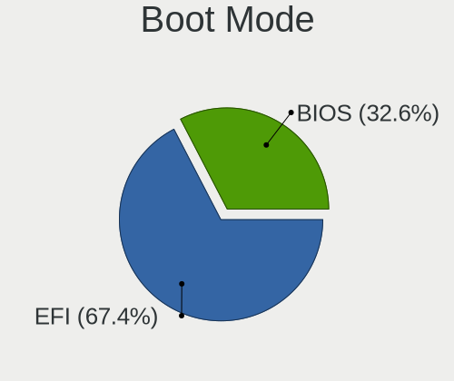
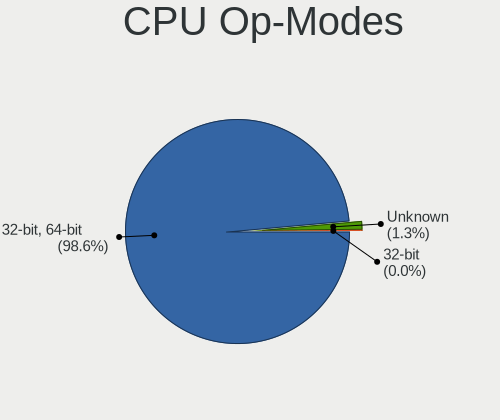
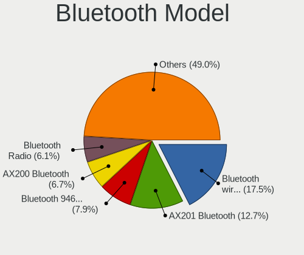
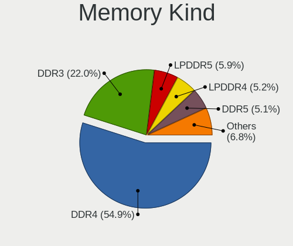

Fedora - Tested Hardware & Statistics (Notebooks)
-------------------------------------------------

A project to collect tested hardware configurations for Fedora.

Anyone can contribute to this report by the [hw-probe](https://github.com/linuxhw/hw-probe) tool:

    sudo -E hw-probe -all -upload

Please contribute! Especially if your hardware is rare.

Contents
--------

* [ Test Cases ](#test-cases)

* [ System ](#system)
  - [ OS                       ](#os)
  - [ OS Family                ](#os-family)
  - [ Kernel                   ](#kernel)
  - [ Kernel Family            ](#kernel-family)
  - [ Kernel Major Ver.        ](#kernel-major-ver)
  - [ Arch                     ](#arch)
  - [ DE                       ](#de)
  - [ Display Server           ](#display-server)
  - [ Display Manager          ](#display-manager)
  - [ OS Lang                  ](#os-lang)
  - [ Boot Mode                ](#boot-mode)
  - [ Filesystem               ](#filesystem)
  - [ Part. scheme             ](#part-scheme)
  - [ Dual Boot with Linux/BSD ](#dual-boot-with-linuxbsd)
  - [ Dual Boot (Win)          ](#dual-boot-win)

* [ Board ](#board)
  - [ Vendor                   ](#vendor)
  - [ Model                    ](#model)
  - [ Model Family             ](#model-family)
  - [ MFG Year                 ](#mfg-year)
  - [ Form Factor              ](#form-factor)
  - [ Secure Boot              ](#secure-boot)
  - [ Coreboot                 ](#coreboot)
  - [ RAM Size                 ](#ram-size)
  - [ RAM Used                 ](#ram-used)
  - [ Total Drives             ](#total-drives)
  - [ Has CD-ROM               ](#has-cd-rom)
  - [ Has Ethernet             ](#has-ethernet)
  - [ Has WiFi                 ](#has-wifi)
  - [ Has Bluetooth            ](#has-bluetooth)

* [ Location ](#location)
  - [ Country                  ](#country)
  - [ City                     ](#city)

* [ Drives ](#drives)
  - [ Drive Vendor             ](#drive-vendor)
  - [ Drive Model              ](#drive-model)
  - [ HDD Vendor               ](#hdd-vendor)
  - [ SSD Vendor               ](#ssd-vendor)
  - [ Drive Kind               ](#drive-kind)
  - [ Drive Connector          ](#drive-connector)
  - [ Drive Size               ](#drive-size)
  - [ Space Total              ](#space-total)
  - [ Space Used               ](#space-used)
  - [ Malfunc. Drives          ](#malfunc-drives)
  - [ Malfunc. Drive Vendor    ](#malfunc-drive-vendor)
  - [ Malfunc. HDD Vendor      ](#malfunc-hdd-vendor)
  - [ Malfunc. Drive Kind      ](#malfunc-drive-kind)
  - [ Failed Drives            ](#failed-drives)
  - [ Failed Drive Vendor      ](#failed-drive-vendor)
  - [ Drive Status             ](#drive-status)

* [ Storage controller ](#storage-controller)
  - [ Storage Vendor           ](#storage-vendor)
  - [ Storage Model            ](#storage-model)
  - [ Storage Kind             ](#storage-kind)

* [ Processor ](#processor)
  - [ CPU Vendor               ](#cpu-vendor)
  - [ CPU Model                ](#cpu-model)
  - [ CPU Model Family         ](#cpu-model-family)
  - [ CPU Cores                ](#cpu-cores)
  - [ CPU Sockets              ](#cpu-sockets)
  - [ CPU Threads              ](#cpu-threads)
  - [ CPU Op-Modes             ](#cpu-op-modes)
  - [ CPU Microcode            ](#cpu-microcode)
  - [ CPU Microarch            ](#cpu-microarch)

* [ Graphics ](#graphics)
  - [ GPU Vendor               ](#gpu-vendor)
  - [ GPU Model                ](#gpu-model)
  - [ GPU Combo                ](#gpu-combo)
  - [ GPU Driver               ](#gpu-driver)
  - [ GPU Memory               ](#gpu-memory)

* [ Monitor ](#monitor)
  - [ Monitor Vendor           ](#monitor-vendor)
  - [ Monitor Model            ](#monitor-model)
  - [ Monitor Resolution       ](#monitor-resolution)
  - [ Monitor Diagonal         ](#monitor-diagonal)
  - [ Monitor Width            ](#monitor-width)
  - [ Aspect Ratio             ](#aspect-ratio)
  - [ Monitor Area             ](#monitor-area)
  - [ Pixel Density            ](#pixel-density)
  - [ Multiple Monitors        ](#multiple-monitors)

* [ Network ](#network)
  - [ Net Controller Vendor    ](#net-controller-vendor)
  - [ Net Controller Model     ](#net-controller-model)
  - [ Wireless Vendor          ](#wireless-vendor)
  - [ Wireless Model           ](#wireless-model)
  - [ Ethernet Vendor          ](#ethernet-vendor)
  - [ Ethernet Model           ](#ethernet-model)
  - [ Net Controller Kind      ](#net-controller-kind)
  - [ Used Controller          ](#used-controller)
  - [ NICs                     ](#nics)
  - [ IPv6                     ](#ipv6)

* [ Bluetooth ](#bluetooth)
  - [ Bluetooth Vendor         ](#bluetooth-vendor)
  - [ Bluetooth Model          ](#bluetooth-model)

* [ Sound ](#sound)
  - [ Sound Vendor             ](#sound-vendor)
  - [ Sound Model              ](#sound-model)

* [ Memory ](#memory)
  - [ Memory Vendor            ](#memory-vendor)
  - [ Memory Model             ](#memory-model)
  - [ Memory Kind              ](#memory-kind)
  - [ Memory Form Factor       ](#memory-form-factor)
  - [ Memory Size              ](#memory-size)
  - [ Memory Speed             ](#memory-speed)

* [ Printers & scanners ](#printers--scanners)
  - [ Printer Vendor           ](#printer-vendor)
  - [ Printer Model            ](#printer-model)
  - [ Scanner Vendor           ](#scanner-vendor)
  - [ Scanner Model            ](#scanner-model)

* [ Camera ](#camera)
  - [ Camera Vendor            ](#camera-vendor)
  - [ Camera Model             ](#camera-model)

* [ Security ](#security)
  - [ Fingerprint Vendor       ](#fingerprint-vendor)
  - [ Fingerprint Model        ](#fingerprint-model)
  - [ Chipcard Vendor          ](#chipcard-vendor)
  - [ Chipcard Model           ](#chipcard-model)

* [ Unsupported ](#unsupported)
  - [ Unsupported Devices      ](#unsupported-devices)
  - [ Unsupported Device Types ](#unsupported-device-types)

Test Cases
----------

Total: 11102

| Vendor        | Model                       | Probe                                                      | Date         |
|---------------|-----------------------------|------------------------------------------------------------|--------------|
| Acer          | Aspire V5-531               | [e39cb4e3e6](https://linux-hardware.org/?probe=e39cb4e3e6) | Sep 07, 2023 |
| Lenovo        | ThinkPad P15v Gen 2i 21A... | [69fc5aab82](https://linux-hardware.org/?probe=69fc5aab82) | Sep 07, 2023 |
| Lenovo        | V580c 20160                 | [87f8bad27d](https://linux-hardware.org/?probe=87f8bad27d) | Sep 07, 2023 |
| Lenovo        | ThinkPad P15v Gen 2i 21A... | [384d2074ad](https://linux-hardware.org/?probe=384d2074ad) | Sep 07, 2023 |
| Lenovo        | IdeaPad S145-15API 81UT     | [8a05090057](https://linux-hardware.org/?probe=8a05090057) | Sep 07, 2023 |
| Acer          | Aspire V5-531               | [63fd300645](https://linux-hardware.org/?probe=63fd300645) | Sep 07, 2023 |
| Lenovo        | ThinkBook 15 G4 IAP 21DJ    | [a2fab791b4](https://linux-hardware.org/?probe=a2fab791b4) | Sep 07, 2023 |
| Timi          | Redmi Book Pro 14S          | [b2776d8282](https://linux-hardware.org/?probe=b2776d8282) | Sep 07, 2023 |
| Lenovo        | IdeaPad S145-14AST 81ST     | [24eca3030c](https://linux-hardware.org/?probe=24eca3030c) | Sep 07, 2023 |
| Lenovo        | ThinkPad T410 2522PT3       | [da7303433d](https://linux-hardware.org/?probe=da7303433d) | Sep 07, 2023 |
| HUAWEI        | NBLK-WAX9X                  | [9911fc5254](https://linux-hardware.org/?probe=9911fc5254) | Sep 07, 2023 |
| MSI           | Bravo 17 A4DDR              | [2592f883ef](https://linux-hardware.org/?probe=2592f883ef) | Sep 07, 2023 |
| ASUSTek       | ASUS TUF Gaming F15 FX50... | [b982251e82](https://linux-hardware.org/?probe=b982251e82) | Sep 07, 2023 |
| Dell          | Latitude E6500              | [b4b035c4f7](https://linux-hardware.org/?probe=b4b035c4f7) | Sep 07, 2023 |
| ASUSTek       | ASUS TUF Dash F15 FX516P... | [3c6e29c3c3](https://linux-hardware.org/?probe=3c6e29c3c3) | Sep 06, 2023 |
| GPU Compan... | GWNR71517                   | [b6a521128f](https://linux-hardware.org/?probe=b6a521128f) | Sep 06, 2023 |
| Samsung       | 550P5C/550P7C               | [f59dbec9af](https://linux-hardware.org/?probe=f59dbec9af) | Sep 06, 2023 |
| Samsung       | 550P5C/550P7C               | [83c77f6733](https://linux-hardware.org/?probe=83c77f6733) | Sep 06, 2023 |
| Lenovo        | IdeaPad 3 15ALC6 82KU       | [c8ee0a00a5](https://linux-hardware.org/?probe=c8ee0a00a5) | Sep 06, 2023 |
| Dell          | XPS 13 9310                 | [7e81f7531b](https://linux-hardware.org/?probe=7e81f7531b) | Sep 06, 2023 |
| Lenovo        | ThinkPad P1 Gen 6 21FV00... | [c9a07c44d5](https://linux-hardware.org/?probe=c9a07c44d5) | Sep 06, 2023 |
| Dell          | Inspiron 3542               | [1756563167](https://linux-hardware.org/?probe=1756563167) | Sep 06, 2023 |
| Lenovo        | Legion Pro 7 16IRX8 82WR    | [f946665a24](https://linux-hardware.org/?probe=f946665a24) | Sep 06, 2023 |
| Lenovo        | ThinkPad X1C 5th W10DG 2... | [b5f142ae13](https://linux-hardware.org/?probe=b5f142ae13) | Sep 06, 2023 |
| Apple         | MacBookPro13,1              | [d6b6455af2](https://linux-hardware.org/?probe=d6b6455af2) | Sep 06, 2023 |
| Lenovo        | Yoga S740-15IRH 81NX        | [c31e15f2ba](https://linux-hardware.org/?probe=c31e15f2ba) | Sep 05, 2023 |
| HP            | EliteBook 845 14 inch G9... | [25ec8e4a16](https://linux-hardware.org/?probe=25ec8e4a16) | Sep 05, 2023 |
| Dell          | Latitude 7400               | [e1ea4eb614](https://linux-hardware.org/?probe=e1ea4eb614) | Sep 05, 2023 |
| Lenovo        | V15 G4 AMN 82YU             | [bb7f6aed1a](https://linux-hardware.org/?probe=bb7f6aed1a) | Sep 05, 2023 |
| ASUSTek       | E402SA                      | [efad2958a0](https://linux-hardware.org/?probe=efad2958a0) | Sep 05, 2023 |
| Lenovo        | IdeaPad 5 15ITL05 82FG      | [3c55d4d55b](https://linux-hardware.org/?probe=3c55d4d55b) | Sep 05, 2023 |
| ASUSTek       | ROG Strix G713RM_G713RM     | [0309bcca29](https://linux-hardware.org/?probe=0309bcca29) | Sep 05, 2023 |
| Dell          | Latitude 7490               | [c03e42edee](https://linux-hardware.org/?probe=c03e42edee) | Sep 05, 2023 |
| Unknown       | Unknown                     | [9b4d95cf35](https://linux-hardware.org/?probe=9b4d95cf35) | Sep 05, 2023 |
| Apple         | MacBookPro9,2               | [424ab4dc3d](https://linux-hardware.org/?probe=424ab4dc3d) | Sep 05, 2023 |
| HP            | ProBook 450 G8 Notebook ... | [5dbf7515d1](https://linux-hardware.org/?probe=5dbf7515d1) | Sep 05, 2023 |
| ASUSTek       | ROG Flow X13 GV301QH_GV3... | [7619d8e5e8](https://linux-hardware.org/?probe=7619d8e5e8) | Sep 05, 2023 |
| Lenovo        | ThinkPad T480s 20L8S1R50... | [ea1d0861a1](https://linux-hardware.org/?probe=ea1d0861a1) | Sep 05, 2023 |
| Lenovo        | ThinkBook 15 G3 ACL 21A4    | [229ca6e8cb](https://linux-hardware.org/?probe=229ca6e8cb) | Sep 05, 2023 |
| Lenovo        | IdeaPad 5 15ITL05 82FG      | [ab9c556dc7](https://linux-hardware.org/?probe=ab9c556dc7) | Sep 05, 2023 |
| Acer          | Aspire 4738Z                | [88b34596c0](https://linux-hardware.org/?probe=88b34596c0) | Sep 05, 2023 |
| Dell          | XPS 13 7390                 | [5154be8883](https://linux-hardware.org/?probe=5154be8883) | Sep 05, 2023 |
| Dell          | G15 5530                    | [91dcc569ee](https://linux-hardware.org/?probe=91dcc569ee) | Sep 05, 2023 |
| HUAWEI        | KLVL-WXX9                   | [d3cde5f4c5](https://linux-hardware.org/?probe=d3cde5f4c5) | Sep 04, 2023 |
| HP            | EliteBook 840 G8 Noteboo... | [2a53f8dc55](https://linux-hardware.org/?probe=2a53f8dc55) | Sep 04, 2023 |
| Dell          | Inspiron 3576               | [5139d104cc](https://linux-hardware.org/?probe=5139d104cc) | Sep 04, 2023 |
| Acer          | Aspire E1-571               | [032fca9d1d](https://linux-hardware.org/?probe=032fca9d1d) | Sep 04, 2023 |
| HP            | Laptop 14s-dq2xxx           | [3a5b200954](https://linux-hardware.org/?probe=3a5b200954) | Sep 04, 2023 |
| ASUSTek       | ROG Zephyrus G14 GA401QE... | [da42098f81](https://linux-hardware.org/?probe=da42098f81) | Sep 04, 2023 |
| Dell          | XPS 13 9380                 | [94e7b43fe2](https://linux-hardware.org/?probe=94e7b43fe2) | Sep 04, 2023 |
| HP            | Laptop 15-dw2xxx            | [fff758a5d9](https://linux-hardware.org/?probe=fff758a5d9) | Sep 04, 2023 |
| Chuwi         | GemiBook                    | [cfdc48e9f6](https://linux-hardware.org/?probe=cfdc48e9f6) | Sep 04, 2023 |
| ASUSTek       | VivoBook 15_ASUS Laptop ... | [1d6a4b4279](https://linux-hardware.org/?probe=1d6a4b4279) | Sep 04, 2023 |
| Dell          | Latitude 5285               | [9ddc47c6a9](https://linux-hardware.org/?probe=9ddc47c6a9) | Sep 04, 2023 |
| Maibenben     | MaiBook M                   | [7189994067](https://linux-hardware.org/?probe=7189994067) | Sep 04, 2023 |
| Lenovo        | IdeaPad S340-15API 81NC     | [18d1abc9ca](https://linux-hardware.org/?probe=18d1abc9ca) | Sep 04, 2023 |
| HUAWEI        | KLVL-WXX9                   | [c3e4035d47](https://linux-hardware.org/?probe=c3e4035d47) | Sep 03, 2023 |
| ASUSTek       | ASUS TUF Gaming F15 FX50... | [1211fca3e2](https://linux-hardware.org/?probe=1211fca3e2) | Sep 03, 2023 |
| Notebook      | PCx0Dx                      | [89d5a9b606](https://linux-hardware.org/?probe=89d5a9b606) | Sep 03, 2023 |
| Lenovo        | ThinkPad T550 20CKA00ECD    | [20be702d65](https://linux-hardware.org/?probe=20be702d65) | Sep 03, 2023 |
| HP            | OMEN by Laptop 15-ce0xx     | [2973871c04](https://linux-hardware.org/?probe=2973871c04) | Sep 03, 2023 |
| HP            | Pavilion Gaming Laptop      | [733f5cb987](https://linux-hardware.org/?probe=733f5cb987) | Sep 03, 2023 |
| Framework     | Laptop                      | [d153316fdd](https://linux-hardware.org/?probe=d153316fdd) | Sep 03, 2023 |
| Dell          | Latitude 3540               | [e7d1d4f160](https://linux-hardware.org/?probe=e7d1d4f160) | Sep 03, 2023 |
| ASUSTek       | VivoBook_ASUSLaptop X515... | [e0f8242693](https://linux-hardware.org/?probe=e0f8242693) | Sep 02, 2023 |
| Lenovo        | Legion Slim 5 16IRH8 82Y... | [8f29742c47](https://linux-hardware.org/?probe=8f29742c47) | Sep 02, 2023 |
| ASUSTek       | X540NA                      | [69ccd7d6f2](https://linux-hardware.org/?probe=69ccd7d6f2) | Sep 02, 2023 |
| Dell          | Latitude 5400               | [aac8791780](https://linux-hardware.org/?probe=aac8791780) | Sep 02, 2023 |
| Lenovo        | 14w Gen 2 82N9              | [87c8a118b5](https://linux-hardware.org/?probe=87c8a118b5) | Sep 02, 2023 |
| Prestigio     | Multipad Visconte V         | [3c60fe1d14](https://linux-hardware.org/?probe=3c60fe1d14) | Sep 01, 2023 |
| ASUSTek       | ROG Strix G513IC_G513IC     | [3080550241](https://linux-hardware.org/?probe=3080550241) | Sep 01, 2023 |
| Fujitsu       | LIFEBOOK S760               | [b7439f4404](https://linux-hardware.org/?probe=b7439f4404) | Sep 01, 2023 |
| Timi          | Mi NoteBook Pro             | [7d3823ff94](https://linux-hardware.org/?probe=7d3823ff94) | Sep 01, 2023 |
| Acer          | Aspire E5-551G              | [864a10779f](https://linux-hardware.org/?probe=864a10779f) | Sep 01, 2023 |
| HP            | EliteBook 820 G3            | [24d0eafc15](https://linux-hardware.org/?probe=24d0eafc15) | Sep 01, 2023 |
| Apple         | MacBookAir5,2               | [bda3b1837c](https://linux-hardware.org/?probe=bda3b1837c) | Sep 01, 2023 |
| ASUSTek       | ZenBook UX535LI_UX535LI     | [edd00c35fd](https://linux-hardware.org/?probe=edd00c35fd) | Sep 01, 2023 |
| Apple         | MacBookAir4,1               | [61da3436a8](https://linux-hardware.org/?probe=61da3436a8) | Sep 01, 2023 |
| Lenovo        | Legion Pro 7 16IRX8 82WR    | [239b46961f](https://linux-hardware.org/?probe=239b46961f) | Sep 01, 2023 |
| Lenovo        | ThinkPad X270 20HMS6AT00    | [e111bad271](https://linux-hardware.org/?probe=e111bad271) | Sep 01, 2023 |
| HP            | EliteBook 860 16 inch G9... | [5e0da96bdd](https://linux-hardware.org/?probe=5e0da96bdd) | Sep 01, 2023 |
| Dell          | Latitude 5290 2-in-1        | [3a4c0e0930](https://linux-hardware.org/?probe=3a4c0e0930) | Aug 31, 2023 |
| Apple         | MacBook9,1                  | [b6a28c1e1a](https://linux-hardware.org/?probe=b6a28c1e1a) | Aug 31, 2023 |
| Dell          | Latitude 5290 2-in-1        | [5b632410e7](https://linux-hardware.org/?probe=5b632410e7) | Aug 31, 2023 |
| ASUSTek       | ASUS EXPERTBOOK L2402CYA... | [9881dd3268](https://linux-hardware.org/?probe=9881dd3268) | Aug 31, 2023 |
| Lenovo        | ThinkPad L470 20J40010GE    | [53adc42d66](https://linux-hardware.org/?probe=53adc42d66) | Aug 31, 2023 |
| Dell          | Latitude 5590               | [59d99ec581](https://linux-hardware.org/?probe=59d99ec581) | Aug 31, 2023 |
| HP            | Pavilion Laptop 15-eg3xx... | [c3d8f5daca](https://linux-hardware.org/?probe=c3d8f5daca) | Aug 31, 2023 |
| Lenovo        | ThinkPad L450 20DSS0LR00    | [a85743e60e](https://linux-hardware.org/?probe=a85743e60e) | Aug 31, 2023 |
| HP            | Pavilion Laptop 15-eg3xx... | [f94ed7f5d1](https://linux-hardware.org/?probe=f94ed7f5d1) | Aug 31, 2023 |
| System76      | Lemur Pro                   | [c04af9751f](https://linux-hardware.org/?probe=c04af9751f) | Aug 31, 2023 |
| Apple         | MacBookPro15,2              | [a93751de6d](https://linux-hardware.org/?probe=a93751de6d) | Aug 30, 2023 |
| HP            | ProBook 440 14 inch G9 N... | [b37cf7f8cf](https://linux-hardware.org/?probe=b37cf7f8cf) | Aug 30, 2023 |
| HP            | EliteBook 845 14 inch G9... | [4c595a576a](https://linux-hardware.org/?probe=4c595a576a) | Aug 30, 2023 |
| ASUSTek       | ROG Flow X13 GV301QH_GV3... | [78e163bc13](https://linux-hardware.org/?probe=78e163bc13) | Aug 30, 2023 |
| Timi          | Redmi Book Pro 14 2022      | [0842215d23](https://linux-hardware.org/?probe=0842215d23) | Aug 30, 2023 |
| Acer          | TravelMate P259-MG          | [dc9b122d90](https://linux-hardware.org/?probe=dc9b122d90) | Aug 30, 2023 |
| Dell          | Latitude 5430               | [477898be1f](https://linux-hardware.org/?probe=477898be1f) | Aug 30, 2023 |
| Dell          | Vostro 2520                 | [73ca89b4fa](https://linux-hardware.org/?probe=73ca89b4fa) | Aug 30, 2023 |
| HP            | Laptop 17-by0xxx            | [4617fe766a](https://linux-hardware.org/?probe=4617fe766a) | Aug 29, 2023 |
| Dell          | Latitude 5480               | [88c6621b31](https://linux-hardware.org/?probe=88c6621b31) | Aug 29, 2023 |
| Dell          | Precision 5480              | [5fd5bf187d](https://linux-hardware.org/?probe=5fd5bf187d) | Aug 29, 2023 |
| Lenovo        | ThinkBook 14 G4+ IAP 21C... | [0eeb1276f0](https://linux-hardware.org/?probe=0eeb1276f0) | Aug 29, 2023 |
| Lenovo        | ThinkPad X1 Carbon 7th 2... | [d036282290](https://linux-hardware.org/?probe=d036282290) | Aug 29, 2023 |
| Lenovo        | Yoga Slim 7 Pro 14IAH7 8... | [7e48b59643](https://linux-hardware.org/?probe=7e48b59643) | Aug 29, 2023 |
| Timi          | A34S                        | [eb6a3c2430](https://linux-hardware.org/?probe=eb6a3c2430) | Aug 29, 2023 |
| Acer          | Aspire E1-571               | [3208c59e9c](https://linux-hardware.org/?probe=3208c59e9c) | Aug 29, 2023 |
| ASUSTek       | VivoBook_ASUSLaptop X515... | [d627b8c625](https://linux-hardware.org/?probe=d627b8c625) | Aug 28, 2023 |
| Dell          | XPS 15 9510                 | [4b78bfab47](https://linux-hardware.org/?probe=4b78bfab47) | Aug 28, 2023 |
| Dell          | Latitude E6400              | [2af0a423ef](https://linux-hardware.org/?probe=2af0a423ef) | Aug 28, 2023 |
| Dell          | XPS 15 9560                 | [8288d35dff](https://linux-hardware.org/?probe=8288d35dff) | Aug 28, 2023 |
| ASUSTek       | VivoBook_ASUSLaptop X412... | [5fddb9cc18](https://linux-hardware.org/?probe=5fddb9cc18) | Aug 28, 2023 |
| HP            | Victus by Laptop 16-e0xx... | [a762e96941](https://linux-hardware.org/?probe=a762e96941) | Aug 28, 2023 |
| Lenovo        | ThinkPad E480 20KQ000EBR    | [40c64b6ec2](https://linux-hardware.org/?probe=40c64b6ec2) | Aug 28, 2023 |
| Acer          | Nitro AN515-57              | [7608fab281](https://linux-hardware.org/?probe=7608fab281) | Aug 28, 2023 |
| Lenovo        | IdeaPad 1 14IAU7 82QC       | [90e0cad295](https://linux-hardware.org/?probe=90e0cad295) | Aug 28, 2023 |
| ASUSTek       | VivoBook_ASUSLaptop X150... | [da73419cb5](https://linux-hardware.org/?probe=da73419cb5) | Aug 27, 2023 |
| Framework     | Laptop                      | [b3e9d2d48d](https://linux-hardware.org/?probe=b3e9d2d48d) | Aug 27, 2023 |
| Corsair       | Voyager a1600               | [405bce7897](https://linux-hardware.org/?probe=405bce7897) | Aug 27, 2023 |
| Lenovo        | IdeaPad 3 15ALC6 82KU       | [8acc158836](https://linux-hardware.org/?probe=8acc158836) | Aug 27, 2023 |
| HP            | Laptop 15s-eq2xxx           | [864a9d9f37](https://linux-hardware.org/?probe=864a9d9f37) | Aug 27, 2023 |
| ASUSTek       | T100TA                      | [69d14b429e](https://linux-hardware.org/?probe=69d14b429e) | Aug 27, 2023 |
| Dell          | Latitude E6400              | [fdcbc50452](https://linux-hardware.org/?probe=fdcbc50452) | Aug 27, 2023 |
| ASUSTek       | GL753VD                     | [3903bc9e14](https://linux-hardware.org/?probe=3903bc9e14) | Aug 27, 2023 |
| Lenovo        | ThinkPad E14 Gen 3 20YDC... | [fe02fb8d64](https://linux-hardware.org/?probe=fe02fb8d64) | Aug 27, 2023 |
| Timi          | TM1701                      | [2a6a4225a0](https://linux-hardware.org/?probe=2a6a4225a0) | Aug 27, 2023 |
| Timi          | TM1701                      | [8ea7c21e18](https://linux-hardware.org/?probe=8ea7c21e18) | Aug 27, 2023 |
| HP            | Pavilion 15                 | [1731ba4ae5](https://linux-hardware.org/?probe=1731ba4ae5) | Aug 27, 2023 |
| Lenovo        | ThinkPad P15 Gen 2i 20YQ... | [5d220003c1](https://linux-hardware.org/?probe=5d220003c1) | Aug 27, 2023 |
| HP            | Pavilion 15                 | [0f51268684](https://linux-hardware.org/?probe=0f51268684) | Aug 27, 2023 |
| Lenovo        | ThinkPad X1 Carbon Gen 1... | [a8600db157](https://linux-hardware.org/?probe=a8600db157) | Aug 27, 2023 |
| ASUSTek       | K55VD                       | [7bdfc94045](https://linux-hardware.org/?probe=7bdfc94045) | Aug 27, 2023 |
| Lenovo        | IdeaPad Z570 1024DCU        | [8a11757d37](https://linux-hardware.org/?probe=8a11757d37) | Aug 26, 2023 |
| Corsair       | Voyager a1600               | [97a1c576f7](https://linux-hardware.org/?probe=97a1c576f7) | Aug 26, 2023 |
| Lenovo        | ThinkBook 14 G4 IAP 21DH    | [4e5f7a05c6](https://linux-hardware.org/?probe=4e5f7a05c6) | Aug 26, 2023 |
| ASUSTek       | Strix 17 GL703GE            | [b2ad72336f](https://linux-hardware.org/?probe=b2ad72336f) | Aug 26, 2023 |
| HP            | OMEN by Laptop              | [df71a92503](https://linux-hardware.org/?probe=df71a92503) | Aug 26, 2023 |
| Acer          | Aspire A715-72G             | [cbbaecabb1](https://linux-hardware.org/?probe=cbbaecabb1) | Aug 26, 2023 |
| ASUSTek       | X542BP                      | [58cc535a58](https://linux-hardware.org/?probe=58cc535a58) | Aug 26, 2023 |
| Chuwi         | CoreBook X                  | [95548b426e](https://linux-hardware.org/?probe=95548b426e) | Aug 26, 2023 |
| Chuwi         | CoreBook X                  | [6bd0ecde29](https://linux-hardware.org/?probe=6bd0ecde29) | Aug 26, 2023 |
| Acer          | Predator PH16-71            | [ef267bc627](https://linux-hardware.org/?probe=ef267bc627) | Aug 26, 2023 |
| Apple         | MacBookPro13,2              | [b910d52198](https://linux-hardware.org/?probe=b910d52198) | Aug 26, 2023 |
| Lenovo        | ThinkPad E520 1143CWG       | [66d9a31686](https://linux-hardware.org/?probe=66d9a31686) | Aug 25, 2023 |
| HP            | OMEN by Laptop 15-dh1xxx    | [6e84e686ec](https://linux-hardware.org/?probe=6e84e686ec) | Aug 25, 2023 |
| Acer          | Nitro AN515-44              | [b14dfb0798](https://linux-hardware.org/?probe=b14dfb0798) | Aug 25, 2023 |
| Acer          | Aspire ES1-512              | [22187e6de0](https://linux-hardware.org/?probe=22187e6de0) | Aug 25, 2023 |
| Lenovo        | IdeaPad 5 15ITL05 82FG      | [810ccd6f4f](https://linux-hardware.org/?probe=810ccd6f4f) | Aug 25, 2023 |
| Dell          | Inspiron 5585               | [49a9e7dbf0](https://linux-hardware.org/?probe=49a9e7dbf0) | Aug 25, 2023 |
| Dell          | Latitude 3490               | [05705b1834](https://linux-hardware.org/?probe=05705b1834) | Aug 25, 2023 |
| ASUSTek       | T100TA                      | [ef7b263d48](https://linux-hardware.org/?probe=ef7b263d48) | Aug 25, 2023 |
| Toshiba       | Satellite C70-B             | [2647e2edd8](https://linux-hardware.org/?probe=2647e2edd8) | Aug 24, 2023 |
| Dell          | G15 5510                    | [f9e857e751](https://linux-hardware.org/?probe=f9e857e751) | Aug 24, 2023 |
| HP            | Victus by Laptop 16-e0xx... | [7e6a7de337](https://linux-hardware.org/?probe=7e6a7de337) | Aug 24, 2023 |
| Sony          | SVF15A1M2ES                 | [b352453232](https://linux-hardware.org/?probe=b352453232) | Aug 24, 2023 |
| Dell          | Inspiron 5759               | [bf7413fc5f](https://linux-hardware.org/?probe=bf7413fc5f) | Aug 24, 2023 |
| ASUSTek       | VivoBook_ASUSLaptop X409... | [1a9c135840](https://linux-hardware.org/?probe=1a9c135840) | Aug 24, 2023 |
| LDLC          | SPC-I                       | [bb114215e6](https://linux-hardware.org/?probe=bb114215e6) | Aug 24, 2023 |
| Lenovo        | ThinkPad T560 20FJS18V00    | [5f18850003](https://linux-hardware.org/?probe=5f18850003) | Aug 24, 2023 |
| Lenovo        | ThinkPad T560 20FJS18V00    | [de37c3c7eb](https://linux-hardware.org/?probe=de37c3c7eb) | Aug 24, 2023 |
| Lenovo        | ThinkPad E14 Gen 3 20Y70... | [ce5f964a0c](https://linux-hardware.org/?probe=ce5f964a0c) | Aug 24, 2023 |
| Dell          | Latitude 3490               | [148d4806cb](https://linux-hardware.org/?probe=148d4806cb) | Aug 24, 2023 |
| HP            | 255 G8 Notebook PC          | [68c01672c3](https://linux-hardware.org/?probe=68c01672c3) | Aug 24, 2023 |
| Xplore        | iX104C6                     | [5d8ea1a454](https://linux-hardware.org/?probe=5d8ea1a454) | Aug 24, 2023 |
| Lenovo        | Yoga710-14ISK 80TY          | [17525a9aef](https://linux-hardware.org/?probe=17525a9aef) | Aug 24, 2023 |
| Positivo B... | VJFE59F11X-B0411H           | [5e5059f835](https://linux-hardware.org/?probe=5e5059f835) | Aug 23, 2023 |
| ASUSTek       | X540UP                      | [7041925c33](https://linux-hardware.org/?probe=7041925c33) | Aug 23, 2023 |
| Lenovo        | ThinkPad X200 74591P0       | [adda6295fb](https://linux-hardware.org/?probe=adda6295fb) | Aug 23, 2023 |
| Acer          | Predator PT715-51           | [e187e199c9](https://linux-hardware.org/?probe=e187e199c9) | Aug 23, 2023 |
| Dell          | XPS 15 7590                 | [66b46e04d3](https://linux-hardware.org/?probe=66b46e04d3) | Aug 23, 2023 |
| Google        | Nami                        | [db2c6bfb0a](https://linux-hardware.org/?probe=db2c6bfb0a) | Aug 23, 2023 |
| HUAWEI        | BOM-WXX9                    | [08801db21d](https://linux-hardware.org/?probe=08801db21d) | Aug 23, 2023 |
| HUAWEI        | BOM-WXX9                    | [9b3cf2a525](https://linux-hardware.org/?probe=9b3cf2a525) | Aug 23, 2023 |
| Toshiba       | Satellite L515              | [fa5d7d5547](https://linux-hardware.org/?probe=fa5d7d5547) | Aug 23, 2023 |
| Lenovo        | Legion Y9000P IAH7H 82RF    | [f429d18938](https://linux-hardware.org/?probe=f429d18938) | Aug 23, 2023 |
| Dell          | Inspiron 5559               | [310e1f561c](https://linux-hardware.org/?probe=310e1f561c) | Aug 22, 2023 |
| HUAWEI        | BOHB-WAX9                   | [f7580a556b](https://linux-hardware.org/?probe=f7580a556b) | Aug 22, 2023 |
| ASUSTek       | VivoBook_ASUSLaptop N760... | [68d28831a5](https://linux-hardware.org/?probe=68d28831a5) | Aug 22, 2023 |
| ASUSTek       | ASUS TUF Gaming A17 FA70... | [25d163ad9e](https://linux-hardware.org/?probe=25d163ad9e) | Aug 22, 2023 |
| Google        | Nami                        | [69d8c7bfb8](https://linux-hardware.org/?probe=69d8c7bfb8) | Aug 22, 2023 |
| Lenovo        | ThinkPad P15 Gen 2i 20YR... | [9ad109a4df](https://linux-hardware.org/?probe=9ad109a4df) | Aug 22, 2023 |
| HP            | Pavilion 11 x360 PC         | [bf401f98a7](https://linux-hardware.org/?probe=bf401f98a7) | Aug 22, 2023 |
| HP            | EliteBook 8440p             | [f35c644052](https://linux-hardware.org/?probe=f35c644052) | Aug 22, 2023 |
| HP            | EliteBook 8440p             | [4f4bed768e](https://linux-hardware.org/?probe=4f4bed768e) | Aug 22, 2023 |
| Dell          | Latitude 7430               | [1ccbb8329f](https://linux-hardware.org/?probe=1ccbb8329f) | Aug 22, 2023 |
| HP            | ProBook 655 G1              | [39dbb86112](https://linux-hardware.org/?probe=39dbb86112) | Aug 22, 2023 |
| HP            | ProBook 655 G1              | [2d616412f1](https://linux-hardware.org/?probe=2d616412f1) | Aug 22, 2023 |
| Dell          | Inspiron 5567               | [76c16d7ffe](https://linux-hardware.org/?probe=76c16d7ffe) | Aug 22, 2023 |
| HUAWEI        | HVY-WXX9                    | [55e95b21f1](https://linux-hardware.org/?probe=55e95b21f1) | Aug 22, 2023 |
| HP            | Laptop 15-fc0xxx            | [d2378787ac](https://linux-hardware.org/?probe=d2378787ac) | Aug 21, 2023 |
| Dell          | Latitude 3301               | [69389fff09](https://linux-hardware.org/?probe=69389fff09) | Aug 21, 2023 |
| Apple         | MacBookPro9,2               | [63b37fd7f7](https://linux-hardware.org/?probe=63b37fd7f7) | Aug 21, 2023 |
| Lenovo        | ThinkPad T430 2347C32       | [6956f76011](https://linux-hardware.org/?probe=6956f76011) | Aug 21, 2023 |
| Dell          | Inspiron 5547               | [b5b7a6d8f8](https://linux-hardware.org/?probe=b5b7a6d8f8) | Aug 21, 2023 |
| MSI           | GE63 Raider RGB 8RF         | [dd12e382c8](https://linux-hardware.org/?probe=dd12e382c8) | Aug 21, 2023 |
| ASUSTek       | ROG Strix G713IE_G713IE     | [22443858cb](https://linux-hardware.org/?probe=22443858cb) | Aug 21, 2023 |
| Apple         | MacBookPro9,2               | [a8a1e5df49](https://linux-hardware.org/?probe=a8a1e5df49) | Aug 21, 2023 |
| Lenovo        | IdeaPad 5 Pro 14ACN6 82L... | [359cd5a655](https://linux-hardware.org/?probe=359cd5a655) | Aug 21, 2023 |
| Dell          | Latitude 7490               | [90685f1b4d](https://linux-hardware.org/?probe=90685f1b4d) | Aug 21, 2023 |
| Lenovo        | Legion 5 82B5               | [6047cef31c](https://linux-hardware.org/?probe=6047cef31c) | Aug 21, 2023 |
| Lenovo        | Legion 5 82B5               | [986599dc77](https://linux-hardware.org/?probe=986599dc77) | Aug 21, 2023 |
| Lenovo        | ThinkPad L14 Gen 1 20U50... | [c1a5eb75bf](https://linux-hardware.org/?probe=c1a5eb75bf) | Aug 21, 2023 |
| ASUSTek       | X510URR                     | [d1ee285db9](https://linux-hardware.org/?probe=d1ee285db9) | Aug 21, 2023 |
| HP            | ProBook 640 G1              | [f38ba797d9](https://linux-hardware.org/?probe=f38ba797d9) | Aug 21, 2023 |
| HP            | EliteBook 840 G6            | [9fa60a1eba](https://linux-hardware.org/?probe=9fa60a1eba) | Aug 21, 2023 |
| Toshiba       | Satellite C70-B             | [d4f90e5eff](https://linux-hardware.org/?probe=d4f90e5eff) | Aug 21, 2023 |
| Lenovo        | Legion 5 15IAH7 82RC        | [5fa4b8ae13](https://linux-hardware.org/?probe=5fa4b8ae13) | Aug 20, 2023 |
| HP            | ProBook 430 G1              | [24a2760d65](https://linux-hardware.org/?probe=24a2760d65) | Aug 20, 2023 |
| ASUSTek       | ASUS BR1100CKA BR1100CKA... | [448603376e](https://linux-hardware.org/?probe=448603376e) | Aug 20, 2023 |
| HP            | EliteBook 850 G8 Noteboo... | [8e91f085b4](https://linux-hardware.org/?probe=8e91f085b4) | Aug 20, 2023 |
| Acer          | Aspire A315-53              | [03bd8885a0](https://linux-hardware.org/?probe=03bd8885a0) | Aug 20, 2023 |
| HP            | Laptop 15s-eq2xxx           | [34f09bffb0](https://linux-hardware.org/?probe=34f09bffb0) | Aug 20, 2023 |
| PC Special... | Ionico 16                   | [96fb68dc70](https://linux-hardware.org/?probe=96fb68dc70) | Aug 20, 2023 |
| Sony          | SVF1521USTW                 | [ce7fbec260](https://linux-hardware.org/?probe=ce7fbec260) | Aug 20, 2023 |
| Sony          | SVF1521USTW                 | [e92fad444f](https://linux-hardware.org/?probe=e92fad444f) | Aug 19, 2023 |
| Packard Be... | EasyNote ENTF71BM           | [36417c2601](https://linux-hardware.org/?probe=36417c2601) | Aug 19, 2023 |
| Lenovo        | ThinkPad SL510 28477MG      | [ed572b9b04](https://linux-hardware.org/?probe=ed572b9b04) | Aug 19, 2023 |
| Packard Be... | EasyNote ENTF71BM           | [81dd9b9a7a](https://linux-hardware.org/?probe=81dd9b9a7a) | Aug 19, 2023 |
| HP            | Victus by Laptop 16-e0xx... | [651f263a9d](https://linux-hardware.org/?probe=651f263a9d) | Aug 19, 2023 |
| HUAWEI        | NBM-WXX9                    | [ac85dd7bb4](https://linux-hardware.org/?probe=ac85dd7bb4) | Aug 19, 2023 |
| Acer          | Swift SF114-32              | [c6f3f044c9](https://linux-hardware.org/?probe=c6f3f044c9) | Aug 19, 2023 |
| Acer          | Swift SF114-32              | [9734816ff1](https://linux-hardware.org/?probe=9734816ff1) | Aug 19, 2023 |
| ASUSTek       | VivoBook_ASUSLaptop K650... | [80b304814d](https://linux-hardware.org/?probe=80b304814d) | Aug 19, 2023 |
| HP            | Pavilion dv4                | [5f1e0c4484](https://linux-hardware.org/?probe=5f1e0c4484) | Aug 19, 2023 |
| Acer          | Aspire A514-55              | [98ebe4bf9a](https://linux-hardware.org/?probe=98ebe4bf9a) | Aug 19, 2023 |
| Dell          | Inspiron 7520               | [3cdfdae368](https://linux-hardware.org/?probe=3cdfdae368) | Aug 19, 2023 |
| Lenovo        | IdeaPad Gaming 3 15ACH6 ... | [dee14abe77](https://linux-hardware.org/?probe=dee14abe77) | Aug 18, 2023 |
| Acer          | Aspire A514-55              | [cace7d6efb](https://linux-hardware.org/?probe=cace7d6efb) | Aug 18, 2023 |
| Lenovo        | IdeaPad Slim 3 15ABR8 82... | [12c6ae9006](https://linux-hardware.org/?probe=12c6ae9006) | Aug 18, 2023 |
| Lenovo        | IdeaPad Pro 5 14APH8 83A... | [f7d0bbc3d9](https://linux-hardware.org/?probe=f7d0bbc3d9) | Aug 18, 2023 |
| Lenovo        | IdeaPad 320-17ISK 80XJ      | [c9e9e56ddd](https://linux-hardware.org/?probe=c9e9e56ddd) | Aug 18, 2023 |
| Dell          | Latitude 7320               | [a51289d9dd](https://linux-hardware.org/?probe=a51289d9dd) | Aug 18, 2023 |
| System76      | Pangolin                    | [5191e3a345](https://linux-hardware.org/?probe=5191e3a345) | Aug 18, 2023 |
| Schenker      | MEDIA (M22)                 | [463903cc03](https://linux-hardware.org/?probe=463903cc03) | Aug 18, 2023 |
| PC Special... | Ionico 16                   | [da33e8f1c1](https://linux-hardware.org/?probe=da33e8f1c1) | Aug 18, 2023 |
| MSI           | MS-1057                     | [081ae63942](https://linux-hardware.org/?probe=081ae63942) | Aug 18, 2023 |
| MSI           | MS-1057                     | [615f03f3b8](https://linux-hardware.org/?probe=615f03f3b8) | Aug 18, 2023 |
| Acer          | Aspire E5-575               | [cfbf5747b3](https://linux-hardware.org/?probe=cfbf5747b3) | Aug 18, 2023 |
| Lenovo        | Yoga Slim 7 ProX 14IAH7 ... | [b8e5fd59d3](https://linux-hardware.org/?probe=b8e5fd59d3) | Aug 18, 2023 |
| Lenovo        | ThinkPad L480 20LTS6S904    | [32ded049ec](https://linux-hardware.org/?probe=32ded049ec) | Aug 17, 2023 |
| Lenovo        | IdeaPad Pro 5 14APH8 83A... | [df194863d1](https://linux-hardware.org/?probe=df194863d1) | Aug 17, 2023 |
| Lenovo        | IdeaPad Pro 5 14APH8 83A... | [87a6bd39ae](https://linux-hardware.org/?probe=87a6bd39ae) | Aug 17, 2023 |
| Lenovo        | IdeaPad 3 14ITL6 82H7       | [bbf57bf744](https://linux-hardware.org/?probe=bbf57bf744) | Aug 17, 2023 |
| HP            | ProBook 640 G1              | [e688e27904](https://linux-hardware.org/?probe=e688e27904) | Aug 17, 2023 |
| Lenovo        | ThinkPad T14 Gen 3 21AJS... | [2cd51b6fce](https://linux-hardware.org/?probe=2cd51b6fce) | Aug 17, 2023 |
| Dell          | Latitude 7440               | [e56c46e8fe](https://linux-hardware.org/?probe=e56c46e8fe) | Aug 17, 2023 |
| Dell          | Latitude 7440               | [aef57d5421](https://linux-hardware.org/?probe=aef57d5421) | Aug 17, 2023 |
| ASUSTek       | VivoBook_ASUSLaptop X412... | [d0d3c76bb8](https://linux-hardware.org/?probe=d0d3c76bb8) | Aug 17, 2023 |
| ASUSTek       | ZenBook UX482EG_UX482EG     | [c753cfdb08](https://linux-hardware.org/?probe=c753cfdb08) | Aug 17, 2023 |
| Lenovo        | Legion 5 15IAH7 82RC        | [75556aed08](https://linux-hardware.org/?probe=75556aed08) | Aug 16, 2023 |
| HP            | Compaq 6710b (FG040EC#AB... | [a0cd8c1b40](https://linux-hardware.org/?probe=a0cd8c1b40) | Aug 16, 2023 |
| Lenovo        | Legion 5 15ACH6H 82JU       | [82c579f8a7](https://linux-hardware.org/?probe=82c579f8a7) | Aug 16, 2023 |
| Lenovo        | ThinkPad T480s 20L7001VG... | [b0b2f8a7e1](https://linux-hardware.org/?probe=b0b2f8a7e1) | Aug 16, 2023 |
| Lenovo        | ThinkPad T480s 20L7001VG... | [07b5827382](https://linux-hardware.org/?probe=07b5827382) | Aug 16, 2023 |
| HP            | EliteBook 845 G8 Noteboo... | [f3c603341d](https://linux-hardware.org/?probe=f3c603341d) | Aug 16, 2023 |
| Lenovo        | ThinkPad P14s Gen 4 21HF... | [af217ce6dc](https://linux-hardware.org/?probe=af217ce6dc) | Aug 16, 2023 |
| Lenovo        | ThinkPad P14s Gen 4 21HF... | [feeb3d8bbe](https://linux-hardware.org/?probe=feeb3d8bbe) | Aug 16, 2023 |
| ASUSTek       | X541NA                      | [8e3f72e46d](https://linux-hardware.org/?probe=8e3f72e46d) | Aug 16, 2023 |
| HP            | Laptop 17-ca0xxx            | [bbf606d6e8](https://linux-hardware.org/?probe=bbf606d6e8) | Aug 16, 2023 |
| Dell          | Latitude E5400              | [7d861c3812](https://linux-hardware.org/?probe=7d861c3812) | Aug 16, 2023 |
| Dell          | Latitude 5420               | [12d46be852](https://linux-hardware.org/?probe=12d46be852) | Aug 16, 2023 |
| Lenovo        | ThinkPad X1 Carbon Gen 1... | [b326fccb63](https://linux-hardware.org/?probe=b326fccb63) | Aug 16, 2023 |
| HUAWEI        | CREM-WXX9                   | [24cd5deaa3](https://linux-hardware.org/?probe=24cd5deaa3) | Aug 16, 2023 |
| Dell          | Latitude 7490               | [efb4abea09](https://linux-hardware.org/?probe=efb4abea09) | Aug 16, 2023 |
| Lenovo        | ThinkPad E14 Gen 4 21E3S... | [ff958dc821](https://linux-hardware.org/?probe=ff958dc821) | Aug 16, 2023 |
| HUAWEI        | CREM-WXX9                   | [b42d5dec8e](https://linux-hardware.org/?probe=b42d5dec8e) | Aug 16, 2023 |
| ASUSTek       | ROG Zephyrus G14 GA402XI... | [da5582d4bf](https://linux-hardware.org/?probe=da5582d4bf) | Aug 16, 2023 |
| ASUSTek       | ROG Zephyrus G14 GA402XI... | [63f2bc3a80](https://linux-hardware.org/?probe=63f2bc3a80) | Aug 16, 2023 |
| Apple         | MacBookPro5,5               | [ee72caa76d](https://linux-hardware.org/?probe=ee72caa76d) | Aug 16, 2023 |
| Lenovo        | IdeaPad Gaming 3 15IHU6 ... | [8733f22b33](https://linux-hardware.org/?probe=8733f22b33) | Aug 16, 2023 |
| Lenovo        | ThinkPad T440p 20AWS03V0... | [f50a83684f](https://linux-hardware.org/?probe=f50a83684f) | Aug 16, 2023 |
| Lenovo        | ThinkPad T550 20CJS1JT00    | [78cd2292c2](https://linux-hardware.org/?probe=78cd2292c2) | Aug 16, 2023 |
| Dell          | Latitude 3301               | [8cbe049a08](https://linux-hardware.org/?probe=8cbe049a08) | Aug 15, 2023 |
| Samsung       | 550XDA                      | [5e5606074a](https://linux-hardware.org/?probe=5e5606074a) | Aug 15, 2023 |
| ASUSTek       | ZenBook UX434IQ_Q407IQ      | [cfa082df13](https://linux-hardware.org/?probe=cfa082df13) | Aug 15, 2023 |
| Lenovo        | ThinkPad E15 Gen 4 21E60... | [30e2a20d37](https://linux-hardware.org/?probe=30e2a20d37) | Aug 15, 2023 |
| Lenovo        | ThinkBook 14-IIL 20SL       | [6c933602ca](https://linux-hardware.org/?probe=6c933602ca) | Aug 15, 2023 |
| Topstar       | Cantiga & ICH9M Chipset     | [5102056c71](https://linux-hardware.org/?probe=5102056c71) | Aug 15, 2023 |
| Lenovo        | ThinkBook 14-IIL 20SL       | [618b4d5598](https://linux-hardware.org/?probe=618b4d5598) | Aug 15, 2023 |
| Dell          | Latitude E6530              | [9cbe752127](https://linux-hardware.org/?probe=9cbe752127) | Aug 15, 2023 |
| Toshiba       | Satellite C55D-A            | [5a86eae963](https://linux-hardware.org/?probe=5a86eae963) | Aug 15, 2023 |
| Google        | Bobba360                    | [e2ae1afdcc](https://linux-hardware.org/?probe=e2ae1afdcc) | Aug 14, 2023 |
| Lenovo        | ThinkPad T14 Gen 2a 20XK... | [52bd9574d8](https://linux-hardware.org/?probe=52bd9574d8) | Aug 14, 2023 |
| MSI           | GE60 2OC\2OD\2OE            | [f99741ec7f](https://linux-hardware.org/?probe=f99741ec7f) | Aug 14, 2023 |
| Google        | Bobba360                    | [f211501fde](https://linux-hardware.org/?probe=f211501fde) | Aug 14, 2023 |
| HP            | Notebook                    | [f32b596c87](https://linux-hardware.org/?probe=f32b596c87) | Aug 14, 2023 |
| Lenovo        | ThinkPad S1 Yoga 20C0A0C... | [c192c37af2](https://linux-hardware.org/?probe=c192c37af2) | Aug 14, 2023 |
| Apple         | MacBookPro11,1              | [11b8c16b30](https://linux-hardware.org/?probe=11b8c16b30) | Aug 14, 2023 |
| Lenovo        | ThinkPad T14 Gen 2a 20XK... | [74eb1759e1](https://linux-hardware.org/?probe=74eb1759e1) | Aug 14, 2023 |
| ASUSTek       | VivoBook_ASUSLaptop M540... | [24b85b3417](https://linux-hardware.org/?probe=24b85b3417) | Aug 14, 2023 |
| Dell          | Latitude E7470              | [99518b81f7](https://linux-hardware.org/?probe=99518b81f7) | Aug 13, 2023 |
| Google        | Blorb                       | [d1abf19439](https://linux-hardware.org/?probe=d1abf19439) | Aug 13, 2023 |
| Dell          | Latitude 5290 2-in-1        | [400e17fe60](https://linux-hardware.org/?probe=400e17fe60) | Aug 13, 2023 |
| HP            | ProBook 6450b               | [8862a40143](https://linux-hardware.org/?probe=8862a40143) | Aug 13, 2023 |
| Acer          | Aspire E5-721               | [9a7018c6cb](https://linux-hardware.org/?probe=9a7018c6cb) | Aug 13, 2023 |
| HP            | EliteBook 845 14 inch G9... | [0650746552](https://linux-hardware.org/?probe=0650746552) | Aug 13, 2023 |
| Lenovo        | ThinkPad P15 Gen 2i 20YQ... | [8ef1bbdcec](https://linux-hardware.org/?probe=8ef1bbdcec) | Aug 13, 2023 |
| Lenovo        | ThinkPad X250 20CLS3320C    | [51f9e0c482](https://linux-hardware.org/?probe=51f9e0c482) | Aug 13, 2023 |
| HP            | Pavilion Laptop 15z-eh00... | [6f54d654ac](https://linux-hardware.org/?probe=6f54d654ac) | Aug 13, 2023 |
| Toshiba       | Satellite C55D-A            | [136ac6835c](https://linux-hardware.org/?probe=136ac6835c) | Aug 13, 2023 |
| Dell          | Inspiron M5010              | [dd2538ba1a](https://linux-hardware.org/?probe=dd2538ba1a) | Aug 13, 2023 |
| MSI           | GT62VR 7RE                  | [105839bee0](https://linux-hardware.org/?probe=105839bee0) | Aug 13, 2023 |
| Framework     | Laptop                      | [8ac155813e](https://linux-hardware.org/?probe=8ac155813e) | Aug 13, 2023 |
| Apple         | MacBookPro14,3              | [05a4c5e1ec](https://linux-hardware.org/?probe=05a4c5e1ec) | Aug 13, 2023 |
| Dell          | XPS 13 9300                 | [ed549bc47c](https://linux-hardware.org/?probe=ed549bc47c) | Aug 12, 2023 |
| HONOR         | NMH-WCX9                    | [788c2c9e31](https://linux-hardware.org/?probe=788c2c9e31) | Aug 12, 2023 |
| HP            | ENVY Laptop 13-ad1xx        | [def5f9423e](https://linux-hardware.org/?probe=def5f9423e) | Aug 12, 2023 |
| HP            | Laptop 14s-dq2xxx           | [f2f4f8a844](https://linux-hardware.org/?probe=f2f4f8a844) | Aug 12, 2023 |
| HP            | Laptop 15-db0xxx            | [3d875407fc](https://linux-hardware.org/?probe=3d875407fc) | Aug 12, 2023 |
| Apple         | MacBookPro13,3              | [b43e2738d9](https://linux-hardware.org/?probe=b43e2738d9) | Aug 12, 2023 |
| Dell          | G15 5510                    | [3cfac2d234](https://linux-hardware.org/?probe=3cfac2d234) | Aug 12, 2023 |
| Lenovo        | ThinkPad T460p 20FXS1C30... | [08542d994e](https://linux-hardware.org/?probe=08542d994e) | Aug 12, 2023 |
| ASUSTek       | K55VD                       | [05024005e4](https://linux-hardware.org/?probe=05024005e4) | Aug 12, 2023 |
| Lenovo        | ThinkPad E15 20RD0011UK     | [411b9f412c](https://linux-hardware.org/?probe=411b9f412c) | Aug 12, 2023 |
| Lenovo        | ThinkPad P53 20QN0011IV     | [d25ab08211](https://linux-hardware.org/?probe=d25ab08211) | Aug 12, 2023 |
| Toshiba       | Satellite C55-A             | [d1bf5ba3c3](https://linux-hardware.org/?probe=d1bf5ba3c3) | Aug 12, 2023 |
| Dell          | Latitude E7270              | [63fd1b0d6b](https://linux-hardware.org/?probe=63fd1b0d6b) | Aug 12, 2023 |
| HP            | Victus by Laptop 16-e0xx... | [377a0e25aa](https://linux-hardware.org/?probe=377a0e25aa) | Aug 11, 2023 |
| HP            | Laptop 14s-dq2xxx           | [7574e6b53a](https://linux-hardware.org/?probe=7574e6b53a) | Aug 11, 2023 |
| Lenovo        | ThinkPad E490 20N8CTO1WW    | [c336f9aa8c](https://linux-hardware.org/?probe=c336f9aa8c) | Aug 11, 2023 |
| Lenovo        | IdeaPad 320-15IKB 81G3      | [83879b8247](https://linux-hardware.org/?probe=83879b8247) | Aug 11, 2023 |
| HP            | Laptop 14s-dq2xxx           | [c352abad93](https://linux-hardware.org/?probe=c352abad93) | Aug 11, 2023 |
| Acer          | Aspire E5-721               | [f4abfc94d4](https://linux-hardware.org/?probe=f4abfc94d4) | Aug 11, 2023 |
| HP            | ProBook 450 15.6 inch G9... | [8c449cd820](https://linux-hardware.org/?probe=8c449cd820) | Aug 11, 2023 |
| ASUSTek       | ZenBook UX535LI_UX535LI     | [29065a56ee](https://linux-hardware.org/?probe=29065a56ee) | Aug 11, 2023 |
| ASUSTek       | VivoBook_ASUSLaptop X409... | [22fc28c382](https://linux-hardware.org/?probe=22fc28c382) | Aug 11, 2023 |
| Dell          | XPS 15 9560                 | [471e3c5077](https://linux-hardware.org/?probe=471e3c5077) | Aug 11, 2023 |
| Acer          | Nitro AN515-52              | [df9e6a8d98](https://linux-hardware.org/?probe=df9e6a8d98) | Aug 10, 2023 |
| Dell          | Latitude 5300               | [661051063f](https://linux-hardware.org/?probe=661051063f) | Aug 10, 2023 |
| Lenovo        | ThinkPad X220 4291SEN       | [b62026890a](https://linux-hardware.org/?probe=b62026890a) | Aug 10, 2023 |
| HP            | 250 G3                      | [512fd5d81f](https://linux-hardware.org/?probe=512fd5d81f) | Aug 10, 2023 |
| HP            | ProBook 430 G2              | [426901227d](https://linux-hardware.org/?probe=426901227d) | Aug 10, 2023 |
| Acer          | Aspire E5-721               | [6743c7ca9d](https://linux-hardware.org/?probe=6743c7ca9d) | Aug 10, 2023 |
| Gigabyte      | AERO 15-WA                  | [bd9f5d0f39](https://linux-hardware.org/?probe=bd9f5d0f39) | Aug 10, 2023 |
| Apple         | MacBookPro5,1               | [23fc9401d3](https://linux-hardware.org/?probe=23fc9401d3) | Aug 10, 2023 |
| Lenovo        | IdeaPad U430 Touch 20270    | [4446f503d5](https://linux-hardware.org/?probe=4446f503d5) | Aug 10, 2023 |
| HP            | 14                          | [8692626574](https://linux-hardware.org/?probe=8692626574) | Aug 09, 2023 |
| HP            | Laptop 14s-dq2xxx           | [bb40aa6fd9](https://linux-hardware.org/?probe=bb40aa6fd9) | Aug 09, 2023 |
| Lenovo        | Legion 5 Pro 16ACH6H 82J... | [0f34656484](https://linux-hardware.org/?probe=0f34656484) | Aug 09, 2023 |
| ASUSTek       | ROG Zephyrus G14 GA401QC... | [afa02e4c02](https://linux-hardware.org/?probe=afa02e4c02) | Aug 09, 2023 |
| Fujitsu       | UH-X                        | [e26b430aef](https://linux-hardware.org/?probe=e26b430aef) | Aug 09, 2023 |
| Lenovo        | ThinkPad S1 Yoga 20C0A0C... | [6de592988e](https://linux-hardware.org/?probe=6de592988e) | Aug 09, 2023 |
| Acer          | Aspire A317-33              | [6dd8126a05](https://linux-hardware.org/?probe=6dd8126a05) | Aug 09, 2023 |
| HP            | Notebook                    | [bac7155006](https://linux-hardware.org/?probe=bac7155006) | Aug 09, 2023 |
| Dell          | Inspiron M5010              | [be4ad618b4](https://linux-hardware.org/?probe=be4ad618b4) | Aug 09, 2023 |
| HP            | 240 G5 Notebook PC          | [c801f4bbd0](https://linux-hardware.org/?probe=c801f4bbd0) | Aug 09, 2023 |
| ASUSTek       | ROG Strix G614JV_G614JV     | [a8fc44190a](https://linux-hardware.org/?probe=a8fc44190a) | Aug 09, 2023 |
| ASUSTek       | ROG Strix G614JV_G614JV     | [766e35e920](https://linux-hardware.org/?probe=766e35e920) | Aug 09, 2023 |
| Apple         | MacBookPro15,2              | [68e26bb5d3](https://linux-hardware.org/?probe=68e26bb5d3) | Aug 09, 2023 |
| Dell          | Latitude 7320               | [6db1867722](https://linux-hardware.org/?probe=6db1867722) | Aug 09, 2023 |
| Acer          | Aspire E5-721               | [82a8a2346a](https://linux-hardware.org/?probe=82a8a2346a) | Aug 08, 2023 |
| Dell          | Inspiron 15 3515            | [7ce5fc846b](https://linux-hardware.org/?probe=7ce5fc846b) | Aug 08, 2023 |
| Lenovo        | ThinkPad T14 Gen 1 20S0C... | [2e4e848552](https://linux-hardware.org/?probe=2e4e848552) | Aug 08, 2023 |
| Acer          | Aspire A515-51G             | [1105c8c2ea](https://linux-hardware.org/?probe=1105c8c2ea) | Aug 08, 2023 |
| Dell          | Latitude 5511               | [e9ea435e85](https://linux-hardware.org/?probe=e9ea435e85) | Aug 08, 2023 |
| Lenovo        | ThinkPad T470 20HES0FW00    | [914ff5745c](https://linux-hardware.org/?probe=914ff5745c) | Aug 08, 2023 |
| Lenovo        | Y720-15IKB 80VR             | [7a088aea04](https://linux-hardware.org/?probe=7a088aea04) | Aug 08, 2023 |
| HUAWEI        | KLVL-WXXW                   | [1a3b5297dd](https://linux-hardware.org/?probe=1a3b5297dd) | Aug 08, 2023 |
| HUAWEI        | KLVL-WXXW                   | [18208500ee](https://linux-hardware.org/?probe=18208500ee) | Aug 08, 2023 |
| Acer          | Aspire 4752                 | [1c68b4d24a](https://linux-hardware.org/?probe=1c68b4d24a) | Aug 08, 2023 |
| HP            | Elite x2 1012 G1            | [0ee8428f91](https://linux-hardware.org/?probe=0ee8428f91) | Aug 07, 2023 |
| Dell          | Inspiron 3505               | [e07624ae41](https://linux-hardware.org/?probe=e07624ae41) | Aug 07, 2023 |
| ASUSTek       | VivoBook_ASUSLaptop M650... | [36b0caba9e](https://linux-hardware.org/?probe=36b0caba9e) | Aug 07, 2023 |
| Lenovo        | IdeaPad S340-15API 81NC     | [d989868a6b](https://linux-hardware.org/?probe=d989868a6b) | Aug 07, 2023 |
| Lenovo        | ThinkPad T460 20FN002JUS    | [8b5e74e190](https://linux-hardware.org/?probe=8b5e74e190) | Aug 07, 2023 |
| Apple         | MacBookPro11,1              | [0a1b8d0627](https://linux-hardware.org/?probe=0a1b8d0627) | Aug 07, 2023 |
| Timi          | A7S                         | [34a354df5a](https://linux-hardware.org/?probe=34a354df5a) | Aug 07, 2023 |
| Lenovo        | ThinkPad X1 Extreme Gen ... | [b4b049b997](https://linux-hardware.org/?probe=b4b049b997) | Aug 07, 2023 |
| Lenovo        | ThinkPad X1 Extreme Gen ... | [8633bc5aa5](https://linux-hardware.org/?probe=8633bc5aa5) | Aug 07, 2023 |
| ASUSTek       | VivoBook_ASUSLaptop X340... | [2980681052](https://linux-hardware.org/?probe=2980681052) | Aug 07, 2023 |
| HP            | EliteBook 850 G8 Noteboo... | [aabc0a8aee](https://linux-hardware.org/?probe=aabc0a8aee) | Aug 07, 2023 |
| HP            | EliteBook 850 G8 Noteboo... | [08b395f8d6](https://linux-hardware.org/?probe=08b395f8d6) | Aug 07, 2023 |
| ASUSTek       | VivoBook_ASUSLaptop X340... | [4dec7b692a](https://linux-hardware.org/?probe=4dec7b692a) | Aug 07, 2023 |
| HUAWEI        | WRTD-WXX9                   | [dc02eefe63](https://linux-hardware.org/?probe=dc02eefe63) | Aug 06, 2023 |
| Dell          | XPS 13 9310                 | [1134279f41](https://linux-hardware.org/?probe=1134279f41) | Aug 06, 2023 |
| Dell          | Inspiron 3520               | [eed6ad702b](https://linux-hardware.org/?probe=eed6ad702b) | Aug 06, 2023 |
| Dell          | Inspiron 3520               | [8a3ba73fae](https://linux-hardware.org/?probe=8a3ba73fae) | Aug 06, 2023 |
| Dell          | Inspiron N5110              | [8218626de4](https://linux-hardware.org/?probe=8218626de4) | Aug 06, 2023 |
| Lenovo        | ThinkPad T460 20FN002JUS    | [e71ac5ca78](https://linux-hardware.org/?probe=e71ac5ca78) | Aug 06, 2023 |
| Lenovo        | ThinkPad T560 20FJS18V00    | [27d1d39b58](https://linux-hardware.org/?probe=27d1d39b58) | Aug 06, 2023 |
| Lenovo        | ThinkPad X1 Carbon Gen 1... | [2771828543](https://linux-hardware.org/?probe=2771828543) | Aug 06, 2023 |
| Lenovo        | Yoga Slim 7 Pro 14IAH7 8... | [f77c465da0](https://linux-hardware.org/?probe=f77c465da0) | Aug 06, 2023 |
| HUAWEI        | BOHK-WAX9X                  | [56c7715a6d](https://linux-hardware.org/?probe=56c7715a6d) | Aug 06, 2023 |
| HUAWEI        | BOHK-WAX9X                  | [6a9e7cc3e2](https://linux-hardware.org/?probe=6a9e7cc3e2) | Aug 06, 2023 |
| RCA           | 038-WT9S10WM02              | [61c1a104d2](https://linux-hardware.org/?probe=61c1a104d2) | Aug 06, 2023 |
| RCA           | 038-WT9S10WM02              | [fe15934abe](https://linux-hardware.org/?probe=fe15934abe) | Aug 06, 2023 |
| Dell          | Inspiron 15-3567            | [2e8d48f9bc](https://linux-hardware.org/?probe=2e8d48f9bc) | Aug 06, 2023 |
| ASUSTek       | VivoBook_ASUSLaptop X409... | [1b9794e2e3](https://linux-hardware.org/?probe=1b9794e2e3) | Aug 06, 2023 |
| COMPUMAX C... | MOBIL                       | [60293c1ac3](https://linux-hardware.org/?probe=60293c1ac3) | Aug 06, 2023 |
| Acer          | Aspire A715-72G             | [4afe306798](https://linux-hardware.org/?probe=4afe306798) | Aug 05, 2023 |
| Dell          | Venue 8 Pro 5855            | [146fa40942](https://linux-hardware.org/?probe=146fa40942) | Aug 05, 2023 |
| Dell          | Inspiron 3542               | [6af70944d8](https://linux-hardware.org/?probe=6af70944d8) | Aug 05, 2023 |
| Dell          | Inspiron 3542               | [1790fa9d72](https://linux-hardware.org/?probe=1790fa9d72) | Aug 05, 2023 |
| ASUSTek       | ROG Strix G731GU_GL731GU    | [b3c77ee42f](https://linux-hardware.org/?probe=b3c77ee42f) | Aug 05, 2023 |
| Dell          | Latitude E6230              | [cc78868322](https://linux-hardware.org/?probe=cc78868322) | Aug 05, 2023 |
| Multilaser    | PC13X                       | [2f79cffddd](https://linux-hardware.org/?probe=2f79cffddd) | Aug 05, 2023 |
| Dell          | Latitude E6220              | [636392b4bf](https://linux-hardware.org/?probe=636392b4bf) | Aug 05, 2023 |
| HP            | ProBook 440 G3              | [abb19010d2](https://linux-hardware.org/?probe=abb19010d2) | Aug 05, 2023 |
| System76      | Darter Pro                  | [55a328cd9a](https://linux-hardware.org/?probe=55a328cd9a) | Aug 05, 2023 |
| Corsair       | Voyager a1600               | [6dea5f2c0c](https://linux-hardware.org/?probe=6dea5f2c0c) | Aug 04, 2023 |
| Apple         | MacBookPro5,5               | [ccbf514dc7](https://linux-hardware.org/?probe=ccbf514dc7) | Aug 04, 2023 |
| HP            | Laptop 15s-eq1xxx           | [e6e6cc7b2e](https://linux-hardware.org/?probe=e6e6cc7b2e) | Aug 04, 2023 |
| HUAWEI        | BOHB-WAX9                   | [7bc7a7e01c](https://linux-hardware.org/?probe=7bc7a7e01c) | Aug 04, 2023 |
| Lenovo        | ThinkPad X1 Carbon 4th 2... | [fcc05278d6](https://linux-hardware.org/?probe=fcc05278d6) | Aug 04, 2023 |
| HUAWEI        | BOHB-WAX9                   | [b8fa3962ed](https://linux-hardware.org/?probe=b8fa3962ed) | Aug 04, 2023 |
| Acer          | Swift SF114-34              | [2af2b0aecb](https://linux-hardware.org/?probe=2af2b0aecb) | Aug 04, 2023 |
| Dell          | Latitude 7400               | [48e2858e56](https://linux-hardware.org/?probe=48e2858e56) | Aug 04, 2023 |
| Dell          | Latitude 3420               | [cdecb64c4a](https://linux-hardware.org/?probe=cdecb64c4a) | Aug 04, 2023 |
| Dell          | Latitude 7440               | [195716ccf3](https://linux-hardware.org/?probe=195716ccf3) | Aug 04, 2023 |
| Dell          | Latitude 5480               | [b682f988e8](https://linux-hardware.org/?probe=b682f988e8) | Aug 04, 2023 |
| Dell          | Latitude 7440               | [5a9a057759](https://linux-hardware.org/?probe=5a9a057759) | Aug 04, 2023 |
| Dell          | Latitude 7440               | [367f14eae6](https://linux-hardware.org/?probe=367f14eae6) | Aug 04, 2023 |
| HP            | ENVY Notebook               | [90325282da](https://linux-hardware.org/?probe=90325282da) | Aug 04, 2023 |
| HP            | ENVY Laptop 16-h0xxx        | [082f92da07](https://linux-hardware.org/?probe=082f92da07) | Aug 04, 2023 |
| HP            | ENVY Laptop 16-h0xxx        | [1078db460a](https://linux-hardware.org/?probe=1078db460a) | Aug 04, 2023 |
| HP            | Laptop 15-fd0xxx            | [8f3b8dea26](https://linux-hardware.org/?probe=8f3b8dea26) | Aug 04, 2023 |
| ASUSTek       | UX490UAR                    | [6a305978e3](https://linux-hardware.org/?probe=6a305978e3) | Aug 03, 2023 |
| Dell          | Latitude E6510              | [b32213c71d](https://linux-hardware.org/?probe=b32213c71d) | Aug 03, 2023 |
| HP            | ENVY Laptop 16-h1xxx        | [ca0d3636a5](https://linux-hardware.org/?probe=ca0d3636a5) | Aug 03, 2023 |
| HP            | ENVY Laptop 16-h1xxx        | [3552dd7642](https://linux-hardware.org/?probe=3552dd7642) | Aug 03, 2023 |
| ASUSTek       | ROG Strix G713PV_G713PV     | [620397fdc9](https://linux-hardware.org/?probe=620397fdc9) | Aug 03, 2023 |
| Gigabyte      | B550M AORUS ELITE           | [882d963e19](https://linux-hardware.org/?probe=882d963e19) | Aug 03, 2023 |
| Lenovo        | ThinkPad E14 Gen 4 21E3S... | [0cf8e99478](https://linux-hardware.org/?probe=0cf8e99478) | Aug 03, 2023 |
| Gigabyte      | B550M AORUS ELITE           | [38d0bcf5d1](https://linux-hardware.org/?probe=38d0bcf5d1) | Aug 03, 2023 |
| Lenovo        | ThinkPad T450 20BU000QLM    | [610fdfd850](https://linux-hardware.org/?probe=610fdfd850) | Aug 03, 2023 |
| Lenovo        | IdeaPad 5 Pro 16ACH6 82L... | [7d96f87e00](https://linux-hardware.org/?probe=7d96f87e00) | Aug 03, 2023 |
| Lenovo        | Z50-70 20354                | [c741db51a0](https://linux-hardware.org/?probe=c741db51a0) | Aug 03, 2023 |
| Lenovo        | ThinkPad X1 Carbon 6th 2... | [7df997ee08](https://linux-hardware.org/?probe=7df997ee08) | Aug 03, 2023 |
| Lenovo        | ThinkPad X240 20AMS1RR0D    | [dcf2bedb58](https://linux-hardware.org/?probe=dcf2bedb58) | Aug 03, 2023 |
| ASUSTek       | K55VD                       | [6478fd4e76](https://linux-hardware.org/?probe=6478fd4e76) | Aug 03, 2023 |
| Acer          | Nitro AN515-44              | [25dcc9a7c5](https://linux-hardware.org/?probe=25dcc9a7c5) | Aug 03, 2023 |
| Dell          | Latitude E7470              | [7c8c07214a](https://linux-hardware.org/?probe=7c8c07214a) | Aug 03, 2023 |
| Toshiba       | Satellite C70-B             | [877d855f27](https://linux-hardware.org/?probe=877d855f27) | Aug 02, 2023 |
| Dell          | Inspiron 1525               | [fa53c99b17](https://linux-hardware.org/?probe=fa53c99b17) | Aug 02, 2023 |
| Dell          | Latitude E7470              | [b672c65f9b](https://linux-hardware.org/?probe=b672c65f9b) | Aug 02, 2023 |
| Acer          | Aspire A715-72G             | [d0bad7993f](https://linux-hardware.org/?probe=d0bad7993f) | Aug 02, 2023 |
| Dell          | System XPS L322X            | [dbe168d1a1](https://linux-hardware.org/?probe=dbe168d1a1) | Aug 02, 2023 |
| ASUSTek       | X750JN                      | [6f7dc2198b](https://linux-hardware.org/?probe=6f7dc2198b) | Aug 02, 2023 |
| Lenovo        | Yoga Slim 7 Pro 14IHU5 O... | [491aec1ea1](https://linux-hardware.org/?probe=491aec1ea1) | Aug 02, 2023 |
| Lenovo        | ThinkPad T14 Gen 1 20S1S... | [517b498a25](https://linux-hardware.org/?probe=517b498a25) | Aug 02, 2023 |
| HUAWEI        | WRTD-WXX9                   | [18396303b8](https://linux-hardware.org/?probe=18396303b8) | Aug 02, 2023 |
| Dell          | XPS 9320                    | [3abc4aaf82](https://linux-hardware.org/?probe=3abc4aaf82) | Aug 02, 2023 |
| HP            | Dragonfly Pro               | [630670f052](https://linux-hardware.org/?probe=630670f052) | Aug 01, 2023 |
| Dell          | Precision 7550              | [ab0d21bb4e](https://linux-hardware.org/?probe=ab0d21bb4e) | Aug 01, 2023 |
| HP            | Laptop 15-db0xxx            | [2d7cbca56b](https://linux-hardware.org/?probe=2d7cbca56b) | Aug 01, 2023 |
| Dell          | Inspiron 15-3573            | [e29b3656ee](https://linux-hardware.org/?probe=e29b3656ee) | Aug 01, 2023 |
| HP            | ProBook 6475b               | [c3cfc235fe](https://linux-hardware.org/?probe=c3cfc235fe) | Aug 01, 2023 |
| HP            | EliteBook Folio 1040 G2     | [752821ae1a](https://linux-hardware.org/?probe=752821ae1a) | Aug 01, 2023 |
| HP            | EliteBook Folio 1040 G2     | [b847ac4535](https://linux-hardware.org/?probe=b847ac4535) | Aug 01, 2023 |
| Lenovo        | IdeaPad C340-14API 81N6     | [1dfc12fc6c](https://linux-hardware.org/?probe=1dfc12fc6c) | Jul 31, 2023 |
| Acer          | Aspire V3-571               | [9b9830aedf](https://linux-hardware.org/?probe=9b9830aedf) | Jul 31, 2023 |
| HP            | 255 G8 Notebook PC          | [b42946849e](https://linux-hardware.org/?probe=b42946849e) | Jul 31, 2023 |
| MSI           | Katana GF66 12UC            | [49a431c092](https://linux-hardware.org/?probe=49a431c092) | Jul 31, 2023 |
| MSI           | GE75 Raider 10SE            | [995b9ae73e](https://linux-hardware.org/?probe=995b9ae73e) | Jul 31, 2023 |
| HP            | Laptop 15-dw0xxx            | [08e20bb994](https://linux-hardware.org/?probe=08e20bb994) | Jul 31, 2023 |
| Lenovo        | ThinkPad P50 20EQS20D00     | [4ef8aa09c6](https://linux-hardware.org/?probe=4ef8aa09c6) | Jul 31, 2023 |
| HP            | ProBook 440 G3              | [beea8be008](https://linux-hardware.org/?probe=beea8be008) | Jul 30, 2023 |
| Apple         | MacBookAir3,1               | [9a3416654f](https://linux-hardware.org/?probe=9a3416654f) | Jul 30, 2023 |
| ASUSTek       | VivoBook_ASUSLaptop X513... | [5bf8462b77](https://linux-hardware.org/?probe=5bf8462b77) | Jul 30, 2023 |
| ASUSTek       | ZenBook UX425IA_UM425IA     | [5ce91f2c11](https://linux-hardware.org/?probe=5ce91f2c11) | Jul 30, 2023 |
| HP            | Pavilion 15                 | [7dcc58cdf2](https://linux-hardware.org/?probe=7dcc58cdf2) | Jul 30, 2023 |
| Lenovo        | V15 G3 IAP 82TT             | [f641b9c622](https://linux-hardware.org/?probe=f641b9c622) | Jul 30, 2023 |
| Lenovo        | WEI6 15 ITL 82F2            | [d30f44ebbb](https://linux-hardware.org/?probe=d30f44ebbb) | Jul 30, 2023 |
| ASUSTek       | P552LA                      | [d84e6d9683](https://linux-hardware.org/?probe=d84e6d9683) | Jul 30, 2023 |
| MSI           | Bravo 15 B5DD               | [d9d3f5bce4](https://linux-hardware.org/?probe=d9d3f5bce4) | Jul 30, 2023 |
| Sony          | SVE14A2V2RS                 | [adc151e590](https://linux-hardware.org/?probe=adc151e590) | Jul 30, 2023 |
| Dell          | Inspiron M5010              | [8608f29a0f](https://linux-hardware.org/?probe=8608f29a0f) | Jul 30, 2023 |
| Dell          | XPS 13 9370                 | [529bf65ac4](https://linux-hardware.org/?probe=529bf65ac4) | Jul 30, 2023 |
| HP            | ENVY Laptop 17-cg1xxx       | [16545b3964](https://linux-hardware.org/?probe=16545b3964) | Jul 30, 2023 |
| Lenovo        | ThinkPad T490 20N3S5XF01    | [942cb3149b](https://linux-hardware.org/?probe=942cb3149b) | Jul 29, 2023 |
| Lenovo        | ThinkPad E14 Gen 2 20TA0... | [cd073a7899](https://linux-hardware.org/?probe=cd073a7899) | Jul 29, 2023 |
| Dell          | Inspiron 5577               | [10b634ac99](https://linux-hardware.org/?probe=10b634ac99) | Jul 29, 2023 |
| HP            | Beats 15                    | [933bd63249](https://linux-hardware.org/?probe=933bd63249) | Jul 29, 2023 |
| HP            | Beats 15                    | [acea7d6786](https://linux-hardware.org/?probe=acea7d6786) | Jul 29, 2023 |
| Lenovo        | ThinkPad T490 20N20031US    | [64e178e433](https://linux-hardware.org/?probe=64e178e433) | Jul 29, 2023 |
| HP            | 470 17 inch G9 Notebook ... | [dbcda8f4d0](https://linux-hardware.org/?probe=dbcda8f4d0) | Jul 29, 2023 |
| Lenovo        | Unknown                     | [a1dac68b95](https://linux-hardware.org/?probe=a1dac68b95) | Jul 29, 2023 |
| HP            | 255 15.6 inch G9 Noteboo... | [32ad81bc5d](https://linux-hardware.org/?probe=32ad81bc5d) | Jul 29, 2023 |
| Lenovo        | ThinkPad T470 W10DG 20JN... | [95e189ee7a](https://linux-hardware.org/?probe=95e189ee7a) | Jul 29, 2023 |
| HP            | ProBook 4530s               | [884d64edd7](https://linux-hardware.org/?probe=884d64edd7) | Jul 29, 2023 |
| Samsung       | 550XDA                      | [c140c9176e](https://linux-hardware.org/?probe=c140c9176e) | Jul 29, 2023 |
| Apple         | MacBookAir6,2               | [dd2b310ecf](https://linux-hardware.org/?probe=dd2b310ecf) | Jul 29, 2023 |
| Apple         | MacBookAir6,2               | [b8e059a47d](https://linux-hardware.org/?probe=b8e059a47d) | Jul 29, 2023 |
| GPD           | G1621-02                    | [1710e0f480](https://linux-hardware.org/?probe=1710e0f480) | Jul 29, 2023 |
| Dell          | XPS 9320                    | [4000df5584](https://linux-hardware.org/?probe=4000df5584) | Jul 29, 2023 |
| Dell          | Latitude 5400               | [9416ce803c](https://linux-hardware.org/?probe=9416ce803c) | Jul 28, 2023 |
| Gigabyte      | B460M DS3H AC V2-Y1         | [75e93aaa88](https://linux-hardware.org/?probe=75e93aaa88) | Jul 28, 2023 |
| Lenovo        | ThinkBook 13s G2 ITL 20V... | [ea4fee91b6](https://linux-hardware.org/?probe=ea4fee91b6) | Jul 28, 2023 |
| Gigabyte      | B460M DS3H AC V2-Y1         | [730caebd96](https://linux-hardware.org/?probe=730caebd96) | Jul 28, 2023 |
| HUAWEI        | HVY-WXX9                    | [1c3edafdf4](https://linux-hardware.org/?probe=1c3edafdf4) | Jul 28, 2023 |
| HP            | ProBook 445 G8 Notebook ... | [ba7c69f7e0](https://linux-hardware.org/?probe=ba7c69f7e0) | Jul 28, 2023 |
| Apple         | MacBookPro9,2               | [2e6ab71954](https://linux-hardware.org/?probe=2e6ab71954) | Jul 28, 2023 |
| Lenovo        | ThinkPad Z16 Gen 1 21D4C... | [4439f26a90](https://linux-hardware.org/?probe=4439f26a90) | Jul 28, 2023 |
| Lenovo        | ThinkPad E14 Gen 3 20Y70... | [f5497a92cf](https://linux-hardware.org/?probe=f5497a92cf) | Jul 28, 2023 |
| Apple         | MacBookPro9,2               | [058f75de84](https://linux-hardware.org/?probe=058f75de84) | Jul 28, 2023 |
| Apple         | MacBookPro9,2               | [c26daef72c](https://linux-hardware.org/?probe=c26daef72c) | Jul 28, 2023 |
| Dell          | XPS 13 9380                 | [b784cbe3ab](https://linux-hardware.org/?probe=b784cbe3ab) | Jul 28, 2023 |
| ASUSTek       | VivoBook_ASUSLaptop X570... | [4bd819d37b](https://linux-hardware.org/?probe=4bd819d37b) | Jul 28, 2023 |
| Acer          | Aspire A515-45              | [6287e66ff2](https://linux-hardware.org/?probe=6287e66ff2) | Jul 27, 2023 |
| Apple         | MacBookAir5,1               | [da2904da80](https://linux-hardware.org/?probe=da2904da80) | Jul 27, 2023 |
| Lenovo        | ThinkPad E490 20N80029RT    | [69cf27eaae](https://linux-hardware.org/?probe=69cf27eaae) | Jul 27, 2023 |
| ASUSTek       | VivoBook_ASUSLaptop K650... | [1b3e699a2a](https://linux-hardware.org/?probe=1b3e699a2a) | Jul 27, 2023 |
| HUAWEI        | BOHK-WAX9X                  | [2c2dfaa670](https://linux-hardware.org/?probe=2c2dfaa670) | Jul 27, 2023 |
| HONOR         | BMH-WCX9                    | [865315bd06](https://linux-hardware.org/?probe=865315bd06) | Jul 27, 2023 |
| Dell          | Latitude 5530               | [165d2cd3b1](https://linux-hardware.org/?probe=165d2cd3b1) | Jul 27, 2023 |
| Toshiba       | Satellite C70-B             | [56489a32b2](https://linux-hardware.org/?probe=56489a32b2) | Jul 27, 2023 |
| Lenovo        | ThinkBook 15 G2 ITL 20VE    | [32b57e4adb](https://linux-hardware.org/?probe=32b57e4adb) | Jul 26, 2023 |
| HP            | Pavilion Laptop 15-cw0xx... | [87d69792fb](https://linux-hardware.org/?probe=87d69792fb) | Jul 26, 2023 |
| Dell          | Latitude E6400              | [a9333607eb](https://linux-hardware.org/?probe=a9333607eb) | Jul 26, 2023 |
| Lenovo        | ThinkPad X1 Carbon Gen 1... | [b8b95820c1](https://linux-hardware.org/?probe=b8b95820c1) | Jul 26, 2023 |
| HP            | Pavilion 11 x360 PC         | [8daa291377](https://linux-hardware.org/?probe=8daa291377) | Jul 26, 2023 |
| HP            | Pavilion Laptop 15-cw0xx... | [83097985a2](https://linux-hardware.org/?probe=83097985a2) | Jul 26, 2023 |
| Dell          | Vostro 15 5510              | [2e810b1c93](https://linux-hardware.org/?probe=2e810b1c93) | Jul 26, 2023 |
| Dell          | Vostro 15 5510              | [4171fc8925](https://linux-hardware.org/?probe=4171fc8925) | Jul 26, 2023 |
| Dell          | Latitude E7440              | [9b8234d640](https://linux-hardware.org/?probe=9b8234d640) | Jul 26, 2023 |
| Dell          | Inspiron 13 5310            | [5f44d0b1d8](https://linux-hardware.org/?probe=5f44d0b1d8) | Jul 26, 2023 |
| HUAWEI        | NBM-WXX9                    | [30cb22d368](https://linux-hardware.org/?probe=30cb22d368) | Jul 26, 2023 |
| ASUSTek       | VivoBook_ASUSLaptop S540... | [f321614376](https://linux-hardware.org/?probe=f321614376) | Jul 25, 2023 |
| HUAWEI        | NBM-WXX9                    | [b28bc4ba91](https://linux-hardware.org/?probe=b28bc4ba91) | Jul 25, 2023 |
| Dell          | Inspiron 3501               | [62bcc903fd](https://linux-hardware.org/?probe=62bcc903fd) | Jul 25, 2023 |
| Lenovo        | IdeaPad S340-15IIL 81VW     | [0059745bdf](https://linux-hardware.org/?probe=0059745bdf) | Jul 25, 2023 |
| Lenovo        | IdeaPad S340-15IIL 81VW     | [90beff8e65](https://linux-hardware.org/?probe=90beff8e65) | Jul 25, 2023 |
| ASUSTek       | ASUS TUF Gaming A17 FA70... | [bd31324aeb](https://linux-hardware.org/?probe=bd31324aeb) | Jul 25, 2023 |
| Lenovo        | ThinkPad P53 20QN0011IV     | [da046587dc](https://linux-hardware.org/?probe=da046587dc) | Jul 25, 2023 |
| Dell          | XPS 13 9370                 | [8cf3728f9b](https://linux-hardware.org/?probe=8cf3728f9b) | Jul 25, 2023 |
| HP            | ENVY Laptop 13-ad1xx        | [c49c2e7a5a](https://linux-hardware.org/?probe=c49c2e7a5a) | Jul 24, 2023 |
| ASUSTek       | ROG Strix G513IM_G513IM     | [53de15710b](https://linux-hardware.org/?probe=53de15710b) | Jul 24, 2023 |
| Fujitsu       | CELSIUS H700                | [8a23e1d76a](https://linux-hardware.org/?probe=8a23e1d76a) | Jul 24, 2023 |
| Timi          | Mi NoteBook Ultra           | [61646d77f1](https://linux-hardware.org/?probe=61646d77f1) | Jul 24, 2023 |
| MSI           | Summit E16Flip A12UCT       | [daf09efe6e](https://linux-hardware.org/?probe=daf09efe6e) | Jul 24, 2023 |
| Lenovo        | G500s 20245                 | [fbfa8af465](https://linux-hardware.org/?probe=fbfa8af465) | Jul 24, 2023 |
| Acer          | Aspire A315-59              | [8ecb2eb1fc](https://linux-hardware.org/?probe=8ecb2eb1fc) | Jul 24, 2023 |
| Dell          | XPS 15 9510                 | [84c7ea08c6](https://linux-hardware.org/?probe=84c7ea08c6) | Jul 24, 2023 |
| ASUSTek       | ROG Strix G513IM_G513IM     | [4f06d87bd5](https://linux-hardware.org/?probe=4f06d87bd5) | Jul 24, 2023 |
| HP            | EliteBook 845 14 inch G9... | [82a4cfcd9f](https://linux-hardware.org/?probe=82a4cfcd9f) | Jul 23, 2023 |
| ASUSTek       | H170M-PLUS                  | [f17fd3bbe1](https://linux-hardware.org/?probe=f17fd3bbe1) | Jul 23, 2023 |
| HP            | 250 G1                      | [deab96c404](https://linux-hardware.org/?probe=deab96c404) | Jul 23, 2023 |
| Lenovo        | ThinkPad E15 20RD0011UK     | [ff5e295a5d](https://linux-hardware.org/?probe=ff5e295a5d) | Jul 23, 2023 |
| Lenovo        | IdeaPad 330S-15IKB 81F5     | [6c0c0671df](https://linux-hardware.org/?probe=6c0c0671df) | Jul 23, 2023 |
| ASUSTek       | VivoBook_ASUSLaptop X150... | [28340d4ad4](https://linux-hardware.org/?probe=28340d4ad4) | Jul 23, 2023 |
| Dell          | Inspiron 5566               | [6323d6b43c](https://linux-hardware.org/?probe=6323d6b43c) | Jul 23, 2023 |
| ASUSTek       | VivoBook_ASUSLaptop X513... | [49cc99fa7e](https://linux-hardware.org/?probe=49cc99fa7e) | Jul 23, 2023 |
| Lenovo        | IdeaPad 3 15ARE05 81W4      | [994ae7ffec](https://linux-hardware.org/?probe=994ae7ffec) | Jul 23, 2023 |
| Lenovo        | IdeaPad 3 15ARE05 81W4      | [9c92b34677](https://linux-hardware.org/?probe=9c92b34677) | Jul 23, 2023 |
| Lenovo        | Legion 5 15IMH6 82NL        | [f12c3b23e5](https://linux-hardware.org/?probe=f12c3b23e5) | Jul 22, 2023 |
| Lenovo        | IdeaPad 530S-14ARR 81H1     | [ea078c7fb9](https://linux-hardware.org/?probe=ea078c7fb9) | Jul 22, 2023 |
| Lenovo        | ThinkPad T470 W10DG 20HE... | [e6320dd4ae](https://linux-hardware.org/?probe=e6320dd4ae) | Jul 22, 2023 |
| Dell          | Precision M4700             | [0a5346a25d](https://linux-hardware.org/?probe=0a5346a25d) | Jul 22, 2023 |
| Lenovo        | IdeaPad 3 15ITL6 82H8       | [ba42ca5ace](https://linux-hardware.org/?probe=ba42ca5ace) | Jul 22, 2023 |
| HP            | 240 G6 Notebook PC          | [ec2be7713c](https://linux-hardware.org/?probe=ec2be7713c) | Jul 22, 2023 |
| HP            | Notebook                    | [fde29b5a32](https://linux-hardware.org/?probe=fde29b5a32) | Jul 22, 2023 |
| Notebook      | PE60RNE_RND_RNC             | [5f2993b629](https://linux-hardware.org/?probe=5f2993b629) | Jul 22, 2023 |
| HUAWEI        | NBLB-WAX9N                  | [c1e386e9cc](https://linux-hardware.org/?probe=c1e386e9cc) | Jul 22, 2023 |
| Lenovo        | ThinkPad P14s Gen 3 21J6... | [27b5dabe8d](https://linux-hardware.org/?probe=27b5dabe8d) | Jul 21, 2023 |
| Lenovo        | ThinkPad X1 Carbon 3rd 2... | [d16a211675](https://linux-hardware.org/?probe=d16a211675) | Jul 21, 2023 |
| Lenovo        | IdeaPad S540-14API 81NH     | [32ec9929c9](https://linux-hardware.org/?probe=32ec9929c9) | Jul 21, 2023 |
| Toshiba       | TECRA A50-A                 | [e96ff00334](https://linux-hardware.org/?probe=e96ff00334) | Jul 21, 2023 |
| HP            | OMEN Laptop 15-en0xxx       | [fa4def4ece](https://linux-hardware.org/?probe=fa4def4ece) | Jul 21, 2023 |
| Avell High... | B.ON                        | [8269a683ef](https://linux-hardware.org/?probe=8269a683ef) | Jul 21, 2023 |
| HUAWEI        | NBLB-WAX9N                  | [d163198c13](https://linux-hardware.org/?probe=d163198c13) | Jul 21, 2023 |
| Lenovo        | ThinkPad X1 Nano Gen 1 2... | [b541d17031](https://linux-hardware.org/?probe=b541d17031) | Jul 21, 2023 |
| Toshiba       | Satellite C70-B             | [cf2d22469b](https://linux-hardware.org/?probe=cf2d22469b) | Jul 20, 2023 |
| Lenovo        | Legion 5 15ACH6H 82JU       | [5224cc55eb](https://linux-hardware.org/?probe=5224cc55eb) | Jul 20, 2023 |
| Dell          | Inspiron 15 5510            | [df2bfbf3e1](https://linux-hardware.org/?probe=df2bfbf3e1) | Jul 20, 2023 |
| Lenovo        | ThinkBook 16 G4+ IAP 21C... | [6bc352838a](https://linux-hardware.org/?probe=6bc352838a) | Jul 20, 2023 |
| Apple         | MacBookAir6,1               | [dd441dfa0d](https://linux-hardware.org/?probe=dd441dfa0d) | Jul 20, 2023 |
| Lenovo        | IdeaPad S540-14API 81NH     | [a1f316c8c9](https://linux-hardware.org/?probe=a1f316c8c9) | Jul 20, 2023 |
| Acer          | Nitro AN515-58              | [18a6e9f055](https://linux-hardware.org/?probe=18a6e9f055) | Jul 20, 2023 |
| Lenovo        | Legion 5 15ACH6 82QJ        | [c7e1f17f9e](https://linux-hardware.org/?probe=c7e1f17f9e) | Jul 20, 2023 |
| Apple         | MacBookPro5,5               | [af457a5412](https://linux-hardware.org/?probe=af457a5412) | Jul 20, 2023 |
| HP            | ProBook 450 15.6 inch G9... | [e99bf7a4be](https://linux-hardware.org/?probe=e99bf7a4be) | Jul 20, 2023 |
| Dell          | Latitude 5420               | [ea97d72c47](https://linux-hardware.org/?probe=ea97d72c47) | Jul 20, 2023 |
| Lenovo        | Z50-70 20354                | [f92f9065bc](https://linux-hardware.org/?probe=f92f9065bc) | Jul 19, 2023 |
| HUAWEI        | BOM-WXX9                    | [fc26baabc9](https://linux-hardware.org/?probe=fc26baabc9) | Jul 19, 2023 |
| MSI           | Sword 17 A11UD              | [fd2864f7e1](https://linux-hardware.org/?probe=fd2864f7e1) | Jul 19, 2023 |
| Lenovo        | ThinkPad 11e 20DAS0C800     | [b894a6d96b](https://linux-hardware.org/?probe=b894a6d96b) | Jul 19, 2023 |
| HP            | Pavilion Laptop 15-eg3xx... | [38c5f4d547](https://linux-hardware.org/?probe=38c5f4d547) | Jul 19, 2023 |
| Lenovo        | IdeaPad 3 17ALC6 82KV       | [e2cf7ed35f](https://linux-hardware.org/?probe=e2cf7ed35f) | Jul 19, 2023 |
| Lenovo        | ThinkPad E14 Gen 3 20Y70... | [360ee7202f](https://linux-hardware.org/?probe=360ee7202f) | Jul 18, 2023 |
| HP            | Laptop 15-dw0xxx            | [ba24f3bb61](https://linux-hardware.org/?probe=ba24f3bb61) | Jul 18, 2023 |
| HP            | Notebook                    | [4498c757a7](https://linux-hardware.org/?probe=4498c757a7) | Jul 18, 2023 |
| Lenovo        | IdeaPad 130-14IKB 81H6      | [3649d91857](https://linux-hardware.org/?probe=3649d91857) | Jul 18, 2023 |
| Lenovo        | IdeaPad 5 Pro 16ACH6 82L... | [5d3e13fc77](https://linux-hardware.org/?probe=5d3e13fc77) | Jul 18, 2023 |
| ASUSTek       | ROG Zephyrus G14 GA402RK... | [96585144ab](https://linux-hardware.org/?probe=96585144ab) | Jul 18, 2023 |
| Dell          | XPS 13 9370                 | [ea47e53a45](https://linux-hardware.org/?probe=ea47e53a45) | Jul 18, 2023 |
| HP            | OMEN by Laptop 15-dc0xxx    | [c4ab55ea69](https://linux-hardware.org/?probe=c4ab55ea69) | Jul 18, 2023 |
| Lenovo        | ThinkPad T14s Gen 3 21CQ... | [fe1ab04658](https://linux-hardware.org/?probe=fe1ab04658) | Jul 18, 2023 |
| MSI           | Creator 17 A10SE            | [775c65db16](https://linux-hardware.org/?probe=775c65db16) | Jul 17, 2023 |
| ASUSTek       | ROG Zephyrus G15 GA503QS... | [14defb538e](https://linux-hardware.org/?probe=14defb538e) | Jul 17, 2023 |
| Samsung       | 950XCJ/951XCJ/950XCR        | [3a7fbf07fa](https://linux-hardware.org/?probe=3a7fbf07fa) | Jul 17, 2023 |
| Unknown       | Unknown                     | [2bda9f913a](https://linux-hardware.org/?probe=2bda9f913a) | Jul 17, 2023 |
| Lenovo        | ThinkPad T480s 20L8S1R50... | [3de307450d](https://linux-hardware.org/?probe=3de307450d) | Jul 17, 2023 |
| Lenovo        | ThinkPad T480s 20L8S1R50... | [5633b6ed54](https://linux-hardware.org/?probe=5633b6ed54) | Jul 17, 2023 |
| HP            | Laptop 14-cf2xxx            | [04dce054f4](https://linux-hardware.org/?probe=04dce054f4) | Jul 17, 2023 |
| Lenovo        | ThinkPad T430 23426QU       | [9c1cb1fd39](https://linux-hardware.org/?probe=9c1cb1fd39) | Jul 16, 2023 |
| Gigabyte      | AORUS 17 YE5                | [9c17ae5e55](https://linux-hardware.org/?probe=9c17ae5e55) | Jul 16, 2023 |
| Lenovo        | ThinkPad X201 3249CTO       | [ec4db25eb9](https://linux-hardware.org/?probe=ec4db25eb9) | Jul 16, 2023 |
| Lenovo        | ThinkPad L380 20M50013UK    | [99b59160a1](https://linux-hardware.org/?probe=99b59160a1) | Jul 16, 2023 |
| Apple         | MacBookPro5,4               | [999de9eeb2](https://linux-hardware.org/?probe=999de9eeb2) | Jul 16, 2023 |
| Lenovo        | G50-70 20351                | [46a3598028](https://linux-hardware.org/?probe=46a3598028) | Jul 16, 2023 |
| Lenovo        | ThinkPad X13s Gen 1 21BY... | [1a0f8c842b](https://linux-hardware.org/?probe=1a0f8c842b) | Jul 16, 2023 |
| Fujitsu Si... | LIFEBOOK E8310              | [0093aba5fd](https://linux-hardware.org/?probe=0093aba5fd) | Jul 16, 2023 |
| Lenovo        | ThinkPad X1 Carbon Gen 1... | [6b4e2c6a3e](https://linux-hardware.org/?probe=6b4e2c6a3e) | Jul 16, 2023 |
| Compaq        | 420                         | [e5b8695df7](https://linux-hardware.org/?probe=e5b8695df7) | Jul 16, 2023 |
| MSI           | GE72MVR 7RG                 | [c1834b63c2](https://linux-hardware.org/?probe=c1834b63c2) | Jul 16, 2023 |
| Lenovo        | ThinkPad X1 Carbon 7th 2... | [8c3486fa69](https://linux-hardware.org/?probe=8c3486fa69) | Jul 16, 2023 |
| Lenovo        | ThinkPad E14 Gen 4 21EBC... | [069bfd995c](https://linux-hardware.org/?probe=069bfd995c) | Jul 15, 2023 |
| Apple         | MacBookAir7,2               | [f4bcea4686](https://linux-hardware.org/?probe=f4bcea4686) | Jul 15, 2023 |
| HP            | ZBook Power 15.6 inch G1... | [c2042a2e0e](https://linux-hardware.org/?probe=c2042a2e0e) | Jul 15, 2023 |
| Apple         | MacBookAir7,2               | [d2b32f5512](https://linux-hardware.org/?probe=d2b32f5512) | Jul 15, 2023 |
| HP            | ProBook 640 G1              | [d7512ceea8](https://linux-hardware.org/?probe=d7512ceea8) | Jul 15, 2023 |
| HP            | EliteBook 850 G8 Noteboo... | [7872b8a730](https://linux-hardware.org/?probe=7872b8a730) | Jul 15, 2023 |
| Dell          | Inspiron 16 5625            | [fab0c2fb26](https://linux-hardware.org/?probe=fab0c2fb26) | Jul 15, 2023 |
| Timi          | Mi NoteBook Ultra           | [94f963ff8c](https://linux-hardware.org/?probe=94f963ff8c) | Jul 15, 2023 |
| Dell          | G5 5505                     | [ba144013b3](https://linux-hardware.org/?probe=ba144013b3) | Jul 15, 2023 |
| Lenovo        | IdeaPad 3 15ALC6 82MF       | [c9cc25539e](https://linux-hardware.org/?probe=c9cc25539e) | Jul 15, 2023 |
| Acer          | Aspire V5-571G              | [e49b457f5b](https://linux-hardware.org/?probe=e49b457f5b) | Jul 15, 2023 |
| HP            | Pavilion Laptop 15-cc6xx    | [d39c88d40a](https://linux-hardware.org/?probe=d39c88d40a) | Jul 15, 2023 |
| Lenovo        | IdeaPad 3 15ALC6 82MF       | [5fe3ea6d25](https://linux-hardware.org/?probe=5fe3ea6d25) | Jul 15, 2023 |
| Toshiba       | Satellite C70-B             | [9727ab2451](https://linux-hardware.org/?probe=9727ab2451) | Jul 14, 2023 |
| Lenovo        | ThinkPad E560 20EV002FUS    | [62a4efa95d](https://linux-hardware.org/?probe=62a4efa95d) | Jul 14, 2023 |
| HP            | ENVY Laptop 13-ad1xx        | [14b5fe64fa](https://linux-hardware.org/?probe=14b5fe64fa) | Jul 14, 2023 |
| ASUSTek       | VivoBook_ASUSLaptop M650... | [d3c3cdb439](https://linux-hardware.org/?probe=d3c3cdb439) | Jul 14, 2023 |
| Acer          | Aspire V5-571G              | [e606ef8f63](https://linux-hardware.org/?probe=e606ef8f63) | Jul 14, 2023 |
| Dell          | Precision 7540              | [c862752535](https://linux-hardware.org/?probe=c862752535) | Jul 14, 2023 |
| Dell          | Inspiron 15 3520            | [163766c886](https://linux-hardware.org/?probe=163766c886) | Jul 14, 2023 |
| Lenovo        | IdeaPad Gaming 3 15IHU6 ... | [1e2b959156](https://linux-hardware.org/?probe=1e2b959156) | Jul 14, 2023 |
| Lenovo        | Legion R9000K2021H 82N6     | [4c8fc2482e](https://linux-hardware.org/?probe=4c8fc2482e) | Jul 14, 2023 |
| Dell          | Latitude 7490               | [3ea6ad0e30](https://linux-hardware.org/?probe=3ea6ad0e30) | Jul 14, 2023 |
| Google        | Droid                       | [9b77a9ba04](https://linux-hardware.org/?probe=9b77a9ba04) | Jul 14, 2023 |
| Apple         | MacBookPro8,1               | [d2d9d84e27](https://linux-hardware.org/?probe=d2d9d84e27) | Jul 13, 2023 |
| Alienware     | x15 R1                      | [a72051a57e](https://linux-hardware.org/?probe=a72051a57e) | Jul 13, 2023 |
| Aava Mobil... | INARI10-WLAN-1              | [46d98ecf9a](https://linux-hardware.org/?probe=46d98ecf9a) | Jul 13, 2023 |
| Lenovo        | ThinkPad X1 Carbon 6th 2... | [cf9bdab1ee](https://linux-hardware.org/?probe=cf9bdab1ee) | Jul 13, 2023 |
| Apple         | MacBookPro10,1              | [adad96c487](https://linux-hardware.org/?probe=adad96c487) | Jul 13, 2023 |
| Aava Mobil... | INARI10-WLAN-1              | [d605371dc3](https://linux-hardware.org/?probe=d605371dc3) | Jul 13, 2023 |
| Lenovo        | ThinkPad T460 20FMS50T0Q    | [0d5f86f700](https://linux-hardware.org/?probe=0d5f86f700) | Jul 13, 2023 |
| Lenovo        | ThinkPad T61 6465CTO        | [fcf6ce5b9e](https://linux-hardware.org/?probe=fcf6ce5b9e) | Jul 13, 2023 |
| MSI           | Katana GF66 11UC            | [d22ab22240](https://linux-hardware.org/?probe=d22ab22240) | Jul 13, 2023 |
| Lenovo        | ThinkPad L13 Gen 2a 21AB... | [63f31c01af](https://linux-hardware.org/?probe=63f31c01af) | Jul 12, 2023 |
| Lenovo        | ThinkPad X240 20AMS1FW00    | [15067533b3](https://linux-hardware.org/?probe=15067533b3) | Jul 12, 2023 |
| Lenovo        | ThinkPad L13 Gen 2a 21AB... | [e84be6ee7e](https://linux-hardware.org/?probe=e84be6ee7e) | Jul 12, 2023 |
| HP            | Laptop 15t-dy200            | [ef2fb33b01](https://linux-hardware.org/?probe=ef2fb33b01) | Jul 12, 2023 |
| ASUSTek       | ROG Strix G713PI_G713PI     | [ad18a95d12](https://linux-hardware.org/?probe=ad18a95d12) | Jul 12, 2023 |
| MSI           | Alpha 15 A4DEK              | [cbae5fed49](https://linux-hardware.org/?probe=cbae5fed49) | Jul 12, 2023 |
| HP            | ProBook 445 G8 Notebook ... | [779f922cbb](https://linux-hardware.org/?probe=779f922cbb) | Jul 12, 2023 |
| Dell          | Inspiron 5590               | [f3c9995017](https://linux-hardware.org/?probe=f3c9995017) | Jul 12, 2023 |
| MSI           | GF63 Thin 9SCSR             | [835e924f6d](https://linux-hardware.org/?probe=835e924f6d) | Jul 12, 2023 |
| MSI           | GF63 Thin 9SCSR             | [7bf81133fc](https://linux-hardware.org/?probe=7bf81133fc) | Jul 12, 2023 |
| MSI           | GF65 Thin 10UE              | [414c5bc2c0](https://linux-hardware.org/?probe=414c5bc2c0) | Jul 12, 2023 |
| Dell          | XPS 13 9305                 | [27df8fc0e5](https://linux-hardware.org/?probe=27df8fc0e5) | Jul 11, 2023 |
| Lenovo        | IdeaPad Gaming 3 15ACH6 ... | [eccd385af4](https://linux-hardware.org/?probe=eccd385af4) | Jul 11, 2023 |
| Lenovo        | V15 G4 AMN 82YU             | [8267a42a4f](https://linux-hardware.org/?probe=8267a42a4f) | Jul 11, 2023 |
| Lenovo        | Yoga 3 Pro-1370 80HE        | [161a78ce7d](https://linux-hardware.org/?probe=161a78ce7d) | Jul 11, 2023 |
| ASUSTek       | VivoBook_ASUSLaptop M340... | [aea754f076](https://linux-hardware.org/?probe=aea754f076) | Jul 11, 2023 |
| MSI           | Katana GF66 12UC            | [aac3e629d3](https://linux-hardware.org/?probe=aac3e629d3) | Jul 11, 2023 |
| Dell          | Precision 5680              | [e1363522ee](https://linux-hardware.org/?probe=e1363522ee) | Jul 11, 2023 |
| Acer          | Nitro AN515-58              | [76d89b3b3b](https://linux-hardware.org/?probe=76d89b3b3b) | Jul 11, 2023 |
| Dell          | Latitude E5540              | [cdad6cb751](https://linux-hardware.org/?probe=cdad6cb751) | Jul 11, 2023 |
| Lenovo        | IdeaPad Gaming 3 15ACH6 ... | [9cc59dffca](https://linux-hardware.org/?probe=9cc59dffca) | Jul 11, 2023 |
| ASUSTek       | X555LAB                     | [464293fd0e](https://linux-hardware.org/?probe=464293fd0e) | Jul 11, 2023 |
| Lenovo        | ThinkPad Edge 0578P6G       | [e79fbdad2d](https://linux-hardware.org/?probe=e79fbdad2d) | Jul 10, 2023 |
| MSI           | GE66 Raider 10SFS           | [de2112a82f](https://linux-hardware.org/?probe=de2112a82f) | Jul 10, 2023 |
| ASUSTek       | N61Vn                       | [6bbb5b2105](https://linux-hardware.org/?probe=6bbb5b2105) | Jul 10, 2023 |
| ASUSTek       | N61Vn                       | [dd1a0f1acf](https://linux-hardware.org/?probe=dd1a0f1acf) | Jul 10, 2023 |
| ASUSTek       | VivoBook_ASUSLaptop X170... | [4e02ec47c0](https://linux-hardware.org/?probe=4e02ec47c0) | Jul 10, 2023 |
| MSI           | GF65 Thin 10UE              | [d73ac20739](https://linux-hardware.org/?probe=d73ac20739) | Jul 10, 2023 |
| HUAWEI        | HLYL-WXX9                   | [480ee8d732](https://linux-hardware.org/?probe=480ee8d732) | Jul 10, 2023 |
| MSI           | GF65 Thin 10UE              | [beef3128c2](https://linux-hardware.org/?probe=beef3128c2) | Jul 10, 2023 |
| HP            | EliteBook 840 G6            | [52fafabf05](https://linux-hardware.org/?probe=52fafabf05) | Jul 10, 2023 |
| Acer          | Aspire V3-571               | [cf25605b3a](https://linux-hardware.org/?probe=cf25605b3a) | Jul 10, 2023 |
| Acer          | Aspire V3-571               | [3c3c2ac038](https://linux-hardware.org/?probe=3c3c2ac038) | Jul 10, 2023 |
| Apple         | MacBookPro9,2               | [55896d87cf](https://linux-hardware.org/?probe=55896d87cf) | Jul 10, 2023 |
| Dell          | Inspiron 5515               | [0060a91b79](https://linux-hardware.org/?probe=0060a91b79) | Jul 10, 2023 |
| Dell          | Precision M4800             | [ef29f43a6f](https://linux-hardware.org/?probe=ef29f43a6f) | Jul 09, 2023 |
| Samsung       | 950XDB/951XDB/950XDY        | [5e41313f45](https://linux-hardware.org/?probe=5e41313f45) | Jul 09, 2023 |
| ASUSTek       | VivoBook_ASUSLaptop M340... | [3a1baa8f6c](https://linux-hardware.org/?probe=3a1baa8f6c) | Jul 09, 2023 |
| Lenovo        | ThinkPad P53 20QN0011IV     | [f79821f2eb](https://linux-hardware.org/?probe=f79821f2eb) | Jul 09, 2023 |
| Dell          | Latitude E6230              | [dd453671f3](https://linux-hardware.org/?probe=dd453671f3) | Jul 09, 2023 |
| Dell          | Latitude 5400               | [e8b701bf4e](https://linux-hardware.org/?probe=e8b701bf4e) | Jul 09, 2023 |
| Dell          | Latitude 5320               | [55d5b4447a](https://linux-hardware.org/?probe=55d5b4447a) | Jul 09, 2023 |
| MSI           | Stealth 16Studio A13VG      | [e16527e244](https://linux-hardware.org/?probe=e16527e244) | Jul 09, 2023 |
| Dell          | Latitude 7490               | [2a7f6b974b](https://linux-hardware.org/?probe=2a7f6b974b) | Jul 09, 2023 |
| Lenovo        | ThinkPad E14 Gen 4 21EBC... | [50f23f3476](https://linux-hardware.org/?probe=50f23f3476) | Jul 09, 2023 |
| HP            | G42                         | [e215b464bf](https://linux-hardware.org/?probe=e215b464bf) | Jul 09, 2023 |
| Dell          | Latitude 3500               | [38a0d6b099](https://linux-hardware.org/?probe=38a0d6b099) | Jul 08, 2023 |
| ASUSTek       | VivoBook_ASUSLaptop X421... | [9b8e16f852](https://linux-hardware.org/?probe=9b8e16f852) | Jul 08, 2023 |
| Lenovo        | ThinkPad T490 20N2CTO1WW    | [b4d926a4bc](https://linux-hardware.org/?probe=b4d926a4bc) | Jul 08, 2023 |
| ASUSTek       | VivoBook_ASUSLaptop X415... | [06b52888f8](https://linux-hardware.org/?probe=06b52888f8) | Jul 08, 2023 |
| ASUSTek       | VivoBook_ASUSLaptop X415... | [0048149cd5](https://linux-hardware.org/?probe=0048149cd5) | Jul 08, 2023 |
| Apple         | MacBookPro14,3              | [ffde5244e6](https://linux-hardware.org/?probe=ffde5244e6) | Jul 08, 2023 |
| Dell          | Inspiron 5493               | [3b68a8661e](https://linux-hardware.org/?probe=3b68a8661e) | Jul 08, 2023 |
| Lenovo        | G50-70 20351                | [2349cf550c](https://linux-hardware.org/?probe=2349cf550c) | Jul 08, 2023 |
| Apple         | MacBookPro14,3              | [2e2541c7a6](https://linux-hardware.org/?probe=2e2541c7a6) | Jul 08, 2023 |
| Lenovo        | G50-70 20351                | [a5267b5818](https://linux-hardware.org/?probe=a5267b5818) | Jul 08, 2023 |
| MSI           | GF65 Thin 10UE              | [8dd1516457](https://linux-hardware.org/?probe=8dd1516457) | Jul 08, 2023 |
| Dell          | Inspiron 3521               | [052c072bc4](https://linux-hardware.org/?probe=052c072bc4) | Jul 08, 2023 |
| Acer          | Aspire E1-570G              | [f1d3e3070e](https://linux-hardware.org/?probe=f1d3e3070e) | Jul 07, 2023 |
| HP            | Pavilion Laptop 15-eh2xx... | [e4bb31a52c](https://linux-hardware.org/?probe=e4bb31a52c) | Jul 07, 2023 |
| HP            | Laptop 15-dw3xxx            | [2ed128676f](https://linux-hardware.org/?probe=2ed128676f) | Jul 07, 2023 |
| Lenovo        | ThinkPad X1 Carbon 6th 2... | [aa8cfd7d60](https://linux-hardware.org/?probe=aa8cfd7d60) | Jul 07, 2023 |
| Lenovo        | ThinkPad X1 Carbon Gen 1... | [0b4200c1e4](https://linux-hardware.org/?probe=0b4200c1e4) | Jul 07, 2023 |
| Schenker      | VIA 15 Pro                  | [bec6fac79a](https://linux-hardware.org/?probe=bec6fac79a) | Jul 07, 2023 |
| HP            | Pavilion Laptop 15-eg3xx... | [629f165835](https://linux-hardware.org/?probe=629f165835) | Jul 07, 2023 |
| ASUSTek       | ROG Zephyrus M16 GU604VI... | [2ddfbf8bb9](https://linux-hardware.org/?probe=2ddfbf8bb9) | Jul 07, 2023 |
| Lenovo        | ThinkPad P52 20MAS17228     | [cb869cfeab](https://linux-hardware.org/?probe=cb869cfeab) | Jul 07, 2023 |
| Dell          | Inspiron 3543               | [b7459d1653](https://linux-hardware.org/?probe=b7459d1653) | Jul 07, 2023 |
| Lenovo        | ThinkBook 16 G4+ IAP 21C... | [dcf48c7be4](https://linux-hardware.org/?probe=dcf48c7be4) | Jul 07, 2023 |
| Lenovo        | XiaoXinPro 14ITL 2021 82... | [c060069870](https://linux-hardware.org/?probe=c060069870) | Jul 07, 2023 |
| Acer          | Aspire E1-570G              | [276cdeb14d](https://linux-hardware.org/?probe=276cdeb14d) | Jul 07, 2023 |
| HP            | Pavilion Laptop 15-eh1xx... | [f687a3ac28](https://linux-hardware.org/?probe=f687a3ac28) | Jul 07, 2023 |
| Lenovo        | ThinkPad T14s Gen 2i 20W... | [d09af80a65](https://linux-hardware.org/?probe=d09af80a65) | Jul 07, 2023 |
| ASUSTek       | ROG Flow X13 GV301QH_GV3... | [e134f78b10](https://linux-hardware.org/?probe=e134f78b10) | Jul 07, 2023 |
| Lenovo        | ThinkPad T530 2392ASU       | [60c3515504](https://linux-hardware.org/?probe=60c3515504) | Jul 06, 2023 |
| ASUSTek       | VivoBook_ASUSLaptop X513... | [097260a10f](https://linux-hardware.org/?probe=097260a10f) | Jul 06, 2023 |
| Lenovo        | ThinkPad X1 Carbon Gen 9... | [0c13e384e9](https://linux-hardware.org/?probe=0c13e384e9) | Jul 06, 2023 |
| ASUSTek       | VivoBook_ASUSLaptop M760... | [03f454349c](https://linux-hardware.org/?probe=03f454349c) | Jul 06, 2023 |
| HP            | Laptop 15-bs0xx             | [0a18dd76c6](https://linux-hardware.org/?probe=0a18dd76c6) | Jul 06, 2023 |
| ASUSTek       | ROG Zephyrus M16 GU604VI... | [0311778091](https://linux-hardware.org/?probe=0311778091) | Jul 06, 2023 |
| Apple         | MacBookPro8,3               | [c93db722a7](https://linux-hardware.org/?probe=c93db722a7) | Jul 06, 2023 |
| Lenovo        | ThinkPad P52 20M9CTO1WW     | [b50c5ad983](https://linux-hardware.org/?probe=b50c5ad983) | Jul 06, 2023 |
| Acer          | Aspire E1-571               | [d0258b4ca5](https://linux-hardware.org/?probe=d0258b4ca5) | Jul 06, 2023 |
| HP            | ENVY m6 Notebook            | [602c50a904](https://linux-hardware.org/?probe=602c50a904) | Jul 06, 2023 |
| Lenovo        | Yoga Slim 7 ProX 14ARH7 ... | [382fff8a04](https://linux-hardware.org/?probe=382fff8a04) | Jul 06, 2023 |
| Lenovo        | G50-70 20351                | [26145eba2e](https://linux-hardware.org/?probe=26145eba2e) | Jul 05, 2023 |
| HP            | Notebook                    | [19d38aa402](https://linux-hardware.org/?probe=19d38aa402) | Jul 05, 2023 |
| HP            | Notebook                    | [ac7ccc907b](https://linux-hardware.org/?probe=ac7ccc907b) | Jul 05, 2023 |
| HP            | EliteBook 840 G6            | [2fa3986e67](https://linux-hardware.org/?probe=2fa3986e67) | Jul 05, 2023 |
| ASUSTek       | TUF Gaming FX505DT_FX505... | [3e5dc0c313](https://linux-hardware.org/?probe=3e5dc0c313) | Jul 05, 2023 |
| Lenovo        | ThinkPad P73 20QRCTO1WW     | [60dad73833](https://linux-hardware.org/?probe=60dad73833) | Jul 05, 2023 |
| Lenovo        | IdeaPad 3 15ALC6 82KU       | [a3a67ab04c](https://linux-hardware.org/?probe=a3a67ab04c) | Jul 05, 2023 |
| Samsung       | R580                        | [5205794d78](https://linux-hardware.org/?probe=5205794d78) | Jul 05, 2023 |
| Lenovo        | ThinkPad T14 Gen 3 21AH0... | [5e18a2d43c](https://linux-hardware.org/?probe=5e18a2d43c) | Jul 05, 2023 |
| Dell          | Inspiron N5110              | [355ccda3d5](https://linux-hardware.org/?probe=355ccda3d5) | Jul 05, 2023 |
| ASUSTek       | ROG Strix G533ZM_G533ZM     | [e141746297](https://linux-hardware.org/?probe=e141746297) | Jul 05, 2023 |
| Lenovo        | Yoga Slim 7 Carbon 13ITL... | [b8f9aa3c52](https://linux-hardware.org/?probe=b8f9aa3c52) | Jul 05, 2023 |
| MSI           | Modern 14 B4MW              | [210a7aea7f](https://linux-hardware.org/?probe=210a7aea7f) | Jul 05, 2023 |
| Dell          | Inspiron 5593               | [a40b38a093](https://linux-hardware.org/?probe=a40b38a093) | Jul 05, 2023 |
| HP            | 245 14 inch G9 Notebook ... | [53bd77d836](https://linux-hardware.org/?probe=53bd77d836) | Jul 05, 2023 |
| Lenovo        | G500s 20245                 | [1a32b23618](https://linux-hardware.org/?probe=1a32b23618) | Jul 04, 2023 |
| MSI           | Summit E13FlipEvo A13MT     | [ec1d2fbdad](https://linux-hardware.org/?probe=ec1d2fbdad) | Jul 04, 2023 |
| HP            | Pavilion dv5                | [8064b5c083](https://linux-hardware.org/?probe=8064b5c083) | Jul 04, 2023 |
| Lenovo        | Legion R9000K2021H 82N6     | [a968f4b15c](https://linux-hardware.org/?probe=a968f4b15c) | Jul 04, 2023 |
| HP            | EliteBook 820 G1            | [5b1b409a2f](https://linux-hardware.org/?probe=5b1b409a2f) | Jul 04, 2023 |
| Apple         | MacBook8,1                  | [06ac15dcca](https://linux-hardware.org/?probe=06ac15dcca) | Jul 04, 2023 |
| ASUSTek       | ROG Zephyrus G14 GA401QM... | [c3098317a7](https://linux-hardware.org/?probe=c3098317a7) | Jul 04, 2023 |
| Lenovo        | IdeaPad Gaming 3 15ARH05... | [8553179448](https://linux-hardware.org/?probe=8553179448) | Jul 04, 2023 |
| Lenovo        | ThinkPad P50 20EQS48H00     | [7f64164b64](https://linux-hardware.org/?probe=7f64164b64) | Jul 04, 2023 |
| Timi          | Redmi G 2022                | [a6c12e95a6](https://linux-hardware.org/?probe=a6c12e95a6) | Jul 04, 2023 |
| Lenovo        | ThinkBook 15 G3 ACL 21A4    | [dfd88b9f78](https://linux-hardware.org/?probe=dfd88b9f78) | Jul 04, 2023 |
| Dell          | Inspiron 1545               | [f5aa631644](https://linux-hardware.org/?probe=f5aa631644) | Jul 04, 2023 |
| ASUSTek       | ROG Zephyrus G14 GA401IV... | [ca25e859c3](https://linux-hardware.org/?probe=ca25e859c3) | Jul 04, 2023 |
| Lenovo        | ThinkPad P1 Gen 4i 20Y4S... | [5d2bd9c3ce](https://linux-hardware.org/?probe=5d2bd9c3ce) | Jul 04, 2023 |
| Acer          | Aspire A315-23              | [1714400cb9](https://linux-hardware.org/?probe=1714400cb9) | Jul 04, 2023 |
| Notebook      | P377SM-A                    | [acc35485db](https://linux-hardware.org/?probe=acc35485db) | Jul 04, 2023 |
| Notebook      | P377SM-A                    | [f37ed7f8db](https://linux-hardware.org/?probe=f37ed7f8db) | Jul 04, 2023 |
| Dell          | Inspiron 1545               | [3fb951a266](https://linux-hardware.org/?probe=3fb951a266) | Jul 03, 2023 |
| Dell          | Precision 3581              | [1d4db3cec3](https://linux-hardware.org/?probe=1d4db3cec3) | Jul 03, 2023 |
| Lenovo        | ThinkPad X1 Nano Gen 2 2... | [67c131f536](https://linux-hardware.org/?probe=67c131f536) | Jul 03, 2023 |
| HUAWEI        | NBLB-WAX9N                  | [1af3478d1a](https://linux-hardware.org/?probe=1af3478d1a) | Jul 03, 2023 |
| HUAWEI        | HVY-WXX9                    | [2585d66bd1](https://linux-hardware.org/?probe=2585d66bd1) | Jul 03, 2023 |
| Dell          | XPS 15 7590                 | [de620c05a9](https://linux-hardware.org/?probe=de620c05a9) | Jul 03, 2023 |
| ASUSTek       | VivoBook_ASUSLaptop M560... | [6ca874df22](https://linux-hardware.org/?probe=6ca874df22) | Jul 03, 2023 |
| MSI           | Katana GF66 12UC            | [b241427d10](https://linux-hardware.org/?probe=b241427d10) | Jul 03, 2023 |
| MSI           | Raider GE77HX 12UHS         | [87cc790852](https://linux-hardware.org/?probe=87cc790852) | Jul 03, 2023 |
| Lenovo        | ThinkPad P53 20QN0011IV     | [7aed7e46ad](https://linux-hardware.org/?probe=7aed7e46ad) | Jul 03, 2023 |
| HP            | EliteBook 840 G8 Noteboo... | [5f2c613312](https://linux-hardware.org/?probe=5f2c613312) | Jul 03, 2023 |
| Dell          | Inspiron 5577               | [f957ad317f](https://linux-hardware.org/?probe=f957ad317f) | Jul 03, 2023 |
| HP            | EliteBook 8440p             | [9c8f32ac20](https://linux-hardware.org/?probe=9c8f32ac20) | Jul 02, 2023 |
| HP            | EliteBook 8440p             | [6c32038385](https://linux-hardware.org/?probe=6c32038385) | Jul 02, 2023 |
| Samsung       | 700Z3A/700Z4A/700Z5A/700... | [4586b855ca](https://linux-hardware.org/?probe=4586b855ca) | Jul 02, 2023 |
| ASUSTek       | VivoBook_ASUSLaptop M340... | [835f3a390f](https://linux-hardware.org/?probe=835f3a390f) | Jul 02, 2023 |
| Lenovo        | Yoga Slim 7 Carbon 13ITL... | [638d99b4f8](https://linux-hardware.org/?probe=638d99b4f8) | Jul 02, 2023 |
| HP            | Compaq 6910p                | [d72eacd7ea](https://linux-hardware.org/?probe=d72eacd7ea) | Jul 02, 2023 |
| Lenovo        | ThinkPad E14 Gen 3 20Y70... | [05394ee8a5](https://linux-hardware.org/?probe=05394ee8a5) | Jul 02, 2023 |
| Dell          | Latitude E6420              | [aae88e9000](https://linux-hardware.org/?probe=aae88e9000) | Jul 01, 2023 |
| Dell          | Latitude 7280               | [8ffe276705](https://linux-hardware.org/?probe=8ffe276705) | Jul 01, 2023 |
| Dell          | Inspiron N5110              | [354dd05c7f](https://linux-hardware.org/?probe=354dd05c7f) | Jul 01, 2023 |
| HUAWEI        | HKD-WXX                     | [18b69ee7ff](https://linux-hardware.org/?probe=18b69ee7ff) | Jul 01, 2023 |
| Lenovo        | Yoga S740-15IRH 81NX        | [46508a63f2](https://linux-hardware.org/?probe=46508a63f2) | Jul 01, 2023 |
| Lenovo        | IdeaPad 130-15AST 81H5      | [0c4c59cf86](https://linux-hardware.org/?probe=0c4c59cf86) | Jul 01, 2023 |
| Acer          | Aspire A515-56G             | [4c212e25ee](https://linux-hardware.org/?probe=4c212e25ee) | Jul 01, 2023 |
| Lenovo        | B40-70 20392                | [02a31c9704](https://linux-hardware.org/?probe=02a31c9704) | Jul 01, 2023 |
| Lenovo        | B40-70 20392                | [45739a208c](https://linux-hardware.org/?probe=45739a208c) | Jul 01, 2023 |
| Google        | Eldrid                      | [407bde63f9](https://linux-hardware.org/?probe=407bde63f9) | Jul 01, 2023 |
| Samsung       | RV411/RV511/E3511/S3511/... | [8f38634e0e](https://linux-hardware.org/?probe=8f38634e0e) | Jul 01, 2023 |
| Fujitsu       | LIFEBOOK E780               | [12c5cd0309](https://linux-hardware.org/?probe=12c5cd0309) | Jul 01, 2023 |
| Dell          | Inspiron N5110              | [b465607eea](https://linux-hardware.org/?probe=b465607eea) | Jun 30, 2023 |
| Acer          | Aspire A315-23              | [434ba90999](https://linux-hardware.org/?probe=434ba90999) | Jun 30, 2023 |
| HP            | ENVY m6                     | [b4f8d19895](https://linux-hardware.org/?probe=b4f8d19895) | Jun 30, 2023 |
| Dell          | Inspiron N5010              | [eab5331f66](https://linux-hardware.org/?probe=eab5331f66) | Jun 30, 2023 |
| ASUSTek       | VivoBook_ASUSLaptop M560... | [5dd37cbc97](https://linux-hardware.org/?probe=5dd37cbc97) | Jun 30, 2023 |
| Dell          | Inspiron N5110              | [0668932749](https://linux-hardware.org/?probe=0668932749) | Jun 30, 2023 |
| Google        | Eldrid                      | [4e08107dd6](https://linux-hardware.org/?probe=4e08107dd6) | Jun 30, 2023 |
| Dell          | Vostro 2520                 | [48d04d8282](https://linux-hardware.org/?probe=48d04d8282) | Jun 30, 2023 |
| Apple         | MacBookPro12,1              | [997b1fe1f8](https://linux-hardware.org/?probe=997b1fe1f8) | Jun 30, 2023 |
| HP            | Pavilion 11 x360 PC         | [cfbc8c8a97](https://linux-hardware.org/?probe=cfbc8c8a97) | Jun 29, 2023 |
| MSI           | PS63 Modern 8SC             | [dcbb8108cf](https://linux-hardware.org/?probe=dcbb8108cf) | Jun 29, 2023 |
| Dell          | Latitude 5521               | [3a8f3794aa](https://linux-hardware.org/?probe=3a8f3794aa) | Jun 29, 2023 |
| Lenovo        | ThinkPad X1 Carbon 2nd 2... | [df0ca94515](https://linux-hardware.org/?probe=df0ca94515) | Jun 29, 2023 |
| Lenovo        | ThinkBook 14p Gen 3 21EJ    | [0086cae258](https://linux-hardware.org/?probe=0086cae258) | Jun 29, 2023 |
| Google        | Nami                        | [6ffc403580](https://linux-hardware.org/?probe=6ffc403580) | Jun 29, 2023 |
| Acer          | Aspire 5745G                | [c3394b9eb0](https://linux-hardware.org/?probe=c3394b9eb0) | Jun 28, 2023 |
| Apple         | MacBookAir7,2               | [92a71d25d7](https://linux-hardware.org/?probe=92a71d25d7) | Jun 28, 2023 |
| ASUSTek       | ROG Zephyrus G15 GA502IV... | [76e11b36e9](https://linux-hardware.org/?probe=76e11b36e9) | Jun 28, 2023 |
| Acer          | Aspire A315-23              | [36f9eb51e6](https://linux-hardware.org/?probe=36f9eb51e6) | Jun 28, 2023 |
| Dell          | Precision M6500             | [1db851fd5d](https://linux-hardware.org/?probe=1db851fd5d) | Jun 28, 2023 |
| Dell          | XPS 15 9510                 | [0294ef5e1f](https://linux-hardware.org/?probe=0294ef5e1f) | Jun 28, 2023 |
| Lenovo        | G500s 20245                 | [1aa332e26f](https://linux-hardware.org/?probe=1aa332e26f) | Jun 27, 2023 |
| HP            | EliteBook 8440p             | [3d2a2196ae](https://linux-hardware.org/?probe=3d2a2196ae) | Jun 27, 2023 |
| HP            | Pavilion g6                 | [ec6a70b7d4](https://linux-hardware.org/?probe=ec6a70b7d4) | Jun 27, 2023 |
| Dell          | Inspiron 3543               | [4baea798b1](https://linux-hardware.org/?probe=4baea798b1) | Jun 27, 2023 |
| Intel Clie... | LAPRC710                    | [5aabe7850a](https://linux-hardware.org/?probe=5aabe7850a) | Jun 27, 2023 |
| Lenovo        | Legion 5 15ACH6H 82JU       | [c05a780b64](https://linux-hardware.org/?probe=c05a780b64) | Jun 27, 2023 |
| Lenovo        | IdeaPad Gaming 3 15ACH6 ... | [24d66c058b](https://linux-hardware.org/?probe=24d66c058b) | Jun 27, 2023 |
| ASUSTek       | TUF Gaming FX505DT_FX505... | [39ec9cf6c4](https://linux-hardware.org/?probe=39ec9cf6c4) | Jun 27, 2023 |
| Lenovo        | Yoga Slim 7 Carbon 13ITL... | [78b698279a](https://linux-hardware.org/?probe=78b698279a) | Jun 27, 2023 |
| HP            | ENVY Laptop 17-ch2xxx       | [41e22753cc](https://linux-hardware.org/?probe=41e22753cc) | Jun 27, 2023 |
| Lenovo        | ThinkPad Z13 Gen 1 21D20... | [7487f61ff1](https://linux-hardware.org/?probe=7487f61ff1) | Jun 26, 2023 |
| HP            | EliteBook 850 G8 Noteboo... | [e16689358e](https://linux-hardware.org/?probe=e16689358e) | Jun 26, 2023 |
| Lenovo        | ThinkPad X1 Carbon 6th 2... | [253fb546a2](https://linux-hardware.org/?probe=253fb546a2) | Jun 26, 2023 |
| Acer          | Nitro AN515-55              | [e5b49b2807](https://linux-hardware.org/?probe=e5b49b2807) | Jun 26, 2023 |
| Acer          | Nitro AN515-55              | [49c7e22c1e](https://linux-hardware.org/?probe=49c7e22c1e) | Jun 26, 2023 |
| Toshiba       | TECRA R950                  | [f02bb9a43a](https://linux-hardware.org/?probe=f02bb9a43a) | Jun 26, 2023 |
| ASUSTek       | X510UAR                     | [22372b435f](https://linux-hardware.org/?probe=22372b435f) | Jun 26, 2023 |
| Acer          | Aspire A515-51              | [ee5172b420](https://linux-hardware.org/?probe=ee5172b420) | Jun 26, 2023 |
| Lenovo        | IdeaPad L340-15API 81LW     | [03153f31b2](https://linux-hardware.org/?probe=03153f31b2) | Jun 26, 2023 |
| Lenovo        | ThinkPad T430 2349UA9       | [68117675ab](https://linux-hardware.org/?probe=68117675ab) | Jun 25, 2023 |
| HP            | Pavilion Laptop 14-bk0xx    | [e6184368a0](https://linux-hardware.org/?probe=e6184368a0) | Jun 25, 2023 |
| Lenovo        | Yoga Slim 7 13ACN5 82CY     | [bfa03ecd27](https://linux-hardware.org/?probe=bfa03ecd27) | Jun 25, 2023 |
| Lenovo        | ThinkPad X230 2324H58       | [bcf8a71bb4](https://linux-hardware.org/?probe=bcf8a71bb4) | Jun 25, 2023 |
| Lenovo        | Yoga Slim 7 13ACN5 82CY     | [58d1b3da16](https://linux-hardware.org/?probe=58d1b3da16) | Jun 25, 2023 |
| HP            | 255 G5 Notebook PC          | [cad891675f](https://linux-hardware.org/?probe=cad891675f) | Jun 25, 2023 |
| ASUSTek       | X540NA                      | [6a01ca36af](https://linux-hardware.org/?probe=6a01ca36af) | Jun 25, 2023 |
| ASUSTek       | X540NA                      | [b5996a0d85](https://linux-hardware.org/?probe=b5996a0d85) | Jun 25, 2023 |
| Lenovo        | ThinkPad X1 Carbon 6th 2... | [29203c5ffe](https://linux-hardware.org/?probe=29203c5ffe) | Jun 25, 2023 |
| HP            | OMEN by Laptop 16-c0xxx     | [3fbef5ec38](https://linux-hardware.org/?probe=3fbef5ec38) | Jun 25, 2023 |
| ASUSTek       | VivoBook_ASUSLaptop K650... | [8a833d8c52](https://linux-hardware.org/?probe=8a833d8c52) | Jun 25, 2023 |
| Acer          | Nitro AN515-55              | [2153f80362](https://linux-hardware.org/?probe=2153f80362) | Jun 25, 2023 |
| Lenovo        | V14 G2 ALC 82KC             | [40cbc38a69](https://linux-hardware.org/?probe=40cbc38a69) | Jun 25, 2023 |
| Google        | Nami                        | [f9f785f70d](https://linux-hardware.org/?probe=f9f785f70d) | Jun 25, 2023 |
| Lenovo        | ThinkPad T470s W10DG 20J... | [75f62d2200](https://linux-hardware.org/?probe=75f62d2200) | Jun 24, 2023 |
| Dell          | Precision 5510              | [38d61a4475](https://linux-hardware.org/?probe=38d61a4475) | Jun 24, 2023 |
| HP            | Pavilion Notebook           | [e80fd49ba9](https://linux-hardware.org/?probe=e80fd49ba9) | Jun 24, 2023 |
| Dell          | Vostro 2520                 | [9279842ec3](https://linux-hardware.org/?probe=9279842ec3) | Jun 24, 2023 |
| MSI           | Modern 14 A10M              | [fcc6786de6](https://linux-hardware.org/?probe=fcc6786de6) | Jun 24, 2023 |
| HP            | EliteBook 840 G5            | [4ad837baa7](https://linux-hardware.org/?probe=4ad837baa7) | Jun 24, 2023 |
| Dell          | Inspiron 15 3515            | [77473ea84c](https://linux-hardware.org/?probe=77473ea84c) | Jun 24, 2023 |
| Lenovo        | IdeaPad 5 14ABA7 82SE       | [99efa1a1c5](https://linux-hardware.org/?probe=99efa1a1c5) | Jun 24, 2023 |
| Lenovo        | Yoga Pro 7 14IRH8 82Y7      | [a74b5c2880](https://linux-hardware.org/?probe=a74b5c2880) | Jun 24, 2023 |
| HP            | Laptop 15s-eq2xxx           | [b4c9b0d1f7](https://linux-hardware.org/?probe=b4c9b0d1f7) | Jun 24, 2023 |
| Xplore        | iX104C6                     | [23bb4c656b](https://linux-hardware.org/?probe=23bb4c656b) | Jun 24, 2023 |
| Lenovo        | ThinkPad X1 Nano Gen 2 2... | [f51aeb6252](https://linux-hardware.org/?probe=f51aeb6252) | Jun 23, 2023 |
| Lenovo        | ThinkPad P15 Gen 1 20ST0... | [e44e80fc33](https://linux-hardware.org/?probe=e44e80fc33) | Jun 23, 2023 |
| Lenovo        | ThinkPad X1 Carbon 5th 2... | [7b187eac86](https://linux-hardware.org/?probe=7b187eac86) | Jun 23, 2023 |
| Lenovo        | IdeaPad L340-15IRH Gamin... | [ae40c874ae](https://linux-hardware.org/?probe=ae40c874ae) | Jun 23, 2023 |
| Lenovo        | IdeaPad L340-15IRH Gamin... | [505b340648](https://linux-hardware.org/?probe=505b340648) | Jun 23, 2023 |
| Lenovo        | ThinkPad T460s 20FAS0NF0... | [f2e368a70d](https://linux-hardware.org/?probe=f2e368a70d) | Jun 23, 2023 |
| Lenovo        | ThinkPad X1 Carbon 5th 2... | [06977283b8](https://linux-hardware.org/?probe=06977283b8) | Jun 22, 2023 |
| HP            | Compaq 6710b (GF940AT#AB... | [75199aaf80](https://linux-hardware.org/?probe=75199aaf80) | Jun 22, 2023 |
| HONOR         | NBR-WAX9                    | [dfeaf221e6](https://linux-hardware.org/?probe=dfeaf221e6) | Jun 22, 2023 |
| Positivo B... | VJFE43F11X-XXXXXX           | [e03310c8e8](https://linux-hardware.org/?probe=e03310c8e8) | Jun 22, 2023 |
| Lenovo        | G500s 20245                 | [17db397c48](https://linux-hardware.org/?probe=17db397c48) | Jun 22, 2023 |
| Lenovo        | ThinkPad E14 Gen 3 20Y70... | [aa0f45d3f1](https://linux-hardware.org/?probe=aa0f45d3f1) | Jun 22, 2023 |
| ASUSTek       | ROG Zephyrus G15 GA503RS... | [7782ddf809](https://linux-hardware.org/?probe=7782ddf809) | Jun 22, 2023 |
| Lenovo        | ThinkPad P15 Gen 1 20ST0... | [e8e25f684e](https://linux-hardware.org/?probe=e8e25f684e) | Jun 22, 2023 |
| Framework     | Laptop                      | [eb51a9a662](https://linux-hardware.org/?probe=eb51a9a662) | Jun 22, 2023 |
| Apple         | MacBookAir5,2               | [8f6d75c75e](https://linux-hardware.org/?probe=8f6d75c75e) | Jun 22, 2023 |
| TUXEDO        | Pulse 15 Gen2               | [8158959dbd](https://linux-hardware.org/?probe=8158959dbd) | Jun 22, 2023 |
| HP            | EliteBook 865 16 inch G9... | [e4407d328d](https://linux-hardware.org/?probe=e4407d328d) | Jun 22, 2023 |
| Lenovo        | ThinkPad L480 20LS002YMX    | [9c9702483c](https://linux-hardware.org/?probe=9c9702483c) | Jun 22, 2023 |
| ASUSTek       | ROG Zephyrus M15 GU502LU... | [a2e5b66940](https://linux-hardware.org/?probe=a2e5b66940) | Jun 22, 2023 |
| HP            | EliteBook 850 G6            | [a68e387274](https://linux-hardware.org/?probe=a68e387274) | Jun 21, 2023 |
| HUAWEI        | BOHK-WAX9X                  | [510604914c](https://linux-hardware.org/?probe=510604914c) | Jun 21, 2023 |
| HUAWEI        | BOHK-WAX9X                  | [ab169bfbfd](https://linux-hardware.org/?probe=ab169bfbfd) | Jun 21, 2023 |
| ASUSTek       | ZenBook UX425IA_UM425IA     | [61ba243843](https://linux-hardware.org/?probe=61ba243843) | Jun 21, 2023 |
| Lenovo        | ThinkPad T440p 20AWS02V0... | [bed60c3010](https://linux-hardware.org/?probe=bed60c3010) | Jun 21, 2023 |
| HUAWEI        | NBD-WXX9                    | [4e7d62b30a](https://linux-hardware.org/?probe=4e7d62b30a) | Jun 21, 2023 |
| HP            | ProBook 450 G2              | [60babdeb16](https://linux-hardware.org/?probe=60babdeb16) | Jun 21, 2023 |
| Lenovo        | IdeaPad 5 Pro 14ACN6 82L... | [e26b3e6d58](https://linux-hardware.org/?probe=e26b3e6d58) | Jun 21, 2023 |
| Lenovo        | IdeaPad 5 Pro 14ACN6 82L... | [0b6bb0a043](https://linux-hardware.org/?probe=0b6bb0a043) | Jun 21, 2023 |
| Notebook      | NV4xPZ                      | [873c70b184](https://linux-hardware.org/?probe=873c70b184) | Jun 21, 2023 |
| Lenovo        | Yoga Slim 7 Carbon 13ITL... | [73306c60af](https://linux-hardware.org/?probe=73306c60af) | Jun 21, 2023 |
| Dell          | Latitude E6410              | [0d9054df1e](https://linux-hardware.org/?probe=0d9054df1e) | Jun 21, 2023 |
| HP            | EliteBook 840 G6            | [8d35565fd3](https://linux-hardware.org/?probe=8d35565fd3) | Jun 20, 2023 |
| Dell          | XPS 13 9350                 | [3aa5f3f213](https://linux-hardware.org/?probe=3aa5f3f213) | Jun 20, 2023 |
| Lenovo        | ThinkBook 15 G4 IAP 21DJ    | [8550e224ec](https://linux-hardware.org/?probe=8550e224ec) | Jun 20, 2023 |
| Lenovo        | IdeaPad S540-14IWL 81ND     | [3be3d70197](https://linux-hardware.org/?probe=3be3d70197) | Jun 20, 2023 |
| Dell          | Latitude 5289               | [cb492423ed](https://linux-hardware.org/?probe=cb492423ed) | Jun 20, 2023 |
| MSI           | Modern 14 B4MW              | [11edb8696f](https://linux-hardware.org/?probe=11edb8696f) | Jun 20, 2023 |
| MSI           | Modern 14 B4MW              | [2df6a58651](https://linux-hardware.org/?probe=2df6a58651) | Jun 20, 2023 |
| Lenovo        | ThinkPad X1 Carbon 6th 2... | [1595a5adbd](https://linux-hardware.org/?probe=1595a5adbd) | Jun 20, 2023 |
| Lenovo        | Legion Y540-17IRH 81Q4      | [530f6272c9](https://linux-hardware.org/?probe=530f6272c9) | Jun 20, 2023 |
| ASUSTek       | VivoBook_ASUSLaptop K660... | [3e3987b43f](https://linux-hardware.org/?probe=3e3987b43f) | Jun 20, 2023 |
| Lenovo        | IdeaPad S340-15IIL 81VW     | [82927c0cb7](https://linux-hardware.org/?probe=82927c0cb7) | Jun 20, 2023 |
| HP            | Pavilion Laptop 14-bk0xx    | [063ce55dd5](https://linux-hardware.org/?probe=063ce55dd5) | Jun 20, 2023 |
| ASUSTek       | ROG Zephyrus G14 GA401IV... | [e5db90d1b4](https://linux-hardware.org/?probe=e5db90d1b4) | Jun 20, 2023 |
| HP            | EliteBook 840 G6            | [058b2ea405](https://linux-hardware.org/?probe=058b2ea405) | Jun 20, 2023 |
| Lenovo        | Legion 5 15ACH6A 82NW       | [f38684c33d](https://linux-hardware.org/?probe=f38684c33d) | Jun 19, 2023 |
| Dell          | Latitude E7470              | [645538d81e](https://linux-hardware.org/?probe=645538d81e) | Jun 19, 2023 |
| Dell          | XPS 15 9510                 | [27bfb2de7d](https://linux-hardware.org/?probe=27bfb2de7d) | Jun 19, 2023 |
| Toshiba       | Satellite A300              | [f37d67a18d](https://linux-hardware.org/?probe=f37d67a18d) | Jun 19, 2023 |
| Acer          | Aspire A515-46              | [e40e63fa5f](https://linux-hardware.org/?probe=e40e63fa5f) | Jun 19, 2023 |
| Lenovo        | Legion R7000P2021 82JW      | [df59b5e8b7](https://linux-hardware.org/?probe=df59b5e8b7) | Jun 19, 2023 |
| Lenovo        | ThinkPad P53 20QN0011IV     | [65385cc189](https://linux-hardware.org/?probe=65385cc189) | Jun 19, 2023 |
| Lenovo        | Legion 5 82B5               | [146ef72817](https://linux-hardware.org/?probe=146ef72817) | Jun 19, 2023 |
| HP            | ENVY 15                     | [101fb8810b](https://linux-hardware.org/?probe=101fb8810b) | Jun 19, 2023 |
| Lenovo        | Yoga 3 Pro-1370 80HE        | [125b4fefa5](https://linux-hardware.org/?probe=125b4fefa5) | Jun 19, 2023 |
| Razer         | Blade 15 Advanced Model ... | [7dd15a9fa4](https://linux-hardware.org/?probe=7dd15a9fa4) | Jun 19, 2023 |
| HP            | Pavilion Laptop 15-eg2xx... | [8a88cbb916](https://linux-hardware.org/?probe=8a88cbb916) | Jun 19, 2023 |
| Lenovo        | ThinkPad E14 Gen 3 20Y70... | [0806a6be0a](https://linux-hardware.org/?probe=0806a6be0a) | Jun 19, 2023 |
| HP            | Pavilion Notebook           | [ce3c5bc056](https://linux-hardware.org/?probe=ce3c5bc056) | Jun 18, 2023 |
| Dell          | Inspiron 5559               | [7dc6f3af4b](https://linux-hardware.org/?probe=7dc6f3af4b) | Jun 18, 2023 |
| HP            | Pavilion Laptop 15-cc6xx    | [ecf90f8368](https://linux-hardware.org/?probe=ecf90f8368) | Jun 18, 2023 |
| Dell          | Precision 7540              | [8b9ddcc1d8](https://linux-hardware.org/?probe=8b9ddcc1d8) | Jun 18, 2023 |
| Lenovo        | IdeaPad 5 Pro 14ACN6 82L... | [50626f77d7](https://linux-hardware.org/?probe=50626f77d7) | Jun 18, 2023 |
| MSI           | PS63 Modern 8RC             | [f540e88555](https://linux-hardware.org/?probe=f540e88555) | Jun 18, 2023 |
| Google        | Kefka                       | [86421e3d29](https://linux-hardware.org/?probe=86421e3d29) | Jun 18, 2023 |
| Lenovo        | IdeaPad 3 15ITL6 82H8       | [d5c387d28e](https://linux-hardware.org/?probe=d5c387d28e) | Jun 18, 2023 |
| Acer          | Aspire E5-574               | [ca656065e5](https://linux-hardware.org/?probe=ca656065e5) | Jun 17, 2023 |
| Dell          | XPS 13 9370                 | [f008a78339](https://linux-hardware.org/?probe=f008a78339) | Jun 17, 2023 |
| Dell          | Inspiron 5567               | [92ace6e5ab](https://linux-hardware.org/?probe=92ace6e5ab) | Jun 17, 2023 |
| HP            | Laptop 15-da0xxx            | [7da8691a87](https://linux-hardware.org/?probe=7da8691a87) | Jun 17, 2023 |
| Sony          | SVF15213CBW                 | [4fcc62d3ac](https://linux-hardware.org/?probe=4fcc62d3ac) | Jun 17, 2023 |
| HP            | Pavilion Gaming Laptop      | [2d5c5b2c80](https://linux-hardware.org/?probe=2d5c5b2c80) | Jun 17, 2023 |
| Framework     | Laptop                      | [3df2b82bc3](https://linux-hardware.org/?probe=3df2b82bc3) | Jun 17, 2023 |
| HP            | Pavilion Gaming Laptop 1... | [d7e9625e19](https://linux-hardware.org/?probe=d7e9625e19) | Jun 17, 2023 |
| Dell          | Inspiron 3593               | [46ad2c78f7](https://linux-hardware.org/?probe=46ad2c78f7) | Jun 17, 2023 |
| Google        | Cave                        | [31c31973e1](https://linux-hardware.org/?probe=31c31973e1) | Jun 17, 2023 |
| Apple         | MacBook6,1                  | [913d8d26b9](https://linux-hardware.org/?probe=913d8d26b9) | Jun 17, 2023 |
| ASUSTek       | VivoBook_ASUSLaptop K340... | [edd82d072b](https://linux-hardware.org/?probe=edd82d072b) | Jun 16, 2023 |
| Lenovo        | Legion 5 15ACH6A 82NW       | [268b733c44](https://linux-hardware.org/?probe=268b733c44) | Jun 16, 2023 |
| HP            | EliteBook 820 G1            | [4c6361a099](https://linux-hardware.org/?probe=4c6361a099) | Jun 16, 2023 |
| HP            | Laptop 15-bw0xx             | [1b97aa6745](https://linux-hardware.org/?probe=1b97aa6745) | Jun 16, 2023 |
| Lenovo        | ThinkBook 14-IIL 20SL       | [04329cdc14](https://linux-hardware.org/?probe=04329cdc14) | Jun 16, 2023 |
| Lenovo        | Legion 5 Pro 16ACH6H 82J... | [dc892cf2b0](https://linux-hardware.org/?probe=dc892cf2b0) | Jun 16, 2023 |
| Dell          | Latitude 3420               | [a0074970bf](https://linux-hardware.org/?probe=a0074970bf) | Jun 16, 2023 |
| HP            | Pavilion Plus Laptop 14-... | [eb9232a196](https://linux-hardware.org/?probe=eb9232a196) | Jun 16, 2023 |
| MSI           | Prestige 15 A10SC           | [a2426b801a](https://linux-hardware.org/?probe=a2426b801a) | Jun 16, 2023 |
| ASUSTek       | ROG Strix G512LW_G512LW     | [a6a2463b97](https://linux-hardware.org/?probe=a6a2463b97) | Jun 16, 2023 |
| HP            | OMEN by Laptop 15-ce0xx     | [89ac5ef04b](https://linux-hardware.org/?probe=89ac5ef04b) | Jun 15, 2023 |
| Acer          | Swift SF114-34              | [32eb9f5dea](https://linux-hardware.org/?probe=32eb9f5dea) | Jun 15, 2023 |
| Acer          | Swift SF114-34              | [9f9ffda2e3](https://linux-hardware.org/?probe=9f9ffda2e3) | Jun 15, 2023 |
| Lenovo        | IdeaPad 5 Pro 16ARH7 82S... | [2346d706e3](https://linux-hardware.org/?probe=2346d706e3) | Jun 15, 2023 |
| MSI           | Modern 14 B10MW             | [c488929cdc](https://linux-hardware.org/?probe=c488929cdc) | Jun 15, 2023 |
| Dell          | XPS 13 9310                 | [9cba8f7730](https://linux-hardware.org/?probe=9cba8f7730) | Jun 15, 2023 |
| HP            | Laptop 15s-fq0xxx           | [ff98efdef7](https://linux-hardware.org/?probe=ff98efdef7) | Jun 15, 2023 |
| Lenovo        | IdeaPad 5 Pro 14IAP7 82S... | [dd5aaca858](https://linux-hardware.org/?probe=dd5aaca858) | Jun 15, 2023 |
| Lenovo        | G500s 20245                 | [8a04ec65f7](https://linux-hardware.org/?probe=8a04ec65f7) | Jun 15, 2023 |
| Dell          | Latitude E7470              | [c4bd47b182](https://linux-hardware.org/?probe=c4bd47b182) | Jun 15, 2023 |
| Lenovo        | ThinkPad L14 Gen 2a 20X6... | [e3e61eef7a](https://linux-hardware.org/?probe=e3e61eef7a) | Jun 15, 2023 |
| ASUSTek       | ROG Strix G512LW_G512LW     | [b9d120642c](https://linux-hardware.org/?probe=b9d120642c) | Jun 14, 2023 |
| Dell          | Latitude 7430               | [6cf1c68c1d](https://linux-hardware.org/?probe=6cf1c68c1d) | Jun 14, 2023 |
| Dell          | Inspiron M5010              | [33541731e3](https://linux-hardware.org/?probe=33541731e3) | Jun 14, 2023 |
| Lenovo        | ThinkBook 14-IIL 20SL       | [6f4c06d514](https://linux-hardware.org/?probe=6f4c06d514) | Jun 14, 2023 |
| HP            | ProBook 455 G8 Notebook ... | [57b3c23d43](https://linux-hardware.org/?probe=57b3c23d43) | Jun 14, 2023 |
| Lenovo        | IdeaPad 330-15IKB 81DE      | [e676294e36](https://linux-hardware.org/?probe=e676294e36) | Jun 13, 2023 |
| Acer          | Aspire 5733                 | [6291133649](https://linux-hardware.org/?probe=6291133649) | Jun 13, 2023 |
| HP            | Pavilion Laptop 15-cs2xx... | [58b9a1f862](https://linux-hardware.org/?probe=58b9a1f862) | Jun 13, 2023 |
| HP            | Notebook                    | [64232e0a08](https://linux-hardware.org/?probe=64232e0a08) | Jun 13, 2023 |
| Google        | Blooglet                    | [3dedc16acb](https://linux-hardware.org/?probe=3dedc16acb) | Jun 13, 2023 |
| Dell          | XPS 17 9710                 | [9ab7a065c4](https://linux-hardware.org/?probe=9ab7a065c4) | Jun 13, 2023 |
| Lenovo        | IdeaPad Gaming 3 15ARH05... | [dc3b9443ef](https://linux-hardware.org/?probe=dc3b9443ef) | Jun 13, 2023 |
| Lenovo        | ThinkPad E14 Gen 2 20TA0... | [ee5c72c283](https://linux-hardware.org/?probe=ee5c72c283) | Jun 13, 2023 |
| Lenovo        | ThinkPad E14 Gen 2 20TA0... | [db48a7b38d](https://linux-hardware.org/?probe=db48a7b38d) | Jun 13, 2023 |
| Lenovo        | Yoga Slim 7 Carbon 13ITL... | [5eb605a720](https://linux-hardware.org/?probe=5eb605a720) | Jun 13, 2023 |
| Dell          | Latitude 7430               | [6a01453dfa](https://linux-hardware.org/?probe=6a01453dfa) | Jun 12, 2023 |
| Acer          | Aspire ES1-572              | [e6713db4c3](https://linux-hardware.org/?probe=e6713db4c3) | Jun 12, 2023 |
| Lenovo        | ThinkPad W541 20EGS15J0N    | [ba935e9d5c](https://linux-hardware.org/?probe=ba935e9d5c) | Jun 12, 2023 |
| Lenovo        | V14-ARE 82DQ                | [318f1f4d2a](https://linux-hardware.org/?probe=318f1f4d2a) | Jun 12, 2023 |
| Lenovo        | ThinkPad X1 Nano Gen 2 2... | [edf817eef9](https://linux-hardware.org/?probe=edf817eef9) | Jun 12, 2023 |
| Lenovo        | ThinkPad X1 Nano Gen 2 2... | [5c98700539](https://linux-hardware.org/?probe=5c98700539) | Jun 12, 2023 |
| Lenovo        | ThinkPad P15 Gen 2i 20YQ... | [d183d47822](https://linux-hardware.org/?probe=d183d47822) | Jun 12, 2023 |
| HP            | Pavilion dm4                | [6eb4c3d87a](https://linux-hardware.org/?probe=6eb4c3d87a) | Jun 12, 2023 |
| HP            | Pavilion Gaming Laptop 1... | [eb6dc5143e](https://linux-hardware.org/?probe=eb6dc5143e) | Jun 12, 2023 |
| Timi          | RedmiBook Pro 14            | [7b2e093b24](https://linux-hardware.org/?probe=7b2e093b24) | Jun 12, 2023 |
| Google        | Blorb                       | [0083999b8a](https://linux-hardware.org/?probe=0083999b8a) | Jun 12, 2023 |
| Lenovo        | IdeaPad 330S-14IKB 81F4     | [b9c83e1b8a](https://linux-hardware.org/?probe=b9c83e1b8a) | Jun 12, 2023 |
| Google        | Blorb                       | [516c0548dc](https://linux-hardware.org/?probe=516c0548dc) | Jun 12, 2023 |
| Acer          | Aspire E5-575G              | [90bcfaba60](https://linux-hardware.org/?probe=90bcfaba60) | Jun 12, 2023 |
| Apple         | MacBookPro8,1               | [ec6af41f13](https://linux-hardware.org/?probe=ec6af41f13) | Jun 11, 2023 |
| ASUSTek       | VivoBook_ASUSLaptop X513... | [0d07b35562](https://linux-hardware.org/?probe=0d07b35562) | Jun 11, 2023 |
| Dell          | G3 3579                     | [c04bf46d3e](https://linux-hardware.org/?probe=c04bf46d3e) | Jun 11, 2023 |
| Lenovo        | ThinkPad E560 20EVCTO1WW    | [777f28f9e8](https://linux-hardware.org/?probe=777f28f9e8) | Jun 11, 2023 |
| HP            | Pavilion Laptop 14-ec1xx... | [66aa96212a](https://linux-hardware.org/?probe=66aa96212a) | Jun 11, 2023 |
| Dell          | Inspiron 3583               | [f3a04ea109](https://linux-hardware.org/?probe=f3a04ea109) | Jun 11, 2023 |
| Dell          | Inspiron 3583               | [d9ad875572](https://linux-hardware.org/?probe=d9ad875572) | Jun 11, 2023 |
| Apple         | MacBookPro12,1              | [7e6a1fa5ff](https://linux-hardware.org/?probe=7e6a1fa5ff) | Jun 11, 2023 |
| MSI           | Modern 14 A10M              | [7d5fc6a209](https://linux-hardware.org/?probe=7d5fc6a209) | Jun 11, 2023 |
| Lenovo        | Legion Slim 7 16IRH8 82Y... | [e9e79a1c3b](https://linux-hardware.org/?probe=e9e79a1c3b) | Jun 11, 2023 |
| Lenovo        | ThinkPad P1 20MD001VUS      | [c74425abce](https://linux-hardware.org/?probe=c74425abce) | Jun 11, 2023 |
| Acer          | Aspire A515-47              | [2838a84809](https://linux-hardware.org/?probe=2838a84809) | Jun 11, 2023 |
| Dell          | Latitude 3420               | [07061e9d7d](https://linux-hardware.org/?probe=07061e9d7d) | Jun 10, 2023 |
| ASUSTek       | X541UVK                     | [22a8a9d964](https://linux-hardware.org/?probe=22a8a9d964) | Jun 10, 2023 |
| Apple         | MacBookAir5,2               | [18e80281cc](https://linux-hardware.org/?probe=18e80281cc) | Jun 10, 2023 |
| Samsung       | 730QCJ/730QCR               | [96b21d42f1](https://linux-hardware.org/?probe=96b21d42f1) | Jun 10, 2023 |
| Apple         | MacBookAir5,2               | [f7bd03dbb9](https://linux-hardware.org/?probe=f7bd03dbb9) | Jun 10, 2023 |
| Lenovo        | G580 ChiefRiver Platform    | [ac48eeb92c](https://linux-hardware.org/?probe=ac48eeb92c) | Jun 10, 2023 |
| Lenovo        | G580 ChiefRiver Platform    | [ade15528d8](https://linux-hardware.org/?probe=ade15528d8) | Jun 10, 2023 |
| HP            | Pavilion Laptop 14-ec1xx... | [1eeb12a5ca](https://linux-hardware.org/?probe=1eeb12a5ca) | Jun 10, 2023 |
| HP            | Pavilion Laptop 14-ec1xx... | [e46f2fe66e](https://linux-hardware.org/?probe=e46f2fe66e) | Jun 10, 2023 |

...

See full list of test cases in the file [Test_Cases.md](</Dist/Fedora/Notebook/Test_Cases.md>).

System
------

OS
--

Installed operating systems

| Name      | Notebooks | Percent |
|-----------|-----------|---------|
| Fedora 36 | 1233      | 15.44%  |
| Fedora 38 | 1220      | 15.28%  |
| Fedora 37 | 1216      | 15.23%  |
| Fedora 35 | 969       | 12.14%  |
| Fedora 34 | 938       | 11.75%  |
| Fedora 33 | 855       | 10.71%  |
| Fedora 32 | 746       | 9.34%   |
| Fedora 31 | 503       | 6.3%    |
| Fedora 30 | 163       | 2.04%   |
| Fedora 29 | 90        | 1.13%   |
| Fedora 28 | 22        | 0.28%   |
| Fedora 39 | 10        | 0.13%   |
| Fedora 27 | 8         | 0.1%    |
| Fedora 24 | 4         | 0.05%   |
| Fedora 21 | 4         | 0.05%   |
| Fedora 40 | 2         | 0.03%   |
| Fedora 25 | 2         | 0.03%   |

OS Family
---------

OS without a version

| Name   | Notebooks | Percent |
|--------|-----------|---------|
| Fedora | 7157      | 100%    |

Kernel
------

Version of the Linux kernel

| Version                 | Notebooks | Percent |
|-------------------------|-----------|---------|
| 6.2.9-300.fc38.x86_64   | 140       | 1.58%   |
| 6.2.15-300.fc38.x86_64  | 140       | 1.58%   |
| 6.3.8-200.fc38.x86_64   | 114       | 1.28%   |
| 5.17.5-300.fc36.x86_64  | 113       | 1.27%   |
| 5.16.18-200.fc35.x86_64 | 92        | 1.04%   |
| 6.0.7-301.fc37.x86_64   | 91        | 1.03%   |
| 6.2.14-300.fc38.x86_64  | 90        | 1.01%   |
| 5.9.16-200.fc33.x86_64  | 90        | 1.01%   |
| 6.2.11-300.fc38.x86_64  | 87        | 0.98%   |
| 5.11.12-300.fc34.x86_64 | 77        | 0.87%   |
| 6.0.15-300.fc37.x86_64  | 76        | 0.86%   |
| 5.14.10-300.fc35.x86_64 | 70        | 0.79%   |
| 6.0.5-200.fc36.x86_64   | 69        | 0.78%   |
| 6.3.12-200.fc38.x86_64  | 66        | 0.74%   |
| 5.8.16-300.fc33.x86_64  | 64        | 0.72%   |
| 6.1.14-200.fc37.x86_64  | 61        | 0.69%   |
| 5.18.13-200.fc36.x86_64 | 61        | 0.69%   |
| 5.8.15-301.fc33.x86_64  | 60        | 0.68%   |
| 5.8.4-200.fc32.x86_64   | 57        | 0.64%   |
| 6.1.7-200.fc37.x86_64   | 56        | 0.63%   |
| 6.0.8-300.fc37.x86_64   | 55        | 0.62%   |
| 6.4.6-200.fc38.x86_64   | 54        | 0.61%   |
| 5.13.12-200.fc34.x86_64 | 54        | 0.61%   |
| 6.0.9-300.fc37.x86_64   | 52        | 0.59%   |
| 6.1.18-200.fc37.x86_64  | 51        | 0.57%   |
| 6.0.12-300.fc37.x86_64  | 51        | 0.57%   |
| 6.3.11-200.fc38.x86_64  | 50        | 0.56%   |
| 5.18.11-200.fc36.x86_64 | 50        | 0.56%   |
| 5.19.16-200.fc36.x86_64 | 47        | 0.53%   |
| 6.4.7-200.fc38.x86_64   | 46        | 0.52%   |
| 6.3.5-200.fc38.x86_64   | 46        | 0.52%   |
| 6.2.8-200.fc37.x86_64   | 46        | 0.52%   |
| 6.2.13-300.fc38.x86_64  | 46        | 0.52%   |
| 5.8.18-300.fc33.x86_64  | 46        | 0.52%   |
| 5.17.11-300.fc36.x86_64 | 46        | 0.52%   |
| 5.14.16-301.fc35.x86_64 | 46        | 0.52%   |
| 5.9.8-200.fc33.x86_64   | 45        | 0.51%   |
| 5.18.16-200.fc36.x86_64 | 45        | 0.51%   |
| 6.4.11-200.fc38.x86_64  | 44        | 0.5%    |
| 5.16.16-200.fc35.x86_64 | 44        | 0.5%    |

Kernel Family
-------------

Linux kernel without a distro release

| Version | Notebooks | Percent |
|---------|-----------|---------|
| 6.2.9   | 180       | 2.03%   |
| 6.2.15  | 169       | 1.9%    |
| 5.17.5  | 147       | 1.66%   |
| 6.3.8   | 125       | 1.41%   |
| 6.2.14  | 103       | 1.16%   |
| 6.0.7   | 101       | 1.14%   |
| 6.2.11  | 99        | 1.12%   |
| 5.9.16  | 96        | 1.08%   |
| 5.16.18 | 95        | 1.07%   |
| 5.8.15  | 87        | 0.98%   |
| 6.0.15  | 86        | 0.97%   |
| 5.11.12 | 84        | 0.95%   |
| 5.8.16  | 81        | 0.91%   |
| 5.14.10 | 79        | 0.89%   |
| 6.0.5   | 75        | 0.85%   |
| 5.19.16 | 75        | 0.85%   |
| 6.3.12  | 68        | 0.77%   |
| 6.0.9   | 67        | 0.76%   |
| 6.0.8   | 67        | 0.76%   |
| 5.11.11 | 66        | 0.74%   |
| 6.0.12  | 65        | 0.73%   |
| 5.18.13 | 65        | 0.73%   |
| 6.1.14  | 64        | 0.72%   |
| 5.8.18  | 64        | 0.72%   |
| 6.1.7   | 61        | 0.69%   |
| 6.2.8   | 57        | 0.64%   |
| 5.8.4   | 57        | 0.64%   |
| 5.13.12 | 57        | 0.64%   |
| 5.14.18 | 56        | 0.63%   |
| 6.4.6   | 55        | 0.62%   |
| 5.18.11 | 53        | 0.6%    |
| 6.1.18  | 52        | 0.59%   |
| 5.14.16 | 52        | 0.59%   |
| 6.4.7   | 51        | 0.57%   |
| 5.9.8   | 51        | 0.57%   |
| 5.19.8  | 51        | 0.57%   |
| 6.3.11  | 50        | 0.56%   |
| 5.17.11 | 50        | 0.56%   |
| 5.15.6  | 50        | 0.56%   |
| 5.19.9  | 49        | 0.55%   |

Kernel Major Ver.
-----------------

Linux kernel major version

| Version | Notebooks | Percent |
|---------|-----------|---------|
| 6.2     | 751       | 8.85%   |
| 6.0     | 650       | 7.66%   |
| 5.17    | 516       | 6.08%   |
| 6.1     | 481       | 5.67%   |
| 5.8     | 464       | 5.47%   |
| 5.19    | 449       | 5.29%   |
| 5.11    | 449       | 5.29%   |
| 5.18    | 410       | 4.83%   |
| 6.3     | 399       | 4.7%    |
| 5.14    | 393       | 4.63%   |
| 5.16    | 384       | 4.52%   |
| 6.4     | 343       | 4.04%   |
| 5.15    | 310       | 3.65%   |
| 5.9     | 304       | 3.58%   |
| 5.13    | 303       | 3.57%   |
| 5.10    | 294       | 3.46%   |
| 5.6     | 286       | 3.37%   |
| 5.12    | 282       | 3.32%   |
| 5.7     | 221       | 2.6%    |
| 5.3     | 194       | 2.29%   |
| 5.5     | 183       | 2.16%   |
| 5.4     | 168       | 1.98%   |
| 5.0     | 62        | 0.73%   |
| 5.2     | 47        | 0.55%   |
| 5.1     | 43        | 0.51%   |
| 4.19    | 30        | 0.35%   |
| 4.18    | 27        | 0.32%   |
| 4.20    | 18        | 0.21%   |
| 6.5     | 7         | 0.08%   |
| 4.16    | 3         | 0.04%   |
| 4.15    | 3         | 0.04%   |
| 4.11    | 3         | 0.04%   |
| 4.1     | 3         | 0.04%   |
| 4.8     | 2         | 0.02%   |
| 4.17    | 2         | 0.02%   |
| 4.5     | 1         | 0.01%   |
| 4.14    | 1         | 0.01%   |
| 4.10    | 1         | 0.01%   |
| 3.17    | 1         | 0.01%   |
| Unknown | 1         | 0.01%   |

Arch
----

OS architecture (x86_64, i586, etc.)

| Name    | Notebooks | Percent |
|---------|-----------|---------|
| x86_64  | 7147      | 99.85%  |
| i686    | 5         | 0.07%   |
| aarch64 | 5         | 0.07%   |
| Unknown | 1         | 0.01%   |

DE
--

Desktop Environment

| Name            | Notebooks | Percent |
|-----------------|-----------|---------|
| GNOME           | 5450      | 74.12%  |
| KDE5            | 846       | 11.51%  |
| Unknown         | 323       | 4.39%   |
| XFCE            | 150       | 2.04%   |
| KDE             | 136       | 1.85%   |
| X-Cinnamon      | 103       | 1.4%    |
| MATE            | 88        | 1.2%    |
| Cinnamon        | 78        | 1.06%   |
| i3              | 35        | 0.48%   |
| GNOME Classic   | 24        | 0.33%   |
| LXQt            | 23        | 0.31%   |
| LXDE            | 19        | 0.26%   |
| sway            | 18        | 0.24%   |
| Deepin          | 13        | 0.18%   |
| Budgie          | 8         | 0.11%   |
| Pantheon        | 5         | 0.07%   |
| KDE4            | 4         | 0.05%   |
| Hyprland        | 4         | 0.05%   |
| fluxbox         | 4         | 0.05%   |
| awesome         | 4         | 0.05%   |
| openbox         | 3         | 0.04%   |
| GNOME Flashback | 3         | 0.04%   |
| xinit-compat    | 2         | 0.03%   |
| GNOME-Classic   | 2         | 0.03%   |
| DWM             | 2         | 0.03%   |
| bspwm           | 2         | 0.03%   |
| xmonad          | 1         | 0.01%   |
| qtile           | 1         | 0.01%   |
| KDE:old         | 1         | 0.01%   |
| custom          | 1         | 0.01%   |

Display Server
--------------

X11 or Wayland

| Name    | Notebooks | Percent |
|---------|-----------|---------|
| Wayland | 4971      | 66.95%  |
| X11     | 2189      | 29.48%  |
| Unknown | 210       | 2.83%   |
| Tty     | 54        | 0.73%   |
| Xcb     | 1         | 0.01%   |

Display Manager
---------------

SDDM, LightDM, etc.

| Name    | Notebooks | Percent |
|---------|-----------|---------|
| Unknown | 3788      | 51.46%  |
| GDM     | 2653      | 36.04%  |
| SDDM    | 515       | 7%      |
| LightDM | 288       | 3.91%   |
| TDM     | 87        | 1.18%   |
| XDM     | 10        | 0.14%   |
| LXDM    | 9         | 0.12%   |
| KDM     | 8         | 0.11%   |
| SLiM    | 1         | 0.01%   |
| Ly      | 1         | 0.01%   |
| GREETD  | 1         | 0.01%   |

OS Lang
-------

Language

| Lang    | Notebooks | Percent |
|---------|-----------|---------|
| en_US   | 3730      | 51.2%   |
| en_GB   | 508       | 6.97%   |
| Unknown | 371       | 5.09%   |
| ru_RU   | 344       | 4.72%   |
| pt_BR   | 343       | 4.71%   |
| de_DE   | 255       | 3.5%    |
| fr_FR   | 218       | 2.99%   |
| it_IT   | 185       | 2.54%   |
| pl_PL   | 117       | 1.61%   |
| es_ES   | 113       | 1.55%   |
| en_CA   | 102       | 1.4%    |
| en_AU   | 93        | 1.28%   |
| en_IN   | 92        | 1.26%   |
| es_MX   | 73        | 1%      |
| es_CL   | 49        | 0.67%   |
| cs_CZ   | 45        | 0.62%   |
| zh_CN   | 40        | 0.55%   |
| tr_TR   | 36        | 0.49%   |
| es_AR   | 34        | 0.47%   |
| pt_PT   | 28        | 0.38%   |
| nl_NL   | 26        | 0.36%   |
| es_CO   | 26        | 0.36%   |
| hu_HU   | 25        | 0.34%   |
| en_DK   | 25        | 0.34%   |
| de_AT   | 25        | 0.34%   |
| sv_SE   | 23        | 0.32%   |
| en_NZ   | 23        | 0.32%   |
| C       | 21        | 0.29%   |
| en_ZA   | 17        | 0.23%   |
| en_IE   | 17        | 0.23%   |
| ru_UA   | 16        | 0.22%   |
| fr_CA   | 15        | 0.21%   |
| fr_BE   | 12        | 0.16%   |
| fi_FI   | 12        | 0.16%   |
| es_PE   | 12        | 0.16%   |
| sk_SK   | 11        | 0.15%   |
| de_CH   | 11        | 0.15%   |
| uk_UA   | 10        | 0.14%   |
| nb_NO   | 10        | 0.14%   |
| da_DK   | 10        | 0.14%   |

Boot Mode
---------

EFI or BIOS

| Mode | Notebooks | Percent |
|------|-----------|---------|
| EFI  | 5830      | 80.37%  |
| BIOS | 1424      | 19.63%  |

Filesystem
----------

Type of filesystem

| Type                | Notebooks | Percent |
|---------------------|-----------|---------|
| Btrfs               | 4561      | 62.3%   |
| Ext4                | 2369      | 32.36%  |
| Unknown             | 196       | 2.68%   |
| Xfs                 | 172       | 2.35%   |
| Overlay             | 12        | 0.16%   |
| Zfs                 | 3         | 0.04%   |
| F2fs                | 3         | 0.04%   |
| Ext3                | 3         | 0.04%   |
| Fuse.fuse-overlayfs | 2         | 0.03%   |

Part. scheme
------------

Scheme of partitioning

| Type    | Notebooks | Percent |
|---------|-----------|---------|
| Unknown | 3761      | 51.32%  |
| GPT     | 3159      | 43.11%  |
| MBR     | 408       | 5.57%   |

Dual Boot with Linux/BSD
------------------------

Hosting more than one Linux/BSD

| Dual boot | Notebooks | Percent |
|-----------|-----------|---------|
| No        | 6585      | 91%     |
| Yes       | 651       | 9%      |

Dual Boot (Win)
---------------

Hosting Linux and Windows

| Dual boot | Notebooks | Percent |
|-----------|-----------|---------|
| No        | 5935      | 81.92%  |
| Yes       | 1310      | 18.08%  |

Board
-----

Vendor
------

Motherboard manufacturer

| Name                   | Notebooks | Percent |
|------------------------|-----------|---------|
| Lenovo                 | 2118      | 29.59%  |
| Dell                   | 1279      | 17.87%  |
| Hewlett-Packard        | 1068      | 14.92%  |
| ASUSTek Computer       | 739       | 10.33%  |
| Acer                   | 457       | 6.39%   |
| Apple                  | 197       | 2.75%   |
| MSI                    | 167       | 2.33%   |
| HUAWEI                 | 157       | 2.19%   |
| Toshiba                | 96        | 1.34%   |
| Samsung Electronics    | 94        | 1.31%   |
| Sony                   | 57        | 0.8%    |
| Notebook               | 56        | 0.78%   |
| Timi                   | 54        | 0.75%   |
| Google                 | 39        | 0.54%   |
| Framework              | 36        | 0.5%    |
| Unknown                | 36        | 0.5%    |
| Fujitsu                | 30        | 0.42%   |
| Alienware              | 27        | 0.38%   |
| Positivo               | 24        | 0.34%   |
| System76               | 21        | 0.29%   |
| TUXEDO                 | 19        | 0.27%   |
| Razer                  | 18        | 0.25%   |
| LG Electronics         | 16        | 0.22%   |
| Gigabyte Technology    | 15        | 0.21%   |
| HONOR                  | 14        | 0.2%    |
| Chuwi                  | 14        | 0.2%    |
| Avell High Performance | 12        | 0.17%   |
| PC Specialist          | 11        | 0.15%   |
| GPU Company            | 10        | 0.14%   |
| Schenker               | 9         | 0.13%   |
| Panasonic              | 8         | 0.11%   |
| GPD                    | 8         | 0.11%   |
| Fujitsu Siemens        | 8         | 0.11%   |
| SLIMBOOK               | 7         | 0.1%    |
| Packard Bell           | 7         | 0.1%    |
| Intel Client Systems   | 6         | 0.08%   |
| Insyde                 | 6         | 0.08%   |
| Hampoo                 | 6         | 0.08%   |
| Clevo                  | 6         | 0.08%   |
| UNOWHY                 | 5         | 0.07%   |

Model
-----

Motherboard model

| Name                                       | Notebooks | Percent |
|--------------------------------------------|-----------|---------|
| Unknown                                    | 60        | 0.84%   |
| HP Notebook                                | 35        | 0.49%   |
| Framework Laptop                           | 28        | 0.39%   |
| Dell XPS 15 9570                           | 25        | 0.35%   |
| Dell XPS 13 9370                           | 25        | 0.35%   |
| Dell Latitude 7490                         | 25        | 0.35%   |
| Dell XPS 15 7590                           | 24        | 0.34%   |
| Dell XPS 15 9560                           | 23        | 0.32%   |
| Dell XPS 13 9310                           | 22        | 0.31%   |
| Apple MacBookPro9,2                        | 21        | 0.29%   |
| HP EliteBook 840 G6                        | 20        | 0.28%   |
| Dell XPS 13 9360                           | 19        | 0.27%   |
| Dell XPS 13 7390                           | 19        | 0.27%   |
| Dell XPS 15 9500                           | 18        | 0.25%   |
| Dell Latitude E7450                        | 18        | 0.25%   |
| HP Pavilion dv6                            | 17        | 0.24%   |
| HP Pavilion 15                             | 17        | 0.24%   |
| Dell XPS 15 9550                           | 17        | 0.24%   |
| Apple MacBookPro12,1                       | 16        | 0.22%   |
| Lenovo ThinkBook 15 G2 ITL 20VE            | 15        | 0.21%   |
| HP Laptop 15-da0xxx                        | 15        | 0.21%   |
| Dell XPS 13 9300                           | 15        | 0.21%   |
| HUAWEI KLVL-WXX9                           | 14        | 0.2%    |
| HP Pavilion Notebook                       | 14        | 0.2%    |
| Dell Latitude E6420                        | 14        | 0.2%    |
| Dell Latitude 5480                         | 14        | 0.2%    |
| Lenovo ThinkPad X1 Carbon Gen 8 20U9CTO1WW | 13        | 0.18%   |
| HUAWEI NBLK-WAX9X                          | 13        | 0.18%   |
| HP EliteBook 840 G3                        | 13        | 0.18%   |
| Dell XPS 15 9510                           | 13        | 0.18%   |
| Dell XPS 13 9380                           | 13        | 0.18%   |
| Dell Latitude E7440                        | 13        | 0.18%   |
| Dell Inspiron 15 7000 Gaming               | 13        | 0.18%   |
| ASUS ROG Zephyrus G14 GA401QM_GA401QM      | 13        | 0.18%   |
| Apple MacBookPro8,1                        | 13        | 0.18%   |
| Acer Nitro AN515-54                        | 13        | 0.18%   |
| Lenovo IdeaPad 5 15ARE05 81YQ              | 12        | 0.17%   |
| Lenovo IdeaPad 3 15ITL6 82H8               | 12        | 0.17%   |
| Dell XPS 13 9350                           | 12        | 0.17%   |
| Dell Latitude E6520                        | 12        | 0.17%   |

Model Family
------------

Motherboard model prefix

| Name               | Notebooks | Percent |
|--------------------|-----------|---------|
| Lenovo ThinkPad    | 1271      | 17.76%  |
| Lenovo IdeaPad     | 432       | 6.04%   |
| Dell Latitude      | 393       | 5.49%   |
| Dell Inspiron      | 356       | 4.97%   |
| Acer Aspire        | 293       | 4.09%   |
| Dell XPS           | 289       | 4.04%   |
| HP Pavilion        | 229       | 3.2%    |
| HP EliteBook       | 199       | 2.78%   |
| HP ProBook         | 162       | 2.26%   |
| ASUS VivoBook      | 157       | 2.19%   |
| HP Laptop          | 155       | 2.17%   |
| ASUS ROG           | 124       | 1.73%   |
| Dell Precision     | 104       | 1.45%   |
| Lenovo Legion      | 91        | 1.27%   |
| Lenovo ThinkBook   | 84        | 1.17%   |
| Toshiba Satellite  | 79        | 1.1%    |
| ASUS ASUS          | 67        | 0.94%   |
| Lenovo Yoga        | 66        | 0.92%   |
| Acer Nitro         | 66        | 0.92%   |
| Dell Vostro        | 61        | 0.85%   |
| Unknown            | 60        | 0.84%   |
| ASUS ZenBook       | 57        | 0.8%    |
| HP ZBook           | 55        | 0.77%   |
| HP ENVY            | 46        | 0.64%   |
| Acer Swift         | 41        | 0.57%   |
| HP OMEN            | 38        | 0.53%   |
| Framework Laptop   | 36        | 0.5%    |
| Apple MacBookPro11 | 36        | 0.5%    |
| HP Notebook        | 35        | 0.49%   |
| ASUS TUF           | 32        | 0.45%   |
| MSI Modern         | 28        | 0.39%   |
| Apple MacBookPro9  | 25        | 0.35%   |
| Fujitsu LIFEBOOK   | 24        | 0.34%   |
| Dell G5            | 23        | 0.32%   |
| Acer Predator      | 21        | 0.29%   |
| HP 250             | 18        | 0.25%   |
| Apple MacBookPro8  | 18        | 0.25%   |
| Razer Blade        | 17        | 0.24%   |
| Apple MacBookPro12 | 16        | 0.22%   |
| HP 255             | 15        | 0.21%   |

MFG Year
--------

Motherboard manufacture year

| Year    | Notebooks | Percent |
|---------|-----------|---------|
| 2020    | 959       | 13.4%   |
| 2019    | 906       | 12.66%  |
| 2021    | 894       | 12.49%  |
| 2018    | 745       | 10.41%  |
| 2017    | 537       | 7.5%    |
| 2015    | 424       | 5.92%   |
| 2022    | 414       | 5.78%   |
| 2012    | 409       | 5.71%   |
| 2016    | 400       | 5.59%   |
| 2013    | 384       | 5.37%   |
| 2014    | 360       | 5.03%   |
| 2011    | 300       | 4.19%   |
| 2010    | 156       | 2.18%   |
| 2008    | 95        | 1.33%   |
| 2009    | 75        | 1.05%   |
| 2023    | 64        | 0.89%   |
| 2007    | 23        | 0.32%   |
| 2006    | 6         | 0.08%   |
| Unknown | 5         | 0.07%   |
| 2003    | 1         | 0.01%   |

Form Factor
-----------

Physical design of the computer

| Name     | Notebooks | Percent |
|----------|-----------|---------|
| Notebook | 7157      | 100%    |

Secure Boot
-----------

Enabled or disabled

| State    | Notebooks | Percent |
|----------|-----------|---------|
| Disabled | 5719      | 78.48%  |
| Enabled  | 1568      | 21.52%  |

Coreboot
--------

Have coreboot on board

| Used | Notebooks | Percent |
|------|-----------|---------|
| No   | 7096      | 99.15%  |
| Yes  | 61        | 0.85%   |

RAM Size
--------

Total RAM memory

| Size in GB  | Notebooks | Percent |
|-------------|-----------|---------|
| 4.01-8.0    | 2125      | 29.25%  |
| 16.01-24.0  | 1732      | 23.84%  |
| 8.01-16.0   | 1442      | 19.85%  |
| 32.01-64.0  | 817       | 11.25%  |
| 3.01-4.0    | 709       | 9.76%   |
| 24.01-32.0  | 136       | 1.87%   |
| 1.01-2.0    | 135       | 1.86%   |
| 64.01-256.0 | 127       | 1.75%   |
| 2.01-3.0    | 28        | 0.39%   |
| 0.51-1.0    | 11        | 0.15%   |
| Unknown     | 2         | 0.03%   |

RAM Used
--------

Used RAM memory

| Used GB    | Notebooks | Percent |
|------------|-----------|---------|
| 2.01-3.0   | 2221      | 27.65%  |
| 4.01-8.0   | 2203      | 27.42%  |
| 3.01-4.0   | 1819      | 22.64%  |
| 1.01-2.0   | 1030      | 12.82%  |
| 8.01-16.0  | 586       | 7.29%   |
| 0.51-1.0   | 82        | 1.02%   |
| 16.01-24.0 | 63        | 0.78%   |
| 24.01-32.0 | 17        | 0.21%   |
| 32.01-64.0 | 7         | 0.09%   |
| 0.01-0.5   | 3         | 0.04%   |
| Unknown    | 2         | 0.02%   |

Total Drives
------------

Number of drives on board

| Drives | Notebooks | Percent |
|--------|-----------|---------|
| 1      | 5281      | 72.54%  |
| 2      | 1713      | 23.53%  |
| 3      | 199       | 2.73%   |
| 0      | 39        | 0.54%   |
| 4      | 32        | 0.44%   |
| 5      | 9         | 0.12%   |
| 6      | 6         | 0.08%   |
| 8      | 1         | 0.01%   |

Has CD-ROM
----------

Has CD-ROM on board

| Presented | Notebooks | Percent |
|-----------|-----------|---------|
| No        | 5713      | 79.51%  |
| Yes       | 1472      | 20.49%  |

Has Ethernet
------------

Has Ethernet on board

| Presented | Notebooks | Percent |
|-----------|-----------|---------|
| Yes       | 5298      | 73.57%  |
| No        | 1903      | 26.43%  |

Has WiFi
--------

Has WiFi module

| Presented | Notebooks | Percent |
|-----------|-----------|---------|
| Yes       | 7024      | 98.06%  |
| No        | 139       | 1.94%   |

Has Bluetooth
-------------

Has Bluetooth module

| Presented | Notebooks | Percent |
|-----------|-----------|---------|
| Yes       | 6052      | 83.59%  |
| No        | 1188      | 16.41%  |

Location
--------

Country
-------

Geographic location (country)

| Country     | Notebooks | Percent |
|-------------|-----------|---------|
| USA         | 1203      | 16.63%  |
| Brazil      | 524       | 7.24%   |
| Germany     | 506       | 6.99%   |
| Russia      | 472       | 6.52%   |
| Italy       | 330       | 4.56%   |
| France      | 293       | 4.05%   |
| India       | 284       | 3.93%   |
| UK          | 252       | 3.48%   |
| Poland      | 215       | 2.97%   |
| Netherlands | 209       | 2.89%   |
| Canada      | 197       | 2.72%   |
| Spain       | 171       | 2.36%   |
| Mexico      | 138       | 1.91%   |
| Czechia     | 121       | 1.67%   |
| Turkey      | 119       | 1.64%   |
| Australia   | 113       | 1.56%   |
| Austria     | 91        | 1.26%   |
| Sweden      | 88        | 1.22%   |
| Switzerland | 76        | 1.05%   |
| Portugal    | 73        | 1.01%   |
| Belgium     | 68        | 0.94%   |
| Chile       | 66        | 0.91%   |
| Ukraine     | 64        | 0.88%   |
| Argentina   | 64        | 0.88%   |
| Indonesia   | 63        | 0.87%   |
| Romania     | 61        | 0.84%   |
| Hungary     | 61        | 0.84%   |
| Norway      | 59        | 0.82%   |
| Finland     | 57        | 0.79%   |
| Denmark     | 51        | 0.7%    |
| Colombia    | 47        | 0.65%   |
| China       | 47        | 0.65%   |
| Iran        | 41        | 0.57%   |
| Bulgaria    | 40        | 0.55%   |
| Israel      | 38        | 0.53%   |
| Belarus     | 37        | 0.51%   |
| Greece      | 34        | 0.47%   |
| Slovakia    | 33        | 0.46%   |
| Japan       | 32        | 0.44%   |
| Philippines | 30        | 0.41%   |

City
----

Geographic location (city)

| City              | Notebooks | Percent |
|-------------------|-----------|---------|
| Moscow            | 155       | 2.01%   |
| Sao Paulo         | 72        | 0.93%   |
| St Petersburg     | 65        | 0.84%   |
| Berlin            | 61        | 0.79%   |
| Vienna            | 58        | 0.75%   |
| Paris             | 57        | 0.74%   |
| Istanbul          | 50        | 0.65%   |
| Amsterdam         | 50        | 0.65%   |
| Warsaw            | 49        | 0.63%   |
| Prague            | 49        | 0.63%   |
| Milan             | 48        | 0.62%   |
| Madrid            | 41        | 0.53%   |
| Bengaluru         | 38        | 0.49%   |
| Munich            | 37        | 0.48%   |
| Mexico City       | 36        | 0.47%   |
| Helsinki          | 36        | 0.47%   |
| Melbourne         | 34        | 0.44%   |
| Oslo              | 33        | 0.43%   |
| Sydney            | 32        | 0.41%   |
| Frankfurt am Main | 30        | 0.39%   |
| Santiago          | 29        | 0.38%   |
| Budapest          | 29        | 0.38%   |
| Rio de Janeiro    | 28        | 0.36%   |
| Lisbon            | 27        | 0.35%   |
| Delft             | 27        | 0.35%   |
| Sofia             | 26        | 0.34%   |
| Hamburg           | 26        | 0.34%   |
| Jakarta           | 25        | 0.32%   |
| Bucharest         | 25        | 0.32%   |
| Zurich            | 24        | 0.31%   |
| Singapore         | 24        | 0.31%   |
| Montreal          | 24        | 0.31%   |
| Kyiv              | 24        | 0.31%   |
| Brisbane          | 24        | 0.31%   |
| Minsk             | 23        | 0.3%    |
| Braslia         | 23        | 0.3%    |
| Tehran            | 22        | 0.29%   |
| Delhi             | 22        | 0.29%   |
| Rome              | 21        | 0.27%   |
| Pune              | 21        | 0.27%   |

Drives
------

Drive Vendor
------------

Hard drive vendors

| Vendor                      | Notebooks | Drives | Percent |
|-----------------------------|-----------|--------|---------|
| Samsung Electronics         | 1919      | 2748   | 21.14%  |
| WDC                         | 864       | 1093   | 9.52%   |
| Sandisk                     | 700       | 903    | 7.71%   |
| Seagate                     | 643       | 842    | 7.08%   |
| Toshiba                     | 603       | 754    | 6.64%   |
| SK hynix                    | 543       | 666    | 5.98%   |
| Unknown                     | 472       | 615    | 5.2%    |
| Kingston                    | 447       | 547    | 4.92%   |
| Intel                       | 384       | 533    | 4.23%   |
| Micron Technology           | 310       | 399    | 3.42%   |
| Crucial                     | 262       | 346    | 2.89%   |
| HGST                        | 176       | 243    | 1.94%   |
| KIOXIA                      | 140       | 195    | 1.54%   |
| A-DATA Technology           | 130       | 150    | 1.43%   |
| Apple                       | 109       | 149    | 1.2%    |
| Hitachi                     | 85        | 98     | 0.94%   |
| LITEON                      | 76        | 82     | 0.84%   |
| Phison                      | 63        | 71     | 0.69%   |
| China                       | 63        | 75     | 0.69%   |
| Silicon Motion              | 59        | 76     | 0.65%   |
| Micron/Crucial Technology   | 44        | 47     | 0.48%   |
| Phison Electronics          | 40        | 42     | 0.44%   |
| PNY                         | 39        | 51     | 0.43%   |
| Transcend                   | 38        | 55     | 0.42%   |
| ADATA Technology            | 38        | 40     | 0.42%   |
| SPCC                        | 35        | 45     | 0.39%   |
| LITEONIT                    | 29        | 35     | 0.32%   |
| Kingston Technology Company | 28        | 31     | 0.31%   |
| JMicron Technology          | 28        | 34     | 0.31%   |
| Lenovo                      | 27        | 30     | 0.3%    |
| Unknown                     | 25        | 30     | 0.28%   |
| Corsair                     | 22        | 27     | 0.24%   |
| Realtek Semiconductor       | 21        | 26     | 0.23%   |
| XPG                         | 18        | 27     | 0.2%    |
| Team                        | 18        | 21     | 0.2%    |
| Patriot                     | 18        | 24     | 0.2%    |
| Netac                       | 18        | 24     | 0.2%    |
| Hewlett-Packard             | 18        | 17     | 0.2%    |
| Union Memory (Shenzhen)     | 17        | 26     | 0.19%   |
| UMIS                        | 17        | 20     | 0.19%   |

Drive Model
-----------

Hard drive models

| Model                                                 | Notebooks | Percent |
|-------------------------------------------------------|-----------|---------|
| Samsung NVMe SSD Controller SM981/PM981/PM983 500GB   | 151       | 1.58%   |
| Seagate ST1000LM035-1RK172 1TB                        | 138       | 1.45%   |
| Samsung NVMe SSD Drive 512GB                          | 113       | 1.19%   |
| Kingston SA400S37240G 240GB SSD                       | 90        | 0.94%   |
| Samsung PM963 2.5" NVMe PCIe SSD 256GB                | 83        | 0.87%   |
| SanDisk NVMe SSD Drive 512GB                          | 81        | 0.85%   |
| Samsung NVMe SSD Controller PM9A1/PM9A3/980PRO 1024GB | 80        | 0.84%   |
| HGST HTS721010A9E630 1TB                              | 76        | 0.8%    |
| Unknown MMC Card  64GB                                | 75        | 0.79%   |
| Toshiba MQ04ABF100 1TB                                | 75        | 0.79%   |
| Unknown MMC Card  32GB                                | 73        | 0.77%   |
| Seagate ST1000LM024 HN-M101MBB 1TB                    | 72        | 0.76%   |
| Kingston SA400S37480G 480GB SSD                       | 62        | 0.65%   |
| Toshiba MQ01ABD100 1TB                                | 60        | 0.63%   |
| Samsung SSD 860 EVO 500GB                             | 59        | 0.62%   |
| SK hynix NVMe SSD Drive 512GB                         | 51        | 0.54%   |
| Samsung NVMe SSD Drive 1024GB                         | 51        | 0.54%   |
| Unknown MMC Card  128GB                               | 48        | 0.5%    |
| SanDisk NVMe SSD Drive 256GB                          | 48        | 0.5%    |
| Intel NVMe SSD Drive 512GB                            | 46        | 0.48%   |
| Samsung SSD 850 EVO 500GB                             | 43        | 0.45%   |
| Samsung NVMe SSD Drive 1TB                            | 43        | 0.45%   |
| Samsung SSD 850 EVO 250GB                             | 42        | 0.44%   |
| Sandisk WD Black SN750 / PC SN730 NVMe SSD 1024GB     | 40        | 0.42%   |
| Sandisk WD Blue SN550 NVMe SSD 250GB                  | 39        | 0.41%   |
| Toshiba NVMe SSD Drive 512GB                          | 38        | 0.4%    |
| Seagate ST500LT012-1DG142 500GB                       | 38        | 0.4%    |
| Intel SSDPEKNU512GZ 512GB                             | 36        | 0.38%   |
| Crucial CT240BX500SSD1 240GB                          | 35        | 0.37%   |
| WDC WD10SPZX-21Z10T0 1TB                              | 34        | 0.36%   |
| Seagate Expansion 2TB                                 | 34        | 0.36%   |
| Crucial CT1000MX500SSD1 1TB                           | 34        | 0.36%   |
| Toshiba KBG30ZMS128G 128GB NVMe SSD                   | 33        | 0.35%   |
| Samsung SSD 980 1TB                                   | 33        | 0.35%   |
| Samsung SSD 860 EVO 250GB                             | 33        | 0.35%   |
| Samsung NVMe SSD Drive 500GB                          | 33        | 0.35%   |
| Samsung SSD 860 EVO 1TB                               | 32        | 0.34%   |
| Samsung MZALQ512HALU-000L2 512GB                      | 31        | 0.33%   |
| HGST HTS541010A9E680 1TB                              | 31        | 0.33%   |
| Toshiba MQ01ABF050 500GB                              | 30        | 0.31%   |

HDD Vendor
----------

Hard disk drive vendors

| Vendor              | Notebooks | Drives | Percent |
|---------------------|-----------|--------|---------|
| Seagate             | 617       | 806    | 35.83%  |
| WDC                 | 447       | 574    | 25.96%  |
| Toshiba             | 295       | 360    | 17.13%  |
| HGST                | 176       | 243    | 10.22%  |
| Hitachi             | 85        | 98     | 4.94%   |
| Unknown             | 23        | 34     | 1.34%   |
| Samsung Electronics | 16        | 19     | 0.93%   |
| SABRENT             | 14        | 14     | 0.81%   |
| Fujitsu             | 13        | 13     | 0.75%   |
| Apple               | 12        | 13     | 0.7%    |
| External            | 4         | 6      | 0.23%   |
| USB3.0              | 2         | 2      | 0.12%   |
| LIO-ORG             | 2         | 8      | 0.12%   |
| LaCie               | 2         | 3      | 0.12%   |
| HGST HTS            | 2         | 2      | 0.12%   |
| ASMT                | 2         | 3      | 0.12%   |
| SSK                 | 1         | 1      | 0.06%   |
| SAGE                | 1         | 1      | 0.06%   |
| QNAP                | 1         | 4      | 0.06%   |
| Phison              | 1         | 2      | 0.06%   |
| JMicron Technology  | 1         | 1      | 0.06%   |
| Intenso             | 1         | 1      | 0.06%   |
| Inateck             | 1         | 1      | 0.06%   |
| IB-AC703            | 1         | 1      | 0.06%   |
| IB                  | 1         | 2      | 0.06%   |
| ACASIS              | 1         | 1      | 0.06%   |

SSD Vendor
----------

Solid state drive vendors

| Vendor              | Notebooks | Drives | Percent |
|---------------------|-----------|--------|---------|
| Samsung Electronics | 673       | 956    | 24.57%  |
| Kingston            | 322       | 391    | 11.76%  |
| SanDisk             | 285       | 386    | 10.41%  |
| Crucial             | 234       | 315    | 8.54%   |
| WDC                 | 143       | 181    | 5.22%   |
| Intel               | 96        | 149    | 3.5%    |
| Micron Technology   | 90        | 110    | 3.29%   |
| A-DATA Technology   | 83        | 98     | 3.03%   |
| Apple               | 74        | 84     | 2.7%    |
| SK hynix            | 69        | 83     | 2.52%   |
| China               | 62        | 74     | 2.26%   |
| LITEON              | 61        | 67     | 2.23%   |
| Toshiba             | 58        | 75     | 2.12%   |
| PNY                 | 37        | 48     | 1.35%   |
| Transcend           | 32        | 45     | 1.17%   |
| LITEONIT            | 29        | 35     | 1.06%   |
| SPCC                | 28        | 38     | 1.02%   |
| JMicron Technology  | 20        | 25     | 0.73%   |
| Patriot             | 16        | 21     | 0.58%   |
| OCZ                 | 15        | 17     | 0.55%   |
| Netac               | 15        | 19     | 0.55%   |
| KingSpec            | 14        | 16     | 0.51%   |
| Intenso             | 14        | 16     | 0.51%   |
| Gigabyte Technology | 14        | 20     | 0.51%   |
| Corsair             | 14        | 16     | 0.51%   |
| Team                | 12        | 15     | 0.44%   |
| GOODRAM             | 12        | 21     | 0.44%   |
| Lexar               | 11        | 19     | 0.4%    |
| Apacer              | 11        | 14     | 0.4%    |
| Hewlett-Packard     | 10        | 10     | 0.37%   |
| Seagate             | 9         | 9      | 0.33%   |
| Plextor             | 7         | 10     | 0.26%   |
| Unknown             | 6         | 6      | 0.22%   |
| TO Exter            | 5         | 5      | 0.18%   |
| Ramsta              | 5         | 6      | 0.18%   |
| FORESEE             | 5         | 5      | 0.18%   |
| Unknown             | 5         | 6      | 0.18%   |
| Mushkin             | 4         | 13     | 0.15%   |
| Leven               | 4         | 4      | 0.15%   |
| KingDian            | 4         | 4      | 0.15%   |

Drive Kind
----------

HDD or SSD

| Kind    | Notebooks | Drives | Percent |
|---------|-----------|--------|---------|
| NVMe    | 3792      | 5323   | 44.35%  |
| SSD     | 2536      | 3585   | 29.66%  |
| HDD     | 1660      | 2213   | 19.41%  |
| MMC     | 447       | 589    | 5.23%   |
| Unknown | 116       | 130    | 1.36%   |

Drive Connector
---------------

SATA, SAS, NVMe, etc.

| Type | Notebooks | Drives | Percent |
|------|-----------|--------|---------|
| NVMe | 3790      | 5316   | 46.22%  |
| SATA | 3659      | 5530   | 44.62%  |
| MMC  | 447       | 589    | 5.45%   |
| SAS  | 304       | 405    | 3.71%   |

Drive Size
----------

Size of hard drive

| Size in TB | Notebooks | Drives | Percent |
|------------|-----------|--------|---------|
| 0.01-0.5   | 2591      | 3643   | 61.84%  |
| 0.51-1.0   | 1397      | 1877   | 33.34%  |
| 1.01-2.0   | 178       | 251    | 4.25%   |
| 3.01-4.0   | 11        | 12     | 0.26%   |
| 4.01-10.0  | 11        | 12     | 0.26%   |
| 10.01-20.0 | 1         | 1      | 0.02%   |
| 0          | 1         | 2      | 0.02%   |

Space Total
-----------

Amount of disk space available on the file system

| Size in GB     | Notebooks | Percent |
|----------------|-----------|---------|
| 251-500        | 1662      | 22.12%  |
| 501-1000       | 1603      | 21.33%  |
| 101-250        | 1329      | 17.69%  |
| 1001-2000      | 833       | 11.09%  |
| 1-20           | 792       | 10.54%  |
| Unknown        | 543       | 7.23%   |
| 51-100         | 296       | 3.94%   |
| 21-50          | 162       | 2.16%   |
| More than 3000 | 154       | 2.05%   |
| 2001-3000      | 140       | 1.86%   |

Space Used
----------

Amount of used disk space

| Used GB        | Notebooks | Percent |
|----------------|-----------|---------|
| 1-20           | 2380      | 30.2%   |
| 21-50          | 1387      | 17.6%   |
| 101-250        | 1218      | 15.45%  |
| 51-100         | 1013      | 12.85%  |
| 251-500        | 739       | 9.38%   |
| Unknown        | 543       | 6.89%   |
| 501-1000       | 423       | 5.37%   |
| 1001-2000      | 136       | 1.73%   |
| More than 3000 | 22        | 0.28%   |
| 2001-3000      | 20        | 0.25%   |
| 0              | 1         | 0.01%   |

Malfunc. Drives
---------------

Drive models with a malfunction

| Model                                                           | Notebooks | Drives | Percent |
|-----------------------------------------------------------------|-----------|--------|---------|
| Seagate ST500LT012-1DG142 500GB                                 | 11        | 11     | 3.51%   |
| Seagate ST1000LM024 HN-M101MBB 1TB                              | 9         | 19     | 2.88%   |
| HGST HTS721010A9E630 1TB                                        | 8         | 10     | 2.56%   |
| Seagate ST1000LM035-1RK172 1TB                                  | 7         | 7      | 2.24%   |
| HGST HTS541010A9E680 1TB                                        | 7         | 7      | 2.24%   |
| Toshiba MQ01ABD100 1TB                                          | 6         | 6      | 1.92%   |
| Seagate ST9500325AS 500GB                                       | 6         | 8      | 1.92%   |
| Micron Technology 1100_MTFDDAV256TBN 256GB SSD                  | 6         | 6      | 1.92%   |
| HGST HTS545050A7E680 500GB                                      | 6         | 6      | 1.92%   |
| Toshiba MQ01ABD075 752GB                                        | 4         | 4      | 1.28%   |
| Hitachi HTS547575A9E384 752GB                                   | 4         | 6      | 1.28%   |
| HGST HTS725050A7E630 500GB                                      | 4         | 4      | 1.28%   |
| Toshiba MQ01ABF050 500GB                                        | 3         | 3      | 0.96%   |
| SK hynix SC308 SATA 128GB SSD                                   | 3         | 3      | 0.96%   |
| Seagate ST9320325AS 320GB                                       | 3         | 3      | 0.96%   |
| Seagate ST500LM021-1KJ152 500GB                                 | 3         | 4      | 0.96%   |
| Seagate ST1000LM049-2GH172 1TB                                  | 3         | 4      | 0.96%   |
| Samsung Electronics SSD 980 1TB                                 | 3         | 3      | 0.96%   |
| Samsung Electronics SSD 870 EVO 500GB                           | 3         | 6      | 0.96%   |
| Hitachi HTS545050B9A300 500GB                                   | 3         | 3      | 0.96%   |
| Crucial CT1000P1SSD8 1TB                                        | 3         | 3      | 0.96%   |
| WDC WDS240G2G0B-00EPW0 240GB SSD                                | 2         | 2      | 0.64%   |
| WDC WDS240G2G0A-00JH30 240GB SSD                                | 2         | 2      | 0.64%   |
| WDC WD10SPZX-24Z10 1TB                                          | 2         | 2      | 0.64%   |
| Toshiba MQ01ACF050 500GB                                        | 2         | 2      | 0.64%   |
| Toshiba MQ01ABD050V 500GB                                       | 2         | 2      | 0.64%   |
| Toshiba MK5061GSY 500GB                                         | 2         | 2      | 0.64%   |
| Toshiba MK3275GSX 320GB                                         | 2         | 3      | 0.64%   |
| SPCC Solid State Disk 256GB                                     | 2         | 2      | 0.64%   |
| SK hynix HFS256G39TND-N210A 256GB SSD                           | 2         | 2      | 0.64%   |
| SK hynix HFS128G39TND-N210A 128GB SSD                           | 2         | 2      | 0.64%   |
| Seagate ST9500420AS 500GB                                       | 2         | 3      | 0.64%   |
| Seagate ST500LM012 HN-M500MBB 500GB                             | 2         | 2      | 0.64%   |
| Seagate ST500LM000-SSHD-8GB                                     | 2         | 3      | 0.64%   |
| Seagate ST500LM000-1EJ162 500GB                                 | 2         | 2      | 0.64%   |
| Seagate ST2000LM003 HN-M201RAD 2TB                              | 2         | 2      | 0.64%   |
| Seagate ST1000LM014-1EJ164 1TB                                  | 2         | 2      | 0.64%   |
| SanDisk SSD PLUS 240GB                                          | 2         | 2      | 0.64%   |
| SanDisk SD6PP4M-256G-1006 256GB SSD                             | 2         | 2      | 0.64%   |
| Samsung Electronics NVMe SSD Controller SM981/PM981/PM983 500GB | 2         | 2      | 0.64%   |

Malfunc. Drive Vendor
---------------------

Vendors of faulty drives

| Vendor              | Notebooks | Drives | Percent |
|---------------------|-----------|--------|---------|
| Seagate             | 63        | 80     | 20.19%  |
| Toshiba             | 34        | 35     | 10.9%   |
| WDC                 | 31        | 34     | 9.94%   |
| HGST                | 29        | 31     | 9.29%   |
| Samsung Electronics | 28        | 33     | 8.97%   |
| Hitachi             | 20        | 24     | 6.41%   |
| Micron Technology   | 15        | 18     | 4.81%   |
| Intel               | 14        | 25     | 4.49%   |
| SK hynix            | 13        | 14     | 4.17%   |
| SanDisk             | 12        | 14     | 3.85%   |
| Crucial             | 12        | 20     | 3.85%   |
| Kingston            | 8         | 9      | 2.56%   |
| A-DATA Technology   | 5         | 5      | 1.6%    |
| LITEON              | 4         | 4      | 1.28%   |
| LITEONIT            | 3         | 4      | 0.96%   |
| Fujitsu             | 3         | 3      | 0.96%   |
| SPCC                | 2         | 2      | 0.64%   |
| China               | 2         | 2      | 0.64%   |
| YS                  | 1         | 1      | 0.32%   |
| Wibtek              | 1         | 1      | 0.32%   |
| walram              | 1         | 1      | 0.32%   |
| Union Memory        | 1         | 1      | 0.32%   |
| Teclast             | 1         | 1      | 0.32%   |
| SSSTC               | 1         | 1      | 0.32%   |
| SSD                 | 1         | 1      | 0.32%   |
| PNY                 | 1         | 1      | 0.32%   |
| Plextor             | 1         | 1      | 0.32%   |
| Origin              | 1         | 1      | 0.32%   |
| OCZ-VERTEX3         | 1         | 1      | 0.32%   |
| Lenovo              | 1         | 2      | 0.32%   |
| HGST HTS            | 1         | 1      | 0.32%   |
| Unknown             | 1         | 1      | 0.32%   |

Malfunc. HDD Vendor
-------------------

Vendors of faulty HDD drives

| Vendor              | Notebooks | Drives | Percent |
|---------------------|-----------|--------|---------|
| Seagate             | 63        | 80     | 35%     |
| Toshiba             | 33        | 34     | 18.33%  |
| HGST                | 29        | 31     | 16.11%  |
| WDC                 | 27        | 30     | 15%     |
| Hitachi             | 20        | 24     | 11.11%  |
| Samsung Electronics | 4         | 4      | 2.22%   |
| Fujitsu             | 3         | 3      | 1.67%   |
| HGST HTS            | 1         | 1      | 0.56%   |

Malfunc. Drive Kind
-------------------

Kinds of faulty drives

| Kind | Notebooks | Drives | Percent |
|------|-----------|--------|---------|
| HDD  | 179       | 207    | 57.74%  |
| SSD  | 106       | 137    | 34.19%  |
| NVMe | 25        | 28     | 8.06%   |

Failed Drives
-------------

Failed drive models

| Model                                            | Notebooks | Drives | Percent |
|--------------------------------------------------|-----------|--------|---------|
| WDC PC SN520 SDAPMUW-512G-1001 512GB             | 1         | 1      | 14.29%  |
| Toshiba THNSN5512GPUK NVMe 512GB                 | 1         | 1      | 14.29%  |
| Seagate ST1000LM035-1RK172 1TB                   | 1         | 1      | 14.29%  |
| Samsung Electronics SSD 980 500GB                | 1         | 1      | 14.29%  |
| Samsung Electronics SSD 980 1TB                  | 1         | 1      | 14.29%  |
| Samsung Electronics MZNTY128HDHP-00000 128GB SSD | 1         | 1      | 14.29%  |
| HGST HTS721010A9E630 1TB                         | 1         | 1      | 14.29%  |

Failed Drive Vendor
-------------------

Failed drive vendors

| Vendor              | Notebooks | Drives | Percent |
|---------------------|-----------|--------|---------|
| Samsung Electronics | 3         | 3      | 42.86%  |
| WDC                 | 1         | 1      | 14.29%  |
| Toshiba             | 1         | 1      | 14.29%  |
| Seagate             | 1         | 1      | 14.29%  |
| HGST                | 1         | 1      | 14.29%  |

Drive Status
------------

Number of failed and malfunc. drives

| Status   | Notebooks | Drives | Percent |
|----------|-----------|--------|---------|
| Detected | 4172      | 6869   | 54.37%  |
| Works    | 3194      | 4592   | 41.62%  |
| Malfunc  | 301       | 372    | 3.92%   |
| Failed   | 7         | 7      | 0.09%   |

Storage controller
------------------

Storage Vendor
--------------

Storage controller vendors

| Vendor                                  | Notebooks | Percent |
|-----------------------------------------|-----------|---------|
| Intel                                   | 4343      | 48.5%   |
| Samsung Electronics                     | 1326      | 14.81%  |
| AMD                                     | 748       | 8.35%   |
| SanDisk                                 | 665       | 7.43%   |
| SK hynix                                | 460       | 5.14%   |
| Toshiba America Info Systems            | 256       | 2.86%   |
| Micron Technology                       | 222       | 2.48%   |
| Kingston Technology Company             | 154       | 1.72%   |
| KIOXIA                                  | 140       | 1.56%   |
| Phison Electronics                      | 114       | 1.27%   |
| ADATA Technology                        | 93        | 1.04%   |
| Silicon Motion                          | 77        | 0.86%   |
| Micron/Crucial Technology               | 70        | 0.78%   |
| Union Memory (Shenzhen)                 | 39        | 0.44%   |
| Solid State Storage Technology          | 33        | 0.37%   |
| Nvidia                                  | 31        | 0.35%   |
| Lite-On Technology                      | 29        | 0.32%   |
| Realtek Semiconductor                   | 28        | 0.31%   |
| Lenovo                                  | 25        | 0.28%   |
| Apple                                   | 20        | 0.22%   |
| Yangtze Memory Technologies             | 11        | 0.12%   |
| Seagate Technology                      | 11        | 0.12%   |
| Shenzhen Longsys Electronics            | 10        | 0.11%   |
| MAXIO Technology (Hangzhou)             | 10        | 0.11%   |
| Marvell Technology Group                | 8         | 0.09%   |
| JMicron Technology                      | 5         | 0.06%   |
| Biwin Storage Technology                | 5         | 0.06%   |
| Solidigm                                | 3         | 0.03%   |
| Netac Technology                        | 3         | 0.03%   |
| Silicon Integrated Systems [SiS]        | 2         | 0.02%   |
| Shenzhen Unionmemory Information System | 2         | 0.02%   |
| INNOGRIT                                | 2         | 0.02%   |
| ASMedia Technology                      | 2         | 0.02%   |
| ULi Electronics                         | 1         | 0.01%   |
| Transcend                               | 1         | 0.01%   |
| OCZ Technology Group                    | 1         | 0.01%   |
| Lite-On IT Corp. / Plextor              | 1         | 0.01%   |
| Enmotus                                 | 1         | 0.01%   |
| Beijing Starblaze Technology            | 1         | 0.01%   |
| Unknown                                 | 1         | 0.01%   |

Storage Model
-------------

Storage controller models

| Model                                                                          | Notebooks | Percent |
|--------------------------------------------------------------------------------|-----------|---------|
| AMD FCH SATA Controller [AHCI mode]                                            | 714       | 7.62%   |
| Intel Sunrise Point-LP SATA Controller [AHCI mode]                             | 687       | 7.33%   |
| Samsung NVMe SSD Controller SM981/PM981/PM983                                  | 643       | 6.86%   |
| Intel 82801 Mobile SATA Controller [RAID mode]                                 | 426       | 4.54%   |
| Intel 7 Series Chipset Family 6-port SATA Controller [AHCI mode]               | 419       | 4.47%   |
| Intel Volume Management Device NVMe RAID Controller                            | 315       | 3.36%   |
| Samsung NVMe SSD Controller 980                                                | 307       | 3.27%   |
| Intel Cannon Lake Mobile PCH SATA AHCI Controller                              | 263       | 2.81%   |
| Intel 6 Series/C200 Series Chipset Family 6 port Mobile SATA AHCI Controller   | 246       | 2.62%   |
| Intel 8 Series SATA Controller 1 [AHCI mode]                                   | 231       | 2.46%   |
| Intel Wildcat Point-LP SATA Controller [AHCI Mode]                             | 204       | 2.18%   |
| Intel 8 Series/C220 Series Chipset Family 6-port SATA Controller 1 [AHCI mode] | 188       | 2.01%   |
| SanDisk WD Black SN750 / PC SN730 NVMe SSD                                     | 180       | 1.92%   |
| SK hynix Gold P31/BC711/PC711 NVMe Solid State Drive                           | 178       | 1.9%    |
| Samsung NVMe SSD Controller PM9A1/PM9A3/980PRO                                 | 178       | 1.9%    |
| Intel HM170/QM170 Chipset SATA Controller [AHCI Mode]                          | 171       | 1.82%   |
| Intel Tiger Lake-LP SATA Controller                                            | 131       | 1.4%    |
| SanDisk WD Blue SN550 NVMe SSD                                                 | 127       | 1.35%   |
| Intel Comet Lake SATA AHCI Controller                                          | 124       | 1.32%   |
| Toshiba America Info Systems XG6 NVMe SSD Controller                           | 121       | 1.29%   |
| Samsung NVMe SSD Controller SM961/PM961/SM963                                  | 113       | 1.21%   |
| KIOXIA NVMe SSD Controller BG4 (DRAM-less)                                     | 107       | 1.14%   |
| Intel SSD 660P Series                                                          | 106       | 1.13%   |
| Intel Cannon Point-LP SATA Controller [AHCI Mode]                              | 97        | 1.03%   |
| Intel 400 Series Chipset Family SATA AHCI Controller                           | 82        | 0.87%   |
| Intel 5 Series/3400 Series Chipset 4 port SATA AHCI Controller                 | 80        | 0.85%   |
| SK hynix BC501 NVMe Solid State Drive                                          | 78        | 0.83%   |
| Intel SSD 670p Series [Keystone Harbor]                                        | 76        | 0.81%   |
| Intel 82801IBM/IEM (ICH9M/ICH9M-E) 4 port SATA Controller [AHCI mode]          | 76        | 0.81%   |
| Intel Q170/Q150/B150/H170/H110/Z170/CM236 Chipset SATA Controller [AHCI Mode]  | 71        | 0.76%   |
| Intel Celeron/Pentium Silver Processor SATA Controller                         | 71        | 0.76%   |
| Intel SSD DC P4101/Pro 7600p/760p/E 6100p Series                               | 70        | 0.75%   |
| SanDisk WD Blue SN500 / PC SN520 NVMe SSD                                      | 67        | 0.71%   |
| Intel Ice Lake-LP SATA Controller [AHCI mode]                                  | 64        | 0.68%   |
| SK hynix BC511 NVMe SSD                                                        | 62        | 0.66%   |
| Intel 5 Series/3400 Series Chipset 6 port SATA AHCI Controller                 | 60        | 0.64%   |
| SanDisk WD Black 2018/SN750 / PC SN720 NVMe SSD                                | 55        | 0.59%   |
| Micron 2450 NVMe SSD [HendrixV] (DRAM-less)                                    | 53        | 0.57%   |
| Toshiba America Info Systems XG5 NVMe SSD Controller                           | 52        | 0.55%   |
| Silicon Motion SM2263EN/SM2263XT (DRAM-less) NVMe SSD Controllers              | 51        | 0.54%   |

Storage Kind
------------

Kind of storage controller (IDE, SATA, NVMe, SAS, ...)

| Kind | Notebooks | Percent |
|------|-----------|---------|
| SATA | 4325      | 48.02%  |
| NVMe | 3792      | 42.11%  |
| RAID | 762       | 8.46%   |
| IDE  | 127       | 1.41%   |

Processor
---------

CPU Vendor
----------

Processor vendors

| Vendor       | Notebooks | Percent |
|--------------|-----------|---------|
| Intel        | 5735      | 80.13%  |
| AMD          | 1415      | 19.77%  |
| ARM          | 4         | 0.06%   |
| Unknown      | 2         | 0.03%   |
| CentaurHauls | 1         | 0.01%   |

CPU Model
---------

Processor models

| Model                                         | Notebooks | Percent |
|-----------------------------------------------|-----------|---------|
| Intel 11th Gen Core i5-1135G7 @ 2.40GHz       | 175       | 2.44%   |
| Intel Core i7-8550U CPU @ 1.80GHz             | 168       | 2.35%   |
| Intel Core i5-8250U CPU @ 1.60GHz             | 148       | 2.07%   |
| Intel 11th Gen Core i7-1165G7 @ 2.80GHz       | 147       | 2.05%   |
| Intel Core i7-8750H CPU @ 2.20GHz             | 118       | 1.65%   |
| AMD Ryzen 5 3500U with Radeon Vega Mobile Gfx | 118       | 1.65%   |
| Intel Core i7-8565U CPU @ 1.80GHz             | 117       | 1.63%   |
| Intel Core i5-7200U CPU @ 2.50GHz             | 111       | 1.55%   |
| Intel Core i5-8265U CPU @ 1.60GHz             | 110       | 1.54%   |
| Intel Core i5-10210U CPU @ 1.60GHz            | 108       | 1.51%   |
| Intel Core i7-10510U CPU @ 1.80GHz            | 107       | 1.49%   |
| Intel Core i7-9750H CPU @ 2.60GHz             | 100       | 1.4%    |
| Intel Core i7-7700HQ CPU @ 2.80GHz            | 100       | 1.4%    |
| Intel Core i7-7500U CPU @ 2.70GHz             | 98        | 1.37%   |
| Intel Core i5-6200U CPU @ 2.30GHz             | 94        | 1.31%   |
| AMD Ryzen 5 5500U with Radeon Graphics        | 85        | 1.19%   |
| AMD Ryzen 7 4800H with Radeon Graphics        | 83        | 1.16%   |
| Intel Core i7-10750H CPU @ 2.60GHz            | 77        | 1.08%   |
| Intel Core i5-5200U CPU @ 2.20GHz             | 73        | 1.02%   |
| AMD Ryzen 7 5800H with Radeon Graphics        | 71        | 0.99%   |
| Intel Core i5-6300U CPU @ 2.40GHz             | 70        | 0.98%   |
| Intel Core i7-6700HQ CPU @ 2.60GHz            | 69        | 0.96%   |
| Intel Core i7-8650U CPU @ 1.90GHz             | 68        | 0.95%   |
| Intel Core i5-3320M CPU @ 2.60GHz             | 67        | 0.94%   |
| Intel Core i5-1035G1 CPU @ 1.00GHz            | 60        | 0.84%   |
| Intel Core i5-2520M CPU @ 2.50GHz             | 59        | 0.82%   |
| Intel 11th Gen Core i7-1185G7 @ 3.00GHz       | 55        | 0.77%   |
| Intel Core i7-6600U CPU @ 2.60GHz             | 51        | 0.71%   |
| Intel Core i5-3210M CPU @ 2.50GHz             | 51        | 0.71%   |
| AMD Ryzen 7 5700U with Radeon Graphics        | 51        | 0.71%   |
| Intel Core i7-8665U CPU @ 1.90GHz             | 48        | 0.67%   |
| Intel Core i5-5300U CPU @ 2.30GHz             | 48        | 0.67%   |
| AMD Ryzen 5 4500U with Radeon Graphics        | 48        | 0.67%   |
| AMD Ryzen 7 PRO 4750U with Radeon Graphics    | 47        | 0.66%   |
| Intel Core i7-6500U CPU @ 2.50GHz             | 44        | 0.61%   |
| AMD Ryzen 5 2500U with Radeon Vega Mobile Gfx | 44        | 0.61%   |
| Intel Core i7-1065G7 CPU @ 1.30GHz            | 43        | 0.6%    |
| Intel 12th Gen Core i7-12700H                 | 43        | 0.6%    |
| Intel 11th Gen Core i7-11800H @ 2.30GHz       | 43        | 0.6%    |
| Intel Core i5-8350U CPU @ 1.70GHz             | 41        | 0.57%   |

CPU Model Family
----------------

Processor model prefix

| Model                          | Notebooks | Percent |
|--------------------------------|-----------|---------|
| Intel Core i7                  | 2042      | 28.52%  |
| Intel Core i5                  | 1761      | 24.59%  |
| Other                          | 867       | 12.11%  |
| AMD Ryzen 5                    | 448       | 6.26%   |
| AMD Ryzen 7                    | 424       | 5.92%   |
| Intel Core i3                  | 422       | 5.89%   |
| Intel Celeron                  | 184       | 2.57%   |
| Intel Core 2 Duo               | 122       | 1.7%    |
| Intel Atom                     | 110       | 1.54%   |
| AMD Ryzen 9                    | 103       | 1.44%   |
| AMD Ryzen 7 PRO                | 97        | 1.35%   |
| Intel Pentium                  | 81        | 1.13%   |
| AMD Ryzen 3                    | 65        | 0.91%   |
| Intel Core i9                  | 59        | 0.82%   |
| AMD Ryzen 5 PRO                | 53        | 0.74%   |
| AMD A6                         | 41        | 0.57%   |
| AMD A10                        | 36        | 0.5%    |
| AMD A8                         | 30        | 0.42%   |
| Intel Pentium Silver           | 27        | 0.38%   |
| AMD A4                         | 22        | 0.31%   |
| Intel Xeon                     | 17        | 0.24%   |
| Intel Pentium Dual-Core        | 15        | 0.21%   |
| AMD E1                         | 12        | 0.17%   |
| AMD A12                        | 11        | 0.15%   |
| Intel Pentium Dual             | 10        | 0.14%   |
| Intel Core m3                  | 10        | 0.14%   |
| AMD Athlon                     | 10        | 0.14%   |
| Intel Core m5                  | 9         | 0.13%   |
| AMD E                          | 8         | 0.11%   |
| Intel Genuine                  | 7         | 0.1%    |
| Intel Core M                   | 6         | 0.08%   |
| Intel Core m7                  | 5         | 0.07%   |
| AMD E2                         | 5         | 0.07%   |
| Intel Core 2                   | 4         | 0.06%   |
| AMD PRO A10                    | 4         | 0.06%   |
| AMD Phenom II                  | 4         | 0.06%   |
| AMD Athlon II                  | 4         | 0.06%   |
| AMD Turion X2 Dual-Core Mobile | 3         | 0.04%   |
| AMD FX                         | 3         | 0.04%   |
| Intel Celeron Dual-Core        | 2         | 0.03%   |

CPU Cores
---------

Number of processor cores

| Number  | Notebooks | Percent |
|---------|-----------|---------|
| 4       | 2863      | 39.99%  |
| 2       | 2585      | 36.1%   |
| 6       | 719       | 10.04%  |
| 8       | 713       | 9.96%   |
| 14      | 88        | 1.23%   |
| 12      | 88        | 1.23%   |
| 10      | 67        | 0.94%   |
| 1       | 22        | 0.31%   |
| 16      | 7         | 0.1%    |
| 24      | 4         | 0.06%   |
| 3       | 2         | 0.03%   |
| 5       | 1         | 0.01%   |
| Unknown | 1         | 0.01%   |

CPU Sockets
-----------

Number of sockets

| Number  | Notebooks | Percent |
|---------|-----------|---------|
| 1       | 7156      | 99.97%  |
| 2       | 1         | 0.01%   |
| Unknown | 1         | 0.01%   |

CPU Threads
-----------

Threads per core (Hyper-Threading)

| Number  | Notebooks | Percent |
|---------|-----------|---------|
| 2       | 6283      | 87.67%  |
| 1       | 883       | 12.32%  |
| Unknown | 1         | 0.01%   |

CPU Op-Modes
------------

CPU Operation Modes (32-bit, 64-bit)

| Op mode        | Notebooks | Percent |
|----------------|-----------|---------|
| 32-bit, 64-bit | 7019      | 97.78%  |
| Unknown        | 151       | 2.1%    |
| 64-bit         | 4         | 0.06%   |
| 32-bit         | 4         | 0.06%   |

CPU Microcode
-------------

Microcode number

| Number     | Notebooks | Percent |
|------------|-----------|---------|
| Unknown    | 1436      | 19.46%  |
| 0x806ec    | 398       | 5.39%   |
| 0x806ea    | 382       | 5.18%   |
| 0x306a9    | 356       | 4.82%   |
| 0x806c1    | 349       | 4.73%   |
| 0x206a7    | 278       | 3.77%   |
| 0x906ea    | 272       | 3.69%   |
| 0x406e3    | 272       | 3.69%   |
| 0x806e9    | 269       | 3.64%   |
| 0x40651    | 221       | 2.99%   |
| 0x0a50000c | 217       | 2.94%   |
| 0x306d4    | 215       | 2.91%   |
| 0x306c3    | 168       | 2.28%   |
| 0xa0652    | 164       | 2.22%   |
| 0x08600106 | 142       | 1.92%   |
| 0x08108109 | 128       | 1.73%   |
| 0x08108102 | 122       | 1.65%   |
| 0x906e9    | 118       | 1.6%    |
| 0x506e3    | 111       | 1.5%    |
| 0x08608103 | 107       | 1.45%   |
| 0x706e5    | 104       | 1.41%   |
| 0x906a3    | 88        | 1.19%   |
| 0x20655    | 81        | 1.1%    |
| 0x08600104 | 80        | 1.08%   |
| 0x806eb    | 75        | 1.02%   |
| 0x30678    | 75        | 1.02%   |
| 0x1067a    | 70        | 0.95%   |
| 0x806d1    | 61        | 0.83%   |
| 0x0a404102 | 60        | 0.81%   |
| 0x906ed    | 56        | 0.76%   |
| 0x08600103 | 52        | 0.7%    |
| 0x406c4    | 42        | 0.57%   |
| 0x0a50000d | 42        | 0.57%   |
| 0x0810100b | 41        | 0.56%   |
| 0x0a404101 | 37        | 0.5%    |
| 0x706a8    | 34        | 0.46%   |
| 0x08608102 | 33        | 0.45%   |
| 0x06006705 | 31        | 0.42%   |
| 0x406c3    | 30        | 0.41%   |
| 0x906a4    | 29        | 0.39%   |

CPU Microarch
-------------

Microarchitecture

| Name             | Notebooks | Percent |
|------------------|-----------|---------|
| KabyLake         | 1901      | 26.54%  |
| TigerLake        | 499       | 6.97%   |
| Haswell          | 496       | 6.92%   |
| Skylake          | 468       | 6.53%   |
| IvyBridge        | 434       | 6.06%   |
| SandyBridge      | 330       | 4.61%   |
| Zen 2            | 321       | 4.48%   |
| Unknown          | 291       | 4.06%   |
| Zen 3            | 286       | 3.99%   |
| Zen+             | 259       | 3.62%   |
| Broadwell        | 250       | 3.49%   |
| Alderlake Hybrid | 245       | 3.42%   |
| CometLake        | 228       | 3.18%   |
| IceLake          | 215       | 3%      |
| Silvermont       | 197       | 2.75%   |
| Westmere         | 137       | 1.91%   |
| Penryn           | 122       | 1.7%    |
| Goldmont plus    | 81        | 1.13%   |
| Zen              | 77        | 1.07%   |
| Excavator        | 68        | 0.95%   |
| Core             | 38        | 0.53%   |
| Goldmont         | 37        | 0.52%   |
| Piledriver       | 34        | 0.47%   |
| Puma             | 33        | 0.46%   |
| Jaguar           | 20        | 0.28%   |
| Nehalem          | 19        | 0.27%   |
| Bobcat           | 16        | 0.22%   |
| Tremont          | 14        | 0.2%    |
| K10              | 12        | 0.17%   |
| K10 Llano        | 9         | 0.13%   |
| Steamroller      | 8         | 0.11%   |
| K8 & K10 hybrid  | 5         | 0.07%   |
| Bonnell          | 5         | 0.07%   |
| K8 Hammer        | 4         | 0.06%   |
| P6               | 3         | 0.04%   |
| NetBurst         | 1         | 0.01%   |

Graphics
--------

GPU Vendor
----------

Vendors of graphics cards

| Vendor                           | Notebooks | Percent |
|----------------------------------|-----------|---------|
| Intel                            | 5407      | 57.47%  |
| Nvidia                           | 2254      | 23.96%  |
| AMD                              | 1746      | 18.56%  |
| Zhaoxin                          | 1         | 0.01%   |
| Silicon Integrated Systems [SiS] | 1         | 0.01%   |

GPU Model
---------

Graphics card models

| Model                                                                                    | Notebooks | Percent |
|------------------------------------------------------------------------------------------|-----------|---------|
| Intel TigerLake-LP GT2 [Iris Xe Graphics]                                                | 457       | 4.77%   |
| Intel UHD Graphics 620                                                                   | 448       | 4.67%   |
| Intel 3rd Gen Core processor Graphics Controller                                         | 403       | 4.2%    |
| Intel CoffeeLake-H GT2 [UHD Graphics 630]                                                | 334       | 3.48%   |
| AMD Renoir                                                                               | 312       | 3.26%   |
| Intel WhiskeyLake-U GT2 [UHD Graphics 620]                                               | 310       | 3.23%   |
| Intel HD Graphics 620                                                                    | 307       | 3.2%    |
| Intel 2nd Generation Core Processor Family Integrated Graphics Controller                | 293       | 3.06%   |
| Intel Skylake GT2 [HD Graphics 520]                                                      | 291       | 3.04%   |
| AMD Picasso/Raven 2 [Radeon Vega Series / Radeon Vega Mobile Series]                     | 261       | 2.72%   |
| Intel Haswell-ULT Integrated Graphics Controller                                         | 260       | 2.71%   |
| Intel CometLake-U GT2 [UHD Graphics]                                                     | 259       | 2.7%    |
| AMD Cezanne [Radeon Vega Series / Radeon Vega Mobile Series]                             | 230       | 2.4%    |
| Intel HD Graphics 5500                                                                   | 214       | 2.23%   |
| Intel CometLake-H GT2 [UHD Graphics]                                                     | 191       | 1.99%   |
| Intel 4th Gen Core Processor Integrated Graphics Controller                              | 188       | 1.96%   |
| Intel Alder Lake-P Integrated Graphics Controller                                        | 151       | 1.58%   |
| AMD Lucienne                                                                             | 148       | 1.54%   |
| Intel HD Graphics 630                                                                    | 129       | 1.35%   |
| Nvidia TU117M [GeForce GTX 1650 Mobile / Max-Q]                                          | 120       | 1.25%   |
| Intel HD Graphics 530                                                                    | 110       | 1.15%   |
| Intel Atom Processor Z36xxx/Z37xxx Series Graphics & Display                             | 110       | 1.15%   |
| Nvidia GA106M [GeForce RTX 3060 Mobile / Max-Q]                                          | 109       | 1.14%   |
| Intel Core Processor Integrated Graphics Controller                                      | 104       | 1.09%   |
| AMD Rembrandt [Radeon 680M]                                                              | 100       | 1.04%   |
| Nvidia GP107M [GeForce GTX 1050 Ti Mobile]                                               | 94        | 0.98%   |
| Nvidia GP107M [GeForce GTX 1050 Mobile]                                                  | 93        | 0.97%   |
| AMD Topaz XT [Radeon R7 M260/M265 / M340/M360 / M440/M445 / 530/535 / 620/625 Mobile]    | 88        | 0.92%   |
| Intel Atom/Celeron/Pentium Processor x5-E8000/J3xxx/N3xxx Integrated Graphics Controller | 87        | 0.91%   |
| Intel Iris Plus Graphics G1 (Ice Lake)                                                   | 85        | 0.89%   |
| Intel TigerLake-H GT1 [UHD Graphics]                                                     | 79        | 0.82%   |
| Nvidia GP108M [GeForce MX150]                                                            | 73        | 0.76%   |
| AMD Raven Ridge [Radeon Vega Series / Radeon Vega Mobile Series]                         | 70        | 0.73%   |
| Nvidia TU117M [GeForce GTX 1650 Ti Mobile]                                               | 69        | 0.72%   |
| Nvidia GM108M [GeForce 940MX]                                                            | 62        | 0.65%   |
| Nvidia TU116M [GeForce GTX 1660 Ti Mobile]                                               | 61        | 0.64%   |
| Intel GeminiLake [UHD Graphics 600]                                                      | 60        | 0.63%   |
| Nvidia GA107M [GeForce RTX 3050 Mobile]                                                  | 54        | 0.56%   |
| AMD Sun XT [Radeon HD 8670A/8670M/8690M / R5 M330 / M430 / Radeon 520 Mobile]            | 52        | 0.54%   |
| Intel Mobile 4 Series Chipset Integrated Graphics Controller                             | 51        | 0.53%   |

GPU Combo
---------

Combinations of graphics cards

| Name               | Notebooks | Percent |
|--------------------|-----------|---------|
| 1 x Intel          | 3407      | 47.41%  |
| Intel + Nvidia     | 1719      | 23.92%  |
| 1 x AMD            | 1098      | 15.28%  |
| 1 x Nvidia         | 283       | 3.94%   |
| Intel + AMD        | 267       | 3.72%   |
| AMD + Nvidia       | 255       | 3.55%   |
| 2 x AMD            | 127       | 1.77%   |
| 2 x Intel          | 12        | 0.17%   |
| Other              | 11        | 0.15%   |
| 2 x Nvidia         | 3         | 0.04%   |
| Intel + 2 x Nvidia | 2         | 0.03%   |
| 1 x Zhaoxin        | 1         | 0.01%   |
| 1 x SiS            | 1         | 0.01%   |

GPU Driver
----------

Free vs proprietary

| Driver      | Notebooks | Percent |
|-------------|-----------|---------|
| Free        | 6134      | 84.62%  |
| Proprietary | 1003      | 13.84%  |
| Unknown     | 112       | 1.55%   |

GPU Memory
----------

Total video memory

| Size in GB | Notebooks | Percent |
|------------|-----------|---------|
| Unknown    | 4459      | 60.99%  |
| 1.01-2.0   | 939       | 12.84%  |
| 0.01-0.5   | 777       | 10.63%  |
| 3.01-4.0   | 494       | 6.76%   |
| 0.51-1.0   | 390       | 5.33%   |
| 5.01-6.0   | 108       | 1.48%   |
| 7.01-8.0   | 93        | 1.27%   |
| 8.01-16.0  | 26        | 0.36%   |
| 2.01-3.0   | 25        | 0.34%   |

Monitor
-------

Monitor Vendor
--------------

Monitor vendors

| Vendor                  | Notebooks | Percent |
|-------------------------|-----------|---------|
| AU Optronics            | 1505      | 17.09%  |
| BOE                     | 1343      | 15.25%  |
| Chimei Innolux          | 1190      | 13.52%  |
| LG Display              | 1117      | 12.69%  |
| Samsung Electronics     | 679       | 7.71%   |
| Dell                    | 411       | 4.67%   |
| Sharp                   | 370       | 4.2%    |
| Goldstar                | 268       | 3.04%   |
| Apple                   | 198       | 2.25%   |
| Lenovo                  | 185       | 2.1%    |
| PANDA                   | 165       | 1.87%   |
| Hewlett-Packard         | 141       | 1.6%    |
| CSO                     | 108       | 1.23%   |
| Chi Mei Optoelectronics | 92        | 1.04%   |
| BenQ                    | 92        | 1.04%   |
| Acer                    | 91        | 1.03%   |
| Philips                 | 89        | 1.01%   |
| AOC                     | 89        | 1.01%   |
| InfoVision              | 81        | 0.92%   |
| Ancor Communications    | 64        | 0.73%   |
| Iiyama                  | 42        | 0.48%   |
| TMX                     | 38        | 0.43%   |
| ViewSonic               | 37        | 0.42%   |
| ASUSTek Computer        | 36        | 0.41%   |
| Panasonic               | 22        | 0.25%   |
| Toshiba                 | 19        | 0.22%   |
| Sony                    | 19        | 0.22%   |
| JDI                     | 19        | 0.22%   |
| LG Philips              | 18        | 0.2%    |
| MSI                     | 16        | 0.18%   |
| Gigabyte Technology     | 12        | 0.14%   |
| Sceptre Tech            | 11        | 0.12%   |
| CPT                     | 11        | 0.12%   |
| NEC Computers           | 10        | 0.11%   |
| Vizio                   | 9         | 0.1%    |
| HannStar                | 9         | 0.1%    |
| Fujitsu Siemens         | 8         | 0.09%   |
| Eizo                    | 8         | 0.09%   |
| Vestel Elektronik       | 7         | 0.08%   |
| RTK                     | 7         | 0.08%   |

Monitor Model
-------------

Monitor models

| Model                                                                | Notebooks | Percent |
|----------------------------------------------------------------------|-----------|---------|
| Chimei Innolux LCD Monitor CMN14D4 1920x1080 309x173mm 13.9-inch     | 73        | 0.82%   |
| AU Optronics LCD Monitor AUO21ED 1920x1080 344x193mm 15.5-inch       | 62        | 0.69%   |
| AU Optronics LCD Monitor AUO403D 1920x1080 309x173mm 13.9-inch       | 56        | 0.63%   |
| Chimei Innolux LCD Monitor CMN15F5 1920x1080 344x193mm 15.5-inch     | 53        | 0.59%   |
| AU Optronics LCD Monitor AUO38ED 1920x1080 344x193mm 15.5-inch       | 51        | 0.57%   |
| Chimei Innolux LCD Monitor CMN15E7 1920x1080 344x193mm 15.5-inch     | 50        | 0.56%   |
| Chimei Innolux LCD Monitor CMN15DB 1366x768 344x193mm 15.5-inch      | 45        | 0.5%    |
| PANDA LCD Monitor NCP004D 1920x1080 344x194mm 15.5-inch              | 41        | 0.46%   |
| Chimei Innolux LCD Monitor CMN1521 1920x1080 344x193mm 15.5-inch     | 41        | 0.46%   |
| Chimei Innolux LCD Monitor CMN15E8 1920x1080 344x193mm 15.5-inch     | 40        | 0.45%   |
| BOE LCD Monitor BOE095F 2256x1504 285x190mm 13.5-inch                | 39        | 0.44%   |
| AU Optronics LCD Monitor AUO573D 1920x1080 309x174mm 14.0-inch       | 38        | 0.42%   |
| AU Optronics LCD Monitor AUO106C 1366x768 276x155mm 12.5-inch        | 38        | 0.42%   |
| Chimei Innolux LCD Monitor CMN14C9 1920x1080 309x173mm 13.9-inch     | 36        | 0.4%    |
| Lenovo LCD Monitor LEN40BA 1920x1080 344x194mm 15.5-inch             | 32        | 0.36%   |
| Samsung Electronics LCD Monitor SEC5441 1280x800 331x207mm 15.4-inch | 31        | 0.35%   |
| Chimei Innolux LCD Monitor CMN14D5 1920x1080 309x173mm 13.9-inch     | 31        | 0.35%   |
| BOE LCD Monitor BOE0812 1920x1080 344x194mm 15.5-inch                | 30        | 0.34%   |
| LG Display LCD Monitor LGD0521 1920x1080 309x174mm 14.0-inch         | 27        | 0.3%    |
| BOE LCD Monitor BOE08D7 1920x1080 309x174mm 14.0-inch                | 27        | 0.3%    |
| Goldstar ULTRAWIDE GSM59F1 2560x1080 673x284mm 28.8-inch             | 25        | 0.28%   |
| Chimei Innolux LCD Monitor CMN15E6 1366x768 344x193mm 15.5-inch      | 25        | 0.28%   |
| Chimei Innolux LCD Monitor CMN15C4 1920x1080 344x193mm 15.5-inch     | 25        | 0.28%   |
| BOE LCD Monitor BOE0877 1920x1080 309x173mm 13.9-inch                | 25        | 0.28%   |
| BOE LCD Monitor BOE0872 1920x1080 344x194mm 15.5-inch                | 25        | 0.28%   |
| LG Display LCD Monitor LGD05E5 1920x1080 344x194mm 15.5-inch         | 24        | 0.27%   |
| LG Display LCD Monitor LGD046F 1920x1080 345x194mm 15.6-inch         | 24        | 0.27%   |
| LG Display LCD Monitor LGD02DC 1366x768 344x194mm 15.5-inch          | 24        | 0.27%   |
| LG Display LCD Monitor LGD02D8 1366x768 277x156mm 12.5-inch          | 24        | 0.27%   |
| BOE LCD Monitor BOE0893 2160x1440 296x197mm 14.0-inch                | 24        | 0.27%   |
| AU Optronics LCD Monitor AUO5B2D 1920x1080 293x162mm 13.2-inch       | 24        | 0.27%   |
| AU Optronics LCD Monitor AUO23ED 1920x1080 344x194mm 15.5-inch       | 24        | 0.27%   |
| Sharp LCD Monitor SHP1453 1920x1080 346x194mm 15.6-inch              | 23        | 0.26%   |
| LG Display LCD Monitor LGD046D 1920x1080 309x174mm 14.0-inch         | 23        | 0.26%   |
| InfoVision LCD Monitor IVO057D 1920x1080 309x174mm 14.0-inch         | 23        | 0.26%   |
| Dell U2412M DELA07A 1920x1200 518x324mm 24.1-inch                    | 23        | 0.26%   |
| LG Display LCD Monitor LGD033A 1366x768 344x194mm 15.5-inch          | 22        | 0.25%   |
| Dell P2419H DELD0DA 1920x1080 527x296mm 23.8-inch                    | 22        | 0.25%   |
| BOE LCD Monitor BOE06A4 1366x768 344x194mm 15.5-inch                 | 22        | 0.25%   |
| AU Optronics LCD Monitor AUO133D 1920x1080 309x173mm 13.9-inch       | 22        | 0.25%   |

Monitor Resolution
------------------

Monitor screen resolution

| Resolution         | Notebooks | Percent |
|--------------------|-----------|---------|
| 1920x1080 (FHD)    | 4085      | 50.57%  |
| 1366x768 (WXGA)    | 1554      | 19.24%  |
| 3840x2160 (4K)     | 475       | 5.88%   |
| 2560x1440 (QHD)    | 348       | 4.31%   |
| 1600x900 (HD+)     | 267       | 3.31%   |
| 1920x1200 (WUXGA)  | 243       | 3.01%   |
| 2560x1600          | 173       | 2.14%   |
| 1280x800 (WXGA)    | 133       | 1.65%   |
| 2880x1800          | 107       | 1.32%   |
| 2560x1080          | 78        | 0.97%   |
| 3440x1440          | 76        | 0.94%   |
| 1440x900 (WXGA+)   | 75        | 0.93%   |
| 3840x2400          | 57        | 0.71%   |
| 2160x1440          | 51        | 0.63%   |
| 1680x1050 (WSXGA+) | 48        | 0.59%   |
| 2256x1504          | 41        | 0.51%   |
| 3200x1800 (QHD+)   | 36        | 0.45%   |
| 1280x1024 (SXGA)   | 36        | 0.45%   |
| 3000x2000          | 19        | 0.24%   |
| 1360x768           | 18        | 0.22%   |
| 3200x2000          | 14        | 0.17%   |
| 2520x1680          | 14        | 0.17%   |
| 2240x1400          | 13        | 0.16%   |
| 3456x2160          | 11        | 0.14%   |
| 3072x1920          | 11        | 0.14%   |
| 1920x1280          | 11        | 0.14%   |
| 2160x1350          | 10        | 0.12%   |
| 3840x1600          | 9         | 0.11%   |
| 3840x1080          | 7         | 0.09%   |
| 1920x540           | 6         | 0.07%   |
| 1024x768 (XGA)     | 6         | 0.07%   |
| 1024x600           | 5         | 0.06%   |
| 3840x1100          | 4         | 0.05%   |
| 2880x1620          | 4         | 0.05%   |
| 2304x1440          | 3         | 0.04%   |
| 1680x945           | 3         | 0.04%   |
| Unknown            | 3         | 0.04%   |
| 800x1280           | 2         | 0.02%   |
| 2880x1920          | 2         | 0.02%   |
| 2736x1824          | 2         | 0.02%   |

Monitor Diagonal
----------------

Diagonal size in inches

| Inches  | Notebooks | Percent |
|---------|-----------|---------|
| 15      | 3244      | 36.83%  |
| 13      | 1414      | 16.06%  |
| 14      | 1241      | 14.09%  |
| 17      | 427       | 4.85%   |
| 27      | 414       | 4.7%    |
| 24      | 400       | 4.54%   |
| 23      | 274       | 3.11%   |
| 12      | 232       | 2.63%   |
| 21      | 216       | 2.45%   |
| 16      | 163       | 1.85%   |
| 34      | 132       | 1.5%    |
| 31      | 90        | 1.02%   |
| 11      | 81        | 0.92%   |
| 18      | 76        | 0.86%   |
| 19      | 44        | 0.5%    |
| 20      | 37        | 0.42%   |
| 22      | 32        | 0.36%   |
| Unknown | 27        | 0.31%   |
| 25      | 25        | 0.28%   |
| 40      | 24        | 0.27%   |
| 84      | 23        | 0.26%   |
| 32      | 18        | 0.2%    |
| 26      | 18        | 0.2%    |
| 35      | 15        | 0.17%   |
| 28      | 15        | 0.17%   |
| 54      | 14        | 0.16%   |
| 10      | 14        | 0.16%   |
| 29      | 13        | 0.15%   |
| 72      | 12        | 0.14%   |
| 37      | 10        | 0.11%   |
| 48      | 7         | 0.08%   |
| 42      | 5         | 0.06%   |
| 39      | 5         | 0.06%   |
| 74      | 4         | 0.05%   |
| 52      | 4         | 0.05%   |
| 33      | 4         | 0.05%   |
| 63      | 3         | 0.03%   |
| 57      | 3         | 0.03%   |
| 46      | 3         | 0.03%   |
| 38      | 3         | 0.03%   |

Monitor Width
-------------

Physical width

| Width in mm    | Notebooks | Percent |
|----------------|-----------|---------|
| 301-350        | 5287      | 60.7%   |
| 501-600        | 1013      | 11.63%  |
| 201-300        | 1005      | 11.54%  |
| 351-400        | 525       | 6.03%   |
| 401-500        | 380       | 4.36%   |
| 601-700        | 163       | 1.87%   |
| 701-800        | 157       | 1.8%    |
| 801-900        | 57        | 0.65%   |
| 1501-2000      | 42        | 0.48%   |
| 1001-1500      | 42        | 0.48%   |
| Unknown        | 27        | 0.31%   |
| 901-1000       | 8         | 0.09%   |
| 1-100          | 2         | 0.02%   |
| More than 2000 | 1         | 0.01%   |
| 101-200        | 1         | 0.01%   |

Aspect Ratio
------------

Proportional relationship between the width and the height

| Ratio   | Notebooks | Percent |
|---------|-----------|---------|
| 16/9    | 6121      | 82.06%  |
| 16/10   | 925       | 12.4%   |
| 21/9    | 165       | 2.21%   |
| 3/2     | 153       | 2.05%   |
| 5/4     | 38        | 0.51%   |
| 4/3     | 19        | 0.25%   |
| Unknown | 12        | 0.16%   |
| 32/9    | 11        | 0.15%   |
| 3.40    | 4         | 0.05%   |
| 6/5     | 2         | 0.03%   |
| 0.67    | 2         | 0.03%   |
| 3.88    | 1         | 0.01%   |
| 3.73    | 1         | 0.01%   |
| 3.33    | 1         | 0.01%   |
| 1.00    | 1         | 0.01%   |
| 0.89    | 1         | 0.01%   |
| 0.62    | 1         | 0.01%   |
| 0.56    | 1         | 0.01%   |

Monitor Area
------------

Area in inch

| Area in inch | Notebooks | Percent |
|----------------|-----------|---------|
| 101-110        | 3246      | 36.95%  |
| 81-90          | 2125      | 24.19%  |
| 201-250        | 725       | 8.25%   |
| 71-80          | 512       | 5.83%   |
| 301-350        | 433       | 4.93%   |
| 121-130        | 383       | 4.36%   |
| 351-500        | 274       | 3.12%   |
| 61-70          | 223       | 2.54%   |
| 251-300        | 162       | 1.84%   |
| 111-120        | 157       | 1.79%   |
| 151-200        | 136       | 1.55%   |
| 51-60          | 85        | 0.97%   |
| 141-150        | 81        | 0.92%   |
| More than 1000 | 74        | 0.84%   |
| 501-1000       | 64        | 0.73%   |
| 131-140        | 36        | 0.41%   |
| Unknown        | 27        | 0.31%   |
| 91-100         | 25        | 0.28%   |
| 41-50          | 14        | 0.16%   |
| 1-40           | 4         | 0.05%   |

Pixel Density
-------------

Pixels per inch

| Density       | Notebooks | Percent |
|---------------|-----------|---------|
| 121-160       | 3870      | 45.11%  |
| 101-120       | 1900      | 22.15%  |
| 51-100        | 1328      | 15.48%  |
| 161-240       | 945       | 11.02%  |
| More than 240 | 453       | 5.28%   |
| 1-50          | 56        | 0.65%   |
| Unknown       | 27        | 0.31%   |

Multiple Monitors
-----------------

Total monitors connected

| Total | Notebooks | Percent |
|-------|-----------|---------|
| 1     | 5417      | 73.03%  |
| 2     | 1596      | 21.52%  |
| 3     | 218       | 2.94%   |
| 0     | 169       | 2.28%   |
| 4     | 15        | 0.2%    |
| 5     | 3         | 0.04%   |

Network
-------

Net Controller Vendor
---------------------

Controller vendors

| Vendor                            | Notebooks | Percent |
|-----------------------------------|-----------|---------|
| Intel                             | 4317      | 39.8%   |
| Realtek Semiconductor             | 3583      | 33.04%  |
| Qualcomm Atheros                  | 1170      | 10.79%  |
| Broadcom                          | 484       | 4.46%   |
| MediaTek                          | 265       | 2.44%   |
| Broadcom Limited                  | 107       | 0.99%   |
| Lenovo                            | 103       | 0.95%   |
| ASIX Electronics                  | 77        | 0.71%   |
| TP-Link                           | 70        | 0.65%   |
| Sierra Wireless                   | 67        | 0.62%   |
| Qualcomm                          | 55        | 0.51%   |
| Dell                              | 47        | 0.43%   |
| DisplayLink                       | 46        | 0.42%   |
| Ralink                            | 45        | 0.41%   |
| Marvell Technology Group          | 36        | 0.33%   |
| Ralink Technology                 | 34        | 0.31%   |
| Samsung Electronics               | 33        | 0.3%    |
| Ericsson Business Mobile Networks | 31        | 0.29%   |
| Hewlett-Packard                   | 29        | 0.27%   |
| Xiaomi                            | 25        | 0.23%   |
| Nvidia                            | 23        | 0.21%   |
| Huawei Technologies               | 18        | 0.17%   |
| ASUSTek Computer                  | 16        | 0.15%   |
| Apple                             | 15        | 0.14%   |
| Google                            | 12        | 0.11%   |
| Fibocom                           | 11        | 0.1%    |
| OPPO Electronics                  | 10        | 0.09%   |
| JMicron Technology                | 10        | 0.09%   |
| Qualcomm Atheros Communications   | 9         | 0.08%   |
| NetGear                           | 9         | 0.08%   |
| D-Link                            | 7         | 0.06%   |
| T & A Mobile Phones               | 6         | 0.06%   |
| Microsoft                         | 6         | 0.06%   |
| Linksys                           | 6         | 0.06%   |
| OnePlus Technology (Shenzhen)     | 5         | 0.05%   |
| Edimax Technology                 | 5         | 0.05%   |
| D-Link System                     | 5         | 0.05%   |
| Motorola PCS                      | 4         | 0.04%   |
| Cypress Semiconductor             | 4         | 0.04%   |
| ZTE WCDMA Technologies MSM        | 3         | 0.03%   |

Net Controller Model
--------------------

Controller models

| Model                                                             | Notebooks | Percent |
|-------------------------------------------------------------------|-----------|---------|
| Realtek RTL8111/8168/8411 PCI Express Gigabit Ethernet Controller | 2229      | 16.87%  |
| Intel Wi-Fi 6 AX200                                               | 503       | 3.81%   |
| Realtek RTL810xE PCI Express Fast Ethernet controller             | 454       | 3.44%   |
| Intel Wireless 8265 / 8275                                        | 449       | 3.4%    |
| Realtek RTL8153 Gigabit Ethernet Adapter                          | 402       | 3.04%   |
| Intel Wi-Fi 6 AX201                                               | 384       | 2.91%   |
| Qualcomm Atheros QCA9377 802.11ac Wireless Network Adapter        | 290       | 2.19%   |
| Intel 82579LM Gigabit Network Connection (Lewisville)             | 257       | 1.95%   |
| Intel Wireless 8260                                               | 253       | 1.91%   |
| Qualcomm Atheros QCA6174 802.11ac Wireless Network Adapter        | 249       | 1.88%   |
| Realtek RTL8822CE 802.11ac PCIe Wireless Network Adapter          | 231       | 1.75%   |
| Intel Wireless 7260                                               | 230       | 1.74%   |
| Intel Wireless 7265                                               | 226       | 1.71%   |
| Intel Comet Lake PCH-LP CNVi WiFi                                 | 214       | 1.62%   |
| Intel Cannon Point-LP CNVi [Wireless-AC]                          | 193       | 1.46%   |
| Realtek RTL8821CE 802.11ac PCIe Wireless Network Adapter          | 184       | 1.39%   |
| Intel Cannon Lake PCH CNVi WiFi                                   | 183       | 1.38%   |
| Intel Comet Lake PCH CNVi WiFi                                    | 181       | 1.37%   |
| MediaTek MT7921 802.11ax PCI Express Wireless Network Adapter     | 179       | 1.35%   |
| Qualcomm Atheros QCA9565 / AR9565 Wireless Network Adapter        | 177       | 1.34%   |
| Intel Alder Lake-P PCH CNVi WiFi                                  | 175       | 1.32%   |
| Intel Ethernet Connection (4) I219-LM                             | 168       | 1.27%   |
| Intel Centrino Advanced-N 6205 [Taylor Peak]                      | 152       | 1.15%   |
| Qualcomm Atheros AR9485 Wireless Network Adapter                  | 146       | 1.1%    |
| Intel Wi-Fi 6 AX210/AX211/AX411 160MHz                            | 118       | 0.89%   |
| Intel Wireless 3165                                               | 115       | 0.87%   |
| Intel Ethernet Connection I219-LM                                 | 114       | 0.86%   |
| Intel Ethernet Connection (4) I219-V                              | 98        | 0.74%   |
| Intel Wireless-AC 9260                                            | 97        | 0.73%   |
| Realtek RTL8723BE PCIe Wireless Network Adapter                   | 95        | 0.72%   |
| Realtek RTL8822BE 802.11a/b/g/n/ac WiFi adapter                   | 93        | 0.7%    |
| Qualcomm Atheros AR9285 Wireless Network Adapter (PCI-Express)    | 87        | 0.66%   |
| Realtek RTL8852AE 802.11ax PCIe Wireless Network Adapter          | 85        | 0.64%   |
| Intel Ethernet Connection I218-LM                                 | 82        | 0.62%   |
| Intel Ice Lake-LP PCH CNVi WiFi                                   | 81        | 0.61%   |
| Intel Dual Band Wireless-AC 3165 Plus Bluetooth                   | 79        | 0.6%    |
| Broadcom BCM43142 802.11b/g/n                                     | 78        | 0.59%   |
| Intel Centrino Ultimate-N 6300                                    | 74        | 0.56%   |
| Intel Ethernet Connection (6) I219-V                              | 73        | 0.55%   |
| Intel Wireless 3160                                               | 72        | 0.54%   |

Wireless Vendor
---------------

Wireless vendors

| Vendor                                | Notebooks | Percent |
|---------------------------------------|-----------|---------|
| Intel                                 | 4201      | 57.03%  |
| Qualcomm Atheros                      | 1030      | 13.98%  |
| Realtek Semiconductor                 | 1020      | 13.85%  |
| Broadcom                              | 405       | 5.5%    |
| MediaTek                              | 258       | 3.5%    |
| Broadcom Limited                      | 83        | 1.13%   |
| Sierra Wireless                       | 67        | 0.91%   |
| TP-Link                               | 51        | 0.69%   |
| Ralink                                | 45        | 0.61%   |
| Qualcomm                              | 42        | 0.57%   |
| Dell                                  | 35        | 0.48%   |
| Ralink Technology                     | 34        | 0.46%   |
| ASUSTek Computer                      | 15        | 0.2%    |
| Fibocom                               | 11        | 0.15%   |
| Qualcomm Atheros Communications       | 9         | 0.12%   |
| Hewlett-Packard                       | 9         | 0.12%   |
| Ericsson Business Mobile Networks     | 9         | 0.12%   |
| NetGear                               | 8         | 0.11%   |
| Linksys                               | 5         | 0.07%   |
| Edimax Technology                     | 5         | 0.07%   |
| D-Link System                         | 5         | 0.07%   |
| Microsoft                             | 4         | 0.05%   |
| D-Link                                | 4         | 0.05%   |
| Quectel Wireless Solutions            | 2         | 0.03%   |
| Belkin Components                     | 2         | 0.03%   |
| ZyDAS                                 | 1         | 0.01%   |
| TRENDnet                              | 1         | 0.01%   |
| Sitecom Europe                        | 1         | 0.01%   |
| Qualcomm Technologies                 | 1         | 0.01%   |
| IMC Networks                          | 1         | 0.01%   |
| AVM                                   | 1         | 0.01%   |
| 802.11g Adapter [Linksys WUSB54GC v3] | 1         | 0.01%   |

Wireless Model
--------------

Wireless models

| Model                                                          | Notebooks | Percent |
|----------------------------------------------------------------|-----------|---------|
| Intel Wi-Fi 6 AX200                                            | 503       | 6.79%   |
| Intel Wireless 8265 / 8275                                     | 449       | 6.06%   |
| Intel Wi-Fi 6 AX201                                            | 384       | 5.18%   |
| Qualcomm Atheros QCA9377 802.11ac Wireless Network Adapter     | 290       | 3.92%   |
| Intel Wireless 8260                                            | 253       | 3.42%   |
| Qualcomm Atheros QCA6174 802.11ac Wireless Network Adapter     | 249       | 3.36%   |
| Realtek RTL8822CE 802.11ac PCIe Wireless Network Adapter       | 231       | 3.12%   |
| Intel Wireless 7260                                            | 230       | 3.11%   |
| Intel Wireless 7265                                            | 226       | 3.05%   |
| Intel Comet Lake PCH-LP CNVi WiFi                              | 214       | 2.89%   |
| Intel Cannon Point-LP CNVi [Wireless-AC]                       | 193       | 2.61%   |
| Realtek RTL8821CE 802.11ac PCIe Wireless Network Adapter       | 184       | 2.48%   |
| Intel Cannon Lake PCH CNVi WiFi                                | 183       | 2.47%   |
| Intel Comet Lake PCH CNVi WiFi                                 | 181       | 2.44%   |
| MediaTek MT7921 802.11ax PCI Express Wireless Network Adapter  | 179       | 2.42%   |
| Qualcomm Atheros QCA9565 / AR9565 Wireless Network Adapter     | 177       | 2.39%   |
| Intel Alder Lake-P PCH CNVi WiFi                               | 175       | 2.36%   |
| Intel Centrino Advanced-N 6205 [Taylor Peak]                   | 152       | 2.05%   |
| Qualcomm Atheros AR9485 Wireless Network Adapter               | 146       | 1.97%   |
| Intel Wi-Fi 6 AX210/AX211/AX411 160MHz                         | 118       | 1.59%   |
| Intel Wireless 3165                                            | 115       | 1.55%   |
| Intel Wireless-AC 9260                                         | 97        | 1.31%   |
| Realtek RTL8723BE PCIe Wireless Network Adapter                | 95        | 1.28%   |
| Realtek RTL8822BE 802.11a/b/g/n/ac WiFi adapter                | 93        | 1.26%   |
| Qualcomm Atheros AR9285 Wireless Network Adapter (PCI-Express) | 87        | 1.17%   |
| Realtek RTL8852AE 802.11ax PCIe Wireless Network Adapter       | 85        | 1.15%   |
| Intel Ice Lake-LP PCH CNVi WiFi                                | 81        | 1.09%   |
| Intel Dual Band Wireless-AC 3165 Plus Bluetooth                | 79        | 1.07%   |
| Broadcom BCM43142 802.11b/g/n                                  | 78        | 1.05%   |
| Intel Centrino Ultimate-N 6300                                 | 74        | 1%      |
| Intel Wireless 3160                                            | 72        | 0.97%   |
| Broadcom BCM4313 802.11bgn Wireless Network Adapter            | 71        | 0.96%   |
| MediaTek MT7922 802.11ax PCI Express Wireless Network Adapter  | 57        | 0.77%   |
| Intel Tiger Lake PCH CNVi WiFi                                 | 57        | 0.77%   |
| Realtek RTL8852BE PCIe 802.11ax Wireless Network Controller    | 53        | 0.72%   |
| Intel Dual Band Wireless-AC 3168NGW [Stone Peak]               | 52        | 0.7%    |
| Intel Centrino Advanced-N 6235                                 | 48        | 0.65%   |
| Broadcom BCM4331 802.11a/b/g/n                                 | 45        | 0.61%   |
| Broadcom BCM43602 802.11ac Wireless LAN SoC                    | 41        | 0.55%   |
| Qualcomm Atheros AR9462 Wireless Network Adapter               | 38        | 0.51%   |

Ethernet Vendor
---------------

Ethernet vendors

| Vendor                                 | Notebooks | Percent |
|----------------------------------------|-----------|---------|
| Realtek Semiconductor                  | 3158      | 56.06%  |
| Intel                                  | 1576      | 27.98%  |
| Qualcomm Atheros                       | 241       | 4.28%   |
| Broadcom                               | 153       | 2.72%   |
| Lenovo                                 | 101       | 1.79%   |
| ASIX Electronics                       | 77        | 1.37%   |
| DisplayLink                            | 46        | 0.82%   |
| Marvell Technology Group               | 36        | 0.64%   |
| Samsung Electronics                    | 33        | 0.59%   |
| Xiaomi                                 | 25        | 0.44%   |
| Broadcom Limited                       | 24        | 0.43%   |
| Nvidia                                 | 23        | 0.41%   |
| TP-Link                                | 21        | 0.37%   |
| Apple                                  | 15        | 0.27%   |
| Qualcomm                               | 13        | 0.23%   |
| Google                                 | 12        | 0.21%   |
| Huawei Technologies                    | 11        | 0.2%    |
| OPPO Electronics                       | 10        | 0.18%   |
| JMicron Technology                     | 10        | 0.18%   |
| MediaTek                               | 7         | 0.12%   |
| Hewlett-Packard                        | 7         | 0.12%   |
| OnePlus Technology (Shenzhen)          | 4         | 0.07%   |
| Cypress Semiconductor                  | 4         | 0.07%   |
| ZTE WCDMA Technologies MSM             | 3         | 0.05%   |
| T & A Mobile Phones                    | 3         | 0.05%   |
| D-Link                                 | 3         | 0.05%   |
| Silicon Integrated Systems [SiS]       | 2         | 0.04%   |
| Microsoft                              | 2         | 0.04%   |
| ICS Advent                             | 2         | 0.04%   |
| vivo                                   | 1         | 0.02%   |
| Spreadtrum Communications              | 1         | 0.02%   |
| Sony Ericsson Mobile Communications AB | 1         | 0.02%   |
| Novatel Wireless                       | 1         | 0.02%   |
| NetGear                                | 1         | 0.02%   |
| Motorola PCS                           | 1         | 0.02%   |
| Linksys                                | 1         | 0.02%   |
| LG Electronics                         | 1         | 0.02%   |
| HMD Global                             | 1         | 0.02%   |
| ASUSTek Computer                       | 1         | 0.02%   |
| Aquantia                               | 1         | 0.02%   |

Ethernet Model
--------------

Ethernet models

| Model                                                             | Notebooks | Percent |
|-------------------------------------------------------------------|-----------|---------|
| Realtek RTL8111/8168/8411 PCI Express Gigabit Ethernet Controller | 2229      | 38.93%  |
| Realtek RTL810xE PCI Express Fast Ethernet controller             | 454       | 7.93%   |
| Realtek RTL8153 Gigabit Ethernet Adapter                          | 402       | 7.02%   |
| Intel 82579LM Gigabit Network Connection (Lewisville)             | 257       | 4.49%   |
| Intel Ethernet Connection (4) I219-LM                             | 168       | 2.93%   |
| Intel Ethernet Connection I219-LM                                 | 114       | 1.99%   |
| Intel Ethernet Connection (4) I219-V                              | 98        | 1.71%   |
| Intel Ethernet Connection I218-LM                                 | 82        | 1.43%   |
| Intel Ethernet Connection (6) I219-V                              | 73        | 1.28%   |
| Intel Ethernet Connection (3) I218-LM                             | 72        | 1.26%   |
| Intel Ethernet Connection I217-LM                                 | 71        | 1.24%   |
| ASIX AX88179 Gigabit Ethernet                                     | 71        | 1.24%   |
| Intel Ethernet Connection (7) I219-LM                             | 60        | 1.05%   |
| Intel Ethernet Connection (6) I219-LM                             | 60        | 1.05%   |
| Intel Ethernet Connection (10) I219-V                             | 58        | 1.01%   |
| Intel 82577LM Gigabit Network Connection                          | 48        | 0.84%   |
| Realtek RTL8125 2.5GbE Controller                                 | 46        | 0.8%    |
| Intel Ethernet Connection (2) I219-LM                             | 43        | 0.75%   |
| Broadcom NetXtreme BCM57765 Gigabit Ethernet PCIe                 | 43        | 0.75%   |
| Realtek Killer E2600 Gigabit Ethernet Controller                  | 41        | 0.72%   |
| Lenovo ThinkPad TBT 3 Dock                                        | 40        | 0.7%    |
| Intel Ethernet Connection I219-V                                  | 39        | 0.68%   |
| Qualcomm Atheros Killer E2500 Gigabit Ethernet Controller         | 38        | 0.66%   |
| Intel Ethernet Connection (13) I219-V                             | 35        | 0.61%   |
| Realtek RTL8152 Fast Ethernet Adapter                             | 34        | 0.59%   |
| Qualcomm Atheros AR8151 v2.0 Gigabit Ethernet                     | 34        | 0.59%   |
| Qualcomm Atheros Killer E2400 Gigabit Ethernet Controller         | 29        | 0.51%   |
| Intel Ethernet Connection (7) I219-V                              | 29        | 0.51%   |
| Intel Ethernet Connection (16) I219-V                             | 27        | 0.47%   |
| Samsung Galaxy series, misc. (tethering mode)                     | 26        | 0.45%   |
| Qualcomm Atheros AR8162 Fast Ethernet                             | 25        | 0.44%   |
| Broadcom NetLink BCM57785 Gigabit Ethernet PCIe                   | 25        | 0.44%   |
| Qualcomm Atheros AR8161 Gigabit Ethernet                          | 24        | 0.42%   |
| Broadcom NetXtreme BCM57786 Gigabit Ethernet PCIe                 | 24        | 0.42%   |
| Xiaomi Mi/Redmi series (RNDIS)                                    | 21        | 0.37%   |
| Intel 82567LM Gigabit Network Connection                          | 21        | 0.37%   |
| Qualcomm Atheros QCA8172 Fast Ethernet                            | 20        | 0.35%   |
| Nvidia MCP79 Ethernet                                             | 20        | 0.35%   |
| Intel Ethernet Connection I217-V                                  | 20        | 0.35%   |
| Intel Ethernet Connection (10) I219-LM                            | 20        | 0.35%   |

Net Controller Kind
-------------------

Ethernet, WiFi or modem

| Kind     | Notebooks | Percent |
|----------|-----------|---------|
| WiFi     | 7025      | 56.65%  |
| Ethernet | 5294      | 42.69%  |
| Modem    | 70        | 0.56%   |
| Unknown  | 11        | 0.09%   |

Used Controller
---------------

Currently used network controller

| Kind     | Notebooks | Percent |
|----------|-----------|---------|
| WiFi     | 6090      | 79.86%  |
| Ethernet | 1534      | 20.12%  |
| Modem    | 2         | 0.03%   |

NICs
----

Total network controllers on board

| Total | Notebooks | Percent |
|-------|-----------|---------|
| 2     | 4716      | 65.83%  |
| 1     | 2226      | 31.07%  |
| 0     | 139       | 1.94%   |
| 3     | 83        | 1.16%   |

IPv6
----

IPv6 vs IPv4

| Used    | Notebooks | Percent |
|---------|-----------|---------|
| No      | 5834      | 79.9%   |
| Yes     | 1465      | 20.06%  |
| Unknown | 3         | 0.04%   |

Bluetooth
---------

Bluetooth Vendor
----------------

Controller vendors

| Vendor                          | Notebooks | Percent |
|---------------------------------|-----------|---------|
| Intel                           | 3500      | 57.33%  |
| Realtek Semiconductor           | 609       | 9.98%   |
| Qualcomm Atheros Communications | 522       | 8.55%   |
| IMC Networks                    | 265       | 4.34%   |
| Foxconn / Hon Hai               | 244       | 4%      |
| Broadcom                        | 241       | 3.95%   |
| Lite-On Technology              | 215       | 3.52%   |
| Apple                           | 168       | 2.75%   |
| Realtek                         | 75        | 1.23%   |
| Dell                            | 45        | 0.74%   |
| Cambridge Silicon Radio         | 44        | 0.72%   |
| Hewlett-Packard                 | 34        | 0.56%   |
| Ralink                          | 31        | 0.51%   |
| Toshiba                         | 24        | 0.39%   |
| ASUSTek Computer                | 18        | 0.29%   |
| USI                             | 12        | 0.2%    |
| Opticis                         | 12        | 0.2%    |
| Foxconn International           | 12        | 0.2%    |
| MediaTek                        | 9         | 0.15%   |
| Ralink Technology               | 4         | 0.07%   |
| Smart Modular Technologies      | 3         | 0.05%   |
| Chicony Electronics             | 3         | 0.05%   |
| Askey Computer                  | 3         | 0.05%   |
| Alps Electric                   | 3         | 0.05%   |
| Taiyo Yuden                     | 2         | 0.03%   |
| Qcom                            | 2         | 0.03%   |
| TP-Link                         | 1         | 0.02%   |
| Syntek                          | 1         | 0.02%   |
| Micro Star International        | 1         | 0.02%   |
| Fujitsu                         | 1         | 0.02%   |
| Corsair                         | 1         | 0.02%   |

Bluetooth Model
---------------

Controller models

| Model                                               | Notebooks | Percent |
|-----------------------------------------------------|-----------|---------|
| Intel Bluetooth wireless interface                  | 1233      | 20.18%  |
| Intel AX201 Bluetooth                               | 755       | 12.36%  |
| Intel Bluetooth 9460/9560 Jefferson Peak (JfP)      | 539       | 8.82%   |
| Intel AX200 Bluetooth                               | 492       | 8.05%   |
| Realtek Bluetooth Radio                             | 409       | 6.69%   |
| Qualcomm Atheros  Bluetooth Device                  | 306       | 5.01%   |
| Intel Bluetooth Device                              | 189       | 3.09%   |
| Realtek  Bluetooth 4.2 Adapter                      | 137       | 2.24%   |
| Intel AX210 Bluetooth                               | 115       | 1.88%   |
| Apple Bluetooth Host Controller                     | 112       | 1.83%   |
| IMC Networks Wireless_Device                        | 106       | 1.73%   |
| Qualcomm Atheros QCA61x4 Bluetooth 4.0              | 86        | 1.41%   |
| Intel Wireless-AC 9260 Bluetooth Adapter            | 85        | 1.39%   |
| IMC Networks Bluetooth Radio                        | 81        | 1.33%   |
| Lite-On Qualcomm Atheros QCA9377 Bluetooth          | 77        | 1.26%   |
| Foxconn / Hon Hai Bluetooth Device                  | 77        | 1.26%   |
| Intel Centrino Bluetooth Wireless Transceiver       | 74        | 1.21%   |
| Realtek 802.11ac WLAN Adapter                       | 70        | 1.15%   |
| Foxconn / Hon Hai MediaTek Bluetooth Adapter        | 64        | 1.05%   |
| Qualcomm Atheros AR3012 Bluetooth 4.0               | 53        | 0.87%   |
| Broadcom BCM20702 Bluetooth 4.0 [ThinkPad]          | 50        | 0.82%   |
| Lite-On Bluetooth Device                            | 49        | 0.8%    |
| Cambridge Silicon Radio Bluetooth Dongle (HCI mode) | 44        | 0.72%   |
| Realtek RTL8822BE Bluetooth 4.2 Adapter             | 43        | 0.7%    |
| Apple Bluetooth USB Host Controller                 | 41        | 0.67%   |
| Qualcomm Atheros AR3011 Bluetooth                   | 40        | 0.65%   |
| Broadcom BCM2045B (BDC-2.1)                         | 39        | 0.64%   |
| IMC Networks Bluetooth Device                       | 37        | 0.61%   |
| Foxconn / Hon Hai Wireless_Device                   | 36        | 0.59%   |
| Ralink RT3290 Bluetooth                             | 31        | 0.51%   |
| Lite-On Atheros AR3012 Bluetooth                    | 28        | 0.46%   |
| Lite-On Wireless_Device                             | 26        | 0.43%   |
| HP Broadcom 2070 Bluetooth Combo                    | 25        | 0.41%   |
| Intel Centrino Advanced-N 6230 Bluetooth adapter    | 23        | 0.38%   |
| IMC Networks Atheros AR3012 Bluetooth 4.0 Adapter   | 23        | 0.38%   |
| Dell DW375 Bluetooth Module                         | 20        | 0.33%   |
| Dell BCM20702A0 Bluetooth Module                    | 19        | 0.31%   |
| Realtek RTL8821A Bluetooth                          | 17        | 0.28%   |
| Broadcom HP Portable SoftSailing                    | 17        | 0.28%   |
| Broadcom BCM43142 Bluetooth 4.0                     | 17        | 0.28%   |

Sound
-----

Sound Vendor
------------

Sound card vendors

| Vendor                      | Notebooks | Percent |
|-----------------------------|-----------|---------|
| Intel                       | 5589      | 60.59%  |
| AMD                         | 1504      | 16.31%  |
| Nvidia                      | 1238      | 13.42%  |
| Lenovo                      | 120       | 1.3%    |
| C-Media Electronics         | 90        | 0.98%   |
| Realtek Semiconductor       | 88        | 0.95%   |
| GN Netcom                   | 67        | 0.73%   |
| Logitech                    | 64        | 0.69%   |
| Plantronics                 | 40        | 0.43%   |
| Hewlett-Packard             | 31        | 0.34%   |
| JMTek                       | 29        | 0.31%   |
| Kingston Technology         | 21        | 0.23%   |
| Texas Instruments           | 19        | 0.21%   |
| Creative Technology         | 17        | 0.18%   |
| SteelSeries ApS             | 15        | 0.16%   |
| Razer USA                   | 14        | 0.15%   |
| Sony                        | 13        | 0.14%   |
| Corsair                     | 13        | 0.14%   |
| ASUSTek Computer            | 12        | 0.13%   |
| Apple                       | 11        | 0.12%   |
| Sennheiser Communications   | 10        | 0.11%   |
| Generalplus Technology      | 10        | 0.11%   |
| Dell                        | 10        | 0.11%   |
| Blue Microphones            | 10        | 0.11%   |
| Samson Technologies         | 9         | 0.1%    |
| Focusrite-Novation          | 9         | 0.1%    |
| RODE Microphones            | 8         | 0.09%   |
| Microsoft                   | 8         | 0.09%   |
| Conexant Systems            | 8         | 0.09%   |
| No brand                    | 7         | 0.08%   |
| XMOS                        | 6         | 0.07%   |
| Samsung Electronics         | 6         | 0.07%   |
| CMX Systems                 | 6         | 0.07%   |
| SAVITECH                    | 5         | 0.05%   |
| FiiO Electronics Technology | 5         | 0.05%   |
| Yamaha                      | 4         | 0.04%   |
| Tenx Technology             | 4         | 0.04%   |
| PreSonus Audio Electronics  | 4         | 0.04%   |
| M-Audio                     | 4         | 0.04%   |
| GYROCOM C&C                 | 4         | 0.04%   |

Sound Model
-----------

Sound card models

| Model                                                                      | Notebooks | Percent |
|----------------------------------------------------------------------------|-----------|---------|
| AMD Family 17h/19h HD Audio Controller                                     | 1155      | 10.28%  |
| Intel Sunrise Point-LP HD Audio                                            | 1117      | 9.94%   |
| AMD Renoir Radeon High Definition Audio Controller                         | 646       | 5.75%   |
| Intel Tiger Lake-LP Smart Sound Technology Audio Controller                | 498       | 4.43%   |
| Intel 7 Series/C216 Chipset Family High Definition Audio Controller        | 480       | 4.27%   |
| Intel Cannon Lake PCH cAVS                                                 | 381       | 3.39%   |
| Intel Cannon Point-LP High Definition Audio Controller                     | 318       | 2.83%   |
| AMD Raven/Raven2/Fenghuang HDMI/DP Audio Controller                        | 309       | 2.75%   |
| Intel 6 Series/C200 Series Chipset Family High Definition Audio Controller | 284       | 2.53%   |
| Intel Comet Lake PCH-LP cAVS                                               | 279       | 2.48%   |
| Intel Haswell-ULT HD Audio Controller                                      | 264       | 2.35%   |
| Intel 8 Series HD Audio Controller                                         | 264       | 2.35%   |
| Intel Broadwell-U Audio Controller                                         | 250       | 2.22%   |
| Intel Wildcat Point-LP High Definition Audio Controller                    | 247       | 2.2%    |
| Intel 8 Series/C220 Series Chipset High Definition Audio Controller        | 231       | 2.06%   |
| Intel Alder Lake PCH-P High Definition Audio Controller                    | 225       | 2%      |
| Intel Comet Lake PCH cAVS                                                  | 207       | 1.84%   |
| Nvidia TU107 GeForce GTX 1650 High Definition Audio Controller             | 188       | 1.67%   |
| Intel Xeon E3-1200 v3/4th Gen Core Processor HD Audio Controller           | 183       | 1.63%   |
| Intel 5 Series/3400 Series Chipset High Definition Audio                   | 155       | 1.38%   |
| Intel CM238 HD Audio Controller                                            | 152       | 1.35%   |
| Nvidia GP107GL High Definition Audio Controller                            | 148       | 1.32%   |
| Intel Ice Lake-LP Smart Sound Technology Audio Controller                  | 132       | 1.17%   |
| Intel 100 Series/C230 Series Chipset Family HD Audio Controller            | 132       | 1.17%   |
| AMD FCH Azalia Controller                                                  | 113       | 1.01%   |
| Nvidia GA106 High Definition Audio Controller                              | 108       | 0.96%   |
| AMD Rembrandt Radeon High Definition Audio Controller                      | 103       | 0.92%   |
| Nvidia Audio device                                                        | 94        | 0.84%   |
| Nvidia TU106 High Definition Audio Controller                              | 91        | 0.81%   |
| Realtek Semiconductor USB Audio                                            | 87        | 0.77%   |
| AMD Kabini HDMI/DP Audio                                                   | 87        | 0.77%   |
| Intel 82801I (ICH9 Family) HD Audio Controller                             | 84        | 0.75%   |
| Intel Tiger Lake-H HD Audio Controller                                     | 83        | 0.74%   |
| Intel Celeron/Pentium Silver Processor High Definition Audio               | 81        | 0.72%   |
| Nvidia GF108 High Definition Audio Controller                              | 74        | 0.66%   |
| Nvidia GK107 HDMI Audio Controller                                         | 66        | 0.59%   |
| AMD Family 15h (Models 60h-6fh) Audio Controller                           | 65        | 0.58%   |
| Nvidia TU116 High Definition Audio Controller                              | 62        | 0.55%   |
| Nvidia GA104 High Definition Audio Controller                              | 62        | 0.55%   |
| Nvidia GP106 High Definition Audio Controller                              | 51        | 0.45%   |

Memory
------

Memory Vendor
-------------

Memory module vendors

| Vendor              | Notebooks | Percent |
|---------------------|-----------|---------|
| Samsung Electronics | 1323      | 29.87%  |
| SK hynix            | 992       | 22.4%   |
| Micron Technology   | 640       | 14.45%  |
| Kingston            | 356       | 8.04%   |
| Crucial             | 252       | 5.69%   |
| Unknown             | 227       | 5.13%   |
| Ramaxel Technology  | 105       | 2.37%   |
| A-DATA Technology   | 101       | 2.28%   |
| Corsair             | 63        | 1.42%   |
| Elpida              | 39        | 0.88%   |
| Smart               | 32        | 0.72%   |
| Unknown (ABCD)      | 27        | 0.61%   |
| G.Skill             | 27        | 0.61%   |
| Unknown             | 25        | 0.56%   |
| Team                | 24        | 0.54%   |
| Nanya Technology    | 22        | 0.5%    |
| Patriot             | 20        | 0.45%   |
| Teikon              | 16        | 0.36%   |
| Smart Brazil        | 12        | 0.27%   |
| GOODRAM             | 11        | 0.25%   |
| Transcend           | 10        | 0.23%   |
| Avant               | 9         | 0.2%    |
| Silicon Power       | 5         | 0.11%   |
| Goldkey             | 5         | 0.11%   |
| V-GeN               | 4         | 0.09%   |
| Timetec             | 4         | 0.09%   |
| PUSKILL             | 4         | 0.09%   |
| CSX                 | 4         | 0.09%   |
| Apacer              | 4         | 0.09%   |
| 4ea5                | 4         | 0.09%   |
| PNY                 | 3         | 0.07%   |
| OnBoard             | 3         | 0.07%   |
| Kllisre             | 3         | 0.07%   |
| ChangXin Memory     | 3         | 0.07%   |
| Unknown (0x0B5E)    | 2         | 0.05%   |
| SHARETRONIC         | 2         | 0.05%   |
| Sesame              | 2         | 0.05%   |
| RZX                 | 2         | 0.05%   |
| Qumo                | 2         | 0.05%   |
| Qimonda             | 2         | 0.05%   |

Memory Model
------------

Memory module models

| Model                                                            | Notebooks | Percent |
|------------------------------------------------------------------|-----------|---------|
| SK hynix RAM HMA81GS6AFR8N-UH 8GB SODIMM DDR4 2667MT/s           | 79        | 1.7%    |
| Samsung RAM M471A1K43DB1-CWE 8GB SODIMM DDR4 3200MT/s            | 75        | 1.61%   |
| Samsung RAM M471A1G44AB0-CWE 8GB SODIMM DDR4 3200MT/s            | 63        | 1.35%   |
| Samsung RAM M471A5244CB0-CTD 4GB SODIMM DDR4 3266MT/s            | 58        | 1.25%   |
| Samsung RAM M471A1K43DB1-CTD 8GB SODIMM DDR4 2667MT/s            | 42        | 0.9%    |
| Samsung RAM M471A1K43EB1-CWE 8GB SODIMM DDR4 3200MT/s            | 41        | 0.88%   |
| Samsung RAM M471A2G44AM0-CWE 16GB SODIMM DDR4 3200MT/s           | 40        | 0.86%   |
| SK hynix RAM HMAA1GS6CJR6N-XN 8GB SODIMM DDR4 3200MT/s           | 37        | 0.8%    |
| Samsung RAM M471A1G44AB0-CWE 8GB Row Of Chips DDR4 3200MT/s      | 37        | 0.8%    |
| Samsung RAM M471A1K43CB1-CTD 8GB SODIMM DDR4 2667MT/s            | 35        | 0.75%   |
| Micron RAM 4ATF1G64HZ-3G2E1 8GB SODIMM DDR4 3200MT/s             | 35        | 0.75%   |
| SK hynix RAM HMA81GS6DJR8N-XN 8GB SODIMM DDR4 3200MT/s           | 33        | 0.71%   |
| Micron RAM 8ATF1G64HZ-3G2J1 8GB SODIMM DDR4 3200MT/s             | 31        | 0.67%   |
| Micron RAM 4ATF51264HZ-2G6E1 4GB SODIMM DDR4 2667MT/s            | 31        | 0.67%   |
| SK hynix RAM HMA81GS6JJR8N-VK 8GB SODIMM DDR4 2667MT/s           | 30        | 0.64%   |
| Samsung RAM M471B5173QH0-YK0 4GB SODIMM DDR3 1600MT/s            | 30        | 0.64%   |
| Samsung RAM M471A1K43CB1-CRC 8GB SODIMM DDR4 2667MT/s            | 30        | 0.64%   |
| SK hynix RAM HMA81GS6CJR8N-VK 8GB SODIMM DDR4 2667MT/s           | 28        | 0.6%    |
| Samsung RAM M471A1K43BB1-CRC 8GB SODIMM DDR4 2667MT/s            | 28        | 0.6%    |
| SK hynix RAM H9CCNNNCLGALAR-NVD 8GB Row Of Chips LPDDR3 2133MT/s | 27        | 0.58%   |
| Samsung RAM M471B5273DH0-CH9 4GB SODIMM DDR3 1334MT/s            | 27        | 0.58%   |
| Samsung RAM M471A2K43DB1-CWE 16GB SODIMM DDR4 3200MT/s           | 27        | 0.58%   |
| SK hynix RAM HMT451S6BFR8A-PB 4GB SODIMM DDR3 1600MT/s           | 26        | 0.56%   |
| SK hynix RAM HMA82GS6AFR8N-UH 16GB SODIMM DDR4 2667MT/s          | 26        | 0.56%   |
| Samsung RAM M471A2K43DB1-CTD 16GB SODIMM DDR4 2667MT/s           | 26        | 0.56%   |
| Unknown (ABCD) RAM 123456789012345678 4GB SODIMM LPDDR4 2400MT/s | 25        | 0.54%   |
| Samsung RAM M471A2K43CB1-CTD 16GB SODIMM DDR4 8400MT/s           | 25        | 0.54%   |
| Micron RAM 4ATF1G64HZ-3G2E1 8GB Row Of Chips DDR4 3200MT/s       | 25        | 0.54%   |
| Unknown                                                          | 25        | 0.54%   |
| SK hynix RAM HMT351S6CFR8C-PB 4GB SODIMM DDR3 1600MT/s           | 24        | 0.52%   |
| Samsung RAM M471B5173EB0-YK0 4GB SODIMM DDR3 1600MT/s            | 24        | 0.52%   |
| Samsung RAM M471B1G73QH0-YK0 8GB SODIMM DDR3 1867MT/s            | 24        | 0.52%   |
| Samsung RAM M471B1G73DB0-YK0 8GB SODIMM DDR3 1600MT/s            | 24        | 0.52%   |
| Samsung RAM M471B1G73EB0-YK0 8GB SODIMM DDR3 1600MT/s            | 23        | 0.49%   |
| Samsung RAM M471A5244CB0-CRC 4GB SODIMM DDR4 2667MT/s            | 23        | 0.49%   |
| Unknown RAM Module 2GB SODIMM DDR3 1333MT/s                      | 22        | 0.47%   |
| SK hynix RAM HMT41GS6BFR8A-PB 8192MB SODIMM DDR3 1600MT/s        | 22        | 0.47%   |
| Samsung RAM M471B5173DB0-YK0 4GB SODIMM DDR3 1600MT/s            | 22        | 0.47%   |
| Samsung RAM M471A5244CB0-CWE 4GB SODIMM DDR4 3200MT/s            | 22        | 0.47%   |
| Samsung RAM M471A2G43AB2-CWE 16GB SODIMM DDR4 3200MT/s           | 22        | 0.47%   |

Memory Kind
-----------

Memory module kinds

| Kind    | Notebooks | Percent |
|---------|-----------|---------|
| DDR4    | 2137      | 57.98%  |
| DDR3    | 916       | 24.85%  |
| LPDDR4  | 202       | 5.48%   |
| LPDDR3  | 201       | 5.45%   |
| LPDDR5  | 76        | 2.06%   |
| DDR5    | 70        | 1.9%    |
| DDR2    | 46        | 1.25%   |
| SDRAM   | 20        | 0.54%   |
| Unknown | 14        | 0.38%   |
| DDR     | 3         | 0.08%   |
| DRAM    | 1         | 0.03%   |

Memory Form Factor
------------------

Physical design of the memory module

| Name         | Notebooks | Percent |
|--------------|-----------|---------|
| SODIMM       | 3134      | 83.42%  |
| Row Of Chips | 531       | 14.13%  |
| Chip         | 49        | 1.3%    |
| Unknown      | 24        | 0.64%   |
| DIMM         | 19        | 0.51%   |

Memory Size
-----------

Memory module size

| Size  | Notebooks | Percent |
|-------|-----------|---------|
| 8192  | 1760      | 43.66%  |
| 4096  | 1005      | 24.93%  |
| 16384 | 763       | 18.93%  |
| 2048  | 293       | 7.27%   |
| 32768 | 156       | 3.87%   |
| 1024  | 49        | 1.22%   |
| 3072  | 2         | 0.05%   |
| 12288 | 1         | 0.02%   |
| 512   | 1         | 0.02%   |
| 64    | 1         | 0.02%   |

Memory Speed
------------

Memory module speed

| Speed   | Notebooks | Percent |
|---------|-----------|---------|
| 3200    | 966       | 24.34%  |
| 2667    | 942       | 23.73%  |
| 1600    | 662       | 16.68%  |
| 2400    | 282       | 7.11%   |
| 2133    | 264       | 6.65%   |
| 1333    | 114       | 2.87%   |
| 1334    | 107       | 2.7%    |
| 4267    | 100       | 2.52%   |
| 1867    | 84        | 2.12%   |
| 6400    | 76        | 1.91%   |
| 4800    | 69        | 1.74%   |
| 3266    | 58        | 1.46%   |
| 1067    | 41        | 1.03%   |
| Unknown | 30        | 0.76%   |
| 8400    | 28        | 0.71%   |
| 667     | 28        | 0.71%   |
| 4266    | 26        | 0.66%   |
| 1066    | 17        | 0.43%   |
| 4199    | 15        | 0.38%   |
| 3733    | 15        | 0.38%   |
| 800     | 14        | 0.35%   |
| 5600    | 6         | 0.15%   |
| 975     | 5         | 0.13%   |
| 2048    | 3         | 0.08%   |
| 5500    | 2         | 0.05%   |
| 2933    | 2         | 0.05%   |
| 933     | 2         | 0.05%   |
| 533     | 2         | 0.05%   |
| 3600    | 1         | 0.03%   |
| 3400    | 1         | 0.03%   |
| 2800    | 1         | 0.03%   |
| 1866    | 1         | 0.03%   |
| 1777    | 1         | 0.03%   |
| 1639    | 1         | 0.03%   |
| 1200    | 1         | 0.03%   |
| 333     | 1         | 0.03%   |
| 133     | 1         | 0.03%   |

Printers & scanners
-------------------

Printer Vendor
--------------

Printer device vendors

| Vendor              | Notebooks | Percent |
|---------------------|-----------|---------|
| Hewlett-Packard     | 14        | 31.11%  |
| Canon               | 8         | 17.78%  |
| Samsung Electronics | 6         | 13.33%  |
| Seiko Epson         | 5         | 11.11%  |
| Brother Industries  | 5         | 11.11%  |
| Prolific Technology | 2         | 4.44%   |
| STMicroelectronics  | 1         | 2.22%   |
| Ricoh               | 1         | 2.22%   |
| Pantum              | 1         | 2.22%   |
| NXP Semiconductors  | 1         | 2.22%   |
| MiiiW               | 1         | 2.22%   |

Printer Model
-------------

Printer device models

| Model                                                                 | Notebooks | Percent |
|-----------------------------------------------------------------------|-----------|---------|
| Seiko Epson ME OFFICE 620F Series/Stylus Office BX305F/BX305FW/TX320F | 2         | 4.44%   |
| Prolific PL2305 Parallel Port                                         | 2         | 4.44%   |
| HP LaserJet P1102                                                     | 2         | 4.44%   |
| STMicroelectronics USB Printing Support                               | 1         | 2.22%   |
| Seiko Epson WF-2830 Series                                            | 1         | 2.22%   |
| Seiko Epson L200 Series                                               | 1         | 2.22%   |
| Seiko Epson ET-2710 Series                                            | 1         | 2.22%   |
| Samsung SCX-4200 series                                               | 1         | 2.22%   |
| Samsung SCX-3200 Series                                               | 1         | 2.22%   |
| Samsung ML-331x Series Laser Printer                                  | 1         | 2.22%   |
| Samsung M2070 Series                                                  | 1         | 2.22%   |
| Samsung CLX-6260 Series                                               | 1         | 2.22%   |
| Samsung C43x Series                                                   | 1         | 2.22%   |
| Ricoh SP 210SU                                                        | 1         | 2.22%   |
| Pantum P2500W series                                                  | 1         | 2.22%   |
| NXP Semiconductors Printer-80                                         | 1         | 2.22%   |
| MiiiW MW USB Receiver                                                 | 1         | 2.22%   |
| HP Photosmart B010 series                                             | 1         | 2.22%   |
| HP Officejet 2620 series                                              | 1         | 2.22%   |
| HP LaserJet 400 colorMFP M475dw                                       | 1         | 2.22%   |
| HP LaserJet 1010                                                      | 1         | 2.22%   |
| HP Ink Tank 310 series                                                | 1         | 2.22%   |
| HP ENVY Pro 6400 series                                               | 1         | 2.22%   |
| HP ENVY 4500 series                                                   | 1         | 2.22%   |
| HP Deskjet 3510 series                                                | 1         | 2.22%   |
| HP Deskjet 3050A                                                      | 1         | 2.22%   |
| HP DeskJet 2600 series                                                | 1         | 2.22%   |
| HP DeskJet 2300 series                                                | 1         | 2.22%   |
| HP DeskJet 2130 series                                                | 1         | 2.22%   |
| Canon TR8500 series                                                   | 1         | 2.22%   |
| Canon TR150 series                                                    | 1         | 2.22%   |
| Canon PIXMA MG3600 Series                                             | 1         | 2.22%   |
| Canon PIXMA MG3500 Series                                             | 1         | 2.22%   |
| Canon PIXMA MG3000 series                                             | 1         | 2.22%   |
| Canon MF3110                                                          | 1         | 2.22%   |
| Canon MF220 Series                                                    | 1         | 2.22%   |
| Canon iP7200 series                                                   | 1         | 2.22%   |
| Brother Printer                                                       | 1         | 2.22%   |
| Brother HL-5250DN Printer                                             | 1         | 2.22%   |
| Brother DCP-T220                                                      | 1         | 2.22%   |

Scanner Vendor
--------------

Scanner device vendors

| Vendor          | Notebooks | Percent |
|-----------------|-----------|---------|
| Canon           | 6         | 60%     |
| Seiko Epson     | 3         | 30%     |
| Hewlett-Packard | 1         | 10%     |

Scanner Model
-------------

Scanner device models

| Model                                       | Notebooks | Percent |
|---------------------------------------------|-----------|---------|
| Canon CanoScan N670U/N676U/LiDE 20          | 2         | 20%     |
| Canon CanoScan LiDE 220                     | 2         | 20%     |
| Seiko Epson GT-X820 [Perfection V600 Photo] | 1         | 10%     |
| Seiko Epson GT-X770 [Perfection V500]       | 1         | 10%     |
| Seiko Epson ES-D400 [GT-S80]                | 1         | 10%     |
| HP Scanjet 300                              | 1         | 10%     |
| Canon CanoScan N650U/N656U                  | 1         | 10%     |
| Canon CanoScan LiDE 210                     | 1         | 10%     |

Camera
------

Camera Vendor
-------------

Camera device vendors

| Vendor                                 | Notebooks | Percent |
|----------------------------------------|-----------|---------|
| Chicony Electronics                    | 1583      | 23.61%  |
| IMC Networks                           | 828       | 12.35%  |
| Microdia                               | 601       | 8.96%   |
| Realtek Semiconductor                  | 553       | 8.25%   |
| Bison Electronics                      | 512       | 7.64%   |
| Quanta                                 | 412       | 6.14%   |
| Sunplus Innovation Technology          | 353       | 5.26%   |
| Cheng Uei Precision Industry (Foxlink) | 266       | 3.97%   |
| Lite-On Technology                     | 186       | 2.77%   |
| Syntek                                 | 184       | 2.74%   |
| Logitech                               | 160       | 2.39%   |
| Apple                                  | 155       | 2.31%   |
| Luxvisions Innotech Limited            | 138       | 2.06%   |
| Acer                                   | 132       | 1.97%   |
| Suyin                                  | 105       | 1.57%   |
| Silicon Motion                         | 75        | 1.12%   |
| Sonix Technology                       | 58        | 0.87%   |
| Alcor Micro                            | 45        | 0.67%   |
| Samsung Electronics                    | 42        | 0.63%   |
| Ricoh                                  | 38        | 0.57%   |
| Lenovo                                 | 25        | 0.37%   |
| Primax Electronics                     | 22        | 0.33%   |
| SunplusIT                              | 20        | 0.3%    |
| Importek                               | 18        | 0.27%   |
| Microsoft                              | 17        | 0.25%   |
| Z-Star Microelectronics                | 12        | 0.18%   |
| icSpring                               | 9         | 0.13%   |
| Generalplus Technology                 | 9         | 0.13%   |
| Shenzhen Kingcome Optoelectronic       | 8         | 0.12%   |
| ARC International                      | 8         | 0.12%   |
| MacroSilicon                           | 7         | 0.1%    |
| ALi                                    | 7         | 0.1%    |
| KYE Systems (Mouse Systems)            | 6         | 0.09%   |
| Intel                                  | 6         | 0.09%   |
| WaveRider Communications               | 5         | 0.07%   |
| Razer USA                              | 5         | 0.07%   |
| Pixart Imaging                         | 5         | 0.07%   |
| Tobii Technology AB                    | 4         | 0.06%   |
| Creative Technology                    | 4         | 0.06%   |
| Y Media                                | 3         | 0.04%   |

Camera Model
------------

Camera device models

| Model                                                                      | Notebooks | Percent |
|----------------------------------------------------------------------------|-----------|---------|
| Chicony Integrated Camera                                                  | 549       | 8.12%   |
| Microdia Integrated_Webcam_HD                                              | 351       | 5.19%   |
| IMC Networks Integrated Camera                                             | 327       | 4.84%   |
| Realtek Integrated_Webcam_HD                                               | 253       | 3.74%   |
| IMC Networks USB2.0 HD UVC WebCam                                          | 216       | 3.2%    |
| Bison Integrated Camera                                                    | 186       | 2.75%   |
| Sunplus Integrated_Webcam_HD                                               | 149       | 2.21%   |
| Chicony HD WebCam                                                          | 135       | 2%      |
| Syntek Integrated Camera                                                   | 125       | 1.85%   |
| Chicony Integrated Camera (1280x720@30)                                    | 89        | 1.32%   |
| Lite-On Integrated Camera                                                  | 88        | 1.3%    |
| Quanta HD User Facing                                                      | 87        | 1.29%   |
| Chicony HP HD Camera                                                       | 67        | 0.99%   |
| Bison SunplusIT Integrated Camera                                          | 67        | 0.99%   |
| IMC Networks USB2.0 VGA UVC WebCam                                         | 65        | 0.96%   |
| Quanta HP TrueVision HD Camera                                             | 56        | 0.83%   |
| IMC Networks HD Camera                                                     | 54        | 0.8%    |
| Bison HD Webcam                                                            | 51        | 0.75%   |
| Chicony USB2.0 Camera                                                      | 49        | 0.73%   |
| Logitech HD Pro Webcam C920                                                | 48        | 0.71%   |
| Quanta HP HD Camera                                                        | 45        | 0.67%   |
| Quanta HD Webcam                                                           | 45        | 0.67%   |
| Chicony HP TrueVision HD Camera                                            | 45        | 0.67%   |
| Apple iPhone 5/5C/5S/6/SE/7/8/X                                            | 45        | 0.67%   |
| Microdia Integrated Webcam                                                 | 44        | 0.65%   |
| Samsung Galaxy series, misc. (MTP mode)                                    | 42        | 0.62%   |
| Apple FaceTime HD Camera                                                   | 42        | 0.62%   |
| Lite-On HP HD Camera                                                       | 40        | 0.59%   |
| Chicony Integrated IR Camera                                               | 40        | 0.59%   |
| Chicony HP Wide Vision HD Camera                                           | 40        | 0.59%   |
| Quanta HP Wide Vision HD Camera                                            | 39        | 0.58%   |
| Luxvisions Innotech Limited HP TrueVision HD Camera                        | 39        | 0.58%   |
| Realtek Integrated Webcam                                                  | 38        | 0.56%   |
| Cheng Uei Precision Industry (Foxlink) HP HD Camera                        | 37        | 0.55%   |
| Apple Built-in iSight                                                      | 37        | 0.55%   |
| Sunplus HD WebCam                                                          | 36        | 0.53%   |
| Bison Lenovo EasyCamera                                                    | 36        | 0.53%   |
| Realtek USB Camera                                                         | 35        | 0.52%   |
| Chicony HD User Facing                                                     | 35        | 0.52%   |
| Cheng Uei Precision Industry (Foxlink) HP Wide Vision HD Integrated Webcam | 35        | 0.52%   |

Security
--------

Fingerprint Vendor
------------------

Fingerprint sensor vendors

| Vendor                             | Notebooks | Percent |
|------------------------------------|-----------|---------|
| Synaptics                          | 604       | 35.1%   |
| Validity Sensors                   | 506       | 29.4%   |
| Shenzhen Goodix Technology         | 311       | 18.07%  |
| Elan Microelectronics              | 108       | 6.28%   |
| Upek                               | 63        | 3.66%   |
| LighTuning Technology              | 55        | 3.2%    |
| AuthenTec                          | 40        | 2.32%   |
| Realtek USB2.0 Finger Print Bridge | 14        | 0.81%   |
| Samsung Electronics                | 9         | 0.52%   |
| STMicroelectronics                 | 5         | 0.29%   |
| Focal-systems.Corp                 | 5         | 0.29%   |
| Dell                               | 1         | 0.06%   |

Fingerprint Model
-----------------

Fingerprint sensor models

| Model                                                                      | Notebooks | Percent |
|----------------------------------------------------------------------------|-----------|---------|
| Synaptics Prometheus MIS Touch Fingerprint Reader                          | 286       | 16.61%  |
| Shenzhen Goodix  Fingerprint Device                                        | 197       | 11.44%  |
| Validity Sensors VFS495 Fingerprint Reader                                 | 114       | 6.62%   |
| Synaptics Metallica MIS Touch Fingerprint Reader                           | 106       | 6.16%   |
| Validity Sensors VFS 5011 fingerprint sensor                               | 95        | 5.52%   |
| Shenzhen Goodix FingerPrint                                                | 61        | 3.54%   |
| Validity Sensors Synaptics WBDI                                            | 59        | 3.43%   |
| Upek Biometric Touchchip/Touchstrip Fingerprint Sensor                     | 59        | 3.43%   |
| Shenzhen Goodix Fingerprint Reader                                         | 53        | 3.08%   |
| Validity Sensors VFS7500 Touch Fingerprint Sensor                          | 48        | 2.79%   |
| Elan ELAN:Fingerprint                                                      | 48        | 2.79%   |
| Elan ELAN:ARM-M4                                                           | 47        | 2.73%   |
| Validity Sensors VFS5011 Fingerprint Reader                                | 43        | 2.5%    |
| Synaptics Fingerprint reader [HP G6]                                       | 39        | 2.26%   |
| Validity Sensors VFS491                                                    | 28        | 1.63%   |
| Validity Sensors Synaptics VFS7552 Touch Fingerprint Sensor with PurePrint | 28        | 1.63%   |
| LighTuning EgisTec Touch Fingerprint Sensor                                | 28        | 1.63%   |
| Synaptics Metallica MOH Touch Fingerprint Reader                           | 27        | 1.57%   |
| Synaptics FS7604 Touch Fingerprint Sensor with PurePrint                   | 25        | 1.45%   |
| Synaptics WBDI Fingerprint Reader USB 086                                  | 22        | 1.28%   |
| Synaptics  WBDI                                                            | 22        | 1.28%   |
| LighTuning ES603 Swipe Fingerprint Sensor                                  | 22        | 1.28%   |
| Synaptics UWP WBDI Device                                                  | 21        | 1.22%   |
| Synaptics  FS7604 Touch Fingerprint Sensor with PurePrint                  | 21        | 1.22%   |
| Validity Sensors Fingerprint scanner                                       | 18        | 1.05%   |
| Validity Sensors VFS471 Fingerprint Reader                                 | 15        | 0.87%   |
| Validity Sensors VFS7552 Touch Fingerprint Sensor                          | 14        | 0.81%   |
| Validity Sensors VFS451 Fingerprint Reader                                 | 14        | 0.81%   |
| Realtek USB2.0 Finger Print Bridge FocalTech Fingerprint Device            | 14        | 0.81%   |
| Validity Sensors Swipe Fingerprint Sensor                                  | 12        | 0.7%    |
| Synaptics UWP WBDI                                                         | 11        | 0.64%   |
| Elan WBF Fingerprint Sensor                                                | 11        | 0.64%   |
| Synaptics WBDI                                                             | 10        | 0.58%   |
| AuthenTec AES2501 Fingerprint Sensor                                       | 9         | 0.52%   |
| Validity Sensors VFS301 Fingerprint Reader                                 | 8         | 0.46%   |
| AuthenTec Fingerprint Sensor                                               | 8         | 0.46%   |
| AuthenTec AES2810                                                          | 8         | 0.46%   |
| Validity Sensors VFS Fingerprint sensor                                    | 7         | 0.41%   |
| Unknown                                                                    | 7         | 0.41%   |
| Synaptics WBDI Device                                                      | 6         | 0.35%   |

Chipcard Vendor
---------------

Chipcard module vendors

| Vendor                     | Notebooks | Percent |
|----------------------------|-----------|---------|
| Broadcom                   | 271       | 41.95%  |
| Alcor Micro                | 260       | 40.25%  |
| Upek                       | 40        | 6.19%   |
| Lenovo                     | 33        | 5.11%   |
| O2 Micro                   | 14        | 2.17%   |
| Gemalto (was Gemplus)      | 7         | 1.08%   |
| Yubico.com                 | 3         | 0.46%   |
| SCM Microsystems           | 3         | 0.46%   |
| Realtek Semiconductor      | 3         | 0.46%   |
| OmniKey                    | 3         | 0.46%   |
| Aladdin Knowledge Systems  | 3         | 0.46%   |
| Reiner SCT Kartensysteme   | 1         | 0.15%   |
| Purism, SPC                | 1         | 0.15%   |
| Hewlett-Packard            | 1         | 0.15%   |
| Chicony Electronics        | 1         | 0.15%   |
| Athena Smartcard Solutions | 1         | 0.15%   |
| Advanced Card Systems      | 1         | 0.15%   |

Chipcard Model
--------------

Chipcard module models

| Model                                                                        | Notebooks | Percent |
|------------------------------------------------------------------------------|-----------|---------|
| Alcor Micro AU9540 Smartcard Reader                                          | 259       | 40.09%  |
| Broadcom 5880                                                                | 87        | 13.47%  |
| Broadcom 58200                                                               | 78        | 12.07%  |
| Broadcom BCM5880 Secure Applications Processor                               | 60        | 9.29%   |
| Broadcom BCM5880 Secure Applications Processor with fingerprint swipe sensor | 44        | 6.81%   |
| Upek TouchChip Fingerprint Coprocessor (WBF advanced mode)                   | 40        | 6.19%   |
| Lenovo Integrated Smart Card Reader                                          | 32        | 4.95%   |
| O2 Micro OZ776 CCID Smartcard Reader                                         | 11        | 1.7%    |
| Gemalto (was Gemplus) Compact Smart Card Reader Writer                       | 6         | 0.93%   |
| Yubico.com Yubikey 4/5 U2F+CCID                                              | 3         | 0.46%   |
| Realtek Semiconductor Smart Card Reader Interface                            | 3         | 0.46%   |
| O2 Micro Oz776 SmartCard Reader                                              | 3         | 0.46%   |
| Aladdin Knowledge Systems Token JC                                           | 3         | 0.46%   |
| Broadcom BCM5880 Secure Applications Processor with fingerprint touch sensor | 2         | 0.31%   |
| SCM Microsystems SCR331-LC1 / SCR3310 SmartCard Reader                       | 1         | 0.15%   |
| SCM Microsystems SCR331 SmartCard Reader                                     | 1         | 0.15%   |
| SCM Microsystems CLOUD 2900 R Smart Card Reader                              | 1         | 0.15%   |
| Reiner SCT Kartensysteme tanJack USB                                         | 1         | 0.15%   |
| Purism, SPC Librem Key                                                       | 1         | 0.15%   |
| OmniKey CardMan 4321                                                         | 1         | 0.15%   |
| OmniKey CardMan 3021 / 3121                                                  | 1         | 0.15%   |
| OmniKey CardMan 1021                                                         | 1         | 0.15%   |
| Lenovo Smartcard Keyboard                                                    | 1         | 0.15%   |
| Hewlett-Packard SC Keyboard - Apollo (Liteon)                                | 1         | 0.15%   |
| Gemalto (was Gemplus) GemPC Twin SmartCard Reader                            | 1         | 0.15%   |
| Chicony Electronics HP Skylab USB Smartcard Keyboard                         | 1         | 0.15%   |
| Athena Smartcard Solutions ASEDrive CCID                                     | 1         | 0.15%   |
| Alcor Micro EMV Smartcard Reader                                             | 1         | 0.15%   |
| Advanced Card Systems ACR39U                                                 | 1         | 0.15%   |

Unsupported
-----------

Unsupported Devices
-------------------

Total unsupported devices on board

| Total | Notebooks | Percent |
|-------|-----------|---------|
| 0     | 4269      | 57.84%  |
| 1     | 2542      | 34.44%  |
| 2     | 485       | 6.57%   |
| 3     | 59        | 0.8%    |
| 4     | 8         | 0.11%   |
| 5     | 7         | 0.09%   |
| 6     | 5         | 0.07%   |
| 7     | 4         | 0.05%   |
| 8     | 2         | 0.03%   |

Unsupported Device Types
------------------------

Types of unsupported devices

| Type                     | Notebooks | Percent |
|--------------------------|-----------|---------|
| Fingerprint reader       | 1702      | 46.39%  |
| Graphics card            | 730       | 19.9%   |
| Multimedia controller    | 360       | 9.81%   |
| Net/wireless             | 261       | 7.11%   |
| Chipcard                 | 210       | 5.72%   |
| Camera                   | 132       | 3.6%    |
| Bluetooth                | 77        | 2.1%    |
| Storage                  | 52        | 1.42%   |
| Card reader              | 50        | 1.36%   |
| Sound                    | 28        | 0.76%   |
| Net/ethernet             | 19        | 0.52%   |
| Communication controller | 18        | 0.49%   |
| Network                  | 16        | 0.44%   |
| Modem                    | 9         | 0.25%   |
| Flash memory             | 2         | 0.05%   |
| Video                    | 1         | 0.03%   |
| Firewire controller      | 1         | 0.03%   |
| Dvb card                 | 1         | 0.03%   |

