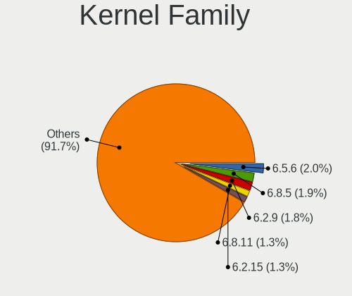
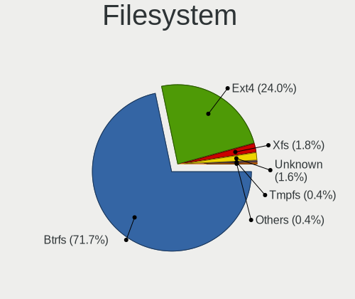
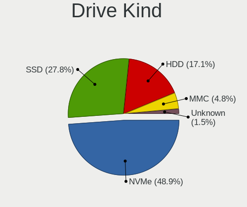
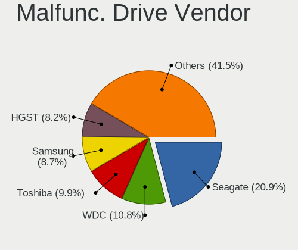
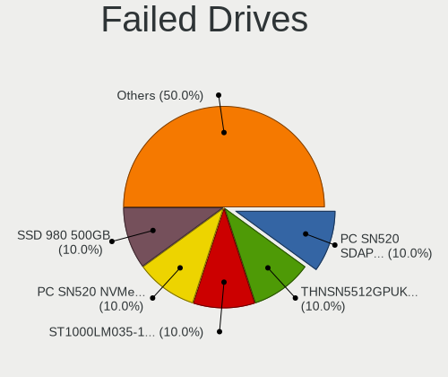
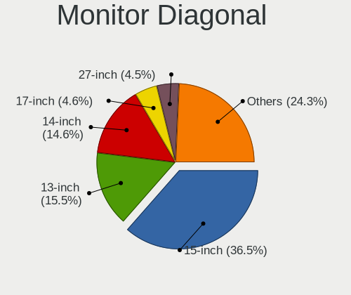

Fedora - Tested Hardware & Statistics (Notebooks)
-------------------------------------------------

A project to collect tested hardware configurations for Fedora.

Anyone can contribute to this report by the [hw-probe](https://github.com/linuxhw/hw-probe) tool:

    sudo -E hw-probe -all -upload

Please contribute! Especially if your hardware is rare.

Contents
--------

* [ Test Cases ](#test-cases)

* [ System ](#system)
  - [ OS                       ](#os)
  - [ OS Family                ](#os-family)
  - [ Kernel                   ](#kernel)
  - [ Kernel Family            ](#kernel-family)
  - [ Kernel Major Ver.        ](#kernel-major-ver)
  - [ Arch                     ](#arch)
  - [ DE                       ](#de)
  - [ Display Server           ](#display-server)
  - [ Display Manager          ](#display-manager)
  - [ OS Lang                  ](#os-lang)
  - [ Boot Mode                ](#boot-mode)
  - [ Filesystem               ](#filesystem)
  - [ Part. scheme             ](#part-scheme)
  - [ Dual Boot with Linux/BSD ](#dual-boot-with-linuxbsd)
  - [ Dual Boot (Win)          ](#dual-boot-win)

* [ Board ](#board)
  - [ Vendor                   ](#vendor)
  - [ Model                    ](#model)
  - [ Model Family             ](#model-family)
  - [ MFG Year                 ](#mfg-year)
  - [ Form Factor              ](#form-factor)
  - [ Secure Boot              ](#secure-boot)
  - [ Coreboot                 ](#coreboot)
  - [ RAM Size                 ](#ram-size)
  - [ RAM Used                 ](#ram-used)
  - [ Total Drives             ](#total-drives)
  - [ Has CD-ROM               ](#has-cd-rom)
  - [ Has Ethernet             ](#has-ethernet)
  - [ Has WiFi                 ](#has-wifi)
  - [ Has Bluetooth            ](#has-bluetooth)

* [ Location ](#location)
  - [ Country                  ](#country)
  - [ City                     ](#city)

* [ Drives ](#drives)
  - [ Drive Vendor             ](#drive-vendor)
  - [ Drive Model              ](#drive-model)
  - [ HDD Vendor               ](#hdd-vendor)
  - [ SSD Vendor               ](#ssd-vendor)
  - [ Drive Kind               ](#drive-kind)
  - [ Drive Connector          ](#drive-connector)
  - [ Drive Size               ](#drive-size)
  - [ Space Total              ](#space-total)
  - [ Space Used               ](#space-used)
  - [ Malfunc. Drives          ](#malfunc-drives)
  - [ Malfunc. Drive Vendor    ](#malfunc-drive-vendor)
  - [ Malfunc. HDD Vendor      ](#malfunc-hdd-vendor)
  - [ Malfunc. Drive Kind      ](#malfunc-drive-kind)
  - [ Failed Drives            ](#failed-drives)
  - [ Failed Drive Vendor      ](#failed-drive-vendor)
  - [ Drive Status             ](#drive-status)

* [ Storage controller ](#storage-controller)
  - [ Storage Vendor           ](#storage-vendor)
  - [ Storage Model            ](#storage-model)
  - [ Storage Kind             ](#storage-kind)

* [ Processor ](#processor)
  - [ CPU Vendor               ](#cpu-vendor)
  - [ CPU Model                ](#cpu-model)
  - [ CPU Model Family         ](#cpu-model-family)
  - [ CPU Cores                ](#cpu-cores)
  - [ CPU Sockets              ](#cpu-sockets)
  - [ CPU Threads              ](#cpu-threads)
  - [ CPU Op-Modes             ](#cpu-op-modes)
  - [ CPU Microcode            ](#cpu-microcode)
  - [ CPU Microarch            ](#cpu-microarch)

* [ Graphics ](#graphics)
  - [ GPU Vendor               ](#gpu-vendor)
  - [ GPU Model                ](#gpu-model)
  - [ GPU Combo                ](#gpu-combo)
  - [ GPU Driver               ](#gpu-driver)
  - [ GPU Memory               ](#gpu-memory)

* [ Monitor ](#monitor)
  - [ Monitor Vendor           ](#monitor-vendor)
  - [ Monitor Model            ](#monitor-model)
  - [ Monitor Resolution       ](#monitor-resolution)
  - [ Monitor Diagonal         ](#monitor-diagonal)
  - [ Monitor Width            ](#monitor-width)
  - [ Aspect Ratio             ](#aspect-ratio)
  - [ Monitor Area             ](#monitor-area)
  - [ Pixel Density            ](#pixel-density)
  - [ Multiple Monitors        ](#multiple-monitors)

* [ Network ](#network)
  - [ Net Controller Vendor    ](#net-controller-vendor)
  - [ Net Controller Model     ](#net-controller-model)
  - [ Wireless Vendor          ](#wireless-vendor)
  - [ Wireless Model           ](#wireless-model)
  - [ Ethernet Vendor          ](#ethernet-vendor)
  - [ Ethernet Model           ](#ethernet-model)
  - [ Net Controller Kind      ](#net-controller-kind)
  - [ Used Controller          ](#used-controller)
  - [ NICs                     ](#nics)
  - [ IPv6                     ](#ipv6)

* [ Bluetooth ](#bluetooth)
  - [ Bluetooth Vendor         ](#bluetooth-vendor)
  - [ Bluetooth Model          ](#bluetooth-model)

* [ Sound ](#sound)
  - [ Sound Vendor             ](#sound-vendor)
  - [ Sound Model              ](#sound-model)

* [ Memory ](#memory)
  - [ Memory Vendor            ](#memory-vendor)
  - [ Memory Model             ](#memory-model)
  - [ Memory Kind              ](#memory-kind)
  - [ Memory Form Factor       ](#memory-form-factor)
  - [ Memory Size              ](#memory-size)
  - [ Memory Speed             ](#memory-speed)

* [ Printers & scanners ](#printers--scanners)
  - [ Printer Vendor           ](#printer-vendor)
  - [ Printer Model            ](#printer-model)
  - [ Scanner Vendor           ](#scanner-vendor)
  - [ Scanner Model            ](#scanner-model)

* [ Camera ](#camera)
  - [ Camera Vendor            ](#camera-vendor)
  - [ Camera Model             ](#camera-model)

* [ Security ](#security)
  - [ Fingerprint Vendor       ](#fingerprint-vendor)
  - [ Fingerprint Model        ](#fingerprint-model)
  - [ Chipcard Vendor          ](#chipcard-vendor)
  - [ Chipcard Model           ](#chipcard-model)

* [ Unsupported ](#unsupported)
  - [ Unsupported Devices      ](#unsupported-devices)
  - [ Unsupported Device Types ](#unsupported-device-types)

Test Cases
----------

Total: 14655

| Vendor        | Model                       | Probe                                                      | Date         |
|---------------|-----------------------------|------------------------------------------------------------|--------------|
| ASUSTek       | X75VBP                      | [45dd9e0bea](https://linux-hardware.org/?probe=45dd9e0bea) | May 09, 2024 |
| Unknown       | Unknown                     | [64e1e4cc73](https://linux-hardware.org/?probe=64e1e4cc73) | May 09, 2024 |
| Sony          | VPCYB45JB                   | [6f70d22391](https://linux-hardware.org/?probe=6f70d22391) | May 09, 2024 |
| Dell          | Inspiron 13-7359            | [ed773eb204](https://linux-hardware.org/?probe=ed773eb204) | May 09, 2024 |
| Dell          | Vostro 1220                 | [a4ee382052](https://linux-hardware.org/?probe=a4ee382052) | May 09, 2024 |
| Dell          | Vostro 1220                 | [7f6372d340](https://linux-hardware.org/?probe=7f6372d340) | May 08, 2024 |
| Avell High... | A70 MOB                     | [2be654083e](https://linux-hardware.org/?probe=2be654083e) | May 08, 2024 |
| HP            | EliteBook 840 G6            | [1baa287464](https://linux-hardware.org/?probe=1baa287464) | May 08, 2024 |
| HP            | ZBook Firefly 14 inch G8... | [ed064c4025](https://linux-hardware.org/?probe=ed064c4025) | May 08, 2024 |
| Dell          | XPS 15 9500                 | [b981a13960](https://linux-hardware.org/?probe=b981a13960) | May 08, 2024 |
| ASUSTek       | X705UVP                     | [b850816596](https://linux-hardware.org/?probe=b850816596) | May 08, 2024 |
| Linx          | LINX1010B                   | [782fb4ec65](https://linux-hardware.org/?probe=782fb4ec65) | May 08, 2024 |
| ASUSTek       | Zenbook S 13 UX5304VA_UX... | [d77842b741](https://linux-hardware.org/?probe=d77842b741) | May 08, 2024 |
| Acer          | Nitro AN515-58              | [64289cb32c](https://linux-hardware.org/?probe=64289cb32c) | May 08, 2024 |
| HP            | ZBook 15 G3                 | [8fbd2e21a7](https://linux-hardware.org/?probe=8fbd2e21a7) | May 08, 2024 |
| HP            | ZBook Power 15.6 inch G8... | [e49b5301ae](https://linux-hardware.org/?probe=e49b5301ae) | May 08, 2024 |
| HP            | ZBook Power 15.6 inch G8... | [8acc6c69a3](https://linux-hardware.org/?probe=8acc6c69a3) | May 08, 2024 |
| Apple         | MacBookPro11,2              | [0ff911f7ac](https://linux-hardware.org/?probe=0ff911f7ac) | May 08, 2024 |
| Samsung       | 270E5G/270E5U               | [11c56432a4](https://linux-hardware.org/?probe=11c56432a4) | May 08, 2024 |
| Lenovo        | ThinkPad T15 Gen 2i 20W5... | [c4d3aa24cf](https://linux-hardware.org/?probe=c4d3aa24cf) | May 08, 2024 |
| Acer          | Predator PH16-71            | [516e53ae7f](https://linux-hardware.org/?probe=516e53ae7f) | May 08, 2024 |
| HP            | Pavilion Gaming Laptop 1... | [3292b37df6](https://linux-hardware.org/?probe=3292b37df6) | May 08, 2024 |
| ASUSTek       | ASUS TUF Gaming F17 FX70... | [eb38e0f3a5](https://linux-hardware.org/?probe=eb38e0f3a5) | May 08, 2024 |
| HUAWEI        | KLVL-WXX9                   | [6021a53b71](https://linux-hardware.org/?probe=6021a53b71) | May 08, 2024 |
| Dell          | Vostro 1015                 | [b5f6b13138](https://linux-hardware.org/?probe=b5f6b13138) | May 07, 2024 |
| Dell          | Inspiron 7558               | [6d19146c49](https://linux-hardware.org/?probe=6d19146c49) | May 07, 2024 |
| Acer          | Swift SF314-52              | [d112cef6d2](https://linux-hardware.org/?probe=d112cef6d2) | May 07, 2024 |
| ASUSTek       | ASUS TUF Gaming F17 FX70... | [2f571c8d88](https://linux-hardware.org/?probe=2f571c8d88) | May 07, 2024 |
| Lenovo        | ThinkPad X1 Carbon Gen 8... | [3b821d76a7](https://linux-hardware.org/?probe=3b821d76a7) | May 07, 2024 |
| Lenovo        | ThinkPad L15 Gen 3 21C70... | [701d936a1c](https://linux-hardware.org/?probe=701d936a1c) | May 07, 2024 |
| Lenovo        | ThinkPad Edge E330 3354D... | [4f7e381c6f](https://linux-hardware.org/?probe=4f7e381c6f) | May 07, 2024 |
| Lenovo        | ThinkPad L15 Gen 3 21C70... | [6d05bc6b3d](https://linux-hardware.org/?probe=6d05bc6b3d) | May 07, 2024 |
| HP            | Laptop 15s-eq2xxx           | [32e408088d](https://linux-hardware.org/?probe=32e408088d) | May 07, 2024 |
| Acer          | Aspire A515-57              | [c7471afead](https://linux-hardware.org/?probe=c7471afead) | May 07, 2024 |
| Lenovo        | Unknown                     | [63995e584e](https://linux-hardware.org/?probe=63995e584e) | May 07, 2024 |
| Acer          | Aspire A315-56              | [37f76a3652](https://linux-hardware.org/?probe=37f76a3652) | May 07, 2024 |
| Dell          | XPS 15 9520                 | [70022231bd](https://linux-hardware.org/?probe=70022231bd) | May 07, 2024 |
| HP            | Victus by Gaming Laptop ... | [24cf77eb91](https://linux-hardware.org/?probe=24cf77eb91) | May 07, 2024 |
| Acer          | Aspire A515-45              | [c9dab30ab0](https://linux-hardware.org/?probe=c9dab30ab0) | May 07, 2024 |
| HP            | ENVY Notebook 13-ab0XX      | [7d6b757088](https://linux-hardware.org/?probe=7d6b757088) | May 07, 2024 |
| Lenovo        | ThinkPad E15 Gen 4 21E60... | [230c054c87](https://linux-hardware.org/?probe=230c054c87) | May 07, 2024 |
| HP            | ENVY Notebook 13-ab0XX      | [a9d1c1234c](https://linux-hardware.org/?probe=a9d1c1234c) | May 07, 2024 |
| Framework     | Laptop 13 (AMD Ryzen 704... | [b3a37af0d0](https://linux-hardware.org/?probe=b3a37af0d0) | May 07, 2024 |
| Framework     | Laptop 13 (AMD Ryzen 704... | [63e6a64d1b](https://linux-hardware.org/?probe=63e6a64d1b) | May 07, 2024 |
| ASUSTek       | ROG Zephyrus G14 GA403UI... | [61b3a490a8](https://linux-hardware.org/?probe=61b3a490a8) | May 07, 2024 |
| Apple         | MacBookPro8,1               | [abbe6a092c](https://linux-hardware.org/?probe=abbe6a092c) | May 07, 2024 |
| Apple         | MacBookPro8,1               | [dcd5e1e281](https://linux-hardware.org/?probe=dcd5e1e281) | May 07, 2024 |
| Dell          | Precision 5520              | [3b0c11a9ff](https://linux-hardware.org/?probe=3b0c11a9ff) | May 07, 2024 |
| HP            | Pavilion Gaming Laptop 1... | [643f150579](https://linux-hardware.org/?probe=643f150579) | May 07, 2024 |
| Dell          | Precision 5520              | [bf1f2486cd](https://linux-hardware.org/?probe=bf1f2486cd) | May 07, 2024 |
| Dell          | XPS 15 9500                 | [e5dc310897](https://linux-hardware.org/?probe=e5dc310897) | May 07, 2024 |
| Apple         | MacBookPro11,1              | [c18909580d](https://linux-hardware.org/?probe=c18909580d) | May 07, 2024 |
| Apple         | MacBookPro11,1              | [61aed9772b](https://linux-hardware.org/?probe=61aed9772b) | May 07, 2024 |
| ASUSTek       | VivoBook_ASUSLaptop M760... | [773ca4f9c9](https://linux-hardware.org/?probe=773ca4f9c9) | May 06, 2024 |
| ASUSTek       | VivoBook_ASUSLaptop M760... | [0104fa9a83](https://linux-hardware.org/?probe=0104fa9a83) | May 06, 2024 |
| ASUSTek       | X405UQ                      | [aa39bc4676](https://linux-hardware.org/?probe=aa39bc4676) | May 06, 2024 |
| Lenovo        | ThinkPad X13 Gen 3 21CM0... | [39fdd434dd](https://linux-hardware.org/?probe=39fdd434dd) | May 06, 2024 |
| Acer          | Aspire E1-572               | [3df494e445](https://linux-hardware.org/?probe=3df494e445) | May 06, 2024 |
| Lenovo        | ThinkPad Helix 36986CG      | [9b2bd77573](https://linux-hardware.org/?probe=9b2bd77573) | May 06, 2024 |
| Linx          | LINX1010B                   | [5abe12bf84](https://linux-hardware.org/?probe=5abe12bf84) | May 06, 2024 |
| Star Labs     | StarBook                    | [7e37692a50](https://linux-hardware.org/?probe=7e37692a50) | May 06, 2024 |
| Dell          | Precision M4700             | [db0b8eb10b](https://linux-hardware.org/?probe=db0b8eb10b) | May 06, 2024 |
| Lenovo        | IdeaPad C340-14API 81N6     | [c120bbd998](https://linux-hardware.org/?probe=c120bbd998) | May 06, 2024 |
| ASUSTek       | GL553VW                     | [c51bf874e5](https://linux-hardware.org/?probe=c51bf874e5) | May 06, 2024 |
| ASUSTek       | S550CB                      | [943c34e625](https://linux-hardware.org/?probe=943c34e625) | May 06, 2024 |
| Alienware     | x17 R2                      | [ed5c24948b](https://linux-hardware.org/?probe=ed5c24948b) | May 06, 2024 |
| Acer          | Aspire A715-41G             | [b24efb4449](https://linux-hardware.org/?probe=b24efb4449) | May 06, 2024 |
| Apple         | MacBookPro15,2              | [4720f69696](https://linux-hardware.org/?probe=4720f69696) | May 06, 2024 |
| ASUSTek       | X550CA                      | [5038e329fc](https://linux-hardware.org/?probe=5038e329fc) | May 06, 2024 |
| Unknown       | X570 Phantom Gaming-ITX/... | [a02a58b376](https://linux-hardware.org/?probe=a02a58b376) | May 06, 2024 |
| Alienware     | x17 R2                      | [a920973ad3](https://linux-hardware.org/?probe=a920973ad3) | May 06, 2024 |
| Lenovo        | ThinkPad P52 20M9CTO1WW     | [8d12951a69](https://linux-hardware.org/?probe=8d12951a69) | May 06, 2024 |
| Dell          | Vostro 5471                 | [dae50714b1](https://linux-hardware.org/?probe=dae50714b1) | May 06, 2024 |
| Dell          | Vostro 5471                 | [92897b02b9](https://linux-hardware.org/?probe=92897b02b9) | May 06, 2024 |
| ASUSTek       | ROG Strix G731GV_G731GV     | [00ceb2ea16](https://linux-hardware.org/?probe=00ceb2ea16) | May 06, 2024 |
| Lenovo        | IdeaPad L3 15IML05 81Y3     | [74454fbcde](https://linux-hardware.org/?probe=74454fbcde) | May 05, 2024 |
| Apple         | MacBookPro15,2              | [568bb3b863](https://linux-hardware.org/?probe=568bb3b863) | May 05, 2024 |
| Positivo      | J14GL11                     | [71f761fa87](https://linux-hardware.org/?probe=71f761fa87) | May 05, 2024 |
| ASUSTek       | VivoBook_ASUSLaptop X515... | [278add8d07](https://linux-hardware.org/?probe=278add8d07) | May 05, 2024 |
| HP            | ProBook 455 G7              | [470e53d860](https://linux-hardware.org/?probe=470e53d860) | May 05, 2024 |
| Dell          | Inspiron 15 3530            | [a71239f845](https://linux-hardware.org/?probe=a71239f845) | May 05, 2024 |
| Fujitsu       | LIFEBOOK T900               | [d396d19b06](https://linux-hardware.org/?probe=d396d19b06) | May 05, 2024 |
| HUAWEI        | MACHR-WX9                   | [9577917e03](https://linux-hardware.org/?probe=9577917e03) | May 05, 2024 |
| ASUSTek       | X510UAR                     | [3317acbe53](https://linux-hardware.org/?probe=3317acbe53) | May 05, 2024 |
| Timi          | Mi NoteBook Pro             | [71071a816e](https://linux-hardware.org/?probe=71071a816e) | May 05, 2024 |
| ASUSTek       | TUF Gaming FX505GE_FX505... | [6794452c3b](https://linux-hardware.org/?probe=6794452c3b) | May 05, 2024 |
| Acer          | Swift SFA16-41              | [df5596b6b2](https://linux-hardware.org/?probe=df5596b6b2) | May 05, 2024 |
| Acer          | Nitro AN515-46              | [23ae7fd7c6](https://linux-hardware.org/?probe=23ae7fd7c6) | May 05, 2024 |
| HP            | 240 G8                      | [8b7c23e6cb](https://linux-hardware.org/?probe=8b7c23e6cb) | May 05, 2024 |
| HP            | Pavilion Laptop 15-cc5xx    | [ab0226a735](https://linux-hardware.org/?probe=ab0226a735) | May 05, 2024 |
| Dell          | Precision M4700             | [7b8ccefbed](https://linux-hardware.org/?probe=7b8ccefbed) | May 05, 2024 |
| Dell          | Latitude 3400               | [259b0b8cbf](https://linux-hardware.org/?probe=259b0b8cbf) | May 04, 2024 |
| Unknown       | Unknown                     | [b7866b963f](https://linux-hardware.org/?probe=b7866b963f) | May 04, 2024 |
| ASUSTek       | ROG Strix G512LV_G512LV     | [7c2c0a0fc2](https://linux-hardware.org/?probe=7c2c0a0fc2) | May 04, 2024 |
| HP            | ProBook 470 G5              | [66da43e604](https://linux-hardware.org/?probe=66da43e604) | May 04, 2024 |
| Positivo      | S14CT01                     | [45c8a9d70b](https://linux-hardware.org/?probe=45c8a9d70b) | May 04, 2024 |
| Apple         | MacBook5,1                  | [021661dd6a](https://linux-hardware.org/?probe=021661dd6a) | May 04, 2024 |
| Apple         | MacBook5,1                  | [cc8e76485b](https://linux-hardware.org/?probe=cc8e76485b) | May 04, 2024 |
| Lenovo        | ThinkPad T440p 20AWS3D60... | [ee74f28516](https://linux-hardware.org/?probe=ee74f28516) | May 04, 2024 |
| Positivo      | S14CT01                     | [f2994ff445](https://linux-hardware.org/?probe=f2994ff445) | May 04, 2024 |
| Toshiba       | Satellite L855              | [15101644b0](https://linux-hardware.org/?probe=15101644b0) | May 04, 2024 |
| Toshiba       | Satellite L855              | [359b9f3cd6](https://linux-hardware.org/?probe=359b9f3cd6) | May 04, 2024 |
| Lenovo        | ThinkPad T14 Gen 1 20S00... | [ed456fa085](https://linux-hardware.org/?probe=ed456fa085) | May 04, 2024 |
| Dell          | Inspiron 5721               | [7b78782a60](https://linux-hardware.org/?probe=7b78782a60) | May 04, 2024 |
| Acer          | Nitro AN515-57              | [de8582fd4b](https://linux-hardware.org/?probe=de8582fd4b) | May 04, 2024 |
| Lenovo        | IdeaPad 5 15IIL05 81YK      | [1a042bfbb0](https://linux-hardware.org/?probe=1a042bfbb0) | May 04, 2024 |
| Alienware     | m15 R6                      | [98d55c3264](https://linux-hardware.org/?probe=98d55c3264) | May 04, 2024 |
| ASUSTek       | K56CB                       | [1d94e1ecd1](https://linux-hardware.org/?probe=1d94e1ecd1) | May 04, 2024 |
| Lenovo        | ThinkPad T480 20L6S7MP00    | [2e32ab2b3b](https://linux-hardware.org/?probe=2e32ab2b3b) | May 04, 2024 |
| Lenovo        | ThinkBook 15 G2 ITL 20VE    | [a308965bd0](https://linux-hardware.org/?probe=a308965bd0) | May 04, 2024 |
| ASUSTek       | GL703VM                     | [9fc5a6d2eb](https://linux-hardware.org/?probe=9fc5a6d2eb) | May 04, 2024 |
| Dell          | Vostro 15 5510              | [a3b2e8da38](https://linux-hardware.org/?probe=a3b2e8da38) | May 04, 2024 |
| Lenovo        | ThinkPad E15 Gen 2 20T80... | [5975b5df1b](https://linux-hardware.org/?probe=5975b5df1b) | May 04, 2024 |
| Lenovo        | IdeaPad C340-14API 81N6     | [ff66cc5e3d](https://linux-hardware.org/?probe=ff66cc5e3d) | May 04, 2024 |
| Lenovo        | ThinkBook 15-IIL 20SM       | [7471316f20](https://linux-hardware.org/?probe=7471316f20) | May 04, 2024 |
| Acer          | Aspire E5-773G              | [e49a79cb29](https://linux-hardware.org/?probe=e49a79cb29) | May 04, 2024 |
| Lenovo        | ThinkPad T480s 20L8S3KR0... | [3853332c92](https://linux-hardware.org/?probe=3853332c92) | May 04, 2024 |
| MSI           | Raider GE68HX 13VG          | [b3f866a8e6](https://linux-hardware.org/?probe=b3f866a8e6) | May 04, 2024 |
| SLIMBOOK      | HERO-S-TGL-RTX              | [eac9faa98c](https://linux-hardware.org/?probe=eac9faa98c) | May 03, 2024 |
| ASUSTek       | VivoBook_ASUSLaptop M150... | [ad6d7c5f93](https://linux-hardware.org/?probe=ad6d7c5f93) | May 03, 2024 |
| IGEL Techn... | M340C                       | [dbb60f0c71](https://linux-hardware.org/?probe=dbb60f0c71) | May 03, 2024 |
| Toshiba       | Satellite L745              | [797c23bdbc](https://linux-hardware.org/?probe=797c23bdbc) | May 03, 2024 |
| ASUSTek       | VivoBook_ASUSLaptop X515... | [5b3074a531](https://linux-hardware.org/?probe=5b3074a531) | May 03, 2024 |
| HP            | OMEN by Laptop 16-c0xxx     | [44e9f4946e](https://linux-hardware.org/?probe=44e9f4946e) | May 03, 2024 |
| HP            | OMEN by Laptop 16-c0xxx     | [02a14960a9](https://linux-hardware.org/?probe=02a14960a9) | May 03, 2024 |
| ASUSTek       | ASUS Zenbook 14 UX3405MA... | [2b3beb5230](https://linux-hardware.org/?probe=2b3beb5230) | May 03, 2024 |
| Framework     | Laptop 13 (AMD Ryzen 704... | [90520db800](https://linux-hardware.org/?probe=90520db800) | May 03, 2024 |
| Lenovo        | IdeaPad Z500 20202          | [41468a4e5c](https://linux-hardware.org/?probe=41468a4e5c) | May 03, 2024 |
| N-one         | Nbook Ultra                 | [ae1609d065](https://linux-hardware.org/?probe=ae1609d065) | May 03, 2024 |
| HP            | Notebook                    | [ba95ac1b57](https://linux-hardware.org/?probe=ba95ac1b57) | May 03, 2024 |
| Lenovo        | ThinkPad P15s Gen 2i 20W... | [89ce066855](https://linux-hardware.org/?probe=89ce066855) | May 03, 2024 |
| HP            | EliteBook 8570w             | [050889a119](https://linux-hardware.org/?probe=050889a119) | May 03, 2024 |
| HP            | EliteBook 8570w             | [6b53737811](https://linux-hardware.org/?probe=6b53737811) | May 03, 2024 |
| PC Special... | PCx0Dx                      | [8aa3848116](https://linux-hardware.org/?probe=8aa3848116) | May 02, 2024 |
| HP            | EliteBook 840 G6            | [da166304a5](https://linux-hardware.org/?probe=da166304a5) | May 02, 2024 |
| Schenker      | XMG CORE 15(M20, RTX 206... | [e22a67c560](https://linux-hardware.org/?probe=e22a67c560) | May 02, 2024 |
| Lenovo        | ThinkPad T14 Gen 5 21MLC... | [d1732b9421](https://linux-hardware.org/?probe=d1732b9421) | May 02, 2024 |
| Lenovo        | IdeaPad Pro 5 16IMH9 83D... | [194589e94c](https://linux-hardware.org/?probe=194589e94c) | May 02, 2024 |
| Lenovo        | Yoga Pro 7 14IRH8 82Y7      | [2bd6f2ebd6](https://linux-hardware.org/?probe=2bd6f2ebd6) | May 02, 2024 |
| HP            | EliteBook 865 16 inch G1... | [9051ebbe11](https://linux-hardware.org/?probe=9051ebbe11) | May 02, 2024 |
| Chuwi         | HeroBook Pro                | [76e47767d1](https://linux-hardware.org/?probe=76e47767d1) | May 02, 2024 |
| HP            | Laptop 15-ra0xx             | [4d00a746ff](https://linux-hardware.org/?probe=4d00a746ff) | May 02, 2024 |
| HP            | EliteBook 840 G5            | [e200a00e5a](https://linux-hardware.org/?probe=e200a00e5a) | May 02, 2024 |
| ASUSTek       | VivoBook_ASUSLaptop X150... | [db48550f51](https://linux-hardware.org/?probe=db48550f51) | May 02, 2024 |
| Dell          | Inspiron M5010              | [eed6e90235](https://linux-hardware.org/?probe=eed6e90235) | May 02, 2024 |
| LG Electro... | 14Z90S-GA5HK                | [ba55286732](https://linux-hardware.org/?probe=ba55286732) | May 02, 2024 |
| HUAWEI        | BOD-WXX9                    | [555e3c4b2c](https://linux-hardware.org/?probe=555e3c4b2c) | May 02, 2024 |
| Lenovo        | ThinkPad X201 3626HMG       | [c445ea85c4](https://linux-hardware.org/?probe=c445ea85c4) | May 02, 2024 |
| Gigabyte      | B450M DS3H-CF               | [eb1d061242](https://linux-hardware.org/?probe=eb1d061242) | May 02, 2024 |
| HP            | Dragonfly 13.5 inch G4 N... | [0a75b86ae0](https://linux-hardware.org/?probe=0a75b86ae0) | May 02, 2024 |
| Lenovo        | IdeaPad Z500 20202          | [f7e35750cd](https://linux-hardware.org/?probe=f7e35750cd) | May 02, 2024 |
| Apple         | MacBookPro11,4              | [e4b5fb0f12](https://linux-hardware.org/?probe=e4b5fb0f12) | May 01, 2024 |
| Samsung       | 550P5C/550P7C               | [c8bdddb366](https://linux-hardware.org/?probe=c8bdddb366) | May 01, 2024 |
| Maibenben     | MaiBook M                   | [791e571e24](https://linux-hardware.org/?probe=791e571e24) | May 01, 2024 |
| Apple         | MacBookPro9,2               | [120440b735](https://linux-hardware.org/?probe=120440b735) | May 01, 2024 |
| Dell          | Vostro 5402                 | [34a28e5fd3](https://linux-hardware.org/?probe=34a28e5fd3) | May 01, 2024 |
| Acer          | Aspire A715-41G             | [aa9c440102](https://linux-hardware.org/?probe=aa9c440102) | May 01, 2024 |
| ASUSTek       | ASUS Vivobook S 16 S5606... | [bfe20c3d58](https://linux-hardware.org/?probe=bfe20c3d58) | May 01, 2024 |
| HP            | Notebook                    | [415db360d5](https://linux-hardware.org/?probe=415db360d5) | May 01, 2024 |
| Lenovo        | ThinkPad X260 20F5S3J301    | [d373de3608](https://linux-hardware.org/?probe=d373de3608) | May 01, 2024 |
| HP            | Laptop 15q-bu0xx            | [7f08bc6862](https://linux-hardware.org/?probe=7f08bc6862) | May 01, 2024 |
| LG Electro... | 16Z90P-G.AA76G              | [f9bdc22f6f](https://linux-hardware.org/?probe=f9bdc22f6f) | May 01, 2024 |
| Dell          | Inspiron 7537               | [d27f9ad169](https://linux-hardware.org/?probe=d27f9ad169) | May 01, 2024 |
| HP            | EliteBook 850 G1            | [c6effb94ba](https://linux-hardware.org/?probe=c6effb94ba) | May 01, 2024 |
| Lenovo        | V580c 20160                 | [f7f711165b](https://linux-hardware.org/?probe=f7f711165b) | May 01, 2024 |
| Lenovo        | ThinkPad SL510 2847Q7G      | [c2f435ff58](https://linux-hardware.org/?probe=c2f435ff58) | May 01, 2024 |
| ASUSTek       | VivoBook_ASUSLaptop X515... | [badf656eaf](https://linux-hardware.org/?probe=badf656eaf) | May 01, 2024 |
| Apple         | MacBookPro15,2              | [5d0cceea3e](https://linux-hardware.org/?probe=5d0cceea3e) | Apr 30, 2024 |
| ASUSTek       | ROG Zephyrus G14 GA402RJ... | [568e826f4b](https://linux-hardware.org/?probe=568e826f4b) | Apr 30, 2024 |
| Sony          | SVE1512Z1EB                 | [18a1eb8f10](https://linux-hardware.org/?probe=18a1eb8f10) | Apr 30, 2024 |
| Lenovo        | ThinkPad P53 20QN0011IV     | [ab7c916d4c](https://linux-hardware.org/?probe=ab7c916d4c) | Apr 30, 2024 |
| ASUSTek       | VivoBook_ASUSLaptop X350... | [3c551032a7](https://linux-hardware.org/?probe=3c551032a7) | Apr 30, 2024 |
| HP            | EliteBook 860 16 inch G1... | [7a9e1274fa](https://linux-hardware.org/?probe=7a9e1274fa) | Apr 30, 2024 |
| Lenovo        | V580c 20160                 | [2114d134ab](https://linux-hardware.org/?probe=2114d134ab) | Apr 30, 2024 |
| Framework     | Laptop 13 (AMD Ryzen 704... | [94cfd5a8cf](https://linux-hardware.org/?probe=94cfd5a8cf) | Apr 30, 2024 |
| Framework     | Laptop 13 (AMD Ryzen 704... | [b8bb184ea8](https://linux-hardware.org/?probe=b8bb184ea8) | Apr 30, 2024 |
| Dell          | Latitude 5440               | [c51190016f](https://linux-hardware.org/?probe=c51190016f) | Apr 30, 2024 |
| Lenovo        | ThinkPad P1 Gen 4i 20Y4S... | [44057fd7b0](https://linux-hardware.org/?probe=44057fd7b0) | Apr 30, 2024 |
| HP            | Victus by Gaming Laptop ... | [9318ac5f47](https://linux-hardware.org/?probe=9318ac5f47) | Apr 30, 2024 |
| HP            | Pavilion g4                 | [2ef481129d](https://linux-hardware.org/?probe=2ef481129d) | Apr 30, 2024 |
| HUAWEI        | KLVL-WXXW                   | [1e4b5f233f](https://linux-hardware.org/?probe=1e4b5f233f) | Apr 30, 2024 |
| HUAWEI        | BOM-WXX9                    | [b6223c94a8](https://linux-hardware.org/?probe=b6223c94a8) | Apr 30, 2024 |
| Lenovo        | ThinkPad T14 Gen 4 21K4S... | [8cd1bfd7aa](https://linux-hardware.org/?probe=8cd1bfd7aa) | Apr 30, 2024 |
| HP            | Pavilion Gaming Laptop 1... | [17441de577](https://linux-hardware.org/?probe=17441de577) | Apr 30, 2024 |
| HP            | EliteBook 840 G4            | [86a58844a8](https://linux-hardware.org/?probe=86a58844a8) | Apr 30, 2024 |
| Maibenben     | MaiBook M                   | [ca131f72bd](https://linux-hardware.org/?probe=ca131f72bd) | Apr 30, 2024 |
| HP            | OMEN by Laptop              | [90a616a0ca](https://linux-hardware.org/?probe=90a616a0ca) | Apr 30, 2024 |
| Lenovo        | ThinkBook 13x G4 IMH 21K... | [eface5275d](https://linux-hardware.org/?probe=eface5275d) | Apr 29, 2024 |
| Lenovo        | V330-15IKB 81AX             | [2282169665](https://linux-hardware.org/?probe=2282169665) | Apr 29, 2024 |
| Apple         | MacBook5,1                  | [899bc07aae](https://linux-hardware.org/?probe=899bc07aae) | Apr 29, 2024 |
| HP            | EliteBook 8570p             | [03f63c8caf](https://linux-hardware.org/?probe=03f63c8caf) | Apr 29, 2024 |
| HP            | EliteBook 8570p             | [5c699c7770](https://linux-hardware.org/?probe=5c699c7770) | Apr 29, 2024 |
| ASUSTek       | S550CB                      | [81cb26d4c3](https://linux-hardware.org/?probe=81cb26d4c3) | Apr 29, 2024 |
| Dell          | G5 5505                     | [4ecf1f44e4](https://linux-hardware.org/?probe=4ecf1f44e4) | Apr 29, 2024 |
| Lenovo        | ThinkPad E16 Gen 1 21JTC... | [cec886e488](https://linux-hardware.org/?probe=cec886e488) | Apr 29, 2024 |
| Dell          | Latitude 5490               | [0b0c0eb973](https://linux-hardware.org/?probe=0b0c0eb973) | Apr 29, 2024 |
| Apple         | MacBookPro9,1               | [d670f48308](https://linux-hardware.org/?probe=d670f48308) | Apr 29, 2024 |
| HP            | ZBook Firefly 14 inch G9... | [22dcf39db0](https://linux-hardware.org/?probe=22dcf39db0) | Apr 29, 2024 |
| Dell          | Latitude 7300               | [9fb87e1a65](https://linux-hardware.org/?probe=9fb87e1a65) | Apr 29, 2024 |
| Acer          | Aspire A315-44P             | [88d63b7ebb](https://linux-hardware.org/?probe=88d63b7ebb) | Apr 29, 2024 |
| Dell          | Latitude 5540               | [71894c9703](https://linux-hardware.org/?probe=71894c9703) | Apr 29, 2024 |
| Apple         | MacBookAir6,2               | [f64a8cacbe](https://linux-hardware.org/?probe=f64a8cacbe) | Apr 29, 2024 |
| HP            | 14                          | [e3828c3dc9](https://linux-hardware.org/?probe=e3828c3dc9) | Apr 29, 2024 |
| Lenovo        | ThinkPad L15 Gen 1 20U70... | [d4e717f7b6](https://linux-hardware.org/?probe=d4e717f7b6) | Apr 29, 2024 |
| HP            | 14                          | [a1017c1b83](https://linux-hardware.org/?probe=a1017c1b83) | Apr 29, 2024 |
| Lenovo        | Legion Pro 5 16IRX8 82WK    | [82a20d0525](https://linux-hardware.org/?probe=82a20d0525) | Apr 29, 2024 |
| Lenovo        | Legion Pro 5 16IRX8 82WK    | [c56c98c58e](https://linux-hardware.org/?probe=c56c98c58e) | Apr 29, 2024 |
| Dell          | XPS 13 7390                 | [ec7fc4cf5a](https://linux-hardware.org/?probe=ec7fc4cf5a) | Apr 29, 2024 |
| ASUSTek       | ROG Zephyrus G14 GA401QH... | [eef1270128](https://linux-hardware.org/?probe=eef1270128) | Apr 28, 2024 |
| Apple         | MacBookPro11,3              | [3e372c3652](https://linux-hardware.org/?probe=3e372c3652) | Apr 28, 2024 |
| Lenovo        | IdeaPad S145-15IWL 81MV     | [9b282865ea](https://linux-hardware.org/?probe=9b282865ea) | Apr 28, 2024 |
| Apple         | MacBookPro11,3              | [881eaab6c1](https://linux-hardware.org/?probe=881eaab6c1) | Apr 28, 2024 |
| Lenovo        | ThinkPad T420 4236MA3       | [c968415c21](https://linux-hardware.org/?probe=c968415c21) | Apr 28, 2024 |
| Dell          | Latitude 5420               | [0a95f2013b](https://linux-hardware.org/?probe=0a95f2013b) | Apr 28, 2024 |
| Lenovo        | ThinkPad T14 Gen 2i 20W0... | [e2a9d44509](https://linux-hardware.org/?probe=e2a9d44509) | Apr 28, 2024 |
| Dixonsxp      | Crestline & ICH8M Chipse... | [1361feafda](https://linux-hardware.org/?probe=1361feafda) | Apr 28, 2024 |
| HP            | Victus by Gaming Laptop ... | [a05a4bbcc2](https://linux-hardware.org/?probe=a05a4bbcc2) | Apr 28, 2024 |
| HP            | OMEN by Laptop 15-ce0xx     | [d888ad1bd2](https://linux-hardware.org/?probe=d888ad1bd2) | Apr 28, 2024 |
| MSI           | GF63 8RD                    | [01aaa42b00](https://linux-hardware.org/?probe=01aaa42b00) | Apr 28, 2024 |
| HP            | Pavilion Notebook           | [6da1776d42](https://linux-hardware.org/?probe=6da1776d42) | Apr 28, 2024 |
| Star Labs     | StarBook                    | [99017e5822](https://linux-hardware.org/?probe=99017e5822) | Apr 28, 2024 |
| HP            | Notebook                    | [6252c3e002](https://linux-hardware.org/?probe=6252c3e002) | Apr 28, 2024 |
| Lenovo        | ThinkPad T410 2522PT3       | [1e61d17468](https://linux-hardware.org/?probe=1e61d17468) | Apr 28, 2024 |
| Dell          | Inspiron 5459               | [b63833a7b2](https://linux-hardware.org/?probe=b63833a7b2) | Apr 28, 2024 |
| Lenovo        | G700 20251                  | [c98807b638](https://linux-hardware.org/?probe=c98807b638) | Apr 28, 2024 |
| Lenovo        | ThinkPad E14 Gen 4 21E3S... | [9553bbdbc4](https://linux-hardware.org/?probe=9553bbdbc4) | Apr 28, 2024 |
| HP            | Laptop 15-bs0xx             | [92878d7fb2](https://linux-hardware.org/?probe=92878d7fb2) | Apr 28, 2024 |
| Lenovo        | IdeaPad Gaming 3 15IMH05... | [bb0733cb2a](https://linux-hardware.org/?probe=bb0733cb2a) | Apr 28, 2024 |
| Lenovo        | ThinkPad T520 42424WU       | [f54ef8bc01](https://linux-hardware.org/?probe=f54ef8bc01) | Apr 27, 2024 |
| Dell          | Inspiron 5770               | [9194ac8af9](https://linux-hardware.org/?probe=9194ac8af9) | Apr 27, 2024 |
| ASUSTek       | ROG Zephyrus G14 GA401IV... | [70ce1e3cee](https://linux-hardware.org/?probe=70ce1e3cee) | Apr 27, 2024 |
| Lenovo        | G700 20251                  | [a280143fe1](https://linux-hardware.org/?probe=a280143fe1) | Apr 27, 2024 |
| Lenovo        | ThinkPad P70 20ESS2J700     | [3ed1b856a7](https://linux-hardware.org/?probe=3ed1b856a7) | Apr 27, 2024 |
| HONOR         | BMH-WDX9                    | [0f5f7fc34b](https://linux-hardware.org/?probe=0f5f7fc34b) | Apr 27, 2024 |
| Dell          | Latitude 7490               | [12d9f9cce2](https://linux-hardware.org/?probe=12d9f9cce2) | Apr 27, 2024 |
| Lenovo        | Legion 5 15IMH05H 82CF      | [46b36289be](https://linux-hardware.org/?probe=46b36289be) | Apr 27, 2024 |
| ASUSTek       | ASUS TUF Gaming F15 FX50... | [1699679c97](https://linux-hardware.org/?probe=1699679c97) | Apr 27, 2024 |
| HP            | EliteBook 830 G6            | [6b74d2c1b5](https://linux-hardware.org/?probe=6b74d2c1b5) | Apr 27, 2024 |
| Acer          | Nitro AN515-58              | [5192e9d32b](https://linux-hardware.org/?probe=5192e9d32b) | Apr 27, 2024 |
| ASUSTek       | VivoBook_ASUSLaptop X150... | [dfcd535d56](https://linux-hardware.org/?probe=dfcd535d56) | Apr 27, 2024 |
| Dell          | Latitude 5300               | [0bacb68e71](https://linux-hardware.org/?probe=0bacb68e71) | Apr 27, 2024 |
| HP            | 15                          | [474c29dc98](https://linux-hardware.org/?probe=474c29dc98) | Apr 27, 2024 |
| HUAWEI        | BOM-WXX9                    | [8fd8598d05](https://linux-hardware.org/?probe=8fd8598d05) | Apr 27, 2024 |
| Apple         | MacBookPro9,2               | [3c61d5b617](https://linux-hardware.org/?probe=3c61d5b617) | Apr 27, 2024 |
| ASUSTek       | ASUS Zenbook 14 UX3405MA... | [dc503c161a](https://linux-hardware.org/?probe=dc503c161a) | Apr 27, 2024 |
| Google        | Laser14                     | [5addd4566a](https://linux-hardware.org/?probe=5addd4566a) | Apr 27, 2024 |
| Acer          | Aspire A314-35              | [b81c267e1b](https://linux-hardware.org/?probe=b81c267e1b) | Apr 27, 2024 |
| Dell          | Inspiron 15 3520            | [e8f25e02cb](https://linux-hardware.org/?probe=e8f25e02cb) | Apr 27, 2024 |
| Lenovo        | IdeaPad S145-15API 81V7     | [d815a3ca77](https://linux-hardware.org/?probe=d815a3ca77) | Apr 26, 2024 |
| Lenovo        | IdeaPad S145-15API 81V7     | [079540b490](https://linux-hardware.org/?probe=079540b490) | Apr 26, 2024 |
| ASUSTek       | ROG Zephyrus G14 GA402XV... | [7982a1cc5b](https://linux-hardware.org/?probe=7982a1cc5b) | Apr 26, 2024 |
| Acer          | Aspire A315-31              | [252cddf085](https://linux-hardware.org/?probe=252cddf085) | Apr 26, 2024 |
| Dell          | Precision 5560              | [5bb30e87d6](https://linux-hardware.org/?probe=5bb30e87d6) | Apr 26, 2024 |
| Lenovo        | Unknown                     | [314b707335](https://linux-hardware.org/?probe=314b707335) | Apr 26, 2024 |
| Apple         | MacBookPro11,5              | [477f528415](https://linux-hardware.org/?probe=477f528415) | Apr 26, 2024 |
| HP            | EliteBook 840 G6            | [6b247b5b1f](https://linux-hardware.org/?probe=6b247b5b1f) | Apr 26, 2024 |
| Lenovo        | LOQ 15APH8 82XT             | [fad4840965](https://linux-hardware.org/?probe=fad4840965) | Apr 26, 2024 |
| Positivo      | S15SL                       | [7eeb7b8841](https://linux-hardware.org/?probe=7eeb7b8841) | Apr 26, 2024 |
| Lenovo        | Legion 5 Pro 16ACH6H 82J... | [46e559a9de](https://linux-hardware.org/?probe=46e559a9de) | Apr 26, 2024 |
| MSI           | Modern 15 A5M               | [3e1d481314](https://linux-hardware.org/?probe=3e1d481314) | Apr 26, 2024 |
| Monster       | ABRA A5 V20.2               | [7c8b0185ad](https://linux-hardware.org/?probe=7c8b0185ad) | Apr 26, 2024 |
| Lenovo        | ThinkPad T460 20FNCTO1WW    | [3727b60089](https://linux-hardware.org/?probe=3727b60089) | Apr 26, 2024 |
| ASUSTek       | X542UQ                      | [146282870d](https://linux-hardware.org/?probe=146282870d) | Apr 26, 2024 |
| ASUSTek       | VivoBook_ASUSLaptop E410... | [cdc03d24ba](https://linux-hardware.org/?probe=cdc03d24ba) | Apr 26, 2024 |
| Chuwi         | MiniBook X                  | [72a19fbe38](https://linux-hardware.org/?probe=72a19fbe38) | Apr 26, 2024 |
| Dell          | XPS 15 9560                 | [ec025f4541](https://linux-hardware.org/?probe=ec025f4541) | Apr 26, 2024 |
| Lenovo        | ThinkPad X1 Carbon 2nd 2... | [732deac74e](https://linux-hardware.org/?probe=732deac74e) | Apr 26, 2024 |
| Dell          | 06X1TJ A00                  | [fc0fca88fa](https://linux-hardware.org/?probe=fc0fca88fa) | Apr 26, 2024 |
| HUAWEI        | BOM-WXX9                    | [5fe5c7ed8d](https://linux-hardware.org/?probe=5fe5c7ed8d) | Apr 26, 2024 |
| Acer          | Aspire A315-53G             | [2a3e224f63](https://linux-hardware.org/?probe=2a3e224f63) | Apr 26, 2024 |
| Dell          | XPS 15 9530                 | [2349cf6da5](https://linux-hardware.org/?probe=2349cf6da5) | Apr 26, 2024 |
| Apple         | MacBookPro12,1              | [2480570421](https://linux-hardware.org/?probe=2480570421) | Apr 26, 2024 |
| Dell          | Latitude E6530              | [ef156e14fe](https://linux-hardware.org/?probe=ef156e14fe) | Apr 25, 2024 |
| HUAWEI        | MRGF-XX                     | [fc337f163c](https://linux-hardware.org/?probe=fc337f163c) | Apr 25, 2024 |
| HUAWEI        | MRGF-XX                     | [f8e3f93462](https://linux-hardware.org/?probe=f8e3f93462) | Apr 25, 2024 |
| HP            | EliteBook 840 G8 Noteboo... | [eaf4d9f0b7](https://linux-hardware.org/?probe=eaf4d9f0b7) | Apr 25, 2024 |
| ASUSTek       | VivoBook 14_ASUS Laptop ... | [537da6819a](https://linux-hardware.org/?probe=537da6819a) | Apr 25, 2024 |
| ASUSTek       | VivoBook 15_ASUS Laptop ... | [256b1160a5](https://linux-hardware.org/?probe=256b1160a5) | Apr 25, 2024 |
| Acer          | Predator PH315-51           | [f671d64f35](https://linux-hardware.org/?probe=f671d64f35) | Apr 25, 2024 |
| Lenovo        | IdeaPad 5 Pro 14ACN6 82L... | [ae5dddd784](https://linux-hardware.org/?probe=ae5dddd784) | Apr 25, 2024 |
| HP            | Victus by Gaming Laptop ... | [c56f9e6bd0](https://linux-hardware.org/?probe=c56f9e6bd0) | Apr 25, 2024 |
| Lenovo        | ThinkPad T450s 20BX001EU... | [b1cd1d7df2](https://linux-hardware.org/?probe=b1cd1d7df2) | Apr 25, 2024 |
| Lenovo        | ThinkPad T450s 20BX001EU... | [9acc3eed8d](https://linux-hardware.org/?probe=9acc3eed8d) | Apr 25, 2024 |
| Lenovo        | IdeaPad L340-15IRH Gamin... | [70560c5a36](https://linux-hardware.org/?probe=70560c5a36) | Apr 25, 2024 |
| Fujitsu       | LIFEBOOK P702               | [e7b04de0c7](https://linux-hardware.org/?probe=e7b04de0c7) | Apr 25, 2024 |
| GPD           | G1619-04                    | [ad6e53094b](https://linux-hardware.org/?probe=ad6e53094b) | Apr 25, 2024 |
| ASUSTek       | N751JK                      | [f49afec710](https://linux-hardware.org/?probe=f49afec710) | Apr 25, 2024 |
| Dell          | Inspiron 15 3520            | [3c7367dc40](https://linux-hardware.org/?probe=3c7367dc40) | Apr 25, 2024 |
| ASUSTek       | ASUS TUF Gaming F15 FX50... | [b3ed13ee2a](https://linux-hardware.org/?probe=b3ed13ee2a) | Apr 25, 2024 |
| XIAOMI        | Redmi Book Pro 14 2024      | [5e4ee36b4a](https://linux-hardware.org/?probe=5e4ee36b4a) | Apr 25, 2024 |
| HP            | Notebook                    | [c9db8c0cb7](https://linux-hardware.org/?probe=c9db8c0cb7) | Apr 25, 2024 |
| Unknown       | W1415A                      | [50907a4878](https://linux-hardware.org/?probe=50907a4878) | Apr 25, 2024 |
| ASUSTek       | X550LA                      | [e2d624d7b2](https://linux-hardware.org/?probe=e2d624d7b2) | Apr 25, 2024 |
| ASUSTek       | VivoBook_ASUSLaptop E410... | [3de02dadd5](https://linux-hardware.org/?probe=3de02dadd5) | Apr 25, 2024 |
| Alienware     | M18xR1                      | [d6f3028e98](https://linux-hardware.org/?probe=d6f3028e98) | Apr 25, 2024 |
| Sony          | SVF14211CLB                 | [715b8f68ea](https://linux-hardware.org/?probe=715b8f68ea) | Apr 25, 2024 |
| HP            | ZBook 15                    | [b5181afe2b](https://linux-hardware.org/?probe=b5181afe2b) | Apr 25, 2024 |
| MSI           | GF63 Thin 10SC              | [3ed0366984](https://linux-hardware.org/?probe=3ed0366984) | Apr 25, 2024 |
| Dell          | Latitude 5430               | [dba91be037](https://linux-hardware.org/?probe=dba91be037) | Apr 25, 2024 |
| ASUSTek       | ROG Strix G513RC_G513RC     | [24559368fd](https://linux-hardware.org/?probe=24559368fd) | Apr 25, 2024 |
| HP            | Notebook                    | [64adec78e1](https://linux-hardware.org/?probe=64adec78e1) | Apr 25, 2024 |
| HP            | Laptop 15s-du1xxx           | [b1502b6440](https://linux-hardware.org/?probe=b1502b6440) | Apr 25, 2024 |
| HP            | Dragonfly 13.5 inch G4 N... | [09ff8bf6dd](https://linux-hardware.org/?probe=09ff8bf6dd) | Apr 25, 2024 |
| HP            | EliteBook 840 G5            | [13645366c7](https://linux-hardware.org/?probe=13645366c7) | Apr 24, 2024 |
| Lenovo        | IdeaPad Gaming 3 15IMH05... | [5078c26f9c](https://linux-hardware.org/?probe=5078c26f9c) | Apr 24, 2024 |
| Apple         | MacBookPro15,1              | [cd32029949](https://linux-hardware.org/?probe=cd32029949) | Apr 24, 2024 |
| Lenovo        | IdeaPad Gaming 3 15IMH05... | [f9582b6020](https://linux-hardware.org/?probe=f9582b6020) | Apr 24, 2024 |
| Dell          | XPS 13 9310                 | [35ff9b2c9d](https://linux-hardware.org/?probe=35ff9b2c9d) | Apr 24, 2024 |
| Acer          | Aspire VX5-591G             | [598f3696dc](https://linux-hardware.org/?probe=598f3696dc) | Apr 24, 2024 |
| HUAWEI        | KLVL-WXX9                   | [34fe2bdfdd](https://linux-hardware.org/?probe=34fe2bdfdd) | Apr 24, 2024 |
| HP            | Pavilion Gaming Laptop 1... | [55dc7f440b](https://linux-hardware.org/?probe=55dc7f440b) | Apr 24, 2024 |
| Acer          | Nitro AN515-58              | [4512bf861b](https://linux-hardware.org/?probe=4512bf861b) | Apr 24, 2024 |
| Acer          | Aspire A314-23P             | [cfe8e7fdae](https://linux-hardware.org/?probe=cfe8e7fdae) | Apr 24, 2024 |
| Toshiba       | Satellite Pro L630          | [9c0d08ec19](https://linux-hardware.org/?probe=9c0d08ec19) | Apr 24, 2024 |
| ASUSTek       | X551MA                      | [462203c835](https://linux-hardware.org/?probe=462203c835) | Apr 24, 2024 |
| ZET           | Ward M103                   | [af64c3a8c3](https://linux-hardware.org/?probe=af64c3a8c3) | Apr 24, 2024 |
| HP            | Victus by Gaming Laptop ... | [8d2850aa6b](https://linux-hardware.org/?probe=8d2850aa6b) | Apr 24, 2024 |
| Samsung       | 550XDA                      | [7d2c852ee6](https://linux-hardware.org/?probe=7d2c852ee6) | Apr 24, 2024 |
| Lenovo        | G780 20138                  | [dc970a2fc7](https://linux-hardware.org/?probe=dc970a2fc7) | Apr 24, 2024 |
| Gigabyte      | G5 MF                       | [abbf347c78](https://linux-hardware.org/?probe=abbf347c78) | Apr 24, 2024 |
| Lenovo        | G500s 20245                 | [9742cd9e94](https://linux-hardware.org/?probe=9742cd9e94) | Apr 24, 2024 |
| HP            | 15                          | [479cea6b16](https://linux-hardware.org/?probe=479cea6b16) | Apr 24, 2024 |
| HP            | 15                          | [4ecce71b7d](https://linux-hardware.org/?probe=4ecce71b7d) | Apr 24, 2024 |
| HP            | EliteBook Folio 9470m       | [9ec106714c](https://linux-hardware.org/?probe=9ec106714c) | Apr 24, 2024 |
| Lenovo        | IdeaPadFlex 14 20308        | [bb56600612](https://linux-hardware.org/?probe=bb56600612) | Apr 24, 2024 |
| HP            | Pavilion Notebook           | [0ed4e3a757](https://linux-hardware.org/?probe=0ed4e3a757) | Apr 24, 2024 |
| Dell          | Precision M6700             | [cc8f317f9d](https://linux-hardware.org/?probe=cc8f317f9d) | Apr 24, 2024 |
| Toshiba       | STI NI 1401                 | [caed126d9e](https://linux-hardware.org/?probe=caed126d9e) | Apr 24, 2024 |
| Lenovo        | ThinkPad P50 20EQS3B30R     | [524d874cd6](https://linux-hardware.org/?probe=524d874cd6) | Apr 24, 2024 |
| Apple         | MacBookPro8,1               | [cf1ac0276a](https://linux-hardware.org/?probe=cf1ac0276a) | Apr 24, 2024 |
| Acer          | Aspire A315-24P             | [e25a1d0676](https://linux-hardware.org/?probe=e25a1d0676) | Apr 24, 2024 |
| Dell          | Precision 5560              | [47fef25c3b](https://linux-hardware.org/?probe=47fef25c3b) | Apr 24, 2024 |
| ASUSTek       | X550LA                      | [2b25065840](https://linux-hardware.org/?probe=2b25065840) | Apr 24, 2024 |
| Dell          | Latitude 5410               | [1f501048f1](https://linux-hardware.org/?probe=1f501048f1) | Apr 24, 2024 |
| Lenovo        | ThinkPad X1 Carbon 7th 2... | [2bc3bf2f34](https://linux-hardware.org/?probe=2bc3bf2f34) | Apr 23, 2024 |
| Acer          | Nitro AN515-46              | [0a90ca1966](https://linux-hardware.org/?probe=0a90ca1966) | Apr 23, 2024 |
| Lenovo        | ThinkPad X220 4291WSH       | [ff6227451a](https://linux-hardware.org/?probe=ff6227451a) | Apr 23, 2024 |
| Lenovo        | IdeaPad Gaming 3 15IMH05... | [6f01a069fa](https://linux-hardware.org/?probe=6f01a069fa) | Apr 23, 2024 |
| Lenovo        | LOQ 15APH8 82XT             | [0fb0456833](https://linux-hardware.org/?probe=0fb0456833) | Apr 23, 2024 |
| Apple         | MacBook5,1                  | [83ab8ba33c](https://linux-hardware.org/?probe=83ab8ba33c) | Apr 23, 2024 |
| Lenovo        | ThinkPad T580 20LAS8HJ20    | [8a1c282b2e](https://linux-hardware.org/?probe=8a1c282b2e) | Apr 23, 2024 |
| Lenovo        | ThinkPad P16s Gen 2 21K9... | [95453a6898](https://linux-hardware.org/?probe=95453a6898) | Apr 23, 2024 |
| Lenovo        | IdeaPad 1 15IJL7 82LX       | [0e17097ee4](https://linux-hardware.org/?probe=0e17097ee4) | Apr 23, 2024 |
| Framework     | Laptop 16 (AMD Ryzen 704... | [cac3e53fbd](https://linux-hardware.org/?probe=cac3e53fbd) | Apr 23, 2024 |
| Lenovo        | ThinkPad L14 Gen 3 21C10... | [72b47f3d18](https://linux-hardware.org/?probe=72b47f3d18) | Apr 23, 2024 |
| Google        | Kohaku                      | [da381d459f](https://linux-hardware.org/?probe=da381d459f) | Apr 23, 2024 |
| TUXEDO        | InfinityBook Pro Gen7 (M... | [894feb1a4d](https://linux-hardware.org/?probe=894feb1a4d) | Apr 23, 2024 |
| ASUSTek       | VivoBook_ASUSLaptop X150... | [a7180ee8da](https://linux-hardware.org/?probe=a7180ee8da) | Apr 23, 2024 |
| Framework     | Laptop (12th Gen Intel C... | [e79a07e085](https://linux-hardware.org/?probe=e79a07e085) | Apr 23, 2024 |
| ASUSTek       | VivoBook_ASUSLaptop X570... | [cda9b90e74](https://linux-hardware.org/?probe=cda9b90e74) | Apr 23, 2024 |
| ASUSTek       | VivoBook_ASUSLaptop X570... | [922e4ea114](https://linux-hardware.org/?probe=922e4ea114) | Apr 23, 2024 |
| MSI           | Thin GF63 12HW              | [8de9a06c68](https://linux-hardware.org/?probe=8de9a06c68) | Apr 23, 2024 |
| Google        | Blipper                     | [9e3d9fd3bb](https://linux-hardware.org/?probe=9e3d9fd3bb) | Apr 23, 2024 |
| Apple         | MacBookPro9,2               | [da3cb2d356](https://linux-hardware.org/?probe=da3cb2d356) | Apr 22, 2024 |
| Acer          | Aspire A315-56              | [92fb8268cc](https://linux-hardware.org/?probe=92fb8268cc) | Apr 22, 2024 |
| HP            | Victus by Gaming Laptop ... | [4ffd3e632b](https://linux-hardware.org/?probe=4ffd3e632b) | Apr 22, 2024 |
| Lenovo        | Legion R7000P APH8 82Y9     | [a3f2909959](https://linux-hardware.org/?probe=a3f2909959) | Apr 22, 2024 |
| Lenovo        | IdeaPad 100-15IBD 80QQ      | [a8d83edd62](https://linux-hardware.org/?probe=a8d83edd62) | Apr 22, 2024 |
| ASUSTek       | VivoBook_ASUSLaptop K350... | [6b7887b99a](https://linux-hardware.org/?probe=6b7887b99a) | Apr 22, 2024 |
| ASUSTek       | VivoBook_ASUSLaptop K350... | [bc1baac9c9](https://linux-hardware.org/?probe=bc1baac9c9) | Apr 22, 2024 |
| Acer          | Aspire A514-54              | [3685be6a35](https://linux-hardware.org/?probe=3685be6a35) | Apr 22, 2024 |
| ASUSTek       | ROG Strix G713PV_G713PV     | [d7a06f7d8d](https://linux-hardware.org/?probe=d7a06f7d8d) | Apr 22, 2024 |
| Lenovo        | Yoga Pro 7 14APH8 82Y8      | [e36ba9916d](https://linux-hardware.org/?probe=e36ba9916d) | Apr 22, 2024 |
| Positivo      | S14SL01                     | [4840897917](https://linux-hardware.org/?probe=4840897917) | Apr 21, 2024 |
| Lenovo        | IdeaPad 5 14ITL05 82FE      | [e0c405894c](https://linux-hardware.org/?probe=e0c405894c) | Apr 21, 2024 |
| Lenovo        | ThinkPad T570 W10DG 20JX... | [458a4bd2b2](https://linux-hardware.org/?probe=458a4bd2b2) | Apr 21, 2024 |
| MSI           | Prestige 16 AI Studio B1... | [d1aa5b8b39](https://linux-hardware.org/?probe=d1aa5b8b39) | Apr 21, 2024 |
| Lenovo        | ThinkPad E595 20NF001PTX    | [6e6ef1d063](https://linux-hardware.org/?probe=6e6ef1d063) | Apr 21, 2024 |
| HP            | ProBook 4530s               | [11f3df5775](https://linux-hardware.org/?probe=11f3df5775) | Apr 21, 2024 |
| MSI           | Thin GF63 12HW              | [388ebd516f](https://linux-hardware.org/?probe=388ebd516f) | Apr 21, 2024 |
| Acer          | Aspire A514-54              | [b06b4f2ac7](https://linux-hardware.org/?probe=b06b4f2ac7) | Apr 21, 2024 |
| Dell          | Latitude 5440               | [58cc268fb3](https://linux-hardware.org/?probe=58cc268fb3) | Apr 21, 2024 |
| ASUSTek       | VivoBook_ASUSLaptop E510... | [ceca4cef9c](https://linux-hardware.org/?probe=ceca4cef9c) | Apr 21, 2024 |
| HP            | Laptop 17-cp0xxx            | [9eff554fa4](https://linux-hardware.org/?probe=9eff554fa4) | Apr 21, 2024 |
| ASUSTek       | G75VW                       | [1853702bed](https://linux-hardware.org/?probe=1853702bed) | Apr 21, 2024 |
| Alienware     | x15 R1                      | [63bd9e4e5b](https://linux-hardware.org/?probe=63bd9e4e5b) | Apr 21, 2024 |
| Lenovo        | ThinkPad X1 Carbon 2nd 2... | [9fb21baa1b](https://linux-hardware.org/?probe=9fb21baa1b) | Apr 21, 2024 |
| Alienware     | x15 R1                      | [adfa8b3aea](https://linux-hardware.org/?probe=adfa8b3aea) | Apr 21, 2024 |
| HP            | ProBook 470 G5              | [0c1225132c](https://linux-hardware.org/?probe=0c1225132c) | Apr 21, 2024 |
| HP            | Laptop 17-cp0xxx            | [fea13a098d](https://linux-hardware.org/?probe=fea13a098d) | Apr 20, 2024 |
| Apple         | MacBookPro11,2              | [802dfe39ec](https://linux-hardware.org/?probe=802dfe39ec) | Apr 20, 2024 |
| HP            | ENVY TS 17                  | [eafd63648e](https://linux-hardware.org/?probe=eafd63648e) | Apr 20, 2024 |
| HP            | ENVY Laptop 17-ch2xxx       | [2532aaf12b](https://linux-hardware.org/?probe=2532aaf12b) | Apr 20, 2024 |
| Acer          | Aspire A315-44P             | [6636df5576](https://linux-hardware.org/?probe=6636df5576) | Apr 20, 2024 |
| ASUSTek       | VivoBook_ASUSLaptop X712... | [35685d6f90](https://linux-hardware.org/?probe=35685d6f90) | Apr 20, 2024 |
| HP            | Victus by Laptop 16-e0xx... | [5b3e452e53](https://linux-hardware.org/?probe=5b3e452e53) | Apr 20, 2024 |
| Dell          | Inspiron 3501               | [0f62918ed2](https://linux-hardware.org/?probe=0f62918ed2) | Apr 20, 2024 |
| HP            | EliteBook 840 G8 Noteboo... | [e090d79256](https://linux-hardware.org/?probe=e090d79256) | Apr 20, 2024 |
| Chuwi         | MiniBook X                  | [d65bae182c](https://linux-hardware.org/?probe=d65bae182c) | Apr 19, 2024 |
| SLIMBOOK      | Executive                   | [bdaee49e30](https://linux-hardware.org/?probe=bdaee49e30) | Apr 19, 2024 |
| Valve         | Jupiter                     | [da44a88ec3](https://linux-hardware.org/?probe=da44a88ec3) | Apr 19, 2024 |
| ASUSTek       | ROG Zephyrus G15 GA503RW    | [8d5622069d](https://linux-hardware.org/?probe=8d5622069d) | Apr 19, 2024 |
| Lenovo        | ThinkPad T450s 20BWS00V0... | [8d933e8d9e](https://linux-hardware.org/?probe=8d933e8d9e) | Apr 19, 2024 |
| Dell          | G15 5530                    | [c1f49dc2d9](https://linux-hardware.org/?probe=c1f49dc2d9) | Apr 19, 2024 |
| Fujitsu       | LIFEBOOK T902               | [1f6b5be9dc](https://linux-hardware.org/?probe=1f6b5be9dc) | Apr 19, 2024 |
| Dell          | Latitude E6400              | [d084b4b030](https://linux-hardware.org/?probe=d084b4b030) | Apr 19, 2024 |
| Google        | Shyvana                     | [a0d110b275](https://linux-hardware.org/?probe=a0d110b275) | Apr 19, 2024 |
| ASUSTek       | ZenBook Pro Duo UX582LR_... | [967c710a95](https://linux-hardware.org/?probe=967c710a95) | Apr 19, 2024 |
| Acer          | Aspire A715-43G             | [737b4f2bfb](https://linux-hardware.org/?probe=737b4f2bfb) | Apr 19, 2024 |
| Acer          | Aspire A715-43G             | [b1605729ff](https://linux-hardware.org/?probe=b1605729ff) | Apr 19, 2024 |
| Lenovo        | Yoga 14sACH 2021 82MS       | [a2fb569143](https://linux-hardware.org/?probe=a2fb569143) | Apr 19, 2024 |
| Lenovo        | Yoga 14sACH 2021 82MS       | [b70a3e9c9f](https://linux-hardware.org/?probe=b70a3e9c9f) | Apr 19, 2024 |
| ASUSTek       | ZenBook Pro Duo UX582LR_... | [ab7744c990](https://linux-hardware.org/?probe=ab7744c990) | Apr 19, 2024 |
| Lenovo        | G50-80 80E5                 | [5de5267a1a](https://linux-hardware.org/?probe=5de5267a1a) | Apr 19, 2024 |
| Framework     | Laptop 16 (AMD Ryzen 704... | [d447a24dc3](https://linux-hardware.org/?probe=d447a24dc3) | Apr 18, 2024 |
| Lenovo        | ThinkPad X1 Carbon 6th 2... | [d173c3e7d7](https://linux-hardware.org/?probe=d173c3e7d7) | Apr 18, 2024 |
| Lenovo        | IdeaPad Slim 3 15IAN8 82... | [7e7a28ef89](https://linux-hardware.org/?probe=7e7a28ef89) | Apr 18, 2024 |
| Lenovo        | ThinkPad X1 Extreme Gen ... | [43a3e3b36d](https://linux-hardware.org/?probe=43a3e3b36d) | Apr 18, 2024 |
| Lenovo        | ThinkPad X1 Extreme Gen ... | [8c079004f7](https://linux-hardware.org/?probe=8c079004f7) | Apr 18, 2024 |
| Dell          | Precision M4800             | [e1bbe5bf56](https://linux-hardware.org/?probe=e1bbe5bf56) | Apr 18, 2024 |
| Lenovo        | ThinkPad X1 Carbon 6th 2... | [aaef73d221](https://linux-hardware.org/?probe=aaef73d221) | Apr 18, 2024 |
| Acer          | Aspire E5-571G              | [c0cb351a9c](https://linux-hardware.org/?probe=c0cb351a9c) | Apr 18, 2024 |
| Lenovo        | ThinkPad T14 Gen 3 21CF0... | [011644727b](https://linux-hardware.org/?probe=011644727b) | Apr 18, 2024 |
| HP            | EliteBook 2540p             | [9748a3188e](https://linux-hardware.org/?probe=9748a3188e) | Apr 18, 2024 |
| Acer          | V5-131                      | [5ca622b910](https://linux-hardware.org/?probe=5ca622b910) | Apr 18, 2024 |
| Acer          | V5-131                      | [984da3beb5](https://linux-hardware.org/?probe=984da3beb5) | Apr 18, 2024 |
| HP            | Pavilion Gaming Laptop 1... | [59aceeb367](https://linux-hardware.org/?probe=59aceeb367) | Apr 18, 2024 |
| Dell          | Inspiron 15-7568            | [cf77d5e408](https://linux-hardware.org/?probe=cf77d5e408) | Apr 18, 2024 |
| Acer          | Aspire E5-571G              | [f225a565f5](https://linux-hardware.org/?probe=f225a565f5) | Apr 18, 2024 |
| ASUSTek       | X450LN                      | [bab98faa56](https://linux-hardware.org/?probe=bab98faa56) | Apr 18, 2024 |
| Lenovo        | IdeaPad 3 15IAU7 82RK       | [267091524b](https://linux-hardware.org/?probe=267091524b) | Apr 18, 2024 |
| Samsung       | 960XFH                      | [ebd54da0c3](https://linux-hardware.org/?probe=ebd54da0c3) | Apr 17, 2024 |
| Dell          | Latitude 5310               | [e46914e458](https://linux-hardware.org/?probe=e46914e458) | Apr 17, 2024 |
| ASUSTek       | ASUS TUF Gaming F15 FX50... | [0eb26f6fcc](https://linux-hardware.org/?probe=0eb26f6fcc) | Apr 17, 2024 |
| ASUSTek       | K53BE                       | [26673bc3d5](https://linux-hardware.org/?probe=26673bc3d5) | Apr 17, 2024 |
| Dell          | XPS 9320                    | [572e9a9030](https://linux-hardware.org/?probe=572e9a9030) | Apr 17, 2024 |
| Dell          | XPS 9320                    | [ba5e5d3733](https://linux-hardware.org/?probe=ba5e5d3733) | Apr 17, 2024 |
| HP            | Laptop 15-dy2xxx            | [0e9bf013da](https://linux-hardware.org/?probe=0e9bf013da) | Apr 17, 2024 |
| Lenovo        | ThinkPad X13 Gen 1 20T20... | [32d8be9f50](https://linux-hardware.org/?probe=32d8be9f50) | Apr 17, 2024 |
| Dell          | Latitude E5420              | [29150a7b19](https://linux-hardware.org/?probe=29150a7b19) | Apr 17, 2024 |
| ASUSTek       | VivoBook_ASUSLaptop X150... | [a776a9677a](https://linux-hardware.org/?probe=a776a9677a) | Apr 17, 2024 |
| ASUSTek       | VivoBook_ASUSLaptop X150... | [4f7d67acb4](https://linux-hardware.org/?probe=4f7d67acb4) | Apr 17, 2024 |
| Lenovo        | ThinkPad X13 Gen 1 20T20... | [0ce853dae6](https://linux-hardware.org/?probe=0ce853dae6) | Apr 17, 2024 |
| Apple         | MacBookPro13,2              | [25f6afbbd6](https://linux-hardware.org/?probe=25f6afbbd6) | Apr 17, 2024 |
| Sony          | VPCEH25EN                   | [3bf6f9edaa](https://linux-hardware.org/?probe=3bf6f9edaa) | Apr 17, 2024 |
| Lenovo        | ThinkBook 14 G4+ ARA 21D... | [eea2672841](https://linux-hardware.org/?probe=eea2672841) | Apr 17, 2024 |
| ASRock        | B550M Pro4                  | [2a69ec7381](https://linux-hardware.org/?probe=2a69ec7381) | Apr 17, 2024 |
| ASUSTek       | ASUS TUF Gaming A15 FA50... | [7809a3250e](https://linux-hardware.org/?probe=7809a3250e) | Apr 16, 2024 |
| Lenovo        | V15 G3 ABA 82TV             | [6877dcd901](https://linux-hardware.org/?probe=6877dcd901) | Apr 16, 2024 |
| Lenovo        | ThinkPad T450s 20BWS00V0... | [763289fa74](https://linux-hardware.org/?probe=763289fa74) | Apr 16, 2024 |
| HP            | EliteBook 840 G1            | [a810237e8f](https://linux-hardware.org/?probe=a810237e8f) | Apr 16, 2024 |
| Notebook      | PD5x_7xSNC_SND_SNE          | [a0b18d9fe1](https://linux-hardware.org/?probe=a0b18d9fe1) | Apr 16, 2024 |
| Apple         | MacBookPro8,2               | [2e79d9d11e](https://linux-hardware.org/?probe=2e79d9d11e) | Apr 16, 2024 |
| ASUSTek       | UX305CA                     | [e25d8c8e00](https://linux-hardware.org/?probe=e25d8c8e00) | Apr 16, 2024 |
| HP            | Laptop 14s-dk0xxx           | [d3f9e91579](https://linux-hardware.org/?probe=d3f9e91579) | Apr 16, 2024 |
| Lenovo        | V15 G2 ITL 82KB             | [a596d334bf](https://linux-hardware.org/?probe=a596d334bf) | Apr 16, 2024 |
| ASUSTek       | X551MA                      | [9ef43fd0f2](https://linux-hardware.org/?probe=9ef43fd0f2) | Apr 16, 2024 |
| Lenovo        | Legion 5 15ARH05H 82B1      | [862eca9c16](https://linux-hardware.org/?probe=862eca9c16) | Apr 16, 2024 |
| Dell          | XPS 15 9560                 | [5e92237577](https://linux-hardware.org/?probe=5e92237577) | Apr 16, 2024 |
| Lenovo        | IdeaPad Gaming 3 15ARH7 ... | [54ea7f1e25](https://linux-hardware.org/?probe=54ea7f1e25) | Apr 16, 2024 |
| HUAWEI        | RLEF-XX                     | [461426c098](https://linux-hardware.org/?probe=461426c098) | Apr 16, 2024 |
| Apple         | MacBookAir7,2               | [163f3a262e](https://linux-hardware.org/?probe=163f3a262e) | Apr 15, 2024 |
| ASUSTek       | ROG Strix G513QY_G513QY     | [7c4f1e45c9](https://linux-hardware.org/?probe=7c4f1e45c9) | Apr 15, 2024 |
| Lenovo        | ThinkPad E460 20EUS00000    | [aa85d58506](https://linux-hardware.org/?probe=aa85d58506) | Apr 15, 2024 |
| Acer          | Aspire A515-51              | [7ff3e868b5](https://linux-hardware.org/?probe=7ff3e868b5) | Apr 15, 2024 |
| ASUSTek       | VivoBook_ASUSLaptop X571... | [5378d5a780](https://linux-hardware.org/?probe=5378d5a780) | Apr 15, 2024 |
| Lenovo        | ThinkPad X13 Gen 3 21CMA... | [9820ac9335](https://linux-hardware.org/?probe=9820ac9335) | Apr 15, 2024 |
| LG Electro... | 17Z90R-G.AA77G              | [c3c12d00f2](https://linux-hardware.org/?probe=c3c12d00f2) | Apr 15, 2024 |
| HP            | ZBook 15                    | [f581a351ed](https://linux-hardware.org/?probe=f581a351ed) | Apr 15, 2024 |
| ASUSTek       | Vivobook Go E1504GAB_E15... | [a1f52176e4](https://linux-hardware.org/?probe=a1f52176e4) | Apr 15, 2024 |
| Dell          | G15 5525                    | [74c6d6a8f8](https://linux-hardware.org/?probe=74c6d6a8f8) | Apr 15, 2024 |
| Apple         | MacBookPro9,2               | [60e642d93c](https://linux-hardware.org/?probe=60e642d93c) | Apr 15, 2024 |
| HP            | OMEN by Laptop 16-c0xxx     | [c249f10628](https://linux-hardware.org/?probe=c249f10628) | Apr 15, 2024 |
| LG Electro... | 17Z90R-G.AA77G              | [9adb0d4728](https://linux-hardware.org/?probe=9adb0d4728) | Apr 15, 2024 |
| Dell          | Precision 5520              | [6a85a306b8](https://linux-hardware.org/?probe=6a85a306b8) | Apr 14, 2024 |
| HP            | 255 15.6 inch G10           | [b72fb5d156](https://linux-hardware.org/?probe=b72fb5d156) | Apr 14, 2024 |
| TUXEDO        | Gemini Gen2                 | [89fbde8b2d](https://linux-hardware.org/?probe=89fbde8b2d) | Apr 14, 2024 |
| ASUSTek       | ROG Zephyrus G14 GA401IV... | [476daae154](https://linux-hardware.org/?probe=476daae154) | Apr 14, 2024 |
| Dell          | Latitude E6420              | [713c9b9514](https://linux-hardware.org/?probe=713c9b9514) | Apr 13, 2024 |
| Apple         | MacBookPro11,3              | [abbfebcf21](https://linux-hardware.org/?probe=abbfebcf21) | Apr 13, 2024 |
| Lenovo        | IdeaPad 310-15IKB 80TV      | [75ef2f2d7a](https://linux-hardware.org/?probe=75ef2f2d7a) | Apr 13, 2024 |
| HP            | ProBook 450 G0              | [686202a739](https://linux-hardware.org/?probe=686202a739) | Apr 13, 2024 |
| Timi          | RedmiBook 15                | [4bfafed148](https://linux-hardware.org/?probe=4bfafed148) | Apr 13, 2024 |
| HUAWEI        | BOM-WXX9                    | [c5720fd484](https://linux-hardware.org/?probe=c5720fd484) | Apr 13, 2024 |
| ASUSTek       | ZenBook UX482EG_UX482EG     | [c4c0c27585](https://linux-hardware.org/?probe=c4c0c27585) | Apr 13, 2024 |
| Acer          | Aspire A315-41              | [df30810cbe](https://linux-hardware.org/?probe=df30810cbe) | Apr 13, 2024 |
| Apple         | MacBookPro14,1              | [02b8d8e933](https://linux-hardware.org/?probe=02b8d8e933) | Apr 12, 2024 |
| HP            | Laptop 15-dy2xxx            | [b93bba8226](https://linux-hardware.org/?probe=b93bba8226) | Apr 12, 2024 |
| HP            | ProBook 6570b               | [d17831e754](https://linux-hardware.org/?probe=d17831e754) | Apr 12, 2024 |
| Lenovo        | ThinkBook 13s G2 ITL 20V... | [c62b0de6a3](https://linux-hardware.org/?probe=c62b0de6a3) | Apr 12, 2024 |
| Acer          | Nitro AN515-44              | [8b8b4193c8](https://linux-hardware.org/?probe=8b8b4193c8) | Apr 12, 2024 |
| Dell          | G15 5525                    | [7842ec2d68](https://linux-hardware.org/?probe=7842ec2d68) | Apr 12, 2024 |
| ASUSTek       | K52Je                       | [7cfd3a8614](https://linux-hardware.org/?probe=7cfd3a8614) | Apr 12, 2024 |
| HP            | ProBook 450 G0              | [becdc6cf99](https://linux-hardware.org/?probe=becdc6cf99) | Apr 12, 2024 |
| Dell          | G15 5510                    | [9820798256](https://linux-hardware.org/?probe=9820798256) | Apr 12, 2024 |
| HP            | Split 13 x2 Detachable P... | [17c8956856](https://linux-hardware.org/?probe=17c8956856) | Apr 12, 2024 |
| Dell          | XPS 9315                    | [a034dc4942](https://linux-hardware.org/?probe=a034dc4942) | Apr 12, 2024 |
| Lenovo        | ThinkPad T470p 20J7S0FA0... | [77db3dff9e](https://linux-hardware.org/?probe=77db3dff9e) | Apr 12, 2024 |
| Dell          | Inspiron 15-7568            | [939c6125de](https://linux-hardware.org/?probe=939c6125de) | Apr 12, 2024 |
| ASUSTek       | K52Je                       | [e825e3871d](https://linux-hardware.org/?probe=e825e3871d) | Apr 12, 2024 |
| HP            | ZBook 15 G3                 | [5f48d3ede1](https://linux-hardware.org/?probe=5f48d3ede1) | Apr 12, 2024 |
| Juana Mans... | SF20GM7                     | [2a01eeac36](https://linux-hardware.org/?probe=2a01eeac36) | Apr 12, 2024 |
| Lenovo        | ThinkPad T580 20L9001EUS    | [95d21ed0f1](https://linux-hardware.org/?probe=95d21ed0f1) | Apr 12, 2024 |
| Lenovo        | ThinkBook 16 G6+ AHP 21L... | [fd2fc14275](https://linux-hardware.org/?probe=fd2fc14275) | Apr 12, 2024 |
| Acer          | Nitro ANV15-51              | [b78fb4e0df](https://linux-hardware.org/?probe=b78fb4e0df) | Apr 12, 2024 |
| Dell          | Precision 5750              | [f59c1fa6c6](https://linux-hardware.org/?probe=f59c1fa6c6) | Apr 12, 2024 |
| Unknown       | Unknown                     | [5da1928cd5](https://linux-hardware.org/?probe=5da1928cd5) | Apr 12, 2024 |
| Lenovo        | ThinkPad T580 20L9001EUS    | [9f0cfb04b0](https://linux-hardware.org/?probe=9f0cfb04b0) | Apr 12, 2024 |
| Toshiba       | Satellite C70-B             | [305c87ae5d](https://linux-hardware.org/?probe=305c87ae5d) | Apr 12, 2024 |
| Timi          | TM1701                      | [0af4854c82](https://linux-hardware.org/?probe=0af4854c82) | Apr 12, 2024 |
| Apple         | MacBookPro14,1              | [f6720efacd](https://linux-hardware.org/?probe=f6720efacd) | Apr 11, 2024 |
| Acer          | Nitro AN515-52              | [e08da0d2dd](https://linux-hardware.org/?probe=e08da0d2dd) | Apr 11, 2024 |
| HP            | Laptop 15s-eq2xxx           | [f73b16ab18](https://linux-hardware.org/?probe=f73b16ab18) | Apr 11, 2024 |
| ASUSTek       | ASUS TUF Gaming F15 FX50... | [f7ab9249b4](https://linux-hardware.org/?probe=f7ab9249b4) | Apr 11, 2024 |
| Dell          | Inspiron N5110              | [1d379b09d7](https://linux-hardware.org/?probe=1d379b09d7) | Apr 11, 2024 |
| ASUSTek       | ROG Zephyrus M16 GU604VI... | [988ea47737](https://linux-hardware.org/?probe=988ea47737) | Apr 11, 2024 |
| Acer          | Swift SF314-43              | [a02fa9c7cf](https://linux-hardware.org/?probe=a02fa9c7cf) | Apr 11, 2024 |
| Dell          | Inspiron 5566               | [bd5c43f6c8](https://linux-hardware.org/?probe=bd5c43f6c8) | Apr 11, 2024 |
| Lenovo        | ThinkPad T480 20L6S29D0W    | [7d55e2a84d](https://linux-hardware.org/?probe=7d55e2a84d) | Apr 11, 2024 |
| Lenovo        | ThinkBook 16 G6+ AHP 21L... | [52de364ea7](https://linux-hardware.org/?probe=52de364ea7) | Apr 11, 2024 |
| HP            | ZBook Firefly 14 inch G8... | [1d9ef42930](https://linux-hardware.org/?probe=1d9ef42930) | Apr 11, 2024 |
| ASUSTek       | VivoBook_ASUSLaptop X712... | [c1899c8840](https://linux-hardware.org/?probe=c1899c8840) | Apr 11, 2024 |
| Dell          | Studio 1558                 | [195acc75cf](https://linux-hardware.org/?probe=195acc75cf) | Apr 10, 2024 |
| Dell          | Studio 1558                 | [92678a06a0](https://linux-hardware.org/?probe=92678a06a0) | Apr 10, 2024 |
| Lenovo        | ThinkPad E16 Gen 1 21JTC... | [38d04908c1](https://linux-hardware.org/?probe=38d04908c1) | Apr 10, 2024 |
| Lenovo        | ThinkPad T480 20L6S5QH00    | [5068f44f3b](https://linux-hardware.org/?probe=5068f44f3b) | Apr 10, 2024 |
| Dell          | Precision 3571              | [6bef26b856](https://linux-hardware.org/?probe=6bef26b856) | Apr 10, 2024 |
| Lenovo        | Yoga Pro 7 14APH8 82Y8      | [85d3c8baf5](https://linux-hardware.org/?probe=85d3c8baf5) | Apr 10, 2024 |
| Acer          | Aspire 5930                 | [6389c2a9af](https://linux-hardware.org/?probe=6389c2a9af) | Apr 10, 2024 |
| HUAWEI        | BOM-WXX9                    | [514738e85f](https://linux-hardware.org/?probe=514738e85f) | Apr 10, 2024 |
| Lenovo        | Legion 5 Pro 16ACH6H 82J... | [9a15677135](https://linux-hardware.org/?probe=9a15677135) | Apr 10, 2024 |
| Dell          | Precision M6800             | [fbdc7e53c6](https://linux-hardware.org/?probe=fbdc7e53c6) | Apr 10, 2024 |
| Alienware     | m15 R7 AMD                  | [effd96032c](https://linux-hardware.org/?probe=effd96032c) | Apr 10, 2024 |
| Lenovo        | ThinkPad P50 20EN0013US     | [afbcbc9b57](https://linux-hardware.org/?probe=afbcbc9b57) | Apr 10, 2024 |
| MSI           | Raider GE66 12UGS           | [e45ec711e7](https://linux-hardware.org/?probe=e45ec711e7) | Apr 10, 2024 |
| Lenovo        | IdeaPad 3 15ITL6 82H8       | [184f279e1e](https://linux-hardware.org/?probe=184f279e1e) | Apr 10, 2024 |
| Lenovo        | ThinkPad T14s Gen 2a 20X... | [0a7b693def](https://linux-hardware.org/?probe=0a7b693def) | Apr 10, 2024 |
| Lenovo        | ThinkPad T430 2349SA2       | [f892422654](https://linux-hardware.org/?probe=f892422654) | Apr 10, 2024 |
| ASUSTek       | ZenBook UX482EG_UX482EG     | [4d6466d304](https://linux-hardware.org/?probe=4d6466d304) | Apr 10, 2024 |
| HP            | 250 G8 Notebook PC          | [73ef8a88c7](https://linux-hardware.org/?probe=73ef8a88c7) | Apr 10, 2024 |
| ASUSTek       | ROG Zephyrus M16 GU604VI... | [5b99de1b59](https://linux-hardware.org/?probe=5b99de1b59) | Apr 10, 2024 |
| HP            | Laptop 15-dy5xxx            | [716e9907f4](https://linux-hardware.org/?probe=716e9907f4) | Apr 10, 2024 |
| HP            | Laptop 15-dy5xxx            | [41bec233fb](https://linux-hardware.org/?probe=41bec233fb) | Apr 10, 2024 |
| HP            | ProBook 440 G2              | [1761f221f8](https://linux-hardware.org/?probe=1761f221f8) | Apr 09, 2024 |
| HP            | ProBook 440 G2              | [84b8f6128b](https://linux-hardware.org/?probe=84b8f6128b) | Apr 09, 2024 |
| Acer          | Aspire E5-771G              | [752982118a](https://linux-hardware.org/?probe=752982118a) | Apr 09, 2024 |
| Lenovo        | ThinkPad X1 Nano Gen 1 2... | [1c025781a3](https://linux-hardware.org/?probe=1c025781a3) | Apr 09, 2024 |
| Acer          | Predator PH16-71            | [fc34fae4a8](https://linux-hardware.org/?probe=fc34fae4a8) | Apr 09, 2024 |
| Lenovo        | ThinkPad X1 Carbon Gen 1... | [d21570a024](https://linux-hardware.org/?probe=d21570a024) | Apr 09, 2024 |
| Dell          | Latitude 7420               | [8dc657f9e2](https://linux-hardware.org/?probe=8dc657f9e2) | Apr 09, 2024 |
| HUAWEI        | CREM-WXX9                   | [2abd83a846](https://linux-hardware.org/?probe=2abd83a846) | Apr 09, 2024 |
| HP            | 250 15.6 inch G9 Noteboo... | [717e8590bb](https://linux-hardware.org/?probe=717e8590bb) | Apr 09, 2024 |
| Lenovo        | ThinkPad X1 Carbon 4th 2... | [3ed13a3d8a](https://linux-hardware.org/?probe=3ed13a3d8a) | Apr 09, 2024 |
| Samsung       | 930XCJ/931XCJ/930XCR        | [c08adc1120](https://linux-hardware.org/?probe=c08adc1120) | Apr 09, 2024 |
| Lenovo        | ThinkPad X13s Gen 1 21BY... | [fbfb8d076d](https://linux-hardware.org/?probe=fbfb8d076d) | Apr 09, 2024 |
| Lenovo        | ThinkPad X1 Carbon 4th 2... | [32842b7d56](https://linux-hardware.org/?probe=32842b7d56) | Apr 09, 2024 |
| Toshiba       | Satellite C850-C5K          | [81be04c868](https://linux-hardware.org/?probe=81be04c868) | Apr 09, 2024 |
| Toshiba       | Satellite L750              | [296a0d80a0](https://linux-hardware.org/?probe=296a0d80a0) | Apr 09, 2024 |
| Alienware     | m18 R1 AMD                  | [8031bfa7f7](https://linux-hardware.org/?probe=8031bfa7f7) | Apr 08, 2024 |
| Acer          | Aspire 5750ZG               | [b80881ad3d](https://linux-hardware.org/?probe=b80881ad3d) | Apr 08, 2024 |
| Infinix       | ZERO BOOK 13                | [f27647e9bb](https://linux-hardware.org/?probe=f27647e9bb) | Apr 08, 2024 |
| Dell          | Precision M4800             | [3ec884f458](https://linux-hardware.org/?probe=3ec884f458) | Apr 08, 2024 |
| Lenovo        | Legion Pro 5 16ARX8 82WM    | [9d9dacedb7](https://linux-hardware.org/?probe=9d9dacedb7) | Apr 08, 2024 |
| Lenovo        | IdeaPad 3 15ALC6 82MF       | [38e6d94c4b](https://linux-hardware.org/?probe=38e6d94c4b) | Apr 08, 2024 |
| Lenovo        | IdeaPad 3 15ALC6 82MF       | [3430881bac](https://linux-hardware.org/?probe=3430881bac) | Apr 08, 2024 |
| Timi          | Mi NoteBook Pro             | [ab28993dd3](https://linux-hardware.org/?probe=ab28993dd3) | Apr 08, 2024 |
| Dell          | Precision 5510              | [7790933937](https://linux-hardware.org/?probe=7790933937) | Apr 08, 2024 |
| Lenovo        | ThinkPad X1 Carbon Gen 1... | [97879c1052](https://linux-hardware.org/?probe=97879c1052) | Apr 08, 2024 |
| HUAWEI        | CREM-WXX9                   | [622d81532a](https://linux-hardware.org/?probe=622d81532a) | Apr 08, 2024 |
| Lenovo        | ThinkPad T15 Gen 2i 20W4... | [e9cd6d780b](https://linux-hardware.org/?probe=e9cd6d780b) | Apr 08, 2024 |
| Dell          | Inspiron 5570               | [3247065dc8](https://linux-hardware.org/?probe=3247065dc8) | Apr 08, 2024 |
| ASUSTek       | X553MA                      | [3e60ae1de4](https://linux-hardware.org/?probe=3e60ae1de4) | Apr 08, 2024 |
| Dell          | Latitude 3410               | [0922287873](https://linux-hardware.org/?probe=0922287873) | Apr 08, 2024 |
| ASUSTek       | VivoBook_ASUSLaptop M340... | [3c71179d12](https://linux-hardware.org/?probe=3c71179d12) | Apr 08, 2024 |
| Apple         | MacBookPro10,1              | [62d0c49e82](https://linux-hardware.org/?probe=62d0c49e82) | Apr 08, 2024 |
| Apple         | MacBookPro10,1              | [96e5d2941a](https://linux-hardware.org/?probe=96e5d2941a) | Apr 08, 2024 |
| HP            | 2000                        | [1dd10f95ab](https://linux-hardware.org/?probe=1dd10f95ab) | Apr 08, 2024 |
| HP            | 2000                        | [023731233e](https://linux-hardware.org/?probe=023731233e) | Apr 08, 2024 |
| Google        | Lillipup                    | [c5ba5bce21](https://linux-hardware.org/?probe=c5ba5bce21) | Apr 08, 2024 |
| Lenovo        | ThinkBook 15 G2 ARE 20VG    | [3bd133ac82](https://linux-hardware.org/?probe=3bd133ac82) | Apr 08, 2024 |
| Toshiba       | dynabook T554/45LB          | [da72e21681](https://linux-hardware.org/?probe=da72e21681) | Apr 07, 2024 |
| Toshiba       | PORTEGE R30-D               | [9d7e83e928](https://linux-hardware.org/?probe=9d7e83e928) | Apr 07, 2024 |
| Dell          | Precision 3571              | [fdab7d40f5](https://linux-hardware.org/?probe=fdab7d40f5) | Apr 07, 2024 |
| Google        | Cave                        | [be42770c21](https://linux-hardware.org/?probe=be42770c21) | Apr 07, 2024 |
| HP            | EliteBook 745 G3            | [ac1e80470e](https://linux-hardware.org/?probe=ac1e80470e) | Apr 07, 2024 |
| Acer          | Aspire A715-51G             | [0d3fb54918](https://linux-hardware.org/?probe=0d3fb54918) | Apr 07, 2024 |
| Apple         | MacBookPro12,1              | [3939e35d26](https://linux-hardware.org/?probe=3939e35d26) | Apr 07, 2024 |
| HP            | EliteBook 840 G5            | [daefa26759](https://linux-hardware.org/?probe=daefa26759) | Apr 07, 2024 |
| Lenovo        | IdeaPad 5 15ITL05 82FG      | [87286d8d57](https://linux-hardware.org/?probe=87286d8d57) | Apr 07, 2024 |
| Lenovo        | ThinkPad X1 Carbon 6th 2... | [a93a4109d7](https://linux-hardware.org/?probe=a93a4109d7) | Apr 07, 2024 |
| Lenovo        | IdeaPad 5 15ITL05 82FG      | [9d2377e611](https://linux-hardware.org/?probe=9d2377e611) | Apr 07, 2024 |
| Lenovo        | ThinkPad X1 Carbon 6th 2... | [b51e077a23](https://linux-hardware.org/?probe=b51e077a23) | Apr 07, 2024 |
| HP            | Pavilion Gaming Laptop 1... | [5d346ffec7](https://linux-hardware.org/?probe=5d346ffec7) | Apr 07, 2024 |
| HP            | Pavilion Gaming Laptop 1... | [3f40831832](https://linux-hardware.org/?probe=3f40831832) | Apr 07, 2024 |
| HP            | Pavilion Gaming Laptop 1... | [46543ad5d6](https://linux-hardware.org/?probe=46543ad5d6) | Apr 07, 2024 |
| HP            | Pavilion Gaming Laptop 1... | [b5368ebb47](https://linux-hardware.org/?probe=b5368ebb47) | Apr 07, 2024 |
| Notebook      | NS5x_NS7xAU                 | [782d5db9e2](https://linux-hardware.org/?probe=782d5db9e2) | Apr 06, 2024 |
| Lenovo        | IdeaPad Slim 3 15IAN8 82... | [5d0259d7a1](https://linux-hardware.org/?probe=5d0259d7a1) | Apr 06, 2024 |
| Timi          | Mi NoteBook Pro             | [96fefe11d7](https://linux-hardware.org/?probe=96fefe11d7) | Apr 06, 2024 |
| Lenovo        | ThinkPad E14 Gen 2 20T7S... | [278e4869ad](https://linux-hardware.org/?probe=278e4869ad) | Apr 06, 2024 |
| Lenovo        | ThinkPad E14 Gen 2 20T7S... | [65816fc70b](https://linux-hardware.org/?probe=65816fc70b) | Apr 06, 2024 |
| HP            | Pavilion Gaming Laptop 1... | [595c1e3d71](https://linux-hardware.org/?probe=595c1e3d71) | Apr 06, 2024 |
| ASUSTek       | ROG Strix G713PI_G713PI     | [ed719f8ced](https://linux-hardware.org/?probe=ed719f8ced) | Apr 06, 2024 |
| SCHNEIDER     | SCL141CTP                   | [33e14fe576](https://linux-hardware.org/?probe=33e14fe576) | Apr 06, 2024 |
| HUAWEI        | KLVF-XX                     | [775f139f3b](https://linux-hardware.org/?probe=775f139f3b) | Apr 06, 2024 |
| Acer          | Aspire E5-573G              | [da60008a10](https://linux-hardware.org/?probe=da60008a10) | Apr 06, 2024 |
| Lenovo        | ThinkPad T480s 20L7001NG... | [ec916e14d1](https://linux-hardware.org/?probe=ec916e14d1) | Apr 06, 2024 |
| HUAWEI        | KLVF-XX                     | [6d24eb8f58](https://linux-hardware.org/?probe=6d24eb8f58) | Apr 06, 2024 |
| Lenovo        | ThinkPad P15 Gen 2i 20YQ... | [6fd20472e0](https://linux-hardware.org/?probe=6fd20472e0) | Apr 06, 2024 |
| Lenovo        | IdeaPad 5 Pro 14ACN6 82L... | [abf1d82267](https://linux-hardware.org/?probe=abf1d82267) | Apr 06, 2024 |
| HP            | EliteBook 845 G8 Noteboo... | [e4ace3a2df](https://linux-hardware.org/?probe=e4ace3a2df) | Apr 06, 2024 |
| Google        | Voxel                       | [7c1c455196](https://linux-hardware.org/?probe=7c1c455196) | Apr 06, 2024 |
| HP            | 250 G8 Notebook PC          | [62cd5c6263](https://linux-hardware.org/?probe=62cd5c6263) | Apr 06, 2024 |
| Lenovo        | ThinkPad P52 20MAS1DM00     | [c83b503bb6](https://linux-hardware.org/?probe=c83b503bb6) | Apr 06, 2024 |
| Google        | Bluebird                    | [a41a0e7278](https://linux-hardware.org/?probe=a41a0e7278) | Apr 06, 2024 |
| Lenovo        | Unknown                     | [b013ec1e99](https://linux-hardware.org/?probe=b013ec1e99) | Apr 05, 2024 |
| Lenovo        | IdeaPad Slim 3 15IAN8 82... | [47c56bd4ee](https://linux-hardware.org/?probe=47c56bd4ee) | Apr 05, 2024 |
| HUAWEI        | MRGF-XX                     | [aeccfe5e22](https://linux-hardware.org/?probe=aeccfe5e22) | Apr 05, 2024 |
| Dell          | Vostro1710                  | [811cef5fac](https://linux-hardware.org/?probe=811cef5fac) | Apr 05, 2024 |
| Framework     | Laptop                      | [3349129590](https://linux-hardware.org/?probe=3349129590) | Apr 05, 2024 |
| Haier         | Y11C                        | [412c266aec](https://linux-hardware.org/?probe=412c266aec) | Apr 05, 2024 |
| Lenovo        | ThinkPad E580 20KS003LCA    | [a6320acff1](https://linux-hardware.org/?probe=a6320acff1) | Apr 05, 2024 |
| HUAWEI        | RLEF-XX                     | [912bbd56b1](https://linux-hardware.org/?probe=912bbd56b1) | Apr 05, 2024 |
| Dell          | Inspiron 5459               | [fb9702f65e](https://linux-hardware.org/?probe=fb9702f65e) | Apr 05, 2024 |
| Lenovo        | ThinkPad P16v Gen 1 21FF... | [9cceb657f4](https://linux-hardware.org/?probe=9cceb657f4) | Apr 05, 2024 |
| Lenovo        | Legion Y7000P IAH7 82RC     | [2edfed7d6c](https://linux-hardware.org/?probe=2edfed7d6c) | Apr 04, 2024 |
| TUXEDO        | InfinityBook S 15/17 Gen... | [77e3ddbb44](https://linux-hardware.org/?probe=77e3ddbb44) | Apr 04, 2024 |
| HP            | EliteBook 820 G3            | [5179c6e5f3](https://linux-hardware.org/?probe=5179c6e5f3) | Apr 04, 2024 |
| Lenovo        | IdeaPad Slim 3 15IAN8 82... | [a9490d11d7](https://linux-hardware.org/?probe=a9490d11d7) | Apr 04, 2024 |
| Chuwi         | UBook XPro                  | [f7f05e8aa2](https://linux-hardware.org/?probe=f7f05e8aa2) | Apr 04, 2024 |
| Apple         | MacBookPro9,1               | [b8436b6a3c](https://linux-hardware.org/?probe=b8436b6a3c) | Apr 04, 2024 |
| Acer          | Aspire V5-572G              | [ca5e1f767e](https://linux-hardware.org/?probe=ca5e1f767e) | Apr 04, 2024 |
| Dell          | Inspiron 5566               | [a22633719c](https://linux-hardware.org/?probe=a22633719c) | Apr 04, 2024 |
| MSI           | GX780R/GT780R/GT780DXR      | [c4e752d06c](https://linux-hardware.org/?probe=c4e752d06c) | Apr 04, 2024 |
| MSI           | GX780R/GT780R/GT780DXR      | [100d6d2fcd](https://linux-hardware.org/?probe=100d6d2fcd) | Apr 04, 2024 |
| Framework     | Laptop (12th Gen Intel C... | [6ea19c4f02](https://linux-hardware.org/?probe=6ea19c4f02) | Apr 04, 2024 |
| Framework     | Laptop (13th Gen Intel C... | [ba3e37736d](https://linux-hardware.org/?probe=ba3e37736d) | Apr 04, 2024 |
| ASUSTek       | ZenBook Pro Duo UX582HS_... | [ab6e09c508](https://linux-hardware.org/?probe=ab6e09c508) | Apr 04, 2024 |
| Lenovo        | Legion Pro 5 16IRX8 82WK    | [323bf9fa10](https://linux-hardware.org/?probe=323bf9fa10) | Apr 04, 2024 |
| HP            | Laptop 15-bs1xx             | [d52b8f5295](https://linux-hardware.org/?probe=d52b8f5295) | Apr 04, 2024 |
| HP            | 8590                        | [2d3f6d27a2](https://linux-hardware.org/?probe=2d3f6d27a2) | Apr 04, 2024 |
| HP            | EliteBook 840 G6            | [c7e57e0c0b](https://linux-hardware.org/?probe=c7e57e0c0b) | Apr 04, 2024 |
| Lenovo        | Legion Pro 5 16IRX8 82WK    | [c41823fc76](https://linux-hardware.org/?probe=c41823fc76) | Apr 04, 2024 |
| Lenovo        | ThinkPad P50 20EQS0VV2S     | [a17e93d593](https://linux-hardware.org/?probe=a17e93d593) | Apr 04, 2024 |
| Lenovo        | ThinkPad P50 20EQS0VV2S     | [9111938298](https://linux-hardware.org/?probe=9111938298) | Apr 04, 2024 |
| Lenovo        | Legion Pro 5 16IRX8 82WK    | [09a8421999](https://linux-hardware.org/?probe=09a8421999) | Apr 04, 2024 |
| Apple         | MacBookAir7,2               | [c5ce1039fa](https://linux-hardware.org/?probe=c5ce1039fa) | Apr 04, 2024 |
| Lenovo        | IdeaPad S340-15IIL 81VW     | [bf0d1ddab3](https://linux-hardware.org/?probe=bf0d1ddab3) | Apr 04, 2024 |
| Apple         | MacBookAir7,2               | [86c8aec82f](https://linux-hardware.org/?probe=86c8aec82f) | Apr 04, 2024 |
| ASUSTek       | ROG Zephyrus G16 GU605MI... | [4581288732](https://linux-hardware.org/?probe=4581288732) | Apr 04, 2024 |
| Lenovo        | ThinkPad P14s Gen 4 21K5... | [c38ed1feec](https://linux-hardware.org/?probe=c38ed1feec) | Apr 03, 2024 |
| HP            | Pro Tablet 10 EE G1         | [364cf44bfa](https://linux-hardware.org/?probe=364cf44bfa) | Apr 03, 2024 |
| HP            | Pro Tablet 10 EE G1         | [a76cafaf48](https://linux-hardware.org/?probe=a76cafaf48) | Apr 03, 2024 |
| Lenovo        | ThinkPad T14 Gen 1 20UD0... | [2768c4333f](https://linux-hardware.org/?probe=2768c4333f) | Apr 03, 2024 |
| Lenovo        | ThinkPad X13 Gen 3 21BN0... | [91168e1623](https://linux-hardware.org/?probe=91168e1623) | Apr 03, 2024 |
| HP            | Laptop 15s-eq2xxx           | [871311fcdc](https://linux-hardware.org/?probe=871311fcdc) | Apr 03, 2024 |
| Apple         | MacBookAir5,2               | [3c05445a49](https://linux-hardware.org/?probe=3c05445a49) | Apr 03, 2024 |
| ASUSTek       | Zenbook UX8402VU_UX8402V... | [2cea574673](https://linux-hardware.org/?probe=2cea574673) | Apr 03, 2024 |
| Dell          | Latitude E6400              | [bb95390cc4](https://linux-hardware.org/?probe=bb95390cc4) | Apr 03, 2024 |
| Dell          | Latitude E6400              | [39d6e5102c](https://linux-hardware.org/?probe=39d6e5102c) | Apr 03, 2024 |
| Dell          | Inspiron 15 3525            | [76e8934737](https://linux-hardware.org/?probe=76e8934737) | Apr 03, 2024 |
| Lenovo        | Legion Y7000P IAH7 82RC     | [dd2a60e142](https://linux-hardware.org/?probe=dd2a60e142) | Apr 03, 2024 |
| Lenovo        | ThinkPad L530 24793J2       | [1e4c7768c1](https://linux-hardware.org/?probe=1e4c7768c1) | Apr 02, 2024 |
| Google        | Blipper                     | [630fe7bf83](https://linux-hardware.org/?probe=630fe7bf83) | Apr 02, 2024 |
| Acer          | Aspire A315-56              | [c44e1a4b30](https://linux-hardware.org/?probe=c44e1a4b30) | Apr 02, 2024 |
| Lenovo        | ThinkPad L530 24793J2       | [9f6aec0751](https://linux-hardware.org/?probe=9f6aec0751) | Apr 02, 2024 |
| Lenovo        | ThinkPad X220 Tablet 429... | [78a7a3ff32](https://linux-hardware.org/?probe=78a7a3ff32) | Apr 02, 2024 |
| Dell          | Latitude 3540               | [452a3babe4](https://linux-hardware.org/?probe=452a3babe4) | Apr 02, 2024 |
| Avell High... | B.ON                        | [27a4a2ab6d](https://linux-hardware.org/?probe=27a4a2ab6d) | Apr 02, 2024 |
| Lenovo        | ThinkPad X1 Carbon Gen 9... | [9f6ace4443](https://linux-hardware.org/?probe=9f6ace4443) | Apr 02, 2024 |
| Acer          | Predator PH16-71            | [9884825f87](https://linux-hardware.org/?probe=9884825f87) | Apr 02, 2024 |
| Lenovo        | ThinkPad S5-S531 20B0004... | [2dd77820c8](https://linux-hardware.org/?probe=2dd77820c8) | Apr 02, 2024 |
| HP            | Pavilion Aero Laptop 13-... | [7f542aae1b](https://linux-hardware.org/?probe=7f542aae1b) | Apr 02, 2024 |
| HP            | Pavilion Aero Laptop 13-... | [0474c0e2a0](https://linux-hardware.org/?probe=0474c0e2a0) | Apr 02, 2024 |
| Lenovo        | Mullins-LarneML             | [07f3f21f7f](https://linux-hardware.org/?probe=07f3f21f7f) | Apr 02, 2024 |
| Lenovo        | ThinkPad E15 Gen 2 20TD0... | [3a49180fbf](https://linux-hardware.org/?probe=3a49180fbf) | Apr 02, 2024 |
| Apple         | MacBookPro9,2               | [4bc1c20e34](https://linux-hardware.org/?probe=4bc1c20e34) | Apr 02, 2024 |
| Dell          | G15 5525                    | [761f9399bc](https://linux-hardware.org/?probe=761f9399bc) | Apr 02, 2024 |
| Avell High... | A62 LIV                     | [a7d1ceac6e](https://linux-hardware.org/?probe=a7d1ceac6e) | Apr 02, 2024 |
| Lenovo        | ThinkPad X240 20AMS1PT06    | [fb2384d93e](https://linux-hardware.org/?probe=fb2384d93e) | Apr 02, 2024 |
| Dell          | Precision 5560              | [2a88b33a32](https://linux-hardware.org/?probe=2a88b33a32) | Apr 02, 2024 |
| Dell          | Precision 5560              | [e9dfd89a49](https://linux-hardware.org/?probe=e9dfd89a49) | Apr 01, 2024 |
| ASUSTek       | VivoBook_ASUSLaptop X412... | [d21f6d3fe4](https://linux-hardware.org/?probe=d21f6d3fe4) | Apr 01, 2024 |
| Dell          | Inspiron 5770               | [3a6a7880c9](https://linux-hardware.org/?probe=3a6a7880c9) | Apr 01, 2024 |
| HP            | ENVY Laptop 13-ba1xxx       | [4b4bfa93ee](https://linux-hardware.org/?probe=4b4bfa93ee) | Apr 01, 2024 |
| Dell          | Latitude 3540               | [11fa6df76e](https://linux-hardware.org/?probe=11fa6df76e) | Apr 01, 2024 |
| HP            | EliteBook 850 G6            | [eb4d7e2521](https://linux-hardware.org/?probe=eb4d7e2521) | Apr 01, 2024 |
| Lenovo        | G460 20041                  | [1e27980b1d](https://linux-hardware.org/?probe=1e27980b1d) | Apr 01, 2024 |
| Dell          | Latitude 7430               | [d8fb269186](https://linux-hardware.org/?probe=d8fb269186) | Apr 01, 2024 |
| Apple         | MacBook10,1                 | [2da6005f10](https://linux-hardware.org/?probe=2da6005f10) | Apr 01, 2024 |
| Apple         | MacBook10,1                 | [36d6f74236](https://linux-hardware.org/?probe=36d6f74236) | Apr 01, 2024 |
| ASUSTek       | ASUS Zenbook 14 UX3405MA... | [a42873dcf9](https://linux-hardware.org/?probe=a42873dcf9) | Apr 01, 2024 |
| HP            | ProBook 4720s               | [978eb70871](https://linux-hardware.org/?probe=978eb70871) | Apr 01, 2024 |
| Lenovo        | Yoga Pro 7 14ARP8 83AU      | [199fad17bb](https://linux-hardware.org/?probe=199fad17bb) | Apr 01, 2024 |
| Timi          | Mi NoteBook Pro             | [79e676b7a6](https://linux-hardware.org/?probe=79e676b7a6) | Apr 01, 2024 |
| Google        | Blipper                     | [730ed40cc1](https://linux-hardware.org/?probe=730ed40cc1) | Apr 01, 2024 |
| HP            | Pavilion Gaming Laptop 1... | [900e722a10](https://linux-hardware.org/?probe=900e722a10) | Apr 01, 2024 |
| Apple         | MacBookAir2,1               | [a80e8486df](https://linux-hardware.org/?probe=a80e8486df) | Apr 01, 2024 |
| Apple         | MacBookAir2,1               | [72fee9e6ec](https://linux-hardware.org/?probe=72fee9e6ec) | Apr 01, 2024 |
| Acer          | Aspire ES1-111              | [5135f2fbd2](https://linux-hardware.org/?probe=5135f2fbd2) | Apr 01, 2024 |
| Timi          | Mi Laptop Pro 15            | [fc9cd1b4e0](https://linux-hardware.org/?probe=fc9cd1b4e0) | Apr 01, 2024 |
| Apple         | MacBookPro11,2              | [7ccfbb7054](https://linux-hardware.org/?probe=7ccfbb7054) | Mar 31, 2024 |
| HMT           | W042-67A                    | [957c1d9647](https://linux-hardware.org/?probe=957c1d9647) | Mar 31, 2024 |
| HMT           | W042-67A                    | [1d219ca2d5](https://linux-hardware.org/?probe=1d219ca2d5) | Mar 31, 2024 |
| ASUSTek       | GL552VW                     | [4c759cffbe](https://linux-hardware.org/?probe=4c759cffbe) | Mar 31, 2024 |
| Lenovo        | ThinkPad X220 42911H8       | [927e58d8ee](https://linux-hardware.org/?probe=927e58d8ee) | Mar 31, 2024 |
| Dell          | Latitude 7400               | [19bc09a2fb](https://linux-hardware.org/?probe=19bc09a2fb) | Mar 31, 2024 |
| HP            | ProBook 450 G5              | [eaa846245d](https://linux-hardware.org/?probe=eaa846245d) | Mar 31, 2024 |
| Apple         | MacBookPro13,3              | [df99c64127](https://linux-hardware.org/?probe=df99c64127) | Mar 31, 2024 |
| Lenovo        | Yoga Slim 6 14IRH8 83E0     | [31ba9b687a](https://linux-hardware.org/?probe=31ba9b687a) | Mar 31, 2024 |
| Apple         | MacBookPro14,2              | [71e9910eea](https://linux-hardware.org/?probe=71e9910eea) | Mar 31, 2024 |
| Chuwi         | GemiBook Pro                | [bfb77127c6](https://linux-hardware.org/?probe=bfb77127c6) | Mar 31, 2024 |
| ASUSTek       | VivoBook_ASUSLaptop X515... | [17f9e8a736](https://linux-hardware.org/?probe=17f9e8a736) | Mar 31, 2024 |
| Dell          | Latitude E6440              | [a13e07b860](https://linux-hardware.org/?probe=a13e07b860) | Mar 31, 2024 |
| Lenovo        | IdeaPad Slim 3 15IAH8 83... | [f6171acc29](https://linux-hardware.org/?probe=f6171acc29) | Mar 31, 2024 |
| Dell          | XPS 15 9560                 | [e49bbb6862](https://linux-hardware.org/?probe=e49bbb6862) | Mar 30, 2024 |
| ASUSTek       | X542UR                      | [4710a67397](https://linux-hardware.org/?probe=4710a67397) | Mar 30, 2024 |
| ASUSTek       | ASUS TUF Gaming A15 FA50... | [8a68f21257](https://linux-hardware.org/?probe=8a68f21257) | Mar 30, 2024 |
| Fujitsu       | LIFEBOOK T902               | [791d0e46d7](https://linux-hardware.org/?probe=791d0e46d7) | Mar 30, 2024 |
| Lenovo        | ThinkPad E580 20KS006FMZ    | [94d109d91e](https://linux-hardware.org/?probe=94d109d91e) | Mar 30, 2024 |
| ASUSTek       | VivoBook_ASUSLaptop X160... | [ab83809a8f](https://linux-hardware.org/?probe=ab83809a8f) | Mar 30, 2024 |
| Lenovo        | LOQ 16APH8 82XU             | [818d4cdfe2](https://linux-hardware.org/?probe=818d4cdfe2) | Mar 30, 2024 |
| Lenovo        | ThinkPad P16s Gen 2 21K9... | [8704378099](https://linux-hardware.org/?probe=8704378099) | Mar 30, 2024 |
| Dell          | Precision 5510              | [f29d3d3821](https://linux-hardware.org/?probe=f29d3d3821) | Mar 30, 2024 |
| HP            | Laptop 15-dw1xxx            | [e28e296839](https://linux-hardware.org/?probe=e28e296839) | Mar 30, 2024 |
| HP            | EliteBook 865 16 inch G1... | [cda1c99c4d](https://linux-hardware.org/?probe=cda1c99c4d) | Mar 30, 2024 |
| HP            | ProBook 450 G2              | [1753d19bc6](https://linux-hardware.org/?probe=1753d19bc6) | Mar 30, 2024 |
| Lenovo        | IdeaPad C340-14API 81N6     | [3aeea5fae7](https://linux-hardware.org/?probe=3aeea5fae7) | Mar 30, 2024 |
| HP            | Laptop 15-bs0xx             | [922723cbd4](https://linux-hardware.org/?probe=922723cbd4) | Mar 30, 2024 |
| HP            | Laptop 15-bs0xx             | [3932e020fb](https://linux-hardware.org/?probe=3932e020fb) | Mar 30, 2024 |
| ASUSTek       | ASUS TUF Gaming F17 FX70... | [e49cbff800](https://linux-hardware.org/?probe=e49cbff800) | Mar 30, 2024 |
| Lenovo        | IdeaPad 3 15ITL6 82MD       | [b56fd43be2](https://linux-hardware.org/?probe=b56fd43be2) | Mar 30, 2024 |
| Alienware     | 15 R2                       | [2b6cb8a942](https://linux-hardware.org/?probe=2b6cb8a942) | Mar 29, 2024 |
| Acer          | Aspire A715-43G             | [d75576fddc](https://linux-hardware.org/?probe=d75576fddc) | Mar 29, 2024 |
| Alienware     | 15 R2                       | [de21034f41](https://linux-hardware.org/?probe=de21034f41) | Mar 29, 2024 |
| Acer          | Aspire A715-43G             | [dd44e47f72](https://linux-hardware.org/?probe=dd44e47f72) | Mar 29, 2024 |
| Lenovo        | ThinkPad P51 W10DG 20MNS... | [3a7607450d](https://linux-hardware.org/?probe=3a7607450d) | Mar 29, 2024 |
| Lenovo        | IdeaPad Gaming 3 15IMH05... | [9d668bab07](https://linux-hardware.org/?probe=9d668bab07) | Mar 29, 2024 |
| Framework     | Laptop (12th Gen Intel C... | [3ccfef4564](https://linux-hardware.org/?probe=3ccfef4564) | Mar 29, 2024 |
| ASUSTek       | VivoBook_ASUSLaptop M160... | [21ef6a026f](https://linux-hardware.org/?probe=21ef6a026f) | Mar 29, 2024 |
| HP            | EliteBook 850 G1            | [3448f4cb60](https://linux-hardware.org/?probe=3448f4cb60) | Mar 29, 2024 |
| HUAWEI        | KLVL-WXX9                   | [437c5e9953](https://linux-hardware.org/?probe=437c5e9953) | Mar 29, 2024 |
| Dell          | Inspiron 5570               | [57667ea730](https://linux-hardware.org/?probe=57667ea730) | Mar 29, 2024 |
| Lenovo        | ThinkPad T490s 20NYS41L0... | [2fcbfc4400](https://linux-hardware.org/?probe=2fcbfc4400) | Mar 29, 2024 |
| Gigabyte      | AORUS 5 KE                  | [aee8f4658d](https://linux-hardware.org/?probe=aee8f4658d) | Mar 28, 2024 |
| Lenovo        | ThinkBook 13s G2 ITL 20V... | [cf0cbf1eb2](https://linux-hardware.org/?probe=cf0cbf1eb2) | Mar 28, 2024 |
| ASUSTek       | Zenbook 15 UM3504DA_UM35... | [612a0c054e](https://linux-hardware.org/?probe=612a0c054e) | Mar 28, 2024 |
| ASUSTek       | Zenbook UM5401QA_UM5401Q... | [39e3f850a3](https://linux-hardware.org/?probe=39e3f850a3) | Mar 28, 2024 |
| Google        | Omnigul                     | [d65c76c19f](https://linux-hardware.org/?probe=d65c76c19f) | Mar 28, 2024 |
| Dell          | Inspiron 1545               | [9f48c2854c](https://linux-hardware.org/?probe=9f48c2854c) | Mar 28, 2024 |
| Dell          | Precision 7710              | [02cc10dc57](https://linux-hardware.org/?probe=02cc10dc57) | Mar 28, 2024 |
| Lenovo        | ThinkPad P14s Gen 2a 21A... | [3eb36392bc](https://linux-hardware.org/?probe=3eb36392bc) | Mar 28, 2024 |
| Lenovo        | ThinkPad X1 Carbon 2nd 2... | [f91babea67](https://linux-hardware.org/?probe=f91babea67) | Mar 28, 2024 |
| Lenovo        | ThinkPad X1 Carbon 2nd 2... | [e2892ac728](https://linux-hardware.org/?probe=e2892ac728) | Mar 28, 2024 |
| Notebook      | PCx0Dx                      | [b1ca622c4a](https://linux-hardware.org/?probe=b1ca622c4a) | Mar 28, 2024 |
| HP            | Laptop 15-fd0xxx            | [2fc457195f](https://linux-hardware.org/?probe=2fc457195f) | Mar 28, 2024 |
| Insyde        | i101c                       | [fd15a3a81f](https://linux-hardware.org/?probe=fd15a3a81f) | Mar 28, 2024 |
| Fujitsu       | LIFEBOOK T902               | [bf4d3d25ce](https://linux-hardware.org/?probe=bf4d3d25ce) | Mar 27, 2024 |
| HP            | EliteBook 865 16 inch G1... | [b0de881978](https://linux-hardware.org/?probe=b0de881978) | Mar 27, 2024 |
| Lenovo        | ThinkPad P16s Gen 2 21K9... | [a9635e09dc](https://linux-hardware.org/?probe=a9635e09dc) | Mar 27, 2024 |
| Dell          | Latitude E6220              | [56c93ecfd7](https://linux-hardware.org/?probe=56c93ecfd7) | Mar 27, 2024 |
| ASUSTek       | UX550VE                     | [25985cf7e8](https://linux-hardware.org/?probe=25985cf7e8) | Mar 27, 2024 |
| ASUSTek       | UX550VE                     | [433914ac7c](https://linux-hardware.org/?probe=433914ac7c) | Mar 27, 2024 |
| ASUSTek       | ASUS TUF Gaming A15 FA50... | [e11313b626](https://linux-hardware.org/?probe=e11313b626) | Mar 27, 2024 |
| Lenovo        | Legion Y9000P IAH7H 82RF    | [bc908f87b5](https://linux-hardware.org/?probe=bc908f87b5) | Mar 27, 2024 |
| Lenovo        | Mullins-LarneML             | [5f1162baa1](https://linux-hardware.org/?probe=5f1162baa1) | Mar 27, 2024 |
| Lenovo        | ThinkPad E14 Gen 2 20T7S... | [e23a935b8e](https://linux-hardware.org/?probe=e23a935b8e) | Mar 27, 2024 |
| Lenovo        | ThinkPad T480 20L6S4G713    | [00b299696d](https://linux-hardware.org/?probe=00b299696d) | Mar 27, 2024 |
| Lenovo        | ThinkPad E14 Gen 2 20T7S... | [650cc5973f](https://linux-hardware.org/?probe=650cc5973f) | Mar 27, 2024 |
| Apple         | MacBookPro14,2              | [8af3aa3110](https://linux-hardware.org/?probe=8af3aa3110) | Mar 27, 2024 |
| Lenovo        | ThinkPad T490s 20NYS42N0... | [5c7d81f9a4](https://linux-hardware.org/?probe=5c7d81f9a4) | Mar 27, 2024 |
| Timi          | TM1701                      | [63336e0c6c](https://linux-hardware.org/?probe=63336e0c6c) | Mar 27, 2024 |
| ASUSTek       | ROG Zephyrus G14 GA402XV... | [e4c56c90e5](https://linux-hardware.org/?probe=e4c56c90e5) | Mar 26, 2024 |
| Lenovo        | IdeaPad S145-15IIL 82DJ     | [a089051410](https://linux-hardware.org/?probe=a089051410) | Mar 26, 2024 |
| Lenovo        | ThinkPad X1 Nano Gen 2 2... | [66a18f2732](https://linux-hardware.org/?probe=66a18f2732) | Mar 26, 2024 |
| Lenovo        | ThinkPad P1 20MDCTO1WW      | [1f9d8fad3e](https://linux-hardware.org/?probe=1f9d8fad3e) | Mar 26, 2024 |
| HP            | Laptop 15s-dr0xxx           | [a41db03c5b](https://linux-hardware.org/?probe=a41db03c5b) | Mar 26, 2024 |
| Lenovo        | G500 20236                  | [8709768753](https://linux-hardware.org/?probe=8709768753) | Mar 26, 2024 |
| Star Labs     | StarBook                    | [91ff4c71fc](https://linux-hardware.org/?probe=91ff4c71fc) | Mar 26, 2024 |
| Lenovo        | Yoga 3 Pro-1370 80HE        | [529873e41c](https://linux-hardware.org/?probe=529873e41c) | Mar 26, 2024 |
| ASUSTek       | VivoBook_ASUSLaptop M150... | [2f1729ec9e](https://linux-hardware.org/?probe=2f1729ec9e) | Mar 26, 2024 |
| ASUSTek       | TUF Gaming FX504GD_FX80G... | [bddc045346](https://linux-hardware.org/?probe=bddc045346) | Mar 26, 2024 |
| ASUSTek       | VivoBook_ASUSLaptop X760... | [ec5f9e5af3](https://linux-hardware.org/?probe=ec5f9e5af3) | Mar 26, 2024 |
| HP            | EliteBook 860 16 inch G9... | [687163bf58](https://linux-hardware.org/?probe=687163bf58) | Mar 26, 2024 |
| Apple         | MacBookPro16,1              | [82901b0cb6](https://linux-hardware.org/?probe=82901b0cb6) | Mar 26, 2024 |
| Dell          | Inspiron 1545               | [8a3260b7d8](https://linux-hardware.org/?probe=8a3260b7d8) | Mar 26, 2024 |
| HP            | Pavilion Laptop 15-eh2xx... | [68220addb3](https://linux-hardware.org/?probe=68220addb3) | Mar 26, 2024 |
| Lenovo        | ThinkPad P1 Gen 5 21DC00... | [4e53b595db](https://linux-hardware.org/?probe=4e53b595db) | Mar 26, 2024 |
| Lenovo        | IdeaPad 3 15ITL6 82H8       | [97fd197cc6](https://linux-hardware.org/?probe=97fd197cc6) | Mar 26, 2024 |
| MSI           | GS65 Stealth Thin 8RE       | [4b3fce45c9](https://linux-hardware.org/?probe=4b3fce45c9) | Mar 26, 2024 |
| Lenovo        | IdeaPad 5 Pro 16ACH6 82L... | [d15637af96](https://linux-hardware.org/?probe=d15637af96) | Mar 25, 2024 |
| Apple         | MacBook4,1                  | [2a77e891e5](https://linux-hardware.org/?probe=2a77e891e5) | Mar 25, 2024 |
| HP            | EliteBook 2540p             | [99983f8fbf](https://linux-hardware.org/?probe=99983f8fbf) | Mar 25, 2024 |
| Lenovo        | ThinkBook 16 G6 IRL 21KH    | [b81f5867ef](https://linux-hardware.org/?probe=b81f5867ef) | Mar 25, 2024 |
| ASUSTek       | ROG Strix G531GU_G531GU     | [0bbd95d6e5](https://linux-hardware.org/?probe=0bbd95d6e5) | Mar 25, 2024 |
| Lenovo        | ThinkPad T14 Gen 2a 20XK... | [d09473d0ee](https://linux-hardware.org/?probe=d09473d0ee) | Mar 25, 2024 |
| HP            | ProBook 450 G5              | [e256bda48f](https://linux-hardware.org/?probe=e256bda48f) | Mar 25, 2024 |
| System76      | Lemur                       | [a5fb83b20e](https://linux-hardware.org/?probe=a5fb83b20e) | Mar 25, 2024 |
| HP            | Pavilion Gaming Laptop 1... | [e5e4d98f62](https://linux-hardware.org/?probe=e5e4d98f62) | Mar 25, 2024 |
| Dell          | Vostro 5490                 | [8f0042ce48](https://linux-hardware.org/?probe=8f0042ce48) | Mar 25, 2024 |
| Acer          | Nitro AN515-57              | [c455ccf61a](https://linux-hardware.org/?probe=c455ccf61a) | Mar 25, 2024 |
| ASRock        | B550M Pro4                  | [6bfc2f7f08](https://linux-hardware.org/?probe=6bfc2f7f08) | Mar 25, 2024 |
| Juana Mans... | SF20GM7                     | [96b7025093](https://linux-hardware.org/?probe=96b7025093) | Mar 25, 2024 |
| Dell          | G15 5525                    | [504ff7b25b](https://linux-hardware.org/?probe=504ff7b25b) | Mar 25, 2024 |
| Apple         | MacBookPro9,1               | [b0266d88c6](https://linux-hardware.org/?probe=b0266d88c6) | Mar 25, 2024 |
| Lenovo        | IdeaPad Y700-15ISK 80NV     | [5e09efbd44](https://linux-hardware.org/?probe=5e09efbd44) | Mar 25, 2024 |
| HP            | Pavilion Gaming Laptop 1... | [e2f8f7ac57](https://linux-hardware.org/?probe=e2f8f7ac57) | Mar 24, 2024 |
| HP            | Pavilion Gaming Laptop 1... | [4788b61821](https://linux-hardware.org/?probe=4788b61821) | Mar 24, 2024 |
| HP            | ProBook 645 G1              | [62db4c657a](https://linux-hardware.org/?probe=62db4c657a) | Mar 24, 2024 |
| Lenovo        | IdeaPad S340-15API 81NC     | [4f98b7fda2](https://linux-hardware.org/?probe=4f98b7fda2) | Mar 24, 2024 |
| Lenovo        | 330S-15ARR 81FB             | [664ff42149](https://linux-hardware.org/?probe=664ff42149) | Mar 24, 2024 |
| ASUSTek       | VivoBook_ASUSLaptop M350... | [843460ad8c](https://linux-hardware.org/?probe=843460ad8c) | Mar 24, 2024 |
| Jumper        | EZbook                      | [0aab28b972](https://linux-hardware.org/?probe=0aab28b972) | Mar 24, 2024 |
| Lenovo        | ThinkPad L15 Gen 1 20U70... | [2cf44c6715](https://linux-hardware.org/?probe=2cf44c6715) | Mar 24, 2024 |
| Gigabyte      | X670 AORUS ELITE AX         | [1120862001](https://linux-hardware.org/?probe=1120862001) | Mar 24, 2024 |
| Lenovo        | G50-45 80E3                 | [f3d66b5b1b](https://linux-hardware.org/?probe=f3d66b5b1b) | Mar 24, 2024 |
| ASUSTek       | ASUS Zenbook 14 UX3405MA... | [ac4ffad941](https://linux-hardware.org/?probe=ac4ffad941) | Mar 24, 2024 |
| Lenovo        | Yoga S740-15IRH 81NX        | [d6b26c4897](https://linux-hardware.org/?probe=d6b26c4897) | Mar 24, 2024 |
| HP            | EliteBook 840 G4            | [c29d13bf92](https://linux-hardware.org/?probe=c29d13bf92) | Mar 24, 2024 |
| Dell          | Studio 1537                 | [eaec8e4b11](https://linux-hardware.org/?probe=eaec8e4b11) | Mar 24, 2024 |
| Dell          | Studio 1537                 | [80777d58fb](https://linux-hardware.org/?probe=80777d58fb) | Mar 24, 2024 |
| ASUSTek       | ASUS TUF Dash F15 FX516P... | [433fee63bc](https://linux-hardware.org/?probe=433fee63bc) | Mar 24, 2024 |
| ASUSTek       | ASUS TUF Dash F15 FX516P... | [bbb4a23341](https://linux-hardware.org/?probe=bbb4a23341) | Mar 24, 2024 |
| MSI           | GT62VR 7RE                  | [5a46a7a194](https://linux-hardware.org/?probe=5a46a7a194) | Mar 24, 2024 |
| Apple         | MacBookPro8,1               | [55f07fcb9e](https://linux-hardware.org/?probe=55f07fcb9e) | Mar 24, 2024 |
| Lenovo        | ThinkPad T14 Gen 1 20UES... | [95ba85ab58](https://linux-hardware.org/?probe=95ba85ab58) | Mar 24, 2024 |
| Lenovo        | ThinkPad T14 Gen 1 20UES... | [67fc1bc6d4](https://linux-hardware.org/?probe=67fc1bc6d4) | Mar 24, 2024 |
| Lenovo        | IdeaPad Gaming 3 15ACH6 ... | [8ee75a3460](https://linux-hardware.org/?probe=8ee75a3460) | Mar 23, 2024 |
| Dell          | Precision M4500             | [64b323b223](https://linux-hardware.org/?probe=64b323b223) | Mar 23, 2024 |
| Lenovo        | ThinkPad X280 20KES0301F    | [4f2119ccf5](https://linux-hardware.org/?probe=4f2119ccf5) | Mar 23, 2024 |
| Dell          | Precision 3550              | [94674b699c](https://linux-hardware.org/?probe=94674b699c) | Mar 23, 2024 |
| Lenovo        | ThinkPad X220 4289A92       | [419b67eb72](https://linux-hardware.org/?probe=419b67eb72) | Mar 23, 2024 |
| HP            | EliteBook 8560w             | [1bf5084448](https://linux-hardware.org/?probe=1bf5084448) | Mar 23, 2024 |
| Samsung       | 340XAA/350XAA/550XAA        | [ffe8ceea5a](https://linux-hardware.org/?probe=ffe8ceea5a) | Mar 23, 2024 |
| ASUSTek       | ASUS TUF Dash F15 FX516P... | [b97398e770](https://linux-hardware.org/?probe=b97398e770) | Mar 23, 2024 |
| Dell          | Latitude 3420               | [59462d0b58](https://linux-hardware.org/?probe=59462d0b58) | Mar 23, 2024 |
| Apple         | MacBookPro8,1               | [44bf0e419e](https://linux-hardware.org/?probe=44bf0e419e) | Mar 23, 2024 |
| Lenovo        | IdeaPad S145-15API 81V7     | [815151eddd](https://linux-hardware.org/?probe=815151eddd) | Mar 23, 2024 |
| Dell          | Precision 5510              | [da71f8326d](https://linux-hardware.org/?probe=da71f8326d) | Mar 22, 2024 |
| Lenovo        | 330S-15ARR 81FB             | [b825f202f8](https://linux-hardware.org/?probe=b825f202f8) | Mar 22, 2024 |
| Acer          | Nitro AN515-52              | [a0de26fdab](https://linux-hardware.org/?probe=a0de26fdab) | Mar 22, 2024 |
| HP            | Pavilion dv9700             | [6851f7a21a](https://linux-hardware.org/?probe=6851f7a21a) | Mar 22, 2024 |
| Lenovo        | Y70-70 Touch 80DU           | [bea5a82b81](https://linux-hardware.org/?probe=bea5a82b81) | Mar 22, 2024 |
| ASUSTek       | VivoBook_ASUSLaptop K340... | [370d890b88](https://linux-hardware.org/?probe=370d890b88) | Mar 22, 2024 |
| Lenovo        | Y70-70 Touch 80DU           | [5768f6b7e4](https://linux-hardware.org/?probe=5768f6b7e4) | Mar 22, 2024 |
| Dell          | Latitude 5480               | [ff785a4ce1](https://linux-hardware.org/?probe=ff785a4ce1) | Mar 22, 2024 |
| Apple         | MacBook4,1                  | [a66fe7ad17](https://linux-hardware.org/?probe=a66fe7ad17) | Mar 22, 2024 |
| Apple         | MacBook4,1                  | [82eace2b3c](https://linux-hardware.org/?probe=82eace2b3c) | Mar 22, 2024 |
| ASUSTek       | Zenbook UM5302TA_UM5302T... | [88d382ec33](https://linux-hardware.org/?probe=88d382ec33) | Mar 22, 2024 |
| Lenovo        | ThinkPad X1 Carbon 3444F... | [3f2b9d56d7](https://linux-hardware.org/?probe=3f2b9d56d7) | Mar 22, 2024 |
| Dell          | Latitude E6230              | [78a94f507a](https://linux-hardware.org/?probe=78a94f507a) | Mar 21, 2024 |
| Apple         | MacBookPro9,1               | [4197088580](https://linux-hardware.org/?probe=4197088580) | Mar 21, 2024 |
| Dell          | Precision M4800             | [b5e30ec426](https://linux-hardware.org/?probe=b5e30ec426) | Mar 21, 2024 |
| Apple         | MacBookPro15,2              | [4f4b3cdccb](https://linux-hardware.org/?probe=4f4b3cdccb) | Mar 21, 2024 |
| Apple         | MacBookAir7,2               | [b013bb39fe](https://linux-hardware.org/?probe=b013bb39fe) | Mar 21, 2024 |
| Lenovo        | IdeaPad S340-15IIL 81VW     | [b2e638abe8](https://linux-hardware.org/?probe=b2e638abe8) | Mar 21, 2024 |
| Apple         | MacBook4,1                  | [bf0e5c50ea](https://linux-hardware.org/?probe=bf0e5c50ea) | Mar 21, 2024 |
| Lenovo        | IdeaPad L340-15IRH Gamin... | [8041a52ffe](https://linux-hardware.org/?probe=8041a52ffe) | Mar 21, 2024 |
| SLIMBOOK      | TITAN                       | [a0b40ac666](https://linux-hardware.org/?probe=a0b40ac666) | Mar 21, 2024 |
| Fujitsu       | LIFEBOOK E734               | [840661dcba](https://linux-hardware.org/?probe=840661dcba) | Mar 21, 2024 |
| Dell          | Inspiron N4010              | [b0bf69df9a](https://linux-hardware.org/?probe=b0bf69df9a) | Mar 21, 2024 |
| Lenovo        | G770 20089                  | [806788c3e5](https://linux-hardware.org/?probe=806788c3e5) | Mar 21, 2024 |
| Lenovo        | G770 20089                  | [4cb900586e](https://linux-hardware.org/?probe=4cb900586e) | Mar 21, 2024 |
| Alienware     | 17 R2                       | [eb210f842b](https://linux-hardware.org/?probe=eb210f842b) | Mar 21, 2024 |
| HONOR         | HLYL-WXX9                   | [62fe7bdcd7](https://linux-hardware.org/?probe=62fe7bdcd7) | Mar 21, 2024 |
| Dell          | Inspiron N4010              | [df814c37dd](https://linux-hardware.org/?probe=df814c37dd) | Mar 20, 2024 |
| ASUSTek       | VivoBook_ASUSLaptop M760... | [c369a7c1ed](https://linux-hardware.org/?probe=c369a7c1ed) | Mar 20, 2024 |
| Lenovo        | ThinkPad E16 Gen 1 21JN0... | [8b103ba076](https://linux-hardware.org/?probe=8b103ba076) | Mar 20, 2024 |
| Framework     | Laptop (12th Gen Intel C... | [65d705c744](https://linux-hardware.org/?probe=65d705c744) | Mar 20, 2024 |
| HP            | OMEN Laptop 15-ek0xxx       | [04e9ad11ab](https://linux-hardware.org/?probe=04e9ad11ab) | Mar 20, 2024 |
| Lenovo        | ThinkPad X1 Carbon Gen 1... | [abd25548fc](https://linux-hardware.org/?probe=abd25548fc) | Mar 20, 2024 |
| ASUSTek       | P552LA                      | [1e7c8ea0f7](https://linux-hardware.org/?probe=1e7c8ea0f7) | Mar 20, 2024 |
| ASUSTek       | VivoBook_ASUSLaptop X509... | [fd5a3402a1](https://linux-hardware.org/?probe=fd5a3402a1) | Mar 20, 2024 |
| HUAWEI        | CREM-WXX9                   | [38269c9b67](https://linux-hardware.org/?probe=38269c9b67) | Mar 20, 2024 |
| Acer          | Aspire A514-54              | [fbe957e40f](https://linux-hardware.org/?probe=fbe957e40f) | Mar 20, 2024 |
| ASUSTek       | UX31E                       | [bb8b9596e5](https://linux-hardware.org/?probe=bb8b9596e5) | Mar 20, 2024 |
| Dell          | Latitude E7470              | [ab8a5e8ce5](https://linux-hardware.org/?probe=ab8a5e8ce5) | Mar 20, 2024 |
| HP            | EliteBook 2560p             | [a67fc46555](https://linux-hardware.org/?probe=a67fc46555) | Mar 19, 2024 |
| HP            | EliteBook 2560p             | [93c91024ea](https://linux-hardware.org/?probe=93c91024ea) | Mar 19, 2024 |
| Lenovo        | ThinkPad P53s 20N6001GGE    | [c4bc693f1f](https://linux-hardware.org/?probe=c4bc693f1f) | Mar 19, 2024 |
| Acer          | Aspire A314-23P             | [f7b12c681f](https://linux-hardware.org/?probe=f7b12c681f) | Mar 19, 2024 |
| Lenovo        | IdeaPad Pro 5 16ARP8 83A... | [a72ccae833](https://linux-hardware.org/?probe=a72ccae833) | Mar 19, 2024 |
| Acer          | Aspire E5-771G              | [3b5d0f6921](https://linux-hardware.org/?probe=3b5d0f6921) | Mar 19, 2024 |
| HP            | Notebook                    | [90535a0e4b](https://linux-hardware.org/?probe=90535a0e4b) | Mar 19, 2024 |
| HP            | Notebook                    | [97043bd58f](https://linux-hardware.org/?probe=97043bd58f) | Mar 19, 2024 |
| Dell          | XPS 13 9360                 | [75bac9573b](https://linux-hardware.org/?probe=75bac9573b) | Mar 19, 2024 |
| LTD Delovo... | 15U                         | [86fd7e6d4a](https://linux-hardware.org/?probe=86fd7e6d4a) | Mar 19, 2024 |
| Lenovo        | V15 G2 ITL 82KB             | [0fa9c73550](https://linux-hardware.org/?probe=0fa9c73550) | Mar 19, 2024 |
| Timi          | TM1701                      | [d8a97dea67](https://linux-hardware.org/?probe=d8a97dea67) | Mar 19, 2024 |
| Lenovo        | ThinkPad S5-S531 20B0004... | [62154aaa67](https://linux-hardware.org/?probe=62154aaa67) | Mar 19, 2024 |
| HP            | ZBook Firefly 14 inch G8... | [74a0af3ace](https://linux-hardware.org/?probe=74a0af3ace) | Mar 19, 2024 |
| Razer         | Blade 14 - RZ09-0482        | [44a58b94b5](https://linux-hardware.org/?probe=44a58b94b5) | Mar 19, 2024 |
| HP            | Laptop 15-bs1xx             | [f341009f68](https://linux-hardware.org/?probe=f341009f68) | Mar 19, 2024 |
| Dell          | Inspiron 5570               | [12eb329aea](https://linux-hardware.org/?probe=12eb329aea) | Mar 19, 2024 |
| ASUSTek       | UX31E                       | [569f3ba982](https://linux-hardware.org/?probe=569f3ba982) | Mar 19, 2024 |
| Apple         | MacBookPro8,2               | [2a946685c1](https://linux-hardware.org/?probe=2a946685c1) | Mar 18, 2024 |
| Lenovo        | Yoga Slim 7 ProX 14ARH7 ... | [f7da71747e](https://linux-hardware.org/?probe=f7da71747e) | Mar 18, 2024 |
| Razer         | Blade 14 - RZ09-0482        | [11880dc6e0](https://linux-hardware.org/?probe=11880dc6e0) | Mar 18, 2024 |
| Dell          | Inspiron 15-3567            | [4c1a37011d](https://linux-hardware.org/?probe=4c1a37011d) | Mar 18, 2024 |
| Dell          | Inspiron 15-3567            | [b322a7f7ff](https://linux-hardware.org/?probe=b322a7f7ff) | Mar 18, 2024 |
| Dell          | XPS 13 7390                 | [bd22d0e0ca](https://linux-hardware.org/?probe=bd22d0e0ca) | Mar 18, 2024 |
| Lenovo        | ThinkPad E16 Gen 1 21JT0... | [01f3900ba8](https://linux-hardware.org/?probe=01f3900ba8) | Mar 18, 2024 |
| Dell          | Latitude E6500              | [b094579770](https://linux-hardware.org/?probe=b094579770) | Mar 18, 2024 |
| Unknown       | Unknown                     | [f2d92ae386](https://linux-hardware.org/?probe=f2d92ae386) | Mar 18, 2024 |
| ASUSTek       | ASUS TUF Gaming A17 FA70... | [5d767c4912](https://linux-hardware.org/?probe=5d767c4912) | Mar 18, 2024 |
| Lenovo        | IdeaPad Gaming 3 15ACH6 ... | [313c63108b](https://linux-hardware.org/?probe=313c63108b) | Mar 18, 2024 |
| MSI           | MAG B660M MORTAR WIFI DD... | [dff417deef](https://linux-hardware.org/?probe=dff417deef) | Mar 18, 2024 |
| Alienware     | M17x                        | [fbdbfea7d8](https://linux-hardware.org/?probe=fbdbfea7d8) | Mar 18, 2024 |
| HP            | Laptop 15-bs1xx             | [eac08b7374](https://linux-hardware.org/?probe=eac08b7374) | Mar 18, 2024 |
| Packard Be... | EasyNote TJ65               | [00b7925953](https://linux-hardware.org/?probe=00b7925953) | Mar 18, 2024 |
| HP            | EliteBook 840 Aero G8 No... | [ad05f2ffb7](https://linux-hardware.org/?probe=ad05f2ffb7) | Mar 18, 2024 |
| Dell          | Latitude E6230              | [67bc6aae53](https://linux-hardware.org/?probe=67bc6aae53) | Mar 18, 2024 |
| Dell          | Latitude E6500              | [610674fdb6](https://linux-hardware.org/?probe=610674fdb6) | Mar 17, 2024 |
| XIAOMI        | Redmi Book Pro 15 2023      | [d2662aa4ae](https://linux-hardware.org/?probe=d2662aa4ae) | Mar 17, 2024 |
| Lenovo        | G505 20240                  | [15a2296a5e](https://linux-hardware.org/?probe=15a2296a5e) | Mar 17, 2024 |
| Apple         | MacBookPro8,1               | [d4f946dccd](https://linux-hardware.org/?probe=d4f946dccd) | Mar 17, 2024 |
| Apple         | MacBookPro8,1               | [b291ca03c0](https://linux-hardware.org/?probe=b291ca03c0) | Mar 17, 2024 |
| Dell          | Latitude E5440              | [4dfea625ba](https://linux-hardware.org/?probe=4dfea625ba) | Mar 17, 2024 |
| Lenovo        | Y520-15IKBN 80WK            | [1ce88ca0ff](https://linux-hardware.org/?probe=1ce88ca0ff) | Mar 17, 2024 |
| Lenovo        | Y520-15IKBN 80WK            | [e7b96ba325](https://linux-hardware.org/?probe=e7b96ba325) | Mar 17, 2024 |
| ASUSTek       | Strix 17 GL703GE            | [78fc7bc120](https://linux-hardware.org/?probe=78fc7bc120) | Mar 17, 2024 |
| Lenovo        | V15 G2 ITL 82KB             | [8dcb3c6e6e](https://linux-hardware.org/?probe=8dcb3c6e6e) | Mar 17, 2024 |
| Lenovo        | ThinkPad T16 Gen 2 21K70... | [41d0c0380d](https://linux-hardware.org/?probe=41d0c0380d) | Mar 17, 2024 |
| ASUSTek       | ROG Zephyrus M15 GU502LU... | [6cf8b6dfbb](https://linux-hardware.org/?probe=6cf8b6dfbb) | Mar 17, 2024 |
| Dell          | Inspiron 5567               | [3828683188](https://linux-hardware.org/?probe=3828683188) | Mar 17, 2024 |
| HP            | Pavilion g6                 | [19c3a7e428](https://linux-hardware.org/?probe=19c3a7e428) | Mar 17, 2024 |
| Apple         | MacBookPro8,1               | [ffea228279](https://linux-hardware.org/?probe=ffea228279) | Mar 16, 2024 |
| Lenovo        | Legion 9 16IRX8 83AG        | [ca665b8165](https://linux-hardware.org/?probe=ca665b8165) | Mar 16, 2024 |
| Lenovo        | ThinkPad T490 20N3S3FX00    | [819d84d41f](https://linux-hardware.org/?probe=819d84d41f) | Mar 16, 2024 |
| Acer          | Predator PH16-71            | [e45e64cb9d](https://linux-hardware.org/?probe=e45e64cb9d) | Mar 16, 2024 |
| Dell          | XPS 15 9510                 | [3eb0629810](https://linux-hardware.org/?probe=3eb0629810) | Mar 16, 2024 |
| Fujitsu       | UH-X                        | [570594b1b8](https://linux-hardware.org/?probe=570594b1b8) | Mar 16, 2024 |
| ASUSTek       | VivoBook_ASUSLaptop X421... | [076b0dcbc4](https://linux-hardware.org/?probe=076b0dcbc4) | Mar 16, 2024 |
| Lenovo        | ThinkPad X1 Carbon 6th 2... | [3f171c561b](https://linux-hardware.org/?probe=3f171c561b) | Mar 16, 2024 |
| Lenovo        | IdeaPad Gaming 3 15ACH6 ... | [6b70347aa7](https://linux-hardware.org/?probe=6b70347aa7) | Mar 16, 2024 |
| HUAWEI        | BOM-WXX9                    | [4523fc3b5b](https://linux-hardware.org/?probe=4523fc3b5b) | Mar 16, 2024 |
| Lenovo        | IdeaPad 330-15IKB 81FE      | [abac559576](https://linux-hardware.org/?probe=abac559576) | Mar 16, 2024 |
| ASUSTek       | ASUS TUF Dash F15 FX516P... | [3693213bee](https://linux-hardware.org/?probe=3693213bee) | Mar 15, 2024 |
| Lenovo        | ThinkPad P16s Gen 2 21K9... | [2da687baba](https://linux-hardware.org/?probe=2da687baba) | Mar 15, 2024 |
| HUAWEI        | MACHC-WAX9                  | [b312700336](https://linux-hardware.org/?probe=b312700336) | Mar 15, 2024 |
| HP            | EliteBook 855 G8 Noteboo... | [7f4a2b0418](https://linux-hardware.org/?probe=7f4a2b0418) | Mar 15, 2024 |
| MSI           | Bravo 15 C7UDX              | [4441dff3bf](https://linux-hardware.org/?probe=4441dff3bf) | Mar 15, 2024 |
| Samsung       | 340XAA/350XAA/550XAA        | [637324dc21](https://linux-hardware.org/?probe=637324dc21) | Mar 15, 2024 |
| Fujitsu       | LIFEBOOK E5512A             | [a4027e3386](https://linux-hardware.org/?probe=a4027e3386) | Mar 15, 2024 |
| Lenovo        | IdeaPad Slim 5 16IRL8 82... | [e6003cf319](https://linux-hardware.org/?probe=e6003cf319) | Mar 15, 2024 |
| Acer          | Aspire A515-54G             | [7a1b6dfb64](https://linux-hardware.org/?probe=7a1b6dfb64) | Mar 15, 2024 |
| Acer          | Aspire A515-54G             | [9bf4d26fde](https://linux-hardware.org/?probe=9bf4d26fde) | Mar 15, 2024 |
| Lenovo        | ThinkPad P14s Gen 4 21K5... | [20d2994e24](https://linux-hardware.org/?probe=20d2994e24) | Mar 15, 2024 |
| PC Special... | Lafite Pro III 15           | [41257b8ee3](https://linux-hardware.org/?probe=41257b8ee3) | Mar 15, 2024 |
| ARCELIK       | GNB 1150 B1 N2              | [ebe974790a](https://linux-hardware.org/?probe=ebe974790a) | Mar 14, 2024 |
| ARCELIK       | GNB 1150 B1 N2              | [abb3de4578](https://linux-hardware.org/?probe=abb3de4578) | Mar 14, 2024 |
| HP            | EliteBook 860 16 inch G9... | [229bc29a68](https://linux-hardware.org/?probe=229bc29a68) | Mar 14, 2024 |
| ASUSTek       | VivoBook_ASUSLaptop M760... | [67558b8124](https://linux-hardware.org/?probe=67558b8124) | Mar 14, 2024 |
| ASUSTek       | ROG Zephyrus G14 GA401QE... | [afda13b5c3](https://linux-hardware.org/?probe=afda13b5c3) | Mar 14, 2024 |
| Framework     | Laptop 16 (AMD Ryzen 704... | [aaab952c4c](https://linux-hardware.org/?probe=aaab952c4c) | Mar 14, 2024 |
| Lenovo        | ThinkPad S430 336457G       | [4e64dcc89e](https://linux-hardware.org/?probe=4e64dcc89e) | Mar 14, 2024 |
| HP            | OMEN by Laptop 15-dc1xxx    | [5b53873162](https://linux-hardware.org/?probe=5b53873162) | Mar 14, 2024 |
| ASUSTek       | ROG Strix G513RC_G513RC     | [6c43f0d8df](https://linux-hardware.org/?probe=6c43f0d8df) | Mar 14, 2024 |
| Google        | Voxel                       | [f38899b734](https://linux-hardware.org/?probe=f38899b734) | Mar 14, 2024 |
| LG Electro... | 17Z90P-K.AA75A1             | [654e886aea](https://linux-hardware.org/?probe=654e886aea) | Mar 14, 2024 |
| Lenovo        | ThinkPad E16 Gen 1 21JTC... | [a17c2cb5e6](https://linux-hardware.org/?probe=a17c2cb5e6) | Mar 13, 2024 |
| Lenovo        | Slim 7 ProX 14ARH7 82V2     | [2509390925](https://linux-hardware.org/?probe=2509390925) | Mar 13, 2024 |
| ASUSTek       | Zenbook 15 UM3504DA_UM35... | [b33165a798](https://linux-hardware.org/?probe=b33165a798) | Mar 13, 2024 |
| Acer          | Aspire A515-44              | [5ada3f6f2b](https://linux-hardware.org/?probe=5ada3f6f2b) | Mar 13, 2024 |
| Apple         | MacBookPro14,1              | [957aa361c1](https://linux-hardware.org/?probe=957aa361c1) | Mar 13, 2024 |
| HP            | Pavilion dm3                | [2ae7a34348](https://linux-hardware.org/?probe=2ae7a34348) | Mar 13, 2024 |
| Acer          | NG-G3-572-75Y3              | [23a29d65ee](https://linux-hardware.org/?probe=23a29d65ee) | Mar 13, 2024 |
| HP            | ProBook 640 G8 Notebook ... | [82bda69ec0](https://linux-hardware.org/?probe=82bda69ec0) | Mar 13, 2024 |
| Acer          | Predator PT515-51           | [be5eec8386](https://linux-hardware.org/?probe=be5eec8386) | Mar 13, 2024 |
| HP            | EliteBook 850 G1            | [65c6d3f39e](https://linux-hardware.org/?probe=65c6d3f39e) | Mar 13, 2024 |
| Lenovo        | Legion 5 15ARH05 82B5       | [71d3373343](https://linux-hardware.org/?probe=71d3373343) | Mar 13, 2024 |
| Lenovo        | Legion 5 15ARH05 82B5       | [24bd77109e](https://linux-hardware.org/?probe=24bd77109e) | Mar 13, 2024 |
| Dell          | Inspiron 3543               | [a160c09d29](https://linux-hardware.org/?probe=a160c09d29) | Mar 13, 2024 |
| Acer          | Aspire A715-51G             | [64a6a1066d](https://linux-hardware.org/?probe=64a6a1066d) | Mar 13, 2024 |
| Sony          | SVF14N13CXB                 | [e8ca8b6334](https://linux-hardware.org/?probe=e8ca8b6334) | Mar 13, 2024 |
| Apple         | MacBookPro14,1              | [7e02170101](https://linux-hardware.org/?probe=7e02170101) | Mar 13, 2024 |
| ASUSTek       | ASUS TUF Gaming A16 FA61... | [f80fc50a95](https://linux-hardware.org/?probe=f80fc50a95) | Mar 13, 2024 |
| ASUSTek       | VivoBook_ASUSLaptop K350... | [3c4326af6a](https://linux-hardware.org/?probe=3c4326af6a) | Mar 13, 2024 |
| Lenovo        | ThinkPad P16s Gen 2 21K9... | [fbc1335ccc](https://linux-hardware.org/?probe=fbc1335ccc) | Mar 12, 2024 |
| Dell          | G7 7588                     | [956adb435e](https://linux-hardware.org/?probe=956adb435e) | Mar 12, 2024 |
| HP            | ENVY Laptop 17-cr1xxx       | [d09ef5488c](https://linux-hardware.org/?probe=d09ef5488c) | Mar 12, 2024 |
| Apple         | MacBookPro12,1              | [ab9c7984ab](https://linux-hardware.org/?probe=ab9c7984ab) | Mar 12, 2024 |
| Apple         | MacBookPro14,1              | [0dd49e19ad](https://linux-hardware.org/?probe=0dd49e19ad) | Mar 12, 2024 |
| Apple         | MacBookPro14,1              | [46c28ab6f4](https://linux-hardware.org/?probe=46c28ab6f4) | Mar 12, 2024 |
| Lenovo        | IdeaPad Slim 5 16IRL8 82... | [253a5cace0](https://linux-hardware.org/?probe=253a5cace0) | Mar 12, 2024 |
| Lenovo        | IdeaPad 320-15IKB 80XL      | [9d22ecd7c0](https://linux-hardware.org/?probe=9d22ecd7c0) | Mar 12, 2024 |
| Lenovo        | IdeaPad 320-15IKB 80XL      | [0fc00c2837](https://linux-hardware.org/?probe=0fc00c2837) | Mar 12, 2024 |
| Lenovo        | ThinkPad T14 Gen 3 21AJS... | [2605d2fe75](https://linux-hardware.org/?probe=2605d2fe75) | Mar 12, 2024 |
| CRX           | N95                         | [472d8b11b7](https://linux-hardware.org/?probe=472d8b11b7) | Mar 12, 2024 |
| Dell          | Latitude 5420               | [225e5abd98](https://linux-hardware.org/?probe=225e5abd98) | Mar 12, 2024 |
| Google        | Cyan                        | [0cc944571a](https://linux-hardware.org/?probe=0cc944571a) | Mar 12, 2024 |
| Lenovo        | ThinkPad T15p Gen 3 21DA... | [2417a59037](https://linux-hardware.org/?probe=2417a59037) | Mar 12, 2024 |
| Acer          | Aspire 5750                 | [57cb2f13a9](https://linux-hardware.org/?probe=57cb2f13a9) | Mar 11, 2024 |
| Dell          | XPS 15 7590                 | [dbcb29fc4e](https://linux-hardware.org/?probe=dbcb29fc4e) | Mar 11, 2024 |
| Lenovo        | Legion 5 15IAH7H 82RB       | [47a991e51d](https://linux-hardware.org/?probe=47a991e51d) | Mar 11, 2024 |
| Lenovo        | ThinkPad L14 Gen 3 21C10... | [944358baac](https://linux-hardware.org/?probe=944358baac) | Mar 11, 2024 |
| Acer          | Aspire A317-52              | [dcada3f441](https://linux-hardware.org/?probe=dcada3f441) | Mar 11, 2024 |
| HP            | Pavilion 17                 | [3ec0291877](https://linux-hardware.org/?probe=3ec0291877) | Mar 11, 2024 |
| Acer          | Aspire A317-52              | [4946111e3f](https://linux-hardware.org/?probe=4946111e3f) | Mar 11, 2024 |
| Lenovo        | ThinkPad T410 2522PT3       | [d2695ebfb6](https://linux-hardware.org/?probe=d2695ebfb6) | Mar 11, 2024 |
| ASUSTek       | VivoBook_ASUSLaptop X415... | [b7c41acc81](https://linux-hardware.org/?probe=b7c41acc81) | Mar 11, 2024 |
| Acer          | Aspire A315-59              | [edf84e43ee](https://linux-hardware.org/?probe=edf84e43ee) | Mar 11, 2024 |
| Dell          | Precision 5520              | [438d4fcd8b](https://linux-hardware.org/?probe=438d4fcd8b) | Mar 11, 2024 |
| Dell          | Precision 5520              | [c6b4d698c9](https://linux-hardware.org/?probe=c6b4d698c9) | Mar 11, 2024 |
| SLIMBOOK      | TITAN                       | [551179f7cd](https://linux-hardware.org/?probe=551179f7cd) | Mar 11, 2024 |
| Gigabyte      | B550M DS3H AC               | [1550ac647f](https://linux-hardware.org/?probe=1550ac647f) | Mar 10, 2024 |
| MSI           | Modern 15 A11MU             | [147c498235](https://linux-hardware.org/?probe=147c498235) | Mar 10, 2024 |
| Lenovo        | Flex 2-14 20404             | [5da900fb67](https://linux-hardware.org/?probe=5da900fb67) | Mar 10, 2024 |
| HP            | Notebook                    | [79242853f6](https://linux-hardware.org/?probe=79242853f6) | Mar 10, 2024 |
| Lenovo        | ThinkBook 13s G2 ITL 20V... | [e430a077ba](https://linux-hardware.org/?probe=e430a077ba) | Mar 10, 2024 |
| Fujitsu       | UH-X                        | [fee081fe33](https://linux-hardware.org/?probe=fee081fe33) | Mar 10, 2024 |

...

See full list of test cases in the file [Test_Cases.md](</Dist/Fedora/Notebook/Test_Cases.md>).

System
------

OS
--

Installed operating systems

| Name      | Notebooks | Percent |
|-----------|-----------|---------|
| Fedora 38 | 1798      | 16.91%  |
| Fedora 39 | 1736      | 16.32%  |
| Fedora 37 | 1244      | 11.7%   |
| Fedora 36 | 1243      | 11.69%  |
| Fedora 35 | 977       | 9.19%   |
| Fedora 34 | 941       | 8.85%   |
| Fedora 33 | 858       | 8.07%   |
| Fedora 32 | 747       | 7.02%   |
| Fedora 31 | 503       | 4.73%   |
| Fedora 40 | 288       | 2.71%   |
| Fedora 30 | 163       | 1.53%   |
| Fedora 29 | 90        | 0.85%   |
| Fedora 28 | 22        | 0.21%   |
| Fedora 27 | 8         | 0.08%   |
| Fedora 41 | 7         | 0.07%   |
| Fedora 24 | 4         | 0.04%   |
| Fedora 21 | 4         | 0.04%   |
| Fedora 25 | 2         | 0.02%   |

OS Family
---------

OS without a version

| Name   | Notebooks | Percent |
|--------|-----------|---------|
| Fedora | 9499      | 100%    |

Kernel
------

Version of the Linux kernel

| Version                 | Notebooks | Percent |
|-------------------------|-----------|---------|
| 6.5.6-300.fc39.x86_64   | 226       | 1.92%   |
| 6.2.9-300.fc38.x86_64   | 222       | 1.89%   |
| 6.2.15-300.fc38.x86_64  | 142       | 1.21%   |
| 6.8.7-300.fc40.x86_64   | 139       | 1.18%   |
| 6.5.11-300.fc39.x86_64  | 137       | 1.16%   |
| 6.7.9-200.fc39.x86_64   | 120       | 1.02%   |
| 5.17.5-300.fc36.x86_64  | 115       | 0.98%   |
| 6.3.8-200.fc38.x86_64   | 114       | 0.97%   |
| 6.6.9-200.fc39.x86_64   | 110       | 0.93%   |
| 6.7.4-200.fc39.x86_64   | 108       | 0.92%   |
| 6.6.8-200.fc39.x86_64   | 104       | 0.88%   |
| 6.4.15-200.fc38.x86_64  | 102       | 0.87%   |
| 6.0.7-301.fc37.x86_64   | 92        | 0.78%   |
| 5.16.18-200.fc35.x86_64 | 92        | 0.78%   |
| 6.5.5-200.fc38.x86_64   | 90        | 0.76%   |
| 6.2.14-300.fc38.x86_64  | 90        | 0.76%   |
| 5.9.16-200.fc33.x86_64  | 90        | 0.76%   |
| 6.2.11-300.fc38.x86_64  | 87        | 0.74%   |
| 6.7.7-200.fc39.x86_64   | 86        | 0.73%   |
| 5.11.12-300.fc34.x86_64 | 78        | 0.66%   |
| 6.0.15-300.fc37.x86_64  | 75        | 0.64%   |
| 5.14.10-300.fc35.x86_64 | 71        | 0.6%    |
| 6.0.5-200.fc36.x86_64   | 69        | 0.59%   |
| 6.6.13-200.fc39.x86_64  | 68        | 0.58%   |
| 6.5.8-200.fc38.x86_64   | 67        | 0.57%   |
| 6.3.12-200.fc38.x86_64  | 67        | 0.57%   |
| 5.8.16-300.fc33.x86_64  | 64        | 0.54%   |
| 6.8.8-300.fc40.x86_64   | 63        | 0.54%   |
| 5.8.15-301.fc33.x86_64  | 61        | 0.52%   |
| 5.18.13-200.fc36.x86_64 | 61        | 0.52%   |
| 6.5.12-300.fc39.x86_64  | 60        | 0.51%   |
| 6.1.14-200.fc37.x86_64  | 60        | 0.51%   |
| 6.6.4-200.fc39.x86_64   | 57        | 0.48%   |
| 6.4.6-200.fc38.x86_64   | 57        | 0.48%   |
| 6.1.7-200.fc37.x86_64   | 57        | 0.48%   |
| 6.0.8-300.fc37.x86_64   | 57        | 0.48%   |
| 5.8.4-200.fc32.x86_64   | 57        | 0.48%   |
| 6.6.6-200.fc39.x86_64   | 55        | 0.47%   |
| 6.8.4-200.fc39.x86_64   | 54        | 0.46%   |
| 6.7.5-200.fc39.x86_64   | 54        | 0.46%   |

Kernel Family
-------------

Linux kernel without a distro release

| Version | Notebooks | Percent |
|---------|-----------|---------|
| 6.5.6   | 280       | 2.38%   |
| 6.2.9   | 262       | 2.23%   |
| 6.2.15  | 183       | 1.56%   |
| 6.8.7   | 174       | 1.48%   |
| 5.17.5  | 149       | 1.27%   |
| 6.5.11  | 139       | 1.18%   |
| 6.7.9   | 128       | 1.09%   |
| 6.3.8   | 125       | 1.06%   |
| 6.6.8   | 116       | 0.99%   |
| 6.6.9   | 114       | 0.97%   |
| 6.7.4   | 113       | 0.96%   |
| 6.5.5   | 107       | 0.91%   |
| 6.4.15  | 104       | 0.88%   |
| 6.2.14  | 104       | 0.88%   |
| 6.0.7   | 102       | 0.87%   |
| 6.2.11  | 99        | 0.84%   |
| 6.7.7   | 98        | 0.83%   |
| 5.9.16  | 96        | 0.82%   |
| 5.16.18 | 95        | 0.81%   |
| 5.8.15  | 88        | 0.75%   |
| 6.0.15  | 85        | 0.72%   |
| 5.11.12 | 85        | 0.72%   |
| 5.8.16  | 81        | 0.69%   |
| 5.14.10 | 80        | 0.68%   |
| 6.0.5   | 75        | 0.64%   |
| 5.19.16 | 75        | 0.64%   |
| 6.0.12  | 74        | 0.63%   |
| 6.8.8   | 71        | 0.6%    |
| 6.5.8   | 71        | 0.6%    |
| 6.5.12  | 71        | 0.6%    |
| 6.3.12  | 71        | 0.6%    |
| 6.8.4   | 70        | 0.6%    |
| 6.6.13  | 70        | 0.6%    |
| 6.0.8   | 70        | 0.6%    |
| 6.0.9   | 67        | 0.57%   |
| 5.11.11 | 66        | 0.56%   |
| 6.6.6   | 65        | 0.55%   |
| 5.18.13 | 65        | 0.55%   |
| 6.6.4   | 64        | 0.54%   |
| 5.8.18  | 64        | 0.54%   |

Kernel Major Ver.
-----------------

Linux kernel major version

| Version | Notebooks | Percent |
|---------|-----------|---------|
| 6.2     | 847       | 7.51%   |
| 6.5     | 808       | 7.17%   |
| 6.0     | 663       | 5.88%   |
| 6.6     | 653       | 5.79%   |
| 6.7     | 575       | 5.1%    |
| 5.17    | 521       | 4.62%   |
| 6.4     | 507       | 4.5%    |
| 6.1     | 482       | 4.27%   |
| 5.8     | 465       | 4.12%   |
| 6.8     | 456       | 4.04%   |
| 5.11    | 451       | 4%      |
| 5.19    | 450       | 3.99%   |
| 5.18    | 412       | 3.65%   |
| 6.3     | 407       | 3.61%   |
| 5.14    | 393       | 3.48%   |
| 5.16    | 384       | 3.41%   |
| 5.15    | 310       | 2.75%   |
| 5.9     | 304       | 2.7%    |
| 5.13    | 303       | 2.69%   |
| 5.10    | 294       | 2.61%   |
| 5.6     | 287       | 2.55%   |
| 5.12    | 282       | 2.5%    |
| 5.7     | 221       | 1.96%   |
| 5.3     | 194       | 1.72%   |
| 5.5     | 183       | 1.62%   |
| 5.4     | 169       | 1.5%    |
| 5.0     | 63        | 0.56%   |
| 5.2     | 47        | 0.42%   |
| 5.1     | 43        | 0.38%   |
| 4.19    | 30        | 0.27%   |
| 4.18    | 27        | 0.24%   |
| 4.20    | 18        | 0.16%   |
| 6.9     | 7         | 0.06%   |
| 4.16    | 3         | 0.03%   |
| 4.15    | 3         | 0.03%   |
| 4.11    | 3         | 0.03%   |
| 4.1     | 3         | 0.03%   |
| 4.8     | 2         | 0.02%   |
| 4.17    | 2         | 0.02%   |
| 4.5     | 1         | 0.01%   |

Arch
----

OS architecture (x86_64, i586, etc.)

| Name    | Notebooks | Percent |
|---------|-----------|---------|
| x86_64  | 9486      | 99.85%  |
| aarch64 | 8         | 0.08%   |
| i686    | 5         | 0.05%   |
| Unknown | 1         | 0.01%   |

DE
--

Desktop Environment

| Name            | Notebooks | Percent |
|-----------------|-----------|---------|
| GNOME           | 7295      | 74.74%  |
| KDE5            | 1147      | 11.75%  |
| Unknown         | 370       | 3.79%   |
| XFCE            | 180       | 1.84%   |
| KDE             | 137       | 1.4%    |
| X-Cinnamon      | 129       | 1.32%   |
| MATE            | 107       | 1.1%    |
| Cinnamon        | 84        | 0.86%   |
| KDE6            | 56        | 0.57%   |
| GNOME Classic   | 43        | 0.44%   |
| i3              | 40        | 0.41%   |
| sway            | 29        | 0.3%    |
| LXQt            | 27        | 0.28%   |
| LXDE            | 21        | 0.22%   |
| Budgie          | 18        | 0.18%   |
| KDE4            | 17        | 0.17%   |
| Deepin          | 16        | 0.16%   |
| Hyprland        | 9         | 0.09%   |
| Pantheon        | 5         | 0.05%   |
| GNOME-Classic   | 4         | 0.04%   |
| fluxbox         | 4         | 0.04%   |
| awesome         | 4         | 0.04%   |
| openbox         | 3         | 0.03%   |
| GNOME Flashback | 3         | 0.03%   |
| xinit-compat    | 2         | 0.02%   |
| DWM             | 2         | 0.02%   |
| xmonad          | 1         | 0.01%   |
| Unity           | 1         | 0.01%   |
| river           | 1         | 0.01%   |
| qtile           | 1         | 0.01%   |
| KDE:old         | 1         | 0.01%   |
| i3-with-shmlog  | 1         | 0.01%   |
| custom          | 1         | 0.01%   |
| bspwm           | 1         | 0.01%   |

Display Server
--------------

X11 or Wayland

| Name        | Notebooks | Percent |
|-------------|-----------|---------|
| Wayland     | 7002      | 71.24%  |
| X11         | 2511      | 25.55%  |
| Unknown     | 237       | 2.41%   |
| Tty         | 77        | 0.78%   |
| Xcb         | 1         | 0.01%   |
| Unspecified | 1         | 0.01%   |

Display Manager
---------------

SDDM, LightDM, etc.

| Name    | Notebooks | Percent |
|---------|-----------|---------|
| Unknown | 5293      | 54.24%  |
| GDM     | 3260      | 33.41%  |
| SDDM    | 704       | 7.21%   |
| LightDM | 384       | 3.93%   |
| TDM     | 87        | 0.89%   |
| XDM     | 10        | 0.1%    |
| LXDM    | 10        | 0.1%    |
| KDM     | 8         | 0.08%   |
| SLiM    | 1         | 0.01%   |
| Ly      | 1         | 0.01%   |
| GREETD  | 1         | 0.01%   |

OS Lang
-------

Language

| Lang    | Notebooks | Percent |
|---------|-----------|---------|
| en_US   | 4946      | 51.18%  |
| en_GB   | 696       | 7.2%    |
| ru_RU   | 479       | 4.96%   |
| pt_BR   | 436       | 4.51%   |
| Unknown | 379       | 3.92%   |
| de_DE   | 367       | 3.8%    |
| fr_FR   | 283       | 2.93%   |
| it_IT   | 265       | 2.74%   |
| pl_PL   | 160       | 1.66%   |
| es_ES   | 144       | 1.49%   |
| en_CA   | 141       | 1.46%   |
| en_IN   | 133       | 1.38%   |
| en_AU   | 125       | 1.29%   |
| es_MX   | 108       | 1.12%   |
| es_CL   | 68        | 0.7%    |
| tr_TR   | 56        | 0.58%   |
| cs_CZ   | 56        | 0.58%   |
| zh_CN   | 50        | 0.52%   |
| es_AR   | 46        | 0.48%   |
| es_CO   | 41        | 0.42%   |
| en_DK   | 37        | 0.38%   |
| pt_PT   | 36        | 0.37%   |
| de_AT   | 34        | 0.35%   |
| hu_HU   | 32        | 0.33%   |
| nl_NL   | 29        | 0.3%    |
| sv_SE   | 27        | 0.28%   |
| en_NZ   | 25        | 0.26%   |
| en_ZA   | 24        | 0.25%   |
| de_CH   | 23        | 0.24%   |
| C       | 23        | 0.24%   |
| en_IE   | 22        | 0.23%   |
| ru_UA   | 21        | 0.22%   |
| fr_CA   | 20        | 0.21%   |
| es_PE   | 18        | 0.19%   |
| fi_FI   | 16        | 0.17%   |
| uk_UA   | 15        | 0.16%   |
| nb_NO   | 15        | 0.16%   |
| fr_BE   | 15        | 0.16%   |
| da_DK   | 14        | 0.14%   |
| sk_SK   | 13        | 0.13%   |

Boot Mode
---------

EFI or BIOS

| Mode | Notebooks | Percent |
|------|-----------|---------|
| EFI  | 7378      | 76.01%  |
| BIOS | 2328      | 23.99%  |

Filesystem
----------

Type of filesystem

| Type                | Notebooks | Percent |
|---------------------|-----------|---------|
| Btrfs               | 6584      | 67.95%  |
| Ext4                | 2668      | 27.53%  |
| Xfs                 | 204       | 2.11%   |
| Unknown             | 196       | 2.02%   |
| Overlay             | 14        | 0.14%   |
| Tmpfs               | 12        | 0.12%   |
| F2fs                | 4         | 0.04%   |
| Zfs                 | 3         | 0.03%   |
| Ext3                | 3         | 0.03%   |
| Fuse.fuse-overlayfs | 2         | 0.02%   |

Part. scheme
------------

Scheme of partitioning

| Type    | Notebooks | Percent |
|---------|-----------|---------|
| Unknown | 5225      | 53.74%  |
| GPT     | 4050      | 41.66%  |
| MBR     | 447       | 4.6%    |

Dual Boot with Linux/BSD
------------------------

Hosting more than one Linux/BSD

| Dual boot | Notebooks | Percent |
|-----------|-----------|---------|
| No        | 8779      | 91.37%  |
| Yes       | 829       | 8.63%   |

Dual Boot (Win)
---------------

Hosting Linux and Windows

| Dual boot | Notebooks | Percent |
|-----------|-----------|---------|
| No        | 7950      | 82.68%  |
| Yes       | 1665      | 17.32%  |

Board
-----

Vendor
------

Motherboard manufacturer

| Name                   | Notebooks | Percent |
|------------------------|-----------|---------|
| Lenovo                 | 2708      | 28.51%  |
| Dell                   | 1611      | 16.96%  |
| Hewlett-Packard        | 1407      | 14.81%  |
| ASUSTek Computer       | 1045      | 11%     |
| Acer                   | 620       | 6.53%   |
| Apple                  | 336       | 3.54%   |
| MSI                    | 222       | 2.34%   |
| HUAWEI                 | 213       | 2.24%   |
| Samsung Electronics    | 122       | 1.28%   |
| Toshiba                | 117       | 1.23%   |
| Sony                   | 71        | 0.75%   |
| Timi                   | 68        | 0.72%   |
| Framework              | 66        | 0.69%   |
| Notebook               | 64        | 0.67%   |
| Google                 | 64        | 0.67%   |
| Unknown                | 51        | 0.54%   |
| Fujitsu                | 44        | 0.46%   |
| Alienware              | 40        | 0.42%   |
| Positivo               | 31        | 0.33%   |
| Gigabyte Technology    | 31        | 0.33%   |
| TUXEDO                 | 26        | 0.27%   |
| Chuwi                  | 25        | 0.26%   |
| System76               | 24        | 0.25%   |
| LG Electronics         | 24        | 0.25%   |
| Razer                  | 23        | 0.24%   |
| HONOR                  | 22        | 0.23%   |
| Avell High Performance | 15        | 0.16%   |
| Schenker               | 14        | 0.15%   |
| PC Specialist          | 13        | 0.14%   |
| SLIMBOOK               | 12        | 0.13%   |
| Packard Bell           | 12        | 0.13%   |
| GPD                    | 11        | 0.12%   |
| Panasonic              | 10        | 0.11%   |
| GPU Company            | 10        | 0.11%   |
| Medion                 | 9         | 0.09%   |
| Insyde                 | 8         | 0.08%   |
| Fujitsu Siemens        | 8         | 0.08%   |
| Maibenben              | 7         | 0.07%   |
| Intel Client Systems   | 7         | 0.07%   |
| Clevo                  | 7         | 0.07%   |

Model
-----

Motherboard model

| Name                                       | Notebooks | Percent |
|--------------------------------------------|-----------|---------|
| Unknown                                    | 81        | 0.85%   |
| HP Notebook                                | 47        | 0.49%   |
| Framework Laptop                           | 33        | 0.35%   |
| Apple MacBookPro9,2                        | 31        | 0.33%   |
| Dell Latitude 7490                         | 29        | 0.31%   |
| Dell XPS 15 9570                           | 28        | 0.29%   |
| Dell XPS 15 9560                           | 28        | 0.29%   |
| HP EliteBook 840 G6                        | 27        | 0.28%   |
| Dell XPS 13 9370                           | 27        | 0.28%   |
| Dell XPS 15 7590                           | 26        | 0.27%   |
| Apple MacBookPro12,1                       | 25        | 0.26%   |
| Dell XPS 13 9310                           | 24        | 0.25%   |
| Apple MacBookPro8,1                        | 24        | 0.25%   |
| Dell XPS 15 9500                           | 23        | 0.24%   |
| HP Pavilion Notebook                       | 22        | 0.23%   |
| Dell XPS 13 9360                           | 22        | 0.23%   |
| Apple MacBookPro14,1                       | 22        | 0.23%   |
| HP Pavilion dv6                            | 20        | 0.21%   |
| Dell XPS 13 7390                           | 20        | 0.21%   |
| Dell Latitude E7450                        | 19        | 0.2%    |
| Apple MacBookPro11,3                       | 18        | 0.19%   |
| Apple MacBookPro11,1                       | 18        | 0.19%   |
| HP Pavilion 15                             | 17        | 0.18%   |
| HP Laptop 15-da0xxx                        | 17        | 0.18%   |
| Dell XPS 15 9550                           | 17        | 0.18%   |
| Dell Latitude E6420                        | 17        | 0.18%   |
| Apple MacBookAir7,2                        | 17        | 0.18%   |
| Lenovo ThinkBook 15 G2 ITL 20VE            | 16        | 0.17%   |
| Lenovo IdeaPad 3 15ITL6 82H8               | 16        | 0.17%   |
| HUAWEI KLVL-WXX9                           | 16        | 0.17%   |
| HP EliteBook 840 G3                        | 16        | 0.17%   |
| Dell XPS 13 9300                           | 16        | 0.17%   |
| Dell Latitude 5480                         | 16        | 0.17%   |
| Framework Laptop 13 (AMD Ryzen 7040Series) | 15        | 0.16%   |
| Dell XPS 13 9380                           | 15        | 0.16%   |
| Dell Latitude E7440                        | 15        | 0.16%   |
| Acer Nitro AN515-54                        | 15        | 0.16%   |
| HUAWEI NBLK-WAX9X                          | 14        | 0.15%   |
| HUAWEI HVY-WXX9                            | 14        | 0.15%   |
| Framework Laptop (12th Gen Intel Core)     | 14        | 0.15%   |

Model Family
------------

Motherboard model prefix

| Name               | Notebooks | Percent |
|--------------------|-----------|---------|
| Lenovo ThinkPad    | 1577      | 16.6%   |
| Lenovo IdeaPad     | 550       | 5.79%   |
| Dell Latitude      | 503       | 5.3%    |
| Dell Inspiron      | 434       | 4.57%   |
| Acer Aspire        | 391       | 4.12%   |
| Dell XPS           | 343       | 3.61%   |
| HP EliteBook       | 287       | 3.02%   |
| HP Pavilion        | 282       | 2.97%   |
| ASUS VivoBook      | 251       | 2.64%   |
| HP Laptop          | 213       | 2.24%   |
| HP ProBook         | 195       | 2.05%   |
| ASUS ROG           | 174       | 1.83%   |
| Dell Precision     | 148       | 1.56%   |
| Lenovo Legion      | 136       | 1.43%   |
| ASUS ASUS          | 109       | 1.15%   |
| Lenovo ThinkBook   | 102       | 1.07%   |
| Toshiba Satellite  | 95        | 1%      |
| ASUS ZenBook       | 93        | 0.98%   |
| Acer Nitro         | 93        | 0.98%   |
| Lenovo Yoga        | 91        | 0.96%   |
| Unknown            | 81        | 0.85%   |
| Dell Vostro        | 80        | 0.84%   |
| HP ZBook           | 71        | 0.75%   |
| Framework Laptop   | 66        | 0.69%   |
| Apple MacBookPro11 | 61        | 0.64%   |
| HP ENVY            | 60        | 0.63%   |
| Acer Swift         | 56        | 0.59%   |
| HP OMEN            | 54        | 0.57%   |
| HP Notebook        | 47        | 0.49%   |
| MSI Modern         | 39        | 0.41%   |
| ASUS TUF           | 39        | 0.41%   |
| Fujitsu LIFEBOOK   | 38        | 0.4%    |
| Apple MacBookPro9  | 37        | 0.39%   |
| Apple MacBookPro8  | 34        | 0.36%   |
| Acer Predator      | 30        | 0.32%   |
| HP 250             | 26        | 0.27%   |
| Apple MacBookPro14 | 26        | 0.27%   |
| Dell G5            | 25        | 0.26%   |
| Apple MacBookPro12 | 25        | 0.26%   |
| HP Victus          | 23        | 0.24%   |

MFG Year
--------

Motherboard manufacture year

| Year    | Notebooks | Percent |
|---------|-----------|---------|
| 2020    | 1194      | 12.57%  |
| 2021    | 1189      | 12.52%  |
| 2019    | 1032      | 10.86%  |
| 2018    | 918       | 9.66%   |
| 2022    | 693       | 7.3%    |
| 2017    | 669       | 7.04%   |
| 2012    | 533       | 5.61%   |
| 2013    | 516       | 5.43%   |
| 2015    | 492       | 5.18%   |
| 2016    | 476       | 5.01%   |
| 2014    | 473       | 4.98%   |
| 2011    | 385       | 4.05%   |
| 2023    | 379       | 3.99%   |
| 2010    | 202       | 2.13%   |
| 2008    | 158       | 1.66%   |
| 2009    | 102       | 1.07%   |
| 2007    | 48        | 0.51%   |
| 2024    | 26        | 0.27%   |
| Unknown | 7         | 0.07%   |
| 2006    | 6         | 0.06%   |
| 2003    | 1         | 0.01%   |

Form Factor
-----------

Physical design of the computer

| Name     | Notebooks | Percent |
|----------|-----------|---------|
| Notebook | 9499      | 100%    |

Secure Boot
-----------

Enabled or disabled

| State    | Notebooks | Percent |
|----------|-----------|---------|
| Disabled | 7671      | 79.13%  |
| Enabled  | 2023      | 20.87%  |

Coreboot
--------

Have coreboot on board

| Used | Notebooks | Percent |
|------|-----------|---------|
| No   | 9408      | 99.04%  |
| Yes  | 91        | 0.96%   |

RAM Size
--------

Total RAM memory

| Size in GB  | Notebooks | Percent |
|-------------|-----------|---------|
| 4.01-8.0    | 2770      | 28.73%  |
| 16.01-24.0  | 2255      | 23.39%  |
| 8.01-16.0   | 1941      | 20.13%  |
| 32.01-64.0  | 1143      | 11.85%  |
| 3.01-4.0    | 913       | 9.47%   |
| 24.01-32.0  | 225       | 2.33%   |
| 64.01-256.0 | 179       | 1.86%   |
| 1.01-2.0    | 160       | 1.66%   |
| 2.01-3.0    | 42        | 0.44%   |
| 0.51-1.0    | 12        | 0.12%   |
| Unknown     | 2         | 0.02%   |

RAM Used
--------

Used RAM memory

| Used GB    | Notebooks | Percent |
|------------|-----------|---------|
| 4.01-8.0   | 3053      | 28.69%  |
| 2.01-3.0   | 2912      | 27.36%  |
| 3.01-4.0   | 2398      | 22.53%  |
| 1.01-2.0   | 1309      | 12.3%   |
| 8.01-16.0  | 759       | 7.13%   |
| 0.51-1.0   | 95        | 0.89%   |
| 16.01-24.0 | 81        | 0.76%   |
| 24.01-32.0 | 20        | 0.19%   |
| 32.01-64.0 | 9         | 0.08%   |
| 0.01-0.5   | 4         | 0.04%   |
| Unknown    | 2         | 0.02%   |

Total Drives
------------

Number of drives on board

| Drives | Notebooks | Percent |
|--------|-----------|---------|
| 1      | 7073      | 73.27%  |
| 2      | 2212      | 22.92%  |
| 3      | 259       | 2.68%   |
| 4      | 48        | 0.5%    |
| 0      | 41        | 0.42%   |
| 5      | 11        | 0.11%   |
| 6      | 7         | 0.07%   |
| 8      | 1         | 0.01%   |
| 7      | 1         | 0.01%   |

Has CD-ROM
----------

Has CD-ROM on board

| Presented | Notebooks | Percent |
|-----------|-----------|---------|
| No        | 7680      | 80.56%  |
| Yes       | 1853      | 19.44%  |

Has Ethernet
------------

Has Ethernet on board

| Presented | Notebooks | Percent |
|-----------|-----------|---------|
| Yes       | 6927      | 72.41%  |
| No        | 2639      | 27.59%  |

Has WiFi
--------

Has WiFi module

| Presented | Notebooks | Percent |
|-----------|-----------|---------|
| Yes       | 9330      | 98.15%  |
| No        | 176       | 1.85%   |

Has Bluetooth
-------------

Has Bluetooth module

| Presented | Notebooks | Percent |
|-----------|-----------|---------|
| Yes       | 8089      | 84.24%  |
| No        | 1513      | 15.76%  |

Location
--------

Country
-------

Geographic location (country)

| Country     | Notebooks | Percent |
|-------------|-----------|---------|
| USA         | 1581      | 16.46%  |
| Germany     | 691       | 7.19%   |
| Brazil      | 658       | 6.85%   |
| Russia      | 632       | 6.58%   |
| Italy       | 464       | 4.83%   |
| France      | 381       | 3.97%   |
| India       | 377       | 3.93%   |
| UK          | 355       | 3.7%    |
| Poland      | 298       | 3.1%    |
| Canada      | 276       | 2.87%   |
| Netherlands | 257       | 2.68%   |
| Spain       | 236       | 2.46%   |
| Mexico      | 193       | 2.01%   |
| Turkey      | 156       | 1.62%   |
| Czechia     | 151       | 1.57%   |
| Australia   | 148       | 1.54%   |
| Austria     | 112       | 1.17%   |
| Sweden      | 111       | 1.16%   |
| Switzerland | 110       | 1.15%   |
| Portugal    | 95        | 0.99%   |
| Romania     | 94        | 0.98%   |
| Chile       | 90        | 0.94%   |
| Hungary     | 85        | 0.88%   |
| Argentina   | 85        | 0.88%   |
| Belgium     | 81        | 0.84%   |
| Indonesia   | 78        | 0.81%   |
| Finland     | 78        | 0.81%   |
| Norway      | 71        | 0.74%   |
| Colombia    | 70        | 0.73%   |
| Denmark     | 69        | 0.72%   |
| Ukraine     | 68        | 0.71%   |
| China       | 58        | 0.6%    |
| Bulgaria    | 58        | 0.6%    |
| Belarus     | 49        | 0.51%   |
| Israel      | 47        | 0.49%   |
| Iran        | 47        | 0.49%   |
| Greece      | 46        | 0.48%   |
| Slovakia    | 43        | 0.45%   |
| Japan       | 43        | 0.45%   |
| Egypt       | 41        | 0.43%   |

City
----

Geographic location (city)

| City              | Notebooks | Percent |
|-------------------|-----------|---------|
| Moscow            | 188       | 1.83%   |
| St Petersburg     | 97        | 0.95%   |
| Berlin            | 88        | 0.86%   |
| Sao Paulo         | 83        | 0.81%   |
| Vienna            | 76        | 0.74%   |
| Paris             | 74        | 0.72%   |
| Milan             | 67        | 0.65%   |
| Warsaw            | 66        | 0.64%   |
| Istanbul          | 61        | 0.6%    |
| Amsterdam         | 60        | 0.59%   |
| Prague            | 58        | 0.57%   |
| Madrid            | 55        | 0.54%   |
| Bengaluru         | 51        | 0.5%    |
| Helsinki          | 50        | 0.49%   |
| Munich            | 49        | 0.48%   |
| Mexico City       | 48        | 0.47%   |
| Santiago          | 45        | 0.44%   |
| Budapest          | 44        | 0.43%   |
| Sydney            | 40        | 0.39%   |
| Melbourne         | 39        | 0.38%   |
| Zurich            | 37        | 0.36%   |
| Oslo              | 37        | 0.36%   |
| Montreal          | 36        | 0.35%   |
| Hamburg           | 36        | 0.35%   |
| Lisbon            | 35        | 0.34%   |
| Bucharest         | 35        | 0.34%   |
| Sofia             | 34        | 0.33%   |
| Frankfurt am Main | 34        | 0.33%   |
| Rome              | 32        | 0.31%   |
| Rio de Janeiro    | 31        | 0.3%    |
| Minsk             | 31        | 0.3%    |
| Los Angeles       | 31        | 0.3%    |
| Delhi             | 30        | 0.29%   |
| Delft             | 30        | 0.29%   |
| Brisbane          | 30        | 0.29%   |
| Barcelona         | 30        | 0.29%   |
| London            | 29        | 0.28%   |
| Jakarta           | 29        | 0.28%   |
| Toronto           | 28        | 0.27%   |
| Chennai           | 28        | 0.27%   |

Drives
------

Drive Vendor
------------

Hard drive vendors

| Vendor                      | Notebooks | Drives | Percent |
|-----------------------------|-----------|--------|---------|
| Samsung Electronics         | 2453      | 3504   | 20.5%   |
| SanDisk                     | 1016      | 1286   | 8.49%   |
| WDC                         | 1006      | 1274   | 8.41%   |
| Seagate                     | 798       | 1048   | 6.67%   |
| SK hynix                    | 733       | 899    | 6.13%   |
| Toshiba                     | 709       | 901    | 5.93%   |
| Unknown                     | 610       | 787    | 5.1%    |
| Kingston                    | 570       | 692    | 4.76%   |
| Intel                       | 506       | 706    | 4.23%   |
| Micron Technology           | 479       | 601    | 4%      |
| Crucial                     | 321       | 419    | 2.68%   |
| HGST                        | 214       | 286    | 1.79%   |
| KIOXIA                      | 207       | 277    | 1.73%   |
| Apple                       | 193       | 273    | 1.61%   |
| A-DATA Technology           | 168       | 199    | 1.4%    |
| Phison Electronics          | 106       | 123    | 0.89%   |
| Hitachi                     | 105       | 123    | 0.88%   |
| Micron/Crucial Technology   | 101       | 116    | 0.84%   |
| Silicon Motion              | 89        | 110    | 0.74%   |
| LITEON                      | 87        | 96     | 0.73%   |
| China                       | 83        | 100    | 0.69%   |
| Kingston Technology Company | 67        | 79     | 0.56%   |
| Phison                      | 66        | 76     | 0.55%   |
| ADATA Technology            | 58        | 66     | 0.48%   |
| PNY                         | 53        | 70     | 0.44%   |
| SPCC                        | 51        | 63     | 0.43%   |
| Transcend                   | 46        | 65     | 0.38%   |
| LITEONIT                    | 40        | 47     | 0.33%   |
| JMicron Technology          | 35        | 45     | 0.29%   |
| Unknown                     | 34        | 40     | 0.28%   |
| Lenovo                      | 33        | 40     | 0.28%   |
| Realtek Semiconductor       | 30        | 37     | 0.25%   |
| MAXIO Technology (Hangzhou) | 29        | 36     | 0.24%   |
| Netac                       | 27        | 35     | 0.23%   |
| Union Memory (Shenzhen)     | 26        | 41     | 0.22%   |
| Solid State Storage         | 25        | 32     | 0.21%   |
| Patriot                     | 25        | 31     | 0.21%   |
| Lexar                       | 25        | 38     | 0.21%   |
| Intenso                     | 25        | 29     | 0.21%   |
| Hewlett-Packard             | 25        | 26     | 0.21%   |

Drive Model
-----------

Hard drive models

| Model                                              | Notebooks | Percent |
|----------------------------------------------------|-----------|---------|
| Samsung NVMe SSD Controller SM981/PM981/PM983 1TB  | 280       | 2.24%   |
| Samsung NVMe SSD Controller PM9A1/PM9A3/980PRO 1TB | 193       | 1.54%   |
| Seagate ST1000LM035-1RK172 1TB                     | 169       | 1.35%   |
| Kingston SA400S37240G 240GB SSD                    | 119       | 0.95%   |
| Samsung NVMe SSD Drive 512GB                       | 113       | 0.9%    |
| Unknown MMC Card  32GB                             | 105       | 0.84%   |
| Unknown MMC Card  64GB                             | 97        | 0.77%   |
| HGST HTS721010A9E630 1TB                           | 92        | 0.73%   |
| Toshiba MQ04ABF100 1TB                             | 88        | 0.7%    |
| Seagate ST1000LM024 HN-M101MBB 1TB                 | 85        | 0.68%   |
| Sandisk WD Blue SN550 NVMe SSD 2TB                 | 83        | 0.66%   |
| Samsung PM963 2.5" NVMe PCIe SSD 256GB             | 83        | 0.66%   |
| SanDisk NVMe SSD Drive 512GB                       | 82        | 0.65%   |
| Kingston SA400S37480G 480GB SSD                    | 78        | 0.62%   |
| Unknown MMC Card  128GB                            | 76        | 0.61%   |
| Sandisk WD Black SN750 / PC SN730 NVMe SSD 512GB   | 76        | 0.61%   |
| Intel SSDPEKNU512GZ 512GB                          | 75        | 0.6%    |
| Samsung SSD 860 EVO 500GB                          | 74        | 0.59%   |
| Toshiba MQ01ABD100 1TB                             | 69        | 0.55%   |
| Micron/Crucial P2 NVMe PCIe SSD 4TB                | 65        | 0.52%   |
| Intel SSD 660P Series 1024GB                       | 52        | 0.42%   |
| SK hynix NVMe SSD Drive 512GB                      | 51        | 0.41%   |
| Samsung SSD 850 EVO 250GB                          | 51        | 0.41%   |
| Samsung NVMe SSD Drive 1024GB                      | 51        | 0.41%   |
| Seagate ST500LT012-1DG142 500GB                    | 50        | 0.4%    |
| Samsung SSD 850 EVO 500GB                          | 49        | 0.39%   |
| SanDisk NVMe SSD Drive 256GB                       | 48        | 0.38%   |
| Intel NVMe SSD Drive 512GB                         | 46        | 0.37%   |
| Toshiba XG6 NVMe SSD Controller 1024GB             | 45        | 0.36%   |
| Samsung SSD 980 1TB                                | 45        | 0.36%   |
| Crucial CT240BX500SSD1 240GB                       | 44        | 0.35%   |
| Samsung NVMe SSD Drive 1TB                         | 43        | 0.34%   |
| Samsung NVMe SSD Controller SM961/PM961/SM963 1TB  | 42        | 0.34%   |
| Crucial CT1000MX500SSD1 1TB                        | 42        | 0.34%   |
| Seagate Expansion 2TB                              | 41        | 0.33%   |
| WDC WD10SPZX-21Z10T0 1TB                           | 40        | 0.32%   |
| Toshiba MQ01ABF050 500GB                           | 39        | 0.31%   |
| Toshiba NVMe SSD Drive 512GB                       | 38        | 0.3%    |
| Sandisk WD Black SN850 512GB                       | 38        | 0.3%    |
| Crucial CT500MX500SSD1 500GB                       | 38        | 0.3%    |

HDD Vendor
----------

Hard disk drive vendors

| Vendor              | Notebooks | Drives | Percent |
|---------------------|-----------|--------|---------|
| Seagate             | 761       | 991    | 35.68%  |
| WDC                 | 552       | 700    | 25.88%  |
| Toshiba             | 353       | 440    | 16.55%  |
| HGST                | 214       | 286    | 10.03%  |
| Hitachi             | 105       | 123    | 4.92%   |
| Unknown             | 29        | 40     | 1.36%   |
| JMicron Technology  | 24        | 33     | 1.13%   |
| Samsung Electronics | 21        | 24     | 0.98%   |
| SABRENT             | 15        | 15     | 0.7%    |
| Fujitsu             | 15        | 15     | 0.7%    |
| Apple               | 14        | 16     | 0.66%   |
| TO Exter            | 5         | 5      | 0.23%   |
| HGST HTS            | 3         | 3      | 0.14%   |
| External            | 3         | 3      | 0.14%   |
| ASMT                | 3         | 5      | 0.14%   |
| LIO-ORG             | 2         | 12     | 0.09%   |
| LaCie               | 2         | 3      | 0.09%   |
| XrayDisk            | 1         | 1      | 0.05%   |
| USB3.0              | 1         | 3      | 0.05%   |
| SAGE                | 1         | 1      | 0.05%   |
| QNAP                | 1         | 4      | 0.05%   |
| Phison              | 1         | 2      | 0.05%   |
| Intenso             | 1         | 1      | 0.05%   |
| Inateck             | 1         | 1      | 0.05%   |
| IB-AC703            | 1         | 1      | 0.05%   |
| IB                  | 1         | 2      | 0.05%   |
| ASMedia             | 1         | 1      | 0.05%   |
| Asm                 | 1         | 1      | 0.05%   |
| ACASIS              | 1         | 1      | 0.05%   |

SSD Vendor
----------

Solid state drive vendors

| Vendor              | Notebooks | Drives | Percent |
|---------------------|-----------|--------|---------|
| Samsung Electronics | 821       | 1157   | 23.52%  |
| Kingston            | 407       | 488    | 11.66%  |
| SanDisk             | 345       | 460    | 9.89%   |
| Crucial             | 293       | 388    | 8.4%    |
| WDC                 | 180       | 232    | 5.16%   |
| Apple               | 124       | 140    | 3.55%   |
| Micron Technology   | 116       | 138    | 3.32%   |
| Intel               | 115       | 179    | 3.3%    |
| A-DATA Technology   | 112       | 130    | 3.21%   |
| SK hynix            | 97        | 118    | 2.78%   |
| China               | 82        | 99     | 2.35%   |
| Toshiba             | 73        | 90     | 2.09%   |
| LITEON              | 72        | 81     | 2.06%   |
| PNY                 | 51        | 67     | 1.46%   |
| SPCC                | 44        | 56     | 1.26%   |
| LITEONIT            | 40        | 47     | 1.15%   |
| Transcend           | 39        | 54     | 1.12%   |
| Patriot             | 22        | 27     | 0.63%   |
| KingSpec            | 22        | 26     | 0.63%   |
| GOODRAM             | 22        | 33     | 0.63%   |
| Lexar               | 21        | 33     | 0.6%    |
| Intenso             | 21        | 24     | 0.6%    |
| Netac               | 20        | 26     | 0.57%   |
| Gigabyte Technology | 20        | 27     | 0.57%   |
| OCZ                 | 18        | 23     | 0.52%   |
| Team                | 17        | 20     | 0.49%   |
| Hewlett-Packard     | 16        | 17     | 0.46%   |
| Corsair             | 16        | 18     | 0.46%   |
| Apacer              | 13        | 16     | 0.37%   |
| Seagate             | 12        | 13     | 0.34%   |
| Plextor             | 8         | 16     | 0.23%   |
| Unknown             | 8         | 9      | 0.23%   |
| KingDian            | 7         | 7      | 0.2%    |
| Unknown             | 6         | 6      | 0.17%   |
| Mushkin             | 6         | 15     | 0.17%   |
| BIWIN               | 6         | 7      | 0.17%   |
| Teclast             | 5         | 6      | 0.14%   |
| Ramsta              | 5         | 6      | 0.14%   |
| FORESEE             | 5         | 8      | 0.14%   |
| Dogfish             | 5         | 5      | 0.14%   |

Drive Kind
----------

HDD or SSD

| Kind    | Notebooks | Drives | Percent |
|---------|-----------|--------|---------|
| NVMe    | 5245      | 7403   | 46.58%  |
| SSD     | 3246      | 4526   | 28.83%  |
| HDD     | 2053      | 2733   | 18.23%  |
| MMC     | 557       | 731    | 4.95%   |
| Unknown | 158       | 184    | 1.4%    |

Drive Connector
---------------

SATA, SAS, NVMe, etc.

| Type | Notebooks | Drives | Percent |
|------|-----------|--------|---------|
| NVMe | 5241      | 7379   | 48.38%  |
| SATA | 4623      | 6917   | 42.68%  |
| MMC  | 557       | 731    | 5.14%   |
| SAS  | 411       | 550    | 3.79%   |

Drive Size
----------

Size of hard drive

| Size in TB | Notebooks | Drives | Percent |
|------------|-----------|--------|---------|
| 0.01-0.5   | 3303      | 4622   | 62.63%  |
| 0.51-1.0   | 1720      | 2280   | 32.61%  |
| 1.01-2.0   | 207       | 301    | 3.92%   |
| 3.01-4.0   | 28        | 30     | 0.53%   |
| 4.01-10.0  | 9         | 18     | 0.17%   |
| 10.01-20.0 | 5         | 5      | 0.09%   |
| 2.01-3.0   | 1         | 1      | 0.02%   |
| 0          | 1         | 2      | 0.02%   |

Space Total
-----------

Amount of disk space available on the file system

| Size in GB     | Notebooks | Percent |
|----------------|-----------|---------|
| 501-1000       | 2212      | 22.16%  |
| 251-500        | 2156      | 21.6%   |
| 101-250        | 1666      | 16.69%  |
| 1001-2000      | 1195      | 11.97%  |
| 1-20           | 1019      | 10.21%  |
| Unknown        | 752       | 7.54%   |
| 51-100         | 368       | 3.69%   |
| More than 3000 | 219       | 2.19%   |
| 2001-3000      | 200       | 2%      |
| 21-50          | 193       | 1.93%   |

Space Used
----------

Amount of used disk space

| Used GB        | Notebooks | Percent |
|----------------|-----------|---------|
| 1-20           | 3278      | 31.36%  |
| 21-50          | 1844      | 17.64%  |
| 101-250        | 1536      | 14.69%  |
| 51-100         | 1299      | 12.43%  |
| 251-500        | 944       | 9.03%   |
| Unknown        | 752       | 7.19%   |
| 501-1000       | 547       | 5.23%   |
| 1001-2000      | 190       | 1.82%   |
| More than 3000 | 32        | 0.31%   |
| 2001-3000      | 30        | 0.29%   |
| 0              | 1         | 0.01%   |

Malfunc. Drives
---------------

Drive models with a malfunction

| Model                                          | Notebooks | Drives | Percent |
|------------------------------------------------|-----------|--------|---------|
| Seagate ST500LT012-1DG142 500GB                | 14        | 14     | 3.85%   |
| HGST HTS721010A9E630 1TB                       | 10        | 12     | 2.75%   |
| Seagate ST1000LM024 HN-M101MBB 1TB             | 9         | 19     | 2.47%   |
| HGST HTS541010A9E680 1TB                       | 8         | 8      | 2.2%    |
| Toshiba MQ01ABD100 1TB                         | 7         | 7      | 1.92%   |
| Seagate ST9500325AS 500GB                      | 7         | 9      | 1.92%   |
| Seagate ST1000LM035-1RK172 1TB                 | 7         | 7      | 1.92%   |
| Micron Technology 1100_MTFDDAV256TBN 256GB SSD | 6         | 6      | 1.65%   |
| HGST HTS545050A7E680 500GB                     | 6         | 6      | 1.65%   |
| Hitachi HTS547575A9E384 752GB                  | 5         | 7      | 1.37%   |
| Toshiba MQ01ABF050 500GB                       | 4         | 5      | 1.1%    |
| Toshiba MQ01ABD075 752GB                       | 4         | 4      | 1.1%    |
| Seagate ST9500420AS 500GB                      | 4         | 5      | 1.1%    |
| Hitachi HTS545050B9A300 500GB                  | 4         | 4      | 1.1%    |
| HGST HTS725050A7E630 500GB                     | 4         | 4      | 1.1%    |
| WDC WDS240G2G0A-00JH30 240GB SSD               | 3         | 3      | 0.82%   |
| SK hynix SC308 SATA 128GB SSD                  | 3         | 3      | 0.82%   |
| SK hynix HFS128G39TND-N210A 128GB SSD          | 3         | 3      | 0.82%   |
| Seagate ST9320325AS 320GB                      | 3         | 3      | 0.82%   |
| Seagate ST500LM021-1KJ152 500GB                | 3         | 4      | 0.82%   |
| Seagate ST2000LM003 HN-M201RAD 2TB             | 3         | 3      | 0.82%   |
| Seagate ST1000LM049-2GH172 1TB                 | 3         | 4      | 0.82%   |
| Seagate ST1000LM014-1EJ164 1TB                 | 3         | 3      | 0.82%   |
| Samsung Electronics SSD 980 1TB                | 3         | 3      | 0.82%   |
| Samsung Electronics SSD 870 EVO 500GB          | 3         | 6      | 0.82%   |
| Crucial CT1000P1SSD8 1TB                       | 3         | 3      | 0.82%   |
| WDC WDS240G2G0B-00EPW0 240GB SSD               | 2         | 2      | 0.55%   |
| WDC WD5000BPVT-22HXZT1 500GB                   | 2         | 2      | 0.55%   |
| WDC WD3200BPVT-75ZEST0 320GB                   | 2         | 2      | 0.55%   |
| WDC WD10SPZX-24Z10 1TB                         | 2         | 2      | 0.55%   |
| Toshiba MQ01ACF050 500GB                       | 2         | 2      | 0.55%   |
| Toshiba MQ01ABD050V 500GB                      | 2         | 2      | 0.55%   |
| Toshiba MK5061GSY 500GB                        | 2         | 2      | 0.55%   |
| Toshiba MK3275GSX 320GB                        | 2         | 3      | 0.55%   |
| SPCC Solid State Disk 256GB                    | 2         | 2      | 0.55%   |
| SK hynix HFS256G39TND-N210A 256GB SSD          | 2         | 2      | 0.55%   |
| SK hynix BC711 HFM512GD3JX013N 512GB           | 2         | 2      | 0.55%   |
| Seagate ST9750420AS 752GB                      | 2         | 2      | 0.55%   |
| Seagate ST500LT012-9WS142 500GB                | 2         | 2      | 0.55%   |
| Seagate ST500LM012 HN-M500MBB 500GB            | 2         | 2      | 0.55%   |

Malfunc. Drive Vendor
---------------------

Vendors of faulty drives

| Vendor              | Notebooks | Drives | Percent |
|---------------------|-----------|--------|---------|
| Seagate             | 76        | 93     | 20.94%  |
| WDC                 | 38        | 41     | 10.47%  |
| Toshiba             | 38        | 40     | 10.47%  |
| HGST                | 32        | 34     | 8.82%   |
| Samsung Electronics | 29        | 34     | 7.99%   |
| Hitachi             | 24        | 28     | 6.61%   |
| Micron Technology   | 17        | 20     | 4.68%   |
| SK hynix            | 16        | 17     | 4.41%   |
| Intel               | 16        | 28     | 4.41%   |
| Crucial             | 15        | 23     | 4.13%   |
| SanDisk             | 14        | 16     | 3.86%   |
| Kingston            | 9         | 11     | 2.48%   |
| A-DATA Technology   | 5         | 5      | 1.38%   |
| LITEONIT            | 4         | 5      | 1.1%    |
| LITEON              | 4         | 4      | 1.1%    |
| Fujitsu             | 3         | 3      | 0.83%   |
| China               | 3         | 3      | 0.83%   |
| SPCC                | 2         | 2      | 0.55%   |
| YS                  | 1         | 1      | 0.28%   |
| Wibtek              | 1         | 1      | 0.28%   |
| walram              | 1         | 1      | 0.28%   |
| Union Memory        | 1         | 1      | 0.28%   |
| Teclast             | 1         | 1      | 0.28%   |
| SSSTC               | 1         | 1      | 0.28%   |
| SSD                 | 1         | 1      | 0.28%   |
| PNY                 | 1         | 1      | 0.28%   |
| Plextor             | 1         | 1      | 0.28%   |
| Origin              | 1         | 1      | 0.28%   |
| OCZ-VERTEX3         | 1         | 1      | 0.28%   |
| Netac               | 1         | 1      | 0.28%   |
| Mushkin             | 1         | 1      | 0.28%   |
| Lenovo              | 1         | 2      | 0.28%   |
| HGST HTS            | 1         | 1      | 0.28%   |
| Hewlett-Packard     | 1         | 1      | 0.28%   |
| Apple               | 1         | 1      | 0.28%   |
| Unknown             | 1         | 1      | 0.28%   |

Malfunc. HDD Vendor
-------------------

Vendors of faulty HDD drives

| Vendor              | Notebooks | Drives | Percent |
|---------------------|-----------|--------|---------|
| Seagate             | 76        | 93     | 36.54%  |
| Toshiba             | 36        | 38     | 17.31%  |
| HGST                | 32        | 34     | 15.38%  |
| WDC                 | 31        | 34     | 14.9%   |
| Hitachi             | 24        | 28     | 11.54%  |
| Samsung Electronics | 4         | 4      | 1.92%   |
| Fujitsu             | 3         | 3      | 1.44%   |
| HGST HTS            | 1         | 1      | 0.48%   |
| Apple               | 1         | 1      | 0.48%   |

Malfunc. Drive Kind
-------------------

Kinds of faulty drives

| Kind | Notebooks | Drives | Percent |
|------|-----------|--------|---------|
| HDD  | 206       | 236    | 57.22%  |
| SSD  | 126       | 159    | 35%     |
| NVMe | 28        | 31     | 7.78%   |

Failed Drives
-------------

Failed drive models

| Model                                            | Notebooks | Drives | Percent |
|--------------------------------------------------|-----------|--------|---------|
| WDC PC SN520 SDAPMUW-512G-1001 512GB             | 1         | 1      | 12.5%   |
| Toshiba THNSN5512GPUK NVMe 512GB                 | 1         | 1      | 12.5%   |
| Seagate ST1000LM035-1RK172 1TB                   | 1         | 1      | 12.5%   |
| Sandisk PC SN520 NVMe SSD 512GB                  | 1         | 1      | 12.5%   |
| Samsung Electronics SSD 980 500GB                | 1         | 1      | 12.5%   |
| Samsung Electronics SSD 980 1TB                  | 1         | 1      | 12.5%   |
| Samsung Electronics MZNTY128HDHP-00000 128GB SSD | 1         | 1      | 12.5%   |
| HGST HTS721010A9E630 1TB                         | 1         | 1      | 12.5%   |

Failed Drive Vendor
-------------------

Failed drive vendors

| Vendor              | Notebooks | Drives | Percent |
|---------------------|-----------|--------|---------|
| Samsung Electronics | 3         | 3      | 37.5%   |
| WDC                 | 1         | 1      | 12.5%   |
| Toshiba             | 1         | 1      | 12.5%   |
| Seagate             | 1         | 1      | 12.5%   |
| Sandisk             | 1         | 1      | 12.5%   |
| HGST                | 1         | 1      | 12.5%   |

Drive Status
------------

Number of failed and malfunc. drives

| Status   | Notebooks | Drives | Percent |
|----------|-----------|--------|---------|
| Detected | 5765      | 9404   | 57.02%  |
| Works    | 3987      | 5739   | 39.43%  |
| Malfunc  | 351       | 426    | 3.47%   |
| Failed   | 8         | 8      | 0.08%   |

Storage controller
------------------

Storage Vendor
--------------

Storage controller vendors

| Vendor                                  | Notebooks | Percent |
|-----------------------------------------|-----------|---------|
| Intel                                   | 5588      | 46.88%  |
| Samsung Electronics                     | 1748      | 14.66%  |
| AMD                                     | 946       | 7.94%   |
| SanDisk                                 | 921       | 7.73%   |
| SK hynix                                | 623       | 5.23%   |
| Micron Technology                       | 364       | 3.05%   |
| Toshiba America Info Systems            | 289       | 2.42%   |
| Kingston Technology Company             | 229       | 1.92%   |
| KIOXIA                                  | 208       | 1.74%   |
| Phison Electronics                      | 182       | 1.53%   |
| Micron/Crucial Technology               | 125       | 1.05%   |
| ADATA Technology                        | 122       | 1.02%   |
| Silicon Motion                          | 107       | 0.9%    |
| Union Memory (Shenzhen)                 | 52        | 0.44%   |
| Solid State Storage Technology          | 52        | 0.44%   |
| Apple                                   | 50        | 0.42%   |
| Nvidia                                  | 43        | 0.36%   |
| Realtek Semiconductor                   | 36        | 0.3%    |
| MAXIO Technology (Hangzhou)             | 33        | 0.28%   |
| Lenovo                                  | 31        | 0.26%   |
| Lite-On Technology                      | 30        | 0.25%   |
| Shenzhen Longsys Electronics            | 19        | 0.16%   |
| Seagate Technology                      | 17        | 0.14%   |
| Solidigm                                | 16        | 0.13%   |
| Marvell Technology Group                | 16        | 0.13%   |
| Yangtze Memory Technologies             | 15        | 0.13%   |
| Shenzhen Unionmemory Information System | 9         | 0.08%   |
| INNOGRIT                                | 8         | 0.07%   |
| Netac Technology                        | 7         | 0.06%   |
| Biwin Storage Technology                | 7         | 0.06%   |
| JMicron Technology                      | 6         | 0.05%   |
| ASMedia Technology                      | 5         | 0.04%   |
| Transcend                               | 3         | 0.03%   |
| Unknown                                 | 3         | 0.03%   |
| Silicon Integrated Systems [SiS]        | 2         | 0.02%   |
| Hosin Global Electronics                | 2         | 0.02%   |
| Beijing Starblaze Technology            | 2         | 0.02%   |
| ULi Electronics                         | 1         | 0.01%   |
| OCZ Technology Group                    | 1         | 0.01%   |
| Lite-On IT Corp. / Plextor              | 1         | 0.01%   |

Storage Model
-------------

Storage controller models

| Model                                                                          | Notebooks | Percent |
|--------------------------------------------------------------------------------|-----------|---------|
| AMD FCH SATA Controller [AHCI mode]                                            | 897       | 7.18%   |
| Intel Sunrise Point-LP SATA Controller [AHCI mode]                             | 838       | 6.71%   |
| Samsung NVMe SSD Controller SM981/PM981/PM983                                  | 767       | 6.14%   |
| Intel 82801 Mobile SATA Controller [RAID mode]                                 | 545       | 4.36%   |
| Intel 7 Series Chipset Family 6-port SATA Controller [AHCI mode]               | 522       | 4.18%   |
| Intel Volume Management Device NVMe RAID Controller                            | 476       | 3.81%   |
| Samsung NVMe SSD Controller 980 (DRAM-less)                                    | 397       | 3.18%   |
| Intel 6 Series/C200 Series Chipset Family 6 port Mobile SATA AHCI Controller   | 325       | 2.6%    |
| Intel Cannon Lake Mobile PCH SATA AHCI Controller                              | 303       | 2.42%   |
| Samsung NVMe SSD Controller PM9A1/PM9A3/980PRO                                 | 290       | 2.32%   |
| Intel 8 Series SATA Controller 1 [AHCI mode]                                   | 283       | 2.26%   |
| Intel Wildcat Point-LP SATA Controller [AHCI Mode]                             | 259       | 2.07%   |
| SK hynix Gold P31/BC711/PC711 NVMe Solid State Drive                           | 237       | 1.9%    |
| Intel 8 Series/C220 Series Chipset Family 6-port SATA Controller 1 [AHCI mode] | 228       | 1.82%   |
| SanDisk Extreme Pro / WD Black SN750 / PC SN730 / Red SN700 NVMe SSD           | 215       | 1.72%   |
| Intel HM170/QM170 Chipset SATA Controller [AHCI Mode]                          | 200       | 1.6%    |
| Intel Tiger Lake-LP SATA Controller                                            | 181       | 1.45%   |
| SanDisk Ultra 3D / WD Blue SN550 NVMe SSD                                      | 171       | 1.37%   |
| Intel Comet Lake SATA AHCI Controller                                          | 149       | 1.19%   |
| Toshiba America Info Systems XG6 NVMe SSD Controller                           | 137       | 1.1%    |
| KIOXIA NVMe SSD Controller BG4 (DRAM-less)                                     | 135       | 1.08%   |
| Intel SSD 670p Series [Keystone Harbor]                                        | 134       | 1.07%   |
| Samsung NVMe SSD Controller SM961/PM961/SM963                                  | 133       | 1.06%   |
| Intel SSD 660P Series                                                          | 126       | 1.01%   |
| Intel Cannon Point-LP SATA Controller [AHCI Mode]                              | 114       | 0.91%   |
| Intel 400 Series Chipset Family SATA AHCI Controller                           | 104       | 0.83%   |
| Intel 5 Series/3400 Series Chipset 4 port SATA AHCI Controller                 | 102       | 0.82%   |
| Intel Celeron/Pentium Silver Processor SATA Controller                         | 96        | 0.77%   |
| Intel 82801IBM/IEM (ICH9M/ICH9M-E) 4 port SATA Controller [AHCI mode]          | 96        | 0.77%   |
| SK hynix BC501 NVMe Solid State Drive                                          | 94        | 0.75%   |
| Micron 2450 NVMe SSD [HendrixV] (DRAM-less)                                    | 88        | 0.7%    |
| Intel Q170/Q150/B150/H170/H110/Z170/CM236 Chipset SATA Controller [AHCI Mode]  | 87        | 0.7%    |
| Intel 5 Series/3400 Series Chipset 6 port SATA AHCI Controller                 | 84        | 0.67%   |
| SanDisk WD Black SN770 / PC SN740 256GB / PC SN560 (DRAM-less) NVMe SSD        | 82        | 0.66%   |
| Intel SSD DC P4101/Pro 7600p/760p/E 6100p Series                               | 82        | 0.66%   |
| Intel Ice Lake-LP SATA Controller [AHCI mode]                                  | 80        | 0.64%   |
| SanDisk WD Blue SN500 / PC SN520 x2 M.2 2280 NVMe SSD                          | 79        | 0.63%   |
| Micron/Crucial P2 [Nick P2] / P3 / P3 Plus NVMe PCIe SSD (DRAM-less)           | 76        | 0.61%   |
| Intel Alder Lake-P SATA AHCI Controller                                        | 76        | 0.61%   |
| SK hynix BC511 NVMe SSD                                                        | 74        | 0.59%   |

Storage Kind
------------

Kind of storage controller (IDE, SATA, NVMe, SAS, ...)

| Kind | Notebooks | Percent |
|------|-----------|---------|
| SATA | 5473      | 45.71%  |
| NVMe | 5241      | 43.77%  |
| RAID | 1096      | 9.15%   |
| IDE  | 163       | 1.36%   |

Processor
---------

CPU Vendor
----------

Processor vendors

| Vendor       | Notebooks | Percent |
|--------------|-----------|---------|
| Intel        | 7514      | 79.1%   |
| AMD          | 1975      | 20.79%  |
| ARM          | 5         | 0.05%   |
| Unknown      | 4         | 0.04%   |
| CentaurHauls | 1         | 0.01%   |

CPU Model
---------

Processor models

| Model                                         | Notebooks | Percent |
|-----------------------------------------------|-----------|---------|
| Intel 11th Gen Core i5-1135G7 @ 2.40GHz       | 235       | 2.47%   |
| Intel Core i7-8550U CPU @ 1.80GHz             | 185       | 1.95%   |
| Intel Core i5-8250U CPU @ 1.60GHz             | 181       | 1.9%    |
| Intel 11th Gen Core i7-1165G7 @ 2.80GHz       | 181       | 1.9%    |
| Intel Core i5-7200U CPU @ 2.50GHz             | 144       | 1.51%   |
| Intel Core i7-8750H CPU @ 2.20GHz             | 139       | 1.46%   |
| Intel Core i7-8565U CPU @ 1.80GHz             | 132       | 1.39%   |
| Intel Core i5-10210U CPU @ 1.60GHz            | 131       | 1.38%   |
| AMD Ryzen 5 3500U with Radeon Vega Mobile Gfx | 131       | 1.38%   |
| Intel Core i5-8265U CPU @ 1.60GHz             | 130       | 1.37%   |
| AMD Ryzen 5 5500U with Radeon Graphics        | 121       | 1.27%   |
| Intel Core i7-10510U CPU @ 1.80GHz            | 119       | 1.25%   |
| Intel Core i7-9750H CPU @ 2.60GHz             | 114       | 1.2%    |
| Intel Core i7-7700HQ CPU @ 2.80GHz            | 114       | 1.2%    |
| Intel Core i7-7500U CPU @ 2.70GHz             | 114       | 1.2%    |
| Intel Core i5-6200U CPU @ 2.30GHz             | 114       | 1.2%    |
| AMD Ryzen 7 4800H with Radeon Graphics        | 102       | 1.07%   |
| Intel Core i7-10750H CPU @ 2.60GHz            | 100       | 1.05%   |
| AMD Ryzen 7 5800H with Radeon Graphics        | 97        | 1.02%   |
| Intel Core i7-6700HQ CPU @ 2.60GHz            | 85        | 0.89%   |
| Intel Core i5-6300U CPU @ 2.40GHz             | 85        | 0.89%   |
| Intel Core i5-5200U CPU @ 2.20GHz             | 85        | 0.89%   |
| Intel Core i7-8650U CPU @ 1.90GHz             | 84        | 0.88%   |
| Intel Core i5-3320M CPU @ 2.60GHz             | 78        | 0.82%   |
| Intel Core i5-1035G1 CPU @ 1.00GHz            | 77        | 0.81%   |
| AMD Ryzen 7 5700U with Radeon Graphics        | 75        | 0.79%   |
| Intel 12th Gen Core i7-12700H                 | 70        | 0.74%   |
| Intel Core i5-2520M CPU @ 2.50GHz             | 69        | 0.73%   |
| Intel Core i5-8350U CPU @ 1.70GHz             | 66        | 0.69%   |
| Intel Core i5-3210M CPU @ 2.50GHz             | 66        | 0.69%   |
| Intel Core i7-8665U CPU @ 1.90GHz             | 62        | 0.65%   |
| Intel 11th Gen Core i7-1185G7 @ 3.00GHz       | 61        | 0.64%   |
| Intel Core i5-5300U CPU @ 2.30GHz             | 59        | 0.62%   |
| AMD Ryzen 5 4600H with Radeon Graphics        | 59        | 0.62%   |
| Intel Core i7-6600U CPU @ 2.60GHz             | 58        | 0.61%   |
| Intel Core i7-6500U CPU @ 2.50GHz             | 58        | 0.61%   |
| AMD Ryzen 5 4500U with Radeon Graphics        | 56        | 0.59%   |
| Intel 11th Gen Core i7-11800H @ 2.30GHz       | 55        | 0.58%   |
| Intel Core i7-1065G7 CPU @ 1.30GHz            | 54        | 0.57%   |
| AMD Ryzen 7 PRO 4750U with Radeon Graphics    | 54        | 0.57%   |

CPU Model Family
----------------

Processor model prefix

| Model                          | Notebooks | Percent |
|--------------------------------|-----------|---------|
| Intel Core i7                  | 2471      | 26%     |
| Intel Core i5                  | 2261      | 23.79%  |
| Other                          | 1399      | 14.72%  |
| AMD Ryzen 7                    | 626       | 6.59%   |
| AMD Ryzen 5                    | 597       | 6.28%   |
| Intel Core i3                  | 537       | 5.65%   |
| Intel Celeron                  | 252       | 2.65%   |
| Intel Core 2 Duo               | 169       | 1.78%   |
| AMD Ryzen 9                    | 153       | 1.61%   |
| AMD Ryzen 7 PRO                | 144       | 1.52%   |
| Intel Atom                     | 131       | 1.38%   |
| Intel Pentium                  | 104       | 1.09%   |
| AMD Ryzen 3                    | 98        | 1.03%   |
| AMD Ryzen 5 PRO                | 70        | 0.74%   |
| Intel Core i9                  | 67        | 0.7%    |
| AMD A6                         | 52        | 0.55%   |
| AMD A10                        | 41        | 0.43%   |
| AMD A8                         | 38        | 0.4%    |
| Intel Pentium Silver           | 34        | 0.36%   |
| AMD A4                         | 25        | 0.26%   |
| Intel Xeon                     | 24        | 0.25%   |
| Intel Pentium Dual-Core        | 19        | 0.2%    |
| AMD E1                         | 17        | 0.18%   |
| Intel Core m3                  | 16        | 0.17%   |
| AMD Athlon                     | 15        | 0.16%   |
| Intel Core                     | 13        | 0.14%   |
| Intel Pentium Dual             | 12        | 0.13%   |
| Intel Core m5                  | 12        | 0.13%   |
| AMD A12                        | 12        | 0.13%   |
| AMD E                          | 11        | 0.12%   |
| Intel Core M                   | 9         | 0.09%   |
| AMD E2                         | 9         | 0.09%   |
| Intel Genuine                  | 8         | 0.08%   |
| Intel Core m7                  | 6         | 0.06%   |
| AMD Athlon II                  | 5         | 0.05%   |
| Intel Core 2                   | 4         | 0.04%   |
| Intel Celeron Dual-Core        | 4         | 0.04%   |
| AMD PRO A10                    | 4         | 0.04%   |
| AMD Phenom II                  | 4         | 0.04%   |
| AMD Turion X2 Dual-Core Mobile | 3         | 0.03%   |

CPU Cores
---------

Number of processor cores

| Number  | Notebooks | Percent |
|---------|-----------|---------|
| 4       | 3579      | 37.66%  |
| 2       | 3321      | 34.95%  |
| 8       | 1060      | 11.15%  |
| 6       | 953       | 10.03%  |
| 14      | 179       | 1.88%   |
| 12      | 175       | 1.84%   |
| 10      | 164       | 1.73%   |
| 1       | 26        | 0.27%   |
| 16      | 20        | 0.21%   |
| 24      | 19        | 0.2%    |
| 20      | 2         | 0.02%   |
| 3       | 2         | 0.02%   |
| 11      | 1         | 0.01%   |
| 5       | 1         | 0.01%   |
| Unknown | 1         | 0.01%   |

CPU Sockets
-----------

Number of sockets

| Number  | Notebooks | Percent |
|---------|-----------|---------|
| 1       | 9497      | 99.97%  |
| 11      | 1         | 0.01%   |
| 2       | 1         | 0.01%   |
| Unknown | 1         | 0.01%   |

CPU Threads
-----------

Threads per core (Hyper-Threading)

| Number  | Notebooks | Percent |
|---------|-----------|---------|
| 2       | 8352      | 87.8%   |
| 1       | 1160      | 12.19%  |
| Unknown | 1         | 0.01%   |

CPU Op-Modes
------------

CPU Operation Modes (32-bit, 64-bit)

| Op mode        | Notebooks | Percent |
|----------------|-----------|---------|
| 32-bit, 64-bit | 9358      | 98.3%   |
| Unknown        | 151       | 1.59%   |
| 64-bit         | 7         | 0.07%   |
| 32-bit         | 4         | 0.04%   |

CPU Microcode
-------------

Microcode number

| Number     | Notebooks | Percent |
|------------|-----------|---------|
| Unknown    | 3551      | 36.04%  |
| 0x806ec    | 399       | 4.05%   |
| 0x806ea    | 383       | 3.89%   |
| 0x306a9    | 357       | 3.62%   |
| 0x806c1    | 351       | 3.56%   |
| 0x206a7    | 281       | 2.85%   |
| 0x906ea    | 273       | 2.77%   |
| 0x406e3    | 272       | 2.76%   |
| 0x806e9    | 270       | 2.74%   |
| 0x0a50000c | 247       | 2.51%   |
| 0x40651    | 221       | 2.24%   |
| 0x306d4    | 216       | 2.19%   |
| 0x306c3    | 169       | 1.72%   |
| 0x08600106 | 167       | 1.7%    |
| 0xa0652    | 166       | 1.68%   |
| 0x08108109 | 146       | 1.48%   |
| 0x08608103 | 133       | 1.35%   |
| 0x08108102 | 127       | 1.29%   |
| 0x906e9    | 119       | 1.21%   |
| 0x506e3    | 112       | 1.14%   |
| 0x706e5    | 104       | 1.06%   |
| 0x0a404102 | 96        | 0.97%   |
| 0x08600104 | 89        | 0.9%    |
| 0x906a3    | 88        | 0.89%   |
| 0x20655    | 81        | 0.82%   |
| 0x0a50000d | 80        | 0.81%   |
| 0x806eb    | 75        | 0.76%   |
| 0x30678    | 75        | 0.76%   |
| 0x1067a    | 70        | 0.71%   |
| 0x806d1    | 61        | 0.62%   |
| 0x08600103 | 57        | 0.58%   |
| 0x906ed    | 56        | 0.57%   |
| 0x0810100b | 44        | 0.45%   |
| 0x406c4    | 42        | 0.43%   |
| 0x08608102 | 42        | 0.43%   |
| 0x0a404101 | 41        | 0.42%   |
| 0x06006705 | 37        | 0.38%   |
| 0x706a8    | 34        | 0.35%   |
| 0x0a704103 | 34        | 0.35%   |
| 0x406c3    | 31        | 0.31%   |

CPU Microarch
-------------

Microarchitecture

| Name              | Notebooks | Percent |
|-------------------|-----------|---------|
| KabyLake          | 2317      | 24.32%  |
| TigerLake         | 654       | 6.87%   |
| Unknown           | 651       | 6.83%   |
| Haswell           | 634       | 6.66%   |
| Skylake           | 575       | 6.04%   |
| IvyBridge         | 542       | 5.69%   |
| Alderlake Hybrid  | 503       | 5.28%   |
| SandyBridge       | 423       | 4.44%   |
| Zen 3             | 410       | 4.3%    |
| Zen 2             | 398       | 4.18%   |
| Broadwell         | 329       | 3.45%   |
| Zen+              | 303       | 3.18%   |
| CometLake         | 286       | 3%      |
| Icelake           | 284       | 2.98%   |
| Silvermont        | 239       | 2.51%   |
| Westmere          | 181       | 1.9%    |
| Penryn            | 166       | 1.74%   |
| Goldmont plus     | 113       | 1.19%   |
| Zen               | 95        | 1%      |
| Excavator         | 84        | 0.88%   |
| Core              | 49        | 0.51%   |
| Goldmont          | 46        | 0.48%   |
| Puma              | 45        | 0.47%   |
| Piledriver        | 39        | 0.41%   |
| Jaguar            | 27        | 0.28%   |
| Nehalem           | 25        | 0.26%   |
| Bobcat            | 20        | 0.21%   |
| Tremont           | 19        | 0.2%    |
| K10               | 15        | 0.16%   |
| K10 Llano         | 10        | 0.1%    |
| Steamroller       | 9         | 0.09%   |
| Meteorlake Hybrid | 7         | 0.07%   |
| K8 Hammer         | 6         | 0.06%   |
| K8 & K10 hybrid   | 6         | 0.06%   |
| Gracemont         | 6         | 0.06%   |
| Bonnell           | 6         | 0.06%   |
| P6                | 3         | 0.03%   |
| NetBurst          | 1         | 0.01%   |

Graphics
--------

GPU Vendor
----------

Vendors of graphics cards

| Vendor                           | Notebooks | Percent |
|----------------------------------|-----------|---------|
| Intel                            | 7092      | 56.9%   |
| Nvidia                           | 2982      | 23.93%  |
| AMD                              | 2387      | 19.15%  |
| Zhaoxin                          | 1         | 0.01%   |
| Silicon Integrated Systems [SiS] | 1         | 0.01%   |

GPU Model
---------

Graphics card models

| Model                                                                                    | Notebooks | Percent |
|------------------------------------------------------------------------------------------|-----------|---------|
| Intel TigerLake-LP GT2 [Iris Xe Graphics]                                                | 594       | 4.68%   |
| Intel UHD Graphics 620                                                                   | 550       | 4.33%   |
| Intel 3rd Gen Core processor Graphics Controller                                         | 503       | 3.96%   |
| Intel CoffeeLake-H GT2 [UHD Graphics 630]                                                | 395       | 3.11%   |
| AMD Renoir [Radeon RX Vega 6 (Ryzen 4000/5000 Mobile Series)]                            | 385       | 3.03%   |
| Intel 2nd Generation Core Processor Family Integrated Graphics Controller                | 380       | 2.99%   |
| Intel HD Graphics 620                                                                    | 379       | 2.99%   |
| Intel WhiskeyLake-U GT2 [UHD Graphics 620]                                               | 369       | 2.91%   |
| Intel Skylake GT2 [HD Graphics 520]                                                      | 354       | 2.79%   |
| Intel Haswell-ULT Integrated Graphics Controller                                         | 329       | 2.59%   |
| Intel CometLake-U GT2 [UHD Graphics]                                                     | 308       | 2.43%   |
| AMD Picasso/Raven 2 [Radeon Vega Series / Radeon Vega Mobile Series]                     | 308       | 2.43%   |
| AMD Cezanne [Radeon Vega Series / Radeon Vega Mobile Series]                             | 306       | 2.41%   |
| Intel HD Graphics 5500                                                                   | 269       | 2.12%   |
| Intel CometLake-H GT2 [UHD Graphics]                                                     | 243       | 1.92%   |
| Intel 4th Gen Core Processor Integrated Graphics Controller                              | 234       | 1.84%   |
| Intel Alder Lake-P GT2 [Iris Xe Graphics]                                                | 225       | 1.77%   |
| AMD Lucienne                                                                             | 212       | 1.67%   |
| Nvidia TU117M [GeForce GTX 1650 Mobile / Max-Q]                                          | 210       | 1.65%   |
| AMD Rembrandt [Radeon 680M]                                                              | 171       | 1.35%   |
| Intel HD Graphics 630                                                                    | 154       | 1.21%   |
| Nvidia GA106M [GeForce RTX 3060 Mobile / Max-Q]                                          | 145       | 1.14%   |
| Intel HD Graphics 530                                                                    | 137       | 1.08%   |
| Intel Core Processor Integrated Graphics Controller                                      | 137       | 1.08%   |
| Intel Atom Processor Z36xxx/Z37xxx Series Graphics & Display                             | 134       | 1.06%   |
| Nvidia GP107M [GeForce GTX 1050 Mobile]                                                  | 119       | 0.94%   |
| Intel TigerLake-H GT1 [UHD Graphics]                                                     | 118       | 0.93%   |
| Intel Iris Plus Graphics G1 (Ice Lake)                                                   | 111       | 0.87%   |
| Nvidia GP107M [GeForce GTX 1050 Ti Mobile]                                               | 109       | 0.86%   |
| Intel Atom/Celeron/Pentium Processor x5-E8000/J3xxx/N3xxx Integrated Graphics Controller | 105       | 0.83%   |
| AMD Topaz XT [Radeon R7 M260/M265 / M340/M360 / M440/M445 / 530/535 / 620/625 Mobile]    | 105       | 0.83%   |
| Intel Raptor Lake-P [Iris Xe Graphics]                                                   | 104       | 0.82%   |
| Nvidia GA107M [GeForce RTX 3050 Mobile]                                                  | 102       | 0.8%    |
| Nvidia TU117M [GeForce GTX 1650 Ti Mobile]                                               | 94        | 0.74%   |
| Intel GeminiLake [UHD Graphics 600]                                                      | 88        | 0.69%   |
| Nvidia GP108M [GeForce MX150]                                                            | 84        | 0.66%   |
| AMD Raven Ridge [Radeon Vega Series / Radeon Vega Mobile Series]                         | 84        | 0.66%   |
| AMD Phoenix1                                                                             | 83        | 0.65%   |
| AMD Barcelo                                                                              | 82        | 0.65%   |
| Intel Alder Lake-UP3 GT2 [Iris Xe Graphics]                                              | 77        | 0.61%   |

GPU Combo
---------

Combinations of graphics cards

| Name               | Notebooks | Percent |
|--------------------|-----------|---------|
| 1 x Intel          | 4493      | 47.09%  |
| Intel + Nvidia     | 2239      | 23.47%  |
| 1 x AMD            | 1518      | 15.91%  |
| AMD + Nvidia       | 380       | 3.98%   |
| 1 x Nvidia         | 367       | 3.85%   |
| Intel + AMD        | 336       | 3.52%   |
| 2 x AMD            | 160       | 1.68%   |
| 2 x Intel          | 21        | 0.22%   |
| Other              | 18        | 0.19%   |
| 2 x Nvidia         | 5         | 0.05%   |
| Intel + 2 x Nvidia | 2         | 0.02%   |
| 1 x Zhaoxin        | 1         | 0.01%   |
| 1 x SiS            | 1         | 0.01%   |

GPU Driver
----------

Free vs proprietary

| Driver      | Notebooks | Percent |
|-------------|-----------|---------|
| Free        | 8150      | 84.67%  |
| Proprietary | 1281      | 13.31%  |
| Unknown     | 195       | 2.03%   |

GPU Memory
----------

Total video memory

| Size in GB | Notebooks | Percent |
|------------|-----------|---------|
| Unknown    | 6149      | 63.23%  |
| 1.01-2.0   | 1096      | 11.27%  |
| 0.01-0.5   | 1031      | 10.6%   |
| 3.01-4.0   | 619       | 6.37%   |
| 0.51-1.0   | 492       | 5.06%   |
| 5.01-6.0   | 137       | 1.41%   |
| 7.01-8.0   | 132       | 1.36%   |
| 8.01-16.0  | 37        | 0.38%   |
| 2.01-3.0   | 31        | 0.32%   |
| 16.01-24.0 | 1         | 0.01%   |

Monitor
-------

Monitor Vendor
--------------

Monitor vendors

| Vendor                  | Notebooks | Percent |
|-------------------------|-----------|---------|
| AU Optronics            | 1967      | 17.04%  |
| BOE                     | 1838      | 15.92%  |
| Chimei Innolux          | 1563      | 13.54%  |
| LG Display              | 1383      | 11.98%  |
| Samsung Electronics     | 956       | 8.28%   |
| Dell                    | 501       | 4.34%   |
| Sharp                   | 438       | 3.79%   |
| Goldstar                | 342       | 2.96%   |
| Apple                   | 330       | 2.86%   |
| Lenovo                  | 228       | 1.97%   |
| PANDA                   | 213       | 1.84%   |
| Hewlett-Packard         | 178       | 1.54%   |
| CSO                     | 165       | 1.43%   |
| AOC                     | 117       | 1.01%   |
| Chi Mei Optoelectronics | 115       | 1%      |
| InfoVision              | 113       | 0.98%   |
| Acer                    | 112       | 0.97%   |
| Philips                 | 110       | 0.95%   |
| BenQ                    | 101       | 0.87%   |
| Ancor Communications    | 71        | 0.61%   |
| TMX                     | 57        | 0.49%   |
| Iiyama                  | 52        | 0.45%   |
| ASUSTek Computer        | 51        | 0.44%   |
| ViewSonic               | 44        | 0.38%   |
| Sony                    | 32        | 0.28%   |
| MSI                     | 26        | 0.23%   |
| Panasonic               | 25        | 0.22%   |
| JDI                     | 23        | 0.2%    |
| LG Philips              | 22        | 0.19%   |
| Toshiba                 | 21        | 0.18%   |
| Gigabyte Technology     | 18        | 0.16%   |
| HKC                     | 14        | 0.12%   |
| Eizo                    | 13        | 0.11%   |
| Sceptre Tech            | 12        | 0.1%    |
| NEC Computers           | 12        | 0.1%    |
| CPT                     | 11        | 0.1%    |
| Vizio                   | 10        | 0.09%   |
| Mi                      | 10        | 0.09%   |
| Fujitsu Siemens         | 10        | 0.09%   |
| HannStar                | 9         | 0.08%   |

Monitor Model
-------------

Monitor models

| Model                                                                | Notebooks | Percent |
|----------------------------------------------------------------------|-----------|---------|
| Chimei Innolux LCD Monitor CMN14D4 1920x1080 309x173mm 13.9-inch     | 89        | 0.76%   |
| AU Optronics LCD Monitor AUO21ED 1920x1080 344x193mm 15.5-inch       | 78        | 0.67%   |
| Chimei Innolux LCD Monitor CMN15F5 1920x1080 344x193mm 15.5-inch     | 75        | 0.64%   |
| Chimei Innolux LCD Monitor CMN15E7 1920x1080 344x193mm 15.5-inch     | 73        | 0.62%   |
| AU Optronics LCD Monitor AUO403D 1920x1080 309x174mm 14.0-inch       | 67        | 0.57%   |
| PANDA LCD Monitor NCP004D 1920x1080 344x194mm 15.5-inch              | 60        | 0.51%   |
| AU Optronics LCD Monitor AUO38ED 1920x1080 344x193mm 15.5-inch       | 58        | 0.49%   |
| Chimei Innolux LCD Monitor CMN1521 1920x1080 344x193mm 15.5-inch     | 56        | 0.48%   |
| Chimei Innolux LCD Monitor CMN15DB 1366x768 344x193mm 15.5-inch      | 53        | 0.45%   |
| BOE LCD Monitor BOE095F 2256x1504 285x190mm 13.5-inch                | 53        | 0.45%   |
| Chimei Innolux LCD Monitor CMN15E8 1920x1080 344x193mm 15.5-inch     | 51        | 0.44%   |
| AU Optronics LCD Monitor AUO106C 1366x768 277x156mm 12.5-inch        | 44        | 0.38%   |
| Chimei Innolux LCD Monitor CMN14C9 1920x1080 309x173mm 13.9-inch     | 43        | 0.37%   |
| AU Optronics LCD Monitor AUO573D 1920x1080 309x174mm 14.0-inch       | 43        | 0.37%   |
| Samsung Electronics LCD Monitor SEC5441 1366x768 344x194mm 15.5-inch | 42        | 0.36%   |
| Chimei Innolux LCD Monitor CMN14D5 1920x1080 309x173mm 13.9-inch     | 39        | 0.33%   |
| BOE LCD Monitor BOE0872 1920x1080 344x194mm 15.5-inch                | 38        | 0.32%   |
| Lenovo LCD Monitor LEN40BA 1920x1080 344x194mm 15.5-inch             | 36        | 0.31%   |
| LG Display LCD Monitor LGD0521 1920x1080 309x174mm 14.0-inch         | 35        | 0.3%    |
| BOE LCD Monitor BOE0812 1920x1080 344x194mm 15.5-inch                | 35        | 0.3%    |
| LG Display LCD Monitor LGD02DC 1366x768 344x194mm 15.5-inch          | 32        | 0.27%   |
| BOE LCD Monitor BOE0877 1920x1080 309x173mm 13.9-inch                | 32        | 0.27%   |
| Chimei Innolux LCD Monitor CMN15E6 1366x768 344x193mm 15.5-inch      | 31        | 0.26%   |
| Chimei Innolux LCD Monitor CMN15C4 1920x1080 344x193mm 15.5-inch     | 31        | 0.26%   |
| BOE LCD Monitor BOE0893 2160x1440 296x197mm 14.0-inch                | 31        | 0.26%   |
| BOE LCD Monitor BOE08D7 1920x1080 309x174mm 14.0-inch                | 30        | 0.26%   |
| AU Optronics LCD Monitor AUO133D 1920x1080 309x173mm 13.9-inch       | 30        | 0.26%   |
| LG Display LCD Monitor LGD05E5 1920x1080 344x194mm 15.5-inch         | 29        | 0.25%   |
| AU Optronics LCD Monitor AUO71EC 1366x768 344x193mm 15.5-inch        | 29        | 0.25%   |
| Sharp LCD Monitor SHP1453 1920x1080 346x194mm 15.6-inch              | 28        | 0.24%   |
| LG Display LCD Monitor LGD046F 1920x1080 340x190mm 15.3-inch         | 28        | 0.24%   |
| AU Optronics LCD Monitor AUOAF90 1920x1080 344x193mm 15.5-inch       | 28        | 0.24%   |
| AU Optronics LCD Monitor AUO5B2D 1920x1080 293x162mm 13.2-inch       | 28        | 0.24%   |
| LG Display LCD Monitor LGD033A 1366x768 344x194mm 15.5-inch          | 27        | 0.23%   |
| InfoVision LCD Monitor IVO057D 1920x1080 309x174mm 14.0-inch         | 27        | 0.23%   |
| Goldstar ULTRAWIDE GSM59F1 2560x1080 673x284mm 28.8-inch             | 27        | 0.23%   |
| BOE LCD Monitor BOE06A4 1366x768 344x194mm 15.5-inch                 | 27        | 0.23%   |
| LG Display LCD Monitor LGD046D 1920x1080 309x174mm 14.0-inch         | 26        | 0.22%   |
| LG Display LCD Monitor LGD02D8 1366x768 277x156mm 12.5-inch          | 26        | 0.22%   |
| Chimei Innolux LCD Monitor CMN15D5 1920x1080 344x193mm 15.5-inch     | 25        | 0.21%   |

Monitor Resolution
------------------

Monitor screen resolution

| Resolution         | Notebooks | Percent |
|--------------------|-----------|---------|
| 1920x1080 (FHD)    | 5256      | 49.28%  |
| 1366x768 (WXGA)    | 1967      | 18.44%  |
| 3840x2160 (4K)     | 601       | 5.63%   |
| 2560x1440 (QHD)    | 459       | 4.3%    |
| 1920x1200 (WUXGA)  | 377       | 3.53%   |
| 1600x900 (HD+)     | 343       | 3.22%   |
| 2560x1600          | 291       | 2.73%   |
| 2880x1800          | 206       | 1.93%   |
| 1280x800 (WXGA)    | 183       | 1.72%   |
| 1440x900 (WXGA+)   | 115       | 1.08%   |
| 2560x1080          | 102       | 0.96%   |
| 3440x1440          | 100       | 0.94%   |
| 3840x2400          | 84        | 0.79%   |
| 2256x1504          | 71        | 0.67%   |
| 2160x1440          | 68        | 0.64%   |
| 1680x1050 (WSXGA+) | 63        | 0.59%   |
| 1280x1024 (SXGA)   | 44        | 0.41%   |
| 3200x1800 (QHD+)   | 41        | 0.38%   |
| 3200x2000          | 31        | 0.29%   |
| 3000x2000          | 22        | 0.21%   |
| 1360x768           | 22        | 0.21%   |
| 3456x2160          | 20        | 0.19%   |
| 2520x1680          | 20        | 0.19%   |
| 3072x1920          | 19        | 0.18%   |
| 2880x1620          | 16        | 0.15%   |
| 1920x1280          | 16        | 0.15%   |
| 2240x1400          | 15        | 0.14%   |
| 2160x1350          | 12        | 0.11%   |
| 3840x1600          | 11        | 0.1%    |
| 3840x1080          | 10        | 0.09%   |
| 3840x1100          | 7         | 0.07%   |
| 1920x540           | 7         | 0.07%   |
| 1024x768 (XGA)     | 7         | 0.07%   |
| 2304x1440          | 6         | 0.06%   |
| 1024x600           | 5         | 0.05%   |
| Unknown            | 5         | 0.05%   |
| 800x1280           | 4         | 0.04%   |
| 3120x2080          | 4         | 0.04%   |
| 2880x1920          | 3         | 0.03%   |
| 2288x1287          | 3         | 0.03%   |

Monitor Diagonal
----------------

Diagonal size in inches

| Inches  | Notebooks | Percent |
|---------|-----------|---------|
| 15      | 4255      | 36.84%  |
| 13      | 1855      | 16.06%  |
| 14      | 1648      | 14.27%  |
| 17      | 557       | 4.82%   |
| 27      | 523       | 4.53%   |
| 24      | 494       | 4.28%   |
| 16      | 325       | 2.81%   |
| 23      | 322       | 2.79%   |
| 12      | 281       | 2.43%   |
| 21      | 260       | 2.25%   |
| 34      | 174       | 1.51%   |
| 31      | 133       | 1.15%   |
| 11      | 107       | 0.93%   |
| 18      | 87        | 0.75%   |
| 19      | 53        | 0.46%   |
| 20      | 46        | 0.4%    |
| 22      | 41        | 0.36%   |
| Unknown | 33        | 0.29%   |
| 40      | 32        | 0.28%   |
| 84      | 31        | 0.27%   |
| 25      | 28        | 0.24%   |
| 32      | 24        | 0.21%   |
| 26      | 24        | 0.21%   |
| 54      | 21        | 0.18%   |
| 28      | 21        | 0.18%   |
| 72      | 18        | 0.16%   |
| 10      | 17        | 0.15%   |
| 29      | 16        | 0.14%   |
| 35      | 15        | 0.13%   |
| 37      | 11        | 0.1%    |
| 48      | 8         | 0.07%   |
| 39      | 7         | 0.06%   |
| 86      | 6         | 0.05%   |
| 52      | 6         | 0.05%   |
| 42      | 6         | 0.05%   |
| 49      | 5         | 0.04%   |
| 38      | 5         | 0.04%   |
| 33      | 5         | 0.04%   |
| 74      | 4         | 0.03%   |
| 57      | 4         | 0.03%   |

Monitor Width
-------------

Physical width

| Width in mm    | Notebooks | Percent |
|----------------|-----------|---------|
| 301-350        | 7000      | 61.32%  |
| 201-300        | 1348      | 11.81%  |
| 501-600        | 1241      | 10.87%  |
| 351-400        | 692       | 6.06%   |
| 401-500        | 457       | 4%      |
| 601-700        | 222       | 1.94%   |
| 701-800        | 207       | 1.81%   |
| 1001-1500      | 70        | 0.61%   |
| 801-900        | 68        | 0.6%    |
| 1501-2000      | 57        | 0.5%    |
| Unknown        | 33        | 0.29%   |
| 901-1000       | 12        | 0.11%   |
| 1-100          | 4         | 0.04%   |
| 101-200        | 3         | 0.03%   |
| More than 2000 | 2         | 0.02%   |

Aspect Ratio
------------

Proportional relationship between the width and the height

| Ratio   | Notebooks | Percent |
|---------|-----------|---------|
| 16/9    | 7879      | 79.73%  |
| 16/10   | 1440      | 14.57%  |
| 3/2     | 223       | 2.26%   |
| 21/9    | 213       | 2.16%   |
| 5/4     | 46        | 0.47%   |
| 4/3     | 22        | 0.22%   |
| 32/9    | 15        | 0.15%   |
| Unknown | 14        | 0.14%   |
| 3.40    | 7         | 0.07%   |
| 0.56    | 7         | 0.07%   |
| 0.67    | 4         | 0.04%   |
| 6/5     | 2         | 0.02%   |
| 3.73    | 2         | 0.02%   |
| 3.33    | 2         | 0.02%   |
| 1.00    | 2         | 0.02%   |
| 0.62    | 2         | 0.02%   |
| 3.88    | 1         | 0.01%   |
| 0.89    | 1         | 0.01%   |

Monitor Area
------------

Area in inch

| Area in inch | Notebooks | Percent |
|----------------|-----------|---------|
| 101-110        | 4265      | 37.04%  |
| 81-90          | 2811      | 24.41%  |
| 201-250        | 873       | 7.58%   |
| 71-80          | 652       | 5.66%   |
| 301-350        | 546       | 4.74%   |
| 121-130        | 504       | 4.38%   |
| 351-500        | 372       | 3.23%   |
| 111-120        | 303       | 2.63%   |
| 61-70          | 267       | 2.32%   |
| 251-300        | 197       | 1.71%   |
| 151-200        | 161       | 1.4%    |
| 51-60          | 114       | 0.99%   |
| More than 1000 | 110       | 0.96%   |
| 141-150        | 95        | 0.83%   |
| 501-1000       | 88        | 0.76%   |
| 91-100         | 52        | 0.45%   |
| 131-140        | 47        | 0.41%   |
| Unknown        | 33        | 0.29%   |
| 41-50          | 17        | 0.15%   |
| 1-40           | 8         | 0.07%   |

Pixel Density
-------------

Pixels per inch

| Density       | Notebooks | Percent |
|---------------|-----------|---------|
| 121-160       | 5068      | 45.01%  |
| 101-120       | 2430      | 21.58%  |
| 51-100        | 1644      | 14.6%   |
| 161-240       | 1371      | 12.18%  |
| More than 240 | 624       | 5.54%   |
| 1-50          | 89        | 0.79%   |
| Unknown       | 33        | 0.29%   |

Multiple Monitors
-----------------

Total monitors connected

| Total | Notebooks | Percent |
|-------|-----------|---------|
| 1     | 7319      | 74.43%  |
| 2     | 1993      | 20.27%  |
| 3     | 262       | 2.66%   |
| 0     | 234       | 2.38%   |
| 4     | 23        | 0.23%   |
| 5     | 3         | 0.03%   |

Network
-------

Net Controller Vendor
---------------------

Controller vendors

| Vendor                            | Notebooks | Percent |
|-----------------------------------|-----------|---------|
| Intel                             | 5590      | 38.79%  |
| Realtek Semiconductor             | 4738      | 32.88%  |
| Qualcomm Atheros                  | 1431      | 9.93%   |
| Broadcom                          | 710       | 4.93%   |
| MediaTek                          | 477       | 3.31%   |
| Broadcom Limited                  | 165       | 1.14%   |
| ASIX Electronics                  | 131       | 0.91%   |
| Lenovo                            | 120       | 0.83%   |
| Qualcomm                          | 104       | 0.72%   |
| TP-Link                           | 93        | 0.65%   |
| Sierra Wireless                   | 79        | 0.55%   |
| Dell                              | 59        | 0.41%   |
| Ralink                            | 58        | 0.4%    |
| DisplayLink                       | 58        | 0.4%    |
| Ralink Technology                 | 54        | 0.37%   |
| Marvell Technology Group          | 52        | 0.36%   |
| Samsung Electronics               | 51        | 0.35%   |
| Xiaomi                            | 42        | 0.29%   |
| Hewlett-Packard                   | 37        | 0.26%   |
| Ericsson Business Mobile Networks | 34        | 0.24%   |
| Nvidia                            | 32        | 0.22%   |
| Google                            | 24        | 0.17%   |
| Huawei Technologies               | 22        | 0.15%   |
| Apple                             | 22        | 0.15%   |
| ASUSTek Computer                  | 21        | 0.15%   |
| OPPO Electronics                  | 18        | 0.12%   |
| FIBOCOM                           | 15        | 0.1%    |
| NetGear                           | 14        | 0.1%    |
| JMicron Technology                | 14        | 0.1%    |
| D-Link                            | 12        | 0.08%   |
| Qualcomm Atheros Communications   | 11        | 0.08%   |
| Motorola PCS                      | 9         | 0.06%   |
| Microsoft                         | 8         | 0.06%   |
| D-Link System                     | 8         | 0.06%   |
| Linksys                           | 7         | 0.05%   |
| Edimax Technology                 | 7         | 0.05%   |
| T & A Mobile Phones               | 6         | 0.04%   |
| OnePlus Technology (Shenzhen)     | 5         | 0.03%   |
| Spreadtrum Communications         | 4         | 0.03%   |
| Cypress Semiconductor             | 4         | 0.03%   |

Net Controller Model
--------------------

Controller models

| Model                                                                  | Notebooks | Percent |
|------------------------------------------------------------------------|-----------|---------|
| Realtek RTL8111/8168/8211/8411 PCI Express Gigabit Ethernet Controller | 2900      | 16.63%  |
| Intel Wi-Fi 6 AX200                                                    | 609       | 3.49%   |
| Intel Wireless 8265 / 8275                                             | 571       | 3.28%   |
| Realtek RTL810xE PCI Express Fast Ethernet controller                  | 558       | 3.2%    |
| Realtek RTL8153 Gigabit Ethernet Adapter                               | 530       | 3.04%   |
| Intel Wi-Fi 6 AX201                                                    | 492       | 2.82%   |
| Qualcomm Atheros QCA9377 802.11ac Wireless Network Adapter             | 346       | 1.98%   |
| Realtek RTL8822CE 802.11ac PCIe Wireless Network Adapter               | 329       | 1.89%   |
| Intel Alder Lake-P PCH CNVi WiFi                                       | 318       | 1.82%   |
| Intel Wireless 8260                                                    | 301       | 1.73%   |
| Qualcomm Atheros QCA6174 802.11ac Wireless Network Adapter             | 297       | 1.7%    |
| Intel 82579LM Gigabit Network Connection (Lewisville)                  | 297       | 1.7%    |
| Intel Wireless 7265                                                    | 283       | 1.62%   |
| Intel Wireless 7260                                                    | 281       | 1.61%   |
| MediaTek MT7921 802.11ax PCI Express Wireless Network Adapter          | 271       | 1.55%   |
| Intel Comet Lake PCH-LP CNVi WiFi                                      | 257       | 1.47%   |
| Realtek RTL8821CE 802.11ac PCIe Wireless Network Adapter               | 255       | 1.46%   |
| Intel Cannon Point-LP CNVi [Wireless-AC]                               | 229       | 1.31%   |
| Intel Cannon Lake PCH CNVi WiFi                                        | 227       | 1.3%    |
| Intel Ethernet Connection (4) I219-LM                                  | 226       | 1.3%    |
| Intel Comet Lake PCH CNVi WiFi                                         | 226       | 1.3%    |
| Qualcomm Atheros QCA9565 / AR9565 Wireless Network Adapter             | 215       | 1.23%   |
| Intel Centrino Advanced-N 6205 [Taylor Peak]                           | 184       | 1.06%   |
| Intel Wi-Fi 6E(802.11ax) AX210/AX1675* 2x2 [Typhoon Peak]              | 176       | 1.01%   |
| Qualcomm Atheros AR9485 Wireless Network Adapter                       | 170       | 0.98%   |
| MediaTek MT7922 802.11ax PCI Express Wireless Network Adapter          | 147       | 0.84%   |
| Intel Wireless 3165                                                    | 146       | 0.84%   |
| Intel Ethernet Connection I219-LM                                      | 135       | 0.77%   |
| Intel Ethernet Connection (4) I219-V                                   | 128       | 0.73%   |
| ASIX AX88179 Gigabit Ethernet                                          | 118       | 0.68%   |
| Broadcom BCM43142 802.11b/g/n                                          | 116       | 0.67%   |
| Realtek RTL8723BE PCIe Wireless Network Adapter                        | 113       | 0.65%   |
| Qualcomm Atheros AR9285 Wireless Network Adapter (PCI-Express)         | 111       | 0.64%   |
| Realtek RTL8822BE 802.11a/b/g/n/ac WiFi adapter                        | 106       | 0.61%   |
| Realtek RTL8852AE 802.11ax PCIe Wireless Network Adapter               | 104       | 0.6%    |
| Intel Wi-Fi 5(802.11ac) Wireless-AC 9x6x [Thunder Peak]                | 103       | 0.59%   |
| Realtek RTL8852BE PCIe 802.11ax Wireless Network Controller            | 101       | 0.58%   |
| Intel Raptor Lake PCH CNVi WiFi                                        | 99        | 0.57%   |
| Intel Ice Lake-LP PCH CNVi WiFi                                        | 98        | 0.56%   |
| Intel Ethernet Connection I218-LM                                      | 97        | 0.56%   |

Wireless Vendor
---------------

Wireless vendors

| Vendor                                | Notebooks | Percent |
|---------------------------------------|-----------|---------|
| Intel                                 | 5434      | 55.56%  |
| Realtek Semiconductor                 | 1375      | 14.06%  |
| Qualcomm Atheros                      | 1246      | 12.74%  |
| Broadcom                              | 603       | 6.17%   |
| MediaTek                              | 468       | 4.79%   |
| Broadcom Limited                      | 137       | 1.4%    |
| Qualcomm                              | 86        | 0.88%   |
| Sierra Wireless                       | 79        | 0.81%   |
| TP-Link                               | 70        | 0.72%   |
| Ralink                                | 58        | 0.59%   |
| Ralink Technology                     | 54        | 0.55%   |
| Dell                                  | 44        | 0.45%   |
| ASUSTek Computer                      | 20        | 0.2%    |
| FIBOCOM                               | 15        | 0.15%   |
| NetGear                               | 13        | 0.13%   |
| Qualcomm Atheros Communications       | 11        | 0.11%   |
| Hewlett-Packard                       | 10        | 0.1%    |
| D-Link                                | 9         | 0.09%   |
| D-Link System                         | 8         | 0.08%   |
| Edimax Technology                     | 7         | 0.07%   |
| Microsoft                             | 6         | 0.06%   |
| Linksys                               | 6         | 0.06%   |
| Belkin Components                     | 4         | 0.04%   |
| Unknown                               | 4         | 0.04%   |
| Qualcomm Technologies                 | 3         | 0.03%   |
| Quectel Wireless Solutions            | 2         | 0.02%   |
| 802.11g Adapter [Linksys WUSB54GC v3] | 2         | 0.02%   |
| ZyDAS                                 | 1         | 0.01%   |
| Wacom                                 | 1         | 0.01%   |
| TRENDnet                              | 1         | 0.01%   |
| Sitecom Europe                        | 1         | 0.01%   |
| IMC Networks                          | 1         | 0.01%   |
| AVM                                   | 1         | 0.01%   |

Wireless Model
--------------

Wireless models

| Model                                                          | Notebooks | Percent |
|----------------------------------------------------------------|-----------|---------|
| Intel Wi-Fi 6 AX200                                            | 609       | 6.19%   |
| Intel Wireless 8265 / 8275                                     | 571       | 5.81%   |
| Intel Wi-Fi 6 AX201                                            | 492       | 5%      |
| Qualcomm Atheros QCA9377 802.11ac Wireless Network Adapter     | 346       | 3.52%   |
| Realtek RTL8822CE 802.11ac PCIe Wireless Network Adapter       | 329       | 3.35%   |
| Intel Alder Lake-P PCH CNVi WiFi                               | 318       | 3.23%   |
| Intel Wireless 8260                                            | 301       | 3.06%   |
| Qualcomm Atheros QCA6174 802.11ac Wireless Network Adapter     | 297       | 3.02%   |
| Intel Wireless 7265                                            | 283       | 2.88%   |
| Intel Wireless 7260                                            | 281       | 2.86%   |
| MediaTek MT7921 802.11ax PCI Express Wireless Network Adapter  | 271       | 2.76%   |
| Intel Comet Lake PCH-LP CNVi WiFi                              | 257       | 2.61%   |
| Realtek RTL8821CE 802.11ac PCIe Wireless Network Adapter       | 255       | 2.59%   |
| Intel Cannon Point-LP CNVi [Wireless-AC]                       | 229       | 2.33%   |
| Intel Cannon Lake PCH CNVi WiFi                                | 227       | 2.31%   |
| Intel Comet Lake PCH CNVi WiFi                                 | 226       | 2.3%    |
| Qualcomm Atheros QCA9565 / AR9565 Wireless Network Adapter     | 215       | 2.19%   |
| Intel Centrino Advanced-N 6205 [Taylor Peak]                   | 184       | 1.87%   |
| Intel Wi-Fi 6E(802.11ax) AX210/AX1675* 2x2 [Typhoon Peak]      | 176       | 1.79%   |
| Qualcomm Atheros AR9485 Wireless Network Adapter               | 170       | 1.73%   |
| MediaTek MT7922 802.11ax PCI Express Wireless Network Adapter  | 147       | 1.49%   |
| Intel Wireless 3165                                            | 146       | 1.48%   |
| Broadcom BCM43142 802.11b/g/n                                  | 116       | 1.18%   |
| Realtek RTL8723BE PCIe Wireless Network Adapter                | 113       | 1.15%   |
| Qualcomm Atheros AR9285 Wireless Network Adapter (PCI-Express) | 111       | 1.13%   |
| Realtek RTL8822BE 802.11a/b/g/n/ac WiFi adapter                | 106       | 1.08%   |
| Realtek RTL8852AE 802.11ax PCIe Wireless Network Adapter       | 104       | 1.06%   |
| Intel Wi-Fi 5(802.11ac) Wireless-AC 9x6x [Thunder Peak]        | 103       | 1.05%   |
| Realtek RTL8852BE PCIe 802.11ax Wireless Network Controller    | 101       | 1.03%   |
| Intel Raptor Lake PCH CNVi WiFi                                | 99        | 1.01%   |
| Intel Ice Lake-LP PCH CNVi WiFi                                | 98        | 1%      |
| Intel Dual Band Wireless-AC 3165 Plus Bluetooth                | 94        | 0.96%   |
| Intel Wireless 3160                                            | 92        | 0.94%   |
| Intel Centrino Ultimate-N 6300                                 | 86        | 0.87%   |
| Broadcom BCM4313 802.11bgn Wireless Network Adapter            | 85        | 0.86%   |
| Intel Tiger Lake PCH CNVi WiFi                                 | 83        | 0.84%   |
| Broadcom BCM4331 802.11a/b/g/n                                 | 75        | 0.76%   |
| Qualcomm QCNFA765 Wireless Network Adapter                     | 67        | 0.68%   |
| Intel Dual Band Wireless-AC 3168NGW [Stone Peak]               | 62        | 0.63%   |
| Intel Centrino Advanced-N 6235                                 | 58        | 0.59%   |

Ethernet Vendor
---------------

Ethernet vendors

| Vendor                                 | Notebooks | Percent |
|----------------------------------------|-----------|---------|
| Realtek Semiconductor                  | 4126      | 56.08%  |
| Intel                                  | 1997      | 27.14%  |
| Qualcomm Atheros                       | 302       | 4.1%    |
| Broadcom                               | 223       | 3.03%   |
| ASIX Electronics                       | 131       | 1.78%   |
| Lenovo                                 | 117       | 1.59%   |
| DisplayLink                            | 58        | 0.79%   |
| Marvell Technology Group               | 52        | 0.71%   |
| Samsung Electronics                    | 51        | 0.69%   |
| Xiaomi                                 | 42        | 0.57%   |
| Nvidia                                 | 32        | 0.43%   |
| Broadcom Limited                       | 28        | 0.38%   |
| TP-Link                                | 25        | 0.34%   |
| Google                                 | 24        | 0.33%   |
| Apple                                  | 22        | 0.3%    |
| Qualcomm                               | 18        | 0.24%   |
| OPPO Electronics                       | 18        | 0.24%   |
| JMicron Technology                     | 14        | 0.19%   |
| Huawei Technologies                    | 14        | 0.19%   |
| Hewlett-Packard                        | 11        | 0.15%   |
| MediaTek                               | 9         | 0.12%   |
| Motorola PCS                           | 5         | 0.07%   |
| Spreadtrum Communications              | 4         | 0.05%   |
| OnePlus Technology (Shenzhen)          | 4         | 0.05%   |
| Cypress Semiconductor                  | 4         | 0.05%   |
| T & A Mobile Phones                    | 3         | 0.04%   |
| ICS Advent                             | 3         | 0.04%   |
| D-Link                                 | 3         | 0.04%   |
| ZTE WCDMA Technologies MSM             | 2         | 0.03%   |
| Sony Ericsson Mobile Communications AB | 2         | 0.03%   |
| Silicon Integrated Systems [SiS]       | 2         | 0.03%   |
| Microsoft                              | 2         | 0.03%   |
| vivo                                   | 1         | 0.01%   |
| Novatel Wireless                       | 1         | 0.01%   |
| NetGear                                | 1         | 0.01%   |
| Linksys                                | 1         | 0.01%   |
| LG Electronics                         | 1         | 0.01%   |
| HMD Global                             | 1         | 0.01%   |
| Foxconn / Hon Hai                      | 1         | 0.01%   |
| ASUSTek Computer                       | 1         | 0.01%   |

Ethernet Model
--------------

Ethernet models

| Model                                                                  | Notebooks | Percent |
|------------------------------------------------------------------------|-----------|---------|
| Realtek RTL8111/8168/8211/8411 PCI Express Gigabit Ethernet Controller | 2900      | 38.75%  |
| Realtek RTL810xE PCI Express Fast Ethernet controller                  | 558       | 7.46%   |
| Realtek RTL8153 Gigabit Ethernet Adapter                               | 530       | 7.08%   |
| Intel 82579LM Gigabit Network Connection (Lewisville)                  | 297       | 3.97%   |
| Intel Ethernet Connection (4) I219-LM                                  | 226       | 3.02%   |
| Intel Ethernet Connection I219-LM                                      | 135       | 1.8%    |
| Intel Ethernet Connection (4) I219-V                                   | 128       | 1.71%   |
| ASIX AX88179 Gigabit Ethernet                                          | 118       | 1.58%   |
| Intel Ethernet Connection I218-LM                                      | 97        | 1.3%    |
| Intel Ethernet Connection (3) I218-LM                                  | 96        | 1.28%   |
| Intel Ethernet Connection I217-LM                                      | 95        | 1.27%   |
| Intel Ethernet Connection (6) I219-V                                   | 84        | 1.12%   |
| Realtek RTL8125 2.5GbE Controller                                      | 82        | 1.1%    |
| Intel Ethernet Connection (6) I219-LM                                  | 80        | 1.07%   |
| Broadcom NetXtreme BCM57765 Gigabit Ethernet PCIe                      | 71        | 0.95%   |
| Intel Ethernet Connection (7) I219-LM                                  | 69        | 0.92%   |
| Realtek Killer E2600 GbE Controller                                    | 66        | 0.88%   |
| Intel Ethernet Connection (10) I219-V                                  | 65        | 0.87%   |
| Intel 82577LM Gigabit Network Connection                               | 61        | 0.82%   |
| Intel Ethernet Connection (2) I219-LM                                  | 55        | 0.73%   |
| Intel Ethernet Connection I219-V                                       | 51        | 0.68%   |
| Lenovo ThinkPad TBT 3 Dock                                             | 45        | 0.6%    |
| Intel Ethernet Connection (13) I219-V                                  | 45        | 0.6%    |
| Intel Ethernet Connection (16) I219-V                                  | 42        | 0.56%   |
| Samsung Galaxy series, misc. (tethering mode)                          | 40        | 0.53%   |
| Realtek RTL8152 Fast Ethernet Adapter                                  | 40        | 0.53%   |
| Qualcomm Atheros Killer E2500 Gigabit Ethernet Controller              | 40        | 0.53%   |
| Qualcomm Atheros AR8151 v2.0 Gigabit Ethernet                          | 40        | 0.53%   |
| Qualcomm Atheros Killer E2400 Gigabit Ethernet Controller              | 35        | 0.47%   |
| Broadcom NetLink BCM57785 Gigabit Ethernet PCIe                        | 35        | 0.47%   |
| Xiaomi Mi/Redmi series (RNDIS)                                         | 34        | 0.45%   |
| Intel Ethernet Connection (7) I219-V                                   | 33        | 0.44%   |
| Intel 82567LM Gigabit Network Connection                               | 32        | 0.43%   |
| Qualcomm Atheros AR8162 Fast Ethernet                                  | 31        | 0.41%   |
| Qualcomm Atheros QCA8172 Fast Ethernet                                 | 30        | 0.4%    |
| Broadcom NetXtreme BCM57786 Gigabit Ethernet PCIe                      | 30        | 0.4%    |
| Qualcomm Atheros AR8161 Gigabit Ethernet                               | 29        | 0.39%   |
| Nvidia MCP79 Ethernet                                                  | 28        | 0.37%   |
| Realtek Killer E3000 2.5GbE Controller                                 | 27        | 0.36%   |
| Intel Ethernet Connection (10) I219-LM                                 | 26        | 0.35%   |

Net Controller Kind
-------------------

Ethernet, WiFi or modem

| Kind     | Notebooks | Percent |
|----------|-----------|---------|
| WiFi     | 9331      | 57.04%  |
| Ethernet | 6908      | 42.23%  |
| Modem    | 101       | 0.62%   |
| Unknown  | 18        | 0.11%   |

Used Controller
---------------

Currently used network controller

| Kind     | Notebooks | Percent |
|----------|-----------|---------|
| WiFi     | 8055      | 79.98%  |
| Ethernet | 2014      | 20%     |
| Modem    | 2         | 0.02%   |

NICs
----

Total network controllers on board

| Total | Notebooks | Percent |
|-------|-----------|---------|
| 2     | 6119      | 64.36%  |
| 1     | 3116      | 32.78%  |
| 0     | 173       | 1.82%   |
| 3     | 97        | 1.02%   |
| 5     | 1         | 0.01%   |
| 4     | 1         | 0.01%   |

IPv6
----

IPv6 vs IPv4

| Used    | Notebooks | Percent |
|---------|-----------|---------|
| No      | 7441      | 76.71%  |
| Yes     | 2256      | 23.26%  |
| Unknown | 3         | 0.03%   |

Bluetooth
---------

Bluetooth Vendor
----------------

Controller vendors

| Vendor                          | Notebooks | Percent |
|---------------------------------|-----------|---------|
| Intel                           | 4579      | 56.14%  |
| Realtek Semiconductor           | 842       | 10.32%  |
| Qualcomm Atheros Communications | 624       | 7.65%   |
| IMC Networks                    | 396       | 4.85%   |
| Foxconn / Hon Hai               | 349       | 4.28%   |
| Broadcom                        | 303       | 3.71%   |
| Lite-On Technology              | 288       | 3.53%   |
| Apple                           | 270       | 3.31%   |
| Realtek                         | 103       | 1.26%   |
| Dell                            | 56        | 0.69%   |
| Cambridge Silicon Radio         | 54        | 0.66%   |
| MediaTek                        | 42        | 0.51%   |
| Hewlett-Packard                 | 42        | 0.51%   |
| USI                             | 38        | 0.47%   |
| Ralink                          | 37        | 0.45%   |
| Toshiba                         | 32        | 0.39%   |
| Foxconn International           | 23        | 0.28%   |
| ASUSTek Computer                | 21        | 0.26%   |
| Opticis                         | 13        | 0.16%   |
| Ralink Technology               | 9         | 0.11%   |
| Alps Electric                   | 6         | 0.07%   |
| TP-Link                         | 4         | 0.05%   |
| Smart Modular Technologies      | 4         | 0.05%   |
| Askey Computer                  | 4         | 0.05%   |
| Taiyo Yuden                     | 3         | 0.04%   |
| Chicony Electronics             | 3         | 0.04%   |
| Qcom                            | 2         | 0.02%   |
| Fujitsu                         | 2         | 0.02%   |
| Actions                         | 2         | 0.02%   |
| Syntek                          | 1         | 0.01%   |
| Micro Star International        | 1         | 0.01%   |
| Edimax Technology               | 1         | 0.01%   |
| Dynex                           | 1         | 0.01%   |
| Corsair                         | 1         | 0.01%   |
| Unknown                         | 1         | 0.01%   |

Bluetooth Model
---------------

Controller models

| Model                                               | Notebooks | Percent |
|-----------------------------------------------------|-----------|---------|
| Intel AX201 Bluetooth                               | 1016      | 12.44%  |
| Intel Bluetooth wireless interface                  | 807       | 9.88%   |
| Intel Bluetooth Device                              | 730       | 8.94%   |
| Intel Bluetooth 9460/9560 Jefferson Peak (JfP)      | 666       | 8.16%   |
| Intel AX200 Bluetooth                               | 594       | 7.27%   |
| Realtek Bluetooth Radio                             | 511       | 6.26%   |
| Qualcomm Atheros  Bluetooth Device                  | 362       | 4.43%   |
| Intel AX211 Bluetooth                               | 330       | 4.04%   |
| IMC Networks Wireless_Device                        | 190       | 2.33%   |
| Apple Bluetooth Host Controller                     | 174       | 2.13%   |
| Intel AX210 Bluetooth                               | 170       | 2.08%   |
| Realtek  Bluetooth 4.2 Adapter                      | 137       | 1.68%   |
| IMC Networks Bluetooth Radio                        | 109       | 1.33%   |
| Realtek Bluetooth Radio                             | 103       | 1.26%   |
| Qualcomm Atheros QCA61x4 Bluetooth 4.0              | 103       | 1.26%   |
| Realtek 802.11ac WLAN Adapter                       | 98        | 1.2%    |
| Intel Centrino Bluetooth Wireless Transceiver       | 94        | 1.15%   |
| Lite-On Qualcomm Atheros QCA9377 Bluetooth          | 92        | 1.13%   |
| Intel Wireless-AC 9260 Bluetooth Adapter            | 91        | 1.11%   |
| Foxconn / Hon Hai Bluetooth Device                  | 89        | 1.09%   |
| Foxconn / Hon Hai MediaTek Bluetooth Adapter        | 86        | 1.05%   |
| Foxconn / Hon Hai Wireless_Device                   | 83        | 1.02%   |
| Apple Bluetooth USB Host Controller                 | 72        | 0.88%   |
| Lite-On Bluetooth Device                            | 67        | 0.82%   |
| Qualcomm Atheros AR3012 Bluetooth 4.0               | 66        | 0.81%   |
| Intel Wireless-AC 3168 Bluetooth                    | 58        | 0.71%   |
| Broadcom BCM20702 Bluetooth 4.0 [ThinkPad]          | 55        | 0.67%   |
| Cambridge Silicon Radio Bluetooth Dongle (HCI mode) | 54        | 0.66%   |
| Qualcomm Atheros AR3011 Bluetooth                   | 51        | 0.62%   |
| Lite-On Wireless_Device                             | 49        | 0.6%    |
| Broadcom BCM2045B (BDC-2.1)                         | 48        | 0.59%   |
| Realtek RTL8822BE Bluetooth 4.2 Adapter             | 47        | 0.58%   |
| IMC Networks Bluetooth Device                       | 46        | 0.56%   |
| MediaTek Wireless_Device                            | 41        | 0.5%    |
| USI Bluetooth Device                                | 38        | 0.47%   |
| Ralink RT3290 Bluetooth                             | 37        | 0.45%   |
| Lite-On Atheros AR3012 Bluetooth                    | 33        | 0.4%    |
| HP Broadcom 2070 Bluetooth Combo                    | 32        | 0.39%   |
| Intel Centrino Advanced-N 6230 Bluetooth adapter    | 31        | 0.38%   |
| Realtek RTL8723B Bluetooth                          | 27        | 0.33%   |

Sound
-----

Sound Vendor
------------

Sound card vendors

| Vendor                      | Notebooks | Percent |
|-----------------------------|-----------|---------|
| Intel                       | 7336      | 59.87%  |
| AMD                         | 2101      | 17.15%  |
| Nvidia                      | 1691      | 13.8%   |
| Lenovo                      | 141       | 1.15%   |
| C-Media Electronics         | 114       | 0.93%   |
| Realtek Semiconductor       | 98        | 0.8%    |
| Logitech                    | 83        | 0.68%   |
| GN Netcom                   | 82        | 0.67%   |
| Plantronics                 | 49        | 0.4%    |
| Hewlett-Packard             | 43        | 0.35%   |
| JMTek                       | 38        | 0.31%   |
| Apple                       | 27        | 0.22%   |
| Sony                        | 26        | 0.21%   |
| Kingston Technology         | 24        | 0.2%    |
| Texas Instruments           | 22        | 0.18%   |
| Creative Technology         | 21        | 0.17%   |
| Generalplus Technology      | 19        | 0.16%   |
| SteelSeries ApS             | 17        | 0.14%   |
| DSEA A/S                    | 17        | 0.14%   |
| ASUSTek Computer            | 17        | 0.14%   |
| Razer USA                   | 16        | 0.13%   |
| Dell                        | 13        | 0.11%   |
| Corsair                     | 13        | 0.11%   |
| Focusrite-Novation          | 12        | 0.1%    |
| Samson Technologies         | 11        | 0.09%   |
| RODE Microphones            | 10        | 0.08%   |
| Blue Microphones            | 10        | 0.08%   |
| Microsoft                   | 9         | 0.07%   |
| FiiO Electronics Technology | 9         | 0.07%   |
| Conexant Systems            | 9         | 0.07%   |
| XMOS                        | 7         | 0.06%   |
| Samsung Electronics         | 7         | 0.06%   |
| No brand                    | 7         | 0.06%   |
| Tenx Technology             | 6         | 0.05%   |
| CMX Systems                 | 6         | 0.05%   |
| SAVITECH                    | 5         | 0.04%   |
| M-Audio                     | 5         | 0.04%   |
| GYROCOM C&C                 | 5         | 0.04%   |
| BEHRINGER International     | 5         | 0.04%   |
| Yamaha                      | 4         | 0.03%   |

Sound Model
-----------

Sound card models

| Model                                                                      | Notebooks | Percent |
|----------------------------------------------------------------------------|-----------|---------|
| AMD Family 17h/19h HD Audio Controller                                     | 1631      | 10.9%   |
| Intel Sunrise Point-LP HD Audio                                            | 1390      | 9.29%   |
| AMD Renoir Radeon High Definition Audio Controller                         | 870       | 5.81%   |
| Intel Tiger Lake-LP Smart Sound Technology Audio Controller                | 653       | 4.36%   |
| Intel 7 Series/C216 Chipset Family High Definition Audio Controller        | 596       | 3.98%   |
| Intel Cannon Lake PCH cAVS                                                 | 450       | 3.01%   |
| Intel Alder Lake PCH-P High Definition Audio Controller                    | 407       | 2.72%   |
| Intel Cannon Point-LP High Definition Audio Controller                     | 385       | 2.57%   |
| Intel 6 Series/C200 Series Chipset Family High Definition Audio Controller | 369       | 2.47%   |
| AMD Raven/Raven2/Fenghuang HDMI/DP Audio Controller                        | 366       | 2.45%   |
| Intel Haswell-ULT HD Audio Controller                                      | 335       | 2.24%   |
| Intel 8 Series HD Audio Controller                                         | 332       | 2.22%   |
| Intel Comet Lake PCH-LP cAVS                                               | 329       | 2.2%    |
| Intel Broadwell-U Audio Controller                                         | 329       | 2.2%    |
| Intel Wildcat Point-LP High Definition Audio Controller                    | 326       | 2.18%   |
| Intel 8 Series/C220 Series Chipset High Definition Audio Controller        | 298       | 1.99%   |
| AMD Rembrandt Radeon High Definition Audio Controller                      | 270       | 1.8%    |
| Intel Comet Lake PCH cAVS                                                  | 264       | 1.76%   |
| Nvidia TU107 GeForce GTX 1650 High Definition Audio Controller             | 241       | 1.61%   |
| Intel Xeon E3-1200 v3/4th Gen Core Processor HD Audio Controller           | 226       | 1.51%   |
| Nvidia Audio device                                                        | 220       | 1.47%   |
| Intel 5 Series/3400 Series Chipset High Definition Audio                   | 205       | 1.37%   |
| Intel CM238 HD Audio Controller                                            | 183       | 1.22%   |
| Nvidia GP107GL High Definition Audio Controller                            | 174       | 1.16%   |
| Intel Ice Lake-LP Smart Sound Technology Audio Controller                  | 169       | 1.13%   |
| Intel 100 Series/C230 Series Chipset Family HD Audio Controller            | 162       | 1.08%   |
| Nvidia GA106 High Definition Audio Controller                              | 149       | 1%      |
| AMD FCH Azalia Controller                                                  | 141       | 0.94%   |
| Intel Tiger Lake-H HD Audio Controller                                     | 126       | 0.84%   |
| Intel Raptor Lake-P/U/H cAVS                                               | 123       | 0.82%   |
| Intel Celeron/Pentium Silver Processor High Definition Audio               | 113       | 0.76%   |
| Nvidia TU106 High Definition Audio Controller                              | 112       | 0.75%   |
| Intel 82801I (ICH9 Family) HD Audio Controller                             | 112       | 0.75%   |
| AMD Kabini HDMI/DP Audio                                                   | 112       | 0.75%   |
| Realtek Semiconductor USB Audio                                            | 96        | 0.64%   |
| Nvidia GF108 High Definition Audio Controller                              | 96        | 0.64%   |
| Nvidia GA104 High Definition Audio Controller                              | 95        | 0.63%   |
| Nvidia GK107 HDMI Audio Controller                                         | 93        | 0.62%   |
| AMD Family 15h (Models 60h-6fh) Audio Controller                           | 80        | 0.53%   |
| Nvidia TU116 High Definition Audio Controller                              | 76        | 0.51%   |

Memory
------

Memory Vendor
-------------

Memory module vendors

| Vendor              | Notebooks | Percent |
|---------------------|-----------|---------|
| Samsung Electronics | 1637      | 29.7%   |
| SK hynix            | 1241      | 22.52%  |
| Micron Technology   | 829       | 15.04%  |
| Kingston            | 449       | 8.15%   |
| Crucial             | 317       | 5.75%   |
| Unknown             | 258       | 4.68%   |
| Ramaxel Technology  | 125       | 2.27%   |
| A-DATA Technology   | 118       | 2.14%   |
| Corsair             | 70        | 1.27%   |
| Elpida              | 51        | 0.93%   |
| Unknown             | 41        | 0.74%   |
| Smart               | 35        | 0.64%   |
| G.Skill             | 35        | 0.64%   |
| Unknown (ABCD)      | 30        | 0.54%   |
| Team                | 30        | 0.54%   |
| Nanya Technology    | 29        | 0.53%   |
| Patriot             | 21        | 0.38%   |
| Teikon              | 17        | 0.31%   |
| Transcend           | 15        | 0.27%   |
| Smart Brazil        | 14        | 0.25%   |
| GOODRAM             | 11        | 0.2%    |
| Avant               | 10        | 0.18%   |
| Timetec             | 8         | 0.15%   |
| ChangXin Memory     | 6         | 0.11%   |
| Apacer              | 6         | 0.11%   |
| Silicon Power       | 5         | 0.09%   |
| Lexar               | 5         | 0.09%   |
| Goldkey             | 5         | 0.09%   |
| V-GeN               | 4         | 0.07%   |
| PUSKILL             | 4         | 0.07%   |
| PNY                 | 4         | 0.07%   |
| Kllisre             | 4         | 0.07%   |
| CSX                 | 4         | 0.07%   |
| 4ea5                | 4         | 0.07%   |
| Unknown (0x0B5E)    | 3         | 0.05%   |
| OnBoard             | 3         | 0.05%   |
| Hikvision           | 3         | 0.05%   |
| ASint Technology    | 3         | 0.05%   |
| AMD                 | 3         | 0.05%   |
| Wilk                | 2         | 0.04%   |

Memory Model
------------

Memory module models

| Model                                                            | Notebooks | Percent |
|------------------------------------------------------------------|-----------|---------|
| SK hynix RAM HMA81GS6AFR8N-UH 8GB SODIMM DDR4 2667MT/s           | 94        | 1.62%   |
| Samsung RAM M471A1K43DB1-CWE 8GB SODIMM DDR4 3200MT/s            | 81        | 1.4%    |
| Samsung RAM M471A1G44AB0-CWE 8192MB SODIMM DDR4 3200MT/s         | 81        | 1.4%    |
| Samsung RAM M471A5244CB0-CTD 4GB SODIMM DDR4 3266MT/s            | 64        | 1.11%   |
| Samsung RAM M471A1K43EB1-CWE 8GB SODIMM DDR4 3200MT/s            | 60        | 1.04%   |
| SK hynix RAM HMAA1GS6CJR6N-XN 8GB SODIMM DDR4 3200MT/s           | 50        | 0.86%   |
| Samsung RAM M471A2G44AM0-CWE 16GB SODIMM DDR4 3200MT/s           | 46        | 0.79%   |
| Samsung RAM M471A1K43DB1-CTD 8GB SODIMM DDR4 2667MT/s            | 45        | 0.78%   |
| Samsung RAM M471A1G44AB0-CWE 8GB Row Of Chips DDR4 3200MT/s      | 43        | 0.74%   |
| Samsung RAM M471A1G44BB0-CWE 8GB SODIMM DDR4 3200MT/s            | 41        | 0.71%   |
| Unknown                                                          | 41        | 0.71%   |
| Micron RAM 4ATF1G64HZ-3G2E1 8GB SODIMM DDR4 3200MT/s             | 39        | 0.67%   |
| Samsung RAM M471A1K43CB1-CTD 8GB SODIMM DDR4 2667MT/s            | 37        | 0.64%   |
| Samsung RAM M471A1K43CB1-CRC 8GB SODIMM DDR4 2667MT/s            | 37        | 0.64%   |
| SK hynix RAM HMT41GS6BFR8A-PB 8GB SODIMM DDR3 1600MT/s           | 36        | 0.62%   |
| SK hynix RAM HMT451S6BFR8A-PB 4GB SODIMM DDR3 1600MT/s           | 35        | 0.6%    |
| Micron RAM 8ATF1G64HZ-3G2J1 8GB SODIMM DDR4 3200MT/s             | 35        | 0.6%    |
| Samsung RAM M471A1K43BB1-CRC 8192MB SODIMM DDR4 2667MT/s         | 33        | 0.57%   |
| SK hynix RAM HMA82GS6AFR8N-UH 16GB SODIMM DDR4 2667MT/s          | 32        | 0.55%   |
| SK hynix RAM HMA81GS6CJR8N-VK 8GB SODIMM DDR4 2667MT/s           | 32        | 0.55%   |
| Samsung RAM M471B5273DH0-CH9 4GB SODIMM DDR3 1334MT/s            | 32        | 0.55%   |
| Samsung RAM M471B5173QH0-YK0 4GB SODIMM DDR3 1600MT/s            | 32        | 0.55%   |
| Samsung RAM M471A5244CB0-CWE 4GB SODIMM DDR4 3200MT/s            | 32        | 0.55%   |
| Micron RAM 4ATF51264HZ-2G6E1 4GB SODIMM DDR4 2667MT/s            | 32        | 0.55%   |
| SK hynix RAM HMA81GS6JJR8N-VK 8GB SODIMM DDR4 2667MT/s           | 31        | 0.54%   |
| Samsung RAM M471A2K43DB1-CWE 16GB SODIMM DDR4 3200MT/s           | 31        | 0.54%   |
| Micron RAM 4ATF1G64HZ-3G2E1 8GB Row Of Chips DDR4 3200MT/s       | 31        | 0.54%   |
| SK hynix RAM H9CCNNNCLGALAR-NVD 8GB Row Of Chips LPDDR3 2133MT/s | 30        | 0.52%   |
| Samsung RAM M471B1G73EB0-YK0 8GB SODIMM DDR3 1600MT/s            | 29        | 0.5%    |
| Samsung RAM M471B1G73DB0-YK0 8GB SODIMM DDR3 1600MT/s            | 29        | 0.5%    |
| Samsung RAM M471A2K43CB1-CTD 16GB SODIMM DDR4 8400MT/s           | 29        | 0.5%    |
| Unknown (ABCD) RAM 123456789012345678 2GB SODIMM LPDDR4 2400MT/s | 28        | 0.48%   |
| SK hynix RAM HMAA2GS6CJR8N-XN 16GB SODIMM DDR4 3200MT/s          | 28        | 0.48%   |
| Samsung RAM M471A2K43DB1-CTD 16GB SODIMM DDR4 2667MT/s           | 28        | 0.48%   |
| Samsung RAM M471B1G73QH0-YK0 8GB SODIMM DDR3 1600MT/s            | 27        | 0.47%   |
| Micron RAM 4ATF51264HZ-3G2J1 4GB SODIMM DDR4 3200MT/s            | 27        | 0.47%   |
| Samsung RAM M471B5173DB0-YK0 4GB SODIMM DDR3 1600MT/s            | 26        | 0.45%   |
| Samsung RAM M471A2G43AB2-CWE 16GB SODIMM DDR4 3200MT/s           | 26        | 0.45%   |
| SK hynix RAM HMA81GS6DJR8N-XN 8192MB SODIMM DDR4 3200MT/s        | 25        | 0.43%   |
| Samsung RAM M471B5173EB0-YK0 4GB SODIMM DDR3 1600MT/s            | 25        | 0.43%   |

Memory Kind
-----------

Memory module kinds

| Kind    | Notebooks | Percent |
|---------|-----------|---------|
| DDR4    | 2597      | 56.29%  |
| DDR3    | 1086      | 23.54%  |
| LPDDR4  | 241       | 5.22%   |
| LPDDR3  | 241       | 5.22%   |
| LPDDR5  | 193       | 4.18%   |
| DDR5    | 161       | 3.49%   |
| DDR2    | 53        | 1.15%   |
| SDRAM   | 24        | 0.52%   |
| Unknown | 14        | 0.3%    |
| DDR     | 3         | 0.07%   |
| DRAM    | 1         | 0.02%   |

Memory Form Factor
------------------

Physical design of the memory module

| Name         | Notebooks | Percent |
|--------------|-----------|---------|
| SODIMM       | 3897      | 82.9%   |
| Row Of Chips | 701       | 14.91%  |
| Chip         | 55        | 1.17%   |
| Unknown      | 27        | 0.57%   |
| DIMM         | 21        | 0.45%   |

Memory Size
-----------

Memory module size

| Size  | Notebooks | Percent |
|-------|-----------|---------|
| 8192  | 2188      | 43.41%  |
| 4096  | 1217      | 24.15%  |
| 16384 | 1010      | 20.04%  |
| 2048  | 345       | 6.85%   |
| 32768 | 214       | 4.25%   |
| 1024  | 57        | 1.13%   |
| 3072  | 6         | 0.12%   |
| 12288 | 1         | 0.02%   |
| 512   | 1         | 0.02%   |
| 64    | 1         | 0.02%   |

Memory Speed
------------

Memory module speed

| Speed   | Notebooks | Percent |
|---------|-----------|---------|
| 3200    | 1258      | 25.46%  |
| 2667    | 1083      | 21.91%  |
| 1600    | 785       | 15.88%  |
| 2400    | 319       | 6.45%   |
| 2133    | 311       | 6.29%   |
| 6400    | 163       | 3.3%    |
| 1334    | 130       | 2.63%   |
| 1333    | 130       | 2.63%   |
| 4800    | 120       | 2.43%   |
| 4267    | 113       | 2.29%   |
| 1867    | 101       | 2.04%   |
| 3266    | 64        | 1.3%    |
| 1067    | 47        | 0.95%   |
| 5600    | 45        | 0.91%   |
| 4266    | 37        | 0.75%   |
| Unknown | 36        | 0.73%   |
| 667     | 33        | 0.67%   |
| 8400    | 32        | 0.65%   |
| 3733    | 20        | 0.4%    |
| 7500    | 19        | 0.38%   |
| 1066    | 19        | 0.38%   |
| 4199    | 17        | 0.34%   |
| 800     | 15        | 0.3%    |
| 7467    | 8         | 0.16%   |
| 2933    | 5         | 0.1%    |
| 2048    | 5         | 0.1%    |
| 975     | 5         | 0.1%    |
| 5500    | 3         | 0.06%   |
| 533     | 3         | 0.06%   |
| 8533    | 2         | 0.04%   |
| 5200    | 2         | 0.04%   |
| 1866    | 2         | 0.04%   |
| 3800    | 1         | 0.02%   |
| 3600    | 1         | 0.02%   |
| 2800    | 1         | 0.02%   |
| 2666    | 1         | 0.02%   |
| 1776    | 1         | 0.02%   |
| 1639    | 1         | 0.02%   |
| 1200    | 1         | 0.02%   |
| 933     | 1         | 0.02%   |

Printers & scanners
-------------------

Printer Vendor
--------------

Printer device vendors

| Vendor                        | Notebooks | Percent |
|-------------------------------|-----------|---------|
| Hewlett-Packard               | 15        | 27.78%  |
| Canon                         | 8         | 14.81%  |
| Seiko Epson                   | 7         | 12.96%  |
| Brother Industries            | 7         | 12.96%  |
| Samsung Electronics           | 6         | 11.11%  |
| Prolific Technology           | 2         | 3.7%    |
| Pantum                        | 2         | 3.7%    |
| STMicroelectronics            | 1         | 1.85%   |
| Samsung Info. Systems America | 1         | 1.85%   |
| Ricoh                         | 1         | 1.85%   |
| NXP Semiconductors            | 1         | 1.85%   |
| Minolta                       | 1         | 1.85%   |
| MiiiW                         | 1         | 1.85%   |
| Dymo-CoStar                   | 1         | 1.85%   |

Printer Model
-------------

Printer device models

| Model                                                                 | Notebooks | Percent |
|-----------------------------------------------------------------------|-----------|---------|
| Seiko Epson ME OFFICE 620F Series/Stylus Office BX305F/BX305FW/TX320F | 2         | 3.7%    |
| Prolific PL2305 Parallel Port                                         | 2         | 3.7%    |
| Pantum P2500W series                                                  | 2         | 3.7%    |
| HP LaserJet P1102                                                     | 2         | 3.7%    |
| Brother DCP-1600                                                      | 2         | 3.7%    |
| STMicroelectronics USB Printing Support                               | 1         | 1.85%   |
| Seiko Epson WF-2830 Series                                            | 1         | 1.85%   |
| Seiko Epson M1120 Series                                              | 1         | 1.85%   |
| Seiko Epson L312 Series                                               | 1         | 1.85%   |
| Seiko Epson L200 Series                                               | 1         | 1.85%   |
| Seiko Epson ET-2710 Series                                            | 1         | 1.85%   |
| Samsung Info. Systems America SAMSUNG SRP-270                         | 1         | 1.85%   |
| Samsung SCX-4200 series                                               | 1         | 1.85%   |
| Samsung SCX-3200 Series                                               | 1         | 1.85%   |
| Samsung ML-331x Series Laser Printer                                  | 1         | 1.85%   |
| Samsung M2070 Series                                                  | 1         | 1.85%   |
| Samsung CLX-6260 Series                                               | 1         | 1.85%   |
| Samsung C43x Series                                                   | 1         | 1.85%   |
| Ricoh SP 213SUw                                                       | 1         | 1.85%   |
| NXP Semiconductors Printer-80                                         | 1         | 1.85%   |
| Minolta PagePro 1300W                                                 | 1         | 1.85%   |
| MiiiW MW USB Receiver                                                 | 1         | 1.85%   |
| HP Smart Tank 510 series                                              | 1         | 1.85%   |
| HP Photosmart B010 series                                             | 1         | 1.85%   |
| HP Officejet 2620 series                                              | 1         | 1.85%   |
| HP LaserJet 400 colorMFP M475dw                                       | 1         | 1.85%   |
| HP LaserJet 1010                                                      | 1         | 1.85%   |
| HP Ink Tank 310 series                                                | 1         | 1.85%   |
| HP ENVY Pro 6400 series                                               | 1         | 1.85%   |
| HP ENVY 4500 series                                                   | 1         | 1.85%   |
| HP Deskjet 3510 series                                                | 1         | 1.85%   |
| HP Deskjet 3050A                                                      | 1         | 1.85%   |
| HP DeskJet 2600 series                                                | 1         | 1.85%   |
| HP DeskJet 2300 series                                                | 1         | 1.85%   |
| HP DeskJet 2130 series                                                | 1         | 1.85%   |
| Dymo-CoStar LabelWriter 450                                           | 1         | 1.85%   |
| Canon TR8500 series                                                   | 1         | 1.85%   |
| Canon TR150 series                                                    | 1         | 1.85%   |
| Canon PIXMA MG3600 Series                                             | 1         | 1.85%   |
| Canon PIXMA MG3500 Series                                             | 1         | 1.85%   |

Scanner Vendor
--------------

Scanner device vendors

| Vendor          | Notebooks | Percent |
|-----------------|-----------|---------|
| Canon           | 6         | 54.55%  |
| Seiko Epson     | 4         | 36.36%  |
| Hewlett-Packard | 1         | 9.09%   |

Scanner Model
-------------

Scanner device models

| Model                                            | Notebooks | Percent |
|--------------------------------------------------|-----------|---------|
| Canon CanoScan N670U/N676U/LiDE 20               | 2         | 18.18%  |
| Canon CanoScan LiDE 220                          | 2         | 18.18%  |
| Seiko Epson GT-X900 [Perfection V700/V750 Photo] | 1         | 9.09%   |
| Seiko Epson GT-X820 [Perfection V600 Photo]      | 1         | 9.09%   |
| Seiko Epson GT-X770 [Perfection V500]            | 1         | 9.09%   |
| Seiko Epson ES-D400 [GT-S80]                     | 1         | 9.09%   |
| HP Scanjet 300                                   | 1         | 9.09%   |
| Canon CanoScan N650U/N656U                       | 1         | 9.09%   |
| Canon CanoScan LiDE 210                          | 1         | 9.09%   |

Camera
------

Camera Vendor
-------------

Camera device vendors

| Vendor                                 | Notebooks | Percent |
|----------------------------------------|-----------|---------|
| Chicony Electronics                    | 2011      | 22.91%  |
| IMC Networks                           | 1089      | 12.41%  |
| Microdia                               | 768       | 8.75%   |
| Realtek Semiconductor                  | 693       | 7.9%    |
| Bison Electronics                      | 574       | 6.54%   |
| Quanta                                 | 573       | 6.53%   |
| Sunplus Innovation Technology          | 452       | 5.15%   |
| Cheng Uei Precision Industry (Foxlink) | 329       | 3.75%   |
| Acer                                   | 260       | 2.96%   |
| Syntek                                 | 251       | 2.86%   |
| Lite-On Technology                     | 231       | 2.63%   |
| Luxvisions Innotech Limited            | 229       | 2.61%   |
| Apple                                  | 229       | 2.61%   |
| Logitech                               | 190       | 2.16%   |
| Suyin                                  | 133       | 1.52%   |
| Sonix Technology                       | 114       | 1.3%    |
| Silicon Motion                         | 99        | 1.13%   |
| Alcor Micro                            | 65        | 0.74%   |
| Samsung Electronics                    | 55        | 0.63%   |
| Ricoh                                  | 45        | 0.51%   |
| SunplusIT                              | 34        | 0.39%   |
| Lenovo                                 | 31        | 0.35%   |
| ShineTech                              | 28        | 0.32%   |
| Primax Electronics                     | 25        | 0.28%   |
| Microsoft                              | 22        | 0.25%   |
| Importek                               | 20        | 0.23%   |
| icSpring                               | 14        | 0.16%   |
| Z-Star Microelectronics                | 12        | 0.14%   |
| Shenzhen Kingcome Optoelectronic       | 10        | 0.11%   |
| ALi                                    | 10        | 0.11%   |
| Generalplus Technology                 | 9         | 0.1%    |
| MacroSilicon                           | 8         | 0.09%   |
| Intel                                  | 8         | 0.09%   |
| Creative Technology                    | 8         | 0.09%   |
| ARC International                      | 8         | 0.09%   |
| Razer USA                              | 6         | 0.07%   |
| KYE Systems (Mouse Systems)            | 6         | 0.07%   |
| WaveRider Communications               | 5         | 0.06%   |
| Tripath Technology                     | 5         | 0.06%   |
| Tobii Technology AB                    | 5         | 0.06%   |

Camera Model
------------

Camera device models

| Model                                               | Notebooks | Percent |
|-----------------------------------------------------|-----------|---------|
| Chicony Integrated Camera                           | 682       | 7.71%   |
| Microdia Integrated_Webcam_HD                       | 431       | 4.87%   |
| IMC Networks Integrated Camera                      | 404       | 4.56%   |
| IMC Networks USB2.0 HD UVC WebCam                   | 311       | 3.51%   |
| Realtek Integrated_Webcam_HD                        | 308       | 3.48%   |
| Bison Integrated Camera                             | 201       | 2.27%   |
| Sunplus Integrated_Webcam_HD                        | 188       | 2.12%   |
| Syntek Integrated Camera                            | 181       | 2.05%   |
| Chicony HD Webcam                                   | 173       | 1.95%   |
| Quanta HD User Facing                               | 117       | 1.32%   |
| Chicony Integrated Camera (1280x720@30)             | 109       | 1.23%   |
| Lite-On Integrated Camera                           | 106       | 1.2%    |
| IMC Networks USB2.0 VGA UVC WebCam                  | 90        | 1.02%   |
| Acer Integrated Camera                              | 90        | 1.02%   |
| Chicony HP HD Camera                                | 89        | 1.01%   |
| Bison SunplusIT Integrated Camera                   | 83        | 0.94%   |
| Quanta HP TrueVision HD Camera                      | 71        | 0.8%    |
| IMC Networks HD Camera                              | 71        | 0.8%    |
| Apple FaceTime HD Camera                            | 71        | 0.8%    |
| Bison HD Webcam                                     | 67        | 0.76%   |
| Apple iPhone 5/5C/5S/6/SE/7/8/X                     | 66        | 0.75%   |
| Chicony HP TrueVision HD Camera                     | 65        | 0.73%   |
| Sonix USB2.0 HD UVC WebCam                          | 62        | 0.7%    |
| Luxvisions Innotech Limited HP TrueVision HD Camera | 59        | 0.67%   |
| Chicony USB2.0 Camera                               | 59        | 0.67%   |
| Quanta HP HD Camera                                 | 58        | 0.66%   |
| Microdia Integrated Webcam                          | 57        | 0.64%   |
| Samsung Galaxy series, misc. (MTP mode)             | 55        | 0.62%   |
| Lite-On HP HD Camera                                | 55        | 0.62%   |
| Cheng Uei Precision Industry (Foxlink) HP HD Camera | 55        | 0.62%   |
| Realtek USB Camera                                  | 54        | 0.61%   |
| Luxvisions Innotech Limited Integrated Camera       | 53        | 0.6%    |
| Chicony Integrated IR Camera                        | 53        | 0.6%    |
| Chicony HD User Facing                              | 52        | 0.59%   |
| Quanta HP Wide Vision HD Camera                     | 51        | 0.58%   |
| Chicony HP TrueVision HD                            | 49        | 0.55%   |
| Chicony HP Wide Vision HD Camera                    | 48        | 0.54%   |
| Apple Built-in iSight                               | 46        | 0.52%   |
| Realtek Integrated Webcam                           | 45        | 0.51%   |
| Quanta HD Webcam                                    | 44        | 0.5%    |

Security
--------

Fingerprint Vendor
------------------

Fingerprint sensor vendors

| Vendor                             | Notebooks | Percent |
|------------------------------------|-----------|---------|
| Synaptics                          | 751       | 35.32%  |
| Validity Sensors                   | 618       | 29.07%  |
| Shenzhen Goodix Technology         | 384       | 18.06%  |
| Elan Microelectronics              | 131       | 6.16%   |
| Upek                               | 77        | 3.62%   |
| LighTuning Technology              | 64        | 3.01%   |
| AuthenTec                          | 46        | 2.16%   |
| Realtek USB2.0 Finger Print Bridge | 28        | 1.32%   |
| Samsung Electronics                | 12        | 0.56%   |
| Focal-systems.Corp                 | 6         | 0.28%   |
| STMicroelectronics                 | 5         | 0.24%   |
| FocalTech                          | 2         | 0.09%   |
| GDMicroelectronics                 | 1         | 0.05%   |
| Dell                               | 1         | 0.05%   |

Fingerprint Model
-----------------

Fingerprint sensor models

| Model                                                                      | Notebooks | Percent |
|----------------------------------------------------------------------------|-----------|---------|
| Synaptics Prometheus MIS Touch Fingerprint Reader                          | 328       | 15.42%  |
| Shenzhen Goodix  Fingerprint Device                                        | 250       | 11.75%  |
| Validity Sensors VFS495 Fingerprint Reader                                 | 149       | 7.01%   |
| Synaptics Metallica MIS Touch Fingerprint Reader                           | 137       | 6.44%   |
| Validity Sensors VFS 5011 fingerprint sensor                               | 113       | 5.31%   |
| Validity Sensors Synaptics WBDI                                            | 72        | 3.39%   |
| Upek Biometric Touchchip/Touchstrip Fingerprint Sensor                     | 72        | 3.39%   |
| Elan ELAN:Fingerprint                                                      | 72        | 3.39%   |
| Shenzhen Goodix FingerPrint                                                | 71        | 3.34%   |
| Shenzhen Goodix Fingerprint Reader                                         | 63        | 2.96%   |
| Elan ELAN:ARM-M4                                                           | 57        | 2.68%   |
| Validity Sensors VFS7500 Touch Fingerprint Sensor                          | 54        | 2.54%   |
| Synaptics Fingerprint reader [HP G6]                                       | 50        | 2.35%   |
| Validity Sensors VFS5011 Fingerprint Reader                                | 49        | 2.3%    |
| Synaptics UWP WBDI Device                                                  | 38        | 1.79%   |
| Synaptics FS7604 Touch Fingerprint Sensor with PurePrint                   | 38        | 1.79%   |
| Validity Sensors VFS491                                                    | 35        | 1.65%   |
| Validity Sensors Synaptics VFS7552 Touch Fingerprint Sensor with PurePrint | 33        | 1.55%   |
| LighTuning EgisTec Touch Fingerprint Sensor                                | 33        | 1.55%   |
| Synaptics WBDI Fingerprint Reader USB 086                                  | 31        | 1.46%   |
| Synaptics Metallica MOH Touch Fingerprint Reader                           | 31        | 1.46%   |
| Synaptics  FS7604 Touch Fingerprint Sensor with PurePrint                  | 28        | 1.32%   |
| Realtek USB2.0 Finger Print Bridge FocalTech Fingerprint Device            | 28        | 1.32%   |
| LighTuning ES603 Swipe Fingerprint Sensor                                  | 26        | 1.22%   |
| Synaptics  WBDI                                                            | 23        | 1.08%   |
| Validity Sensors VFS471 Fingerprint Reader                                 | 21        | 0.99%   |
| Validity Sensors Fingerprint scanner                                       | 19        | 0.89%   |
| Validity Sensors VFS7552 Touch Fingerprint Sensor                          | 18        | 0.85%   |
| Validity Sensors VFS451 Fingerprint Reader                                 | 16        | 0.75%   |
| Synaptics WBDI                                                             | 16        | 0.75%   |
| Validity Sensors Swipe Fingerprint Sensor                                  | 14        | 0.66%   |
| AuthenTec AES2810                                                          | 10        | 0.47%   |
| AuthenTec AES2501 Fingerprint Sensor                                       | 10        | 0.47%   |
| Validity Sensors VFS301 Fingerprint Reader                                 | 9         | 0.42%   |
| Validity Sensors VFS Fingerprint sensor                                    | 9         | 0.42%   |
| Synaptics UWP WBDI                                                         | 9         | 0.42%   |
| Synaptics TouchPad                                                         | 8         | 0.38%   |
| AuthenTec Fingerprint Sensor                                               | 8         | 0.38%   |
| Samsung Fingerprint Sensor Device - 730B                                   | 7         | 0.33%   |
| Unknown                                                                    | 7         | 0.33%   |

Chipcard Vendor
---------------

Chipcard module vendors

| Vendor                     | Notebooks | Percent |
|----------------------------|-----------|---------|
| Broadcom                   | 361       | 43.49%  |
| Alcor Micro                | 331       | 39.88%  |
| Upek                       | 44        | 5.3%    |
| Lenovo                     | 36        | 4.34%   |
| O2 Micro                   | 17        | 2.05%   |
| Gemalto (was Gemplus)      | 9         | 1.08%   |
| Yubico.com                 | 5         | 0.6%    |
| OmniKey                    | 5         | 0.6%    |
| Aladdin Knowledge Systems  | 4         | 0.48%   |
| SCM Microsystems           | 3         | 0.36%   |
| Realtek Semiconductor      | 3         | 0.36%   |
| Reiner SCT Kartensysteme   | 2         | 0.24%   |
| CHERRY                     | 2         | 0.24%   |
| Advanced Card Systems      | 2         | 0.24%   |
| Purism, SPC                | 1         | 0.12%   |
| Hewlett-Packard            | 1         | 0.12%   |
| Chicony Electronics        | 1         | 0.12%   |
| Bit4id                     | 1         | 0.12%   |
| Athena Smartcard Solutions | 1         | 0.12%   |
| Aktiv                      | 1         | 0.12%   |

Chipcard Model
--------------

Chipcard module models

| Model                                                                        | Notebooks | Percent |
|------------------------------------------------------------------------------|-----------|---------|
| Alcor Micro AU9540 Smartcard Reader                                          | 330       | 39.76%  |
| Broadcom 5880                                                                | 111       | 13.37%  |
| Broadcom 58200                                                               | 108       | 13.01%  |
| Broadcom BCM5880 Secure Applications Processor                               | 85        | 10.24%  |
| Broadcom BCM5880 Secure Applications Processor with fingerprint swipe sensor | 54        | 6.51%   |
| Upek TouchChip Fingerprint Coprocessor (WBF advanced mode)                   | 44        | 5.3%    |
| Lenovo Integrated Smart Card Reader                                          | 35        | 4.22%   |
| O2 Micro OZ776 CCID Smartcard Reader                                         | 14        | 1.69%   |
| Gemalto (was Gemplus) Compact Smart Card Reader Writer                       | 6         | 0.72%   |
| Yubico.com Yubikey 4/5 U2F+CCID                                              | 5         | 0.6%    |
| Aladdin Knowledge Systems Token JC                                           | 4         | 0.48%   |
| Realtek Semiconductor Smart Card Reader Interface                            | 3         | 0.36%   |
| O2 Micro Oz776 SmartCard Reader                                              | 3         | 0.36%   |
| Gemalto (was Gemplus) GemPC Twin SmartCard Reader                            | 3         | 0.36%   |
| Broadcom BCM5880 Secure Applications Processor with fingerprint touch sensor | 3         | 0.36%   |
| OmniKey CardMan 3021 / 3121                                                  | 2         | 0.24%   |
| CHERRY SmartCard Reader Keyboard KC 1000 SC                                  | 2         | 0.24%   |
| Advanced Card Systems ACR39U                                                 | 2         | 0.24%   |
| SCM Microsystems SCR331-LC1 / SCR3310 SmartCard Reader                       | 1         | 0.12%   |
| SCM Microsystems SCR331 SmartCard Reader                                     | 1         | 0.12%   |
| SCM Microsystems CLOUD 2900 R Smart Card Reader                              | 1         | 0.12%   |
| Reiner SCT Kartensysteme tanJack USB                                         | 1         | 0.12%   |
| Reiner SCT Kartensysteme cyberJack RFID basis contactless smartcard reader   | 1         | 0.12%   |
| Purism, SPC Librem Key                                                       | 1         | 0.12%   |
| OmniKey CardMan Smart@Link                                                   | 1         | 0.12%   |
| OmniKey CardMan 4321                                                         | 1         | 0.12%   |
| OmniKey CardMan 1021                                                         | 1         | 0.12%   |
| Lenovo Smartcard Keyboard                                                    | 1         | 0.12%   |
| Hewlett-Packard SC Keyboard - Apollo (Liteon)                                | 1         | 0.12%   |
| Chicony Electronics HP Skylab USB Smartcard Keyboard                         | 1         | 0.12%   |
| Bit4id miniLector EVO                                                        | 1         | 0.12%   |
| Athena Smartcard Solutions ASEDrive CCID                                     | 1         | 0.12%   |
| Alcor Micro EMV Smartcard Reader                                             | 1         | 0.12%   |
| Aktiv Rutoken lite                                                           | 1         | 0.12%   |

Unsupported
-----------

Unsupported Devices
-------------------

Total unsupported devices on board

| Total | Notebooks | Percent |
|-------|-----------|---------|
| 0     | 5673      | 58%     |
| 1     | 3384      | 34.6%   |
| 2     | 623       | 6.37%   |
| 3     | 71        | 0.73%   |
| 4     | 10        | 0.1%    |
| 5     | 8         | 0.08%   |
| 6     | 6         | 0.06%   |
| 7     | 4         | 0.04%   |
| 8     | 2         | 0.02%   |

Unsupported Device Types
------------------------

Types of unsupported devices

| Type                     | Notebooks | Percent |
|--------------------------|-----------|---------|
| Fingerprint reader       | 2104      | 43.76%  |
| Graphics card            | 1056      | 21.96%  |
| Multimedia controller    | 555       | 11.54%  |
| Net/wireless             | 360       | 7.49%   |
| Chipcard                 | 236       | 4.91%   |
| Camera                   | 158       | 3.29%   |
| Bluetooth                | 87        | 1.81%   |
| Storage                  | 63        | 1.31%   |
| Card reader              | 58        | 1.21%   |
| Sound                    | 45        | 0.94%   |
| Net/ethernet             | 28        | 0.58%   |
| Communication controller | 22        | 0.46%   |
| Network                  | 18        | 0.37%   |
| Modem                    | 13        | 0.27%   |
| Flash memory             | 2         | 0.04%   |
| Video                    | 1         | 0.02%   |
| Firewire controller      | 1         | 0.02%   |
| Dvb card                 | 1         | 0.02%   |

