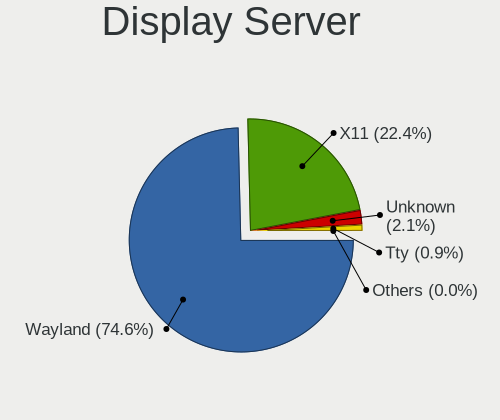
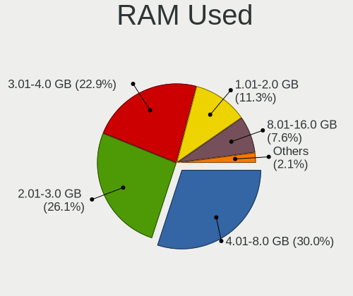
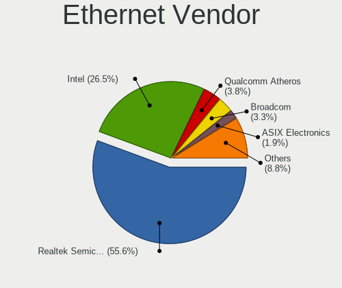
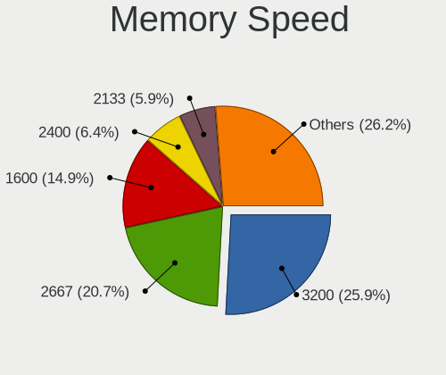
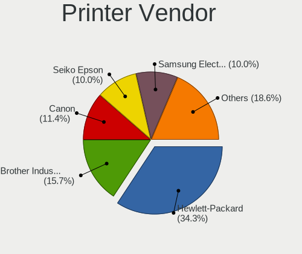

Fedora - Tested Hardware & Statistics (Notebooks)
-------------------------------------------------

A project to collect tested hardware configurations for Fedora.

Anyone can contribute to this report by the [hw-probe](https://github.com/linuxhw/hw-probe) tool:

    sudo -E hw-probe -all -upload

Please contribute! Especially if your hardware is rare.

Contents
--------

* [ Test Cases ](#test-cases)

* [ System ](#system)
  - [ OS                       ](#os)
  - [ OS Family                ](#os-family)
  - [ Kernel                   ](#kernel)
  - [ Kernel Family            ](#kernel-family)
  - [ Kernel Major Ver.        ](#kernel-major-ver)
  - [ Arch                     ](#arch)
  - [ DE                       ](#de)
  - [ Display Server           ](#display-server)
  - [ Display Manager          ](#display-manager)
  - [ OS Lang                  ](#os-lang)
  - [ Boot Mode                ](#boot-mode)
  - [ Filesystem               ](#filesystem)
  - [ Part. scheme             ](#part-scheme)
  - [ Dual Boot with Linux/BSD ](#dual-boot-with-linuxbsd)
  - [ Dual Boot (Win)          ](#dual-boot-win)

* [ Board ](#board)
  - [ Vendor                   ](#vendor)
  - [ Model                    ](#model)
  - [ Model Family             ](#model-family)
  - [ MFG Year                 ](#mfg-year)
  - [ Form Factor              ](#form-factor)
  - [ Secure Boot              ](#secure-boot)
  - [ Coreboot                 ](#coreboot)
  - [ RAM Size                 ](#ram-size)
  - [ RAM Used                 ](#ram-used)
  - [ Total Drives             ](#total-drives)
  - [ Has CD-ROM               ](#has-cd-rom)
  - [ Has Ethernet             ](#has-ethernet)
  - [ Has WiFi                 ](#has-wifi)
  - [ Has Bluetooth            ](#has-bluetooth)

* [ Location ](#location)
  - [ Country                  ](#country)
  - [ City                     ](#city)

* [ Drives ](#drives)
  - [ Drive Vendor             ](#drive-vendor)
  - [ Drive Model              ](#drive-model)
  - [ HDD Vendor               ](#hdd-vendor)
  - [ SSD Vendor               ](#ssd-vendor)
  - [ Drive Kind               ](#drive-kind)
  - [ Drive Connector          ](#drive-connector)
  - [ Drive Size               ](#drive-size)
  - [ Space Total              ](#space-total)
  - [ Space Used               ](#space-used)
  - [ Malfunc. Drives          ](#malfunc-drives)
  - [ Malfunc. Drive Vendor    ](#malfunc-drive-vendor)
  - [ Malfunc. HDD Vendor      ](#malfunc-hdd-vendor)
  - [ Malfunc. Drive Kind      ](#malfunc-drive-kind)
  - [ Failed Drives            ](#failed-drives)
  - [ Failed Drive Vendor      ](#failed-drive-vendor)
  - [ Drive Status             ](#drive-status)

* [ Storage controller ](#storage-controller)
  - [ Storage Vendor           ](#storage-vendor)
  - [ Storage Model            ](#storage-model)
  - [ Storage Kind             ](#storage-kind)

* [ Processor ](#processor)
  - [ CPU Vendor               ](#cpu-vendor)
  - [ CPU Model                ](#cpu-model)
  - [ CPU Model Family         ](#cpu-model-family)
  - [ CPU Cores                ](#cpu-cores)
  - [ CPU Sockets              ](#cpu-sockets)
  - [ CPU Threads              ](#cpu-threads)
  - [ CPU Op-Modes             ](#cpu-op-modes)
  - [ CPU Microcode            ](#cpu-microcode)
  - [ CPU Microarch            ](#cpu-microarch)

* [ Graphics ](#graphics)
  - [ GPU Vendor               ](#gpu-vendor)
  - [ GPU Model                ](#gpu-model)
  - [ GPU Combo                ](#gpu-combo)
  - [ GPU Driver               ](#gpu-driver)
  - [ GPU Memory               ](#gpu-memory)

* [ Monitor ](#monitor)
  - [ Monitor Vendor           ](#monitor-vendor)
  - [ Monitor Model            ](#monitor-model)
  - [ Monitor Resolution       ](#monitor-resolution)
  - [ Monitor Diagonal         ](#monitor-diagonal)
  - [ Monitor Width            ](#monitor-width)
  - [ Aspect Ratio             ](#aspect-ratio)
  - [ Monitor Area             ](#monitor-area)
  - [ Pixel Density            ](#pixel-density)
  - [ Multiple Monitors        ](#multiple-monitors)

* [ Network ](#network)
  - [ Net Controller Vendor    ](#net-controller-vendor)
  - [ Net Controller Model     ](#net-controller-model)
  - [ Wireless Vendor          ](#wireless-vendor)
  - [ Wireless Model           ](#wireless-model)
  - [ Ethernet Vendor          ](#ethernet-vendor)
  - [ Ethernet Model           ](#ethernet-model)
  - [ Net Controller Kind      ](#net-controller-kind)
  - [ Used Controller          ](#used-controller)
  - [ NICs                     ](#nics)
  - [ IPv6                     ](#ipv6)

* [ Bluetooth ](#bluetooth)
  - [ Bluetooth Vendor         ](#bluetooth-vendor)
  - [ Bluetooth Model          ](#bluetooth-model)

* [ Sound ](#sound)
  - [ Sound Vendor             ](#sound-vendor)
  - [ Sound Model              ](#sound-model)

* [ Memory ](#memory)
  - [ Memory Vendor            ](#memory-vendor)
  - [ Memory Model             ](#memory-model)
  - [ Memory Kind              ](#memory-kind)
  - [ Memory Form Factor       ](#memory-form-factor)
  - [ Memory Size              ](#memory-size)
  - [ Memory Speed             ](#memory-speed)

* [ Printers & scanners ](#printers--scanners)
  - [ Printer Vendor           ](#printer-vendor)
  - [ Printer Model            ](#printer-model)
  - [ Scanner Vendor           ](#scanner-vendor)
  - [ Scanner Model            ](#scanner-model)

* [ Camera ](#camera)
  - [ Camera Vendor            ](#camera-vendor)
  - [ Camera Model             ](#camera-model)

* [ Security ](#security)
  - [ Fingerprint Vendor       ](#fingerprint-vendor)
  - [ Fingerprint Model        ](#fingerprint-model)
  - [ Chipcard Vendor          ](#chipcard-vendor)
  - [ Chipcard Model           ](#chipcard-model)

* [ Unsupported ](#unsupported)
  - [ Unsupported Devices      ](#unsupported-devices)
  - [ Unsupported Device Types ](#unsupported-device-types)

Test Cases
----------

Total: 6491

| Vendor        | Model                       | Probe                                                      | Date         |
|---------------|-----------------------------|------------------------------------------------------------|--------------|
| Lenovo        | ThinkPad T480 20L6S2EQ00    | [1b45ef7d10](https://linux-hardware.org/?probe=1b45ef7d10) | Jul 01, 2022 |
| Lenovo        | ThinkPad P14s Gen 1 20Y1... | [16413aeb23](https://linux-hardware.org/?probe=16413aeb23) | Jul 01, 2022 |
| HP            | Laptop 14s-cf2xxx           | [8da2258fea](https://linux-hardware.org/?probe=8da2258fea) | Jul 01, 2022 |
| Dell          | Inspiron M5010              | [14b9aa33d2](https://linux-hardware.org/?probe=14b9aa33d2) | Jul 01, 2022 |
| Lenovo        | IdeaPad 5 15ITL05 82FG      | [2671f4ffe2](https://linux-hardware.org/?probe=2671f4ffe2) | Jul 01, 2022 |
| ASUSTek       | VivoBook_ASUSLaptop X512... | [c9d0d64896](https://linux-hardware.org/?probe=c9d0d64896) | Jul 01, 2022 |
| Lenovo        | ThinkPad T450s 20BX002NM... | [3bb2e1821b](https://linux-hardware.org/?probe=3bb2e1821b) | Jul 01, 2022 |
| Framework     | Laptop                      | [1089f37daf](https://linux-hardware.org/?probe=1089f37daf) | Jul 01, 2022 |
| Lenovo        | ThinkPad T460 20FMS2292S    | [cf313915ab](https://linux-hardware.org/?probe=cf313915ab) | Jun 30, 2022 |
| HP            | Pavilion Aero Laptop 13-... | [3af286a188](https://linux-hardware.org/?probe=3af286a188) | Jun 30, 2022 |
| Lenovo        | ThinkPad E15 Gen 2 20TDC... | [f29c4de6b4](https://linux-hardware.org/?probe=f29c4de6b4) | Jun 30, 2022 |
| Lenovo        | ThinkPad E15 Gen 2 20TDC... | [7ecd760977](https://linux-hardware.org/?probe=7ecd760977) | Jun 30, 2022 |
| Lenovo        | ThinkPad E15 Gen 2 20TDC... | [8428ba0120](https://linux-hardware.org/?probe=8428ba0120) | Jun 30, 2022 |
| HP            | EliteBook 8470p             | [cd488e4f64](https://linux-hardware.org/?probe=cd488e4f64) | Jun 30, 2022 |
| HP            | EliteBook 8470p             | [52dfa0a4ee](https://linux-hardware.org/?probe=52dfa0a4ee) | Jun 30, 2022 |
| Acer          | Aspire A315-55G             | [e6d7a2a642](https://linux-hardware.org/?probe=e6d7a2a642) | Jun 30, 2022 |
| HP            | Laptop 15-da0xxx            | [9c512247ff](https://linux-hardware.org/?probe=9c512247ff) | Jun 30, 2022 |
| Lenovo        | ThinkPad T410 2518A37       | [4e15b37546](https://linux-hardware.org/?probe=4e15b37546) | Jun 30, 2022 |
| Dell          | Inspiron 3543               | [1f9d3b4a6c](https://linux-hardware.org/?probe=1f9d3b4a6c) | Jun 29, 2022 |
| HP            | Laptop 15s-eq2xxx           | [5acbf09f01](https://linux-hardware.org/?probe=5acbf09f01) | Jun 29, 2022 |
| ASUSTek       | UX302LA                     | [6092e85ae8](https://linux-hardware.org/?probe=6092e85ae8) | Jun 29, 2022 |
| Getac         | B300-X                      | [eb752b6c15](https://linux-hardware.org/?probe=eb752b6c15) | Jun 29, 2022 |
| HUAWEI        | BOD-WXX9                    | [9c3e14320e](https://linux-hardware.org/?probe=9c3e14320e) | Jun 29, 2022 |
| HP            | Pavilion Gaming Laptop 1... | [43c87260b2](https://linux-hardware.org/?probe=43c87260b2) | Jun 29, 2022 |
| Lenovo        | ThinkPad X220 4291WSH       | [7406ba0eb2](https://linux-hardware.org/?probe=7406ba0eb2) | Jun 29, 2022 |
| Alienware     | 17                          | [715b5b0dce](https://linux-hardware.org/?probe=715b5b0dce) | Jun 29, 2022 |
| Apple         | MacBookAir6,1               | [c3172fd9cf](https://linux-hardware.org/?probe=c3172fd9cf) | Jun 28, 2022 |
| Dell          | Precision M6800             | [027cb621ef](https://linux-hardware.org/?probe=027cb621ef) | Jun 28, 2022 |
| Dell          | Latitude 5511               | [c361c37273](https://linux-hardware.org/?probe=c361c37273) | Jun 28, 2022 |
| ASUSTek       | X750JN                      | [4ba4d14a1a](https://linux-hardware.org/?probe=4ba4d14a1a) | Jun 28, 2022 |
| Lenovo        | IdeaPad 5 14ALC05 82LM      | [d240efa39f](https://linux-hardware.org/?probe=d240efa39f) | Jun 28, 2022 |
| Apple         | MacBookPro12,1              | [570dd2f164](https://linux-hardware.org/?probe=570dd2f164) | Jun 28, 2022 |
| Toshiba       | Satellite C855-12R          | [e94a109546](https://linux-hardware.org/?probe=e94a109546) | Jun 28, 2022 |
| Dell          | Inspiron N5110              | [239e8c86c0](https://linux-hardware.org/?probe=239e8c86c0) | Jun 28, 2022 |
| Dell          | Latitude E6520              | [f688527838](https://linux-hardware.org/?probe=f688527838) | Jun 27, 2022 |
| Gigabyte      | RC14UD                      | [d2b55252d8](https://linux-hardware.org/?probe=d2b55252d8) | Jun 27, 2022 |
| HP            | Pavilion Gaming Laptop 1... | [1c4ace32a2](https://linux-hardware.org/?probe=1c4ace32a2) | Jun 27, 2022 |
| Apple         | MacBookPro5,1               | [1e14793557](https://linux-hardware.org/?probe=1e14793557) | Jun 27, 2022 |
| ASUSTek       | VivoBook_ASUSLaptop X515... | [3a651b23fb](https://linux-hardware.org/?probe=3a651b23fb) | Jun 26, 2022 |
| Dell          | Inspiron 7558               | [d34cfa83d3](https://linux-hardware.org/?probe=d34cfa83d3) | Jun 26, 2022 |
| Lenovo        | ThinkPad P1 Gen 3 20TJS5... | [de3ca4e422](https://linux-hardware.org/?probe=de3ca4e422) | Jun 26, 2022 |
| Acer          | Swift SF114-32              | [25e6653354](https://linux-hardware.org/?probe=25e6653354) | Jun 26, 2022 |
| MSI           | GF63 Thin 9SCXR             | [db6195eed2](https://linux-hardware.org/?probe=db6195eed2) | Jun 26, 2022 |
| Timi          | A35S                        | [606e376264](https://linux-hardware.org/?probe=606e376264) | Jun 26, 2022 |
| Dell          | Latitude 7300               | [a7939aeb9e](https://linux-hardware.org/?probe=a7939aeb9e) | Jun 26, 2022 |
| ASUSTek       | ROG Zephyrus G14 GA402RJ... | [400eaba39f](https://linux-hardware.org/?probe=400eaba39f) | Jun 26, 2022 |
| HP            | Compaq CQ58                 | [5948b56a82](https://linux-hardware.org/?probe=5948b56a82) | Jun 25, 2022 |
| Dell          | XPS 13 9310                 | [fa3d29c80b](https://linux-hardware.org/?probe=fa3d29c80b) | Jun 25, 2022 |
| Lenovo        | ThinkPad E14 Gen 2 20T60... | [81a9b9847d](https://linux-hardware.org/?probe=81a9b9847d) | Jun 25, 2022 |
| Dell          | Inspiron 5437               | [e206b319a2](https://linux-hardware.org/?probe=e206b319a2) | Jun 25, 2022 |
| Gigabyte      | G5 KC                       | [5ef620811f](https://linux-hardware.org/?probe=5ef620811f) | Jun 25, 2022 |
| HP            | Pavilion g6                 | [d2e82f01d9](https://linux-hardware.org/?probe=d2e82f01d9) | Jun 25, 2022 |
| HP            | Laptop 15s-fq2xxx           | [170f5de9e2](https://linux-hardware.org/?probe=170f5de9e2) | Jun 25, 2022 |
| HP            | OMEN Notebook PC 15         | [66f845b63e](https://linux-hardware.org/?probe=66f845b63e) | Jun 25, 2022 |
| Unknown       | Unknown                     | [6e62883390](https://linux-hardware.org/?probe=6e62883390) | Jun 25, 2022 |
| Lenovo        | ThinkPad X1 Carbon Gen 1... | [66283ad8cd](https://linux-hardware.org/?probe=66283ad8cd) | Jun 24, 2022 |
| ASUSTek       | ROG Strix G513QM_G513QM     | [3b78b34416](https://linux-hardware.org/?probe=3b78b34416) | Jun 24, 2022 |
| Lenovo        | IdeaPad L340-15IRH Gamin... | [3b84529124](https://linux-hardware.org/?probe=3b84529124) | Jun 24, 2022 |
| Lenovo        | ThinkPad E490 20N8CTO1WW    | [58ab145788](https://linux-hardware.org/?probe=58ab145788) | Jun 24, 2022 |
| HP            | Laptop 15-ef2xxx            | [3e16709617](https://linux-hardware.org/?probe=3e16709617) | Jun 24, 2022 |
| HP            | ProBook 4520s               | [eb9033a7c1](https://linux-hardware.org/?probe=eb9033a7c1) | Jun 24, 2022 |
| Packard Be... | EasyNote TE69HW             | [d292d79bbe](https://linux-hardware.org/?probe=d292d79bbe) | Jun 24, 2022 |
| Lenovo        | ThinkPad T520 4243VE1       | [7fcfec26eb](https://linux-hardware.org/?probe=7fcfec26eb) | Jun 24, 2022 |
| Lenovo        | IdeaPad 5 14ARE05 81YM      | [2c0b9c6402](https://linux-hardware.org/?probe=2c0b9c6402) | Jun 24, 2022 |
| ASUSTek       | ZenBook UX534FTC_UX534FT    | [bb8541d805](https://linux-hardware.org/?probe=bb8541d805) | Jun 24, 2022 |
| Acer          | Nitro AN515-54              | [afce38a95a](https://linux-hardware.org/?probe=afce38a95a) | Jun 24, 2022 |
| HP            | Pavilion Gaming Laptop 1... | [d4b96de9b6](https://linux-hardware.org/?probe=d4b96de9b6) | Jun 24, 2022 |
| Dell          | Precision 5550              | [0811e8c956](https://linux-hardware.org/?probe=0811e8c956) | Jun 23, 2022 |
| HP            | Pavilion Laptop 14-dv0xx... | [ac634d8aa9](https://linux-hardware.org/?probe=ac634d8aa9) | Jun 23, 2022 |
| Acer          | TMP453-MG                   | [e2790ebf7e](https://linux-hardware.org/?probe=e2790ebf7e) | Jun 23, 2022 |
| Acer          | TMP453-MG                   | [c99aceab3b](https://linux-hardware.org/?probe=c99aceab3b) | Jun 23, 2022 |
| Dell          | Inspiron 7577               | [673bd13d0a](https://linux-hardware.org/?probe=673bd13d0a) | Jun 23, 2022 |
| Dell          | Precision 5550              | [0ae65f654e](https://linux-hardware.org/?probe=0ae65f654e) | Jun 23, 2022 |
| Lenovo        | IdeaPad Gaming 3 15ARH05... | [926d4055f7](https://linux-hardware.org/?probe=926d4055f7) | Jun 23, 2022 |
| HP            | Pavilion Laptop 15-cw1xx... | [223e43004a](https://linux-hardware.org/?probe=223e43004a) | Jun 23, 2022 |
| HP            | 250 G7 Notebook PC          | [6ec1b55ac0](https://linux-hardware.org/?probe=6ec1b55ac0) | Jun 23, 2022 |
| Lenovo        | G510 20238                  | [1b382e0eb0](https://linux-hardware.org/?probe=1b382e0eb0) | Jun 23, 2022 |
| ASUSTek       | ZenBook UX534FTC_UX534FT    | [5dd91493a8](https://linux-hardware.org/?probe=5dd91493a8) | Jun 23, 2022 |
| ASUSTek       | K46CB                       | [65344cb089](https://linux-hardware.org/?probe=65344cb089) | Jun 23, 2022 |
| Lenovo        | ThinkPad P1 Gen 3 20TJS2... | [f002062377](https://linux-hardware.org/?probe=f002062377) | Jun 22, 2022 |
| HP            | ZBook Fury 15 G7 Mobile ... | [1967dad271](https://linux-hardware.org/?probe=1967dad271) | Jun 22, 2022 |
| Positivo      | VJF155F11UAR                | [77c5ca4f1e](https://linux-hardware.org/?probe=77c5ca4f1e) | Jun 22, 2022 |
| Acer          | NC-E5-774G-75TJ             | [55fce68116](https://linux-hardware.org/?probe=55fce68116) | Jun 22, 2022 |
| HP            | ZBook 17 G4                 | [bf03eb0fa7](https://linux-hardware.org/?probe=bf03eb0fa7) | Jun 22, 2022 |
| Fujitsu       | LIFEBOOK U745               | [0fffb61902](https://linux-hardware.org/?probe=0fffb61902) | Jun 22, 2022 |
| HP            | Notebook                    | [03c703cc7f](https://linux-hardware.org/?probe=03c703cc7f) | Jun 21, 2022 |
| Lenovo        | IdeaPad L340-15API 81LW     | [dda5fb9c20](https://linux-hardware.org/?probe=dda5fb9c20) | Jun 21, 2022 |
| HUAWEI        | MACH-WX9                    | [c6f721f315](https://linux-hardware.org/?probe=c6f721f315) | Jun 21, 2022 |
| HP            | EliteBook 830 G6            | [7c7d9af667](https://linux-hardware.org/?probe=7c7d9af667) | Jun 21, 2022 |
| Lenovo        | IdeaPad 3 15ITL6 82H8       | [ae54449547](https://linux-hardware.org/?probe=ae54449547) | Jun 21, 2022 |
| GEO           | GeoBook 240                 | [f08637137c](https://linux-hardware.org/?probe=f08637137c) | Jun 21, 2022 |
| Dell          | XPS 13 9380                 | [dc134b17e9](https://linux-hardware.org/?probe=dc134b17e9) | Jun 21, 2022 |
| HP            | ProBook 440 G6              | [eeeee7321e](https://linux-hardware.org/?probe=eeeee7321e) | Jun 20, 2022 |
| Lenovo        | ThinkPad X1 Carbon Gen 9... | [27623895a1](https://linux-hardware.org/?probe=27623895a1) | Jun 20, 2022 |
| Lenovo        | ThinkPad T495s 20QJ0012G... | [92638f1b46](https://linux-hardware.org/?probe=92638f1b46) | Jun 20, 2022 |
| ASUSTek       | ROG Zephyrus G14 GA401QM... | [52aa806063](https://linux-hardware.org/?probe=52aa806063) | Jun 20, 2022 |
| Panasonic     | CFSV9-1                     | [4b7dd23ccd](https://linux-hardware.org/?probe=4b7dd23ccd) | Jun 20, 2022 |
| Apple         | MacBookPro12,1              | [666e91f182](https://linux-hardware.org/?probe=666e91f182) | Jun 20, 2022 |
| Dell          | XPS 15 9520                 | [ec6f5cce04](https://linux-hardware.org/?probe=ec6f5cce04) | Jun 20, 2022 |
| Google        | Droid                       | [5a175a2a78](https://linux-hardware.org/?probe=5a175a2a78) | Jun 20, 2022 |
| Apple         | MacBookPro12,1              | [5d9f65fbc9](https://linux-hardware.org/?probe=5d9f65fbc9) | Jun 20, 2022 |
| HP            | EliteBook 865 16 inch G9... | [9a543a0273](https://linux-hardware.org/?probe=9a543a0273) | Jun 20, 2022 |
| Lenovo        | ThinkPad X13 Gen 1 20T3S... | [bbb3795dc2](https://linux-hardware.org/?probe=bbb3795dc2) | Jun 20, 2022 |
| Lenovo        | ThinkPad P53 20QN0011IV     | [9cf3c1f84c](https://linux-hardware.org/?probe=9cf3c1f84c) | Jun 19, 2022 |
| HP            | ENVY Laptop 13-ad1xx        | [df2017f7d5](https://linux-hardware.org/?probe=df2017f7d5) | Jun 19, 2022 |
| HP            | ProBook 4520s               | [b34f97ddb3](https://linux-hardware.org/?probe=b34f97ddb3) | Jun 19, 2022 |
| Micro Elec... | MG-VCP17I-3070              | [e09cfb9236](https://linux-hardware.org/?probe=e09cfb9236) | Jun 19, 2022 |
| HP            | Pavilion dv7                | [ab34fbb528](https://linux-hardware.org/?probe=ab34fbb528) | Jun 19, 2022 |
| Lenovo        | IdeaPad 5 15ITL05 82FG      | [3c8a4e8226](https://linux-hardware.org/?probe=3c8a4e8226) | Jun 18, 2022 |
| ASUSTek       | ZenBook UX434DA_UM433DA     | [68ca5e600d](https://linux-hardware.org/?probe=68ca5e600d) | Jun 18, 2022 |
| HUAWEI        | KLVL-WXX9                   | [a71adbf68f](https://linux-hardware.org/?probe=a71adbf68f) | Jun 18, 2022 |
| HP            | ProBook 470 G5              | [b070339877](https://linux-hardware.org/?probe=b070339877) | Jun 18, 2022 |
| HP            | ZBook Fury 15 G7 Mobile ... | [4a1a0294d8](https://linux-hardware.org/?probe=4a1a0294d8) | Jun 18, 2022 |
| Dell          | Precision 3571              | [9d6985b0f0](https://linux-hardware.org/?probe=9d6985b0f0) | Jun 18, 2022 |
| Dell          | Precision 3571              | [285846e1a4](https://linux-hardware.org/?probe=285846e1a4) | Jun 18, 2022 |
| ASUSTek       | ROG Zephyrus G14 GA402RJ... | [91af0ec6df](https://linux-hardware.org/?probe=91af0ec6df) | Jun 18, 2022 |
| Acer          | Swift SF314-43              | [a6116d2e8c](https://linux-hardware.org/?probe=a6116d2e8c) | Jun 18, 2022 |
| HP            | ProBook 430 G5              | [1689773788](https://linux-hardware.org/?probe=1689773788) | Jun 18, 2022 |
| ASUSTek       | TUF Gaming FX505DY_TUF50... | [df304b4da1](https://linux-hardware.org/?probe=df304b4da1) | Jun 17, 2022 |
| Acer          | Swift SF314-43              | [674addd96b](https://linux-hardware.org/?probe=674addd96b) | Jun 17, 2022 |
| Lenovo        | IdeaPad S145-15IIL 82DJ     | [e0b7e5c636](https://linux-hardware.org/?probe=e0b7e5c636) | Jun 17, 2022 |
| Dell          | XPS 13 7390                 | [9cbdc324b7](https://linux-hardware.org/?probe=9cbdc324b7) | Jun 17, 2022 |
| Lenovo        | ThinkPad X1 Carbon 5th 2... | [cb6bf6ab7c](https://linux-hardware.org/?probe=cb6bf6ab7c) | Jun 17, 2022 |
| Sony          | SVE15128CNB                 | [029a230c77](https://linux-hardware.org/?probe=029a230c77) | Jun 17, 2022 |
| ASUSTek       | ROG Flow X13 GV301QE_GV3... | [2a28e582b5](https://linux-hardware.org/?probe=2a28e582b5) | Jun 17, 2022 |
| Acer          | Aspire E5-476G              | [df4b512aa8](https://linux-hardware.org/?probe=df4b512aa8) | Jun 17, 2022 |
| HP            | OMEN Laptop 15-en0xxx       | [a7431ef0c5](https://linux-hardware.org/?probe=a7431ef0c5) | Jun 17, 2022 |
| Samsung       | 500R5M/500R5W/501R5M        | [91f1df8a58](https://linux-hardware.org/?probe=91f1df8a58) | Jun 17, 2022 |
| Acer          | Predator PH315-53           | [7e65c001a5](https://linux-hardware.org/?probe=7e65c001a5) | Jun 17, 2022 |
| Lenovo        | IdeaPad 3 15ALC6 82KU       | [e4d5856a72](https://linux-hardware.org/?probe=e4d5856a72) | Jun 16, 2022 |
| Lenovo        | ThinkPad E15 Gen 2 20T80... | [4e53a55031](https://linux-hardware.org/?probe=4e53a55031) | Jun 16, 2022 |
| Dell          | XPS 13 7390                 | [7dbb9f4adf](https://linux-hardware.org/?probe=7dbb9f4adf) | Jun 16, 2022 |
| Micro Elec... | MG-VCP17I-3070              | [c6d123b5ec](https://linux-hardware.org/?probe=c6d123b5ec) | Jun 16, 2022 |
| Micro Elec... | MG-VCP17I-3070              | [d28d429121](https://linux-hardware.org/?probe=d28d429121) | Jun 16, 2022 |
| Lenovo        | ThinkPad X13 Gen 1 20T3S... | [7d8683dfac](https://linux-hardware.org/?probe=7d8683dfac) | Jun 16, 2022 |
| Lenovo        | ThinkPad P51 20HHCTO1WW     | [f83da947b8](https://linux-hardware.org/?probe=f83da947b8) | Jun 16, 2022 |
| Itautec       | Infoway w7430               | [776d876064](https://linux-hardware.org/?probe=776d876064) | Jun 16, 2022 |
| ASUSTek       | VivoBook 15_ASUS Laptop ... | [388285efe8](https://linux-hardware.org/?probe=388285efe8) | Jun 15, 2022 |
| HP            | Laptop 17-cp0xxx            | [6b73227c17](https://linux-hardware.org/?probe=6b73227c17) | Jun 15, 2022 |
| Acer          | Predator PH315-53           | [155af690bd](https://linux-hardware.org/?probe=155af690bd) | Jun 15, 2022 |
| Dell          | XPS 15 9520                 | [bdd4ec2ef9](https://linux-hardware.org/?probe=bdd4ec2ef9) | Jun 15, 2022 |
| Dell          | XPS 15 9520                 | [03140c6f93](https://linux-hardware.org/?probe=03140c6f93) | Jun 15, 2022 |
| HP            | Laptop 17-cp0xxx            | [6f25a1e394](https://linux-hardware.org/?probe=6f25a1e394) | Jun 15, 2022 |
| Dell          | Inspiron 7472               | [788b7856ca](https://linux-hardware.org/?probe=788b7856ca) | Jun 15, 2022 |
| Timi          | Redmi Book Pro 15 2022      | [76fd9cba2e](https://linux-hardware.org/?probe=76fd9cba2e) | Jun 15, 2022 |
| Lenovo        | ThinkPad X220 4286CTO       | [fd2fb2f646](https://linux-hardware.org/?probe=fd2fb2f646) | Jun 14, 2022 |
| Dell          | Precision 3551              | [3499839fd0](https://linux-hardware.org/?probe=3499839fd0) | Jun 14, 2022 |
| HP            | Pavilion Gaming Laptop 1... | [b6f26fecef](https://linux-hardware.org/?probe=b6f26fecef) | Jun 14, 2022 |
| HP            | Notebook                    | [390f55db2e](https://linux-hardware.org/?probe=390f55db2e) | Jun 14, 2022 |
| HP            | OMEN by Laptop 15-dc1xxx    | [17077cf1d8](https://linux-hardware.org/?probe=17077cf1d8) | Jun 14, 2022 |
| Dell          | XPS 15 9510                 | [61104911ed](https://linux-hardware.org/?probe=61104911ed) | Jun 14, 2022 |
| Lenovo        | ThinkPad E14 Gen 3 20YDC... | [b10e894950](https://linux-hardware.org/?probe=b10e894950) | Jun 14, 2022 |
| Timi          | Redmi Book Pro 15 2022      | [b3259c0af4](https://linux-hardware.org/?probe=b3259c0af4) | Jun 14, 2022 |
| Lenovo        | ThinkPad T14 Gen 2i 20W1... | [35cbb5ff8b](https://linux-hardware.org/?probe=35cbb5ff8b) | Jun 14, 2022 |
| ASUSTek       | VivoBook_ASUSLaptop X515... | [e2385e525c](https://linux-hardware.org/?probe=e2385e525c) | Jun 14, 2022 |
| Lenovo        | ThinkBook 16 G4+ IAP 21C... | [605cab3041](https://linux-hardware.org/?probe=605cab3041) | Jun 14, 2022 |
| HP            | Pavilion Notebook           | [cf08ff4333](https://linux-hardware.org/?probe=cf08ff4333) | Jun 14, 2022 |
| HP            | Pavilion Notebook           | [4b4bd76de7](https://linux-hardware.org/?probe=4b4bd76de7) | Jun 14, 2022 |
| ASUSTek       | Zenbook UX5401ZA_UX5401Z... | [2b87adfa9f](https://linux-hardware.org/?probe=2b87adfa9f) | Jun 13, 2022 |
| HP            | Pavilion g6                 | [20bd05081e](https://linux-hardware.org/?probe=20bd05081e) | Jun 13, 2022 |
| HP            | Pavilion g6                 | [d147676849](https://linux-hardware.org/?probe=d147676849) | Jun 13, 2022 |
| Lenovo        | ThinkPad E14 Gen 2 20TB0... | [b8b4869fa1](https://linux-hardware.org/?probe=b8b4869fa1) | Jun 13, 2022 |
| ASUSTek       | ROG Flow X13 GV301QE_GV3... | [221099208b](https://linux-hardware.org/?probe=221099208b) | Jun 13, 2022 |
| Lenovo        | ThinkPad X220 4291WSH       | [0a985a9f53](https://linux-hardware.org/?probe=0a985a9f53) | Jun 13, 2022 |
| Lenovo        | Y50-70 20378                | [6153f90073](https://linux-hardware.org/?probe=6153f90073) | Jun 13, 2022 |
| Acer          | Aspire 5552                 | [909cdd1a0e](https://linux-hardware.org/?probe=909cdd1a0e) | Jun 12, 2022 |
| ASUSTek       | ASUS TUF Gaming A15 FA50... | [17d6efccfa](https://linux-hardware.org/?probe=17d6efccfa) | Jun 12, 2022 |
| Acer          | Aspire E5-573G              | [967ef390e0](https://linux-hardware.org/?probe=967ef390e0) | Jun 12, 2022 |
| HP            | Pavilion Laptop 15-cw1xx... | [dbe7d6b6bf](https://linux-hardware.org/?probe=dbe7d6b6bf) | Jun 12, 2022 |
| HP            | Pavilion Laptop 15-cw1xx... | [554002fe47](https://linux-hardware.org/?probe=554002fe47) | Jun 12, 2022 |
| HP            | Laptop 15s-fq3xxx           | [6acd8f6081](https://linux-hardware.org/?probe=6acd8f6081) | Jun 12, 2022 |
| Acer          | Aspire R7-371T              | [b791797ef3](https://linux-hardware.org/?probe=b791797ef3) | Jun 12, 2022 |
| Acer          | Aspire R7-371T              | [d573a80e21](https://linux-hardware.org/?probe=d573a80e21) | Jun 12, 2022 |
| Apple         | MacBookPro6,2               | [a677849f96](https://linux-hardware.org/?probe=a677849f96) | Jun 12, 2022 |
| ASUSTek       | X750JN                      | [6748bf6f1e](https://linux-hardware.org/?probe=6748bf6f1e) | Jun 11, 2022 |
| Lenovo        | ThinkPad L14 Gen 1 20U50... | [c637722355](https://linux-hardware.org/?probe=c637722355) | Jun 11, 2022 |
| HP            | ProBook 650 G1              | [8f468e1fc9](https://linux-hardware.org/?probe=8f468e1fc9) | Jun 11, 2022 |
| Lenovo        | ThinkPad T420 4180BE1       | [a3c2ffc8e0](https://linux-hardware.org/?probe=a3c2ffc8e0) | Jun 11, 2022 |
| Lenovo        | ThinkBook 16p Gen 2 20YM    | [3c8959c8dc](https://linux-hardware.org/?probe=3c8959c8dc) | Jun 11, 2022 |
| HP            | Laptop 17-bs1xx             | [aa23e1d53e](https://linux-hardware.org/?probe=aa23e1d53e) | Jun 11, 2022 |
| HUAWEI        | WRT-WX9                     | [13dcf888fe](https://linux-hardware.org/?probe=13dcf888fe) | Jun 10, 2022 |
| Acer          | Swift SF114-32              | [63f76026b7](https://linux-hardware.org/?probe=63f76026b7) | Jun 10, 2022 |
| Lenovo        | ThinkPad X13 Gen 1 20UF0... | [1967d32245](https://linux-hardware.org/?probe=1967d32245) | Jun 10, 2022 |
| Dell          | XPS 15 9570                 | [f37ad0aba6](https://linux-hardware.org/?probe=f37ad0aba6) | Jun 10, 2022 |
| ASUSTek       | ROG Flow X13 GV301QE_GV3... | [14e32dc3cb](https://linux-hardware.org/?probe=14e32dc3cb) | Jun 10, 2022 |
| HP            | Laptop 14s-fq0xxx           | [0a77925edb](https://linux-hardware.org/?probe=0a77925edb) | Jun 10, 2022 |
| Lenovo        | ThinkPad P50 20EQS3B30R     | [c97b8918a0](https://linux-hardware.org/?probe=c97b8918a0) | Jun 10, 2022 |
| HP            | ZBook 15                    | [540fada7d4](https://linux-hardware.org/?probe=540fada7d4) | Jun 09, 2022 |
| HP            | ZBook 15                    | [5e3ff70430](https://linux-hardware.org/?probe=5e3ff70430) | Jun 09, 2022 |
| HP            | OMEN Laptop 15-en0xxx       | [158a18f6d1](https://linux-hardware.org/?probe=158a18f6d1) | Jun 09, 2022 |
| Lenovo        | ThinkPad T460s 20FA003JM... | [417d162cab](https://linux-hardware.org/?probe=417d162cab) | Jun 09, 2022 |
| Lenovo        | ThinkPad E480 20KNS0E200    | [321a2df7db](https://linux-hardware.org/?probe=321a2df7db) | Jun 09, 2022 |
| Lenovo        | ThinkPad E14 Gen 2 20TB0... | [e934effe87](https://linux-hardware.org/?probe=e934effe87) | Jun 09, 2022 |
| HP            | ENVY dv7                    | [f7401e6566](https://linux-hardware.org/?probe=f7401e6566) | Jun 09, 2022 |
| Toshiba       | Satellite C50-A             | [1f5918622d](https://linux-hardware.org/?probe=1f5918622d) | Jun 08, 2022 |
| Toshiba       | Satellite C50-A             | [20a629adc2](https://linux-hardware.org/?probe=20a629adc2) | Jun 08, 2022 |
| HUAWEI        | KLVL-WXX9                   | [4ce4c3ad20](https://linux-hardware.org/?probe=4ce4c3ad20) | Jun 08, 2022 |
| Lenovo        | ThinkPad T410 2522PT3       | [75d6b8489b](https://linux-hardware.org/?probe=75d6b8489b) | Jun 08, 2022 |
| Lenovo        | ThinkPad T400 6475AJ1       | [3ef905b44a](https://linux-hardware.org/?probe=3ef905b44a) | Jun 08, 2022 |
| VIT           | M2420                       | [8152d4c61b](https://linux-hardware.org/?probe=8152d4c61b) | Jun 08, 2022 |
| VIT           | M2420                       | [d09de8cbd7](https://linux-hardware.org/?probe=d09de8cbd7) | Jun 07, 2022 |
| ASUSTek       | ASUS EXPERTBOOK B9400CEA... | [73823d7212](https://linux-hardware.org/?probe=73823d7212) | Jun 07, 2022 |
| Lenovo        | IdeaPad S540-15IWL          | [1a79b3a2ab](https://linux-hardware.org/?probe=1a79b3a2ab) | Jun 07, 2022 |
| HP            | 250 G7 Notebook PC          | [c45207e9ed](https://linux-hardware.org/?probe=c45207e9ed) | Jun 07, 2022 |
| Lenovo        | ThinkPad X1 Carbon Gen 9... | [14a3f31e7d](https://linux-hardware.org/?probe=14a3f31e7d) | Jun 07, 2022 |
| HP            | 250 G7 Notebook PC          | [fa7cd44609](https://linux-hardware.org/?probe=fa7cd44609) | Jun 07, 2022 |
| Apple         | MacBook4,1                  | [c8e7bd54a3](https://linux-hardware.org/?probe=c8e7bd54a3) | Jun 07, 2022 |
| Apple         | MacBook4,1                  | [1608d3bbd6](https://linux-hardware.org/?probe=1608d3bbd6) | Jun 07, 2022 |
| Dell          | Inspiron 3542               | [8fcf9a9913](https://linux-hardware.org/?probe=8fcf9a9913) | Jun 07, 2022 |
| HP            | Laptop 15-dy0xxx            | [e2a9ba60e2](https://linux-hardware.org/?probe=e2a9ba60e2) | Jun 07, 2022 |
| Unknown       | Unknown                     | [6c562bbebb](https://linux-hardware.org/?probe=6c562bbebb) | Jun 06, 2022 |
| Apple         | MacBookPro14,3              | [0d56225d08](https://linux-hardware.org/?probe=0d56225d08) | Jun 06, 2022 |
| Lenovo        | IdeaPad 330-17IKB 81DM      | [5f55cd1869](https://linux-hardware.org/?probe=5f55cd1869) | Jun 06, 2022 |
| HP            | EliteBook 8740w             | [178b330cc1](https://linux-hardware.org/?probe=178b330cc1) | Jun 06, 2022 |
| Dell          | Inspiron 14 5410 2-in-1     | [5ad950659b](https://linux-hardware.org/?probe=5ad950659b) | Jun 06, 2022 |
| Lenovo        | ThinkPad T14 Gen 2i 20W0... | [bec76e5f74](https://linux-hardware.org/?probe=bec76e5f74) | Jun 06, 2022 |
| Lenovo        | IdeaPad Gaming 3 15ARH05... | [0732a60437](https://linux-hardware.org/?probe=0732a60437) | Jun 06, 2022 |
| HP            | 250 G5                      | [1cbf1a1c53](https://linux-hardware.org/?probe=1cbf1a1c53) | Jun 06, 2022 |
| Lenovo        | 81WE                        | [31217f3c4a](https://linux-hardware.org/?probe=31217f3c4a) | Jun 06, 2022 |
| Lenovo        | G580 2689PWG                | [e7e658bc95](https://linux-hardware.org/?probe=e7e658bc95) | Jun 06, 2022 |
| Dell          | XPS 13 9370                 | [568a879289](https://linux-hardware.org/?probe=568a879289) | Jun 06, 2022 |
| Lenovo        | G580 2689PWG                | [e51b9086bd](https://linux-hardware.org/?probe=e51b9086bd) | Jun 06, 2022 |
| HP            | 250 G5                      | [7cbd2a6796](https://linux-hardware.org/?probe=7cbd2a6796) | Jun 06, 2022 |
| HP            | 250 G5                      | [6668b9ad94](https://linux-hardware.org/?probe=6668b9ad94) | Jun 06, 2022 |
| Apple         | MacBookAir5,1               | [f9ac66019f](https://linux-hardware.org/?probe=f9ac66019f) | Jun 06, 2022 |
| Apple         | MacBookPro14,3              | [8fbfe75f53](https://linux-hardware.org/?probe=8fbfe75f53) | Jun 06, 2022 |
| Lenovo        | ThinkPad T420 4177CTO       | [fe28db8adc](https://linux-hardware.org/?probe=fe28db8adc) | Jun 06, 2022 |
| HP            | EliteBook 2560p             | [9cd1c3d383](https://linux-hardware.org/?probe=9cd1c3d383) | Jun 05, 2022 |
| Apple         | MacBookPro10,1              | [9e49a2cbac](https://linux-hardware.org/?probe=9e49a2cbac) | Jun 05, 2022 |
| ASUSTek       | VivoBook_ASUSLaptop X512... | [7084316e82](https://linux-hardware.org/?probe=7084316e82) | Jun 05, 2022 |
| Lenovo        | ThinkPad X1 Extreme 2nd ... | [13e2575e63](https://linux-hardware.org/?probe=13e2575e63) | Jun 05, 2022 |
| Acer          | Aspire R3-131T              | [f1becc237d](https://linux-hardware.org/?probe=f1becc237d) | Jun 05, 2022 |
| HP            | OMEN Laptop 15-en0xxx       | [155a8dd1a5](https://linux-hardware.org/?probe=155a8dd1a5) | Jun 05, 2022 |
| Dell          | Latitude 7490               | [feb1fc06d4](https://linux-hardware.org/?probe=feb1fc06d4) | Jun 05, 2022 |
| ASUSTek       | X541NA                      | [0c40d3f3d2](https://linux-hardware.org/?probe=0c40d3f3d2) | Jun 05, 2022 |
| ASUSTek       | VivoBook_ASUSLaptop X515... | [84d72b2b06](https://linux-hardware.org/?probe=84d72b2b06) | Jun 05, 2022 |
| HP            | ProBook 650 G1              | [be6fcc008b](https://linux-hardware.org/?probe=be6fcc008b) | Jun 04, 2022 |
| TUXEDO        | Polaris Intel Gen3 (TGL)    | [983f898115](https://linux-hardware.org/?probe=983f898115) | Jun 04, 2022 |
| Acer          | Aspire E5-573G              | [31de2e546e](https://linux-hardware.org/?probe=31de2e546e) | Jun 04, 2022 |
| Lenovo        | ThinkPad T450 20BUS0HA0G    | [878cae499d](https://linux-hardware.org/?probe=878cae499d) | Jun 04, 2022 |
| Lenovo        | ThinkPad T450 20BUS0HA0G    | [0c53f7240c](https://linux-hardware.org/?probe=0c53f7240c) | Jun 03, 2022 |
| HP            | Pavilion Aero Laptop 13-... | [41862e04b8](https://linux-hardware.org/?probe=41862e04b8) | Jun 03, 2022 |
| Dell          | Precision 5540              | [641aabe445](https://linux-hardware.org/?probe=641aabe445) | Jun 03, 2022 |
| Notebook      | NL40_50CU                   | [df0357703d](https://linux-hardware.org/?probe=df0357703d) | Jun 03, 2022 |
| Dell          | XPS 15 9560                 | [38de8409ef](https://linux-hardware.org/?probe=38de8409ef) | Jun 02, 2022 |
| Framework     | Laptop                      | [625917cfcd](https://linux-hardware.org/?probe=625917cfcd) | Jun 02, 2022 |
| Lenovo        | G580 20150                  | [6cb0b47bb4](https://linux-hardware.org/?probe=6cb0b47bb4) | Jun 02, 2022 |
| HP            | Laptop 15s-eq2xxx           | [3aa4194ab3](https://linux-hardware.org/?probe=3aa4194ab3) | Jun 02, 2022 |
| Lenovo        | IdeaPad L340-17IWL 81M0     | [b5bb3c0725](https://linux-hardware.org/?probe=b5bb3c0725) | Jun 02, 2022 |
| ASUSTek       | N82JV                       | [623436f0c3](https://linux-hardware.org/?probe=623436f0c3) | Jun 02, 2022 |
| Lenovo        | Legion S7 15ACH6 82K8       | [ff63d0c19b](https://linux-hardware.org/?probe=ff63d0c19b) | Jun 02, 2022 |
| Lenovo        | ThinkPad T14 Gen 2a 20XL... | [978a80c358](https://linux-hardware.org/?probe=978a80c358) | Jun 02, 2022 |
| Lenovo        | ThinkPad X220 4291WSH       | [d81154a7e1](https://linux-hardware.org/?probe=d81154a7e1) | Jun 02, 2022 |
| ASUSTek       | ASUS EXPERTBOOK B3302CEA... | [ad66932f23](https://linux-hardware.org/?probe=ad66932f23) | Jun 02, 2022 |
| Dell          | Inspiron 3531               | [c2d9f4b84b](https://linux-hardware.org/?probe=c2d9f4b84b) | Jun 02, 2022 |
| HUAWEI        | MACH-WX9                    | [70ad46aa8e](https://linux-hardware.org/?probe=70ad46aa8e) | Jun 01, 2022 |
| Acer          | Swift SFX14-41G             | [38fb3963cd](https://linux-hardware.org/?probe=38fb3963cd) | Jun 01, 2022 |
| Acer          | Swift SFX14-41G             | [6f5f1c9373](https://linux-hardware.org/?probe=6f5f1c9373) | Jun 01, 2022 |
| Lenovo        | Edge 15 80K9                | [5c8bb97759](https://linux-hardware.org/?probe=5c8bb97759) | Jun 01, 2022 |
| Lenovo        | IdeaPad 5 Pro 14ACN6 82L... | [ae39e96b1a](https://linux-hardware.org/?probe=ae39e96b1a) | Jun 01, 2022 |
| Lenovo        | IdeaPad L340-15IRH Gamin... | [0f84f94a6a](https://linux-hardware.org/?probe=0f84f94a6a) | Jun 01, 2022 |
| HP            | EliteBook 2560p             | [af6a91d3c7](https://linux-hardware.org/?probe=af6a91d3c7) | Jun 01, 2022 |
| Dell          | Inspiron 5415               | [942b343fff](https://linux-hardware.org/?probe=942b343fff) | Jun 01, 2022 |
| HP            | Pavilion Laptop 14-dv0xx... | [1e6ab0f183](https://linux-hardware.org/?probe=1e6ab0f183) | May 31, 2022 |
| ASUSTek       | X541NA                      | [3d32754542](https://linux-hardware.org/?probe=3d32754542) | May 31, 2022 |
| Lenovo        | ThinkPad X1 Carbon 2nd 2... | [dc3ee2e520](https://linux-hardware.org/?probe=dc3ee2e520) | May 31, 2022 |
| Lenovo        | Edge 15 80K9                | [9bbdfc95bb](https://linux-hardware.org/?probe=9bbdfc95bb) | May 31, 2022 |
| HP            | OMEN Laptop 15-en0xxx       | [956299505f](https://linux-hardware.org/?probe=956299505f) | May 31, 2022 |
| HP            | ProBook 450 G7              | [010b492184](https://linux-hardware.org/?probe=010b492184) | May 31, 2022 |
| HP            | Pavilion Laptop 14-dv0xx... | [9b53c4df9d](https://linux-hardware.org/?probe=9b53c4df9d) | May 31, 2022 |
| ASUSTek       | N501VW                      | [2f8215fb0a](https://linux-hardware.org/?probe=2f8215fb0a) | May 31, 2022 |
| HP            | EliteBook 840 G3            | [92acbd4c3f](https://linux-hardware.org/?probe=92acbd4c3f) | May 31, 2022 |
| Apple         | MacBookPro8,3               | [38f4cc4c5a](https://linux-hardware.org/?probe=38f4cc4c5a) | May 31, 2022 |
| Dell          | XPS 15 9520                 | [4d4c32223e](https://linux-hardware.org/?probe=4d4c32223e) | May 31, 2022 |
| Dell          | Inspiron 5547               | [066f6369b2](https://linux-hardware.org/?probe=066f6369b2) | May 31, 2022 |
| HP            | 255 G1                      | [86f7198193](https://linux-hardware.org/?probe=86f7198193) | May 31, 2022 |
| Lenovo        | ThinkPad E595 20NF001PTX    | [cf41cc78f7](https://linux-hardware.org/?probe=cf41cc78f7) | May 30, 2022 |
| Lenovo        | ThinkPad X1 Carbon 2nd 2... | [5a813419eb](https://linux-hardware.org/?probe=5a813419eb) | May 30, 2022 |
| Lenovo        | Edge 15 80K9                | [586a31368f](https://linux-hardware.org/?probe=586a31368f) | May 30, 2022 |
| Google        | Droid                       | [35e3edeab3](https://linux-hardware.org/?probe=35e3edeab3) | May 30, 2022 |
| Framework     | Laptop                      | [f1c2a80b70](https://linux-hardware.org/?probe=f1c2a80b70) | May 30, 2022 |
| Lenovo        | ThinkPad X240 20AM0040BR    | [e0ff07b590](https://linux-hardware.org/?probe=e0ff07b590) | May 30, 2022 |
| IT Channel... | PA70Hx                      | [091ad22c2d](https://linux-hardware.org/?probe=091ad22c2d) | May 30, 2022 |
| ASUSTek       | ZenBook UX325SA_UM325SA     | [378e6ca9c6](https://linux-hardware.org/?probe=378e6ca9c6) | May 30, 2022 |
| Dell          | XPS 15 9520                 | [eee1a317b6](https://linux-hardware.org/?probe=eee1a317b6) | May 30, 2022 |
| MSI           | GE60 2PE                    | [1e15d749ee](https://linux-hardware.org/?probe=1e15d749ee) | May 30, 2022 |
| ASUSTek       | X541NA                      | [c1fd0c2d4f](https://linux-hardware.org/?probe=c1fd0c2d4f) | May 30, 2022 |
| MSI           | GE60 2PE                    | [b52762040d](https://linux-hardware.org/?probe=b52762040d) | May 30, 2022 |
| HP            | EliteBook 840 G8 Noteboo... | [15fb1b0353](https://linux-hardware.org/?probe=15fb1b0353) | May 30, 2022 |
| Dell          | Inspiron 7472               | [7d8d96d851](https://linux-hardware.org/?probe=7d8d96d851) | May 29, 2022 |
| ASUSTek       | UX51VZA                     | [c7c6e27cae](https://linux-hardware.org/?probe=c7c6e27cae) | May 29, 2022 |
| Dell          | Latitude E7470              | [159516aefb](https://linux-hardware.org/?probe=159516aefb) | May 29, 2022 |
| Acer          | Aspire E5-573G              | [bd9b967f9b](https://linux-hardware.org/?probe=bd9b967f9b) | May 29, 2022 |
| Dell          | XPS 15 9520                 | [75d345243e](https://linux-hardware.org/?probe=75d345243e) | May 29, 2022 |
| Notebook      | P65_P67SG                   | [a2aecd5cd3](https://linux-hardware.org/?probe=a2aecd5cd3) | May 29, 2022 |
| MSI           | Delta 15 A5EFK              | [1679888c2c](https://linux-hardware.org/?probe=1679888c2c) | May 29, 2022 |
| MSI           | GE60 2PE                    | [84d5af4ebe](https://linux-hardware.org/?probe=84d5af4ebe) | May 29, 2022 |
| MSI           | GE60 2PE                    | [c8d325a744](https://linux-hardware.org/?probe=c8d325a744) | May 29, 2022 |
| HP            | Pavilion 17                 | [077be5d10b](https://linux-hardware.org/?probe=077be5d10b) | May 28, 2022 |
| Dell          | Precision 7710              | [befe390051](https://linux-hardware.org/?probe=befe390051) | May 28, 2022 |
| Dell          | Vostro 5515                 | [ae8649e10b](https://linux-hardware.org/?probe=ae8649e10b) | May 28, 2022 |
| Lenovo        | Y70-70 Touch 80DU           | [4c4689f4b7](https://linux-hardware.org/?probe=4c4689f4b7) | May 28, 2022 |
| Lenovo        | IdeaPad 530S-14IKB 81EU     | [df2d7a274d](https://linux-hardware.org/?probe=df2d7a274d) | May 28, 2022 |
| Lenovo        | ThinkPad P52 20MAS3X200     | [da2a67f904](https://linux-hardware.org/?probe=da2a67f904) | May 28, 2022 |
| Lenovo        | Yoga 300-11IBY 80M0         | [8d120a2350](https://linux-hardware.org/?probe=8d120a2350) | May 28, 2022 |
| ASUSTek       | TUF Gaming FX505DY_FX505... | [af42d8d0b4](https://linux-hardware.org/?probe=af42d8d0b4) | May 27, 2022 |
| Timi          | A35S                        | [8a1bee3210](https://linux-hardware.org/?probe=8a1bee3210) | May 27, 2022 |
| Dell          | Latitude E7450              | [929e69f0ad](https://linux-hardware.org/?probe=929e69f0ad) | May 27, 2022 |
| Dell          | XPS 15 9570                 | [93d1ebbb72](https://linux-hardware.org/?probe=93d1ebbb72) | May 27, 2022 |
| Login Info... | LOG-QAL30                   | [5643c9fb9b](https://linux-hardware.org/?probe=5643c9fb9b) | May 27, 2022 |
| Login Info... | LOG-QAL30                   | [644f3a8dbc](https://linux-hardware.org/?probe=644f3a8dbc) | May 27, 2022 |
| Lenovo        | ThinkBook 14 G3 ACL 21A2    | [983144763a](https://linux-hardware.org/?probe=983144763a) | May 27, 2022 |
| Lenovo        | 14w 81MQS02H00              | [e31087bfa9](https://linux-hardware.org/?probe=e31087bfa9) | May 27, 2022 |
| Dell          | Inspiron 7460               | [3171915433](https://linux-hardware.org/?probe=3171915433) | May 27, 2022 |
| Sony          | VPCEE3S1E                   | [f3c7988996](https://linux-hardware.org/?probe=f3c7988996) | May 27, 2022 |
| Lenovo        | ThinkPad P1 Gen 3 20TJS3... | [88aabea122](https://linux-hardware.org/?probe=88aabea122) | May 27, 2022 |
| ASUSTek       | UX51VZA                     | [5507c9109e](https://linux-hardware.org/?probe=5507c9109e) | May 27, 2022 |
| Lenovo        | IdeaPad 3 15ARE05 81W4      | [9b4287fa8b](https://linux-hardware.org/?probe=9b4287fa8b) | May 26, 2022 |
| HP            | Pavilion TS 14              | [b7b3d504e2](https://linux-hardware.org/?probe=b7b3d504e2) | May 26, 2022 |
| Dell          | Inspiron 5502               | [90ee31b219](https://linux-hardware.org/?probe=90ee31b219) | May 26, 2022 |
| Dell          | XPS 13 7390                 | [4aa126f1e7](https://linux-hardware.org/?probe=4aa126f1e7) | May 26, 2022 |
| Dell          | Inspiron 3543               | [bf6cb72634](https://linux-hardware.org/?probe=bf6cb72634) | May 26, 2022 |
| HUAWEI        | HN-WX9X                     | [ebb7ce2605](https://linux-hardware.org/?probe=ebb7ce2605) | May 26, 2022 |
| HP            | Pavilion Laptop 15-cd0xx    | [ad9da27671](https://linux-hardware.org/?probe=ad9da27671) | May 26, 2022 |
| Samsung       | 550XDA                      | [807781d70e](https://linux-hardware.org/?probe=807781d70e) | May 26, 2022 |
| Dell          | Inspiron 5770               | [8bacf91a6b](https://linux-hardware.org/?probe=8bacf91a6b) | May 25, 2022 |
| Toshiba       | TECRA A50-C                 | [60a580cb3b](https://linux-hardware.org/?probe=60a580cb3b) | May 25, 2022 |
| Acer          | Aspire E5-573G              | [6f5b6d8d03](https://linux-hardware.org/?probe=6f5b6d8d03) | May 25, 2022 |
| ASUSTek       | GL502VMK                    | [dfca615a89](https://linux-hardware.org/?probe=dfca615a89) | May 25, 2022 |
| HP            | Notebook                    | [05e785c8c2](https://linux-hardware.org/?probe=05e785c8c2) | May 25, 2022 |
| HP            | Notebook                    | [17ca21b3a4](https://linux-hardware.org/?probe=17ca21b3a4) | May 25, 2022 |
| Lenovo        | IdeaPad 5 15ARE05 81YQ      | [dcbaf5defc](https://linux-hardware.org/?probe=dcbaf5defc) | May 25, 2022 |
| HP            | Unknown                     | [c6b346ecc6](https://linux-hardware.org/?probe=c6b346ecc6) | May 25, 2022 |
| Lenovo        | ThinkPad W540 20BHS04B00    | [376f43287f](https://linux-hardware.org/?probe=376f43287f) | May 25, 2022 |
| ASUSTek       | ROG Zephyrus G15 GA503RS... | [940a448ea6](https://linux-hardware.org/?probe=940a448ea6) | May 24, 2022 |
| Lenovo        | IdeaPad S145-15IWL 81S9     | [3ecc5b8b4c](https://linux-hardware.org/?probe=3ecc5b8b4c) | May 24, 2022 |
| Lenovo        | IdeaPad S145-15IWL 81S9     | [75d95076eb](https://linux-hardware.org/?probe=75d95076eb) | May 24, 2022 |
| ASUSTek       | ASUS TUF Gaming A15 FA50... | [93c67e62e7](https://linux-hardware.org/?probe=93c67e62e7) | May 24, 2022 |
| Lenovo        | ThinkPad T14 Gen 1 20UDC... | [00baf8a2ff](https://linux-hardware.org/?probe=00baf8a2ff) | May 24, 2022 |
| Dell          | Vostro 3480                 | [7c5c6aa985](https://linux-hardware.org/?probe=7c5c6aa985) | May 24, 2022 |
| ROCK Pi       | Unknown                     | [aa891c0178](https://linux-hardware.org/?probe=aa891c0178) | May 24, 2022 |
| Lenovo        | ThinkPad P53 20QN0011IV     | [24c2ad0798](https://linux-hardware.org/?probe=24c2ad0798) | May 24, 2022 |
| Dell          | Precision 3561              | [71657d24c1](https://linux-hardware.org/?probe=71657d24c1) | May 24, 2022 |
| Dell          | Precision 3561              | [385a286d0d](https://linux-hardware.org/?probe=385a286d0d) | May 24, 2022 |
| Lenovo        | ThinkPad X1 Carbon 7th 2... | [32f7f3aa4b](https://linux-hardware.org/?probe=32f7f3aa4b) | May 24, 2022 |
| HP            | EliteBook 840 G8 Noteboo... | [eccd990241](https://linux-hardware.org/?probe=eccd990241) | May 24, 2022 |
| Lenovo        | IdeaPad S340-14API 81NB     | [1b061ef293](https://linux-hardware.org/?probe=1b061ef293) | May 24, 2022 |
| Lenovo        | ThinkPad W540 20BHS04B00    | [8d62205131](https://linux-hardware.org/?probe=8d62205131) | May 23, 2022 |
| Lenovo        | ThinkPad T480s 20L8S1RS0... | [174f6e2270](https://linux-hardware.org/?probe=174f6e2270) | May 23, 2022 |
| ASUSTek       | X550CL                      | [49ebd9e68d](https://linux-hardware.org/?probe=49ebd9e68d) | May 23, 2022 |
| HP            | Pavilion Laptop 15-eg0xx... | [377330c2b5](https://linux-hardware.org/?probe=377330c2b5) | May 23, 2022 |
| Dell          | Vostro 5490                 | [413a708e81](https://linux-hardware.org/?probe=413a708e81) | May 23, 2022 |
| MSI           | GF63 Thin 9SC               | [a2a182a63e](https://linux-hardware.org/?probe=a2a182a63e) | May 23, 2022 |
| Notebook      | NL5xRU                      | [fa1c36e965](https://linux-hardware.org/?probe=fa1c36e965) | May 23, 2022 |
| Gigabyte      | P34V5                       | [6fa844b91e](https://linux-hardware.org/?probe=6fa844b91e) | May 23, 2022 |
| Gigabyte      | P34V5                       | [3ad8e4b239](https://linux-hardware.org/?probe=3ad8e4b239) | May 23, 2022 |
| Dell          | Precision M4400             | [681a684aa6](https://linux-hardware.org/?probe=681a684aa6) | May 23, 2022 |
| Dell          | XPS 13 9310                 | [a76a3417d7](https://linux-hardware.org/?probe=a76a3417d7) | May 23, 2022 |
| Toshiba       | Unknown                     | [56ac954440](https://linux-hardware.org/?probe=56ac954440) | May 23, 2022 |
| Lenovo        | ThinkPad X230 2325AC7       | [bf82ad1cc3](https://linux-hardware.org/?probe=bf82ad1cc3) | May 23, 2022 |
| Sony          | VPCSA2Z9R                   | [5697622de7](https://linux-hardware.org/?probe=5697622de7) | May 22, 2022 |
| Lenovo        | ThinkPad X270 20HMS1QT0E    | [f17079bdce](https://linux-hardware.org/?probe=f17079bdce) | May 22, 2022 |
| ASUSTek       | ROG Strix G513QY_G513QY     | [bdb9536c9c](https://linux-hardware.org/?probe=bdb9536c9c) | May 22, 2022 |
| Acer          | Swift SF514-52T             | [d49880e4c2](https://linux-hardware.org/?probe=d49880e4c2) | May 22, 2022 |
| Acer          | Swift SF514-52T             | [40d5ca6bab](https://linux-hardware.org/?probe=40d5ca6bab) | May 22, 2022 |
| HP            | 15-dc1018ur                 | [aceb1a1011](https://linux-hardware.org/?probe=aceb1a1011) | May 22, 2022 |
| Dell          | Inspiron 5567               | [afca2e1045](https://linux-hardware.org/?probe=afca2e1045) | May 22, 2022 |
| Lenovo        | ThinkPad W520 42763JF       | [2b87bae835](https://linux-hardware.org/?probe=2b87bae835) | May 22, 2022 |
| ASUSTek       | VivoBook_ASUSLaptop X521... | [f9f00f46cc](https://linux-hardware.org/?probe=f9f00f46cc) | May 22, 2022 |
| HP            | ProBook 470 G5              | [4be19d46e1](https://linux-hardware.org/?probe=4be19d46e1) | May 21, 2022 |
| Lenovo        | Legion 7 15IMH05 81YT       | [a44f38fd50](https://linux-hardware.org/?probe=a44f38fd50) | May 21, 2022 |
| Lenovo        | ThinkPad X220 Tablet 429... | [1c2288918d](https://linux-hardware.org/?probe=1c2288918d) | May 21, 2022 |
| HP            | Unknown                     | [2277c14d4d](https://linux-hardware.org/?probe=2277c14d4d) | May 21, 2022 |
| Dell          | XPS 13 9310                 | [06943bb7f1](https://linux-hardware.org/?probe=06943bb7f1) | May 21, 2022 |
| Acer          | Swift SF314-54              | [478550abf1](https://linux-hardware.org/?probe=478550abf1) | May 21, 2022 |
| Dell          | Latitude 5490               | [450756ee49](https://linux-hardware.org/?probe=450756ee49) | May 21, 2022 |
| HP            | Laptop 15s-eq1xxx           | [702e495c23](https://linux-hardware.org/?probe=702e495c23) | May 21, 2022 |
| Lenovo        | IdeaPad 330S-15ARR 81FB     | [cc0b92bd45](https://linux-hardware.org/?probe=cc0b92bd45) | May 21, 2022 |
| HP            | ProBook 470 G5              | [1557d1e15f](https://linux-hardware.org/?probe=1557d1e15f) | May 21, 2022 |
| Lenovo        | ThinkPad X1 Carbon Gen 9... | [d5b9f1fd4a](https://linux-hardware.org/?probe=d5b9f1fd4a) | May 20, 2022 |
| HP            | Pavilion g4                 | [b29455a037](https://linux-hardware.org/?probe=b29455a037) | May 20, 2022 |
| Lenovo        | ThinkPad X1 Carbon Gen 9... | [567c91351f](https://linux-hardware.org/?probe=567c91351f) | May 20, 2022 |
| HP            | Pavilion g4                 | [001f7d91d2](https://linux-hardware.org/?probe=001f7d91d2) | May 20, 2022 |
| Acer          | Aspire 8940G                | [f6f8622b30](https://linux-hardware.org/?probe=f6f8622b30) | May 20, 2022 |
| Google        | Glimmer                     | [78c39ceda9](https://linux-hardware.org/?probe=78c39ceda9) | May 20, 2022 |
| Dell          | Inspiron 5459               | [ea99252046](https://linux-hardware.org/?probe=ea99252046) | May 20, 2022 |
| Samsung       | 550XDA                      | [1f77e9f8f6](https://linux-hardware.org/?probe=1f77e9f8f6) | May 19, 2022 |
| Samsung       | 550XDA                      | [8c31783747](https://linux-hardware.org/?probe=8c31783747) | May 19, 2022 |
| Dell          | Inspiron 5770               | [f87ba7a410](https://linux-hardware.org/?probe=f87ba7a410) | May 19, 2022 |
| Lenovo        | ThinkPad X1 Carbon 2nd 2... | [e8df231af7](https://linux-hardware.org/?probe=e8df231af7) | May 19, 2022 |
| Lenovo        | ThinkPad P14s Gen 2a 21A... | [711e483bb9](https://linux-hardware.org/?probe=711e483bb9) | May 19, 2022 |
| Lenovo        | IdeaPad Creator 5 15IMH0... | [59d945a9b3](https://linux-hardware.org/?probe=59d945a9b3) | May 19, 2022 |
| HP            | ProBook 430 G5              | [be383d0db4](https://linux-hardware.org/?probe=be383d0db4) | May 19, 2022 |
| eMachines     | E525                        | [2c397d4229](https://linux-hardware.org/?probe=2c397d4229) | May 19, 2022 |
| eMachines     | E525                        | [7a1e439150](https://linux-hardware.org/?probe=7a1e439150) | May 19, 2022 |
| Lenovo        | ThinkPad X1 Carbon 5th 2... | [0e0fc0905a](https://linux-hardware.org/?probe=0e0fc0905a) | May 19, 2022 |
| SKIKK         | GREEN 4                     | [f58c4904f7](https://linux-hardware.org/?probe=f58c4904f7) | May 19, 2022 |
| Toshiba       | Satellite U940              | [249374be01](https://linux-hardware.org/?probe=249374be01) | May 19, 2022 |
| Apple         | MacBookPro8,1               | [94d2bd3233](https://linux-hardware.org/?probe=94d2bd3233) | May 19, 2022 |
| Dell          | Precision 7510              | [25f8c31c77](https://linux-hardware.org/?probe=25f8c31c77) | May 19, 2022 |
| Lenovo        | ThinkPad P52 20MAS3X200     | [7f0fc0c72e](https://linux-hardware.org/?probe=7f0fc0c72e) | May 19, 2022 |
| Lenovo        | ThinkPad P50 20EQS1DD00     | [819420bd66](https://linux-hardware.org/?probe=819420bd66) | May 19, 2022 |
| Lenovo        | ThinkPad P50 20EQS1DD00     | [479ab8b5d7](https://linux-hardware.org/?probe=479ab8b5d7) | May 19, 2022 |
| Lenovo        | ThinkPad X230 2306CTO       | [720ba0b788](https://linux-hardware.org/?probe=720ba0b788) | May 19, 2022 |
| Lenovo        | ThinkPad X1 Carbon Gen 8... | [592a32a1af](https://linux-hardware.org/?probe=592a32a1af) | May 18, 2022 |
| Lenovo        | IdeaPad Slim 1-14AST-05 ... | [e83ddc569f](https://linux-hardware.org/?probe=e83ddc569f) | May 18, 2022 |
| Dell          | XPS 13 7390                 | [98752f9fb4](https://linux-hardware.org/?probe=98752f9fb4) | May 18, 2022 |
| Dell          | Latitude E6420              | [0f06571934](https://linux-hardware.org/?probe=0f06571934) | May 18, 2022 |
| ASUSTek       | X556URK                     | [b217fd2c65](https://linux-hardware.org/?probe=b217fd2c65) | May 18, 2022 |
| Apple         | MacBookAir7,2               | [a46fea4edb](https://linux-hardware.org/?probe=a46fea4edb) | May 18, 2022 |
| Samsung       | 270E5G/270E5U               | [8d8783e43f](https://linux-hardware.org/?probe=8d8783e43f) | May 18, 2022 |
| Samsung       | 270E5G/270E5U               | [6e01c5c9f5](https://linux-hardware.org/?probe=6e01c5c9f5) | May 18, 2022 |
| Lenovo        | B570e HuronRiver Platfor... | [232b74e86b](https://linux-hardware.org/?probe=232b74e86b) | May 17, 2022 |
| Lenovo        | IdeaPad Y500 20193          | [a3931c5e60](https://linux-hardware.org/?probe=a3931c5e60) | May 17, 2022 |
| HP            | Laptop 15s-eq2xxx           | [9e7bf270db](https://linux-hardware.org/?probe=9e7bf270db) | May 17, 2022 |
| Dell          | Latitude E6230              | [1afeba4362](https://linux-hardware.org/?probe=1afeba4362) | May 17, 2022 |
| Lenovo        | ThinkBook 15 G2 ITL 20VE    | [f86ea538c8](https://linux-hardware.org/?probe=f86ea538c8) | May 17, 2022 |
| Dell          | Latitude 5520               | [320ed1c4fc](https://linux-hardware.org/?probe=320ed1c4fc) | May 17, 2022 |
| Dell          | Latitude 5520               | [18823f33fb](https://linux-hardware.org/?probe=18823f33fb) | May 17, 2022 |
| ASUSTek       | ROG Strix G513RM_G513RM     | [331099a3da](https://linux-hardware.org/?probe=331099a3da) | May 17, 2022 |
| Lenovo        | IdeaPad Slim 7 14ITL05 8... | [2179a16a87](https://linux-hardware.org/?probe=2179a16a87) | May 17, 2022 |
| Notebook      | N8xEJEK                     | [5c2c66e8f5](https://linux-hardware.org/?probe=5c2c66e8f5) | May 17, 2022 |
| Lenovo        | ThinkPad E15 Gen 2 20T80... | [61c1716210](https://linux-hardware.org/?probe=61c1716210) | May 16, 2022 |
| Lenovo        | IdeaPad 330S-14IKB 81F4     | [e99a8117ba](https://linux-hardware.org/?probe=e99a8117ba) | May 16, 2022 |
| Dell          | XPS 13 9350                 | [cf7f597752](https://linux-hardware.org/?probe=cf7f597752) | May 16, 2022 |
| Lenovo        | ThinkPad T14s Gen 2i 20W... | [06afc33451](https://linux-hardware.org/?probe=06afc33451) | May 16, 2022 |
| Lenovo        | ThinkPad T440p 20AW000KU... | [66fc91a0d0](https://linux-hardware.org/?probe=66fc91a0d0) | May 16, 2022 |
| Dell          | XPS 15 7590                 | [7f7463682a](https://linux-hardware.org/?probe=7f7463682a) | May 16, 2022 |
| Dell          | Latitude 5480               | [bccdb55064](https://linux-hardware.org/?probe=bccdb55064) | May 16, 2022 |
| Lenovo        | IdeaPad 320S-14IKB 81BN     | [1661f9e71d](https://linux-hardware.org/?probe=1661f9e71d) | May 16, 2022 |
| Acer          | Nitro AN515-45              | [2dac9974af](https://linux-hardware.org/?probe=2dac9974af) | May 16, 2022 |
| Lenovo        | ThinkPad T440 20B7A1P700    | [ee54db9f9e](https://linux-hardware.org/?probe=ee54db9f9e) | May 16, 2022 |
| Lenovo        | Legion Y530-15ICH 81FV      | [be93982cf0](https://linux-hardware.org/?probe=be93982cf0) | May 15, 2022 |
| ASUSTek       | ROG Zephyrus G14 GA401IH... | [a15788c695](https://linux-hardware.org/?probe=a15788c695) | May 15, 2022 |
| Lenovo        | ThinkPad L540 20AUA27UFR    | [4a6dd68139](https://linux-hardware.org/?probe=4a6dd68139) | May 15, 2022 |
| HP            | 250 G7 Notebook PC          | [4e824e7eac](https://linux-hardware.org/?probe=4e824e7eac) | May 15, 2022 |
| Positivo      | H14BU08                     | [ba7d402358](https://linux-hardware.org/?probe=ba7d402358) | May 15, 2022 |
| Lenovo        | V14-IIL 82C4                | [b95acee640](https://linux-hardware.org/?probe=b95acee640) | May 15, 2022 |
| Lenovo        | ThinkPad W520 4276CTO       | [28cbc6ab88](https://linux-hardware.org/?probe=28cbc6ab88) | May 15, 2022 |
| Lenovo        | ThinkPad W520 4276CTO       | [142c2d12f7](https://linux-hardware.org/?probe=142c2d12f7) | May 15, 2022 |
| ASUSTek       | VivoBook_ASUSLaptop X571... | [a442279a0b](https://linux-hardware.org/?probe=a442279a0b) | May 15, 2022 |
| Acer          | Swift SF515-51T             | [3e3380c801](https://linux-hardware.org/?probe=3e3380c801) | May 15, 2022 |
| Lenovo        | ThinkPad X220 4286C11       | [8fd4bc6a6d](https://linux-hardware.org/?probe=8fd4bc6a6d) | May 15, 2022 |
| Lenovo        | ThinkPad X220 4286C11       | [0906d694b9](https://linux-hardware.org/?probe=0906d694b9) | May 15, 2022 |
| Lenovo        | ThinkPad X1 Extreme 2nd ... | [6c635e0f3d](https://linux-hardware.org/?probe=6c635e0f3d) | May 15, 2022 |
| ASUSTek       | ASUS TUF Gaming F15 FX50... | [88c0d2c252](https://linux-hardware.org/?probe=88c0d2c252) | May 15, 2022 |
| Acer          | AO532h                      | [6055013560](https://linux-hardware.org/?probe=6055013560) | May 15, 2022 |
| ASUSTek       | VivoBook_ASUSLaptop X412... | [6adb7e22c5](https://linux-hardware.org/?probe=6adb7e22c5) | May 14, 2022 |
| Lenovo        | IdeaPad L340-15API 81LW     | [5a53456915](https://linux-hardware.org/?probe=5a53456915) | May 14, 2022 |
| Lenovo        | ThinkPad T14 Gen 2a 20XL... | [8c71a3bd1b](https://linux-hardware.org/?probe=8c71a3bd1b) | May 13, 2022 |
| ASUSTek       | X205TAW                     | [57d9d59b56](https://linux-hardware.org/?probe=57d9d59b56) | May 13, 2022 |
| HP            | EliteBook 8470p             | [2c8d1eec1e](https://linux-hardware.org/?probe=2c8d1eec1e) | May 13, 2022 |
| TUXEDO        | Pulse 14 Gen1               | [31d9027f23](https://linux-hardware.org/?probe=31d9027f23) | May 13, 2022 |
| HP            | EliteBook 8470p             | [074043a5ca](https://linux-hardware.org/?probe=074043a5ca) | May 13, 2022 |
| ASUSTek       | VivoBook_ASUSLaptop X409... | [ffbf67b890](https://linux-hardware.org/?probe=ffbf67b890) | May 12, 2022 |
| Lenovo        | IdeaPad 510-15ISK 80SR      | [deb6fa57ef](https://linux-hardware.org/?probe=deb6fa57ef) | May 12, 2022 |
| HP            | Pavilion Aero Laptop 13-... | [7aaffeda48](https://linux-hardware.org/?probe=7aaffeda48) | May 12, 2022 |
| Lenovo        | ThinkPad P51 20HJS02H00     | [fc7562c140](https://linux-hardware.org/?probe=fc7562c140) | May 12, 2022 |
| Lenovo        | ThinkPad P51 20HJS02H00     | [810fda94b1](https://linux-hardware.org/?probe=810fda94b1) | May 12, 2022 |
| Lenovo        | ThinkPad X1 Carbon 7th 2... | [3ba9de57d1](https://linux-hardware.org/?probe=3ba9de57d1) | May 12, 2022 |
| Dell          | Latitude 5420               | [ac04d4cb5b](https://linux-hardware.org/?probe=ac04d4cb5b) | May 12, 2022 |
| ICL           | Unknown                     | [cfb2a7c82f](https://linux-hardware.org/?probe=cfb2a7c82f) | May 12, 2022 |
| Lenovo        | ThinkPad X1 Carbon 7th 2... | [96be9cb5e7](https://linux-hardware.org/?probe=96be9cb5e7) | May 12, 2022 |
| HUAWEI        | KLVL-WXXW                   | [367b6b7bcb](https://linux-hardware.org/?probe=367b6b7bcb) | May 12, 2022 |
| HUAWEI        | NBLB-WAX9N                  | [9baa4a9f57](https://linux-hardware.org/?probe=9baa4a9f57) | May 12, 2022 |
| Acer          | Aspire A514-54              | [372742938a](https://linux-hardware.org/?probe=372742938a) | May 12, 2022 |
| Dell          | XPS 15 9500                 | [da0e4e32b4](https://linux-hardware.org/?probe=da0e4e32b4) | May 12, 2022 |
| Lenovo        | ThinkPad E595 20NFS05500    | [8656f72354](https://linux-hardware.org/?probe=8656f72354) | May 11, 2022 |
| Lenovo        | ThinkBook 15 G2 ITL 20VE    | [cbced4dcff](https://linux-hardware.org/?probe=cbced4dcff) | May 11, 2022 |
| Lenovo        | IdeaPad S540-15IWL          | [bbf4ef2a08](https://linux-hardware.org/?probe=bbf4ef2a08) | May 11, 2022 |
| Lenovo        | ThinkPad X395 20NL0007US    | [aea9571086](https://linux-hardware.org/?probe=aea9571086) | May 11, 2022 |
| Lenovo        | ThinkPad X1 Carbon 6th 2... | [b0951956fa](https://linux-hardware.org/?probe=b0951956fa) | May 11, 2022 |
| Lenovo        | ThinkPad T480 20L6S5M40M    | [f2213829f0](https://linux-hardware.org/?probe=f2213829f0) | May 11, 2022 |
| Lenovo        | ThinkPad P1 Gen 3 20TJS2... | [607c0a2833](https://linux-hardware.org/?probe=607c0a2833) | May 11, 2022 |
| Lenovo        | ThinkPad E570 20H5CTO1WW    | [a22c347eaf](https://linux-hardware.org/?probe=a22c347eaf) | May 11, 2022 |
| Lenovo        | ThinkPad T590 20N5S2NC0N    | [61327f1e21](https://linux-hardware.org/?probe=61327f1e21) | May 11, 2022 |
| Lenovo        | IdeaPad 5 15ITL05 82FG      | [73b4b6a015](https://linux-hardware.org/?probe=73b4b6a015) | May 11, 2022 |
| Positivo      | C41TB                       | [2df08b295b](https://linux-hardware.org/?probe=2df08b295b) | May 11, 2022 |
| Lenovo        | Z50-70 20354                | [7dd92b7a41](https://linux-hardware.org/?probe=7dd92b7a41) | May 11, 2022 |
| Positivo      | C41TB                       | [164d3a45c4](https://linux-hardware.org/?probe=164d3a45c4) | May 11, 2022 |
| Lenovo        | B40-70 80F30017BR           | [352c705bf3](https://linux-hardware.org/?probe=352c705bf3) | May 11, 2022 |
| Lenovo        | B40-70 80F30017BR           | [cb100c3884](https://linux-hardware.org/?probe=cb100c3884) | May 11, 2022 |
| Dell          | Inspiron 3542               | [9762e9155b](https://linux-hardware.org/?probe=9762e9155b) | May 11, 2022 |
| Lenovo        | Yoga 3 Pro-1370 80HE        | [3f587813b0](https://linux-hardware.org/?probe=3f587813b0) | May 11, 2022 |
| Lenovo        | ThinkPad P15s Gen 2i 20W... | [6cacb1c49c](https://linux-hardware.org/?probe=6cacb1c49c) | May 11, 2022 |
| Lenovo        | ThinkBook 16p Gen 2 20YM    | [a8c09f53de](https://linux-hardware.org/?probe=a8c09f53de) | May 10, 2022 |
| Acer          | Swift SF314-54              | [cc3411e0b4](https://linux-hardware.org/?probe=cc3411e0b4) | May 10, 2022 |
| Dell          | XPS 13 7390                 | [a5630f81ad](https://linux-hardware.org/?probe=a5630f81ad) | May 10, 2022 |
| Lenovo        | IdeaPad 5 15ARE05 81YQ      | [03fc6852e2](https://linux-hardware.org/?probe=03fc6852e2) | May 10, 2022 |
| HP            | Pavilion Laptop 15-eh0xx... | [3444835d49](https://linux-hardware.org/?probe=3444835d49) | May 10, 2022 |
| HP            | Laptop 14-ck0xxx            | [24b8860aaf](https://linux-hardware.org/?probe=24b8860aaf) | May 10, 2022 |
| Lenovo        | IdeaPad 5 15ARE05 81YQ      | [20eb5bfb9f](https://linux-hardware.org/?probe=20eb5bfb9f) | May 10, 2022 |
| ASUSTek       | VivoBook_ASUSLaptop X515... | [2c069935d3](https://linux-hardware.org/?probe=2c069935d3) | May 10, 2022 |
| Google        | Droid                       | [35d0a5a944](https://linux-hardware.org/?probe=35d0a5a944) | May 10, 2022 |
| ASUSTek       | ROG Strix G513QY_G513QY     | [a0dd43509d](https://linux-hardware.org/?probe=a0dd43509d) | May 09, 2022 |
| Standard      | Unknown                     | [3d9f8907fd](https://linux-hardware.org/?probe=3d9f8907fd) | May 09, 2022 |
| Dell          | XPS 13 9310                 | [d95a50c16a](https://linux-hardware.org/?probe=d95a50c16a) | May 09, 2022 |
| HP            | Pavilion Gaming Laptop 1... | [ef9c4b3841](https://linux-hardware.org/?probe=ef9c4b3841) | May 09, 2022 |
| ASUSTek       | ASUS TUF Dash F15 FX516P... | [86acc529d3](https://linux-hardware.org/?probe=86acc529d3) | May 09, 2022 |
| Dell          | Inspiron 3521               | [48a7e74662](https://linux-hardware.org/?probe=48a7e74662) | May 09, 2022 |
| LG Electro... | 16Z90P-K.AAS9U1             | [26536e15bf](https://linux-hardware.org/?probe=26536e15bf) | May 09, 2022 |
| Positivo      | C41TB                       | [6ba90f69f3](https://linux-hardware.org/?probe=6ba90f69f3) | May 09, 2022 |
| ASUSTek       | ASUS TUF Dash F15 FX516P... | [11cb46c902](https://linux-hardware.org/?probe=11cb46c902) | May 08, 2022 |
| ASUSTek       | ZenBook UX425JA_UX425JA     | [ba03e5bb90](https://linux-hardware.org/?probe=ba03e5bb90) | May 08, 2022 |
| ASUSTek       | ZenBook UX433FA_UX433FA     | [edefb39601](https://linux-hardware.org/?probe=edefb39601) | May 08, 2022 |
| Lenovo        | ThinkPad T14s Gen 1 20T1... | [d5348dedec](https://linux-hardware.org/?probe=d5348dedec) | May 08, 2022 |
| Lenovo        | ThinkPad T14s Gen 1 20T1... | [ddded0e6c3](https://linux-hardware.org/?probe=ddded0e6c3) | May 08, 2022 |
| Acer          | Aspire ES1-531              | [a7927b8b27](https://linux-hardware.org/?probe=a7927b8b27) | May 08, 2022 |
| ASUSTek       | N76VZ                       | [f1e06f5c2f](https://linux-hardware.org/?probe=f1e06f5c2f) | May 08, 2022 |
| MSI           | GE63 Raider RGB 8RE         | [34bd31c9f9](https://linux-hardware.org/?probe=34bd31c9f9) | May 07, 2022 |
| Lenovo        | Legion 5 15ACH6A 82NW       | [2effde38b7](https://linux-hardware.org/?probe=2effde38b7) | May 07, 2022 |
| Apple         | MacBookPro11,1              | [08cbb5e9f7](https://linux-hardware.org/?probe=08cbb5e9f7) | May 07, 2022 |
| Lenovo        | G565 20071                  | [ef5983ea64](https://linux-hardware.org/?probe=ef5983ea64) | May 07, 2022 |
| Toshiba       | TECRA R840                  | [38ff1a3344](https://linux-hardware.org/?probe=38ff1a3344) | May 07, 2022 |
| Dell          | Precision 5510              | [749eb5ff32](https://linux-hardware.org/?probe=749eb5ff32) | May 07, 2022 |
| Lenovo        | Yoga Slim 7 14ITL05 82A3    | [7894bd4591](https://linux-hardware.org/?probe=7894bd4591) | May 07, 2022 |
| HP            | OMEN Laptop 15-en0xxx       | [38f5d37dcc](https://linux-hardware.org/?probe=38f5d37dcc) | May 07, 2022 |
| Google        | Droid                       | [422252faa5](https://linux-hardware.org/?probe=422252faa5) | May 07, 2022 |
| ASUSTek       | X205TAW                     | [577c71e530](https://linux-hardware.org/?probe=577c71e530) | May 06, 2022 |
| Lenovo        | ThinkPad T14 Gen 2a 20XL... | [8fda480b12](https://linux-hardware.org/?probe=8fda480b12) | May 06, 2022 |
| Fujitsu       | CELSIUS H720                | [7c41d6fd4d](https://linux-hardware.org/?probe=7c41d6fd4d) | May 06, 2022 |
| Lenovo        | ThinkPad P14s Gen 2a 21A... | [f3e4a840e8](https://linux-hardware.org/?probe=f3e4a840e8) | May 06, 2022 |
| Dell          | Precision M4700             | [81cc8ba45c](https://linux-hardware.org/?probe=81cc8ba45c) | May 06, 2022 |
| MSI           | GF63 Thin 10SCSR            | [ad8ee15b6d](https://linux-hardware.org/?probe=ad8ee15b6d) | May 06, 2022 |
| Dell          | Latitude 5420               | [dbe0cffc08](https://linux-hardware.org/?probe=dbe0cffc08) | May 06, 2022 |
| HP            | ZBook 17 G5                 | [5190bc7cf3](https://linux-hardware.org/?probe=5190bc7cf3) | May 06, 2022 |
| Lenovo        | IdeaPad 3 15ITL05 81X8      | [0ca81980a3](https://linux-hardware.org/?probe=0ca81980a3) | May 06, 2022 |
| Lenovo        | IdeaPad 100-15IBD 80QQ      | [8c1fedaa4b](https://linux-hardware.org/?probe=8c1fedaa4b) | May 06, 2022 |
| Dell          | Vostro 15 5510              | [e2b06a4a28](https://linux-hardware.org/?probe=e2b06a4a28) | May 05, 2022 |
| Apple         | MacBookPro6,2               | [7e44142aac](https://linux-hardware.org/?probe=7e44142aac) | May 05, 2022 |
| Dell          | Precision 3520              | [2d5c4aa671](https://linux-hardware.org/?probe=2d5c4aa671) | May 05, 2022 |
| Apple         | MacBookPro6,2               | [8e99db77e1](https://linux-hardware.org/?probe=8e99db77e1) | May 05, 2022 |
| Dell          | XPS 13 9310                 | [fcfb95470e](https://linux-hardware.org/?probe=fcfb95470e) | May 05, 2022 |
| Lenovo        | IdeaPad Gaming 3 15ACH6 ... | [c34e9b0da7](https://linux-hardware.org/?probe=c34e9b0da7) | May 05, 2022 |
| Schenker      | XMG_APEX15_XAP15E20         | [428f653301](https://linux-hardware.org/?probe=428f653301) | May 05, 2022 |
| Timi          | Redmi G                     | [a2738a4d6e](https://linux-hardware.org/?probe=a2738a4d6e) | May 05, 2022 |
| ASUSTek       | X550CC                      | [8306d5b694](https://linux-hardware.org/?probe=8306d5b694) | May 05, 2022 |
| Teclast       | F7 Plus                     | [6aedd4e799](https://linux-hardware.org/?probe=6aedd4e799) | May 05, 2022 |
| HP            | Laptop 15s-eq1xxx           | [f255a41930](https://linux-hardware.org/?probe=f255a41930) | May 05, 2022 |
| Lenovo        | G50-70 20351                | [53f05e9b8c](https://linux-hardware.org/?probe=53f05e9b8c) | May 05, 2022 |
| HP            | Laptop 14-fq0xxx            | [29abb73f0b](https://linux-hardware.org/?probe=29abb73f0b) | May 05, 2022 |
| Toshiba       | IS 1413G                    | [8ca57528af](https://linux-hardware.org/?probe=8ca57528af) | May 04, 2022 |
| Toshiba       | IS 1413G                    | [3bc61ca207](https://linux-hardware.org/?probe=3bc61ca207) | May 04, 2022 |
| Lenovo        | ThinkPad T490 20N20009RI    | [5cdef8caad](https://linux-hardware.org/?probe=5cdef8caad) | May 04, 2022 |
| HP            | 635                         | [66305e8923](https://linux-hardware.org/?probe=66305e8923) | May 04, 2022 |
| Lenovo        | ThinkPad P14s Gen 2a 21A... | [155ac0a54c](https://linux-hardware.org/?probe=155ac0a54c) | May 04, 2022 |
| Razer         | Blade 14 (2022) - RZ09-0... | [cf2375fae1](https://linux-hardware.org/?probe=cf2375fae1) | May 04, 2022 |
| Alienware     | m15 R4                      | [3b09d65e13](https://linux-hardware.org/?probe=3b09d65e13) | May 04, 2022 |
| Lenovo        | ThinkPad T480s 20L8S2N70... | [9da4b1ddc5](https://linux-hardware.org/?probe=9da4b1ddc5) | May 03, 2022 |
| HP            | Laptop 15s-eq2xxx           | [8fbc520a1b](https://linux-hardware.org/?probe=8fbc520a1b) | May 03, 2022 |
| ASUSTek       | N76VZ                       | [b9c2a28ba0](https://linux-hardware.org/?probe=b9c2a28ba0) | May 03, 2022 |
| Chuwi         | Hi10 Go                     | [33ea61404a](https://linux-hardware.org/?probe=33ea61404a) | May 03, 2022 |
| Toshiba       | Satellite C660              | [2b4d9cbd0c](https://linux-hardware.org/?probe=2b4d9cbd0c) | May 03, 2022 |
| ASUSTek       | X550CC                      | [e4918450ce](https://linux-hardware.org/?probe=e4918450ce) | May 03, 2022 |
| Lenovo        | IdeaPad 320S-14IKB 81BN     | [5c929eea1c](https://linux-hardware.org/?probe=5c929eea1c) | May 03, 2022 |
| Toshiba       | Satellite U940              | [3d6bd2511e](https://linux-hardware.org/?probe=3d6bd2511e) | May 03, 2022 |
| Acer          | Aspire A315-56              | [4321ddf926](https://linux-hardware.org/?probe=4321ddf926) | May 03, 2022 |
| HP            | Pavilion Gaming Laptop 1... | [3be0a0d66d](https://linux-hardware.org/?probe=3be0a0d66d) | May 03, 2022 |
| Alienware     | m15 R4                      | [1f5f3048d6](https://linux-hardware.org/?probe=1f5f3048d6) | May 03, 2022 |
| Lenovo        | ThinkPad X240 20AMS1S800    | [a00b8586b6](https://linux-hardware.org/?probe=a00b8586b6) | May 03, 2022 |
| HP            | Laptop 14s-dq1xxx           | [713358f855](https://linux-hardware.org/?probe=713358f855) | May 02, 2022 |
| HP            | ZBook Firefly 15 G7 Mobi... | [90d0e8adb2](https://linux-hardware.org/?probe=90d0e8adb2) | May 02, 2022 |
| HP            | Laptop 15s-eq1xxx           | [7636de5c44](https://linux-hardware.org/?probe=7636de5c44) | May 02, 2022 |
| HP            | Pavilion 15                 | [d6bd192469](https://linux-hardware.org/?probe=d6bd192469) | May 01, 2022 |
| Lenovo        | IdeaPad 310-14ISK 80UG      | [72f6ebfc11](https://linux-hardware.org/?probe=72f6ebfc11) | May 01, 2022 |
| HP            | Pavilion 15                 | [ec8a9ceb87](https://linux-hardware.org/?probe=ec8a9ceb87) | May 01, 2022 |
| Lenovo        | IdeaPad 310-14ISK 80UG      | [0205c9da07](https://linux-hardware.org/?probe=0205c9da07) | May 01, 2022 |
| ASUSTek       | ROG Strix G512LW_G512LW     | [73396d4b0b](https://linux-hardware.org/?probe=73396d4b0b) | May 01, 2022 |
| Dell          | XPS 13 9310                 | [03b461596c](https://linux-hardware.org/?probe=03b461596c) | May 01, 2022 |
| Dell          | XPS 15 9570                 | [133b6670de](https://linux-hardware.org/?probe=133b6670de) | May 01, 2022 |
| Dell          | Inspiron 7577               | [e039fa0209](https://linux-hardware.org/?probe=e039fa0209) | May 01, 2022 |
| Lenovo        | Legion Y530-15ICH 81FV      | [428509b262](https://linux-hardware.org/?probe=428509b262) | May 01, 2022 |
| Toshiba       | IS 1413G                    | [6d0ad0b8f2](https://linux-hardware.org/?probe=6d0ad0b8f2) | May 01, 2022 |
| ASUSTek       | ZenBook UX431DA_UM431DA     | [f6cc5e2ad5](https://linux-hardware.org/?probe=f6cc5e2ad5) | May 01, 2022 |
| Acer          | Swift SF314-55G             | [1935c949a2](https://linux-hardware.org/?probe=1935c949a2) | May 01, 2022 |
| HP            | Laptop 14-dq2xxx            | [6cefd4f4de](https://linux-hardware.org/?probe=6cefd4f4de) | May 01, 2022 |
| Dell          | Inspiron 15-3567            | [589f58c857](https://linux-hardware.org/?probe=589f58c857) | Apr 30, 2022 |
| ASUSTek       | G75VX                       | [fb58cab830](https://linux-hardware.org/?probe=fb58cab830) | Apr 30, 2022 |
| Dell          | Inspiron 7577               | [132a55cc40](https://linux-hardware.org/?probe=132a55cc40) | Apr 30, 2022 |
| Lenovo        | ThinkPad P1 Gen 2 20QUS1... | [2065a3c2f3](https://linux-hardware.org/?probe=2065a3c2f3) | Apr 30, 2022 |
| Acer          | Aspire A514-54              | [70efbbb6c7](https://linux-hardware.org/?probe=70efbbb6c7) | Apr 30, 2022 |
| HP            | Pavilion Gaming Laptop 1... | [67d1865b69](https://linux-hardware.org/?probe=67d1865b69) | Apr 30, 2022 |
| HP            | Pavilion Gaming Laptop 1... | [57a8a5bfcd](https://linux-hardware.org/?probe=57a8a5bfcd) | Apr 30, 2022 |
| Lenovo        | ThinkPad S3-S440 20AY00B... | [1ecbcb6b83](https://linux-hardware.org/?probe=1ecbcb6b83) | Apr 29, 2022 |
| Lenovo        | ThinkPad P14s Gen 2a 21A... | [9f5c24d3e8](https://linux-hardware.org/?probe=9f5c24d3e8) | Apr 29, 2022 |
| Lenovo        | ThinkPad S3-S440 20AY00B... | [474e572043](https://linux-hardware.org/?probe=474e572043) | Apr 29, 2022 |
| Lenovo        | ThinkPad P14s Gen 2a 21A... | [da73d0b77d](https://linux-hardware.org/?probe=da73d0b77d) | Apr 29, 2022 |
| Dell          | XPS 13 7390                 | [aadc641825](https://linux-hardware.org/?probe=aadc641825) | Apr 29, 2022 |
| Dell          | Inspiron N5110              | [fb1248d6be](https://linux-hardware.org/?probe=fb1248d6be) | Apr 29, 2022 |
| Acer          | Aspire A515-56              | [a10b79694f](https://linux-hardware.org/?probe=a10b79694f) | Apr 29, 2022 |
| Pine Micro... | Pine64 Pinebook Pro         | [65c9d1ca57](https://linux-hardware.org/?probe=65c9d1ca57) | Apr 29, 2022 |
| Dell          | XPS 13 9360                 | [5df7751e99](https://linux-hardware.org/?probe=5df7751e99) | Apr 29, 2022 |
| MSI           | Katana GF76 11SC            | [15dcec28fc](https://linux-hardware.org/?probe=15dcec28fc) | Apr 29, 2022 |
| Lenovo        | ThinkPad X390 20Q1SCDR00    | [41a3cac1f4](https://linux-hardware.org/?probe=41a3cac1f4) | Apr 29, 2022 |
| Unknown       | X133                        | [b90d940d9e](https://linux-hardware.org/?probe=b90d940d9e) | Apr 29, 2022 |
| HP            | ZBook Firefly 15 inch G8... | [6cdff366fa](https://linux-hardware.org/?probe=6cdff366fa) | Apr 28, 2022 |
| HP            | 15                          | [5d7a22faa6](https://linux-hardware.org/?probe=5d7a22faa6) | Apr 28, 2022 |
| Lenovo        | ThinkPad T495 20NJ0012GM    | [81f7a796be](https://linux-hardware.org/?probe=81f7a796be) | Apr 28, 2022 |
| Dell          | Latitude 5310               | [b4e7215e3b](https://linux-hardware.org/?probe=b4e7215e3b) | Apr 28, 2022 |
| HP            | 255 G6 Notebook PC          | [d52cf822df](https://linux-hardware.org/?probe=d52cf822df) | Apr 28, 2022 |
| Lenovo        | ThinkPad P14s Gen 1 20Y1... | [6f26e0d7bd](https://linux-hardware.org/?probe=6f26e0d7bd) | Apr 28, 2022 |
| Dell          | XPS 13 9370                 | [349f8f5d64](https://linux-hardware.org/?probe=349f8f5d64) | Apr 27, 2022 |
| System76      | Pangolin                    | [d326fc9a39](https://linux-hardware.org/?probe=d326fc9a39) | Apr 27, 2022 |
| Lenovo        | IdeaPad Y470 0855           | [ee26833b58](https://linux-hardware.org/?probe=ee26833b58) | Apr 27, 2022 |
| Samsung       | RV411/RV511/E3511/S3511/... | [f3c9dd19da](https://linux-hardware.org/?probe=f3c9dd19da) | Apr 26, 2022 |
| HP            | Notebook                    | [ec93418371](https://linux-hardware.org/?probe=ec93418371) | Apr 26, 2022 |
| MSI           | Stealth GS66 12UGS          | [bf36d72c14](https://linux-hardware.org/?probe=bf36d72c14) | Apr 26, 2022 |
| Acer          | Nitro AN515-43              | [99527fd065](https://linux-hardware.org/?probe=99527fd065) | Apr 26, 2022 |
| Lenovo        | ThinkPad T15 Gen 1 20S60... | [482bb47b36](https://linux-hardware.org/?probe=482bb47b36) | Apr 26, 2022 |
| Lenovo        | ThinkPad T14s Gen 1 20UJ... | [2b7f66b701](https://linux-hardware.org/?probe=2b7f66b701) | Apr 26, 2022 |
| MSI           | Stealth GS66 12UGS          | [273526bab2](https://linux-hardware.org/?probe=273526bab2) | Apr 26, 2022 |
| Lenovo        | Z50-70 20354                | [44714b01ff](https://linux-hardware.org/?probe=44714b01ff) | Apr 26, 2022 |
| Lenovo        | Z50-70 20354                | [75188b99b5](https://linux-hardware.org/?probe=75188b99b5) | Apr 26, 2022 |
| Lenovo        | Yoga Slim 7 Pro 14ACH5 8... | [9191742453](https://linux-hardware.org/?probe=9191742453) | Apr 26, 2022 |
| ASUSTek       | ROG Strix G733QR_G733QR     | [e4c1fa069d](https://linux-hardware.org/?probe=e4c1fa069d) | Apr 26, 2022 |
| HP            | ZBook Fury 15 G7 Mobile ... | [620718bb9e](https://linux-hardware.org/?probe=620718bb9e) | Apr 26, 2022 |
| HP            | Pavilion Notebook           | [6a34230d87](https://linux-hardware.org/?probe=6a34230d87) | Apr 26, 2022 |
| Acer          | Aspire A515-45              | [128cdc0a61](https://linux-hardware.org/?probe=128cdc0a61) | Apr 26, 2022 |
| Apple         | MacBookPro11,1              | [a8626eb701](https://linux-hardware.org/?probe=a8626eb701) | Apr 26, 2022 |
| ASUSTek       | ROG Zephyrus G14 GA402RJ... | [0d3c8ed904](https://linux-hardware.org/?probe=0d3c8ed904) | Apr 25, 2022 |
| Lenovo        | IdeaPad 320-15ISK 80XH      | [b4577b2374](https://linux-hardware.org/?probe=b4577b2374) | Apr 25, 2022 |
| HP            | ProBook 455R G6             | [3118a03e9b](https://linux-hardware.org/?probe=3118a03e9b) | Apr 25, 2022 |
| Google        | Bobba                       | [008afa9913](https://linux-hardware.org/?probe=008afa9913) | Apr 25, 2022 |
| Apple         | MacBookPro9,2               | [003f1099c2](https://linux-hardware.org/?probe=003f1099c2) | Apr 25, 2022 |
| Dell          | Inspiron 5567               | [9da2289998](https://linux-hardware.org/?probe=9da2289998) | Apr 24, 2022 |
| ASUSTek       | ASUS TUF Gaming F15 FX50... | [1d1c33575f](https://linux-hardware.org/?probe=1d1c33575f) | Apr 24, 2022 |
| Lenovo        | ThinkPad X1 Extreme 2nd ... | [85cc720515](https://linux-hardware.org/?probe=85cc720515) | Apr 24, 2022 |
| Lenovo        | Yoga S740-14IIL 81RS        | [ac10947315](https://linux-hardware.org/?probe=ac10947315) | Apr 24, 2022 |
| Toshiba       | Satellite C660              | [c3bb583347](https://linux-hardware.org/?probe=c3bb583347) | Apr 24, 2022 |
| Dell          | Latitude 7280               | [7ad22b030d](https://linux-hardware.org/?probe=7ad22b030d) | Apr 24, 2022 |
| HP            | EliteBook 850 G6            | [438ad440d0](https://linux-hardware.org/?probe=438ad440d0) | Apr 24, 2022 |
| ASUSTek       | X750JN                      | [343a4c47a6](https://linux-hardware.org/?probe=343a4c47a6) | Apr 24, 2022 |
| HUAWEI        | HVY-WXX9                    | [43098a1f34](https://linux-hardware.org/?probe=43098a1f34) | Apr 23, 2022 |
| ASUSTek       | ZenBook UX325EA_UX325EA     | [36f385210f](https://linux-hardware.org/?probe=36f385210f) | Apr 23, 2022 |
| Lenovo        | ThinkPad T450s 20BWS3FX0... | [00d3556f08](https://linux-hardware.org/?probe=00d3556f08) | Apr 23, 2022 |
| Acer          | Swift SF514-51              | [d6c47a5367](https://linux-hardware.org/?probe=d6c47a5367) | Apr 23, 2022 |
| Lenovo        | ThinkPad T450s 20BWS2HP0... | [762843e768](https://linux-hardware.org/?probe=762843e768) | Apr 23, 2022 |
| Lenovo        | ThinkPad T450s 20BWS2HP0... | [11ec4d291b](https://linux-hardware.org/?probe=11ec4d291b) | Apr 23, 2022 |
| HP            | EliteBook 8570w             | [0a4b339d0f](https://linux-hardware.org/?probe=0a4b339d0f) | Apr 23, 2022 |
| Framework     | Laptop                      | [dbc00cbd42](https://linux-hardware.org/?probe=dbc00cbd42) | Apr 23, 2022 |
| Acer          | TravelMate P215-41-G2       | [dcfad64d9d](https://linux-hardware.org/?probe=dcfad64d9d) | Apr 23, 2022 |
| Lenovo        | ThinkBook 15p Gen 2 21B1    | [ce0b6939ac](https://linux-hardware.org/?probe=ce0b6939ac) | Apr 22, 2022 |
| Google        | Bobba                       | [5ad66cbf53](https://linux-hardware.org/?probe=5ad66cbf53) | Apr 22, 2022 |
| Dell          | Latitude E7450              | [5ce1623306](https://linux-hardware.org/?probe=5ce1623306) | Apr 22, 2022 |
| Lenovo        | ThinkPad T490 20N20009RI    | [3f5a56d826](https://linux-hardware.org/?probe=3f5a56d826) | Apr 22, 2022 |
| Sony          | VPCEB3PGX                   | [1771623608](https://linux-hardware.org/?probe=1771623608) | Apr 22, 2022 |
| Timi          | TM1701                      | [dba97f1875](https://linux-hardware.org/?probe=dba97f1875) | Apr 21, 2022 |
| HP            | ZBook 15 G3                 | [664867989b](https://linux-hardware.org/?probe=664867989b) | Apr 21, 2022 |
| ASUSTek       | ROG Strix G513QM_G513QM     | [b6a457c33a](https://linux-hardware.org/?probe=b6a457c33a) | Apr 21, 2022 |
| Gigabyte      | AERO 15XV8                  | [d52bc41f4c](https://linux-hardware.org/?probe=d52bc41f4c) | Apr 21, 2022 |
| Wiltronic     | iVIEW i896QW                | [34e1873984](https://linux-hardware.org/?probe=34e1873984) | Apr 21, 2022 |
| HP            | Pavilion Gaming Laptop 1... | [4e2119abc8](https://linux-hardware.org/?probe=4e2119abc8) | Apr 21, 2022 |
| HP            | Pavilion Gaming Laptop 1... | [d43a69ef63](https://linux-hardware.org/?probe=d43a69ef63) | Apr 21, 2022 |
| HUAWEI        | KLVL-WXXW                   | [aa8173a46a](https://linux-hardware.org/?probe=aa8173a46a) | Apr 20, 2022 |
| Dell          | Inspiron 3593               | [0e990c65f0](https://linux-hardware.org/?probe=0e990c65f0) | Apr 20, 2022 |
| Dell          | Inspiron 3593               | [f42bf105dc](https://linux-hardware.org/?probe=f42bf105dc) | Apr 20, 2022 |
| Dell          | XPS 13 9350                 | [ed27d7c06d](https://linux-hardware.org/?probe=ed27d7c06d) | Apr 20, 2022 |
| Dell          | Inspiron 7577               | [6843f2bcfe](https://linux-hardware.org/?probe=6843f2bcfe) | Apr 20, 2022 |
| HP            | ElitePad 1000 G2            | [05daf3f64b](https://linux-hardware.org/?probe=05daf3f64b) | Apr 20, 2022 |
| HP            | Laptop 15s-eq2xxx           | [18a941a40d](https://linux-hardware.org/?probe=18a941a40d) | Apr 19, 2022 |
| Lenovo        | Z50-70 20354                | [a7fcc96eb5](https://linux-hardware.org/?probe=a7fcc96eb5) | Apr 19, 2022 |
| Dell          | XPS 13 9310                 | [0f924d06d6](https://linux-hardware.org/?probe=0f924d06d6) | Apr 19, 2022 |
| Razer         | Blade 15 (2022) - RZ09-0... | [4fe85803b7](https://linux-hardware.org/?probe=4fe85803b7) | Apr 19, 2022 |
| Lenovo        | ThinkPad E14 20RA002UBM     | [a888d6756a](https://linux-hardware.org/?probe=a888d6756a) | Apr 19, 2022 |
| HP            | Laptop 15-dw0xxx            | [7f35172610](https://linux-hardware.org/?probe=7f35172610) | Apr 19, 2022 |
| Razer         | Blade 15 (2022) - RZ09-0... | [fa995794ba](https://linux-hardware.org/?probe=fa995794ba) | Apr 18, 2022 |
| Apple         | MacBookPro9,2               | [812afb255a](https://linux-hardware.org/?probe=812afb255a) | Apr 18, 2022 |
| Acer          | Swift SF114-34              | [068741773e](https://linux-hardware.org/?probe=068741773e) | Apr 18, 2022 |
| ASUSTek       | G551JW                      | [b0d7f099f5](https://linux-hardware.org/?probe=b0d7f099f5) | Apr 18, 2022 |
| Timi          | TM1604                      | [2c182df836](https://linux-hardware.org/?probe=2c182df836) | Apr 18, 2022 |
| ASUSTek       | ZenBook UX425EA_UX425EA     | [2369e789c7](https://linux-hardware.org/?probe=2369e789c7) | Apr 18, 2022 |
| TUXEDO        | Polaris Intel Gen3 (TGL)    | [08f9942632](https://linux-hardware.org/?probe=08f9942632) | Apr 18, 2022 |
| Lenovo        | IdeaPad C340-14API 81N6     | [9e1d98199a](https://linux-hardware.org/?probe=9e1d98199a) | Apr 18, 2022 |
| Lenovo        | ThinkPad W530 2463A49       | [202b5d34a1](https://linux-hardware.org/?probe=202b5d34a1) | Apr 18, 2022 |
| ASUSTek       | ROG Zephyrus G14 GA402RJ... | [81b837dc13](https://linux-hardware.org/?probe=81b837dc13) | Apr 18, 2022 |
| Dell          | Latitude E5520              | [1b428165cf](https://linux-hardware.org/?probe=1b428165cf) | Apr 18, 2022 |
| Lenovo        | ThinkPad T480s 20L8S2N70... | [db5f56be25](https://linux-hardware.org/?probe=db5f56be25) | Apr 18, 2022 |
| HP            | ElitePad 1000 G2            | [f7888cc252](https://linux-hardware.org/?probe=f7888cc252) | Apr 18, 2022 |
| HP            | Spectre Notebook            | [42d4ceac84](https://linux-hardware.org/?probe=42d4ceac84) | Apr 18, 2022 |
| Lenovo        | IdeaPad S340-15IWL 81N8     | [b895187681](https://linux-hardware.org/?probe=b895187681) | Apr 17, 2022 |
| HP            | Pavilion Laptop 15-cc6xx    | [42836ca452](https://linux-hardware.org/?probe=42836ca452) | Apr 17, 2022 |
| Lenovo        | ThinkPad X1 Carbon Gen 8... | [cd9d75f503](https://linux-hardware.org/?probe=cd9d75f503) | Apr 17, 2022 |
| Chuwi         | HeroBook Air                | [647f782e9f](https://linux-hardware.org/?probe=647f782e9f) | Apr 17, 2022 |
| Lenovo        | ThinkPad L412 0585AV3       | [382836d952](https://linux-hardware.org/?probe=382836d952) | Apr 16, 2022 |
| Positivo      | H14BU08                     | [43d44df3d2](https://linux-hardware.org/?probe=43d44df3d2) | Apr 16, 2022 |
| Alienware     | Area-51m R2                 | [e6a7b0ef42](https://linux-hardware.org/?probe=e6a7b0ef42) | Apr 16, 2022 |
| MSI           | Modern 14 B4MW              | [5d8e6ca082](https://linux-hardware.org/?probe=5d8e6ca082) | Apr 16, 2022 |
| Dell          | Inspiron 5458               | [5f7dafa5b9](https://linux-hardware.org/?probe=5f7dafa5b9) | Apr 16, 2022 |
| Lenovo        | ThinkPad T490 20N3S19L00    | [5812cc4868](https://linux-hardware.org/?probe=5812cc4868) | Apr 16, 2022 |
| Dell          | XPS 13 9350                 | [d0e37d8bc1](https://linux-hardware.org/?probe=d0e37d8bc1) | Apr 16, 2022 |
| Dell          | Inspiron 15 7000 Gaming     | [b07e7e9974](https://linux-hardware.org/?probe=b07e7e9974) | Apr 16, 2022 |
| Lenovo        | ThinkPad L14 Gen 2 20X10... | [6f75f679f9](https://linux-hardware.org/?probe=6f75f679f9) | Apr 16, 2022 |
| HP            | Pavilion Gaming Laptop 1... | [6454c55f08](https://linux-hardware.org/?probe=6454c55f08) | Apr 16, 2022 |
| HP            | Pavilion dv6500             | [064748981e](https://linux-hardware.org/?probe=064748981e) | Apr 15, 2022 |
| HP            | Pavilion dv6500             | [48350ccc67](https://linux-hardware.org/?probe=48350ccc67) | Apr 15, 2022 |
| Google        | Squawks                     | [a6dc68bba1](https://linux-hardware.org/?probe=a6dc68bba1) | Apr 15, 2022 |
| HP            | ProBook 455 G8 Notebook ... | [5bff5642ba](https://linux-hardware.org/?probe=5bff5642ba) | Apr 15, 2022 |
| Toshiba       | Satellite U840              | [9468123a43](https://linux-hardware.org/?probe=9468123a43) | Apr 15, 2022 |
| Notebook      | NH55RGQ                     | [a5b036d6a3](https://linux-hardware.org/?probe=a5b036d6a3) | Apr 15, 2022 |
| Lenovo        | ThinkPad E570 20H5CTO1WW    | [c43bc1fcba](https://linux-hardware.org/?probe=c43bc1fcba) | Apr 15, 2022 |
| Lenovo        | ThinkPad T400 6474AH2       | [f5e7108c33](https://linux-hardware.org/?probe=f5e7108c33) | Apr 15, 2022 |
| Notebook      | NH5x_NH7x_HHx_HJx_HKx       | [c14702d147](https://linux-hardware.org/?probe=c14702d147) | Apr 15, 2022 |
| Toshiba       | Satellite P755              | [fc39ac9f46](https://linux-hardware.org/?probe=fc39ac9f46) | Apr 15, 2022 |
| Lenovo        | IdeaPad Flex-14API 81SS     | [e9969def2d](https://linux-hardware.org/?probe=e9969def2d) | Apr 15, 2022 |
| HP            | Laptop 14-dq2xxx            | [2477951c04](https://linux-hardware.org/?probe=2477951c04) | Apr 15, 2022 |
| Dell          | Studio 1537                 | [56c84908d2](https://linux-hardware.org/?probe=56c84908d2) | Apr 15, 2022 |
| Acer          | Aspire A515-51              | [dcae73146f](https://linux-hardware.org/?probe=dcae73146f) | Apr 15, 2022 |
| Lenovo        | IdeaPad S145-15API 81V7     | [0646755403](https://linux-hardware.org/?probe=0646755403) | Apr 15, 2022 |
| Lenovo        | IdeaPad 530S-14IKB 81EU     | [7436528d4f](https://linux-hardware.org/?probe=7436528d4f) | Apr 14, 2022 |
| Getac         | S410                        | [a0ec8cd50e](https://linux-hardware.org/?probe=a0ec8cd50e) | Apr 14, 2022 |
| Lenovo        | Legion 5 Pro 16ACH6H 82J... | [832620cf67](https://linux-hardware.org/?probe=832620cf67) | Apr 14, 2022 |
| Framework     | Laptop                      | [a5950266d1](https://linux-hardware.org/?probe=a5950266d1) | Apr 14, 2022 |
| Lenovo        | ThinkPad T470p 20J7S0000... | [50325a2b5c](https://linux-hardware.org/?probe=50325a2b5c) | Apr 14, 2022 |
| Dell          | Inspiron 3505               | [719a1712f2](https://linux-hardware.org/?probe=719a1712f2) | Apr 14, 2022 |
| Dell          | Inspiron 3505               | [5781ceb5ca](https://linux-hardware.org/?probe=5781ceb5ca) | Apr 14, 2022 |
| Lenovo        | ThinkPad T14 Gen 1 20S00... | [cc1fade012](https://linux-hardware.org/?probe=cc1fade012) | Apr 14, 2022 |
| Framework     | Laptop                      | [8734154fb6](https://linux-hardware.org/?probe=8734154fb6) | Apr 14, 2022 |
| ASUSTek       | ROG Strix G713QC_G713QC     | [c54b458c01](https://linux-hardware.org/?probe=c54b458c01) | Apr 14, 2022 |
| Lenovo        | G500 20236                  | [2decdc1731](https://linux-hardware.org/?probe=2decdc1731) | Apr 14, 2022 |
| Apple         | MacBookPro11,3              | [b2fdf48a7f](https://linux-hardware.org/?probe=b2fdf48a7f) | Apr 14, 2022 |
| Lenovo        | ThinkPad P52 20MAS17228     | [dac73320e9](https://linux-hardware.org/?probe=dac73320e9) | Apr 14, 2022 |
| Dell          | Inspiron 5548               | [77a3c1a7ce](https://linux-hardware.org/?probe=77a3c1a7ce) | Apr 14, 2022 |
| Dell          | XPS 13 9360                 | [021cd80ac4](https://linux-hardware.org/?probe=021cd80ac4) | Apr 14, 2022 |
| Lenovo        | ThinkPad P14s Gen 1 20Y1... | [9dd2675f34](https://linux-hardware.org/?probe=9dd2675f34) | Apr 14, 2022 |
| Dell          | XPS 13 9370                 | [0175e41474](https://linux-hardware.org/?probe=0175e41474) | Apr 14, 2022 |
| Dell          | Latitude E6230              | [19e2fe3c97](https://linux-hardware.org/?probe=19e2fe3c97) | Apr 14, 2022 |
| Lenovo        | ThinkPad W541 20EFCTO1WW    | [84815ec94e](https://linux-hardware.org/?probe=84815ec94e) | Apr 14, 2022 |
| Dell          | XPS 13 9305                 | [48c7781b77](https://linux-hardware.org/?probe=48c7781b77) | Apr 14, 2022 |
| Dell          | Inspiron 5415               | [89de41a490](https://linux-hardware.org/?probe=89de41a490) | Apr 14, 2022 |
| Lenovo        | ThinkPad P53 20QNS00Y00     | [5ef7e630fa](https://linux-hardware.org/?probe=5ef7e630fa) | Apr 14, 2022 |
| Lenovo        | ThinkPad L15 Gen 1 20U8S... | [003d57b6a3](https://linux-hardware.org/?probe=003d57b6a3) | Apr 13, 2022 |
| ASUSTek       | ASUS EXPERTBOOK B1500CEA... | [7e6cb72711](https://linux-hardware.org/?probe=7e6cb72711) | Apr 13, 2022 |
| Dell          | XPS 13 9370                 | [20ed59527a](https://linux-hardware.org/?probe=20ed59527a) | Apr 13, 2022 |
| Dell          | Precision 7540              | [2aff9a81ff](https://linux-hardware.org/?probe=2aff9a81ff) | Apr 13, 2022 |
| Acer          | Aspire A715-74G             | [9f5a2049e3](https://linux-hardware.org/?probe=9f5a2049e3) | Apr 13, 2022 |
| MSI           | GX70 3BE                    | [995842e632](https://linux-hardware.org/?probe=995842e632) | Apr 13, 2022 |
| ASUSTek       | ASUS TUF Gaming A15 FA50... | [f365986dfc](https://linux-hardware.org/?probe=f365986dfc) | Apr 13, 2022 |
| Dell          | XPS 13 9360                 | [20f315a2e7](https://linux-hardware.org/?probe=20f315a2e7) | Apr 13, 2022 |
| Toshiba       | Satellite U840              | [c6fe138c8f](https://linux-hardware.org/?probe=c6fe138c8f) | Apr 13, 2022 |
| Dell          | XPS 13 7390                 | [dcca838772](https://linux-hardware.org/?probe=dcca838772) | Apr 13, 2022 |
| Lenovo        | IdeaPad 5 Pro 14ACN6 82L... | [bc22c713a7](https://linux-hardware.org/?probe=bc22c713a7) | Apr 13, 2022 |
| Lenovo        | ThinkPad X1 Extreme Gen ... | [332355ddfa](https://linux-hardware.org/?probe=332355ddfa) | Apr 13, 2022 |
| ASUSTek       | ASUS TUF Gaming A15 FA50... | [53ba287837](https://linux-hardware.org/?probe=53ba287837) | Apr 13, 2022 |
| Lenovo        | ThinkPad T15g Gen 2i 20Y... | [6dc94a82ab](https://linux-hardware.org/?probe=6dc94a82ab) | Apr 13, 2022 |
| Dell          | Inspiron 5570               | [ba6f51707b](https://linux-hardware.org/?probe=ba6f51707b) | Apr 13, 2022 |
| Framework     | Laptop                      | [6de996aa1e](https://linux-hardware.org/?probe=6de996aa1e) | Apr 13, 2022 |
| HP            | Laptop 15-dw3xxx            | [95cff2fbb1](https://linux-hardware.org/?probe=95cff2fbb1) | Apr 13, 2022 |
| Lenovo        | Legion Y730-15ICH 81HD      | [9ad8e2f080](https://linux-hardware.org/?probe=9ad8e2f080) | Apr 13, 2022 |
| Lenovo        | ThinkBook 15 G2 ITL 20VE    | [0c40d42b4a](https://linux-hardware.org/?probe=0c40d42b4a) | Apr 13, 2022 |
| Lenovo        | ThinkPad T490 20N2005VMX    | [d9f1aff70a](https://linux-hardware.org/?probe=d9f1aff70a) | Apr 13, 2022 |
| ASUSTek       | X75VCP                      | [21e0b65e1b](https://linux-hardware.org/?probe=21e0b65e1b) | Apr 13, 2022 |
| Acer          | Nitro AN517-41              | [b10d1a135d](https://linux-hardware.org/?probe=b10d1a135d) | Apr 13, 2022 |
| Dell          | Vostro 5470                 | [e79417a89e](https://linux-hardware.org/?probe=e79417a89e) | Apr 13, 2022 |
| Dell          | XPS 13 9380                 | [3385b17dd8](https://linux-hardware.org/?probe=3385b17dd8) | Apr 13, 2022 |
| Dell          | Latitude E6530              | [597013072b](https://linux-hardware.org/?probe=597013072b) | Apr 12, 2022 |
| HP            | 255 G6 Notebook PC          | [0d300b2fc3](https://linux-hardware.org/?probe=0d300b2fc3) | Apr 12, 2022 |
| HP            | EliteBook 2540p             | [a06e300bfd](https://linux-hardware.org/?probe=a06e300bfd) | Apr 12, 2022 |
| Lenovo        | Legion Y540-15IRH 81SX      | [c3d7c67155](https://linux-hardware.org/?probe=c3d7c67155) | Apr 12, 2022 |
| ASUSTek       | VivoBook_ASUSLaptop M350... | [29c02b0294](https://linux-hardware.org/?probe=29c02b0294) | Apr 12, 2022 |
| Lenovo        | IdeaPad L340-15IRH Gamin... | [73bb0eeab0](https://linux-hardware.org/?probe=73bb0eeab0) | Apr 12, 2022 |
| HP            | 255 G6 Notebook PC          | [4d7659bd74](https://linux-hardware.org/?probe=4d7659bd74) | Apr 12, 2022 |
| ASUSTek       | X550CC                      | [0809202e65](https://linux-hardware.org/?probe=0809202e65) | Apr 12, 2022 |
| ASUSTek       | X550CC                      | [a3f3072035](https://linux-hardware.org/?probe=a3f3072035) | Apr 12, 2022 |
| Intel         | W7650                       | [4bd778e810](https://linux-hardware.org/?probe=4bd778e810) | Apr 11, 2022 |
| MSI           | GS66 Stealth 10UH           | [5589b339ed](https://linux-hardware.org/?probe=5589b339ed) | Apr 11, 2022 |
| HP            | ProBook 455 G7              | [153f53dadd](https://linux-hardware.org/?probe=153f53dadd) | Apr 11, 2022 |
| Lenovo        | ThinkBook 15 G2 ITL 20VE    | [2ce1788c33](https://linux-hardware.org/?probe=2ce1788c33) | Apr 11, 2022 |
| HP            | ProBook 455 G7              | [edebd20c8e](https://linux-hardware.org/?probe=edebd20c8e) | Apr 11, 2022 |
| Dell          | Studio 1537                 | [048fceac96](https://linux-hardware.org/?probe=048fceac96) | Apr 11, 2022 |
| ASUSTek       | VivoBook_ASUSLaptop X512... | [5a60603c45](https://linux-hardware.org/?probe=5a60603c45) | Apr 11, 2022 |
| Acer          | Aspire E5-571               | [b6c1c28521](https://linux-hardware.org/?probe=b6c1c28521) | Apr 11, 2022 |
| HP            | Pavilion 15                 | [c913cb5a4a](https://linux-hardware.org/?probe=c913cb5a4a) | Apr 11, 2022 |
| Apple         | MacBookPro4,1               | [40dd641006](https://linux-hardware.org/?probe=40dd641006) | Apr 10, 2022 |
| Apple         | MacBookPro4,1               | [2e80786e39](https://linux-hardware.org/?probe=2e80786e39) | Apr 10, 2022 |
| HP            | Pavilion 15                 | [f69f54968e](https://linux-hardware.org/?probe=f69f54968e) | Apr 10, 2022 |
| HP            | EliteBook 8570w             | [9d7c1a88d6](https://linux-hardware.org/?probe=9d7c1a88d6) | Apr 10, 2022 |
| ASUSTek       | X405UQ                      | [4b63447e77](https://linux-hardware.org/?probe=4b63447e77) | Apr 10, 2022 |
| Dell          | Latitude 7480               | [b235ce5f92](https://linux-hardware.org/?probe=b235ce5f92) | Apr 10, 2022 |
| ASUSTek       | X750JN                      | [703a4e77a3](https://linux-hardware.org/?probe=703a4e77a3) | Apr 09, 2022 |
| Lenovo        | ThinkPad 13 2nd Gen 20J1... | [f8c3b429a2](https://linux-hardware.org/?probe=f8c3b429a2) | Apr 09, 2022 |
| Dell          | Latitude 7275               | [fe36710853](https://linux-hardware.org/?probe=fe36710853) | Apr 09, 2022 |
| Dell          | Latitude 7275               | [e6bc45d8d9](https://linux-hardware.org/?probe=e6bc45d8d9) | Apr 09, 2022 |
| Dell          | Inspiron 5458               | [7b3a49ec3c](https://linux-hardware.org/?probe=7b3a49ec3c) | Apr 09, 2022 |
| Lenovo        | ThinkPad S1 Yoga 20CDCTO... | [eebc86ccbe](https://linux-hardware.org/?probe=eebc86ccbe) | Apr 09, 2022 |
| Dell          | Inspiron 15-3567            | [3ffa339c32](https://linux-hardware.org/?probe=3ffa339c32) | Apr 09, 2022 |
| Acer          | Aspire E1-531               | [9dbe75c090](https://linux-hardware.org/?probe=9dbe75c090) | Apr 09, 2022 |
| Lenovo        | ThinkBook 15p Gen 2 21B1    | [e76eb71b7f](https://linux-hardware.org/?probe=e76eb71b7f) | Apr 09, 2022 |
| Lenovo        | ThinkPad T440 20B7A1P700    | [919af587bb](https://linux-hardware.org/?probe=919af587bb) | Apr 09, 2022 |
| Lenovo        | ThinkPad T440 20B7A1P700    | [3b16991947](https://linux-hardware.org/?probe=3b16991947) | Apr 08, 2022 |
| Dell          | XPS 13 7390                 | [03940a7514](https://linux-hardware.org/?probe=03940a7514) | Apr 08, 2022 |
| Acer          | Aspire A315-31              | [afd87f36b2](https://linux-hardware.org/?probe=afd87f36b2) | Apr 08, 2022 |
| ASUSTek       | VivoBook_ASUSLaptop X421... | [ff93a4d2f5](https://linux-hardware.org/?probe=ff93a4d2f5) | Apr 08, 2022 |
| ASUSTek       | N551JB                      | [edbf102771](https://linux-hardware.org/?probe=edbf102771) | Apr 08, 2022 |
| HP            | ProBook 445 G7 Notebook ... | [0d15f8a702](https://linux-hardware.org/?probe=0d15f8a702) | Apr 07, 2022 |
| Dell          | Latitude E6530              | [a99419647f](https://linux-hardware.org/?probe=a99419647f) | Apr 07, 2022 |
| Lenovo        | ThinkBook 14 G2 ARE 20VF    | [4a53e94722](https://linux-hardware.org/?probe=4a53e94722) | Apr 07, 2022 |
| Apple         | MacBookPro10,1              | [b53427c0f4](https://linux-hardware.org/?probe=b53427c0f4) | Apr 07, 2022 |
| Lenovo        | ThinkPad T495 20NJ000XIX    | [f00fb05977](https://linux-hardware.org/?probe=f00fb05977) | Apr 07, 2022 |
| ASUSTek       | N551JB                      | [e1f0b15197](https://linux-hardware.org/?probe=e1f0b15197) | Apr 07, 2022 |
| ASUSTek       | GL553VW                     | [779c7e3858](https://linux-hardware.org/?probe=779c7e3858) | Apr 07, 2022 |
| Dell          | Latitude E5440              | [18a9d37c02](https://linux-hardware.org/?probe=18a9d37c02) | Apr 07, 2022 |
| Framework     | Laptop                      | [bd5ea938e7](https://linux-hardware.org/?probe=bd5ea938e7) | Apr 07, 2022 |
| Lenovo        | ThinkPad Edge E540 20C60... | [158e261517](https://linux-hardware.org/?probe=158e261517) | Apr 07, 2022 |
| Apple         | MacBookPro8,1               | [6cd80e7357](https://linux-hardware.org/?probe=6cd80e7357) | Apr 07, 2022 |
| Lenovo        | ThinkPad T490 20N2005VMX    | [1c62a4c421](https://linux-hardware.org/?probe=1c62a4c421) | Apr 07, 2022 |
| Dell          | Latitude 3520               | [1ec7dedd4c](https://linux-hardware.org/?probe=1ec7dedd4c) | Apr 06, 2022 |
| Dell          | Precision 7550              | [89df3f1bfd](https://linux-hardware.org/?probe=89df3f1bfd) | Apr 06, 2022 |
| Intel         | Shark Bay Client platfor... | [8b1a97afe3](https://linux-hardware.org/?probe=8b1a97afe3) | Apr 06, 2022 |
| Lenovo        | ThinkPad P1 Gen 3 20TJS5... | [a668b151a3](https://linux-hardware.org/?probe=a668b151a3) | Apr 06, 2022 |
| ASUSTek       | PRIME B450M-GAMING/BR       | [a6c37e7ee4](https://linux-hardware.org/?probe=a6c37e7ee4) | Apr 06, 2022 |
| Dell          | G3 3579                     | [9994b24cef](https://linux-hardware.org/?probe=9994b24cef) | Apr 06, 2022 |
| Lenovo        | ThinkPad X1 Carbon Gen 9... | [718b671125](https://linux-hardware.org/?probe=718b671125) | Apr 06, 2022 |
| MSI           | GS66 Stealth 10UH           | [bd6f031bc8](https://linux-hardware.org/?probe=bd6f031bc8) | Apr 06, 2022 |
| Lenovo        | ThinkBook 15p Gen 2 21B1    | [dbb3f589ad](https://linux-hardware.org/?probe=dbb3f589ad) | Apr 06, 2022 |
| Acer          | Nitro AN517-41              | [b7cc683cc7](https://linux-hardware.org/?probe=b7cc683cc7) | Apr 05, 2022 |
| Acer          | Swift SF114-32              | [3947799e36](https://linux-hardware.org/?probe=3947799e36) | Apr 05, 2022 |
| Dell          | XPS 13 9305                 | [0e254bc578](https://linux-hardware.org/?probe=0e254bc578) | Apr 05, 2022 |
| Dell          | XPS 13 9370                 | [a2dd193a18](https://linux-hardware.org/?probe=a2dd193a18) | Apr 05, 2022 |
| Acer          | Aspire A315-31              | [219ae7c834](https://linux-hardware.org/?probe=219ae7c834) | Apr 05, 2022 |
| MSI           | Prestige 14Evo A11M         | [29b43c3e27](https://linux-hardware.org/?probe=29b43c3e27) | Apr 05, 2022 |
| Lenovo        | ThinkPad P1 Gen 3 20TJS2... | [00da75f071](https://linux-hardware.org/?probe=00da75f071) | Apr 05, 2022 |
| TUXEDO        | Pulse 15 Gen1               | [18e1fc86be](https://linux-hardware.org/?probe=18e1fc86be) | Apr 05, 2022 |
| ASUSTek       | ROG Strix G512LV_G512LV     | [9cbf0f3aad](https://linux-hardware.org/?probe=9cbf0f3aad) | Apr 04, 2022 |
| ASUSTek       | ROG Zephyrus G14 GA402RJ... | [5c28fb1391](https://linux-hardware.org/?probe=5c28fb1391) | Apr 04, 2022 |
| Lenovo        | ThinkPad X1 Carbon 5th 2... | [92130ffb61](https://linux-hardware.org/?probe=92130ffb61) | Apr 04, 2022 |
| Acer          | Swift SF314-41              | [564cfd1f31](https://linux-hardware.org/?probe=564cfd1f31) | Apr 04, 2022 |
| Dell          | XPS 15 9570                 | [05569f49ca](https://linux-hardware.org/?probe=05569f49ca) | Apr 04, 2022 |
| Acer          | Aspire A515-45              | [eb69a7978b](https://linux-hardware.org/?probe=eb69a7978b) | Apr 04, 2022 |
| Lenovo        | IdeaPad 320S-13IKB 81AK     | [8444b44333](https://linux-hardware.org/?probe=8444b44333) | Apr 04, 2022 |
| Lenovo        | ThinkPad T495 20NJ000XIX    | [bdd5a36f62](https://linux-hardware.org/?probe=bdd5a36f62) | Apr 04, 2022 |
| Apple         | MacBookPro15,1              | [1c4423ca19](https://linux-hardware.org/?probe=1c4423ca19) | Apr 04, 2022 |
| HP            | ElitePad 1000 G2            | [d479e2ae4a](https://linux-hardware.org/?probe=d479e2ae4a) | Apr 04, 2022 |
| ASUSTek       | UX301LAA                    | [1c631fdb63](https://linux-hardware.org/?probe=1c631fdb63) | Apr 04, 2022 |
| Chuwi         | Hi10 Go                     | [cfa6610288](https://linux-hardware.org/?probe=cfa6610288) | Apr 04, 2022 |
| ASUSTek       | X550LC                      | [30ed5cb046](https://linux-hardware.org/?probe=30ed5cb046) | Apr 03, 2022 |
| Sony          | VPCEB4L1E                   | [358783a077](https://linux-hardware.org/?probe=358783a077) | Apr 03, 2022 |
| Lenovo        | ThinkPad X1 Carbon 6th 2... | [8c1841d2d0](https://linux-hardware.org/?probe=8c1841d2d0) | Apr 03, 2022 |
| HP            | OMEN Laptop 15-en1xxx       | [3e8d03d8d6](https://linux-hardware.org/?probe=3e8d03d8d6) | Apr 03, 2022 |
| Dell          | Latitude 5520               | [0fc592dd2c](https://linux-hardware.org/?probe=0fc592dd2c) | Apr 03, 2022 |
| HP            | EliteBook 8770w             | [e826deade2](https://linux-hardware.org/?probe=e826deade2) | Apr 03, 2022 |
| Framework     | Laptop                      | [a0e35b1871](https://linux-hardware.org/?probe=a0e35b1871) | Apr 03, 2022 |
| Lenovo        | ThinkPad X390 20Q0002LMX    | [22aaabe433](https://linux-hardware.org/?probe=22aaabe433) | Apr 03, 2022 |
| Lenovo        | ThinkPad X250 20CLS2B000    | [869407eb01](https://linux-hardware.org/?probe=869407eb01) | Apr 03, 2022 |
| Lenovo        | ThinkPad X1 Carbon 7th 2... | [5eef69398a](https://linux-hardware.org/?probe=5eef69398a) | Apr 03, 2022 |
| Dell          | Precision 5530              | [96b22b6124](https://linux-hardware.org/?probe=96b22b6124) | Apr 03, 2022 |
| Dell          | Inspiron 5548               | [d187a0de09](https://linux-hardware.org/?probe=d187a0de09) | Apr 03, 2022 |
| Lenovo        | ThinkPad T470s W10DG 20J... | [6154972f18](https://linux-hardware.org/?probe=6154972f18) | Apr 03, 2022 |
| Samsung       | 270E5J/2570EJ               | [2911dea3f0](https://linux-hardware.org/?probe=2911dea3f0) | Apr 02, 2022 |
| HP            | EliteBook Folio 9480m       | [a83be65e4f](https://linux-hardware.org/?probe=a83be65e4f) | Apr 02, 2022 |
| HP            | ProBook 650 G1              | [f13dbb1e06](https://linux-hardware.org/?probe=f13dbb1e06) | Apr 02, 2022 |
| Acer          | Swift SF114-34              | [5dcb0a1847](https://linux-hardware.org/?probe=5dcb0a1847) | Apr 02, 2022 |
| Lenovo        | ThinkBook 13s G3 ACN 20Y... | [ba4863a7bb](https://linux-hardware.org/?probe=ba4863a7bb) | Apr 02, 2022 |
| Lenovo        | IdeaPad Yoga 13 20175       | [cd942b0305](https://linux-hardware.org/?probe=cd942b0305) | Apr 02, 2022 |
| Dell          | Latitude 5500               | [798c0e5fa4](https://linux-hardware.org/?probe=798c0e5fa4) | Apr 02, 2022 |
| Dell          | Inspiron 5548               | [9e35cab29a](https://linux-hardware.org/?probe=9e35cab29a) | Apr 02, 2022 |
| HP            | EliteBook Folio 9480m       | [5bb1b6ca04](https://linux-hardware.org/?probe=5bb1b6ca04) | Apr 02, 2022 |
| MSI           | GF63 Thin 9SCXR             | [3bc3694efb](https://linux-hardware.org/?probe=3bc3694efb) | Apr 02, 2022 |
| Timi          | TM1612                      | [7eb83bb23a](https://linux-hardware.org/?probe=7eb83bb23a) | Apr 02, 2022 |
| ASUSTek       | TUF Gaming FX505GE_FX505... | [3c89c6c9d8](https://linux-hardware.org/?probe=3c89c6c9d8) | Apr 02, 2022 |
| ASUSTek       | X750JN                      | [11153fc9f1](https://linux-hardware.org/?probe=11153fc9f1) | Apr 02, 2022 |
| HP            | Pavilion Laptop 15-eh0xx... | [055b15c7a9](https://linux-hardware.org/?probe=055b15c7a9) | Apr 02, 2022 |
| ASUSTek       | ROG Zephyrus G15 GA503RM... | [8ae9fd4940](https://linux-hardware.org/?probe=8ae9fd4940) | Apr 02, 2022 |
| Lenovo        | Legion Y530-15ICH 81FV      | [29b8b7110c](https://linux-hardware.org/?probe=29b8b7110c) | Apr 01, 2022 |
| Gigabyte      | P65Q                        | [c0e5b4550a](https://linux-hardware.org/?probe=c0e5b4550a) | Apr 01, 2022 |
| PC Special... | PC5x_7xHP_HR_HS             | [82ec2ff5f6](https://linux-hardware.org/?probe=82ec2ff5f6) | Apr 01, 2022 |
| PC Special... | PC5x_7xHP_HR_HS             | [7aefa77b4b](https://linux-hardware.org/?probe=7aefa77b4b) | Apr 01, 2022 |
| Dell          | XPS 13 9333                 | [f4fb42182f](https://linux-hardware.org/?probe=f4fb42182f) | Apr 01, 2022 |
| Lenovo        | IdeaPad 510S-13IKB 80V0     | [97505bf353](https://linux-hardware.org/?probe=97505bf353) | Apr 01, 2022 |
| Lenovo        | G500 20236                  | [9ebbf23e28](https://linux-hardware.org/?probe=9ebbf23e28) | Apr 01, 2022 |
| Lenovo        | G500 20236                  | [95d2d82ede](https://linux-hardware.org/?probe=95d2d82ede) | Apr 01, 2022 |
| Dell          | Inspiron 14 5410            | [3acec795a6](https://linux-hardware.org/?probe=3acec795a6) | Apr 01, 2022 |
| Dell          | Inspiron N5110              | [d18cd45522](https://linux-hardware.org/?probe=d18cd45522) | Apr 01, 2022 |
| Dell          | Inspiron N5110              | [ec162ebae4](https://linux-hardware.org/?probe=ec162ebae4) | Apr 01, 2022 |
| GPU Compan... | GWTN141-4                   | [81e7639a72](https://linux-hardware.org/?probe=81e7639a72) | Apr 01, 2022 |
| HP            | ElitePad 1000 G2            | [b6da5f9629](https://linux-hardware.org/?probe=b6da5f9629) | Apr 01, 2022 |
| Samsung       | RC420/RC520/RC720           | [5a576e8488](https://linux-hardware.org/?probe=5a576e8488) | Apr 01, 2022 |
| Dell          | Inspiron 5548               | [06b3aacb51](https://linux-hardware.org/?probe=06b3aacb51) | Apr 01, 2022 |
| Lenovo        | ThinkPad Edge E531 6885D... | [913c396bde](https://linux-hardware.org/?probe=913c396bde) | Apr 01, 2022 |
| Lenovo        | ThinkPad Edge E531 6885D... | [6774f9f9c8](https://linux-hardware.org/?probe=6774f9f9c8) | Apr 01, 2022 |
| HP            | Laptop 17z-ca300            | [726d1e7b0f](https://linux-hardware.org/?probe=726d1e7b0f) | Mar 31, 2022 |
| Lenovo        | ThinkPad L13 Gen 2 20VJS... | [4c0c1422e7](https://linux-hardware.org/?probe=4c0c1422e7) | Mar 31, 2022 |
| TUXEDO        | Polaris Intel Gen3 (TGL)    | [c01344bd43](https://linux-hardware.org/?probe=c01344bd43) | Mar 31, 2022 |
| Lenovo        | ThinkPad X260 20F5S0HK1J    | [a83d3cbe5f](https://linux-hardware.org/?probe=a83d3cbe5f) | Mar 31, 2022 |
| Lenovo        | ThinkBook 15 G2 ITL 20VE    | [cc95f0e3ab](https://linux-hardware.org/?probe=cc95f0e3ab) | Mar 31, 2022 |
| Lenovo        | IdeaPad Gaming 3 15IMH05... | [4ad9fe021c](https://linux-hardware.org/?probe=4ad9fe021c) | Mar 31, 2022 |
| HP            | Pavilion Notebook           | [a18360bae8](https://linux-hardware.org/?probe=a18360bae8) | Mar 31, 2022 |
| HP            | Pavilion Aero Laptop 13-... | [6ab27f6f88](https://linux-hardware.org/?probe=6ab27f6f88) | Mar 31, 2022 |
| Samsung       | RC420/RC520/RC720           | [83800436e5](https://linux-hardware.org/?probe=83800436e5) | Mar 31, 2022 |
| VALE          | Notebook Slim S132          | [138a4f1d68](https://linux-hardware.org/?probe=138a4f1d68) | Mar 31, 2022 |
| Lenovo        | ThinkPad P15 Gen 1 20STS... | [05c02cbe41](https://linux-hardware.org/?probe=05c02cbe41) | Mar 31, 2022 |
| Sony          | SVF14213CLB                 | [b87a95ae1a](https://linux-hardware.org/?probe=b87a95ae1a) | Mar 31, 2022 |
| Sony          | SVF14213CLB                 | [fecf079b63](https://linux-hardware.org/?probe=fecf079b63) | Mar 31, 2022 |
| Lenovo        | IdeaPad Slim 1-14AST-05 ... | [43e45df9f5](https://linux-hardware.org/?probe=43e45df9f5) | Mar 30, 2022 |
| Toshiba       | TECRA Z50-A                 | [cd333e5720](https://linux-hardware.org/?probe=cd333e5720) | Mar 30, 2022 |
| Dell          | XPS 13 7390                 | [db3d70e53a](https://linux-hardware.org/?probe=db3d70e53a) | Mar 30, 2022 |
| HP            | EliteBook 840 G3            | [3a64f14cc4](https://linux-hardware.org/?probe=3a64f14cc4) | Mar 30, 2022 |
| HONOR         | NBD-WXX9                    | [dd51589f73](https://linux-hardware.org/?probe=dd51589f73) | Mar 30, 2022 |
| HP            | ProBook 450 G8 Notebook ... | [0f18e7b54b](https://linux-hardware.org/?probe=0f18e7b54b) | Mar 30, 2022 |
| HP            | Pavilion 17                 | [f815e79449](https://linux-hardware.org/?probe=f815e79449) | Mar 30, 2022 |
| Lenovo        | Legion 5 Pro 16ACH6H 82J... | [fd1759c341](https://linux-hardware.org/?probe=fd1759c341) | Mar 29, 2022 |
| Lenovo        | ThinkBook 15 G2 ITL 20VE    | [670f83f6bb](https://linux-hardware.org/?probe=670f83f6bb) | Mar 29, 2022 |
| Avell High... | B.ON                        | [697fc1d4ec](https://linux-hardware.org/?probe=697fc1d4ec) | Mar 29, 2022 |
| Lenovo        | ThinkPad T440p 20AWA07B0... | [4e67f54e53](https://linux-hardware.org/?probe=4e67f54e53) | Mar 29, 2022 |
| Lenovo        | V330-15IKB 81AX             | [8a881c75f4](https://linux-hardware.org/?probe=8a881c75f4) | Mar 29, 2022 |
| HP            | OMEN by Laptop              | [88b64a12df](https://linux-hardware.org/?probe=88b64a12df) | Mar 29, 2022 |
| Hampoo        | C1W6_AP123C_6GB Reserved    | [ff622b910d](https://linux-hardware.org/?probe=ff622b910d) | Mar 29, 2022 |
| Framework     | Laptop                      | [a22656afee](https://linux-hardware.org/?probe=a22656afee) | Mar 28, 2022 |
| Lenovo        | ThinkPad X1 Carbon Gen 9... | [5e0763131c](https://linux-hardware.org/?probe=5e0763131c) | Mar 28, 2022 |
| HP            | Pavilion Laptop 15-cs3xx... | [9d24029a71](https://linux-hardware.org/?probe=9d24029a71) | Mar 28, 2022 |
| Dell          | XPS 17 9710                 | [461d175c44](https://linux-hardware.org/?probe=461d175c44) | Mar 28, 2022 |
| Dell          | Vostro 3580                 | [0ec442c0be](https://linux-hardware.org/?probe=0ec442c0be) | Mar 28, 2022 |
| Lenovo        | ThinkPad X1 Carbon 6th 2... | [c1384b9063](https://linux-hardware.org/?probe=c1384b9063) | Mar 28, 2022 |
| ASUSTek       | VivoBook_ASUSLaptop X512... | [92bbba70b0](https://linux-hardware.org/?probe=92bbba70b0) | Mar 28, 2022 |
| ASUSTek       | VivoBook_ASUSLaptop X512... | [981757ce36](https://linux-hardware.org/?probe=981757ce36) | Mar 28, 2022 |
| MSI           | Delta 15 A5EFK              | [9c5efbe2a7](https://linux-hardware.org/?probe=9c5efbe2a7) | Mar 28, 2022 |
| HP            | Pavilion Notebook           | [ac807c9324](https://linux-hardware.org/?probe=ac807c9324) | Mar 27, 2022 |
| Dell          | Inspiron 3505               | [c472ae03f6](https://linux-hardware.org/?probe=c472ae03f6) | Mar 27, 2022 |
| HP            | ProBook 470 G5              | [b8969bf34b](https://linux-hardware.org/?probe=b8969bf34b) | Mar 27, 2022 |
| HP            | EliteBook 850 G6            | [084d60ff3b](https://linux-hardware.org/?probe=084d60ff3b) | Mar 27, 2022 |
| Fujitsu Si... | ESPRIMO Mobile V5555        | [b557a2005c](https://linux-hardware.org/?probe=b557a2005c) | Mar 27, 2022 |
| ASUSTek       | TUF Gaming FX505DT_FX505... | [64606b8247](https://linux-hardware.org/?probe=64606b8247) | Mar 26, 2022 |
| Fujitsu       | LIFEBOOK E746               | [dc5e0a376b](https://linux-hardware.org/?probe=dc5e0a376b) | Mar 26, 2022 |
| ASUSTek       | TUF Gaming FX505DT_FX505... | [25ad4e35b9](https://linux-hardware.org/?probe=25ad4e35b9) | Mar 26, 2022 |
| HP            | Pavilion Gaming Laptop 1... | [d5e927b59e](https://linux-hardware.org/?probe=d5e927b59e) | Mar 26, 2022 |
| Acer          | Aspire E5-575G              | [b47822d246](https://linux-hardware.org/?probe=b47822d246) | Mar 26, 2022 |
| ASUSTek       | N550JK                      | [a3ecefa43f](https://linux-hardware.org/?probe=a3ecefa43f) | Mar 26, 2022 |
| HP            | ElitePad 1000 G2            | [5861c8e75a](https://linux-hardware.org/?probe=5861c8e75a) | Mar 26, 2022 |
| Acer          | Aspire E5-573G              | [b78f0137ba](https://linux-hardware.org/?probe=b78f0137ba) | Mar 26, 2022 |
| Alienware     | m15 R6                      | [5505410995](https://linux-hardware.org/?probe=5505410995) | Mar 25, 2022 |
| HP            | Laptop 15s-eq0xxx           | [22d9e9ead2](https://linux-hardware.org/?probe=22d9e9ead2) | Mar 25, 2022 |
| Lenovo        | ThinkPad X250 20CLS09Y19    | [2602549f95](https://linux-hardware.org/?probe=2602549f95) | Mar 25, 2022 |
| ASUSTek       | ROG Zephyrus G15 GA503QM... | [1d0229f697](https://linux-hardware.org/?probe=1d0229f697) | Mar 25, 2022 |
| Acer          | Nitro AN515-44              | [1ab1216e5b](https://linux-hardware.org/?probe=1ab1216e5b) | Mar 25, 2022 |
| Dell          | Vostro 5402                 | [b47655a721](https://linux-hardware.org/?probe=b47655a721) | Mar 25, 2022 |
| Sony          | VGN-FW180D                  | [9bbcb3d0ac](https://linux-hardware.org/?probe=9bbcb3d0ac) | Mar 25, 2022 |
| Lenovo        | ThinkPad X1 Carbon 7th 2... | [10c6384de8](https://linux-hardware.org/?probe=10c6384de8) | Mar 25, 2022 |
| Lenovo        | ThinkPad Edge E540 20C60... | [a05a647662](https://linux-hardware.org/?probe=a05a647662) | Mar 25, 2022 |
| HUAWEI        | BOHK-WAX9X                  | [da358bbf5c](https://linux-hardware.org/?probe=da358bbf5c) | Mar 25, 2022 |
| MSI           | Stealth GS66 12UHS          | [4a6b3d619c](https://linux-hardware.org/?probe=4a6b3d619c) | Mar 25, 2022 |
| MSI           | Stealth GS66 12UHS          | [7d1fa138d0](https://linux-hardware.org/?probe=7d1fa138d0) | Mar 25, 2022 |
| HP            | Pavilion 11 x360 PC         | [975bcd1031](https://linux-hardware.org/?probe=975bcd1031) | Mar 25, 2022 |
| Dell          | Inspiron 3542               | [870e407665](https://linux-hardware.org/?probe=870e407665) | Mar 25, 2022 |
| Lenovo        | G50-45 80E3                 | [8dbd85ced8](https://linux-hardware.org/?probe=8dbd85ced8) | Mar 25, 2022 |
| Dell          | XPS 15 9500                 | [911fd95d9f](https://linux-hardware.org/?probe=911fd95d9f) | Mar 25, 2022 |
| Dell          | Inspiron 5567               | [7c80283af3](https://linux-hardware.org/?probe=7c80283af3) | Mar 24, 2022 |
| ASUSTek       | ROG Zephyrus Duo 15 SE G... | [16ac712c84](https://linux-hardware.org/?probe=16ac712c84) | Mar 24, 2022 |
| Acer          | Aspire A515-43              | [52bc15cdf9](https://linux-hardware.org/?probe=52bc15cdf9) | Mar 24, 2022 |
| System76      | Gazelle                     | [5a83198dd6](https://linux-hardware.org/?probe=5a83198dd6) | Mar 24, 2022 |
| HP            | Laptop 15-db0xxx            | [ef1af7bbae](https://linux-hardware.org/?probe=ef1af7bbae) | Mar 23, 2022 |
| Dell          | XPS 13 9305                 | [1fb70f4b83](https://linux-hardware.org/?probe=1fb70f4b83) | Mar 23, 2022 |
| HUAWEI        | BOHK-WAX9X                  | [55730a4af8](https://linux-hardware.org/?probe=55730a4af8) | Mar 23, 2022 |
| HP            | Pavilion Aero Laptop 13-... | [3f4f125a64](https://linux-hardware.org/?probe=3f4f125a64) | Mar 23, 2022 |
| Dell          | Vostro 5402                 | [64718709d1](https://linux-hardware.org/?probe=64718709d1) | Mar 23, 2022 |
| Dell          | Vostro 5402                 | [f123e292b9](https://linux-hardware.org/?probe=f123e292b9) | Mar 23, 2022 |
| ASUSTek       | X75VCP                      | [54e978fcca](https://linux-hardware.org/?probe=54e978fcca) | Mar 23, 2022 |
| Lenovo        | IdeaPad 710S-13ISK 80SW     | [6285900fd7](https://linux-hardware.org/?probe=6285900fd7) | Mar 22, 2022 |
| Lenovo        | ThinkPad L14 Gen 1 20U1S... | [f140780c32](https://linux-hardware.org/?probe=f140780c32) | Mar 22, 2022 |
| Acer          | Aspire A515-43              | [6934e641a4](https://linux-hardware.org/?probe=6934e641a4) | Mar 22, 2022 |
| Dell          | Latitude 5520               | [a8e30b61c6](https://linux-hardware.org/?probe=a8e30b61c6) | Mar 21, 2022 |
| Dell          | Latitude 5520               | [02b408b5f6](https://linux-hardware.org/?probe=02b408b5f6) | Mar 21, 2022 |
| Lenovo        | ThinkPad X1 Carbon 4th 2... | [f4e2b38106](https://linux-hardware.org/?probe=f4e2b38106) | Mar 20, 2022 |
| Razer         | Blade Stealth               | [6b524f20d4](https://linux-hardware.org/?probe=6b524f20d4) | Mar 20, 2022 |
| Dell          | Inspiron 15 5501            | [1865c91af0](https://linux-hardware.org/?probe=1865c91af0) | Mar 20, 2022 |
| Lenovo        | ThinkPad X270 20HMS6AT00    | [40767d2545](https://linux-hardware.org/?probe=40767d2545) | Mar 20, 2022 |
| HP            | Laptop 14-dk0xxx            | [bde47f2d75](https://linux-hardware.org/?probe=bde47f2d75) | Mar 20, 2022 |
| HP            | Pavilion Aero Laptop 13-... | [8793c924fe](https://linux-hardware.org/?probe=8793c924fe) | Mar 19, 2022 |
| HP            | ZBook Firefly 15 inch G8... | [674a4429c2](https://linux-hardware.org/?probe=674a4429c2) | Mar 19, 2022 |
| ASUSTek       | K46CM                       | [8366f92538](https://linux-hardware.org/?probe=8366f92538) | Mar 19, 2022 |
| ASUSTek       | K46CM                       | [8f96005683](https://linux-hardware.org/?probe=8f96005683) | Mar 19, 2022 |
| HP            | EliteBook 8470p             | [3c40b29b63](https://linux-hardware.org/?probe=3c40b29b63) | Mar 19, 2022 |
| Lenovo        | Legion 5 15ARH05H 82B1      | [5eb63254f8](https://linux-hardware.org/?probe=5eb63254f8) | Mar 19, 2022 |
| Lenovo        | Legion 5 15ARH05H 82B1      | [5864c55419](https://linux-hardware.org/?probe=5864c55419) | Mar 19, 2022 |
| Dell          | Inspiron 5502               | [ce6b8e3716](https://linux-hardware.org/?probe=ce6b8e3716) | Mar 19, 2022 |
| Digibras      | NH4CU03                     | [7970a8e8d2](https://linux-hardware.org/?probe=7970a8e8d2) | Mar 19, 2022 |
| eMachines     | E725 V1.03                  | [12ea923e2b](https://linux-hardware.org/?probe=12ea923e2b) | Mar 18, 2022 |
| Acer          | Aspire A317-51G             | [f2a7cadaff](https://linux-hardware.org/?probe=f2a7cadaff) | Mar 18, 2022 |
| Toshiba       | Satellite C855-12R          | [96554352c8](https://linux-hardware.org/?probe=96554352c8) | Mar 18, 2022 |
| Lenovo        | ThinkPad P53 20QN000HGE     | [db71f4d011](https://linux-hardware.org/?probe=db71f4d011) | Mar 18, 2022 |
| Lenovo        | ThinkPad P14s Gen 1 20Y1... | [c869642fe9](https://linux-hardware.org/?probe=c869642fe9) | Mar 18, 2022 |
| Dell          | Latitude E6420              | [e97e686e5e](https://linux-hardware.org/?probe=e97e686e5e) | Mar 17, 2022 |
| HP            | EliteBook 8460p             | [7bc2963830](https://linux-hardware.org/?probe=7bc2963830) | Mar 17, 2022 |
| Lenovo        | G40-80 80JE                 | [c41639222f](https://linux-hardware.org/?probe=c41639222f) | Mar 17, 2022 |
| Dell          | Inspiron 5502               | [b5aeb18001](https://linux-hardware.org/?probe=b5aeb18001) | Mar 17, 2022 |
| Lenovo        | IdeaPad Gaming 3 15IHU6 ... | [6a5b5cd15e](https://linux-hardware.org/?probe=6a5b5cd15e) | Mar 17, 2022 |
| Dell          | XPS 15 9550                 | [f7eb058e61](https://linux-hardware.org/?probe=f7eb058e61) | Mar 17, 2022 |
| Lenovo        | G50-70 20351                | [16ced37ed8](https://linux-hardware.org/?probe=16ced37ed8) | Mar 17, 2022 |
| HP            | ZBook Firefly 14 inch G8... | [207eca584c](https://linux-hardware.org/?probe=207eca584c) | Mar 17, 2022 |
| Lenovo        | ThinkPad X220 428767U       | [380351014b](https://linux-hardware.org/?probe=380351014b) | Mar 16, 2022 |
| Lenovo        | IdeaPad 320S-14IKB 81BN     | [fa74626a55](https://linux-hardware.org/?probe=fa74626a55) | Mar 16, 2022 |
| Lenovo        | ThinkPad E15 Gen 2 20T8S... | [1ac160aea7](https://linux-hardware.org/?probe=1ac160aea7) | Mar 15, 2022 |
| HP            | ENVY TS m6 Sleekbook        | [66bda745cd](https://linux-hardware.org/?probe=66bda745cd) | Mar 15, 2022 |
| Dell          | Vostro 5402                 | [62038e09e8](https://linux-hardware.org/?probe=62038e09e8) | Mar 15, 2022 |
| Dell          | Vostro 5402                 | [cbebb0b476](https://linux-hardware.org/?probe=cbebb0b476) | Mar 15, 2022 |
| MSI           | GE75 Raider 10SE            | [affad66907](https://linux-hardware.org/?probe=affad66907) | Mar 14, 2022 |
| Acer          | Calpella                    | [038e7b15ee](https://linux-hardware.org/?probe=038e7b15ee) | Mar 14, 2022 |
| MSI           | GE75 Raider 10SE            | [79744a34f1](https://linux-hardware.org/?probe=79744a34f1) | Mar 14, 2022 |
| Lenovo        | IdeaPad 330-14AST 81D5      | [c334e9a1f6](https://linux-hardware.org/?probe=c334e9a1f6) | Mar 14, 2022 |
| HP            | ProBook 6465b               | [95ecc6cdbd](https://linux-hardware.org/?probe=95ecc6cdbd) | Mar 14, 2022 |
| Apple         | MacBookPro9,2               | [b400e8a455](https://linux-hardware.org/?probe=b400e8a455) | Mar 14, 2022 |
| Apple         | MacBook7,1                  | [5cdaea7c5a](https://linux-hardware.org/?probe=5cdaea7c5a) | Mar 14, 2022 |
| Dell          | Vostro 1014                 | [8df761ef60](https://linux-hardware.org/?probe=8df761ef60) | Mar 13, 2022 |
| Apple         | MacBookPro16,1              | [9cce5830b5](https://linux-hardware.org/?probe=9cce5830b5) | Mar 13, 2022 |
| Positivo      | N1250                       | [e0ac8b69f1](https://linux-hardware.org/?probe=e0ac8b69f1) | Mar 13, 2022 |
| Lenovo        | IdeaPad 520-15IKB 81BF      | [739b74effe](https://linux-hardware.org/?probe=739b74effe) | Mar 13, 2022 |
| Lenovo        | IdeaPad 530S-14ARR 81H1     | [1b57f1f410](https://linux-hardware.org/?probe=1b57f1f410) | Mar 13, 2022 |
| Lenovo        | IdeaPad 710S-13IKB 80VQ     | [3dc49dc5f3](https://linux-hardware.org/?probe=3dc49dc5f3) | Mar 13, 2022 |
| Dell          | Latitude 7285               | [87e555f958](https://linux-hardware.org/?probe=87e555f958) | Mar 13, 2022 |
| HP            | Pavilion Gaming Laptop 1... | [6e9075eebf](https://linux-hardware.org/?probe=6e9075eebf) | Mar 13, 2022 |
| Dell          | Latitude 5511               | [ec15afa8e7](https://linux-hardware.org/?probe=ec15afa8e7) | Mar 12, 2022 |
| Lenovo        | ThinkPad T490 20N2S1CV00    | [b013642d11](https://linux-hardware.org/?probe=b013642d11) | Mar 12, 2022 |
| Dell          | Precision 5540              | [99b2435d7a](https://linux-hardware.org/?probe=99b2435d7a) | Mar 12, 2022 |
| ASUSTek       | UX303LB                     | [72333c923a](https://linux-hardware.org/?probe=72333c923a) | Mar 12, 2022 |
| Lenovo        | G780 20138                  | [276b115350](https://linux-hardware.org/?probe=276b115350) | Mar 12, 2022 |
| Lenovo        | Yoga Slim 7 Pro 14ACH5 8... | [f2a82ddf3b](https://linux-hardware.org/?probe=f2a82ddf3b) | Mar 11, 2022 |
| Acer          | Aspire 5250                 | [a3f9e83752](https://linux-hardware.org/?probe=a3f9e83752) | Mar 11, 2022 |
| Dell          | Latitude 7480               | [bb03e5e22e](https://linux-hardware.org/?probe=bb03e5e22e) | Mar 11, 2022 |
| HUAWEI        | BOD-WXX9                    | [cbfe261386](https://linux-hardware.org/?probe=cbfe261386) | Mar 11, 2022 |
| HP            | Notebook                    | [de3091d5d4](https://linux-hardware.org/?probe=de3091d5d4) | Mar 11, 2022 |
| Apple         | MacBookPro10,1              | [2a4e580bd6](https://linux-hardware.org/?probe=2a4e580bd6) | Mar 11, 2022 |
| Dell          | G5 5505                     | [286d140bd5](https://linux-hardware.org/?probe=286d140bd5) | Mar 10, 2022 |
| HP            | Stream Laptop 14-ax0XX      | [f4a2cbf25a](https://linux-hardware.org/?probe=f4a2cbf25a) | Mar 10, 2022 |
| HP            | Pavilion dv6                | [5ee398dbbd](https://linux-hardware.org/?probe=5ee398dbbd) | Mar 10, 2022 |
| HP            | ZBook 14u G4                | [cc637b12de](https://linux-hardware.org/?probe=cc637b12de) | Mar 10, 2022 |
| HP            | ZBook Fury 15 G7 Mobile ... | [917a6b65a8](https://linux-hardware.org/?probe=917a6b65a8) | Mar 10, 2022 |
| Acer          | Swift SF314-42              | [68e933e6a3](https://linux-hardware.org/?probe=68e933e6a3) | Mar 10, 2022 |
| Apple         | MacBookPro13,2              | [f1f2a94be9](https://linux-hardware.org/?probe=f1f2a94be9) | Mar 10, 2022 |
| Apple         | MacBookPro13,2              | [fc015f45ba](https://linux-hardware.org/?probe=fc015f45ba) | Mar 10, 2022 |
| Acer          | AO725                       | [70febdd28f](https://linux-hardware.org/?probe=70febdd28f) | Mar 10, 2022 |
| HP            | EliteBook 850 G5            | [ab88a095ac](https://linux-hardware.org/?probe=ab88a095ac) | Mar 10, 2022 |
| Dell          | Inspiron 15 7000 Gaming     | [849f4141ce](https://linux-hardware.org/?probe=849f4141ce) | Mar 09, 2022 |
| Dell          | Inspiron 15 7000 Gaming     | [49503537f5](https://linux-hardware.org/?probe=49503537f5) | Mar 09, 2022 |
| Positivo      | CHT12CP                     | [fa7f40245b](https://linux-hardware.org/?probe=fa7f40245b) | Mar 09, 2022 |
| Acer          | Aspire 4750                 | [0659469dbe](https://linux-hardware.org/?probe=0659469dbe) | Mar 09, 2022 |
| ASUSTek       | ROG Zephyrus G14 GA401IH... | [4378396a20](https://linux-hardware.org/?probe=4378396a20) | Mar 08, 2022 |
| HP            | Pavilion g4                 | [3ff8cf8ed0](https://linux-hardware.org/?probe=3ff8cf8ed0) | Mar 08, 2022 |
| ASUSTek       | ROG Zephyrus G14 GA401IH... | [02b4ade19f](https://linux-hardware.org/?probe=02b4ade19f) | Mar 08, 2022 |
| Acer          | Aspire A114-32              | [1260b41068](https://linux-hardware.org/?probe=1260b41068) | Mar 08, 2022 |
| HP            | Pavilion Gaming Laptop 1... | [96833919d2](https://linux-hardware.org/?probe=96833919d2) | Mar 08, 2022 |
| Dell          | Inspiron 5458               | [16f5e2d856](https://linux-hardware.org/?probe=16f5e2d856) | Mar 08, 2022 |
| Apple         | MacBookPro11,4              | [f3eb9f941a](https://linux-hardware.org/?probe=f3eb9f941a) | Mar 08, 2022 |
| ASUSTek       | UX31E                       | [2b8b852d07](https://linux-hardware.org/?probe=2b8b852d07) | Mar 07, 2022 |
| HP            | Laptop 15s-eq2xxx           | [aebf1eb00c](https://linux-hardware.org/?probe=aebf1eb00c) | Mar 07, 2022 |
| Acer          | TMP453-MG                   | [87bcae98bc](https://linux-hardware.org/?probe=87bcae98bc) | Mar 07, 2022 |
| ASUSTek       | X550LC                      | [267fa2ca76](https://linux-hardware.org/?probe=267fa2ca76) | Mar 06, 2022 |
| Lenovo        | G40-80 80JE                 | [2bf4890b1b](https://linux-hardware.org/?probe=2bf4890b1b) | Mar 06, 2022 |
| Lenovo        | IdeaPad 5 Pro 14ACN6 82L... | [e14e313311](https://linux-hardware.org/?probe=e14e313311) | Mar 06, 2022 |
| Lenovo        | V14-ADA 82C6                | [856cb873fc](https://linux-hardware.org/?probe=856cb873fc) | Mar 06, 2022 |
| HUAWEI        | HVY-WXX9                    | [fc4d2904c3](https://linux-hardware.org/?probe=fc4d2904c3) | Mar 06, 2022 |
| Vulcan Ele... | Excursion XB                | [ed4256b15d](https://linux-hardware.org/?probe=ed4256b15d) | Mar 05, 2022 |
| Acer          | Aspire E1-522               | [1d4f09c200](https://linux-hardware.org/?probe=1d4f09c200) | Mar 05, 2022 |
| ASUSTek       | G551JK                      | [a9f394c585](https://linux-hardware.org/?probe=a9f394c585) | Mar 05, 2022 |
| Dell          | Latitude 7490               | [64f0d004ce](https://linux-hardware.org/?probe=64f0d004ce) | Mar 05, 2022 |
| Dell          | Latitude E5470              | [1ef8a55ede](https://linux-hardware.org/?probe=1ef8a55ede) | Mar 05, 2022 |
| HP            | EliteBook 850 G5            | [bf630f003c](https://linux-hardware.org/?probe=bf630f003c) | Mar 04, 2022 |
| HP            | ProBook 430 G5              | [9b130dbcb5](https://linux-hardware.org/?probe=9b130dbcb5) | Mar 04, 2022 |
| HP            | Pavilion Laptop 14-ce0xx... | [134d1cf65b](https://linux-hardware.org/?probe=134d1cf65b) | Mar 03, 2022 |
| Medion        | Akoya P6638                 | [102c7910e5](https://linux-hardware.org/?probe=102c7910e5) | Mar 03, 2022 |
| HP            | Laptop 14s-dk0xxx           | [c5bf02a4d7](https://linux-hardware.org/?probe=c5bf02a4d7) | Mar 03, 2022 |
| Lenovo        | ThinkPad P53 20QN0011IV     | [48c1285eec](https://linux-hardware.org/?probe=48c1285eec) | Mar 02, 2022 |
| Lenovo        | IdeaPad S145-15IIL 82DJ     | [35507d8b67](https://linux-hardware.org/?probe=35507d8b67) | Mar 02, 2022 |
| HP            | ProBook 650 G1              | [89e589ec6b](https://linux-hardware.org/?probe=89e589ec6b) | Mar 02, 2022 |
| Dell          | Latitude 5411               | [c6e4b5cf11](https://linux-hardware.org/?probe=c6e4b5cf11) | Mar 02, 2022 |
| Lenovo        | G40-80 80JE                 | [476396ef7c](https://linux-hardware.org/?probe=476396ef7c) | Mar 02, 2022 |
| Lenovo        | ThinkPad P53 20QN0011IV     | [f1d191a15c](https://linux-hardware.org/?probe=f1d191a15c) | Mar 02, 2022 |
| Lenovo        | ThinkPad P53 20QN0011IV     | [46656cb5cc](https://linux-hardware.org/?probe=46656cb5cc) | Mar 02, 2022 |
| Lenovo        | ThinkPad T490s 20NYS7K91... | [21b4f724b8](https://linux-hardware.org/?probe=21b4f724b8) | Mar 02, 2022 |
| System76      | Oryx Pro                    | [7c9f5c83cf](https://linux-hardware.org/?probe=7c9f5c83cf) | Mar 01, 2022 |
| Timi          | TM1612                      | [dc1c26b3a9](https://linux-hardware.org/?probe=dc1c26b3a9) | Mar 01, 2022 |
| Lenovo        | IdeaPad Z510 20287          | [f61c04b0a8](https://linux-hardware.org/?probe=f61c04b0a8) | Mar 01, 2022 |
| Dell          | Latitude 7285               | [8d3fe46d72](https://linux-hardware.org/?probe=8d3fe46d72) | Mar 01, 2022 |
| HP            | EliteBook 840 G3            | [9ffc6b43ec](https://linux-hardware.org/?probe=9ffc6b43ec) | Feb 28, 2022 |
| Acer          | Aspire E1-522               | [4245cd910a](https://linux-hardware.org/?probe=4245cd910a) | Feb 28, 2022 |
| HP            | Notebook                    | [c8cd62d913](https://linux-hardware.org/?probe=c8cd62d913) | Feb 28, 2022 |
| Lenovo        | IdeaPad 100-15IBD 80QQ      | [02ea37a7a8](https://linux-hardware.org/?probe=02ea37a7a8) | Feb 28, 2022 |
| Lenovo        | IdeaPad Slim 1-14AST-05 ... | [fa94978a0b](https://linux-hardware.org/?probe=fa94978a0b) | Feb 28, 2022 |
| Apple         | MacBookAir7,2               | [e2bc04b6f4](https://linux-hardware.org/?probe=e2bc04b6f4) | Feb 27, 2022 |
| Apple         | MacBookAir7,2               | [592d42e16c](https://linux-hardware.org/?probe=592d42e16c) | Feb 27, 2022 |
| Dell          | Latitude 5300               | [e5d00c6d74](https://linux-hardware.org/?probe=e5d00c6d74) | Feb 27, 2022 |
| Lenovo        | G70-70 80HW007LNX           | [a0ba78ccea](https://linux-hardware.org/?probe=a0ba78ccea) | Feb 27, 2022 |
| HP            | ProBook 640 G2              | [75cdf384b5](https://linux-hardware.org/?probe=75cdf384b5) | Feb 27, 2022 |
| HP            | Pavilion Notebook           | [57bb50b654](https://linux-hardware.org/?probe=57bb50b654) | Feb 27, 2022 |
| Lenovo        | IdeaPad 3 14IML05 81WA      | [0a92c063a1](https://linux-hardware.org/?probe=0a92c063a1) | Feb 27, 2022 |
| Samsung       | 550P5C/550P7C               | [24861666e2](https://linux-hardware.org/?probe=24861666e2) | Feb 27, 2022 |
| Lenovo        | IdeaPad S540-14IML Touch... | [22bb5f0b44](https://linux-hardware.org/?probe=22bb5f0b44) | Feb 27, 2022 |
| HUAWEI        | KLVL-WXX9                   | [efd62e1ed7](https://linux-hardware.org/?probe=efd62e1ed7) | Feb 26, 2022 |
| Dell          | XPS 13 9305                 | [36aacb1723](https://linux-hardware.org/?probe=36aacb1723) | Feb 26, 2022 |
| HP            | Pavilion g4                 | [0e40990ec2](https://linux-hardware.org/?probe=0e40990ec2) | Feb 26, 2022 |
| HP            | Pavilion 15                 | [463d26d75c](https://linux-hardware.org/?probe=463d26d75c) | Feb 26, 2022 |
| HP            | Pavilion 17                 | [d4a3fb2dfc](https://linux-hardware.org/?probe=d4a3fb2dfc) | Feb 26, 2022 |
| Sony          | VGN-FW21E                   | [930ce5581f](https://linux-hardware.org/?probe=930ce5581f) | Feb 25, 2022 |
| Lenovo        | Yoga Slim 7 14ARE05 82A2    | [02ac351573](https://linux-hardware.org/?probe=02ac351573) | Feb 25, 2022 |
| Acer          | Aspire E5-471               | [194baf83e9](https://linux-hardware.org/?probe=194baf83e9) | Feb 25, 2022 |
| Vulcan Ele... | Excursion XB                | [22b96f4622](https://linux-hardware.org/?probe=22b96f4622) | Feb 25, 2022 |
| Dell          | Latitude 3350               | [093650ba06](https://linux-hardware.org/?probe=093650ba06) | Feb 25, 2022 |
| Lenovo        | Legion 5 15ARH05 82B5       | [6b0f448d7b](https://linux-hardware.org/?probe=6b0f448d7b) | Feb 24, 2022 |
| ASUSTek       | ZenBook UX425UA_UM425UA     | [13b7868e73](https://linux-hardware.org/?probe=13b7868e73) | Feb 24, 2022 |
| Dell          | Inspiron 5567               | [0e9130cffe](https://linux-hardware.org/?probe=0e9130cffe) | Feb 24, 2022 |
| Google        | Snappy                      | [cf0b11bd65](https://linux-hardware.org/?probe=cf0b11bd65) | Feb 24, 2022 |
| Lenovo        | IdeaPad 3 14ITL6 82H7       | [15df5df598](https://linux-hardware.org/?probe=15df5df598) | Feb 24, 2022 |
| ASUSTek       | X553MA                      | [020df21e37](https://linux-hardware.org/?probe=020df21e37) | Feb 23, 2022 |
| Sony          | VPCEH3S6E                   | [334451b6e7](https://linux-hardware.org/?probe=334451b6e7) | Feb 23, 2022 |
| Lenovo        | IdeaPad 3 15IML05 U 81WB    | [73c7d63295](https://linux-hardware.org/?probe=73c7d63295) | Feb 23, 2022 |
| Google        | Edgar                       | [46f5948f03](https://linux-hardware.org/?probe=46f5948f03) | Feb 23, 2022 |
| ASUSTek       | VivoBook_ASUSLaptop X421... | [f09566c9ee](https://linux-hardware.org/?probe=f09566c9ee) | Feb 23, 2022 |
| Samsung       | 750XDA                      | [ad6823c08e](https://linux-hardware.org/?probe=ad6823c08e) | Feb 23, 2022 |
| Lenovo        | ThinkPad T495 20NJ0004US    | [d8002e9eae](https://linux-hardware.org/?probe=d8002e9eae) | Feb 23, 2022 |
| MSI           | GE63VR 7RF                  | [68e1d81309](https://linux-hardware.org/?probe=68e1d81309) | Feb 23, 2022 |
| Apple         | MacBookPro12,1              | [677ffe54b5](https://linux-hardware.org/?probe=677ffe54b5) | Feb 23, 2022 |
| Dell          | Inspiron 7577               | [660240eb93](https://linux-hardware.org/?probe=660240eb93) | Feb 22, 2022 |
| HP            | ProBook 430 G5              | [b9cb7cad60](https://linux-hardware.org/?probe=b9cb7cad60) | Feb 22, 2022 |
| Lenovo        | IdeaPad 5 Pro 14ACN6 82L... | [ee3ef301c2](https://linux-hardware.org/?probe=ee3ef301c2) | Feb 22, 2022 |
| Jumper        | EZbook                      | [9cded25245](https://linux-hardware.org/?probe=9cded25245) | Feb 22, 2022 |
| Lenovo        | V14-ADA 82C6                | [94c0f0f3a3](https://linux-hardware.org/?probe=94c0f0f3a3) | Feb 22, 2022 |
| Panasonic     | CFSV9-1                     | [fa3b39bca1](https://linux-hardware.org/?probe=fa3b39bca1) | Feb 21, 2022 |
| HP            | Notebook                    | [d8dd214532](https://linux-hardware.org/?probe=d8dd214532) | Feb 21, 2022 |
| HP            | Laptop 14z-dk100            | [65130b9760](https://linux-hardware.org/?probe=65130b9760) | Feb 21, 2022 |
| eMachines     | E725 V1.03                  | [0f12be73fa](https://linux-hardware.org/?probe=0f12be73fa) | Feb 21, 2022 |
| Acer          | Swift SFX14-41G             | [5eb9d81462](https://linux-hardware.org/?probe=5eb9d81462) | Feb 20, 2022 |
| Acer          | Aspire A515-54G             | [388a17923c](https://linux-hardware.org/?probe=388a17923c) | Feb 20, 2022 |
| ASUSTek       | G551JK                      | [93e40c8fbc](https://linux-hardware.org/?probe=93e40c8fbc) | Feb 20, 2022 |
| Apple         | MacBookPro14,1              | [229a11c203](https://linux-hardware.org/?probe=229a11c203) | Feb 20, 2022 |
| Acer          | Aspire 5250                 | [65c44b63d6](https://linux-hardware.org/?probe=65c44b63d6) | Feb 20, 2022 |
| Acer          | Aspire 5250                 | [d8c4226f82](https://linux-hardware.org/?probe=d8c4226f82) | Feb 20, 2022 |
| Apple         | MacBookPro14,1              | [2a934577d6](https://linux-hardware.org/?probe=2a934577d6) | Feb 20, 2022 |
| HP            | Notebook                    | [b2bc5693f7](https://linux-hardware.org/?probe=b2bc5693f7) | Feb 20, 2022 |
| HP            | 255 G4                      | [631246447d](https://linux-hardware.org/?probe=631246447d) | Feb 20, 2022 |
| Apple         | MacBookAir5,2               | [dc8f1e8a38](https://linux-hardware.org/?probe=dc8f1e8a38) | Feb 20, 2022 |
| Acer          | Aspire E1-532G              | [2ec2b8bf53](https://linux-hardware.org/?probe=2ec2b8bf53) | Feb 20, 2022 |
| Acer          | Aspire A515-54G             | [5d973743c8](https://linux-hardware.org/?probe=5d973743c8) | Feb 19, 2022 |
| Acer          | Nitro AN515-44              | [c73dc0aa9f](https://linux-hardware.org/?probe=c73dc0aa9f) | Feb 19, 2022 |
| TUXEDO        | InfinityBook Pro 14 Gen6    | [1ad67d12e0](https://linux-hardware.org/?probe=1ad67d12e0) | Feb 19, 2022 |
| Positivo      | CHT14B                      | [c2f39e4414](https://linux-hardware.org/?probe=c2f39e4414) | Feb 19, 2022 |
| Positivo      | CHT14B                      | [674256dc2a](https://linux-hardware.org/?probe=674256dc2a) | Feb 19, 2022 |
| Acer          | TMP453-MG                   | [4b25f5d025](https://linux-hardware.org/?probe=4b25f5d025) | Feb 19, 2022 |
| HP            | ZBook 17 G4                 | [0ac02f47be](https://linux-hardware.org/?probe=0ac02f47be) | Feb 19, 2022 |
| Lenovo        | ThinkPad L13 Gen 2 20VJS... | [f988c3bfdc](https://linux-hardware.org/?probe=f988c3bfdc) | Feb 18, 2022 |
| Acer          | Aspire E5-575G              | [4cbc6b81bf](https://linux-hardware.org/?probe=4cbc6b81bf) | Feb 18, 2022 |
| Avell High... | B.ON                        | [3b3e1a7730](https://linux-hardware.org/?probe=3b3e1a7730) | Feb 18, 2022 |
| Dell          | Latitude E6330              | [4d2f890592](https://linux-hardware.org/?probe=4d2f890592) | Feb 17, 2022 |
| HP            | Dratini                     | [bb3f3445ee](https://linux-hardware.org/?probe=bb3f3445ee) | Feb 17, 2022 |
| Lenovo        | ThinkPad T450 20BUS0VH08    | [c896752de0](https://linux-hardware.org/?probe=c896752de0) | Feb 17, 2022 |
| Inspire Te... | Trio Windows OD 1.0         | [a0f755c28a](https://linux-hardware.org/?probe=a0f755c28a) | Feb 17, 2022 |
| Avell High... | B.ON                        | [26b25d67d6](https://linux-hardware.org/?probe=26b25d67d6) | Feb 17, 2022 |
| Acer          | Predator G9-793             | [45ec93214f](https://linux-hardware.org/?probe=45ec93214f) | Feb 16, 2022 |
| Samsung       | 900X3C/900X3D/900X3E/900... | [c81bbf6c93](https://linux-hardware.org/?probe=c81bbf6c93) | Feb 16, 2022 |
| Lenovo        | IdeaPad S145-15API 81V7     | [e03bf2b8a8](https://linux-hardware.org/?probe=e03bf2b8a8) | Feb 16, 2022 |
| System76      | Lemur Pro                   | [3a7527d1e3](https://linux-hardware.org/?probe=3a7527d1e3) | Feb 16, 2022 |
| ASUSTek       | T200TAC                     | [87db259935](https://linux-hardware.org/?probe=87db259935) | Feb 15, 2022 |
| Lenovo        | ThinkPad X200T 7449G6G      | [9a9f646438](https://linux-hardware.org/?probe=9a9f646438) | Feb 15, 2022 |
| Dell          | Latitude 7490               | [2620ebab43](https://linux-hardware.org/?probe=2620ebab43) | Feb 15, 2022 |
| HUAWEI        | KLVL-WXX9                   | [881b6c0f83](https://linux-hardware.org/?probe=881b6c0f83) | Feb 15, 2022 |
| ASUSTek       | X550WE                      | [beed529fc3](https://linux-hardware.org/?probe=beed529fc3) | Feb 14, 2022 |
| Lenovo        | ThinkPad E14 Gen 2 20T60... | [f199e025e3](https://linux-hardware.org/?probe=f199e025e3) | Feb 14, 2022 |
| Dell          | XPS 15 9550                 | [701eeea0ed](https://linux-hardware.org/?probe=701eeea0ed) | Feb 14, 2022 |
| Lenovo        | ThinkPad P15 Gen 1 20SUS... | [32022a8232](https://linux-hardware.org/?probe=32022a8232) | Feb 14, 2022 |
| Lenovo        | ThinkPad P15 Gen 1 20SUS... | [372c231b58](https://linux-hardware.org/?probe=372c231b58) | Feb 14, 2022 |
| Lenovo        | ThinkPad X1 Carbon 6th 2... | [a8c5477e60](https://linux-hardware.org/?probe=a8c5477e60) | Feb 13, 2022 |
| Lenovo        | ThinkPad Edge E531 68851... | [e82c11b42e](https://linux-hardware.org/?probe=e82c11b42e) | Feb 13, 2022 |
| Acer          | Aspire A514-54              | [1f5dd04a09](https://linux-hardware.org/?probe=1f5dd04a09) | Feb 13, 2022 |
| Apple         | MacBookPro12,1              | [aeec085062](https://linux-hardware.org/?probe=aeec085062) | Feb 13, 2022 |
| PC Special... | NH5xAx                      | [5e0b855dbf](https://linux-hardware.org/?probe=5e0b855dbf) | Feb 13, 2022 |
| Apple         | MacBookAir7,2               | [91fa01f5a6](https://linux-hardware.org/?probe=91fa01f5a6) | Feb 12, 2022 |
| Apple         | MacBookAir7,2               | [dc1249f2a1](https://linux-hardware.org/?probe=dc1249f2a1) | Feb 12, 2022 |
| HP            | ProBook 635 Aero G8 Note... | [42674c38b2](https://linux-hardware.org/?probe=42674c38b2) | Feb 12, 2022 |
| ASUSTek       | VivoBook_ASUSLaptop X409... | [46d98c991e](https://linux-hardware.org/?probe=46d98c991e) | Feb 12, 2022 |
| Acer          | Aspire A515-54G             | [f8e7f688a6](https://linux-hardware.org/?probe=f8e7f688a6) | Feb 11, 2022 |
| HP            | ProBook 450 G5              | [4c500fd383](https://linux-hardware.org/?probe=4c500fd383) | Feb 11, 2022 |
| HP            | ProBook 635 Aero G8 Note... | [2cfb1f14b9](https://linux-hardware.org/?probe=2cfb1f14b9) | Feb 10, 2022 |
| ASUSTek       | ASUS TUF Gaming F15 FX50... | [b2d14e7f15](https://linux-hardware.org/?probe=b2d14e7f15) | Feb 10, 2022 |
| ASUSTek       | ASUS TUF Gaming F15 FX50... | [2661cf0743](https://linux-hardware.org/?probe=2661cf0743) | Feb 10, 2022 |
| Samsung       | 355V4C/355V4X/355V5C/355... | [6edb773462](https://linux-hardware.org/?probe=6edb773462) | Feb 10, 2022 |
| Lenovo        | ThinkPad T410 2522Y15       | [66a496ba4c](https://linux-hardware.org/?probe=66a496ba4c) | Feb 09, 2022 |
| Acer          | Nitro AN515-42              | [4906efe7f4](https://linux-hardware.org/?probe=4906efe7f4) | Feb 09, 2022 |
| HONOR         | NBD-WXX9                    | [83ab33660d](https://linux-hardware.org/?probe=83ab33660d) | Feb 09, 2022 |
| HONOR         | NBD-WXX9                    | [52bec77385](https://linux-hardware.org/?probe=52bec77385) | Feb 09, 2022 |
| Acer          | Nitro AN515-42              | [52d6fa9b66](https://linux-hardware.org/?probe=52d6fa9b66) | Feb 09, 2022 |
| HP            | EliteBook 840 G6            | [dae40dba1f](https://linux-hardware.org/?probe=dae40dba1f) | Feb 09, 2022 |
| Lenovo        | IdeaPad S340-14IWL 81N7     | [b7e0365760](https://linux-hardware.org/?probe=b7e0365760) | Feb 08, 2022 |
| ASUSTek       | X75VC                       | [55fda8de04](https://linux-hardware.org/?probe=55fda8de04) | Feb 08, 2022 |
| Lenovo        | ThinkPad E595 20NF001PTX    | [b4cfe297d4](https://linux-hardware.org/?probe=b4cfe297d4) | Feb 08, 2022 |
| Acer          | TMP453-MG                   | [4e741a6acc](https://linux-hardware.org/?probe=4e741a6acc) | Feb 08, 2022 |
| Lenovo        | ThinkPad X230 23257R2       | [4fa07e0a61](https://linux-hardware.org/?probe=4fa07e0a61) | Feb 08, 2022 |
| Lenovo        | ThinkPad X1 Extreme 2nd ... | [b400a64d30](https://linux-hardware.org/?probe=b400a64d30) | Feb 07, 2022 |
| Acer          | Aspire E5-575               | [cb02bc65cc](https://linux-hardware.org/?probe=cb02bc65cc) | Feb 07, 2022 |
| HP            | Pavilion dv6                | [0ba10bc3bb](https://linux-hardware.org/?probe=0ba10bc3bb) | Feb 07, 2022 |
| Lenovo        | Unknown                     | [8f315e1abe](https://linux-hardware.org/?probe=8f315e1abe) | Feb 07, 2022 |
| Lenovo        | Unknown                     | [bf281646d9](https://linux-hardware.org/?probe=bf281646d9) | Feb 07, 2022 |
| Lenovo        | IdeaPad 5 Pro 14ACN6 82L... | [5b6802c8e3](https://linux-hardware.org/?probe=5b6802c8e3) | Feb 07, 2022 |
| Lenovo        | Legion 5 15ARH05 82B5       | [61e4b1c45e](https://linux-hardware.org/?probe=61e4b1c45e) | Feb 06, 2022 |
| Lenovo        | G70-70 80HW007LNX           | [79e8d4895c](https://linux-hardware.org/?probe=79e8d4895c) | Feb 06, 2022 |
| Lenovo        | Ducati 5 82ES               | [3364f4de6b](https://linux-hardware.org/?probe=3364f4de6b) | Feb 06, 2022 |
| HP            | Compaq 6730s                | [8d1fa47bb0](https://linux-hardware.org/?probe=8d1fa47bb0) | Feb 06, 2022 |
| HP            | ProBook 430 G5              | [88146657b7](https://linux-hardware.org/?probe=88146657b7) | Feb 06, 2022 |
| HUAWEI        | NBLK-WAX9X                  | [73db0d90e9](https://linux-hardware.org/?probe=73db0d90e9) | Feb 06, 2022 |
| ASUSTek       | GL702VSK                    | [d3eb319919](https://linux-hardware.org/?probe=d3eb319919) | Feb 06, 2022 |
| Dell          | Inspiron 5537               | [79e02b1ade](https://linux-hardware.org/?probe=79e02b1ade) | Feb 05, 2022 |
| Lenovo        | ThinkPad X395 20NLCTO1WW    | [ce23fdbead](https://linux-hardware.org/?probe=ce23fdbead) | Feb 05, 2022 |
| Lenovo        | ThinkPad E14 Gen 2 20TAS... | [d457ee5311](https://linux-hardware.org/?probe=d457ee5311) | Feb 05, 2022 |
| HP            | ProBook 450 G3              | [7b28e44b0e](https://linux-hardware.org/?probe=7b28e44b0e) | Feb 05, 2022 |
| HUAWEI        | NBM-WXX9                    | [5256293dec](https://linux-hardware.org/?probe=5256293dec) | Feb 05, 2022 |
| Framework     | Laptop                      | [64e6669cbc](https://linux-hardware.org/?probe=64e6669cbc) | Feb 04, 2022 |
| Dell          | Inspiron 5521               | [8d4968c10a](https://linux-hardware.org/?probe=8d4968c10a) | Feb 04, 2022 |
| Acer          | Aspire A515-43              | [6bc39a1855](https://linux-hardware.org/?probe=6bc39a1855) | Feb 04, 2022 |
| Toshiba       | Satellite C645              | [d552c9b132](https://linux-hardware.org/?probe=d552c9b132) | Feb 04, 2022 |
| HUAWEI        | KLVL-WXX9                   | [ca238c69a5](https://linux-hardware.org/?probe=ca238c69a5) | Feb 04, 2022 |
| ASUSTek       | ROG Zephyrus G14 GA401QM... | [862367b523](https://linux-hardware.org/?probe=862367b523) | Feb 03, 2022 |
| Lenovo        | IdeaPad S540-14API 81NH     | [e32abec202](https://linux-hardware.org/?probe=e32abec202) | Feb 03, 2022 |
| Dell          | XPS 13 9310                 | [40c74584ee](https://linux-hardware.org/?probe=40c74584ee) | Feb 03, 2022 |
| Lenovo        | Legion 5 15IMH05H 81Y6      | [d9cc5f0548](https://linux-hardware.org/?probe=d9cc5f0548) | Feb 03, 2022 |
| Dell          | Latitude E6230              | [05d9080c0c](https://linux-hardware.org/?probe=05d9080c0c) | Feb 03, 2022 |
| HP            | Pavilion Laptop 15-eh0xx... | [2cb72b3867](https://linux-hardware.org/?probe=2cb72b3867) | Feb 02, 2022 |
| HP            | EliteBook 830 G8 Noteboo... | [f111410eeb](https://linux-hardware.org/?probe=f111410eeb) | Feb 02, 2022 |
| Dell          | XPS 15 9560                 | [fbfdb02fcc](https://linux-hardware.org/?probe=fbfdb02fcc) | Feb 02, 2022 |
| Dell          | XPS 13 7390                 | [978273c0aa](https://linux-hardware.org/?probe=978273c0aa) | Feb 02, 2022 |
| Sony          | SVD1121Q2EB                 | [8e484b15d2](https://linux-hardware.org/?probe=8e484b15d2) | Feb 02, 2022 |
| HP            | ProBook 4530s               | [4a1bfbe60f](https://linux-hardware.org/?probe=4a1bfbe60f) | Feb 01, 2022 |
| HP            | ProBook 6465b               | [aca95b9f2d](https://linux-hardware.org/?probe=aca95b9f2d) | Feb 01, 2022 |
| Dell          | Vostro 3500                 | [c9cae610a6](https://linux-hardware.org/?probe=c9cae610a6) | Feb 01, 2022 |
| PC Special... | NH5xAx                      | [6c8a746762](https://linux-hardware.org/?probe=6c8a746762) | Feb 01, 2022 |
| Samsung       | RV409/RV509/RV709           | [535f5504f0](https://linux-hardware.org/?probe=535f5504f0) | Feb 01, 2022 |
| Dell          | Precision 5530              | [3bb85a7897](https://linux-hardware.org/?probe=3bb85a7897) | Jan 31, 2022 |
| Lenovo        | ThinkBook 13s-IML 20RR      | [b7796bb104](https://linux-hardware.org/?probe=b7796bb104) | Jan 31, 2022 |
| Lenovo        | IdeaPad 5 Pro 14ITL6 82L... | [8efcb72970](https://linux-hardware.org/?probe=8efcb72970) | Jan 31, 2022 |
| Lenovo        | Yoga S940-14IWL 81Q7        | [316ea97198](https://linux-hardware.org/?probe=316ea97198) | Jan 31, 2022 |
| Lenovo        | Yoga S940-14IWL 81Q7        | [940c2e990d](https://linux-hardware.org/?probe=940c2e990d) | Jan 31, 2022 |
| Lenovo        | IdeaPad Z500 20202          | [ebe757d792](https://linux-hardware.org/?probe=ebe757d792) | Jan 30, 2022 |
| Dell          | Latitude 7490               | [d3a6ac321f](https://linux-hardware.org/?probe=d3a6ac321f) | Jan 30, 2022 |
| Lenovo        | ThinkPad T490 20N2000LFR    | [0c7293a8ec](https://linux-hardware.org/?probe=0c7293a8ec) | Jan 30, 2022 |
| Lenovo        | ThinkPad T420 4180F65       | [23a97a1da0](https://linux-hardware.org/?probe=23a97a1da0) | Jan 30, 2022 |
| Apple         | MacBookPro14,1              | [88eae6cdfb](https://linux-hardware.org/?probe=88eae6cdfb) | Jan 30, 2022 |
| Apple         | MacBookPro14,1              | [d8040d8fc4](https://linux-hardware.org/?probe=d8040d8fc4) | Jan 30, 2022 |
| HP            | Pavilion Gaming Laptop 1... | [c1494af863](https://linux-hardware.org/?probe=c1494af863) | Jan 30, 2022 |
| Lenovo        | ThinkPad T490 20N20009RT    | [538c4fb88c](https://linux-hardware.org/?probe=538c4fb88c) | Jan 30, 2022 |
| Lenovo        | ThinkPad E570 20H500B4MH    | [209156e57d](https://linux-hardware.org/?probe=209156e57d) | Jan 29, 2022 |
| Lenovo        | ThinkPad E570 20H500B4MH    | [2f9a17c907](https://linux-hardware.org/?probe=2f9a17c907) | Jan 29, 2022 |
| Lenovo        | IdeaPad 3 14ALC6 82KT       | [e06431af49](https://linux-hardware.org/?probe=e06431af49) | Jan 29, 2022 |
| Apple         | MacBookAir6,2               | [2440be23b6](https://linux-hardware.org/?probe=2440be23b6) | Jan 29, 2022 |
| HP            | ZBook 17 G2                 | [4210faf0d2](https://linux-hardware.org/?probe=4210faf0d2) | Jan 29, 2022 |
| Lenovo        | IdeaPad L340-15IRH Gamin... | [4a98af8b6c](https://linux-hardware.org/?probe=4a98af8b6c) | Jan 29, 2022 |
| Lenovo        | IdeaPad 100-14IBD 80RK      | [e6af97e09c](https://linux-hardware.org/?probe=e6af97e09c) | Jan 29, 2022 |
| Dell          | Latitude 5511               | [94f621a74b](https://linux-hardware.org/?probe=94f621a74b) | Jan 29, 2022 |
| Lenovo        | ThinkPad X240 20AMA2AN00    | [3d321c7afd](https://linux-hardware.org/?probe=3d321c7afd) | Jan 28, 2022 |
| Lenovo        | ThinkPad X240 20AMA2AN00    | [dd9909e9f4](https://linux-hardware.org/?probe=dd9909e9f4) | Jan 28, 2022 |
| Lenovo        | ThinkBook 15 G2 ITL 20VE    | [c573633ba7](https://linux-hardware.org/?probe=c573633ba7) | Jan 28, 2022 |
| Lenovo        | ThinkPad E14 Gen 3 20Y70... | [bab2021d07](https://linux-hardware.org/?probe=bab2021d07) | Jan 28, 2022 |
| ASUSTek       | X510UNR                     | [64f7ad2ba1](https://linux-hardware.org/?probe=64f7ad2ba1) | Jan 27, 2022 |
| Toshiba       | Satellite C660              | [8609aaadb3](https://linux-hardware.org/?probe=8609aaadb3) | Jan 27, 2022 |
| Apple         | MacBookPro9,2               | [d112bf0361](https://linux-hardware.org/?probe=d112bf0361) | Jan 27, 2022 |
| Mediacom      | GTZS                        | [10a0d977b0](https://linux-hardware.org/?probe=10a0d977b0) | Jan 27, 2022 |
| HP            | Pavilion Gaming Laptop 1... | [f7633506c3](https://linux-hardware.org/?probe=f7633506c3) | Jan 26, 2022 |
| Lenovo        | IdeaPad 5 15ALC05 82LN      | [b930fcaa84](https://linux-hardware.org/?probe=b930fcaa84) | Jan 26, 2022 |
| Dell          | XPS 13 7390                 | [95d6e59e28](https://linux-hardware.org/?probe=95d6e59e28) | Jan 26, 2022 |
| ASUSTek       | ROG Zephyrus G14 GA401IV... | [738074142b](https://linux-hardware.org/?probe=738074142b) | Jan 26, 2022 |
| Lenovo        | ThinkPad T470s W10DG 20J... | [1bd39d2b68](https://linux-hardware.org/?probe=1bd39d2b68) | Jan 26, 2022 |
| Lenovo        | ThinkPad T470s W10DG 20J... | [9613005856](https://linux-hardware.org/?probe=9613005856) | Jan 26, 2022 |
| MSI           | CR61 2M/CX61 2OC/CX61 2O... | [36a39bf7eb](https://linux-hardware.org/?probe=36a39bf7eb) | Jan 26, 2022 |
| MSI           | CR61 2M/CX61 2OC/CX61 2O... | [9d12ae4f9a](https://linux-hardware.org/?probe=9d12ae4f9a) | Jan 26, 2022 |
| Acer          | Nitro AN515-52              | [e9f06efa7a](https://linux-hardware.org/?probe=e9f06efa7a) | Jan 26, 2022 |
| Lenovo        | IdeaPad L340-15IRH Gamin... | [041c78217d](https://linux-hardware.org/?probe=041c78217d) | Jan 26, 2022 |
| Dell          | Precision 5510              | [511eeac9a0](https://linux-hardware.org/?probe=511eeac9a0) | Jan 25, 2022 |
| Dell          | Latitude E5420              | [4d49e477b0](https://linux-hardware.org/?probe=4d49e477b0) | Jan 25, 2022 |
| Dell          | Latitude E7470              | [c47b0efb73](https://linux-hardware.org/?probe=c47b0efb73) | Jan 25, 2022 |
| HUAWEI        | KLVL-WXX9                   | [5846d2031f](https://linux-hardware.org/?probe=5846d2031f) | Jan 25, 2022 |
| HP            | Pavilion Laptop 15-eh0xx... | [c7fbcbcd07](https://linux-hardware.org/?probe=c7fbcbcd07) | Jan 25, 2022 |
| System76      | Gazelle                     | [4066e8f06a](https://linux-hardware.org/?probe=4066e8f06a) | Jan 24, 2022 |
| ASUSTek       | ASUS TUF Gaming A15 FA50... | [f36cdb65e7](https://linux-hardware.org/?probe=f36cdb65e7) | Jan 24, 2022 |
| Lenovo        | ThinkBook 15 G2 ITL 20VE    | [e9c2ec480a](https://linux-hardware.org/?probe=e9c2ec480a) | Jan 24, 2022 |
| Acer          | Nitro AN515-45              | [34568da477](https://linux-hardware.org/?probe=34568da477) | Jan 23, 2022 |
| ASUSTek       | ROG Strix G513IC_G513IC     | [d6ea0ad749](https://linux-hardware.org/?probe=d6ea0ad749) | Jan 23, 2022 |
| SCHNEIDER     | SCL141CTP                   | [ff14e3fa97](https://linux-hardware.org/?probe=ff14e3fa97) | Jan 23, 2022 |
| HP            | ProBook 470 G5              | [6610c7d6e1](https://linux-hardware.org/?probe=6610c7d6e1) | Jan 22, 2022 |
| Dell          | Inspiron N5110              | [3253470667](https://linux-hardware.org/?probe=3253470667) | Jan 22, 2022 |
| Lenovo        | Legion Y530-15ICH 81FV      | [427ce82d40](https://linux-hardware.org/?probe=427ce82d40) | Jan 22, 2022 |
| Acer          | Aspire ES1-111M             | [02368f5bb1](https://linux-hardware.org/?probe=02368f5bb1) | Jan 22, 2022 |
| HP            | ENVY Laptop 15-ep0xxx       | [2c0f007811](https://linux-hardware.org/?probe=2c0f007811) | Jan 22, 2022 |
| Lenovo        | ThinkPad E480 20KN003WUS    | [44e1189857](https://linux-hardware.org/?probe=44e1189857) | Jan 22, 2022 |
| HP            | EliteBook 840 G3            | [4ef203e4a1](https://linux-hardware.org/?probe=4ef203e4a1) | Jan 22, 2022 |
| Lenovo        | ThinkBook 15 G3 ACL 21A4    | [636e98e6e5](https://linux-hardware.org/?probe=636e98e6e5) | Jan 21, 2022 |
| Dell          | XPS 13 9350                 | [485c5e0968](https://linux-hardware.org/?probe=485c5e0968) | Jan 21, 2022 |
| Sony          | SVF15328CXB                 | [d55d8f394d](https://linux-hardware.org/?probe=d55d8f394d) | Jan 21, 2022 |
| Dell          | Latitude E6530              | [bf71e70abb](https://linux-hardware.org/?probe=bf71e70abb) | Jan 21, 2022 |
| Acer          | Aspire E5-471               | [a7c6bed4e1](https://linux-hardware.org/?probe=a7c6bed4e1) | Jan 21, 2022 |
| Dell          | Inspiron 7591               | [2f1c294587](https://linux-hardware.org/?probe=2f1c294587) | Jan 21, 2022 |
| Lenovo        | IdeaPad 530S-14IKB 81EU     | [c63c055197](https://linux-hardware.org/?probe=c63c055197) | Jan 21, 2022 |
| HP            | Laptop 15s-fq2xxx           | [172a8a48ad](https://linux-hardware.org/?probe=172a8a48ad) | Jan 21, 2022 |
| Acer          | Aspire A315-41G             | [03a8c77758](https://linux-hardware.org/?probe=03a8c77758) | Jan 20, 2022 |
| Acer          | Aspire A315-41G             | [df698a1427](https://linux-hardware.org/?probe=df698a1427) | Jan 20, 2022 |
| Lenovo        | B490 37722QP                | [6b32b6b8ef](https://linux-hardware.org/?probe=6b32b6b8ef) | Jan 20, 2022 |
| Lenovo        | ThinkPad X1 Carbon 6th 2... | [efbe19b07b](https://linux-hardware.org/?probe=efbe19b07b) | Jan 20, 2022 |
| HP            | Compaq 6710b (RM405UT#AB... | [0ae4377d83](https://linux-hardware.org/?probe=0ae4377d83) | Jan 19, 2022 |
| Acer          | Aspire E5-573G              | [30829ce42e](https://linux-hardware.org/?probe=30829ce42e) | Jan 19, 2022 |
| HP            | Compaq 6710b (RM405UT#AB... | [1a128aada0](https://linux-hardware.org/?probe=1a128aada0) | Jan 19, 2022 |
| Positivo      | H14BU08                     | [8fb0d7e730](https://linux-hardware.org/?probe=8fb0d7e730) | Jan 19, 2022 |
| Acer          | Swift SF314-42              | [a2e70fe7b1](https://linux-hardware.org/?probe=a2e70fe7b1) | Jan 19, 2022 |
| HP            | Pavilion Notebook           | [533f74b810](https://linux-hardware.org/?probe=533f74b810) | Jan 19, 2022 |
| ASUSTek       | ROG Zephyrus M15 GU502LW... | [2407b5f5bb](https://linux-hardware.org/?probe=2407b5f5bb) | Jan 19, 2022 |
| Dell          | Latitude E6530              | [8559d4a5b0](https://linux-hardware.org/?probe=8559d4a5b0) | Jan 19, 2022 |
| Lenovo        | B490 37722QP                | [3113fb2078](https://linux-hardware.org/?probe=3113fb2078) | Jan 18, 2022 |
| Dell          | Latitude 7420               | [8cbb2600f9](https://linux-hardware.org/?probe=8cbb2600f9) | Jan 18, 2022 |
| Lenovo        | ThinkPad X240 20AMS1S800    | [a168ef0aa5](https://linux-hardware.org/?probe=a168ef0aa5) | Jan 18, 2022 |
| Lenovo        | ThinkPad X1 Carbon Gen 9... | [84689bb51a](https://linux-hardware.org/?probe=84689bb51a) | Jan 17, 2022 |
| HP            | ProBook 450 G8 Notebook ... | [d9a33b7287](https://linux-hardware.org/?probe=d9a33b7287) | Jan 17, 2022 |
| Acer          | Aspire E5-471               | [bf81e9a289](https://linux-hardware.org/?probe=bf81e9a289) | Jan 17, 2022 |
| Acer          | Predator PH315-51           | [d6edc6139f](https://linux-hardware.org/?probe=d6edc6139f) | Jan 17, 2022 |
| Jumper        | EZbook                      | [6c949f1929](https://linux-hardware.org/?probe=6c949f1929) | Jan 17, 2022 |
| Framework     | Laptop                      | [a50fe83d60](https://linux-hardware.org/?probe=a50fe83d60) | Jan 17, 2022 |
| HP            | ProBook 650 G1              | [8d78cc6770](https://linux-hardware.org/?probe=8d78cc6770) | Jan 16, 2022 |
| Lenovo        | ThinkPad X61s 7666WCQ       | [7e1d764ca8](https://linux-hardware.org/?probe=7e1d764ca8) | Jan 16, 2022 |
| Notebook      | NS50MU                      | [8527a3e637](https://linux-hardware.org/?probe=8527a3e637) | Jan 16, 2022 |
| Lenovo        | ThinkPad T410 2522PT3       | [a61f1b9d56](https://linux-hardware.org/?probe=a61f1b9d56) | Jan 16, 2022 |
| HP            | Pavilion 11 x360 PC         | [750744f996](https://linux-hardware.org/?probe=750744f996) | Jan 16, 2022 |
| Acer          | Swift SF114-34              | [2098bc3881](https://linux-hardware.org/?probe=2098bc3881) | Jan 16, 2022 |
| HP            | ProBook 650 G1              | [829a2b8221](https://linux-hardware.org/?probe=829a2b8221) | Jan 15, 2022 |
| Lenovo        | ThinkPad T470s W10DG 20J... | [6bda3e5854](https://linux-hardware.org/?probe=6bda3e5854) | Jan 15, 2022 |
| Lenovo        | ThinkPad E490 20N8CTO1WW    | [779202413e](https://linux-hardware.org/?probe=779202413e) | Jan 15, 2022 |
| Dell          | Latitude 5480               | [6e363cb43c](https://linux-hardware.org/?probe=6e363cb43c) | Jan 15, 2022 |
| HP            | 15                          | [65d1bd3651](https://linux-hardware.org/?probe=65d1bd3651) | Jan 15, 2022 |
| ASUSTek       | VivoBook_ASUS Laptop E21... | [350fb6b638](https://linux-hardware.org/?probe=350fb6b638) | Jan 14, 2022 |
| Dell          | XPS 13 9310                 | [f695de13bf](https://linux-hardware.org/?probe=f695de13bf) | Jan 14, 2022 |
| Dell          | Inspiron M5010              | [21dddfe6a8](https://linux-hardware.org/?probe=21dddfe6a8) | Jan 14, 2022 |
| Apple         | MacBookPro11,3              | [0fbef723d5](https://linux-hardware.org/?probe=0fbef723d5) | Jan 14, 2022 |
| HP            | Pavilion Gaming Laptop 1... | [b2ac4f1622](https://linux-hardware.org/?probe=b2ac4f1622) | Jan 13, 2022 |
| ASUSTek       | VivoBook_ASUS Laptop E21... | [ee8a872afd](https://linux-hardware.org/?probe=ee8a872afd) | Jan 13, 2022 |
| Lenovo        | ThinkPad T440p 20AWS2CH0... | [7f440733c2](https://linux-hardware.org/?probe=7f440733c2) | Jan 13, 2022 |
| Apple         | MacBook6,1                  | [e9f23e9f5f](https://linux-hardware.org/?probe=e9f23e9f5f) | Jan 13, 2022 |
| Apple         | MacBook6,1                  | [85d81f357a](https://linux-hardware.org/?probe=85d81f357a) | Jan 13, 2022 |
| Lenovo        | ThinkPad T430u 3351CTO      | [41f9777fcf](https://linux-hardware.org/?probe=41f9777fcf) | Jan 13, 2022 |
| Lenovo        | ThinkPad T14 Gen 2i 20W0... | [45d63385d2](https://linux-hardware.org/?probe=45d63385d2) | Jan 12, 2022 |
| HP            | ZBook Fury 15 G7 Mobile ... | [9fa645342b](https://linux-hardware.org/?probe=9fa645342b) | Jan 12, 2022 |
| Lenovo        | ThinkPad E15 20RD0015PG     | [008fd40914](https://linux-hardware.org/?probe=008fd40914) | Jan 11, 2022 |
| Dell          | XPS 13 7390                 | [10dea3ac81](https://linux-hardware.org/?probe=10dea3ac81) | Jan 11, 2022 |
| Lenovo        | IdeaPad Y470 20090          | [29ff376953](https://linux-hardware.org/?probe=29ff376953) | Jan 11, 2022 |
| Lenovo        | IdeaPad S540-15IWL          | [34bf588c0b](https://linux-hardware.org/?probe=34bf588c0b) | Jan 11, 2022 |
| HP            | OMEN by Laptop 15-dc0xxx    | [5ba5bfc822](https://linux-hardware.org/?probe=5ba5bfc822) | Jan 11, 2022 |
| Dell          | Venue 10 Pro 5055           | [22d084e747](https://linux-hardware.org/?probe=22d084e747) | Jan 11, 2022 |
| Dell          | Latitude E6530              | [80cfbed225](https://linux-hardware.org/?probe=80cfbed225) | Jan 11, 2022 |
| HP            | EliteBook 820 G1            | [37dd78dd6e](https://linux-hardware.org/?probe=37dd78dd6e) | Jan 11, 2022 |
| Lenovo        | ThinkPad T530 239265U       | [5aba32fde1](https://linux-hardware.org/?probe=5aba32fde1) | Jan 11, 2022 |
| Toshiba       | Satellite L855              | [5668d7e463](https://linux-hardware.org/?probe=5668d7e463) | Jan 10, 2022 |
| Dell          | Latitude E7440              | [3ca26c22cc](https://linux-hardware.org/?probe=3ca26c22cc) | Jan 10, 2022 |
| Toshiba       | Satellite L855              | [f14ba2d184](https://linux-hardware.org/?probe=f14ba2d184) | Jan 10, 2022 |
| Lenovo        | ThinkPad T460s 20FAS1NF0... | [b6b9155c53](https://linux-hardware.org/?probe=b6b9155c53) | Jan 10, 2022 |
| Lenovo        | ThinkPad W541 20EFCTO1WW    | [0d9fc3a53c](https://linux-hardware.org/?probe=0d9fc3a53c) | Jan 10, 2022 |
| Lenovo        | ThinkPad X1 Carbon 5th 2... | [72db511d09](https://linux-hardware.org/?probe=72db511d09) | Jan 10, 2022 |
| Lenovo        | IdeaPad 330-15IKB 81FD      | [6b6c84515a](https://linux-hardware.org/?probe=6b6c84515a) | Jan 09, 2022 |
| Lenovo        | ThinkPad X260 20F5S0W22B    | [b9812a839e](https://linux-hardware.org/?probe=b9812a839e) | Jan 09, 2022 |
| Toshiba       | Satellite C55-A-1NU         | [208f411c99](https://linux-hardware.org/?probe=208f411c99) | Jan 08, 2022 |
| Lenovo        | ThinkPad L14 Gen 1 20U50... | [dc436bb38c](https://linux-hardware.org/?probe=dc436bb38c) | Jan 08, 2022 |
| Dell          | XPS 13 9310                 | [e0dfa537f4](https://linux-hardware.org/?probe=e0dfa537f4) | Jan 08, 2022 |
| Notebook      | P15SM                       | [3b7c794008](https://linux-hardware.org/?probe=3b7c794008) | Jan 08, 2022 |
| Dell          | Precision 3551              | [73d2d759ba](https://linux-hardware.org/?probe=73d2d759ba) | Jan 07, 2022 |
| Dell          | XPS 13 9310                 | [aa1ce4d9ca](https://linux-hardware.org/?probe=aa1ce4d9ca) | Jan 07, 2022 |
| Dell          | Precision 5510              | [7a763a42bb](https://linux-hardware.org/?probe=7a763a42bb) | Jan 07, 2022 |
| Toshiba       | Satellite L755              | [df6cc34c45](https://linux-hardware.org/?probe=df6cc34c45) | Jan 07, 2022 |
| Razer         | Book 13 - RZ09-0357         | [148a68191d](https://linux-hardware.org/?probe=148a68191d) | Jan 06, 2022 |
| Apple         | MacBookPro14,1              | [a37ac164fb](https://linux-hardware.org/?probe=a37ac164fb) | Jan 06, 2022 |
| Apple         | MacBookPro14,1              | [51930e8d89](https://linux-hardware.org/?probe=51930e8d89) | Jan 06, 2022 |
| HUAWEI        | MACHD-WXX9                  | [6c5e2e7851](https://linux-hardware.org/?probe=6c5e2e7851) | Jan 06, 2022 |
| Lenovo        | ThinkPad L14 Gen 1 20U50... | [cafe68988e](https://linux-hardware.org/?probe=cafe68988e) | Jan 06, 2022 |
| HP            | OMEN by Laptop 15-dc1xxx    | [8d8227634a](https://linux-hardware.org/?probe=8d8227634a) | Jan 06, 2022 |
| Panasonic     | CF-195FYCALM                | [19ad0002e5](https://linux-hardware.org/?probe=19ad0002e5) | Jan 06, 2022 |
| Lenovo        | ThinkPad T420 4178CTO       | [60b4eb1768](https://linux-hardware.org/?probe=60b4eb1768) | Jan 06, 2022 |
| HP            | Laptop 15s-eq2xxx           | [527c2f975b](https://linux-hardware.org/?probe=527c2f975b) | Jan 05, 2022 |
| Samsung       | 550XDA                      | [1bdf544285](https://linux-hardware.org/?probe=1bdf544285) | Jan 05, 2022 |
| Lenovo        | ThinkPad T490 20N3S2NJ00    | [e9170a81fe](https://linux-hardware.org/?probe=e9170a81fe) | Jan 05, 2022 |
| Dell          | Latitude E6520              | [f9c32b0bee](https://linux-hardware.org/?probe=f9c32b0bee) | Jan 05, 2022 |
| Dell          | Latitude E7440              | [c8811522dd](https://linux-hardware.org/?probe=c8811522dd) | Jan 05, 2022 |
| ASUSTek       | ASUS EXPERTBOOK B3302CEA... | [270443c029](https://linux-hardware.org/?probe=270443c029) | Jan 05, 2022 |
| Sony          | VPCEB3PGX                   | [b97121f86e](https://linux-hardware.org/?probe=b97121f86e) | Jan 05, 2022 |
| Sony          | VPCEB3PGX                   | [9fa953475a](https://linux-hardware.org/?probe=9fa953475a) | Jan 05, 2022 |
| HP            | ProBook 450 G1              | [3a0d2d3754](https://linux-hardware.org/?probe=3a0d2d3754) | Jan 05, 2022 |
| ASUSTek       | VivoBook_ASUSLaptop X421... | [e4526aa9d8](https://linux-hardware.org/?probe=e4526aa9d8) | Jan 05, 2022 |
| HP            | ProBook 450 G1              | [4516e6113b](https://linux-hardware.org/?probe=4516e6113b) | Jan 05, 2022 |
| Lenovo        | ThinkBook 14 G3 ACL 21A2    | [8d492fa1d4](https://linux-hardware.org/?probe=8d492fa1d4) | Jan 05, 2022 |
| ASUSTek       | ASUS TUF Dash F15 FX516P... | [56a85d54e4](https://linux-hardware.org/?probe=56a85d54e4) | Jan 04, 2022 |
| Dell          | Latitude E5550              | [8956b15ec8](https://linux-hardware.org/?probe=8956b15ec8) | Jan 04, 2022 |
| Acer          | Swift SF114-34              | [3d15bf4d48](https://linux-hardware.org/?probe=3d15bf4d48) | Jan 04, 2022 |
| Acer          | Extensa 2540                | [c3587d4c57](https://linux-hardware.org/?probe=c3587d4c57) | Jan 04, 2022 |
| Positivo      | VJF155F11UAR                | [9ac42b2131](https://linux-hardware.org/?probe=9ac42b2131) | Jan 04, 2022 |
| Acer          | Extensa 2540                | [0a39d6fe8c](https://linux-hardware.org/?probe=0a39d6fe8c) | Jan 04, 2022 |
| Positivo      | VJF155F11UAR                | [e8bc9392ff](https://linux-hardware.org/?probe=e8bc9392ff) | Jan 04, 2022 |
| Dell          | Latitude 3470               | [9e4742c283](https://linux-hardware.org/?probe=9e4742c283) | Jan 04, 2022 |
| Dell          | Inspiron 7591               | [4044cf11d2](https://linux-hardware.org/?probe=4044cf11d2) | Jan 04, 2022 |
| Dell          | Inspiron 5402               | [3cae008c9d](https://linux-hardware.org/?probe=3cae008c9d) | Jan 04, 2022 |
| Lenovo        | Yoga 2 Pro 20266            | [d5e7352413](https://linux-hardware.org/?probe=d5e7352413) | Jan 04, 2022 |
| Lenovo        | ThinkBook 15 G2 ITL 20VE    | [7f5e49e07a](https://linux-hardware.org/?probe=7f5e49e07a) | Jan 04, 2022 |
| Lenovo        | IdeaPad 3 14ALC6 82KT       | [8cd52a2f8f](https://linux-hardware.org/?probe=8cd52a2f8f) | Jan 03, 2022 |
| ASUSTek       | ZenBook UX425EA_UX425EA     | [3953d7ae46](https://linux-hardware.org/?probe=3953d7ae46) | Jan 03, 2022 |
| Dell          | XPS 15 7590                 | [b661a2cdf0](https://linux-hardware.org/?probe=b661a2cdf0) | Jan 03, 2022 |
| Dell          | Latitude 7490               | [2d6469644a](https://linux-hardware.org/?probe=2d6469644a) | Jan 02, 2022 |
| Unknown       | Unknown                     | [033354ee53](https://linux-hardware.org/?probe=033354ee53) | Jan 02, 2022 |
| ASUSTek       | X542URR                     | [8af11eb0f1](https://linux-hardware.org/?probe=8af11eb0f1) | Jan 02, 2022 |
| Lenovo        | IdeaPad 3 15IIL05 81WE      | [0692c6e121](https://linux-hardware.org/?probe=0692c6e121) | Jan 02, 2022 |
| HP            | Laptop 15s-eq2xxx           | [3bfe8cb49e](https://linux-hardware.org/?probe=3bfe8cb49e) | Jan 01, 2022 |
| Acer          | Aspire E5-471               | [ad8cdd464b](https://linux-hardware.org/?probe=ad8cdd464b) | Jan 01, 2022 |
| Dell          | Latitude E5570              | [34af93663b](https://linux-hardware.org/?probe=34af93663b) | Dec 31, 2021 |
| Google        | Coral                       | [23a0352176](https://linux-hardware.org/?probe=23a0352176) | Dec 31, 2021 |
| ASUSTek       | TP300LD                     | [13e63153f1](https://linux-hardware.org/?probe=13e63153f1) | Dec 31, 2021 |
| Dell          | XPS 13 9380                 | [cd66e486be](https://linux-hardware.org/?probe=cd66e486be) | Dec 31, 2021 |
| Apple         | MacBookPro8,2               | [298d5a0323](https://linux-hardware.org/?probe=298d5a0323) | Dec 31, 2021 |
| HP            | Pavilion Gaming Laptop 1... | [9d60e196d4](https://linux-hardware.org/?probe=9d60e196d4) | Dec 31, 2021 |
| Lenovo        | ThinkPad T460 20FMS1R01K    | [c6dbec8e70](https://linux-hardware.org/?probe=c6dbec8e70) | Dec 31, 2021 |
| Lenovo        | ThinkPad P1 Gen 3 20TJS5... | [c1eeaec01b](https://linux-hardware.org/?probe=c1eeaec01b) | Dec 30, 2021 |
| Google        | Chell                       | [9a2a4a03ed](https://linux-hardware.org/?probe=9a2a4a03ed) | Dec 30, 2021 |
| Lenovo        | ThinkPad T490 20N3S6VU00    | [afb7fa66f5](https://linux-hardware.org/?probe=afb7fa66f5) | Dec 30, 2021 |
| Lenovo        | IdeaPad 5 14ARE05 81YM      | [bfd79da0e0](https://linux-hardware.org/?probe=bfd79da0e0) | Dec 30, 2021 |
| HP            | ProBook 430 G2              | [d384dc0b2f](https://linux-hardware.org/?probe=d384dc0b2f) | Dec 29, 2021 |
| Dell          | Inspiron 3521               | [af800e1071](https://linux-hardware.org/?probe=af800e1071) | Dec 29, 2021 |
| HP            | EliteBook 840 G7 Noteboo... | [4dfe6a5b8c](https://linux-hardware.org/?probe=4dfe6a5b8c) | Dec 29, 2021 |
| Dell          | Inspiron 7559               | [12ba9454e7](https://linux-hardware.org/?probe=12ba9454e7) | Dec 29, 2021 |
| Lenovo        | ThinkPad X1 Nano Gen 1 2... | [c539559392](https://linux-hardware.org/?probe=c539559392) | Dec 29, 2021 |
| Lenovo        | ThinkPad T520 4243B96       | [9ba0058839](https://linux-hardware.org/?probe=9ba0058839) | Dec 29, 2021 |
| Lenovo        | ThinkPad T520 4243B96       | [dbcf70aced](https://linux-hardware.org/?probe=dbcf70aced) | Dec 29, 2021 |
| Apple         | MacBookPro9,2               | [18a966b290](https://linux-hardware.org/?probe=18a966b290) | Dec 29, 2021 |
| Lenovo        | ThinkPad P15s Gen 1 20T4... | [41b463b6c4](https://linux-hardware.org/?probe=41b463b6c4) | Dec 28, 2021 |
| Hampoo        | C3W6_AP108_4GB Reserved     | [433a512192](https://linux-hardware.org/?probe=433a512192) | Dec 28, 2021 |
| Lenovo        | ThinkPad E480 20KN001QPB    | [0615d7a112](https://linux-hardware.org/?probe=0615d7a112) | Dec 28, 2021 |
| Lenovo        | G50-30 80G0                 | [f74d67441b](https://linux-hardware.org/?probe=f74d67441b) | Dec 27, 2021 |
| Lenovo        | ThinkPad T550 20CKA00ECD    | [bea75ed7d5](https://linux-hardware.org/?probe=bea75ed7d5) | Dec 27, 2021 |
| Lenovo        | IdeaPad 320-15ISK 80XH      | [cc15a65a54](https://linux-hardware.org/?probe=cc15a65a54) | Dec 27, 2021 |
| Dell          | Latitude 7490               | [4e350048ed](https://linux-hardware.org/?probe=4e350048ed) | Dec 27, 2021 |
| Toshiba       | Satellite L12-C-104         | [fae8f8e1f9](https://linux-hardware.org/?probe=fae8f8e1f9) | Dec 27, 2021 |
| HUAWEI        | HVY-WXX9                    | [23460afe38](https://linux-hardware.org/?probe=23460afe38) | Dec 27, 2021 |
| Lenovo        | ThinkPad X1 Carbon 6th 2... | [23db048750](https://linux-hardware.org/?probe=23db048750) | Dec 27, 2021 |
| HP            | Laptop 15s-eq0xxx           | [f255947b6f](https://linux-hardware.org/?probe=f255947b6f) | Dec 27, 2021 |
| Dell          | XPS 13 7390                 | [572bbe8d7b](https://linux-hardware.org/?probe=572bbe8d7b) | Dec 27, 2021 |
| Unknown       | Unknown                     | [ea795a97e1](https://linux-hardware.org/?probe=ea795a97e1) | Dec 26, 2021 |
| Lenovo        | ThinkPad P14s Gen 1 20S4... | [1724d0d357](https://linux-hardware.org/?probe=1724d0d357) | Dec 26, 2021 |
| Lenovo        | ThinkBook 15-IIL 20SM       | [86651ee07a](https://linux-hardware.org/?probe=86651ee07a) | Dec 26, 2021 |
| Lenovo        | Ducati 5 82ES               | [61dd257cc7](https://linux-hardware.org/?probe=61dd257cc7) | Dec 26, 2021 |
| Lenovo        | IdeaPad Flex-14API 81SS     | [56c0a83ab8](https://linux-hardware.org/?probe=56c0a83ab8) | Dec 26, 2021 |
| MSI           | Alpha 15 B5EEK              | [e076af5bf8](https://linux-hardware.org/?probe=e076af5bf8) | Dec 26, 2021 |
| Dell          | Inspiron M5010              | [e576e17ed7](https://linux-hardware.org/?probe=e576e17ed7) | Dec 26, 2021 |
| HP            | 2000                        | [e3408eb743](https://linux-hardware.org/?probe=e3408eb743) | Dec 26, 2021 |
| HUAWEI        | NBLK-WAX9X                  | [1e8ce2ec6d](https://linux-hardware.org/?probe=1e8ce2ec6d) | Dec 25, 2021 |
| Dell          | Inspiron 5558               | [58e49e7f72](https://linux-hardware.org/?probe=58e49e7f72) | Dec 25, 2021 |
| Dell          | Latitude 7410               | [71a96bfc8f](https://linux-hardware.org/?probe=71a96bfc8f) | Dec 25, 2021 |
| Lenovo        | IdeaPad Flex-14API 81SS     | [6fe369b6b7](https://linux-hardware.org/?probe=6fe369b6b7) | Dec 25, 2021 |
| Cube          | i18-L                       | [6770cf2a44](https://linux-hardware.org/?probe=6770cf2a44) | Dec 24, 2021 |
| Lenovo        | V470 439627U                | [7c44d560dc](https://linux-hardware.org/?probe=7c44d560dc) | Dec 24, 2021 |
| HP            | EliteBook 2570p             | [a02655b4b8](https://linux-hardware.org/?probe=a02655b4b8) | Dec 24, 2021 |
| HP            | EliteBook 2570p             | [6e08796257](https://linux-hardware.org/?probe=6e08796257) | Dec 24, 2021 |
| Lenovo        | IdeaPad 530S-14IKB 81EU     | [44dd4eee41](https://linux-hardware.org/?probe=44dd4eee41) | Dec 24, 2021 |
| HP            | Laptop 14-dk1xxx            | [ab7902b875](https://linux-hardware.org/?probe=ab7902b875) | Dec 24, 2021 |
| LDLC          | Mercure MH                  | [ff094fa4f3](https://linux-hardware.org/?probe=ff094fa4f3) | Dec 23, 2021 |
| Lenovo        | ThinkPad X250 20CLS2B000    | [abba53c091](https://linux-hardware.org/?probe=abba53c091) | Dec 23, 2021 |
| Lenovo        | ThinkPad E14 Gen 3 20Y70... | [1962ddfdb4](https://linux-hardware.org/?probe=1962ddfdb4) | Dec 23, 2021 |
| Lenovo        | ThinkPad X390 20Q0CTO1WW    | [4c7c98c256](https://linux-hardware.org/?probe=4c7c98c256) | Dec 23, 2021 |
| Lenovo        | ThinkPad E15 Gen 2 20TDS... | [d22c47d314](https://linux-hardware.org/?probe=d22c47d314) | Dec 23, 2021 |
| ASUSTek       | ASUS TUF Gaming A17 FA70... | [d6d85114b6](https://linux-hardware.org/?probe=d6d85114b6) | Dec 23, 2021 |
| HP            | 250 G1                      | [da8e31b740](https://linux-hardware.org/?probe=da8e31b740) | Dec 23, 2021 |
| Dell          | Precision M4800             | [8f5d376b7b](https://linux-hardware.org/?probe=8f5d376b7b) | Dec 23, 2021 |
| Dell          | Inspiron 5447               | [83331a9c7c](https://linux-hardware.org/?probe=83331a9c7c) | Dec 22, 2021 |
| Acer          | Aspire A315-41              | [85da21d9e9](https://linux-hardware.org/?probe=85da21d9e9) | Dec 22, 2021 |
| Apple         | MacBookPro11,3              | [1975ee2fc0](https://linux-hardware.org/?probe=1975ee2fc0) | Dec 22, 2021 |
| Lenovo        | ThinkPad X270 W10DG 20K5... | [df0d434539](https://linux-hardware.org/?probe=df0d434539) | Dec 22, 2021 |
| Apple         | MacBookPro7,1               | [5994dbd498](https://linux-hardware.org/?probe=5994dbd498) | Dec 21, 2021 |
| Lenovo        | ThinkPad X270 W10DG 20K5... | [9724b1359d](https://linux-hardware.org/?probe=9724b1359d) | Dec 21, 2021 |
| Notebook      | NH5x_NH7xHP                 | [0408aca941](https://linux-hardware.org/?probe=0408aca941) | Dec 21, 2021 |
| Apple         | MacBookPro14,1              | [e82554da93](https://linux-hardware.org/?probe=e82554da93) | Dec 21, 2021 |
| Lenovo        | IdeaPad 5 Pro 16ACH6 82L... | [7fc27f5255](https://linux-hardware.org/?probe=7fc27f5255) | Dec 21, 2021 |
| Apple         | MacBookPro7,1               | [5f47284626](https://linux-hardware.org/?probe=5f47284626) | Dec 21, 2021 |
| Apple         | MacBookPro14,1              | [022cabd3f2](https://linux-hardware.org/?probe=022cabd3f2) | Dec 21, 2021 |
| HP            | Pavilion 15                 | [7248fa574f](https://linux-hardware.org/?probe=7248fa574f) | Dec 20, 2021 |
| Notebook      | N24_25JU                    | [8ac7d4890e](https://linux-hardware.org/?probe=8ac7d4890e) | Dec 20, 2021 |
| Lenovo        | ThinkPad T14s Gen 2i 20W... | [ddb3571ec6](https://linux-hardware.org/?probe=ddb3571ec6) | Dec 20, 2021 |
| Lenovo        | ThinkPad S430 33644KG       | [ab3ed20cc1](https://linux-hardware.org/?probe=ab3ed20cc1) | Dec 19, 2021 |
| HUAWEI        | HVY-WXX9                    | [d335e16395](https://linux-hardware.org/?probe=d335e16395) | Dec 19, 2021 |
| Samsung       | RV410/RV510/S3510/E3510     | [9c38b95aa0](https://linux-hardware.org/?probe=9c38b95aa0) | Dec 19, 2021 |
| Lenovo        | IdeaPad 510-15ISK 80SR      | [e380536aac](https://linux-hardware.org/?probe=e380536aac) | Dec 19, 2021 |
| Lenovo        | ThinkPad P14s Gen 1 20Y1... | [87399b5e8b](https://linux-hardware.org/?probe=87399b5e8b) | Dec 19, 2021 |
| HUAWEI        | NBLB-WAX9N                  | [ffd979b53f](https://linux-hardware.org/?probe=ffd979b53f) | Dec 19, 2021 |
| HUAWEI        | HVY-WXX9                    | [85e3feaeba](https://linux-hardware.org/?probe=85e3feaeba) | Dec 19, 2021 |
| Lenovo        | ThinkPad E580 20KS001EMX    | [366aae1cd6](https://linux-hardware.org/?probe=366aae1cd6) | Dec 18, 2021 |
| Acer          | Nitro AN515-53              | [a9affc8e28](https://linux-hardware.org/?probe=a9affc8e28) | Dec 18, 2021 |
| Dell          | Precision 5540              | [14a6857b99](https://linux-hardware.org/?probe=14a6857b99) | Dec 18, 2021 |
| Lenovo        | ThinkPad P1 Gen 3 20TJS5... | [cda7a2c35c](https://linux-hardware.org/?probe=cda7a2c35c) | Dec 17, 2021 |
| Lenovo        | ThinkPad T14s Gen 1 20T1... | [6bf6c57117](https://linux-hardware.org/?probe=6bf6c57117) | Dec 17, 2021 |
| HP            | ENVY Pro 4-b000 Ultraboo... | [1bac69aa61](https://linux-hardware.org/?probe=1bac69aa61) | Dec 17, 2021 |
| Lenovo        | ThinkPad E14 Gen 3 20Y70... | [e985e04d6d](https://linux-hardware.org/?probe=e985e04d6d) | Dec 17, 2021 |
| Lenovo        | Yoga S740-14IIL 81RS        | [6deb57beb2](https://linux-hardware.org/?probe=6deb57beb2) | Dec 17, 2021 |
| Dell          | XPS 15 9500                 | [98e451612c](https://linux-hardware.org/?probe=98e451612c) | Dec 17, 2021 |
| AVITA         | NS14A1US                    | [e20bf09217](https://linux-hardware.org/?probe=e20bf09217) | Dec 16, 2021 |
| Dell          | XPS 17 9700                 | [aba6548652](https://linux-hardware.org/?probe=aba6548652) | Dec 16, 2021 |
| Lenovo        | IdeaPad 3 15ALC6 82KU       | [30a4a58c5d](https://linux-hardware.org/?probe=30a4a58c5d) | Dec 16, 2021 |
| Dell          | XPS 15 9500                 | [4d52a02213](https://linux-hardware.org/?probe=4d52a02213) | Dec 16, 2021 |
| Dell          | XPS 17 9700                 | [ff779fe08f](https://linux-hardware.org/?probe=ff779fe08f) | Dec 16, 2021 |
| MSI           | GL63 9SC                    | [ed637c5d15](https://linux-hardware.org/?probe=ed637c5d15) | Dec 16, 2021 |
| Lenovo        | ThinkPad X1 Extreme 2nd ... | [0fc861a848](https://linux-hardware.org/?probe=0fc861a848) | Dec 16, 2021 |
| ASUSTek       | ASUS TUF Dash F15 FX516P... | [39491139d5](https://linux-hardware.org/?probe=39491139d5) | Dec 15, 2021 |
| ASUSTek       | ASUS TUF Dash F15 FX516P... | [615d071a26](https://linux-hardware.org/?probe=615d071a26) | Dec 15, 2021 |
| HP            | Pavilion dv7                | [0e0f0e3c23](https://linux-hardware.org/?probe=0e0f0e3c23) | Dec 15, 2021 |
| Dell          | Latitude 5500               | [5b9479065e](https://linux-hardware.org/?probe=5b9479065e) | Dec 15, 2021 |
| Lenovo        | ThinkPad E14 20RA007TUE     | [3edd54970c](https://linux-hardware.org/?probe=3edd54970c) | Dec 15, 2021 |
| HP            | Pavilion Laptop 15-cw1xx... | [ca0c96e24b](https://linux-hardware.org/?probe=ca0c96e24b) | Dec 15, 2021 |
| ASUSTek       | K43U                        | [d7df2cd94e](https://linux-hardware.org/?probe=d7df2cd94e) | Dec 15, 2021 |
| Acer          | Swift SF314-43              | [2cabe8184b](https://linux-hardware.org/?probe=2cabe8184b) | Dec 15, 2021 |
| Positivo      | W942SW_SW1                  | [8022ee0ceb](https://linux-hardware.org/?probe=8022ee0ceb) | Dec 14, 2021 |
| HP            | ENVY Pro 4-b000 Ultraboo... | [20259384ac](https://linux-hardware.org/?probe=20259384ac) | Dec 14, 2021 |
| Lenovo        | ThinkPad X1 Carbon 5th 2... | [4290797f32](https://linux-hardware.org/?probe=4290797f32) | Dec 14, 2021 |
| Lenovo        | ThinkPad X1 Carbon 5th 2... | [fb79be9e00](https://linux-hardware.org/?probe=fb79be9e00) | Dec 14, 2021 |
| Dell          | Inspiron 15 5510            | [dd29feeb10](https://linux-hardware.org/?probe=dd29feeb10) | Dec 14, 2021 |
| Dell          | Latitude 7300               | [23f38f8a7d](https://linux-hardware.org/?probe=23f38f8a7d) | Dec 14, 2021 |
| Acer          | Aspire A515-55              | [8d121836c9](https://linux-hardware.org/?probe=8d121836c9) | Dec 14, 2021 |
| Dell          | Latitude 7490               | [ae8a45bc5a](https://linux-hardware.org/?probe=ae8a45bc5a) | Dec 14, 2021 |
| Dell          | Inspiron 16 7610            | [e0d697a356](https://linux-hardware.org/?probe=e0d697a356) | Dec 14, 2021 |
| Acer          | Swift SF314-43              | [fd53be96e6](https://linux-hardware.org/?probe=fd53be96e6) | Dec 13, 2021 |
| Schenker      | XMG_APEX15_XAP15E20         | [fcd36c9b82](https://linux-hardware.org/?probe=fcd36c9b82) | Dec 13, 2021 |
| Dell          | Vostro 5402                 | [2074bdb7a5](https://linux-hardware.org/?probe=2074bdb7a5) | Dec 13, 2021 |
| MSI           | Modern 14 B5M               | [5274b5a06c](https://linux-hardware.org/?probe=5274b5a06c) | Dec 13, 2021 |
| Avell High... | A70 LIV                     | [3930fc87b1](https://linux-hardware.org/?probe=3930fc87b1) | Dec 12, 2021 |
| Acer          | Aspire A315-31              | [24c8e29d95](https://linux-hardware.org/?probe=24c8e29d95) | Dec 12, 2021 |
| Dell          | Latitude 7290               | [8a2ecfe430](https://linux-hardware.org/?probe=8a2ecfe430) | Dec 12, 2021 |
| Lenovo        | IdeaPad S340-14API 81NB     | [1846fa72b5](https://linux-hardware.org/?probe=1846fa72b5) | Dec 12, 2021 |
| Lenovo        | ThinkPad T440p 20AWS1H60... | [ffb1c97626](https://linux-hardware.org/?probe=ffb1c97626) | Dec 12, 2021 |
| Timi          | TM1612                      | [1179aed154](https://linux-hardware.org/?probe=1179aed154) | Dec 12, 2021 |
| Dell          | Inspiron 5515               | [901f720089](https://linux-hardware.org/?probe=901f720089) | Dec 11, 2021 |
| Dell          | Inspiron 5515               | [7c0553b250](https://linux-hardware.org/?probe=7c0553b250) | Dec 11, 2021 |
| ASUSTek       | UX331UN                     | [e72e95f8de](https://linux-hardware.org/?probe=e72e95f8de) | Dec 11, 2021 |
| Lenovo        | ThinkPad T14 Gen 1 20UD0... | [54058ac7e2](https://linux-hardware.org/?probe=54058ac7e2) | Dec 11, 2021 |
| HP            | Pavilion Power Laptop 15... | [6d5c35bf9f](https://linux-hardware.org/?probe=6d5c35bf9f) | Dec 11, 2021 |
| Lenovo        | IdeaPad 3 14ITL6 82H7       | [584be17bec](https://linux-hardware.org/?probe=584be17bec) | Dec 11, 2021 |
| Lenovo        | ThinkPad X1 Extreme Gen ... | [4fba952635](https://linux-hardware.org/?probe=4fba952635) | Dec 11, 2021 |
| HP            | ZBook 15 G2                 | [d7faa88624](https://linux-hardware.org/?probe=d7faa88624) | Dec 11, 2021 |
| Dell          | Latitude 7300               | [2bb3c232b6](https://linux-hardware.org/?probe=2bb3c232b6) | Dec 11, 2021 |
| ASUSTek       | ROG Zephyrus G14 GA401QM... | [3030cb05b9](https://linux-hardware.org/?probe=3030cb05b9) | Dec 11, 2021 |
| Fujitsu       | LIFEBOOK U7411              | [65bc5c1c5b](https://linux-hardware.org/?probe=65bc5c1c5b) | Dec 11, 2021 |
| Dell          | Inspiron 13 5310            | [7a721d2c05](https://linux-hardware.org/?probe=7a721d2c05) | Dec 10, 2021 |
| Dell          | Vostro 3400                 | [bcb885e52b](https://linux-hardware.org/?probe=bcb885e52b) | Dec 10, 2021 |
| ASUSTek       | VivoBook_ASUSLaptop X435... | [4fe4d7393e](https://linux-hardware.org/?probe=4fe4d7393e) | Dec 10, 2021 |
| Acer          | Swift SFX14-41G             | [a81ed5c974](https://linux-hardware.org/?probe=a81ed5c974) | Dec 10, 2021 |
| Lenovo        | ThinkPad L14 Gen 2 20X10... | [181607bac3](https://linux-hardware.org/?probe=181607bac3) | Dec 10, 2021 |
| Lenovo        | ThinkPad L14 Gen 2 20X10... | [c1de54b513](https://linux-hardware.org/?probe=c1de54b513) | Dec 10, 2021 |
| HP            | OMEN Laptop 15-en0xxx       | [4ba265c070](https://linux-hardware.org/?probe=4ba265c070) | Dec 10, 2021 |
| Lenovo        | G570 20079                  | [439a97ec9b](https://linux-hardware.org/?probe=439a97ec9b) | Dec 09, 2021 |
| Acer          | Predator PH517-61           | [47706c797f](https://linux-hardware.org/?probe=47706c797f) | Dec 09, 2021 |
| Lenovo        | ThinkPad E14 Gen 3 20Y7C... | [195283a93a](https://linux-hardware.org/?probe=195283a93a) | Dec 09, 2021 |
| Dell          | XPS 13 9305                 | [60e57ae6dd](https://linux-hardware.org/?probe=60e57ae6dd) | Dec 09, 2021 |
| Lenovo        | Y520-15IKBM 80YY            | [abe258b7ec](https://linux-hardware.org/?probe=abe258b7ec) | Dec 09, 2021 |
| Lenovo        | Y520-15IKBM 80YY            | [ddc7b8c96f](https://linux-hardware.org/?probe=ddc7b8c96f) | Dec 09, 2021 |
| Lenovo        | ThinkPad P1 Gen 3 20TJS0... | [73645a62d6](https://linux-hardware.org/?probe=73645a62d6) | Dec 09, 2021 |
| Lenovo        | ThinkPad X260 20F5S0V400    | [77c3ba8640](https://linux-hardware.org/?probe=77c3ba8640) | Dec 09, 2021 |
| TUXEDO        | InfinityBook S 15 Gen6      | [3880c485fb](https://linux-hardware.org/?probe=3880c485fb) | Dec 08, 2021 |
| Apple         | MacBookPro12,1              | [fcfdb2cedc](https://linux-hardware.org/?probe=fcfdb2cedc) | Dec 08, 2021 |
| Dell          | XPS 13 9310                 | [38cf5730b3](https://linux-hardware.org/?probe=38cf5730b3) | Dec 08, 2021 |
| Dell          | XPS 13 9310                 | [4501078e9a](https://linux-hardware.org/?probe=4501078e9a) | Dec 08, 2021 |
| Dell          | Vostro 1510                 | [68820e21d2](https://linux-hardware.org/?probe=68820e21d2) | Dec 08, 2021 |
| Dell          | Vostro 1510                 | [c7e180ab84](https://linux-hardware.org/?probe=c7e180ab84) | Dec 08, 2021 |
| Sony          | SVE1711Z1RB                 | [adb25167ea](https://linux-hardware.org/?probe=adb25167ea) | Dec 07, 2021 |
| Lenovo        | ThinkPad T14s Gen 1 20T1... | [ad406a6f63](https://linux-hardware.org/?probe=ad406a6f63) | Dec 07, 2021 |
| HP            | 340 G5                      | [8ed2eec9b4](https://linux-hardware.org/?probe=8ed2eec9b4) | Dec 07, 2021 |
| Schenker      | XMG_APEX15_XAP15E20         | [801df46937](https://linux-hardware.org/?probe=801df46937) | Dec 07, 2021 |
| HP            | 15 Notebook PC              | [0523a58e8a](https://linux-hardware.org/?probe=0523a58e8a) | Dec 07, 2021 |
| Lenovo        | ThinkPad X230 23255E4       | [3f2487b1a6](https://linux-hardware.org/?probe=3f2487b1a6) | Dec 07, 2021 |
| Lenovo        | G570 20079                  | [a6722f2ff3](https://linux-hardware.org/?probe=a6722f2ff3) | Dec 07, 2021 |
| Sony          | SVE1713S1RW                 | [41775b7503](https://linux-hardware.org/?probe=41775b7503) | Dec 07, 2021 |
| Lenovo        | ThinkPad T490s 20NX000DR... | [b5a282abf6](https://linux-hardware.org/?probe=b5a282abf6) | Dec 06, 2021 |
| Unknown       | Unknown                     | [2b26e185d0](https://linux-hardware.org/?probe=2b26e185d0) | Dec 06, 2021 |
| Apple         | MacBookPro9,2               | [4fc7bc5515](https://linux-hardware.org/?probe=4fc7bc5515) | Dec 06, 2021 |
| Dell          | Precision 3560              | [87925c4bee](https://linux-hardware.org/?probe=87925c4bee) | Dec 06, 2021 |
| Lenovo        | ThinkBook 16p Gen 2 20YM    | [42fe75c227](https://linux-hardware.org/?probe=42fe75c227) | Dec 06, 2021 |
| ASUSTek       | ROG Zephyrus G14 GA401QE... | [bedc5e41fc](https://linux-hardware.org/?probe=bedc5e41fc) | Dec 06, 2021 |
| ASUSTek       | ROG Zephyrus G15 GA503QM... | [0dc0958719](https://linux-hardware.org/?probe=0dc0958719) | Dec 06, 2021 |
| ASUSTek       | ROG Zephyrus G14 GA401QM... | [e18de7567f](https://linux-hardware.org/?probe=e18de7567f) | Dec 06, 2021 |
| Lenovo        | ThinkPad T460p 20FXS0550... | [40640fd92f](https://linux-hardware.org/?probe=40640fd92f) | Dec 06, 2021 |
| Framework     | Laptop                      | [64dc54fbc6](https://linux-hardware.org/?probe=64dc54fbc6) | Dec 06, 2021 |
| Acer          | Nitro AN515-45              | [8641f9b078](https://linux-hardware.org/?probe=8641f9b078) | Dec 05, 2021 |
| Lenovo        | ThinkPad W520 42763JF       | [50d1714228](https://linux-hardware.org/?probe=50d1714228) | Dec 05, 2021 |
| Fujitsu Si... | ESPRIMO Mobile V6535        | [e2d660554f](https://linux-hardware.org/?probe=e2d660554f) | Dec 05, 2021 |
| Dell          | Inspiron 5405               | [91806303e6](https://linux-hardware.org/?probe=91806303e6) | Dec 05, 2021 |
| Dell          | Latitude E6530              | [de5ad42b2f](https://linux-hardware.org/?probe=de5ad42b2f) | Dec 04, 2021 |
| Lenovo        | ThinkPad L14 Gen 1 20U50... | [c91db7e021](https://linux-hardware.org/?probe=c91db7e021) | Dec 04, 2021 |
| Lenovo        | ThinkPad T490s 20NX000DR... | [15e8e28073](https://linux-hardware.org/?probe=15e8e28073) | Dec 04, 2021 |
| Acer          | Aspire E5-571G              | [b006a547c8](https://linux-hardware.org/?probe=b006a547c8) | Dec 04, 2021 |
| HP            | ProBook 470 G5              | [1cfd3aadd8](https://linux-hardware.org/?probe=1cfd3aadd8) | Dec 04, 2021 |
| Lenovo        | ThinkPad E480 20KNS0E200    | [be3c6c3e84](https://linux-hardware.org/?probe=be3c6c3e84) | Dec 04, 2021 |
| ASUSTek       | ROG Zephyrus G14 GA401QM... | [826435e568](https://linux-hardware.org/?probe=826435e568) | Dec 04, 2021 |
| Lenovo        | ThinkPad W520 42763JF       | [23d42021b2](https://linux-hardware.org/?probe=23d42021b2) | Dec 04, 2021 |
| Lenovo        | ThinkPad T14 Gen 1 20UD0... | [f90f047538](https://linux-hardware.org/?probe=f90f047538) | Dec 03, 2021 |
| Dell          | Latitude E6520              | [faf1be45ae](https://linux-hardware.org/?probe=faf1be45ae) | Dec 03, 2021 |
| Toshiba       | Satellite C70-A-K2W         | [8e46f67032](https://linux-hardware.org/?probe=8e46f67032) | Dec 03, 2021 |
| Lenovo        | ThinkPad X230 23257R2       | [775ec45ab8](https://linux-hardware.org/?probe=775ec45ab8) | Dec 03, 2021 |
| Lenovo        | ThinkPad X230 23257R2       | [b783f0a79d](https://linux-hardware.org/?probe=b783f0a79d) | Dec 03, 2021 |
| Gigabyte      | AERO 15 KB                  | [a7d3041cd2](https://linux-hardware.org/?probe=a7d3041cd2) | Dec 03, 2021 |
| Lenovo        | V15-ADA 82C7                | [5ade9a0569](https://linux-hardware.org/?probe=5ade9a0569) | Dec 02, 2021 |
| Lenovo        | ThinkPad L390 20NSS43600    | [e9aae12812](https://linux-hardware.org/?probe=e9aae12812) | Dec 02, 2021 |
| Dell          | Latitude E6520              | [16b69bfefc](https://linux-hardware.org/?probe=16b69bfefc) | Dec 01, 2021 |
| Acer          | Nitro AN515-55              | [d5c6c6edee](https://linux-hardware.org/?probe=d5c6c6edee) | Dec 01, 2021 |
| HP            | Laptop 15s-fq2xxx           | [94b9d8b093](https://linux-hardware.org/?probe=94b9d8b093) | Dec 01, 2021 |
| HP            | ProBook 470 G5              | [240ca54dfb](https://linux-hardware.org/?probe=240ca54dfb) | Dec 01, 2021 |
| ASUSTek       | ROG Strix G513QY_G513QY     | [8cebf41624](https://linux-hardware.org/?probe=8cebf41624) | Dec 01, 2021 |
| HP            | Laptop 15s-eq1xxx           | [9b11575394](https://linux-hardware.org/?probe=9b11575394) | Dec 01, 2021 |
| HP            | ProBook 470 G5              | [610709bb66](https://linux-hardware.org/?probe=610709bb66) | Nov 30, 2021 |
| Acer          | Aspire E5-571G              | [f940ae414d](https://linux-hardware.org/?probe=f940ae414d) | Nov 30, 2021 |
| Dell          | Inspiron 7460               | [0a6feb58e7](https://linux-hardware.org/?probe=0a6feb58e7) | Nov 30, 2021 |
| Lenovo        | ThinkPad T14 Gen 1 20UD0... | [b2d55bd445](https://linux-hardware.org/?probe=b2d55bd445) | Nov 30, 2021 |
| ASUSTek       | ZenBook UX482EA_UX482EA     | [fbeac79b31](https://linux-hardware.org/?probe=fbeac79b31) | Nov 30, 2021 |
| Lenovo        | ThinkPad P1 Gen 2 20QUS1... | [23ae32af07](https://linux-hardware.org/?probe=23ae32af07) | Nov 30, 2021 |
| Lenovo        | ThinkPad P1 Gen 2 20QUS1... | [074ec973ae](https://linux-hardware.org/?probe=074ec973ae) | Nov 30, 2021 |
| Lenovo        | ThinkPad T480s 20L7CTO1W... | [cbe2a2a0a1](https://linux-hardware.org/?probe=cbe2a2a0a1) | Nov 30, 2021 |
| Lenovo        | ThinkPad P1 Gen 3 20TJS5... | [80bbba47f6](https://linux-hardware.org/?probe=80bbba47f6) | Nov 29, 2021 |
| Acer          | Aspire E5-571G              | [95cb3fe8b3](https://linux-hardware.org/?probe=95cb3fe8b3) | Nov 29, 2021 |
| Acer          | Predator G9-793             | [b9dc27ddac](https://linux-hardware.org/?probe=b9dc27ddac) | Nov 29, 2021 |
| Dell          | G5 5590                     | [e569e56450](https://linux-hardware.org/?probe=e569e56450) | Nov 29, 2021 |
| Apple         | MacBookPro16,1              | [f7dcf4ad9c](https://linux-hardware.org/?probe=f7dcf4ad9c) | Nov 29, 2021 |
| Notebook      | PB50_70DFx,DDx              | [6bc0b3c34f](https://linux-hardware.org/?probe=6bc0b3c34f) | Nov 29, 2021 |
| Acer          | Swift SF113-31              | [f1e3d8c722](https://linux-hardware.org/?probe=f1e3d8c722) | Nov 29, 2021 |
| HP            | ProBook 470 G5              | [28e824a86c](https://linux-hardware.org/?probe=28e824a86c) | Nov 28, 2021 |
| Notebook      | NB50TL                      | [15a716161c](https://linux-hardware.org/?probe=15a716161c) | Nov 28, 2021 |
| Dell          | Inspiron 5558               | [b003366a2c](https://linux-hardware.org/?probe=b003366a2c) | Nov 28, 2021 |
| Notebook      | NH5x_NH7x_HHx_HJx_HKx       | [8e5c4cc27b](https://linux-hardware.org/?probe=8e5c4cc27b) | Nov 28, 2021 |
| Apple         | MacBookPro7,1               | [6a4ed949e9](https://linux-hardware.org/?probe=6a4ed949e9) | Nov 28, 2021 |
| Lenovo        | IdeaPad S145-15IWL 81MV     | [0852350348](https://linux-hardware.org/?probe=0852350348) | Nov 28, 2021 |
| Dell          | Latitude 7420               | [7a96812e39](https://linux-hardware.org/?probe=7a96812e39) | Nov 28, 2021 |
| Dell          | Inspiron 5447               | [bbdd9f0b69](https://linux-hardware.org/?probe=bbdd9f0b69) | Nov 28, 2021 |
| Lenovo        | G40-45 80E1                 | [b3cdb202fc](https://linux-hardware.org/?probe=b3cdb202fc) | Nov 28, 2021 |
| HP            | Laptop 15s-fq2xxx           | [d559f82ee3](https://linux-hardware.org/?probe=d559f82ee3) | Nov 28, 2021 |
| Dell          | XPS 13 7390                 | [783b49e383](https://linux-hardware.org/?probe=783b49e383) | Nov 28, 2021 |
| Lenovo        | IdeaPad Z510 20287          | [b4a83f65e8](https://linux-hardware.org/?probe=b4a83f65e8) | Nov 27, 2021 |
| Lenovo        | ThinkPad T400 6474B84       | [67f32be00d](https://linux-hardware.org/?probe=67f32be00d) | Nov 27, 2021 |
| HUAWEI        | BOD-WXX9                    | [c21782d496](https://linux-hardware.org/?probe=c21782d496) | Nov 27, 2021 |
| Lenovo        | ThinkPad E480 20KNS0E200    | [968f938b4e](https://linux-hardware.org/?probe=968f938b4e) | Nov 27, 2021 |
| Lenovo        | IdeaPad 320S-14IKB 81BN     | [08612b7f88](https://linux-hardware.org/?probe=08612b7f88) | Nov 27, 2021 |
| Dell          | Inspiron 7572               | [08c282da3a](https://linux-hardware.org/?probe=08c282da3a) | Nov 27, 2021 |
| Lenovo        | ThinkPad E15 20RD003JRT     | [ef8336f76a](https://linux-hardware.org/?probe=ef8336f76a) | Nov 26, 2021 |
| MSI           | GF63 Thin 9SC               | [c3a2a79baa](https://linux-hardware.org/?probe=c3a2a79baa) | Nov 26, 2021 |
| Dell          | Latitude E6510              | [9f89e081fa](https://linux-hardware.org/?probe=9f89e081fa) | Nov 26, 2021 |
| Dell          | Precision 5550              | [41caa6a4a0](https://linux-hardware.org/?probe=41caa6a4a0) | Nov 26, 2021 |
| Lenovo        | ThinkPad X1 Carbon Gen 9... | [6056117cca](https://linux-hardware.org/?probe=6056117cca) | Nov 26, 2021 |
| ASUSTek       | K54C                        | [2604de426e](https://linux-hardware.org/?probe=2604de426e) | Nov 26, 2021 |
| Acer          | AP714-51T                   | [3fe9bcf889](https://linux-hardware.org/?probe=3fe9bcf889) | Nov 26, 2021 |
| Acer          | AP714-51T                   | [406001fc85](https://linux-hardware.org/?probe=406001fc85) | Nov 26, 2021 |
| Lenovo        | IdeaPad 320-15ISK 80XH      | [c207f61d91](https://linux-hardware.org/?probe=c207f61d91) | Nov 26, 2021 |
| Lenovo        | IdeaPad 320-15ISK 80XH      | [96c90ad6c9](https://linux-hardware.org/?probe=96c90ad6c9) | Nov 26, 2021 |
| Lenovo        | IdeaPad 320-15ISK 80XH      | [039dbf659a](https://linux-hardware.org/?probe=039dbf659a) | Nov 26, 2021 |
| Lenovo        | ThinkBook 15-IML 20RW       | [a000027ce6](https://linux-hardware.org/?probe=a000027ce6) | Nov 26, 2021 |
| Lenovo        | ThinkPad P1 Gen 2 20QT00... | [b9c1906f2b](https://linux-hardware.org/?probe=b9c1906f2b) | Nov 26, 2021 |
| Lenovo        | IdeaPad 3 15IGL05 81WQ      | [366fe373c9](https://linux-hardware.org/?probe=366fe373c9) | Nov 25, 2021 |
| HUAWEI        | KLVL-WXXW                   | [beff046f56](https://linux-hardware.org/?probe=beff046f56) | Nov 25, 2021 |
| HUAWEI        | KLVL-WXXW                   | [2a96a2a7af](https://linux-hardware.org/?probe=2a96a2a7af) | Nov 25, 2021 |
| Lenovo        | IdeaPad Z510 20287          | [9cffad20cd](https://linux-hardware.org/?probe=9cffad20cd) | Nov 25, 2021 |
| Sony          | VPCF131FM                   | [f0ba5e0db2](https://linux-hardware.org/?probe=f0ba5e0db2) | Nov 25, 2021 |
| HUAWEI        | KLVL-WXX9                   | [3352efa5cd](https://linux-hardware.org/?probe=3352efa5cd) | Nov 25, 2021 |
| Dell          | Latitude E5470              | [1e35555998](https://linux-hardware.org/?probe=1e35555998) | Nov 24, 2021 |
| Dell          | XPS 13 9300                 | [a91462bd5a](https://linux-hardware.org/?probe=a91462bd5a) | Nov 24, 2021 |
| HP            | EliteBook 735 G5            | [d80b574cb4](https://linux-hardware.org/?probe=d80b574cb4) | Nov 24, 2021 |
| ASUSTek       | VivoBook_ASUSLaptop X512... | [b6bfa4b827](https://linux-hardware.org/?probe=b6bfa4b827) | Nov 24, 2021 |
| Lenovo        | ThinkPad X1 Extreme 2nd ... | [44bf6f6d6f](https://linux-hardware.org/?probe=44bf6f6d6f) | Nov 23, 2021 |
| HP            | Compaq Presario CQ71        | [eded1a32cf](https://linux-hardware.org/?probe=eded1a32cf) | Nov 23, 2021 |
| Lenovo        | ThinkPad P1 Gen 2 20QT00... | [c224ffa45a](https://linux-hardware.org/?probe=c224ffa45a) | Nov 23, 2021 |
| Lenovo        | ThinkPad X1 Carbon 7th 2... | [3c3fbf498a](https://linux-hardware.org/?probe=3c3fbf498a) | Nov 23, 2021 |
| HP            | ENVY Laptop 14-eb0xxx       | [5be975dd37](https://linux-hardware.org/?probe=5be975dd37) | Nov 23, 2021 |
| Lenovo        | B40-70 80F30006BR           | [d29d6c2f61](https://linux-hardware.org/?probe=d29d6c2f61) | Nov 23, 2021 |
| Lenovo        | B40-70 80F30006BR           | [6e361a8715](https://linux-hardware.org/?probe=6e361a8715) | Nov 23, 2021 |
| Acer          | Nitro AN515-54              | [b58b567113](https://linux-hardware.org/?probe=b58b567113) | Nov 22, 2021 |
| Apple         | MacBookPro11,4              | [7b9225653f](https://linux-hardware.org/?probe=7b9225653f) | Nov 22, 2021 |
| HP            | ENVY Laptop 14-eb0xxx       | [365b3888e6](https://linux-hardware.org/?probe=365b3888e6) | Nov 22, 2021 |
| Fujitsu       | LIFEBOOK U747               | [ece0600e5d](https://linux-hardware.org/?probe=ece0600e5d) | Nov 22, 2021 |
| Apple         | MacBookPro7,1               | [c686d7d85c](https://linux-hardware.org/?probe=c686d7d85c) | Nov 22, 2021 |
| Lenovo        | IdeaPad 3 17IIL05 81WF      | [f13b0fb2b9](https://linux-hardware.org/?probe=f13b0fb2b9) | Nov 22, 2021 |
| Lenovo        | ThinkPad T400 6474B84       | [f779165258](https://linux-hardware.org/?probe=f779165258) | Nov 21, 2021 |
| Dell          | Latitude E5570              | [8cf8db7a89](https://linux-hardware.org/?probe=8cf8db7a89) | Nov 21, 2021 |
| Google        | Relm                        | [92e569bf1e](https://linux-hardware.org/?probe=92e569bf1e) | Nov 21, 2021 |
| HP            | Pavilion 17                 | [2d69072cdf](https://linux-hardware.org/?probe=2d69072cdf) | Nov 20, 2021 |
| Positivo      | CHT12CP                     | [53054c8f7a](https://linux-hardware.org/?probe=53054c8f7a) | Nov 20, 2021 |
| Lenovo        | ThinkPad P1 Gen 3 20TJS2... | [6b2b37cfc2](https://linux-hardware.org/?probe=6b2b37cfc2) | Nov 20, 2021 |
| Dell          | Latitude 5490               | [cbe23836bf](https://linux-hardware.org/?probe=cbe23836bf) | Nov 20, 2021 |
| Dell          | Latitude E7440              | [a4581f0839](https://linux-hardware.org/?probe=a4581f0839) | Nov 20, 2021 |
| Lenovo        | ThinkPad L15 Gen 2 20X4S... | [8dfec492a4](https://linux-hardware.org/?probe=8dfec492a4) | Nov 19, 2021 |
| Lenovo        | ThinkPad L15 Gen 2 20X4S... | [78341a1a16](https://linux-hardware.org/?probe=78341a1a16) | Nov 19, 2021 |
| ASUSTek       | VivoBook_ASUS Laptop E51... | [31cebd4e96](https://linux-hardware.org/?probe=31cebd4e96) | Nov 19, 2021 |
| ASUSTek       | VivoBook_ASUS Laptop E51... | [0be43eb710](https://linux-hardware.org/?probe=0be43eb710) | Nov 19, 2021 |
| Acer          | Swift SF514-51              | [07e73dc8ab](https://linux-hardware.org/?probe=07e73dc8ab) | Nov 19, 2021 |
| Lenovo        | ThinkPad X1 Extreme 20MF... | [a524ba65b5](https://linux-hardware.org/?probe=a524ba65b5) | Nov 19, 2021 |
| Lenovo        | ThinkPad X1 Extreme 20MF... | [7e7b7d381e](https://linux-hardware.org/?probe=7e7b7d381e) | Nov 19, 2021 |
| Lenovo        | ThinkPad T470 20HD000EMH    | [31902cc75f](https://linux-hardware.org/?probe=31902cc75f) | Nov 19, 2021 |
| Dell          | Inspiron 3593               | [0e670dc090](https://linux-hardware.org/?probe=0e670dc090) | Nov 19, 2021 |
| Lenovo        | Legion 5 Pro 16ACH6H 82J... | [d7a5775f61](https://linux-hardware.org/?probe=d7a5775f61) | Nov 19, 2021 |
| Lenovo        | ThinkPad P14s Gen 1 20Y1... | [01a15306b9](https://linux-hardware.org/?probe=01a15306b9) | Nov 19, 2021 |
| Lenovo        | ThinkPad X13 Gen 1 20UF0... | [709cd419bc](https://linux-hardware.org/?probe=709cd419bc) | Nov 19, 2021 |
| ASUSTek       | X750JN                      | [bb6f44b058](https://linux-hardware.org/?probe=bb6f44b058) | Nov 19, 2021 |
| Lenovo        | ThinkPad X1 Carbon 6th 2... | [f5a721bf24](https://linux-hardware.org/?probe=f5a721bf24) | Nov 19, 2021 |
| Dell          | Precision 5510              | [1d46cced08](https://linux-hardware.org/?probe=1d46cced08) | Nov 19, 2021 |
| HP            | Laptop 14s-fq0xxx           | [f9b7bdfef8](https://linux-hardware.org/?probe=f9b7bdfef8) | Nov 19, 2021 |
| Dell          | Inspiron 7572               | [0953d49db6](https://linux-hardware.org/?probe=0953d49db6) | Nov 18, 2021 |
| Lenovo        | ThinkPad X1 Nano Gen 1 2... | [dc150f9fba](https://linux-hardware.org/?probe=dc150f9fba) | Nov 18, 2021 |
| HP            | EliteBook 840 G3            | [9e8fd0520d](https://linux-hardware.org/?probe=9e8fd0520d) | Nov 18, 2021 |
| Lenovo        | Legion R9000P2021H 82JQ     | [7734a8d28c](https://linux-hardware.org/?probe=7734a8d28c) | Nov 18, 2021 |
| HP            | Pavilion Notebook           | [01f7a4c33d](https://linux-hardware.org/?probe=01f7a4c33d) | Nov 18, 2021 |
| Acer          | Swift SF314-42              | [05020e1e61](https://linux-hardware.org/?probe=05020e1e61) | Nov 18, 2021 |
| Lenovo        | ThinkPad X1 Carbon Gen 9... | [427ee1a6de](https://linux-hardware.org/?probe=427ee1a6de) | Nov 17, 2021 |
| Login Info... | LOG-QAL30                   | [585419cd38](https://linux-hardware.org/?probe=585419cd38) | Nov 17, 2021 |
| Login Info... | LOG-QAL30                   | [9dff5423c9](https://linux-hardware.org/?probe=9dff5423c9) | Nov 17, 2021 |
| Dell          | Latitude E7270              | [70a4c30534](https://linux-hardware.org/?probe=70a4c30534) | Nov 17, 2021 |
| HP            | ZBook Fury 15 G7 Mobile ... | [6196137046](https://linux-hardware.org/?probe=6196137046) | Nov 17, 2021 |
| HP            | Pavilion 15                 | [d6caf6dd12](https://linux-hardware.org/?probe=d6caf6dd12) | Nov 17, 2021 |
| HP            | Pavilion 15                 | [581a56e963](https://linux-hardware.org/?probe=581a56e963) | Nov 17, 2021 |
| HP            | ENVY Laptop 15t-ep000       | [02c2ed5954](https://linux-hardware.org/?probe=02c2ed5954) | Nov 16, 2021 |
| HP            | Laptop 15s-eq2xxx           | [ec73e73572](https://linux-hardware.org/?probe=ec73e73572) | Nov 16, 2021 |
| Razer         | Blade 15 Advanced Model ... | [c4763ca2a5](https://linux-hardware.org/?probe=c4763ca2a5) | Nov 16, 2021 |
| Acer          | Swift SF314-43              | [db85b885ae](https://linux-hardware.org/?probe=db85b885ae) | Nov 16, 2021 |
| Lenovo        | ThinkPad E14 Gen 3 20Y70... | [6b1f5ce8b7](https://linux-hardware.org/?probe=6b1f5ce8b7) | Nov 16, 2021 |
| ASUSTek       | S551LN                      | [53b3fced16](https://linux-hardware.org/?probe=53b3fced16) | Nov 16, 2021 |
| Toshiba       | Satellite C855-12R          | [ccf125eb47](https://linux-hardware.org/?probe=ccf125eb47) | Nov 16, 2021 |
| MSI           | Modern 15 A11M              | [6398858488](https://linux-hardware.org/?probe=6398858488) | Nov 16, 2021 |
| Notebook      | NH55RGQ                     | [b3cb30c28d](https://linux-hardware.org/?probe=b3cb30c28d) | Nov 16, 2021 |
| Razer         | Blade 15 Advanced Model ... | [1119a0805e](https://linux-hardware.org/?probe=1119a0805e) | Nov 16, 2021 |
| Acer          | Aspire E1-572               | [dbaa27643e](https://linux-hardware.org/?probe=dbaa27643e) | Nov 16, 2021 |
| Acer          | Aspire E1-572               | [aad4a92e0e](https://linux-hardware.org/?probe=aad4a92e0e) | Nov 16, 2021 |
| Apple         | MacBookPro6,2               | [75e80e1ea8](https://linux-hardware.org/?probe=75e80e1ea8) | Nov 15, 2021 |
| ASUSTek       | ROG Strix G513QY_G513QY     | [06f896ff98](https://linux-hardware.org/?probe=06f896ff98) | Nov 15, 2021 |
| Acer          | Aspire A715-71G             | [dd0bfcd823](https://linux-hardware.org/?probe=dd0bfcd823) | Nov 15, 2021 |
| Lenovo        | ThinkPad T450 20BU000QLM    | [5df470b888](https://linux-hardware.org/?probe=5df470b888) | Nov 15, 2021 |
| Lenovo        | IdeaPad 3 17IIL05 81WF      | [ea6139e86c](https://linux-hardware.org/?probe=ea6139e86c) | Nov 15, 2021 |
| Lenovo        | IdeaPad 3 17IIL05 81WF      | [90e882710c](https://linux-hardware.org/?probe=90e882710c) | Nov 15, 2021 |
| Lenovo        | IdeaPad S540-15IWL          | [516e448510](https://linux-hardware.org/?probe=516e448510) | Nov 14, 2021 |
| MSI           | Modern 15 A11M              | [8b02ecc2b6](https://linux-hardware.org/?probe=8b02ecc2b6) | Nov 14, 2021 |
| SiComputer    | Nauta 01W PRO               | [70b84217bd](https://linux-hardware.org/?probe=70b84217bd) | Nov 14, 2021 |
| Dell          | Precision 3541              | [a21fd45ac3](https://linux-hardware.org/?probe=a21fd45ac3) | Nov 14, 2021 |
| ASUSTek       | ZenBook UX433FA_UX433FA     | [54bb479f64](https://linux-hardware.org/?probe=54bb479f64) | Nov 14, 2021 |
| SiComputer    | Nauta 01W PRO               | [d88aea84ef](https://linux-hardware.org/?probe=d88aea84ef) | Nov 14, 2021 |
| Lenovo        | ThinkPad X1 Carbon 7th 2... | [48f29ffe3a](https://linux-hardware.org/?probe=48f29ffe3a) | Nov 14, 2021 |
| Apple         | MacBookPro6,2               | [a778aba19c](https://linux-hardware.org/?probe=a778aba19c) | Nov 14, 2021 |
| Dell          | Vostro 3460                 | [3a6a636384](https://linux-hardware.org/?probe=3a6a636384) | Nov 14, 2021 |
| Lenovo        | ThinkPad P1 Gen 2 20QT00... | [1976dd6a72](https://linux-hardware.org/?probe=1976dd6a72) | Nov 14, 2021 |
| Dell          | Latitude 5511               | [dc7c10f4e2](https://linux-hardware.org/?probe=dc7c10f4e2) | Nov 13, 2021 |
| Dell          | Latitude 5511               | [b0ca679bc5](https://linux-hardware.org/?probe=b0ca679bc5) | Nov 13, 2021 |
| HP            | ProBook 430 G1              | [68633b9bf5](https://linux-hardware.org/?probe=68633b9bf5) | Nov 13, 2021 |
| MSI           | Delta 15 A5EFK              | [bc348014b5](https://linux-hardware.org/?probe=bc348014b5) | Nov 13, 2021 |
| Lenovo        | IdeaPad MIIX 700-12ISK 8... | [3cfeff5a7f](https://linux-hardware.org/?probe=3cfeff5a7f) | Nov 13, 2021 |
| Lenovo        | ThinkPad T490 20N2CTO1WW    | [9e8eab1073](https://linux-hardware.org/?probe=9e8eab1073) | Nov 13, 2021 |
| ASUSTek       | VivoBook_ASUSLaptop X521... | [f119e55cf9](https://linux-hardware.org/?probe=f119e55cf9) | Nov 13, 2021 |
| Lenovo        | Legion R7000P2021H 82JU     | [19ffbfb846](https://linux-hardware.org/?probe=19ffbfb846) | Nov 13, 2021 |
| Dell          | Inspiron 14-3467            | [ebe54808c2](https://linux-hardware.org/?probe=ebe54808c2) | Nov 13, 2021 |
| Apple         | MacBookPro10,2              | [5cbec68d6e](https://linux-hardware.org/?probe=5cbec68d6e) | Nov 13, 2021 |
| Lenovo        | IdeaPadFlex 14 20308        | [1734da4566](https://linux-hardware.org/?probe=1734da4566) | Nov 13, 2021 |
| Positivo      | V142N_4G                    | [6afdf02b96](https://linux-hardware.org/?probe=6afdf02b96) | Nov 13, 2021 |
| Acer          | Swift SFX14-41G             | [04e988d138](https://linux-hardware.org/?probe=04e988d138) | Nov 13, 2021 |
| Lenovo        | ThinkPad P1 Gen 2 20QT00... | [039fb54354](https://linux-hardware.org/?probe=039fb54354) | Nov 12, 2021 |
| HP            | Pavilion Aero Laptop 13-... | [3a33eaa4c0](https://linux-hardware.org/?probe=3a33eaa4c0) | Nov 12, 2021 |
| Samsung       | RV411/RV511/E3511/S3511/... | [3bbda8b194](https://linux-hardware.org/?probe=3bbda8b194) | Nov 12, 2021 |
| ASUSTek       | VivoBook 15_ASUS Laptop ... | [fa348e4f87](https://linux-hardware.org/?probe=fa348e4f87) | Nov 12, 2021 |
| Dell          | Precision 5510              | [80bbc48bce](https://linux-hardware.org/?probe=80bbc48bce) | Nov 12, 2021 |
| Lenovo        | IdeaPad 5 Pro 16IHU6 82L... | [a7998fa53a](https://linux-hardware.org/?probe=a7998fa53a) | Nov 11, 2021 |
| System76      | Oryx Pro                    | [77cf902290](https://linux-hardware.org/?probe=77cf902290) | Nov 11, 2021 |
| Apple         | MacBookPro9,2               | [61afe68685](https://linux-hardware.org/?probe=61afe68685) | Nov 11, 2021 |
| Lenovo        | ThinkPad E590 20NB0058MH    | [a3f8db8884](https://linux-hardware.org/?probe=a3f8db8884) | Nov 11, 2021 |
| Dell          | Latitude E7440              | [e907f0bbf1](https://linux-hardware.org/?probe=e907f0bbf1) | Nov 11, 2021 |
| ASUSTek       | X202EV                      | [ff0732f245](https://linux-hardware.org/?probe=ff0732f245) | Nov 11, 2021 |
| Dell          | Inspiron 5577               | [94a5f0e2cd](https://linux-hardware.org/?probe=94a5f0e2cd) | Nov 11, 2021 |
| HP            | EliteBook 850 G5            | [7df8bf1476](https://linux-hardware.org/?probe=7df8bf1476) | Nov 11, 2021 |
| HP            | EliteBook 850 G5            | [1def8c2d0b](https://linux-hardware.org/?probe=1def8c2d0b) | Nov 11, 2021 |
| Apple         | MacBookAir6,1               | [588c351d40](https://linux-hardware.org/?probe=588c351d40) | Nov 10, 2021 |
| Lenovo        | ThinkPad X1 Carbon 2nd 2... | [ac9d7f968f](https://linux-hardware.org/?probe=ac9d7f968f) | Nov 10, 2021 |
| ASUSTek       | VivoBook S15 X510UF         | [fc4d285e0a](https://linux-hardware.org/?probe=fc4d285e0a) | Nov 10, 2021 |
| Lenovo        | ThinkPad T14 Gen 1 20S00... | [2aa779c174](https://linux-hardware.org/?probe=2aa779c174) | Nov 10, 2021 |
| Acer          | Nitro AN515-55              | [d4f75f503d](https://linux-hardware.org/?probe=d4f75f503d) | Nov 10, 2021 |
| ASUSTek       | T102HA                      | [d648620b1a](https://linux-hardware.org/?probe=d648620b1a) | Nov 10, 2021 |
| LG Electro... | 14Z90P-G.AR53A              | [a1fb8771db](https://linux-hardware.org/?probe=a1fb8771db) | Nov 10, 2021 |
| HP            | ProBook 430 G1              | [99ece77400](https://linux-hardware.org/?probe=99ece77400) | Nov 10, 2021 |
| HUAWEI        | KPL-W0X                     | [807e59f1e3](https://linux-hardware.org/?probe=807e59f1e3) | Nov 10, 2021 |
| Lenovo        | ThinkPad X1 Carbon Gen 8... | [5a2fa34576](https://linux-hardware.org/?probe=5a2fa34576) | Nov 10, 2021 |
| HP            | Laptop 15s-fq2xxx           | [c8fb558bb7](https://linux-hardware.org/?probe=c8fb558bb7) | Nov 09, 2021 |
| Lenovo        | ThinkPad X260 20F5S0E000    | [2321968d02](https://linux-hardware.org/?probe=2321968d02) | Nov 09, 2021 |
| Lenovo        | ThinkPad E14 Gen 3 20Y7C... | [81605538eb](https://linux-hardware.org/?probe=81605538eb) | Nov 09, 2021 |
| MSI           | GL62M 7RDX                  | [3538358a06](https://linux-hardware.org/?probe=3538358a06) | Nov 09, 2021 |
| Dell          | Precision M3800             | [94e7e6104d](https://linux-hardware.org/?probe=94e7e6104d) | Nov 09, 2021 |
| HUAWEI        | HLYL-WXX9                   | [1c63b3b4ce](https://linux-hardware.org/?probe=1c63b3b4ce) | Nov 09, 2021 |
| Lenovo        | ThinkPad E15 20RD006BUS     | [7bfaa1b6a9](https://linux-hardware.org/?probe=7bfaa1b6a9) | Nov 09, 2021 |
| Lenovo        | ThinkPad E15 20RD006BUS     | [d0bedfe49d](https://linux-hardware.org/?probe=d0bedfe49d) | Nov 09, 2021 |
| HP            | OMEN Laptop 15-ek0xxx       | [cb4e2271c0](https://linux-hardware.org/?probe=cb4e2271c0) | Nov 09, 2021 |
| Toshiba       | NB255                       | [3c30b0d7ad](https://linux-hardware.org/?probe=3c30b0d7ad) | Nov 09, 2021 |
| HP            | Notebook                    | [e254c5c947](https://linux-hardware.org/?probe=e254c5c947) | Nov 08, 2021 |
| HP            | ENVY Laptop 17-ce1xxx       | [5f5424fe84](https://linux-hardware.org/?probe=5f5424fe84) | Nov 08, 2021 |
| Lenovo        | ThinkPad E590 20NB005GMH    | [146b572cd0](https://linux-hardware.org/?probe=146b572cd0) | Nov 08, 2021 |
| Lenovo        | IdeaPad Z510 20287          | [0812e26e5a](https://linux-hardware.org/?probe=0812e26e5a) | Nov 08, 2021 |
| Dell          | XPS 13 9360                 | [8988b7e735](https://linux-hardware.org/?probe=8988b7e735) | Nov 08, 2021 |
| Lenovo        | ThinkPad T460s 20F9CTO1W... | [b996ce8823](https://linux-hardware.org/?probe=b996ce8823) | Nov 07, 2021 |
| Lenovo        | Ducati 5 82ES               | [6269149643](https://linux-hardware.org/?probe=6269149643) | Nov 07, 2021 |
| Lenovo        | ThinkPad X1 Carbon 4th 2... | [536b4200f8](https://linux-hardware.org/?probe=536b4200f8) | Nov 07, 2021 |
| HP            | Pavilion Laptop 15-ck0xx    | [b4d29007be](https://linux-hardware.org/?probe=b4d29007be) | Nov 07, 2021 |
| Dell          | Latitude E7440              | [b2560457a5](https://linux-hardware.org/?probe=b2560457a5) | Nov 06, 2021 |
| HP            | Pavilion Gaming Laptop 1... | [af116b7c35](https://linux-hardware.org/?probe=af116b7c35) | Nov 06, 2021 |
| Lenovo        | ThinkPad X1 Carbon 6th 2... | [ced169a0b1](https://linux-hardware.org/?probe=ced169a0b1) | Nov 06, 2021 |
| Apple         | MacBookPro6,2               | [bde89fd503](https://linux-hardware.org/?probe=bde89fd503) | Nov 06, 2021 |
| HP            | ProBook 455 G1              | [44a11d66ac](https://linux-hardware.org/?probe=44a11d66ac) | Nov 06, 2021 |
| HP            | 250 G1                      | [1c52b861c7](https://linux-hardware.org/?probe=1c52b861c7) | Nov 06, 2021 |
| Lenovo        | ThinkPad E14 20RA001XIX     | [98d8c0fbdb](https://linux-hardware.org/?probe=98d8c0fbdb) | Nov 06, 2021 |
| Lenovo        | ThinkPad X1 Carbon Gen 8... | [bb1201e75c](https://linux-hardware.org/?probe=bb1201e75c) | Nov 06, 2021 |
| HUAWEI        | MACHC-WAX9                  | [668305103f](https://linux-hardware.org/?probe=668305103f) | Nov 06, 2021 |
| Positivo      | W942SW_SW1                  | [3a8406ec90](https://linux-hardware.org/?probe=3a8406ec90) | Nov 06, 2021 |
| HP            | EliteBook 2570p             | [dc62969834](https://linux-hardware.org/?probe=dc62969834) | Nov 05, 2021 |
| Notebook      | W65_W67RZ                   | [153b2a920d](https://linux-hardware.org/?probe=153b2a920d) | Nov 05, 2021 |
| HONOR         | NBD-WXX9                    | [1030fbbff6](https://linux-hardware.org/?probe=1030fbbff6) | Nov 05, 2021 |
| Unknown       | Unknown                     | [c78a5c81b2](https://linux-hardware.org/?probe=c78a5c81b2) | Nov 05, 2021 |
| HP            | ZBook 14u G5                | [ec192642ba](https://linux-hardware.org/?probe=ec192642ba) | Nov 05, 2021 |
| ASUSTek       | ROG Strix G513QY_G513QY     | [8e06f2617d](https://linux-hardware.org/?probe=8e06f2617d) | Nov 05, 2021 |
| ASUSTek       | ROG Strix G513QY_G513QY     | [1a2dda8941](https://linux-hardware.org/?probe=1a2dda8941) | Nov 05, 2021 |
| Lenovo        | IdeaPad 320-15ISK 80XH      | [5e605d7e09](https://linux-hardware.org/?probe=5e605d7e09) | Nov 05, 2021 |
| Toshiba       | Satellite L305              | [de6e1d7b7a](https://linux-hardware.org/?probe=de6e1d7b7a) | Nov 04, 2021 |
| Toshiba       | Satellite L305              | [db75891a37](https://linux-hardware.org/?probe=db75891a37) | Nov 04, 2021 |
| HP            | Laptop 15s-eq2xxx           | [04d4fca603](https://linux-hardware.org/?probe=04d4fca603) | Nov 04, 2021 |
| Lenovo        | ThinkPad T14 Gen 1 20S00... | [0242551427](https://linux-hardware.org/?probe=0242551427) | Nov 04, 2021 |
| HP            | ProBook 430 G5              | [f29c3d7003](https://linux-hardware.org/?probe=f29c3d7003) | Nov 04, 2021 |
| HP            | ProBook 430 G5              | [a795236afd](https://linux-hardware.org/?probe=a795236afd) | Nov 04, 2021 |
| Lenovo        | IdeaPad 5 15ARE05 81YQ      | [cd291857e2](https://linux-hardware.org/?probe=cd291857e2) | Nov 04, 2021 |
| Lenovo        | ThinkPad T460 20FNCTO1WW    | [6ee78bd50a](https://linux-hardware.org/?probe=6ee78bd50a) | Nov 04, 2021 |
| Lenovo        | ThinkPad X270 20HN0013UK    | [8454cff91f](https://linux-hardware.org/?probe=8454cff91f) | Nov 04, 2021 |
| Acer          | Aspire A514-54              | [8724bc9bbf](https://linux-hardware.org/?probe=8724bc9bbf) | Nov 04, 2021 |
| Dell          | XPS 13 9360                 | [61db5bc9b5](https://linux-hardware.org/?probe=61db5bc9b5) | Nov 04, 2021 |
| Dell          | Studio 1537                 | [d040c159b8](https://linux-hardware.org/?probe=d040c159b8) | Nov 04, 2021 |
| HP            | ProBook 430 G3              | [1d421060d7](https://linux-hardware.org/?probe=1d421060d7) | Nov 03, 2021 |
| Dell          | Precision 5510              | [eb702ce1e6](https://linux-hardware.org/?probe=eb702ce1e6) | Nov 03, 2021 |
| Prestigio     | PSB141C03                   | [9d46c8f87c](https://linux-hardware.org/?probe=9d46c8f87c) | Nov 03, 2021 |
| Dell          | Latitude E5440              | [8cc78d0e7a](https://linux-hardware.org/?probe=8cc78d0e7a) | Nov 03, 2021 |
| Dell          | Inspiron 5502               | [c68c3a5c3b](https://linux-hardware.org/?probe=c68c3a5c3b) | Nov 03, 2021 |
| Lenovo        | ThinkPad E15 20RD0011GE     | [10bd49d9c0](https://linux-hardware.org/?probe=10bd49d9c0) | Nov 03, 2021 |
| Dell          | Latitude 7490               | [0d88552a3f](https://linux-hardware.org/?probe=0d88552a3f) | Nov 03, 2021 |
| Dell          | Latitude 5590               | [5bc1ed5978](https://linux-hardware.org/?probe=5bc1ed5978) | Nov 03, 2021 |
| Lenovo        | ThinkPad T420 4236DK9       | [84e39e6c94](https://linux-hardware.org/?probe=84e39e6c94) | Nov 03, 2021 |
| System76      | Pangolin                    | [1eb0a48a30](https://linux-hardware.org/?probe=1eb0a48a30) | Nov 03, 2021 |
| HP            | Laptop 14-dq2xxx            | [f30e20e67b](https://linux-hardware.org/?probe=f30e20e67b) | Nov 03, 2021 |
| Dell          | XPS 15 9570                 | [8e3c5b2ef0](https://linux-hardware.org/?probe=8e3c5b2ef0) | Nov 03, 2021 |
| Lenovo        | ThinkPad X395 20NL0005US    | [b65f4d5ba3](https://linux-hardware.org/?probe=b65f4d5ba3) | Nov 03, 2021 |
| Lenovo        | ThinkPad E14 20RA0020AU     | [8c19662b7e](https://linux-hardware.org/?probe=8c19662b7e) | Nov 03, 2021 |
| Toshiba       | TECRA Z50-A                 | [4aae9bdc03](https://linux-hardware.org/?probe=4aae9bdc03) | Nov 03, 2021 |
| Dell          | XPS 13 9370                 | [458d3682a5](https://linux-hardware.org/?probe=458d3682a5) | Nov 03, 2021 |
| Lenovo        | ThinkPad T480s 20L70026U... | [7205a2ab55](https://linux-hardware.org/?probe=7205a2ab55) | Nov 03, 2021 |
| HUAWEI        | BOHK-WAX9X                  | [54b32173dd](https://linux-hardware.org/?probe=54b32173dd) | Nov 03, 2021 |
| Dell          | XPS 13 7390                 | [40df244ae9](https://linux-hardware.org/?probe=40df244ae9) | Nov 02, 2021 |
| Lenovo        | Yoga S940-14IWL 81Q7        | [293a751aaf](https://linux-hardware.org/?probe=293a751aaf) | Nov 02, 2021 |
| Standard      | Unknown                     | [3cccd4bf9f](https://linux-hardware.org/?probe=3cccd4bf9f) | Nov 02, 2021 |
| Acer          | Aspire ES1-531              | [4958eac65a](https://linux-hardware.org/?probe=4958eac65a) | Nov 02, 2021 |
| HP            | ProBook 430 G5              | [a9a3523521](https://linux-hardware.org/?probe=a9a3523521) | Nov 01, 2021 |
| HP            | 250 G1                      | [87613ac669](https://linux-hardware.org/?probe=87613ac669) | Nov 01, 2021 |
| HP            | ZBook Firefly 14 G7 Mobi... | [d414f9ec2d](https://linux-hardware.org/?probe=d414f9ec2d) | Nov 01, 2021 |
| Dell          | Latitude 5580               | [d8ac1567c1](https://linux-hardware.org/?probe=d8ac1567c1) | Nov 01, 2021 |
| Lenovo        | ThinkBook 14 G3 ACL 21A2    | [2da0673527](https://linux-hardware.org/?probe=2da0673527) | Nov 01, 2021 |
| HP            | Laptop 15s-eq2xxx           | [2ba5ae42bb](https://linux-hardware.org/?probe=2ba5ae42bb) | Oct 31, 2021 |
| Lenovo        | ThinkPad P14s Gen 2a 21A... | [11cd74e647](https://linux-hardware.org/?probe=11cd74e647) | Oct 31, 2021 |
| Dell          | Latitude 5490               | [3d0fd285b6](https://linux-hardware.org/?probe=3d0fd285b6) | Oct 31, 2021 |
| Lenovo        | ThinkPad T480s 20L70026U... | [eeb181f50b](https://linux-hardware.org/?probe=eeb181f50b) | Oct 30, 2021 |
| HUAWEI        | NBLK-WAX9X                  | [1310b8abf4](https://linux-hardware.org/?probe=1310b8abf4) | Oct 30, 2021 |
| ASUSTek       | VivoBook_ASUS Laptop X50... | [31b241368b](https://linux-hardware.org/?probe=31b241368b) | Oct 30, 2021 |
| HP            | ProBook 640 G2              | [d098305f2a](https://linux-hardware.org/?probe=d098305f2a) | Oct 30, 2021 |
| HP            | ProBook 640 G2              | [d99bdece1d](https://linux-hardware.org/?probe=d99bdece1d) | Oct 30, 2021 |
| Dell          | XPS 13 9370                 | [5a56854746](https://linux-hardware.org/?probe=5a56854746) | Oct 30, 2021 |
| ASUSTek       | N551VW                      | [5d4bce82bd](https://linux-hardware.org/?probe=5d4bce82bd) | Oct 30, 2021 |
| Framework     | Laptop                      | [04db6c2222](https://linux-hardware.org/?probe=04db6c2222) | Oct 29, 2021 |
| Lenovo        | ThinkPad X240 20AMA1Y3UK    | [f802abef07](https://linux-hardware.org/?probe=f802abef07) | Oct 29, 2021 |
| Dell          | Vostro 5568                 | [8894639b19](https://linux-hardware.org/?probe=8894639b19) | Oct 29, 2021 |
| Acer          | Aspire F5-573G              | [1be6c8dc87](https://linux-hardware.org/?probe=1be6c8dc87) | Oct 29, 2021 |
| Standard      | Unknown                     | [1bf7e2da2f](https://linux-hardware.org/?probe=1bf7e2da2f) | Oct 28, 2021 |
| Dell          | Vostro 14-5480              | [5d323af087](https://linux-hardware.org/?probe=5d323af087) | Oct 28, 2021 |
| Lenovo        | ThinkPad T490 20N3S6VU00    | [f8024b89d4](https://linux-hardware.org/?probe=f8024b89d4) | Oct 28, 2021 |
| Lenovo        | G40-45 80E1                 | [0cdc6e9d84](https://linux-hardware.org/?probe=0cdc6e9d84) | Oct 28, 2021 |
| Lenovo        | ThinkPad L15 Gen 1 20U70... | [e9a8fb1275](https://linux-hardware.org/?probe=e9a8fb1275) | Oct 27, 2021 |
| Lenovo        | ThinkPad T470s 20HGS3AX0... | [f82b6569d1](https://linux-hardware.org/?probe=f82b6569d1) | Oct 27, 2021 |
| BESSTAR Te... | X400                        | [9cfc0bb300](https://linux-hardware.org/?probe=9cfc0bb300) | Oct 27, 2021 |
| Lenovo        | ThinkPad X220 4289A92       | [0a8e84dfad](https://linux-hardware.org/?probe=0a8e84dfad) | Oct 27, 2021 |
| HP            | OMEN by Laptop 15-ce0xx     | [d0ae421827](https://linux-hardware.org/?probe=d0ae421827) | Oct 27, 2021 |
| HP            | Pavilion Gaming Laptop 1... | [8512ee02bd](https://linux-hardware.org/?probe=8512ee02bd) | Oct 27, 2021 |
| Lenovo        | ThinkPad P1 Gen 3 20TJS0... | [94e0e3f047](https://linux-hardware.org/?probe=94e0e3f047) | Oct 27, 2021 |
| HP            | Pavilion dv6                | [976aa3e9e2](https://linux-hardware.org/?probe=976aa3e9e2) | Oct 26, 2021 |
| Lenovo        | ThinkPad P1 Gen 3 20TJS2... | [aea3645cbe](https://linux-hardware.org/?probe=aea3645cbe) | Oct 26, 2021 |
| Lenovo        | ThinkPad X1 Carbon Gen 9... | [740aaee24e](https://linux-hardware.org/?probe=740aaee24e) | Oct 26, 2021 |
| HP            | Laptop 15-db1xxx            | [c7be2ff77e](https://linux-hardware.org/?probe=c7be2ff77e) | Oct 26, 2021 |
| Sony          | VPCSA25GX                   | [be4db20b0e](https://linux-hardware.org/?probe=be4db20b0e) | Oct 25, 2021 |
| HP            | ENVY Laptop 17-ce1xxx       | [4453e2c056](https://linux-hardware.org/?probe=4453e2c056) | Oct 25, 2021 |
| Dell          | Inspiron N5110              | [df7b7986f5](https://linux-hardware.org/?probe=df7b7986f5) | Oct 25, 2021 |
| Dell          | Inspiron N5110              | [d9e192761c](https://linux-hardware.org/?probe=d9e192761c) | Oct 25, 2021 |
| HP            | Laptop 15-db0xxx            | [2e3861aef3](https://linux-hardware.org/?probe=2e3861aef3) | Oct 25, 2021 |
| Positivo B... | VJFE53F11X-XXXXXX           | [d3720f9145](https://linux-hardware.org/?probe=d3720f9145) | Oct 25, 2021 |
| HP            | Laptop 15-db0xxx            | [5791256cc7](https://linux-hardware.org/?probe=5791256cc7) | Oct 25, 2021 |
| Dell          | Precision 5510              | [bc0bfcd534](https://linux-hardware.org/?probe=bc0bfcd534) | Oct 24, 2021 |
| Alienware     | Area-51m R2                 | [c3f94d8599](https://linux-hardware.org/?probe=c3f94d8599) | Oct 24, 2021 |
| Lenovo        | IdeaPad 330-15ARR 81D2      | [0c3651af28](https://linux-hardware.org/?probe=0c3651af28) | Oct 24, 2021 |
| Apple         | MacBookPro14,3              | [69a5d79a58](https://linux-hardware.org/?probe=69a5d79a58) | Oct 24, 2021 |
| Lenovo        | ThinkPad T410 2522PT3       | [98720c7a44](https://linux-hardware.org/?probe=98720c7a44) | Oct 24, 2021 |
| HP            | Laptop 15s-eq2xxx           | [4bc3faf49f](https://linux-hardware.org/?probe=4bc3faf49f) | Oct 24, 2021 |
| Apple         | MacBookPro13,1              | [6edc1fa05b](https://linux-hardware.org/?probe=6edc1fa05b) | Oct 24, 2021 |
| Lenovo        | IdeaPad 100-15IBY 80MJ      | [184b909fc0](https://linux-hardware.org/?probe=184b909fc0) | Oct 24, 2021 |
| Lenovo        | IdeaPad 100-15IBY 80MJ      | [a1b11244e3](https://linux-hardware.org/?probe=a1b11244e3) | Oct 24, 2021 |
| Lenovo        | G550 2958                   | [b9412e1ab2](https://linux-hardware.org/?probe=b9412e1ab2) | Oct 23, 2021 |
| HP            | ProBook 470 G5              | [725627d16b](https://linux-hardware.org/?probe=725627d16b) | Oct 23, 2021 |
| HP            | 240 G4 Notebook PC          | [b4cd0bde35](https://linux-hardware.org/?probe=b4cd0bde35) | Oct 23, 2021 |
| HP            | EliteBook 8560w             | [98bd384a42](https://linux-hardware.org/?probe=98bd384a42) | Oct 23, 2021 |
| ASUSTek       | X750JN                      | [c910a27f22](https://linux-hardware.org/?probe=c910a27f22) | Oct 23, 2021 |
| Lenovo        | ThinkPad T480 20L5000BMX    | [91fc910cf6](https://linux-hardware.org/?probe=91fc910cf6) | Oct 23, 2021 |
| HP            | Pavilion Gaming Laptop 1... | [1c91bc1deb](https://linux-hardware.org/?probe=1c91bc1deb) | Oct 23, 2021 |
| ASUSTek       | ASUS EXPERTBOOK P2451FA_... | [01ca7ca744](https://linux-hardware.org/?probe=01ca7ca744) | Oct 23, 2021 |
| ZOOSTORM      | 7200-9041A                  | [6fe3800dd3](https://linux-hardware.org/?probe=6fe3800dd3) | Oct 22, 2021 |
| Lenovo        | ThinkPad X1 Extreme 2nd ... | [3517455df5](https://linux-hardware.org/?probe=3517455df5) | Oct 22, 2021 |
| Lenovo        | G550 2958                   | [a0ff38d606](https://linux-hardware.org/?probe=a0ff38d606) | Oct 22, 2021 |
| Lenovo        | G50-30 80G0                 | [d89079f54b](https://linux-hardware.org/?probe=d89079f54b) | Oct 22, 2021 |
| Lenovo        | G50-30 80G0                 | [1db82d12bd](https://linux-hardware.org/?probe=1db82d12bd) | Oct 22, 2021 |
| HP            | Pavilion 15                 | [c7923a133f](https://linux-hardware.org/?probe=c7923a133f) | Oct 22, 2021 |
| Lenovo        | ThinkPad T480 20L5000BMX    | [21b13fb067](https://linux-hardware.org/?probe=21b13fb067) | Oct 21, 2021 |
| Lenovo        | ThinkPad T490 20N3S6VU00    | [a99866abc1](https://linux-hardware.org/?probe=a99866abc1) | Oct 21, 2021 |
| System76      | Oryx Pro                    | [19e1d08a20](https://linux-hardware.org/?probe=19e1d08a20) | Oct 21, 2021 |
| Dell          | Inspiron 5555               | [c74d7ef85c](https://linux-hardware.org/?probe=c74d7ef85c) | Oct 21, 2021 |
| Acer          | Swift SF114-32              | [faa49a332b](https://linux-hardware.org/?probe=faa49a332b) | Oct 20, 2021 |
| HP            | ProBook 450 G7              | [a47cdaa2ba](https://linux-hardware.org/?probe=a47cdaa2ba) | Oct 20, 2021 |
| Dell          | Vostro 3350                 | [f418627b61](https://linux-hardware.org/?probe=f418627b61) | Oct 20, 2021 |
| Notebook      | NB50TL                      | [8a9f3dc154](https://linux-hardware.org/?probe=8a9f3dc154) | Oct 20, 2021 |
| HP            | Pavilion Laptop 15-eh0xx... | [55f8110d0e](https://linux-hardware.org/?probe=55f8110d0e) | Oct 20, 2021 |
| Lenovo        | ThinkPad T480 20L6S7PE06    | [28857899a2](https://linux-hardware.org/?probe=28857899a2) | Oct 20, 2021 |
| Lenovo        | IdeaPad 5 15ARE05 81YQ      | [8a6e0ee275](https://linux-hardware.org/?probe=8a6e0ee275) | Oct 19, 2021 |
| HP            | EliteBook 8460p             | [5bb3c9bc8b](https://linux-hardware.org/?probe=5bb3c9bc8b) | Oct 19, 2021 |
| HP            | EliteBook 820 G1            | [278ec34902](https://linux-hardware.org/?probe=278ec34902) | Oct 19, 2021 |
| ASUSTek       | ROG Zephyrus G14 GA401QM... | [c11c89f0d4](https://linux-hardware.org/?probe=c11c89f0d4) | Oct 19, 2021 |
| Dell          | XPS 15 7590                 | [bd647ba525](https://linux-hardware.org/?probe=bd647ba525) | Oct 19, 2021 |
| HP            | Laptop 15-ef2xxx            | [4e6bceb431](https://linux-hardware.org/?probe=4e6bceb431) | Oct 18, 2021 |
| Lenovo        | ThinkPad T460 20FMS1R01K    | [4dbc231901](https://linux-hardware.org/?probe=4dbc231901) | Oct 18, 2021 |
| Notebook      | NH5x_NH7x_HHx_HJx_HKx       | [9135995c0d](https://linux-hardware.org/?probe=9135995c0d) | Oct 18, 2021 |
| Dell          | Inspiron 5423               | [f31078afd8](https://linux-hardware.org/?probe=f31078afd8) | Oct 18, 2021 |
| Unknown       | Unknown                     | [a6e5e7b6ef](https://linux-hardware.org/?probe=a6e5e7b6ef) | Oct 18, 2021 |
| Toshiba       | Satellite L750              | [f18e793687](https://linux-hardware.org/?probe=f18e793687) | Oct 17, 2021 |
| Apple         | MacBookPro11,2              | [3fd2fe08ce](https://linux-hardware.org/?probe=3fd2fe08ce) | Oct 17, 2021 |
| Toshiba       | Satellite L750              | [065ee91163](https://linux-hardware.org/?probe=065ee91163) | Oct 17, 2021 |
| Lenovo        | ThinkPad X1 Carbon 6th 2... | [d8df5c8003](https://linux-hardware.org/?probe=d8df5c8003) | Oct 17, 2021 |
| ASUSTek       | VivoBook_ASUSLaptop X513... | [383e24fcf5](https://linux-hardware.org/?probe=383e24fcf5) | Oct 17, 2021 |
| GPU Compan... | GWTN156-1                   | [3cb0b09b48](https://linux-hardware.org/?probe=3cb0b09b48) | Oct 17, 2021 |
| Lenovo        | G40-45 80E1                 | [61b1e7901a](https://linux-hardware.org/?probe=61b1e7901a) | Oct 17, 2021 |
| ASUSTek       | VivoBook_ASUS Laptop E21... | [b4c6139d09](https://linux-hardware.org/?probe=b4c6139d09) | Oct 17, 2021 |
| Samsung       | 370E4K                      | [e96252931e](https://linux-hardware.org/?probe=e96252931e) | Oct 17, 2021 |
| Lenovo        | IdeaPad 330S-15IKB 81F5     | [70e96b19b2](https://linux-hardware.org/?probe=70e96b19b2) | Oct 17, 2021 |
| HP            | Elite x2 1012 G1            | [89e5ab8846](https://linux-hardware.org/?probe=89e5ab8846) | Oct 17, 2021 |
| Razer         | Blade 15 Base Model (Ear... | [7995f5d9f8](https://linux-hardware.org/?probe=7995f5d9f8) | Oct 16, 2021 |
| HP            | Laptop 14-df0xxx            | [ac488ba246](https://linux-hardware.org/?probe=ac488ba246) | Oct 16, 2021 |
| Lenovo        | ThinkPad T490 20N2005VMX    | [2e44d637e3](https://linux-hardware.org/?probe=2e44d637e3) | Oct 16, 2021 |
| Dell          | Precision 5510              | [abde438309](https://linux-hardware.org/?probe=abde438309) | Oct 16, 2021 |
| ASUSTek       | ROG Zephyrus G14 GA401QM... | [adeb7e2546](https://linux-hardware.org/?probe=adeb7e2546) | Oct 16, 2021 |
| ASUSTek       | ROG Zephyrus G14 GA401QM... | [be5792fc80](https://linux-hardware.org/?probe=be5792fc80) | Oct 16, 2021 |
| LG Electro... | A550-C.BE55P1               | [cac46f39f4](https://linux-hardware.org/?probe=cac46f39f4) | Oct 16, 2021 |
| HP            | Elite x2 1012 G1            | [ef69897bb6](https://linux-hardware.org/?probe=ef69897bb6) | Oct 16, 2021 |
| HP            | Pavilion Gaming Laptop 1... | [362e1d3b99](https://linux-hardware.org/?probe=362e1d3b99) | Oct 15, 2021 |
| Apple         | MacBookPro5,4               | [b69ea5af99](https://linux-hardware.org/?probe=b69ea5af99) | Oct 15, 2021 |
| Dell          | Inspiron 5555               | [235ea33a16](https://linux-hardware.org/?probe=235ea33a16) | Oct 15, 2021 |
| Lenovo        | ThinkPad T410 2522PT3       | [b2214c65d5](https://linux-hardware.org/?probe=b2214c65d5) | Oct 15, 2021 |
| HP            | ProBook 640 G1              | [b71d68ded9](https://linux-hardware.org/?probe=b71d68ded9) | Oct 15, 2021 |
| Toshiba       | Satellite C55-A-1NK         | [a67bc74bfd](https://linux-hardware.org/?probe=a67bc74bfd) | Oct 14, 2021 |
| Dell          | Inspiron 3593               | [2297765c40](https://linux-hardware.org/?probe=2297765c40) | Oct 14, 2021 |
| Lenovo        | ThinkPad E490 20N9CTO1WW    | [69243ba50f](https://linux-hardware.org/?probe=69243ba50f) | Oct 14, 2021 |
| Dell          | Precision 5550              | [15a0f61f84](https://linux-hardware.org/?probe=15a0f61f84) | Oct 14, 2021 |
| eMachines     | E520 V1.06                  | [97c667e3c0](https://linux-hardware.org/?probe=97c667e3c0) | Oct 14, 2021 |
| Dell          | Latitude 7490               | [790768846e](https://linux-hardware.org/?probe=790768846e) | Oct 14, 2021 |
| Pine Micro... | Pine64 Pinebook Pro         | [bf8abdfb09](https://linux-hardware.org/?probe=bf8abdfb09) | Oct 14, 2021 |
| Pine Micro... | Pine64 Pinebook Pro         | [3a844f7153](https://linux-hardware.org/?probe=3a844f7153) | Oct 14, 2021 |
| Pine Micro... | Pine64 Pinebook Pro         | [10fb804abd](https://linux-hardware.org/?probe=10fb804abd) | Oct 13, 2021 |
| Dell          | G5 5500                     | [1fda01a947](https://linux-hardware.org/?probe=1fda01a947) | Oct 13, 2021 |
| Lenovo        | ThinkPad P52 20MAS17200     | [c625f457a9](https://linux-hardware.org/?probe=c625f457a9) | Oct 13, 2021 |
| ASUSTek       | N76VZ                       | [1d158dc1f0](https://linux-hardware.org/?probe=1d158dc1f0) | Oct 13, 2021 |
| ASUSTek       | X555DA                      | [903dc4ef05](https://linux-hardware.org/?probe=903dc4ef05) | Oct 13, 2021 |
| HP            | Pavilion Gaming Laptop 1... | [749aa3e960](https://linux-hardware.org/?probe=749aa3e960) | Oct 13, 2021 |
| ASUSTek       | K55VD                       | [cce3e9bd74](https://linux-hardware.org/?probe=cce3e9bd74) | Oct 12, 2021 |
| Dell          | Latitude E7270              | [425e5e3667](https://linux-hardware.org/?probe=425e5e3667) | Oct 12, 2021 |
| HP            | 240 G6 Notebook PC          | [87b00b0a80](https://linux-hardware.org/?probe=87b00b0a80) | Oct 12, 2021 |
| Lenovo        | ThinkPad T490 20N2000BPB    | [336bb92842](https://linux-hardware.org/?probe=336bb92842) | Oct 12, 2021 |
| Lenovo        | ThinkPad T490 20N2000BPB    | [83b2311bc4](https://linux-hardware.org/?probe=83b2311bc4) | Oct 12, 2021 |
| Lenovo        | Legion 5 15ARH05H 82B1      | [4bb5ac9410](https://linux-hardware.org/?probe=4bb5ac9410) | Oct 12, 2021 |
| Lenovo        | ThinkPad T14s Gen 1 20UH... | [037a558c7d](https://linux-hardware.org/?probe=037a558c7d) | Oct 11, 2021 |
| Lenovo        | IdeaPad 100S-11IBY 80R2     | [90dd918da6](https://linux-hardware.org/?probe=90dd918da6) | Oct 11, 2021 |
| Lenovo        | IdeaPad 100S-11IBY 80R2     | [0562199997](https://linux-hardware.org/?probe=0562199997) | Oct 11, 2021 |
| Acer          | Nitro AN515-42              | [cdde4a1230](https://linux-hardware.org/?probe=cdde4a1230) | Oct 11, 2021 |
| HP            | OMEN Laptop 15-ek0xxx       | [d4acf59f3b](https://linux-hardware.org/?probe=d4acf59f3b) | Oct 11, 2021 |
| Acer          | Predator G3-572             | [c774653cd2](https://linux-hardware.org/?probe=c774653cd2) | Oct 11, 2021 |
| Acer          | Predator G3-572             | [a0d3f7ab22](https://linux-hardware.org/?probe=a0d3f7ab22) | Oct 11, 2021 |
| Notebook      | PCx0Dx                      | [b1a527acdc](https://linux-hardware.org/?probe=b1a527acdc) | Oct 11, 2021 |
| Notebook      | PCx0Dx                      | [90d4556fdf](https://linux-hardware.org/?probe=90d4556fdf) | Oct 11, 2021 |
| Lenovo        | IdeaPad S145-15API 81V7     | [5b4efb9e18](https://linux-hardware.org/?probe=5b4efb9e18) | Oct 10, 2021 |
| ASUSTek       | K75VJ                       | [e460d65395](https://linux-hardware.org/?probe=e460d65395) | Oct 10, 2021 |
| Teclast       | F7 Plus                     | [6c92e67a11](https://linux-hardware.org/?probe=6c92e67a11) | Oct 10, 2021 |
| Lenovo        | Yoga S740-14IIL 81RS        | [fd09df16d9](https://linux-hardware.org/?probe=fd09df16d9) | Oct 10, 2021 |
| Lenovo        | V580c 20160                 | [4425b80e85](https://linux-hardware.org/?probe=4425b80e85) | Oct 10, 2021 |
| Lenovo        | G710 20252                  | [61b036977b](https://linux-hardware.org/?probe=61b036977b) | Oct 10, 2021 |
| Lenovo        | ThinkPad P14s Gen 1 20S4... | [1984f59bbe](https://linux-hardware.org/?probe=1984f59bbe) | Oct 10, 2021 |
| Dell          | Inspiron 5447               | [689944cbda](https://linux-hardware.org/?probe=689944cbda) | Oct 10, 2021 |
| Toshiba       | Satellite C855-12R          | [da9ecb71ea](https://linux-hardware.org/?probe=da9ecb71ea) | Oct 09, 2021 |
| Lenovo        | ThinkPad E14 20RA0020AU     | [f8efee6741](https://linux-hardware.org/?probe=f8efee6741) | Oct 09, 2021 |
| Dell          | XPS 13 9350                 | [003075ee67](https://linux-hardware.org/?probe=003075ee67) | Oct 09, 2021 |
| Dell          | XPS 13 9350                 | [5f85c0951b](https://linux-hardware.org/?probe=5f85c0951b) | Oct 09, 2021 |
| TUXEDO        | Polaris 15 AMD Gen1         | [a631c78255](https://linux-hardware.org/?probe=a631c78255) | Oct 09, 2021 |
| HP            | ProBook 450 G3              | [2eeb05ff03](https://linux-hardware.org/?probe=2eeb05ff03) | Oct 09, 2021 |
| HP            | ENVY Laptop 15t-ep000       | [f9b69ffa3d](https://linux-hardware.org/?probe=f9b69ffa3d) | Oct 08, 2021 |
| Dell          | Latitude E7470              | [2b63473d5b](https://linux-hardware.org/?probe=2b63473d5b) | Oct 08, 2021 |
| Dell          | Inspiron 5505               | [d136f5d8f7](https://linux-hardware.org/?probe=d136f5d8f7) | Oct 08, 2021 |
| HP            | EliteBook 8470p             | [2a56d08aac](https://linux-hardware.org/?probe=2a56d08aac) | Oct 08, 2021 |
| Apple         | MacBook4,1                  | [157ad8cce8](https://linux-hardware.org/?probe=157ad8cce8) | Oct 07, 2021 |
| Apple         | MacBook4,1                  | [645d89bb66](https://linux-hardware.org/?probe=645d89bb66) | Oct 07, 2021 |
| Lenovo        | IdeaPad Gaming 3 15ACH6 ... | [c9743b06e8](https://linux-hardware.org/?probe=c9743b06e8) | Oct 07, 2021 |
| Dell          | Latitude E7470              | [3ba3c3d691](https://linux-hardware.org/?probe=3ba3c3d691) | Oct 07, 2021 |
| Dell          | Latitude E5430 non-vPro     | [470f30ff2e](https://linux-hardware.org/?probe=470f30ff2e) | Oct 07, 2021 |
| Lenovo        | ThinkPad T490s 20NX003NR... | [9ca00402e4](https://linux-hardware.org/?probe=9ca00402e4) | Oct 07, 2021 |
| Dell          | XPS 15 9500                 | [b1618af3e5](https://linux-hardware.org/?probe=b1618af3e5) | Oct 07, 2021 |
| Lenovo        | ThinkPad X1 Carbon 7th 2... | [26c62915e0](https://linux-hardware.org/?probe=26c62915e0) | Oct 07, 2021 |
| Dell          | Latitude E6520              | [981a3487da](https://linux-hardware.org/?probe=981a3487da) | Oct 06, 2021 |
| Apple         | MacBook4,1                  | [59e95fddfc](https://linux-hardware.org/?probe=59e95fddfc) | Oct 06, 2021 |
| ASUSTek       | VivoBook S15 X530UA         | [146866c629](https://linux-hardware.org/?probe=146866c629) | Oct 06, 2021 |
| Apple         | MacBookPro11,3              | [f89146e255](https://linux-hardware.org/?probe=f89146e255) | Oct 06, 2021 |
| Apple         | MacBookPro11,3              | [c25cd8207a](https://linux-hardware.org/?probe=c25cd8207a) | Oct 06, 2021 |
| Dell          | XPS 13 9305                 | [4be3125675](https://linux-hardware.org/?probe=4be3125675) | Oct 06, 2021 |
| Dell          | XPS 15 9500                 | [cad5076bd0](https://linux-hardware.org/?probe=cad5076bd0) | Oct 06, 2021 |
| HP            | Pavilion Laptop 14-dv0xx... | [16a15c4fc3](https://linux-hardware.org/?probe=16a15c4fc3) | Oct 05, 2021 |
| Lenovo        | ThinkPad T490 20N3S37900    | [d863d4a930](https://linux-hardware.org/?probe=d863d4a930) | Oct 05, 2021 |
| ASUSTek       | ROG Strix G512LV_G512LV     | [9c8c59d923](https://linux-hardware.org/?probe=9c8c59d923) | Oct 05, 2021 |
| ASUSTek       | ROG Strix G512LV_G512LV     | [c4eb768046](https://linux-hardware.org/?probe=c4eb768046) | Oct 04, 2021 |
| Dell          | XPS 15 9510                 | [fb94b38f6d](https://linux-hardware.org/?probe=fb94b38f6d) | Oct 04, 2021 |
| HP            | ProBook 450 G5              | [49aa400f72](https://linux-hardware.org/?probe=49aa400f72) | Oct 04, 2021 |
| Dell          | Latitude 5480               | [91853b0452](https://linux-hardware.org/?probe=91853b0452) | Oct 04, 2021 |
| Dell          | Precision M6800             | [b85ad62146](https://linux-hardware.org/?probe=b85ad62146) | Oct 03, 2021 |
| Dell          | Precision M6800             | [61a932607b](https://linux-hardware.org/?probe=61a932607b) | Oct 03, 2021 |
| Dell          | Inspiron N5110              | [8ea6adfced](https://linux-hardware.org/?probe=8ea6adfced) | Oct 03, 2021 |
| Apple         | MacBookPro5,5               | [db435ab99c](https://linux-hardware.org/?probe=db435ab99c) | Oct 03, 2021 |
| Lenovo        | G580 20150                  | [08adba2c54](https://linux-hardware.org/?probe=08adba2c54) | Oct 02, 2021 |
| Lenovo        | IdeaPad S540-15IWL          | [34fe72eb86](https://linux-hardware.org/?probe=34fe72eb86) | Oct 02, 2021 |
| Lenovo        | ThinkPad P1 Gen 3 20TJS2... | [3047b3ec7c](https://linux-hardware.org/?probe=3047b3ec7c) | Oct 02, 2021 |
| HP            | ProBook 470 G5              | [fef4cfba03](https://linux-hardware.org/?probe=fef4cfba03) | Oct 02, 2021 |
| Lenovo        | IdeaPad 330S-15IKB D 81F... | [2432bc7806](https://linux-hardware.org/?probe=2432bc7806) | Oct 02, 2021 |
| Lenovo        | ThinkPad T470 20HES0FA02    | [b368193a4e](https://linux-hardware.org/?probe=b368193a4e) | Oct 02, 2021 |
| Dell          | XPS 13 7390                 | [76a1cfb6ee](https://linux-hardware.org/?probe=76a1cfb6ee) | Oct 02, 2021 |
| Acer          | Aspire E5-432               | [2d6ea0cb46](https://linux-hardware.org/?probe=2d6ea0cb46) | Oct 02, 2021 |
| Notebook      | NH5x_NH7xHP                 | [f6fd6bd3dc](https://linux-hardware.org/?probe=f6fd6bd3dc) | Oct 02, 2021 |
| Notebook      | NH5x_NH7xHP                 | [fbcd6bfe42](https://linux-hardware.org/?probe=fbcd6bfe42) | Oct 02, 2021 |
| Lenovo        | IdeaPad 530S-14ARR 81H1     | [c3f376b088](https://linux-hardware.org/?probe=c3f376b088) | Oct 01, 2021 |
| Dell          | Inspiron N5110              | [753db07902](https://linux-hardware.org/?probe=753db07902) | Oct 01, 2021 |
| HUAWEI        | EUL-WX9                     | [dfc5c12fbf](https://linux-hardware.org/?probe=dfc5c12fbf) | Oct 01, 2021 |
| Lenovo        | Legion 5 15ARH05 82B5       | [db6fd3f608](https://linux-hardware.org/?probe=db6fd3f608) | Oct 01, 2021 |
| Lenovo        | G580 20150                  | [1dbb7762f6](https://linux-hardware.org/?probe=1dbb7762f6) | Oct 01, 2021 |
| ASUSTek       | ASUS TUF Dash F15 FX516P... | [e5838666c2](https://linux-hardware.org/?probe=e5838666c2) | Oct 01, 2021 |
| ASUSTek       | ASUS TUF Dash F15 FX516P... | [b69288527f](https://linux-hardware.org/?probe=b69288527f) | Oct 01, 2021 |
| HP            | EliteBook 840 G5            | [e64aeb5fa4](https://linux-hardware.org/?probe=e64aeb5fa4) | Oct 01, 2021 |
| Lenovo        | ThinkPad T460p 20FWS0A60... | [fbcd17f6bc](https://linux-hardware.org/?probe=fbcd17f6bc) | Oct 01, 2021 |
| Lenovo        | IdeaPad 3 14ALC6 82KT       | [17c2d08e41](https://linux-hardware.org/?probe=17c2d08e41) | Oct 01, 2021 |
| HP            | EliteBook 840 G5            | [28bfae31ee](https://linux-hardware.org/?probe=28bfae31ee) | Oct 01, 2021 |
| Dell          | Studio 1537                 | [aae900457c](https://linux-hardware.org/?probe=aae900457c) | Oct 01, 2021 |
| ASUSTek       | N501JW                      | [0e37d3409d](https://linux-hardware.org/?probe=0e37d3409d) | Oct 01, 2021 |
| ASUSTek       | X555LB                      | [3af223c792](https://linux-hardware.org/?probe=3af223c792) | Sep 30, 2021 |
| Lenovo        | G50-80 80E5                 | [31df81c76d](https://linux-hardware.org/?probe=31df81c76d) | Sep 30, 2021 |
| Lenovo        | IdeaPad L340-15IRH Gamin... | [96cf9ba56a](https://linux-hardware.org/?probe=96cf9ba56a) | Sep 30, 2021 |
| Lenovo        | ThinkPad T440s 20ARS2V90... | [b64657dafd](https://linux-hardware.org/?probe=b64657dafd) | Sep 30, 2021 |
| Acer          | Aspire A515-44              | [bce4c19b2e](https://linux-hardware.org/?probe=bce4c19b2e) | Sep 30, 2021 |
| HP            | 250 G7 Notebook PC          | [20517ef47c](https://linux-hardware.org/?probe=20517ef47c) | Sep 30, 2021 |
| HP            | EliteBook Folio 1040 G3     | [30974235ea](https://linux-hardware.org/?probe=30974235ea) | Sep 29, 2021 |
| Lenovo        | ThinkPad T460p 20FWS0A60... | [27c1d71909](https://linux-hardware.org/?probe=27c1d71909) | Sep 29, 2021 |
| MSI           | GE75 Raider 10SFS           | [a7cf4e7fcf](https://linux-hardware.org/?probe=a7cf4e7fcf) | Sep 29, 2021 |
| Lenovo        | Y520-15IKBN 80WK            | [52fe5aa259](https://linux-hardware.org/?probe=52fe5aa259) | Sep 29, 2021 |
| Dell          | XPS 15 9510                 | [b184f7a668](https://linux-hardware.org/?probe=b184f7a668) | Sep 29, 2021 |
| Panasonic     | CFSV9-2                     | [05b8edc925](https://linux-hardware.org/?probe=05b8edc925) | Sep 29, 2021 |
| Lenovo        | B320-14IKB 81CC             | [a460edd4e8](https://linux-hardware.org/?probe=a460edd4e8) | Sep 29, 2021 |
| Framework     | Laptop                      | [95576917c8](https://linux-hardware.org/?probe=95576917c8) | Sep 29, 2021 |
| HP            | Elite x2 1012 G1            | [e19bf91522](https://linux-hardware.org/?probe=e19bf91522) | Sep 29, 2021 |
| Dell          | Latitude 7490               | [8baaa9f52d](https://linux-hardware.org/?probe=8baaa9f52d) | Sep 28, 2021 |
| Notebook      | N2x0WU                      | [410a2dab96](https://linux-hardware.org/?probe=410a2dab96) | Sep 28, 2021 |
| HP            | ProBook 430 G4              | [fb90b5261c](https://linux-hardware.org/?probe=fb90b5261c) | Sep 28, 2021 |
| Lenovo        | IdeaPad 5 Pro 16ACH6 82L... | [37aeabe587](https://linux-hardware.org/?probe=37aeabe587) | Sep 27, 2021 |
| Unknown       | Unknown                     | [af4bbffabf](https://linux-hardware.org/?probe=af4bbffabf) | Sep 27, 2021 |
| ASUSTek       | VivoBook_ASUSLaptop X512... | [a451fc441b](https://linux-hardware.org/?probe=a451fc441b) | Sep 27, 2021 |
| HP            | ProBook 430 G4              | [a582479ed0](https://linux-hardware.org/?probe=a582479ed0) | Sep 27, 2021 |
| ASUSTek       | VivoBook_ASUSLaptop X512... | [643c70dec0](https://linux-hardware.org/?probe=643c70dec0) | Sep 27, 2021 |
| ASUSTek       | VivoBook 15_ASUS Laptop ... | [0e614dfffe](https://linux-hardware.org/?probe=0e614dfffe) | Sep 27, 2021 |
| Timi          | Mi NoteBook Ultra           | [67a48fdc00](https://linux-hardware.org/?probe=67a48fdc00) | Sep 27, 2021 |
| Dell          | XPS 13 7390                 | [efcdec7783](https://linux-hardware.org/?probe=efcdec7783) | Sep 27, 2021 |
| PC Special... | N85_N87,HJ,HJ1,HK1          | [c5a7069c64](https://linux-hardware.org/?probe=c5a7069c64) | Sep 26, 2021 |
| Unknown       | Unknown                     | [81fd834473](https://linux-hardware.org/?probe=81fd834473) | Sep 26, 2021 |
| HUAWEI        | NBLL-WXX9                   | [282b0f41f7](https://linux-hardware.org/?probe=282b0f41f7) | Sep 26, 2021 |
| Dell          | Inspiron 5759               | [f76ea2dbe1](https://linux-hardware.org/?probe=f76ea2dbe1) | Sep 26, 2021 |
| Dell          | Inspiron 5759               | [faafe60242](https://linux-hardware.org/?probe=faafe60242) | Sep 26, 2021 |
| Lenovo        | IdeaPad C340-14API 81N6     | [82e0f76133](https://linux-hardware.org/?probe=82e0f76133) | Sep 25, 2021 |
| ASUSTek       | ROG Zephyrus G15 GA503QM... | [edfae5b796](https://linux-hardware.org/?probe=edfae5b796) | Sep 25, 2021 |
| HP            | ProBook 6465b               | [dbff45c387](https://linux-hardware.org/?probe=dbff45c387) | Sep 25, 2021 |
| Apple         | MacBookPro16,2              | [f1c5cf0c43](https://linux-hardware.org/?probe=f1c5cf0c43) | Sep 25, 2021 |
| Dell          | XPS 13 7390                 | [38be162f41](https://linux-hardware.org/?probe=38be162f41) | Sep 24, 2021 |
| Lenovo        | Legion 5 15ACH6H 82JU       | [eae170c5e8](https://linux-hardware.org/?probe=eae170c5e8) | Sep 24, 2021 |
| Lenovo        | Legion 5 15ACH6H 82JU       | [c204434fe3](https://linux-hardware.org/?probe=c204434fe3) | Sep 24, 2021 |
| HP            | Notebook                    | [36fd24364d](https://linux-hardware.org/?probe=36fd24364d) | Sep 24, 2021 |
| Dell          | Latitude 3520               | [2fb41f5f08](https://linux-hardware.org/?probe=2fb41f5f08) | Sep 24, 2021 |
| Dell          | XPS 15 9570                 | [a54466b990](https://linux-hardware.org/?probe=a54466b990) | Sep 24, 2021 |
| Dell          | Latitude E6440              | [940e015781](https://linux-hardware.org/?probe=940e015781) | Sep 24, 2021 |
| HP            | OMEN by Laptop 17-an0xx     | [fa3f31f773](https://linux-hardware.org/?probe=fa3f31f773) | Sep 24, 2021 |
| Dell          | Latitude E6440              | [3b8c430d4d](https://linux-hardware.org/?probe=3b8c430d4d) | Sep 24, 2021 |
| HP            | Laptop 15s-eq2xxx           | [49a6459ecf](https://linux-hardware.org/?probe=49a6459ecf) | Sep 23, 2021 |
| Dell          | XPS 15 9560                 | [522cce92e6](https://linux-hardware.org/?probe=522cce92e6) | Sep 23, 2021 |
| Dell          | XPS 15 9560                 | [dd8e898086](https://linux-hardware.org/?probe=dd8e898086) | Sep 23, 2021 |
| Lenovo        | IdeaPad 5 14ALC05 82LM      | [f3704d3fee](https://linux-hardware.org/?probe=f3704d3fee) | Sep 23, 2021 |
| Lenovo        | ThinkPad E480 20KNS0MC00    | [ba847bc0c4](https://linux-hardware.org/?probe=ba847bc0c4) | Sep 23, 2021 |
| Lenovo        | ThinkPad W520 42763JU       | [efc15757fc](https://linux-hardware.org/?probe=efc15757fc) | Sep 23, 2021 |
| Dell          | Latitude 5480               | [b40498281b](https://linux-hardware.org/?probe=b40498281b) | Sep 23, 2021 |
| Framework     | Laptop                      | [0948fcfae4](https://linux-hardware.org/?probe=0948fcfae4) | Sep 22, 2021 |
| HP            | ProBook 4740s               | [77b2eed991](https://linux-hardware.org/?probe=77b2eed991) | Sep 22, 2021 |
| HP            | ProBook 650 G1              | [d7ccece3d4](https://linux-hardware.org/?probe=d7ccece3d4) | Sep 22, 2021 |
| HP            | ProBook 650 G1              | [466841a201](https://linux-hardware.org/?probe=466841a201) | Sep 22, 2021 |
| HP            | EliteBook 850 G5            | [b6a9870be5](https://linux-hardware.org/?probe=b6a9870be5) | Sep 22, 2021 |
| Notebook      | NH55RGQ                     | [a3dfc7df90](https://linux-hardware.org/?probe=a3dfc7df90) | Sep 22, 2021 |
| Apple         | MacBookPro7,1               | [451b48faab](https://linux-hardware.org/?probe=451b48faab) | Sep 22, 2021 |
| Dell          | XPS 15 9550                 | [6e9f3c8012](https://linux-hardware.org/?probe=6e9f3c8012) | Sep 22, 2021 |
| Dell          | Inspiron 5558               | [85436af47e](https://linux-hardware.org/?probe=85436af47e) | Sep 22, 2021 |
| Dell          | Latitude E6440              | [45f88af089](https://linux-hardware.org/?probe=45f88af089) | Sep 22, 2021 |
| Dell          | Latitude E6440              | [28a8dacd93](https://linux-hardware.org/?probe=28a8dacd93) | Sep 22, 2021 |
| Lenovo        | ThinkPad T530 2429GG3       | [afe7d6e9b3](https://linux-hardware.org/?probe=afe7d6e9b3) | Sep 21, 2021 |
| Dell          | XPS 13 7390                 | [797662a7af](https://linux-hardware.org/?probe=797662a7af) | Sep 21, 2021 |
| Lenovo        | ThinkPad E15 20RES6DF07     | [2f5045ab95](https://linux-hardware.org/?probe=2f5045ab95) | Sep 21, 2021 |
| Acer          | TravelMate P215-53          | [fd67b85b86](https://linux-hardware.org/?probe=fd67b85b86) | Sep 21, 2021 |
| Lenovo        | ThinkPad E15 Gen 3 20YG0... | [1a5fe3b0cf](https://linux-hardware.org/?probe=1a5fe3b0cf) | Sep 20, 2021 |
| Lenovo        | ThinkPad P1 Gen 2 20QTA0... | [9a59e3a4f1](https://linux-hardware.org/?probe=9a59e3a4f1) | Sep 20, 2021 |
| Lenovo        | ThinkPad E14 Gen 3 20Y7C... | [76f8dfd499](https://linux-hardware.org/?probe=76f8dfd499) | Sep 20, 2021 |
| Unknown       | Unknown                     | [2380a0486d](https://linux-hardware.org/?probe=2380a0486d) | Sep 20, 2021 |
| Lenovo        | ThinkPad X1 Carbon 5th 2... | [13c45873b6](https://linux-hardware.org/?probe=13c45873b6) | Sep 20, 2021 |
| Lenovo        | ThinkPad X1 Carbon 7th 2... | [abeb038c57](https://linux-hardware.org/?probe=abeb038c57) | Sep 20, 2021 |
| Lenovo        | ThinkPad T460s 20FAS2J70... | [e902d6e1e3](https://linux-hardware.org/?probe=e902d6e1e3) | Sep 20, 2021 |
| Apple         | MacBook6,1                  | [4fbbe3d05b](https://linux-hardware.org/?probe=4fbbe3d05b) | Sep 19, 2021 |
| Lenovo        | Legion 5 15ARH05 82B5       | [47dab5ec07](https://linux-hardware.org/?probe=47dab5ec07) | Sep 18, 2021 |
| Lenovo        | ThinkPad X1 Extreme 2nd ... | [2c7e4f944f](https://linux-hardware.org/?probe=2c7e4f944f) | Sep 18, 2021 |
| Lenovo        | IdeaPad 5 Pro 16ACH6 82L... | [a26722252e](https://linux-hardware.org/?probe=a26722252e) | Sep 18, 2021 |
| HUAWEI        | EUL-WX9                     | [4ab59b64df](https://linux-hardware.org/?probe=4ab59b64df) | Sep 18, 2021 |
| HP            | G42                         | [0e9914c9cc](https://linux-hardware.org/?probe=0e9914c9cc) | Sep 18, 2021 |
| HP            | Laptop 15s-eq2xxx           | [84678f812f](https://linux-hardware.org/?probe=84678f812f) | Sep 18, 2021 |
| Lenovo        | IdeaPad Z510 20287          | [3656e9b0ae](https://linux-hardware.org/?probe=3656e9b0ae) | Sep 18, 2021 |
| Acer          | Aspire A515-54              | [e44f6e672e](https://linux-hardware.org/?probe=e44f6e672e) | Sep 18, 2021 |
| ASUSTek       | ASUS TUF Gaming A15 FA50... | [079bf76915](https://linux-hardware.org/?probe=079bf76915) | Sep 18, 2021 |
| Dell          | Inspiron 15-3567            | [44902b132d](https://linux-hardware.org/?probe=44902b132d) | Sep 18, 2021 |
| Lenovo        | ThinkPad T460s 20FAS2J70... | [e45c338f6b](https://linux-hardware.org/?probe=e45c338f6b) | Sep 17, 2021 |
| Timi          | RedmiBook 14                | [ff2803fc31](https://linux-hardware.org/?probe=ff2803fc31) | Sep 17, 2021 |
| Google        | Delbin                      | [d41f57dfff](https://linux-hardware.org/?probe=d41f57dfff) | Sep 17, 2021 |
| Lenovo        | ThinkPad T15 Gen 2i 20W4... | [e5c9ce5469](https://linux-hardware.org/?probe=e5c9ce5469) | Sep 16, 2021 |
| HP            | Laptop 15-db0xxx            | [94284ba5b0](https://linux-hardware.org/?probe=94284ba5b0) | Sep 16, 2021 |
| Fujitsu       | LIFEBOOK U747               | [acd19e81c0](https://linux-hardware.org/?probe=acd19e81c0) | Sep 16, 2021 |
| HUAWEI        | MACH-WX9                    | [cfa4f26454](https://linux-hardware.org/?probe=cfa4f26454) | Sep 15, 2021 |
| Samsung       | 700Z3C/700Z5C               | [8307888e2a](https://linux-hardware.org/?probe=8307888e2a) | Sep 15, 2021 |
| HP            | Laptop 15-db1xxx            | [c085ff8d88](https://linux-hardware.org/?probe=c085ff8d88) | Sep 15, 2021 |
| Dell          | Latitude E7450              | [8c422eb093](https://linux-hardware.org/?probe=8c422eb093) | Sep 15, 2021 |
| Lenovo        | ThinkPad E490 20N80029GE    | [38c4c119db](https://linux-hardware.org/?probe=38c4c119db) | Sep 15, 2021 |
| HP            | ZBook 15u G5                | [a5331a4d5e](https://linux-hardware.org/?probe=a5331a4d5e) | Sep 15, 2021 |
| HP            | ZBook Fury 15 G7 Mobile ... | [a92f9c3457](https://linux-hardware.org/?probe=a92f9c3457) | Sep 15, 2021 |
| Lenovo        | IdeaPad 5 14ARE05 81YM      | [38d5ca16e8](https://linux-hardware.org/?probe=38d5ca16e8) | Sep 15, 2021 |
| Dell          | Inspiron 5558               | [1cbcb7bda4](https://linux-hardware.org/?probe=1cbcb7bda4) | Sep 15, 2021 |
| HP            | EliteBook 820 G1            | [cf1e0581f3](https://linux-hardware.org/?probe=cf1e0581f3) | Sep 15, 2021 |
| Dell          | Inspiron 5577               | [c4204b06c6](https://linux-hardware.org/?probe=c4204b06c6) | Sep 15, 2021 |
| Dell          | XPS 17 9700                 | [ebac1c499f](https://linux-hardware.org/?probe=ebac1c499f) | Sep 15, 2021 |
| Lenovo        | G50-80 80E5                 | [badf707f13](https://linux-hardware.org/?probe=badf707f13) | Sep 14, 2021 |
| Lenovo        | IdeaPad S145-15IWL 81S9     | [785f6c0a11](https://linux-hardware.org/?probe=785f6c0a11) | Sep 14, 2021 |
| Dell          | XPS 17 9700                 | [a8fa12afdc](https://linux-hardware.org/?probe=a8fa12afdc) | Sep 14, 2021 |
| Lenovo        | Yoga Slim 7 Pro 14IHU5 8... | [0196b7df4b](https://linux-hardware.org/?probe=0196b7df4b) | Sep 14, 2021 |
| ASUSTek       | X556UR                      | [7441498212](https://linux-hardware.org/?probe=7441498212) | Sep 14, 2021 |
| Toshiba       | Satellite U940              | [8f227ccc77](https://linux-hardware.org/?probe=8f227ccc77) | Sep 14, 2021 |
| Lenovo        | ThinkPad E14 Gen 2 20TAA... | [ebcb7d7982](https://linux-hardware.org/?probe=ebcb7d7982) | Sep 14, 2021 |
| Dell          | XPS 17 9700                 | [357f906ac7](https://linux-hardware.org/?probe=357f906ac7) | Sep 14, 2021 |
| Samsung       | 355V4C/355V4X/355V5C/355... | [5d7ab37245](https://linux-hardware.org/?probe=5d7ab37245) | Sep 13, 2021 |
| HP            | OMEN by Laptop 17-an0xx     | [bc67d877ef](https://linux-hardware.org/?probe=bc67d877ef) | Sep 13, 2021 |
| Dell          | Inspiron 5459               | [ef87caa5ba](https://linux-hardware.org/?probe=ef87caa5ba) | Sep 12, 2021 |
| HUAWEI        | NBLK-WAX9X                  | [bfe6584c68](https://linux-hardware.org/?probe=bfe6584c68) | Sep 12, 2021 |
| HP            | Pavilion dv7                | [2fd3b811f6](https://linux-hardware.org/?probe=2fd3b811f6) | Sep 12, 2021 |
| HUAWEI        | NBLK-WAX9X                  | [e82ca3db5b](https://linux-hardware.org/?probe=e82ca3db5b) | Sep 12, 2021 |
| Dell          | Inspiron 5459               | [feea6f3fec](https://linux-hardware.org/?probe=feea6f3fec) | Sep 11, 2021 |
| Lenovo        | IdeaPad 3 15ARE05 81W4      | [bc6963f758](https://linux-hardware.org/?probe=bc6963f758) | Sep 11, 2021 |
| HP            | Notebook                    | [2a564798fd](https://linux-hardware.org/?probe=2a564798fd) | Sep 11, 2021 |
| HP            | Pavilion Gaming Laptop 1... | [6f8b188411](https://linux-hardware.org/?probe=6f8b188411) | Sep 11, 2021 |
| HP            | Pavilion Gaming Laptop 1... | [0075f29194](https://linux-hardware.org/?probe=0075f29194) | Sep 11, 2021 |
| Metabox       | Alpha-X NH77DC              | [0b6122c2ce](https://linux-hardware.org/?probe=0b6122c2ce) | Sep 10, 2021 |
| Metabox       | Alpha-X NH77DC              | [98364c4883](https://linux-hardware.org/?probe=98364c4883) | Sep 10, 2021 |
| Lenovo        | V580c 20160                 | [773cd5b007](https://linux-hardware.org/?probe=773cd5b007) | Sep 10, 2021 |
| ASUSTek       | VivoBook_ASUSLaptop X512... | [58f978a554](https://linux-hardware.org/?probe=58f978a554) | Sep 10, 2021 |
| Lenovo        | IdeaPad S540-13IML 81XA     | [59ce224e2b](https://linux-hardware.org/?probe=59ce224e2b) | Sep 10, 2021 |
| Notebook      | PB50_70DFx,DDx              | [183b4447ac](https://linux-hardware.org/?probe=183b4447ac) | Sep 10, 2021 |
| HP            | Pavilion 15                 | [8231cbdcc6](https://linux-hardware.org/?probe=8231cbdcc6) | Sep 10, 2021 |
| Dell          | Precision 7550              | [42890f7542](https://linux-hardware.org/?probe=42890f7542) | Sep 10, 2021 |
| HP            | Pavilion 15                 | [f719e2f8e0](https://linux-hardware.org/?probe=f719e2f8e0) | Sep 10, 2021 |
| Dell          | XPS 13 9360                 | [0c899b57ce](https://linux-hardware.org/?probe=0c899b57ce) | Sep 10, 2021 |
| Dell          | Inspiron 14-3452            | [d76d54447a](https://linux-hardware.org/?probe=d76d54447a) | Sep 10, 2021 |
| HUAWEI        | WRTB-WXX9                   | [1570fd5033](https://linux-hardware.org/?probe=1570fd5033) | Sep 09, 2021 |
| Dell          | Precision 7550              | [a4a1a56132](https://linux-hardware.org/?probe=a4a1a56132) | Sep 09, 2021 |
| HP            | EliteBook 840 G7 Noteboo... | [570aa41791](https://linux-hardware.org/?probe=570aa41791) | Sep 09, 2021 |
| HP            | ZBook 17 G5                 | [92b0b6c126](https://linux-hardware.org/?probe=92b0b6c126) | Sep 09, 2021 |
| Lenovo        | ThinkPad T440s 20AQ006HU... | [b9aae4c16e](https://linux-hardware.org/?probe=b9aae4c16e) | Sep 09, 2021 |
| Acer          | Aspire A715-42G             | [41e7d9f66e](https://linux-hardware.org/?probe=41e7d9f66e) | Sep 09, 2021 |
| Intel         | A133L                       | [5958280b38](https://linux-hardware.org/?probe=5958280b38) | Sep 09, 2021 |
| ASUSTek       | ASUS TUF Gaming A15 FA50... | [15ed5db330](https://linux-hardware.org/?probe=15ed5db330) | Sep 09, 2021 |
| ASUSTek       | G71V                        | [7904b934a4](https://linux-hardware.org/?probe=7904b934a4) | Sep 09, 2021 |
| Google        | Delbin                      | [c5e8f37c1b](https://linux-hardware.org/?probe=c5e8f37c1b) | Sep 09, 2021 |
| Lenovo        | ThinkPad T550 20CKA00ECD    | [5b385a4866](https://linux-hardware.org/?probe=5b385a4866) | Sep 08, 2021 |
| MSI           | Bravo 15 B5DD               | [74bbee7dfb](https://linux-hardware.org/?probe=74bbee7dfb) | Sep 07, 2021 |
| Dell          | Inspiron 3521               | [1585af0565](https://linux-hardware.org/?probe=1585af0565) | Sep 07, 2021 |
| Lenovo        | Legion 5 15ARH05 82B5       | [b34fb7492d](https://linux-hardware.org/?probe=b34fb7492d) | Sep 07, 2021 |
| Acer          | Aspire 7738                 | [ab6b1bb415](https://linux-hardware.org/?probe=ab6b1bb415) | Sep 07, 2021 |
| Lenovo        | ThinkPad X250 20CMCTO1WW    | [409ed1f8a4](https://linux-hardware.org/?probe=409ed1f8a4) | Sep 06, 2021 |
| Apple         | MacBookPro7,1               | [2b6a35c2e2](https://linux-hardware.org/?probe=2b6a35c2e2) | Sep 06, 2021 |
| Lenovo        | IdeaPad 3 14ITL6 82H7       | [546843fe50](https://linux-hardware.org/?probe=546843fe50) | Sep 06, 2021 |
| Lenovo        | ThinkPad T440p 20AN006NU... | [498e35c473](https://linux-hardware.org/?probe=498e35c473) | Sep 06, 2021 |
| Dell          | Inspiron 5577               | [b60c660326](https://linux-hardware.org/?probe=b60c660326) | Sep 06, 2021 |
| Lenovo        | ThinkPad P50 20EQS64N1N     | [51637c3908](https://linux-hardware.org/?probe=51637c3908) | Sep 05, 2021 |
| Dell          | Inspiron N5110              | [a8f9c859be](https://linux-hardware.org/?probe=a8f9c859be) | Sep 05, 2021 |
| Dell          | Inspiron N5110              | [3c5b6aa997](https://linux-hardware.org/?probe=3c5b6aa997) | Sep 05, 2021 |
| HP            | Pavilion Gaming Laptop 1... | [38256f8942](https://linux-hardware.org/?probe=38256f8942) | Sep 05, 2021 |
| Lenovo        | ThinkPad X1 Carbon Gen 9... | [734b8a2cfa](https://linux-hardware.org/?probe=734b8a2cfa) | Sep 05, 2021 |
| Apple         | MacBookPro9,1               | [78f1531e54](https://linux-hardware.org/?probe=78f1531e54) | Sep 05, 2021 |
| Apple         | MacBookPro9,1               | [d306a73462](https://linux-hardware.org/?probe=d306a73462) | Sep 05, 2021 |
| PC Special... | N150CU                      | [2fd6f4b53c](https://linux-hardware.org/?probe=2fd6f4b53c) | Sep 05, 2021 |
| Lenovo        | ThinkPad X1 Carbon Gen 8... | [2b21ef140a](https://linux-hardware.org/?probe=2b21ef140a) | Sep 05, 2021 |
| ASUSTek       | X555QA                      | [043083e9e8](https://linux-hardware.org/?probe=043083e9e8) | Sep 04, 2021 |
| Hampoo        | Cherry Trail CR             | [c1a354c2e2](https://linux-hardware.org/?probe=c1a354c2e2) | Sep 03, 2021 |
| HP            | ZBook 15 G3                 | [975a9765d5](https://linux-hardware.org/?probe=975a9765d5) | Sep 03, 2021 |
| HP            | ZBook 15 G3                 | [b27580d3b3](https://linux-hardware.org/?probe=b27580d3b3) | Sep 03, 2021 |
| ASUSTek       | K53SV                       | [f617f97f20](https://linux-hardware.org/?probe=f617f97f20) | Sep 03, 2021 |
| Lenovo        | IdeaPad 330-15IKB 81FE      | [0d9d760140](https://linux-hardware.org/?probe=0d9d760140) | Sep 03, 2021 |
| Lenovo        | ThinkPad X230 23255E4       | [4115bc0195](https://linux-hardware.org/?probe=4115bc0195) | Sep 03, 2021 |
| HP            | Spectre Notebook            | [6a3406a77f](https://linux-hardware.org/?probe=6a3406a77f) | Sep 02, 2021 |
| HP            | Spectre Notebook            | [9966ff0b8f](https://linux-hardware.org/?probe=9966ff0b8f) | Sep 02, 2021 |
| Lenovo        | ThinkPad T490s 20NX003NR... | [972f2ce955](https://linux-hardware.org/?probe=972f2ce955) | Sep 02, 2021 |
| Dell          | Latitude E5420              | [7cbabbfdf3](https://linux-hardware.org/?probe=7cbabbfdf3) | Sep 02, 2021 |
| Dell          | Latitude 7400               | [a72ba74a3f](https://linux-hardware.org/?probe=a72ba74a3f) | Sep 02, 2021 |
| Dell          | Latitude 5580               | [2d949d7117](https://linux-hardware.org/?probe=2d949d7117) | Sep 02, 2021 |
| ASUSTek       | X456UQ                      | [6ce8e44ad3](https://linux-hardware.org/?probe=6ce8e44ad3) | Sep 02, 2021 |
| Positivo      | C41TB                       | [d100e19cde](https://linux-hardware.org/?probe=d100e19cde) | Sep 01, 2021 |
| Lenovo        | ThinkPad P14s Gen 1 20Y1... | [5e4bbca202](https://linux-hardware.org/?probe=5e4bbca202) | Sep 01, 2021 |
| Lenovo        | ThinkPad W540 20BHS16L00    | [f5e7f8f04f](https://linux-hardware.org/?probe=f5e7f8f04f) | Sep 01, 2021 |
| Dell          | Latitude E7270              | [1bd5f17116](https://linux-hardware.org/?probe=1bd5f17116) | Sep 01, 2021 |
| Dell          | XPS 13 9350                 | [6ce2d4fb15](https://linux-hardware.org/?probe=6ce2d4fb15) | Sep 01, 2021 |
| Lenovo        | ThinkPad T490 20N2S13B00    | [504e179093](https://linux-hardware.org/?probe=504e179093) | Aug 31, 2021 |
| Dell          | XPS 13 7390                 | [44eda17ebc](https://linux-hardware.org/?probe=44eda17ebc) | Aug 31, 2021 |
| Apple         | MacBookPro12,1              | [79010f7e30](https://linux-hardware.org/?probe=79010f7e30) | Aug 31, 2021 |
| Lenovo        | ThinkPad X1 Carbon 3rd 2... | [35c6eb0703](https://linux-hardware.org/?probe=35c6eb0703) | Aug 31, 2021 |
| ASUSTek       | ROG Flow X13 GV301QH_GV3... | [1f13431849](https://linux-hardware.org/?probe=1f13431849) | Aug 31, 2021 |
| Lenovo        | IdeaPad Gaming 3 15ARH05... | [51e23dc2d9](https://linux-hardware.org/?probe=51e23dc2d9) | Aug 31, 2021 |
| Lenovo        | IdeaPad Gaming 3 15ARH05... | [cf3613400f](https://linux-hardware.org/?probe=cf3613400f) | Aug 31, 2021 |
| Dell          | Latitude 7400               | [256ab697f4](https://linux-hardware.org/?probe=256ab697f4) | Aug 31, 2021 |
| Dell          | G5 5500                     | [50db6e93f1](https://linux-hardware.org/?probe=50db6e93f1) | Aug 31, 2021 |
| Lenovo        | ThinkPad X1 Carbon 4th 2... | [05321484a1](https://linux-hardware.org/?probe=05321484a1) | Aug 31, 2021 |
| Lenovo        | IdeaPad 5 15ITL05 82FG      | [e134361dc2](https://linux-hardware.org/?probe=e134361dc2) | Aug 31, 2021 |
| Lenovo        | B50-30 80ES                 | [3b8f234fa8](https://linux-hardware.org/?probe=3b8f234fa8) | Aug 31, 2021 |
| HP            | ProBook 440 G3              | [c4b5fdc75f](https://linux-hardware.org/?probe=c4b5fdc75f) | Aug 30, 2021 |
| HP            | Pavilion Power Laptop 15... | [e8370d3b93](https://linux-hardware.org/?probe=e8370d3b93) | Aug 30, 2021 |
| Lenovo        | ThinkPad X201 3680CG7       | [9565bae9c3](https://linux-hardware.org/?probe=9565bae9c3) | Aug 30, 2021 |
| Acer          | Aspire E5-573G              | [548bf9f816](https://linux-hardware.org/?probe=548bf9f816) | Aug 30, 2021 |
| HP            | Pavilion Laptop 15z-eh00... | [33233b370e](https://linux-hardware.org/?probe=33233b370e) | Aug 30, 2021 |
| MSI           | Modern 14 B4MW              | [75cbc94a98](https://linux-hardware.org/?probe=75cbc94a98) | Aug 30, 2021 |
| Acer          | Aspire F5-571G              | [d3d0e83199](https://linux-hardware.org/?probe=d3d0e83199) | Aug 30, 2021 |
| Lenovo        | Legion 5 15ARH05 82B5       | [6d630f76dc](https://linux-hardware.org/?probe=6d630f76dc) | Aug 30, 2021 |
| VINGA         | Iron S140                   | [8a48730847](https://linux-hardware.org/?probe=8a48730847) | Aug 29, 2021 |
| Toshiba       | Satellite C845D             | [ac992ef3e5](https://linux-hardware.org/?probe=ac992ef3e5) | Aug 29, 2021 |
| Acer          | Nitro AN515-45              | [3d54bf05f1](https://linux-hardware.org/?probe=3d54bf05f1) | Aug 28, 2021 |
| Lenovo        | ThinkPad T450 20BU000QLM    | [d8daca96d1](https://linux-hardware.org/?probe=d8daca96d1) | Aug 28, 2021 |
| Lenovo        | IdeaPad 5 Pro 16ACH6 82L... | [ece0ff2fa3](https://linux-hardware.org/?probe=ece0ff2fa3) | Aug 28, 2021 |
| HP            | ProBook 450 G2              | [8228226f9b](https://linux-hardware.org/?probe=8228226f9b) | Aug 28, 2021 |
| HP            | Laptop 15-dw0xxx            | [53d712fdcb](https://linux-hardware.org/?probe=53d712fdcb) | Aug 28, 2021 |
| Dell          | XPS 17 9710                 | [d46f0b24a4](https://linux-hardware.org/?probe=d46f0b24a4) | Aug 28, 2021 |
| ASUSTek       | TUF Gaming FX505DT_FX505... | [7945f91910](https://linux-hardware.org/?probe=7945f91910) | Aug 28, 2021 |
| Fujitsu Si... | ESPRIMO Mobile U9200        | [39ae07c4d8](https://linux-hardware.org/?probe=39ae07c4d8) | Aug 27, 2021 |
| Lenovo        | ThinkPad P51s 20HBCTO1WW    | [e2f22f9f40](https://linux-hardware.org/?probe=e2f22f9f40) | Aug 27, 2021 |
| Acer          | Nitro AN515-45              | [1e4bb62683](https://linux-hardware.org/?probe=1e4bb62683) | Aug 27, 2021 |
| Dell          | Inspiron 5566               | [21f8762e74](https://linux-hardware.org/?probe=21f8762e74) | Aug 26, 2021 |
| Dell          | Inspiron 5566               | [42184613d7](https://linux-hardware.org/?probe=42184613d7) | Aug 26, 2021 |
| Acer          | Aspire 5516                 | [5c779547e8](https://linux-hardware.org/?probe=5c779547e8) | Aug 26, 2021 |
| Maibenben     | S431                        | [6950bbec9b](https://linux-hardware.org/?probe=6950bbec9b) | Aug 26, 2021 |
| HP            | Pavilion Power Laptop 15... | [a663972867](https://linux-hardware.org/?probe=a663972867) | Aug 26, 2021 |
| HP            | Pavilion Power Laptop 15... | [d29deaa58e](https://linux-hardware.org/?probe=d29deaa58e) | Aug 26, 2021 |
| System76      | Oryx Pro                    | [766916b305](https://linux-hardware.org/?probe=766916b305) | Aug 26, 2021 |
| HUAWEI        | NBLK-WAX9X                  | [2c4c7620cc](https://linux-hardware.org/?probe=2c4c7620cc) | Aug 26, 2021 |
| ASUSTek       | ROG Zephyrus G14 GA401QM... | [48121667a9](https://linux-hardware.org/?probe=48121667a9) | Aug 25, 2021 |
| HP            | ProBook 455 G7              | [56da4a55e4](https://linux-hardware.org/?probe=56da4a55e4) | Aug 25, 2021 |
| Acer          | Aspire SW5-012              | [fe8aa54fcd](https://linux-hardware.org/?probe=fe8aa54fcd) | Aug 25, 2021 |
| HP            | Laptop 15s-fq2xxx           | [15552cf8da](https://linux-hardware.org/?probe=15552cf8da) | Aug 24, 2021 |
| Lenovo        | Legion 5 15ARH05H 82B1      | [1ab639abb8](https://linux-hardware.org/?probe=1ab639abb8) | Aug 24, 2021 |
| Lenovo        | ThinkPad X230 2325AN3       | [d6b5ef49af](https://linux-hardware.org/?probe=d6b5ef49af) | Aug 24, 2021 |
| Lenovo        | ThinkPad T470s 20HF0047U... | [900b0ce643](https://linux-hardware.org/?probe=900b0ce643) | Aug 24, 2021 |
| Dell          | Inspiron 5559               | [bb902b38e1](https://linux-hardware.org/?probe=bb902b38e1) | Aug 24, 2021 |
| ASUSTek       | VivoBook_ASUSLaptop X409... | [49aac2eefe](https://linux-hardware.org/?probe=49aac2eefe) | Aug 24, 2021 |
| Sony          | VPCEH16EN                   | [b74cb4b68e](https://linux-hardware.org/?probe=b74cb4b68e) | Aug 24, 2021 |
| HP            | EliteBook 820 G4            | [5d6a3388dc](https://linux-hardware.org/?probe=5d6a3388dc) | Aug 24, 2021 |
| HUAWEI        | MACH-WX9                    | [ffd49f5a01](https://linux-hardware.org/?probe=ffd49f5a01) | Aug 23, 2021 |
| Acer          | Swift SF314-52              | [25ce57f1be](https://linux-hardware.org/?probe=25ce57f1be) | Aug 23, 2021 |
| Acer          | Swift SF314-52              | [cef75c8a5a](https://linux-hardware.org/?probe=cef75c8a5a) | Aug 23, 2021 |
| Lenovo        | ThinkPad X1 Carbon 6th 2... | [42c87d7154](https://linux-hardware.org/?probe=42c87d7154) | Aug 23, 2021 |
| Lenovo        | ThinkPad X1 Carbon 6th 2... | [b773fc8716](https://linux-hardware.org/?probe=b773fc8716) | Aug 23, 2021 |
| Lenovo        | ThinkPad P1 Gen 2 20QUS1... | [e506f7ea95](https://linux-hardware.org/?probe=e506f7ea95) | Aug 23, 2021 |
| HP            | 14                          | [6d84790759](https://linux-hardware.org/?probe=6d84790759) | Aug 23, 2021 |
| HP            | ZBook 15 G6                 | [93ec0ceb52](https://linux-hardware.org/?probe=93ec0ceb52) | Aug 23, 2021 |
| Timi          | A35S                        | [d00b7954e8](https://linux-hardware.org/?probe=d00b7954e8) | Aug 23, 2021 |
| Positivo      | C14CR21                     | [c4ae2acc0b](https://linux-hardware.org/?probe=c4ae2acc0b) | Aug 23, 2021 |
| Dell          | Latitude E5470              | [ac04ecb1e5](https://linux-hardware.org/?probe=ac04ecb1e5) | Aug 22, 2021 |
| Lenovo        | ThinkPad P14s Gen 1 20Y1... | [3d417f197c](https://linux-hardware.org/?probe=3d417f197c) | Aug 22, 2021 |
| ASUSTek       | ASUS TUF Dash F15 FX516P... | [f534340eab](https://linux-hardware.org/?probe=f534340eab) | Aug 22, 2021 |
| ASUSTek       | ASUS TUF Dash F15 FX516P... | [4f6bd2a75e](https://linux-hardware.org/?probe=4f6bd2a75e) | Aug 22, 2021 |
| Lenovo        | IdeaPad Flex-14API 81SS     | [b6390e7b7d](https://linux-hardware.org/?probe=b6390e7b7d) | Aug 22, 2021 |
| Lenovo        | ThinkPad T460s 20FAS7XT0... | [b2de2ea1ab](https://linux-hardware.org/?probe=b2de2ea1ab) | Aug 22, 2021 |
| Lenovo        | ThinkPad T460s 20FAS7XT0... | [9da6a33d24](https://linux-hardware.org/?probe=9da6a33d24) | Aug 22, 2021 |
| Dell          | XPS 17 9710                 | [2ec395c6ca](https://linux-hardware.org/?probe=2ec395c6ca) | Aug 22, 2021 |
| MSI           | GP62MVR 7RFX                | [64a52a91b1](https://linux-hardware.org/?probe=64a52a91b1) | Aug 22, 2021 |
| Acer          | Aspire ES1-572              | [07e3a21f1c](https://linux-hardware.org/?probe=07e3a21f1c) | Aug 22, 2021 |
| Unknown       | Unknown                     | [987edc4158](https://linux-hardware.org/?probe=987edc4158) | Aug 21, 2021 |
| Sony          | SVT1122B2EW                 | [7ef0a9c54a](https://linux-hardware.org/?probe=7ef0a9c54a) | Aug 21, 2021 |
| Dell          | XPS 15 9550                 | [1215c27927](https://linux-hardware.org/?probe=1215c27927) | Aug 21, 2021 |
| Dell          | Inspiron 13-7359            | [555a25c577](https://linux-hardware.org/?probe=555a25c577) | Aug 21, 2021 |
| ASUSTek       | UX303UA                     | [6f88337886](https://linux-hardware.org/?probe=6f88337886) | Aug 21, 2021 |
| Sony          | SVS1511X9RB                 | [5ee85bc3a6](https://linux-hardware.org/?probe=5ee85bc3a6) | Aug 21, 2021 |
| Sony          | SVS1511X9RB                 | [77326cdac5](https://linux-hardware.org/?probe=77326cdac5) | Aug 21, 2021 |
| Dell          | Precision 5550              | [705dbe4068](https://linux-hardware.org/?probe=705dbe4068) | Aug 21, 2021 |
| HP            | EliteBook 820 G4            | [d31c0fcaac](https://linux-hardware.org/?probe=d31c0fcaac) | Aug 21, 2021 |
| Dell          | Latitude 7400               | [61fd9efe24](https://linux-hardware.org/?probe=61fd9efe24) | Aug 21, 2021 |
| Dell          | System XPS L702X            | [32448925cb](https://linux-hardware.org/?probe=32448925cb) | Aug 20, 2021 |
| Acer          | Nitro AN515-45              | [6136df7463](https://linux-hardware.org/?probe=6136df7463) | Aug 20, 2021 |
| Dell          | System XPS L702X            | [93f7edad9b](https://linux-hardware.org/?probe=93f7edad9b) | Aug 20, 2021 |
| HP            | ProBook 450 G6              | [227d87ab66](https://linux-hardware.org/?probe=227d87ab66) | Aug 20, 2021 |
| Lenovo        | ThinkPad P43s 20RJS1C200    | [3dab4fd1db](https://linux-hardware.org/?probe=3dab4fd1db) | Aug 20, 2021 |
| AMI           | Cherry Trail CR             | [bf0f2ff4a0](https://linux-hardware.org/?probe=bf0f2ff4a0) | Aug 20, 2021 |
| Lenovo        | ThinkPad T580 20LAS5XS00    | [472494a25c](https://linux-hardware.org/?probe=472494a25c) | Aug 20, 2021 |
| Acer          | Nitro AN515-54              | [70e32af3f7](https://linux-hardware.org/?probe=70e32af3f7) | Aug 19, 2021 |
| Alienware     | 15 R4                       | [bd2c12701c](https://linux-hardware.org/?probe=bd2c12701c) | Aug 19, 2021 |
| Lenovo        | IdeaPad S145-14IIL 81W6     | [0d33aed04c](https://linux-hardware.org/?probe=0d33aed04c) | Aug 19, 2021 |
| HP            | EliteBook 840 G1            | [b9d5b6e9e9](https://linux-hardware.org/?probe=b9d5b6e9e9) | Aug 19, 2021 |
| Acer          | Nitro AN515-54              | [5019993be7](https://linux-hardware.org/?probe=5019993be7) | Aug 19, 2021 |
| Notebook      | N150CU                      | [8d2621da6a](https://linux-hardware.org/?probe=8d2621da6a) | Aug 19, 2021 |
| Dell          | XPS 15 9560                 | [07fc61d3ba](https://linux-hardware.org/?probe=07fc61d3ba) | Aug 19, 2021 |
| Lenovo        | ThinkPad W540 20BHS04T0P    | [24f73e707a](https://linux-hardware.org/?probe=24f73e707a) | Aug 18, 2021 |
| HP            | 14                          | [cd7597d02c](https://linux-hardware.org/?probe=cd7597d02c) | Aug 18, 2021 |
| Apple         | MacBookPro11,1              | [7731a3a1da](https://linux-hardware.org/?probe=7731a3a1da) | Aug 18, 2021 |
| Apple         | MacBookPro11,1              | [64adb81ad2](https://linux-hardware.org/?probe=64adb81ad2) | Aug 18, 2021 |
| Dell          | XPS 13 9370                 | [5e30341a59](https://linux-hardware.org/?probe=5e30341a59) | Aug 18, 2021 |
| ASUSTek       | VivoBook_ASUSLaptop X409... | [a613776a9c](https://linux-hardware.org/?probe=a613776a9c) | Aug 18, 2021 |
| HP            | Pavilion dv7                | [7d6c08fc9e](https://linux-hardware.org/?probe=7d6c08fc9e) | Aug 17, 2021 |
| ASUSTek       | N56JN                       | [5c3c22a21d](https://linux-hardware.org/?probe=5c3c22a21d) | Aug 17, 2021 |
| ASUSTek       | N56JN                       | [affdbcbf08](https://linux-hardware.org/?probe=affdbcbf08) | Aug 17, 2021 |
| Lenovo        | ThinkPad P14s Gen 1 20Y1... | [28cd688d16](https://linux-hardware.org/?probe=28cd688d16) | Aug 17, 2021 |
| Acer          | S7-392                      | [1251d42538](https://linux-hardware.org/?probe=1251d42538) | Aug 17, 2021 |
| Lenovo        | ThinkPad E14 20RA001BUK     | [584785653a](https://linux-hardware.org/?probe=584785653a) | Aug 17, 2021 |
| HP            | EliteBook 840 G6            | [43ee57ed48](https://linux-hardware.org/?probe=43ee57ed48) | Aug 17, 2021 |
| Acer          | Aspire A515-46              | [ad8f403c6d](https://linux-hardware.org/?probe=ad8f403c6d) | Aug 17, 2021 |
| Dell          | Latitude E6510              | [b7071ddea1](https://linux-hardware.org/?probe=b7071ddea1) | Aug 17, 2021 |
| Lenovo        | ThinkPad X1 Carbon 7th 2... | [d64c2407ca](https://linux-hardware.org/?probe=d64c2407ca) | Aug 17, 2021 |
| HP            | 15 Notebook PC              | [86101835e0](https://linux-hardware.org/?probe=86101835e0) | Aug 17, 2021 |
| Lenovo        | IdeaPad 710S-13ISK 80SW     | [10cec0686e](https://linux-hardware.org/?probe=10cec0686e) | Aug 17, 2021 |
| Sony          | VPCSA25GX                   | [cd75c30d63](https://linux-hardware.org/?probe=cd75c30d63) | Aug 16, 2021 |
| Dell          | Studio 1747                 | [ba0f2b7d03](https://linux-hardware.org/?probe=ba0f2b7d03) | Aug 15, 2021 |
| Dell          | XPS 15 9550                 | [0a28b37020](https://linux-hardware.org/?probe=0a28b37020) | Aug 15, 2021 |
| Lenovo        | ThinkPad T450 20BU000QLM    | [41e2825c3d](https://linux-hardware.org/?probe=41e2825c3d) | Aug 15, 2021 |
| Acer          | Aspire A315-42              | [4a54197130](https://linux-hardware.org/?probe=4a54197130) | Aug 15, 2021 |
| Lenovo        | ThinkPad X1 Carbon 4th 2... | [8bf626f6b3](https://linux-hardware.org/?probe=8bf626f6b3) | Aug 15, 2021 |
| ASUSTek       | VivoBook 15_ASUS Laptop ... | [6909a1a841](https://linux-hardware.org/?probe=6909a1a841) | Aug 14, 2021 |
| HP            | Laptop 15-db0xxx            | [515681df95](https://linux-hardware.org/?probe=515681df95) | Aug 14, 2021 |
| HP            | Laptop 15s-eq2xxx           | [b8722b62ff](https://linux-hardware.org/?probe=b8722b62ff) | Aug 14, 2021 |
| Lenovo        | IdeaPad S145-15IWL 81S9     | [eda5da5e9d](https://linux-hardware.org/?probe=eda5da5e9d) | Aug 14, 2021 |
| Lenovo        | IdeaPad S145-15IWL 81S9     | [518309e6c8](https://linux-hardware.org/?probe=518309e6c8) | Aug 14, 2021 |
| HP            | Laptop 15s-eq2xxx           | [7df108445b](https://linux-hardware.org/?probe=7df108445b) | Aug 14, 2021 |
| Dell          | XPS 15 7590                 | [b656e3aec4](https://linux-hardware.org/?probe=b656e3aec4) | Aug 14, 2021 |
| HP            | ProBook 440 G3              | [e93a65b9cf](https://linux-hardware.org/?probe=e93a65b9cf) | Aug 14, 2021 |
| Framework     | Laptop                      | [bd868e3985](https://linux-hardware.org/?probe=bd868e3985) | Aug 14, 2021 |
| Chuwi         | GemiBook                    | [c7d0df9fbb](https://linux-hardware.org/?probe=c7d0df9fbb) | Aug 13, 2021 |
| Acer          | Aspire ES1-572              | [06ddc49173](https://linux-hardware.org/?probe=06ddc49173) | Aug 13, 2021 |
| Dell          | XPS 15 9570                 | [f20e1ba8fe](https://linux-hardware.org/?probe=f20e1ba8fe) | Aug 13, 2021 |
| HP            | Pavilion dv7                | [640a5fb2b3](https://linux-hardware.org/?probe=640a5fb2b3) | Aug 13, 2021 |
| Dell          | XPS 13 9380                 | [1c3776f221](https://linux-hardware.org/?probe=1c3776f221) | Aug 13, 2021 |
| Acer          | Aspire V3-772G              | [58d92680bb](https://linux-hardware.org/?probe=58d92680bb) | Aug 13, 2021 |
| Lenovo        | ThinkPad T14s Gen 1 20UH... | [4dc4a0efe0](https://linux-hardware.org/?probe=4dc4a0efe0) | Aug 13, 2021 |
| Lenovo        | ThinkPad T14s Gen 1 20UH... | [6e44d2998d](https://linux-hardware.org/?probe=6e44d2998d) | Aug 13, 2021 |
| Lenovo        | ThinkPad P14s Gen 2a 21A... | [10db213e5d](https://linux-hardware.org/?probe=10db213e5d) | Aug 13, 2021 |
| ASUSTek       | ROG Zephyrus G14 GA401QM... | [2aa119abf8](https://linux-hardware.org/?probe=2aa119abf8) | Aug 13, 2021 |
| ASUSTek       | ROG Zephyrus G14 GA401QM... | [f7dabed440](https://linux-hardware.org/?probe=f7dabed440) | Aug 13, 2021 |
| Lenovo        | IdeaPad L340-15IRH Gamin... | [6f0b883adb](https://linux-hardware.org/?probe=6f0b883adb) | Aug 13, 2021 |
| Lenovo        | IdeaPad L340-15IRH Gamin... | [5d036af9c0](https://linux-hardware.org/?probe=5d036af9c0) | Aug 13, 2021 |
| Lenovo        | B50-80 80EW                 | [f8af262ae5](https://linux-hardware.org/?probe=f8af262ae5) | Aug 13, 2021 |
| Lenovo        | IdeaPad 530S-14IKB 81EU     | [ab00a7e359](https://linux-hardware.org/?probe=ab00a7e359) | Aug 13, 2021 |
| Acer          | Aspire E5-574               | [7fb046bc6a](https://linux-hardware.org/?probe=7fb046bc6a) | Aug 12, 2021 |
| Lenovo        | IdeaPad 720S-15IKB 81AC     | [adae4a7ada](https://linux-hardware.org/?probe=adae4a7ada) | Aug 12, 2021 |
| Dell          | XPS 15 7590                 | [185cff6125](https://linux-hardware.org/?probe=185cff6125) | Aug 12, 2021 |
| Razer         | Blade 15 Mid 2019-Base      | [7b708488a2](https://linux-hardware.org/?probe=7b708488a2) | Aug 12, 2021 |
| Unknown       | Unknown                     | [490660f375](https://linux-hardware.org/?probe=490660f375) | Aug 12, 2021 |
| Alienware     | x17 R1                      | [447d4de752](https://linux-hardware.org/?probe=447d4de752) | Aug 12, 2021 |
| HP            | ProBook 450 G5              | [745332d76b](https://linux-hardware.org/?probe=745332d76b) | Aug 12, 2021 |
| HUAWEI        | NBLB-WAX9N                  | [34848a17dc](https://linux-hardware.org/?probe=34848a17dc) | Aug 12, 2021 |
| Lenovo        | ThinkBook 16p Gen 2 20YM    | [2e9babd6f4](https://linux-hardware.org/?probe=2e9babd6f4) | Aug 11, 2021 |
| HP            | Pavilion 15                 | [4e8387b8e9](https://linux-hardware.org/?probe=4e8387b8e9) | Aug 11, 2021 |
| Lenovo        | ThinkBook 14 G2 ITL 20VD    | [42368b3305](https://linux-hardware.org/?probe=42368b3305) | Aug 10, 2021 |
| HP            | Laptop 15-dw3xxx            | [7ee6c3801e](https://linux-hardware.org/?probe=7ee6c3801e) | Aug 10, 2021 |
| Lenovo        | ThinkBook 15 G2 ITL 20VE    | [02a92f8ff3](https://linux-hardware.org/?probe=02a92f8ff3) | Aug 10, 2021 |
| HP            | EliteBook 850 G5            | [b106b91bcb](https://linux-hardware.org/?probe=b106b91bcb) | Aug 10, 2021 |
| Dell          | Precision 5530              | [e1f4582882](https://linux-hardware.org/?probe=e1f4582882) | Aug 09, 2021 |
| Lenovo        | ThinkPad T14s Gen 1 20UJ... | [dc5848146e](https://linux-hardware.org/?probe=dc5848146e) | Aug 09, 2021 |
| Lenovo        | ThinkPad X250 20CMCTO1WW    | [c3b36c30d8](https://linux-hardware.org/?probe=c3b36c30d8) | Aug 09, 2021 |
| HP            | Pavilion dv7                | [a56935a751](https://linux-hardware.org/?probe=a56935a751) | Aug 09, 2021 |
| Notebook      | NH55RGQ                     | [985e447ff5](https://linux-hardware.org/?probe=985e447ff5) | Aug 09, 2021 |
| Sony          | VPCEH36EG                   | [ec709da453](https://linux-hardware.org/?probe=ec709da453) | Aug 09, 2021 |
| Lenovo        | ThinkPad T14 Gen 1 20UD0... | [fa2d2aa603](https://linux-hardware.org/?probe=fa2d2aa603) | Aug 09, 2021 |
| ASUSTek       | ZenBook 13 UX331FN_UX331... | [fe9a44853c](https://linux-hardware.org/?probe=fe9a44853c) | Aug 08, 2021 |
| Dell          | Inspiron 5502               | [955889f7c8](https://linux-hardware.org/?probe=955889f7c8) | Aug 08, 2021 |
| Dell          | Inspiron 5459               | [b99b48660a](https://linux-hardware.org/?probe=b99b48660a) | Aug 08, 2021 |
| Lenovo        | ThinkPad E15 Gen 2 20T80... | [5a46a3aa4a](https://linux-hardware.org/?probe=5a46a3aa4a) | Aug 07, 2021 |
| Toshiba       | TECRA Z50-A                 | [e04191385a](https://linux-hardware.org/?probe=e04191385a) | Aug 07, 2021 |
| Lenovo        | IdeaPad 5 14ALC05 82LM      | [20b75d980d](https://linux-hardware.org/?probe=20b75d980d) | Aug 06, 2021 |
| Dell          | Inspiron 5323               | [3600f5a7a8](https://linux-hardware.org/?probe=3600f5a7a8) | Aug 06, 2021 |
| Apple         | MacBookPro16,2              | [4c2763b512](https://linux-hardware.org/?probe=4c2763b512) | Aug 06, 2021 |
| Notebook      | Titanium B155 MAX           | [f1fd39abcd](https://linux-hardware.org/?probe=f1fd39abcd) | Aug 06, 2021 |
| Toshiba       | TECRA Z50-A                 | [6a9e7d18fc](https://linux-hardware.org/?probe=6a9e7d18fc) | Aug 06, 2021 |
| Dell          | Inspiron 7572               | [aea38e48c7](https://linux-hardware.org/?probe=aea38e48c7) | Aug 06, 2021 |
| Unknown       | Unknown                     | [0f594328fd](https://linux-hardware.org/?probe=0f594328fd) | Aug 06, 2021 |
| HP            | 15                          | [24c674140c](https://linux-hardware.org/?probe=24c674140c) | Aug 05, 2021 |
| Notebook      | Titanium B155 MAX           | [2311d7a604](https://linux-hardware.org/?probe=2311d7a604) | Aug 05, 2021 |
| Dell          | Latitude 7410               | [013122833c](https://linux-hardware.org/?probe=013122833c) | Aug 05, 2021 |
| Lenovo        | ThinkPad T14 Gen 1 20UDC... | [a5e93c2b7f](https://linux-hardware.org/?probe=a5e93c2b7f) | Aug 05, 2021 |
| ASUSTek       | VivoBook_ASUSLaptop X513... | [6fe693a80e](https://linux-hardware.org/?probe=6fe693a80e) | Aug 05, 2021 |
| ASUSTek       | VivoBook_ASUSLaptop X512... | [234f1782ff](https://linux-hardware.org/?probe=234f1782ff) | Aug 05, 2021 |
| Fujitsu       | LIFEBOOK A357               | [68af6cccad](https://linux-hardware.org/?probe=68af6cccad) | Aug 05, 2021 |
| Notebook      | P377SM-A                    | [be5397dd67](https://linux-hardware.org/?probe=be5397dd67) | Aug 05, 2021 |
| Acer          | Aspire V5-122P              | [7c04b89c8a](https://linux-hardware.org/?probe=7c04b89c8a) | Aug 04, 2021 |
| HP            | Pavilion dv6                | [87b441ff00](https://linux-hardware.org/?probe=87b441ff00) | Aug 04, 2021 |
| Dell          | Inspiron 5370               | [40360bb1e3](https://linux-hardware.org/?probe=40360bb1e3) | Aug 04, 2021 |
| ASUSTek       | K75DE                       | [139840a80c](https://linux-hardware.org/?probe=139840a80c) | Aug 04, 2021 |
| Lenovo        | IdeaPad 5 15ARE05 81YQ      | [d4f12adb88](https://linux-hardware.org/?probe=d4f12adb88) | Aug 04, 2021 |
| HUAWEI        | HVY-WXX9                    | [b1d2bc3821](https://linux-hardware.org/?probe=b1d2bc3821) | Aug 03, 2021 |
| Lenovo        | ThinkPad E14 20RBCTO1WW     | [bed31de6b8](https://linux-hardware.org/?probe=bed31de6b8) | Aug 03, 2021 |
| Dell          | XPS 15 7590                 | [4d3a4d6db1](https://linux-hardware.org/?probe=4d3a4d6db1) | Aug 03, 2021 |
| Dell          | XPS 13 7390                 | [3f857761fa](https://linux-hardware.org/?probe=3f857761fa) | Aug 03, 2021 |
| Gigabyte      | AORUS 15G KB                | [323ac43e6d](https://linux-hardware.org/?probe=323ac43e6d) | Aug 03, 2021 |
| Gigabyte      | AORUS 15G KB                | [5e01ce0d4f](https://linux-hardware.org/?probe=5e01ce0d4f) | Aug 03, 2021 |
| ASUSTek       | ASUS TUF Gaming A17 FA70... | [847bf89546](https://linux-hardware.org/?probe=847bf89546) | Aug 02, 2021 |
| Lenovo        | ThinkPad E14 Gen 2 20TA0... | [6c6c327314](https://linux-hardware.org/?probe=6c6c327314) | Aug 02, 2021 |
| HUAWEI        | KLVL-WXX9                   | [d677af1f50](https://linux-hardware.org/?probe=d677af1f50) | Aug 02, 2021 |
| Dell          | Inspiron 5459               | [acc597c748](https://linux-hardware.org/?probe=acc597c748) | Aug 02, 2021 |
| HP            | Pavilion Gaming Laptop 1... | [d09a20ffb6](https://linux-hardware.org/?probe=d09a20ffb6) | Aug 02, 2021 |
| Lenovo        | ThinkPad Edge E440 20C50... | [ba11bbceb8](https://linux-hardware.org/?probe=ba11bbceb8) | Aug 01, 2021 |
| HP            | Pavilion dv6                | [ba0a55bf85](https://linux-hardware.org/?probe=ba0a55bf85) | Aug 01, 2021 |
| Acer          | Aspire A515-54G             | [8431041495](https://linux-hardware.org/?probe=8431041495) | Aug 01, 2021 |
| Acer          | Aspire A515-54G             | [8218aa8198](https://linux-hardware.org/?probe=8218aa8198) | Aug 01, 2021 |
| ASUSTek       | ROG Strix G513QY_G513QY     | [0d6c963f0e](https://linux-hardware.org/?probe=0d6c963f0e) | Jul 31, 2021 |
| ASUSTek       | ROG Strix G513QY_G513QY     | [c0d8e5adf6](https://linux-hardware.org/?probe=c0d8e5adf6) | Jul 31, 2021 |
| ASUSTek       | VivoBook_ASUSLaptop X513... | [e88f8edeb9](https://linux-hardware.org/?probe=e88f8edeb9) | Jul 31, 2021 |
| ASUSTek       | VivoBook_ASUSLaptop X513... | [e5e3591da2](https://linux-hardware.org/?probe=e5e3591da2) | Jul 31, 2021 |
| HP            | Laptop 15-dw3xxx            | [4a5ead6209](https://linux-hardware.org/?probe=4a5ead6209) | Jul 31, 2021 |
| HONOR         | NBD-WXX9                    | [2b6a0f8576](https://linux-hardware.org/?probe=2b6a0f8576) | Jul 31, 2021 |
| Lenovo        | Legion Y7000P 81LD          | [b92fbcc1fd](https://linux-hardware.org/?probe=b92fbcc1fd) | Jul 31, 2021 |
| Lenovo        | IdeaPad S145-14IIL 81W6     | [07d66d0963](https://linux-hardware.org/?probe=07d66d0963) | Jul 30, 2021 |
| Timi          | A35S                        | [dfd89e45de](https://linux-hardware.org/?probe=dfd89e45de) | Jul 30, 2021 |
| ASUSTek       | ROG Zephyrus G15 GA502IV... | [c98e220e74](https://linux-hardware.org/?probe=c98e220e74) | Jul 30, 2021 |
| Dell          | Inspiron 5323               | [52700f62dc](https://linux-hardware.org/?probe=52700f62dc) | Jul 30, 2021 |
| ASUSTek       | K46CM                       | [a627b4644e](https://linux-hardware.org/?probe=a627b4644e) | Jul 30, 2021 |
| Lenovo        | ThinkBook 13s G2 ARE 20W... | [23d664d987](https://linux-hardware.org/?probe=23d664d987) | Jul 30, 2021 |
| Lenovo        | ThinkBook 13s G2 ARE 20W... | [95a364c010](https://linux-hardware.org/?probe=95a364c010) | Jul 30, 2021 |
| ASUSTek       | K46CM                       | [ac14ce7f86](https://linux-hardware.org/?probe=ac14ce7f86) | Jul 30, 2021 |
| Lenovo        | ThinkBook 13s G2 ARE 20W... | [a95b853ed8](https://linux-hardware.org/?probe=a95b853ed8) | Jul 30, 2021 |
| Acer          | Aspire E5-576               | [11d9b03eca](https://linux-hardware.org/?probe=11d9b03eca) | Jul 29, 2021 |
| HP            | EliteBook 850 G6            | [6933a56e5a](https://linux-hardware.org/?probe=6933a56e5a) | Jul 29, 2021 |
| HP            | Pavilion 11 x360 PC         | [6e097e987f](https://linux-hardware.org/?probe=6e097e987f) | Jul 29, 2021 |
| HP            | Pavilion Laptop 14-dv0xx... | [8121463c28](https://linux-hardware.org/?probe=8121463c28) | Jul 29, 2021 |
| HP            | ProBook 445 G7              | [961bafd03a](https://linux-hardware.org/?probe=961bafd03a) | Jul 29, 2021 |
| ASUSTek       | ZenBook S UX391UA           | [edfea43d47](https://linux-hardware.org/?probe=edfea43d47) | Jul 28, 2021 |
| HP            | EliteBook 850 G6            | [d95d409e75](https://linux-hardware.org/?probe=d95d409e75) | Jul 28, 2021 |
| Lenovo        | Yoga 700-14ISK 80QD         | [cbbc9c0451](https://linux-hardware.org/?probe=cbbc9c0451) | Jul 28, 2021 |
| Dell          | Inspiron 3502               | [9216707eed](https://linux-hardware.org/?probe=9216707eed) | Jul 28, 2021 |
| Acer          | Aspire A517-51G             | [85dececf7f](https://linux-hardware.org/?probe=85dececf7f) | Jul 28, 2021 |
| Acer          | Aspire A517-51G             | [4d811eb752](https://linux-hardware.org/?probe=4d811eb752) | Jul 28, 2021 |
| Timi          | TM1707                      | [69ece09721](https://linux-hardware.org/?probe=69ece09721) | Jul 28, 2021 |
| Prestigio     | PSB141C03                   | [60fe58fa1b](https://linux-hardware.org/?probe=60fe58fa1b) | Jul 27, 2021 |
| Lenovo        | ThinkPad T590 20N5S72000    | [f82a0e5777](https://linux-hardware.org/?probe=f82a0e5777) | Jul 27, 2021 |
| Dell          | Vostro 14-3468              | [c222cecae0](https://linux-hardware.org/?probe=c222cecae0) | Jul 27, 2021 |
| Samsung       | 305V4A/305V5A/3415VA        | [79fbd86b2a](https://linux-hardware.org/?probe=79fbd86b2a) | Jul 26, 2021 |
| Dell          | Latitude 7400               | [0ad7b49f7a](https://linux-hardware.org/?probe=0ad7b49f7a) | Jul 26, 2021 |
| Fujitsu       | LIFEBOOK T901               | [a470eeaa37](https://linux-hardware.org/?probe=a470eeaa37) | Jul 26, 2021 |
| Samsung       | 305V4A/305V5A/3415VA        | [7df57c3e0c](https://linux-hardware.org/?probe=7df57c3e0c) | Jul 25, 2021 |
| Lenovo        | ThinkPad E15 Gen 2 20TD0... | [a085cda70b](https://linux-hardware.org/?probe=a085cda70b) | Jul 25, 2021 |
| Dell          | Vostro 5481                 | [4b9f94e0d0](https://linux-hardware.org/?probe=4b9f94e0d0) | Jul 25, 2021 |
| Dell          | Inspiron N4030              | [3f20462c62](https://linux-hardware.org/?probe=3f20462c62) | Jul 25, 2021 |
| HP            | Laptop 15-db1xxx            | [97b8085def](https://linux-hardware.org/?probe=97b8085def) | Jul 25, 2021 |
| Acer          | Aspire A315-42G             | [bfb12f37c8](https://linux-hardware.org/?probe=bfb12f37c8) | Jul 25, 2021 |
| Dell          | Inspiron 5558               | [1cbc95eb56](https://linux-hardware.org/?probe=1cbc95eb56) | Jul 25, 2021 |
| Samsung       | 305V4A/305V5A/3415VA        | [95937e3a67](https://linux-hardware.org/?probe=95937e3a67) | Jul 25, 2021 |
| Toshiba       | PORTEGE M800                | [6de34f58af](https://linux-hardware.org/?probe=6de34f58af) | Jul 25, 2021 |
| Acer          | Aspire V5-122P              | [5025f05f95](https://linux-hardware.org/?probe=5025f05f95) | Jul 25, 2021 |
| Apple         | MacBookPro9,2               | [7ebac3504c](https://linux-hardware.org/?probe=7ebac3504c) | Jul 25, 2021 |
| Lenovo        | G40-45 80E1                 | [fef67a0fc3](https://linux-hardware.org/?probe=fef67a0fc3) | Jul 24, 2021 |
| HP            | 250 G1                      | [61d592b754](https://linux-hardware.org/?probe=61d592b754) | Jul 24, 2021 |
| Acer          | Aspire A517-51G             | [8d2c91f26e](https://linux-hardware.org/?probe=8d2c91f26e) | Jul 24, 2021 |
| Acer          | Aspire A517-51G             | [0954670f8e](https://linux-hardware.org/?probe=0954670f8e) | Jul 24, 2021 |
| Lenovo        | Yoga Slim 7 Pro 14ACH5 8... | [4c1fea7f03](https://linux-hardware.org/?probe=4c1fea7f03) | Jul 23, 2021 |
| Fujitsu       | LIFEBOOK U7411              | [ad8fb39682](https://linux-hardware.org/?probe=ad8fb39682) | Jul 23, 2021 |
| Timi          | TM1701                      | [2d44d6cccb](https://linux-hardware.org/?probe=2d44d6cccb) | Jul 23, 2021 |
| Dell          | Vostro 15-3568              | [94aa730eda](https://linux-hardware.org/?probe=94aa730eda) | Jul 23, 2021 |
| MSI           | Bravo 17 A4DDR              | [672259f4d5](https://linux-hardware.org/?probe=672259f4d5) | Jul 23, 2021 |
| Fujitsu       | LIFEBOOK T5010              | [1da124bb23](https://linux-hardware.org/?probe=1da124bb23) | Jul 23, 2021 |
| Lenovo        | Yoga Slim 7 15IIL05 82AA    | [5ca74a5c0a](https://linux-hardware.org/?probe=5ca74a5c0a) | Jul 22, 2021 |
| Lenovo        | ThinkPad E595 20NFCTO1WW    | [ed51414a9d](https://linux-hardware.org/?probe=ed51414a9d) | Jul 22, 2021 |
| Positivo      | C41TB                       | [fa578942bc](https://linux-hardware.org/?probe=fa578942bc) | Jul 22, 2021 |
| Acer          | Aspire V5-122P              | [76203cb8e7](https://linux-hardware.org/?probe=76203cb8e7) | Jul 22, 2021 |
| Lenovo        | ThinkPad X220 4289A92       | [c985a9874f](https://linux-hardware.org/?probe=c985a9874f) | Jul 22, 2021 |
| HP            | Laptop 15s-eq2xxx           | [3006193ccc](https://linux-hardware.org/?probe=3006193ccc) | Jul 22, 2021 |
| Lenovo        | ThinkPad X1 Carbon Gen 9... | [47b95dd012](https://linux-hardware.org/?probe=47b95dd012) | Jul 21, 2021 |
| Dell          | Inspiron 7572               | [0b2a96b6d7](https://linux-hardware.org/?probe=0b2a96b6d7) | Jul 21, 2021 |
| Lenovo        | ThinkPad T460s 20FAS2BN0... | [7701351378](https://linux-hardware.org/?probe=7701351378) | Jul 21, 2021 |
| Google        | Kindred                     | [19b81352aa](https://linux-hardware.org/?probe=19b81352aa) | Jul 21, 2021 |
| Lenovo        | ThinkPad L580 20LXS4K600    | [fc8ad7a780](https://linux-hardware.org/?probe=fc8ad7a780) | Jul 20, 2021 |
| HP            | Pavilion Gaming Laptop 1... | [87370c4ac2](https://linux-hardware.org/?probe=87370c4ac2) | Jul 20, 2021 |
| HP            | Pavilion Gaming Laptop 1... | [b5194fe4e7](https://linux-hardware.org/?probe=b5194fe4e7) | Jul 20, 2021 |
| Acer          | Aspire E5-573G              | [d0d9ea99c9](https://linux-hardware.org/?probe=d0d9ea99c9) | Jul 20, 2021 |
| HP            | Laptop 15-bw0xx             | [c8821b395f](https://linux-hardware.org/?probe=c8821b395f) | Jul 19, 2021 |
| Lenovo        | ThinkPad L14 Gen 1 20U50... | [33cd8cd38a](https://linux-hardware.org/?probe=33cd8cd38a) | Jul 19, 2021 |
| Lenovo        | IdeaPad S540-15IWL          | [8cee50ac90](https://linux-hardware.org/?probe=8cee50ac90) | Jul 19, 2021 |
| Dell          | Precision 5510              | [62987d66d1](https://linux-hardware.org/?probe=62987d66d1) | Jul 18, 2021 |
| Lenovo        | ThinkPad X1 Carbon 4th 2... | [e1d4b0e45d](https://linux-hardware.org/?probe=e1d4b0e45d) | Jul 18, 2021 |
| Lenovo        | ThinkPad L580 20LWZ3SMUS    | [0ec8152ed0](https://linux-hardware.org/?probe=0ec8152ed0) | Jul 18, 2021 |
| ASUSTek       | ROG Zephyrus G15 GA503QS... | [140d166cbb](https://linux-hardware.org/?probe=140d166cbb) | Jul 18, 2021 |
| Dell          | Vostro 3300                 | [67e30e41e8](https://linux-hardware.org/?probe=67e30e41e8) | Jul 17, 2021 |
| Notebook      | L14xMU                      | [90d627350d](https://linux-hardware.org/?probe=90d627350d) | Jul 17, 2021 |
| Acer          | Aspire 5560                 | [adb1e1fb33](https://linux-hardware.org/?probe=adb1e1fb33) | Jul 17, 2021 |
| Sony          | VPCEB3PGX                   | [d979c2edc1](https://linux-hardware.org/?probe=d979c2edc1) | Jul 17, 2021 |
| Apple         | MacBookPro11,3              | [8384c9bc8b](https://linux-hardware.org/?probe=8384c9bc8b) | Jul 17, 2021 |
| Purism        | Librem 15 v4                | [4d73479f35](https://linux-hardware.org/?probe=4d73479f35) | Jul 16, 2021 |
| Unknown       | Unknown                     | [1d1680d9c3](https://linux-hardware.org/?probe=1d1680d9c3) | Jul 16, 2021 |
| Lenovo        | IdeaPad C340-14API 81N6     | [0f518d6dd3](https://linux-hardware.org/?probe=0f518d6dd3) | Jul 16, 2021 |
| Lenovo        | IdeaPad C340-14API 81N6     | [3b38895b98](https://linux-hardware.org/?probe=3b38895b98) | Jul 16, 2021 |
| Toshiba       | Satellite L750              | [29781e432b](https://linux-hardware.org/?probe=29781e432b) | Jul 16, 2021 |
| MSI           | Modern 14 A10M              | [3ccfcf4bc7](https://linux-hardware.org/?probe=3ccfcf4bc7) | Jul 16, 2021 |
| Positivo      | CHT12CP                     | [f339240754](https://linux-hardware.org/?probe=f339240754) | Jul 15, 2021 |
| Medion        | E15301                      | [20b60d58c9](https://linux-hardware.org/?probe=20b60d58c9) | Jul 15, 2021 |
| HP            | ZBook 17 G5                 | [5292f36e16](https://linux-hardware.org/?probe=5292f36e16) | Jul 15, 2021 |
| HP            | ZBook 17 G5                 | [3367527048](https://linux-hardware.org/?probe=3367527048) | Jul 15, 2021 |
| HP            | Laptop 15s-eq2xxx           | [aec09069ed](https://linux-hardware.org/?probe=aec09069ed) | Jul 15, 2021 |
| Lenovo        | G500 20236                  | [23ba122f57](https://linux-hardware.org/?probe=23ba122f57) | Jul 15, 2021 |
| Toshiba       | Satellite P50-C             | [3b8ead252b](https://linux-hardware.org/?probe=3b8ead252b) | Jul 15, 2021 |
| Lenovo        | IdeaPad 15ARE05 81YQ        | [9edec18576](https://linux-hardware.org/?probe=9edec18576) | Jul 15, 2021 |
| HP            | Laptop 15s-eq2xxx           | [433f44e117](https://linux-hardware.org/?probe=433f44e117) | Jul 14, 2021 |
| Lenovo        | ThinkPad 25 20K70004US      | [444232e659](https://linux-hardware.org/?probe=444232e659) | Jul 14, 2021 |
| HP            | ProBook 470 G0              | [0ac8121d51](https://linux-hardware.org/?probe=0ac8121d51) | Jul 14, 2021 |
| Acer          | Aspire E5-573G              | [8294dc2b59](https://linux-hardware.org/?probe=8294dc2b59) | Jul 14, 2021 |
| Lenovo        | ThinkPad T590 20N4CTO1WW    | [bad5668fb0](https://linux-hardware.org/?probe=bad5668fb0) | Jul 13, 2021 |
| System76      | Oryx Pro                    | [d39c5bc540](https://linux-hardware.org/?probe=d39c5bc540) | Jul 13, 2021 |
| Lenovo        | V330-15IKB 81AX             | [70128f07ea](https://linux-hardware.org/?probe=70128f07ea) | Jul 13, 2021 |
| Razer         | Blade 15 Mid 2019-Base      | [197a44190e](https://linux-hardware.org/?probe=197a44190e) | Jul 13, 2021 |
| HP            | Pavilion Laptop 14-dv0xx... | [c632e51628](https://linux-hardware.org/?probe=c632e51628) | Jul 13, 2021 |
| Fujitsu       | LIFEBOOK U7411              | [9d1dfce344](https://linux-hardware.org/?probe=9d1dfce344) | Jul 13, 2021 |
| Lenovo        | ThinkPad L15 Gen 1 20U70... | [cb44035a70](https://linux-hardware.org/?probe=cb44035a70) | Jul 13, 2021 |
| Dell          | G7 7588                     | [899a0f9ae0](https://linux-hardware.org/?probe=899a0f9ae0) | Jul 12, 2021 |
| Lenovo        | ThinkPad T460s 20FAS0W90... | [d6812debb6](https://linux-hardware.org/?probe=d6812debb6) | Jul 12, 2021 |
| Dell          | Latitude 3570               | [de199e258b](https://linux-hardware.org/?probe=de199e258b) | Jul 12, 2021 |
| HP            | Pavilion Gaming Laptop 1... | [8f5ed33e46](https://linux-hardware.org/?probe=8f5ed33e46) | Jul 12, 2021 |
| Linx          | VISION004                   | [52bb79b8a7](https://linux-hardware.org/?probe=52bb79b8a7) | Jul 12, 2021 |
| Lenovo        | ThinkPad L560 20F10029MC    | [a96e4cc1a5](https://linux-hardware.org/?probe=a96e4cc1a5) | Jul 12, 2021 |
| Lenovo        | ThinkPad P70 20ER0035MH     | [3b7269dbb9](https://linux-hardware.org/?probe=3b7269dbb9) | Jul 12, 2021 |
| MSI           | GF65 Thin 10UE              | [cfd00f1018](https://linux-hardware.org/?probe=cfd00f1018) | Jul 12, 2021 |
| Intel Clie... | LAPBC710                    | [49a2ccdeee](https://linux-hardware.org/?probe=49a2ccdeee) | Jul 12, 2021 |
| Lenovo        | ThinkPad E14 20RA001LMC     | [96f87991b2](https://linux-hardware.org/?probe=96f87991b2) | Jul 12, 2021 |
| Dell          | XPS 17 9700                 | [592276c98f](https://linux-hardware.org/?probe=592276c98f) | Jul 12, 2021 |
| Acer          | Swift SF515-51T             | [f5ec156890](https://linux-hardware.org/?probe=f5ec156890) | Jul 12, 2021 |
| Lenovo        | IdeaPad 330-15IKB 81FD      | [cd32be6d20](https://linux-hardware.org/?probe=cd32be6d20) | Jul 12, 2021 |
| HP            | EliteBook 840 G6            | [14595ee84e](https://linux-hardware.org/?probe=14595ee84e) | Jul 12, 2021 |
| HP            | EliteBook 840 G6            | [c73776222b](https://linux-hardware.org/?probe=c73776222b) | Jul 11, 2021 |
| Lenovo        | IdeaPad S540-15IWL          | [4056165c35](https://linux-hardware.org/?probe=4056165c35) | Jul 11, 2021 |
| Lenovo        | ThinkPad W540 20BHS04B00    | [7601025893](https://linux-hardware.org/?probe=7601025893) | Jul 11, 2021 |
| HP            | Pavilion Laptop 14-dv0xx... | [d1c166c13e](https://linux-hardware.org/?probe=d1c166c13e) | Jul 11, 2021 |
| HP            | Laptop 15-da0xxx            | [cdc4222058](https://linux-hardware.org/?probe=cdc4222058) | Jul 11, 2021 |
| PC Special... | N85_N87,HJ,HJ1,HK1          | [515b7e11d1](https://linux-hardware.org/?probe=515b7e11d1) | Jul 11, 2021 |
| Lenovo        | IdeaPad 330S-15IKB D 81F... | [e284b1617f](https://linux-hardware.org/?probe=e284b1617f) | Jul 11, 2021 |
| HASEE Comp... | Computer                    | [641cab4c92](https://linux-hardware.org/?probe=641cab4c92) | Jul 11, 2021 |
| ASUSTek       | X556UR                      | [477a92a37e](https://linux-hardware.org/?probe=477a92a37e) | Jul 11, 2021 |
| Dell          | Latitude E6420              | [fe42f53d85](https://linux-hardware.org/?probe=fe42f53d85) | Jul 11, 2021 |
| Acer          | Nitro AN515-54              | [61ea8363bc](https://linux-hardware.org/?probe=61ea8363bc) | Jul 10, 2021 |
| Dell          | XPS 13 9310                 | [223f91e471](https://linux-hardware.org/?probe=223f91e471) | Jul 10, 2021 |
| Timi          | TM1604                      | [496798e57c](https://linux-hardware.org/?probe=496798e57c) | Jul 10, 2021 |
| HUAWEI        | KLVL-WXX9                   | [66c25f9637](https://linux-hardware.org/?probe=66c25f9637) | Jul 10, 2021 |
| Lenovo        | IdeaPad 5 15ALC05 82LN      | [b411603809](https://linux-hardware.org/?probe=b411603809) | Jul 10, 2021 |
| Apple         | MacBookPro11,3              | [0394bf80be](https://linux-hardware.org/?probe=0394bf80be) | Jul 10, 2021 |
| Lenovo        | ThinkPad T490 20N3S94A00    | [2c4c458feb](https://linux-hardware.org/?probe=2c4c458feb) | Jul 10, 2021 |
| Lenovo        | IdeaPad 5 14ARE05 81YM      | [b059e3bcea](https://linux-hardware.org/?probe=b059e3bcea) | Jul 09, 2021 |
| Lenovo        | IdeaPad 5 14IIL05 81YH      | [b4240819e1](https://linux-hardware.org/?probe=b4240819e1) | Jul 09, 2021 |
| HP            | ENVY TS m7                  | [6d939a6434](https://linux-hardware.org/?probe=6d939a6434) | Jul 09, 2021 |
| Dell          | Latitude E6530              | [7df496ffb5](https://linux-hardware.org/?probe=7df496ffb5) | Jul 09, 2021 |
| Dell          | Latitude 7420               | [ebf2372c3b](https://linux-hardware.org/?probe=ebf2372c3b) | Jul 09, 2021 |
| Dell          | Latitude D530               | [d48cd58890](https://linux-hardware.org/?probe=d48cd58890) | Jul 09, 2021 |
| Dell          | Vostro 3578                 | [f5bfb0ada6](https://linux-hardware.org/?probe=f5bfb0ada6) | Jul 09, 2021 |
| Dell          | Vostro 3578                 | [e69ebc683f](https://linux-hardware.org/?probe=e69ebc683f) | Jul 09, 2021 |
| Lenovo        | ThinkPad X220 4286CTO       | [8845d0216e](https://linux-hardware.org/?probe=8845d0216e) | Jul 09, 2021 |
| ASUSTek       | X556UR                      | [4e555accb1](https://linux-hardware.org/?probe=4e555accb1) | Jul 08, 2021 |
| Dell          | Latitude E6540              | [1b488de7b9](https://linux-hardware.org/?probe=1b488de7b9) | Jul 08, 2021 |
| ASUSTek       | ASUS EXPERTBOOK P2451FB_... | [af389420e2](https://linux-hardware.org/?probe=af389420e2) | Jul 08, 2021 |
| Dell          | Precision M4600             | [388aad414f](https://linux-hardware.org/?probe=388aad414f) | Jul 08, 2021 |
| eMachines     | eME732                      | [50e1042533](https://linux-hardware.org/?probe=50e1042533) | Jul 08, 2021 |
| Lenovo        | ThinkPad X61 7676A12        | [3e43acf8af](https://linux-hardware.org/?probe=3e43acf8af) | Jul 08, 2021 |
| Lenovo        | ThinkPad T590 20N5S2NC1V    | [048e092d2f](https://linux-hardware.org/?probe=048e092d2f) | Jul 08, 2021 |
| Lenovo        | ThinkPad X61 7676A12        | [196e6c6ec4](https://linux-hardware.org/?probe=196e6c6ec4) | Jul 08, 2021 |
| Notebook      | NH55RGQ                     | [553b287a99](https://linux-hardware.org/?probe=553b287a99) | Jul 08, 2021 |
| Fujitsu       | LIFEBOOK U747               | [68be809f45](https://linux-hardware.org/?probe=68be809f45) | Jul 08, 2021 |
| Lenovo        | ThinkPad T431s 20ACS00K0... | [1921cd1f8b](https://linux-hardware.org/?probe=1921cd1f8b) | Jul 08, 2021 |
| Lenovo        | ThinkPad X1 Carbon 3rd 2... | [ba806c9513](https://linux-hardware.org/?probe=ba806c9513) | Jul 08, 2021 |
| Lenovo        | IdeaPad Slim 1-14AST-05 ... | [0f7853a74f](https://linux-hardware.org/?probe=0f7853a74f) | Jul 08, 2021 |
| ASUSTek       | VivoBook_ASUSLaptop X512... | [c325080602](https://linux-hardware.org/?probe=c325080602) | Jul 07, 2021 |
| Lenovo        | IdeaPad Gaming 3 15IMH05... | [cc542d5a92](https://linux-hardware.org/?probe=cc542d5a92) | Jul 07, 2021 |
| Dell          | Vostro 3460                 | [d24bfb0cba](https://linux-hardware.org/?probe=d24bfb0cba) | Jul 07, 2021 |
| HP            | Laptop 17-bs1xx             | [17baeef261](https://linux-hardware.org/?probe=17baeef261) | Jul 07, 2021 |
| Acer          | Aspire E5-574               | [72aa4529ca](https://linux-hardware.org/?probe=72aa4529ca) | Jul 07, 2021 |
| Acer          | Aspire E5-574               | [8360c2bcdc](https://linux-hardware.org/?probe=8360c2bcdc) | Jul 07, 2021 |
| Dell          | Latitude D530               | [21ad721b61](https://linux-hardware.org/?probe=21ad721b61) | Jul 07, 2021 |
| Dell          | Inspiron 5770               | [48d7ad6341](https://linux-hardware.org/?probe=48d7ad6341) | Jul 07, 2021 |
| Lenovo        | ThinkPad X250 20CLS4NUSA    | [2f6b8a2bd6](https://linux-hardware.org/?probe=2f6b8a2bd6) | Jul 07, 2021 |
| Lenovo        | ThinkPad X250 20CLS4NUSA    | [c36dd3d8e6](https://linux-hardware.org/?probe=c36dd3d8e6) | Jul 07, 2021 |
| HP            | ENVY Laptop 15-ep0xxx       | [ec0db39d7a](https://linux-hardware.org/?probe=ec0db39d7a) | Jul 07, 2021 |
| HP            | ENVY Laptop 15-ep0xxx       | [86fdf9dc69](https://linux-hardware.org/?probe=86fdf9dc69) | Jul 07, 2021 |
| Acer          | Aspire 5749                 | [7aa3ecf46d](https://linux-hardware.org/?probe=7aa3ecf46d) | Jul 07, 2021 |
| TUXEDO        | InfinityBook S 15 Gen6      | [0ae36379ae](https://linux-hardware.org/?probe=0ae36379ae) | Jul 07, 2021 |
| ASUSTek       | ASUS EXPERTBOOK P2451FB_... | [4831f1aed2](https://linux-hardware.org/?probe=4831f1aed2) | Jul 07, 2021 |
| ASUSTek       | X555LA                      | [8c44ea27c9](https://linux-hardware.org/?probe=8c44ea27c9) | Jul 06, 2021 |
| ASUSTek       | X555LA                      | [9974f7325e](https://linux-hardware.org/?probe=9974f7325e) | Jul 06, 2021 |
| Lenovo        | ThinkPad L14 Gen 1 20U50... | [429e94317f](https://linux-hardware.org/?probe=429e94317f) | Jul 06, 2021 |
| Dell          | Inspiron 13-7378            | [2006f747eb](https://linux-hardware.org/?probe=2006f747eb) | Jul 06, 2021 |
| HP            | EliteBook 2540p             | [5c9b345041](https://linux-hardware.org/?probe=5c9b345041) | Jul 06, 2021 |
| Lenovo        | IdeaPad S145-15IGM 81MX     | [47bac68af2](https://linux-hardware.org/?probe=47bac68af2) | Jul 06, 2021 |
| Lenovo        | ThinkPad E480 20KNS0E200    | [e031e80b6b](https://linux-hardware.org/?probe=e031e80b6b) | Jul 06, 2021 |
| Samsung       | 355V4C/355V4X/355V5C/355... | [85ee7fa5f1](https://linux-hardware.org/?probe=85ee7fa5f1) | Jul 05, 2021 |
| Lenovo        | ThinkPad X1 Extreme 2nd ... | [70c0bc44a2](https://linux-hardware.org/?probe=70c0bc44a2) | Jul 05, 2021 |
| Apple         | MacBookPro11,2              | [f5c0f2dd2d](https://linux-hardware.org/?probe=f5c0f2dd2d) | Jul 05, 2021 |
| Acer          | Swift SF314-52G             | [ad7dfb7bf6](https://linux-hardware.org/?probe=ad7dfb7bf6) | Jul 05, 2021 |
| Lenovo        | IdeaPad 710S-13ISK 80SW     | [3803784209](https://linux-hardware.org/?probe=3803784209) | Jul 05, 2021 |
| Dell          | G3 3579                     | [97c520db01](https://linux-hardware.org/?probe=97c520db01) | Jul 04, 2021 |
| Lenovo        | G50-30 80G0                 | [6f974e427e](https://linux-hardware.org/?probe=6f974e427e) | Jul 04, 2021 |
| HP            | Laptop 15-bs1xx             | [f57bd1d1d8](https://linux-hardware.org/?probe=f57bd1d1d8) | Jul 04, 2021 |
| Login Info... | LOG-QAL30                   | [3376c8f541](https://linux-hardware.org/?probe=3376c8f541) | Jul 04, 2021 |
| HP            | ProBook 6465b               | [27a6794579](https://linux-hardware.org/?probe=27a6794579) | Jul 04, 2021 |
| HP            | Laptop 15s-eq2xxx           | [8dd431f915](https://linux-hardware.org/?probe=8dd431f915) | Jul 03, 2021 |
| HUAWEI        | HLYL-WXX9                   | [5aa1cef5bb](https://linux-hardware.org/?probe=5aa1cef5bb) | Jul 03, 2021 |
| Apple         | MacBookPro11,5              | [713b8738d7](https://linux-hardware.org/?probe=713b8738d7) | Jul 03, 2021 |
| Lenovo        | ThinkPad P1 Gen 3 20TJS0... | [aa4b4e2c5e](https://linux-hardware.org/?probe=aa4b4e2c5e) | Jul 03, 2021 |
| HP            | Pavilion x2 Detachable P... | [d917cdea53](https://linux-hardware.org/?probe=d917cdea53) | Jul 02, 2021 |
| HP            | ENVY TS m7                  | [e4c275224b](https://linux-hardware.org/?probe=e4c275224b) | Jul 02, 2021 |
| Avell High... | A75 RTX MUV/ G1575 RTX M... | [1d31a2326c](https://linux-hardware.org/?probe=1d31a2326c) | Jul 02, 2021 |
| Dell          | XPS 15 9500                 | [8f0d98b462](https://linux-hardware.org/?probe=8f0d98b462) | Jul 02, 2021 |
| Lenovo        | Yoga 2 Pro 20266            | [f29842baff](https://linux-hardware.org/?probe=f29842baff) | Jul 02, 2021 |
| Lenovo        | Yoga 2 Pro 20266            | [2c9eb028c4](https://linux-hardware.org/?probe=2c9eb028c4) | Jul 02, 2021 |
| ASUSTek       | ROG Zephyrus G14 GA401QM... | [51e1bb06dd](https://linux-hardware.org/?probe=51e1bb06dd) | Jul 02, 2021 |
| Lenovo        | ThinkPad X220 42914CG       | [4f886f5775](https://linux-hardware.org/?probe=4f886f5775) | Jul 02, 2021 |
| Unknown       | Unknown                     | [99c56b3bda](https://linux-hardware.org/?probe=99c56b3bda) | Jul 01, 2021 |
| Acer          | Aspire 5250                 | [4a9dcc3234](https://linux-hardware.org/?probe=4a9dcc3234) | Jul 01, 2021 |
| Dell          | XPS 13 9343                 | [04e26d7f9d](https://linux-hardware.org/?probe=04e26d7f9d) | Jul 01, 2021 |
| Acer          | Aspire A515-51              | [6ee9cba880](https://linux-hardware.org/?probe=6ee9cba880) | Jul 01, 2021 |
| Acer          | Aspire A515-51              | [c2eb051f8c](https://linux-hardware.org/?probe=c2eb051f8c) | Jul 01, 2021 |
| ASUSTek       | ZenBook UX431DA_UM431DA     | [6b924d8505](https://linux-hardware.org/?probe=6b924d8505) | Jul 01, 2021 |
| Dell          | Inspiron 3442               | [544a5040ad](https://linux-hardware.org/?probe=544a5040ad) | Jul 01, 2021 |
| Apple         | MacBookPro11,5              | [43d77edd56](https://linux-hardware.org/?probe=43d77edd56) | Jul 01, 2021 |
| Apple         | MacBookPro11,5              | [103c0edcbd](https://linux-hardware.org/?probe=103c0edcbd) | Jun 30, 2021 |
| Apple         | MacBookPro5,1               | [47dfbc7a00](https://linux-hardware.org/?probe=47dfbc7a00) | Jun 30, 2021 |
| Dell          | Latitude E6320              | [dd93a97faf](https://linux-hardware.org/?probe=dd93a97faf) | Jun 29, 2021 |
| Dell          | G7 7588                     | [c053b00ac1](https://linux-hardware.org/?probe=c053b00ac1) | Jun 29, 2021 |
| Lenovo        | IdeaPad 330S-15IKB 81F5     | [6820c53176](https://linux-hardware.org/?probe=6820c53176) | Jun 29, 2021 |
| eMachines     | eME732                      | [81bbc7fe0f](https://linux-hardware.org/?probe=81bbc7fe0f) | Jun 29, 2021 |
| eMachines     | eME732                      | [1f334d1a64](https://linux-hardware.org/?probe=1f334d1a64) | Jun 29, 2021 |
| ASUSTek       | VivoBook_ASUS Laptop X51... | [67e302d5d5](https://linux-hardware.org/?probe=67e302d5d5) | Jun 29, 2021 |
| HP            | Notebook                    | [e3329ec9e5](https://linux-hardware.org/?probe=e3329ec9e5) | Jun 28, 2021 |
| HP            | Notebook                    | [d752a97327](https://linux-hardware.org/?probe=d752a97327) | Jun 28, 2021 |
| Dell          | Vostro 5590                 | [1cc0df9bfd](https://linux-hardware.org/?probe=1cc0df9bfd) | Jun 28, 2021 |
| Dell          | Vostro 5590                 | [0caade1304](https://linux-hardware.org/?probe=0caade1304) | Jun 28, 2021 |
| Lenovo        | ThinkPad T430 2349V4B       | [d6ef1b054b](https://linux-hardware.org/?probe=d6ef1b054b) | Jun 28, 2021 |
| Acer          | Nitro AN515-52              | [ea190d7d5b](https://linux-hardware.org/?probe=ea190d7d5b) | Jun 27, 2021 |
| Lenovo        | ThinkPad W530 2447AC4       | [42a4d32f82](https://linux-hardware.org/?probe=42a4d32f82) | Jun 27, 2021 |
| Lenovo        | ThinkPad T460p 20FXS1SX0... | [09705e74ac](https://linux-hardware.org/?probe=09705e74ac) | Jun 27, 2021 |
| Dell          | Latitude E6510              | [554b7b8739](https://linux-hardware.org/?probe=554b7b8739) | Jun 27, 2021 |
| HP            | Pro x2 612 G1 Tablet        | [4f8ff6b6a4](https://linux-hardware.org/?probe=4f8ff6b6a4) | Jun 26, 2021 |
| Positivo      | CHT14B                      | [4fd6be9b48](https://linux-hardware.org/?probe=4fd6be9b48) | Jun 26, 2021 |
| HP            | Pavilion dv6                | [44c09f0096](https://linux-hardware.org/?probe=44c09f0096) | Jun 26, 2021 |
| ASUSTek       | X510URR                     | [980f6dda35](https://linux-hardware.org/?probe=980f6dda35) | Jun 25, 2021 |
| HP            | Pavilion Notebook           | [f5ac8e2aca](https://linux-hardware.org/?probe=f5ac8e2aca) | Jun 25, 2021 |
| ASUSTek       | ASUS TUF Gaming A17 FA70... | [a6c3875064](https://linux-hardware.org/?probe=a6c3875064) | Jun 25, 2021 |
| ASUSTek       | ASUS TUF Gaming A17 FA70... | [3fabc021d6](https://linux-hardware.org/?probe=3fabc021d6) | Jun 25, 2021 |
| Acer          | Aspire E1-572P              | [b6b916afd7](https://linux-hardware.org/?probe=b6b916afd7) | Jun 25, 2021 |
| ASUSTek       | N551JX                      | [3ef394cafb](https://linux-hardware.org/?probe=3ef394cafb) | Jun 24, 2021 |
| Dell          | Inspiron 3442               | [3b153ae2f9](https://linux-hardware.org/?probe=3b153ae2f9) | Jun 24, 2021 |
| Dell          | Inspiron 3442               | [988fc9a599](https://linux-hardware.org/?probe=988fc9a599) | Jun 24, 2021 |
| Apple         | MacBookPro7,1               | [3853510dae](https://linux-hardware.org/?probe=3853510dae) | Jun 24, 2021 |
| HP            | EliteBook 745 G5            | [5b2fd462f9](https://linux-hardware.org/?probe=5b2fd462f9) | Jun 24, 2021 |
| HP            | OMEN by Laptop 15-dc1xxx    | [0a87a16629](https://linux-hardware.org/?probe=0a87a16629) | Jun 24, 2021 |
| HP            | OMEN by Laptop 15-dc1xxx    | [f08002593f](https://linux-hardware.org/?probe=f08002593f) | Jun 24, 2021 |
| Lenovo        | ThinkPad E15 Gen 2 20T80... | [f008bcb38f](https://linux-hardware.org/?probe=f008bcb38f) | Jun 24, 2021 |
| Lenovo        | IdeaPad 520-15IKB 81BF      | [febe8388b9](https://linux-hardware.org/?probe=febe8388b9) | Jun 24, 2021 |
| Lenovo        | IdeaPad Yoga 13 20175       | [3e700499c7](https://linux-hardware.org/?probe=3e700499c7) | Jun 24, 2021 |
| Lenovo        | ThinkPad W540 20BHS04T0K    | [7f9142fffb](https://linux-hardware.org/?probe=7f9142fffb) | Jun 24, 2021 |
| ASUSTek       | N550JV                      | [1189ce0f29](https://linux-hardware.org/?probe=1189ce0f29) | Jun 23, 2021 |
| Acer          | Nitro AN515-52              | [63d7af3f6c](https://linux-hardware.org/?probe=63d7af3f6c) | Jun 23, 2021 |
| HP            | Pavilion Laptop 15-eh0xx... | [2c6ef158c3](https://linux-hardware.org/?probe=2c6ef158c3) | Jun 23, 2021 |
| ASUSTek       | TUF Gaming FX504GD_FX80G... | [9d80703f35](https://linux-hardware.org/?probe=9d80703f35) | Jun 23, 2021 |
| Apple         | MacBookPro7,1               | [458921c45b](https://linux-hardware.org/?probe=458921c45b) | Jun 23, 2021 |
| ASUSTek       | VivoBook_ASUSLaptop X512... | [e563be02ff](https://linux-hardware.org/?probe=e563be02ff) | Jun 23, 2021 |
| Lenovo        | ThinkPad T580 20LAS3NJ0B    | [3e8ac913f5](https://linux-hardware.org/?probe=3e8ac913f5) | Jun 23, 2021 |
| Lenovo        | IdeaPad Yoga 13 20175       | [6dc73fd38c](https://linux-hardware.org/?probe=6dc73fd38c) | Jun 23, 2021 |
| ASUSTek       | VivoBook_ASUSLaptop X512... | [b9d01c99ff](https://linux-hardware.org/?probe=b9d01c99ff) | Jun 23, 2021 |
| Lenovo        | ThinkPad P1 Gen 2 20QUS1... | [30717e79a0](https://linux-hardware.org/?probe=30717e79a0) | Jun 22, 2021 |
| Acer          | Aspire 5742                 | [38f25268b8](https://linux-hardware.org/?probe=38f25268b8) | Jun 22, 2021 |
| Lenovo        | ThinkPad E595 20NF001PTX    | [6dbda9f5d3](https://linux-hardware.org/?probe=6dbda9f5d3) | Jun 22, 2021 |
| Dell          | Inspiron M5010              | [1776eab993](https://linux-hardware.org/?probe=1776eab993) | Jun 22, 2021 |
| Lenovo        | ThinkPad X1 Nano Gen 1 2... | [fecaaeafe2](https://linux-hardware.org/?probe=fecaaeafe2) | Jun 22, 2021 |
| HP            | ENVY TS m7                  | [8d0a64c8c1](https://linux-hardware.org/?probe=8d0a64c8c1) | Jun 22, 2021 |
| ASUSTek       | X450LA                      | [243cc91799](https://linux-hardware.org/?probe=243cc91799) | Jun 22, 2021 |
| Lenovo        | ThinkPad T410 2522PT3       | [4d638e6ba4](https://linux-hardware.org/?probe=4d638e6ba4) | Jun 21, 2021 |
| Lenovo        | ThinkPad T460s 20FAS0W90... | [d0164778ea](https://linux-hardware.org/?probe=d0164778ea) | Jun 21, 2021 |
| Lenovo        | ThinkPad P14s Gen 1 20Y1... | [7499a86ba1](https://linux-hardware.org/?probe=7499a86ba1) | Jun 21, 2021 |
| Lenovo        | ThinkPad E15 20RD0011MZ     | [df96074b07](https://linux-hardware.org/?probe=df96074b07) | Jun 21, 2021 |
| LG Electro... | 17Z90N-R.AAC8U1             | [09434b48cf](https://linux-hardware.org/?probe=09434b48cf) | Jun 21, 2021 |
| HP            | Pavilion Laptop 15-eg0xx... | [5b26e5e2c9](https://linux-hardware.org/?probe=5b26e5e2c9) | Jun 20, 2021 |
| Acer          | Aspire E5-475G              | [0d6df01751](https://linux-hardware.org/?probe=0d6df01751) | Jun 20, 2021 |
| Dell          | Inspiron 5459               | [22f31e0de1](https://linux-hardware.org/?probe=22f31e0de1) | Jun 19, 2021 |
| Apple         | MacBookPro11,5              | [de8b613aef](https://linux-hardware.org/?probe=de8b613aef) | Jun 19, 2021 |
| Apple         | MacBookPro11,5              | [0cdcd68d1e](https://linux-hardware.org/?probe=0cdcd68d1e) | Jun 19, 2021 |
| HP            | 255 G4                      | [3a4a67761f](https://linux-hardware.org/?probe=3a4a67761f) | Jun 19, 2021 |
| ASUSTek       | ROG Zephyrus GX550LXS_GX... | [822acd5e9b](https://linux-hardware.org/?probe=822acd5e9b) | Jun 19, 2021 |
| Lenovo        | G500 20236                  | [55d0bea92e](https://linux-hardware.org/?probe=55d0bea92e) | Jun 19, 2021 |
| Acer          | Aspire E1-572               | [5d9f586d72](https://linux-hardware.org/?probe=5d9f586d72) | Jun 19, 2021 |
| Acer          | Predator G3-571             | [1e3a3e9e1b](https://linux-hardware.org/?probe=1e3a3e9e1b) | Jun 19, 2021 |
| HP            | Pavilion Gaming Laptop 1... | [3489fe1584](https://linux-hardware.org/?probe=3489fe1584) | Jun 18, 2021 |
| ASUSTek       | VivoBook_ASUS Laptop X50... | [0fe1eac567](https://linux-hardware.org/?probe=0fe1eac567) | Jun 18, 2021 |
| Lenovo        | ThinkPad X1 Carbon Gen 8... | [0cfbaaded5](https://linux-hardware.org/?probe=0cfbaaded5) | Jun 18, 2021 |
| Lenovo        | ThinkPad T480 20L6S29D07    | [5c87bcb1dc](https://linux-hardware.org/?probe=5c87bcb1dc) | Jun 18, 2021 |
| Dell          | Latitude 5310               | [a38b907625](https://linux-hardware.org/?probe=a38b907625) | Jun 18, 2021 |
| Dell          | Latitude E5570              | [e73c4bfd97](https://linux-hardware.org/?probe=e73c4bfd97) | Jun 18, 2021 |
| Lenovo        | ThinkPad E490 20N8CTO1WW    | [92d16a4d2d](https://linux-hardware.org/?probe=92d16a4d2d) | Jun 18, 2021 |
| Lenovo        | ThinkPad E15 20RD0011MZ     | [d7cfb8d16f](https://linux-hardware.org/?probe=d7cfb8d16f) | Jun 18, 2021 |
| Dell          | Inspiron 15 7000 Gaming     | [04fa70e3af](https://linux-hardware.org/?probe=04fa70e3af) | Jun 18, 2021 |
| HP            | Pro x2 612 G1 Tablet        | [05dbeca379](https://linux-hardware.org/?probe=05dbeca379) | Jun 17, 2021 |
| Dell          | Inspiron 3543               | [4a5c3ed30c](https://linux-hardware.org/?probe=4a5c3ed30c) | Jun 17, 2021 |
| Lenovo        | ThinkPad P50 20EQS3B41R     | [c9db630f4f](https://linux-hardware.org/?probe=c9db630f4f) | Jun 17, 2021 |
| Lenovo        | ThinkPad P50 20EQS3B41R     | [b4373a2445](https://linux-hardware.org/?probe=b4373a2445) | Jun 17, 2021 |
| ASUSTek       | VivoBook_ASUSLaptop X415... | [a078b826cc](https://linux-hardware.org/?probe=a078b826cc) | Jun 17, 2021 |
| HP            | Pro x2 612 G1 Tablet        | [f685842bb1](https://linux-hardware.org/?probe=f685842bb1) | Jun 16, 2021 |
| Lenovo        | IdeaPad 5 15ARE05 81YQ      | [e66e2f9e89](https://linux-hardware.org/?probe=e66e2f9e89) | Jun 16, 2021 |
| Lenovo        | ThinkPad X1 Carbon Gen 8... | [28d36f1b88](https://linux-hardware.org/?probe=28d36f1b88) | Jun 16, 2021 |
| TrekStor      | Notebook Slim S130          | [312670a9e8](https://linux-hardware.org/?probe=312670a9e8) | Jun 16, 2021 |
| TrekStor      | Notebook Slim S130          | [c5bd6200eb](https://linux-hardware.org/?probe=c5bd6200eb) | Jun 16, 2021 |
| Acer          | Aspire 4743                 | [354c46b2ae](https://linux-hardware.org/?probe=354c46b2ae) | Jun 16, 2021 |
| Dell          | Precision 7530              | [3e5d3c4292](https://linux-hardware.org/?probe=3e5d3c4292) | Jun 15, 2021 |
| HP            | Notebook                    | [d8ac22f956](https://linux-hardware.org/?probe=d8ac22f956) | Jun 15, 2021 |
| SLIMBOOK      | PROX15-AMD                  | [790371eae7](https://linux-hardware.org/?probe=790371eae7) | Jun 15, 2021 |
| Lenovo        | ThinkPad T410 2522PT3       | [0f830d98f5](https://linux-hardware.org/?probe=0f830d98f5) | Jun 15, 2021 |
| Lenovo        | IdeaPad 5 15ALC05 82LN      | [6cf8aa4053](https://linux-hardware.org/?probe=6cf8aa4053) | Jun 15, 2021 |
| Lenovo        | IdeaPad 5 15ALC05 82LN      | [9145765cc5](https://linux-hardware.org/?probe=9145765cc5) | Jun 15, 2021 |
| Lenovo        | ThinkPad Helix 37027L8      | [7aebf5c1e1](https://linux-hardware.org/?probe=7aebf5c1e1) | Jun 15, 2021 |
| ASUSTek       | VivoBook_ASUSLaptop X509... | [891f747f39](https://linux-hardware.org/?probe=891f747f39) | Jun 15, 2021 |
| ASUSTek       | TUF Gaming FX705DT_FX705... | [447e508593](https://linux-hardware.org/?probe=447e508593) | Jun 14, 2021 |
| Dell          | Latitude 5285               | [0fad55c520](https://linux-hardware.org/?probe=0fad55c520) | Jun 14, 2021 |
| Dell          | Latitude 5285               | [4d7dfa80fc](https://linux-hardware.org/?probe=4d7dfa80fc) | Jun 14, 2021 |
| Lenovo        | ThinkPad T14 Gen 1 20UDC... | [4ecc3eec8f](https://linux-hardware.org/?probe=4ecc3eec8f) | Jun 14, 2021 |
| Dell          | Inspiron 5548               | [11bea838aa](https://linux-hardware.org/?probe=11bea838aa) | Jun 14, 2021 |
| Lenovo        | ThinkPad W520 4282AB9       | [a5d7b02f3f](https://linux-hardware.org/?probe=a5d7b02f3f) | Jun 14, 2021 |
| Lenovo        | ThinkPad E15 20RD0011RT     | [c995062581](https://linux-hardware.org/?probe=c995062581) | Jun 14, 2021 |
| HP            | Pro x2 612 G1 Tablet        | [696a1c9564](https://linux-hardware.org/?probe=696a1c9564) | Jun 13, 2021 |
| Dell          | XPS 15 9560                 | [a747b7cad9](https://linux-hardware.org/?probe=a747b7cad9) | Jun 13, 2021 |
| Notebook      | NH5x_7xDPx                  | [0f4817a280](https://linux-hardware.org/?probe=0f4817a280) | Jun 13, 2021 |
| Notebook      | NH5x_7xDPx                  | [1ffaea82ea](https://linux-hardware.org/?probe=1ffaea82ea) | Jun 13, 2021 |
| HP            | Laptop 15-db1xxx            | [ab3536f2c6](https://linux-hardware.org/?probe=ab3536f2c6) | Jun 13, 2021 |
| Notebook      | PB50_70DFx,DDx              | [48d6b0c4de](https://linux-hardware.org/?probe=48d6b0c4de) | Jun 13, 2021 |
| Lenovo        | IdeaPad 530S-14ARR 81H1     | [86c9df0816](https://linux-hardware.org/?probe=86c9df0816) | Jun 12, 2021 |
| Samsung       | 700Z3C/700Z5C               | [01e22d19b3](https://linux-hardware.org/?probe=01e22d19b3) | Jun 12, 2021 |
| Dell          | Precision 5510              | [afb07c1b1a](https://linux-hardware.org/?probe=afb07c1b1a) | Jun 12, 2021 |
| Lenovo        | ThinkPad E480 20KN003YUS    | [33d07363b6](https://linux-hardware.org/?probe=33d07363b6) | Jun 12, 2021 |
| ASUSTek       | VivoBook_ASUSLaptop X509... | [3641fab1a0](https://linux-hardware.org/?probe=3641fab1a0) | Jun 12, 2021 |
| Lenovo        | IdeaPad S340-14API 81NB     | [b0ded1652a](https://linux-hardware.org/?probe=b0ded1652a) | Jun 12, 2021 |
| Dell          | Latitude E5570              | [d0c559ce72](https://linux-hardware.org/?probe=d0c559ce72) | Jun 12, 2021 |
| Dell          | Inspiron 5555               | [dd9bf62ea7](https://linux-hardware.org/?probe=dd9bf62ea7) | Jun 11, 2021 |
| HP            | Laptop 15-db1xxx            | [b012f183ba](https://linux-hardware.org/?probe=b012f183ba) | Jun 11, 2021 |
| Lenovo        | ThinkPad P14s Gen 1 20Y1... | [2d43d8a465](https://linux-hardware.org/?probe=2d43d8a465) | Jun 11, 2021 |
| ASUSTek       | VivoBook_ASUSLaptop X509... | [d4c54270ff](https://linux-hardware.org/?probe=d4c54270ff) | Jun 11, 2021 |
| ASUSTek       | VivoBook_ASUSLaptop X509... | [c346ece974](https://linux-hardware.org/?probe=c346ece974) | Jun 11, 2021 |
| Dell          | Inspiron M5010              | [a3931de055](https://linux-hardware.org/?probe=a3931de055) | Jun 10, 2021 |
| HUAWEI        | HLYL-WXX9                   | [cf5a4ceda4](https://linux-hardware.org/?probe=cf5a4ceda4) | Jun 10, 2021 |
| HUAWEI        | HLYL-WXX9                   | [43b8801add](https://linux-hardware.org/?probe=43b8801add) | Jun 10, 2021 |
| HP            | EliteBook 8440p             | [330d2214c6](https://linux-hardware.org/?probe=330d2214c6) | Jun 10, 2021 |
| ASUSTek       | ROG Zephyrus G14 GA401QM... | [5221d99db7](https://linux-hardware.org/?probe=5221d99db7) | Jun 10, 2021 |
| HP            | Pavilion Notebook           | [c51cb3ca6a](https://linux-hardware.org/?probe=c51cb3ca6a) | Jun 10, 2021 |
| Dell          | Inspiron 15 7000 Gaming     | [241e4071cc](https://linux-hardware.org/?probe=241e4071cc) | Jun 10, 2021 |
| HP            | ZBook 17 G2                 | [05a2ecf3ec](https://linux-hardware.org/?probe=05a2ecf3ec) | Jun 09, 2021 |
| HP            | Laptop 15-db1xxx            | [d0192aebbf](https://linux-hardware.org/?probe=d0192aebbf) | Jun 09, 2021 |
| Acer          | Aspire 5742                 | [2cbf5797c7](https://linux-hardware.org/?probe=2cbf5797c7) | Jun 09, 2021 |
| Lenovo        | Yoga 300-11IBR 80M1         | [4134764afd](https://linux-hardware.org/?probe=4134764afd) | Jun 09, 2021 |
| Sony          | SVE14113ELW                 | [738c72c21c](https://linux-hardware.org/?probe=738c72c21c) | Jun 09, 2021 |
| Lenovo        | ThinkPad X1 Carbon Gen 9... | [91d8938c98](https://linux-hardware.org/?probe=91d8938c98) | Jun 09, 2021 |
| Toshiba       | Satellite L75-B             | [dcbec6bb1a](https://linux-hardware.org/?probe=dcbec6bb1a) | Jun 09, 2021 |
| Acer          | Aspire 5742                 | [07bd5e87d7](https://linux-hardware.org/?probe=07bd5e87d7) | Jun 09, 2021 |
| Acer          | Swift SF314-54              | [41ea79ee16](https://linux-hardware.org/?probe=41ea79ee16) | Jun 09, 2021 |
| HP            | ZBook Studio G3             | [02463072c4](https://linux-hardware.org/?probe=02463072c4) | Jun 08, 2021 |
| Lenovo        | ThinkPad E560 20EV003WUS    | [fc739d0d64](https://linux-hardware.org/?probe=fc739d0d64) | Jun 08, 2021 |
| Dell          | Inspiron 5548               | [2ac85efa40](https://linux-hardware.org/?probe=2ac85efa40) | Jun 08, 2021 |
| ASUSTek       | ZenBook UX431DA_UM431DA     | [efff65d826](https://linux-hardware.org/?probe=efff65d826) | Jun 08, 2021 |
| ASUSTek       | N550JV                      | [7973dc9123](https://linux-hardware.org/?probe=7973dc9123) | Jun 08, 2021 |
| Dell          | Inspiron 3583               | [ead95cf972](https://linux-hardware.org/?probe=ead95cf972) | Jun 08, 2021 |
| Acer          | Aspire E5-573G              | [74bfd5efb9](https://linux-hardware.org/?probe=74bfd5efb9) | Jun 08, 2021 |
| Lenovo        | ThinkPad T450s 20BWS1RG0... | [79d386a567](https://linux-hardware.org/?probe=79d386a567) | Jun 08, 2021 |
| HP            | Pavilion 15                 | [8c0f52c64d](https://linux-hardware.org/?probe=8c0f52c64d) | Jun 08, 2021 |
| HP            | OMEN by Laptop              | [8f4c9482d3](https://linux-hardware.org/?probe=8f4c9482d3) | Jun 07, 2021 |
| Pine Micro... | Pine64 Pinebook Pro         | [47a618e206](https://linux-hardware.org/?probe=47a618e206) | Jun 07, 2021 |
| HP            | ProBook 470 G5              | [517c800c42](https://linux-hardware.org/?probe=517c800c42) | Jun 07, 2021 |
| Lenovo        | ThinkPad X220 4290LT8       | [281446b9b1](https://linux-hardware.org/?probe=281446b9b1) | Jun 07, 2021 |
| Dell          | XPS 13 9300                 | [63f094943a](https://linux-hardware.org/?probe=63f094943a) | Jun 07, 2021 |
| HP            | ProBook 450 G5              | [3f5df2365c](https://linux-hardware.org/?probe=3f5df2365c) | Jun 07, 2021 |
| Dell          | Latitude 7370               | [ddfe1dc0a3](https://linux-hardware.org/?probe=ddfe1dc0a3) | Jun 07, 2021 |
| HP            | Pavilion 15                 | [010da56dde](https://linux-hardware.org/?probe=010da56dde) | Jun 06, 2021 |
| Acer          | Aspire R3-131T              | [35b68a0b4a](https://linux-hardware.org/?probe=35b68a0b4a) | Jun 06, 2021 |
| Acer          | Nitro AN517-52              | [c79b400454](https://linux-hardware.org/?probe=c79b400454) | Jun 06, 2021 |
| Dell          | XPS 13 7390                 | [4d157e0cce](https://linux-hardware.org/?probe=4d157e0cce) | Jun 06, 2021 |
| Sony          | VPCSA25GX                   | [48258c4c38](https://linux-hardware.org/?probe=48258c4c38) | Jun 06, 2021 |
| ASUSTek       | T100TA                      | [6bd42268f6](https://linux-hardware.org/?probe=6bd42268f6) | Jun 05, 2021 |
| Lenovo        | Yoga Slim 7 15ITL05 82AC    | [da76c3ea04](https://linux-hardware.org/?probe=da76c3ea04) | Jun 05, 2021 |
| HP            | Pavilion Gaming Laptop 1... | [25a53bf5a0](https://linux-hardware.org/?probe=25a53bf5a0) | Jun 05, 2021 |
| Apple         | MacBookPro9,2               | [4fb050f895](https://linux-hardware.org/?probe=4fb050f895) | Jun 05, 2021 |
| Dell          | Latitude E7440              | [32b9a694b3](https://linux-hardware.org/?probe=32b9a694b3) | Jun 04, 2021 |
| Lenovo        | IdeaPad Yoga 13 20175       | [43a9dc51d9](https://linux-hardware.org/?probe=43a9dc51d9) | Jun 04, 2021 |
| Lenovo        | IdeaPad Yoga 13 20175       | [4023b437d2](https://linux-hardware.org/?probe=4023b437d2) | Jun 04, 2021 |
| HUAWEI        | KPL-W0X                     | [880cd11d89](https://linux-hardware.org/?probe=880cd11d89) | Jun 03, 2021 |
| Lenovo        | ThinkPad T14 Gen 2i 20W1... | [b967eaa6db](https://linux-hardware.org/?probe=b967eaa6db) | Jun 03, 2021 |
| MSI           | GE70 2PE                    | [e9ec3bdf25](https://linux-hardware.org/?probe=e9ec3bdf25) | Jun 03, 2021 |
| Dell          | Latitude E6520              | [4a0a20fd2b](https://linux-hardware.org/?probe=4a0a20fd2b) | Jun 03, 2021 |
| Lenovo        | ThinkPad P1 Gen 2 20QUS1... | [00119f7ba5](https://linux-hardware.org/?probe=00119f7ba5) | Jun 03, 2021 |
| Dell          | Latitude E5550              | [4a4f7af190](https://linux-hardware.org/?probe=4a4f7af190) | Jun 03, 2021 |
| Dell          | XPS 15 9500                 | [1cba119582](https://linux-hardware.org/?probe=1cba119582) | Jun 03, 2021 |
| HP            | ProBook 430 G5              | [8d1271a9ac](https://linux-hardware.org/?probe=8d1271a9ac) | Jun 02, 2021 |
| Acer          | Swift SF315-52G             | [8ed81a9451](https://linux-hardware.org/?probe=8ed81a9451) | Jun 02, 2021 |
| Acer          | Swift SF315-52G             | [5d8e928b43](https://linux-hardware.org/?probe=5d8e928b43) | Jun 02, 2021 |
| ASUSTek       | N550JV                      | [475195dcd9](https://linux-hardware.org/?probe=475195dcd9) | Jun 01, 2021 |
| HP            | 240 G4 Notebook PC          | [e47851b0ed](https://linux-hardware.org/?probe=e47851b0ed) | Jun 01, 2021 |
| Dell          | Latitude 5400               | [7b507b548a](https://linux-hardware.org/?probe=7b507b548a) | Jun 01, 2021 |
| Lenovo        | Legion 5 15ARH05H 82B1      | [90afa2df5b](https://linux-hardware.org/?probe=90afa2df5b) | Jun 01, 2021 |
| Lenovo        | IdeaPad L340-15IRH Gamin... | [9c3ecf7ae2](https://linux-hardware.org/?probe=9c3ecf7ae2) | Jun 01, 2021 |
| Acer          | Swift SF314-56              | [1b59a580ea](https://linux-hardware.org/?probe=1b59a580ea) | Jun 01, 2021 |
| ASUSTek       | ROG Zephyrus G14 GA401II... | [add3cc76ee](https://linux-hardware.org/?probe=add3cc76ee) | Jun 01, 2021 |
| Samsung       | 350V5C/351V5C/3540VC/344... | [5441c2ab6f](https://linux-hardware.org/?probe=5441c2ab6f) | Jun 01, 2021 |
| HP            | 240 G4 Notebook PC          | [0a9b2c114f](https://linux-hardware.org/?probe=0a9b2c114f) | Jun 01, 2021 |
| HP            | Laptop 15-bs0xx             | [5e75af2ba4](https://linux-hardware.org/?probe=5e75af2ba4) | May 31, 2021 |
| ASUSTek       | VivoBook_ASUSLaptop X509... | [af8045a7b3](https://linux-hardware.org/?probe=af8045a7b3) | May 31, 2021 |
| HP            | Notebook                    | [7493540206](https://linux-hardware.org/?probe=7493540206) | May 31, 2021 |
| HP            | Notebook                    | [eaabc0c626](https://linux-hardware.org/?probe=eaabc0c626) | May 31, 2021 |
| Login Info... | LOG-QAL30                   | [4caf31da4e](https://linux-hardware.org/?probe=4caf31da4e) | May 31, 2021 |
| ASUSTek       | K54C                        | [389e1a52a6](https://linux-hardware.org/?probe=389e1a52a6) | May 31, 2021 |
| Apple         | MacBookPro11,1              | [1007726831](https://linux-hardware.org/?probe=1007726831) | May 31, 2021 |
| Toshiba       | Satellite S55Dt-A           | [9d9096b34c](https://linux-hardware.org/?probe=9d9096b34c) | May 31, 2021 |
| Timi          | RedmiBook 14 II             | [8700a7eaed](https://linux-hardware.org/?probe=8700a7eaed) | May 31, 2021 |
| HP            | EliteBook 745 G4            | [c401996108](https://linux-hardware.org/?probe=c401996108) | May 31, 2021 |
| Dell          | Latitude 7490               | [a92377cb2a](https://linux-hardware.org/?probe=a92377cb2a) | May 31, 2021 |
| ASUSTek       | TUF Gaming FX505DD_TUF50... | [d8a3297ab9](https://linux-hardware.org/?probe=d8a3297ab9) | May 30, 2021 |
| HP            | 240 G7 Notebook PC          | [9535977041](https://linux-hardware.org/?probe=9535977041) | May 30, 2021 |
| Lenovo        | ThinkPad X1 Nano Gen 1 2... | [80a31f37f4](https://linux-hardware.org/?probe=80a31f37f4) | May 30, 2021 |
| Lenovo        | IdeaPad L340-15IRH Gamin... | [0449b14156](https://linux-hardware.org/?probe=0449b14156) | May 30, 2021 |
| YiFang        | NX16W11264                  | [b899685fd6](https://linux-hardware.org/?probe=b899685fd6) | May 30, 2021 |
| Acer          | Aspire E5-573G              | [d8a334e94c](https://linux-hardware.org/?probe=d8a334e94c) | May 30, 2021 |
| ASUSTek       | X750JN                      | [1f075feb49](https://linux-hardware.org/?probe=1f075feb49) | May 30, 2021 |
| Lenovo        | IdeaPad L340-15IRH Gamin... | [00c5d17913](https://linux-hardware.org/?probe=00c5d17913) | May 30, 2021 |
| Dell          | XPS 15 9570                 | [31a6f21ccd](https://linux-hardware.org/?probe=31a6f21ccd) | May 29, 2021 |
| Dell          | Inspiron 3505               | [1b68ebc549](https://linux-hardware.org/?probe=1b68ebc549) | May 29, 2021 |
| MSI           | PX60 6QE                    | [eca3f4ce76](https://linux-hardware.org/?probe=eca3f4ce76) | May 29, 2021 |
| Samsung       | 700T                        | [374154a439](https://linux-hardware.org/?probe=374154a439) | May 29, 2021 |
| Lenovo        | ThinkPad X1 Carbon 4th 2... | [af407b12e2](https://linux-hardware.org/?probe=af407b12e2) | May 29, 2021 |
| Lenovo        | IdeaPad 720S-14IKB 81BD     | [35941050e8](https://linux-hardware.org/?probe=35941050e8) | May 29, 2021 |
| Dell          | XPS 13 9310                 | [7a13082af6](https://linux-hardware.org/?probe=7a13082af6) | May 29, 2021 |
| HUAWEI        | KPR-WX9                     | [9c73a8d7d6](https://linux-hardware.org/?probe=9c73a8d7d6) | May 29, 2021 |
| Lenovo        | ThinkPad E595 20NFCTO1WW    | [1268e75895](https://linux-hardware.org/?probe=1268e75895) | May 29, 2021 |
| HUAWEI        | MACH-WX9                    | [5c4244e4ee](https://linux-hardware.org/?probe=5c4244e4ee) | May 29, 2021 |
| Acer          | Nitro AN515-56              | [d468019e77](https://linux-hardware.org/?probe=d468019e77) | May 29, 2021 |
| A-DATA Tec... | XENIA159GENI72060           | [eee4dbbb99](https://linux-hardware.org/?probe=eee4dbbb99) | May 28, 2021 |
| ASUSTek       | TUF Gaming FX505DT_FX505... | [e8440f3a09](https://linux-hardware.org/?probe=e8440f3a09) | May 28, 2021 |
| Dell          | XPS 13 7390                 | [9e26259821](https://linux-hardware.org/?probe=9e26259821) | May 28, 2021 |
| Dell          | Inspiron 3593               | [1c5b7072ef](https://linux-hardware.org/?probe=1c5b7072ef) | May 28, 2021 |
| Dell          | Inspiron 5391               | [6722a1c1a6](https://linux-hardware.org/?probe=6722a1c1a6) | May 28, 2021 |
| HP            | Laptop 15-dy1xxx            | [b40784d2c7](https://linux-hardware.org/?probe=b40784d2c7) | May 28, 2021 |
| Dell          | Inspiron 5584               | [ebffa34fe2](https://linux-hardware.org/?probe=ebffa34fe2) | May 28, 2021 |
| Lenovo        | Legion 5 15IMH05H 82CF      | [7a7114baf9](https://linux-hardware.org/?probe=7a7114baf9) | May 28, 2021 |
| Dell          | Latitude 7490               | [879fc7a838](https://linux-hardware.org/?probe=879fc7a838) | May 27, 2021 |
| HP            | Laptop 17-bs1xx             | [582d387cec](https://linux-hardware.org/?probe=582d387cec) | May 27, 2021 |
| Lenovo        | ThinkPad T450 20BUS0WK03    | [6131e3c22a](https://linux-hardware.org/?probe=6131e3c22a) | May 27, 2021 |
| MSI           | GF63 Thin 9SC               | [95561ae2cf](https://linux-hardware.org/?probe=95561ae2cf) | May 27, 2021 |
| Dell          | Latitude 5480               | [8a2f2558ac](https://linux-hardware.org/?probe=8a2f2558ac) | May 27, 2021 |
| Dell          | Latitude 5480               | [faa9bc7f20](https://linux-hardware.org/?probe=faa9bc7f20) | May 27, 2021 |
| Apple         | MacBookPro11,3              | [07190ac752](https://linux-hardware.org/?probe=07190ac752) | May 27, 2021 |
| Acer          | Aspire F5-573G              | [7d0b344759](https://linux-hardware.org/?probe=7d0b344759) | May 27, 2021 |
| Acer          | Aspire F5-573G              | [bfb194b61c](https://linux-hardware.org/?probe=bfb194b61c) | May 27, 2021 |
| Dell          | Inspiron N5110              | [ff37a9c00d](https://linux-hardware.org/?probe=ff37a9c00d) | May 27, 2021 |
| Lenovo        | ThinkPad W550s 20E1S0L50... | [92c8ebc282](https://linux-hardware.org/?probe=92c8ebc282) | May 27, 2021 |
| HP            | Laptop 15-bs0xx             | [8e85b5f3cf](https://linux-hardware.org/?probe=8e85b5f3cf) | May 26, 2021 |
| ASUSTek       | VivoBook_ASUS Laptop X50... | [22f2fd6b39](https://linux-hardware.org/?probe=22f2fd6b39) | May 26, 2021 |
| Lenovo        | G510 20238                  | [7fb630f632](https://linux-hardware.org/?probe=7fb630f632) | May 26, 2021 |
| Lenovo        | ThinkPad E14 20RA001BUK     | [fb9abea0c5](https://linux-hardware.org/?probe=fb9abea0c5) | May 26, 2021 |
| HP            | EliteBook Folio 9470m       | [8c36612ff4](https://linux-hardware.org/?probe=8c36612ff4) | May 26, 2021 |
| ASUSTek       | K53SV                       | [1551840210](https://linux-hardware.org/?probe=1551840210) | May 26, 2021 |
| Lenovo        | ThinkPad X1 Carbon 7th 2... | [fbf4582983](https://linux-hardware.org/?probe=fbf4582983) | May 25, 2021 |
| MSI           | GE70 2PE                    | [4f4e663718](https://linux-hardware.org/?probe=4f4e663718) | May 25, 2021 |
| Lenovo        | ThinkPad E595 20NF001PTX    | [6cdaad9758](https://linux-hardware.org/?probe=6cdaad9758) | May 25, 2021 |
| Lenovo        | ThinkPad L14 Gen 1 20U50... | [2ffefbd96c](https://linux-hardware.org/?probe=2ffefbd96c) | May 25, 2021 |
| Acer          | Aspire A315-41G             | [8dab17c109](https://linux-hardware.org/?probe=8dab17c109) | May 25, 2021 |
| HP            | ZBook Studio G5             | [522583da69](https://linux-hardware.org/?probe=522583da69) | May 25, 2021 |
| Acer          | Aspire R3-131T              | [28d19f1a59](https://linux-hardware.org/?probe=28d19f1a59) | May 25, 2021 |
| A-DATA Tec... | XENIA159GENI72060           | [e4c4563465](https://linux-hardware.org/?probe=e4c4563465) | May 24, 2021 |
| Lenovo        | ThinkPad L15 Gen 1 20U30... | [980ef053d1](https://linux-hardware.org/?probe=980ef053d1) | May 24, 2021 |
| Lenovo        | ThinkPad T450s 20BX002NM... | [0efe96102c](https://linux-hardware.org/?probe=0efe96102c) | May 24, 2021 |
| HP            | Laptop 15-bs0xx             | [8ffe17b548](https://linux-hardware.org/?probe=8ffe17b548) | May 24, 2021 |
| NEC Comput... | PC-VK25MXZCB                | [0a1b7b959f](https://linux-hardware.org/?probe=0a1b7b959f) | May 24, 2021 |
| Timi          | RedmiBook 16                | [6ec8bb7df6](https://linux-hardware.org/?probe=6ec8bb7df6) | May 24, 2021 |
| Apple         | MacBookPro11,3              | [4d0c48aa12](https://linux-hardware.org/?probe=4d0c48aa12) | May 24, 2021 |
| Apple         | MacBookPro11,3              | [07a4b88864](https://linux-hardware.org/?probe=07a4b88864) | May 24, 2021 |
| Lenovo        | IdeaPad 320-15ABR 80XS      | [55abc8169d](https://linux-hardware.org/?probe=55abc8169d) | May 24, 2021 |
| Dell          | Latitude 5480               | [bc9170f4cd](https://linux-hardware.org/?probe=bc9170f4cd) | May 23, 2021 |
| HP            | ENVY TS 17                  | [1099142135](https://linux-hardware.org/?probe=1099142135) | May 23, 2021 |
| Lenovo        | ThinkPad T460p 20FXS0C40... | [6fe52d4f4f](https://linux-hardware.org/?probe=6fe52d4f4f) | May 23, 2021 |
| Lenovo        | Yoga 2 Pro 20266            | [93b4f5b14e](https://linux-hardware.org/?probe=93b4f5b14e) | May 22, 2021 |
| Wortmann      | 1220692_1470187             | [8febf0d66c](https://linux-hardware.org/?probe=8febf0d66c) | May 22, 2021 |
| Notebook      | NH5x_7xDPx                  | [4a9dd7d6a1](https://linux-hardware.org/?probe=4a9dd7d6a1) | May 22, 2021 |
| HP            | Pavilion dv7                | [f04eba21ce](https://linux-hardware.org/?probe=f04eba21ce) | May 22, 2021 |
| Lenovo        | ThinkBook 13s G2 ITL 20V... | [f367112b19](https://linux-hardware.org/?probe=f367112b19) | May 22, 2021 |
| Lenovo        | ThinkPad E480 20KNS0E200    | [893f642cbb](https://linux-hardware.org/?probe=893f642cbb) | May 22, 2021 |
| Positivo      | CHT14B                      | [4aab647b4f](https://linux-hardware.org/?probe=4aab647b4f) | May 22, 2021 |
| Lenovo        | ThinkPad X1 Carbon 4th 2... | [d5ea76578b](https://linux-hardware.org/?probe=d5ea76578b) | May 22, 2021 |
| Lenovo        | G40-70 80GA                 | [6cc37604a4](https://linux-hardware.org/?probe=6cc37604a4) | May 21, 2021 |
| Lenovo        | ThinkPad T430 2347AY1       | [f4fd2617fd](https://linux-hardware.org/?probe=f4fd2617fd) | May 21, 2021 |
| Lenovo        | ThinkPad T430 2347AY1       | [4ec054948d](https://linux-hardware.org/?probe=4ec054948d) | May 21, 2021 |
| Lenovo        | ThinkPad X1 Carbon 4th 2... | [0ccd96a39e](https://linux-hardware.org/?probe=0ccd96a39e) | May 21, 2021 |
| Acer          | Aspire R3-131T              | [512cc44d82](https://linux-hardware.org/?probe=512cc44d82) | May 21, 2021 |
| Hampoo        | Cherry Trail CR Hampoo_r... | [6ca37bdf8b](https://linux-hardware.org/?probe=6ca37bdf8b) | May 21, 2021 |
| ASUSTek       | ROG Zephyrus G15 GA503QM... | [0ab74390ed](https://linux-hardware.org/?probe=0ab74390ed) | May 21, 2021 |
| HP            | Notebook                    | [1ce5457d13](https://linux-hardware.org/?probe=1ce5457d13) | May 21, 2021 |
| HP            | Notebook                    | [42756549fb](https://linux-hardware.org/?probe=42756549fb) | May 21, 2021 |
| ASUSTek       | X540YA                      | [c7d85ee10a](https://linux-hardware.org/?probe=c7d85ee10a) | May 21, 2021 |
| HP            | Laptop 15-da0xxx            | [197cbc5a5d](https://linux-hardware.org/?probe=197cbc5a5d) | May 21, 2021 |
| Dell          | XPS 15 9500                 | [b17a5c4cd5](https://linux-hardware.org/?probe=b17a5c4cd5) | May 21, 2021 |
| HP            | Pavilion dv7                | [f908acc1ad](https://linux-hardware.org/?probe=f908acc1ad) | May 20, 2021 |
| Apple         | MacBookPro11,5              | [550a3398ee](https://linux-hardware.org/?probe=550a3398ee) | May 20, 2021 |
| ASUSTek       | ROG Zephyrus G14 GA401IV... | [558f4b75e9](https://linux-hardware.org/?probe=558f4b75e9) | May 20, 2021 |
| HP            | EliteBook 845 G7 Noteboo... | [c0b08eec61](https://linux-hardware.org/?probe=c0b08eec61) | May 20, 2021 |
| Lenovo        | ThinkPad P50 20EN0013US     | [88a08a450d](https://linux-hardware.org/?probe=88a08a450d) | May 20, 2021 |
| ASUSTek       | GL502VMK                    | [0d9f5609e7](https://linux-hardware.org/?probe=0d9f5609e7) | May 20, 2021 |
| HP            | Pavilion dv6                | [021e17aa96](https://linux-hardware.org/?probe=021e17aa96) | May 19, 2021 |
| Dell          | XPS 15 9550                 | [3366809177](https://linux-hardware.org/?probe=3366809177) | May 19, 2021 |
| Lenovo        | ThinkPad T440p 20AWS2820... | [4ec9eaac2f](https://linux-hardware.org/?probe=4ec9eaac2f) | May 19, 2021 |
| ASUSTek       | TUF Gaming FX705DT_FX705... | [666ddeb09c](https://linux-hardware.org/?probe=666ddeb09c) | May 19, 2021 |
| Lenovo        | Yoga Slim 7 Pro 14ITL5 8... | [01af2920f0](https://linux-hardware.org/?probe=01af2920f0) | May 19, 2021 |
| Dell          | XPS 15 9500                 | [f2205716bb](https://linux-hardware.org/?probe=f2205716bb) | May 19, 2021 |
| Fujitsu       | UH-X                        | [be65091e59](https://linux-hardware.org/?probe=be65091e59) | May 19, 2021 |
| Acer          | Aspire A717-71G             | [8cf0272174](https://linux-hardware.org/?probe=8cf0272174) | May 19, 2021 |
| Dell          | Inspiron 7737               | [ed5c16c955](https://linux-hardware.org/?probe=ed5c16c955) | May 19, 2021 |
| SLIMBOOK      | PROX15-AMD                  | [d80f4e83a0](https://linux-hardware.org/?probe=d80f4e83a0) | May 19, 2021 |
| ASUSTek       | ROG Zephyrus G14 GA401IV... | [883f67612b](https://linux-hardware.org/?probe=883f67612b) | May 19, 2021 |
| Lenovo        | ThinkPad E14 Gen 2 20TA0... | [c2267f8dd1](https://linux-hardware.org/?probe=c2267f8dd1) | May 19, 2021 |
| Samsung       | 300E4C/300E5C/300E7C        | [326b21d2b4](https://linux-hardware.org/?probe=326b21d2b4) | May 19, 2021 |
| ASUSTek       | UX302LA                     | [c04c98c26f](https://linux-hardware.org/?probe=c04c98c26f) | May 19, 2021 |
| Dell          | Inspiron 3421               | [4c5ee61420](https://linux-hardware.org/?probe=4c5ee61420) | May 19, 2021 |
| Lenovo        | Yoga Slim 7 14ITL05 82A3    | [abdc61ad94](https://linux-hardware.org/?probe=abdc61ad94) | May 18, 2021 |
| ASUSTek       | X510URR                     | [e373dac808](https://linux-hardware.org/?probe=e373dac808) | May 18, 2021 |
| Samsung       | R580/R590                   | [41ca2c7546](https://linux-hardware.org/?probe=41ca2c7546) | May 18, 2021 |
| Acer          | Aspire A515-52              | [d2e4a69c16](https://linux-hardware.org/?probe=d2e4a69c16) | May 18, 2021 |
| Lenovo        | ThinkPad X250 20CLS1B803    | [ae357880c6](https://linux-hardware.org/?probe=ae357880c6) | May 18, 2021 |
| Dell          | Latitude 7400               | [660659882e](https://linux-hardware.org/?probe=660659882e) | May 17, 2021 |
| Dell          | Latitude 7400               | [4901f6b836](https://linux-hardware.org/?probe=4901f6b836) | May 17, 2021 |
| HP            | Pavilion Gaming Laptop 1... | [e32d9effa0](https://linux-hardware.org/?probe=e32d9effa0) | May 17, 2021 |
| Lenovo        | V130-15IKB 81HN             | [3630dfb215](https://linux-hardware.org/?probe=3630dfb215) | May 17, 2021 |
| Dell          | Inspiron 5593               | [9f7600d776](https://linux-hardware.org/?probe=9f7600d776) | May 17, 2021 |
| Notebook      | P377SM-A                    | [bf37a519fa](https://linux-hardware.org/?probe=bf37a519fa) | May 17, 2021 |
| ASUSTek       | ZenBook UX431DA_UM431DA     | [c98ee08146](https://linux-hardware.org/?probe=c98ee08146) | May 17, 2021 |
| ASUSTek       | ZenBook UX431DA_UM431DA     | [d8cec0c95b](https://linux-hardware.org/?probe=d8cec0c95b) | May 17, 2021 |
| Dell          | G5 5590                     | [18621bd612](https://linux-hardware.org/?probe=18621bd612) | May 17, 2021 |
| Dell          | G5 5590                     | [3f55c4844d](https://linux-hardware.org/?probe=3f55c4844d) | May 17, 2021 |
| Dell          | Precision 5540              | [91e4aff19e](https://linux-hardware.org/?probe=91e4aff19e) | May 17, 2021 |
| Dell          | XPS 13 9350                 | [42eddedfb8](https://linux-hardware.org/?probe=42eddedfb8) | May 17, 2021 |
| Lenovo        | ThinkPad T440p 20AW009YB... | [1dda6f002e](https://linux-hardware.org/?probe=1dda6f002e) | May 16, 2021 |
| Notebook      | P377SM-A                    | [0834d4df8b](https://linux-hardware.org/?probe=0834d4df8b) | May 16, 2021 |
| Lenovo        | Yoga Slim 7 14ARE05 82A2    | [51c5d13230](https://linux-hardware.org/?probe=51c5d13230) | May 16, 2021 |
| Lenovo        | Yoga Slim 7 14ARE05 82A2    | [557f952ce8](https://linux-hardware.org/?probe=557f952ce8) | May 16, 2021 |
| Sony          | VPCS12C5E                   | [188765c8f8](https://linux-hardware.org/?probe=188765c8f8) | May 16, 2021 |
| Lenovo        | ThinkPad X1 Carbon 7th 2... | [a035be3ea2](https://linux-hardware.org/?probe=a035be3ea2) | May 16, 2021 |
| ASUSTek       | TUF Gaming FX505DY_FX505... | [1579b9c9d7](https://linux-hardware.org/?probe=1579b9c9d7) | May 16, 2021 |
| Lenovo        | Legion 5 Pro 16ACH6H 82J... | [15a742842f](https://linux-hardware.org/?probe=15a742842f) | May 16, 2021 |
| Samsung       | 300E4C/300E5C/300E7C        | [334954d138](https://linux-hardware.org/?probe=334954d138) | May 16, 2021 |
| Apple         | MacBookPro14,1              | [620cd76f75](https://linux-hardware.org/?probe=620cd76f75) | May 15, 2021 |
| Lenovo        | IdeaPad 330S-15IKB GTX10... | [0f8a6b3dcf](https://linux-hardware.org/?probe=0f8a6b3dcf) | May 15, 2021 |
| HP            | 15 Notebook PC              | [310752864a](https://linux-hardware.org/?probe=310752864a) | May 15, 2021 |
| HP            | ENVY 15                     | [2a23609955](https://linux-hardware.org/?probe=2a23609955) | May 15, 2021 |
| Dell          | Latitude 5480               | [2c7c1983ac](https://linux-hardware.org/?probe=2c7c1983ac) | May 15, 2021 |
| ASUSTek       | N56VZ                       | [16d1cff353](https://linux-hardware.org/?probe=16d1cff353) | May 14, 2021 |
| TUXEDO        | Pulse 15 Gen1               | [674a800477](https://linux-hardware.org/?probe=674a800477) | May 14, 2021 |
| HP            | EliteBook 850 G3            | [cb589a4d2c](https://linux-hardware.org/?probe=cb589a4d2c) | May 14, 2021 |
| HP            | EliteBook 850 G3            | [00a23f1149](https://linux-hardware.org/?probe=00a23f1149) | May 14, 2021 |
| Irbis         | TW94                        | [099d5c86c3](https://linux-hardware.org/?probe=099d5c86c3) | May 14, 2021 |
| Samsung       | 300E4C/300E5C/300E7C        | [5e345ff800](https://linux-hardware.org/?probe=5e345ff800) | May 13, 2021 |
| Dell          | Latitude 7490               | [c533165389](https://linux-hardware.org/?probe=c533165389) | May 13, 2021 |
| Lenovo        | ThinkPad W530 2447MV3       | [7d916fb4bd](https://linux-hardware.org/?probe=7d916fb4bd) | May 13, 2021 |
| HP            | Pavilion dv6                | [71f7778600](https://linux-hardware.org/?probe=71f7778600) | May 13, 2021 |
| Lenovo        | ThinkPad T490s 20NYS04V0... | [18da93a841](https://linux-hardware.org/?probe=18da93a841) | May 12, 2021 |
| HP            | ProBook 4530s               | [3d5a77511e](https://linux-hardware.org/?probe=3d5a77511e) | May 12, 2021 |
| Dell          | Inspiron 5555               | [e0a49e12f1](https://linux-hardware.org/?probe=e0a49e12f1) | May 12, 2021 |
| Lenovo        | ThinkPad T460s 20FAS0W90... | [b526eddd71](https://linux-hardware.org/?probe=b526eddd71) | May 12, 2021 |
| Lenovo        | ThinkPad E595 20NF0000GE    | [55016d03e8](https://linux-hardware.org/?probe=55016d03e8) | May 12, 2021 |
| ASUSTek       | UX330UAK                    | [0abe5082fe](https://linux-hardware.org/?probe=0abe5082fe) | May 12, 2021 |
| ASUSTek       | UX330UAK                    | [0f72a78d10](https://linux-hardware.org/?probe=0f72a78d10) | May 12, 2021 |
| Lenovo        | IdeaPad Slim 1-14AST-05 ... | [eeac0e0535](https://linux-hardware.org/?probe=eeac0e0535) | May 12, 2021 |
| Panasonic     | CFSZ5-2L                    | [1409e11b30](https://linux-hardware.org/?probe=1409e11b30) | May 12, 2021 |
| Apple         | MacBookPro9,2               | [d2951f517e](https://linux-hardware.org/?probe=d2951f517e) | May 12, 2021 |
| Dell          | Inspiron N5010              | [c4c9a421b7](https://linux-hardware.org/?probe=c4c9a421b7) | May 12, 2021 |
| ASUSTek       | X555LB                      | [10b0865cab](https://linux-hardware.org/?probe=10b0865cab) | May 12, 2021 |
| Lenovo        | IdeaPad 330S-14IKB 81F4     | [744242646f](https://linux-hardware.org/?probe=744242646f) | May 12, 2021 |
| Lenovo        | IdeaPad 330S-14IKB 81F4     | [c5e4ff103f](https://linux-hardware.org/?probe=c5e4ff103f) | May 11, 2021 |
| HUAWEI        | BOHK-WAX9X                  | [ad9a7e706d](https://linux-hardware.org/?probe=ad9a7e706d) | May 11, 2021 |
| Lenovo        | ThinkPad P14s Gen 1 20S4... | [049f443199](https://linux-hardware.org/?probe=049f443199) | May 11, 2021 |
| Unknown       | Unknown                     | [6b7557c4d1](https://linux-hardware.org/?probe=6b7557c4d1) | May 11, 2021 |
| Dell          | Latitude E6320              | [3d76e2296e](https://linux-hardware.org/?probe=3d76e2296e) | May 11, 2021 |
| HP            | 15 Notebook PC              | [6afabfb5b3](https://linux-hardware.org/?probe=6afabfb5b3) | May 11, 2021 |
| Lenovo        | ThinkPad X230 2330A17       | [02280704ba](https://linux-hardware.org/?probe=02280704ba) | May 11, 2021 |
| HP            | 15 Notebook PC              | [1c1e7aeecf](https://linux-hardware.org/?probe=1c1e7aeecf) | May 11, 2021 |
| Lenovo        | ThinkPad T450s 20BX002NM... | [96bb924b65](https://linux-hardware.org/?probe=96bb924b65) | May 10, 2021 |
| Acer          | Extensa 215-22              | [23e72b6550](https://linux-hardware.org/?probe=23e72b6550) | May 10, 2021 |
| HUAWEI        | BOHK-WAX9X                  | [6410919f51](https://linux-hardware.org/?probe=6410919f51) | May 10, 2021 |
| Positivo      | Q4128C-S                    | [15db0dcbec](https://linux-hardware.org/?probe=15db0dcbec) | May 10, 2021 |
| Positivo B... | VJFE53F11X-XXXXXX           | [bb0d6e1883](https://linux-hardware.org/?probe=bb0d6e1883) | May 10, 2021 |
| AZW           | Z83-V                       | [6ca32efbd7](https://linux-hardware.org/?probe=6ca32efbd7) | May 10, 2021 |
| HP            | ProBook 440 G8 Notebook ... | [b61a1c61d8](https://linux-hardware.org/?probe=b61a1c61d8) | May 10, 2021 |
| HP            | Pavilion Gaming Laptop 1... | [c9b4ee21fd](https://linux-hardware.org/?probe=c9b4ee21fd) | May 10, 2021 |
| Dell          | Inspiron M5010              | [4121360b58](https://linux-hardware.org/?probe=4121360b58) | May 10, 2021 |
| ASUSTek       | VivoBook_ASUSLaptop X512... | [a1e5c2f4f5](https://linux-hardware.org/?probe=a1e5c2f4f5) | May 09, 2021 |

...

See full list of test cases in the file [Test_Cases.md](</Dist/Fedora/Notebook/Test_Cases.md>).

System
------

OS
--

Installed operating systems

| Name      | Notebooks | Percent |
|-----------|-----------|---------|
| Fedora 35 | 930       | 20.01%  |
| Fedora 34 | 922       | 19.84%  |
| Fedora 33 | 849       | 18.27%  |
| Fedora 32 | 742       | 15.96%  |
| Fedora 31 | 501       | 10.78%  |
| Fedora 36 | 412       | 8.86%   |
| Fedora 30 | 162       | 3.49%   |
| Fedora 29 | 88        | 1.89%   |
| Fedora 28 | 22        | 0.47%   |
| Fedora 27 | 8         | 0.17%   |
| Fedora 24 | 4         | 0.09%   |
| Fedora 21 | 4         | 0.09%   |
| Fedora 37 | 2         | 0.04%   |
| Fedora 25 | 2         | 0.04%   |

OS Family
---------

OS without a version

| Name   | Notebooks | Percent |
|--------|-----------|---------|
| Fedora | 4175      | 100%    |

Kernel
------

Version of the Linux kernel

| Version                 | Notebooks | Percent |
|-------------------------|-----------|---------|
| 5.16.18-200.fc35.x86_64 | 92        | 1.77%   |
| 5.9.16-200.fc33.x86_64  | 90        | 1.73%   |
| 5.11.12-300.fc34.x86_64 | 74        | 1.42%   |
| 5.14.10-300.fc35.x86_64 | 67        | 1.29%   |
| 5.8.16-300.fc33.x86_64  | 64        | 1.23%   |
| 5.8.15-301.fc33.x86_64  | 60        | 1.15%   |
| 5.8.4-200.fc32.x86_64   | 57        | 1.1%    |
| 5.13.12-200.fc34.x86_64 | 54        | 1.04%   |
| 5.8.18-300.fc33.x86_64  | 46        | 0.88%   |
| 5.14.16-301.fc35.x86_64 | 46        | 0.88%   |
| 5.9.8-200.fc33.x86_64   | 45        | 0.87%   |
| 5.17.5-300.fc36.x86_64  | 45        | 0.87%   |
| 5.17.11-300.fc36.x86_64 | 45        | 0.87%   |
| 5.17.6-300.fc36.x86_64  | 43        | 0.83%   |
| 5.16.16-200.fc35.x86_64 | 43        | 0.83%   |
| 5.15.6-200.fc35.x86_64  | 42        | 0.81%   |
| 5.16.12-200.fc35.x86_64 | 41        | 0.79%   |
| 5.10.19-200.fc33.x86_64 | 41        | 0.79%   |
| 5.9.11-200.fc33.x86_64  | 40        | 0.77%   |
| 5.3.16-300.fc31.x86_64  | 39        | 0.75%   |
| 5.12.13-300.fc34.x86_64 | 39        | 0.75%   |
| 5.7.8-200.fc32.x86_64   | 38        | 0.73%   |
| 5.18.5-200.fc36.x86_64  | 38        | 0.73%   |
| 5.15.12-200.fc35.x86_64 | 38        | 0.73%   |
| 5.14.18-300.fc35.x86_64 | 38        | 0.73%   |
| 5.7.10-201.fc32.x86_64  | 36        | 0.69%   |
| 5.17.4-200.fc35.x86_64  | 36        | 0.69%   |
| 5.11.11-200.fc33.x86_64 | 36        | 0.69%   |
| 5.9.10-200.fc33.x86_64  | 35        | 0.67%   |
| 5.6.6-300.fc32.x86_64   | 35        | 0.67%   |
| 5.3.7-301.fc31.x86_64   | 35        | 0.67%   |
| 5.17.13-300.fc36.x86_64 | 35        | 0.67%   |
| 5.12.14-300.fc34.x86_64 | 35        | 0.67%   |
| 5.11.17-300.fc34.x86_64 | 34        | 0.65%   |
| 5.16.9-200.fc35.x86_64  | 33        | 0.63%   |
| 5.9.13-200.fc33.x86_64  | 32        | 0.62%   |
| 5.4.8-200.fc31.x86_64   | 32        | 0.62%   |
| 5.14.9-200.fc34.x86_64  | 31        | 0.6%    |
| 5.13.19-200.fc34.x86_64 | 31        | 0.6%    |
| 5.8.11-200.fc32.x86_64  | 29        | 0.56%   |
| 5.6.19-300.fc32.x86_64  | 29        | 0.56%   |
| 5.5.8-200.fc31.x86_64   | 29        | 0.56%   |
| 5.17.5-200.fc35.x86_64  | 29        | 0.56%   |
| 5.13.14-200.fc34.x86_64 | 29        | 0.56%   |
| 5.12.8-300.fc34.x86_64  | 29        | 0.56%   |
| 5.8.12-200.fc32.x86_64  | 28        | 0.54%   |
| 5.6.8-300.fc32.x86_64   | 28        | 0.54%   |
| 5.17.8-300.fc36.x86_64  | 28        | 0.54%   |
| 5.14.17-301.fc35.x86_64 | 28        | 0.54%   |
| 5.11.16-300.fc34.x86_64 | 28        | 0.54%   |
| 5.5.15-200.fc31.x86_64  | 27        | 0.52%   |
| 5.17.12-300.fc36.x86_64 | 27        | 0.52%   |
| 5.15.16-200.fc35.x86_64 | 27        | 0.52%   |
| 5.8.15-201.fc32.x86_64  | 26        | 0.5%    |
| 5.5.5-200.fc31.x86_64   | 26        | 0.5%    |
| 5.13.16-200.fc34.x86_64 | 26        | 0.5%    |
| 5.12.9-300.fc34.x86_64  | 26        | 0.5%    |
| 5.12.11-300.fc34.x86_64 | 26        | 0.5%    |
| 5.18.6-200.fc36.x86_64  | 25        | 0.48%   |
| 5.16.20-200.fc35.x86_64 | 25        | 0.48%   |

Kernel Family
-------------

Linux kernel without a distro release

| Version | Notebooks | Percent |
|---------|-----------|---------|
| 5.9.16  | 96        | 1.85%   |
| 5.16.18 | 95        | 1.83%   |
| 5.8.15  | 87        | 1.68%   |
| 5.8.16  | 81        | 1.56%   |
| 5.11.12 | 81        | 1.56%   |
| 5.17.5  | 79        | 1.52%   |
| 5.14.10 | 76        | 1.46%   |
| 5.11.11 | 66        | 1.27%   |
| 5.8.18  | 64        | 1.23%   |
| 5.8.4   | 57        | 1.1%    |
| 5.13.12 | 57        | 1.1%    |
| 5.14.18 | 52        | 1%      |
| 5.14.16 | 52        | 1%      |
| 5.9.8   | 51        | 0.98%   |
| 5.15.6  | 50        | 0.96%   |
| 5.17.11 | 49        | 0.94%   |
| 5.17.6  | 47        | 0.9%    |
| 5.16.16 | 46        | 0.89%   |
| 5.16.12 | 46        | 0.89%   |
| 5.10.19 | 45        | 0.87%   |
| 5.6.6   | 44        | 0.85%   |
| 5.18.5  | 44        | 0.85%   |
| 5.9.11  | 43        | 0.83%   |
| 5.15.12 | 43        | 0.83%   |
| 5.17.4  | 42        | 0.81%   |
| 5.14.9  | 42        | 0.81%   |
| 5.12.13 | 42        | 0.81%   |
| 5.3.16  | 40        | 0.77%   |
| 5.9.10  | 39        | 0.75%   |
| 5.7.8   | 38        | 0.73%   |
| 5.3.7   | 38        | 0.73%   |
| 5.11.17 | 37        | 0.71%   |
| 5.7.10  | 36        | 0.69%   |
| 5.16.9  | 36        | 0.69%   |
| 5.12.8  | 36        | 0.69%   |
| 5.6.8   | 35        | 0.67%   |
| 5.17.13 | 35        | 0.67%   |
| 5.12.14 | 35        | 0.67%   |
| 5.11.16 | 35        | 0.67%   |
| 5.3.11  | 34        | 0.65%   |
| 5.9.13  | 33        | 0.64%   |
| 5.6.19  | 33        | 0.64%   |
| 5.14.14 | 33        | 0.64%   |
| 5.5.8   | 32        | 0.62%   |
| 5.4.8   | 32        | 0.62%   |
| 5.17.8  | 32        | 0.62%   |
| 5.13.19 | 32        | 0.62%   |
| 5.8.12  | 31        | 0.6%    |
| 5.12.9  | 31        | 0.6%    |
| 5.11.14 | 31        | 0.6%    |
| 5.8.14  | 30        | 0.58%   |
| 5.8.11  | 30        | 0.58%   |
| 5.17.12 | 30        | 0.58%   |
| 5.15.16 | 30        | 0.58%   |
| 5.14.17 | 30        | 0.58%   |
| 5.13.14 | 30        | 0.58%   |
| 5.11.18 | 30        | 0.58%   |
| 5.6.13  | 29        | 0.56%   |
| 5.17.7  | 29        | 0.56%   |
| 5.14.11 | 29        | 0.56%   |

Kernel Major Ver.
-----------------

Linux kernel major version

| Version | Notebooks | Percent |
|---------|-----------|---------|
| 5.8     | 463       | 9.32%   |
| 5.11    | 443       | 8.92%   |
| 5.17    | 425       | 8.55%   |
| 5.14    | 386       | 7.77%   |
| 5.16    | 380       | 7.65%   |
| 5.15    | 309       | 6.22%   |
| 5.9     | 303       | 6.1%    |
| 5.13    | 303       | 6.1%    |
| 5.10    | 291       | 5.86%   |
| 5.6     | 286       | 5.76%   |
| 5.12    | 282       | 5.68%   |
| 5.7     | 221       | 4.45%   |
| 5.3     | 192       | 3.86%   |
| 5.5     | 181       | 3.64%   |
| 5.4     | 168       | 3.38%   |
| 5.18    | 89        | 1.79%   |
| 5.0     | 61        | 1.23%   |
| 5.2     | 47        | 0.95%   |
| 5.1     | 43        | 0.87%   |
| 4.19    | 30        | 0.6%    |
| 4.18    | 27        | 0.54%   |
| 4.20    | 18        | 0.36%   |
| 4.16    | 3         | 0.06%   |
| 4.15    | 3         | 0.06%   |
| 4.11    | 3         | 0.06%   |
| 4.1     | 3         | 0.06%   |
| 4.8     | 2         | 0.04%   |
| 4.17    | 2         | 0.04%   |
| 4.5     | 1         | 0.02%   |
| 4.14    | 1         | 0.02%   |
| 4.10    | 1         | 0.02%   |
| 3.17    | 1         | 0.02%   |
| Unknown | 1         | 0.02%   |

Arch
----

OS architecture (x86_64, i586, etc.)

| Name    | Notebooks | Percent |
|---------|-----------|---------|
| x86_64  | 4167      | 99.78%  |
| i686    | 4         | 0.1%    |
| aarch64 | 4         | 0.1%    |
| Unknown | 1         | 0.02%   |

DE
--

Desktop Environment

| Name            | Notebooks | Percent |
|-----------------|-----------|---------|
| GNOME           | 3154      | 73.31%  |
| KDE5            | 362       | 8.41%   |
| Unknown         | 267       | 6.21%   |
| KDE             | 134       | 3.11%   |
| XFCE            | 85        | 1.98%   |
| MATE            | 68        | 1.58%   |
| X-Cinnamon      | 67        | 1.56%   |
| Cinnamon        | 60        | 1.39%   |
| GNOME Classic   | 19        | 0.44%   |
| i3              | 17        | 0.4%    |
| LXQt            | 16        | 0.37%   |
| LXDE            | 12        | 0.28%   |
| Deepin          | 11        | 0.26%   |
| sway            | 8         | 0.19%   |
| Pantheon        | 4         | 0.09%   |
| KDE4            | 3         | 0.07%   |
| Budgie          | 3         | 0.07%   |
| awesome         | 3         | 0.07%   |
| openbox         | 2         | 0.05%   |
| GNOME Flashback | 2         | 0.05%   |
| fluxbox         | 2         | 0.05%   |
| xinit-compat    | 1         | 0.02%   |
| DWM             | 1         | 0.02%   |
| bspwm           | 1         | 0.02%   |

Display Server
--------------

X11 or Wayland

| Name    | Notebooks | Percent |
|---------|-----------|---------|
| Wayland | 2601      | 59.86%  |
| X11     | 1532      | 35.26%  |
| Unknown | 175       | 4.03%   |
| Tty     | 37        | 0.85%   |

Display Manager
---------------

SDDM, LightDM, etc.

| Name    | Notebooks | Percent |
|---------|-----------|---------|
| Unknown | 2181      | 50.74%  |
| GDM     | 1619      | 37.67%  |
| SDDM    | 272       | 6.33%   |
| LightDM | 119       | 2.77%   |
| TDM     | 87        | 2.02%   |
| XDM     | 10        | 0.23%   |
| KDM     | 6         | 0.14%   |
| LXDM    | 3         | 0.07%   |
| Ly      | 1         | 0.02%   |

OS Lang
-------

Language

| Lang    | Notebooks | Percent |
|---------|-----------|---------|
| en_US   | 2121      | 49.72%  |
| Unknown | 358       | 8.39%   |
| en_GB   | 298       | 6.99%   |
| pt_BR   | 221       | 5.18%   |
| ru_RU   | 155       | 3.63%   |
| de_DE   | 139       | 3.26%   |
| fr_FR   | 130       | 3.05%   |
| it_IT   | 93        | 2.18%   |
| pl_PL   | 71        | 1.66%   |
| es_ES   | 60        | 1.41%   |
| en_CA   | 59        | 1.38%   |
| en_AU   | 50        | 1.17%   |
| en_IN   | 46        | 1.08%   |
| es_MX   | 37        | 0.87%   |
| cs_CZ   | 35        | 0.82%   |
| es_AR   | 25        | 0.59%   |
| nl_NL   | 21        | 0.49%   |
| es_CL   | 20        | 0.47%   |
| zh_CN   | 17        | 0.4%    |
| en_NZ   | 17        | 0.4%    |
| tr_TR   | 16        | 0.38%   |
| pt_PT   | 16        | 0.38%   |
| sv_SE   | 15        | 0.35%   |
| de_AT   | 14        | 0.33%   |
| C       | 14        | 0.33%   |
| en_DK   | 13        | 0.3%    |
| hu_HU   | 12        | 0.28%   |
| es_CO   | 11        | 0.26%   |
| en_IE   | 11        | 0.26%   |
| fr_CA   | 10        | 0.23%   |
| fi_FI   | 10        | 0.23%   |
| de_CH   | 8         | 0.19%   |
| uk_UA   | 7         | 0.16%   |
| sk_SK   | 7         | 0.16%   |
| nb_NO   | 7         | 0.16%   |
| en_ZA   | 7         | 0.16%   |
| en_SG   | 7         | 0.16%   |
| ru_UA   | 6         | 0.14%   |
| fr_BE   | 6         | 0.14%   |
| es_EC   | 6         | 0.14%   |
| ro_RO   | 5         | 0.12%   |
| en_IL   | 5         | 0.12%   |
| el_GR   | 5         | 0.12%   |
| da_DK   | 5         | 0.12%   |
| ko_KR   | 4         | 0.09%   |
| fr_CH   | 4         | 0.09%   |
| es_PE   | 4         | 0.09%   |
| es_NI   | 4         | 0.09%   |
| nl_BE   | 3         | 0.07%   |
| ja_JP   | 3         | 0.07%   |
| id_ID   | 3         | 0.07%   |
| hr_HR   | 3         | 0.07%   |
| ca_ES   | 3         | 0.07%   |
| zh_TW   | 2         | 0.05%   |
| es_VE   | 2         | 0.05%   |
| es_SV   | 2         | 0.05%   |
| es_GT   | 2         | 0.05%   |
| es_DO   | 2         | 0.05%   |
| en_PH   | 2         | 0.05%   |
| en_NL   | 2         | 0.05%   |

Boot Mode
---------

EFI or BIOS

| Mode | Notebooks | Percent |
|------|-----------|---------|
| EFI  | 3256      | 76.97%  |
| BIOS | 974       | 23.03%  |

Filesystem
----------

Type of filesystem

| Type                | Notebooks | Percent |
|---------------------|-----------|---------|
| Btrfs               | 2096      | 48.69%  |
| Ext4                | 1877      | 43.6%   |
| Unknown             | 193       | 4.48%   |
| Xfs                 | 125       | 2.9%    |
| Overlay             | 7         | 0.16%   |
| Zfs                 | 2         | 0.05%   |
| Fuse.fuse-overlayfs | 2         | 0.05%   |
| F2fs                | 2         | 0.05%   |
| Ext3                | 1         | 0.02%   |

Part. scheme
------------

Scheme of partitioning

| Type    | Notebooks | Percent |
|---------|-----------|---------|
| Unknown | 2176      | 50.9%   |
| GPT     | 1772      | 41.45%  |
| MBR     | 327       | 7.65%   |

Dual Boot with Linux/BSD
------------------------

Hosting more than one Linux/BSD

| Dual boot | Notebooks | Percent |
|-----------|-----------|---------|
| No        | 3837      | 90.88%  |
| Yes       | 385       | 9.12%   |

Dual Boot (Win)
---------------

Hosting Linux and Windows

| Dual boot | Notebooks | Percent |
|-----------|-----------|---------|
| No        | 3472      | 82.06%  |
| Yes       | 759       | 17.94%  |

Board
-----

Vendor
------

Motherboard manufacturer

| Name                   | Notebooks | Percent |
|------------------------|-----------|---------|
| Lenovo                 | 1288      | 30.85%  |
| Dell                   | 803       | 19.23%  |
| Hewlett-Packard        | 617       | 14.78%  |
| ASUSTek Computer       | 383       | 9.17%   |
| Acer                   | 275       | 6.59%   |
| Apple                  | 111       | 2.66%   |
| MSI                    | 78        | 1.87%   |
| Toshiba                | 66        | 1.58%   |
| HUAWEI                 | 64        | 1.53%   |
| Samsung Electronics    | 61        | 1.46%   |
| Sony                   | 41        | 0.98%   |
| Notebook               | 38        | 0.91%   |
| Unknown                | 24        | 0.57%   |
| Timi                   | 22        | 0.53%   |
| Positivo               | 22        | 0.53%   |
| Fujitsu                | 19        | 0.46%   |
| Framework              | 17        | 0.41%   |
| Alienware              | 16        | 0.38%   |
| System76               | 13        | 0.31%   |
| LG Electronics         | 13        | 0.31%   |
| Razer                  | 12        | 0.29%   |
| Google                 | 10        | 0.24%   |
| TUXEDO                 | 9         | 0.22%   |
| Gigabyte Technology    | 8         | 0.19%   |
| PC Specialist          | 7         | 0.17%   |
| Avell High Performance | 7         | 0.17%   |
| Fujitsu Siemens        | 6         | 0.14%   |
| Panasonic              | 5         | 0.12%   |
| Packard Bell           | 5         | 0.12%   |
| Hampoo                 | 5         | 0.12%   |
| eMachines              | 5         | 0.12%   |
| Chuwi                  | 5         | 0.12%   |
| SLIMBOOK               | 4         | 0.1%    |
| Pine Microsystems      | 4         | 0.1%    |
| Teclast                | 3         | 0.07%   |
| Standard               | 3         | 0.07%   |
| Schenker               | 3         | 0.07%   |
| Medion                 | 3         | 0.07%   |
| Insyde                 | 3         | 0.07%   |
| GPU Company            | 3         | 0.07%   |
| Gateway                | 3         | 0.07%   |
| Clevo                  | 3         | 0.07%   |
| AZW                    | 3         | 0.07%   |
| Wortmann AG            | 2         | 0.05%   |
| Vulcan Electronics     | 2         | 0.05%   |
| TrekStor               | 2         | 0.05%   |
| Quanta                 | 2         | 0.05%   |
| Purism                 | 2         | 0.05%   |
| Prestigio              | 2         | 0.05%   |
| Mediacom               | 2         | 0.05%   |
| Jumper                 | 2         | 0.05%   |
| Itautec                | 2         | 0.05%   |
| IT Channel Pty         | 2         | 0.05%   |
| Intel Client Systems   | 2         | 0.05%   |
| Intel                  | 2         | 0.05%   |
| HONOR                  | 2         | 0.05%   |
| Getac                  | 2         | 0.05%   |
| Digma                  | 2         | 0.05%   |
| Digibras               | 2         | 0.05%   |
| BESSTAR Tech           | 2         | 0.05%   |

Model
-----

Motherboard model

| Name                                       | Notebooks | Percent |
|--------------------------------------------|-----------|---------|
| Unknown                                    | 39        | 0.93%   |
| HP Notebook                                | 23        | 0.55%   |
| Dell XPS 13 9370                           | 21        | 0.5%    |
| Dell XPS 15 7590                           | 20        | 0.48%   |
| Dell XPS 13 9360                           | 19        | 0.46%   |
| Dell XPS 15 9560                           | 18        | 0.43%   |
| Framework Laptop                           | 17        | 0.41%   |
| Dell XPS 15 9570                           | 17        | 0.41%   |
| HP EliteBook 840 G6                        | 16        | 0.38%   |
| Dell Latitude 7490                         | 16        | 0.38%   |
| HP Pavilion dv6                            | 14        | 0.34%   |
| HP Pavilion 15                             | 14        | 0.34%   |
| Dell XPS 13 7390                           | 14        | 0.34%   |
| Dell Latitude E7450                        | 14        | 0.34%   |
| Dell XPS 15 9550                           | 13        | 0.31%   |
| Dell XPS 15 9500                           | 13        | 0.31%   |
| Dell XPS 13 9310                           | 13        | 0.31%   |
| Dell Latitude 5480                         | 13        | 0.31%   |
| HP Pavilion Notebook                       | 12        | 0.29%   |
| Lenovo ThinkPad X1 Carbon Gen 8 20U9CTO1WW | 11        | 0.26%   |
| Dell Inspiron 5570                         | 11        | 0.26%   |
| Dell Inspiron 15 7000 Gaming               | 11        | 0.26%   |
| Lenovo IdeaPad 5 15ARE05 81YQ              | 10        | 0.24%   |
| HP Pavilion dv7                            | 10        | 0.24%   |
| HP Laptop 15-da0xxx                        | 10        | 0.24%   |
| Dell Latitude E7440                        | 10        | 0.24%   |
| Acer Aspire E5-573G                        | 10        | 0.24%   |
| HUAWEI KLVL-WXX9                           | 9         | 0.22%   |
| Dell XPS 13 9350                           | 9         | 0.22%   |
| Dell XPS 13 9300                           | 9         | 0.22%   |
| Dell Latitude E6520                        | 9         | 0.22%   |
| ASUS ROG Zephyrus G14 GA401QM_GA401QM      | 9         | 0.22%   |
| Apple MacBookPro12,1                       | 9         | 0.22%   |
| Lenovo ThinkBook 15 G2 ITL 20VE            | 8         | 0.19%   |
| Lenovo Legion 5 15ARH05 82B5               | 8         | 0.19%   |
| HP EliteBook 840 G3                        | 8         | 0.19%   |
| Dell XPS 13 9380                           | 8         | 0.19%   |
| Dell Precision 5510                        | 8         | 0.19%   |
| Dell Latitude E6530                        | 8         | 0.19%   |
| Dell Latitude 7400                         | 8         | 0.19%   |
| ASUS ZenBook UX431DA_UM431DA               | 8         | 0.19%   |
| Lenovo ThinkPad T14 Gen 1 20UDCTO1WW       | 7         | 0.17%   |
| Lenovo IdeaPad S145-15IWL 81S9             | 7         | 0.17%   |
| Lenovo IdeaPad Flex-14API 81SS             | 7         | 0.17%   |
| HUAWEI MACH-WX9                            | 7         | 0.17%   |
| HP Pavilion Gaming Laptop 15-ec1xxx        | 7         | 0.17%   |
| HP Laptop 15-db0xxx                        | 7         | 0.17%   |
| HP EliteBook 8470p                         | 7         | 0.17%   |
| Dell Precision 5530                        | 7         | 0.17%   |
| Dell Latitude E6420                        | 7         | 0.17%   |
| Dell Latitude 5490                         | 7         | 0.17%   |
| Dell Inspiron N5110                        | 7         | 0.17%   |
| Apple MacBookPro11,3                       | 7         | 0.17%   |
| Lenovo Yoga 2 Pro 20266                    | 6         | 0.14%   |
| Lenovo ThinkPad X1 Carbon Gen 9 20XWCTO1WW | 6         | 0.14%   |
| Lenovo Legion Y530-15ICH 81FV              | 6         | 0.14%   |
| Lenovo IdeaPad S145-15API 81V7             | 6         | 0.14%   |
| Lenovo IdeaPad L340-15IRH Gaming 81LK      | 6         | 0.14%   |
| Lenovo IdeaPad 530S-14IKB 81EU             | 6         | 0.14%   |
| Lenovo IdeaPad 330S-14IKB 81F4             | 6         | 0.14%   |

Model Family
------------

Motherboard model prefix

| Name                  | Notebooks | Percent |
|-----------------------|-----------|---------|
| Lenovo ThinkPad       | 816       | 19.54%  |
| Lenovo IdeaPad        | 250       | 5.99%   |
| Dell Latitude         | 229       | 5.49%   |
| Dell Inspiron         | 227       | 5.44%   |
| Dell XPS              | 198       | 4.74%   |
| Acer Aspire           | 183       | 4.38%   |
| HP Pavilion           | 137       | 3.28%   |
| HP EliteBook          | 125       | 2.99%   |
| HP ProBook            | 100       | 2.4%    |
| HP Laptop             | 83        | 1.99%   |
| Dell Precision        | 68        | 1.63%   |
| Toshiba Satellite     | 56        | 1.34%   |
| ASUS VivoBook         | 56        | 1.34%   |
| ASUS ROG              | 53        | 1.27%   |
| Lenovo Legion         | 41        | 0.98%   |
| Unknown               | 39        | 0.93%   |
| Dell Vostro           | 35        | 0.84%   |
| HP ZBook              | 34        | 0.81%   |
| Acer Swift            | 33        | 0.79%   |
| Lenovo Yoga           | 31        | 0.74%   |
| Lenovo ThinkBook      | 31        | 0.74%   |
| ASUS ZenBook          | 30        | 0.72%   |
| Acer Nitro            | 27        | 0.65%   |
| ASUS ASUS             | 25        | 0.6%    |
| HP ENVY               | 24        | 0.57%   |
| HP Notebook           | 23        | 0.55%   |
| Apple MacBookPro11    | 22        | 0.53%   |
| ASUS TUF              | 21        | 0.5%    |
| HP OMEN               | 19        | 0.46%   |
| Framework Laptop      | 17        | 0.41%   |
| Dell G5               | 16        | 0.38%   |
| Fujitsu LIFEBOOK      | 15        | 0.36%   |
| Razer Blade           | 11        | 0.26%   |
| HP 250                | 10        | 0.24%   |
| Acer Predator         | 10        | 0.24%   |
| HUAWEI KLVL-WXX9      | 9         | 0.22%   |
| Apple MacBookPro12    | 9         | 0.22%   |
| Apple MacBookPro9     | 8         | 0.19%   |
| Apple MacBookPro8     | 8         | 0.19%   |
| Apple MacBookPro14    | 8         | 0.19%   |
| MSI Modern            | 7         | 0.17%   |
| Lenovo G580           | 7         | 0.17%   |
| HUAWEI MACH-WX9       | 7         | 0.17%   |
| HP 15                 | 7         | 0.17%   |
| Dell System           | 7         | 0.17%   |
| Acer TravelMate       | 7         | 0.17%   |
| HUAWEI NBLK-WAX9X     | 6         | 0.14%   |
| Dell Venue            | 6         | 0.14%   |
| Dell G7               | 6         | 0.14%   |
| Dell G3               | 6         | 0.14%   |
| Apple MacBookPro6     | 6         | 0.14%   |
| Apple MacBookPro10    | 6         | 0.14%   |
| Toshiba TECRA         | 5         | 0.12%   |
| Timi TM1701           | 5         | 0.12%   |
| Packard Bell EasyNote | 5         | 0.12%   |
| MSI GF63              | 5         | 0.12%   |
| Lenovo G500           | 5         | 0.12%   |
| Lenovo G50-45         | 5         | 0.12%   |
| HUAWEI WRT-WX9        | 5         | 0.12%   |
| HUAWEI BOHK-WAX9X     | 5         | 0.12%   |

MFG Year
--------

Motherboard manufacture year

| Year    | Notebooks | Percent |
|---------|-----------|---------|
| 2019    | 621       | 14.87%  |
| 2020    | 559       | 13.39%  |
| 2018    | 504       | 12.07%  |
| 2017    | 368       | 8.81%   |
| 2015    | 309       | 7.4%    |
| 2021    | 307       | 7.35%   |
| 2016    | 291       | 6.97%   |
| 2012    | 254       | 6.08%   |
| 2014    | 239       | 5.72%   |
| 2013    | 238       | 5.7%    |
| 2011    | 218       | 5.22%   |
| 2010    | 109       | 2.61%   |
| 2008    | 66        | 1.58%   |
| 2009    | 51        | 1.22%   |
| 2022    | 21        | 0.5%    |
| 2007    | 13        | 0.31%   |
| Unknown | 4         | 0.1%    |
| 2006    | 2         | 0.05%   |
| 2003    | 1         | 0.02%   |

Form Factor
-----------

Physical design of the computer

| Name     | Notebooks | Percent |
|----------|-----------|---------|
| Notebook | 4175      | 100%    |

Secure Boot
-----------

Enabled or disabled

| State    | Notebooks | Percent |
|----------|-----------|---------|
| Disabled | 3454      | 81.4%   |
| Enabled  | 789       | 18.6%   |

Coreboot
--------

Have coreboot on board

| Used | Notebooks | Percent |
|------|-----------|---------|
| No   | 4155      | 99.52%  |
| Yes  | 20        | 0.48%   |

RAM Size
--------

Total RAM memory

| Size in GB  | Notebooks | Percent |
|-------------|-----------|---------|
| 4.01-8.0    | 1281      | 30.23%  |
| 16.01-24.0  | 1039      | 24.52%  |
| 8.01-16.0   | 808       | 19.07%  |
| 32.01-64.0  | 440       | 10.38%  |
| 3.01-4.0    | 434       | 10.24%  |
| 1.01-2.0    | 82        | 1.93%   |
| 64.01-256.0 | 62        | 1.46%   |
| 24.01-32.0  | 61        | 1.44%   |
| 2.01-3.0    | 20        | 0.47%   |
| 0.51-1.0    | 9         | 0.21%   |
| Unknown     | 2         | 0.05%   |

RAM Used
--------

Used RAM memory

| Used GB    | Notebooks | Percent |
|------------|-----------|---------|
| 2.01-3.0   | 1391      | 29.51%  |
| 4.01-8.0   | 1200      | 25.46%  |
| 3.01-4.0   | 984       | 20.88%  |
| 1.01-2.0   | 713       | 15.13%  |
| 8.01-16.0  | 315       | 6.68%   |
| 0.51-1.0   | 57        | 1.21%   |
| 16.01-24.0 | 37        | 0.79%   |
| 24.01-32.0 | 6         | 0.13%   |
| 32.01-64.0 | 5         | 0.11%   |
| 0.01-0.5   | 3         | 0.06%   |
| Unknown    | 2         | 0.04%   |

Total Drives
------------

Number of drives on board

| Drives | Notebooks | Percent |
|--------|-----------|---------|
| 1      | 3041      | 71.5%   |
| 2      | 1027      | 24.15%  |
| 3      | 132       | 3.1%    |
| 0      | 25        | 0.59%   |
| 4      | 19        | 0.45%   |
| 5      | 5         | 0.12%   |
| 6      | 4         | 0.09%   |

Has CD-ROM
----------

Has CD-ROM on board

| Presented | Notebooks | Percent |
|-----------|-----------|---------|
| No        | 3213      | 76.61%  |
| Yes       | 981       | 23.39%  |

Has Ethernet
------------

Has Ethernet on board

| Presented | Notebooks | Percent |
|-----------|-----------|---------|
| Yes       | 3208      | 76.4%   |
| No        | 991       | 23.6%   |

Has WiFi
--------

Has WiFi module

| Presented | Notebooks | Percent |
|-----------|-----------|---------|
| Yes       | 4087      | 97.82%  |
| No        | 91        | 2.18%   |

Has Bluetooth
-------------

Has Bluetooth module

| Presented | Notebooks | Percent |
|-----------|-----------|---------|
| Yes       | 3453      | 81.69%  |
| No        | 774       | 18.31%  |

Location
--------

Country
-------

Geographic location (country)

| Country      | Notebooks | Percent |
|--------------|-----------|---------|
| USA          | 735       | 17.43%  |
| Brazil       | 343       | 8.13%   |
| Germany      | 280       | 6.64%   |
| Russia       | 245       | 5.81%   |
| France       | 182       | 4.31%   |
| Italy        | 165       | 3.91%   |
| UK           | 163       | 3.86%   |
| India        | 153       | 3.63%   |
| Netherlands  | 130       | 3.08%   |
| Poland       | 127       | 3.01%   |
| Canada       | 116       | 2.75%   |
| Spain        | 98        | 2.32%   |
| Czechia      | 83        | 1.97%   |
| Mexico       | 68        | 1.61%   |
| Sweden       | 59        | 1.4%    |
| Australia    | 59        | 1.4%    |
| Turkey       | 56        | 1.33%   |
| Austria      | 55        | 1.3%    |
| Ukraine      | 51        | 1.21%   |
| Switzerland  | 50        | 1.19%   |
| Portugal     | 44        | 1.04%   |
| Argentina    | 42        | 1%      |
| Romania      | 41        | 0.97%   |
| Norway       | 41        | 0.97%   |
| Finland      | 38        | 0.9%    |
| Belgium      | 38        | 0.9%    |
| Indonesia    | 37        | 0.88%   |
| Hungary      | 34        | 0.81%   |
| Denmark      | 30        | 0.71%   |
| China        | 30        | 0.71%   |
| Chile        | 30        | 0.71%   |
| Iran         | 29        | 0.69%   |
| Greece       | 26        | 0.62%   |
| Bulgaria     | 25        | 0.59%   |
| Colombia     | 24        | 0.57%   |
| Slovakia     | 23        | 0.55%   |
| New Zealand  | 23        | 0.55%   |
| Israel       | 21        | 0.5%    |
| Singapore    | 18        | 0.43%   |
| Japan        | 17        | 0.4%    |
| Belarus      | 17        | 0.4%    |
| South Africa | 16        | 0.38%   |
| Hong Kong    | 14        | 0.33%   |
| Philippines  | 13        | 0.31%   |
| Ireland      | 13        | 0.31%   |
| Egypt        | 13        | 0.31%   |
| Croatia      | 13        | 0.31%   |
| Serbia       | 11        | 0.26%   |
| Vietnam      | 10        | 0.24%   |
| Taiwan       | 10        | 0.24%   |
| Slovenia     | 10        | 0.24%   |
| Ecuador      | 10        | 0.24%   |
| Peru         | 9         | 0.21%   |
| Malaysia     | 9         | 0.21%   |
| South Korea  | 8         | 0.19%   |
| Kenya        | 8         | 0.19%   |
| Estonia      | 8         | 0.19%   |
| Saudi Arabia | 7         | 0.17%   |
| Moldova      | 7         | 0.17%   |
| Thailand     | 6         | 0.14%   |

City
----

Geographic location (city)

| City              | Notebooks | Percent |
|-------------------|-----------|---------|
| Moscow            | 89        | 1.98%   |
| Sao Paulo         | 47        | 1.05%   |
| Vienna            | 36        | 0.8%    |
| Amsterdam         | 36        | 0.8%    |
| Paris             | 35        | 0.78%   |
| St Petersburg     | 33        | 0.73%   |
| Berlin            | 32        | 0.71%   |
| Prague            | 31        | 0.69%   |
| Istanbul          | 31        | 0.69%   |
| Warsaw            | 30        | 0.67%   |
| Milan             | 28        | 0.62%   |
| Munich            | 26        | 0.58%   |
| Oslo              | 25        | 0.56%   |
| Madrid            | 24        | 0.53%   |
| Kyiv              | 22        | 0.49%   |
| Bengaluru         | 22        | 0.49%   |
| Sydney            | 21        | 0.47%   |
| Helsinki          | 21        | 0.47%   |
| Mexico City       | 20        | 0.45%   |
| Rio de Janeiro    | 19        | 0.42%   |
| Bucharest         | 18        | 0.4%    |
| Melbourne         | 17        | 0.38%   |
| Hamburg           | 17        | 0.38%   |
| Brno              | 17        | 0.38%   |
| Zurich            | 16        | 0.36%   |
| Tehran            | 16        | 0.36%   |
| Singapore         | 16        | 0.36%   |
| Budapest          | 16        | 0.36%   |
| Los Angeles       | 15        | 0.33%   |
| Frankfurt am Main | 15        | 0.33%   |
| Braslia         | 15        | 0.33%   |
| Sofia             | 14        | 0.31%   |
| Seattle           | 14        | 0.31%   |
| Krakow            | 14        | 0.31%   |
| Delft             | 14        | 0.31%   |
| Bratislava        | 14        | 0.31%   |
| Athens            | 14        | 0.31%   |
| Rome              | 13        | 0.29%   |
| Portland          | 13        | 0.29%   |
| Lisbon            | 13        | 0.29%   |
| Jakarta           | 13        | 0.29%   |
| Toronto           | 12        | 0.27%   |
| Raleigh           | 12        | 0.27%   |
| Montreal          | 12        | 0.27%   |
| Kolkata           | 12        | 0.27%   |
| Dublin            | 12        | 0.27%   |
| Denver            | 12        | 0.27%   |
| Buenos Aires      | 12        | 0.27%   |
| Yekaterinburg     | 11        | 0.24%   |
| Wroclaw           | 11        | 0.24%   |
| Minsk             | 11        | 0.24%   |
| Fortaleza         | 11        | 0.24%   |
| Belo Horizonte    | 11        | 0.24%   |
| Santiago          | 10        | 0.22%   |
| Pune              | 10        | 0.22%   |
| Mumbai            | 10        | 0.22%   |
| London            | 10        | 0.22%   |
| Chicago           | 10        | 0.22%   |
| Brisbane          | 10        | 0.22%   |
| Bogot           | 10        | 0.22%   |

Drives
------

Drive Vendor
------------

Hard drive vendors

| Vendor                         | Notebooks | Drives | Percent |
|--------------------------------|-----------|--------|---------|
| Samsung Electronics            | 1124      | 1634   | 21.14%  |
| WDC                            | 571       | 723    | 10.74%  |
| Seagate                        | 448       | 596    | 8.43%   |
| Toshiba                        | 414       | 513    | 7.79%   |
| SanDisk                        | 361       | 475    | 6.79%   |
| Unknown                        | 293       | 391    | 5.51%   |
| SK hynix                       | 291       | 366    | 5.47%   |
| Kingston                       | 262       | 321    | 4.93%   |
| Intel                          | 229       | 328    | 4.31%   |
| Crucial                        | 157       | 200    | 2.95%   |
| HGST                           | 128       | 179    | 2.41%   |
| Micron Technology              | 123       | 164    | 2.31%   |
| A-DATA Technology              | 85        | 98     | 1.6%    |
| Apple                          | 63        | 75     | 1.18%   |
| Hitachi                        | 62        | 73     | 1.17%   |
| KIOXIA                         | 60        | 83     | 1.13%   |
| LITEON                         | 58        | 63     | 1.09%   |
| Phison                         | 37        | 42     | 0.7%    |
| Transcend                      | 33        | 46     | 0.62%   |
| China                          | 30        | 34     | 0.56%   |
| Silicon Motion                 | 26        | 42     | 0.49%   |
| PNY                            | 24        | 31     | 0.45%   |
| SPCC                           | 22        | 29     | 0.41%   |
| LITEONIT                       | 22        | 27     | 0.41%   |
| Corsair                        | 17        | 22     | 0.32%   |
| XPG                            | 15        | 20     | 0.28%   |
| Lenovo                         | 15        | 16     | 0.28%   |
| OCZ                            | 13        | 15     | 0.24%   |
| Patriot                        | 12        | 15     | 0.23%   |
| Lite-On                        | 12        | 18     | 0.23%   |
| JMicron Technology             | 12        | 13     | 0.23%   |
| Hewlett-Packard                | 12        | 11     | 0.23%   |
| KingSpec                       | 11        | 13     | 0.21%   |
| Realtek Semiconductor          | 10        | 15     | 0.19%   |
| Gigabyte Technology            | 10        | 10     | 0.19%   |
| Team                           | 9         | 11     | 0.17%   |
| Goodram                        | 9         | 9      | 0.17%   |
| Fujitsu                        | 9         | 9      | 0.17%   |
| ADATA Technology               | 9         | 9      | 0.17%   |
| Lexar                          | 8         | 16     | 0.15%   |
| Intenso                        | 8         | 10     | 0.15%   |
| Union Memory (Shenzhen)        | 7         | 12     | 0.13%   |
| UMIS                           | 7         | 8      | 0.13%   |
| Micron/Crucial Technology      | 7         | 8      | 0.13%   |
| KingFast                       | 7         | 10     | 0.13%   |
| Unknown                        | 7         | 9      | 0.13%   |
| Plextor                        | 6         | 7      | 0.11%   |
| SSSTC                          | 5         | 5      | 0.09%   |
| Solid State Storage            | 5         | 5      | 0.09%   |
| Mushkin                        | 5         | 10     | 0.09%   |
| BIWIN                          | 5         | 6      | 0.09%   |
| Vaseky                         | 4         | 5      | 0.08%   |
| Union Memory                   | 4         | 4      | 0.08%   |
| Solid State Storage Technology | 4         | 4      | 0.08%   |
| SABRENT                        | 4         | 4      | 0.08%   |
| Netac                          | 4         | 4      | 0.08%   |
| Dogfish                        | 4         | 4      | 0.08%   |
| Apacer                         | 4         | 4      | 0.08%   |
| TO Exter                       | 3         | 3      | 0.06%   |
| TCSUNBOW                       | 3         | 4      | 0.06%   |

Drive Model
-----------

Hard drive models

| Model                                  | Notebooks | Percent |
|----------------------------------------|-----------|---------|
| Samsung NVMe SSD Drive 512GB           | 105       | 1.88%   |
| Seagate ST1000LM035-1RK172 1TB         | 87        | 1.56%   |
| Samsung NVMe SSD Drive 256GB           | 75        | 1.35%   |
| SanDisk NVMe SSD Drive 512GB           | 62        | 1.11%   |
| HGST HTS721010A9E630 1TB               | 56        | 1%      |
| Seagate ST1000LM024 HN-M101MBB 1TB     | 55        | 0.99%   |
| Kingston SA400S37240G 240GB SSD        | 51        | 0.91%   |
| Unknown MMC Card  32GB                 | 48        | 0.86%   |
| Toshiba MQ01ABD100 1TB                 | 47        | 0.84%   |
| SK hynix NVMe SSD Drive 512GB          | 46        | 0.83%   |
| Samsung SSD 860 EVO 500GB              | 45        | 0.81%   |
| Samsung NVMe SSD Drive 1024GB          | 44        | 0.79%   |
| SanDisk NVMe SSD Drive 256GB           | 43        | 0.77%   |
| Intel NVMe SSD Drive 512GB             | 42        | 0.75%   |
| Toshiba MQ04ABF100 1TB                 | 39        | 0.7%    |
| Samsung NVMe SSD Drive 1TB             | 39        | 0.7%    |
| Toshiba NVMe SSD Drive 512GB           | 36        | 0.65%   |
| Unknown MMC Card  64GB                 | 35        | 0.63%   |
| Samsung SSD 850 EVO 250GB              | 35        | 0.63%   |
| Kingston SA400S37480G 480GB SSD        | 35        | 0.63%   |
| Samsung SSD 850 EVO 500GB              | 34        | 0.61%   |
| Toshiba KBG30ZMS128G 128GB NVMe SSD    | 32        | 0.57%   |
| Seagate Expansion 1TB                  | 28        | 0.5%    |
| Samsung SM963 2.5" NVMe PCIe SSD 500GB | 28        | 0.5%    |
| Unknown MMC Card  128GB                | 27        | 0.48%   |
| SK hynix NVMe SSD Drive 256GB          | 26        | 0.47%   |
| Seagate ST500LT012-1DG142 500GB        | 26        | 0.47%   |
| WDC WD10SPZX-21Z10T0 1TB               | 24        | 0.43%   |
| Samsung SSD 860 EVO 250GB              | 24        | 0.43%   |
| HGST HTS541010A9E680 1TB               | 24        | 0.43%   |
| Samsung SSD 860 EVO 1TB                | 23        | 0.41%   |
| Samsung MZVLB512HBJQ-000L7 512GB       | 23        | 0.41%   |
| WDC WD10SPZX-24Z10 1TB                 | 22        | 0.39%   |
| Samsung SSD 970 EVO Plus 1TB           | 22        | 0.39%   |
| Samsung MZVLB1T0HBLR-000L7 1TB         | 22        | 0.39%   |
| Kingston SA400S37120G 120GB SSD        | 21        | 0.38%   |
| Samsung SSD 970 EVO 1TB                | 20        | 0.36%   |
| Crucial CT240BX500SSD1 240GB           | 19        | 0.34%   |
| SK hynix NVMe SSD Drive 1024GB         | 18        | 0.32%   |
| Seagate ST2000LM007-1R8174 2TB         | 18        | 0.32%   |
| Seagate ST1000LM049-2GH172 1TB         | 18        | 0.32%   |
| SanDisk NVMe SSD Drive 1024GB          | 18        | 0.32%   |
| Crucial CT500MX500SSD1 500GB           | 18        | 0.32%   |
| Samsung SSD 970 EVO Plus 500GB         | 17        | 0.3%    |
| KIOXIA NVMe SSD Drive 512GB            | 17        | 0.3%    |
| Crucial CT1000MX500SSD1 1TB            | 17        | 0.3%    |
| Toshiba MQ01ABF050 500GB               | 16        | 0.29%   |
| Seagate ST1000LM048-2E7172 1TB         | 16        | 0.29%   |
| Seagate ST1000LM014-1EJ164 1TB         | 16        | 0.29%   |
| Unknown SD/MMC/MS PRO 128GB            | 15        | 0.27%   |
| SanDisk SSD PLUS 240GB                 | 15        | 0.27%   |
| Micron 1100_MTFDDAV256TBN 256GB SSD    | 15        | 0.27%   |
| Intel SSDPEKKW256G7 256GB              | 15        | 0.27%   |
| HGST HTS725050A7E630 500GB             | 15        | 0.27%   |
| WDC WDS240G2G0A-00JH30 240GB SSD       | 14        | 0.25%   |
| Seagate ST9500325AS 500GB              | 14        | 0.25%   |
| SanDisk NVMe SSD Drive 1TB             | 14        | 0.25%   |
| Samsung NVMe SSD Drive 2TB             | 14        | 0.25%   |
| Kingston SV300S37A120G 120GB SSD       | 14        | 0.25%   |
| Kingston NVMe SSD Drive 512GB          | 14        | 0.25%   |

HDD Vendor
----------

Hard disk drive vendors

| Vendor              | Notebooks | Drives | Percent |
|---------------------|-----------|--------|---------|
| Seagate             | 432       | 571    | 36.7%   |
| WDC                 | 310       | 395    | 26.34%  |
| Toshiba             | 184       | 229    | 15.63%  |
| HGST                | 128       | 179    | 10.88%  |
| Hitachi             | 62        | 73     | 5.27%   |
| Unknown             | 16        | 22     | 1.36%   |
| Samsung Electronics | 13        | 16     | 1.1%    |
| Fujitsu             | 9         | 9      | 0.76%   |
| JMicron Technology  | 7         | 8      | 0.59%   |
| Apple               | 6         | 7      | 0.51%   |
| LIO-ORG             | 2         | 8      | 0.17%   |
| ASMT                | 2         | 2      | 0.17%   |
| Phison              | 1         | 2      | 0.08%   |
| LaCie               | 1         | 2      | 0.08%   |
| Inateck             | 1         | 1      | 0.08%   |
| IB-AC703            | 1         | 1      | 0.08%   |
| HGST HTS            | 1         | 1      | 0.08%   |
| ASMedia             | 1         | 1      | 0.08%   |

SSD Vendor
----------

Solid state drive vendors

| Vendor              | Notebooks | Drives | Percent |
|---------------------|-----------|--------|---------|
| Samsung Electronics | 478       | 688    | 26.51%  |
| Kingston            | 203       | 244    | 11.26%  |
| SanDisk             | 197       | 276    | 10.93%  |
| Crucial             | 143       | 185    | 7.93%   |
| WDC                 | 88        | 115    | 4.88%   |
| Intel               | 76        | 118    | 4.22%   |
| A-DATA Technology   | 62        | 74     | 3.44%   |
| Micron Technology   | 59        | 69     | 3.27%   |
| LITEON              | 46        | 51     | 2.55%   |
| SK hynix            | 45        | 55     | 2.5%    |
| Apple               | 44        | 49     | 2.44%   |
| Toshiba             | 40        | 52     | 2.22%   |
| China               | 29        | 33     | 1.61%   |
| Transcend           | 28        | 37     | 1.55%   |
| PNY                 | 23        | 29     | 1.28%   |
| LITEONIT            | 22        | 27     | 1.22%   |
| SPCC                | 19        | 26     | 1.05%   |
| OCZ                 | 12        | 14     | 0.67%   |
| Corsair             | 12        | 14     | 0.67%   |
| Patriot             | 11        | 13     | 0.61%   |
| KingSpec            | 10        | 11     | 0.55%   |
| Seagate             | 9         | 9      | 0.5%    |
| Goodram             | 9         | 9      | 0.5%    |
| Intenso             | 8         | 10     | 0.44%   |
| Gigabyte Technology | 8         | 8      | 0.44%   |
| Unknown             | 6         | 6      | 0.33%   |
| Team                | 6         | 8      | 0.33%   |
| Hewlett-Packard     | 6         | 6      | 0.33%   |
| Lexar               | 5         | 12     | 0.28%   |
| Plextor             | 4         | 5      | 0.22%   |
| Netac               | 4         | 4      | 0.22%   |
| Mushkin             | 4         | 9      | 0.22%   |
| Dogfish             | 4         | 4      | 0.22%   |
| BIWIN               | 4         | 5      | 0.22%   |
| Apacer              | 4         | 4      | 0.22%   |
| Vaseky              | 3         | 4      | 0.17%   |
| TO Exter            | 3         | 3      | 0.17%   |
| TCSUNBOW            | 3         | 4      | 0.17%   |
| Leven               | 3         | 3      | 0.17%   |
| FORESEE             | 3         | 3      | 0.17%   |
| USB3.0              | 2         | 2      | 0.11%   |
| UNIC2               | 2         | 2      | 0.11%   |
| Ramsta              | 2         | 3      | 0.11%   |
| NGFF                | 2         | 3      | 0.11%   |
| Maxtor              | 2         | 3      | 0.11%   |
| KIOXIA-EXCERIA      | 2         | 2      | 0.11%   |
| Drevo               | 2         | 4      | 0.11%   |
| BHT                 | 2         | 2      | 0.11%   |
| 2-Power             | 2         | 2      | 0.11%   |
| ZTC                 | 1         | 1      | 0.06%   |
| Zozt                | 1         | 1      | 0.06%   |
| WDC WDS2            | 1         | 1      | 0.06%   |
| WDC WDS             | 1         | 1      | 0.06%   |
| W800S               | 1         | 1      | 0.06%   |
| Verbatim            | 1         | 1      | 0.06%   |
| V Series            | 1         | 1      | 0.06%   |
| Union Memory        | 1         | 1      | 0.06%   |
| tigo                | 1         | 1      | 0.06%   |
| Teclast             | 1         | 1      | 0.06%   |
| SUNEAST             | 1         | 1      | 0.06%   |

Drive Kind
----------

HDD or SSD

| Kind    | Notebooks | Drives | Percent |
|---------|-----------|--------|---------|
| NVMe    | 1917      | 2683   | 38.01%  |
| SSD     | 1666      | 2371   | 33.03%  |
| HDD     | 1135      | 1527   | 22.5%   |
| MMC     | 268       | 366    | 5.31%   |
| Unknown | 58        | 70     | 1.15%   |

Drive Connector
---------------

SATA, SAS, NVMe, etc.

| Type | Notebooks | Drives | Percent |
|------|-----------|--------|---------|
| SATA | 2444      | 3741   | 50.91%  |
| NVMe | 1914      | 2675   | 39.87%  |
| MMC  | 268       | 366    | 5.58%   |
| SAS  | 175       | 235    | 3.65%   |

Drive Size
----------

Size of hard drive

| Size in TB | Notebooks | Drives | Percent |
|------------|-----------|--------|---------|
| 0.01-0.5   | 1729      | 2443   | 61.97%  |
| 0.51-1.0   | 942       | 1292   | 33.76%  |
| 1.01-2.0   | 100       | 142    | 3.58%   |
| 3.01-4.0   | 10        | 11     | 0.36%   |
| 4.01-10.0  | 7         | 7      | 0.25%   |
| 2.01-3.0   | 1         | 1      | 0.04%   |
| 0          | 1         | 2      | 0.04%   |

Space Total
-----------

Amount of disk space available on the file system

| Size in GB     | Notebooks | Percent |
|----------------|-----------|---------|
| 251-500        | 988       | 22.55%  |
| 101-250        | 919       | 20.97%  |
| 501-1000       | 889       | 20.29%  |
| 1-20           | 431       | 9.84%   |
| 1001-2000      | 415       | 9.47%   |
| Unknown        | 290       | 6.62%   |
| 51-100         | 195       | 4.45%   |
| 21-50          | 111       | 2.53%   |
| 2001-3000      | 74        | 1.69%   |
| More than 3000 | 70        | 1.6%    |

Space Used
----------

Amount of used disk space

| Used GB        | Notebooks | Percent |
|----------------|-----------|---------|
| 1-20           | 1327      | 28.95%  |
| 21-50          | 809       | 17.65%  |
| 101-250        | 755       | 16.47%  |
| 51-100         | 636       | 13.88%  |
| 251-500        | 431       | 9.4%    |
| Unknown        | 290       | 6.33%   |
| 501-1000       | 234       | 5.11%   |
| 1001-2000      | 79        | 1.72%   |
| More than 3000 | 14        | 0.31%   |
| 2001-3000      | 7         | 0.15%   |
| 0              | 1         | 0.02%   |

Malfunc. Drives
---------------

Drive models with a malfunction

| Model                                          | Notebooks | Drives | Percent |
|------------------------------------------------|-----------|--------|---------|
| Seagate ST500LT012-1DG142 500GB                | 9         | 9      | 4.25%   |
| Seagate ST1000LM024 HN-M101MBB 1TB             | 8         | 15     | 3.77%   |
| Toshiba MQ01ABD100 1TB                         | 6         | 6      | 2.83%   |
| Seagate ST1000LM035-1RK172 1TB                 | 6         | 6      | 2.83%   |
| HGST HTS545050A7E680 500GB                     | 6         | 6      | 2.83%   |
| HGST HTS541010A9E680 1TB                       | 6         | 6      | 2.83%   |
| Micron Technology 1100_MTFDDAV256TBN 256GB SSD | 5         | 5      | 2.36%   |
| Seagate ST9500325AS 500GB                      | 4         | 4      | 1.89%   |
| Hitachi HTS547575A9E384 752GB                  | 4         | 6      | 1.89%   |
| Toshiba MQ01ABD075 752GB                       | 3         | 3      | 1.42%   |
| Hitachi HTS545050B9A300 500GB                  | 3         | 3      | 1.42%   |
| HGST HTS721010A9E630 1TB                       | 3         | 4      | 1.42%   |
| Crucial CT1000P1SSD8 1TB                       | 3         | 3      | 1.42%   |
| WDC WD10SPZX-24Z10 1TB                         | 2         | 2      | 0.94%   |
| Toshiba MQ01ACF050 500GB                       | 2         | 2      | 0.94%   |
| Toshiba MQ01ABD050V 500GB                      | 2         | 2      | 0.94%   |
| SPCC Solid State Disk 256GB                    | 2         | 2      | 0.94%   |
| SK hynix SC308 SATA 128GB SSD                  | 2         | 2      | 0.94%   |
| SK hynix HFS256G39TND-N210A 256GB SSD          | 2         | 2      | 0.94%   |
| Seagate ST9500420AS 500GB                      | 2         | 3      | 0.94%   |
| Seagate ST9320325AS 320GB                      | 2         | 2      | 0.94%   |
| Seagate ST500LM021-1KJ152 500GB                | 2         | 3      | 0.94%   |
| Seagate ST1000LM014-1EJ164 1TB                 | 2         | 2      | 0.94%   |
| SanDisk SSD PLUS 240GB                         | 2         | 2      | 0.94%   |
| SanDisk SD6PP4M-256G-1006 256GB SSD            | 2         | 2      | 0.94%   |
| LITEON CV8-8E128-HP 128GB SSD                  | 2         | 2      | 0.94%   |
| Intel SSDSC2BF180A5L 180GB                     | 2         | 2      | 0.94%   |
| Hitachi HTS545025B9SA02 250GB                  | 2         | 2      | 0.94%   |
| HGST HTS725050A7E630 500GB                     | 2         | 2      | 0.94%   |
| Fujitsu MHY2120BH 120GB                        | 2         | 2      | 0.94%   |
| Crucial CT1050MX300SSD1 1TB                    | 2         | 6      | 0.94%   |
| WDC WD7500BPVX-60JC3T0 752GB                   | 1         | 1      | 0.47%   |
| WDC WD5000LPVX-28V0TT0 500GB                   | 1         | 1      | 0.47%   |
| WDC WD5000LPLX-60ZNTT1 500GB                   | 1         | 1      | 0.47%   |
| WDC WD5000LPLX-08ZNTT0 500GB                   | 1         | 2      | 0.47%   |
| WDC WD5000LPCX-24C6HT0 500GB                   | 1         | 1      | 0.47%   |
| WDC WD5000BPVT-22HXZT1 500GB                   | 1         | 1      | 0.47%   |
| WDC WD5000BEVT-22ZAT0 500GB                    | 1         | 1      | 0.47%   |
| WDC WD3200BPVT-75ZEST0 320GB                   | 1         | 1      | 0.47%   |
| WDC WD3200BPVT-24JJ5T0 320GB                   | 1         | 1      | 0.47%   |
| WDC WD2500BPVT-75JJ5T0 250GB                   | 1         | 2      | 0.47%   |
| WDC WD1600BEVT-24A23T0 160GB                   | 1         | 1      | 0.47%   |
| WDC WD1600BEVS-60RST0 160GB                    | 1         | 1      | 0.47%   |
| WDC WD10SPCX-60KHST0 1TB                       | 1         | 1      | 0.47%   |
| WDC WD10JPVX-75JC3T0 1TB                       | 1         | 1      | 0.47%   |
| WDC WD10JPVX-55JC3T3 1TB                       | 1         | 1      | 0.47%   |
| WDC WD10JPVX-08JC3T5 1TB                       | 1         | 1      | 0.47%   |
| WDC WD10JPVT-24A1YT0 1TB                       | 1         | 1      | 0.47%   |
| WDC WD10JPCX-24UE4T0 1TB                       | 1         | 1      | 0.47%   |
| Union Memory UMIS RPJTJ128MED1MWX 128GB        | 1         | 1      | 0.47%   |
| Toshiba MQ01ABD100V 1TB                        | 1         | 1      | 0.47%   |
| Toshiba MQ01ABD050 500GB                       | 1         | 1      | 0.47%   |
| Toshiba MK8037GSX 80GB                         | 1         | 1      | 0.47%   |
| Toshiba MK7559GSXP 752GB                       | 1         | 1      | 0.47%   |
| Toshiba MK5061GSY 500GB                        | 1         | 1      | 0.47%   |
| Toshiba MK5055GSX 500GB                        | 1         | 1      | 0.47%   |
| Toshiba MK3275GSX 320GB                        | 1         | 1      | 0.47%   |
| Toshiba KSG60ZMV256G M.2 2280 256GB SSD        | 1         | 1      | 0.47%   |
| Teclast 360GB A850 SSD                         | 1         | 1      | 0.47%   |
| SSD SSD G3 Series 120GB                        | 1         | 1      | 0.47%   |

Malfunc. Drive Vendor
---------------------

Vendors of faulty drives

| Vendor              | Notebooks | Drives | Percent |
|---------------------|-----------|--------|---------|
| Seagate             | 44        | 56     | 20.85%  |
| Toshiba             | 21        | 21     | 9.95%   |
| WDC                 | 20        | 22     | 9.48%   |
| HGST                | 20        | 21     | 9.48%   |
| Samsung Electronics | 16        | 19     | 7.58%   |
| Hitachi             | 16        | 18     | 7.58%   |
| Intel               | 12        | 23     | 5.69%   |
| Micron Technology   | 10        | 12     | 4.74%   |
| Crucial             | 9         | 13     | 4.27%   |
| SK hynix            | 8         | 9      | 3.79%   |
| SanDisk             | 8         | 9      | 3.79%   |
| LITEON              | 4         | 4      | 1.9%    |
| Kingston            | 4         | 4      | 1.9%    |
| A-DATA Technology   | 4         | 4      | 1.9%    |
| Fujitsu             | 3         | 3      | 1.42%   |
| SPCC                | 2         | 2      | 0.95%   |
| LITEONIT            | 2         | 2      | 0.95%   |
| Union Memory        | 1         | 1      | 0.47%   |
| Teclast             | 1         | 1      | 0.47%   |
| SSD                 | 1         | 1      | 0.47%   |
| Plextor             | 1         | 1      | 0.47%   |
| Origin              | 1         | 1      | 0.47%   |
| OCZ-VERTEX3         | 1         | 1      | 0.47%   |
| Lenovo              | 1         | 1      | 0.47%   |
| China               | 1         | 1      | 0.47%   |

Malfunc. HDD Vendor
-------------------

Vendors of faulty HDD drives

| Vendor              | Notebooks | Drives | Percent |
|---------------------|-----------|--------|---------|
| Seagate             | 44        | 56     | 34.92%  |
| WDC                 | 20        | 22     | 15.87%  |
| Toshiba             | 20        | 20     | 15.87%  |
| HGST                | 20        | 21     | 15.87%  |
| Hitachi             | 16        | 18     | 12.7%   |
| Samsung Electronics | 3         | 3      | 2.38%   |
| Fujitsu             | 3         | 3      | 2.38%   |

Malfunc. Drive Kind
-------------------

Kinds of faulty drives

| Kind | Notebooks | Drives | Percent |
|------|-----------|--------|---------|
| HDD  | 125       | 143    | 59.81%  |
| SSD  | 70        | 91     | 33.49%  |
| NVMe | 14        | 16     | 6.7%    |

Failed Drives
-------------

Failed drive models

| Model                                | Notebooks | Drives | Percent |
|--------------------------------------|-----------|--------|---------|
| WDC PC SN520 SDAPMUW-512G-1001 512GB | 1         | 1      | 25%     |
| Toshiba THNSN5512GPUK NVMe 512GB     | 1         | 1      | 25%     |
| Samsung Electronics SSD 980 500GB    | 1         | 1      | 25%     |
| HGST HTS721010A9E630 1TB             | 1         | 1      | 25%     |

Failed Drive Vendor
-------------------

Failed drive vendors

| Vendor              | Notebooks | Drives | Percent |
|---------------------|-----------|--------|---------|
| WDC                 | 1         | 1      | 25%     |
| Toshiba             | 1         | 1      | 25%     |
| Samsung Electronics | 1         | 1      | 25%     |
| HGST                | 1         | 1      | 25%     |

Drive Status
------------

Number of failed and malfunc. drives

| Status   | Notebooks | Drives | Percent |
|----------|-----------|--------|---------|
| Detected | 2386      | 4038   | 52.99%  |
| Works    | 1909      | 2725   | 42.39%  |
| Malfunc  | 204       | 250    | 4.53%   |
| Failed   | 4         | 4      | 0.09%   |

Storage controller
------------------

Storage Vendor
--------------

Storage controller vendors

| Vendor                           | Notebooks | Percent |
|----------------------------------|-----------|---------|
| Intel                            | 2726      | 53.71%  |
| Samsung Electronics              | 700       | 13.79%  |
| AMD                              | 416       | 8.2%    |
| SanDisk                          | 326       | 6.42%   |
| SK hynix                         | 232       | 4.57%   |
| Toshiba America Info Systems     | 188       | 3.7%    |
| Micron Technology                | 66        | 1.3%    |
| KIOXIA                           | 65        | 1.28%   |
| Kingston Technology Company      | 60        | 1.18%   |
| Phison Electronics               | 46        | 0.91%   |
| ADATA Technology                 | 44        | 0.87%   |
| Silicon Motion                   | 39        | 0.77%   |
| Lite-On Technology               | 24        | 0.47%   |
| Micron/Crucial Technology        | 21        | 0.41%   |
| Nvidia                           | 20        | 0.39%   |
| Union Memory (Shenzhen)          | 19        | 0.37%   |
| Realtek Semiconductor            | 15        | 0.3%    |
| Lenovo                           | 15        | 0.3%    |
| Solid State Storage Technology   | 12        | 0.24%   |
| Apple                            | 11        | 0.22%   |
| Seagate Technology               | 7         | 0.14%   |
| Marvell Technology Group         | 4         | 0.08%   |
| JMicron Technology               | 4         | 0.08%   |
| Yangtze Memory Technologies      | 3         | 0.06%   |
| Unknown                          | 2         | 0.04%   |
| Silicon Integrated Systems [SiS] | 2         | 0.04%   |
| Shenzhen Longsys Electronics     | 2         | 0.04%   |
| ULi Electronics                  | 1         | 0.02%   |
| OCZ Technology Group             | 1         | 0.02%   |
| Lite-On IT Corp. / Plextor       | 1         | 0.02%   |
| Enmotus                          | 1         | 0.02%   |
| Beijing Starblaze Technology     | 1         | 0.02%   |
| ASMedia Technology               | 1         | 0.02%   |

Storage Model
-------------

Storage controller models

| Model                                                                            | Notebooks | Percent |
|----------------------------------------------------------------------------------|-----------|---------|
| Intel Sunrise Point-LP SATA Controller [AHCI mode]                               | 476       | 9.01%   |
| Samsung NVMe SSD Controller SM981/PM981/PM983                                    | 411       | 7.78%   |
| AMD FCH SATA Controller [AHCI mode]                                              | 392       | 7.42%   |
| Intel 82801 Mobile SATA Controller [RAID mode]                                   | 272       | 5.15%   |
| Intel 7 Series Chipset Family 6-port SATA Controller [AHCI mode]                 | 272       | 5.15%   |
| Intel 6 Series/C200 Series Chipset Family 6 port Mobile SATA AHCI Controller     | 184       | 3.48%   |
| Intel Cannon Lake Mobile PCH SATA AHCI Controller                                | 178       | 3.37%   |
| Intel 8 Series SATA Controller 1 [AHCI mode]                                     | 163       | 3.09%   |
| Intel Wildcat Point-LP SATA Controller [AHCI Mode]                               | 146       | 2.76%   |
| Intel 8 Series/C220 Series Chipset Family 6-port SATA Controller 1 [AHCI mode]   | 144       | 2.73%   |
| Intel HM170/QM170 Chipset SATA Controller [AHCI Mode]                            | 115       | 2.18%   |
| Samsung NVMe SSD Controller 980                                                  | 112       | 2.12%   |
| SanDisk WD Black SN750 / PC SN730 NVMe SSD                                       | 104       | 1.97%   |
| Intel Volume Management Device NVMe RAID Controller                              | 93        | 1.76%   |
| Samsung NVMe SSD Controller SM961/PM961/SM963                                    | 83        | 1.57%   |
| Toshiba America Info Systems XG6 NVMe SSD Controller                             | 76        | 1.44%   |
| Intel Cannon Point-LP SATA Controller [AHCI Mode]                                | 67        | 1.27%   |
| Micron Non-Volatile memory controller                                            | 66        | 1.25%   |
| KIOXIA Non-Volatile memory controller                                            | 65        | 1.23%   |
| Intel Comet Lake SATA AHCI Controller                                            | 65        | 1.23%   |
| Intel SSD 660P Series                                                            | 64        | 1.21%   |
| SK hynix Gold P31 SSD                                                            | 60        | 1.14%   |
| SanDisk WD Blue SN550 NVMe SSD                                                   | 58        | 1.1%    |
| Intel 5 Series/3400 Series Chipset 4 port SATA AHCI Controller                   | 54        | 1.02%   |
| SK hynix Non-Volatile memory controller                                          | 52        | 0.98%   |
| Intel 82801IBM/IEM (ICH9M/ICH9M-E) 4 port SATA Controller [AHCI mode]            | 52        | 0.98%   |
| SK hynix BC501 NVMe Solid State Drive                                            | 48        | 0.91%   |
| Intel SSD Pro 7600p/760p/E 6100p Series                                          | 48        | 0.91%   |
| Samsung NVMe SSD Controller PM9A1/PM9A3/980PRO                                   | 46        | 0.87%   |
| Intel Q170/Q150/B150/H170/H110/Z170/CM236 Chipset SATA Controller [AHCI Mode]    | 46        | 0.87%   |
| Intel 5 Series/3400 Series Chipset 6 port SATA AHCI Controller                   | 45        | 0.85%   |
| SanDisk Non-Volatile memory controller                                           | 44        | 0.83%   |
| Intel 400 Series Chipset Family SATA AHCI Controller                             | 44        | 0.83%   |
| Toshiba America Info Systems Toshiba America Info Non-Volatile memory controller | 43        | 0.81%   |
| SanDisk WD Blue SN500 / PC SN520 NVMe SSD                                        | 42        | 0.8%    |
| SanDisk WD Black 2018/SN750 / PC SN720 NVMe SSD                                  | 42        | 0.8%    |
| Intel Tiger Lake-LP SATA Controller [AHCI mode]                                  | 42        | 0.8%    |
| SK hynix BC511                                                                   | 38        | 0.72%   |
| Intel Ice Lake-LP SATA Controller [AHCI mode]                                    | 37        | 0.7%    |
| Toshiba America Info Systems BG3 NVMe SSD Controller                             | 33        | 0.62%   |
| Silicon Motion SM2263EN/SM2263XT SSD Controller                                  | 30        | 0.57%   |
| Intel Celeron/Pentium Silver Processor SATA Controller                           | 30        | 0.57%   |
| Samsung NVMe SSD Controller SM951/PM951                                          | 28        | 0.53%   |
| SanDisk PC SN520 NVMe SSD                                                        | 27        | 0.51%   |
| Toshiba America Info Systems XG4 NVMe SSD Controller                             | 26        | 0.49%   |
| SK hynix PC401 NVMe Solid State Drive 256GB                                      | 26        | 0.49%   |
| Phison E12 NVMe Controller                                                       | 25        | 0.47%   |
| ADATA XPG SX8200 Pro PCIe Gen3x4 M.2 2280 Solid State Drive                      | 25        | 0.47%   |
| Samsung Electronics SATA controller                                              | 24        | 0.45%   |
| Intel Non-Volatile memory controller                                             | 24        | 0.45%   |
| Intel Atom Processor E3800 Series SATA AHCI Controller                           | 24        | 0.45%   |
| Intel 82801HM/HEM (ICH8M/ICH8M-E) IDE Controller                                 | 23        | 0.44%   |
| Intel 82801HM/HEM (ICH8M/ICH8M-E) SATA Controller [AHCI mode]                    | 22        | 0.42%   |
| Intel Celeron N3350/Pentium N4200/Atom E3900 Series SATA AHCI Controller         | 20        | 0.38%   |
| Kingston Company Company Non-Volatile memory controller                          | 18        | 0.34%   |
| Intel Atom/Celeron/Pentium Processor x5-E8000/J3xxx/N3xxx Series SATA Controller | 18        | 0.34%   |
| AMD SB7x0/SB8x0/SB9x0 SATA Controller [AHCI mode]                                | 18        | 0.34%   |
| ADATA Non-Volatile memory controller                                             | 18        | 0.34%   |
| Union Memory (Shenzhen) Non-Volatile memory controller                           | 17        | 0.32%   |
| Kingston Company A2000 NVMe SSD                                                  | 17        | 0.32%   |

Storage Kind
------------

Kind of storage controller (IDE, SATA, NVMe, SAS, ...)

| Kind | Notebooks | Percent |
|------|-----------|---------|
| SATA | 2736      | 53.43%  |
| NVMe | 1925      | 37.59%  |
| RAID | 378       | 7.38%   |
| IDE  | 82        | 1.6%    |

Processor
---------

CPU Vendor
----------

Processor vendors

| Vendor  | Notebooks | Percent |
|---------|-----------|---------|
| Intel   | 3485      | 83.47%  |
| AMD     | 685       | 16.41%  |
| ARM     | 4         | 0.1%    |
| Unknown | 1         | 0.02%   |

CPU Model
---------

Processor models

| Model                                         | Notebooks | Percent |
|-----------------------------------------------|-----------|---------|
| Intel Core i7-8550U CPU @ 1.80GHz             | 128       | 3.07%   |
| Intel Core i5-8250U CPU @ 1.60GHz             | 100       | 2.4%    |
| Intel Core i7-8750H CPU @ 2.20GHz             | 85        | 2.04%   |
| Intel Core i7-8565U CPU @ 1.80GHz             | 83        | 1.99%   |
| Intel Core i5-8265U CPU @ 1.60GHz             | 78        | 1.87%   |
| Intel 11th Gen Core i7-1165G7 @ 2.80GHz       | 76        | 1.82%   |
| Intel Core i7-10510U CPU @ 1.80GHz            | 74        | 1.77%   |
| Intel Core i5-7200U CPU @ 2.50GHz             | 73        | 1.75%   |
| AMD Ryzen 5 3500U with Radeon Vega Mobile Gfx | 73        | 1.75%   |
| Intel Core i7-9750H CPU @ 2.60GHz             | 69        | 1.65%   |
| Intel Core i7-7700HQ CPU @ 2.80GHz            | 69        | 1.65%   |
| Intel Core i7-7500U CPU @ 2.70GHz             | 68        | 1.63%   |
| Intel Core i5-6200U CPU @ 2.30GHz             | 64        | 1.53%   |
| Intel 11th Gen Core i5-1135G7 @ 2.40GHz       | 62        | 1.49%   |
| Intel Core i5-10210U CPU @ 1.60GHz            | 58        | 1.39%   |
| Intel Core i7-8650U CPU @ 1.90GHz             | 52        | 1.25%   |
| AMD Ryzen 7 4800H with Radeon Graphics        | 52        | 1.25%   |
| Intel Core i5-5200U CPU @ 2.20GHz             | 49        | 1.17%   |
| Intel Core i7-6700HQ CPU @ 2.60GHz            | 47        | 1.13%   |
| Intel Core i5-2520M CPU @ 2.50GHz             | 47        | 1.13%   |
| Intel Core i7-10750H CPU @ 2.60GHz            | 46        | 1.1%    |
| Intel Core i5-3320M CPU @ 2.60GHz             | 45        | 1.08%   |
| Intel Core i7-8665U CPU @ 1.90GHz             | 41        | 0.98%   |
| Intel Core i5-6300U CPU @ 2.40GHz             | 41        | 0.98%   |
| Intel Core i7-6600U CPU @ 2.60GHz             | 37        | 0.89%   |
| Intel Core i5-5300U CPU @ 2.30GHz             | 35        | 0.84%   |
| AMD Ryzen 7 PRO 4750U with Radeon Graphics    | 35        | 0.84%   |
| Intel Core i7-6500U CPU @ 2.50GHz             | 34        | 0.81%   |
| Intel Core i5-1035G1 CPU @ 1.00GHz            | 32        | 0.77%   |
| Intel Core i5-4200U CPU @ 1.60GHz             | 31        | 0.74%   |
| Intel Core i5-3230M CPU @ 2.60GHz             | 29        | 0.69%   |
| AMD Ryzen 5 4500U with Radeon Graphics        | 29        | 0.69%   |
| Intel Core i7-5500U CPU @ 2.40GHz             | 28        | 0.67%   |
| AMD Ryzen 5 2500U with Radeon Vega Mobile Gfx | 28        | 0.67%   |
| Intel Core i7-1065G7 CPU @ 1.30GHz            | 26        | 0.62%   |
| Intel Core i5-4300U CPU @ 1.90GHz             | 26        | 0.62%   |
| Intel Core i5-3210M CPU @ 2.50GHz             | 26        | 0.62%   |
| Intel 11th Gen Core i7-1185G7 @ 3.00GHz       | 26        | 0.62%   |
| AMD Ryzen 7 4700U with Radeon Graphics        | 25        | 0.6%    |
| AMD Ryzen 5 5500U with Radeon Graphics        | 25        | 0.6%    |
| Intel Core i5-4210U CPU @ 1.70GHz             | 24        | 0.57%   |
| AMD Ryzen 7 3700U with Radeon Vega Mobile Gfx | 24        | 0.57%   |
| AMD Ryzen 5 4600H with Radeon Graphics        | 23        | 0.55%   |
| Intel Core i7-4510U CPU @ 2.00GHz             | 21        | 0.5%    |
| Intel Core i5-9300H CPU @ 2.40GHz             | 21        | 0.5%    |
| Intel Core i7-4600U CPU @ 2.10GHz             | 20        | 0.48%   |
| Intel Core i7-3630QM CPU @ 2.40GHz            | 20        | 0.48%   |
| Intel Core i5-2410M CPU @ 2.30GHz             | 20        | 0.48%   |
| Intel Core i3-6006U CPU @ 2.00GHz             | 20        | 0.48%   |
| Intel Core i7-6820HQ CPU @ 2.70GHz            | 19        | 0.46%   |
| Intel Core i7-2670QM CPU @ 2.20GHz            | 19        | 0.46%   |
| Intel Core i7-10850H CPU @ 2.70GHz            | 19        | 0.46%   |
| Intel Core i5-7300U CPU @ 2.60GHz             | 19        | 0.46%   |
| Intel Core i5-7300HQ CPU @ 2.50GHz            | 19        | 0.46%   |
| Intel Core i3-7020U CPU @ 2.30GHz             | 19        | 0.46%   |
| AMD Ryzen 7 5800H with Radeon Graphics        | 19        | 0.46%   |
| Intel Core i7-8850H CPU @ 2.60GHz             | 18        | 0.43%   |
| Intel Core i7-5600U CPU @ 2.60GHz             | 18        | 0.43%   |
| Intel Core i7-4710HQ CPU @ 2.50GHz            | 18        | 0.43%   |
| Intel Core i5-8300H CPU @ 2.30GHz             | 18        | 0.43%   |

CPU Model Family
----------------

Processor model prefix

| Model                          | Notebooks | Percent |
|--------------------------------|-----------|---------|
| Intel Core i7                  | 1450      | 34.73%  |
| Intel Core i5                  | 1137      | 27.23%  |
| Intel Core i3                  | 272       | 6.51%   |
| Other                          | 244       | 5.84%   |
| AMD Ryzen 5                    | 212       | 5.08%   |
| AMD Ryzen 7                    | 176       | 4.22%   |
| Intel Celeron                  | 83        | 1.99%   |
| Intel Core 2 Duo               | 76        | 1.82%   |
| Intel Atom                     | 74        | 1.77%   |
| Intel Pentium                  | 55        | 1.32%   |
| AMD Ryzen 7 PRO                | 53        | 1.27%   |
| AMD Ryzen 9                    | 45        | 1.08%   |
| Intel Core i9                  | 40        | 0.96%   |
| AMD Ryzen 3                    | 31        | 0.74%   |
| AMD A6                         | 24        | 0.57%   |
| AMD A10                        | 24        | 0.57%   |
| AMD Ryzen 5 PRO                | 22        | 0.53%   |
| AMD A8                         | 18        | 0.43%   |
| Intel Pentium Silver           | 14        | 0.34%   |
| AMD A4                         | 13        | 0.31%   |
| Intel Pentium Dual-Core        | 12        | 0.29%   |
| Intel Xeon                     | 10        | 0.24%   |
| AMD E1                         | 8         | 0.19%   |
| AMD Athlon                     | 8         | 0.19%   |
| AMD E                          | 7         | 0.17%   |
| AMD A12                        | 7         | 0.17%   |
| Intel Pentium Dual             | 6         | 0.14%   |
| Intel Genuine                  | 5         | 0.12%   |
| Intel Core m5                  | 5         | 0.12%   |
| Intel Core m3                  | 5         | 0.12%   |
| Intel Core M                   | 5         | 0.12%   |
| Intel Core m7                  | 4         | 0.1%    |
| AMD Phenom II                  | 4         | 0.1%    |
| AMD E2                         | 4         | 0.1%    |
| AMD PRO A10                    | 3         | 0.07%   |
| AMD Athlon II                  | 3         | 0.07%   |
| Intel Celeron Dual-Core        | 2         | 0.05%   |
| AMD Turion X2 Dual-Core Mobile | 2         | 0.05%   |
| AMD Turion 64 Mobile           | 2         | 0.05%   |
| AMD FX                         | 2         | 0.05%   |
| AMD C-60                       | 2         | 0.05%   |
| Intel Pentium 4                | 1         | 0.02%   |
| AMD Turion II                  | 1         | 0.02%   |
| AMD Turion 64 X2 Mobile        | 1         | 0.02%   |
| AMD Sempron                    | 1         | 0.02%   |
| AMD Ryzen 3 PRO                | 1         | 0.02%   |
| AMD Athlon X2                  | 1         | 0.02%   |

CPU Cores
---------

Number of processor cores

| Number  | Notebooks | Percent |
|---------|-----------|---------|
| 4       | 1782      | 42.67%  |
| 2       | 1684      | 40.33%  |
| 6       | 381       | 9.12%   |
| 8       | 298       | 7.14%   |
| 1       | 16        | 0.38%   |
| 14      | 7         | 0.17%   |
| 12      | 3         | 0.07%   |
| 10      | 2         | 0.05%   |
| 3       | 2         | 0.05%   |
| Unknown | 1         | 0.02%   |

CPU Sockets
-----------

Number of sockets

| Number  | Notebooks | Percent |
|---------|-----------|---------|
| 1       | 4173      | 99.93%  |
| 2       | 2         | 0.05%   |
| Unknown | 1         | 0.02%   |

CPU Threads
-----------

Threads per core (Hyper-Threading)

| Number  | Notebooks | Percent |
|---------|-----------|---------|
| 2       | 3641      | 87.08%  |
| 1       | 539       | 12.89%  |
| Unknown | 1         | 0.02%   |

CPU Op-Modes
------------

CPU Operation Modes (32-bit, 64-bit)

| Op mode        | Notebooks | Percent |
|----------------|-----------|---------|
| 32-bit, 64-bit | 4040      | 96.28%  |
| Unknown        | 151       | 3.6%    |
| 32-bit         | 3         | 0.07%   |
| 64-bit         | 2         | 0.05%   |

CPU Microcode
-------------

Microcode number

| Number     | Notebooks | Percent |
|------------|-----------|---------|
| 0x806ec    | 303       | 7.14%   |
| 0x806ea    | 292       | 6.88%   |
| 0x306a9    | 273       | 6.43%   |
| Unknown    | 247       | 5.82%   |
| 0x206a7    | 231       | 5.44%   |
| 0x406e3    | 215       | 5.07%   |
| 0x906ea    | 208       | 4.9%    |
| 0x806e9    | 207       | 4.88%   |
| 0x806c1    | 189       | 4.45%   |
| 0x40651    | 176       | 4.15%   |
| 0x306d4    | 171       | 4.03%   |
| 0x306c3    | 145       | 3.42%   |
| 0xa0652    | 118       | 2.78%   |
| 0x08108102 | 98        | 2.31%   |
| 0x906e9    | 95        | 2.24%   |
| 0x506e3    | 81        | 1.91%   |
| 0x08600106 | 77        | 1.81%   |
| 0x0a50000c | 72        | 1.7%    |
| 0x706e5    | 71        | 1.67%   |
| 0x20655    | 66        | 1.56%   |
| 0x806eb    | 61        | 1.44%   |
| 0x08108109 | 61        | 1.44%   |
| 0x30678    | 58        | 1.37%   |
| 0x1067a    | 56        | 1.32%   |
| 0x08600104 | 50        | 1.18%   |
| 0x906ed    | 45        | 1.06%   |
| 0x08600103 | 41        | 0.97%   |
| 0x406c4    | 32        | 0.75%   |
| 0x0810100b | 27        | 0.64%   |
| 0x08608103 | 26        | 0.61%   |
| 0x406c3    | 25        | 0.59%   |
| 0x10676    | 22        | 0.52%   |
| 0x506c9    | 21        | 0.49%   |
| 0x20652    | 21        | 0.49%   |
| 0x08600102 | 21        | 0.49%   |
| 0x40661    | 19        | 0.45%   |
| 0x706a1    | 18        | 0.42%   |
| 0x806d1    | 16        | 0.38%   |
| 0x106e5    | 16        | 0.38%   |
| 0x08608102 | 16        | 0.38%   |
| 0x07030105 | 16        | 0.38%   |
| 0x06006705 | 15        | 0.35%   |
| 0x706a8    | 14        | 0.33%   |
| 0x06001119 | 14        | 0.33%   |
| 0x6fd      | 13        | 0.31%   |
| 0x0600611a | 13        | 0.31%   |
| 0x08101007 | 12        | 0.28%   |
| 0xa0660    | 11        | 0.26%   |
| 0x0a50000b | 9         | 0.21%   |
| 0x0a404101 | 9         | 0.21%   |
| 0x906a3    | 7         | 0.16%   |
| 0x30673    | 7         | 0.16%   |
| 0x0700010f | 7         | 0.16%   |
| 0x05000119 | 7         | 0.16%   |
| 0x806c2    | 6         | 0.14%   |
| 0x08101016 | 6         | 0.14%   |
| 0x010000c8 | 6         | 0.14%   |
| 0x906c0    | 5         | 0.12%   |
| 0x06006118 | 5         | 0.12%   |
| 0x03000027 | 5         | 0.12%   |

CPU Microarch
-------------

Microarchitecture

| Name             | Notebooks | Percent |
|------------------|-----------|---------|
| KabyLake         | 1281      | 30.68%  |
| Haswell          | 354       | 8.48%   |
| Skylake          | 318       | 7.61%   |
| IvyBridge        | 282       | 6.75%   |
| SandyBridge      | 240       | 5.75%   |
| Zen 2            | 203       | 4.86%   |
| TigerLake        | 203       | 4.86%   |
| Broadwell        | 173       | 4.14%   |
| Zen+             | 165       | 3.95%   |
| CometLake        | 133       | 3.18%   |
| Silvermont       | 124       | 2.97%   |
| IceLake          | 93        | 2.23%   |
| Westmere         | 92        | 2.2%    |
| Zen 3            | 83        | 1.99%   |
| Penryn           | 80        | 1.92%   |
| Unknown          | 60        | 1.44%   |
| Zen              | 45        | 1.08%   |
| Excavator        | 39        | 0.93%   |
| Goldmont plus    | 33        | 0.79%   |
| Puma             | 24        | 0.57%   |
| Goldmont         | 22        | 0.53%   |
| Core             | 21        | 0.5%    |
| Piledriver       | 19        | 0.45%   |
| Nehalem          | 16        | 0.38%   |
| Bobcat           | 14        | 0.34%   |
| Jaguar           | 12        | 0.29%   |
| K10              | 9         | 0.22%   |
| K10 Llano        | 8         | 0.19%   |
| Alderlake Hybrid | 7         | 0.17%   |
| Tremont          | 5         | 0.12%   |
| Steamroller      | 5         | 0.12%   |
| Bonnell          | 4         | 0.1%    |
| K8 Hammer        | 3         | 0.07%   |
| K8 & K10 hybrid  | 3         | 0.07%   |
| P6               | 2         | 0.05%   |
| NetBurst         | 1         | 0.02%   |

Graphics
--------

GPU Vendor
----------

Vendors of graphics cards

| Vendor                           | Notebooks | Percent |
|----------------------------------|-----------|---------|
| Intel                            | 3267      | 59.23%  |
| Nvidia                           | 1320      | 23.93%  |
| AMD                              | 928       | 16.82%  |
| Silicon Integrated Systems [SiS] | 1         | 0.02%   |

GPU Model
---------

Graphics card models

| Model                                                                                    | Notebooks | Percent |
|------------------------------------------------------------------------------------------|-----------|---------|
| Intel UHD Graphics 620                                                                   | 309       | 5.51%   |
| Intel 3rd Gen Core processor Graphics Controller                                         | 260       | 4.63%   |
| Intel CoffeeLake-H GT2 [UHD Graphics 630]                                                | 227       | 4.04%   |
| Intel WhiskeyLake-U GT2 [UHD Graphics 620]                                               | 223       | 3.97%   |
| Intel 2nd Generation Core Processor Family Integrated Graphics Controller                | 211       | 3.76%   |
| Intel HD Graphics 620                                                                    | 202       | 3.6%    |
| Intel Skylake GT2 [HD Graphics 520]                                                      | 197       | 3.51%   |
| AMD Renoir                                                                               | 197       | 3.51%   |
| Intel TigerLake-LP GT2 [Iris Xe Graphics]                                                | 186       | 3.31%   |
| Intel Haswell-ULT Integrated Graphics Controller                                         | 179       | 3.19%   |
| AMD Picasso/Raven 2 [Radeon Vega Series / Radeon Vega Mobile Series]                     | 164       | 2.92%   |
| Intel HD Graphics 5500                                                                   | 153       | 2.73%   |
| Intel CometLake-U GT2 [UHD Graphics]                                                     | 153       | 2.73%   |
| Intel 4th Gen Core Processor Integrated Graphics Controller                              | 146       | 2.6%    |
| Intel CometLake-H GT2 [UHD Graphics]                                                     | 110       | 1.96%   |
| Intel HD Graphics 630                                                                    | 89        | 1.59%   |
| AMD Cezanne                                                                              | 78        | 1.39%   |
| Intel HD Graphics 530                                                                    | 77        | 1.37%   |
| Intel Core Processor Integrated Graphics Controller                                      | 73        | 1.3%    |
| Intel Atom Processor Z36xxx/Z37xxx Series Graphics & Display                             | 67        | 1.19%   |
| Nvidia GP107M [GeForce GTX 1050 Ti Mobile]                                               | 64        | 1.14%   |
| AMD Topaz XT [Radeon R7 M260/M265 / M340/M360 / M440/M445 / 530/535 / 620/625 Mobile]    | 63        | 1.12%   |
| Nvidia TU117M [GeForce GTX 1650 Mobile / Max-Q]                                          | 62        | 1.1%    |
| Nvidia GP107M [GeForce GTX 1050 Mobile]                                                  | 62        | 1.1%    |
| Intel Atom/Celeron/Pentium Processor x5-E8000/J3xxx/N3xxx Integrated Graphics Controller | 57        | 1.02%   |
| Nvidia GP108M [GeForce MX150]                                                            | 50        | 0.89%   |
| Intel Iris Plus Graphics G1 (Ice Lake)                                                   | 45        | 0.8%    |
| AMD Raven Ridge [Radeon Vega Series / Radeon Vega Mobile Series]                         | 43        | 0.77%   |
| AMD Lucienne                                                                             | 43        | 0.77%   |
| Nvidia TU117M [GeForce GTX 1650 Ti Mobile]                                               | 40        | 0.71%   |
| Nvidia GA106M [GeForce RTX 3060 Mobile / Max-Q]                                          | 39        | 0.69%   |
| AMD Sun XT [Radeon HD 8670A/8670M/8690M / R5 M330 / M430 / Radeon 520 Mobile]            | 39        | 0.69%   |
| Nvidia TU116M [GeForce GTX 1660 Ti Mobile]                                               | 37        | 0.66%   |
| Intel Mobile 4 Series Chipset Integrated Graphics Controller                             | 36        | 0.64%   |
| Nvidia GM108M [GeForce 940MX]                                                            | 35        | 0.62%   |
| Nvidia GM107M [GeForce GTX 960M]                                                         | 34        | 0.61%   |
| Nvidia GP106M [GeForce GTX 1060 Mobile]                                                  | 31        | 0.55%   |
| Nvidia GP108M [GeForce MX250]                                                            | 30        | 0.53%   |
| Nvidia GF117M [GeForce 610M/710M/810M/820M / GT 620M/625M/630M/720M]                     | 29        | 0.52%   |
| Nvidia GM108M [GeForce 840M]                                                             | 28        | 0.5%    |
| Intel Iris Plus Graphics G7                                                              | 28        | 0.5%    |
| Nvidia TU106M [GeForce RTX 2060 Mobile]                                                  | 26        | 0.46%   |
| Nvidia TU117M                                                                            | 25        | 0.45%   |
| Nvidia GM107M [GeForce GTX 950M]                                                         | 23        | 0.41%   |
| AMD Wani [Radeon R5/R6/R7 Graphics]                                                      | 23        | 0.41%   |
| Nvidia GP107M [GeForce GTX 1050 3 GB Max-Q]                                              | 22        | 0.39%   |
| Intel GeminiLake [UHD Graphics 600]                                                      | 21        | 0.37%   |
| Nvidia TU117GLM [Quadro T2000 Mobile / Max-Q]                                            | 20        | 0.36%   |
| Nvidia GM107GLM [Quadro M1000M]                                                          | 20        | 0.36%   |
| Intel Mobile GM965/GL960 Integrated Graphics Controller (secondary)                      | 20        | 0.36%   |
| Intel Mobile GM965/GL960 Integrated Graphics Controller (primary)                        | 20        | 0.36%   |
| AMD Mullins [Radeon R4/R5 Graphics]                                                      | 18        | 0.32%   |
| AMD Lexa PRO [Radeon 540/540X/550/550X / RX 540X/550/550X]                               | 18        | 0.32%   |
| Nvidia GK208M [GeForce GT 740M]                                                          | 17        | 0.3%    |
| Nvidia TU117GLM [Quadro T1000 Mobile]                                                    | 16        | 0.29%   |
| Nvidia GP107GLM [Quadro P1000 Mobile]                                                    | 16        | 0.29%   |
| Nvidia GM108M [GeForce 940M]                                                             | 16        | 0.29%   |
| Nvidia GK208BM [GeForce 920M]                                                            | 16        | 0.29%   |
| Intel TigerLake-H GT1 [UHD Graphics]                                                     | 16        | 0.29%   |
| AMD Stoney [Radeon R2/R3/R4/R5 Graphics]                                                 | 16        | 0.29%   |

GPU Combo
---------

Combinations of graphics cards

| Name               | Notebooks | Percent |
|--------------------|-----------|---------|
| 1 x Intel          | 2038      | 48.62%  |
| Intel + Nvidia     | 1037      | 24.74%  |
| 1 x AMD            | 556       | 13.26%  |
| Intel + AMD        | 194       | 4.63%   |
| 1 x Nvidia         | 178       | 4.25%   |
| AMD + Nvidia       | 107       | 2.55%   |
| 2 x AMD            | 71        | 1.69%   |
| Other              | 7         | 0.17%   |
| 2 x Nvidia         | 2         | 0.05%   |
| 1 x SiS            | 1         | 0.02%   |
| Intel + 2 x Nvidia | 1         | 0.02%   |

GPU Driver
----------

Free vs proprietary

| Driver      | Notebooks | Percent |
|-------------|-----------|---------|
| Free        | 3627      | 85.79%  |
| Proprietary | 550       | 13.01%  |
| Unknown     | 51        | 1.21%   |

GPU Memory
----------

Total video memory

| Size in GB | Notebooks | Percent |
|------------|-----------|---------|
| Unknown    | 2629      | 61.71%  |
| 1.01-2.0   | 618       | 14.51%  |
| 0.01-0.5   | 395       | 9.27%   |
| 3.01-4.0   | 264       | 6.2%    |
| 0.51-1.0   | 231       | 5.42%   |
| 7.01-8.0   | 52        | 1.22%   |
| 5.01-6.0   | 46        | 1.08%   |
| 2.01-3.0   | 16        | 0.38%   |
| 8.01-16.0  | 9         | 0.21%   |

Monitor
-------

Monitor Vendor
--------------

Monitor vendors

| Vendor                  | Notebooks | Percent |
|-------------------------|-----------|---------|
| AU Optronics            | 925       | 17.8%   |
| LG Display              | 744       | 14.32%  |
| Chimei Innolux          | 686       | 13.2%   |
| BOE                     | 671       | 12.91%  |
| Samsung Electronics     | 431       | 8.29%   |
| Dell                    | 269       | 5.18%   |
| Sharp                   | 246       | 4.73%   |
| Goldstar                | 155       | 2.98%   |
| Lenovo                  | 117       | 2.25%   |
| Apple                   | 111       | 2.14%   |
| Hewlett-Packard         | 93        | 1.79%   |
| PANDA                   | 86        | 1.65%   |
| Chi Mei Optoelectronics | 59        | 1.14%   |
| Philips                 | 58        | 1.12%   |
| Acer                    | 56        | 1.08%   |
| BenQ                    | 54        | 1.04%   |
| AOC                     | 49        | 0.94%   |
| Ancor Communications    | 49        | 0.94%   |
| InfoVision              | 40        | 0.77%   |
| CSO                     | 37        | 0.71%   |
| Iiyama                  | 24        | 0.46%   |
| ViewSonic               | 19        | 0.37%   |
| Panasonic               | 16        | 0.31%   |
| ASUSTek Computer        | 16        | 0.31%   |
| TMX                     | 15        | 0.29%   |
| Sony                    | 14        | 0.27%   |
| JDI                     | 12        | 0.23%   |
| Sceptre Tech            | 10        | 0.19%   |
| Toshiba                 | 9         | 0.17%   |
| HannStar                | 8         | 0.15%   |
| CPT                     | 8         | 0.15%   |
| LG Philips              | 6         | 0.12%   |
| Eizo                    | 6         | 0.12%   |
| RTK                     | 5         | 0.1%    |
| NEC Computers           | 5         | 0.1%    |
| MSI                     | 5         | 0.1%    |
| InnoLux Display         | 5         | 0.1%    |
| Vizio                   | 4         | 0.08%   |
| Insignia                | 4         | 0.08%   |
| Tianma XM               | 3         | 0.06%   |
| LGD                     | 3         | 0.06%   |
| JRY                     | 3         | 0.06%   |
| Fujitsu Siemens         | 3         | 0.06%   |
| Vestel Elektronik       | 2         | 0.04%   |
| Sun                     | 2         | 0.04%   |
| SKY                     | 2         | 0.04%   |
| SGT                     | 2         | 0.04%   |
| Quanta Display          | 2         | 0.04%   |
| Pixio                   | 2         | 0.04%   |
| ONN                     | 2         | 0.04%   |
| KEB                     | 2         | 0.04%   |
| Gigabyte Technology     | 2         | 0.04%   |
| eMachines               | 2         | 0.04%   |
| Westinghouse            | 1         | 0.02%   |
| VOR                     | 1         | 0.02%   |
| VIE                     | 1         | 0.02%   |
| Unknown (XXX)           | 1         | 0.02%   |
| Unknown (ACA)           | 1         | 0.02%   |
| Unknown                 | 1         | 0.02%   |
| Targa Visionary         | 1         | 0.02%   |

Monitor Model
-------------

Monitor models

| Model                                                                 | Notebooks | Percent |
|-----------------------------------------------------------------------|-----------|---------|
| Chimei Innolux LCD Monitor CMN14D4 1920x1080 309x173mm 13.9-inch      | 46        | 0.87%   |
| Chimei Innolux LCD Monitor CMN15F5 1920x1080 344x193mm 15.5-inch      | 36        | 0.68%   |
| AU Optronics LCD Monitor AUO403D 1920x1080 309x174mm 14.0-inch        | 34        | 0.64%   |
| AU Optronics LCD Monitor AUO38ED 1920x1080 344x193mm 15.5-inch        | 34        | 0.64%   |
| AU Optronics LCD Monitor AUO21ED 1920x1080 344x193mm 15.5-inch        | 34        | 0.64%   |
| AU Optronics LCD Monitor AUO573D 1920x1080 309x174mm 14.0-inch        | 33        | 0.62%   |
| AU Optronics LCD Monitor AUO61ED 1920x1080 344x194mm 15.5-inch        | 28        | 0.53%   |
| Chimei Innolux LCD Monitor CMN14C9 1920x1080 309x173mm 13.9-inch      | 25        | 0.47%   |
| Samsung Electronics LCD Monitor SEC5441 1366x768 344x194mm 15.5-inch  | 24        | 0.45%   |
| Chimei Innolux LCD Monitor CMN15E7 1920x1080 344x193mm 15.5-inch      | 24        | 0.45%   |
| Chimei Innolux LCD Monitor CMN15DB 1366x768 344x193mm 15.5-inch       | 23        | 0.44%   |
| AU Optronics LCD Monitor AUO106C 1366x768 277x156mm 12.5-inch         | 23        | 0.44%   |
| Lenovo LCD Monitor LEN40BA 1920x1080 344x194mm 15.5-inch              | 22        | 0.42%   |
| Chimei Innolux LCD Monitor CMN15E8 1920x1080 340x190mm 15.3-inch      | 22        | 0.42%   |
| Goldstar ULTRAWIDE GSM59F1 2560x1080 673x284mm 28.8-inch              | 20        | 0.38%   |
| BOE LCD Monitor BOE0812 1920x1080 344x194mm 15.5-inch                 | 19        | 0.36%   |
| Sharp LCD Monitor SHP1453 1920x1080 346x194mm 15.6-inch               | 18        | 0.34%   |
| PANDA LCD Monitor NCP004D 1920x1080 344x194mm 15.5-inch               | 18        | 0.34%   |
| LG Display LCD Monitor LGD05E5 1920x1080 340x190mm 15.3-inch          | 18        | 0.34%   |
| LG Display LCD Monitor LGD0521 1920x1080 309x174mm 14.0-inch          | 18        | 0.34%   |
| LG Display LCD Monitor LGD02DC 1366x768 344x194mm 15.5-inch           | 18        | 0.34%   |
| LG Display LCD Monitor LGD02D8 1366x768 277x156mm 12.5-inch           | 18        | 0.34%   |
| Dell U2412M DELA07A 1920x1200 518x324mm 24.1-inch                     | 18        | 0.34%   |
| Chimei Innolux LCD Monitor CMN14D5 1920x1080 309x173mm 13.9-inch      | 18        | 0.34%   |
| AU Optronics LCD Monitor AUO23ED 1920x1080 344x193mm 15.5-inch        | 18        | 0.34%   |
| BOE LCD Monitor BOE095F 2256x1504 285x190mm 13.5-inch                 | 17        | 0.32%   |
| AU Optronics LCD Monitor AUO5B2D 1920x1080 293x162mm 13.2-inch        | 17        | 0.32%   |
| AU Optronics LCD Monitor AUO133D 1920x1080 309x173mm 13.9-inch        | 17        | 0.32%   |
| Sharp LCD Monitor SHP144A 3200x1800 294x165mm 13.3-inch               | 16        | 0.3%    |
| LG Display LCD Monitor LGD033A 1366x768 344x194mm 15.5-inch           | 16        | 0.3%    |
| Samsung Electronics Color LCD SDCA029 2160x1440 252x168mm 11.9-inch   | 15        | 0.28%   |
| LG Display LCD Monitor LGD05FA 1920x1080 309x174mm 14.0-inch          | 15        | 0.28%   |
| LG Display LCD Monitor LGD046F 1920x1080 344x194mm 15.5-inch          | 15        | 0.28%   |
| LG Display LCD Monitor LGD046D 1920x1080 309x174mm 14.0-inch          | 15        | 0.28%   |
| Dell P2419H DELD0DA 1920x1080 530x300mm 24.0-inch                     | 15        | 0.28%   |
| Chimei Innolux LCD Monitor CMN1521 1920x1080 344x193mm 15.5-inch      | 15        | 0.28%   |
| Samsung Electronics LCD Monitor SDC4C48 1920x1080 344x194mm 15.5-inch | 14        | 0.26%   |
| Panasonic LCD Monitor MEI96A2 2560x1440 309x173mm 13.9-inch           | 14        | 0.26%   |
| LG Display LCD Monitor LGD053F 1920x1080 344x194mm 15.5-inch          | 14        | 0.26%   |
| InfoVision LCD Monitor IVO057D 1920x1080 309x174mm 14.0-inch          | 14        | 0.26%   |
| Goldstar FULL HD GSM5B55 1920x1080 480x270mm 21.7-inch                | 14        | 0.26%   |
| Chimei Innolux LCD Monitor CMN15E6 1366x768 344x193mm 15.5-inch       | 14        | 0.26%   |
| Chimei Innolux LCD Monitor CMN15C4 1920x1080 344x193mm 15.5-inch      | 14        | 0.26%   |
| Chimei Innolux LCD Monitor CMN1482 1600x900 309x174mm 14.0-inch       | 14        | 0.26%   |
| BOE LCD Monitor BOE06A4 1366x768 344x194mm 15.5-inch                  | 14        | 0.26%   |
| Sharp LCD Monitor SHP1476 3840x2160 346x194mm 15.6-inch               | 13        | 0.25%   |
| Sharp LCD Monitor SHP1449 1920x1080 294x165mm 13.3-inch               | 13        | 0.25%   |
| LG Display LCD Monitor LGD0590 1920x1080 344x194mm 15.5-inch          | 13        | 0.25%   |
| Goldstar ULTRAWIDE GSM76F9 2560x1080 531x298mm 24.0-inch              | 13        | 0.25%   |
| Chimei Innolux LCD Monitor CMN15D5 1920x1080 344x193mm 15.5-inch      | 13        | 0.25%   |
| AU Optronics LCD Monitor AUO26EC 1366x768 344x193mm 15.5-inch         | 13        | 0.25%   |
| Sharp LCD Monitor SHP14D1 1920x1200 336x210mm 15.6-inch               | 12        | 0.23%   |
| Sharp LCD Monitor SHP149A 1920x1080 344x194mm 15.5-inch               | 12        | 0.23%   |
| Sharp LCD Monitor SHP148D 3840x2160 344x194mm 15.5-inch               | 12        | 0.23%   |
| Lenovo LCD Monitor LEN40B1 1600x900 344x194mm 15.5-inch               | 12        | 0.23%   |
| Chimei Innolux LCD Monitor CMN14C3 1366x768 309x173mm 13.9-inch       | 12        | 0.23%   |
| BOE LCD Monitor BOE06A9 1920x1080 344x193mm 15.5-inch                 | 12        | 0.23%   |
| AU Optronics LCD Monitor AUO123D 1920x1080 309x173mm 13.9-inch        | 12        | 0.23%   |
| Sharp LCD Monitor SHP143E 3840x2160 346x194mm 15.6-inch               | 11        | 0.21%   |
| Samsung Electronics LCD Monitor SDC324C 1920x1080 344x194mm 15.5-inch | 11        | 0.21%   |

Monitor Resolution
------------------

Monitor screen resolution

| Resolution         | Notebooks | Percent |
|--------------------|-----------|---------|
| 1920x1080 (FHD)    | 2424      | 51.05%  |
| 1366x768 (WXGA)    | 1004      | 21.15%  |
| 3840x2160 (4K)     | 289       | 6.09%   |
| 2560x1440 (QHD)    | 192       | 4.04%   |
| 1600x900 (HD+)     | 192       | 4.04%   |
| 1920x1200 (WUXGA)  | 117       | 2.46%   |
| 1280x800 (WXGA)    | 76        | 1.6%    |
| 2560x1600          | 49        | 1.03%   |
| 2560x1080          | 48        | 1.01%   |
| 1440x900 (WXGA+)   | 47        | 0.99%   |
| 2880x1800          | 42        | 0.88%   |
| 1680x1050 (WSXGA+) | 33        | 0.7%    |
| 3200x1800 (QHD+)   | 30        | 0.63%   |
| 3440x1440          | 27        | 0.57%   |
| 2160x1440          | 26        | 0.55%   |
| 3840x2400          | 23        | 0.48%   |
| 1280x1024 (SXGA)   | 22        | 0.46%   |
| 2256x1504          | 17        | 0.36%   |
| 3000x2000          | 13        | 0.27%   |
| 1360x768           | 13        | 0.27%   |
| 3456x2160          | 6         | 0.13%   |
| 3200x2000          | 5         | 0.11%   |
| 3840x1600          | 4         | 0.08%   |
| 2240x1400          | 4         | 0.08%   |
| 2160x1350          | 4         | 0.08%   |
| 1920x1280          | 4         | 0.08%   |
| 1024x600           | 4         | 0.08%   |
| 3072x1920          | 3         | 0.06%   |
| 1920x540           | 3         | 0.06%   |
| 1024x768 (XGA)     | 3         | 0.06%   |
| Unknown            | 3         | 0.06%   |
| 3840x1080          | 2         | 0.04%   |
| 2880x1920          | 2         | 0.04%   |
| 2736x1824          | 2         | 0.04%   |
| 1920x515           | 2         | 0.04%   |
| 1680x945           | 2         | 0.04%   |
| 9360x2160          | 1         | 0.02%   |
| 4680x2175          | 1         | 0.02%   |
| 3926x1440          | 1         | 0.02%   |
| 3840x2560          | 1         | 0.02%   |
| 3840x1100          | 1         | 0.02%   |
| 3520x1080          | 1         | 0.02%   |
| 2288x1287          | 1         | 0.02%   |
| 2048x1152          | 1         | 0.02%   |
| 1920x550           | 1         | 0.02%   |
| 1600x1200          | 1         | 0.02%   |
| 1280x720 (HD)      | 1         | 0.02%   |

Monitor Diagonal
----------------

Diagonal size in inches

| Inches  | Notebooks | Percent |
|---------|-----------|---------|
| 15      | 1928      | 37.11%  |
| 13      | 870       | 16.74%  |
| 14      | 704       | 13.55%  |
| 17      | 268       | 5.16%   |
| 24      | 251       | 4.83%   |
| 27      | 245       | 4.72%   |
| 23      | 177       | 3.41%   |
| 12      | 153       | 2.94%   |
| 21      | 130       | 2.5%    |
| 34      | 65        | 1.25%   |
| 18      | 57        | 1.1%    |
| 11      | 50        | 0.96%   |
| 31      | 47        | 0.9%    |
| 16      | 27        | 0.52%   |
| 20      | 25        | 0.48%   |
| 19      | 25        | 0.48%   |
| 22      | 23        | 0.44%   |
| 25      | 17        | 0.33%   |
| Unknown | 16        | 0.31%   |
| 40      | 14        | 0.27%   |
| 32      | 11        | 0.21%   |
| 10      | 11        | 0.21%   |
| 26      | 9         | 0.17%   |
| 84      | 8         | 0.15%   |
| 35      | 8         | 0.15%   |
| 29      | 8         | 0.15%   |
| 54      | 7         | 0.13%   |
| 72      | 5         | 0.1%    |
| 37      | 5         | 0.1%    |
| 28      | 4         | 0.08%   |
| 48      | 3         | 0.06%   |
| 46      | 3         | 0.06%   |
| 39      | 3         | 0.06%   |
| 33      | 3         | 0.06%   |
| 74      | 2         | 0.04%   |
| 57      | 2         | 0.04%   |
| 52      | 2         | 0.04%   |
| 43      | 2         | 0.04%   |
| 42      | 2         | 0.04%   |
| 65      | 1         | 0.02%   |
| 63      | 1         | 0.02%   |
| 60      | 1         | 0.02%   |
| 49      | 1         | 0.02%   |
| 47      | 1         | 0.02%   |
| 8       | 1         | 0.02%   |

Monitor Width
-------------

Physical width

| Width in mm | Notebooks | Percent |
|-------------|-----------|---------|
| 301-350     | 3077      | 59.83%  |
| 501-600     | 628       | 12.21%  |
| 201-300     | 616       | 11.98%  |
| 351-400     | 322       | 6.26%   |
| 401-500     | 245       | 4.76%   |
| 601-700     | 88        | 1.71%   |
| 701-800     | 79        | 1.54%   |
| 801-900     | 30        | 0.58%   |
| 1001-1500   | 22        | 0.43%   |
| Unknown     | 16        | 0.31%   |
| 1501-2000   | 15        | 0.29%   |
| 901-1000    | 4         | 0.08%   |
| 101-200     | 1         | 0.02%   |

Aspect Ratio
------------

Proportional relationship between the width and the height

| Ratio   | Notebooks | Percent |
|---------|-----------|---------|
| 16/9    | 3721      | 85.52%  |
| 16/10   | 429       | 9.86%   |
| 21/9    | 80        | 1.84%   |
| 3/2     | 73        | 1.68%   |
| 5/4     | 22        | 0.51%   |
| Unknown | 8         | 0.18%   |
| 4/3     | 7         | 0.16%   |
| 32/9    | 5         | 0.11%   |
| 6/5     | 2         | 0.05%   |
| 3.88    | 1         | 0.02%   |
| 3.73    | 1         | 0.02%   |
| 3.40    | 1         | 0.02%   |
| 0.62    | 1         | 0.02%   |

Monitor Area
------------

Area in inch

| Area in inch | Notebooks | Percent |
|----------------|-----------|---------|
| 101-110        | 1929      | 37.21%  |
| 81-90          | 1237      | 23.86%  |
| 201-250        | 462       | 8.91%   |
| 71-80          | 338       | 6.52%   |
| 301-350        | 254       | 4.9%    |
| 121-130        | 245       | 4.73%   |
| 61-70          | 148       | 2.85%   |
| 351-500        | 139       | 2.68%   |
| 251-300        | 106       | 2.04%   |
| 151-200        | 76        | 1.47%   |
| 141-150        | 58        | 1.12%   |
| 51-60          | 51        | 0.98%   |
| 501-1000       | 34        | 0.66%   |
| More than 1000 | 30        | 0.58%   |
| 111-120        | 24        | 0.46%   |
| 131-140        | 21        | 0.41%   |
| Unknown        | 16        | 0.31%   |
| 41-50          | 11        | 0.21%   |
| 91-100         | 3         | 0.06%   |
| 1-40           | 2         | 0.04%   |

Pixel Density
-------------

Pixels per inch

| Density       | Notebooks | Percent |
|---------------|-----------|---------|
| 121-160       | 2274      | 44.96%  |
| 101-120       | 1178      | 23.29%  |
| 51-100        | 814       | 16.09%  |
| 161-240       | 471       | 9.31%   |
| More than 240 | 273       | 5.4%    |
| 1-50          | 32        | 0.63%   |
| Unknown       | 16        | 0.32%   |

Multiple Monitors
-----------------

Total monitors connected

| Total | Notebooks | Percent |
|-------|-----------|---------|
| 1     | 3141      | 72.78%  |
| 2     | 950       | 22.01%  |
| 3     | 127       | 2.94%   |
| 0     | 90        | 2.09%   |
| 4     | 7         | 0.16%   |
| 5     | 1         | 0.02%   |

Network
-------

Net Controller Vendor
---------------------

Controller vendors

| Vendor                            | Notebooks | Percent |
|-----------------------------------|-----------|---------|
| Intel                             | 2580      | 40.52%  |
| Realtek Semiconductor             | 2022      | 31.76%  |
| Qualcomm Atheros                  | 814       | 12.78%  |
| Broadcom                          | 275       | 4.32%   |
| MediaTek                          | 69        | 1.08%   |
| Broadcom Limited                  | 69        | 1.08%   |
| Lenovo                            | 64        | 1.01%   |
| Sierra Wireless                   | 46        | 0.72%   |
| TP-Link                           | 43        | 0.68%   |
| ASIX Electronics                  | 39        | 0.61%   |
| Ralink                            | 34        | 0.53%   |
| Marvell Technology Group          | 31        | 0.49%   |
| Dell                              | 30        | 0.47%   |
| DisplayLink                       | 26        | 0.41%   |
| Ericsson Business Mobile Networks | 24        | 0.38%   |
| Ralink Technology                 | 20        | 0.31%   |
| Hewlett-Packard                   | 18        | 0.28%   |
| Qualcomm                          | 14        | 0.22%   |
| Nvidia                            | 14        | 0.22%   |
| Samsung Electronics               | 11        | 0.17%   |
| Huawei Technologies               | 11        | 0.17%   |
| ASUSTek Computer                  | 10        | 0.16%   |
| Xiaomi                            | 9         | 0.14%   |
| Fibocom                           | 8         | 0.13%   |
| Apple                             | 8         | 0.13%   |
| NetGear                           | 7         | 0.11%   |
| JMicron Technology                | 7         | 0.11%   |
| Qualcomm Atheros Communications   | 6         | 0.09%   |
| Linksys                           | 5         | 0.08%   |
| Google                            | 5         | 0.08%   |
| D-Link                            | 5         | 0.08%   |
| Edimax Technology                 | 4         | 0.06%   |
| OPPO Electronics                  | 3         | 0.05%   |
| Motorola PCS                      | 3         | 0.05%   |
| D-Link System                     | 3         | 0.05%   |
| Cypress Semiconductor             | 3         | 0.05%   |
| Silicon Integrated Systems [SiS]  | 2         | 0.03%   |
| OnePlus Technology (Shenzhen)     | 2         | 0.03%   |
| MicroPython                       | 2         | 0.03%   |
| LG Electronics                    | 2         | 0.03%   |
| Belkin Components                 | 2         | 0.03%   |
| ZTE WCDMA Technologies MSM        | 1         | 0.02%   |
| vivo                              | 1         | 0.02%   |
| ULi Electronics                   | 1         | 0.02%   |
| U-Blox                            | 1         | 0.02%   |
| TRENDnet                          | 1         | 0.02%   |
| T & A Mobile Phones               | 1         | 0.02%   |
| Spreadtrum Communications         | 1         | 0.02%   |
| Shenzhen Goodix Technology        | 1         | 0.02%   |
| Quectel Wireless Solutions        | 1         | 0.02%   |
| Polar Electro Oy                  | 1         | 0.02%   |
| Novatel Wireless                  | 1         | 0.02%   |
| Microsoft                         | 1         | 0.02%   |
| ICS Advent                        | 1         | 0.02%   |
| HMD Global                        | 1         | 0.02%   |
| Bose                              | 1         | 0.02%   |
| AMD                               | 1         | 0.02%   |
| Adafruit                          | 1         | 0.02%   |

Net Controller Model
--------------------

Controller models

| Model                                                             | Notebooks | Percent |
|-------------------------------------------------------------------|-----------|---------|
| Realtek RTL8111/8168/8411 PCI Express Gigabit Ethernet Controller | 1306      | 16.66%  |
| Intel Wi-Fi 6 AX200                                               | 331       | 4.22%   |
| Intel Wireless 8265 / 8275                                        | 303       | 3.87%   |
| Realtek RTL810xE PCI Express Fast Ethernet controller             | 290       | 3.7%    |
| Realtek RTL8153 Gigabit Ethernet Adapter                          | 224       | 2.86%   |
| Qualcomm Atheros QCA9377 802.11ac Wireless Network Adapter        | 190       | 2.42%   |
| Intel 82579LM Gigabit Network Connection (Lewisville)             | 180       | 2.3%    |
| Qualcomm Atheros QCA6174 802.11ac Wireless Network Adapter        | 179       | 2.28%   |
| Intel Wireless 8260                                               | 175       | 2.23%   |
| Intel Wireless 7260                                               | 169       | 2.16%   |
| Intel Wireless 7265                                               | 150       | 1.91%   |
| Intel Wi-Fi 6 AX201                                               | 147       | 1.88%   |
| Intel Cannon Point-LP CNVi [Wireless-AC]                          | 137       | 1.75%   |
| Qualcomm Atheros QCA9565 / AR9565 Wireless Network Adapter        | 121       | 1.54%   |
| Intel Comet Lake PCH-LP CNVi WiFi                                 | 120       | 1.53%   |
| Intel Centrino Advanced-N 6205 [Taylor Peak]                      | 120       | 1.53%   |
| Intel Cannon Lake PCH CNVi WiFi                                   | 111       | 1.42%   |
| Qualcomm Atheros AR9485 Wireless Network Adapter                  | 110       | 1.4%    |
| Intel Ethernet Connection (4) I219-LM                             | 108       | 1.38%   |
| Intel Comet Lake PCH CNVi WiFi                                    | 107       | 1.36%   |
| Realtek RTL8822CE 802.11ac PCIe Wireless Network Adapter          | 102       | 1.3%    |
| Realtek RTL8821CE 802.11ac PCIe Wireless Network Adapter          | 91        | 1.16%   |
| Intel Wireless 3165                                               | 85        | 1.08%   |
| Realtek RTL8822BE 802.11a/b/g/n/ac WiFi adapter                   | 75        | 0.96%   |
| Intel Wireless-AC 9260                                            | 75        | 0.96%   |
| Intel Ethernet Connection I219-LM                                 | 74        | 0.94%   |
| Realtek RTL8723BE PCIe Wireless Network Adapter                   | 63        | 0.8%    |
| Intel Ethernet Connection (4) I219-V                              | 63        | 0.8%    |
| Intel Dual Band Wireless-AC 3165 Plus Bluetooth                   | 62        | 0.79%   |
| Qualcomm Atheros AR9285 Wireless Network Adapter (PCI-Express)    | 60        | 0.77%   |
| Intel Ethernet Connection I218-LM                                 | 58        | 0.74%   |
| Intel Ethernet Connection (6) I219-V                              | 56        | 0.71%   |
| Intel Wireless 3160                                               | 54        | 0.69%   |
| Intel Ethernet Connection I217-LM                                 | 52        | 0.66%   |
| Intel Ethernet Connection (3) I218-LM                             | 52        | 0.66%   |
| Broadcom BCM4313 802.11bgn Wireless Network Adapter               | 51        | 0.65%   |
| MediaTek MT7921 802.11ax PCI Express Wireless Network Adapter     | 50        | 0.64%   |
| Intel Centrino Ultimate-N 6300                                    | 47        | 0.6%    |
| Intel Ice Lake-LP PCH CNVi WiFi                                   | 46        | 0.59%   |
| Intel Ethernet Connection (7) I219-LM                             | 46        | 0.59%   |
| Intel Ethernet Connection (6) I219-LM                             | 42        | 0.54%   |
| Intel Ethernet Connection (10) I219-V                             | 42        | 0.54%   |
| Intel Wi-Fi 6 AX210/AX211/AX411 160MHz                            | 38        | 0.48%   |
| Broadcom BCM43142 802.11b/g/n                                     | 38        | 0.48%   |
| ASIX AX88179 Gigabit Ethernet                                     | 34        | 0.43%   |
| Intel 82577LM Gigabit Network Connection                          | 33        | 0.42%   |
| Intel Centrino Advanced-N 6235                                    | 31        | 0.4%    |
| Intel Ethernet Connection (2) I219-LM                             | 29        | 0.37%   |
| Lenovo ThinkPad TBT 3 Dock                                        | 27        | 0.34%   |
| Intel Ethernet Connection I219-V                                  | 27        | 0.34%   |
| Intel Dual Band Wireless-AC 3168NGW [Stone Peak]                  | 27        | 0.34%   |
| Intel Centrino Advanced-N 6200                                    | 27        | 0.34%   |
| Qualcomm Atheros Killer E2500 Gigabit Ethernet Controller         | 25        | 0.32%   |
| Qualcomm Atheros AR8151 v2.0 Gigabit Ethernet                     | 25        | 0.32%   |
| Broadcom BCM43602 802.11ac Wireless LAN SoC                       | 25        | 0.32%   |
| Realtek RTL8852AE 802.11ax PCIe Wireless Network Adapter          | 24        | 0.31%   |
| Realtek RTL8723DE Wireless Network Adapter                        | 24        | 0.31%   |
| Ralink RT3290 Wireless 802.11n 1T/1R PCIe                         | 24        | 0.31%   |
| Qualcomm Atheros AR9462 Wireless Network Adapter                  | 24        | 0.31%   |
| Realtek RTL8188EE Wireless Network Adapter                        | 22        | 0.28%   |

Wireless Vendor
---------------

Wireless vendors

| Vendor                          | Notebooks | Percent |
|---------------------------------|-----------|---------|
| Intel                           | 2511      | 58.49%  |
| Qualcomm Atheros                | 714       | 16.63%  |
| Realtek Semiconductor           | 516       | 12.02%  |
| Broadcom                        | 226       | 5.26%   |
| MediaTek                        | 65        | 1.51%   |
| Broadcom Limited                | 49        | 1.14%   |
| Sierra Wireless                 | 46        | 1.07%   |
| Ralink                          | 34        | 0.79%   |
| TP-Link                         | 29        | 0.68%   |
| Dell                            | 22        | 0.51%   |
| Ralink Technology               | 20        | 0.47%   |
| Qualcomm                        | 9         | 0.21%   |
| ASUSTek Computer                | 9         | 0.21%   |
| Fibocom                         | 8         | 0.19%   |
| Qualcomm Atheros Communications | 6         | 0.14%   |
| NetGear                         | 6         | 0.14%   |
| Hewlett-Packard                 | 5         | 0.12%   |
| Linksys                         | 4         | 0.09%   |
| Edimax Technology               | 4         | 0.09%   |
| D-Link System                   | 3         | 0.07%   |
| D-Link                          | 2         | 0.05%   |
| Belkin Components               | 2         | 0.05%   |
| TRENDnet                        | 1         | 0.02%   |
| Quectel Wireless Solutions      | 1         | 0.02%   |
| Microsoft                       | 1         | 0.02%   |

Wireless Model
--------------

Wireless models

| Model                                                          | Notebooks | Percent |
|----------------------------------------------------------------|-----------|---------|
| Intel Wi-Fi 6 AX200                                            | 331       | 7.66%   |
| Intel Wireless 8265 / 8275                                     | 303       | 7.01%   |
| Qualcomm Atheros QCA9377 802.11ac Wireless Network Adapter     | 190       | 4.4%    |
| Qualcomm Atheros QCA6174 802.11ac Wireless Network Adapter     | 179       | 4.14%   |
| Intel Wireless 8260                                            | 175       | 4.05%   |
| Intel Wireless 7260                                            | 169       | 3.91%   |
| Intel Wireless 7265                                            | 150       | 3.47%   |
| Intel Wi-Fi 6 AX201                                            | 147       | 3.4%    |
| Intel Cannon Point-LP CNVi [Wireless-AC]                       | 137       | 3.17%   |
| Qualcomm Atheros QCA9565 / AR9565 Wireless Network Adapter     | 121       | 2.8%    |
| Intel Comet Lake PCH-LP CNVi WiFi                              | 120       | 2.78%   |
| Intel Centrino Advanced-N 6205 [Taylor Peak]                   | 120       | 2.78%   |
| Intel Cannon Lake PCH CNVi WiFi                                | 111       | 2.57%   |
| Qualcomm Atheros AR9485 Wireless Network Adapter               | 110       | 2.55%   |
| Intel Comet Lake PCH CNVi WiFi                                 | 107       | 2.48%   |
| Realtek RTL8822CE 802.11ac PCIe Wireless Network Adapter       | 102       | 2.36%   |
| Realtek RTL8821CE 802.11ac PCIe Wireless Network Adapter       | 91        | 2.11%   |
| Intel Wireless 3165                                            | 85        | 1.97%   |
| Realtek RTL8822BE 802.11a/b/g/n/ac WiFi adapter                | 75        | 1.74%   |
| Intel Wireless-AC 9260                                         | 75        | 1.74%   |
| Realtek RTL8723BE PCIe Wireless Network Adapter                | 63        | 1.46%   |
| Intel Dual Band Wireless-AC 3165 Plus Bluetooth                | 62        | 1.43%   |
| Qualcomm Atheros AR9285 Wireless Network Adapter (PCI-Express) | 60        | 1.39%   |
| Intel Wireless 3160                                            | 54        | 1.25%   |
| Broadcom BCM4313 802.11bgn Wireless Network Adapter            | 51        | 1.18%   |
| MediaTek MT7921 802.11ax PCI Express Wireless Network Adapter  | 50        | 1.16%   |
| Intel Centrino Ultimate-N 6300                                 | 47        | 1.09%   |
| Intel Ice Lake-LP PCH CNVi WiFi                                | 46        | 1.06%   |
| Intel Wi-Fi 6 AX210/AX211/AX411 160MHz                         | 38        | 0.88%   |
| Broadcom BCM43142 802.11b/g/n                                  | 38        | 0.88%   |
| Intel Centrino Advanced-N 6235                                 | 31        | 0.72%   |
| Intel Dual Band Wireless-AC 3168NGW [Stone Peak]               | 27        | 0.62%   |
| Intel Centrino Advanced-N 6200                                 | 27        | 0.62%   |
| Broadcom BCM43602 802.11ac Wireless LAN SoC                    | 25        | 0.58%   |
| Realtek RTL8852AE 802.11ax PCIe Wireless Network Adapter       | 24        | 0.56%   |
| Realtek RTL8723DE Wireless Network Adapter                     | 24        | 0.56%   |
| Ralink RT3290 Wireless 802.11n 1T/1R PCIe                      | 24        | 0.56%   |
| Qualcomm Atheros AR9462 Wireless Network Adapter               | 24        | 0.56%   |
| Realtek RTL8188EE Wireless Network Adapter                     | 22        | 0.51%   |
| Intel Centrino Wireless-N 2230                                 | 22        | 0.51%   |
| Realtek RTL8188CE 802.11b/g/n WiFi Adapter                     | 21        | 0.49%   |
| Intel Centrino Wireless-N 1030 [Rainbow Peak]                  | 19        | 0.44%   |
| Broadcom BCM43228 802.11a/b/g/n                                | 19        | 0.44%   |
| Sierra Wireless EM7455                                         | 18        | 0.42%   |
| Intel Centrino Wireless-N 1000 [Condor Peak]                   | 18        | 0.42%   |
| Broadcom BCM4331 802.11a/b/g/n                                 | 18        | 0.42%   |
| Realtek RTL8821AE 802.11ac PCIe Wireless Network Adapter       | 16        | 0.37%   |
| Broadcom BCM43224 802.11a/b/g/n                                | 16        | 0.37%   |
| Sierra Wireless EM7345 4G LTE                                  | 14        | 0.32%   |
| Realtek RTL8723AE PCIe Wireless Network Adapter                | 14        | 0.32%   |
| Realtek RTL8188EUS 802.11n Wireless Network Adapter            | 14        | 0.32%   |
| Broadcom BCM4322 802.11a/b/g/n Wireless LAN Controller         | 14        | 0.32%   |
| Qualcomm Atheros AR9287 Wireless Network Adapter (PCI-Express) | 13        | 0.3%    |
| Intel WiFi Link 5100                                           | 13        | 0.3%    |
| Intel Tiger Lake PCH CNVi WiFi                                 | 12        | 0.28%   |
| Dell DW5811e Snapdragon X7 LTE                           | 12        | 0.28%   |
| Broadcom BCM4350 802.11ac Wireless Network Adapter             | 12        | 0.28%   |
| Intel PRO/Wireless 5100 AGN [Shiloh] Network Connection        | 11        | 0.25%   |
| Intel Gemini Lake PCH CNVi WiFi                                | 11        | 0.25%   |
| Broadcom Limited BCM4360 802.11ac Wireless Network Adapter     | 11        | 0.25%   |

Ethernet Vendor
---------------

Ethernet vendors

| Vendor                           | Notebooks | Percent |
|----------------------------------|-----------|---------|
| Realtek Semiconductor            | 1828      | 53.72%  |
| Intel                            | 1018      | 29.91%  |
| Qualcomm Atheros                 | 179       | 5.26%   |
| Broadcom                         | 88        | 2.59%   |
| Lenovo                           | 64        | 1.88%   |
| ASIX Electronics                 | 39        | 1.15%   |
| Marvell Technology Group         | 31        | 0.91%   |
| DisplayLink                      | 26        | 0.76%   |
| Broadcom Limited                 | 20        | 0.59%   |
| TP-Link                          | 15        | 0.44%   |
| Nvidia                           | 14        | 0.41%   |
| Samsung Electronics              | 11        | 0.32%   |
| Xiaomi                           | 9         | 0.26%   |
| Apple                            | 8         | 0.24%   |
| JMicron Technology               | 7         | 0.21%   |
| Qualcomm                         | 5         | 0.15%   |
| Huawei Technologies              | 5         | 0.15%   |
| Google                           | 5         | 0.15%   |
| MediaTek                         | 4         | 0.12%   |
| Hewlett-Packard                  | 4         | 0.12%   |
| OPPO Electronics                 | 3         | 0.09%   |
| D-Link                           | 3         | 0.09%   |
| Cypress Semiconductor            | 3         | 0.09%   |
| Silicon Integrated Systems [SiS] | 2         | 0.06%   |
| ZTE WCDMA Technologies MSM       | 1         | 0.03%   |
| vivo                             | 1         | 0.03%   |
| Spreadtrum Communications        | 1         | 0.03%   |
| OnePlus Technology (Shenzhen)    | 1         | 0.03%   |
| Novatel Wireless                 | 1         | 0.03%   |
| NetGear                          | 1         | 0.03%   |
| Motorola PCS                     | 1         | 0.03%   |
| Linksys                          | 1         | 0.03%   |
| LG Electronics                   | 1         | 0.03%   |
| ICS Advent                       | 1         | 0.03%   |
| HMD Global                       | 1         | 0.03%   |
| ASUSTek Computer                 | 1         | 0.03%   |

Ethernet Model
--------------

Ethernet models

| Model                                                                          | Notebooks | Percent |
|--------------------------------------------------------------------------------|-----------|---------|
| Realtek RTL8111/8168/8411 PCI Express Gigabit Ethernet Controller              | 1306      | 37.8%   |
| Realtek RTL810xE PCI Express Fast Ethernet controller                          | 290       | 8.39%   |
| Realtek RTL8153 Gigabit Ethernet Adapter                                       | 224       | 6.48%   |
| Intel 82579LM Gigabit Network Connection (Lewisville)                          | 180       | 5.21%   |
| Intel Ethernet Connection (4) I219-LM                                          | 108       | 3.13%   |
| Intel Ethernet Connection I219-LM                                              | 74        | 2.14%   |
| Intel Ethernet Connection (4) I219-V                                           | 63        | 1.82%   |
| Intel Ethernet Connection I218-LM                                              | 58        | 1.68%   |
| Intel Ethernet Connection (6) I219-V                                           | 56        | 1.62%   |
| Intel Ethernet Connection I217-LM                                              | 52        | 1.51%   |
| Intel Ethernet Connection (3) I218-LM                                          | 52        | 1.51%   |
| Intel Ethernet Connection (7) I219-LM                                          | 46        | 1.33%   |
| Intel Ethernet Connection (6) I219-LM                                          | 42        | 1.22%   |
| Intel Ethernet Connection (10) I219-V                                          | 42        | 1.22%   |
| ASIX AX88179 Gigabit Ethernet                                                  | 34        | 0.98%   |
| Intel 82577LM Gigabit Network Connection                                       | 33        | 0.96%   |
| Intel Ethernet Connection (2) I219-LM                                          | 29        | 0.84%   |
| Lenovo ThinkPad TBT 3 Dock                                                     | 27        | 0.78%   |
| Intel Ethernet Connection I219-V                                               | 27        | 0.78%   |
| Qualcomm Atheros Killer E2500 Gigabit Ethernet Controller                      | 25        | 0.72%   |
| Qualcomm Atheros AR8151 v2.0 Gigabit Ethernet                                  | 25        | 0.72%   |
| Qualcomm Atheros AR8161 Gigabit Ethernet                                       | 22        | 0.64%   |
| Intel Ethernet Connection (7) I219-V                                           | 21        | 0.61%   |
| Qualcomm Atheros Killer E2400 Gigabit Ethernet Controller                      | 19        | 0.55%   |
| Qualcomm Atheros AR8162 Fast Ethernet                                          | 19        | 0.55%   |
| Realtek RTL8152 Fast Ethernet Adapter                                          | 16        | 0.46%   |
| Qualcomm Atheros QCA8172 Fast Ethernet                                         | 16        | 0.46%   |
| Broadcom NetXtreme BCM57765 Gigabit Ethernet PCIe                              | 16        | 0.46%   |
| Broadcom NetLink BCM57785 Gigabit Ethernet PCIe                                | 16        | 0.46%   |
| Realtek Killer E2600 Gigabit Ethernet Controller                               | 15        | 0.43%   |
| Lenovo ThinkPad TBT3 LAN                                                       | 15        | 0.43%   |
| Broadcom NetXtreme BCM57786 Gigabit Ethernet PCIe                              | 15        | 0.43%   |
| Intel Ethernet Connection I217-V                                               | 13        | 0.38%   |
| Intel Ethernet Connection (5) I219-LM                                          | 13        | 0.38%   |
| Intel Ethernet Connection (13) I219-V                                          | 13        | 0.38%   |
| TP-Link UE300 10/100/1000 LAN (ethernet mode) [Realtek RTL8153]                | 12        | 0.35%   |
| Qualcomm Atheros AR8152 v2.0 Fast Ethernet                                     | 12        | 0.35%   |
| Intel 82567LM Gigabit Network Connection                                       | 12        | 0.35%   |
| Qualcomm Atheros Killer E220x Gigabit Ethernet Controller                      | 11        | 0.32%   |
| Nvidia MCP79 Ethernet                                                          | 11        | 0.32%   |
| Broadcom NetXtreme BCM5764M Gigabit Ethernet PCIe                              | 11        | 0.32%   |
| Qualcomm Atheros QCA8171 Gigabit Ethernet                                      | 10        | 0.29%   |
| Qualcomm Atheros AR8131 Gigabit Ethernet                                       | 10        | 0.29%   |
| Intel Ethernet Connection (11) I219-LM                                         | 10        | 0.29%   |
| Intel 82579V Gigabit Network Connection                                        | 10        | 0.29%   |
| DisplayLink Dell Universal Dock D6000                                          | 10        | 0.29%   |
| Lenovo USB-C Dock Ethernet                                                     | 9         | 0.26%   |
| Intel Ethernet Connection (3) I218-V                                           | 9         | 0.26%   |
| Intel Ethernet Connection (13) I219-LM                                         | 9         | 0.26%   |
| Intel Ethernet Connection (10) I219-LM                                         | 9         | 0.26%   |
| Broadcom NetLink BCM57780 Gigabit Ethernet PCIe                                | 9         | 0.26%   |
| Samsung Galaxy series, misc. (tethering mode)                                  | 8         | 0.23%   |
| Xiaomi Mi/Redmi series (RNDIS)                                                 | 7         | 0.2%    |
| Realtek Killer E3000 2.5GbE Controller                                         | 7         | 0.2%    |
| Realtek Killer E2500 Gigabit Ethernet Controller                               | 7         | 0.2%    |
| Marvell Group Yukon Optima 88E8059 [PCIe Gigabit Ethernet Controller with AVB] | 7         | 0.2%    |
| JMicron JMC250 PCI Express Gigabit Ethernet Controller                         | 7         | 0.2%    |
| Broadcom NetLink BCM5784M Gigabit Ethernet PCIe                                | 7         | 0.2%    |
| Broadcom Limited NetLink BCM57780 Gigabit Ethernet PCIe                        | 7         | 0.2%    |
| Realtek RTL8125 2.5GbE Controller                                              | 6         | 0.17%   |

Net Controller Kind
-------------------

Ethernet, WiFi or modem

| Kind     | Notebooks | Percent |
|----------|-----------|---------|
| WiFi     | 4088      | 55.57%  |
| Ethernet | 3207      | 43.59%  |
| Modem    | 55        | 0.75%   |
| Unknown  | 7         | 0.1%    |

Used Controller
---------------

Currently used network controller

| Kind     | Notebooks | Percent |
|----------|-----------|---------|
| WiFi     | 3551      | 79.69%  |
| Ethernet | 904       | 20.29%  |
| Modem    | 1         | 0.02%   |

NICs
----

Total network controllers on board

| Total | Notebooks | Percent |
|-------|-----------|---------|
| 2     | 2906      | 69.52%  |
| 1     | 1140      | 27.27%  |
| 0     | 83        | 1.99%   |
| 3     | 51        | 1.22%   |

IPv6
----

IPv6 vs IPv4

| Used    | Notebooks | Percent |
|---------|-----------|---------|
| No      | 3657      | 85.89%  |
| Yes     | 598       | 14.04%  |
| Unknown | 3         | 0.07%   |

Bluetooth
---------

Bluetooth Vendor
----------------

Controller vendors

| Vendor                          | Notebooks | Percent |
|---------------------------------|-----------|---------|
| Intel                           | 2032      | 58.36%  |
| Qualcomm Atheros Communications | 346       | 9.94%   |
| Realtek Semiconductor           | 300       | 8.62%   |
| Broadcom                        | 150       | 4.31%   |
| Lite-On Technology              | 135       | 3.88%   |
| IMC Networks                    | 131       | 3.76%   |
| Foxconn / Hon Hai               | 102       | 2.93%   |
| Apple                           | 92        | 2.64%   |
| Realtek                         | 33        | 0.95%   |
| Cambridge Silicon Radio         | 32        | 0.92%   |
| Dell                            | 30        | 0.86%   |
| Ralink                          | 24        | 0.69%   |
| Hewlett-Packard                 | 20        | 0.57%   |
| Toshiba                         | 14        | 0.4%    |
| ASUSTek Computer                | 14        | 0.4%    |
| Foxconn International           | 9         | 0.26%   |
| Ralink Technology               | 4         | 0.11%   |
| Alps Electric                   | 3         | 0.09%   |
| Unknown                         | 2         | 0.06%   |
| Qcom                            | 2         | 0.06%   |
| MediaTek                        | 2         | 0.06%   |
| Chicony Electronics             | 2         | 0.06%   |
| Taiyo Yuden                     | 1         | 0.03%   |
| Opticis                         | 1         | 0.03%   |
| Askey Computer                  | 1         | 0.03%   |

Bluetooth Model
---------------

Controller models

| Model                                                                               | Notebooks | Percent |
|-------------------------------------------------------------------------------------|-----------|---------|
| Intel Bluetooth wireless interface                                                  | 866       | 24.86%  |
| Intel Bluetooth Device                                                              | 347       | 9.96%   |
| Intel AX200 Bluetooth                                                               | 322       | 9.24%   |
| Intel Bluetooth 9460/9560 Jefferson Peak (JfP)                                      | 302       | 8.67%   |
| Qualcomm Atheros  Bluetooth Device                                                  | 201       | 5.77%   |
| Realtek Bluetooth Radio                                                             | 147       | 4.22%   |
| Realtek  Bluetooth 4.2 Adapter                                                      | 89        | 2.55%   |
| Apple Bluetooth Host Controller                                                     | 67        | 1.92%   |
| Intel Wireless-AC 9260 Bluetooth Adapter                                            | 65        | 1.87%   |
| Lite-On Qualcomm Atheros QCA9377 Bluetooth                                          | 55        | 1.58%   |
| Qualcomm Atheros QCA61x4 Bluetooth 4.0                                              | 54        | 1.55%   |
| Intel Centrino Bluetooth Wireless Transceiver                                       | 53        | 1.52%   |
| Foxconn / Hon Hai Bluetooth Device                                                  | 50        | 1.44%   |
| IMC Networks Bluetooth Radio                                                        | 43        | 1.23%   |
| Qualcomm Atheros AR3012 Bluetooth 4.0                                               | 39        | 1.12%   |
| Intel AX210 Bluetooth                                                               | 36        | 1.03%   |
| Realtek RTL8822BE Bluetooth 4.2 Adapter                                             | 34        | 0.98%   |
| Realtek Bluetooth Radio                                                             | 33        | 0.95%   |
| Broadcom BCM20702 Bluetooth 4.0 [ThinkPad]                                          | 33        | 0.95%   |
| Lite-On Bluetooth Device                                                            | 32        | 0.92%   |
| IMC Networks Wireless_Device                                                        | 32        | 0.92%   |
| Cambridge Silicon Radio Bluetooth Dongle (HCI mode)                                 | 32        | 0.92%   |
| Broadcom BCM2045B (BDC-2.1)                                                         | 29        | 0.83%   |
| Qualcomm Atheros AR3011 Bluetooth                                                   | 26        | 0.75%   |
| Intel Wireless-AC 3168 Bluetooth                                                    | 26        | 0.75%   |
| Ralink RT3290 Bluetooth                                                             | 24        | 0.69%   |
| IMC Networks Atheros AR3012 Bluetooth 4.0 Adapter                                   | 21        | 0.6%    |
| IMC Networks Bluetooth Device                                                       | 20        | 0.57%   |
| Realtek RTL8723B Bluetooth                                                          | 17        | 0.49%   |
| Lite-On Atheros AR3012 Bluetooth                                                    | 17        | 0.49%   |
| Intel Centrino Advanced-N 6230 Bluetooth adapter                                    | 17        | 0.49%   |
| HP Broadcom 2070 Bluetooth Combo                                                    | 15        | 0.43%   |
| Foxconn / Hon Hai Wireless_Device                                                   | 15        | 0.43%   |
| Dell DW375 Bluetooth Module                                                         | 15        | 0.43%   |
| Apple Bluetooth USB Host Controller                                                 | 14        | 0.4%    |
| Dell BCM20702A0 Bluetooth Module                                                    | 12        | 0.34%   |
| Broadcom BCM2070 Bluetooth 2.1 + EDR                                                | 12        | 0.34%   |
| Realtek RTL8821A Bluetooth                                                          | 11        | 0.32%   |
| Qualcomm Atheros AR9462 Bluetooth                                                   | 11        | 0.32%   |
| Broadcom HP Portable SoftSailing                                                    | 10        | 0.29%   |
| Lite-On Wireless_Device                                                             | 9         | 0.26%   |
| Foxconn International BCM43142A0 Bluetooth module                                   | 9         | 0.26%   |
| Foxconn / Hon Hai Foxconn T77H114 BCM2070 [Single-Chip Bluetooth 2.1 + EDR Adapter] | 8         | 0.23%   |
| Broadcom HP Portable Bumble Bee                                                     | 8         | 0.23%   |
| Qualcomm Atheros Bluetooth USB Host Controller                                      | 7         | 0.2%    |
| Lite-On Atheros Bluetooth                                                           | 7         | 0.2%    |
| IMC Networks Bluetooth                                                              | 7         | 0.2%    |
| Foxconn / Hon Hai Bluetooth USB Host Controller                                     | 7         | 0.2%    |
| Broadcom BCM20703A1 Bluetooth 4.1 + LE                                              | 7         | 0.2%    |
| Broadcom BCM20702A0 Bluetooth 4.0                                                   | 7         | 0.2%    |
| Lite-On Bluetooth Radio                                                             | 6         | 0.17%   |
| Foxconn / Hon Hai BCM20702A0                                                        | 6         | 0.17%   |
| Broadcom BCM43142A0 Bluetooth 4.0                                                   | 6         | 0.17%   |
| Broadcom BCM43142 Bluetooth 4.0                                                     | 6         | 0.17%   |
| Broadcom BCM20702A0                                                                 | 6         | 0.17%   |
| Toshiba RT Bluetooth Radio                                                          | 5         | 0.14%   |
| Qualcomm Atheros AR3012 Bluetooth                                                   | 5         | 0.14%   |
| Lite-On Qualcomm Atheros Bluetooth                                                  | 5         | 0.14%   |
| IMC Networks Bluetooth USB Host Controller                                          | 5         | 0.14%   |
| HP Bluetooth 2.0 Interface [Broadcom BCM2045]                                       | 5         | 0.14%   |

Sound
-----

Sound Vendor
------------

Sound card vendors

| Vendor                           | Notebooks | Percent |
|----------------------------------|-----------|---------|
| Intel                            | 3388      | 63.34%  |
| AMD                              | 754       | 14.1%   |
| Nvidia                           | 692       | 12.94%  |
| Lenovo                           | 72        | 1.35%   |
| Realtek Semiconductor            | 57        | 1.07%   |
| C-Media Electronics              | 53        | 0.99%   |
| GN Netcom                        | 38        | 0.71%   |
| Logitech                         | 31        | 0.58%   |
| Plantronics                      | 27        | 0.5%    |
| Hewlett-Packard                  | 18        | 0.34%   |
| JMTek                            | 15        | 0.28%   |
| Texas Instruments                | 13        | 0.24%   |
| SteelSeries ApS                  | 11        | 0.21%   |
| Creative Technology              | 11        | 0.21%   |
| Sennheiser Communications        | 10        | 0.19%   |
| Kingston Technology              | 9         | 0.17%   |
| Sony                             | 8         | 0.15%   |
| Razer USA                        | 8         | 0.15%   |
| RODE Microphones                 | 6         | 0.11%   |
| Generalplus Technology           | 6         | 0.11%   |
| Dell                             | 6         | 0.11%   |
| Corsair                          | 6         | 0.11%   |
| Blue Microphones                 | 6         | 0.11%   |
| XMOS                             | 5         | 0.09%   |
| SAVITECH                         | 5         | 0.09%   |
| Samson Technologies              | 5         | 0.09%   |
| Microsoft                        | 5         | 0.09%   |
| C&T                              | 5         | 0.09%   |
| Apple                            | 5         | 0.09%   |
| Tenx Technology                  | 4         | 0.07%   |
| GYROCOM C&C                      | 4         | 0.07%   |
| FiiO Electronics Technology      | 4         | 0.07%   |
| Samsung Electronics              | 3         | 0.06%   |
| No brand                         | 3         | 0.06%   |
| M-Audio                          | 3         | 0.06%   |
| Focusrite-Novation               | 3         | 0.06%   |
| FIFINE Microphones               | 3         | 0.06%   |
| Conexant Systems                 | 3         | 0.06%   |
| Cambridge Silicon Radio          | 3         | 0.06%   |
| Silicon Integrated Systems [SiS] | 2         | 0.04%   |
| PreSonus Audio Electronics       | 2         | 0.04%   |
| Native Instruments               | 2         | 0.04%   |
| Micronas                         | 2         | 0.04%   |
| Huawei Technologies              | 2         | 0.04%   |
| Fujitsu                          | 2         | 0.04%   |
| Cooler Master                    | 2         | 0.04%   |
| ZOOM                             | 1         | 0.02%   |
| ULi Electronics                  | 1         | 0.02%   |
| Trust                            | 1         | 0.02%   |
| Signalpath International         | 1         | 0.02%   |
| Shure                            | 1         | 0.02%   |
| ROCCAT                           | 1         | 0.02%   |
| Quanta                           | 1         | 0.02%   |
| OnePlus Technology (Shenzhen)    | 1         | 0.02%   |
| Micro Star International         | 1         | 0.02%   |
| Magic Control Technology         | 1         | 0.02%   |
| Google                           | 1         | 0.02%   |
| fifinemicrophone.com             | 1         | 0.02%   |
| EDFIER                           | 1         | 0.02%   |
| D&M Holdings (Denon/Marantz)     | 1         | 0.02%   |

Sound Model
-----------

Sound card models

| Model                                                                                             | Notebooks | Percent |
|---------------------------------------------------------------------------------------------------|-----------|---------|
| Intel Sunrise Point-LP HD Audio                                                                   | 762       | 11.75%  |
| AMD Family 17h/19h HD Audio Controller                                                            | 530       | 8.17%   |
| Intel 7 Series/C216 Chipset Family High Definition Audio Controller                               | 312       | 4.81%   |
| AMD Renoir Radeon High Definition Audio Controller                                                | 271       | 4.18%   |
| Intel Cannon Lake PCH cAVS                                                                        | 260       | 4.01%   |
| Intel Cannon Point-LP High Definition Audio Controller                                            | 223       | 3.44%   |
| Intel 6 Series/C200 Series Chipset Family High Definition Audio Controller                        | 210       | 3.24%   |
| Intel Tiger Lake-LP Smart Sound Technology Audio Controller                                       | 203       | 3.13%   |
| AMD Raven/Raven2/Fenghuang HDMI/DP Audio Controller                                               | 196       | 3.02%   |
| Intel Haswell-ULT HD Audio Controller                                                             | 182       | 2.81%   |
| Intel 8 Series HD Audio Controller                                                                | 182       | 2.81%   |
| Intel Broadwell-U Audio Controller                                                                | 173       | 2.67%   |
| Intel 8 Series/C220 Series Chipset High Definition Audio Controller                               | 172       | 2.65%   |
| Intel Wildcat Point-LP High Definition Audio Controller                                           | 171       | 2.64%   |
| Intel Comet Lake PCH-LP cAVS                                                                      | 165       | 2.54%   |
| Intel Xeon E3-1200 v3/4th Gen Core Processor HD Audio Controller                                  | 142       | 2.19%   |
| Intel Comet Lake PCH cAVS                                                                         | 121       | 1.87%   |
| Nvidia TU107 GeForce GTX 1650 High Definition Audio Controller                                    | 107       | 1.65%   |
| Intel 5 Series/3400 Series Chipset High Definition Audio                                          | 107       | 1.65%   |
| Intel CM238 HD Audio Controller                                                                   | 106       | 1.63%   |
| Nvidia GP107GL High Definition Audio Controller                                                   | 100       | 1.54%   |
| Intel 100 Series/C230 Series Chipset Family HD Audio Controller                                   | 87        | 1.34%   |
| AMD FCH Azalia Controller                                                                         | 76        | 1.17%   |
| Intel Ice Lake-LP Smart Sound Technology Audio Controller                                         | 75        | 1.16%   |
| AMD Kabini HDMI/DP Audio                                                                          | 59        | 0.91%   |
| Realtek Semiconductor USB Audio                                                                   | 57        | 0.88%   |
| Nvidia TU106 High Definition Audio Controller                                                     | 57        | 0.88%   |
| Intel 82801I (ICH9 Family) HD Audio Controller                                                    | 54        | 0.83%   |
| Nvidia GF108 High Definition Audio Controller                                                     | 49        | 0.76%   |
| Nvidia GK107 HDMI Audio Controller                                                                | 47        | 0.72%   |
| Nvidia Audio device                                                                               | 47        | 0.72%   |
| Nvidia TU116 High Definition Audio Controller                                                     | 39        | 0.6%    |
| AMD Family 15h (Models 60h-6fh) Audio Controller                                                  | 39        | 0.6%    |
| Nvidia GP106 High Definition Audio Controller                                                     | 35        | 0.54%   |
| Intel Celeron/Pentium Silver Processor High Definition Audio                                      | 33        | 0.51%   |
| Nvidia GM107 High Definition Audio Controller [GeForce 940MX]                                     | 29        | 0.45%   |
| Lenovo ThinkPad Thunderbolt 3 Dock USB Audio                                                      | 29        | 0.45%   |
| Intel Atom Processor Z36xxx/Z37xxx Series High Definition Audio Controller                        | 28        | 0.43%   |
| Intel Atom/Celeron/Pentium Processor x5-E8000/J3xxx/N3xxx Series High Definition Audio Controller | 26        | 0.4%    |
| Intel 82801H (ICH8 Family) HD Audio Controller                                                    | 25        | 0.39%   |
| Nvidia GP104 High Definition Audio Controller                                                     | 22        | 0.34%   |
| Intel Celeron N3350/Pentium N4200/Atom E3900 Series Audio Cluster                                 | 22        | 0.34%   |
| Nvidia GK208 HDMI/DP Audio Controller                                                             | 20        | 0.31%   |
| Nvidia TU104 HD Audio Controller                                                                  | 19        | 0.29%   |
| AMD Trinity HDMI Audio Controller                                                                 | 19        | 0.29%   |
| AMD SBx00 Azalia (Intel HDA)                                                                      | 19        | 0.29%   |
| Hewlett-Packard USB Audio                                                                         | 18        | 0.28%   |
| C-Media Electronics Audio Adapter (Unitek Y-247A)                                                 | 18        | 0.28%   |
| Intel Tiger Lake-H HD Audio Controller                                                            | 17        | 0.26%   |
| Nvidia GA104 High Definition Audio Controller                                                     | 16        | 0.25%   |
| AMD High Definition Audio Controller                                                              | 16        | 0.25%   |
| Nvidia High Definition Audio Controller                                                           | 15        | 0.23%   |
| Nvidia GT216 HDMI Audio Controller                                                                | 15        | 0.23%   |
| Nvidia GF119 HDMI Audio Controller                                                                | 15        | 0.23%   |
| Lenovo ThinkPad Thunderbolt 3 Dock Audio                                                          | 15        | 0.23%   |
| JMTek USB PnP Audio Device                                                                        | 14        | 0.22%   |
| AMD Turks HDMI Audio [Radeon HD 6500/6600 / 6700M Series]                                         | 14        | 0.22%   |
| AMD Oland/Hainan/Cape Verde/Pitcairn HDMI Audio [Radeon HD 7000 Series]                           | 13        | 0.2%    |
| AMD Navi 21/23 HDMI/DP Audio Controller                                                           | 13        | 0.2%    |
| Nvidia MCP79 High Definition Audio                                                                | 12        | 0.19%   |

Memory
------

Memory Vendor
-------------

Memory module vendors

| Vendor              | Notebooks | Percent |
|---------------------|-----------|---------|
| Samsung Electronics | 770       | 29.22%  |
| SK hynix            | 601       | 22.81%  |
| Micron Technology   | 354       | 13.43%  |
| Kingston            | 241       | 9.15%   |
| Crucial             | 152       | 5.77%   |
| Unknown             | 149       | 5.65%   |
| A-DATA Technology   | 62        | 2.35%   |
| Ramaxel Technology  | 61        | 2.31%   |
| Corsair             | 41        | 1.56%   |
| Elpida              | 26        | 0.99%   |
| Smart               | 20        | 0.76%   |
| G.Skill             | 18        | 0.68%   |
| Unknown (ABCD)      | 13        | 0.49%   |
| Nanya Technology    | 13        | 0.49%   |
| Team                | 12        | 0.46%   |
| Teikon              | 9         | 0.34%   |
| Smart Brazil        | 9         | 0.34%   |
| Patriot             | 9         | 0.34%   |
| Goodram             | 8         | 0.3%    |
| Transcend           | 7         | 0.27%   |
| Avant               | 6         | 0.23%   |
| Goldkey             | 4         | 0.15%   |
| Apacer              | 4         | 0.15%   |
| Unknown             | 4         | 0.15%   |
| Silicon Power       | 3         | 0.11%   |
| OnBoard             | 3         | 0.11%   |
| Kllisre             | 3         | 0.11%   |
| CSX                 | 3         | 0.11%   |
| SHARETRONIC         | 2         | 0.08%   |
| Sesame              | 2         | 0.08%   |
| RZX                 | 2         | 0.08%   |
| Memox               | 2         | 0.08%   |
| Uroad               | 1         | 0.04%   |
| Unknown (0x7301)    | 1         | 0.04%   |
| Timetec             | 1         | 0.04%   |
| SanMax              | 1         | 0.04%   |
| Qimonda             | 1         | 0.04%   |
| PUSKILL             | 1         | 0.04%   |
| PNY                 | 1         | 0.04%   |
| Neo Forza           | 1         | 0.04%   |
| Miron               | 1         | 0.04%   |
| Micron/Elpida       | 1         | 0.04%   |
| Magnum Tech         | 1         | 0.04%   |
| Lexar               | 1         | 0.04%   |
| KomputerBay         | 1         | 0.04%   |
| Innodisk            | 1         | 0.04%   |
| Hikvision           | 1         | 0.04%   |
| Golden Empire       | 1         | 0.04%   |
| Gold Key            | 1         | 0.04%   |
| fef5                | 1         | 0.04%   |
| Essencore           | 1         | 0.04%   |
| ASint Technology    | 1         | 0.04%   |
| AMD                 | 1         | 0.04%   |
| A Force             | 1         | 0.04%   |

Memory Model
------------

Memory module models

| Model                                                               | Notebooks | Percent |
|---------------------------------------------------------------------|-----------|---------|
| SK hynix RAM HMA81GS6AFR8N-UH 8GB SODIMM DDR4 2667MT/s              | 48        | 1.72%   |
| Samsung RAM M471A1K43DB1-CWE 8GB SODIMM DDR4 3200MT/s               | 45        | 1.62%   |
| Samsung RAM M471A5244CB0-CTD 4GB SODIMM DDR4 3266MT/s               | 41        | 1.47%   |
| Samsung RAM M471A1G44AB0-CWE 8192MB SODIMM DDR4 3200MT/s            | 29        | 1.04%   |
| Samsung RAM M471A1K43DB1-CTD 8GB SODIMM DDR4 2667MT/s               | 28        | 1.01%   |
| Samsung RAM M471A2G44AM0-CWE 16384MB SODIMM DDR4 3200MT/s           | 25        | 0.9%    |
| SK hynix RAM HMT41GS6BFR8A-PB 8GB SODIMM DDR3 1600MT/s              | 23        | 0.83%   |
| Samsung RAM M471A1K43CB1-CTD 8GB SODIMM DDR4 2667MT/s               | 23        | 0.83%   |
| SK hynix RAM HMA81GS6JJR8N-VK 8GB SODIMM DDR4 2667MT/s              | 22        | 0.79%   |
| SK hynix RAM HMA81GS6CJR8N-VK 8GB SODIMM DDR4 2667MT/s              | 22        | 0.79%   |
| Samsung RAM M471B5273DH0-CH9 4GB SODIMM DDR3 1334MT/s               | 22        | 0.79%   |
| Samsung RAM M471B5173QH0-YK0 4GB SODIMM DDR3 1600MT/s               | 22        | 0.79%   |
| Samsung RAM M471A2K43DB1-CTD 16384MB SODIMM DDR4 2667MT/s           | 21        | 0.75%   |
| Samsung RAM M471A1K43CB1-CRC 8192MB SODIMM DDR4 2667MT/s            | 20        | 0.72%   |
| Micron RAM 4ATF51264HZ-2G6E1 4GB SODIMM DDR4 2667MT/s               | 20        | 0.72%   |
| Micron RAM 4ATF1G64HZ-3G2E1 8GB SODIMM DDR4 3200MT/s                | 20        | 0.72%   |
| SK hynix RAM H9CCNNNCLGALAR-NVD 8GB Row Of Chips LPDDR3 2133MT/s    | 19        | 0.68%   |
| Samsung RAM M471B1G73QH0-YK0 8GB SODIMM DDR3 1600MT/s               | 18        | 0.65%   |
| Micron RAM 8ATF1G64HZ-3G2J1 8GB SODIMM DDR4 3200MT/s                | 18        | 0.65%   |
| Samsung RAM M471B5173EB0-YK0 4GB SODIMM DDR3 1600MT/s               | 17        | 0.61%   |
| Samsung RAM M471B1G73EB0-YK0 8GB SODIMM DDR3 1600MT/s               | 17        | 0.61%   |
| Samsung RAM M471B5173DB0-YK0 4GB SODIMM DDR3 1600MT/s               | 16        | 0.57%   |
| Samsung RAM M471B1G73DB0-YK0 8GB SODIMM DDR3 1600MT/s               | 16        | 0.57%   |
| Samsung RAM M471A2K43DB1-CWE 16GB SODIMM DDR4 3200MT/s              | 16        | 0.57%   |
| SK hynix RAM HMT351S6CFR8C-PB 4GB SODIMM DDR3 1600MT/s              | 15        | 0.54%   |
| SK hynix RAM HMA82GS6JJR8N-VK 16GB SODIMM DDR4 2667MT/s             | 15        | 0.54%   |
| SK hynix RAM HMA41GS6AFR8N-TF 8GB SODIMM DDR4 2667MT/s              | 15        | 0.54%   |
| Samsung RAM M471A2K43CB1-CTD 16GB SODIMM DDR4 2667MT/s              | 15        | 0.54%   |
| Samsung RAM M471A2K43CB1-CRC 16GB SODIMM DDR4 2667MT/s              | 15        | 0.54%   |
| Samsung RAM M471A1K43BB1-CTD 8GB SODIMM DDR4 2667MT/s               | 15        | 0.54%   |
| Micron RAM MT52L1G32D4PG-093 8GB Row Of Chips LPDDR3 2133MT/s       | 15        | 0.54%   |
| SK hynix RAM HMA82GS6AFR8N-UH 16GB SODIMM DDR4 2667MT/s             | 14        | 0.5%    |
| Samsung RAM M471B5273CH0-CH9 4GB SODIMM DDR3 1334MT/s               | 14        | 0.5%    |
| Samsung RAM M471A5244CB0-CRC 4GB SODIMM DDR4 2667MT/s               | 14        | 0.5%    |
| Samsung RAM M471A2G44AM0-CTD 16GB SODIMM DDR4 2667MT/s              | 14        | 0.5%    |
| Samsung RAM M471A1G44AB0-CWE 8GB Row Of Chips DDR4 3200MT/s         | 14        | 0.5%    |
| Micron RAM 8ATF1G64HZ-2G6E1 8192MB SODIMM DDR4 2667MT/s             | 14        | 0.5%    |
| SK hynix RAM HMT451S6BFR8A-PB 4096MB SODIMM DDR3 1600MT/s           | 13        | 0.47%   |
| SK hynix RAM HMA851S6CJR6N-VK 4GB SODIMM DDR4 2667MT/s              | 13        | 0.47%   |
| SK hynix RAM HMA851S6AFR6N-UH 4GB SODIMM DDR4 2667MT/s              | 13        | 0.47%   |
| Samsung RAM M471B5273DH0-CK0 4GB SODIMM DDR3 1600MT/s               | 13        | 0.47%   |
| Samsung RAM M471A4G43MB1-CTD 32GB SODIMM DDR4 2667MT/s              | 13        | 0.47%   |
| Samsung RAM M471A1K43BB1-CRC 8GB SODIMM DDR4 2667MT/s               | 13        | 0.47%   |
| Kingston RAM 99U5428-018.A00LF 8GB SODIMM DDR3 1600MT/s             | 13        | 0.47%   |
| SK hynix RAM HMA81GS6DJR8N-XN 8192MB SODIMM DDR4 3200MT/s           | 12        | 0.43%   |
| Samsung RAM M471A2G43AB2-CWE 16GB SODIMM DDR4 3200MT/s              | 12        | 0.43%   |
| Ramaxel RAM RMSA3260ME78HAF-2666 8GB SODIMM DDR4 2667MT/s           | 12        | 0.43%   |
| Micron RAM 4ATF51264HZ-3G2J1 4GB SODIMM DDR4 3200MT/s               | 12        | 0.43%   |
| Unknown RAM Module 2GB SODIMM DDR3 1333MT/s                         | 11        | 0.39%   |
| Unknown (ABCD) RAM 123456789012345678 2048MB SODIMM LPDDR4 2400MT/s | 11        | 0.39%   |
| SK hynix RAM Module 4GB SODIMM DDR3 1600MT/s                        | 11        | 0.39%   |
| SK hynix RAM HMAA4GS6AJR8N-XN 32GB SODIMM DDR4 3200MT/s             | 11        | 0.39%   |
| Micron RAM 4ATF51264HZ-3G2J1 4GB Row Of Chips DDR4 3200MT/s         | 11        | 0.39%   |
| SK hynix RAM Module 8GB Row Of Chips LPDDR3 2133MT/s                | 10        | 0.36%   |
| Micron RAM 8KTF51264HZ-1G6E1 4096MB SODIMM DDR3 1600MT/s            | 10        | 0.36%   |
| Micron RAM 4ATF51264HZ-2G3B1 4GB SODIMM DDR4 2400MT/s               | 10        | 0.36%   |
| Kingston RAM KHX1600C9S3L/8G 8GB SODIMM DDR3 1600MT/s               | 10        | 0.36%   |
| Unknown RAM Module 2GB Row Of Chips LPDDR4 4267MT/s                 | 9         | 0.32%   |
| SK hynix RAM HMT451S6AFR8A-PB 4GB SODIMM DDR3 1600MT/s              | 9         | 0.32%   |
| Samsung RAM M471A1K43EB1-CWE 8GB SODIMM DDR4 3200MT/s               | 9         | 0.32%   |

Memory Kind
-----------

Memory module kinds

| Kind    | Notebooks | Percent |
|---------|-----------|---------|
| DDR4    | 1224      | 55.81%  |
| DDR3    | 648       | 29.55%  |
| LPDDR3  | 150       | 6.84%   |
| LPDDR4  | 101       | 4.61%   |
| DDR2    | 31        | 1.41%   |
| Unknown | 20        | 0.91%   |
| SDRAM   | 16        | 0.73%   |
| DDR     | 2         | 0.09%   |
| DRAM    | 1         | 0.05%   |

Memory Form Factor
------------------

Physical design of the memory module

| Name         | Notebooks | Percent |
|--------------|-----------|---------|
| SODIMM       | 1903      | 85.34%  |
| Row Of Chips | 263       | 11.79%  |
| Chip         | 42        | 1.88%   |
| DIMM         | 14        | 0.63%   |
| Unknown      | 8         | 0.36%   |

Memory Size
-----------

Memory module size

| Size  | Notebooks | Percent |
|-------|-----------|---------|
| 8192  | 977       | 40.69%  |
| 4096  | 704       | 29.32%  |
| 16384 | 427       | 17.78%  |
| 2048  | 188       | 7.83%   |
| 32768 | 69        | 2.87%   |
| 1024  | 33        | 1.37%   |
| 3072  | 1         | 0.04%   |
| 512   | 1         | 0.04%   |
| 64    | 1         | 0.04%   |

Memory Speed
------------

Memory module speed

| Speed   | Notebooks | Percent |
|---------|-----------|---------|
| 2667    | 631       | 26.57%  |
| 1600    | 468       | 19.71%  |
| 3200    | 408       | 17.18%  |
| 2400    | 214       | 9.01%   |
| 2133    | 190       | 8%      |
| 1333    | 84        | 3.54%   |
| 1334    | 78        | 3.28%   |
| 1867    | 54        | 2.27%   |
| 4267    | 52        | 2.19%   |
| 3266    | 41        | 1.73%   |
| 1067    | 28        | 1.18%   |
| Unknown | 24        | 1.01%   |
| 667     | 19        | 0.8%    |
| 4199    | 14        | 0.59%   |
| 1066    | 14        | 0.59%   |
| 4800    | 12        | 0.51%   |
| 4266    | 10        | 0.42%   |
| 800     | 9         | 0.38%   |
| 3733    | 7         | 0.29%   |
| 6400    | 3         | 0.13%   |
| 2933    | 3         | 0.13%   |
| 975     | 3         | 0.13%   |
| 8400    | 2         | 0.08%   |
| 1866    | 1         | 0.04%   |
| 1777    | 1         | 0.04%   |
| 1639    | 1         | 0.04%   |
| 1200    | 1         | 0.04%   |
| 533     | 1         | 0.04%   |
| 333     | 1         | 0.04%   |
| 133     | 1         | 0.04%   |

Printers & scanners
-------------------

Printer Vendor
--------------

Printer device vendors

| Vendor              | Notebooks | Percent |
|---------------------|-----------|---------|
| Hewlett-Packard     | 8         | 30.77%  |
| Samsung Electronics | 6         | 23.08%  |
| Canon               | 4         | 15.38%  |
| Seiko Epson         | 3         | 11.54%  |
| Brother Industries  | 2         | 7.69%   |
| Ricoh               | 1         | 3.85%   |
| Prolific Technology | 1         | 3.85%   |
| Pantum              | 1         | 3.85%   |

Printer Model
-------------

Printer device models

| Model                                | Notebooks | Percent |
|--------------------------------------|-----------|---------|
| Seiko Epson WF-2830 Series           | 1         | 3.85%   |
| Seiko Epson L3150 Series             | 1         | 3.85%   |
| Seiko Epson L200 Series              | 1         | 3.85%   |
| Samsung SCX-4200 series              | 1         | 3.85%   |
| Samsung SCX-3200 Series              | 1         | 3.85%   |
| Samsung ML-331x Series Laser Printer | 1         | 3.85%   |
| Samsung M2070 Series                 | 1         | 3.85%   |
| Samsung CLX-6260 Series              | 1         | 3.85%   |
| Samsung C43x Series                  | 1         | 3.85%   |
| Ricoh SP 212SUw                      | 1         | 3.85%   |
| Prolific PL2305 Parallel Port        | 1         | 3.85%   |
| Pantum P2500W series                 | 1         | 3.85%   |
| HP Photosmart B010 series            | 1         | 3.85%   |
| HP LaserJet 400 colorMFP M475dw      | 1         | 3.85%   |
| HP ENVY Pro 6400 series              | 1         | 3.85%   |
| HP ENVY 4500 series                  | 1         | 3.85%   |
| HP Deskjet 3510 series               | 1         | 3.85%   |
| HP Deskjet 3050A                     | 1         | 3.85%   |
| HP DeskJet 2300 series               | 1         | 3.85%   |
| HP DeskJet 2130 series               | 1         | 3.85%   |
| Canon TR8500 series                  | 1         | 3.85%   |
| Canon PIXMA MG3000 series            | 1         | 3.85%   |
| Canon MF220 Series                   | 1         | 3.85%   |
| Canon iP7200 series                  | 1         | 3.85%   |
| Brother Printer                      | 1         | 3.85%   |
| Brother HL-5250DN Printer            | 1         | 3.85%   |

Scanner Vendor
--------------

Scanner device vendors

| Vendor      | Notebooks | Percent |
|-------------|-----------|---------|
| Canon       | 5         | 71.43%  |
| Seiko Epson | 2         | 28.57%  |

Scanner Model
-------------

Scanner device models

| Model                                 | Notebooks | Percent |
|---------------------------------------|-----------|---------|
| Canon CanoScan LiDE 220               | 2         | 28.57%  |
| Seiko Epson GT-X770 [Perfection V500] | 1         | 14.29%  |
| Seiko Epson ES-D400 [GT-S80]          | 1         | 14.29%  |
| Canon CanoScan N670U/N676U/LiDE 20    | 1         | 14.29%  |
| Canon CanoScan N650U/N656U            | 1         | 14.29%  |
| Canon CanoScan LiDE 210               | 1         | 14.29%  |

Camera
------

Camera Vendor
-------------

Camera device vendors

| Vendor                                 | Notebooks | Percent |
|----------------------------------------|-----------|---------|
| Chicony Electronics                    | 980       | 24.97%  |
| IMC Networks                           | 452       | 11.52%  |
| Acer                                   | 379       | 9.66%   |
| Realtek Semiconductor                  | 368       | 9.38%   |
| Microdia                               | 355       | 9.04%   |
| Sunplus Innovation Technology          | 218       | 5.55%   |
| Quanta                                 | 189       | 4.82%   |
| Cheng Uei Precision Industry (Foxlink) | 158       | 4.03%   |
| Lite-On Technology                     | 138       | 3.52%   |
| Syntek                                 | 108       | 2.75%   |
| Logitech                               | 92        | 2.34%   |
| Apple                                  | 84        | 2.14%   |
| Suyin                                  | 72        | 1.83%   |
| Silicon Motion                         | 52        | 1.32%   |
| Luxvisions Innotech Limited            | 39        | 0.99%   |
| Samsung Electronics                    | 29        | 0.74%   |
| Alcor Micro                            | 28        | 0.71%   |
| Ricoh                                  | 25        | 0.64%   |
| Lenovo                                 | 16        | 0.41%   |
| Primax Electronics                     | 15        | 0.38%   |
| Microsoft                              | 13        | 0.33%   |
| Importek                               | 11        | 0.28%   |
| Z-Star Microelectronics                | 10        | 0.25%   |
| Generalplus Technology                 | 7         | 0.18%   |
| Sonix Technology                       | 6         | 0.15%   |
| ARC International                      | 6         | 0.15%   |
| ALi                                    | 6         | 0.15%   |
| Pixart Imaging                         | 5         | 0.13%   |
| KYE Systems (Mouse Systems)            | 5         | 0.13%   |
| Unknown                                | 4         | 0.1%    |
| SunplusIT                              | 4         | 0.1%    |
| Intel                                  | 4         | 0.1%    |
| icSpring                               | 4         | 0.1%    |
| WaveRider Communications               | 3         | 0.08%   |
| Tobii Technology AB                    | 3         | 0.08%   |
| MacroSilicon                           | 3         | 0.08%   |
| Genesys Logic                          | 3         | 0.08%   |
| Creative Technology                    | 3         | 0.08%   |
| Alpha Imaging Technology               | 3         | 0.08%   |
| Sony                                   | 2         | 0.05%   |
| Magic Control Technology               | 2         | 0.05%   |
| LG Electronics                         | 2         | 0.05%   |
| Foxconn / Hon Hai                      | 2         | 0.05%   |
| DigiTech                               | 2         | 0.05%   |
| Y Media                                | 1         | 0.03%   |
| Xiongmai                               | 1         | 0.03%   |
| Xiaomi                                 | 1         | 0.03%   |
| Razer USA                              | 1         | 0.03%   |
| OPPO Electronics                       | 1         | 0.03%   |
| OnePlus Technology (Shenzhen)          | 1         | 0.03%   |
| Omnivision                             | 1         | 0.03%   |
| kingcome                               | 1         | 0.03%   |
| Jieli Technology                       | 1         | 0.03%   |
| Huawei Technologies                    | 1         | 0.03%   |
| Gearway Electronics (Dong Guan)        | 1         | 0.03%   |
| Denron                                 | 1         | 0.03%   |
| ANYKA                                  | 1         | 0.03%   |
| 8SSC20F27145V1SR1BX02P8                | 1         | 0.03%   |
| 2M UVC CAMERA                          | 1         | 0.03%   |

Camera Model
------------

Camera device models

| Model                                                                      | Notebooks | Percent |
|----------------------------------------------------------------------------|-----------|---------|
| Chicony Integrated Camera                                                  | 327       | 8.25%   |
| Microdia Integrated_Webcam_HD                                              | 202       | 5.09%   |
| IMC Networks Integrated Camera                                             | 194       | 4.89%   |
| Realtek Integrated_Webcam_HD                                               | 165       | 4.16%   |
| Acer Integrated Camera                                                     | 110       | 2.77%   |
| Chicony HD WebCam                                                          | 109       | 2.75%   |
| IMC Networks USB2.0 HD UVC WebCam                                          | 99        | 2.5%    |
| Sunplus Integrated_Webcam_HD                                               | 98        | 2.47%   |
| Syntek Integrated Camera                                                   | 66        | 1.66%   |
| Lite-On Integrated Camera                                                  | 64        | 1.61%   |
| Chicony Integrated Camera (1280x720@30)                                    | 62        | 1.56%   |
| Acer Lenovo EasyCamera                                                     | 46        | 1.16%   |
| Acer SunplusIT Integrated Camera                                           | 44        | 1.11%   |
| Quanta HD User Facing                                                      | 43        | 1.08%   |
| Chicony HP HD Camera                                                       | 41        | 1.03%   |
| Lite-On HP HD Camera                                                       | 39        | 0.98%   |
| Quanta HP TrueVision HD Camera                                             | 38        | 0.96%   |
| Microdia Integrated Webcam                                                 | 35        | 0.88%   |
| IMC Networks USB2.0 VGA UVC WebCam                                         | 34        | 0.86%   |
| Realtek Integrated Webcam                                                  | 30        | 0.76%   |
| Cheng Uei Precision Industry (Foxlink) HP HD Camera                        | 30        | 0.76%   |
| Samsung Galaxy series, misc. (MTP mode)                                    | 29        | 0.73%   |
| Chicony USB2.0 Camera                                                      | 29        | 0.73%   |
| Sunplus HD WebCam                                                          | 27        | 0.68%   |
| Apple Built-in iSight                                                      | 27        | 0.68%   |
| Realtek Integrated Webcam HD                                               | 26        | 0.66%   |
| Realtek USB Camera                                                         | 25        | 0.63%   |
| Microdia Integrated Webcam HD                                              | 25        | 0.63%   |
| Logitech HD Pro Webcam C920                                                | 25        | 0.63%   |
| Chicony Lenovo Integrated Camera (0.3MP)                                   | 25        | 0.63%   |
| Acer BisonCam, NB Pro                                                      | 25        | 0.63%   |
| Quanta HD Webcam                                                           | 24        | 0.61%   |
| Chicony HP Wide Vision HD Camera                                           | 24        | 0.61%   |
| Chicony HP Truevision HD                                                   | 24        | 0.61%   |
| Apple iPhone 5/5C/5S/6/SE                                                  | 24        | 0.61%   |
| Chicony USB2.0 HD UVC WebCam                                               | 23        | 0.58%   |
| IMC Networks HD Camera                                                     | 22        | 0.55%   |
| Cheng Uei Precision Industry (Foxlink) HP Wide Vision HD Integrated Webcam | 21        | 0.53%   |
| Acer ThinkPad P50 Integrated Camera                                        | 21        | 0.53%   |
| Acer EasyCamera                                                            | 21        | 0.53%   |
| Quanta VGA WebCam                                                          | 20        | 0.5%    |
| Quanta HP HD Camera                                                        | 20        | 0.5%    |
| Chicony HP TrueVision HD Camera                                            | 20        | 0.5%    |
| Acer HD Webcam                                                             | 20        | 0.5%    |
| Syntek Lenovo EasyCamera                                                   | 19        | 0.48%   |
| Chicony TOSHIBA Web Camera - HD                                            | 19        | 0.48%   |
| Syntek EasyCamera                                                          | 18        | 0.45%   |
| Chicony Integrated IR Camera                                               | 18        | 0.45%   |
| Realtek USB2.0 HD UVC WebCam                                               | 17        | 0.43%   |
| Luxvisions Innotech Limited HP TrueVision HD Camera                        | 17        | 0.43%   |
| Chicony VGA WebCam                                                         | 17        | 0.43%   |
| Chicony ThinkPad T490 Webcam                                               | 17        | 0.43%   |
| Cheng Uei Precision Industry (Foxlink) HD Camera                           | 17        | 0.43%   |
| Acer BisonCam,NB Pro                                                       | 17        | 0.43%   |
| Logitech Webcam C270                                                       | 16        | 0.4%    |
| Chicony Lenovo EasyCamera                                                  | 16        | 0.4%    |
| Chicony HD User Facing                                                     | 16        | 0.4%    |
| Chicony EasyCamera                                                         | 16        | 0.4%    |
| Apple FaceTime HD Camera                                                   | 16        | 0.4%    |
| Alcor Micro USB 2.0 Camera                                                 | 16        | 0.4%    |

Security
--------

Fingerprint Vendor
------------------

Fingerprint sensor vendors

| Vendor                     | Notebooks | Percent |
|----------------------------|-----------|---------|
| Synaptics                  | 379       | 35.35%  |
| Validity Sensors           | 365       | 34.05%  |
| Shenzhen Goodix Technology | 149       | 13.9%   |
| Elan Microelectronics      | 59        | 5.5%    |
| Upek                       | 48        | 4.48%   |
| LighTuning Technology      | 39        | 3.64%   |
| AuthenTec                  | 23        | 2.15%   |
| Samsung Electronics        | 5         | 0.47%   |
| STMicroelectronics         | 3         | 0.28%   |
| Focal-systems.Corp         | 2         | 0.19%   |

Fingerprint Model
-----------------

Fingerprint sensor models

| Model                                                                      | Notebooks | Percent |
|----------------------------------------------------------------------------|-----------|---------|
| Synaptics Prometheus MIS Touch Fingerprint Reader                          | 190       | 17.71%  |
| Validity Sensors VFS495 Fingerprint Reader                                 | 82        | 7.64%   |
| Shenzhen Goodix  FingerPrint Device                                        | 77        | 7.18%   |
| Validity Sensors VFS 5011 fingerprint sensor                               | 73        | 6.8%    |
| Synaptics Metallica MIS Touch Fingerprint Reader                           | 65        | 6.06%   |
| Upek Biometric Touchchip/Touchstrip Fingerprint Sensor                     | 46        | 4.29%   |
| Elan ELAN:Fingerprint                                                      | 42        | 3.91%   |
| Shenzhen Goodix FingerPrint                                                | 39        | 3.63%   |
| Validity Sensors VFS7500 Touch Fingerprint Sensor                          | 35        | 3.26%   |
| Validity Sensors Synaptics WBDI                                            | 35        | 3.26%   |
| Unknown                                                                    | 34        | 3.17%   |
| Shenzhen Goodix Fingerprint Reader                                         | 33        | 3.08%   |
| Synaptics  VFS7552 Touch Fingerprint Sensor with PurePrint                 | 31        | 2.89%   |
| Validity Sensors VFS5011 Fingerprint Reader                                | 30        | 2.8%    |
| LighTuning EgisTec Touch Fingerprint Sensor                                | 23        | 2.14%   |
| Synaptics Metallica MOH Touch Fingerprint Reader                           | 22        | 2.05%   |
| Validity Sensors VFS491                                                    | 20        | 1.86%   |
| Validity Sensors Synaptics VFS7552 Touch Fingerprint Sensor with PurePrint | 19        | 1.77%   |
| Validity Sensors Fingerprint scanner                                       | 16        | 1.49%   |
| Elan ELAN:ARM-M4                                                           | 16        | 1.49%   |
| Synaptics  WBDI                                                            | 15        | 1.4%    |
| Synaptics  FS7604 Touch Fingerprint Sensor with PurePrint                  | 15        | 1.4%    |
| Validity Sensors VFS7552 Touch Fingerprint Sensor                          | 13        | 1.21%   |
| LighTuning ES603 Swipe Fingerprint Sensor                                  | 12        | 1.12%   |
| Validity Sensors Swipe Fingerprint Sensor                                  | 11        | 1.03%   |
| Validity Sensors VFS451 Fingerprint Reader                                 | 10        | 0.93%   |
| Validity Sensors VFS471 Fingerprint Reader                                 | 9         | 0.84%   |
| Validity Sensors VFS301 Fingerprint Reader                                 | 6         | 0.56%   |
| Synaptics WBDI Device                                                      | 6         | 0.56%   |
| AuthenTec Fingerprint Sensor                                               | 6         | 0.56%   |
| AuthenTec AES2810                                                          | 5         | 0.47%   |
| Validity Sensors VFS Fingerprint sensor                                    | 4         | 0.37%   |
| AuthenTec AES2501 Fingerprint Sensor                                       | 4         | 0.37%   |
| STMicroelectronics Fingerprint Reader                                      | 3         | 0.28%   |
| Samsung Fingerprint Device                                                 | 3         | 0.28%   |
| LighTuning Fingerprint Reader                                              | 3         | 0.28%   |
| AuthenTec AES2550 Fingerprint Sensor                                       | 3         | 0.28%   |
| AuthenTec AES1660 Fingerprint Sensor                                       | 3         | 0.28%   |
| Upek TCS5B Fingerprint sensor                                              | 2         | 0.19%   |
| Synaptics  WBDI Fingerprint Reader - USB 052                               | 2         | 0.19%   |
| Samsung Fingerprint Sensor Device - 730B                                   | 2         | 0.19%   |
| Focal-systems.Corp FT9201Fingerprint.                                      | 2         | 0.19%   |
| AuthenTec AES1600                                                          | 2         | 0.19%   |
| Validity Sensors VFS300 Fingerprint Reader                                 | 1         | 0.09%   |
| Validity Sensors Synaptics VFS7552 Touch Fingerprint Sensor                | 1         | 0.09%   |
| LighTuning Fingerprint Sensor                                              | 1         | 0.09%   |
| Elan Elan Security-WBF Fingerprint Sensor                                  | 1         | 0.09%   |

Chipcard Vendor
---------------

Chipcard module vendors

| Vendor                    | Notebooks | Percent |
|---------------------------|-----------|---------|
| Alcor Micro               | 167       | 41.44%  |
| Broadcom                  | 160       | 39.7%   |
| Upek                      | 25        | 6.2%    |
| Lenovo                    | 23        | 5.71%   |
| O2 Micro                  | 8         | 1.99%   |
| Gemalto (was Gemplus)     | 5         | 1.24%   |
| SCM Microsystems          | 3         | 0.74%   |
| OmniKey                   | 3         | 0.74%   |
| Aladdin Knowledge Systems | 3         | 0.74%   |
| Yubico.com                | 1         | 0.25%   |
| Reiner SCT Kartensysteme  | 1         | 0.25%   |
| Realtek Semiconductor     | 1         | 0.25%   |
| Hewlett-Packard           | 1         | 0.25%   |
| Chicony Electronics       | 1         | 0.25%   |
| Advanced Card Systems     | 1         | 0.25%   |

Chipcard Model
--------------

Chipcard module models

| Model                                                                        | Notebooks | Percent |
|------------------------------------------------------------------------------|-----------|---------|
| Alcor Micro AU9540 Smartcard Reader                                          | 166       | 41.19%  |
| Broadcom 5880                                                                | 55        | 13.65%  |
| Broadcom BCM5880 Secure Applications Processor                               | 43        | 10.67%  |
| Broadcom 58200                                                               | 33        | 8.19%   |
| Broadcom BCM5880 Secure Applications Processor with fingerprint swipe sensor | 28        | 6.95%   |
| Upek TouchChip Fingerprint Coprocessor (WBF advanced mode)                   | 25        | 6.2%    |
| Lenovo Integrated Smart Card Reader                                          | 23        | 5.71%   |
| O2 Micro OZ776 CCID Smartcard Reader                                         | 8         | 1.99%   |
| Gemalto (was Gemplus) Compact Smart Card Reader Writer                       | 4         | 0.99%   |
| Aladdin Knowledge Systems Token JC                                           | 3         | 0.74%   |
| Yubico.com Yubikey 4/5 U2F+CCID                                              | 1         | 0.25%   |
| SCM Microsystems SCR331-LC1 / SCR3310 SmartCard Reader                       | 1         | 0.25%   |
| SCM Microsystems SCR331 SmartCard Reader                                     | 1         | 0.25%   |
| SCM Microsystems CLOUD 2900 R Smart Card Reader                              | 1         | 0.25%   |
| Reiner SCT Kartensysteme tanJack USB                                         | 1         | 0.25%   |
| Realtek Semiconductor Smart Card Reader Interface                            | 1         | 0.25%   |
| OmniKey CardMan 4321                                                         | 1         | 0.25%   |
| OmniKey CardMan 3021 / 3121                                                  | 1         | 0.25%   |
| OmniKey CardMan 1021                                                         | 1         | 0.25%   |
| Hewlett-Packard SC Keyboard - Apollo (Liteon)                                | 1         | 0.25%   |
| Gemalto (was Gemplus) GemPC Twin SmartCard Reader                            | 1         | 0.25%   |
| Chicony Electronics HP Skylab USB Smartcard Keyboard                         | 1         | 0.25%   |
| Broadcom BCM5880 Secure Applications Processor with fingerprint touch sensor | 1         | 0.25%   |
| Alcor Micro EMV Smartcard Reader                                             | 1         | 0.25%   |
| Advanced Card Systems ACR39U                                                 | 1         | 0.25%   |

Unsupported
-----------

Unsupported Devices
-------------------

Total unsupported devices on board

| Total | Notebooks | Percent |
|-------|-----------|---------|
| 0     | 2534      | 58.78%  |
| 1     | 1450      | 33.63%  |
| 2     | 278       | 6.45%   |
| 3     | 40        | 0.93%   |
| 4     | 4         | 0.09%   |
| 6     | 3         | 0.07%   |
| 5     | 2         | 0.05%   |

Unsupported Device Types
------------------------

Types of unsupported devices

| Type                     | Notebooks | Percent |
|--------------------------|-----------|---------|
| Fingerprint reader       | 1064      | 51.18%  |
| Graphics card            | 317       | 15.25%  |
| Multimedia controller    | 172       | 8.27%   |
| Chipcard                 | 159       | 7.65%   |
| Net/wireless             | 152       | 7.31%   |
| Camera                   | 59        | 2.84%   |
| Bluetooth                | 40        | 1.92%   |
| Storage                  | 35        | 1.68%   |
| Card reader              | 29        | 1.39%   |
| Communication controller | 13        | 0.63%   |
| Net/ethernet             | 11        | 0.53%   |
| Sound                    | 10        | 0.48%   |
| Network                  | 8         | 0.38%   |
| Modem                    | 6         | 0.29%   |
| Flash memory             | 2         | 0.1%    |
| Video                    | 1         | 0.05%   |
| Dvb card                 | 1         | 0.05%   |

