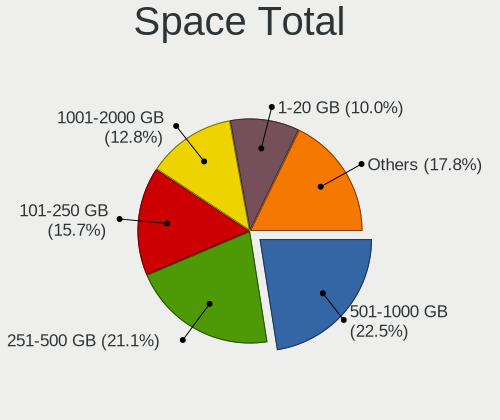
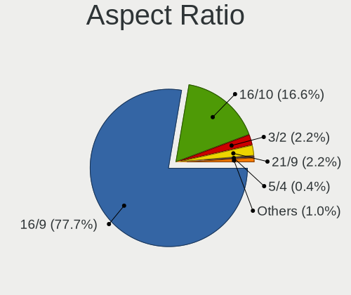
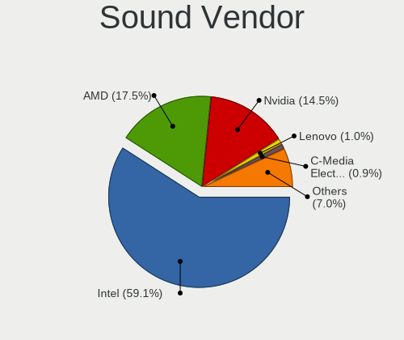

Fedora - Tested Hardware & Statistics (Notebooks)
-------------------------------------------------

A project to collect tested hardware configurations for Fedora.

Anyone can contribute to this report by the [hw-probe](https://github.com/linuxhw/hw-probe) tool:

    sudo -E hw-probe -all -upload

Please contribute! Especially if your hardware is rare.

Contents
--------

* [ Test Cases ](#test-cases)

* [ System ](#system)
  - [ OS                       ](#os)
  - [ OS Family                ](#os-family)
  - [ Kernel                   ](#kernel)
  - [ Kernel Family            ](#kernel-family)
  - [ Kernel Major Ver.        ](#kernel-major-ver)
  - [ Arch                     ](#arch)
  - [ DE                       ](#de)
  - [ Display Server           ](#display-server)
  - [ Display Manager          ](#display-manager)
  - [ OS Lang                  ](#os-lang)
  - [ Boot Mode                ](#boot-mode)
  - [ Filesystem               ](#filesystem)
  - [ Part. scheme             ](#part-scheme)
  - [ Dual Boot with Linux/BSD ](#dual-boot-with-linuxbsd)
  - [ Dual Boot (Win)          ](#dual-boot-win)

* [ Board ](#board)
  - [ Vendor                   ](#vendor)
  - [ Model                    ](#model)
  - [ Model Family             ](#model-family)
  - [ MFG Year                 ](#mfg-year)
  - [ Form Factor              ](#form-factor)
  - [ Secure Boot              ](#secure-boot)
  - [ Coreboot                 ](#coreboot)
  - [ RAM Size                 ](#ram-size)
  - [ RAM Used                 ](#ram-used)
  - [ Total Drives             ](#total-drives)
  - [ Has CD-ROM               ](#has-cd-rom)
  - [ Has Ethernet             ](#has-ethernet)
  - [ Has WiFi                 ](#has-wifi)
  - [ Has Bluetooth            ](#has-bluetooth)

* [ Location ](#location)
  - [ Country                  ](#country)
  - [ City                     ](#city)

* [ Drives ](#drives)
  - [ Drive Vendor             ](#drive-vendor)
  - [ Drive Model              ](#drive-model)
  - [ HDD Vendor               ](#hdd-vendor)
  - [ SSD Vendor               ](#ssd-vendor)
  - [ Drive Kind               ](#drive-kind)
  - [ Drive Connector          ](#drive-connector)
  - [ Drive Size               ](#drive-size)
  - [ Space Total              ](#space-total)
  - [ Space Used               ](#space-used)
  - [ Malfunc. Drives          ](#malfunc-drives)
  - [ Malfunc. Drive Vendor    ](#malfunc-drive-vendor)
  - [ Malfunc. HDD Vendor      ](#malfunc-hdd-vendor)
  - [ Malfunc. Drive Kind      ](#malfunc-drive-kind)
  - [ Failed Drives            ](#failed-drives)
  - [ Failed Drive Vendor      ](#failed-drive-vendor)
  - [ Drive Status             ](#drive-status)

* [ Storage controller ](#storage-controller)
  - [ Storage Vendor           ](#storage-vendor)
  - [ Storage Model            ](#storage-model)
  - [ Storage Kind             ](#storage-kind)

* [ Processor ](#processor)
  - [ CPU Vendor               ](#cpu-vendor)
  - [ CPU Model                ](#cpu-model)
  - [ CPU Model Family         ](#cpu-model-family)
  - [ CPU Cores                ](#cpu-cores)
  - [ CPU Sockets              ](#cpu-sockets)
  - [ CPU Threads              ](#cpu-threads)
  - [ CPU Op-Modes             ](#cpu-op-modes)
  - [ CPU Microcode            ](#cpu-microcode)
  - [ CPU Microarch            ](#cpu-microarch)

* [ Graphics ](#graphics)
  - [ GPU Vendor               ](#gpu-vendor)
  - [ GPU Model                ](#gpu-model)
  - [ GPU Combo                ](#gpu-combo)
  - [ GPU Driver               ](#gpu-driver)
  - [ GPU Memory               ](#gpu-memory)

* [ Monitor ](#monitor)
  - [ Monitor Vendor           ](#monitor-vendor)
  - [ Monitor Model            ](#monitor-model)
  - [ Monitor Resolution       ](#monitor-resolution)
  - [ Monitor Diagonal         ](#monitor-diagonal)
  - [ Monitor Width            ](#monitor-width)
  - [ Aspect Ratio             ](#aspect-ratio)
  - [ Monitor Area             ](#monitor-area)
  - [ Pixel Density            ](#pixel-density)
  - [ Multiple Monitors        ](#multiple-monitors)

* [ Network ](#network)
  - [ Net Controller Vendor    ](#net-controller-vendor)
  - [ Net Controller Model     ](#net-controller-model)
  - [ Wireless Vendor          ](#wireless-vendor)
  - [ Wireless Model           ](#wireless-model)
  - [ Ethernet Vendor          ](#ethernet-vendor)
  - [ Ethernet Model           ](#ethernet-model)
  - [ Net Controller Kind      ](#net-controller-kind)
  - [ Used Controller          ](#used-controller)
  - [ NICs                     ](#nics)
  - [ IPv6                     ](#ipv6)

* [ Bluetooth ](#bluetooth)
  - [ Bluetooth Vendor         ](#bluetooth-vendor)
  - [ Bluetooth Model          ](#bluetooth-model)

* [ Sound ](#sound)
  - [ Sound Vendor             ](#sound-vendor)
  - [ Sound Model              ](#sound-model)

* [ Memory ](#memory)
  - [ Memory Vendor            ](#memory-vendor)
  - [ Memory Model             ](#memory-model)
  - [ Memory Kind              ](#memory-kind)
  - [ Memory Form Factor       ](#memory-form-factor)
  - [ Memory Size              ](#memory-size)
  - [ Memory Speed             ](#memory-speed)

* [ Printers & scanners ](#printers--scanners)
  - [ Printer Vendor           ](#printer-vendor)
  - [ Printer Model            ](#printer-model)
  - [ Scanner Vendor           ](#scanner-vendor)
  - [ Scanner Model            ](#scanner-model)

* [ Camera ](#camera)
  - [ Camera Vendor            ](#camera-vendor)
  - [ Camera Model             ](#camera-model)

* [ Security ](#security)
  - [ Fingerprint Vendor       ](#fingerprint-vendor)
  - [ Fingerprint Model        ](#fingerprint-model)
  - [ Chipcard Vendor          ](#chipcard-vendor)
  - [ Chipcard Model           ](#chipcard-model)

* [ Unsupported ](#unsupported)
  - [ Unsupported Devices      ](#unsupported-devices)
  - [ Unsupported Device Types ](#unsupported-device-types)

Test Cases
----------

Total: 12714

| Vendor        | Model                       | Probe                                                      | Date         |
|---------------|-----------------------------|------------------------------------------------------------|--------------|
| ASUSTek       | ROG Strix G533ZM_G533ZM     | [00e99b0067](https://linux-hardware.org/?probe=00e99b0067) | Jan 02, 2024 |
| Lenovo        | G50-70 20351                | [cb1029f101](https://linux-hardware.org/?probe=cb1029f101) | Jan 02, 2024 |
| Lenovo        | ThinkPad L15 Gen 1 20U7C... | [389ae3afc8](https://linux-hardware.org/?probe=389ae3afc8) | Jan 02, 2024 |
| Lenovo        | ThinkPad T410 2522PT3       | [db100cd948](https://linux-hardware.org/?probe=db100cd948) | Jan 02, 2024 |
| Apple         | MacBookPro9,2               | [133a9d6ebc](https://linux-hardware.org/?probe=133a9d6ebc) | Jan 02, 2024 |
| Lenovo        | Y520-15IKBN 80WK            | [8701a130d2](https://linux-hardware.org/?probe=8701a130d2) | Jan 02, 2024 |
| ASUSTek       | VivoBook_ASUSLaptop E210... | [689f8869db](https://linux-hardware.org/?probe=689f8869db) | Jan 01, 2024 |
| Dell          | Inspiron 15 3530            | [ee21ee0e37](https://linux-hardware.org/?probe=ee21ee0e37) | Jan 01, 2024 |
| Dell          | Inspiron N5110              | [bf974230c7](https://linux-hardware.org/?probe=bf974230c7) | Jan 01, 2024 |
| ASUSTek       | VivoBook_ASUSLaptop X509... | [d4335b1132](https://linux-hardware.org/?probe=d4335b1132) | Jan 01, 2024 |
| Apple         | MacBookPro11,2              | [4a37a9b35c](https://linux-hardware.org/?probe=4a37a9b35c) | Jan 01, 2024 |
| ASUSTek       | VivoBook_ASUSLaptop K650... | [20f988146c](https://linux-hardware.org/?probe=20f988146c) | Jan 01, 2024 |
| Lenovo        | ThinkPad T460 20FMS2291P    | [1a86f2a3d4](https://linux-hardware.org/?probe=1a86f2a3d4) | Jan 01, 2024 |
| Dell          | Latitude 5310               | [87c543db6f](https://linux-hardware.org/?probe=87c543db6f) | Jan 01, 2024 |
| ASUSTek       | VivoBook_ASUSLaptop X571... | [de7126bf06](https://linux-hardware.org/?probe=de7126bf06) | Jan 01, 2024 |
| Lenovo        | IdeaPad 3 15ITL6 82H8       | [4eb26f2685](https://linux-hardware.org/?probe=4eb26f2685) | Jan 01, 2024 |
| Dell          | XPS 15 9530                 | [22ba5950e3](https://linux-hardware.org/?probe=22ba5950e3) | Jan 01, 2024 |
| Dell          | XPS 15 9530                 | [dddd9b59bf](https://linux-hardware.org/?probe=dddd9b59bf) | Jan 01, 2024 |
| Dell          | Inspiron N5110              | [439d746143](https://linux-hardware.org/?probe=439d746143) | Dec 31, 2023 |
| Apple         | MacBookAir7,2               | [b25bae6ded](https://linux-hardware.org/?probe=b25bae6ded) | Dec 31, 2023 |
| HUAWEI        | KLVL-WXX9                   | [28ad8513b4](https://linux-hardware.org/?probe=28ad8513b4) | Dec 31, 2023 |
| Lenovo        | ThinkPad T470s 20HGS1R90... | [c0587a6f3f](https://linux-hardware.org/?probe=c0587a6f3f) | Dec 31, 2023 |
| ASUSTek       | VivoBook_ASUSLaptop X571... | [cd2840bccc](https://linux-hardware.org/?probe=cd2840bccc) | Dec 31, 2023 |
| HP            | Laptop 14s-dq1xxx           | [f5f0fa82e5](https://linux-hardware.org/?probe=f5f0fa82e5) | Dec 31, 2023 |
| Apple         | MacBookPro6,2               | [1a25482d3d](https://linux-hardware.org/?probe=1a25482d3d) | Dec 31, 2023 |
| Lenovo        | IdeaPad 3 15ITL6 82H8       | [47e1e3c766](https://linux-hardware.org/?probe=47e1e3c766) | Dec 31, 2023 |
| Thirdwave     | Prime Series                | [dc3d167b01](https://linux-hardware.org/?probe=dc3d167b01) | Dec 31, 2023 |
| HP            | ProBook 11 G2               | [6cf8228f10](https://linux-hardware.org/?probe=6cf8228f10) | Dec 31, 2023 |
| Acer          | Predator PH16-71            | [deae7730f2](https://linux-hardware.org/?probe=deae7730f2) | Dec 31, 2023 |
| Dell          | Inspiron 3505               | [bbcd14000a](https://linux-hardware.org/?probe=bbcd14000a) | Dec 30, 2023 |
| Dell          | Latitude 5540               | [604aab0481](https://linux-hardware.org/?probe=604aab0481) | Dec 30, 2023 |
| Packard Be... | EasyNote TS44HR             | [a06265dd1e](https://linux-hardware.org/?probe=a06265dd1e) | Dec 30, 2023 |
| Dell          | Inspiron 5748               | [20017233b9](https://linux-hardware.org/?probe=20017233b9) | Dec 30, 2023 |
| Lenovo        | Yoga S740-15IRH 81NX        | [aa1bee686a](https://linux-hardware.org/?probe=aa1bee686a) | Dec 30, 2023 |
| Lenovo        | V15 G3 IAP 82TT             | [adf7c97dab](https://linux-hardware.org/?probe=adf7c97dab) | Dec 30, 2023 |
| HP            | EliteBook 840 G3            | [d3bb35f033](https://linux-hardware.org/?probe=d3bb35f033) | Dec 30, 2023 |
| ASUSTek       | VivoBook_ASUSLaptop X421... | [f391231013](https://linux-hardware.org/?probe=f391231013) | Dec 30, 2023 |
| HP            | EliteBook 840 G3            | [52ed3f7e82](https://linux-hardware.org/?probe=52ed3f7e82) | Dec 30, 2023 |
| Lenovo        | IdeaPad 3 15ITL6 82MD       | [33556742c3](https://linux-hardware.org/?probe=33556742c3) | Dec 30, 2023 |
| ASUSTek       | VivoBook_ASUSLaptop M760... | [60da2c756f](https://linux-hardware.org/?probe=60da2c756f) | Dec 30, 2023 |
| ASUSTek       | U52F                        | [acf3ac6f23](https://linux-hardware.org/?probe=acf3ac6f23) | Dec 30, 2023 |
| Lenovo        | ThinkPad P15v Gen 1 20TR... | [017090bd57](https://linux-hardware.org/?probe=017090bd57) | Dec 30, 2023 |
| ASUSTek       | VivoBook_ASUSLaptop M760... | [f805c2c9fc](https://linux-hardware.org/?probe=f805c2c9fc) | Dec 30, 2023 |
| ASUSTek       | N551JW                      | [12339778af](https://linux-hardware.org/?probe=12339778af) | Dec 30, 2023 |
| Lenovo        | ThinkPad P53 20QNCTO1WW     | [76f94ce16a](https://linux-hardware.org/?probe=76f94ce16a) | Dec 29, 2023 |
| Lenovo        | ThinkBook 15 G2 ITL 20VE    | [63af20b791](https://linux-hardware.org/?probe=63af20b791) | Dec 29, 2023 |
| Lenovo        | Legion Slim 5 14APH8 82Y... | [402a1c70b8](https://linux-hardware.org/?probe=402a1c70b8) | Dec 29, 2023 |
| ASUSTek       | VivoBook_ASUSLaptop X515... | [e0fa90555a](https://linux-hardware.org/?probe=e0fa90555a) | Dec 29, 2023 |
| Lenovo        | Legion Slim 5 14APH8 82Y... | [13e876e5cf](https://linux-hardware.org/?probe=13e876e5cf) | Dec 29, 2023 |
| Lenovo        | ThinkPad T410 2537BY8       | [0117a0ab48](https://linux-hardware.org/?probe=0117a0ab48) | Dec 29, 2023 |
| ASUSTek       | VivoBook_ASUSLaptop X515... | [03199adbd4](https://linux-hardware.org/?probe=03199adbd4) | Dec 29, 2023 |
| Apple         | MacBookPro5,2               | [b6269d662d](https://linux-hardware.org/?probe=b6269d662d) | Dec 29, 2023 |
| Razer         | Blade                       | [87f8a27b0a](https://linux-hardware.org/?probe=87f8a27b0a) | Dec 29, 2023 |
| Dell          | Vostro 3405                 | [e527034e74](https://linux-hardware.org/?probe=e527034e74) | Dec 29, 2023 |
| Dell          | Vostro 3405                 | [aee31d728f](https://linux-hardware.org/?probe=aee31d728f) | Dec 29, 2023 |
| HP            | ENVY Laptop 13-ba1xxx       | [99561c9ed3](https://linux-hardware.org/?probe=99561c9ed3) | Dec 29, 2023 |
| HP            | ENVY Laptop 13-ba1xxx       | [13e6674db0](https://linux-hardware.org/?probe=13e6674db0) | Dec 29, 2023 |
| Lenovo        | ThinkBook 13s-IWL 20R9      | [53fc03e451](https://linux-hardware.org/?probe=53fc03e451) | Dec 29, 2023 |
| Framework     | Laptop (12th Gen Intel C... | [fb4b958ae6](https://linux-hardware.org/?probe=fb4b958ae6) | Dec 29, 2023 |
| Apple         | MacBookAir4,2               | [ab4628dffe](https://linux-hardware.org/?probe=ab4628dffe) | Dec 29, 2023 |
| HONOR         | NMH-WDX9                    | [a632604865](https://linux-hardware.org/?probe=a632604865) | Dec 29, 2023 |
| Star Labs     | StarBook                    | [930fb359dd](https://linux-hardware.org/?probe=930fb359dd) | Dec 29, 2023 |
| HP            | Laptop 15-da0xxx            | [03ad95c394](https://linux-hardware.org/?probe=03ad95c394) | Dec 29, 2023 |
| ASUSTek       | ROG Strix G713QM_G713QM     | [6c5599855c](https://linux-hardware.org/?probe=6c5599855c) | Dec 29, 2023 |
| Lenovo        | ThinkPad X1 Carbon 7th 2... | [c0a8fdcf6f](https://linux-hardware.org/?probe=c0a8fdcf6f) | Dec 29, 2023 |
| Apple         | MacBookAir4,2               | [9a7ee6f89e](https://linux-hardware.org/?probe=9a7ee6f89e) | Dec 29, 2023 |
| Lenovo        | ThinkPad L14 Gen 2 20X2S... | [09f37233e4](https://linux-hardware.org/?probe=09f37233e4) | Dec 29, 2023 |
| ASUSTek       | ROG Strix G713QM_G713QM     | [0be6e9ce52](https://linux-hardware.org/?probe=0be6e9ce52) | Dec 29, 2023 |
| HP            | EliteBook 2570p             | [935d08358c](https://linux-hardware.org/?probe=935d08358c) | Dec 29, 2023 |
| Dell          | Inspiron 3542               | [06e3a35d05](https://linux-hardware.org/?probe=06e3a35d05) | Dec 29, 2023 |
| Lenovo        | ThinkPad T14s Gen 2a 20X... | [92c8c4f42c](https://linux-hardware.org/?probe=92c8c4f42c) | Dec 28, 2023 |
| Lenovo        | G700 20251                  | [3426bbc85d](https://linux-hardware.org/?probe=3426bbc85d) | Dec 28, 2023 |
| Lenovo        | G700 20251                  | [78b29bb9e8](https://linux-hardware.org/?probe=78b29bb9e8) | Dec 28, 2023 |
| Dell          | Vostro 15 5510              | [02df63af48](https://linux-hardware.org/?probe=02df63af48) | Dec 28, 2023 |
| MSI           | GS70 2OD                    | [13dab050a1](https://linux-hardware.org/?probe=13dab050a1) | Dec 28, 2023 |
| MSI           | GS70 2OD                    | [7092678d3b](https://linux-hardware.org/?probe=7092678d3b) | Dec 28, 2023 |
| Acer          | Nitro AN515-54              | [b310676172](https://linux-hardware.org/?probe=b310676172) | Dec 28, 2023 |
| Apple         | MacBookPro15,4              | [b3691ac681](https://linux-hardware.org/?probe=b3691ac681) | Dec 28, 2023 |
| BAKED         | P65xRP                      | [4bd66fa9db](https://linux-hardware.org/?probe=4bd66fa9db) | Dec 28, 2023 |
| Unknown       | Unknown                     | [7c86c2f5dc](https://linux-hardware.org/?probe=7c86c2f5dc) | Dec 28, 2023 |
| HP            | EliteBook 840 G2            | [bbce6fb229](https://linux-hardware.org/?probe=bbce6fb229) | Dec 28, 2023 |
| Lenovo        | ThinkPad T14 Gen 4 21K4S... | [a135119148](https://linux-hardware.org/?probe=a135119148) | Dec 28, 2023 |
| HP            | ENVY Laptop 13-aq1xxx       | [44df1c7cc6](https://linux-hardware.org/?probe=44df1c7cc6) | Dec 28, 2023 |
| Lenovo        | ThinkPad X1 Carbon Gen 1... | [cc024fb567](https://linux-hardware.org/?probe=cc024fb567) | Dec 28, 2023 |
| HP            | EliteBook 840 G2            | [6ba5504a6f](https://linux-hardware.org/?probe=6ba5504a6f) | Dec 28, 2023 |
| Lenovo        | ThinkPad T510 43492RU       | [87b76140e0](https://linux-hardware.org/?probe=87b76140e0) | Dec 28, 2023 |
| Apple         | MacBookPro15,4              | [1d368b7c25](https://linux-hardware.org/?probe=1d368b7c25) | Dec 28, 2023 |
| HP            | Notebook                    | [5b3e4ada9c](https://linux-hardware.org/?probe=5b3e4ada9c) | Dec 28, 2023 |
| HP            | ProBook 11 G2               | [3ad144c68e](https://linux-hardware.org/?probe=3ad144c68e) | Dec 28, 2023 |
| Lenovo        | ThinkPad T560 20FH002GUS    | [76926807cc](https://linux-hardware.org/?probe=76926807cc) | Dec 28, 2023 |
| Lenovo        | ThinkPad T560 20FH002GUS    | [cf5b823135](https://linux-hardware.org/?probe=cf5b823135) | Dec 28, 2023 |
| ASUSTek       | ROG Strix G614JZ_G614JZ     | [3ec4d2a40d](https://linux-hardware.org/?probe=3ec4d2a40d) | Dec 27, 2023 |
| Lenovo        | ThinkBook 14 G4+ IAP 21C... | [151f072ac9](https://linux-hardware.org/?probe=151f072ac9) | Dec 27, 2023 |
| Lenovo        | Mullins-LarneML             | [e545ddc079](https://linux-hardware.org/?probe=e545ddc079) | Dec 27, 2023 |
| Lenovo        | ThinkBook 13s-IWL 20R9      | [eaa68fe0f5](https://linux-hardware.org/?probe=eaa68fe0f5) | Dec 27, 2023 |
| Apple         | MacBookPro11,1              | [344f1c919a](https://linux-hardware.org/?probe=344f1c919a) | Dec 27, 2023 |
| MSI           | Modern 15 B7M               | [2c7f48c9ad](https://linux-hardware.org/?probe=2c7f48c9ad) | Dec 27, 2023 |
| Lenovo        | Legion 7 16ACHg6 82N6       | [7378a1bdb4](https://linux-hardware.org/?probe=7378a1bdb4) | Dec 27, 2023 |
| ASUSTek       | GL753VD                     | [73bbd42b1f](https://linux-hardware.org/?probe=73bbd42b1f) | Dec 27, 2023 |
| Chuwi         | MiniBook X                  | [6249e8f644](https://linux-hardware.org/?probe=6249e8f644) | Dec 27, 2023 |
| Dell          | XPS 15 9570                 | [25466d5d3b](https://linux-hardware.org/?probe=25466d5d3b) | Dec 27, 2023 |
| LG Electro... | 17Z90N-R.AAC8U1             | [b9fd2cf453](https://linux-hardware.org/?probe=b9fd2cf453) | Dec 27, 2023 |
| Lenovo        | ThinkPad X1 Carbon Gen 1... | [10918ac964](https://linux-hardware.org/?probe=10918ac964) | Dec 27, 2023 |
| HP            | Laptop 14s-dy5xxx           | [de602b4dc6](https://linux-hardware.org/?probe=de602b4dc6) | Dec 27, 2023 |
| Dell          | XPS 17 9720                 | [ff40dc8bad](https://linux-hardware.org/?probe=ff40dc8bad) | Dec 27, 2023 |
| HP            | Stream Laptop 14-ax0XX      | [d304e99c16](https://linux-hardware.org/?probe=d304e99c16) | Dec 27, 2023 |
| Acer          | TravelMate P256-M           | [c4f9e9de5e](https://linux-hardware.org/?probe=c4f9e9de5e) | Dec 27, 2023 |
| Acer          | TravelMate P256-M           | [c129debcae](https://linux-hardware.org/?probe=c129debcae) | Dec 27, 2023 |
| HP            | ZBook Studio G7 Mobile W... | [df9f1cce5b](https://linux-hardware.org/?probe=df9f1cce5b) | Dec 27, 2023 |
| Acer          | Aspire E5-571G              | [a143ecb3c3](https://linux-hardware.org/?probe=a143ecb3c3) | Dec 27, 2023 |
| Lenovo        | ThinkPad T510 43492RU       | [d3f51b650d](https://linux-hardware.org/?probe=d3f51b650d) | Dec 27, 2023 |
| Dell          | Latitude E6530              | [bd56df50f6](https://linux-hardware.org/?probe=bd56df50f6) | Dec 26, 2023 |
| Lenovo        | IdeaPad 5 15ALC05 82LN      | [e832f6b336](https://linux-hardware.org/?probe=e832f6b336) | Dec 26, 2023 |
| HUAWEI        | MRGFG-XX                    | [8ac7316911](https://linux-hardware.org/?probe=8ac7316911) | Dec 26, 2023 |
| Lenovo        | ThinkBook 15 G4 IAP 21DJ    | [a32866554a](https://linux-hardware.org/?probe=a32866554a) | Dec 26, 2023 |
| Lenovo        | ThinkPad W530 24474LG       | [180b4817c4](https://linux-hardware.org/?probe=180b4817c4) | Dec 26, 2023 |
| Apple         | MacBookPro13,1              | [63344458c9](https://linux-hardware.org/?probe=63344458c9) | Dec 26, 2023 |
| Framework     | Laptop 13 (AMD Ryzen 704... | [3fd8513ee7](https://linux-hardware.org/?probe=3fd8513ee7) | Dec 26, 2023 |
| HP            | OMEN by Gaming Laptop 16... | [c436ff8cab](https://linux-hardware.org/?probe=c436ff8cab) | Dec 26, 2023 |
| Dell          | XPS 13 9343                 | [8ba85bdc8c](https://linux-hardware.org/?probe=8ba85bdc8c) | Dec 26, 2023 |
| Lenovo        | ThinkPad T14s Gen 2a 20X... | [ef91ce6df3](https://linux-hardware.org/?probe=ef91ce6df3) | Dec 26, 2023 |
| Acer          | Nitro AN16-41               | [ae0d837def](https://linux-hardware.org/?probe=ae0d837def) | Dec 26, 2023 |
| Chuwi         | GemiBook Pro                | [0fceb23d42](https://linux-hardware.org/?probe=0fceb23d42) | Dec 25, 2023 |
| Apple         | MacBookPro13,1              | [555e444fe5](https://linux-hardware.org/?probe=555e444fe5) | Dec 25, 2023 |
| Dell          | Latitude E5470              | [71121b89c8](https://linux-hardware.org/?probe=71121b89c8) | Dec 25, 2023 |
| ASUSTek       | ASUS TUF Dash F15 FX517Z... | [c38f5ee95e](https://linux-hardware.org/?probe=c38f5ee95e) | Dec 25, 2023 |
| Dell          | Latitude 6430U              | [4c20fee408](https://linux-hardware.org/?probe=4c20fee408) | Dec 25, 2023 |
| Lenovo        | ThinkPad T460p 20FWCTO1W... | [00e7af074b](https://linux-hardware.org/?probe=00e7af074b) | Dec 25, 2023 |
| Dell          | Latitude E6230              | [618343f74c](https://linux-hardware.org/?probe=618343f74c) | Dec 25, 2023 |
| HP            | Laptop 15s-eq2xxx           | [41f592a596](https://linux-hardware.org/?probe=41f592a596) | Dec 25, 2023 |
| ASUSTek       | VivoBook_ASUSLaptop X150... | [69ec584b3a](https://linux-hardware.org/?probe=69ec584b3a) | Dec 25, 2023 |
| Lenovo        | IdeaPad 3 15ITL6 82H8       | [5b4d3b8b68](https://linux-hardware.org/?probe=5b4d3b8b68) | Dec 25, 2023 |
| Gigabyte      | AORUS 15 XE4                | [4fa06b2483](https://linux-hardware.org/?probe=4fa06b2483) | Dec 25, 2023 |
| Lenovo        | V15 G3 IAP 82TT             | [66915e859e](https://linux-hardware.org/?probe=66915e859e) | Dec 25, 2023 |
| Framework     | Laptop 13 (AMD Ryzen 704... | [d775a90c0e](https://linux-hardware.org/?probe=d775a90c0e) | Dec 25, 2023 |
| Dell          | Inspiron 5520               | [27f944d802](https://linux-hardware.org/?probe=27f944d802) | Dec 25, 2023 |
| Dell          | Inspiron 5520               | [7cc405c94d](https://linux-hardware.org/?probe=7cc405c94d) | Dec 25, 2023 |
| Lenovo        | ThinkPad P14s Gen 3 21J6... | [eb3b2bf56b](https://linux-hardware.org/?probe=eb3b2bf56b) | Dec 24, 2023 |
| Framework     | Laptop 13 (AMD Ryzen 704... | [3dcd1787be](https://linux-hardware.org/?probe=3dcd1787be) | Dec 24, 2023 |
| HP            | Pavilion g7                 | [f6a852d547](https://linux-hardware.org/?probe=f6a852d547) | Dec 24, 2023 |
| Lenovo        | Legion 5 Pro 16ACH6H 82J... | [23f36cddd3](https://linux-hardware.org/?probe=23f36cddd3) | Dec 24, 2023 |
| Lenovo        | Slim Pro 7 14ARP8 83AX      | [65afff0074](https://linux-hardware.org/?probe=65afff0074) | Dec 24, 2023 |
| Lenovo        | Slim Pro 7 14ARP8 83AX      | [496c9bc11f](https://linux-hardware.org/?probe=496c9bc11f) | Dec 24, 2023 |
| Lenovo        | ThinkPad T440 20B7A1P700    | [3bd91ab067](https://linux-hardware.org/?probe=3bd91ab067) | Dec 24, 2023 |
| Lenovo        | IdeaPad L340-15IRH Gamin... | [a5d5ac012b](https://linux-hardware.org/?probe=a5d5ac012b) | Dec 24, 2023 |
| Dell          | Latitude 7390               | [6b0dcd03de](https://linux-hardware.org/?probe=6b0dcd03de) | Dec 24, 2023 |
| Apple         | MacBookPro9,2               | [5206fdfe7e](https://linux-hardware.org/?probe=5206fdfe7e) | Dec 24, 2023 |
| Apple         | MacBookPro9,2               | [976944381c](https://linux-hardware.org/?probe=976944381c) | Dec 24, 2023 |
| Lenovo        | ThinkPad E580 20KTS0TF00    | [9822ecf249](https://linux-hardware.org/?probe=9822ecf249) | Dec 24, 2023 |
| Lenovo        | IdeaPad 3 15ITL6 82H8       | [720ff4cf67](https://linux-hardware.org/?probe=720ff4cf67) | Dec 24, 2023 |
| Lenovo        | ThinkPad E460 20ET0016US    | [96959ec0a3](https://linux-hardware.org/?probe=96959ec0a3) | Dec 24, 2023 |
| Lenovo        | IdeaPad Pro 5 16APH8 83A... | [de6b5ead5b](https://linux-hardware.org/?probe=de6b5ead5b) | Dec 24, 2023 |
| Acer          | Aspire 5742Z                | [ddf1553f4b](https://linux-hardware.org/?probe=ddf1553f4b) | Dec 24, 2023 |
| Samsung       | RV415/RV515                 | [da980644b4](https://linux-hardware.org/?probe=da980644b4) | Dec 24, 2023 |
| ASUSTek       | ROG Zephyrus G14 GA402RJ... | [29b4b5a349](https://linux-hardware.org/?probe=29b4b5a349) | Dec 24, 2023 |
| Dell          | G16 7630                    | [71f36f8ed0](https://linux-hardware.org/?probe=71f36f8ed0) | Dec 24, 2023 |
| ASUSTek       | VivoBook_ASUS Laptop E41... | [c0ff23eba6](https://linux-hardware.org/?probe=c0ff23eba6) | Dec 24, 2023 |
| Lenovo        | ThinkPad T440 20B7A1P700    | [d49a8fe4d4](https://linux-hardware.org/?probe=d49a8fe4d4) | Dec 24, 2023 |
| Lenovo        | ThinkPad T440 20B7A1P700    | [f1c9eab3f4](https://linux-hardware.org/?probe=f1c9eab3f4) | Dec 24, 2023 |
| Acer          | Aspire A515-43              | [922518c025](https://linux-hardware.org/?probe=922518c025) | Dec 23, 2023 |
| Dell          | Inspiron 15 3530            | [0688896e27](https://linux-hardware.org/?probe=0688896e27) | Dec 23, 2023 |
| HP            | Elite x2 1012 G1            | [b093087b3c](https://linux-hardware.org/?probe=b093087b3c) | Dec 23, 2023 |
| Lenovo        | IdeaPad Gaming 3 15IAH7 ... | [a79885417a](https://linux-hardware.org/?probe=a79885417a) | Dec 23, 2023 |
| HP            | Elite x2 1012 G1            | [c93fffc388](https://linux-hardware.org/?probe=c93fffc388) | Dec 23, 2023 |
| Dell          | Latitude E6420              | [82c13c188b](https://linux-hardware.org/?probe=82c13c188b) | Dec 23, 2023 |
| Lenovo        | IdeaPad 5 15ALC05 82LN      | [b3e3c041d7](https://linux-hardware.org/?probe=b3e3c041d7) | Dec 23, 2023 |
| HUAWEI        | BOM-WXX9                    | [40ba77bcb8](https://linux-hardware.org/?probe=40ba77bcb8) | Dec 23, 2023 |
| ASUSTek       | ASUS TUF Gaming A15 FA50... | [5c4d1c7d64](https://linux-hardware.org/?probe=5c4d1c7d64) | Dec 23, 2023 |
| Dell          | XPS 13 9310                 | [78b73643ff](https://linux-hardware.org/?probe=78b73643ff) | Dec 23, 2023 |
| ASUSTek       | T100TA                      | [9ad17d2d3c](https://linux-hardware.org/?probe=9ad17d2d3c) | Dec 23, 2023 |
| Toshiba       | Satellite P850              | [e16f04d074](https://linux-hardware.org/?probe=e16f04d074) | Dec 23, 2023 |
| Danew         | Dbook 131                   | [a3880bd02c](https://linux-hardware.org/?probe=a3880bd02c) | Dec 23, 2023 |
| Lenovo        | Slim Pro 7 14ARP8 83AX      | [1ace47e8fd](https://linux-hardware.org/?probe=1ace47e8fd) | Dec 23, 2023 |
| Lenovo        | ThinkPad T480 20L6S69B00    | [16b6aaa173](https://linux-hardware.org/?probe=16b6aaa173) | Dec 23, 2023 |
| Lenovo        | Legion Slim 7 16APH8 82Y... | [9a5d0ca94a](https://linux-hardware.org/?probe=9a5d0ca94a) | Dec 23, 2023 |
| Lenovo        | Legion 5 15IAH7H 82RB       | [2ca58f3eb8](https://linux-hardware.org/?probe=2ca58f3eb8) | Dec 23, 2023 |
| Lenovo        | ThinkPad P14s Gen 4 21K6... | [d53640436b](https://linux-hardware.org/?probe=d53640436b) | Dec 22, 2023 |
| Dell          | Latitude 5420               | [9858586a84](https://linux-hardware.org/?probe=9858586a84) | Dec 22, 2023 |
| Lenovo        | ThinkPad T550 20CK0002MZ    | [dbfd9ef700](https://linux-hardware.org/?probe=dbfd9ef700) | Dec 22, 2023 |
| Dell          | Precision M4800             | [ce7a9239f4](https://linux-hardware.org/?probe=ce7a9239f4) | Dec 22, 2023 |
| Lenovo        | ThinkPad E14 20RB000UBR     | [d65cca0578](https://linux-hardware.org/?probe=d65cca0578) | Dec 22, 2023 |
| Dell          | Latitude 7300               | [8792895835](https://linux-hardware.org/?probe=8792895835) | Dec 22, 2023 |
| HP            | OMEN by Gaming Laptop 16... | [d36af9d69e](https://linux-hardware.org/?probe=d36af9d69e) | Dec 22, 2023 |
| Acer          | Nitro AN515-58              | [c7a31a4dab](https://linux-hardware.org/?probe=c7a31a4dab) | Dec 22, 2023 |
| Dell          | Latitude 14 Rugged (5404... | [084f663c15](https://linux-hardware.org/?probe=084f663c15) | Dec 22, 2023 |
| Danew         | Dbook 131                   | [0568c9bdbf](https://linux-hardware.org/?probe=0568c9bdbf) | Dec 22, 2023 |
| Lenovo        | ThinkPad T14 Gen 1 20UES... | [283320e72d](https://linux-hardware.org/?probe=283320e72d) | Dec 22, 2023 |
| Lenovo        | ThinkPad T14s Gen 2a 20X... | [6f60c08653](https://linux-hardware.org/?probe=6f60c08653) | Dec 21, 2023 |
| Lenovo        | ThinkPad T14s Gen 2a 20X... | [cf835775a4](https://linux-hardware.org/?probe=cf835775a4) | Dec 21, 2023 |
| Gigabyte      | AORUS 15 XE4                | [5dd281e2dd](https://linux-hardware.org/?probe=5dd281e2dd) | Dec 21, 2023 |
| MSI           | Modern 15 B7M               | [77760018a7](https://linux-hardware.org/?probe=77760018a7) | Dec 21, 2023 |
| Lenovo        | ThinkBook 13s-IWL 20R9      | [e864a3cd22](https://linux-hardware.org/?probe=e864a3cd22) | Dec 21, 2023 |
| Fujitsu       | LIFEBOOK AH530              | [cb7f868a54](https://linux-hardware.org/?probe=cb7f868a54) | Dec 21, 2023 |
| ASUSTek       | X411UA                      | [a4a14550e8](https://linux-hardware.org/?probe=a4a14550e8) | Dec 21, 2023 |
| Lenovo        | IdeaPad Gaming 3 15IAH7 ... | [ef2e756e7b](https://linux-hardware.org/?probe=ef2e756e7b) | Dec 21, 2023 |
| HUAWEI        | MRGFG-XX                    | [747de8fa3c](https://linux-hardware.org/?probe=747de8fa3c) | Dec 21, 2023 |
| Acer          | Aspire M5-581T              | [c99da67d31](https://linux-hardware.org/?probe=c99da67d31) | Dec 21, 2023 |
| HP            | ProBook 445 G7              | [4153ae7cc6](https://linux-hardware.org/?probe=4153ae7cc6) | Dec 21, 2023 |
| Acer          | Predator PH16-71            | [403fcc076f](https://linux-hardware.org/?probe=403fcc076f) | Dec 21, 2023 |
| Lenovo        | ThinkPad T14 Gen 3 21AH0... | [03b86f8fd8](https://linux-hardware.org/?probe=03b86f8fd8) | Dec 21, 2023 |
| Lenovo        | ThinkPad T470s W10DG 20J... | [faabc05597](https://linux-hardware.org/?probe=faabc05597) | Dec 21, 2023 |
| Dell          | Latitude 3410               | [3de48ebce1](https://linux-hardware.org/?probe=3de48ebce1) | Dec 20, 2023 |
| Dell          | XPS 15 9510                 | [107d6edb72](https://linux-hardware.org/?probe=107d6edb72) | Dec 20, 2023 |
| ASUSTek       | X580VD                      | [18f5888ad5](https://linux-hardware.org/?probe=18f5888ad5) | Dec 20, 2023 |
| HP            | Stream Laptop 14-ax0XX      | [398a10f8ce](https://linux-hardware.org/?probe=398a10f8ce) | Dec 20, 2023 |
| MSI           | Prestige 14Evo A12M         | [23e7499358](https://linux-hardware.org/?probe=23e7499358) | Dec 20, 2023 |
| Lenovo        | ThinkPad X1 Carbon Gen 1... | [eef5dcab57](https://linux-hardware.org/?probe=eef5dcab57) | Dec 20, 2023 |
| ASUSTek       | ASUS TUF Gaming A15 FA50... | [c2eacfced7](https://linux-hardware.org/?probe=c2eacfced7) | Dec 20, 2023 |
| Dell          | Latitude E5450              | [6d4e378f53](https://linux-hardware.org/?probe=6d4e378f53) | Dec 20, 2023 |
| Lenovo        | ThinkPad E15 Gen 2 20TDS... | [44a01e07bb](https://linux-hardware.org/?probe=44a01e07bb) | Dec 20, 2023 |
| Apple         | MacBookPro14,2              | [e13dae2abd](https://linux-hardware.org/?probe=e13dae2abd) | Dec 20, 2023 |
| HUAWEI        | BOHB-WAX9                   | [7b4cd22d8d](https://linux-hardware.org/?probe=7b4cd22d8d) | Dec 20, 2023 |
| ASUSTek       | X556URK                     | [b4f01c5bd5](https://linux-hardware.org/?probe=b4f01c5bd5) | Dec 19, 2023 |
| Dell          | Latitude 3460               | [c3b4a00583](https://linux-hardware.org/?probe=c3b4a00583) | Dec 19, 2023 |
| Dell          | Latitude 3460               | [3b425238a6](https://linux-hardware.org/?probe=3b425238a6) | Dec 19, 2023 |
| Lenovo        | ThinkPad S430 336457G       | [4acd70fc9f](https://linux-hardware.org/?probe=4acd70fc9f) | Dec 19, 2023 |
| Acer          | Aspire A515-57              | [f6f623f0d8](https://linux-hardware.org/?probe=f6f623f0d8) | Dec 19, 2023 |
| HUAWEI        | MRGFG-XX                    | [6a10eb945c](https://linux-hardware.org/?probe=6a10eb945c) | Dec 19, 2023 |
| Dell          | Latitude E5450              | [627a81b211](https://linux-hardware.org/?probe=627a81b211) | Dec 19, 2023 |
| Lenovo        | ThinkPad T470p 20J6CTO1W... | [a074081eb1](https://linux-hardware.org/?probe=a074081eb1) | Dec 19, 2023 |
| Lenovo        | ThinkPad T14 Gen 4 21K4S... | [85531f6788](https://linux-hardware.org/?probe=85531f6788) | Dec 19, 2023 |
| Dell          | Inspiron N5110              | [761103087e](https://linux-hardware.org/?probe=761103087e) | Dec 19, 2023 |
| Acer          | Swift SF314-54              | [4d8fbbd6d0](https://linux-hardware.org/?probe=4d8fbbd6d0) | Dec 19, 2023 |
| Lenovo        | ThinkPad T14 Gen 4 21K4S... | [4715b83a8c](https://linux-hardware.org/?probe=4715b83a8c) | Dec 19, 2023 |
| Lenovo        | ThinkPad T14 Gen 3 21AH0... | [e37edfc830](https://linux-hardware.org/?probe=e37edfc830) | Dec 19, 2023 |
| Dell          | Inspiron 3542               | [7d3f7e97ce](https://linux-hardware.org/?probe=7d3f7e97ce) | Dec 19, 2023 |
| ASUSTek       | VivoBook 15_ASUS Laptop ... | [2d2f0f8de2](https://linux-hardware.org/?probe=2d2f0f8de2) | Dec 19, 2023 |
| Dell          | Inspiron 5520               | [df5cca640e](https://linux-hardware.org/?probe=df5cca640e) | Dec 19, 2023 |
| HP            | Pavilion Gaming Laptop 1... | [9afec278e2](https://linux-hardware.org/?probe=9afec278e2) | Dec 18, 2023 |
| Dell          | Inspiron 5520               | [0d5fb0418b](https://linux-hardware.org/?probe=0d5fb0418b) | Dec 18, 2023 |
| Lenovo        | IdeaPad 3 15ITL6 82H8       | [1d8ddbcb75](https://linux-hardware.org/?probe=1d8ddbcb75) | Dec 18, 2023 |
| Dell          | Latitude 3420               | [59784d2788](https://linux-hardware.org/?probe=59784d2788) | Dec 18, 2023 |
| ASUSTek       | ASUS TUF Gaming A16 FA61... | [147873adce](https://linux-hardware.org/?probe=147873adce) | Dec 18, 2023 |
| Dell          | Latitude E5470              | [9aa1f53217](https://linux-hardware.org/?probe=9aa1f53217) | Dec 18, 2023 |
| ASUSTek       | VivoBook_ASUSLaptop X150... | [1c015093b2](https://linux-hardware.org/?probe=1c015093b2) | Dec 18, 2023 |
| Dell          | Latitude E5550              | [671595a2e5](https://linux-hardware.org/?probe=671595a2e5) | Dec 18, 2023 |
| GPD           | G1619-04                    | [63b517665b](https://linux-hardware.org/?probe=63b517665b) | Dec 18, 2023 |
| Lenovo        | ThinkPad T450s 20BX001LU... | [b3a6780db5](https://linux-hardware.org/?probe=b3a6780db5) | Dec 18, 2023 |
| Dell          | Latitude E7440              | [c2dce135e4](https://linux-hardware.org/?probe=c2dce135e4) | Dec 18, 2023 |
| ASUSTek       | VivoBook 15_ASUS Laptop ... | [4e18aeb53f](https://linux-hardware.org/?probe=4e18aeb53f) | Dec 18, 2023 |
| Lenovo        | IdeaPad Gaming 3 15IHU6 ... | [7d1b99f3a7](https://linux-hardware.org/?probe=7d1b99f3a7) | Dec 18, 2023 |
| Lenovo        | ThinkPad T14 Gen 3 21AH0... | [1a1a04845b](https://linux-hardware.org/?probe=1a1a04845b) | Dec 18, 2023 |
| ASUSTek       | VivoBook_ASUSLaptop X509... | [19fe61d807](https://linux-hardware.org/?probe=19fe61d807) | Dec 18, 2023 |
| HP            | ZBook Studio G7 Mobile W... | [b0526a42f4](https://linux-hardware.org/?probe=b0526a42f4) | Dec 18, 2023 |
| Samsung       | 550P5C/550P7C               | [b06e8fbef4](https://linux-hardware.org/?probe=b06e8fbef4) | Dec 18, 2023 |
| ASUSTek       | K53SD                       | [4b43240ccd](https://linux-hardware.org/?probe=4b43240ccd) | Dec 18, 2023 |
| HP            | 250 15.6 inch G9 Noteboo... | [612482d238](https://linux-hardware.org/?probe=612482d238) | Dec 18, 2023 |
| Compal        | PBL1011                     | [8983f2e331](https://linux-hardware.org/?probe=8983f2e331) | Dec 18, 2023 |
| Acer          | Nitro AN515-55              | [bdecd800b4](https://linux-hardware.org/?probe=bdecd800b4) | Dec 18, 2023 |
| Lenovo        | ThinkPad X270 20HMS0B60H    | [059545a4ad](https://linux-hardware.org/?probe=059545a4ad) | Dec 17, 2023 |
| Lenovo        | IdeaPad MIIX 700-12ISK 8... | [6ac6a904be](https://linux-hardware.org/?probe=6ac6a904be) | Dec 17, 2023 |
| Lenovo        | ThinkPad X1 Carbon 2nd 2... | [7b289201bc](https://linux-hardware.org/?probe=7b289201bc) | Dec 17, 2023 |
| Acer          | Nitro AN517-54              | [80aeddc1b2](https://linux-hardware.org/?probe=80aeddc1b2) | Dec 17, 2023 |
| HP            | ZBook 17 G5                 | [288e976604](https://linux-hardware.org/?probe=288e976604) | Dec 17, 2023 |
| Acer          | Nitro AN517-54              | [2f2bcf0c97](https://linux-hardware.org/?probe=2f2bcf0c97) | Dec 17, 2023 |
| Dell          | G5 5587                     | [0200ad8ea9](https://linux-hardware.org/?probe=0200ad8ea9) | Dec 17, 2023 |
| Lenovo        | IdeaPad Gaming 3 15IAH7 ... | [26503ce57e](https://linux-hardware.org/?probe=26503ce57e) | Dec 17, 2023 |
| HP            | Victus by Laptop 16-e0xx... | [16902836db](https://linux-hardware.org/?probe=16902836db) | Dec 17, 2023 |
| Lenovo        | Legion 7 16ARHA7 82UH       | [845e586dba](https://linux-hardware.org/?probe=845e586dba) | Dec 17, 2023 |
| ASUSTek       | ROG Strix G814JZ_G814JZ     | [b8d81eb2c9](https://linux-hardware.org/?probe=b8d81eb2c9) | Dec 17, 2023 |
| Lenovo        | ThinkPad T480 20L50011US    | [c93d5be9d6](https://linux-hardware.org/?probe=c93d5be9d6) | Dec 17, 2023 |
| VIT           | P3400                       | [0564cdc52e](https://linux-hardware.org/?probe=0564cdc52e) | Dec 17, 2023 |
| Lenovo        | IdeaPad 3 15ITL6 82H8       | [299d6ae362](https://linux-hardware.org/?probe=299d6ae362) | Dec 17, 2023 |
| Fujitsu       | LIFEBOOK U749               | [4ede8e182e](https://linux-hardware.org/?probe=4ede8e182e) | Dec 17, 2023 |
| Lenovo        | ThinkPad E580 20KTS0TF00    | [3a2290dbe0](https://linux-hardware.org/?probe=3a2290dbe0) | Dec 16, 2023 |
| ASUSTek       | ROG Zephyrus G14 GA402RJ... | [f4c923a84a](https://linux-hardware.org/?probe=f4c923a84a) | Dec 16, 2023 |
| Dell          | Inspiron 15-3567            | [570a822273](https://linux-hardware.org/?probe=570a822273) | Dec 16, 2023 |
| Fujitsu       | LIFEBOOK U728               | [381f2ea08d](https://linux-hardware.org/?probe=381f2ea08d) | Dec 16, 2023 |
| HP            | ENVY Laptop 13-ad1xx        | [a2a4eb520c](https://linux-hardware.org/?probe=a2a4eb520c) | Dec 16, 2023 |
| Lenovo        | IdeaPad Slim 9 14ITL5 82... | [9e217a08be](https://linux-hardware.org/?probe=9e217a08be) | Dec 16, 2023 |
| HP            | Pavilion Laptop 14-dv0xx... | [f7ffef008a](https://linux-hardware.org/?probe=f7ffef008a) | Dec 16, 2023 |
| HP            | Pavilion Laptop 14-dv0xx... | [fc9b36317a](https://linux-hardware.org/?probe=fc9b36317a) | Dec 16, 2023 |
| ASUSTek       | VivoBook_ASUSLaptop X515... | [984c55c6a2](https://linux-hardware.org/?probe=984c55c6a2) | Dec 16, 2023 |
| Lenovo        | B50-80 80LT                 | [ea695bd9c5](https://linux-hardware.org/?probe=ea695bd9c5) | Dec 16, 2023 |
| Lenovo        | B50-80 80LT                 | [40d547e3f5](https://linux-hardware.org/?probe=40d547e3f5) | Dec 16, 2023 |
| HP            | Compaq CQ58                 | [7567b51bda](https://linux-hardware.org/?probe=7567b51bda) | Dec 16, 2023 |
| Lenovo        | ThinkPad T470s 20HGS1R90... | [56e95fc392](https://linux-hardware.org/?probe=56e95fc392) | Dec 16, 2023 |
| Apple         | MacBookPro10,1              | [adc736fc8d](https://linux-hardware.org/?probe=adc736fc8d) | Dec 16, 2023 |
| MSI           | GP62MVR 7RFX                | [fcb56f79d6](https://linux-hardware.org/?probe=fcb56f79d6) | Dec 16, 2023 |
| ASUSTek       | Q524UQ                      | [8466629595](https://linux-hardware.org/?probe=8466629595) | Dec 16, 2023 |
| Dell          | Inspiron 5447               | [0e868b4cba](https://linux-hardware.org/?probe=0e868b4cba) | Dec 15, 2023 |
| Dell          | Inspiron 5447               | [60320e4007](https://linux-hardware.org/?probe=60320e4007) | Dec 15, 2023 |
| Dell          | Inspiron 13-5378            | [d63cdec5eb](https://linux-hardware.org/?probe=d63cdec5eb) | Dec 15, 2023 |
| Lenovo        | IdeaPad 3 15ITL6 82H8       | [cde85f7526](https://linux-hardware.org/?probe=cde85f7526) | Dec 15, 2023 |
| ASUSTek       | X540LJ                      | [281c56510a](https://linux-hardware.org/?probe=281c56510a) | Dec 15, 2023 |
| Apple         | MacBookPro5,3               | [f882c29faa](https://linux-hardware.org/?probe=f882c29faa) | Dec 15, 2023 |
| Dell          | Latitude E5550              | [dc16864fb6](https://linux-hardware.org/?probe=dc16864fb6) | Dec 15, 2023 |
| Apple         | MacBookPro11,3              | [106c5c6ec4](https://linux-hardware.org/?probe=106c5c6ec4) | Dec 15, 2023 |
| ASUSTek       | VivoBook_ASUSLaptop X515... | [e5916c58ec](https://linux-hardware.org/?probe=e5916c58ec) | Dec 15, 2023 |
| ASUSTek       | VivoBook_ASUSLaptop X515... | [37495b67c9](https://linux-hardware.org/?probe=37495b67c9) | Dec 15, 2023 |
| ASUSTek       | ROG Strix G531GU_GL531GU    | [b3b3853325](https://linux-hardware.org/?probe=b3b3853325) | Dec 15, 2023 |
| HP            | ZBook 15u G6                | [4467debb1c](https://linux-hardware.org/?probe=4467debb1c) | Dec 15, 2023 |
| Sony          | SVF1521G6EW                 | [55b5387ed5](https://linux-hardware.org/?probe=55b5387ed5) | Dec 15, 2023 |
| Apple         | MacBookPro5,3               | [066c7e2b1a](https://linux-hardware.org/?probe=066c7e2b1a) | Dec 15, 2023 |
| Lenovo        | Slim 7 ProX 14ARH7 82V2     | [b342bc9627](https://linux-hardware.org/?probe=b342bc9627) | Dec 14, 2023 |
| Lenovo        | Yoga Slim 6 14IAP8 82WU     | [c2186c6471](https://linux-hardware.org/?probe=c2186c6471) | Dec 14, 2023 |
| HP            | OMEN by Laptop 16-c0xxx     | [a043c13550](https://linux-hardware.org/?probe=a043c13550) | Dec 14, 2023 |
| Dell          | Inspiron 3793               | [90804693a6](https://linux-hardware.org/?probe=90804693a6) | Dec 14, 2023 |
| Dell          | Precision M3800             | [9e8d36821a](https://linux-hardware.org/?probe=9e8d36821a) | Dec 14, 2023 |
| Lenovo        | ThinkPad T400 6475WJE       | [91fd392ea3](https://linux-hardware.org/?probe=91fd392ea3) | Dec 14, 2023 |
| Apple         | MacBookAir9,1               | [6cadf8d04e](https://linux-hardware.org/?probe=6cadf8d04e) | Dec 14, 2023 |
| Dell          | Precision 5510              | [ddc02a6165](https://linux-hardware.org/?probe=ddc02a6165) | Dec 14, 2023 |
| HP            | Laptop 15s-fq2xxx           | [0728e617a0](https://linux-hardware.org/?probe=0728e617a0) | Dec 14, 2023 |
| HP            | OMEN by Laptop 15-dh1xxx    | [6a493a834d](https://linux-hardware.org/?probe=6a493a834d) | Dec 14, 2023 |
| HP            | OMEN by Laptop 15-dh1xxx    | [9d34609e0d](https://linux-hardware.org/?probe=9d34609e0d) | Dec 14, 2023 |
| Lenovo        | ThinkBook 13x G2 IAP 21A... | [2b65b49ba3](https://linux-hardware.org/?probe=2b65b49ba3) | Dec 14, 2023 |
| HP            | Stream Laptop 11-ah1XX      | [309aea6480](https://linux-hardware.org/?probe=309aea6480) | Dec 14, 2023 |
| Lenovo        | Legion Slim 5 16IRH8 82Y... | [cda15a71e9](https://linux-hardware.org/?probe=cda15a71e9) | Dec 14, 2023 |
| Lenovo        | ThinkPad T480 20L50011US    | [0ece599b11](https://linux-hardware.org/?probe=0ece599b11) | Dec 14, 2023 |
| ASRock        | B560M Pro4/ac               | [0dd2927c25](https://linux-hardware.org/?probe=0dd2927c25) | Dec 14, 2023 |
| Dell          | G15 5520                    | [12b6fa0914](https://linux-hardware.org/?probe=12b6fa0914) | Dec 14, 2023 |
| A-DATA Tec... | XENIA 14                    | [ebbefc4570](https://linux-hardware.org/?probe=ebbefc4570) | Dec 14, 2023 |
| Dell          | G15 5520                    | [d212fe82aa](https://linux-hardware.org/?probe=d212fe82aa) | Dec 14, 2023 |
| Acer          | Nitro AN515-45              | [1ff0d683f4](https://linux-hardware.org/?probe=1ff0d683f4) | Dec 13, 2023 |
| Dell          | XPS 15 9530                 | [33d1f683ba](https://linux-hardware.org/?probe=33d1f683ba) | Dec 13, 2023 |
| Lenovo        | ThinkPad E560 20EV000SMZ    | [13b8795a4e](https://linux-hardware.org/?probe=13b8795a4e) | Dec 13, 2023 |
| Lenovo        | Z710 20250                  | [0ffc45c096](https://linux-hardware.org/?probe=0ffc45c096) | Dec 13, 2023 |
| HUAWEI        | HKD-WXX                     | [c6a0ea6b45](https://linux-hardware.org/?probe=c6a0ea6b45) | Dec 13, 2023 |
| Dell          | Precision 5510              | [0ce634decf](https://linux-hardware.org/?probe=0ce634decf) | Dec 13, 2023 |
| HP            | Laptop 17-cp0xxx            | [7d584c6a4d](https://linux-hardware.org/?probe=7d584c6a4d) | Dec 13, 2023 |
| HUAWEI        | HKD-WXX                     | [b0c03a26ce](https://linux-hardware.org/?probe=b0c03a26ce) | Dec 13, 2023 |
| Dell          | XPS 13 9350                 | [149a7f254a](https://linux-hardware.org/?probe=149a7f254a) | Dec 13, 2023 |
| Lenovo        | ThinkPad T410 2522PT3       | [625439b5a5](https://linux-hardware.org/?probe=625439b5a5) | Dec 13, 2023 |
| Dell          | Precision 7510              | [863d50a5a5](https://linux-hardware.org/?probe=863d50a5a5) | Dec 13, 2023 |
| Dell          | Precision 7510              | [dddb88520a](https://linux-hardware.org/?probe=dddb88520a) | Dec 13, 2023 |
| HP            | EliteBook 840 G4            | [6440dbccd4](https://linux-hardware.org/?probe=6440dbccd4) | Dec 13, 2023 |
| Dell          | Inspiron 5584               | [525d98e3f0](https://linux-hardware.org/?probe=525d98e3f0) | Dec 13, 2023 |
| Lenovo        | ThinkPad E560 20EV000SMZ    | [1bb8694fda](https://linux-hardware.org/?probe=1bb8694fda) | Dec 12, 2023 |
| Acer          | Aspire A515-45              | [74dc572dd7](https://linux-hardware.org/?probe=74dc572dd7) | Dec 12, 2023 |
| Lenovo        | ThinkPad P1 20MD0001GE      | [e4c9202751](https://linux-hardware.org/?probe=e4c9202751) | Dec 12, 2023 |
| Lenovo        | ThinkPad P1 20MD0001GE      | [5662ef46db](https://linux-hardware.org/?probe=5662ef46db) | Dec 12, 2023 |
| Acer          | Aspire A515-45              | [089a40a6f2](https://linux-hardware.org/?probe=089a40a6f2) | Dec 12, 2023 |
| HP            | 15                          | [9c4fb8f41d](https://linux-hardware.org/?probe=9c4fb8f41d) | Dec 12, 2023 |
| HP            | OMEN by Laptop              | [12c97adbac](https://linux-hardware.org/?probe=12c97adbac) | Dec 12, 2023 |
| Apple         | MacBookPro13,2              | [9200b90a95](https://linux-hardware.org/?probe=9200b90a95) | Dec 12, 2023 |
| Apple         | MacBookPro13,2              | [917471b136](https://linux-hardware.org/?probe=917471b136) | Dec 12, 2023 |
| Apple         | MacBookPro13,2              | [6c3498a025](https://linux-hardware.org/?probe=6c3498a025) | Dec 12, 2023 |
| Apple         | MacBookPro14,1              | [16e9faf4e6](https://linux-hardware.org/?probe=16e9faf4e6) | Dec 12, 2023 |
| Apple         | MacBookPro14,1              | [05ceb8703b](https://linux-hardware.org/?probe=05ceb8703b) | Dec 12, 2023 |
| Timi          | A35R                        | [6133c765d4](https://linux-hardware.org/?probe=6133c765d4) | Dec 12, 2023 |
| Acer          | Extensa 215-55              | [40eaa33887](https://linux-hardware.org/?probe=40eaa33887) | Dec 12, 2023 |
| Lenovo        | ThinkPad P1 Gen 3 20TJS1... | [293fe3fb8e](https://linux-hardware.org/?probe=293fe3fb8e) | Dec 12, 2023 |
| Alienware     | M17x                        | [da64c97fa8](https://linux-hardware.org/?probe=da64c97fa8) | Dec 12, 2023 |
| HP            | Pavilion Sleekbook 14 PC    | [dfe75293a5](https://linux-hardware.org/?probe=dfe75293a5) | Dec 12, 2023 |
| Acer          | Aspire A315-510P            | [e2bdedca29](https://linux-hardware.org/?probe=e2bdedca29) | Dec 12, 2023 |
| HUAWEI        | BOD-WXX9                    | [c12ada5b78](https://linux-hardware.org/?probe=c12ada5b78) | Dec 12, 2023 |
| Acer          | V5-171                      | [79abc82869](https://linux-hardware.org/?probe=79abc82869) | Dec 11, 2023 |
| MSI           | Modern 15 B7M               | [d4c74075be](https://linux-hardware.org/?probe=d4c74075be) | Dec 11, 2023 |
| HP            | ProBook 450 G8 Notebook ... | [9a6a483608](https://linux-hardware.org/?probe=9a6a483608) | Dec 11, 2023 |
| Lenovo        | G50-70 20351                | [d22fb3a791](https://linux-hardware.org/?probe=d22fb3a791) | Dec 11, 2023 |
| ASUSTek       | U52F                        | [5bdf8ec184](https://linux-hardware.org/?probe=5bdf8ec184) | Dec 11, 2023 |
| Dell          | Precision M6500             | [5b287ea21f](https://linux-hardware.org/?probe=5b287ea21f) | Dec 11, 2023 |
| Dell          | XPS 15 9510                 | [b88a7e6159](https://linux-hardware.org/?probe=b88a7e6159) | Dec 10, 2023 |
| Lenovo        | ThinkPad T400 6475WJE       | [2dc1349392](https://linux-hardware.org/?probe=2dc1349392) | Dec 10, 2023 |
| Framework     | Laptop 13 (AMD Ryzen 704... | [ee7a9f7ba7](https://linux-hardware.org/?probe=ee7a9f7ba7) | Dec 10, 2023 |
| HP            | Laptop 17-cn3xxx            | [7a93c4b54c](https://linux-hardware.org/?probe=7a93c4b54c) | Dec 10, 2023 |
| Lenovo        | ThinkPad T440p 20ANCTO1W... | [070ba5c3c1](https://linux-hardware.org/?probe=070ba5c3c1) | Dec 10, 2023 |
| Dell          | Inspiron 1525               | [9eb3de84e4](https://linux-hardware.org/?probe=9eb3de84e4) | Dec 10, 2023 |
| Framework     | Laptop 13 (AMD Ryzen 704... | [2aef9deafb](https://linux-hardware.org/?probe=2aef9deafb) | Dec 10, 2023 |
| HP            | EliteBook 845 G7 Noteboo... | [3cfc2b72b4](https://linux-hardware.org/?probe=3cfc2b72b4) | Dec 10, 2023 |
| Fujitsu       | LIFEBOOK AH530              | [c0797a823b](https://linux-hardware.org/?probe=c0797a823b) | Dec 10, 2023 |
| HP            | Laptop 15-da0xxx            | [2722000dd3](https://linux-hardware.org/?probe=2722000dd3) | Dec 10, 2023 |
| Lenovo        | Legion S7 16ARHA7 82UG      | [d6ec80c299](https://linux-hardware.org/?probe=d6ec80c299) | Dec 10, 2023 |
| HP            | ZBook Fury 15 G7 Mobile ... | [d31e9bc5eb](https://linux-hardware.org/?probe=d31e9bc5eb) | Dec 10, 2023 |
| Dell          | Latitude 7440               | [2aef8e5157](https://linux-hardware.org/?probe=2aef8e5157) | Dec 09, 2023 |
| Lenovo        | ThinkPad X1 Carbon 4th 2... | [96a56fd534](https://linux-hardware.org/?probe=96a56fd534) | Dec 09, 2023 |
| ASUSTek       | P552LA                      | [cbe77e84b7](https://linux-hardware.org/?probe=cbe77e84b7) | Dec 09, 2023 |
| Lenovo        | ThinkPad E15 Gen 2 20T80... | [a0670e0719](https://linux-hardware.org/?probe=a0670e0719) | Dec 09, 2023 |
| ASUSTek       | ZenBook UX325UA_UM325UA     | [baa82e571f](https://linux-hardware.org/?probe=baa82e571f) | Dec 09, 2023 |
| Lenovo        | ThinkPad L15 Gen 1 20U8S... | [140789380e](https://linux-hardware.org/?probe=140789380e) | Dec 09, 2023 |
| Dell          | Inspiron N5110              | [c7a949f9e8](https://linux-hardware.org/?probe=c7a949f9e8) | Dec 09, 2023 |
| Dell          | Latitude 3480               | [ee6070cfbe](https://linux-hardware.org/?probe=ee6070cfbe) | Dec 09, 2023 |
| Acer          | Predator PH16-71            | [234562596d](https://linux-hardware.org/?probe=234562596d) | Dec 09, 2023 |
| Gigabyte      | AORUS 15 9KF                | [d6386ee775](https://linux-hardware.org/?probe=d6386ee775) | Dec 09, 2023 |
| ASUSTek       | VivoBook_ASUSLaptop K360... | [587ff35c26](https://linux-hardware.org/?probe=587ff35c26) | Dec 08, 2023 |
| Acer          | Aspire A515-47              | [363153833d](https://linux-hardware.org/?probe=363153833d) | Dec 08, 2023 |
| Dell          | Latitude 5511               | [9f006edcd8](https://linux-hardware.org/?probe=9f006edcd8) | Dec 08, 2023 |
| HP            | 630                         | [b6c4bc59c1](https://linux-hardware.org/?probe=b6c4bc59c1) | Dec 08, 2023 |
| Dell          | Latitude E6430              | [dee39185ec](https://linux-hardware.org/?probe=dee39185ec) | Dec 08, 2023 |
| MSI           | Katana GF76 11UD            | [a489e0db56](https://linux-hardware.org/?probe=a489e0db56) | Dec 08, 2023 |
| Lenovo        | ThinkPad X1 Carbon 6th 2... | [2cc6eaff05](https://linux-hardware.org/?probe=2cc6eaff05) | Dec 08, 2023 |
| MSI           | Katana GF76 11UD            | [0f09b2440c](https://linux-hardware.org/?probe=0f09b2440c) | Dec 08, 2023 |
| HUAWEI        | MRGF-XX                     | [ec03f0452e](https://linux-hardware.org/?probe=ec03f0452e) | Dec 08, 2023 |
| HUAWEI        | MRGF-XX                     | [88fc932f99](https://linux-hardware.org/?probe=88fc932f99) | Dec 08, 2023 |
| Dell          | Precision M4700             | [54abe2ce35](https://linux-hardware.org/?probe=54abe2ce35) | Dec 08, 2023 |
| HP            | 15 Notebook PC              | [35b7f5d288](https://linux-hardware.org/?probe=35b7f5d288) | Dec 08, 2023 |
| Lenovo        | ThinkPad X1 Carbon Gen 1... | [7f76b4716d](https://linux-hardware.org/?probe=7f76b4716d) | Dec 08, 2023 |
| Lenovo        | ThinkPad X1 Carbon Gen 1... | [0a3a227554](https://linux-hardware.org/?probe=0a3a227554) | Dec 08, 2023 |
| Lenovo        | ThinkPad X1 Carbon Gen 1... | [cf832dba27](https://linux-hardware.org/?probe=cf832dba27) | Dec 08, 2023 |
| TUXEDO        | InfinityBook S 15/17 Gen... | [01f7b97e5d](https://linux-hardware.org/?probe=01f7b97e5d) | Dec 08, 2023 |
| ASUSTek       | VivoBook_ASUSLaptop S540... | [2eb0717bf1](https://linux-hardware.org/?probe=2eb0717bf1) | Dec 07, 2023 |
| Sony          | VPCEB25FX                   | [f2d99590ca](https://linux-hardware.org/?probe=f2d99590ca) | Dec 07, 2023 |
| HUAWEI        | KLVC-WXX9                   | [cd7c131bf1](https://linux-hardware.org/?probe=cd7c131bf1) | Dec 07, 2023 |
| HP            | EliteBook 840 14 inch G1... | [b2fcb75892](https://linux-hardware.org/?probe=b2fcb75892) | Dec 07, 2023 |
| ASUSTek       | VivoBook_ASUSLaptop X150... | [eea00eb64c](https://linux-hardware.org/?probe=eea00eb64c) | Dec 07, 2023 |
| Toshiba       | Satellite C70-B             | [6493c4fcf8](https://linux-hardware.org/?probe=6493c4fcf8) | Dec 07, 2023 |
| Acer          | Aspire A515-45              | [ccc3f6589d](https://linux-hardware.org/?probe=ccc3f6589d) | Dec 07, 2023 |
| Lenovo        | ThinkBook 16 G6 IRL 21KH    | [96ab8b0be8](https://linux-hardware.org/?probe=96ab8b0be8) | Dec 07, 2023 |
| Lenovo        | ThinkPad E16 Gen 1 21JT0... | [8ec5586df3](https://linux-hardware.org/?probe=8ec5586df3) | Dec 07, 2023 |
| HONOR         | HGF-WX6                     | [0ba74f97d0](https://linux-hardware.org/?probe=0ba74f97d0) | Dec 07, 2023 |
| Dell          | System Inspiron N4110       | [72874bcc85](https://linux-hardware.org/?probe=72874bcc85) | Dec 07, 2023 |
| HP            | EliteBook 845 14 inch G1... | [aa4dc92984](https://linux-hardware.org/?probe=aa4dc92984) | Dec 07, 2023 |
| Lenovo        | Yoga Pro 7 14APH8 82Y8      | [3ffedf98eb](https://linux-hardware.org/?probe=3ffedf98eb) | Dec 07, 2023 |
| Dell          | XPS 13 9310                 | [1b786f8834](https://linux-hardware.org/?probe=1b786f8834) | Dec 06, 2023 |
| Lenovo        | ThinkPad X1 Carbon 4th 2... | [2d483d736b](https://linux-hardware.org/?probe=2d483d736b) | Dec 06, 2023 |
| Dell          | XPS 13 9310                 | [2e32594a3f](https://linux-hardware.org/?probe=2e32594a3f) | Dec 06, 2023 |
| Lenovo        | ThinkPad T490s 20NYS7K90... | [65ec6660cc](https://linux-hardware.org/?probe=65ec6660cc) | Dec 06, 2023 |
| Packard Be... | EasyNote TSX66HR            | [8ca6149044](https://linux-hardware.org/?probe=8ca6149044) | Dec 06, 2023 |
| Lenovo        | IdeaPad 5 Pro 14ARH7 82S... | [7376c1f4cf](https://linux-hardware.org/?probe=7376c1f4cf) | Dec 06, 2023 |
| Lenovo        | ThinkPad P14s Gen 4 21K5... | [0c0833952d](https://linux-hardware.org/?probe=0c0833952d) | Dec 06, 2023 |
| Lenovo        | ThinkBook 14 G3 ACL 21A2    | [f87c61387d](https://linux-hardware.org/?probe=f87c61387d) | Dec 06, 2023 |
| ASUSTek       | VivoBook_ASUSLaptop X150... | [5940ba1d2c](https://linux-hardware.org/?probe=5940ba1d2c) | Dec 06, 2023 |
| Toshiba       | Satellite C70-B             | [ea76b3e92c](https://linux-hardware.org/?probe=ea76b3e92c) | Dec 06, 2023 |
| Lenovo        | IdeaPad 3 15ALC6 82KU       | [fc51759095](https://linux-hardware.org/?probe=fc51759095) | Dec 06, 2023 |
| HUAWEI        | RLEF-XX                     | [519c5e78fc](https://linux-hardware.org/?probe=519c5e78fc) | Dec 06, 2023 |
| HUAWEI        | KLVL-WXXW                   | [3c655a8eed](https://linux-hardware.org/?probe=3c655a8eed) | Dec 05, 2023 |
| Dell          | Precision 7720              | [da0616987d](https://linux-hardware.org/?probe=da0616987d) | Dec 05, 2023 |
| Lenovo        | ThinkBook 15 G2 ARE 20VG    | [de12499622](https://linux-hardware.org/?probe=de12499622) | Dec 05, 2023 |
| Lenovo        | ThinkPad T14 Gen 1 20UDS... | [ad7bb46855](https://linux-hardware.org/?probe=ad7bb46855) | Dec 05, 2023 |
| Dell          | Inspiron 3593               | [3a07569e5f](https://linux-hardware.org/?probe=3a07569e5f) | Dec 05, 2023 |
| Acer          | TravelMate P414-51          | [bc31600bfa](https://linux-hardware.org/?probe=bc31600bfa) | Dec 05, 2023 |
| Lenovo        | ThinkBook 15-IML 20RW       | [997c250e85](https://linux-hardware.org/?probe=997c250e85) | Dec 05, 2023 |
| ASUSTek       | GL553VD                     | [578cbbda94](https://linux-hardware.org/?probe=578cbbda94) | Dec 05, 2023 |
| Dell          | Latitude E7440              | [48aff5ace0](https://linux-hardware.org/?probe=48aff5ace0) | Dec 05, 2023 |
| Lenovo        | IdeaPad 3 15ALC6 82KU       | [1cfd81f715](https://linux-hardware.org/?probe=1cfd81f715) | Dec 05, 2023 |
| Apple         | MacBookPro11,5              | [749492541f](https://linux-hardware.org/?probe=749492541f) | Dec 05, 2023 |
| Lenovo        | ThinkPad T15 Gen 1 20S7S... | [6e9230f8ab](https://linux-hardware.org/?probe=6e9230f8ab) | Dec 05, 2023 |
| Dell          | G7 7588                     | [8564f8e395](https://linux-hardware.org/?probe=8564f8e395) | Dec 05, 2023 |
| Lenovo        | ThinkPad T480 20L50011US    | [ac97a3fe1c](https://linux-hardware.org/?probe=ac97a3fe1c) | Dec 05, 2023 |
| Lenovo        | Legion 5 15ITH6H 82JH       | [fe13325e26](https://linux-hardware.org/?probe=fe13325e26) | Dec 05, 2023 |
| HP            | ENVY Laptop 13-ad1xx        | [b8a831d450](https://linux-hardware.org/?probe=b8a831d450) | Dec 04, 2023 |
| HP            | 630                         | [7d372bb7da](https://linux-hardware.org/?probe=7d372bb7da) | Dec 04, 2023 |
| Lenovo        | Legion 5 17IMH05 82B3       | [a8c094f376](https://linux-hardware.org/?probe=a8c094f376) | Dec 04, 2023 |
| Acer          | Swift SF314-58G             | [14862c0964](https://linux-hardware.org/?probe=14862c0964) | Dec 04, 2023 |
| Lenovo        | IdeaPad 5 Pro 14ACN6 82L... | [3965451e6d](https://linux-hardware.org/?probe=3965451e6d) | Dec 04, 2023 |
| Acer          | Swift SFE16-42              | [f61134a2d0](https://linux-hardware.org/?probe=f61134a2d0) | Dec 04, 2023 |
| Dell          | Latitude 5420               | [b3ebc9b0fc](https://linux-hardware.org/?probe=b3ebc9b0fc) | Dec 04, 2023 |
| MSI           | Prestige 15 A12UD           | [b19937fb48](https://linux-hardware.org/?probe=b19937fb48) | Dec 04, 2023 |
| MSI           | Prestige 15 A12UD           | [0c9a3a5cae](https://linux-hardware.org/?probe=0c9a3a5cae) | Dec 04, 2023 |
| Dell          | XPS 15 9530                 | [e6d446fcd3](https://linux-hardware.org/?probe=e6d446fcd3) | Dec 04, 2023 |
| Lenovo        | Yoga Pro 9 14IRP8 83BU      | [ff7bf1a3cc](https://linux-hardware.org/?probe=ff7bf1a3cc) | Dec 04, 2023 |
| Lenovo        | Yoga Pro 9 14IRP8 83BU      | [1e1ea2cc1d](https://linux-hardware.org/?probe=1e1ea2cc1d) | Dec 04, 2023 |
| Valve         | Jupiter                     | [0caac1007d](https://linux-hardware.org/?probe=0caac1007d) | Dec 04, 2023 |
| ASUSTek       | ROG Zephyrus G14 GA402XV... | [ccf7855510](https://linux-hardware.org/?probe=ccf7855510) | Dec 03, 2023 |
| Alienware     | M17x                        | [f1c871bbd9](https://linux-hardware.org/?probe=f1c871bbd9) | Dec 03, 2023 |
| ASUSTek       | VivoBook_ASUSLaptop X421... | [7b5f2ca2f9](https://linux-hardware.org/?probe=7b5f2ca2f9) | Dec 03, 2023 |
| Lenovo        | ThinkPad S3-S440 20AYCTO... | [151a3ceaf0](https://linux-hardware.org/?probe=151a3ceaf0) | Dec 03, 2023 |
| ASUSTek       | ROG Strix G634JZ_G634JZ     | [2ffb70a1ca](https://linux-hardware.org/?probe=2ffb70a1ca) | Dec 03, 2023 |
| ASUSTek       | VivoBook_ASUSLaptop K360... | [f8a528e1d6](https://linux-hardware.org/?probe=f8a528e1d6) | Dec 03, 2023 |
| Lenovo        | ThinkPad P53 20QN0011IV     | [20e77986a2](https://linux-hardware.org/?probe=20e77986a2) | Dec 03, 2023 |
| MSI           | Thin GF63 12HW              | [0612c99f8a](https://linux-hardware.org/?probe=0612c99f8a) | Dec 03, 2023 |
| ASUSTek       | VivoBook_ASUSLaptop X515... | [a7c5eb788c](https://linux-hardware.org/?probe=a7c5eb788c) | Dec 03, 2023 |
| Lenovo        | Legion Y740-17IRHg 81UJ     | [20a5a6a137](https://linux-hardware.org/?probe=20a5a6a137) | Dec 03, 2023 |
| Lenovo        | IdeaPad Slim 5 16ABR8 82... | [5f96e00c00](https://linux-hardware.org/?probe=5f96e00c00) | Dec 03, 2023 |
| Acer          | Swift SF314-58G             | [d2a73d55eb](https://linux-hardware.org/?probe=d2a73d55eb) | Dec 03, 2023 |
| ASUSTek       | VivoBook_ASUSLaptop M150... | [e3255e030f](https://linux-hardware.org/?probe=e3255e030f) | Dec 03, 2023 |
| ASUSTek       | VivoBook_ASUSLaptop X571... | [da6b435afa](https://linux-hardware.org/?probe=da6b435afa) | Dec 02, 2023 |
| Lenovo        | IdeaPad 3 15ADA05 81W1      | [fe6c19062f](https://linux-hardware.org/?probe=fe6c19062f) | Dec 02, 2023 |
| Lenovo        | ThinkPad E15 Gen 4 21E60... | [b85f62262a](https://linux-hardware.org/?probe=b85f62262a) | Dec 02, 2023 |
| Lenovo        | IdeaPad 3 15ADA05 81W1      | [6189dc268f](https://linux-hardware.org/?probe=6189dc268f) | Dec 02, 2023 |
| Lenovo        | Legion Y540-15IRH-PG0 81... | [983698f613](https://linux-hardware.org/?probe=983698f613) | Dec 02, 2023 |
| Lenovo        | ThinkPad T480s 20L7001SM... | [da99e083aa](https://linux-hardware.org/?probe=da99e083aa) | Dec 02, 2023 |
| Lenovo        | ThinkPad E15 20RD0019IX     | [5d53fe03da](https://linux-hardware.org/?probe=5d53fe03da) | Dec 02, 2023 |
| Lenovo        | IdeaPad Gaming 3 15IHU6 ... | [7b5d061328](https://linux-hardware.org/?probe=7b5d061328) | Dec 02, 2023 |
| Lenovo        | IdeaPad Gaming 3 15IHU6 ... | [1729d2c4c1](https://linux-hardware.org/?probe=1729d2c4c1) | Dec 02, 2023 |
| Dell          | Inspiron 15-3565            | [6e0eb386a4](https://linux-hardware.org/?probe=6e0eb386a4) | Dec 02, 2023 |
| Dell          | Latitude 3540               | [64067574ad](https://linux-hardware.org/?probe=64067574ad) | Dec 02, 2023 |
| Lenovo        | ThinkPad T460s 20FAS09H0... | [94274c6313](https://linux-hardware.org/?probe=94274c6313) | Dec 02, 2023 |
| Acer          | Aspire A515-45              | [9875097d6a](https://linux-hardware.org/?probe=9875097d6a) | Dec 01, 2023 |
| Dell          | Inspiron 7720               | [974a2661e2](https://linux-hardware.org/?probe=974a2661e2) | Dec 01, 2023 |
| TUXEDO        | InfinityBook Pro 14 Gen6    | [997f545600](https://linux-hardware.org/?probe=997f545600) | Dec 01, 2023 |
| Dynabook      | PORTEGE X50-G               | [65a2f2f3d5](https://linux-hardware.org/?probe=65a2f2f3d5) | Dec 01, 2023 |
| Lenovo        | ThinkPad E15 20RD0011IX     | [bf9f891fe4](https://linux-hardware.org/?probe=bf9f891fe4) | Dec 01, 2023 |
| Lenovo        | Yoga 14sARE 2020 82A8       | [b5086b8a65](https://linux-hardware.org/?probe=b5086b8a65) | Dec 01, 2023 |
| HP            | Pavilion Notebook           | [06fdc9d8e6](https://linux-hardware.org/?probe=06fdc9d8e6) | Dec 01, 2023 |
| ASUSTek       | X555LAB                     | [b60a0a3ed7](https://linux-hardware.org/?probe=b60a0a3ed7) | Dec 01, 2023 |
| ASUSTek       | Zenbook UX3402ZA_UX3402Z... | [100228341f](https://linux-hardware.org/?probe=100228341f) | Dec 01, 2023 |
| HP            | Laptop 15s-eq2xxx           | [deba3c2073](https://linux-hardware.org/?probe=deba3c2073) | Nov 30, 2023 |
| Lenovo        | IdeaPad 305-15IBD 80NJ      | [c7a78a1510](https://linux-hardware.org/?probe=c7a78a1510) | Nov 30, 2023 |
| Apple         | MacBook4,1                  | [72fc73581b](https://linux-hardware.org/?probe=72fc73581b) | Nov 30, 2023 |
| HP            | ProBook 4540s               | [e1e15771c1](https://linux-hardware.org/?probe=e1e15771c1) | Nov 30, 2023 |
| Timi          | A35S                        | [3c967bd86d](https://linux-hardware.org/?probe=3c967bd86d) | Nov 30, 2023 |
| Lenovo        | Z51-70 80K6                 | [e7fab4df3b](https://linux-hardware.org/?probe=e7fab4df3b) | Nov 30, 2023 |
| HP            | OMEN Laptop 15-en0xxx       | [f2dc650bdf](https://linux-hardware.org/?probe=f2dc650bdf) | Nov 30, 2023 |
| Dell          | G15 5515                    | [25c732d6aa](https://linux-hardware.org/?probe=25c732d6aa) | Nov 30, 2023 |
| Dell          | G15 5511                    | [f77d3ad016](https://linux-hardware.org/?probe=f77d3ad016) | Nov 30, 2023 |
| Lenovo        | Yoga 14sARE 2020 82A8       | [13d2cf2679](https://linux-hardware.org/?probe=13d2cf2679) | Nov 30, 2023 |
| Lenovo        | ThinkPad T460 20FN002JUS    | [cbe557a601](https://linux-hardware.org/?probe=cbe557a601) | Nov 30, 2023 |
| Dell          | XPS 9320                    | [e4ca1d9f5f](https://linux-hardware.org/?probe=e4ca1d9f5f) | Nov 30, 2023 |
| Dell          | Latitude 3480               | [f83ad2bb01](https://linux-hardware.org/?probe=f83ad2bb01) | Nov 30, 2023 |
| Avell High... | B.ON                        | [22a1430347](https://linux-hardware.org/?probe=22a1430347) | Nov 29, 2023 |
| Lenovo        | IdeaPad S145-15API 81V7     | [d9b203868f](https://linux-hardware.org/?probe=d9b203868f) | Nov 29, 2023 |
| Lenovo        | ThinkPad X13 Gen 3 21BNC... | [6596326097](https://linux-hardware.org/?probe=6596326097) | Nov 29, 2023 |
| Lenovo        | IdeaPad S145-15API 81V7     | [7db0c2781b](https://linux-hardware.org/?probe=7db0c2781b) | Nov 29, 2023 |
| Apple         | MacBook4,1                  | [ea63175ae6](https://linux-hardware.org/?probe=ea63175ae6) | Nov 29, 2023 |
| Lenovo        | ThinkPad W540 20BHS0BE09    | [33b3b8ed10](https://linux-hardware.org/?probe=33b3b8ed10) | Nov 29, 2023 |
| Lenovo        | Yoga Slim 7 ProX 14ARH7 ... | [4fb92d7fe0](https://linux-hardware.org/?probe=4fb92d7fe0) | Nov 29, 2023 |
| Samsung       | RF511/RF411/RF711           | [4446f12e33](https://linux-hardware.org/?probe=4446f12e33) | Nov 29, 2023 |
| ASUSTek       | ASUS TUF Gaming A16 FA61... | [fa60a82ab5](https://linux-hardware.org/?probe=fa60a82ab5) | Nov 29, 2023 |
| ASUSTek       | VivoBook_ASUSLaptop X421... | [50fb1dbbfb](https://linux-hardware.org/?probe=50fb1dbbfb) | Nov 29, 2023 |
| Lenovo        | ThinkPad Z13 Gen 1 21D20... | [a5caeab77f](https://linux-hardware.org/?probe=a5caeab77f) | Nov 29, 2023 |
| Lenovo        | ThinkPad X1 Carbon 7th 2... | [5e08371b05](https://linux-hardware.org/?probe=5e08371b05) | Nov 29, 2023 |
| HUAWEI        | NBLB-WAX9N                  | [c4bd54d16b](https://linux-hardware.org/?probe=c4bd54d16b) | Nov 29, 2023 |
| HUAWEI        | NBLB-WAX9N                  | [61876cd7a5](https://linux-hardware.org/?probe=61876cd7a5) | Nov 29, 2023 |
| Lenovo        | IdeaPad S340-15IIL 81VW     | [248ac55d99](https://linux-hardware.org/?probe=248ac55d99) | Nov 29, 2023 |
| ASUSTek       | ASUS EXPERTBOOK B3302CEA... | [31b8894b55](https://linux-hardware.org/?probe=31b8894b55) | Nov 29, 2023 |
| Dell          | Inspiron 15 3530            | [410e2cc867](https://linux-hardware.org/?probe=410e2cc867) | Nov 29, 2023 |
| HP            | Elite x2 1012 G1            | [1fda4e1f6d](https://linux-hardware.org/?probe=1fda4e1f6d) | Nov 28, 2023 |
| Lenovo        | ThinkPad X13 Gen 3 21BNC... | [97719198b9](https://linux-hardware.org/?probe=97719198b9) | Nov 28, 2023 |
| ASUSTek       | VivoBook_ASUSLaptop X415... | [9d88b4ad0b](https://linux-hardware.org/?probe=9d88b4ad0b) | Nov 28, 2023 |
| HP            | Laptop 15s-eq2xxx           | [184a3ca616](https://linux-hardware.org/?probe=184a3ca616) | Nov 28, 2023 |
| MSI           | Summit E14Evo A12M          | [32b533e055](https://linux-hardware.org/?probe=32b533e055) | Nov 28, 2023 |
| Apple         | MacBookPro11,1              | [e8fadc04f4](https://linux-hardware.org/?probe=e8fadc04f4) | Nov 28, 2023 |
| HP            | ProBook 445 G7              | [979fcdaea6](https://linux-hardware.org/?probe=979fcdaea6) | Nov 28, 2023 |
| ASUSTek       | ROG Strix G512LV_G512LV     | [7be81f9e9c](https://linux-hardware.org/?probe=7be81f9e9c) | Nov 28, 2023 |
| HP            | ZBook 14 G2                 | [124f1ff011](https://linux-hardware.org/?probe=124f1ff011) | Nov 28, 2023 |
| Lenovo        | ThinkPad T470s W10DG 20J... | [62b0e92532](https://linux-hardware.org/?probe=62b0e92532) | Nov 28, 2023 |
| Lenovo        | ThinkPad T450 20BUS0390B    | [9b37545fa9](https://linux-hardware.org/?probe=9b37545fa9) | Nov 28, 2023 |
| Lenovo        | IdeaPad 520-15IKB 80YL      | [f813230b08](https://linux-hardware.org/?probe=f813230b08) | Nov 27, 2023 |
| HP            | EliteBook 650 15.6 inch ... | [f8cdbfddcd](https://linux-hardware.org/?probe=f8cdbfddcd) | Nov 27, 2023 |
| HP            | Laptop 15s-eq1xxx           | [0769357573](https://linux-hardware.org/?probe=0769357573) | Nov 27, 2023 |
| HONOR         | BMH-WCX9                    | [62d142db95](https://linux-hardware.org/?probe=62d142db95) | Nov 27, 2023 |
| HP            | EliteBook 650 15.6 inch ... | [6418e60f5a](https://linux-hardware.org/?probe=6418e60f5a) | Nov 27, 2023 |
| HP            | EliteBook 850 G6            | [597c5faf3a](https://linux-hardware.org/?probe=597c5faf3a) | Nov 27, 2023 |
| Lenovo        | ThinkPad T14s Gen 1 20UH... | [5fabcb33c4](https://linux-hardware.org/?probe=5fabcb33c4) | Nov 27, 2023 |
| Dell          | G15 5515                    | [b33a8c3a2e](https://linux-hardware.org/?probe=b33a8c3a2e) | Nov 27, 2023 |
| Dell          | Latitude 7490               | [70a7c438a1](https://linux-hardware.org/?probe=70a7c438a1) | Nov 27, 2023 |
| Lenovo        | 15ARE05 81W4                | [4fa9ab8a76](https://linux-hardware.org/?probe=4fa9ab8a76) | Nov 27, 2023 |
| Dell          | Inspiron 5566               | [df3eed7cc0](https://linux-hardware.org/?probe=df3eed7cc0) | Nov 27, 2023 |
| Teclast       | F6S                         | [d8c3190c92](https://linux-hardware.org/?probe=d8c3190c92) | Nov 27, 2023 |
| Lenovo        | IdeaPad 520-15IKB 80YL      | [23d18fc15e](https://linux-hardware.org/?probe=23d18fc15e) | Nov 27, 2023 |
| HP            | Notebook                    | [be0de1221c](https://linux-hardware.org/?probe=be0de1221c) | Nov 26, 2023 |
| Apple         | MacBook10,1                 | [78c3cc842b](https://linux-hardware.org/?probe=78c3cc842b) | Nov 26, 2023 |
| HP            | Laptop 15-bw0xx             | [542c0ce906](https://linux-hardware.org/?probe=542c0ce906) | Nov 26, 2023 |
| HUAWEI        | HVY-WXX9                    | [e083bf134c](https://linux-hardware.org/?probe=e083bf134c) | Nov 26, 2023 |
| HP            | Laptop 15-dy2xxx            | [858c641fcf](https://linux-hardware.org/?probe=858c641fcf) | Nov 26, 2023 |
| Dell          | Precision M3800             | [a01e02361f](https://linux-hardware.org/?probe=a01e02361f) | Nov 26, 2023 |
| Lenovo        | ThinkPad X270 20HN0015GE    | [68ead98f75](https://linux-hardware.org/?probe=68ead98f75) | Nov 26, 2023 |
| Lenovo        | IdeaPad 110-15IBR 80T7      | [ce1806eec5](https://linux-hardware.org/?probe=ce1806eec5) | Nov 26, 2023 |
| Lenovo        | G510 20238                  | [3f9a7e29e7](https://linux-hardware.org/?probe=3f9a7e29e7) | Nov 26, 2023 |
| HP            | 250 G1                      | [ac68122660](https://linux-hardware.org/?probe=ac68122660) | Nov 26, 2023 |
| HUAWEI        | RLEF-XX                     | [626b08dbe0](https://linux-hardware.org/?probe=626b08dbe0) | Nov 26, 2023 |
| Lenovo        | Unknown                     | [504a4bd033](https://linux-hardware.org/?probe=504a4bd033) | Nov 26, 2023 |
| HP            | 250 15.6 inch G9 Noteboo... | [ce68d047a6](https://linux-hardware.org/?probe=ce68d047a6) | Nov 26, 2023 |
| Unknown       | Unknown                     | [9bebf014dd](https://linux-hardware.org/?probe=9bebf014dd) | Nov 26, 2023 |
| ASUSTek       | Zenbook UM3402YA_UM3402Y... | [78b8e2f560](https://linux-hardware.org/?probe=78b8e2f560) | Nov 26, 2023 |
| MSI           | PS63 Modern 8RC             | [d647ccba36](https://linux-hardware.org/?probe=d647ccba36) | Nov 26, 2023 |
| Dell          | XPS 15 9570                 | [8e243668e7](https://linux-hardware.org/?probe=8e243668e7) | Nov 26, 2023 |
| HP            | Stream Laptop 11-ah1XX      | [1e704edcd6](https://linux-hardware.org/?probe=1e704edcd6) | Nov 26, 2023 |
| ASUSTek       | ASUS TUF Gaming A15 FA50... | [e18bd022e8](https://linux-hardware.org/?probe=e18bd022e8) | Nov 25, 2023 |
| Lenovo        | IdeaPad 320-15AST 80XV      | [c887e86fe4](https://linux-hardware.org/?probe=c887e86fe4) | Nov 25, 2023 |
| Apple         | MacBookPro9,2               | [ab9cf7394e](https://linux-hardware.org/?probe=ab9cf7394e) | Nov 25, 2023 |
| ASUSTek       | VivoBook_ASUSLaptop X513... | [36e2df7f72](https://linux-hardware.org/?probe=36e2df7f72) | Nov 25, 2023 |
| Lenovo        | IdeaPad S340-15IIL 81VW     | [2188d0c4b8](https://linux-hardware.org/?probe=2188d0c4b8) | Nov 25, 2023 |
| MSI           | Thin GF63 12HW              | [82a4c6642b](https://linux-hardware.org/?probe=82a4c6642b) | Nov 25, 2023 |
| Lenovo        | ThinkPad T470p 20J6CTO1W... | [9e623760a1](https://linux-hardware.org/?probe=9e623760a1) | Nov 25, 2023 |
| Lenovo        | ThinkPad T470p 20J6CTO1W... | [8f6ce26933](https://linux-hardware.org/?probe=8f6ce26933) | Nov 25, 2023 |
| ASUSTek       | Zenbook 15 UM3504DA_UM35... | [6d1874da45](https://linux-hardware.org/?probe=6d1874da45) | Nov 25, 2023 |
| Acer          | Swift SFE16-42              | [6b2a075d5a](https://linux-hardware.org/?probe=6b2a075d5a) | Nov 25, 2023 |
| Matsushita... | CF-30FCDALAM                | [94d60b91d5](https://linux-hardware.org/?probe=94d60b91d5) | Nov 25, 2023 |
| ASUSTek       | Zenbook UM3402YA_UM3402Y... | [6c397edda9](https://linux-hardware.org/?probe=6c397edda9) | Nov 25, 2023 |
| Apple         | MacBookPro14,1              | [390152e044](https://linux-hardware.org/?probe=390152e044) | Nov 25, 2023 |
| HP            | Compaq CQ58                 | [51198853ca](https://linux-hardware.org/?probe=51198853ca) | Nov 25, 2023 |
| ASUSTek       | Vivobook Go E1504FA_E150... | [cc4ce2ca20](https://linux-hardware.org/?probe=cc4ce2ca20) | Nov 25, 2023 |
| Lenovo        | G510 20238                  | [75a5b58cb8](https://linux-hardware.org/?probe=75a5b58cb8) | Nov 25, 2023 |
| ASUSTek       | VivoBook_ASUSLaptop X515... | [082c36ab01](https://linux-hardware.org/?probe=082c36ab01) | Nov 25, 2023 |
| Acer          | Aspire A315-24P             | [30586cdeb5](https://linux-hardware.org/?probe=30586cdeb5) | Nov 24, 2023 |
| HP            | EliteBook 850 G8 Noteboo... | [2b2ac91a50](https://linux-hardware.org/?probe=2b2ac91a50) | Nov 24, 2023 |
| Lenovo        | Legion 9 16IRX8 83AG        | [f511dac11e](https://linux-hardware.org/?probe=f511dac11e) | Nov 24, 2023 |
| ASUSTek       | VivoBook_ASUSLaptop K650... | [3443df47ab](https://linux-hardware.org/?probe=3443df47ab) | Nov 24, 2023 |
| ASUSTek       | VivoBook_ASUSLaptop X412... | [f8eb14af89](https://linux-hardware.org/?probe=f8eb14af89) | Nov 24, 2023 |
| Lenovo        | ThinkPad X1 Extreme 20MF... | [2852a62f61](https://linux-hardware.org/?probe=2852a62f61) | Nov 24, 2023 |
| Lenovo        | ThinkPad T14 Gen 3 21AJS... | [5289268737](https://linux-hardware.org/?probe=5289268737) | Nov 24, 2023 |
| Timi          | RedmiBook 15                | [5bcef78473](https://linux-hardware.org/?probe=5bcef78473) | Nov 24, 2023 |
| Timi          | RedmiBook 15                | [3edc0a53ce](https://linux-hardware.org/?probe=3edc0a53ce) | Nov 24, 2023 |
| ASUSTek       | VivoBook_ASUSLaptop K660... | [145e6fbb42](https://linux-hardware.org/?probe=145e6fbb42) | Nov 24, 2023 |
| Gigabyte      | B550M AORUS ELITE AX        | [6ec8b667b0](https://linux-hardware.org/?probe=6ec8b667b0) | Nov 23, 2023 |
| Lenovo        | IdeaPad Slim 3 15IAN8 82... | [8b107cb438](https://linux-hardware.org/?probe=8b107cb438) | Nov 23, 2023 |
| SLIMBOOK      | PROX14-AMD                  | [cbd8cb44fe](https://linux-hardware.org/?probe=cbd8cb44fe) | Nov 23, 2023 |
| MSI           | Stealth GS66 12UGS          | [080042a410](https://linux-hardware.org/?probe=080042a410) | Nov 23, 2023 |
| MSI           | Stealth GS66 12UGS          | [f82ecf4011](https://linux-hardware.org/?probe=f82ecf4011) | Nov 23, 2023 |
| HP            | ProBook 4430s               | [847fb6fb22](https://linux-hardware.org/?probe=847fb6fb22) | Nov 23, 2023 |
| Dell          | Latitude E5450              | [fad9a32575](https://linux-hardware.org/?probe=fad9a32575) | Nov 23, 2023 |
| Acer          | Aspire A515-57              | [676da26c54](https://linux-hardware.org/?probe=676da26c54) | Nov 23, 2023 |
| Lenovo        | LOQ 15IRH8 82XV             | [48677cfae1](https://linux-hardware.org/?probe=48677cfae1) | Nov 23, 2023 |
| Dell          | Inspiron 1525               | [a4927b394e](https://linux-hardware.org/?probe=a4927b394e) | Nov 23, 2023 |
| Lenovo        | ThinkPad S1 Yoga 20CDCTO... | [3a3915012e](https://linux-hardware.org/?probe=3a3915012e) | Nov 23, 2023 |
| Lenovo        | Legion 5 15ACH6H 82JU       | [bf30102553](https://linux-hardware.org/?probe=bf30102553) | Nov 23, 2023 |
| Lenovo        | Yoga S740-15IRH 81NX        | [8806cbd1e7](https://linux-hardware.org/?probe=8806cbd1e7) | Nov 23, 2023 |
| HUAWEI        | NbDE-WXX9                   | [c5d9332805](https://linux-hardware.org/?probe=c5d9332805) | Nov 23, 2023 |
| Lenovo        | LOQ 15IRH8 82XV             | [a749e7b6c5](https://linux-hardware.org/?probe=a749e7b6c5) | Nov 23, 2023 |
| Apple         | MacBookAir7,2               | [f7e288a635](https://linux-hardware.org/?probe=f7e288a635) | Nov 23, 2023 |
| HP            | ProBook 4430s               | [1b34dd379f](https://linux-hardware.org/?probe=1b34dd379f) | Nov 23, 2023 |
| ASUSTek       | E403SA                      | [01b3727f1a](https://linux-hardware.org/?probe=01b3727f1a) | Nov 23, 2023 |
| ASUSTek       | VivoBook_ASUSLaptop M140... | [0cc77ec093](https://linux-hardware.org/?probe=0cc77ec093) | Nov 23, 2023 |
| Apple         | MacBookPro11,3              | [f918e70d3e](https://linux-hardware.org/?probe=f918e70d3e) | Nov 22, 2023 |
| Lenovo        | ThinkPad T14s Gen 3 21CQ... | [97b04abe7f](https://linux-hardware.org/?probe=97b04abe7f) | Nov 22, 2023 |
| Lenovo        | ThinkPad T480 20L5CTO1WW    | [20aa8a380c](https://linux-hardware.org/?probe=20aa8a380c) | Nov 22, 2023 |
| Acer          | Aspire AV15-51              | [6ca712a0bb](https://linux-hardware.org/?probe=6ca712a0bb) | Nov 22, 2023 |
| Acer          | Aspire AV15-51              | [09108a2bc4](https://linux-hardware.org/?probe=09108a2bc4) | Nov 22, 2023 |
| Samsung       | 700Z3A/700Z4A/700Z5A/700... | [91b3ed41e0](https://linux-hardware.org/?probe=91b3ed41e0) | Nov 22, 2023 |
| HP            | OMEN by Laptop 17-ck0xxx    | [7e25b00cb4](https://linux-hardware.org/?probe=7e25b00cb4) | Nov 22, 2023 |
| Dell          | Latitude 7480               | [e6a9139a06](https://linux-hardware.org/?probe=e6a9139a06) | Nov 22, 2023 |
| Dell          | Latitude 7480               | [9cc316e781](https://linux-hardware.org/?probe=9cc316e781) | Nov 22, 2023 |
| Dell          | Latitude 5280               | [c2d1b79aeb](https://linux-hardware.org/?probe=c2d1b79aeb) | Nov 22, 2023 |
| Lenovo        | ThinkPad P15v Gen 1 20TQ... | [8cf21a227b](https://linux-hardware.org/?probe=8cf21a227b) | Nov 22, 2023 |
| Apple         | MacBookPro11,4              | [007d6a928b](https://linux-hardware.org/?probe=007d6a928b) | Nov 21, 2023 |
| Samsung       | 300V3A/300V4A/300V5A        | [5a2df7d067](https://linux-hardware.org/?probe=5a2df7d067) | Nov 21, 2023 |
| Gigabyte      | AX370-Gaming-CF se1         | [541752a388](https://linux-hardware.org/?probe=541752a388) | Nov 21, 2023 |
| HP            | ProBook 4540s               | [59a7759558](https://linux-hardware.org/?probe=59a7759558) | Nov 21, 2023 |
| Dell          | Inspiron 3593               | [3e6c300167](https://linux-hardware.org/?probe=3e6c300167) | Nov 21, 2023 |
| HP            | OMEN by Laptop 17-ck0xxx    | [43be1d8514](https://linux-hardware.org/?probe=43be1d8514) | Nov 21, 2023 |
| Toshiba       | IS 1412                     | [0ed3e8195d](https://linux-hardware.org/?probe=0ed3e8195d) | Nov 21, 2023 |
| Lenovo        | ThinkPad E14 Gen 3 20YDC... | [2474e3d0e7](https://linux-hardware.org/?probe=2474e3d0e7) | Nov 21, 2023 |
| Lenovo        | B580 20144                  | [634e12256a](https://linux-hardware.org/?probe=634e12256a) | Nov 21, 2023 |
| Apple         | MacBookPro15,2              | [eb1dc5dbda](https://linux-hardware.org/?probe=eb1dc5dbda) | Nov 21, 2023 |
| ASUSTek       | ROG Strix G713IM_G713IM     | [bacf466ce6](https://linux-hardware.org/?probe=bacf466ce6) | Nov 21, 2023 |
| HUAWEI        | HVY-WXX9                    | [efba109da8](https://linux-hardware.org/?probe=efba109da8) | Nov 21, 2023 |
| Lenovo        | ThinkPad T490s 20NY000JM... | [a8668f58d9](https://linux-hardware.org/?probe=a8668f58d9) | Nov 21, 2023 |
| eMachines     | E725 V1.03                  | [bd5b32a320](https://linux-hardware.org/?probe=bd5b32a320) | Nov 20, 2023 |
| Apple         | MacBookPro15,2              | [07e0aacd4c](https://linux-hardware.org/?probe=07e0aacd4c) | Nov 20, 2023 |
| ASUSTek       | VivoBook_ASUSLaptop X515... | [69d60bac42](https://linux-hardware.org/?probe=69d60bac42) | Nov 20, 2023 |
| ASUSTek       | Zenbook UX3402ZA_UX3402Z... | [bf2a6c9451](https://linux-hardware.org/?probe=bf2a6c9451) | Nov 20, 2023 |
| Lenovo        | IdeaPad 3 14ADA05 81W0      | [26ebeb2504](https://linux-hardware.org/?probe=26ebeb2504) | Nov 20, 2023 |
| ASUSTek       | Zenbook 15 UM3504DA_UM35... | [251174d0cc](https://linux-hardware.org/?probe=251174d0cc) | Nov 20, 2023 |
| Dell          | Vostro 14 5410              | [af794f8249](https://linux-hardware.org/?probe=af794f8249) | Nov 20, 2023 |
| HP            | Laptop 17-ca0xxx            | [f284bf043f](https://linux-hardware.org/?probe=f284bf043f) | Nov 20, 2023 |
| Apple         | MacBookPro11,1              | [5dfd18dfc1](https://linux-hardware.org/?probe=5dfd18dfc1) | Nov 20, 2023 |
| Apple         | MacBookPro11,1              | [b53cd95828](https://linux-hardware.org/?probe=b53cd95828) | Nov 20, 2023 |
| Jumper        | EZbook                      | [f41c8192dc](https://linux-hardware.org/?probe=f41c8192dc) | Nov 20, 2023 |
| HUAWEI        | BOD-WXX9                    | [13e6e37377](https://linux-hardware.org/?probe=13e6e37377) | Nov 20, 2023 |
| BTO           | 17X1183                     | [6cd57738ff](https://linux-hardware.org/?probe=6cd57738ff) | Nov 20, 2023 |
| HP            | 255 15.6 inch G9 Noteboo... | [3dfe3f0994](https://linux-hardware.org/?probe=3dfe3f0994) | Nov 20, 2023 |
| HP            | 255 15.6 inch G9 Noteboo... | [209008741e](https://linux-hardware.org/?probe=209008741e) | Nov 20, 2023 |
| Apple         | MacBookPro4,1               | [908ca19a6d](https://linux-hardware.org/?probe=908ca19a6d) | Nov 19, 2023 |
| eMachines     | E725 V1.03                  | [bd29f2ff41](https://linux-hardware.org/?probe=bd29f2ff41) | Nov 19, 2023 |
| Acer          | Aspire A515-56              | [f8d242150d](https://linux-hardware.org/?probe=f8d242150d) | Nov 19, 2023 |
| HP            | Laptop 14-df0xxx            | [aaa013c1b1](https://linux-hardware.org/?probe=aaa013c1b1) | Nov 19, 2023 |
| ASUSTek       | VivoBook_ASUSLaptop K340... | [f118e9b0a7](https://linux-hardware.org/?probe=f118e9b0a7) | Nov 19, 2023 |
| HP            | ENVY Laptop 13-ad1xx        | [b528cb2139](https://linux-hardware.org/?probe=b528cb2139) | Nov 19, 2023 |
| Acer          | Aspire A515-44              | [d17022be69](https://linux-hardware.org/?probe=d17022be69) | Nov 19, 2023 |
| Dell          | Inspiron 5548               | [63fec114db](https://linux-hardware.org/?probe=63fec114db) | Nov 19, 2023 |
| Notebook      | NL5xRU                      | [7b5f6c8151](https://linux-hardware.org/?probe=7b5f6c8151) | Nov 19, 2023 |
| Acer          | Nitro AN517-41              | [c5f0fec07b](https://linux-hardware.org/?probe=c5f0fec07b) | Nov 19, 2023 |
| Dell          | XPS 15 9560                 | [be841a1ee6](https://linux-hardware.org/?probe=be841a1ee6) | Nov 19, 2023 |
| Dell          | Inspiron 7375               | [b72b8abe13](https://linux-hardware.org/?probe=b72b8abe13) | Nov 19, 2023 |
| ASUSTek       | TP500LB                     | [697dfb4387](https://linux-hardware.org/?probe=697dfb4387) | Nov 19, 2023 |
| Acer          | Aspire 5750G                | [eb5f5d4b24](https://linux-hardware.org/?probe=eb5f5d4b24) | Nov 19, 2023 |
| Lenovo        | ThinkPad T14 Gen 2a 20XK... | [355e11bb80](https://linux-hardware.org/?probe=355e11bb80) | Nov 19, 2023 |
| Lenovo        | IdeaPad 320-15AST 80XV      | [cc9d93b28f](https://linux-hardware.org/?probe=cc9d93b28f) | Nov 19, 2023 |
| ASUSTek       | ASUS TUF Gaming F15 FX50... | [07aecd2eb5](https://linux-hardware.org/?probe=07aecd2eb5) | Nov 19, 2023 |
| HP            | Pavilion Gaming Laptop 1... | [ab4faca57e](https://linux-hardware.org/?probe=ab4faca57e) | Nov 19, 2023 |
| Lenovo        | ThinkPad X1 Carbon Gen 1... | [0f7f8ed2e1](https://linux-hardware.org/?probe=0f7f8ed2e1) | Nov 19, 2023 |
| Gigabyte      | B550M K                     | [989886ee56](https://linux-hardware.org/?probe=989886ee56) | Nov 19, 2023 |
| Dell          | Precision M6500             | [9bd0aab68e](https://linux-hardware.org/?probe=9bd0aab68e) | Nov 19, 2023 |
| Lenovo        | Yoga Pro 9 16IRP8 83BY      | [f5c9812962](https://linux-hardware.org/?probe=f5c9812962) | Nov 19, 2023 |
| Lenovo        | ThinkPad X1 Carbon 3rd 2... | [94962a7ceb](https://linux-hardware.org/?probe=94962a7ceb) | Nov 19, 2023 |
| Lenovo        | Legion 5 15ARH05 82B5       | [c7d86840e8](https://linux-hardware.org/?probe=c7d86840e8) | Nov 19, 2023 |
| HP            | OMEN by Laptop 16-c0xxx     | [d957a1a8c5](https://linux-hardware.org/?probe=d957a1a8c5) | Nov 19, 2023 |
| Dell          | XPS 13 9310                 | [ee45badecb](https://linux-hardware.org/?probe=ee45badecb) | Nov 18, 2023 |
| Lenovo        | ThinkPad T530 24297XG       | [2b1944e111](https://linux-hardware.org/?probe=2b1944e111) | Nov 18, 2023 |
| HP            | Pavilion Laptop 14-dv1xx... | [aec2f789cf](https://linux-hardware.org/?probe=aec2f789cf) | Nov 18, 2023 |
| Timi          | TM1701                      | [f14bab873b](https://linux-hardware.org/?probe=f14bab873b) | Nov 18, 2023 |
| HP            | Pavilion Laptop 14-dv1xx... | [3ad49c55c8](https://linux-hardware.org/?probe=3ad49c55c8) | Nov 18, 2023 |
| Alienware     | Area-51m R2                 | [0ed781b812](https://linux-hardware.org/?probe=0ed781b812) | Nov 18, 2023 |
| Lenovo        | ThinkPad T410 2522PT3       | [80f392bd0d](https://linux-hardware.org/?probe=80f392bd0d) | Nov 18, 2023 |
| Medion        | Akoya E4214 MD99570         | [c194cb14f2](https://linux-hardware.org/?probe=c194cb14f2) | Nov 18, 2023 |
| Acer          | TravelMate 5742Z            | [382f8528fb](https://linux-hardware.org/?probe=382f8528fb) | Nov 18, 2023 |
| Acer          | Aspire A315-53G             | [7f9669bf0b](https://linux-hardware.org/?probe=7f9669bf0b) | Nov 18, 2023 |
| Dell          | Inspiron M5010              | [77b9c09532](https://linux-hardware.org/?probe=77b9c09532) | Nov 18, 2023 |
| MSI           | Prestige 14Evo A12M         | [39c61d33cc](https://linux-hardware.org/?probe=39c61d33cc) | Nov 18, 2023 |
| ASUSTek       | ASUS TUF Gaming F15 FX50... | [95624a1d82](https://linux-hardware.org/?probe=95624a1d82) | Nov 18, 2023 |
| XIAOMI        | Redmi Book Pro 15 2023      | [f73e299a89](https://linux-hardware.org/?probe=f73e299a89) | Nov 18, 2023 |
| ASUSTek       | ASUS TUF Gaming F17 FX70... | [cd775f0d29](https://linux-hardware.org/?probe=cd775f0d29) | Nov 18, 2023 |
| Apple         | MacBookPro14,3              | [c8b5a88695](https://linux-hardware.org/?probe=c8b5a88695) | Nov 18, 2023 |
| Dell          | Inspiron 7591               | [edb7712542](https://linux-hardware.org/?probe=edb7712542) | Nov 18, 2023 |
| Lenovo        | IdeaPad Gaming 3 15ARH7 ... | [ee6f116e8a](https://linux-hardware.org/?probe=ee6f116e8a) | Nov 17, 2023 |
| Lenovo        | ThinkPad L14 Gen 2a 20X5... | [0c33961f58](https://linux-hardware.org/?probe=0c33961f58) | Nov 17, 2023 |
| Lenovo        | IdeaPad Gaming 3 15ACH6 ... | [1aa00f4008](https://linux-hardware.org/?probe=1aa00f4008) | Nov 17, 2023 |
| Dell          | Precision 5510              | [a6c623e57a](https://linux-hardware.org/?probe=a6c623e57a) | Nov 17, 2023 |
| Lenovo        | ThinkPad X1 Carbon 6th 2... | [8f0b8a5f62](https://linux-hardware.org/?probe=8f0b8a5f62) | Nov 17, 2023 |
| Dell          | Latitude 5520               | [234733a1e4](https://linux-hardware.org/?probe=234733a1e4) | Nov 17, 2023 |
| Lenovo        | ThinkPad T460s 20F9CTO1W... | [51e880c4fd](https://linux-hardware.org/?probe=51e880c4fd) | Nov 17, 2023 |
| ASUSTek       | N551JW                      | [b05c08e4ab](https://linux-hardware.org/?probe=b05c08e4ab) | Nov 17, 2023 |
| Google        | Kano                        | [3a0f7846c4](https://linux-hardware.org/?probe=3a0f7846c4) | Nov 17, 2023 |
| Google        | Kano                        | [0c5e699794](https://linux-hardware.org/?probe=0c5e699794) | Nov 17, 2023 |
| Dell          | Inspiron 7566               | [5709fca952](https://linux-hardware.org/?probe=5709fca952) | Nov 17, 2023 |
| Lenovo        | IdeaPad 5 14ALC05 82LM      | [2af4aec091](https://linux-hardware.org/?probe=2af4aec091) | Nov 17, 2023 |
| Schenker      | VIA 15 Pro                  | [f11c1dcd90](https://linux-hardware.org/?probe=f11c1dcd90) | Nov 17, 2023 |
| Acer          | Nitro AN515-43              | [a9d9ea53da](https://linux-hardware.org/?probe=a9d9ea53da) | Nov 17, 2023 |
| HP            | EliteBook 840 G7 Noteboo... | [5077cde917](https://linux-hardware.org/?probe=5077cde917) | Nov 16, 2023 |
| HP            | 250 G8 Notebook PC          | [731de0aa50](https://linux-hardware.org/?probe=731de0aa50) | Nov 16, 2023 |
| Dell          | Vostro 3300                 | [90986d4cf6](https://linux-hardware.org/?probe=90986d4cf6) | Nov 16, 2023 |
| HUAWEI        | BOD-WXX9                    | [9096161802](https://linux-hardware.org/?probe=9096161802) | Nov 16, 2023 |
| HP            | Laptop 15s-eq2xxx           | [6461e4f7af](https://linux-hardware.org/?probe=6461e4f7af) | Nov 16, 2023 |
| Lenovo        | Legion S7 15ACH6 82K8       | [4c58693314](https://linux-hardware.org/?probe=4c58693314) | Nov 16, 2023 |
| Acer          | Aspire A515-45              | [d1800f3356](https://linux-hardware.org/?probe=d1800f3356) | Nov 16, 2023 |
| Samsung       | 550P5C/550P7C               | [343e6ecd28](https://linux-hardware.org/?probe=343e6ecd28) | Nov 16, 2023 |
| Lenovo        | IdeaPad 3 15ALC6 82MF       | [f1ba9de4ad](https://linux-hardware.org/?probe=f1ba9de4ad) | Nov 16, 2023 |
| Lenovo        | ThinkPad Edge E320 1298R... | [535d92743c](https://linux-hardware.org/?probe=535d92743c) | Nov 16, 2023 |
| Lenovo        | ThinkPad Edge E320 1298R... | [331f7da246](https://linux-hardware.org/?probe=331f7da246) | Nov 16, 2023 |
| Lenovo        | ThinkPad Edge E535 32605... | [a42aa89d19](https://linux-hardware.org/?probe=a42aa89d19) | Nov 16, 2023 |
| Jumper        | EZbook                      | [844843779e](https://linux-hardware.org/?probe=844843779e) | Nov 16, 2023 |
| HP            | ENVY Laptop 17-cr1xxx       | [806f9b287d](https://linux-hardware.org/?probe=806f9b287d) | Nov 16, 2023 |
| Dell          | Latitude E6440              | [a0a06323e0](https://linux-hardware.org/?probe=a0a06323e0) | Nov 16, 2023 |
| ASUSTek       | ASUS TUF Dash F15 FX516P... | [af8edff0b6](https://linux-hardware.org/?probe=af8edff0b6) | Nov 15, 2023 |
| HP            | EliteBook 735 G5            | [49ea9a3b35](https://linux-hardware.org/?probe=49ea9a3b35) | Nov 15, 2023 |
| HP            | Laptop 14-ck0xxx            | [b082377950](https://linux-hardware.org/?probe=b082377950) | Nov 15, 2023 |
| Lenovo        | ThinkPad Z16 Gen 1 21D40... | [ffc320e32c](https://linux-hardware.org/?probe=ffc320e32c) | Nov 15, 2023 |
| Acer          | Aspire AV15-52              | [0eb415a325](https://linux-hardware.org/?probe=0eb415a325) | Nov 15, 2023 |
| ASUSTek       | ROG Strix G531GU_GL531GU    | [d4815cabeb](https://linux-hardware.org/?probe=d4815cabeb) | Nov 15, 2023 |
| HP            | ProBook 6570b               | [06cd45bab5](https://linux-hardware.org/?probe=06cd45bab5) | Nov 15, 2023 |
| Google        | Kohaku                      | [ac5c19b11f](https://linux-hardware.org/?probe=ac5c19b11f) | Nov 15, 2023 |
| HUAWEI        | HBB-WX9                     | [d3d635372e](https://linux-hardware.org/?probe=d3d635372e) | Nov 15, 2023 |
| Lenovo        | ThinkPad T490 20N2000NRT    | [fa750668a7](https://linux-hardware.org/?probe=fa750668a7) | Nov 15, 2023 |
| HP            | Laptop 15s-fr2xxx           | [be79137b4b](https://linux-hardware.org/?probe=be79137b4b) | Nov 15, 2023 |
| Google        | Nami                        | [53f0d03d36](https://linux-hardware.org/?probe=53f0d03d36) | Nov 15, 2023 |
| MSI           | GP72 6QF                    | [89f6458e06](https://linux-hardware.org/?probe=89f6458e06) | Nov 15, 2023 |
| Apple         | MacBookPro5,5               | [870fedf2eb](https://linux-hardware.org/?probe=870fedf2eb) | Nov 15, 2023 |
| Alienware     | 14                          | [3f12c6cbcd](https://linux-hardware.org/?probe=3f12c6cbcd) | Nov 15, 2023 |
| Acer          | Predator PH315-53           | [f2a6eea13e](https://linux-hardware.org/?probe=f2a6eea13e) | Nov 14, 2023 |
| HP            | EliteBook 840 G2            | [64cfcced5b](https://linux-hardware.org/?probe=64cfcced5b) | Nov 14, 2023 |
| ASUSTek       | VivoBook_ASUSLaptop X421... | [df8a98ef2c](https://linux-hardware.org/?probe=df8a98ef2c) | Nov 14, 2023 |
| Dell          | Latitude 5580               | [3f5fba6417](https://linux-hardware.org/?probe=3f5fba6417) | Nov 14, 2023 |
| Lenovo        | IdeaPad Slim 5 14IAH8 83... | [e33ce14e30](https://linux-hardware.org/?probe=e33ce14e30) | Nov 14, 2023 |
| MSI           | Prestige 14 A10SC           | [59ad7e7e27](https://linux-hardware.org/?probe=59ad7e7e27) | Nov 14, 2023 |
| MSI           | Prestige 14 A10SC           | [6b1a5452f8](https://linux-hardware.org/?probe=6b1a5452f8) | Nov 14, 2023 |
| Dell          | Inspiron 3543               | [305bd0b03f](https://linux-hardware.org/?probe=305bd0b03f) | Nov 14, 2023 |
| Dell          | XPS 17 9720                 | [d7e50818b4](https://linux-hardware.org/?probe=d7e50818b4) | Nov 14, 2023 |
| Dell          | Latitude 7390 2-in-1        | [f92b2d58ec](https://linux-hardware.org/?probe=f92b2d58ec) | Nov 14, 2023 |
| Dell          | Vostro 15 5510              | [c3944a39df](https://linux-hardware.org/?probe=c3944a39df) | Nov 14, 2023 |
| Intel Clie... | LAPRC710                    | [75dbf98926](https://linux-hardware.org/?probe=75dbf98926) | Nov 14, 2023 |
| Apple         | MacBookPro14,2              | [6ce3699c41](https://linux-hardware.org/?probe=6ce3699c41) | Nov 14, 2023 |
| Apple         | MacBookPro14,2              | [3e5fd22123](https://linux-hardware.org/?probe=3e5fd22123) | Nov 14, 2023 |
| Acer          | Aspire A515-57              | [7b7cf69882](https://linux-hardware.org/?probe=7b7cf69882) | Nov 14, 2023 |
| Dell          | Latitude 5430               | [9aed6642da](https://linux-hardware.org/?probe=9aed6642da) | Nov 14, 2023 |
| HP            | EliteBook 840 G2            | [4b522b316d](https://linux-hardware.org/?probe=4b522b316d) | Nov 14, 2023 |
| Acer          | Aspire A515-57              | [bb0f5fe1e2](https://linux-hardware.org/?probe=bb0f5fe1e2) | Nov 14, 2023 |
| ASUSTek       | TUF Gaming FX505DT_FX505... | [392c269f06](https://linux-hardware.org/?probe=392c269f06) | Nov 14, 2023 |
| ASUSTek       | TUF Gaming FA506II_FA506... | [2e60a77926](https://linux-hardware.org/?probe=2e60a77926) | Nov 14, 2023 |
| ASUSTek       | X550JK                      | [200a783f1a](https://linux-hardware.org/?probe=200a783f1a) | Nov 14, 2023 |
| HP            | ENVY Laptop 13-aq0xxx       | [db881a2b07](https://linux-hardware.org/?probe=db881a2b07) | Nov 13, 2023 |
| HP            | EliteBook 850 G8 Noteboo... | [1baa2ce489](https://linux-hardware.org/?probe=1baa2ce489) | Nov 13, 2023 |
| HP            | EliteBook 840 G2            | [74c6e6efae](https://linux-hardware.org/?probe=74c6e6efae) | Nov 13, 2023 |
| HP            | ENVY Laptop 13-aq0xxx       | [b43a43b268](https://linux-hardware.org/?probe=b43a43b268) | Nov 13, 2023 |
| HP            | Pavilion Notebook           | [9b7cd04c85](https://linux-hardware.org/?probe=9b7cd04c85) | Nov 13, 2023 |
| HUAWEI        | BOD-WXX9                    | [113193bb57](https://linux-hardware.org/?probe=113193bb57) | Nov 13, 2023 |
| HP            | Pavilion dv5                | [f08fc1d52e](https://linux-hardware.org/?probe=f08fc1d52e) | Nov 13, 2023 |
| Dell          | Inspiron 1525               | [f292f81323](https://linux-hardware.org/?probe=f292f81323) | Nov 13, 2023 |
| MSI           | Katana GF66 12UC            | [bd156c9515](https://linux-hardware.org/?probe=bd156c9515) | Nov 13, 2023 |
| ASUSTek       | ZenBook UX325UA_UM325UA     | [e8803a2d63](https://linux-hardware.org/?probe=e8803a2d63) | Nov 13, 2023 |
| Alienware     | m18 R1                      | [f4c5c9d2ec](https://linux-hardware.org/?probe=f4c5c9d2ec) | Nov 13, 2023 |
| ASUSTek       | F3Sv                        | [7cc246f28e](https://linux-hardware.org/?probe=7cc246f28e) | Nov 13, 2023 |
| ASUSTek       | ASUS TUF Gaming A15 FA50... | [d0549c695d](https://linux-hardware.org/?probe=d0549c695d) | Nov 13, 2023 |
| HUAWEI        | HVY-WXX9                    | [b0ed26f85a](https://linux-hardware.org/?probe=b0ed26f85a) | Nov 13, 2023 |
| Apple         | MacBookPro11,3              | [4338ec3c3e](https://linux-hardware.org/?probe=4338ec3c3e) | Nov 13, 2023 |
| Apple         | MacBookPro8,1               | [c538f19c9e](https://linux-hardware.org/?probe=c538f19c9e) | Nov 13, 2023 |
| Lenovo        | ThinkPad T480s 20L8S1R50... | [661492882b](https://linux-hardware.org/?probe=661492882b) | Nov 13, 2023 |
| Lenovo        | ThinkPad X1 Carbon Gen 1... | [47d681f4e6](https://linux-hardware.org/?probe=47d681f4e6) | Nov 13, 2023 |
| HP            | Laptop 14-cm0xxx            | [e2b369a154](https://linux-hardware.org/?probe=e2b369a154) | Nov 13, 2023 |
| Lenovo        | ThinkPad X1 Carbon Gen 1... | [11995be92f](https://linux-hardware.org/?probe=11995be92f) | Nov 13, 2023 |
| Apple         | MacBookPro11,3              | [6a545de7a7](https://linux-hardware.org/?probe=6a545de7a7) | Nov 13, 2023 |
| Lenovo        | IdeaPad 3 15ITL6 82H8       | [78b909aa81](https://linux-hardware.org/?probe=78b909aa81) | Nov 12, 2023 |
| Timi          | A35S                        | [f225083df7](https://linux-hardware.org/?probe=f225083df7) | Nov 12, 2023 |
| Apple         | MacBookPro5,5               | [87e3c4fa90](https://linux-hardware.org/?probe=87e3c4fa90) | Nov 12, 2023 |
| HP            | Laptop 15s-fr2xxx           | [f5d3c3e682](https://linux-hardware.org/?probe=f5d3c3e682) | Nov 12, 2023 |
| ASUSTek       | ASUS EXPERTBOOK B1500CEA... | [3172a3c77c](https://linux-hardware.org/?probe=3172a3c77c) | Nov 12, 2023 |
| Dell          | Precision M3800             | [b84dd534c9](https://linux-hardware.org/?probe=b84dd534c9) | Nov 12, 2023 |
| HP            | EliteBook 840 G4            | [2651393e60](https://linux-hardware.org/?probe=2651393e60) | Nov 12, 2023 |
| Toshiba       | Satellite S55-B             | [bcc2e19a3a](https://linux-hardware.org/?probe=bcc2e19a3a) | Nov 12, 2023 |
| ASUSTek       | ROG Zephyrus G14 GA401QC... | [cadbea6f61](https://linux-hardware.org/?probe=cadbea6f61) | Nov 12, 2023 |
| HP            | 630                         | [ccc318ee31](https://linux-hardware.org/?probe=ccc318ee31) | Nov 12, 2023 |
| HP            | 630                         | [df3b4ec5db](https://linux-hardware.org/?probe=df3b4ec5db) | Nov 12, 2023 |
| Dell          | Latitude 3420               | [5e829237c5](https://linux-hardware.org/?probe=5e829237c5) | Nov 12, 2023 |
| HP            | Pavilion dv6700             | [27e526a564](https://linux-hardware.org/?probe=27e526a564) | Nov 12, 2023 |
| Linx          | LINX1010B                   | [aa641d2775](https://linux-hardware.org/?probe=aa641d2775) | Nov 12, 2023 |
| Toshiba       | Satellite C70-B             | [a9534bcb6d](https://linux-hardware.org/?probe=a9534bcb6d) | Nov 12, 2023 |
| HP            | Pavilion Laptop 14-bk0xx    | [63c1b9a13e](https://linux-hardware.org/?probe=63c1b9a13e) | Nov 12, 2023 |
| Apple         | MacBookPro12,1              | [982139b13a](https://linux-hardware.org/?probe=982139b13a) | Nov 11, 2023 |
| Irbis         | NB211                       | [2d4aa9a87a](https://linux-hardware.org/?probe=2d4aa9a87a) | Nov 11, 2023 |
| Dell          | Latitude 3540               | [a28b72369b](https://linux-hardware.org/?probe=a28b72369b) | Nov 11, 2023 |
| HP            | Pavilion Laptop 14-bk0xx    | [6fcb2ca951](https://linux-hardware.org/?probe=6fcb2ca951) | Nov 11, 2023 |
| Lenovo        | IdeaPad 5 15ALC05 82LN      | [99b19c5226](https://linux-hardware.org/?probe=99b19c5226) | Nov 11, 2023 |
| HP            | ENVY Laptop 13-ad1xx        | [0ba73e8306](https://linux-hardware.org/?probe=0ba73e8306) | Nov 11, 2023 |
| Dell          | Inspiron 5570               | [8ab7ca4fa6](https://linux-hardware.org/?probe=8ab7ca4fa6) | Nov 11, 2023 |
| HUAWEI        | HLY-WX9XX                   | [641f011e49](https://linux-hardware.org/?probe=641f011e49) | Nov 11, 2023 |
| Samsung       | QX311/QX411/QX412/QX511     | [7e9005c96d](https://linux-hardware.org/?probe=7e9005c96d) | Nov 11, 2023 |
| HP            | ProBook 450 G3              | [a749127ad5](https://linux-hardware.org/?probe=a749127ad5) | Nov 11, 2023 |
| HP            | ProBook 450 G3              | [ed70ccc9b1](https://linux-hardware.org/?probe=ed70ccc9b1) | Nov 11, 2023 |
| Apple         | MacBookPro9,2               | [9e6140b883](https://linux-hardware.org/?probe=9e6140b883) | Nov 11, 2023 |
| ASUSTek       | ASUS TUF Gaming F15 FX50... | [5fcb6b8815](https://linux-hardware.org/?probe=5fcb6b8815) | Nov 11, 2023 |
| Lenovo        | ThinkPad P50s 20FL000EMS    | [81d1c107cc](https://linux-hardware.org/?probe=81d1c107cc) | Nov 11, 2023 |
| Samsung       | 305V4A/305V5A/3415VA        | [0ce9bba443](https://linux-hardware.org/?probe=0ce9bba443) | Nov 11, 2023 |
| Dell          | Inspiron 5559               | [86d8fabf27](https://linux-hardware.org/?probe=86d8fabf27) | Nov 11, 2023 |
| Lenovo        | ThinkPad T440p 20AN00DEU... | [99fde80a79](https://linux-hardware.org/?probe=99fde80a79) | Nov 11, 2023 |
| HP            | ZBook Firefly 14 inch G8... | [4fd542edf2](https://linux-hardware.org/?probe=4fd542edf2) | Nov 11, 2023 |
| Lenovo        | ThinkPad P1 Gen 3 20TJS2... | [7d86488ec6](https://linux-hardware.org/?probe=7d86488ec6) | Nov 11, 2023 |
| ASUSTek       | ZenBook Pro Duo UX581GV_... | [885ca0663e](https://linux-hardware.org/?probe=885ca0663e) | Nov 11, 2023 |
| ASUSTek       | ZenBook Pro Duo UX581GV_... | [ba3527587e](https://linux-hardware.org/?probe=ba3527587e) | Nov 11, 2023 |
| Lenovo        | Legion 5 Pro 16ACH6H 82J... | [d9e81e4df6](https://linux-hardware.org/?probe=d9e81e4df6) | Nov 10, 2023 |
| HP            | 255 15.6 inch G10           | [1f507d83b5](https://linux-hardware.org/?probe=1f507d83b5) | Nov 10, 2023 |
| HUAWEI        | BOD-WXX9                    | [4e81c16b62](https://linux-hardware.org/?probe=4e81c16b62) | Nov 10, 2023 |
| HP            | Pavilion Notebook           | [0dfa7c7cde](https://linux-hardware.org/?probe=0dfa7c7cde) | Nov 10, 2023 |
| HP            | Dragonfly Pro               | [c68e8688a2](https://linux-hardware.org/?probe=c68e8688a2) | Nov 10, 2023 |
| ASUSTek       | VivoBook_ASUSLaptop K350... | [2a8696e0f5](https://linux-hardware.org/?probe=2a8696e0f5) | Nov 10, 2023 |
| Apple         | MacBookPro11,4              | [029e4d74e4](https://linux-hardware.org/?probe=029e4d74e4) | Nov 10, 2023 |
| ASUSTek       | ROG Zephyrus G15 GA503RM... | [671a836d23](https://linux-hardware.org/?probe=671a836d23) | Nov 10, 2023 |
| Apple         | MacBookAir6,2               | [f5147fc0f5](https://linux-hardware.org/?probe=f5147fc0f5) | Nov 10, 2023 |
| HP            | ProBook 440 G7              | [fab830af79](https://linux-hardware.org/?probe=fab830af79) | Nov 10, 2023 |
| Dell          | XPS 13 9370                 | [8d5b1b0080](https://linux-hardware.org/?probe=8d5b1b0080) | Nov 10, 2023 |
| HP            | ProBook 640 G1              | [63a4283226](https://linux-hardware.org/?probe=63a4283226) | Nov 10, 2023 |
| Lenovo        | Y520-15IKBA 80WY            | [2a5b34f6e6](https://linux-hardware.org/?probe=2a5b34f6e6) | Nov 10, 2023 |
| Notebook      | NS5x_NS7xAU                 | [0ecd643e18](https://linux-hardware.org/?probe=0ecd643e18) | Nov 10, 2023 |
| Lenovo        | ThinkPad T490 20N2000NRT    | [fe5dd30b3d](https://linux-hardware.org/?probe=fe5dd30b3d) | Nov 10, 2023 |
| Lenovo        | IdeaPad 3 15ITL6 82H8       | [9f3d17b672](https://linux-hardware.org/?probe=9f3d17b672) | Nov 10, 2023 |
| Lenovo        | ThinkPad T470s 20HFCTO1W... | [a5b20e26b9](https://linux-hardware.org/?probe=a5b20e26b9) | Nov 10, 2023 |
| Lenovo        | ThinkPad T490 20N3S7AA00    | [b4fd9fd045](https://linux-hardware.org/?probe=b4fd9fd045) | Nov 10, 2023 |
| Lenovo        | Yoga Pro 9 16IRP8 83BY      | [cfc1427577](https://linux-hardware.org/?probe=cfc1427577) | Nov 10, 2023 |
| Sony          | VGN-FZ140E                  | [6c88ea3af0](https://linux-hardware.org/?probe=6c88ea3af0) | Nov 10, 2023 |
| Framework     | Laptop 13 (AMD Ryzen 704... | [2f1c3e00ef](https://linux-hardware.org/?probe=2f1c3e00ef) | Nov 10, 2023 |
| HP            | 250 G1                      | [a06122606d](https://linux-hardware.org/?probe=a06122606d) | Nov 09, 2023 |
| Lenovo        | ThinkPad E15 Gen 2 20TD0... | [60d38c4fae](https://linux-hardware.org/?probe=60d38c4fae) | Nov 09, 2023 |
| ASUSTek       | K95VM                       | [a58011f5bc](https://linux-hardware.org/?probe=a58011f5bc) | Nov 09, 2023 |
| Lenovo        | ThinkPad T420 42361H7       | [0f1bd55fbf](https://linux-hardware.org/?probe=0f1bd55fbf) | Nov 09, 2023 |
| Lenovo        | ThinkPad X250 20CLAOMLIN    | [88967f98bd](https://linux-hardware.org/?probe=88967f98bd) | Nov 09, 2023 |
| ASUSTek       | ROG Strix G713IM_G713IM     | [95d3d270b2](https://linux-hardware.org/?probe=95d3d270b2) | Nov 09, 2023 |
| Lenovo        | G580 20150                  | [8c11a6230e](https://linux-hardware.org/?probe=8c11a6230e) | Nov 09, 2023 |
| Lenovo        | V15 G2 ITL 82KB             | [840241bcdd](https://linux-hardware.org/?probe=840241bcdd) | Nov 09, 2023 |
| Lenovo        | ThinkPad E14 Gen 3 20Y7C... | [d73d435640](https://linux-hardware.org/?probe=d73d435640) | Nov 09, 2023 |
| ASUSTek       | TX300CA                     | [b6176e4138](https://linux-hardware.org/?probe=b6176e4138) | Nov 09, 2023 |
| Acer          | Aspire A515-57              | [99456a20b8](https://linux-hardware.org/?probe=99456a20b8) | Nov 09, 2023 |
| Lenovo        | ThinkPad P16s Gen 2 21K9... | [80062f7576](https://linux-hardware.org/?probe=80062f7576) | Nov 09, 2023 |
| Apple         | MacBookAir6,1               | [e3e009b3ce](https://linux-hardware.org/?probe=e3e009b3ce) | Nov 09, 2023 |
| Lenovo        | ThinkPad E14 Gen 2 20TA0... | [80431017dc](https://linux-hardware.org/?probe=80431017dc) | Nov 09, 2023 |
| Notebook      | NJ50_70CU                   | [7ffd65d532](https://linux-hardware.org/?probe=7ffd65d532) | Nov 09, 2023 |
| Valve         | Jupiter                     | [2e7ed7b6c8](https://linux-hardware.org/?probe=2e7ed7b6c8) | Nov 09, 2023 |
| ASUSTek       | VivoBook_ASUSLaptop X421... | [9ae1f9c05f](https://linux-hardware.org/?probe=9ae1f9c05f) | Nov 08, 2023 |
| Notebook      | NJ50_70CU                   | [f48a185656](https://linux-hardware.org/?probe=f48a185656) | Nov 08, 2023 |
| Dell          | XPS 13 9370                 | [b6038fadcd](https://linux-hardware.org/?probe=b6038fadcd) | Nov 08, 2023 |
| Acer          | Nitro AN515-54              | [fbdaa89128](https://linux-hardware.org/?probe=fbdaa89128) | Nov 08, 2023 |
| HP            | Compaq Presario A900        | [1593f3e8b1](https://linux-hardware.org/?probe=1593f3e8b1) | Nov 08, 2023 |
| ASUSTek       | ROG Zephyrus G15 GA503RW... | [63e0b9fc88](https://linux-hardware.org/?probe=63e0b9fc88) | Nov 08, 2023 |
| Sony          | SVF15N17CXB                 | [e8497bf6f6](https://linux-hardware.org/?probe=e8497bf6f6) | Nov 08, 2023 |
| HP            | Laptop 15-rb0xx             | [3d2ec07a57](https://linux-hardware.org/?probe=3d2ec07a57) | Nov 08, 2023 |
| HP            | Laptop 15-rb0xx             | [eb27db3944](https://linux-hardware.org/?probe=eb27db3944) | Nov 08, 2023 |
| MSI           | Creator M16 B12VE           | [fec840c7fd](https://linux-hardware.org/?probe=fec840c7fd) | Nov 08, 2023 |
| HP            | ZBook Studio G7 Mobile W... | [5cfd80c832](https://linux-hardware.org/?probe=5cfd80c832) | Nov 08, 2023 |
| HP            | ZBook Studio G7 Mobile W... | [675571ef30](https://linux-hardware.org/?probe=675571ef30) | Nov 08, 2023 |
| Acer          | Swift SF314-512             | [895d64deec](https://linux-hardware.org/?probe=895d64deec) | Nov 08, 2023 |
| XIAOMI        | Redmi Book Pro 15 2023      | [ec440eff42](https://linux-hardware.org/?probe=ec440eff42) | Nov 08, 2023 |
| Lenovo        | ThinkPad P51 20HJS02H00     | [4345e63ae2](https://linux-hardware.org/?probe=4345e63ae2) | Nov 08, 2023 |
| Acer          | Predator PH16-71            | [5fcac9e7de](https://linux-hardware.org/?probe=5fcac9e7de) | Nov 08, 2023 |
| Lenovo        | ThinkPad T14 Gen 2i 20W1... | [da7463eff8](https://linux-hardware.org/?probe=da7463eff8) | Nov 07, 2023 |
| Dell          | Latitude E5470              | [bbbdcac07b](https://linux-hardware.org/?probe=bbbdcac07b) | Nov 07, 2023 |
| Unknown       | Unknown                     | [fe49c747a0](https://linux-hardware.org/?probe=fe49c747a0) | Nov 07, 2023 |
| Unknown       | Unknown                     | [bfe1505cfc](https://linux-hardware.org/?probe=bfe1505cfc) | Nov 07, 2023 |
| HP            | Laptop 15-ef2xxx            | [b0d207b140](https://linux-hardware.org/?probe=b0d207b140) | Nov 07, 2023 |
| Apple         | MacBookPro13,1              | [e5ae7e8a94](https://linux-hardware.org/?probe=e5ae7e8a94) | Nov 07, 2023 |
| Dell          | Vostro 3500                 | [c85bdae7e5](https://linux-hardware.org/?probe=c85bdae7e5) | Nov 07, 2023 |
| Lenovo        | V15 G2 ITL 82KB             | [e874ddf25c](https://linux-hardware.org/?probe=e874ddf25c) | Nov 07, 2023 |
| Dell          | Latitude E5470              | [19fc06d0b2](https://linux-hardware.org/?probe=19fc06d0b2) | Nov 07, 2023 |
| ASUSTek       | N552VW                      | [b8f226f7f0](https://linux-hardware.org/?probe=b8f226f7f0) | Nov 07, 2023 |
| ASUSTek       | VivoBook_ASUSLaptop K360... | [ce00056643](https://linux-hardware.org/?probe=ce00056643) | Nov 07, 2023 |
| Lenovo        | IdeaPad Gaming 3 15IMH05... | [0cc84d3b82](https://linux-hardware.org/?probe=0cc84d3b82) | Nov 07, 2023 |
| Samsung       | 550P5C/550P7C               | [c7d84926af](https://linux-hardware.org/?probe=c7d84926af) | Nov 07, 2023 |
| Acer          | Aspire A315-41              | [e275461ffe](https://linux-hardware.org/?probe=e275461ffe) | Nov 07, 2023 |
| ASUSTek       | X55A                        | [705bc0e6a5](https://linux-hardware.org/?probe=705bc0e6a5) | Nov 07, 2023 |
| Dell          | Precision M4600             | [0aabbcfa0b](https://linux-hardware.org/?probe=0aabbcfa0b) | Nov 06, 2023 |
| Lenovo        | ThinkPad T480s 20L7002HU... | [53fd99e067](https://linux-hardware.org/?probe=53fd99e067) | Nov 06, 2023 |
| Unknown       | Unknown                     | [1545b5a7bb](https://linux-hardware.org/?probe=1545b5a7bb) | Nov 06, 2023 |
| Lenovo        | ThinkPad T480s 20L7002HU... | [d8adc9ee0d](https://linux-hardware.org/?probe=d8adc9ee0d) | Nov 06, 2023 |
| Dell          | XPS 15 9500                 | [e07422acdd](https://linux-hardware.org/?probe=e07422acdd) | Nov 06, 2023 |
| HP            | EliteBook 850 G3            | [dadc34f1bb](https://linux-hardware.org/?probe=dadc34f1bb) | Nov 06, 2023 |
| HP            | EliteBook 850 G3            | [b5b4c26e1e](https://linux-hardware.org/?probe=b5b4c26e1e) | Nov 06, 2023 |
| Lenovo        | Legion 7 16ITHg6 82K6       | [a7c5843f17](https://linux-hardware.org/?probe=a7c5843f17) | Nov 06, 2023 |
| Timi          | Mi NoteBook Pro             | [a8a46eb495](https://linux-hardware.org/?probe=a8a46eb495) | Nov 06, 2023 |
| Lenovo        | ThinkPad E15 20RD0011IX     | [88cc97d0be](https://linux-hardware.org/?probe=88cc97d0be) | Nov 06, 2023 |
| Lenovo        | ThinkPad T480s 20L7002HU... | [f09ace6b9d](https://linux-hardware.org/?probe=f09ace6b9d) | Nov 06, 2023 |
| HP            | G61                         | [65f7664fe3](https://linux-hardware.org/?probe=65f7664fe3) | Nov 06, 2023 |
| Samsung       | 550P5C/550P7C               | [f87e3a97c4](https://linux-hardware.org/?probe=f87e3a97c4) | Nov 06, 2023 |
| Acer          | Aspire A315-53              | [3daa9909b3](https://linux-hardware.org/?probe=3daa9909b3) | Nov 06, 2023 |
| Dell          | Venue 11 Pro 5130           | [d643312744](https://linux-hardware.org/?probe=d643312744) | Nov 06, 2023 |
| Lenovo        | ThinkPad T14s Gen 1 20UJ... | [d61e270082](https://linux-hardware.org/?probe=d61e270082) | Nov 06, 2023 |
| Dell          | Inspiron 5459               | [fc242f51bf](https://linux-hardware.org/?probe=fc242f51bf) | Nov 05, 2023 |
| Lenovo        | IdeaPad 5 Pro 14ARH7 82S... | [4bfe797838](https://linux-hardware.org/?probe=4bfe797838) | Nov 05, 2023 |
| ASUSTek       | X550WA                      | [8c15da796b](https://linux-hardware.org/?probe=8c15da796b) | Nov 05, 2023 |
| Lenovo        | ThinkPad T480s 20L7002HU... | [92ef56cc92](https://linux-hardware.org/?probe=92ef56cc92) | Nov 05, 2023 |
| Acer          | Predator PT516-52s          | [30b7a47643](https://linux-hardware.org/?probe=30b7a47643) | Nov 05, 2023 |
| Dell          | Inspiron 7559               | [da97d12548](https://linux-hardware.org/?probe=da97d12548) | Nov 05, 2023 |
| Toshiba       | Satellite L515              | [70a66852db](https://linux-hardware.org/?probe=70a66852db) | Nov 05, 2023 |
| Toshiba       | Satellite L845              | [4dc7e8931e](https://linux-hardware.org/?probe=4dc7e8931e) | Nov 05, 2023 |
| Dell          | Latitude E7440              | [5a151e929f](https://linux-hardware.org/?probe=5a151e929f) | Nov 05, 2023 |
| Lenovo        | S145-15IWL 81MV             | [d38fdaf0eb](https://linux-hardware.org/?probe=d38fdaf0eb) | Nov 04, 2023 |
| Lenovo        | ThinkPad W550s 20E2000PM... | [1294d54c1a](https://linux-hardware.org/?probe=1294d54c1a) | Nov 04, 2023 |
| MSI           | Modern 15 B7M               | [b4a588e60e](https://linux-hardware.org/?probe=b4a588e60e) | Nov 04, 2023 |
| HP            | ProBook 430 G8 Notebook ... | [5d8cae0407](https://linux-hardware.org/?probe=5d8cae0407) | Nov 04, 2023 |
| Lenovo        | IdeaPad L340-15IRH Gamin... | [b390f8cd05](https://linux-hardware.org/?probe=b390f8cd05) | Nov 04, 2023 |
| Apple         | MacBook5,2                  | [1d8dad6600](https://linux-hardware.org/?probe=1d8dad6600) | Nov 04, 2023 |
| HP            | EliteBook 850 G5            | [a7f0f43604](https://linux-hardware.org/?probe=a7f0f43604) | Nov 04, 2023 |
| Sony          | VPCEH3J1E                   | [e0ae745034](https://linux-hardware.org/?probe=e0ae745034) | Nov 04, 2023 |
| Lenovo        | ThinkPad P16v Gen 1 21FE... | [d0d84fed9a](https://linux-hardware.org/?probe=d0d84fed9a) | Nov 04, 2023 |
| Lenovo        | ThinkPad T14 Gen 4 21K4S... | [60187ba0be](https://linux-hardware.org/?probe=60187ba0be) | Nov 04, 2023 |
| Lenovo        | V15 G2 ITL 82KB             | [85e528f1bf](https://linux-hardware.org/?probe=85e528f1bf) | Nov 04, 2023 |
| HP            | EliteBook 840 G4            | [5abff2e87a](https://linux-hardware.org/?probe=5abff2e87a) | Nov 04, 2023 |
| Dell          | Inspiron 15 3511            | [8c23fbf7d1](https://linux-hardware.org/?probe=8c23fbf7d1) | Nov 04, 2023 |
| POV           | I102A                       | [955f97d47e](https://linux-hardware.org/?probe=955f97d47e) | Nov 04, 2023 |
| Irbis         | NB211                       | [694ca0f127](https://linux-hardware.org/?probe=694ca0f127) | Nov 03, 2023 |
| ASUSTek       | ROG Strix G513QY_G513QY     | [85a38e7906](https://linux-hardware.org/?probe=85a38e7906) | Nov 03, 2023 |
| HUAWEI        | KLVL-WXX9                   | [61342b31ea](https://linux-hardware.org/?probe=61342b31ea) | Nov 03, 2023 |
| Lenovo        | ThinkPad P14s Gen 4 21K5... | [7b64212148](https://linux-hardware.org/?probe=7b64212148) | Nov 03, 2023 |
| HP            | Laptop 15-dy2xxx            | [f4bae2d5b5](https://linux-hardware.org/?probe=f4bae2d5b5) | Nov 03, 2023 |
| Timi          | A35S                        | [d62fbb6f83](https://linux-hardware.org/?probe=d62fbb6f83) | Nov 03, 2023 |
| Lenovo        | ThinkPad P14s Gen 4 21K5... | [0e71b912ec](https://linux-hardware.org/?probe=0e71b912ec) | Nov 03, 2023 |
| ASUSTek       | ASUS TUF Gaming A15 FA50... | [ff0d013246](https://linux-hardware.org/?probe=ff0d013246) | Nov 03, 2023 |
| Lenovo        | IdeaPad 3 15IML05 81WB      | [f9bdbf6371](https://linux-hardware.org/?probe=f9bdbf6371) | Nov 03, 2023 |
| Lenovo        | IdeaPad 3 15ALC6 82KU       | [bcea72b22f](https://linux-hardware.org/?probe=bcea72b22f) | Nov 03, 2023 |
| Lenovo        | ThinkPad T470s 20HF0047U... | [00a8b74f46](https://linux-hardware.org/?probe=00a8b74f46) | Nov 03, 2023 |
| Lenovo        | ThinkPad Z13 Gen 1 21D3S... | [6a2591b5e9](https://linux-hardware.org/?probe=6a2591b5e9) | Nov 03, 2023 |
| Lenovo        | ThinkBook Plus G3 IAP 21... | [a6fabd1a6d](https://linux-hardware.org/?probe=a6fabd1a6d) | Nov 03, 2023 |
| HP            | Laptop 15-dy2xxx            | [28990f206a](https://linux-hardware.org/?probe=28990f206a) | Nov 03, 2023 |
| Irbis         | NB211                       | [3ebca4338a](https://linux-hardware.org/?probe=3ebca4338a) | Nov 03, 2023 |
| HP            | Pavilion Notebook           | [f23e44229f](https://linux-hardware.org/?probe=f23e44229f) | Nov 03, 2023 |
| HP            | Stream Laptop 11-ah1XX      | [94cdd979b2](https://linux-hardware.org/?probe=94cdd979b2) | Nov 03, 2023 |
| Fujitsu       | LIFEBOOK A3510              | [0929326be0](https://linux-hardware.org/?probe=0929326be0) | Nov 03, 2023 |
| HP            | Stream Laptop 11-ah1XX      | [5149df3a58](https://linux-hardware.org/?probe=5149df3a58) | Nov 03, 2023 |
| Framework     | Laptop 13 (AMD Ryzen 704... | [1b43feda1f](https://linux-hardware.org/?probe=1b43feda1f) | Nov 03, 2023 |
| Lenovo        | Legion 5 Pro 16ARH7H 82R... | [26bc5f025c](https://linux-hardware.org/?probe=26bc5f025c) | Nov 02, 2023 |
| Lenovo        | IdeaPad S340-15API 81NC     | [741bcd1343](https://linux-hardware.org/?probe=741bcd1343) | Nov 02, 2023 |
| Lenovo        | ThinkPad T400 2768BB1       | [56bbf7c0bb](https://linux-hardware.org/?probe=56bbf7c0bb) | Nov 02, 2023 |
| ASUSTek       | VivoBook_ASUSLaptop K350... | [bb1da2575d](https://linux-hardware.org/?probe=bb1da2575d) | Nov 02, 2023 |
| Lenovo        | ThinkBook Plus G3 IAP 21... | [c6634f090f](https://linux-hardware.org/?probe=c6634f090f) | Nov 02, 2023 |
| Acer          | Aspire A715-41G             | [664191098d](https://linux-hardware.org/?probe=664191098d) | Nov 02, 2023 |
| HUAWEI        | BOM-WXX9                    | [97ca7a0bfd](https://linux-hardware.org/?probe=97ca7a0bfd) | Nov 02, 2023 |
| Lenovo        | ThinkPad T410 2537NT8       | [2d1404f4ae](https://linux-hardware.org/?probe=2d1404f4ae) | Nov 02, 2023 |
| Dell          | Inspiron N5110              | [ad0e3ec9ea](https://linux-hardware.org/?probe=ad0e3ec9ea) | Nov 01, 2023 |
| HP            | ProBook 650 G1              | [60c6e3a5d2](https://linux-hardware.org/?probe=60c6e3a5d2) | Nov 01, 2023 |
| Dell          | G3 3579                     | [0b33f63284](https://linux-hardware.org/?probe=0b33f63284) | Nov 01, 2023 |
| Acer          | TravelMate P259-MG          | [ba3faece8c](https://linux-hardware.org/?probe=ba3faece8c) | Nov 01, 2023 |
| HP            | Laptop 15s-eq2xxx           | [685b1b18eb](https://linux-hardware.org/?probe=685b1b18eb) | Nov 01, 2023 |
| Acer          | Nitro AN515-52              | [829c16d044](https://linux-hardware.org/?probe=829c16d044) | Nov 01, 2023 |
| Apple         | MacBookPro16,2              | [37b53d54e8](https://linux-hardware.org/?probe=37b53d54e8) | Nov 01, 2023 |
| Acer          | Aspire E1-572G              | [d347dc93b5](https://linux-hardware.org/?probe=d347dc93b5) | Nov 01, 2023 |
| Lenovo        | ThinkPad T480s 20L8S1R50... | [bbf2002cea](https://linux-hardware.org/?probe=bbf2002cea) | Nov 01, 2023 |
| Lenovo        | ThinkPad X1 Carbon Gen 1... | [7dd972fb0d](https://linux-hardware.org/?probe=7dd972fb0d) | Nov 01, 2023 |
| Acer          | Aspire A715-41G             | [63fa5e90b2](https://linux-hardware.org/?probe=63fa5e90b2) | Nov 01, 2023 |
| Apple         | MacBookPro15,2              | [b724e20965](https://linux-hardware.org/?probe=b724e20965) | Nov 01, 2023 |
| HP            | Laptop 15-fc0xxx            | [d0be3aec4e](https://linux-hardware.org/?probe=d0be3aec4e) | Nov 01, 2023 |
| Lenovo        | ThinkPad L380 20M6S11800    | [06fd1ea497](https://linux-hardware.org/?probe=06fd1ea497) | Nov 01, 2023 |
| Lenovo        | ThinkPad L380 20M6S11800    | [ded89ffc10](https://linux-hardware.org/?probe=ded89ffc10) | Nov 01, 2023 |
| ASUSTek       | X555QG                      | [f047c1d264](https://linux-hardware.org/?probe=f047c1d264) | Nov 01, 2023 |
| Lenovo        | ThinkPad T14 Gen 4 21HDC... | [0d9316dbcf](https://linux-hardware.org/?probe=0d9316dbcf) | Oct 31, 2023 |
| HUAWEI        | BOHB-WAX9                   | [5da84da52f](https://linux-hardware.org/?probe=5da84da52f) | Oct 31, 2023 |
| Lenovo        | IdeaPad 5 15ARE05 81YQ      | [aef3dccca0](https://linux-hardware.org/?probe=aef3dccca0) | Oct 31, 2023 |
| Alienware     | 14                          | [e88b7c0ac6](https://linux-hardware.org/?probe=e88b7c0ac6) | Oct 31, 2023 |
| ASUSTek       | X507UA                      | [c52aa98c38](https://linux-hardware.org/?probe=c52aa98c38) | Oct 31, 2023 |
| ASUSTek       | ROG Zephyrus G15 GA503RS... | [af854a07c5](https://linux-hardware.org/?probe=af854a07c5) | Oct 31, 2023 |
| ASUSTek       | ROG Zephyrus G15 GA503RS... | [fadc897ee2](https://linux-hardware.org/?probe=fadc897ee2) | Oct 31, 2023 |
| Lenovo        | ThinkPad E14 Gen 4 21E3S... | [ebec8d6fd1](https://linux-hardware.org/?probe=ebec8d6fd1) | Oct 31, 2023 |
| Apple         | MacBookPro8,1               | [0ea1a71a53](https://linux-hardware.org/?probe=0ea1a71a53) | Oct 31, 2023 |
| Lenovo        | ThinkPad T490 20N2S0QE00    | [9785ae64c0](https://linux-hardware.org/?probe=9785ae64c0) | Oct 31, 2023 |
| Lenovo        | ThinkPad E470 20H1006KIX    | [d84959fadc](https://linux-hardware.org/?probe=d84959fadc) | Oct 31, 2023 |
| HP            | ProBook 645 G1              | [b637cedab4](https://linux-hardware.org/?probe=b637cedab4) | Oct 31, 2023 |
| ASUSTek       | ASUS TUF Gaming A15 FA50... | [54a64f0a7e](https://linux-hardware.org/?probe=54a64f0a7e) | Oct 31, 2023 |
| Dell          | Latitude 5414               | [fd7b086e1b](https://linux-hardware.org/?probe=fd7b086e1b) | Oct 31, 2023 |
| Lenovo        | ThinkPad X13 Gen 1 20T3S... | [487222ef3e](https://linux-hardware.org/?probe=487222ef3e) | Oct 31, 2023 |
| Lenovo        | IdeaPad 5 14ARE05 81YM      | [055e34b095](https://linux-hardware.org/?probe=055e34b095) | Oct 30, 2023 |
| Acer          | Aspire A515-45              | [25431e9c91](https://linux-hardware.org/?probe=25431e9c91) | Oct 30, 2023 |
| ASUSTek       | X555UJ                      | [de6e2775a4](https://linux-hardware.org/?probe=de6e2775a4) | Oct 30, 2023 |
| Lenovo        | ThinkPad T440 20B7S03Q00    | [de24032ac7](https://linux-hardware.org/?probe=de24032ac7) | Oct 30, 2023 |
| Unknown       | Unknown                     | [43e6db0023](https://linux-hardware.org/?probe=43e6db0023) | Oct 30, 2023 |
| Lenovo        | ThinkBook 14 G4 ABA 21DK    | [0b129d4a95](https://linux-hardware.org/?probe=0b129d4a95) | Oct 30, 2023 |
| Dell          | Vostro 3525                 | [ad34d5b54f](https://linux-hardware.org/?probe=ad34d5b54f) | Oct 30, 2023 |
| ASUSTek       | Zenbook UM3402YAR_UM3402... | [48f8f53d3e](https://linux-hardware.org/?probe=48f8f53d3e) | Oct 30, 2023 |
| Dell          | Latitude 5490               | [63f4fce332](https://linux-hardware.org/?probe=63f4fce332) | Oct 30, 2023 |
| Lenovo        | ThinkPad T400 2768BB1       | [249ea48334](https://linux-hardware.org/?probe=249ea48334) | Oct 30, 2023 |
| ASUSTek       | VivoBook_ASUSLaptop E210... | [6cbfd91e78](https://linux-hardware.org/?probe=6cbfd91e78) | Oct 30, 2023 |
| Lenovo        | ThinkPad Z13 Gen 1 21D3S... | [8730c3de9d](https://linux-hardware.org/?probe=8730c3de9d) | Oct 30, 2023 |
| Dell          | Precision 3551              | [4f054a63ef](https://linux-hardware.org/?probe=4f054a63ef) | Oct 30, 2023 |
| ASUSTek       | F3Sv                        | [3da2894228](https://linux-hardware.org/?probe=3da2894228) | Oct 30, 2023 |
| Framework     | Laptop (12th Gen Intel C... | [b1adeb2f86](https://linux-hardware.org/?probe=b1adeb2f86) | Oct 30, 2023 |
| HP            | Pavilion Gaming Laptop 1... | [fe7dbb2385](https://linux-hardware.org/?probe=fe7dbb2385) | Oct 29, 2023 |
| Apple         | MacBookPro15,4              | [09ee918b60](https://linux-hardware.org/?probe=09ee918b60) | Oct 29, 2023 |
| Lenovo        | ThinkPad L14 Gen 4 21H10... | [0a7d468516](https://linux-hardware.org/?probe=0a7d468516) | Oct 29, 2023 |
| HP            | Notebook                    | [79843ed7c3](https://linux-hardware.org/?probe=79843ed7c3) | Oct 29, 2023 |
| Dell          | Precision 5480              | [5df408828c](https://linux-hardware.org/?probe=5df408828c) | Oct 29, 2023 |
| ASUSTek       | ZenBook UX535LI_UX535LI     | [313770aff1](https://linux-hardware.org/?probe=313770aff1) | Oct 29, 2023 |
| Dell          | Precision M6800             | [a5e2100522](https://linux-hardware.org/?probe=a5e2100522) | Oct 29, 2023 |
| Lenovo        | ThinkPad E14 20RA0020AU     | [1d1a7bd472](https://linux-hardware.org/?probe=1d1a7bd472) | Oct 28, 2023 |
| Thomson       | N14C4WH64                   | [8dd9b1dbde](https://linux-hardware.org/?probe=8dd9b1dbde) | Oct 28, 2023 |
| HP            | Pavilion Laptop 15-cc6xx    | [da25874b12](https://linux-hardware.org/?probe=da25874b12) | Oct 28, 2023 |
| Apple         | MacBookPro8,1               | [762e9a6d4d](https://linux-hardware.org/?probe=762e9a6d4d) | Oct 28, 2023 |
| Apple         | MacBookPro8,1               | [b4645667a4](https://linux-hardware.org/?probe=b4645667a4) | Oct 28, 2023 |
| HP            | Notebook                    | [791dfef3cc](https://linux-hardware.org/?probe=791dfef3cc) | Oct 28, 2023 |
| HUAWEI        | CREM-WXX9                   | [217aaa00da](https://linux-hardware.org/?probe=217aaa00da) | Oct 28, 2023 |
| Acer          | TravelMate P214-41          | [53659e599e](https://linux-hardware.org/?probe=53659e599e) | Oct 28, 2023 |
| Lenovo        | Legion 5 15IAH7 82RC        | [f78fcbc612](https://linux-hardware.org/?probe=f78fcbc612) | Oct 28, 2023 |
| HP            | EliteBook 840 G7 Noteboo... | [5591930fc0](https://linux-hardware.org/?probe=5591930fc0) | Oct 27, 2023 |
| Lenovo        | YogaAir 14s APU8 83AA       | [4f120347b7](https://linux-hardware.org/?probe=4f120347b7) | Oct 27, 2023 |
| Dell          | Precision 5530              | [e707fe59cc](https://linux-hardware.org/?probe=e707fe59cc) | Oct 27, 2023 |
| Acer          | Aspire V5-572P              | [18938afb70](https://linux-hardware.org/?probe=18938afb70) | Oct 27, 2023 |
| HP            | ZBook Firefly 14 inch G8... | [bd82dd57be](https://linux-hardware.org/?probe=bd82dd57be) | Oct 27, 2023 |

...

See full list of test cases in the file [Test_Cases.md](</Dist/Fedora/Notebook/Test_Cases.md>).

System
------

OS
--

Installed operating systems

| Name      | Notebooks | Percent |
|-----------|-----------|---------|
| Fedora 38 | 1753      | 19.13%  |
| Fedora 36 | 1243      | 13.56%  |
| Fedora 37 | 1240      | 13.53%  |
| Fedora 35 | 975       | 10.64%  |
| Fedora 34 | 941       | 10.27%  |
| Fedora 33 | 857       | 9.35%   |
| Fedora 32 | 746       | 8.14%   |
| Fedora 39 | 608       | 6.63%   |
| Fedora 31 | 503       | 5.49%   |
| Fedora 30 | 163       | 1.78%   |
| Fedora 29 | 90        | 0.98%   |
| Fedora 28 | 22        | 0.24%   |
| Fedora 27 | 8         | 0.09%   |
| Fedora 40 | 6         | 0.07%   |
| Fedora 24 | 4         | 0.04%   |
| Fedora 21 | 4         | 0.04%   |
| Fedora 25 | 2         | 0.02%   |

OS Family
---------

OS without a version

| Name   | Notebooks | Percent |
|--------|-----------|---------|
| Fedora | 8189      | 100%    |

Kernel
------

Version of the Linux kernel

| Version                 | Notebooks | Percent |
|-------------------------|-----------|---------|
| 6.2.9-300.fc38.x86_64   | 221       | 2.17%   |
| 6.2.15-300.fc38.x86_64  | 142       | 1.4%    |
| 6.5.11-300.fc39.x86_64  | 136       | 1.34%   |
| 5.17.5-300.fc36.x86_64  | 116       | 1.14%   |
| 6.3.8-200.fc38.x86_64   | 114       | 1.12%   |
| 6.4.15-200.fc38.x86_64  | 102       | 1%      |
| 6.0.7-301.fc37.x86_64   | 92        | 0.91%   |
| 5.16.18-200.fc35.x86_64 | 92        | 0.91%   |
| 6.5.5-200.fc38.x86_64   | 90        | 0.89%   |
| 6.2.14-300.fc38.x86_64  | 90        | 0.89%   |
| 5.9.16-200.fc33.x86_64  | 90        | 0.89%   |
| 6.2.11-300.fc38.x86_64  | 87        | 0.86%   |
| 5.11.12-300.fc34.x86_64 | 77        | 0.76%   |
| 6.5.6-300.fc39.x86_64   | 76        | 0.75%   |
| 6.0.15-300.fc37.x86_64  | 76        | 0.75%   |
| 5.14.10-300.fc35.x86_64 | 71        | 0.7%    |
| 6.0.5-200.fc36.x86_64   | 69        | 0.68%   |
| 6.5.8-200.fc38.x86_64   | 66        | 0.65%   |
| 6.3.12-200.fc38.x86_64  | 66        | 0.65%   |
| 5.8.16-300.fc33.x86_64  | 64        | 0.63%   |
| 6.6.8-200.fc39.x86_64   | 63        | 0.62%   |
| 6.1.14-200.fc37.x86_64  | 61        | 0.6%    |
| 5.8.15-301.fc33.x86_64  | 61        | 0.6%    |
| 5.18.13-200.fc36.x86_64 | 61        | 0.6%    |
| 6.5.12-300.fc39.x86_64  | 59        | 0.58%   |
| 6.0.8-300.fc37.x86_64   | 57        | 0.56%   |
| 5.8.4-200.fc32.x86_64   | 57        | 0.56%   |
| 6.1.7-200.fc37.x86_64   | 56        | 0.55%   |
| 6.6.4-200.fc39.x86_64   | 55        | 0.54%   |
| 6.4.6-200.fc38.x86_64   | 55        | 0.54%   |
| 5.13.12-200.fc34.x86_64 | 54        | 0.53%   |
| 6.6.6-200.fc39.x86_64   | 53        | 0.52%   |
| 6.5.6-200.fc38.x86_64   | 53        | 0.52%   |
| 6.3.11-200.fc38.x86_64  | 52        | 0.51%   |
| 6.0.9-300.fc37.x86_64   | 52        | 0.51%   |
| 6.4.14-200.fc38.x86_64  | 51        | 0.5%    |
| 6.1.18-200.fc37.x86_64  | 51        | 0.5%    |
| 6.0.12-300.fc37.x86_64  | 51        | 0.5%    |
| 5.18.11-200.fc36.x86_64 | 50        | 0.49%   |
| 6.5.7-200.fc38.x86_64   | 47        | 0.46%   |

Kernel Family
-------------

Linux kernel without a distro release

| Version | Notebooks | Percent |
|---------|-----------|---------|
| 6.2.9   | 261       | 2.57%   |
| 6.2.15  | 182       | 1.79%   |
| 5.17.5  | 150       | 1.48%   |
| 6.5.11  | 138       | 1.36%   |
| 6.5.6   | 131       | 1.29%   |
| 6.3.8   | 125       | 1.23%   |
| 6.5.5   | 107       | 1.05%   |
| 6.4.15  | 104       | 1.02%   |
| 6.2.14  | 104       | 1.02%   |
| 6.0.7   | 102       | 1%      |
| 6.2.11  | 99        | 0.97%   |
| 5.9.16  | 96        | 0.95%   |
| 5.16.18 | 95        | 0.94%   |
| 5.8.15  | 88        | 0.87%   |
| 6.0.15  | 86        | 0.85%   |
| 5.11.12 | 84        | 0.83%   |
| 5.8.16  | 81        | 0.8%    |
| 5.14.10 | 80        | 0.79%   |
| 6.0.5   | 75        | 0.74%   |
| 5.19.16 | 75        | 0.74%   |
| 6.5.8   | 70        | 0.69%   |
| 6.3.12  | 70        | 0.69%   |
| 6.0.12  | 70        | 0.69%   |
| 6.0.8   | 69        | 0.68%   |
| 6.5.12  | 68        | 0.67%   |
| 6.6.8   | 67        | 0.66%   |
| 6.0.9   | 67        | 0.66%   |
| 5.11.11 | 66        | 0.65%   |
| 5.18.13 | 65        | 0.64%   |
| 6.1.14  | 64        | 0.63%   |
| 5.8.18  | 64        | 0.63%   |
| 6.6.6   | 62        | 0.61%   |
| 6.6.4   | 62        | 0.61%   |
| 6.1.7   | 61        | 0.6%    |
| 6.2.8   | 57        | 0.56%   |
| 5.8.4   | 57        | 0.56%   |
| 5.13.12 | 57        | 0.56%   |
| 6.4.6   | 56        | 0.55%   |
| 5.14.18 | 56        | 0.55%   |
| 5.18.11 | 53        | 0.52%   |

Kernel Major Ver.
-----------------

Linux kernel major version

| Version | Notebooks | Percent |
|---------|-----------|---------|
| 6.2     | 846       | 8.69%   |
| 6.0     | 659       | 6.77%   |
| 6.5     | 651       | 6.69%   |
| 5.17    | 522       | 5.36%   |
| 6.4     | 504       | 5.18%   |
| 6.1     | 481       | 4.94%   |
| 5.8     | 465       | 4.78%   |
| 5.19    | 450       | 4.62%   |
| 5.11    | 449       | 4.61%   |
| 5.18    | 410       | 4.21%   |
| 6.3     | 404       | 4.15%   |
| 5.14    | 395       | 4.06%   |
| 5.16    | 384       | 3.94%   |
| 6.6     | 316       | 3.25%   |
| 5.15    | 310       | 3.18%   |
| 5.9     | 304       | 3.12%   |
| 5.13    | 303       | 3.11%   |
| 5.10    | 294       | 3.02%   |
| 5.6     | 286       | 2.94%   |
| 5.12    | 282       | 2.9%    |
| 5.7     | 221       | 2.27%   |
| 5.3     | 194       | 1.99%   |
| 5.5     | 183       | 1.88%   |
| 5.4     | 169       | 1.74%   |
| 5.0     | 62        | 0.64%   |
| 5.2     | 47        | 0.48%   |
| 5.1     | 43        | 0.44%   |
| 4.19    | 30        | 0.31%   |
| 4.18    | 27        | 0.28%   |
| 4.20    | 18        | 0.18%   |
| 6.7     | 4         | 0.04%   |
| 4.16    | 3         | 0.03%   |
| 4.15    | 3         | 0.03%   |
| 4.11    | 3         | 0.03%   |
| 4.1     | 3         | 0.03%   |
| 4.8     | 2         | 0.02%   |
| 4.17    | 2         | 0.02%   |
| 4.5     | 1         | 0.01%   |
| 4.14    | 1         | 0.01%   |
| 4.10    | 1         | 0.01%   |

Arch
----

OS architecture (x86_64, i586, etc.)

| Name    | Notebooks | Percent |
|---------|-----------|---------|
| x86_64  | 8179      | 99.87%  |
| i686    | 5         | 0.06%   |
| aarch64 | 5         | 0.06%   |
| Unknown | 1         | 0.01%   |

DE
--

Desktop Environment

| Name            | Notebooks | Percent |
|-----------------|-----------|---------|
| GNOME           | 6272      | 74.57%  |
| KDE5            | 1000      | 11.89%  |
| Unknown         | 342       | 4.07%   |
| XFCE            | 165       | 1.96%   |
| KDE             | 137       | 1.63%   |
| X-Cinnamon      | 111       | 1.32%   |
| MATE            | 101       | 1.2%    |
| Cinnamon        | 81        | 0.96%   |
| i3              | 37        | 0.44%   |
| GNOME Classic   | 29        | 0.34%   |
| LXQt            | 24        | 0.29%   |
| sway            | 22        | 0.26%   |
| LXDE            | 20        | 0.24%   |
| Deepin          | 14        | 0.17%   |
| Budgie          | 14        | 0.17%   |
| Pantheon        | 5         | 0.06%   |
| Hyprland        | 5         | 0.06%   |
| KDE4            | 4         | 0.05%   |
| fluxbox         | 4         | 0.05%   |
| awesome         | 4         | 0.05%   |
| openbox         | 3         | 0.04%   |
| GNOME-Classic   | 3         | 0.04%   |
| GNOME Flashback | 3         | 0.04%   |
| xinit-compat    | 2         | 0.02%   |
| dwm             | 2         | 0.02%   |
| bspwm           | 2         | 0.02%   |
| xmonad          | 1         | 0.01%   |
| Unity           | 1         | 0.01%   |
| qtile           | 1         | 0.01%   |
| KDE:old         | 1         | 0.01%   |
| custom          | 1         | 0.01%   |

Display Server
--------------

X11 or Wayland

| Name    | Notebooks | Percent |
|---------|-----------|---------|
| Wayland | 5851      | 68.98%  |
| X11     | 2349      | 27.69%  |
| Unknown | 220       | 2.59%   |
| Tty     | 61        | 0.72%   |
| Xcb     | 1         | 0.01%   |

Display Manager
---------------

SDDM, LightDM, etc.

| Name    | Notebooks | Percent |
|---------|-----------|---------|
| Unknown | 4434      | 52.69%  |
| GDM     | 2935      | 34.88%  |
| SDDM    | 596       | 7.08%   |
| LightDM | 333       | 3.96%   |
| TDM     | 87        | 1.03%   |
| XDM     | 10        | 0.12%   |
| LXDM    | 9         | 0.11%   |
| KDM     | 8         | 0.1%    |
| SLiM    | 1         | 0.01%   |
| Ly      | 1         | 0.01%   |
| GREETD  | 1         | 0.01%   |

OS Lang
-------

Language

| Lang    | Notebooks | Percent |
|---------|-----------|---------|
| en_US   | 4263      | 51.15%  |
| en_GB   | 593       | 7.12%   |
| ru_RU   | 400       | 4.8%    |
| pt_BR   | 384       | 4.61%   |
| Unknown | 374       | 4.49%   |
| de_DE   | 297       | 3.56%   |
| fr_FR   | 244       | 2.93%   |
| it_IT   | 225       | 2.7%    |
| pl_PL   | 135       | 1.62%   |
| es_ES   | 128       | 1.54%   |
| en_CA   | 123       | 1.48%   |
| en_IN   | 111       | 1.33%   |
| en_AU   | 109       | 1.31%   |
| es_MX   | 86        | 1.03%   |
| es_CL   | 58        | 0.7%    |
| cs_CZ   | 50        | 0.6%    |
| zh_CN   | 44        | 0.53%   |
| tr_TR   | 41        | 0.49%   |
| es_AR   | 38        | 0.46%   |
| es_CO   | 36        | 0.43%   |
| pt_PT   | 35        | 0.42%   |
| en_DK   | 32        | 0.38%   |
| de_AT   | 29        | 0.35%   |
| nl_NL   | 28        | 0.34%   |
| hu_HU   | 28        | 0.34%   |
| sv_SE   | 25        | 0.3%    |
| en_NZ   | 24        | 0.29%   |
| en_IE   | 21        | 0.25%   |
| C       | 21        | 0.25%   |
| en_ZA   | 20        | 0.24%   |
| ru_UA   | 19        | 0.23%   |
| fr_CA   | 17        | 0.2%    |
| es_PE   | 15        | 0.18%   |
| fi_FI   | 14        | 0.17%   |
| de_CH   | 14        | 0.17%   |
| fr_BE   | 13        | 0.16%   |
| en_SG   | 13        | 0.16%   |
| sk_SK   | 12        | 0.14%   |
| nb_NO   | 12        | 0.14%   |
| uk_UA   | 11        | 0.13%   |

Boot Mode
---------

EFI or BIOS

| Mode | Notebooks | Percent |
|------|-----------|---------|
| EFI  | 6727      | 80.98%  |
| BIOS | 1580      | 19.02%  |

Filesystem
----------

Type of filesystem

| Type                | Notebooks | Percent |
|---------------------|-----------|---------|
| Btrfs               | 5444      | 65.08%  |
| Ext4                | 2511      | 30.02%  |
| Unknown             | 196       | 2.34%   |
| Xfs                 | 190       | 2.27%   |
| Overlay             | 13        | 0.16%   |
| Zfs                 | 3         | 0.04%   |
| F2fs                | 3         | 0.04%   |
| Ext3                | 3         | 0.04%   |
| Fuse.fuse-overlayfs | 2         | 0.02%   |

Part. scheme
------------

Scheme of partitioning

| Type    | Notebooks | Percent |
|---------|-----------|---------|
| Unknown | 4389      | 52.39%  |
| GPT     | 3563      | 42.53%  |
| MBR     | 425       | 5.07%   |

Dual Boot with Linux/BSD
------------------------

Hosting more than one Linux/BSD

| Dual boot | Notebooks | Percent |
|-----------|-----------|---------|
| No        | 7538      | 91.04%  |
| Yes       | 742       | 8.96%   |

Dual Boot (Win)
---------------

Hosting Linux and Windows

| Dual boot | Notebooks | Percent |
|-----------|-----------|---------|
| No        | 6798      | 82.07%  |
| Yes       | 1485      | 17.93%  |

Board
-----

Vendor
------

Motherboard manufacturer

| Name                   | Notebooks | Percent |
|------------------------|-----------|---------|
| Lenovo                 | 2395      | 29.25%  |
| Dell                   | 1427      | 17.43%  |
| Hewlett-Packard        | 1216      | 14.85%  |
| ASUSTek Computer       | 873       | 10.66%  |
| Acer                   | 528       | 6.45%   |
| Apple                  | 251       | 3.07%   |
| MSI                    | 193       | 2.36%   |
| HUAWEI                 | 187       | 2.28%   |
| Samsung Electronics    | 114       | 1.39%   |
| Toshiba                | 105       | 1.28%   |
| Sony                   | 63        | 0.77%   |
| Timi                   | 62        | 0.76%   |
| Notebook               | 60        | 0.73%   |
| Framework              | 47        | 0.57%   |
| Google                 | 45        | 0.55%   |
| Unknown                | 40        | 0.49%   |
| Fujitsu                | 36        | 0.44%   |
| Alienware              | 31        | 0.38%   |
| Positivo               | 25        | 0.31%   |
| System76               | 23        | 0.28%   |
| TUXEDO                 | 22        | 0.27%   |
| Gigabyte Technology    | 21        | 0.26%   |
| Razer                  | 20        | 0.24%   |
| LG Electronics         | 17        | 0.21%   |
| HONOR                  | 17        | 0.21%   |
| Chuwi                  | 17        | 0.21%   |
| Avell High Performance | 13        | 0.16%   |
| Schenker               | 12        | 0.15%   |
| PC Specialist          | 11        | 0.13%   |
| Packard Bell           | 11        | 0.13%   |
| GPU Company            | 10        | 0.12%   |
| GPD                    | 9         | 0.11%   |
| SLIMBOOK               | 8         | 0.1%    |
| Panasonic              | 8         | 0.1%    |
| Fujitsu Siemens        | 8         | 0.1%    |
| Intel Client Systems   | 7         | 0.09%   |
| Positivo Bahia - VAIO  | 6         | 0.07%   |
| Insyde                 | 6         | 0.07%   |
| Hampoo                 | 6         | 0.07%   |
| Clevo                  | 6         | 0.07%   |

Model
-----

Motherboard model

| Name                                       | Notebooks | Percent |
|--------------------------------------------|-----------|---------|
| Unknown                                    | 65        | 0.79%   |
| HP Notebook                                | 41        | 0.5%    |
| Framework Laptop                           | 30        | 0.37%   |
| Dell Latitude 7490                         | 29        | 0.35%   |
| Dell XPS 15 9570                           | 26        | 0.32%   |
| Dell XPS 13 9370                           | 26        | 0.32%   |
| Apple MacBookPro9,2                        | 26        | 0.32%   |
| Dell XPS 15 9560                           | 24        | 0.29%   |
| Dell XPS 15 7590                           | 24        | 0.29%   |
| Dell XPS 13 9310                           | 23        | 0.28%   |
| HP EliteBook 840 G6                        | 21        | 0.26%   |
| Dell XPS 15 9500                           | 20        | 0.24%   |
| Dell XPS 13 9360                           | 20        | 0.24%   |
| Dell XPS 13 7390                           | 19        | 0.23%   |
| Dell Latitude E7450                        | 19        | 0.23%   |
| Apple MacBookPro12,1                       | 19        | 0.23%   |
| HP Pavilion Notebook                       | 18        | 0.22%   |
| HP Pavilion dv6                            | 18        | 0.22%   |
| HP Pavilion 15                             | 17        | 0.21%   |
| HP Laptop 15-da0xxx                        | 17        | 0.21%   |
| Dell XPS 15 9550                           | 17        | 0.21%   |
| Apple MacBookPro8,1                        | 17        | 0.21%   |
| Lenovo ThinkBook 15 G2 ITL 20VE            | 16        | 0.2%    |
| HUAWEI KLVL-WXX9                           | 16        | 0.2%    |
| Dell XPS 13 9300                           | 16        | 0.2%    |
| Dell Latitude E6420                        | 16        | 0.2%    |
| Lenovo IdeaPad 3 15ITL6 82H8               | 15        | 0.18%   |
| HP EliteBook 840 G3                        | 15        | 0.18%   |
| Dell Latitude E7440                        | 15        | 0.18%   |
| Apple MacBookPro11,1                       | 15        | 0.18%   |
| HUAWEI NBLK-WAX9X                          | 14        | 0.17%   |
| Dell XPS 13 9380                           | 14        | 0.17%   |
| Dell Latitude 5480                         | 14        | 0.17%   |
| Apple MacBookPro11,3                       | 14        | 0.17%   |
| Acer Nitro AN515-54                        | 14        | 0.17%   |
| Lenovo ThinkPad X1 Carbon Gen 8 20U9CTO1WW | 13        | 0.16%   |
| Lenovo IdeaPad 5 15ARE05 81YQ              | 13        | 0.16%   |
| HUAWEI HVY-WXX9                            | 13        | 0.16%   |
| Dell XPS 15 9510                           | 13        | 0.16%   |
| Dell XPS 13 9350                           | 13        | 0.16%   |

Model Family
------------

Motherboard model prefix

| Name               | Notebooks | Percent |
|--------------------|-----------|---------|
| Lenovo ThinkPad    | 1418      | 17.32%  |
| Lenovo IdeaPad     | 483       | 5.9%    |
| Dell Latitude      | 445       | 5.43%   |
| Dell Inspiron      | 388       | 4.74%   |
| Acer Aspire        | 331       | 4.04%   |
| Dell XPS           | 313       | 3.82%   |
| HP Pavilion        | 252       | 3.08%   |
| HP EliteBook       | 235       | 2.87%   |
| ASUS VivoBook      | 201       | 2.45%   |
| HP ProBook         | 181       | 2.21%   |
| HP Laptop          | 180       | 2.2%    |
| ASUS ROG           | 145       | 1.77%   |
| Dell Precision     | 121       | 1.48%   |
| Lenovo Legion      | 112       | 1.37%   |
| Lenovo ThinkBook   | 91        | 1.11%   |
| Toshiba Satellite  | 86        | 1.05%   |
| ASUS ASUS          | 84        | 1.03%   |
| Acer Nitro         | 79        | 0.96%   |
| Lenovo Yoga        | 77        | 0.94%   |
| ASUS ZenBook       | 73        | 0.89%   |
| Dell Vostro        | 71        | 0.87%   |
| Unknown            | 65        | 0.79%   |
| HP ZBook           | 61        | 0.74%   |
| HP ENVY            | 51        | 0.62%   |
| Acer Swift         | 48        | 0.59%   |
| Framework Laptop   | 47        | 0.57%   |
| Apple MacBookPro11 | 46        | 0.56%   |
| HP OMEN            | 45        | 0.55%   |
| HP Notebook        | 41        | 0.5%    |
| ASUS TUF           | 35        | 0.43%   |
| MSI Modern         | 32        | 0.39%   |
| Fujitsu LIFEBOOK   | 30        | 0.37%   |
| Apple MacBookPro9  | 30        | 0.37%   |
| Acer Predator      | 25        | 0.31%   |
| Dell G5            | 24        | 0.29%   |
| Apple MacBookPro8  | 23        | 0.28%   |
| HP 250             | 22        | 0.27%   |
| Razer Blade        | 19        | 0.23%   |
| Apple MacBookPro12 | 19        | 0.23%   |
| Acer TravelMate    | 19        | 0.23%   |

MFG Year
--------

Motherboard manufacture year

| Year    | Notebooks | Percent |
|---------|-----------|---------|
| 2020    | 1074      | 13.12%  |
| 2021    | 1010      | 12.33%  |
| 2019    | 953       | 11.64%  |
| 2018    | 824       | 10.06%  |
| 2017    | 586       | 7.16%   |
| 2022    | 548       | 6.69%   |
| 2012    | 476       | 5.81%   |
| 2015    | 448       | 5.47%   |
| 2016    | 443       | 5.41%   |
| 2013    | 440       | 5.37%   |
| 2014    | 423       | 5.17%   |
| 2011    | 337       | 4.12%   |
| 2023    | 203       | 2.48%   |
| 2010    | 176       | 2.15%   |
| 2008    | 109       | 1.33%   |
| 2009    | 88        | 1.07%   |
| 2007    | 39        | 0.48%   |
| 2006    | 6         | 0.07%   |
| Unknown | 5         | 0.06%   |
| 2003    | 1         | 0.01%   |

Form Factor
-----------

Physical design of the computer

| Name     | Notebooks | Percent |
|----------|-----------|---------|
| Notebook | 8189      | 100%    |

Secure Boot
-----------

Enabled or disabled

| State    | Notebooks | Percent |
|----------|-----------|---------|
| Disabled | 6492      | 77.8%   |
| Enabled  | 1853      | 22.2%   |

Coreboot
--------

Have coreboot on board

| Used | Notebooks | Percent |
|------|-----------|---------|
| No   | 8120      | 99.16%  |
| Yes  | 69        | 0.84%   |

RAM Size
--------

Total RAM memory

| Size in GB  | Notebooks | Percent |
|-------------|-----------|---------|
| 4.01-8.0    | 2414      | 29.02%  |
| 16.01-24.0  | 1947      | 23.41%  |
| 8.01-16.0   | 1662      | 19.98%  |
| 32.01-64.0  | 976       | 11.74%  |
| 3.01-4.0    | 796       | 9.57%   |
| 24.01-32.0  | 180       | 2.16%   |
| 64.01-256.0 | 148       | 1.78%   |
| 1.01-2.0    | 144       | 1.73%   |
| 2.01-3.0    | 37        | 0.44%   |
| 0.51-1.0    | 11        | 0.13%   |
| Unknown     | 2         | 0.02%   |

RAM Used
--------

Used RAM memory

| Used GB    | Notebooks | Percent |
|------------|-----------|---------|
| 4.01-8.0   | 2584      | 28.11%  |
| 2.01-3.0   | 2532      | 27.54%  |
| 3.01-4.0   | 2094      | 22.78%  |
| 1.01-2.0   | 1131      | 12.3%   |
| 8.01-16.0  | 668       | 7.27%   |
| 0.51-1.0   | 84        | 0.91%   |
| 16.01-24.0 | 69        | 0.75%   |
| 24.01-32.0 | 17        | 0.18%   |
| 32.01-64.0 | 8         | 0.09%   |
| 0.01-0.5   | 4         | 0.04%   |
| Unknown    | 2         | 0.02%   |

Total Drives
------------

Number of drives on board

| Drives | Notebooks | Percent |
|--------|-----------|---------|
| 1      | 6088      | 73.1%   |
| 2      | 1927      | 23.14%  |
| 3      | 221       | 2.65%   |
| 0      | 39        | 0.47%   |
| 4      | 36        | 0.43%   |
| 5      | 9         | 0.11%   |
| 6      | 6         | 0.07%   |
| 8      | 1         | 0.01%   |
| 7      | 1         | 0.01%   |

Has CD-ROM
----------

Has CD-ROM on board

| Presented | Notebooks | Percent |
|-----------|-----------|---------|
| No        | 6568      | 79.88%  |
| Yes       | 1654      | 20.12%  |

Has Ethernet
------------

Has Ethernet on board

| Presented | Notebooks | Percent |
|-----------|-----------|---------|
| Yes       | 6027      | 73.11%  |
| No        | 2217      | 26.89%  |

Has WiFi
--------

Has WiFi module

| Presented | Notebooks | Percent |
|-----------|-----------|---------|
| Yes       | 8036      | 98.06%  |
| No        | 159       | 1.94%   |

Has Bluetooth
-------------

Has Bluetooth module

| Presented | Notebooks | Percent |
|-----------|-----------|---------|
| Yes       | 6946      | 83.89%  |
| No        | 1334      | 16.11%  |

Location
--------

Country
-------

Geographic location (country)

| Country     | Notebooks | Percent |
|-------------|-----------|---------|
| USA         | 1352      | 16.33%  |
| Brazil      | 580       | 7%      |
| Germany     | 572       | 6.91%   |
| Russia      | 535       | 6.46%   |
| Italy       | 398       | 4.81%   |
| France      | 330       | 3.99%   |
| India       | 323       | 3.9%    |
| UK          | 304       | 3.67%   |
| Poland      | 251       | 3.03%   |
| Canada      | 235       | 2.84%   |
| Netherlands | 234       | 2.83%   |
| Spain       | 206       | 2.49%   |
| Mexico      | 163       | 1.97%   |
| Turkey      | 132       | 1.59%   |
| Czechia     | 132       | 1.59%   |
| Australia   | 130       | 1.57%   |
| Austria     | 102       | 1.23%   |
| Sweden      | 98        | 1.18%   |
| Switzerland | 90        | 1.09%   |
| Portugal    | 86        | 1.04%   |
| Belgium     | 78        | 0.94%   |
| Romania     | 77        | 0.93%   |
| Chile       | 76        | 0.92%   |
| Argentina   | 73        | 0.88%   |
| Indonesia   | 72        | 0.87%   |
| Hungary     | 72        | 0.87%   |
| Ukraine     | 66        | 0.8%    |
| Finland     | 66        | 0.8%    |
| Norway      | 64        | 0.77%   |
| Colombia    | 62        | 0.75%   |
| Denmark     | 60        | 0.72%   |
| China       | 52        | 0.63%   |
| Iran        | 46        | 0.56%   |
| Bulgaria    | 46        | 0.56%   |
| Belarus     | 43        | 0.52%   |
| Israel      | 40        | 0.48%   |
| Greece      | 40        | 0.48%   |
| Slovakia    | 39        | 0.47%   |
| Japan       | 36        | 0.43%   |
| Philippines | 35        | 0.42%   |

City
----

Geographic location (city)

| City              | Notebooks | Percent |
|-------------------|-----------|---------|
| Moscow            | 169       | 1.91%   |
| Sao Paulo         | 79        | 0.89%   |
| St Petersburg     | 73        | 0.83%   |
| Berlin            | 72        | 0.81%   |
| Vienna            | 68        | 0.77%   |
| Paris             | 63        | 0.71%   |
| Warsaw            | 59        | 0.67%   |
| Milan             | 57        | 0.65%   |
| Amsterdam         | 55        | 0.62%   |
| Istanbul          | 54        | 0.61%   |
| Prague            | 51        | 0.58%   |
| Madrid            | 49        | 0.55%   |
| Mexico City       | 43        | 0.49%   |
| Helsinki          | 43        | 0.49%   |
| Munich            | 41        | 0.46%   |
| Bengaluru         | 40        | 0.45%   |
| Santiago          | 37        | 0.42%   |
| Sydney            | 36        | 0.41%   |
| Melbourne         | 36        | 0.41%   |
| Budapest          | 36        | 0.41%   |
| Oslo              | 34        | 0.38%   |
| Frankfurt am Main | 32        | 0.36%   |
| Zurich            | 31        | 0.35%   |
| Lisbon            | 31        | 0.35%   |
| Bucharest         | 31        | 0.35%   |
| Sofia             | 30        | 0.34%   |
| Hamburg           | 30        | 0.34%   |
| Rio de Janeiro    | 28        | 0.32%   |
| Montreal          | 28        | 0.32%   |
| Jakarta           | 28        | 0.32%   |
| Delft             | 28        | 0.32%   |
| Brisbane          | 28        | 0.32%   |
| Minsk             | 27        | 0.31%   |
| Braslia         | 27        | 0.31%   |
| Tehran            | 26        | 0.29%   |
| Singapore         | 26        | 0.29%   |
| Barcelona         | 26        | 0.29%   |
| Toronto           | 24        | 0.27%   |
| Rome              | 24        | 0.27%   |
| Pune              | 24        | 0.27%   |

Drives
------

Drive Vendor
------------

Hard drive vendors

| Vendor                      | Notebooks | Drives | Percent |
|-----------------------------|-----------|--------|---------|
| Samsung Electronics         | 2167      | 3097   | 20.98%  |
| WDC                         | 937       | 1181   | 9.07%   |
| SanDisk                     | 831       | 1062   | 8.05%   |
| Seagate                     | 712       | 931    | 6.89%   |
| Toshiba                     | 652       | 830    | 6.31%   |
| SK hynix                    | 619       | 762    | 5.99%   |
| Unknown                     | 524       | 686    | 5.07%   |
| Kingston                    | 496       | 604    | 4.8%    |
| Intel                       | 439       | 614    | 4.25%   |
| Micron Technology           | 392       | 501    | 3.8%    |
| Crucial                     | 295       | 388    | 2.86%   |
| HGST                        | 195       | 263    | 1.89%   |
| KIOXIA                      | 166       | 226    | 1.61%   |
| A-DATA Technology           | 144       | 168    | 1.39%   |
| Apple                       | 142       | 197    | 1.37%   |
| Hitachi                     | 95        | 112    | 0.92%   |
| LITEON                      | 80        | 86     | 0.77%   |
| Silicon Motion              | 74        | 92     | 0.72%   |
| China                       | 73        | 88     | 0.71%   |
| Micron/Crucial Technology   | 67        | 75     | 0.65%   |
| Phison Electronics          | 66        | 72     | 0.64%   |
| Phison                      | 65        | 74     | 0.63%   |
| ADATA Technology            | 48        | 53     | 0.46%   |
| PNY                         | 46        | 61     | 0.45%   |
| Kingston Technology Company | 43        | 51     | 0.42%   |
| SPCC                        | 42        | 53     | 0.41%   |
| Transcend                   | 40        | 58     | 0.39%   |
| LITEONIT                    | 35        | 42     | 0.34%   |
| JMicron Technology          | 30        | 37     | 0.29%   |
| Lenovo                      | 28        | 34     | 0.27%   |
| Unknown                     | 27        | 33     | 0.26%   |
| Realtek Semiconductor       | 24        | 29     | 0.23%   |
| Netac                       | 23        | 29     | 0.22%   |
| Corsair                     | 23        | 28     | 0.22%   |
| Union Memory (Shenzhen)     | 20        | 33     | 0.19%   |
| Patriot                     | 20        | 26     | 0.19%   |
| Hewlett-Packard             | 20        | 20     | 0.19%   |
| Team                        | 19        | 22     | 0.18%   |
| Intenso                     | 19        | 22     | 0.18%   |
| XPG                         | 18        | 27     | 0.17%   |

Drive Model
-----------

Hard drive models

| Model                                               | Notebooks | Percent |
|-----------------------------------------------------|-----------|---------|
| Samsung NVMe SSD Controller SM981/PM981/PM983 512GB | 203       | 1.87%   |
| Seagate ST1000LM035-1RK172 1TB                      | 151       | 1.39%   |
| Samsung NVMe SSD Controller PM9A1/PM9A3/980PRO 2TB  | 140       | 1.29%   |
| Samsung NVMe SSD Drive 512GB                        | 113       | 1.04%   |
| Kingston SA400S37240G 240GB SSD                     | 102       | 0.94%   |
| Unknown MMC Card  32GB                              | 86        | 0.79%   |
| HGST HTS721010A9E630 1TB                            | 86        | 0.79%   |
| Samsung PM963 2.5" NVMe PCIe SSD 256GB              | 83        | 0.77%   |
| Unknown MMC Card  64GB                              | 82        | 0.76%   |
| Toshiba MQ04ABF100 1TB                              | 82        | 0.76%   |
| SanDisk NVMe SSD Drive 512GB                        | 81        | 0.75%   |
| Seagate ST1000LM024 HN-M101MBB 1TB                  | 80        | 0.74%   |
| Kingston SA400S37480G 480GB SSD                     | 72        | 0.66%   |
| Sandisk WD Blue SN550 NVMe SSD 1TB                  | 65        | 0.6%    |
| Toshiba MQ01ABD100 1TB                              | 62        | 0.57%   |
| Samsung SSD 860 EVO 500GB                           | 62        | 0.57%   |
| Unknown MMC Card  128GB                             | 61        | 0.56%   |
| Intel SSDPEKNU512GZ 512GB                           | 58        | 0.54%   |
| Sandisk WD Black SN750 / PC SN730 NVMe SSD 2TB      | 53        | 0.49%   |
| SK hynix NVMe SSD Drive 512GB                       | 51        | 0.47%   |
| Samsung NVMe SSD Drive 1024GB                       | 51        | 0.47%   |
| SanDisk NVMe SSD Drive 256GB                        | 48        | 0.44%   |
| Samsung SSD 850 EVO 500GB                           | 46        | 0.42%   |
| Samsung SSD 850 EVO 250GB                           | 46        | 0.42%   |
| Intel NVMe SSD Drive 512GB                          | 46        | 0.42%   |
| Seagate ST500LT012-1DG142 500GB                     | 45        | 0.42%   |
| Samsung NVMe SSD Drive 1TB                          | 43        | 0.4%    |
| Micron/Crucial P2 NVMe PCIe SSD 4TB                 | 42        | 0.39%   |
| Intel SSD 660P Series 1TB                           | 41        | 0.38%   |
| Crucial CT240BX500SSD1 240GB                        | 40        | 0.37%   |
| Toshiba XG6 NVMe SSD Controller 512GB               | 39        | 0.36%   |
| Crucial CT1000MX500SSD1 1TB                         | 39        | 0.36%   |
| Toshiba NVMe SSD Drive 512GB                        | 38        | 0.35%   |
| Seagate Expansion 2TB                               | 38        | 0.35%   |
| Samsung SSD 980 1TB                                 | 38        | 0.35%   |
| WDC WD10SPZX-21Z10T0 1TB                            | 37        | 0.34%   |
| Crucial CT500MX500SSD1 500GB                        | 36        | 0.33%   |
| Samsung MZALQ512HALU-000L2 512GB                    | 35        | 0.32%   |
| Samsung SSD 860 EVO 250GB                           | 34        | 0.31%   |
| Samsung SSD 860 EVO 1TB                             | 34        | 0.31%   |

HDD Vendor
----------

Hard disk drive vendors

| Vendor              | Notebooks | Drives | Percent |
|---------------------|-----------|--------|---------|
| Seagate             | 681       | 883    | 35.71%  |
| WDC                 | 499       | 631    | 26.17%  |
| Toshiba             | 318       | 398    | 16.68%  |
| HGST                | 195       | 263    | 10.23%  |
| Hitachi             | 95        | 112    | 4.98%   |
| Unknown             | 24        | 35     | 1.26%   |
| Samsung Electronics | 17        | 20     | 0.89%   |
| SABRENT             | 15        | 15     | 0.79%   |
| Fujitsu             | 14        | 14     | 0.73%   |
| Apple               | 14        | 16     | 0.73%   |
| TO Exter            | 5         | 5      | 0.26%   |
| External            | 5         | 7      | 0.26%   |
| USB3.0              | 3         | 3      | 0.16%   |
| HGST HTS            | 3         | 3      | 0.16%   |
| LIO-ORG             | 2         | 12     | 0.1%    |
| LaCie               | 2         | 3      | 0.1%    |
| ASMT                | 2         | 3      | 0.1%    |
| XrayDisk            | 1         | 1      | 0.05%   |
| USB                 | 1         | 1      | 0.05%   |
| StoreJet            | 1         | 1      | 0.05%   |
| SSK                 | 1         | 1      | 0.05%   |
| SAGE                | 1         | 1      | 0.05%   |
| QNAP                | 1         | 4      | 0.05%   |
| Phison              | 1         | 2      | 0.05%   |
| JMicron Technology  | 1         | 1      | 0.05%   |
| Intenso             | 1         | 1      | 0.05%   |
| Inateck             | 1         | 1      | 0.05%   |
| IB-AC703            | 1         | 1      | 0.05%   |
| IB                  | 1         | 2      | 0.05%   |
| ACASIS              | 1         | 1      | 0.05%   |

SSD Vendor
----------

Solid state drive vendors

| Vendor              | Notebooks | Drives | Percent |
|---------------------|-----------|--------|---------|
| Samsung Electronics | 743       | 1047   | 24.25%  |
| Kingston            | 358       | 431    | 11.68%  |
| SanDisk             | 308       | 413    | 10.05%  |
| Crucial             | 267       | 357    | 8.71%   |
| WDC                 | 163       | 209    | 5.32%   |
| Intel               | 102       | 161    | 3.33%   |
| Micron Technology   | 100       | 121    | 3.26%   |
| A-DATA Technology   | 94        | 109    | 3.07%   |
| Apple               | 93        | 107    | 3.04%   |
| SK hynix            | 79        | 96     | 2.58%   |
| China               | 72        | 87     | 2.35%   |
| Toshiba             | 68        | 85     | 2.22%   |
| LITEON              | 65        | 71     | 2.12%   |
| PNY                 | 44        | 58     | 1.44%   |
| SPCC                | 35        | 46     | 1.14%   |
| LITEONIT            | 35        | 42     | 1.14%   |
| Transcend           | 34        | 48     | 1.11%   |
| JMicron Technology  | 22        | 28     | 0.72%   |
| Patriot             | 18        | 23     | 0.59%   |
| Netac               | 17        | 21     | 0.55%   |
| OCZ                 | 16        | 18     | 0.52%   |
| KingSpec            | 16        | 19     | 0.52%   |
| Intenso             | 15        | 17     | 0.49%   |
| Gigabyte Technology | 15        | 22     | 0.49%   |
| Corsair             | 15        | 17     | 0.49%   |
| Lexar               | 14        | 24     | 0.46%   |
| GOODRAM             | 14        | 23     | 0.46%   |
| Team                | 13        | 16     | 0.42%   |
| Hewlett-Packard     | 12        | 12     | 0.39%   |
| Apacer              | 12        | 15     | 0.39%   |
| Seagate             | 10        | 11     | 0.33%   |
| Plextor             | 8         | 14     | 0.26%   |
| Unknown             | 6         | 6      | 0.2%    |
| Unknown             | 6         | 7      | 0.2%    |
| Teclast             | 5         | 6      | 0.16%   |
| Ramsta              | 5         | 6      | 0.16%   |
| Mushkin             | 5         | 14     | 0.16%   |
| KingDian            | 5         | 5      | 0.16%   |
| FORESEE             | 5         | 7      | 0.16%   |
| MidasForce          | 4         | 4      | 0.13%   |

Drive Kind
----------

HDD or SSD

| Kind    | Notebooks | Drives | Percent |
|---------|-----------|--------|---------|
| NVMe    | 4429      | 6239   | 45.48%  |
| SSD     | 2843      | 3995   | 29.19%  |
| HDD     | 1840      | 2441   | 18.89%  |
| MMC     | 491       | 649    | 5.04%   |
| Unknown | 136       | 155    | 1.4%    |

Drive Connector
---------------

SATA, SAS, NVMe, etc.

| Type | Notebooks | Drives | Percent |
|------|-----------|--------|---------|
| NVMe | 4427      | 6227   | 47.33%  |
| SATA | 4087      | 6140   | 43.7%   |
| MMC  | 491       | 649    | 5.25%   |
| SAS  | 348       | 463    | 3.72%   |

Drive Size
----------

Size of hard drive

| Size in TB | Notebooks | Drives | Percent |
|------------|-----------|--------|---------|
| 0.01-0.5   | 2884      | 4016   | 61.66%  |
| 0.51-1.0   | 1537      | 2062   | 32.86%  |
| 1.01-2.0   | 226       | 324    | 4.83%   |
| 3.01-4.0   | 15        | 17     | 0.32%   |
| 4.01-10.0  | 14        | 15     | 0.3%    |
| 0          | 1         | 2      | 0.02%   |

Space Total
-----------

Amount of disk space available on the file system

| Size in GB     | Notebooks | Percent |
|----------------|-----------|---------|
| 501-1000       | 1875      | 21.8%   |
| 251-500        | 1873      | 21.78%  |
| 101-250        | 1456      | 16.93%  |
| 1001-2000      | 977       | 11.36%  |
| 1-20           | 908       | 10.56%  |
| Unknown        | 650       | 7.56%   |
| 51-100         | 331       | 3.85%   |
| More than 3000 | 186       | 2.16%   |
| 21-50          | 177       | 2.06%   |
| 2001-3000      | 167       | 1.94%   |

Space Used
----------

Amount of used disk space

| Used GB        | Notebooks | Percent |
|----------------|-----------|---------|
| 1-20           | 2777      | 30.8%   |
| 21-50          | 1572      | 17.44%  |
| 101-250        | 1364      | 15.13%  |
| 51-100         | 1139      | 12.63%  |
| 251-500        | 830       | 9.21%   |
| Unknown        | 650       | 7.21%   |
| 501-1000       | 470       | 5.21%   |
| 1001-2000      | 162       | 1.8%    |
| More than 3000 | 26        | 0.29%   |
| 2001-3000      | 25        | 0.28%   |
| 0              | 1         | 0.01%   |

Malfunc. Drives
---------------

Drive models with a malfunction

| Model                                          | Notebooks | Drives | Percent |
|------------------------------------------------|-----------|--------|---------|
| Seagate ST500LT012-1DG142 500GB                | 13        | 13     | 3.86%   |
| Seagate ST1000LM024 HN-M101MBB 1TB             | 9         | 19     | 2.67%   |
| HGST HTS721010A9E630 1TB                       | 9         | 11     | 2.67%   |
| Seagate ST1000LM035-1RK172 1TB                 | 7         | 7      | 2.08%   |
| HGST HTS541010A9E680 1TB                       | 7         | 7      | 2.08%   |
| Toshiba MQ01ABD100 1TB                         | 6         | 6      | 1.78%   |
| Seagate ST9500325AS 500GB                      | 6         | 8      | 1.78%   |
| Micron Technology 1100_MTFDDAV256TBN 256GB SSD | 6         | 6      | 1.78%   |
| HGST HTS545050A7E680 500GB                     | 6         | 6      | 1.78%   |
| Hitachi HTS547575A9E384 752GB                  | 5         | 7      | 1.48%   |
| Toshiba MQ01ABD075 752GB                       | 4         | 4      | 1.19%   |
| Hitachi HTS545050B9A300 500GB                  | 4         | 4      | 1.19%   |
| HGST HTS725050A7E630 500GB                     | 4         | 4      | 1.19%   |
| Toshiba MQ01ABF050 500GB                       | 3         | 4      | 0.89%   |
| SK hynix SC308 SATA 128GB SSD                  | 3         | 3      | 0.89%   |
| SK hynix HFS128G39TND-N210A 128GB SSD          | 3         | 3      | 0.89%   |
| Seagate ST9500420AS 500GB                      | 3         | 4      | 0.89%   |
| Seagate ST9320325AS 320GB                      | 3         | 3      | 0.89%   |
| Seagate ST500LM021-1KJ152 500GB                | 3         | 4      | 0.89%   |
| Seagate ST2000LM003 HN-M201RAD 2TB             | 3         | 3      | 0.89%   |
| Seagate ST1000LM049-2GH172 1TB                 | 3         | 4      | 0.89%   |
| Seagate ST1000LM014-1EJ164 1TB                 | 3         | 3      | 0.89%   |
| Samsung Electronics SSD 980 1TB                | 3         | 3      | 0.89%   |
| Samsung Electronics SSD 870 EVO 500GB          | 3         | 6      | 0.89%   |
| Crucial CT1000P1SSD8 1TB                       | 3         | 3      | 0.89%   |
| WDC WDS240G2G0B-00EPW0 240GB SSD               | 2         | 2      | 0.59%   |
| WDC WDS240G2G0A-00JH30 240GB SSD               | 2         | 2      | 0.59%   |
| WDC WD10SPZX-24Z10 1TB                         | 2         | 2      | 0.59%   |
| Toshiba MQ01ACF050 500GB                       | 2         | 2      | 0.59%   |
| Toshiba MQ01ABD050V 500GB                      | 2         | 2      | 0.59%   |
| Toshiba MK5061GSY 500GB                        | 2         | 2      | 0.59%   |
| Toshiba MK3275GSX 320GB                        | 2         | 3      | 0.59%   |
| SPCC Solid State Disk 256GB                    | 2         | 2      | 0.59%   |
| SK hynix HFS256G39TND-N210A 256GB SSD          | 2         | 2      | 0.59%   |
| Seagate ST9750420AS 752GB                      | 2         | 2      | 0.59%   |
| Seagate ST500LT012-9WS142 500GB                | 2         | 2      | 0.59%   |
| Seagate ST500LM012 HN-M500MBB 500GB            | 2         | 2      | 0.59%   |
| Seagate ST500LM000-SSHD-8GB                    | 2         | 3      | 0.59%   |
| Seagate ST500LM000-1EJ162 500GB                | 2         | 2      | 0.59%   |
| SanDisk SSD PLUS 240GB                         | 2         | 2      | 0.59%   |

Malfunc. Drive Vendor
---------------------

Vendors of faulty drives

| Vendor              | Notebooks | Drives | Percent |
|---------------------|-----------|--------|---------|
| Seagate             | 71        | 88     | 21.13%  |
| WDC                 | 34        | 37     | 10.12%  |
| Toshiba             | 34        | 36     | 10.12%  |
| HGST                | 30        | 32     | 8.93%   |
| Samsung Electronics | 27        | 32     | 8.04%   |
| Hitachi             | 22        | 26     | 6.55%   |
| Micron Technology   | 16        | 19     | 4.76%   |
| SK hynix            | 15        | 16     | 4.46%   |
| Intel               | 15        | 26     | 4.46%   |
| SanDisk             | 14        | 16     | 4.17%   |
| Crucial             | 14        | 22     | 4.17%   |
| Kingston            | 9         | 11     | 2.68%   |
| A-DATA Technology   | 5         | 5      | 1.49%   |
| LITEON              | 4         | 4      | 1.19%   |
| LITEONIT            | 3         | 4      | 0.89%   |
| Fujitsu             | 3         | 3      | 0.89%   |
| SPCC                | 2         | 2      | 0.6%    |
| China               | 2         | 2      | 0.6%    |
| YS                  | 1         | 1      | 0.3%    |
| Wibtek              | 1         | 1      | 0.3%    |
| walram              | 1         | 1      | 0.3%    |
| Union Memory        | 1         | 1      | 0.3%    |
| Teclast             | 1         | 1      | 0.3%    |
| SSSTC               | 1         | 1      | 0.3%    |
| SSD                 | 1         | 1      | 0.3%    |
| PNY                 | 1         | 1      | 0.3%    |
| Plextor             | 1         | 1      | 0.3%    |
| Origin              | 1         | 1      | 0.3%    |
| OCZ-VERTEX3         | 1         | 1      | 0.3%    |
| Netac               | 1         | 1      | 0.3%    |
| Lenovo              | 1         | 2      | 0.3%    |
| HGST HTS            | 1         | 1      | 0.3%    |
| Apple               | 1         | 1      | 0.3%    |
| Unknown             | 1         | 1      | 0.3%    |

Malfunc. HDD Vendor
-------------------

Vendors of faulty HDD drives

| Vendor              | Notebooks | Drives | Percent |
|---------------------|-----------|--------|---------|
| Seagate             | 71        | 88     | 36.79%  |
| Toshiba             | 33        | 35     | 17.1%   |
| HGST                | 30        | 32     | 15.54%  |
| WDC                 | 28        | 31     | 14.51%  |
| Hitachi             | 22        | 26     | 11.4%   |
| Samsung Electronics | 4         | 4      | 2.07%   |
| Fujitsu             | 3         | 3      | 1.55%   |
| HGST HTS            | 1         | 1      | 0.52%   |
| Apple               | 1         | 1      | 0.52%   |

Malfunc. Drive Kind
-------------------

Kinds of faulty drives

| Kind | Notebooks | Drives | Percent |
|------|-----------|--------|---------|
| HDD  | 192       | 221    | 57.49%  |
| SSD  | 116       | 148    | 34.73%  |
| NVMe | 26        | 29     | 7.78%   |

Failed Drives
-------------

Failed drive models

| Model                                            | Notebooks | Drives | Percent |
|--------------------------------------------------|-----------|--------|---------|
| WDC PC SN520 SDAPMUW-512G-1001 512GB             | 1         | 1      | 14.29%  |
| Toshiba THNSN5512GPUK NVMe 512GB                 | 1         | 1      | 14.29%  |
| Seagate ST1000LM035-1RK172 1TB                   | 1         | 1      | 14.29%  |
| Samsung Electronics SSD 980 500GB                | 1         | 1      | 14.29%  |
| Samsung Electronics SSD 980 1TB                  | 1         | 1      | 14.29%  |
| Samsung Electronics MZNTY128HDHP-00000 128GB SSD | 1         | 1      | 14.29%  |
| HGST HTS721010A9E630 1TB                         | 1         | 1      | 14.29%  |

Failed Drive Vendor
-------------------

Failed drive vendors

| Vendor              | Notebooks | Drives | Percent |
|---------------------|-----------|--------|---------|
| Samsung Electronics | 3         | 3      | 42.86%  |
| WDC                 | 1         | 1      | 14.29%  |
| Toshiba             | 1         | 1      | 14.29%  |
| Seagate             | 1         | 1      | 14.29%  |
| HGST                | 1         | 1      | 14.29%  |

Drive Status
------------

Number of failed and malfunc. drives

| Status   | Notebooks | Drives | Percent |
|----------|-----------|--------|---------|
| Detected | 4845      | 7941   | 55.33%  |
| Works    | 3579      | 5133   | 40.87%  |
| Malfunc  | 325       | 398    | 3.71%   |
| Failed   | 7         | 7      | 0.08%   |

Storage controller
------------------

Storage Vendor
--------------

Storage controller vendors

| Vendor                                  | Notebooks | Percent |
|-----------------------------------------|-----------|---------|
| Intel                                   | 4893      | 47.7%   |
| Samsung Electronics                     | 1522      | 14.84%  |
| AMD                                     | 848       | 8.27%   |
| SanDisk                                 | 774       | 7.55%   |
| SK hynix                                | 526       | 5.13%   |
| Micron Technology                       | 294       | 2.87%   |
| Toshiba America Info Systems            | 272       | 2.65%   |
| Kingston Technology Company             | 183       | 1.78%   |
| KIOXIA                                  | 167       | 1.63%   |
| Phison Electronics                      | 141       | 1.37%   |
| ADATA Technology                        | 106       | 1.03%   |
| Silicon Motion                          | 92        | 0.9%    |
| Micron/Crucial Technology               | 91        | 0.89%   |
| Union Memory (Shenzhen)                 | 46        | 0.45%   |
| Solid State Storage Technology          | 39        | 0.38%   |
| Nvidia                                  | 35        | 0.34%   |
| Apple                                   | 32        | 0.31%   |
| Realtek Semiconductor                   | 31        | 0.3%    |
| Lite-On Technology                      | 29        | 0.28%   |
| Lenovo                                  | 26        | 0.25%   |
| MAXIO Technology (Hangzhou)             | 19        | 0.19%   |
| Marvell Technology Group                | 13        | 0.13%   |
| Yangtze Memory Technologies             | 12        | 0.12%   |
| Shenzhen Longsys Electronics            | 12        | 0.12%   |
| Seagate Technology                      | 12        | 0.12%   |
| Solidigm                                | 8         | 0.08%   |
| Netac Technology                        | 6         | 0.06%   |
| JMicron Technology                      | 5         | 0.05%   |
| Biwin Storage Technology                | 5         | 0.05%   |
| Shenzhen Unionmemory Information System | 4         | 0.04%   |
| INNOGRIT                                | 3         | 0.03%   |
| ASMedia Technology                      | 3         | 0.03%   |
| Silicon Integrated Systems [SiS]        | 2         | 0.02%   |
| ULi Electronics                         | 1         | 0.01%   |
| Transcend                               | 1         | 0.01%   |
| OCZ Technology Group                    | 1         | 0.01%   |
| Lite-On IT Corp. / Plextor              | 1         | 0.01%   |
| Enmotus                                 | 1         | 0.01%   |
| Beijing Starblaze Technology            | 1         | 0.01%   |
| Unknown                                 | 1         | 0.01%   |

Storage Model
-------------

Storage controller models

| Model                                                                          | Notebooks | Percent |
|--------------------------------------------------------------------------------|-----------|---------|
| AMD FCH SATA Controller [AHCI mode]                                            | 806       | 7.5%    |
| Intel Sunrise Point-LP SATA Controller [AHCI mode]                             | 753       | 7%      |
| Samsung NVMe SSD Controller SM981/PM981/PM983                                  | 695       | 6.46%   |
| Intel 82801 Mobile SATA Controller [RAID mode]                                 | 478       | 4.45%   |
| Intel 7 Series Chipset Family 6-port SATA Controller [AHCI mode]               | 462       | 4.3%    |
| Intel Volume Management Device NVMe RAID Controller                            | 393       | 3.66%   |
| Samsung NVMe SSD Controller 980 (DRAM-less)                                    | 348       | 3.24%   |
| Intel 6 Series/C200 Series Chipset Family 6 port Mobile SATA AHCI Controller   | 282       | 2.62%   |
| Intel Cannon Lake Mobile PCH SATA AHCI Controller                              | 279       | 2.59%   |
| Intel 8 Series SATA Controller 1 [AHCI mode]                                   | 252       | 2.34%   |
| Samsung NVMe SSD Controller PM9A1/PM9A3/980PRO                                 | 238       | 2.21%   |
| Intel Wildcat Point-LP SATA Controller [AHCI Mode]                             | 230       | 2.14%   |
| Intel 8 Series/C220 Series Chipset Family 6-port SATA Controller 1 [AHCI mode] | 206       | 1.92%   |
| SK hynix Gold P31/BC711/PC711 NVMe Solid State Drive                           | 202       | 1.88%   |
| SanDisk Extreme Pro / WD Black SN750 / PC SN730 / Red SN700 NVMe SSD           | 193       | 1.8%    |
| Intel HM170/QM170 Chipset SATA Controller [AHCI Mode]                          | 184       | 1.71%   |
| Intel Tiger Lake-LP SATA Controller                                            | 155       | 1.44%   |
| SanDisk Ultra 3D / WD Blue SN550 NVMe SSD                                      | 154       | 1.43%   |
| Intel Comet Lake SATA AHCI Controller                                          | 139       | 1.29%   |
| Toshiba America Info Systems XG6 NVMe SSD Controller                           | 131       | 1.22%   |
| Samsung NVMe SSD Controller SM961/PM961/SM963                                  | 123       | 1.14%   |
| KIOXIA NVMe SSD Controller BG4 (DRAM-less)                                     | 116       | 1.08%   |
| Intel SSD 660P Series                                                          | 116       | 1.08%   |
| Intel SSD 670p Series [Keystone Harbor]                                        | 105       | 0.98%   |
| Intel Cannon Point-LP SATA Controller [AHCI Mode]                              | 104       | 0.97%   |
| Intel 5 Series/3400 Series Chipset 4 port SATA AHCI Controller                 | 91        | 0.85%   |
| Intel 400 Series Chipset Family SATA AHCI Controller                           | 90        | 0.84%   |
| SK hynix BC501 NVMe Solid State Drive                                          | 88        | 0.82%   |
| Intel 82801IBM/IEM (ICH9M/ICH9M-E) 4 port SATA Controller [AHCI mode]          | 84        | 0.78%   |
| Intel Celeron/Pentium Silver Processor SATA Controller                         | 78        | 0.73%   |
| Intel Q170/Q150/B150/H170/H110/Z170/CM236 Chipset SATA Controller [AHCI Mode]  | 76        | 0.71%   |
| Intel SSD DC P4101/Pro 7600p/760p/E 6100p Series                               | 74        | 0.69%   |
| Micron 2450 NVMe SSD [HendrixV] (DRAM-less)                                    | 73        | 0.68%   |
| SanDisk WD Blue SN500 / PC SN520 x2 M.2 2280 NVMe SSD                          | 71        | 0.66%   |
| Intel 5 Series/3400 Series Chipset 6 port SATA AHCI Controller                 | 70        | 0.65%   |
| Intel Ice Lake-LP SATA Controller [AHCI mode]                                  | 68        | 0.63%   |
| SK hynix BC511 NVMe SSD                                                        | 67        | 0.62%   |
| SanDisk Extreme Pro / WD Black 2018/SN750/PC SN720 NVMe SSD                    | 59        | 0.55%   |
| Silicon Motion SM2263EN/SM2263XT (DRAM-less) NVMe SSD Controllers              | 58        | 0.54%   |
| Micron 2210 NVMe SSD [Cobain]                                                  | 55        | 0.51%   |

Storage Kind
------------

Kind of storage controller (IDE, SATA, NVMe, SAS, ...)

| Kind | Notebooks | Percent |
|------|-----------|---------|
| SATA | 4830      | 46.78%  |
| NVMe | 4427      | 42.88%  |
| RAID | 920       | 8.91%   |
| IDE  | 147       | 1.42%   |

Processor
---------

CPU Vendor
----------

Processor vendors

| Vendor       | Notebooks | Percent |
|--------------|-----------|---------|
| Intel        | 6513      | 79.53%  |
| AMD          | 1669      | 20.38%  |
| ARM          | 4         | 0.05%   |
| Unknown      | 2         | 0.02%   |
| CentaurHauls | 1         | 0.01%   |

CPU Model
---------

Processor models

| Model                                         | Notebooks | Percent |
|-----------------------------------------------|-----------|---------|
| Intel 11th Gen Core i5-1135G7 @ 2.40GHz       | 204       | 2.49%   |
| Intel Core i7-8550U CPU @ 1.80GHz             | 170       | 2.07%   |
| Intel 11th Gen Core i7-1165G7 @ 2.80GHz       | 165       | 2.01%   |
| Intel Core i5-8250U CPU @ 1.60GHz             | 163       | 1.99%   |
| Intel Core i5-7200U CPU @ 2.50GHz             | 129       | 1.57%   |
| Intel Core i7-8750H CPU @ 2.20GHz             | 126       | 1.54%   |
| Intel Core i7-8565U CPU @ 1.80GHz             | 126       | 1.54%   |
| AMD Ryzen 5 3500U with Radeon Vega Mobile Gfx | 125       | 1.53%   |
| Intel Core i5-10210U CPU @ 1.60GHz            | 122       | 1.49%   |
| Intel Core i5-8265U CPU @ 1.60GHz             | 117       | 1.43%   |
| Intel Core i7-10510U CPU @ 1.80GHz            | 113       | 1.38%   |
| Intel Core i7-7500U CPU @ 2.70GHz             | 107       | 1.31%   |
| Intel Core i7-9750H CPU @ 2.60GHz             | 106       | 1.29%   |
| Intel Core i7-7700HQ CPU @ 2.80GHz            | 106       | 1.29%   |
| Intel Core i5-6200U CPU @ 2.30GHz             | 105       | 1.28%   |
| AMD Ryzen 5 5500U with Radeon Graphics        | 102       | 1.24%   |
| AMD Ryzen 7 4800H with Radeon Graphics        | 92        | 1.12%   |
| Intel Core i7-10750H CPU @ 2.60GHz            | 88        | 1.07%   |
| AMD Ryzen 7 5800H with Radeon Graphics        | 83        | 1.01%   |
| Intel Core i5-5200U CPU @ 2.20GHz             | 80        | 0.98%   |
| Intel Core i7-6700HQ CPU @ 2.60GHz            | 77        | 0.94%   |
| Intel Core i5-6300U CPU @ 2.40GHz             | 77        | 0.94%   |
| Intel Core i7-8650U CPU @ 1.90GHz             | 76        | 0.93%   |
| Intel Core i5-3320M CPU @ 2.60GHz             | 72        | 0.88%   |
| Intel Core i5-1035G1 CPU @ 1.00GHz            | 65        | 0.79%   |
| AMD Ryzen 7 5700U with Radeon Graphics        | 64        | 0.78%   |
| Intel Core i5-2520M CPU @ 2.50GHz             | 62        | 0.76%   |
| Intel Core i5-3210M CPU @ 2.50GHz             | 59        | 0.72%   |
| Intel 11th Gen Core i7-1185G7 @ 3.00GHz       | 59        | 0.72%   |
| Intel Core i7-8665U CPU @ 1.90GHz             | 54        | 0.66%   |
| Intel Core i7-6600U CPU @ 2.60GHz             | 54        | 0.66%   |
| Intel Core i7-6500U CPU @ 2.50GHz             | 54        | 0.66%   |
| Intel 12th Gen Core i7-12700H                 | 54        | 0.66%   |
| Intel Core i5-5300U CPU @ 2.30GHz             | 53        | 0.65%   |
| AMD Ryzen 7 PRO 4750U with Radeon Graphics    | 53        | 0.65%   |
| Intel Core i5-8350U CPU @ 1.70GHz             | 52        | 0.63%   |
| AMD Ryzen 5 4500U with Radeon Graphics        | 51        | 0.62%   |
| Intel Core i7-1065G7 CPU @ 1.30GHz            | 48        | 0.59%   |
| Intel 11th Gen Core i7-11800H @ 2.30GHz       | 47        | 0.57%   |
| AMD Ryzen 5 4600H with Radeon Graphics        | 47        | 0.57%   |

CPU Model Family
----------------

Processor model prefix

| Model                          | Notebooks | Percent |
|--------------------------------|-----------|---------|
| Intel Core i7                  | 2222      | 27.12%  |
| Intel Core i5                  | 1985      | 24.23%  |
| Other                          | 1119      | 13.66%  |
| AMD Ryzen 7                    | 520       | 6.35%   |
| AMD Ryzen 5                    | 516       | 6.3%    |
| Intel Core i3                  | 472       | 5.76%   |
| Intel Celeron                  | 206       | 2.51%   |
| Intel Core 2 Duo               | 140       | 1.71%   |
| AMD Ryzen 7 PRO                | 123       | 1.5%    |
| AMD Ryzen 9                    | 122       | 1.49%   |
| Intel Atom                     | 119       | 1.45%   |
| Intel Pentium                  | 89        | 1.09%   |
| AMD Ryzen 3                    | 73        | 0.89%   |
| Intel Core i9                  | 63        | 0.77%   |
| AMD Ryzen 5 PRO                | 56        | 0.68%   |
| AMD A6                         | 48        | 0.59%   |
| AMD A10                        | 39        | 0.48%   |
| AMD A8                         | 33        | 0.4%    |
| Intel Pentium Silver           | 27        | 0.33%   |
| AMD A4                         | 24        | 0.29%   |
| Intel Xeon                     | 19        | 0.23%   |
| Intel Pentium Dual-Core        | 17        | 0.21%   |
| AMD E1                         | 15        | 0.18%   |
| AMD Athlon                     | 13        | 0.16%   |
| Intel Pentium Dual             | 12        | 0.15%   |
| AMD A12                        | 12        | 0.15%   |
| Intel Core m5                  | 11        | 0.13%   |
| Intel Core m3                  | 11        | 0.13%   |
| AMD E                          | 9         | 0.11%   |
| Intel Genuine                  | 8         | 0.1%    |
| AMD E2                         | 8         | 0.1%    |
| Intel Core M                   | 7         | 0.09%   |
| Intel Core m7                  | 5         | 0.06%   |
| AMD Athlon II                  | 5         | 0.06%   |
| Intel Core 2                   | 4         | 0.05%   |
| Intel Celeron Dual-Core        | 4         | 0.05%   |
| AMD PRO A10                    | 4         | 0.05%   |
| AMD Phenom II                  | 4         | 0.05%   |
| AMD Turion X2 Dual-Core Mobile | 3         | 0.04%   |
| AMD Ryzen 3 PRO                | 3         | 0.04%   |

CPU Cores
---------

Number of processor cores

| Number  | Notebooks | Percent |
|---------|-----------|---------|
| 4       | 3166      | 38.65%  |
| 2       | 2915      | 35.58%  |
| 8       | 873       | 10.66%  |
| 6       | 808       | 9.86%   |
| 12      | 133       | 1.62%   |
| 14      | 131       | 1.6%    |
| 10      | 116       | 1.42%   |
| 1       | 26        | 0.32%   |
| 24      | 10        | 0.12%   |
| 16      | 9         | 0.11%   |
| 3       | 2         | 0.02%   |
| 20      | 1         | 0.01%   |
| 5       | 1         | 0.01%   |
| Unknown | 1         | 0.01%   |

CPU Sockets
-----------

Number of sockets

| Number  | Notebooks | Percent |
|---------|-----------|---------|
| 1       | 8188      | 99.98%  |
| 2       | 1         | 0.01%   |
| Unknown | 1         | 0.01%   |

CPU Threads
-----------

Threads per core (Hyper-Threading)

| Number  | Notebooks | Percent |
|---------|-----------|---------|
| 2       | 7207      | 87.87%  |
| 1       | 994       | 12.12%  |
| Unknown | 1         | 0.01%   |

CPU Op-Modes
------------

CPU Operation Modes (32-bit, 64-bit)

| Op mode        | Notebooks | Percent |
|----------------|-----------|---------|
| 32-bit, 64-bit | 8051      | 98.06%  |
| Unknown        | 151       | 1.84%   |
| 64-bit         | 4         | 0.05%   |
| 32-bit         | 4         | 0.05%   |

CPU Microcode
-------------

Microcode number

| Number     | Notebooks | Percent |
|------------|-----------|---------|
| Unknown    | 2265      | 26.74%  |
| 0x806ec    | 398       | 4.7%    |
| 0x806ea    | 383       | 4.52%   |
| 0x306a9    | 357       | 4.21%   |
| 0x806c1    | 350       | 4.13%   |
| 0x206a7    | 279       | 3.29%   |
| 0x906ea    | 273       | 3.22%   |
| 0x406e3    | 272       | 3.21%   |
| 0x806e9    | 269       | 3.18%   |
| 0x0a50000c | 241       | 2.85%   |
| 0x40651    | 221       | 2.61%   |
| 0x306d4    | 216       | 2.55%   |
| 0x306c3    | 168       | 1.98%   |
| 0xa0652    | 166       | 1.96%   |
| 0x08600106 | 159       | 1.88%   |
| 0x08108109 | 143       | 1.69%   |
| 0x08108102 | 126       | 1.49%   |
| 0x08608103 | 124       | 1.46%   |
| 0x906e9    | 119       | 1.4%    |
| 0x506e3    | 112       | 1.32%   |
| 0x706e5    | 104       | 1.23%   |
| 0x0a404102 | 89        | 1.05%   |
| 0x906a3    | 88        | 1.04%   |
| 0x08600104 | 86        | 1.02%   |
| 0x20655    | 81        | 0.96%   |
| 0x806eb    | 75        | 0.89%   |
| 0x30678    | 75        | 0.89%   |
| 0x1067a    | 70        | 0.83%   |
| 0x0a50000d | 68        | 0.8%    |
| 0x806d1    | 61        | 0.72%   |
| 0x906ed    | 56        | 0.66%   |
| 0x08600103 | 56        | 0.66%   |
| 0x406c4    | 42        | 0.5%    |
| 0x08608102 | 42        | 0.5%    |
| 0x0810100b | 42        | 0.5%    |
| 0x0a404101 | 40        | 0.47%   |
| 0x06006705 | 35        | 0.41%   |
| 0x706a8    | 34        | 0.4%    |
| 0x406c3    | 31        | 0.37%   |
| 0x906a4    | 29        | 0.34%   |

CPU Microarch
-------------

Microarchitecture

| Name              | Notebooks | Percent |
|-------------------|-----------|---------|
| KabyLake          | 2076      | 25.32%  |
| TigerLake         | 576       | 7.02%   |
| Haswell           | 553       | 6.74%   |
| Skylake           | 521       | 6.35%   |
| IvyBridge         | 478       | 5.83%   |
| Unknown           | 410       | 5%      |
| Alderlake Hybrid  | 396       | 4.83%   |
| SandyBridge       | 374       | 4.56%   |
| Zen 2             | 355       | 4.33%   |
| Zen 3             | 344       | 4.2%    |
| Broadwell         | 285       | 3.48%   |
| Zen+              | 277       | 3.38%   |
| CometLake         | 252       | 3.07%   |
| IceLake           | 244       | 2.98%   |
| Silvermont        | 213       | 2.6%    |
| Westmere          | 157       | 1.91%   |
| Penryn            | 138       | 1.68%   |
| Goldmont plus     | 89        | 1.09%   |
| Zen               | 84        | 1.02%   |
| Excavator         | 79        | 0.96%   |
| Core              | 46        | 0.56%   |
| Goldmont          | 43        | 0.52%   |
| Piledriver        | 37        | 0.45%   |
| Puma              | 36        | 0.44%   |
| Jaguar            | 25        | 0.3%    |
| Nehalem           | 22        | 0.27%   |
| Bobcat            | 17        | 0.21%   |
| Tremont           | 15        | 0.18%   |
| K10               | 14        | 0.17%   |
| K10 Llano         | 10        | 0.12%   |
| Steamroller       | 9         | 0.11%   |
| K8 & K10 hybrid   | 6         | 0.07%   |
| Bonnell           | 6         | 0.07%   |
| K8 Hammer         | 5         | 0.06%   |
| P6                | 3         | 0.04%   |
| Gracemont         | 3         | 0.04%   |
| NetBurst          | 1         | 0.01%   |
| Meteorlake Hybrid | 1         | 0.01%   |

Graphics
--------

GPU Vendor
----------

Vendors of graphics cards

| Vendor                           | Notebooks | Percent |
|----------------------------------|-----------|---------|
| Intel                            | 6154      | 57.3%   |
| Nvidia                           | 2551      | 23.75%  |
| AMD                              | 2033      | 18.93%  |
| Zhaoxin                          | 1         | 0.01%   |
| Silicon Integrated Systems [SiS] | 1         | 0.01%   |

GPU Model
---------

Graphics card models

| Model                                                                                    | Notebooks | Percent |
|------------------------------------------------------------------------------------------|-----------|---------|
| Intel TigerLake-LP GT2 [Iris Xe Graphics]                                                | 526       | 4.81%   |
| Intel UHD Graphics 620                                                                   | 492       | 4.5%    |
| Intel 3rd Gen Core processor Graphics Controller                                         | 445       | 4.07%   |
| Intel CoffeeLake-H GT2 [UHD Graphics 630]                                                | 360       | 3.29%   |
| AMD Renoir [Radeon RX Vega 6 (Ryzen 4000/5000 Mobile Series)]                            | 346       | 3.16%   |
| Intel HD Graphics 620                                                                    | 340       | 3.11%   |
| Intel 2nd Generation Core Processor Family Integrated Graphics Controller                | 336       | 3.07%   |
| Intel WhiskeyLake-U GT2 [UHD Graphics 620]                                               | 334       | 3.05%   |
| Intel Skylake GT2 [HD Graphics 520]                                                      | 323       | 2.95%   |
| Intel Haswell-ULT Integrated Graphics Controller                                         | 291       | 2.66%   |
| Intel CometLake-U GT2 [UHD Graphics]                                                     | 284       | 2.6%    |
| AMD Picasso/Raven 2 [Radeon Vega Series / Radeon Vega Mobile Series]                     | 279       | 2.55%   |
| AMD Cezanne [Radeon Vega Series / Radeon Vega Mobile Series]                             | 261       | 2.38%   |
| Intel HD Graphics 5500                                                                   | 241       | 2.2%    |
| Intel CometLake-H GT2 [UHD Graphics]                                                     | 212       | 1.94%   |
| Intel 4th Gen Core Processor Integrated Graphics Controller                              | 207       | 1.89%   |
| Intel Alder Lake-P GT2 [Iris Xe Graphics]                                                | 184       | 1.68%   |
| AMD Lucienne                                                                             | 179       | 1.64%   |
| Nvidia TU117M [GeForce GTX 1650 Mobile / Max-Q]                                          | 178       | 1.63%   |
| Intel HD Graphics 630                                                                    | 139       | 1.27%   |
| AMD Rembrandt [Radeon 680M]                                                              | 134       | 1.22%   |
| Nvidia GA106M [GeForce RTX 3060 Mobile / Max-Q]                                          | 126       | 1.15%   |
| Intel HD Graphics 530                                                                    | 122       | 1.11%   |
| Intel Core Processor Integrated Graphics Controller                                      | 119       | 1.09%   |
| Intel Atom Processor Z36xxx/Z37xxx Series Graphics & Display                             | 119       | 1.09%   |
| Nvidia GP107M [GeForce GTX 1050 Mobile]                                                  | 103       | 0.94%   |
| Nvidia GP107M [GeForce GTX 1050 Ti Mobile]                                               | 101       | 0.92%   |
| AMD Topaz XT [Radeon R7 M260/M265 / M340/M360 / M440/M445 / 530/535 / 620/625 Mobile]    | 96        | 0.88%   |
| Intel Atom/Celeron/Pentium Processor x5-E8000/J3xxx/N3xxx Integrated Graphics Controller | 94        | 0.86%   |
| Intel Iris Plus Graphics G1 (Ice Lake)                                                   | 93        | 0.85%   |
| Intel TigerLake-H GT1 [UHD Graphics]                                                     | 91        | 0.83%   |
| Nvidia TU117M [GeForce GTX 1650 Ti Mobile]                                               | 81        | 0.74%   |
| Nvidia GP108M [GeForce MX150]                                                            | 79        | 0.72%   |
| AMD Raven Ridge [Radeon Vega Series / Radeon Vega Mobile Series]                         | 76        | 0.69%   |
| Nvidia GA107M [GeForce RTX 3050 Mobile]                                                  | 72        | 0.66%   |
| Nvidia GM108M [GeForce 940MX]                                                            | 68        | 0.62%   |
| Intel GeminiLake [UHD Graphics 600]                                                      | 68        | 0.62%   |
| Nvidia TU116M [GeForce GTX 1660 Ti Mobile]                                               | 67        | 0.61%   |
| AMD Barcelo                                                                              | 64        | 0.58%   |
| Intel Raptor Lake-P [Iris Xe Graphics]                                                   | 62        | 0.57%   |

GPU Combo
---------

Combinations of graphics cards

| Name               | Notebooks | Percent |
|--------------------|-----------|---------|
| 1 x Intel          | 3900      | 47.42%  |
| Intel + Nvidia     | 1940      | 23.59%  |
| 1 x AMD            | 1293      | 15.72%  |
| 1 x Nvidia         | 312       | 3.79%   |
| AMD + Nvidia       | 303       | 3.68%   |
| Intel + AMD        | 297       | 3.61%   |
| 2 x AMD            | 143       | 1.74%   |
| 2 x Intel          | 18        | 0.22%   |
| Other              | 11        | 0.13%   |
| 2 x Nvidia         | 4         | 0.05%   |
| Intel + 2 x Nvidia | 2         | 0.02%   |
| 1 x Zhaoxin        | 1         | 0.01%   |
| 1 x SiS            | 1         | 0.01%   |

GPU Driver
----------

Free vs proprietary

| Driver      | Notebooks | Percent |
|-------------|-----------|---------|
| Free        | 7037      | 84.86%  |
| Proprietary | 1124      | 13.56%  |
| Unknown     | 131       | 1.58%   |

GPU Memory
----------

Total video memory

| Size in GB | Notebooks | Percent |
|------------|-----------|---------|
| Unknown    | 5084      | 60.78%  |
| 1.01-2.0   | 1038      | 12.41%  |
| 0.01-0.5   | 925       | 11.06%  |
| 3.01-4.0   | 570       | 6.81%   |
| 0.51-1.0   | 454       | 5.43%   |
| 5.01-6.0   | 125       | 1.49%   |
| 7.01-8.0   | 111       | 1.33%   |
| 8.01-16.0  | 31        | 0.37%   |
| 2.01-3.0   | 27        | 0.32%   |

Monitor
-------

Monitor Vendor
--------------

Monitor vendors

| Vendor                  | Notebooks | Percent |
|-------------------------|-----------|---------|
| AU Optronics            | 1705      | 16.99%  |
| BOE                     | 1565      | 15.6%   |
| Chimei Innolux          | 1363      | 13.59%  |
| LG Display              | 1231      | 12.27%  |
| Samsung Electronics     | 817       | 8.14%   |
| Dell                    | 453       | 4.52%   |
| Sharp                   | 399       | 3.98%   |
| Goldstar                | 309       | 3.08%   |
| Apple                   | 248       | 2.47%   |
| Lenovo                  | 203       | 2.02%   |
| PANDA                   | 184       | 1.83%   |
| Hewlett-Packard         | 159       | 1.58%   |
| CSO                     | 129       | 1.29%   |
| Chi Mei Optoelectronics | 107       | 1.07%   |
| AOC                     | 103       | 1.03%   |
| Philips                 | 98        | 0.98%   |
| Acer                    | 98        | 0.98%   |
| BenQ                    | 97        | 0.97%   |
| InfoVision              | 92        | 0.92%   |
| Ancor Communications    | 68        | 0.68%   |
| TMX                     | 47        | 0.47%   |
| Iiyama                  | 47        | 0.47%   |
| ASUSTek Computer        | 43        | 0.43%   |
| ViewSonic               | 39        | 0.39%   |
| Sony                    | 25        | 0.25%   |
| Panasonic               | 25        | 0.25%   |
| Toshiba                 | 20        | 0.2%    |
| MSI                     | 20        | 0.2%    |
| LG Philips              | 20        | 0.2%    |
| JDI                     | 20        | 0.2%    |
| Gigabyte Technology     | 16        | 0.16%   |
| Sceptre Tech            | 12        | 0.12%   |
| Eizo                    | 11        | 0.11%   |
| CPT                     | 11        | 0.11%   |
| NEC Computers           | 10        | 0.1%    |
| Vizio                   | 9         | 0.09%   |
| HKC                     | 9         | 0.09%   |
| HannStar                | 9         | 0.09%   |
| Fujitsu Siemens         | 8         | 0.08%   |
| CTO                     | 8         | 0.08%   |

Monitor Model
-------------

Monitor models

| Model                                                                | Notebooks | Percent |
|----------------------------------------------------------------------|-----------|---------|
| Chimei Innolux LCD Monitor CMN14D4 1920x1080 309x173mm 13.9-inch     | 80        | 0.79%   |
| AU Optronics LCD Monitor AUO21ED 1920x1080 344x193mm 15.5-inch       | 67        | 0.66%   |
| Chimei Innolux LCD Monitor CMN15F5 1920x1080 344x193mm 15.5-inch     | 66        | 0.65%   |
| AU Optronics LCD Monitor AUO403D 1920x1080 309x173mm 13.9-inch       | 61        | 0.6%    |
| Chimei Innolux LCD Monitor CMN15E7 1920x1080 344x193mm 15.5-inch     | 60        | 0.59%   |
| AU Optronics LCD Monitor AUO38ED 1920x1080 344x193mm 15.5-inch       | 52        | 0.51%   |
| Chimei Innolux LCD Monitor CMN15DB 1366x768 344x193mm 15.5-inch      | 49        | 0.48%   |
| PANDA LCD Monitor NCP004D 1920x1080 344x194mm 15.5-inch              | 47        | 0.46%   |
| Chimei Innolux LCD Monitor CMN1521 1920x1080 344x193mm 15.5-inch     | 46        | 0.45%   |
| Chimei Innolux LCD Monitor CMN15E8 1920x1080 344x193mm 15.5-inch     | 45        | 0.44%   |
| BOE LCD Monitor BOE095F 2256x1504 285x190mm 13.5-inch                | 43        | 0.42%   |
| AU Optronics LCD Monitor AUO573D 1920x1080 309x174mm 14.0-inch       | 41        | 0.4%    |
| AU Optronics LCD Monitor AUO106C 1366x768 277x156mm 12.5-inch        | 40        | 0.39%   |
| Chimei Innolux LCD Monitor CMN14C9 1920x1080 309x173mm 13.9-inch     | 38        | 0.37%   |
| Samsung Electronics LCD Monitor SEC5441 1366x768 344x194mm 15.5-inch | 35        | 0.34%   |
| Chimei Innolux LCD Monitor CMN14D5 1920x1080 309x173mm 13.9-inch     | 34        | 0.33%   |
| Lenovo LCD Monitor LEN40BA 1920x1080 344x194mm 15.5-inch             | 33        | 0.32%   |
| LG Display LCD Monitor LGD0521 1920x1080 309x174mm 14.0-inch         | 32        | 0.31%   |
| BOE LCD Monitor BOE0812 1920x1080 344x194mm 15.5-inch                | 31        | 0.3%    |
| BOE LCD Monitor BOE0872 1920x1080 344x194mm 15.5-inch                | 30        | 0.29%   |
| Chimei Innolux LCD Monitor CMN15C4 1920x1080 344x193mm 15.5-inch     | 29        | 0.28%   |
| BOE LCD Monitor BOE08D7 1920x1080 309x174mm 14.0-inch                | 29        | 0.28%   |
| BOE LCD Monitor BOE0893 2160x1440 296x197mm 14.0-inch                | 29        | 0.28%   |
| BOE LCD Monitor BOE0877 1920x1080 309x173mm 13.9-inch                | 29        | 0.28%   |
| LG Display LCD Monitor LGD02DC 1366x768 344x194mm 15.5-inch          | 28        | 0.27%   |
| AU Optronics LCD Monitor AUO133D 1920x1080 309x173mm 13.9-inch       | 27        | 0.26%   |
| LG Display LCD Monitor LGD046F 1920x1080 344x194mm 15.5-inch         | 26        | 0.26%   |
| Goldstar ULTRAWIDE GSM59F1 2560x1080 673x284mm 28.8-inch             | 26        | 0.26%   |
| LG Display LCD Monitor LGD05E5 1920x1080 344x194mm 15.5-inch         | 25        | 0.25%   |
| LG Display LCD Monitor LGD046D 1920x1080 309x174mm 14.0-inch         | 25        | 0.25%   |
| LG Display LCD Monitor LGD033A 1366x768 344x194mm 15.5-inch          | 25        | 0.25%   |
| InfoVision LCD Monitor IVO057D 1920x1080 309x174mm 14.0-inch         | 25        | 0.25%   |
| Chimei Innolux LCD Monitor CMN15E6 1366x768 344x193mm 15.5-inch      | 25        | 0.25%   |
| BOE LCD Monitor BOE06A4 1366x768 344x194mm 15.5-inch                 | 25        | 0.25%   |
| AU Optronics LCD Monitor AUO5B2D 1920x1080 293x162mm 13.2-inch       | 25        | 0.25%   |
| AU Optronics LCD Monitor AUO23ED 1920x1080 344x193mm 15.5-inch       | 25        | 0.25%   |
| Sharp LCD Monitor SHP1453 1920x1080 346x194mm 15.6-inch              | 24        | 0.24%   |
| LG Display LCD Monitor LGD02D8 1366x768 277x156mm 12.5-inch          | 24        | 0.24%   |
| Chimei Innolux LCD Monitor CMN15D5 1920x1080 344x193mm 15.5-inch     | 24        | 0.24%   |
| Dell U2412M DELA07A 1920x1200 520x320mm 24.0-inch                    | 23        | 0.23%   |

Monitor Resolution
------------------

Monitor screen resolution

| Resolution         | Notebooks | Percent |
|--------------------|-----------|---------|
| 1920x1080 (FHD)    | 4609      | 49.93%  |
| 1366x768 (WXGA)    | 1745      | 18.91%  |
| 3840x2160 (4K)     | 530       | 5.74%   |
| 2560x1440 (QHD)    | 400       | 4.33%   |
| 1920x1200 (WUXGA)  | 306       | 3.32%   |
| 1600x900 (HD+)     | 298       | 3.23%   |
| 2560x1600          | 222       | 2.41%   |
| 1280x800 (WXGA)    | 150       | 1.63%   |
| 2880x1800          | 142       | 1.54%   |
| 1440x900 (WXGA+)   | 94        | 1.02%   |
| 2560x1080          | 91        | 0.99%   |
| 3440x1440          | 83        | 0.9%    |
| 3840x2400          | 70        | 0.76%   |
| 2160x1440          | 60        | 0.65%   |
| 2256x1504          | 52        | 0.56%   |
| 1680x1050 (WSXGA+) | 52        | 0.56%   |
| 1280x1024 (SXGA)   | 41        | 0.44%   |
| 3200x1800 (QHD+)   | 40        | 0.43%   |
| 3200x2000          | 23        | 0.25%   |
| 1360x768           | 21        | 0.23%   |
| 3000x2000          | 20        | 0.22%   |
| 2520x1680          | 17        | 0.18%   |
| 3456x2160          | 16        | 0.17%   |
| 3072x1920          | 15        | 0.16%   |
| 2240x1400          | 14        | 0.15%   |
| 1920x1280          | 13        | 0.14%   |
| 3840x1600          | 11        | 0.12%   |
| 2880x1620          | 11        | 0.12%   |
| 2160x1350          | 10        | 0.11%   |
| 3840x1080          | 8         | 0.09%   |
| 1024x768 (XGA)     | 7         | 0.08%   |
| 1920x540           | 6         | 0.07%   |
| 3840x1100          | 5         | 0.05%   |
| 1024x600           | 5         | 0.05%   |
| 2304x1440          | 4         | 0.04%   |
| Unknown            | 4         | 0.04%   |
| 800x1280           | 3         | 0.03%   |
| 3120x2080          | 3         | 0.03%   |
| 2288x1287          | 3         | 0.03%   |
| 1680x945           | 3         | 0.03%   |

Monitor Diagonal
----------------

Diagonal size in inches

| Inches  | Notebooks | Percent |
|---------|-----------|---------|
| 15      | 3692      | 36.79%  |
| 13      | 1606      | 16%     |
| 14      | 1452      | 14.47%  |
| 17      | 478       | 4.76%   |
| 27      | 474       | 4.72%   |
| 24      | 436       | 4.34%   |
| 23      | 297       | 2.96%   |
| 12      | 248       | 2.47%   |
| 21      | 240       | 2.39%   |
| 16      | 224       | 2.23%   |
| 34      | 150       | 1.49%   |
| 31      | 105       | 1.05%   |
| 11      | 87        | 0.87%   |
| 18      | 80        | 0.8%    |
| 19      | 51        | 0.51%   |
| 20      | 41        | 0.41%   |
| 22      | 34        | 0.34%   |
| Unknown | 31        | 0.31%   |
| 40      | 29        | 0.29%   |
| 25      | 27        | 0.27%   |
| 84      | 25        | 0.25%   |
| 32      | 22        | 0.22%   |
| 26      | 19        | 0.19%   |
| 28      | 18        | 0.18%   |
| 54      | 17        | 0.17%   |
| 10      | 16        | 0.16%   |
| 72      | 15        | 0.15%   |
| 29      | 15        | 0.15%   |
| 35      | 14        | 0.14%   |
| 37      | 11        | 0.11%   |
| 48      | 8         | 0.08%   |
| 86      | 6         | 0.06%   |
| 39      | 6         | 0.06%   |
| 42      | 5         | 0.05%   |
| 74      | 4         | 0.04%   |
| 57      | 4         | 0.04%   |
| 52      | 4         | 0.04%   |
| 46      | 4         | 0.04%   |
| 38      | 4         | 0.04%   |
| 36      | 4         | 0.04%   |

Monitor Width
-------------

Physical width

| Width in mm    | Notebooks | Percent |
|----------------|-----------|---------|
| 301-350        | 6062      | 61.08%  |
| 201-300        | 1146      | 11.55%  |
| 501-600        | 1120      | 11.29%  |
| 351-400        | 592       | 5.97%   |
| 401-500        | 419       | 4.22%   |
| 601-700        | 189       | 1.9%    |
| 701-800        | 180       | 1.81%   |
| 801-900        | 63        | 0.63%   |
| 1001-1500      | 58        | 0.58%   |
| 1501-2000      | 48        | 0.48%   |
| Unknown        | 31        | 0.31%   |
| 901-1000       | 9         | 0.09%   |
| 1-100          | 3         | 0.03%   |
| More than 2000 | 2         | 0.02%   |
| 101-200        | 2         | 0.02%   |

Aspect Ratio
------------

Proportional relationship between the width and the height

| Ratio   | Notebooks | Percent |
|---------|-----------|---------|
| 16/9    | 6902      | 80.99%  |
| 16/10   | 1141      | 13.39%  |
| 21/9    | 185       | 2.17%   |
| 3/2     | 182       | 2.14%   |
| 5/4     | 43        | 0.5%    |
| 4/3     | 18        | 0.21%   |
| 32/9    | 14        | 0.16%   |
| Unknown | 13        | 0.15%   |
| 0.56    | 7         | 0.08%   |
| 3.40    | 5         | 0.06%   |
| 0.67    | 3         | 0.04%   |
| 6/5     | 2         | 0.02%   |
| 1.00    | 2         | 0.02%   |
| 3.88    | 1         | 0.01%   |
| 3.73    | 1         | 0.01%   |
| 3.33    | 1         | 0.01%   |
| 0.89    | 1         | 0.01%   |
| 0.62    | 1         | 0.01%   |

Monitor Area
------------

Area in inch

| Area in inch | Notebooks | Percent |
|----------------|-----------|---------|
| 101-110        | 3701      | 36.97%  |
| 81-90          | 2446      | 24.43%  |
| 201-250        | 794       | 7.93%   |
| 71-80          | 582       | 5.81%   |
| 301-350        | 494       | 4.93%   |
| 121-130        | 432       | 4.32%   |
| 351-500        | 313       | 3.13%   |
| 61-70          | 236       | 2.36%   |
| 111-120        | 207       | 2.07%   |
| 251-300        | 174       | 1.74%   |
| 151-200        | 150       | 1.5%    |
| More than 1000 | 93        | 0.93%   |
| 51-60          | 92        | 0.92%   |
| 141-150        | 88        | 0.88%   |
| 501-1000       | 77        | 0.77%   |
| 131-140        | 40        | 0.4%    |
| 91-100         | 39        | 0.39%   |
| Unknown        | 31        | 0.31%   |
| 41-50          | 16        | 0.16%   |
| 1-40           | 6         | 0.06%   |

Pixel Density
-------------

Pixels per inch

| Density       | Notebooks | Percent |
|---------------|-----------|---------|
| 121-160       | 4372      | 44.71%  |
| 101-120       | 2145      | 21.93%  |
| 51-100        | 1483      | 15.17%  |
| 161-240       | 1143      | 11.69%  |
| More than 240 | 531       | 5.43%   |
| 1-50          | 74        | 0.76%   |
| Unknown       | 31        | 0.32%   |

Multiple Monitors
-----------------

Total monitors connected

| Total | Notebooks | Percent |
|-------|-----------|---------|
| 1     | 6244      | 73.58%  |
| 2     | 1789      | 21.08%  |
| 3     | 239       | 2.82%   |
| 0     | 194       | 2.29%   |
| 4     | 17        | 0.2%    |
| 5     | 3         | 0.04%   |

Network
-------

Net Controller Vendor
---------------------

Controller vendors

| Vendor                            | Notebooks | Percent |
|-----------------------------------|-----------|---------|
| Intel                             | 4900      | 39.43%  |
| Realtek Semiconductor             | 4103      | 33.02%  |
| Qualcomm Atheros                  | 1274      | 10.25%  |
| Broadcom                          | 580       | 4.67%   |
| MediaTek                          | 353       | 2.84%   |
| Broadcom Limited                  | 133       | 1.07%   |
| Lenovo                            | 108       | 0.87%   |
| ASIX Electronics                  | 97        | 0.78%   |
| TP-Link                           | 78        | 0.63%   |
| Qualcomm                          | 76        | 0.61%   |
| Sierra Wireless                   | 72        | 0.58%   |
| Dell                              | 54        | 0.43%   |
| DisplayLink                       | 51        | 0.41%   |
| Ralink                            | 48        | 0.39%   |
| Samsung Electronics               | 45        | 0.36%   |
| Ralink Technology                 | 45        | 0.36%   |
| Marvell Technology Group          | 45        | 0.36%   |
| Xiaomi                            | 36        | 0.29%   |
| Ericsson Business Mobile Networks | 32        | 0.26%   |
| Hewlett-Packard                   | 31        | 0.25%   |
| Nvidia                            | 26        | 0.21%   |
| Huawei Technologies               | 22        | 0.18%   |
| Google                            | 20        | 0.16%   |
| ASUSTek Computer                  | 18        | 0.14%   |
| Apple                             | 16        | 0.13%   |
| Fibocom                           | 13        | 0.1%    |
| OPPO Electronics                  | 12        | 0.1%    |
| JMicron Technology                | 12        | 0.1%    |
| NetGear                           | 11        | 0.09%   |
| Qualcomm Atheros Communications   | 9         | 0.07%   |
| D-Link                            | 9         | 0.07%   |
| D-Link System                     | 7         | 0.06%   |
| T & A Mobile Phones               | 6         | 0.05%   |
| Motorola PCS                      | 6         | 0.05%   |
| Microsoft                         | 6         | 0.05%   |
| Linksys                           | 6         | 0.05%   |
| Edimax Technology                 | 6         | 0.05%   |
| OnePlus Technology (Shenzhen)     | 5         | 0.04%   |
| Cypress Semiconductor             | 4         | 0.03%   |
| Belkin Components                 | 4         | 0.03%   |

Net Controller Model
--------------------

Controller models

| Model                                                             | Notebooks | Percent |
|-------------------------------------------------------------------|-----------|---------|
| Realtek RTL8111/8168/8411 PCI Express Gigabit Ethernet Controller | 2522      | 16.71%  |
| Intel Wi-Fi 6 AX200                                               | 550       | 3.65%   |
| Intel Wireless 8265 / 8275                                        | 507       | 3.36%   |
| Realtek RTL810xE PCI Express Fast Ethernet controller             | 502       | 3.33%   |
| Realtek RTL8153 Gigabit Ethernet Adapter                          | 476       | 3.15%   |
| Intel Wi-Fi 6 AX201                                               | 439       | 2.91%   |
| Qualcomm Atheros QCA9377 802.11ac Wireless Network Adapter        | 304       | 2.01%   |
| Intel Wireless 8260                                               | 276       | 1.83%   |
| Intel 82579LM Gigabit Network Connection (Lewisville)             | 272       | 1.8%    |
| Realtek RTL8822CE 802.11ac PCIe Wireless Network Adapter          | 271       | 1.8%    |
| Qualcomm Atheros QCA6174 802.11ac Wireless Network Adapter        | 269       | 1.78%   |
| Intel Wireless 7260                                               | 257       | 1.7%    |
| Intel Wireless 7265                                               | 249       | 1.65%   |
| Intel Alder Lake-P PCH CNVi WiFi                                  | 249       | 1.65%   |
| Intel Comet Lake PCH-LP CNVi WiFi                                 | 240       | 1.59%   |
| Realtek RTL8821CE 802.11ac PCIe Wireless Network Adapter          | 215       | 1.42%   |
| MediaTek MT7921 802.11ax PCI Express Wireless Network Adapter     | 213       | 1.41%   |
| Intel Cannon Point-LP CNVi [Wireless-AC]                          | 208       | 1.38%   |
| Intel Cannon Lake PCH CNVi WiFi                                   | 201       | 1.33%   |
| Intel Comet Lake PCH CNVi WiFi                                    | 200       | 1.33%   |
| Intel Ethernet Connection (4) I219-LM                             | 194       | 1.29%   |
| Qualcomm Atheros QCA9565 / AR9565 Wireless Network Adapter        | 191       | 1.27%   |
| Intel Centrino Advanced-N 6205 [Taylor Peak]                      | 161       | 1.07%   |
| Qualcomm Atheros AR9485 Wireless Network Adapter                  | 152       | 1.01%   |
| Intel Wi-Fi 6 AX210/AX211/AX411 160MHz                            | 144       | 0.95%   |
| Intel Wireless 3165                                               | 131       | 0.87%   |
| Intel Ethernet Connection I219-LM                                 | 123       | 0.82%   |
| Intel Ethernet Connection (4) I219-V                              | 112       | 0.74%   |
| Realtek RTL8723BE PCIe Wireless Network Adapter                   | 103       | 0.68%   |
| Intel Wireless-AC 9260                                            | 101       | 0.67%   |
| Qualcomm Atheros AR9285 Wireless Network Adapter (PCI-Express)    | 99        | 0.66%   |
| Realtek RTL8822BE 802.11a/b/g/n/ac WiFi adapter                   | 98        | 0.65%   |
| MediaTek MT7922 802.11ax PCI Express Wireless Network Adapter     | 95        | 0.63%   |
| Broadcom BCM43142 802.11b/g/n                                     | 94        | 0.62%   |
| Realtek RTL8852AE 802.11ax PCIe Wireless Network Adapter          | 92        | 0.61%   |
| Intel Ice Lake-LP PCH CNVi WiFi                                   | 89        | 0.59%   |
| Intel Ethernet Connection I218-LM                                 | 89        | 0.59%   |
| ASIX AX88179 Gigabit Ethernet                                     | 89        | 0.59%   |
| Intel Dual Band Wireless-AC 3165 Plus Bluetooth                   | 85        | 0.56%   |
| Intel Ethernet Connection (3) I218-LM                             | 84        | 0.56%   |

Wireless Vendor
---------------

Wireless vendors

| Vendor                                | Notebooks | Percent |
|---------------------------------------|-----------|---------|
| Intel                                 | 4773      | 56.61%  |
| Realtek Semiconductor                 | 1171      | 13.89%  |
| Qualcomm Atheros                      | 1113      | 13.2%   |
| Broadcom                              | 488       | 5.79%   |
| MediaTek                              | 342       | 4.06%   |
| Broadcom Limited                      | 106       | 1.26%   |
| Sierra Wireless                       | 72        | 0.85%   |
| Qualcomm                              | 61        | 0.72%   |
| TP-Link                               | 58        | 0.69%   |
| Ralink                                | 48        | 0.57%   |
| Dell                                  | 46        | 0.55%   |
| Ralink Technology                     | 45        | 0.53%   |
| ASUSTek Computer                      | 17        | 0.2%    |
| Fibocom                               | 13        | 0.15%   |
| NetGear                               | 10        | 0.12%   |
| Qualcomm Atheros Communications       | 9         | 0.11%   |
| Hewlett-Packard                       | 9         | 0.11%   |
| Ericsson Business Mobile Networks     | 9         | 0.11%   |
| D-Link System                         | 7         | 0.08%   |
| D-Link                                | 6         | 0.07%   |
| Linksys                               | 5         | 0.06%   |
| Microsoft                             | 4         | 0.05%   |
| Edimax Technology                     | 4         | 0.05%   |
| Belkin Components                     | 4         | 0.05%   |
| Quectel Wireless Solutions            | 2         | 0.02%   |
| Unknown                               | 2         | 0.02%   |
| ZyDAS                                 | 1         | 0.01%   |
| TRENDnet                              | 1         | 0.01%   |
| Sitecom Europe                        | 1         | 0.01%   |
| Qualcomm Technologies                 | 1         | 0.01%   |
| IMC Networks                          | 1         | 0.01%   |
| AVM                                   | 1         | 0.01%   |
| 802.11g Adapter [Linksys WUSB54GC v3] | 1         | 0.01%   |

Wireless Model
--------------

Wireless models

| Model                                                          | Notebooks | Percent |
|----------------------------------------------------------------|-----------|---------|
| Intel Wi-Fi 6 AX200                                            | 550       | 6.49%   |
| Intel Wireless 8265 / 8275                                     | 507       | 5.98%   |
| Intel Wi-Fi 6 AX201                                            | 439       | 5.18%   |
| Qualcomm Atheros QCA9377 802.11ac Wireless Network Adapter     | 304       | 3.59%   |
| Intel Wireless 8260                                            | 276       | 3.26%   |
| Realtek RTL8822CE 802.11ac PCIe Wireless Network Adapter       | 271       | 3.2%    |
| Qualcomm Atheros QCA6174 802.11ac Wireless Network Adapter     | 269       | 3.17%   |
| Intel Wireless 7260                                            | 257       | 3.03%   |
| Intel Wireless 7265                                            | 249       | 2.94%   |
| Intel Alder Lake-P PCH CNVi WiFi                               | 249       | 2.94%   |
| Intel Comet Lake PCH-LP CNVi WiFi                              | 240       | 2.83%   |
| Realtek RTL8821CE 802.11ac PCIe Wireless Network Adapter       | 215       | 2.54%   |
| MediaTek MT7921 802.11ax PCI Express Wireless Network Adapter  | 213       | 2.51%   |
| Intel Cannon Point-LP CNVi [Wireless-AC]                       | 208       | 2.45%   |
| Intel Cannon Lake PCH CNVi WiFi                                | 201       | 2.37%   |
| Intel Comet Lake PCH CNVi WiFi                                 | 200       | 2.36%   |
| Qualcomm Atheros QCA9565 / AR9565 Wireless Network Adapter     | 191       | 2.25%   |
| Intel Centrino Advanced-N 6205 [Taylor Peak]                   | 161       | 1.9%    |
| Qualcomm Atheros AR9485 Wireless Network Adapter               | 152       | 1.79%   |
| Intel Wi-Fi 6 AX210/AX211/AX411 160MHz                         | 144       | 1.7%    |
| Intel Wireless 3165                                            | 131       | 1.54%   |
| Realtek RTL8723BE PCIe Wireless Network Adapter                | 103       | 1.21%   |
| Intel Wireless-AC 9260                                         | 101       | 1.19%   |
| Qualcomm Atheros AR9285 Wireless Network Adapter (PCI-Express) | 99        | 1.17%   |
| Realtek RTL8822BE 802.11a/b/g/n/ac WiFi adapter                | 98        | 1.16%   |
| Broadcom BCM43142 802.11b/g/n                                  | 94        | 1.11%   |
| Realtek RTL8852AE 802.11ax PCIe Wireless Network Adapter       | 92        | 1.09%   |
| MediaTek MT7922 802.11ax PCI Express Wireless Network Adapter  | 92        | 1.09%   |
| Intel Ice Lake-LP PCH CNVi WiFi                                | 89        | 1.05%   |
| Intel Dual Band Wireless-AC 3165 Plus Bluetooth                | 85        | 1%      |
| Intel Wireless 3160                                            | 81        | 0.96%   |
| Intel Centrino Ultimate-N 6300                                 | 81        | 0.96%   |
| Realtek RTL8852BE PCIe 802.11ax Wireless Network Controller    | 74        | 0.87%   |
| Broadcom BCM4313 802.11bgn Wireless Network Adapter            | 73        | 0.86%   |
| Intel Tiger Lake PCH CNVi WiFi                                 | 66        | 0.78%   |
| Intel Raptor Lake PCH CNVi WiFi                                | 61        | 0.72%   |
| Intel Dual Band Wireless-AC 3168NGW [Stone Peak]               | 56        | 0.66%   |
| Broadcom BCM4331 802.11a/b/g/n                                 | 56        | 0.66%   |
| Intel Centrino Advanced-N 6235                                 | 54        | 0.64%   |
| Broadcom BCM43602 802.11ac Wireless LAN SoC                    | 47        | 0.55%   |

Ethernet Vendor
---------------

Ethernet vendors

| Vendor                                 | Notebooks | Percent |
|----------------------------------------|-----------|---------|
| Realtek Semiconductor                  | 3599      | 56.23%  |
| Intel                                  | 1757      | 27.45%  |
| Qualcomm Atheros                       | 268       | 4.19%   |
| Broadcom                               | 183       | 2.86%   |
| Lenovo                                 | 105       | 1.64%   |
| ASIX Electronics                       | 97        | 1.52%   |
| DisplayLink                            | 51        | 0.8%    |
| Marvell Technology Group               | 45        | 0.7%    |
| Samsung Electronics                    | 37        | 0.58%   |
| Xiaomi                                 | 36        | 0.56%   |
| Broadcom Limited                       | 27        | 0.42%   |
| Nvidia                                 | 26        | 0.41%   |
| TP-Link                                | 22        | 0.34%   |
| Google                                 | 20        | 0.31%   |
| Apple                                  | 16        | 0.25%   |
| Qualcomm                               | 15        | 0.23%   |
| Huawei Technologies                    | 14        | 0.22%   |
| OPPO Electronics                       | 12        | 0.19%   |
| JMicron Technology                     | 12        | 0.19%   |
| MediaTek                               | 11        | 0.17%   |
| Hewlett-Packard                        | 8         | 0.12%   |
| OnePlus Technology (Shenzhen)          | 4         | 0.06%   |
| Cypress Semiconductor                  | 4         | 0.06%   |
| T & A Mobile Phones                    | 3         | 0.05%   |
| Motorola PCS                           | 3         | 0.05%   |
| D-Link                                 | 3         | 0.05%   |
| ZTE WCDMA Technologies MSM             | 2         | 0.03%   |
| Spreadtrum Communications              | 2         | 0.03%   |
| Sony Ericsson Mobile Communications AB | 2         | 0.03%   |
| Silicon Integrated Systems [SiS]       | 2         | 0.03%   |
| Microsoft                              | 2         | 0.03%   |
| ICS Advent                             | 2         | 0.03%   |
| Edimax Technology                      | 2         | 0.03%   |
| vivo                                   | 1         | 0.02%   |
| Novatel Wireless                       | 1         | 0.02%   |
| NetGear                                | 1         | 0.02%   |
| Linksys                                | 1         | 0.02%   |
| LG Electronics                         | 1         | 0.02%   |
| HMD Global                             | 1         | 0.02%   |
| Foxconn / Hon Hai                      | 1         | 0.02%   |

Ethernet Model
--------------

Ethernet models

| Model                                                             | Notebooks | Percent |
|-------------------------------------------------------------------|-----------|---------|
| Realtek RTL8111/8168/8411 PCI Express Gigabit Ethernet Controller | 2522      | 38.72%  |
| Realtek RTL810xE PCI Express Fast Ethernet controller             | 502       | 7.71%   |
| Realtek RTL8153 Gigabit Ethernet Adapter                          | 476       | 7.31%   |
| Intel 82579LM Gigabit Network Connection (Lewisville)             | 272       | 4.18%   |
| Intel Ethernet Connection (4) I219-LM                             | 194       | 2.98%   |
| Intel Ethernet Connection I219-LM                                 | 123       | 1.89%   |
| Intel Ethernet Connection (4) I219-V                              | 112       | 1.72%   |
| Intel Ethernet Connection I218-LM                                 | 89        | 1.37%   |
| ASIX AX88179 Gigabit Ethernet                                     | 89        | 1.37%   |
| Intel Ethernet Connection (3) I218-LM                             | 84        | 1.29%   |
| Intel Ethernet Connection I217-LM                                 | 80        | 1.23%   |
| Intel Ethernet Connection (6) I219-V                              | 78        | 1.2%    |
| Intel Ethernet Connection (6) I219-LM                             | 66        | 1.01%   |
| Intel Ethernet Connection (10) I219-V                             | 63        | 0.97%   |
| Realtek RTL8125 2.5GbE Controller                                 | 62        | 0.95%   |
| Intel Ethernet Connection (7) I219-LM                             | 62        | 0.95%   |
| Broadcom NetXtreme BCM57765 Gigabit Ethernet PCIe                 | 53        | 0.81%   |
| Realtek Killer E2600 Gigabit Ethernet Controller                  | 52        | 0.8%    |
| Intel 82577LM Gigabit Network Connection                          | 51        | 0.78%   |
| Intel Ethernet Connection (2) I219-LM                             | 48        | 0.74%   |
| Intel Ethernet Connection I219-V                                  | 47        | 0.72%   |
| Lenovo ThinkPad TBT 3 Dock                                        | 42        | 0.64%   |
| Intel Ethernet Connection (13) I219-V                             | 40        | 0.61%   |
| Realtek RTL8152 Fast Ethernet Adapter                             | 38        | 0.58%   |
| Qualcomm Atheros Killer E2500 Gigabit Ethernet Controller         | 38        | 0.58%   |
| Qualcomm Atheros AR8151 v2.0 Gigabit Ethernet                     | 38        | 0.58%   |
| Samsung Galaxy series, misc. (tethering mode)                     | 37        | 0.57%   |
| Intel Ethernet Connection (16) I219-V                             | 36        | 0.55%   |
| Qualcomm Atheros Killer E2400 Gigabit Ethernet Controller         | 32        | 0.49%   |
| Intel Ethernet Connection (7) I219-V                              | 32        | 0.49%   |
| Xiaomi Mi/Redmi series (RNDIS)                                    | 31        | 0.48%   |
| Broadcom NetLink BCM57785 Gigabit Ethernet PCIe                   | 30        | 0.46%   |
| Qualcomm Atheros QCA8172 Fast Ethernet                            | 27        | 0.41%   |
| Qualcomm Atheros AR8162 Fast Ethernet                             | 27        | 0.41%   |
| Broadcom NetXtreme BCM57786 Gigabit Ethernet PCIe                 | 26        | 0.4%    |
| Qualcomm Atheros AR8161 Gigabit Ethernet                          | 25        | 0.38%   |
| Intel 82567LM Gigabit Network Connection                          | 25        | 0.38%   |
| Nvidia MCP79 Ethernet                                             | 23        | 0.35%   |
| Realtek Killer E3000 2.5GbE Controller                            | 22        | 0.34%   |
| Intel Ethernet Connection I217-V                                  | 22        | 0.34%   |

Net Controller Kind
-------------------

Ethernet, WiFi or modem

| Kind     | Notebooks | Percent |
|----------|-----------|---------|
| WiFi     | 8036      | 56.8%   |
| Ethernet | 6016      | 42.52%  |
| Modem    | 82        | 0.58%   |
| Unknown  | 15        | 0.11%   |

Used Controller
---------------

Currently used network controller

| Kind     | Notebooks | Percent |
|----------|-----------|---------|
| WiFi     | 6935      | 79.71%  |
| Ethernet | 1763      | 20.26%  |
| Modem    | 2         | 0.02%   |

NICs
----

Total network controllers on board

| Total | Notebooks | Percent |
|-------|-----------|---------|
| 2     | 5330      | 65.03%  |
| 1     | 2622      | 31.99%  |
| 0     | 155       | 1.89%   |
| 3     | 89        | 1.09%   |

IPv6
----

IPv6 vs IPv4

| Used    | Notebooks | Percent |
|---------|-----------|---------|
| No      | 6560      | 78.44%  |
| Yes     | 1800      | 21.52%  |
| Unknown | 3         | 0.04%   |

Bluetooth
---------

Bluetooth Vendor
----------------

Controller vendors

| Vendor                          | Notebooks | Percent |
|---------------------------------|-----------|---------|
| Intel                           | 4003      | 57.14%  |
| Realtek Semiconductor           | 711       | 10.15%  |
| Qualcomm Atheros Communications | 562       | 8.02%   |
| IMC Networks                    | 315       | 4.5%    |
| Foxconn / Hon Hai               | 284       | 4.05%   |
| Broadcom                        | 275       | 3.93%   |
| Lite-On Technology              | 246       | 3.51%   |
| Apple                           | 207       | 2.96%   |
| Realtek                         | 87        | 1.24%   |
| Dell                            | 48        | 0.69%   |
| Cambridge Silicon Radio         | 47        | 0.67%   |
| Hewlett-Packard                 | 35        | 0.5%    |
| Ralink                          | 32        | 0.46%   |
| Toshiba                         | 28        | 0.4%    |
| USI                             | 25        | 0.36%   |
| MediaTek                        | 22        | 0.31%   |
| ASUSTek Computer                | 20        | 0.29%   |
| Foxconn International           | 17        | 0.24%   |
| Opticis                         | 12        | 0.17%   |
| Ralink Technology               | 5         | 0.07%   |
| Askey Computer                  | 4         | 0.06%   |
| Alps Electric                   | 4         | 0.06%   |
| Smart Modular Technologies      | 3         | 0.04%   |
| Chicony Electronics             | 3         | 0.04%   |
| Taiyo Yuden                     | 2         | 0.03%   |
| Qcom                            | 2         | 0.03%   |
| TP-Link                         | 1         | 0.01%   |
| Syntek                          | 1         | 0.01%   |
| Micro Star International        | 1         | 0.01%   |
| Fujitsu                         | 1         | 0.01%   |
| Dynex                           | 1         | 0.01%   |
| Corsair                         | 1         | 0.01%   |

Bluetooth Model
---------------

Controller models

| Model                                               | Notebooks | Percent |
|-----------------------------------------------------|-----------|---------|
| Intel Bluetooth wireless interface                  | 1373      | 19.58%  |
| Intel Bluetooth Device                              | 1110      | 15.83%  |
| Intel Bluetooth 9460/9560 Jefferson Peak (JfP)      | 598       | 8.53%   |
| Intel AX200 Bluetooth                               | 536       | 7.64%   |
| Realtek Bluetooth Radio                             | 467       | 6.66%   |
| Qualcomm Atheros  Bluetooth Device                  | 322       | 4.59%   |
| Realtek  Bluetooth 4.2 Adapter                      | 153       | 2.18%   |
| Intel AX210 Bluetooth                               | 138       | 1.97%   |
| IMC Networks Wireless_Device                        | 138       | 1.97%   |
| Apple Bluetooth Host Controller                     | 134       | 1.91%   |
| Qualcomm Atheros QCA61x4 Bluetooth 4.0              | 95        | 1.35%   |
| IMC Networks Bluetooth Radio                        | 89        | 1.27%   |
| Intel Wireless-AC 9260 Bluetooth Adapter            | 88        | 1.25%   |
| Realtek Bluetooth Radio                             | 87        | 1.24%   |
| Intel Centrino Bluetooth Wireless Transceiver       | 87        | 1.24%   |
| Foxconn / Hon Hai Bluetooth Device                  | 81        | 1.16%   |
| Lite-On Qualcomm Atheros QCA9377 Bluetooth          | 79        | 1.13%   |
| Foxconn / Hon Hai MediaTek Bluetooth Adapter        | 73        | 1.04%   |
| Qualcomm Atheros AR3012 Bluetooth 4.0               | 60        | 0.86%   |
| Lite-On Bluetooth Device                            | 58        | 0.83%   |
| Broadcom BCM20702 Bluetooth 4.0 [ThinkPad]          | 53        | 0.76%   |
| Intel Wireless-AC 3168 Bluetooth                    | 52        | 0.74%   |
| Apple Bluetooth USB Host Controller                 | 52        | 0.74%   |
| Qualcomm Atheros AR3011 Bluetooth                   | 47        | 0.67%   |
| Cambridge Silicon Radio Bluetooth Dongle (HCI mode) | 47        | 0.67%   |
| Realtek RTL8822BE Bluetooth 4.2 Adapter             | 44        | 0.63%   |
| IMC Networks Bluetooth Device                       | 42        | 0.6%    |
| Broadcom BCM2045B (BDC-2.1)                         | 42        | 0.6%    |
| Lite-On Wireless_Device                             | 38        | 0.54%   |
| Foxconn / Hon Hai Wireless_Device                   | 38        | 0.54%   |
| Ralink RT3290 Bluetooth                             | 32        | 0.46%   |
| Lite-On Atheros AR3012 Bluetooth                    | 30        | 0.43%   |
| Intel Centrino Advanced-N 6230 Bluetooth adapter    | 28        | 0.4%    |
| HP Broadcom 2070 Bluetooth Combo                    | 26        | 0.37%   |
| USI Bluetooth Device                                | 25        | 0.36%   |
| Realtek RTL8723B Bluetooth                          | 25        | 0.36%   |
| IMC Networks Atheros AR3012 Bluetooth 4.0 Adapter   | 24        | 0.34%   |
| MediaTek Wireless_Device                            | 22        | 0.31%   |
| Dell DW375 Bluetooth Module                         | 21        | 0.3%    |
| Dell BCM20702A0 Bluetooth Module                    | 21        | 0.3%    |

Sound
-----

Sound Vendor
------------

Sound card vendors

| Vendor                               | Notebooks | Percent |
|--------------------------------------|-----------|---------|
| Intel                                | 6356      | 60.17%  |
| AMD                                  | 1768      | 16.74%  |
| Nvidia                               | 1416      | 13.4%   |
| Lenovo                               | 132       | 1.25%   |
| C-Media Electronics                  | 105       | 0.99%   |
| Realtek Semiconductor                | 94        | 0.89%   |
| Logitech                             | 78        | 0.74%   |
| GN Netcom                            | 77        | 0.73%   |
| Plantronics                          | 42        | 0.4%    |
| Hewlett-Packard                      | 38        | 0.36%   |
| JMTek                                | 35        | 0.33%   |
| Kingston Technology                  | 23        | 0.22%   |
| Texas Instruments                    | 22        | 0.21%   |
| Sony                                 | 20        | 0.19%   |
| Creative Technology                  | 19        | 0.18%   |
| Apple                                | 18        | 0.17%   |
| SteelSeries ApS                      | 16        | 0.15%   |
| ASUSTek Computer                     | 16        | 0.15%   |
| Razer USA                            | 15        | 0.14%   |
| Generalplus Technology               | 13        | 0.12%   |
| DSEA A/S                             | 13        | 0.12%   |
| Corsair                              | 13        | 0.12%   |
| Focusrite-Novation                   | 12        | 0.11%   |
| Dell                                 | 12        | 0.11%   |
| Blue Microphones                     | 10        | 0.09%   |
| Samson Technologies                  | 9         | 0.09%   |
| RODE Microphones                     | 9         | 0.09%   |
| Microsoft                            | 9         | 0.09%   |
| Conexant Systems                     | 8         | 0.08%   |
| XMOS                                 | 7         | 0.07%   |
| Samsung Electronics                  | 7         | 0.07%   |
| No brand                             | 7         | 0.07%   |
| FiiO Electronics Technology          | 6         | 0.06%   |
| CMX Systems                          | 6         | 0.06%   |
| Tenx Technology                      | 5         | 0.05%   |
| SAVITECH                             | 5         | 0.05%   |
| GYROCOM C&C                          | 5         | 0.05%   |
| Yamaha                               | 4         | 0.04%   |
| Thesycon Systemsoftware & Consulting | 4         | 0.04%   |
| PreSonus Audio Electronics           | 4         | 0.04%   |

Sound Model
-----------

Sound card models

| Model                                                                      | Notebooks | Percent |
|----------------------------------------------------------------------------|-----------|---------|
| AMD Family 17h/19h HD Audio Controller                                     | 1365      | 10.58%  |
| Intel Sunrise Point-LP HD Audio                                            | 1236      | 9.58%   |
| AMD Renoir Radeon High Definition Audio Controller                         | 750       | 5.81%   |
| Intel Tiger Lake-LP Smart Sound Technology Audio Controller                | 575       | 4.46%   |
| Intel 7 Series/C216 Chipset Family High Definition Audio Controller        | 528       | 4.09%   |
| Intel Cannon Lake PCH cAVS                                                 | 409       | 3.17%   |
| Intel Cannon Point-LP High Definition Audio Controller                     | 346       | 2.68%   |
| AMD Raven/Raven2/Fenghuang HDMI/DP Audio Controller                        | 333       | 2.58%   |
| Intel 6 Series/C200 Series Chipset Family High Definition Audio Controller | 324       | 2.51%   |
| Intel Alder Lake PCH-P High Definition Audio Controller                    | 320       | 2.48%   |
| Intel Comet Lake PCH-LP cAVS                                               | 305       | 2.36%   |
| Intel Haswell-ULT HD Audio Controller                                      | 295       | 2.29%   |
| Intel 8 Series HD Audio Controller                                         | 294       | 2.28%   |
| Intel Broadwell-U Audio Controller                                         | 285       | 2.21%   |
| Intel Wildcat Point-LP High Definition Audio Controller                    | 282       | 2.19%   |
| Intel 8 Series/C220 Series Chipset High Definition Audio Controller        | 257       | 1.99%   |
| Intel Comet Lake PCH cAVS                                                  | 230       | 1.78%   |
| Nvidia TU107 GeForce GTX 1650 High Definition Audio Controller             | 208       | 1.61%   |
| Intel Xeon E3-1200 v3/4th Gen Core Processor HD Audio Controller           | 201       | 1.56%   |
| Intel 5 Series/3400 Series Chipset High Definition Audio                   | 178       | 1.38%   |
| AMD Rembrandt Radeon High Definition Audio Controller                      | 177       | 1.37%   |
| Intel CM238 HD Audio Controller                                            | 164       | 1.27%   |
| Nvidia GP107GL High Definition Audio Controller                            | 160       | 1.24%   |
| Intel 100 Series/C230 Series Chipset Family HD Audio Controller            | 147       | 1.14%   |
| Intel Ice Lake-LP Smart Sound Technology Audio Controller                  | 145       | 1.12%   |
| Nvidia Audio device                                                        | 144       | 1.12%   |
| Nvidia GA106 High Definition Audio Controller                              | 126       | 0.98%   |
| AMD FCH Azalia Controller                                                  | 126       | 0.98%   |
| Nvidia TU106 High Definition Audio Controller                              | 99        | 0.77%   |
| AMD Kabini HDMI/DP Audio                                                   | 99        | 0.77%   |
| Intel Tiger Lake-H HD Audio Controller                                     | 97        | 0.75%   |
| Intel 82801I (ICH9 Family) HD Audio Controller                             | 94        | 0.73%   |
| Realtek Semiconductor USB Audio                                            | 93        | 0.72%   |
| Intel Celeron/Pentium Silver Processor High Definition Audio               | 89        | 0.69%   |
| Nvidia GF108 High Definition Audio Controller                              | 84        | 0.65%   |
| Nvidia GK107 HDMI Audio Controller                                         | 76        | 0.59%   |
| AMD Family 15h (Models 60h-6fh) Audio Controller                           | 76        | 0.59%   |
| Nvidia GA104 High Definition Audio Controller                              | 73        | 0.57%   |
| Intel Raptor Lake-P/U/H cAVS                                               | 71        | 0.55%   |
| Nvidia TU116 High Definition Audio Controller                              | 69        | 0.53%   |

Memory
------

Memory Vendor
-------------

Memory module vendors

| Vendor              | Notebooks | Percent |
|---------------------|-----------|---------|
| Samsung Electronics | 1485      | 30.04%  |
| SK hynix            | 1107      | 22.39%  |
| Micron Technology   | 729       | 14.75%  |
| Kingston            | 399       | 8.07%   |
| Crucial             | 286       | 5.78%   |
| Unknown             | 241       | 4.87%   |
| Ramaxel Technology  | 112       | 2.27%   |
| A-DATA Technology   | 104       | 2.1%    |
| Corsair             | 65        | 1.31%   |
| Elpida              | 45        | 0.91%   |
| Smart               | 34        | 0.69%   |
| G.Skill             | 32        | 0.65%   |
| Unknown             | 32        | 0.65%   |
| Unknown (ABCD)      | 29        | 0.59%   |
| Team                | 27        | 0.55%   |
| Nanya Technology    | 24        | 0.49%   |
| Patriot             | 20        | 0.4%    |
| Teikon              | 17        | 0.34%   |
| Smart Brazil        | 13        | 0.26%   |
| Transcend           | 12        | 0.24%   |
| GOODRAM             | 11        | 0.22%   |
| Avant               | 10        | 0.2%    |
| Apacer              | 6         | 0.12%   |
| Timetec             | 5         | 0.1%    |
| Silicon Power       | 5         | 0.1%    |
| Goldkey             | 5         | 0.1%    |
| V-GeN               | 4         | 0.08%   |
| PUSKILL             | 4         | 0.08%   |
| Lexar               | 4         | 0.08%   |
| Kllisre             | 4         | 0.08%   |
| CSX                 | 4         | 0.08%   |
| ChangXin Memory     | 4         | 0.08%   |
| 4ea5                | 4         | 0.08%   |
| PNY                 | 3         | 0.06%   |
| OnBoard             | 3         | 0.06%   |
| ASint Technology    | 3         | 0.06%   |
| Unknown (0x0B5E)    | 2         | 0.04%   |
| SHARETRONIC         | 2         | 0.04%   |
| Sesame              | 2         | 0.04%   |
| RZX                 | 2         | 0.04%   |

Memory Model
------------

Memory module models

| Model                                                            | Notebooks | Percent |
|------------------------------------------------------------------|-----------|---------|
| SK hynix RAM HMA81GS6AFR8N-UH 8GB SODIMM DDR4 2667MT/s           | 85        | 1.64%   |
| Samsung RAM M471A1K43DB1-CWE 8GB SODIMM DDR4 3200MT/s            | 76        | 1.46%   |
| Samsung RAM M471A1G44AB0-CWE 8GB SODIMM DDR4 3200MT/s            | 69        | 1.33%   |
| Samsung RAM M471A5244CB0-CTD 4GB SODIMM DDR4 3266MT/s            | 61        | 1.17%   |
| Samsung RAM M471A1K43EB1-CWE 8GB SODIMM DDR4 3200MT/s            | 52        | 1%      |
| SK hynix RAM HMAA1GS6CJR6N-XN 8GB SODIMM DDR4 3200MT/s           | 45        | 0.87%   |
| Samsung RAM M471A2G44AM0-CWE 16GB SODIMM DDR4 3200MT/s           | 44        | 0.85%   |
| Samsung RAM M471A1K43DB1-CTD 8GB SODIMM DDR4 2667MT/s            | 44        | 0.85%   |
| Samsung RAM M471A1G44AB0-CWE 8GB Row Of Chips DDR4 3200MT/s      | 43        | 0.83%   |
| Micron RAM 4ATF1G64HZ-3G2E1 8GB SODIMM DDR4 3200MT/s             | 37        | 0.71%   |
| Samsung RAM M471A1K43CB1-CTD 8192MB SODIMM DDR4 2667MT/s         | 36        | 0.69%   |
| SK hynix RAM HMA81GS6DJR8N-XN 8GB SODIMM DDR4 3200MT/s           | 35        | 0.67%   |
| Samsung RAM M471A1K43CB1-CRC 8GB SODIMM DDR4 2667MT/s            | 35        | 0.67%   |
| SK hynix RAM HMT41GS6BFR8A-PB 8GB SODIMM DDR3 1600MT/s           | 33        | 0.64%   |
| Micron RAM 8ATF1G64HZ-3G2J1 8GB SODIMM DDR4 3200MT/s             | 32        | 0.62%   |
| Micron RAM 4ATF51264HZ-2G6E1 4GB SODIMM DDR4 2667MT/s            | 32        | 0.62%   |
| Unknown                                                          | 32        | 0.62%   |
| SK hynix RAM HMA81GS6JJR8N-VK 8GB SODIMM DDR4 2667MT/s           | 31        | 0.6%    |
| Samsung RAM M471B5173QH0-YK0 4GB SODIMM DDR3 1600MT/s            | 31        | 0.6%    |
| Samsung RAM M471A1K43BB1-CRC 8GB SODIMM DDR4 2667MT/s            | 31        | 0.6%    |
| Samsung RAM M471A1G44BB0-CWE 8GB SODIMM DDR4 3200MT/s            | 31        | 0.6%    |
| SK hynix RAM HMT451S6BFR8A-PB 4GB SODIMM DDR3 1600MT/s           | 29        | 0.56%   |
| SK hynix RAM HMA81GS6CJR8N-VK 8GB SODIMM DDR4 2667MT/s           | 29        | 0.56%   |
| SK hynix RAM HMA82GS6AFR8N-UH 16GB SODIMM DDR4 2667MT/s          | 28        | 0.54%   |
| SK hynix RAM H9CCNNNCLGALAR-NVD 8GB Row Of Chips LPDDR3 2133MT/s | 28        | 0.54%   |
| Samsung RAM M471B5273DH0-CH9 4096MB SODIMM DDR3 1334MT/s         | 28        | 0.54%   |
| Samsung RAM M471B1G73DB0-YK0 8GB SODIMM DDR3 1600MT/s            | 28        | 0.54%   |
| Samsung RAM M471A2K43DB1-CWE 16GB SODIMM DDR4 3200MT/s           | 28        | 0.54%   |
| Micron RAM 4ATF1G64HZ-3G2E1 8GB Row Of Chips DDR4 3200MT/s       | 28        | 0.54%   |
| Unknown (ABCD) RAM 123456789012345678 2GB SODIMM LPDDR4 2400MT/s | 27        | 0.52%   |
| Samsung RAM M471A5244CB0-CWE 4GB SODIMM DDR4 3200MT/s            | 27        | 0.52%   |
| Samsung RAM M471B1G73EB0-YK0 8192MB SODIMM DDR3 1600MT/s         | 26        | 0.5%    |
| Samsung RAM M471A2K43DB1-CTD 16GB SODIMM DDR4 2667MT/s           | 26        | 0.5%    |
| Samsung RAM M471A2K43CB1-CTD 16GB SODIMM DDR4 8400MT/s           | 26        | 0.5%    |
| SK hynix RAM HMAA2GS6CJR8N-XN 16GB SODIMM DDR4 3200MT/s          | 25        | 0.48%   |
| Samsung RAM M471B5173EB0-YK0 4GB SODIMM DDR3 1600MT/s            | 25        | 0.48%   |
| Samsung RAM M471B1G73QH0-YK0 8GB SODIMM DDR3 1867MT/s            | 25        | 0.48%   |
| Samsung RAM M471A2G43AB2-CWE 16GB SODIMM DDR4 3200MT/s           | 25        | 0.48%   |
| SK hynix RAM HMT351S6CFR8C-PB 4GB SODIMM DDR3 1600MT/s           | 24        | 0.46%   |
| Samsung RAM M471B5173DB0-YK0 4GB SODIMM DDR3 1600MT/s            | 23        | 0.44%   |

Memory Kind
-----------

Memory module kinds

| Kind    | Notebooks | Percent |
|---------|-----------|---------|
| DDR4    | 2351      | 56.99%  |
| DDR3    | 997       | 24.17%  |
| LPDDR4  | 224       | 5.43%   |
| LPDDR3  | 216       | 5.24%   |
| LPDDR5  | 137       | 3.32%   |
| DDR5    | 110       | 2.67%   |
| DDR2    | 49        | 1.19%   |
| SDRAM   | 23        | 0.56%   |
| Unknown | 14        | 0.34%   |
| DDR     | 3         | 0.07%   |
| DRAM    | 1         | 0.02%   |

Memory Form Factor
------------------

Physical design of the memory module

| Name         | Notebooks | Percent |
|--------------|-----------|---------|
| SODIMM       | 3483      | 82.83%  |
| Row Of Chips | 622       | 14.79%  |
| Chip         | 53        | 1.26%   |
| Unknown      | 26        | 0.62%   |
| DIMM         | 21        | 0.5%    |

Memory Size
-----------

Memory module size

| Size  | Notebooks | Percent |
|-------|-----------|---------|
| 8192  | 1963      | 43.53%  |
| 4096  | 1108      | 24.57%  |
| 16384 | 879       | 19.49%  |
| 2048  | 325       | 7.21%   |
| 32768 | 179       | 3.97%   |
| 1024  | 50        | 1.11%   |
| 3072  | 3         | 0.07%   |
| 12288 | 1         | 0.02%   |
| 512   | 1         | 0.02%   |
| 64    | 1         | 0.02%   |

Memory Speed
------------

Memory module speed

| Speed   | Notebooks | Percent |
|---------|-----------|---------|
| 3200    | 1100      | 24.8%   |
| 2667    | 1010      | 22.77%  |
| 1600    | 722       | 16.28%  |
| 2400    | 299       | 6.74%   |
| 2133    | 290       | 6.54%   |
| 6400    | 130       | 2.93%   |
| 1333    | 121       | 2.73%   |
| 1334    | 115       | 2.59%   |
| 4267    | 108       | 2.44%   |
| 4800    | 97        | 2.19%   |
| 1867    | 90        | 2.03%   |
| 3266    | 61        | 1.38%   |
| 1067    | 44        | 0.99%   |
| Unknown | 35        | 0.79%   |
| 4266    | 33        | 0.74%   |
| 8400    | 29        | 0.65%   |
| 667     | 29        | 0.65%   |
| 5600    | 18        | 0.41%   |
| 1066    | 18        | 0.41%   |
| 4199    | 17        | 0.38%   |
| 3733    | 17        | 0.38%   |
| 800     | 15        | 0.34%   |
| 2933    | 5         | 0.11%   |
| 975     | 5         | 0.11%   |
| 7467    | 4         | 0.09%   |
| 2048    | 4         | 0.09%   |
| 5500    | 3         | 0.07%   |
| 533     | 3         | 0.07%   |
| 7500    | 2         | 0.05%   |
| 1866    | 2         | 0.05%   |
| 5200    | 1         | 0.02%   |
| 3600    | 1         | 0.02%   |
| 3400    | 1         | 0.02%   |
| 2800    | 1         | 0.02%   |
| 1639    | 1         | 0.02%   |
| 1200    | 1         | 0.02%   |
| 933     | 1         | 0.02%   |
| 333     | 1         | 0.02%   |
| 133     | 1         | 0.02%   |

Printers & scanners
-------------------

Printer Vendor
--------------

Printer device vendors

| Vendor                        | Notebooks | Percent |
|-------------------------------|-----------|---------|
| Hewlett-Packard               | 15        | 29.41%  |
| Canon                         | 8         | 15.69%  |
| Brother Industries            | 7         | 13.73%  |
| Samsung Electronics           | 6         | 11.76%  |
| Seiko Epson                   | 5         | 9.8%    |
| Prolific Technology           | 2         | 3.92%   |
| STMicroelectronics            | 1         | 1.96%   |
| Samsung Info. Systems America | 1         | 1.96%   |
| Ricoh                         | 1         | 1.96%   |
| Pantum                        | 1         | 1.96%   |
| NXP Semiconductors            | 1         | 1.96%   |
| Minolta                       | 1         | 1.96%   |
| MiiiW                         | 1         | 1.96%   |
| Dymo-CoStar                   | 1         | 1.96%   |

Printer Model
-------------

Printer device models

| Model                                                                 | Notebooks | Percent |
|-----------------------------------------------------------------------|-----------|---------|
| Seiko Epson ME OFFICE 620F Series/Stylus Office BX305F/BX305FW/TX320F | 2         | 3.92%   |
| Prolific PL2305 Parallel Port                                         | 2         | 3.92%   |
| HP LaserJet P1102                                                     | 2         | 3.92%   |
| Brother DCP-1600                                                      | 2         | 3.92%   |
| STMicroelectronics USB Printing Support                               | 1         | 1.96%   |
| Seiko Epson WF-2830 Series                                            | 1         | 1.96%   |
| Seiko Epson L3150 Series                                              | 1         | 1.96%   |
| Seiko Epson L200 Series                                               | 1         | 1.96%   |
| Samsung Info. Systems America SAMSUNG SRP-270                         | 1         | 1.96%   |
| Samsung SCX-4200 series                                               | 1         | 1.96%   |
| Samsung SCX-3200 Series                                               | 1         | 1.96%   |
| Samsung ML-331x Series Laser Printer                                  | 1         | 1.96%   |
| Samsung M2070 Series                                                  | 1         | 1.96%   |
| Samsung CLX-6260 Series                                               | 1         | 1.96%   |
| Samsung C43x Series                                                   | 1         | 1.96%   |
| Ricoh SP 211SU                                                        | 1         | 1.96%   |
| Pantum P2500W series                                                  | 1         | 1.96%   |
| NXP Semiconductors Printer-80                                         | 1         | 1.96%   |
| Minolta PagePro 1300W                                                 | 1         | 1.96%   |
| MiiiW MW USB Receiver                                                 | 1         | 1.96%   |
| HP Smart Tank 510 series                                              | 1         | 1.96%   |
| HP Photosmart B010 series                                             | 1         | 1.96%   |
| HP Officejet 2620 series                                              | 1         | 1.96%   |
| HP LaserJet 400 colorMFP M475dw                                       | 1         | 1.96%   |
| HP LaserJet 1010                                                      | 1         | 1.96%   |
| HP Ink Tank 310 series                                                | 1         | 1.96%   |
| HP ENVY Pro 6400 series                                               | 1         | 1.96%   |
| HP ENVY 4500 series                                                   | 1         | 1.96%   |
| HP Deskjet 3510 series                                                | 1         | 1.96%   |
| HP Deskjet 3050A                                                      | 1         | 1.96%   |
| HP DeskJet 2600 series                                                | 1         | 1.96%   |
| HP DeskJet 2300 series                                                | 1         | 1.96%   |
| HP DeskJet 2130 series                                                | 1         | 1.96%   |
| Dymo-CoStar LabelWriter 450                                           | 1         | 1.96%   |
| Canon TR8500 series                                                   | 1         | 1.96%   |
| Canon TR150 series                                                    | 1         | 1.96%   |
| Canon PIXMA MG3600 Series                                             | 1         | 1.96%   |
| Canon PIXMA MG3500 Series                                             | 1         | 1.96%   |
| Canon PIXMA MG3000 series                                             | 1         | 1.96%   |
| Canon MF3110                                                          | 1         | 1.96%   |

Scanner Vendor
--------------

Scanner device vendors

| Vendor          | Notebooks | Percent |
|-----------------|-----------|---------|
| Canon           | 6         | 60%     |
| Seiko Epson     | 3         | 30%     |
| Hewlett-Packard | 1         | 10%     |

Scanner Model
-------------

Scanner device models

| Model                                       | Notebooks | Percent |
|---------------------------------------------|-----------|---------|
| Canon CanoScan N670U/N676U/LiDE 20          | 2         | 20%     |
| Canon CanoScan LiDE 220                     | 2         | 20%     |
| Seiko Epson GT-X820 [Perfection V600 Photo] | 1         | 10%     |
| Seiko Epson GT-X770 [Perfection V500]       | 1         | 10%     |
| Seiko Epson ES-D400 [GT-S80]                | 1         | 10%     |
| HP Scanjet 300                              | 1         | 10%     |
| Canon CanoScan N650U/N656U                  | 1         | 10%     |
| Canon CanoScan LiDE 210                     | 1         | 10%     |

Camera
------

Camera Vendor
-------------

Camera device vendors

| Vendor                                 | Notebooks | Percent |
|----------------------------------------|-----------|---------|
| Chicony Electronics                    | 1768      | 23.2%   |
| IMC Networks                           | 950       | 12.47%  |
| Microdia                               | 672       | 8.82%   |
| Realtek Semiconductor                  | 619       | 8.12%   |
| Bison Electronics                      | 615       | 8.07%   |
| Quanta                                 | 482       | 6.32%   |
| Sunplus Innovation Technology          | 402       | 5.27%   |
| Cheng Uei Precision Industry (Foxlink) | 299       | 3.92%   |
| Syntek                                 | 216       | 2.83%   |
| Lite-On Technology                     | 202       | 2.65%   |
| Apple                                  | 183       | 2.4%    |
| Logitech                               | 169       | 2.22%   |
| Luxvisions Innotech Limited            | 160       | 2.1%    |
| Suyin                                  | 116       | 1.52%   |
| Acer                                   | 115       | 1.51%   |
| Silicon Motion                         | 91        | 1.19%   |
| Sonix Technology                       | 89        | 1.17%   |
| Alcor Micro                            | 54        | 0.71%   |
| Samsung Electronics                    | 47        | 0.62%   |
| Ricoh                                  | 40        | 0.52%   |
| Lenovo                                 | 26        | 0.34%   |
| SunplusIT                              | 25        | 0.33%   |
| Primax Electronics                     | 23        | 0.3%    |
| Microsoft                              | 19        | 0.25%   |
| Importek                               | 18        | 0.24%   |
| Z-Star Microelectronics                | 12        | 0.16%   |
| Shinetech                              | 12        | 0.16%   |
| icSpring                               | 10        | 0.13%   |
| Shenzhen Kingcome Optoelectronic       | 9         | 0.12%   |
| Generalplus Technology                 | 9         | 0.12%   |
| ALi                                    | 9         | 0.12%   |
| ARC International                      | 8         | 0.1%    |
| MacroSilicon                           | 7         | 0.09%   |
| Intel                                  | 7         | 0.09%   |
| Creative Technology                    | 7         | 0.09%   |
| 8SSC21D67422V1SR28902JL                | 7         | 0.09%   |
| KYE Systems (Mouse Systems)            | 6         | 0.08%   |
| WaveRider Communications               | 5         | 0.07%   |
| Tobii Technology AB                    | 5         | 0.07%   |
| Razer USA                              | 5         | 0.07%   |

Camera Model
------------

Camera device models

| Model                                               | Notebooks | Percent |
|-----------------------------------------------------|-----------|---------|
| Chicony Integrated Camera                           | 615       | 8.01%   |
| Microdia Integrated_Webcam_HD                       | 385       | 5.01%   |
| IMC Networks Integrated Camera                      | 373       | 4.86%   |
| Realtek Integrated_Webcam_HD                        | 279       | 3.63%   |
| IMC Networks USB2.0 HD UVC WebCam                   | 257       | 3.35%   |
| Bison Integrated Camera                             | 215       | 2.8%    |
| Sunplus Integrated_Webcam_HD                        | 180       | 2.34%   |
| Chicony HD WebCam                                   | 158       | 2.06%   |
| Syntek Integrated Camera                            | 150       | 1.95%   |
| Quanta HD User Facing                               | 99        | 1.29%   |
| Lite-On Integrated Camera                           | 97        | 1.26%   |
| Chicony Integrated Camera (1280x720@30)             | 97        | 1.26%   |
| Chicony HP HD Camera                                | 76        | 0.99%   |
| IMC Networks USB2.0 VGA UVC WebCam                  | 75        | 0.98%   |
| Bison SunplusIT Integrated Camera                   | 71        | 0.92%   |
| IMC Networks HD Camera                              | 65        | 0.85%   |
| Quanta HP TrueVision HD Camera                      | 60        | 0.78%   |
| Bison HD Webcam                                     | 58        | 0.76%   |
| Chicony HP TrueVision HD Camera                     | 54        | 0.7%    |
| Apple iPhone 5/5C/5S/6/SE                           | 54        | 0.7%    |
| Quanta HP HD Camera                                 | 53        | 0.69%   |
| Chicony USB2.0 Camera                               | 53        | 0.69%   |
| Apple FaceTime HD Camera                            | 53        | 0.69%   |
| Lite-On HP HD Camera                                | 52        | 0.68%   |
| Bison Lenovo EasyCamera                             | 52        | 0.68%   |
| Sonix USB2.0 HD UVC WebCam                          | 51        | 0.66%   |
| Realtek USB Camera                                  | 50        | 0.65%   |
| Luxvisions Innotech Limited HP TrueVision HD Camera | 49        | 0.64%   |
| Quanta HD Webcam                                    | 48        | 0.62%   |
| Microdia Integrated Webcam                          | 48        | 0.62%   |
| Samsung Galaxy series, misc. (MTP mode)             | 47        | 0.61%   |
| Chicony Integrated IR Camera                        | 46        | 0.6%    |
| Quanta HP Wide Vision HD Camera                     | 45        | 0.59%   |
| Chicony HD User Facing                              | 44        | 0.57%   |
| Realtek Integrated Webcam                           | 42        | 0.55%   |
| Cheng Uei Precision Industry (Foxlink) HP HD Camera | 42        | 0.55%   |
| Chicony HP Wide Vision HD Camera                    | 41        | 0.53%   |
| Sunplus HD WebCam                                   | 39        | 0.51%   |
| Logitech HD Pro Webcam C920                         | 39        | 0.51%   |
| Chicony HP TrueVision HD                            | 39        | 0.51%   |

Security
--------

Fingerprint Vendor
------------------

Fingerprint sensor vendors

| Vendor                             | Notebooks | Percent |
|------------------------------------|-----------|---------|
| Synaptics                          | 666       | 35%     |
| Validity Sensors                   | 556       | 29.22%  |
| Shenzhen Goodix Technology         | 348       | 18.29%  |
| Elan Microelectronics              | 117       | 6.15%   |
| Upek                               | 67        | 3.52%   |
| LighTuning Technology              | 60        | 3.15%   |
| AuthenTec                          | 43        | 2.26%   |
| Realtek USB2.0 Finger Print Bridge | 23        | 1.21%   |
| Samsung Electronics                | 11        | 0.58%   |
| STMicroelectronics                 | 5         | 0.26%   |
| Focal-systems.Corp                 | 5         | 0.26%   |
| HOLTEK                             | 1         | 0.05%   |
| Dell                               | 1         | 0.05%   |

Fingerprint Model
-----------------

Fingerprint sensor models

| Model                                                                      | Notebooks | Percent |
|----------------------------------------------------------------------------|-----------|---------|
| Synaptics Prometheus MIS Touch Fingerprint Reader                          | 305       | 16.02%  |
| Shenzhen Goodix  Fingerprint Device                                        | 225       | 11.82%  |
| Validity Sensors VFS495 Fingerprint Reader                                 | 128       | 6.72%   |
| Synaptics Metallica MIS Touch Fingerprint Reader                           | 117       | 6.14%   |
| Validity Sensors VFS 5011 fingerprint sensor                               | 105       | 5.51%   |
| Shenzhen Goodix FingerPrint                                                | 66        | 3.47%   |
| Validity Sensors Synaptics WBDI                                            | 65        | 3.41%   |
| Elan ELAN:Fingerprint                                                      | 64        | 3.36%   |
| Upek Biometric Touchchip/Touchstrip Fingerprint Sensor                     | 63        | 3.31%   |
| Shenzhen Goodix Fingerprint Reader                                         | 57        | 2.99%   |
| Validity Sensors VFS7500 Touch Fingerprint Sensor                          | 51        | 2.68%   |
| Elan ELAN:ARM-M4                                                           | 51        | 2.68%   |
| Validity Sensors VFS5011 Fingerprint Reader                                | 47        | 2.47%   |
| Synaptics Fingerprint reader [HP G6]                                       | 42        | 2.21%   |
| Validity Sensors VFS491                                                    | 31        | 1.63%   |
| LighTuning EgisTec Touch Fingerprint Sensor                                | 31        | 1.63%   |
| Validity Sensors Synaptics VFS7552 Touch Fingerprint Sensor with PurePrint | 30        | 1.58%   |
| Synaptics WBDI Fingerprint Reader USB 086                                  | 29        | 1.52%   |
| Synaptics FS7604 Touch Fingerprint Sensor with PurePrint                   | 29        | 1.52%   |
| Synaptics Metallica MOH Touch Fingerprint Reader                           | 27        | 1.42%   |
| Synaptics UWP WBDI Device                                                  | 25        | 1.31%   |
| Synaptics  FS7604 Touch Fingerprint Sensor with PurePrint                  | 25        | 1.31%   |
| LighTuning ES603 Swipe Fingerprint Sensor                                  | 24        | 1.26%   |
| Realtek USB2.0 Finger Print Bridge FocalTech Fingerprint Device            | 23        | 1.21%   |
| Synaptics  WBDI                                                            | 22        | 1.16%   |
| Validity Sensors VFS471 Fingerprint Reader                                 | 18        | 0.95%   |
| Validity Sensors Fingerprint scanner                                       | 18        | 0.95%   |
| Validity Sensors VFS7552 Touch Fingerprint Sensor                          | 16        | 0.84%   |
| Synaptics WBDI                                                             | 15        | 0.79%   |
| Validity Sensors VFS451 Fingerprint Reader                                 | 14        | 0.74%   |
| Validity Sensors Swipe Fingerprint Sensor                                  | 12        | 0.63%   |
| Validity Sensors VFS301 Fingerprint Reader                                 | 9         | 0.47%   |
| Synaptics UWP WBDI                                                         | 9         | 0.47%   |
| AuthenTec AES2810                                                          | 9         | 0.47%   |
| AuthenTec AES2501 Fingerprint Sensor                                       | 9         | 0.47%   |
| AuthenTec Fingerprint Sensor                                               | 8         | 0.42%   |
| Validity Sensors VFS Fingerprint sensor                                    | 7         | 0.37%   |
| Synaptics TouchPad                                                         | 7         | 0.37%   |
| Unknown                                                                    | 7         | 0.37%   |
| Synaptics WBDI Device                                                      | 6         | 0.32%   |

Chipcard Vendor
---------------

Chipcard module vendors

| Vendor                     | Notebooks | Percent |
|----------------------------|-----------|---------|
| Broadcom                   | 306       | 42.27%  |
| Alcor Micro                | 290       | 40.06%  |
| Upek                       | 42        | 5.8%    |
| Lenovo                     | 35        | 4.83%   |
| O2 Micro                   | 15        | 2.07%   |
| Gemalto (was Gemplus)      | 8         | 1.1%    |
| Yubico.com                 | 4         | 0.55%   |
| OmniKey                    | 4         | 0.55%   |
| Aladdin Knowledge Systems  | 4         | 0.55%   |
| SCM Microsystems           | 3         | 0.41%   |
| Realtek Semiconductor      | 3         | 0.41%   |
| Reiner SCT Kartensysteme   | 2         | 0.28%   |
| Advanced Card Systems      | 2         | 0.28%   |
| Purism, SPC                | 1         | 0.14%   |
| Hewlett-Packard            | 1         | 0.14%   |
| Chicony Electronics        | 1         | 0.14%   |
| Bit4id                     | 1         | 0.14%   |
| Athena Smartcard Solutions | 1         | 0.14%   |
| Aktiv                      | 1         | 0.14%   |

Chipcard Model
--------------

Chipcard module models

| Model                                                                        | Notebooks | Percent |
|------------------------------------------------------------------------------|-----------|---------|
| Alcor Micro AU9540 Smartcard Reader                                          | 289       | 39.92%  |
| Broadcom 5880                                                                | 99        | 13.67%  |
| Broadcom 58200                                                               | 89        | 12.29%  |
| Broadcom BCM5880 Secure Applications Processor                               | 67        | 9.25%   |
| Broadcom BCM5880 Secure Applications Processor with fingerprint swipe sensor | 49        | 6.77%   |
| Upek TouchChip Fingerprint Coprocessor (WBF advanced mode)                   | 42        | 5.8%    |
| Lenovo Integrated Smart Card Reader                                          | 34        | 4.7%    |
| O2 Micro OZ776 CCID Smartcard Reader                                         | 12        | 1.66%   |
| Gemalto (was Gemplus) Compact Smart Card Reader Writer                       | 6         | 0.83%   |
| Yubico.com Yubikey 4/5 U2F+CCID                                              | 4         | 0.55%   |
| Aladdin Knowledge Systems Token JC                                           | 4         | 0.55%   |
| Realtek Semiconductor Smart Card Reader Interface                            | 3         | 0.41%   |
| O2 Micro Oz776 SmartCard Reader                                              | 3         | 0.41%   |
| OmniKey CardMan 3021 / 3121                                                  | 2         | 0.28%   |
| Gemalto (was Gemplus) GemPC Twin SmartCard Reader                            | 2         | 0.28%   |
| Broadcom BCM5880 Secure Applications Processor with fingerprint touch sensor | 2         | 0.28%   |
| Advanced Card Systems ACR39U                                                 | 2         | 0.28%   |
| SCM Microsystems SCR331-LC1 / SCR3310 SmartCard Reader                       | 1         | 0.14%   |
| SCM Microsystems SCR331 SmartCard Reader                                     | 1         | 0.14%   |
| SCM Microsystems CLOUD 2900 R Smart Card Reader                              | 1         | 0.14%   |
| Reiner SCT Kartensysteme tanJack USB                                         | 1         | 0.14%   |
| Reiner SCT Kartensysteme cyberJack RFID basis contactless smartcard reader   | 1         | 0.14%   |
| Purism, SPC Librem Key                                                       | 1         | 0.14%   |
| OmniKey CardMan 4321                                                         | 1         | 0.14%   |
| OmniKey CardMan 1021                                                         | 1         | 0.14%   |
| Lenovo Smartcard Keyboard                                                    | 1         | 0.14%   |
| Hewlett-Packard SC Keyboard - Apollo (Liteon)                                | 1         | 0.14%   |
| Chicony Electronics HP Skylab USB Smartcard Keyboard                         | 1         | 0.14%   |
| Bit4id miniLector EVO                                                        | 1         | 0.14%   |
| Athena Smartcard Solutions ASEDrive CCID                                     | 1         | 0.14%   |
| Alcor Micro EMV Smartcard Reader                                             | 1         | 0.14%   |
| Aktiv Rutoken lite                                                           | 1         | 0.14%   |

Unsupported
-----------

Unsupported Devices
-------------------

Total unsupported devices on board

| Total | Notebooks | Percent |
|-------|-----------|---------|
| 0     | 4884      | 57.85%  |
| 1     | 2924      | 34.64%  |
| 2     | 540       | 6.4%    |
| 3     | 67        | 0.79%   |
| 4     | 9         | 0.11%   |
| 5     | 7         | 0.08%   |
| 6     | 5         | 0.06%   |
| 7     | 4         | 0.05%   |
| 8     | 2         | 0.02%   |

Unsupported Device Types
------------------------

Types of unsupported devices

| Type                     | Notebooks | Percent |
|--------------------------|-----------|---------|
| Fingerprint reader       | 1883      | 45.11%  |
| Graphics card            | 861       | 20.63%  |
| Multimedia controller    | 449       | 10.76%  |
| Net/wireless             | 305       | 7.31%   |
| Chipcard                 | 223       | 5.34%   |
| Camera                   | 150       | 3.59%   |
| Bluetooth                | 80        | 1.92%   |
| Storage                  | 57        | 1.37%   |
| Card reader              | 54        | 1.29%   |
| Sound                    | 37        | 0.89%   |
| Net/ethernet             | 23        | 0.55%   |
| Communication controller | 19        | 0.46%   |
| Network                  | 18        | 0.43%   |
| Modem                    | 10        | 0.24%   |
| Flash memory             | 2         | 0.05%   |
| Video                    | 1         | 0.02%   |
| Firewire controller      | 1         | 0.02%   |
| Dvb card                 | 1         | 0.02%   |

