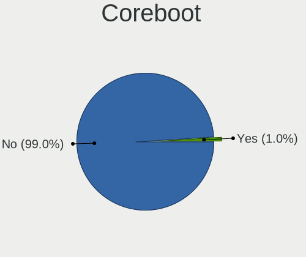
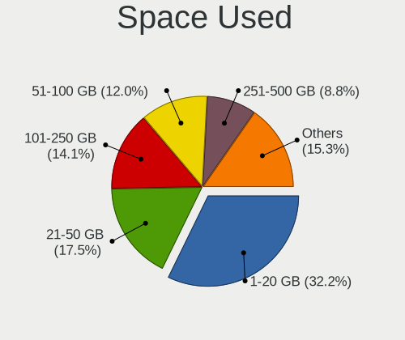
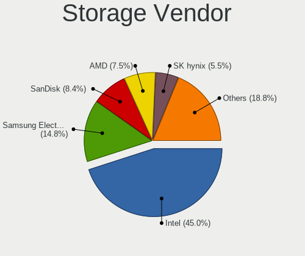
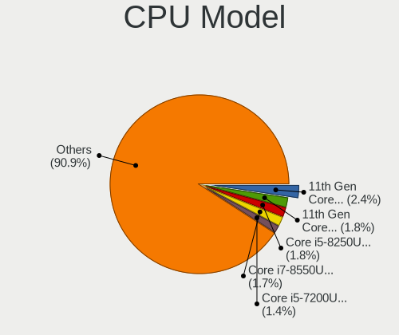
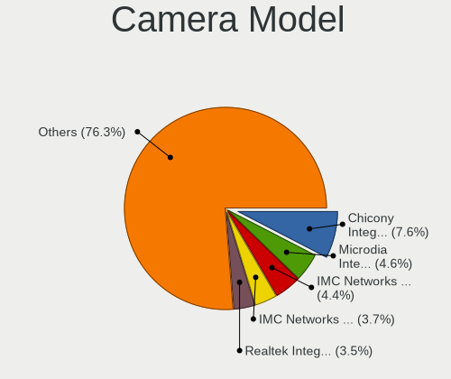

Fedora - Tested Hardware & Statistics (Notebooks)
-------------------------------------------------

A project to collect tested hardware configurations for Fedora.

Anyone can contribute to this report by the [hw-probe](https://github.com/linuxhw/hw-probe) tool:

    sudo -E hw-probe -all -upload

Please contribute! Especially if your hardware is rare.

Contents
--------

* [ Test Cases ](#test-cases)

* [ System ](#system)
  - [ OS                       ](#os)
  - [ OS Family                ](#os-family)
  - [ Kernel                   ](#kernel)
  - [ Kernel Family            ](#kernel-family)
  - [ Kernel Major Ver.        ](#kernel-major-ver)
  - [ Arch                     ](#arch)
  - [ DE                       ](#de)
  - [ Display Server           ](#display-server)
  - [ Display Manager          ](#display-manager)
  - [ OS Lang                  ](#os-lang)
  - [ Boot Mode                ](#boot-mode)
  - [ Filesystem               ](#filesystem)
  - [ Part. scheme             ](#part-scheme)
  - [ Dual Boot with Linux/BSD ](#dual-boot-with-linuxbsd)
  - [ Dual Boot (Win)          ](#dual-boot-win)

* [ Board ](#board)
  - [ Vendor                   ](#vendor)
  - [ Model                    ](#model)
  - [ Model Family             ](#model-family)
  - [ MFG Year                 ](#mfg-year)
  - [ Form Factor              ](#form-factor)
  - [ Secure Boot              ](#secure-boot)
  - [ Coreboot                 ](#coreboot)
  - [ RAM Size                 ](#ram-size)
  - [ RAM Used                 ](#ram-used)
  - [ Total Drives             ](#total-drives)
  - [ Has CD-ROM               ](#has-cd-rom)
  - [ Has Ethernet             ](#has-ethernet)
  - [ Has WiFi                 ](#has-wifi)
  - [ Has Bluetooth            ](#has-bluetooth)

* [ Location ](#location)
  - [ Country                  ](#country)
  - [ City                     ](#city)

* [ Drives ](#drives)
  - [ Drive Vendor             ](#drive-vendor)
  - [ Drive Model              ](#drive-model)
  - [ HDD Vendor               ](#hdd-vendor)
  - [ SSD Vendor               ](#ssd-vendor)
  - [ Drive Kind               ](#drive-kind)
  - [ Drive Connector          ](#drive-connector)
  - [ Drive Size               ](#drive-size)
  - [ Space Total              ](#space-total)
  - [ Space Used               ](#space-used)
  - [ Malfunc. Drives          ](#malfunc-drives)
  - [ Malfunc. Drive Vendor    ](#malfunc-drive-vendor)
  - [ Malfunc. HDD Vendor      ](#malfunc-hdd-vendor)
  - [ Malfunc. Drive Kind      ](#malfunc-drive-kind)
  - [ Failed Drives            ](#failed-drives)
  - [ Failed Drive Vendor      ](#failed-drive-vendor)
  - [ Drive Status             ](#drive-status)

* [ Storage controller ](#storage-controller)
  - [ Storage Vendor           ](#storage-vendor)
  - [ Storage Model            ](#storage-model)
  - [ Storage Kind             ](#storage-kind)

* [ Processor ](#processor)
  - [ CPU Vendor               ](#cpu-vendor)
  - [ CPU Model                ](#cpu-model)
  - [ CPU Model Family         ](#cpu-model-family)
  - [ CPU Cores                ](#cpu-cores)
  - [ CPU Sockets              ](#cpu-sockets)
  - [ CPU Threads              ](#cpu-threads)
  - [ CPU Op-Modes             ](#cpu-op-modes)
  - [ CPU Microcode            ](#cpu-microcode)
  - [ CPU Microarch            ](#cpu-microarch)

* [ Graphics ](#graphics)
  - [ GPU Vendor               ](#gpu-vendor)
  - [ GPU Model                ](#gpu-model)
  - [ GPU Combo                ](#gpu-combo)
  - [ GPU Driver               ](#gpu-driver)
  - [ GPU Memory               ](#gpu-memory)

* [ Monitor ](#monitor)
  - [ Monitor Vendor           ](#monitor-vendor)
  - [ Monitor Model            ](#monitor-model)
  - [ Monitor Resolution       ](#monitor-resolution)
  - [ Monitor Diagonal         ](#monitor-diagonal)
  - [ Monitor Width            ](#monitor-width)
  - [ Aspect Ratio             ](#aspect-ratio)
  - [ Monitor Area             ](#monitor-area)
  - [ Pixel Density            ](#pixel-density)
  - [ Multiple Monitors        ](#multiple-monitors)

* [ Network ](#network)
  - [ Net Controller Vendor    ](#net-controller-vendor)
  - [ Net Controller Model     ](#net-controller-model)
  - [ Wireless Vendor          ](#wireless-vendor)
  - [ Wireless Model           ](#wireless-model)
  - [ Ethernet Vendor          ](#ethernet-vendor)
  - [ Ethernet Model           ](#ethernet-model)
  - [ Net Controller Kind      ](#net-controller-kind)
  - [ Used Controller          ](#used-controller)
  - [ NICs                     ](#nics)
  - [ IPv6                     ](#ipv6)

* [ Bluetooth ](#bluetooth)
  - [ Bluetooth Vendor         ](#bluetooth-vendor)
  - [ Bluetooth Model          ](#bluetooth-model)

* [ Sound ](#sound)
  - [ Sound Vendor             ](#sound-vendor)
  - [ Sound Model              ](#sound-model)

* [ Memory ](#memory)
  - [ Memory Vendor            ](#memory-vendor)
  - [ Memory Model             ](#memory-model)
  - [ Memory Kind              ](#memory-kind)
  - [ Memory Form Factor       ](#memory-form-factor)
  - [ Memory Size              ](#memory-size)
  - [ Memory Speed             ](#memory-speed)

* [ Printers & scanners ](#printers--scanners)
  - [ Printer Vendor           ](#printer-vendor)
  - [ Printer Model            ](#printer-model)
  - [ Scanner Vendor           ](#scanner-vendor)
  - [ Scanner Model            ](#scanner-model)

* [ Camera ](#camera)
  - [ Camera Vendor            ](#camera-vendor)
  - [ Camera Model             ](#camera-model)

* [ Security ](#security)
  - [ Fingerprint Vendor       ](#fingerprint-vendor)
  - [ Fingerprint Model        ](#fingerprint-model)
  - [ Chipcard Vendor          ](#chipcard-vendor)
  - [ Chipcard Model           ](#chipcard-model)

* [ Unsupported ](#unsupported)
  - [ Unsupported Devices      ](#unsupported-devices)
  - [ Unsupported Device Types ](#unsupported-device-types)

Test Cases
----------

Total: 18149

| Vendor        | Model                       | Probe                                                      | Date         |
|---------------|-----------------------------|------------------------------------------------------------|--------------|
| MSI           | Prestige 16 AI Studio B1... | [22d073249b](https://linux-hardware.org/?probe=22d073249b) | Jan 06, 2025 |
| MSI           | Prestige 16 AI Studio B1... | [d8d6ab4b82](https://linux-hardware.org/?probe=d8d6ab4b82) | Jan 06, 2025 |
| GPU Compan... | GWNR7L1749                  | [0f2438bc90](https://linux-hardware.org/?probe=0f2438bc90) | Jan 06, 2025 |
| Apple         | MacBookAir6,2               | [dfb4117f5c](https://linux-hardware.org/?probe=dfb4117f5c) | Jan 06, 2025 |
| Google        | Treeya                      | [b8f7c2d75a](https://linux-hardware.org/?probe=b8f7c2d75a) | Jan 06, 2025 |
| Lenovo        | IdeaPad Pro 5 14APH8 83A... | [046bbb97db](https://linux-hardware.org/?probe=046bbb97db) | Jan 05, 2025 |
| Dell          | XPS 9320                    | [35af44b04a](https://linux-hardware.org/?probe=35af44b04a) | Jan 05, 2025 |
| Dell          | Latitude 7390               | [48814ed45f](https://linux-hardware.org/?probe=48814ed45f) | Jan 05, 2025 |
| Sony          | VGN-NR21E_S                 | [0ed147c4fb](https://linux-hardware.org/?probe=0ed147c4fb) | Jan 05, 2025 |
| Apple         | MacBookAir6,2               | [3b5dc1b1c2](https://linux-hardware.org/?probe=3b5dc1b1c2) | Jan 05, 2025 |
| Lenovo        | 14w Gen 2 82N9              | [733559df9e](https://linux-hardware.org/?probe=733559df9e) | Jan 05, 2025 |
| Lenovo        | ThinkPad E16 Gen 2 21M5C... | [fe15c1092e](https://linux-hardware.org/?probe=fe15c1092e) | Jan 05, 2025 |
| Dell          | Latitude 7400               | [9c347a93bf](https://linux-hardware.org/?probe=9c347a93bf) | Jan 05, 2025 |
| Dell          | Latitude 7400               | [70481b51db](https://linux-hardware.org/?probe=70481b51db) | Jan 05, 2025 |
| HP            | ZHAN 66 Pro A 14 G4 Note... | [0c0d5510fc](https://linux-hardware.org/?probe=0c0d5510fc) | Jan 05, 2025 |
| Lenovo        | ThinkPad T420 4236PFG       | [df34cf20b9](https://linux-hardware.org/?probe=df34cf20b9) | Jan 05, 2025 |
| HP            | Pavilion Laptop 15-eh0xx... | [d87015b7dd](https://linux-hardware.org/?probe=d87015b7dd) | Jan 05, 2025 |
| Lenovo        | ThinkPad T14s Gen 1 20UH... | [c68a17f027](https://linux-hardware.org/?probe=c68a17f027) | Jan 04, 2025 |
| Lenovo        | B490 377222P                | [4e6cc04345](https://linux-hardware.org/?probe=4e6cc04345) | Jan 04, 2025 |
| Lenovo        | Legion Slim 5 16APH8 82Y... | [3cd4965210](https://linux-hardware.org/?probe=3cd4965210) | Jan 04, 2025 |
| HP            | 635                         | [021402dc32](https://linux-hardware.org/?probe=021402dc32) | Jan 04, 2025 |
| HP            | Laptop 15-db1xxx            | [7bc8aeba55](https://linux-hardware.org/?probe=7bc8aeba55) | Jan 04, 2025 |
| Lenovo        | ThinkPad P17 Gen 1 20SQS... | [4fc43ed5a9](https://linux-hardware.org/?probe=4fc43ed5a9) | Jan 04, 2025 |
| HP            | EliteBook 845 G7 Noteboo... | [33a984a2df](https://linux-hardware.org/?probe=33a984a2df) | Jan 04, 2025 |
| HP            | Laptop 17-cn0xxx            | [6426be4511](https://linux-hardware.org/?probe=6426be4511) | Jan 04, 2025 |
| MSI           | GF63 Thin 11SC              | [3f1c75f109](https://linux-hardware.org/?probe=3f1c75f109) | Jan 04, 2025 |
| Acer          | Predator PH16-71            | [51c220bbe4](https://linux-hardware.org/?probe=51c220bbe4) | Jan 04, 2025 |
| Lenovo        | ThinkPad T530 2394A11       | [87cb15684c](https://linux-hardware.org/?probe=87cb15684c) | Jan 04, 2025 |
| Lenovo        | ThinkPad Z16 Gen 1 21D4C... | [3c9cd9e73c](https://linux-hardware.org/?probe=3c9cd9e73c) | Jan 04, 2025 |
| Gigabyte      | Z97N-WIFI                   | [94525b433d](https://linux-hardware.org/?probe=94525b433d) | Jan 04, 2025 |
| HP            | Victus by Laptop 16-e0xx... | [125f9224f6](https://linux-hardware.org/?probe=125f9224f6) | Jan 04, 2025 |
| HP            | Laptop 17t-cn300            | [d7d9dcc497](https://linux-hardware.org/?probe=d7d9dcc497) | Jan 04, 2025 |
| Dell          | Inspiron 7386               | [aecd7bdb44](https://linux-hardware.org/?probe=aecd7bdb44) | Jan 04, 2025 |
| Maibenben     | MaiBook M Series            | [0d480fbbc9](https://linux-hardware.org/?probe=0d480fbbc9) | Jan 04, 2025 |
| HP            | Laptop 15s-fq1xxx           | [062f7792dc](https://linux-hardware.org/?probe=062f7792dc) | Jan 03, 2025 |
| Acer          | Nitro AN16-41               | [dedf248848](https://linux-hardware.org/?probe=dedf248848) | Jan 03, 2025 |
| ASUSTek       | ASUS Zenbook S 16 UM5606... | [d3d4e90cf3](https://linux-hardware.org/?probe=d3d4e90cf3) | Jan 03, 2025 |
| ASUSTek       | ASUS TUF Gaming A16 FA60... | [c649f47fe2](https://linux-hardware.org/?probe=c649f47fe2) | Jan 03, 2025 |
| Chuwi         | MiniBook X                  | [77278dd73d](https://linux-hardware.org/?probe=77278dd73d) | Jan 03, 2025 |
| Dell          | Latitude 5290 2-in-1        | [0b277582ac](https://linux-hardware.org/?probe=0b277582ac) | Jan 03, 2025 |
| Dell          | Latitude E7450              | [03b4f85891](https://linux-hardware.org/?probe=03b4f85891) | Jan 03, 2025 |
| Dell          | Latitude 7440               | [5e2a44e27d](https://linux-hardware.org/?probe=5e2a44e27d) | Jan 03, 2025 |
| Lenovo        | IdeaPad 1 15AMN7 82VG       | [a791c57fad](https://linux-hardware.org/?probe=a791c57fad) | Jan 03, 2025 |
| Dell          | Latitude 5440               | [60ed15e860](https://linux-hardware.org/?probe=60ed15e860) | Jan 03, 2025 |
| Dell          | Latitude 5440               | [18c0535aa3](https://linux-hardware.org/?probe=18c0535aa3) | Jan 03, 2025 |
| Dell          | Inspiron 3583               | [d2423ded38](https://linux-hardware.org/?probe=d2423ded38) | Jan 03, 2025 |
| Google        | Candy                       | [9cd761ead3](https://linux-hardware.org/?probe=9cd761ead3) | Jan 03, 2025 |
| HP            | Laptop 17-cn0xxx            | [4fdad5bec0](https://linux-hardware.org/?probe=4fdad5bec0) | Jan 02, 2025 |
| HP            | Laptop 17t-cn300            | [a118a2798f](https://linux-hardware.org/?probe=a118a2798f) | Jan 02, 2025 |
| Lenovo        | IdeaPad Slim 3 15ABR8 82... | [f453563b1e](https://linux-hardware.org/?probe=f453563b1e) | Jan 02, 2025 |
| HP            | Laptop 15s-fq2xxx           | [b4f0d1def7](https://linux-hardware.org/?probe=b4f0d1def7) | Jan 02, 2025 |
| HP            | Laptop 15s-eq2xxx           | [37b47880bb](https://linux-hardware.org/?probe=37b47880bb) | Jan 02, 2025 |
| ASUSTek       | VivoBook_ASUSLaptop X150... | [110b5ee190](https://linux-hardware.org/?probe=110b5ee190) | Jan 02, 2025 |
| Lenovo        | ThinkPad T14 Gen 3 21AH0... | [8be01ca5c2](https://linux-hardware.org/?probe=8be01ca5c2) | Jan 02, 2025 |
| HP            | Pavilion Laptop 15-eh0xx... | [49011f501a](https://linux-hardware.org/?probe=49011f501a) | Jan 02, 2025 |
| ASUSTek       | VivoBook_ASUSLaptop X570... | [8511083019](https://linux-hardware.org/?probe=8511083019) | Jan 02, 2025 |
| ASUSTek       | VivoBook_ASUSLaptop X570... | [97cfd2d77b](https://linux-hardware.org/?probe=97cfd2d77b) | Jan 02, 2025 |
| ASUSTek       | Vivobook Go E1504FA_E150... | [e2dc314209](https://linux-hardware.org/?probe=e2dc314209) | Jan 02, 2025 |
| Lenovo        | ThinkPad T15g Gen 1 20US... | [c5dc058f75](https://linux-hardware.org/?probe=c5dc058f75) | Jan 01, 2025 |
| Lenovo        | G510 20238                  | [ebd16410b8](https://linux-hardware.org/?probe=ebd16410b8) | Jan 01, 2025 |
| HP            | Laptop 15-fc0xxx            | [ca0732e368](https://linux-hardware.org/?probe=ca0732e368) | Jan 01, 2025 |
| Acer          | Aspire 5750G                | [4c99e58ae4](https://linux-hardware.org/?probe=4c99e58ae4) | Jan 01, 2025 |
| ASUSTek       | ASUS TUF Gaming A17 FA70... | [110e5ff032](https://linux-hardware.org/?probe=110e5ff032) | Jan 01, 2025 |
| Packard Be... | EasyNote MH36               | [f8b0243bfd](https://linux-hardware.org/?probe=f8b0243bfd) | Jan 01, 2025 |
| Dell          | Latitude E5550              | [4df1fcb20c](https://linux-hardware.org/?probe=4df1fcb20c) | Dec 31, 2024 |
| Dell          | Latitude E7440              | [e25716eb4b](https://linux-hardware.org/?probe=e25716eb4b) | Dec 31, 2024 |
| ASUSTek       | ROG Strix G713PI_G713PI     | [eeef064f3d](https://linux-hardware.org/?probe=eeef064f3d) | Dec 31, 2024 |
| Lenovo        | ThinkPad P14s Gen 3 21J5... | [d99505e615](https://linux-hardware.org/?probe=d99505e615) | Dec 31, 2024 |
| Dell          | Latitude 5400               | [0a64fb9a01](https://linux-hardware.org/?probe=0a64fb9a01) | Dec 31, 2024 |
| Dell          | Latitude 5400               | [192ab2428b](https://linux-hardware.org/?probe=192ab2428b) | Dec 31, 2024 |
| Dell          | Latitude E6520              | [c3a5cf03a9](https://linux-hardware.org/?probe=c3a5cf03a9) | Dec 31, 2024 |
| HP            | Nami                        | [bd56fc3a14](https://linux-hardware.org/?probe=bd56fc3a14) | Dec 31, 2024 |
| HP            | Nami                        | [dc21545854](https://linux-hardware.org/?probe=dc21545854) | Dec 31, 2024 |
| Lenovo        | ThinkPad T495s 20QKS12J1... | [40610d9582](https://linux-hardware.org/?probe=40610d9582) | Dec 31, 2024 |
| Lenovo        | ThinkPad T15 Gen 1 20S60... | [a6451f3941](https://linux-hardware.org/?probe=a6451f3941) | Dec 31, 2024 |
| Framework     | Laptop 16 (AMD Ryzen 704... | [d25adffd4b](https://linux-hardware.org/?probe=d25adffd4b) | Dec 30, 2024 |
| XIAOMI        | Redmi Book Pro 15 2023      | [cc175b8319](https://linux-hardware.org/?probe=cc175b8319) | Dec 30, 2024 |
| Lenovo        | ThinkPad L15 Gen 4 21H7C... | [810f9eeaaa](https://linux-hardware.org/?probe=810f9eeaaa) | Dec 30, 2024 |
| Apple         | MacBookAir6,2               | [f8255d3c15](https://linux-hardware.org/?probe=f8255d3c15) | Dec 30, 2024 |
| Samsung       | RV411/RV511/E3511/S3511/... | [89094bd2df](https://linux-hardware.org/?probe=89094bd2df) | Dec 30, 2024 |
| Dell          | Precision 7720              | [888706d340](https://linux-hardware.org/?probe=888706d340) | Dec 30, 2024 |
| Dell          | Precision 3561              | [effdc98e23](https://linux-hardware.org/?probe=effdc98e23) | Dec 30, 2024 |
| Acer          | Nitro AN515-45              | [cf19396a9a](https://linux-hardware.org/?probe=cf19396a9a) | Dec 30, 2024 |
| ASUSTek       | Zenbook UX3402ZA_UX3402Z... | [06b6bc85d9](https://linux-hardware.org/?probe=06b6bc85d9) | Dec 29, 2024 |
| ASUSTek       | VivoBook_ASUSLaptop M650... | [21c6eba6fd](https://linux-hardware.org/?probe=21c6eba6fd) | Dec 29, 2024 |
| ASUSTek       | VivoBook_ASUSLaptop M650... | [73ea07394a](https://linux-hardware.org/?probe=73ea07394a) | Dec 29, 2024 |
| MSI           | GF63 Thin 8SC               | [e88a8b539f](https://linux-hardware.org/?probe=e88a8b539f) | Dec 29, 2024 |
| Lenovo        | ThinkBook 16 G6+ IMH 21L... | [c80dde07d0](https://linux-hardware.org/?probe=c80dde07d0) | Dec 29, 2024 |
| MSI           | GL73 8SC                    | [77d8c60ea1](https://linux-hardware.org/?probe=77d8c60ea1) | Dec 29, 2024 |
| MSI           | GL73 8SC                    | [57691f4432](https://linux-hardware.org/?probe=57691f4432) | Dec 29, 2024 |
| Framework     | Laptop 16 (AMD Ryzen 704... | [c19c3fe9fc](https://linux-hardware.org/?probe=c19c3fe9fc) | Dec 29, 2024 |
| Acer          | Aspire E5-576               | [4ae46bc01a](https://linux-hardware.org/?probe=4ae46bc01a) | Dec 29, 2024 |
| MSI           | GE60 2PL                    | [db806920f1](https://linux-hardware.org/?probe=db806920f1) | Dec 29, 2024 |
| MSI           | GE60 2PL                    | [0cd07458bc](https://linux-hardware.org/?probe=0cd07458bc) | Dec 29, 2024 |
| Lenovo        | ThinkPad X1 Carbon Gen 9... | [e08182adc8](https://linux-hardware.org/?probe=e08182adc8) | Dec 29, 2024 |
| Toshiba       | Satellite C70-B             | [5014d7827e](https://linux-hardware.org/?probe=5014d7827e) | Dec 29, 2024 |
| Dell          | Inspiron 16 5645            | [254ce49ccb](https://linux-hardware.org/?probe=254ce49ccb) | Dec 28, 2024 |
| Dell          | Inspiron 15 3511            | [bd840e0eeb](https://linux-hardware.org/?probe=bd840e0eeb) | Dec 28, 2024 |
| Dell          | Latitude E6430              | [3bbd75ec42](https://linux-hardware.org/?probe=3bbd75ec42) | Dec 28, 2024 |
| Lenovo        | Legion 5 Pro 16IAH7H 82R... | [dd408ca578](https://linux-hardware.org/?probe=dd408ca578) | Dec 28, 2024 |
| ASUSTek       | ZenBook UX425EA_UX425EA     | [2ee9b0919f](https://linux-hardware.org/?probe=2ee9b0919f) | Dec 28, 2024 |
| Dell          | Latitude 5490               | [bef25394e1](https://linux-hardware.org/?probe=bef25394e1) | Dec 28, 2024 |
| Dell          | Latitude 5490               | [f98e9d822a](https://linux-hardware.org/?probe=f98e9d822a) | Dec 28, 2024 |
| ASUSTek       | VivoBook_ASUSLaptop M370... | [374d7bf403](https://linux-hardware.org/?probe=374d7bf403) | Dec 28, 2024 |
| ASUSTek       | Zenbook UX3404VA_Q410VA     | [04112caf10](https://linux-hardware.org/?probe=04112caf10) | Dec 28, 2024 |
| Lenovo        | ThinkPad X131e 336855U      | [b0b97f4290](https://linux-hardware.org/?probe=b0b97f4290) | Dec 28, 2024 |
| HP            | ProBook 470 G2              | [ee181df849](https://linux-hardware.org/?probe=ee181df849) | Dec 28, 2024 |
| Toshiba       | Satellite A200              | [9a071c6521](https://linux-hardware.org/?probe=9a071c6521) | Dec 27, 2024 |
| Dell          | Latitude E5550              | [643b7759bc](https://linux-hardware.org/?probe=643b7759bc) | Dec 27, 2024 |
| Lenovo        | IdeaPad 3 15ALC6 82KU       | [e428436322](https://linux-hardware.org/?probe=e428436322) | Dec 27, 2024 |
| Toshiba       | Satellite A200              | [eea353e34a](https://linux-hardware.org/?probe=eea353e34a) | Dec 27, 2024 |
| Acer          | Nitro AN16-41               | [8521ef1a55](https://linux-hardware.org/?probe=8521ef1a55) | Dec 27, 2024 |
| Monster       | ABRA A5 V17.3               | [8ac82ca045](https://linux-hardware.org/?probe=8ac82ca045) | Dec 27, 2024 |
| ASUSTek       | ASUS Zenbook S 16 UM5606... | [2b5056fe92](https://linux-hardware.org/?probe=2b5056fe92) | Dec 27, 2024 |
| HP            | 7Z0P3UA                     | [474af6633c](https://linux-hardware.org/?probe=474af6633c) | Dec 27, 2024 |
| ASUSTek       | ASUS Zenbook S 14 UX5406... | [3b4e12f8b0](https://linux-hardware.org/?probe=3b4e12f8b0) | Dec 27, 2024 |
| HP            | ZBook 15 G6                 | [40bd2c3025](https://linux-hardware.org/?probe=40bd2c3025) | Dec 27, 2024 |
| ASUSTek       | ASUS Zenbook S 16 UM5606... | [bc55a24f5d](https://linux-hardware.org/?probe=bc55a24f5d) | Dec 27, 2024 |
| Lenovo        | ThinkPad L14 Gen 1 20U2S... | [77830eacc7](https://linux-hardware.org/?probe=77830eacc7) | Dec 27, 2024 |
| Lenovo        | ThinkPad T470 20HES0EV0Q    | [df7447ad48](https://linux-hardware.org/?probe=df7447ad48) | Dec 26, 2024 |
| GPD           | G1619-04                    | [b44a9df6e8](https://linux-hardware.org/?probe=b44a9df6e8) | Dec 26, 2024 |
| Avell High... | A70 HYB                     | [aea76220df](https://linux-hardware.org/?probe=aea76220df) | Dec 26, 2024 |
| Dell          | Latitude E5550              | [d4783d7b35](https://linux-hardware.org/?probe=d4783d7b35) | Dec 26, 2024 |
| HP            | Pavilion dv6700             | [d9ccd55fd5](https://linux-hardware.org/?probe=d9ccd55fd5) | Dec 26, 2024 |
| ASUSTek       | ROG Zephyrus G14 GA402RK... | [d48fae0d86](https://linux-hardware.org/?probe=d48fae0d86) | Dec 26, 2024 |
| Lenovo        | ThinkPad P14s Gen 5 21G2... | [f1a3b79f94](https://linux-hardware.org/?probe=f1a3b79f94) | Dec 26, 2024 |
| ASUSTek       | G75VW                       | [6f5eceb221](https://linux-hardware.org/?probe=6f5eceb221) | Dec 26, 2024 |
| HP            | Pavilion dv6700             | [06e2ee69ef](https://linux-hardware.org/?probe=06e2ee69ef) | Dec 26, 2024 |
| Lenovo        | Yoga 3 14 80JH              | [d17784bc63](https://linux-hardware.org/?probe=d17784bc63) | Dec 26, 2024 |
| Lenovo        | ThinkPad T14s Gen 6 21M1... | [1111c1a9ac](https://linux-hardware.org/?probe=1111c1a9ac) | Dec 26, 2024 |
| Dell          | Inspiron 15 3510            | [3eb40bb419](https://linux-hardware.org/?probe=3eb40bb419) | Dec 26, 2024 |
| Lenovo        | IdeaPad Pro 5 16AHP9 83D... | [28dcf6960e](https://linux-hardware.org/?probe=28dcf6960e) | Dec 26, 2024 |
| Lenovo        | ThinkPad X390 20Q0CTO1WW    | [618303b5f9](https://linux-hardware.org/?probe=618303b5f9) | Dec 26, 2024 |
| Lenovo        | ThinkPad T14s Gen 3 21CQ... | [a16e1a46ec](https://linux-hardware.org/?probe=a16e1a46ec) | Dec 25, 2024 |
| Samsung       | 700Z3A/700Z4A/700Z5A/700... | [a6a8ce86e8](https://linux-hardware.org/?probe=a6a8ce86e8) | Dec 25, 2024 |
| Samsung       | 700Z3A/700Z4A/700Z5A/700... | [68bb2644f5](https://linux-hardware.org/?probe=68bb2644f5) | Dec 25, 2024 |
| Lenovo        | Legion 9 16IRX9 83G0        | [128debb210](https://linux-hardware.org/?probe=128debb210) | Dec 25, 2024 |
| Lenovo        | ThinkPad T14s Gen 3 21CQ... | [0659ed4270](https://linux-hardware.org/?probe=0659ed4270) | Dec 25, 2024 |
| ASUSTek       | ROG Zephyrus G14 GA401II... | [f561382ccd](https://linux-hardware.org/?probe=f561382ccd) | Dec 25, 2024 |
| ASUSTek       | X751NA                      | [f5f28d0769](https://linux-hardware.org/?probe=f5f28d0769) | Dec 25, 2024 |
| MSI           | Vector GP66 12UHSO          | [49d28925e5](https://linux-hardware.org/?probe=49d28925e5) | Dec 25, 2024 |
| Acer          | Nitro ANV15-51              | [652451b779](https://linux-hardware.org/?probe=652451b779) | Dec 25, 2024 |
| Acer          | Nitro ANV15-51              | [ce85c5a816](https://linux-hardware.org/?probe=ce85c5a816) | Dec 25, 2024 |
| Dell          | Vostro 3491                 | [f0cc8a9f56](https://linux-hardware.org/?probe=f0cc8a9f56) | Dec 25, 2024 |
| ASUSTek       | ASUS Zenbook 14 UM3406HA... | [35ea5d7b34](https://linux-hardware.org/?probe=35ea5d7b34) | Dec 25, 2024 |
| Lenovo        | ThinkPad T480s 20L7CTO1W... | [e79ac6d419](https://linux-hardware.org/?probe=e79ac6d419) | Dec 25, 2024 |
| Lenovo        | ThinkPad X1 Carbon Gen 9... | [00b72da4db](https://linux-hardware.org/?probe=00b72da4db) | Dec 25, 2024 |
| Lenovo        | ThinkPad T14s Gen 6 21M1... | [96c145445a](https://linux-hardware.org/?probe=96c145445a) | Dec 25, 2024 |
| Acer          | Aspire A515-46              | [899ca07b7d](https://linux-hardware.org/?probe=899ca07b7d) | Dec 25, 2024 |
| Apple         | MacBookPro8,1               | [19e759cb83](https://linux-hardware.org/?probe=19e759cb83) | Dec 25, 2024 |
| Gigabyte      | AERO 17 KC                  | [3c4ef2900f](https://linux-hardware.org/?probe=3c4ef2900f) | Dec 24, 2024 |
| Lenovo        | ThinkPad E14 Gen 5 21JRS... | [debe380fb9](https://linux-hardware.org/?probe=debe380fb9) | Dec 24, 2024 |
| HP            | Laptop 14-em0xxx            | [86de6fe058](https://linux-hardware.org/?probe=86de6fe058) | Dec 24, 2024 |
| Lenovo        | Yoga 900-13ISK 80MK         | [7852114da0](https://linux-hardware.org/?probe=7852114da0) | Dec 24, 2024 |
| Lenovo        | ThinkPad X1 Carbon Gen 9... | [4b6d9e080e](https://linux-hardware.org/?probe=4b6d9e080e) | Dec 24, 2024 |
| Lenovo        | IdeaPad Slim 3 15ABR8 82... | [3a374eb06f](https://linux-hardware.org/?probe=3a374eb06f) | Dec 24, 2024 |
| HP            | ProBook 450 G5              | [825918c34e](https://linux-hardware.org/?probe=825918c34e) | Dec 24, 2024 |
| PC Special... | P65xRP                      | [36a98584dd](https://linux-hardware.org/?probe=36a98584dd) | Dec 24, 2024 |
| Apple         | MacBookAir8,1               | [70ac7767c5](https://linux-hardware.org/?probe=70ac7767c5) | Dec 24, 2024 |
| Lenovo        | IdeaPad Gaming 3 15ACH6 ... | [e7ad20e4e1](https://linux-hardware.org/?probe=e7ad20e4e1) | Dec 24, 2024 |
| Valve         | Jupiter                     | [61b4cfc7d9](https://linux-hardware.org/?probe=61b4cfc7d9) | Dec 24, 2024 |
| Lenovo        | ThinkBook 15 G3 ACL 21A4    | [678bac446f](https://linux-hardware.org/?probe=678bac446f) | Dec 24, 2024 |
| Lenovo        | ThinkPad E14 Gen 6 21M3C... | [27c22b69a1](https://linux-hardware.org/?probe=27c22b69a1) | Dec 24, 2024 |
| Dell          | Inspiron 5458               | [463ab8c7ce](https://linux-hardware.org/?probe=463ab8c7ce) | Dec 24, 2024 |
| Apple         | MacBookPro14,2              | [fded50dece](https://linux-hardware.org/?probe=fded50dece) | Dec 24, 2024 |
| Fujitsu       | LIFEBOOK AH532              | [aa2e5f57ac](https://linux-hardware.org/?probe=aa2e5f57ac) | Dec 24, 2024 |
| HUAWEI        | KPL-W0X                     | [6bcb7835d8](https://linux-hardware.org/?probe=6bcb7835d8) | Dec 24, 2024 |
| HONOR         | FRI-FXX                     | [36c0ad82b3](https://linux-hardware.org/?probe=36c0ad82b3) | Dec 24, 2024 |
| ASUSTek       | VivoBook_ASUSLaptop M370... | [86f9503271](https://linux-hardware.org/?probe=86f9503271) | Dec 23, 2024 |
| Fujitsu       | FMVA08008                   | [fc76839db5](https://linux-hardware.org/?probe=fc76839db5) | Dec 23, 2024 |
| Unknown       | Unknown                     | [5dfb56f742](https://linux-hardware.org/?probe=5dfb56f742) | Dec 23, 2024 |
| Unknown       | Unknown                     | [2a60e915d0](https://linux-hardware.org/?probe=2a60e915d0) | Dec 23, 2024 |
| MSI           | Cyborg 15 A12VF             | [f95b7169c1](https://linux-hardware.org/?probe=f95b7169c1) | Dec 23, 2024 |
| Dell          | Venue 11 Pro 5130           | [f973f4c831](https://linux-hardware.org/?probe=f973f4c831) | Dec 23, 2024 |
| Dell          | Inspiron 5570               | [325d9a8f2c](https://linux-hardware.org/?probe=325d9a8f2c) | Dec 23, 2024 |
| HP            | EliteBook 855 G8 Noteboo... | [1d6bf9301c](https://linux-hardware.org/?probe=1d6bf9301c) | Dec 23, 2024 |
| Lenovo        | ThinkPad X240 20AL009CUS    | [9fdd4ef9fc](https://linux-hardware.org/?probe=9fdd4ef9fc) | Dec 23, 2024 |
| Lenovo        | V15 G4 IRU 83A1             | [4053c77698](https://linux-hardware.org/?probe=4053c77698) | Dec 23, 2024 |
| Lenovo        | V15 G4 IRU 83A1             | [252f3e5bb8](https://linux-hardware.org/?probe=252f3e5bb8) | Dec 23, 2024 |
| HP            | Laptop 15s-eq2xxx           | [75bf43b349](https://linux-hardware.org/?probe=75bf43b349) | Dec 23, 2024 |
| ASUSTek       | ROG Strix G513QY_G513QY     | [3c5de917d2](https://linux-hardware.org/?probe=3c5de917d2) | Dec 23, 2024 |
| Apple         | MacBookPro14,1              | [62ce6ad6d0](https://linux-hardware.org/?probe=62ce6ad6d0) | Dec 23, 2024 |
| HUAWEI        | MCLF-XX                     | [e97a651e78](https://linux-hardware.org/?probe=e97a651e78) | Dec 23, 2024 |
| HP            | Victus by Gaming Laptop ... | [e3ecdfe665](https://linux-hardware.org/?probe=e3ecdfe665) | Dec 23, 2024 |
| Dell          | Latitude 5290 2-in-1        | [d9eccdb791](https://linux-hardware.org/?probe=d9eccdb791) | Dec 23, 2024 |
| Acer          | Predator PH16-71            | [d721bfca82](https://linux-hardware.org/?probe=d721bfca82) | Dec 23, 2024 |
| ASUSTek       | VivoBook_ASUSLaptop X570... | [d48eeae1c9](https://linux-hardware.org/?probe=d48eeae1c9) | Dec 22, 2024 |
| TUXEDO        | N650DU                      | [00621c75d7](https://linux-hardware.org/?probe=00621c75d7) | Dec 22, 2024 |
| Lenovo        | ThinkPad T540p 20BFS0N20... | [f49f8d4c4c](https://linux-hardware.org/?probe=f49f8d4c4c) | Dec 22, 2024 |
| Dell          | Precision 7560              | [0181667d44](https://linux-hardware.org/?probe=0181667d44) | Dec 22, 2024 |
| ASUSTek       | X510UQR                     | [a86cafa832](https://linux-hardware.org/?probe=a86cafa832) | Dec 22, 2024 |
| ASUSTek       | ASUS TUF Gaming A15 FA50... | [8ab0fc807b](https://linux-hardware.org/?probe=8ab0fc807b) | Dec 22, 2024 |
| Lenovo        | ThinkPad X1 Carbon Gen 1... | [bb6b07c2e4](https://linux-hardware.org/?probe=bb6b07c2e4) | Dec 22, 2024 |
| HP            | Victus by Gaming Laptop ... | [b800e65be6](https://linux-hardware.org/?probe=b800e65be6) | Dec 22, 2024 |
| ASUSTek       | ASUS TUF Gaming A15 FA50... | [4f994766ca](https://linux-hardware.org/?probe=4f994766ca) | Dec 22, 2024 |
| Dell          | Inspiron 15 3510            | [84ebd422a6](https://linux-hardware.org/?probe=84ebd422a6) | Dec 22, 2024 |
| Dell          | Latitude 5175               | [50e07a5bed](https://linux-hardware.org/?probe=50e07a5bed) | Dec 22, 2024 |
| Lenovo        | ThinkPad T14 Gen 1 20UES... | [7bfad25e97](https://linux-hardware.org/?probe=7bfad25e97) | Dec 22, 2024 |
| Lenovo        | ThinkPad T14 Gen 1 20UES... | [f4f76c3079](https://linux-hardware.org/?probe=f4f76c3079) | Dec 22, 2024 |
| MSI           | Alpha 17 C7VG               | [e84308bf47](https://linux-hardware.org/?probe=e84308bf47) | Dec 22, 2024 |
| MSI           | Alpha 17 C7VG               | [c3c778482b](https://linux-hardware.org/?probe=c3c778482b) | Dec 22, 2024 |
| Acer          | Swift SF315-51G             | [52ed0ca55e](https://linux-hardware.org/?probe=52ed0ca55e) | Dec 22, 2024 |
| Acer          | Swift SF315-51G             | [69b8980a29](https://linux-hardware.org/?probe=69b8980a29) | Dec 22, 2024 |
| Lenovo        | ThinkPad P14s Gen 5 21G2... | [424ae22644](https://linux-hardware.org/?probe=424ae22644) | Dec 22, 2024 |
| Lenovo        | ThinkPad E14 Gen 6 21M4C... | [6fa3114483](https://linux-hardware.org/?probe=6fa3114483) | Dec 22, 2024 |
| Lenovo        | ThinkPad T14 Gen 5 21MCC... | [e6c226ac61](https://linux-hardware.org/?probe=e6c226ac61) | Dec 21, 2024 |
| TUXEDO        | Pulse 14 Gen1               | [d1fe4c6194](https://linux-hardware.org/?probe=d1fe4c6194) | Dec 21, 2024 |
| ASUSTek       | ASUS TUF Gaming F15 FX50... | [fe9e479afd](https://linux-hardware.org/?probe=fe9e479afd) | Dec 21, 2024 |
| Lenovo        | LOQ 15AHP9 83DX             | [ced0769044](https://linux-hardware.org/?probe=ced0769044) | Dec 21, 2024 |
| ASUSTek       | ASUS Zenbook 14 UX3405MA... | [0f99359a6d](https://linux-hardware.org/?probe=0f99359a6d) | Dec 21, 2024 |
| Chuwi         | GemiBook XPro               | [cf7ccb0604](https://linux-hardware.org/?probe=cf7ccb0604) | Dec 21, 2024 |
| Dell          | Latitude 14 Rugged (5404... | [0613277441](https://linux-hardware.org/?probe=0613277441) | Dec 21, 2024 |
| Alienware     | m15                         | [7002846b7f](https://linux-hardware.org/?probe=7002846b7f) | Dec 21, 2024 |
| Unknown       | Unknown                     | [1359327212](https://linux-hardware.org/?probe=1359327212) | Dec 21, 2024 |
| ASUSTek       | ASUS Zenbook S 14 UX5406... | [78598d0f36](https://linux-hardware.org/?probe=78598d0f36) | Dec 21, 2024 |
| HP            | Laptop 15s-eq2xxx           | [ff85345164](https://linux-hardware.org/?probe=ff85345164) | Dec 21, 2024 |
| ONE-NETBOO... | ONEMIX5                     | [4a3a1d7980](https://linux-hardware.org/?probe=4a3a1d7980) | Dec 21, 2024 |
| HP            | OMEN Laptop 15-ek0xxx       | [6061ff7a43](https://linux-hardware.org/?probe=6061ff7a43) | Dec 21, 2024 |
| Acer          | Nitro AN515-54              | [6c1a9f6cda](https://linux-hardware.org/?probe=6c1a9f6cda) | Dec 21, 2024 |
| Apple         | MacBookPro8,1               | [7e908ee163](https://linux-hardware.org/?probe=7e908ee163) | Dec 21, 2024 |
| HP            | OMEN by Laptop 16-c0xxx     | [95118d357e](https://linux-hardware.org/?probe=95118d357e) | Dec 20, 2024 |
| Apple         | MacBookPro11,1              | [e46b293cc4](https://linux-hardware.org/?probe=e46b293cc4) | Dec 20, 2024 |
| Dell          | Latitude 5400               | [a0a87d0a74](https://linux-hardware.org/?probe=a0a87d0a74) | Dec 20, 2024 |
| ASUSTek       | VivoBook_ASUSLaptop M370... | [b52bea9b5c](https://linux-hardware.org/?probe=b52bea9b5c) | Dec 20, 2024 |
| ASUSTek       | VivoBook_ASUSLaptop X509... | [8e15096c09](https://linux-hardware.org/?probe=8e15096c09) | Dec 20, 2024 |
| ASUSTek       | ASUS TUF Gaming A15 FA50... | [6816110a56](https://linux-hardware.org/?probe=6816110a56) | Dec 20, 2024 |
| ASUSTek       | TUF Gaming FX505GE_FX505... | [26283d6910](https://linux-hardware.org/?probe=26283d6910) | Dec 20, 2024 |
| Acer          | Aspire A315-24P             | [a52fe2c4c9](https://linux-hardware.org/?probe=a52fe2c4c9) | Dec 20, 2024 |
| ASUSTek       | ASUS Zenbook S 14 UX5406... | [2ac89c432d](https://linux-hardware.org/?probe=2ac89c432d) | Dec 19, 2024 |
| ASUSTek       | ASUS EXPERTBOOK B1402CBA... | [fff8bed544](https://linux-hardware.org/?probe=fff8bed544) | Dec 19, 2024 |
| ASUSTek       | ASUS EXPERTBOOK B1402CBA... | [02f1237767](https://linux-hardware.org/?probe=02f1237767) | Dec 19, 2024 |
| COMEXR        | GM5IX7A                     | [263df0c661](https://linux-hardware.org/?probe=263df0c661) | Dec 19, 2024 |
| Lenovo        | IdeaPad 330S-15IKB 81F5     | [41b2a0d866](https://linux-hardware.org/?probe=41b2a0d866) | Dec 19, 2024 |
| HP            | 15 Notebook PC              | [d4d74d7666](https://linux-hardware.org/?probe=d4d74d7666) | Dec 19, 2024 |
| Dell          | Wyse 5470                   | [85cbadcae3](https://linux-hardware.org/?probe=85cbadcae3) | Dec 19, 2024 |
| GPU Compan... | GWTC116-2                   | [a8a0a4dbe9](https://linux-hardware.org/?probe=a8a0a4dbe9) | Dec 19, 2024 |
| ASUSTek       | Zenbook 15 UM3504DA_UM35... | [bc6f16d08f](https://linux-hardware.org/?probe=bc6f16d08f) | Dec 18, 2024 |
| ASUSTek       | Zenbook 15 UM3504DA_UM35... | [b4b2988f08](https://linux-hardware.org/?probe=b4b2988f08) | Dec 18, 2024 |
| Lenovo        | ThinkPad P15 Gen 2i 20YQ... | [2653ad16d9](https://linux-hardware.org/?probe=2653ad16d9) | Dec 18, 2024 |
| HP            | Pavilion Gaming Laptop 1... | [1d44dea703](https://linux-hardware.org/?probe=1d44dea703) | Dec 18, 2024 |
| HP            | ENVY m6                     | [e732571527](https://linux-hardware.org/?probe=e732571527) | Dec 18, 2024 |
| GPU Compan... | GWTC116-2                   | [dc80c40690](https://linux-hardware.org/?probe=dc80c40690) | Dec 18, 2024 |
| Lenovo        | ThinkPad T14s Gen 6 21M1... | [9c999b2e96](https://linux-hardware.org/?probe=9c999b2e96) | Dec 18, 2024 |
| HP            | ENVY m6                     | [4060abf5de](https://linux-hardware.org/?probe=4060abf5de) | Dec 18, 2024 |
| Toshiba       | Satellite L745              | [55a3a3c512](https://linux-hardware.org/?probe=55a3a3c512) | Dec 18, 2024 |
| Lenovo        | ThinkPad X260 20F5S0D501    | [d1c3cc5bc7](https://linux-hardware.org/?probe=d1c3cc5bc7) | Dec 18, 2024 |
| ASUSTek       | X455LJ                      | [dae3d540f6](https://linux-hardware.org/?probe=dae3d540f6) | Dec 18, 2024 |
| Apple         | MacBookPro13,3              | [25b2cf9a59](https://linux-hardware.org/?probe=25b2cf9a59) | Dec 18, 2024 |
| Toshiba       | PORTEGE R700                | [71c89a13ef](https://linux-hardware.org/?probe=71c89a13ef) | Dec 18, 2024 |
| Unknown       | Unknown                     | [dc53769580](https://linux-hardware.org/?probe=dc53769580) | Dec 18, 2024 |
| Acer          | Swift SF314-512             | [f3193ea048](https://linux-hardware.org/?probe=f3193ea048) | Dec 18, 2024 |
| Apple         | MacBookPro9,2               | [c33a85fd8c](https://linux-hardware.org/?probe=c33a85fd8c) | Dec 18, 2024 |
| Lenovo        | V14-IIL 82C4                | [89e9c44d6a](https://linux-hardware.org/?probe=89e9c44d6a) | Dec 18, 2024 |
| Lenovo        | ThinkPad P14s Gen 2a 21A... | [2ab8cdb946](https://linux-hardware.org/?probe=2ab8cdb946) | Dec 18, 2024 |
| ASUSTek       | UX390UAK                    | [795d742aff](https://linux-hardware.org/?probe=795d742aff) | Dec 18, 2024 |
| Samsung       | 550XDA                      | [d1b77b4082](https://linux-hardware.org/?probe=d1b77b4082) | Dec 17, 2024 |
| Samsung       | 550XDA                      | [d986e68aed](https://linux-hardware.org/?probe=d986e68aed) | Dec 17, 2024 |
| Timi          | TM1801                      | [5d632bcba3](https://linux-hardware.org/?probe=5d632bcba3) | Dec 17, 2024 |
| ASUSTek       | ASUS TUF Gaming A15 FA50... | [c80c3adbe0](https://linux-hardware.org/?probe=c80c3adbe0) | Dec 17, 2024 |
| ASUSTek       | X555LF                      | [7c3dbd59b5](https://linux-hardware.org/?probe=7c3dbd59b5) | Dec 17, 2024 |
| Acer          | Aspire A15-41M              | [559864f811](https://linux-hardware.org/?probe=559864f811) | Dec 17, 2024 |
| Timi          | Mi NoteBook Pro             | [635ad0c15c](https://linux-hardware.org/?probe=635ad0c15c) | Dec 17, 2024 |
| ASUSTek       | G750JW                      | [398868f146](https://linux-hardware.org/?probe=398868f146) | Dec 17, 2024 |
| Lenovo        | LOQ 15IAX9 83GS             | [4cc0adf6ee](https://linux-hardware.org/?probe=4cc0adf6ee) | Dec 17, 2024 |
| Lenovo        | Legion S7 15ACH6 82K8       | [27cdbae6a3](https://linux-hardware.org/?probe=27cdbae6a3) | Dec 17, 2024 |
| ASUSTek       | G750JS                      | [f33b8f1749](https://linux-hardware.org/?probe=f33b8f1749) | Dec 17, 2024 |
| Lenovo        | ThinkPad X270 20HMS2C003    | [d713ec0e9b](https://linux-hardware.org/?probe=d713ec0e9b) | Dec 17, 2024 |
| Toshiba       | Satellite C70-B             | [c1d411bf64](https://linux-hardware.org/?probe=c1d411bf64) | Dec 17, 2024 |
| Lenovo        | V14-IIL 82C4                | [04d36b04c4](https://linux-hardware.org/?probe=04d36b04c4) | Dec 17, 2024 |
| Lenovo        | ThinkPad X1 Carbon 7th 2... | [21ee611b47](https://linux-hardware.org/?probe=21ee611b47) | Dec 17, 2024 |
| Dell          | Latitude E6420              | [2629998c09](https://linux-hardware.org/?probe=2629998c09) | Dec 17, 2024 |
| Acer          | Aspire A315-59              | [1ddb9a6cc4](https://linux-hardware.org/?probe=1ddb9a6cc4) | Dec 16, 2024 |
| HP            | EliteBook 860 16 inch G1... | [792e2c0b50](https://linux-hardware.org/?probe=792e2c0b50) | Dec 16, 2024 |
| Lenovo        | LOQ 15ARP9 83JC             | [0ae2327989](https://linux-hardware.org/?probe=0ae2327989) | Dec 16, 2024 |
| Lenovo        | ThinkPad X390 20Q0CTO1WW    | [bcd9527a31](https://linux-hardware.org/?probe=bcd9527a31) | Dec 16, 2024 |
| Lenovo        | ThinkPad X1 Carbon 5th 2... | [42683b700f](https://linux-hardware.org/?probe=42683b700f) | Dec 16, 2024 |
| ASUSTek       | ASUS Zenbook 14 UX3405MA... | [5d556ab3f4](https://linux-hardware.org/?probe=5d556ab3f4) | Dec 16, 2024 |
| Lenovo        | ThinkPad T420 42365H1       | [76f6547c79](https://linux-hardware.org/?probe=76f6547c79) | Dec 16, 2024 |
| Acer          | Aspire A515-54              | [6fa352739e](https://linux-hardware.org/?probe=6fa352739e) | Dec 16, 2024 |
| Packard Be... | EasyNote MH36               | [504944e21f](https://linux-hardware.org/?probe=504944e21f) | Dec 15, 2024 |
| HP            | Laptop 15-fc0xxx            | [43c7b5ca99](https://linux-hardware.org/?probe=43c7b5ca99) | Dec 15, 2024 |
| Framework     | Laptop 16 (AMD Ryzen 704... | [1be6e20939](https://linux-hardware.org/?probe=1be6e20939) | Dec 15, 2024 |
| Acer          | Aspire A315-59              | [166754f7f0](https://linux-hardware.org/?probe=166754f7f0) | Dec 15, 2024 |
| Lenovo        | V15 G2 IJL 82QY             | [1d77122693](https://linux-hardware.org/?probe=1d77122693) | Dec 15, 2024 |
| Dell          | Latitude E5570              | [5eb8637f79](https://linux-hardware.org/?probe=5eb8637f79) | Dec 15, 2024 |
| Timi          | RedmiBook 16                | [0d74278d32](https://linux-hardware.org/?probe=0d74278d32) | Dec 15, 2024 |
| Acer          | Aspire A515-46              | [7ad510d617](https://linux-hardware.org/?probe=7ad510d617) | Dec 15, 2024 |
| Lenovo        | IdeaPad Y580 20132          | [73b29547e7](https://linux-hardware.org/?probe=73b29547e7) | Dec 15, 2024 |
| Lenovo        | IdeaPad Y580 20132          | [8f859be522](https://linux-hardware.org/?probe=8f859be522) | Dec 15, 2024 |
| Intel         | X99-P4 V5.1                 | [1b51ac4e5f](https://linux-hardware.org/?probe=1b51ac4e5f) | Dec 15, 2024 |
| Dell          | Inspiron 3583               | [06f46f7744](https://linux-hardware.org/?probe=06f46f7744) | Dec 15, 2024 |
| Framework     | Laptop 16 (AMD Ryzen 704... | [d83059ffbd](https://linux-hardware.org/?probe=d83059ffbd) | Dec 14, 2024 |
| Toshiba       | Satellite L50-B             | [44d23fe380](https://linux-hardware.org/?probe=44d23fe380) | Dec 14, 2024 |
| Lenovo        | Legion 5 15IMH05H 81Y6      | [4ed1aefa4d](https://linux-hardware.org/?probe=4ed1aefa4d) | Dec 14, 2024 |
| Acer          | Nitro AN515-55              | [e322fbd405](https://linux-hardware.org/?probe=e322fbd405) | Dec 14, 2024 |
| Lenovo        | LOQ 15IRH8 82XV             | [288edef8e9](https://linux-hardware.org/?probe=288edef8e9) | Dec 14, 2024 |
| Lenovo        | ThinkPad T480s 20L8S1R50... | [4a41974e06](https://linux-hardware.org/?probe=4a41974e06) | Dec 14, 2024 |
| ASUSTek       | ASUS Zenbook 14 UM3406HA... | [a2501d0b0b](https://linux-hardware.org/?probe=a2501d0b0b) | Dec 14, 2024 |
| Positivo      | Mobile                      | [3ffa6c7d77](https://linux-hardware.org/?probe=3ffa6c7d77) | Dec 14, 2024 |
| ASUSTek       | ASUS Vivobook 15 X1504VA... | [f1a3ece9ad](https://linux-hardware.org/?probe=f1a3ece9ad) | Dec 14, 2024 |
| Lenovo        | ThinkPad L490 20Q6S1VS00    | [1884970842](https://linux-hardware.org/?probe=1884970842) | Dec 14, 2024 |
| Dell          | Latitude E5570              | [c1af283f5f](https://linux-hardware.org/?probe=c1af283f5f) | Dec 14, 2024 |
| Dell          | Latitude 7440               | [2072f1bec0](https://linux-hardware.org/?probe=2072f1bec0) | Dec 14, 2024 |
| Framework     | Laptop 16 (AMD Ryzen 704... | [de6cae595a](https://linux-hardware.org/?probe=de6cae595a) | Dec 14, 2024 |
| HP            | Dragonfly Pro ONE           | [b5d99e3a51](https://linux-hardware.org/?probe=b5d99e3a51) | Dec 14, 2024 |
| Acer          | Aspire A515-45              | [12ef38498b](https://linux-hardware.org/?probe=12ef38498b) | Dec 13, 2024 |
| Intel Clie... | LAPBC510                    | [ad76cb1437](https://linux-hardware.org/?probe=ad76cb1437) | Dec 13, 2024 |
| Dell          | Inspiron 3443               | [ba6daf3a46](https://linux-hardware.org/?probe=ba6daf3a46) | Dec 13, 2024 |
| Dell          | Latitude 7390               | [7c762c0713](https://linux-hardware.org/?probe=7c762c0713) | Dec 13, 2024 |
| Lenovo        | Legion Slim 5 16AHP9 83D... | [c67af7e433](https://linux-hardware.org/?probe=c67af7e433) | Dec 13, 2024 |
| Dell          | XPS 15 9530                 | [fdc43e11d5](https://linux-hardware.org/?probe=fdc43e11d5) | Dec 13, 2024 |
| Apple         | MacBookPro11,3              | [89e566e2cc](https://linux-hardware.org/?probe=89e566e2cc) | Dec 13, 2024 |
| Dell          | Inspiron 13-5368            | [bd47986d73](https://linux-hardware.org/?probe=bd47986d73) | Dec 13, 2024 |
| Apple         | MacBookPro11,3              | [ad546ac102](https://linux-hardware.org/?probe=ad546ac102) | Dec 13, 2024 |
| Lenovo        | Legion 5 17ACH6 82K0        | [2c776f0fbc](https://linux-hardware.org/?probe=2c776f0fbc) | Dec 13, 2024 |
| Dell          | Precision 5520              | [1130b44342](https://linux-hardware.org/?probe=1130b44342) | Dec 13, 2024 |
| Lenovo        | IdeaPadFlex 15 20309        | [833506e3ba](https://linux-hardware.org/?probe=833506e3ba) | Dec 13, 2024 |
| Lenovo        | IdeaPad Gaming 3 15ARH7 ... | [2407d824e5](https://linux-hardware.org/?probe=2407d824e5) | Dec 13, 2024 |
| ASUSTek       | X510UAR                     | [6e752d45d2](https://linux-hardware.org/?probe=6e752d45d2) | Dec 13, 2024 |
| HP            | EliteBook 735 G5            | [747ae84f9e](https://linux-hardware.org/?probe=747ae84f9e) | Dec 12, 2024 |
| Lenovo        | Legion Slim 5 16AHP9 83D... | [02c452576f](https://linux-hardware.org/?probe=02c452576f) | Dec 12, 2024 |
| Lenovo        | Legion 5 15ACH6H 82JU       | [ee8dddc4e4](https://linux-hardware.org/?probe=ee8dddc4e4) | Dec 12, 2024 |
| HP            | Laptop 15-dw3xxx            | [6b8ce5850b](https://linux-hardware.org/?probe=6b8ce5850b) | Dec 12, 2024 |
| Lenovo        | ThinkPad Z13 Gen 1 21D3S... | [b8fc7010b0](https://linux-hardware.org/?probe=b8fc7010b0) | Dec 12, 2024 |
| Dell          | Inspiron 1545               | [d21ea3aaac](https://linux-hardware.org/?probe=d21ea3aaac) | Dec 12, 2024 |
| Lenovo        | ThinkPad P50 20EQS3B30R     | [5885521edc](https://linux-hardware.org/?probe=5885521edc) | Dec 12, 2024 |
| Lenovo        | Legion 5 16IRX9 83DG        | [804631a716](https://linux-hardware.org/?probe=804631a716) | Dec 12, 2024 |
| Lenovo        | ThinkPad T14 Gen 4 21K3C... | [e0b3f9eb93](https://linux-hardware.org/?probe=e0b3f9eb93) | Dec 11, 2024 |
| Samsung       | 550XDA                      | [aaef6e9779](https://linux-hardware.org/?probe=aaef6e9779) | Dec 11, 2024 |
| HP            | ProBook 450 G3              | [e39b84b016](https://linux-hardware.org/?probe=e39b84b016) | Dec 11, 2024 |
| Lenovo        | IdeaPad 3 14IML05 81WA      | [6606762082](https://linux-hardware.org/?probe=6606762082) | Dec 11, 2024 |
| Acer          | Aspire A315-41              | [98a0319c78](https://linux-hardware.org/?probe=98a0319c78) | Dec 11, 2024 |
| Dell          | Inspiron 3584               | [3a3f027b1e](https://linux-hardware.org/?probe=3a3f027b1e) | Dec 11, 2024 |
| Dell          | Inspiron 5437               | [3df37e9946](https://linux-hardware.org/?probe=3df37e9946) | Dec 11, 2024 |
| ASUSTek       | VivoBook_ASUSLaptop X150... | [02a4e78e26](https://linux-hardware.org/?probe=02a4e78e26) | Dec 11, 2024 |
| Acer          | Predator PH16-71            | [663de39a0e](https://linux-hardware.org/?probe=663de39a0e) | Dec 11, 2024 |
| Dell          | XPS 9320                    | [3ea96c1332](https://linux-hardware.org/?probe=3ea96c1332) | Dec 11, 2024 |
| Lenovo        | Legion 9 16IRX9 83G0        | [89ea566fc9](https://linux-hardware.org/?probe=89ea566fc9) | Dec 11, 2024 |
| Acer          | Aspire A315-51              | [7c6b88af46](https://linux-hardware.org/?probe=7c6b88af46) | Dec 10, 2024 |
| Apple         | MacBookPro11,5              | [31b95c4a85](https://linux-hardware.org/?probe=31b95c4a85) | Dec 10, 2024 |
| Unknown       | Unknown                     | [bc7de4a192](https://linux-hardware.org/?probe=bc7de4a192) | Dec 10, 2024 |
| Dell          | G3 3779                     | [931e58ebb5](https://linux-hardware.org/?probe=931e58ebb5) | Dec 10, 2024 |
| Lenovo        | Yoga Pro 7 14ASP9 83HN      | [a46be93602](https://linux-hardware.org/?probe=a46be93602) | Dec 10, 2024 |
| HP            | ProBook 450 G8 Notebook ... | [ee2af3d283](https://linux-hardware.org/?probe=ee2af3d283) | Dec 10, 2024 |
| ASUSTek       | G750JM                      | [3b9ba01301](https://linux-hardware.org/?probe=3b9ba01301) | Dec 10, 2024 |
| Acer          | Swift SFX14-41G             | [98081a7c5a](https://linux-hardware.org/?probe=98081a7c5a) | Dec 10, 2024 |
| Lenovo        | Legion Pro 5 16ARX8 82WM    | [4eb63f761a](https://linux-hardware.org/?probe=4eb63f761a) | Dec 10, 2024 |
| Lenovo        | ThinkPad T480 20L6SC5502    | [832aa4a194](https://linux-hardware.org/?probe=832aa4a194) | Dec 10, 2024 |
| Lenovo        | Legion 5 Pro 16IAH7H 82R... | [62082eb1f9](https://linux-hardware.org/?probe=62082eb1f9) | Dec 09, 2024 |
| ASUSTek       | VivoBook_ASUSLaptop M160... | [522008f269](https://linux-hardware.org/?probe=522008f269) | Dec 09, 2024 |
| Lenovo        | IdeaPad 510-15ISK 80SR      | [8d3e4cf289](https://linux-hardware.org/?probe=8d3e4cf289) | Dec 09, 2024 |
| Dell          | G3 3779                     | [6efadf2972](https://linux-hardware.org/?probe=6efadf2972) | Dec 09, 2024 |
| Lenovo        | ThinkPad E14 Gen 3 20YDS... | [8733335c47](https://linux-hardware.org/?probe=8733335c47) | Dec 09, 2024 |
| Lenovo        | ThinkPad E525 12003NG       | [ae0a08738a](https://linux-hardware.org/?probe=ae0a08738a) | Dec 09, 2024 |
| ASUSTek       | ASUS Zenbook 14 UX3405MA... | [39eb234a0f](https://linux-hardware.org/?probe=39eb234a0f) | Dec 09, 2024 |
| Lenovo        | ThinkPad T14 Gen 5 21MDS... | [67cd429682](https://linux-hardware.org/?probe=67cd429682) | Dec 09, 2024 |
| HP            | Laptop 15s-eq2xxx           | [acb2794fe0](https://linux-hardware.org/?probe=acb2794fe0) | Dec 09, 2024 |
| Dell          | Inspiron 5567               | [d2f763a866](https://linux-hardware.org/?probe=d2f763a866) | Dec 09, 2024 |
| Dell          | XPS 16 9640                 | [abc56657dd](https://linux-hardware.org/?probe=abc56657dd) | Dec 09, 2024 |
| Dell          | XPS 16 9640                 | [b72bcc523e](https://linux-hardware.org/?probe=b72bcc523e) | Dec 09, 2024 |
| Dell          | XPS 13 9370                 | [2e41f81cf3](https://linux-hardware.org/?probe=2e41f81cf3) | Dec 09, 2024 |
| Lenovo        | ThinkPad T480 20L5000ART    | [e1c0b393c6](https://linux-hardware.org/?probe=e1c0b393c6) | Dec 08, 2024 |
| Acer          | Aspire 5720                 | [143fb9ef5e](https://linux-hardware.org/?probe=143fb9ef5e) | Dec 08, 2024 |
| HP            | Laptop 15s-eq2xxx           | [d5bfbc4908](https://linux-hardware.org/?probe=d5bfbc4908) | Dec 08, 2024 |
| HP            | 250 G7 Notebook PC          | [c40248a5a1](https://linux-hardware.org/?probe=c40248a5a1) | Dec 08, 2024 |
| Lenovo        | ThinkPad T480 20L6SDF920    | [362e2af4bf](https://linux-hardware.org/?probe=362e2af4bf) | Dec 08, 2024 |
| MSI           | Katana GF66 12UE            | [f4e70930ed](https://linux-hardware.org/?probe=f4e70930ed) | Dec 08, 2024 |
| HP            | ProBook 470 G3              | [f6ed449358](https://linux-hardware.org/?probe=f6ed449358) | Dec 08, 2024 |
| Lenovo        | ThinkPad T480s 20L8S4GU0... | [d1dafff4c9](https://linux-hardware.org/?probe=d1dafff4c9) | Dec 08, 2024 |
| Google        | Caroline                    | [1cb302691a](https://linux-hardware.org/?probe=1cb302691a) | Dec 08, 2024 |
| HUAWEI        | KLVL-WXX9                   | [b858296fef](https://linux-hardware.org/?probe=b858296fef) | Dec 07, 2024 |
| HP            | 250 G7 Notebook PC          | [4bd0c9c32f](https://linux-hardware.org/?probe=4bd0c9c32f) | Dec 07, 2024 |
| Lenovo        | ThinkPad T470s W10DG 20J... | [d9e0314d14](https://linux-hardware.org/?probe=d9e0314d14) | Dec 07, 2024 |
| Dell          | Inspiron 3543               | [39ace45f52](https://linux-hardware.org/?probe=39ace45f52) | Dec 07, 2024 |
| Lenovo        | ThinkPad T460s 20F9003RM... | [5092bec86b](https://linux-hardware.org/?probe=5092bec86b) | Dec 07, 2024 |
| HUAWEI        | BOM-WXX9                    | [931b9d73cc](https://linux-hardware.org/?probe=931b9d73cc) | Dec 07, 2024 |
| ASUSTek       | VivoBook_ASUSLaptop X421... | [7ec6f9d3b2](https://linux-hardware.org/?probe=7ec6f9d3b2) | Dec 07, 2024 |
| Acer          | Nitro AN515-54              | [a1ca34ba37](https://linux-hardware.org/?probe=a1ca34ba37) | Dec 07, 2024 |
| Acer          | Aspire VN7-572G             | [9a6eeaf235](https://linux-hardware.org/?probe=9a6eeaf235) | Dec 07, 2024 |
| HP            | ProBook 430 G5              | [d6fbd54c05](https://linux-hardware.org/?probe=d6fbd54c05) | Dec 07, 2024 |
| HP            | Pavilion Laptop 15-cw0xx... | [86f767d519](https://linux-hardware.org/?probe=86f767d519) | Dec 07, 2024 |
| Apple         | MacBookAir6,2               | [65c7ec1ad4](https://linux-hardware.org/?probe=65c7ec1ad4) | Dec 07, 2024 |
| Samsung       | 700G7C                      | [681265c670](https://linux-hardware.org/?probe=681265c670) | Dec 06, 2024 |
| Lenovo        | Yoga Pro 9 16IRP8 83BY      | [3e24a418c3](https://linux-hardware.org/?probe=3e24a418c3) | Dec 06, 2024 |
| Apple         | MacBookPro4,1               | [4dba947354](https://linux-hardware.org/?probe=4dba947354) | Dec 06, 2024 |
| Dell          | Latitude E6540              | [718496c009](https://linux-hardware.org/?probe=718496c009) | Dec 06, 2024 |
| ASUSTek       | Vivobook Go E1504FA_E150... | [56c3ba74f7](https://linux-hardware.org/?probe=56c3ba74f7) | Dec 06, 2024 |
| HP            | ProBook 440 G7              | [c3cbf63026](https://linux-hardware.org/?probe=c3cbf63026) | Dec 06, 2024 |
| Toshiba       | Satellite Pro L630          | [ea76280b19](https://linux-hardware.org/?probe=ea76280b19) | Dec 06, 2024 |
| Lenovo        | IdeaPad 100-15IBD 80QQ      | [3dafc8c3c6](https://linux-hardware.org/?probe=3dafc8c3c6) | Dec 06, 2024 |
| Lenovo        | IdeaPad 100-15IBD 80QQ      | [34f8b6bc0b](https://linux-hardware.org/?probe=34f8b6bc0b) | Dec 06, 2024 |
| Lenovo        | Legion 5 16IRX9 83DG        | [b4d4e702b1](https://linux-hardware.org/?probe=b4d4e702b1) | Dec 06, 2024 |
| MSI           | Modern 14 B11MOU            | [2212d1af6e](https://linux-hardware.org/?probe=2212d1af6e) | Dec 06, 2024 |
| Samsung       | 960XGK                      | [d5299ede05](https://linux-hardware.org/?probe=d5299ede05) | Dec 06, 2024 |
| Apple         | MacBookPro8,2               | [387911d615](https://linux-hardware.org/?probe=387911d615) | Dec 06, 2024 |
| ASUSTek       | Zenbook UM3402YAR_UM3402... | [96e4ef23ce](https://linux-hardware.org/?probe=96e4ef23ce) | Dec 06, 2024 |
| Dell          | XPS 13 9350                 | [513aec641c](https://linux-hardware.org/?probe=513aec641c) | Dec 06, 2024 |
| Apple         | MacBookPro8,2               | [574943c92f](https://linux-hardware.org/?probe=574943c92f) | Dec 06, 2024 |
| Dell          | Latitude 7280               | [8abf259624](https://linux-hardware.org/?probe=8abf259624) | Dec 06, 2024 |
| Dell          | Venue 8 Pro 5830            | [1f4656669a](https://linux-hardware.org/?probe=1f4656669a) | Dec 05, 2024 |
| Dell          | Venue 8 Pro 5830            | [5c6aa00d01](https://linux-hardware.org/?probe=5c6aa00d01) | Dec 05, 2024 |
| HP            | 15 Notebook PC              | [d045ab60ba](https://linux-hardware.org/?probe=d045ab60ba) | Dec 05, 2024 |
| Timi          | RedmiBook 16                | [f88c0150a1](https://linux-hardware.org/?probe=f88c0150a1) | Dec 05, 2024 |
| ASUSTek       | ROG Strix G513RC_G513RC     | [edc5e493f0](https://linux-hardware.org/?probe=edc5e493f0) | Dec 05, 2024 |
| ASUSTek       | ROG Strix G513RC_G513RC     | [c85a51cea1](https://linux-hardware.org/?probe=c85a51cea1) | Dec 05, 2024 |
| ASUSTek       | Zenbook UX3404VA_Q410VA     | [0855c65cb9](https://linux-hardware.org/?probe=0855c65cb9) | Dec 05, 2024 |
| HP            | Unknown                     | [0fa9417cad](https://linux-hardware.org/?probe=0fa9417cad) | Dec 05, 2024 |
| ASUSTek       | Zenbook UM3402YAR_UM3402... | [0a72d4f1ca](https://linux-hardware.org/?probe=0a72d4f1ca) | Dec 05, 2024 |
| Lenovo        | IdeaPad Gaming 3 16IAH7 ... | [32315adf16](https://linux-hardware.org/?probe=32315adf16) | Dec 05, 2024 |
| MSI           | Raider GE68 HX 14VGG        | [0e76370025](https://linux-hardware.org/?probe=0e76370025) | Dec 05, 2024 |
| KVADRA        | NAU LE14U                   | [46457138df](https://linux-hardware.org/?probe=46457138df) | Dec 05, 2024 |
| Google        | Marasov                     | [cd94c505e9](https://linux-hardware.org/?probe=cd94c505e9) | Dec 05, 2024 |
| Lenovo        | IdeaPad Gaming 3 15ACH6 ... | [e51903f612](https://linux-hardware.org/?probe=e51903f612) | Dec 05, 2024 |
| ASUSTek       | ROG Zephyrus G14 GA403UI... | [66b7b0f5df](https://linux-hardware.org/?probe=66b7b0f5df) | Dec 04, 2024 |
| HP            | ProBook 430 G2              | [7d778aaa23](https://linux-hardware.org/?probe=7d778aaa23) | Dec 04, 2024 |
| HUAWEI        | KLVL-WXX9                   | [e3f8a0e16b](https://linux-hardware.org/?probe=e3f8a0e16b) | Dec 04, 2024 |
| ASUSTek       | VivoBook_ASUSLaptop M760... | [834649c8ed](https://linux-hardware.org/?probe=834649c8ed) | Dec 04, 2024 |
| Lenovo        | ThinkBook 15 G4 ABA 21DL    | [efe5d109c6](https://linux-hardware.org/?probe=efe5d109c6) | Dec 04, 2024 |
| Lenovo        | ThinkPad X1 Carbon 2nd 2... | [e494fd0d75](https://linux-hardware.org/?probe=e494fd0d75) | Dec 04, 2024 |
| Dell          | XPS 13 9305                 | [1496432b74](https://linux-hardware.org/?probe=1496432b74) | Dec 04, 2024 |
| ASUSTek       | ZenBook Pro Duo UX581LV_... | [e169ffa11a](https://linux-hardware.org/?probe=e169ffa11a) | Dec 04, 2024 |
| Lenovo        | IdeaPad 3 15ALC6 82KU       | [29e95f13ac](https://linux-hardware.org/?probe=29e95f13ac) | Dec 04, 2024 |
| MSI           | Prestige 14Evo A12M         | [1e27b379e6](https://linux-hardware.org/?probe=1e27b379e6) | Dec 04, 2024 |
| Lenovo        | IdeaPad S145-15API 81V7     | [30e11ead8d](https://linux-hardware.org/?probe=30e11ead8d) | Dec 03, 2024 |
| Lenovo        | IdeaPad S145-15API 81V7     | [8f1919da6d](https://linux-hardware.org/?probe=8f1919da6d) | Dec 03, 2024 |
| Unknown       | Unknown                     | [a3f6f532b8](https://linux-hardware.org/?probe=a3f6f532b8) | Dec 03, 2024 |
| Sony          | VPCEH25FD                   | [a5e2ac76fc](https://linux-hardware.org/?probe=a5e2ac76fc) | Dec 03, 2024 |
| Dell          | XPS 15 9570                 | [047e3e03f0](https://linux-hardware.org/?probe=047e3e03f0) | Dec 03, 2024 |
| Unknown       | Unknown                     | [26f56c98be](https://linux-hardware.org/?probe=26f56c98be) | Dec 03, 2024 |
| Lenovo        | ThinkPad E14 Gen 6 21M4C... | [f73390cd6f](https://linux-hardware.org/?probe=f73390cd6f) | Dec 03, 2024 |
| Lenovo        | IdeaPad Gaming 3 15ACH6 ... | [4e0782715d](https://linux-hardware.org/?probe=4e0782715d) | Dec 02, 2024 |
| MSI           | GE75 Raider 10SF            | [5b34c70d2f](https://linux-hardware.org/?probe=5b34c70d2f) | Dec 02, 2024 |
| Acer          | Aspire E5-771G              | [46262b8198](https://linux-hardware.org/?probe=46262b8198) | Dec 02, 2024 |
| HONOR         | FRI-FXX                     | [d5c89a650a](https://linux-hardware.org/?probe=d5c89a650a) | Dec 02, 2024 |
| Lenovo        | ThinkPad X1 Carbon Gen 8... | [52e40afb3d](https://linux-hardware.org/?probe=52e40afb3d) | Dec 02, 2024 |
| Apple         | MacBookPro11,2              | [669a223085](https://linux-hardware.org/?probe=669a223085) | Dec 02, 2024 |
| Apple         | MacBookPro11,2              | [c629a65420](https://linux-hardware.org/?probe=c629a65420) | Dec 02, 2024 |
| HUAWEI        | FLMH-XX                     | [6ba9f9d750](https://linux-hardware.org/?probe=6ba9f9d750) | Dec 01, 2024 |
| Gigabyte      | G5 MD                       | [2e918500f4](https://linux-hardware.org/?probe=2e918500f4) | Dec 01, 2024 |
| Lenovo        | LOQ 15IAX9 83GS             | [c056898b94](https://linux-hardware.org/?probe=c056898b94) | Dec 01, 2024 |
| Lenovo        | IdeaPad 3 15ALC6 82KU       | [bbc5353eab](https://linux-hardware.org/?probe=bbc5353eab) | Dec 01, 2024 |
| Lenovo        | ThinkPad E15 20RD001FPB     | [fa2477acc2](https://linux-hardware.org/?probe=fa2477acc2) | Dec 01, 2024 |
| Dell          | Latitude E6440              | [2c75de8400](https://linux-hardware.org/?probe=2c75de8400) | Dec 01, 2024 |
| HP            | EliteBook 645 14 inch G9... | [7ac5dd88d8](https://linux-hardware.org/?probe=7ac5dd88d8) | Dec 01, 2024 |
| Toshiba       | Satellite L850              | [d7efdeae96](https://linux-hardware.org/?probe=d7efdeae96) | Dec 01, 2024 |
| Toshiba       | Satellite L850              | [510d7773fa](https://linux-hardware.org/?probe=510d7773fa) | Dec 01, 2024 |
| Dell          | Inspiron 3442               | [8354433195](https://linux-hardware.org/?probe=8354433195) | Dec 01, 2024 |
| Dell          | Latitude E7470              | [5e9163052e](https://linux-hardware.org/?probe=5e9163052e) | Dec 01, 2024 |
| Framework     | Laptop 13 (AMD Ryzen 704... | [42386d1cbc](https://linux-hardware.org/?probe=42386d1cbc) | Dec 01, 2024 |
| Google        | Bluebird                    | [02f1a3c1a4](https://linux-hardware.org/?probe=02f1a3c1a4) | Dec 01, 2024 |
| HP            | Pavilion Gaming Laptop 1... | [7af06c00e5](https://linux-hardware.org/?probe=7af06c00e5) | Dec 01, 2024 |
| LG Electro... | S425-G.BC34P1               | [abbae32be1](https://linux-hardware.org/?probe=abbae32be1) | Dec 01, 2024 |
| Lenovo        | ThinkPad Edge 13 019727U    | [5f74e9f6ae](https://linux-hardware.org/?probe=5f74e9f6ae) | Dec 01, 2024 |
| Dell          | XPS 15 7590                 | [8d0614c20c](https://linux-hardware.org/?probe=8d0614c20c) | Dec 01, 2024 |
| Lenovo        | LOQ 15ARP9 83JC             | [5bc6d451f8](https://linux-hardware.org/?probe=5bc6d451f8) | Dec 01, 2024 |
| Toshiba       | Satellite L645              | [8ce1185c95](https://linux-hardware.org/?probe=8ce1185c95) | Nov 30, 2024 |
| Lenovo        | IdeaPad 5 15ALC05 82LN      | [b512d19a63](https://linux-hardware.org/?probe=b512d19a63) | Nov 30, 2024 |
| Dell          | Latitude E6430              | [d1aabb8f2e](https://linux-hardware.org/?probe=d1aabb8f2e) | Nov 30, 2024 |
| Lenovo        | ThinkPad P53 20QQS01L25     | [2ab5a606c9](https://linux-hardware.org/?probe=2ab5a606c9) | Nov 30, 2024 |
| Acer          | Nitro AN515-45              | [0188b1df97](https://linux-hardware.org/?probe=0188b1df97) | Nov 30, 2024 |
| HP            | ProBook 450 G3              | [f3ade75c2d](https://linux-hardware.org/?probe=f3ade75c2d) | Nov 30, 2024 |
| Acer          | Nitro AN515-45              | [01f38573f1](https://linux-hardware.org/?probe=01f38573f1) | Nov 30, 2024 |
| Lenovo        | ThinkPad P14s Gen 1 20S4... | [8b5b98ce96](https://linux-hardware.org/?probe=8b5b98ce96) | Nov 30, 2024 |
| Lenovo        | ThinkPad E15 Gen 4 21ED0... | [018f813a0d](https://linux-hardware.org/?probe=018f813a0d) | Nov 30, 2024 |
| Acer          | Aspire A315-22              | [5b6d7f1853](https://linux-hardware.org/?probe=5b6d7f1853) | Nov 30, 2024 |
| ASUSTek       | ROG Zephyrus G15 GA503RM... | [48e6078d2d](https://linux-hardware.org/?probe=48e6078d2d) | Nov 30, 2024 |
| Lenovo        | ThinkPad X1 Extreme 2nd ... | [c784305789](https://linux-hardware.org/?probe=c784305789) | Nov 30, 2024 |
| HP            | ENVY Laptop 16-h0xxx        | [0d30cc34bb](https://linux-hardware.org/?probe=0d30cc34bb) | Nov 30, 2024 |
| MOTILE        | M141                        | [42b7aef056](https://linux-hardware.org/?probe=42b7aef056) | Nov 30, 2024 |
| HP            | ENVY Laptop 16-h0xxx        | [259005c193](https://linux-hardware.org/?probe=259005c193) | Nov 30, 2024 |
| Apple         | MacBookPro9,2               | [58f0a1ff3a](https://linux-hardware.org/?probe=58f0a1ff3a) | Nov 30, 2024 |
| Toshiba       | Satellite L745D             | [de3749718c](https://linux-hardware.org/?probe=de3749718c) | Nov 29, 2024 |
| HP            | Laptop 17-cp0xxx            | [f9f30dfbbc](https://linux-hardware.org/?probe=f9f30dfbbc) | Nov 29, 2024 |
| Lenovo        | G70-80 80FF                 | [b3126b68cd](https://linux-hardware.org/?probe=b3126b68cd) | Nov 29, 2024 |
| Acer          | Predator PT316-51s          | [01e433bc5b](https://linux-hardware.org/?probe=01e433bc5b) | Nov 29, 2024 |
| Lenovo        | ThinkPad P15 Gen 1 20SUS... | [88019f06b5](https://linux-hardware.org/?probe=88019f06b5) | Nov 29, 2024 |
| HP            | ENVY 15                     | [d48d53e1f2](https://linux-hardware.org/?probe=d48d53e1f2) | Nov 29, 2024 |
| HP            | 340S G7 Notebook PC         | [1b0bce07cc](https://linux-hardware.org/?probe=1b0bce07cc) | Nov 29, 2024 |
| Alienware     | 17                          | [323d4a6349](https://linux-hardware.org/?probe=323d4a6349) | Nov 29, 2024 |
| Alienware     | 17                          | [13e4a3a410](https://linux-hardware.org/?probe=13e4a3a410) | Nov 29, 2024 |
| Acer          | Swift SF314-43              | [12009a8a6e](https://linux-hardware.org/?probe=12009a8a6e) | Nov 29, 2024 |
| HP            | Pavilion Laptop 15-cc5xx    | [8d3d4f6e65](https://linux-hardware.org/?probe=8d3d4f6e65) | Nov 28, 2024 |
| HP            | Compaq 515                  | [898c82b9d2](https://linux-hardware.org/?probe=898c82b9d2) | Nov 28, 2024 |
| Apple         | MacBookPro10,2              | [d7a890c3bc](https://linux-hardware.org/?probe=d7a890c3bc) | Nov 28, 2024 |
| ASUSTek       | Zenbook UX3404VA_Q420VA     | [e1c8d61248](https://linux-hardware.org/?probe=e1c8d61248) | Nov 28, 2024 |
| HP            | Pavilion Gaming Laptop 1... | [3757df02d2](https://linux-hardware.org/?probe=3757df02d2) | Nov 28, 2024 |
| Acer          | Aspire V5-573P              | [6e5b5fddf5](https://linux-hardware.org/?probe=6e5b5fddf5) | Nov 28, 2024 |
| Apple         | MacBookPro11,1              | [92dd553051](https://linux-hardware.org/?probe=92dd553051) | Nov 28, 2024 |
| Framework     | Laptop 16 (AMD Ryzen 704... | [a894c8cfca](https://linux-hardware.org/?probe=a894c8cfca) | Nov 28, 2024 |
| Alienware     | 17 R4                       | [ef42de0d20](https://linux-hardware.org/?probe=ef42de0d20) | Nov 28, 2024 |
| HUAWEI        | BOM-WXX9                    | [8c2e6b9292](https://linux-hardware.org/?probe=8c2e6b9292) | Nov 28, 2024 |
| Lenovo        | ThinkPad T470s 20HGS4G80... | [92886f4b9e](https://linux-hardware.org/?probe=92886f4b9e) | Nov 28, 2024 |
| Lenovo        | LOQ 16APH8 82XU             | [de092853e8](https://linux-hardware.org/?probe=de092853e8) | Nov 27, 2024 |
| Lenovo        | Legion Y9000P IAH7H 82RF    | [b356b66672](https://linux-hardware.org/?probe=b356b66672) | Nov 27, 2024 |
| HP            | Pavilion Laptop 15-eh3xx... | [ed79db6569](https://linux-hardware.org/?probe=ed79db6569) | Nov 27, 2024 |
| Lenovo        | ThinkPad X1 Carbon Gen 8... | [7273568e68](https://linux-hardware.org/?probe=7273568e68) | Nov 27, 2024 |
| Lenovo        | ThinkPad T14s Gen 4 21F8... | [41bb4341c5](https://linux-hardware.org/?probe=41bb4341c5) | Nov 27, 2024 |
| ASUSTek       | T100TA                      | [8c6076c6c9](https://linux-hardware.org/?probe=8c6076c6c9) | Nov 27, 2024 |
| Dell          | Precision 7520              | [0262100774](https://linux-hardware.org/?probe=0262100774) | Nov 27, 2024 |
| Dell          | Precision 7520              | [dccf4c6b4e](https://linux-hardware.org/?probe=dccf4c6b4e) | Nov 27, 2024 |
| HP            | Pavilion Notebook           | [9e655c4859](https://linux-hardware.org/?probe=9e655c4859) | Nov 27, 2024 |
| Samsung       | 960XGL                      | [60544dead7](https://linux-hardware.org/?probe=60544dead7) | Nov 26, 2024 |
| Dell          | Inspiron 3583               | [a8954557d8](https://linux-hardware.org/?probe=a8954557d8) | Nov 26, 2024 |
| Lenovo        | Legion 5 Pro 16ITH6H 82J... | [bfd54b7d97](https://linux-hardware.org/?probe=bfd54b7d97) | Nov 26, 2024 |
| Dell          | XPS 16 9640                 | [7e6be4729e](https://linux-hardware.org/?probe=7e6be4729e) | Nov 26, 2024 |
| ASUSTek       | VivoBook_ASUSLaptop K350... | [8464af3717](https://linux-hardware.org/?probe=8464af3717) | Nov 26, 2024 |
| Acer          | Aspire ES1-572              | [612f5558b5](https://linux-hardware.org/?probe=612f5558b5) | Nov 26, 2024 |
| ASUSTek       | VivoBook_ASUSLaptop M340... | [30d5372617](https://linux-hardware.org/?probe=30d5372617) | Nov 26, 2024 |
| Lenovo        | ThinkPad P15s Gen 2i 20W... | [eeafb00551](https://linux-hardware.org/?probe=eeafb00551) | Nov 26, 2024 |
| Acer          | Nitro AN515-44              | [5d0c074a0f](https://linux-hardware.org/?probe=5d0c074a0f) | Nov 26, 2024 |
| Dell          | XPS 9320                    | [1b38c8ce81](https://linux-hardware.org/?probe=1b38c8ce81) | Nov 26, 2024 |
| Lenovo        | ThinkPad Edge 0302CTO       | [453f972762](https://linux-hardware.org/?probe=453f972762) | Nov 26, 2024 |
| MSI           | Pulse GL76 12UEK            | [82fd637679](https://linux-hardware.org/?probe=82fd637679) | Nov 26, 2024 |
| YiFang        | NXW9QC132                   | [62263fa4cd](https://linux-hardware.org/?probe=62263fa4cd) | Nov 26, 2024 |
| HP            | Dragonfly Pro ONE           | [dbd0482a3f](https://linux-hardware.org/?probe=dbd0482a3f) | Nov 26, 2024 |
| Dell          | XPS 17 9710                 | [acb695d13e](https://linux-hardware.org/?probe=acb695d13e) | Nov 25, 2024 |
| Google        | Voxel                       | [ef48cc569d](https://linux-hardware.org/?probe=ef48cc569d) | Nov 25, 2024 |
| Apple         | MacBookPro5,1               | [1b2768b378](https://linux-hardware.org/?probe=1b2768b378) | Nov 25, 2024 |
| Dell          | Inspiron 3521               | [7e1f2fee77](https://linux-hardware.org/?probe=7e1f2fee77) | Nov 25, 2024 |
| Lenovo        | ThinkPad P53 20QQS01L25     | [9a46aa789c](https://linux-hardware.org/?probe=9a46aa789c) | Nov 25, 2024 |
| Apple         | MacBookPro10,1              | [e4d9733951](https://linux-hardware.org/?probe=e4d9733951) | Nov 25, 2024 |
| HP            | Laptop 15-dy2xxx            | [9bab1fe930](https://linux-hardware.org/?probe=9bab1fe930) | Nov 24, 2024 |
| ASUSTek       | X556UQK                     | [697ad92c88](https://linux-hardware.org/?probe=697ad92c88) | Nov 24, 2024 |
| ASUSTek       | ROG Strix G634JZ_G634JZ     | [75d0d803d0](https://linux-hardware.org/?probe=75d0d803d0) | Nov 24, 2024 |
| TUXEDO        | InfinityBook Pro Intel G... | [dd0ea1fc00](https://linux-hardware.org/?probe=dd0ea1fc00) | Nov 24, 2024 |
| Apple         | MacBookPro15,2              | [73163d4ee6](https://linux-hardware.org/?probe=73163d4ee6) | Nov 24, 2024 |
| Apple         | MacBookPro9,2               | [5b7f540652](https://linux-hardware.org/?probe=5b7f540652) | Nov 24, 2024 |
| Lenovo        | B590 20206                  | [9424bab447](https://linux-hardware.org/?probe=9424bab447) | Nov 24, 2024 |
| Lenovo        | Yoga Pro 7 14IMH9 83E2      | [028fe1f620](https://linux-hardware.org/?probe=028fe1f620) | Nov 24, 2024 |
| Lenovo        | ThinkPad S5-S540 20B3002... | [5aabcad625](https://linux-hardware.org/?probe=5aabcad625) | Nov 24, 2024 |
| Dell          | Latitude E6520              | [38d394dc79](https://linux-hardware.org/?probe=38d394dc79) | Nov 24, 2024 |
| Dell          | XPS 13 9350                 | [e26379b5f0](https://linux-hardware.org/?probe=e26379b5f0) | Nov 24, 2024 |
| ASUSTek       | ASUS Vivobook S 14 S5406... | [dd9902f09e](https://linux-hardware.org/?probe=dd9902f09e) | Nov 24, 2024 |
| Dell          | XPS 14 9440                 | [e2339b154a](https://linux-hardware.org/?probe=e2339b154a) | Nov 24, 2024 |
| Unknown       | Unknown                     | [dd4b8a11bd](https://linux-hardware.org/?probe=dd4b8a11bd) | Nov 24, 2024 |
| Lenovo        | ThinkPad T14 Gen 2i 20W0... | [c6e6aacfe0](https://linux-hardware.org/?probe=c6e6aacfe0) | Nov 24, 2024 |
| ASUSTek       | ROG Strix G713PU_G713PU     | [9743c11187](https://linux-hardware.org/?probe=9743c11187) | Nov 24, 2024 |
| HP            | ZBook 17 G4                 | [06e6871d8c](https://linux-hardware.org/?probe=06e6871d8c) | Nov 23, 2024 |
| Lenovo        | ThinkPad T470s 20HGS4G80... | [2176a47b77](https://linux-hardware.org/?probe=2176a47b77) | Nov 23, 2024 |
| Lenovo        | IdeaPad 1 15IAU7 82VY       | [5e869e5fb0](https://linux-hardware.org/?probe=5e869e5fb0) | Nov 23, 2024 |
| Lenovo        | G550 20023                  | [1feabb54b9](https://linux-hardware.org/?probe=1feabb54b9) | Nov 23, 2024 |
| Lenovo        | ThinkPad T570 W10DG 20JX... | [da194d6897](https://linux-hardware.org/?probe=da194d6897) | Nov 23, 2024 |
| ASUSTek       | ASUS Vivobook S 16 S5606... | [2b9ffeae7c](https://linux-hardware.org/?probe=2b9ffeae7c) | Nov 23, 2024 |
| HP            | Pavilion g7                 | [059e972b96](https://linux-hardware.org/?probe=059e972b96) | Nov 23, 2024 |
| Dell          | Latitude 3540               | [a29c279d23](https://linux-hardware.org/?probe=a29c279d23) | Nov 23, 2024 |
| HUAWEI        | MDF-XX                      | [5345ae504f](https://linux-hardware.org/?probe=5345ae504f) | Nov 23, 2024 |
| HP            | ZBook Fury 15 G7 Mobile ... | [6ff921cfe0](https://linux-hardware.org/?probe=6ff921cfe0) | Nov 23, 2024 |
| Chuwi         | CoreBook X                  | [ed32e835a1](https://linux-hardware.org/?probe=ed32e835a1) | Nov 23, 2024 |
| Lenovo        | ThinkPad P52s 20LBCTO1WW    | [192bfba317](https://linux-hardware.org/?probe=192bfba317) | Nov 23, 2024 |
| HP            | EliteBook 840 G5            | [f0cd18efb3](https://linux-hardware.org/?probe=f0cd18efb3) | Nov 23, 2024 |
| HP            | EliteBook 2760p             | [6e05ab8b78](https://linux-hardware.org/?probe=6e05ab8b78) | Nov 22, 2024 |
| Dell          | G5 5590                     | [4725f348b0](https://linux-hardware.org/?probe=4725f348b0) | Nov 22, 2024 |
| Framework     | Laptop 13 (Intel Core Ul... | [99ae7a1286](https://linux-hardware.org/?probe=99ae7a1286) | Nov 22, 2024 |
| Timi          | RedmiBook Pro 15            | [eaa61f5f22](https://linux-hardware.org/?probe=eaa61f5f22) | Nov 22, 2024 |
| HP            | Laptop 15-dw0xxx            | [979ceafaea](https://linux-hardware.org/?probe=979ceafaea) | Nov 22, 2024 |
| Google        | Atlas                       | [75e33324cf](https://linux-hardware.org/?probe=75e33324cf) | Nov 22, 2024 |
| Lenovo        | ThinkPad E14 Gen 6 21M3C... | [bd4fb3ed40](https://linux-hardware.org/?probe=bd4fb3ed40) | Nov 22, 2024 |
| ASUSTek       | ASUS EXPERTBOOK B1502CVA... | [78da17b375](https://linux-hardware.org/?probe=78da17b375) | Nov 22, 2024 |
| Dell          | Latitude 5290 2-in-1        | [0ad9b505c5](https://linux-hardware.org/?probe=0ad9b505c5) | Nov 22, 2024 |
| HP            | ZBook Studio 16 inch G9 ... | [39084b6ee1](https://linux-hardware.org/?probe=39084b6ee1) | Nov 22, 2024 |
| MSI           | GS70 2OD                    | [2a6a2e14ed](https://linux-hardware.org/?probe=2a6a2e14ed) | Nov 22, 2024 |
| HP            | OmniBook Ultra Laptop 14... | [465576d817](https://linux-hardware.org/?probe=465576d817) | Nov 22, 2024 |
| Avell         | 147                         | [a2a7b90a9e](https://linux-hardware.org/?probe=a2a7b90a9e) | Nov 21, 2024 |
| Avell         | 147                         | [4c903739e3](https://linux-hardware.org/?probe=4c903739e3) | Nov 21, 2024 |
| Dell          | Latitude 5320               | [82c6820d29](https://linux-hardware.org/?probe=82c6820d29) | Nov 21, 2024 |
| Lenovo        | Yoga Pro 7 14ASP9 83HN      | [40259a40c1](https://linux-hardware.org/?probe=40259a40c1) | Nov 21, 2024 |
| Lenovo        | Yoga Slim 7 14IMH9 83CV     | [3f8c0e6cad](https://linux-hardware.org/?probe=3f8c0e6cad) | Nov 21, 2024 |
| Lenovo        | Slim 7 ProX 14ARH7 82V2     | [f3b03ac048](https://linux-hardware.org/?probe=f3b03ac048) | Nov 21, 2024 |
| HP            | Notebook                    | [2f354c5b3c](https://linux-hardware.org/?probe=2f354c5b3c) | Nov 21, 2024 |
| HP            | Notebook                    | [8b6e11de37](https://linux-hardware.org/?probe=8b6e11de37) | Nov 21, 2024 |
| Apple         | MacBookAir7,1               | [fe6c43958b](https://linux-hardware.org/?probe=fe6c43958b) | Nov 21, 2024 |
| ASUSTek       | ASUS Zenbook S 14 UX5406... | [e3e2cd6bda](https://linux-hardware.org/?probe=e3e2cd6bda) | Nov 21, 2024 |
| Acer          | Aspire A514-54G             | [90415bf718](https://linux-hardware.org/?probe=90415bf718) | Nov 21, 2024 |
| HP            | EliteBook 845 14 inch G9... | [15aebf35f5](https://linux-hardware.org/?probe=15aebf35f5) | Nov 21, 2024 |
| HP            | ZBook Firefly 14 inch G1... | [f449649eaa](https://linux-hardware.org/?probe=f449649eaa) | Nov 21, 2024 |
| Positivo B... | VJFE41F11X-XXXXXX           | [67ea5dfb8d](https://linux-hardware.org/?probe=67ea5dfb8d) | Nov 21, 2024 |
| Unknown       | Apple MacBook Pro (13-in... | [40b777045b](https://linux-hardware.org/?probe=40b777045b) | Nov 21, 2024 |
| HP            | Dragonfly Pro ONE           | [fa88478d29](https://linux-hardware.org/?probe=fa88478d29) | Nov 21, 2024 |
| Lenovo        | ThinkPad X1 Carbon 7th 2... | [5cd21e65a2](https://linux-hardware.org/?probe=5cd21e65a2) | Nov 20, 2024 |
| Fujitsu       | LIFEBOOK A514               | [0c1b1704f6](https://linux-hardware.org/?probe=0c1b1704f6) | Nov 20, 2024 |
| Lenovo        | IdeaPad 510S-13ISK 80SJ     | [f82bc92c01](https://linux-hardware.org/?probe=f82bc92c01) | Nov 20, 2024 |
| Dell          | XPS 13 9350                 | [e508f9977c](https://linux-hardware.org/?probe=e508f9977c) | Nov 20, 2024 |
| Lenovo        | ThinkPad T14s Gen 6 21M1... | [a3efffbb86](https://linux-hardware.org/?probe=a3efffbb86) | Nov 20, 2024 |
| ASUSTek       | VivoBook_ASUSLaptop X150... | [a5db5423e3](https://linux-hardware.org/?probe=a5db5423e3) | Nov 20, 2024 |
| Lenovo        | Legion 9 16IRX9 83G0        | [0a6525b1bd](https://linux-hardware.org/?probe=0a6525b1bd) | Nov 20, 2024 |
| ASUSTek       | X553MA                      | [68441310db](https://linux-hardware.org/?probe=68441310db) | Nov 20, 2024 |
| MSI           | Prestige 15 A12SC           | [c6315e741b](https://linux-hardware.org/?probe=c6315e741b) | Nov 20, 2024 |
| Dell          | XPS 13 9350                 | [e616b2e3b6](https://linux-hardware.org/?probe=e616b2e3b6) | Nov 20, 2024 |
| ASUSTek       | X553MA                      | [43952ac7ef](https://linux-hardware.org/?probe=43952ac7ef) | Nov 20, 2024 |
| HP            | Victus by Gaming Laptop ... | [8fdf1c6408](https://linux-hardware.org/?probe=8fdf1c6408) | Nov 19, 2024 |
| ASUSTek       | ROG Zephyrus G14 GA401QM... | [80772fe50c](https://linux-hardware.org/?probe=80772fe50c) | Nov 19, 2024 |
| HP            | ProBook 430 G8 Notebook ... | [1e771f1fdb](https://linux-hardware.org/?probe=1e771f1fdb) | Nov 19, 2024 |
| HUAWEI        | VGHH-XX                     | [88776c640e](https://linux-hardware.org/?probe=88776c640e) | Nov 19, 2024 |
| ASUSTek       | ROG Strix G733ZM_G733ZM     | [2711562e60](https://linux-hardware.org/?probe=2711562e60) | Nov 19, 2024 |
| Lenovo        | IdeaPad 5 15ABA7 82SG       | [8acc8b1b0b](https://linux-hardware.org/?probe=8acc8b1b0b) | Nov 19, 2024 |
| Dell          | XPS 13 9310                 | [c2128e5e2e](https://linux-hardware.org/?probe=c2128e5e2e) | Nov 19, 2024 |
| Lenovo        | IdeaPad 3 15ARE05 81W4      | [2a64956b97](https://linux-hardware.org/?probe=2a64956b97) | Nov 19, 2024 |
| Dell          | XPS 9315                    | [f41d9a2153](https://linux-hardware.org/?probe=f41d9a2153) | Nov 19, 2024 |
| Lenovo        | ThinkPad P1 Gen 6 21FV00... | [3da47cab2d](https://linux-hardware.org/?probe=3da47cab2d) | Nov 19, 2024 |
| Lenovo        | Legion 5 Pro 16ITH6 82JF    | [70adc34ecd](https://linux-hardware.org/?probe=70adc34ecd) | Nov 19, 2024 |
| HP            | Laptop 15-fd0xxx            | [5bc6ff3fa8](https://linux-hardware.org/?probe=5bc6ff3fa8) | Nov 19, 2024 |
| Acer          | Predator PH16-71            | [cc0c4bfa12](https://linux-hardware.org/?probe=cc0c4bfa12) | Nov 19, 2024 |
| Lenovo        | ThinkPad T14s Gen 4 21F8... | [033e6e4a44](https://linux-hardware.org/?probe=033e6e4a44) | Nov 19, 2024 |
| Dell          | XPS 17 9710                 | [29f64d3858](https://linux-hardware.org/?probe=29f64d3858) | Nov 19, 2024 |
| Lenovo        | IdeaPad 510S-13ISK 80SJ     | [3b32c6de06](https://linux-hardware.org/?probe=3b32c6de06) | Nov 19, 2024 |
| Dell          | Inspiron 7566               | [bcbe3b23dc](https://linux-hardware.org/?probe=bcbe3b23dc) | Nov 18, 2024 |
| KOCASO        | W1010                       | [4e681496af](https://linux-hardware.org/?probe=4e681496af) | Nov 18, 2024 |
| Fujitsu       | LIFEBOOK E734               | [8b6103869e](https://linux-hardware.org/?probe=8b6103869e) | Nov 18, 2024 |
| KOCASO        | W1010                       | [8caabbe836](https://linux-hardware.org/?probe=8caabbe836) | Nov 18, 2024 |
| Fujitsu       | LIFEBOOK E734               | [fca0aec5c6](https://linux-hardware.org/?probe=fca0aec5c6) | Nov 18, 2024 |
| Conectar I... | SF20GM7                     | [f5669a6587](https://linux-hardware.org/?probe=f5669a6587) | Nov 18, 2024 |
| HP            | ProBook 430 G5              | [1dd8b2a540](https://linux-hardware.org/?probe=1dd8b2a540) | Nov 18, 2024 |
| Acer          | Predator PHN16-71           | [6bcd55ded7](https://linux-hardware.org/?probe=6bcd55ded7) | Nov 18, 2024 |
| Lenovo        | Yoga Pro 7 14IRH8 82Y7      | [3ea6da432a](https://linux-hardware.org/?probe=3ea6da432a) | Nov 18, 2024 |
| Lenovo        | ThinkPad P50 20EQS0SM01     | [bd76e1e326](https://linux-hardware.org/?probe=bd76e1e326) | Nov 18, 2024 |
| Apple         | MacBookPro11,5              | [ba3b14967a](https://linux-hardware.org/?probe=ba3b14967a) | Nov 18, 2024 |
| Google        | Drawman                     | [46c461a6e2](https://linux-hardware.org/?probe=46c461a6e2) | Nov 18, 2024 |
| Dell          | XPS 13 9350                 | [e03881f5f7](https://linux-hardware.org/?probe=e03881f5f7) | Nov 17, 2024 |
| Dell          | XPS 13 9350                 | [e86bc51738](https://linux-hardware.org/?probe=e86bc51738) | Nov 17, 2024 |
| ASUSTek       | ASUS Zenbook S 14 UX5406... | [0e46ff1c6a](https://linux-hardware.org/?probe=0e46ff1c6a) | Nov 17, 2024 |
| MSI           | GL73 8SD                    | [870ff8ef2f](https://linux-hardware.org/?probe=870ff8ef2f) | Nov 17, 2024 |
| Timi          | Mi Notebook Pro             | [deaf367a3e](https://linux-hardware.org/?probe=deaf367a3e) | Nov 17, 2024 |
| Lenovo        | ThinkPad E14 Gen 6 21M4C... | [371079416f](https://linux-hardware.org/?probe=371079416f) | Nov 17, 2024 |
| Lenovo        | ThinkPad E16 Gen 1 21JU0... | [9fdbbb1b89](https://linux-hardware.org/?probe=9fdbbb1b89) | Nov 17, 2024 |
| MSI           | Thin GF63 12UC              | [be325a4b33](https://linux-hardware.org/?probe=be325a4b33) | Nov 17, 2024 |
| Lenovo        | Legion 7 16ARHA7 82UH       | [1860ba92b8](https://linux-hardware.org/?probe=1860ba92b8) | Nov 17, 2024 |
| Lenovo        | ThinkPad E16 Gen 1 21JU0... | [49190049b9](https://linux-hardware.org/?probe=49190049b9) | Nov 17, 2024 |
| ASUSTek       | TP500LAB                    | [a5a7e72131](https://linux-hardware.org/?probe=a5a7e72131) | Nov 17, 2024 |
| Lenovo        | ThinkPad T530 2429AE1       | [3effeec5aa](https://linux-hardware.org/?probe=3effeec5aa) | Nov 17, 2024 |
| Razer         | Blade Stealth               | [35d2ada10e](https://linux-hardware.org/?probe=35d2ada10e) | Nov 17, 2024 |
| Lenovo        | Legion Y7000P2021 82JK      | [db50a44dfb](https://linux-hardware.org/?probe=db50a44dfb) | Nov 17, 2024 |
| Samsung       | 550XDA                      | [01ef3193ec](https://linux-hardware.org/?probe=01ef3193ec) | Nov 17, 2024 |
| Apple         | MacBookPro11,1              | [fde10595bc](https://linux-hardware.org/?probe=fde10595bc) | Nov 17, 2024 |
| HP            | EliteBook 830 G5            | [83ae373757](https://linux-hardware.org/?probe=83ae373757) | Nov 17, 2024 |
| Lenovo        | ThinkPad X270 W10DG 20K5... | [4ecadd4fa2](https://linux-hardware.org/?probe=4ecadd4fa2) | Nov 17, 2024 |
| HP            | EliteBook 830 G5            | [0d7c47ffe5](https://linux-hardware.org/?probe=0d7c47ffe5) | Nov 17, 2024 |
| ASUSTek       | X550JK                      | [82b0e4d59c](https://linux-hardware.org/?probe=82b0e4d59c) | Nov 17, 2024 |
| Dell          | Latitude D630               | [0f6b093b2c](https://linux-hardware.org/?probe=0f6b093b2c) | Nov 17, 2024 |
| ASUSTek       | X550JK                      | [b343c33a78](https://linux-hardware.org/?probe=b343c33a78) | Nov 17, 2024 |
| MSI           | CX61 0NC/CX61 0ND/CX61 0... | [19ba49e5a2](https://linux-hardware.org/?probe=19ba49e5a2) | Nov 17, 2024 |
| HP            | ZBook Firefly 14 inch G1... | [3cf6bc8537](https://linux-hardware.org/?probe=3cf6bc8537) | Nov 16, 2024 |
| Acer          | Aspire A315-59              | [47c865efcb](https://linux-hardware.org/?probe=47c865efcb) | Nov 16, 2024 |
| HP            | Laptop 15-dy2xxx            | [d26160d689](https://linux-hardware.org/?probe=d26160d689) | Nov 16, 2024 |
| Lenovo        | IdeaPad 720S-13IKB 81BV     | [46977439b7](https://linux-hardware.org/?probe=46977439b7) | Nov 16, 2024 |
| Lenovo        | IdeaPad 720S-13IKB 81BV     | [cf2efa9b56](https://linux-hardware.org/?probe=cf2efa9b56) | Nov 16, 2024 |
| HP            | Laptop 17-by3xxx            | [4198a548a0](https://linux-hardware.org/?probe=4198a548a0) | Nov 16, 2024 |
| HP            | 15                          | [79f04083ac](https://linux-hardware.org/?probe=79f04083ac) | Nov 16, 2024 |
| Dell          | Latitude 7440               | [5935702b41](https://linux-hardware.org/?probe=5935702b41) | Nov 16, 2024 |
| Dell          | Latitude E7470              | [e5f1634bde](https://linux-hardware.org/?probe=e5f1634bde) | Nov 16, 2024 |
| Framework     | Laptop 13 (AMD Ryzen 704... | [0a1c8d8087](https://linux-hardware.org/?probe=0a1c8d8087) | Nov 16, 2024 |
| Acer          | Aspire A514-54G             | [a965ec6798](https://linux-hardware.org/?probe=a965ec6798) | Nov 16, 2024 |
| Acer          | Aspire R3-131T              | [94cd35b768](https://linux-hardware.org/?probe=94cd35b768) | Nov 16, 2024 |
| Dell          | Inspiron 5567               | [cb5b5c8c93](https://linux-hardware.org/?probe=cb5b5c8c93) | Nov 16, 2024 |
| Acer          | Aspire R3-131T              | [8280a1c1a6](https://linux-hardware.org/?probe=8280a1c1a6) | Nov 16, 2024 |
| Apple         | MacBookPro8,1               | [1d9eb9584a](https://linux-hardware.org/?probe=1d9eb9584a) | Nov 16, 2024 |
| Apple         | MacBookPro9,2               | [48c2406f0f](https://linux-hardware.org/?probe=48c2406f0f) | Nov 16, 2024 |
| Apple         | MacBookPro12,1              | [3080a2df87](https://linux-hardware.org/?probe=3080a2df87) | Nov 16, 2024 |
| Dell          | Latitude 7420               | [5c3fe4e30f](https://linux-hardware.org/?probe=5c3fe4e30f) | Nov 16, 2024 |
| Dell          | G16 7630                    | [15e93a0146](https://linux-hardware.org/?probe=15e93a0146) | Nov 15, 2024 |
| Lenovo        | LOQ 15IAX9 83GS             | [36339f74c4](https://linux-hardware.org/?probe=36339f74c4) | Nov 15, 2024 |
| HP            | Pavilion Laptop 14-ec0xx... | [2aba476766](https://linux-hardware.org/?probe=2aba476766) | Nov 15, 2024 |
| ASUSTek       | ROG Zephyrus G14 GA401IV... | [5523dee900](https://linux-hardware.org/?probe=5523dee900) | Nov 15, 2024 |
| ASUSTek       | ASUS Zenbook S 16 UM5606... | [965c9c218c](https://linux-hardware.org/?probe=965c9c218c) | Nov 15, 2024 |
| HP            | Pavilion Gaming Laptop 1... | [47389ed4d4](https://linux-hardware.org/?probe=47389ed4d4) | Nov 15, 2024 |
| Dell          | Inspiron 15-3567            | [a835751386](https://linux-hardware.org/?probe=a835751386) | Nov 15, 2024 |
| Lenovo        | ThinkPad T480s 20L7001VI... | [f078abc42d](https://linux-hardware.org/?probe=f078abc42d) | Nov 15, 2024 |
| Lenovo        | LOQ 15ARP9 83JC             | [0badf3773c](https://linux-hardware.org/?probe=0badf3773c) | Nov 15, 2024 |
| Apple         | MacBookPro8,1               | [06cde81990](https://linux-hardware.org/?probe=06cde81990) | Nov 15, 2024 |
| HP            | ProBook 650 G4              | [aa662f23e7](https://linux-hardware.org/?probe=aa662f23e7) | Nov 15, 2024 |
| HP            | Pavilion Laptop 14-ec0xx... | [ee7c0927af](https://linux-hardware.org/?probe=ee7c0927af) | Nov 15, 2024 |
| ASUSTek       | X551CAP                     | [3e7c4c3d1c](https://linux-hardware.org/?probe=3e7c4c3d1c) | Nov 15, 2024 |
| Lenovo        | ThinkPad T495s 20QKS0LG0... | [b9ac22acde](https://linux-hardware.org/?probe=b9ac22acde) | Nov 15, 2024 |
| Unknown       | Unknown                     | [33403ddda1](https://linux-hardware.org/?probe=33403ddda1) | Nov 15, 2024 |
| Lenovo        | ThinkPad 20NKMLPOPU         | [c983cfe628](https://linux-hardware.org/?probe=c983cfe628) | Nov 15, 2024 |
| Acer          | Swift SFG14-73              | [d8d4beb318](https://linux-hardware.org/?probe=d8d4beb318) | Nov 15, 2024 |
| ASUSTek       | ROG Zephyrus G14 GA401II... | [cc545ad6f0](https://linux-hardware.org/?probe=cc545ad6f0) | Nov 15, 2024 |
| Apple         | MacBookPro11,3              | [7d5c42345a](https://linux-hardware.org/?probe=7d5c42345a) | Nov 15, 2024 |
| Acer          | Aspire A515-51G             | [6fe0c808b4](https://linux-hardware.org/?probe=6fe0c808b4) | Nov 15, 2024 |
| Acer          | Aspire A515-51G             | [8aae6438ce](https://linux-hardware.org/?probe=8aae6438ce) | Nov 15, 2024 |
| Lenovo        | ThinkPad T440s 20ARS2A50... | [9587bdd9f1](https://linux-hardware.org/?probe=9587bdd9f1) | Nov 15, 2024 |
| HP            | Laptop 14-dq1xxx            | [fae57142d6](https://linux-hardware.org/?probe=fae57142d6) | Nov 15, 2024 |
| Lenovo        | ThinkPad T400 2765N6G       | [8fc7882931](https://linux-hardware.org/?probe=8fc7882931) | Nov 14, 2024 |
| Lenovo        | IdeaPad 320-15IKB 80YH      | [bdda320b36](https://linux-hardware.org/?probe=bdda320b36) | Nov 14, 2024 |
| Acer          | Aspire A515-57              | [33615560f0](https://linux-hardware.org/?probe=33615560f0) | Nov 14, 2024 |
| MSI           | Prestige 15 A12SC           | [d1f1746cc1](https://linux-hardware.org/?probe=d1f1746cc1) | Nov 14, 2024 |
| ASUSTek       | ASUS Zenbook S 16 UM5606... | [f860e8b036](https://linux-hardware.org/?probe=f860e8b036) | Nov 14, 2024 |
| HP            | ZBook 15 G2                 | [2fa525d5ec](https://linux-hardware.org/?probe=2fa525d5ec) | Nov 14, 2024 |
| HP            | ZBook 15 G2                 | [5a642bf273](https://linux-hardware.org/?probe=5a642bf273) | Nov 14, 2024 |
| ASUSTek       | ROG Zephyrus G16 GU603ZV... | [d31a355a2d](https://linux-hardware.org/?probe=d31a355a2d) | Nov 14, 2024 |
| HP            | Pavilion Notebook 15-bc5... | [8a2d34954e](https://linux-hardware.org/?probe=8a2d34954e) | Nov 14, 2024 |
| Dell          | Inspiron 5521               | [784acebff9](https://linux-hardware.org/?probe=784acebff9) | Nov 14, 2024 |
| Lenovo        | ThinkPad P1 Gen 6 21FWS9... | [741e754d50](https://linux-hardware.org/?probe=741e754d50) | Nov 14, 2024 |
| Dell          | Precision 7510              | [9955fa5923](https://linux-hardware.org/?probe=9955fa5923) | Nov 14, 2024 |
| Lenovo        | ThinkPad T14 Gen 3 21AJS... | [79c0a5ec49](https://linux-hardware.org/?probe=79c0a5ec49) | Nov 14, 2024 |
| Dell          | Latitude 7450               | [30bb6f63ff](https://linux-hardware.org/?probe=30bb6f63ff) | Nov 14, 2024 |
| HP            | EliteBook 840 G1            | [6d582376d4](https://linux-hardware.org/?probe=6d582376d4) | Nov 14, 2024 |
| Lenovo        | ThinkPad P53s 20N6002EUS    | [4a116ef646](https://linux-hardware.org/?probe=4a116ef646) | Nov 14, 2024 |
| Apple         | MacBookAir7,2               | [eebed16c34](https://linux-hardware.org/?probe=eebed16c34) | Nov 14, 2024 |
| Lenovo        | ThinkPad P1 20TJS2F42V      | [6d7dd4ff42](https://linux-hardware.org/?probe=6d7dd4ff42) | Nov 14, 2024 |
| Dell          | Latitude 5590               | [b9acbda728](https://linux-hardware.org/?probe=b9acbda728) | Nov 14, 2024 |
| Dell          | Precision M4600             | [578f84fe29](https://linux-hardware.org/?probe=578f84fe29) | Nov 13, 2024 |
| Apple         | MacBookPro9,2               | [be85bcc19e](https://linux-hardware.org/?probe=be85bcc19e) | Nov 13, 2024 |
| HP            | Laptop 17-by3xxx            | [cc4ef67dd3](https://linux-hardware.org/?probe=cc4ef67dd3) | Nov 13, 2024 |
| Lenovo        | Yoga Pro 7 14AHP9 83E3      | [75fd7eeca3](https://linux-hardware.org/?probe=75fd7eeca3) | Nov 13, 2024 |
| Lenovo        | ThinkPad T450s 20BWS03E0... | [6e74d0da32](https://linux-hardware.org/?probe=6e74d0da32) | Nov 13, 2024 |
| Apple         | MacBookPro8,1               | [019e5470dc](https://linux-hardware.org/?probe=019e5470dc) | Nov 13, 2024 |
| HP            | EliteBook 840 G5            | [f7b7160c06](https://linux-hardware.org/?probe=f7b7160c06) | Nov 13, 2024 |
| ASUSTek       | ROG Strix G614JI_G614JI     | [b73f3d838f](https://linux-hardware.org/?probe=b73f3d838f) | Nov 13, 2024 |
| Lenovo        | ThinkPad X1 Nano Gen 2 2... | [e5d1eddfaa](https://linux-hardware.org/?probe=e5d1eddfaa) | Nov 13, 2024 |
| Dell          | G15 5510                    | [ba5b004636](https://linux-hardware.org/?probe=ba5b004636) | Nov 13, 2024 |
| Acer          | Predator PH315-55           | [7082b9efac](https://linux-hardware.org/?probe=7082b9efac) | Nov 13, 2024 |
| Dell          | G15 5510                    | [4db7ad1e83](https://linux-hardware.org/?probe=4db7ad1e83) | Nov 13, 2024 |
| Acer          | Predator PH315-55           | [b5f53d19f9](https://linux-hardware.org/?probe=b5f53d19f9) | Nov 13, 2024 |
| ASUSTek       | Zenbook UX3402ZA_UX3402Z... | [84bc4d51e7](https://linux-hardware.org/?probe=84bc4d51e7) | Nov 13, 2024 |
| ASUSTek       | ASUS Zenbook S 14 UX5406... | [0d1d80c7ec](https://linux-hardware.org/?probe=0d1d80c7ec) | Nov 13, 2024 |
| HP            | OMEN Laptop 15-ek0xxx       | [a28646da71](https://linux-hardware.org/?probe=a28646da71) | Nov 13, 2024 |
| Framework     | Laptop (13th Gen Intel C... | [3a61b52c42](https://linux-hardware.org/?probe=3a61b52c42) | Nov 13, 2024 |
| Lenovo        | IdeaPad 330-15AST 81D6      | [8ab1c5f89a](https://linux-hardware.org/?probe=8ab1c5f89a) | Nov 12, 2024 |
| HP            | ProBook 650 G4              | [5211ddeeac](https://linux-hardware.org/?probe=5211ddeeac) | Nov 12, 2024 |
| Lenovo        | 81JQ                        | [0c4b1551bf](https://linux-hardware.org/?probe=0c4b1551bf) | Nov 12, 2024 |
| HP            | 255 G7 Notebook PC          | [7f01470f48](https://linux-hardware.org/?probe=7f01470f48) | Nov 12, 2024 |
| Dell          | Latitude 5540               | [6b66bd70e6](https://linux-hardware.org/?probe=6b66bd70e6) | Nov 12, 2024 |
| HP            | ZBook Firefly 14 inch G8... | [e88d7b46ce](https://linux-hardware.org/?probe=e88d7b46ce) | Nov 12, 2024 |
| Dell          | Latitude 5400               | [639617799e](https://linux-hardware.org/?probe=639617799e) | Nov 12, 2024 |
| Dell          | G16 7630                    | [c4eb9b5c17](https://linux-hardware.org/?probe=c4eb9b5c17) | Nov 12, 2024 |
| TUXEDO        | Pulse 15 Gen2               | [4f8fa011cd](https://linux-hardware.org/?probe=4f8fa011cd) | Nov 12, 2024 |
| Apple         | MacBookPro9,2               | [03d50f54b5](https://linux-hardware.org/?probe=03d50f54b5) | Nov 12, 2024 |
| Lenovo        | IdeaPad 320-14ISK 80XG      | [5e093f4827](https://linux-hardware.org/?probe=5e093f4827) | Nov 12, 2024 |
| HP            | Laptop 15-bs0xx             | [5313e4e080](https://linux-hardware.org/?probe=5313e4e080) | Nov 12, 2024 |
| ASUSTek       | G75VW                       | [7d2ebdaf04](https://linux-hardware.org/?probe=7d2ebdaf04) | Nov 12, 2024 |
| Toshiba       | Satellite L50-B             | [d15ac8736c](https://linux-hardware.org/?probe=d15ac8736c) | Nov 12, 2024 |
| Toshiba       | Satellite L50-B             | [8b3bf12d0c](https://linux-hardware.org/?probe=8b3bf12d0c) | Nov 12, 2024 |
| HP            | ZBook Fury 15 G7 Mobile ... | [cea3ac2da0](https://linux-hardware.org/?probe=cea3ac2da0) | Nov 12, 2024 |
| Dell          | XPS 15 9520                 | [82a84ec580](https://linux-hardware.org/?probe=82a84ec580) | Nov 11, 2024 |
| Apple         | MacBookPro11,1              | [85954d117b](https://linux-hardware.org/?probe=85954d117b) | Nov 11, 2024 |
| Maibenben     | Perfectum Series            | [941b154c77](https://linux-hardware.org/?probe=941b154c77) | Nov 11, 2024 |
| Lenovo        | ThinkPad X13 Gen 1 20UGS... | [7b749bf585](https://linux-hardware.org/?probe=7b749bf585) | Nov 11, 2024 |
| HP            | Laptop 14-dq4xxx            | [0b2580a6fd](https://linux-hardware.org/?probe=0b2580a6fd) | Nov 11, 2024 |
| ASUSTek       | TUF Z390-PLUS GAMING        | [c73e02d988](https://linux-hardware.org/?probe=c73e02d988) | Nov 11, 2024 |
| Lenovo        | ThinkPad E14 Gen 4 21E3S... | [f414da24f7](https://linux-hardware.org/?probe=f414da24f7) | Nov 11, 2024 |
| Lenovo        | ThinkPad T470 W10DG 20JN... | [684a2baf0f](https://linux-hardware.org/?probe=684a2baf0f) | Nov 11, 2024 |
| Lenovo        | ThinkPad T470 W10DG 20JN... | [4654b5620b](https://linux-hardware.org/?probe=4654b5620b) | Nov 11, 2024 |
| HUAWEI        | MACHD-WXX9                  | [ad91a529fc](https://linux-hardware.org/?probe=ad91a529fc) | Nov 11, 2024 |
| TUXEDO        | Sirius 16 Gen2              | [2a7fa5eed7](https://linux-hardware.org/?probe=2a7fa5eed7) | Nov 11, 2024 |
| Acer          | Aspire A515-57G             | [8aa5c0d1ec](https://linux-hardware.org/?probe=8aa5c0d1ec) | Nov 11, 2024 |
| Acer          | Aspire A515-57G             | [b9a0cc1184](https://linux-hardware.org/?probe=b9a0cc1184) | Nov 11, 2024 |
| Lenovo        | ThinkPad X13 Gen 3 21CM0... | [bb9f5ddcc6](https://linux-hardware.org/?probe=bb9f5ddcc6) | Nov 11, 2024 |
| Framework     | Laptop 16 (AMD Ryzen 704... | [3c2983e9f5](https://linux-hardware.org/?probe=3c2983e9f5) | Nov 10, 2024 |
| ASUSTek       | VivoBook_ASUSLaptop M350... | [4aed7cd34c](https://linux-hardware.org/?probe=4aed7cd34c) | Nov 10, 2024 |
| Apple         | MacBookPro11,4              | [4cf83bb804](https://linux-hardware.org/?probe=4cf83bb804) | Nov 10, 2024 |
| HP            | Laptop 15-bs0xx             | [0dcd8efb4f](https://linux-hardware.org/?probe=0dcd8efb4f) | Nov 10, 2024 |
| HP            | Laptop 15-bs0xx             | [e7a66c4334](https://linux-hardware.org/?probe=e7a66c4334) | Nov 10, 2024 |
| XIAOMI        | Redmi Book Pro 15 2023      | [12e8344508](https://linux-hardware.org/?probe=12e8344508) | Nov 10, 2024 |
| Lenovo        | ThinkPad P16v Gen 1 21FE... | [0812646064](https://linux-hardware.org/?probe=0812646064) | Nov 10, 2024 |
| HP            | EliteBook 845 G8 Noteboo... | [cbaa46528f](https://linux-hardware.org/?probe=cbaa46528f) | Nov 10, 2024 |
| Lenovo        | ThinkPad P1 20MD000DGE      | [043e4439d5](https://linux-hardware.org/?probe=043e4439d5) | Nov 10, 2024 |
| Lenovo        | ThinkPad E14 Gen 6 21M3C... | [3651cea5f4](https://linux-hardware.org/?probe=3651cea5f4) | Nov 10, 2024 |
| Framework     | Laptop 16 (AMD Ryzen 704... | [e16d78d766](https://linux-hardware.org/?probe=e16d78d766) | Nov 10, 2024 |
| ASUSTek       | VivoBook_ASUSLaptop X512... | [9fa3a0fd91](https://linux-hardware.org/?probe=9fa3a0fd91) | Nov 10, 2024 |
| Samsung       | 750XED                      | [83c70c1c73](https://linux-hardware.org/?probe=83c70c1c73) | Nov 10, 2024 |
| ASUSTek       | VivoBook_ASUSLaptop X512... | [466a15b8c7](https://linux-hardware.org/?probe=466a15b8c7) | Nov 10, 2024 |
| Dell          | XPS 13 9310                 | [d8baba8301](https://linux-hardware.org/?probe=d8baba8301) | Nov 10, 2024 |
| Framework     | Laptop 16 (AMD Ryzen 704... | [480d5f0266](https://linux-hardware.org/?probe=480d5f0266) | Nov 10, 2024 |
| Lenovo        | ThinkPad P16s Gen 2 21K9... | [7a8258de47](https://linux-hardware.org/?probe=7a8258de47) | Nov 10, 2024 |
| Lenovo        | ThinkBook 15-IML 20RW       | [c81753d432](https://linux-hardware.org/?probe=c81753d432) | Nov 10, 2024 |
| Dell          | Precision 3570              | [1219d494cd](https://linux-hardware.org/?probe=1219d494cd) | Nov 10, 2024 |
| ASUSTek       | ASUS Zenbook S 16 UM5606... | [fe209b133e](https://linux-hardware.org/?probe=fe209b133e) | Nov 10, 2024 |
| Lenovo        | IdeaPad 3 14ALC6 82KT       | [7ed663f998](https://linux-hardware.org/?probe=7ed663f998) | Nov 10, 2024 |
| LG Electro... | 16Z90P-G.AH75R              | [b5b692e326](https://linux-hardware.org/?probe=b5b692e326) | Nov 10, 2024 |
| Acer          | Aspire A315-44P             | [fb699893c7](https://linux-hardware.org/?probe=fb699893c7) | Nov 10, 2024 |
| Lenovo        | ThinkPad T490 20N3S64000    | [d4db1b1c3c](https://linux-hardware.org/?probe=d4db1b1c3c) | Nov 10, 2024 |
| ASUSTek       | X541UVK                     | [a8ff031ad5](https://linux-hardware.org/?probe=a8ff031ad5) | Nov 10, 2024 |
| ASUSTek       | VivoBook_ASUSLaptop M160... | [9fe7b0c308](https://linux-hardware.org/?probe=9fe7b0c308) | Nov 09, 2024 |
| ASUSTek       | VivoBook_ASUSLaptop M160... | [7a1de5717e](https://linux-hardware.org/?probe=7a1de5717e) | Nov 09, 2024 |
| Lenovo        | ThinkPad T480 20L5S05U00    | [cd6f4884f3](https://linux-hardware.org/?probe=cd6f4884f3) | Nov 09, 2024 |
| HP            | Laptop 14s-fq1xxx           | [93dcb6c0cb](https://linux-hardware.org/?probe=93dcb6c0cb) | Nov 09, 2024 |
| HP            | EliteBook 845 G8 Noteboo... | [765457bf04](https://linux-hardware.org/?probe=765457bf04) | Nov 09, 2024 |
| Unknown       | Unknown                     | [21f17479bb](https://linux-hardware.org/?probe=21f17479bb) | Nov 09, 2024 |
| Dell          | XPS 15 9500                 | [df0be5e06f](https://linux-hardware.org/?probe=df0be5e06f) | Nov 09, 2024 |
| Dell          | XPS 15 9500                 | [1012d1a107](https://linux-hardware.org/?probe=1012d1a107) | Nov 09, 2024 |
| Dell          | Latitude 5410               | [e13ea06859](https://linux-hardware.org/?probe=e13ea06859) | Nov 09, 2024 |
| ASUSTek       | X550VB                      | [c995cf0e55](https://linux-hardware.org/?probe=c995cf0e55) | Nov 09, 2024 |
| HP            | Pavilion Notebook           | [d093f2d9a3](https://linux-hardware.org/?probe=d093f2d9a3) | Nov 09, 2024 |
| Lenovo        | LOQ 15IRH8 82XV             | [780ff233ce](https://linux-hardware.org/?probe=780ff233ce) | Nov 09, 2024 |
| HP            | Victus by Gaming Laptop ... | [4b1a134723](https://linux-hardware.org/?probe=4b1a134723) | Nov 09, 2024 |
| Dell          | Latitude 5591               | [904a4e8836](https://linux-hardware.org/?probe=904a4e8836) | Nov 09, 2024 |
| Juno Compu... | junotab3                    | [f6d2381f9f](https://linux-hardware.org/?probe=f6d2381f9f) | Nov 09, 2024 |
| Apple         | MacBookPro8,1               | [d4fcd6e635](https://linux-hardware.org/?probe=d4fcd6e635) | Nov 09, 2024 |
| HP            | Pavilion Notebook           | [dfd1998ecb](https://linux-hardware.org/?probe=dfd1998ecb) | Nov 09, 2024 |
| Lenovo        | ThinkPad X1 Carbon 7th 2... | [f84abc56e9](https://linux-hardware.org/?probe=f84abc56e9) | Nov 08, 2024 |
| Dell          | Latitude E6320              | [6e9a5d67b0](https://linux-hardware.org/?probe=6e9a5d67b0) | Nov 08, 2024 |
| Apple         | MacBookPro14,3              | [5c7bc18987](https://linux-hardware.org/?probe=5c7bc18987) | Nov 08, 2024 |
| Dell          | XPS 15 7590                 | [324fcc00f0](https://linux-hardware.org/?probe=324fcc00f0) | Nov 08, 2024 |
| Lenovo        | ThinkPad T560 20FHS06V00    | [c45dfe1fdd](https://linux-hardware.org/?probe=c45dfe1fdd) | Nov 08, 2024 |
| INFERIT       | Compact                     | [1981c53053](https://linux-hardware.org/?probe=1981c53053) | Nov 08, 2024 |
| Dell          | Latitude 5480               | [8add0ee6f1](https://linux-hardware.org/?probe=8add0ee6f1) | Nov 08, 2024 |
| HP            | ZBook 15u G6                | [e1bcd5f5b3](https://linux-hardware.org/?probe=e1bcd5f5b3) | Nov 08, 2024 |
| Lenovo        | ThinkPad X1 Carbon 2nd 2... | [5b90e94be7](https://linux-hardware.org/?probe=5b90e94be7) | Nov 08, 2024 |
| ASUSTek       | ProArt P16 H7606WI_H7606... | [9a3252a9ea](https://linux-hardware.org/?probe=9a3252a9ea) | Nov 08, 2024 |
| Razer         | Blade 15 Base Model (Ear... | [cc4e8bb697](https://linux-hardware.org/?probe=cc4e8bb697) | Nov 08, 2024 |
| Dell          | XPS 17 9730                 | [8584e24510](https://linux-hardware.org/?probe=8584e24510) | Nov 08, 2024 |
| Dell          | XPS 15 9520                 | [c1dc8bd18f](https://linux-hardware.org/?probe=c1dc8bd18f) | Nov 08, 2024 |
| MSI           | GP66 Leopard 10UG           | [5ab759967a](https://linux-hardware.org/?probe=5ab759967a) | Nov 08, 2024 |
| MSI           | Modern 14 B11MO             | [392e7d82ed](https://linux-hardware.org/?probe=392e7d82ed) | Nov 08, 2024 |
| LG Electro... | 16Z90P-G.AA76G              | [b694091573](https://linux-hardware.org/?probe=b694091573) | Nov 08, 2024 |
| Framework     | Laptop 13 (AMD Ryzen 704... | [4c8183fd48](https://linux-hardware.org/?probe=4c8183fd48) | Nov 07, 2024 |
| Dell          | Inspiron 5590               | [38356e5d93](https://linux-hardware.org/?probe=38356e5d93) | Nov 07, 2024 |
| Dell          | Latitude 5400               | [8847f00fbf](https://linux-hardware.org/?probe=8847f00fbf) | Nov 07, 2024 |
| Lenovo        | ThinkPad P16s Gen 2 21K9... | [5940493524](https://linux-hardware.org/?probe=5940493524) | Nov 07, 2024 |
| Apple         | MacBookPro11,1              | [d2730b9dc3](https://linux-hardware.org/?probe=d2730b9dc3) | Nov 07, 2024 |
| HP            | ZBook 17 G2                 | [05a7d2f65e](https://linux-hardware.org/?probe=05a7d2f65e) | Nov 07, 2024 |
| Lenovo        | ThinkPad T410 2522PT3       | [ffed1336ad](https://linux-hardware.org/?probe=ffed1336ad) | Nov 07, 2024 |
| HP            | ProBook 440 14 inch G9 N... | [35b6f447f9](https://linux-hardware.org/?probe=35b6f447f9) | Nov 07, 2024 |
| Dell          | Latitude 7370               | [fd6f7129ed](https://linux-hardware.org/?probe=fd6f7129ed) | Nov 06, 2024 |
| Lenovo        | ThinkPad T470s W10DG 20J... | [ab5b3b7cf9](https://linux-hardware.org/?probe=ab5b3b7cf9) | Nov 06, 2024 |
| HP            | Pavilion dv6                | [16d9fab8f0](https://linux-hardware.org/?probe=16d9fab8f0) | Nov 06, 2024 |
| Lenovo        | ThinkPad T14s Gen 2i 20W... | [98f109bd42](https://linux-hardware.org/?probe=98f109bd42) | Nov 06, 2024 |
| Lenovo        | ThinkPad T15g Gen 2i 20Y... | [f711f4d637](https://linux-hardware.org/?probe=f711f4d637) | Nov 06, 2024 |
| HP            | Pavilion Laptop 15-eg0xx... | [4a06e31cc5](https://linux-hardware.org/?probe=4a06e31cc5) | Nov 06, 2024 |
| Lenovo        | ThinkPad T14 Gen 1 20S1S... | [49ad033cb1](https://linux-hardware.org/?probe=49ad033cb1) | Nov 05, 2024 |
| Flipkart I... | NKi511TL165S                | [0f7b63ec96](https://linux-hardware.org/?probe=0f7b63ec96) | Nov 05, 2024 |
| HP            | ZBook 17 G2                 | [0c1fdabbde](https://linux-hardware.org/?probe=0c1fdabbde) | Nov 05, 2024 |
| ASUSTek       | G750JS                      | [159b6661f3](https://linux-hardware.org/?probe=159b6661f3) | Nov 05, 2024 |
| Acer          | Aspire A315-58              | [921e1620e2](https://linux-hardware.org/?probe=921e1620e2) | Nov 05, 2024 |
| HP            | Notebook                    | [a1bc0f7cfa](https://linux-hardware.org/?probe=a1bc0f7cfa) | Nov 05, 2024 |
| Framework     | Laptop 13 (AMD Ryzen 704... | [a2f5b28b34](https://linux-hardware.org/?probe=a2f5b28b34) | Nov 05, 2024 |
| Lenovo        | ThinkPad P14s Gen 5 AMD ... | [e218882150](https://linux-hardware.org/?probe=e218882150) | Nov 05, 2024 |
| Dell          | Precision 7710              | [b5b021782d](https://linux-hardware.org/?probe=b5b021782d) | Nov 05, 2024 |
| Lenovo        | ThinkPad E14 Gen 6 21M3C... | [90e5dc9cd2](https://linux-hardware.org/?probe=90e5dc9cd2) | Nov 04, 2024 |
| Acer          | Aspire A515-45              | [56fa1eb0ff](https://linux-hardware.org/?probe=56fa1eb0ff) | Nov 04, 2024 |
| Lenovo        | Yoga Pro 7 14IMH9 83E2      | [8bf53827ed](https://linux-hardware.org/?probe=8bf53827ed) | Nov 04, 2024 |
| ASUSTek       | VivoBook_ASUSLaptop X421... | [349d185cd9](https://linux-hardware.org/?probe=349d185cd9) | Nov 04, 2024 |
| ASUSTek       | ROG STRIX X670E-E GAMING... | [4b2783cfd3](https://linux-hardware.org/?probe=4b2783cfd3) | Nov 04, 2024 |
| Lenovo        | Yoga Pro 7 14IMH9 83E2      | [c996bdf561](https://linux-hardware.org/?probe=c996bdf561) | Nov 04, 2024 |
| Lenovo        | IdeaPad 330-15IKB 81DE      | [dde9b2b53c](https://linux-hardware.org/?probe=dde9b2b53c) | Nov 04, 2024 |
| Lenovo        | ThinkBook 14s G2 ITL 20V... | [239a991b05](https://linux-hardware.org/?probe=239a991b05) | Nov 04, 2024 |
| HONOR         | BRN-HXX                     | [85da97c100](https://linux-hardware.org/?probe=85da97c100) | Nov 04, 2024 |
| Lenovo        | ThinkPad X230 23201S5       | [718e98bfa9](https://linux-hardware.org/?probe=718e98bfa9) | Nov 04, 2024 |
| Lenovo        | ThinkPad P14s Gen 2i 20V... | [a29a5590ed](https://linux-hardware.org/?probe=a29a5590ed) | Nov 04, 2024 |
| Apple         | MacBookAir6,1               | [22a532eef3](https://linux-hardware.org/?probe=22a532eef3) | Nov 04, 2024 |
| Acer          | Swift SF314-56G             | [1c9ca4707d](https://linux-hardware.org/?probe=1c9ca4707d) | Nov 04, 2024 |
| Apple         | MacBook8,1                  | [2b932f61ea](https://linux-hardware.org/?probe=2b932f61ea) | Nov 04, 2024 |
| Lenovo        | ThinkPad E14 Gen 6 21M70... | [d7a470fb87](https://linux-hardware.org/?probe=d7a470fb87) | Nov 03, 2024 |
| HP            | ZBook Studio 16 inch G9 ... | [c1d52a840a](https://linux-hardware.org/?probe=c1d52a840a) | Nov 03, 2024 |
| ASUSTek       | VivoBook_ASUSLaptop M340... | [ef2d7b43c2](https://linux-hardware.org/?probe=ef2d7b43c2) | Nov 03, 2024 |
| HP            | 620                         | [62a5cced4d](https://linux-hardware.org/?probe=62a5cced4d) | Nov 03, 2024 |
| Lenovo        | Z50-75 80EC                 | [2cc6bcb510](https://linux-hardware.org/?probe=2cc6bcb510) | Nov 03, 2024 |
| HP            | Stream Notebook PC 13       | [d9ba9aa50b](https://linux-hardware.org/?probe=d9ba9aa50b) | Nov 03, 2024 |
| Dell          | Latitude 5420               | [e72850fdae](https://linux-hardware.org/?probe=e72850fdae) | Nov 03, 2024 |
| Lenovo        | B550 0880                   | [9c3e840bc9](https://linux-hardware.org/?probe=9c3e840bc9) | Nov 03, 2024 |
| Apple         | MacBookAir6,1               | [35fac455c0](https://linux-hardware.org/?probe=35fac455c0) | Nov 03, 2024 |
| Apple         | MacBookAir6,1               | [7421a8ebc1](https://linux-hardware.org/?probe=7421a8ebc1) | Nov 03, 2024 |
| Lenovo        | ThinkPad T14 Gen 5 21MCC... | [3fc3c68095](https://linux-hardware.org/?probe=3fc3c68095) | Nov 03, 2024 |
| Lenovo        | ThinkPad P53 20QN0011IV     | [1b69401ca3](https://linux-hardware.org/?probe=1b69401ca3) | Nov 03, 2024 |
| Lenovo        | Legion 5 17ACH6H 82JY       | [08b46356b3](https://linux-hardware.org/?probe=08b46356b3) | Nov 03, 2024 |
| Lenovo        | ThinkPad W540 20BH002GUS    | [6a2644fabd](https://linux-hardware.org/?probe=6a2644fabd) | Nov 03, 2024 |
| Apple         | MacBookPro9,2               | [4cf37031b7](https://linux-hardware.org/?probe=4cf37031b7) | Nov 03, 2024 |
| Lenovo        | ThinkPad E570 20H5CTO1WW    | [eb472a085e](https://linux-hardware.org/?probe=eb472a085e) | Nov 03, 2024 |
| Dell          | XPS 13 9360                 | [97905cfbdf](https://linux-hardware.org/?probe=97905cfbdf) | Nov 03, 2024 |
| Unknown       | Unknown                     | [cd8e9600b4](https://linux-hardware.org/?probe=cd8e9600b4) | Nov 03, 2024 |
| HP            | 15                          | [b69517827e](https://linux-hardware.org/?probe=b69517827e) | Nov 03, 2024 |
| Lenovo        | ThinkPad T470s W10DG 20J... | [9c733e6728](https://linux-hardware.org/?probe=9c733e6728) | Nov 03, 2024 |
| Lenovo        | ThinkPad T480s 20L8S4AE0... | [3d3f0cf934](https://linux-hardware.org/?probe=3d3f0cf934) | Nov 03, 2024 |
| Toshiba       | Satellite L50-A-16Q         | [36a33b21ce](https://linux-hardware.org/?probe=36a33b21ce) | Nov 02, 2024 |
| Apple         | MacBookAir7,2               | [260459f303](https://linux-hardware.org/?probe=260459f303) | Nov 02, 2024 |
| Lenovo        | ThinkPad T490 20N3S5DQ01    | [5eadce2817](https://linux-hardware.org/?probe=5eadce2817) | Nov 02, 2024 |
| ASUSTek       | ASUS EXPERTBOOK P2451FB_... | [28ffaaba80](https://linux-hardware.org/?probe=28ffaaba80) | Nov 02, 2024 |
| Lenovo        | Legion 5 15ARH7H 82RD       | [27e080a699](https://linux-hardware.org/?probe=27e080a699) | Nov 02, 2024 |
| Dell          | Latitude E5420              | [9e08b522db](https://linux-hardware.org/?probe=9e08b522db) | Nov 02, 2024 |
| Samsung       | 750XDA                      | [408ac00f73](https://linux-hardware.org/?probe=408ac00f73) | Nov 02, 2024 |
| Lenovo        | ThinkPad E14 20RA007TUE     | [ced7393b11](https://linux-hardware.org/?probe=ced7393b11) | Nov 02, 2024 |
| Dell          | Inspiron 16 7610            | [f0d1717af2](https://linux-hardware.org/?probe=f0d1717af2) | Nov 02, 2024 |
| Unknown       | Unknown                     | [d2e232a403](https://linux-hardware.org/?probe=d2e232a403) | Nov 02, 2024 |
| HP            | ZBook Studio 16 inch G10... | [ea022eb326](https://linux-hardware.org/?probe=ea022eb326) | Nov 02, 2024 |
| Dell          | XPS 15 9510                 | [f5ed137e6d](https://linux-hardware.org/?probe=f5ed137e6d) | Nov 02, 2024 |
| ASUSTek       | S550CB                      | [d50e1a8a06](https://linux-hardware.org/?probe=d50e1a8a06) | Nov 02, 2024 |
| ASUSTek       | VivoBook_ASUSLaptop M360... | [8fcf0c4937](https://linux-hardware.org/?probe=8fcf0c4937) | Nov 02, 2024 |
| Lenovo        | ThinkPad X395 20NL0006US    | [4e2e9c6bb2](https://linux-hardware.org/?probe=4e2e9c6bb2) | Nov 02, 2024 |
| Apple         | MacBookPro12,1              | [6d0fc0136d](https://linux-hardware.org/?probe=6d0fc0136d) | Nov 02, 2024 |
| Dell          | Inspiron 5459               | [7b505da730](https://linux-hardware.org/?probe=7b505da730) | Nov 02, 2024 |
| HP            | ZBook Studio 16 inch G10... | [43132006f7](https://linux-hardware.org/?probe=43132006f7) | Nov 02, 2024 |
| Lenovo        | Legion 5 15ACH6H 82JU       | [ceeeb0ce3f](https://linux-hardware.org/?probe=ceeeb0ce3f) | Nov 01, 2024 |
| Lenovo        | IdeaPad Pro 5 14AHP9 83D... | [e82e4d82e0](https://linux-hardware.org/?probe=e82e4d82e0) | Nov 01, 2024 |
| Lenovo        | ThinkPad T460 20FMS3CV0V    | [9a1a8e0d40](https://linux-hardware.org/?probe=9a1a8e0d40) | Nov 01, 2024 |
| Dell          | Vostro 3405                 | [a5283e32a0](https://linux-hardware.org/?probe=a5283e32a0) | Nov 01, 2024 |
| MSI           | Katana 17 B12VFK            | [ea868433bd](https://linux-hardware.org/?probe=ea868433bd) | Nov 01, 2024 |
| Intel         | Milstead Platform           | [fe0d78d041](https://linux-hardware.org/?probe=fe0d78d041) | Nov 01, 2024 |
| Intel         | Milstead Platform           | [94d678f3f5](https://linux-hardware.org/?probe=94d678f3f5) | Nov 01, 2024 |
| Lenovo        | ThinkPad T15 Gen 1 20S7S... | [c5ed2a9fe5](https://linux-hardware.org/?probe=c5ed2a9fe5) | Nov 01, 2024 |
| Lenovo        | IdeaPad Slim 5 14ABR8 82... | [5415bd125a](https://linux-hardware.org/?probe=5415bd125a) | Nov 01, 2024 |
| ASUSTek       | X541UVK                     | [b0ca93148e](https://linux-hardware.org/?probe=b0ca93148e) | Nov 01, 2024 |
| HP            | Pavilion Laptop 15-eh1xx... | [104f24fde1](https://linux-hardware.org/?probe=104f24fde1) | Nov 01, 2024 |
| MSI           | Katana 17 B12VFK            | [923584a06b](https://linux-hardware.org/?probe=923584a06b) | Nov 01, 2024 |
| Dell          | Vostro 3400                 | [40faeffee1](https://linux-hardware.org/?probe=40faeffee1) | Nov 01, 2024 |
| Lenovo        | IdeaPad Slim 5 14ABR8 82... | [5ab5f3a01c](https://linux-hardware.org/?probe=5ab5f3a01c) | Nov 01, 2024 |
| Unknown       | Unknown                     | [2cf6c1fe0a](https://linux-hardware.org/?probe=2cf6c1fe0a) | Nov 01, 2024 |
| Apple         | MacBookPro8,1               | [6761042c55](https://linux-hardware.org/?probe=6761042c55) | Nov 01, 2024 |
| Chuwi         | CoreBook X                  | [c74c010e03](https://linux-hardware.org/?probe=c74c010e03) | Nov 01, 2024 |
| Chuwi         | CoreBook X                  | [28379f9762](https://linux-hardware.org/?probe=28379f9762) | Nov 01, 2024 |
| Toshiba       | Satellite C70-B             | [8493b462b6](https://linux-hardware.org/?probe=8493b462b6) | Nov 01, 2024 |
| Toshiba       | Satellite C70-B             | [f1938f4ca3](https://linux-hardware.org/?probe=f1938f4ca3) | Nov 01, 2024 |
| ASUSTek       | ASUS TUF Gaming F15 FX50... | [22176b1e5e](https://linux-hardware.org/?probe=22176b1e5e) | Oct 31, 2024 |
| Lenovo        | ThinkPad Twist 33477WG      | [612a5251ee](https://linux-hardware.org/?probe=612a5251ee) | Oct 31, 2024 |
| Lenovo        | ThinkPad T460s 20F9001DU... | [02bcf148cc](https://linux-hardware.org/?probe=02bcf148cc) | Oct 31, 2024 |
| Lenovo        | Legion Slim 5 16AHP9 83D... | [aec9e868cb](https://linux-hardware.org/?probe=aec9e868cb) | Oct 31, 2024 |
| HUAWEI        | MACHD-WXX9                  | [401802d13a](https://linux-hardware.org/?probe=401802d13a) | Oct 31, 2024 |
| Notebook      | NS5x_NS7xPU                 | [7c2dc0be38](https://linux-hardware.org/?probe=7c2dc0be38) | Oct 31, 2024 |
| ASUSTek       | VivoBook_ASUSLaptop M350... | [72cd76d953](https://linux-hardware.org/?probe=72cd76d953) | Oct 31, 2024 |
| Lenovo        | ThinkPad X1 Carbon 6th 2... | [e08d2b4a20](https://linux-hardware.org/?probe=e08d2b4a20) | Oct 31, 2024 |
| Dell          | XPS 15 7590                 | [fcef382105](https://linux-hardware.org/?probe=fcef382105) | Oct 31, 2024 |
| Positivo      | C14CU51                     | [d4ad968066](https://linux-hardware.org/?probe=d4ad968066) | Oct 31, 2024 |
| Dell          | XPS 15 7590                 | [8b60365680](https://linux-hardware.org/?probe=8b60365680) | Oct 31, 2024 |
| ASUSTek       | VivoBook_ASUSLaptop X415... | [e9762f3377](https://linux-hardware.org/?probe=e9762f3377) | Oct 31, 2024 |
| ASUSTek       | VivoBook_ASUSLaptop X509... | [926da4587b](https://linux-hardware.org/?probe=926da4587b) | Oct 31, 2024 |
| Lenovo        | ThinkPad S1 Yoga 12 20DK... | [d882851a03](https://linux-hardware.org/?probe=d882851a03) | Oct 31, 2024 |
| HP            | Laptop 15-fc0xxx            | [ed70122fa1](https://linux-hardware.org/?probe=ed70122fa1) | Oct 31, 2024 |
| HP            | Laptop 15s-eq2xxx           | [a06eab93a5](https://linux-hardware.org/?probe=a06eab93a5) | Oct 30, 2024 |
| Acer          | Aspire A515-57              | [4ba224dc99](https://linux-hardware.org/?probe=4ba224dc99) | Oct 30, 2024 |
| HUAWEI        | BOM-WXX9                    | [fc1beb3a10](https://linux-hardware.org/?probe=fc1beb3a10) | Oct 30, 2024 |
| Lenovo        | ThinkPad T450s 20BWS12V0... | [06a43b6521](https://linux-hardware.org/?probe=06a43b6521) | Oct 30, 2024 |
| ASUSTek       | ASUS EXPERTBOOK B5404CMA... | [cb52c24436](https://linux-hardware.org/?probe=cb52c24436) | Oct 30, 2024 |
| Timi          | TM1707                      | [6f1f7e4e34](https://linux-hardware.org/?probe=6f1f7e4e34) | Oct 30, 2024 |
| Lenovo        | ThinkPad E15 Gen 2 20TD0... | [a4e50510d5](https://linux-hardware.org/?probe=a4e50510d5) | Oct 30, 2024 |
| HP            | ProBook 450 G3              | [43e8b9cd73](https://linux-hardware.org/?probe=43e8b9cd73) | Oct 30, 2024 |
| Lenovo        | IdeaPad 5 Pro 14ACN6 82L... | [e2b4f362a6](https://linux-hardware.org/?probe=e2b4f362a6) | Oct 30, 2024 |
| Acer          | Aspire A515-45              | [14cc9b1bd2](https://linux-hardware.org/?probe=14cc9b1bd2) | Oct 30, 2024 |
| Dell          | Latitude 5540               | [c518d513c1](https://linux-hardware.org/?probe=c518d513c1) | Oct 30, 2024 |
| Dell          | Inspiron M5010              | [c33b702644](https://linux-hardware.org/?probe=c33b702644) | Oct 30, 2024 |
| Apple         | MacBookPro9,1               | [436bf59f00](https://linux-hardware.org/?probe=436bf59f00) | Oct 30, 2024 |
| Lenovo        | ThinkPad X1 Carbon Gen 1... | [f711c82c48](https://linux-hardware.org/?probe=f711c82c48) | Oct 30, 2024 |
| Dell          | XPS 15 9510                 | [30d0451aa4](https://linux-hardware.org/?probe=30d0451aa4) | Oct 30, 2024 |
| HUAWEI        | WRT-WX9                     | [3b20277a4b](https://linux-hardware.org/?probe=3b20277a4b) | Oct 30, 2024 |
| ASUSTek       | ASUS TUF Gaming A15 FA50... | [b6f68c4dbe](https://linux-hardware.org/?probe=b6f68c4dbe) | Oct 30, 2024 |
| Framework     | Laptop 16 (AMD Ryzen 704... | [1f86e6207d](https://linux-hardware.org/?probe=1f86e6207d) | Oct 30, 2024 |
| ASUSTek       | VivoBook_ASUSLaptop X513... | [eb3134b841](https://linux-hardware.org/?probe=eb3134b841) | Oct 30, 2024 |
| Acer          | Aspire A514-52K             | [102e60dfa8](https://linux-hardware.org/?probe=102e60dfa8) | Oct 30, 2024 |
| Lenovo        | ThinkPad E14 Gen 5 21JK0... | [e6e3c615dc](https://linux-hardware.org/?probe=e6e3c615dc) | Oct 29, 2024 |
| Lenovo        | ThinkPad P16s Gen 1 21CK... | [0c9aca534f](https://linux-hardware.org/?probe=0c9aca534f) | Oct 29, 2024 |
| Apple         | MacBookPro13,1              | [a4cea0834a](https://linux-hardware.org/?probe=a4cea0834a) | Oct 29, 2024 |
| ASUSTek       | ASUS Zenbook S 14 UX5406... | [be7e5f1a47](https://linux-hardware.org/?probe=be7e5f1a47) | Oct 29, 2024 |
| Lenovo        | ThinkPad P15v Gen 1 20TQ... | [c8b803b5be](https://linux-hardware.org/?probe=c8b803b5be) | Oct 29, 2024 |
| ASUSTek       | UX530UX                     | [b11e1b2e90](https://linux-hardware.org/?probe=b11e1b2e90) | Oct 29, 2024 |
| HUAWEI        | BDZ-WXX9                    | [a775cc4234](https://linux-hardware.org/?probe=a775cc4234) | Oct 29, 2024 |
| Lenovo        | IdeaPad 520-15IKB 81BF      | [e738c30646](https://linux-hardware.org/?probe=e738c30646) | Oct 29, 2024 |
| Lenovo        | ThinkPad T495 20NKS02N00    | [ab02b5d5f4](https://linux-hardware.org/?probe=ab02b5d5f4) | Oct 29, 2024 |
| HP            | EliteBook 845 G8 Noteboo... | [4408314643](https://linux-hardware.org/?probe=4408314643) | Oct 29, 2024 |
| Lenovo        | ThinkPad T480s 20L8S4AE0... | [059a8899aa](https://linux-hardware.org/?probe=059a8899aa) | Oct 29, 2024 |
| Lenovo        | ThinkPad X220 42911H8       | [89f9b8697e](https://linux-hardware.org/?probe=89f9b8697e) | Oct 29, 2024 |
| HP            | EliteBook Folio 9470m       | [75652d2b07](https://linux-hardware.org/?probe=75652d2b07) | Oct 29, 2024 |
| Dell          | Precision 7510              | [eaa22e1a44](https://linux-hardware.org/?probe=eaa22e1a44) | Oct 29, 2024 |
| Lenovo        | IdeaPad 5 Pro 16ACH6 82L... | [f5d019253b](https://linux-hardware.org/?probe=f5d019253b) | Oct 28, 2024 |
| Lenovo        | Legion Slim 5 14APH8 82Y... | [888b01a398](https://linux-hardware.org/?probe=888b01a398) | Oct 28, 2024 |
| Positivo      | N6440                       | [11f3656786](https://linux-hardware.org/?probe=11f3656786) | Oct 28, 2024 |
| GPD           | G1619-04                    | [8d4edea2b8](https://linux-hardware.org/?probe=8d4edea2b8) | Oct 28, 2024 |
| ASUSTek       | ASUS TUF Gaming A15 FA50... | [f8a7c34e84](https://linux-hardware.org/?probe=f8a7c34e84) | Oct 28, 2024 |
| TUXEDO        | Sirius 16 Gen2              | [701fca6089](https://linux-hardware.org/?probe=701fca6089) | Oct 28, 2024 |
| GPD           | P3 MAX                      | [297976a298](https://linux-hardware.org/?probe=297976a298) | Oct 28, 2024 |
| Lenovo        | ThinkPad E14 Gen 4 21E3S... | [b48d086216](https://linux-hardware.org/?probe=b48d086216) | Oct 28, 2024 |
| HP            | ENVY Notebook               | [3570398b68](https://linux-hardware.org/?probe=3570398b68) | Oct 28, 2024 |
| Lenovo        | ThinkPad P1 20MES14G0M      | [518afdbf37](https://linux-hardware.org/?probe=518afdbf37) | Oct 28, 2024 |
| GPU Compan... | GWTC116-2                   | [3f3a6e5d57](https://linux-hardware.org/?probe=3f3a6e5d57) | Oct 28, 2024 |
| Siragon       | MN-50                       | [31e300c3fb](https://linux-hardware.org/?probe=31e300c3fb) | Oct 28, 2024 |
| Lenovo        | ThinkPad T470s W10DG 20J... | [b36ba56662](https://linux-hardware.org/?probe=b36ba56662) | Oct 27, 2024 |
| Acer          | Aspire F5-573               | [127885eb15](https://linux-hardware.org/?probe=127885eb15) | Oct 27, 2024 |
| ASUSTek       | VivoBook_ASUSLaptop X515... | [2468c65082](https://linux-hardware.org/?probe=2468c65082) | Oct 27, 2024 |
| Avell High... | Avell G1750 MUV / C65 MU... | [5efedd5ac9](https://linux-hardware.org/?probe=5efedd5ac9) | Oct 27, 2024 |
| Framework     | Laptop (13th Gen Intel C... | [87db71f6fe](https://linux-hardware.org/?probe=87db71f6fe) | Oct 27, 2024 |
| Framework     | Laptop (13th Gen Intel C... | [9521917abe](https://linux-hardware.org/?probe=9521917abe) | Oct 27, 2024 |
| Infinix       | ZERO BOOK 13                | [a2e892c47b](https://linux-hardware.org/?probe=a2e892c47b) | Oct 27, 2024 |
| HUAWEI        | KPL-W0X                     | [c157b5e147](https://linux-hardware.org/?probe=c157b5e147) | Oct 27, 2024 |
| THUNDEROBO... | 911AirD                     | [d14d084c2a](https://linux-hardware.org/?probe=d14d084c2a) | Oct 27, 2024 |
| Lenovo        | IdeaPad 5 Pro 16ACH6 82L... | [cb5e0b58a1](https://linux-hardware.org/?probe=cb5e0b58a1) | Oct 27, 2024 |
| Lenovo        | IdeaPad 1 14IAU7 82QC       | [72a70468eb](https://linux-hardware.org/?probe=72a70468eb) | Oct 27, 2024 |
| Dell          | XPS 13 9360                 | [03830ecacb](https://linux-hardware.org/?probe=03830ecacb) | Oct 27, 2024 |
| HONOR         | FRI-FXX                     | [762796bb28](https://linux-hardware.org/?probe=762796bb28) | Oct 27, 2024 |
| Acer          | Aspire A315-59              | [4dd89f3bf0](https://linux-hardware.org/?probe=4dd89f3bf0) | Oct 26, 2024 |
| Apple         | MacBookPro11,1              | [95fc0bceda](https://linux-hardware.org/?probe=95fc0bceda) | Oct 26, 2024 |
| Apple         | MacBookPro11,1              | [dbd73dea03](https://linux-hardware.org/?probe=dbd73dea03) | Oct 26, 2024 |
| HP            | Laptop 14-ep0xxx            | [e0c4e36b31](https://linux-hardware.org/?probe=e0c4e36b31) | Oct 26, 2024 |
| Apple         | MacBookPro3,1               | [6dadd636e6](https://linux-hardware.org/?probe=6dadd636e6) | Oct 26, 2024 |
| Samsung       | 550P5C/550P7C               | [68724c7216](https://linux-hardware.org/?probe=68724c7216) | Oct 26, 2024 |
| Lenovo        | ThinkPad P73 20QRCTO1WW     | [c10b72972e](https://linux-hardware.org/?probe=c10b72972e) | Oct 26, 2024 |
| ASUSTek       | ASUS EXPERTBOOK P2451FA_... | [cccd0be2aa](https://linux-hardware.org/?probe=cccd0be2aa) | Oct 26, 2024 |
| HONOR         | FRI-HXX                     | [6aa30c6282](https://linux-hardware.org/?probe=6aa30c6282) | Oct 25, 2024 |
| Google        | Lillipup                    | [bde8c2e9fc](https://linux-hardware.org/?probe=bde8c2e9fc) | Oct 25, 2024 |
| TUXEDO        | Pulse 15 Gen2               | [c3eb35c1d9](https://linux-hardware.org/?probe=c3eb35c1d9) | Oct 25, 2024 |
| Dell          | Latitude E7440              | [59f882ef98](https://linux-hardware.org/?probe=59f882ef98) | Oct 25, 2024 |
| MSI           | GE70 2PE                    | [010126bf70](https://linux-hardware.org/?probe=010126bf70) | Oct 25, 2024 |
| Acer          | Aspire M5-581T              | [be8bfccf68](https://linux-hardware.org/?probe=be8bfccf68) | Oct 25, 2024 |
| Dell          | Latitude E7440              | [48182c2497](https://linux-hardware.org/?probe=48182c2497) | Oct 25, 2024 |
| Acer          | Aspire E5-771G              | [bc9ea310da](https://linux-hardware.org/?probe=bc9ea310da) | Oct 25, 2024 |
| Acer          | Aspire E5-771G              | [54b3dc0aff](https://linux-hardware.org/?probe=54b3dc0aff) | Oct 25, 2024 |
| HP            | EliteBook 840 G8 Noteboo... | [11d0ba0b30](https://linux-hardware.org/?probe=11d0ba0b30) | Oct 25, 2024 |
| MSI           | Alpha 15 A3DDK              | [43126100f1](https://linux-hardware.org/?probe=43126100f1) | Oct 25, 2024 |
| Dell          | XPS 15 9530                 | [22b47c8319](https://linux-hardware.org/?probe=22b47c8319) | Oct 25, 2024 |
| HP            | EliteBook 8570p             | [58feb4525c](https://linux-hardware.org/?probe=58feb4525c) | Oct 25, 2024 |
| ASUSTek       | N501VW                      | [9a9324955b](https://linux-hardware.org/?probe=9a9324955b) | Oct 25, 2024 |
| MSI           | GT62VR 7RE                  | [0f4f3e53ee](https://linux-hardware.org/?probe=0f4f3e53ee) | Oct 25, 2024 |
| Dell          | Inspiron 14 5420            | [83d1e56980](https://linux-hardware.org/?probe=83d1e56980) | Oct 25, 2024 |
| Acer          | Predator PH16-71            | [5c7bd4f06b](https://linux-hardware.org/?probe=5c7bd4f06b) | Oct 25, 2024 |
| Dell          | XPS 15 9570                 | [19ab71d343](https://linux-hardware.org/?probe=19ab71d343) | Oct 25, 2024 |

...

See full list of test cases in the file [Test_Cases.md](</Dist/Fedora/Notebook/Test_Cases.md>).

System
------

OS
--

Installed operating systems

| Name                             | Notebooks | Percent |
|----------------------------------|-----------|---------|
| Fedora 40                        | 2097      | 15.73%  |
| Fedora 39                        | 1842      | 13.82%  |
| Fedora 38                        | 1813      | 13.6%   |
| Fedora 37                        | 1245      | 9.34%   |
| Fedora 36                        | 1245      | 9.34%   |
| Fedora 35                        | 977       | 7.33%   |
| Fedora 34                        | 941       | 7.06%   |
| Fedora 33                        | 858       | 6.44%   |
| Fedora 41                        | 747       | 5.6%    |
| Fedora 32                        | 747       | 5.6%    |
| Fedora 31                        | 503       | 3.77%   |
| Fedora 30                        | 162       | 1.22%   |
| Fedora 29                        | 90        | 0.68%   |
| Fedora 28                        | 22        | 0.17%   |
| Fedora 42                        | 14        | 0.11%   |
| Fedora 27                        | 8         | 0.06%   |
| Fedora Asahi-remix-40            | 5         | 0.04%   |
| Fedora 24                        | 4         | 0.03%   |
| Fedora 21                        | 4         | 0.03%   |
| Fedora 25                        | 2         | 0.02%   |
| Fedora Release-10-(cambridge)-40 | 1         | 0.01%   |
| Fedora Asahi-remix-39            | 1         | 0.01%   |

OS Family
---------

OS without a version

| Name   | Notebooks | Percent |
|--------|-----------|---------|
| Fedora | 11930     | 100%    |

Kernel
------

Version of the Linux kernel

| Version                 | Notebooks | Percent |
|-------------------------|-----------|---------|
| 6.8.5-301.fc40.x86_64   | 253       | 1.72%   |
| 6.5.6-300.fc39.x86_64   | 239       | 1.63%   |
| 6.2.9-300.fc38.x86_64   | 225       | 1.53%   |
| 6.8.11-300.fc40.x86_64  | 177       | 1.21%   |
| 6.2.15-300.fc38.x86_64  | 142       | 0.97%   |
| 6.8.7-300.fc40.x86_64   | 141       | 0.96%   |
| 6.5.11-300.fc39.x86_64  | 137       | 0.93%   |
| 6.8.9-300.fc40.x86_64   | 125       | 0.85%   |
| 6.7.9-200.fc39.x86_64   | 124       | 0.85%   |
| 6.10.6-200.fc40.x86_64  | 124       | 0.85%   |
| 5.17.5-300.fc36.x86_64  | 116       | 0.79%   |
| 6.3.8-200.fc38.x86_64   | 114       | 0.78%   |
| 6.6.9-200.fc39.x86_64   | 110       | 0.75%   |
| 6.7.4-200.fc39.x86_64   | 108       | 0.74%   |
| 6.6.8-200.fc39.x86_64   | 105       | 0.72%   |
| 6.11.5-300.fc41.x86_64  | 103       | 0.7%    |
| 6.4.15-200.fc38.x86_64  | 101       | 0.69%   |
| 6.11.8-300.fc41.x86_64  | 95        | 0.65%   |
| 6.8.10-300.fc40.x86_64  | 93        | 0.63%   |
| 6.0.7-301.fc37.x86_64   | 93        | 0.63%   |
| 5.16.18-200.fc35.x86_64 | 92        | 0.63%   |
| 6.2.14-300.fc38.x86_64  | 91        | 0.62%   |
| 6.5.5-200.fc38.x86_64   | 90        | 0.61%   |
| 5.9.16-200.fc33.x86_64  | 90        | 0.61%   |
| 6.7.7-200.fc39.x86_64   | 87        | 0.59%   |
| 6.2.11-300.fc38.x86_64  | 87        | 0.59%   |
| 6.11.7-300.fc41.x86_64  | 87        | 0.59%   |
| 6.9.12-200.fc40.x86_64  | 81        | 0.55%   |
| 6.11.3-200.fc40.x86_64  | 81        | 0.55%   |
| 6.8.8-300.fc40.x86_64   | 80        | 0.55%   |
| 6.11.10-300.fc41.x86_64 | 80        | 0.55%   |
| 6.10.12-200.fc40.x86_64 | 79        | 0.54%   |
| 6.10.11-200.fc40.x86_64 | 79        | 0.54%   |
| 5.11.12-300.fc34.x86_64 | 78        | 0.53%   |
| 6.0.15-300.fc37.x86_64  | 75        | 0.51%   |
| 6.11.4-301.fc41.x86_64  | 71        | 0.48%   |
| 5.14.10-300.fc35.x86_64 | 71        | 0.48%   |
| 6.9.7-200.fc40.x86_64   | 69        | 0.47%   |
| 6.0.5-200.fc36.x86_64   | 69        | 0.47%   |
| 6.6.13-200.fc39.x86_64  | 68        | 0.46%   |

Kernel Family
-------------

Linux kernel without a distro release

| Version | Notebooks | Percent |
|---------|-----------|---------|
| 6.5.6   | 293       | 2%      |
| 6.8.5   | 283       | 1.93%   |
| 6.2.9   | 265       | 1.81%   |
| 6.8.11  | 193       | 1.32%   |
| 6.2.15  | 186       | 1.27%   |
| 6.8.7   | 185       | 1.26%   |
| 6.8.9   | 169       | 1.15%   |
| 5.17.5  | 150       | 1.02%   |
| 6.5.11  | 139       | 0.95%   |
| 6.7.9   | 133       | 0.91%   |
| 6.10.6  | 131       | 0.89%   |
| 6.11.4  | 126       | 0.86%   |
| 6.3.8   | 125       | 0.85%   |
| 6.6.8   | 117       | 0.8%    |
| 6.11.5  | 117       | 0.8%    |
| 6.6.9   | 114       | 0.78%   |
| 6.7.4   | 113       | 0.77%   |
| 6.5.5   | 107       | 0.73%   |
| 6.2.14  | 105       | 0.72%   |
| 6.4.15  | 103       | 0.7%    |
| 6.0.7   | 103       | 0.7%    |
| 6.8.10  | 101       | 0.69%   |
| 6.11.8  | 100       | 0.68%   |
| 6.7.7   | 99        | 0.68%   |
| 6.2.11  | 99        | 0.68%   |
| 6.8.8   | 96        | 0.65%   |
| 5.9.16  | 96        | 0.65%   |
| 5.16.18 | 95        | 0.65%   |
| 6.11.7  | 92        | 0.63%   |
| 6.11.3  | 90        | 0.61%   |
| 6.11.10 | 88        | 0.6%    |
| 5.8.15  | 88        | 0.6%    |
| 6.9.12  | 86        | 0.59%   |
| 6.0.15  | 85        | 0.58%   |
| 5.11.12 | 85        | 0.58%   |
| 6.10.11 | 82        | 0.56%   |
| 5.8.16  | 81        | 0.55%   |
| 6.10.12 | 80        | 0.55%   |
| 5.14.10 | 80        | 0.55%   |
| 6.9.7   | 75        | 0.51%   |

Kernel Major Ver.
-----------------

Linux kernel major version

| Version | Notebooks | Percent |
|---------|-----------|---------|
| 6.8     | 1152      | 8.17%   |
| 6.2     | 855       | 6.07%   |
| 6.5     | 823       | 5.84%   |
| 6.11    | 745       | 5.28%   |
| 6.0     | 663       | 4.7%    |
| 6.6     | 659       | 4.67%   |
| 6.10    | 647       | 4.59%   |
| 6.7     | 585       | 4.15%   |
| 5.17    | 522       | 3.7%    |
| 6.9     | 514       | 3.65%   |
| 6.4     | 505       | 3.58%   |
| 6.1     | 484       | 3.43%   |
| 5.8     | 465       | 3.3%    |
| 5.11    | 452       | 3.21%   |
| 5.19    | 450       | 3.19%   |
| 5.18    | 412       | 2.92%   |
| 6.3     | 406       | 2.88%   |
| 5.14    | 393       | 2.79%   |
| 5.16    | 384       | 2.72%   |
| 5.15    | 311       | 2.21%   |
| 5.9     | 304       | 2.16%   |
| 5.13    | 303       | 2.15%   |
| 5.10    | 294       | 2.09%   |
| 5.6     | 287       | 2.04%   |
| 5.12    | 282       | 2%      |
| 5.7     | 221       | 1.57%   |
| 5.3     | 194       | 1.38%   |
| 5.5     | 183       | 1.3%    |
| 6.12    | 182       | 1.29%   |
| 5.4     | 169       | 1.2%    |
| 5.0     | 62        | 0.44%   |
| 5.2     | 47        | 0.33%   |
| 5.1     | 43        | 0.31%   |
| 4.19    | 30        | 0.21%   |
| 4.18    | 27        | 0.19%   |
| 4.20    | 18        | 0.13%   |
| 6.13    | 3         | 0.02%   |
| 4.16    | 3         | 0.02%   |
| 4.15    | 3         | 0.02%   |
| 4.11    | 3         | 0.02%   |

Arch
----

OS architecture (x86_64, i586, etc.)

| Name    | Notebooks | Percent |
|---------|-----------|---------|
| x86_64  | 11907     | 99.8%   |
| aarch64 | 18        | 0.15%   |
| i686    | 5         | 0.04%   |
| Unknown | 1         | 0.01%   |

DE
--

Desktop Environment

| Name            | Notebooks | Percent |
|-----------------|-----------|---------|
| GNOME           | 9067      | 73.94%  |
| KDE5            | 1165      | 9.5%    |
| KDE6            | 499       | 4.07%   |
| Unknown         | 405       | 3.3%    |
| XFCE            | 213       | 1.74%   |
| X-Cinnamon      | 158       | 1.29%   |
| KDE             | 138       | 1.13%   |
| MATE            | 118       | 0.96%   |
| Cinnamon        | 88        | 0.72%   |
| KDE4            | 77        | 0.63%   |
| GNOME Classic   | 68        | 0.55%   |
| i3              | 49        | 0.4%    |
| sway            | 47        | 0.38%   |
| Budgie          | 35        | 0.29%   |
| LXQt            | 29        | 0.24%   |
| Hyprland        | 24        | 0.2%    |
| LXDE            | 23        | 0.19%   |
| Deepin          | 17        | 0.14%   |
| Pantheon        | 5         | 0.04%   |
| awesome         | 5         | 0.04%   |
| GNOME-Classic   | 4         | 0.03%   |
| GNOME Flashback | 4         | 0.03%   |
| fluxbox         | 4         | 0.03%   |
| openbox         | 3         | 0.02%   |
| bspwm           | 3         | 0.02%   |
| xinit-compat    | 2         | 0.02%   |
| dwm             | 2         | 0.02%   |
| COSMIC          | 2         | 0.02%   |
| xmonad          | 1         | 0.01%   |
| Unity           | 1         | 0.01%   |
| river:wlroots   | 1         | 0.01%   |
| river           | 1         | 0.01%   |
| qtile           | 1         | 0.01%   |
| KDE:old         | 1         | 0.01%   |
| i3-with-shmlog  | 1         | 0.01%   |
| custom          | 1         | 0.01%   |

Display Server
--------------

X11 or Wayland

| Name        | Notebooks | Percent |
|-------------|-----------|---------|
| Wayland     | 9182      | 74.62%  |
| X11         | 2753      | 22.37%  |
| Unknown     | 258       | 2.1%    |
| Tty         | 110       | 0.89%   |
| Xcb         | 1         | 0.01%   |
| Unspecified | 1         | 0.01%   |

Display Manager
---------------

SDDM, LightDM, etc.

| Name    | Notebooks | Percent |
|---------|-----------|---------|
| Unknown | 6860      | 55.99%  |
| GDM     | 3816      | 31.15%  |
| SDDM    | 978       | 7.98%   |
| LightDM | 476       | 3.89%   |
| TDM     | 87        | 0.71%   |
| LXDM    | 12        | 0.1%    |
| XDM     | 10        | 0.08%   |
| KDM     | 8         | 0.07%   |
| GREETD  | 3         | 0.02%   |
| SLiM    | 1         | 0.01%   |
| Ly      | 1         | 0.01%   |

OS Lang
-------

Language

| Lang    | Notebooks | Percent |
|---------|-----------|---------|
| en_US   | 6285      | 51.84%  |
| en_GB   | 887       | 7.32%   |
| ru_RU   | 574       | 4.73%   |
| pt_BR   | 542       | 4.47%   |
| de_DE   | 486       | 4.01%   |
| Unknown | 391       | 3.22%   |
| fr_FR   | 349       | 2.88%   |
| it_IT   | 329       | 2.71%   |
| pl_PL   | 194       | 1.6%    |
| en_CA   | 182       | 1.5%    |
| es_ES   | 180       | 1.48%   |
| en_IN   | 166       | 1.37%   |
| en_AU   | 158       | 1.3%    |
| es_MX   | 148       | 1.22%   |
| es_CL   | 86        | 0.71%   |
| tr_TR   | 73        | 0.6%    |
| cs_CZ   | 64        | 0.53%   |
| zh_CN   | 59        | 0.49%   |
| es_AR   | 56        | 0.46%   |
| es_CO   | 52        | 0.43%   |
| en_DK   | 49        | 0.4%    |
| de_AT   | 43        | 0.35%   |
| pt_PT   | 42        | 0.35%   |
| nl_NL   | 42        | 0.35%   |
| hu_HU   | 40        | 0.33%   |
| sv_SE   | 36        | 0.3%    |
| en_IE   | 33        | 0.27%   |
| de_CH   | 31        | 0.26%   |
| en_NZ   | 30        | 0.25%   |
| en_ZA   | 26        | 0.21%   |
| ru_UA   | 25        | 0.21%   |
| es_PE   | 25        | 0.21%   |
| fr_CA   | 24        | 0.2%    |
| C       | 23        | 0.19%   |
| fi_FI   | 22        | 0.18%   |
| da_DK   | 21        | 0.17%   |
| uk_UA   | 19        | 0.16%   |
| nb_NO   | 19        | 0.16%   |
| fr_BE   | 18        | 0.15%   |
| zh_TW   | 14        | 0.12%   |

Boot Mode
---------

EFI or BIOS

| Mode | Notebooks | Percent |
|------|-----------|---------|
| EFI  | 8237      | 67.39%  |
| BIOS | 3986      | 32.61%  |

Filesystem
----------

Type of filesystem

| Type                | Notebooks | Percent |
|---------------------|-----------|---------|
| Btrfs               | 8716      | 71.72%  |
| Ext4                | 2917      | 24%     |
| Xfs                 | 223       | 1.83%   |
| Unknown             | 199       | 1.64%   |
| Tmpfs               | 51        | 0.42%   |
| Overlay             | 34        | 0.28%   |
| F2fs                | 5         | 0.04%   |
| Zfs                 | 3         | 0.02%   |
| Ext3                | 3         | 0.02%   |
| Fuse.fuse-overlayfs | 2         | 0.02%   |

Part. scheme
------------

Scheme of partitioning

| Type    | Notebooks | Percent |
|---------|-----------|---------|
| Unknown | 6764      | 55.44%  |
| GPT     | 4979      | 40.81%  |
| MBR     | 458       | 3.75%   |

Dual Boot with Linux/BSD
------------------------

Hosting more than one Linux/BSD

| Dual boot | Notebooks | Percent |
|-----------|-----------|---------|
| No        | 11070     | 91.74%  |
| Yes       | 997       | 8.26%   |

Dual Boot (Win)
---------------

Hosting Linux and Windows

| Dual boot | Notebooks | Percent |
|-----------|-----------|---------|
| No        | 10069     | 83.33%  |
| Yes       | 2014      | 16.67%  |

Board
-----

Vendor
------

Motherboard manufacturer

| Name                   | Notebooks | Percent |
|------------------------|-----------|---------|
| Lenovo                 | 3342      | 28.01%  |
| Dell                   | 1944      | 16.3%   |
| Hewlett-Packard        | 1758      | 14.74%  |
| ASUSTek Computer       | 1373      | 11.51%  |
| Acer                   | 782       | 6.55%   |
| Apple                  | 481       | 4.03%   |
| MSI                    | 289       | 2.42%   |
| HUAWEI                 | 256       | 2.15%   |
| Samsung Electronics    | 149       | 1.25%   |
| Toshiba                | 142       | 1.19%   |
| Framework              | 101       | 0.85%   |
| Google                 | 91        | 0.76%   |
| Timi                   | 86        | 0.72%   |
| Sony                   | 80        | 0.67%   |
| Unknown                | 71        | 0.6%    |
| Notebook               | 68        | 0.57%   |
| Fujitsu                | 56        | 0.47%   |
| Alienware              | 54        | 0.45%   |
| Gigabyte Technology    | 40        | 0.34%   |
| TUXEDO                 | 36        | 0.3%    |
| Positivo               | 36        | 0.3%    |
| Chuwi                  | 34        | 0.28%   |
| LG Electronics         | 33        | 0.28%   |
| HONOR                  | 32        | 0.27%   |
| Razer                  | 29        | 0.24%   |
| System76               | 27        | 0.23%   |
| Schenker               | 18        | 0.15%   |
| SLIMBOOK               | 17        | 0.14%   |
| PC Specialist          | 16        | 0.13%   |
| Packard Bell           | 16        | 0.13%   |
| GPD                    | 16        | 0.13%   |
| Avell High Performance | 16        | 0.13%   |
| GPU Company            | 15        | 0.13%   |
| XIAOMI                 | 13        | 0.11%   |
| Medion                 | 12        | 0.1%    |
| Panasonic              | 11        | 0.09%   |
| Insyde                 | 11        | 0.09%   |
| Maibenben              | 10        | 0.08%   |
| Intel Client Systems   | 9         | 0.08%   |
| Intel                  | 9         | 0.08%   |

Model
-----

Motherboard model

| Name                                       | Notebooks | Percent |
|--------------------------------------------|-----------|---------|
| Unknown                                    | 107       | 0.9%    |
| HP Notebook                                | 56        | 0.47%   |
| Apple MacBookPro9,2                        | 47        | 0.39%   |
| Apple MacBookPro8,1                        | 36        | 0.3%    |
| Framework Laptop                           | 35        | 0.29%   |
| Apple MacBookPro14,1                       | 35        | 0.29%   |
| Apple MacBookPro12,1                       | 34        | 0.28%   |
| Dell XPS 15 9560                           | 33        | 0.28%   |
| Dell XPS 15 7590                           | 33        | 0.28%   |
| HP EliteBook 840 G6                        | 32        | 0.27%   |
| Dell Latitude 7490                         | 32        | 0.27%   |
| Dell XPS 15 9570                           | 31        | 0.26%   |
| Apple MacBookPro11,1                       | 30        | 0.25%   |
| HP Pavilion Notebook                       | 28        | 0.23%   |
| Dell XPS 13 9370                           | 28        | 0.23%   |
| Dell XPS 13 9310                           | 28        | 0.23%   |
| Dell XPS 15 9500                           | 27        | 0.23%   |
| Dell XPS 13 9360                           | 26        | 0.22%   |
| Apple MacBookPro11,3                       | 25        | 0.21%   |
| Framework Laptop 13 (AMD Ryzen 7040Series) | 24        | 0.2%    |
| Apple MacBookAir7,2                        | 24        | 0.2%    |
| HP Pavilion 15                             | 23        | 0.19%   |
| HP Pavilion dv6                            | 22        | 0.18%   |
| HP EliteBook 840 G5                        | 21        | 0.18%   |
| Dell Latitude E7450                        | 21        | 0.18%   |
| Lenovo IdeaPad 3 15ITL6 82H8               | 20        | 0.17%   |
| Dell XPS 13 7390                           | 20        | 0.17%   |
| Apple MacBookPro10,1                       | 20        | 0.17%   |
| HUAWEI BOM-WXX9                            | 19        | 0.16%   |
| Dell Latitude 5480                         | 19        | 0.16%   |
| HP Laptop 15-da0xxx                        | 18        | 0.15%   |
| HP EliteBook 840 G3                        | 18        | 0.15%   |
| Dell XPS 15 9550                           | 18        | 0.15%   |
| Dell Latitude E7440                        | 18        | 0.15%   |
| Dell Latitude E6420                        | 18        | 0.15%   |
| Dell Latitude 5420                         | 18        | 0.15%   |
| HUAWEI KLVL-WXX9                           | 17        | 0.14%   |
| Framework Laptop (12th Gen Intel Core)     | 17        | 0.14%   |
| Dell XPS 13 9350                           | 17        | 0.14%   |
| Acer Nitro AN515-54                        | 17        | 0.14%   |

Model Family
------------

Motherboard model prefix

| Name               | Notebooks | Percent |
|--------------------|-----------|---------|
| Lenovo ThinkPad    | 1922      | 16.11%  |
| Lenovo IdeaPad     | 663       | 5.56%   |
| Dell Latitude      | 620       | 5.2%    |
| Dell Inspiron      | 505       | 4.23%   |
| Acer Aspire        | 484       | 4.06%   |
| Dell XPS           | 402       | 3.37%   |
| HP EliteBook       | 346       | 2.9%    |
| HP Pavilion        | 339       | 2.84%   |
| ASUS VivoBook      | 336       | 2.82%   |
| HP Laptop          | 271       | 2.27%   |
| HP ProBook         | 241       | 2.02%   |
| ASUS ROG           | 238       | 1.99%   |
| Lenovo Legion      | 199       | 1.67%   |
| Dell Precision     | 195       | 1.63%   |
| ASUS ASUS          | 186       | 1.56%   |
| Acer Nitro         | 126       | 1.06%   |
| Lenovo Yoga        | 124       | 1.04%   |
| Lenovo ThinkBook   | 124       | 1.04%   |
| ASUS ZenBook       | 115       | 0.96%   |
| Toshiba Satellite  | 112       | 0.94%   |
| Unknown            | 107       | 0.9%    |
| Framework Laptop   | 101       | 0.85%   |
| HP ZBook           | 97        | 0.81%   |
| Dell Vostro        | 95        | 0.8%    |
| Apple MacBookPro11 | 93        | 0.78%   |
| HP ENVY            | 74        | 0.62%   |
| HP OMEN            | 72        | 0.6%    |
| Acer Swift         | 68        | 0.57%   |
| HP Notebook        | 56        | 0.47%   |
| Apple MacBookPro9  | 56        | 0.47%   |
| Apple MacBookPro8  | 51        | 0.43%   |
| MSI Modern         | 50        | 0.42%   |
| ASUS TUF           | 48        | 0.4%    |
| Fujitsu LIFEBOOK   | 47        | 0.39%   |
| Acer Predator      | 44        | 0.37%   |
| HP Victus          | 42        | 0.35%   |
| Apple MacBookPro14 | 39        | 0.33%   |
| HP 250             | 34        | 0.28%   |
| Apple MacBookPro12 | 34        | 0.28%   |
| Apple MacBookAir7  | 29        | 0.24%   |

MFG Year
--------

Motherboard manufacture year

| Year    | Notebooks | Percent |
|---------|-----------|---------|
| 2021    | 1478      | 12.39%  |
| 2020    | 1391      | 11.66%  |
| 2019    | 1216      | 10.19%  |
| 2018    | 1079      | 9.04%   |
| 2022    | 944       | 7.91%   |
| 2017    | 819       | 6.87%   |
| 2023    | 705       | 5.91%   |
| 2012    | 658       | 5.52%   |
| 2013    | 606       | 5.08%   |
| 2015    | 578       | 4.84%   |
| 2014    | 572       | 4.79%   |
| 2016    | 556       | 4.66%   |
| 2011    | 452       | 3.79%   |
| 2024    | 244       | 2.05%   |
| 2010    | 237       | 1.99%   |
| 2008    | 189       | 1.58%   |
| 2009    | 121       | 1.01%   |
| 2007    | 63        | 0.53%   |
| Unknown | 15        | 0.13%   |
| 2006    | 6         | 0.05%   |
| 2003    | 1         | 0.01%   |

Form Factor
-----------

Physical design of the computer

| Name     | Notebooks | Percent |
|----------|-----------|---------|
| Notebook | 11930     | 100%    |

Secure Boot
-----------

Enabled or disabled

| State    | Notebooks | Percent |
|----------|-----------|---------|
| Disabled | 9871      | 81.14%  |
| Enabled  | 2295      | 18.86%  |

Coreboot
--------

Have coreboot on board

| Used | Notebooks | Percent |
|------|-----------|---------|
| No   | 11808     | 98.98%  |
| Yes  | 122       | 1.02%   |

RAM Size
--------

Total RAM memory

| Size in GB  | Notebooks | Percent |
|-------------|-----------|---------|
| 4.01-8.0    | 3343      | 27.64%  |
| 16.01-24.0  | 2798      | 23.13%  |
| 8.01-16.0   | 2490      | 20.59%  |
| 32.01-64.0  | 1523      | 12.59%  |
| 3.01-4.0    | 1082      | 8.95%   |
| 24.01-32.0  | 336       | 2.78%   |
| 64.01-256.0 | 272       | 2.25%   |
| 1.01-2.0    | 184       | 1.52%   |
| 2.01-3.0    | 52        | 0.43%   |
| 0.51-1.0    | 13        | 0.11%   |
| Unknown     | 2         | 0.02%   |

RAM Used
--------

Used RAM memory

| Used GB    | Notebooks | Percent |
|------------|-----------|---------|
| 4.01-8.0   | 3990      | 29.99%  |
| 2.01-3.0   | 3476      | 26.13%  |
| 3.01-4.0   | 3052      | 22.94%  |
| 1.01-2.0   | 1501      | 11.28%  |
| 8.01-16.0  | 1006      | 7.56%   |
| 16.01-24.0 | 115       | 0.86%   |
| 0.51-1.0   | 112       | 0.84%   |
| 24.01-32.0 | 32        | 0.24%   |
| 32.01-64.0 | 13        | 0.1%    |
| 0.01-0.5   | 4         | 0.03%   |
| Unknown    | 2         | 0.02%   |

Total Drives
------------

Number of drives on board

| Drives | Notebooks | Percent |
|--------|-----------|---------|
| 1      | 8910      | 73.49%  |
| 2      | 2758      | 22.75%  |
| 3      | 324       | 2.67%   |
| 4      | 62        | 0.51%   |
| 0      | 47        | 0.39%   |
| 5      | 13        | 0.11%   |
| 6      | 6         | 0.05%   |
| 7      | 2         | 0.02%   |
| 13     | 1         | 0.01%   |
| 8      | 1         | 0.01%   |

Has CD-ROM
----------

Has CD-ROM on board

| Presented | Notebooks | Percent |
|-----------|-----------|---------|
| No        | 9758      | 81.54%  |
| Yes       | 2209      | 18.46%  |

Has Ethernet
------------

Has Ethernet on board

| Presented | Notebooks | Percent |
|-----------|-----------|---------|
| Yes       | 8678      | 72.24%  |
| No        | 3334      | 27.76%  |

Has WiFi
--------

Has WiFi module

| Presented | Notebooks | Percent |
|-----------|-----------|---------|
| Yes       | 11565     | 96.88%  |
| No        | 373       | 3.12%   |

Has Bluetooth
-------------

Has Bluetooth module

| Presented | Notebooks | Percent |
|-----------|-----------|---------|
| Yes       | 10247     | 85%     |
| No        | 1808      | 15%     |

Location
--------

Country
-------

Geographic location (country)

| Country     | Notebooks | Percent |
|-------------|-----------|---------|
| USA         | 2056      | 17.04%  |
| Germany     | 886       | 7.34%   |
| Brazil      | 806       | 6.68%   |
| Russia      | 771       | 6.39%   |
| Italy       | 574       | 4.76%   |
| India       | 489       | 4.05%   |
| France      | 468       | 3.88%   |
| UK          | 464       | 3.84%   |
| Poland      | 358       | 2.97%   |
| Canada      | 339       | 2.81%   |
| Netherlands | 310       | 2.57%   |
| Spain       | 286       | 2.37%   |
| Mexico      | 254       | 2.1%    |
| Turkey      | 199       | 1.65%   |
| Australia   | 180       | 1.49%   |
| Czechia     | 171       | 1.42%   |
| Sweden      | 145       | 1.2%    |
| Switzerland | 142       | 1.18%   |
| Austria     | 138       | 1.14%   |
| Chile       | 121       | 1%      |
| Romania     | 117       | 0.97%   |
| Portugal    | 115       | 0.95%   |
| Argentina   | 107       | 0.89%   |
| Belgium     | 104       | 0.86%   |
| Indonesia   | 99        | 0.82%   |
| Hungary     | 95        | 0.79%   |
| Norway      | 93        | 0.77%   |
| Finland     | 91        | 0.75%   |
| Denmark     | 88        | 0.73%   |
| Colombia    | 86        | 0.71%   |
| Ukraine     | 75        | 0.62%   |
| Bulgaria    | 73        | 0.6%    |
| China       | 69        | 0.57%   |
| Egypt       | 62        | 0.51%   |
| Greece      | 59        | 0.49%   |
| Slovakia    | 57        | 0.47%   |
| Israel      | 56        | 0.46%   |
| Belarus     | 55        | 0.46%   |
| Philippines | 54        | 0.45%   |
| Iran        | 53        | 0.44%   |

City
----

Geographic location (city)

| City              | Notebooks | Percent |
|-------------------|-----------|---------|
| Moscow            | 219       | 1.7%    |
| Berlin            | 121       | 0.94%   |
| St Petersburg     | 119       | 0.93%   |
| Sao Paulo         | 103       | 0.8%    |
| Milan             | 94        | 0.73%   |
| Vienna            | 91        | 0.71%   |
| Paris             | 90        | 0.7%    |
| Istanbul          | 80        | 0.62%   |
| Warsaw            | 77        | 0.6%    |
| Amsterdam         | 77        | 0.6%    |
| Bengaluru         | 65        | 0.51%   |
| Santiago          | 64        | 0.5%    |
| Mexico City       | 64        | 0.5%    |
| Munich            | 63        | 0.49%   |
| Madrid            | 63        | 0.49%   |
| Prague            | 62        | 0.48%   |
| Helsinki          | 59        | 0.46%   |
| Sydney            | 50        | 0.39%   |
| Budapest          | 47        | 0.37%   |
| Zurich            | 46        | 0.36%   |
| Melbourne         | 46        | 0.36%   |
| Delhi             | 45        | 0.35%   |
| Oslo              | 44        | 0.34%   |
| Montreal          | 44        | 0.34%   |
| Bucharest         | 43        | 0.33%   |
| Rome              | 42        | 0.33%   |
| Hamburg           | 42        | 0.33%   |
| Sofia             | 40        | 0.31%   |
| Rio de Janeiro    | 40        | 0.31%   |
| Lisbon            | 40        | 0.31%   |
| Los Angeles       | 38        | 0.3%    |
| Pune              | 36        | 0.28%   |
| Frankfurt am Main | 36        | 0.28%   |
| Barcelona         | 36        | 0.28%   |
| Dublin            | 35        | 0.27%   |
| Brisbane          | 35        | 0.27%   |
| Seattle           | 34        | 0.26%   |
| New York          | 34        | 0.26%   |
| Bogot           | 34        | 0.26%   |
| Mumbai            | 33        | 0.26%   |

Drives
------

Drive Vendor
------------

Hard drive vendors

| Vendor                       | Notebooks | Drives | Percent |
|------------------------------|-----------|--------|---------|
| Samsung Electronics          | 3013      | 4246   | 20.08%  |
| Sandisk                      | 1424      | 1778   | 9.49%   |
| WDC                          | 1118      | 1408   | 7.45%   |
| SK hynix                     | 953       | 1177   | 6.35%   |
| Seagate                      | 940       | 1227   | 6.27%   |
| Toshiba                      | 818       | 1031   | 5.45%   |
| Unknown                      | 752       | 948    | 5.01%   |
| Kingston                     | 707       | 852    | 4.71%   |
| Micron Technology            | 681       | 843    | 4.54%   |
| Intel                        | 599       | 835    | 3.99%   |
| Crucial                      | 381       | 485    | 2.54%   |
| KIOXIA                       | 296       | 393    | 1.97%   |
| Apple                        | 281       | 418    | 1.87%   |
| HGST                         | 254       | 330    | 1.69%   |
| A-DATA Technology            | 196       | 237    | 1.31%   |
| Micron/Crucial Technology    | 154       | 184    | 1.03%   |
| Phison Electronics           | 147       | 170    | 0.98%   |
| Hitachi                      | 135       | 155    | 0.9%    |
| China                        | 115       | 139    | 0.77%   |
| Kingston Technology Company  | 110       | 127    | 0.73%   |
| Silicon Motion               | 106       | 131    | 0.71%   |
| LITEON                       | 95        | 105    | 0.63%   |
| ADATA Technology             | 83        | 97     | 0.55%   |
| Phison                       | 73        | 88     | 0.49%   |
| PNY                          | 63        | 83     | 0.42%   |
| SPCC                         | 59        | 72     | 0.39%   |
| Transcend                    | 58        | 79     | 0.39%   |
| MAXIO Technology (Hangzhou)  | 57        | 67     | 0.38%   |
| Unknown                      | 50        | 57     | 0.33%   |
| JMicron Technology           | 45        | 57     | 0.3%    |
| Realtek Semiconductor        | 44        | 53     | 0.29%   |
| LITEONIT                     | 43        | 51     | 0.29%   |
| Union Memory (Shenzhen)      | 39        | 59     | 0.26%   |
| Lenovo                       | 38        | 46     | 0.25%   |
| Shenzhen Longsys Electronics | 37        | 46     | 0.25%   |
| Netac                        | 34        | 47     | 0.23%   |
| Intenso                      | 33        | 37     | 0.22%   |
| Patriot                      | 32        | 39     | 0.21%   |
| Lexar                        | 31        | 49     | 0.21%   |
| Solid State Storage          | 30        | 38     | 0.2%    |

Drive Model
-----------

Hard drive models

| Model                                                | Notebooks | Percent |
|------------------------------------------------------|-----------|---------|
| Samsung NVMe SSD Controller SM981/PM981/PM983 512GB  | 421       | 2.69%   |
| Samsung NVMe SSD Controller PM9A1/PM9A3/980PRO 512GB | 298       | 1.9%    |
| Seagate ST1000LM035-1RK172 1TB                       | 198       | 1.26%   |
| Kingston SA400S37240G 240GB SSD                      | 147       | 0.94%   |
| Unknown MMC Card  32GB                               | 136       | 0.87%   |
| Unknown MMC Card  64GB                               | 126       | 0.8%    |
| Sandisk WD Blue SN550 NVMe SSD 256GB                 | 120       | 0.77%   |
| Sandisk WD Black SN750 / PC SN730 NVMe SSD 512GB     | 119       | 0.76%   |
| Samsung NVMe SSD Drive 512GB                         | 113       | 0.72%   |
| HGST HTS721010A9E630 1TB                             | 111       | 0.71%   |
| Toshiba MQ04ABF100 1TB                               | 103       | 0.66%   |
| Kingston SA400S37480G 480GB SSD                      | 102       | 0.65%   |
| Micron/Crucial P2 NVMe PCIe SSD 500GB                | 101       | 0.64%   |
| Unknown MMC Card  128GB                              | 100       | 0.64%   |
| Intel SSDPEKNU512GZ 512GB                            | 100       | 0.64%   |
| Seagate ST1000LM024 HN-M101MBB 1TB                   | 96        | 0.61%   |
| Samsung NVMe SSD Controller SM961/PM961/SM963 256GB  | 86        | 0.55%   |
| Samsung SSD 860 EVO 500GB                            | 84        | 0.54%   |
| SanDisk NVMe SSD Drive 512GB                         | 82        | 0.52%   |
| Samsung NVMe SSD Drive 256GB                         | 82        | 0.52%   |
| Toshiba MQ01ABD100 1TB                               | 80        | 0.51%   |
| Intel SSD 660P Series 1024GB                         | 76        | 0.48%   |
| Toshiba XG6 NVMe SSD Controller 1024GB               | 67        | 0.43%   |
| Sandisk WD Black SN850 2TB                           | 64        | 0.41%   |
| Samsung SSD 980 1TB                                  | 63        | 0.4%    |
| Seagate ST500LT012-1DG142 500GB                      | 58        | 0.37%   |
| Phison PS5013 E13 NVMe Controller 512GB              | 57        | 0.36%   |
| Samsung SSD 850 EVO 250GB                            | 55        | 0.35%   |
| Samsung SSD 850 EVO 500GB                            | 54        | 0.34%   |
| Crucial CT240BX500SSD1 240GB                         | 54        | 0.34%   |
| Samsung NVMe SSD Drive 1024GB                        | 52        | 0.33%   |
| SK hynix NVMe SSD Drive 512GB                        | 51        | 0.33%   |
| Sandisk WD Blue SN500 / PC SN520 NVMe SSD 256GB      | 51        | 0.33%   |
| Crucial CT1000MX500SSD1 1TB                          | 50        | 0.32%   |
| Unknown                                              | 50        | 0.32%   |
| SK hynix BC501 NVMe Solid State Drive 512GB          | 48        | 0.31%   |
| SanDisk NVMe SSD Drive 256GB                         | 48        | 0.31%   |
| Crucial CT500MX500SSD1 500GB                         | 47        | 0.3%    |
| WDC WD10SPZX-21Z10T0 1TB                             | 46        | 0.29%   |
| MAXIO (Hangzhou) NVMe SSD Controller MAP1202 512GB   | 46        | 0.29%   |

HDD Vendor
----------

Hard disk drive vendors

| Vendor              | Notebooks | Drives | Percent |
|---------------------|-----------|--------|---------|
| Seagate             | 896       | 1153   | 35.87%  |
| WDC                 | 621       | 784    | 24.86%  |
| Toshiba             | 409       | 503    | 16.37%  |
| HGST                | 254       | 330    | 10.17%  |
| Hitachi             | 135       | 155    | 5.4%    |
| Unknown             | 32        | 43     | 1.28%   |
| JMicron Technology  | 30        | 41     | 1.2%    |
| Samsung Electronics | 25        | 30     | 1%      |
| SABRENT             | 19        | 19     | 0.76%   |
| Fujitsu             | 17        | 17     | 0.68%   |
| Apple               | 15        | 17     | 0.6%    |
| ASMT                | 8         | 10     | 0.32%   |
| External            | 7         | 10     | 0.28%   |
| TO Exter            | 6         | 6      | 0.24%   |
| LaCie               | 3         | 4      | 0.12%   |
| HGST HTS            | 3         | 3      | 0.12%   |
| SAGE                | 2         | 2      | 0.08%   |
| LIO-ORG             | 2         | 12     | 0.08%   |
| Inateck             | 2         | 2      | 0.08%   |
| XrayDisk            | 1         | 1      | 0.04%   |
| USB3.0              | 1         | 3      | 0.04%   |
| USB                 | 1         | 1      | 0.04%   |
| QNAP                | 1         | 4      | 0.04%   |
| Phison              | 1         | 2      | 0.04%   |
| Intenso             | 1         | 1      | 0.04%   |
| IB-AC703            | 1         | 1      | 0.04%   |
| IB                  | 1         | 2      | 0.04%   |
| Extemal             | 1         | 1      | 0.04%   |
| ASMedia             | 1         | 1      | 0.04%   |
| Asm                 | 1         | 1      | 0.04%   |
| ACASIS              | 1         | 1      | 0.04%   |

SSD Vendor
----------

Solid state drive vendors

| Vendor              | Notebooks | Drives | Percent |
|---------------------|-----------|--------|---------|
| Samsung Electronics | 951       | 1334   | 22.61%  |
| Kingston            | 506       | 604    | 12.03%  |
| SanDisk             | 411       | 538    | 9.77%   |
| Crucial             | 352       | 453    | 8.37%   |
| WDC                 | 222       | 281    | 5.28%   |
| Apple               | 185       | 209    | 4.4%    |
| Micron Technology   | 135       | 163    | 3.21%   |
| A-DATA Technology   | 134       | 157    | 3.19%   |
| Intel               | 131       | 202    | 3.11%   |
| China               | 113       | 137    | 2.69%   |
| SK hynix            | 111       | 139    | 2.64%   |
| Toshiba             | 81        | 99     | 1.93%   |
| LITEON              | 80        | 90     | 1.9%    |
| PNY                 | 61        | 80     | 1.45%   |
| SPCC                | 52        | 65     | 1.24%   |
| Transcend           | 51        | 68     | 1.21%   |
| LITEONIT            | 43        | 51     | 1.02%   |
| Intenso             | 29        | 32     | 0.69%   |
| Patriot             | 28        | 34     | 0.67%   |
| Netac               | 27        | 37     | 0.64%   |
| Lexar               | 26        | 43     | 0.62%   |
| KingSpec            | 25        | 29     | 0.59%   |
| GOODRAM             | 24        | 35     | 0.57%   |
| Gigabyte Technology | 22        | 30     | 0.52%   |
| Corsair             | 21        | 24     | 0.5%    |
| Team                | 20        | 23     | 0.48%   |
| OCZ                 | 20        | 25     | 0.48%   |
| Hewlett-Packard     | 20        | 22     | 0.48%   |
| Apacer              | 17        | 20     | 0.4%    |
| Seagate             | 14        | 15     | 0.33%   |
| Unknown             | 13        | 14     | 0.31%   |
| Plextor             | 10        | 24     | 0.24%   |
| BIWIN               | 8         | 9      | 0.19%   |
| XrayDisk            | 7         | 7      | 0.17%   |
| Verbatim            | 7         | 8      | 0.17%   |
| Unknown             | 7         | 7      | 0.17%   |
| Mushkin             | 7         | 16     | 0.17%   |
| KingDian            | 7         | 7      | 0.17%   |
| FORESEE             | 7         | 10     | 0.17%   |
| Teclast             | 6         | 8      | 0.14%   |

Drive Kind
----------

HDD or SSD

| Kind    | Notebooks | Drives | Percent |
|---------|-----------|--------|---------|
| NVMe    | 6874      | 9694   | 48.86%  |
| SSD     | 3909      | 5402   | 27.78%  |
| HDD     | 2409      | 3160   | 17.12%  |
| MMC     | 670       | 860    | 4.76%   |
| Unknown | 208       | 245    | 1.48%   |

Drive Connector
---------------

SATA, SAS, NVMe, etc.

| Type | Notebooks | Drives | Percent |
|------|-----------|--------|---------|
| NVMe | 6868      | 9646   | 50.58%  |
| SATA | 5518      | 8158   | 40.64%  |
| MMC  | 670       | 860    | 4.93%   |
| SAS  | 522       | 697    | 3.84%   |

Drive Size
----------

Size of hard drive

| Size in TB | Notebooks | Drives | Percent |
|------------|-----------|--------|---------|
| 0.01-0.5   | 3917      | 5420   | 62.33%  |
| 0.51-1.0   | 2048      | 2696   | 32.59%  |
| 1.01-2.0   | 261       | 370    | 4.15%   |
| 4.01-10.0  | 23        | 27     | 0.37%   |
| 3.01-4.0   | 21        | 25     | 0.33%   |
| 10.01-20.0 | 12        | 17     | 0.19%   |
| 20.01-50.0 | 1         | 5      | 0.02%   |
| 0          | 1         | 2      | 0.02%   |

Space Total
-----------

Amount of disk space available on the file system

| Size in GB     | Notebooks | Percent |
|----------------|-----------|---------|
| 501-1000       | 2820      | 22.52%  |
| 251-500        | 2642      | 21.1%   |
| 101-250        | 1964      | 15.68%  |
| 1001-2000      | 1609      | 12.85%  |
| 1-20           | 1257      | 10.04%  |
| Unknown        | 959       | 7.66%   |
| 51-100         | 451       | 3.6%    |
| More than 3000 | 330       | 2.63%   |
| 2001-3000      | 266       | 2.12%   |
| 21-50          | 226       | 1.8%    |

Space Used
----------

Amount of used disk space

| Used GB        | Notebooks | Percent |
|----------------|-----------|---------|
| 1-20           | 4226      | 32.23%  |
| 21-50          | 2293      | 17.49%  |
| 101-250        | 1847      | 14.09%  |
| 51-100         | 1578      | 12.03%  |
| 251-500        | 1158      | 8.83%   |
| Unknown        | 959       | 7.31%   |
| 501-1000       | 699       | 5.33%   |
| 1001-2000      | 257       | 1.96%   |
| More than 3000 | 47        | 0.36%   |
| 2001-3000      | 46        | 0.35%   |
| 0              | 2         | 0.02%   |

Malfunc. Drives
---------------

Drive models with a malfunction

| Model                                                           | Notebooks | Drives | Percent |
|-----------------------------------------------------------------|-----------|--------|---------|
| Seagate ST500LT012-1DG142 500GB                                 | 14        | 14     | 3.28%   |
| Seagate ST1000LM024 HN-M101MBB 1TB                              | 11        | 21     | 2.58%   |
| HGST HTS721010A9E630 1TB                                        | 10        | 12     | 2.34%   |
| Seagate ST1000LM035-1RK172 1TB                                  | 9         | 9      | 2.11%   |
| HGST HTS541010A9E680 1TB                                        | 9         | 9      | 2.11%   |
| Seagate ST9500325AS 500GB                                       | 8         | 10     | 1.87%   |
| Toshiba MQ01ABD100 1TB                                          | 7         | 7      | 1.64%   |
| Micron Technology 1100_MTFDDAV256TBN 256GB SSD                  | 6         | 6      | 1.41%   |
| Hitachi HTS547575A9E384 752GB                                   | 6         | 8      | 1.41%   |
| HGST HTS545050A7E680 500GB                                      | 6         | 6      | 1.41%   |
| Toshiba MQ01ABD075 752GB                                        | 5         | 5      | 1.17%   |
| HGST HTS725050A7E630 500GB                                      | 5         | 5      | 1.17%   |
| Toshiba MQ01ABF050 500GB                                        | 4         | 5      | 0.94%   |
| Seagate ST9500420AS 500GB                                       | 4         | 5      | 0.94%   |
| Seagate ST9320325AS 320GB                                       | 4         | 4      | 0.94%   |
| Seagate ST1000LM049-2GH172 1TB                                  | 4         | 7      | 0.94%   |
| Samsung Electronics NVMe SSD Controller SM981/PM981/PM983 512GB | 4         | 4      | 0.94%   |
| Hitachi HTS545050B9A300 500GB                                   | 4         | 4      | 0.94%   |
| WDC WDS240G2G0B-00EPW0 240GB SSD                                | 3         | 3      | 0.7%    |
| WDC WDS240G2G0A-00JH30 240GB SSD                                | 3         | 3      | 0.7%    |
| SK hynix SC308 SATA 128GB SSD                                   | 3         | 3      | 0.7%    |
| SK hynix HFS128G39TND-N210A 128GB SSD                           | 3         | 3      | 0.7%    |
| SK hynix BC711 HFM512GD3JX013N 512GB                            | 3         | 3      | 0.7%    |
| Seagate ST500LM021-1KJ152 500GB                                 | 3         | 4      | 0.7%    |
| Seagate ST2000LM003 HN-M201RAD 2TB                              | 3         | 3      | 0.7%    |
| Seagate ST1000LM048-2E7172 1TB                                  | 3         | 4      | 0.7%    |
| Seagate ST1000LM014-1EJ164 1TB                                  | 3         | 4      | 0.7%    |
| Samsung Electronics SSD 980 1TB                                 | 3         | 3      | 0.7%    |
| Samsung Electronics SSD 870 EVO 500GB                           | 3         | 6      | 0.7%    |
| Micron Technology 1100_MTFDDAV512TBN 512GB SSD                  | 3         | 3      | 0.7%    |
| Micron Technology 1100 SATA 256GB SSD                           | 3         | 3      | 0.7%    |
| HGST HTS541075A9E680 752GB                                      | 3         | 3      | 0.7%    |
| Crucial CT525MX300SSD1 528GB                                    | 3         | 3      | 0.7%    |
| Crucial CT1000P1SSD8 1TB                                        | 3         | 3      | 0.7%    |
| WDC WD5000LPCX-60VHAT0 500GB                                    | 2         | 2      | 0.47%   |
| WDC WD5000BPVT-22HXZT1 500GB                                    | 2         | 2      | 0.47%   |
| WDC WD3200BPVT-75ZEST0 320GB                                    | 2         | 2      | 0.47%   |
| WDC WD10SPZX-24Z10 1TB                                          | 2         | 2      | 0.47%   |
| WDC WD10JPCX-24UE4T0 1TB                                        | 2         | 2      | 0.47%   |
| Toshiba MQ01ACF050 500GB                                        | 2         | 2      | 0.47%   |

Malfunc. Drive Vendor
---------------------

Vendors of faulty drives

| Vendor                | Notebooks | Drives | Percent |
|-----------------------|-----------|--------|---------|
| Seagate               | 89        | 111    | 20.89%  |
| WDC                   | 46        | 49     | 10.8%   |
| Toshiba               | 42        | 44     | 9.86%   |
| Samsung Electronics   | 37        | 42     | 8.69%   |
| HGST                  | 35        | 37     | 8.22%   |
| Hitachi               | 29        | 33     | 6.81%   |
| Micron Technology     | 20        | 23     | 4.69%   |
| SK hynix              | 18        | 19     | 4.23%   |
| Crucial               | 17        | 25     | 3.99%   |
| Intel                 | 16        | 29     | 3.76%   |
| SanDisk               | 15        | 17     | 3.52%   |
| Kingston              | 10        | 12     | 2.35%   |
| China                 | 6         | 6      | 1.41%   |
| A-DATA Technology     | 5         | 5      | 1.17%   |
| LITEONIT              | 4         | 5      | 0.94%   |
| LITEON                | 4         | 4      | 0.94%   |
| Fujitsu               | 4         | 4      | 0.94%   |
| SPCC                  | 3         | 3      | 0.7%    |
| Transcend             | 2         | 2      | 0.47%   |
| PNY                   | 2         | 2      | 0.47%   |
| Netac                 | 2         | 2      | 0.47%   |
| Apple                 | 2         | 2      | 0.47%   |
| YS                    | 1         | 1      | 0.23%   |
| Wibtek                | 1         | 1      | 0.23%   |
| walram                | 1         | 1      | 0.23%   |
| Union Memory          | 1         | 1      | 0.23%   |
| Teclast               | 1         | 1      | 0.23%   |
| SSSTC                 | 1         | 1      | 0.23%   |
| SSD                   | 1         | 1      | 0.23%   |
| Silicon Motion        | 1         | 1      | 0.23%   |
| Realtek Semiconductor | 1         | 1      | 0.23%   |
| Plextor               | 1         | 1      | 0.23%   |
| Origin                | 1         | 1      | 0.23%   |
| OCZ-VERTEX3           | 1         | 1      | 0.23%   |
| Mushkin               | 1         | 1      | 0.23%   |
| Lenovo                | 1         | 2      | 0.23%   |
| Intenso               | 1         | 1      | 0.23%   |
| HGST HTS              | 1         | 1      | 0.23%   |
| Hewlett-Packard       | 1         | 1      | 0.23%   |
| Unknown               | 1         | 1      | 0.23%   |

Malfunc. HDD Vendor
-------------------

Vendors of faulty HDD drives

| Vendor              | Notebooks | Drives | Percent |
|---------------------|-----------|--------|---------|
| Seagate             | 89        | 111    | 37.08%  |
| Toshiba             | 40        | 42     | 16.67%  |
| WDC                 | 37        | 40     | 15.42%  |
| HGST                | 35        | 37     | 14.58%  |
| Hitachi             | 29        | 33     | 12.08%  |
| Samsung Electronics | 4         | 4      | 1.67%   |
| Fujitsu             | 4         | 4      | 1.67%   |
| HGST HTS            | 1         | 1      | 0.42%   |
| Apple               | 1         | 1      | 0.42%   |

Malfunc. Drive Kind
-------------------

Kinds of faulty drives

| Kind | Notebooks | Drives | Percent |
|------|-----------|--------|---------|
| HDD  | 238       | 273    | 56.53%  |
| SSD  | 144       | 180    | 34.2%   |
| NVMe | 39        | 42     | 9.26%   |

Failed Drives
-------------

Failed drive models

| Model                                            | Notebooks | Drives | Percent |
|--------------------------------------------------|-----------|--------|---------|
| WDC PC SN520 SDAPMUW-512G-1001 512GB             | 1         | 1      | 10%     |
| Toshiba THNSN5512GPUK NVMe 512GB                 | 1         | 1      | 10%     |
| Seagate ST1000LM035-1RK172 1TB                   | 1         | 1      | 10%     |
| Sandisk PC SN520 NVMe SSD 256GB                  | 1         | 1      | 10%     |
| Samsung Electronics SSD 980 500GB                | 1         | 1      | 10%     |
| Samsung Electronics SSD 980 1TB                  | 1         | 1      | 10%     |
| Samsung Electronics MZNTY128HDHP-00000 128GB SSD | 1         | 1      | 10%     |
| HGST HTS721010A9E630 1TB                         | 1         | 1      | 10%     |
| HGST HTS541010A9E680 1TB                         | 1         | 1      | 10%     |
| Apple SSD SM0256F 256GB                          | 1         | 1      | 10%     |

Failed Drive Vendor
-------------------

Failed drive vendors

| Vendor              | Notebooks | Drives | Percent |
|---------------------|-----------|--------|---------|
| Samsung Electronics | 3         | 3      | 30%     |
| HGST                | 2         | 2      | 20%     |
| WDC                 | 1         | 1      | 10%     |
| Toshiba             | 1         | 1      | 10%     |
| Seagate             | 1         | 1      | 10%     |
| Sandisk             | 1         | 1      | 10%     |
| Apple               | 1         | 1      | 10%     |

Drive Status
------------

Number of failed and malfunc. drives

| Status   | Notebooks | Drives | Percent |
|----------|-----------|--------|---------|
| Detected | 7405      | 11867  | 58.51%  |
| Works    | 4830      | 6989   | 38.17%  |
| Malfunc  | 410       | 495    | 3.24%   |
| Failed   | 10        | 10     | 0.08%   |

Storage controller
------------------

Storage Vendor
--------------

Storage controller vendors

| Vendor                                  | Notebooks | Percent |
|-----------------------------------------|-----------|---------|
| Intel                                   | 6780      | 45.02%  |
| Samsung Electronics                     | 2225      | 14.77%  |
| SanDisk                                 | 1269      | 8.43%   |
| AMD                                     | 1127      | 7.48%   |
| SK hynix                                | 829       | 5.5%    |
| Micron Technology                       | 549       | 3.65%   |
| Toshiba America Info Systems            | 336       | 2.23%   |
| Kingston Technology Company             | 309       | 2.05%   |
| KIOXIA                                  | 296       | 1.97%   |
| Phison Electronics                      | 228       | 1.51%   |
| Micron/Crucial Technology               | 176       | 1.17%   |
| ADATA Technology                        | 152       | 1.01%   |
| Silicon Motion                          | 124       | 0.82%   |
| Solid State Storage Technology          | 69        | 0.46%   |
| Apple                                   | 68        | 0.45%   |
| MAXIO Technology (Hangzhou)             | 60        | 0.4%    |
| Union Memory (Shenzhen)                 | 58        | 0.39%   |
| Nvidia                                  | 52        | 0.35%   |
| Realtek Semiconductor                   | 50        | 0.33%   |
| Shenzhen Longsys Electronics            | 43        | 0.29%   |
| Lenovo                                  | 36        | 0.24%   |
| Lite-On Technology                      | 35        | 0.23%   |
| Solidigm                                | 33        | 0.22%   |
| Yangtze Memory Technologies             | 23        | 0.15%   |
| Seagate Technology                      | 22        | 0.15%   |
| Marvell Technology Group                | 22        | 0.15%   |
| Shenzhen Unionmemory Information System | 18        | 0.12%   |
| Biwin Storage Technology                | 15        | 0.1%    |
| INNOGRIT                                | 12        | 0.08%   |
| Netac Technology                        | 9         | 0.06%   |
| JMicron Technology                      | 6         | 0.04%   |
| ASMedia Technology                      | 6         | 0.04%   |
| Transcend                               | 5         | 0.03%   |
| Unknown                                 | 4         | 0.03%   |
| Shenzhen Shichuangyi Electronics        | 3         | 0.02%   |
| Hosin Global Electronics                | 3         | 0.02%   |
| Silicon Integrated Systems [SiS]        | 2         | 0.01%   |
| Beijing Starblaze Technology            | 2         | 0.01%   |
| ULi Electronics                         | 1         | 0.01%   |
| Ramaxel Technology(Shenzhen) Limited    | 1         | 0.01%   |

Storage Model
-------------

Storage controller models

| Model                                                                          | Notebooks | Percent |
|--------------------------------------------------------------------------------|-----------|---------|
| AMD FCH SATA Controller [AHCI mode]                                            | 1066      | 6.75%   |
| Intel Sunrise Point-LP SATA Controller [AHCI mode]                             | 977       | 6.19%   |
| Samsung NVMe SSD Controller SM981/PM981/PM983                                  | 907       | 5.75%   |
| Intel 82801 Mobile SATA Controller [RAID mode]                                 | 639       | 4.05%   |
| Intel 7 Series Chipset Family 6-port SATA Controller [AHCI mode]               | 632       | 4%      |
| Intel Volume Management Device NVMe RAID Controller                            | 614       | 3.89%   |
| Samsung NVMe SSD Controller 980 (DRAM-less)                                    | 476       | 3.02%   |
| Samsung NVMe SSD Controller PM9A1/PM9A3/980PRO                                 | 394       | 2.5%    |
| Intel 6 Series/C200 Series Chipset Family 6 port Mobile SATA AHCI Controller   | 385       | 2.44%   |
| Intel Cannon Lake Mobile PCH SATA AHCI Controller                              | 368       | 2.33%   |
| Intel 8 Series SATA Controller 1 [AHCI mode]                                   | 332       | 2.1%    |
| Intel Wildcat Point-LP SATA Controller [AHCI Mode]                             | 303       | 1.92%   |
| SK hynix Gold P31/BC711/PC711 NVMe Solid State Drive                           | 298       | 1.89%   |
| Intel 8 Series/C220 Series Chipset Family 6-port SATA Controller 1 [AHCI mode] | 269       | 1.7%    |
| SanDisk Extreme Pro / WD Black SN750 / PC SN730 / Red SN700 NVMe SSD           | 257       | 1.63%   |
| Intel HM170/QM170 Chipset SATA Controller [AHCI Mode]                          | 236       | 1.5%    |
| Intel Tiger Lake-LP SATA Controller                                            | 223       | 1.41%   |
| SanDisk Ultra 3D / WD PC SN530, IX SN530, Blue SN550 NVMe SSD (DRAM-less)      | 208       | 1.32%   |
| Intel Comet Lake SATA AHCI Controller                                          | 182       | 1.15%   |
| SanDisk WD Black SN770 / PC SN740 256GB / PC SN560 (DRAM-less) NVMe SSD        | 178       | 1.13%   |
| Samsung NVMe SSD Controller SM961/PM961/SM963                                  | 176       | 1.12%   |
| Intel SSD 670p Series [Keystone Harbor]                                        | 173       | 1.1%    |
| KIOXIA NVMe SSD Controller BG4 (DRAM-less)                                     | 167       | 1.06%   |
| Toshiba America Info Systems XG6 NVMe SSD Controller                           | 157       | 0.99%   |
| Intel SSD 660P Series                                                          | 150       | 0.95%   |
| Intel Cannon Point-LP SATA Controller [AHCI Mode]                              | 137       | 0.87%   |
| Intel Volume Management Device NVMe RAID Controller Intel Corporation          | 128       | 0.81%   |
| Intel 400 Series Chipset Family SATA AHCI Controller                           | 122       | 0.77%   |
| Intel Alder Lake-P SATA AHCI Controller                                        | 121       | 0.77%   |
| Intel 5 Series/3400 Series Chipset 4 port SATA AHCI Controller                 | 118       | 0.75%   |
| SK hynix Platinum P41/PC801 NVMe Solid State Drive                             | 117       | 0.74%   |
| Micron 2450 NVMe SSD [HendrixV] (DRAM-less)                                    | 117       | 0.74%   |
| Intel 82801IBM/IEM (ICH9M/ICH9M-E) 4 port SATA Controller [AHCI mode]          | 113       | 0.72%   |
| Micron/Crucial P2 [Nick P2] / P3 / P3 Plus NVMe PCIe SSD (DRAM-less)           | 112       | 0.71%   |
| Intel Celeron/Pentium Silver Processor SATA Controller                         | 112       | 0.71%   |
| Intel Q170/Q150/B150/H170/H110/Z170/CM236 Chipset SATA Controller [AHCI Mode]  | 110       | 0.7%    |
| SK hynix BC501 NVMe Solid State Drive                                          | 108       | 0.68%   |
| Micron 2400 NVMe SSD (DRAM-less)                                               | 105       | 0.67%   |
| SanDisk WD Blue SN500 / PC SN520 x2 M.2 2280 NVMe SSD                          | 98        | 0.62%   |
| Intel Ice Lake-LP SATA Controller [AHCI mode]                                  | 94        | 0.6%    |

Storage Kind
------------

Kind of storage controller (IDE, SATA, NVMe, SAS, ...)

| Kind | Notebooks | Percent |
|------|-----------|---------|
| NVMe | 6857      | 45.56%  |
| SATA | 6589      | 43.78%  |
| RAID | 1410      | 9.37%   |
| IDE  | 194       | 1.29%   |

Processor
---------

CPU Vendor
----------

Processor vendors

| Vendor       | Notebooks | Percent |
|--------------|-----------|---------|
| Intel        | 9351      | 78.38%  |
| AMD          | 2559      | 21.45%  |
| Unknown      | 12        | 0.1%    |
| ARM          | 6         | 0.05%   |
| Qualcomm     | 1         | 0.01%   |
| CentaurHauls | 1         | 0.01%   |

CPU Model
---------

Processor models

| Model                                         | Notebooks | Percent |
|-----------------------------------------------|-----------|---------|
| Intel 11th Gen Core i5-1135G7 @ 2.40GHz       | 281       | 2.35%   |
| Intel 11th Gen Core i7-1165G7 @ 2.80GHz       | 219       | 1.83%   |
| Intel Core i5-8250U CPU @ 1.60GHz             | 212       | 1.78%   |
| Intel Core i7-8550U CPU @ 1.80GHz             | 207       | 1.73%   |
| Intel Core i5-7200U CPU @ 2.50GHz             | 170       | 1.42%   |
| Intel Core i7-8750H CPU @ 2.20GHz             | 166       | 1.39%   |
| Intel Core i5-10210U CPU @ 1.60GHz            | 158       | 1.32%   |
| Intel Core i5-8265U CPU @ 1.60GHz             | 150       | 1.26%   |
| AMD Ryzen 5 5500U with Radeon Graphics        | 147       | 1.23%   |
| AMD Ryzen 5 3500U with Radeon Vega Mobile Gfx | 147       | 1.23%   |
| Intel Core i7-8565U CPU @ 1.80GHz             | 145       | 1.21%   |
| Intel Core i7-9750H CPU @ 2.60GHz             | 141       | 1.18%   |
| Intel Core i7-10510U CPU @ 1.80GHz            | 137       | 1.15%   |
| Intel Core i7-7700HQ CPU @ 2.80GHz            | 134       | 1.12%   |
| Intel Core i5-6200U CPU @ 2.30GHz             | 131       | 1.1%    |
| AMD Ryzen 7 5800H with Radeon Graphics        | 130       | 1.09%   |
| Intel Core i7-7500U CPU @ 2.70GHz             | 128       | 1.07%   |
| Intel Core i7-10750H CPU @ 2.60GHz            | 117       | 0.98%   |
| AMD Ryzen 7 4800H with Radeon Graphics        | 112       | 0.94%   |
| Intel Core i5-6300U CPU @ 2.40GHz             | 109       | 0.91%   |
| Intel Core i5-5200U CPU @ 2.20GHz             | 106       | 0.89%   |
| Intel 12th Gen Core i7-12700H                 | 105       | 0.88%   |
| AMD Ryzen 7 5700U with Radeon Graphics        | 100       | 0.84%   |
| Intel Core i7-8650U CPU @ 1.90GHz             | 98        | 0.82%   |
| Intel Core i7-6700HQ CPU @ 2.60GHz            | 98        | 0.82%   |
| Intel Core i5-1035G1 CPU @ 1.00GHz            | 93        | 0.78%   |
| Intel Core i5-8350U CPU @ 1.70GHz             | 89        | 0.75%   |
| Intel Core i5-3210M CPU @ 2.50GHz             | 89        | 0.75%   |
| Intel Core i5-3320M CPU @ 2.60GHz             | 88        | 0.74%   |
| Intel 11th Gen Core i7-11800H @ 2.30GHz       | 80        | 0.67%   |
| AMD Ryzen 5 5600H with Radeon Graphics        | 80        | 0.67%   |
| Intel Core i7-8665U CPU @ 1.90GHz             | 78        | 0.65%   |
| Intel Core i5-2520M CPU @ 2.50GHz             | 73        | 0.61%   |
| Intel 11th Gen Core i7-1185G7 @ 3.00GHz       | 72        | 0.6%    |
| Intel 12th Gen Core i5-1235U                  | 71        | 0.59%   |
| Intel Core i7-6500U CPU @ 2.50GHz             | 69        | 0.58%   |
| Intel Core i7-6600U CPU @ 2.60GHz             | 68        | 0.57%   |
| AMD Ryzen 5 4500U with Radeon Graphics        | 65        | 0.54%   |
| AMD Ryzen 5 4600H with Radeon Graphics        | 64        | 0.54%   |
| Intel Core i5-5300U CPU @ 2.30GHz             | 63        | 0.53%   |

CPU Model Family
----------------

Processor model prefix

| Model                   | Notebooks | Percent |
|-------------------------|-----------|---------|
| Intel Core i7           | 2929      | 24.54%  |
| Intel Core i5           | 2736      | 22.92%  |
| Other                   | 1970      | 16.51%  |
| AMD Ryzen 7             | 845       | 7.08%   |
| AMD Ryzen 5             | 752       | 6.3%    |
| Intel Core i3           | 628       | 5.26%   |
| Intel Celeron           | 302       | 2.53%   |
| Intel Core 2 Duo        | 209       | 1.75%   |
| AMD Ryzen 9             | 198       | 1.66%   |
| AMD Ryzen 7 PRO         | 183       | 1.53%   |
| Intel Atom              | 150       | 1.26%   |
| Intel Pentium           | 127       | 1.06%   |
| AMD Ryzen 3             | 127       | 1.06%   |
| Intel Core              | 103       | 0.86%   |
| AMD Ryzen 5 PRO         | 96        | 0.8%    |
| Intel Core i9           | 85        | 0.71%   |
| AMD A6                  | 60        | 0.5%    |
| AMD A10                 | 47        | 0.39%   |
| AMD A8                  | 45        | 0.38%   |
| Intel Pentium Silver    | 40        | 0.34%   |
| Intel Xeon              | 38        | 0.32%   |
| AMD A4                  | 34        | 0.28%   |
| Intel Pentium Dual-Core | 26        | 0.22%   |
| Intel Core m3           | 20        | 0.17%   |
| AMD E1                  | 17        | 0.14%   |
| AMD Athlon              | 17        | 0.14%   |
| Intel Pentium Dual      | 14        | 0.12%   |
| Intel Core m5           | 13        | 0.11%   |
| AMD E                   | 13        | 0.11%   |
| AMD A12                 | 13        | 0.11%   |
| Intel Core M            | 11        | 0.09%   |
| AMD E2                  | 11        | 0.09%   |
| Intel Genuine           | 8         | 0.07%   |
| Intel Core m7           | 7         | 0.06%   |
| AMD Athlon II           | 6         | 0.05%   |
| Intel Celeron Dual-Core | 5         | 0.04%   |
| AMD Ryzen 3 PRO         | 5         | 0.04%   |
| Intel Core 2            | 4         | 0.03%   |
| AMD PRO A10             | 4         | 0.03%   |
| AMD Phenom II           | 4         | 0.03%   |

CPU Cores
---------

Number of processor cores

| Number  | Notebooks | Percent |
|---------|-----------|---------|
| 4       | 4320      | 36.2%   |
| 2       | 3965      | 33.22%  |
| 8       | 1444      | 12.1%   |
| 6       | 1209      | 10.13%  |
| 14      | 288       | 2.41%   |
| 10      | 279       | 2.34%   |
| 12      | 246       | 2.06%   |
| 16      | 104       | 0.87%   |
| 24      | 43        | 0.36%   |
| 1       | 27        | 0.23%   |
| 20      | 3         | 0.03%   |
| 5       | 2         | 0.02%   |
| 3       | 2         | 0.02%   |
| 11      | 1         | 0.01%   |
| Unknown | 1         | 0.01%   |

CPU Sockets
-----------

Number of sockets

| Number  | Notebooks | Percent |
|---------|-----------|---------|
| 1       | 11924     | 99.93%  |
| 2       | 6         | 0.05%   |
| 11      | 1         | 0.01%   |
| Unknown | 1         | 0.01%   |

CPU Threads
-----------

Threads per core (Hyper-Threading)

| Number  | Notebooks | Percent |
|---------|-----------|---------|
| 2       | 10517     | 88.04%  |
| 1       | 1428      | 11.95%  |
| Unknown | 1         | 0.01%   |

CPU Op-Modes
------------

CPU Operation Modes (32-bit, 64-bit)

| Op mode        | Notebooks | Percent |
|----------------|-----------|---------|
| 32-bit, 64-bit | 11779     | 98.56%  |
| Unknown        | 151       | 1.26%   |
| 64-bit         | 17        | 0.14%   |
| 32-bit         | 4         | 0.03%   |

CPU Microcode
-------------

Microcode number

| Number     | Notebooks | Percent |
|------------|-----------|---------|
| Unknown    | 6026      | 48.86%  |
| 0x806ec    | 400       | 3.24%   |
| 0x806ea    | 384       | 3.11%   |
| 0x306a9    | 357       | 2.89%   |
| 0x806c1    | 351       | 2.85%   |
| 0x206a7    | 282       | 2.29%   |
| 0x906ea    | 273       | 2.21%   |
| 0x406e3    | 272       | 2.21%   |
| 0x806e9    | 270       | 2.19%   |
| 0x0a50000c | 248       | 2.01%   |
| 0x40651    | 221       | 1.79%   |
| 0x306d4    | 216       | 1.75%   |
| 0x306c3    | 169       | 1.37%   |
| 0x08600106 | 167       | 1.35%   |
| 0xa0652    | 166       | 1.35%   |
| 0x08108109 | 146       | 1.18%   |
| 0x08608103 | 133       | 1.08%   |
| 0x08108102 | 127       | 1.03%   |
| 0x906e9    | 119       | 0.96%   |
| 0x506e3    | 112       | 0.91%   |
| 0x706e5    | 104       | 0.84%   |
| 0x0a404102 | 96        | 0.78%   |
| 0x08600104 | 91        | 0.74%   |
| 0x906a3    | 88        | 0.71%   |
| 0x20655    | 81        | 0.66%   |
| 0x0a50000d | 81        | 0.66%   |
| 0x806eb    | 75        | 0.61%   |
| 0x30678    | 75        | 0.61%   |
| 0x1067a    | 70        | 0.57%   |
| 0x806d1    | 61        | 0.49%   |
| 0x08600103 | 57        | 0.46%   |
| 0x906ed    | 56        | 0.45%   |
| 0x0810100b | 44        | 0.36%   |
| 0x406c4    | 42        | 0.34%   |
| 0x08608102 | 42        | 0.34%   |
| 0x0a404101 | 41        | 0.33%   |
| 0x06006705 | 38        | 0.31%   |
| 0x706a8    | 34        | 0.28%   |
| 0x0a704103 | 34        | 0.28%   |
| 0x406c3    | 31        | 0.25%   |

CPU Microarch
-------------

Microarchitecture

| Name              | Notebooks | Percent |
|-------------------|-----------|---------|
| KabyLake          | 2763      | 23.08%  |
| Unknown           | 1244      | 10.39%  |
| TigerLake         | 797       | 6.66%   |
| Haswell           | 775       | 6.47%   |
| Skylake           | 681       | 5.69%   |
| Alderlake Hybrid  | 663       | 5.54%   |
| IvyBridge         | 658       | 5.5%    |
| Zen 3             | 547       | 4.57%   |
| SandyBridge       | 498       | 4.16%   |
| Zen 2             | 447       | 3.73%   |
| Broadwell         | 395       | 3.3%    |
| Zen+              | 349       | 2.92%   |
| CometLake         | 343       | 2.87%   |
| IceLake           | 327       | 2.73%   |
| Silvermont        | 278       | 2.32%   |
| Westmere          | 206       | 1.72%   |
| Penryn            | 204       | 1.7%    |
| Goldmont plus     | 135       | 1.13%   |
| Zen               | 116       | 0.97%   |
| Excavator         | 101       | 0.84%   |
| Core              | 61        | 0.51%   |
| Meteorlake Hybrid | 54        | 0.45%   |
| Puma              | 51        | 0.43%   |
| Goldmont          | 51        | 0.43%   |
| Piledriver        | 44        | 0.37%   |
| Jaguar            | 30        | 0.25%   |
| Nehalem           | 29        | 0.24%   |
| Tremont           | 22        | 0.18%   |
| Bobcat            | 22        | 0.18%   |
| K10               | 16        | 0.13%   |
| K10 Llano         | 13        | 0.11%   |
| Gracemont         | 13        | 0.11%   |
| Steamroller       | 10        | 0.08%   |
| K8 Hammer         | 8         | 0.07%   |
| K8 & K10 hybrid   | 7         | 0.06%   |
| Bonnell           | 7         | 0.06%   |
| P6                | 3         | 0.03%   |
| Lunarlake Hybrid  | 3         | 0.03%   |
| NetBurst          | 1         | 0.01%   |

Graphics
--------

GPU Vendor
----------

Vendors of graphics cards

| Vendor                           | Notebooks | Percent |
|----------------------------------|-----------|---------|
| Intel                            | 8828      | 56.29%  |
| Nvidia                           | 3829      | 24.41%  |
| AMD                              | 3024      | 19.28%  |
| Zhaoxin                          | 1         | 0.01%   |
| Silicon Motion                   | 1         | 0.01%   |
| Silicon Integrated Systems [SiS] | 1         | 0.01%   |

GPU Model
---------

Graphics card models

| Model                                                                                    | Notebooks | Percent |
|------------------------------------------------------------------------------------------|-----------|---------|
| Intel TigerLake-LP GT2 [Iris Xe Graphics]                                                | 721       | 4.51%   |
| Intel UHD Graphics 620                                                                   | 645       | 4.04%   |
| Intel 3rd Gen Core processor Graphics Controller                                         | 610       | 3.82%   |
| Intel CoffeeLake-H GT2 [UHD Graphics 630]                                                | 474       | 2.97%   |
| Intel 2nd Generation Core Processor Family Integrated Graphics Controller                | 447       | 2.8%    |
| Intel HD Graphics 620                                                                    | 441       | 2.76%   |
| Intel WhiskeyLake-U GT2 [UHD Graphics 620]                                               | 433       | 2.71%   |
| AMD Renoir [Radeon Vega Series / Radeon Vega Mobile Series]                              | 432       | 2.71%   |
| Intel Skylake GT2 [HD Graphics 520]                                                      | 425       | 2.66%   |
| Intel Haswell-ULT Integrated Graphics Controller                                         | 399       | 2.5%    |
| AMD Cezanne [Radeon Vega Series / Radeon Vega Mobile Series]                             | 395       | 2.47%   |
| Intel CometLake-U GT2 [UHD Graphics]                                                     | 369       | 2.31%   |
| AMD Picasso/Raven 2 [Radeon Vega Series / Radeon Vega Mobile Series]                     | 356       | 2.23%   |
| Intel HD Graphics 5500                                                                   | 311       | 1.95%   |
| Intel Alder Lake-P GT2 [Iris Xe Graphics]                                                | 298       | 1.87%   |
| Intel CometLake-H GT2 [UHD Graphics]                                                     | 289       | 1.81%   |
| Intel 4th Gen Core Processor Integrated Graphics Controller                              | 275       | 1.72%   |
| AMD Lucienne                                                                             | 270       | 1.69%   |
| Nvidia TU117M [GeForce GTX 1650 Mobile / Max-Q]                                          | 269       | 1.68%   |
| AMD Rembrandt [Radeon 680M]                                                              | 242       | 1.52%   |
| Nvidia GA106M [GeForce RTX 3060 Mobile / Max-Q]                                          | 194       | 1.21%   |
| Intel HD Graphics 630                                                                    | 192       | 1.2%    |
| Intel Raptor Lake-P [Iris Xe Graphics]                                                   | 191       | 1.2%    |
| Intel HD Graphics 530                                                                    | 160       | 1%      |
| Intel Atom Processor Z36xxx/Z37xxx Series Graphics & Display                             | 159       | 1%      |
| Intel Core Processor Integrated Graphics Controller                                      | 156       | 0.98%   |
| Intel TigerLake-H GT1 [UHD Graphics]                                                     | 155       | 0.97%   |
| AMD Phoenix1                                                                             | 149       | 0.93%   |
| Nvidia GA107M [GeForce RTX 3050 Mobile]                                                  | 147       | 0.92%   |
| Nvidia GP107M [GeForce GTX 1050 Mobile]                                                  | 145       | 0.91%   |
| Intel Iris Plus Graphics G1 (Ice Lake)                                                   | 134       | 0.84%   |
| Nvidia GP107M [GeForce GTX 1050 Ti Mobile]                                               | 128       | 0.8%    |
| AMD Topaz XT [Radeon R7 M260/M265 / M340/M360 / M440/M445 / 530/535 / 620/625 Mobile]    | 121       | 0.76%   |
| Intel Atom/Celeron/Pentium Processor x5-E8000/J3xxx/N3xxx Integrated Graphics Controller | 119       | 0.75%   |
| AMD Barcelo                                                                              | 119       | 0.75%   |
| Intel Alder Lake-UP3 GT2 [Iris Xe Graphics]                                              | 117       | 0.73%   |
| Intel GeminiLake [UHD Graphics 600]                                                      | 107       | 0.67%   |
| Nvidia TU117M [GeForce GTX 1650 Ti Mobile]                                               | 105       | 0.66%   |
| AMD Raven Ridge [Radeon Vega Series / Radeon Vega Mobile Series]                         | 100       | 0.63%   |
| Nvidia GP108M [GeForce MX150]                                                            | 97        | 0.61%   |

GPU Combo
---------

Combinations of graphics cards

| Name                     | Notebooks | Percent |
|--------------------------|-----------|---------|
| 1 x Intel                | 5564      | 46.45%  |
| Intel + Nvidia           | 2835      | 23.67%  |
| 1 x AMD                  | 1921      | 16.04%  |
| AMD + Nvidia             | 511       | 4.27%   |
| 1 x Nvidia               | 479       | 4%      |
| Intel + AMD              | 396       | 3.31%   |
| 2 x AMD                  | 204       | 1.7%    |
| Other                    | 31        | 0.26%   |
| 2 x Intel                | 24        | 0.2%    |
| 2 x Nvidia               | 8         | 0.07%   |
| Intel + 2 x Nvidia       | 2         | 0.02%   |
| 1 x Zhaoxin              | 1         | 0.01%   |
| 1 x SiS                  | 1         | 0.01%   |
| 1 x Silicon Motion       | 1         | 0.01%   |
| Intel + AMD + 1 x Nvidia | 1         | 0.01%   |

GPU Driver
----------

Free vs proprietary

| Driver      | Notebooks | Percent |
|-------------|-----------|---------|
| Free        | 10005     | 82.7%   |
| Proprietary | 1606      | 13.27%  |
| Unknown     | 487       | 4.03%   |

GPU Memory
----------

Total video memory

| Size in GB | Notebooks | Percent |
|------------|-----------|---------|
| Unknown    | 8252      | 67.61%  |
| 1.01-2.0   | 1168      | 9.57%   |
| 0.01-0.5   | 1147      | 9.4%    |
| 3.01-4.0   | 696       | 5.7%    |
| 0.51-1.0   | 536       | 4.39%   |
| 5.01-6.0   | 166       | 1.36%   |
| 7.01-8.0   | 165       | 1.35%   |
| 8.01-16.0  | 42        | 0.34%   |
| 2.01-3.0   | 31        | 0.25%   |
| 16.01-24.0 | 2         | 0.02%   |

Monitor
-------

Monitor Vendor
--------------

Monitor vendors

| Vendor                  | Notebooks | Percent |
|-------------------------|-----------|---------|
| AU Optronics            | 2451      | 17.02%  |
| BOE                     | 2352      | 16.34%  |
| Chimei Innolux          | 1926      | 13.38%  |
| LG Display              | 1645      | 11.43%  |
| Samsung Electronics     | 1236      | 8.58%   |
| Dell                    | 579       | 4.02%   |
| Sharp                   | 511       | 3.55%   |
| Apple                   | 469       | 3.26%   |
| Goldstar                | 413       | 2.87%   |
| Lenovo                  | 277       | 1.92%   |
| PANDA                   | 256       | 1.78%   |
| CSO                     | 242       | 1.68%   |
| Hewlett-Packard         | 213       | 1.48%   |
| Philips                 | 146       | 1.01%   |
| InfoVision              | 144       | 1%      |
| AOC                     | 141       | 0.98%   |
| Chi Mei Optoelectronics | 140       | 0.97%   |
| Acer                    | 138       | 0.96%   |
| BenQ                    | 119       | 0.83%   |
| Ancor Communications    | 83        | 0.58%   |
| TMX                     | 75        | 0.52%   |
| ASUSTek Computer        | 68        | 0.47%   |
| Iiyama                  | 67        | 0.47%   |
| ViewSonic               | 51        | 0.35%   |
| Sony                    | 41        | 0.28%   |
| MSI                     | 35        | 0.24%   |
| Panasonic               | 30        | 0.21%   |
| JDI                     | 26        | 0.18%   |
| LG Philips              | 24        | 0.17%   |
| Toshiba                 | 22        | 0.15%   |
| HKC                     | 21        | 0.15%   |
| Gigabyte Technology     | 20        | 0.14%   |
| CSW                     | 19        | 0.13%   |
| Eizo                    | 16        | 0.11%   |
| Sceptre Tech            | 14        | 0.1%    |
| Mi                      | 14        | 0.1%    |
| CPT                     | 13        | 0.09%   |
| NEC Computers           | 12        | 0.08%   |
| KDB                     | 12        | 0.08%   |
| CTO                     | 12        | 0.08%   |

Monitor Model
-------------

Monitor models

| Model                                                                 | Notebooks | Percent |
|-----------------------------------------------------------------------|-----------|---------|
| Chimei Innolux LCD Monitor CMN14D4 1920x1080 309x173mm 13.9-inch      | 102       | 0.7%    |
| AU Optronics LCD Monitor AUO21ED 1920x1080 344x193mm 15.5-inch        | 96        | 0.66%   |
| Chimei Innolux LCD Monitor CMN15F5 1920x1080 344x193mm 15.5-inch      | 94        | 0.64%   |
| Chimei Innolux LCD Monitor CMN15E7 1920x1080 344x193mm 15.5-inch      | 82        | 0.56%   |
| Chimei Innolux LCD Monitor CMN1521 1920x1080 344x193mm 15.5-inch      | 80        | 0.55%   |
| AU Optronics LCD Monitor AUO403D 1920x1080 309x174mm 14.0-inch        | 80        | 0.55%   |
| PANDA LCD Monitor NCP004D 1920x1080 344x194mm 15.5-inch               | 77        | 0.53%   |
| AU Optronics LCD Monitor AUO38ED 1920x1080 344x193mm 15.5-inch        | 66        | 0.45%   |
| Chimei Innolux LCD Monitor CMN15E8 1920x1080 344x193mm 15.5-inch      | 62        | 0.42%   |
| BOE LCD Monitor BOE095F 2256x1504 285x190mm 13.5-inch                 | 61        | 0.42%   |
| Chimei Innolux LCD Monitor CMN15DB 1366x768 344x193mm 15.5-inch       | 59        | 0.4%    |
| BOE LCD Monitor BOE0872 1920x1080 344x194mm 15.5-inch                 | 51        | 0.35%   |
| Samsung Electronics LCD Monitor SEC5441 1280x800 286x179mm 13.3-inch  | 50        | 0.34%   |
| Chimei Innolux LCD Monitor CMN14C9 1920x1080 309x173mm 13.9-inch      | 50        | 0.34%   |
| AU Optronics LCD Monitor AUO106C 1366x768 277x156mm 12.5-inch         | 50        | 0.34%   |
| AU Optronics LCD Monitor AUO573D 1920x1080 309x174mm 14.0-inch        | 49        | 0.33%   |
| Chimei Innolux LCD Monitor CMN14D5 1920x1080 309x173mm 13.9-inch      | 47        | 0.32%   |
| LG Display LCD Monitor LGD0521 1920x1080 309x174mm 14.0-inch          | 43        | 0.29%   |
| Lenovo LCD Monitor LEN40BA 1920x1080 344x194mm 15.5-inch              | 42        | 0.29%   |
| BOE LCD Monitor BOE0812 1920x1080 344x194mm 15.5-inch                 | 42        | 0.29%   |
| AU Optronics LCD Monitor AUOAF90 1920x1080 344x193mm 15.5-inch        | 39        | 0.27%   |
| Chimei Innolux LCD Monitor CMN15E6 1366x768 344x193mm 15.5-inch       | 38        | 0.26%   |
| LG Display LCD Monitor LGD02DC 1366x768 344x194mm 15.5-inch           | 37        | 0.25%   |
| BOE LCD Monitor BOE0893 2160x1440 296x197mm 14.0-inch                 | 36        | 0.25%   |
| Chimei Innolux LCD Monitor CMN15C4 1920x1080 344x193mm 15.5-inch      | 35        | 0.24%   |
| BOE LCD Monitor BOE0877 1920x1080 309x173mm 13.9-inch                 | 35        | 0.24%   |
| AU Optronics LCD Monitor AUO71EC 1366x768 344x193mm 15.5-inch         | 35        | 0.24%   |
| BOE LCD Monitor BOE06A4 1366x768 344x194mm 15.5-inch                  | 34        | 0.23%   |
| AU Optronics LCD Monitor AUO133D 1920x1080 309x173mm 13.9-inch        | 34        | 0.23%   |
| Apple Color LCD APPA034 2880x1800 286x179mm 13.3-inch                 | 34        | 0.23%   |
| LG Display LCD Monitor LGD046F 1920x1080 344x194mm 15.5-inch          | 33        | 0.23%   |
| Sharp LCD Monitor SHP1453 1920x1080 346x194mm 15.6-inch               | 32        | 0.22%   |
| Samsung Electronics LCD Monitor SDC4171 2880x1800 302x189mm 14.0-inch | 32        | 0.22%   |
| InfoVision LCD Monitor IVO057D 1920x1080 309x174mm 14.0-inch          | 32        | 0.22%   |
| BOE LCD Monitor BOE08D7 1920x1080 309x174mm 14.0-inch                 | 32        | 0.22%   |
| LG Display LCD Monitor LGD05E5 1920x1080 344x194mm 15.5-inch          | 31        | 0.21%   |
| BOE LCD Monitor BOE08D5 1920x1080 344x194mm 15.5-inch                 | 31        | 0.21%   |
| AU Optronics LCD Monitor AUO26EC 1366x768 344x193mm 15.5-inch         | 31        | 0.21%   |
| Samsung Electronics Color LCD SDCA029 2160x1440 252x168mm 11.9-inch   | 30        | 0.21%   |
| Goldstar ULTRAWIDE GSM59F1 2560x1080 677x290mm 29.0-inch              | 30        | 0.21%   |

Monitor Resolution
------------------

Monitor screen resolution

| Resolution         | Notebooks | Percent |
|--------------------|-----------|---------|
| 1920x1080 (FHD)    | 6486      | 48.45%  |
| 1366x768 (WXGA)    | 2323      | 17.35%  |
| 3840x2160 (4K)     | 744       | 5.56%   |
| 2560x1440 (QHD)    | 576       | 4.3%    |
| 1920x1200 (WUXGA)  | 574       | 4.29%   |
| 2560x1600          | 437       | 3.26%   |
| 1600x900 (HD+)     | 404       | 3.02%   |
| 2880x1800          | 335       | 2.5%    |
| 1280x800 (WXGA)    | 230       | 1.72%   |
| 1440x900 (WXGA+)   | 141       | 1.05%   |
| 3440x1440          | 131       | 0.98%   |
| 2560x1080          | 123       | 0.92%   |
| 3840x2400          | 112       | 0.84%   |
| 2256x1504          | 90        | 0.67%   |
| 2160x1440          | 79        | 0.59%   |
| 1680x1050 (WSXGA+) | 75        | 0.56%   |
| 3200x2000          | 63        | 0.47%   |
| 3200x1800 (QHD+)   | 49        | 0.37%   |
| 1280x1024 (SXGA)   | 46        | 0.34%   |
| 3072x1920          | 30        | 0.22%   |
| 3456x2160          | 28        | 0.21%   |
| 3000x2000          | 27        | 0.2%    |
| 2240x1400          | 26        | 0.19%   |
| 1360x768           | 25        | 0.19%   |
| 2880x1620          | 23        | 0.17%   |
| 2520x1680          | 21        | 0.16%   |
| 1920x1280          | 19        | 0.14%   |
| Unknown            | 18        | 0.13%   |
| 3840x1080          | 15        | 0.11%   |
| 2160x1350          | 14        | 0.1%    |
| 3840x1600          | 13        | 0.1%    |
| 3840x1100          | 12        | 0.09%   |
| 2880x1920          | 9         | 0.07%   |
| 2304x1440          | 9         | 0.07%   |
| 800x1280           | 8         | 0.06%   |
| 1920x540           | 8         | 0.06%   |
| 1024x768 (XGA)     | 8         | 0.06%   |
| 1024x600           | 6         | 0.04%   |
| 3120x2080          | 4         | 0.03%   |
| 1680x945           | 4         | 0.03%   |

Monitor Diagonal
----------------

Diagonal size in inches

| Inches  | Notebooks | Percent |
|---------|-----------|---------|
| 15      | 5252      | 36.47%  |
| 13      | 2228      | 15.47%  |
| 14      | 2100      | 14.58%  |
| 17      | 668       | 4.64%   |
| 27      | 655       | 4.55%   |
| 24      | 583       | 4.05%   |
| 16      | 561       | 3.9%    |
| 23      | 364       | 2.53%   |
| 12      | 326       | 2.26%   |
| 21      | 301       | 2.09%   |
| 31      | 233       | 1.62%   |
| 34      | 224       | 1.56%   |
| 11      | 139       | 0.97%   |
| 18      | 101       | 0.7%    |
| 19      | 58        | 0.4%    |
| 20      | 57        | 0.4%    |
| Unknown | 57        | 0.4%    |
| 22      | 50        | 0.35%   |
| 40      | 40        | 0.28%   |
| 32      | 34        | 0.24%   |
| 25      | 34        | 0.24%   |
| 84      | 33        | 0.23%   |
| 26      | 28        | 0.19%   |
| 28      | 27        | 0.19%   |
| 72      | 22        | 0.15%   |
| 54      | 22        | 0.15%   |
| 10      | 20        | 0.14%   |
| 29      | 19        | 0.13%   |
| 35      | 15        | 0.1%    |
| 48      | 13        | 0.09%   |
| 37      | 13        | 0.09%   |
| 42      | 10        | 0.07%   |
| 39      | 10        | 0.07%   |
| 52      | 9         | 0.06%   |
| 7       | 8         | 0.06%   |
| 33      | 7         | 0.05%   |
| 86      | 6         | 0.04%   |
| 65      | 6         | 0.04%   |
| 49      | 6         | 0.04%   |
| 74      | 5         | 0.03%   |

Monitor Width
-------------

Physical width

| Width in mm    | Notebooks | Percent |
|----------------|-----------|---------|
| 301-350        | 8778      | 61.63%  |
| 201-300        | 1666      | 11.7%   |
| 501-600        | 1490      | 10.46%  |
| 351-400        | 839       | 5.89%   |
| 401-500        | 531       | 3.73%   |
| 601-700        | 345       | 2.42%   |
| 701-800        | 269       | 1.89%   |
| 1001-1500      | 88        | 0.62%   |
| 801-900        | 80        | 0.56%   |
| 1501-2000      | 64        | 0.45%   |
| Unknown        | 57        | 0.4%    |
| 901-1000       | 20        | 0.14%   |
| 1-100          | 9         | 0.06%   |
| 101-200        | 4         | 0.03%   |
| More than 2000 | 2         | 0.01%   |

Aspect Ratio
------------

Proportional relationship between the width and the height

| Ratio   | Notebooks | Percent |
|---------|-----------|---------|
| 16/9    | 9661      | 77.67%  |
| 16/10   | 2068      | 16.63%  |
| 3/2     | 272       | 2.19%   |
| 21/9    | 270       | 2.17%   |
| 5/4     | 48        | 0.39%   |
| Unknown | 31        | 0.25%   |
| 4/3     | 24        | 0.19%   |
| 32/9    | 20        | 0.16%   |
| 3.40    | 12        | 0.1%    |
| 0.56    | 8         | 0.06%   |
| 0.67    | 7         | 0.06%   |
| 0.62    | 4         | 0.03%   |
| 1.00    | 3         | 0.02%   |
| 6/5     | 2         | 0.02%   |
| 3.73    | 2         | 0.02%   |
| 3.33    | 2         | 0.02%   |
| 0.89    | 2         | 0.02%   |
| 3.88    | 1         | 0.01%   |
| 2.12    | 1         | 0.01%   |

Monitor Area
------------

Area in inch

| Area in inch | Notebooks | Percent |
|----------------|-----------|---------|
| 101-110        | 5279      | 36.79%  |
| 81-90          | 3488      | 24.31%  |
| 201-250        | 1013      | 7.06%   |
| 71-80          | 772       | 5.38%   |
| 301-350        | 681       | 4.75%   |
| 121-130        | 605       | 4.22%   |
| 351-500        | 537       | 3.74%   |
| 111-120        | 521       | 3.63%   |
| 61-70          | 312       | 2.17%   |
| 251-300        | 223       | 1.55%   |
| 151-200        | 188       | 1.31%   |
| 51-60          | 152       | 1.06%   |
| More than 1000 | 129       | 0.9%    |
| 501-1000       | 116       | 0.81%   |
| 141-150        | 111       | 0.77%   |
| 91-100         | 77        | 0.54%   |
| Unknown        | 57        | 0.4%    |
| 131-140        | 56        | 0.39%   |
| 41-50          | 19        | 0.13%   |
| 1-40           | 14        | 0.1%    |

Pixel Density
-------------

Pixels per inch

| Density       | Notebooks | Percent |
|---------------|-----------|---------|
| 121-160       | 6273      | 44.63%  |
| 101-120       | 2937      | 20.9%   |
| 51-100        | 2016      | 14.34%  |
| 161-240       | 1852      | 13.18%  |
| More than 240 | 807       | 5.74%   |
| 1-50          | 112       | 0.8%    |
| Unknown       | 57        | 0.41%   |

Multiple Monitors
-----------------

Total monitors connected

| Total | Notebooks | Percent |
|-------|-----------|---------|
| 1     | 9237      | 74.96%  |
| 2     | 2400      | 19.48%  |
| 3     | 332       | 2.69%   |
| 0     | 318       | 2.58%   |
| 4     | 33        | 0.27%   |
| 5     | 3         | 0.02%   |

Network
-------

Net Controller Vendor
---------------------

Controller vendors

| Vendor                            | Notebooks | Percent |
|-----------------------------------|-----------|---------|
| Intel                             | 6955      | 38.45%  |
| Realtek Semiconductor             | 5927      | 32.77%  |
| Qualcomm Atheros                  | 1667      | 9.22%   |
| Broadcom                          | 928       | 5.13%   |
| MediaTek                          | 716       | 3.96%   |
| Broadcom Limited                  | 228       | 1.26%   |
| ASIX Electronics                  | 176       | 0.97%   |
| Qualcomm                          | 148       | 0.82%   |
| Lenovo                            | 135       | 0.75%   |
| TP-Link                           | 119       | 0.66%   |
| Sierra Wireless                   | 90        | 0.5%    |
| Samsung Electronics               | 85        | 0.47%   |
| DisplayLink                       | 73        | 0.4%    |
| Dell                              | 71        | 0.39%   |
| Ralink                            | 70        | 0.39%   |
| Marvell Technology Group          | 66        | 0.36%   |
| Ralink Technology                 | 59        | 0.33%   |
| Xiaomi                            | 57        | 0.32%   |
| Hewlett-Packard                   | 41        | 0.23%   |
| Nvidia                            | 38        | 0.21%   |
| Ericsson Business Mobile Networks | 37        | 0.2%    |
| Google                            | 35        | 0.19%   |
| Apple                             | 27        | 0.15%   |
| OPPO Electronics                  | 26        | 0.14%   |
| Huawei Technologies               | 26        | 0.14%   |
| ASUSTek Computer                  | 26        | 0.14%   |
| NetGear                           | 18        | 0.1%    |
| JMicron Technology                | 18        | 0.1%    |
| Fibocom                           | 18        | 0.1%    |
| Qualcomm Technologies             | 15        | 0.08%   |
| Qualcomm Atheros Communications   | 14        | 0.08%   |
| Motorola PCS                      | 13        | 0.07%   |
| D-Link                            | 13        | 0.07%   |
| Edimax Technology                 | 12        | 0.07%   |
| Microsoft                         | 11        | 0.06%   |
| D-Link System                     | 11        | 0.06%   |
| Linksys                           | 8         | 0.04%   |
| Unknown                           | 7         | 0.04%   |
| T & A Mobile Phones               | 6         | 0.03%   |
| ICS Advent                        | 6         | 0.03%   |

Net Controller Model
--------------------

Controller models

| Model                                                                  | Notebooks | Percent |
|------------------------------------------------------------------------|-----------|---------|
| Realtek RTL8111/8168/8211/8411 PCI Express Gigabit Ethernet Controller | 3588      | 16.45%  |
| Intel Wi-Fi 6 AX200                                                    | 716       | 3.28%   |
| Intel Wireless 8265 / 8275                                             | 685       | 3.14%   |
| Realtek RTL8153 Gigabit Ethernet Adapter                               | 675       | 3.09%   |
| Realtek RTL810xE PCI Express Fast Ethernet controller                  | 665       | 3.05%   |
| Intel Wi-Fi 6 AX201                                                    | 604       | 2.77%   |
| Intel Alder Lake-P PCH CNVi WiFi                                       | 446       | 2.04%   |
| Qualcomm Atheros QCA9377 802.11ac Wireless Network Adapter             | 405       | 1.86%   |
| Realtek RTL8822CE 802.11ac PCIe Wireless Network Adapter               | 394       | 1.81%   |
| MediaTek MT7921 802.11ax PCI Express Wireless Network Adapter          | 380       | 1.74%   |
| Intel Wireless 8260                                                    | 354       | 1.62%   |
| Qualcomm Atheros QCA6174 802.11ac Wireless Network Adapter             | 345       | 1.58%   |
| Intel 82579LM Gigabit Network Connection (Lewisville)                  | 338       | 1.55%   |
| Intel Wireless 7265                                                    | 330       | 1.51%   |
| Realtek RTL8821CE 802.11ac PCIe Wireless Network Adapter               | 326       | 1.49%   |
| Intel Wireless 7260                                                    | 318       | 1.46%   |
| Intel Comet Lake PCH-LP CNVi WiFi                                      | 310       | 1.42%   |
| Intel Cannon Lake PCH CNVi WiFi                                        | 279       | 1.28%   |
| Intel Cannon Point-LP CNVi [Wireless-AC]                               | 277       | 1.27%   |
| Intel Ethernet Connection (4) I219-LM                                  | 276       | 1.27%   |
| Intel Comet Lake PCH CNVi WiFi                                         | 274       | 1.26%   |
| Intel Wi-Fi 6E(802.11ax) AX210/AX1675* 2x2 [Typhoon Peak]              | 246       | 1.13%   |
| Qualcomm Atheros QCA9565 / AR9565 Wireless Network Adapter             | 241       | 1.1%    |
| MediaTek MT7922 802.11ax PCI Express Wireless Network Adapter          | 229       | 1.05%   |
| Intel Centrino Advanced-N 6205 [Taylor Peak]                           | 210       | 0.96%   |
| Qualcomm Atheros AR9485 Wireless Network Adapter                       | 193       | 0.88%   |
| Intel Raptor Lake PCH CNVi WiFi                                        | 190       | 0.87%   |
| Intel Ethernet Connection I219-LM                                      | 167       | 0.77%   |
| Intel Wireless 3165                                                    | 164       | 0.75%   |
| ASIX AX88179 Gigabit Ethernet                                          | 163       | 0.75%   |
| Realtek RTL8852BE PCIe 802.11ax Wireless Network Controller            | 156       | 0.72%   |
| Intel Ethernet Connection (4) I219-V                                   | 153       | 0.7%    |
| Broadcom BCM43142 802.11b/g/n                                          | 143       | 0.66%   |
| Realtek RTL8852AE 802.11ax PCIe Wireless Network Adapter               | 134       | 0.61%   |
| Realtek RTL8723BE PCIe Wireless Network Adapter                        | 131       | 0.6%    |
| Qualcomm Atheros AR9285 Wireless Network Adapter (PCI-Express)         | 131       | 0.6%    |
| Intel Wi-Fi 5(802.11ac) Wireless-AC 9x6x [Thunder Peak]                | 121       | 0.55%   |
| Realtek RTL8822BE 802.11a/b/g/n/ac WiFi adapter                        | 116       | 0.53%   |
| Intel Ethernet Connection I217-LM                                      | 116       | 0.53%   |
| Intel Tiger Lake PCH CNVi WiFi                                         | 115       | 0.53%   |

Wireless Vendor
---------------

Wireless vendors

| Vendor                                | Notebooks | Percent |
|---------------------------------------|-----------|---------|
| Intel                                 | 6730      | 55.47%  |
| Realtek Semiconductor                 | 1695      | 13.97%  |
| Qualcomm Atheros                      | 1448      | 11.93%  |
| Broadcom                              | 786       | 6.48%   |
| MediaTek                              | 622       | 5.13%   |
| Broadcom Limited                      | 195       | 1.61%   |
| Qualcomm                              | 128       | 1.05%   |
| Sierra Wireless                       | 90        | 0.74%   |
| TP-Link                               | 89        | 0.73%   |
| Ralink                                | 70        | 0.58%   |
| Ralink Technology                     | 59        | 0.49%   |
| Dell                                  | 55        | 0.45%   |
| ASUSTek Computer                      | 25        | 0.21%   |
| Fibocom                               | 18        | 0.15%   |
| NetGear                               | 17        | 0.14%   |
| Qualcomm Technologies                 | 15        | 0.12%   |
| Qualcomm Atheros Communications       | 14        | 0.12%   |
| Hewlett-Packard                       | 14        | 0.12%   |
| Edimax Technology                     | 12        | 0.1%    |
| D-Link System                         | 10        | 0.08%   |
| D-Link                                | 10        | 0.08%   |
| Microsoft                             | 8         | 0.07%   |
| Linksys                               | 7         | 0.06%   |
| Belkin Components                     | 4         | 0.03%   |
| 802.11g Adapter [Linksys WUSB54GC v3] | 2         | 0.02%   |
| ZyDAS                                 | 1         | 0.01%   |
| Wacom                                 | 1         | 0.01%   |
| TRENDnet                              | 1         | 0.01%   |
| Sitecom Europe                        | 1         | 0.01%   |
| Quectel Wireless Solutions            | 1         | 0.01%   |
| Mercucys                              | 1         | 0.01%   |
| IMC Networks                          | 1         | 0.01%   |
| Guillemot                             | 1         | 0.01%   |
| AVM                                   | 1         | 0.01%   |
| AirTies Wireless Networks             | 1         | 0.01%   |

Wireless Model
--------------

Wireless models

| Model                                                                | Notebooks | Percent |
|----------------------------------------------------------------------|-----------|---------|
| Intel Wi-Fi 6 AX200                                                  | 716       | 5.87%   |
| Intel Wireless 8265 / 8275                                           | 685       | 5.62%   |
| Intel Wi-Fi 6 AX201                                                  | 604       | 4.95%   |
| Intel Alder Lake-P PCH CNVi WiFi                                     | 442       | 3.62%   |
| Qualcomm Atheros QCA9377 802.11ac Wireless Network Adapter           | 405       | 3.32%   |
| Realtek RTL8822CE 802.11ac PCIe Wireless Network Adapter             | 394       | 3.23%   |
| MediaTek MT7921 802.11ax PCI Express Wireless Network Adapter        | 380       | 3.12%   |
| Intel Wireless 8260                                                  | 354       | 2.9%    |
| Qualcomm Atheros QCA6174 802.11ac Wireless Network Adapter           | 345       | 2.83%   |
| Intel Wireless 7265                                                  | 330       | 2.71%   |
| Realtek RTL8821CE 802.11ac PCIe Wireless Network Adapter             | 326       | 2.67%   |
| Intel Wireless 7260                                                  | 318       | 2.61%   |
| Intel Comet Lake PCH-LP CNVi WiFi                                    | 310       | 2.54%   |
| Intel Cannon Lake PCH CNVi WiFi                                      | 279       | 2.29%   |
| Intel Cannon Point-LP CNVi [Wireless-AC]                             | 277       | 2.27%   |
| Intel Comet Lake PCH CNVi WiFi                                       | 274       | 2.25%   |
| Intel Wi-Fi 6E(802.11ax) AX210/AX1675* 2x2 [Typhoon Peak]            | 246       | 2.02%   |
| Qualcomm Atheros QCA9565 / AR9565 Wireless Network Adapter           | 241       | 1.98%   |
| Intel Centrino Advanced-N 6205 [Taylor Peak]                         | 210       | 1.72%   |
| Qualcomm Atheros AR9485 Wireless Network Adapter                     | 193       | 1.58%   |
| Intel Raptor Lake PCH CNVi WiFi                                      | 190       | 1.56%   |
| Intel Wireless 3165                                                  | 164       | 1.34%   |
| MediaTek MT7922 802.11ax PCI Express Wireless Network Adapter        | 146       | 1.2%    |
| Realtek RTL8852BE PCIe 802.11ax Wireless Network Controller          | 144       | 1.18%   |
| Broadcom BCM43142 802.11b/g/n                                        | 143       | 1.17%   |
| Realtek RTL8852AE 802.11ax PCIe Wireless Network Adapter             | 134       | 1.1%    |
| Realtek RTL8723BE PCIe Wireless Network Adapter                      | 131       | 1.07%   |
| Qualcomm Atheros AR9285 Wireless Network Adapter (PCI-Express)       | 131       | 1.07%   |
| Intel Wi-Fi 5(802.11ac) Wireless-AC 9x6x [Thunder Peak]              | 121       | 0.99%   |
| Realtek RTL8822BE 802.11a/b/g/n/ac WiFi adapter                      | 116       | 0.95%   |
| Intel Tiger Lake PCH CNVi WiFi                                       | 115       | 0.94%   |
| Broadcom BCM4331 802.11a/b/g/n                                       | 112       | 0.92%   |
| Intel Dual Band Wireless-AC 3165 Plus Bluetooth                      | 111       | 0.91%   |
| Qualcomm QCNFA765 Wireless Network Adapter                           | 109       | 0.89%   |
| Intel Wireless 3160                                                  | 109       | 0.89%   |
| Intel Ice Lake-LP PCH CNVi WiFi                                      | 109       | 0.89%   |
| Intel Centrino Ultimate-N 6300                                       | 96        | 0.79%   |
| Broadcom BCM4313 802.11bgn Wireless Network Adapter                  | 90        | 0.74%   |
| Intel Meteor Lake PCH CNVi WiFi                                      | 81        | 0.66%   |
| Broadcom Limited BCM4360 802.11ac Dual Band Wireless Network Adapter | 80        | 0.66%   |

Ethernet Vendor
---------------

Ethernet vendors

| Vendor                                 | Notebooks | Percent |
|----------------------------------------|-----------|---------|
| Realtek Semiconductor                  | 5157      | 55.61%  |
| Intel                                  | 2462      | 26.55%  |
| Qualcomm Atheros                       | 354       | 3.82%   |
| Broadcom                               | 310       | 3.34%   |
| ASIX Electronics                       | 176       | 1.9%    |
| Lenovo                                 | 131       | 1.41%   |
| MediaTek                               | 94        | 1.01%   |
| DisplayLink                            | 73        | 0.79%   |
| Marvell Technology Group               | 66        | 0.71%   |
| Samsung Electronics                    | 63        | 0.68%   |
| Xiaomi                                 | 57        | 0.61%   |
| Nvidia                                 | 38        | 0.41%   |
| Broadcom Limited                       | 34        | 0.37%   |
| TP-Link                                | 32        | 0.35%   |
| Google                                 | 32        | 0.35%   |
| Apple                                  | 27        | 0.29%   |
| OPPO Electronics                       | 26        | 0.28%   |
| Qualcomm                               | 20        | 0.22%   |
| JMicron Technology                     | 18        | 0.19%   |
| Huawei Technologies                    | 18        | 0.19%   |
| Motorola PCS                           | 13        | 0.14%   |
| Hewlett-Packard                        | 12        | 0.13%   |
| Unknown                                | 7         | 0.08%   |
| ICS Advent                             | 6         | 0.06%   |
| Sony Ericsson Mobile Communications AB | 5         | 0.05%   |
| Suzhou Motorcomm Electronic Technology | 4         | 0.04%   |
| Spreadtrum Communications              | 4         | 0.04%   |
| OnePlus Technology (Shenzhen)          | 4         | 0.04%   |
| Cypress Semiconductor                  | 4         | 0.04%   |
| T & A Mobile Phones                    | 3         | 0.03%   |
| Microsoft                              | 3         | 0.03%   |
| D-Link                                 | 3         | 0.03%   |
| Aquantia                               | 3         | 0.03%   |
| ZTE WCDMA Technologies MSM             | 2         | 0.02%   |
| Silicon Integrated Systems [SiS]       | 2         | 0.02%   |
| vivo                                   | 1         | 0.01%   |
| Rivet                                  | 1         | 0.01%   |
| Novatel Wireless                       | 1         | 0.01%   |
| NetGear                                | 1         | 0.01%   |
| Linksys                                | 1         | 0.01%   |

Ethernet Model
--------------

Ethernet models

| Model                                                                  | Notebooks | Percent |
|------------------------------------------------------------------------|-----------|---------|
| Realtek RTL8111/8168/8211/8411 PCI Express Gigabit Ethernet Controller | 3588      | 37.94%  |
| Realtek RTL8153 Gigabit Ethernet Adapter                               | 675       | 7.14%   |
| Realtek RTL810xE PCI Express Fast Ethernet controller                  | 665       | 7.03%   |
| Intel 82579LM Gigabit Network Connection (Lewisville)                  | 338       | 3.57%   |
| Intel Ethernet Connection (4) I219-LM                                  | 276       | 2.92%   |
| Intel Ethernet Connection I219-LM                                      | 167       | 1.77%   |
| ASIX AX88179 Gigabit Ethernet                                          | 163       | 1.72%   |
| Intel Ethernet Connection (4) I219-V                                   | 153       | 1.62%   |
| Intel Ethernet Connection I217-LM                                      | 116       | 1.23%   |
| Intel Ethernet Connection I218-LM                                      | 113       | 1.19%   |
| Realtek RTL8125 2.5GbE Controller                                      | 112       | 1.18%   |
| Broadcom NetXtreme BCM57765 Gigabit Ethernet PCIe                      | 107       | 1.13%   |
| Intel Ethernet Connection (6) I219-LM                                  | 104       | 1.1%    |
| Intel Ethernet Connection (3) I218-LM                                  | 103       | 1.09%   |
| Realtek Killer E2600 GbE Controller                                    | 94        | 0.99%   |
| Intel Ethernet Connection (6) I219-V                                   | 94        | 0.99%   |
| Intel Ethernet Connection (7) I219-LM                                  | 91        | 0.96%   |
| MediaTek MT7922 802.11ax PCI Express Wireless Network Adapter          | 83        | 0.88%   |
| Intel Ethernet Connection (10) I219-V                                  | 81        | 0.86%   |
| Intel 82577LM Gigabit Network Connection                               | 69        | 0.73%   |
| Samsung Galaxy series, misc. (tethering mode)                          | 63        | 0.67%   |
| Intel Ethernet Connection (2) I219-LM                                  | 63        | 0.67%   |
| Intel Ethernet Connection (13) I219-V                                  | 59        | 0.62%   |
| Intel Ethernet Connection I219-V                                       | 55        | 0.58%   |
| Intel Ethernet Connection (16) I219-V                                  | 52        | 0.55%   |
| Realtek RTL8152 Fast Ethernet Adapter                                  | 51        | 0.54%   |
| Qualcomm Atheros AR8151 v2.0 Gigabit Ethernet                          | 50        | 0.53%   |
| Qualcomm Atheros Killer E2500 Gigabit Ethernet Controller              | 47        | 0.5%    |
| Lenovo ThinkPad TBT 3 Dock                                             | 46        | 0.49%   |
| Broadcom NetLink BCM57785 Gigabit Ethernet PCIe                        | 44        | 0.47%   |
| Xiaomi Mi/Redmi series (RNDIS)                                         | 42        | 0.44%   |
| Realtek Killer E3000 2.5GbE Controller                                 | 42        | 0.44%   |
| Qualcomm Atheros Killer E2400 Gigabit Ethernet Controller              | 42        | 0.44%   |
| Intel Ethernet Connection (16) I219-LM                                 | 39        | 0.41%   |
| Intel Ethernet Connection (10) I219-LM                                 | 39        | 0.41%   |
| Broadcom NetXtreme BCM57786 Gigabit Ethernet PCIe                      | 38        | 0.4%    |
| Intel Ethernet Connection (7) I219-V                                   | 37        | 0.39%   |
| Intel 82567LM Gigabit Network Connection                               | 36        | 0.38%   |
| Qualcomm Atheros AR8161 Gigabit Ethernet                               | 34        | 0.36%   |
| Nvidia MCP79 Ethernet                                                  | 34        | 0.36%   |

Net Controller Kind
-------------------

Ethernet, WiFi or modem

| Kind     | Notebooks | Percent |
|----------|-----------|---------|
| WiFi     | 11565     | 56.73%  |
| Ethernet | 8658      | 42.47%  |
| Modem    | 142       | 0.7%    |
| Unknown  | 22        | 0.11%   |

Used Controller
---------------

Currently used network controller

| Kind     | Notebooks | Percent |
|----------|-----------|---------|
| WiFi     | 9955      | 79.05%  |
| Ethernet | 2634      | 20.92%  |
| Modem    | 4         | 0.03%   |

NICs
----

Total network controllers on board

| Total | Notebooks | Percent |
|-------|-----------|---------|
| 2     | 7564      | 63.34%  |
| 1     | 4052      | 33.93%  |
| 0     | 202       | 1.69%   |
| 3     | 122       | 1.02%   |
| 5     | 1         | 0.01%   |
| 4     | 1         | 0.01%   |

IPv6
----

IPv6 vs IPv4

| Used    | Notebooks | Percent |
|---------|-----------|---------|
| No      | 9122      | 74.85%  |
| Yes     | 3062      | 25.13%  |
| Unknown | 3         | 0.02%   |

Bluetooth
---------

Bluetooth Vendor
----------------

Controller vendors

| Vendor                          | Notebooks | Percent |
|---------------------------------|-----------|---------|
| Intel                           | 5767      | 55.78%  |
| Realtek Semiconductor           | 1066      | 10.31%  |
| Qualcomm Atheros Communications | 733       | 7.09%   |
| IMC Networks                    | 552       | 5.34%   |
| Foxconn / Hon Hai               | 473       | 4.57%   |
| Apple                           | 393       | 3.8%    |
| Lite-On Technology              | 359       | 3.47%   |
| Broadcom                        | 350       | 3.39%   |
| Realtek                         | 115       | 1.11%   |
| MediaTek                        | 73        | 0.71%   |
| Dell                            | 68        | 0.66%   |
| Cambridge Silicon Radio         | 68        | 0.66%   |
| USI                             | 65        | 0.63%   |
| Hewlett-Packard                 | 49        | 0.47%   |
| Ralink                          | 42        | 0.41%   |
| Toshiba                         | 40        | 0.39%   |
| Foxconn International           | 28        | 0.27%   |
| ASUSTek Computer                | 22        | 0.21%   |
| Opticis                         | 16        | 0.15%   |
| Ralink Technology               | 11        | 0.11%   |
| Alps Electric                   | 8         | 0.08%   |
| TP-Link                         | 7         | 0.07%   |
| Smart Modular Technologies      | 5         | 0.05%   |
| Askey Computer                  | 5         | 0.05%   |
| Fujitsu                         | 4         | 0.04%   |
| Taiyo Yuden                     | 3         | 0.03%   |
| Chicony Electronics             | 3         | 0.03%   |
| Unknown                         | 3         | 0.03%   |
| Qcom                            | 2         | 0.02%   |
| Edimax Technology               | 2         | 0.02%   |
| Actions                         | 2         | 0.02%   |
| Syntek                          | 1         | 0.01%   |
| Roper                           | 1         | 0.01%   |
| Micro Star International        | 1         | 0.01%   |
| Dynex                           | 1         | 0.01%   |
| Corsair                         | 1         | 0.01%   |

Bluetooth Model
---------------

Controller models

| Model                                               | Notebooks | Percent |
|-----------------------------------------------------|-----------|---------|
| Intel Bluetooth wireless interface                  | 1812      | 17.51%  |
| Intel AX201 Bluetooth                               | 1315      | 12.71%  |
| Intel Bluetooth 9460/9560 Jefferson Peak (JfP)      | 815       | 7.87%   |
| Intel AX200 Bluetooth                               | 696       | 6.72%   |
| Realtek Bluetooth Radio                             | 636       | 6.14%   |
| Intel AX211 Bluetooth                               | 550       | 5.31%   |
| Qualcomm Atheros  Bluetooth Device                  | 421       | 4.07%   |
| IMC Networks Wireless_Device                        | 291       | 2.81%   |
| Apple Bluetooth Host Controller                     | 249       | 2.41%   |
| Intel AX210 Bluetooth                               | 238       | 2.3%    |
| Realtek  Bluetooth 4.2 Adapter                      | 214       | 2.07%   |
| IMC Networks Bluetooth Radio                        | 140       | 1.35%   |
| Foxconn / Hon Hai Wireless_Device                   | 140       | 1.35%   |
| Qualcomm Atheros QCA61x4 Bluetooth 4.0              | 123       | 1.19%   |
| Foxconn / Hon Hai Bluetooth Device                  | 120       | 1.16%   |
| Intel Centrino Bluetooth Wireless Transceiver       | 116       | 1.12%   |
| Realtek Bluetooth Radio                             | 115       | 1.11%   |
| Realtek 802.11ac WLAN Adapter                       | 111       | 1.07%   |
| Foxconn / Hon Hai MediaTek Bluetooth Adapter        | 110       | 1.06%   |
| Apple Bluetooth USB Host Controller                 | 110       | 1.06%   |
| Lite-On Qualcomm Atheros QCA9377 Bluetooth          | 109       | 1.05%   |
| Intel Wireless-AC 9260 Bluetooth Adapter            | 106       | 1.02%   |
| Lite-On Bluetooth Device                            | 78        | 0.75%   |
| Lite-On Wireless_Device                             | 76        | 0.73%   |
| Qualcomm Atheros AR3012 Bluetooth 4.0               | 75        | 0.72%   |
| MediaTek Wireless_Device                            | 72        | 0.7%    |
| Intel Wireless-AC 3168 Bluetooth                    | 72        | 0.7%    |
| Cambridge Silicon Radio Bluetooth Dongle (HCI mode) | 68        | 0.66%   |
| USI Bluetooth Device                                | 65        | 0.63%   |
| Broadcom BCM20702 Bluetooth 4.0 [ThinkPad]          | 65        | 0.63%   |
| Qualcomm Atheros AR3011 Bluetooth                   | 64        | 0.62%   |
| IMC Networks Bluetooth Device                       | 55        | 0.53%   |
| Broadcom BCM2045B (BDC-2.1)                         | 54        | 0.52%   |
| Realtek RTL8822BE Bluetooth 4.2 Adapter             | 48        | 0.46%   |
| Ralink RT3290 Bluetooth                             | 42        | 0.41%   |
| HP Broadcom 2070 Bluetooth Combo                    | 36        | 0.35%   |
| Lite-On Atheros AR3012 Bluetooth                    | 33        | 0.32%   |
| Realtek RTL8723B Bluetooth                          | 32        | 0.31%   |
| Intel Centrino Advanced-N 6230 Bluetooth adapter    | 32        | 0.31%   |
| IMC Networks Atheros AR3012 Bluetooth 4.0 Adapter   | 32        | 0.31%   |

Sound
-----

Sound Vendor
------------

Sound card vendors

| Vendor                               | Notebooks | Percent |
|--------------------------------------|-----------|---------|
| Intel                                | 9143      | 59.08%  |
| AMD                                  | 2711      | 17.52%  |
| Nvidia                               | 2246      | 14.51%  |
| Lenovo                               | 162       | 1.05%   |
| C-Media Electronics                  | 136       | 0.88%   |
| Realtek Semiconductor                | 115       | 0.74%   |
| Logitech                             | 101       | 0.65%   |
| GN Netcom                            | 101       | 0.65%   |
| Plantronics                          | 56        | 0.36%   |
| Hewlett-Packard                      | 51        | 0.33%   |
| JMTek                                | 43        | 0.28%   |
| Sony                                 | 38        | 0.25%   |
| Apple                                | 33        | 0.21%   |
| Kingston Technology                  | 29        | 0.19%   |
| Texas Instruments                    | 28        | 0.18%   |
| Creative Technology                  | 25        | 0.16%   |
| Generalplus Technology               | 24        | 0.16%   |
| ASUSTek Computer                     | 24        | 0.16%   |
| Razer USA                            | 22        | 0.14%   |
| SteelSeries ApS                      | 20        | 0.13%   |
| Focusrite-Novation                   | 19        | 0.12%   |
| DSEA A/S                             | 19        | 0.12%   |
| Dell                                 | 14        | 0.09%   |
| Corsair                              | 14        | 0.09%   |
| RODE Microphones                     | 13        | 0.08%   |
| Samson Technologies                  | 12        | 0.08%   |
| Conexant Systems                     | 12        | 0.08%   |
| Microsoft                            | 11        | 0.07%   |
| Blue Microphones                     | 10        | 0.06%   |
| No brand                             | 9         | 0.06%   |
| FiiO Electronics Technology          | 9         | 0.06%   |
| BEHRINGER International              | 9         | 0.06%   |
| Samsung Electronics                  | 8         | 0.05%   |
| XMOS                                 | 7         | 0.05%   |
| Unknown                              | 7         | 0.05%   |
| Tenx Technology                      | 6         | 0.04%   |
| GYROCOM C&C                          | 6         | 0.04%   |
| CMX Systems                          | 6         | 0.04%   |
| Thesycon Systemsoftware & Consulting | 5         | 0.03%   |
| SAVITECH                             | 5         | 0.03%   |

Sound Model
-----------

Sound card models

| Model                                                                      | Notebooks | Percent |
|----------------------------------------------------------------------------|-----------|---------|
| AMD Family 17h/19h/1ah HD Audio Controller                                 | 2146      | 11.35%  |
| Intel Sunrise Point-LP HD Audio                                            | 1649      | 8.72%   |
| AMD Renoir Radeon High Definition Audio Controller                         | 1076      | 5.69%   |
| Intel Tiger Lake-LP Smart Sound Technology Audio Controller                | 796       | 4.21%   |
| Intel 7 Series/C216 Chipset Family High Definition Audio Controller        | 719       | 3.8%    |
| Intel Alder Lake PCH-P High Definition Audio Controller                    | 588       | 3.11%   |
| Intel Cannon Lake PCH cAVS                                                 | 543       | 2.87%   |
| AMD Rembrandt Radeon High Definition Audio Controller                      | 481       | 2.54%   |
| Intel Cannon Point-LP High Definition Audio Controller                     | 452       | 2.39%   |
| Intel 6 Series/C200 Series Chipset Family High Definition Audio Controller | 436       | 2.31%   |
| AMD Raven/Raven2/Fenghuang HDMI/DP Audio Controller                        | 425       | 2.25%   |
| Intel Haswell-ULT HD Audio Controller                                      | 406       | 2.15%   |
| Intel 8 Series HD Audio Controller                                         | 403       | 2.13%   |
| Intel Broadwell-U Audio Controller                                         | 395       | 2.09%   |
| Intel Comet Lake PCH-LP cAVS                                               | 393       | 2.08%   |
| Intel Wildcat Point-LP High Definition Audio Controller                    | 392       | 2.07%   |
| Intel 8 Series/C220 Series Chipset High Definition Audio Controller        | 366       | 1.94%   |
| Intel Comet Lake PCH cAVS                                                  | 320       | 1.69%   |
| Nvidia TU107 GeForce GTX 1650 High Definition Audio Controller             | 298       | 1.58%   |
| Intel Xeon E3-1200 v3/4th Gen Core Processor HD Audio Controller           | 264       | 1.4%    |
| Intel Raptor Lake-P/U/H cAVS                                               | 241       | 1.28%   |
| Intel 5 Series/3400 Series Chipset High Definition Audio                   | 234       | 1.24%   |
| Intel CM238 HD Audio Controller                                            | 224       | 1.19%   |
| Nvidia GP107GL High Definition Audio Controller                            | 212       | 1.12%   |
| Intel Ice Lake-LP Smart Sound Technology Audio Controller                  | 203       | 1.07%   |
| Nvidia GA106 High Definition Audio Controller                              | 197       | 1.04%   |
| Nvidia GA107 High Definition Audio Controller                              | 190       | 1.01%   |
| Intel 100 Series/C230 Series Chipset Family HD Audio Controller            | 188       | 0.99%   |
| Intel Tiger Lake-H HD Audio Controller                                     | 172       | 0.91%   |
| AMD FCH Azalia Controller                                                  | 159       | 0.84%   |
| Nvidia TU106 High Definition Audio Controller                              | 138       | 0.73%   |
| Intel 82801I (ICH9 Family) HD Audio Controller                             | 137       | 0.72%   |
| Intel Celeron/Pentium Silver Processor High Definition Audio               | 135       | 0.71%   |
| Nvidia GA104 High Definition Audio Controller                              | 132       | 0.7%    |
| AMD Kabini HDMI/DP Audio                                                   | 126       | 0.67%   |
| Nvidia GK107 HDMI Audio Controller                                         | 120       | 0.63%   |
| Nvidia AD107 High Definition Audio Controller                              | 120       | 0.63%   |
| Realtek Semiconductor USB Audio                                            | 113       | 0.6%    |
| Nvidia GF108 High Definition Audio Controller                              | 112       | 0.59%   |
| Nvidia TU116 High Definition Audio Controller                              | 95        | 0.5%    |

Memory
------

Memory Vendor
-------------

Memory module vendors

| Vendor              | Notebooks | Percent |
|---------------------|-----------|---------|
| Samsung Electronics | 1957      | 29.52%  |
| SK hynix            | 1491      | 22.49%  |
| Micron Technology   | 1029      | 15.52%  |
| Kingston            | 520       | 7.84%   |
| Crucial             | 388       | 5.85%   |
| Unknown             | 284       | 4.28%   |
| A-DATA Technology   | 146       | 2.2%    |
| Ramaxel Technology  | 138       | 2.08%   |
| Corsair             | 80        | 1.21%   |
| Unknown             | 74        | 1.12%   |
| Elpida              | 64        | 0.97%   |
| G.Skill             | 46        | 0.69%   |
| Smart               | 39        | 0.59%   |
| Team                | 34        | 0.51%   |
| Unknown (ABCD)      | 32        | 0.48%   |
| Nanya Technology    | 32        | 0.48%   |
| Patriot             | 23        | 0.35%   |
| Teikon              | 20        | 0.3%    |
| Transcend           | 18        | 0.27%   |
| Smart Brazil        | 17        | 0.26%   |
| GOODRAM             | 13        | 0.2%    |
| Timetec             | 12        | 0.18%   |
| Avant               | 11        | 0.17%   |
| Apacer              | 11        | 0.17%   |
| ChangXin Memory     | 9         | 0.14%   |
| Kllisre             | 6         | 0.09%   |
| Goldkey             | 6         | 0.09%   |
| Silicon Power       | 5         | 0.08%   |
| PNY                 | 5         | 0.08%   |
| Lexar               | 5         | 0.08%   |
| AMD                 | 5         | 0.08%   |
| 4ea5                | 5         | 0.08%   |
| V-GeN               | 4         | 0.06%   |
| Unknown (0x0B5E)    | 4         | 0.06%   |
| PUSKILL             | 4         | 0.06%   |
| Neo Forza           | 4         | 0.06%   |
| Hikvision           | 4         | 0.06%   |
| CSX                 | 4         | 0.06%   |
| Wilk                | 3         | 0.05%   |
| OnBoard             | 3         | 0.05%   |

Memory Model
------------

Memory module models

| Model                                                               | Notebooks | Percent |
|---------------------------------------------------------------------|-----------|---------|
| SK hynix RAM HMA81GS6AFR8N-UH 8GB SODIMM DDR4 2667MT/s              | 103       | 1.48%   |
| Samsung RAM M471A1G44AB0-CWE 8GB SODIMM DDR4 3200MT/s               | 100       | 1.44%   |
| Samsung RAM M471A1K43DB1-CWE 8GB SODIMM DDR4 3200MT/s               | 85        | 1.22%   |
| Samsung RAM M471A1K43EB1-CWE 8GB SODIMM DDR4 3200MT/s               | 82        | 1.18%   |
| Unknown                                                             | 74        | 1.06%   |
| Samsung RAM M471A5244CB0-CTD 4GB SODIMM DDR4 3266MT/s               | 73        | 1.05%   |
| SK hynix RAM HMAA1GS6CJR6N-XN 8GB SODIMM DDR4 3200MT/s              | 62        | 0.89%   |
| Samsung RAM M471A1G44BB0-CWE 8GB SODIMM DDR4 3200MT/s               | 54        | 0.78%   |
| Samsung RAM M471A1K43DB1-CTD 8GB SODIMM DDR4 2667MT/s               | 52        | 0.75%   |
| SK hynix RAM HMA81GS6DJR8N-XN 8GB SODIMM DDR4 3200MT/s              | 49        | 0.7%    |
| Samsung RAM M471A2G44AM0-CWE 16GB SODIMM DDR4 3200MT/s              | 49        | 0.7%    |
| Samsung RAM M471A1G44AB0-CWE 8GB Row Of Chips DDR4 3200MT/s         | 49        | 0.7%    |
| Micron RAM 4ATF1G64HZ-3G2E1 8GB SODIMM DDR4 3200MT/s                | 45        | 0.65%   |
| Samsung RAM M471A1K43BB1-CRC 8GB SODIMM DDR4 2667MT/s               | 44        | 0.63%   |
| Micron RAM 8ATF1G64HZ-3G2J1 8GB SODIMM DDR4 3200MT/s                | 44        | 0.63%   |
| Samsung RAM M471A1K43CB1-CTD 8GB SODIMM DDR4 2667MT/s               | 41        | 0.59%   |
| Samsung RAM M471A1K43CB1-CRC 8GB SODIMM DDR4 2667MT/s               | 41        | 0.59%   |
| SK hynix RAM HMT41GS6BFR8A-PB 8GB SODIMM DDR3 1600MT/s              | 40        | 0.57%   |
| Samsung RAM M471B5173QH0-YK0 4GB SODIMM DDR3 1600MT/s               | 39        | 0.56%   |
| Micron RAM 4ATF51264HZ-2G6E1 4GB SODIMM DDR4 2667MT/s               | 37        | 0.53%   |
| SK hynix RAM HMA81GS6JJR8N-VK 8GB SODIMM DDR4 2667MT/s              | 36        | 0.52%   |
| Micron RAM 4ATF1G64HZ-3G2F1 8GB SODIMM DDR4 3200MT/s                | 36        | 0.52%   |
| SK hynix RAM HMA81GS6CJR8N-VK 8GB SODIMM DDR4 2667MT/s              | 35        | 0.5%    |
| Samsung RAM M471B5273DH0-CH9 4GB SODIMM DDR3 1334MT/s               | 35        | 0.5%    |
| SK hynix RAM HMA82GS6AFR8N-UH 16GB SODIMM DDR4 2667MT/s             | 34        | 0.49%   |
| Samsung RAM M471A5244CB0-CWE 4096MB SODIMM DDR4 3200MT/s            | 34        | 0.49%   |
| Samsung RAM M471B5173DB0-YK0 4GB SODIMM DDR3 1600MT/s               | 33        | 0.47%   |
| Samsung RAM M471A2K43DB1-CWE 16GB SODIMM DDR4 3200MT/s              | 33        | 0.47%   |
| SK hynix RAM HMAA2GS6CJR8N-XN 16GB SODIMM DDR4 3200MT/s             | 32        | 0.46%   |
| Samsung RAM M471B1G73EB0-YK0 8GB SODIMM DDR3 1600MT/s               | 32        | 0.46%   |
| Samsung RAM M471B1G73DB0-YK0 8GB SODIMM DDR3 1600MT/s               | 32        | 0.46%   |
| Samsung RAM M471A5244CB0-CRC 4GB SODIMM DDR4 2667MT/s               | 32        | 0.46%   |
| Micron RAM 4ATF1G64HZ-3G2E1 8GB Row Of Chips DDR4 3200MT/s          | 32        | 0.46%   |
| SK hynix RAM H9CCNNNCLGALAR-NVD 8192MB Row Of Chips LPDDR3 2133MT/s | 31        | 0.45%   |
| Samsung RAM M471A2K43DB1-CTD 16GB SODIMM DDR4 2667MT/s              | 31        | 0.45%   |
| Micron RAM 4ATF51264HZ-3G2J1 4GB SODIMM DDR4 3200MT/s               | 31        | 0.45%   |
| Unknown (ABCD) RAM 123456789012345678 2GB SODIMM LPDDR3 2400MT/s    | 30        | 0.43%   |
| Samsung RAM M471B1G73QH0-YK0 8GB SODIMM DDR3 1600MT/s               | 30        | 0.43%   |
| Samsung RAM M471A2K43CB1-CTD 16GB SODIMM DDR4 8400MT/s              | 30        | 0.43%   |
| Samsung RAM M471A2G43AB2-CWE 16GB SODIMM DDR4 3200MT/s              | 29        | 0.42%   |

Memory Kind
-----------

Memory module kinds

| Kind    | Notebooks | Percent |
|---------|-----------|---------|
| DDR4    | 3063      | 54.92%  |
| DDR3    | 1227      | 22%     |
| LPDDR5  | 330       | 5.92%   |
| LPDDR4  | 289       | 5.18%   |
| DDR5    | 286       | 5.13%   |
| LPDDR3  | 278       | 4.98%   |
| DDR2    | 58        | 1.04%   |
| SDRAM   | 26        | 0.47%   |
| Unknown | 15        | 0.27%   |
| DDR     | 4         | 0.07%   |
| DRAM    | 1         | 0.02%   |

Memory Form Factor
------------------

Physical design of the memory module

| Name            | Notebooks | Percent |
|-----------------|-----------|---------|
| SODIMM          | 4649      | 82.12%  |
| Row Of Chips    | 888       | 15.69%  |
| Chip            | 61        | 1.08%   |
| Unknown         | 39        | 0.69%   |
| DIMM            | 23        | 0.41%   |
| Proprietary Car | 1         | 0.02%   |

Memory Size
-----------

Memory module size

| Size   | Notebooks | Percent |
|--------|-----------|---------|
| 8192   | 2618      | 42.95%  |
| 4096   | 1406      | 23.07%  |
| 16384  | 1303      | 21.38%  |
| 2048   | 399       | 6.55%   |
| 32768  | 288       | 4.73%   |
| 1024   | 64        | 1.05%   |
| 3072   | 10        | 0.16%   |
| 12288  | 2         | 0.03%   |
| 131072 | 1         | 0.02%   |
| 49152  | 1         | 0.02%   |
| 6144   | 1         | 0.02%   |
| 512    | 1         | 0.02%   |
| 64     | 1         | 0.02%   |

Memory Speed
------------

Memory module speed

| Speed   | Notebooks | Percent |
|---------|-----------|---------|
| 3200    | 1541      | 25.85%  |
| 2667    | 1235      | 20.72%  |
| 1600    | 888       | 14.9%   |
| 2400    | 381       | 6.39%   |
| 2133    | 352       | 5.91%   |
| 6400    | 216       | 3.62%   |
| 4800    | 174       | 2.92%   |
| 1333    | 147       | 2.47%   |
| 4267    | 139       | 2.33%   |
| 1334    | 135       | 2.26%   |
| 1867    | 121       | 2.03%   |
| 5600    | 117       | 1.96%   |
| 3266    | 73        | 1.22%   |
| 7500    | 68        | 1.14%   |
| 1067    | 50        | 0.84%   |
| 4266    | 44        | 0.74%   |
| 667     | 38        | 0.64%   |
| Unknown | 38        | 0.64%   |
| 8400    | 33        | 0.55%   |
| 3733    | 27        | 0.45%   |
| 7467    | 24        | 0.4%    |
| 1066    | 21        | 0.35%   |
| 4199    | 19        | 0.32%   |
| 8533    | 16        | 0.27%   |
| 800     | 16        | 0.27%   |
| 5500    | 7         | 0.12%   |
| 2933    | 7         | 0.12%   |
| 2048    | 5         | 0.08%   |
| 975     | 5         | 0.08%   |
| 5200    | 3         | 0.05%   |
| 533     | 3         | 0.05%   |
| 8600    | 2         | 0.03%   |
| 2800    | 2         | 0.03%   |
| 2267    | 2         | 0.03%   |
| 1866    | 2         | 0.03%   |
| 3800    | 1         | 0.02%   |
| 3600    | 1         | 0.02%   |
| 2666    | 1         | 0.02%   |
| 1776    | 1         | 0.02%   |
| 1639    | 1         | 0.02%   |

Printers & scanners
-------------------

Printer Vendor
--------------

Printer device vendors

| Vendor                        | Notebooks | Percent |
|-------------------------------|-----------|---------|
| Hewlett-Packard               | 24        | 34.29%  |
| Brother Industries            | 11        | 15.71%  |
| Canon                         | 8         | 11.43%  |
| Seiko Epson                   | 7         | 10%     |
| Samsung Electronics           | 7         | 10%     |
| Prolific Technology           | 2         | 2.86%   |
| Pantum                        | 2         | 2.86%   |
| STMicroelectronics            | 1         | 1.43%   |
| Samsung Info. Systems America | 1         | 1.43%   |
| Ricoh                         | 1         | 1.43%   |
| QinHeng Electronics           | 1         | 1.43%   |
| NXP Semiconductors            | 1         | 1.43%   |
| Minolta                       | 1         | 1.43%   |
| MiiiW                         | 1         | 1.43%   |
| iDPRT                         | 1         | 1.43%   |
| Dymo-CoStar                   | 1         | 1.43%   |

Printer Model
-------------

Printer device models

| Model                                                                 | Notebooks | Percent |
|-----------------------------------------------------------------------|-----------|---------|
| HP LaserJet P1102                                                     | 3         | 4.29%   |
| Seiko Epson ME OFFICE 620F Series/Stylus Office BX305F/BX305FW/TX320F | 2         | 2.86%   |
| Prolific PL2305 Parallel Port                                         | 2         | 2.86%   |
| Pantum P2500W series                                                  | 2         | 2.86%   |
| HP Ink Tank 310 series                                                | 2         | 2.86%   |
| Brother DCP-1600                                                      | 2         | 2.86%   |
| STMicroelectronics USB Printer Port                                   | 1         | 1.43%   |
| Seiko Epson WF-2830 Series                                            | 1         | 1.43%   |
| Seiko Epson M1120 Series                                              | 1         | 1.43%   |
| Seiko Epson L3150 Series                                              | 1         | 1.43%   |
| Seiko Epson L312 Series                                               | 1         | 1.43%   |
| Seiko Epson L200 Series                                               | 1         | 1.43%   |
| Samsung Info. Systems America SAMSUNG SRP-270                         | 1         | 1.43%   |
| Samsung SCX-4623 Series                                               | 1         | 1.43%   |
| Samsung SCX-4200 series                                               | 1         | 1.43%   |
| Samsung SCX-3200 Series                                               | 1         | 1.43%   |
| Samsung ML-331x Series Laser Printer                                  | 1         | 1.43%   |
| Samsung M2070 Series                                                  | 1         | 1.43%   |
| Samsung CLX-6260 Series                                               | 1         | 1.43%   |
| Samsung C43x Series                                                   | 1         | 1.43%   |
| Ricoh SP 213SUw                                                       | 1         | 1.43%   |
| QinHeng CH340S                                                        | 1         | 1.43%   |
| NXP Semiconductors Printer-80                                         | 1         | 1.43%   |
| Minolta PagePro 1300W                                                 | 1         | 1.43%   |
| MiiiW MW USB Receiver                                                 | 1         | 1.43%   |
| iDPRT SP410                                                           | 1         | 1.43%   |
| HP Smart Tank 510 series                                              | 1         | 1.43%   |
| HP Photosmart B010 series                                             | 1         | 1.43%   |
| HP Officejet 2620 series                                              | 1         | 1.43%   |
| HP LaserJet 400 colorMFP M475dw                                       | 1         | 1.43%   |
| HP LaserJet 3050                                                      | 1         | 1.43%   |
| HP LaserJet 1010                                                      | 1         | 1.43%   |
| HP Ink Tank Wireless 410 series                                       | 1         | 1.43%   |
| HP ENVY Pro 6400 series                                               | 1         | 1.43%   |
| HP ENVY 4500 series                                                   | 1         | 1.43%   |
| HP Deskjet F2280 series                                               | 1         | 1.43%   |
| HP DeskJet 959c                                                       | 1         | 1.43%   |
| HP DeskJet 3630 series                                                | 1         | 1.43%   |
| HP Deskjet 3510 series                                                | 1         | 1.43%   |
| HP Deskjet 3050A                                                      | 1         | 1.43%   |

Scanner Vendor
--------------

Scanner device vendors

| Vendor          | Notebooks | Percent |
|-----------------|-----------|---------|
| Canon           | 8         | 57.14%  |
| Seiko Epson     | 4         | 28.57%  |
| Hewlett-Packard | 2         | 14.29%  |

Scanner Model
-------------

Scanner device models

| Model                                            | Notebooks | Percent |
|--------------------------------------------------|-----------|---------|
| Canon CanoScan N670U/N676U/LiDE 20               | 2         | 14.29%  |
| Canon CanoScan LiDE 220                          | 2         | 14.29%  |
| Seiko Epson GT-X900 [Perfection V700/V750 Photo] | 1         | 7.14%   |
| Seiko Epson GT-X820 [Perfection V600 Photo]      | 1         | 7.14%   |
| Seiko Epson GT-X770 [Perfection V500]            | 1         | 7.14%   |
| Seiko Epson ES-D400 [GT-S80]                     | 1         | 7.14%   |
| HP ScanJet 4070 PhotoSmart                       | 1         | 7.14%   |
| HP Scanjet 300                                   | 1         | 7.14%   |
| Canon CanoScan N650U/N656U                       | 1         | 7.14%   |
| Canon CanoScan LiDE 210                          | 1         | 7.14%   |
| Canon CanoScan 8800F                             | 1         | 7.14%   |
| Canon CanoScan 4200F                             | 1         | 7.14%   |

Camera
------

Camera Vendor
-------------

Camera device vendors

| Vendor                                 | Notebooks | Percent |
|----------------------------------------|-----------|---------|
| Chicony Electronics                    | 2475      | 22.56%  |
| IMC Networks                           | 1332      | 12.14%  |
| Microdia                               | 922       | 8.4%    |
| Realtek Semiconductor                  | 871       | 7.94%   |
| Bison Electronics                      | 831       | 7.57%   |
| Quanta                                 | 738       | 6.73%   |
| Sunplus Innovation Technology          | 556       | 5.07%   |
| Cheng Uei Precision Industry (Foxlink) | 403       | 3.67%   |
| Luxvisions Innotech Limited            | 342       | 3.12%   |
| Syntek                                 | 322       | 2.94%   |
| Apple                                  | 300       | 2.73%   |
| Lite-On Technology                     | 275       | 2.51%   |
| Logitech                               | 232       | 2.11%   |
| Acer                                   | 185       | 1.69%   |
| Sonix Technology                       | 175       | 1.6%    |
| Suyin                                  | 154       | 1.4%    |
| Silicon Motion                         | 111       | 1.01%   |
| ShineTech                              | 83        | 0.76%   |
| Alcor Micro                            | 79        | 0.72%   |
| Samsung Electronics                    | 71        | 0.65%   |
| SunplusIT                              | 52        | 0.47%   |
| Ricoh                                  | 47        | 0.43%   |
| Lenovo                                 | 34        | 0.31%   |
| Primax Electronics                     | 26        | 0.24%   |
| Microsoft                              | 24        | 0.22%   |
| Importek                               | 22        | 0.2%    |
| icSpring                               | 21        | 0.19%   |
| Z-Star Microelectronics                | 12        | 0.11%   |
| kingcome                               | 12        | 0.11%   |
| ALi                                    | 12        | 0.11%   |
| Shenzhen Kingcome Optoelectronic       | 11        | 0.1%    |
| Creative Technology                    | 10        | 0.09%   |
| Tripath Technology                     | 9         | 0.08%   |
| Intel                                  | 9         | 0.08%   |
| Generalplus Technology                 | 9         | 0.08%   |
| ARC International                      | 9         | 0.08%   |
| MacroSilicon                           | 8         | 0.07%   |
| Razer USA                              | 7         | 0.06%   |
| KYE Systems (Mouse Systems)            | 7         | 0.06%   |
| Unknown                                | 7         | 0.06%   |

Camera Model
------------

Camera device models

| Model                                               | Notebooks | Percent |
|-----------------------------------------------------|-----------|---------|
| Chicony Integrated Camera                           | 840       | 7.59%   |
| Microdia Integrated_Webcam_HD                       | 511       | 4.62%   |
| IMC Networks Integrated Camera                      | 484       | 4.37%   |
| IMC Networks USB2.0 HD UVC WebCam                   | 406       | 3.67%   |
| Realtek Integrated_Webcam_HD                        | 386       | 3.49%   |
| Bison Integrated Camera                             | 280       | 2.53%   |
| Syntek Integrated Camera                            | 243       | 2.2%    |
| Sunplus Integrated_Webcam_HD                        | 219       | 1.98%   |
| Chicony HD WebCam                                   | 182       | 1.64%   |
| Quanta HD User Facing                               | 137       | 1.24%   |
| Chicony Integrated Camera (1280x720@30)             | 130       | 1.17%   |
| Lite-On Integrated Camera                           | 122       | 1.1%    |
| Chicony HP HD Camera                                | 121       | 1.09%   |
| Apple FaceTime HD Camera                            | 106       | 0.96%   |
| Sonix USB2.0 HD UVC WebCam                          | 102       | 0.92%   |
| IMC Networks USB2.0 VGA UVC WebCam                  | 101       | 0.91%   |
| Bison SunplusIT Integrated Camera                   | 99        | 0.89%   |
| Luxvisions Innotech Limited Integrated Camera       | 92        | 0.83%   |
| IMC Networks HD Camera                              | 91        | 0.82%   |
| Bison HD Webcam                                     | 87        | 0.79%   |
| Quanta HP HD Camera                                 | 85        | 0.77%   |
| Quanta HP TrueVision HD Camera                      | 83        | 0.75%   |
| Chicony HP TrueVision HD Camera                     | 76        | 0.69%   |
| Apple iPhone 5/5C/5S/6/SE/7/8/X/XR                  | 76        | 0.69%   |
| Quanta HP Wide Vision HD Camera                     | 72        | 0.65%   |
| Samsung Galaxy series, misc. (MTP mode)             | 71        | 0.64%   |
| Luxvisions Innotech Limited HP TrueVision HD Camera | 70        | 0.63%   |
| Chicony Integrated IR Camera                        | 70        | 0.63%   |
| Microdia Integrated Webcam                          | 67        | 0.61%   |
| Chicony HD User Facing                              | 67        | 0.61%   |
| Sunplus HD WebCam                                   | 64        | 0.58%   |
| Quanta HD Webcam                                    | 62        | 0.56%   |
| Quanta ACER HD User Facing                          | 62        | 0.56%   |
| Logitech HD Pro Webcam C920                         | 61        | 0.55%   |
| Chicony HP Wide Vision HD Camera                    | 61        | 0.55%   |
| Lite-On HP HD Camera                                | 60        | 0.54%   |
| Apple Built-in iSight                               | 60        | 0.54%   |
| Acer Integrated Camera                              | 60        | 0.54%   |
| Chicony HP Truevision HD                            | 59        | 0.53%   |
| Chicony USB2.0 Camera                               | 58        | 0.52%   |

Security
--------

Fingerprint Vendor
------------------

Fingerprint sensor vendors

| Vendor                             | Notebooks | Percent |
|------------------------------------|-----------|---------|
| Synaptics                          | 976       | 37.86%  |
| Validity Sensors                   | 718       | 27.85%  |
| Shenzhen Goodix Technology         | 442       | 17.15%  |
| Elan Microelectronics              | 166       | 6.44%   |
| Upek                               | 86        | 3.34%   |
| LighTuning Technology              | 68        | 2.64%   |
| AuthenTec                          | 50        | 1.94%   |
| Realtek USB2.0 Finger Print Bridge | 36        | 1.4%    |
| Samsung Electronics                | 12        | 0.47%   |
| Focal-systems.Corp                 | 9         | 0.35%   |
| STMicroelectronics                 | 6         | 0.23%   |
| FocalTech                          | 3         | 0.12%   |
| HOLTEK                             | 2         | 0.08%   |
| Next Biometrics                    | 1         | 0.04%   |
| GDMicroelectronics                 | 1         | 0.04%   |
| DigitalPersona                     | 1         | 0.04%   |
| Dell                               | 1         | 0.04%   |

Fingerprint Model
-----------------

Fingerprint sensor models

| Model                                                                      | Notebooks | Percent |
|----------------------------------------------------------------------------|-----------|---------|
| Synaptics Prometheus MIS Touch Fingerprint Reader                          | 394       | 15.28%  |
| Shenzhen Goodix  FingerPrint Device                                        | 292       | 11.32%  |
| Validity Sensors VFS495 Fingerprint Reader                                 | 171       | 6.63%   |
| Synaptics Metallica MIS Touch Fingerprint Reader                           | 171       | 6.63%   |
| Validity Sensors VFS 5011 fingerprint sensor                               | 126       | 4.89%   |
| Validity Sensors Synaptics WBDI                                            | 90        | 3.49%   |
| Upek Biometric Touchchip/Touchstrip Fingerprint Sensor                     | 81        | 3.14%   |
| Shenzhen Goodix FingerPrint                                                | 81        | 3.14%   |
| Elan ELAN:ARM-M4                                                           | 77        | 2.99%   |
| Elan ELAN:Fingerprint                                                      | 74        | 2.87%   |
| Shenzhen Goodix Fingerprint Reader                                         | 69        | 2.68%   |
| Synaptics UWP WBDI Device                                                  | 61        | 2.37%   |
| Validity Sensors VFS7500 Touch Fingerprint Sensor                          | 60        | 2.33%   |
| Synaptics Prometheus Fingerprint Reader                                    | 59        | 2.29%   |
| Validity Sensors VFS5011 Fingerprint Reader                                | 57        | 2.21%   |
| Synaptics Fingerprint reader [HP G6]                                       | 56        | 2.17%   |
| Synaptics FS7604 Touch Fingerprint Sensor with PurePrint                   | 54        | 2.09%   |
| Validity Sensors VFS491                                                    | 44        | 1.71%   |
| Validity Sensors Synaptics VFS7552 Touch Fingerprint Sensor with PurePrint | 40        | 1.55%   |
| Synaptics WBDI Fingerprint Reader USB 086                                  | 37        | 1.43%   |
| Synaptics  FS7604 Touch Fingerprint Sensor with PurePrint                  | 37        | 1.43%   |
| Realtek USB2.0 Finger Print Bridge FocalTech Fingerprint Device            | 36        | 1.4%    |
| LighTuning EgisTec Touch Fingerprint Sensor                                | 35        | 1.36%   |
| Synaptics Metallica MOH Touch Fingerprint Reader                           | 31        | 1.2%    |
| LighTuning ES603 Swipe Fingerprint Sensor                                  | 28        | 1.09%   |
| Synaptics  WBDI                                                            | 26        | 1.01%   |
| Validity Sensors VFS471 Fingerprint Reader                                 | 23        | 0.89%   |
| Validity Sensors VFS7552 Touch Fingerprint Sensor                          | 21        | 0.81%   |
| Validity Sensors Swipe Fingerprint Sensor                                  | 20        | 0.78%   |
| Validity Sensors Fingerprint scanner                                       | 20        | 0.78%   |
| Validity Sensors VFS451 Fingerprint Reader                                 | 19        | 0.74%   |
| Synaptics WBDI                                                             | 17        | 0.66%   |
| Elan WBF Fingerprint Sensor                                                | 13        | 0.5%    |
| AuthenTec AES2501 Fingerprint Sensor                                       | 11        | 0.43%   |
| Validity Sensors VFS Fingerprint sensor                                    | 10        | 0.39%   |
| AuthenTec Fingerprint Sensor                                               | 10        | 0.39%   |
| AuthenTec AES2810                                                          | 10        | 0.39%   |
| Validity Sensors VFS301 Fingerprint Reader                                 | 9         | 0.35%   |
| Synaptics UWP WBDI                                                         | 9         | 0.35%   |
| Synaptics TouchPad                                                         | 9         | 0.35%   |

Chipcard Vendor
---------------

Chipcard module vendors

| Vendor                     | Notebooks | Percent |
|----------------------------|-----------|---------|
| Broadcom                   | 467       | 46.1%   |
| Alcor Micro                | 384       | 37.91%  |
| Upek                       | 54        | 5.33%   |
| Lenovo                     | 40        | 3.95%   |
| O2 Micro                   | 20        | 1.97%   |
| Gemalto (was Gemplus)      | 9         | 0.89%   |
| Yubico.com                 | 7         | 0.69%   |
| OmniKey                    | 6         | 0.59%   |
| Aladdin Knowledge Systems  | 4         | 0.39%   |
| SCM Microsystems           | 3         | 0.3%    |
| Realtek Semiconductor      | 3         | 0.3%    |
| Advanced Card Systems      | 3         | 0.3%    |
| Reiner SCT Kartensysteme   | 2         | 0.2%    |
| Chicony Electronics        | 2         | 0.2%    |
| CHERRY                     | 2         | 0.2%    |
| Purism, SPC                | 1         | 0.1%    |
| Hewlett-Packard            | 1         | 0.1%    |
| Feitian Technologies       | 1         | 0.1%    |
| Clay Logic                 | 1         | 0.1%    |
| Bit4id                     | 1         | 0.1%    |
| Athena Smartcard Solutions | 1         | 0.1%    |
| Aktiv                      | 1         | 0.1%    |

Chipcard Model
--------------

Chipcard module models

| Model                                                                        | Notebooks | Percent |
|------------------------------------------------------------------------------|-----------|---------|
| Alcor Micro AU9540 Smartcard Reader                                          | 383       | 37.81%  |
| Broadcom 58200                                                               | 150       | 14.81%  |
| Broadcom 5880                                                                | 144       | 14.22%  |
| Broadcom BCM5880 Secure Applications Processor                               | 103       | 10.17%  |
| Broadcom BCM5880 Secure Applications Processor with fingerprint swipe sensor | 67        | 6.61%   |
| Upek TouchChip Fingerprint Coprocessor (WBF advanced mode)                   | 54        | 5.33%   |
| Lenovo Integrated Smart Card Reader                                          | 39        | 3.85%   |
| O2 Micro OZ776 CCID Smartcard Reader                                         | 17        | 1.68%   |
| Yubico.com Yubikey 4/5 U2F+CCID                                              | 7         | 0.69%   |
| Gemalto (was Gemplus) Compact Smart Card Reader Writer                       | 6         | 0.59%   |
| Aladdin Knowledge Systems Token JC                                           | 4         | 0.39%   |
| Realtek Semiconductor Smart Card Reader Interface                            | 3         | 0.3%    |
| O2 Micro Oz776 SmartCard Reader                                              | 3         | 0.3%    |
| Gemalto (was Gemplus) GemPC Twin SmartCard Reader                            | 3         | 0.3%    |
| Broadcom BCM5880 Secure Applications Processor with fingerprint touch sensor | 3         | 0.3%    |
| OmniKey CardMan 3021 / 3121                                                  | 2         | 0.2%    |
| Chicony Electronics HP Skylab USB Smartcard Keyboard                         | 2         | 0.2%    |
| CHERRY SmartCard Reader Keyboard KC 1000 SC                                  | 2         | 0.2%    |
| Advanced Card Systems ACR39U                                                 | 2         | 0.2%    |
| SCM Microsystems SCR331-LC1 / SCR3310 SmartCard Reader                       | 1         | 0.1%    |
| SCM Microsystems SCR331 SmartCard Reader                                     | 1         | 0.1%    |
| SCM Microsystems CLOUD 2900 R Smart Card Reader                              | 1         | 0.1%    |
| Reiner SCT Kartensysteme tanJack USB                                         | 1         | 0.1%    |
| Reiner SCT Kartensysteme cyberJack RFID basis contactless smartcard reader   | 1         | 0.1%    |
| Purism, SPC Librem Key                                                       | 1         | 0.1%    |
| OmniKey CardMan Smart@Link                                                   | 1         | 0.1%    |
| OmniKey CardMan 4321                                                         | 1         | 0.1%    |
| OmniKey CardMan 3121 (HID Technologies)                                      | 1         | 0.1%    |
| OmniKey CardMan 1021                                                         | 1         | 0.1%    |
| Lenovo Smartcard Keyboard                                                    | 1         | 0.1%    |
| Hewlett-Packard SC Keyboard - Apollo (Liteon)                                | 1         | 0.1%    |
| Feitian Technologies ePass2003                                               | 1         | 0.1%    |
| Clay Logic CanoKey Pigeon                                                    | 1         | 0.1%    |
| Bit4id miniLector EVO                                                        | 1         | 0.1%    |
| Athena Smartcard Solutions ASEDrive V3C                                      | 1         | 0.1%    |
| Alcor Micro EMV Smartcard Reader                                             | 1         | 0.1%    |
| Aktiv Rutoken lite                                                           | 1         | 0.1%    |
| Advanced Card Systems ACR1252 Dual Reader                                    | 1         | 0.1%    |

Unsupported
-----------

Unsupported Devices
-------------------

Total unsupported devices on board

| Total | Notebooks | Percent |
|-------|-----------|---------|
| 0     | 7064      | 57.54%  |
| 1     | 4279      | 34.85%  |
| 2     | 813       | 6.62%   |
| 3     | 90        | 0.73%   |
| 4     | 10        | 0.08%   |
| 5     | 8         | 0.07%   |
| 6     | 6         | 0.05%   |
| 7     | 4         | 0.03%   |
| 8     | 2         | 0.02%   |
| 9     | 1         | 0.01%   |

Unsupported Device Types
------------------------

Types of unsupported devices

| Type                     | Notebooks | Percent |
|--------------------------|-----------|---------|
| Fingerprint reader       | 2553      | 41.78%  |
| Graphics card            | 1489      | 24.37%  |
| Multimedia controller    | 763       | 12.49%  |
| Net/wireless             | 456       | 7.46%   |
| Chipcard                 | 275       | 4.5%    |
| Camera                   | 174       | 2.85%   |
| Bluetooth                | 95        | 1.55%   |
| Storage                  | 72        | 1.18%   |
| Card reader              | 65        | 1.06%   |
| Sound                    | 50        | 0.82%   |
| Net/ethernet             | 40        | 0.65%   |
| Communication controller | 33        | 0.54%   |
| Network                  | 19        | 0.31%   |
| Modem                    | 18        | 0.29%   |
| Unassigned class         | 2         | 0.03%   |
| Flash memory             | 2         | 0.03%   |
| Video                    | 1         | 0.02%   |
| Storage/nvme             | 1         | 0.02%   |
| Firewire controller      | 1         | 0.02%   |
| Dvb card                 | 1         | 0.02%   |

