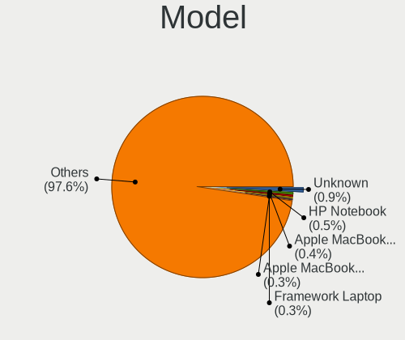

Fedora - Tested Hardware & Statistics (Notebooks)
-------------------------------------------------

A project to collect tested hardware configurations for Fedora.

Anyone can contribute to this report by the [hw-probe](https://github.com/linuxhw/hw-probe) tool:

    sudo -E hw-probe -all -upload

Please contribute! Especially if your hardware is rare.

Contents
--------

* [ Test Cases ](#test-cases)

* [ System ](#system)
  - [ OS                       ](#os)
  - [ OS Family                ](#os-family)
  - [ Kernel                   ](#kernel)
  - [ Kernel Family            ](#kernel-family)
  - [ Kernel Major Ver.        ](#kernel-major-ver)
  - [ Arch                     ](#arch)
  - [ DE                       ](#de)
  - [ Display Server           ](#display-server)
  - [ Display Manager          ](#display-manager)
  - [ OS Lang                  ](#os-lang)
  - [ Boot Mode                ](#boot-mode)
  - [ Filesystem               ](#filesystem)
  - [ Part. scheme             ](#part-scheme)
  - [ Dual Boot with Linux/BSD ](#dual-boot-with-linuxbsd)
  - [ Dual Boot (Win)          ](#dual-boot-win)

* [ Board ](#board)
  - [ Vendor                   ](#vendor)
  - [ Model                    ](#model)
  - [ Model Family             ](#model-family)
  - [ MFG Year                 ](#mfg-year)
  - [ Form Factor              ](#form-factor)
  - [ Secure Boot              ](#secure-boot)
  - [ Coreboot                 ](#coreboot)
  - [ RAM Size                 ](#ram-size)
  - [ RAM Used                 ](#ram-used)
  - [ Total Drives             ](#total-drives)
  - [ Has CD-ROM               ](#has-cd-rom)
  - [ Has Ethernet             ](#has-ethernet)
  - [ Has WiFi                 ](#has-wifi)
  - [ Has Bluetooth            ](#has-bluetooth)

* [ Location ](#location)
  - [ Country                  ](#country)
  - [ City                     ](#city)

* [ Drives ](#drives)
  - [ Drive Vendor             ](#drive-vendor)
  - [ Drive Model              ](#drive-model)
  - [ HDD Vendor               ](#hdd-vendor)
  - [ SSD Vendor               ](#ssd-vendor)
  - [ Drive Kind               ](#drive-kind)
  - [ Drive Connector          ](#drive-connector)
  - [ Drive Size               ](#drive-size)
  - [ Space Total              ](#space-total)
  - [ Space Used               ](#space-used)
  - [ Malfunc. Drives          ](#malfunc-drives)
  - [ Malfunc. Drive Vendor    ](#malfunc-drive-vendor)
  - [ Malfunc. HDD Vendor      ](#malfunc-hdd-vendor)
  - [ Malfunc. Drive Kind      ](#malfunc-drive-kind)
  - [ Failed Drives            ](#failed-drives)
  - [ Failed Drive Vendor      ](#failed-drive-vendor)
  - [ Drive Status             ](#drive-status)

* [ Storage controller ](#storage-controller)
  - [ Storage Vendor           ](#storage-vendor)
  - [ Storage Model            ](#storage-model)
  - [ Storage Kind             ](#storage-kind)

* [ Processor ](#processor)
  - [ CPU Vendor               ](#cpu-vendor)
  - [ CPU Model                ](#cpu-model)
  - [ CPU Model Family         ](#cpu-model-family)
  - [ CPU Cores                ](#cpu-cores)
  - [ CPU Sockets              ](#cpu-sockets)
  - [ CPU Threads              ](#cpu-threads)
  - [ CPU Op-Modes             ](#cpu-op-modes)
  - [ CPU Microcode            ](#cpu-microcode)
  - [ CPU Microarch            ](#cpu-microarch)

* [ Graphics ](#graphics)
  - [ GPU Vendor               ](#gpu-vendor)
  - [ GPU Model                ](#gpu-model)
  - [ GPU Combo                ](#gpu-combo)
  - [ GPU Driver               ](#gpu-driver)
  - [ GPU Memory               ](#gpu-memory)

* [ Monitor ](#monitor)
  - [ Monitor Vendor           ](#monitor-vendor)
  - [ Monitor Model            ](#monitor-model)
  - [ Monitor Resolution       ](#monitor-resolution)
  - [ Monitor Diagonal         ](#monitor-diagonal)
  - [ Monitor Width            ](#monitor-width)
  - [ Aspect Ratio             ](#aspect-ratio)
  - [ Monitor Area             ](#monitor-area)
  - [ Pixel Density            ](#pixel-density)
  - [ Multiple Monitors        ](#multiple-monitors)

* [ Network ](#network)
  - [ Net Controller Vendor    ](#net-controller-vendor)
  - [ Net Controller Model     ](#net-controller-model)
  - [ Wireless Vendor          ](#wireless-vendor)
  - [ Wireless Model           ](#wireless-model)
  - [ Ethernet Vendor          ](#ethernet-vendor)
  - [ Ethernet Model           ](#ethernet-model)
  - [ Net Controller Kind      ](#net-controller-kind)
  - [ Used Controller          ](#used-controller)
  - [ NICs                     ](#nics)
  - [ IPv6                     ](#ipv6)

* [ Bluetooth ](#bluetooth)
  - [ Bluetooth Vendor         ](#bluetooth-vendor)
  - [ Bluetooth Model          ](#bluetooth-model)

* [ Sound ](#sound)
  - [ Sound Vendor             ](#sound-vendor)
  - [ Sound Model              ](#sound-model)

* [ Memory ](#memory)
  - [ Memory Vendor            ](#memory-vendor)
  - [ Memory Model             ](#memory-model)
  - [ Memory Kind              ](#memory-kind)
  - [ Memory Form Factor       ](#memory-form-factor)
  - [ Memory Size              ](#memory-size)
  - [ Memory Speed             ](#memory-speed)

* [ Printers & scanners ](#printers--scanners)
  - [ Printer Vendor           ](#printer-vendor)
  - [ Printer Model            ](#printer-model)
  - [ Scanner Vendor           ](#scanner-vendor)
  - [ Scanner Model            ](#scanner-model)

* [ Camera ](#camera)
  - [ Camera Vendor            ](#camera-vendor)
  - [ Camera Model             ](#camera-model)

* [ Security ](#security)
  - [ Fingerprint Vendor       ](#fingerprint-vendor)
  - [ Fingerprint Model        ](#fingerprint-model)
  - [ Chipcard Vendor          ](#chipcard-vendor)
  - [ Chipcard Model           ](#chipcard-model)

* [ Unsupported ](#unsupported)
  - [ Unsupported Devices      ](#unsupported-devices)
  - [ Unsupported Device Types ](#unsupported-device-types)

Test Cases
----------

Total: 8206

| Vendor        | Model                       | Probe                                                      | Date         |
|---------------|-----------------------------|------------------------------------------------------------|--------------|
| Lenovo        | ThinkPad X390 20Q00051GE    | [5b3d1b750d](https://linux-hardware.org/?probe=5b3d1b750d) | Dec 31, 2022 |
| Valve         | Jupiter                     | [c0fb48bccb](https://linux-hardware.org/?probe=c0fb48bccb) | Dec 31, 2022 |
| System76      | Oryx Pro                    | [0d65e57758](https://linux-hardware.org/?probe=0d65e57758) | Dec 31, 2022 |
| Lenovo        | ThinkPad X390 20Q00051GE    | [775096be09](https://linux-hardware.org/?probe=775096be09) | Dec 31, 2022 |
| Lenovo        | ThinkPad T14 Gen 3 21AH0... | [322cf5484d](https://linux-hardware.org/?probe=322cf5484d) | Dec 31, 2022 |
| Lenovo        | ThinkPad E15 Gen 3 20YHS... | [5fbe1632b0](https://linux-hardware.org/?probe=5fbe1632b0) | Dec 31, 2022 |
| Lenovo        | ThinkPad E15 Gen 3 20YHS... | [5a479fed95](https://linux-hardware.org/?probe=5a479fed95) | Dec 31, 2022 |
| Lenovo        | ThinkPad T14 Gen 3 21AH0... | [591d985e85](https://linux-hardware.org/?probe=591d985e85) | Dec 31, 2022 |
| HP            | Pavilion dv6700             | [4b3b106bee](https://linux-hardware.org/?probe=4b3b106bee) | Dec 30, 2022 |
| MACHENIKE     | MACHCREATOR-16              | [f7ed4a6609](https://linux-hardware.org/?probe=f7ed4a6609) | Dec 30, 2022 |
| Dell          | Inspiron 3421               | [d2cd50a2a6](https://linux-hardware.org/?probe=d2cd50a2a6) | Dec 30, 2022 |
| Timi          | A35S                        | [c62c9ae956](https://linux-hardware.org/?probe=c62c9ae956) | Dec 30, 2022 |
| Dell          | Inspiron 3421               | [ae7d821823](https://linux-hardware.org/?probe=ae7d821823) | Dec 30, 2022 |
| Dell          | XPS 15 9520                 | [19b4bfd852](https://linux-hardware.org/?probe=19b4bfd852) | Dec 30, 2022 |
| HUAWEI        | BOHK-WAX9X                  | [68b3b51892](https://linux-hardware.org/?probe=68b3b51892) | Dec 30, 2022 |
| MSI           | GP72MVR 7RFX                | [cefedef93c](https://linux-hardware.org/?probe=cefedef93c) | Dec 30, 2022 |
| MSI           | Stealth GS66 12UGS          | [da812c8fa2](https://linux-hardware.org/?probe=da812c8fa2) | Dec 30, 2022 |
| Lenovo        | Z70-80 80FG                 | [16419f6991](https://linux-hardware.org/?probe=16419f6991) | Dec 30, 2022 |
| Lenovo        | Z70-80 80FG                 | [4386242be1](https://linux-hardware.org/?probe=4386242be1) | Dec 30, 2022 |
| Lenovo        | ThinkPad P15v Gen 1 20TQ... | [770c5eee84](https://linux-hardware.org/?probe=770c5eee84) | Dec 30, 2022 |
| Dell          | XPS 15 9570                 | [cc31efb32d](https://linux-hardware.org/?probe=cc31efb32d) | Dec 30, 2022 |
| Dell          | Inspiron N4050              | [b34f09894d](https://linux-hardware.org/?probe=b34f09894d) | Dec 29, 2022 |
| Lenovo        | IdeaPad 330-15IKB 81DE      | [ed5315b768](https://linux-hardware.org/?probe=ed5315b768) | Dec 29, 2022 |
| MACHENIKE     | MACHCREATOR-16              | [3c627bc707](https://linux-hardware.org/?probe=3c627bc707) | Dec 29, 2022 |
| MACHENIKE     | MACHCREATOR-16              | [b246257695](https://linux-hardware.org/?probe=b246257695) | Dec 29, 2022 |
| HP            | Stream Notebook PC 13       | [2154a332b0](https://linux-hardware.org/?probe=2154a332b0) | Dec 29, 2022 |
| Lenovo        | Yoga Slim 7 Pro 16ACH6 8... | [1c46a3fdd3](https://linux-hardware.org/?probe=1c46a3fdd3) | Dec 29, 2022 |
| MSI           | Modern 15 A5M               | [1e7182cb70](https://linux-hardware.org/?probe=1e7182cb70) | Dec 29, 2022 |
| HP            | ZBook Fury 16 G9 Mobile ... | [6c67e1435e](https://linux-hardware.org/?probe=6c67e1435e) | Dec 29, 2022 |
| Lenovo        | ThinkPad T480 20L5001DUS    | [51bb19bbf2](https://linux-hardware.org/?probe=51bb19bbf2) | Dec 29, 2022 |
| Lenovo        | ThinkPad T15 Gen 1 20S7S... | [74f8dcfbb4](https://linux-hardware.org/?probe=74f8dcfbb4) | Dec 29, 2022 |
| Schenker      | VISION 16 Pro (L22)         | [bbd6e1daf5](https://linux-hardware.org/?probe=bbd6e1daf5) | Dec 29, 2022 |
| Acer          | Predator PH315-53           | [d5d0e740c1](https://linux-hardware.org/?probe=d5d0e740c1) | Dec 29, 2022 |
| Schenker      | VISION 16 Pro (L22)         | [2412713729](https://linux-hardware.org/?probe=2412713729) | Dec 29, 2022 |
| Dell          | G5 5590                     | [58bd69f40b](https://linux-hardware.org/?probe=58bd69f40b) | Dec 28, 2022 |
| Lenovo        | ThinkPad T14 Gen 3 21AH0... | [8901206dd0](https://linux-hardware.org/?probe=8901206dd0) | Dec 28, 2022 |
| Dell          | Inspiron 5458               | [269d455191](https://linux-hardware.org/?probe=269d455191) | Dec 28, 2022 |
| HP            | ProBook 440 14 inch G9 N... | [e23c23e61f](https://linux-hardware.org/?probe=e23c23e61f) | Dec 28, 2022 |
| HP            | ProBook 440 14 inch G9 N... | [5c4856e5c8](https://linux-hardware.org/?probe=5c4856e5c8) | Dec 28, 2022 |
| Lenovo        | IdeaPad L3 15ITL6 82HL      | [0852995abb](https://linux-hardware.org/?probe=0852995abb) | Dec 28, 2022 |
| Lenovo        | IdeaPad 330-14IGM 81D0      | [e12c24fd74](https://linux-hardware.org/?probe=e12c24fd74) | Dec 28, 2022 |
| Google        | Voxel rev3                  | [430244f188](https://linux-hardware.org/?probe=430244f188) | Dec 28, 2022 |
| HP            | ProBook 440 G6              | [6240bc3677](https://linux-hardware.org/?probe=6240bc3677) | Dec 28, 2022 |
| HP            | ProBook 440 G6              | [f5689c6edc](https://linux-hardware.org/?probe=f5689c6edc) | Dec 28, 2022 |
| Dell          | Inspiron 16 5625            | [dbc2d2fc6f](https://linux-hardware.org/?probe=dbc2d2fc6f) | Dec 28, 2022 |
| HUAWEI        | HLYL-WXX9                   | [790b3dcdde](https://linux-hardware.org/?probe=790b3dcdde) | Dec 28, 2022 |
| ASUSTek       | ASUS TUF Gaming F15 FX50... | [ad33bb0d6f](https://linux-hardware.org/?probe=ad33bb0d6f) | Dec 28, 2022 |
| HP            | G62                         | [05ad917600](https://linux-hardware.org/?probe=05ad917600) | Dec 28, 2022 |
| ASUSTek       | ROG Zephyrus G14 GA401IU... | [d1f63174e4](https://linux-hardware.org/?probe=d1f63174e4) | Dec 28, 2022 |
| HUAWEI        | BOM-WXX9                    | [826a683b58](https://linux-hardware.org/?probe=826a683b58) | Dec 28, 2022 |
| ASUSTek       | ROG Strix G513QE_G513QE     | [00a92c3818](https://linux-hardware.org/?probe=00a92c3818) | Dec 28, 2022 |
| ASUSTek       | ROG Zephyrus G14 GA401IU... | [6eaa690ff2](https://linux-hardware.org/?probe=6eaa690ff2) | Dec 28, 2022 |
| Lenovo        | ThinkPad E15 Gen 2 20T80... | [538bf2bb33](https://linux-hardware.org/?probe=538bf2bb33) | Dec 28, 2022 |
| MSI           | GL63 8RC                    | [0b973e252f](https://linux-hardware.org/?probe=0b973e252f) | Dec 27, 2022 |
| Lenovo        | ThinkBook 15-IIL 20SM       | [d579ff34ee](https://linux-hardware.org/?probe=d579ff34ee) | Dec 27, 2022 |
| ASUSTek       | ROG Strix G513QY_G513QY     | [cedce58f23](https://linux-hardware.org/?probe=cedce58f23) | Dec 27, 2022 |
| Dell          | Inspiron 15 3525            | [64a70af984](https://linux-hardware.org/?probe=64a70af984) | Dec 27, 2022 |
| ASUSTek       | ROG Strix G513QY_G513QY     | [0e063e5fd5](https://linux-hardware.org/?probe=0e063e5fd5) | Dec 27, 2022 |
| HP            | Laptop 15-dy5xxx            | [d7daff3ed1](https://linux-hardware.org/?probe=d7daff3ed1) | Dec 27, 2022 |
| Timi          | RedmiBook 15                | [cf38b14bc5](https://linux-hardware.org/?probe=cf38b14bc5) | Dec 27, 2022 |
| Lenovo        | ThinkPad T14 Gen 3 21AH0... | [e41c8ca4ee](https://linux-hardware.org/?probe=e41c8ca4ee) | Dec 27, 2022 |
| Dell          | Latitude E7440              | [f2c052dde9](https://linux-hardware.org/?probe=f2c052dde9) | Dec 27, 2022 |
| Dell          | Inspiron 15-3567            | [2f5381fa26](https://linux-hardware.org/?probe=2f5381fa26) | Dec 26, 2022 |
| HP            | ProBook 450 G7              | [dfedb566ff](https://linux-hardware.org/?probe=dfedb566ff) | Dec 26, 2022 |
| Lenovo        | G510 20238                  | [812d6eb07e](https://linux-hardware.org/?probe=812d6eb07e) | Dec 26, 2022 |
| Lenovo        | ThinkBook 16p Gen 2 20YM    | [c7babe827f](https://linux-hardware.org/?probe=c7babe827f) | Dec 26, 2022 |
| Dell          | Inspiron 3521               | [9d544fbcd4](https://linux-hardware.org/?probe=9d544fbcd4) | Dec 26, 2022 |
| Dell          | Inspiron 5458               | [4e393c7334](https://linux-hardware.org/?probe=4e393c7334) | Dec 26, 2022 |
| Lenovo        | ThinkPad X1 Extreme Gen ... | [ce352bf1b1](https://linux-hardware.org/?probe=ce352bf1b1) | Dec 26, 2022 |
| Acer          | Aspire A515-51              | [e763dd5dfe](https://linux-hardware.org/?probe=e763dd5dfe) | Dec 26, 2022 |
| MSI           | GT60                        | [3917ca13e3](https://linux-hardware.org/?probe=3917ca13e3) | Dec 26, 2022 |
| ASUSTek       | ASUS TUF Gaming F15 FX50... | [62869e3d8c](https://linux-hardware.org/?probe=62869e3d8c) | Dec 26, 2022 |
| Dell          | Inspiron 5759               | [d1938219e9](https://linux-hardware.org/?probe=d1938219e9) | Dec 26, 2022 |
| Dell          | Latitude 5580               | [72c0e42aeb](https://linux-hardware.org/?probe=72c0e42aeb) | Dec 26, 2022 |
| Acer          | Aspire A315-59              | [6625ce058f](https://linux-hardware.org/?probe=6625ce058f) | Dec 25, 2022 |
| HP            | ProBook 6465b               | [d0f5218f72](https://linux-hardware.org/?probe=d0f5218f72) | Dec 25, 2022 |
| ASUSTek       | K55VD                       | [52df2ba00b](https://linux-hardware.org/?probe=52df2ba00b) | Dec 25, 2022 |
| Lenovo        | ThinkBook 15p 20V3          | [5aa14f474e](https://linux-hardware.org/?probe=5aa14f474e) | Dec 25, 2022 |
| MSI           | Modern 14 B4MW              | [e9dbd838ec](https://linux-hardware.org/?probe=e9dbd838ec) | Dec 25, 2022 |
| ASUSTek       | ASUS TUF Gaming F15 FX50... | [fa7183c982](https://linux-hardware.org/?probe=fa7183c982) | Dec 25, 2022 |
| Dell          | XPS 15 9510                 | [6c809c224c](https://linux-hardware.org/?probe=6c809c224c) | Dec 24, 2022 |
| Dell          | Latitude 5510               | [68e4810231](https://linux-hardware.org/?probe=68e4810231) | Dec 24, 2022 |
| HUAWEI        | CREM-WXX9                   | [a48a2f6362](https://linux-hardware.org/?probe=a48a2f6362) | Dec 24, 2022 |
| HP            | Pavilion g6                 | [71d7947da6](https://linux-hardware.org/?probe=71d7947da6) | Dec 24, 2022 |
| MSI           | Stealth 15M B12UE           | [a8e294154b](https://linux-hardware.org/?probe=a8e294154b) | Dec 24, 2022 |
| Lenovo        | ThinkPad T470s 20HGS0AY0... | [28e67f37bc](https://linux-hardware.org/?probe=28e67f37bc) | Dec 24, 2022 |
| Acer          | Aspire A514-54              | [ea57f4aa3a](https://linux-hardware.org/?probe=ea57f4aa3a) | Dec 24, 2022 |
| Samsung       | 550XBE/350XBE               | [4ea620705d](https://linux-hardware.org/?probe=4ea620705d) | Dec 24, 2022 |
| Toshiba       | Satellite C75D-B            | [04282775ba](https://linux-hardware.org/?probe=04282775ba) | Dec 24, 2022 |
| Dell          | Latitude 5420               | [201e81d0ed](https://linux-hardware.org/?probe=201e81d0ed) | Dec 23, 2022 |
| Dell          | Latitude 5420               | [9fd9875465](https://linux-hardware.org/?probe=9fd9875465) | Dec 23, 2022 |
| HUAWEI        | NBLK-WAX9X                  | [f114731a78](https://linux-hardware.org/?probe=f114731a78) | Dec 23, 2022 |
| ASUSTek       | X750JN                      | [d933b1a80b](https://linux-hardware.org/?probe=d933b1a80b) | Dec 23, 2022 |
| Toshiba       | Satellite C850-C5K          | [a67d24c9f9](https://linux-hardware.org/?probe=a67d24c9f9) | Dec 23, 2022 |
| Samsung       | 300E4A/300E5A/300E7A/343... | [6b2cd55178](https://linux-hardware.org/?probe=6b2cd55178) | Dec 23, 2022 |
| Jooyon Tec... | J6BF                        | [dabe200abe](https://linux-hardware.org/?probe=dabe200abe) | Dec 23, 2022 |
| ASUSTek       | ASUS EXPERTBOOK B3302CEA... | [756390ae0c](https://linux-hardware.org/?probe=756390ae0c) | Dec 23, 2022 |
| ASUSTek       | ASUS EXPERTBOOK B3302CEA... | [c2dd56664a](https://linux-hardware.org/?probe=c2dd56664a) | Dec 23, 2022 |
| ASUSTek       | VivoBook_ASUSLaptop X513... | [627186e9e8](https://linux-hardware.org/?probe=627186e9e8) | Dec 23, 2022 |
| ASUSTek       | ASUS TUF Gaming F15 FX50... | [fe159bf4ca](https://linux-hardware.org/?probe=fe159bf4ca) | Dec 23, 2022 |
| HUAWEI        | NBLB-WAX9N                  | [77e30fee83](https://linux-hardware.org/?probe=77e30fee83) | Dec 23, 2022 |
| Acer          | Aspire A515-57G             | [a208b5598e](https://linux-hardware.org/?probe=a208b5598e) | Dec 22, 2022 |
| Acer          | Aspire A515-57G             | [cccd3d01d7](https://linux-hardware.org/?probe=cccd3d01d7) | Dec 22, 2022 |
| Acer          | Aspire V5-571               | [b4de144f3e](https://linux-hardware.org/?probe=b4de144f3e) | Dec 22, 2022 |
| Lenovo        | Legion 5 15ACH6H 82JU       | [2505eabeaf](https://linux-hardware.org/?probe=2505eabeaf) | Dec 22, 2022 |
| ASUSTek       | ASUS TUF Gaming A15 FA50... | [677cb5b0b3](https://linux-hardware.org/?probe=677cb5b0b3) | Dec 22, 2022 |
| MSI           | Stealth 15M B12UE           | [65d1cc61ba](https://linux-hardware.org/?probe=65d1cc61ba) | Dec 22, 2022 |
| Acer          | Aspire A315-54              | [c603811f9a](https://linux-hardware.org/?probe=c603811f9a) | Dec 22, 2022 |
| Lenovo        | XiaoXinPro 16ACH 2021 82... | [2b25ab8790](https://linux-hardware.org/?probe=2b25ab8790) | Dec 22, 2022 |
| GPD           | P3 MAX                      | [9069ed5580](https://linux-hardware.org/?probe=9069ed5580) | Dec 22, 2022 |
| ASUSTek       | Zenbook UM5302TA_UM5302T... | [6db25ba5ca](https://linux-hardware.org/?probe=6db25ba5ca) | Dec 22, 2022 |
| Lenovo        | ThinkPad X1 Carbon Gen 1... | [fb60e7984c](https://linux-hardware.org/?probe=fb60e7984c) | Dec 21, 2022 |
| ASUSTek       | X450CA                      | [5b793f14ff](https://linux-hardware.org/?probe=5b793f14ff) | Dec 21, 2022 |
| ASUSTek       | ASUS TUF Gaming F15 FX50... | [721bc5f662](https://linux-hardware.org/?probe=721bc5f662) | Dec 21, 2022 |
| MSI           | Stealth 15M B12UE           | [6f7a27c8c5](https://linux-hardware.org/?probe=6f7a27c8c5) | Dec 21, 2022 |
| Apple         | MacBookPro9,2               | [5bc62fc208](https://linux-hardware.org/?probe=5bc62fc208) | Dec 21, 2022 |
| MSI           | Stealth 15M B12UE           | [ce6c271622](https://linux-hardware.org/?probe=ce6c271622) | Dec 21, 2022 |
| HP            | Stream Notebook PC 13       | [9c88ffc394](https://linux-hardware.org/?probe=9c88ffc394) | Dec 21, 2022 |
| Positivo B... | VJFE41F11X-XXXXXX           | [77c9275988](https://linux-hardware.org/?probe=77c9275988) | Dec 21, 2022 |
| Lenovo        | ThinkPad T14 Gen 1 20UD0... | [47ac3ac319](https://linux-hardware.org/?probe=47ac3ac319) | Dec 21, 2022 |
| Lenovo        | ThinkPad E14 Gen 2 20TB0... | [ec20f98178](https://linux-hardware.org/?probe=ec20f98178) | Dec 21, 2022 |
| Dell          | Latitude 5520               | [203652b6dd](https://linux-hardware.org/?probe=203652b6dd) | Dec 21, 2022 |
| Lenovo        | ThinkPad E15 20RD0011RT     | [1f1c718c61](https://linux-hardware.org/?probe=1f1c718c61) | Dec 21, 2022 |
| Timi          | Mi NoteBook Pro             | [b5bbb4f410](https://linux-hardware.org/?probe=b5bbb4f410) | Dec 21, 2022 |
| MSI           | Modern 14 B4MW              | [2d446beedf](https://linux-hardware.org/?probe=2d446beedf) | Dec 21, 2022 |
| ASUSTek       | ASUS TUF Gaming F15 FX50... | [d9db7be046](https://linux-hardware.org/?probe=d9db7be046) | Dec 21, 2022 |
| Dell          | Latitude 5521               | [6fcbfd9271](https://linux-hardware.org/?probe=6fcbfd9271) | Dec 21, 2022 |
| Dell          | Latitude 3420               | [99d501d768](https://linux-hardware.org/?probe=99d501d768) | Dec 20, 2022 |
| ASUSTek       | ASUS TUF Gaming F15 FX50... | [89b8982148](https://linux-hardware.org/?probe=89b8982148) | Dec 20, 2022 |
| ASUSTek       | ASUS TUF Gaming F15 FX50... | [082a1fb19e](https://linux-hardware.org/?probe=082a1fb19e) | Dec 20, 2022 |
| Positivo B... | VJFE41F11X-XXXXXX           | [383b0f3311](https://linux-hardware.org/?probe=383b0f3311) | Dec 20, 2022 |
| Dell          | Inspiron 15 7000 Gaming     | [0d59e38c20](https://linux-hardware.org/?probe=0d59e38c20) | Dec 20, 2022 |
| HP            | ZBook 15                    | [a3bf671d64](https://linux-hardware.org/?probe=a3bf671d64) | Dec 20, 2022 |
| Lenovo        | IdeaPad 3 15ARE05 81W4      | [af14f0c425](https://linux-hardware.org/?probe=af14f0c425) | Dec 20, 2022 |
| Lenovo        | IdeaPad 3 15ARE05 81W4      | [e7393fd2b7](https://linux-hardware.org/?probe=e7393fd2b7) | Dec 20, 2022 |
| Dell          | Vostro 5620                 | [005d388376](https://linux-hardware.org/?probe=005d388376) | Dec 20, 2022 |
| Acer          | Aspire A515-52              | [b052f8434a](https://linux-hardware.org/?probe=b052f8434a) | Dec 20, 2022 |
| Lenovo        | ThinkPad E15 20RD0011RT     | [bbfea042cd](https://linux-hardware.org/?probe=bbfea042cd) | Dec 20, 2022 |
| HP            | Pavilion dv6                | [8b0f82599c](https://linux-hardware.org/?probe=8b0f82599c) | Dec 20, 2022 |
| ASUSTek       | Zenbook UX5400EA_UX5400E... | [011d3e746d](https://linux-hardware.org/?probe=011d3e746d) | Dec 20, 2022 |
| ASUSTek       | VivoBook_ASUSLaptop X340... | [b30bf77d27](https://linux-hardware.org/?probe=b30bf77d27) | Dec 19, 2022 |
| Lenovo        | ThinkPad T14s Gen 1 20T1... | [c67b4d2b31](https://linux-hardware.org/?probe=c67b4d2b31) | Dec 19, 2022 |
| HP            | OMEN by Laptop 16-c0xxx     | [9f5a91c628](https://linux-hardware.org/?probe=9f5a91c628) | Dec 19, 2022 |
| Sony          | SVE15133CNB                 | [a2bee3bb3f](https://linux-hardware.org/?probe=a2bee3bb3f) | Dec 19, 2022 |
| ASUSTek       | X556UJ                      | [256957850d](https://linux-hardware.org/?probe=256957850d) | Dec 19, 2022 |
| MSI           | GE63 Raider RGB 8RF         | [a85193c482](https://linux-hardware.org/?probe=a85193c482) | Dec 19, 2022 |
| ASUSTek       | ASUS TUF Gaming A15 FA50... | [714d2a6dea](https://linux-hardware.org/?probe=714d2a6dea) | Dec 19, 2022 |
| HP            | OMEN by Laptop 16-c0xxx     | [ab3b4786ea](https://linux-hardware.org/?probe=ab3b4786ea) | Dec 19, 2022 |
| Lenovo        | ThinkPad T470s W10DG 20J... | [856515e522](https://linux-hardware.org/?probe=856515e522) | Dec 19, 2022 |
| Lenovo        | IdeaPad 510-15ISK 80SR      | [a5a207a46d](https://linux-hardware.org/?probe=a5a207a46d) | Dec 19, 2022 |
| MSI           | PS42 8RB                    | [42422af633](https://linux-hardware.org/?probe=42422af633) | Dec 19, 2022 |
| MSI           | GL63 8RC                    | [6a5bc85513](https://linux-hardware.org/?probe=6a5bc85513) | Dec 18, 2022 |
| Acer          | Swift SF114-32              | [757b666913](https://linux-hardware.org/?probe=757b666913) | Dec 18, 2022 |
| Lenovo        | ThinkBook 15 G3 ACL 21A4    | [23b255ed61](https://linux-hardware.org/?probe=23b255ed61) | Dec 18, 2022 |
| Lenovo        | ThinkPad A485 20MVS0LG00    | [86c9426d80](https://linux-hardware.org/?probe=86c9426d80) | Dec 18, 2022 |
| Lenovo        | ThinkPad A485 20MVS0LG00    | [05fcf7302f](https://linux-hardware.org/?probe=05fcf7302f) | Dec 18, 2022 |
| Acer          | Aspire A315-31              | [e391c56a47](https://linux-hardware.org/?probe=e391c56a47) | Dec 18, 2022 |
| Lenovo        | ThinkPad W550s 20E2000PG... | [938c10075a](https://linux-hardware.org/?probe=938c10075a) | Dec 18, 2022 |
| HP            | Laptop 15-da0xxx            | [b712a7bd77](https://linux-hardware.org/?probe=b712a7bd77) | Dec 18, 2022 |
| ASUSTek       | Zenbook UM5302TA_UM5302T... | [56e75d70fa](https://linux-hardware.org/?probe=56e75d70fa) | Dec 18, 2022 |
| HP            | ProBook 450 G7              | [ad9bf6b390](https://linux-hardware.org/?probe=ad9bf6b390) | Dec 17, 2022 |
| Dell          | Inspiron 7720               | [0a7621cb40](https://linux-hardware.org/?probe=0a7621cb40) | Dec 17, 2022 |
| Lenovo        | ThinkPad X1 Extreme Gen ... | [c9cc617e08](https://linux-hardware.org/?probe=c9cc617e08) | Dec 17, 2022 |
| Lenovo        | IdeaPad 510-15ISK 80SR      | [f047451b08](https://linux-hardware.org/?probe=f047451b08) | Dec 17, 2022 |
| Sony          | SVE15133CNB                 | [acca7c4697](https://linux-hardware.org/?probe=acca7c4697) | Dec 17, 2022 |
| Lenovo        | ThinkPad E14 Gen 3 20Y70... | [49969f1b81](https://linux-hardware.org/?probe=49969f1b81) | Dec 17, 2022 |
| Lenovo        | ThinkBook 15 G3 ACL 21A4    | [df49d0114f](https://linux-hardware.org/?probe=df49d0114f) | Dec 17, 2022 |
| Lenovo        | Legion 5 15ACH6H 82JU       | [c94cd1a926](https://linux-hardware.org/?probe=c94cd1a926) | Dec 17, 2022 |
| ASUSTek       | ASUS EXPERTBOOK B1400CEA... | [a481e4a590](https://linux-hardware.org/?probe=a481e4a590) | Dec 17, 2022 |
| GPD           | P2 MAX                      | [de5983ec37](https://linux-hardware.org/?probe=de5983ec37) | Dec 17, 2022 |
| ASUSTek       | X45C                        | [80377ba23f](https://linux-hardware.org/?probe=80377ba23f) | Dec 17, 2022 |
| HP            | Pavilion Laptop 14-ce1xx... | [8d631bb590](https://linux-hardware.org/?probe=8d631bb590) | Dec 17, 2022 |
| Dell          | Inspiron 3583               | [5629961182](https://linux-hardware.org/?probe=5629961182) | Dec 17, 2022 |
| HP            | ProBook 440 14 inch G9 N... | [5ab1c3b848](https://linux-hardware.org/?probe=5ab1c3b848) | Dec 17, 2022 |
| Lenovo        | IdeaPad 510-15ISK 80SR      | [645e7245d4](https://linux-hardware.org/?probe=645e7245d4) | Dec 17, 2022 |
| ASUSTek       | VivoBook_ASUSLaptop M540... | [2ba98da01d](https://linux-hardware.org/?probe=2ba98da01d) | Dec 16, 2022 |
| HUAWEI        | KLVL-WXX9                   | [a767e0fbf0](https://linux-hardware.org/?probe=a767e0fbf0) | Dec 16, 2022 |
| HP            | Laptop 14-cm0xxx            | [a5bdc5f3c9](https://linux-hardware.org/?probe=a5bdc5f3c9) | Dec 16, 2022 |
| Dell          | Vostro 5590                 | [3735674d3f](https://linux-hardware.org/?probe=3735674d3f) | Dec 16, 2022 |
| Lenovo        | IdeaPad 3 15ALC6 82KU       | [7c678e18cd](https://linux-hardware.org/?probe=7c678e18cd) | Dec 16, 2022 |
| Dell          | Inspiron 5566               | [ccfc358303](https://linux-hardware.org/?probe=ccfc358303) | Dec 16, 2022 |
| ASUSTek       | X550LD                      | [2960bdb195](https://linux-hardware.org/?probe=2960bdb195) | Dec 16, 2022 |
| Lenovo        | ThinkPad W530 243858U       | [9dc4fb1abb](https://linux-hardware.org/?probe=9dc4fb1abb) | Dec 16, 2022 |
| ASUSTek       | VivoBook_ASUSLaptop K350... | [955de558cb](https://linux-hardware.org/?probe=955de558cb) | Dec 16, 2022 |
| ASUSTek       | VivoBook_ASUSLaptop K350... | [e1d8403247](https://linux-hardware.org/?probe=e1d8403247) | Dec 16, 2022 |
| Dell          | XPS 15 9570                 | [ce6ac8ec7f](https://linux-hardware.org/?probe=ce6ac8ec7f) | Dec 16, 2022 |
| Dell          | XPS 13 9380                 | [719f489e01](https://linux-hardware.org/?probe=719f489e01) | Dec 15, 2022 |
| Dell          | Inspiron 7501               | [1749ece1b3](https://linux-hardware.org/?probe=1749ece1b3) | Dec 15, 2022 |
| Lenovo        | ThinkPad T14 Gen 3 21AH0... | [b8cc280665](https://linux-hardware.org/?probe=b8cc280665) | Dec 15, 2022 |
| HP            | OMEN by Laptop 16-c0xxx     | [5e8318b8b8](https://linux-hardware.org/?probe=5e8318b8b8) | Dec 15, 2022 |
| HUAWEI        | KLVL-WXXW                   | [1dd0f2a71f](https://linux-hardware.org/?probe=1dd0f2a71f) | Dec 15, 2022 |
| HP            | OMEN by Laptop 16-c0xxx     | [d5c9abda1e](https://linux-hardware.org/?probe=d5c9abda1e) | Dec 15, 2022 |
| Lenovo        | ThinkPad P14s Gen 1 20Y1... | [85c38f0af3](https://linux-hardware.org/?probe=85c38f0af3) | Dec 15, 2022 |
| Lenovo        | ThinkBook 15-IML 20RW       | [06d690e9fe](https://linux-hardware.org/?probe=06d690e9fe) | Dec 15, 2022 |
| HP            | ProBook 440 14 inch G9 N... | [1380e253a5](https://linux-hardware.org/?probe=1380e253a5) | Dec 14, 2022 |
| Samsung       | 750XDA                      | [0120054e9f](https://linux-hardware.org/?probe=0120054e9f) | Dec 14, 2022 |
| Lenovo        | ThinkBook 15-IML 20RW       | [fe7f585504](https://linux-hardware.org/?probe=fe7f585504) | Dec 14, 2022 |
| Dell          | Inspiron 3583               | [70992b154e](https://linux-hardware.org/?probe=70992b154e) | Dec 14, 2022 |
| Lenovo        | IdeaPad 3 15ALC6 82KU       | [b2d808ab85](https://linux-hardware.org/?probe=b2d808ab85) | Dec 14, 2022 |
| Lenovo        | ThinkPad T480s 20L8S4GU0... | [bed7f6d44e](https://linux-hardware.org/?probe=bed7f6d44e) | Dec 14, 2022 |
| Lenovo        | ThinkPad E15 Gen 2 20T80... | [95aca2679a](https://linux-hardware.org/?probe=95aca2679a) | Dec 14, 2022 |
| ASUSTek       | ASUSPRO P1440FAC_P1440FA    | [44484456f8](https://linux-hardware.org/?probe=44484456f8) | Dec 14, 2022 |
| HUAWEI        | NBLK-WAX9X                  | [5ea80edee8](https://linux-hardware.org/?probe=5ea80edee8) | Dec 14, 2022 |
| HP            | Laptop 14-fq1xxx            | [2da9ae7906](https://linux-hardware.org/?probe=2da9ae7906) | Dec 14, 2022 |
| Lenovo        | ThinkPad E14 Gen 4 21ECS... | [034b34f6d6](https://linux-hardware.org/?probe=034b34f6d6) | Dec 13, 2022 |
| Pegatron      | C17A                        | [adde308568](https://linux-hardware.org/?probe=adde308568) | Dec 13, 2022 |
| HP            | Laptop 14-fq1xxx            | [ed92313ebc](https://linux-hardware.org/?probe=ed92313ebc) | Dec 13, 2022 |
| HP            | ProBook 440 G7              | [ca2ba2d622](https://linux-hardware.org/?probe=ca2ba2d622) | Dec 13, 2022 |
| Toshiba       | TECRA A10                   | [760bda2b7d](https://linux-hardware.org/?probe=760bda2b7d) | Dec 13, 2022 |
| Acer          | Predator G9-591             | [838b0e0f8c](https://linux-hardware.org/?probe=838b0e0f8c) | Dec 13, 2022 |
| ASUSTek       | ROG Zephyrus G15 GA503QM... | [6fc042d213](https://linux-hardware.org/?probe=6fc042d213) | Dec 13, 2022 |
| Lenovo        | ThinkBook 15-IML 20RW       | [63cbf5d0e9](https://linux-hardware.org/?probe=63cbf5d0e9) | Dec 13, 2022 |
| MSI           | Modern 14 B4MW              | [8489ca12d8](https://linux-hardware.org/?probe=8489ca12d8) | Dec 13, 2022 |
| ASUSTek       | ASUS EXPERTBOOK P2451FA_... | [3eb157838e](https://linux-hardware.org/?probe=3eb157838e) | Dec 13, 2022 |
| Lenovo        | ThinkBook 15-IML 20RW       | [3c5a5379a4](https://linux-hardware.org/?probe=3c5a5379a4) | Dec 13, 2022 |
| Dell          | Inspiron 13-5368            | [952dd9d819](https://linux-hardware.org/?probe=952dd9d819) | Dec 13, 2022 |
| Lenovo        | ThinkPad T480s 20L8002WM... | [d742af8997](https://linux-hardware.org/?probe=d742af8997) | Dec 13, 2022 |
| HUAWEI        | KLVL-WXX9                   | [469a37f1e4](https://linux-hardware.org/?probe=469a37f1e4) | Dec 12, 2022 |
| Dell          | Inspiron 7380               | [29d4feb456](https://linux-hardware.org/?probe=29d4feb456) | Dec 12, 2022 |
| Lenovo        | Legion 5 15ACH6H 82JU       | [fd0700b7ae](https://linux-hardware.org/?probe=fd0700b7ae) | Dec 12, 2022 |
| HP            | ProBook 6570b               | [a6b67497a1](https://linux-hardware.org/?probe=a6b67497a1) | Dec 12, 2022 |
| HUAWEI        | KLVL-WXX9                   | [bdddbb7807](https://linux-hardware.org/?probe=bdddbb7807) | Dec 12, 2022 |
| Dell          | XPS 15 9570                 | [b7b1ed9d8b](https://linux-hardware.org/?probe=b7b1ed9d8b) | Dec 12, 2022 |
| ASUSTek       | K55VD                       | [f74382c966](https://linux-hardware.org/?probe=f74382c966) | Dec 12, 2022 |
| Lenovo        | ThinkPad T590 20N5S4R800    | [9fb659eea3](https://linux-hardware.org/?probe=9fb659eea3) | Dec 12, 2022 |
| MSI           | GE63 Raider RGB 8RF         | [b311865418](https://linux-hardware.org/?probe=b311865418) | Dec 12, 2022 |
| MSI           | Modern 14 B11MOU            | [9739ffdf34](https://linux-hardware.org/?probe=9739ffdf34) | Dec 12, 2022 |
| Lenovo        | ThinkPad P15 Gen 2i 20YR... | [257e692fa4](https://linux-hardware.org/?probe=257e692fa4) | Dec 11, 2022 |
| Toshiba       | Satellite A300              | [211e44e5d2](https://linux-hardware.org/?probe=211e44e5d2) | Dec 11, 2022 |
| Lenovo        | IdeaPad 3 15IIL05 81WE      | [50e8243e50](https://linux-hardware.org/?probe=50e8243e50) | Dec 11, 2022 |
| Acer          | Aspire E5-576G              | [9cc371883c](https://linux-hardware.org/?probe=9cc371883c) | Dec 11, 2022 |
| Samsung       | 930X5J/910S5J/940X5J        | [deb721084b](https://linux-hardware.org/?probe=deb721084b) | Dec 11, 2022 |
| ASUSTek       | X75VD                       | [5cdd66c849](https://linux-hardware.org/?probe=5cdd66c849) | Dec 11, 2022 |
| ASUSTek       | X75VD                       | [624ea43f9d](https://linux-hardware.org/?probe=624ea43f9d) | Dec 11, 2022 |
| Notebook      | WA50SRQ                     | [da74211ac6](https://linux-hardware.org/?probe=da74211ac6) | Dec 11, 2022 |
| HP            | Pavilion g6                 | [b5662e5fec](https://linux-hardware.org/?probe=b5662e5fec) | Dec 11, 2022 |
| Dell          | Latitude E7240              | [591f0ad589](https://linux-hardware.org/?probe=591f0ad589) | Dec 11, 2022 |
| MSI           | Prestige 15 A11SCX          | [5941b1aed7](https://linux-hardware.org/?probe=5941b1aed7) | Dec 10, 2022 |
| MSI           | Prestige 15 A11SCX          | [ab1334fca2](https://linux-hardware.org/?probe=ab1334fca2) | Dec 10, 2022 |
| Dell          | G5 5505                     | [60053b5d4b](https://linux-hardware.org/?probe=60053b5d4b) | Dec 10, 2022 |
| Dell          | XPS 17 9700                 | [0426545e91](https://linux-hardware.org/?probe=0426545e91) | Dec 10, 2022 |
| Acer          | Predator PH315-52           | [e80dfca4a8](https://linux-hardware.org/?probe=e80dfca4a8) | Dec 10, 2022 |
| Lenovo        | ThinkPad P14s Gen 2a 21A... | [25d5b5623b](https://linux-hardware.org/?probe=25d5b5623b) | Dec 10, 2022 |
| Acer          | Predator PH315-52           | [72f0e70b26](https://linux-hardware.org/?probe=72f0e70b26) | Dec 10, 2022 |
| Lenovo        | ThinkPad T480s 20L8S2N80... | [ad87e1559a](https://linux-hardware.org/?probe=ad87e1559a) | Dec 09, 2022 |
| Pegatron      | C17A                        | [2437a88730](https://linux-hardware.org/?probe=2437a88730) | Dec 09, 2022 |
| Lenovo        | ThinkPad T480s 20L7CTO1W... | [b524e6fd67](https://linux-hardware.org/?probe=b524e6fd67) | Dec 09, 2022 |
| Lenovo        | ThinkPad T15 Gen 2i 20W4... | [ad09795330](https://linux-hardware.org/?probe=ad09795330) | Dec 09, 2022 |
| Schenker      | VIA 15                      | [25883b06a1](https://linux-hardware.org/?probe=25883b06a1) | Dec 09, 2022 |
| MSI           | Modern 15 A11MU             | [e5ba0c8749](https://linux-hardware.org/?probe=e5ba0c8749) | Dec 09, 2022 |
| HP            | 245 G8 Notebook PC          | [c291bac936](https://linux-hardware.org/?probe=c291bac936) | Dec 09, 2022 |
| Lenovo        | ThinkBook 14 G3 ACL 21A2    | [5250630bdd](https://linux-hardware.org/?probe=5250630bdd) | Dec 09, 2022 |
| Acer          | Aspire E1-572G              | [2dabd7cf91](https://linux-hardware.org/?probe=2dabd7cf91) | Dec 09, 2022 |
| Lenovo        | IdeaPad 3 15ALC6 82KU       | [1595cc246a](https://linux-hardware.org/?probe=1595cc246a) | Dec 09, 2022 |
| HP            | Laptop 15-db0xxx            | [b0de030271](https://linux-hardware.org/?probe=b0de030271) | Dec 09, 2022 |
| Lenovo        | IdeaPad 3 15ALC6 82KU       | [94c151e95d](https://linux-hardware.org/?probe=94c151e95d) | Dec 09, 2022 |
| HP            | Pavilion dv5                | [cdd08235ff](https://linux-hardware.org/?probe=cdd08235ff) | Dec 09, 2022 |
| Lenovo        | ThinkPad T520 4243CJ2       | [93e5e0ca9b](https://linux-hardware.org/?probe=93e5e0ca9b) | Dec 08, 2022 |
| Lenovo        | ThinkPad P1 Gen 3 20THCT... | [182678a056](https://linux-hardware.org/?probe=182678a056) | Dec 08, 2022 |
| Acer          | Aspire E1-572G              | [df78e85dfe](https://linux-hardware.org/?probe=df78e85dfe) | Dec 08, 2022 |
| HP            | ProBook 640 G1              | [c3bf44d032](https://linux-hardware.org/?probe=c3bf44d032) | Dec 08, 2022 |
| Lenovo        | Legion 5 15ACH6H 82JU       | [9122edaf0a](https://linux-hardware.org/?probe=9122edaf0a) | Dec 08, 2022 |
| HUAWEI        | MACH-WX9                    | [5ed19862a7](https://linux-hardware.org/?probe=5ed19862a7) | Dec 08, 2022 |
| HP            | Laptop 14-dk1xxx            | [1c73b61db3](https://linux-hardware.org/?probe=1c73b61db3) | Dec 08, 2022 |
| Dell          | Inspiron 5566               | [dcf5539e74](https://linux-hardware.org/?probe=dcf5539e74) | Dec 08, 2022 |
| Lenovo        | ThinkPad P14s Gen 2a 21A... | [091e12e551](https://linux-hardware.org/?probe=091e12e551) | Dec 08, 2022 |
| Lenovo        | V14 G2 ITL 82NM             | [00995baaae](https://linux-hardware.org/?probe=00995baaae) | Dec 07, 2022 |
| HP            | EliteBook 820 G1            | [59118a0638](https://linux-hardware.org/?probe=59118a0638) | Dec 07, 2022 |
| Dell          | XPS 13 9350                 | [9779817777](https://linux-hardware.org/?probe=9779817777) | Dec 07, 2022 |
| Lenovo        | ThinkPad T460 20FN002JUS    | [efe4d93e2d](https://linux-hardware.org/?probe=efe4d93e2d) | Dec 07, 2022 |
| Lenovo        | ThinkPad P14s Gen 1 20Y1... | [82d49749a2](https://linux-hardware.org/?probe=82d49749a2) | Dec 07, 2022 |
| Acer          | Aspire E5-571               | [d5d013b642](https://linux-hardware.org/?probe=d5d013b642) | Dec 07, 2022 |
| HP            | Laptop 14-dk1xxx            | [3e50ee3f94](https://linux-hardware.org/?probe=3e50ee3f94) | Dec 07, 2022 |
| HP            | EliteBook 820 G1            | [a214979767](https://linux-hardware.org/?probe=a214979767) | Dec 07, 2022 |
| Dell          | Latitude E6420              | [e87ced9ea4](https://linux-hardware.org/?probe=e87ced9ea4) | Dec 06, 2022 |
| Dell          | Latitude E6420              | [17c9263444](https://linux-hardware.org/?probe=17c9263444) | Dec 06, 2022 |
| Framework     | Laptop (12th Gen Intel C... | [a3b78e7093](https://linux-hardware.org/?probe=a3b78e7093) | Dec 06, 2022 |
| Acer          | Predator G9-591             | [6e8fe2e030](https://linux-hardware.org/?probe=6e8fe2e030) | Dec 06, 2022 |
| Acer          | Aspire E5-571               | [e9d00a798c](https://linux-hardware.org/?probe=e9d00a798c) | Dec 06, 2022 |
| HP            | Laptop 17-ak0xx             | [9fb5c9d094](https://linux-hardware.org/?probe=9fb5c9d094) | Dec 06, 2022 |
| Lenovo        | Yoga S740-15IRH 81NX        | [2f14f32399](https://linux-hardware.org/?probe=2f14f32399) | Dec 06, 2022 |
| BANGHO        | BES T5                      | [db1db74a86](https://linux-hardware.org/?probe=db1db74a86) | Dec 06, 2022 |
| HP            | Laptop 14-fq1xxx            | [4f93d8895e](https://linux-hardware.org/?probe=4f93d8895e) | Dec 06, 2022 |
| ASUSTek       | ASUS TUF Dash F15 FX516P... | [12e33b1925](https://linux-hardware.org/?probe=12e33b1925) | Dec 06, 2022 |
| Lenovo        | Legion 5 15ACH6H 82JU       | [36985fd47e](https://linux-hardware.org/?probe=36985fd47e) | Dec 05, 2022 |
| Lenovo        | ThinkPad X1 Carbon Gen 9... | [a6763bdd89](https://linux-hardware.org/?probe=a6763bdd89) | Dec 05, 2022 |
| Dell          | Latitude 7490               | [7377ad6d99](https://linux-hardware.org/?probe=7377ad6d99) | Dec 05, 2022 |
| Dell          | XPS 13 9343                 | [476763a913](https://linux-hardware.org/?probe=476763a913) | Dec 05, 2022 |
| Lenovo        | IdeaPad Gaming 3 15ACH6 ... | [c22a748043](https://linux-hardware.org/?probe=c22a748043) | Dec 05, 2022 |
| Dell          | Latitude 7490               | [e75a902d11](https://linux-hardware.org/?probe=e75a902d11) | Dec 05, 2022 |
| ASUSTek       | X510UNR                     | [b85ac74a3f](https://linux-hardware.org/?probe=b85ac74a3f) | Dec 05, 2022 |
| MSI           | Modern 14 B4MW              | [03c0b9e50d](https://linux-hardware.org/?probe=03c0b9e50d) | Dec 05, 2022 |
| Lenovo        | ThinkPad neo 14 21DN0009... | [80c8d84387](https://linux-hardware.org/?probe=80c8d84387) | Dec 05, 2022 |
| HP            | 245 G7                      | [57ed16df1f](https://linux-hardware.org/?probe=57ed16df1f) | Dec 05, 2022 |
| HP            | Pavilion Laptop 15-eg2xx... | [9b87c97ed5](https://linux-hardware.org/?probe=9b87c97ed5) | Dec 05, 2022 |
| HP            | Pavilion Laptop 15-eg2xx... | [fe17634e66](https://linux-hardware.org/?probe=fe17634e66) | Dec 05, 2022 |
| HP            | ProBook 440 14 inch G9 N... | [41a365e56e](https://linux-hardware.org/?probe=41a365e56e) | Dec 04, 2022 |
| Dell          | Inspiron 13-7378            | [b628250da9](https://linux-hardware.org/?probe=b628250da9) | Dec 04, 2022 |
| MSI           | GE72 6QD                    | [257a807435](https://linux-hardware.org/?probe=257a807435) | Dec 04, 2022 |
| Sony          | SVE15133CNB                 | [16f43f11a1](https://linux-hardware.org/?probe=16f43f11a1) | Dec 04, 2022 |
| Dell          | Inspiron 5459               | [9b714617c8](https://linux-hardware.org/?probe=9b714617c8) | Dec 04, 2022 |
| Apple         | MacBookPro8,1               | [29fa28c3f1](https://linux-hardware.org/?probe=29fa28c3f1) | Dec 04, 2022 |
| Lenovo        | ThinkPad X1 Carbon 7th 2... | [076685806a](https://linux-hardware.org/?probe=076685806a) | Dec 04, 2022 |
| Lenovo        | ThinkPad T470s W10DG 20J... | [fb96bd56ad](https://linux-hardware.org/?probe=fb96bd56ad) | Dec 04, 2022 |
| Dell          | Inspiron 5566               | [fb9c1854a2](https://linux-hardware.org/?probe=fb9c1854a2) | Dec 04, 2022 |
| Lenovo        | ThinkPad T14 Gen 1 20UDS... | [937053920b](https://linux-hardware.org/?probe=937053920b) | Dec 04, 2022 |
| Acer          | Aspire A515-45              | [48d98f5da4](https://linux-hardware.org/?probe=48d98f5da4) | Dec 04, 2022 |
| ASUSTek       | VivoBook_ASUSLaptop M340... | [f93dd5ad2d](https://linux-hardware.org/?probe=f93dd5ad2d) | Dec 03, 2022 |
| Apple         | MacBookPro9,2               | [eadd4cd3e1](https://linux-hardware.org/?probe=eadd4cd3e1) | Dec 03, 2022 |
| Pegatron      | A15W8                       | [f33c1aea21](https://linux-hardware.org/?probe=f33c1aea21) | Dec 03, 2022 |
| HP            | Laptop 15s-fr2xxx           | [623e794238](https://linux-hardware.org/?probe=623e794238) | Dec 03, 2022 |
| HP            | Pavilion Laptop 15-eh1xx... | [3807efd1f4](https://linux-hardware.org/?probe=3807efd1f4) | Dec 03, 2022 |
| Lenovo        | ThinkPad T14 Gen 1 20UD0... | [c00aab388c](https://linux-hardware.org/?probe=c00aab388c) | Dec 03, 2022 |
| ASUSTek       | ASUS EXPERTBOOK P2451FA_... | [037216f966](https://linux-hardware.org/?probe=037216f966) | Dec 03, 2022 |
| ASUSTek       | ASUS EXPERTBOOK P2451FA_... | [1c27bd3d06](https://linux-hardware.org/?probe=1c27bd3d06) | Dec 03, 2022 |
| MSI           | Modern 14 B4MW              | [6890b98eeb](https://linux-hardware.org/?probe=6890b98eeb) | Dec 03, 2022 |
| Lenovo        | Legion 5 Pro 16ITH6H 82J... | [77651c30c5](https://linux-hardware.org/?probe=77651c30c5) | Dec 03, 2022 |
| Dell          | Inspiron 5567               | [d64c6bc6f4](https://linux-hardware.org/?probe=d64c6bc6f4) | Dec 03, 2022 |
| Dell          | Inspiron 5567               | [a9f812a233](https://linux-hardware.org/?probe=a9f812a233) | Dec 03, 2022 |
| Acer          | Aspire A715-51G             | [65aa3f7e69](https://linux-hardware.org/?probe=65aa3f7e69) | Dec 03, 2022 |
| HUAWEI        | MACHC-WAX9                  | [958e17ffc9](https://linux-hardware.org/?probe=958e17ffc9) | Dec 03, 2022 |
| Toshiba       | Satellite C50D-A-138        | [ccda846d5e](https://linux-hardware.org/?probe=ccda846d5e) | Dec 03, 2022 |
| HP            | Laptop 14-dk1xxx            | [38d691df3b](https://linux-hardware.org/?probe=38d691df3b) | Dec 03, 2022 |
| Acer          | Nitro AN515-44              | [56a2d42adc](https://linux-hardware.org/?probe=56a2d42adc) | Dec 02, 2022 |
| Dell          | XPS 13 9350                 | [38c002d686](https://linux-hardware.org/?probe=38c002d686) | Dec 02, 2022 |
| Google        | Lick                        | [a03c415d36](https://linux-hardware.org/?probe=a03c415d36) | Dec 02, 2022 |
| ASUSTek       | VivoBook_ASUSLaptop E410... | [dc80fd6907](https://linux-hardware.org/?probe=dc80fd6907) | Dec 02, 2022 |
| Dell          | Inspiron 16 5625            | [6e1523c2e8](https://linux-hardware.org/?probe=6e1523c2e8) | Dec 02, 2022 |
| HP            | ProBook 6570b               | [be8f757095](https://linux-hardware.org/?probe=be8f757095) | Dec 02, 2022 |
| HP            | ProBook 6570b               | [1e40d6a94b](https://linux-hardware.org/?probe=1e40d6a94b) | Dec 02, 2022 |
| HP            | Pavilion Laptop 14-bk0xx    | [57c3eeaf3d](https://linux-hardware.org/?probe=57c3eeaf3d) | Dec 02, 2022 |
| HP            | EliteBook 820 G3            | [2414a84e4f](https://linux-hardware.org/?probe=2414a84e4f) | Dec 02, 2022 |
| Acer          | Aspire A515-45              | [495abda40a](https://linux-hardware.org/?probe=495abda40a) | Dec 02, 2022 |
| Sony          | VPCEB1M1E                   | [7ea8161a05](https://linux-hardware.org/?probe=7ea8161a05) | Dec 01, 2022 |
| ASUSTek       | VivoBook_ASUSLaptop E410... | [2397eee427](https://linux-hardware.org/?probe=2397eee427) | Dec 01, 2022 |
| Google        | Kasumi                      | [d67591d35c](https://linux-hardware.org/?probe=d67591d35c) | Dec 01, 2022 |
| Acer          | Iconia W4-820               | [cf25eeba85](https://linux-hardware.org/?probe=cf25eeba85) | Dec 01, 2022 |
| Lenovo        | Legion S7 15ACH6 82K8       | [4ab89a8ad2](https://linux-hardware.org/?probe=4ab89a8ad2) | Dec 01, 2022 |
| Dell          | Latitude E5450              | [305bf364f6](https://linux-hardware.org/?probe=305bf364f6) | Dec 01, 2022 |
| ASUSTek       | Zephyrus M GU502GV_GU502... | [de34f148b9](https://linux-hardware.org/?probe=de34f148b9) | Dec 01, 2022 |
| Dell          | Latitude E5450              | [2b934a729c](https://linux-hardware.org/?probe=2b934a729c) | Dec 01, 2022 |
| TUXEDO        | InfinityBook Pro 14 Gen6    | [946e66e35e](https://linux-hardware.org/?probe=946e66e35e) | Dec 01, 2022 |
| HUAWEI        | MACH-WX9                    | [a37f48c68a](https://linux-hardware.org/?probe=a37f48c68a) | Dec 01, 2022 |
| Lenovo        | Legion 5 15ACH6H 82JU       | [2cf7f9ab67](https://linux-hardware.org/?probe=2cf7f9ab67) | Dec 01, 2022 |
| ASUSTek       | ASUS TUF Dash F15 FX516P... | [0128a48982](https://linux-hardware.org/?probe=0128a48982) | Dec 01, 2022 |
| HP            | ProBook 440 G7              | [a54a325001](https://linux-hardware.org/?probe=a54a325001) | Dec 01, 2022 |
| Lenovo        | ThinkPad X13 Gen 2a 20XH... | [f0ee9f78bd](https://linux-hardware.org/?probe=f0ee9f78bd) | Dec 01, 2022 |
| ASUSTek       | K55VD                       | [149d517fa5](https://linux-hardware.org/?probe=149d517fa5) | Dec 01, 2022 |
| HP            | EliteBook 8570w             | [a4ae0cdd6a](https://linux-hardware.org/?probe=a4ae0cdd6a) | Dec 01, 2022 |
| HUAWEI        | CREM-WXX9                   | [2436f4cf5e](https://linux-hardware.org/?probe=2436f4cf5e) | Nov 30, 2022 |
| Lenovo        | ThinkPad X220 4291WSH       | [3e67e44d23](https://linux-hardware.org/?probe=3e67e44d23) | Nov 30, 2022 |
| Lenovo        | ThinkPad X1 Carbon Gen 1... | [0aa3ec7616](https://linux-hardware.org/?probe=0aa3ec7616) | Nov 30, 2022 |
| Lenovo        | ThinkPad P1 Gen 3 20TJS5... | [2df1670891](https://linux-hardware.org/?probe=2df1670891) | Nov 30, 2022 |
| Lenovo        | Legion 5 15ACH6H 82JU       | [944ace565b](https://linux-hardware.org/?probe=944ace565b) | Nov 30, 2022 |
| HP            | Notebook                    | [afac08b852](https://linux-hardware.org/?probe=afac08b852) | Nov 30, 2022 |
| Dell          | Inspiron 3580               | [6bc2705d99](https://linux-hardware.org/?probe=6bc2705d99) | Nov 30, 2022 |
| HP            | Laptop 15s-fq4xxx           | [19b00c186f](https://linux-hardware.org/?probe=19b00c186f) | Nov 30, 2022 |
| HP            | Laptop 15s-fq4xxx           | [18ec3bc77e](https://linux-hardware.org/?probe=18ec3bc77e) | Nov 30, 2022 |
| Lenovo        | ThinkPad T480 20L6S01Q3K    | [9fd6308179](https://linux-hardware.org/?probe=9fd6308179) | Nov 30, 2022 |
| Lenovo        | ThinkPad X1 Carbon 6th 2... | [38c4009dba](https://linux-hardware.org/?probe=38c4009dba) | Nov 30, 2022 |
| Lenovo        | ThinkPad T16 Gen 1 21BWS... | [3f19147b70](https://linux-hardware.org/?probe=3f19147b70) | Nov 29, 2022 |
| HP            | Pavilion Laptop 14-dv0xx... | [4a49152177](https://linux-hardware.org/?probe=4a49152177) | Nov 29, 2022 |
| Acer          | Nitro AN515-58              | [6bb64e8108](https://linux-hardware.org/?probe=6bb64e8108) | Nov 29, 2022 |
| Acer          | Nitro AN515-51              | [ba6d4f20e7](https://linux-hardware.org/?probe=ba6d4f20e7) | Nov 29, 2022 |
| Lenovo        | ThinkPad E550 20DF004RGE    | [a06fd97ee3](https://linux-hardware.org/?probe=a06fd97ee3) | Nov 29, 2022 |
| ASUSTek       | X756UXK                     | [a8fde1c59a](https://linux-hardware.org/?probe=a8fde1c59a) | Nov 29, 2022 |
| Lenovo        | ThinkPad L14 Gen 1 20U50... | [9216162e85](https://linux-hardware.org/?probe=9216162e85) | Nov 29, 2022 |
| Dell          | Latitude D620               | [9f6317405c](https://linux-hardware.org/?probe=9f6317405c) | Nov 29, 2022 |
| Dell          | Inspiron 16 5625            | [50912d5fa9](https://linux-hardware.org/?probe=50912d5fa9) | Nov 29, 2022 |
| HP            | ZBook Power G7 Mobile Wo... | [bb023e130b](https://linux-hardware.org/?probe=bb023e130b) | Nov 29, 2022 |
| Lenovo        | ThinkPad L15 Gen 1 20U70... | [fd821a4b54](https://linux-hardware.org/?probe=fd821a4b54) | Nov 29, 2022 |
| Lenovo        | IdeaPad 5 Pro 16ACH6 82L... | [39e771bd92](https://linux-hardware.org/?probe=39e771bd92) | Nov 28, 2022 |
| Dell          | Latitude 7480               | [409c2f27c8](https://linux-hardware.org/?probe=409c2f27c8) | Nov 28, 2022 |
| Dell          | Inspiron 16 5625            | [22da2f8729](https://linux-hardware.org/?probe=22da2f8729) | Nov 28, 2022 |
| HP            | EliteBook 845 G7 Noteboo... | [e1495dc120](https://linux-hardware.org/?probe=e1495dc120) | Nov 28, 2022 |
| Lenovo        | ThinkBook 15 G3 ACL 21A4    | [901fa6e871](https://linux-hardware.org/?probe=901fa6e871) | Nov 28, 2022 |
| Lenovo        | ThinkPad P15s Gen 2i 20W... | [ea6f1fc82e](https://linux-hardware.org/?probe=ea6f1fc82e) | Nov 28, 2022 |
| ASUSTek       | ROG Zephyrus G15 GA502IV... | [86f58e68b6](https://linux-hardware.org/?probe=86f58e68b6) | Nov 28, 2022 |
| Dell          | Inspiron 5458               | [624e6b243c](https://linux-hardware.org/?probe=624e6b243c) | Nov 28, 2022 |
| Dell          | Inspiron 5458               | [54e985a956](https://linux-hardware.org/?probe=54e985a956) | Nov 28, 2022 |
| ASUSTek       | TUF Gaming FX505DV_FX505... | [68e68e1e01](https://linux-hardware.org/?probe=68e68e1e01) | Nov 28, 2022 |
| Acer          | Nitro AN517-54              | [a9b90b8910](https://linux-hardware.org/?probe=a9b90b8910) | Nov 27, 2022 |
| Unknown       | Unknown                     | [4f73de3788](https://linux-hardware.org/?probe=4f73de3788) | Nov 27, 2022 |
| Lenovo        | IdeaPad 3 15IGL05 81WQ      | [415a8f0d8b](https://linux-hardware.org/?probe=415a8f0d8b) | Nov 27, 2022 |
| Acer          | Nitro AN517-54              | [445583d2bb](https://linux-hardware.org/?probe=445583d2bb) | Nov 27, 2022 |
| HP            | Laptop 15-da1xxx            | [8c4cae32db](https://linux-hardware.org/?probe=8c4cae32db) | Nov 27, 2022 |
| Acer          | Aspire V3-571               | [ab9e6cc193](https://linux-hardware.org/?probe=ab9e6cc193) | Nov 27, 2022 |
| Acer          | Aspire V3-571               | [a4d6ce5fa1](https://linux-hardware.org/?probe=a4d6ce5fa1) | Nov 27, 2022 |
| HP            | Laptop 15s-eq2xxx           | [bdc1a14cd4](https://linux-hardware.org/?probe=bdc1a14cd4) | Nov 27, 2022 |
| HP            | Pavilion Laptop 14-ec0xx... | [26083dd909](https://linux-hardware.org/?probe=26083dd909) | Nov 27, 2022 |
| ASUSTek       | N53Jf                       | [e4dc6e5cd9](https://linux-hardware.org/?probe=e4dc6e5cd9) | Nov 27, 2022 |
| AVITA         | NS14A6                      | [b9cc8fe757](https://linux-hardware.org/?probe=b9cc8fe757) | Nov 27, 2022 |
| Lenovo        | ThinkPad T440p 20AWS0XX0... | [f91c391079](https://linux-hardware.org/?probe=f91c391079) | Nov 26, 2022 |
| HP            | Pavilion Gaming Laptop 1... | [dc561bb107](https://linux-hardware.org/?probe=dc561bb107) | Nov 26, 2022 |
| HP            | Pavilion Gaming Laptop 1... | [336d829333](https://linux-hardware.org/?probe=336d829333) | Nov 26, 2022 |
| HP            | EliteBook 830 G5            | [bda395e731](https://linux-hardware.org/?probe=bda395e731) | Nov 26, 2022 |
| HP            | EliteBook 830 G5            | [0138561b29](https://linux-hardware.org/?probe=0138561b29) | Nov 26, 2022 |
| ASUSTek       | ASUS TUF Gaming A15 FA50... | [74fcf5cb22](https://linux-hardware.org/?probe=74fcf5cb22) | Nov 26, 2022 |
| ASUSTek       | ASUS TUF Gaming A15 FA50... | [a4dbfc0da9](https://linux-hardware.org/?probe=a4dbfc0da9) | Nov 26, 2022 |
| MACHENIKE     | MACHCREATOR-16              | [15d49eb71a](https://linux-hardware.org/?probe=15d49eb71a) | Nov 26, 2022 |
| Apple         | MacBookPro15,2              | [446ef54cb5](https://linux-hardware.org/?probe=446ef54cb5) | Nov 26, 2022 |
| Apple         | MacBookAir8,1               | [6656b4e315](https://linux-hardware.org/?probe=6656b4e315) | Nov 26, 2022 |
| MSI           | Modern 14 B5M               | [bf3c55e13b](https://linux-hardware.org/?probe=bf3c55e13b) | Nov 26, 2022 |
| ASUSTek       | ASUS TUF Gaming A15 FA50... | [ab6ce548bc](https://linux-hardware.org/?probe=ab6ce548bc) | Nov 26, 2022 |
| Lenovo        | B51-80 80LM                 | [848b6ab7b3](https://linux-hardware.org/?probe=848b6ab7b3) | Nov 26, 2022 |
| Lenovo        | B51-80 80LM                 | [c34893c661](https://linux-hardware.org/?probe=c34893c661) | Nov 26, 2022 |
| ASUSTek       | ROG Zephyrus G15 GA503RM... | [83a97530e1](https://linux-hardware.org/?probe=83a97530e1) | Nov 26, 2022 |
| Google        | Glimmer                     | [8ad30368c9](https://linux-hardware.org/?probe=8ad30368c9) | Nov 26, 2022 |
| GPD           | G1621-02                    | [f0e9e8442c](https://linux-hardware.org/?probe=f0e9e8442c) | Nov 26, 2022 |
| ASUSTek       | ZenBook UX534FTC_UX534FT    | [d845cbb51d](https://linux-hardware.org/?probe=d845cbb51d) | Nov 26, 2022 |
| Lenovo        | ThinkPad L15 Gen 1 20U70... | [18130ae317](https://linux-hardware.org/?probe=18130ae317) | Nov 25, 2022 |
| Sony          | SVE15133CNB                 | [376fc86892](https://linux-hardware.org/?probe=376fc86892) | Nov 25, 2022 |
| Sony          | SVE15133CNB                 | [f46e1bc341](https://linux-hardware.org/?probe=f46e1bc341) | Nov 25, 2022 |
| Lenovo        | ThinkBook 14 G2 ITL 20VD    | [4261949a3e](https://linux-hardware.org/?probe=4261949a3e) | Nov 25, 2022 |
| HP            | EliteBook 850 G8 Noteboo... | [8acafcf4ab](https://linux-hardware.org/?probe=8acafcf4ab) | Nov 25, 2022 |
| ASUSTek       | VivoBook_ASUSLaptop M540... | [682993f58f](https://linux-hardware.org/?probe=682993f58f) | Nov 25, 2022 |
| HP            | Laptop 14-dq1xxx            | [1e6fa19cc3](https://linux-hardware.org/?probe=1e6fa19cc3) | Nov 25, 2022 |
| Acer          | Nitro AN515-54              | [9226b4c616](https://linux-hardware.org/?probe=9226b4c616) | Nov 24, 2022 |
| Dell          | XPS 13 9300                 | [43fe4ed852](https://linux-hardware.org/?probe=43fe4ed852) | Nov 24, 2022 |
| MSI           | Summit E16Flip A12UCT       | [95f653bddb](https://linux-hardware.org/?probe=95f653bddb) | Nov 24, 2022 |
| MSI           | Summit E16Flip A12UCT       | [a4a2b60b09](https://linux-hardware.org/?probe=a4a2b60b09) | Nov 24, 2022 |
| Lenovo        | Yoga 510-14ISK 80S7         | [10e706472c](https://linux-hardware.org/?probe=10e706472c) | Nov 24, 2022 |
| Dell          | Inspiron 5370               | [469b2c3fd4](https://linux-hardware.org/?probe=469b2c3fd4) | Nov 24, 2022 |
| Lenovo        | ThinkBook 15-IIL 20SM       | [0f96032f10](https://linux-hardware.org/?probe=0f96032f10) | Nov 24, 2022 |
| Toshiba       | Satellite S55-A             | [5466c61736](https://linux-hardware.org/?probe=5466c61736) | Nov 24, 2022 |
| ASUSTek       | Q550LF                      | [713f7b2c74](https://linux-hardware.org/?probe=713f7b2c74) | Nov 24, 2022 |
| Lenovo        | ThinkPad P15s Gen 2i 20W... | [1c65fff6e7](https://linux-hardware.org/?probe=1c65fff6e7) | Nov 24, 2022 |
| HP            | OMEN Laptop 15-en0xxx       | [d84bc82678](https://linux-hardware.org/?probe=d84bc82678) | Nov 23, 2022 |
| ASUSTek       | ZenBook UX534FTC_UX534FT    | [5b18e83e0d](https://linux-hardware.org/?probe=5b18e83e0d) | Nov 23, 2022 |
| Lenovo        | IdeaPad 520S-14IKB 80X2     | [57dfd88985](https://linux-hardware.org/?probe=57dfd88985) | Nov 23, 2022 |
| HP            | Laptop 15-da0xxx            | [fa989478ad](https://linux-hardware.org/?probe=fa989478ad) | Nov 23, 2022 |
| HP            | Laptop 15-dw3xxx            | [fbf991818d](https://linux-hardware.org/?probe=fbf991818d) | Nov 23, 2022 |
| Apple         | MacBookPro9,2               | [3e176f0c26](https://linux-hardware.org/?probe=3e176f0c26) | Nov 22, 2022 |
| Acer          | Extensa 4220                | [af778b2ec9](https://linux-hardware.org/?probe=af778b2ec9) | Nov 22, 2022 |
| Acer          | Extensa 4220                | [04187e0d6e](https://linux-hardware.org/?probe=04187e0d6e) | Nov 22, 2022 |
| Lenovo        | ThinkPad T14s Gen 1 20UH... | [923ccf8b76](https://linux-hardware.org/?probe=923ccf8b76) | Nov 22, 2022 |
| HP            | ProBook 430 G8 Notebook ... | [8a773e7358](https://linux-hardware.org/?probe=8a773e7358) | Nov 22, 2022 |
| Lenovo        | ThinkPad P53 20QNS00X00     | [d49ca08585](https://linux-hardware.org/?probe=d49ca08585) | Nov 22, 2022 |
| Lenovo        | ThinkPad X1 Nano Gen 1 2... | [d48ad61c01](https://linux-hardware.org/?probe=d48ad61c01) | Nov 22, 2022 |
| Acer          | Aspire A515-45              | [0dcdb72cd6](https://linux-hardware.org/?probe=0dcdb72cd6) | Nov 22, 2022 |
| HP            | EliteBook 850 G8 Noteboo... | [a5dcbbbacd](https://linux-hardware.org/?probe=a5dcbbbacd) | Nov 22, 2022 |
| Acer          | Predator PH315-55           | [f411f75743](https://linux-hardware.org/?probe=f411f75743) | Nov 22, 2022 |
| HP            | Laptop 15-da0xxx            | [aef0888523](https://linux-hardware.org/?probe=aef0888523) | Nov 21, 2022 |
| ASUSTek       | X541NA                      | [8c624c76fa](https://linux-hardware.org/?probe=8c624c76fa) | Nov 21, 2022 |
| Acer          | Aspire A315-51              | [bcff111ecd](https://linux-hardware.org/?probe=bcff111ecd) | Nov 21, 2022 |
| Lenovo        | IdeaPad S540-15IWL          | [bce41d01ae](https://linux-hardware.org/?probe=bce41d01ae) | Nov 21, 2022 |
| Dell          | Precision 5510              | [63c0b8aa0c](https://linux-hardware.org/?probe=63c0b8aa0c) | Nov 21, 2022 |
| HP            | Laptop 17-cn0xxx            | [3b9a05e385](https://linux-hardware.org/?probe=3b9a05e385) | Nov 21, 2022 |
| HP            | Laptop 17-cn0xxx            | [489ded27aa](https://linux-hardware.org/?probe=489ded27aa) | Nov 21, 2022 |
| ASUSTek       | X45C                        | [02a232c4ef](https://linux-hardware.org/?probe=02a232c4ef) | Nov 21, 2022 |
| Dell          | XPS 15 9510                 | [09e98d8c02](https://linux-hardware.org/?probe=09e98d8c02) | Nov 21, 2022 |
| Dell          | Latitude D620               | [d45ad40496](https://linux-hardware.org/?probe=d45ad40496) | Nov 21, 2022 |
| Apple         | MacBookPro10,1              | [71cb60b441](https://linux-hardware.org/?probe=71cb60b441) | Nov 21, 2022 |
| Dell          | Inspiron 3505               | [634f7d190d](https://linux-hardware.org/?probe=634f7d190d) | Nov 21, 2022 |
| HP            | Laptop 17-by0xxx            | [4d903aa73b](https://linux-hardware.org/?probe=4d903aa73b) | Nov 21, 2022 |
| HP            | ZBook 15 G4                 | [3378343bab](https://linux-hardware.org/?probe=3378343bab) | Nov 21, 2022 |
| HP            | Pavilion Laptop 14-ce2xx... | [0e9d717db2](https://linux-hardware.org/?probe=0e9d717db2) | Nov 21, 2022 |
| ASUSTek       | X541NA                      | [aa4d9601ee](https://linux-hardware.org/?probe=aa4d9601ee) | Nov 21, 2022 |
| MSI           | Stealth GS66 12UGS          | [ca3d88f38d](https://linux-hardware.org/?probe=ca3d88f38d) | Nov 21, 2022 |
| Dell          | Latitude 7420               | [ca5319fd67](https://linux-hardware.org/?probe=ca5319fd67) | Nov 21, 2022 |
| Acer          | Aspire A515-45              | [5739045caa](https://linux-hardware.org/?probe=5739045caa) | Nov 20, 2022 |
| HUAWEI        | MACH-WX9                    | [32fa69ea64](https://linux-hardware.org/?probe=32fa69ea64) | Nov 20, 2022 |
| Dell          | XPS 13 7390                 | [9f6c38b4ee](https://linux-hardware.org/?probe=9f6c38b4ee) | Nov 20, 2022 |
| Acer          | Aspire A515-45              | [11e00d597d](https://linux-hardware.org/?probe=11e00d597d) | Nov 20, 2022 |
| Lenovo        | ThinkPad X13 Gen 1 20UFS... | [678cfec38b](https://linux-hardware.org/?probe=678cfec38b) | Nov 20, 2022 |
| MSI           | Katana GF76 11UD            | [1f47d7c31b](https://linux-hardware.org/?probe=1f47d7c31b) | Nov 20, 2022 |
| Lenovo        | ThinkPad P15 Gen 2i 20YQ... | [ade5f58f0e](https://linux-hardware.org/?probe=ade5f58f0e) | Nov 20, 2022 |
| Lenovo        | ThinkPad P53 20QN0011IV     | [58c63522a4](https://linux-hardware.org/?probe=58c63522a4) | Nov 20, 2022 |
| Lenovo        | ThinkPad T460 20FN004CMD    | [1b7140151d](https://linux-hardware.org/?probe=1b7140151d) | Nov 20, 2022 |
| Lenovo        | ThinkPad X240 20AMS56K00    | [5ff1608320](https://linux-hardware.org/?probe=5ff1608320) | Nov 19, 2022 |
| Apple         | MacBookPro11,5              | [3b5c35b319](https://linux-hardware.org/?probe=3b5c35b319) | Nov 19, 2022 |
| HASEE Comp... | V1x0PNPx                    | [e75868724e](https://linux-hardware.org/?probe=e75868724e) | Nov 19, 2022 |
| Google        | Celes                       | [00ed0ea4b5](https://linux-hardware.org/?probe=00ed0ea4b5) | Nov 19, 2022 |
| Lenovo        | ThinkPad P1 Gen 2 20QUS1... | [f5cbe0bfa2](https://linux-hardware.org/?probe=f5cbe0bfa2) | Nov 19, 2022 |
| Sony          | SVE15133CNB                 | [3d78ceb657](https://linux-hardware.org/?probe=3d78ceb657) | Nov 19, 2022 |
| Lenovo        | ThinkPad T580 20L9CTO1WW    | [bed1f98f04](https://linux-hardware.org/?probe=bed1f98f04) | Nov 19, 2022 |
| HUAWEI        | CREM-WXX9                   | [f9b8181279](https://linux-hardware.org/?probe=f9b8181279) | Nov 19, 2022 |
| Google        | Lick                        | [6d8750d974](https://linux-hardware.org/?probe=6d8750d974) | Nov 19, 2022 |
| Lenovo        | ThinkBook 15 G2 ARE 20VG    | [87d8a1ee6b](https://linux-hardware.org/?probe=87d8a1ee6b) | Nov 19, 2022 |
| Acer          | Aspire E1-572G              | [36c1e37d05](https://linux-hardware.org/?probe=36c1e37d05) | Nov 18, 2022 |
| ASUSTek       | M80TA                       | [d2427d8942](https://linux-hardware.org/?probe=d2427d8942) | Nov 18, 2022 |
| Lenovo        | ThinkPad T480 20L6S3L400    | [ae98e93989](https://linux-hardware.org/?probe=ae98e93989) | Nov 18, 2022 |
| Lenovo        | Legion 5 82B5               | [907810c0ac](https://linux-hardware.org/?probe=907810c0ac) | Nov 18, 2022 |
| Google        | Careena                     | [81dd8e9906](https://linux-hardware.org/?probe=81dd8e9906) | Nov 18, 2022 |
| HP            | EliteBook 840 14 inch G9... | [b5d4ff63a5](https://linux-hardware.org/?probe=b5d4ff63a5) | Nov 18, 2022 |
| HP            | Laptop 15-ef1xxx            | [2e47c9c20f](https://linux-hardware.org/?probe=2e47c9c20f) | Nov 18, 2022 |
| Dell          | XPS 13 7390                 | [19d18ac52c](https://linux-hardware.org/?probe=19d18ac52c) | Nov 17, 2022 |
| ASUSTek       | VivoBook_ASUSLaptop X421... | [33113bb27d](https://linux-hardware.org/?probe=33113bb27d) | Nov 17, 2022 |
| Exo           | Smart XS1                   | [d51bf05ac5](https://linux-hardware.org/?probe=d51bf05ac5) | Nov 17, 2022 |
| NEC Comput... | NEC VERSA M160              | [a49b4b95b9](https://linux-hardware.org/?probe=a49b4b95b9) | Nov 17, 2022 |
| Dell          | Latitude 5530               | [35a6ba0a9f](https://linux-hardware.org/?probe=35a6ba0a9f) | Nov 17, 2022 |
| Lenovo        | IdeaPad 720S-13ARR 81BR     | [2cb56b8c63](https://linux-hardware.org/?probe=2cb56b8c63) | Nov 17, 2022 |
| Lenovo        | ThinkPad T480s 20L8S1R50... | [61f6e057e6](https://linux-hardware.org/?probe=61f6e057e6) | Nov 17, 2022 |
| Acer          | Aspire A515-51              | [ee9d0faeef](https://linux-hardware.org/?probe=ee9d0faeef) | Nov 17, 2022 |
| HP            | Pavilion Laptop 14-dv0xx... | [190c6d9cc7](https://linux-hardware.org/?probe=190c6d9cc7) | Nov 17, 2022 |
| HP            | Pavilion Gaming Laptop 1... | [450e658685](https://linux-hardware.org/?probe=450e658685) | Nov 16, 2022 |
| Lenovo        | ThinkPad E15 Gen 2 20T80... | [6f2f504425](https://linux-hardware.org/?probe=6f2f504425) | Nov 16, 2022 |
| Lenovo        | ThinkPad Edge 03192AG       | [48da1b11bc](https://linux-hardware.org/?probe=48da1b11bc) | Nov 16, 2022 |
| Apple         | MacBookPro11,5              | [62586ed7f9](https://linux-hardware.org/?probe=62586ed7f9) | Nov 16, 2022 |
| ASUSTek       | VivoBook_ASUSLaptop X513... | [8b2d48cd24](https://linux-hardware.org/?probe=8b2d48cd24) | Nov 16, 2022 |
| MSI           | Katana GF76 11UD            | [fec345f330](https://linux-hardware.org/?probe=fec345f330) | Nov 16, 2022 |
| Dell          | XPS 15 9570                 | [69b281a787](https://linux-hardware.org/?probe=69b281a787) | Nov 16, 2022 |
| GPD           | G1619-04                    | [c1e365fd5d](https://linux-hardware.org/?probe=c1e365fd5d) | Nov 16, 2022 |
| Acer          | Aspire V3-571               | [7aa6773734](https://linux-hardware.org/?probe=7aa6773734) | Nov 16, 2022 |
| Acer          | Aspire V3-571               | [d5c4a2f02e](https://linux-hardware.org/?probe=d5c4a2f02e) | Nov 16, 2022 |
| HP            | Laptop 15-dw3xxx            | [03426a19e5](https://linux-hardware.org/?probe=03426a19e5) | Nov 16, 2022 |
| Lenovo        | IdeaPad 5 Pro 14ACN6 82L... | [e7343719c2](https://linux-hardware.org/?probe=e7343719c2) | Nov 16, 2022 |
| HP            | ZBook Fury 15 G7 Mobile ... | [5d11a28230](https://linux-hardware.org/?probe=5d11a28230) | Nov 16, 2022 |
| ASUSTek       | ASUS TUF Gaming A15 FA50... | [94983688d2](https://linux-hardware.org/?probe=94983688d2) | Nov 16, 2022 |
| Lenovo        | ThinkPad E15 Gen 4 21E60... | [bafff409d9](https://linux-hardware.org/?probe=bafff409d9) | Nov 16, 2022 |
| Acer          | Aspire E5-573G              | [6b14e6a41b](https://linux-hardware.org/?probe=6b14e6a41b) | Nov 16, 2022 |
| Lenovo        | ThinkBook 14 G4+ IAP 21C... | [1104a26017](https://linux-hardware.org/?probe=1104a26017) | Nov 16, 2022 |
| Lenovo        | IdeaPad 3 15ITL6 82H8       | [119f9da4af](https://linux-hardware.org/?probe=119f9da4af) | Nov 16, 2022 |
| Lenovo        | ThinkBook 14 G3 ACL 21A2    | [4c05f821c1](https://linux-hardware.org/?probe=4c05f821c1) | Nov 16, 2022 |
| Lenovo        | ThinkPad P1 Gen 3 20TJS2... | [2d0fb1c5d1](https://linux-hardware.org/?probe=2d0fb1c5d1) | Nov 16, 2022 |
| HP            | Pavilion Aero Laptop 13-... | [76d056b728](https://linux-hardware.org/?probe=76d056b728) | Nov 15, 2022 |
| HP            | Laptop 15s-eq2xxx           | [6af7c2ad85](https://linux-hardware.org/?probe=6af7c2ad85) | Nov 15, 2022 |
| Schenker      | XMG FUSION 15 (XFU15L19)    | [d2cf28fbb9](https://linux-hardware.org/?probe=d2cf28fbb9) | Nov 15, 2022 |
| Kraftway      | ACCORD                      | [7021cedadf](https://linux-hardware.org/?probe=7021cedadf) | Nov 15, 2022 |
| MSI           | PS63 Modern 8RC             | [699ea2cc17](https://linux-hardware.org/?probe=699ea2cc17) | Nov 15, 2022 |
| ASUSTek       | Zenbook UM3402YA_UM3402Y... | [66737bb1cc](https://linux-hardware.org/?probe=66737bb1cc) | Nov 15, 2022 |
| Lenovo        | ThinkBook 15 G2 ITL 20VE    | [d6b19cfd9d](https://linux-hardware.org/?probe=d6b19cfd9d) | Nov 15, 2022 |
| HP            | Laptop 17-by0xxx            | [ecdad4661a](https://linux-hardware.org/?probe=ecdad4661a) | Nov 15, 2022 |
| Lenovo        | Legion 5 15ACH6H 82JU       | [465bc481e2](https://linux-hardware.org/?probe=465bc481e2) | Nov 14, 2022 |
| HUAWEI        | BOM-WXX9                    | [c332019d7e](https://linux-hardware.org/?probe=c332019d7e) | Nov 14, 2022 |
| Lenovo        | ThinkPad L450 20DSS1GD00    | [b0ea02b16c](https://linux-hardware.org/?probe=b0ea02b16c) | Nov 13, 2022 |
| Lenovo        | IdeaPad 3 14ITL05 81X7      | [09285b9428](https://linux-hardware.org/?probe=09285b9428) | Nov 13, 2022 |
| Lenovo        | ThinkBook 15-IIL 20SM       | [be61d3792c](https://linux-hardware.org/?probe=be61d3792c) | Nov 13, 2022 |
| Dell          | G3 3579                     | [a2e410da57](https://linux-hardware.org/?probe=a2e410da57) | Nov 12, 2022 |
| Apple         | MacBook5,1                  | [aea8b4a908](https://linux-hardware.org/?probe=aea8b4a908) | Nov 12, 2022 |
| Apple         | MacBook5,1                  | [4aa0411587](https://linux-hardware.org/?probe=4aa0411587) | Nov 12, 2022 |
| Alienware     | Area-51m                    | [11c59a838f](https://linux-hardware.org/?probe=11c59a838f) | Nov 12, 2022 |
| Acer          | Swift SF314-512             | [eb533b483e](https://linux-hardware.org/?probe=eb533b483e) | Nov 12, 2022 |
| Lenovo        | Yoga 2 13 20344             | [deb10be02b](https://linux-hardware.org/?probe=deb10be02b) | Nov 12, 2022 |
| Dell          | Latitude E6420              | [056daa7806](https://linux-hardware.org/?probe=056daa7806) | Nov 12, 2022 |
| Apple         | MacBook9,1                  | [755a70132f](https://linux-hardware.org/?probe=755a70132f) | Nov 12, 2022 |
| Apple         | MacBook9,1                  | [4371465097](https://linux-hardware.org/?probe=4371465097) | Nov 12, 2022 |
| HP            | Laptop 15s-fq1xxx           | [eb5ece0bb3](https://linux-hardware.org/?probe=eb5ece0bb3) | Nov 12, 2022 |
| ASUSTek       | ASUS TUF Gaming A15 FA50... | [adf09c8455](https://linux-hardware.org/?probe=adf09c8455) | Nov 11, 2022 |
| Lenovo        | Yoga Slim 7 Pro 14ACH5 O... | [270045ffa3](https://linux-hardware.org/?probe=270045ffa3) | Nov 11, 2022 |
| HP            | Laptop 15s-eq2xxx           | [b64a32327f](https://linux-hardware.org/?probe=b64a32327f) | Nov 11, 2022 |
| ASUSTek       | X550JD                      | [9c88cc6c32](https://linux-hardware.org/?probe=9c88cc6c32) | Nov 11, 2022 |
| ASUSTek       | ASUS TUF Gaming F15 FX50... | [0e3e3c885a](https://linux-hardware.org/?probe=0e3e3c885a) | Nov 11, 2022 |
| Lenovo        | IdeaPad Gaming 3 15ARH05... | [68e5509696](https://linux-hardware.org/?probe=68e5509696) | Nov 11, 2022 |
| ASUSTek       | ASUS TUF Gaming F15 FX50... | [2421b6c5a4](https://linux-hardware.org/?probe=2421b6c5a4) | Nov 11, 2022 |
| Apple         | MacBookPro9,2               | [695b0b0356](https://linux-hardware.org/?probe=695b0b0356) | Nov 11, 2022 |
| Dell          | XPS 15 9510                 | [2db7764d25](https://linux-hardware.org/?probe=2db7764d25) | Nov 11, 2022 |
| ASUSTek       | VivoBook 15_ASUS Laptop ... | [3bcdc36fff](https://linux-hardware.org/?probe=3bcdc36fff) | Nov 11, 2022 |
| Dell          | Latitude 7480               | [cd19ef7ab8](https://linux-hardware.org/?probe=cd19ef7ab8) | Nov 10, 2022 |
| HP            | Pavilion Aero Laptop 13-... | [f927960881](https://linux-hardware.org/?probe=f927960881) | Nov 10, 2022 |
| Lenovo        | ThinkPad T15 Gen 2i 20W4... | [b995c794aa](https://linux-hardware.org/?probe=b995c794aa) | Nov 10, 2022 |
| Monster       | ABRA A5 V15.6               | [3bf45390cc](https://linux-hardware.org/?probe=3bf45390cc) | Nov 10, 2022 |
| ASUSTek       | VivoBook_ASUSLaptop X509... | [fc22f217b3](https://linux-hardware.org/?probe=fc22f217b3) | Nov 10, 2022 |
| Dell          | Latitude 7480               | [100bc3303a](https://linux-hardware.org/?probe=100bc3303a) | Nov 10, 2022 |
| Acer          | Nitro AN515-46              | [741209999d](https://linux-hardware.org/?probe=741209999d) | Nov 10, 2022 |
| Lenovo        | ThinkPad P53 20QNS00X00     | [7973c1467f](https://linux-hardware.org/?probe=7973c1467f) | Nov 10, 2022 |
| HUAWEI        | CREM-WXX9                   | [4e535c916f](https://linux-hardware.org/?probe=4e535c916f) | Nov 10, 2022 |
| ASUSTek       | N752VX                      | [a5b6d827b2](https://linux-hardware.org/?probe=a5b6d827b2) | Nov 10, 2022 |
| Lenovo        | ThinkPad E595 20NF001PTX    | [7638b6abf6](https://linux-hardware.org/?probe=7638b6abf6) | Nov 09, 2022 |
| Dell          | XPS 13 9300                 | [af6fa726d1](https://linux-hardware.org/?probe=af6fa726d1) | Nov 09, 2022 |
| Lenovo        | Legion 5 Pro 16ACH6H 82J... | [4366631db8](https://linux-hardware.org/?probe=4366631db8) | Nov 09, 2022 |
| Lenovo        | ThinkPad P53 20QQS44Q00     | [29ddbee669](https://linux-hardware.org/?probe=29ddbee669) | Nov 09, 2022 |
| MSI           | GP76 Leopard 11UG           | [5bccf91e38](https://linux-hardware.org/?probe=5bccf91e38) | Nov 09, 2022 |
| GPD           | G1619-04                    | [cf4cb47a12](https://linux-hardware.org/?probe=cf4cb47a12) | Nov 09, 2022 |
| Lenovo        | ThinkPad W541 20EFCTO1WW    | [4a6aec2eb8](https://linux-hardware.org/?probe=4a6aec2eb8) | Nov 09, 2022 |
| Lenovo        | ThinkPad P53 20QNS00X00     | [17c345f111](https://linux-hardware.org/?probe=17c345f111) | Nov 09, 2022 |
| ASUSTek       | VivoBook S15 X510UF         | [a2e9b34d94](https://linux-hardware.org/?probe=a2e9b34d94) | Nov 09, 2022 |
| MSI           | Modern 15 A11MU             | [b10bd50d9c](https://linux-hardware.org/?probe=b10bd50d9c) | Nov 09, 2022 |
| Lenovo        | Legion 7 16ARHA7 82UH       | [b8dae15ebf](https://linux-hardware.org/?probe=b8dae15ebf) | Nov 09, 2022 |
| Dell          | Vostro 3401                 | [0b1b8bf15d](https://linux-hardware.org/?probe=0b1b8bf15d) | Nov 09, 2022 |
| Lenovo        | Legion 7 16IAX7 82TD        | [d224ed7da8](https://linux-hardware.org/?probe=d224ed7da8) | Nov 09, 2022 |
| Acer          | Aspire A515-45              | [73c9a3d81e](https://linux-hardware.org/?probe=73c9a3d81e) | Nov 09, 2022 |
| Lenovo        | IdeaPad 5 14ARE05 81YM      | [423a8f624c](https://linux-hardware.org/?probe=423a8f624c) | Nov 08, 2022 |
| Lenovo        | ThinkPad T480 20L6S24N00    | [0b17fc5246](https://linux-hardware.org/?probe=0b17fc5246) | Nov 08, 2022 |
| Lenovo        | ThinkPad E14 Gen 2 20TA0... | [c62cbe8eb5](https://linux-hardware.org/?probe=c62cbe8eb5) | Nov 08, 2022 |
| Acer          | SW5-017                     | [d4ff3ee29e](https://linux-hardware.org/?probe=d4ff3ee29e) | Nov 08, 2022 |
| ASUSTek       | ROG Zephyrus G14 GA401QH... | [0144bb5a89](https://linux-hardware.org/?probe=0144bb5a89) | Nov 08, 2022 |
| Lenovo        | ThinkPad P14s Gen 2a 21A... | [1cca3aa247](https://linux-hardware.org/?probe=1cca3aa247) | Nov 08, 2022 |
| Dell          | Inspiron 3580               | [33b2dbfcc2](https://linux-hardware.org/?probe=33b2dbfcc2) | Nov 08, 2022 |
| Dell          | Inspiron 3580               | [265707c6a3](https://linux-hardware.org/?probe=265707c6a3) | Nov 08, 2022 |
| Eluktronic... | P670RE3                     | [d96ecdf7ab](https://linux-hardware.org/?probe=d96ecdf7ab) | Nov 08, 2022 |
| HP            | Notebook                    | [5cbade7533](https://linux-hardware.org/?probe=5cbade7533) | Nov 08, 2022 |
| ASUSTek       | ASUS TUF Gaming F15 FX50... | [fc4fb9249e](https://linux-hardware.org/?probe=fc4fb9249e) | Nov 08, 2022 |
| TUXEDO        | Pulse 15 Gen2               | [f0c2157642](https://linux-hardware.org/?probe=f0c2157642) | Nov 07, 2022 |
| Acer          | Aspire A315-41              | [df6426eef5](https://linux-hardware.org/?probe=df6426eef5) | Nov 07, 2022 |
| Acer          | Aspire A315-41              | [bae4adcff9](https://linux-hardware.org/?probe=bae4adcff9) | Nov 07, 2022 |
| Dell          | Latitude 3410               | [f6532fe0ee](https://linux-hardware.org/?probe=f6532fe0ee) | Nov 07, 2022 |
| Acer          | Aspire VN7-591G             | [541d3bfeca](https://linux-hardware.org/?probe=541d3bfeca) | Nov 07, 2022 |
| HP            | ProBook 430 G5              | [e362ce5bdf](https://linux-hardware.org/?probe=e362ce5bdf) | Nov 07, 2022 |
| HP            | Pavilion Aero Laptop 13-... | [3f207bc4c3](https://linux-hardware.org/?probe=3f207bc4c3) | Nov 07, 2022 |
| Dell          | G3 3579                     | [b793526167](https://linux-hardware.org/?probe=b793526167) | Nov 06, 2022 |
| ASUSTek       | FX503VD                     | [0373b83f63](https://linux-hardware.org/?probe=0373b83f63) | Nov 06, 2022 |
| HP            | Pavilion g6                 | [43eefaca07](https://linux-hardware.org/?probe=43eefaca07) | Nov 06, 2022 |
| Dell          | Inspiron 7720               | [38d24e4b4a](https://linux-hardware.org/?probe=38d24e4b4a) | Nov 06, 2022 |
| Toshiba       | Satellite C660              | [47ca2c5cb7](https://linux-hardware.org/?probe=47ca2c5cb7) | Nov 06, 2022 |
| Quanta        | TWS                         | [1ad872afcd](https://linux-hardware.org/?probe=1ad872afcd) | Nov 06, 2022 |
| Lenovo        | ThinkPad X1 Carbon 6th 2... | [af69f66287](https://linux-hardware.org/?probe=af69f66287) | Nov 06, 2022 |
| Lenovo        | ThinkPad X1 Carbon 6th 2... | [256002ea80](https://linux-hardware.org/?probe=256002ea80) | Nov 06, 2022 |
| Lenovo        | ThinkPad A275 20KDS01S00    | [a8eacd4e3a](https://linux-hardware.org/?probe=a8eacd4e3a) | Nov 06, 2022 |
| Lenovo        | ThinkPad T14s Gen 2a 20X... | [d9952c90a5](https://linux-hardware.org/?probe=d9952c90a5) | Nov 05, 2022 |
| Dell          | Inspiron 15 3510            | [fb8bc290d6](https://linux-hardware.org/?probe=fb8bc290d6) | Nov 05, 2022 |
| TUXEDO        | Stellaris Intel Gen4        | [2b4987c9e8](https://linux-hardware.org/?probe=2b4987c9e8) | Nov 05, 2022 |
| ASUSTek       | Zenbook UX5401EA_UX5401E... | [84bf8d9578](https://linux-hardware.org/?probe=84bf8d9578) | Nov 05, 2022 |
| ASUSTek       | FX503VD                     | [f80b5eaa0b](https://linux-hardware.org/?probe=f80b5eaa0b) | Nov 05, 2022 |
| Lenovo        | G50-70 20351                | [e29a593971](https://linux-hardware.org/?probe=e29a593971) | Nov 05, 2022 |
| Dell          | Vostro 13 5310              | [c25e192969](https://linux-hardware.org/?probe=c25e192969) | Nov 05, 2022 |
| Timi          | RedmiBook 14 II             | [374be77f36](https://linux-hardware.org/?probe=374be77f36) | Nov 05, 2022 |
| Dell          | Inspiron 15 3510            | [f0f862d5c5](https://linux-hardware.org/?probe=f0f862d5c5) | Nov 05, 2022 |
| ASUSTek       | X750JN                      | [3c8b130af7](https://linux-hardware.org/?probe=3c8b130af7) | Nov 05, 2022 |
| Dell          | Latitude 5591               | [e0e1ffe014](https://linux-hardware.org/?probe=e0e1ffe014) | Nov 05, 2022 |
| Dell          | Latitude 5591               | [b649030512](https://linux-hardware.org/?probe=b649030512) | Nov 05, 2022 |
| Acer          | Aspire 4820T                | [300aa32e45](https://linux-hardware.org/?probe=300aa32e45) | Nov 04, 2022 |
| Lenovo        | ThinkPad L15 Gen 1 20U70... | [a2905cad90](https://linux-hardware.org/?probe=a2905cad90) | Nov 04, 2022 |
| HP            | Laptop 15s-eq2xxx           | [3cb1f34e2a](https://linux-hardware.org/?probe=3cb1f34e2a) | Nov 04, 2022 |
| Lenovo        | ThinkPad T430 2347AP9       | [80dbecb998](https://linux-hardware.org/?probe=80dbecb998) | Nov 04, 2022 |
| MSI           | Bravo 15 B5DD               | [2c605465bb](https://linux-hardware.org/?probe=2c605465bb) | Nov 04, 2022 |
| Acer          | Aspire E1-570G              | [3614ee4149](https://linux-hardware.org/?probe=3614ee4149) | Nov 04, 2022 |
| TUXEDO        | InfinityBook S 15 Gen6      | [4e666fbb8f](https://linux-hardware.org/?probe=4e666fbb8f) | Nov 04, 2022 |
| Acer          | Aspire E1-570G              | [c58816cb3d](https://linux-hardware.org/?probe=c58816cb3d) | Nov 04, 2022 |
| Acer          | Aspire E5-575G              | [af85812864](https://linux-hardware.org/?probe=af85812864) | Nov 04, 2022 |
| Apple         | MacBookPro10,1              | [b2af134ab3](https://linux-hardware.org/?probe=b2af134ab3) | Nov 04, 2022 |
| HP            | ProBook 640 G1              | [9d1ba43c71](https://linux-hardware.org/?probe=9d1ba43c71) | Nov 04, 2022 |
| Packard Be... | EasyNote LX                 | [41070f6bfe](https://linux-hardware.org/?probe=41070f6bfe) | Nov 04, 2022 |
| Lenovo        | Unknown                     | [0825807141](https://linux-hardware.org/?probe=0825807141) | Nov 04, 2022 |
| HP            | ProBook 640 G1              | [dac055fa29](https://linux-hardware.org/?probe=dac055fa29) | Nov 04, 2022 |
| ASUSTek       | Unknown                     | [f1a58eaa87](https://linux-hardware.org/?probe=f1a58eaa87) | Nov 04, 2022 |
| SLIMBOOK      | Executive                   | [cff86cc921](https://linux-hardware.org/?probe=cff86cc921) | Nov 04, 2022 |
| Lenovo        | IdeaPad 5 Pro 16ACH6 82L... | [9af713ef6e](https://linux-hardware.org/?probe=9af713ef6e) | Nov 04, 2022 |
| GEO           | GEOBOOK 2E                  | [2a802edc5a](https://linux-hardware.org/?probe=2a802edc5a) | Nov 04, 2022 |
| Framework     | Laptop (12th Gen Intel C... | [d87e75abbf](https://linux-hardware.org/?probe=d87e75abbf) | Nov 04, 2022 |
| Lenovo        | IdeaPad 5 Pro 16ACH6 82L... | [dae32fcba7](https://linux-hardware.org/?probe=dae32fcba7) | Nov 04, 2022 |
| GEO           | GEOBOOK 2E                  | [80e1206b6d](https://linux-hardware.org/?probe=80e1206b6d) | Nov 04, 2022 |
| Framework     | Laptop (12th Gen Intel C... | [c39a19fa2f](https://linux-hardware.org/?probe=c39a19fa2f) | Nov 04, 2022 |
| HP            | ZBook 15 G4                 | [775987aacb](https://linux-hardware.org/?probe=775987aacb) | Nov 04, 2022 |
| Alienware     | x17 R2                      | [2e25d30db1](https://linux-hardware.org/?probe=2e25d30db1) | Nov 04, 2022 |
| Lenovo        | IdeaPad Yoga 13 20175       | [a2d3502165](https://linux-hardware.org/?probe=a2d3502165) | Nov 04, 2022 |
| UNOWHY        | Y13G011S4EI                 | [da784a5c82](https://linux-hardware.org/?probe=da784a5c82) | Nov 04, 2022 |
| Lenovo        | ThinkPad T14s Gen 2a 20X... | [0c186f330b](https://linux-hardware.org/?probe=0c186f330b) | Nov 04, 2022 |
| Lenovo        | ThinkPad T14s Gen 2a 20X... | [2d53ffb628](https://linux-hardware.org/?probe=2d53ffb628) | Nov 04, 2022 |
| Timi          | RedmiBook Pro 14S           | [9fbf084c28](https://linux-hardware.org/?probe=9fbf084c28) | Nov 04, 2022 |
| ASUSTek       | ROG Zephyrus G15 GA503QS... | [41e941e3ca](https://linux-hardware.org/?probe=41e941e3ca) | Nov 03, 2022 |
| HP            | EliteBook 850 G6            | [3480a7be5a](https://linux-hardware.org/?probe=3480a7be5a) | Nov 03, 2022 |
| Lenovo        | ThinkPad X13 Gen 3 21CM0... | [7a2dab8dde](https://linux-hardware.org/?probe=7a2dab8dde) | Nov 03, 2022 |
| Dell          | XPS 15 9520                 | [24eea2c3f7](https://linux-hardware.org/?probe=24eea2c3f7) | Nov 03, 2022 |
| Acer          | Predator G9-591             | [ca65bba88a](https://linux-hardware.org/?probe=ca65bba88a) | Nov 03, 2022 |
| ASUSTek       | VivoBook_ASUSLaptop X515... | [18b0671002](https://linux-hardware.org/?probe=18b0671002) | Nov 03, 2022 |
| HP            | EliteBook 840 G2            | [a189602082](https://linux-hardware.org/?probe=a189602082) | Nov 03, 2022 |
| Lenovo        | ThinkBook 14 G3 ACL 21A2    | [98e419a04d](https://linux-hardware.org/?probe=98e419a04d) | Nov 03, 2022 |
| HUAWEI        | CREM-WXX9                   | [870d04c833](https://linux-hardware.org/?probe=870d04c833) | Nov 03, 2022 |
| Lenovo        | ThinkPad T470 20HDCTO1WW    | [984c379f69](https://linux-hardware.org/?probe=984c379f69) | Nov 03, 2022 |
| Toshiba       | Satellite S55-A             | [cfc6040185](https://linux-hardware.org/?probe=cfc6040185) | Nov 03, 2022 |
| Dell          | Latitude E6430              | [2b6012cc1d](https://linux-hardware.org/?probe=2b6012cc1d) | Nov 02, 2022 |
| MSI           | Katana GF76 12UE            | [4359d2a528](https://linux-hardware.org/?probe=4359d2a528) | Nov 02, 2022 |
| Dell          | Inspiron 7577               | [2a280dc7df](https://linux-hardware.org/?probe=2a280dc7df) | Nov 02, 2022 |
| Lenovo        | ThinkPad T61 6464A13        | [5f850cbab6](https://linux-hardware.org/?probe=5f850cbab6) | Nov 02, 2022 |
| HP            | Pavilion Aero Laptop 13-... | [4fa32ec6af](https://linux-hardware.org/?probe=4fa32ec6af) | Nov 02, 2022 |
| ASUSTek       | ASUS TUF Gaming F15 FX50... | [2d931f9e99](https://linux-hardware.org/?probe=2d931f9e99) | Nov 02, 2022 |
| Lenovo        | ThinkBook 15 G3 ACL 21A4    | [335af8b89b](https://linux-hardware.org/?probe=335af8b89b) | Nov 02, 2022 |
| HP            | Pavilion g6                 | [22b32d9bac](https://linux-hardware.org/?probe=22b32d9bac) | Nov 02, 2022 |
| HUAWEI        | BOD-WXX9                    | [d4ac3a5f04](https://linux-hardware.org/?probe=d4ac3a5f04) | Nov 02, 2022 |
| Lenovo        | Legion 5 15IAH7H 82RB       | [aa6c06f2bb](https://linux-hardware.org/?probe=aa6c06f2bb) | Nov 02, 2022 |
| Lenovo        | Legion 5 15IAH7H 82RB       | [584db1dcb2](https://linux-hardware.org/?probe=584db1dcb2) | Nov 02, 2022 |
| ASUSTek       | VivoBook_ASUSLaptop X515... | [a156a7484d](https://linux-hardware.org/?probe=a156a7484d) | Nov 02, 2022 |
| ASUSTek       | ROG Zephyrus G14 GA402RJ... | [7b51138a0b](https://linux-hardware.org/?probe=7b51138a0b) | Nov 02, 2022 |
| HUAWEI        | NBLK-WAX9X                  | [d3beec5427](https://linux-hardware.org/?probe=d3beec5427) | Nov 02, 2022 |
| HP            | Pavilion g6                 | [24c2a01761](https://linux-hardware.org/?probe=24c2a01761) | Nov 02, 2022 |
| Dell          | Latitude 5591               | [bcd8aef9a0](https://linux-hardware.org/?probe=bcd8aef9a0) | Nov 02, 2022 |
| Lenovo        | ThinkPad E14 Gen 3 20YDS... | [c90b358eb5](https://linux-hardware.org/?probe=c90b358eb5) | Nov 01, 2022 |
| HP            | EliteBook 830 G5            | [379443a5d6](https://linux-hardware.org/?probe=379443a5d6) | Nov 01, 2022 |
| Lenovo        | Legion 5 15ARH05 82B5       | [9b61195a2a](https://linux-hardware.org/?probe=9b61195a2a) | Nov 01, 2022 |
| HP            | EliteBook 830 G5            | [5e099af04c](https://linux-hardware.org/?probe=5e099af04c) | Nov 01, 2022 |
| Lenovo        | ThinkPad X1 Carbon 7th 2... | [e101d9d50a](https://linux-hardware.org/?probe=e101d9d50a) | Nov 01, 2022 |
| Lenovo        | ThinkPad E14 Gen 4 21ECS... | [766e7fb0d0](https://linux-hardware.org/?probe=766e7fb0d0) | Nov 01, 2022 |
| GPD           | G1619-04                    | [898bbfb591](https://linux-hardware.org/?probe=898bbfb591) | Nov 01, 2022 |
| Unknown       | Unknown                     | [9608724116](https://linux-hardware.org/?probe=9608724116) | Nov 01, 2022 |
| Dell          | Venue 8 Pro 5830            | [8890410dfc](https://linux-hardware.org/?probe=8890410dfc) | Nov 01, 2022 |
| Dell          | Latitude 3420               | [9c2b9ab298](https://linux-hardware.org/?probe=9c2b9ab298) | Nov 01, 2022 |
| Apple         | MacBookPro9,2               | [d63c5de91b](https://linux-hardware.org/?probe=d63c5de91b) | Nov 01, 2022 |
| HUAWEI        | CREM-WXX9                   | [1d24aac4ce](https://linux-hardware.org/?probe=1d24aac4ce) | Nov 01, 2022 |
| HUAWEI        | CREM-WXX9                   | [2eb32b1bb3](https://linux-hardware.org/?probe=2eb32b1bb3) | Nov 01, 2022 |
| HP            | ZBook 15 G2                 | [7254a9a2fc](https://linux-hardware.org/?probe=7254a9a2fc) | Nov 01, 2022 |
| Samsung       | RV410/RV510/S3510/E3510     | [566d83485b](https://linux-hardware.org/?probe=566d83485b) | Oct 31, 2022 |
| HUAWEI        | BOHB-WAX9                   | [274a3383db](https://linux-hardware.org/?probe=274a3383db) | Oct 31, 2022 |
| HP            | ProBook 470 G5              | [0424e08b3d](https://linux-hardware.org/?probe=0424e08b3d) | Oct 31, 2022 |
| Samsung       | 800G5M/800G5W               | [c91800e8c1](https://linux-hardware.org/?probe=c91800e8c1) | Oct 31, 2022 |
| ASUSTek       | X510UAR                     | [46f1da66b6](https://linux-hardware.org/?probe=46f1da66b6) | Oct 31, 2022 |
| ASUSTek       | X510UAR                     | [1409a7f78d](https://linux-hardware.org/?probe=1409a7f78d) | Oct 31, 2022 |
| Acer          | Swift SF314-54              | [71cf98e6e8](https://linux-hardware.org/?probe=71cf98e6e8) | Oct 31, 2022 |
| ASUSTek       | X541UVK                     | [15bdbbf952](https://linux-hardware.org/?probe=15bdbbf952) | Oct 31, 2022 |
| HUAWEI        | BOHK-WAX9X                  | [e993af2670](https://linux-hardware.org/?probe=e993af2670) | Oct 31, 2022 |
| HP            | 250 G7 Notebook PC          | [7433eae90a](https://linux-hardware.org/?probe=7433eae90a) | Oct 31, 2022 |
| Dell          | Precision M6700             | [aa4b5e4400](https://linux-hardware.org/?probe=aa4b5e4400) | Oct 31, 2022 |
| HP            | ENVY 17                     | [5b845d9ee3](https://linux-hardware.org/?probe=5b845d9ee3) | Oct 31, 2022 |
| Samsung       | RV410/RV510/S3510/E3510     | [073ba962ff](https://linux-hardware.org/?probe=073ba962ff) | Oct 31, 2022 |
| Schenker      | XMG FUSION 15 (XFU15L19)    | [221710c9ea](https://linux-hardware.org/?probe=221710c9ea) | Oct 31, 2022 |
| ASUSTek       | ASUS TUF Gaming A15 FA50... | [002ab67e5e](https://linux-hardware.org/?probe=002ab67e5e) | Oct 31, 2022 |
| ASUSTek       | ROG Zephyrus G15 GA503RM... | [76906648cb](https://linux-hardware.org/?probe=76906648cb) | Oct 30, 2022 |
| Lenovo        | IdeaPad 320-15IKB 80XL      | [cf460716f9](https://linux-hardware.org/?probe=cf460716f9) | Oct 30, 2022 |
| HP            | Laptop 15s-eq2xxx           | [3f69e984d1](https://linux-hardware.org/?probe=3f69e984d1) | Oct 30, 2022 |
| HP            | 15                          | [c356a2b0cd](https://linux-hardware.org/?probe=c356a2b0cd) | Oct 30, 2022 |
| HP            | ProBook 470 G5              | [cfe35367bf](https://linux-hardware.org/?probe=cfe35367bf) | Oct 30, 2022 |
| HP            | ENVY Laptop 13-ad1xx        | [c52b1fe5fa](https://linux-hardware.org/?probe=c52b1fe5fa) | Oct 30, 2022 |
| Dell          | Inspiron 7720               | [f1478df888](https://linux-hardware.org/?probe=f1478df888) | Oct 30, 2022 |
| Lenovo        | ThinkPad X220 4291WSH       | [a4eebe6485](https://linux-hardware.org/?probe=a4eebe6485) | Oct 30, 2022 |
| Lenovo        | ThinkPad X1 Carbon Gen 8... | [df654ca0b1](https://linux-hardware.org/?probe=df654ca0b1) | Oct 30, 2022 |
| Dell          | Latitude 7490               | [95d0006efb](https://linux-hardware.org/?probe=95d0006efb) | Oct 30, 2022 |
| Dell          | Latitude E7450              | [32a6333f4b](https://linux-hardware.org/?probe=32a6333f4b) | Oct 30, 2022 |
| Aquarius      | Cmp NS765                   | [5e519edbee](https://linux-hardware.org/?probe=5e519edbee) | Oct 30, 2022 |
| Lenovo        | Legion Y530-15ICH-1060 8... | [60ba0bc2dd](https://linux-hardware.org/?probe=60ba0bc2dd) | Oct 29, 2022 |
| HUAWEI        | NBLB-WAX9N                  | [1925c8ce1f](https://linux-hardware.org/?probe=1925c8ce1f) | Oct 29, 2022 |
| Acer          | Predator PH315-53           | [b3dd383a83](https://linux-hardware.org/?probe=b3dd383a83) | Oct 29, 2022 |
| ASUSTek       | X453MA                      | [da3e45d6c3](https://linux-hardware.org/?probe=da3e45d6c3) | Oct 29, 2022 |
| Dell          | XPS 13 9300                 | [cc62dbe2f6](https://linux-hardware.org/?probe=cc62dbe2f6) | Oct 29, 2022 |
| Dell          | XPS 13 9300                 | [301aab9126](https://linux-hardware.org/?probe=301aab9126) | Oct 29, 2022 |
| ASUSTek       | Q550LF                      | [383c45edce](https://linux-hardware.org/?probe=383c45edce) | Oct 29, 2022 |
| Dell          | Latitude E7450              | [012cd7214b](https://linux-hardware.org/?probe=012cd7214b) | Oct 29, 2022 |
| Dell          | Latitude E7450              | [635a60671d](https://linux-hardware.org/?probe=635a60671d) | Oct 29, 2022 |
| HP            | ZBook 15 G3                 | [c60b429baa](https://linux-hardware.org/?probe=c60b429baa) | Oct 28, 2022 |
| Lenovo        | ThinkPad T14 Gen 1 20UD0... | [2f6e4235f7](https://linux-hardware.org/?probe=2f6e4235f7) | Oct 28, 2022 |
| Lenovo        | ThinkPad P52 20M9S1EM00     | [40de74c5c5](https://linux-hardware.org/?probe=40de74c5c5) | Oct 28, 2022 |
| HP            | Laptop 15s-fq4xxx           | [e06398e1bc](https://linux-hardware.org/?probe=e06398e1bc) | Oct 28, 2022 |
| Lenovo        | ThinkPad X1 Carbon 4th 2... | [83179a6cea](https://linux-hardware.org/?probe=83179a6cea) | Oct 28, 2022 |
| Sony          | VPCCB3S1R                   | [ee5b1465a1](https://linux-hardware.org/?probe=ee5b1465a1) | Oct 28, 2022 |
| HP            | Pavilion Gaming Laptop 1... | [1d64fb48e7](https://linux-hardware.org/?probe=1d64fb48e7) | Oct 27, 2022 |
| Timi          | TM1701                      | [f246345845](https://linux-hardware.org/?probe=f246345845) | Oct 27, 2022 |
| Lenovo        | ThinkPad P15 Gen 2i 20YR... | [0c6a68368c](https://linux-hardware.org/?probe=0c6a68368c) | Oct 27, 2022 |
| HP            | ProBook 640 G1              | [3a9f97607d](https://linux-hardware.org/?probe=3a9f97607d) | Oct 27, 2022 |
| MSI           | PS63 Modern 8RC             | [36b663cec7](https://linux-hardware.org/?probe=36b663cec7) | Oct 27, 2022 |
| MSI           | PS63 Modern 8RC             | [e00fd51503](https://linux-hardware.org/?probe=e00fd51503) | Oct 27, 2022 |
| ASUSTek       | VivoBook_ASUSLaptop M350... | [99152f7783](https://linux-hardware.org/?probe=99152f7783) | Oct 27, 2022 |
| Lenovo        | IdeaPad 5 14ITL05 82FE      | [670823778e](https://linux-hardware.org/?probe=670823778e) | Oct 27, 2022 |
| MSI           | Prestige 14 A10SC           | [263d47772c](https://linux-hardware.org/?probe=263d47772c) | Oct 27, 2022 |
| HP            | EliteBook 8570w             | [7d30f96368](https://linux-hardware.org/?probe=7d30f96368) | Oct 27, 2022 |
| Lenovo        | ThinkPad X260 20F5S2WX05    | [710f95eab8](https://linux-hardware.org/?probe=710f95eab8) | Oct 27, 2022 |
| ASUSTek       | VivoBook S15 X510UF         | [85b4bc70fa](https://linux-hardware.org/?probe=85b4bc70fa) | Oct 26, 2022 |
| Lenovo        | ThinkPad T470s 20HF0047U... | [3b9a4fb8f4](https://linux-hardware.org/?probe=3b9a4fb8f4) | Oct 26, 2022 |
| LincPlus      | P1                          | [cc97e9ec36](https://linux-hardware.org/?probe=cc97e9ec36) | Oct 26, 2022 |
| MSI           | Modern 15 A11M              | [0a658be9fc](https://linux-hardware.org/?probe=0a658be9fc) | Oct 26, 2022 |
| Dell          | Latitude E7270              | [7f2c8b9e9c](https://linux-hardware.org/?probe=7f2c8b9e9c) | Oct 25, 2022 |
| Lenovo        | ThinkPad E15 Gen 3 20YG0... | [a8c29545e6](https://linux-hardware.org/?probe=a8c29545e6) | Oct 25, 2022 |
| Dell          | Inspiron 3501               | [6764a6860f](https://linux-hardware.org/?probe=6764a6860f) | Oct 25, 2022 |
| Acer          | Aspire A715-42G             | [c9123810fd](https://linux-hardware.org/?probe=c9123810fd) | Oct 25, 2022 |
| Dell          | Latitude 5500               | [6e1b321740](https://linux-hardware.org/?probe=6e1b321740) | Oct 25, 2022 |
| Apple         | MacBookPro11,4              | [29dd6b053b](https://linux-hardware.org/?probe=29dd6b053b) | Oct 25, 2022 |
| Timi          | Mi Laptop Pro 15            | [4474edfd79](https://linux-hardware.org/?probe=4474edfd79) | Oct 25, 2022 |
| Dell          | XPS 15 9510                 | [b14c37f999](https://linux-hardware.org/?probe=b14c37f999) | Oct 25, 2022 |
| Dell          | Latitude E7450              | [45e65cd626](https://linux-hardware.org/?probe=45e65cd626) | Oct 25, 2022 |
| ASUSTek       | VivoBook_ASUSLaptop X509... | [4ffd604fea](https://linux-hardware.org/?probe=4ffd604fea) | Oct 25, 2022 |
| ASUSTek       | X540SA                      | [a515dd93cd](https://linux-hardware.org/?probe=a515dd93cd) | Oct 25, 2022 |
| Lenovo        | IdeaPad 3 15ITL6 82H8       | [42647c28ba](https://linux-hardware.org/?probe=42647c28ba) | Oct 25, 2022 |
| Lenovo        | ThinkPad X1 Carbon 5th 2... | [e4d7dc5f38](https://linux-hardware.org/?probe=e4d7dc5f38) | Oct 25, 2022 |
| System76      | Galago UltraPro             | [caf6a992bb](https://linux-hardware.org/?probe=caf6a992bb) | Oct 24, 2022 |
| Acer          | Aspire ES1-520              | [44375f0b06](https://linux-hardware.org/?probe=44375f0b06) | Oct 24, 2022 |
| ASUSTek       | VivoBook_ASUSLaptop X513... | [95ad909dc8](https://linux-hardware.org/?probe=95ad909dc8) | Oct 24, 2022 |
| HP            | 340S G7 Notebook PC         | [dc8eab937b](https://linux-hardware.org/?probe=dc8eab937b) | Oct 24, 2022 |
| HUAWEI        | KPL-W0X                     | [aea737fcab](https://linux-hardware.org/?probe=aea737fcab) | Oct 24, 2022 |
| Dell          | Latitude E6420              | [eb53f0d580](https://linux-hardware.org/?probe=eb53f0d580) | Oct 24, 2022 |
| ASUSTek       | UX310UQ                     | [5a928ace3b](https://linux-hardware.org/?probe=5a928ace3b) | Oct 24, 2022 |
| Lenovo        | ThinkPad T490 20N3S9DJ00    | [c1a4fde481](https://linux-hardware.org/?probe=c1a4fde481) | Oct 24, 2022 |
| Lenovo        | ThinkPad T490 20N3S9DJ00    | [80bf151a4d](https://linux-hardware.org/?probe=80bf151a4d) | Oct 24, 2022 |
| Toshiba       | Satellite C660              | [8922b0767c](https://linux-hardware.org/?probe=8922b0767c) | Oct 24, 2022 |
| Lenovo        | ThinkPad X240 20AMS56K00    | [efa84f3716](https://linux-hardware.org/?probe=efa84f3716) | Oct 24, 2022 |
| Acer          | Nitro AN515-46              | [cb2480b22c](https://linux-hardware.org/?probe=cb2480b22c) | Oct 23, 2022 |
| Acer          | Nitro AN515-46              | [846cfe5273](https://linux-hardware.org/?probe=846cfe5273) | Oct 23, 2022 |
| HP            | 340S G7 Notebook PC         | [406538a0de](https://linux-hardware.org/?probe=406538a0de) | Oct 23, 2022 |
| Dell          | Inspiron 3580               | [41dce71fbf](https://linux-hardware.org/?probe=41dce71fbf) | Oct 23, 2022 |
| Acer          | Aspire E5-575G              | [b6b5c1468c](https://linux-hardware.org/?probe=b6b5c1468c) | Oct 23, 2022 |
| Dell          | Inspiron 1564               | [754b4a0f04](https://linux-hardware.org/?probe=754b4a0f04) | Oct 23, 2022 |
| HP            | Notebook                    | [d713217453](https://linux-hardware.org/?probe=d713217453) | Oct 23, 2022 |
| HP            | Notebook                    | [ef9adb0e8a](https://linux-hardware.org/?probe=ef9adb0e8a) | Oct 22, 2022 |
| Lenovo        | IdeaPad L340-15IRH Gamin... | [14830504a7](https://linux-hardware.org/?probe=14830504a7) | Oct 22, 2022 |
| Lenovo        | ThinkPad E14 20RAS0KY00     | [657b1ee865](https://linux-hardware.org/?probe=657b1ee865) | Oct 22, 2022 |
| Lenovo        | ThinkPad X260 20F5S5Q200    | [c2e041fd54](https://linux-hardware.org/?probe=c2e041fd54) | Oct 21, 2022 |
| HP            | ProBook 4530s               | [3cca675c88](https://linux-hardware.org/?probe=3cca675c88) | Oct 21, 2022 |
| HP            | ProBook 4530s               | [e87546da82](https://linux-hardware.org/?probe=e87546da82) | Oct 21, 2022 |
| Timi          | Xiaomi Book Pro 16 2022     | [41bade1339](https://linux-hardware.org/?probe=41bade1339) | Oct 21, 2022 |
| Purism        | Librem 13 v2                | [5296ed1e19](https://linux-hardware.org/?probe=5296ed1e19) | Oct 21, 2022 |
| LG Electro... | 16Z90P-G.AP75D              | [1e1526e9d8](https://linux-hardware.org/?probe=1e1526e9d8) | Oct 21, 2022 |
| Lenovo        | IdeaPad 5 15ALC05 82LN      | [63751816bc](https://linux-hardware.org/?probe=63751816bc) | Oct 21, 2022 |
| Google        | Swanky                      | [19efb3ecc5](https://linux-hardware.org/?probe=19efb3ecc5) | Oct 21, 2022 |
| ASUSTek       | Q550LF                      | [0d24151944](https://linux-hardware.org/?probe=0d24151944) | Oct 21, 2022 |
| Itautec       | Infoway N8755               | [7eaba382a5](https://linux-hardware.org/?probe=7eaba382a5) | Oct 21, 2022 |
| Lenovo        | Yoga Slim 7 Pro 14ACH5 8... | [b374c2dff6](https://linux-hardware.org/?probe=b374c2dff6) | Oct 20, 2022 |
| Lenovo        | B560                        | [3a61700f49](https://linux-hardware.org/?probe=3a61700f49) | Oct 20, 2022 |
| Dell          | Inspiron 7460               | [879fabd350](https://linux-hardware.org/?probe=879fabd350) | Oct 20, 2022 |
| Lenovo        | ThinkPad P15 Gen 2i 20YR... | [e03569f758](https://linux-hardware.org/?probe=e03569f758) | Oct 20, 2022 |
| Lenovo        | ThinkPad P52 20MAS17205     | [be48cfe3be](https://linux-hardware.org/?probe=be48cfe3be) | Oct 20, 2022 |
| HP            | Laptop 15s-eq2xxx           | [f966d5d584](https://linux-hardware.org/?probe=f966d5d584) | Oct 20, 2022 |
| Lenovo        | ThinkPad T14s Gen 1 20T1... | [e3265d4cdc](https://linux-hardware.org/?probe=e3265d4cdc) | Oct 20, 2022 |
| ASUSTek       | VivoBook_ASUSLaptop X515... | [06328b7f7c](https://linux-hardware.org/?probe=06328b7f7c) | Oct 20, 2022 |
| ASUSTek       | VivoBook_ASUSLaptop X515... | [7d35a56915](https://linux-hardware.org/?probe=7d35a56915) | Oct 20, 2022 |
| Lenovo        | ThinkPad T14 Gen 2i 20W1... | [f81a40a71c](https://linux-hardware.org/?probe=f81a40a71c) | Oct 20, 2022 |
| Dell          | Precision 5510              | [bb7788ce01](https://linux-hardware.org/?probe=bb7788ce01) | Oct 20, 2022 |
| Lenovo        | IdeaPad 5 15ITL05 82FG      | [9594fcc1e0](https://linux-hardware.org/?probe=9594fcc1e0) | Oct 20, 2022 |
| ASUSTek       | K43SJ                       | [4c27c4945c](https://linux-hardware.org/?probe=4c27c4945c) | Oct 20, 2022 |
| Framework     | Laptop (12th Gen Intel C... | [d0dcb7e6e3](https://linux-hardware.org/?probe=d0dcb7e6e3) | Oct 20, 2022 |
| Lenovo        | ThinkPad X1 Carbon Gen 1... | [866d0f49a2](https://linux-hardware.org/?probe=866d0f49a2) | Oct 20, 2022 |
| Framework     | Laptop                      | [ade55fca33](https://linux-hardware.org/?probe=ade55fca33) | Oct 19, 2022 |
| Framework     | Laptop                      | [57af01b405](https://linux-hardware.org/?probe=57af01b405) | Oct 19, 2022 |
| Dell          | Latitude 7420               | [332d2cd420](https://linux-hardware.org/?probe=332d2cd420) | Oct 19, 2022 |
| System76      | Kudu                        | [49c0e1c400](https://linux-hardware.org/?probe=49c0e1c400) | Oct 19, 2022 |
| Dell          | Precision 7760              | [a5ab2793ae](https://linux-hardware.org/?probe=a5ab2793ae) | Oct 19, 2022 |
| ASUSTek       | ROG Strix G513QY_G513QY     | [680823db07](https://linux-hardware.org/?probe=680823db07) | Oct 19, 2022 |
| Lenovo        | IdeaPad 5 15ITL05 82FG      | [71734a9abe](https://linux-hardware.org/?probe=71734a9abe) | Oct 19, 2022 |
| Lenovo        | ThinkPad T410 2522PT3       | [2cd92a7da8](https://linux-hardware.org/?probe=2cd92a7da8) | Oct 19, 2022 |
| ASUSTek       | ROG Strix G533ZM_G533ZM     | [f91daeac73](https://linux-hardware.org/?probe=f91daeac73) | Oct 19, 2022 |
| HP            | EliteBook 865 16 inch G9... | [8665ee6ba6](https://linux-hardware.org/?probe=8665ee6ba6) | Oct 19, 2022 |
| Lenovo        | Yoga 900-13ISK2 80UE        | [efadc96c65](https://linux-hardware.org/?probe=efadc96c65) | Oct 19, 2022 |
| HP            | Pavilion Aero Laptop 13-... | [eab0779b74](https://linux-hardware.org/?probe=eab0779b74) | Oct 19, 2022 |
| Lenovo        | Legion S7 16ARHA7 82UG      | [28a1d15220](https://linux-hardware.org/?probe=28a1d15220) | Oct 18, 2022 |
| MSI           | Modern 14 C12M              | [33c0e4861e](https://linux-hardware.org/?probe=33c0e4861e) | Oct 18, 2022 |
| Lenovo        | ThinkPad E15 Gen 3 20YGC... | [d51ba4a008](https://linux-hardware.org/?probe=d51ba4a008) | Oct 18, 2022 |
| Lenovo        | IdeaPad 5 15ARE05 81YQ      | [aaa41de825](https://linux-hardware.org/?probe=aaa41de825) | Oct 18, 2022 |
| Lenovo        | B560                        | [717af973da](https://linux-hardware.org/?probe=717af973da) | Oct 18, 2022 |
| Dell          | Precision 5510              | [d56d0aceaf](https://linux-hardware.org/?probe=d56d0aceaf) | Oct 18, 2022 |
| Dell          | Inspiron M5010              | [026a7a8cd3](https://linux-hardware.org/?probe=026a7a8cd3) | Oct 18, 2022 |
| Acer          | Aspire E1-531               | [527c4e0728](https://linux-hardware.org/?probe=527c4e0728) | Oct 17, 2022 |
| HP            | Pavilion Gaming Laptop 1... | [76f9929a9c](https://linux-hardware.org/?probe=76f9929a9c) | Oct 17, 2022 |
| MSI           | Summit E16Flip A11UCT       | [f1ec40e34d](https://linux-hardware.org/?probe=f1ec40e34d) | Oct 17, 2022 |
| Dell          | XPS 15 9510                 | [9e1f6ae49e](https://linux-hardware.org/?probe=9e1f6ae49e) | Oct 17, 2022 |
| ASUSTek       | ASUS TUF Gaming A15 FA50... | [7f9219a85f](https://linux-hardware.org/?probe=7f9219a85f) | Oct 17, 2022 |
| Dell          | Inspiron 3584               | [c80df2b63c](https://linux-hardware.org/?probe=c80df2b63c) | Oct 17, 2022 |
| Dell          | XPS 15 9510                 | [2fd734cbfb](https://linux-hardware.org/?probe=2fd734cbfb) | Oct 17, 2022 |
| Acer          | Aspire A717-71G             | [969c0ac771](https://linux-hardware.org/?probe=969c0ac771) | Oct 17, 2022 |
| Lenovo        | ThinkBook 15 G2 ITL 20VE    | [7b5da7d635](https://linux-hardware.org/?probe=7b5da7d635) | Oct 17, 2022 |
| ASUSTek       | VivoBook_ASUSLaptop X415... | [d78ecde0a2](https://linux-hardware.org/?probe=d78ecde0a2) | Oct 17, 2022 |
| ASUSTek       | VivoBook_ASUSLaptop X415... | [adda30ef79](https://linux-hardware.org/?probe=adda30ef79) | Oct 17, 2022 |
| HP            | OMEN Laptop 15-en0xxx       | [528fc3c5ec](https://linux-hardware.org/?probe=528fc3c5ec) | Oct 17, 2022 |
| Dell          | Inspiron 5759               | [f93d1bc535](https://linux-hardware.org/?probe=f93d1bc535) | Oct 17, 2022 |
| Dell          | Inspiron 13 5320            | [9ac52708ad](https://linux-hardware.org/?probe=9ac52708ad) | Oct 17, 2022 |
| HUAWEI        | NBLB-WAX9N                  | [678415db20](https://linux-hardware.org/?probe=678415db20) | Oct 17, 2022 |
| Lenovo        | IdeaPad 330-15IKB 81DE      | [c1bad579af](https://linux-hardware.org/?probe=c1bad579af) | Oct 17, 2022 |
| Notebook      | W230SS                      | [abb5e7fda8](https://linux-hardware.org/?probe=abb5e7fda8) | Oct 16, 2022 |
| Lenovo        | ThinkPad P14s Gen 1 20Y1... | [f98ff2b890](https://linux-hardware.org/?probe=f98ff2b890) | Oct 16, 2022 |
| Lenovo        | ThinkPad E14 Gen 2 20TB0... | [f20a72be72](https://linux-hardware.org/?probe=f20a72be72) | Oct 16, 2022 |
| HP            | ProBook 450 G7              | [6a9b93fdeb](https://linux-hardware.org/?probe=6a9b93fdeb) | Oct 16, 2022 |
| Lenovo        | ThinkPad P14s Gen 1 20Y1... | [77c8619d03](https://linux-hardware.org/?probe=77c8619d03) | Oct 16, 2022 |
| Dell          | XPS 13 7390                 | [c78fae026e](https://linux-hardware.org/?probe=c78fae026e) | Oct 16, 2022 |
| Acer          | Aspire E1-531               | [834248c556](https://linux-hardware.org/?probe=834248c556) | Oct 16, 2022 |
| ASUSTek       | VivoBook_ASUSLaptop X509... | [0cceedcb07](https://linux-hardware.org/?probe=0cceedcb07) | Oct 16, 2022 |
| Lenovo        | ThinkPad E14 Gen 2 20TBS... | [665763812f](https://linux-hardware.org/?probe=665763812f) | Oct 16, 2022 |
| Lenovo        | ThinkPad T14 Gen 2i 20W0... | [dce51f4ce7](https://linux-hardware.org/?probe=dce51f4ce7) | Oct 16, 2022 |
| Lenovo        | ThinkPad X230 23257BG       | [6c8a42718a](https://linux-hardware.org/?probe=6c8a42718a) | Oct 16, 2022 |
| Dell          | Vostro 3400                 | [156e3942e5](https://linux-hardware.org/?probe=156e3942e5) | Oct 16, 2022 |
| HP            | Pavilion Gaming Laptop 1... | [2a36feb313](https://linux-hardware.org/?probe=2a36feb313) | Oct 16, 2022 |
| Notebook      | N2x0WU                      | [bc1072e527](https://linux-hardware.org/?probe=bc1072e527) | Oct 16, 2022 |
| Lenovo        | V145-15AST 81MT             | [d73a82b798](https://linux-hardware.org/?probe=d73a82b798) | Oct 15, 2022 |
| Timi          | TM1701                      | [c2b709ff0c](https://linux-hardware.org/?probe=c2b709ff0c) | Oct 15, 2022 |
| Lenovo        | ThinkPad T480s 20L8S1R50... | [478b58f9b6](https://linux-hardware.org/?probe=478b58f9b6) | Oct 15, 2022 |
| Dell          | Latitude E5450              | [68e2c17e2f](https://linux-hardware.org/?probe=68e2c17e2f) | Oct 15, 2022 |
| Acer          | Aspire A314-22              | [eff5a7242e](https://linux-hardware.org/?probe=eff5a7242e) | Oct 15, 2022 |
| Apple         | MacBookPro12,1              | [7979753fa9](https://linux-hardware.org/?probe=7979753fa9) | Oct 15, 2022 |
| Lenovo        | IdeaPad 3 15ITL6 82H8       | [bf6d77aefd](https://linux-hardware.org/?probe=bf6d77aefd) | Oct 15, 2022 |
| ASUSTek       | ASUS TUF Gaming A15 FA50... | [ab212a80b4](https://linux-hardware.org/?probe=ab212a80b4) | Oct 14, 2022 |
| Lenovo        | ThinkPad T14 Gen 2i 20W0... | [e1bc46388d](https://linux-hardware.org/?probe=e1bc46388d) | Oct 14, 2022 |
| ASUSTek       | ASUS TUF Gaming A15 FA50... | [49821787e4](https://linux-hardware.org/?probe=49821787e4) | Oct 14, 2022 |
| Dell          | Vostro 3400                 | [f9c2c298c4](https://linux-hardware.org/?probe=f9c2c298c4) | Oct 14, 2022 |
| ASUSTek       | ZenBook UX431DA_UM431DA     | [dbd2328d0f](https://linux-hardware.org/?probe=dbd2328d0f) | Oct 14, 2022 |
| ASUSTek       | ZenBook UX431DA_UM431DA     | [3a8bdfb3f5](https://linux-hardware.org/?probe=3a8bdfb3f5) | Oct 14, 2022 |
| Lenovo        | IdeaPad Gaming 3 15ARH05... | [f4d190e864](https://linux-hardware.org/?probe=f4d190e864) | Oct 13, 2022 |
| Dell          | XPS 13 7390                 | [60b21aed9a](https://linux-hardware.org/?probe=60b21aed9a) | Oct 13, 2022 |
| ASUSTek       | VivoBook_ASUSLaptop X513... | [9b0a923899](https://linux-hardware.org/?probe=9b0a923899) | Oct 13, 2022 |
| HP            | Laptop 15s-du3xxx           | [5985f3564a](https://linux-hardware.org/?probe=5985f3564a) | Oct 13, 2022 |
| Lenovo        | ThinkPad X270 20HMS2R900    | [38739fd54f](https://linux-hardware.org/?probe=38739fd54f) | Oct 13, 2022 |
| Lenovo        | IdeaPad Gaming 3 15ACH6 ... | [7af879de72](https://linux-hardware.org/?probe=7af879de72) | Oct 13, 2022 |
| UNOWHY        | Y13G011S4EI                 | [2be4dc3fc2](https://linux-hardware.org/?probe=2be4dc3fc2) | Oct 13, 2022 |
| Gigabyte      | P65Q                        | [8e83936c53](https://linux-hardware.org/?probe=8e83936c53) | Oct 12, 2022 |
| Dell          | XPS 13 9310                 | [8437ac2ffc](https://linux-hardware.org/?probe=8437ac2ffc) | Oct 12, 2022 |
| Acer          | Aspire A715-71G             | [2b0752150c](https://linux-hardware.org/?probe=2b0752150c) | Oct 12, 2022 |
| Lenovo        | ThinkBook 14 G3 ACL 21A2    | [ce1dbed861](https://linux-hardware.org/?probe=ce1dbed861) | Oct 12, 2022 |
| Apple         | MacBookPro15,2              | [56fc798c2e](https://linux-hardware.org/?probe=56fc798c2e) | Oct 11, 2022 |
| ASUSTek       | TUF Gaming FX504GD_FX80G... | [0355b3f7b8](https://linux-hardware.org/?probe=0355b3f7b8) | Oct 11, 2022 |
| HP            | ZBook Studio 15.6 inch G... | [60b02deb7f](https://linux-hardware.org/?probe=60b02deb7f) | Oct 11, 2022 |
| Dell          | Vostro 5402                 | [11f3146366](https://linux-hardware.org/?probe=11f3146366) | Oct 11, 2022 |
| Lenovo        | ThinkPad E580 20KSCTO1WW    | [71c926fc14](https://linux-hardware.org/?probe=71c926fc14) | Oct 11, 2022 |
| Lenovo        | ThinkPad P50 20EQS5MP00     | [83858a99c3](https://linux-hardware.org/?probe=83858a99c3) | Oct 10, 2022 |
| Lenovo        | IdeaPad 5 15ARE05 81YQ      | [5caff1861e](https://linux-hardware.org/?probe=5caff1861e) | Oct 10, 2022 |
| Lenovo        | ThinkPad T470s W10DG 20J... | [dc3347c309](https://linux-hardware.org/?probe=dc3347c309) | Oct 10, 2022 |
| Lenovo        | ThinkPad L450 20DTCTO1WW    | [2209173803](https://linux-hardware.org/?probe=2209173803) | Oct 10, 2022 |
| HUAWEI        | BOD-WXX9                    | [49fff6123f](https://linux-hardware.org/?probe=49fff6123f) | Oct 10, 2022 |
| Lenovo        | ThinkPad T430 2344BZU       | [59f6b7653c](https://linux-hardware.org/?probe=59f6b7653c) | Oct 10, 2022 |
| HP            | EliteBook 840 G6            | [29f63f8a32](https://linux-hardware.org/?probe=29f63f8a32) | Oct 10, 2022 |
| Apple         | MacBookPro9,2               | [7b6f3fcf28](https://linux-hardware.org/?probe=7b6f3fcf28) | Oct 10, 2022 |
| Dell          | Inspiron 5570               | [cab829a52b](https://linux-hardware.org/?probe=cab829a52b) | Oct 10, 2022 |
| ASUSTek       | VivoBook_ASUS Laptop E21... | [6c2f880759](https://linux-hardware.org/?probe=6c2f880759) | Oct 09, 2022 |
| HP            | ENVY Laptop 13-ad0xx        | [52658eb393](https://linux-hardware.org/?probe=52658eb393) | Oct 09, 2022 |
| Dell          | XPS 13 9380                 | [5d882bd47f](https://linux-hardware.org/?probe=5d882bd47f) | Oct 09, 2022 |
| HP            | 255 G8 Notebook PC          | [6a56a66eae](https://linux-hardware.org/?probe=6a56a66eae) | Oct 09, 2022 |
| ASUSTek       | K55VM                       | [d17d1273de](https://linux-hardware.org/?probe=d17d1273de) | Oct 09, 2022 |
| Framework     | Laptop                      | [3d25e7f96c](https://linux-hardware.org/?probe=3d25e7f96c) | Oct 09, 2022 |
| Toshiba       | Satellite C660              | [01abf75c2e](https://linux-hardware.org/?probe=01abf75c2e) | Oct 09, 2022 |
| Dell          | XPS 15 9510                 | [6b62586012](https://linux-hardware.org/?probe=6b62586012) | Oct 09, 2022 |
| Acer          | Predator PH315-53           | [cc8b98a2ff](https://linux-hardware.org/?probe=cc8b98a2ff) | Oct 09, 2022 |
| Lenovo        | Yoga Slim 7 Pro 14ACH5 O... | [d7379a41e9](https://linux-hardware.org/?probe=d7379a41e9) | Oct 08, 2022 |
| ASUSTek       | ASUS TUF Gaming F15 FX50... | [c0c2e0ca69](https://linux-hardware.org/?probe=c0c2e0ca69) | Oct 08, 2022 |
| HP            | Pavilion Laptop 14-ec1xx... | [615578d390](https://linux-hardware.org/?probe=615578d390) | Oct 08, 2022 |
| Lenovo        | ThinkPad L470 20J4CTO1WW    | [3aee91df8c](https://linux-hardware.org/?probe=3aee91df8c) | Oct 08, 2022 |
| Dell          | Vostro 3501                 | [126b7b85f2](https://linux-hardware.org/?probe=126b7b85f2) | Oct 08, 2022 |
| HP            | Laptop 15s-eq2xxx           | [3d968cc61a](https://linux-hardware.org/?probe=3d968cc61a) | Oct 08, 2022 |
| Lenovo        | Legion S7 16IAH7 82TF       | [9836cb655c](https://linux-hardware.org/?probe=9836cb655c) | Oct 08, 2022 |
| Lenovo        | ThinkPad P1 Gen 4i 20Y30... | [973605d3af](https://linux-hardware.org/?probe=973605d3af) | Oct 07, 2022 |
| Lenovo        | ThinkPad P1 Gen 4i 20Y30... | [74f6e9db69](https://linux-hardware.org/?probe=74f6e9db69) | Oct 07, 2022 |
| Dell          | XPS 15 7590                 | [fdab72c478](https://linux-hardware.org/?probe=fdab72c478) | Oct 07, 2022 |
| HP            | ProBook 455 G7              | [26dfdb5aed](https://linux-hardware.org/?probe=26dfdb5aed) | Oct 07, 2022 |
| HP            | Laptop 14s-dr1xxx           | [00d04b6a56](https://linux-hardware.org/?probe=00d04b6a56) | Oct 07, 2022 |
| HP            | Pavilion Aero Laptop 13-... | [d67006c592](https://linux-hardware.org/?probe=d67006c592) | Oct 07, 2022 |
| Lenovo        | ThinkPad T14 Gen 1 20S00... | [08e98e28c2](https://linux-hardware.org/?probe=08e98e28c2) | Oct 07, 2022 |
| HP            | EliteBook 745 G6            | [b1ff49ff0f](https://linux-hardware.org/?probe=b1ff49ff0f) | Oct 07, 2022 |
| Dell          | Latitude 5580               | [4bcae73c95](https://linux-hardware.org/?probe=4bcae73c95) | Oct 07, 2022 |
| Acer          | Nitro AN515-58              | [6a9f611fd5](https://linux-hardware.org/?probe=6a9f611fd5) | Oct 07, 2022 |
| Apple         | MacBookPro9,2               | [d5247cbbc3](https://linux-hardware.org/?probe=d5247cbbc3) | Oct 06, 2022 |
| Dell          | Latitude 5400               | [00789b23c6](https://linux-hardware.org/?probe=00789b23c6) | Oct 06, 2022 |
| HP            | EliteBook 840 14 inch G9... | [8b0ed3f04c](https://linux-hardware.org/?probe=8b0ed3f04c) | Oct 06, 2022 |
| Lenovo        | ThinkPad X220 4291WSH       | [c8c6a428db](https://linux-hardware.org/?probe=c8c6a428db) | Oct 06, 2022 |
| ASUSTek       | X550LA                      | [c0c98c2051](https://linux-hardware.org/?probe=c0c98c2051) | Oct 06, 2022 |
| HP            | 15                          | [9f0981ed52](https://linux-hardware.org/?probe=9f0981ed52) | Oct 06, 2022 |
| LG Electro... | 14Z990-V.AR52A2             | [4fe1810c2c](https://linux-hardware.org/?probe=4fe1810c2c) | Oct 06, 2022 |
| Lenovo        | ThinkPad X1 Carbon 7th 2... | [5dbeb45ba5](https://linux-hardware.org/?probe=5dbeb45ba5) | Oct 06, 2022 |
| Acer          | Aspire E5-475G              | [a545cecc64](https://linux-hardware.org/?probe=a545cecc64) | Oct 05, 2022 |
| Acer          | Aspire E5-475G              | [06fa787cb1](https://linux-hardware.org/?probe=06fa787cb1) | Oct 05, 2022 |
| Lenovo        | ThinkPad E14 Gen 2 20TAS... | [f6fc1950ac](https://linux-hardware.org/?probe=f6fc1950ac) | Oct 05, 2022 |
| Dell          | Latitude 5400               | [14ed107028](https://linux-hardware.org/?probe=14ed107028) | Oct 05, 2022 |
| Lenovo        | IdeaPad S145-15IWL 81S9     | [d0d3494971](https://linux-hardware.org/?probe=d0d3494971) | Oct 05, 2022 |
| Apple         | MacBookPro9,2               | [77176ee82a](https://linux-hardware.org/?probe=77176ee82a) | Oct 05, 2022 |
| Dell          | XPS 17 9710                 | [7590ca8bff](https://linux-hardware.org/?probe=7590ca8bff) | Oct 05, 2022 |
| ASUSTek       | ROG Strix G533ZM_G533ZM     | [ddb0e3fb81](https://linux-hardware.org/?probe=ddb0e3fb81) | Oct 05, 2022 |
| Dell          | XPS 15 9510                 | [99f16967b2](https://linux-hardware.org/?probe=99f16967b2) | Oct 05, 2022 |
| Apple         | MacBookPro14,1              | [3d5136540e](https://linux-hardware.org/?probe=3d5136540e) | Oct 05, 2022 |
| HP            | Laptop 15s-eq3xxx           | [2bd986670e](https://linux-hardware.org/?probe=2bd986670e) | Oct 04, 2022 |
| HP            | ZBook Power G7 Mobile Wo... | [b78c69e096](https://linux-hardware.org/?probe=b78c69e096) | Oct 04, 2022 |
| Lenovo        | ThinkPad E480 20KNS0E200    | [cb204abf9b](https://linux-hardware.org/?probe=cb204abf9b) | Oct 04, 2022 |
| Dell          | Inspiron 13 5310            | [128725bb4d](https://linux-hardware.org/?probe=128725bb4d) | Oct 04, 2022 |
| HP            | Laptop                      | [3a26ec874f](https://linux-hardware.org/?probe=3a26ec874f) | Oct 04, 2022 |
| ASUSTek       | ROG Strix G533ZM_G533ZM     | [4ba3e28201](https://linux-hardware.org/?probe=4ba3e28201) | Oct 04, 2022 |
| ASUSTek       | VivoBook_ASUSLaptop X512... | [923a579655](https://linux-hardware.org/?probe=923a579655) | Oct 03, 2022 |
| Lenovo        | ThinkPad T470p 20J7S0QK0... | [a9c2a1eca0](https://linux-hardware.org/?probe=a9c2a1eca0) | Oct 03, 2022 |
| Timi          | A35S                        | [fe7ad0ac13](https://linux-hardware.org/?probe=fe7ad0ac13) | Oct 03, 2022 |
| HP            | EliteBook 850 G1            | [7bb0235bd2](https://linux-hardware.org/?probe=7bb0235bd2) | Oct 03, 2022 |
| HP            | EliteBook 850 G8 Noteboo... | [2f9e023d1e](https://linux-hardware.org/?probe=2f9e023d1e) | Oct 03, 2022 |
| Apple         | MacBookPro11,1              | [45a46cdb72](https://linux-hardware.org/?probe=45a46cdb72) | Oct 03, 2022 |
| Framework     | Laptop (12th Gen Intel C... | [92aca0d081](https://linux-hardware.org/?probe=92aca0d081) | Oct 02, 2022 |
| Lenovo        | Yoga Slim 7 Carbon 13ITL... | [8f24127ac0](https://linux-hardware.org/?probe=8f24127ac0) | Oct 02, 2022 |
| HP            | ProBook 470 G5              | [bce5ab0354](https://linux-hardware.org/?probe=bce5ab0354) | Oct 02, 2022 |
| Lenovo        | Legion Y540-15IRH 81SX      | [80a2948ff1](https://linux-hardware.org/?probe=80a2948ff1) | Oct 02, 2022 |
| Dell          | Inspiron 3543               | [9e5ab25f54](https://linux-hardware.org/?probe=9e5ab25f54) | Oct 02, 2022 |
| Dell          | Inspiron 17-7779            | [5bd534e938](https://linux-hardware.org/?probe=5bd534e938) | Oct 02, 2022 |
| MICROMAX      | Canvas Lapbook L1161        | [9efe9e89d6](https://linux-hardware.org/?probe=9efe9e89d6) | Oct 01, 2022 |
| HP            | Victus by Laptop 16-e0xx... | [4a8d27ad0f](https://linux-hardware.org/?probe=4a8d27ad0f) | Oct 01, 2022 |
| Dell          | XPS 13 9300                 | [1fade0f247](https://linux-hardware.org/?probe=1fade0f247) | Oct 01, 2022 |
| Dell          | Vostro 5568                 | [44bf0dbbce](https://linux-hardware.org/?probe=44bf0dbbce) | Oct 01, 2022 |
| Lenovo        | ThinkPad T470p 20J7S0DK0... | [49bd2b0248](https://linux-hardware.org/?probe=49bd2b0248) | Oct 01, 2022 |
| Dell          | Inspiron 3442               | [af9b794734](https://linux-hardware.org/?probe=af9b794734) | Sep 30, 2022 |
| ASUSTek       | VivoBook_ASUSLaptop X340... | [d5407763a0](https://linux-hardware.org/?probe=d5407763a0) | Sep 30, 2022 |
| Dell          | Latitude E4300              | [a860d9a446](https://linux-hardware.org/?probe=a860d9a446) | Sep 30, 2022 |
| GPD           | G1621-02                    | [6ae9fc596e](https://linux-hardware.org/?probe=6ae9fc596e) | Sep 30, 2022 |
| Dell          | XPS 15 9570                 | [0d466bc2f7](https://linux-hardware.org/?probe=0d466bc2f7) | Sep 30, 2022 |
| HP            | ProBook 6570b               | [d9be946342](https://linux-hardware.org/?probe=d9be946342) | Sep 30, 2022 |
| HP            | Laptop 15s-eq3xxx           | [b15bae8e77](https://linux-hardware.org/?probe=b15bae8e77) | Sep 30, 2022 |
| HP            | Laptop 15s-eq3xxx           | [126b8dd3ec](https://linux-hardware.org/?probe=126b8dd3ec) | Sep 30, 2022 |
| Lenovo        | ThinkPad T470p 20J7S0DK0... | [33353fc67c](https://linux-hardware.org/?probe=33353fc67c) | Sep 30, 2022 |
| Lenovo        | ThinkPad T470s 20HGS09L0... | [7c384e5578](https://linux-hardware.org/?probe=7c384e5578) | Sep 30, 2022 |
| SK hynix      | HyBook                      | [38b5f704a1](https://linux-hardware.org/?probe=38b5f704a1) | Sep 30, 2022 |
| A-DATA Tec... | XENIA 14                    | [251f390772](https://linux-hardware.org/?probe=251f390772) | Sep 30, 2022 |
| Timi          | Xiaomi Book Pro 16 2022     | [d2a3575975](https://linux-hardware.org/?probe=d2a3575975) | Sep 30, 2022 |
| Lenovo        | ThinkPad P15 Gen 2i 20YQ... | [9015ce1da8](https://linux-hardware.org/?probe=9015ce1da8) | Sep 30, 2022 |
| Lenovo        | ThinkPad X1 Carbon Gen 1... | [2c6b161d0f](https://linux-hardware.org/?probe=2c6b161d0f) | Sep 29, 2022 |
| Avell High... | A60 MUV                     | [888e375356](https://linux-hardware.org/?probe=888e375356) | Sep 29, 2022 |
| Lenovo        | Legion 5 17ACH6 82K0        | [18afdc2116](https://linux-hardware.org/?probe=18afdc2116) | Sep 29, 2022 |
| Dell          | Latitude 7430               | [2151370437](https://linux-hardware.org/?probe=2151370437) | Sep 29, 2022 |
| HP            | ProBook 440 G7              | [99f729e814](https://linux-hardware.org/?probe=99f729e814) | Sep 29, 2022 |
| A-DATA Tec... | XENIA 14                    | [e819e5dc14](https://linux-hardware.org/?probe=e819e5dc14) | Sep 29, 2022 |
| Fujitsu       | LIFEBOOK P771               | [7325511d27](https://linux-hardware.org/?probe=7325511d27) | Sep 29, 2022 |
| ASUSTek       | X555LA                      | [5ec700ea0a](https://linux-hardware.org/?probe=5ec700ea0a) | Sep 29, 2022 |
| Acer          | Aspire 5742G                | [354a9c2bc2](https://linux-hardware.org/?probe=354a9c2bc2) | Sep 29, 2022 |
| HP            | ZBook 15 G3                 | [1d612b997a](https://linux-hardware.org/?probe=1d612b997a) | Sep 29, 2022 |
| HP            | Laptop 15-db0xxx            | [067b155d9b](https://linux-hardware.org/?probe=067b155d9b) | Sep 29, 2022 |
| HP            | Laptop 15-db0xxx            | [058aa145d3](https://linux-hardware.org/?probe=058aa145d3) | Sep 29, 2022 |
| HP            | 15 Notebook PC              | [23c809d2a7](https://linux-hardware.org/?probe=23c809d2a7) | Sep 29, 2022 |
| Dell          | Precision 7550              | [75f2949521](https://linux-hardware.org/?probe=75f2949521) | Sep 29, 2022 |
| Lenovo        | IdeaPad 720-15IKB 81AG      | [9ac63cdce6](https://linux-hardware.org/?probe=9ac63cdce6) | Sep 29, 2022 |
| Lenovo        | ThinkPad L15 Gen 1 20U70... | [d137298cb5](https://linux-hardware.org/?probe=d137298cb5) | Sep 28, 2022 |
| Dell          | Inspiron 5447               | [b30346135b](https://linux-hardware.org/?probe=b30346135b) | Sep 28, 2022 |
| Lenovo        | IdeaPad 3 15ARE 81W4        | [b784552e84](https://linux-hardware.org/?probe=b784552e84) | Sep 28, 2022 |
| Lenovo        | IdeaPad Gaming 3 15IHU6 ... | [84187f87ed](https://linux-hardware.org/?probe=84187f87ed) | Sep 28, 2022 |
| Medion        | Unknown                     | [821c3c8fed](https://linux-hardware.org/?probe=821c3c8fed) | Sep 28, 2022 |
| Alienware     | 14                          | [2d46ecc50e](https://linux-hardware.org/?probe=2d46ecc50e) | Sep 28, 2022 |
| ASUSTek       | X550CL                      | [ded047597e](https://linux-hardware.org/?probe=ded047597e) | Sep 28, 2022 |
| Dell          | Inspiron 5566               | [a4b44081c2](https://linux-hardware.org/?probe=a4b44081c2) | Sep 27, 2022 |
| Lenovo        | G40-80 80JE                 | [a6347449b3](https://linux-hardware.org/?probe=a6347449b3) | Sep 27, 2022 |
| Chuwi         | HeroBook Air                | [c31e327867](https://linux-hardware.org/?probe=c31e327867) | Sep 27, 2022 |
| MSI           | GS66 Stealth 10SGS          | [644efb07cf](https://linux-hardware.org/?probe=644efb07cf) | Sep 27, 2022 |
| HONOR         | HGE-WX6                     | [5c61df4d20](https://linux-hardware.org/?probe=5c61df4d20) | Sep 27, 2022 |
| Timi          | A35S                        | [bdb2ba4eab](https://linux-hardware.org/?probe=bdb2ba4eab) | Sep 27, 2022 |
| ASUSTek       | ASUS TUF Gaming A15 FA50... | [6677830ce4](https://linux-hardware.org/?probe=6677830ce4) | Sep 27, 2022 |
| Lenovo        | IdeaPad 5 15ARE05 81YQ      | [3d86bcf1b7](https://linux-hardware.org/?probe=3d86bcf1b7) | Sep 27, 2022 |
| HUAWEI        | NBLK-WAX9X                  | [c60d7e3375](https://linux-hardware.org/?probe=c60d7e3375) | Sep 27, 2022 |
| HP            | ProBook 450 G4              | [4308420b28](https://linux-hardware.org/?probe=4308420b28) | Sep 27, 2022 |
| ASUSTek       | ROG Zephyrus G14 GA401IH... | [7c62f5131f](https://linux-hardware.org/?probe=7c62f5131f) | Sep 27, 2022 |
| MSI           | GT72 6QE                    | [5535b3367e](https://linux-hardware.org/?probe=5535b3367e) | Sep 26, 2022 |
| Acer          | Aspire E1-570G              | [ed657bfbb6](https://linux-hardware.org/?probe=ed657bfbb6) | Sep 26, 2022 |
| ASUSTek       | TUF Gaming FX505DV          | [2154b531c9](https://linux-hardware.org/?probe=2154b531c9) | Sep 26, 2022 |

...

See full list of test cases in the file [Test_Cases.md](</Dist/Fedora/Notebook/Test_Cases.md>).

System
------

OS
--

Installed operating systems

| Name      | Notebooks | Percent |
|-----------|-----------|---------|
| Fedora 36 | 1180      | 20%     |
| Fedora 35 | 955       | 16.18%  |
| Fedora 34 | 926       | 15.69%  |
| Fedora 33 | 852       | 14.44%  |
| Fedora 32 | 746       | 12.64%  |
| Fedora 31 | 503       | 8.52%   |
| Fedora 37 | 442       | 7.49%   |
| Fedora 30 | 162       | 2.75%   |
| Fedora 29 | 90        | 1.53%   |
| Fedora 28 | 22        | 0.37%   |
| Fedora 27 | 8         | 0.14%   |
| Fedora 38 | 5         | 0.08%   |
| Fedora 24 | 4         | 0.07%   |
| Fedora 21 | 4         | 0.07%   |
| Fedora 25 | 2         | 0.03%   |

OS Family
---------

OS without a version

| Name   | Notebooks | Percent |
|--------|-----------|---------|
| Fedora | 5298      | 100%    |

Kernel
------

Version of the Linux kernel

| Version                 | Notebooks | Percent |
|-------------------------|-----------|---------|
| 5.17.5-300.fc36.x86_64  | 109       | 1.66%   |
| 5.16.18-200.fc35.x86_64 | 92        | 1.4%    |
| 5.9.16-200.fc33.x86_64  | 90        | 1.37%   |
| 5.11.12-300.fc34.x86_64 | 75        | 1.14%   |
| 6.0.5-200.fc36.x86_64   | 69        | 1.05%   |
| 5.14.10-300.fc35.x86_64 | 69        | 1.05%   |
| 5.8.16-300.fc33.x86_64  | 64        | 0.97%   |
| 5.18.13-200.fc36.x86_64 | 61        | 0.93%   |
| 5.8.15-301.fc33.x86_64  | 60        | 0.91%   |
| 5.8.4-200.fc32.x86_64   | 57        | 0.87%   |
| 6.0.8-300.fc37.x86_64   | 54        | 0.82%   |
| 5.13.12-200.fc34.x86_64 | 54        | 0.82%   |
| 6.0.9-300.fc37.x86_64   | 51        | 0.78%   |
| 5.18.11-200.fc36.x86_64 | 50        | 0.76%   |
| 6.0.12-300.fc37.x86_64  | 49        | 0.75%   |
| 5.19.16-200.fc36.x86_64 | 47        | 0.71%   |
| 5.8.18-300.fc33.x86_64  | 46        | 0.7%    |
| 5.17.11-300.fc36.x86_64 | 46        | 0.7%    |
| 5.14.16-301.fc35.x86_64 | 46        | 0.7%    |
| 5.9.8-200.fc33.x86_64   | 45        | 0.68%   |
| 5.18.16-200.fc36.x86_64 | 45        | 0.68%   |
| 5.16.16-200.fc35.x86_64 | 44        | 0.67%   |
| 5.17.6-300.fc36.x86_64  | 43        | 0.65%   |
| 5.19.9-200.fc36.x86_64  | 42        | 0.64%   |
| 5.15.6-200.fc35.x86_64  | 42        | 0.64%   |
| 5.16.12-200.fc35.x86_64 | 41        | 0.62%   |
| 5.10.19-200.fc33.x86_64 | 41        | 0.62%   |
| 6.0.15-300.fc37.x86_64  | 40        | 0.61%   |
| 5.9.11-200.fc33.x86_64  | 40        | 0.61%   |
| 5.3.16-300.fc31.x86_64  | 39        | 0.59%   |
| 5.18.17-200.fc36.x86_64 | 39        | 0.59%   |
| 5.12.13-300.fc34.x86_64 | 39        | 0.59%   |
| 5.7.8-200.fc32.x86_64   | 38        | 0.58%   |
| 5.19.8-200.fc36.x86_64  | 38        | 0.58%   |
| 5.18.5-200.fc36.x86_64  | 38        | 0.58%   |
| 5.15.12-200.fc35.x86_64 | 38        | 0.58%   |
| 5.14.18-300.fc35.x86_64 | 38        | 0.58%   |
| 5.7.10-201.fc32.x86_64  | 36        | 0.55%   |
| 5.19.6-200.fc36.x86_64  | 36        | 0.55%   |
| 5.17.4-200.fc35.x86_64  | 36        | 0.55%   |

Kernel Family
-------------

Linux kernel without a distro release

| Version | Notebooks | Percent |
|---------|-----------|---------|
| 5.17.5  | 143       | 2.18%   |
| 5.9.16  | 96        | 1.46%   |
| 5.16.18 | 95        | 1.45%   |
| 5.8.15  | 87        | 1.32%   |
| 5.11.12 | 82        | 1.25%   |
| 5.8.16  | 81        | 1.23%   |
| 5.14.10 | 78        | 1.19%   |
| 6.0.5   | 75        | 1.14%   |
| 5.19.16 | 75        | 1.14%   |
| 6.0.9   | 66        | 1%      |
| 5.11.11 | 66        | 1%      |
| 5.18.13 | 65        | 0.99%   |
| 5.8.18  | 64        | 0.97%   |
| 6.0.8   | 62        | 0.94%   |
| 5.8.4   | 57        | 0.87%   |
| 5.13.12 | 57        | 0.87%   |
| 5.14.18 | 54        | 0.82%   |
| 5.18.11 | 53        | 0.81%   |
| 5.14.16 | 52        | 0.79%   |
| 6.0.12  | 51        | 0.78%   |
| 5.9.8   | 51        | 0.78%   |
| 5.19.8  | 50        | 0.76%   |
| 5.17.11 | 50        | 0.76%   |
| 5.15.6  | 50        | 0.76%   |
| 5.19.9  | 49        | 0.75%   |
| 5.18.16 | 48        | 0.73%   |
| 5.17.6  | 47        | 0.72%   |
| 5.16.16 | 47        | 0.72%   |
| 5.16.12 | 46        | 0.7%    |
| 6.0.10  | 45        | 0.68%   |
| 5.10.19 | 45        | 0.68%   |
| 5.6.6   | 44        | 0.67%   |
| 5.18.5  | 44        | 0.67%   |
| 5.9.11  | 43        | 0.65%   |
| 5.15.12 | 43        | 0.65%   |
| 5.19.15 | 42        | 0.64%   |
| 5.17.4  | 42        | 0.64%   |
| 5.14.9  | 42        | 0.64%   |
| 5.12.13 | 42        | 0.64%   |
| 6.0.15  | 41        | 0.62%   |

Kernel Major Ver.
-----------------

Linux kernel major version

| Version | Notebooks | Percent |
|---------|-----------|---------|
| 5.17    | 500       | 7.94%   |
| 5.8     | 464       | 7.37%   |
| 6.0     | 457       | 7.26%   |
| 5.11    | 447       | 7.1%    |
| 5.19    | 445       | 7.07%   |
| 5.18    | 409       | 6.5%    |
| 5.14    | 390       | 6.2%    |
| 5.16    | 383       | 6.08%   |
| 5.15    | 309       | 4.91%   |
| 5.9     | 304       | 4.83%   |
| 5.13    | 303       | 4.81%   |
| 5.10    | 291       | 4.62%   |
| 5.6     | 286       | 4.54%   |
| 5.12    | 282       | 4.48%   |
| 5.7     | 221       | 3.51%   |
| 5.3     | 194       | 3.08%   |
| 5.5     | 183       | 2.91%   |
| 5.4     | 168       | 2.67%   |
| 5.0     | 61        | 0.97%   |
| 5.2     | 47        | 0.75%   |
| 5.1     | 43        | 0.68%   |
| 4.19    | 30        | 0.48%   |
| 4.18    | 27        | 0.43%   |
| 4.20    | 18        | 0.29%   |
| 6.1     | 11        | 0.17%   |
| 4.16    | 3         | 0.05%   |
| 4.15    | 3         | 0.05%   |
| 4.11    | 3         | 0.05%   |
| 4.1     | 3         | 0.05%   |
| 4.8     | 2         | 0.03%   |
| 4.17    | 2         | 0.03%   |
| 6.2     | 1         | 0.02%   |
| 4.5     | 1         | 0.02%   |
| 4.14    | 1         | 0.02%   |
| 4.10    | 1         | 0.02%   |
| 3.17    | 1         | 0.02%   |
| Unknown | 1         | 0.02%   |

Arch
----

OS architecture (x86_64, i586, etc.)

| Name    | Notebooks | Percent |
|---------|-----------|---------|
| x86_64  | 5290      | 99.83%  |
| i686    | 5         | 0.09%   |
| aarch64 | 3         | 0.06%   |
| Unknown | 1         | 0.02%   |

DE
--

Desktop Environment

| Name            | Notebooks | Percent |
|-----------------|-----------|---------|
| GNOME           | 4013      | 73.59%  |
| KDE5            | 552       | 10.12%  |
| Unknown         | 292       | 5.35%   |
| KDE             | 134       | 2.46%   |
| XFCE            | 113       | 2.07%   |
| X-Cinnamon      | 76        | 1.39%   |
| MATE            | 75        | 1.38%   |
| Cinnamon        | 65        | 1.19%   |
| i3              | 23        | 0.42%   |
| LXQt            | 21        | 0.39%   |
| GNOME Classic   | 20        | 0.37%   |
| LXDE            | 16        | 0.29%   |
| sway            | 12        | 0.22%   |
| Deepin          | 12        | 0.22%   |
| Pantheon        | 4         | 0.07%   |
| awesome         | 4         | 0.07%   |
| openbox         | 3         | 0.06%   |
| KDE4            | 3         | 0.06%   |
| GNOME Flashback | 3         | 0.06%   |
| fluxbox         | 3         | 0.06%   |
| Budgie          | 3         | 0.06%   |
| bspwm           | 2         | 0.04%   |
| xmonad          | 1         | 0.02%   |
| xinit-compat    | 1         | 0.02%   |
| KDE:old         | 1         | 0.02%   |
| DWM             | 1         | 0.02%   |

Display Server
--------------

X11 or Wayland

| Name    | Notebooks | Percent |
|---------|-----------|---------|
| Wayland | 3475      | 63.11%  |
| X11     | 1798      | 32.66%  |
| Unknown | 191       | 3.47%   |
| Tty     | 42        | 0.76%   |

Display Manager
---------------

SDDM, LightDM, etc.

| Name    | Notebooks | Percent |
|---------|-----------|---------|
| Unknown | 2725      | 50.07%  |
| GDM     | 2049      | 37.65%  |
| SDDM    | 369       | 6.78%   |
| LightDM | 188       | 3.45%   |
| TDM     | 87        | 1.6%    |
| XDM     | 10        | 0.18%   |
| KDM     | 8         | 0.15%   |
| LXDM    | 5         | 0.09%   |
| Ly      | 1         | 0.02%   |

OS Lang
-------

Language

| Lang    | Notebooks | Percent |
|---------|-----------|---------|
| en_US   | 2739      | 50.71%  |
| Unknown | 363       | 6.72%   |
| en_GB   | 358       | 6.63%   |
| pt_BR   | 259       | 4.8%    |
| ru_RU   | 229       | 4.24%   |
| de_DE   | 181       | 3.35%   |
| fr_FR   | 161       | 2.98%   |
| it_IT   | 148       | 2.74%   |
| pl_PL   | 86        | 1.59%   |
| es_ES   | 82        | 1.52%   |
| en_CA   | 75        | 1.39%   |
| en_AU   | 71        | 1.31%   |
| en_IN   | 67        | 1.24%   |
| es_MX   | 49        | 0.91%   |
| cs_CZ   | 36        | 0.67%   |
| es_AR   | 29        | 0.54%   |
| es_CL   | 27        | 0.5%    |
| tr_TR   | 26        | 0.48%   |
| nl_NL   | 24        | 0.44%   |
| zh_CN   | 22        | 0.41%   |
| pt_PT   | 20        | 0.37%   |
| en_NZ   | 20        | 0.37%   |
| de_AT   | 19        | 0.35%   |
| sv_SE   | 18        | 0.33%   |
| hu_HU   | 17        | 0.31%   |
| C       | 17        | 0.31%   |
| en_DK   | 15        | 0.28%   |
| es_CO   | 14        | 0.26%   |
| en_IE   | 14        | 0.26%   |
| en_ZA   | 12        | 0.22%   |
| ru_UA   | 11        | 0.2%    |
| fr_CA   | 11        | 0.2%    |
| fi_FI   | 11        | 0.2%    |
| fr_BE   | 9         | 0.17%   |
| de_CH   | 9         | 0.17%   |
| uk_UA   | 8         | 0.15%   |
| sk_SK   | 8         | 0.15%   |
| nb_NO   | 8         | 0.15%   |
| da_DK   | 8         | 0.15%   |
| en_SG   | 7         | 0.13%   |

Boot Mode
---------

EFI or BIOS

| Mode | Notebooks | Percent |
|------|-----------|---------|
| EFI  | 4233      | 78.81%  |
| BIOS | 1138      | 21.19%  |

Filesystem
----------

Type of filesystem

| Type                | Notebooks | Percent |
|---------------------|-----------|---------|
| Btrfs               | 3011      | 55.34%  |
| Ext4                | 2080      | 38.23%  |
| Unknown             | 195       | 3.58%   |
| Xfs                 | 138       | 2.54%   |
| Overlay             | 9         | 0.17%   |
| F2fs                | 3         | 0.06%   |
| Zfs                 | 2         | 0.04%   |
| Fuse.fuse-overlayfs | 2         | 0.04%   |
| Ext3                | 1         | 0.02%   |

Part. scheme
------------

Scheme of partitioning

| Type    | Notebooks | Percent |
|---------|-----------|---------|
| Unknown | 2720      | 50.19%  |
| GPT     | 2328      | 42.96%  |
| MBR     | 371       | 6.85%   |

Dual Boot with Linux/BSD
------------------------

Hosting more than one Linux/BSD

| Dual boot | Notebooks | Percent |
|-----------|-----------|---------|
| No        | 4862      | 90.71%  |
| Yes       | 498       | 9.29%   |

Dual Boot (Win)
---------------

Hosting Linux and Windows

| Dual boot | Notebooks | Percent |
|-----------|-----------|---------|
| No        | 4374      | 81.51%  |
| Yes       | 992       | 18.49%  |

Board
-----

Vendor
------

Motherboard manufacturer

| Name                   | Notebooks | Percent |
|------------------------|-----------|---------|
| Lenovo                 | 1605      | 30.29%  |
| Dell                   | 981       | 18.52%  |
| Hewlett-Packard        | 779       | 14.7%   |
| ASUSTek Computer       | 514       | 9.7%    |
| Acer                   | 348       | 6.57%   |
| Apple                  | 139       | 2.62%   |
| MSI                    | 118       | 2.23%   |
| HUAWEI                 | 99        | 1.87%   |
| Toshiba                | 77        | 1.45%   |
| Samsung Electronics    | 70        | 1.32%   |
| Sony                   | 47        | 0.89%   |
| Notebook               | 44        | 0.83%   |
| Timi                   | 34        | 0.64%   |
| Framework              | 28        | 0.53%   |
| Unknown                | 28        | 0.53%   |
| Positivo               | 22        | 0.42%   |
| Fujitsu                | 21        | 0.4%    |
| Alienware              | 21        | 0.4%    |
| Google                 | 18        | 0.34%   |
| System76               | 17        | 0.32%   |
| LG Electronics         | 16        | 0.3%    |
| TUXEDO                 | 15        | 0.28%   |
| Razer                  | 14        | 0.26%   |
| Gigabyte Technology    | 9         | 0.17%   |
| Chuwi                  | 9         | 0.17%   |
| Avell High Performance | 9         | 0.17%   |
| PC Specialist          | 7         | 0.13%   |
| Panasonic              | 7         | 0.13%   |
| GPD                    | 7         | 0.13%   |
| SLIMBOOK               | 6         | 0.11%   |
| Schenker               | 6         | 0.11%   |
| Packard Bell           | 6         | 0.11%   |
| GPU Company            | 6         | 0.11%   |
| Fujitsu Siemens        | 6         | 0.11%   |
| Hampoo                 | 5         | 0.09%   |
| Gateway                | 5         | 0.09%   |
| eMachines              | 5         | 0.09%   |
| Pegatron               | 4         | 0.08%   |
| Medion                 | 4         | 0.08%   |
| Itautec                | 4         | 0.08%   |

Model
-----

Motherboard model

| Name                                       | Notebooks | Percent |
|--------------------------------------------|-----------|---------|
| Unknown                                    | 46        | 0.87%   |
| HP Notebook                                | 27        | 0.51%   |
| Dell XPS 15 9570                           | 23        | 0.43%   |
| Framework Laptop                           | 22        | 0.42%   |
| Dell XPS 15 7590                           | 21        | 0.4%    |
| Dell XPS 13 9370                           | 21        | 0.4%    |
| Dell Latitude 7490                         | 20        | 0.38%   |
| Dell XPS 13 9360                           | 19        | 0.36%   |
| Dell XPS 15 9560                           | 18        | 0.34%   |
| HP EliteBook 840 G6                        | 17        | 0.32%   |
| HP Pavilion dv6                            | 16        | 0.3%    |
| Dell XPS 13 7390                           | 16        | 0.3%    |
| Dell Latitude E7450                        | 15        | 0.28%   |
| HP Pavilion 15                             | 14        | 0.26%   |
| Dell XPS 15 9550                           | 14        | 0.26%   |
| Dell XPS 15 9500                           | 14        | 0.26%   |
| Dell XPS 13 9310                           | 14        | 0.26%   |
| HP Laptop 15-da0xxx                        | 13        | 0.25%   |
| Dell XPS 13 9300                           | 13        | 0.25%   |
| Dell Latitude 5480                         | 13        | 0.25%   |
| Dell Inspiron 15 7000 Gaming               | 13        | 0.25%   |
| Lenovo ThinkPad X1 Carbon Gen 8 20U9CTO1WW | 12        | 0.23%   |
| Lenovo IdeaPad 5 15ARE05 81YQ              | 12        | 0.23%   |
| HP Pavilion Notebook                       | 12        | 0.23%   |
| Dell Latitude E7440                        | 12        | 0.23%   |
| Dell Latitude E6420                        | 12        | 0.23%   |
| Dell Inspiron 5570                         | 12        | 0.23%   |
| Apple MacBookPro12,1                       | 12        | 0.23%   |
| Lenovo ThinkBook 15 G2 ITL 20VE            | 11        | 0.21%   |
| HUAWEI KLVL-WXX9                           | 11        | 0.21%   |
| Apple MacBookPro9,2                        | 11        | 0.21%   |
| Acer Aspire E5-573G                        | 11        | 0.21%   |
| HUAWEI NBLK-WAX9X                          | 10        | 0.19%   |
| HP Pavilion dv7                            | 10        | 0.19%   |
| HP EliteBook 840 G3                        | 10        | 0.19%   |
| Dell XPS 13 9380                           | 10        | 0.19%   |
| Dell XPS 13 9350                           | 10        | 0.19%   |
| Dell Latitude E6520                        | 10        | 0.19%   |
| ASUS ROG Zephyrus G14 GA401QM_GA401QM      | 10        | 0.19%   |
| Lenovo ThinkPad X1 Carbon Gen 9 20XWCTO1WW | 9         | 0.17%   |

Model Family
------------

Motherboard model prefix

| Name               | Notebooks | Percent |
|--------------------|-----------|---------|
| Lenovo ThinkPad    | 989       | 18.67%  |
| Lenovo IdeaPad     | 323       | 6.1%    |
| Dell Latitude      | 285       | 5.38%   |
| Dell Inspiron      | 284       | 5.36%   |
| Dell XPS           | 233       | 4.4%    |
| Acer Aspire        | 228       | 4.3%    |
| HP Pavilion        | 168       | 3.17%   |
| HP EliteBook       | 149       | 2.81%   |
| HP ProBook         | 127       | 2.4%    |
| HP Laptop          | 112       | 2.11%   |
| ASUS VivoBook      | 86        | 1.62%   |
| ASUS ROG           | 80        | 1.51%   |
| Dell Precision     | 78        | 1.47%   |
| Toshiba Satellite  | 65        | 1.23%   |
| Lenovo Legion      | 60        | 1.13%   |
| Lenovo ThinkBook   | 54        | 1.02%   |
| Dell Vostro        | 47        | 0.89%   |
| Unknown            | 46        | 0.87%   |
| HP ZBook           | 45        | 0.85%   |
| Lenovo Yoga        | 43        | 0.81%   |
| ASUS ASUS          | 41        | 0.77%   |
| Acer Nitro         | 41        | 0.77%   |
| ASUS ZenBook       | 39        | 0.74%   |
| Acer Swift         | 36        | 0.68%   |
| HP ENVY            | 33        | 0.62%   |
| Framework Laptop   | 28        | 0.53%   |
| HP Notebook        | 27        | 0.51%   |
| Apple MacBookPro11 | 26        | 0.49%   |
| ASUS TUF           | 25        | 0.47%   |
| HP OMEN            | 23        | 0.43%   |
| MSI Modern         | 17        | 0.32%   |
| Fujitsu LIFEBOOK   | 17        | 0.32%   |
| Dell G5            | 17        | 0.32%   |
| Acer Predator      | 15        | 0.28%   |
| Razer Blade        | 13        | 0.25%   |
| Apple MacBookPro9  | 13        | 0.25%   |
| Dell G3            | 12        | 0.23%   |
| Apple MacBookPro12 | 12        | 0.23%   |
| HUAWEI KLVL-WXX9   | 11        | 0.21%   |
| HP 250             | 11        | 0.21%   |

MFG Year
--------

Motherboard manufacture year

| Year    | Notebooks | Percent |
|---------|-----------|---------|
| 2020    | 730       | 13.78%  |
| 2019    | 723       | 13.65%  |
| 2018    | 600       | 11.33%  |
| 2021    | 559       | 10.55%  |
| 2017    | 432       | 8.15%   |
| 2015    | 363       | 6.85%   |
| 2016    | 330       | 6.23%   |
| 2013    | 309       | 5.83%   |
| 2012    | 302       | 5.7%    |
| 2014    | 260       | 4.91%   |
| 2011    | 249       | 4.7%    |
| 2022    | 152       | 2.87%   |
| 2010    | 129       | 2.43%   |
| 2008    | 76        | 1.43%   |
| 2009    | 60        | 1.13%   |
| 2007    | 15        | 0.28%   |
| 2006    | 5         | 0.09%   |
| Unknown | 3         | 0.06%   |
| 2003    | 1         | 0.02%   |

Form Factor
-----------

Physical design of the computer

| Name     | Notebooks | Percent |
|----------|-----------|---------|
| Notebook | 5298      | 100%    |

Secure Boot
-----------

Enabled or disabled

| State    | Notebooks | Percent |
|----------|-----------|---------|
| Disabled | 4319      | 80.26%  |
| Enabled  | 1062      | 19.74%  |

Coreboot
--------

Have coreboot on board

| Used | Notebooks | Percent |
|------|-----------|---------|
| No   | 5265      | 99.38%  |
| Yes  | 33        | 0.62%   |

RAM Size
--------

Total RAM memory

| Size in GB  | Notebooks | Percent |
|-------------|-----------|---------|
| 4.01-8.0    | 1617      | 30.09%  |
| 16.01-24.0  | 1294      | 24.08%  |
| 8.01-16.0   | 1055      | 19.63%  |
| 32.01-64.0  | 563       | 10.48%  |
| 3.01-4.0    | 533       | 9.92%   |
| 1.01-2.0    | 102       | 1.9%    |
| 64.01-256.0 | 88        | 1.64%   |
| 24.01-32.0  | 86        | 1.6%    |
| 2.01-3.0    | 24        | 0.45%   |
| 0.51-1.0    | 10        | 0.19%   |
| Unknown     | 2         | 0.04%   |

RAM Used
--------

Used RAM memory

| Used GB    | Notebooks | Percent |
|------------|-----------|---------|
| 2.01-3.0   | 1700      | 28.54%  |
| 4.01-8.0   | 1578      | 26.49%  |
| 3.01-4.0   | 1287      | 21.61%  |
| 1.01-2.0   | 838       | 14.07%  |
| 8.01-16.0  | 423       | 7.1%    |
| 0.51-1.0   | 67        | 1.12%   |
| 16.01-24.0 | 43        | 0.72%   |
| 24.01-32.0 | 10        | 0.17%   |
| 32.01-64.0 | 5         | 0.08%   |
| 0.01-0.5   | 3         | 0.05%   |
| Unknown    | 2         | 0.03%   |

Total Drives
------------

Number of drives on board

| Drives | Notebooks | Percent |
|--------|-----------|---------|
| 1      | 3887      | 72.06%  |
| 2      | 1293      | 23.97%  |
| 3      | 154       | 2.86%   |
| 0      | 29        | 0.54%   |
| 4      | 20        | 0.37%   |
| 5      | 6         | 0.11%   |
| 6      | 5         | 0.09%   |

Has CD-ROM
----------

Has CD-ROM on board

| Presented | Notebooks | Percent |
|-----------|-----------|---------|
| No        | 4155      | 78.04%  |
| Yes       | 1169      | 21.96%  |

Has Ethernet
------------

Has Ethernet on board

| Presented | Notebooks | Percent |
|-----------|-----------|---------|
| Yes       | 3989      | 74.87%  |
| No        | 1339      | 25.13%  |

Has WiFi
--------

Has WiFi module

| Presented | Notebooks | Percent |
|-----------|-----------|---------|
| Yes       | 5196      | 98%     |
| No        | 106       | 2%      |

Has Bluetooth
-------------

Has Bluetooth module

| Presented | Notebooks | Percent |
|-----------|-----------|---------|
| Yes       | 4432      | 82.64%  |
| No        | 931       | 17.36%  |

Location
--------

Country
-------

Geographic location (country)

| Country     | Notebooks | Percent |
|-------------|-----------|---------|
| USA         | 928       | 17.34%  |
| Brazil      | 398       | 7.44%   |
| Germany     | 359       | 6.71%   |
| Russia      | 333       | 6.22%   |
| Italy       | 249       | 4.65%   |
| France      | 222       | 4.15%   |
| India       | 211       | 3.94%   |
| UK          | 184       | 3.44%   |
| Netherlands | 158       | 2.95%   |
| Poland      | 155       | 2.9%    |
| Canada      | 143       | 2.67%   |
| Spain       | 131       | 2.45%   |
| Czechia     | 96        | 1.79%   |
| Mexico      | 94        | 1.76%   |
| Australia   | 88        | 1.64%   |
| Turkey      | 82        | 1.53%   |
| Sweden      | 70        | 1.31%   |
| Austria     | 70        | 1.31%   |
| Switzerland | 58        | 1.08%   |
| Ukraine     | 57        | 1.07%   |
| Argentina   | 54        | 1.01%   |
| Portugal    | 50        | 0.93%   |
| Romania     | 49        | 0.92%   |
| Norway      | 48        | 0.9%    |
| Indonesia   | 48        | 0.9%    |
| Finland     | 48        | 0.9%    |
| Belgium     | 48        | 0.9%    |
| Hungary     | 44        | 0.82%   |
| Chile       | 39        | 0.73%   |
| Denmark     | 37        | 0.69%   |
| China       | 35        | 0.65%   |
| Iran        | 32        | 0.6%    |
| Colombia    | 30        | 0.56%   |
| Slovakia    | 28        | 0.52%   |
| Bulgaria    | 28        | 0.52%   |
| Greece      | 27        | 0.5%    |
| New Zealand | 25        | 0.47%   |
| Belarus     | 25        | 0.47%   |
| Japan       | 23        | 0.43%   |
| Israel      | 23        | 0.43%   |

City
----

Geographic location (city)

| City              | Notebooks | Percent |
|-------------------|-----------|---------|
| Moscow            | 115       | 2.02%   |
| Sao Paulo         | 55        | 0.97%   |
| St Petersburg     | 46        | 0.81%   |
| Vienna            | 43        | 0.75%   |
| Paris             | 43        | 0.75%   |
| Prague            | 40        | 0.7%    |
| Istanbul          | 40        | 0.7%    |
| Amsterdam         | 40        | 0.7%    |
| Warsaw            | 38        | 0.67%   |
| Milan             | 38        | 0.67%   |
| Berlin            | 37        | 0.65%   |
| Madrid            | 31        | 0.54%   |
| Munich            | 30        | 0.53%   |
| Oslo              | 29        | 0.51%   |
| Bengaluru         | 28        | 0.49%   |
| Helsinki          | 27        | 0.47%   |
| Sydney            | 26        | 0.46%   |
| Mexico City       | 25        | 0.44%   |
| Melbourne         | 23        | 0.4%    |
| Rio de Janeiro    | 22        | 0.39%   |
| Kyiv              | 22        | 0.39%   |
| Budapest          | 21        | 0.37%   |
| Bucharest         | 21        | 0.37%   |
| Brisbane          | 21        | 0.37%   |
| Hamburg           | 19        | 0.33%   |
| Frankfurt am Main | 19        | 0.33%   |
| Zurich            | 18        | 0.32%   |
| Tehran            | 18        | 0.32%   |
| Singapore         | 18        | 0.32%   |
| Rome              | 18        | 0.32%   |
| Lisbon            | 18        | 0.32%   |
| Jakarta           | 18        | 0.32%   |
| Delft             | 18        | 0.32%   |
| Brno              | 18        | 0.32%   |
| Sofia             | 17        | 0.3%    |
| Seattle           | 17        | 0.3%    |
| Krakow            | 17        | 0.3%    |
| Chicago           | 17        | 0.3%    |
| Santiago          | 16        | 0.28%   |
| Pune              | 16        | 0.28%   |

Drives
------

Drive Vendor
------------

Hard drive vendors

| Vendor                    | Notebooks | Drives | Percent |
|---------------------------|-----------|--------|---------|
| Samsung Electronics       | 1407      | 2045   | 20.93%  |
| WDC                       | 713       | 898    | 10.61%  |
| Seagate                   | 530       | 701    | 7.89%   |
| Toshiba                   | 475       | 592    | 7.07%   |
| SanDisk                   | 475       | 621    | 7.07%   |
| SK hynix                  | 405       | 492    | 6.03%   |
| Unknown                   | 356       | 470    | 5.3%    |
| Kingston                  | 324       | 396    | 4.82%   |
| Intel                     | 285       | 400    | 4.24%   |
| Crucial                   | 205       | 265    | 3.05%   |
| Micron Technology         | 195       | 251    | 2.9%    |
| HGST                      | 144       | 203    | 2.14%   |
| A-DATA Technology         | 104       | 120    | 1.55%   |
| KIOXIA                    | 87        | 120    | 1.29%   |
| Apple                     | 78        | 96     | 1.16%   |
| Hitachi                   | 75        | 87     | 1.12%   |
| LITEON                    | 67        | 72     | 1%      |
| Phison                    | 51        | 56     | 0.76%   |
| China                     | 41        | 46     | 0.61%   |
| Silicon Motion            | 37        | 53     | 0.55%   |
| Transcend                 | 35        | 52     | 0.52%   |
| PNY                       | 30        | 39     | 0.45%   |
| SPCC                      | 28        | 36     | 0.42%   |
| LITEONIT                  | 23        | 29     | 0.34%   |
| ADATA Technology          | 20        | 20     | 0.3%    |
| Lenovo                    | 19        | 22     | 0.28%   |
| Corsair                   | 18        | 23     | 0.27%   |
| XPG                       | 17        | 26     | 0.25%   |
| Patriot                   | 16        | 20     | 0.24%   |
| Unknown                   | 16        | 18     | 0.24%   |
| Micron/Crucial Technology | 15        | 16     | 0.22%   |
| Team                      | 14        | 17     | 0.21%   |
| OCZ                       | 14        | 16     | 0.21%   |
| UMIS                      | 13        | 16     | 0.19%   |
| Realtek Semiconductor     | 13        | 18     | 0.19%   |
| Lite-On                   | 12        | 18     | 0.18%   |
| KingSpec                  | 12        | 14     | 0.18%   |
| JMicron Technology        | 12        | 14     | 0.18%   |
| Hewlett-Packard           | 12        | 11     | 0.18%   |
| Gigabyte Technology       | 12        | 13     | 0.18%   |

Drive Model
-----------

Hard drive models

| Model                                               | Notebooks | Percent |
|-----------------------------------------------------|-----------|---------|
| Samsung NVMe SSD Drive 512GB                        | 113       | 1.6%    |
| Seagate ST1000LM035-1RK172 1TB                      | 109       | 1.55%   |
| Samsung SM963 2.5" NVMe PCIe SSD 256GB              | 83        | 1.18%   |
| SanDisk NVMe SSD Drive 512GB                        | 76        | 1.08%   |
| Seagate ST1000LM024 HN-M101MBB 1TB                  | 65        | 0.92%   |
| Kingston SA400S37240G 240GB SSD                     | 62        | 0.88%   |
| HGST HTS721010A9E630 1TB                            | 62        | 0.88%   |
| Toshiba MQ04ABF100 1TB                              | 54        | 0.77%   |
| Unknown MMC Card  32GB                              | 53        | 0.75%   |
| Samsung SSD 860 EVO 500GB                           | 52        | 0.74%   |
| SK hynix NVMe SSD Drive 512GB                       | 51        | 0.72%   |
| Samsung NVMe SSD Drive 1024GB                       | 51        | 0.72%   |
| Toshiba MQ01ABD100 1TB                              | 50        | 0.71%   |
| Unknown MMC Card  64GB                              | 47        | 0.67%   |
| SanDisk NVMe SSD Drive 256GB                        | 46        | 0.65%   |
| Intel NVMe SSD Drive 512GB                          | 46        | 0.65%   |
| Samsung NVMe SSD Drive 1TB                          | 43        | 0.61%   |
| Toshiba NVMe SSD Drive 512GB                        | 38        | 0.54%   |
| Samsung SSD 850 EVO 500GB                           | 38        | 0.54%   |
| Samsung SSD 850 EVO 250GB                           | 38        | 0.54%   |
| Samsung NVMe SSD Controller SM981/PM981/PM983 500GB | 38        | 0.54%   |
| Kingston SA400S37480G 480GB SSD                     | 38        | 0.54%   |
| Unknown MMC Card  128GB                             | 33        | 0.47%   |
| Toshiba NVMe SSD Drive 256GB                        | 33        | 0.47%   |
| Samsung NVMe SSD Drive 500GB                        | 32        | 0.45%   |
| Seagate ST500LT012-1DG142 500GB                     | 31        | 0.44%   |
| Seagate Expansion 4TB                               | 31        | 0.44%   |
| SK hynix NVMe SSD Drive 256GB                       | 30        | 0.43%   |
| Samsung SSD 860 EVO 1TB                             | 30        | 0.43%   |
| Samsung SSD 860 EVO 250GB                           | 29        | 0.41%   |
| HGST HTS541010A9E680 1TB                            | 28        | 0.4%    |
| WDC WD10SPZX-21Z10T0 1TB                            | 27        | 0.38%   |
| Samsung SSD 970 EVO Plus 1TB                        | 26        | 0.37%   |
| Samsung MZVLB512HBJQ-000L7 512GB                    | 26        | 0.37%   |
| Crucial CT240BX500SSD1 240GB                        | 26        | 0.37%   |
| Samsung MZVLB1T0HBLR-000L7 1TB                      | 25        | 0.35%   |
| Crucial CT1000MX500SSD1 1TB                         | 25        | 0.35%   |
| WDC WD10SPZX-24Z10 1TB                              | 24        | 0.34%   |
| Crucial CT500MX500SSD1 500GB                        | 24        | 0.34%   |
| SK hynix NVMe SSD Drive 1024GB                      | 23        | 0.33%   |

HDD Vendor
----------

Hard disk drive vendors

| Vendor              | Notebooks | Drives | Percent |
|---------------------|-----------|--------|---------|
| Seagate             | 512       | 673    | 37.13%  |
| WDC                 | 366       | 467    | 26.54%  |
| Toshiba             | 221       | 270    | 16.03%  |
| HGST                | 144       | 203    | 10.44%  |
| Hitachi             | 75        | 87     | 5.44%   |
| Unknown             | 17        | 24     | 1.23%   |
| Samsung Electronics | 13        | 16     | 0.94%   |
| Fujitsu             | 10        | 10     | 0.73%   |
| Apple               | 7         | 8      | 0.51%   |
| USB3.0              | 2         | 2      | 0.15%   |
| LIO-ORG             | 2         | 8      | 0.15%   |
| External            | 2         | 2      | 0.15%   |
| ASMT                | 2         | 2      | 0.15%   |
| Phison              | 1         | 2      | 0.07%   |
| LaCie               | 1         | 2      | 0.07%   |
| JMicron Technology  | 1         | 1      | 0.07%   |
| Inateck             | 1         | 1      | 0.07%   |
| IB-AC703            | 1         | 1      | 0.07%   |
| HGST HTS            | 1         | 1      | 0.07%   |

SSD Vendor
----------

Solid state drive vendors

| Vendor              | Notebooks | Drives | Percent |
|---------------------|-----------|--------|---------|
| Samsung Electronics | 545       | 788    | 25.48%  |
| Kingston            | 233       | 284    | 10.89%  |
| SanDisk             | 230       | 321    | 10.75%  |
| Crucial             | 185       | 244    | 8.65%   |
| WDC                 | 110       | 143    | 5.14%   |
| Intel               | 87        | 137    | 4.07%   |
| Micron Technology   | 70        | 85     | 3.27%   |
| A-DATA Technology   | 69        | 82     | 3.23%   |
| SK hynix            | 58        | 69     | 2.71%   |
| LITEON              | 52        | 57     | 2.43%   |
| Apple               | 52        | 58     | 2.43%   |
| Toshiba             | 43        | 56     | 2.01%   |
| China               | 40        | 45     | 1.87%   |
| Transcend           | 30        | 43     | 1.4%    |
| PNY                 | 29        | 37     | 1.36%   |
| SPCC                | 23        | 31     | 1.08%   |
| LITEONIT            | 23        | 29     | 1.08%   |
| Patriot             | 14        | 17     | 0.65%   |
| OCZ                 | 13        | 15     | 0.61%   |
| Corsair             | 12        | 14     | 0.56%   |
| KingSpec            | 11        | 12     | 0.51%   |
| Intenso             | 10        | 12     | 0.47%   |
| GOODRAM             | 10        | 14     | 0.47%   |
| Gigabyte Technology | 10        | 11     | 0.47%   |
| Team                | 9         | 12     | 0.42%   |
| Seagate             | 9         | 9      | 0.42%   |
| Netac               | 8         | 8      | 0.37%   |
| Lexar               | 7         | 15     | 0.33%   |
| JMicron Technology  | 7         | 9      | 0.33%   |
| Unknown             | 6         | 6      | 0.28%   |
| Hewlett-Packard     | 6         | 6      | 0.28%   |
| Apacer              | 6         | 6      | 0.28%   |
| Plextor             | 5         | 6      | 0.23%   |
| FORESEE             | 5         | 5      | 0.23%   |
| Unknown             | 5         | 6      | 0.23%   |
| TO Exter            | 4         | 4      | 0.19%   |
| Mushkin             | 4         | 11     | 0.19%   |
| Dogfish             | 4         | 4      | 0.19%   |
| BIWIN               | 4         | 5      | 0.19%   |
| Vaseky              | 3         | 4      | 0.14%   |

Drive Kind
----------

HDD or SSD

| Kind    | Notebooks | Drives | Percent |
|---------|-----------|--------|---------|
| NVMe    | 2635      | 3672   | 41.49%  |
| SSD     | 1980      | 2826   | 31.18%  |
| HDD     | 1333      | 1780   | 20.99%  |
| MMC     | 331       | 448    | 5.21%   |
| Unknown | 72        | 82     | 1.13%   |

Drive Connector
---------------

SATA, SAS, NVMe, etc.

| Type | Notebooks | Drives | Percent |
|------|-----------|--------|---------|
| SATA | 2901      | 4418   | 47.74%  |
| NVMe | 2632      | 3657   | 43.31%  |
| MMC  | 331       | 448    | 5.45%   |
| SAS  | 213       | 285    | 3.51%   |

Drive Size
----------

Size of hard drive

| Size in TB | Notebooks | Drives | Percent |
|------------|-----------|--------|---------|
| 0.01-0.5   | 2045      | 2884   | 61.58%  |
| 0.51-1.0   | 1103      | 1475   | 33.21%  |
| 1.01-2.0   | 118       | 183    | 3.55%   |
| 3.01-4.0   | 44        | 52     | 1.32%   |
| 4.01-10.0  | 10        | 10     | 0.3%    |
| 0          | 1         | 2      | 0.03%   |

Space Total
-----------

Amount of disk space available on the file system

| Size in GB     | Notebooks | Percent |
|----------------|-----------|---------|
| 251-500        | 1227      | 22.08%  |
| 501-1000       | 1150      | 20.69%  |
| 101-250        | 1091      | 19.63%  |
| 1-20           | 587       | 10.56%  |
| 1001-2000      | 551       | 9.91%   |
| Unknown        | 377       | 6.78%   |
| 51-100         | 235       | 4.23%   |
| 21-50          | 132       | 2.37%   |
| More than 3000 | 104       | 1.87%   |
| 2001-3000      | 104       | 1.87%   |

Space Used
----------

Amount of used disk space

| Used GB        | Notebooks | Percent |
|----------------|-----------|---------|
| 1-20           | 1718      | 29.48%  |
| 21-50          | 1040      | 17.84%  |
| 101-250        | 933       | 16.01%  |
| 51-100         | 787       | 13.5%   |
| 251-500        | 542       | 9.3%    |
| Unknown        | 377       | 6.47%   |
| 501-1000       | 304       | 5.22%   |
| 1001-2000      | 98        | 1.68%   |
| More than 3000 | 16        | 0.27%   |
| 2001-3000      | 12        | 0.21%   |
| 0              | 1         | 0.02%   |

Malfunc. Drives
---------------

Drive models with a malfunction

| Model                                          | Notebooks | Drives | Percent |
|------------------------------------------------|-----------|--------|---------|
| Seagate ST500LT012-1DG142 500GB                | 9         | 9      | 3.57%   |
| Seagate ST1000LM024 HN-M101MBB 1TB             | 9         | 19     | 3.57%   |
| Seagate ST1000LM035-1RK172 1TB                 | 7         | 7      | 2.78%   |
| Toshiba MQ01ABD100 1TB                         | 6         | 6      | 2.38%   |
| Micron Technology 1100_MTFDDAV256TBN 256GB SSD | 6         | 6      | 2.38%   |
| HGST HTS545050A7E680 500GB                     | 6         | 6      | 2.38%   |
| HGST HTS541010A9E680 1TB                       | 6         | 6      | 2.38%   |
| Seagate ST9500325AS 500GB                      | 5         | 7      | 1.98%   |
| HGST HTS721010A9E630 1TB                       | 5         | 7      | 1.98%   |
| Toshiba MQ01ABD075 752GB                       | 4         | 4      | 1.59%   |
| Hitachi HTS547575A9E384 752GB                  | 4         | 6      | 1.59%   |
| Seagate ST9320325AS 320GB                      | 3         | 3      | 1.19%   |
| Seagate ST500LM021-1KJ152 500GB                | 3         | 4      | 1.19%   |
| Hitachi HTS545050B9A300 500GB                  | 3         | 3      | 1.19%   |
| Crucial CT1000P1SSD8 1TB                       | 3         | 3      | 1.19%   |
| WDC WD10SPZX-24Z10 1TB                         | 2         | 2      | 0.79%   |
| Toshiba MQ01ACF050 500GB                       | 2         | 2      | 0.79%   |
| Toshiba MQ01ABD050V 500GB                      | 2         | 2      | 0.79%   |
| Toshiba MK3275GSX 320GB                        | 2         | 3      | 0.79%   |
| SPCC Solid State Disk 256GB                    | 2         | 2      | 0.79%   |
| SK hynix SC308 SATA 128GB SSD                  | 2         | 2      | 0.79%   |
| SK hynix HFS256G39TND-N210A 256GB SSD          | 2         | 2      | 0.79%   |
| Seagate ST9500420AS 500GB                      | 2         | 3      | 0.79%   |
| Seagate ST1000LM014-1EJ164 1TB                 | 2         | 2      | 0.79%   |
| SanDisk SSD PLUS 240GB                         | 2         | 2      | 0.79%   |
| SanDisk SD6PP4M-256G-1006 256GB SSD            | 2         | 2      | 0.79%   |
| Samsung Electronics SSD 870 EVO 500GB          | 2         | 4      | 0.79%   |
| LITEON CV8-8E128-HP 128GB SSD                  | 2         | 2      | 0.79%   |
| Kingston SV300S37A480G 480GB SSD               | 2         | 2      | 0.79%   |
| Intel SSDSC2BF180A5L 180GB                     | 2         | 2      | 0.79%   |
| Hitachi HTS545032B9A300 320GB                  | 2         | 2      | 0.79%   |
| Hitachi HTS545025B9SA02 250GB                  | 2         | 3      | 0.79%   |
| HGST HTS725050A7E630 500GB                     | 2         | 2      | 0.79%   |
| Fujitsu MHY2120BH 120GB                        | 2         | 2      | 0.79%   |
| Crucial CT1050MX300SSD1 1TB                    | 2         | 8      | 0.79%   |
| WDC WDS240G2G0B-00EPW0 240GB SSD               | 1         | 1      | 0.4%    |
| WDC WD7500BPVX-60JC3T0 752GB                   | 1         | 1      | 0.4%    |
| WDC WD6400BPVT-75HXZT3 640GB                   | 1         | 1      | 0.4%    |
| WDC WD6400BEVT-22A0RT0 640GB                   | 1         | 1      | 0.4%    |
| WDC WD5000LPVX-28V0TT0 500GB                   | 1         | 1      | 0.4%    |

Malfunc. Drive Vendor
---------------------

Vendors of faulty drives

| Vendor              | Notebooks | Drives | Percent |
|---------------------|-----------|--------|---------|
| Seagate             | 53        | 70     | 21.12%  |
| WDC                 | 26        | 29     | 10.36%  |
| Toshiba             | 26        | 27     | 10.36%  |
| HGST                | 22        | 24     | 8.76%   |
| Samsung Electronics | 19        | 23     | 7.57%   |
| Hitachi             | 19        | 22     | 7.57%   |
| Micron Technology   | 12        | 15     | 4.78%   |
| Intel               | 12        | 23     | 4.78%   |
| SK hynix            | 10        | 11     | 3.98%   |
| SanDisk             | 10        | 11     | 3.98%   |
| Crucial             | 10        | 16     | 3.98%   |
| Kingston            | 6         | 6      | 2.39%   |
| A-DATA Technology   | 5         | 5      | 1.99%   |
| LITEON              | 4         | 4      | 1.59%   |
| Fujitsu             | 3         | 3      | 1.2%    |
| SPCC                | 2         | 2      | 0.8%    |
| LITEONIT            | 2         | 3      | 0.8%    |
| walram              | 1         | 1      | 0.4%    |
| Union Memory        | 1         | 1      | 0.4%    |
| Teclast             | 1         | 1      | 0.4%    |
| SSD                 | 1         | 1      | 0.4%    |
| PNY                 | 1         | 1      | 0.4%    |
| Plextor             | 1         | 1      | 0.4%    |
| Origin              | 1         | 1      | 0.4%    |
| OCZ-VERTEX3         | 1         | 1      | 0.4%    |
| Lenovo              | 1         | 2      | 0.4%    |
| China               | 1         | 1      | 0.4%    |

Malfunc. HDD Vendor
-------------------

Vendors of faulty HDD drives

| Vendor              | Notebooks | Drives | Percent |
|---------------------|-----------|--------|---------|
| Seagate             | 53        | 70     | 35.33%  |
| WDC                 | 25        | 28     | 16.67%  |
| Toshiba             | 25        | 26     | 16.67%  |
| HGST                | 22        | 24     | 14.67%  |
| Hitachi             | 19        | 22     | 12.67%  |
| Samsung Electronics | 3         | 3      | 2%      |
| Fujitsu             | 3         | 3      | 2%      |

Malfunc. Drive Kind
-------------------

Kinds of faulty drives

| Kind | Notebooks | Drives | Percent |
|------|-----------|--------|---------|
| HDD  | 149       | 176    | 59.84%  |
| SSD  | 82        | 108    | 32.93%  |
| NVMe | 18        | 21     | 7.23%   |

Failed Drives
-------------

Failed drive models

| Model                                | Notebooks | Drives | Percent |
|--------------------------------------|-----------|--------|---------|
| WDC PC SN520 SDAPMUW-512G-1001 512GB | 1         | 1      | 20%     |
| Toshiba THNSN5512GPUK NVMe 512GB     | 1         | 1      | 20%     |
| Seagate ST1000LM035-1RK172 1TB       | 1         | 1      | 20%     |
| Samsung Electronics SSD 980 500GB    | 1         | 1      | 20%     |
| HGST HTS721010A9E630 1TB             | 1         | 1      | 20%     |

Failed Drive Vendor
-------------------

Failed drive vendors

| Vendor              | Notebooks | Drives | Percent |
|---------------------|-----------|--------|---------|
| WDC                 | 1         | 1      | 20%     |
| Toshiba             | 1         | 1      | 20%     |
| Seagate             | 1         | 1      | 20%     |
| Samsung Electronics | 1         | 1      | 20%     |
| HGST                | 1         | 1      | 20%     |

Drive Status
------------

Number of failed and malfunc. drives

| Status   | Notebooks | Drives | Percent |
|----------|-----------|--------|---------|
| Detected | 3013      | 5041   | 52.91%  |
| Works    | 2434      | 3457   | 42.74%  |
| Malfunc  | 243       | 305    | 4.27%   |
| Failed   | 5         | 5      | 0.09%   |

Storage controller
------------------

Storage Vendor
--------------

Storage controller vendors

| Vendor                                  | Notebooks | Percent |
|-----------------------------------------|-----------|---------|
| Intel                                   | 3342      | 50.95%  |
| Samsung Electronics                     | 924       | 14.09%  |
| AMD                                     | 551       | 8.4%    |
| SanDisk                                 | 468       | 7.14%   |
| SK hynix                                | 333       | 5.08%   |
| Toshiba America Info Systems            | 210       | 3.2%    |
| Micron Technology                       | 127       | 1.94%   |
| Kingston Technology Company             | 97        | 1.48%   |
| KIOXIA                                  | 92        | 1.4%    |
| Phison Electronics                      | 71        | 1.08%   |
| ADATA Technology                        | 65        | 0.99%   |
| Silicon Motion                          | 53        | 0.81%   |
| Micron/Crucial Technology               | 34        | 0.52%   |
| Lite-On Technology                      | 27        | 0.41%   |
| Union Memory (Shenzhen)                 | 26        | 0.4%    |
| Nvidia                                  | 23        | 0.35%   |
| Solid State Storage Technology          | 19        | 0.29%   |
| Lenovo                                  | 19        | 0.29%   |
| Realtek Semiconductor                   | 18        | 0.27%   |
| Apple                                   | 17        | 0.26%   |
| Seagate Technology                      | 9         | 0.14%   |
| Yangtze Memory Technologies             | 6         | 0.09%   |
| Marvell Technology Group                | 5         | 0.08%   |
| JMicron Technology                      | 4         | 0.06%   |
| Biwin Storage Technology                | 3         | 0.05%   |
| Silicon Integrated Systems [SiS]        | 2         | 0.03%   |
| Shenzhen Longsys Electronics            | 2         | 0.03%   |
| ULi Electronics                         | 1         | 0.02%   |
| Transcend                               | 1         | 0.02%   |
| Shenzhen Unionmemory Information System | 1         | 0.02%   |
| OCZ Technology Group                    | 1         | 0.02%   |
| Netac Technology                        | 1         | 0.02%   |
| MAXIO Technology (Hangzhou)             | 1         | 0.02%   |
| Lite-On IT Corp. / Plextor              | 1         | 0.02%   |
| INNOGRIT                                | 1         | 0.02%   |
| Enmotus                                 | 1         | 0.02%   |
| Beijing Starblaze Technology            | 1         | 0.02%   |
| ASMedia Technology                      | 1         | 0.02%   |
| Unknown                                 | 1         | 0.02%   |

Storage Model
-------------

Storage controller models

| Model                                                                          | Notebooks | Percent |
|--------------------------------------------------------------------------------|-----------|---------|
| Intel Sunrise Point-LP SATA Controller [AHCI mode]                             | 556       | 8.13%   |
| AMD FCH SATA Controller [AHCI mode]                                            | 523       | 7.64%   |
| Samsung NVMe SSD Controller SM981/PM981/PM983                                  | 495       | 7.23%   |
| Intel 7 Series Chipset Family 6-port SATA Controller [AHCI mode]               | 336       | 4.91%   |
| Intel 82801 Mobile SATA Controller [RAID mode]                                 | 328       | 4.79%   |
| Intel Cannon Lake Mobile PCH SATA AHCI Controller                              | 215       | 3.14%   |
| Intel 6 Series/C200 Series Chipset Family 6 port Mobile SATA AHCI Controller   | 206       | 3.01%   |
| Intel 8 Series SATA Controller 1 [AHCI mode]                                   | 191       | 2.79%   |
| Samsung NVMe SSD Controller 980                                                | 189       | 2.76%   |
| Intel Volume Management Device NVMe RAID Controller                            | 183       | 2.67%   |
| Intel Wildcat Point-LP SATA Controller [AHCI Mode]                             | 168       | 2.46%   |
| Intel 8 Series/C220 Series Chipset Family 6-port SATA Controller 1 [AHCI mode] | 161       | 2.35%   |
| SanDisk WD Black SN750 / PC SN730 NVMe SSD                                     | 144       | 2.1%    |
| Intel HM170/QM170 Chipset SATA Controller [AHCI Mode]                          | 136       | 1.99%   |
| Micron Non-Volatile memory controller                                          | 127       | 1.86%   |
| SK hynix Gold P31/PC711 NVMe Solid State Drive                                 | 121       | 1.77%   |
| Samsung NVMe SSD Controller SM961/PM961/SM963                                  | 95        | 1.39%   |
| Samsung NVMe SSD Controller PM9A1/PM9A3/980PRO                                 | 94        | 1.37%   |
| Intel Comet Lake SATA AHCI Controller                                          | 91        | 1.33%   |
| Toshiba America Info Systems XG6 NVMe SSD Controller                           | 90        | 1.32%   |
| SanDisk WD Blue SN550 NVMe SSD                                                 | 85        | 1.24%   |
| KIOXIA NVMe SSD Controller BG4                                                 | 82        | 1.2%    |
| SanDisk Non-Volatile memory controller                                         | 81        | 1.18%   |
| Intel Tiger Lake-LP SATA Controller                                            | 81        | 1.18%   |
| Intel Cannon Point-LP SATA Controller [AHCI Mode]                              | 81        | 1.18%   |
| Intel SSD 660P Series                                                          | 76        | 1.11%   |
| Intel 5 Series/3400 Series Chipset 4 port SATA AHCI Controller                 | 67        | 0.98%   |
| SK hynix Non-Volatile memory controller                                        | 66        | 0.96%   |
| SK hynix BC501 NVMe Solid State Drive                                          | 59        | 0.86%   |
| Intel 82801IBM/IEM (ICH9M/ICH9M-E) 4 port SATA Controller [AHCI mode]          | 59        | 0.86%   |
| Intel SSD Pro 7600p/760p/E 6100p Series                                        | 58        | 0.85%   |
| Intel 400 Series Chipset Family SATA AHCI Controller                           | 57        | 0.83%   |
| Intel Q170/Q150/B150/H170/H110/Z170/CM236 Chipset SATA Controller [AHCI Mode]  | 53        | 0.77%   |
| Intel Celeron/Pentium Silver Processor SATA Controller                         | 51        | 0.75%   |
| SK hynix BC511                                                                 | 49        | 0.72%   |
| SanDisk WD Blue SN500 / PC SN520 NVMe SSD                                      | 48        | 0.7%    |
| SanDisk WD Black 2018/SN750 / PC SN720 NVMe SSD                                | 48        | 0.7%    |
| Intel 5 Series/3400 Series Chipset 6 port SATA AHCI Controller                 | 48        | 0.7%    |
| Toshiba America Info Systems XG5 NVMe SSD Controller                           | 47        | 0.69%   |
| Intel Ice Lake-LP SATA Controller [AHCI mode]                                  | 46        | 0.67%   |

Storage Kind
------------

Kind of storage controller (IDE, SATA, NVMe, SAS, ...)

| Kind | Notebooks | Percent |
|------|-----------|---------|
| SATA | 3357      | 50.76%  |
| NVMe | 2638      | 39.89%  |
| RAID | 524       | 7.92%   |
| IDE  | 95        | 1.44%   |

Processor
---------

CPU Vendor
----------

Processor vendors

| Vendor  | Notebooks | Percent |
|---------|-----------|---------|
| Intel   | 4329      | 81.71%  |
| AMD     | 965       | 18.21%  |
| ARM     | 3         | 0.06%   |
| Unknown | 1         | 0.02%   |

CPU Model
---------

Processor models

| Model                                         | Notebooks | Percent |
|-----------------------------------------------|-----------|---------|
| Intel Core i7-8550U CPU @ 1.80GHz             | 146       | 2.76%   |
| Intel Core i5-8250U CPU @ 1.60GHz             | 121       | 2.28%   |
| Intel 11th Gen Core i7-1165G7 @ 2.80GHz       | 110       | 2.08%   |
| Intel 11th Gen Core i5-1135G7 @ 2.40GHz       | 103       | 1.94%   |
| Intel Core i7-8750H CPU @ 2.20GHz             | 102       | 1.92%   |
| Intel Core i7-8565U CPU @ 1.80GHz             | 97        | 1.83%   |
| Intel Core i7-10510U CPU @ 1.80GHz            | 92        | 1.74%   |
| AMD Ryzen 5 3500U with Radeon Vega Mobile Gfx | 92        | 1.74%   |
| Intel Core i5-8265U CPU @ 1.60GHz             | 91        | 1.72%   |
| Intel Core i5-7200U CPU @ 2.50GHz             | 91        | 1.72%   |
| Intel Core i7-7500U CPU @ 2.70GHz             | 86        | 1.62%   |
| Intel Core i7-9750H CPU @ 2.60GHz             | 81        | 1.53%   |
| Intel Core i7-7700HQ CPU @ 2.80GHz            | 78        | 1.47%   |
| Intel Core i5-10210U CPU @ 1.60GHz            | 78        | 1.47%   |
| Intel Core i5-6200U CPU @ 2.30GHz             | 75        | 1.42%   |
| AMD Ryzen 7 4800H with Radeon Graphics        | 64        | 1.21%   |
| Intel Core i5-5200U CPU @ 2.20GHz             | 60        | 1.13%   |
| Intel Core i7-6700HQ CPU @ 2.60GHz            | 58        | 1.09%   |
| Intel Core i7-8650U CPU @ 1.90GHz             | 57        | 1.08%   |
| Intel Core i5-2520M CPU @ 2.50GHz             | 55        | 1.04%   |
| Intel Core i7-10750H CPU @ 2.60GHz            | 54        | 1.02%   |
| Intel Core i5-3320M CPU @ 2.60GHz             | 54        | 1.02%   |
| AMD Ryzen 5 5500U with Radeon Graphics        | 50        | 0.94%   |
| Intel Core i5-6300U CPU @ 2.40GHz             | 47        | 0.89%   |
| Intel Core i7-8665U CPU @ 1.90GHz             | 42        | 0.79%   |
| Intel Core i5-1035G1 CPU @ 1.00GHz            | 41        | 0.77%   |
| AMD Ryzen 7 PRO 4750U with Radeon Graphics    | 41        | 0.77%   |
| Intel Core i7-6600U CPU @ 2.60GHz             | 40        | 0.75%   |
| AMD Ryzen 7 5800H with Radeon Graphics        | 40        | 0.75%   |
| Intel Core i5-5300U CPU @ 2.30GHz             | 38        | 0.72%   |
| AMD Ryzen 5 4500U with Radeon Graphics        | 38        | 0.72%   |
| Intel 11th Gen Core i7-1185G7 @ 3.00GHz       | 37        | 0.7%    |
| Intel Core i7-6500U CPU @ 2.50GHz             | 36        | 0.68%   |
| Intel Core i5-3210M CPU @ 2.50GHz             | 35        | 0.66%   |
| AMD Ryzen 7 5700U with Radeon Graphics        | 34        | 0.64%   |
| Intel Core i7-1065G7 CPU @ 1.30GHz            | 33        | 0.62%   |
| Intel Core i5-4200U CPU @ 1.60GHz             | 33        | 0.62%   |
| Intel Core i7-5500U CPU @ 2.40GHz             | 32        | 0.6%    |
| Intel Core i5-3230M CPU @ 2.60GHz             | 32        | 0.6%    |
| Intel Core i5-4210U CPU @ 1.70GHz             | 31        | 0.59%   |

CPU Model Family
----------------

Processor model prefix

| Model                          | Notebooks | Percent |
|--------------------------------|-----------|---------|
| Intel Core i7                  | 1685      | 31.8%   |
| Intel Core i5                  | 1371      | 25.88%  |
| Other                          | 465       | 8.78%   |
| Intel Core i3                  | 331       | 6.25%   |
| AMD Ryzen 5                    | 298       | 5.62%   |
| AMD Ryzen 7                    | 280       | 5.29%   |
| Intel Celeron                  | 124       | 2.34%   |
| Intel Core 2 Duo               | 91        | 1.72%   |
| Intel Atom                     | 84        | 1.59%   |
| AMD Ryzen 7 PRO                | 68        | 1.28%   |
| AMD Ryzen 9                    | 66        | 1.25%   |
| Intel Pentium                  | 62        | 1.17%   |
| Intel Core i9                  | 50        | 0.94%   |
| AMD Ryzen 3                    | 40        | 0.76%   |
| AMD Ryzen 5 PRO                | 37        | 0.7%    |
| AMD A6                         | 29        | 0.55%   |
| AMD A10                        | 27        | 0.51%   |
| AMD A8                         | 22        | 0.42%   |
| Intel Pentium Silver           | 19        | 0.36%   |
| AMD A4                         | 18        | 0.34%   |
| Intel Xeon                     | 13        | 0.25%   |
| Intel Pentium Dual-Core        | 13        | 0.25%   |
| AMD E1                         | 11        | 0.21%   |
| AMD Athlon                     | 9         | 0.17%   |
| AMD A12                        | 8         | 0.15%   |
| AMD E                          | 7         | 0.13%   |
| Intel Pentium Dual             | 6         | 0.11%   |
| Intel Core m5                  | 6         | 0.11%   |
| Intel Core m3                  | 6         | 0.11%   |
| Intel Genuine                  | 5         | 0.09%   |
| Intel Core M                   | 5         | 0.09%   |
| Intel Core m7                  | 4         | 0.08%   |
| AMD PRO A10                    | 4         | 0.08%   |
| AMD Phenom II                  | 4         | 0.08%   |
| AMD E2                         | 4         | 0.08%   |
| AMD Turion X2 Dual-Core Mobile | 3         | 0.06%   |
| AMD Athlon II                  | 3         | 0.06%   |
| Intel Core 2                   | 2         | 0.04%   |
| Intel Celeron Dual-Core        | 2         | 0.04%   |
| AMD Turion 64 X2 Mobile        | 2         | 0.04%   |

CPU Cores
---------

Number of processor cores

| Number  | Notebooks | Percent |
|---------|-----------|---------|
| 4       | 2198      | 41.47%  |
| 2       | 2021      | 38.13%  |
| 6       | 513       | 9.68%   |
| 8       | 463       | 8.74%   |
| 14      | 34        | 0.64%   |
| 12      | 31        | 0.58%   |
| 1       | 19        | 0.36%   |
| 10      | 16        | 0.3%    |
| 16      | 2         | 0.04%   |
| 3       | 2         | 0.04%   |
| Unknown | 1         | 0.02%   |

CPU Sockets
-----------

Number of sockets

| Number  | Notebooks | Percent |
|---------|-----------|---------|
| 1       | 5297      | 99.96%  |
| 2       | 1         | 0.02%   |
| Unknown | 1         | 0.02%   |

CPU Threads
-----------

Threads per core (Hyper-Threading)

| Number  | Notebooks | Percent |
|---------|-----------|---------|
| 2       | 4633      | 87.32%  |
| 1       | 672       | 12.66%  |
| Unknown | 1         | 0.02%   |

CPU Op-Modes
------------

CPU Operation Modes (32-bit, 64-bit)

| Op mode        | Notebooks | Percent |
|----------------|-----------|---------|
| 32-bit, 64-bit | 5162      | 97.05%  |
| Unknown        | 151       | 2.84%   |
| 32-bit         | 4         | 0.08%   |
| 64-bit         | 2         | 0.04%   |

CPU Microcode
-------------

Microcode number

| Number     | Notebooks | Percent |
|------------|-----------|---------|
| 0x806ec    | 365       | 6.78%   |
| 0x806ea    | 352       | 6.54%   |
| 0x306a9    | 333       | 6.18%   |
| Unknown    | 312       | 5.79%   |
| 0x806c1    | 291       | 5.4%    |
| 0x206a7    | 263       | 4.88%   |
| 0x806e9    | 252       | 4.68%   |
| 0x906ea    | 245       | 4.55%   |
| 0x406e3    | 245       | 4.55%   |
| 0x40651    | 209       | 3.88%   |
| 0x306d4    | 199       | 3.69%   |
| 0x306c3    | 162       | 3.01%   |
| 0xa0652    | 143       | 2.66%   |
| 0x0a50000c | 131       | 2.43%   |
| 0x906e9    | 112       | 2.08%   |
| 0x08600106 | 110       | 2.04%   |
| 0x08108102 | 104       | 1.93%   |
| 0x506e3    | 98        | 1.82%   |
| 0x706e5    | 90        | 1.67%   |
| 0x08108109 | 90        | 1.67%   |
| 0x20655    | 77        | 1.43%   |
| 0x806eb    | 72        | 1.34%   |
| 0x30678    | 66        | 1.23%   |
| 0x1067a    | 65        | 1.21%   |
| 0x08600104 | 65        | 1.21%   |
| 0x08608103 | 62        | 1.15%   |
| 0x906a3    | 60        | 1.11%   |
| 0x906ed    | 54        | 1%      |
| 0x08600103 | 46        | 0.85%   |
| 0x806d1    | 45        | 0.84%   |
| 0x406c4    | 38        | 0.71%   |
| 0x706a8    | 31        | 0.58%   |
| 0x0810100b | 30        | 0.56%   |
| 0x406c3    | 29        | 0.54%   |
| 0x506c9    | 28        | 0.52%   |
| 0x20652    | 26        | 0.48%   |
| 0x10676    | 26        | 0.48%   |
| 0x08608102 | 25        | 0.46%   |
| 0x706a1    | 23        | 0.43%   |
| 0x40661    | 23        | 0.43%   |

CPU Microarch
-------------

Microarchitecture

| Name             | Notebooks | Percent |
|------------------|-----------|---------|
| KabyLake         | 1539      | 29.04%  |
| Haswell          | 409       | 7.72%   |
| Skylake          | 365       | 6.89%   |
| IvyBridge        | 344       | 6.49%   |
| TigerLake        | 322       | 6.08%   |
| SandyBridge      | 273       | 5.15%   |
| Zen 2            | 259       | 4.89%   |
| Broadwell        | 202       | 3.81%   |
| Zen+             | 201       | 3.79%   |
| CometLake        | 161       | 3.04%   |
| Zen 3            | 156       | 2.94%   |
| Silvermont       | 145       | 2.74%   |
| IceLake          | 143       | 2.7%    |
| Unknown          | 141       | 2.66%   |
| Westmere         | 108       | 2.04%   |
| Penryn           | 93        | 1.75%   |
| Alderlake Hybrid | 76        | 1.43%   |
| Zen              | 56        | 1.06%   |
| Goldmont plus    | 55        | 1.04%   |
| Excavator        | 48        | 0.91%   |
| Goldmont         | 29        | 0.55%   |
| Puma             | 28        | 0.53%   |
| Core             | 26        | 0.49%   |
| Piledriver       | 22        | 0.42%   |
| Jaguar           | 18        | 0.34%   |
| Nehalem          | 17        | 0.32%   |
| Bobcat           | 14        | 0.26%   |
| Tremont          | 10        | 0.19%   |
| K10              | 10        | 0.19%   |
| K10 Llano        | 9         | 0.17%   |
| Steamroller      | 5         | 0.09%   |
| K8 Hammer        | 4         | 0.08%   |
| K8 & K10 hybrid  | 4         | 0.08%   |
| Bonnell          | 4         | 0.08%   |
| P6               | 3         | 0.06%   |
| NetBurst         | 1         | 0.02%   |

Graphics
--------

GPU Vendor
----------

Vendors of graphics cards

| Vendor                           | Notebooks | Percent |
|----------------------------------|-----------|---------|
| Intel                            | 4076      | 58.28%  |
| Nvidia                           | 1672      | 23.91%  |
| AMD                              | 1245      | 17.8%   |
| Silicon Integrated Systems [SiS] | 1         | 0.01%   |

GPU Model
---------

Graphics card models

| Model                                                                                    | Notebooks | Percent |
|------------------------------------------------------------------------------------------|-----------|---------|
| Intel UHD Graphics 620                                                                   | 366       | 5.14%   |
| Intel 3rd Gen Core processor Graphics Controller                                         | 319       | 4.48%   |
| Intel TigerLake-LP GT2 [Iris Xe Graphics]                                                | 293       | 4.12%   |
| Intel CoffeeLake-H GT2 [UHD Graphics 630]                                                | 266       | 3.74%   |
| Intel WhiskeyLake-U GT2 [UHD Graphics 620]                                               | 254       | 3.57%   |
| Intel HD Graphics 620                                                                    | 252       | 3.54%   |
| AMD Renoir                                                                               | 252       | 3.54%   |
| Intel 2nd Generation Core Processor Family Integrated Graphics Controller                | 241       | 3.39%   |
| Intel Skylake GT2 [HD Graphics 520]                                                      | 223       | 3.13%   |
| Intel Haswell-ULT Integrated Graphics Controller                                         | 212       | 2.98%   |
| AMD Picasso/Raven 2 [Radeon Vega Series / Radeon Vega Mobile Series]                     | 202       | 2.84%   |
| Intel CometLake-U GT2 [UHD Graphics]                                                     | 200       | 2.81%   |
| Intel HD Graphics 5500                                                                   | 178       | 2.5%    |
| Intel 4th Gen Core Processor Integrated Graphics Controller                              | 164       | 2.3%    |
| AMD Cezanne [Radeon Vega Series / Radeon Vega Mobile Series]                             | 136       | 1.91%   |
| Intel CometLake-H GT2 [UHD Graphics]                                                     | 134       | 1.88%   |
| Intel HD Graphics 630                                                                    | 104       | 1.46%   |
| Intel HD Graphics 530                                                                    | 91        | 1.28%   |
| AMD Lucienne                                                                             | 90        | 1.26%   |
| Intel Core Processor Integrated Graphics Controller                                      | 84        | 1.18%   |
| Nvidia TU117M [GeForce GTX 1650 Mobile / Max-Q]                                          | 80        | 1.12%   |
| Nvidia GP107M [GeForce GTX 1050 Ti Mobile]                                               | 79        | 1.11%   |
| Intel Atom Processor Z36xxx/Z37xxx Series Graphics & Display                             | 78        | 1.1%    |
| Nvidia GP107M [GeForce GTX 1050 Mobile]                                                  | 74        | 1.04%   |
| AMD Topaz XT [Radeon R7 M260/M265 / M340/M360 / M440/M445 / 530/535 / 620/625 Mobile]    | 74        | 1.04%   |
| Intel Atom/Celeron/Pentium Processor x5-E8000/J3xxx/N3xxx Integrated Graphics Controller | 67        | 0.94%   |
| Nvidia GA106M [GeForce RTX 3060 Mobile / Max-Q]                                          | 62        | 0.87%   |
| Intel Alder Lake-P Integrated Graphics Controller                                        | 62        | 0.87%   |
| Nvidia GP108M [GeForce MX150]                                                            | 61        | 0.86%   |
| Intel Iris Plus Graphics G1 (Ice Lake)                                                   | 59        | 0.83%   |
| Nvidia GM108M [GeForce 940MX]                                                            | 51        | 0.72%   |
| AMD Raven Ridge [Radeon Vega Series / Radeon Vega Mobile Series]                         | 51        | 0.72%   |
| Nvidia TU117M [GeForce GTX 1650 Ti Mobile]                                               | 49        | 0.69%   |
| Nvidia TU116M [GeForce GTX 1660 Ti Mobile]                                               | 49        | 0.69%   |
| Intel TigerLake-H GT1 [UHD Graphics]                                                     | 45        | 0.63%   |
| AMD Sun XT [Radeon HD 8670A/8670M/8690M / R5 M330 / M430 / Radeon 520 Mobile]            | 44        | 0.62%   |
| Intel GeminiLake [UHD Graphics 600]                                                      | 42        | 0.59%   |
| Nvidia GM107M [GeForce GTX 960M]                                                         | 40        | 0.56%   |
| Intel Mobile 4 Series Chipset Integrated Graphics Controller                             | 40        | 0.56%   |
| AMD Rembrandt [Radeon 680M]                                                              | 40        | 0.56%   |

GPU Combo
---------

Combinations of graphics cards

| Name               | Notebooks | Percent |
|--------------------|-----------|---------|
| 1 x Intel          | 2550      | 47.98%  |
| Intel + Nvidia     | 1300      | 24.46%  |
| 1 x AMD            | 767       | 14.43%  |
| Intel + AMD        | 223       | 4.2%    |
| 1 x Nvidia         | 208       | 3.91%   |
| AMD + Nvidia       | 163       | 3.07%   |
| 2 x AMD            | 92        | 1.73%   |
| Other              | 6         | 0.11%   |
| 2 x Nvidia         | 2         | 0.04%   |
| Intel + 2 x Nvidia | 2         | 0.04%   |
| 2 x Intel          | 1         | 0.02%   |
| 1 x SiS            | 1         | 0.02%   |

GPU Driver
----------

Free vs proprietary

| Driver      | Notebooks | Percent |
|-------------|-----------|---------|
| Free        | 4570      | 85.26%  |
| Proprietary | 730       | 13.62%  |
| Unknown     | 60        | 1.12%   |

GPU Memory
----------

Total video memory

| Size in GB | Notebooks | Percent |
|------------|-----------|---------|
| Unknown    | 3307      | 61.23%  |
| 1.01-2.0   | 749       | 13.87%  |
| 0.01-0.5   | 548       | 10.15%  |
| 3.01-4.0   | 343       | 6.35%   |
| 0.51-1.0   | 291       | 5.39%   |
| 7.01-8.0   | 63        | 1.17%   |
| 5.01-6.0   | 63        | 1.17%   |
| 2.01-3.0   | 21        | 0.39%   |
| 8.01-16.0  | 16        | 0.3%    |

Monitor
-------

Monitor Vendor
--------------

Monitor vendors

| Vendor                  | Notebooks | Percent |
|-------------------------|-----------|---------|
| AU Optronics            | 1178      | 17.89%  |
| BOE                     | 929       | 14.11%  |
| LG Display              | 892       | 13.54%  |
| Chimei Innolux          | 858       | 13.03%  |
| Samsung Electronics     | 512       | 7.77%   |
| Dell                    | 321       | 4.87%   |
| Sharp                   | 289       | 4.39%   |
| Goldstar                | 206       | 3.13%   |
| Lenovo                  | 141       | 2.14%   |
| Apple                   | 139       | 2.11%   |
| PANDA                   | 124       | 1.88%   |
| Hewlett-Packard         | 116       | 1.76%   |
| Philips                 | 72        | 1.09%   |
| BenQ                    | 71        | 1.08%   |
| Chi Mei Optoelectronics | 70        | 1.06%   |
| Acer                    | 69        | 1.05%   |
| CSO                     | 68        | 1.03%   |
| AOC                     | 62        | 0.94%   |
| InfoVision              | 57        | 0.87%   |
| Ancor Communications    | 54        | 0.82%   |
| Iiyama                  | 30        | 0.46%   |
| ViewSonic               | 27        | 0.41%   |
| TMX                     | 24        | 0.36%   |
| ASUSTek Computer        | 19        | 0.29%   |
| Panasonic               | 18        | 0.27%   |
| Sony                    | 17        | 0.26%   |
| JDI                     | 17        | 0.26%   |
| Toshiba                 | 13        | 0.2%    |
| Sceptre Tech            | 10        | 0.15%   |
| MSI                     | 10        | 0.15%   |
| LG Philips              | 9         | 0.14%   |
| CPT                     | 9         | 0.14%   |
| HannStar                | 8         | 0.12%   |
| Vizio                   | 7         | 0.11%   |
| Eizo                    | 7         | 0.11%   |
| Fujitsu Siemens         | 6         | 0.09%   |
| RTK                     | 5         | 0.08%   |
| NEC Computers           | 5         | 0.08%   |
| InnoLux Display         | 5         | 0.08%   |
| Vestel Elektronik       | 4         | 0.06%   |

Monitor Model
-------------

Monitor models

| Model                                                                 | Notebooks | Percent |
|-----------------------------------------------------------------------|-----------|---------|
| Chimei Innolux LCD Monitor CMN14D4 1920x1080 309x173mm 13.9-inch      | 55        | 0.82%   |
| AU Optronics LCD Monitor AUO21ED 1920x1080 344x193mm 15.5-inch        | 46        | 0.69%   |
| Chimei Innolux LCD Monitor CMN15F5 1920x1080 344x193mm 15.5-inch      | 43        | 0.64%   |
| AU Optronics LCD Monitor AUO403D 1920x1080 309x173mm 13.9-inch        | 43        | 0.64%   |
| AU Optronics LCD Monitor AUO38ED 1920x1080 344x193mm 15.5-inch        | 41        | 0.61%   |
| AU Optronics LCD Monitor AUO573D 1920x1080 309x174mm 14.0-inch        | 38        | 0.57%   |
| AU Optronics LCD Monitor AUO61ED 1920x1080 344x194mm 15.5-inch        | 34        | 0.51%   |
| Chimei Innolux LCD Monitor CMN15DB 1366x768 344x193mm 15.5-inch       | 30        | 0.45%   |
| Chimei Innolux LCD Monitor CMN14C9 1920x1080 309x173mm 13.9-inch      | 30        | 0.45%   |
| Chimei Innolux LCD Monitor CMN15E7 1920x1080 344x193mm 15.5-inch      | 29        | 0.43%   |
| BOE LCD Monitor BOE095F 2256x1504 285x190mm 13.5-inch                 | 29        | 0.43%   |
| PANDA LCD Monitor NCP004D 1920x1080 344x194mm 15.5-inch               | 28        | 0.42%   |
| Chimei Innolux LCD Monitor CMN15E8 1920x1080 344x193mm 15.5-inch      | 28        | 0.42%   |
| AU Optronics LCD Monitor AUO106C 1366x768 276x155mm 12.5-inch         | 28        | 0.42%   |
| Samsung Electronics LCD Monitor SEC5441 1366x768 344x194mm 15.5-inch  | 25        | 0.37%   |
| Lenovo LCD Monitor LEN40BA 1920x1080 344x194mm 15.5-inch              | 24        | 0.36%   |
| LG Display LCD Monitor LGD0521 1920x1080 309x174mm 14.0-inch          | 23        | 0.34%   |
| Chimei Innolux LCD Monitor CMN14D5 1920x1080 309x173mm 13.9-inch      | 23        | 0.34%   |
| Chimei Innolux LCD Monitor CMN1521 1920x1080 344x193mm 15.5-inch      | 22        | 0.33%   |
| Goldstar ULTRAWIDE GSM59F1 2560x1080 798x334mm 34.1-inch              | 21        | 0.31%   |
| Dell U2412M DELA07A 1920x1200 518x324mm 24.1-inch                     | 21        | 0.31%   |
| BOE LCD Monitor BOE0812 1920x1080 344x194mm 15.5-inch                 | 21        | 0.31%   |
| AU Optronics LCD Monitor AUO23ED 1920x1080 344x194mm 15.5-inch        | 21        | 0.31%   |
| LG Display LCD Monitor LGD046F 1920x1080 344x194mm 15.5-inch          | 20        | 0.3%    |
| LG Display LCD Monitor LGD02D8 1366x768 277x156mm 12.5-inch           | 20        | 0.3%    |
| Chimei Innolux LCD Monitor CMN15C4 1920x1080 344x193mm 15.5-inch      | 20        | 0.3%    |
| AU Optronics LCD Monitor AUO133D 1920x1080 309x173mm 13.9-inch        | 20        | 0.3%    |
| Sharp LCD Monitor SHP1453 1920x1080 346x194mm 15.6-inch               | 19        | 0.28%   |
| LG Display LCD Monitor LGD05E5 1920x1080 340x190mm 15.3-inch          | 19        | 0.28%   |
| LG Display LCD Monitor LGD033A 1366x768 344x194mm 15.5-inch           | 19        | 0.28%   |
| BOE LCD Monitor BOE08D7 1920x1080 309x174mm 14.0-inch                 | 19        | 0.28%   |
| AU Optronics LCD Monitor AUO5B2D 1920x1080 293x162mm 13.2-inch        | 19        | 0.28%   |
| LG Display LCD Monitor LGD02DC 1366x768 344x194mm 15.5-inch           | 18        | 0.27%   |
| InfoVision LCD Monitor IVO057D 1920x1080 309x174mm 14.0-inch          | 18        | 0.27%   |
| BOE LCD Monitor BOE06A4 1366x768 344x194mm 15.5-inch                  | 18        | 0.27%   |
| Sharp LCD Monitor SHP149A 1920x1080 344x194mm 15.5-inch               | 16        | 0.24%   |
| Sharp LCD Monitor SHP144A 3200x1800 294x165mm 13.3-inch               | 16        | 0.24%   |
| Samsung Electronics LCD Monitor SDCA029 3840x2160 344x194mm 15.5-inch | 16        | 0.24%   |
| LG Display LCD Monitor LGD0608 1920x1080 309x174mm 14.0-inch          | 16        | 0.24%   |
| LG Display LCD Monitor LGD053F 1920x1080 344x194mm 15.5-inch          | 16        | 0.24%   |

Monitor Resolution
------------------

Monitor screen resolution

| Resolution         | Notebooks | Percent |
|--------------------|-----------|---------|
| 1920x1080 (FHD)    | 3087      | 51.19%  |
| 1366x768 (WXGA)    | 1214      | 20.13%  |
| 3840x2160 (4K)     | 347       | 5.75%   |
| 2560x1440 (QHD)    | 256       | 4.25%   |
| 1600x900 (HD+)     | 216       | 3.58%   |
| 1920x1200 (WUXGA)  | 169       | 2.8%    |
| 2560x1600          | 96        | 1.59%   |
| 1280x800 (WXGA)    | 93        | 1.54%   |
| 2880x1800          | 68        | 1.13%   |
| 2560x1080          | 58        | 0.96%   |
| 1440x900 (WXGA+)   | 54        | 0.9%    |
| 3440x1440          | 47        | 0.78%   |
| 3840x2400          | 37        | 0.61%   |
| 1680x1050 (WSXGA+) | 37        | 0.61%   |
| 2160x1440          | 33        | 0.55%   |
| 1280x1024 (SXGA)   | 32        | 0.53%   |
| 3200x1800 (QHD+)   | 31        | 0.51%   |
| 2256x1504          | 29        | 0.48%   |
| 1360x768           | 16        | 0.27%   |
| 3000x2000          | 15        | 0.25%   |
| 3456x2160          | 8         | 0.13%   |
| 3200x2000          | 8         | 0.13%   |
| 2520x1680          | 7         | 0.12%   |
| 2240x1400          | 7         | 0.12%   |
| 3072x1920          | 6         | 0.1%    |
| 2160x1350          | 6         | 0.1%    |
| 3840x1600          | 5         | 0.08%   |
| 1920x540           | 5         | 0.08%   |
| 1920x1280          | 5         | 0.08%   |
| 3840x1080          | 4         | 0.07%   |
| 1024x768 (XGA)     | 4         | 0.07%   |
| 1024x600           | 4         | 0.07%   |
| Unknown            | 3         | 0.05%   |
| 2880x1920          | 2         | 0.03%   |
| 2736x1824          | 2         | 0.03%   |
| 1920x515           | 2         | 0.03%   |
| 1680x945           | 2         | 0.03%   |
| 1600x1200          | 2         | 0.03%   |
| 9360x2160          | 1         | 0.02%   |
| 800x1280           | 1         | 0.02%   |

Monitor Diagonal
----------------

Diagonal size in inches

| Inches  | Notebooks | Percent |
|---------|-----------|---------|
| 15      | 2438      | 36.99%  |
| 13      | 1087      | 16.49%  |
| 14      | 919       | 13.94%  |
| 17      | 336       | 5.1%    |
| 27      | 318       | 4.82%   |
| 24      | 306       | 4.64%   |
| 23      | 215       | 3.26%   |
| 12      | 177       | 2.69%   |
| 21      | 157       | 2.38%   |
| 34      | 92        | 1.4%    |
| 16      | 77        | 1.17%   |
| 31      | 67        | 1.02%   |
| 18      | 64        | 0.97%   |
| 11      | 59        | 0.9%    |
| 19      | 33        | 0.5%    |
| 20      | 31        | 0.47%   |
| 22      | 26        | 0.39%   |
| Unknown | 21        | 0.32%   |
| 25      | 20        | 0.3%    |
| 40      | 15        | 0.23%   |
| 32      | 14        | 0.21%   |
| 84      | 13        | 0.2%    |
| 29      | 12        | 0.18%   |
| 26      | 11        | 0.17%   |
| 35      | 10        | 0.15%   |
| 10      | 10        | 0.15%   |
| 54      | 8         | 0.12%   |
| 72      | 6         | 0.09%   |
| 37      | 6         | 0.09%   |
| 48      | 5         | 0.08%   |
| 39      | 4         | 0.06%   |
| 28      | 4         | 0.06%   |
| 57      | 3         | 0.05%   |
| 33      | 3         | 0.05%   |
| 74      | 2         | 0.03%   |
| 63      | 2         | 0.03%   |
| 58      | 2         | 0.03%   |
| 52      | 2         | 0.03%   |
| 47      | 2         | 0.03%   |
| 46      | 2         | 0.03%   |

Monitor Width
-------------

Physical width

| Width in mm | Notebooks | Percent |
|-------------|-----------|---------|
| 301-350     | 3950      | 60.57%  |
| 501-600     | 781       | 11.98%  |
| 201-300     | 752       | 11.53%  |
| 351-400     | 407       | 6.24%   |
| 401-500     | 291       | 4.46%   |
| 601-700     | 116       | 1.78%   |
| 701-800     | 109       | 1.67%   |
| 801-900     | 37        | 0.57%   |
| 1001-1500   | 29        | 0.44%   |
| 1501-2000   | 22        | 0.34%   |
| Unknown     | 21        | 0.32%   |
| 901-1000    | 4         | 0.06%   |
| 101-200     | 1         | 0.02%   |
| 1-100       | 1         | 0.02%   |

Aspect Ratio
------------

Proportional relationship between the width and the height

| Ratio   | Notebooks | Percent |
|---------|-----------|---------|
| 16/9    | 4658      | 83.9%   |
| 16/10   | 611       | 11.01%  |
| 21/9    | 111       | 2%      |
| 3/2     | 104       | 1.87%   |
| 5/4     | 30        | 0.54%   |
| 4/3     | 13        | 0.23%   |
| Unknown | 9         | 0.16%   |
| 32/9    | 8         | 0.14%   |
| 6/5     | 2         | 0.04%   |
| 3.88    | 1         | 0.02%   |
| 3.73    | 1         | 0.02%   |
| 3.40    | 1         | 0.02%   |
| 0.67    | 1         | 0.02%   |
| 0.62    | 1         | 0.02%   |
| 0.56    | 1         | 0.02%   |

Monitor Area
------------

Area in inch

| Area in inch | Notebooks | Percent |
|----------------|-----------|---------|
| 101-110        | 2443      | 37.14%  |
| 81-90          | 1596      | 24.27%  |
| 201-250        | 555       | 8.44%   |
| 71-80          | 408       | 6.2%    |
| 301-350        | 329       | 5%      |
| 121-130        | 307       | 4.67%   |
| 351-500        | 195       | 2.96%   |
| 61-70          | 171       | 2.6%    |
| 251-300        | 131       | 1.99%   |
| 151-200        | 97        | 1.47%   |
| 111-120        | 69        | 1.05%   |
| 141-150        | 67        | 1.02%   |
| 51-60          | 60        | 0.91%   |
| More than 1000 | 43        | 0.65%   |
| 501-1000       | 39        | 0.59%   |
| 131-140        | 25        | 0.38%   |
| Unknown        | 21        | 0.32%   |
| 41-50          | 10        | 0.15%   |
| 91-100         | 8         | 0.12%   |
| 1-40           | 3         | 0.05%   |

Pixel Density
-------------

Pixels per inch

| Density       | Notebooks | Percent |
|---------------|-----------|---------|
| 121-160       | 2910      | 45.35%  |
| 101-120       | 1439      | 22.42%  |
| 51-100        | 1019      | 15.88%  |
| 161-240       | 654       | 10.19%  |
| More than 240 | 339       | 5.28%   |
| 1-50          | 35        | 0.55%   |
| Unknown       | 21        | 0.33%   |

Multiple Monitors
-----------------

Total monitors connected

| Total | Notebooks | Percent |
|-------|-----------|---------|
| 1     | 4011      | 73.19%  |
| 2     | 1193      | 21.77%  |
| 3     | 159       | 2.9%    |
| 0     | 106       | 1.93%   |
| 4     | 9         | 0.16%   |
| 5     | 2         | 0.04%   |

Network
-------

Net Controller Vendor
---------------------

Controller vendors

| Vendor                            | Notebooks | Percent |
|-----------------------------------|-----------|---------|
| Intel                             | 3243      | 40.18%  |
| Realtek Semiconductor             | 2616      | 32.41%  |
| Qualcomm Atheros                  | 966       | 11.97%  |
| Broadcom                          | 348       | 4.31%   |
| MediaTek                          | 143       | 1.77%   |
| Broadcom Limited                  | 83        | 1.03%   |
| Lenovo                            | 77        | 0.95%   |
| Sierra Wireless                   | 55        | 0.68%   |
| TP-Link                           | 54        | 0.67%   |
| ASIX Electronics                  | 50        | 0.62%   |
| Ralink                            | 38        | 0.47%   |
| Dell                              | 35        | 0.43%   |
| DisplayLink                       | 34        | 0.42%   |
| Marvell Technology Group          | 33        | 0.41%   |
| Ericsson Business Mobile Networks | 26        | 0.32%   |
| Ralink Technology                 | 25        | 0.31%   |
| Qualcomm                          | 23        | 0.28%   |
| Hewlett-Packard                   | 22        | 0.27%   |
| Samsung Electronics               | 18        | 0.22%   |
| Nvidia                            | 17        | 0.21%   |
| Huawei Technologies               | 15        | 0.19%   |
| ASUSTek Computer                  | 13        | 0.16%   |
| Xiaomi                            | 12        | 0.15%   |
| Apple                             | 12        | 0.15%   |
| Fibocom                           | 11        | 0.14%   |
| Google                            | 9         | 0.11%   |
| NetGear                           | 8         | 0.1%    |
| JMicron Technology                | 8         | 0.1%    |
| Qualcomm Atheros Communications   | 6         | 0.07%   |
| Linksys                           | 6         | 0.07%   |
| D-Link                            | 6         | 0.07%   |
| T & A Mobile Phones               | 5         | 0.06%   |
| OPPO Electronics                  | 4         | 0.05%   |
| OnePlus Technology (Shenzhen)     | 4         | 0.05%   |
| Microsoft                         | 4         | 0.05%   |
| Edimax Technology                 | 4         | 0.05%   |
| D-Link System                     | 4         | 0.05%   |
| Motorola PCS                      | 3         | 0.04%   |
| Cypress Semiconductor             | 3         | 0.04%   |
| Silicon Integrated Systems [SiS]  | 2         | 0.02%   |

Net Controller Model
--------------------

Controller models

| Model                                                             | Notebooks | Percent |
|-------------------------------------------------------------------|-----------|---------|
| Realtek RTL8111/8168/8411 PCI Express Gigabit Ethernet Controller | 1649      | 16.72%  |
| Intel Wi-Fi 6 AX200                                               | 408       | 4.14%   |
| Realtek RTL810xE PCI Express Fast Ethernet controller             | 361       | 3.66%   |
| Intel Wireless 8265 / 8275                                        | 357       | 3.62%   |
| Realtek RTL8153 Gigabit Ethernet Adapter                          | 293       | 2.97%   |
| Intel Wi-Fi 6 AX201                                               | 243       | 2.46%   |
| Qualcomm Atheros QCA9377 802.11ac Wireless Network Adapter        | 230       | 2.33%   |
| Intel 82579LM Gigabit Network Connection (Lewisville)             | 213       | 2.16%   |
| Qualcomm Atheros QCA6174 802.11ac Wireless Network Adapter        | 211       | 2.14%   |
| Intel Wireless 8260                                               | 200       | 2.03%   |
| Intel Wireless 7260                                               | 188       | 1.91%   |
| Intel Wireless 7265                                               | 177       | 1.79%   |
| Intel Comet Lake PCH-LP CNVi WiFi                                 | 161       | 1.63%   |
| Intel Cannon Point-LP CNVi [Wireless-AC]                          | 156       | 1.58%   |
| Realtek RTL8822CE 802.11ac PCIe Wireless Network Adapter          | 152       | 1.54%   |
| Qualcomm Atheros QCA9565 / AR9565 Wireless Network Adapter        | 144       | 1.46%   |
| Intel Cannon Lake PCH CNVi WiFi                                   | 139       | 1.41%   |
| Intel Centrino Advanced-N 6205 [Taylor Peak]                      | 133       | 1.35%   |
| Intel Ethernet Connection (4) I219-LM                             | 130       | 1.32%   |
| Qualcomm Atheros AR9485 Wireless Network Adapter                  | 129       | 1.31%   |
| Intel Comet Lake PCH CNVi WiFi                                    | 127       | 1.29%   |
| Realtek RTL8821CE 802.11ac PCIe Wireless Network Adapter          | 125       | 1.27%   |
| MediaTek MT7921 802.11ax PCI Express Wireless Network Adapter     | 104       | 1.05%   |
| Intel Wireless 3165                                               | 99        | 1%      |
| Intel Wireless-AC 9260                                            | 84        | 0.85%   |
| Realtek RTL8822BE 802.11a/b/g/n/ac WiFi adapter                   | 83        | 0.84%   |
| Intel Ethernet Connection I219-LM                                 | 82        | 0.83%   |
| Intel Ethernet Connection (4) I219-V                              | 81        | 0.82%   |
| Realtek RTL8723BE PCIe Wireless Network Adapter                   | 78        | 0.79%   |
| Intel Wi-Fi 6 AX210/AX211/AX411 160MHz                            | 75        | 0.76%   |
| Qualcomm Atheros AR9285 Wireless Network Adapter (PCI-Express)    | 72        | 0.73%   |
| Intel Dual Band Wireless-AC 3165 Plus Bluetooth                   | 71        | 0.72%   |
| Intel Ethernet Connection I218-LM                                 | 69        | 0.7%    |
| Intel Centrino Ultimate-N 6300                                    | 63        | 0.64%   |
| Intel Wireless 3160                                               | 62        | 0.63%   |
| Intel Ethernet Connection (6) I219-V                              | 62        | 0.63%   |
| Intel Ice Lake-LP PCH CNVi WiFi                                   | 61        | 0.62%   |
| Intel Ethernet Connection (3) I218-LM                             | 59        | 0.6%    |
| Intel Alder Lake-P PCH CNVi WiFi                                  | 59        | 0.6%    |
| Broadcom BCM4313 802.11bgn Wireless Network Adapter               | 57        | 0.58%   |

Wireless Vendor
---------------

Wireless vendors

| Vendor                          | Notebooks | Percent |
|---------------------------------|-----------|---------|
| Intel                           | 3157      | 57.93%  |
| Qualcomm Atheros                | 850       | 15.6%   |
| Realtek Semiconductor           | 698       | 12.81%  |
| Broadcom                        | 282       | 5.17%   |
| MediaTek                        | 138       | 2.53%   |
| Broadcom Limited                | 62        | 1.14%   |
| Sierra Wireless                 | 55        | 1.01%   |
| TP-Link                         | 38        | 0.7%    |
| Ralink                          | 38        | 0.7%    |
| Dell                            | 26        | 0.48%   |
| Ralink Technology               | 25        | 0.46%   |
| Qualcomm                        | 15        | 0.28%   |
| ASUSTek Computer                | 12        | 0.22%   |
| Fibocom                         | 11        | 0.2%    |
| NetGear                         | 7         | 0.13%   |
| Qualcomm Atheros Communications | 6         | 0.11%   |
| Hewlett-Packard                 | 6         | 0.11%   |
| Linksys                         | 5         | 0.09%   |
| Edimax Technology               | 4         | 0.07%   |
| D-Link System                   | 4         | 0.07%   |
| Microsoft                       | 3         | 0.06%   |
| D-Link                          | 3         | 0.06%   |
| Belkin Components               | 2         | 0.04%   |
| TRENDnet                        | 1         | 0.02%   |
| Quectel Wireless Solutions      | 1         | 0.02%   |
| IMC Networks                    | 1         | 0.02%   |

Wireless Model
--------------

Wireless models

| Model                                                          | Notebooks | Percent |
|----------------------------------------------------------------|-----------|---------|
| Intel Wi-Fi 6 AX200                                            | 408       | 7.44%   |
| Intel Wireless 8265 / 8275                                     | 357       | 6.51%   |
| Intel Wi-Fi 6 AX201                                            | 243       | 4.43%   |
| Qualcomm Atheros QCA9377 802.11ac Wireless Network Adapter     | 230       | 4.2%    |
| Qualcomm Atheros QCA6174 802.11ac Wireless Network Adapter     | 211       | 3.85%   |
| Intel Wireless 8260                                            | 200       | 3.65%   |
| Intel Wireless 7260                                            | 188       | 3.43%   |
| Intel Wireless 7265                                            | 177       | 3.23%   |
| Intel Comet Lake PCH-LP CNVi WiFi                              | 161       | 2.94%   |
| Intel Cannon Point-LP CNVi [Wireless-AC]                       | 156       | 2.85%   |
| Realtek RTL8822CE 802.11ac PCIe Wireless Network Adapter       | 152       | 2.77%   |
| Qualcomm Atheros QCA9565 / AR9565 Wireless Network Adapter     | 144       | 2.63%   |
| Intel Cannon Lake PCH CNVi WiFi                                | 139       | 2.54%   |
| Intel Centrino Advanced-N 6205 [Taylor Peak]                   | 133       | 2.43%   |
| Qualcomm Atheros AR9485 Wireless Network Adapter               | 129       | 2.35%   |
| Intel Comet Lake PCH CNVi WiFi                                 | 127       | 2.32%   |
| Realtek RTL8821CE 802.11ac PCIe Wireless Network Adapter       | 125       | 2.28%   |
| MediaTek MT7921 802.11ax PCI Express Wireless Network Adapter  | 104       | 1.9%    |
| Intel Wireless 3165                                            | 99        | 1.81%   |
| Intel Wireless-AC 9260                                         | 84        | 1.53%   |
| Realtek RTL8822BE 802.11a/b/g/n/ac WiFi adapter                | 83        | 1.51%   |
| Realtek RTL8723BE PCIe Wireless Network Adapter                | 78        | 1.42%   |
| Intel Wi-Fi 6 AX210/AX211/AX411 160MHz                         | 75        | 1.37%   |
| Qualcomm Atheros AR9285 Wireless Network Adapter (PCI-Express) | 72        | 1.31%   |
| Intel Dual Band Wireless-AC 3165 Plus Bluetooth                | 71        | 1.3%    |
| Intel Centrino Ultimate-N 6300                                 | 63        | 1.15%   |
| Intel Wireless 3160                                            | 62        | 1.13%   |
| Intel Ice Lake-LP PCH CNVi WiFi                                | 61        | 1.11%   |
| Intel Alder Lake-P PCH CNVi WiFi                               | 59        | 1.08%   |
| Broadcom BCM4313 802.11bgn Wireless Network Adapter            | 57        | 1.04%   |
| Broadcom BCM43142 802.11b/g/n                                  | 52        | 0.95%   |
| Realtek RTL8852AE 802.11ax PCIe Wireless Network Adapter       | 47        | 0.86%   |
| Intel Dual Band Wireless-AC 3168NGW [Stone Peak]               | 39        | 0.71%   |
| Intel Centrino Advanced-N 6235                                 | 39        | 0.71%   |
| Intel Tiger Lake PCH CNVi WiFi                                 | 31        | 0.57%   |
| Broadcom BCM43602 802.11ac Wireless LAN SoC                    | 31        | 0.57%   |
| Qualcomm Atheros AR9462 Wireless Network Adapter               | 29        | 0.53%   |
| Realtek RTL8723DE Wireless Network Adapter                     | 27        | 0.49%   |
| Realtek RTL8188EE Wireless Network Adapter                     | 27        | 0.49%   |
| Intel Centrino Advanced-N 6200                                 | 27        | 0.49%   |

Ethernet Vendor
---------------

Ethernet vendors

| Vendor                           | Notebooks | Percent |
|----------------------------------|-----------|---------|
| Realtek Semiconductor            | 2339      | 55.2%   |
| Intel                            | 1218      | 28.75%  |
| Qualcomm Atheros                 | 203       | 4.79%   |
| Broadcom                         | 114       | 2.69%   |
| Lenovo                           | 76        | 1.79%   |
| ASIX Electronics                 | 50        | 1.18%   |
| DisplayLink                      | 34        | 0.8%    |
| Marvell Technology Group         | 33        | 0.78%   |
| Broadcom Limited                 | 21        | 0.5%    |
| TP-Link                          | 18        | 0.42%   |
| Samsung Electronics              | 18        | 0.42%   |
| Nvidia                           | 17        | 0.4%    |
| Xiaomi                           | 12        | 0.28%   |
| Apple                            | 12        | 0.28%   |
| Google                           | 9         | 0.21%   |
| Qualcomm                         | 8         | 0.19%   |
| JMicron Technology               | 8         | 0.19%   |
| Huawei Technologies              | 7         | 0.17%   |
| MediaTek                         | 5         | 0.12%   |
| Hewlett-Packard                  | 5         | 0.12%   |
| OPPO Electronics                 | 4         | 0.09%   |
| OnePlus Technology (Shenzhen)    | 3         | 0.07%   |
| D-Link                           | 3         | 0.07%   |
| Cypress Semiconductor            | 3         | 0.07%   |
| Silicon Integrated Systems [SiS] | 2         | 0.05%   |
| ICS Advent                       | 2         | 0.05%   |
| ZTE WCDMA Technologies MSM       | 1         | 0.02%   |
| vivo                             | 1         | 0.02%   |
| T & A Mobile Phones              | 1         | 0.02%   |
| Spreadtrum Communications        | 1         | 0.02%   |
| Novatel Wireless                 | 1         | 0.02%   |
| NetGear                          | 1         | 0.02%   |
| Motorola PCS                     | 1         | 0.02%   |
| Microsoft                        | 1         | 0.02%   |
| Linksys                          | 1         | 0.02%   |
| LG Electronics                   | 1         | 0.02%   |
| HMD Global                       | 1         | 0.02%   |
| ASUSTek Computer                 | 1         | 0.02%   |
| Aquantia                         | 1         | 0.02%   |

Ethernet Model
--------------

Ethernet models

| Model                                                             | Notebooks | Percent |
|-------------------------------------------------------------------|-----------|---------|
| Realtek RTL8111/8168/8411 PCI Express Gigabit Ethernet Controller | 1649      | 38.3%   |
| Realtek RTL810xE PCI Express Fast Ethernet controller             | 361       | 8.39%   |
| Realtek RTL8153 Gigabit Ethernet Adapter                          | 293       | 6.81%   |
| Intel 82579LM Gigabit Network Connection (Lewisville)             | 213       | 4.95%   |
| Intel Ethernet Connection (4) I219-LM                             | 130       | 3.02%   |
| Intel Ethernet Connection I219-LM                                 | 82        | 1.9%    |
| Intel Ethernet Connection (4) I219-V                              | 81        | 1.88%   |
| Intel Ethernet Connection I218-LM                                 | 69        | 1.6%    |
| Intel Ethernet Connection (6) I219-V                              | 62        | 1.44%   |
| Intel Ethernet Connection (3) I218-LM                             | 59        | 1.37%   |
| Intel Ethernet Connection I217-LM                                 | 55        | 1.28%   |
| Intel Ethernet Connection (7) I219-LM                             | 52        | 1.21%   |
| Intel Ethernet Connection (10) I219-V                             | 50        | 1.16%   |
| Intel Ethernet Connection (6) I219-LM                             | 45        | 1.05%   |
| ASIX AX88179 Gigabit Ethernet                                     | 45        | 1.05%   |
| Intel 82577LM Gigabit Network Connection                          | 36        | 0.84%   |
| Intel Ethernet Connection (2) I219-LM                             | 33        | 0.77%   |
| Lenovo ThinkPad TBT 3 Dock                                        | 32        | 0.74%   |
| Intel Ethernet Connection I219-V                                  | 32        | 0.74%   |
| Realtek Killer E2600 Gigabit Ethernet Controller                  | 28        | 0.65%   |
| Qualcomm Atheros Killer E2500 Gigabit Ethernet Controller         | 28        | 0.65%   |
| Qualcomm Atheros AR8151 v2.0 Gigabit Ethernet                     | 27        | 0.63%   |
| Intel Ethernet Connection (7) I219-V                              | 25        | 0.58%   |
| Intel Ethernet Connection (13) I219-V                             | 24        | 0.56%   |
| Qualcomm Atheros Killer E2400 Gigabit Ethernet Controller         | 23        | 0.53%   |
| Qualcomm Atheros AR8161 Gigabit Ethernet                          | 23        | 0.53%   |
| Broadcom NetXtreme BCM57765 Gigabit Ethernet PCIe                 | 23        | 0.53%   |
| Realtek RTL8125 2.5GbE Controller                                 | 22        | 0.51%   |
| Broadcom NetXtreme BCM57786 Gigabit Ethernet PCIe                 | 22        | 0.51%   |
| Realtek RTL8152 Fast Ethernet Adapter                             | 21        | 0.49%   |
| Qualcomm Atheros AR8162 Fast Ethernet                             | 20        | 0.46%   |
| Broadcom NetLink BCM57785 Gigabit Ethernet PCIe                   | 19        | 0.44%   |
| Qualcomm Atheros QCA8172 Fast Ethernet                            | 18        | 0.42%   |
| Intel Ethernet Connection I217-V                                  | 18        | 0.42%   |
| Lenovo ThinkPad TBT3 LAN                                          | 16        | 0.37%   |
| TP-Link UE300 10/100/1000 LAN (ethernet mode) [Realtek RTL8153]   | 15        | 0.35%   |
| Intel Ethernet Connection (5) I219-LM                             | 15        | 0.35%   |
| Intel 82567LM Gigabit Network Connection                          | 15        | 0.35%   |
| Qualcomm Atheros QCA8171 Gigabit Ethernet                         | 14        | 0.33%   |
| Nvidia MCP79 Ethernet                                             | 14        | 0.33%   |

Net Controller Kind
-------------------

Ethernet, WiFi or modem

| Kind     | Notebooks | Percent |
|----------|-----------|---------|
| WiFi     | 5199      | 56.16%  |
| Ethernet | 3985      | 43.04%  |
| Modem    | 65        | 0.7%    |
| Unknown  | 9         | 0.1%    |

Used Controller
---------------

Currently used network controller

| Kind     | Notebooks | Percent |
|----------|-----------|---------|
| WiFi     | 4536      | 80.08%  |
| Ethernet | 1126      | 19.88%  |
| Modem    | 2         | 0.04%   |

NICs
----

Total network controllers on board

| Total | Notebooks | Percent |
|-------|-----------|---------|
| 2     | 3589      | 67.67%  |
| 1     | 1548      | 29.19%  |
| 0     | 101       | 1.9%    |
| 3     | 66        | 1.24%   |

IPv6
----

IPv6 vs IPv4

| Used    | Notebooks | Percent |
|---------|-----------|---------|
| No      | 4508      | 83.48%  |
| Yes     | 889       | 16.46%  |
| Unknown | 3         | 0.06%   |

Bluetooth
---------

Bluetooth Vendor
----------------

Controller vendors

| Vendor                          | Notebooks | Percent |
|---------------------------------|-----------|---------|
| Intel                           | 2597      | 58.1%   |
| Qualcomm Atheros Communications | 418       | 9.35%   |
| Realtek Semiconductor           | 416       | 9.31%   |
| Broadcom                        | 186       | 4.16%   |
| IMC Networks                    | 181       | 4.05%   |
| Lite-On Technology              | 169       | 3.78%   |
| Foxconn / Hon Hai               | 149       | 3.33%   |
| Apple                           | 113       | 2.53%   |
| Realtek                         | 51        | 1.14%   |
| Cambridge Silicon Radio         | 39        | 0.87%   |
| Dell                            | 34        | 0.76%   |
| Ralink                          | 26        | 0.58%   |
| Hewlett-Packard                 | 24        | 0.54%   |
| Toshiba                         | 20        | 0.45%   |
| ASUSTek Computer                | 14        | 0.31%   |
| Foxconn International           | 9         | 0.2%    |
| Ralink Technology               | 4         | 0.09%   |
| Opticis                         | 3         | 0.07%   |
| MediaTek                        | 3         | 0.07%   |
| Alps Electric                   | 3         | 0.07%   |
| Unknown                         | 2         | 0.04%   |
| Qcom                            | 2         | 0.04%   |
| Chicony Electronics             | 2         | 0.04%   |
| USI                             | 1         | 0.02%   |
| Taiyo Yuden                     | 1         | 0.02%   |
| Micro Star International        | 1         | 0.02%   |
| Corsair                         | 1         | 0.02%   |
| Askey Computer                  | 1         | 0.02%   |

Bluetooth Model
---------------

Controller models

| Model                                               | Notebooks | Percent |
|-----------------------------------------------------|-----------|---------|
| Intel Bluetooth wireless interface                  | 1002      | 22.4%   |
| Intel AX201 Bluetooth                               | 495       | 11.07%  |
| Intel AX200 Bluetooth                               | 398       | 8.9%    |
| Intel Bluetooth 9460/9560 Jefferson Peak (JfP)      | 395       | 8.83%   |
| Realtek Bluetooth Radio                             | 274       | 6.13%   |
| Qualcomm Atheros  Bluetooth Device                  | 243       | 5.43%   |
| Realtek  Bluetooth 4.2 Adapter                      | 105       | 2.35%   |
| Apple Bluetooth Host Controller                     | 82        | 1.83%   |
| Intel Wireless-AC 9260 Bluetooth Adapter            | 74        | 1.65%   |
| Intel AX210 Bluetooth                               | 73        | 1.63%   |
| Qualcomm Atheros QCA61x4 Bluetooth 4.0              | 68        | 1.52%   |
| Lite-On Qualcomm Atheros QCA9377 Bluetooth          | 65        | 1.45%   |
| Intel Centrino Bluetooth Wireless Transceiver       | 63        | 1.41%   |
| IMC Networks Wireless_Device                        | 61        | 1.36%   |
| IMC Networks Bluetooth Radio                        | 55        | 1.23%   |
| Foxconn / Hon Hai Bluetooth Device                  | 55        | 1.23%   |
| Realtek Bluetooth Radio                             | 51        | 1.14%   |
| Foxconn / Hon Hai Wireless_Device                   | 51        | 1.14%   |
| Intel Bluetooth Device                              | 45        | 1.01%   |
| Qualcomm Atheros AR3012 Bluetooth 4.0               | 44        | 0.98%   |
| Lite-On Bluetooth Device                            | 42        | 0.94%   |
| Cambridge Silicon Radio Bluetooth Dongle (HCI mode) | 39        | 0.87%   |
| Broadcom BCM20702 Bluetooth 4.0 [ThinkPad]          | 38        | 0.85%   |
| Intel Wireless-AC 3168 Bluetooth                    | 37        | 0.83%   |
| Broadcom BCM2045B (BDC-2.1)                         | 34        | 0.76%   |
| Qualcomm Atheros AR3011 Bluetooth                   | 32        | 0.72%   |
| IMC Networks Bluetooth Device                       | 27        | 0.6%    |
| Ralink RT3290 Bluetooth                             | 26        | 0.58%   |
| Lite-On Atheros AR3012 Bluetooth                    | 23        | 0.51%   |
| IMC Networks Atheros AR3012 Bluetooth 4.0 Adapter   | 22        | 0.49%   |
| Realtek RTL8723B Bluetooth                          | 21        | 0.47%   |
| Apple Bluetooth USB Host Controller                 | 20        | 0.45%   |
| Intel Centrino Advanced-N 6230 Bluetooth adapter    | 18        | 0.4%    |
| HP Broadcom 2070 Bluetooth Combo                    | 18        | 0.4%    |
| Dell DW375 Bluetooth Module                         | 17        | 0.38%   |
| Realtek RTL8821A Bluetooth                          | 14        | 0.31%   |
| Lite-On Wireless_Device                             | 14        | 0.31%   |
| Dell BCM20702A0 Bluetooth Module                    | 14        | 0.31%   |
| Qualcomm Atheros AR9462 Bluetooth                   | 12        | 0.27%   |
| Broadcom HP Portable SoftSailing                    | 12        | 0.27%   |

Sound
-----

Sound Vendor
------------

Sound card vendors

| Vendor                      | Notebooks | Percent |
|-----------------------------|-----------|---------|
| Intel                       | 4216      | 62.07%  |
| AMD                         | 1041      | 15.33%  |
| Nvidia                      | 886       | 13.04%  |
| Lenovo                      | 88        | 1.3%    |
| C-Media Electronics         | 68        | 1%      |
| Realtek Semiconductor       | 67        | 0.99%   |
| GN Netcom                   | 48        | 0.71%   |
| Logitech                    | 41        | 0.6%    |
| Plantronics                 | 32        | 0.47%   |
| Hewlett-Packard             | 23        | 0.34%   |
| JMTek                       | 18        | 0.27%   |
| Texas Instruments           | 14        | 0.21%   |
| Creative Technology         | 13        | 0.19%   |
| SteelSeries ApS             | 11        | 0.16%   |
| Kingston Technology         | 11        | 0.16%   |
| Apple                       | 11        | 0.16%   |
| Razer USA                   | 10        | 0.15%   |
| DSEA A/S                    | 10        | 0.15%   |
| Sony                        | 9         | 0.13%   |
| Corsair                     | 9         | 0.13%   |
| Samson Technologies         | 8         | 0.12%   |
| Generalplus Technology      | 8         | 0.12%   |
| RODE Microphones            | 7         | 0.1%    |
| Conexant Systems            | 7         | 0.1%    |
| Blue Microphones            | 7         | 0.1%    |
| XMOS                        | 6         | 0.09%   |
| Dell                        | 6         | 0.09%   |
| CMX Systems                 | 6         | 0.09%   |
| SAVITECH                    | 5         | 0.07%   |
| Samsung Electronics         | 5         | 0.07%   |
| Microsoft                   | 5         | 0.07%   |
| Tenx Technology             | 4         | 0.06%   |
| No brand                    | 4         | 0.06%   |
| GYROCOM C&C                 | 4         | 0.06%   |
| FiiO Electronics Technology | 4         | 0.06%   |
| ASUSTek Computer            | 4         | 0.06%   |
| PreSonus Audio Electronics  | 3         | 0.04%   |
| M-Audio                     | 3         | 0.04%   |
| Huawei Technologies         | 3         | 0.04%   |
| Focusrite-Novation          | 3         | 0.04%   |

Sound Model
-----------

Sound card models

| Model                                                                      | Notebooks | Percent |
|----------------------------------------------------------------------------|-----------|---------|
| Intel Sunrise Point-LP HD Audio                                            | 900       | 10.87%  |
| AMD Family 17h/19h HD Audio Controller                                     | 771       | 9.32%   |
| AMD Renoir Radeon High Definition Audio Controller                         | 429       | 5.18%   |
| Intel 7 Series/C216 Chipset Family High Definition Audio Controller        | 380       | 4.59%   |
| Intel Tiger Lake-LP Smart Sound Technology Audio Controller                | 321       | 3.88%   |
| Intel Cannon Lake PCH cAVS                                                 | 308       | 3.72%   |
| Intel Cannon Point-LP High Definition Audio Controller                     | 259       | 3.13%   |
| AMD Raven/Raven2/Fenghuang HDMI/DP Audio Controller                        | 239       | 2.89%   |
| Intel 6 Series/C200 Series Chipset Family High Definition Audio Controller | 237       | 2.86%   |
| Intel Haswell-ULT HD Audio Controller                                      | 215       | 2.6%    |
| Intel Comet Lake PCH-LP cAVS                                               | 215       | 2.6%    |
| Intel 8 Series HD Audio Controller                                         | 215       | 2.6%    |
| Intel Broadwell-U Audio Controller                                         | 202       | 2.44%   |
| Intel Wildcat Point-LP High Definition Audio Controller                    | 200       | 2.42%   |
| Intel 8 Series/C220 Series Chipset High Definition Audio Controller        | 194       | 2.34%   |
| Intel Xeon E3-1200 v3/4th Gen Core Processor HD Audio Controller           | 159       | 1.92%   |
| Intel Comet Lake PCH cAVS                                                  | 146       | 1.76%   |
| Nvidia TU107 GeForce GTX 1650 High Definition Audio Controller             | 135       | 1.63%   |
| Intel 5 Series/3400 Series Chipset High Definition Audio                   | 124       | 1.5%    |
| Intel CM238 HD Audio Controller                                            | 123       | 1.49%   |
| Nvidia GP107GL High Definition Audio Controller                            | 118       | 1.43%   |
| Intel 100 Series/C230 Series Chipset Family HD Audio Controller            | 104       | 1.26%   |
| Intel Ice Lake-LP Smart Sound Technology Audio Controller                  | 96        | 1.16%   |
| AMD FCH Azalia Controller                                                  | 90        | 1.09%   |
| Intel Alder Lake PCH-P High Definition Audio Controller                    | 77        | 0.93%   |
| AMD Kabini HDMI/DP Audio                                                   | 74        | 0.89%   |
| Nvidia TU106 High Definition Audio Controller                              | 70        | 0.85%   |
| Realtek Semiconductor USB Audio                                            | 66        | 0.8%    |
| Intel 82801I (ICH9 Family) HD Audio Controller                             | 63        | 0.76%   |
| Nvidia GA106 High Definition Audio Controller                              | 62        | 0.75%   |
| Nvidia GF108 High Definition Audio Controller                              | 56        | 0.68%   |
| Intel Celeron/Pentium Silver Processor High Definition Audio               | 55        | 0.66%   |
| Nvidia GK107 HDMI Audio Controller                                         | 54        | 0.65%   |
| Nvidia TU116 High Definition Audio Controller                              | 51        | 0.62%   |
| Intel Tiger Lake-H HD Audio Controller                                     | 47        | 0.57%   |
| AMD Family 15h (Models 60h-6fh) Audio Controller                           | 46        | 0.56%   |
| Nvidia GP106 High Definition Audio Controller                              | 41        | 0.5%    |
| Nvidia GA104 High Definition Audio Controller                              | 37        | 0.45%   |
| AMD Rembrandt Radeon High Definition Audio Controller                      | 36        | 0.43%   |
| Nvidia GM107 High Definition Audio Controller [GeForce 940MX]              | 34        | 0.41%   |

Memory
------

Memory Vendor
-------------

Memory module vendors

| Vendor              | Notebooks | Percent |
|---------------------|-----------|---------|
| Samsung Electronics | 999       | 29.62%  |
| SK hynix            | 759       | 22.5%   |
| Micron Technology   | 480       | 14.23%  |
| Kingston            | 287       | 8.51%   |
| Crucial             | 185       | 5.48%   |
| Unknown             | 178       | 5.28%   |
| Ramaxel Technology  | 83        | 2.46%   |
| A-DATA Technology   | 79        | 2.34%   |
| Corsair             | 48        | 1.42%   |
| Elpida              | 31        | 0.92%   |
| Smart               | 26        | 0.77%   |
| Unknown (ABCD)      | 22        | 0.65%   |
| G.Skill             | 22        | 0.65%   |
| Nanya Technology    | 18        | 0.53%   |
| Team                | 16        | 0.47%   |
| Patriot             | 16        | 0.47%   |
| Unknown             | 14        | 0.42%   |
| Smart Brazil        | 11        | 0.33%   |
| Teikon              | 9         | 0.27%   |
| GOODRAM             | 9         | 0.27%   |
| Transcend           | 8         | 0.24%   |
| Avant               | 8         | 0.24%   |
| Goldkey             | 5         | 0.15%   |
| Silicon Power       | 4         | 0.12%   |
| Apacer              | 4         | 0.12%   |
| OnBoard             | 3         | 0.09%   |
| Kllisre             | 3         | 0.09%   |
| CSX                 | 3         | 0.09%   |
| Timetec             | 2         | 0.06%   |
| SHARETRONIC         | 2         | 0.06%   |
| Sesame              | 2         | 0.06%   |
| RZX                 | 2         | 0.06%   |
| Qimonda             | 2         | 0.06%   |
| PNY                 | 2         | 0.06%   |
| Memox               | 2         | 0.06%   |
| ChangXin Memory     | 2         | 0.06%   |
| ASint Technology    | 2         | 0.06%   |
| V-GEN               | 1         | 0.03%   |
| Uroad               | 1         | 0.03%   |
| Unknown (0x7301)    | 1         | 0.03%   |

Memory Model
------------

Memory module models

| Model                                                            | Notebooks | Percent |
|------------------------------------------------------------------|-----------|---------|
| SK hynix RAM HMA81GS6AFR8N-UH 8GB SODIMM DDR4 2667MT/s           | 63        | 1.77%   |
| Samsung RAM M471A1K43DB1-CWE 8GB SODIMM DDR4 3200MT/s            | 61        | 1.72%   |
| Samsung RAM M471A5244CB0-CTD 4GB SODIMM DDR4 3266MT/s            | 47        | 1.32%   |
| Samsung RAM M471A1G44AB0-CWE 8GB SODIMM DDR4 3200MT/s            | 45        | 1.27%   |
| Samsung RAM M471A1K43DB1-CTD 8GB SODIMM DDR4 2667MT/s            | 33        | 0.93%   |
| Micron RAM 4ATF1G64HZ-3G2E1 8GB SODIMM DDR4 3200MT/s             | 29        | 0.82%   |
| SK hynix RAM HMT41GS6BFR8A-PB 8GB SODIMM DDR3 1600MT/s           | 28        | 0.79%   |
| Samsung RAM M471A2G44AM0-CWE 16GB SODIMM DDR4 3200MT/s           | 27        | 0.76%   |
| Samsung RAM M471A1K43CB1-CTD 8GB SODIMM DDR4 2667MT/s            | 27        | 0.76%   |
| Samsung RAM M471A1G44AB0-CWE 8GB Row Of Chips DDR4 3200MT/s      | 27        | 0.76%   |
| Micron RAM 4ATF51264HZ-2G6E1 4GB SODIMM DDR4 2667MT/s            | 27        | 0.76%   |
| Micron RAM 8ATF1G64HZ-3G2J1 8GB SODIMM DDR4 3200MT/s             | 26        | 0.73%   |
| Samsung RAM M471B5173QH0-YK0 4GB SODIMM DDR3 1600MT/s            | 25        | 0.7%    |
| SK hynix RAM HMA81GS6JJR8N-VK 8GB SODIMM DDR4 2667MT/s           | 24        | 0.68%   |
| SK hynix RAM HMA81GS6DJR8N-XN 8GB SODIMM DDR4 3200MT/s           | 24        | 0.68%   |
| SK hynix RAM HMA81GS6CJR8N-VK 8GB SODIMM DDR4 2667MT/s           | 24        | 0.68%   |
| Samsung RAM M471B5273DH0-CH9 4096MB SODIMM DDR3 1334MT/s         | 24        | 0.68%   |
| Samsung RAM M471A1K43CB1-CRC 8GB SODIMM DDR4 2667MT/s            | 24        | 0.68%   |
| SK hynix RAM HMAA1GS6CJR6N-XN 8GB SODIMM DDR4 3200MT/s           | 23        | 0.65%   |
| SK hynix RAM H9CCNNNCLGALAR-NVD 8GB Row Of Chips LPDDR3 2133MT/s | 23        | 0.65%   |
| Samsung RAM M471B1G73DB0-YK0 8GB SODIMM DDR3 1600MT/s            | 22        | 0.62%   |
| Samsung RAM M471A1K43EB1-CWE 8GB SODIMM DDR4 3200MT/s            | 22        | 0.62%   |
| Samsung RAM M471B1G73QH0-YK0 8192MB SODIMM DDR3 1600MT/s         | 21        | 0.59%   |
| Samsung RAM M471A2K43DB1-CWE 16GB SODIMM DDR4 3200MT/s           | 21        | 0.59%   |
| Samsung RAM M471A2K43DB1-CTD 16GB SODIMM DDR4 2667MT/s           | 21        | 0.59%   |
| Samsung RAM M471A2K43CB1-CTD 16GB SODIMM DDR4 8400MT/s           | 21        | 0.59%   |
| Unknown (ABCD) RAM 123456789012345678 2GB SODIMM LPDDR4 2400MT/s | 20        | 0.56%   |
| SK hynix RAM HMT451S6BFR8A-PB 4GB SODIMM DDR3 1600MT/s           | 20        | 0.56%   |
| Samsung RAM M471B5173EB0-YK0 4GB SODIMM DDR3 1600MT/s            | 20        | 0.56%   |
| Samsung RAM M471B5173DB0-YK0 4GB SODIMM DDR3 1600MT/s            | 20        | 0.56%   |
| SK hynix RAM HMT351S6CFR8C-PB 4GB SODIMM DDR3 1600MT/s           | 18        | 0.51%   |
| SK hynix RAM HMA82GS6JJR8N-VK 16GB SODIMM DDR4 2667MT/s          | 18        | 0.51%   |
| SK hynix RAM HMA82GS6AFR8N-UH 16GB SODIMM DDR4 2667MT/s          | 18        | 0.51%   |
| Samsung RAM M471B1G73EB0-YK0 8GB SODIMM DDR3 1600MT/s            | 18        | 0.51%   |
| Samsung RAM M471A5244CB0-CRC 4GB SODIMM DDR4 2667MT/s            | 18        | 0.51%   |
| Samsung RAM M471A2K43CB1-CRC 16GB SODIMM DDR4 2667MT/s           | 18        | 0.51%   |
| Samsung RAM M471A1K43BB1-CRC 8192MB SODIMM DDR4 2667MT/s         | 18        | 0.51%   |
| SK hynix RAM HMA41GS6AFR8N-TF 8GB SODIMM DDR4 2667MT/s           | 17        | 0.48%   |
| Samsung RAM M471A5244CB0-CWE 4GB SODIMM DDR4 3200MT/s            | 17        | 0.48%   |
| Micron RAM 8ATF1G64HZ-2G6E1 8GB SODIMM DDR4 2667MT/s             | 17        | 0.48%   |

Memory Kind
-----------

Memory module kinds

| Kind    | Notebooks | Percent |
|---------|-----------|---------|
| DDR4    | 1606      | 57.25%  |
| DDR3    | 765       | 27.27%  |
| LPDDR3  | 172       | 6.13%   |
| LPDDR4  | 143       | 5.1%    |
| DDR2    | 37        | 1.32%   |
| DDR5    | 25        | 0.89%   |
| LPDDR5  | 21        | 0.75%   |
| SDRAM   | 17        | 0.61%   |
| Unknown | 15        | 0.53%   |
| DDR     | 3         | 0.11%   |
| DRAM    | 1         | 0.04%   |

Memory Form Factor
------------------

Physical design of the memory module

| Name         | Notebooks | Percent |
|--------------|-----------|---------|
| SODIMM       | 2417      | 84.48%  |
| Row Of Chips | 371       | 12.97%  |
| Chip         | 45        | 1.57%   |
| DIMM         | 18        | 0.63%   |
| Unknown      | 10        | 0.35%   |

Memory Size
-----------

Memory module size

| Size  | Notebooks | Percent |
|-------|-----------|---------|
| 8192  | 1301      | 42.6%   |
| 4096  | 840       | 27.5%   |
| 16384 | 552       | 18.07%  |
| 2048  | 222       | 7.27%   |
| 32768 | 97        | 3.18%   |
| 1024  | 38        | 1.24%   |
| 3072  | 2         | 0.07%   |
| 512   | 1         | 0.03%   |
| 64    | 1         | 0.03%   |

Memory Speed
------------

Memory module speed

| Speed   | Notebooks | Percent |
|---------|-----------|---------|
| 2667    | 748       | 24.67%  |
| 3200    | 640       | 21.11%  |
| 1600    | 556       | 18.34%  |
| 2400    | 253       | 8.34%   |
| 2133    | 219       | 7.22%   |
| 1333    | 98        | 3.23%   |
| 1334    | 91        | 3%      |
| 4267    | 71        | 2.34%   |
| 1867    | 66        | 2.18%   |
| 3266    | 47        | 1.55%   |
| 1067    | 33        | 1.09%   |
| 4800    | 31        | 1.02%   |
| Unknown | 26        | 0.86%   |
| 8400    | 23        | 0.76%   |
| 6400    | 23        | 0.76%   |
| 667     | 23        | 0.76%   |
| 4266    | 16        | 0.53%   |
| 4199    | 14        | 0.46%   |
| 1066    | 14        | 0.46%   |
| 800     | 11        | 0.36%   |
| 3733    | 10        | 0.33%   |
| 2933    | 5         | 0.16%   |
| 975     | 3         | 0.1%    |
| 533     | 2         | 0.07%   |
| 3400    | 1         | 0.03%   |
| 2800    | 1         | 0.03%   |
| 2048    | 1         | 0.03%   |
| 1866    | 1         | 0.03%   |
| 1639    | 1         | 0.03%   |
| 1200    | 1         | 0.03%   |
| 933     | 1         | 0.03%   |
| 333     | 1         | 0.03%   |
| 133     | 1         | 0.03%   |

Printers & scanners
-------------------

Printer Vendor
--------------

Printer device vendors

| Vendor              | Notebooks | Percent |
|---------------------|-----------|---------|
| Hewlett-Packard     | 8         | 24.24%  |
| Canon               | 7         | 21.21%  |
| Samsung Electronics | 6         | 18.18%  |
| Brother Industries  | 4         | 12.12%  |
| Seiko Epson         | 3         | 9.09%   |
| Prolific Technology | 2         | 6.06%   |
| Ricoh               | 1         | 3.03%   |
| Pantum              | 1         | 3.03%   |
| NXP Semiconductors  | 1         | 3.03%   |

Printer Model
-------------

Printer device models

| Model                                | Notebooks | Percent |
|--------------------------------------|-----------|---------|
| Prolific PL2305 Parallel Port        | 2         | 6.06%   |
| Seiko Epson WF-2830 Series           | 1         | 3.03%   |
| Seiko Epson L3150 Series             | 1         | 3.03%   |
| Seiko Epson L200 Series              | 1         | 3.03%   |
| Samsung SCX-4200 series              | 1         | 3.03%   |
| Samsung SCX-3200 Series              | 1         | 3.03%   |
| Samsung ML-331x Series Laser Printer | 1         | 3.03%   |
| Samsung M2070 Series                 | 1         | 3.03%   |
| Samsung CLX-6260 Series              | 1         | 3.03%   |
| Samsung C43x Series                  | 1         | 3.03%   |
| Ricoh SP 212SUw                      | 1         | 3.03%   |
| Pantum P2500W series                 | 1         | 3.03%   |
| NXP Semiconductors Printer-80        | 1         | 3.03%   |
| HP Photosmart B010 series            | 1         | 3.03%   |
| HP LaserJet 400 colorMFP M475dw      | 1         | 3.03%   |
| HP ENVY Pro 6400 series              | 1         | 3.03%   |
| HP ENVY 4500 series                  | 1         | 3.03%   |
| HP Deskjet 3510 series               | 1         | 3.03%   |
| HP Deskjet 3050A                     | 1         | 3.03%   |
| HP DeskJet 2300 series               | 1         | 3.03%   |
| HP DeskJet 2130 series               | 1         | 3.03%   |
| Canon TR8500 series                  | 1         | 3.03%   |
| Canon TR150 series                   | 1         | 3.03%   |
| Canon PIXMA MG3600 Series            | 1         | 3.03%   |
| Canon PIXMA MG3500 Series            | 1         | 3.03%   |
| Canon PIXMA MG3000 series            | 1         | 3.03%   |
| Canon MF220 Series                   | 1         | 3.03%   |
| Canon iP7200 series                  | 1         | 3.03%   |
| Brother Printer                      | 1         | 3.03%   |
| Brother HL-5250DN Printer            | 1         | 3.03%   |
| Brother DCP-T220                     | 1         | 3.03%   |
| Brother DCP-1600                     | 1         | 3.03%   |

Scanner Vendor
--------------

Scanner device vendors

| Vendor      | Notebooks | Percent |
|-------------|-----------|---------|
| Canon       | 5         | 62.5%   |
| Seiko Epson | 3         | 37.5%   |

Scanner Model
-------------

Scanner device models

| Model                                       | Notebooks | Percent |
|---------------------------------------------|-----------|---------|
| Canon CanoScan LiDE 220                     | 2         | 25%     |
| Seiko Epson GT-X820 [Perfection V600 Photo] | 1         | 12.5%   |
| Seiko Epson GT-X770 [Perfection V500]       | 1         | 12.5%   |
| Seiko Epson ES-D400 [GT-S80]                | 1         | 12.5%   |
| Canon CanoScan N670U/N676U/LiDE 20          | 1         | 12.5%   |
| Canon CanoScan N650U/N656U                  | 1         | 12.5%   |
| Canon CanoScan LiDE 210                     | 1         | 12.5%   |

Camera
------

Camera Vendor
-------------

Camera device vendors

| Vendor                                 | Notebooks | Percent |
|----------------------------------------|-----------|---------|
| Chicony Electronics                    | 1237      | 24.8%   |
| IMC Networks                           | 594       | 11.91%  |
| Acer                                   | 473       | 9.48%   |
| Realtek Semiconductor                  | 448       | 8.98%   |
| Microdia                               | 446       | 8.94%   |
| Sunplus Innovation Technology          | 270       | 5.41%   |
| Quanta                                 | 265       | 5.31%   |
| Cheng Uei Precision Industry (Foxlink) | 202       | 4.05%   |
| Lite-On Technology                     | 155       | 3.11%   |
| Syntek                                 | 137       | 2.75%   |
| Logitech                               | 116       | 2.33%   |
| Apple                                  | 107       | 2.15%   |
| Suyin                                  | 86        | 1.72%   |
| Luxvisions Innotech Limited            | 70        | 1.4%    |
| Silicon Motion                         | 62        | 1.24%   |
| Alcor Micro                            | 36        | 0.72%   |
| Samsung Electronics                    | 35        | 0.7%    |
| Ricoh                                  | 31        | 0.62%   |
| Lenovo                                 | 20        | 0.4%    |
| Primax Electronics                     | 19        | 0.38%   |
| Sonix Technology                       | 14        | 0.28%   |
| Microsoft                              | 14        | 0.28%   |
| Importek                               | 13        | 0.26%   |
| Z-Star Microelectronics                | 11        | 0.22%   |
| USB Camera                             | 8         | 0.16%   |
| Generalplus Technology                 | 8         | 0.16%   |
| SunplusIT                              | 7         | 0.14%   |
| DJJHFA1BIF5595                         | 7         | 0.14%   |
| ARC International                      | 7         | 0.14%   |
| KYE Systems (Mouse Systems)            | 6         | 0.12%   |
| ALi                                    | 6         | 0.12%   |
| Pixart Imaging                         | 5         | 0.1%    |
| Intel                                  | 5         | 0.1%    |
| Unknown                                | 4         | 0.08%   |
| MacroSilicon                           | 4         | 0.08%   |
| WaveRider Communications               | 3         | 0.06%   |
| Tripath Technology                     | 3         | 0.06%   |
| Tobii Technology AB                    | 3         | 0.06%   |
| Razer USA                              | 3         | 0.06%   |
| Genesys Logic                          | 3         | 0.06%   |

Camera Model
------------

Camera device models

| Model                                                                      | Notebooks | Percent |
|----------------------------------------------------------------------------|-----------|---------|
| Chicony Integrated Camera                                                  | 429       | 8.52%   |
| Microdia Integrated_Webcam_HD                                              | 278       | 5.52%   |
| IMC Networks Integrated Camera                                             | 244       | 4.85%   |
| Realtek Integrated_Webcam_HD                                               | 217       | 4.31%   |
| Acer Integrated Camera                                                     | 154       | 3.06%   |
| IMC Networks USB2.0 HD UVC WebCam                                          | 146       | 2.9%    |
| Chicony HD WebCam                                                          | 128       | 2.54%   |
| Sunplus Integrated_Webcam_HD                                               | 118       | 2.34%   |
| Syntek Integrated Camera                                                   | 86        | 1.71%   |
| Chicony Integrated Camera (1280x720@30)                                    | 74        | 1.47%   |
| Lite-On Integrated Camera                                                  | 72        | 1.43%   |
| Quanta HD User Facing                                                      | 59        | 1.17%   |
| Chicony HP HD Camera                                                       | 52        | 1.03%   |
| Acer SunplusIT Integrated Camera                                           | 52        | 1.03%   |
| Acer Lenovo EasyCamera                                                     | 51        | 1.01%   |
| Quanta HP TrueVision HD Camera                                             | 48        | 0.95%   |
| IMC Networks USB2.0 VGA UVC WebCam                                         | 43        | 0.85%   |
| Microdia Integrated Webcam                                                 | 39        | 0.77%   |
| Acer HD Webcam                                                             | 39        | 0.77%   |
| Chicony USB2.0 Camera                                                      | 37        | 0.73%   |
| Quanta HD Webcam                                                           | 36        | 0.71%   |
| Samsung Galaxy A5 (MTP)                                                    | 35        | 0.7%    |
| Lite-On HP HD Camera                                                       | 35        | 0.7%    |
| Realtek Integrated Webcam                                                  | 32        | 0.64%   |
| Sunplus HD WebCam                                                          | 31        | 0.62%   |
| Chicony HP Wide Vision HD Camera                                           | 31        | 0.62%   |
| Chicony HP TrueVision HD Camera                                            | 31        | 0.62%   |
| Apple iPhone5/5C/5S/6                                                      | 31        | 0.62%   |
| Realtek USB Camera                                                         | 30        | 0.6%    |
| Quanta HP HD Camera                                                        | 30        | 0.6%    |
| Logitech HD Pro Webcam C920                                                | 30        | 0.6%    |
| Apple Built-in iSight                                                      | 30        | 0.6%    |
| Acer BisonCam, NB Pro                                                      | 30        | 0.6%    |
| IMC Networks HD Camera                                                     | 29        | 0.58%   |
| Cheng Uei Precision Industry (Foxlink) HP HD Camera                        | 29        | 0.58%   |
| Chicony USB2.0 HD UVC WebCam                                               | 27        | 0.54%   |
| Cheng Uei Precision Industry (Foxlink) HP Wide Vision HD Integrated Webcam | 27        | 0.54%   |
| Luxvisions Innotech Limited HP TrueVision HD Camera                        | 26        | 0.52%   |
| Chicony Lenovo Integrated Camera (0.3MP)                                   | 26        | 0.52%   |
| Chicony HP Truevision HD                                                   | 26        | 0.52%   |

Security
--------

Fingerprint Vendor
------------------

Fingerprint sensor vendors

| Vendor                             | Notebooks | Percent |
|------------------------------------|-----------|---------|
| Synaptics                          | 468       | 35.62%  |
| Validity Sensors                   | 414       | 31.51%  |
| Shenzhen Goodix Technology         | 212       | 16.13%  |
| Elan Microelectronics              | 77        | 5.86%   |
| Upek                               | 54        | 4.11%   |
| LighTuning Technology              | 46        | 3.5%    |
| AuthenTec                          | 28        | 2.13%   |
| Samsung Electronics                | 5         | 0.38%   |
| STMicroelectronics                 | 4         | 0.3%    |
| Focal-systems.Corp                 | 4         | 0.3%    |
| Realtek USB2.0 Finger Print Bridge | 1         | 0.08%   |
| Dell                               | 1         | 0.08%   |

Fingerprint Model
-----------------

Fingerprint sensor models

| Model                                                                      | Notebooks | Percent |
|----------------------------------------------------------------------------|-----------|---------|
| Synaptics Prometheus MIS Touch Fingerprint Reader                          | 232       | 17.64%  |
| Shenzhen Goodix  Fingerprint Device                                        | 122       | 9.28%   |
| Validity Sensors VFS495 Fingerprint Reader                                 | 95        | 7.22%   |
| Synaptics Metallica MIS Touch Fingerprint Reader                           | 84        | 6.39%   |
| Validity Sensors VFS 5011 fingerprint sensor                               | 81        | 6.16%   |
| Unknown                                                                    | 53        | 4.03%   |
| Upek Biometric Touchchip/Touchstrip Fingerprint Sensor                     | 52        | 3.95%   |
| Elan ELAN:Fingerprint                                                      | 50        | 3.8%    |
| Shenzhen Goodix FingerPrint                                                | 48        | 3.65%   |
| Validity Sensors Synaptics WBDI                                            | 42        | 3.19%   |
| Shenzhen Goodix Fingerprint Reader                                         | 42        | 3.19%   |
| Validity Sensors VFS7500 Touch Fingerprint Sensor                          | 38        | 2.89%   |
| Validity Sensors VFS5011 Fingerprint Reader                                | 37        | 2.81%   |
| Synaptics  VFS7552 Touch Fingerprint Sensor with PurePrint                 | 34        | 2.59%   |
| LighTuning EgisTec Touch Fingerprint Sensor                                | 26        | 1.98%   |
| Elan ELAN:ARM-M4                                                           | 26        | 1.98%   |
| Validity Sensors VFS491                                                    | 23        | 1.75%   |
| Validity Sensors Synaptics VFS7552 Touch Fingerprint Sensor with PurePrint | 23        | 1.75%   |
| Synaptics Metallica MOH Touch Fingerprint Reader                           | 22        | 1.67%   |
| Synaptics  WBDI                                                            | 19        | 1.44%   |
| Synaptics  FS7604 Touch Fingerprint Sensor with PurePrint                  | 17        | 1.29%   |
| Validity Sensors Fingerprint scanner                                       | 16        | 1.22%   |
| LighTuning ES603 Swipe Fingerprint Sensor                                  | 15        | 1.14%   |
| Validity Sensors VFS7552 Touch Fingerprint Sensor                          | 13        | 0.99%   |
| Validity Sensors VFS471 Fingerprint Reader                                 | 13        | 0.99%   |
| Validity Sensors Swipe Fingerprint Sensor                                  | 11        | 0.84%   |
| Validity Sensors VFS451 Fingerprint Reader                                 | 10        | 0.76%   |
| AuthenTec Fingerprint Sensor                                               | 8         | 0.61%   |
| Validity Sensors VFS301 Fingerprint Reader                                 | 6         | 0.46%   |
| Synaptics WBDI Device                                                      | 6         | 0.46%   |
| AuthenTec AES2810                                                          | 5         | 0.38%   |
| AuthenTec AES2501 Fingerprint Sensor                                       | 5         | 0.38%   |
| Validity Sensors VFS Fingerprint sensor                                    | 4         | 0.3%    |
| STMicroelectronics Fingerprint Reader                                      | 4         | 0.3%    |
| LighTuning Fingerprint Reader                                              | 4         | 0.3%    |
| Focal-systems.Corp FT9201Fingerprint.                                      | 4         | 0.3%    |
| AuthenTec AES1660 Fingerprint Sensor                                       | 4         | 0.3%    |
| Samsung Fingerprint Device                                                 | 3         | 0.23%   |
| AuthenTec AES2550 Fingerprint Sensor                                       | 3         | 0.23%   |
| AuthenTec AES1600                                                          | 3         | 0.23%   |

Chipcard Vendor
---------------

Chipcard module vendors

| Vendor                     | Notebooks | Percent |
|----------------------------|-----------|---------|
| Alcor Micro                | 213       | 42.77%  |
| Broadcom                   | 193       | 38.76%  |
| Upek                       | 31        | 6.22%   |
| Lenovo                     | 28        | 5.62%   |
| O2 Micro                   | 11        | 2.21%   |
| Gemalto (was Gemplus)      | 5         | 1%      |
| SCM Microsystems           | 3         | 0.6%    |
| OmniKey                    | 3         | 0.6%    |
| Aladdin Knowledge Systems  | 3         | 0.6%    |
| Realtek Semiconductor      | 2         | 0.4%    |
| Yubico.com                 | 1         | 0.2%    |
| Reiner SCT Kartensysteme   | 1         | 0.2%    |
| Hewlett-Packard            | 1         | 0.2%    |
| Chicony Electronics        | 1         | 0.2%    |
| Athena Smartcard Solutions | 1         | 0.2%    |
| Advanced Card Systems      | 1         | 0.2%    |

Chipcard Model
--------------

Chipcard module models

| Model                                                                        | Notebooks | Percent |
|------------------------------------------------------------------------------|-----------|---------|
| Alcor Micro AU9540 Smartcard Reader                                          | 212       | 42.57%  |
| Broadcom 5880                                                                | 64        | 12.85%  |
| Broadcom BCM5880 Secure Applications Processor                               | 48        | 9.64%   |
| Broadcom 58200                                                               | 45        | 9.04%   |
| Broadcom BCM5880 Secure Applications Processor with fingerprint swipe sensor | 34        | 6.83%   |
| Upek TouchChip Fingerprint Coprocessor (WBF advanced mode)                   | 31        | 6.22%   |
| Lenovo Integrated Smart Card Reader                                          | 28        | 5.62%   |
| O2 Micro OZ776 CCID Smartcard Reader                                         | 9         | 1.81%   |
| Gemalto (was Gemplus) Compact Smart Card Reader Writer                       | 4         | 0.8%    |
| Aladdin Knowledge Systems Token JC                                           | 3         | 0.6%    |
| Realtek Semiconductor Smart Card Reader Interface                            | 2         | 0.4%    |
| O2 Micro Oz776 SmartCard Reader                                              | 2         | 0.4%    |
| Broadcom BCM5880 Secure Applications Processor with fingerprint touch sensor | 2         | 0.4%    |
| Yubico.com Yubikey 4/5 U2F+CCID                                              | 1         | 0.2%    |
| SCM Microsystems SCR331-LC1 / SCR3310 SmartCard Reader                       | 1         | 0.2%    |
| SCM Microsystems SCR331 SmartCard Reader                                     | 1         | 0.2%    |
| SCM Microsystems CLOUD 2900 R Smart Card Reader                              | 1         | 0.2%    |
| Reiner SCT Kartensysteme tanJack USB                                         | 1         | 0.2%    |
| OmniKey CardMan 4321                                                         | 1         | 0.2%    |
| OmniKey CardMan 3021 / 3121                                                  | 1         | 0.2%    |
| OmniKey CardMan 1021                                                         | 1         | 0.2%    |
| Hewlett-Packard SC Keyboard - Apollo (Liteon)                                | 1         | 0.2%    |
| Gemalto (was Gemplus) GemPC Twin SmartCard Reader                            | 1         | 0.2%    |
| Chicony Electronics HP Skylab USB Smartcard Keyboard                         | 1         | 0.2%    |
| Athena Smartcard Solutions ASEDrive CCID                                     | 1         | 0.2%    |
| Alcor Micro EMV Smartcard Reader                                             | 1         | 0.2%    |
| Advanced Card Systems ACR39U                                                 | 1         | 0.2%    |

Unsupported
-----------

Unsupported Devices
-------------------

Total unsupported devices on board

| Total | Notebooks | Percent |
|-------|-----------|---------|
| 0     | 3184      | 58.29%  |
| 1     | 1874      | 34.31%  |
| 2     | 346       | 6.33%   |
| 3     | 45        | 0.82%   |
| 4     | 5         | 0.09%   |
| 5     | 4         | 0.07%   |
| 6     | 3         | 0.05%   |
| 8     | 1         | 0.02%   |

Unsupported Device Types
------------------------

Types of unsupported devices

| Type                     | Notebooks | Percent |
|--------------------------|-----------|---------|
| Fingerprint reader       | 1301      | 48.93%  |
| Graphics card            | 456       | 17.15%  |
| Multimedia controller    | 232       | 8.73%   |
| Net/wireless             | 181       | 6.81%   |
| Chipcard                 | 180       | 6.77%   |
| Camera                   | 103       | 3.87%   |
| Bluetooth                | 53        | 1.99%   |
| Storage                  | 42        | 1.58%   |
| Card reader              | 40        | 1.5%    |
| Net/ethernet             | 17        | 0.64%   |
| Communication controller | 15        | 0.56%   |
| Network                  | 14        | 0.53%   |
| Sound                    | 13        | 0.49%   |
| Modem                    | 8         | 0.3%    |
| Flash memory             | 2         | 0.08%   |
| Video                    | 1         | 0.04%   |
| Dvb card                 | 1         | 0.04%   |

