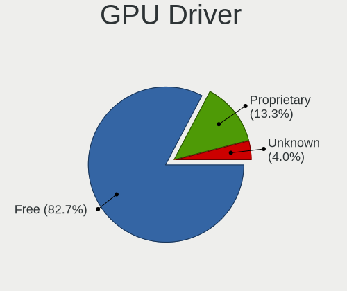
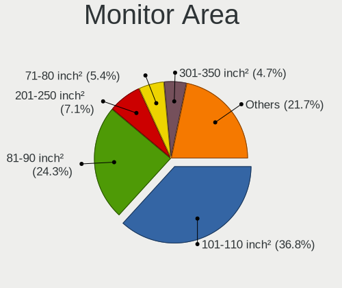
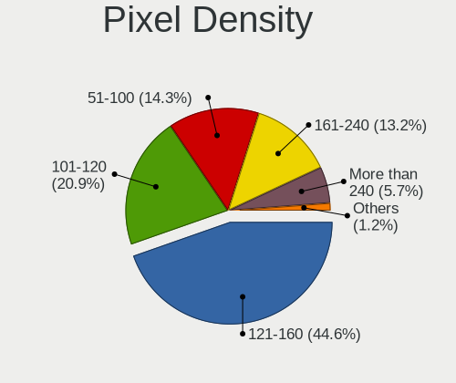

Fedora - Tested Hardware & Statistics (Notebooks)
-------------------------------------------------

A project to collect tested hardware configurations for Fedora.

Anyone can contribute to this report by the [hw-probe](https://github.com/linuxhw/hw-probe) tool:

    sudo -E hw-probe -all -upload

Please contribute! Especially if your hardware is rare.

Contents
--------

* [ Test Cases ](#test-cases)

* [ System ](#system)
  - [ OS                       ](#os)
  - [ OS Family                ](#os-family)
  - [ Kernel                   ](#kernel)
  - [ Kernel Family            ](#kernel-family)
  - [ Kernel Major Ver.        ](#kernel-major-ver)
  - [ Arch                     ](#arch)
  - [ DE                       ](#de)
  - [ Display Server           ](#display-server)
  - [ Display Manager          ](#display-manager)
  - [ OS Lang                  ](#os-lang)
  - [ Boot Mode                ](#boot-mode)
  - [ Filesystem               ](#filesystem)
  - [ Part. scheme             ](#part-scheme)
  - [ Dual Boot with Linux/BSD ](#dual-boot-with-linuxbsd)
  - [ Dual Boot (Win)          ](#dual-boot-win)

* [ Board ](#board)
  - [ Vendor                   ](#vendor)
  - [ Model                    ](#model)
  - [ Model Family             ](#model-family)
  - [ MFG Year                 ](#mfg-year)
  - [ Form Factor              ](#form-factor)
  - [ Secure Boot              ](#secure-boot)
  - [ Coreboot                 ](#coreboot)
  - [ RAM Size                 ](#ram-size)
  - [ RAM Used                 ](#ram-used)
  - [ Total Drives             ](#total-drives)
  - [ Has CD-ROM               ](#has-cd-rom)
  - [ Has Ethernet             ](#has-ethernet)
  - [ Has WiFi                 ](#has-wifi)
  - [ Has Bluetooth            ](#has-bluetooth)

* [ Location ](#location)
  - [ Country                  ](#country)
  - [ City                     ](#city)

* [ Drives ](#drives)
  - [ Drive Vendor             ](#drive-vendor)
  - [ Drive Model              ](#drive-model)
  - [ HDD Vendor               ](#hdd-vendor)
  - [ SSD Vendor               ](#ssd-vendor)
  - [ Drive Kind               ](#drive-kind)
  - [ Drive Connector          ](#drive-connector)
  - [ Drive Size               ](#drive-size)
  - [ Space Total              ](#space-total)
  - [ Space Used               ](#space-used)
  - [ Malfunc. Drives          ](#malfunc-drives)
  - [ Malfunc. Drive Vendor    ](#malfunc-drive-vendor)
  - [ Malfunc. HDD Vendor      ](#malfunc-hdd-vendor)
  - [ Malfunc. Drive Kind      ](#malfunc-drive-kind)
  - [ Failed Drives            ](#failed-drives)
  - [ Failed Drive Vendor      ](#failed-drive-vendor)
  - [ Drive Status             ](#drive-status)

* [ Storage controller ](#storage-controller)
  - [ Storage Vendor           ](#storage-vendor)
  - [ Storage Model            ](#storage-model)
  - [ Storage Kind             ](#storage-kind)

* [ Processor ](#processor)
  - [ CPU Vendor               ](#cpu-vendor)
  - [ CPU Model                ](#cpu-model)
  - [ CPU Model Family         ](#cpu-model-family)
  - [ CPU Cores                ](#cpu-cores)
  - [ CPU Sockets              ](#cpu-sockets)
  - [ CPU Threads              ](#cpu-threads)
  - [ CPU Op-Modes             ](#cpu-op-modes)
  - [ CPU Microcode            ](#cpu-microcode)
  - [ CPU Microarch            ](#cpu-microarch)

* [ Graphics ](#graphics)
  - [ GPU Vendor               ](#gpu-vendor)
  - [ GPU Model                ](#gpu-model)
  - [ GPU Combo                ](#gpu-combo)
  - [ GPU Driver               ](#gpu-driver)
  - [ GPU Memory               ](#gpu-memory)

* [ Monitor ](#monitor)
  - [ Monitor Vendor           ](#monitor-vendor)
  - [ Monitor Model            ](#monitor-model)
  - [ Monitor Resolution       ](#monitor-resolution)
  - [ Monitor Diagonal         ](#monitor-diagonal)
  - [ Monitor Width            ](#monitor-width)
  - [ Aspect Ratio             ](#aspect-ratio)
  - [ Monitor Area             ](#monitor-area)
  - [ Pixel Density            ](#pixel-density)
  - [ Multiple Monitors        ](#multiple-monitors)

* [ Network ](#network)
  - [ Net Controller Vendor    ](#net-controller-vendor)
  - [ Net Controller Model     ](#net-controller-model)
  - [ Wireless Vendor          ](#wireless-vendor)
  - [ Wireless Model           ](#wireless-model)
  - [ Ethernet Vendor          ](#ethernet-vendor)
  - [ Ethernet Model           ](#ethernet-model)
  - [ Net Controller Kind      ](#net-controller-kind)
  - [ Used Controller          ](#used-controller)
  - [ NICs                     ](#nics)
  - [ IPv6                     ](#ipv6)

* [ Bluetooth ](#bluetooth)
  - [ Bluetooth Vendor         ](#bluetooth-vendor)
  - [ Bluetooth Model          ](#bluetooth-model)

* [ Sound ](#sound)
  - [ Sound Vendor             ](#sound-vendor)
  - [ Sound Model              ](#sound-model)

* [ Memory ](#memory)
  - [ Memory Vendor            ](#memory-vendor)
  - [ Memory Model             ](#memory-model)
  - [ Memory Kind              ](#memory-kind)
  - [ Memory Form Factor       ](#memory-form-factor)
  - [ Memory Size              ](#memory-size)
  - [ Memory Speed             ](#memory-speed)

* [ Printers & scanners ](#printers--scanners)
  - [ Printer Vendor           ](#printer-vendor)
  - [ Printer Model            ](#printer-model)
  - [ Scanner Vendor           ](#scanner-vendor)
  - [ Scanner Model            ](#scanner-model)

* [ Camera ](#camera)
  - [ Camera Vendor            ](#camera-vendor)
  - [ Camera Model             ](#camera-model)

* [ Security ](#security)
  - [ Fingerprint Vendor       ](#fingerprint-vendor)
  - [ Fingerprint Model        ](#fingerprint-model)
  - [ Chipcard Vendor          ](#chipcard-vendor)
  - [ Chipcard Model           ](#chipcard-model)

* [ Unsupported ](#unsupported)
  - [ Unsupported Devices      ](#unsupported-devices)
  - [ Unsupported Device Types ](#unsupported-device-types)

Test Cases
----------

Total: 10316

| Vendor        | Model                       | Probe                                                      | Date         |
|---------------|-----------------------------|------------------------------------------------------------|--------------|
| Fujitsu       | LIFEBOOK E780               | [12c5cd0309](https://linux-hardware.org/?probe=12c5cd0309) | Jul 01, 2023 |
| Dell          | Inspiron N5110              | [b465607eea](https://linux-hardware.org/?probe=b465607eea) | Jun 30, 2023 |
| Acer          | Aspire A315-23              | [434ba90999](https://linux-hardware.org/?probe=434ba90999) | Jun 30, 2023 |
| HP            | ENVY m6                     | [b4f8d19895](https://linux-hardware.org/?probe=b4f8d19895) | Jun 30, 2023 |
| Dell          | Inspiron N5010              | [eab5331f66](https://linux-hardware.org/?probe=eab5331f66) | Jun 30, 2023 |
| ASUSTek       | VivoBook_ASUSLaptop M560... | [5dd37cbc97](https://linux-hardware.org/?probe=5dd37cbc97) | Jun 30, 2023 |
| Dell          | Inspiron N5110              | [0668932749](https://linux-hardware.org/?probe=0668932749) | Jun 30, 2023 |
| Google        | Eldrid                      | [4e08107dd6](https://linux-hardware.org/?probe=4e08107dd6) | Jun 30, 2023 |
| Dell          | Vostro 2520                 | [48d04d8282](https://linux-hardware.org/?probe=48d04d8282) | Jun 30, 2023 |
| Apple         | MacBookPro12,1              | [997b1fe1f8](https://linux-hardware.org/?probe=997b1fe1f8) | Jun 30, 2023 |
| HP            | Pavilion 11 x360 PC         | [cfbc8c8a97](https://linux-hardware.org/?probe=cfbc8c8a97) | Jun 29, 2023 |
| MSI           | PS63 Modern 8SC             | [dcbb8108cf](https://linux-hardware.org/?probe=dcbb8108cf) | Jun 29, 2023 |
| Dell          | Latitude 5521               | [3a8f3794aa](https://linux-hardware.org/?probe=3a8f3794aa) | Jun 29, 2023 |
| Lenovo        | ThinkPad X1 Carbon 2nd 2... | [df0ca94515](https://linux-hardware.org/?probe=df0ca94515) | Jun 29, 2023 |
| Lenovo        | ThinkBook 14p Gen 3 21EJ    | [0086cae258](https://linux-hardware.org/?probe=0086cae258) | Jun 29, 2023 |
| Google        | Nami                        | [6ffc403580](https://linux-hardware.org/?probe=6ffc403580) | Jun 29, 2023 |
| Acer          | Aspire 5745G                | [c3394b9eb0](https://linux-hardware.org/?probe=c3394b9eb0) | Jun 28, 2023 |
| Apple         | MacBookAir7,2               | [92a71d25d7](https://linux-hardware.org/?probe=92a71d25d7) | Jun 28, 2023 |
| ASUSTek       | ROG Zephyrus G15 GA502IV... | [76e11b36e9](https://linux-hardware.org/?probe=76e11b36e9) | Jun 28, 2023 |
| Acer          | Aspire A315-23              | [36f9eb51e6](https://linux-hardware.org/?probe=36f9eb51e6) | Jun 28, 2023 |
| Dell          | Precision M6500             | [1db851fd5d](https://linux-hardware.org/?probe=1db851fd5d) | Jun 28, 2023 |
| Dell          | XPS 15 9510                 | [0294ef5e1f](https://linux-hardware.org/?probe=0294ef5e1f) | Jun 28, 2023 |
| Lenovo        | G500s 20245                 | [1aa332e26f](https://linux-hardware.org/?probe=1aa332e26f) | Jun 27, 2023 |
| HP            | EliteBook 8440p             | [3d2a2196ae](https://linux-hardware.org/?probe=3d2a2196ae) | Jun 27, 2023 |
| HP            | Pavilion g6                 | [ec6a70b7d4](https://linux-hardware.org/?probe=ec6a70b7d4) | Jun 27, 2023 |
| Dell          | Inspiron 3543               | [4baea798b1](https://linux-hardware.org/?probe=4baea798b1) | Jun 27, 2023 |
| Intel Clie... | LAPRC710                    | [5aabe7850a](https://linux-hardware.org/?probe=5aabe7850a) | Jun 27, 2023 |
| Lenovo        | Legion 5 15ACH6H 82JU       | [c05a780b64](https://linux-hardware.org/?probe=c05a780b64) | Jun 27, 2023 |
| Lenovo        | IdeaPad Gaming 3 15ACH6 ... | [24d66c058b](https://linux-hardware.org/?probe=24d66c058b) | Jun 27, 2023 |
| ASUSTek       | TUF Gaming FX505DT_FX505... | [39ec9cf6c4](https://linux-hardware.org/?probe=39ec9cf6c4) | Jun 27, 2023 |
| Lenovo        | Yoga Slim 7 Carbon 13ITL... | [78b698279a](https://linux-hardware.org/?probe=78b698279a) | Jun 27, 2023 |
| HP            | ENVY Laptop 17-ch2xxx       | [41e22753cc](https://linux-hardware.org/?probe=41e22753cc) | Jun 27, 2023 |
| Lenovo        | ThinkPad Z13 Gen 1 21D20... | [7487f61ff1](https://linux-hardware.org/?probe=7487f61ff1) | Jun 26, 2023 |
| HP            | EliteBook 850 G8 Noteboo... | [e16689358e](https://linux-hardware.org/?probe=e16689358e) | Jun 26, 2023 |
| Lenovo        | ThinkPad X1 Carbon 6th 2... | [253fb546a2](https://linux-hardware.org/?probe=253fb546a2) | Jun 26, 2023 |
| Acer          | Nitro AN515-55              | [e5b49b2807](https://linux-hardware.org/?probe=e5b49b2807) | Jun 26, 2023 |
| Acer          | Nitro AN515-55              | [49c7e22c1e](https://linux-hardware.org/?probe=49c7e22c1e) | Jun 26, 2023 |
| Toshiba       | TECRA R950                  | [f02bb9a43a](https://linux-hardware.org/?probe=f02bb9a43a) | Jun 26, 2023 |
| ASUSTek       | X510UAR                     | [22372b435f](https://linux-hardware.org/?probe=22372b435f) | Jun 26, 2023 |
| Acer          | Aspire A515-51              | [ee5172b420](https://linux-hardware.org/?probe=ee5172b420) | Jun 26, 2023 |
| Lenovo        | IdeaPad L340-15API 81LW     | [03153f31b2](https://linux-hardware.org/?probe=03153f31b2) | Jun 26, 2023 |
| Lenovo        | ThinkPad T430 2349UA9       | [68117675ab](https://linux-hardware.org/?probe=68117675ab) | Jun 25, 2023 |
| HP            | Pavilion Laptop 14-bk0xx    | [e6184368a0](https://linux-hardware.org/?probe=e6184368a0) | Jun 25, 2023 |
| Lenovo        | Yoga Slim 7 13ACN5 82CY     | [bfa03ecd27](https://linux-hardware.org/?probe=bfa03ecd27) | Jun 25, 2023 |
| Lenovo        | ThinkPad X230 2324H58       | [bcf8a71bb4](https://linux-hardware.org/?probe=bcf8a71bb4) | Jun 25, 2023 |
| Lenovo        | Yoga Slim 7 13ACN5 82CY     | [58d1b3da16](https://linux-hardware.org/?probe=58d1b3da16) | Jun 25, 2023 |
| HP            | 255 G5 Notebook PC          | [cad891675f](https://linux-hardware.org/?probe=cad891675f) | Jun 25, 2023 |
| ASUSTek       | X540NA                      | [6a01ca36af](https://linux-hardware.org/?probe=6a01ca36af) | Jun 25, 2023 |
| ASUSTek       | X540NA                      | [b5996a0d85](https://linux-hardware.org/?probe=b5996a0d85) | Jun 25, 2023 |
| Lenovo        | ThinkPad X1 Carbon 6th 2... | [29203c5ffe](https://linux-hardware.org/?probe=29203c5ffe) | Jun 25, 2023 |
| HP            | OMEN by Laptop 16-c0xxx     | [3fbef5ec38](https://linux-hardware.org/?probe=3fbef5ec38) | Jun 25, 2023 |
| ASUSTek       | VivoBook_ASUSLaptop K650... | [8a833d8c52](https://linux-hardware.org/?probe=8a833d8c52) | Jun 25, 2023 |
| Acer          | Nitro AN515-55              | [2153f80362](https://linux-hardware.org/?probe=2153f80362) | Jun 25, 2023 |
| Lenovo        | V14 G2 ALC 82KC             | [40cbc38a69](https://linux-hardware.org/?probe=40cbc38a69) | Jun 25, 2023 |
| Google        | Nami                        | [f9f785f70d](https://linux-hardware.org/?probe=f9f785f70d) | Jun 25, 2023 |
| Lenovo        | ThinkPad T470s W10DG 20J... | [75f62d2200](https://linux-hardware.org/?probe=75f62d2200) | Jun 24, 2023 |
| Dell          | Precision 5510              | [38d61a4475](https://linux-hardware.org/?probe=38d61a4475) | Jun 24, 2023 |
| HP            | Pavilion Notebook           | [e80fd49ba9](https://linux-hardware.org/?probe=e80fd49ba9) | Jun 24, 2023 |
| Dell          | Vostro 2520                 | [9279842ec3](https://linux-hardware.org/?probe=9279842ec3) | Jun 24, 2023 |
| MSI           | Modern 14 A10M              | [fcc6786de6](https://linux-hardware.org/?probe=fcc6786de6) | Jun 24, 2023 |
| HP            | EliteBook 840 G5            | [4ad837baa7](https://linux-hardware.org/?probe=4ad837baa7) | Jun 24, 2023 |
| Dell          | Inspiron 15 3515            | [77473ea84c](https://linux-hardware.org/?probe=77473ea84c) | Jun 24, 2023 |
| Lenovo        | IdeaPad 5 14ABA7 82SE       | [99efa1a1c5](https://linux-hardware.org/?probe=99efa1a1c5) | Jun 24, 2023 |
| Lenovo        | Yoga Pro 7 14IRH8 82Y7      | [a74b5c2880](https://linux-hardware.org/?probe=a74b5c2880) | Jun 24, 2023 |
| HP            | Laptop 15s-eq2xxx           | [b4c9b0d1f7](https://linux-hardware.org/?probe=b4c9b0d1f7) | Jun 24, 2023 |
| Xplore        | iX104C6                     | [23bb4c656b](https://linux-hardware.org/?probe=23bb4c656b) | Jun 24, 2023 |
| Lenovo        | ThinkPad X1 Nano Gen 2 2... | [f51aeb6252](https://linux-hardware.org/?probe=f51aeb6252) | Jun 23, 2023 |
| Lenovo        | ThinkPad P15 Gen 1 20ST0... | [e44e80fc33](https://linux-hardware.org/?probe=e44e80fc33) | Jun 23, 2023 |
| Lenovo        | ThinkPad X1 Carbon 5th 2... | [7b187eac86](https://linux-hardware.org/?probe=7b187eac86) | Jun 23, 2023 |
| Lenovo        | IdeaPad L340-15IRH Gamin... | [ae40c874ae](https://linux-hardware.org/?probe=ae40c874ae) | Jun 23, 2023 |
| Lenovo        | IdeaPad L340-15IRH Gamin... | [505b340648](https://linux-hardware.org/?probe=505b340648) | Jun 23, 2023 |
| Lenovo        | ThinkPad T460s 20FAS0NF0... | [f2e368a70d](https://linux-hardware.org/?probe=f2e368a70d) | Jun 23, 2023 |
| Lenovo        | ThinkPad X1 Carbon 5th 2... | [06977283b8](https://linux-hardware.org/?probe=06977283b8) | Jun 22, 2023 |
| HP            | Compaq 6710b (GF940AT#AB... | [75199aaf80](https://linux-hardware.org/?probe=75199aaf80) | Jun 22, 2023 |
| HONOR         | NBR-WAX9                    | [dfeaf221e6](https://linux-hardware.org/?probe=dfeaf221e6) | Jun 22, 2023 |
| Positivo B... | VJFE43F11X-XXXXXX           | [e03310c8e8](https://linux-hardware.org/?probe=e03310c8e8) | Jun 22, 2023 |
| Lenovo        | G500s 20245                 | [17db397c48](https://linux-hardware.org/?probe=17db397c48) | Jun 22, 2023 |
| Lenovo        | ThinkPad E14 Gen 3 20Y70... | [aa0f45d3f1](https://linux-hardware.org/?probe=aa0f45d3f1) | Jun 22, 2023 |
| ASUSTek       | ROG Zephyrus G15 GA503RS... | [7782ddf809](https://linux-hardware.org/?probe=7782ddf809) | Jun 22, 2023 |
| Lenovo        | ThinkPad P15 Gen 1 20ST0... | [e8e25f684e](https://linux-hardware.org/?probe=e8e25f684e) | Jun 22, 2023 |
| Framework     | Laptop                      | [eb51a9a662](https://linux-hardware.org/?probe=eb51a9a662) | Jun 22, 2023 |
| Apple         | MacBookAir5,2               | [8f6d75c75e](https://linux-hardware.org/?probe=8f6d75c75e) | Jun 22, 2023 |
| TUXEDO        | Pulse 15 Gen2               | [8158959dbd](https://linux-hardware.org/?probe=8158959dbd) | Jun 22, 2023 |
| HP            | EliteBook 865 16 inch G9... | [e4407d328d](https://linux-hardware.org/?probe=e4407d328d) | Jun 22, 2023 |
| Lenovo        | ThinkPad L480 20LS002YMX    | [9c9702483c](https://linux-hardware.org/?probe=9c9702483c) | Jun 22, 2023 |
| ASUSTek       | ROG Zephyrus M15 GU502LU... | [a2e5b66940](https://linux-hardware.org/?probe=a2e5b66940) | Jun 22, 2023 |
| HP            | EliteBook 850 G6            | [a68e387274](https://linux-hardware.org/?probe=a68e387274) | Jun 21, 2023 |
| HUAWEI        | BOHK-WAX9X                  | [510604914c](https://linux-hardware.org/?probe=510604914c) | Jun 21, 2023 |
| HUAWEI        | BOHK-WAX9X                  | [ab169bfbfd](https://linux-hardware.org/?probe=ab169bfbfd) | Jun 21, 2023 |
| ASUSTek       | ZenBook UX425IA_UM425IA     | [61ba243843](https://linux-hardware.org/?probe=61ba243843) | Jun 21, 2023 |
| Lenovo        | ThinkPad T440p 20AWS02V0... | [bed60c3010](https://linux-hardware.org/?probe=bed60c3010) | Jun 21, 2023 |
| HUAWEI        | NBD-WXX9                    | [4e7d62b30a](https://linux-hardware.org/?probe=4e7d62b30a) | Jun 21, 2023 |
| HP            | ProBook 450 G2              | [60babdeb16](https://linux-hardware.org/?probe=60babdeb16) | Jun 21, 2023 |
| Lenovo        | IdeaPad 5 Pro 14ACN6 82L... | [e26b3e6d58](https://linux-hardware.org/?probe=e26b3e6d58) | Jun 21, 2023 |
| Lenovo        | IdeaPad 5 Pro 14ACN6 82L... | [0b6bb0a043](https://linux-hardware.org/?probe=0b6bb0a043) | Jun 21, 2023 |
| Notebook      | NV4xPZ                      | [873c70b184](https://linux-hardware.org/?probe=873c70b184) | Jun 21, 2023 |
| Lenovo        | Yoga Slim 7 Carbon 13ITL... | [73306c60af](https://linux-hardware.org/?probe=73306c60af) | Jun 21, 2023 |
| Dell          | Latitude E6410              | [0d9054df1e](https://linux-hardware.org/?probe=0d9054df1e) | Jun 21, 2023 |
| HP            | EliteBook 840 G6            | [8d35565fd3](https://linux-hardware.org/?probe=8d35565fd3) | Jun 20, 2023 |
| Dell          | XPS 13 9350                 | [3aa5f3f213](https://linux-hardware.org/?probe=3aa5f3f213) | Jun 20, 2023 |
| Lenovo        | ThinkBook 15 G4 IAP 21DJ    | [8550e224ec](https://linux-hardware.org/?probe=8550e224ec) | Jun 20, 2023 |
| Lenovo        | IdeaPad S540-14IWL 81ND     | [3be3d70197](https://linux-hardware.org/?probe=3be3d70197) | Jun 20, 2023 |
| Dell          | Latitude 5289               | [cb492423ed](https://linux-hardware.org/?probe=cb492423ed) | Jun 20, 2023 |
| MSI           | Modern 14 B4MW              | [11edb8696f](https://linux-hardware.org/?probe=11edb8696f) | Jun 20, 2023 |
| MSI           | Modern 14 B4MW              | [2df6a58651](https://linux-hardware.org/?probe=2df6a58651) | Jun 20, 2023 |
| Lenovo        | ThinkPad X1 Carbon 6th 2... | [1595a5adbd](https://linux-hardware.org/?probe=1595a5adbd) | Jun 20, 2023 |
| Lenovo        | Legion Y540-17IRH 81Q4      | [530f6272c9](https://linux-hardware.org/?probe=530f6272c9) | Jun 20, 2023 |
| ASUSTek       | VivoBook_ASUSLaptop K660... | [3e3987b43f](https://linux-hardware.org/?probe=3e3987b43f) | Jun 20, 2023 |
| Lenovo        | IdeaPad S340-15IIL 81VW     | [82927c0cb7](https://linux-hardware.org/?probe=82927c0cb7) | Jun 20, 2023 |
| HP            | Pavilion Laptop 14-bk0xx    | [063ce55dd5](https://linux-hardware.org/?probe=063ce55dd5) | Jun 20, 2023 |
| ASUSTek       | ROG Zephyrus G14 GA401IV... | [e5db90d1b4](https://linux-hardware.org/?probe=e5db90d1b4) | Jun 20, 2023 |
| HP            | EliteBook 840 G6            | [058b2ea405](https://linux-hardware.org/?probe=058b2ea405) | Jun 20, 2023 |
| Lenovo        | Legion 5 15ACH6A 82NW       | [f38684c33d](https://linux-hardware.org/?probe=f38684c33d) | Jun 19, 2023 |
| Dell          | Latitude E7470              | [645538d81e](https://linux-hardware.org/?probe=645538d81e) | Jun 19, 2023 |
| Dell          | XPS 15 9510                 | [27bfb2de7d](https://linux-hardware.org/?probe=27bfb2de7d) | Jun 19, 2023 |
| Toshiba       | Satellite A300              | [f37d67a18d](https://linux-hardware.org/?probe=f37d67a18d) | Jun 19, 2023 |
| Acer          | Aspire A515-46              | [e40e63fa5f](https://linux-hardware.org/?probe=e40e63fa5f) | Jun 19, 2023 |
| Lenovo        | Legion R7000P2021 82JW      | [df59b5e8b7](https://linux-hardware.org/?probe=df59b5e8b7) | Jun 19, 2023 |
| Lenovo        | ThinkPad P53 20QN0011IV     | [65385cc189](https://linux-hardware.org/?probe=65385cc189) | Jun 19, 2023 |
| Lenovo        | Legion 5 82B5               | [146ef72817](https://linux-hardware.org/?probe=146ef72817) | Jun 19, 2023 |
| HP            | ENVY 15                     | [101fb8810b](https://linux-hardware.org/?probe=101fb8810b) | Jun 19, 2023 |
| Lenovo        | Yoga 3 Pro-1370 80HE        | [125b4fefa5](https://linux-hardware.org/?probe=125b4fefa5) | Jun 19, 2023 |
| Razer         | Blade 15 Advanced Model ... | [7dd15a9fa4](https://linux-hardware.org/?probe=7dd15a9fa4) | Jun 19, 2023 |
| HP            | Pavilion Laptop 15-eg2xx... | [8a88cbb916](https://linux-hardware.org/?probe=8a88cbb916) | Jun 19, 2023 |
| Lenovo        | ThinkPad E14 Gen 3 20Y70... | [0806a6be0a](https://linux-hardware.org/?probe=0806a6be0a) | Jun 19, 2023 |
| HP            | Pavilion Notebook           | [ce3c5bc056](https://linux-hardware.org/?probe=ce3c5bc056) | Jun 18, 2023 |
| Dell          | Inspiron 5559               | [7dc6f3af4b](https://linux-hardware.org/?probe=7dc6f3af4b) | Jun 18, 2023 |
| HP            | Pavilion Laptop 15-cc6xx    | [ecf90f8368](https://linux-hardware.org/?probe=ecf90f8368) | Jun 18, 2023 |
| Dell          | Precision 7540              | [8b9ddcc1d8](https://linux-hardware.org/?probe=8b9ddcc1d8) | Jun 18, 2023 |
| Lenovo        | IdeaPad 5 Pro 14ACN6 82L... | [50626f77d7](https://linux-hardware.org/?probe=50626f77d7) | Jun 18, 2023 |
| MSI           | PS63 Modern 8RC             | [f540e88555](https://linux-hardware.org/?probe=f540e88555) | Jun 18, 2023 |
| Google        | Kefka                       | [86421e3d29](https://linux-hardware.org/?probe=86421e3d29) | Jun 18, 2023 |
| Lenovo        | IdeaPad 3 15ITL6 82H8       | [d5c387d28e](https://linux-hardware.org/?probe=d5c387d28e) | Jun 18, 2023 |
| Acer          | Aspire E5-574               | [ca656065e5](https://linux-hardware.org/?probe=ca656065e5) | Jun 17, 2023 |
| Dell          | XPS 13 9370                 | [f008a78339](https://linux-hardware.org/?probe=f008a78339) | Jun 17, 2023 |
| Dell          | Inspiron 5567               | [92ace6e5ab](https://linux-hardware.org/?probe=92ace6e5ab) | Jun 17, 2023 |
| HP            | Laptop 15-da0xxx            | [7da8691a87](https://linux-hardware.org/?probe=7da8691a87) | Jun 17, 2023 |
| Sony          | SVF15213CBW                 | [4fcc62d3ac](https://linux-hardware.org/?probe=4fcc62d3ac) | Jun 17, 2023 |
| HP            | Pavilion Gaming Laptop      | [2d5c5b2c80](https://linux-hardware.org/?probe=2d5c5b2c80) | Jun 17, 2023 |
| Framework     | Laptop                      | [3df2b82bc3](https://linux-hardware.org/?probe=3df2b82bc3) | Jun 17, 2023 |
| HP            | Pavilion Gaming Laptop 1... | [d7e9625e19](https://linux-hardware.org/?probe=d7e9625e19) | Jun 17, 2023 |
| Dell          | Inspiron 3593               | [46ad2c78f7](https://linux-hardware.org/?probe=46ad2c78f7) | Jun 17, 2023 |
| Google        | Cave                        | [31c31973e1](https://linux-hardware.org/?probe=31c31973e1) | Jun 17, 2023 |
| Apple         | MacBook6,1                  | [913d8d26b9](https://linux-hardware.org/?probe=913d8d26b9) | Jun 17, 2023 |
| ASUSTek       | VivoBook_ASUSLaptop K340... | [edd82d072b](https://linux-hardware.org/?probe=edd82d072b) | Jun 16, 2023 |
| Lenovo        | Legion 5 15ACH6A 82NW       | [268b733c44](https://linux-hardware.org/?probe=268b733c44) | Jun 16, 2023 |
| HP            | EliteBook 820 G1            | [4c6361a099](https://linux-hardware.org/?probe=4c6361a099) | Jun 16, 2023 |
| HP            | Laptop 15-bw0xx             | [1b97aa6745](https://linux-hardware.org/?probe=1b97aa6745) | Jun 16, 2023 |
| Lenovo        | ThinkBook 14-IIL 20SL       | [04329cdc14](https://linux-hardware.org/?probe=04329cdc14) | Jun 16, 2023 |
| Lenovo        | Legion 5 Pro 16ACH6H 82J... | [dc892cf2b0](https://linux-hardware.org/?probe=dc892cf2b0) | Jun 16, 2023 |
| Dell          | Latitude 3420               | [a0074970bf](https://linux-hardware.org/?probe=a0074970bf) | Jun 16, 2023 |
| HP            | Pavilion Plus Laptop 14-... | [eb9232a196](https://linux-hardware.org/?probe=eb9232a196) | Jun 16, 2023 |
| MSI           | Prestige 15 A10SC           | [a2426b801a](https://linux-hardware.org/?probe=a2426b801a) | Jun 16, 2023 |
| ASUSTek       | ROG Strix G512LW_G512LW     | [a6a2463b97](https://linux-hardware.org/?probe=a6a2463b97) | Jun 16, 2023 |
| HP            | OMEN by Laptop 15-ce0xx     | [89ac5ef04b](https://linux-hardware.org/?probe=89ac5ef04b) | Jun 15, 2023 |
| Acer          | Swift SF114-34              | [32eb9f5dea](https://linux-hardware.org/?probe=32eb9f5dea) | Jun 15, 2023 |
| Acer          | Swift SF114-34              | [9f9ffda2e3](https://linux-hardware.org/?probe=9f9ffda2e3) | Jun 15, 2023 |
| Lenovo        | IdeaPad 5 Pro 16ARH7 82S... | [2346d706e3](https://linux-hardware.org/?probe=2346d706e3) | Jun 15, 2023 |
| MSI           | Modern 14 B10MW             | [c488929cdc](https://linux-hardware.org/?probe=c488929cdc) | Jun 15, 2023 |
| Dell          | XPS 13 9310                 | [9cba8f7730](https://linux-hardware.org/?probe=9cba8f7730) | Jun 15, 2023 |
| HP            | Laptop 15s-fq0xxx           | [ff98efdef7](https://linux-hardware.org/?probe=ff98efdef7) | Jun 15, 2023 |
| Lenovo        | IdeaPad 5 Pro 14IAP7 82S... | [dd5aaca858](https://linux-hardware.org/?probe=dd5aaca858) | Jun 15, 2023 |
| Lenovo        | G500s 20245                 | [8a04ec65f7](https://linux-hardware.org/?probe=8a04ec65f7) | Jun 15, 2023 |
| Dell          | Latitude E7470              | [c4bd47b182](https://linux-hardware.org/?probe=c4bd47b182) | Jun 15, 2023 |
| Lenovo        | ThinkPad L14 Gen 2a 20X6... | [e3e61eef7a](https://linux-hardware.org/?probe=e3e61eef7a) | Jun 15, 2023 |
| ASUSTek       | ROG Strix G512LW_G512LW     | [b9d120642c](https://linux-hardware.org/?probe=b9d120642c) | Jun 14, 2023 |
| Dell          | Latitude 7430               | [6cf1c68c1d](https://linux-hardware.org/?probe=6cf1c68c1d) | Jun 14, 2023 |
| Dell          | Inspiron M5010              | [33541731e3](https://linux-hardware.org/?probe=33541731e3) | Jun 14, 2023 |
| Lenovo        | ThinkBook 14-IIL 20SL       | [6f4c06d514](https://linux-hardware.org/?probe=6f4c06d514) | Jun 14, 2023 |
| HP            | ProBook 455 G8 Notebook ... | [57b3c23d43](https://linux-hardware.org/?probe=57b3c23d43) | Jun 14, 2023 |
| Lenovo        | IdeaPad 330-15IKB 81DE      | [e676294e36](https://linux-hardware.org/?probe=e676294e36) | Jun 13, 2023 |
| Acer          | Aspire 5733                 | [6291133649](https://linux-hardware.org/?probe=6291133649) | Jun 13, 2023 |
| HP            | Pavilion Laptop 15-cs2xx... | [58b9a1f862](https://linux-hardware.org/?probe=58b9a1f862) | Jun 13, 2023 |
| HP            | Notebook                    | [64232e0a08](https://linux-hardware.org/?probe=64232e0a08) | Jun 13, 2023 |
| Google        | Blooglet                    | [3dedc16acb](https://linux-hardware.org/?probe=3dedc16acb) | Jun 13, 2023 |
| Dell          | XPS 17 9710                 | [9ab7a065c4](https://linux-hardware.org/?probe=9ab7a065c4) | Jun 13, 2023 |
| Lenovo        | IdeaPad Gaming 3 15ARH05... | [dc3b9443ef](https://linux-hardware.org/?probe=dc3b9443ef) | Jun 13, 2023 |
| Lenovo        | ThinkPad E14 Gen 2 20TA0... | [ee5c72c283](https://linux-hardware.org/?probe=ee5c72c283) | Jun 13, 2023 |
| Lenovo        | ThinkPad E14 Gen 2 20TA0... | [db48a7b38d](https://linux-hardware.org/?probe=db48a7b38d) | Jun 13, 2023 |
| Lenovo        | Yoga Slim 7 Carbon 13ITL... | [5eb605a720](https://linux-hardware.org/?probe=5eb605a720) | Jun 13, 2023 |
| Dell          | Latitude 7430               | [6a01453dfa](https://linux-hardware.org/?probe=6a01453dfa) | Jun 12, 2023 |
| Acer          | Aspire ES1-572              | [e6713db4c3](https://linux-hardware.org/?probe=e6713db4c3) | Jun 12, 2023 |
| Lenovo        | ThinkPad W541 20EGS15J0N    | [ba935e9d5c](https://linux-hardware.org/?probe=ba935e9d5c) | Jun 12, 2023 |
| Lenovo        | V14-ARE 82DQ                | [318f1f4d2a](https://linux-hardware.org/?probe=318f1f4d2a) | Jun 12, 2023 |
| Lenovo        | ThinkPad X1 Nano Gen 2 2... | [edf817eef9](https://linux-hardware.org/?probe=edf817eef9) | Jun 12, 2023 |
| Lenovo        | ThinkPad X1 Nano Gen 2 2... | [5c98700539](https://linux-hardware.org/?probe=5c98700539) | Jun 12, 2023 |
| Lenovo        | ThinkPad P15 Gen 2i 20YQ... | [d183d47822](https://linux-hardware.org/?probe=d183d47822) | Jun 12, 2023 |
| HP            | Pavilion dm4                | [6eb4c3d87a](https://linux-hardware.org/?probe=6eb4c3d87a) | Jun 12, 2023 |
| HP            | Pavilion Gaming Laptop 1... | [eb6dc5143e](https://linux-hardware.org/?probe=eb6dc5143e) | Jun 12, 2023 |
| Timi          | RedmiBook Pro 14            | [7b2e093b24](https://linux-hardware.org/?probe=7b2e093b24) | Jun 12, 2023 |
| Google        | Blorb                       | [0083999b8a](https://linux-hardware.org/?probe=0083999b8a) | Jun 12, 2023 |
| Lenovo        | IdeaPad 330S-14IKB 81F4     | [b9c83e1b8a](https://linux-hardware.org/?probe=b9c83e1b8a) | Jun 12, 2023 |
| Google        | Blorb                       | [516c0548dc](https://linux-hardware.org/?probe=516c0548dc) | Jun 12, 2023 |
| Acer          | Aspire E5-575G              | [90bcfaba60](https://linux-hardware.org/?probe=90bcfaba60) | Jun 12, 2023 |
| Apple         | MacBookPro8,1               | [ec6af41f13](https://linux-hardware.org/?probe=ec6af41f13) | Jun 11, 2023 |
| ASUSTek       | VivoBook_ASUSLaptop X513... | [0d07b35562](https://linux-hardware.org/?probe=0d07b35562) | Jun 11, 2023 |
| Dell          | G3 3579                     | [c04bf46d3e](https://linux-hardware.org/?probe=c04bf46d3e) | Jun 11, 2023 |
| Lenovo        | ThinkPad E560 20EVCTO1WW    | [777f28f9e8](https://linux-hardware.org/?probe=777f28f9e8) | Jun 11, 2023 |
| HP            | Pavilion Laptop 14-ec1xx... | [66aa96212a](https://linux-hardware.org/?probe=66aa96212a) | Jun 11, 2023 |
| Dell          | Inspiron 3583               | [f3a04ea109](https://linux-hardware.org/?probe=f3a04ea109) | Jun 11, 2023 |
| Dell          | Inspiron 3583               | [d9ad875572](https://linux-hardware.org/?probe=d9ad875572) | Jun 11, 2023 |
| Apple         | MacBookPro12,1              | [7e6a1fa5ff](https://linux-hardware.org/?probe=7e6a1fa5ff) | Jun 11, 2023 |
| MSI           | Modern 14 A10M              | [7d5fc6a209](https://linux-hardware.org/?probe=7d5fc6a209) | Jun 11, 2023 |
| Lenovo        | Legion Slim 7 16IRH8 82Y... | [e9e79a1c3b](https://linux-hardware.org/?probe=e9e79a1c3b) | Jun 11, 2023 |
| Lenovo        | ThinkPad P1 20MD001VUS      | [c74425abce](https://linux-hardware.org/?probe=c74425abce) | Jun 11, 2023 |
| Acer          | Aspire A515-47              | [2838a84809](https://linux-hardware.org/?probe=2838a84809) | Jun 11, 2023 |
| Dell          | Latitude 3420               | [07061e9d7d](https://linux-hardware.org/?probe=07061e9d7d) | Jun 10, 2023 |
| ASUSTek       | X541UVK                     | [22a8a9d964](https://linux-hardware.org/?probe=22a8a9d964) | Jun 10, 2023 |
| Apple         | MacBookAir5,2               | [18e80281cc](https://linux-hardware.org/?probe=18e80281cc) | Jun 10, 2023 |
| Samsung       | 730QCJ/730QCR               | [96b21d42f1](https://linux-hardware.org/?probe=96b21d42f1) | Jun 10, 2023 |
| Apple         | MacBookAir5,2               | [f7bd03dbb9](https://linux-hardware.org/?probe=f7bd03dbb9) | Jun 10, 2023 |
| Lenovo        | G580 ChiefRiver Platform    | [ac48eeb92c](https://linux-hardware.org/?probe=ac48eeb92c) | Jun 10, 2023 |
| Lenovo        | G580 ChiefRiver Platform    | [ade15528d8](https://linux-hardware.org/?probe=ade15528d8) | Jun 10, 2023 |
| HP            | Pavilion Laptop 14-ec1xx... | [1eeb12a5ca](https://linux-hardware.org/?probe=1eeb12a5ca) | Jun 10, 2023 |
| HP            | Pavilion Laptop 14-ec1xx... | [e46f2fe66e](https://linux-hardware.org/?probe=e46f2fe66e) | Jun 10, 2023 |
| HP            | ENVY Laptop 13-ad1xx        | [1de48a4515](https://linux-hardware.org/?probe=1de48a4515) | Jun 10, 2023 |
| HP            | ZBook 15 G2                 | [68c941fe5d](https://linux-hardware.org/?probe=68c941fe5d) | Jun 10, 2023 |
| Toshiba       | PORTEGE Z10t-A              | [4a0712b322](https://linux-hardware.org/?probe=4a0712b322) | Jun 10, 2023 |
| Apple         | MacBookPro13,2              | [929c318674](https://linux-hardware.org/?probe=929c318674) | Jun 10, 2023 |
| Lenovo        | IdeaPad 3 15ITL6 82H8       | [1a36e2fa98](https://linux-hardware.org/?probe=1a36e2fa98) | Jun 10, 2023 |
| Dell          | Inspiron 5515               | [36016c0c6b](https://linux-hardware.org/?probe=36016c0c6b) | Jun 10, 2023 |
| HUAWEI        | BOD-WXX9                    | [c4063bcf07](https://linux-hardware.org/?probe=c4063bcf07) | Jun 09, 2023 |
| HUAWEI        | BOD-WXX9                    | [9016ad81ae](https://linux-hardware.org/?probe=9016ad81ae) | Jun 09, 2023 |
| HP            | Laptop 15-db0xxx            | [881d5dc409](https://linux-hardware.org/?probe=881d5dc409) | Jun 09, 2023 |
| HP            | ZBook 15 G2                 | [2851b41659](https://linux-hardware.org/?probe=2851b41659) | Jun 09, 2023 |
| Lenovo        | IdeaPad L340-15API 81LW     | [1794287cf0](https://linux-hardware.org/?probe=1794287cf0) | Jun 09, 2023 |
| Lenovo        | ThinkPad P1 20MD001VUS      | [9765261d02](https://linux-hardware.org/?probe=9765261d02) | Jun 09, 2023 |
| Lenovo        | ThinkPad T460 20FN002JUS    | [8cc29c049e](https://linux-hardware.org/?probe=8cc29c049e) | Jun 09, 2023 |
| Lenovo        | ThinkPad P53 20QN0011IV     | [9e3dfb25be](https://linux-hardware.org/?probe=9e3dfb25be) | Jun 09, 2023 |
| Dell          | XPS 13 9370                 | [c605e51eca](https://linux-hardware.org/?probe=c605e51eca) | Jun 09, 2023 |
| HP            | Laptop 15-db0xxx            | [5dd8c1fed8](https://linux-hardware.org/?probe=5dd8c1fed8) | Jun 09, 2023 |
| Lenovo        | IdeaPad 5 14ARE05 81YM      | [e246e70bb6](https://linux-hardware.org/?probe=e246e70bb6) | Jun 09, 2023 |
| Lenovo        | Yoga Slim 7 Carbon 13ITL... | [27c0e57cb3](https://linux-hardware.org/?probe=27c0e57cb3) | Jun 09, 2023 |
| Dell          | Inspiron 3493               | [ffcd21fc3b](https://linux-hardware.org/?probe=ffcd21fc3b) | Jun 09, 2023 |
| Dell          | Precision 7540              | [41fe2f93ff](https://linux-hardware.org/?probe=41fe2f93ff) | Jun 09, 2023 |
| Apple         | MacBookPro9,2               | [c22081b097](https://linux-hardware.org/?probe=c22081b097) | Jun 09, 2023 |
| Apple         | MacBookPro8,1               | [70fea7478a](https://linux-hardware.org/?probe=70fea7478a) | Jun 08, 2023 |
| Dell          | Latitude 5175               | [63d6fcf641](https://linux-hardware.org/?probe=63d6fcf641) | Jun 08, 2023 |
| Lenovo        | ThinkPad E14 20RA0016GE     | [4c8d8758b7](https://linux-hardware.org/?probe=4c8d8758b7) | Jun 08, 2023 |
| HUAWEI        | NBLK-WAX9X                  | [e28668e147](https://linux-hardware.org/?probe=e28668e147) | Jun 08, 2023 |
| ASUSTek       | VivoBook_ASUSLaptop M350... | [59ff5486a9](https://linux-hardware.org/?probe=59ff5486a9) | Jun 08, 2023 |
| HP            | 240 G6 Notebook PC          | [eda13b898c](https://linux-hardware.org/?probe=eda13b898c) | Jun 08, 2023 |
| ASUSTek       | ROG Strix G713PI_G713PI     | [13b0e73872](https://linux-hardware.org/?probe=13b0e73872) | Jun 08, 2023 |
| TUXEDO        | Stellaris Intel Gen4        | [e6cb646bd4](https://linux-hardware.org/?probe=e6cb646bd4) | Jun 08, 2023 |
| HP            | OMEN by Laptop 16-c0xxx     | [6de4ea13fe](https://linux-hardware.org/?probe=6de4ea13fe) | Jun 08, 2023 |
| Lenovo        | Legion S7 15ACH6 82K8       | [8f160a999a](https://linux-hardware.org/?probe=8f160a999a) | Jun 08, 2023 |
| Lenovo        | Legion 5 15ACH6A 82NW       | [0aea375d78](https://linux-hardware.org/?probe=0aea375d78) | Jun 08, 2023 |
| Dell          | Precision 3551              | [0e484bd6a5](https://linux-hardware.org/?probe=0e484bd6a5) | Jun 08, 2023 |
| HP            | Pavilion g6                 | [12b1174ce8](https://linux-hardware.org/?probe=12b1174ce8) | Jun 08, 2023 |
| Lenovo        | ThinkPad P14s Gen 2a 21A... | [7543a0bbc1](https://linux-hardware.org/?probe=7543a0bbc1) | Jun 08, 2023 |
| Dell          | Precision 5510              | [24317d94ff](https://linux-hardware.org/?probe=24317d94ff) | Jun 08, 2023 |
| Lenovo        | ThinkPad T580 20L90047US    | [bee34052a3](https://linux-hardware.org/?probe=bee34052a3) | Jun 08, 2023 |
| HP            | Pavilion Aero Laptop 13-... | [9c9fb1b1a6](https://linux-hardware.org/?probe=9c9fb1b1a6) | Jun 08, 2023 |
| Lenovo        | IdeaPad 3 15ITL6 82H8       | [82d0019a0b](https://linux-hardware.org/?probe=82d0019a0b) | Jun 08, 2023 |
| Dell          | Inspiron 5505               | [05973f7d9b](https://linux-hardware.org/?probe=05973f7d9b) | Jun 08, 2023 |
| Unknown       | Unknown                     | [829839a3b3](https://linux-hardware.org/?probe=829839a3b3) | Jun 07, 2023 |
| Dell          | Inspiron 15 5510            | [98d7cb7ea7](https://linux-hardware.org/?probe=98d7cb7ea7) | Jun 07, 2023 |
| Dell          | Inspiron 5565               | [91fc26029a](https://linux-hardware.org/?probe=91fc26029a) | Jun 07, 2023 |
| Lenovo        | ThinkPad E15 Gen 4 21EES... | [06608c68d7](https://linux-hardware.org/?probe=06608c68d7) | Jun 07, 2023 |
| Fujitsu       | CELSIUS H730                | [a1e397f4a7](https://linux-hardware.org/?probe=a1e397f4a7) | Jun 07, 2023 |
| HP            | Pavilion dv7                | [75a37cd4c8](https://linux-hardware.org/?probe=75a37cd4c8) | Jun 07, 2023 |
| Dell          | Inspiron 5548               | [e67581e121](https://linux-hardware.org/?probe=e67581e121) | Jun 07, 2023 |
| Apple         | MacBookPro9,2               | [2a0add5b7e](https://linux-hardware.org/?probe=2a0add5b7e) | Jun 07, 2023 |
| HP            | Pavilion Laptop 15-eg3xx... | [e103817b2d](https://linux-hardware.org/?probe=e103817b2d) | Jun 07, 2023 |
| Lenovo        | ThinkPad T590 20N5S2NC0F    | [581602e921](https://linux-hardware.org/?probe=581602e921) | Jun 07, 2023 |
| Dell          | Latitude 5300               | [1eea10cfa3](https://linux-hardware.org/?probe=1eea10cfa3) | Jun 07, 2023 |
| Lenovo        | Yoga Pro 9 14IRP8 83BU      | [7d33fb0564](https://linux-hardware.org/?probe=7d33fb0564) | Jun 07, 2023 |
| Lenovo        | Yoga Slim 7 Carbon 13ITL... | [b6bb7bad1d](https://linux-hardware.org/?probe=b6bb7bad1d) | Jun 07, 2023 |
| Apple         | MacBookPro9,2               | [8d70c1dd42](https://linux-hardware.org/?probe=8d70c1dd42) | Jun 07, 2023 |
| Acer          | Predator PH315-52           | [f7178495c7](https://linux-hardware.org/?probe=f7178495c7) | Jun 07, 2023 |
| Acer          | Aspire E5-411G              | [9a69b50d97](https://linux-hardware.org/?probe=9a69b50d97) | Jun 07, 2023 |
| Lenovo        | ThinkPad T14 Gen 1 20S1S... | [f9b3588ff3](https://linux-hardware.org/?probe=f9b3588ff3) | Jun 07, 2023 |
| Lenovo        | ThinkPad T495 20NKS10K00    | [f205c52b8f](https://linux-hardware.org/?probe=f205c52b8f) | Jun 07, 2023 |
| MSI           | GT72 2QE                    | [211494a051](https://linux-hardware.org/?probe=211494a051) | Jun 07, 2023 |
| Lenovo        | ThinkPad P1 20MD001VUS      | [8c505b5d84](https://linux-hardware.org/?probe=8c505b5d84) | Jun 06, 2023 |
| Lenovo        | ThinkPad X270 W10DG 20K5... | [9afe34cdd8](https://linux-hardware.org/?probe=9afe34cdd8) | Jun 06, 2023 |
| ASUSTek       | VivoBook_ASUSLaptop X512... | [b7ab29fbb5](https://linux-hardware.org/?probe=b7ab29fbb5) | Jun 06, 2023 |
| ASUSTek       | ZenBook UX325JA_UX325JA     | [721ff5908a](https://linux-hardware.org/?probe=721ff5908a) | Jun 06, 2023 |
| Toshiba       | Satellite L40               | [16c5f74991](https://linux-hardware.org/?probe=16c5f74991) | Jun 06, 2023 |
| Apple         | MacBookPro14,1              | [16aa33fdfe](https://linux-hardware.org/?probe=16aa33fdfe) | Jun 06, 2023 |
| Lenovo        | ThinkPad W520 4282AB9       | [790550e99f](https://linux-hardware.org/?probe=790550e99f) | Jun 06, 2023 |
| Lenovo        | ThinkPad T460 20FMS2292K    | [380ffe6574](https://linux-hardware.org/?probe=380ffe6574) | Jun 06, 2023 |
| Dell          | XPS 15 9560                 | [0d326774c9](https://linux-hardware.org/?probe=0d326774c9) | Jun 06, 2023 |
| Lenovo        | ThinkPad P51 20HH0011US     | [4766608bc1](https://linux-hardware.org/?probe=4766608bc1) | Jun 06, 2023 |
| Apple         | MacBookPro9,2               | [7394a9d94b](https://linux-hardware.org/?probe=7394a9d94b) | Jun 06, 2023 |
| HP            | Pavilion Laptop 15-eg3xx... | [2a612dc748](https://linux-hardware.org/?probe=2a612dc748) | Jun 06, 2023 |
| Apple         | MacBookPro9,2               | [9df43aede5](https://linux-hardware.org/?probe=9df43aede5) | Jun 06, 2023 |
| Lenovo        | ThinkPad P50 20EN001SUS     | [77b332cb2d](https://linux-hardware.org/?probe=77b332cb2d) | Jun 06, 2023 |
| System76      | Oryx Pro                    | [4f39b2d690](https://linux-hardware.org/?probe=4f39b2d690) | Jun 06, 2023 |
| Lenovo        | ThinkPad X1 Carbon Gen 9... | [0deafae1f1](https://linux-hardware.org/?probe=0deafae1f1) | Jun 05, 2023 |
| realme        | CloudProXXXX                | [22cced9066](https://linux-hardware.org/?probe=22cced9066) | Jun 05, 2023 |
| Acer          | Nitro AN515-44              | [d7a2c59432](https://linux-hardware.org/?probe=d7a2c59432) | Jun 05, 2023 |
| Dell          | Latitude E7450              | [e19dbd1a84](https://linux-hardware.org/?probe=e19dbd1a84) | Jun 05, 2023 |
| Dell          | XPS 13 9305                 | [78459738e9](https://linux-hardware.org/?probe=78459738e9) | Jun 05, 2023 |
| Lenovo        | ThinkPad S1 Yoga 20CD003... | [9a1c9022af](https://linux-hardware.org/?probe=9a1c9022af) | Jun 05, 2023 |
| Lenovo        | ThinkPad P53 20QN0011IV     | [bb29d15c61](https://linux-hardware.org/?probe=bb29d15c61) | Jun 05, 2023 |
| Acer          | Predator PT515-51           | [5c3daec3c7](https://linux-hardware.org/?probe=5c3daec3c7) | Jun 05, 2023 |
| GPU Compan... | GWTC116-2                   | [de8a3d6dab](https://linux-hardware.org/?probe=de8a3d6dab) | Jun 05, 2023 |
| Samsung       | 950XEE                      | [cc47fd0df0](https://linux-hardware.org/?probe=cc47fd0df0) | Jun 05, 2023 |
| Lenovo        | ThinkPad E450 20DC003WUS    | [6abecb1cd3](https://linux-hardware.org/?probe=6abecb1cd3) | Jun 05, 2023 |
| ASUSTek       | X540UP                      | [b6613930a2](https://linux-hardware.org/?probe=b6613930a2) | Jun 05, 2023 |
| Dell          | Precision 7540              | [a10ecca056](https://linux-hardware.org/?probe=a10ecca056) | Jun 04, 2023 |
| Sony          | VPCSC1AFM                   | [2cf80cf628](https://linux-hardware.org/?probe=2cf80cf628) | Jun 04, 2023 |
| Apple         | MacBookPro8,1               | [e3f89d1faa](https://linux-hardware.org/?probe=e3f89d1faa) | Jun 04, 2023 |
| ASUSTek       | X540UP                      | [5102ecc266](https://linux-hardware.org/?probe=5102ecc266) | Jun 04, 2023 |
| MECHREVO      | Code01 Ver2.0               | [d311022361](https://linux-hardware.org/?probe=d311022361) | Jun 04, 2023 |
| MSI           | Modern 14 C12M              | [a5d1a0e656](https://linux-hardware.org/?probe=a5d1a0e656) | Jun 04, 2023 |
| ASUSTek       | VivoBook_ASUSLaptop X571... | [dfb8881ffe](https://linux-hardware.org/?probe=dfb8881ffe) | Jun 04, 2023 |
| HP            | Laptop 17-cp0xxx            | [253c561829](https://linux-hardware.org/?probe=253c561829) | Jun 04, 2023 |
| AMI           | Intel                       | [cd2beb79d2](https://linux-hardware.org/?probe=cd2beb79d2) | Jun 04, 2023 |
| UNOWHY        | Y13G002S4EI                 | [f1b932f397](https://linux-hardware.org/?probe=f1b932f397) | Jun 04, 2023 |
| Lenovo        | B570 HuronRiver Platform    | [43cffb0d0f](https://linux-hardware.org/?probe=43cffb0d0f) | Jun 04, 2023 |
| Lenovo        | B570 HuronRiver Platform    | [cef2bf28c9](https://linux-hardware.org/?probe=cef2bf28c9) | Jun 04, 2023 |
| Dell          | Latitude D620               | [0e1b7f4320](https://linux-hardware.org/?probe=0e1b7f4320) | Jun 03, 2023 |
| HP            | ZBook 15 G2                 | [19ed8e22e6](https://linux-hardware.org/?probe=19ed8e22e6) | Jun 03, 2023 |
| Apple         | MacBookPro8,1               | [7bdff81d7d](https://linux-hardware.org/?probe=7bdff81d7d) | Jun 03, 2023 |
| Lenovo        | Yoga Slim 7 Carbon 13ITL... | [f241c0cf38](https://linux-hardware.org/?probe=f241c0cf38) | Jun 03, 2023 |
| Lenovo        | Yoga Slim 7 Carbon 13ITL... | [aea1babfb7](https://linux-hardware.org/?probe=aea1babfb7) | Jun 03, 2023 |
| Dell          | Latitude E6420              | [4d1ad8d52a](https://linux-hardware.org/?probe=4d1ad8d52a) | Jun 03, 2023 |
| Acer          | Aspire AV15-51              | [41e5c1790c](https://linux-hardware.org/?probe=41e5c1790c) | Jun 03, 2023 |
| Acer          | Aspire AV15-51              | [d583c74274](https://linux-hardware.org/?probe=d583c74274) | Jun 03, 2023 |
| Acer          | Aspire AV15-51              | [7ed9ba7165](https://linux-hardware.org/?probe=7ed9ba7165) | Jun 03, 2023 |
| ASUSTek       | ASUS TUF Dash F15 FX516P... | [1aa286ccff](https://linux-hardware.org/?probe=1aa286ccff) | Jun 03, 2023 |
| Apple         | MacBookAir6,1               | [20a14caf03](https://linux-hardware.org/?probe=20a14caf03) | Jun 03, 2023 |
| Lenovo        | ThinkPad X220 4291WSH       | [f95d5c3046](https://linux-hardware.org/?probe=f95d5c3046) | Jun 03, 2023 |
| HONOR         | BBR-WAX9                    | [fe03659a55](https://linux-hardware.org/?probe=fe03659a55) | Jun 02, 2023 |
| Sony          | SVF1521A1EW                 | [4e3fe0308e](https://linux-hardware.org/?probe=4e3fe0308e) | Jun 02, 2023 |
| Lenovo        | IdeaPad 5 14ALC05 82LM      | [d856669333](https://linux-hardware.org/?probe=d856669333) | Jun 02, 2023 |
| Gigabyte      | G5 GE                       | [558ee7e63f](https://linux-hardware.org/?probe=558ee7e63f) | Jun 02, 2023 |
| ASUSTek       | VivoBook_ASUSLaptop X571... | [3a51aa06b9](https://linux-hardware.org/?probe=3a51aa06b9) | Jun 02, 2023 |
| Lenovo        | ThinkPad T460 20FMS0WN00    | [f576f54ff2](https://linux-hardware.org/?probe=f576f54ff2) | Jun 02, 2023 |
| ASUSTek       | ROG Zephyrus G14 GA402XI... | [e920b77fbb](https://linux-hardware.org/?probe=e920b77fbb) | Jun 02, 2023 |
| HP            | Unknown                     | [626075d6f2](https://linux-hardware.org/?probe=626075d6f2) | Jun 02, 2023 |
| HP            | Unknown                     | [2289bb8d24](https://linux-hardware.org/?probe=2289bb8d24) | Jun 02, 2023 |
| Lenovo        | ThinkPad P16s Gen 1 21CK... | [0a6e1e6be8](https://linux-hardware.org/?probe=0a6e1e6be8) | Jun 02, 2023 |
| Lenovo        | ThinkPad E14 Gen 2 20TAS... | [13adb1e221](https://linux-hardware.org/?probe=13adb1e221) | Jun 02, 2023 |
| Acer          | Nitro AN515-51              | [2dc3c08466](https://linux-hardware.org/?probe=2dc3c08466) | Jun 02, 2023 |
| Lenovo        | ThinkPad T430 2350BG7       | [29d6e72544](https://linux-hardware.org/?probe=29d6e72544) | Jun 02, 2023 |
| Lenovo        | ThinkPad X220 42911H8       | [e28e041a5c](https://linux-hardware.org/?probe=e28e041a5c) | Jun 02, 2023 |
| Lenovo        | ThinkPad X220 42911H8       | [dcba8dc683](https://linux-hardware.org/?probe=dcba8dc683) | Jun 02, 2023 |
| Dell          | Latitude 7400               | [ef9ef10e4e](https://linux-hardware.org/?probe=ef9ef10e4e) | Jun 02, 2023 |
| Lenovo        | IdeaPad L340-17IRH Gamin... | [ca904474bf](https://linux-hardware.org/?probe=ca904474bf) | Jun 02, 2023 |
| Positivo B... | VJFE43F11X-XXXXXX           | [ea337d3d2a](https://linux-hardware.org/?probe=ea337d3d2a) | Jun 02, 2023 |
| HP            | EliteBook 8470p             | [bc606409ff](https://linux-hardware.org/?probe=bc606409ff) | Jun 01, 2023 |
| HONOR         | BBR-WAX9                    | [0a536c1198](https://linux-hardware.org/?probe=0a536c1198) | Jun 01, 2023 |
| UNOWHY        | Y13G002S4EI                 | [0bb0a8be66](https://linux-hardware.org/?probe=0bb0a8be66) | Jun 01, 2023 |
| HP            | ZBook 15 G3                 | [28eec89b69](https://linux-hardware.org/?probe=28eec89b69) | Jun 01, 2023 |
| Dell          | Latitude 7490               | [3cb9ad156f](https://linux-hardware.org/?probe=3cb9ad156f) | Jun 01, 2023 |
| Dell          | Precision 7540              | [de2fc5bc92](https://linux-hardware.org/?probe=de2fc5bc92) | Jun 01, 2023 |
| Timi          | A35S                        | [c9ce47a446](https://linux-hardware.org/?probe=c9ce47a446) | Jun 01, 2023 |
| Dell          | Latitude 5490               | [34dde30b90](https://linux-hardware.org/?probe=34dde30b90) | Jun 01, 2023 |
| Toshiba       | TECRA Z40t-C                | [f3dc10c852](https://linux-hardware.org/?probe=f3dc10c852) | Jun 01, 2023 |
| Lenovo        | ThinkPad L15 Gen 1 20U7C... | [8c16cec2e8](https://linux-hardware.org/?probe=8c16cec2e8) | Jun 01, 2023 |
| Dell          | Latitude 5531               | [5dc2ae0939](https://linux-hardware.org/?probe=5dc2ae0939) | Jun 01, 2023 |
| Toshiba       | TECRA Z40t-C                | [1d128e6153](https://linux-hardware.org/?probe=1d128e6153) | Jun 01, 2023 |
| Timi          | TM1801                      | [aa1db210df](https://linux-hardware.org/?probe=aa1db210df) | Jun 01, 2023 |
| ASUSTek       | ROG Flow X13 GV301QH_GV3... | [0b0c375bb8](https://linux-hardware.org/?probe=0b0c375bb8) | May 31, 2023 |
| Lenovo        | IdeaPad 3 14ALC6 82KT       | [65b03710b2](https://linux-hardware.org/?probe=65b03710b2) | May 31, 2023 |
| Acer          | Nitro AN515-42              | [fc808ec2fd](https://linux-hardware.org/?probe=fc808ec2fd) | May 31, 2023 |
| Lenovo        | ThinkPad T430 2350BG7       | [a09171afde](https://linux-hardware.org/?probe=a09171afde) | May 31, 2023 |
| Lenovo        | ThinkPad Z13 Gen 1 21D20... | [f1e9073b3d](https://linux-hardware.org/?probe=f1e9073b3d) | May 31, 2023 |
| Dell          | Inspiron 15 5510            | [bd2319fd67](https://linux-hardware.org/?probe=bd2319fd67) | May 31, 2023 |
| Intel Clie... | LAPRC710                    | [ef0d589f75](https://linux-hardware.org/?probe=ef0d589f75) | May 31, 2023 |
| HP            | Unknown                     | [3eb658702b](https://linux-hardware.org/?probe=3eb658702b) | May 31, 2023 |
| Apple         | MacBookPro9,1               | [0b958e0c5c](https://linux-hardware.org/?probe=0b958e0c5c) | May 31, 2023 |
| ASUSTek       | VivoBook_ASUSLaptop X571... | [93ac1fb021](https://linux-hardware.org/?probe=93ac1fb021) | May 31, 2023 |
| Lenovo        | ZhaoYangN4620Z 20A0Z037K... | [7e07cca977](https://linux-hardware.org/?probe=7e07cca977) | May 31, 2023 |
| Acer          | Nitro AN515-42              | [75f612c4db](https://linux-hardware.org/?probe=75f612c4db) | May 31, 2023 |
| ASUSTek       | VivoBook_ASUSLaptop X515... | [32ba69494b](https://linux-hardware.org/?probe=32ba69494b) | May 31, 2023 |
| Lenovo        | ThinkPad Z13 Gen 1 21D20... | [2f61fcf47d](https://linux-hardware.org/?probe=2f61fcf47d) | May 31, 2023 |
| Lenovo        | ThinkBook 15 G2 ITL 20VE    | [6d6d7c65a8](https://linux-hardware.org/?probe=6d6d7c65a8) | May 31, 2023 |
| ASUSTek       | ROG Strix G712LW_G712LW     | [5e96e1c54e](https://linux-hardware.org/?probe=5e96e1c54e) | May 31, 2023 |
| Lenovo        | ThinkPad X270 20HMS1RM02    | [8f39bcbb17](https://linux-hardware.org/?probe=8f39bcbb17) | May 30, 2023 |
| Acer          | Nitro AN515-51              | [d3ee3757e0](https://linux-hardware.org/?probe=d3ee3757e0) | May 30, 2023 |
| Lenovo        | IdeaPad C340-14API 81N6     | [29ec12f64d](https://linux-hardware.org/?probe=29ec12f64d) | May 30, 2023 |
| ASUSTek       | ZenBook UX333FA_UX333FA     | [5881fb6ae2](https://linux-hardware.org/?probe=5881fb6ae2) | May 30, 2023 |
| Notebook      | P15SM-A/SM1-A               | [e71d8e3bc0](https://linux-hardware.org/?probe=e71d8e3bc0) | May 30, 2023 |
| Lenovo        | ThinkPad T480 20L6S09E00    | [894bac5d62](https://linux-hardware.org/?probe=894bac5d62) | May 30, 2023 |
| HP            | ENVY Laptop 16-h0xxx        | [59e9fd9749](https://linux-hardware.org/?probe=59e9fd9749) | May 30, 2023 |
| HP            | Unknown                     | [2007104aeb](https://linux-hardware.org/?probe=2007104aeb) | May 30, 2023 |
| Dell          | XPS 13 9310                 | [a3e4ffb4fd](https://linux-hardware.org/?probe=a3e4ffb4fd) | May 30, 2023 |
| Framework     | Laptop (12th Gen Intel C... | [287ebf0b10](https://linux-hardware.org/?probe=287ebf0b10) | May 30, 2023 |
| ASUSTek       | ROG Zephyrus G15 GA503RW... | [74447476fe](https://linux-hardware.org/?probe=74447476fe) | May 30, 2023 |
| HP            | EliteBook 6930p             | [882f43330b](https://linux-hardware.org/?probe=882f43330b) | May 30, 2023 |
| Dell          | Precision 5540              | [2f3cdafe90](https://linux-hardware.org/?probe=2f3cdafe90) | May 30, 2023 |
| ASUSTek       | ASUS TUF Dash F15 FX516P... | [360e8fd5e5](https://linux-hardware.org/?probe=360e8fd5e5) | May 30, 2023 |
| VPU Compan... | VWNC51518                   | [16329bde51](https://linux-hardware.org/?probe=16329bde51) | May 30, 2023 |
| HP            | Pavilion Gaming Laptop 1... | [7816244e1a](https://linux-hardware.org/?probe=7816244e1a) | May 30, 2023 |
| MSI           | GF65 Thin 10UE              | [98e2096ab6](https://linux-hardware.org/?probe=98e2096ab6) | May 29, 2023 |
| ASUSTek       | VivoBook_ASUSLaptop X571... | [5839982a52](https://linux-hardware.org/?probe=5839982a52) | May 29, 2023 |
| ASUSTek       | ZenBook UX431DA_UM431DA     | [048a3a0f30](https://linux-hardware.org/?probe=048a3a0f30) | May 29, 2023 |
| Lenovo        | ThinkPad E14 Gen 3 20Y70... | [3933dfe4f0](https://linux-hardware.org/?probe=3933dfe4f0) | May 29, 2023 |
| Lenovo        | ThinkPad E490 20N8000RPG    | [73b8bfb3a5](https://linux-hardware.org/?probe=73b8bfb3a5) | May 29, 2023 |
| Sony          | VPCSA25GB                   | [981a09e39a](https://linux-hardware.org/?probe=981a09e39a) | May 29, 2023 |
| Sony          | VPCSA25GB                   | [e36e944a92](https://linux-hardware.org/?probe=e36e944a92) | May 29, 2023 |
| Lenovo        | IdeaPad L340-15API 81LW     | [8e09d71949](https://linux-hardware.org/?probe=8e09d71949) | May 29, 2023 |
| Acer          | Aspire A315-51              | [d6f1c2bdbd](https://linux-hardware.org/?probe=d6f1c2bdbd) | May 29, 2023 |
| ASUSTek       | ASUS TUF Gaming F15 FX50... | [230a02bfda](https://linux-hardware.org/?probe=230a02bfda) | May 29, 2023 |
| Lenovo        | ThinkPad T440p 20AWS19P0... | [8d25da413c](https://linux-hardware.org/?probe=8d25da413c) | May 29, 2023 |
| ASUSTek       | VivoBook S13 X330FN         | [e94b6fbf06](https://linux-hardware.org/?probe=e94b6fbf06) | May 29, 2023 |
| Dell          | Inspiron 7577               | [94e5a63c07](https://linux-hardware.org/?probe=94e5a63c07) | May 29, 2023 |
| Apple         | MacBookAir7,2               | [2f44574d7c](https://linux-hardware.org/?probe=2f44574d7c) | May 29, 2023 |
| HP            | Laptop 15-dw0xxx            | [a430b5287c](https://linux-hardware.org/?probe=a430b5287c) | May 29, 2023 |
| HP            | Pavilion g4                 | [12bef484db](https://linux-hardware.org/?probe=12bef484db) | May 29, 2023 |
| Lenovo        | IdeaPad 320-15IKB 80YH      | [14e5763b6f](https://linux-hardware.org/?probe=14e5763b6f) | May 29, 2023 |
| Lenovo        | ThinkPad Edge 0301DCU       | [5b7394bc19](https://linux-hardware.org/?probe=5b7394bc19) | May 28, 2023 |
| Apple         | MacBookAir7,2               | [5e146ef326](https://linux-hardware.org/?probe=5e146ef326) | May 28, 2023 |
| HP            | Pavilion Laptop 14-ce3xx... | [01d3e0d237](https://linux-hardware.org/?probe=01d3e0d237) | May 28, 2023 |
| Lenovo        | IdeaPad 320-15IKB 80YH      | [1b4eb11af8](https://linux-hardware.org/?probe=1b4eb11af8) | May 28, 2023 |
| Dell          | XPS 9320                    | [33e7d964ad](https://linux-hardware.org/?probe=33e7d964ad) | May 28, 2023 |
| Acer          | Aspire A315-41              | [8bdf6722e2](https://linux-hardware.org/?probe=8bdf6722e2) | May 28, 2023 |
| Dell          | Inspiron 3542               | [423fe90cad](https://linux-hardware.org/?probe=423fe90cad) | May 28, 2023 |
| Razer         | Blade 15 Advanced Model ... | [92b96250d1](https://linux-hardware.org/?probe=92b96250d1) | May 28, 2023 |
| Toshiba       | Satellite C850-C5K          | [481789fa1e](https://linux-hardware.org/?probe=481789fa1e) | May 28, 2023 |
| Positivo      | N1250                       | [f014b93eba](https://linux-hardware.org/?probe=f014b93eba) | May 28, 2023 |
| Lenovo        | V15 G2 ALC 82KD             | [dc2b5e538f](https://linux-hardware.org/?probe=dc2b5e538f) | May 27, 2023 |
| Lenovo        | ThinkPad X240 20AMS1UB1H    | [4147fc8cb7](https://linux-hardware.org/?probe=4147fc8cb7) | May 27, 2023 |
| Dell          | Latitude E6330              | [dd302db25c](https://linux-hardware.org/?probe=dd302db25c) | May 27, 2023 |
| Lenovo        | ThinkPad X240 20AMS1UB1H    | [d9295f37bc](https://linux-hardware.org/?probe=d9295f37bc) | May 27, 2023 |
| ASUSTek       | ASUS EXPERTBOOK B1400CEA... | [f068d88c01](https://linux-hardware.org/?probe=f068d88c01) | May 27, 2023 |
| Lenovo        | ThinkPad T470 20HES0FA03    | [c8c8087ee8](https://linux-hardware.org/?probe=c8c8087ee8) | May 27, 2023 |
| HP            | Laptop 14s-dk0xxx           | [902b837f1a](https://linux-hardware.org/?probe=902b837f1a) | May 27, 2023 |
| ASUSTek       | ASUS TUF Gaming F15 FX50... | [767c697ac8](https://linux-hardware.org/?probe=767c697ac8) | May 27, 2023 |
| Dell          | Latitude E6330              | [f93b318d71](https://linux-hardware.org/?probe=f93b318d71) | May 27, 2023 |
| Lenovo        | IdeaPad Gaming 3 15IMH05... | [82cad47c63](https://linux-hardware.org/?probe=82cad47c63) | May 27, 2023 |
| Lenovo        | IdeaPad Gaming 3 15IMH05... | [09cc59aa19](https://linux-hardware.org/?probe=09cc59aa19) | May 27, 2023 |
| HP            | Pavilion x2 Detachable      | [e21476b6d2](https://linux-hardware.org/?probe=e21476b6d2) | May 26, 2023 |
| HP            | Laptop 14s-dk0xxx           | [5cf35078b0](https://linux-hardware.org/?probe=5cf35078b0) | May 26, 2023 |
| Acer          | Aspire F5-573G              | [f8ec1083ad](https://linux-hardware.org/?probe=f8ec1083ad) | May 26, 2023 |
| Acer          | Aspire F5-573G              | [eb636c0b30](https://linux-hardware.org/?probe=eb636c0b30) | May 26, 2023 |
| AAEON         | AEC-6637                    | [19050f7ccd](https://linux-hardware.org/?probe=19050f7ccd) | May 26, 2023 |
| Lenovo        | ThinkPad T460s 20F90058G... | [71a2e90192](https://linux-hardware.org/?probe=71a2e90192) | May 26, 2023 |
| Dell          | XPS 13 9310                 | [689eec8b51](https://linux-hardware.org/?probe=689eec8b51) | May 26, 2023 |
| Notebook      | NV4xPZ                      | [750cb90d83](https://linux-hardware.org/?probe=750cb90d83) | May 26, 2023 |
| Intel Clie... | LAPBC510                    | [fe45f8ba3c](https://linux-hardware.org/?probe=fe45f8ba3c) | May 26, 2023 |
| Acer          | Aspire V3-551               | [9d609ccd4a](https://linux-hardware.org/?probe=9d609ccd4a) | May 26, 2023 |
| Dell          | Inspiron 15-3567            | [0f79b43742](https://linux-hardware.org/?probe=0f79b43742) | May 26, 2023 |
| Lenovo        | ThinkPad T14 Gen 1 20S0C... | [29d761bff5](https://linux-hardware.org/?probe=29d761bff5) | May 26, 2023 |
| Dell          | G15 5525                    | [b2c8f44d8b](https://linux-hardware.org/?probe=b2c8f44d8b) | May 26, 2023 |
| Samsung       | 550XDA                      | [6cc9f3cbe4](https://linux-hardware.org/?probe=6cc9f3cbe4) | May 26, 2023 |
| ASUSTek       | X705UVR                     | [bedbf77e16](https://linux-hardware.org/?probe=bedbf77e16) | May 25, 2023 |
| Lenovo        | ThinkPad T490 20N3S5DQ02    | [bb00a96df8](https://linux-hardware.org/?probe=bb00a96df8) | May 25, 2023 |
| Dell          | Precision 7540              | [99c7b41c6b](https://linux-hardware.org/?probe=99c7b41c6b) | May 25, 2023 |
| Unknown       | Unknown                     | [cfaffcaa0a](https://linux-hardware.org/?probe=cfaffcaa0a) | May 25, 2023 |
| Lenovo        | IdeaPad 3 15ALC6 82KU       | [913f21a49c](https://linux-hardware.org/?probe=913f21a49c) | May 25, 2023 |
| Lenovo        | IdeaPad 330-15IGM 81FN      | [3304e68c39](https://linux-hardware.org/?probe=3304e68c39) | May 25, 2023 |
| Lenovo        | ThinkPad T15 Gen 2i 20W4... | [5dd56ed986](https://linux-hardware.org/?probe=5dd56ed986) | May 25, 2023 |
| ASUSTek       | GL553VD                     | [51dbf3c463](https://linux-hardware.org/?probe=51dbf3c463) | May 25, 2023 |
| Dell          | Vostro 3480                 | [490c47960a](https://linux-hardware.org/?probe=490c47960a) | May 25, 2023 |
| Lenovo        | ThinkPad T440p 20AW0045M... | [355e03f684](https://linux-hardware.org/?probe=355e03f684) | May 25, 2023 |
| Lenovo        | ThinkPad X1 Carbon 5th 2... | [9294d16ea5](https://linux-hardware.org/?probe=9294d16ea5) | May 25, 2023 |
| Google        | Voxel                       | [9dae4b7464](https://linux-hardware.org/?probe=9dae4b7464) | May 25, 2023 |
| HP            | Victus by Laptop 16-d1xx... | [d03d942df4](https://linux-hardware.org/?probe=d03d942df4) | May 24, 2023 |
| Dell          | Precision 7530              | [5cf37f39f4](https://linux-hardware.org/?probe=5cf37f39f4) | May 24, 2023 |
| Dell          | Precision 7540              | [65605ee5e8](https://linux-hardware.org/?probe=65605ee5e8) | May 24, 2023 |
| Dell          | Vostro 3480                 | [ae4f8dba2c](https://linux-hardware.org/?probe=ae4f8dba2c) | May 24, 2023 |
| Lenovo        | G500s 20245                 | [dd15a8197e](https://linux-hardware.org/?probe=dd15a8197e) | May 24, 2023 |
| Lenovo        | ThinkPad T530 24297XG       | [520e3d90a6](https://linux-hardware.org/?probe=520e3d90a6) | May 24, 2023 |
| ASUSTek       | UL30A                       | [d7ab3b0ed3](https://linux-hardware.org/?probe=d7ab3b0ed3) | May 24, 2023 |
| HP            | EliteBook 845 G8 Noteboo... | [1280876877](https://linux-hardware.org/?probe=1280876877) | May 24, 2023 |
| ASUSTek       | X542UN                      | [29547f8e99](https://linux-hardware.org/?probe=29547f8e99) | May 24, 2023 |
| HP            | Pavilion Aero Laptop 13-... | [ba72bf9d52](https://linux-hardware.org/?probe=ba72bf9d52) | May 24, 2023 |
| Lenovo        | ThinkPad X1 Carbon 7th 2... | [64ceddcdd4](https://linux-hardware.org/?probe=64ceddcdd4) | May 24, 2023 |
| ASUSTek       | ASUS TUF Dash F15 FX517Z... | [d99af6bab2](https://linux-hardware.org/?probe=d99af6bab2) | May 24, 2023 |
| ASUSTek       | ASUS TUF Gaming F15 FX50... | [fff0e981f2](https://linux-hardware.org/?probe=fff0e981f2) | May 23, 2023 |
| Lenovo        | Yoga Slim 7 14ARE05 82A2    | [0dfd1ede62](https://linux-hardware.org/?probe=0dfd1ede62) | May 23, 2023 |
| HP            | 250 15.6 inch G9 Noteboo... | [428a152134](https://linux-hardware.org/?probe=428a152134) | May 23, 2023 |
| Dell          | Inspiron 3593               | [715800f05d](https://linux-hardware.org/?probe=715800f05d) | May 23, 2023 |
| ASUSTek       | VivoBook_ASUSLaptop M340... | [691b17e221](https://linux-hardware.org/?probe=691b17e221) | May 23, 2023 |
| HUAWEI        | BOHK-WAX9X                  | [eaa5b878d3](https://linux-hardware.org/?probe=eaa5b878d3) | May 23, 2023 |
| Lenovo        | ThinkPad E14 Gen 4 21EB0... | [90235c6d2e](https://linux-hardware.org/?probe=90235c6d2e) | May 23, 2023 |
| HUAWEI        | CREF-XX                     | [39ff25bc94](https://linux-hardware.org/?probe=39ff25bc94) | May 23, 2023 |
| MSI           | GF65 Thin 9SE               | [c485674a13](https://linux-hardware.org/?probe=c485674a13) | May 23, 2023 |
| ASUSTek       | N75SF                       | [a385375f4d](https://linux-hardware.org/?probe=a385375f4d) | May 23, 2023 |
| Dell          | G5 5587                     | [18faf1497f](https://linux-hardware.org/?probe=18faf1497f) | May 23, 2023 |
| Apple         | MacBookPro8,1               | [fadd25f4c5](https://linux-hardware.org/?probe=fadd25f4c5) | May 23, 2023 |
| Lenovo        | ThinkPad E495 20NE001GMX    | [cc966f1ede](https://linux-hardware.org/?probe=cc966f1ede) | May 23, 2023 |
| HP            | ENVY 15                     | [85a97390d5](https://linux-hardware.org/?probe=85a97390d5) | May 23, 2023 |
| Lenovo        | Legion Y7000P IAH7 82RC     | [c4040a0905](https://linux-hardware.org/?probe=c4040a0905) | May 23, 2023 |
| Lenovo        | ThinkPad T420 4180Q3U       | [56042328ac](https://linux-hardware.org/?probe=56042328ac) | May 23, 2023 |
| Lenovo        | ThinkPad T420 4180Q3U       | [0d63b518e4](https://linux-hardware.org/?probe=0d63b518e4) | May 23, 2023 |
| ASUSTek       | ET2321I                     | [829fe9b078](https://linux-hardware.org/?probe=829fe9b078) | May 23, 2023 |
| Dell          | Precision 7540              | [95bbab11f1](https://linux-hardware.org/?probe=95bbab11f1) | May 23, 2023 |
| HP            | Pavilion x2 Detachable      | [f9f3305d0b](https://linux-hardware.org/?probe=f9f3305d0b) | May 23, 2023 |
| UNOWHY        | Y13G011S4EI                 | [3642f34cd6](https://linux-hardware.org/?probe=3642f34cd6) | May 23, 2023 |
| Lenovo        | ThinkPad L480 20LTA01LLM    | [ed45fc495a](https://linux-hardware.org/?probe=ed45fc495a) | May 22, 2023 |
| HP            | EliteBook 840 G5            | [74a0ea4304](https://linux-hardware.org/?probe=74a0ea4304) | May 22, 2023 |
| Lenovo        | ThinkPad T490s 20NYS7K91... | [7d81e00b27](https://linux-hardware.org/?probe=7d81e00b27) | May 22, 2023 |
| Framework     | Laptop                      | [7715f5f056](https://linux-hardware.org/?probe=7715f5f056) | May 22, 2023 |
| Apple         | MacBookPro5,5               | [a4b0d5fd13](https://linux-hardware.org/?probe=a4b0d5fd13) | May 22, 2023 |
| Lenovo        | ThinkPad E14 Gen 4 21EB0... | [c492073bac](https://linux-hardware.org/?probe=c492073bac) | May 22, 2023 |
| Dell          | Precision 5560              | [1fc79f4cc0](https://linux-hardware.org/?probe=1fc79f4cc0) | May 22, 2023 |
| HP            | ENVY 15                     | [21a38278ca](https://linux-hardware.org/?probe=21a38278ca) | May 21, 2023 |
| MSI           | Modern 14 B11MOL            | [7bc8f5e875](https://linux-hardware.org/?probe=7bc8f5e875) | May 21, 2023 |
| Micro Elec... | MG-VCP17I-3070              | [8c8c77d9a3](https://linux-hardware.org/?probe=8c8c77d9a3) | May 21, 2023 |
| HP            | Laptop 15-dy5xxx            | [3ab3a101e8](https://linux-hardware.org/?probe=3ab3a101e8) | May 21, 2023 |
| Lenovo        | ThinkPad T460s 20FAS0W90... | [0b3265b088](https://linux-hardware.org/?probe=0b3265b088) | May 21, 2023 |
| ASUSTek       | ZenBook UX425JA_UX425JA     | [916d381f2f](https://linux-hardware.org/?probe=916d381f2f) | May 21, 2023 |
| Dell          | XPS 13 9310                 | [19be933f8a](https://linux-hardware.org/?probe=19be933f8a) | May 21, 2023 |
| ASUSTek       | ROG Strix G713PV_G713PV     | [8ec7bb4682](https://linux-hardware.org/?probe=8ec7bb4682) | May 21, 2023 |
| Lenovo        | ThinkBook 14 G5+ ARP 21H... | [5a30bf445a](https://linux-hardware.org/?probe=5a30bf445a) | May 21, 2023 |
| Lenovo        | ThinkPad Helix 36986DG      | [a6b4b230da](https://linux-hardware.org/?probe=a6b4b230da) | May 21, 2023 |
| MSI           | Summit E13FlipEvo A11MT     | [ef2b821a84](https://linux-hardware.org/?probe=ef2b821a84) | May 21, 2023 |
| ASUSTek       | G75VW                       | [7063bb70eb](https://linux-hardware.org/?probe=7063bb70eb) | May 21, 2023 |
| ASUSTek       | ASUS TUF Gaming A17 FA70... | [fc75b5ebda](https://linux-hardware.org/?probe=fc75b5ebda) | May 20, 2023 |
| Lenovo        | ThinkPad E14 Gen 4 21EB0... | [4fff2c9c8a](https://linux-hardware.org/?probe=4fff2c9c8a) | May 20, 2023 |
| HP            | 255 G8 Notebook PC          | [157b535164](https://linux-hardware.org/?probe=157b535164) | May 20, 2023 |
| Lenovo        | ThinkPad E14 Gen 3 20Y70... | [b695d18b13](https://linux-hardware.org/?probe=b695d18b13) | May 20, 2023 |
| HP            | ZBook 17 G2                 | [50b19fc413](https://linux-hardware.org/?probe=50b19fc413) | May 20, 2023 |
| Lenovo        | G500s 20245                 | [fc125408b5](https://linux-hardware.org/?probe=fc125408b5) | May 20, 2023 |
| Lenovo        | IdeaPad U430 Touch 20270    | [36d4349090](https://linux-hardware.org/?probe=36d4349090) | May 20, 2023 |
| Google        | Akemi                       | [595f8b1a24](https://linux-hardware.org/?probe=595f8b1a24) | May 20, 2023 |
| Dell          | Vostro 15-3568              | [5c6dbc1b8a](https://linux-hardware.org/?probe=5c6dbc1b8a) | May 20, 2023 |
| Lenovo        | IdeaPad Gaming 3 15ARH05... | [0f8329fecb](https://linux-hardware.org/?probe=0f8329fecb) | May 20, 2023 |
| Lenovo        | ThinkPad W530 24382LU       | [908f53f58b](https://linux-hardware.org/?probe=908f53f58b) | May 20, 2023 |
| HP            | Victus by Laptop 16-e0xx... | [e464ddd1b6](https://linux-hardware.org/?probe=e464ddd1b6) | May 20, 2023 |
| HP            | Laptop 17-by0061st          | [68e551f58a](https://linux-hardware.org/?probe=68e551f58a) | May 20, 2023 |
| Apple         | MacBookPro12,1              | [c25d920f3d](https://linux-hardware.org/?probe=c25d920f3d) | May 20, 2023 |
| HP            | Pavilion dv3                | [34c6a2c14a](https://linux-hardware.org/?probe=34c6a2c14a) | May 20, 2023 |
| Acer          | Nitro AN515-54              | [4f27fb9c64](https://linux-hardware.org/?probe=4f27fb9c64) | May 20, 2023 |
| Apple         | MacBookPro9,2               | [ac3d3ea87c](https://linux-hardware.org/?probe=ac3d3ea87c) | May 19, 2023 |
| HP            | Laptop 15-dw2xxx            | [7d7bdf142c](https://linux-hardware.org/?probe=7d7bdf142c) | May 19, 2023 |
| HP            | Laptop 15-dw2xxx            | [e0a1fa9223](https://linux-hardware.org/?probe=e0a1fa9223) | May 19, 2023 |
| Lenovo        | G500s 20245                 | [8c6b9dc52f](https://linux-hardware.org/?probe=8c6b9dc52f) | May 19, 2023 |
| Acer          | Aspire A515-57              | [3272ba5e49](https://linux-hardware.org/?probe=3272ba5e49) | May 19, 2023 |
| Dell          | Precision 5470              | [e600af2d5a](https://linux-hardware.org/?probe=e600af2d5a) | May 19, 2023 |
| Lenovo        | ThinkPad T480 20L5S1S000    | [30950ddd01](https://linux-hardware.org/?probe=30950ddd01) | May 19, 2023 |
| Lenovo        | ThinkPad T61 6463B45        | [a2445821f3](https://linux-hardware.org/?probe=a2445821f3) | May 19, 2023 |
| Google        | Candy                       | [2ed0555d82](https://linux-hardware.org/?probe=2ed0555d82) | May 19, 2023 |
| Lenovo        | ThinkPad P52 20MAS88000     | [f9a256566b](https://linux-hardware.org/?probe=f9a256566b) | May 19, 2023 |
| MSI           | Stealth 15M B12UE           | [d6e14242b8](https://linux-hardware.org/?probe=d6e14242b8) | May 19, 2023 |
| Lenovo        | ThinkBook 15-IIL 20SM       | [7f2ca00e36](https://linux-hardware.org/?probe=7f2ca00e36) | May 18, 2023 |
| Lenovo        | ThinkPad E14 Gen 2 20T7S... | [f811501691](https://linux-hardware.org/?probe=f811501691) | May 18, 2023 |
| Dell          | Precision 3560              | [f83f42ab2f](https://linux-hardware.org/?probe=f83f42ab2f) | May 18, 2023 |
| MSI           | GE72 7RE                    | [15a31e188f](https://linux-hardware.org/?probe=15a31e188f) | May 18, 2023 |
| Dell          | XPS 13 9305                 | [3eb1bee421](https://linux-hardware.org/?probe=3eb1bee421) | May 18, 2023 |
| MSI           | GS70 2PC Stealth            | [254f42a469](https://linux-hardware.org/?probe=254f42a469) | May 18, 2023 |
| HP            | Victus by Laptop 16-e0xx... | [d4fc64a451](https://linux-hardware.org/?probe=d4fc64a451) | May 18, 2023 |
| HP            | 630                         | [bd7bdf5942](https://linux-hardware.org/?probe=bd7bdf5942) | May 18, 2023 |
| Dell          | Precision 7540              | [98727430ff](https://linux-hardware.org/?probe=98727430ff) | May 18, 2023 |
| Lenovo        | IdeaPad Z470                | [158feeb98d](https://linux-hardware.org/?probe=158feeb98d) | May 18, 2023 |
| Lenovo        | ThinkPad Edge E430 3254T... | [681fd36c12](https://linux-hardware.org/?probe=681fd36c12) | May 18, 2023 |
| Dell          | Precision 5520              | [6e4c751579](https://linux-hardware.org/?probe=6e4c751579) | May 18, 2023 |
| Dell          | Inspiron 15 3511            | [255961cb74](https://linux-hardware.org/?probe=255961cb74) | May 18, 2023 |
| Dell          | Latitude 7490               | [392cde1432](https://linux-hardware.org/?probe=392cde1432) | May 17, 2023 |
| ASUSTek       | ROG Strix G513QY_G513QY     | [b22bdcc636](https://linux-hardware.org/?probe=b22bdcc636) | May 17, 2023 |
| Dell          | XPS 13 9305                 | [6adf226281](https://linux-hardware.org/?probe=6adf226281) | May 17, 2023 |
| HP            | ProBook 4540s               | [2a2712560e](https://linux-hardware.org/?probe=2a2712560e) | May 17, 2023 |
| HP            | ENVY 15                     | [4576cea8b0](https://linux-hardware.org/?probe=4576cea8b0) | May 17, 2023 |
| Acer          | Aspire E5-576G              | [6cba75fa36](https://linux-hardware.org/?probe=6cba75fa36) | May 17, 2023 |
| HP            | OMEN by Laptop 15-ce0xx     | [7d818512b8](https://linux-hardware.org/?probe=7d818512b8) | May 17, 2023 |
| HP            | Pavilion Aero Laptop 13-... | [f31be9149e](https://linux-hardware.org/?probe=f31be9149e) | May 17, 2023 |
| Dell          | XPS 13 7390                 | [51ff9a820a](https://linux-hardware.org/?probe=51ff9a820a) | May 16, 2023 |
| Dell          | XPS 13 7390                 | [e98b404c17](https://linux-hardware.org/?probe=e98b404c17) | May 16, 2023 |
| HP            | EliteBook 8540p             | [4f5efbc9fe](https://linux-hardware.org/?probe=4f5efbc9fe) | May 16, 2023 |
| ASUSTek       | G73Sw                       | [ec9817e3d1](https://linux-hardware.org/?probe=ec9817e3d1) | May 16, 2023 |
| HP            | EliteBook 8540p             | [8041b17525](https://linux-hardware.org/?probe=8041b17525) | May 16, 2023 |
| Dell          | Latitude 7420               | [4e1680877b](https://linux-hardware.org/?probe=4e1680877b) | May 16, 2023 |
| Samsung       | 550XDA                      | [75bc1cdfb3](https://linux-hardware.org/?probe=75bc1cdfb3) | May 16, 2023 |
| HP            | 630                         | [3527caae6f](https://linux-hardware.org/?probe=3527caae6f) | May 16, 2023 |
| HP            | 630                         | [f34f960671](https://linux-hardware.org/?probe=f34f960671) | May 16, 2023 |
| Dell          | Latitude 7430               | [d137c2d73b](https://linux-hardware.org/?probe=d137c2d73b) | May 16, 2023 |
| Lenovo        | IdeaPad Gaming 3 15IMH05... | [055aae99b8](https://linux-hardware.org/?probe=055aae99b8) | May 16, 2023 |
| HP            | ProBook 450 G2              | [a399b17822](https://linux-hardware.org/?probe=a399b17822) | May 16, 2023 |
| Acer          | Aspire A515-45              | [2375fac142](https://linux-hardware.org/?probe=2375fac142) | May 15, 2023 |
| HP            | Pavilion Gaming Laptop 1... | [2ffc331e90](https://linux-hardware.org/?probe=2ffc331e90) | May 15, 2023 |
| MSI           | Summit E14FlipEvo A13MT     | [60e19220b9](https://linux-hardware.org/?probe=60e19220b9) | May 15, 2023 |
| Lenovo        | IdeaPad 3 14ITL6 82H7       | [38482c1a10](https://linux-hardware.org/?probe=38482c1a10) | May 15, 2023 |
| Lenovo        | IdeaPad U430 Touch 20270    | [1e7e92e7e8](https://linux-hardware.org/?probe=1e7e92e7e8) | May 15, 2023 |
| HP            | Pavilion x2 Detachable      | [e9e5b21145](https://linux-hardware.org/?probe=e9e5b21145) | May 15, 2023 |
| HP            | Pavilion x2 Detachable      | [34c6621991](https://linux-hardware.org/?probe=34c6621991) | May 15, 2023 |
| Dell          | Latitude E6520              | [e4d8abe098](https://linux-hardware.org/?probe=e4d8abe098) | May 15, 2023 |
| Dell          | Latitude 5490               | [0a6ee8c111](https://linux-hardware.org/?probe=0a6ee8c111) | May 14, 2023 |
| HUAWEI        | BOHK-WAX9X                  | [e9ce1757ae](https://linux-hardware.org/?probe=e9ce1757ae) | May 14, 2023 |
| Unknown       | Apple MacBook Pro (14-in... | [66e7dc292e](https://linux-hardware.org/?probe=66e7dc292e) | May 14, 2023 |
| Lenovo        | ThinkPad T480 20L6A0XKUK    | [8921a6d64e](https://linux-hardware.org/?probe=8921a6d64e) | May 14, 2023 |
| HP            | ProBook 450 G2              | [2ab0709f22](https://linux-hardware.org/?probe=2ab0709f22) | May 14, 2023 |
| Lenovo        | IdeaPad Gaming 3 15IMH05... | [0060b3cb1c](https://linux-hardware.org/?probe=0060b3cb1c) | May 14, 2023 |
| Lenovo        | ThinkBook Plus G2 ITG 20... | [2881ffcb77](https://linux-hardware.org/?probe=2881ffcb77) | May 14, 2023 |
| Dell          | Latitude E6520              | [78aaf99b7b](https://linux-hardware.org/?probe=78aaf99b7b) | May 14, 2023 |
| ASUSTek       | VivoBook_ASUSLaptop M650... | [72eaf980ad](https://linux-hardware.org/?probe=72eaf980ad) | May 14, 2023 |
| Lenovo        | G50-45 80E3                 | [9298a8529a](https://linux-hardware.org/?probe=9298a8529a) | May 14, 2023 |
| HP            | 630                         | [40e895a75a](https://linux-hardware.org/?probe=40e895a75a) | May 14, 2023 |
| Unknown       | Unknown                     | [077df36551](https://linux-hardware.org/?probe=077df36551) | May 14, 2023 |
| Dell          | XPS 15 9560                 | [d0a6a8e29e](https://linux-hardware.org/?probe=d0a6a8e29e) | May 14, 2023 |
| HP            | G50                         | [719a212774](https://linux-hardware.org/?probe=719a212774) | May 14, 2023 |
| ASUSTek       | X510UQR                     | [2062004d5f](https://linux-hardware.org/?probe=2062004d5f) | May 14, 2023 |
| HP            | Compaq Presario CQ40        | [22d379cd2f](https://linux-hardware.org/?probe=22d379cd2f) | May 13, 2023 |
| Lenovo        | ThinkPad Z13 Gen 1 21D20... | [0f3a2fae1b](https://linux-hardware.org/?probe=0f3a2fae1b) | May 13, 2023 |
| Lenovo        | ThinkPad E14 Gen 2 20TAS... | [4a322b398b](https://linux-hardware.org/?probe=4a322b398b) | May 13, 2023 |
| Lenovo        | ThinkPad E14 Gen 2 20TAS... | [d251ccd249](https://linux-hardware.org/?probe=d251ccd249) | May 13, 2023 |
| ASUSTek       | GL502VMK                    | [0b7232826d](https://linux-hardware.org/?probe=0b7232826d) | May 13, 2023 |
| Lenovo        | Legion Y530-15ICH 81FV      | [1e5caac049](https://linux-hardware.org/?probe=1e5caac049) | May 13, 2023 |
| Dell          | Latitude 7490               | [16cfe08da3](https://linux-hardware.org/?probe=16cfe08da3) | May 13, 2023 |
| Lenovo        | ThinkPad P1 Gen 4i 20Y4S... | [9dda4f6b83](https://linux-hardware.org/?probe=9dda4f6b83) | May 13, 2023 |
| ASUSTek       | ASUS TUF Gaming F15 FX50... | [804de32208](https://linux-hardware.org/?probe=804de32208) | May 13, 2023 |
| GPU Compan... | GWTN156-11                  | [afb2844cb4](https://linux-hardware.org/?probe=afb2844cb4) | May 13, 2023 |
| ASUSTek       | K53SV                       | [60d7b5acf8](https://linux-hardware.org/?probe=60d7b5acf8) | May 13, 2023 |
| ASUSTek       | VivoBook_ASUSLaptop M650... | [a7e9891909](https://linux-hardware.org/?probe=a7e9891909) | May 12, 2023 |
| HP            | ENVY 15                     | [e188fe21b7](https://linux-hardware.org/?probe=e188fe21b7) | May 12, 2023 |
| Lenovo        | YangTian V340-15-IML 81V... | [cedb6136dc](https://linux-hardware.org/?probe=cedb6136dc) | May 12, 2023 |
| ASUSTek       | VivoBook_ASUSLaptop X513... | [5a39aa9b41](https://linux-hardware.org/?probe=5a39aa9b41) | May 12, 2023 |
| Dell          | Latitude E7450              | [cb96fcfaff](https://linux-hardware.org/?probe=cb96fcfaff) | May 12, 2023 |
| Dell          | XPS 13 9350                 | [e3c61280ed](https://linux-hardware.org/?probe=e3c61280ed) | May 12, 2023 |
| Lenovo        | IdeaPad 330-15IKB 81DE      | [1713b94d26](https://linux-hardware.org/?probe=1713b94d26) | May 12, 2023 |
| Positivo      | J14GL11                     | [bfdf0df9b8](https://linux-hardware.org/?probe=bfdf0df9b8) | May 12, 2023 |
| HP            | ENVY Laptop 14-eb0xxx       | [64353c7d87](https://linux-hardware.org/?probe=64353c7d87) | May 12, 2023 |
| Lenovo        | ThinkPad X1 Carbon 5th 2... | [c590339049](https://linux-hardware.org/?probe=c590339049) | May 12, 2023 |
| Lenovo        | ThinkPad X13 Gen 2a 20XH... | [b01a016489](https://linux-hardware.org/?probe=b01a016489) | May 12, 2023 |
| Toshiba       | Satellite L40               | [9945f20a3a](https://linux-hardware.org/?probe=9945f20a3a) | May 11, 2023 |
| Lenovo        | ThinkPad X13 Gen 2a 20XH... | [637d09143c](https://linux-hardware.org/?probe=637d09143c) | May 11, 2023 |
| ASUSTek       | ASUS TUF Gaming F15 FX50... | [a1cb5cae49](https://linux-hardware.org/?probe=a1cb5cae49) | May 11, 2023 |
| HP            | Laptop 15s-eq2xxx           | [32b3c782ff](https://linux-hardware.org/?probe=32b3c782ff) | May 11, 2023 |
| Acer          | Aspire A515-57G             | [a00d7ec568](https://linux-hardware.org/?probe=a00d7ec568) | May 11, 2023 |
| Lenovo        | IdeaPad 320-15AST 80XV      | [9ff409cce8](https://linux-hardware.org/?probe=9ff409cce8) | May 11, 2023 |
| Positivo      | J14GL11                     | [9594837399](https://linux-hardware.org/?probe=9594837399) | May 11, 2023 |
| Unknown       | M-140BI3                    | [eb6507c151](https://linux-hardware.org/?probe=eb6507c151) | May 11, 2023 |
| ASUSTek       | ROG Zephyrus Duo 16 GX65... | [d30d7d859b](https://linux-hardware.org/?probe=d30d7d859b) | May 11, 2023 |
| HP            | Victus by Gaming Laptop ... | [6b9e3d06b1](https://linux-hardware.org/?probe=6b9e3d06b1) | May 11, 2023 |
| HP            | Laptop 14-dq1xxx            | [76f23f434d](https://linux-hardware.org/?probe=76f23f434d) | May 10, 2023 |
| Dell          | Latitude 5510               | [2c279a470e](https://linux-hardware.org/?probe=2c279a470e) | May 10, 2023 |
| Lenovo        | ThinkPad T550 20CJS0AP00    | [f628b12917](https://linux-hardware.org/?probe=f628b12917) | May 10, 2023 |
| ASUSTek       | ROG Zephyrus Duo 16 GX65... | [c18cfbaca2](https://linux-hardware.org/?probe=c18cfbaca2) | May 10, 2023 |
| Dell          | Precision M3800             | [f5f8f44c9e](https://linux-hardware.org/?probe=f5f8f44c9e) | May 10, 2023 |
| HP            | 250 G6 Notebook PC          | [a7cc3561af](https://linux-hardware.org/?probe=a7cc3561af) | May 10, 2023 |
| Lenovo        | ThinkPad X220 42911H8       | [d6933984d7](https://linux-hardware.org/?probe=d6933984d7) | May 10, 2023 |
| ASUSTek       | VivoBook_ASUS Laptop X50... | [b791be35c2](https://linux-hardware.org/?probe=b791be35c2) | May 10, 2023 |
| ASUSTek       | VivoBook_ASUS Laptop X50... | [7058baf75d](https://linux-hardware.org/?probe=7058baf75d) | May 10, 2023 |
| Lenovo        | ThinkPad X220 42911H8       | [6beb57f72d](https://linux-hardware.org/?probe=6beb57f72d) | May 10, 2023 |
| Lenovo        | ThinkPad T480 20L50018US    | [b98dfd1940](https://linux-hardware.org/?probe=b98dfd1940) | May 10, 2023 |
| HP            | Pavilion Aero Laptop 13-... | [80a4bfeb08](https://linux-hardware.org/?probe=80a4bfeb08) | May 10, 2023 |
| Lenovo        | ThinkPad T450 20BUS3E800    | [c419e60853](https://linux-hardware.org/?probe=c419e60853) | May 09, 2023 |
| Acer          | Swift SF114-34              | [deab607d5b](https://linux-hardware.org/?probe=deab607d5b) | May 09, 2023 |
| Apple         | MacBookPro11,3              | [9bd04974e8](https://linux-hardware.org/?probe=9bd04974e8) | May 09, 2023 |
| Dell          | Inspiron 5555               | [378acd7874](https://linux-hardware.org/?probe=378acd7874) | May 09, 2023 |
| Dell          | Inspiron 5555               | [534af3636c](https://linux-hardware.org/?probe=534af3636c) | May 09, 2023 |
| Lenovo        | IdeaPad 5 15ARE05 81YQ      | [96d3be3118](https://linux-hardware.org/?probe=96d3be3118) | May 09, 2023 |
| ASUSTek       | VivoBook_ASUSLaptop E410... | [dfe5f362e2](https://linux-hardware.org/?probe=dfe5f362e2) | May 09, 2023 |
| Toshiba       | Satellite C55-C             | [1f5654331d](https://linux-hardware.org/?probe=1f5654331d) | May 09, 2023 |
| HUAWEI        | BOM-WXX9                    | [8f910a1997](https://linux-hardware.org/?probe=8f910a1997) | May 09, 2023 |
| HP            | 630                         | [69a6753dab](https://linux-hardware.org/?probe=69a6753dab) | May 09, 2023 |
| HP            | 630                         | [d729f66fa2](https://linux-hardware.org/?probe=d729f66fa2) | May 09, 2023 |
| Dell          | Inspiron N5010              | [5dd91a589b](https://linux-hardware.org/?probe=5dd91a589b) | May 09, 2023 |
| Lenovo        | ThinkPad P1 Gen 3 20THCT... | [bae6aba4fb](https://linux-hardware.org/?probe=bae6aba4fb) | May 09, 2023 |
| Lenovo        | IdeaPad S540-14API 81NH     | [ce04ace3b3](https://linux-hardware.org/?probe=ce04ace3b3) | May 09, 2023 |
| SK hynix      | HyBook Plus                 | [817a46f154](https://linux-hardware.org/?probe=817a46f154) | May 09, 2023 |
| Dell          | Inspiron 3442               | [e858474ff0](https://linux-hardware.org/?probe=e858474ff0) | May 09, 2023 |
| Dell          | Inspiron N5110              | [2d5e375a3d](https://linux-hardware.org/?probe=2d5e375a3d) | May 09, 2023 |
| Dell          | XPS 15 9500                 | [0a72d00670](https://linux-hardware.org/?probe=0a72d00670) | May 09, 2023 |
| HP            | EliteBook 840 14 inch G9... | [a3e5adab46](https://linux-hardware.org/?probe=a3e5adab46) | May 08, 2023 |
| Lenovo        | IdeaPad 3 15ALC6 82MF       | [205b8a8ca7](https://linux-hardware.org/?probe=205b8a8ca7) | May 08, 2023 |
| HP            | EliteBook 8740w             | [29d129229b](https://linux-hardware.org/?probe=29d129229b) | May 08, 2023 |
| Lenovo        | IdeaPad L340-15API 81LW     | [8bbe8f0a3f](https://linux-hardware.org/?probe=8bbe8f0a3f) | May 08, 2023 |
| Avell High... | A65 MOB                     | [d6c6781535](https://linux-hardware.org/?probe=d6c6781535) | May 08, 2023 |
| Dell          | Latitude E7450              | [0eff8f87c6](https://linux-hardware.org/?probe=0eff8f87c6) | May 08, 2023 |
| Notebook      | P750ZM                      | [2cbd56abdc](https://linux-hardware.org/?probe=2cbd56abdc) | May 08, 2023 |
| ASUSTek       | VivoBook_ASUS Laptop E41... | [75fe05267b](https://linux-hardware.org/?probe=75fe05267b) | May 08, 2023 |
| HP            | Pavilion Laptop 15-eg0xx... | [d782846579](https://linux-hardware.org/?probe=d782846579) | May 08, 2023 |
| HP            | Laptop 15-ef2xxx            | [96c2411d79](https://linux-hardware.org/?probe=96c2411d79) | May 08, 2023 |
| Lenovo        | Legion Y540-15IRH 81SX      | [00df9b6bda](https://linux-hardware.org/?probe=00df9b6bda) | May 08, 2023 |
| ASUSTek       | G75VW                       | [273bbe68d5](https://linux-hardware.org/?probe=273bbe68d5) | May 07, 2023 |
| HP            | Pavilion Laptop 13-an0xx... | [ce611516ec](https://linux-hardware.org/?probe=ce611516ec) | May 07, 2023 |
| Dell          | Precision 5510              | [9a4ba61d41](https://linux-hardware.org/?probe=9a4ba61d41) | May 07, 2023 |
| HP            | Pavilion Aero Laptop 13-... | [69dfa20c09](https://linux-hardware.org/?probe=69dfa20c09) | May 07, 2023 |
| HP            | Pavilion g6                 | [d6e340501e](https://linux-hardware.org/?probe=d6e340501e) | May 07, 2023 |
| Lenovo        | IdeaPad 5 Pro 14IAP7 82S... | [02fb267cbc](https://linux-hardware.org/?probe=02fb267cbc) | May 07, 2023 |
| PC Special... | NP5x_NP6x_NP7xPNP           | [72d9dac16b](https://linux-hardware.org/?probe=72d9dac16b) | May 07, 2023 |
| Lenovo        | B590 20208                  | [e505ff2542](https://linux-hardware.org/?probe=e505ff2542) | May 07, 2023 |
| Dell          | G5 5505                     | [94e01ce854](https://linux-hardware.org/?probe=94e01ce854) | May 07, 2023 |
| Dell          | G5 5505                     | [b484646926](https://linux-hardware.org/?probe=b484646926) | May 07, 2023 |
| ASUSTek       | ASUS TUF Gaming F15 FX50... | [741b9f90e1](https://linux-hardware.org/?probe=741b9f90e1) | May 07, 2023 |
| Dell          | Inspiron N5010              | [2a418b4e97](https://linux-hardware.org/?probe=2a418b4e97) | May 07, 2023 |
| HT            | C20C WSTKA001               | [a7ffbb2fe3](https://linux-hardware.org/?probe=a7ffbb2fe3) | May 07, 2023 |
| HUAWEI        | CREM-WXX9                   | [93aaae065b](https://linux-hardware.org/?probe=93aaae065b) | May 07, 2023 |
| Alienware     | 18                          | [4c6abf91cd](https://linux-hardware.org/?probe=4c6abf91cd) | May 07, 2023 |
| Lenovo        | ThinkPad T470 20HD0001MX    | [66b49186cb](https://linux-hardware.org/?probe=66b49186cb) | May 06, 2023 |
| ASUSTek       | VivoBook_ASUSLaptop X512... | [85648a82df](https://linux-hardware.org/?probe=85648a82df) | May 06, 2023 |
| Lenovo        | ThinkPad E15 Gen 2 20TDS... | [2a8bbbef3d](https://linux-hardware.org/?probe=2a8bbbef3d) | May 06, 2023 |
| Lenovo        | IdeaPad S145-15IIL 82DJ     | [696525cf17](https://linux-hardware.org/?probe=696525cf17) | May 06, 2023 |
| Monster       | ABRA A5 V16.4               | [a5507638d0](https://linux-hardware.org/?probe=a5507638d0) | May 06, 2023 |
| Lenovo        | V14-IIL 82C4                | [3ff6a3dac0](https://linux-hardware.org/?probe=3ff6a3dac0) | May 06, 2023 |
| HP            | ProBook 445 G7              | [c78f20f332](https://linux-hardware.org/?probe=c78f20f332) | May 06, 2023 |
| HP            | Pavilion Laptop 15t-cs20... | [177e6fefb1](https://linux-hardware.org/?probe=177e6fefb1) | May 06, 2023 |
| Lenovo        | Yoga 3 Pro-1370 80HE        | [b577b4aa25](https://linux-hardware.org/?probe=b577b4aa25) | May 06, 2023 |
| Dell          | Inspiron 5490               | [6e2a4689b5](https://linux-hardware.org/?probe=6e2a4689b5) | May 06, 2023 |
| Dell          | XPS 15 9560                 | [644110c9b9](https://linux-hardware.org/?probe=644110c9b9) | May 06, 2023 |
| HP            | ProBook 6570b               | [d240b443c4](https://linux-hardware.org/?probe=d240b443c4) | May 06, 2023 |
| ASUSTek       | Strix GL504GS_GL504GS       | [cdb842cc09](https://linux-hardware.org/?probe=cdb842cc09) | May 06, 2023 |
| Acer          | NC-V3-772G-747A8G1TMAKK     | [58f420d816](https://linux-hardware.org/?probe=58f420d816) | May 06, 2023 |
| HP            | Laptop 15s-eq2xxx           | [fe4b074a5c](https://linux-hardware.org/?probe=fe4b074a5c) | May 06, 2023 |
| HP            | Pavilion g6                 | [6c8f0f4521](https://linux-hardware.org/?probe=6c8f0f4521) | May 06, 2023 |
| Lenovo        | ThinkPad T460p 20FXS0BB0... | [881068ac47](https://linux-hardware.org/?probe=881068ac47) | May 06, 2023 |
| Lenovo        | ThinkPad T580 20L9CTO1WW    | [620d5955bb](https://linux-hardware.org/?probe=620d5955bb) | May 06, 2023 |
| Timi          | Redmi Book Pro 14 2022      | [384cc356fc](https://linux-hardware.org/?probe=384cc356fc) | May 06, 2023 |
| Lenovo        | IdeaPad 110-15IBR 80T7      | [c3ef7b4de9](https://linux-hardware.org/?probe=c3ef7b4de9) | May 06, 2023 |
| Avell High... | A70 HYB                     | [0d871806d1](https://linux-hardware.org/?probe=0d871806d1) | May 05, 2023 |
| Avell High... | A70 HYB                     | [9519eef96f](https://linux-hardware.org/?probe=9519eef96f) | May 05, 2023 |
| HP            | 630                         | [20d6860e43](https://linux-hardware.org/?probe=20d6860e43) | May 05, 2023 |
| HP            | 630                         | [57d5ffbec9](https://linux-hardware.org/?probe=57d5ffbec9) | May 05, 2023 |
| Apple         | MacBook10,1                 | [b951048d8f](https://linux-hardware.org/?probe=b951048d8f) | May 05, 2023 |
| Apple         | MacBook10,1                 | [6796aa4cf0](https://linux-hardware.org/?probe=6796aa4cf0) | May 05, 2023 |
| Unknown       | Cherry Trail CR             | [9569a530e8](https://linux-hardware.org/?probe=9569a530e8) | May 05, 2023 |
| Lenovo        | ThinkPad T450 20BUS46900    | [523dce6a6d](https://linux-hardware.org/?probe=523dce6a6d) | May 05, 2023 |
| Lenovo        | IdeaPad 5 14ALC05 82LM      | [65ddedbd24](https://linux-hardware.org/?probe=65ddedbd24) | May 05, 2023 |
| Acer          | TravelMate P214-53          | [8e78c8d139](https://linux-hardware.org/?probe=8e78c8d139) | May 05, 2023 |
| Dell          | Inspiron 7520               | [2ae295d2a0](https://linux-hardware.org/?probe=2ae295d2a0) | May 05, 2023 |
| Dell          | Inspiron 5490               | [a6c9c8b3b5](https://linux-hardware.org/?probe=a6c9c8b3b5) | May 05, 2023 |
| Lenovo        | ThinkPad Edge E530 62723... | [61e998f782](https://linux-hardware.org/?probe=61e998f782) | May 05, 2023 |
| HP            | 255 G8 Notebook PC          | [49152448eb](https://linux-hardware.org/?probe=49152448eb) | May 05, 2023 |
| Acer          | Nitro AN515-55              | [6264cfc1e6](https://linux-hardware.org/?probe=6264cfc1e6) | May 04, 2023 |
| Samsung       | 300E4A/300E5A/300E7A/343... | [3b1960bc9d](https://linux-hardware.org/?probe=3b1960bc9d) | May 04, 2023 |
| Dell          | XPS 13 9310                 | [0cd2974406](https://linux-hardware.org/?probe=0cd2974406) | May 04, 2023 |
| Apple         | MacBookAir7,2               | [d681957d5b](https://linux-hardware.org/?probe=d681957d5b) | May 04, 2023 |
| HUAWEI        | BDZ-WXX9                    | [6f864fb399](https://linux-hardware.org/?probe=6f864fb399) | May 04, 2023 |
| Gigabyte      | G5 KD                       | [15f1eb707f](https://linux-hardware.org/?probe=15f1eb707f) | May 04, 2023 |
| MSI           | Stealth 15M B12UE           | [9e3dbb15ed](https://linux-hardware.org/?probe=9e3dbb15ed) | May 04, 2023 |
| Lenovo        | ThinkPad T15 Gen 2i 20W4... | [c83ed0c49b](https://linux-hardware.org/?probe=c83ed0c49b) | May 04, 2023 |
| Lenovo        | ThinkPad T580 20L9CTO1WW    | [b8a363f717](https://linux-hardware.org/?probe=b8a363f717) | May 04, 2023 |
| ASUSTek       | ASUS TUF Gaming F15 FX50... | [b8933c29ce](https://linux-hardware.org/?probe=b8933c29ce) | May 04, 2023 |
| HUAWEI        | RLEF-XX                     | [f4964352ac](https://linux-hardware.org/?probe=f4964352ac) | May 04, 2023 |
| HUAWEI        | BOHK-WAX9X                  | [fbc24a91e6](https://linux-hardware.org/?probe=fbc24a91e6) | May 04, 2023 |
| Dell          | Precision 5540              | [3139d97ce0](https://linux-hardware.org/?probe=3139d97ce0) | May 04, 2023 |
| Lenovo        | IdeaPad 3 14ITL6 82H7       | [6fc095ce39](https://linux-hardware.org/?probe=6fc095ce39) | May 04, 2023 |
| Google        | Samus                       | [a7dfa29233](https://linux-hardware.org/?probe=a7dfa29233) | May 04, 2023 |
| Lenovo        | ThinkPad T540p 20BFS0MQ0... | [fc03f40473](https://linux-hardware.org/?probe=fc03f40473) | May 04, 2023 |
| Lenovo        | ThinkPad T540p 20BFS0MQ0... | [b5a88798e7](https://linux-hardware.org/?probe=b5a88798e7) | May 04, 2023 |
| Lenovo        | IdeaPad Yoga 11S 20246      | [fde0845fa4](https://linux-hardware.org/?probe=fde0845fa4) | May 04, 2023 |
| HP            | Pavilion Laptop 15-eg0xx... | [a00f293aa7](https://linux-hardware.org/?probe=a00f293aa7) | May 04, 2023 |
| Apple         | MacBookPro8,1               | [e3dd9f70f6](https://linux-hardware.org/?probe=e3dd9f70f6) | May 04, 2023 |
| Lenovo        | IdeaPad Yoga 11S 20246      | [1a15177f0a](https://linux-hardware.org/?probe=1a15177f0a) | May 04, 2023 |
| Dell          | Latitude 3470               | [532cd0124e](https://linux-hardware.org/?probe=532cd0124e) | May 04, 2023 |
| HP            | Laptop 15-ef2xxx            | [d29dae3c91](https://linux-hardware.org/?probe=d29dae3c91) | May 04, 2023 |
| Lenovo        | ThinkPad X230 23252CG       | [00ff147a9a](https://linux-hardware.org/?probe=00ff147a9a) | May 03, 2023 |
| HP            | Unknown                     | [b99510884b](https://linux-hardware.org/?probe=b99510884b) | May 03, 2023 |
| Dell          | Latitude 5490               | [20c5ad2ee2](https://linux-hardware.org/?probe=20c5ad2ee2) | May 03, 2023 |
| Toshiba       | PORTEGE Z830                | [a8cc4a63c2](https://linux-hardware.org/?probe=a8cc4a63c2) | May 03, 2023 |
| ASUSTek       | VivoBook_ASUSLaptop X510... | [4280750d03](https://linux-hardware.org/?probe=4280750d03) | May 03, 2023 |
| ASUSTek       | VivoBook_ASUSLaptop X571... | [1515ab9d19](https://linux-hardware.org/?probe=1515ab9d19) | May 03, 2023 |
| Dell          | Latitude 7420               | [7986f6779d](https://linux-hardware.org/?probe=7986f6779d) | May 03, 2023 |
| Samsung       | 300E4A/300E5A/300E7A/343... | [cefcc36d0e](https://linux-hardware.org/?probe=cefcc36d0e) | May 03, 2023 |
| Lenovo        | IdeaPad S540-14API 81NH     | [29f68ce8d7](https://linux-hardware.org/?probe=29f68ce8d7) | May 03, 2023 |
| Dell          | Inspiron 5391               | [5edc4b5738](https://linux-hardware.org/?probe=5edc4b5738) | May 03, 2023 |
| ASUSTek       | ASUS TUF Gaming F15 FX50... | [3b04b16c3e](https://linux-hardware.org/?probe=3b04b16c3e) | May 03, 2023 |
| ASUSTek       | ASUS TUF Gaming F15 FX50... | [1234a4cf5a](https://linux-hardware.org/?probe=1234a4cf5a) | May 03, 2023 |
| ASUSTek       | VivoBook_ASUSLaptop X571... | [61faf68b9f](https://linux-hardware.org/?probe=61faf68b9f) | May 03, 2023 |
| Adreamer      | PN1308P                     | [8ae75bc5a0](https://linux-hardware.org/?probe=8ae75bc5a0) | May 02, 2023 |
| Lenovo        | Legion 5 15ACH6H 82JU       | [f2c18c96df](https://linux-hardware.org/?probe=f2c18c96df) | May 02, 2023 |
| HP            | Laptop 15s-eq3xxx           | [5375a4f57c](https://linux-hardware.org/?probe=5375a4f57c) | May 02, 2023 |
| Samsung       | 730QCJ/730QCR               | [4541d2e721](https://linux-hardware.org/?probe=4541d2e721) | May 02, 2023 |
| Lenovo        | IdeaPad 3 14ITL6 82H7       | [c4841e9b59](https://linux-hardware.org/?probe=c4841e9b59) | May 02, 2023 |
| Lenovo        | IdeaPad 310-15ISK 80UH      | [143b75f514](https://linux-hardware.org/?probe=143b75f514) | May 02, 2023 |
| HP            | Dragonfly Pro               | [365260c678](https://linux-hardware.org/?probe=365260c678) | May 01, 2023 |
| HP            | Dragonfly Pro               | [89a652fc25](https://linux-hardware.org/?probe=89a652fc25) | May 01, 2023 |
| HP            | 255 G4                      | [b06ddec94b](https://linux-hardware.org/?probe=b06ddec94b) | May 01, 2023 |
| ASUSTek       | VivoBook_ASUSLaptop X512... | [ed2a323b49](https://linux-hardware.org/?probe=ed2a323b49) | May 01, 2023 |
| ASUSTek       | X401A1                      | [2a7d35cc4e](https://linux-hardware.org/?probe=2a7d35cc4e) | May 01, 2023 |
| HUAWEI        | BOHK-WAX9X                  | [c604e4ce30](https://linux-hardware.org/?probe=c604e4ce30) | May 01, 2023 |
| HUAWEI        | HVY-WXX9                    | [c5c9bbda3d](https://linux-hardware.org/?probe=c5c9bbda3d) | May 01, 2023 |
| Dell          | Inspiron 1564               | [e94ef67ab2](https://linux-hardware.org/?probe=e94ef67ab2) | May 01, 2023 |
| Notebook      | NS5x_NS7xPU                 | [ee97e0f5f0](https://linux-hardware.org/?probe=ee97e0f5f0) | May 01, 2023 |
| HP            | Compaq 6910p                | [a697e756f5](https://linux-hardware.org/?probe=a697e756f5) | May 01, 2023 |
| Dell          | Inspiron 14 5420            | [cc65b3de6f](https://linux-hardware.org/?probe=cc65b3de6f) | May 01, 2023 |
| Valve         | Jupiter                     | [07ef050535](https://linux-hardware.org/?probe=07ef050535) | May 01, 2023 |
| HP            | Laptop 15z-fc000            | [7b57cc42a0](https://linux-hardware.org/?probe=7b57cc42a0) | May 01, 2023 |
| HP            | ElitePad 1000 G2            | [8ae27e00f6](https://linux-hardware.org/?probe=8ae27e00f6) | May 01, 2023 |
| HUAWEI        | CREM-WXX9                   | [ba99960d5f](https://linux-hardware.org/?probe=ba99960d5f) | May 01, 2023 |
| Lenovo        | IdeaPad 310-15ISK 80UH      | [a7d6d782b2](https://linux-hardware.org/?probe=a7d6d782b2) | May 01, 2023 |
| Intel         | CHERRYVIEW D1 PLATFORM      | [6c58138c35](https://linux-hardware.org/?probe=6c58138c35) | May 01, 2023 |
| Lenovo        | IdeaPad S340-15IWLTouch ... | [6857a16a6c](https://linux-hardware.org/?probe=6857a16a6c) | Apr 30, 2023 |
| Lenovo        | IdeaPad 320-15AST 80XV      | [0784fc9b1c](https://linux-hardware.org/?probe=0784fc9b1c) | Apr 30, 2023 |
| HP            | Notebook                    | [fd6aa4aeb6](https://linux-hardware.org/?probe=fd6aa4aeb6) | Apr 30, 2023 |
| VIOS          | LTH17                       | [4d1a86ee61](https://linux-hardware.org/?probe=4d1a86ee61) | Apr 30, 2023 |
| Lenovo        | IdeaPad 320-15AST 80XV      | [9c07454907](https://linux-hardware.org/?probe=9c07454907) | Apr 30, 2023 |
| HP            | Pavilion Gaming Laptop 1... | [43a167afad](https://linux-hardware.org/?probe=43a167afad) | Apr 30, 2023 |
| HP            | Pavilion Gaming Laptop 1... | [0ae3fb5506](https://linux-hardware.org/?probe=0ae3fb5506) | Apr 30, 2023 |
| ASUSTek       | X555QG                      | [5263b174b2](https://linux-hardware.org/?probe=5263b174b2) | Apr 30, 2023 |
| Lenovo        | ThinkPad T490s 20NX002SG... | [874f19f26e](https://linux-hardware.org/?probe=874f19f26e) | Apr 30, 2023 |
| Dell          | Latitude 5521               | [1629b4efc4](https://linux-hardware.org/?probe=1629b4efc4) | Apr 30, 2023 |
| HP            | Laptop 17-by3xxx            | [552dac328b](https://linux-hardware.org/?probe=552dac328b) | Apr 30, 2023 |
| HP            | EliteBook 840 G3            | [c262e81ab9](https://linux-hardware.org/?probe=c262e81ab9) | Apr 30, 2023 |
| Acer          | Nitro AN515-45              | [9b28e69254](https://linux-hardware.org/?probe=9b28e69254) | Apr 30, 2023 |
| Framework     | Laptop                      | [84b3b9547b](https://linux-hardware.org/?probe=84b3b9547b) | Apr 29, 2023 |
| Dell          | XPS 13 7390                 | [b976cc9656](https://linux-hardware.org/?probe=b976cc9656) | Apr 29, 2023 |
| Dell          | XPS 13 9380                 | [c6591b0852](https://linux-hardware.org/?probe=c6591b0852) | Apr 29, 2023 |
| Intel         | CHERRYVIEW D1 PLATFORM      | [edf1d60e46](https://linux-hardware.org/?probe=edf1d60e46) | Apr 29, 2023 |
| ASUSTek       | TUF Gaming FX505DD_FX505... | [6f6a016997](https://linux-hardware.org/?probe=6f6a016997) | Apr 29, 2023 |
| Lenovo        | ThinkPad T550 20CKA00ECD    | [2545d9dd31](https://linux-hardware.org/?probe=2545d9dd31) | Apr 29, 2023 |
| MSI           | Modern 14 B11MOU            | [6b3fcf3fcc](https://linux-hardware.org/?probe=6b3fcf3fcc) | Apr 29, 2023 |
| HUAWEI        | CREM-WXX9                   | [c17b468722](https://linux-hardware.org/?probe=c17b468722) | Apr 29, 2023 |
| Chuwi         | HeroBook Air                | [123f6df9f8](https://linux-hardware.org/?probe=123f6df9f8) | Apr 29, 2023 |
| Insyde        | M890BAP                     | [151efb0278](https://linux-hardware.org/?probe=151efb0278) | Apr 29, 2023 |
| Insyde        | CherryTrail                 | [a9f658c8af](https://linux-hardware.org/?probe=a9f658c8af) | Apr 29, 2023 |
| Lenovo        | ThinkPad X1 Extreme Gen ... | [cd266d7680](https://linux-hardware.org/?probe=cd266d7680) | Apr 29, 2023 |
| Acer          | Nitro AN515-58              | [2c335c5bfb](https://linux-hardware.org/?probe=2c335c5bfb) | Apr 29, 2023 |
| Google        | Banon                       | [c21a57806c](https://linux-hardware.org/?probe=c21a57806c) | Apr 29, 2023 |
| Lenovo        | IdeaPad 530S-14ARR 81H1     | [e70d66b3ba](https://linux-hardware.org/?probe=e70d66b3ba) | Apr 29, 2023 |
| Lenovo        | IdeaPad 1 14IGL7 82V6       | [2aa69de3ca](https://linux-hardware.org/?probe=2aa69de3ca) | Apr 29, 2023 |
| ASUSTek       | X555QG                      | [b33f41d3c3](https://linux-hardware.org/?probe=b33f41d3c3) | Apr 28, 2023 |
| HUAWEI        | BOHK-WAX9X                  | [4de963cbc6](https://linux-hardware.org/?probe=4de963cbc6) | Apr 28, 2023 |
| Lenovo        | ThinkPad P53 20QN0011IV     | [d8af950fd8](https://linux-hardware.org/?probe=d8af950fd8) | Apr 28, 2023 |
| Acer          | Aspire E5-571               | [1d36dafa86](https://linux-hardware.org/?probe=1d36dafa86) | Apr 28, 2023 |
| Dell          | Precision 3551              | [99ff11c325](https://linux-hardware.org/?probe=99ff11c325) | Apr 28, 2023 |
| Lenovo        | ThinkPad T470p 20J60018M... | [a8deb2307c](https://linux-hardware.org/?probe=a8deb2307c) | Apr 28, 2023 |
| Dell          | Precision 3551              | [93a38e7384](https://linux-hardware.org/?probe=93a38e7384) | Apr 28, 2023 |
| Lenovo        | ThinkPad X260 20F5S56G00    | [8da21e9a17](https://linux-hardware.org/?probe=8da21e9a17) | Apr 28, 2023 |
| ASUSTek       | Zenbook UM5302TA_UM5302T... | [5cb9fe1ae9](https://linux-hardware.org/?probe=5cb9fe1ae9) | Apr 28, 2023 |
| ASUSTek       | Zenbook UM5302TA_UM5302T... | [3669ef1de9](https://linux-hardware.org/?probe=3669ef1de9) | Apr 28, 2023 |
| Lenovo        | ThinkPad T14 Gen 3 21AH0... | [e0ef7894af](https://linux-hardware.org/?probe=e0ef7894af) | Apr 28, 2023 |
| Lenovo        | ThinkPad P14s Gen 2a 21A... | [b5a953a984](https://linux-hardware.org/?probe=b5a953a984) | Apr 28, 2023 |
| HP            | ProBook 455 15.6 inch G9... | [1cfc210ce1](https://linux-hardware.org/?probe=1cfc210ce1) | Apr 28, 2023 |
| Acer          | Nitro AN515-54              | [000022b2dd](https://linux-hardware.org/?probe=000022b2dd) | Apr 28, 2023 |
| Sony          | VPCEG23EL                   | [c28e3338ce](https://linux-hardware.org/?probe=c28e3338ce) | Apr 28, 2023 |
| Lenovo        | Legion 7-16-ITHg6 82K6      | [2baf2cbc85](https://linux-hardware.org/?probe=2baf2cbc85) | Apr 27, 2023 |
| Lenovo        | ThinkPad X230 2325O32       | [b38ef1a717](https://linux-hardware.org/?probe=b38ef1a717) | Apr 27, 2023 |
| ASUSTek       | Zephyrus M GU502GW_GU502... | [94d9250bc1](https://linux-hardware.org/?probe=94d9250bc1) | Apr 27, 2023 |
| Lenovo        | ThinkPad P53 20QN0011IV     | [854cf327d8](https://linux-hardware.org/?probe=854cf327d8) | Apr 27, 2023 |
| HUAWEI        | HVY-WXX9                    | [dd5391c20d](https://linux-hardware.org/?probe=dd5391c20d) | Apr 27, 2023 |
| HP            | Laptop 17-ak0xx             | [6eed1fda15](https://linux-hardware.org/?probe=6eed1fda15) | Apr 27, 2023 |
| HP            | Pavilion Laptop 15-cs0xx... | [4cd1484039](https://linux-hardware.org/?probe=4cd1484039) | Apr 27, 2023 |
| HP            | Pavilion Laptop 15-cs0xx... | [0796e35c73](https://linux-hardware.org/?probe=0796e35c73) | Apr 27, 2023 |
| Dell          | XPS 15 9500                 | [a7cc631b80](https://linux-hardware.org/?probe=a7cc631b80) | Apr 27, 2023 |
| Timi          | Redmi Book Pro 14 2022      | [dcc8c22535](https://linux-hardware.org/?probe=dcc8c22535) | Apr 27, 2023 |
| Lenovo        | ThinkPad T420 4177QKU       | [cbabefb1fa](https://linux-hardware.org/?probe=cbabefb1fa) | Apr 27, 2023 |
| Dell          | Vostro 15 3515              | [f58ab8b9c4](https://linux-hardware.org/?probe=f58ab8b9c4) | Apr 27, 2023 |
| Lenovo        | ThinkPad X270 20HN001HUS    | [3f6586f0d1](https://linux-hardware.org/?probe=3f6586f0d1) | Apr 27, 2023 |
| Lenovo        | ThinkPad T480s 20L8S45W0... | [0e8490c41f](https://linux-hardware.org/?probe=0e8490c41f) | Apr 27, 2023 |
| ASUSTek       | Zephyrus M GU502GW_GU502... | [67c865f449](https://linux-hardware.org/?probe=67c865f449) | Apr 27, 2023 |
| Acer          | Aspire A315-54              | [8137aa9008](https://linux-hardware.org/?probe=8137aa9008) | Apr 27, 2023 |
| HP            | EliteBook 630 13 inch G9... | [96bd4f8398](https://linux-hardware.org/?probe=96bd4f8398) | Apr 27, 2023 |
| Apple         | MacBookAir6,1               | [c0f967c0bc](https://linux-hardware.org/?probe=c0f967c0bc) | Apr 27, 2023 |
| Acer          | Aspire E5-575G              | [3497feda9f](https://linux-hardware.org/?probe=3497feda9f) | Apr 27, 2023 |
| ASUSTek       | VivoBook_ASUS Laptop X50... | [c443269a81](https://linux-hardware.org/?probe=c443269a81) | Apr 26, 2023 |
| ASUSTek       | ROG Strix G512LW_G512LW     | [a950f656f7](https://linux-hardware.org/?probe=a950f656f7) | Apr 26, 2023 |
| Timi          | TM1703                      | [7e6b948ea9](https://linux-hardware.org/?probe=7e6b948ea9) | Apr 26, 2023 |
| ASUSTek       | ROG Zephyrus G14 GA401IV... | [96006a1098](https://linux-hardware.org/?probe=96006a1098) | Apr 26, 2023 |
| HUAWEI        | KLVL-WXXW                   | [de95ac0857](https://linux-hardware.org/?probe=de95ac0857) | Apr 26, 2023 |
| HUAWEI        | KLVL-WXXW                   | [07906a30e3](https://linux-hardware.org/?probe=07906a30e3) | Apr 26, 2023 |
| Acer          | Aspire E5-575G              | [3a7b41fb49](https://linux-hardware.org/?probe=3a7b41fb49) | Apr 26, 2023 |
| Dell          | Latitude 5520               | [7ee153b691](https://linux-hardware.org/?probe=7ee153b691) | Apr 26, 2023 |
| Lenovo        | ThinkPad E14 Gen 4 21EBC... | [3a6e27c6ce](https://linux-hardware.org/?probe=3a6e27c6ce) | Apr 26, 2023 |
| Lenovo        | ThinkBook 14 G3 ACL 21A2    | [86ba8ccc07](https://linux-hardware.org/?probe=86ba8ccc07) | Apr 26, 2023 |
| Lenovo        | ThinkPad T480s 20L8002WM... | [82bd4b0d20](https://linux-hardware.org/?probe=82bd4b0d20) | Apr 26, 2023 |
| Dell          | Latitude 5520               | [3071d4a9d8](https://linux-hardware.org/?probe=3071d4a9d8) | Apr 26, 2023 |
| Dell          | Latitude 5520               | [23fe32affd](https://linux-hardware.org/?probe=23fe32affd) | Apr 26, 2023 |
| Acer          | Swift SF114-32              | [13d7dc019c](https://linux-hardware.org/?probe=13d7dc019c) | Apr 26, 2023 |
| ASUSTek       | ROG Zephyrus G14 GA401IV... | [a3df65a55c](https://linux-hardware.org/?probe=a3df65a55c) | Apr 26, 2023 |
| MSI           | Creator 15 A10SGS           | [1b364e385a](https://linux-hardware.org/?probe=1b364e385a) | Apr 26, 2023 |
| Razer         | Blade                       | [b170226896](https://linux-hardware.org/?probe=b170226896) | Apr 25, 2023 |
| Dell          | Inspiron 5748               | [dd4d50839d](https://linux-hardware.org/?probe=dd4d50839d) | Apr 25, 2023 |
| HP            | Laptop 15-fc0xxx            | [cc994920bf](https://linux-hardware.org/?probe=cc994920bf) | Apr 25, 2023 |
| Dell          | Precision 7550              | [987df8038c](https://linux-hardware.org/?probe=987df8038c) | Apr 25, 2023 |
| Dell          | G15 5515                    | [a0dd3f2003](https://linux-hardware.org/?probe=a0dd3f2003) | Apr 25, 2023 |
| Dell          | Vostro 3550                 | [653c3c4650](https://linux-hardware.org/?probe=653c3c4650) | Apr 25, 2023 |
| Lenovo        | ThinkPad E14 20RAS1DB00     | [8e09a153f5](https://linux-hardware.org/?probe=8e09a153f5) | Apr 25, 2023 |
| HP            | Dragonfly Pro               | [9bc83e741f](https://linux-hardware.org/?probe=9bc83e741f) | Apr 25, 2023 |
| HP            | Dragonfly Pro               | [b47e30ac80](https://linux-hardware.org/?probe=b47e30ac80) | Apr 25, 2023 |
| Lenovo        | ThinkPad L15 Gen 3 21C8S... | [765b52074c](https://linux-hardware.org/?probe=765b52074c) | Apr 25, 2023 |
| Lenovo        | ThinkPad L15 Gen 3 21C8S... | [9cd6c064cc](https://linux-hardware.org/?probe=9cd6c064cc) | Apr 25, 2023 |
| Lenovo        | ThinkPad X1 Carbon Gen 9... | [5236dde38f](https://linux-hardware.org/?probe=5236dde38f) | Apr 25, 2023 |
| Apple         | MacBookPro11,1              | [7309ce024f](https://linux-hardware.org/?probe=7309ce024f) | Apr 25, 2023 |
| HUAWEI        | BOHK-WAX9X                  | [c0d8e6e6b5](https://linux-hardware.org/?probe=c0d8e6e6b5) | Apr 25, 2023 |
| LDLC          | SPC-I                       | [899fb46a02](https://linux-hardware.org/?probe=899fb46a02) | Apr 25, 2023 |
| Chuwi         | GemiBook Pro                | [1287b17594](https://linux-hardware.org/?probe=1287b17594) | Apr 25, 2023 |
| Dell          | G3 3500                     | [46996524d0](https://linux-hardware.org/?probe=46996524d0) | Apr 25, 2023 |
| Dell          | XPS 13 9380                 | [290a99fee9](https://linux-hardware.org/?probe=290a99fee9) | Apr 25, 2023 |
| Lenovo        | Legion 5 17IMH05 82B3       | [2e542c241d](https://linux-hardware.org/?probe=2e542c241d) | Apr 25, 2023 |
| Sony          | SVS13A25PXB                 | [a31acd0a66](https://linux-hardware.org/?probe=a31acd0a66) | Apr 25, 2023 |
| TUXEDO        | Pulse 15 Gen1               | [0db2c54b2a](https://linux-hardware.org/?probe=0db2c54b2a) | Apr 24, 2023 |
| Notebook      | P95_96_97Ex,Rx              | [297da8c979](https://linux-hardware.org/?probe=297da8c979) | Apr 24, 2023 |
| Lenovo        | V130-15IKB 81HN             | [1b26b3f89b](https://linux-hardware.org/?probe=1b26b3f89b) | Apr 24, 2023 |
| Sony          | SVS13A25PXB                 | [06138dd58a](https://linux-hardware.org/?probe=06138dd58a) | Apr 24, 2023 |
| Dell          | Latitude 5580               | [a153ad5277](https://linux-hardware.org/?probe=a153ad5277) | Apr 24, 2023 |
| HP            | ProBook 445 G8 Notebook ... | [de3ad583ab](https://linux-hardware.org/?probe=de3ad583ab) | Apr 24, 2023 |
| HP            | Pavilion Laptop 15-cc1xx    | [2f3390afca](https://linux-hardware.org/?probe=2f3390afca) | Apr 24, 2023 |
| HP            | Laptop 15s-eq2xxx           | [699adff825](https://linux-hardware.org/?probe=699adff825) | Apr 24, 2023 |
| Lenovo        | IdeaPad L3 15IML05 81Y3     | [e028b13685](https://linux-hardware.org/?probe=e028b13685) | Apr 24, 2023 |
| Dell          | Vostro 5402                 | [b6cb9c9140](https://linux-hardware.org/?probe=b6cb9c9140) | Apr 24, 2023 |
| Lenovo        | ThinkPad P53 20QN0011IV     | [d805c85a12](https://linux-hardware.org/?probe=d805c85a12) | Apr 24, 2023 |
| HP            | Laptop 14-cm0xxx            | [4591d1bf9d](https://linux-hardware.org/?probe=4591d1bf9d) | Apr 24, 2023 |
| BTO           | 17X1183                     | [134a6ead50](https://linux-hardware.org/?probe=134a6ead50) | Apr 23, 2023 |
| BTO           | 17X1183                     | [181163b5e8](https://linux-hardware.org/?probe=181163b5e8) | Apr 23, 2023 |
| Dell          | Latitude 9520               | [0ab9a83db6](https://linux-hardware.org/?probe=0ab9a83db6) | Apr 23, 2023 |
| ASUSTek       | ROG Strix G513QY_G513QY     | [696ee85cc9](https://linux-hardware.org/?probe=696ee85cc9) | Apr 23, 2023 |
| ASUSTek       | ASUS TUF Gaming F15 FX50... | [43aae4850b](https://linux-hardware.org/?probe=43aae4850b) | Apr 23, 2023 |
| Apple         | MacBookPro11,3              | [db4dd7bc7a](https://linux-hardware.org/?probe=db4dd7bc7a) | Apr 23, 2023 |
| Dynabook      | PORTEGE X30L-K              | [da178b8987](https://linux-hardware.org/?probe=da178b8987) | Apr 23, 2023 |
| HP            | Laptop 15-bs2xx             | [c40dac306c](https://linux-hardware.org/?probe=c40dac306c) | Apr 23, 2023 |
| Notebook      | NLxxPUx                     | [3648be5b0f](https://linux-hardware.org/?probe=3648be5b0f) | Apr 23, 2023 |
| ASUSTek       | X510UAR                     | [3321ccb912](https://linux-hardware.org/?probe=3321ccb912) | Apr 23, 2023 |
| Lenovo        | ThinkPad T14 Gen 2i 20W0... | [9a6f040039](https://linux-hardware.org/?probe=9a6f040039) | Apr 23, 2023 |
| Lenovo        | ThinkPad T495 20NJ000XGE    | [155072c012](https://linux-hardware.org/?probe=155072c012) | Apr 23, 2023 |
| Dell          | Latitude E6520              | [a8b5c5c3ad](https://linux-hardware.org/?probe=a8b5c5c3ad) | Apr 23, 2023 |
| Acer          | Aspire A514-55              | [d98f78cc01](https://linux-hardware.org/?probe=d98f78cc01) | Apr 23, 2023 |
| ASUSTek       | VivoBook_ASUSLaptop X515... | [9a92345b08](https://linux-hardware.org/?probe=9a92345b08) | Apr 23, 2023 |
| Lenovo        | ThinkPad X220 4291WSH       | [5a626f5754](https://linux-hardware.org/?probe=5a626f5754) | Apr 23, 2023 |
| Dell          | Latitude E6430              | [e844bce31c](https://linux-hardware.org/?probe=e844bce31c) | Apr 23, 2023 |
| ASUSTek       | ZenBook UX425UA_UM425UA     | [a8644a5b03](https://linux-hardware.org/?probe=a8644a5b03) | Apr 23, 2023 |
| Lenovo        | IdeaPad Gaming 3 15IMH05... | [0e798db6a8](https://linux-hardware.org/?probe=0e798db6a8) | Apr 23, 2023 |
| ASUSTek       | X550CC                      | [f51db9e4de](https://linux-hardware.org/?probe=f51db9e4de) | Apr 23, 2023 |
| Dell          | Latitude E6420              | [ef822feab1](https://linux-hardware.org/?probe=ef822feab1) | Apr 22, 2023 |
| HUAWEI        | MRGF-XX                     | [25233eb8d1](https://linux-hardware.org/?probe=25233eb8d1) | Apr 22, 2023 |
| MSI           | Prestige 15 A10SC           | [f64336848a](https://linux-hardware.org/?probe=f64336848a) | Apr 22, 2023 |
| HP            | ENVY Laptop 13-ad1xx        | [bb1a40d839](https://linux-hardware.org/?probe=bb1a40d839) | Apr 22, 2023 |
| Dell          | Latitude D620               | [7b0c5ec6f2](https://linux-hardware.org/?probe=7b0c5ec6f2) | Apr 22, 2023 |
| Lenovo        | Legion 5 Pro 16ACH6H 82J... | [e682d7b9dd](https://linux-hardware.org/?probe=e682d7b9dd) | Apr 22, 2023 |
| Lenovo        | Legion Y530-15ICH 81FV      | [510237facd](https://linux-hardware.org/?probe=510237facd) | Apr 22, 2023 |
| HP            | Notebook                    | [1d975dfc4f](https://linux-hardware.org/?probe=1d975dfc4f) | Apr 22, 2023 |
| HUAWEI        | BOHB-WAX9                   | [5cceab0ac3](https://linux-hardware.org/?probe=5cceab0ac3) | Apr 22, 2023 |
| ASUSTek       | ASUS TUF Dash F15 FX516P... | [c1139db413](https://linux-hardware.org/?probe=c1139db413) | Apr 22, 2023 |
| Dell          | XPS 15 9550                 | [2defeff264](https://linux-hardware.org/?probe=2defeff264) | Apr 22, 2023 |
| Dell          | Precision 5510              | [94b5586a2c](https://linux-hardware.org/?probe=94b5586a2c) | Apr 22, 2023 |
| Acer          | Nitro AN515-58              | [d342e4d24c](https://linux-hardware.org/?probe=d342e4d24c) | Apr 22, 2023 |
| Acer          | TP-SW3-013-181M             | [d231dc8846](https://linux-hardware.org/?probe=d231dc8846) | Apr 22, 2023 |
| Lenovo        | Yoga Slim 7 14ARE05 82A2    | [a7359e872e](https://linux-hardware.org/?probe=a7359e872e) | Apr 22, 2023 |
| Acer          | Nitro AN515-54              | [452177f9a5](https://linux-hardware.org/?probe=452177f9a5) | Apr 21, 2023 |
| Dell          | XPS 13 9310                 | [5c9b8fef2e](https://linux-hardware.org/?probe=5c9b8fef2e) | Apr 21, 2023 |
| ASUSTek       | ASUS TUF Gaming F15 FX50... | [dae63185d5](https://linux-hardware.org/?probe=dae63185d5) | Apr 21, 2023 |
| Lenovo        | ThinkPad E15 Gen 2 20TD0... | [517662dd54](https://linux-hardware.org/?probe=517662dd54) | Apr 21, 2023 |
| Dynabook      | PORTEGE X30L-K              | [b52552ec7f](https://linux-hardware.org/?probe=b52552ec7f) | Apr 21, 2023 |
| Lenovo        | Yoga Slim 7 Pro 14ACH5 8... | [db069c8b89](https://linux-hardware.org/?probe=db069c8b89) | Apr 21, 2023 |
| HP            | Laptop 15s-eq2xxx           | [94bd5fe556](https://linux-hardware.org/?probe=94bd5fe556) | Apr 21, 2023 |
| Lenovo        | ThinkPad P14s Gen 1 20Y1... | [c46312dc86](https://linux-hardware.org/?probe=c46312dc86) | Apr 21, 2023 |
| Timi          | Redmi Book Pro 15 2022      | [3fd583ee9b](https://linux-hardware.org/?probe=3fd583ee9b) | Apr 21, 2023 |
| Digibras      | NH4CU53                     | [d6571e3d78](https://linux-hardware.org/?probe=d6571e3d78) | Apr 21, 2023 |
| ASUSTek       | ROG Zephyrus G14 GA401IV... | [f2f6b7ab4e](https://linux-hardware.org/?probe=f2f6b7ab4e) | Apr 21, 2023 |
| Positivo      | N6440                       | [b0a1fe417d](https://linux-hardware.org/?probe=b0a1fe417d) | Apr 21, 2023 |
| Lenovo        | IdeaPad S540-15IWL          | [8578f44f47](https://linux-hardware.org/?probe=8578f44f47) | Apr 21, 2023 |
| Apple         | MacBookPro11,3              | [09a203e882](https://linux-hardware.org/?probe=09a203e882) | Apr 21, 2023 |
| Lenovo        | ThinkBook 15 G3 ACL 21A4    | [8b18bb529f](https://linux-hardware.org/?probe=8b18bb529f) | Apr 21, 2023 |
| Framework     | Laptop                      | [226765247b](https://linux-hardware.org/?probe=226765247b) | Apr 20, 2023 |
| ASUSTek       | VivoBook_ASUSLaptop X540... | [91999697ba](https://linux-hardware.org/?probe=91999697ba) | Apr 20, 2023 |
| ASUSTek       | ZenBook UX425EA_UX425EA     | [b7f138b04c](https://linux-hardware.org/?probe=b7f138b04c) | Apr 20, 2023 |
| ASUSTek       | VivoBook_ASUSLaptop X415... | [901b3d11dc](https://linux-hardware.org/?probe=901b3d11dc) | Apr 20, 2023 |
| Acer          | Swift SF314-511             | [96fd44e94a](https://linux-hardware.org/?probe=96fd44e94a) | Apr 20, 2023 |
| Dell          | G15 5510                    | [724945ee92](https://linux-hardware.org/?probe=724945ee92) | Apr 20, 2023 |
| HP            | ProBook 450 15.6 inch G9... | [3219512811](https://linux-hardware.org/?probe=3219512811) | Apr 20, 2023 |
| Dell          | XPS 13 9310                 | [55685c168f](https://linux-hardware.org/?probe=55685c168f) | Apr 20, 2023 |
| Dell          | Latitude 7490               | [57a719ce62](https://linux-hardware.org/?probe=57a719ce62) | Apr 20, 2023 |
| Lenovo        | ThinkPad T14 Gen 3 21AHS... | [59d7ef5ddd](https://linux-hardware.org/?probe=59d7ef5ddd) | Apr 20, 2023 |
| Toshiba       | Satellite L515              | [5262a186b5](https://linux-hardware.org/?probe=5262a186b5) | Apr 20, 2023 |
| Lenovo        | ThinkPad P52 20MAS5KM00     | [06ab19cc37](https://linux-hardware.org/?probe=06ab19cc37) | Apr 20, 2023 |
| Getac         | B300G5                      | [307cc71aa3](https://linux-hardware.org/?probe=307cc71aa3) | Apr 20, 2023 |
| Lenovo        | ThinkPad T410 2522PT3       | [8daf9af9b5](https://linux-hardware.org/?probe=8daf9af9b5) | Apr 20, 2023 |
| Lenovo        | ThinkPad T430 2349S4D       | [4b57440851](https://linux-hardware.org/?probe=4b57440851) | Apr 20, 2023 |
| MECHREVO      | Code10-7CC6U                | [0964cd2b26](https://linux-hardware.org/?probe=0964cd2b26) | Apr 20, 2023 |
| MECHREVO      | Code10-7CC6U                | [5ddc83a95c](https://linux-hardware.org/?probe=5ddc83a95c) | Apr 20, 2023 |
| Samsung       | 550P5C/550P7C               | [3648dd39f8](https://linux-hardware.org/?probe=3648dd39f8) | Apr 20, 2023 |
| Lenovo        | G40-30 80FY                 | [923b3fd46b](https://linux-hardware.org/?probe=923b3fd46b) | Apr 19, 2023 |
| HP            | Laptop 15s-eq2xxx           | [9f5fa03bfd](https://linux-hardware.org/?probe=9f5fa03bfd) | Apr 19, 2023 |
| Lenovo        | G50-30 80G0                 | [42cb984b27](https://linux-hardware.org/?probe=42cb984b27) | Apr 19, 2023 |
| Dell          | Inspiron 7460               | [bbfe51bf3c](https://linux-hardware.org/?probe=bbfe51bf3c) | Apr 19, 2023 |
| Lenovo        | IdeaPad 520-15IKB 81BF      | [b1c04430cc](https://linux-hardware.org/?probe=b1c04430cc) | Apr 19, 2023 |
| Lenovo        | IdeaPad 520-15IKB 81BF      | [b2873d15a0](https://linux-hardware.org/?probe=b2873d15a0) | Apr 19, 2023 |
| Lenovo        | ThinkPad T14 Gen 1 20UDS... | [258a5bb354](https://linux-hardware.org/?probe=258a5bb354) | Apr 19, 2023 |
| HP            | Pavilion x2 Detachable      | [1c7cd2fe1d](https://linux-hardware.org/?probe=1c7cd2fe1d) | Apr 19, 2023 |
| Dell          | Precision 5540              | [66b58fad6c](https://linux-hardware.org/?probe=66b58fad6c) | Apr 19, 2023 |
| Dell          | Precision 5540              | [e114fb911c](https://linux-hardware.org/?probe=e114fb911c) | Apr 19, 2023 |
| HP            | Pavilion 17                 | [66df49c906](https://linux-hardware.org/?probe=66df49c906) | Apr 19, 2023 |
| Dell          | XPS 13 7390                 | [357c45c81c](https://linux-hardware.org/?probe=357c45c81c) | Apr 19, 2023 |
| Apple         | MacBookAir6,1               | [5a600ce01b](https://linux-hardware.org/?probe=5a600ce01b) | Apr 19, 2023 |
| HUAWEI        | NBD-WXX9                    | [a55a03e648](https://linux-hardware.org/?probe=a55a03e648) | Apr 19, 2023 |
| PC Special... | PCx0Dx                      | [0f82987a84](https://linux-hardware.org/?probe=0f82987a84) | Apr 18, 2023 |
| Toshiba       | Kronos 10CUG                | [228e28e6a8](https://linux-hardware.org/?probe=228e28e6a8) | Apr 18, 2023 |
| Dell          | G5 5590                     | [c7334114be](https://linux-hardware.org/?probe=c7334114be) | Apr 18, 2023 |
| Lenovo        | Yoga Pro 7 14ARP8 83AU      | [3b3f4afdd8](https://linux-hardware.org/?probe=3b3f4afdd8) | Apr 18, 2023 |
| Lenovo        | ThinkPad E15 Gen 4 21ED0... | [0ec2388253](https://linux-hardware.org/?probe=0ec2388253) | Apr 18, 2023 |
| Lenovo        | ThinkBook 15 G4 IAP 21DJ    | [1a5add814c](https://linux-hardware.org/?probe=1a5add814c) | Apr 18, 2023 |
| HUAWEI        | RLEF-XX                     | [b425e2afaf](https://linux-hardware.org/?probe=b425e2afaf) | Apr 18, 2023 |
| HUAWEI        | BOHK-WAX9X                  | [67a6474ece](https://linux-hardware.org/?probe=67a6474ece) | Apr 18, 2023 |
| Fujitsu       | LIFEBOOK U7510              | [21605e555f](https://linux-hardware.org/?probe=21605e555f) | Apr 18, 2023 |
| ASUSTek       | GL502VML                    | [7c65476ce9](https://linux-hardware.org/?probe=7c65476ce9) | Apr 18, 2023 |
| Lenovo        | ThinkPad Edge 031946U       | [f9d813509a](https://linux-hardware.org/?probe=f9d813509a) | Apr 18, 2023 |
| Lenovo        | ThinkPad P52 20MAS11D00     | [c2227e5f29](https://linux-hardware.org/?probe=c2227e5f29) | Apr 18, 2023 |
| Lenovo        | Unknown                     | [99a0c76ea9](https://linux-hardware.org/?probe=99a0c76ea9) | Apr 18, 2023 |
| Lenovo        | ThinkPad P52 20MAS11D00     | [f56edbb1d1](https://linux-hardware.org/?probe=f56edbb1d1) | Apr 18, 2023 |
| HP            | Pavilion x2 Detachable      | [5d56d95ea5](https://linux-hardware.org/?probe=5d56d95ea5) | Apr 18, 2023 |
| Acer          | Nitro AN515-54              | [7b3a68ca48](https://linux-hardware.org/?probe=7b3a68ca48) | Apr 18, 2023 |
| Lenovo        | IdeaPad S145-15API 81V7     | [90c4ba9f6e](https://linux-hardware.org/?probe=90c4ba9f6e) | Apr 17, 2023 |
| Lenovo        | ThinkPad E15 Gen 4 21ED0... | [a196246f09](https://linux-hardware.org/?probe=a196246f09) | Apr 17, 2023 |
| Dell          | Inspiron N5110              | [48b2d021fa](https://linux-hardware.org/?probe=48b2d021fa) | Apr 17, 2023 |
| Lenovo        | Unknown                     | [653cf225b8](https://linux-hardware.org/?probe=653cf225b8) | Apr 17, 2023 |
| Lenovo        | ThinkBook 15 G4 IAP 21DJ    | [f8a45caf43](https://linux-hardware.org/?probe=f8a45caf43) | Apr 17, 2023 |
| Dell          | Inspiron 15 7000 Gaming     | [7ca92cfada](https://linux-hardware.org/?probe=7ca92cfada) | Apr 17, 2023 |
| Dell          | XPS 15 9500                 | [1a55ffc593](https://linux-hardware.org/?probe=1a55ffc593) | Apr 17, 2023 |
| HP            | Pavilion 17                 | [a09113d5ab](https://linux-hardware.org/?probe=a09113d5ab) | Apr 17, 2023 |
| HUAWEI        | HVY-WXX9                    | [3d14cefd78](https://linux-hardware.org/?probe=3d14cefd78) | Apr 17, 2023 |
| Lenovo        | ThinkBook 13s G2 ITL 20V... | [5e265fd8e1](https://linux-hardware.org/?probe=5e265fd8e1) | Apr 16, 2023 |
| ASUSTek       | ASUS TUF Gaming A15 FA50... | [3ea28c33c9](https://linux-hardware.org/?probe=3ea28c33c9) | Apr 16, 2023 |
| HP            | EliteBook 845 14 inch G9... | [fd256ca124](https://linux-hardware.org/?probe=fd256ca124) | Apr 16, 2023 |
| Lenovo        | IdeaPad Gaming 3 15IAH7 ... | [391b43ba8c](https://linux-hardware.org/?probe=391b43ba8c) | Apr 16, 2023 |
| ASUSTek       | ROG Flow X13 GV301QH_GV3... | [2092251807](https://linux-hardware.org/?probe=2092251807) | Apr 16, 2023 |
| HP            | 15-dc1018ur                 | [7df35a90ad](https://linux-hardware.org/?probe=7df35a90ad) | Apr 16, 2023 |
| Framework     | Laptop                      | [c03bcdf19a](https://linux-hardware.org/?probe=c03bcdf19a) | Apr 16, 2023 |
| Apple         | MacBookAir7,2               | [ed6f18d5ab](https://linux-hardware.org/?probe=ed6f18d5ab) | Apr 16, 2023 |
| Apple         | MacBookAir7,2               | [82509b267d](https://linux-hardware.org/?probe=82509b267d) | Apr 16, 2023 |
| ASUSTek       | ASUS TUF Dash F15 FX517Z... | [afc478cf27](https://linux-hardware.org/?probe=afc478cf27) | Apr 16, 2023 |
| Dell          | Inspiron 3501               | [19b858e5f8](https://linux-hardware.org/?probe=19b858e5f8) | Apr 16, 2023 |
| Sony          | VPCCA1S1E                   | [05ab5df066](https://linux-hardware.org/?probe=05ab5df066) | Apr 16, 2023 |
| Acer          | Nitro AN515-54              | [73c46e2901](https://linux-hardware.org/?probe=73c46e2901) | Apr 15, 2023 |
| Google        | Dragonair                   | [be10ee5035](https://linux-hardware.org/?probe=be10ee5035) | Apr 15, 2023 |
| Sony          | VPCCA1S1E                   | [30625007d9](https://linux-hardware.org/?probe=30625007d9) | Apr 15, 2023 |

...

See full list of test cases in the file [Test_Cases.md](</Dist/Fedora/Notebook/Test_Cases.md>).

System
------

OS
--

Installed operating systems

| Name      | Notebooks | Percent |
|-----------|-----------|---------|
| Fedora 36 | 1231      | 16.58%  |
| Fedora 37 | 1192      | 16.06%  |
| Fedora 35 | 968       | 13.04%  |
| Fedora 34 | 936       | 12.61%  |
| Fedora 33 | 855       | 11.52%  |
| Fedora 32 | 746       | 10.05%  |
| Fedora 38 | 691       | 9.31%   |
| Fedora 31 | 503       | 6.78%   |
| Fedora 30 | 163       | 2.2%    |
| Fedora 29 | 90        | 1.21%   |
| Fedora 28 | 22        | 0.3%    |
| Fedora 39 | 9         | 0.12%   |
| Fedora 27 | 8         | 0.11%   |
| Fedora 24 | 4         | 0.05%   |
| Fedora 21 | 4         | 0.05%   |
| Fedora 25 | 2         | 0.03%   |

OS Family
---------

OS without a version

| Name   | Notebooks | Percent |
|--------|-----------|---------|
| Fedora | 6644      | 100%    |

Kernel
------

Version of the Linux kernel

| Version                 | Notebooks | Percent |
|-------------------------|-----------|---------|
| 6.2.15-300.fc38.x86_64  | 137       | 1.66%   |
| 5.17.5-300.fc36.x86_64  | 113       | 1.37%   |
| 5.16.18-200.fc35.x86_64 | 92        | 1.11%   |
| 6.2.14-300.fc38.x86_64  | 90        | 1.09%   |
| 5.9.16-200.fc33.x86_64  | 90        | 1.09%   |
| 6.2.11-300.fc38.x86_64  | 87        | 1.05%   |
| 6.0.7-301.fc37.x86_64   | 86        | 1.04%   |
| 5.11.12-300.fc34.x86_64 | 77        | 0.93%   |
| 6.0.15-300.fc37.x86_64  | 76        | 0.92%   |
| 6.2.9-300.fc38.x86_64   | 74        | 0.9%    |
| 5.14.10-300.fc35.x86_64 | 70        | 0.85%   |
| 6.0.5-200.fc36.x86_64   | 69        | 0.83%   |
| 6.3.8-200.fc38.x86_64   | 68        | 0.82%   |
| 5.8.16-300.fc33.x86_64  | 64        | 0.77%   |
| 6.1.14-200.fc37.x86_64  | 61        | 0.74%   |
| 5.18.13-200.fc36.x86_64 | 61        | 0.74%   |
| 5.8.15-301.fc33.x86_64  | 60        | 0.73%   |
| 5.8.4-200.fc32.x86_64   | 57        | 0.69%   |
| 6.1.7-200.fc37.x86_64   | 56        | 0.68%   |
| 6.0.8-300.fc37.x86_64   | 55        | 0.67%   |
| 5.13.12-200.fc34.x86_64 | 54        | 0.65%   |
| 6.0.9-300.fc37.x86_64   | 52        | 0.63%   |
| 6.1.18-200.fc37.x86_64  | 51        | 0.62%   |
| 6.0.12-300.fc37.x86_64  | 51        | 0.62%   |
| 5.18.11-200.fc36.x86_64 | 50        | 0.61%   |
| 5.19.16-200.fc36.x86_64 | 47        | 0.57%   |
| 6.2.8-200.fc37.x86_64   | 46        | 0.56%   |
| 6.2.13-300.fc38.x86_64  | 46        | 0.56%   |
| 5.8.18-300.fc33.x86_64  | 46        | 0.56%   |
| 5.17.11-300.fc36.x86_64 | 46        | 0.56%   |
| 5.14.16-301.fc35.x86_64 | 46        | 0.56%   |
| 6.3.5-200.fc38.x86_64   | 45        | 0.54%   |
| 5.9.8-200.fc33.x86_64   | 45        | 0.54%   |
| 5.18.16-200.fc36.x86_64 | 45        | 0.54%   |
| 5.16.16-200.fc35.x86_64 | 44        | 0.53%   |
| 6.1.8-200.fc37.x86_64   | 43        | 0.52%   |
| 5.17.6-300.fc36.x86_64  | 43        | 0.52%   |
| 6.3.6-200.fc38.x86_64   | 42        | 0.51%   |
| 6.1.11-200.fc37.x86_64  | 42        | 0.51%   |
| 5.19.9-200.fc36.x86_64  | 42        | 0.51%   |

Kernel Family
-------------

Linux kernel without a distro release

| Version | Notebooks | Percent |
|---------|-----------|---------|
| 6.2.15  | 163       | 1.97%   |
| 5.17.5  | 147       | 1.78%   |
| 6.2.9   | 115       | 1.39%   |
| 6.2.14  | 103       | 1.25%   |
| 6.2.11  | 99        | 1.2%    |
| 6.0.7   | 96        | 1.16%   |
| 5.9.16  | 96        | 1.16%   |
| 5.16.18 | 95        | 1.15%   |
| 5.8.15  | 87        | 1.05%   |
| 6.0.15  | 86        | 1.04%   |
| 5.11.12 | 84        | 1.02%   |
| 5.8.16  | 81        | 0.98%   |
| 5.14.10 | 79        | 0.96%   |
| 6.0.5   | 75        | 0.91%   |
| 5.19.16 | 75        | 0.91%   |
| 6.3.8   | 72        | 0.87%   |
| 6.0.9   | 67        | 0.81%   |
| 5.11.11 | 66        | 0.8%    |
| 6.0.8   | 65        | 0.79%   |
| 5.18.13 | 65        | 0.79%   |
| 6.1.14  | 64        | 0.77%   |
| 6.0.12  | 64        | 0.77%   |
| 5.8.18  | 64        | 0.77%   |
| 6.1.7   | 60        | 0.73%   |
| 6.2.8   | 57        | 0.69%   |
| 5.8.4   | 57        | 0.69%   |
| 5.13.12 | 57        | 0.69%   |
| 5.14.18 | 56        | 0.68%   |
| 5.18.11 | 53        | 0.64%   |
| 6.1.18  | 52        | 0.63%   |
| 5.14.16 | 52        | 0.63%   |
| 5.9.8   | 51        | 0.62%   |
| 5.19.8  | 50        | 0.61%   |
| 5.17.11 | 50        | 0.61%   |
| 5.15.6  | 50        | 0.61%   |
| 5.19.9  | 49        | 0.59%   |
| 5.18.16 | 48        | 0.58%   |
| 6.3.5   | 47        | 0.57%   |
| 5.17.6  | 47        | 0.57%   |
| 5.16.16 | 47        | 0.57%   |

Kernel Major Ver.
-----------------

Linux kernel major version

| Version | Notebooks | Percent |
|---------|-----------|---------|
| 6.2     | 680       | 8.62%   |
| 6.0     | 642       | 8.14%   |
| 5.17    | 513       | 6.5%    |
| 6.1     | 479       | 6.07%   |
| 5.8     | 464       | 5.88%   |
| 5.11    | 449       | 5.69%   |
| 5.19    | 448       | 5.68%   |
| 5.18    | 410       | 5.2%    |
| 5.14    | 393       | 4.98%   |
| 5.16    | 384       | 4.87%   |
| 5.15    | 310       | 3.93%   |
| 5.9     | 304       | 3.85%   |
| 5.13    | 303       | 3.84%   |
| 5.10    | 294       | 3.73%   |
| 5.6     | 286       | 3.62%   |
| 5.12    | 282       | 3.57%   |
| 6.3     | 230       | 2.91%   |
| 5.7     | 221       | 2.8%    |
| 5.3     | 194       | 2.46%   |
| 5.5     | 183       | 2.32%   |
| 5.4     | 168       | 2.13%   |
| 5.0     | 62        | 0.79%   |
| 5.2     | 47        | 0.6%    |
| 5.1     | 43        | 0.54%   |
| 4.19    | 30        | 0.38%   |
| 4.18    | 27        | 0.34%   |
| 4.20    | 18        | 0.23%   |
| 6.4     | 6         | 0.08%   |
| 4.16    | 3         | 0.04%   |
| 4.15    | 3         | 0.04%   |
| 4.11    | 3         | 0.04%   |
| 4.1     | 3         | 0.04%   |
| 4.8     | 2         | 0.03%   |
| 4.17    | 2         | 0.03%   |
| 4.5     | 1         | 0.01%   |
| 4.14    | 1         | 0.01%   |
| 4.10    | 1         | 0.01%   |
| 3.17    | 1         | 0.01%   |
| Unknown | 1         | 0.01%   |

Arch
----

OS architecture (x86_64, i586, etc.)

| Name    | Notebooks | Percent |
|---------|-----------|---------|
| x86_64  | 6635      | 99.85%  |
| i686    | 5         | 0.08%   |
| aarch64 | 4         | 0.06%   |
| Unknown | 1         | 0.02%   |

DE
--

Desktop Environment

| Name            | Notebooks | Percent |
|-----------------|-----------|---------|
| GNOME           | 5042      | 73.88%  |
| KDE5            | 769       | 11.27%  |
| Unknown         | 317       | 4.64%   |
| XFCE            | 142       | 2.08%   |
| KDE             | 136       | 1.99%   |
| X-Cinnamon      | 93        | 1.36%   |
| MATE            | 86        | 1.26%   |
| Cinnamon        | 74        | 1.08%   |
| i3              | 34        | 0.5%    |
| LXQt            | 23        | 0.34%   |
| GNOME Classic   | 22        | 0.32%   |
| LXDE            | 18        | 0.26%   |
| sway            | 16        | 0.23%   |
| Deepin          | 13        | 0.19%   |
| Budgie          | 6         | 0.09%   |
| Pantheon        | 4         | 0.06%   |
| awesome         | 4         | 0.06%   |
| openbox         | 3         | 0.04%   |
| KDE4            | 3         | 0.04%   |
| GNOME Flashback | 3         | 0.04%   |
| fluxbox         | 3         | 0.04%   |
| xinit-compat    | 2         | 0.03%   |
| Hyprland        | 2         | 0.03%   |
| GNOME-Classic   | 2         | 0.03%   |
| dwm             | 2         | 0.03%   |
| bspwm           | 2         | 0.03%   |
| xmonad          | 1         | 0.01%   |
| qtile           | 1         | 0.01%   |
| KDE:old         | 1         | 0.01%   |
| custom          | 1         | 0.01%   |

Display Server
--------------

X11 or Wayland

| Name    | Notebooks | Percent |
|---------|-----------|---------|
| Wayland | 4544      | 65.89%  |
| X11     | 2095      | 30.38%  |
| Unknown | 207       | 3%      |
| Tty     | 49        | 0.71%   |
| Xcb     | 1         | 0.01%   |

Display Manager
---------------

SDDM, LightDM, etc.

| Name    | Notebooks | Percent |
|---------|-----------|---------|
| Unknown | 3458      | 50.62%  |
| GDM     | 2514      | 36.8%   |
| SDDM    | 479       | 7.01%   |
| LightDM | 264       | 3.86%   |
| TDM     | 87        | 1.27%   |
| XDM     | 10        | 0.15%   |
| LXDM    | 8         | 0.12%   |
| KDM     | 8         | 0.12%   |
| SLiM    | 1         | 0.01%   |
| Ly      | 1         | 0.01%   |
| GREETD  | 1         | 0.01%   |

OS Lang
-------

Language

| Lang    | Notebooks | Percent |
|---------|-----------|---------|
| en_US   | 3464      | 51.2%   |
| en_GB   | 462       | 6.83%   |
| Unknown | 369       | 5.45%   |
| pt_BR   | 320       | 4.73%   |
| ru_RU   | 308       | 4.55%   |
| de_DE   | 231       | 3.41%   |
| fr_FR   | 208       | 3.07%   |
| it_IT   | 179       | 2.65%   |
| pl_PL   | 110       | 1.63%   |
| es_ES   | 101       | 1.49%   |
| en_CA   | 97        | 1.43%   |
| en_IN   | 84        | 1.24%   |
| en_AU   | 80        | 1.18%   |
| es_MX   | 68        | 1.01%   |
| es_CL   | 45        | 0.67%   |
| cs_CZ   | 43        | 0.64%   |
| zh_CN   | 36        | 0.53%   |
| tr_TR   | 35        | 0.52%   |
| es_AR   | 33        | 0.49%   |
| nl_NL   | 26        | 0.38%   |
| pt_PT   | 25        | 0.37%   |
| de_AT   | 25        | 0.37%   |
| hu_HU   | 23        | 0.34%   |
| sv_SE   | 22        | 0.33%   |
| es_CO   | 21        | 0.31%   |
| en_NZ   | 21        | 0.31%   |
| C       | 21        | 0.31%   |
| en_DK   | 20        | 0.3%    |
| en_IE   | 15        | 0.22%   |
| ru_UA   | 14        | 0.21%   |
| fr_CA   | 14        | 0.21%   |
| en_ZA   | 14        | 0.21%   |
| fi_FI   | 12        | 0.18%   |
| fr_BE   | 11        | 0.16%   |
| es_PE   | 11        | 0.16%   |
| de_CH   | 11        | 0.16%   |
| sk_SK   | 10        | 0.15%   |
| nb_NO   | 10        | 0.15%   |
| uk_UA   | 9         | 0.13%   |
| da_DK   | 9         | 0.13%   |

Boot Mode
---------

EFI or BIOS

| Mode | Notebooks | Percent |
|------|-----------|---------|
| EFI  | 5399      | 80.16%  |
| BIOS | 1336      | 19.84%  |

Filesystem
----------

Type of filesystem

| Type                | Notebooks | Percent |
|---------------------|-----------|---------|
| Btrfs               | 4138      | 60.81%  |
| Ext4                | 2285      | 33.58%  |
| Unknown             | 196       | 2.88%   |
| Xfs                 | 163       | 2.4%    |
| Overlay             | 12        | 0.18%   |
| Zfs                 | 3         | 0.04%   |
| F2fs                | 3         | 0.04%   |
| Ext3                | 3         | 0.04%   |
| Fuse.fuse-overlayfs | 2         | 0.03%   |

Part. scheme
------------

Scheme of partitioning

| Type    | Notebooks | Percent |
|---------|-----------|---------|
| Unknown | 3435      | 50.51%  |
| GPT     | 2966      | 43.61%  |
| MBR     | 400       | 5.88%   |

Dual Boot with Linux/BSD
------------------------

Hosting more than one Linux/BSD

| Dual boot | Notebooks | Percent |
|-----------|-----------|---------|
| No        | 6100      | 90.79%  |
| Yes       | 619       | 9.21%   |

Dual Boot (Win)
---------------

Hosting Linux and Windows

| Dual boot | Notebooks | Percent |
|-----------|-----------|---------|
| No        | 5493      | 81.64%  |
| Yes       | 1235      | 18.36%  |

Board
-----

Vendor
------

Motherboard manufacturer

| Name                   | Notebooks | Percent |
|------------------------|-----------|---------|
| Lenovo                 | 1978      | 29.77%  |
| Dell                   | 1192      | 17.94%  |
| Hewlett-Packard        | 988       | 14.87%  |
| ASUSTek Computer       | 677       | 10.19%  |
| Acer                   | 432       | 6.5%    |
| Apple                  | 173       | 2.6%    |
| MSI                    | 153       | 2.3%    |
| HUAWEI                 | 138       | 2.08%   |
| Toshiba                | 92        | 1.38%   |
| Samsung Electronics    | 87        | 1.31%   |
| Sony                   | 54        | 0.81%   |
| Notebook               | 54        | 0.81%   |
| Timi                   | 46        | 0.69%   |
| Google                 | 36        | 0.54%   |
| Unknown                | 34        | 0.51%   |
| Framework              | 33        | 0.5%    |
| Fujitsu                | 28        | 0.42%   |
| Alienware              | 26        | 0.39%   |
| Positivo               | 24        | 0.36%   |
| TUXEDO                 | 19        | 0.29%   |
| System76               | 19        | 0.29%   |
| Razer                  | 18        | 0.27%   |
| LG Electronics         | 16        | 0.24%   |
| HONOR                  | 13        | 0.2%    |
| Chuwi                  | 12        | 0.18%   |
| Avell High Performance | 12        | 0.18%   |
| Gigabyte Technology    | 11        | 0.17%   |
| PC Specialist          | 10        | 0.15%   |
| GPU Company            | 9         | 0.14%   |
| Panasonic              | 8         | 0.12%   |
| SLIMBOOK               | 7         | 0.11%   |
| Schenker               | 7         | 0.11%   |
| GPD                    | 7         | 0.11%   |
| Fujitsu Siemens        | 7         | 0.11%   |
| Packard Bell           | 6         | 0.09%   |
| Intel Client Systems   | 6         | 0.09%   |
| Insyde                 | 6         | 0.09%   |
| Hampoo                 | 6         | 0.09%   |
| Clevo                  | 6         | 0.09%   |
| UNOWHY                 | 5         | 0.08%   |

Model
-----

Motherboard model

| Name                                       | Notebooks | Percent |
|--------------------------------------------|-----------|---------|
| Unknown                                    | 57        | 0.86%   |
| HP Notebook                                | 33        | 0.5%    |
| Framework Laptop                           | 25        | 0.38%   |
| Dell XPS 15 9570                           | 25        | 0.38%   |
| Dell XPS 13 9370                           | 23        | 0.35%   |
| Dell Latitude 7490                         | 23        | 0.35%   |
| Dell XPS 15 7590                           | 22        | 0.33%   |
| Dell XPS 15 9560                           | 21        | 0.32%   |
| Dell XPS 13 9310                           | 21        | 0.32%   |
| HP EliteBook 840 G6                        | 19        | 0.29%   |
| Dell XPS 13 9360                           | 19        | 0.29%   |
| Dell XPS 13 7390                           | 19        | 0.29%   |
| Dell XPS 15 9500                           | 18        | 0.27%   |
| Dell Latitude E7450                        | 18        | 0.27%   |
| HP Pavilion dv6                            | 17        | 0.26%   |
| Dell XPS 15 9550                           | 17        | 0.26%   |
| Apple MacBookPro9,2                        | 16        | 0.24%   |
| Apple MacBookPro12,1                       | 16        | 0.24%   |
| HP Pavilion 15                             | 15        | 0.23%   |
| HP Laptop 15-da0xxx                        | 15        | 0.23%   |
| Lenovo ThinkBook 15 G2 ITL 20VE            | 14        | 0.21%   |
| HP Pavilion Notebook                       | 14        | 0.21%   |
| Dell XPS 13 9300                           | 14        | 0.21%   |
| Lenovo ThinkPad X1 Carbon Gen 8 20U9CTO1WW | 13        | 0.2%    |
| HUAWEI KLVL-WXX9                           | 13        | 0.2%    |
| HP EliteBook 840 G3                        | 13        | 0.2%    |
| Dell Latitude E6420                        | 13        | 0.2%    |
| Dell Latitude 5480                         | 13        | 0.2%    |
| Dell Inspiron 15 7000 Gaming               | 13        | 0.2%    |
| Acer Nitro AN515-54                        | 13        | 0.2%    |
| Lenovo IdeaPad 5 15ARE05 81YQ              | 12        | 0.18%   |
| HUAWEI NBLK-WAX9X                          | 12        | 0.18%   |
| Dell XPS 15 9510                           | 12        | 0.18%   |
| Dell XPS 13 9380                           | 12        | 0.18%   |
| Dell XPS 13 9350                           | 12        | 0.18%   |
| Dell Latitude E7440                        | 12        | 0.18%   |
| Dell Latitude E6520                        | 12        | 0.18%   |
| Dell Inspiron 5570                         | 12        | 0.18%   |
| ASUS ROG Zephyrus G14 GA401QM_GA401QM      | 12        | 0.18%   |
| Apple MacBookPro8,1                        | 12        | 0.18%   |

Model Family
------------

Motherboard model prefix

| Name               | Notebooks | Percent |
|--------------------|-----------|---------|
| Lenovo ThinkPad    | 1200      | 18.06%  |
| Lenovo IdeaPad     | 401       | 6.04%   |
| Dell Latitude      | 354       | 5.33%   |
| Dell Inspiron      | 332       | 5%      |
| Dell XPS           | 276       | 4.15%   |
| Acer Aspire        | 274       | 4.12%   |
| HP Pavilion        | 218       | 3.28%   |
| HP EliteBook       | 188       | 2.83%   |
| HP ProBook         | 147       | 2.21%   |
| HP Laptop          | 142       | 2.14%   |
| ASUS VivoBook      | 136       | 2.05%   |
| ASUS ROG           | 109       | 1.64%   |
| Dell Precision     | 99        | 1.49%   |
| Lenovo Legion      | 82        | 1.23%   |
| Toshiba Satellite  | 76        | 1.14%   |
| Lenovo ThinkBook   | 76        | 1.14%   |
| Acer Nitro         | 63        | 0.95%   |
| Lenovo Yoga        | 60        | 0.9%    |
| Dell Vostro        | 60        | 0.9%    |
| ASUS ASUS          | 60        | 0.9%    |
| Unknown            | 57        | 0.86%   |
| HP ZBook           | 54        | 0.81%   |
| ASUS ZenBook       | 54        | 0.81%   |
| HP ENVY            | 41        | 0.62%   |
| Acer Swift         | 41        | 0.62%   |
| Apple MacBookPro11 | 34        | 0.51%   |
| HP OMEN            | 33        | 0.5%    |
| HP Notebook        | 33        | 0.5%    |
| Framework Laptop   | 33        | 0.5%    |
| ASUS TUF           | 31        | 0.47%   |
| MSI Modern         | 27        | 0.41%   |
| Fujitsu LIFEBOOK   | 23        | 0.35%   |
| Dell G5            | 22        | 0.33%   |
| Apple MacBookPro9  | 20        | 0.3%    |
| Acer Predator      | 19        | 0.29%   |
| Razer Blade        | 17        | 0.26%   |
| HP 250             | 17        | 0.26%   |
| Apple MacBookPro8  | 16        | 0.24%   |
| Apple MacBookPro12 | 16        | 0.24%   |
| Dell G3            | 15        | 0.23%   |

MFG Year
--------

Motherboard manufacture year

| Year    | Notebooks | Percent |
|---------|-----------|---------|
| 2020    | 904       | 13.61%  |
| 2019    | 871       | 13.11%  |
| 2021    | 798       | 12.01%  |
| 2018    | 704       | 10.6%   |
| 2017    | 509       | 7.66%   |
| 2015    | 400       | 6.02%   |
| 2016    | 387       | 5.82%   |
| 2012    | 375       | 5.64%   |
| 2013    | 357       | 5.37%   |
| 2022    | 349       | 5.25%   |
| 2014    | 334       | 5.03%   |
| 2011    | 290       | 4.36%   |
| 2010    | 148       | 2.23%   |
| 2008    | 86        | 1.29%   |
| 2009    | 67        | 1.01%   |
| 2023    | 33        | 0.5%    |
| 2007    | 20        | 0.3%    |
| 2006    | 6         | 0.09%   |
| Unknown | 5         | 0.08%   |
| 2003    | 1         | 0.02%   |

Form Factor
-----------

Physical design of the computer

| Name     | Notebooks | Percent |
|----------|-----------|---------|
| Notebook | 6644      | 100%    |

Secure Boot
-----------

Enabled or disabled

| State    | Notebooks | Percent |
|----------|-----------|---------|
| Disabled | 5338      | 78.98%  |
| Enabled  | 1421      | 21.02%  |

Coreboot
--------

Have coreboot on board

| Used | Notebooks | Percent |
|------|-----------|---------|
| No   | 6587      | 99.14%  |
| Yes  | 57        | 0.86%   |

RAM Size
--------

Total RAM memory

| Size in GB  | Notebooks | Percent |
|-------------|-----------|---------|
| 4.01-8.0    | 1975      | 29.3%   |
| 16.01-24.0  | 1621      | 24.05%  |
| 8.01-16.0   | 1341      | 19.89%  |
| 32.01-64.0  | 744       | 11.04%  |
| 3.01-4.0    | 655       | 9.72%   |
| 24.01-32.0  | 126       | 1.87%   |
| 1.01-2.0    | 124       | 1.84%   |
| 64.01-256.0 | 116       | 1.72%   |
| 2.01-3.0    | 26        | 0.39%   |
| 0.51-1.0    | 11        | 0.16%   |
| Unknown     | 2         | 0.03%   |

RAM Used
--------

Used RAM memory

| Used GB    | Notebooks | Percent |
|------------|-----------|---------|
| 2.01-3.0   | 2069      | 27.71%  |
| 4.01-8.0   | 2052      | 27.48%  |
| 3.01-4.0   | 1670      | 22.37%  |
| 1.01-2.0   | 975       | 13.06%  |
| 8.01-16.0  | 537       | 7.19%   |
| 0.51-1.0   | 78        | 1.04%   |
| 16.01-24.0 | 60        | 0.8%    |
| 24.01-32.0 | 14        | 0.19%   |
| 32.01-64.0 | 7         | 0.09%   |
| 0.01-0.5   | 3         | 0.04%   |
| Unknown    | 2         | 0.03%   |

Total Drives
------------

Number of drives on board

| Drives | Notebooks | Percent |
|--------|-----------|---------|
| 1      | 4893      | 72.42%  |
| 2      | 1595      | 23.61%  |
| 3      | 187       | 2.77%   |
| 0      | 37        | 0.55%   |
| 4      | 30        | 0.44%   |
| 5      | 7         | 0.1%    |
| 6      | 6         | 0.09%   |
| 8      | 1         | 0.01%   |

Has CD-ROM
----------

Has CD-ROM on board

| Presented | Notebooks | Percent |
|-----------|-----------|---------|
| No        | 5291      | 79.29%  |
| Yes       | 1382      | 20.71%  |

Has Ethernet
------------

Has Ethernet on board

| Presented | Notebooks | Percent |
|-----------|-----------|---------|
| Yes       | 4925      | 73.72%  |
| No        | 1756      | 26.28%  |

Has WiFi
--------

Has WiFi module

| Presented | Notebooks | Percent |
|-----------|-----------|---------|
| Yes       | 6518      | 98.03%  |
| No        | 131       | 1.97%   |

Has Bluetooth
-------------

Has Bluetooth module

| Presented | Notebooks | Percent |
|-----------|-----------|---------|
| Yes       | 5605      | 83.35%  |
| No        | 1120      | 16.65%  |

Location
--------

Country
-------

Geographic location (country)

| Country      | Notebooks | Percent |
|--------------|-----------|---------|
| USA          | 1118      | 16.64%  |
| Brazil       | 490       | 7.29%   |
| Germany      | 460       | 6.85%   |
| Russia       | 428       | 6.37%   |
| Italy        | 312       | 4.64%   |
| France       | 277       | 4.12%   |
| India        | 258       | 3.84%   |
| UK           | 227       | 3.38%   |
| Poland       | 203       | 3.02%   |
| Netherlands  | 200       | 2.98%   |
| Canada       | 185       | 2.75%   |
| Spain        | 156       | 2.32%   |
| Mexico       | 125       | 1.86%   |
| Czechia      | 113       | 1.68%   |
| Turkey       | 110       | 1.64%   |
| Australia    | 101       | 1.5%    |
| Austria      | 88        | 1.31%   |
| Sweden       | 85        | 1.27%   |
| Switzerland  | 74        | 1.1%    |
| Portugal     | 68        | 1.01%   |
| Ukraine      | 63        | 0.94%   |
| Belgium      | 63        | 0.94%   |
| Argentina    | 62        | 0.92%   |
| Chile        | 61        | 0.91%   |
| Romania      | 59        | 0.88%   |
| Indonesia    | 58        | 0.86%   |
| Hungary      | 58        | 0.86%   |
| Norway       | 56        | 0.83%   |
| Finland      | 56        | 0.83%   |
| Denmark      | 47        | 0.7%    |
| China        | 41        | 0.61%   |
| Iran         | 39        | 0.58%   |
| Colombia     | 39        | 0.58%   |
| Israel       | 35        | 0.52%   |
| Bulgaria     | 35        | 0.52%   |
| Greece       | 33        | 0.49%   |
| Belarus      | 33        | 0.49%   |
| Slovakia     | 32        | 0.48%   |
| South Africa | 28        | 0.42%   |
| New Zealand  | 28        | 0.42%   |

City
----

Geographic location (city)

| City              | Notebooks | Percent |
|-------------------|-----------|---------|
| Moscow            | 143       | 1.99%   |
| Sao Paulo         | 69        | 0.96%   |
| St Petersburg     | 60        | 0.84%   |
| Berlin            | 56        | 0.78%   |
| Vienna            | 55        | 0.77%   |
| Paris             | 53        | 0.74%   |
| Istanbul          | 48        | 0.67%   |
| Amsterdam         | 48        | 0.67%   |
| Prague            | 47        | 0.66%   |
| Milan             | 47        | 0.66%   |
| Warsaw            | 45        | 0.63%   |
| Madrid            | 40        | 0.56%   |
| Bengaluru         | 36        | 0.5%    |
| Helsinki          | 35        | 0.49%   |
| Munich            | 34        | 0.47%   |
| Mexico City       | 33        | 0.46%   |
| Oslo              | 32        | 0.45%   |
| Melbourne         | 30        | 0.42%   |
| Sydney            | 29        | 0.4%    |
| Frankfurt am Main | 29        | 0.4%    |
| Rio de Janeiro    | 27        | 0.38%   |
| Delft             | 27        | 0.38%   |
| Budapest          | 27        | 0.38%   |
| Santiago          | 26        | 0.36%   |
| Lisbon            | 25        | 0.35%   |
| Bucharest         | 25        | 0.35%   |
| Zurich            | 24        | 0.33%   |
| Kyiv              | 24        | 0.33%   |
| Jakarta           | 24        | 0.33%   |
| Sofia             | 23        | 0.32%   |
| Hamburg           | 23        | 0.32%   |
| Tehran            | 22        | 0.31%   |
| Montreal          | 22        | 0.31%   |
| Brisbane          | 22        | 0.31%   |
| Singapore         | 21        | 0.29%   |
| Braslia         | 21        | 0.29%   |
| Rome              | 20        | 0.28%   |
| Pune              | 20        | 0.28%   |
| Portland          | 20        | 0.28%   |
| Minsk             | 20        | 0.28%   |

Drives
------

Drive Vendor
------------

Hard drive vendors

| Vendor                      | Notebooks | Drives | Percent |
|-----------------------------|-----------|--------|---------|
| Samsung Electronics         | 1780      | 2558   | 21.14%  |
| WDC                         | 830       | 1052   | 9.86%   |
| SanDisk                     | 627       | 807    | 7.44%   |
| Seagate                     | 607       | 802    | 7.21%   |
| Toshiba                     | 572       | 717    | 6.79%   |
| SK hynix                    | 506       | 622    | 6.01%   |
| Unknown                     | 446       | 582    | 5.3%    |
| Kingston                    | 421       | 513    | 5%      |
| Intel                       | 355       | 500    | 4.22%   |
| Micron Technology           | 273       | 359    | 3.24%   |
| Crucial                     | 250       | 326    | 2.97%   |
| HGST                        | 167       | 234    | 1.98%   |
| KIOXIA                      | 129       | 180    | 1.53%   |
| A-DATA Technology           | 124       | 143    | 1.47%   |
| Apple                       | 99        | 135    | 1.18%   |
| Hitachi                     | 80        | 93     | 0.95%   |
| LITEON                      | 75        | 81     | 0.89%   |
| Phison                      | 62        | 69     | 0.74%   |
| China                       | 59        | 68     | 0.7%    |
| Silicon Motion              | 48        | 65     | 0.57%   |
| Transcend                   | 38        | 55     | 0.45%   |
| PNY                         | 37        | 49     | 0.44%   |
| Micron/Crucial Technology   | 35        | 38     | 0.42%   |
| SPCC                        | 34        | 44     | 0.4%    |
| ADATA Technology            | 32        | 34     | 0.38%   |
| LITEONIT                    | 27        | 33     | 0.32%   |
| Phison Electronics          | 25        | 27     | 0.3%    |
| Lenovo                      | 23        | 26     | 0.27%   |
| Kingston Technology Company | 23        | 26     | 0.27%   |
| Corsair                     | 22        | 27     | 0.26%   |
| Unknown                     | 22        | 26     | 0.26%   |
| JMicron Technology          | 21        | 25     | 0.25%   |
| XPG                         | 18        | 27     | 0.21%   |
| Realtek Semiconductor       | 18        | 23     | 0.21%   |
| UMIS                        | 17        | 20     | 0.2%    |
| Team                        | 17        | 20     | 0.2%    |
| Patriot                     | 17        | 23     | 0.2%    |
| Gigabyte Technology         | 17        | 22     | 0.2%    |
| Netac                       | 16        | 22     | 0.19%   |
| Intenso                     | 16        | 19     | 0.19%   |

Drive Model
-----------

Hard drive models

| Model                                               | Notebooks | Percent |
|-----------------------------------------------------|-----------|---------|
| Seagate ST1000LM035-1RK172 1TB                      | 129       | 1.46%   |
| Samsung NVMe SSD Controller SM981/PM981/PM983 250GB | 115       | 1.3%    |
| Samsung NVMe SSD Drive 512GB                        | 113       | 1.28%   |
| Samsung NVMe SSD Drive 256GB                        | 83        | 0.94%   |
| SanDisk NVMe SSD Drive 512GB                        | 81        | 0.92%   |
| Kingston SA400S37240G 240GB SSD                     | 80        | 0.9%    |
| Toshiba MQ04ABF100 1TB                              | 72        | 0.81%   |
| Unknown MMC Card  32GB                              | 71        | 0.8%    |
| HGST HTS721010A9E630 1TB                            | 71        | 0.8%    |
| Seagate ST1000LM024 HN-M101MBB 1TB                  | 69        | 0.78%   |
| Unknown MMC Card  64GB                              | 66        | 0.75%   |
| Samsung NVMe SSD Controller PM9A1/PM9A3/980PRO 2TB  | 60        | 0.68%   |
| Samsung SSD 860 EVO 500GB                           | 59        | 0.67%   |
| Toshiba MQ01ABD100 1TB                              | 58        | 0.66%   |
| Kingston SA400S37480G 480GB SSD                     | 58        | 0.66%   |
| SK hynix NVMe SSD Drive 512GB                       | 51        | 0.58%   |
| Samsung NVMe SSD Drive 1024GB                       | 51        | 0.58%   |
| SanDisk NVMe SSD Drive 256GB                        | 48        | 0.54%   |
| Intel NVMe SSD Drive 512GB                          | 46        | 0.52%   |
| Unknown MMC Card  128GB                             | 43        | 0.49%   |
| Samsung NVMe SSD Drive 1TB                          | 43        | 0.49%   |
| Samsung SSD 850 EVO 250GB                           | 42        | 0.47%   |
| Samsung SSD 850 EVO 500GB                           | 39        | 0.44%   |
| Toshiba NVMe SSD Drive 512GB                        | 38        | 0.43%   |
| Seagate ST500LT012-1DG142 500GB                     | 35        | 0.4%    |
| Crucial CT240BX500SSD1 240GB                        | 35        | 0.4%    |
| Seagate Expansion 1TB                               | 34        | 0.38%   |
| Toshiba KBG30ZMS128G 128GB NVMe SSD                 | 33        | 0.37%   |
| Samsung SSD 860 EVO 250GB                           | 33        | 0.37%   |
| Samsung NVMe SSD Drive 500GB                        | 33        | 0.37%   |
| Crucial CT1000MX500SSD1 1TB                         | 33        | 0.37%   |
| WDC WD10SPZX-21Z10T0 1TB                            | 32        | 0.36%   |
| Sandisk WD Black SN750 / PC SN730 NVMe SSD 500GB    | 31        | 0.35%   |
| Samsung SSD 860 EVO 1TB                             | 31        | 0.35%   |
| SK hynix NVMe SSD Drive 256GB                       | 30        | 0.34%   |
| Samsung MZVLB512HBJQ-000L7 512GB                    | 30        | 0.34%   |
| HGST HTS541010A9E680 1TB                            | 30        | 0.34%   |
| Samsung MZVLB1T0HBLR-000L7 1TB                      | 29        | 0.33%   |
| Samsung MZALQ512HALU-000L2 512GB                    | 29        | 0.33%   |
| Sandisk WD Blue SN550 NVMe SSD 1TB                  | 28        | 0.32%   |

HDD Vendor
----------

Hard disk drive vendors

| Vendor              | Notebooks | Drives | Percent |
|---------------------|-----------|--------|---------|
| Seagate             | 584       | 769    | 36.43%  |
| WDC                 | 421       | 542    | 26.26%  |
| Toshiba             | 276       | 338    | 17.22%  |
| HGST                | 167       | 234    | 10.42%  |
| Hitachi             | 80        | 93     | 4.99%   |
| Unknown             | 20        | 29     | 1.25%   |
| Samsung Electronics | 14        | 17     | 0.87%   |
| Fujitsu             | 11        | 11     | 0.69%   |
| Apple               | 10        | 11     | 0.62%   |
| USB3.0              | 2         | 2      | 0.12%   |
| LIO-ORG             | 2         | 8      | 0.12%   |
| LaCie               | 2         | 3      | 0.12%   |
| HGST HTS            | 2         | 2      | 0.12%   |
| External            | 2         | 2      | 0.12%   |
| ASMT                | 2         | 3      | 0.12%   |
| SSK                 | 1         | 1      | 0.06%   |
| SAGE                | 1         | 1      | 0.06%   |
| Phison              | 1         | 2      | 0.06%   |
| JMicron Technology  | 1         | 1      | 0.06%   |
| Intenso             | 1         | 1      | 0.06%   |
| Inateck             | 1         | 1      | 0.06%   |
| IB-AC703            | 1         | 1      | 0.06%   |
| ASMedia             | 1         | 1      | 0.06%   |

SSD Vendor
----------

Solid state drive vendors

| Vendor              | Notebooks | Drives | Percent |
|---------------------|-----------|--------|---------|
| Samsung Electronics | 640       | 914    | 24.86%  |
| Kingston            | 303       | 368    | 11.77%  |
| SanDisk             | 268       | 364    | 10.41%  |
| Crucial             | 222       | 296    | 8.62%   |
| WDC                 | 135       | 173    | 5.24%   |
| Intel               | 91        | 143    | 3.54%   |
| Micron Technology   | 83        | 102    | 3.22%   |
| A-DATA Technology   | 80        | 95     | 3.11%   |
| SK hynix            | 68        | 82     | 2.64%   |
| Apple               | 67        | 77     | 2.6%    |
| LITEON              | 60        | 66     | 2.33%   |
| China               | 58        | 67     | 2.25%   |
| Toshiba             | 57        | 74     | 2.21%   |
| PNY                 | 35        | 46     | 1.36%   |
| Transcend           | 32        | 45     | 1.24%   |
| SPCC                | 27        | 37     | 1.05%   |
| LITEONIT            | 27        | 33     | 1.05%   |
| Patriot             | 15        | 20     | 0.58%   |
| OCZ                 | 14        | 16     | 0.54%   |
| KingSpec            | 14        | 16     | 0.54%   |
| Gigabyte Technology | 14        | 19     | 0.54%   |
| Corsair             | 14        | 16     | 0.54%   |
| Netac               | 13        | 17     | 0.51%   |
| Intenso             | 13        | 15     | 0.51%   |
| Team                | 11        | 14     | 0.43%   |
| Lexar               | 11        | 19     | 0.43%   |
| GOODRAM             | 11        | 19     | 0.43%   |
| Seagate             | 9         | 9      | 0.35%   |
| Apacer              | 9         | 12     | 0.35%   |
| Hewlett-Packard     | 8         | 8      | 0.31%   |
| Unknown             | 6         | 6      | 0.23%   |
| Plextor             | 6         | 8      | 0.23%   |
| TO Exter            | 5         | 5      | 0.19%   |
| Ramsta              | 5         | 6      | 0.19%   |
| FORESEE             | 5         | 5      | 0.19%   |
| Mushkin             | 4         | 12     | 0.16%   |
| Leven               | 4         | 4      | 0.16%   |
| KingDian            | 4         | 4      | 0.16%   |
| Dogfish             | 4         | 4      | 0.16%   |
| BIWIN               | 4         | 5      | 0.16%   |

Drive Kind
----------

HDD or SSD

| Kind    | Notebooks | Drives | Percent |
|---------|-----------|--------|---------|
| NVMe    | 3481      | 4901   | 43.89%  |
| SSD     | 2382      | 3383   | 30.03%  |
| HDD     | 1548      | 2073   | 19.52%  |
| MMC     | 424       | 562    | 5.35%   |
| Unknown | 97        | 109    | 1.22%   |

Drive Connector
---------------

SATA, SAS, NVMe, etc.

| Type | Notebooks | Drives | Percent |
|------|-----------|--------|---------|
| NVMe | 3470      | 4867   | 45.6%   |
| SATA | 3441      | 5232   | 45.22%  |
| MMC  | 424       | 562    | 5.57%   |
| SAS  | 275       | 367    | 3.61%   |

Drive Size
----------

Size of hard drive

| Size in TB | Notebooks | Drives | Percent |
|------------|-----------|--------|---------|
| 0.01-0.5   | 2432      | 3437   | 62.15%  |
| 0.51-1.0   | 1326      | 1790   | 33.89%  |
| 1.01-2.0   | 129       | 200    | 3.3%    |
| 4.01-10.0  | 17        | 17     | 0.43%   |
| 3.01-4.0   | 7         | 9      | 0.18%   |
| 10.01-20.0 | 1         | 1      | 0.03%   |
| 0          | 1         | 2      | 0.03%   |

Space Total
-----------

Amount of disk space available on the file system

| Size in GB     | Notebooks | Percent |
|----------------|-----------|---------|
| 251-500        | 1532      | 21.97%  |
| 501-1000       | 1470      | 21.08%  |
| 101-250        | 1273      | 18.25%  |
| 1001-2000      | 750       | 10.75%  |
| 1-20           | 744       | 10.67%  |
| Unknown        | 498       | 7.14%   |
| 51-100         | 279       | 4%      |
| 21-50          | 159       | 2.28%   |
| More than 3000 | 140       | 2.01%   |
| 2001-3000      | 129       | 1.85%   |

Space Used
----------

Amount of used disk space

| Used GB        | Notebooks | Percent |
|----------------|-----------|---------|
| 1-20           | 2207      | 30.15%  |
| 21-50          | 1276      | 17.43%  |
| 101-250        | 1136      | 15.52%  |
| 51-100         | 960       | 13.11%  |
| 251-500        | 684       | 9.34%   |
| Unknown        | 498       | 6.8%    |
| 501-1000       | 399       | 5.45%   |
| 1001-2000      | 125       | 1.71%   |
| More than 3000 | 20        | 0.27%   |
| 2001-3000      | 15        | 0.2%    |
| 0              | 1         | 0.01%   |

Malfunc. Drives
---------------

Drive models with a malfunction

| Model                                          | Notebooks | Drives | Percent |
|------------------------------------------------|-----------|--------|---------|
| Seagate ST500LT012-1DG142 500GB                | 11        | 11     | 3.78%   |
| Seagate ST1000LM024 HN-M101MBB 1TB             | 9         | 19     | 3.09%   |
| Seagate ST1000LM035-1RK172 1TB                 | 7         | 7      | 2.41%   |
| HGST HTS541010A9E680 1TB                       | 7         | 7      | 2.41%   |
| Toshiba MQ01ABD100 1TB                         | 6         | 6      | 2.06%   |
| Seagate ST9500325AS 500GB                      | 6         | 8      | 2.06%   |
| Micron Technology 1100_MTFDDAV256TBN 256GB SSD | 6         | 6      | 2.06%   |
| HGST HTS721010A9E630 1TB                       | 6         | 8      | 2.06%   |
| HGST HTS545050A7E680 500GB                     | 6         | 6      | 2.06%   |
| Toshiba MQ01ABD075 752GB                       | 4         | 4      | 1.37%   |
| Hitachi HTS547575A9E384 752GB                  | 4         | 6      | 1.37%   |
| SK hynix SC308 SATA 128GB SSD                  | 3         | 3      | 1.03%   |
| Seagate ST9320325AS 320GB                      | 3         | 3      | 1.03%   |
| Seagate ST500LM021-1KJ152 500GB                | 3         | 4      | 1.03%   |
| Samsung Electronics SSD 980 1TB                | 3         | 3      | 1.03%   |
| Samsung Electronics SSD 870 EVO 500GB          | 3         | 6      | 1.03%   |
| Hitachi HTS545050B9A300 500GB                  | 3         | 3      | 1.03%   |
| HGST HTS725050A7E630 500GB                     | 3         | 3      | 1.03%   |
| Crucial CT1000P1SSD8 1TB                       | 3         | 3      | 1.03%   |
| WDC WDS240G2G0B-00EPW0 240GB SSD               | 2         | 2      | 0.69%   |
| WDC WD10SPZX-24Z10 1TB                         | 2         | 2      | 0.69%   |
| Toshiba MQ01ACF050 500GB                       | 2         | 2      | 0.69%   |
| Toshiba MQ01ABF050 500GB                       | 2         | 2      | 0.69%   |
| Toshiba MQ01ABD050V 500GB                      | 2         | 2      | 0.69%   |
| Toshiba MK5061GSY 500GB                        | 2         | 2      | 0.69%   |
| Toshiba MK3275GSX 320GB                        | 2         | 3      | 0.69%   |
| SPCC Solid State Disk 256GB                    | 2         | 2      | 0.69%   |
| SK hynix HFS256G39TND-N210A 256GB SSD          | 2         | 2      | 0.69%   |
| SK hynix HFS128G39TND-N210A 128GB SSD          | 2         | 2      | 0.69%   |
| Seagate ST9500420AS 500GB                      | 2         | 3      | 0.69%   |
| Seagate ST500LM012 HN-M500MBB 500GB            | 2         | 2      | 0.69%   |
| Seagate ST500LM000-SSHD-8GB                    | 2         | 3      | 0.69%   |
| Seagate ST500LM000-1EJ162 500GB                | 2         | 2      | 0.69%   |
| Seagate ST2000LM003 HN-M201RAD 2TB             | 2         | 2      | 0.69%   |
| Seagate ST1000LM014-1EJ164 1TB                 | 2         | 2      | 0.69%   |
| SanDisk SSD PLUS 240GB                         | 2         | 2      | 0.69%   |
| SanDisk SD6PP4M-256G-1006 256GB SSD            | 2         | 2      | 0.69%   |
| LITEON CV8-8E128-HP 128GB SSD                  | 2         | 2      | 0.69%   |
| Kingston SV300S37A480G 480GB SSD               | 2         | 2      | 0.69%   |
| Intel SSDSC2BF180A5L 180GB                     | 2         | 2      | 0.69%   |

Malfunc. Drive Vendor
---------------------

Vendors of faulty drives

| Vendor              | Notebooks | Drives | Percent |
|---------------------|-----------|--------|---------|
| Seagate             | 61        | 78     | 21.03%  |
| Toshiba             | 33        | 34     | 11.38%  |
| WDC                 | 30        | 33     | 10.34%  |
| HGST                | 26        | 28     | 8.97%   |
| Samsung Electronics | 25        | 30     | 8.62%   |
| Hitachi             | 19        | 23     | 6.55%   |
| Micron Technology   | 14        | 17     | 4.83%   |
| SK hynix            | 13        | 14     | 4.48%   |
| Intel               | 12        | 23     | 4.14%   |
| Crucial             | 11        | 18     | 3.79%   |
| SanDisk             | 10        | 12     | 3.45%   |
| Kingston            | 7         | 7      | 2.41%   |
| A-DATA Technology   | 5         | 5      | 1.72%   |
| LITEON              | 4         | 4      | 1.38%   |
| Fujitsu             | 3         | 3      | 1.03%   |
| SPCC                | 2         | 2      | 0.69%   |
| LITEONIT            | 2         | 3      | 0.69%   |
| walram              | 1         | 1      | 0.34%   |
| Union Memory        | 1         | 1      | 0.34%   |
| Teclast             | 1         | 1      | 0.34%   |
| SSSTC               | 1         | 1      | 0.34%   |
| SSD                 | 1         | 1      | 0.34%   |
| PNY                 | 1         | 1      | 0.34%   |
| Plextor             | 1         | 1      | 0.34%   |
| Origin              | 1         | 1      | 0.34%   |
| OCZ-VERTEX3         | 1         | 1      | 0.34%   |
| Lenovo              | 1         | 2      | 0.34%   |
| HGST HTS            | 1         | 1      | 0.34%   |
| China               | 1         | 1      | 0.34%   |
| Unknown             | 1         | 1      | 0.34%   |

Malfunc. HDD Vendor
-------------------

Vendors of faulty HDD drives

| Vendor              | Notebooks | Drives | Percent |
|---------------------|-----------|--------|---------|
| Seagate             | 61        | 78     | 35.47%  |
| Toshiba             | 32        | 33     | 18.6%   |
| WDC                 | 27        | 30     | 15.7%   |
| HGST                | 26        | 28     | 15.12%  |
| Hitachi             | 19        | 23     | 11.05%  |
| Samsung Electronics | 3         | 3      | 1.74%   |
| Fujitsu             | 3         | 3      | 1.74%   |
| HGST HTS            | 1         | 1      | 0.58%   |

Malfunc. Drive Kind
-------------------

Kinds of faulty drives

| Kind | Notebooks | Drives | Percent |
|------|-----------|--------|---------|
| HDD  | 171       | 199    | 59.38%  |
| SSD  | 94        | 123    | 32.64%  |
| NVMe | 23        | 26     | 7.99%   |

Failed Drives
-------------

Failed drive models

| Model                                            | Notebooks | Drives | Percent |
|--------------------------------------------------|-----------|--------|---------|
| WDC PC SN520 SDAPMUW-512G-1001 512GB             | 1         | 1      | 14.29%  |
| Toshiba THNSN5512GPUK NVMe 512GB                 | 1         | 1      | 14.29%  |
| Seagate ST1000LM035-1RK172 1TB                   | 1         | 1      | 14.29%  |
| Samsung Electronics SSD 980 500GB                | 1         | 1      | 14.29%  |
| Samsung Electronics SSD 980 1TB                  | 1         | 1      | 14.29%  |
| Samsung Electronics MZNTY128HDHP-00000 128GB SSD | 1         | 1      | 14.29%  |
| HGST HTS721010A9E630 1TB                         | 1         | 1      | 14.29%  |

Failed Drive Vendor
-------------------

Failed drive vendors

| Vendor              | Notebooks | Drives | Percent |
|---------------------|-----------|--------|---------|
| Samsung Electronics | 3         | 3      | 42.86%  |
| WDC                 | 1         | 1      | 14.29%  |
| Toshiba             | 1         | 1      | 14.29%  |
| Seagate             | 1         | 1      | 14.29%  |
| HGST                | 1         | 1      | 14.29%  |

Drive Status
------------

Number of failed and malfunc. drives

| Status   | Notebooks | Drives | Percent |
|----------|-----------|--------|---------|
| Detected | 3834      | 6358   | 53.79%  |
| Works    | 3006      | 4315   | 42.17%  |
| Malfunc  | 281       | 348    | 3.94%   |
| Failed   | 7         | 7      | 0.1%    |

Storage controller
------------------

Storage Vendor
--------------

Storage controller vendors

| Vendor                                  | Notebooks | Percent |
|-----------------------------------------|-----------|---------|
| Intel                                   | 4064      | 49.05%  |
| Samsung Electronics                     | 1221      | 14.74%  |
| AMD                                     | 698       | 8.42%   |
| Sandisk                                 | 610       | 7.36%   |
| SK hynix                                | 424       | 5.12%   |
| Toshiba America Info Systems            | 245       | 2.96%   |
| Micron Technology                       | 192       | 2.32%   |
| Kingston Technology Company             | 142       | 1.71%   |
| KIOXIA                                  | 129       | 1.56%   |
| Phison Electronics                      | 98        | 1.18%   |
| ADATA Technology                        | 86        | 1.04%   |
| Silicon Motion                          | 66        | 0.8%    |
| Micron/Crucial Technology               | 60        | 0.72%   |
| Union Memory (Shenzhen)                 | 36        | 0.43%   |
| Solid State Storage Technology          | 30        | 0.36%   |
| Lite-On Technology                      | 28        | 0.34%   |
| Realtek Semiconductor                   | 25        | 0.3%    |
| Nvidia                                  | 25        | 0.3%    |
| Lenovo                                  | 22        | 0.27%   |
| Apple                                   | 19        | 0.23%   |
| Seagate Technology                      | 11        | 0.13%   |
| Yangtze Memory Technologies             | 9         | 0.11%   |
| Shenzhen Longsys Electronics            | 8         | 0.1%    |
| MAXIO Technology (Hangzhou)             | 6         | 0.07%   |
| Marvell Technology Group                | 6         | 0.07%   |
| JMicron Technology                      | 5         | 0.06%   |
| Netac Technology                        | 3         | 0.04%   |
| Biwin Storage Technology                | 3         | 0.04%   |
| Solidigm                                | 2         | 0.02%   |
| Silicon Integrated Systems [SiS]        | 2         | 0.02%   |
| Shenzhen Unionmemory Information System | 2         | 0.02%   |
| ULi Electronics                         | 1         | 0.01%   |
| Transcend                               | 1         | 0.01%   |
| OCZ Technology Group                    | 1         | 0.01%   |
| Lite-On IT Corp. / Plextor              | 1         | 0.01%   |
| INNOGRIT                                | 1         | 0.01%   |
| Enmotus                                 | 1         | 0.01%   |
| Beijing Starblaze Technology            | 1         | 0.01%   |
| ASMedia Technology                      | 1         | 0.01%   |
| Unknown                                 | 1         | 0.01%   |

Storage Model
-------------

Storage controller models

| Model                                                                          | Notebooks | Percent |
|--------------------------------------------------------------------------------|-----------|---------|
| AMD FCH SATA Controller [AHCI mode]                                            | 666       | 7.69%   |
| Intel Sunrise Point-LP SATA Controller [AHCI mode]                             | 655       | 7.56%   |
| Samsung NVMe SSD Controller SM981/PM981/PM983                                  | 607       | 7%      |
| Intel 82801 Mobile SATA Controller [RAID mode]                                 | 402       | 4.64%   |
| Intel 7 Series Chipset Family 6-port SATA Controller [AHCI mode]               | 389       | 4.49%   |
| Samsung NVMe SSD Controller 980                                                | 277       | 3.2%    |
| Intel Volume Management Device NVMe RAID Controller                            | 277       | 3.2%    |
| Intel Cannon Lake Mobile PCH SATA AHCI Controller                              | 257       | 2.97%   |
| Intel 6 Series/C200 Series Chipset Family 6 port Mobile SATA AHCI Controller   | 237       | 2.73%   |
| Intel 8 Series SATA Controller 1 [AHCI mode]                                   | 217       | 2.5%    |
| Intel Wildcat Point-LP SATA Controller [AHCI Mode]                             | 193       | 2.23%   |
| Intel 8 Series/C220 Series Chipset Family 6-port SATA Controller 1 [AHCI mode] | 182       | 2.1%    |
| SanDisk WD Black SN750 / PC SN730 NVMe SSD                                     | 172       | 1.98%   |
| Intel HM170/QM170 Chipset SATA Controller [AHCI Mode]                          | 162       | 1.87%   |
| SK hynix Gold P31/BC711/PC711 NVMe Solid State Drive                           | 161       | 1.86%   |
| Samsung NVMe SSD Controller PM9A1/PM9A3/980PRO                                 | 161       | 1.86%   |
| SanDisk WD Blue SN550 NVMe SSD                                                 | 117       | 1.35%   |
| Intel Tiger Lake-LP SATA Controller                                            | 116       | 1.34%   |
| Intel Comet Lake SATA AHCI Controller                                          | 114       | 1.32%   |
| Toshiba America Info Systems XG6 NVMe SSD Controller                           | 113       | 1.3%    |
| Samsung NVMe SSD Controller SM961/PM961/SM963                                  | 107       | 1.23%   |
| Micron NVMe Storage Controller                                                 | 106       | 1.22%   |
| Intel SSD 660P Series                                                          | 100       | 1.15%   |
| KIOXIA NVMe SSD Controller BG4                                                 | 98        | 1.13%   |
| Intel Cannon Point-LP SATA Controller [AHCI Mode]                              | 94        | 1.08%   |
| Intel 5 Series/3400 Series Chipset 4 port SATA AHCI Controller                 | 76        | 0.88%   |
| Intel 400 Series Chipset Family SATA AHCI Controller                           | 75        | 0.87%   |
| SK hynix BC501 NVMe Solid State Drive                                          | 73        | 0.84%   |
| Intel 82801IBM/IEM (ICH9M/ICH9M-E) 4 port SATA Controller [AHCI mode]          | 71        | 0.82%   |
| Intel SSD Pro 7600p/760p/E 6100p Series                                        | 69        | 0.8%    |
| Intel Q170/Q150/B150/H170/H110/Z170/CM236 Chipset SATA Controller [AHCI Mode]  | 68        | 0.78%   |
| Intel Celeron/Pentium Silver Processor SATA Controller                         | 67        | 0.77%   |
| SanDisk WD Blue SN500 / PC SN520 NVMe SSD                                      | 63        | 0.73%   |
| SK hynix BC511 NVMe SSD                                                        | 60        | 0.69%   |
| Intel Non-Volatile memory controller                                           | 60        | 0.69%   |
| Intel Ice Lake-LP SATA Controller [AHCI mode]                                  | 58        | 0.67%   |
| Intel 5 Series/3400 Series Chipset 6 port SATA AHCI Controller                 | 56        | 0.65%   |
| SanDisk WD Black 2018/SN750 / PC SN720 NVMe SSD                                | 53        | 0.61%   |
| Toshiba America Info Systems XG5 NVMe SSD Controller                           | 50        | 0.58%   |
| Silicon Motion SM2263EN/SM2263XT SSD Controller                                | 45        | 0.52%   |

Storage Kind
------------

Kind of storage controller (IDE, SATA, NVMe, SAS, ...)

| Kind | Notebooks | Percent |
|------|-----------|---------|
| SATA | 4054      | 48.61%  |
| NVMe | 3475      | 41.67%  |
| RAID | 697       | 8.36%   |
| IDE  | 114       | 1.37%   |

Processor
---------

CPU Vendor
----------

Processor vendors

| Vendor       | Notebooks | Percent |
|--------------|-----------|---------|
| Intel        | 5346      | 80.46%  |
| AMD          | 1292      | 19.45%  |
| ARM          | 3         | 0.05%   |
| Unknown      | 2         | 0.03%   |
| CentaurHauls | 1         | 0.02%   |

CPU Model
---------

Processor models

| Model                                         | Notebooks | Percent |
|-----------------------------------------------|-----------|---------|
| Intel Core i7-8550U CPU @ 1.80GHz             | 163       | 2.45%   |
| Intel 11th Gen Core i5-1135G7 @ 2.40GHz       | 161       | 2.42%   |
| Intel Core i5-8250U CPU @ 1.60GHz             | 137       | 2.06%   |
| Intel 11th Gen Core i7-1165G7 @ 2.80GHz       | 135       | 2.03%   |
| Intel Core i7-8750H CPU @ 2.20GHz             | 115       | 1.73%   |
| AMD Ryzen 5 3500U with Radeon Vega Mobile Gfx | 114       | 1.72%   |
| Intel Core i7-8565U CPU @ 1.80GHz             | 111       | 1.67%   |
| Intel Core i5-7200U CPU @ 2.50GHz             | 108       | 1.63%   |
| Intel Core i5-8265U CPU @ 1.60GHz             | 107       | 1.61%   |
| Intel Core i7-10510U CPU @ 1.80GHz            | 104       | 1.56%   |
| Intel Core i5-10210U CPU @ 1.60GHz            | 102       | 1.53%   |
| Intel Core i7-9750H CPU @ 2.60GHz             | 96        | 1.44%   |
| Intel Core i7-7500U CPU @ 2.70GHz             | 94        | 1.41%   |
| Intel Core i7-7700HQ CPU @ 2.80GHz            | 91        | 1.37%   |
| Intel Core i5-6200U CPU @ 2.30GHz             | 89        | 1.34%   |
| AMD Ryzen 7 4800H with Radeon Graphics        | 75        | 1.13%   |
| Intel Core i7-10750H CPU @ 2.60GHz            | 73        | 1.1%    |
| AMD Ryzen 5 5500U with Radeon Graphics        | 72        | 1.08%   |
| Intel Core i5-5200U CPU @ 2.20GHz             | 70        | 1.05%   |
| Intel Core i7-6700HQ CPU @ 2.60GHz            | 67        | 1.01%   |
| Intel Core i7-8650U CPU @ 1.90GHz             | 65        | 0.98%   |
| Intel Core i5-3320M CPU @ 2.60GHz             | 65        | 0.98%   |
| Intel Core i5-6300U CPU @ 2.40GHz             | 61        | 0.92%   |
| AMD Ryzen 7 5800H with Radeon Graphics        | 60        | 0.9%    |
| Intel Core i5-2520M CPU @ 2.50GHz             | 58        | 0.87%   |
| Intel Core i5-1035G1 CPU @ 1.00GHz            | 56        | 0.84%   |
| Intel 11th Gen Core i7-1185G7 @ 3.00GHz       | 50        | 0.75%   |
| Intel Core i7-8665U CPU @ 1.90GHz             | 48        | 0.72%   |
| Intel Core i7-6600U CPU @ 2.60GHz             | 48        | 0.72%   |
| AMD Ryzen 7 PRO 4750U with Radeon Graphics    | 47        | 0.71%   |
| Intel Core i5-5300U CPU @ 2.30GHz             | 45        | 0.68%   |
| Intel Core i5-3210M CPU @ 2.50GHz             | 45        | 0.68%   |
| AMD Ryzen 7 5700U with Radeon Graphics        | 45        | 0.68%   |
| AMD Ryzen 5 4500U with Radeon Graphics        | 45        | 0.68%   |
| Intel Core i7-6500U CPU @ 2.50GHz             | 41        | 0.62%   |
| AMD Ryzen 5 2500U with Radeon Vega Mobile Gfx | 41        | 0.62%   |
| Intel Core i7-1065G7 CPU @ 1.30GHz            | 40        | 0.6%    |
| Intel Core i5-8350U CPU @ 1.70GHz             | 39        | 0.59%   |
| Intel 11th Gen Core i7-11800H @ 2.30GHz       | 38        | 0.57%   |
| Intel Core i5-4200U CPU @ 1.60GHz             | 37        | 0.56%   |

CPU Model Family
----------------

Processor model prefix

| Model                          | Notebooks | Percent |
|--------------------------------|-----------|---------|
| Intel Core i7                  | 1958      | 29.47%  |
| Intel Core i5                  | 1656      | 24.92%  |
| Other                          | 746       | 11.23%  |
| AMD Ryzen 5                    | 411       | 6.19%   |
| Intel Core i3                  | 397       | 5.97%   |
| AMD Ryzen 7                    | 373       | 5.61%   |
| Intel Celeron                  | 164       | 2.47%   |
| Intel Core 2 Duo               | 105       | 1.58%   |
| Intel Atom                     | 105       | 1.58%   |
| AMD Ryzen 9                    | 95        | 1.43%   |
| AMD Ryzen 7 PRO                | 92        | 1.38%   |
| Intel Pentium                  | 77        | 1.16%   |
| AMD Ryzen 3                    | 60        | 0.9%    |
| Intel Core i9                  | 58        | 0.87%   |
| AMD Ryzen 5 PRO                | 51        | 0.77%   |
| AMD A6                         | 38        | 0.57%   |
| AMD A10                        | 35        | 0.53%   |
| AMD A8                         | 27        | 0.41%   |
| Intel Pentium Silver           | 24        | 0.36%   |
| AMD A4                         | 20        | 0.3%    |
| Intel Xeon                     | 16        | 0.24%   |
| Intel Pentium Dual-Core        | 15        | 0.23%   |
| AMD E1                         | 11        | 0.17%   |
| AMD A12                        | 11        | 0.17%   |
| Intel Core m3                  | 9         | 0.14%   |
| AMD Athlon                     | 9         | 0.14%   |
| Intel Pentium Dual             | 8         | 0.12%   |
| Intel Core m5                  | 8         | 0.12%   |
| AMD E                          | 8         | 0.12%   |
| Intel Genuine                  | 6         | 0.09%   |
| Intel Core M                   | 6         | 0.09%   |
| Intel Core m7                  | 5         | 0.08%   |
| AMD PRO A10                    | 4         | 0.06%   |
| AMD Phenom II                  | 4         | 0.06%   |
| AMD E2                         | 4         | 0.06%   |
| AMD Athlon II                  | 4         | 0.06%   |
| Intel Core 2                   | 3         | 0.05%   |
| AMD Turion X2 Dual-Core Mobile | 3         | 0.05%   |
| Intel Celeron Dual-Core        | 2         | 0.03%   |
| AMD Turion 64 X2 Mobile        | 2         | 0.03%   |

CPU Cores
---------

Number of processor cores

| Number  | Notebooks | Percent |
|---------|-----------|---------|
| 4       | 2700      | 40.63%  |
| 2       | 2413      | 36.31%  |
| 6       | 672       | 10.11%  |
| 8       | 641       | 9.64%   |
| 12      | 73        | 1.1%    |
| 14      | 69        | 1.04%   |
| 10      | 46        | 0.69%   |
| 1       | 20        | 0.3%    |
| 16      | 7         | 0.11%   |
| 3       | 2         | 0.03%   |
| 24      | 1         | 0.02%   |
| 5       | 1         | 0.02%   |
| Unknown | 1         | 0.02%   |

CPU Sockets
-----------

Number of sockets

| Number  | Notebooks | Percent |
|---------|-----------|---------|
| 1       | 6643      | 99.97%  |
| 2       | 1         | 0.02%   |
| Unknown | 1         | 0.02%   |

CPU Threads
-----------

Threads per core (Hyper-Threading)

| Number  | Notebooks | Percent |
|---------|-----------|---------|
| 2       | 5838      | 87.75%  |
| 1       | 814       | 12.24%  |
| Unknown | 1         | 0.02%   |

CPU Op-Modes
------------

CPU Operation Modes (32-bit, 64-bit)

| Op mode        | Notebooks | Percent |
|----------------|-----------|---------|
| 32-bit, 64-bit | 6507      | 97.63%  |
| Unknown        | 151       | 2.27%   |
| 32-bit         | 4         | 0.06%   |
| 64-bit         | 3         | 0.05%   |

CPU Microcode
-------------

Microcode number

| Number     | Notebooks | Percent |
|------------|-----------|---------|
| Unknown    | 1021      | 14.93%  |
| 0x806ec    | 397       | 5.81%   |
| 0x806ea    | 381       | 5.57%   |
| 0x306a9    | 356       | 5.21%   |
| 0x806c1    | 348       | 5.09%   |
| 0x206a7    | 277       | 4.05%   |
| 0x906ea    | 272       | 3.98%   |
| 0x406e3    | 272       | 3.98%   |
| 0x806e9    | 269       | 3.93%   |
| 0x40651    | 220       | 3.22%   |
| 0x306d4    | 214       | 3.13%   |
| 0x0a50000c | 194       | 2.84%   |
| 0x306c3    | 168       | 2.46%   |
| 0xa0652    | 164       | 2.4%    |
| 0x08600106 | 129       | 1.89%   |
| 0x08108109 | 122       | 1.78%   |
| 0x906e9    | 118       | 1.73%   |
| 0x08108102 | 117       | 1.71%   |
| 0x506e3    | 111       | 1.62%   |
| 0x706e5    | 104       | 1.52%   |
| 0x08608103 | 92        | 1.35%   |
| 0x906a3    | 88        | 1.29%   |
| 0x20655    | 81        | 1.18%   |
| 0x806eb    | 75        | 1.1%    |
| 0x30678    | 75        | 1.1%    |
| 0x08600104 | 75        | 1.1%    |
| 0x1067a    | 70        | 1.02%   |
| 0x806d1    | 61        | 0.89%   |
| 0x906ed    | 56        | 0.82%   |
| 0x0a404102 | 51        | 0.75%   |
| 0x08600103 | 51        | 0.75%   |
| 0x406c4    | 42        | 0.61%   |
| 0x0810100b | 39        | 0.57%   |
| 0x706a8    | 34        | 0.5%    |
| 0x0a404101 | 33        | 0.48%   |
| 0x0a50000d | 32        | 0.47%   |
| 0x08608102 | 31        | 0.45%   |
| 0x406c3    | 30        | 0.44%   |
| 0x906a4    | 29        | 0.42%   |
| 0x506c9    | 28        | 0.41%   |

CPU Microarch
-------------

Microarchitecture

| Name             | Notebooks | Percent |
|------------------|-----------|---------|
| KabyLake         | 1812      | 27.25%  |
| Haswell          | 470       | 7.07%   |
| TigerLake        | 451       | 6.78%   |
| Skylake          | 441       | 6.63%   |
| IvyBridge        | 407       | 6.12%   |
| SandyBridge      | 313       | 4.71%   |
| Zen 2            | 301       | 4.53%   |
| Zen 3            | 253       | 3.81%   |
| Zen+             | 247       | 3.71%   |
| Unknown          | 245       | 3.68%   |
| Broadwell        | 238       | 3.58%   |
| CometLake        | 217       | 3.26%   |
| IceLake          | 199       | 2.99%   |
| Alderlake Hybrid | 189       | 2.84%   |
| Silvermont       | 184       | 2.77%   |
| Westmere         | 128       | 1.93%   |
| Penryn           | 107       | 1.61%   |
| Goldmont plus    | 74        | 1.11%   |
| Zen              | 72        | 1.08%   |
| Excavator        | 63        | 0.95%   |
| Goldmont         | 35        | 0.53%   |
| Puma             | 32        | 0.48%   |
| Core             | 32        | 0.48%   |
| Piledriver       | 30        | 0.45%   |
| Jaguar           | 19        | 0.29%   |
| Nehalem          | 18        | 0.27%   |
| Bobcat           | 15        | 0.23%   |
| Tremont          | 12        | 0.18%   |
| K10              | 11        | 0.17%   |
| K10 Llano        | 9         | 0.14%   |
| Steamroller      | 7         | 0.11%   |
| K8 & K10 hybrid  | 5         | 0.08%   |
| Bonnell          | 5         | 0.08%   |
| K8 Hammer        | 4         | 0.06%   |
| P6               | 3         | 0.05%   |
| NetBurst         | 1         | 0.02%   |

Graphics
--------

GPU Vendor
----------

Vendors of graphics cards

| Vendor                           | Notebooks | Percent |
|----------------------------------|-----------|---------|
| Intel                            | 5038      | 57.58%  |
| Nvidia                           | 2102      | 24.02%  |
| AMD                              | 1608      | 18.38%  |
| Zhaoxin                          | 1         | 0.01%   |
| Silicon Integrated Systems [SiS] | 1         | 0.01%   |

GPU Model
---------

Graphics card models

| Model                                                                                    | Notebooks | Percent |
|------------------------------------------------------------------------------------------|-----------|---------|
| Intel UHD Graphics 620                                                                   | 425       | 4.77%   |
| Intel TigerLake-LP GT2 [Iris Xe Graphics]                                                | 412       | 4.63%   |
| Intel 3rd Gen Core processor Graphics Controller                                         | 376       | 4.22%   |
| Intel CoffeeLake-H GT2 [UHD Graphics 630]                                                | 321       | 3.6%    |
| Intel WhiskeyLake-U GT2 [UHD Graphics 620]                                               | 295       | 3.31%   |
| Intel HD Graphics 620                                                                    | 294       | 3.3%    |
| AMD Renoir                                                                               | 292       | 3.28%   |
| Intel 2nd Generation Core Processor Family Integrated Graphics Controller                | 276       | 3.1%    |
| Intel Skylake GT2 [HD Graphics 520]                                                      | 271       | 3.04%   |
| AMD Picasso/Raven 2 [Radeon Vega Series / Radeon Vega Mobile Series]                     | 248       | 2.78%   |
| Intel CometLake-U GT2 [UHD Graphics]                                                     | 245       | 2.75%   |
| Intel Haswell-ULT Integrated Graphics Controller                                         | 240       | 2.69%   |
| AMD Cezanne [Radeon Vega Series / Radeon Vega Mobile Series]                             | 205       | 2.3%    |
| Intel HD Graphics 5500                                                                   | 204       | 2.29%   |
| Intel 4th Gen Core Processor Integrated Graphics Controller                              | 183       | 2.05%   |
| Intel CometLake-H GT2 [UHD Graphics]                                                     | 182       | 2.04%   |
| Intel Alder Lake-P Integrated Graphics Controller                                        | 129       | 1.45%   |
| AMD Lucienne                                                                             | 129       | 1.45%   |
| Intel HD Graphics 630                                                                    | 122       | 1.37%   |
| Nvidia TU117M [GeForce GTX 1650 Mobile / Max-Q]                                          | 110       | 1.23%   |
| Intel HD Graphics 530                                                                    | 107       | 1.2%    |
| Intel Atom Processor Z36xxx/Z37xxx Series Graphics & Display                             | 102       | 1.15%   |
| Nvidia GA106M [GeForce RTX 3060 Mobile / Max-Q]                                          | 99        | 1.11%   |
| Intel Core Processor Integrated Graphics Controller                                      | 97        | 1.09%   |
| Nvidia GP107M [GeForce GTX 1050 Ti Mobile]                                               | 93        | 1.04%   |
| AMD Rembrandt [Radeon 680M]                                                              | 87        | 0.98%   |
| Nvidia GP107M [GeForce GTX 1050 Mobile]                                                  | 86        | 0.97%   |
| AMD Topaz XT [Radeon R7 M260/M265 / M340/M360 / M440/M445 / 530/535 / 620/625 Mobile]    | 84        | 0.94%   |
| Intel Atom/Celeron/Pentium Processor x5-E8000/J3xxx/N3xxx Integrated Graphics Controller | 82        | 0.92%   |
| Intel Iris Plus Graphics G1 (Ice Lake)                                                   | 80        | 0.9%    |
| Nvidia GP108M [GeForce MX150]                                                            | 71        | 0.8%    |
| Intel TigerLake-H GT1 [UHD Graphics]                                                     | 71        | 0.8%    |
| AMD Raven Ridge [Radeon Vega Series / Radeon Vega Mobile Series]                         | 67        | 0.75%   |
| Nvidia TU117M [GeForce GTX 1650 Ti Mobile]                                               | 66        | 0.74%   |
| Nvidia TU116M [GeForce GTX 1660 Ti Mobile]                                               | 60        | 0.67%   |
| Nvidia GM108M [GeForce 940MX]                                                            | 58        | 0.65%   |
| Intel GeminiLake [UHD Graphics 600]                                                      | 56        | 0.63%   |
| AMD Sun XT [Radeon HD 8670A/8670M/8690M / R5 M330 / M430 / Radeon 520 Mobile]            | 49        | 0.55%   |
| Nvidia GF117M [GeForce 610M/710M/810M/820M / GT 620M/625M/630M/720M]                     | 47        | 0.53%   |
| Nvidia GP108M [GeForce MX250]                                                            | 46        | 0.52%   |

GPU Combo
---------

Combinations of graphics cards

| Name               | Notebooks | Percent |
|--------------------|-----------|---------|
| 1 x Intel          | 3163      | 47.43%  |
| Intel + Nvidia     | 1615      | 24.22%  |
| 1 x AMD            | 1012      | 15.17%  |
| 1 x Nvidia         | 261       | 3.91%   |
| Intel + AMD        | 252       | 3.78%   |
| AMD + Nvidia       | 228       | 3.42%   |
| 2 x AMD            | 118       | 1.77%   |
| Other              | 8         | 0.12%   |
| 2 x Intel          | 6         | 0.09%   |
| 2 x Nvidia         | 2         | 0.03%   |
| Intel + 2 x Nvidia | 2         | 0.03%   |
| 1 x Zhaoxin        | 1         | 0.01%   |
| 1 x SiS            | 1         | 0.01%   |

GPU Driver
----------

Free vs proprietary

| Driver      | Notebooks | Percent |
|-------------|-----------|---------|
| Free        | 5702      | 84.78%  |
| Proprietary | 926       | 13.77%  |
| Unknown     | 98        | 1.46%   |

GPU Memory
----------

Total video memory

| Size in GB | Notebooks | Percent |
|------------|-----------|---------|
| Unknown    | 4137      | 61.02%  |
| 1.01-2.0   | 896       | 13.22%  |
| 0.01-0.5   | 704       | 10.38%  |
| 3.01-4.0   | 453       | 6.68%   |
| 0.51-1.0   | 363       | 5.35%   |
| 5.01-6.0   | 98        | 1.45%   |
| 7.01-8.0   | 82        | 1.21%   |
| 2.01-3.0   | 25        | 0.37%   |
| 8.01-16.0  | 22        | 0.32%   |

Monitor
-------

Monitor Vendor
--------------

Monitor vendors

| Vendor                  | Notebooks | Percent |
|-------------------------|-----------|---------|
| AU Optronics            | 1413      | 17.29%  |
| BOE                     | 1221      | 14.94%  |
| Chimei Innolux          | 1105      | 13.52%  |
| LG Display              | 1064      | 13.02%  |
| Samsung Electronics     | 624       | 7.63%   |
| Dell                    | 383       | 4.69%   |
| Sharp                   | 354       | 4.33%   |
| Goldstar                | 242       | 2.96%   |
| Apple                   | 174       | 2.13%   |
| Lenovo                  | 170       | 2.08%   |
| PANDA                   | 155       | 1.9%    |
| Hewlett-Packard         | 133       | 1.63%   |
| CSO                     | 99        | 1.21%   |
| Chi Mei Optoelectronics | 87        | 1.06%   |
| BenQ                    | 87        | 1.06%   |
| Acer                    | 86        | 1.05%   |
| Philips                 | 85        | 1.04%   |
| AOC                     | 85        | 1.04%   |
| InfoVision              | 70        | 0.86%   |
| Ancor Communications    | 62        | 0.76%   |
| Iiyama                  | 38        | 0.46%   |
| ASUSTek Computer        | 34        | 0.42%   |
| ViewSonic               | 33        | 0.4%    |
| TMX                     | 30        | 0.37%   |
| Panasonic               | 20        | 0.24%   |
| Sony                    | 19        | 0.23%   |
| JDI                     | 19        | 0.23%   |
| Toshiba                 | 16        | 0.2%    |
| LG Philips              | 16        | 0.2%    |
| MSI                     | 13        | 0.16%   |
| Sceptre Tech            | 11        | 0.13%   |
| CPT                     | 10        | 0.12%   |
| HannStar                | 9         | 0.11%   |
| Gigabyte Technology     | 9         | 0.11%   |
| Vizio                   | 8         | 0.1%    |
| NEC Computers           | 8         | 0.1%    |
| Fujitsu Siemens         | 8         | 0.1%    |
| Eizo                    | 8         | 0.1%    |
| Vestel Elektronik       | 7         | 0.09%   |
| RTK                     | 7         | 0.09%   |

Monitor Model
-------------

Monitor models

| Model                                                                | Notebooks | Percent |
|----------------------------------------------------------------------|-----------|---------|
| Chimei Innolux LCD Monitor CMN14D4 1920x1080 309x173mm 13.9-inch     | 67        | 0.81%   |
| AU Optronics LCD Monitor AUO21ED 1920x1080 344x194mm 15.5-inch       | 60        | 0.72%   |
| AU Optronics LCD Monitor AUO403D 1920x1080 309x174mm 14.0-inch       | 54        | 0.65%   |
| Chimei Innolux LCD Monitor CMN15F5 1920x1080 344x193mm 15.5-inch     | 51        | 0.61%   |
| AU Optronics LCD Monitor AUO38ED 1920x1080 344x193mm 15.5-inch       | 51        | 0.61%   |
| Chimei Innolux LCD Monitor CMN15E7 1920x1080 344x193mm 15.5-inch     | 45        | 0.54%   |
| Chimei Innolux LCD Monitor CMN15E8 1920x1080 344x193mm 15.5-inch     | 39        | 0.47%   |
| PANDA LCD Monitor NCP004D 1920x1080 344x194mm 15.5-inch              | 38        | 0.46%   |
| Chimei Innolux LCD Monitor CMN15DB 1366x768 344x193mm 15.5-inch      | 38        | 0.46%   |
| Chimei Innolux LCD Monitor CMN1521 1920x1080 344x193mm 15.5-inch     | 38        | 0.46%   |
| AU Optronics LCD Monitor AUO573D 1920x1080 309x174mm 14.0-inch       | 38        | 0.46%   |
| BOE LCD Monitor BOE095F 2256x1504 285x190mm 13.5-inch                | 36        | 0.43%   |
| AU Optronics LCD Monitor AUO106C 1366x768 277x156mm 12.5-inch        | 35        | 0.42%   |
| Chimei Innolux LCD Monitor CMN14C9 1920x1080 309x173mm 13.9-inch     | 34        | 0.41%   |
| Lenovo LCD Monitor LEN40BA 1920x1080 344x194mm 15.5-inch             | 31        | 0.37%   |
| Chimei Innolux LCD Monitor CMN14D5 1920x1080 309x173mm 13.9-inch     | 31        | 0.37%   |
| Samsung Electronics LCD Monitor SEC5441 1366x768 293x165mm 13.2-inch | 28        | 0.34%   |
| LG Display LCD Monitor LGD0521 1920x1080 309x174mm 14.0-inch         | 26        | 0.31%   |
| BOE LCD Monitor BOE0812 1920x1080 344x194mm 15.5-inch                | 26        | 0.31%   |
| Chimei Innolux LCD Monitor CMN15C4 1920x1080 344x193mm 15.5-inch     | 25        | 0.3%    |
| BOE LCD Monitor BOE08D7 1920x1080 309x174mm 14.0-inch                | 25        | 0.3%    |
| Goldstar ULTRAWIDE GSM59F1 2560x1080 673x284mm 28.8-inch             | 24        | 0.29%   |
| LG Display LCD Monitor LGD05E5 1920x1080 344x194mm 15.5-inch         | 23        | 0.28%   |
| LG Display LCD Monitor LGD046F 1920x1080 350x190mm 15.7-inch         | 23        | 0.28%   |
| LG Display LCD Monitor LGD046D 1920x1080 309x174mm 14.0-inch         | 23        | 0.28%   |
| LG Display LCD Monitor LGD02DC 1366x768 344x194mm 15.5-inch          | 23        | 0.28%   |
| LG Display LCD Monitor LGD02D8 1366x768 277x156mm 12.5-inch          | 23        | 0.28%   |
| Dell U2412M DELA07A 1920x1200 518x324mm 24.1-inch                    | 23        | 0.28%   |
| Chimei Innolux LCD Monitor CMN15E6 1366x768 344x193mm 15.5-inch      | 23        | 0.28%   |
| AU Optronics LCD Monitor AUO5B2D 1920x1080 293x162mm 13.2-inch       | 23        | 0.28%   |
| Sharp LCD Monitor SHP1453 1920x1080 346x194mm 15.6-inch              | 22        | 0.27%   |
| InfoVision LCD Monitor IVO057D 1920x1080 309x174mm 14.0-inch         | 22        | 0.27%   |
| Dell P2419H DELD0DA 1920x1080 530x300mm 24.0-inch                    | 22        | 0.27%   |
| BOE LCD Monitor BOE0877 1920x1080 309x173mm 13.9-inch                | 22        | 0.27%   |
| AU Optronics LCD Monitor AUO23ED 1920x1080 344x194mm 15.5-inch       | 22        | 0.27%   |
| AU Optronics LCD Monitor AUO133D 1920x1080 309x173mm 13.9-inch       | 22        | 0.27%   |
| LG Display LCD Monitor LGD033A 1366x768 344x194mm 15.5-inch          | 21        | 0.25%   |
| Chimei Innolux LCD Monitor CMN151E 1920x1080 344x193mm 15.5-inch     | 21        | 0.25%   |
| BOE LCD Monitor BOE0893 2160x1440 296x197mm 14.0-inch                | 21        | 0.25%   |
| BOE LCD Monitor BOE0872 1920x1080 344x194mm 15.5-inch                | 21        | 0.25%   |

Monitor Resolution
------------------

Monitor screen resolution

| Resolution         | Notebooks | Percent |
|--------------------|-----------|---------|
| 1920x1080 (FHD)    | 3828      | 51.15%  |
| 1366x768 (WXGA)    | 1441      | 19.25%  |
| 3840x2160 (4K)     | 426       | 5.69%   |
| 2560x1440 (QHD)    | 326       | 4.36%   |
| 1600x900 (HD+)     | 255       | 3.41%   |
| 1920x1200 (WUXGA)  | 219       | 2.93%   |
| 2560x1600          | 144       | 1.92%   |
| 1280x800 (WXGA)    | 115       | 1.54%   |
| 2880x1800          | 95        | 1.27%   |
| 2560x1080          | 70        | 0.94%   |
| 1440x900 (WXGA+)   | 68        | 0.91%   |
| 3440x1440          | 67        | 0.9%    |
| 3840x2400          | 54        | 0.72%   |
| 1680x1050 (WSXGA+) | 47        | 0.63%   |
| 2160x1440          | 46        | 0.61%   |
| 2256x1504          | 38        | 0.51%   |
| 1280x1024 (SXGA)   | 38        | 0.51%   |
| 3200x1800 (QHD+)   | 35        | 0.47%   |
| 3000x2000          | 19        | 0.25%   |
| 1360x768           | 18        | 0.24%   |
| 3200x2000          | 12        | 0.16%   |
| 2520x1680          | 12        | 0.16%   |
| 2240x1400          | 11        | 0.15%   |
| 3456x2160          | 9         | 0.12%   |
| 3072x1920          | 9         | 0.12%   |
| 2160x1350          | 9         | 0.12%   |
| 3840x1600          | 7         | 0.09%   |
| 1920x1280          | 7         | 0.09%   |
| 3840x1080          | 6         | 0.08%   |
| 1024x768 (XGA)     | 6         | 0.08%   |
| 1920x540           | 5         | 0.07%   |
| 1024x600           | 5         | 0.07%   |
| 3840x1100          | 4         | 0.05%   |
| 2880x1620          | 3         | 0.04%   |
| Unknown            | 3         | 0.04%   |
| 800x1280           | 2         | 0.03%   |
| 2880x1920          | 2         | 0.03%   |
| 2736x1824          | 2         | 0.03%   |
| 2304x1440          | 2         | 0.03%   |
| 1920x515           | 2         | 0.03%   |

Monitor Diagonal
----------------

Diagonal size in inches

| Inches  | Notebooks | Percent |
|---------|-----------|---------|
| 15      | 3031      | 37.08%  |
| 13      | 1334      | 16.32%  |
| 14      | 1141      | 13.96%  |
| 17      | 399       | 4.88%   |
| 27      | 379       | 4.64%   |
| 24      | 374       | 4.58%   |
| 23      | 255       | 3.12%   |
| 12      | 213       | 2.61%   |
| 21      | 203       | 2.48%   |
| 16      | 129       | 1.58%   |
| 34      | 120       | 1.47%   |
| 31      | 85        | 1.04%   |
| 18      | 74        | 0.91%   |
| 11      | 73        | 0.89%   |
| 19      | 41        | 0.5%    |
| 20      | 36        | 0.44%   |
| 22      | 31        | 0.38%   |
| Unknown | 25        | 0.31%   |
| 40      | 24        | 0.29%   |
| 25      | 24        | 0.29%   |
| 84      | 21        | 0.26%   |
| 32      | 16        | 0.2%    |
| 10      | 14        | 0.17%   |
| 35      | 12        | 0.15%   |
| 29      | 12        | 0.15%   |
| 26      | 12        | 0.15%   |
| 54      | 11        | 0.13%   |
| 28      | 11        | 0.13%   |
| 72      | 9         | 0.11%   |
| 37      | 8         | 0.1%    |
| 48      | 7         | 0.09%   |
| 42      | 5         | 0.06%   |
| 39      | 5         | 0.06%   |
| 74      | 4         | 0.05%   |
| 63      | 3         | 0.04%   |
| 57      | 3         | 0.04%   |
| 52      | 3         | 0.04%   |
| 46      | 3         | 0.04%   |
| 36      | 3         | 0.04%   |
| 33      | 3         | 0.04%   |

Monitor Width
-------------

Physical width

| Width in mm | Notebooks | Percent |
|-------------|-----------|---------|
| 301-350     | 4909      | 60.71%  |
| 501-600     | 944       | 11.67%  |
| 201-300     | 940       | 11.63%  |
| 351-400     | 486       | 6.01%   |
| 401-500     | 362       | 4.48%   |
| 701-800     | 142       | 1.76%   |
| 601-700     | 142       | 1.76%   |
| 801-900     | 51        | 0.63%   |
| 1001-1500   | 38        | 0.47%   |
| 1501-2000   | 36        | 0.45%   |
| Unknown     | 25        | 0.31%   |
| 901-1000    | 8         | 0.1%    |
| 1-100       | 2         | 0.02%   |
| 101-200     | 1         | 0.01%   |

Aspect Ratio
------------

Proportional relationship between the width and the height

| Ratio   | Notebooks | Percent |
|---------|-----------|---------|
| 16/9    | 5719      | 82.79%  |
| 16/10   | 819       | 11.86%  |
| 21/9    | 145       | 2.1%    |
| 3/2     | 137       | 1.98%   |
| 5/4     | 36        | 0.52%   |
| 4/3     | 17        | 0.25%   |
| Unknown | 11        | 0.16%   |
| 32/9    | 10        | 0.14%   |
| 3.40    | 4         | 0.06%   |
| 6/5     | 2         | 0.03%   |
| 0.67    | 2         | 0.03%   |
| 3.88    | 1         | 0.01%   |
| 3.73    | 1         | 0.01%   |
| 3.33    | 1         | 0.01%   |
| 0.89    | 1         | 0.01%   |
| 0.62    | 1         | 0.01%   |
| 0.56    | 1         | 0.01%   |

Monitor Area
------------

Area in inch

| Area in inch | Notebooks | Percent |
|----------------|-----------|---------|
| 101-110        | 3028      | 37.14%  |
| 81-90          | 1969      | 24.15%  |
| 201-250        | 684       | 8.39%   |
| 71-80          | 492       | 6.03%   |
| 301-350        | 392       | 4.81%   |
| 121-130        | 357       | 4.38%   |
| 351-500        | 249       | 3.05%   |
| 61-70          | 204       | 2.5%    |
| 251-300        | 141       | 1.73%   |
| 151-200        | 132       | 1.62%   |
| 111-120        | 128       | 1.57%   |
| 141-150        | 78        | 0.96%   |
| 51-60          | 77        | 0.94%   |
| More than 1000 | 63        | 0.77%   |
| 501-1000       | 61        | 0.75%   |
| 131-140        | 35        | 0.43%   |
| Unknown        | 25        | 0.31%   |
| 91-100         | 21        | 0.26%   |
| 41-50          | 14        | 0.17%   |
| 1-40           | 4         | 0.05%   |

Pixel Density
-------------

Pixels per inch

| Density       | Notebooks | Percent |
|---------------|-----------|---------|
| 121-160       | 3606      | 45.28%  |
| 101-120       | 1753      | 22.01%  |
| 51-100        | 1241      | 15.58%  |
| 161-240       | 864       | 10.85%  |
| More than 240 | 424       | 5.32%   |
| 1-50          | 50        | 0.63%   |
| Unknown       | 25        | 0.31%   |

Multiple Monitors
-----------------

Total monitors connected

| Total | Notebooks | Percent |
|-------|-----------|---------|
| 1     | 5031      | 73.07%  |
| 2     | 1486      | 21.58%  |
| 3     | 200       | 2.9%    |
| 0     | 151       | 2.19%   |
| 4     | 14        | 0.2%    |
| 5     | 3         | 0.04%   |

Network
-------

Net Controller Vendor
---------------------

Controller vendors

| Vendor                            | Notebooks | Percent |
|-----------------------------------|-----------|---------|
| Intel                             | 4038      | 40.08%  |
| Realtek Semiconductor             | 3313      | 32.88%  |
| Qualcomm Atheros                  | 1109      | 11.01%  |
| Broadcom                          | 435       | 4.32%   |
| MediaTek                          | 234       | 2.32%   |
| Lenovo                            | 97        | 0.96%   |
| Broadcom Limited                  | 95        | 0.94%   |
| ASIX Electronics                  | 70        | 0.69%   |
| Sierra Wireless                   | 65        | 0.65%   |
| TP-Link                           | 63        | 0.63%   |
| Qualcomm                          | 47        | 0.47%   |
| DisplayLink                       | 45        | 0.45%   |
| Dell                              | 44        | 0.44%   |
| Ralink                            | 42        | 0.42%   |
| Marvell Technology Group          | 33        | 0.33%   |
| Ericsson Business Mobile Networks | 31        | 0.31%   |
| Samsung Electronics               | 30        | 0.3%    |
| Ralink Technology                 | 29        | 0.29%   |
| Hewlett-Packard                   | 27        | 0.27%   |
| Xiaomi                            | 21        | 0.21%   |
| Nvidia                            | 18        | 0.18%   |
| Huawei Technologies               | 18        | 0.18%   |
| ASUSTek Computer                  | 14        | 0.14%   |
| Apple                             | 14        | 0.14%   |
| Google                            | 11        | 0.11%   |
| Fibocom                           | 11        | 0.11%   |
| JMicron Technology                | 10        | 0.1%    |
| Qualcomm Atheros Communications   | 9         | 0.09%   |
| OPPO Electronics                  | 9         | 0.09%   |
| NetGear                           | 9         | 0.09%   |
| D-Link                            | 7         | 0.07%   |
| T & A Mobile Phones               | 6         | 0.06%   |
| Microsoft                         | 6         | 0.06%   |
| Linksys                           | 6         | 0.06%   |
| OnePlus Technology (Shenzhen)     | 5         | 0.05%   |
| D-Link System                     | 5         | 0.05%   |
| Motorola PCS                      | 4         | 0.04%   |
| Edimax Technology                 | 4         | 0.04%   |
| ZTE WCDMA Technologies MSM        | 3         | 0.03%   |
| Cypress Semiconductor             | 3         | 0.03%   |

Net Controller Model
--------------------

Controller models

| Model                                                             | Notebooks | Percent |
|-------------------------------------------------------------------|-----------|---------|
| Realtek RTL8111/8168/8411 PCI Express Gigabit Ethernet Controller | 2069      | 16.85%  |
| Intel Wi-Fi 6 AX200                                               | 481       | 3.92%   |
| Intel Wireless 8265 / 8275                                        | 430       | 3.5%    |
| Realtek RTL810xE PCI Express Fast Ethernet controller             | 421       | 3.43%   |
| Realtek RTL8153 Gigabit Ethernet Adapter                          | 371       | 3.02%   |
| Intel Wi-Fi 6 AX201                                               | 348       | 2.83%   |
| Qualcomm Atheros QCA9377 802.11ac Wireless Network Adapter        | 269       | 2.19%   |
| Intel 82579LM Gigabit Network Connection (Lewisville)             | 247       | 2.01%   |
| Intel Wireless 8260                                               | 238       | 1.94%   |
| Qualcomm Atheros QCA6174 802.11ac Wireless Network Adapter        | 237       | 1.93%   |
| Intel Wireless 7260                                               | 220       | 1.79%   |
| Intel Wireless 7265                                               | 215       | 1.75%   |
| Realtek RTL8822CE 802.11ac PCIe Wireless Network Adapter          | 211       | 1.72%   |
| Intel Comet Lake PCH-LP CNVi WiFi                                 | 201       | 1.64%   |
| Intel Cannon Point-LP CNVi [Wireless-AC]                          | 183       | 1.49%   |
| Intel Cannon Lake PCH CNVi WiFi                                   | 174       | 1.42%   |
| Intel Comet Lake PCH CNVi WiFi                                    | 172       | 1.4%    |
| Realtek RTL8821CE 802.11ac PCIe Wireless Network Adapter          | 168       | 1.37%   |
| Qualcomm Atheros QCA9565 / AR9565 Wireless Network Adapter        | 165       | 1.34%   |
| Intel Ethernet Connection (4) I219-LM                             | 162       | 1.32%   |
| MediaTek MT7921 802.11ax PCI Express Wireless Network Adapter     | 161       | 1.31%   |
| Intel Centrino Advanced-N 6205 [Taylor Peak]                      | 148       | 1.21%   |
| Intel Alder Lake-P PCH CNVi WiFi                                  | 145       | 1.18%   |
| Qualcomm Atheros AR9485 Wireless Network Adapter                  | 141       | 1.15%   |
| Intel Wireless 3165                                               | 109       | 0.89%   |
| Intel Ethernet Connection I219-LM                                 | 104       | 0.85%   |
| Intel Wi-Fi 6 AX210/AX211/AX411 160MHz                            | 103       | 0.84%   |
| Intel Wireless-AC 9260                                            | 94        | 0.77%   |
| Intel Ethernet Connection (4) I219-V                              | 92        | 0.75%   |
| Realtek RTL8822BE 802.11a/b/g/n/ac WiFi adapter                   | 91        | 0.74%   |
| Realtek RTL8723BE PCIe Wireless Network Adapter                   | 91        | 0.74%   |
| Qualcomm Atheros AR9285 Wireless Network Adapter (PCI-Express)    | 85        | 0.69%   |
| Intel Dual Band Wireless-AC 3165 Plus Bluetooth                   | 78        | 0.64%   |
| Intel Ice Lake-LP PCH CNVi WiFi                                   | 77        | 0.63%   |
| Intel Ethernet Connection I218-LM                                 | 77        | 0.63%   |
| Realtek RTL8852AE 802.11ax PCIe Wireless Network Adapter          | 73        | 0.59%   |
| Intel Centrino Ultimate-N 6300                                    | 71        | 0.58%   |
| Intel Ethernet Connection (6) I219-V                              | 70        | 0.57%   |
| Broadcom BCM43142 802.11b/g/n                                     | 70        | 0.57%   |
| Intel Wireless 3160                                               | 68        | 0.55%   |

Wireless Vendor
---------------

Wireless vendors

| Vendor                                | Notebooks | Percent |
|---------------------------------------|-----------|---------|
| Intel                                 | 3934      | 57.62%  |
| Qualcomm Atheros                      | 972       | 14.24%  |
| Realtek Semiconductor                 | 933       | 13.66%  |
| Broadcom                              | 361       | 5.29%   |
| MediaTek                              | 227       | 3.32%   |
| Broadcom Limited                      | 72        | 1.05%   |
| Sierra Wireless                       | 65        | 0.95%   |
| TP-Link                               | 44        | 0.64%   |
| Ralink                                | 42        | 0.62%   |
| Qualcomm                              | 36        | 0.53%   |
| Dell                                  | 33        | 0.48%   |
| Ralink Technology                     | 29        | 0.42%   |
| ASUSTek Computer                      | 13        | 0.19%   |
| Fibocom                               | 11        | 0.16%   |
| Qualcomm Atheros Communications       | 9         | 0.13%   |
| NetGear                               | 8         | 0.12%   |
| Hewlett-Packard                       | 8         | 0.12%   |
| Linksys                               | 5         | 0.07%   |
| D-Link System                         | 5         | 0.07%   |
| Microsoft                             | 4         | 0.06%   |
| Edimax Technology                     | 4         | 0.06%   |
| D-Link                                | 4         | 0.06%   |
| Quectel Wireless Solutions            | 2         | 0.03%   |
| Belkin Components                     | 2         | 0.03%   |
| TRENDnet                              | 1         | 0.01%   |
| Sitecom Europe                        | 1         | 0.01%   |
| Qualcomm Technologies                 | 1         | 0.01%   |
| IMC Networks                          | 1         | 0.01%   |
| 802.11g Adapter [Linksys WUSB54GC v3] | 1         | 0.01%   |

Wireless Model
--------------

Wireless models

| Model                                                          | Notebooks | Percent |
|----------------------------------------------------------------|-----------|---------|
| Intel Wi-Fi 6 AX200                                            | 481       | 7.01%   |
| Intel Wireless 8265 / 8275                                     | 430       | 6.27%   |
| Intel Wi-Fi 6 AX201                                            | 348       | 5.07%   |
| Qualcomm Atheros QCA9377 802.11ac Wireless Network Adapter     | 269       | 3.92%   |
| Intel Wireless 8260                                            | 238       | 3.47%   |
| Qualcomm Atheros QCA6174 802.11ac Wireless Network Adapter     | 237       | 3.45%   |
| Intel Wireless 7260                                            | 220       | 3.21%   |
| Intel Wireless 7265                                            | 215       | 3.13%   |
| Realtek RTL8822CE 802.11ac PCIe Wireless Network Adapter       | 211       | 3.07%   |
| Intel Comet Lake PCH-LP CNVi WiFi                              | 201       | 2.93%   |
| Intel Cannon Point-LP CNVi [Wireless-AC]                       | 183       | 2.67%   |
| Intel Cannon Lake PCH CNVi WiFi                                | 174       | 2.54%   |
| Intel Comet Lake PCH CNVi WiFi                                 | 172       | 2.51%   |
| Realtek RTL8821CE 802.11ac PCIe Wireless Network Adapter       | 168       | 2.45%   |
| Qualcomm Atheros QCA9565 / AR9565 Wireless Network Adapter     | 165       | 2.4%    |
| MediaTek MT7921 802.11ax PCI Express Wireless Network Adapter  | 161       | 2.35%   |
| Intel Centrino Advanced-N 6205 [Taylor Peak]                   | 148       | 2.16%   |
| Intel Alder Lake-P PCH CNVi WiFi                               | 145       | 2.11%   |
| Qualcomm Atheros AR9485 Wireless Network Adapter               | 141       | 2.05%   |
| Intel Wireless 3165                                            | 109       | 1.59%   |
| Intel Wi-Fi 6 AX210/AX211/AX411 160MHz                         | 103       | 1.5%    |
| Intel Wireless-AC 9260                                         | 94        | 1.37%   |
| Realtek RTL8822BE 802.11a/b/g/n/ac WiFi adapter                | 91        | 1.33%   |
| Realtek RTL8723BE PCIe Wireless Network Adapter                | 91        | 1.33%   |
| Qualcomm Atheros AR9285 Wireless Network Adapter (PCI-Express) | 85        | 1.24%   |
| Intel Dual Band Wireless-AC 3165 Plus Bluetooth                | 78        | 1.14%   |
| Intel Ice Lake-LP PCH CNVi WiFi                                | 77        | 1.12%   |
| Realtek RTL8852AE 802.11ax PCIe Wireless Network Adapter       | 73        | 1.06%   |
| Intel Centrino Ultimate-N 6300                                 | 71        | 1.03%   |
| Broadcom BCM43142 802.11b/g/n                                  | 70        | 1.02%   |
| Intel Wireless 3160                                            | 68        | 0.99%   |
| Broadcom BCM4313 802.11bgn Wireless Network Adapter            | 66        | 0.96%   |
| Intel Tiger Lake PCH CNVi WiFi                                 | 52        | 0.76%   |
| Intel Dual Band Wireless-AC 3168NGW [Stone Peak]               | 50        | 0.73%   |
| MediaTek MT7922 802.11ax PCI Express Wireless Network Adapter  | 48        | 0.7%    |
| Intel Centrino Advanced-N 6235                                 | 47        | 0.68%   |
| Realtek RTL8852BE PCIe 802.11ax Wireless Network Controller    | 39        | 0.57%   |
| Broadcom BCM43602 802.11ac Wireless LAN SoC                    | 39        | 0.57%   |
| Broadcom BCM4331 802.11a/b/g/n                                 | 38        | 0.55%   |
| Qualcomm Atheros AR9462 Wireless Network Adapter               | 36        | 0.52%   |

Ethernet Vendor
---------------

Ethernet vendors

| Vendor                                 | Notebooks | Percent |
|----------------------------------------|-----------|---------|
| Realtek Semiconductor                  | 2924      | 55.9%   |
| Intel                                  | 1477      | 28.24%  |
| Qualcomm Atheros                       | 234       | 4.47%   |
| Broadcom                               | 140       | 2.68%   |
| Lenovo                                 | 95        | 1.82%   |
| ASIX Electronics                       | 70        | 1.34%   |
| DisplayLink                            | 45        | 0.86%   |
| Marvell Technology Group               | 33        | 0.63%   |
| Samsung Electronics                    | 23        | 0.44%   |
| Broadcom Limited                       | 23        | 0.44%   |
| Xiaomi                                 | 21        | 0.4%    |
| TP-Link                                | 21        | 0.4%    |
| Nvidia                                 | 18        | 0.34%   |
| Apple                                  | 14        | 0.27%   |
| Qualcomm                               | 11        | 0.21%   |
| Google                                 | 11        | 0.21%   |
| JMicron Technology                     | 10        | 0.19%   |
| Huawei Technologies                    | 10        | 0.19%   |
| OPPO Electronics                       | 9         | 0.17%   |
| MediaTek                               | 7         | 0.13%   |
| Hewlett-Packard                        | 6         | 0.11%   |
| OnePlus Technology (Shenzhen)          | 4         | 0.08%   |
| D-Link                                 | 3         | 0.06%   |
| Cypress Semiconductor                  | 3         | 0.06%   |
| Silicon Integrated Systems [SiS]       | 2         | 0.04%   |
| Microsoft                              | 2         | 0.04%   |
| ICS Advent                             | 2         | 0.04%   |
| ZTE WCDMA Technologies MSM             | 1         | 0.02%   |
| vivo                                   | 1         | 0.02%   |
| T & A Mobile Phones                    | 1         | 0.02%   |
| Spreadtrum Communications              | 1         | 0.02%   |
| Sony Ericsson Mobile Communications AB | 1         | 0.02%   |
| Novatel Wireless                       | 1         | 0.02%   |
| NetGear                                | 1         | 0.02%   |
| Motorola PCS                           | 1         | 0.02%   |
| Linksys                                | 1         | 0.02%   |
| LG Electronics                         | 1         | 0.02%   |
| HMD Global                             | 1         | 0.02%   |
| ASUSTek Computer                       | 1         | 0.02%   |
| Aquantia                               | 1         | 0.02%   |

Ethernet Model
--------------

Ethernet models

| Model                                                             | Notebooks | Percent |
|-------------------------------------------------------------------|-----------|---------|
| Realtek RTL8111/8168/8411 PCI Express Gigabit Ethernet Controller | 2069      | 38.91%  |
| Realtek RTL810xE PCI Express Fast Ethernet controller             | 421       | 7.92%   |
| Realtek RTL8153 Gigabit Ethernet Adapter                          | 371       | 6.98%   |
| Intel 82579LM Gigabit Network Connection (Lewisville)             | 247       | 4.64%   |
| Intel Ethernet Connection (4) I219-LM                             | 162       | 3.05%   |
| Intel Ethernet Connection I219-LM                                 | 104       | 1.96%   |
| Intel Ethernet Connection (4) I219-V                              | 92        | 1.73%   |
| Intel Ethernet Connection I218-LM                                 | 77        | 1.45%   |
| Intel Ethernet Connection (6) I219-V                              | 70        | 1.32%   |
| Intel Ethernet Connection I217-LM                                 | 68        | 1.28%   |
| Intel Ethernet Connection (3) I218-LM                             | 67        | 1.26%   |
| ASIX AX88179 Gigabit Ethernet                                     | 64        | 1.2%    |
| Intel Ethernet Connection (7) I219-LM                             | 59        | 1.11%   |
| Intel Ethernet Connection (10) I219-V                             | 57        | 1.07%   |
| Intel Ethernet Connection (6) I219-LM                             | 55        | 1.03%   |
| Intel 82577LM Gigabit Network Connection                          | 44        | 0.83%   |
| Realtek RTL8125 2.5GbE Controller                                 | 40        | 0.75%   |
| Intel Ethernet Connection (2) I219-LM                             | 40        | 0.75%   |
| Lenovo ThinkPad TBT 3 Dock                                        | 38        | 0.71%   |
| Intel Ethernet Connection I219-V                                  | 38        | 0.71%   |
| Realtek Killer E2600 Gigabit Ethernet Controller                  | 37        | 0.7%    |
| Broadcom NetXtreme BCM57765 Gigabit Ethernet PCIe                 | 36        | 0.68%   |
| Qualcomm Atheros Killer E2500 Gigabit Ethernet Controller         | 34        | 0.64%   |
| Qualcomm Atheros AR8151 v2.0 Gigabit Ethernet                     | 34        | 0.64%   |
| Intel Ethernet Connection (13) I219-V                             | 33        | 0.62%   |
| Realtek RTL8152 Fast Ethernet Adapter                             | 30        | 0.56%   |
| Qualcomm Atheros Killer E2400 Gigabit Ethernet Controller         | 29        | 0.55%   |
| Intel Ethernet Connection (7) I219-V                              | 28        | 0.53%   |
| Qualcomm Atheros AR8162 Fast Ethernet                             | 24        | 0.45%   |
| Qualcomm Atheros AR8161 Gigabit Ethernet                          | 24        | 0.45%   |
| Samsung Galaxy series, misc. (tethering mode)                     | 23        | 0.43%   |
| Broadcom NetXtreme BCM57786 Gigabit Ethernet PCIe                 | 23        | 0.43%   |
| Broadcom NetLink BCM57785 Gigabit Ethernet PCIe                   | 21        | 0.39%   |
| Qualcomm Atheros QCA8172 Fast Ethernet                            | 20        | 0.38%   |
| Intel Ethernet Connection (16) I219-V                             | 19        | 0.36%   |
| Intel Ethernet Connection (10) I219-LM                            | 19        | 0.36%   |
| TP-Link UE300 10/100/1000 LAN (ethernet mode) [Realtek RTL8153]   | 18        | 0.34%   |
| Lenovo ThinkPad TBT3 LAN                                          | 18        | 0.34%   |
| Intel Ethernet Connection I217-V                                  | 18        | 0.34%   |
| Xiaomi Mi/Redmi series (RNDIS)                                    | 17        | 0.32%   |

Net Controller Kind
-------------------

Ethernet, WiFi or modem

| Kind     | Notebooks | Percent |
|----------|-----------|---------|
| WiFi     | 6520      | 56.5%   |
| Ethernet | 4920      | 42.64%  |
| Modem    | 87        | 0.75%   |
| Unknown  | 12        | 0.1%    |

Used Controller
---------------

Currently used network controller

| Kind     | Notebooks | Percent |
|----------|-----------|---------|
| WiFi     | 5658      | 79.83%  |
| Ethernet | 1428      | 20.15%  |
| Modem    | 2         | 0.03%   |

NICs
----

Total network controllers on board

| Total | Notebooks | Percent |
|-------|-----------|---------|
| 2     | 4396      | 66.1%   |
| 1     | 2043      | 30.72%  |
| 0     | 133       | 2%      |
| 3     | 79        | 1.19%   |

IPv6
----

IPv6 vs IPv4

| Used    | Notebooks | Percent |
|---------|-----------|---------|
| No      | 5487      | 81.01%  |
| Yes     | 1283      | 18.94%  |
| Unknown | 3         | 0.04%   |

Bluetooth
---------

Bluetooth Vendor
----------------

Controller vendors

| Vendor                          | Notebooks | Percent |
|---------------------------------|-----------|---------|
| Intel                           | 3274      | 57.91%  |
| Realtek Semiconductor           | 552       | 9.76%   |
| Qualcomm Atheros Communications | 487       | 8.61%   |
| IMC Networks                    | 242       | 4.28%   |
| Broadcom                        | 226       | 4%      |
| Foxconn / Hon Hai               | 222       | 3.93%   |
| Lite-On Technology              | 202       | 3.57%   |
| Apple                           | 145       | 2.56%   |
| Realtek                         | 65        | 1.15%   |
| Cambridge Silicon Radio         | 42        | 0.74%   |
| Dell                            | 41        | 0.73%   |
| Hewlett-Packard                 | 31        | 0.55%   |
| Ralink                          | 28        | 0.5%    |
| Toshiba                         | 23        | 0.41%   |
| ASUSTek Computer                | 16        | 0.28%   |
| Foxconn International           | 11        | 0.19%   |
| USI                             | 10        | 0.18%   |
| Opticis                         | 9         | 0.16%   |
| MediaTek                        | 7         | 0.12%   |
| Ralink Technology               | 4         | 0.07%   |
| Smart Modular Technologies      | 3         | 0.05%   |
| Chicony Electronics             | 3         | 0.05%   |
| Alps Electric                   | 3         | 0.05%   |
| Qcom                            | 2         | 0.04%   |
| Askey Computer                  | 2         | 0.04%   |
| Taiyo Yuden                     | 1         | 0.02%   |
| Micro Star International        | 1         | 0.02%   |
| Fujitsu                         | 1         | 0.02%   |
| Corsair                         | 1         | 0.02%   |

Bluetooth Model
---------------

Controller models

| Model                                               | Notebooks | Percent |
|-----------------------------------------------------|-----------|---------|
| Intel Bluetooth wireless interface                  | 1178      | 20.82%  |
| Intel AX201 Bluetooth                               | 690       | 12.2%   |
| Intel Bluetooth 9460/9560 Jefferson Peak (JfP)      | 508       | 8.98%   |
| Intel AX200 Bluetooth                               | 470       | 8.31%   |
| Realtek Bluetooth Radio                             | 340       | 6.01%   |
| Qualcomm Atheros  Bluetooth Device                  | 284       | 5.02%   |
| Realtek  Bluetooth 4.2 Adapter                      | 129       | 2.28%   |
| Intel Bluetooth Device                              | 107       | 1.89%   |
| Apple Bluetooth Host Controller                     | 102       | 1.8%    |
| Intel AX210 Bluetooth                               | 100       | 1.77%   |
| IMC Networks Wireless_Device                        | 90        | 1.59%   |
| Intel Wireless-AC 9260 Bluetooth Adapter            | 83        | 1.47%   |
| Qualcomm Atheros QCA61x4 Bluetooth 4.0              | 81        | 1.43%   |
| IMC Networks Bluetooth Radio                        | 77        | 1.36%   |
| Lite-On Qualcomm Atheros QCA9377 Bluetooth          | 73        | 1.29%   |
| Intel Centrino Bluetooth Wireless Transceiver       | 73        | 1.29%   |
| Foxconn / Hon Hai Bluetooth Device                  | 69        | 1.22%   |
| Realtek Bluetooth Radio                             | 65        | 1.15%   |
| Foxconn / Hon Hai MediaTek Bluetooth Adapter        | 60        | 1.06%   |
| Qualcomm Atheros AR3012 Bluetooth 4.0               | 49        | 0.87%   |
| Broadcom BCM20702 Bluetooth 4.0 [ThinkPad]          | 49        | 0.87%   |
| Lite-On Bluetooth Device                            | 48        | 0.85%   |
| Intel Wireless-AC 3168 Bluetooth                    | 46        | 0.81%   |
| Realtek RTL8822BE Bluetooth 4.2 Adapter             | 42        | 0.74%   |
| Cambridge Silicon Radio Bluetooth Dongle (HCI mode) | 42        | 0.74%   |
| Qualcomm Atheros AR3011 Bluetooth                   | 39        | 0.69%   |
| Broadcom BCM2045B (BDC-2.1)                         | 37        | 0.65%   |
| IMC Networks Bluetooth Device                       | 34        | 0.6%    |
| Foxconn / Hon Hai Wireless_Device                   | 31        | 0.55%   |
| Apple Bluetooth USB Host Controller                 | 31        | 0.55%   |
| Ralink RT3290 Bluetooth                             | 28        | 0.49%   |
| Lite-On Atheros AR3012 Bluetooth                    | 26        | 0.46%   |
| Realtek RTL8723B Bluetooth                          | 23        | 0.41%   |
| Lite-On Wireless_Device                             | 23        | 0.41%   |
| IMC Networks Atheros AR3012 Bluetooth 4.0 Adapter   | 23        | 0.41%   |
| HP Broadcom 2070 Bluetooth Combo                    | 23        | 0.41%   |
| Intel Centrino Advanced-N 6230 Bluetooth adapter    | 22        | 0.39%   |
| Dell DW375 Bluetooth Module                         | 20        | 0.35%   |
| Dell BCM20702A0 Bluetooth Module                    | 17        | 0.3%    |
| Realtek RTL8821A Bluetooth                          | 16        | 0.28%   |

Sound
-----

Sound Vendor
------------

Sound card vendors

| Vendor                      | Notebooks | Percent |
|-----------------------------|-----------|---------|
| Intel                       | 5211      | 60.83%  |
| AMD                         | 1379      | 16.1%   |
| Nvidia                      | 1148      | 13.4%   |
| Lenovo                      | 112       | 1.31%   |
| C-Media Electronics         | 84        | 0.98%   |
| Realtek Semiconductor       | 83        | 0.97%   |
| Logitech                    | 60        | 0.7%    |
| GN Netcom                   | 59        | 0.69%   |
| Plantronics                 | 38        | 0.44%   |
| Hewlett-Packard             | 29        | 0.34%   |
| JMTek                       | 27        | 0.32%   |
| Texas Instruments           | 18        | 0.21%   |
| Kingston Technology         | 18        | 0.21%   |
| Creative Technology         | 15        | 0.18%   |
| SteelSeries ApS             | 14        | 0.16%   |
| Razer USA                   | 12        | 0.14%   |
| Corsair                     | 12        | 0.14%   |
| Sennheiser Communications   | 11        | 0.13%   |
| Apple                       | 11        | 0.13%   |
| Sony                        | 10        | 0.12%   |
| Generalplus Technology      | 10        | 0.12%   |
| Blue Microphones            | 10        | 0.12%   |
| Samson Technologies         | 9         | 0.11%   |
| Dell                        | 9         | 0.11%   |
| ASUSTek Computer            | 9         | 0.11%   |
| RODE Microphones            | 8         | 0.09%   |
| Microsoft                   | 8         | 0.09%   |
| Conexant Systems            | 8         | 0.09%   |
| XMOS                        | 6         | 0.07%   |
| Samsung Electronics         | 6         | 0.07%   |
| No brand                    | 6         | 0.07%   |
| CMX Systems                 | 6         | 0.07%   |
| Scarlett                    | 5         | 0.06%   |
| SAVITECH                    | 5         | 0.06%   |
| Tenx Technology             | 4         | 0.05%   |
| PreSonus Audio Electronics  | 4         | 0.05%   |
| M-Audio                     | 4         | 0.05%   |
| GYROCOM C&C                 | 4         | 0.05%   |
| FiiO Electronics Technology | 4         | 0.05%   |
| FIFINE Microphones          | 4         | 0.05%   |

Sound Model
-----------

Sound card models

| Model                                                                      | Notebooks | Percent |
|----------------------------------------------------------------------------|-----------|---------|
| Intel Sunrise Point-LP HD Audio                                            | 1058      | 10.14%  |
| AMD Family 17h/19h HD Audio Controller                                     | 1056      | 10.12%  |
| AMD Renoir Radeon High Definition Audio Controller                         | 582       | 5.58%   |
| Intel Tiger Lake-LP Smart Sound Technology Audio Controller                | 450       | 4.31%   |
| Intel 7 Series/C216 Chipset Family High Definition Audio Controller        | 446       | 4.28%   |
| Intel Cannon Lake PCH cAVS                                                 | 368       | 3.53%   |
| Intel Cannon Point-LP High Definition Audio Controller                     | 303       | 2.9%    |
| AMD Raven/Raven2/Fenghuang HDMI/DP Audio Controller                        | 294       | 2.82%   |
| Intel 6 Series/C200 Series Chipset Family High Definition Audio Controller | 274       | 2.63%   |
| Intel Comet Lake PCH-LP cAVS                                               | 265       | 2.54%   |
| Intel Haswell-ULT HD Audio Controller                                      | 244       | 2.34%   |
| Intel 8 Series HD Audio Controller                                         | 244       | 2.34%   |
| Intel Broadwell-U Audio Controller                                         | 238       | 2.28%   |
| Intel Wildcat Point-LP High Definition Audio Controller                    | 235       | 2.25%   |
| Intel 8 Series/C220 Series Chipset High Definition Audio Controller        | 225       | 2.16%   |
| Intel Comet Lake PCH cAVS                                                  | 197       | 1.89%   |
| Intel Alder Lake PCH-P High Definition Audio Controller                    | 183       | 1.75%   |
| Nvidia TU107 GeForce GTX 1650 High Definition Audio Controller             | 181       | 1.74%   |
| Intel Xeon E3-1200 v3/4th Gen Core Processor HD Audio Controller           | 177       | 1.7%    |
| Intel 5 Series/3400 Series Chipset High Definition Audio                   | 145       | 1.39%   |
| Nvidia GP107GL High Definition Audio Controller                            | 143       | 1.37%   |
| Intel CM238 HD Audio Controller                                            | 143       | 1.37%   |
| Intel 100 Series/C230 Series Chipset Family HD Audio Controller            | 126       | 1.21%   |
| Intel Ice Lake-LP Smart Sound Technology Audio Controller                  | 124       | 1.19%   |
| AMD FCH Azalia Controller                                                  | 105       | 1.01%   |
| Nvidia GA106 High Definition Audio Controller                              | 97        | 0.93%   |
| Nvidia TU106 High Definition Audio Controller                              | 86        | 0.82%   |
| AMD Rembrandt Radeon High Definition Audio Controller                      | 86        | 0.82%   |
| AMD Kabini HDMI/DP Audio                                                   | 84        | 0.81%   |
| Realtek Semiconductor USB Audio                                            | 82        | 0.79%   |
| Intel Tiger Lake-H HD Audio Controller                                     | 75        | 0.72%   |
| Intel 82801I (ICH9 Family) HD Audio Controller                             | 75        | 0.72%   |
| Intel Celeron/Pentium Silver Processor High Definition Audio               | 74        | 0.71%   |
| Nvidia GF108 High Definition Audio Controller                              | 71        | 0.68%   |
| Nvidia Audio device                                                        | 65        | 0.62%   |
| Nvidia GK107 HDMI Audio Controller                                         | 64        | 0.61%   |
| Nvidia TU116 High Definition Audio Controller                              | 61        | 0.58%   |
| AMD Family 15h (Models 60h-6fh) Audio Controller                           | 60        | 0.58%   |
| Nvidia GA104 High Definition Audio Controller                              | 57        | 0.55%   |
| Nvidia GP106 High Definition Audio Controller                              | 49        | 0.47%   |

Memory
------

Memory Vendor
-------------

Memory module vendors

| Vendor              | Notebooks | Percent |
|---------------------|-----------|---------|
| Samsung Electronics | 1244      | 29.79%  |
| SK hynix            | 941       | 22.53%  |
| Micron Technology   | 602       | 14.42%  |
| Kingston            | 340       | 8.14%   |
| Crucial             | 236       | 5.65%   |
| Unknown             | 216       | 5.17%   |
| Ramaxel Technology  | 101       | 2.42%   |
| A-DATA Technology   | 96        | 2.3%    |
| Corsair             | 58        | 1.39%   |
| Elpida              | 38        | 0.91%   |
| Smart               | 31        | 0.74%   |
| Unknown (ABCD)      | 27        | 0.65%   |
| G.Skill             | 26        | 0.62%   |
| Team                | 24        | 0.57%   |
| Nanya Technology    | 20        | 0.48%   |
| Patriot             | 19        | 0.45%   |
| Teikon              | 16        | 0.38%   |
| Unknown             | 16        | 0.38%   |
| Smart Brazil        | 12        | 0.29%   |
| Transcend           | 10        | 0.24%   |
| GOODRAM             | 10        | 0.24%   |
| Avant               | 9         | 0.22%   |
| Silicon Power       | 5         | 0.12%   |
| Goldkey             | 5         | 0.12%   |
| PUSKILL             | 4         | 0.1%    |
| Apacer              | 4         | 0.1%    |
| OnBoard             | 3         | 0.07%   |
| Kllisre             | 3         | 0.07%   |
| CSX                 | 3         | 0.07%   |
| 4ea5                | 3         | 0.07%   |
| V-GeN               | 2         | 0.05%   |
| Timetec             | 2         | 0.05%   |
| SHARETRONIC         | 2         | 0.05%   |
| Sesame              | 2         | 0.05%   |
| RZX                 | 2         | 0.05%   |
| Qumo                | 2         | 0.05%   |
| Qimonda             | 2         | 0.05%   |
| PNY                 | 2         | 0.05%   |
| Memox               | 2         | 0.05%   |
| Lexar               | 2         | 0.05%   |

Memory Model
------------

Memory module models

| Model                                                            | Notebooks | Percent |
|------------------------------------------------------------------|-----------|---------|
| SK hynix RAM HMA81GS6AFR8N-UH 8GB SODIMM DDR4 2667MT/s           | 78        | 1.78%   |
| Samsung RAM M471A1K43DB1-CWE 8GB SODIMM DDR4 3200MT/s            | 71        | 1.62%   |
| Samsung RAM M471A1G44AB0-CWE 8GB SODIMM DDR4 3200MT/s            | 58        | 1.32%   |
| Samsung RAM M471A5244CB0-CTD 4GB SODIMM DDR4 3266MT/s            | 56        | 1.27%   |
| Samsung RAM M471A1K43DB1-CTD 8GB SODIMM DDR4 2667MT/s            | 39        | 0.89%   |
| Samsung RAM M471A2G44AM0-CWE 16GB SODIMM DDR4 3200MT/s           | 36        | 0.82%   |
| Samsung RAM M471A1K43EB1-CWE 8GB SODIMM DDR4 3200MT/s            | 36        | 0.82%   |
| SK hynix RAM HMAA1GS6CJR6N-XN 8GB SODIMM DDR4 3200MT/s           | 34        | 0.77%   |
| Samsung RAM M471A1K43CB1-CTD 8GB SODIMM DDR4 2667MT/s            | 34        | 0.77%   |
| Micron RAM 4ATF1G64HZ-3G2E1 8GB SODIMM DDR4 3200MT/s             | 34        | 0.77%   |
| SK hynix RAM HMA81GS6DJR8N-XN 8GB SODIMM DDR4 3200MT/s           | 33        | 0.75%   |
| Samsung RAM M471A1G44AB0-CWE 8GB Row Of Chips DDR4 3200MT/s      | 33        | 0.75%   |
| SK hynix RAM HMT41GS6BFR8A-PB 8GB SODIMM DDR3 1600MT/s           | 30        | 0.68%   |
| SK hynix RAM HMA81GS6JJR8N-VK 8GB SODIMM DDR4 2667MT/s           | 29        | 0.66%   |
| Samsung RAM M471A1K43CB1-CRC 8GB SODIMM DDR4 2667MT/s            | 29        | 0.66%   |
| Micron RAM 8ATF1G64HZ-3G2J1 8GB SODIMM DDR4 3200MT/s             | 29        | 0.66%   |
| Micron RAM 4ATF51264HZ-2G6E1 4GB SODIMM DDR4 2667MT/s            | 28        | 0.64%   |
| Samsung RAM M471B5173QH0-YK0 4GB SODIMM DDR3 1600MT/s            | 27        | 0.61%   |
| Samsung RAM M471A2K43DB1-CWE 16GB SODIMM DDR4 3200MT/s           | 27        | 0.61%   |
| SK hynix RAM HMA82GS6AFR8N-UH 16GB SODIMM DDR4 2667MT/s          | 26        | 0.59%   |
| SK hynix RAM H9CCNNNCLGALAR-NVD 8GB Row Of Chips LPDDR3 2133MT/s | 26        | 0.59%   |
| Samsung RAM M471B5273DH0-CH9 4GB SODIMM DDR3 1334MT/s            | 26        | 0.59%   |
| Unknown (ABCD) RAM 123456789012345678 3GB SODIMM LPDDR4 2400MT/s | 25        | 0.57%   |
| Samsung RAM M471A2K43DB1-CTD 16GB SODIMM DDR4 2667MT/s           | 25        | 0.57%   |
| Samsung RAM M471A1K43BB1-CRC 8GB SODIMM DDR4 2667MT/s            | 25        | 0.57%   |
| SK hynix RAM HMT451S6BFR8A-PB 4GB SODIMM DDR3 1600MT/s           | 24        | 0.55%   |
| Samsung RAM M471B1G73QH0-YK0 8GB SODIMM DDR3 1867MT/s            | 24        | 0.55%   |
| Samsung RAM M471A2K43CB1-CTD 16GB SODIMM DDR4 8400MT/s           | 24        | 0.55%   |
| Samsung RAM M471B1G73EB0-YK0 8GB SODIMM DDR3 1600MT/s            | 23        | 0.52%   |
| Samsung RAM M471B1G73DB0-YK0 8GB SODIMM DDR3 1600MT/s            | 23        | 0.52%   |
| Micron RAM 4ATF1G64HZ-3G2E1 8GB Row Of Chips DDR4 3200MT/s       | 23        | 0.52%   |
| SK hynix RAM HMT351S6CFR8C-PB 4GB SODIMM DDR3 1600MT/s           | 22        | 0.5%    |
| SK hynix RAM HMA81GS6CJR8N-VK 8192MB SODIMM DDR4 2667MT/s        | 22        | 0.5%    |
| Samsung RAM M471B5173EB0-YK0 4096MB SODIMM DDR3 1600MT/s         | 22        | 0.5%    |
| Samsung RAM M471B5173DB0-YK0 4GB SODIMM DDR3 1600MT/s            | 22        | 0.5%    |
| Samsung RAM M471A5244CB0-CWE 4GB SODIMM DDR4 3200MT/s            | 22        | 0.5%    |
| Unknown RAM Module 2GB SODIMM DDR3 1333MT/s                      | 21        | 0.48%   |
| SK hynix RAM HMA82GS6JJR8N-VK 16GB SODIMM DDR4 2667MT/s          | 21        | 0.48%   |
| Samsung RAM M471A5244CB0-CRC 4GB SODIMM DDR4 2667MT/s            | 21        | 0.48%   |
| Samsung RAM M471A2G43AB2-CWE 16GB SODIMM DDR4 3200MT/s           | 21        | 0.48%   |

Memory Kind
-----------

Memory module kinds

| Kind    | Notebooks | Percent |
|---------|-----------|---------|
| DDR4    | 2023      | 58.18%  |
| DDR3    | 877       | 25.22%  |
| LPDDR4  | 193       | 5.55%   |
| LPDDR3  | 191       | 5.49%   |
| LPDDR5  | 64        | 1.84%   |
| DDR5    | 51        | 1.47%   |
| DDR2    | 43        | 1.24%   |
| SDRAM   | 18        | 0.52%   |
| Unknown | 13        | 0.37%   |
| DDR     | 3         | 0.09%   |
| DRAM    | 1         | 0.03%   |

Memory Form Factor
------------------

Physical design of the memory module

| Name         | Notebooks | Percent |
|--------------|-----------|---------|
| SODIMM       | 2968      | 83.7%   |
| Row Of Chips | 490       | 13.82%  |
| Chip         | 49        | 1.38%   |
| Unknown      | 21        | 0.59%   |
| DIMM         | 18        | 0.51%   |

Memory Size
-----------

Memory module size

| Size  | Notebooks | Percent |
|-------|-----------|---------|
| 8192  | 1641      | 43.26%  |
| 4096  | 970       | 25.57%  |
| 16384 | 718       | 18.93%  |
| 2048  | 282       | 7.43%   |
| 32768 | 133       | 3.51%   |
| 1024  | 45        | 1.19%   |
| 3072  | 2         | 0.05%   |
| 512   | 1         | 0.03%   |
| 64    | 1         | 0.03%   |

Memory Speed
------------

Memory module speed

| Speed   | Notebooks | Percent |
|---------|-----------|---------|
| 2667    | 906       | 24.2%   |
| 3200    | 879       | 23.48%  |
| 1600    | 636       | 16.99%  |
| 2400    | 284       | 7.59%   |
| 2133    | 255       | 6.81%   |
| 1333    | 111       | 2.96%   |
| 1334    | 101       | 2.7%    |
| 4267    | 95        | 2.54%   |
| 1867    | 77        | 2.06%   |
| 6400    | 64        | 1.71%   |
| 3266    | 56        | 1.5%    |
| 4800    | 55        | 1.47%   |
| 1067    | 36        | 0.96%   |
| Unknown | 30        | 0.8%    |
| 8400    | 27        | 0.72%   |
| 667     | 26        | 0.69%   |
| 4266    | 25        | 0.67%   |
| 1066    | 17        | 0.45%   |
| 4199    | 15        | 0.4%    |
| 3733    | 14        | 0.37%   |
| 800     | 14        | 0.37%   |
| 975     | 4         | 0.11%   |
| 2933    | 2         | 0.05%   |
| 933     | 2         | 0.05%   |
| 533     | 2         | 0.05%   |
| 5600    | 1         | 0.03%   |
| 5500    | 1         | 0.03%   |
| 3400    | 1         | 0.03%   |
| 2800    | 1         | 0.03%   |
| 2048    | 1         | 0.03%   |
| 1866    | 1         | 0.03%   |
| 1777    | 1         | 0.03%   |
| 1639    | 1         | 0.03%   |
| 1200    | 1         | 0.03%   |
| 333     | 1         | 0.03%   |
| 133     | 1         | 0.03%   |

Printers & scanners
-------------------

Printer Vendor
--------------

Printer device vendors

| Vendor              | Notebooks | Percent |
|---------------------|-----------|---------|
| Hewlett-Packard     | 9         | 23.68%  |
| Canon               | 8         | 21.05%  |
| Samsung Electronics | 6         | 15.79%  |
| Brother Industries  | 5         | 13.16%  |
| Seiko Epson         | 4         | 10.53%  |
| Prolific Technology | 2         | 5.26%   |
| Ricoh               | 1         | 2.63%   |
| Pantum              | 1         | 2.63%   |
| NXP Semiconductors  | 1         | 2.63%   |
| MiiiW               | 1         | 2.63%   |

Printer Model
-------------

Printer device models

| Model                                                                 | Notebooks | Percent |
|-----------------------------------------------------------------------|-----------|---------|
| Prolific PL2305 Parallel Port                                         | 2         | 5.26%   |
| Seiko Epson WF-2830 Series                                            | 1         | 2.63%   |
| Seiko Epson ME OFFICE 620F Series/Stylus Office BX305F/BX305FW/TX320F | 1         | 2.63%   |
| Seiko Epson L200 Series                                               | 1         | 2.63%   |
| Seiko Epson ET-2710 Series                                            | 1         | 2.63%   |
| Samsung SCX-4200 series                                               | 1         | 2.63%   |
| Samsung SCX-3200 Series                                               | 1         | 2.63%   |
| Samsung ML-331x Series Laser Printer                                  | 1         | 2.63%   |
| Samsung M2070 Series                                                  | 1         | 2.63%   |
| Samsung CLX-6260 Series                                               | 1         | 2.63%   |
| Samsung C43x Series                                                   | 1         | 2.63%   |
| Ricoh SP 210SU                                                        | 1         | 2.63%   |
| Pantum P2500W series                                                  | 1         | 2.63%   |
| NXP Semiconductors Printer-80                                         | 1         | 2.63%   |
| MiiiW MW USB Receiver                                                 | 1         | 2.63%   |
| HP Photosmart B010 series                                             | 1         | 2.63%   |
| HP Officejet 2620 series                                              | 1         | 2.63%   |
| HP LaserJet 400 colorMFP M475dw                                       | 1         | 2.63%   |
| HP ENVY Pro 6400 series                                               | 1         | 2.63%   |
| HP ENVY 4500 series                                                   | 1         | 2.63%   |
| HP Deskjet 3510 series                                                | 1         | 2.63%   |
| HP Deskjet 3050A                                                      | 1         | 2.63%   |
| HP DeskJet 2300 series                                                | 1         | 2.63%   |
| HP DeskJet 2130 series                                                | 1         | 2.63%   |
| Canon TR8500 series                                                   | 1         | 2.63%   |
| Canon TR150 series                                                    | 1         | 2.63%   |
| Canon PIXMA MG3600 Series                                             | 1         | 2.63%   |
| Canon PIXMA MG3500 Series                                             | 1         | 2.63%   |
| Canon PIXMA MG3000 series                                             | 1         | 2.63%   |
| Canon MF3110                                                          | 1         | 2.63%   |
| Canon MF220 Series                                                    | 1         | 2.63%   |
| Canon iP7200 series                                                   | 1         | 2.63%   |
| Brother Printer                                                       | 1         | 2.63%   |
| Brother HL-5250DN Printer                                             | 1         | 2.63%   |
| Brother DCP-T220                                                      | 1         | 2.63%   |
| Brother DCP-7025 Printer                                              | 1         | 2.63%   |
| Brother DCP-1600                                                      | 1         | 2.63%   |

Scanner Vendor
--------------

Scanner device vendors

| Vendor          | Notebooks | Percent |
|-----------------|-----------|---------|
| Canon           | 6         | 60%     |
| Seiko Epson     | 3         | 30%     |
| Hewlett-Packard | 1         | 10%     |

Scanner Model
-------------

Scanner device models

| Model                                       | Notebooks | Percent |
|---------------------------------------------|-----------|---------|
| Canon CanoScan N670U/N676U/LiDE 20          | 2         | 20%     |
| Canon CanoScan LiDE 220                     | 2         | 20%     |
| Seiko Epson GT-X820 [Perfection V600 Photo] | 1         | 10%     |
| Seiko Epson GT-X770 [Perfection V500]       | 1         | 10%     |
| Seiko Epson ES-D400 [GT-S80]                | 1         | 10%     |
| HP Scanjet 300                              | 1         | 10%     |
| Canon CanoScan N650U/N656U                  | 1         | 10%     |
| Canon CanoScan LiDE 210                     | 1         | 10%     |

Camera
------

Camera Vendor
-------------

Camera device vendors

| Vendor                                 | Notebooks | Percent |
|----------------------------------------|-----------|---------|
| Chicony Electronics                    | 1492      | 23.91%  |
| IMC Networks                           | 766       | 12.28%  |
| Microdia                               | 567       | 9.09%   |
| Realtek Semiconductor                  | 519       | 8.32%   |
| Quanta                                 | 378       | 6.06%   |
| Bison Electronics                      | 367       | 5.88%   |
| Sunplus Innovation Technology          | 331       | 5.3%    |
| Cheng Uei Precision Industry (Foxlink) | 247       | 3.96%   |
| Acer                                   | 238       | 3.81%   |
| Lite-On Technology                     | 177       | 2.84%   |
| Syntek                                 | 173       | 2.77%   |
| Logitech                               | 150       | 2.4%    |
| Apple                                  | 131       | 2.1%    |
| Luxvisions Innotech Limited            | 117       | 1.88%   |
| Suyin                                  | 98        | 1.57%   |
| Silicon Motion                         | 71        | 1.14%   |
| Sonix Technology                       | 44        | 0.71%   |
| Alcor Micro                            | 42        | 0.67%   |
| Samsung Electronics                    | 41        | 0.66%   |
| Ricoh                                  | 36        | 0.58%   |
| Primax Electronics                     | 22        | 0.35%   |
| Lenovo                                 | 21        | 0.34%   |
| SunplusIT                              | 19        | 0.3%    |
| Microsoft                              | 17        | 0.27%   |
| Importek                               | 15        | 0.24%   |
| Z-Star Microelectronics                | 11        | 0.18%   |
| USB Camera                             | 9         | 0.14%   |
| Generalplus Technology                 | 9         | 0.14%   |
| ARC International                      | 8         | 0.13%   |
| ALi                                    | 7         | 0.11%   |
| Shenzhen Kingcome Optoelectronic       | 6         | 0.1%    |
| MacroSilicon                           | 6         | 0.1%    |
| KYE Systems (Mouse Systems)            | 6         | 0.1%    |
| Intel                                  | 6         | 0.1%    |
| Pixart Imaging                         | 5         | 0.08%   |
| WaveRider Communications               | 4         | 0.06%   |
| Tobii Technology AB                    | 4         | 0.06%   |
| Razer USA                              | 4         | 0.06%   |
| Y Media                                | 3         | 0.05%   |
| Tripath Technology                     | 3         | 0.05%   |

Camera Model
------------

Camera device models

| Model                                               | Notebooks | Percent |
|-----------------------------------------------------|-----------|---------|
| Chicony Integrated Camera                           | 519       | 8.26%   |
| Microdia Integrated_Webcam_HD                       | 329       | 5.23%   |
| IMC Networks Integrated Camera                      | 304       | 4.84%   |
| Realtek Integrated_Webcam_HD                        | 233       | 3.71%   |
| IMC Networks USB2.0 HD UVC WebCam                   | 198       | 3.15%   |
| Chicony HD WebCam                                   | 142       | 2.26%   |
| Sunplus Integrated_Webcam_HD                        | 139       | 2.21%   |
| Syntek Integrated Camera                            | 115       | 1.83%   |
| Acer Integrated Camera                              | 95        | 1.51%   |
| Bison Integrated Camera                             | 94        | 1.5%    |
| Chicony Integrated Camera (1280x720@30)             | 86        | 1.37%   |
| Quanta HD User Facing                               | 84        | 1.34%   |
| Lite-On Integrated Camera                           | 83        | 1.32%   |
| Bison SunplusIT Integrated Camera                   | 65        | 1.03%   |
| Chicony HP HD Camera                                | 62        | 0.99%   |
| IMC Networks USB2.0 VGA UVC WebCam                  | 58        | 0.92%   |
| Quanta HP TrueVision HD Camera                      | 54        | 0.86%   |
| Chicony USB2.0 Camera                               | 46        | 0.73%   |
| Quanta HP HD Camera                                 | 43        | 0.68%   |
| Acer HD Webcam                                      | 43        | 0.68%   |
| Microdia Integrated Webcam                          | 42        | 0.67%   |
| IMC Networks HD Camera                              | 42        | 0.67%   |
| Samsung Galaxy A5 (MTP)                             | 41        | 0.65%   |
| Chicony HP TrueVision HD Camera                     | 41        | 0.65%   |
| Apple iPhone 5/5C/5S/6/SE/7/8/X                     | 40        | 0.64%   |
| Lite-On HP HD Camera                                | 39        | 0.62%   |
| Chicony Integrated IR Camera                        | 38        | 0.6%    |
| Chicony HP Wide Vision HD Camera                    | 38        | 0.6%    |
| Logitech HD Pro Webcam C920                         | 37        | 0.59%   |
| Realtek Integrated Webcam                           | 36        | 0.57%   |
| Cheng Uei Precision Industry (Foxlink) HP HD Camera | 36        | 0.57%   |
| Apple FaceTime HD Camera                            | 35        | 0.56%   |
| Realtek USB Camera                                  | 34        | 0.54%   |
| Quanta HD Webcam                                    | 34        | 0.54%   |
| Sunplus HD WebCam                                   | 33        | 0.53%   |
| Quanta HP Wide Vision HD Camera                     | 33        | 0.53%   |
| Luxvisions Innotech Limited HP TrueVision HD Camera | 33        | 0.53%   |
| Chicony HD User Facing                              | 33        | 0.53%   |
| Quanta VGA WebCam                                   | 32        | 0.51%   |
| IMC Networks ov9734_azurewave_camera                | 32        | 0.51%   |

Security
--------

Fingerprint Vendor
------------------

Fingerprint sensor vendors

| Vendor                             | Notebooks | Percent |
|------------------------------------|-----------|---------|
| Synaptics                          | 569       | 35.19%  |
| Validity Sensors                   | 488       | 30.18%  |
| Shenzhen Goodix Technology         | 285       | 17.63%  |
| Elan Microelectronics              | 99        | 6.12%   |
| Upek                               | 59        | 3.65%   |
| LighTuning Technology              | 55        | 3.4%    |
| AuthenTec                          | 35        | 2.16%   |
| Realtek USB2.0 Finger Print Bridge | 9         | 0.56%   |
| Samsung Electronics                | 8         | 0.49%   |
| STMicroelectronics                 | 5         | 0.31%   |
| Focal-systems.Corp                 | 4         | 0.25%   |
| Dell                               | 1         | 0.06%   |

Fingerprint Model
-----------------

Fingerprint sensor models

| Model                                                                      | Notebooks | Percent |
|----------------------------------------------------------------------------|-----------|---------|
| Synaptics Prometheus MIS Touch Fingerprint Reader                          | 277       | 17.12%  |
| Shenzhen Goodix  FingerPrint Device                                        | 177       | 10.94%  |
| Validity Sensors VFS495 Fingerprint Reader                                 | 107       | 6.61%   |
| Synaptics Metallica MIS Touch Fingerprint Reader                           | 99        | 6.12%   |
| Validity Sensors VFS 5011 fingerprint sensor                               | 91        | 5.62%   |
| Shenzhen Goodix FingerPrint                                                | 59        | 3.65%   |
| Validity Sensors Synaptics WBDI                                            | 57        | 3.52%   |
| Upek Biometric Touchchip/Touchstrip Fingerprint Sensor                     | 56        | 3.46%   |
| Elan ELAN:Fingerprint                                                      | 55        | 3.4%    |
| Shenzhen Goodix Fingerprint Reader                                         | 49        | 3.03%   |
| Validity Sensors VFS7500 Touch Fingerprint Sensor                          | 45        | 2.78%   |
| Elan ELAN:ARM-M4                                                           | 42        | 2.6%    |
| Validity Sensors VFS5011 Fingerprint Reader                                | 41        | 2.53%   |
| Synaptics  VFS7552 Touch Fingerprint Sensor with PurePrint                 | 38        | 2.35%   |
| Validity Sensors VFS491                                                    | 28        | 1.73%   |
| Validity Sensors Synaptics VFS7552 Touch Fingerprint Sensor with PurePrint | 28        | 1.73%   |
| LighTuning EgisTec Touch Fingerprint Sensor                                | 28        | 1.73%   |
| Synaptics Metallica MOH Touch Fingerprint Reader                           | 24        | 1.48%   |
| LighTuning ES603 Swipe Fingerprint Sensor                                  | 22        | 1.36%   |
| Synaptics WBDI Fingerprint Reader USB 086                                  | 21        | 1.3%    |
| Synaptics  WBDI                                                            | 21        | 1.3%    |
| Synaptics FS7604 Touch Fingerprint Sensor with PurePrint                   | 21        | 1.3%    |
| Synaptics  FS7604 Touch Fingerprint Sensor with PurePrint                  | 20        | 1.24%   |
| Validity Sensors Fingerprint scanner                                       | 18        | 1.11%   |
| Validity Sensors VFS471 Fingerprint Reader                                 | 15        | 0.93%   |
| Synaptics UWP WBDI Device                                                  | 15        | 0.93%   |
| Validity Sensors VFS7552 Touch Fingerprint Sensor                          | 14        | 0.87%   |
| Validity Sensors VFS451 Fingerprint Reader                                 | 14        | 0.87%   |
| Validity Sensors Swipe Fingerprint Sensor                                  | 12        | 0.74%   |
| Synaptics UWP WBDI                                                         | 10        | 0.62%   |
| Synaptics WBDI                                                             | 9         | 0.56%   |
| Realtek USB2.0 Finger Print Bridge FocalTech Fingerprint Device            | 9         | 0.56%   |
| Validity Sensors VFS301 Fingerprint Reader                                 | 8         | 0.49%   |
| AuthenTec Fingerprint Sensor                                               | 8         | 0.49%   |
| Validity Sensors VFS Fingerprint sensor                                    | 7         | 0.43%   |
| AuthenTec AES2810                                                          | 7         | 0.43%   |
| AuthenTec AES2501 Fingerprint Sensor                                       | 7         | 0.43%   |
| Unknown                                                                    | 7         | 0.43%   |
| Synaptics WBDI Device                                                      | 6         | 0.37%   |
| AuthenTec AES1660 Fingerprint Sensor                                       | 6         | 0.37%   |

Chipcard Vendor
---------------

Chipcard module vendors

| Vendor                     | Notebooks | Percent |
|----------------------------|-----------|---------|
| Alcor Micro                | 253       | 41.48%  |
| Broadcom                   | 246       | 40.33%  |
| Upek                       | 38        | 6.23%   |
| Lenovo                     | 33        | 5.41%   |
| O2 Micro                   | 13        | 2.13%   |
| Gemalto (was Gemplus)      | 7         | 1.15%   |
| Yubico.com                 | 3         | 0.49%   |
| SCM Microsystems           | 3         | 0.49%   |
| OmniKey                    | 3         | 0.49%   |
| Aladdin Knowledge Systems  | 3         | 0.49%   |
| Realtek Semiconductor      | 2         | 0.33%   |
| Reiner SCT Kartensysteme   | 1         | 0.16%   |
| Purism, SPC                | 1         | 0.16%   |
| Hewlett-Packard            | 1         | 0.16%   |
| Chicony Electronics        | 1         | 0.16%   |
| Athena Smartcard Solutions | 1         | 0.16%   |
| Advanced Card Systems      | 1         | 0.16%   |

Chipcard Model
--------------

Chipcard module models

| Model                                                                        | Notebooks | Percent |
|------------------------------------------------------------------------------|-----------|---------|
| Alcor Micro AU9540 Smartcard Reader                                          | 252       | 41.31%  |
| Broadcom 5880                                                                | 81        | 13.28%  |
| Broadcom 58200                                                               | 67        | 10.98%  |
| Broadcom BCM5880 Secure Applications Processor                               | 54        | 8.85%   |
| Broadcom BCM5880 Secure Applications Processor with fingerprint swipe sensor | 42        | 6.89%   |
| Upek TouchChip Fingerprint Coprocessor (WBF advanced mode)                   | 38        | 6.23%   |
| Lenovo Integrated Smart Card Reader                                          | 32        | 5.25%   |
| O2 Micro OZ776 CCID Smartcard Reader                                         | 10        | 1.64%   |
| Gemalto (was Gemplus) Compact Smart Card Reader Writer                       | 6         | 0.98%   |
| Yubico.com Yubikey 4/5 U2F+CCID                                              | 3         | 0.49%   |
| O2 Micro Oz776 SmartCard Reader                                              | 3         | 0.49%   |
| Aladdin Knowledge Systems Token JC                                           | 3         | 0.49%   |
| Realtek Semiconductor Smart Card Reader Interface                            | 2         | 0.33%   |
| Broadcom BCM5880 Secure Applications Processor with fingerprint touch sensor | 2         | 0.33%   |
| SCM Microsystems SCR331-LC1 / SCR3310 SmartCard Reader                       | 1         | 0.16%   |
| SCM Microsystems SCR331 SmartCard Reader                                     | 1         | 0.16%   |
| SCM Microsystems CLOUD 2900 R Smart Card Reader                              | 1         | 0.16%   |
| Reiner SCT Kartensysteme tanJack USB                                         | 1         | 0.16%   |
| Purism, SPC Librem Key                                                       | 1         | 0.16%   |
| OmniKey CardMan 4321                                                         | 1         | 0.16%   |
| OmniKey CardMan 3021 / 3121                                                  | 1         | 0.16%   |
| OmniKey CardMan 1021                                                         | 1         | 0.16%   |
| Lenovo Smartcard Keyboard                                                    | 1         | 0.16%   |
| Hewlett-Packard SC Keyboard - Apollo (Liteon)                                | 1         | 0.16%   |
| Gemalto (was Gemplus) GemPC Twin SmartCard Reader                            | 1         | 0.16%   |
| Chicony Electronics HP Skylab USB Smartcard Keyboard                         | 1         | 0.16%   |
| Athena Smartcard Solutions ASEDrive CCID                                     | 1         | 0.16%   |
| Alcor Micro EMV Smartcard Reader                                             | 1         | 0.16%   |
| Advanced Card Systems ACR39U                                                 | 1         | 0.16%   |

Unsupported
-----------

Unsupported Devices
-------------------

Total unsupported devices on board

| Total | Notebooks | Percent |
|-------|-----------|---------|
| 0     | 3980      | 58.05%  |
| 1     | 2361      | 34.44%  |
| 2     | 439       | 6.4%    |
| 3     | 51        | 0.74%   |
| 4     | 8         | 0.12%   |
| 5     | 7         | 0.1%    |
| 7     | 4         | 0.06%   |
| 6     | 4         | 0.06%   |
| 8     | 2         | 0.03%   |

Unsupported Device Types
------------------------

Types of unsupported devices

| Type                     | Notebooks | Percent |
|--------------------------|-----------|---------|
| Fingerprint reader       | 1600      | 47.31%  |
| Graphics card            | 649       | 19.19%  |
| Multimedia controller    | 320       | 9.46%   |
| Net/wireless             | 234       | 6.92%   |
| Chipcard                 | 203       | 6%      |
| Camera                   | 127       | 3.76%   |
| Bluetooth                | 67        | 1.98%   |
| Card reader              | 48        | 1.42%   |
| Storage                  | 47        | 1.39%   |
| Sound                    | 26        | 0.77%   |
| Net/ethernet             | 17        | 0.5%    |
| Communication controller | 17        | 0.5%    |
| Network                  | 14        | 0.41%   |
| Modem                    | 8         | 0.24%   |
| Flash memory             | 2         | 0.06%   |
| Video                    | 1         | 0.03%   |
| Firewire controller      | 1         | 0.03%   |
| Dvb card                 | 1         | 0.03%   |

