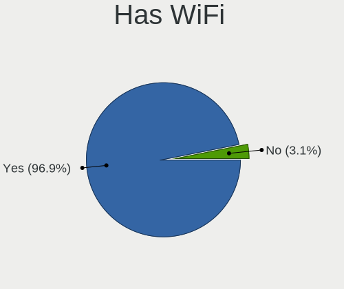
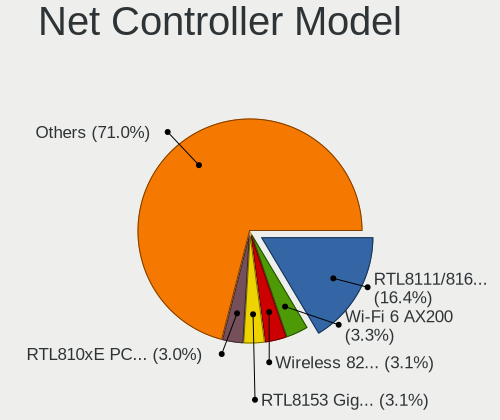
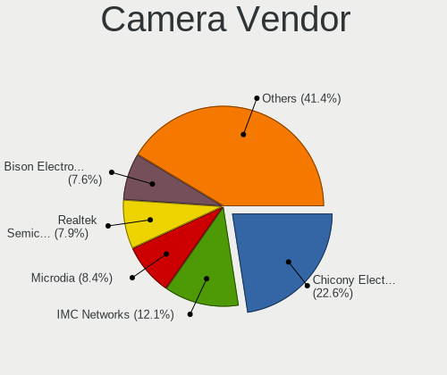
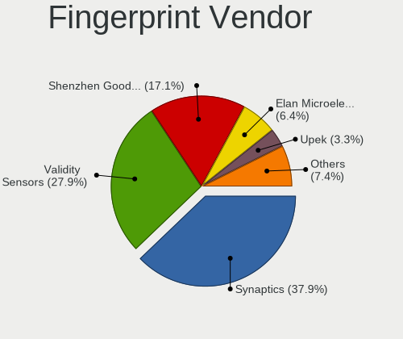

Fedora - Tested Hardware & Statistics (Notebooks)
-------------------------------------------------

A project to collect tested hardware configurations for Fedora.

Anyone can contribute to this report by the [hw-probe](https://github.com/linuxhw/hw-probe) tool:

    sudo -E hw-probe -all -upload

Please contribute! Especially if your hardware is rare.

Contents
--------

* [ Test Cases ](#test-cases)

* [ System ](#system)
  - [ OS                       ](#os)
  - [ OS Family                ](#os-family)
  - [ Kernel                   ](#kernel)
  - [ Kernel Family            ](#kernel-family)
  - [ Kernel Major Ver.        ](#kernel-major-ver)
  - [ Arch                     ](#arch)
  - [ DE                       ](#de)
  - [ Display Server           ](#display-server)
  - [ Display Manager          ](#display-manager)
  - [ OS Lang                  ](#os-lang)
  - [ Boot Mode                ](#boot-mode)
  - [ Filesystem               ](#filesystem)
  - [ Part. scheme             ](#part-scheme)
  - [ Dual Boot with Linux/BSD ](#dual-boot-with-linuxbsd)
  - [ Dual Boot (Win)          ](#dual-boot-win)

* [ Board ](#board)
  - [ Vendor                   ](#vendor)
  - [ Model                    ](#model)
  - [ Model Family             ](#model-family)
  - [ MFG Year                 ](#mfg-year)
  - [ Form Factor              ](#form-factor)
  - [ Secure Boot              ](#secure-boot)
  - [ Coreboot                 ](#coreboot)
  - [ RAM Size                 ](#ram-size)
  - [ RAM Used                 ](#ram-used)
  - [ Total Drives             ](#total-drives)
  - [ Has CD-ROM               ](#has-cd-rom)
  - [ Has Ethernet             ](#has-ethernet)
  - [ Has WiFi                 ](#has-wifi)
  - [ Has Bluetooth            ](#has-bluetooth)

* [ Location ](#location)
  - [ Country                  ](#country)
  - [ City                     ](#city)

* [ Drives ](#drives)
  - [ Drive Vendor             ](#drive-vendor)
  - [ Drive Model              ](#drive-model)
  - [ HDD Vendor               ](#hdd-vendor)
  - [ SSD Vendor               ](#ssd-vendor)
  - [ Drive Kind               ](#drive-kind)
  - [ Drive Connector          ](#drive-connector)
  - [ Drive Size               ](#drive-size)
  - [ Space Total              ](#space-total)
  - [ Space Used               ](#space-used)
  - [ Malfunc. Drives          ](#malfunc-drives)
  - [ Malfunc. Drive Vendor    ](#malfunc-drive-vendor)
  - [ Malfunc. HDD Vendor      ](#malfunc-hdd-vendor)
  - [ Malfunc. Drive Kind      ](#malfunc-drive-kind)
  - [ Failed Drives            ](#failed-drives)
  - [ Failed Drive Vendor      ](#failed-drive-vendor)
  - [ Drive Status             ](#drive-status)

* [ Storage controller ](#storage-controller)
  - [ Storage Vendor           ](#storage-vendor)
  - [ Storage Model            ](#storage-model)
  - [ Storage Kind             ](#storage-kind)

* [ Processor ](#processor)
  - [ CPU Vendor               ](#cpu-vendor)
  - [ CPU Model                ](#cpu-model)
  - [ CPU Model Family         ](#cpu-model-family)
  - [ CPU Cores                ](#cpu-cores)
  - [ CPU Sockets              ](#cpu-sockets)
  - [ CPU Threads              ](#cpu-threads)
  - [ CPU Op-Modes             ](#cpu-op-modes)
  - [ CPU Microcode            ](#cpu-microcode)
  - [ CPU Microarch            ](#cpu-microarch)

* [ Graphics ](#graphics)
  - [ GPU Vendor               ](#gpu-vendor)
  - [ GPU Model                ](#gpu-model)
  - [ GPU Combo                ](#gpu-combo)
  - [ GPU Driver               ](#gpu-driver)
  - [ GPU Memory               ](#gpu-memory)

* [ Monitor ](#monitor)
  - [ Monitor Vendor           ](#monitor-vendor)
  - [ Monitor Model            ](#monitor-model)
  - [ Monitor Resolution       ](#monitor-resolution)
  - [ Monitor Diagonal         ](#monitor-diagonal)
  - [ Monitor Width            ](#monitor-width)
  - [ Aspect Ratio             ](#aspect-ratio)
  - [ Monitor Area             ](#monitor-area)
  - [ Pixel Density            ](#pixel-density)
  - [ Multiple Monitors        ](#multiple-monitors)

* [ Network ](#network)
  - [ Net Controller Vendor    ](#net-controller-vendor)
  - [ Net Controller Model     ](#net-controller-model)
  - [ Wireless Vendor          ](#wireless-vendor)
  - [ Wireless Model           ](#wireless-model)
  - [ Ethernet Vendor          ](#ethernet-vendor)
  - [ Ethernet Model           ](#ethernet-model)
  - [ Net Controller Kind      ](#net-controller-kind)
  - [ Used Controller          ](#used-controller)
  - [ NICs                     ](#nics)
  - [ IPv6                     ](#ipv6)

* [ Bluetooth ](#bluetooth)
  - [ Bluetooth Vendor         ](#bluetooth-vendor)
  - [ Bluetooth Model          ](#bluetooth-model)

* [ Sound ](#sound)
  - [ Sound Vendor             ](#sound-vendor)
  - [ Sound Model              ](#sound-model)

* [ Memory ](#memory)
  - [ Memory Vendor            ](#memory-vendor)
  - [ Memory Model             ](#memory-model)
  - [ Memory Kind              ](#memory-kind)
  - [ Memory Form Factor       ](#memory-form-factor)
  - [ Memory Size              ](#memory-size)
  - [ Memory Speed             ](#memory-speed)

* [ Printers & scanners ](#printers--scanners)
  - [ Printer Vendor           ](#printer-vendor)
  - [ Printer Model            ](#printer-model)
  - [ Scanner Vendor           ](#scanner-vendor)
  - [ Scanner Model            ](#scanner-model)

* [ Camera ](#camera)
  - [ Camera Vendor            ](#camera-vendor)
  - [ Camera Model             ](#camera-model)

* [ Security ](#security)
  - [ Fingerprint Vendor       ](#fingerprint-vendor)
  - [ Fingerprint Model        ](#fingerprint-model)
  - [ Chipcard Vendor          ](#chipcard-vendor)
  - [ Chipcard Model           ](#chipcard-model)

* [ Unsupported ](#unsupported)
  - [ Unsupported Devices      ](#unsupported-devices)
  - [ Unsupported Device Types ](#unsupported-device-types)

Test Cases
----------

Total: 7551

| Vendor        | Model                       | Probe                                                      | Date         |
|---------------|-----------------------------|------------------------------------------------------------|--------------|
| Dell          | Inspiron 7577               | [2a280dc7df](https://linux-hardware.org/?probe=2a280dc7df) | Nov 02, 2022 |
| Lenovo        | ThinkPad T61 6464A13        | [5f850cbab6](https://linux-hardware.org/?probe=5f850cbab6) | Nov 02, 2022 |
| HP            | Pavilion Aero Laptop 13-... | [4fa32ec6af](https://linux-hardware.org/?probe=4fa32ec6af) | Nov 02, 2022 |
| ASUSTek       | ASUS TUF Gaming F15 FX50... | [2d931f9e99](https://linux-hardware.org/?probe=2d931f9e99) | Nov 02, 2022 |
| Lenovo        | ThinkBook 15 G3 ACL 21A4    | [335af8b89b](https://linux-hardware.org/?probe=335af8b89b) | Nov 02, 2022 |
| HP            | Pavilion g6                 | [22b32d9bac](https://linux-hardware.org/?probe=22b32d9bac) | Nov 02, 2022 |
| HUAWEI        | BOD-WXX9                    | [d4ac3a5f04](https://linux-hardware.org/?probe=d4ac3a5f04) | Nov 02, 2022 |
| Lenovo        | Legion 5 15IAH7H 82RB       | [aa6c06f2bb](https://linux-hardware.org/?probe=aa6c06f2bb) | Nov 02, 2022 |
| Lenovo        | Legion 5 15IAH7H 82RB       | [584db1dcb2](https://linux-hardware.org/?probe=584db1dcb2) | Nov 02, 2022 |
| ASUSTek       | VivoBook_ASUSLaptop X515... | [a156a7484d](https://linux-hardware.org/?probe=a156a7484d) | Nov 02, 2022 |
| ASUSTek       | ROG Zephyrus G14 GA402RJ... | [7b51138a0b](https://linux-hardware.org/?probe=7b51138a0b) | Nov 02, 2022 |
| HUAWEI        | NBLK-WAX9X                  | [d3beec5427](https://linux-hardware.org/?probe=d3beec5427) | Nov 02, 2022 |
| HP            | Pavilion g6                 | [24c2a01761](https://linux-hardware.org/?probe=24c2a01761) | Nov 02, 2022 |
| Dell          | Latitude 5591               | [bcd8aef9a0](https://linux-hardware.org/?probe=bcd8aef9a0) | Nov 02, 2022 |
| Lenovo        | ThinkPad E14 Gen 3 20YDS... | [c90b358eb5](https://linux-hardware.org/?probe=c90b358eb5) | Nov 01, 2022 |
| HP            | EliteBook 830 G5            | [379443a5d6](https://linux-hardware.org/?probe=379443a5d6) | Nov 01, 2022 |
| Lenovo        | Legion 5 15ARH05 82B5       | [9b61195a2a](https://linux-hardware.org/?probe=9b61195a2a) | Nov 01, 2022 |
| HP            | EliteBook 830 G5            | [5e099af04c](https://linux-hardware.org/?probe=5e099af04c) | Nov 01, 2022 |
| Lenovo        | ThinkPad X1 Carbon 7th 2... | [e101d9d50a](https://linux-hardware.org/?probe=e101d9d50a) | Nov 01, 2022 |
| Lenovo        | ThinkPad E14 Gen 4 21ECS... | [766e7fb0d0](https://linux-hardware.org/?probe=766e7fb0d0) | Nov 01, 2022 |
| GPD           | G1619-04                    | [898bbfb591](https://linux-hardware.org/?probe=898bbfb591) | Nov 01, 2022 |
| Unknown       | Unknown                     | [9608724116](https://linux-hardware.org/?probe=9608724116) | Nov 01, 2022 |
| Dell          | Venue 8 Pro 5830            | [8890410dfc](https://linux-hardware.org/?probe=8890410dfc) | Nov 01, 2022 |
| Dell          | Latitude 3420               | [9c2b9ab298](https://linux-hardware.org/?probe=9c2b9ab298) | Nov 01, 2022 |
| Apple         | MacBookPro9,2               | [d63c5de91b](https://linux-hardware.org/?probe=d63c5de91b) | Nov 01, 2022 |
| HUAWEI        | CREM-WXX9                   | [1d24aac4ce](https://linux-hardware.org/?probe=1d24aac4ce) | Nov 01, 2022 |
| HUAWEI        | CREM-WXX9                   | [2eb32b1bb3](https://linux-hardware.org/?probe=2eb32b1bb3) | Nov 01, 2022 |
| HP            | ZBook 15 G2                 | [7254a9a2fc](https://linux-hardware.org/?probe=7254a9a2fc) | Nov 01, 2022 |
| Samsung       | RV410/RV510/S3510/E3510     | [566d83485b](https://linux-hardware.org/?probe=566d83485b) | Oct 31, 2022 |
| HUAWEI        | BOHB-WAX9                   | [274a3383db](https://linux-hardware.org/?probe=274a3383db) | Oct 31, 2022 |
| HP            | ProBook 470 G5              | [0424e08b3d](https://linux-hardware.org/?probe=0424e08b3d) | Oct 31, 2022 |
| Samsung       | 800G5M/800G5W               | [c91800e8c1](https://linux-hardware.org/?probe=c91800e8c1) | Oct 31, 2022 |
| ASUSTek       | X510UAR                     | [46f1da66b6](https://linux-hardware.org/?probe=46f1da66b6) | Oct 31, 2022 |
| ASUSTek       | X510UAR                     | [1409a7f78d](https://linux-hardware.org/?probe=1409a7f78d) | Oct 31, 2022 |
| Acer          | Swift SF314-54              | [71cf98e6e8](https://linux-hardware.org/?probe=71cf98e6e8) | Oct 31, 2022 |
| ASUSTek       | X541UVK                     | [15bdbbf952](https://linux-hardware.org/?probe=15bdbbf952) | Oct 31, 2022 |
| HUAWEI        | BOHK-WAX9X                  | [e993af2670](https://linux-hardware.org/?probe=e993af2670) | Oct 31, 2022 |
| HP            | 250 G7 Notebook PC          | [7433eae90a](https://linux-hardware.org/?probe=7433eae90a) | Oct 31, 2022 |
| Dell          | Precision M6700             | [aa4b5e4400](https://linux-hardware.org/?probe=aa4b5e4400) | Oct 31, 2022 |
| HP            | ENVY 17                     | [5b845d9ee3](https://linux-hardware.org/?probe=5b845d9ee3) | Oct 31, 2022 |
| Samsung       | RV410/RV510/S3510/E3510     | [073ba962ff](https://linux-hardware.org/?probe=073ba962ff) | Oct 31, 2022 |
| Schenker      | XMG FUSION 15 (XFU15L19)    | [221710c9ea](https://linux-hardware.org/?probe=221710c9ea) | Oct 31, 2022 |
| ASUSTek       | ASUS TUF Gaming A15 FA50... | [002ab67e5e](https://linux-hardware.org/?probe=002ab67e5e) | Oct 31, 2022 |
| ASUSTek       | ROG Zephyrus G15 GA503RM... | [76906648cb](https://linux-hardware.org/?probe=76906648cb) | Oct 30, 2022 |
| Lenovo        | IdeaPad 320-15IKB 80XL      | [cf460716f9](https://linux-hardware.org/?probe=cf460716f9) | Oct 30, 2022 |
| HP            | Laptop 15s-eq2xxx           | [3f69e984d1](https://linux-hardware.org/?probe=3f69e984d1) | Oct 30, 2022 |
| HP            | 15                          | [c356a2b0cd](https://linux-hardware.org/?probe=c356a2b0cd) | Oct 30, 2022 |
| HP            | ProBook 470 G5              | [cfe35367bf](https://linux-hardware.org/?probe=cfe35367bf) | Oct 30, 2022 |
| HP            | ENVY Laptop 13-ad1xx        | [c52b1fe5fa](https://linux-hardware.org/?probe=c52b1fe5fa) | Oct 30, 2022 |
| Dell          | Inspiron 7720               | [f1478df888](https://linux-hardware.org/?probe=f1478df888) | Oct 30, 2022 |
| Lenovo        | ThinkPad X220 4291WSH       | [a4eebe6485](https://linux-hardware.org/?probe=a4eebe6485) | Oct 30, 2022 |
| Lenovo        | ThinkPad X1 Carbon Gen 8... | [df654ca0b1](https://linux-hardware.org/?probe=df654ca0b1) | Oct 30, 2022 |
| Dell          | Latitude 7490               | [95d0006efb](https://linux-hardware.org/?probe=95d0006efb) | Oct 30, 2022 |
| Dell          | Latitude E7450              | [32a6333f4b](https://linux-hardware.org/?probe=32a6333f4b) | Oct 30, 2022 |
| Aquarius      | Cmp NS765                   | [5e519edbee](https://linux-hardware.org/?probe=5e519edbee) | Oct 30, 2022 |
| Lenovo        | Legion Y530-15ICH-1060 8... | [60ba0bc2dd](https://linux-hardware.org/?probe=60ba0bc2dd) | Oct 29, 2022 |
| HUAWEI        | NBLB-WAX9N                  | [1925c8ce1f](https://linux-hardware.org/?probe=1925c8ce1f) | Oct 29, 2022 |
| Acer          | Predator PH315-53           | [b3dd383a83](https://linux-hardware.org/?probe=b3dd383a83) | Oct 29, 2022 |
| ASUSTek       | X453MA                      | [da3e45d6c3](https://linux-hardware.org/?probe=da3e45d6c3) | Oct 29, 2022 |
| Dell          | XPS 13 9300                 | [cc62dbe2f6](https://linux-hardware.org/?probe=cc62dbe2f6) | Oct 29, 2022 |
| Dell          | XPS 13 9300                 | [301aab9126](https://linux-hardware.org/?probe=301aab9126) | Oct 29, 2022 |
| ASUSTek       | Q550LF                      | [383c45edce](https://linux-hardware.org/?probe=383c45edce) | Oct 29, 2022 |
| Dell          | Latitude E7450              | [012cd7214b](https://linux-hardware.org/?probe=012cd7214b) | Oct 29, 2022 |
| Dell          | Latitude E7450              | [635a60671d](https://linux-hardware.org/?probe=635a60671d) | Oct 29, 2022 |
| HP            | ZBook 15 G3                 | [c60b429baa](https://linux-hardware.org/?probe=c60b429baa) | Oct 28, 2022 |
| Lenovo        | ThinkPad T14 Gen 1 20UD0... | [2f6e4235f7](https://linux-hardware.org/?probe=2f6e4235f7) | Oct 28, 2022 |
| Lenovo        | ThinkPad P52 20M9S1EM00     | [40de74c5c5](https://linux-hardware.org/?probe=40de74c5c5) | Oct 28, 2022 |
| HP            | Laptop 15s-fq4xxx           | [e06398e1bc](https://linux-hardware.org/?probe=e06398e1bc) | Oct 28, 2022 |
| Lenovo        | ThinkPad X1 Carbon 4th 2... | [83179a6cea](https://linux-hardware.org/?probe=83179a6cea) | Oct 28, 2022 |
| Sony          | VPCCB3S1R                   | [ee5b1465a1](https://linux-hardware.org/?probe=ee5b1465a1) | Oct 28, 2022 |
| HP            | Pavilion Gaming Laptop 1... | [1d64fb48e7](https://linux-hardware.org/?probe=1d64fb48e7) | Oct 27, 2022 |
| Timi          | TM1701                      | [f246345845](https://linux-hardware.org/?probe=f246345845) | Oct 27, 2022 |
| Lenovo        | ThinkPad P15 Gen 2i 20YR... | [0c6a68368c](https://linux-hardware.org/?probe=0c6a68368c) | Oct 27, 2022 |
| HP            | ProBook 640 G1              | [3a9f97607d](https://linux-hardware.org/?probe=3a9f97607d) | Oct 27, 2022 |
| MSI           | PS63 Modern 8RC             | [36b663cec7](https://linux-hardware.org/?probe=36b663cec7) | Oct 27, 2022 |
| MSI           | PS63 Modern 8RC             | [e00fd51503](https://linux-hardware.org/?probe=e00fd51503) | Oct 27, 2022 |
| ASUSTek       | VivoBook_ASUSLaptop M350... | [99152f7783](https://linux-hardware.org/?probe=99152f7783) | Oct 27, 2022 |
| Lenovo        | IdeaPad 5 14ITL05 82FE      | [670823778e](https://linux-hardware.org/?probe=670823778e) | Oct 27, 2022 |
| MSI           | Prestige 14 A10SC           | [263d47772c](https://linux-hardware.org/?probe=263d47772c) | Oct 27, 2022 |
| HP            | EliteBook 8570w             | [7d30f96368](https://linux-hardware.org/?probe=7d30f96368) | Oct 27, 2022 |
| Lenovo        | ThinkPad X260 20F5S2WX05    | [710f95eab8](https://linux-hardware.org/?probe=710f95eab8) | Oct 27, 2022 |
| ASUSTek       | VivoBook S15 X510UF         | [85b4bc70fa](https://linux-hardware.org/?probe=85b4bc70fa) | Oct 26, 2022 |
| Lenovo        | ThinkPad T470s 20HF0047U... | [3b9a4fb8f4](https://linux-hardware.org/?probe=3b9a4fb8f4) | Oct 26, 2022 |
| LincPlus      | P1                          | [cc97e9ec36](https://linux-hardware.org/?probe=cc97e9ec36) | Oct 26, 2022 |
| MSI           | Modern 15 A11M              | [0a658be9fc](https://linux-hardware.org/?probe=0a658be9fc) | Oct 26, 2022 |
| Dell          | Latitude E7270              | [7f2c8b9e9c](https://linux-hardware.org/?probe=7f2c8b9e9c) | Oct 25, 2022 |
| Lenovo        | ThinkPad E15 Gen 3 20YG0... | [a8c29545e6](https://linux-hardware.org/?probe=a8c29545e6) | Oct 25, 2022 |
| Dell          | Inspiron 3501               | [6764a6860f](https://linux-hardware.org/?probe=6764a6860f) | Oct 25, 2022 |
| Acer          | Aspire A715-42G             | [c9123810fd](https://linux-hardware.org/?probe=c9123810fd) | Oct 25, 2022 |
| Dell          | Latitude 5500               | [6e1b321740](https://linux-hardware.org/?probe=6e1b321740) | Oct 25, 2022 |
| Apple         | MacBookPro11,4              | [29dd6b053b](https://linux-hardware.org/?probe=29dd6b053b) | Oct 25, 2022 |
| Timi          | Mi Laptop Pro 15            | [4474edfd79](https://linux-hardware.org/?probe=4474edfd79) | Oct 25, 2022 |
| Dell          | XPS 15 9510                 | [b14c37f999](https://linux-hardware.org/?probe=b14c37f999) | Oct 25, 2022 |
| Dell          | Latitude E7450              | [45e65cd626](https://linux-hardware.org/?probe=45e65cd626) | Oct 25, 2022 |
| ASUSTek       | VivoBook_ASUSLaptop X509... | [4ffd604fea](https://linux-hardware.org/?probe=4ffd604fea) | Oct 25, 2022 |
| ASUSTek       | X540SA                      | [a515dd93cd](https://linux-hardware.org/?probe=a515dd93cd) | Oct 25, 2022 |
| Lenovo        | IdeaPad 3 15ITL6 82H8       | [42647c28ba](https://linux-hardware.org/?probe=42647c28ba) | Oct 25, 2022 |
| Lenovo        | ThinkPad X1 Carbon 5th 2... | [e4d7dc5f38](https://linux-hardware.org/?probe=e4d7dc5f38) | Oct 25, 2022 |
| System76      | Galago UltraPro             | [caf6a992bb](https://linux-hardware.org/?probe=caf6a992bb) | Oct 24, 2022 |
| Acer          | Aspire ES1-520              | [44375f0b06](https://linux-hardware.org/?probe=44375f0b06) | Oct 24, 2022 |
| ASUSTek       | VivoBook_ASUSLaptop X513... | [95ad909dc8](https://linux-hardware.org/?probe=95ad909dc8) | Oct 24, 2022 |
| HP            | 340S G7 Notebook PC         | [dc8eab937b](https://linux-hardware.org/?probe=dc8eab937b) | Oct 24, 2022 |
| HUAWEI        | KPL-W0X                     | [aea737fcab](https://linux-hardware.org/?probe=aea737fcab) | Oct 24, 2022 |
| Dell          | Latitude E6420              | [eb53f0d580](https://linux-hardware.org/?probe=eb53f0d580) | Oct 24, 2022 |
| ASUSTek       | UX310UQ                     | [5a928ace3b](https://linux-hardware.org/?probe=5a928ace3b) | Oct 24, 2022 |
| Lenovo        | ThinkPad T490 20N3S9DJ00    | [c1a4fde481](https://linux-hardware.org/?probe=c1a4fde481) | Oct 24, 2022 |
| Lenovo        | ThinkPad T490 20N3S9DJ00    | [80bf151a4d](https://linux-hardware.org/?probe=80bf151a4d) | Oct 24, 2022 |
| Toshiba       | Satellite C660              | [8922b0767c](https://linux-hardware.org/?probe=8922b0767c) | Oct 24, 2022 |
| Lenovo        | ThinkPad X240 20AMS56K00    | [efa84f3716](https://linux-hardware.org/?probe=efa84f3716) | Oct 24, 2022 |
| Acer          | Nitro AN515-46              | [cb2480b22c](https://linux-hardware.org/?probe=cb2480b22c) | Oct 23, 2022 |
| Acer          | Nitro AN515-46              | [846cfe5273](https://linux-hardware.org/?probe=846cfe5273) | Oct 23, 2022 |
| HP            | 340S G7 Notebook PC         | [406538a0de](https://linux-hardware.org/?probe=406538a0de) | Oct 23, 2022 |
| Dell          | Inspiron 3580               | [41dce71fbf](https://linux-hardware.org/?probe=41dce71fbf) | Oct 23, 2022 |
| Acer          | Aspire E5-575G              | [b6b5c1468c](https://linux-hardware.org/?probe=b6b5c1468c) | Oct 23, 2022 |
| Dell          | Inspiron 1564               | [754b4a0f04](https://linux-hardware.org/?probe=754b4a0f04) | Oct 23, 2022 |
| HP            | Notebook                    | [d713217453](https://linux-hardware.org/?probe=d713217453) | Oct 23, 2022 |
| HP            | Notebook                    | [ef9adb0e8a](https://linux-hardware.org/?probe=ef9adb0e8a) | Oct 22, 2022 |
| Lenovo        | IdeaPad L340-15IRH Gamin... | [14830504a7](https://linux-hardware.org/?probe=14830504a7) | Oct 22, 2022 |
| Lenovo        | ThinkPad E14 20RAS0KY00     | [657b1ee865](https://linux-hardware.org/?probe=657b1ee865) | Oct 22, 2022 |
| Lenovo        | ThinkPad X260 20F5S5Q200    | [c2e041fd54](https://linux-hardware.org/?probe=c2e041fd54) | Oct 21, 2022 |
| HP            | ProBook 4530s               | [3cca675c88](https://linux-hardware.org/?probe=3cca675c88) | Oct 21, 2022 |
| HP            | ProBook 4530s               | [e87546da82](https://linux-hardware.org/?probe=e87546da82) | Oct 21, 2022 |
| Timi          | Xiaomi Book Pro 16 2022     | [41bade1339](https://linux-hardware.org/?probe=41bade1339) | Oct 21, 2022 |
| Purism        | Librem 13 v2                | [5296ed1e19](https://linux-hardware.org/?probe=5296ed1e19) | Oct 21, 2022 |
| LG Electro... | 16Z90P-G.AP75D              | [1e1526e9d8](https://linux-hardware.org/?probe=1e1526e9d8) | Oct 21, 2022 |
| Lenovo        | IdeaPad 5 15ALC05 82LN      | [63751816bc](https://linux-hardware.org/?probe=63751816bc) | Oct 21, 2022 |
| Google        | Swanky                      | [19efb3ecc5](https://linux-hardware.org/?probe=19efb3ecc5) | Oct 21, 2022 |
| ASUSTek       | Q550LF                      | [0d24151944](https://linux-hardware.org/?probe=0d24151944) | Oct 21, 2022 |
| Itautec       | Infoway N8755               | [7eaba382a5](https://linux-hardware.org/?probe=7eaba382a5) | Oct 21, 2022 |
| Lenovo        | Yoga Slim 7 Pro 14ACH5 8... | [b374c2dff6](https://linux-hardware.org/?probe=b374c2dff6) | Oct 20, 2022 |
| Lenovo        | B560                        | [3a61700f49](https://linux-hardware.org/?probe=3a61700f49) | Oct 20, 2022 |
| Dell          | Inspiron 7460               | [879fabd350](https://linux-hardware.org/?probe=879fabd350) | Oct 20, 2022 |
| Lenovo        | ThinkPad P15 Gen 2i 20YR... | [e03569f758](https://linux-hardware.org/?probe=e03569f758) | Oct 20, 2022 |
| Lenovo        | ThinkPad P52 20MAS17205     | [be48cfe3be](https://linux-hardware.org/?probe=be48cfe3be) | Oct 20, 2022 |
| HP            | Laptop 15s-eq2xxx           | [f966d5d584](https://linux-hardware.org/?probe=f966d5d584) | Oct 20, 2022 |
| Lenovo        | ThinkPad T14s Gen 1 20T1... | [e3265d4cdc](https://linux-hardware.org/?probe=e3265d4cdc) | Oct 20, 2022 |
| ASUSTek       | VivoBook_ASUSLaptop X515... | [06328b7f7c](https://linux-hardware.org/?probe=06328b7f7c) | Oct 20, 2022 |
| ASUSTek       | VivoBook_ASUSLaptop X515... | [7d35a56915](https://linux-hardware.org/?probe=7d35a56915) | Oct 20, 2022 |
| Lenovo        | ThinkPad T14 Gen 2i 20W1... | [f81a40a71c](https://linux-hardware.org/?probe=f81a40a71c) | Oct 20, 2022 |
| Dell          | Precision 5510              | [bb7788ce01](https://linux-hardware.org/?probe=bb7788ce01) | Oct 20, 2022 |
| Lenovo        | IdeaPad 5 15ITL05 82FG      | [9594fcc1e0](https://linux-hardware.org/?probe=9594fcc1e0) | Oct 20, 2022 |
| ASUSTek       | K43SJ                       | [4c27c4945c](https://linux-hardware.org/?probe=4c27c4945c) | Oct 20, 2022 |
| Framework     | Laptop (12th Gen Intel C... | [d0dcb7e6e3](https://linux-hardware.org/?probe=d0dcb7e6e3) | Oct 20, 2022 |
| Lenovo        | ThinkPad X1 Carbon Gen 1... | [866d0f49a2](https://linux-hardware.org/?probe=866d0f49a2) | Oct 20, 2022 |
| Framework     | Laptop                      | [ade55fca33](https://linux-hardware.org/?probe=ade55fca33) | Oct 19, 2022 |
| Framework     | Laptop                      | [57af01b405](https://linux-hardware.org/?probe=57af01b405) | Oct 19, 2022 |
| Dell          | Latitude 7420               | [332d2cd420](https://linux-hardware.org/?probe=332d2cd420) | Oct 19, 2022 |
| System76      | Kudu                        | [49c0e1c400](https://linux-hardware.org/?probe=49c0e1c400) | Oct 19, 2022 |
| Dell          | Precision 7760              | [a5ab2793ae](https://linux-hardware.org/?probe=a5ab2793ae) | Oct 19, 2022 |
| ASUSTek       | ROG Strix G513QY_G513QY     | [680823db07](https://linux-hardware.org/?probe=680823db07) | Oct 19, 2022 |
| Lenovo        | IdeaPad 5 15ITL05 82FG      | [71734a9abe](https://linux-hardware.org/?probe=71734a9abe) | Oct 19, 2022 |
| Lenovo        | ThinkPad T410 2522PT3       | [2cd92a7da8](https://linux-hardware.org/?probe=2cd92a7da8) | Oct 19, 2022 |
| ASUSTek       | ROG Strix G533ZM_G533ZM     | [f91daeac73](https://linux-hardware.org/?probe=f91daeac73) | Oct 19, 2022 |
| HP            | EliteBook 865 16 inch G9... | [8665ee6ba6](https://linux-hardware.org/?probe=8665ee6ba6) | Oct 19, 2022 |
| Lenovo        | Yoga 900-13ISK2 80UE        | [efadc96c65](https://linux-hardware.org/?probe=efadc96c65) | Oct 19, 2022 |
| HP            | Pavilion Aero Laptop 13-... | [eab0779b74](https://linux-hardware.org/?probe=eab0779b74) | Oct 19, 2022 |
| Lenovo        | Legion S7 16ARHA7 82UG      | [28a1d15220](https://linux-hardware.org/?probe=28a1d15220) | Oct 18, 2022 |
| MSI           | Modern 14 C12M              | [33c0e4861e](https://linux-hardware.org/?probe=33c0e4861e) | Oct 18, 2022 |
| Lenovo        | ThinkPad E15 Gen 3 20YGC... | [d51ba4a008](https://linux-hardware.org/?probe=d51ba4a008) | Oct 18, 2022 |
| Lenovo        | IdeaPad 5 15ARE05 81YQ      | [aaa41de825](https://linux-hardware.org/?probe=aaa41de825) | Oct 18, 2022 |
| Lenovo        | B560                        | [717af973da](https://linux-hardware.org/?probe=717af973da) | Oct 18, 2022 |
| Dell          | Precision 5510              | [d56d0aceaf](https://linux-hardware.org/?probe=d56d0aceaf) | Oct 18, 2022 |
| Dell          | Inspiron M5010              | [026a7a8cd3](https://linux-hardware.org/?probe=026a7a8cd3) | Oct 18, 2022 |
| Acer          | Aspire E1-531               | [527c4e0728](https://linux-hardware.org/?probe=527c4e0728) | Oct 17, 2022 |
| HP            | Pavilion Gaming Laptop 1... | [76f9929a9c](https://linux-hardware.org/?probe=76f9929a9c) | Oct 17, 2022 |
| MSI           | Summit E16Flip A11UCT       | [f1ec40e34d](https://linux-hardware.org/?probe=f1ec40e34d) | Oct 17, 2022 |
| Dell          | XPS 15 9510                 | [9e1f6ae49e](https://linux-hardware.org/?probe=9e1f6ae49e) | Oct 17, 2022 |
| ASUSTek       | ASUS TUF Gaming A15 FA50... | [7f9219a85f](https://linux-hardware.org/?probe=7f9219a85f) | Oct 17, 2022 |
| Dell          | Inspiron 3584               | [c80df2b63c](https://linux-hardware.org/?probe=c80df2b63c) | Oct 17, 2022 |
| Dell          | XPS 15 9510                 | [2fd734cbfb](https://linux-hardware.org/?probe=2fd734cbfb) | Oct 17, 2022 |
| Acer          | Aspire A717-71G             | [969c0ac771](https://linux-hardware.org/?probe=969c0ac771) | Oct 17, 2022 |
| Lenovo        | ThinkBook 15 G2 ITL 20VE    | [7b5da7d635](https://linux-hardware.org/?probe=7b5da7d635) | Oct 17, 2022 |
| ASUSTek       | VivoBook_ASUSLaptop X415... | [d78ecde0a2](https://linux-hardware.org/?probe=d78ecde0a2) | Oct 17, 2022 |
| ASUSTek       | VivoBook_ASUSLaptop X415... | [adda30ef79](https://linux-hardware.org/?probe=adda30ef79) | Oct 17, 2022 |
| HP            | OMEN Laptop 15-en0xxx       | [528fc3c5ec](https://linux-hardware.org/?probe=528fc3c5ec) | Oct 17, 2022 |
| Dell          | Inspiron 5759               | [f93d1bc535](https://linux-hardware.org/?probe=f93d1bc535) | Oct 17, 2022 |
| Dell          | Inspiron 13 5320            | [9ac52708ad](https://linux-hardware.org/?probe=9ac52708ad) | Oct 17, 2022 |
| HUAWEI        | NBLB-WAX9N                  | [678415db20](https://linux-hardware.org/?probe=678415db20) | Oct 17, 2022 |
| Lenovo        | IdeaPad 330-15IKB 81DE      | [c1bad579af](https://linux-hardware.org/?probe=c1bad579af) | Oct 17, 2022 |
| Notebook      | W230SS                      | [abb5e7fda8](https://linux-hardware.org/?probe=abb5e7fda8) | Oct 16, 2022 |
| Lenovo        | ThinkPad P14s Gen 1 20Y1... | [f98ff2b890](https://linux-hardware.org/?probe=f98ff2b890) | Oct 16, 2022 |
| Lenovo        | ThinkPad E14 Gen 2 20TB0... | [f20a72be72](https://linux-hardware.org/?probe=f20a72be72) | Oct 16, 2022 |
| HP            | ProBook 450 G7              | [6a9b93fdeb](https://linux-hardware.org/?probe=6a9b93fdeb) | Oct 16, 2022 |
| Lenovo        | ThinkPad P14s Gen 1 20Y1... | [77c8619d03](https://linux-hardware.org/?probe=77c8619d03) | Oct 16, 2022 |
| Dell          | XPS 13 7390                 | [c78fae026e](https://linux-hardware.org/?probe=c78fae026e) | Oct 16, 2022 |
| Acer          | Aspire E1-531               | [834248c556](https://linux-hardware.org/?probe=834248c556) | Oct 16, 2022 |
| ASUSTek       | VivoBook_ASUSLaptop X509... | [0cceedcb07](https://linux-hardware.org/?probe=0cceedcb07) | Oct 16, 2022 |
| Lenovo        | ThinkPad E14 Gen 2 20TBS... | [665763812f](https://linux-hardware.org/?probe=665763812f) | Oct 16, 2022 |
| Lenovo        | ThinkPad T14 Gen 2i 20W0... | [dce51f4ce7](https://linux-hardware.org/?probe=dce51f4ce7) | Oct 16, 2022 |
| Lenovo        | ThinkPad X230 23257BG       | [6c8a42718a](https://linux-hardware.org/?probe=6c8a42718a) | Oct 16, 2022 |
| Dell          | Vostro 3400                 | [156e3942e5](https://linux-hardware.org/?probe=156e3942e5) | Oct 16, 2022 |
| HP            | Pavilion Gaming Laptop 1... | [2a36feb313](https://linux-hardware.org/?probe=2a36feb313) | Oct 16, 2022 |
| Notebook      | N2x0WU                      | [bc1072e527](https://linux-hardware.org/?probe=bc1072e527) | Oct 16, 2022 |
| Lenovo        | V145-15AST 81MT             | [d73a82b798](https://linux-hardware.org/?probe=d73a82b798) | Oct 15, 2022 |
| Timi          | TM1701                      | [c2b709ff0c](https://linux-hardware.org/?probe=c2b709ff0c) | Oct 15, 2022 |
| Lenovo        | ThinkPad T480s 20L8S1R50... | [478b58f9b6](https://linux-hardware.org/?probe=478b58f9b6) | Oct 15, 2022 |
| Dell          | Latitude E5450              | [68e2c17e2f](https://linux-hardware.org/?probe=68e2c17e2f) | Oct 15, 2022 |
| Acer          | Aspire A314-22              | [eff5a7242e](https://linux-hardware.org/?probe=eff5a7242e) | Oct 15, 2022 |
| Apple         | MacBookPro12,1              | [7979753fa9](https://linux-hardware.org/?probe=7979753fa9) | Oct 15, 2022 |
| Lenovo        | IdeaPad 3 15ITL6 82H8       | [bf6d77aefd](https://linux-hardware.org/?probe=bf6d77aefd) | Oct 15, 2022 |
| ASUSTek       | ASUS TUF Gaming A15 FA50... | [ab212a80b4](https://linux-hardware.org/?probe=ab212a80b4) | Oct 14, 2022 |
| Lenovo        | ThinkPad T14 Gen 2i 20W0... | [e1bc46388d](https://linux-hardware.org/?probe=e1bc46388d) | Oct 14, 2022 |
| ASUSTek       | ASUS TUF Gaming A15 FA50... | [49821787e4](https://linux-hardware.org/?probe=49821787e4) | Oct 14, 2022 |
| Dell          | Vostro 3400                 | [f9c2c298c4](https://linux-hardware.org/?probe=f9c2c298c4) | Oct 14, 2022 |
| ASUSTek       | ZenBook UX431DA_UM431DA     | [dbd2328d0f](https://linux-hardware.org/?probe=dbd2328d0f) | Oct 14, 2022 |
| ASUSTek       | ZenBook UX431DA_UM431DA     | [3a8bdfb3f5](https://linux-hardware.org/?probe=3a8bdfb3f5) | Oct 14, 2022 |
| Lenovo        | IdeaPad Gaming 3 15ARH05... | [f4d190e864](https://linux-hardware.org/?probe=f4d190e864) | Oct 13, 2022 |
| Dell          | XPS 13 7390                 | [60b21aed9a](https://linux-hardware.org/?probe=60b21aed9a) | Oct 13, 2022 |
| ASUSTek       | VivoBook_ASUSLaptop X513... | [9b0a923899](https://linux-hardware.org/?probe=9b0a923899) | Oct 13, 2022 |
| HP            | Laptop 15s-du3xxx           | [5985f3564a](https://linux-hardware.org/?probe=5985f3564a) | Oct 13, 2022 |
| Lenovo        | ThinkPad X270 20HMS2R900    | [38739fd54f](https://linux-hardware.org/?probe=38739fd54f) | Oct 13, 2022 |
| Lenovo        | IdeaPad Gaming 3 15ACH6 ... | [7af879de72](https://linux-hardware.org/?probe=7af879de72) | Oct 13, 2022 |
| UNOWHY        | Y13G011S4EI                 | [2be4dc3fc2](https://linux-hardware.org/?probe=2be4dc3fc2) | Oct 13, 2022 |
| Gigabyte      | P65Q                        | [8e83936c53](https://linux-hardware.org/?probe=8e83936c53) | Oct 12, 2022 |
| Dell          | XPS 13 9310                 | [8437ac2ffc](https://linux-hardware.org/?probe=8437ac2ffc) | Oct 12, 2022 |
| Acer          | Aspire A715-71G             | [2b0752150c](https://linux-hardware.org/?probe=2b0752150c) | Oct 12, 2022 |
| Lenovo        | ThinkBook 14 G3 ACL 21A2    | [ce1dbed861](https://linux-hardware.org/?probe=ce1dbed861) | Oct 12, 2022 |
| Apple         | MacBookPro15,2              | [56fc798c2e](https://linux-hardware.org/?probe=56fc798c2e) | Oct 11, 2022 |
| ASUSTek       | TUF Gaming FX504GD_FX80G... | [0355b3f7b8](https://linux-hardware.org/?probe=0355b3f7b8) | Oct 11, 2022 |
| HP            | ZBook Studio 15.6 inch G... | [60b02deb7f](https://linux-hardware.org/?probe=60b02deb7f) | Oct 11, 2022 |
| Dell          | Vostro 5402                 | [11f3146366](https://linux-hardware.org/?probe=11f3146366) | Oct 11, 2022 |
| Lenovo        | ThinkPad E580 20KSCTO1WW    | [71c926fc14](https://linux-hardware.org/?probe=71c926fc14) | Oct 11, 2022 |
| Lenovo        | ThinkPad P50 20EQS5MP00     | [83858a99c3](https://linux-hardware.org/?probe=83858a99c3) | Oct 10, 2022 |
| Lenovo        | IdeaPad 5 15ARE05 81YQ      | [5caff1861e](https://linux-hardware.org/?probe=5caff1861e) | Oct 10, 2022 |
| Lenovo        | ThinkPad T470s W10DG 20J... | [dc3347c309](https://linux-hardware.org/?probe=dc3347c309) | Oct 10, 2022 |
| Lenovo        | ThinkPad L450 20DTCTO1WW    | [2209173803](https://linux-hardware.org/?probe=2209173803) | Oct 10, 2022 |
| HUAWEI        | BOD-WXX9                    | [49fff6123f](https://linux-hardware.org/?probe=49fff6123f) | Oct 10, 2022 |
| Lenovo        | ThinkPad T430 2344BZU       | [59f6b7653c](https://linux-hardware.org/?probe=59f6b7653c) | Oct 10, 2022 |
| HP            | EliteBook 840 G6            | [29f63f8a32](https://linux-hardware.org/?probe=29f63f8a32) | Oct 10, 2022 |
| Apple         | MacBookPro9,2               | [7b6f3fcf28](https://linux-hardware.org/?probe=7b6f3fcf28) | Oct 10, 2022 |
| Dell          | Inspiron 5570               | [cab829a52b](https://linux-hardware.org/?probe=cab829a52b) | Oct 10, 2022 |
| ASUSTek       | VivoBook_ASUS Laptop E21... | [6c2f880759](https://linux-hardware.org/?probe=6c2f880759) | Oct 09, 2022 |
| HP            | ENVY Laptop 13-ad0xx        | [52658eb393](https://linux-hardware.org/?probe=52658eb393) | Oct 09, 2022 |
| Dell          | XPS 13 9380                 | [5d882bd47f](https://linux-hardware.org/?probe=5d882bd47f) | Oct 09, 2022 |
| HP            | 255 G8 Notebook PC          | [6a56a66eae](https://linux-hardware.org/?probe=6a56a66eae) | Oct 09, 2022 |
| ASUSTek       | K55VM                       | [d17d1273de](https://linux-hardware.org/?probe=d17d1273de) | Oct 09, 2022 |
| Framework     | Laptop                      | [3d25e7f96c](https://linux-hardware.org/?probe=3d25e7f96c) | Oct 09, 2022 |
| Toshiba       | Satellite C660              | [01abf75c2e](https://linux-hardware.org/?probe=01abf75c2e) | Oct 09, 2022 |
| Dell          | XPS 15 9510                 | [6b62586012](https://linux-hardware.org/?probe=6b62586012) | Oct 09, 2022 |
| Acer          | Predator PH315-53           | [cc8b98a2ff](https://linux-hardware.org/?probe=cc8b98a2ff) | Oct 09, 2022 |
| Lenovo        | Yoga Slim 7 Pro 14ACH5 O... | [d7379a41e9](https://linux-hardware.org/?probe=d7379a41e9) | Oct 08, 2022 |
| ASUSTek       | ASUS TUF Gaming F15 FX50... | [c0c2e0ca69](https://linux-hardware.org/?probe=c0c2e0ca69) | Oct 08, 2022 |
| HP            | Pavilion Laptop 14-ec1xx... | [615578d390](https://linux-hardware.org/?probe=615578d390) | Oct 08, 2022 |
| Lenovo        | ThinkPad L470 20J4CTO1WW    | [3aee91df8c](https://linux-hardware.org/?probe=3aee91df8c) | Oct 08, 2022 |
| Dell          | Vostro 3501                 | [126b7b85f2](https://linux-hardware.org/?probe=126b7b85f2) | Oct 08, 2022 |
| HP            | Laptop 15s-eq2xxx           | [3d968cc61a](https://linux-hardware.org/?probe=3d968cc61a) | Oct 08, 2022 |
| Lenovo        | Legion S7 16IAH7 82TF       | [9836cb655c](https://linux-hardware.org/?probe=9836cb655c) | Oct 08, 2022 |
| Lenovo        | ThinkPad P1 Gen 4i 20Y30... | [973605d3af](https://linux-hardware.org/?probe=973605d3af) | Oct 07, 2022 |
| Lenovo        | ThinkPad P1 Gen 4i 20Y30... | [74f6e9db69](https://linux-hardware.org/?probe=74f6e9db69) | Oct 07, 2022 |
| Dell          | XPS 15 7590                 | [fdab72c478](https://linux-hardware.org/?probe=fdab72c478) | Oct 07, 2022 |
| HP            | ProBook 455 G7              | [26dfdb5aed](https://linux-hardware.org/?probe=26dfdb5aed) | Oct 07, 2022 |
| HP            | Laptop 14s-dr1xxx           | [00d04b6a56](https://linux-hardware.org/?probe=00d04b6a56) | Oct 07, 2022 |
| HP            | Pavilion Aero Laptop 13-... | [d67006c592](https://linux-hardware.org/?probe=d67006c592) | Oct 07, 2022 |
| Lenovo        | ThinkPad T14 Gen 1 20S00... | [08e98e28c2](https://linux-hardware.org/?probe=08e98e28c2) | Oct 07, 2022 |
| HP            | EliteBook 745 G6            | [b1ff49ff0f](https://linux-hardware.org/?probe=b1ff49ff0f) | Oct 07, 2022 |
| Dell          | Latitude 5580               | [4bcae73c95](https://linux-hardware.org/?probe=4bcae73c95) | Oct 07, 2022 |
| Acer          | Nitro AN515-58              | [6a9f611fd5](https://linux-hardware.org/?probe=6a9f611fd5) | Oct 07, 2022 |
| Apple         | MacBookPro9,2               | [d5247cbbc3](https://linux-hardware.org/?probe=d5247cbbc3) | Oct 06, 2022 |
| Dell          | Latitude 5400               | [00789b23c6](https://linux-hardware.org/?probe=00789b23c6) | Oct 06, 2022 |
| HP            | EliteBook 840 14 inch G9... | [8b0ed3f04c](https://linux-hardware.org/?probe=8b0ed3f04c) | Oct 06, 2022 |
| Lenovo        | ThinkPad X220 4291WSH       | [c8c6a428db](https://linux-hardware.org/?probe=c8c6a428db) | Oct 06, 2022 |
| ASUSTek       | X550LA                      | [c0c98c2051](https://linux-hardware.org/?probe=c0c98c2051) | Oct 06, 2022 |
| HP            | 15                          | [9f0981ed52](https://linux-hardware.org/?probe=9f0981ed52) | Oct 06, 2022 |
| LG Electro... | 14Z990-V.AR52A2             | [4fe1810c2c](https://linux-hardware.org/?probe=4fe1810c2c) | Oct 06, 2022 |
| Lenovo        | ThinkPad X1 Carbon 7th 2... | [5dbeb45ba5](https://linux-hardware.org/?probe=5dbeb45ba5) | Oct 06, 2022 |
| Acer          | Aspire E5-475G              | [a545cecc64](https://linux-hardware.org/?probe=a545cecc64) | Oct 05, 2022 |
| Acer          | Aspire E5-475G              | [06fa787cb1](https://linux-hardware.org/?probe=06fa787cb1) | Oct 05, 2022 |
| Lenovo        | ThinkPad E14 Gen 2 20TAS... | [f6fc1950ac](https://linux-hardware.org/?probe=f6fc1950ac) | Oct 05, 2022 |
| Dell          | Latitude 5400               | [14ed107028](https://linux-hardware.org/?probe=14ed107028) | Oct 05, 2022 |
| Lenovo        | IdeaPad S145-15IWL 81S9     | [d0d3494971](https://linux-hardware.org/?probe=d0d3494971) | Oct 05, 2022 |
| Apple         | MacBookPro9,2               | [77176ee82a](https://linux-hardware.org/?probe=77176ee82a) | Oct 05, 2022 |
| Dell          | XPS 17 9710                 | [7590ca8bff](https://linux-hardware.org/?probe=7590ca8bff) | Oct 05, 2022 |
| ASUSTek       | ROG Strix G533ZM_G533ZM     | [ddb0e3fb81](https://linux-hardware.org/?probe=ddb0e3fb81) | Oct 05, 2022 |
| Dell          | XPS 15 9510                 | [99f16967b2](https://linux-hardware.org/?probe=99f16967b2) | Oct 05, 2022 |
| Apple         | MacBookPro14,1              | [3d5136540e](https://linux-hardware.org/?probe=3d5136540e) | Oct 05, 2022 |
| HP            | Laptop 15s-eq3xxx           | [2bd986670e](https://linux-hardware.org/?probe=2bd986670e) | Oct 04, 2022 |
| HP            | ZBook Power G7 Mobile Wo... | [b78c69e096](https://linux-hardware.org/?probe=b78c69e096) | Oct 04, 2022 |
| Lenovo        | ThinkPad E480 20KNS0E200    | [cb204abf9b](https://linux-hardware.org/?probe=cb204abf9b) | Oct 04, 2022 |
| Dell          | Inspiron 13 5310            | [128725bb4d](https://linux-hardware.org/?probe=128725bb4d) | Oct 04, 2022 |
| HP            | Laptop                      | [3a26ec874f](https://linux-hardware.org/?probe=3a26ec874f) | Oct 04, 2022 |
| ASUSTek       | ROG Strix G533ZM_G533ZM     | [4ba3e28201](https://linux-hardware.org/?probe=4ba3e28201) | Oct 04, 2022 |
| ASUSTek       | VivoBook_ASUSLaptop X512... | [923a579655](https://linux-hardware.org/?probe=923a579655) | Oct 03, 2022 |
| Lenovo        | ThinkPad T470p 20J7S0QK0... | [a9c2a1eca0](https://linux-hardware.org/?probe=a9c2a1eca0) | Oct 03, 2022 |
| Timi          | A35S                        | [fe7ad0ac13](https://linux-hardware.org/?probe=fe7ad0ac13) | Oct 03, 2022 |
| HP            | EliteBook 850 G1            | [7bb0235bd2](https://linux-hardware.org/?probe=7bb0235bd2) | Oct 03, 2022 |
| HP            | EliteBook 850 G8 Noteboo... | [2f9e023d1e](https://linux-hardware.org/?probe=2f9e023d1e) | Oct 03, 2022 |
| Apple         | MacBookPro11,1              | [45a46cdb72](https://linux-hardware.org/?probe=45a46cdb72) | Oct 03, 2022 |
| Framework     | Laptop (12th Gen Intel C... | [92aca0d081](https://linux-hardware.org/?probe=92aca0d081) | Oct 02, 2022 |
| Lenovo        | Yoga Slim 7 Carbon 13ITL... | [8f24127ac0](https://linux-hardware.org/?probe=8f24127ac0) | Oct 02, 2022 |
| HP            | ProBook 470 G5              | [bce5ab0354](https://linux-hardware.org/?probe=bce5ab0354) | Oct 02, 2022 |
| Lenovo        | Legion Y540-15IRH 81SX      | [80a2948ff1](https://linux-hardware.org/?probe=80a2948ff1) | Oct 02, 2022 |
| Dell          | Inspiron 3543               | [9e5ab25f54](https://linux-hardware.org/?probe=9e5ab25f54) | Oct 02, 2022 |
| Dell          | Inspiron 17-7779            | [5bd534e938](https://linux-hardware.org/?probe=5bd534e938) | Oct 02, 2022 |
| MICROMAX      | Canvas Lapbook L1161        | [9efe9e89d6](https://linux-hardware.org/?probe=9efe9e89d6) | Oct 01, 2022 |
| HP            | Victus by Laptop 16-e0xx... | [4a8d27ad0f](https://linux-hardware.org/?probe=4a8d27ad0f) | Oct 01, 2022 |
| Dell          | XPS 13 9300                 | [1fade0f247](https://linux-hardware.org/?probe=1fade0f247) | Oct 01, 2022 |
| Dell          | Vostro 5568                 | [44bf0dbbce](https://linux-hardware.org/?probe=44bf0dbbce) | Oct 01, 2022 |
| Lenovo        | ThinkPad T470p 20J7S0DK0... | [49bd2b0248](https://linux-hardware.org/?probe=49bd2b0248) | Oct 01, 2022 |
| Dell          | Inspiron 3442               | [af9b794734](https://linux-hardware.org/?probe=af9b794734) | Sep 30, 2022 |
| ASUSTek       | VivoBook_ASUSLaptop X340... | [d5407763a0](https://linux-hardware.org/?probe=d5407763a0) | Sep 30, 2022 |
| Dell          | Latitude E4300              | [a860d9a446](https://linux-hardware.org/?probe=a860d9a446) | Sep 30, 2022 |
| GPD           | G1621-02                    | [6ae9fc596e](https://linux-hardware.org/?probe=6ae9fc596e) | Sep 30, 2022 |
| Dell          | XPS 15 9570                 | [0d466bc2f7](https://linux-hardware.org/?probe=0d466bc2f7) | Sep 30, 2022 |
| HP            | ProBook 6570b               | [d9be946342](https://linux-hardware.org/?probe=d9be946342) | Sep 30, 2022 |
| HP            | Laptop 15s-eq3xxx           | [b15bae8e77](https://linux-hardware.org/?probe=b15bae8e77) | Sep 30, 2022 |
| HP            | Laptop 15s-eq3xxx           | [126b8dd3ec](https://linux-hardware.org/?probe=126b8dd3ec) | Sep 30, 2022 |
| Lenovo        | ThinkPad T470p 20J7S0DK0... | [33353fc67c](https://linux-hardware.org/?probe=33353fc67c) | Sep 30, 2022 |
| Lenovo        | ThinkPad T470s 20HGS09L0... | [7c384e5578](https://linux-hardware.org/?probe=7c384e5578) | Sep 30, 2022 |
| SK hynix      | HyBook                      | [38b5f704a1](https://linux-hardware.org/?probe=38b5f704a1) | Sep 30, 2022 |
| A-DATA Tec... | XENIA 14                    | [251f390772](https://linux-hardware.org/?probe=251f390772) | Sep 30, 2022 |
| Timi          | Xiaomi Book Pro 16 2022     | [d2a3575975](https://linux-hardware.org/?probe=d2a3575975) | Sep 30, 2022 |
| Lenovo        | ThinkPad P15 Gen 2i 20YQ... | [9015ce1da8](https://linux-hardware.org/?probe=9015ce1da8) | Sep 30, 2022 |
| Lenovo        | ThinkPad X1 Carbon Gen 1... | [2c6b161d0f](https://linux-hardware.org/?probe=2c6b161d0f) | Sep 29, 2022 |
| Avell High... | A60 MUV                     | [888e375356](https://linux-hardware.org/?probe=888e375356) | Sep 29, 2022 |
| Lenovo        | Legion 5 17ACH6 82K0        | [18afdc2116](https://linux-hardware.org/?probe=18afdc2116) | Sep 29, 2022 |
| Dell          | Latitude 7430               | [2151370437](https://linux-hardware.org/?probe=2151370437) | Sep 29, 2022 |
| HP            | ProBook 440 G7              | [99f729e814](https://linux-hardware.org/?probe=99f729e814) | Sep 29, 2022 |
| A-DATA Tec... | XENIA 14                    | [e819e5dc14](https://linux-hardware.org/?probe=e819e5dc14) | Sep 29, 2022 |
| Fujitsu       | LIFEBOOK P771               | [7325511d27](https://linux-hardware.org/?probe=7325511d27) | Sep 29, 2022 |
| ASUSTek       | X555LA                      | [5ec700ea0a](https://linux-hardware.org/?probe=5ec700ea0a) | Sep 29, 2022 |
| Acer          | Aspire 5742G                | [354a9c2bc2](https://linux-hardware.org/?probe=354a9c2bc2) | Sep 29, 2022 |
| HP            | ZBook 15 G3                 | [1d612b997a](https://linux-hardware.org/?probe=1d612b997a) | Sep 29, 2022 |
| HP            | Laptop 15-db0xxx            | [067b155d9b](https://linux-hardware.org/?probe=067b155d9b) | Sep 29, 2022 |
| HP            | Laptop 15-db0xxx            | [058aa145d3](https://linux-hardware.org/?probe=058aa145d3) | Sep 29, 2022 |
| HP            | 15 Notebook PC              | [23c809d2a7](https://linux-hardware.org/?probe=23c809d2a7) | Sep 29, 2022 |
| Dell          | Precision 7550              | [75f2949521](https://linux-hardware.org/?probe=75f2949521) | Sep 29, 2022 |
| Lenovo        | IdeaPad 720-15IKB 81AG      | [9ac63cdce6](https://linux-hardware.org/?probe=9ac63cdce6) | Sep 29, 2022 |
| Lenovo        | ThinkPad L15 Gen 1 20U70... | [d137298cb5](https://linux-hardware.org/?probe=d137298cb5) | Sep 28, 2022 |
| Dell          | Inspiron 5447               | [b30346135b](https://linux-hardware.org/?probe=b30346135b) | Sep 28, 2022 |
| Lenovo        | IdeaPad 3 15ARE 81W4        | [b784552e84](https://linux-hardware.org/?probe=b784552e84) | Sep 28, 2022 |
| Lenovo        | IdeaPad Gaming 3 15IHU6 ... | [84187f87ed](https://linux-hardware.org/?probe=84187f87ed) | Sep 28, 2022 |
| Medion        | Unknown                     | [821c3c8fed](https://linux-hardware.org/?probe=821c3c8fed) | Sep 28, 2022 |
| Alienware     | 14                          | [2d46ecc50e](https://linux-hardware.org/?probe=2d46ecc50e) | Sep 28, 2022 |
| ASUSTek       | X550CL                      | [ded047597e](https://linux-hardware.org/?probe=ded047597e) | Sep 28, 2022 |
| Dell          | Inspiron 5566               | [a4b44081c2](https://linux-hardware.org/?probe=a4b44081c2) | Sep 27, 2022 |
| Lenovo        | G40-80 80JE                 | [a6347449b3](https://linux-hardware.org/?probe=a6347449b3) | Sep 27, 2022 |
| Chuwi         | HeroBook Air                | [c31e327867](https://linux-hardware.org/?probe=c31e327867) | Sep 27, 2022 |
| MSI           | GS66 Stealth 10SGS          | [644efb07cf](https://linux-hardware.org/?probe=644efb07cf) | Sep 27, 2022 |
| HONOR         | HGE-WX6                     | [5c61df4d20](https://linux-hardware.org/?probe=5c61df4d20) | Sep 27, 2022 |
| Timi          | A35S                        | [bdb2ba4eab](https://linux-hardware.org/?probe=bdb2ba4eab) | Sep 27, 2022 |
| ASUSTek       | ASUS TUF Gaming A15 FA50... | [6677830ce4](https://linux-hardware.org/?probe=6677830ce4) | Sep 27, 2022 |
| Lenovo        | IdeaPad 5 15ARE05 81YQ      | [3d86bcf1b7](https://linux-hardware.org/?probe=3d86bcf1b7) | Sep 27, 2022 |
| HUAWEI        | NBLK-WAX9X                  | [c60d7e3375](https://linux-hardware.org/?probe=c60d7e3375) | Sep 27, 2022 |
| HP            | ProBook 450 G4              | [4308420b28](https://linux-hardware.org/?probe=4308420b28) | Sep 27, 2022 |
| ASUSTek       | ROG Zephyrus G14 GA401IH... | [7c62f5131f](https://linux-hardware.org/?probe=7c62f5131f) | Sep 27, 2022 |
| MSI           | GT72 6QE                    | [5535b3367e](https://linux-hardware.org/?probe=5535b3367e) | Sep 26, 2022 |
| Acer          | Aspire E1-570G              | [ed657bfbb6](https://linux-hardware.org/?probe=ed657bfbb6) | Sep 26, 2022 |
| ASUSTek       | TUF Gaming FX505DV          | [2154b531c9](https://linux-hardware.org/?probe=2154b531c9) | Sep 26, 2022 |
| Dell          | XPS 17 9700                 | [76166adede](https://linux-hardware.org/?probe=76166adede) | Sep 26, 2022 |
| HUAWEI        | NBLB-WAX9N                  | [f1d78ca455](https://linux-hardware.org/?probe=f1d78ca455) | Sep 26, 2022 |
| ASUSTek       | TUF Gaming FX505DV          | [6b3be4af70](https://linux-hardware.org/?probe=6b3be4af70) | Sep 26, 2022 |
| MSI           | GT72 6QE                    | [d739812ce7](https://linux-hardware.org/?probe=d739812ce7) | Sep 26, 2022 |
| MSI           | GT72S 6QE                   | [7ec3a25453](https://linux-hardware.org/?probe=7ec3a25453) | Sep 26, 2022 |
| HP            | Laptop                      | [6d8fc869e4](https://linux-hardware.org/?probe=6d8fc869e4) | Sep 26, 2022 |
| HP            | Pavilion Aero Laptop 13-... | [52a86d0701](https://linux-hardware.org/?probe=52a86d0701) | Sep 26, 2022 |
| HP            | Pavilion Aero Laptop 13-... | [683aa83ea4](https://linux-hardware.org/?probe=683aa83ea4) | Sep 26, 2022 |
| HUAWEI        | BOHB-WAX9                   | [64fd780b2f](https://linux-hardware.org/?probe=64fd780b2f) | Sep 26, 2022 |
| HUAWEI        | BOHB-WAX9                   | [d557cdbe1c](https://linux-hardware.org/?probe=d557cdbe1c) | Sep 26, 2022 |
| HP            | Laptop                      | [be59fc7a97](https://linux-hardware.org/?probe=be59fc7a97) | Sep 26, 2022 |
| Lenovo        | IdeaPad C340-14API 81N6     | [01cf3c6f99](https://linux-hardware.org/?probe=01cf3c6f99) | Sep 26, 2022 |
| HP            | EliteBook Folio 9480m       | [e2232c49ca](https://linux-hardware.org/?probe=e2232c49ca) | Sep 25, 2022 |
| ASUSTek       | VivoBook_ASUSLaptop X513... | [f8b76ec5f4](https://linux-hardware.org/?probe=f8b76ec5f4) | Sep 25, 2022 |
| AZW           | SEi                         | [063c3cc52e](https://linux-hardware.org/?probe=063c3cc52e) | Sep 25, 2022 |
| Lenovo        | IdeaPad 310-14ISK 80UG      | [d8b270de2b](https://linux-hardware.org/?probe=d8b270de2b) | Sep 25, 2022 |
| ASUSTek       | ROG Strix G733QS_G733QS     | [67040d9a5e](https://linux-hardware.org/?probe=67040d9a5e) | Sep 25, 2022 |
| HP            | OMEN by Laptop 15-ce0xx     | [850b486cff](https://linux-hardware.org/?probe=850b486cff) | Sep 25, 2022 |
| ASUSTek       | ROG Strix G513QY_G513QY     | [9f37c7c4fa](https://linux-hardware.org/?probe=9f37c7c4fa) | Sep 25, 2022 |
| ASUSTek       | ROG Strix G513QY_G513QY     | [0d790a94fa](https://linux-hardware.org/?probe=0d790a94fa) | Sep 25, 2022 |
| Dell          | XPS 15 9520                 | [fab5b34402](https://linux-hardware.org/?probe=fab5b34402) | Sep 25, 2022 |
| Lenovo        | ThinkPad T420 4236C53       | [e0983b35fa](https://linux-hardware.org/?probe=e0983b35fa) | Sep 25, 2022 |
| Dell          | Inspiron 15 7000 Gaming     | [2e96ddfdd1](https://linux-hardware.org/?probe=2e96ddfdd1) | Sep 25, 2022 |
| Apple         | MacBookPro14,1              | [f5e9524bff](https://linux-hardware.org/?probe=f5e9524bff) | Sep 25, 2022 |
| Apple         | MacBookPro16,1              | [6e7d310781](https://linux-hardware.org/?probe=6e7d310781) | Sep 25, 2022 |
| Apple         | MacBookPro6,2               | [be92ff8ffc](https://linux-hardware.org/?probe=be92ff8ffc) | Sep 25, 2022 |
| Lenovo        | ThinkBook 13s G3 ACN 20Y... | [96f4499ec5](https://linux-hardware.org/?probe=96f4499ec5) | Sep 25, 2022 |
| Lenovo        | ThinkPad E495 20NE001RTX    | [91bd22b430](https://linux-hardware.org/?probe=91bd22b430) | Sep 25, 2022 |
| Dell          | XPS 13 9380                 | [332540a4c8](https://linux-hardware.org/?probe=332540a4c8) | Sep 24, 2022 |
| HP            | ProBook 450 15.6 inch G9... | [4f9ff1b402](https://linux-hardware.org/?probe=4f9ff1b402) | Sep 24, 2022 |
| HP            | Pavilion dv6                | [ae43d0bbce](https://linux-hardware.org/?probe=ae43d0bbce) | Sep 24, 2022 |
| Lenovo        | IdeaPad 5 15ALC05 82LN      | [24b2810c64](https://linux-hardware.org/?probe=24b2810c64) | Sep 24, 2022 |
| Lenovo        | ThinkPad T440s 20ARA0YL0... | [93eedc638b](https://linux-hardware.org/?probe=93eedc638b) | Sep 24, 2022 |
| Framework     | Laptop (12th Gen Intel C... | [2082a8668b](https://linux-hardware.org/?probe=2082a8668b) | Sep 24, 2022 |
| Lenovo        | ThinkPad X1 Extreme 20MF... | [89a1a3179d](https://linux-hardware.org/?probe=89a1a3179d) | Sep 24, 2022 |
| Lenovo        | ThinkPad Edge E540 20C60... | [b7f6ab8ad0](https://linux-hardware.org/?probe=b7f6ab8ad0) | Sep 23, 2022 |
| Lenovo        | ThinkPad X270 20HMS1QT0E    | [72caf18b5f](https://linux-hardware.org/?probe=72caf18b5f) | Sep 23, 2022 |
| Timi          | A35S                        | [d0f195a77a](https://linux-hardware.org/?probe=d0f195a77a) | Sep 23, 2022 |
| Lenovo        | ThinkPad T460 20FN002JUS    | [c30d8893ca](https://linux-hardware.org/?probe=c30d8893ca) | Sep 23, 2022 |
| Dell          | XPS 9320                    | [959d1406dd](https://linux-hardware.org/?probe=959d1406dd) | Sep 23, 2022 |
| HONOR         | HGE-WX6                     | [337c1097ef](https://linux-hardware.org/?probe=337c1097ef) | Sep 23, 2022 |
| Lenovo        | IdeaPad 5 15ITL05 82FG      | [f72f370511](https://linux-hardware.org/?probe=f72f370511) | Sep 23, 2022 |
| HP            | Pavilion Aero Laptop 13-... | [a5e851730c](https://linux-hardware.org/?probe=a5e851730c) | Sep 23, 2022 |
| Acer          | Aspire A715-43G             | [5ecaaef0b1](https://linux-hardware.org/?probe=5ecaaef0b1) | Sep 23, 2022 |
| Timi          | Redmi Book Pro 15 2022      | [accc831d30](https://linux-hardware.org/?probe=accc831d30) | Sep 23, 2022 |
| Lenovo        | Yoga Slim 7 Carbon 13ITL... | [c916654073](https://linux-hardware.org/?probe=c916654073) | Sep 22, 2022 |
| VALE          | Notebook Classic C140       | [5a8e431c98](https://linux-hardware.org/?probe=5a8e431c98) | Sep 22, 2022 |
| ASUSTek       | ROG Strix G513QY_G513QY     | [4d47a6bfcf](https://linux-hardware.org/?probe=4d47a6bfcf) | Sep 22, 2022 |
| Dell          | Precision 5540              | [0f09e447ea](https://linux-hardware.org/?probe=0f09e447ea) | Sep 22, 2022 |
| Dell          | Vostro 3558                 | [61f6c99c88](https://linux-hardware.org/?probe=61f6c99c88) | Sep 22, 2022 |
| ASUSTek       | ASUS BR1100CKA BR1100CKA... | [efaa235d34](https://linux-hardware.org/?probe=efaa235d34) | Sep 22, 2022 |
| HP            | OMEN by Laptop 15-ce0xx     | [2250b3380d](https://linux-hardware.org/?probe=2250b3380d) | Sep 22, 2022 |
| ASUSTek       | ROG Zephyrus G14 GA401QE... | [ba5fdd39e6](https://linux-hardware.org/?probe=ba5fdd39e6) | Sep 21, 2022 |
| Framework     | Laptop                      | [8e2d92c817](https://linux-hardware.org/?probe=8e2d92c817) | Sep 21, 2022 |
| HP            | 15 Notebook PC              | [9515dd24c0](https://linux-hardware.org/?probe=9515dd24c0) | Sep 21, 2022 |
| HP            | EliteBook 840 G3            | [2e5553125e](https://linux-hardware.org/?probe=2e5553125e) | Sep 21, 2022 |
| Lenovo        | ThinkBook 15p Gen 2 21B1    | [85cab20988](https://linux-hardware.org/?probe=85cab20988) | Sep 21, 2022 |
| Razer         | Blade                       | [c835fe2f90](https://linux-hardware.org/?probe=c835fe2f90) | Sep 21, 2022 |
| HP            | Pavilion 17                 | [0f7eec1f7a](https://linux-hardware.org/?probe=0f7eec1f7a) | Sep 21, 2022 |
| Acer          | Nitro AN515-57              | [59219d6ded](https://linux-hardware.org/?probe=59219d6ded) | Sep 21, 2022 |
| HP            | EliteBook 840 G3            | [deb8b0ca78](https://linux-hardware.org/?probe=deb8b0ca78) | Sep 21, 2022 |
| HP            | Pavilion Power Laptop 15... | [360e860fb1](https://linux-hardware.org/?probe=360e860fb1) | Sep 20, 2022 |
| HP            | ProBook 640 G4              | [41cb2444c5](https://linux-hardware.org/?probe=41cb2444c5) | Sep 20, 2022 |
| HP            | ProBook 640 G4              | [a93242008f](https://linux-hardware.org/?probe=a93242008f) | Sep 20, 2022 |
| Lenovo        | ThinkPad E14 Gen 3 20YDS... | [7561f24877](https://linux-hardware.org/?probe=7561f24877) | Sep 20, 2022 |
| Lenovo        | ThinkPad P1 Gen 3 20TJS2... | [32120dfcd4](https://linux-hardware.org/?probe=32120dfcd4) | Sep 20, 2022 |
| Lenovo        | ThinkPad X1 Carbon Gen 1... | [b72e23e590](https://linux-hardware.org/?probe=b72e23e590) | Sep 20, 2022 |
| Lenovo        | ThinkPad T460 20FN002JUS    | [98771092de](https://linux-hardware.org/?probe=98771092de) | Sep 20, 2022 |
| TUXEDO        | InfinityBook Pro 14 v4      | [20c7b9dcf9](https://linux-hardware.org/?probe=20c7b9dcf9) | Sep 20, 2022 |
| Notebook      | NH55RGQ                     | [f4aade3998](https://linux-hardware.org/?probe=f4aade3998) | Sep 20, 2022 |
| Lenovo        | IdeaPad 5 15ARE05 81YQ      | [21617c5cff](https://linux-hardware.org/?probe=21617c5cff) | Sep 20, 2022 |
| Lenovo        | ThinkPad T410 2518Q6G       | [b0568eadf2](https://linux-hardware.org/?probe=b0568eadf2) | Sep 20, 2022 |
| Notebook      | NH55RGQ                     | [95c8201663](https://linux-hardware.org/?probe=95c8201663) | Sep 20, 2022 |
| HP            | ProBook 455 G7              | [80d61eb345](https://linux-hardware.org/?probe=80d61eb345) | Sep 20, 2022 |
| Lenovo        | ThinkPad T420 4180PBG       | [857b2acef0](https://linux-hardware.org/?probe=857b2acef0) | Sep 20, 2022 |
| Dell          | XPS 15 9550                 | [acf36b1555](https://linux-hardware.org/?probe=acf36b1555) | Sep 20, 2022 |
| HP            | ENVY 15                     | [6921f93893](https://linux-hardware.org/?probe=6921f93893) | Sep 20, 2022 |
| Acer          | Nitro AN517-51              | [7bd22a5e38](https://linux-hardware.org/?probe=7bd22a5e38) | Sep 20, 2022 |
| Lenovo        | IdeaPad 320-15IAP 80XR      | [1da95a964b](https://linux-hardware.org/?probe=1da95a964b) | Sep 20, 2022 |
| MSI           | Bravo 15 B5DD               | [3c51417d8f](https://linux-hardware.org/?probe=3c51417d8f) | Sep 19, 2022 |
| Apple         | MacBookPro9,2               | [a681a7cab8](https://linux-hardware.org/?probe=a681a7cab8) | Sep 19, 2022 |
| HP            | ProBook 470 G5              | [de718ac983](https://linux-hardware.org/?probe=de718ac983) | Sep 19, 2022 |
| Lenovo        | Legion 5 Pro 16ITH6H 82J... | [bed329dab4](https://linux-hardware.org/?probe=bed329dab4) | Sep 19, 2022 |
| Lenovo        | ThinkPad T540p 20BFS0RK0... | [eaaf80509b](https://linux-hardware.org/?probe=eaaf80509b) | Sep 19, 2022 |
| Toshiba       | Satellite L40t-A            | [b09254248d](https://linux-hardware.org/?probe=b09254248d) | Sep 19, 2022 |
| Lenovo        | IdeaPad 3 15IML05 81WB      | [9b14ec4438](https://linux-hardware.org/?probe=9b14ec4438) | Sep 19, 2022 |
| Dell          | Inspiron 7559               | [ede9aab3fb](https://linux-hardware.org/?probe=ede9aab3fb) | Sep 19, 2022 |
| ASUSTek       | ROG Zephyrus G14 GA402RJ... | [db46d34737](https://linux-hardware.org/?probe=db46d34737) | Sep 19, 2022 |
| HUAWEI        | WRT-WX9                     | [4c8883345d](https://linux-hardware.org/?probe=4c8883345d) | Sep 19, 2022 |
| ASUSTek       | GL502VMK                    | [9776f2c20c](https://linux-hardware.org/?probe=9776f2c20c) | Sep 19, 2022 |
| Lenovo        | ThinkPad T14s Gen 2a 20X... | [474f619a29](https://linux-hardware.org/?probe=474f619a29) | Sep 19, 2022 |
| Dell          | Latitude E6520              | [ac5b5a53a2](https://linux-hardware.org/?probe=ac5b5a53a2) | Sep 19, 2022 |
| Lenovo        | ThinkPad X1 Carbon Gen 9... | [be279328b1](https://linux-hardware.org/?probe=be279328b1) | Sep 19, 2022 |
| Dell          | Precision 5560              | [5e70cfd82f](https://linux-hardware.org/?probe=5e70cfd82f) | Sep 19, 2022 |
| HUAWEI        | NBLK-WAX9X                  | [bb8fdeb489](https://linux-hardware.org/?probe=bb8fdeb489) | Sep 19, 2022 |
| Dell          | Latitude 5420               | [1e5a1652cc](https://linux-hardware.org/?probe=1e5a1652cc) | Sep 19, 2022 |
| Lenovo        | ThinkPad T430 2349S4D       | [0c4d98868f](https://linux-hardware.org/?probe=0c4d98868f) | Sep 19, 2022 |
| Dell          | Vostro 3500                 | [f114799ded](https://linux-hardware.org/?probe=f114799ded) | Sep 18, 2022 |
| Dell          | Latitude 3420               | [5364b3d032](https://linux-hardware.org/?probe=5364b3d032) | Sep 18, 2022 |
| HUAWEI        | HVY-WXX9                    | [b9bb35af47](https://linux-hardware.org/?probe=b9bb35af47) | Sep 18, 2022 |
| HUAWEI        | HVY-WXX9                    | [2032e77931](https://linux-hardware.org/?probe=2032e77931) | Sep 18, 2022 |
| Lenovo        | IdeaPad 3 15IML05 81WB      | [751df30316](https://linux-hardware.org/?probe=751df30316) | Sep 18, 2022 |
| Lenovo        | G580 20150                  | [fe325d1046](https://linux-hardware.org/?probe=fe325d1046) | Sep 18, 2022 |
| Lenovo        | ThinkPad E14 Gen 4 21ECC... | [e09b077e89](https://linux-hardware.org/?probe=e09b077e89) | Sep 18, 2022 |
| Razer         | Blade 14 - RZ09-0370        | [1f9f8ee511](https://linux-hardware.org/?probe=1f9f8ee511) | Sep 18, 2022 |
| Dell          | Inspiron N5110              | [fa2122b6ee](https://linux-hardware.org/?probe=fa2122b6ee) | Sep 18, 2022 |
| Unknown       | Unknown                     | [1e27521b13](https://linux-hardware.org/?probe=1e27521b13) | Sep 17, 2022 |
| Acer          | Swift SF314-511             | [a171efb42c](https://linux-hardware.org/?probe=a171efb42c) | Sep 17, 2022 |
| Apple         | MacBookPro12,1              | [ba54a7bf0c](https://linux-hardware.org/?probe=ba54a7bf0c) | Sep 17, 2022 |
| Lenovo        | IdeaPad 5 Pro 14ARH7 82S... | [3615e82cb6](https://linux-hardware.org/?probe=3615e82cb6) | Sep 17, 2022 |
| Lenovo        | ThinkPad T14 Gen 1 20UES... | [9c23c7bb58](https://linux-hardware.org/?probe=9c23c7bb58) | Sep 17, 2022 |
| Dell          | Vostro 3500                 | [fd0bcfd41d](https://linux-hardware.org/?probe=fd0bcfd41d) | Sep 17, 2022 |
| ASUSTek       | ROG Zephyrus G14 GA401IU... | [3b0169723f](https://linux-hardware.org/?probe=3b0169723f) | Sep 17, 2022 |
| Irbis         | NB264                       | [e9361bf1c8](https://linux-hardware.org/?probe=e9361bf1c8) | Sep 17, 2022 |
| Apple         | MacBookPro16,1              | [467d4c60c0](https://linux-hardware.org/?probe=467d4c60c0) | Sep 16, 2022 |
| Toshiba       | Satellite C660              | [c5474e5fe3](https://linux-hardware.org/?probe=c5474e5fe3) | Sep 16, 2022 |
| Dell          | G3 3779                     | [5c24653999](https://linux-hardware.org/?probe=5c24653999) | Sep 16, 2022 |
| ASUSTek       | VivoBook_ASUSLaptop X580... | [70a944e816](https://linux-hardware.org/?probe=70a944e816) | Sep 16, 2022 |
| Lenovo        | ThinkPad T480 20L5S1S000    | [50669d6ff9](https://linux-hardware.org/?probe=50669d6ff9) | Sep 16, 2022 |
| Acidanther... | iMac19,2                    | [94b79ac6e5](https://linux-hardware.org/?probe=94b79ac6e5) | Sep 16, 2022 |
| Dell          | Latitude 5511               | [9a2faa8d22](https://linux-hardware.org/?probe=9a2faa8d22) | Sep 16, 2022 |
| Acer          | Nitro AN515-58              | [a29728a871](https://linux-hardware.org/?probe=a29728a871) | Sep 16, 2022 |
| Lenovo        | ThinkBook 14-IIL 20SL       | [9497f1e17f](https://linux-hardware.org/?probe=9497f1e17f) | Sep 16, 2022 |
| ASUSTek       | ROG Zephyrus M16 GU603ZX... | [099e5d3523](https://linux-hardware.org/?probe=099e5d3523) | Sep 16, 2022 |
| Dell          | Inspiron 5567               | [1cbebfbe09](https://linux-hardware.org/?probe=1cbebfbe09) | Sep 16, 2022 |
| ASUSTek       | X550JK                      | [5c399f4fb0](https://linux-hardware.org/?probe=5c399f4fb0) | Sep 15, 2022 |
| ASUSTek       | X550JK                      | [59df382a23](https://linux-hardware.org/?probe=59df382a23) | Sep 15, 2022 |
| Lenovo        | Yoga Slim 7 Pro 14IAH7 8... | [80638ed98f](https://linux-hardware.org/?probe=80638ed98f) | Sep 15, 2022 |
| ASUSTek       | ZenBook UX425IA_UM425IA     | [26cdf51338](https://linux-hardware.org/?probe=26cdf51338) | Sep 15, 2022 |
| ASUSTek       | VivoBook_ASUSLaptop X415... | [c70951aae5](https://linux-hardware.org/?probe=c70951aae5) | Sep 15, 2022 |
| ASUSTek       | VivoBook_ASUSLaptop X415... | [4b19ce2aab](https://linux-hardware.org/?probe=4b19ce2aab) | Sep 15, 2022 |
| Dell          | Inspiron N5110              | [f566a009c8](https://linux-hardware.org/?probe=f566a009c8) | Sep 15, 2022 |
| HP            | Snappy                      | [d890c80994](https://linux-hardware.org/?probe=d890c80994) | Sep 15, 2022 |
| Lenovo        | ThinkPad P14s Gen 1 20Y1... | [6d4adb2a44](https://linux-hardware.org/?probe=6d4adb2a44) | Sep 14, 2022 |
| HP            | EliteBook 8460p             | [d34c655d2b](https://linux-hardware.org/?probe=d34c655d2b) | Sep 14, 2022 |
| Lenovo        | ThinkBook 13s G4 ARB 21A... | [efb36530f1](https://linux-hardware.org/?probe=efb36530f1) | Sep 14, 2022 |
| Lenovo        | ThinkPad T14s Gen 1 20UH... | [bbc3c68696](https://linux-hardware.org/?probe=bbc3c68696) | Sep 14, 2022 |
| Lenovo        | ThinkPad X1 Carbon Gen 8... | [ec8f0a9ebf](https://linux-hardware.org/?probe=ec8f0a9ebf) | Sep 14, 2022 |
| Lenovo        | ThinkPad X1 Nano Gen 1 2... | [930ee68921](https://linux-hardware.org/?probe=930ee68921) | Sep 14, 2022 |
| HUAWEI        | HVY-WXX9                    | [8fab790c57](https://linux-hardware.org/?probe=8fab790c57) | Sep 14, 2022 |
| System76      | Lemur Pro                   | [d6682a260a](https://linux-hardware.org/?probe=d6682a260a) | Sep 14, 2022 |
| Lenovo        | ThinkPad T14 Gen 2a 20XK... | [4aa3e2b6c2](https://linux-hardware.org/?probe=4aa3e2b6c2) | Sep 14, 2022 |
| HP            | Laptop 17-cp0xxx            | [c05d80959b](https://linux-hardware.org/?probe=c05d80959b) | Sep 14, 2022 |
| Dell          | Latitude 5521               | [c342e3ab13](https://linux-hardware.org/?probe=c342e3ab13) | Sep 14, 2022 |
| ASUSTek       | VivoBook_ASUSLaptop X580... | [3f34e5ed01](https://linux-hardware.org/?probe=3f34e5ed01) | Sep 14, 2022 |
| Dell          | Inspiron 5575               | [1ae871a545](https://linux-hardware.org/?probe=1ae871a545) | Sep 14, 2022 |
| HUAWEI        | HVY-WXX9                    | [d574f5da9b](https://linux-hardware.org/?probe=d574f5da9b) | Sep 13, 2022 |
| HUAWEI        | HVY-WXX9                    | [d1b95841a4](https://linux-hardware.org/?probe=d1b95841a4) | Sep 13, 2022 |
| ASUSTek       | ASUS TUF Gaming F15 FX50... | [7326474aae](https://linux-hardware.org/?probe=7326474aae) | Sep 13, 2022 |
| Dell          | Precision 5560              | [78809c82c2](https://linux-hardware.org/?probe=78809c82c2) | Sep 13, 2022 |
| Lenovo        | ThinkPad X1 Carbon Gen 1... | [224ecd9fa7](https://linux-hardware.org/?probe=224ecd9fa7) | Sep 13, 2022 |
| HP            | EliteBook 745 G6            | [61da5fee97](https://linux-hardware.org/?probe=61da5fee97) | Sep 13, 2022 |
| ASUSTek       | ROG Zephyrus M16 GU603ZW... | [472668e67b](https://linux-hardware.org/?probe=472668e67b) | Sep 12, 2022 |
| Lanix         | AL V9                       | [e03f9aecc3](https://linux-hardware.org/?probe=e03f9aecc3) | Sep 12, 2022 |
| Dell          | Latitude 5495               | [23586ab4ef](https://linux-hardware.org/?probe=23586ab4ef) | Sep 12, 2022 |
| Lenovo        | ThinkPad P1 20MD0014RT      | [4935debbce](https://linux-hardware.org/?probe=4935debbce) | Sep 12, 2022 |
| Lenovo        | ThinkPad E595 20NF001PTX    | [a901769629](https://linux-hardware.org/?probe=a901769629) | Sep 12, 2022 |
| AZW           | SEi                         | [3a4d2086b0](https://linux-hardware.org/?probe=3a4d2086b0) | Sep 12, 2022 |
| Lenovo        | ThinkPad T440 20B7A1P700    | [5be9f89a6f](https://linux-hardware.org/?probe=5be9f89a6f) | Sep 12, 2022 |
| Lenovo        | ThinkBook 15 G2 ITL 20VE    | [4a54854cd7](https://linux-hardware.org/?probe=4a54854cd7) | Sep 12, 2022 |
| Lenovo        | ThinkPad T14 Gen 3 21CF0... | [5bbf96fe23](https://linux-hardware.org/?probe=5bbf96fe23) | Sep 12, 2022 |
| HP            | ProBook 4540s               | [1f46e342f0](https://linux-hardware.org/?probe=1f46e342f0) | Sep 12, 2022 |
| ASUSTek       | ROG Strix G713QR_G713QR     | [d05595b19e](https://linux-hardware.org/?probe=d05595b19e) | Sep 12, 2022 |
| Razer         | Blade 14 - RZ09-0370        | [47b15d6b6c](https://linux-hardware.org/?probe=47b15d6b6c) | Sep 12, 2022 |
| ASUSTek       | VivoBook_ASUSLaptop X512... | [edb2842417](https://linux-hardware.org/?probe=edb2842417) | Sep 12, 2022 |
| Lenovo        | IdeaPad 100S-14IBR 80R9     | [c6df51fa3b](https://linux-hardware.org/?probe=c6df51fa3b) | Sep 11, 2022 |
| Lenovo        | ThinkPad X220 4291WSH       | [7064ea27f5](https://linux-hardware.org/?probe=7064ea27f5) | Sep 11, 2022 |
| MSI           | Modern 14 C12M              | [e523452a96](https://linux-hardware.org/?probe=e523452a96) | Sep 11, 2022 |
| Acer          | Nitro AN515-58              | [49fe1c56a3](https://linux-hardware.org/?probe=49fe1c56a3) | Sep 11, 2022 |
| Lenovo        | ThinkBook 15 G2 ITL 20VE    | [099ffbf0bc](https://linux-hardware.org/?probe=099ffbf0bc) | Sep 10, 2022 |
| Apple         | MacBookPro12,1              | [4bb5badf61](https://linux-hardware.org/?probe=4bb5badf61) | Sep 10, 2022 |
| ASUSTek       | UX310UQK                    | [dc650f1d77](https://linux-hardware.org/?probe=dc650f1d77) | Sep 10, 2022 |
| ASUSTek       | ZenBook UX534FTC_UX534FT    | [8fb4287325](https://linux-hardware.org/?probe=8fb4287325) | Sep 10, 2022 |
| Lenovo        | ThinkPad S1 Yoga 20CDCTO... | [0a7b65b735](https://linux-hardware.org/?probe=0a7b65b735) | Sep 09, 2022 |
| Dell          | Inspiron 3543               | [7fc528e246](https://linux-hardware.org/?probe=7fc528e246) | Sep 09, 2022 |
| AXDIA Inte... | WINPAD V10                  | [b3e5abaf4b](https://linux-hardware.org/?probe=b3e5abaf4b) | Sep 09, 2022 |
| Dell          | XPS 15 9570                 | [a54dae9e4b](https://linux-hardware.org/?probe=a54dae9e4b) | Sep 09, 2022 |
| Lenovo        | ThinkPad X1 Carbon Gen 9... | [cada1ee58d](https://linux-hardware.org/?probe=cada1ee58d) | Sep 09, 2022 |
| Apple         | MacBookPro9,2               | [9f2534b22e](https://linux-hardware.org/?probe=9f2534b22e) | Sep 09, 2022 |
| Notebook      | W230SS                      | [9ea483f3dd](https://linux-hardware.org/?probe=9ea483f3dd) | Sep 09, 2022 |
| Dell          | Inspiron 5566               | [7d9ebaa4f8](https://linux-hardware.org/?probe=7d9ebaa4f8) | Sep 09, 2022 |
| Lenovo        | ThinkBook 15 G3 ACL 21A4    | [8242cc3cab](https://linux-hardware.org/?probe=8242cc3cab) | Sep 08, 2022 |
| ASUSTek       | VivoBook_ASUSLaptop E410... | [30488e19df](https://linux-hardware.org/?probe=30488e19df) | Sep 08, 2022 |
| Dell          | Latitude E5450              | [305ef21301](https://linux-hardware.org/?probe=305ef21301) | Sep 08, 2022 |
| HP            | ENVY Laptop 17-cr0xxx       | [0bcf279fb8](https://linux-hardware.org/?probe=0bcf279fb8) | Sep 08, 2022 |
| Dell          | Precision 5770              | [41e44b27f4](https://linux-hardware.org/?probe=41e44b27f4) | Sep 08, 2022 |
| Dell          | XPS 13 9305                 | [bc21b4b2a8](https://linux-hardware.org/?probe=bc21b4b2a8) | Sep 07, 2022 |
| Dell          | XPS 13 7390                 | [f91eeba2bd](https://linux-hardware.org/?probe=f91eeba2bd) | Sep 07, 2022 |
| ASUSTek       | ROG Zephyrus G15 GA503RM... | [dce2728dad](https://linux-hardware.org/?probe=dce2728dad) | Sep 07, 2022 |
| Dell          | Latitude E6420              | [8885f409d8](https://linux-hardware.org/?probe=8885f409d8) | Sep 07, 2022 |
| HUAWEI        | KLVL-WXXW                   | [a90b385c8e](https://linux-hardware.org/?probe=a90b385c8e) | Sep 07, 2022 |
| TUXEDO        | InfinityBook S 15/17 Gen... | [e1a78657ba](https://linux-hardware.org/?probe=e1a78657ba) | Sep 07, 2022 |
| HUAWEI        | KLVL-WXXW                   | [7a3494a230](https://linux-hardware.org/?probe=7a3494a230) | Sep 07, 2022 |
| Lenovo        | ThinkPad Edge E531 6885D... | [673c26165e](https://linux-hardware.org/?probe=673c26165e) | Sep 07, 2022 |
| Lenovo        | ThinkPad T410 2516CTO       | [d3d092e789](https://linux-hardware.org/?probe=d3d092e789) | Sep 07, 2022 |
| HP            | Pavilion Gaming Laptop 1... | [c905c86c47](https://linux-hardware.org/?probe=c905c86c47) | Sep 07, 2022 |
| Lenovo        | ThinkPad T410 2516CTO       | [424adc035f](https://linux-hardware.org/?probe=424adc035f) | Sep 07, 2022 |
| HP            | Pavilion Laptop 15-cs3xx... | [ff127ee255](https://linux-hardware.org/?probe=ff127ee255) | Sep 06, 2022 |
| HP            | EliteBook 850 G6            | [7c202a088d](https://linux-hardware.org/?probe=7c202a088d) | Sep 06, 2022 |
| Lenovo        | IdeaPad 3 15ITL05 81X8      | [826deb0c55](https://linux-hardware.org/?probe=826deb0c55) | Sep 06, 2022 |
| Lenovo        | ThinkPad X1 Carbon 7th 2... | [bffe658238](https://linux-hardware.org/?probe=bffe658238) | Sep 06, 2022 |
| Lenovo        | IdeaPad 5 14ABA7 82SE       | [bcd73bee62](https://linux-hardware.org/?probe=bcd73bee62) | Sep 06, 2022 |
| ASUSTek       | VivoBook_ASUSLaptop X512... | [b327372b50](https://linux-hardware.org/?probe=b327372b50) | Sep 05, 2022 |
| MSI           | Prestige 15 A10SC           | [adbe97d2f1](https://linux-hardware.org/?probe=adbe97d2f1) | Sep 05, 2022 |
| ASUSTek       | ZenBook UX325EA_UX325EA     | [3969240177](https://linux-hardware.org/?probe=3969240177) | Sep 05, 2022 |
| Dell          | Inspiron 16 5625            | [d38282759b](https://linux-hardware.org/?probe=d38282759b) | Sep 05, 2022 |
| Notebook      | NJ5x_NJ7xLU                 | [1cadc455a1](https://linux-hardware.org/?probe=1cadc455a1) | Sep 05, 2022 |
| Dell          | Latitude 7490               | [4a59725d2d](https://linux-hardware.org/?probe=4a59725d2d) | Sep 05, 2022 |
| Lenovo        | ThinkPad P15 Gen 2i 20YQ... | [459e11c8ba](https://linux-hardware.org/?probe=459e11c8ba) | Sep 05, 2022 |
| Samsung       | 550P5C/550P7C               | [9d9451305b](https://linux-hardware.org/?probe=9d9451305b) | Sep 05, 2022 |
| Lenovo        | ThinkBook 15-IIL 20SM       | [4641fe397a](https://linux-hardware.org/?probe=4641fe397a) | Sep 05, 2022 |
| Dell          | Latitude 5511               | [3193c29c67](https://linux-hardware.org/?probe=3193c29c67) | Sep 04, 2022 |
| Chuwi         | Hi10 Go                     | [f0d55e8aea](https://linux-hardware.org/?probe=f0d55e8aea) | Sep 04, 2022 |
| Lenovo        | IdeaPad S540-14IML 81NF     | [57f8a4e96b](https://linux-hardware.org/?probe=57f8a4e96b) | Sep 04, 2022 |
| Lenovo        | IdeaPad Z510 20287          | [f0bcadac2f](https://linux-hardware.org/?probe=f0bcadac2f) | Sep 04, 2022 |
| Lenovo        | ThinkPad X230 2320HPU       | [a8ba64ec12](https://linux-hardware.org/?probe=a8ba64ec12) | Sep 04, 2022 |
| HUAWEI        | KLVD-WXX9                   | [cc383de755](https://linux-hardware.org/?probe=cc383de755) | Sep 04, 2022 |
| Lenovo        | ThinkPad E560 20EV000RGE    | [5b69ce9986](https://linux-hardware.org/?probe=5b69ce9986) | Sep 04, 2022 |
| Acer          | AS VN7-571G                 | [1c14fbaf96](https://linux-hardware.org/?probe=1c14fbaf96) | Sep 04, 2022 |
| Dell          | Latitude 5420               | [b236b791c1](https://linux-hardware.org/?probe=b236b791c1) | Sep 04, 2022 |
| Lenovo        | 3000 N200 0769BAG           | [33fcb3e2b3](https://linux-hardware.org/?probe=33fcb3e2b3) | Sep 04, 2022 |
| ASUSTek       | ZenBook UX325EA_UX325EA     | [c4db289b99](https://linux-hardware.org/?probe=c4db289b99) | Sep 04, 2022 |
| Lenovo        | ThinkPad T14s Gen 1 20UH... | [a0b2975bf7](https://linux-hardware.org/?probe=a0b2975bf7) | Sep 04, 2022 |
| TUXEDO        | Pulse 15 Gen1               | [dc3fd2d992](https://linux-hardware.org/?probe=dc3fd2d992) | Sep 03, 2022 |
| HP            | EliteBook 8470p             | [109d233976](https://linux-hardware.org/?probe=109d233976) | Sep 03, 2022 |
| Samsung       | 550P5C/550P7C               | [6aac0a8c6c](https://linux-hardware.org/?probe=6aac0a8c6c) | Sep 03, 2022 |
| Dell          | Vostro 1320                 | [e66853cc37](https://linux-hardware.org/?probe=e66853cc37) | Sep 03, 2022 |
| Lenovo        | ThinkPad Edge E540 20C60... | [758f8d2184](https://linux-hardware.org/?probe=758f8d2184) | Sep 03, 2022 |
| ASUSTek       | UX310UQK                    | [ed392e6b79](https://linux-hardware.org/?probe=ed392e6b79) | Sep 03, 2022 |
| ASUSTek       | GL503VM                     | [43cbef1764](https://linux-hardware.org/?probe=43cbef1764) | Sep 03, 2022 |
| MSI           | GP72MVR 7RFX                | [f370d7bbc3](https://linux-hardware.org/?probe=f370d7bbc3) | Sep 03, 2022 |
| Dell          | XPS 15 9570                 | [b73e153667](https://linux-hardware.org/?probe=b73e153667) | Sep 03, 2022 |
| HP            | Stream Notebook PC 13       | [d6c9e33a55](https://linux-hardware.org/?probe=d6c9e33a55) | Sep 03, 2022 |
| MSI           | Modern 14 B11MOL            | [92d3e81be7](https://linux-hardware.org/?probe=92d3e81be7) | Sep 03, 2022 |
| ASUSTek       | ROG Zephyrus G15 GA503QS... | [cec0b91aa9](https://linux-hardware.org/?probe=cec0b91aa9) | Sep 03, 2022 |
| Toshiba       | Satellite C850-C5K          | [51dbca1f4d](https://linux-hardware.org/?probe=51dbca1f4d) | Sep 03, 2022 |
| TUXEDO        | InfinityBook S 15/17 Gen... | [1ce3a883a0](https://linux-hardware.org/?probe=1ce3a883a0) | Sep 03, 2022 |
| Lenovo        | ThinkPad E14 20RA001JIX     | [30eb9dcb39](https://linux-hardware.org/?probe=30eb9dcb39) | Sep 03, 2022 |
| Alienware     | 14                          | [f30f3ddf3d](https://linux-hardware.org/?probe=f30f3ddf3d) | Sep 03, 2022 |
| HP            | EliteBook 8470p             | [33ae7d4c4b](https://linux-hardware.org/?probe=33ae7d4c4b) | Sep 03, 2022 |
| Acer          | Swift SF315-41              | [634777751a](https://linux-hardware.org/?probe=634777751a) | Sep 02, 2022 |
| Lenovo        | IdeaPad 510-15ISK 80SR      | [006c26eaa0](https://linux-hardware.org/?probe=006c26eaa0) | Sep 02, 2022 |
| Acer          | Swift SF315-41              | [dd250df1ef](https://linux-hardware.org/?probe=dd250df1ef) | Sep 02, 2022 |
| Lenovo        | ThinkPad E15 Gen 2 20TD0... | [aa9a637495](https://linux-hardware.org/?probe=aa9a637495) | Sep 02, 2022 |
| Lenovo        | V14-ADA 82C6                | [5e98ea70fb](https://linux-hardware.org/?probe=5e98ea70fb) | Sep 02, 2022 |
| Lenovo        | G50-45 80E3                 | [a8e1884f32](https://linux-hardware.org/?probe=a8e1884f32) | Sep 02, 2022 |
| Lenovo        | ThinkBook 13s G4 ARB 21A... | [1f0f793a37](https://linux-hardware.org/?probe=1f0f793a37) | Sep 02, 2022 |
| HP            | Victus by Laptop 16-d0xx... | [5730a9015f](https://linux-hardware.org/?probe=5730a9015f) | Sep 02, 2022 |
| Dell          | Inspiron 5558               | [203baa4d7f](https://linux-hardware.org/?probe=203baa4d7f) | Sep 02, 2022 |
| Dell          | Latitude E6400              | [c781ec4733](https://linux-hardware.org/?probe=c781ec4733) | Sep 02, 2022 |
| Chuwi         | HeroBook Air                | [1ac18273da](https://linux-hardware.org/?probe=1ac18273da) | Sep 02, 2022 |
| Dell          | Inspiron 5490               | [3ef6519b6d](https://linux-hardware.org/?probe=3ef6519b6d) | Sep 01, 2022 |
| HP            | OMEN Laptop 15-en0xxx       | [e4a4630b4e](https://linux-hardware.org/?probe=e4a4630b4e) | Sep 01, 2022 |
| Lenovo        | IdeaPad 3 15ITL6 82H8       | [5ad5d3809b](https://linux-hardware.org/?probe=5ad5d3809b) | Sep 01, 2022 |
| HP            | ProBook 4540s               | [b5e6fa5a71](https://linux-hardware.org/?probe=b5e6fa5a71) | Sep 01, 2022 |
| Dell          | Inspiron 13 5310            | [b6b7c6dc62](https://linux-hardware.org/?probe=b6b7c6dc62) | Sep 01, 2022 |
| Dell          | Inspiron 13 5310            | [6b3c188071](https://linux-hardware.org/?probe=6b3c188071) | Sep 01, 2022 |
| Dell          | Inspiron 13 5310            | [b0d6660da8](https://linux-hardware.org/?probe=b0d6660da8) | Sep 01, 2022 |
| Dell          | Inspiron 3542               | [945ec7d987](https://linux-hardware.org/?probe=945ec7d987) | Sep 01, 2022 |
| Lenovo        | ThinkPad X220 4291WSH       | [c86e73aed6](https://linux-hardware.org/?probe=c86e73aed6) | Sep 01, 2022 |
| ASUSTek       | X541UJ                      | [0cd33aa36a](https://linux-hardware.org/?probe=0cd33aa36a) | Aug 31, 2022 |
| Dell          | Latitude 7430               | [8876fb0448](https://linux-hardware.org/?probe=8876fb0448) | Aug 31, 2022 |
| Eluktronic... | MAG-15 2070                 | [d7fb373622](https://linux-hardware.org/?probe=d7fb373622) | Aug 31, 2022 |
| ASUSTek       | K401UQK                     | [4f026584d7](https://linux-hardware.org/?probe=4f026584d7) | Aug 31, 2022 |
| Dell          | Latitude E5570              | [91513d0ee3](https://linux-hardware.org/?probe=91513d0ee3) | Aug 31, 2022 |
| Acer          | Aspire E5-521               | [9ce49fc3a3](https://linux-hardware.org/?probe=9ce49fc3a3) | Aug 31, 2022 |
| ASUSTek       | ROG Zephyrus G14 GA402RK... | [c2d66050b5](https://linux-hardware.org/?probe=c2d66050b5) | Aug 30, 2022 |
| Acer          | TMP453-MG                   | [63efab9aef](https://linux-hardware.org/?probe=63efab9aef) | Aug 30, 2022 |
| Lenovo        | ThinkPad L15 Gen 1 20U70... | [71cd60f1b9](https://linux-hardware.org/?probe=71cd60f1b9) | Aug 30, 2022 |
| HP            | Laptop 15s-eq2xxx           | [d927e47d1f](https://linux-hardware.org/?probe=d927e47d1f) | Aug 30, 2022 |
| Lenovo        | IdeaPad 3 15ITL6 82H8       | [30457b898c](https://linux-hardware.org/?probe=30457b898c) | Aug 30, 2022 |
| HP            | ENVY Laptop 13-ad1xx        | [7399a32997](https://linux-hardware.org/?probe=7399a32997) | Aug 30, 2022 |
| HP            | 255 G8 Notebook PC          | [c96e8a8254](https://linux-hardware.org/?probe=c96e8a8254) | Aug 30, 2022 |
| Dell          | G3 3579                     | [a3fc82fe9a](https://linux-hardware.org/?probe=a3fc82fe9a) | Aug 30, 2022 |
| HP            | Laptop 14-fq1xxx            | [8ea91d6b4b](https://linux-hardware.org/?probe=8ea91d6b4b) | Aug 30, 2022 |
| HP            | 250 G7 Notebook PC          | [96a56c7cb9](https://linux-hardware.org/?probe=96a56c7cb9) | Aug 30, 2022 |
| Dell          | Inspiron 15 5510            | [346eda373e](https://linux-hardware.org/?probe=346eda373e) | Aug 29, 2022 |
| Dell          | Inspiron 15 5510            | [ecdb2875da](https://linux-hardware.org/?probe=ecdb2875da) | Aug 29, 2022 |
| Dell          | Inspiron 5721               | [d483434965](https://linux-hardware.org/?probe=d483434965) | Aug 29, 2022 |
| Timi          | Redmi Book Pro 15 2022      | [473daa5ce3](https://linux-hardware.org/?probe=473daa5ce3) | Aug 29, 2022 |
| Lenovo        | IdeaPad Gaming 3 15ACH6 ... | [c407e3a17c](https://linux-hardware.org/?probe=c407e3a17c) | Aug 29, 2022 |
| MSI           | Prestige 14Evo A11MO        | [22cf60f50b](https://linux-hardware.org/?probe=22cf60f50b) | Aug 29, 2022 |
| Infinix       | INBOOK X2                   | [02ae752ba2](https://linux-hardware.org/?probe=02ae752ba2) | Aug 29, 2022 |
| HP            | ENVY Laptop 15-ep1xxx       | [d82227c6d3](https://linux-hardware.org/?probe=d82227c6d3) | Aug 29, 2022 |
| Dell          | Precision 5750              | [2ee41b471e](https://linux-hardware.org/?probe=2ee41b471e) | Aug 28, 2022 |
| HUAWEI        | KLVL-WXXW                   | [829a45ed6f](https://linux-hardware.org/?probe=829a45ed6f) | Aug 28, 2022 |
| Google        | Eve                         | [4c83027c9a](https://linux-hardware.org/?probe=4c83027c9a) | Aug 28, 2022 |
| Dell          | Precision 5750              | [af9992756f](https://linux-hardware.org/?probe=af9992756f) | Aug 28, 2022 |
| ASUSTek       | ROG Strix G733QS_G733QS     | [8d17bfec23](https://linux-hardware.org/?probe=8d17bfec23) | Aug 28, 2022 |
| Lenovo        | Legion 5 Pro 16ARH7H 82R... | [af00be0ff8](https://linux-hardware.org/?probe=af00be0ff8) | Aug 28, 2022 |
| HP            | ProBook 650 G1              | [7738c266d6](https://linux-hardware.org/?probe=7738c266d6) | Aug 28, 2022 |
| Apple         | MacBookPro8,1               | [5efa863ca3](https://linux-hardware.org/?probe=5efa863ca3) | Aug 28, 2022 |
| Acer          | Aspire E5-521               | [a94da62004](https://linux-hardware.org/?probe=a94da62004) | Aug 28, 2022 |
| Lenovo        | IdeaPad 5 15ALC05 82LN      | [70b2e9f836](https://linux-hardware.org/?probe=70b2e9f836) | Aug 27, 2022 |
| Dell          | Inspiron 3442               | [46a68b981e](https://linux-hardware.org/?probe=46a68b981e) | Aug 27, 2022 |
| Apple         | MacBookAir6,2               | [0454b1e087](https://linux-hardware.org/?probe=0454b1e087) | Aug 27, 2022 |
| Acidanther... | MacBookPro12,1              | [9e48c5e245](https://linux-hardware.org/?probe=9e48c5e245) | Aug 27, 2022 |
| Lenovo        | IdeaPad 3 15ITL6 82H8       | [559d6f0e42](https://linux-hardware.org/?probe=559d6f0e42) | Aug 27, 2022 |
| Lenovo        | ThinkPad S1 Yoga 20CDCTO... | [f4dd9de519](https://linux-hardware.org/?probe=f4dd9de519) | Aug 27, 2022 |
| Acer          | Nitro AN515-57              | [8d314e1557](https://linux-hardware.org/?probe=8d314e1557) | Aug 27, 2022 |
| Lenovo        | G50-45 80E3                 | [be9921e0e0](https://linux-hardware.org/?probe=be9921e0e0) | Aug 27, 2022 |
| Lenovo        | Legion 5 Pro 16ITH6H 82J... | [681486095a](https://linux-hardware.org/?probe=681486095a) | Aug 27, 2022 |
| HP            | EliteBook 840 G5            | [7bd19ce9a1](https://linux-hardware.org/?probe=7bd19ce9a1) | Aug 27, 2022 |
| Exo           | Smart Serie L               | [5cbaef571b](https://linux-hardware.org/?probe=5cbaef571b) | Aug 27, 2022 |
| Acer          | Aspire VN7-592G             | [cec4df79eb](https://linux-hardware.org/?probe=cec4df79eb) | Aug 26, 2022 |
| HP            | ProBook 4530s               | [be1270c998](https://linux-hardware.org/?probe=be1270c998) | Aug 26, 2022 |
| ASUSTek       | X541NA                      | [4755f121e3](https://linux-hardware.org/?probe=4755f121e3) | Aug 26, 2022 |
| Lenovo        | ThinkPad T490 20N2005VMX    | [264a4fd9a7](https://linux-hardware.org/?probe=264a4fd9a7) | Aug 26, 2022 |
| Dell          | Inspiron 3593               | [c3ae4b86ac](https://linux-hardware.org/?probe=c3ae4b86ac) | Aug 26, 2022 |
| HP            | ENVY 15                     | [db06c354d4](https://linux-hardware.org/?probe=db06c354d4) | Aug 26, 2022 |
| Lenovo        | IdeaPad 5 14ARE05 81YM      | [c8b4d18767](https://linux-hardware.org/?probe=c8b4d18767) | Aug 25, 2022 |
| HP            | ENVY Laptop 13-aq1xxx       | [095ecf5f87](https://linux-hardware.org/?probe=095ecf5f87) | Aug 25, 2022 |
| MSI           | Modern 14 A10RAS            | [af216b7b4a](https://linux-hardware.org/?probe=af216b7b4a) | Aug 25, 2022 |
| HP            | Victus by Laptop 16-e0xx... | [2b52864870](https://linux-hardware.org/?probe=2b52864870) | Aug 25, 2022 |
| Lenovo        | ThinkBook 14 G3 ACL 21A2    | [9f3be0c9b5](https://linux-hardware.org/?probe=9f3be0c9b5) | Aug 25, 2022 |
| HP            | Pavilion dv6                | [7fd7791035](https://linux-hardware.org/?probe=7fd7791035) | Aug 24, 2022 |
| Lenovo        | IdeaPad 320-15IKB 80XL      | [4378f177a8](https://linux-hardware.org/?probe=4378f177a8) | Aug 24, 2022 |
| HUAWEI        | BOD-WXX9                    | [fd6ff49314](https://linux-hardware.org/?probe=fd6ff49314) | Aug 24, 2022 |
| HP            | Laptop 15s-fq2xxx           | [f8213e35a4](https://linux-hardware.org/?probe=f8213e35a4) | Aug 24, 2022 |
| GPU Compan... | GWTC116-2                   | [f9090c46a9](https://linux-hardware.org/?probe=f9090c46a9) | Aug 24, 2022 |
| GPU Compan... | GWTC116-2                   | [ac93dd480f](https://linux-hardware.org/?probe=ac93dd480f) | Aug 24, 2022 |
| ASUSTek       | T100HAN                     | [9438c7bb11](https://linux-hardware.org/?probe=9438c7bb11) | Aug 23, 2022 |
| ASUSTek       | ROG Zephyrus G15 GA503QR... | [1e79d17c85](https://linux-hardware.org/?probe=1e79d17c85) | Aug 23, 2022 |
| HP            | Laptop 15s-eq2xxx           | [efc85efba2](https://linux-hardware.org/?probe=efc85efba2) | Aug 23, 2022 |
| Lenovo        | IdeaPad 3 15ARE05 81W4      | [33c24103bf](https://linux-hardware.org/?probe=33c24103bf) | Aug 23, 2022 |
| Lenovo        | IdeaPad 720S-13IKB 81BV     | [1b1c9cb460](https://linux-hardware.org/?probe=1b1c9cb460) | Aug 23, 2022 |
| Lenovo        | ThinkPad T470 20HDCTO1WW    | [2e88f854f8](https://linux-hardware.org/?probe=2e88f854f8) | Aug 23, 2022 |
| Dell          | Inspiron 5567               | [7b0f03259b](https://linux-hardware.org/?probe=7b0f03259b) | Aug 23, 2022 |
| Dell          | XPS L421X                   | [80a474140e](https://linux-hardware.org/?probe=80a474140e) | Aug 22, 2022 |
| Apple         | MacBook9,1                  | [a6726b8439](https://linux-hardware.org/?probe=a6726b8439) | Aug 22, 2022 |
| Aquarius      | Cmp NS765                   | [991487a61b](https://linux-hardware.org/?probe=991487a61b) | Aug 22, 2022 |
| Apple         | MacBook9,1                  | [aff9259c2c](https://linux-hardware.org/?probe=aff9259c2c) | Aug 22, 2022 |
| Apple         | MacBookPro5,5               | [f25926e1fa](https://linux-hardware.org/?probe=f25926e1fa) | Aug 22, 2022 |
| Apple         | MacBookPro5,5               | [784c6d89a6](https://linux-hardware.org/?probe=784c6d89a6) | Aug 22, 2022 |
| Apple         | MacBookPro11,2              | [9856ca2463](https://linux-hardware.org/?probe=9856ca2463) | Aug 21, 2022 |
| Acer          | TravelMate P215-52G         | [1d36fcbc9f](https://linux-hardware.org/?probe=1d36fcbc9f) | Aug 21, 2022 |
| HP            | Compaq 15                   | [c2bdac6148](https://linux-hardware.org/?probe=c2bdac6148) | Aug 21, 2022 |
| Acer          | Aspire E1-522               | [f4f0162d9a](https://linux-hardware.org/?probe=f4f0162d9a) | Aug 21, 2022 |
| Lenovo        | ThinkPad E595 20NF001PTX    | [98b92cfe3a](https://linux-hardware.org/?probe=98b92cfe3a) | Aug 21, 2022 |
| ASUSTek       | ROG Strix G533ZM_G533ZM     | [390e67b458](https://linux-hardware.org/?probe=390e67b458) | Aug 21, 2022 |
| Acer          | Popcorn                     | [1c3d0d6b87](https://linux-hardware.org/?probe=1c3d0d6b87) | Aug 21, 2022 |
| HUAWEI        | EMD-WXX                     | [1ee66f2c65](https://linux-hardware.org/?probe=1ee66f2c65) | Aug 20, 2022 |
| HP            | ENVY Notebook               | [7d790e2b4d](https://linux-hardware.org/?probe=7d790e2b4d) | Aug 20, 2022 |
| HONOR         | NBD-WXX9                    | [1fdf41de8b](https://linux-hardware.org/?probe=1fdf41de8b) | Aug 20, 2022 |
| Dell          | Latitude E6430              | [c7a98ce916](https://linux-hardware.org/?probe=c7a98ce916) | Aug 20, 2022 |
| ASUSTek       | ROG Zephyrus M16 GU603ZE... | [8dd3a87210](https://linux-hardware.org/?probe=8dd3a87210) | Aug 20, 2022 |
| Lenovo        | IdeaPad S340-14API 81NB     | [93c259f492](https://linux-hardware.org/?probe=93c259f492) | Aug 20, 2022 |
| ASUSTek       | Zephyrus S GX531GX_GX531... | [0041774402](https://linux-hardware.org/?probe=0041774402) | Aug 20, 2022 |
| HP            | ProBook 655 G1              | [e37e59a165](https://linux-hardware.org/?probe=e37e59a165) | Aug 20, 2022 |
| Toshiba       | Satellite C55-C             | [99faef3f00](https://linux-hardware.org/?probe=99faef3f00) | Aug 20, 2022 |
| Dell          | Inspiron M5010              | [266f9fc41d](https://linux-hardware.org/?probe=266f9fc41d) | Aug 19, 2022 |
| Fujitsu       | LIFEBOOK UH552              | [ad8ec93f74](https://linux-hardware.org/?probe=ad8ec93f74) | Aug 19, 2022 |
| Dell          | Inspiron 5490               | [98f795ee5f](https://linux-hardware.org/?probe=98f795ee5f) | Aug 19, 2022 |
| HUAWEI        | EMD-WXX                     | [9c4217c76b](https://linux-hardware.org/?probe=9c4217c76b) | Aug 19, 2022 |
| Lenovo        | ThinkPad W510 4391F66       | [a92e3ba61f](https://linux-hardware.org/?probe=a92e3ba61f) | Aug 19, 2022 |
| Lenovo        | ThinkPad E14 Gen 3 20Y70... | [81be616c6b](https://linux-hardware.org/?probe=81be616c6b) | Aug 19, 2022 |
| Apple         | MacBook6,1                  | [f7703b1b38](https://linux-hardware.org/?probe=f7703b1b38) | Aug 19, 2022 |
| ASUSTek       | K45A                        | [b007d7ae1d](https://linux-hardware.org/?probe=b007d7ae1d) | Aug 18, 2022 |
| Lenovo        | ThinkPad E520 1143CWG       | [bc6f3f891a](https://linux-hardware.org/?probe=bc6f3f891a) | Aug 18, 2022 |
| HP            | ProBook 450 G5              | [68697e720d](https://linux-hardware.org/?probe=68697e720d) | Aug 18, 2022 |
| Acidanther... | MacBookPro12,1              | [6afa5c842e](https://linux-hardware.org/?probe=6afa5c842e) | Aug 18, 2022 |
| Acer          | Aspire A515-45              | [9e48793165](https://linux-hardware.org/?probe=9e48793165) | Aug 18, 2022 |
| Lenovo        | ThinkPad X230 2306CTO       | [1bde57f974](https://linux-hardware.org/?probe=1bde57f974) | Aug 18, 2022 |
| Acer          | Aspire E5-573               | [1815c3a2f2](https://linux-hardware.org/?probe=1815c3a2f2) | Aug 17, 2022 |
| Lenovo        | ThinkPad X240 20ALA0AHRT    | [cfc3d5853c](https://linux-hardware.org/?probe=cfc3d5853c) | Aug 17, 2022 |
| Lenovo        | IdeaPad 5 Pro 14ACN6 82L... | [97fb16fc3f](https://linux-hardware.org/?probe=97fb16fc3f) | Aug 17, 2022 |
| Lenovo        | IdeaPad 330-15IKB 81DE      | [7f3311afd4](https://linux-hardware.org/?probe=7f3311afd4) | Aug 17, 2022 |
| ASUSTek       | K45A                        | [cbbc0ff58a](https://linux-hardware.org/?probe=cbbc0ff58a) | Aug 17, 2022 |
| HP            | Pavilion Laptop 15-cs0xx... | [8aea7a68ee](https://linux-hardware.org/?probe=8aea7a68ee) | Aug 17, 2022 |
| Lenovo        | IdeaPad 330-15IKB 81DE      | [f1d6bc684c](https://linux-hardware.org/?probe=f1d6bc684c) | Aug 17, 2022 |
| MSI           | Modern 14 B11SBL            | [ad56f2a352](https://linux-hardware.org/?probe=ad56f2a352) | Aug 17, 2022 |
| Lenovo        | ThinkPad T480s 20L70044A... | [f90559618b](https://linux-hardware.org/?probe=f90559618b) | Aug 17, 2022 |
| MSI           | Modern 14 A10RAS            | [f7102225ca](https://linux-hardware.org/?probe=f7102225ca) | Aug 17, 2022 |
| MSI           | Modern 14 A10RAS            | [3a57a6329f](https://linux-hardware.org/?probe=3a57a6329f) | Aug 17, 2022 |
| HP            | EliteBook 8460p             | [26f646cca0](https://linux-hardware.org/?probe=26f646cca0) | Aug 17, 2022 |
| Eluktronic... | MAX-17                      | [b0aec6f095](https://linux-hardware.org/?probe=b0aec6f095) | Aug 17, 2022 |
| Lenovo        | ThinkPad T460s 20F9004NU... | [3b35e8e9da](https://linux-hardware.org/?probe=3b35e8e9da) | Aug 17, 2022 |
| Lenovo        | IdeaPad 330S-15IKB 81F5     | [78ff8418f9](https://linux-hardware.org/?probe=78ff8418f9) | Aug 17, 2022 |
| MSI           | Delta 15 A5EFK              | [4b165c8f79](https://linux-hardware.org/?probe=4b165c8f79) | Aug 17, 2022 |
| HP            | EliteBook 8460p             | [98b5311ef6](https://linux-hardware.org/?probe=98b5311ef6) | Aug 17, 2022 |
| Lenovo        | Yoga Slim 7 ProX 14ARH7 ... | [0793e37f62](https://linux-hardware.org/?probe=0793e37f62) | Aug 17, 2022 |
| HP            | Pavilion TS 14              | [145fc8369f](https://linux-hardware.org/?probe=145fc8369f) | Aug 16, 2022 |
| Lenovo        | IdeaPad 3 15ITL6 82H8       | [1b12b01004](https://linux-hardware.org/?probe=1b12b01004) | Aug 16, 2022 |
| Acer          | Aspire A715-42G             | [fbeff3bff5](https://linux-hardware.org/?probe=fbeff3bff5) | Aug 16, 2022 |
| MSI           | GT72S 6QE                   | [20121e68c8](https://linux-hardware.org/?probe=20121e68c8) | Aug 16, 2022 |
| Acer          | Aspire E5-573               | [d3bd05f20b](https://linux-hardware.org/?probe=d3bd05f20b) | Aug 16, 2022 |
| HP            | Laptop 17-by0xxx            | [59db95ffee](https://linux-hardware.org/?probe=59db95ffee) | Aug 16, 2022 |
| Lenovo        | ThinkBook Plus 20TG         | [1f39fbc5a8](https://linux-hardware.org/?probe=1f39fbc5a8) | Aug 16, 2022 |
| Panasonic     | CFMX4-1                     | [01074aea14](https://linux-hardware.org/?probe=01074aea14) | Aug 16, 2022 |
| ASUSTek       | X453MA                      | [fa2c1b6a14](https://linux-hardware.org/?probe=fa2c1b6a14) | Aug 15, 2022 |
| HP            | Pavilion TS 15              | [22194522c7](https://linux-hardware.org/?probe=22194522c7) | Aug 15, 2022 |
| Acer          | Aspire A515-51G             | [9ee5f23f82](https://linux-hardware.org/?probe=9ee5f23f82) | Aug 15, 2022 |
| Lenovo        | ThinkPad T14 Gen 1 20UD0... | [d9f8a6ea69](https://linux-hardware.org/?probe=d9f8a6ea69) | Aug 15, 2022 |
| Apple         | MacBookPro10,1              | [c4738a316c](https://linux-hardware.org/?probe=c4738a316c) | Aug 15, 2022 |
| Lenovo        | ThinkBook 15 G2 ITL 20VE    | [d333f2698e](https://linux-hardware.org/?probe=d333f2698e) | Aug 15, 2022 |
| Notebook      | N15_17RD                    | [eef224fc6b](https://linux-hardware.org/?probe=eef224fc6b) | Aug 15, 2022 |
| Lenovo        | V110-15ISK 80TL             | [757de6f4df](https://linux-hardware.org/?probe=757de6f4df) | Aug 15, 2022 |
| Avell High... | A70 HYB                     | [c0e0f2d0a4](https://linux-hardware.org/?probe=c0e0f2d0a4) | Aug 15, 2022 |
| Itautec       | Infoway W7425               | [64b3153e8a](https://linux-hardware.org/?probe=64b3153e8a) | Aug 15, 2022 |
| Sony          | VPCS131FM                   | [22e32938e6](https://linux-hardware.org/?probe=22e32938e6) | Aug 14, 2022 |
| Toshiba       | TECRA R940                  | [f7a6618519](https://linux-hardware.org/?probe=f7a6618519) | Aug 14, 2022 |
| Dell          | XPS 15 9500                 | [08ef9ef965](https://linux-hardware.org/?probe=08ef9ef965) | Aug 14, 2022 |
| Lenovo        | ThinkPad T430 2349V4B       | [0f919e20c7](https://linux-hardware.org/?probe=0f919e20c7) | Aug 14, 2022 |
| UNOWHY        | Y13G010S4EI                 | [b7352cd745](https://linux-hardware.org/?probe=b7352cd745) | Aug 14, 2022 |
| Lenovo        | IdeaPad 3 15ALC6 82MF       | [7209cc1bd4](https://linux-hardware.org/?probe=7209cc1bd4) | Aug 14, 2022 |
| Dell          | XPS 15 9550                 | [ad3ad84c75](https://linux-hardware.org/?probe=ad3ad84c75) | Aug 14, 2022 |
| Apple         | MacBookPro5,5               | [76483c9f78](https://linux-hardware.org/?probe=76483c9f78) | Aug 14, 2022 |
| AXDIA Inte... | WINPAD V10                  | [a44a9b065b](https://linux-hardware.org/?probe=a44a9b065b) | Aug 14, 2022 |
| ASUSTek       | VivoBook_ASUSLaptop X509... | [a533aea5e5](https://linux-hardware.org/?probe=a533aea5e5) | Aug 14, 2022 |
| Dell          | Inspiron 13 5320            | [cee0d5a717](https://linux-hardware.org/?probe=cee0d5a717) | Aug 14, 2022 |
| ASUSTek       | Zephyrus G GU502DU_GA502... | [d5862f21f5](https://linux-hardware.org/?probe=d5862f21f5) | Aug 14, 2022 |
| Unknown       | Unknown                     | [dbf529a586](https://linux-hardware.org/?probe=dbf529a586) | Aug 14, 2022 |
| HP            | ENVY Laptop 17-ch0xxx       | [ca9974d27e](https://linux-hardware.org/?probe=ca9974d27e) | Aug 14, 2022 |
| Samsung       | 355V4C/355V4X/355V5C/355... | [03089b1469](https://linux-hardware.org/?probe=03089b1469) | Aug 13, 2022 |
| Acer          | Aspire E5-521               | [c127df7597](https://linux-hardware.org/?probe=c127df7597) | Aug 13, 2022 |
| HP            | 14                          | [92172385ef](https://linux-hardware.org/?probe=92172385ef) | Aug 13, 2022 |
| Dell          | G3 3590                     | [fbe948e194](https://linux-hardware.org/?probe=fbe948e194) | Aug 13, 2022 |
| Lenovo        | IdeaPad S340-14API 81NB     | [7af785fc65](https://linux-hardware.org/?probe=7af785fc65) | Aug 13, 2022 |
| Dell          | XPS 15 9510                 | [3cb2744dbe](https://linux-hardware.org/?probe=3cb2744dbe) | Aug 12, 2022 |
| HP            | ProBook 6570b               | [d67ec558d4](https://linux-hardware.org/?probe=d67ec558d4) | Aug 12, 2022 |
| HP            | ProBook 440 G7              | [ee57cf772f](https://linux-hardware.org/?probe=ee57cf772f) | Aug 12, 2022 |
| Lenovo        | ThinkPad T14 Gen 1 20S00... | [a7cdb45aa6](https://linux-hardware.org/?probe=a7cdb45aa6) | Aug 12, 2022 |
| MSI           | MS-16F1                     | [0a28da4f53](https://linux-hardware.org/?probe=0a28da4f53) | Aug 12, 2022 |
| HP            | Pavilion 17                 | [25a07691ec](https://linux-hardware.org/?probe=25a07691ec) | Aug 12, 2022 |
| Sony          | SVT15115CXS                 | [f7915ecf99](https://linux-hardware.org/?probe=f7915ecf99) | Aug 12, 2022 |
| Lenovo        | Legion 5 Pro 16ACH6H 82J... | [1604d7a824](https://linux-hardware.org/?probe=1604d7a824) | Aug 11, 2022 |
| Dell          | Latitude E6420              | [bd610e8bd8](https://linux-hardware.org/?probe=bd610e8bd8) | Aug 11, 2022 |
| Dell          | Latitude 5511               | [69ebaebf95](https://linux-hardware.org/?probe=69ebaebf95) | Aug 11, 2022 |
| ASUSTek       | VivoBook_ASUSLaptop X412... | [26b1a32b84](https://linux-hardware.org/?probe=26b1a32b84) | Aug 11, 2022 |
| Acer          | Predator PH317-53           | [8578e9a77a](https://linux-hardware.org/?probe=8578e9a77a) | Aug 11, 2022 |
| Lenovo        | ThinkPad X1 Carbon 6th 2... | [05042a439b](https://linux-hardware.org/?probe=05042a439b) | Aug 11, 2022 |
| AZW           | SEi                         | [fb26f11a19](https://linux-hardware.org/?probe=fb26f11a19) | Aug 11, 2022 |
| ASUSTek       | Zephyrus G GU502DU_GA502... | [15488377fb](https://linux-hardware.org/?probe=15488377fb) | Aug 10, 2022 |
| Dell          | XPS 13 7390                 | [149d92cd3e](https://linux-hardware.org/?probe=149d92cd3e) | Aug 10, 2022 |
| HP            | EliteBook 8460p             | [fe464db60d](https://linux-hardware.org/?probe=fe464db60d) | Aug 10, 2022 |
| Lenovo        | Legion 5 17ACH6H 82JY       | [4c3d230572](https://linux-hardware.org/?probe=4c3d230572) | Aug 10, 2022 |
| Lenovo        | ThinkBook 16p Gen 2 20YM    | [5484873fd7](https://linux-hardware.org/?probe=5484873fd7) | Aug 10, 2022 |
| Lenovo        | Z40-70 20366                | [2378dda760](https://linux-hardware.org/?probe=2378dda760) | Aug 10, 2022 |
| Lenovo        | ThinkPad T460s 20F9004NU... | [21044cebb3](https://linux-hardware.org/?probe=21044cebb3) | Aug 10, 2022 |
| ASUSTek       | VivoBook_ASUSLaptop X512... | [5eec4d3ccf](https://linux-hardware.org/?probe=5eec4d3ccf) | Aug 10, 2022 |
| HUAWEI        | MACH-WX9                    | [18f9226bc0](https://linux-hardware.org/?probe=18f9226bc0) | Aug 09, 2022 |
| Timi          | TM1701                      | [676fc52004](https://linux-hardware.org/?probe=676fc52004) | Aug 09, 2022 |
| MSI           | Prestige 15 A10SC           | [9471547f71](https://linux-hardware.org/?probe=9471547f71) | Aug 09, 2022 |
| HUAWEI        | CREM-WXX9                   | [1a95dd7974](https://linux-hardware.org/?probe=1a95dd7974) | Aug 09, 2022 |
| Lenovo        | IdeaPad 320-15IKB 80XL      | [1c9cd79646](https://linux-hardware.org/?probe=1c9cd79646) | Aug 09, 2022 |
| HP            | EliteBook 820 G1            | [1bdfc2f218](https://linux-hardware.org/?probe=1bdfc2f218) | Aug 09, 2022 |
| ASUSTek       | UX430UAR                    | [e11856fcbc](https://linux-hardware.org/?probe=e11856fcbc) | Aug 09, 2022 |
| Lenovo        | ThinkPad T14 Gen 1 20UES... | [dee5c21fb7](https://linux-hardware.org/?probe=dee5c21fb7) | Aug 09, 2022 |
| Dell          | Precision 5510              | [02dd64eff3](https://linux-hardware.org/?probe=02dd64eff3) | Aug 08, 2022 |
| Lenovo        | ThinkPad E595 20NF001PTX    | [9855f862c2](https://linux-hardware.org/?probe=9855f862c2) | Aug 08, 2022 |
| Lenovo        | IdeaPad 330-15IKB 81DE      | [e0403fe18f](https://linux-hardware.org/?probe=e0403fe18f) | Aug 08, 2022 |
| Lenovo        | ThinkPad X270 20HMS2R900    | [30a447f95c](https://linux-hardware.org/?probe=30a447f95c) | Aug 07, 2022 |
| HP            | Laptop 15-da0xxx            | [0e35955798](https://linux-hardware.org/?probe=0e35955798) | Aug 07, 2022 |
| Alienware     | x17 R2                      | [4e7fe87198](https://linux-hardware.org/?probe=4e7fe87198) | Aug 07, 2022 |
| Acer          | Aspire 7741                 | [bc1daa0005](https://linux-hardware.org/?probe=bc1daa0005) | Aug 07, 2022 |
| Lenovo        | Legion 5 15IMH05 82AU       | [9d837de022](https://linux-hardware.org/?probe=9d837de022) | Aug 07, 2022 |
| HP            | Stream Laptop 14-ax0XX      | [438f5cce2a](https://linux-hardware.org/?probe=438f5cce2a) | Aug 07, 2022 |
| Toshiba       | Satellite Pro L300D         | [b3ed30ac52](https://linux-hardware.org/?probe=b3ed30ac52) | Aug 07, 2022 |
| Lenovo        | IdeaPad 100S-11IBY 80R2     | [699bd44c36](https://linux-hardware.org/?probe=699bd44c36) | Aug 07, 2022 |
| Lenovo        | IdeaPad Slim 7 Pro 14IHU... | [572cb48d3c](https://linux-hardware.org/?probe=572cb48d3c) | Aug 07, 2022 |
| Lenovo        | ThinkPad T14 Gen 1 20UES... | [7dc1825a38](https://linux-hardware.org/?probe=7dc1825a38) | Aug 06, 2022 |
| Lenovo        | ThinkPad T14 Gen 1 20UES... | [0a6068ab6b](https://linux-hardware.org/?probe=0a6068ab6b) | Aug 06, 2022 |
| Dell          | Latitude E5550              | [c1d9204443](https://linux-hardware.org/?probe=c1d9204443) | Aug 06, 2022 |
| HP            | Pavilion Aero Laptop 13-... | [8f7a78b973](https://linux-hardware.org/?probe=8f7a78b973) | Aug 06, 2022 |
| ASUSTek       | TUF Gaming FX505DY_FX505... | [2eb53b5701](https://linux-hardware.org/?probe=2eb53b5701) | Aug 06, 2022 |
| Toshiba       | Satellite C55-C             | [992b4f4910](https://linux-hardware.org/?probe=992b4f4910) | Aug 06, 2022 |
| Samsung       | 355V4C/356V4C/3445VC/354... | [157da4bcd2](https://linux-hardware.org/?probe=157da4bcd2) | Aug 05, 2022 |
| Lenovo        | ThinkPad P14s Gen 1 20Y1... | [d975e76a17](https://linux-hardware.org/?probe=d975e76a17) | Aug 05, 2022 |
| HP            | Laptop 15-da0xxx            | [75c4deee10](https://linux-hardware.org/?probe=75c4deee10) | Aug 05, 2022 |
| HP            | Laptop 17-by4xxx            | [7867c6d24c](https://linux-hardware.org/?probe=7867c6d24c) | Aug 05, 2022 |
| Acer          | Aspire 7741                 | [eae703cf6f](https://linux-hardware.org/?probe=eae703cf6f) | Aug 05, 2022 |
| Acer          | Aspire A515-51              | [6c5e2de730](https://linux-hardware.org/?probe=6c5e2de730) | Aug 05, 2022 |
| HP            | ZBook 15 G3                 | [d59939b336](https://linux-hardware.org/?probe=d59939b336) | Aug 05, 2022 |
| Acer          | Aspire V3-572               | [dadff5cef8](https://linux-hardware.org/?probe=dadff5cef8) | Aug 05, 2022 |
| Gateway       | NE56R                       | [44de22f108](https://linux-hardware.org/?probe=44de22f108) | Aug 04, 2022 |
| Lenovo        | ThinkPad X1 Carbon 34604... | [ec2efe1636](https://linux-hardware.org/?probe=ec2efe1636) | Aug 04, 2022 |
| MSI           | Modern 14 A10M              | [f8a0b1d6e6](https://linux-hardware.org/?probe=f8a0b1d6e6) | Aug 04, 2022 |
| HP            | Pavilion Laptop 14-dv0xx... | [fcef4276cb](https://linux-hardware.org/?probe=fcef4276cb) | Aug 03, 2022 |
| Gateway       | NV55C                       | [cc3c8d23e4](https://linux-hardware.org/?probe=cc3c8d23e4) | Aug 03, 2022 |
| HP            | Snappy                      | [0a73175862](https://linux-hardware.org/?probe=0a73175862) | Aug 03, 2022 |
| HP            | Laptop 17-by4xxx            | [711cf515aa](https://linux-hardware.org/?probe=711cf515aa) | Aug 03, 2022 |
| ASUSTek       | GL552VW                     | [cd24503d2f](https://linux-hardware.org/?probe=cd24503d2f) | Aug 02, 2022 |
| Dell          | Inspiron 3521               | [b947e19278](https://linux-hardware.org/?probe=b947e19278) | Aug 02, 2022 |
| HP            | ProBook 650 G8 Notebook ... | [1b11fecca3](https://linux-hardware.org/?probe=1b11fecca3) | Aug 02, 2022 |
| Lenovo        | ThinkPad X220 4290KJ6       | [ef5ee2a01e](https://linux-hardware.org/?probe=ef5ee2a01e) | Aug 02, 2022 |
| HP            | Laptop 17-cp0xxx            | [492d014205](https://linux-hardware.org/?probe=492d014205) | Aug 02, 2022 |
| Dell          | Inspiron 5580               | [49d857e7bf](https://linux-hardware.org/?probe=49d857e7bf) | Aug 02, 2022 |
| HP            | Laptop 15-db0xxx            | [ec7e5864c2](https://linux-hardware.org/?probe=ec7e5864c2) | Aug 02, 2022 |
| Notebook      | NS50_70MU                   | [35cb4f8526](https://linux-hardware.org/?probe=35cb4f8526) | Aug 02, 2022 |
| Lenovo        | ThinkPad T430 2347AP9       | [b4d00ecb36](https://linux-hardware.org/?probe=b4d00ecb36) | Aug 02, 2022 |
| LG Electro... | 14Z990-V.AR52A2             | [6a1b44dfe0](https://linux-hardware.org/?probe=6a1b44dfe0) | Aug 02, 2022 |
| Lenovo        | Yoga Slim 7 Pro 14IHU5 8... | [a67d881d6f](https://linux-hardware.org/?probe=a67d881d6f) | Aug 02, 2022 |
| HP            | ProBook 4540s               | [c96c493e64](https://linux-hardware.org/?probe=c96c493e64) | Aug 02, 2022 |
| Dell          | XPS 13 7390                 | [2aedd7bad4](https://linux-hardware.org/?probe=2aedd7bad4) | Aug 02, 2022 |
| Lenovo        | IdeaPad 3 14ALC6 82KT       | [2abfab93cb](https://linux-hardware.org/?probe=2abfab93cb) | Aug 02, 2022 |
| ASUSTek       | X750JN                      | [b321cd29a8](https://linux-hardware.org/?probe=b321cd29a8) | Aug 02, 2022 |
| Dell          | Precision 5530              | [a5177f0edb](https://linux-hardware.org/?probe=a5177f0edb) | Aug 02, 2022 |
| HP            | ZBook Fury 15 G7 Mobile ... | [16a3f81537](https://linux-hardware.org/?probe=16a3f81537) | Aug 01, 2022 |
| Dell          | Latitude D620               | [f378606941](https://linux-hardware.org/?probe=f378606941) | Aug 01, 2022 |
| HONOR         | NBR-WAX9                    | [e9fcbc7798](https://linux-hardware.org/?probe=e9fcbc7798) | Aug 01, 2022 |
| HP            | ENVY Laptop 13-ad1xx        | [c79c2bd215](https://linux-hardware.org/?probe=c79c2bd215) | Jul 31, 2022 |
| HP            | Laptop 15s-eq0xxx           | [d1ae6a188c](https://linux-hardware.org/?probe=d1ae6a188c) | Jul 31, 2022 |
| HP            | Laptop 15s-eq0xxx           | [bce4496b78](https://linux-hardware.org/?probe=bce4496b78) | Jul 31, 2022 |
| HP            | Laptop 15s-eq2xxx           | [fc1b36d062](https://linux-hardware.org/?probe=fc1b36d062) | Jul 31, 2022 |
| ASUSTek       | ROG Strix G533ZM_G533ZM     | [0f38b878b5](https://linux-hardware.org/?probe=0f38b878b5) | Jul 31, 2022 |
| Lenovo        | ThinkPad X270 W10DG 20K6... | [4b9354d287](https://linux-hardware.org/?probe=4b9354d287) | Jul 31, 2022 |
| HP            | Pavilion g6                 | [5867423d27](https://linux-hardware.org/?probe=5867423d27) | Jul 31, 2022 |
| ASUSTek       | Zenbook UX5401ZA_UX5401Z... | [b8daa2d973](https://linux-hardware.org/?probe=b8daa2d973) | Jul 30, 2022 |
| HP            | EliteBook 8570w             | [1876d4e53d](https://linux-hardware.org/?probe=1876d4e53d) | Jul 30, 2022 |
| ASUSTek       | ROG Strix G533ZM_G533ZM     | [8a472804e4](https://linux-hardware.org/?probe=8a472804e4) | Jul 30, 2022 |
| Lenovo        | IdeaPad 5 14ALC05 82LM      | [0359549c36](https://linux-hardware.org/?probe=0359549c36) | Jul 30, 2022 |
| Dell          | Inspiron M5010              | [bd4cf45b33](https://linux-hardware.org/?probe=bd4cf45b33) | Jul 30, 2022 |
| Acer          | Aspire A715-41G             | [3881e3998f](https://linux-hardware.org/?probe=3881e3998f) | Jul 30, 2022 |
| Acer          | Nitro AN515-55              | [b279b1558f](https://linux-hardware.org/?probe=b279b1558f) | Jul 30, 2022 |
| ASUSTek       | VivoBook_ASUSLaptop X512... | [320bc76144](https://linux-hardware.org/?probe=320bc76144) | Jul 30, 2022 |
| Dell          | Latitude E6520              | [0a7e1cdcaf](https://linux-hardware.org/?probe=0a7e1cdcaf) | Jul 30, 2022 |
| ASUSTek       | Zenbook UM3402YA_UM3402Y... | [e5e5cc4bbc](https://linux-hardware.org/?probe=e5e5cc4bbc) | Jul 29, 2022 |
| HP            | Victus by Gaming Laptop ... | [8d729c2a6b](https://linux-hardware.org/?probe=8d729c2a6b) | Jul 29, 2022 |
| Lenovo        | Yoga S740-14IIL 81RM        | [a308d89f1f](https://linux-hardware.org/?probe=a308d89f1f) | Jul 29, 2022 |
| ASUSTek       | Zenbook UM3402YA_UM3402Y... | [486ef751f0](https://linux-hardware.org/?probe=486ef751f0) | Jul 29, 2022 |
| Dell          | XPS 15 9560                 | [40ba0a0b07](https://linux-hardware.org/?probe=40ba0a0b07) | Jul 29, 2022 |
| Lenovo        | ThinkPad T14s Gen 3 21CQ... | [3986399fe4](https://linux-hardware.org/?probe=3986399fe4) | Jul 29, 2022 |
| Lenovo        | ThinkPad X240 20AMS28505    | [f159c45adf](https://linux-hardware.org/?probe=f159c45adf) | Jul 29, 2022 |
| Dell          | Inspiron 7460               | [9f3420ac40](https://linux-hardware.org/?probe=9f3420ac40) | Jul 29, 2022 |
| HUAWEI        | WRT-WX9                     | [ed09406e6c](https://linux-hardware.org/?probe=ed09406e6c) | Jul 28, 2022 |
| HP            | EliteBook 820 G3            | [a96c616d62](https://linux-hardware.org/?probe=a96c616d62) | Jul 28, 2022 |
| HP            | 348 G4                      | [034e49f6dc](https://linux-hardware.org/?probe=034e49f6dc) | Jul 28, 2022 |
| Lenovo        | ThinkPad P14s Gen 1 20Y1... | [238fa8aa34](https://linux-hardware.org/?probe=238fa8aa34) | Jul 28, 2022 |
| Acer          | Aspire A515-45              | [47dee227ba](https://linux-hardware.org/?probe=47dee227ba) | Jul 28, 2022 |
| ASUSTek       | X750JN                      | [58fe3e4ae8](https://linux-hardware.org/?probe=58fe3e4ae8) | Jul 28, 2022 |
| Samsung       | 355V4C/356V4C/3445VC/354... | [1bc8715e4e](https://linux-hardware.org/?probe=1bc8715e4e) | Jul 27, 2022 |
| Lenovo        | IdeaPad 5 14ARE05 81YM      | [c68abe4e1a](https://linux-hardware.org/?probe=c68abe4e1a) | Jul 27, 2022 |
| Clevo         | M570TU                      | [b1f3c16be7](https://linux-hardware.org/?probe=b1f3c16be7) | Jul 27, 2022 |
| Lenovo        | IdeaPad 5 Pro 14ACN6 82L... | [e3fff7dcf4](https://linux-hardware.org/?probe=e3fff7dcf4) | Jul 27, 2022 |
| HP            | ZBook 17 G5                 | [c1ab099582](https://linux-hardware.org/?probe=c1ab099582) | Jul 27, 2022 |
| ASUSTek       | VivoBook_ASUSLaptop X515... | [f7d226a34a](https://linux-hardware.org/?probe=f7d226a34a) | Jul 27, 2022 |
| HP            | ZBook 17 G5                 | [b690b57222](https://linux-hardware.org/?probe=b690b57222) | Jul 27, 2022 |
| HP            | ZBook 17 G5                 | [af6e67c798](https://linux-hardware.org/?probe=af6e67c798) | Jul 27, 2022 |
| HP            | Laptop 15s-eq2xxx           | [90b6fd9754](https://linux-hardware.org/?probe=90b6fd9754) | Jul 27, 2022 |
| HP            | Laptop 15s-eq2xxx           | [1af666a847](https://linux-hardware.org/?probe=1af666a847) | Jul 27, 2022 |
| ASUSTek       | X750JN                      | [a4f3fc8ddd](https://linux-hardware.org/?probe=a4f3fc8ddd) | Jul 27, 2022 |
| HUAWEI        | HVY-WXX9                    | [c2fc2235eb](https://linux-hardware.org/?probe=c2fc2235eb) | Jul 27, 2022 |
| HUAWEI        | HVY-WXX9                    | [f18835e5a1](https://linux-hardware.org/?probe=f18835e5a1) | Jul 27, 2022 |
| HP            | Notebook                    | [f85df4e2d5](https://linux-hardware.org/?probe=f85df4e2d5) | Jul 26, 2022 |
| HP            | Pavilion Power Laptop 15... | [e4de7eb090](https://linux-hardware.org/?probe=e4de7eb090) | Jul 26, 2022 |
| Dell          | Latitude E6520              | [b7436c1d3d](https://linux-hardware.org/?probe=b7436c1d3d) | Jul 26, 2022 |
| Lenovo        | ThinkPad T430 2349DN4       | [0c145b1409](https://linux-hardware.org/?probe=0c145b1409) | Jul 25, 2022 |
| Dell          | Latitude 7320               | [83301910d0](https://linux-hardware.org/?probe=83301910d0) | Jul 25, 2022 |
| Lenovo        | ThinkPad P14s Gen 2a 21A... | [52d58f31bb](https://linux-hardware.org/?probe=52d58f31bb) | Jul 25, 2022 |
| Lenovo        | ThinkBook 15 G3 ACL 21A4    | [d3ac2d72dd](https://linux-hardware.org/?probe=d3ac2d72dd) | Jul 25, 2022 |
| ASUSTek       | K55VJ                       | [7c0ae7deec](https://linux-hardware.org/?probe=7c0ae7deec) | Jul 25, 2022 |
| Lenovo        | ThinkBook 15 G2 ITL 20VE    | [2db0d89beb](https://linux-hardware.org/?probe=2db0d89beb) | Jul 25, 2022 |
| Aquarius      | Cmp NS765                   | [9c9200701e](https://linux-hardware.org/?probe=9c9200701e) | Jul 24, 2022 |
| HP            | Pavilion Power Laptop 15... | [5007f1aa43](https://linux-hardware.org/?probe=5007f1aa43) | Jul 24, 2022 |
| Dell          | Latitude E5420              | [b298e3bffa](https://linux-hardware.org/?probe=b298e3bffa) | Jul 24, 2022 |
| HP            | Notebook                    | [d5802ce082](https://linux-hardware.org/?probe=d5802ce082) | Jul 24, 2022 |
| Dell          | Latitude E6520              | [b5d9fa066a](https://linux-hardware.org/?probe=b5d9fa066a) | Jul 24, 2022 |
| Lenovo        | ThinkPad T590 20N5S4R800    | [60dd75eca9](https://linux-hardware.org/?probe=60dd75eca9) | Jul 24, 2022 |
| HP            | Pavilion Laptop 15-cs0xx... | [3721b1c82a](https://linux-hardware.org/?probe=3721b1c82a) | Jul 24, 2022 |
| Apple         | MacBookPro9,2               | [99ee81b243](https://linux-hardware.org/?probe=99ee81b243) | Jul 23, 2022 |
| Lenovo        | IdeaPad 5 Pro 16IHU6 82L... | [b16e17a798](https://linux-hardware.org/?probe=b16e17a798) | Jul 23, 2022 |
| Lenovo        | ThinkPad T480s 20L8S02D0... | [ce6a0d666e](https://linux-hardware.org/?probe=ce6a0d666e) | Jul 23, 2022 |
| HP            | Pavilion Laptop 15-cs0xx... | [1c50bea602](https://linux-hardware.org/?probe=1c50bea602) | Jul 23, 2022 |
| ASUSTek       | ROG Strix G513QY_G513QY     | [e06aafac8c](https://linux-hardware.org/?probe=e06aafac8c) | Jul 23, 2022 |
| HP            | ProBook 440 G8 Notebook ... | [1077085bf6](https://linux-hardware.org/?probe=1077085bf6) | Jul 23, 2022 |
| Lenovo        | 81FV                        | [aa9e5c9f73](https://linux-hardware.org/?probe=aa9e5c9f73) | Jul 22, 2022 |
| Dell          | Latitude E7440              | [d5ca3d7f7e](https://linux-hardware.org/?probe=d5ca3d7f7e) | Jul 22, 2022 |
| Lenovo        | ThinkPad 13 2nd Gen 20J2... | [f611683c8a](https://linux-hardware.org/?probe=f611683c8a) | Jul 22, 2022 |
| HP            | Laptop 15s-eq2xxx           | [5670dc3033](https://linux-hardware.org/?probe=5670dc3033) | Jul 22, 2022 |
| Lenovo        | ThinkPad T480s 20L8S02D0... | [090cc78b83](https://linux-hardware.org/?probe=090cc78b83) | Jul 22, 2022 |
| Lenovo        | ThinkPad T430 2349DN4       | [fa8f2adca9](https://linux-hardware.org/?probe=fa8f2adca9) | Jul 22, 2022 |
| ASUSTek       | X750JN                      | [6bf181ed49](https://linux-hardware.org/?probe=6bf181ed49) | Jul 22, 2022 |
| Samsung       | 550XBE/350XBE               | [b23cfb57cf](https://linux-hardware.org/?probe=b23cfb57cf) | Jul 21, 2022 |
| HP            | 240 G4                      | [449fb8b8f8](https://linux-hardware.org/?probe=449fb8b8f8) | Jul 21, 2022 |
| Dell          | XPS 15 9520                 | [51ddccaf88](https://linux-hardware.org/?probe=51ddccaf88) | Jul 21, 2022 |
| ASUSTek       | X541NA                      | [51aefa0464](https://linux-hardware.org/?probe=51aefa0464) | Jul 21, 2022 |
| Lenovo        | ThinkPad T580 20LAS27000    | [a78a8e806f](https://linux-hardware.org/?probe=a78a8e806f) | Jul 21, 2022 |
| HP            | Laptop 17-by0xxx            | [afa7d8ba6c](https://linux-hardware.org/?probe=afa7d8ba6c) | Jul 21, 2022 |
| ASUSTek       | X541UVK                     | [a34ee52169](https://linux-hardware.org/?probe=a34ee52169) | Jul 21, 2022 |
| Lenovo        | ThinkPad E470 20H1006HRT    | [ff4adb2f7d](https://linux-hardware.org/?probe=ff4adb2f7d) | Jul 20, 2022 |
| HP            | ProBook 450 G8 Notebook ... | [c1204438f8](https://linux-hardware.org/?probe=c1204438f8) | Jul 20, 2022 |
| GPU Compan... | GWNR51416                   | [ea200c839f](https://linux-hardware.org/?probe=ea200c839f) | Jul 20, 2022 |
| Lenovo        | ThinkPad L480 20LSCTO1WW    | [51dd660f49](https://linux-hardware.org/?probe=51dd660f49) | Jul 20, 2022 |
| HP            | EliteBook 850 G5            | [0ffa75c50b](https://linux-hardware.org/?probe=0ffa75c50b) | Jul 20, 2022 |
| Lenovo        | ThinkPad X1 Carbon Gen 1... | [3c346ed8da](https://linux-hardware.org/?probe=3c346ed8da) | Jul 20, 2022 |
| HP            | Pavilion Aero Laptop 13-... | [4cde663cf9](https://linux-hardware.org/?probe=4cde663cf9) | Jul 20, 2022 |
| GPU Compan... | GWNR51416                   | [effe49f996](https://linux-hardware.org/?probe=effe49f996) | Jul 20, 2022 |
| GPU Compan... | GWNR51416                   | [8d18b6813f](https://linux-hardware.org/?probe=8d18b6813f) | Jul 20, 2022 |
| Dell          | G3 3590                     | [920eed9524](https://linux-hardware.org/?probe=920eed9524) | Jul 19, 2022 |
| Lenovo        | ThinkPad P53 20QN0011IV     | [56e3efd7bc](https://linux-hardware.org/?probe=56e3efd7bc) | Jul 19, 2022 |
| HP            | Notebook                    | [79c0f60f74](https://linux-hardware.org/?probe=79c0f60f74) | Jul 19, 2022 |
| SLIMBOOK      | PROX-AMD5                   | [ac6aba12f5](https://linux-hardware.org/?probe=ac6aba12f5) | Jul 19, 2022 |
| SLIMBOOK      | PROX-AMD5                   | [7f4f42a3f7](https://linux-hardware.org/?probe=7f4f42a3f7) | Jul 19, 2022 |
| HP            | EliteBook 8570w             | [6b8bf59f68](https://linux-hardware.org/?probe=6b8bf59f68) | Jul 19, 2022 |
| Lenovo        | IdeaPad U430 Touch 20270    | [2c43b01e55](https://linux-hardware.org/?probe=2c43b01e55) | Jul 18, 2022 |
| Samsung       | 270E5G/270E5U               | [d1f2245fb4](https://linux-hardware.org/?probe=d1f2245fb4) | Jul 18, 2022 |
| Dell          | Latitude E6230              | [a66cad27e9](https://linux-hardware.org/?probe=a66cad27e9) | Jul 18, 2022 |
| Dell          | Latitude E7470              | [709a460528](https://linux-hardware.org/?probe=709a460528) | Jul 18, 2022 |
| MSI           | MS-14Y1                     | [782beac866](https://linux-hardware.org/?probe=782beac866) | Jul 18, 2022 |
| Acer          | TMP453-MG                   | [797f0ea7fe](https://linux-hardware.org/?probe=797f0ea7fe) | Jul 18, 2022 |
| Google        | Kohaku                      | [2f21de3ff6](https://linux-hardware.org/?probe=2f21de3ff6) | Jul 18, 2022 |
| Pegatron      | D15K                        | [7f8fa03161](https://linux-hardware.org/?probe=7f8fa03161) | Jul 17, 2022 |
| Framework     | Laptop                      | [84d20eb09a](https://linux-hardware.org/?probe=84d20eb09a) | Jul 17, 2022 |
| Framework     | Laptop                      | [0489cc39db](https://linux-hardware.org/?probe=0489cc39db) | Jul 17, 2022 |
| Dell          | Inspiron 5515               | [502c19838a](https://linux-hardware.org/?probe=502c19838a) | Jul 17, 2022 |
| Unknown       | Unknown                     | [251f348fe5](https://linux-hardware.org/?probe=251f348fe5) | Jul 17, 2022 |
| Dell          | Latitude E5440              | [c8e68471c1](https://linux-hardware.org/?probe=c8e68471c1) | Jul 16, 2022 |
| Acer          | Aspire A315-23              | [5f1ff52baa](https://linux-hardware.org/?probe=5f1ff52baa) | Jul 16, 2022 |
| HP            | 250 G5                      | [979d1aea6f](https://linux-hardware.org/?probe=979d1aea6f) | Jul 16, 2022 |
| Lenovo        | ThinkPad T420 4236C92       | [40d837716b](https://linux-hardware.org/?probe=40d837716b) | Jul 16, 2022 |
| Alienware     | x17 R1                      | [9fc2d6416d](https://linux-hardware.org/?probe=9fc2d6416d) | Jul 16, 2022 |
| System76      | Bonobo Extreme              | [6c7f545300](https://linux-hardware.org/?probe=6c7f545300) | Jul 16, 2022 |
| Lenovo        | IdeaPad S540-14API 81NH     | [18d1378620](https://linux-hardware.org/?probe=18d1378620) | Jul 16, 2022 |
| Dell          | XPS 13 7390                 | [eff723b9f2](https://linux-hardware.org/?probe=eff723b9f2) | Jul 16, 2022 |
| Toshiba       | Satellite L505D             | [1d7b1ed7c8](https://linux-hardware.org/?probe=1d7b1ed7c8) | Jul 15, 2022 |
| Lenovo        | IdeaPad 5 14ALC05 82LM      | [42de47cdc1](https://linux-hardware.org/?probe=42de47cdc1) | Jul 15, 2022 |
| Lenovo        | ThinkPad T480 20L6S0EK00    | [dd43fd4b04](https://linux-hardware.org/?probe=dd43fd4b04) | Jul 15, 2022 |
| Lenovo        | ThinkPad T480 20L6S0EK00    | [9ca58ddce1](https://linux-hardware.org/?probe=9ca58ddce1) | Jul 15, 2022 |
| ASUSTek       | ASUS TUF Gaming F15 FX50... | [329ce2f7f8](https://linux-hardware.org/?probe=329ce2f7f8) | Jul 15, 2022 |
| Dell          | G3 3590                     | [86835e6c2b](https://linux-hardware.org/?probe=86835e6c2b) | Jul 15, 2022 |
| ASUSTek       | ROG Zephyrus G15 GA503RW... | [7812a0737e](https://linux-hardware.org/?probe=7812a0737e) | Jul 15, 2022 |
| ASUSTek       | ASUS TUF Gaming F15 FX50... | [ea97effc52](https://linux-hardware.org/?probe=ea97effc52) | Jul 14, 2022 |
| Dell          | Latitude E5540              | [d6a6448930](https://linux-hardware.org/?probe=d6a6448930) | Jul 14, 2022 |
| Acer          | Nitro AN515-56              | [2418745195](https://linux-hardware.org/?probe=2418745195) | Jul 14, 2022 |
| Dell          | Inspiron M5010              | [56be64f444](https://linux-hardware.org/?probe=56be64f444) | Jul 14, 2022 |
| ASUSTek       | GL702ZC                     | [755f571a3e](https://linux-hardware.org/?probe=755f571a3e) | Jul 14, 2022 |
| Lenovo        | G400s VILG1                 | [fbaf6e2d8f](https://linux-hardware.org/?probe=fbaf6e2d8f) | Jul 13, 2022 |
| Lenovo        | G400s VILG1                 | [33853365fd](https://linux-hardware.org/?probe=33853365fd) | Jul 13, 2022 |
| Gigabyte      | AERO 17 KC                  | [b6398b12e2](https://linux-hardware.org/?probe=b6398b12e2) | Jul 13, 2022 |
| Lenovo        | ThinkPad P50 20EQA05JCL     | [43f5b3c05d](https://linux-hardware.org/?probe=43f5b3c05d) | Jul 13, 2022 |
| ASUSTek       | ZenBook UX534FTC_UX534FT    | [f91143bc89](https://linux-hardware.org/?probe=f91143bc89) | Jul 13, 2022 |
| GPD           | G1621-02                    | [25da86e752](https://linux-hardware.org/?probe=25da86e752) | Jul 13, 2022 |
| Sony          | SVF1531V8CW                 | [bebf2fb162](https://linux-hardware.org/?probe=bebf2fb162) | Jul 13, 2022 |
| Dell          | Inspiron 5559               | [a687046e06](https://linux-hardware.org/?probe=a687046e06) | Jul 13, 2022 |
| Dell          | Inspiron 5559               | [c4b25937a7](https://linux-hardware.org/?probe=c4b25937a7) | Jul 13, 2022 |
| ASUSTek       | TUF Gaming FX505GT_FX505... | [de328d9562](https://linux-hardware.org/?probe=de328d9562) | Jul 13, 2022 |
| Lenovo        | ThinkPad X220 4291WSH       | [f422c77bb1](https://linux-hardware.org/?probe=f422c77bb1) | Jul 12, 2022 |
| Lenovo        | ThinkPad T490s 20NYS0LY0... | [882680a962](https://linux-hardware.org/?probe=882680a962) | Jul 12, 2022 |
| Lenovo        | ThinkPad E15 Gen 3 20YG0... | [eb883a57f4](https://linux-hardware.org/?probe=eb883a57f4) | Jul 12, 2022 |
| Lenovo        | ThinkPad X230 2325SDE       | [a002ac843c](https://linux-hardware.org/?probe=a002ac843c) | Jul 12, 2022 |
| Lenovo        | ThinkPad X230 2325SDE       | [79ecbebabd](https://linux-hardware.org/?probe=79ecbebabd) | Jul 12, 2022 |
| HP            | Sona                        | [504fddb8e9](https://linux-hardware.org/?probe=504fddb8e9) | Jul 12, 2022 |
| Lenovo        | ThinkPad X1 Carbon 4th 2... | [ea08980c33](https://linux-hardware.org/?probe=ea08980c33) | Jul 11, 2022 |
| VALE          | Notebook Classic C140       | [d6cc520dbe](https://linux-hardware.org/?probe=d6cc520dbe) | Jul 11, 2022 |
| Lenovo        | ThinkPad X220 4291WSH       | [6b29072d9e](https://linux-hardware.org/?probe=6b29072d9e) | Jul 11, 2022 |
| HP            | ProBook 440 G8 Notebook ... | [ce42b6cb75](https://linux-hardware.org/?probe=ce42b6cb75) | Jul 11, 2022 |
| HP            | ProBook 6570b               | [5796920cf8](https://linux-hardware.org/?probe=5796920cf8) | Jul 11, 2022 |
| Lenovo        | IdeaPad 3 14IIL05 81WD      | [c1ed74053e](https://linux-hardware.org/?probe=c1ed74053e) | Jul 11, 2022 |
| Framework     | Laptop                      | [a13ef2beee](https://linux-hardware.org/?probe=a13ef2beee) | Jul 11, 2022 |
| ASUSTek       | ROG Zephyrus G15 GA503RW... | [a379e2a103](https://linux-hardware.org/?probe=a379e2a103) | Jul 11, 2022 |
| Panasonic     | FZG1-3                      | [753cc1d311](https://linux-hardware.org/?probe=753cc1d311) | Jul 10, 2022 |
| Panasonic     | FZG1-3                      | [01d4651376](https://linux-hardware.org/?probe=01d4651376) | Jul 10, 2022 |
| MSI           | GL75 Leopard 10SEK          | [532348a02c](https://linux-hardware.org/?probe=532348a02c) | Jul 10, 2022 |

...

See full list of test cases in the file [Test_Cases.md](</Dist/Fedora/Notebook/Test_Cases.md>).

System
------

OS
--

Installed operating systems

| Name      | Notebooks | Percent |
|-----------|-----------|---------|
| Fedora 36 | 1084      | 19.94%  |
| Fedora 35 | 950       | 17.48%  |
| Fedora 34 | 924       | 17%     |
| Fedora 33 | 850       | 15.64%  |
| Fedora 32 | 746       | 13.73%  |
| Fedora 31 | 503       | 9.25%   |
| Fedora 30 | 162       | 2.98%   |
| Fedora 29 | 89        | 1.64%   |
| Fedora 37 | 86        | 1.58%   |
| Fedora 28 | 22        | 0.4%    |
| Fedora 27 | 8         | 0.15%   |
| Fedora 24 | 4         | 0.07%   |
| Fedora 21 | 4         | 0.07%   |
| Fedora 25 | 2         | 0.04%   |
| Fedora 38 | 1         | 0.02%   |

OS Family
---------

OS without a version

| Name   | Notebooks | Percent |
|--------|-----------|---------|
| Fedora | 4899      | 100%    |

Kernel
------

Version of the Linux kernel

| Version                 | Notebooks | Percent |
|-------------------------|-----------|---------|
| 5.17.5-300.fc36.x86_64  | 94        | 1.55%   |
| 5.16.18-200.fc35.x86_64 | 92        | 1.51%   |
| 5.9.16-200.fc33.x86_64  | 90        | 1.48%   |
| 5.11.12-300.fc34.x86_64 | 74        | 1.22%   |
| 5.14.10-300.fc35.x86_64 | 68        | 1.12%   |
| 5.8.16-300.fc33.x86_64  | 64        | 1.05%   |
| 5.18.13-200.fc36.x86_64 | 61        | 1%      |
| 5.8.15-301.fc33.x86_64  | 60        | 0.99%   |
| 5.8.4-200.fc32.x86_64   | 57        | 0.94%   |
| 5.13.12-200.fc34.x86_64 | 54        | 0.89%   |
| 5.18.11-200.fc36.x86_64 | 50        | 0.82%   |
| 5.8.18-300.fc33.x86_64  | 46        | 0.76%   |
| 5.17.11-300.fc36.x86_64 | 46        | 0.76%   |
| 5.14.16-301.fc35.x86_64 | 46        | 0.76%   |
| 5.9.8-200.fc33.x86_64   | 45        | 0.74%   |
| 5.18.16-200.fc36.x86_64 | 45        | 0.74%   |
| 5.19.16-200.fc36.x86_64 | 44        | 0.72%   |
| 5.16.16-200.fc35.x86_64 | 44        | 0.72%   |
| 5.17.6-300.fc36.x86_64  | 43        | 0.71%   |
| 5.15.6-200.fc35.x86_64  | 42        | 0.69%   |
| 5.19.9-200.fc36.x86_64  | 41        | 0.67%   |
| 5.16.12-200.fc35.x86_64 | 41        | 0.67%   |
| 5.10.19-200.fc33.x86_64 | 41        | 0.67%   |
| 5.9.11-200.fc33.x86_64  | 40        | 0.66%   |
| 5.3.16-300.fc31.x86_64  | 39        | 0.64%   |
| 5.12.13-300.fc34.x86_64 | 39        | 0.64%   |
| 5.7.8-200.fc32.x86_64   | 38        | 0.62%   |
| 5.18.5-200.fc36.x86_64  | 38        | 0.62%   |
| 5.18.17-200.fc36.x86_64 | 38        | 0.62%   |
| 5.15.12-200.fc35.x86_64 | 38        | 0.62%   |
| 5.14.18-300.fc35.x86_64 | 38        | 0.62%   |
| 5.19.8-200.fc36.x86_64  | 37        | 0.61%   |
| 5.7.10-201.fc32.x86_64  | 36        | 0.59%   |
| 5.19.6-200.fc36.x86_64  | 36        | 0.59%   |
| 5.17.4-200.fc35.x86_64  | 36        | 0.59%   |
| 5.17.13-300.fc36.x86_64 | 36        | 0.59%   |
| 5.11.11-200.fc33.x86_64 | 36        | 0.59%   |
| 5.9.10-200.fc33.x86_64  | 35        | 0.58%   |
| 5.6.6-300.fc32.x86_64   | 35        | 0.58%   |
| 5.3.7-301.fc31.x86_64   | 35        | 0.58%   |

Kernel Family
-------------

Linux kernel without a distro release

| Version | Notebooks | Percent |
|---------|-----------|---------|
| 5.17.5  | 128       | 2.11%   |
| 5.9.16  | 96        | 1.58%   |
| 5.16.18 | 95        | 1.56%   |
| 5.8.15  | 87        | 1.43%   |
| 5.8.16  | 81        | 1.33%   |
| 5.11.12 | 81        | 1.33%   |
| 5.14.10 | 77        | 1.27%   |
| 5.11.11 | 66        | 1.09%   |
| 5.18.13 | 65        | 1.07%   |
| 5.8.18  | 64        | 1.05%   |
| 5.8.4   | 57        | 0.94%   |
| 5.19.16 | 57        | 0.94%   |
| 5.13.12 | 57        | 0.94%   |
| 5.18.11 | 53        | 0.87%   |
| 5.14.18 | 53        | 0.87%   |
| 5.14.16 | 52        | 0.86%   |
| 5.9.8   | 51        | 0.84%   |
| 5.17.11 | 50        | 0.82%   |
| 5.15.6  | 50        | 0.82%   |
| 5.19.8  | 49        | 0.81%   |
| 5.19.9  | 48        | 0.79%   |
| 5.18.16 | 48        | 0.79%   |
| 5.17.6  | 47        | 0.77%   |
| 5.16.16 | 47        | 0.77%   |
| 5.16.12 | 46        | 0.76%   |
| 5.10.19 | 45        | 0.74%   |
| 5.6.6   | 44        | 0.72%   |
| 5.18.5  | 44        | 0.72%   |
| 5.9.11  | 43        | 0.71%   |
| 5.15.12 | 43        | 0.71%   |
| 5.17.4  | 42        | 0.69%   |
| 5.14.9  | 42        | 0.69%   |
| 5.12.13 | 42        | 0.69%   |
| 5.9.10  | 40        | 0.66%   |
| 5.3.16  | 40        | 0.66%   |
| 5.19.15 | 40        | 0.66%   |
| 5.18.17 | 39        | 0.64%   |
| 5.7.8   | 38        | 0.63%   |
| 5.3.7   | 38        | 0.63%   |
| 5.19.6  | 37        | 0.61%   |

Kernel Major Ver.
-----------------

Linux kernel major version

| Version | Notebooks | Percent |
|---------|-----------|---------|
| 5.17    | 484       | 8.32%   |
| 5.8     | 463       | 7.96%   |
| 5.11    | 446       | 7.67%   |
| 5.19    | 420       | 7.22%   |
| 5.18    | 407       | 7%      |
| 5.14    | 388       | 6.67%   |
| 5.16    | 381       | 6.55%   |
| 5.15    | 308       | 5.3%    |
| 5.9     | 304       | 5.23%   |
| 5.13    | 303       | 5.21%   |
| 5.10    | 291       | 5%      |
| 5.6     | 286       | 4.92%   |
| 5.12    | 282       | 4.85%   |
| 5.7     | 221       | 3.8%    |
| 5.3     | 193       | 3.32%   |
| 5.5     | 183       | 3.15%   |
| 5.4     | 168       | 2.89%   |
| 5.0     | 61        | 1.05%   |
| 5.2     | 47        | 0.81%   |
| 5.1     | 43        | 0.74%   |
| 6.0     | 40        | 0.69%   |
| 4.19    | 30        | 0.52%   |
| 4.18    | 27        | 0.46%   |
| 4.20    | 18        | 0.31%   |
| 4.16    | 3         | 0.05%   |
| 4.15    | 3         | 0.05%   |
| 4.11    | 3         | 0.05%   |
| 4.1     | 3         | 0.05%   |
| 4.8     | 2         | 0.03%   |
| 4.17    | 2         | 0.03%   |
| 6.1     | 1         | 0.02%   |
| 4.5     | 1         | 0.02%   |
| 4.14    | 1         | 0.02%   |
| 4.10    | 1         | 0.02%   |
| 3.17    | 1         | 0.02%   |
| Unknown | 1         | 0.02%   |

Arch
----

OS architecture (x86_64, i586, etc.)

| Name    | Notebooks | Percent |
|---------|-----------|---------|
| x86_64  | 4892      | 99.84%  |
| i686    | 4         | 0.08%   |
| aarch64 | 3         | 0.06%   |
| Unknown | 1         | 0.02%   |

DE
--

Desktop Environment

| Name            | Notebooks | Percent |
|-----------------|-----------|---------|
| GNOME           | 3715      | 73.65%  |
| KDE5            | 474       | 9.4%    |
| Unknown         | 284       | 5.63%   |
| KDE             | 134       | 2.66%   |
| XFCE            | 104       | 2.06%   |
| X-Cinnamon      | 74        | 1.47%   |
| MATE            | 72        | 1.43%   |
| Cinnamon        | 64        | 1.27%   |
| i3              | 21        | 0.42%   |
| LXQt            | 20        | 0.4%    |
| GNOME Classic   | 20        | 0.4%    |
| LXDE            | 14        | 0.28%   |
| Deepin          | 11        | 0.22%   |
| sway            | 10        | 0.2%    |
| Pantheon        | 4         | 0.08%   |
| awesome         | 4         | 0.08%   |
| openbox         | 3         | 0.06%   |
| KDE4            | 3         | 0.06%   |
| fluxbox         | 3         | 0.06%   |
| Budgie          | 3         | 0.06%   |
| GNOME Flashback | 2         | 0.04%   |
| bspwm           | 2         | 0.04%   |
| xinit-compat    | 1         | 0.02%   |
| KDE:old         | 1         | 0.02%   |
| DWM             | 1         | 0.02%   |

Display Server
--------------

X11 or Wayland

| Name    | Notebooks | Percent |
|---------|-----------|---------|
| Wayland | 3151      | 61.92%  |
| X11     | 1710      | 33.6%   |
| Unknown | 187       | 3.67%   |
| Tty     | 41        | 0.81%   |

Display Manager
---------------

SDDM, LightDM, etc.

| Name    | Notebooks | Percent |
|---------|-----------|---------|
| Unknown | 2536      | 50.33%  |
| GDM     | 1897      | 37.65%  |
| SDDM    | 330       | 6.55%   |
| LightDM | 167       | 3.31%   |
| TDM     | 87        | 1.73%   |
| XDM     | 10        | 0.2%    |
| KDM     | 7         | 0.14%   |
| LXDM    | 4         | 0.08%   |
| Ly      | 1         | 0.02%   |

OS Lang
-------

Language

| Lang    | Notebooks | Percent |
|---------|-----------|---------|
| en_US   | 2534      | 50.73%  |
| Unknown | 362       | 7.25%   |
| en_GB   | 333       | 6.67%   |
| pt_BR   | 242       | 4.84%   |
| ru_RU   | 201       | 4.02%   |
| de_DE   | 167       | 3.34%   |
| fr_FR   | 148       | 2.96%   |
| it_IT   | 136       | 2.72%   |
| pl_PL   | 82        | 1.64%   |
| es_ES   | 74        | 1.48%   |
| en_CA   | 70        | 1.4%    |
| en_AU   | 63        | 1.26%   |
| en_IN   | 54        | 1.08%   |
| es_MX   | 44        | 0.88%   |
| cs_CZ   | 36        | 0.72%   |
| es_AR   | 27        | 0.54%   |
| es_CL   | 25        | 0.5%    |
| nl_NL   | 22        | 0.44%   |
| tr_TR   | 20        | 0.4%    |
| en_NZ   | 19        | 0.38%   |
| zh_CN   | 18        | 0.36%   |
| pt_PT   | 18        | 0.36%   |
| sv_SE   | 17        | 0.34%   |
| de_AT   | 17        | 0.34%   |
| hu_HU   | 16        | 0.32%   |
| C       | 15        | 0.3%    |
| en_DK   | 14        | 0.28%   |
| es_CO   | 13        | 0.26%   |
| en_IE   | 12        | 0.24%   |
| ru_UA   | 11        | 0.22%   |
| fr_CA   | 10        | 0.2%    |
| fi_FI   | 10        | 0.2%    |
| en_ZA   | 10        | 0.2%    |
| uk_UA   | 8         | 0.16%   |
| nb_NO   | 8         | 0.16%   |
| fr_BE   | 8         | 0.16%   |
| de_CH   | 8         | 0.16%   |
| sk_SK   | 7         | 0.14%   |
| en_SG   | 7         | 0.14%   |
| da_DK   | 7         | 0.14%   |

Boot Mode
---------

EFI or BIOS

| Mode | Notebooks | Percent |
|------|-----------|---------|
| EFI  | 3876      | 78.07%  |
| BIOS | 1089      | 21.93%  |

Filesystem
----------

Type of filesystem

| Type                | Notebooks | Percent |
|---------------------|-----------|---------|
| Btrfs               | 2682      | 53.25%  |
| Ext4                | 2009      | 39.88%  |
| Unknown             | 193       | 3.83%   |
| Xfs                 | 137       | 2.72%   |
| Overlay             | 8         | 0.16%   |
| F2fs                | 3         | 0.06%   |
| Zfs                 | 2         | 0.04%   |
| Fuse.fuse-overlayfs | 2         | 0.04%   |
| Ext3                | 1         | 0.02%   |

Part. scheme
------------

Scheme of partitioning

| Type    | Notebooks | Percent |
|---------|-----------|---------|
| Unknown | 2534      | 50.55%  |
| GPT     | 2115      | 42.19%  |
| MBR     | 364       | 7.26%   |

Dual Boot with Linux/BSD
------------------------

Hosting more than one Linux/BSD

| Dual boot | Notebooks | Percent |
|-----------|-----------|---------|
| No        | 4499      | 90.78%  |
| Yes       | 457       | 9.22%   |

Dual Boot (Win)
---------------

Hosting Linux and Windows

| Dual boot | Notebooks | Percent |
|-----------|-----------|---------|
| No        | 4050      | 81.55%  |
| Yes       | 916       | 18.45%  |

Board
-----

Vendor
------

Motherboard manufacturer

| Name                   | Notebooks | Percent |
|------------------------|-----------|---------|
| Lenovo                 | 1497      | 30.56%  |
| Dell                   | 921       | 18.8%   |
| Hewlett-Packard        | 724       | 14.78%  |
| ASUSTek Computer       | 468       | 9.55%   |
| Acer                   | 313       | 6.39%   |
| Apple                  | 130       | 2.65%   |
| MSI                    | 100       | 2.04%   |
| HUAWEI                 | 88        | 1.8%    |
| Toshiba                | 72        | 1.47%   |
| Samsung Electronics    | 67        | 1.37%   |
| Sony                   | 45        | 0.92%   |
| Notebook               | 43        | 0.88%   |
| Timi                   | 29        | 0.59%   |
| Unknown                | 27        | 0.55%   |
| Framework              | 25        | 0.51%   |
| Positivo               | 22        | 0.45%   |
| Fujitsu                | 21        | 0.43%   |
| Alienware              | 19        | 0.39%   |
| System76               | 17        | 0.35%   |
| LG Electronics         | 16        | 0.33%   |
| Razer                  | 14        | 0.29%   |
| TUXEDO                 | 12        | 0.24%   |
| Google                 | 12        | 0.24%   |
| Gigabyte Technology    | 9         | 0.18%   |
| Chuwi                  | 9         | 0.18%   |
| Avell High Performance | 9         | 0.18%   |
| PC Specialist          | 7         | 0.14%   |
| Panasonic              | 7         | 0.14%   |
| GPU Company            | 6         | 0.12%   |
| Fujitsu Siemens        | 6         | 0.12%   |
| SLIMBOOK               | 5         | 0.1%    |
| Packard Bell           | 5         | 0.1%    |
| Hampoo                 | 5         | 0.1%    |
| Gateway                | 5         | 0.1%    |
| eMachines              | 5         | 0.1%    |
| Schenker               | 4         | 0.08%   |
| Medion                 | 4         | 0.08%   |
| Itautec                | 4         | 0.08%   |
| HONOR                  | 4         | 0.08%   |
| Clevo                  | 4         | 0.08%   |

Model
-----

Motherboard model

| Name                                       | Notebooks | Percent |
|--------------------------------------------|-----------|---------|
| Unknown                                    | 43        | 0.88%   |
| HP Notebook                                | 26        | 0.53%   |
| Framework Laptop                           | 22        | 0.45%   |
| Dell XPS 15 7590                           | 21        | 0.43%   |
| Dell XPS 13 9370                           | 21        | 0.43%   |
| Dell XPS 15 9570                           | 20        | 0.41%   |
| Dell XPS 13 9360                           | 19        | 0.39%   |
| Dell XPS 15 9560                           | 18        | 0.37%   |
| Dell Latitude 7490                         | 18        | 0.37%   |
| HP EliteBook 840 G6                        | 17        | 0.35%   |
| HP Pavilion dv6                            | 16        | 0.33%   |
| Dell XPS 13 7390                           | 15        | 0.31%   |
| Dell Latitude E7450                        | 15        | 0.31%   |
| HP Pavilion 15                             | 14        | 0.29%   |
| Dell XPS 15 9550                           | 14        | 0.29%   |
| Dell XPS 15 9500                           | 14        | 0.29%   |
| Dell XPS 13 9310                           | 14        | 0.29%   |
| Dell Latitude 5480                         | 13        | 0.27%   |
| Lenovo ThinkPad X1 Carbon Gen 8 20U9CTO1WW | 12        | 0.24%   |
| Lenovo IdeaPad 5 15ARE05 81YQ              | 12        | 0.24%   |
| HP Pavilion Notebook                       | 12        | 0.24%   |
| Dell Inspiron 5570                         | 12        | 0.24%   |
| Dell Inspiron 15 7000 Gaming               | 12        | 0.24%   |
| Apple MacBookPro12,1                       | 12        | 0.24%   |
| HP Laptop 15-da0xxx                        | 11        | 0.22%   |
| Dell XPS 13 9300                           | 11        | 0.22%   |
| Dell Latitude E7440                        | 11        | 0.22%   |
| Lenovo ThinkBook 15 G2 ITL 20VE            | 10        | 0.2%    |
| HP Pavilion dv7                            | 10        | 0.2%    |
| HP EliteBook 840 G3                        | 10        | 0.2%    |
| Dell XPS 13 9350                           | 10        | 0.2%    |
| Dell Latitude E6520                        | 10        | 0.2%    |
| Dell Latitude E6420                        | 10        | 0.2%    |
| ASUS ROG Zephyrus G14 GA401QM_GA401QM      | 10        | 0.2%    |
| Acer Aspire E5-573G                        | 10        | 0.2%    |
| Lenovo Legion 5 15ARH05 82B5               | 9         | 0.18%   |
| HUAWEI NBLK-WAX9X                          | 9         | 0.18%   |
| HUAWEI KLVL-WXX9                           | 9         | 0.18%   |
| Dell XPS 13 9380                           | 9         | 0.18%   |
| Dell Precision 5510                        | 9         | 0.18%   |

Model Family
------------

Motherboard model prefix

| Name               | Notebooks | Percent |
|--------------------|-----------|---------|
| Lenovo ThinkPad    | 926       | 18.9%   |
| Lenovo IdeaPad     | 305       | 6.23%   |
| Dell Latitude      | 266       | 5.43%   |
| Dell Inspiron      | 263       | 5.37%   |
| Dell XPS           | 220       | 4.49%   |
| Acer Aspire        | 206       | 4.2%    |
| HP Pavilion        | 154       | 3.14%   |
| HP EliteBook       | 141       | 2.88%   |
| HP ProBook         | 120       | 2.45%   |
| HP Laptop          | 96        | 1.96%   |
| Dell Precision     | 78        | 1.59%   |
| ASUS VivoBook      | 76        | 1.55%   |
| ASUS ROG           | 74        | 1.51%   |
| Toshiba Satellite  | 61        | 1.25%   |
| Lenovo Legion      | 54        | 1.1%    |
| Lenovo ThinkBook   | 44        | 0.9%    |
| HP ZBook           | 43        | 0.88%   |
| Dell Vostro        | 43        | 0.88%   |
| Unknown            | 43        | 0.88%   |
| Lenovo Yoga        | 39        | 0.8%    |
| Acer Swift         | 35        | 0.71%   |
| Acer Nitro         | 35        | 0.71%   |
| ASUS ZenBook       | 34        | 0.69%   |
| HP ENVY            | 33        | 0.67%   |
| ASUS ASUS          | 33        | 0.67%   |
| HP Notebook        | 26        | 0.53%   |
| Framework Laptop   | 25        | 0.51%   |
| Apple MacBookPro11 | 25        | 0.51%   |
| ASUS TUF           | 24        | 0.49%   |
| HP OMEN            | 20        | 0.41%   |
| Fujitsu LIFEBOOK   | 17        | 0.35%   |
| Dell G5            | 16        | 0.33%   |
| Razer Blade        | 13        | 0.27%   |
| MSI Modern         | 13        | 0.27%   |
| Apple MacBookPro12 | 12        | 0.24%   |
| Acer Predator      | 12        | 0.24%   |
| HP 250             | 11        | 0.22%   |
| Apple MacBookPro9  | 11        | 0.22%   |
| HP 15              | 10        | 0.2%    |
| Dell G3            | 10        | 0.2%    |

MFG Year
--------

Motherboard manufacture year

| Year    | Notebooks | Percent |
|---------|-----------|---------|
| 2019    | 688       | 14.04%  |
| 2020    | 664       | 13.55%  |
| 2018    | 558       | 11.39%  |
| 2021    | 468       | 9.55%   |
| 2017    | 412       | 8.41%   |
| 2015    | 349       | 7.12%   |
| 2016    | 321       | 6.55%   |
| 2013    | 292       | 5.96%   |
| 2012    | 286       | 5.84%   |
| 2014    | 251       | 5.12%   |
| 2011    | 244       | 4.98%   |
| 2010    | 123       | 2.51%   |
| 2022    | 92        | 1.88%   |
| 2008    | 72        | 1.47%   |
| 2009    | 59        | 1.2%    |
| 2007    | 13        | 0.27%   |
| 2006    | 3         | 0.06%   |
| Unknown | 3         | 0.06%   |
| 2003    | 1         | 0.02%   |

Form Factor
-----------

Physical design of the computer

| Name     | Notebooks | Percent |
|----------|-----------|---------|
| Notebook | 4899      | 100%    |

Secure Boot
-----------

Enabled or disabled

| State    | Notebooks | Percent |
|----------|-----------|---------|
| Disabled | 4033      | 81.07%  |
| Enabled  | 942       | 18.93%  |

Coreboot
--------

Have coreboot on board

| Used | Notebooks | Percent |
|------|-----------|---------|
| No   | 4872      | 99.45%  |
| Yes  | 27        | 0.55%   |

RAM Size
--------

Total RAM memory

| Size in GB  | Notebooks | Percent |
|-------------|-----------|---------|
| 4.01-8.0    | 1503      | 30.24%  |
| 16.01-24.0  | 1206      | 24.27%  |
| 8.01-16.0   | 959       | 19.3%   |
| 32.01-64.0  | 523       | 10.52%  |
| 3.01-4.0    | 497       | 10%     |
| 1.01-2.0    | 97        | 1.95%   |
| 64.01-256.0 | 77        | 1.55%   |
| 24.01-32.0  | 74        | 1.49%   |
| 2.01-3.0    | 23        | 0.46%   |
| 0.51-1.0    | 9         | 0.18%   |
| Unknown     | 2         | 0.04%   |

RAM Used
--------

Used RAM memory

| Used GB    | Notebooks | Percent |
|------------|-----------|---------|
| 2.01-3.0   | 1593      | 28.92%  |
| 4.01-8.0   | 1434      | 26.03%  |
| 3.01-4.0   | 1182      | 21.46%  |
| 1.01-2.0   | 801       | 14.54%  |
| 8.01-16.0  | 381       | 6.92%   |
| 0.51-1.0   | 60        | 1.09%   |
| 16.01-24.0 | 40        | 0.73%   |
| 24.01-32.0 | 8         | 0.15%   |
| 32.01-64.0 | 5         | 0.09%   |
| 0.01-0.5   | 3         | 0.05%   |
| Unknown    | 2         | 0.04%   |

Total Drives
------------

Number of drives on board

| Drives | Notebooks | Percent |
|--------|-----------|---------|
| 1      | 3592      | 71.98%  |
| 2      | 1193      | 23.91%  |
| 3      | 149       | 2.99%   |
| 0      | 26        | 0.52%   |
| 4      | 20        | 0.4%    |
| 5      | 6         | 0.12%   |
| 6      | 4         | 0.08%   |

Has CD-ROM
----------

Has CD-ROM on board

| Presented | Notebooks | Percent |
|-----------|-----------|---------|
| No        | 3812      | 77.46%  |
| Yes       | 1109      | 22.54%  |

Has Ethernet
------------

Has Ethernet on board

| Presented | Notebooks | Percent |
|-----------|-----------|---------|
| Yes       | 3709      | 75.26%  |
| No        | 1219      | 24.74%  |

Has WiFi
--------

Has WiFi module

| Presented | Notebooks | Percent |
|-----------|-----------|---------|
| Yes       | 4801      | 97.92%  |
| No        | 102       | 2.08%   |

Has Bluetooth
-------------

Has Bluetooth module

| Presented | Notebooks | Percent |
|-----------|-----------|---------|
| Yes       | 4075      | 82.17%  |
| No        | 884       | 17.83%  |

Location
--------

Country
-------

Geographic location (country)

| Country     | Notebooks | Percent |
|-------------|-----------|---------|
| USA         | 866       | 17.5%   |
| Brazil      | 372       | 7.52%   |
| Germany     | 330       | 6.67%   |
| Russia      | 300       | 6.06%   |
| Italy       | 233       | 4.71%   |
| France      | 206       | 4.16%   |
| India       | 184       | 3.72%   |
| UK          | 175       | 3.54%   |
| Poland      | 147       | 2.97%   |
| Netherlands | 145       | 2.93%   |
| Canada      | 132       | 2.67%   |
| Spain       | 119       | 2.4%    |
| Czechia     | 91        | 1.84%   |
| Mexico      | 86        | 1.74%   |
| Australia   | 76        | 1.54%   |
| Turkey      | 71        | 1.43%   |
| Austria     | 66        | 1.33%   |
| Sweden      | 64        | 1.29%   |
| Ukraine     | 56        | 1.13%   |
| Switzerland | 55        | 1.11%   |
| Argentina   | 50        | 1.01%   |
| Portugal    | 48        | 0.97%   |
| Norway      | 47        | 0.95%   |
| Indonesia   | 46        | 0.93%   |
| Romania     | 45        | 0.91%   |
| Belgium     | 45        | 0.91%   |
| Finland     | 44        | 0.89%   |
| Hungary     | 42        | 0.85%   |
| Chile       | 37        | 0.75%   |
| Denmark     | 35        | 0.71%   |
| China       | 32        | 0.65%   |
| Iran        | 31        | 0.63%   |
| Greece      | 27        | 0.55%   |
| Colombia    | 27        | 0.55%   |
| Bulgaria    | 27        | 0.55%   |
| Slovakia    | 25        | 0.51%   |
| New Zealand | 24        | 0.48%   |
| Belarus     | 23        | 0.46%   |
| Israel      | 22        | 0.44%   |
| Japan       | 20        | 0.4%    |

City
----

Geographic location (city)

| City              | Notebooks | Percent |
|-------------------|-----------|---------|
| Moscow            | 105       | 1.99%   |
| Sao Paulo         | 52        | 0.99%   |
| St Petersburg     | 43        | 0.82%   |
| Vienna            | 41        | 0.78%   |
| Paris             | 40        | 0.76%   |
| Amsterdam         | 39        | 0.74%   |
| Warsaw            | 38        | 0.72%   |
| Istanbul          | 38        | 0.72%   |
| Prague            | 37        | 0.7%    |
| Milan             | 35        | 0.66%   |
| Berlin            | 34        | 0.65%   |
| Oslo              | 29        | 0.55%   |
| Munich            | 29        | 0.55%   |
| Madrid            | 27        | 0.51%   |
| Mexico City       | 25        | 0.47%   |
| Helsinki          | 25        | 0.47%   |
| Bengaluru         | 25        | 0.47%   |
| Sydney            | 23        | 0.44%   |
| Kyiv              | 22        | 0.42%   |
| Rio de Janeiro    | 21        | 0.4%    |
| Budapest          | 21        | 0.4%    |
| Melbourne         | 20        | 0.38%   |
| Hamburg           | 19        | 0.36%   |
| Zurich            | 18        | 0.34%   |
| Rome              | 18        | 0.34%   |
| Bucharest         | 18        | 0.34%   |
| Brno              | 18        | 0.34%   |
| Brisbane          | 18        | 0.34%   |
| Tehran            | 17        | 0.32%   |
| Singapore         | 17        | 0.32%   |
| Frankfurt am Main | 17        | 0.32%   |
| Sofia             | 16        | 0.3%    |
| Seattle           | 16        | 0.3%    |
| Los Angeles       | 16        | 0.3%    |
| Lisbon            | 16        | 0.3%    |
| Minsk             | 15        | 0.28%   |
| Krakow            | 15        | 0.28%   |
| Jakarta           | 15        | 0.28%   |
| Delft             | 15        | 0.28%   |
| Chicago           | 15        | 0.28%   |

Drives
------

Drive Vendor
------------

Hard drive vendors

| Vendor                    | Notebooks | Drives | Percent |
|---------------------------|-----------|--------|---------|
| Samsung Electronics       | 1306      | 1894   | 20.99%  |
| WDC                       | 658       | 826    | 10.58%  |
| Seagate                   | 511       | 676    | 8.21%   |
| Toshiba                   | 455       | 567    | 7.31%   |
| SanDisk                   | 430       | 560    | 6.91%   |
| SK hynix                  | 353       | 434    | 5.67%   |
| Unknown                   | 337       | 445    | 5.42%   |
| Kingston                  | 297       | 364    | 4.77%   |
| Intel                     | 269       | 377    | 4.32%   |
| Crucial                   | 186       | 240    | 2.99%   |
| Micron Technology         | 169       | 221    | 2.72%   |
| HGST                      | 142       | 200    | 2.28%   |
| A-DATA Technology         | 96        | 111    | 1.54%   |
| KIOXIA                    | 78        | 110    | 1.25%   |
| Apple                     | 73        | 87     | 1.17%   |
| Hitachi                   | 68        | 80     | 1.09%   |
| LITEON                    | 64        | 69     | 1.03%   |
| Phison                    | 48        | 53     | 0.77%   |
| China                     | 36        | 40     | 0.58%   |
| Transcend                 | 35        | 52     | 0.56%   |
| Silicon Motion            | 35        | 51     | 0.56%   |
| PNY                       | 28        | 36     | 0.45%   |
| SPCC                      | 27        | 34     | 0.43%   |
| LITEONIT                  | 23        | 29     | 0.37%   |
| Lenovo                    | 18        | 21     | 0.29%   |
| Corsair                   | 17        | 22     | 0.27%   |
| XPG                       | 16        | 25     | 0.26%   |
| Patriot                   | 16        | 20     | 0.26%   |
| ADATA Technology          | 16        | 16     | 0.26%   |
| Team                      | 14        | 17     | 0.23%   |
| OCZ                       | 14        | 16     | 0.23%   |
| Unknown                   | 14        | 16     | 0.23%   |
| Realtek Semiconductor     | 13        | 18     | 0.21%   |
| Micron/Crucial Technology | 12        | 13     | 0.19%   |
| Lite-On                   | 12        | 18     | 0.19%   |
| KingSpec                  | 12        | 14     | 0.19%   |
| JMicron Technology        | 12        | 14     | 0.19%   |
| Hewlett-Packard           | 12        | 11     | 0.19%   |
| UMIS                      | 11        | 13     | 0.18%   |
| Gigabyte Technology       | 11        | 12     | 0.18%   |

Drive Model
-----------

Hard drive models

| Model                                  | Notebooks | Percent |
|----------------------------------------|-----------|---------|
| Samsung NVMe SSD Drive 512GB           | 113       | 1.73%   |
| Seagate ST1000LM035-1RK172 1TB         | 103       | 1.58%   |
| Samsung SM963 2.5" NVMe PCIe SSD 256GB | 83        | 1.27%   |
| SanDisk NVMe SSD Drive 512GB           | 75        | 1.15%   |
| Seagate ST1000LM024 HN-M101MBB 1TB     | 63        | 0.97%   |
| HGST HTS721010A9E630 1TB               | 61        | 0.93%   |
| Kingston SA400S37240G 240GB SSD        | 55        | 0.84%   |
| Unknown MMC Card  32GB                 | 51        | 0.78%   |
| SK hynix NVMe SSD Drive 512GB          | 51        | 0.78%   |
| Samsung SSD 860 EVO 500GB              | 50        | 0.77%   |
| Samsung NVMe SSD Drive 1024GB          | 50        | 0.77%   |
| Toshiba MQ01ABD100 1TB                 | 49        | 0.75%   |
| Toshiba MQ04ABF100 1TB                 | 46        | 0.7%    |
| SanDisk NVMe SSD Drive 256GB           | 46        | 0.7%    |
| Intel NVMe SSD Drive 512GB             | 46        | 0.7%    |
| Samsung NVMe SSD Drive 1TB             | 43        | 0.66%   |
| Unknown MMC Card  64GB                 | 42        | 0.64%   |
| Toshiba NVMe SSD Drive 512GB           | 38        | 0.58%   |
| Samsung SSD 850 EVO 250GB              | 38        | 0.58%   |
| Samsung SSD 850 EVO 500GB              | 37        | 0.57%   |
| Kingston SA400S37480G 480GB SSD        | 36        | 0.55%   |
| Unknown MMC Card  128GB                | 33        | 0.51%   |
| Toshiba NVMe SSD Drive 256GB           | 33        | 0.51%   |
| Samsung NVMe SSD Drive 500GB           | 32        | 0.49%   |
| Seagate ST500LT012-1DG142 500GB        | 31        | 0.48%   |
| SK hynix NVMe SSD Drive 256GB          | 30        | 0.46%   |
| Seagate Expansion 2TB                  | 30        | 0.46%   |
| Samsung SSD 860 EVO 1TB                | 29        | 0.44%   |
| Samsung SSD 860 EVO 250GB              | 27        | 0.41%   |
| HGST HTS541010A9E680 1TB               | 27        | 0.41%   |
| WDC WD10SPZX-21Z10T0 1TB               | 25        | 0.38%   |
| WDC WD10SPZX-24Z10 1TB                 | 24        | 0.37%   |
| Samsung SSD 970 EVO Plus 1TB           | 24        | 0.37%   |
| Samsung MZVLB512HBJQ-000L7 512GB       | 24        | 0.37%   |
| SK hynix NVMe SSD Drive 1024GB         | 23        | 0.35%   |
| Samsung MZVLB1T0HBLR-000L7 1TB         | 23        | 0.35%   |
| Crucial CT500MX500SSD1 500GB           | 23        | 0.35%   |
| Seagate ST1000LM048-2E7172 1TB         | 22        | 0.34%   |
| SanDisk NVMe SSD Drive 1024GB          | 22        | 0.34%   |
| Samsung SSD 970 EVO 1TB                | 22        | 0.34%   |

HDD Vendor
----------

Hard disk drive vendors

| Vendor              | Notebooks | Drives | Percent |
|---------------------|-----------|--------|---------|
| Seagate             | 495       | 651    | 37.61%  |
| WDC                 | 341       | 435    | 25.91%  |
| Toshiba             | 205       | 253    | 15.58%  |
| HGST                | 142       | 200    | 10.79%  |
| Hitachi             | 68        | 80     | 5.17%   |
| Unknown             | 17        | 24     | 1.29%   |
| Samsung Electronics | 13        | 16     | 0.99%   |
| Fujitsu             | 10        | 10     | 0.76%   |
| Apple               | 7         | 8      | 0.53%   |
| SABRENT             | 6         | 6      | 0.46%   |
| USB3.0              | 2         | 2      | 0.15%   |
| LIO-ORG             | 2         | 8      | 0.15%   |
| Phison              | 1         | 2      | 0.08%   |
| LaCie               | 1         | 2      | 0.08%   |
| JMicron Technology  | 1         | 1      | 0.08%   |
| Inateck             | 1         | 1      | 0.08%   |
| IB-AC703            | 1         | 1      | 0.08%   |
| HGST HTS            | 1         | 1      | 0.08%   |
| External            | 1         | 1      | 0.08%   |
| ASMT                | 1         | 1      | 0.08%   |

SSD Vendor
----------

Solid state drive vendors

| Vendor              | Notebooks | Drives | Percent |
|---------------------|-----------|--------|---------|
| Samsung Electronics | 526       | 753    | 25.94%  |
| Kingston            | 219       | 267    | 10.8%   |
| SanDisk             | 216       | 304    | 10.65%  |
| Crucial             | 169       | 222    | 8.33%   |
| WDC                 | 103       | 131    | 5.08%   |
| Intel               | 85        | 132    | 4.19%   |
| A-DATA Technology   | 68        | 81     | 3.35%   |
| Micron Technology   | 67        | 81     | 3.3%    |
| SK hynix            | 53        | 63     | 2.61%   |
| LITEON              | 51        | 56     | 2.51%   |
| Apple               | 49        | 55     | 2.42%   |
| Toshiba             | 43        | 55     | 2.12%   |
| China               | 35        | 39     | 1.73%   |
| Transcend           | 30        | 43     | 1.48%   |
| PNY                 | 27        | 34     | 1.33%   |
| LITEONIT            | 23        | 29     | 1.13%   |
| SPCC                | 22        | 29     | 1.08%   |
| Patriot             | 14        | 17     | 0.69%   |
| OCZ                 | 13        | 15     | 0.64%   |
| Corsair             | 12        | 14     | 0.59%   |
| KingSpec            | 11        | 12     | 0.54%   |
| Goodram             | 10        | 13     | 0.49%   |
| Team                | 9         | 12     | 0.44%   |
| Seagate             | 9         | 9      | 0.44%   |
| Intenso             | 9         | 11     | 0.44%   |
| Gigabyte Technology | 9         | 10     | 0.44%   |
| Netac               | 8         | 8      | 0.39%   |
| Lexar               | 7         | 14     | 0.35%   |
| Unknown             | 6         | 6      | 0.3%    |
| Hewlett-Packard     | 6         | 6      | 0.3%    |
| Plextor             | 5         | 6      | 0.25%   |
| Apacer              | 5         | 5      | 0.25%   |
| Unknown             | 5         | 6      | 0.25%   |
| TO Exter            | 4         | 4      | 0.2%    |
| Mushkin             | 4         | 10     | 0.2%    |
| Dogfish             | 4         | 4      | 0.2%    |
| BIWIN               | 4         | 5      | 0.2%    |
| Vaseky              | 3         | 4      | 0.15%   |
| TCSUNBOW            | 3         | 4      | 0.15%   |
| Maxtor              | 3         | 4      | 0.15%   |

Drive Kind
----------

HDD or SSD

| Kind    | Notebooks | Drives | Percent |
|---------|-----------|--------|---------|
| NVMe    | 2366      | 3296   | 40.18%  |
| SSD     | 1874      | 2668   | 31.82%  |
| HDD     | 1272      | 1703   | 21.6%   |
| MMC     | 311       | 422    | 5.28%   |
| Unknown | 66        | 76     | 1.12%   |

Drive Connector
---------------

SATA, SAS, NVMe, etc.

| Type | Notebooks | Drives | Percent |
|------|-----------|--------|---------|
| SATA | 2752      | 4191   | 48.91%  |
| NVMe | 2362      | 3281   | 41.98%  |
| MMC  | 311       | 422    | 5.53%   |
| SAS  | 202       | 271    | 3.59%   |

Drive Size
----------

Size of hard drive

| Size in TB | Notebooks | Drives | Percent |
|------------|-----------|--------|---------|
| 0.01-0.5   | 1936      | 2711   | 61.38%  |
| 0.51-1.0   | 1059      | 1433   | 33.58%  |
| 1.01-2.0   | 138       | 205    | 4.38%   |
| 3.01-4.0   | 14        | 14     | 0.44%   |
| 4.01-10.0  | 6         | 6      | 0.19%   |
| 0          | 1         | 2      | 0.03%   |

Space Total
-----------

Amount of disk space available on the file system

| Size in GB     | Notebooks | Percent |
|----------------|-----------|---------|
| 251-500        | 1143      | 22.21%  |
| 501-1000       | 1052      | 20.44%  |
| 101-250        | 1036      | 20.13%  |
| 1-20           | 528       | 10.26%  |
| 1001-2000      | 501       | 9.73%   |
| Unknown        | 349       | 6.78%   |
| 51-100         | 228       | 4.43%   |
| 21-50          | 124       | 2.41%   |
| More than 3000 | 93        | 1.81%   |
| 2001-3000      | 93        | 1.81%   |

Space Used
----------

Amount of used disk space

| Used GB        | Notebooks | Percent |
|----------------|-----------|---------|
| 1-20           | 1584      | 29.43%  |
| 21-50          | 959       | 17.82%  |
| 101-250        | 871       | 16.18%  |
| 51-100         | 733       | 13.62%  |
| 251-500        | 495       | 9.2%    |
| Unknown        | 349       | 6.48%   |
| 501-1000       | 277       | 5.15%   |
| 1001-2000      | 88        | 1.64%   |
| More than 3000 | 15        | 0.28%   |
| 2001-3000      | 10        | 0.19%   |
| 0              | 1         | 0.02%   |

Malfunc. Drives
---------------

Drive models with a malfunction

| Model                                          | Notebooks | Drives | Percent |
|------------------------------------------------|-----------|--------|---------|
| Seagate ST500LT012-1DG142 500GB                | 9         | 9      | 3.72%   |
| Seagate ST1000LM024 HN-M101MBB 1TB             | 9         | 18     | 3.72%   |
| Seagate ST1000LM035-1RK172 1TB                 | 7         | 7      | 2.89%   |
| Toshiba MQ01ABD100 1TB                         | 6         | 6      | 2.48%   |
| HGST HTS545050A7E680 500GB                     | 6         | 6      | 2.48%   |
| HGST HTS541010A9E680 1TB                       | 6         | 6      | 2.48%   |
| Seagate ST9500325AS 500GB                      | 5         | 7      | 2.07%   |
| Micron Technology 1100_MTFDDAV256TBN 256GB SSD | 5         | 5      | 2.07%   |
| HGST HTS721010A9E630 1TB                       | 5         | 7      | 2.07%   |
| Hitachi HTS547575A9E384 752GB                  | 4         | 6      | 1.65%   |
| Toshiba MQ01ABD075 752GB                       | 3         | 3      | 1.24%   |
| Seagate ST500LM021-1KJ152 500GB                | 3         | 4      | 1.24%   |
| Hitachi HTS545050B9A300 500GB                  | 3         | 3      | 1.24%   |
| Crucial CT1000P1SSD8 1TB                       | 3         | 3      | 1.24%   |
| WDC WD10SPZX-24Z10 1TB                         | 2         | 2      | 0.83%   |
| Toshiba MQ01ACF050 500GB                       | 2         | 2      | 0.83%   |
| Toshiba MQ01ABD050V 500GB                      | 2         | 2      | 0.83%   |
| Toshiba MK3275GSX 320GB                        | 2         | 2      | 0.83%   |
| SPCC Solid State Disk 256GB                    | 2         | 2      | 0.83%   |
| SK hynix SC308 SATA 128GB SSD                  | 2         | 2      | 0.83%   |
| SK hynix HFS256G39TND-N210A 256GB SSD          | 2         | 2      | 0.83%   |
| Seagate ST9500420AS 500GB                      | 2         | 3      | 0.83%   |
| Seagate ST9320325AS 320GB                      | 2         | 2      | 0.83%   |
| Seagate ST1000LM014-1EJ164 1TB                 | 2         | 2      | 0.83%   |
| SanDisk SSD PLUS 240GB                         | 2         | 2      | 0.83%   |
| SanDisk SD6PP4M-256G-1006 256GB SSD            | 2         | 2      | 0.83%   |
| LITEON CV8-8E128-HP 128GB SSD                  | 2         | 2      | 0.83%   |
| Kingston SV300S37A480G 480GB SSD               | 2         | 2      | 0.83%   |
| Intel SSDSC2BF180A5L 180GB                     | 2         | 2      | 0.83%   |
| Hitachi HTS545025B9SA02 250GB                  | 2         | 3      | 0.83%   |
| HGST HTS725050A7E630 500GB                     | 2         | 2      | 0.83%   |
| Fujitsu MHY2120BH 120GB                        | 2         | 2      | 0.83%   |
| Crucial CT1050MX300SSD1 1050GB                 | 2         | 7      | 0.83%   |
| WDC WDS240G2G0B-00EPW0 240GB SSD               | 1         | 1      | 0.41%   |
| WDC WD7500BPVX-60JC3T0 752GB                   | 1         | 1      | 0.41%   |
| WDC WD6400BEVT-22A0RT0 640GB                   | 1         | 1      | 0.41%   |
| WDC WD5000LPVX-28V0TT0 500GB                   | 1         | 1      | 0.41%   |
| WDC WD5000LPVX-22V0TT0 500GB                   | 1         | 1      | 0.41%   |
| WDC WD5000LPLX-60ZNTT1 500GB                   | 1         | 1      | 0.41%   |
| WDC WD5000LPLX-08ZNTT0 500GB                   | 1         | 2      | 0.41%   |

Malfunc. Drive Vendor
---------------------

Vendors of faulty drives

| Vendor              | Notebooks | Drives | Percent |
|---------------------|-----------|--------|---------|
| Seagate             | 51        | 67     | 21.16%  |
| WDC                 | 25        | 27     | 10.37%  |
| Toshiba             | 24        | 24     | 9.96%   |
| HGST                | 23        | 25     | 9.54%   |
| Hitachi             | 18        | 21     | 7.47%   |
| Samsung Electronics | 17        | 21     | 7.05%   |
| Intel               | 12        | 23     | 4.98%   |
| Micron Technology   | 11        | 14     | 4.56%   |
| SanDisk             | 10        | 11     | 4.15%   |
| Crucial             | 10        | 15     | 4.15%   |
| SK hynix            | 9         | 10     | 3.73%   |
| Kingston            | 6         | 6      | 2.49%   |
| A-DATA Technology   | 5         | 5      | 2.07%   |
| LITEON              | 4         | 4      | 1.66%   |
| Fujitsu             | 3         | 3      | 1.24%   |
| SPCC                | 2         | 2      | 0.83%   |
| LITEONIT            | 2         | 3      | 0.83%   |
| walram              | 1         | 1      | 0.41%   |
| Union Memory        | 1         | 1      | 0.41%   |
| Teclast             | 1         | 1      | 0.41%   |
| SSD                 | 1         | 1      | 0.41%   |
| Plextor             | 1         | 1      | 0.41%   |
| Origin              | 1         | 1      | 0.41%   |
| OCZ-VERTEX3         | 1         | 1      | 0.41%   |
| Lenovo              | 1         | 2      | 0.41%   |
| China               | 1         | 1      | 0.41%   |

Malfunc. HDD Vendor
-------------------

Vendors of faulty HDD drives

| Vendor              | Notebooks | Drives | Percent |
|---------------------|-----------|--------|---------|
| Seagate             | 51        | 67     | 35.17%  |
| WDC                 | 24        | 26     | 16.55%  |
| Toshiba             | 23        | 23     | 15.86%  |
| HGST                | 23        | 25     | 15.86%  |
| Hitachi             | 18        | 21     | 12.41%  |
| Samsung Electronics | 3         | 3      | 2.07%   |
| Fujitsu             | 3         | 3      | 2.07%   |

Malfunc. Drive Kind
-------------------

Kinds of faulty drives

| Kind | Notebooks | Drives | Percent |
|------|-----------|--------|---------|
| HDD  | 144       | 168    | 60.25%  |
| SSD  | 79        | 104    | 33.05%  |
| NVMe | 16        | 19     | 6.69%   |

Failed Drives
-------------

Failed drive models

| Model                                | Notebooks | Drives | Percent |
|--------------------------------------|-----------|--------|---------|
| WDC PC SN520 SDAPMUW-512G-1001 512GB | 1         | 1      | 20%     |
| Toshiba THNSN5512GPUK NVMe 512GB     | 1         | 1      | 20%     |
| Seagate ST1000LM035-1RK172 1TB       | 1         | 1      | 20%     |
| Samsung Electronics SSD 980 500GB    | 1         | 1      | 20%     |
| HGST HTS721010A9E630 1TB             | 1         | 1      | 20%     |

Failed Drive Vendor
-------------------

Failed drive vendors

| Vendor              | Notebooks | Drives | Percent |
|---------------------|-----------|--------|---------|
| WDC                 | 1         | 1      | 20%     |
| Toshiba             | 1         | 1      | 20%     |
| Seagate             | 1         | 1      | 20%     |
| Samsung Electronics | 1         | 1      | 20%     |
| HGST                | 1         | 1      | 20%     |

Drive Status
------------

Number of failed and malfunc. drives

| Status   | Notebooks | Drives | Percent |
|----------|-----------|--------|---------|
| Detected | 2790      | 4677   | 52.93%  |
| Works    | 2242      | 3192   | 42.53%  |
| Malfunc  | 234       | 291    | 4.44%   |
| Failed   | 5         | 5      | 0.09%   |

Storage controller
------------------

Storage Vendor
--------------

Storage controller vendors

| Vendor                           | Notebooks | Percent |
|----------------------------------|-----------|---------|
| Intel                            | 3136      | 52.1%   |
| Samsung Electronics              | 841       | 13.97%  |
| AMD                              | 495       | 8.22%   |
| SanDisk                          | 415       | 6.89%   |
| SK hynix                         | 286       | 4.75%   |
| Toshiba America Info Systems     | 205       | 3.41%   |
| Micron Technology                | 103       | 1.71%   |
| KIOXIA                           | 83        | 1.38%   |
| Kingston Technology Company      | 82        | 1.36%   |
| Phison Electronics               | 65        | 1.08%   |
| ADATA Technology                 | 54        | 0.9%    |
| Silicon Motion                   | 50        | 0.83%   |
| Micron/Crucial Technology        | 29        | 0.48%   |
| Lite-On Technology               | 26        | 0.43%   |
| Union Memory (Shenzhen)          | 25        | 0.42%   |
| Nvidia                           | 22        | 0.37%   |
| Realtek Semiconductor            | 18        | 0.3%    |
| Lenovo                           | 18        | 0.3%    |
| Solid State Storage Technology   | 16        | 0.27%   |
| Apple                            | 15        | 0.25%   |
| Seagate Technology               | 7         | 0.12%   |
| Yangtze Memory Technologies      | 5         | 0.08%   |
| Marvell Technology Group         | 5         | 0.08%   |
| JMicron Technology               | 4         | 0.07%   |
| Silicon Integrated Systems [SiS] | 2         | 0.03%   |
| Shenzhen Longsys Electronics     | 2         | 0.03%   |
| Unknown                          | 1         | 0.02%   |
| ULi Electronics                  | 1         | 0.02%   |
| Transcend                        | 1         | 0.02%   |
| OCZ Technology Group             | 1         | 0.02%   |
| Lite-On IT Corp. / Plextor       | 1         | 0.02%   |
| Enmotus                          | 1         | 0.02%   |
| Biwin Storage Technology         | 1         | 0.02%   |
| Beijing Starblaze Technology     | 1         | 0.02%   |
| ASMedia Technology               | 1         | 0.02%   |
| Unknown                          | 1         | 0.02%   |

Storage Model
-------------

Storage controller models

| Model                                                                            | Notebooks | Percent |
|----------------------------------------------------------------------------------|-----------|---------|
| Intel Sunrise Point-LP SATA Controller [AHCI mode]                               | 537       | 8.56%   |
| AMD FCH SATA Controller [AHCI mode]                                              | 468       | 7.46%   |
| Samsung NVMe SSD Controller SM981/PM981/PM983                                    | 467       | 7.44%   |
| Intel 7 Series Chipset Family 6-port SATA Controller [AHCI mode]                 | 314       | 5%      |
| Intel 82801 Mobile SATA Controller [RAID mode]                                   | 305       | 4.86%   |
| Intel Cannon Lake Mobile PCH SATA AHCI Controller                                | 203       | 3.24%   |
| Intel 6 Series/C200 Series Chipset Family 6 port Mobile SATA AHCI Controller     | 202       | 3.22%   |
| Intel 8 Series SATA Controller 1 [AHCI mode]                                     | 182       | 2.9%    |
| Intel Wildcat Point-LP SATA Controller [AHCI Mode]                               | 159       | 2.53%   |
| Samsung NVMe SSD Controller 980                                                  | 157       | 2.5%    |
| Intel 8 Series/C220 Series Chipset Family 6-port SATA Controller 1 [AHCI mode]   | 156       | 2.49%   |
| Intel Volume Management Device NVMe RAID Controller                              | 145       | 2.31%   |
| SanDisk WD Black SN750 / PC SN730 NVMe SSD                                       | 131       | 2.09%   |
| Intel HM170/QM170 Chipset SATA Controller [AHCI Mode]                            | 131       | 2.09%   |
| Micron Non-Volatile memory controller                                            | 103       | 1.64%   |
| Samsung NVMe SSD Controller SM961/PM961/SM963                                    | 92        | 1.47%   |
| SK hynix Gold P31 SSD                                                            | 89        | 1.42%   |
| Toshiba America Info Systems XG6 NVMe SSD Controller                             | 87        | 1.39%   |
| Intel Comet Lake SATA AHCI Controller                                            | 80        | 1.27%   |
| Intel Cannon Point-LP SATA Controller [AHCI Mode]                                | 77        | 1.23%   |
| KIOXIA NVMe SSD Controller BG4                                                   | 76        | 1.21%   |
| SanDisk WD Blue SN550 NVMe SSD                                                   | 75        | 1.2%    |
| Samsung NVMe SSD Controller PM9A1/PM9A3/980PRO                                   | 74        | 1.18%   |
| Intel SSD 660P Series                                                            | 74        | 1.18%   |
| Intel Tiger Lake-LP SATA Controller                                              | 66        | 1.05%   |
| SanDisk Non-Volatile memory controller                                           | 64        | 1.02%   |
| SK hynix Non-Volatile memory controller                                          | 62        | 0.99%   |
| Intel 5 Series/3400 Series Chipset 4 port SATA AHCI Controller                   | 61        | 0.97%   |
| Intel SSD Pro 7600p/760p/E 6100p Series                                          | 56        | 0.89%   |
| Intel 82801IBM/IEM (ICH9M/ICH9M-E) 4 port SATA Controller [AHCI mode]            | 56        | 0.89%   |
| SK hynix BC501 NVMe Solid State Drive                                            | 55        | 0.88%   |
| Intel Q170/Q150/B150/H170/H110/Z170/CM236 Chipset SATA Controller [AHCI Mode]    | 53        | 0.84%   |
| Intel 400 Series Chipset Family SATA AHCI Controller                             | 53        | 0.84%   |
| Intel 5 Series/3400 Series Chipset 6 port SATA AHCI Controller                   | 48        | 0.76%   |
| SanDisk WD Black 2018/SN750 / PC SN720 NVMe SSD                                  | 47        | 0.75%   |
| Toshiba America Info Systems Toshiba America Info Non-Volatile memory controller | 46        | 0.73%   |
| Intel Celeron/Pentium Silver Processor SATA Controller                           | 46        | 0.73%   |
| SanDisk WD Blue SN500 / PC SN520 NVMe SSD                                        | 45        | 0.72%   |
| SK hynix BC511                                                                   | 44        | 0.7%    |
| Intel Ice Lake-LP SATA Controller [AHCI mode]                                    | 43        | 0.69%   |

Storage Kind
------------

Kind of storage controller (IDE, SATA, NVMe, SAS, ...)

| Kind | Notebooks | Percent |
|------|-----------|---------|
| SATA | 3147      | 51.85%  |
| NVMe | 2369      | 39.03%  |
| RAID | 463       | 7.63%   |
| IDE  | 91        | 1.5%    |

Processor
---------

CPU Vendor
----------

Processor vendors

| Vendor  | Notebooks | Percent |
|---------|-----------|---------|
| Intel   | 4039      | 82.45%  |
| AMD     | 856       | 17.47%  |
| ARM     | 3         | 0.06%   |
| Unknown | 1         | 0.02%   |

CPU Model
---------

Processor models

| Model                                         | Notebooks | Percent |
|-----------------------------------------------|-----------|---------|
| Intel Core i7-8550U CPU @ 1.80GHz             | 143       | 2.92%   |
| Intel Core i5-8250U CPU @ 1.60GHz             | 114       | 2.33%   |
| Intel 11th Gen Core i7-1165G7 @ 2.80GHz       | 98        | 2%      |
| Intel Core i7-8750H CPU @ 2.20GHz             | 97        | 1.98%   |
| Intel Core i7-8565U CPU @ 1.80GHz             | 92        | 1.88%   |
| Intel 11th Gen Core i5-1135G7 @ 2.40GHz       | 90        | 1.84%   |
| AMD Ryzen 5 3500U with Radeon Vega Mobile Gfx | 88        | 1.8%    |
| Intel Core i7-10510U CPU @ 1.80GHz            | 86        | 1.76%   |
| Intel Core i5-8265U CPU @ 1.60GHz             | 86        | 1.76%   |
| Intel Core i7-7500U CPU @ 2.70GHz             | 85        | 1.74%   |
| Intel Core i5-7200U CPU @ 2.50GHz             | 85        | 1.74%   |
| Intel Core i7-7700HQ CPU @ 2.80GHz            | 77        | 1.57%   |
| Intel Core i7-9750H CPU @ 2.60GHz             | 76        | 1.55%   |
| Intel Core i5-6200U CPU @ 2.30GHz             | 70        | 1.43%   |
| Intel Core i5-10210U CPU @ 1.60GHz            | 70        | 1.43%   |
| AMD Ryzen 7 4800H with Radeon Graphics        | 58        | 1.18%   |
| Intel Core i5-5200U CPU @ 2.20GHz             | 55        | 1.12%   |
| Intel Core i7-8650U CPU @ 1.90GHz             | 54        | 1.1%    |
| Intel Core i7-6700HQ CPU @ 2.60GHz            | 54        | 1.1%    |
| Intel Core i5-3320M CPU @ 2.60GHz             | 53        | 1.08%   |
| Intel Core i5-2520M CPU @ 2.50GHz             | 53        | 1.08%   |
| Intel Core i7-10750H CPU @ 2.60GHz            | 51        | 1.04%   |
| Intel Core i5-6300U CPU @ 2.40GHz             | 47        | 0.96%   |
| AMD Ryzen 5 5500U with Radeon Graphics        | 44        | 0.9%    |
| Intel Core i7-8665U CPU @ 1.90GHz             | 42        | 0.86%   |
| Intel Core i7-6600U CPU @ 2.60GHz             | 39        | 0.8%    |
| Intel Core i5-1035G1 CPU @ 1.00GHz            | 39        | 0.8%    |
| Intel Core i5-5300U CPU @ 2.30GHz             | 37        | 0.76%   |
| Intel Core i7-6500U CPU @ 2.50GHz             | 36        | 0.73%   |
| AMD Ryzen 7 PRO 4750U with Radeon Graphics    | 36        | 0.73%   |
| AMD Ryzen 5 4500U with Radeon Graphics        | 34        | 0.69%   |
| Intel Core i5-4200U CPU @ 1.60GHz             | 32        | 0.65%   |
| Intel Core i5-3210M CPU @ 2.50GHz             | 32        | 0.65%   |
| Intel 11th Gen Core i7-1185G7 @ 3.00GHz       | 32        | 0.65%   |
| Intel Core i7-1065G7 CPU @ 1.30GHz            | 31        | 0.63%   |
| AMD Ryzen 5 2500U with Radeon Vega Mobile Gfx | 31        | 0.63%   |
| Intel Core i7-5500U CPU @ 2.40GHz             | 30        | 0.61%   |
| Intel Core i5-3230M CPU @ 2.60GHz             | 30        | 0.61%   |
| AMD Ryzen 7 4700U with Radeon Graphics        | 30        | 0.61%   |
| Intel Core i5-4300U CPU @ 1.90GHz             | 28        | 0.57%   |

CPU Model Family
----------------

Processor model prefix

| Model                          | Notebooks | Percent |
|--------------------------------|-----------|---------|
| Intel Core i7                  | 1622      | 33.11%  |
| Intel Core i5                  | 1292      | 26.37%  |
| Other                          | 371       | 7.57%   |
| Intel Core i3                  | 305       | 6.23%   |
| AMD Ryzen 5                    | 273       | 5.57%   |
| AMD Ryzen 7                    | 233       | 4.76%   |
| Intel Celeron                  | 111       | 2.27%   |
| Intel Core 2 Duo               | 85        | 1.74%   |
| Intel Atom                     | 81        | 1.65%   |
| Intel Pentium                  | 62        | 1.27%   |
| AMD Ryzen 9                    | 60        | 1.22%   |
| AMD Ryzen 7 PRO                | 59        | 1.2%    |
| Intel Core i9                  | 47        | 0.96%   |
| AMD Ryzen 3                    | 33        | 0.67%   |
| AMD Ryzen 5 PRO                | 31        | 0.63%   |
| AMD A6                         | 27        | 0.55%   |
| AMD A10                        | 27        | 0.55%   |
| AMD A8                         | 22        | 0.45%   |
| Intel Pentium Silver           | 17        | 0.35%   |
| AMD A4                         | 16        | 0.33%   |
| Intel Xeon                     | 13        | 0.27%   |
| Intel Pentium Dual-Core        | 13        | 0.27%   |
| AMD E1                         | 10        | 0.2%    |
| AMD Athlon                     | 9         | 0.18%   |
| AMD E                          | 7         | 0.14%   |
| AMD A12                        | 7         | 0.14%   |
| Intel Pentium Dual             | 6         | 0.12%   |
| Intel Core m5                  | 6         | 0.12%   |
| Intel Genuine                  | 5         | 0.1%    |
| Intel Core m3                  | 5         | 0.1%    |
| Intel Core M                   | 5         | 0.1%    |
| Intel Core m7                  | 4         | 0.08%   |
| AMD Phenom II                  | 4         | 0.08%   |
| AMD E2                         | 4         | 0.08%   |
| AMD Turion X2 Dual-Core Mobile | 3         | 0.06%   |
| AMD PRO A10                    | 3         | 0.06%   |
| AMD Athlon II                  | 3         | 0.06%   |
| Intel Celeron Dual-Core        | 2         | 0.04%   |
| AMD Turion 64 X2 Mobile        | 2         | 0.04%   |
| AMD Turion 64 Mobile           | 2         | 0.04%   |

CPU Cores
---------

Number of processor cores

| Number  | Notebooks | Percent |
|---------|-----------|---------|
| 4       | 2067      | 42.18%  |
| 2       | 1909      | 38.95%  |
| 6       | 469       | 9.57%   |
| 8       | 395       | 8.06%   |
| 14      | 19        | 0.39%   |
| 1       | 17        | 0.35%   |
| 12      | 15        | 0.31%   |
| 10      | 7         | 0.14%   |
| 3       | 2         | 0.04%   |
| Unknown | 1         | 0.02%   |

CPU Sockets
-----------

Number of sockets

| Number  | Notebooks | Percent |
|---------|-----------|---------|
| 1       | 4898      | 99.96%  |
| 2       | 1         | 0.02%   |
| Unknown | 1         | 0.02%   |

CPU Threads
-----------

Threads per core (Hyper-Threading)

| Number  | Notebooks | Percent |
|---------|-----------|---------|
| 2       | 4278      | 87.18%  |
| 1       | 628       | 12.8%   |
| Unknown | 1         | 0.02%   |

CPU Op-Modes
------------

CPU Operation Modes (32-bit, 64-bit)

| Op mode        | Notebooks | Percent |
|----------------|-----------|---------|
| 32-bit, 64-bit | 4764      | 96.83%  |
| Unknown        | 151       | 3.07%   |
| 32-bit         | 3         | 0.06%   |
| 64-bit         | 2         | 0.04%   |

CPU Microcode
-------------

Microcode number

| Number     | Notebooks | Percent |
|------------|-----------|---------|
| 0x806ec    | 343       | 6.89%   |
| 0x806ea    | 328       | 6.59%   |
| 0x306a9    | 314       | 6.31%   |
| Unknown    | 288       | 5.79%   |
| 0x206a7    | 256       | 5.14%   |
| 0x806c1    | 255       | 5.12%   |
| 0x806e9    | 241       | 4.84%   |
| 0x406e3    | 236       | 4.74%   |
| 0x906ea    | 234       | 4.7%    |
| 0x40651    | 199       | 4%      |
| 0x306d4    | 191       | 3.84%   |
| 0x306c3    | 156       | 3.13%   |
| 0xa0652    | 134       | 2.69%   |
| 0x906e9    | 108       | 2.17%   |
| 0x0a50000c | 104       | 2.09%   |
| 0x08108102 | 102       | 2.05%   |
| 0x506e3    | 95        | 1.91%   |
| 0x08600106 | 95        | 1.91%   |
| 0x706e5    | 84        | 1.69%   |
| 0x08108109 | 83        | 1.67%   |
| 0x20655    | 74        | 1.49%   |
| 0x806eb    | 67        | 1.35%   |
| 0x30678    | 64        | 1.29%   |
| 0x1067a    | 63        | 1.27%   |
| 0x08600104 | 56        | 1.13%   |
| 0x906ed    | 50        | 1%      |
| 0x08608103 | 49        | 0.98%   |
| 0x08600103 | 44        | 0.88%   |
| 0x806d1    | 36        | 0.72%   |
| 0x406c4    | 35        | 0.7%    |
| 0x906a3    | 30        | 0.6%    |
| 0x406c3    | 29        | 0.58%   |
| 0x0810100b | 28        | 0.56%   |
| 0x706a8    | 26        | 0.52%   |
| 0x506c9    | 26        | 0.52%   |
| 0x10676    | 25        | 0.5%    |
| 0x20652    | 23        | 0.46%   |
| 0x706a1    | 22        | 0.44%   |
| 0x40661    | 22        | 0.44%   |
| 0x08608102 | 22        | 0.44%   |

CPU Microarch
-------------

Microarchitecture

| Name             | Notebooks | Percent |
|------------------|-----------|---------|
| KabyLake         | 1452      | 29.63%  |
| Haswell          | 392       | 8%      |
| Skylake          | 353       | 7.2%    |
| IvyBridge        | 324       | 6.61%   |
| TigerLake        | 279       | 5.69%   |
| SandyBridge      | 265       | 5.41%   |
| Zen 2            | 231       | 4.71%   |
| Broadwell        | 193       | 3.94%   |
| Zen+             | 192       | 3.92%   |
| CometLake        | 153       | 3.12%   |
| Silvermont       | 138       | 2.82%   |
| Icelake          | 128       | 2.61%   |
| Zen 3            | 123       | 2.51%   |
| Unknown          | 114       | 2.33%   |
| Westmere         | 102       | 2.08%   |
| Penryn           | 90        | 1.84%   |
| Zen              | 51        | 1.04%   |
| Goldmont plus    | 49        | 1%      |
| Excavator        | 43        | 0.88%   |
| Alderlake Hybrid | 35        | 0.71%   |
| Puma             | 27        | 0.55%   |
| Goldmont         | 27        | 0.55%   |
| Piledriver       | 22        | 0.45%   |
| Core             | 22        | 0.45%   |
| Nehalem          | 17        | 0.35%   |
| Jaguar           | 17        | 0.35%   |
| Bobcat           | 14        | 0.29%   |
| K10              | 10        | 0.2%    |
| K10 Llano        | 9         | 0.18%   |
| Tremont          | 8         | 0.16%   |
| Steamroller      | 5         | 0.1%    |
| K8 Hammer        | 4         | 0.08%   |
| K8 & K10 hybrid  | 4         | 0.08%   |
| Bonnell          | 4         | 0.08%   |
| P6               | 2         | 0.04%   |
| NetBurst         | 1         | 0.02%   |

Graphics
--------

GPU Vendor
----------

Vendors of graphics cards

| Vendor                           | Notebooks | Percent |
|----------------------------------|-----------|---------|
| Intel                            | 3793      | 58.58%  |
| Nvidia                           | 1557      | 24.05%  |
| AMD                              | 1124      | 17.36%  |
| Silicon Integrated Systems [SiS] | 1         | 0.02%   |

GPU Model
---------

Graphics card models

| Model                                                                                    | Notebooks | Percent |
|------------------------------------------------------------------------------------------|-----------|---------|
| Intel UHD Graphics 620                                                                   | 345       | 5.24%   |
| Intel 3rd Gen Core processor Graphics Controller                                         | 300       | 4.55%   |
| Intel TigerLake-LP GT2 [Iris Xe Graphics]                                                | 258       | 3.92%   |
| Intel CoffeeLake-H GT2 [UHD Graphics 630]                                                | 251       | 3.81%   |
| Intel WhiskeyLake-U GT2 [UHD Graphics 620]                                               | 243       | 3.69%   |
| Intel HD Graphics 620                                                                    | 235       | 3.57%   |
| Intel 2nd Generation Core Processor Family Integrated Graphics Controller                | 233       | 3.54%   |
| AMD Renoir                                                                               | 225       | 3.42%   |
| Intel Skylake GT2 [HD Graphics 520]                                                      | 215       | 3.26%   |
| Intel Haswell-ULT Integrated Graphics Controller                                         | 202       | 3.07%   |
| AMD Picasso/Raven 2 [Radeon Vega Series / Radeon Vega Mobile Series]                     | 192       | 2.91%   |
| Intel CometLake-U GT2 [UHD Graphics]                                                     | 183       | 2.78%   |
| Intel HD Graphics 5500                                                                   | 169       | 2.57%   |
| Intel 4th Gen Core Processor Integrated Graphics Controller                              | 158       | 2.4%    |
| Intel CometLake-H GT2 [UHD Graphics]                                                     | 126       | 1.91%   |
| AMD Cezanne                                                                              | 110       | 1.67%   |
| Intel HD Graphics 630                                                                    | 100       | 1.52%   |
| Intel HD Graphics 530                                                                    | 87        | 1.32%   |
| Intel Core Processor Integrated Graphics Controller                                      | 79        | 1.2%    |
| Nvidia GP107M [GeForce GTX 1050 Ti Mobile]                                               | 74        | 1.12%   |
| Intel Atom Processor Z36xxx/Z37xxx Series Graphics & Display                             | 74        | 1.12%   |
| AMD Lucienne                                                                             | 73        | 1.11%   |
| Nvidia TU117M [GeForce GTX 1650 Mobile / Max-Q]                                          | 72        | 1.09%   |
| AMD Topaz XT [Radeon R7 M260/M265 / M340/M360 / M440/M445 / 530/535 / 620/625 Mobile]    | 71        | 1.08%   |
| Nvidia GP107M [GeForce GTX 1050 Mobile]                                                  | 69        | 1.05%   |
| Intel Atom/Celeron/Pentium Processor x5-E8000/J3xxx/N3xxx Integrated Graphics Controller | 64        | 0.97%   |
| Nvidia GP108M [GeForce MX150]                                                            | 56        | 0.85%   |
| Nvidia GA106M [GeForce RTX 3060 Mobile / Max-Q]                                          | 55        | 0.83%   |
| Intel Iris Plus Graphics G1 (Ice Lake)                                                   | 55        | 0.83%   |
| Nvidia GM108M [GeForce 940MX]                                                            | 50        | 0.76%   |
| Nvidia TU116M [GeForce GTX 1660 Ti Mobile]                                               | 47        | 0.71%   |
| AMD Raven Ridge [Radeon Vega Series / Radeon Vega Mobile Series]                         | 47        | 0.71%   |
| Nvidia TU117M [GeForce GTX 1650 Ti Mobile]                                               | 44        | 0.67%   |
| AMD Sun XT [Radeon HD 8670A/8670M/8690M / R5 M330 / M430 / Radeon 520 Mobile]            | 42        | 0.64%   |
| Nvidia GM107M [GeForce GTX 960M]                                                         | 39        | 0.59%   |
| Intel Mobile 4 Series Chipset Integrated Graphics Controller                             | 39        | 0.59%   |
| Nvidia GP108M [GeForce MX250]                                                            | 37        | 0.56%   |
| Intel TigerLake-H GT1 [UHD Graphics]                                                     | 37        | 0.56%   |
| Nvidia GP106M [GeForce GTX 1060 Mobile]                                                  | 36        | 0.55%   |
| Intel GeminiLake [UHD Graphics 600]                                                      | 36        | 0.55%   |

GPU Combo
---------

Combinations of graphics cards

| Name               | Notebooks | Percent |
|--------------------|-----------|---------|
| 1 x Intel          | 2366      | 48.13%  |
| Intel + Nvidia     | 1214      | 24.69%  |
| 1 x AMD            | 684       | 13.91%  |
| Intel + AMD        | 213       | 4.33%   |
| 1 x Nvidia         | 202       | 4.11%   |
| AMD + Nvidia       | 142       | 2.89%   |
| 2 x AMD            | 85        | 1.73%   |
| Other              | 6         | 0.12%   |
| 2 x Nvidia         | 2         | 0.04%   |
| 1 x SiS            | 1         | 0.02%   |
| Intel + 2 x Nvidia | 1         | 0.02%   |

GPU Driver
----------

Free vs proprietary

| Driver      | Notebooks | Percent |
|-------------|-----------|---------|
| Free        | 4235      | 85.45%  |
| Proprietary | 664       | 13.4%   |
| Unknown     | 57        | 1.15%   |

GPU Memory
----------

Total video memory

| Size in GB | Notebooks | Percent |
|------------|-----------|---------|
| Unknown    | 3061      | 61.28%  |
| 1.01-2.0   | 706       | 14.13%  |
| 0.01-0.5   | 484       | 9.69%   |
| 3.01-4.0   | 322       | 6.45%   |
| 0.51-1.0   | 273       | 5.47%   |
| 7.01-8.0   | 60        | 1.2%    |
| 5.01-6.0   | 58        | 1.16%   |
| 2.01-3.0   | 18        | 0.36%   |
| 8.01-16.0  | 13        | 0.26%   |

Monitor
-------

Monitor Vendor
--------------

Monitor vendors

| Vendor                  | Notebooks | Percent |
|-------------------------|-----------|---------|
| AU Optronics            | 1088      | 17.84%  |
| LG Display              | 840       | 13.77%  |
| BOE                     | 833       | 13.66%  |
| Chimei Innolux          | 795       | 13.03%  |
| Samsung Electronics     | 485       | 7.95%   |
| Dell                    | 305       | 5%      |
| Sharp                   | 279       | 4.57%   |
| Goldstar                | 197       | 3.23%   |
| Lenovo                  | 133       | 2.18%   |
| Apple                   | 130       | 2.13%   |
| PANDA                   | 112       | 1.84%   |
| Hewlett-Packard         | 110       | 1.8%    |
| Chi Mei Optoelectronics | 67        | 1.1%    |
| Philips                 | 66        | 1.08%   |
| BenQ                    | 64        | 1.05%   |
| Acer                    | 62        | 1.02%   |
| CSO                     | 56        | 0.92%   |
| AOC                     | 55        | 0.9%    |
| InfoVision              | 52        | 0.85%   |
| Ancor Communications    | 52        | 0.85%   |
| Iiyama                  | 29        | 0.48%   |
| ViewSonic               | 25        | 0.41%   |
| TMX                     | 22        | 0.36%   |
| Panasonic               | 17        | 0.28%   |
| ASUSTek Computer        | 17        | 0.28%   |
| Sony                    | 15        | 0.25%   |
| JDI                     | 15        | 0.25%   |
| Toshiba                 | 11        | 0.18%   |
| Sceptre Tech            | 10        | 0.16%   |
| HannStar                | 8         | 0.13%   |
| CPT                     | 8         | 0.13%   |
| MSI                     | 7         | 0.11%   |
| LG Philips              | 7         | 0.11%   |
| Eizo                    | 7         | 0.11%   |
| Vizio                   | 6         | 0.1%    |
| RTK                     | 5         | 0.08%   |
| NEC Computers           | 5         | 0.08%   |
| InnoLux Display         | 5         | 0.08%   |
| Vestel Elektronik       | 4         | 0.07%   |
| ONN                     | 4         | 0.07%   |

Monitor Model
-------------

Monitor models

| Model                                                                 | Notebooks | Percent |
|-----------------------------------------------------------------------|-----------|---------|
| Chimei Innolux LCD Monitor CMN14D4 1920x1080 309x173mm 13.9-inch      | 52        | 0.84%   |
| AU Optronics LCD Monitor AUO21ED 1920x1080 344x193mm 15.5-inch        | 42        | 0.68%   |
| Chimei Innolux LCD Monitor CMN15F5 1920x1080 344x193mm 15.5-inch      | 40        | 0.64%   |
| AU Optronics LCD Monitor AUO403D 1920x1080 309x173mm 13.9-inch        | 37        | 0.6%    |
| AU Optronics LCD Monitor AUO38ED 1920x1080 344x193mm 15.5-inch        | 37        | 0.6%    |
| AU Optronics LCD Monitor AUO573D 1920x1080 309x174mm 14.0-inch        | 36        | 0.58%   |
| AU Optronics LCD Monitor AUO61ED 1920x1080 344x194mm 15.5-inch        | 33        | 0.53%   |
| Chimei Innolux LCD Monitor CMN14C9 1920x1080 309x173mm 13.9-inch      | 29        | 0.47%   |
| Chimei Innolux LCD Monitor CMN15E7 1920x1080 344x193mm 15.5-inch      | 27        | 0.44%   |
| Chimei Innolux LCD Monitor CMN15DB 1366x768 344x193mm 15.5-inch       | 27        | 0.44%   |
| AU Optronics LCD Monitor AUO106C 1366x768 276x155mm 12.5-inch         | 27        | 0.44%   |
| Samsung Electronics LCD Monitor SEC5441 1366x768 344x194mm 15.5-inch  | 25        | 0.4%    |
| Chimei Innolux LCD Monitor CMN15E8 1920x1080 344x193mm 15.5-inch      | 25        | 0.4%    |
| BOE LCD Monitor BOE095F 2256x1504 285x190mm 13.5-inch                 | 25        | 0.4%    |
| PANDA LCD Monitor NCP004D 1920x1080 344x194mm 15.5-inch               | 24        | 0.39%   |
| Lenovo LCD Monitor LEN40BA 1920x1080 344x194mm 15.5-inch              | 24        | 0.39%   |
| LG Display LCD Monitor LGD0521 1920x1080 309x174mm 14.0-inch          | 21        | 0.34%   |
| LG Display LCD Monitor LGD046F 1920x1080 345x194mm 15.6-inch          | 21        | 0.34%   |
| Dell U2412M DELA07A 1920x1200 518x324mm 24.1-inch                     | 21        | 0.34%   |
| Chimei Innolux LCD Monitor CMN14D5 1920x1080 309x173mm 13.9-inch      | 21        | 0.34%   |
| LG Display LCD Monitor LGD02D8 1366x768 277x156mm 12.5-inch           | 20        | 0.32%   |
| Goldstar ULTRAWIDE GSM59F1 2560x1080 798x334mm 34.1-inch              | 20        | 0.32%   |
| BOE LCD Monitor BOE0812 1920x1080 344x194mm 15.5-inch                 | 20        | 0.32%   |
| Sharp LCD Monitor SHP1453 1920x1080 346x194mm 15.6-inch               | 19        | 0.31%   |
| LG Display LCD Monitor LGD05E5 1920x1080 344x194mm 15.5-inch          | 19        | 0.31%   |
| Chimei Innolux LCD Monitor CMN15C4 1920x1080 344x193mm 15.5-inch      | 19        | 0.31%   |
| AU Optronics LCD Monitor AUO5B2D 1920x1080 293x162mm 13.2-inch        | 19        | 0.31%   |
| AU Optronics LCD Monitor AUO23ED 1920x1080 344x194mm 15.5-inch        | 19        | 0.31%   |
| AU Optronics LCD Monitor AUO133D 1920x1080 309x173mm 13.9-inch        | 19        | 0.31%   |
| LG Display LCD Monitor LGD02DC 1366x768 344x194mm 15.5-inch           | 18        | 0.29%   |
| Chimei Innolux LCD Monitor CMN1521 1920x1080 344x193mm 15.5-inch      | 18        | 0.29%   |
| LG Display LCD Monitor LGD033A 1366x768 344x194mm 15.5-inch           | 17        | 0.27%   |
| Sharp LCD Monitor SHP144A 3200x1800 294x165mm 13.3-inch               | 16        | 0.26%   |
| Samsung Electronics LCD Monitor SDCA029 3840x2160 344x194mm 15.5-inch | 16        | 0.26%   |
| LG Display LCD Monitor LGD053F 1920x1080 344x194mm 15.5-inch          | 16        | 0.26%   |
| InfoVision LCD Monitor IVO057D 1920x1080 309x174mm 14.0-inch          | 16        | 0.26%   |
| BOE LCD Monitor BOE08D7 1920x1080 309x174mm 14.0-inch                 | 16        | 0.26%   |
| BOE LCD Monitor BOE06A4 1366x768 344x194mm 15.5-inch                  | 16        | 0.26%   |
| LG Display LCD Monitor LGD05FA 1920x1080 309x174mm 14.0-inch          | 15        | 0.24%   |
| LG Display LCD Monitor LGD046D 1920x1080 309x174mm 14.0-inch          | 15        | 0.24%   |

Monitor Resolution
------------------

Monitor screen resolution

| Resolution         | Notebooks | Percent |
|--------------------|-----------|---------|
| 1920x1080 (FHD)    | 2851      | 51.15%  |
| 1366x768 (WXGA)    | 1147      | 20.58%  |
| 3840x2160 (4K)     | 334       | 5.99%   |
| 2560x1440 (QHD)    | 231       | 4.14%   |
| 1600x900 (HD+)     | 205       | 3.68%   |
| 1920x1200 (WUXGA)  | 147       | 2.64%   |
| 1280x800 (WXGA)    | 85        | 1.52%   |
| 2560x1600          | 75        | 1.35%   |
| 2880x1800          | 55        | 0.99%   |
| 2560x1080          | 55        | 0.99%   |
| 1440x900 (WXGA+)   | 53        | 0.95%   |
| 3440x1440          | 38        | 0.68%   |
| 1680x1050 (WSXGA+) | 37        | 0.66%   |
| 3840x2400          | 35        | 0.63%   |
| 3200x1800 (QHD+)   | 31        | 0.56%   |
| 2160x1440          | 31        | 0.56%   |
| 1280x1024 (SXGA)   | 28        | 0.5%    |
| 2256x1504          | 25        | 0.45%   |
| 1360x768           | 15        | 0.27%   |
| 3000x2000          | 14        | 0.25%   |
| 3456x2160          | 7         | 0.13%   |
| 3200x2000          | 7         | 0.13%   |
| 3072x1920          | 6         | 0.11%   |
| 2240x1400          | 6         | 0.11%   |
| 3840x1600          | 5         | 0.09%   |
| 1920x1280          | 5         | 0.09%   |
| 2520x1680          | 4         | 0.07%   |
| 2160x1350          | 4         | 0.07%   |
| 1920x540           | 4         | 0.07%   |
| 1024x600           | 4         | 0.07%   |
| 1024x768 (XGA)     | 3         | 0.05%   |
| Unknown            | 3         | 0.05%   |
| 3840x1080          | 2         | 0.04%   |
| 2880x1920          | 2         | 0.04%   |
| 2736x1824          | 2         | 0.04%   |
| 1920x515           | 2         | 0.04%   |
| 1680x945           | 2         | 0.04%   |
| 1600x1200          | 2         | 0.04%   |
| 9360x2160          | 1         | 0.02%   |
| 4680x2175          | 1         | 0.02%   |

Monitor Diagonal
----------------

Diagonal size in inches

| Inches  | Notebooks | Percent |
|---------|-----------|---------|
| 15      | 2256      | 36.98%  |
| 13      | 1013      | 16.61%  |
| 14      | 843       | 13.82%  |
| 17      | 311       | 5.1%    |
| 27      | 295       | 4.84%   |
| 24      | 286       | 4.69%   |
| 23      | 201       | 3.3%    |
| 12      | 172       | 2.82%   |
| 21      | 150       | 2.46%   |
| 34      | 80        | 1.31%   |
| 31      | 64        | 1.05%   |
| 18      | 62        | 1.02%   |
| 11      | 55        | 0.9%    |
| 16      | 54        | 0.89%   |
| 20      | 30        | 0.49%   |
| 19      | 30        | 0.49%   |
| 22      | 26        | 0.43%   |
| Unknown | 19        | 0.31%   |
| 25      | 18        | 0.3%    |
| 40      | 15        | 0.25%   |
| 32      | 14        | 0.23%   |
| 84      | 13        | 0.21%   |
| 35      | 10        | 0.16%   |
| 29      | 10        | 0.16%   |
| 10      | 10        | 0.16%   |
| 26      | 9         | 0.15%   |
| 54      | 7         | 0.11%   |
| 37      | 6         | 0.1%    |
| 72      | 5         | 0.08%   |
| 39      | 4         | 0.07%   |
| 28      | 4         | 0.07%   |
| 48      | 3         | 0.05%   |
| 46      | 3         | 0.05%   |
| 33      | 3         | 0.05%   |
| 74      | 2         | 0.03%   |
| 63      | 2         | 0.03%   |
| 57      | 2         | 0.03%   |
| 52      | 2         | 0.03%   |
| 43      | 2         | 0.03%   |
| 42      | 2         | 0.03%   |

Monitor Width
-------------

Physical width

| Width in mm | Notebooks | Percent |
|-------------|-----------|---------|
| 301-350     | 3637      | 60.27%  |
| 501-600     | 724       | 12%     |
| 201-300     | 706       | 11.7%   |
| 351-400     | 377       | 6.25%   |
| 401-500     | 280       | 4.64%   |
| 601-700     | 110       | 1.82%   |
| 701-800     | 96        | 1.59%   |
| 801-900     | 36        | 0.6%    |
| 1001-1500   | 24        | 0.4%    |
| 1501-2000   | 21        | 0.35%   |
| Unknown     | 19        | 0.31%   |
| 901-1000    | 4         | 0.07%   |
| 101-200     | 1         | 0.02%   |

Aspect Ratio
------------

Proportional relationship between the width and the height

| Ratio   | Notebooks | Percent |
|---------|-----------|---------|
| 16/9    | 4333      | 84.55%  |
| 16/10   | 542       | 10.58%  |
| 21/9    | 99        | 1.93%   |
| 3/2     | 94        | 1.83%   |
| 5/4     | 28        | 0.55%   |
| Unknown | 9         | 0.18%   |
| 4/3     | 8         | 0.16%   |
| 32/9    | 6         | 0.12%   |
| 6/5     | 2         | 0.04%   |
| 3.88    | 1         | 0.02%   |
| 3.73    | 1         | 0.02%   |
| 3.40    | 1         | 0.02%   |
| 0.62    | 1         | 0.02%   |

Monitor Area
------------

Area in inch

| Area in inch | Notebooks | Percent |
|----------------|-----------|---------|
| 101-110        | 2259      | 37.12%  |
| 81-90          | 1472      | 24.19%  |
| 201-250        | 523       | 8.59%   |
| 71-80          | 383       | 6.29%   |
| 301-350        | 304       | 5%      |
| 121-130        | 284       | 4.67%   |
| 351-500        | 178       | 2.92%   |
| 61-70          | 167       | 2.74%   |
| 251-300        | 123       | 2.02%   |
| 151-200        | 90        | 1.48%   |
| 141-150        | 64        | 1.05%   |
| 51-60          | 56        | 0.92%   |
| 111-120        | 49        | 0.81%   |
| More than 1000 | 38        | 0.62%   |
| 501-1000       | 36        | 0.59%   |
| 131-140        | 24        | 0.39%   |
| Unknown        | 19        | 0.31%   |
| 41-50          | 10        | 0.16%   |
| 91-100         | 5         | 0.08%   |
| 1-40           | 2         | 0.03%   |

Pixel Density
-------------

Pixels per inch

| Density       | Notebooks | Percent |
|---------------|-----------|---------|
| 121-160       | 2693      | 45.35%  |
| 101-120       | 1346      | 22.67%  |
| 51-100        | 948       | 15.96%  |
| 161-240       | 581       | 9.78%   |
| More than 240 | 318       | 5.36%   |
| 1-50          | 33        | 0.56%   |
| Unknown       | 19        | 0.32%   |

Multiple Monitors
-----------------

Total monitors connected

| Total | Notebooks | Percent |
|-------|-----------|---------|
| 1     | 3699      | 72.97%  |
| 2     | 1112      | 21.94%  |
| 3     | 149       | 2.94%   |
| 0     | 99        | 1.95%   |
| 4     | 9         | 0.18%   |
| 5     | 1         | 0.02%   |

Network
-------

Net Controller Vendor
---------------------

Controller vendors

| Vendor                            | Notebooks | Percent |
|-----------------------------------|-----------|---------|
| Intel                             | 3018      | 40.48%  |
| Realtek Semiconductor             | 2398      | 32.16%  |
| Qualcomm Atheros                  | 911       | 12.22%  |
| Broadcom                          | 321       | 4.31%   |
| MediaTek                          | 110       | 1.48%   |
| Broadcom Limited                  | 78        | 1.05%   |
| Lenovo                            | 70        | 0.94%   |
| Sierra Wireless                   | 53        | 0.71%   |
| TP-Link                           | 47        | 0.63%   |
| ASIX Electronics                  | 46        | 0.62%   |
| Ralink                            | 37        | 0.5%    |
| Dell                              | 35        | 0.47%   |
| Marvell Technology Group          | 32        | 0.43%   |
| DisplayLink                       | 29        | 0.39%   |
| Ericsson Business Mobile Networks | 26        | 0.35%   |
| Ralink Technology                 | 23        | 0.31%   |
| Hewlett-Packard                   | 21        | 0.28%   |
| Qualcomm                          | 19        | 0.25%   |
| Samsung Electronics               | 17        | 0.23%   |
| Nvidia                            | 16        | 0.21%   |
| Huawei Technologies               | 14        | 0.19%   |
| Apple                             | 11        | 0.15%   |
| Xiaomi                            | 10        | 0.13%   |
| ASUSTek Computer                  | 10        | 0.13%   |
| FIBOCOM                           | 9         | 0.12%   |
| JMicron Technology                | 8         | 0.11%   |
| Google                            | 8         | 0.11%   |
| NetGear                           | 7         | 0.09%   |
| Qualcomm Atheros Communications   | 6         | 0.08%   |
| T & A Mobile Phones               | 5         | 0.07%   |
| Linksys                           | 5         | 0.07%   |
| D-Link                            | 5         | 0.07%   |
| OPPO Electronics                  | 4         | 0.05%   |
| Edimax Technology                 | 4         | 0.05%   |
| D-Link System                     | 4         | 0.05%   |
| Motorola PCS                      | 3         | 0.04%   |
| Microsoft                         | 3         | 0.04%   |
| Cypress Semiconductor             | 3         | 0.04%   |
| Silicon Integrated Systems [SiS]  | 2         | 0.03%   |
| Shenzhen Goodix Technology        | 2         | 0.03%   |

Net Controller Model
--------------------

Controller models

| Model                                                             | Notebooks | Percent |
|-------------------------------------------------------------------|-----------|---------|
| Realtek RTL8111/8168/8411 PCI Express Gigabit Ethernet Controller | 1520      | 16.64%  |
| Intel Wi-Fi 6 AX200                                               | 378       | 4.14%   |
| Realtek RTL810xE PCI Express Fast Ethernet controller             | 341       | 3.73%   |
| Intel Wireless 8265 / 8275                                        | 339       | 3.71%   |
| Realtek RTL8153 Gigabit Ethernet Adapter                          | 273       | 2.99%   |
| Qualcomm Atheros QCA9377 802.11ac Wireless Network Adapter        | 216       | 2.37%   |
| Intel Wi-Fi 6 AX201                                               | 207       | 2.27%   |
| Intel 82579LM Gigabit Network Connection (Lewisville)             | 206       | 2.26%   |
| Qualcomm Atheros QCA6174 802.11ac Wireless Network Adapter        | 204       | 2.23%   |
| Intel Wireless 8260                                               | 197       | 2.16%   |
| Intel Wireless 7260                                               | 183       | 2%      |
| Intel Wireless 7265                                               | 170       | 1.86%   |
| Intel Cannon Point-LP CNVi [Wireless-AC]                          | 150       | 1.64%   |
| Intel Comet Lake PCH-LP CNVi WiFi                                 | 147       | 1.61%   |
| Qualcomm Atheros QCA9565 / AR9565 Wireless Network Adapter        | 131       | 1.43%   |
| Intel Centrino Advanced-N 6205 [Taylor Peak]                      | 131       | 1.43%   |
| Intel Cannon Lake PCH CNVi WiFi                                   | 130       | 1.42%   |
| Realtek RTL8822CE 802.11ac PCIe Wireless Network Adapter          | 126       | 1.38%   |
| Qualcomm Atheros AR9485 Wireless Network Adapter                  | 123       | 1.35%   |
| Intel Comet Lake PCH CNVi WiFi                                    | 121       | 1.33%   |
| Intel Ethernet Connection (4) I219-LM                             | 117       | 1.28%   |
| Realtek RTL8821CE 802.11ac PCIe Wireless Network Adapter          | 110       | 1.2%    |
| Intel Wireless 3165                                               | 95        | 1.04%   |
| Realtek RTL8822BE 802.11a/b/g/n/ac WiFi adapter                   | 81        | 0.89%   |
| Intel Wireless-AC 9260                                            | 81        | 0.89%   |
| Intel Ethernet Connection I219-LM                                 | 81        | 0.89%   |
| MediaTek MT7921 802.11ax PCI Express Wireless Network Adapter     | 78        | 0.85%   |
| Intel Ethernet Connection (4) I219-V                              | 78        | 0.85%   |
| Realtek RTL8723BE PCIe Wireless Network Adapter                   | 73        | 0.8%    |
| Qualcomm Atheros AR9285 Wireless Network Adapter (PCI-Express)    | 68        | 0.74%   |
| Intel Dual Band Wireless-AC 3165 Plus Bluetooth                   | 67        | 0.73%   |
| Intel Ethernet Connection I218-LM                                 | 66        | 0.72%   |
| Intel Wi-Fi 6 AX210/AX211/AX411 160MHz                            | 63        | 0.69%   |
| Intel Ethernet Connection (6) I219-V                              | 60        | 0.66%   |
| Intel Centrino Ultimate-N 6300                                    | 60        | 0.66%   |
| Intel Wireless 3160                                               | 59        | 0.65%   |
| Intel Ice Lake-LP PCH CNVi WiFi                                   | 57        | 0.62%   |
| Intel Ethernet Connection (3) I218-LM                             | 57        | 0.62%   |
| Intel Ethernet Connection I217-LM                                 | 54        | 0.59%   |
| Broadcom BCM4313 802.11bgn Wireless Network Adapter               | 54        | 0.59%   |

Wireless Vendor
---------------

Wireless vendors

| Vendor                          | Notebooks | Percent |
|---------------------------------|-----------|---------|
| Intel                           | 2936      | 58.33%  |
| Qualcomm Atheros                | 805       | 15.99%  |
| Realtek Semiconductor           | 624       | 12.4%   |
| Broadcom                        | 264       | 5.25%   |
| MediaTek                        | 105       | 2.09%   |
| Broadcom Limited                | 57        | 1.13%   |
| Sierra Wireless                 | 53        | 1.05%   |
| Ralink                          | 37        | 0.74%   |
| TP-Link                         | 33        | 0.66%   |
| Dell                            | 26        | 0.52%   |
| Ralink Technology               | 23        | 0.46%   |
| Qualcomm                        | 13        | 0.26%   |
| FIBOCOM                         | 9         | 0.18%   |
| ASUSTek Computer                | 9         | 0.18%   |
| Qualcomm Atheros Communications | 6         | 0.12%   |
| NetGear                         | 6         | 0.12%   |
| Hewlett-Packard                 | 5         | 0.1%    |
| Linksys                         | 4         | 0.08%   |
| Edimax Technology               | 4         | 0.08%   |
| D-Link System                   | 4         | 0.08%   |
| Microsoft                       | 3         | 0.06%   |
| D-Link                          | 2         | 0.04%   |
| Belkin Components               | 2         | 0.04%   |
| TRENDnet                        | 1         | 0.02%   |
| Quectel Wireless Solutions      | 1         | 0.02%   |
| IMC Networks                    | 1         | 0.02%   |

Wireless Model
--------------

Wireless models

| Model                                                          | Notebooks | Percent |
|----------------------------------------------------------------|-----------|---------|
| Intel Wi-Fi 6 AX200                                            | 378       | 7.46%   |
| Intel Wireless 8265 / 8275                                     | 339       | 6.69%   |
| Qualcomm Atheros QCA9377 802.11ac Wireless Network Adapter     | 216       | 4.27%   |
| Intel Wi-Fi 6 AX201                                            | 207       | 4.09%   |
| Qualcomm Atheros QCA6174 802.11ac Wireless Network Adapter     | 204       | 4.03%   |
| Intel Wireless 8260                                            | 197       | 3.89%   |
| Intel Wireless 7260                                            | 183       | 3.61%   |
| Intel Wireless 7265                                            | 170       | 3.36%   |
| Intel Cannon Point-LP CNVi [Wireless-AC]                       | 150       | 2.96%   |
| Intel Comet Lake PCH-LP CNVi WiFi                              | 147       | 2.9%    |
| Qualcomm Atheros QCA9565 / AR9565 Wireless Network Adapter     | 131       | 2.59%   |
| Intel Centrino Advanced-N 6205 [Taylor Peak]                   | 131       | 2.59%   |
| Intel Cannon Lake PCH CNVi WiFi                                | 130       | 2.57%   |
| Realtek RTL8822CE 802.11ac PCIe Wireless Network Adapter       | 126       | 2.49%   |
| Qualcomm Atheros AR9485 Wireless Network Adapter               | 123       | 2.43%   |
| Intel Comet Lake PCH CNVi WiFi                                 | 121       | 2.39%   |
| Realtek RTL8821CE 802.11ac PCIe Wireless Network Adapter       | 110       | 2.17%   |
| Intel Wireless 3165                                            | 95        | 1.88%   |
| Realtek RTL8822BE 802.11a/b/g/n/ac WiFi adapter                | 81        | 1.6%    |
| Intel Wireless-AC 9260                                         | 81        | 1.6%    |
| MediaTek MT7921 802.11ax PCI Express Wireless Network Adapter  | 78        | 1.54%   |
| Realtek RTL8723BE PCIe Wireless Network Adapter                | 73        | 1.44%   |
| Qualcomm Atheros AR9285 Wireless Network Adapter (PCI-Express) | 68        | 1.34%   |
| Intel Dual Band Wireless-AC 3165 Plus Bluetooth                | 67        | 1.32%   |
| Intel Wi-Fi 6 AX210/AX211/AX411 160MHz                         | 63        | 1.24%   |
| Intel Centrino Ultimate-N 6300                                 | 60        | 1.18%   |
| Intel Wireless 3160                                            | 59        | 1.17%   |
| Intel Ice Lake-LP PCH CNVi WiFi                                | 57        | 1.13%   |
| Broadcom BCM4313 802.11bgn Wireless Network Adapter            | 54        | 1.07%   |
| Broadcom BCM43142 802.11b/g/n                                  | 48        | 0.95%   |
| Intel Centrino Advanced-N 6235                                 | 37        | 0.73%   |
| Realtek RTL8852AE 802.11ax PCIe Wireless Network Adapter       | 35        | 0.69%   |
| Intel Dual Band Wireless-AC 3168NGW [Stone Peak]               | 34        | 0.67%   |
| Broadcom BCM43602 802.11ac Wireless LAN SoC                    | 30        | 0.59%   |
| Intel Alder Lake-P PCH CNVi WiFi                               | 29        | 0.57%   |
| Qualcomm Atheros AR9462 Wireless Network Adapter               | 28        | 0.55%   |
| Intel Tiger Lake PCH CNVi WiFi                                 | 27        | 0.53%   |
| Intel Centrino Advanced-N 6200                                 | 27        | 0.53%   |
| Realtek RTL8188EE Wireless Network Adapter                     | 26        | 0.51%   |
| Ralink RT3290 Wireless 802.11n 1T/1R PCIe                      | 26        | 0.51%   |

Ethernet Vendor
---------------

Ethernet vendors

| Vendor                           | Notebooks | Percent |
|----------------------------------|-----------|---------|
| Realtek Semiconductor            | 2157      | 54.84%  |
| Intel                            | 1152      | 29.29%  |
| Qualcomm Atheros                 | 189       | 4.81%   |
| Broadcom                         | 101       | 2.57%   |
| Lenovo                           | 70        | 1.78%   |
| ASIX Electronics                 | 46        | 1.17%   |
| Marvell Technology Group         | 32        | 0.81%   |
| DisplayLink                      | 29        | 0.74%   |
| Broadcom Limited                 | 21        | 0.53%   |
| Samsung Electronics              | 17        | 0.43%   |
| TP-Link                          | 16        | 0.41%   |
| Nvidia                           | 16        | 0.41%   |
| Apple                            | 11        | 0.28%   |
| Xiaomi                           | 10        | 0.25%   |
| JMicron Technology               | 8         | 0.2%    |
| Google                           | 8         | 0.2%    |
| Huawei Technologies              | 7         | 0.18%   |
| Qualcomm                         | 6         | 0.15%   |
| MediaTek                         | 5         | 0.13%   |
| Hewlett-Packard                  | 5         | 0.13%   |
| OPPO Electronics                 | 4         | 0.1%    |
| D-Link                           | 3         | 0.08%   |
| Cypress Semiconductor            | 3         | 0.08%   |
| Silicon Integrated Systems [SiS] | 2         | 0.05%   |
| OnePlus                          | 2         | 0.05%   |
| ICS Advent                       | 2         | 0.05%   |
| ZTE WCDMA Technologies MSM       | 1         | 0.03%   |
| vivo                             | 1         | 0.03%   |
| T & A Mobile Phones              | 1         | 0.03%   |
| Spreadtrum Communications        | 1         | 0.03%   |
| Novatel Wireless                 | 1         | 0.03%   |
| NetGear                          | 1         | 0.03%   |
| Motorola PCS                     | 1         | 0.03%   |
| Linksys                          | 1         | 0.03%   |
| LG Electronics                   | 1         | 0.03%   |
| HMD Global                       | 1         | 0.03%   |
| ASUSTek Computer                 | 1         | 0.03%   |

Ethernet Model
--------------

Ethernet models

| Model                                                             | Notebooks | Percent |
|-------------------------------------------------------------------|-----------|---------|
| Realtek RTL8111/8168/8411 PCI Express Gigabit Ethernet Controller | 1520      | 38.05%  |
| Realtek RTL810xE PCI Express Fast Ethernet controller             | 341       | 8.54%   |
| Realtek RTL8153 Gigabit Ethernet Adapter                          | 273       | 6.83%   |
| Intel 82579LM Gigabit Network Connection (Lewisville)             | 206       | 5.16%   |
| Intel Ethernet Connection (4) I219-LM                             | 117       | 2.93%   |
| Intel Ethernet Connection I219-LM                                 | 81        | 2.03%   |
| Intel Ethernet Connection (4) I219-V                              | 78        | 1.95%   |
| Intel Ethernet Connection I218-LM                                 | 66        | 1.65%   |
| Intel Ethernet Connection (6) I219-V                              | 60        | 1.5%    |
| Intel Ethernet Connection (3) I218-LM                             | 57        | 1.43%   |
| Intel Ethernet Connection I217-LM                                 | 54        | 1.35%   |
| Intel Ethernet Connection (7) I219-LM                             | 50        | 1.25%   |
| Intel Ethernet Connection (10) I219-V                             | 47        | 1.18%   |
| Intel Ethernet Connection (6) I219-LM                             | 45        | 1.13%   |
| ASIX AX88179 Gigabit Ethernet                                     | 41        | 1.03%   |
| Intel 82577LM Gigabit Network Connection                          | 36        | 0.9%    |
| Intel Ethernet Connection (2) I219-LM                             | 32        | 0.8%    |
| Intel Ethernet Connection I219-V                                  | 31        | 0.78%   |
| Lenovo ThinkPad TBT 3 Dock                                        | 29        | 0.73%   |
| Qualcomm Atheros AR8151 v2.0 Gigabit Ethernet                     | 27        | 0.68%   |
| Qualcomm Atheros Killer E2500 Gigabit Ethernet Controller         | 26        | 0.65%   |
| Intel Ethernet Connection (7) I219-V                              | 24        | 0.6%    |
| Realtek Killer E2600 Gigabit Ethernet Controller                  | 23        | 0.58%   |
| Qualcomm Atheros AR8161 Gigabit Ethernet                          | 22        | 0.55%   |
| Qualcomm Atheros Killer E2400 Gigabit Ethernet Controller         | 21        | 0.53%   |
| Qualcomm Atheros AR8162 Fast Ethernet                             | 20        | 0.5%    |
| Broadcom NetXtreme BCM57765 Gigabit Ethernet PCIe                 | 20        | 0.5%    |
| Intel Ethernet Connection (13) I219-V                             | 19        | 0.48%   |
| Realtek RTL8152 Fast Ethernet Adapter                             | 18        | 0.45%   |
| Realtek RTL8125 2.5GbE Controller                                 | 18        | 0.45%   |
| Broadcom NetLink BCM57785 Gigabit Ethernet PCIe                   | 18        | 0.45%   |
| Intel Ethernet Connection I217-V                                  | 17        | 0.43%   |
| Broadcom NetXtreme BCM57786 Gigabit Ethernet PCIe                 | 17        | 0.43%   |
| Qualcomm Atheros QCA8172 Fast Ethernet                            | 16        | 0.4%    |
| Lenovo ThinkPad TBT3 LAN                                          | 16        | 0.4%    |
| Intel Ethernet Connection (5) I219-LM                             | 15        | 0.38%   |
| Intel 82567LM Gigabit Network Connection                          | 14        | 0.35%   |
| TP-Link UE300 10/100/1000 LAN (ethernet mode) [Realtek RTL8153]   | 13        | 0.33%   |
| Nvidia MCP79 Ethernet                                             | 13        | 0.33%   |
| Samsung Galaxy series, misc. (tethering mode)                     | 12        | 0.3%    |

Net Controller Kind
-------------------

Ethernet, WiFi or modem

| Kind     | Notebooks | Percent |
|----------|-----------|---------|
| WiFi     | 4803      | 55.98%  |
| Ethernet | 3705      | 43.18%  |
| Modem    | 63        | 0.73%   |
| Unknown  | 9         | 0.1%    |

Used Controller
---------------

Currently used network controller

| Kind     | Notebooks | Percent |
|----------|-----------|---------|
| WiFi     | 4182      | 79.9%   |
| Ethernet | 1050      | 20.06%  |
| Modem    | 2         | 0.04%   |

NICs
----

Total network controllers on board

| Total | Notebooks | Percent |
|-------|-----------|---------|
| 2     | 3343      | 68.15%  |
| 1     | 1408      | 28.71%  |
| 0     | 98        | 2%      |
| 3     | 56        | 1.14%   |

IPv6
----

IPv6 vs IPv4

| Used    | Notebooks | Percent |
|---------|-----------|---------|
| No      | 4200      | 84.12%  |
| Yes     | 790       | 15.82%  |
| Unknown | 3         | 0.06%   |

Bluetooth
---------

Bluetooth Vendor
----------------

Controller vendors

| Vendor                          | Notebooks | Percent |
|---------------------------------|-----------|---------|
| Intel                           | 2398      | 58.36%  |
| Qualcomm Atheros Communications | 401       | 9.76%   |
| Realtek Semiconductor           | 364       | 8.86%   |
| Broadcom                        | 177       | 4.31%   |
| IMC Networks                    | 162       | 3.94%   |
| Lite-On Technology              | 153       | 3.72%   |
| Foxconn / Hon Hai               | 128       | 3.12%   |
| Apple                           | 106       | 2.58%   |
| Realtek                         | 42        | 1.02%   |
| Cambridge Silicon Radio         | 36        | 0.88%   |
| Dell                            | 33        | 0.8%    |
| Ralink                          | 26        | 0.63%   |
| Hewlett-Packard                 | 22        | 0.54%   |
| Toshiba                         | 17        | 0.41%   |
| ASUSTek Computer                | 14        | 0.34%   |
| Foxconn International           | 9         | 0.22%   |
| Ralink Technology               | 4         | 0.1%    |
| Alps Electric                   | 3         | 0.07%   |
| Unknown                         | 2         | 0.05%   |
| Qcom                            | 2         | 0.05%   |
| Opticis                         | 2         | 0.05%   |
| MediaTek                        | 2         | 0.05%   |
| Chicony Electronics             | 2         | 0.05%   |
| USI                             | 1         | 0.02%   |
| Taiyo Yuden                     | 1         | 0.02%   |
| Micro Star International        | 1         | 0.02%   |
| Askey Computer                  | 1         | 0.02%   |

Bluetooth Model
---------------

Controller models

| Model                                               | Notebooks | Percent |
|-----------------------------------------------------|-----------|---------|
| Intel Bluetooth wireless interface                  | 967       | 23.52%  |
| Intel AX201 Bluetooth                               | 438       | 10.65%  |
| Intel AX200 Bluetooth                               | 367       | 8.93%   |
| Intel Bluetooth 9460/9560 Jefferson Peak (JfP)      | 363       | 8.83%   |
| Qualcomm Atheros  Bluetooth Device                  | 230       | 5.59%   |
| Realtek Bluetooth Radio                             | 196       | 4.77%   |
| Realtek  Bluetooth 4.2 Adapter                      | 95        | 2.31%   |
| Apple Bluetooth Host Controller                     | 77        | 1.87%   |
| Intel Wireless-AC 9260 Bluetooth Adapter            | 71        | 1.73%   |
| Qualcomm Atheros QCA61x4 Bluetooth 4.0              | 66        | 1.61%   |
| Intel AX210 Bluetooth                               | 61        | 1.48%   |
| Intel Centrino Bluetooth Wireless Transceiver       | 60        | 1.46%   |
| Lite-On Qualcomm Atheros QCA9377 Bluetooth          | 59        | 1.43%   |
| Foxconn / Hon Hai Bluetooth Device                  | 54        | 1.31%   |
| IMC Networks Wireless_Device                        | 51        | 1.24%   |
| IMC Networks Bluetooth Radio                        | 51        | 1.24%   |
| Qualcomm Atheros AR3012 Bluetooth 4.0               | 44        | 1.07%   |
| Realtek Bluetooth Radio                             | 42        | 1.02%   |
| Lite-On Bluetooth Device                            | 39        | 0.95%   |
| Realtek RTL8822BE Bluetooth 4.2 Adapter             | 37        | 0.9%    |
| Broadcom BCM20702 Bluetooth 4.0 [ThinkPad]          | 37        | 0.9%    |
| Cambridge Silicon Radio Bluetooth Dongle (HCI mode) | 36        | 0.88%   |
| Broadcom BCM2045B (BDC-2.1)                         | 33        | 0.8%    |
| Intel Wireless-AC 3168 Bluetooth                    | 32        | 0.78%   |
| Foxconn / Hon Hai Wireless_Device                   | 32        | 0.78%   |
| Qualcomm Atheros AR3011 Bluetooth                   | 31        | 0.75%   |
| Ralink RT3290 Bluetooth                             | 26        | 0.63%   |
| Intel Bluetooth Device                              | 24        | 0.58%   |
| IMC Networks Bluetooth Device                       | 23        | 0.56%   |
| IMC Networks Atheros AR3012 Bluetooth 4.0 Adapter   | 22        | 0.54%   |
| Realtek RTL8723B Bluetooth                          | 20        | 0.49%   |
| Lite-On Atheros AR3012 Bluetooth                    | 19        | 0.46%   |
| Intel Centrino Advanced-N 6230 Bluetooth adapter    | 18        | 0.44%   |
| Apple Bluetooth USB Host Controller                 | 18        | 0.44%   |
| HP Broadcom 2070 Bluetooth Combo                    | 17        | 0.41%   |
| Dell DW375 Bluetooth Module                         | 16        | 0.39%   |
| Realtek RTL8821A Bluetooth                          | 14        | 0.34%   |
| Dell BCM20702A0 Bluetooth Module                    | 14        | 0.34%   |
| Qualcomm Atheros AR9462 Bluetooth                   | 12        | 0.29%   |
| Broadcom BCM2070 Bluetooth 2.1 + EDR                | 12        | 0.29%   |

Sound
-----

Sound Vendor
------------

Sound card vendors

| Vendor                      | Notebooks | Percent |
|-----------------------------|-----------|---------|
| Intel                       | 3931      | 62.52%  |
| AMD                         | 929       | 14.77%  |
| Nvidia                      | 822       | 13.07%  |
| Lenovo                      | 81        | 1.29%   |
| Realtek Semiconductor       | 65        | 1.03%   |
| C-Media Electronics         | 60        | 0.95%   |
| GN Netcom                   | 44        | 0.7%    |
| Logitech                    | 37        | 0.59%   |
| Plantronics                 | 30        | 0.48%   |
| Hewlett-Packard             | 23        | 0.37%   |
| JMTek                       | 18        | 0.29%   |
| Texas Instruments           | 14        | 0.22%   |
| Creative Technology         | 13        | 0.21%   |
| SteelSeries ApS             | 11        | 0.17%   |
| Kingston Technology         | 11        | 0.17%   |
| Sennheiser Communications   | 10        | 0.16%   |
| Sony                        | 9         | 0.14%   |
| Razer USA                   | 9         | 0.14%   |
| Corsair                     | 9         | 0.14%   |
| Apple                       | 9         | 0.14%   |
| Generalplus Technology      | 8         | 0.13%   |
| Blue Microphones            | 7         | 0.11%   |
| XMOS                        | 6         | 0.1%    |
| Samson Technologies         | 6         | 0.1%    |
| RODE Microphones            | 6         | 0.1%    |
| Dell                        | 6         | 0.1%    |
| Conexant Systems            | 6         | 0.1%    |
| CMX Systems                 | 6         | 0.1%    |
| SAVITECH                    | 5         | 0.08%   |
| Microsoft                   | 5         | 0.08%   |
| Tenx Technology             | 4         | 0.06%   |
| Samsung Electronics         | 4         | 0.06%   |
| No brand                    | 4         | 0.06%   |
| GYROCOM C&C                 | 4         | 0.06%   |
| FiiO Electronics Technology | 4         | 0.06%   |
| PreSonus Audio Electronics  | 3         | 0.05%   |
| M-Audio                     | 3         | 0.05%   |
| Focusrite-Novation          | 3         | 0.05%   |
| FIFINE Microphones          | 3         | 0.05%   |
| Cambridge Silicon Radio     | 3         | 0.05%   |

Sound Model
-----------

Sound card models

| Model                                                                      | Notebooks | Percent |
|----------------------------------------------------------------------------|-----------|---------|
| Intel Sunrise Point-LP HD Audio                                            | 857       | 11.21%  |
| AMD Family 17h/19h HD Audio Controller                                     | 674       | 8.82%   |
| AMD Renoir Radeon High Definition Audio Controller                         | 360       | 4.71%   |
| Intel 7 Series/C216 Chipset Family High Definition Audio Controller        | 357       | 4.67%   |
| Intel Cannon Lake PCH cAVS                                                 | 291       | 3.81%   |
| Intel Tiger Lake-LP Smart Sound Technology Audio Controller                | 279       | 3.65%   |
| Intel Cannon Point-LP High Definition Audio Controller                     | 245       | 3.21%   |
| Intel 6 Series/C200 Series Chipset Family High Definition Audio Controller | 232       | 3.04%   |
| AMD Raven/Raven2/Fenghuang HDMI/DP Audio Controller                        | 226       | 2.96%   |
| Intel Haswell-ULT HD Audio Controller                                      | 205       | 2.68%   |
| Intel 8 Series HD Audio Controller                                         | 205       | 2.68%   |
| Intel Comet Lake PCH-LP cAVS                                               | 198       | 2.59%   |
| Intel Broadwell-U Audio Controller                                         | 193       | 2.52%   |
| Intel Wildcat Point-LP High Definition Audio Controller                    | 191       | 2.5%    |
| Intel 8 Series/C220 Series Chipset High Definition Audio Controller        | 187       | 2.45%   |
| Intel Xeon E3-1200 v3/4th Gen Core Processor HD Audio Controller           | 153       | 2%      |
| Intel Comet Lake PCH cAVS                                                  | 138       | 1.81%   |
| Nvidia TU107 GeForce GTX 1650 High Definition Audio Controller             | 121       | 1.58%   |
| Intel CM238 HD Audio Controller                                            | 119       | 1.56%   |
| Intel 5 Series/3400 Series Chipset High Definition Audio                   | 118       | 1.54%   |
| Nvidia GP107GL High Definition Audio Controller                            | 113       | 1.48%   |
| Intel 100 Series/C230 Series Chipset Family HD Audio Controller            | 100       | 1.31%   |
| Intel Ice Lake-LP Smart Sound Technology Audio Controller                  | 90        | 1.18%   |
| AMD FCH Azalia Controller                                                  | 88        | 1.15%   |
| AMD Kabini HDMI/DP Audio                                                   | 70        | 0.92%   |
| Realtek Semiconductor USB Audio                                            | 64        | 0.84%   |
| Nvidia TU106 High Definition Audio Controller                              | 63        | 0.82%   |
| Intel 82801I (ICH9 Family) HD Audio Controller                             | 60        | 0.78%   |
| Nvidia GF108 High Definition Audio Controller                              | 55        | 0.72%   |
| Nvidia GA106 High Definition Audio Controller                              | 55        | 0.72%   |
| Nvidia TU116 High Definition Audio Controller                              | 49        | 0.64%   |
| Nvidia GK107 HDMI Audio Controller                                         | 49        | 0.64%   |
| Intel Celeron/Pentium Silver Processor High Definition Audio               | 49        | 0.64%   |
| AMD Family 15h (Models 60h-6fh) Audio Controller                           | 43        | 0.56%   |
| Nvidia GP106 High Definition Audio Controller                              | 41        | 0.54%   |
| Intel Tiger Lake-H HD Audio Controller                                     | 39        | 0.51%   |
| Intel Alder Lake PCH-P High Definition Audio Controller                    | 38        | 0.5%    |
| Nvidia GM107 High Definition Audio Controller [GeForce 940MX]              | 34        | 0.44%   |
| Nvidia GA104 High Definition Audio Controller                              | 31        | 0.41%   |
| Lenovo ThinkPad Thunderbolt 3 Dock USB Audio                               | 31        | 0.41%   |

Memory
------

Memory Vendor
-------------

Memory module vendors

| Vendor                                           | Notebooks | Percent |
|--------------------------------------------------|-----------|---------|
| Samsung Electronics                              | 917       | 29.53%  |
| SK hynix                                         | 704       | 22.67%  |
| Micron Technology                                | 436       | 14.04%  |
| Kingston                                         | 271       | 8.73%   |
| Unknown                                          | 170       | 5.48%   |
| Crucial                                          | 168       | 5.41%   |
| A-DATA Technology                                | 73        | 2.35%   |
| Ramaxel Technology                               | 72        | 2.32%   |
| Corsair                                          | 43        | 1.38%   |
| Elpida                                           | 27        | 0.87%   |
| Smart                                            | 24        | 0.77%   |
| Unknown (ABCD)                                   | 21        | 0.68%   |
| G.Skill                                          | 20        | 0.64%   |
| Team                                             | 16        | 0.52%   |
| Nanya Technology                                 | 16        | 0.52%   |
| Patriot                                          | 14        | 0.45%   |
| Unknown                                          | 12        | 0.39%   |
| Smart Brazil                                     | 11        | 0.35%   |
| Teikon                                           | 9         | 0.29%   |
| GOODRAM                                          | 8         | 0.26%   |
| Transcend                                        | 7         | 0.23%   |
| Avant                                            | 6         | 0.19%   |
| Goldkey                                          | 5         | 0.16%   |
| Silicon Power                                    | 4         | 0.13%   |
| Apacer                                           | 4         | 0.13%   |
| OnBoard                                          | 3         | 0.1%    |
| Kllisre                                          | 3         | 0.1%    |
| CSX                                              | 3         | 0.1%    |
| SHARETRONIC                                      | 2         | 0.06%   |
| Sesame                                           | 2         | 0.06%   |
| RZX                                              | 2         | 0.06%   |
| Qimonda                                          | 2         | 0.06%   |
| PNY                                              | 2         | 0.06%   |
| Memox                                            | 2         | 0.06%   |
| ChangXin Memory                                  | 2         | 0.06%   |
| V-GEN                                            | 1         | 0.03%   |
| Uroad                                            | 1         | 0.03%   |
| Unknown (0x7301)                                 | 1         | 0.03%   |
| Unknown (0x4E41324D3030314733374455202020202020) | 1         | 0.03%   |
| Unknown (0x4D342037305432393533455A332D43453620) | 1         | 0.03%   |

Memory Model
------------

Memory module models

| Model                                                               | Notebooks | Percent |
|---------------------------------------------------------------------|-----------|---------|
| SK hynix RAM HMA81GS6AFR8N-UH 8GB SODIMM DDR4 2667MT/s              | 58        | 1.77%   |
| Samsung RAM M471A1K43DB1-CWE 8GB SODIMM DDR4 3200MT/s               | 52        | 1.59%   |
| Samsung RAM M471A5244CB0-CTD 4GB SODIMM DDR4 3266MT/s               | 46        | 1.41%   |
| Samsung RAM M471A1G44AB0-CWE 8GB SODIMM DDR4 3200MT/s               | 38        | 1.16%   |
| Samsung RAM M471A1K43DB1-CTD 8GB SODIMM DDR4 2667MT/s               | 31        | 0.95%   |
| Micron RAM 4ATF1G64HZ-3G2E1 8GB SODIMM DDR4 3200MT/s                | 28        | 0.86%   |
| Micron RAM 4ATF51264HZ-2G6E1 4GB SODIMM DDR4 2667MT/s               | 27        | 0.82%   |
| SK hynix RAM HMT41GS6BFR8A-PB 8GB SODIMM DDR3 1600MT/s              | 26        | 0.79%   |
| Samsung RAM M471A2G44AM0-CWE 16384MB SODIMM DDR4 3200MT/s           | 25        | 0.76%   |
| Samsung RAM M471A1K43CB1-CTD 8GB SODIMM DDR4 2667MT/s               | 25        | 0.76%   |
| SK hynix RAM HMA81GS6JJR8N-VK 8GB SODIMM DDR4 2667MT/s              | 24        | 0.73%   |
| Samsung RAM M471B5273DH0-CH9 4GB SODIMM DDR3 1334MT/s               | 24        | 0.73%   |
| Samsung RAM M471B5173QH0-YK0 4GB SODIMM DDR3 1600MT/s               | 24        | 0.73%   |
| SK hynix RAM HMA81GS6DJR8N-XN 8GB SODIMM DDR4 3200MT/s              | 23        | 0.7%    |
| SK hynix RAM HMA81GS6CJR8N-VK 8GB SODIMM DDR4 2667MT/s              | 22        | 0.67%   |
| SK hynix RAM H9CCNNNCLGALAR-NVD 8192MB Row Of Chips LPDDR3 2133MT/s | 22        | 0.67%   |
| Micron RAM 8ATF1G64HZ-3G2J1 8GB SODIMM DDR4 3200MT/s                | 22        | 0.67%   |
| Samsung RAM M471B1G73QH0-YK0 8GB SODIMM DDR3 1600MT/s               | 21        | 0.64%   |
| Samsung RAM M471A2K43DB1-CTD 16GB SODIMM DDR4 2667MT/s              | 21        | 0.64%   |
| Samsung RAM M471A1K43CB1-CRC 8GB SODIMM DDR4 2667MT/s               | 21        | 0.64%   |
| Samsung RAM M471A1G44AB0-CWE 8GB Row Of Chips DDR4 3200MT/s         | 21        | 0.64%   |
| Samsung RAM M471B5173EB0-YK0 4GB SODIMM DDR3 1600MT/s               | 20        | 0.61%   |
| Samsung RAM M471B5173DB0-YK0 4GB SODIMM DDR3 1600MT/s               | 20        | 0.61%   |
| Samsung RAM M471A2K43DB1-CWE 16GB SODIMM DDR4 3200MT/s              | 20        | 0.61%   |
| Samsung RAM M471A2K43CB1-CTD 16GB SODIMM DDR4 8400MT/s              | 20        | 0.61%   |
| Unknown (ABCD) RAM 123456789012345678 2GB SODIMM LPDDR4 2400MT/s    | 19        | 0.58%   |
| SK hynix RAM HMT451S6BFR8A-PB 4GB SODIMM DDR3 1600MT/s              | 19        | 0.58%   |
| Samsung RAM M471B1G73DB0-YK0 8GB SODIMM DDR3 1600MT/s               | 19        | 0.58%   |
| SK hynix RAM HMA82GS6JJR8N-VK 16GB SODIMM DDR4 2667MT/s             | 18        | 0.55%   |
| SK hynix RAM HMA82GS6AFR8N-UH 16GB SODIMM DDR4 2667MT/s             | 18        | 0.55%   |
| Samsung RAM M471B1G73EB0-YK0 8GB SODIMM DDR3 1600MT/s               | 18        | 0.55%   |
| Samsung RAM M471A5244CB0-CRC 4GB SODIMM DDR4 2667MT/s               | 18        | 0.55%   |
| Samsung RAM M471A1K43EB1-CWE 8GB SODIMM DDR4 3200MT/s               | 18        | 0.55%   |
| SK hynix RAM HMT351S6CFR8C-PB 4GB SODIMM DDR3 1600MT/s              | 17        | 0.52%   |
| Samsung RAM M471A2K43CB1-CRC 16GB SODIMM DDR4 2667MT/s              | 17        | 0.52%   |
| SK hynix RAM HMA851S6AFR6N-UH 4GB SODIMM DDR4 2667MT/s              | 16        | 0.49%   |
| SK hynix RAM HMA41GS6AFR8N-TF 8192MB SODIMM DDR4 2667MT/s           | 16        | 0.49%   |
| Samsung RAM M471B5273CH0-CH9 4GB SODIMM DDR3 1334MT/s               | 16        | 0.49%   |
| Samsung RAM M471A1K43BB1-CTD 8GB SODIMM DDR4 2667MT/s               | 16        | 0.49%   |
| Micron RAM MT52L1G32D4PG-093 8GB Row Of Chips LPDDR3 2133MT/s       | 16        | 0.49%   |

Memory Kind
-----------

Memory module kinds

| Kind    | Notebooks | Percent |
|---------|-----------|---------|
| DDR4    | 1457      | 56.36%  |
| DDR3    | 733       | 28.36%  |
| LPDDR3  | 163       | 6.31%   |
| LPDDR4  | 132       | 5.11%   |
| DDR2    | 35        | 1.35%   |
| SDRAM   | 17        | 0.66%   |
| LPDDR5  | 15        | 0.58%   |
| DDR5    | 15        | 0.58%   |
| Unknown | 14        | 0.54%   |
| DDR     | 3         | 0.12%   |
| DRAM    | 1         | 0.04%   |

Memory Form Factor
------------------

Physical design of the memory module

| Name         | Notebooks | Percent |
|--------------|-----------|---------|
| SODIMM       | 2231      | 84.67%  |
| Row Of Chips | 335       | 12.71%  |
| Chip         | 44        | 1.67%   |
| DIMM         | 16        | 0.61%   |
| Unknown      | 9         | 0.34%   |

Memory Size
-----------

Memory module size

| Size  | Notebooks | Percent |
|-------|-----------|---------|
| 8192  | 1156      | 41.02%  |
| 4096  | 822       | 29.17%  |
| 16384 | 504       | 17.89%  |
| 2048  | 212       | 7.52%   |
| 32768 | 84        | 2.98%   |
| 1024  | 36        | 1.28%   |
| 3072  | 2         | 0.07%   |
| 512   | 1         | 0.04%   |
| 64    | 1         | 0.04%   |

Memory Speed
------------

Memory module speed

| Speed   | Notebooks | Percent |
|---------|-----------|---------|
| 2667    | 705       | 25.2%   |
| 3200    | 540       | 19.3%   |
| 1600    | 529       | 18.91%  |
| 2400    | 241       | 8.61%   |
| 2133    | 212       | 7.58%   |
| 1333    | 95        | 3.4%    |
| 1334    | 88        | 3.15%   |
| 4267    | 64        | 2.29%   |
| 1867    | 63        | 2.25%   |
| 3266    | 46        | 1.64%   |
| 1067    | 32        | 1.14%   |
| Unknown | 25        | 0.89%   |
| 8400    | 22        | 0.79%   |
| 667     | 22        | 0.79%   |
| 4800    | 21        | 0.75%   |
| 6400    | 17        | 0.61%   |
| 4199    | 14        | 0.5%    |
| 4266    | 13        | 0.46%   |
| 1066    | 13        | 0.46%   |
| 3733    | 10        | 0.36%   |
| 800     | 10        | 0.36%   |
| 2933    | 4         | 0.14%   |
| 975     | 3         | 0.11%   |
| 533     | 2         | 0.07%   |
| 2048    | 1         | 0.04%   |
| 1866    | 1         | 0.04%   |
| 1777    | 1         | 0.04%   |
| 1639    | 1         | 0.04%   |
| 1200    | 1         | 0.04%   |
| 333     | 1         | 0.04%   |
| 133     | 1         | 0.04%   |

Printers & scanners
-------------------

Printer Vendor
--------------

Printer device vendors

| Vendor              | Notebooks | Percent |
|---------------------|-----------|---------|
| Hewlett-Packard     | 8         | 26.67%  |
| Samsung Electronics | 6         | 20%     |
| Canon               | 6         | 20%     |
| Seiko Epson         | 3         | 10%     |
| Brother Industries  | 3         | 10%     |
| Ricoh               | 1         | 3.33%   |
| Prolific Technology | 1         | 3.33%   |
| Pantum              | 1         | 3.33%   |
| NXP Semiconductors  | 1         | 3.33%   |

Printer Model
-------------

Printer device models

| Model                                | Notebooks | Percent |
|--------------------------------------|-----------|---------|
| Seiko Epson WF-2830 Series           | 1         | 3.33%   |
| Seiko Epson L200 Series              | 1         | 3.33%   |
| Seiko Epson ET-2710 Series           | 1         | 3.33%   |
| Samsung SCX-4200 series              | 1         | 3.33%   |
| Samsung SCX-3200 Series              | 1         | 3.33%   |
| Samsung ML-331x Series Laser Printer | 1         | 3.33%   |
| Samsung M2070 Series                 | 1         | 3.33%   |
| Samsung CLX-6260 Series              | 1         | 3.33%   |
| Samsung C43x Series                  | 1         | 3.33%   |
| Ricoh SP 212SUw                      | 1         | 3.33%   |
| Prolific PL2305 Parallel Port        | 1         | 3.33%   |
| Pantum P2500W series                 | 1         | 3.33%   |
| NXP Semiconductors Printer-80        | 1         | 3.33%   |
| HP Photosmart B010 series            | 1         | 3.33%   |
| HP LaserJet 400 colorMFP M475dw      | 1         | 3.33%   |
| HP ENVY Pro 6400 series              | 1         | 3.33%   |
| HP ENVY 4500 series                  | 1         | 3.33%   |
| HP Deskjet 3510 series               | 1         | 3.33%   |
| HP Deskjet 3050A                     | 1         | 3.33%   |
| HP DeskJet 2300 series               | 1         | 3.33%   |
| HP DeskJet 2130 series               | 1         | 3.33%   |
| Canon TR8500 series                  | 1         | 3.33%   |
| Canon TR150 series                   | 1         | 3.33%   |
| Canon PIXMA MG3500 Series            | 1         | 3.33%   |
| Canon PIXMA MG3000 series            | 1         | 3.33%   |
| Canon MF220 Series                   | 1         | 3.33%   |
| Canon iP7200 series                  | 1         | 3.33%   |
| Brother Printer                      | 1         | 3.33%   |
| Brother HL-5250DN Printer            | 1         | 3.33%   |
| Brother DCP-T220                     | 1         | 3.33%   |

Scanner Vendor
--------------

Scanner device vendors

| Vendor      | Notebooks | Percent |
|-------------|-----------|---------|
| Canon       | 5         | 71.43%  |
| Seiko Epson | 2         | 28.57%  |

Scanner Model
-------------

Scanner device models

| Model                                 | Notebooks | Percent |
|---------------------------------------|-----------|---------|
| Canon CanoScan LiDE 220               | 2         | 28.57%  |
| Seiko Epson GT-X770 [Perfection V500] | 1         | 14.29%  |
| Seiko Epson ES-D400 [GT-S80]          | 1         | 14.29%  |
| Canon CanoScan N670U/N676U/LiDE 20    | 1         | 14.29%  |
| Canon CanoScan N650U/N656U            | 1         | 14.29%  |
| Canon CanoScan LiDE 210               | 1         | 14.29%  |

Camera
------

Camera Vendor
-------------

Camera device vendors

| Vendor                                 | Notebooks | Percent |
|----------------------------------------|-----------|---------|
| Chicony Electronics                    | 1149      | 24.95%  |
| IMC Networks                           | 551       | 11.96%  |
| Acer                                   | 432       | 9.38%   |
| Realtek Semiconductor                  | 426       | 9.25%   |
| Microdia                               | 411       | 8.92%   |
| Sunplus Innovation Technology          | 253       | 5.49%   |
| Quanta                                 | 233       | 5.06%   |
| Cheng Uei Precision Industry (Foxlink) | 190       | 4.13%   |
| Lite-On Technology                     | 152       | 3.3%    |
| Syntek                                 | 122       | 2.65%   |
| Logitech                               | 104       | 2.26%   |
| Apple                                  | 100       | 2.17%   |
| Suyin                                  | 80        | 1.74%   |
| Silicon Motion                         | 58        | 1.26%   |
| Luxvisions Innotech Limited            | 58        | 1.26%   |
| Alcor Micro                            | 34        | 0.74%   |
| Samsung Electronics                    | 33        | 0.72%   |
| Ricoh                                  | 30        | 0.65%   |
| Lenovo                                 | 19        | 0.41%   |
| Primax Electronics                     | 18        | 0.39%   |
| Microsoft                              | 13        | 0.28%   |
| Importek                               | 13        | 0.28%   |
| Z-Star Microelectronics                | 10        | 0.22%   |
| Sonix Technology                       | 9         | 0.2%    |
| icSpring                               | 7         | 0.15%   |
| Generalplus Technology                 | 7         | 0.15%   |
| SunplusIT                              | 6         | 0.13%   |
| ARC International                      | 6         | 0.13%   |
| ALi                                    | 6         | 0.13%   |
| Pixart Imaging                         | 5         | 0.11%   |
| KYE Systems (Mouse Systems)            | 5         | 0.11%   |
| Intel                                  | 5         | 0.11%   |
| Unknown                                | 4         | 0.09%   |
| WaveRider Communications               | 3         | 0.07%   |
| Tobii Technology AB                    | 3         | 0.07%   |
| MacroSilicon                           | 3         | 0.07%   |
| Genesys Logic                          | 3         | 0.07%   |
| Creative Technology                    | 3         | 0.07%   |
| Alpha Imaging Technology               | 3         | 0.07%   |
| Y Media                                | 2         | 0.04%   |

Camera Model
------------

Camera device models

| Model                                               | Notebooks | Percent |
|-----------------------------------------------------|-----------|---------|
| Chicony Integrated Camera                           | 395       | 8.49%   |
| Microdia Integrated_Webcam_HD                       | 236       | 5.07%   |
| IMC Networks Integrated Camera                      | 231       | 4.97%   |
| Realtek Integrated_Webcam_HD                        | 189       | 4.06%   |
| IMC Networks USB2.0 HD UVC WebCam                   | 130       | 2.79%   |
| Acer Integrated Camera                              | 127       | 2.73%   |
| Chicony HD WebCam                                   | 122       | 2.62%   |
| Sunplus Integrated_Webcam_HD                        | 115       | 2.47%   |
| Syntek Integrated Camera                            | 76        | 1.63%   |
| Lite-On Integrated Camera                           | 72        | 1.55%   |
| Chicony Integrated Camera (1280x720@30)             | 68        | 1.46%   |
| Quanta HD User Facing                               | 52        | 1.12%   |
| Chicony HP HD Camera                                | 50        | 1.07%   |
| Acer Lenovo EasyCamera                              | 50        | 1.07%   |
| Acer SunplusIT Integrated Camera                    | 49        | 1.05%   |
| Quanta HP TrueVision HD Camera                      | 42        | 0.9%    |
| IMC Networks USB2.0 VGA UVC WebCam                  | 42        | 0.9%    |
| Microdia Integrated Webcam                          | 37        | 0.8%    |
| Chicony USB2.0 Camera                               | 36        | 0.77%   |
| Quanta HD Webcam                                    | 34        | 0.73%   |
| Lite-On HP HD Camera                                | 34        | 0.73%   |
| Samsung Galaxy series, misc. (MTP mode)             | 33        | 0.71%   |
| Realtek Integrated Webcam                           | 31        | 0.67%   |
| Apple iPhone 5/5C/5S/6/SE                           | 31        | 0.67%   |
| Acer BisonCam, NB Pro                               | 30        | 0.64%   |
| Sunplus HD WebCam                                   | 29        | 0.62%   |
| Realtek Integrated Webcam HD                        | 29        | 0.62%   |
| IMC Networks HD Camera                              | 29        | 0.62%   |
| Chicony HP Wide Vision HD Camera                    | 29        | 0.62%   |
| Apple Built-in iSight                               | 29        | 0.62%   |
| Acer HD Webcam                                      | 29        | 0.62%   |
| Realtek USB Camera                                  | 28        | 0.6%    |
| Quanta HP HD Camera                                 | 28        | 0.6%    |
| Logitech HD Pro Webcam C920                         | 28        | 0.6%    |
| Chicony USB2.0 HD UVC WebCam                        | 27        | 0.58%   |
| Cheng Uei Precision Industry (Foxlink) HP HD Camera | 27        | 0.58%   |
| Microdia Integrated Webcam HD                       | 26        | 0.56%   |
| Chicony Lenovo Integrated Camera (0.3MP)            | 26        | 0.56%   |
| Chicony HP Truevision HD                            | 25        | 0.54%   |
| Chicony HP Truevision HD camera                     | 24        | 0.52%   |

Security
--------

Fingerprint Vendor
------------------

Fingerprint sensor vendors

| Vendor                     | Notebooks | Percent |
|----------------------------|-----------|---------|
| Synaptics                  | 431       | 34.9%   |
| Validity Sensors           | 404       | 32.71%  |
| Shenzhen Goodix Technology | 190       | 15.38%  |
| Elan Microelectronics      | 71        | 5.75%   |
| Upek                       | 54        | 4.37%   |
| LighTuning Technology      | 44        | 3.56%   |
| AuthenTec                  | 27        | 2.19%   |
| Samsung Electronics        | 5         | 0.4%    |
| STMicroelectronics         | 4         | 0.32%   |
| Focal-systems.Corp         | 4         | 0.32%   |
| Dell                       | 1         | 0.08%   |

Fingerprint Model
-----------------

Fingerprint sensor models

| Model                                                                      | Notebooks | Percent |
|----------------------------------------------------------------------------|-----------|---------|
| Synaptics Prometheus MIS Touch Fingerprint Reader                          | 211       | 17.07%  |
| Shenzhen Goodix  Fingerprint Device                                        | 105       | 8.5%    |
| Validity Sensors VFS495 Fingerprint Reader                                 | 93        | 7.52%   |
| Validity Sensors VFS 5011 fingerprint sensor                               | 78        | 6.31%   |
| Synaptics Metallica MIS Touch Fingerprint Reader                           | 78        | 6.31%   |
| Upek Biometric Touchchip/Touchstrip Fingerprint Sensor                     | 52        | 4.21%   |
| Elan ELAN:Fingerprint                                                      | 49        | 3.96%   |
| Unknown                                                                    | 47        | 3.8%    |
| Shenzhen Goodix FingerPrint                                                | 45        | 3.64%   |
| Validity Sensors Synaptics WBDI                                            | 41        | 3.32%   |
| Shenzhen Goodix Fingerprint Reader                                         | 40        | 3.24%   |
| Validity Sensors VFS7500 Touch Fingerprint Sensor                          | 38        | 3.07%   |
| Validity Sensors VFS5011 Fingerprint Reader                                | 35        | 2.83%   |
| Synaptics  VFS7552 Touch Fingerprint Sensor with PurePrint                 | 33        | 2.67%   |
| LighTuning EgisTec Touch Fingerprint Sensor                                | 25        | 2.02%   |
| Validity Sensors VFS491                                                    | 23        | 1.86%   |
| Synaptics Metallica MOH Touch Fingerprint Reader                           | 22        | 1.78%   |
| Validity Sensors Synaptics VFS7552 Touch Fingerprint Sensor with PurePrint | 21        | 1.7%    |
| Elan ELAN:ARM-M4                                                           | 21        | 1.7%    |
| Synaptics  WBDI                                                            | 17        | 1.38%   |
| Validity Sensors Fingerprint scanner                                       | 16        | 1.29%   |
| Synaptics  FS7604 Touch Fingerprint Sensor with PurePrint                  | 16        | 1.29%   |
| LighTuning EgisTec_ES603                                                   | 14        | 1.13%   |
| Validity Sensors VFS7552 Touch Fingerprint Sensor                          | 13        | 1.05%   |
| Validity Sensors VFS471 Fingerprint Reader                                 | 13        | 1.05%   |
| Validity Sensors Swipe Fingerprint Sensor                                  | 11        | 0.89%   |
| Validity Sensors VFS451 Fingerprint Reader                                 | 10        | 0.81%   |
| AuthenTec Fingerprint Sensor                                               | 8         | 0.65%   |
| Validity Sensors VFS301 Fingerprint Reader                                 | 6         | 0.49%   |
| Synaptics WBDI Device                                                      | 6         | 0.49%   |
| AuthenTec AES2810                                                          | 5         | 0.4%    |
| AuthenTec AES2501 Fingerprint Sensor                                       | 5         | 0.4%    |
| Validity Sensors VFS Fingerprint sensor                                    | 4         | 0.32%   |
| STMicroelectronics Fingerprint Reader                                      | 4         | 0.32%   |
| LighTuning Fingerprint Reader                                              | 4         | 0.32%   |
| Focal-systems.Corp FT9201Fingerprint.                                      | 4         | 0.32%   |
| AuthenTec AES1660 Fingerprint Sensor                                       | 4         | 0.32%   |
| Samsung Fingerprint Device                                                 | 3         | 0.24%   |
| AuthenTec AES2550 Fingerprint Sensor                                       | 3         | 0.24%   |
| Upek TCS5B Fingerprint sensor                                              | 2         | 0.16%   |

Chipcard Vendor
---------------

Chipcard module vendors

| Vendor                     | Notebooks | Percent |
|----------------------------|-----------|---------|
| Alcor Micro                | 194       | 41.9%   |
| Broadcom                   | 182       | 39.31%  |
| Upek                       | 30        | 6.48%   |
| Lenovo                     | 26        | 5.62%   |
| O2 Micro                   | 10        | 2.16%   |
| Gemalto (was Gemplus)      | 5         | 1.08%   |
| SCM Microsystems           | 3         | 0.65%   |
| OmniKey                    | 3         | 0.65%   |
| Aladdin Knowledge Systems  | 3         | 0.65%   |
| Yubico.com                 | 1         | 0.22%   |
| Reiner SCT Kartensysteme   | 1         | 0.22%   |
| Realtek Semiconductor      | 1         | 0.22%   |
| Hewlett-Packard            | 1         | 0.22%   |
| Chicony Electronics        | 1         | 0.22%   |
| Athena Smartcard Solutions | 1         | 0.22%   |
| Advanced Card Systems      | 1         | 0.22%   |

Chipcard Model
--------------

Chipcard module models

| Model                                                                        | Notebooks | Percent |
|------------------------------------------------------------------------------|-----------|---------|
| Alcor Micro AU9540 Smartcard Reader                                          | 193       | 41.68%  |
| Broadcom 5880                                                                | 61        | 13.17%  |
| Broadcom BCM5880 Secure Applications Processor                               | 47        | 10.15%  |
| Broadcom 58200                                                               | 40        | 8.64%   |
| Broadcom BCM5880 Secure Applications Processor with fingerprint swipe sensor | 32        | 6.91%   |
| Upek TouchChip Fingerprint Coprocessor (WBF advanced mode)                   | 30        | 6.48%   |
| Lenovo Integrated Smart Card Reader                                          | 26        | 5.62%   |
| O2 Micro OZ776 CCID Smartcard Reader                                         | 9         | 1.94%   |
| Gemalto (was Gemplus) Compact Smart Card Reader Writer                       | 4         | 0.86%   |
| Aladdin Knowledge Systems Token JC                                           | 3         | 0.65%   |
| Broadcom BCM5880 Secure Applications Processor with fingerprint touch sensor | 2         | 0.43%   |
| Yubico.com Yubikey 4/5 U2F+CCID                                              | 1         | 0.22%   |
| SCM Microsystems SCR331-LC1 / SCR3310 SmartCard Reader                       | 1         | 0.22%   |
| SCM Microsystems SCR331 SmartCard Reader                                     | 1         | 0.22%   |
| SCM Microsystems CLOUD 2900 R Smart Card Reader                              | 1         | 0.22%   |
| Reiner SCT Kartensysteme tanJack USB                                         | 1         | 0.22%   |
| Realtek Semiconductor Smart Card Reader Interface                            | 1         | 0.22%   |
| OmniKey CardMan 4321                                                         | 1         | 0.22%   |
| OmniKey CardMan 3021 / 3121                                                  | 1         | 0.22%   |
| OmniKey CardMan 1021                                                         | 1         | 0.22%   |
| O2 Micro Oz776 SmartCard Reader                                              | 1         | 0.22%   |
| Hewlett-Packard SC Keyboard - Apollo (Liteon)                                | 1         | 0.22%   |
| Gemalto (was Gemplus) GemPC Twin SmartCard Reader                            | 1         | 0.22%   |
| Chicony Electronics HP Skylab USB Smartcard Keyboard                         | 1         | 0.22%   |
| Athena Smartcard Solutions ASEDrive CCID                                     | 1         | 0.22%   |
| Alcor Micro EMV Smartcard Reader                                             | 1         | 0.22%   |
| Advanced Card Systems ACR39U                                                 | 1         | 0.22%   |

Unsupported
-----------

Unsupported Devices
-------------------

Total unsupported devices on board

| Total | Notebooks | Percent |
|-------|-----------|---------|
| 0     | 2933      | 58.07%  |
| 1     | 1741      | 34.47%  |
| 2     | 321       | 6.36%   |
| 3     | 44        | 0.87%   |
| 4     | 5         | 0.1%    |
| 6     | 3         | 0.06%   |
| 5     | 3         | 0.06%   |
| 8     | 1         | 0.02%   |

Unsupported Device Types
------------------------

Types of unsupported devices

| Type                     | Notebooks | Percent |
|--------------------------|-----------|---------|
| Fingerprint reader       | 1222      | 49.45%  |
| Graphics card            | 410       | 16.59%  |
| Multimedia controller    | 214       | 8.66%   |
| Chipcard                 | 176       | 7.12%   |
| Net/wireless             | 171       | 6.92%   |
| Camera                   | 87        | 3.52%   |
| Bluetooth                | 52        | 2.1%    |
| Storage                  | 40        | 1.62%   |
| Card reader              | 34        | 1.38%   |
| Network                  | 14        | 0.57%   |
| Net/ethernet             | 14        | 0.57%   |
| Communication controller | 14        | 0.57%   |
| Sound                    | 12        | 0.49%   |
| Modem                    | 7         | 0.28%   |
| Flash memory             | 2         | 0.08%   |
| Video                    | 1         | 0.04%   |
| Dvb card                 | 1         | 0.04%   |

