Fedora - Tested Hardware & Statistics
-------------------------------------

A project to collect tested hardware configurations for Fedora.

Anyone can contribute to this report by the [hw-probe](https://github.com/linuxhw/hw-probe) tool:

    sudo -E hw-probe -all -upload

Please contribute! Especially if your hardware is rare.

This is a report for all computer types. See also reports for [desktops](/Dist/Fedora/Desktop/README.md) and [notebooks](/Dist/Fedora/Notebook/README.md).

Contents
--------

* [ Test Cases ](#test-cases)

* [ System ](#system)
  - [ OS                       ](#os)
  - [ OS Family                ](#os-family)
  - [ Kernel                   ](#kernel)
  - [ Kernel Family            ](#kernel-family)
  - [ Kernel Major Ver.        ](#kernel-major-ver)
  - [ Arch                     ](#arch)
  - [ DE                       ](#de)
  - [ Display Server           ](#display-server)
  - [ Display Manager          ](#display-manager)
  - [ OS Lang                  ](#os-lang)
  - [ Boot Mode                ](#boot-mode)
  - [ Filesystem               ](#filesystem)
  - [ Part. scheme             ](#part-scheme)
  - [ Dual Boot with Linux/BSD ](#dual-boot-with-linuxbsd)
  - [ Dual Boot (Win)          ](#dual-boot-win)

* [ Board ](#board)
  - [ Vendor                   ](#vendor)
  - [ Model                    ](#model)
  - [ Model Family             ](#model-family)
  - [ MFG Year                 ](#mfg-year)
  - [ Form Factor              ](#form-factor)
  - [ Secure Boot              ](#secure-boot)
  - [ Coreboot                 ](#coreboot)
  - [ RAM Size                 ](#ram-size)
  - [ RAM Used                 ](#ram-used)
  - [ Total Drives             ](#total-drives)
  - [ Has CD-ROM               ](#has-cd-rom)
  - [ Has Ethernet             ](#has-ethernet)
  - [ Has WiFi                 ](#has-wifi)
  - [ Has Bluetooth            ](#has-bluetooth)

* [ Location ](#location)
  - [ Country                  ](#country)
  - [ City                     ](#city)

* [ Drives ](#drives)
  - [ Drive Vendor             ](#drive-vendor)
  - [ Drive Model              ](#drive-model)
  - [ HDD Vendor               ](#hdd-vendor)
  - [ SSD Vendor               ](#ssd-vendor)
  - [ Drive Kind               ](#drive-kind)
  - [ Drive Connector          ](#drive-connector)
  - [ Drive Size               ](#drive-size)
  - [ Space Total              ](#space-total)
  - [ Space Used               ](#space-used)
  - [ Malfunc. Drives          ](#malfunc-drives)
  - [ Malfunc. Drive Vendor    ](#malfunc-drive-vendor)
  - [ Malfunc. HDD Vendor      ](#malfunc-hdd-vendor)
  - [ Malfunc. Drive Kind      ](#malfunc-drive-kind)
  - [ Failed Drives            ](#failed-drives)
  - [ Failed Drive Vendor      ](#failed-drive-vendor)
  - [ Drive Status             ](#drive-status)

* [ Storage controller ](#storage-controller)
  - [ Storage Vendor           ](#storage-vendor)
  - [ Storage Model            ](#storage-model)
  - [ Storage Kind             ](#storage-kind)

* [ Processor ](#processor)
  - [ CPU Vendor               ](#cpu-vendor)
  - [ CPU Model                ](#cpu-model)
  - [ CPU Model Family         ](#cpu-model-family)
  - [ CPU Cores                ](#cpu-cores)
  - [ CPU Sockets              ](#cpu-sockets)
  - [ CPU Threads              ](#cpu-threads)
  - [ CPU Op-Modes             ](#cpu-op-modes)
  - [ CPU Microcode            ](#cpu-microcode)
  - [ CPU Microarch            ](#cpu-microarch)

* [ Graphics ](#graphics)
  - [ GPU Vendor               ](#gpu-vendor)
  - [ GPU Model                ](#gpu-model)
  - [ GPU Combo                ](#gpu-combo)
  - [ GPU Driver               ](#gpu-driver)
  - [ GPU Memory               ](#gpu-memory)

* [ Monitor ](#monitor)
  - [ Monitor Vendor           ](#monitor-vendor)
  - [ Monitor Model            ](#monitor-model)
  - [ Monitor Resolution       ](#monitor-resolution)
  - [ Monitor Diagonal         ](#monitor-diagonal)
  - [ Monitor Width            ](#monitor-width)
  - [ Aspect Ratio             ](#aspect-ratio)
  - [ Monitor Area             ](#monitor-area)
  - [ Pixel Density            ](#pixel-density)
  - [ Multiple Monitors        ](#multiple-monitors)

* [ Network ](#network)
  - [ Net Controller Vendor    ](#net-controller-vendor)
  - [ Net Controller Model     ](#net-controller-model)
  - [ Wireless Vendor          ](#wireless-vendor)
  - [ Wireless Model           ](#wireless-model)
  - [ Ethernet Vendor          ](#ethernet-vendor)
  - [ Ethernet Model           ](#ethernet-model)
  - [ Net Controller Kind      ](#net-controller-kind)
  - [ Used Controller          ](#used-controller)
  - [ NICs                     ](#nics)
  - [ IPv6                     ](#ipv6)

* [ Bluetooth ](#bluetooth)
  - [ Bluetooth Vendor         ](#bluetooth-vendor)
  - [ Bluetooth Model          ](#bluetooth-model)

* [ Sound ](#sound)
  - [ Sound Vendor             ](#sound-vendor)
  - [ Sound Model              ](#sound-model)

* [ Memory ](#memory)
  - [ Memory Vendor            ](#memory-vendor)
  - [ Memory Model             ](#memory-model)
  - [ Memory Kind              ](#memory-kind)
  - [ Memory Form Factor       ](#memory-form-factor)
  - [ Memory Size              ](#memory-size)
  - [ Memory Speed             ](#memory-speed)

* [ Printers & scanners ](#printers--scanners)
  - [ Printer Vendor           ](#printer-vendor)
  - [ Printer Model            ](#printer-model)
  - [ Scanner Vendor           ](#scanner-vendor)
  - [ Scanner Model            ](#scanner-model)

* [ Camera ](#camera)
  - [ Camera Vendor            ](#camera-vendor)
  - [ Camera Model             ](#camera-model)

* [ Security ](#security)
  - [ Fingerprint Vendor       ](#fingerprint-vendor)
  - [ Fingerprint Model        ](#fingerprint-model)
  - [ Chipcard Vendor          ](#chipcard-vendor)
  - [ Chipcard Model           ](#chipcard-model)

* [ Unsupported ](#unsupported)
  - [ Unsupported Devices      ](#unsupported-devices)
  - [ Unsupported Device Types ](#unsupported-device-types)

Test Cases
----------

Total: 40771

| Vendor        | Model                       | Form-Factor | Probe                                                      | Date         |
|---------------|-----------------------------|-------------|------------------------------------------------------------|--------------|
| Dell          | Pro 14 PC14250              | Notebook    | [a1a6f16626](https://linux-hardware.org/?probe=a1a6f16626) | Jan 03, 2026 |
| Dell          | Pro 14 PC14250              | Notebook    | [b5672f8b8a](https://linux-hardware.org/?probe=b5672f8b8a) | Jan 03, 2026 |
| Apple         | MacBookPro11,1              | Notebook    | [eea3993d37](https://linux-hardware.org/?probe=eea3993d37) | Jan 03, 2026 |
| Apple         | MacBookPro11,1              | Notebook    | [5284354027](https://linux-hardware.org/?probe=5284354027) | Jan 03, 2026 |
| MSI           | B360M BAZOOKA               | Desktop     | [e41d8a90ce](https://linux-hardware.org/?probe=e41d8a90ce) | Jan 03, 2026 |
| MSI           | B360M BAZOOKA               | Desktop     | [1816bafc2f](https://linux-hardware.org/?probe=1816bafc2f) | Jan 03, 2026 |
| Lenovo        | IdeaPadFlex 5 14ALC7 82R... | Convertible | [84d76e99c0](https://linux-hardware.org/?probe=84d76e99c0) | Jan 03, 2026 |
| ASUSTek       | ASUS Zenbook 14 UM3406KA... | Notebook    | [2f9518ea91](https://linux-hardware.org/?probe=2f9518ea91) | Jan 03, 2026 |
| Acer          | Aspire 4738ZG               | Notebook    | [5d96e6a01f](https://linux-hardware.org/?probe=5d96e6a01f) | Jan 03, 2026 |
| Intel         | NUC11TNBi3 M11908-403       | Mini pc     | [ac1efd7249](https://linux-hardware.org/?probe=ac1efd7249) | Jan 03, 2026 |
| Intel         | NUC11TNBi3 M11908-403       | Mini pc     | [409b0995db](https://linux-hardware.org/?probe=409b0995db) | Jan 03, 2026 |
| Dell          | Inspiron 3521               | Notebook    | [cd3b444121](https://linux-hardware.org/?probe=cd3b444121) | Jan 03, 2026 |
| Lenovo        | Yoga 9 14IRP8 83B1          | Convertible | [b9c79e034b](https://linux-hardware.org/?probe=b9c79e034b) | Jan 03, 2026 |
| Unknown       | Unknown                     | Desktop     | [6f20580744](https://linux-hardware.org/?probe=6f20580744) | Jan 03, 2026 |
| HP            | Laptop 14-em0xxx            | Notebook    | [43acbfa9da](https://linux-hardware.org/?probe=43acbfa9da) | Jan 03, 2026 |
| Unknown       | Unknown                     | Other       | [c2cafde054](https://linux-hardware.org/?probe=c2cafde054) | Jan 03, 2026 |
| Dell          | 09M8Y8 A02                  | Desktop     | [af252141ff](https://linux-hardware.org/?probe=af252141ff) | Jan 03, 2026 |
| Lenovo        | IdeaPad 320-17IKB 80XM      | Notebook    | [783e5d2794](https://linux-hardware.org/?probe=783e5d2794) | Jan 03, 2026 |
| ASUSTek       | PRIME A520M-K               | Desktop     | [deb4335db0](https://linux-hardware.org/?probe=deb4335db0) | Jan 03, 2026 |
| Dell          | 0M9KCM A00                  | Desktop     | [864df65a57](https://linux-hardware.org/?probe=864df65a57) | Jan 03, 2026 |
| Lenovo        | ThinkPad P14s Gen 6 AMD ... | Notebook    | [32577dda5b](https://linux-hardware.org/?probe=32577dda5b) | Jan 03, 2026 |
| Dell          | Precision M4400             | Notebook    | [56dabddf91](https://linux-hardware.org/?probe=56dabddf91) | Jan 02, 2026 |
| Acer          | Swift SF315-41G             | Notebook    | [486be2a816](https://linux-hardware.org/?probe=486be2a816) | Jan 02, 2026 |
| Dell          | Precision M4400             | Notebook    | [db672620d8](https://linux-hardware.org/?probe=db672620d8) | Jan 02, 2026 |
| Lenovo        | ThinkPad T15 Gen 2i 20W4... | Notebook    | [72bc70dae1](https://linux-hardware.org/?probe=72bc70dae1) | Jan 02, 2026 |
| HP            | ZBook 17 G2                 | Notebook    | [f77f25096b](https://linux-hardware.org/?probe=f77f25096b) | Jan 02, 2026 |
| Lenovo        | Legion 5 15ARH05 82B5       | Notebook    | [7ecd0dca06](https://linux-hardware.org/?probe=7ecd0dca06) | Jan 02, 2026 |
| ASUSTek       | UX510UX                     | Notebook    | [a43b83885c](https://linux-hardware.org/?probe=a43b83885c) | Jan 02, 2026 |
| Lenovo        | Legion 5 15ARH05 82B5       | Notebook    | [4f3b3cafc3](https://linux-hardware.org/?probe=4f3b3cafc3) | Jan 02, 2026 |
| Gigabyte      | B250M-D2V-CF                | Desktop     | [92759c307d](https://linux-hardware.org/?probe=92759c307d) | Jan 02, 2026 |
| Lenovo        | Yoga Slim 7 14IMH9 83CV     | Notebook    | [5081e783b0](https://linux-hardware.org/?probe=5081e783b0) | Jan 02, 2026 |
| MSI           | Z270 GAMING M5              | Desktop     | [6cac3c4292](https://linux-hardware.org/?probe=6cac3c4292) | Jan 02, 2026 |
| Lecoo         | N155A                       | Notebook    | [53880e7543](https://linux-hardware.org/?probe=53880e7543) | Jan 02, 2026 |
| Chuwi         | CoreBook Plus               | Notebook    | [931988b25b](https://linux-hardware.org/?probe=931988b25b) | Jan 02, 2026 |
| Gigabyte      | B250M-D2V-CF                | Desktop     | [85269401f7](https://linux-hardware.org/?probe=85269401f7) | Jan 02, 2026 |
| Acer          | Aspire AL14-31P             | Notebook    | [6c464ca549](https://linux-hardware.org/?probe=6c464ca549) | Jan 02, 2026 |
| MSI           | MAG Z890 TOMAHAWK WIFI      | Desktop     | [bad5b843d0](https://linux-hardware.org/?probe=bad5b843d0) | Jan 02, 2026 |
| MSI           | MAG Z890 TOMAHAWK WIFI      | Desktop     | [9d64b8a0f9](https://linux-hardware.org/?probe=9d64b8a0f9) | Jan 02, 2026 |
| Lenovo        | Yoga Pro 7 14AHP9 83E3      | Notebook    | [9e387d5413](https://linux-hardware.org/?probe=9e387d5413) | Jan 02, 2026 |
| Dell          | Precision 7560              | Notebook    | [9fdfcc4d8a](https://linux-hardware.org/?probe=9fdfcc4d8a) | Jan 02, 2026 |
| Lenovo        | IdeaPad S340-15IWL 81N8     | Notebook    | [2d219aabbe](https://linux-hardware.org/?probe=2d219aabbe) | Jan 02, 2026 |
| Gigabyte      | GA-MA780G-UD3H              | Desktop     | [22accc92d1](https://linux-hardware.org/?probe=22accc92d1) | Jan 02, 2026 |
| Dell          | Latitude 5511               | Notebook    | [fe37f30f42](https://linux-hardware.org/?probe=fe37f30f42) | Jan 02, 2026 |
| Dell          | Latitude 5511               | Notebook    | [7ca0df5f58](https://linux-hardware.org/?probe=7ca0df5f58) | Jan 02, 2026 |
| Lenovo        | ThinkBook 14 G4 ABA 21DK    | Notebook    | [1f20db18db](https://linux-hardware.org/?probe=1f20db18db) | Jan 02, 2026 |
| Acer          | Predator PH16-71            | Notebook    | [5de143083e](https://linux-hardware.org/?probe=5de143083e) | Jan 01, 2026 |
| Panasonic     | FZ40-1                      | Notebook    | [3dcf65077c](https://linux-hardware.org/?probe=3dcf65077c) | Jan 01, 2026 |
| Lenovo        | ThinkPad T14s Gen 1 20T1... | Notebook    | [82d2fd0c20](https://linux-hardware.org/?probe=82d2fd0c20) | Jan 01, 2026 |
| Intel         | LADPNVMO AAE76523-300       | Desktop     | [bc622b603e](https://linux-hardware.org/?probe=bc622b603e) | Jan 01, 2026 |
| ASUSTek       | VivoBook_ASUSLaptop K350... | Notebook    | [55922f5d0a](https://linux-hardware.org/?probe=55922f5d0a) | Jan 01, 2026 |
| HP            | EliteBook 840 G8 Noteboo... | Notebook    | [a7516a0bbf](https://linux-hardware.org/?probe=a7516a0bbf) | Jan 01, 2026 |
| Dell          | 08NPPY A00                  | Desktop     | [d065643b99](https://linux-hardware.org/?probe=d065643b99) | Jan 01, 2026 |
| Apple         | MacBookPro5,5               | Notebook    | [eefba9be5a](https://linux-hardware.org/?probe=eefba9be5a) | Jan 01, 2026 |
| Lenovo        | IdeaPad Slim 3 15IRH8 83... | Notebook    | [38e1a532f5](https://linux-hardware.org/?probe=38e1a532f5) | Dec 31, 2025 |
| MSI           | MPG Z490 GAMING PLUS        | Desktop     | [a109c6cb5b](https://linux-hardware.org/?probe=a109c6cb5b) | Dec 31, 2025 |
| Dell          | 0HHV7N A00                  | Desktop     | [9ec2b2ff06](https://linux-hardware.org/?probe=9ec2b2ff06) | Dec 31, 2025 |
| ASUSTek       | TUF Gaming B550-PLUS        | Desktop     | [d538da03bc](https://linux-hardware.org/?probe=d538da03bc) | Dec 31, 2025 |
| ASUSTek       | TUF Gaming B550-PLUS        | Desktop     | [e7cadd64d4](https://linux-hardware.org/?probe=e7cadd64d4) | Dec 31, 2025 |
| Lenovo        | ThinkPad T560 20FJS3GD00    | Notebook    | [0dc85dc194](https://linux-hardware.org/?probe=0dc85dc194) | Dec 31, 2025 |
| MSI           | X99A SLI PLUS               | Desktop     | [dbfeaa0bb5](https://linux-hardware.org/?probe=dbfeaa0bb5) | Dec 31, 2025 |
| ASUSTek       | VivoBook_ASUSLaptop X150... | Notebook    | [da3e6c1380](https://linux-hardware.org/?probe=da3e6c1380) | Dec 31, 2025 |
| Lenovo        | ThinkPad P14s Gen 6 AMD ... | Notebook    | [bfaf8c651b](https://linux-hardware.org/?probe=bfaf8c651b) | Dec 31, 2025 |
| Lenovo        | ThinkPad P14s Gen 6 AMD ... | Notebook    | [8ddf61d455](https://linux-hardware.org/?probe=8ddf61d455) | Dec 31, 2025 |
| HP            | 255 G7 Notebook PC          | Notebook    | [98e23d648f](https://linux-hardware.org/?probe=98e23d648f) | Dec 31, 2025 |
| HP            | Pavilion Notebook           | Notebook    | [e96b506893](https://linux-hardware.org/?probe=e96b506893) | Dec 31, 2025 |
| HP            | Pavilion Notebook           | Notebook    | [1b2c7dfcbb](https://linux-hardware.org/?probe=1b2c7dfcbb) | Dec 31, 2025 |
| Dell          | Latitude E6540              | Notebook    | [372594b2b4](https://linux-hardware.org/?probe=372594b2b4) | Dec 31, 2025 |
| Lenovo        | ThinkCentre M58p 7220A72    | Desktop     | [d3b7fe4ec3](https://linux-hardware.org/?probe=d3b7fe4ec3) | Dec 31, 2025 |
| ASUSTek       | ROG STRIX X570-E GAMING     | Desktop     | [5296502637](https://linux-hardware.org/?probe=5296502637) | Dec 31, 2025 |
| ASUSTek       | TUF Gaming B550-PLUS        | Desktop     | [00f1359f93](https://linux-hardware.org/?probe=00f1359f93) | Dec 31, 2025 |
| Apple         | Mac-942B59F58194171B iMa... | All in one  | [f7a685be74](https://linux-hardware.org/?probe=f7a685be74) | Dec 31, 2025 |
| Intel         | NUC5i7RYB H73774-101        | Mini pc     | [9e973b53c1](https://linux-hardware.org/?probe=9e973b53c1) | Dec 31, 2025 |
| HUAWEI        | KLVD-WXX9                   | Notebook    | [ed4e75657c](https://linux-hardware.org/?probe=ed4e75657c) | Dec 30, 2025 |
| Gigabyte      | X870 AORUS ELITE WIFI7 I... | Desktop     | [cff2d3c343](https://linux-hardware.org/?probe=cff2d3c343) | Dec 30, 2025 |
| HP            | Elite x2 G8 Tablet          | Tablet      | [a15e65f4e8](https://linux-hardware.org/?probe=a15e65f4e8) | Dec 30, 2025 |
| HP            | Elite x2 G8 Tablet          | Tablet      | [dda06a0e10](https://linux-hardware.org/?probe=dda06a0e10) | Dec 30, 2025 |
| HP            | OmniBook X Flip Laptop 1... | Convertible | [69ee9c30e7](https://linux-hardware.org/?probe=69ee9c30e7) | Dec 30, 2025 |
| ASUSTek       | TUF Gaming B550-PRO         | Desktop     | [4b3e5ed9b9](https://linux-hardware.org/?probe=4b3e5ed9b9) | Dec 30, 2025 |
| Lenovo        | ThinkPad P14s Gen 2a 21A... | Notebook    | [5bd98c1860](https://linux-hardware.org/?probe=5bd98c1860) | Dec 30, 2025 |
| HP            | Laptop 15-fc0xxx            | Notebook    | [be77a03c1c](https://linux-hardware.org/?probe=be77a03c1c) | Dec 30, 2025 |
| HP            | EliteBook 840 G5            | Notebook    | [6cc9c29ba1](https://linux-hardware.org/?probe=6cc9c29ba1) | Dec 30, 2025 |
| Lenovo        | ThinkPad Yoga 370 20JJS0... | Convertible | [75af427f97](https://linux-hardware.org/?probe=75af427f97) | Dec 30, 2025 |
| HP            | EliteBook 840 G5            | Notebook    | [b50814f0fe](https://linux-hardware.org/?probe=b50814f0fe) | Dec 30, 2025 |
| Gigabyte      | Z170-D3H-CF                 | Desktop     | [147f5e4c63](https://linux-hardware.org/?probe=147f5e4c63) | Dec 30, 2025 |
| Lenovo        | ThinkPad T410 2522PT3       | Notebook    | [b8c742f02e](https://linux-hardware.org/?probe=b8c742f02e) | Dec 30, 2025 |
| HUAWEI        | FLMH-XX                     | Notebook    | [dcd805d12a](https://linux-hardware.org/?probe=dcd805d12a) | Dec 30, 2025 |
| Lenovo        | ThinkPad T15 Gen 2i 20W4... | Notebook    | [49c3ffa97a](https://linux-hardware.org/?probe=49c3ffa97a) | Dec 30, 2025 |
| GMKtec        | NucBox K6                   | Desktop     | [01e3c4a554](https://linux-hardware.org/?probe=01e3c4a554) | Dec 30, 2025 |
| Google        | Bobba                       | Notebook    | [1fdf119876](https://linux-hardware.org/?probe=1fdf119876) | Dec 30, 2025 |
| MSI           | MPG B550 GAMING PLUS        | Desktop     | [863f30dc69](https://linux-hardware.org/?probe=863f30dc69) | Dec 30, 2025 |
| Gigabyte      | A320M-S2H-CF                | Desktop     | [89b17e6424](https://linux-hardware.org/?probe=89b17e6424) | Dec 30, 2025 |
| Dell          | Inspiron 5770               | Notebook    | [0de5a66abf](https://linux-hardware.org/?probe=0de5a66abf) | Dec 30, 2025 |
| Lenovo        | Legion Slim 5 16ARP9 83E... | Notebook    | [82d9c49f67](https://linux-hardware.org/?probe=82d9c49f67) | Dec 30, 2025 |
| Acer          | Swift SF314-51              | Notebook    | [5f872d9a34](https://linux-hardware.org/?probe=5f872d9a34) | Dec 29, 2025 |
| HP            | ZBook 15 G5                 | Notebook    | [b99ca6af53](https://linux-hardware.org/?probe=b99ca6af53) | Dec 29, 2025 |
| Lenovo        | IdeaPad 320-17IKB 80XM      | Notebook    | [969dcd4fe4](https://linux-hardware.org/?probe=969dcd4fe4) | Dec 29, 2025 |
| HP            | 894A 10                     | Desktop     | [1f9b1d98c8](https://linux-hardware.org/?probe=1f9b1d98c8) | Dec 29, 2025 |
| Lenovo        | Yoga Pro 9 16IAH10 83L0     | Notebook    | [f9d807523e](https://linux-hardware.org/?probe=f9d807523e) | Dec 29, 2025 |
| Toshiba       | Satellite C670-104          | Notebook    | [ba5ace109d](https://linux-hardware.org/?probe=ba5ace109d) | Dec 29, 2025 |
| Acer          | Aspire AL14-31P             | Notebook    | [d0f05660b4](https://linux-hardware.org/?probe=d0f05660b4) | Dec 29, 2025 |
| Toshiba       | Satellite C850-C5K          | Notebook    | [1bb0be5fec](https://linux-hardware.org/?probe=1bb0be5fec) | Dec 29, 2025 |
| MSI           | MPG B550 GAMING PLUS        | Desktop     | [567c497668](https://linux-hardware.org/?probe=567c497668) | Dec 29, 2025 |
| HP            | Notebook                    | Notebook    | [43c59b63fd](https://linux-hardware.org/?probe=43c59b63fd) | Dec 29, 2025 |
| Dell          | Inspiron 16 5645            | Notebook    | [fc6ab21cfe](https://linux-hardware.org/?probe=fc6ab21cfe) | Dec 29, 2025 |
| Gigabyte      | Z170X-Gaming 7              | Desktop     | [18fb68e40a](https://linux-hardware.org/?probe=18fb68e40a) | Dec 29, 2025 |
| HP            | 8768 A                      | Desktop     | [13903e5dfb](https://linux-hardware.org/?probe=13903e5dfb) | Dec 29, 2025 |
| ASUSTek       | ASUS Zenbook S 16 UM5606... | Notebook    | [f112ad2ddb](https://linux-hardware.org/?probe=f112ad2ddb) | Dec 29, 2025 |
| HP            | Pavilion Laptop 14-ce0xx... | Notebook    | [d05dd0eb8a](https://linux-hardware.org/?probe=d05dd0eb8a) | Dec 29, 2025 |
| HP            | Laptop 15-fc0xxx            | Notebook    | [c1336df6b9](https://linux-hardware.org/?probe=c1336df6b9) | Dec 29, 2025 |
| ASUSTek       | ROG STRIX B550-A GAMING     | Desktop     | [989036210f](https://linux-hardware.org/?probe=989036210f) | Dec 29, 2025 |
| HP            | Starlight                   | Convertible | [c1fd156e18](https://linux-hardware.org/?probe=c1fd156e18) | Dec 29, 2025 |
| ASRock        | X870E Nova WiFi             | Desktop     | [c0d197bc18](https://linux-hardware.org/?probe=c0d197bc18) | Dec 29, 2025 |
| Fujitsu       | D2990-A3 S26361-D2990-A3    | Desktop     | [85ce80df7b](https://linux-hardware.org/?probe=85ce80df7b) | Dec 29, 2025 |
| Apple         | MacBookPro8,2               | Notebook    | [fdfdc7e71d](https://linux-hardware.org/?probe=fdfdc7e71d) | Dec 29, 2025 |
| Apple         | MacBookPro8,2               | Notebook    | [c96fd8f812](https://linux-hardware.org/?probe=c96fd8f812) | Dec 29, 2025 |
| Lunnen        | LL6FA                       | Notebook    | [55e1e58491](https://linux-hardware.org/?probe=55e1e58491) | Dec 29, 2025 |
| Gigabyte      | B550 UD AC-Y1               | Desktop     | [3f204849d7](https://linux-hardware.org/?probe=3f204849d7) | Dec 29, 2025 |
| Gigabyte      | B450M S2H                   | Desktop     | [65e3875f1f](https://linux-hardware.org/?probe=65e3875f1f) | Dec 29, 2025 |
| MSI           | B850 GAMING PLUS WIFI6E     | Desktop     | [df1e39cd6e](https://linux-hardware.org/?probe=df1e39cd6e) | Dec 29, 2025 |
| HUAWEI        | BOM-WXX9                    | Notebook    | [3bd37ac69a](https://linux-hardware.org/?probe=3bd37ac69a) | Dec 29, 2025 |
| Acer          | Aspire A315-59              | Notebook    | [7ca2a433d0](https://linux-hardware.org/?probe=7ca2a433d0) | Dec 28, 2025 |
| ASUSTek       | PRIME Z270-P                | Desktop     | [cfc7c8117e](https://linux-hardware.org/?probe=cfc7c8117e) | Dec 28, 2025 |
| Apple         | Mac-77F17D7DA9285301 iMa... | All in one  | [b4cacc4ce8](https://linux-hardware.org/?probe=b4cacc4ce8) | Dec 28, 2025 |
| Gigabyte      | F2A88XM-DS2                 | Desktop     | [e7fc8b3f1b](https://linux-hardware.org/?probe=e7fc8b3f1b) | Dec 28, 2025 |
| Dell          | XPS 12-9Q33                 | Notebook    | [4447a96c3b](https://linux-hardware.org/?probe=4447a96c3b) | Dec 28, 2025 |
| Intel         | H81                         | Desktop     | [5768aa11c6](https://linux-hardware.org/?probe=5768aa11c6) | Dec 28, 2025 |
| Dell          | Inspiron 5570               | Notebook    | [9d300d27ae](https://linux-hardware.org/?probe=9d300d27ae) | Dec 28, 2025 |
| MSI           | A320M PRO-VH PLUS           | Desktop     | [af4614b611](https://linux-hardware.org/?probe=af4614b611) | Dec 28, 2025 |
| Lenovo        | IdeaPad L340-15IRH Gamin... | Notebook    | [08812fdfe2](https://linux-hardware.org/?probe=08812fdfe2) | Dec 28, 2025 |
| Lenovo        | IdeaPad L340-15IRH Gamin... | Notebook    | [44130e6ef0](https://linux-hardware.org/?probe=44130e6ef0) | Dec 28, 2025 |
| ASUSTek       | ROG Zephyrus G14 GA403WR... | Notebook    | [ea4472b520](https://linux-hardware.org/?probe=ea4472b520) | Dec 28, 2025 |
| HP            | OMEN Laptop 15-en1xxx       | Notebook    | [d98da89237](https://linux-hardware.org/?probe=d98da89237) | Dec 28, 2025 |
| Lenovo        | ThinkPad T14 Gen 4 21K3C... | Notebook    | [3578d7ba51](https://linux-hardware.org/?probe=3578d7ba51) | Dec 28, 2025 |
| HP            | Notebook                    | Notebook    | [99a46e01ea](https://linux-hardware.org/?probe=99a46e01ea) | Dec 28, 2025 |
| Dell          | XPS 16 9640                 | Notebook    | [2c7b8113b6](https://linux-hardware.org/?probe=2c7b8113b6) | Dec 28, 2025 |
| Gigabyte      | Z490I AORUS ULTRA           | Desktop     | [2b15a10630](https://linux-hardware.org/?probe=2b15a10630) | Dec 28, 2025 |
| Acer          | Aspire E5-573               | Notebook    | [5823c26e6c](https://linux-hardware.org/?probe=5823c26e6c) | Dec 28, 2025 |
| ASUSTek       | Z790 GAMING WIFI7           | Desktop     | [ae434bf4ee](https://linux-hardware.org/?probe=ae434bf4ee) | Dec 28, 2025 |
| ASUSTek       | VivoBook_ASUSLaptop X509... | Notebook    | [5d6e2dd646](https://linux-hardware.org/?probe=5d6e2dd646) | Dec 28, 2025 |
| ASUSTek       | VivoBook_ASUSLaptop X509... | Notebook    | [b12240ff07](https://linux-hardware.org/?probe=b12240ff07) | Dec 28, 2025 |
| PC Special... | Lafite Pro 15 AMD           | Notebook    | [af86b6c02f](https://linux-hardware.org/?probe=af86b6c02f) | Dec 28, 2025 |
| Apple         | MacBookPro14,1              | Notebook    | [3a9e095e67](https://linux-hardware.org/?probe=3a9e095e67) | Dec 28, 2025 |
| ASUSTek       | Z170M-PLUS                  | Desktop     | [1f4baab7fc](https://linux-hardware.org/?probe=1f4baab7fc) | Dec 27, 2025 |
| Dell          | Precision 3470              | Notebook    | [85a2ed8d9a](https://linux-hardware.org/?probe=85a2ed8d9a) | Dec 27, 2025 |
| MSI           | B360M PRO-VD                | Desktop     | [dab7d8c82f](https://linux-hardware.org/?probe=dab7d8c82f) | Dec 27, 2025 |
| ASUSTek       | VivoBook_ASUSLaptop X740... | Notebook    | [9baa8662aa](https://linux-hardware.org/?probe=9baa8662aa) | Dec 27, 2025 |
| ASRock        | Z170 Gaming K4              | Desktop     | [2e3bedd774](https://linux-hardware.org/?probe=2e3bedd774) | Dec 27, 2025 |
| Acer          | Aspire E5-575               | Notebook    | [b3a8db8149](https://linux-hardware.org/?probe=b3a8db8149) | Dec 27, 2025 |
| Framework     | FRANMFCP04 A4               | Mini pc     | [194e707b15](https://linux-hardware.org/?probe=194e707b15) | Dec 27, 2025 |
| HP            | EliteBook 8770w             | Notebook    | [094feb9314](https://linux-hardware.org/?probe=094feb9314) | Dec 27, 2025 |
| ASUSTek       | VivoBook_ASUSLaptop X150... | Notebook    | [89d943cd76](https://linux-hardware.org/?probe=89d943cd76) | Dec 27, 2025 |
| ASUSTek       | VivoBook_ASUSLaptop X740... | Notebook    | [8034049100](https://linux-hardware.org/?probe=8034049100) | Dec 27, 2025 |
| Lenovo        | IdeaPad Slim 3 15IAH8 83... | Notebook    | [61dbc3e09d](https://linux-hardware.org/?probe=61dbc3e09d) | Dec 27, 2025 |
| Intel         | NUC6i5SYB H81131-505        | Mini pc     | [33c8e71144](https://linux-hardware.org/?probe=33c8e71144) | Dec 27, 2025 |
| ASUSTek       | TUF Gaming X670E-PLUS       | Desktop     | [0cbf68e30c](https://linux-hardware.org/?probe=0cbf68e30c) | Dec 27, 2025 |
| ASUSTek       | Z87-PLUS                    | Desktop     | [b8a3b40012](https://linux-hardware.org/?probe=b8a3b40012) | Dec 27, 2025 |
| Lenovo        | ThinkPad A285 20MXS0JR14    | Notebook    | [c8054a1200](https://linux-hardware.org/?probe=c8054a1200) | Dec 27, 2025 |
| HP            | ProBook 4540s               | Notebook    | [efe3c0406d](https://linux-hardware.org/?probe=efe3c0406d) | Dec 27, 2025 |
| Apple         | MacBookPro15,2              | Notebook    | [be23897e25](https://linux-hardware.org/?probe=be23897e25) | Dec 27, 2025 |
| Gigabyte      | B850M FORCE WIFI6E          | Desktop     | [9cce6759e5](https://linux-hardware.org/?probe=9cce6759e5) | Dec 27, 2025 |
| Gigabyte      | B650 EAGLE AX               | Desktop     | [654c5abfd3](https://linux-hardware.org/?probe=654c5abfd3) | Dec 27, 2025 |
| Apple         | MacBookPro11,3              | Notebook    | [139ea4e19a](https://linux-hardware.org/?probe=139ea4e19a) | Dec 27, 2025 |
| Apple         | MacBookAir7,2               | Notebook    | [30d6f6bdf3](https://linux-hardware.org/?probe=30d6f6bdf3) | Dec 27, 2025 |
| ASUSTek       | VivoBook_ASUSLaptop M540... | Notebook    | [4685f20ecf](https://linux-hardware.org/?probe=4685f20ecf) | Dec 27, 2025 |
| Gigabyte      | G41MT-D3                    | Desktop     | [3e1aa8faa2](https://linux-hardware.org/?probe=3e1aa8faa2) | Dec 27, 2025 |
| Apple         | MacBookAir7,2               | Notebook    | [5d8d75f7f0](https://linux-hardware.org/?probe=5d8d75f7f0) | Dec 27, 2025 |
| Apple         | MacBookPro15,2              | Notebook    | [a9e7f4d02a](https://linux-hardware.org/?probe=a9e7f4d02a) | Dec 27, 2025 |
| ASRock        | X870E Taichi                | Desktop     | [36d42e43ed](https://linux-hardware.org/?probe=36d42e43ed) | Dec 27, 2025 |
| Lenovo        | V15 G3 IAP 1 82TT           | Notebook    | [3d4dc25f9d](https://linux-hardware.org/?probe=3d4dc25f9d) | Dec 27, 2025 |
| Lenovo        | V15 G3 IAP 1 82TT           | Notebook    | [ee4c478244](https://linux-hardware.org/?probe=ee4c478244) | Dec 27, 2025 |
| Apple         | MacBookAir7,1               | Notebook    | [7688ecda37](https://linux-hardware.org/?probe=7688ecda37) | Dec 27, 2025 |
| ASRock        | X870E Taichi                | Desktop     | [360041aa2b](https://linux-hardware.org/?probe=360041aa2b) | Dec 27, 2025 |
| Apple         | MacBookAir7,1               | Notebook    | [e671458aba](https://linux-hardware.org/?probe=e671458aba) | Dec 26, 2025 |
| ASUSTek       | K55VD                       | Notebook    | [b3e9b63b39](https://linux-hardware.org/?probe=b3e9b63b39) | Dec 26, 2025 |
| HP            | OMEN by Laptop              | Notebook    | [0bd5286a7b](https://linux-hardware.org/?probe=0bd5286a7b) | Dec 26, 2025 |
| ASUSTek       | K55VD                       | Notebook    | [4cb38b17e5](https://linux-hardware.org/?probe=4cb38b17e5) | Dec 26, 2025 |
| Lenovo        | ThinkPad T470 W10DG 20JN... | Notebook    | [15ca769ef5](https://linux-hardware.org/?probe=15ca769ef5) | Dec 26, 2025 |
| Gigabyte      | H310M S2H                   | Desktop     | [dd14aa38bd](https://linux-hardware.org/?probe=dd14aa38bd) | Dec 26, 2025 |
| Lenovo        | ThinkPad T470 W10DG 20JN... | Notebook    | [6184d9fdda](https://linux-hardware.org/?probe=6184d9fdda) | Dec 26, 2025 |
| Gigabyte      | B450 I AORUS PRO WIFI-CF    | Desktop     | [0a524c856a](https://linux-hardware.org/?probe=0a524c856a) | Dec 26, 2025 |
| Gigabyte      | B450 I AORUS PRO WIFI-CF    | Desktop     | [5940015625](https://linux-hardware.org/?probe=5940015625) | Dec 26, 2025 |
| HP            | ENVY x360 m6 Convertible    | Convertible | [ce229215fc](https://linux-hardware.org/?probe=ce229215fc) | Dec 26, 2025 |
| MSI           | Bravo 15 C7UDXK             | Notebook    | [726eb26f5c](https://linux-hardware.org/?probe=726eb26f5c) | Dec 26, 2025 |
| ASRock        | H610M-HDV/M.2               | Desktop     | [162a6b58e1](https://linux-hardware.org/?probe=162a6b58e1) | Dec 26, 2025 |
| HP            | Pavilion x360 Convertibl... | Convertible | [618500673f](https://linux-hardware.org/?probe=618500673f) | Dec 26, 2025 |
| MSI           | Prestige 14H B12UCX         | Notebook    | [37ed113c6c](https://linux-hardware.org/?probe=37ed113c6c) | Dec 26, 2025 |
| MSI           | Prestige 14H B12UCX         | Notebook    | [5ba8f0e652](https://linux-hardware.org/?probe=5ba8f0e652) | Dec 26, 2025 |
| Apple         | Mac-BE088AF8C5EB4FA2 iMa... | All in one  | [8aa7bc6d5a](https://linux-hardware.org/?probe=8aa7bc6d5a) | Dec 26, 2025 |
| Standard      | Unknown                     | Notebook    | [436b90c308](https://linux-hardware.org/?probe=436b90c308) | Dec 26, 2025 |
| MSI           | Prestige 16 AI Evo B1MG     | Notebook    | [35fa36b271](https://linux-hardware.org/?probe=35fa36b271) | Dec 26, 2025 |
| TECNO Mobi... | MEGABOOK T1 TGL             | Notebook    | [68a8776c16](https://linux-hardware.org/?probe=68a8776c16) | Dec 26, 2025 |
| ASUSTek       | ASUS Vivobook Pro 15 N65... | Notebook    | [68313add08](https://linux-hardware.org/?probe=68313add08) | Dec 26, 2025 |
| MSI           | PRO B760-P WIFI DDR4        | Desktop     | [1fa0d6b96e](https://linux-hardware.org/?probe=1fa0d6b96e) | Dec 26, 2025 |
| MSI           | PRO B760-P WIFI DDR4        | Desktop     | [49cdbde1d8](https://linux-hardware.org/?probe=49cdbde1d8) | Dec 26, 2025 |
| Dell          | Latitude 5580               | Notebook    | [b89d57b7b3](https://linux-hardware.org/?probe=b89d57b7b3) | Dec 26, 2025 |
| HUAWEI        | VGHH-XX                     | Notebook    | [dd7831b2b5](https://linux-hardware.org/?probe=dd7831b2b5) | Dec 26, 2025 |
| Dell          | Inspiron 15 5510            | Notebook    | [ade88346cb](https://linux-hardware.org/?probe=ade88346cb) | Dec 26, 2025 |
| ASUSTek       | X555QG                      | Notebook    | [4a1da159ff](https://linux-hardware.org/?probe=4a1da159ff) | Dec 25, 2025 |
| Acer          | Predator G3-572             | Notebook    | [674a0ae611](https://linux-hardware.org/?probe=674a0ae611) | Dec 25, 2025 |
| Lenovo        | ThinkPad P16s Gen 4 AMD ... | Notebook    | [9e6fb0b9e0](https://linux-hardware.org/?probe=9e6fb0b9e0) | Dec 25, 2025 |
| HP            | 829E                        | Mini pc     | [cbf8b3e559](https://linux-hardware.org/?probe=cbf8b3e559) | Dec 25, 2025 |
| Lenovo        | ThinkPad T14s Gen 1 20UH... | Notebook    | [42650b3ec5](https://linux-hardware.org/?probe=42650b3ec5) | Dec 25, 2025 |
| HP            | ProBook 640 G5              | Notebook    | [49ffb772a6](https://linux-hardware.org/?probe=49ffb772a6) | Dec 25, 2025 |
| Samsung       | 960QFG                      | Convertible | [e08940f303](https://linux-hardware.org/?probe=e08940f303) | Dec 25, 2025 |
| Lenovo        | IdeaPad Gaming 3 15IAH7 ... | Notebook    | [86cb4794d3](https://linux-hardware.org/?probe=86cb4794d3) | Dec 25, 2025 |
| Lenovo        | IdeaPad Gaming 3 15IAH7 ... | Notebook    | [be6696b607](https://linux-hardware.org/?probe=be6696b607) | Dec 25, 2025 |
| HP            | EliteBook x360 1030 G3      | Convertible | [5c324a2013](https://linux-hardware.org/?probe=5c324a2013) | Dec 25, 2025 |
| HP            | EliteBook x360 1030 G3      | Convertible | [cbd8e74e09](https://linux-hardware.org/?probe=cbd8e74e09) | Dec 25, 2025 |
| Lenovo        | Legion 5 15ACH6A 82NW       | Notebook    | [d6c51e32a0](https://linux-hardware.org/?probe=d6c51e32a0) | Dec 25, 2025 |
| Lenovo        | ThinkPad X1 Yoga Gen 7 2... | Convertible | [d4452c1ffe](https://linux-hardware.org/?probe=d4452c1ffe) | Dec 25, 2025 |
| ASUSTek       | P8H61-I R2.0                | Desktop     | [a25b7427a8](https://linux-hardware.org/?probe=a25b7427a8) | Dec 25, 2025 |
| TOPC          | FP7R2-12 V1.0               | Desktop     | [4d67d6b135](https://linux-hardware.org/?probe=4d67d6b135) | Dec 25, 2025 |
| ASRock        | Z890 Taichi AQUA            | Desktop     | [f1e8a792bc](https://linux-hardware.org/?probe=f1e8a792bc) | Dec 25, 2025 |
| ASRock        | Z890 Taichi AQUA            | Desktop     | [56d301678b](https://linux-hardware.org/?probe=56d301678b) | Dec 25, 2025 |
| Lenovo        | ThinkPad T490s 20NYS1Q90... | Notebook    | [395dee2f27](https://linux-hardware.org/?probe=395dee2f27) | Dec 25, 2025 |
| Lenovo        | ThinkPad P50 20EN0013US     | Notebook    | [0030e89a2d](https://linux-hardware.org/?probe=0030e89a2d) | Dec 25, 2025 |
| HP            | 3397                        | Desktop     | [dd83358f5b](https://linux-hardware.org/?probe=dd83358f5b) | Dec 25, 2025 |
| ASUSTek       | PRIME B250-PLUS             | Desktop     | [7e050bab7a](https://linux-hardware.org/?probe=7e050bab7a) | Dec 25, 2025 |
| HP            | 18E7                        | Desktop     | [4b8a262c68](https://linux-hardware.org/?probe=4b8a262c68) | Dec 25, 2025 |
| Lenovo        | ThinkPad T540p 20BE004EU... | Notebook    | [cea1d6e142](https://linux-hardware.org/?probe=cea1d6e142) | Dec 25, 2025 |
| Dell          | 0D24M8 A00                  | Desktop     | [f9eca797b1](https://linux-hardware.org/?probe=f9eca797b1) | Dec 25, 2025 |
| Lenovo        | ThinkPad X1 Carbon Gen 1... | Notebook    | [ceb4937657](https://linux-hardware.org/?probe=ceb4937657) | Dec 25, 2025 |
| HP            | 2B05                        | Desktop     | [3ccca8a718](https://linux-hardware.org/?probe=3ccca8a718) | Dec 25, 2025 |
| HP            | 2B05                        | Desktop     | [d9bcf6f1b5](https://linux-hardware.org/?probe=d9bcf6f1b5) | Dec 25, 2025 |
| Apple         | MacBookPro13,3              | Notebook    | [664658422b](https://linux-hardware.org/?probe=664658422b) | Dec 25, 2025 |
| Unknown       | Unknown                     | Desktop     | [0942f1d885](https://linux-hardware.org/?probe=0942f1d885) | Dec 25, 2025 |
| HP            | 0AECh D                     | Desktop     | [c75277efa7](https://linux-hardware.org/?probe=c75277efa7) | Dec 25, 2025 |
| Unknown       | Unknown                     | Desktop     | [968d886951](https://linux-hardware.org/?probe=968d886951) | Dec 24, 2025 |
| Lenovo        | ThinkPad T450 20BU0009US    | Notebook    | [3267520687](https://linux-hardware.org/?probe=3267520687) | Dec 24, 2025 |
| HP            | Pavilion Notebook 15-bc5... | Notebook    | [7328c738bb](https://linux-hardware.org/?probe=7328c738bb) | Dec 24, 2025 |
| Lenovo        | Legion 7 16ARHA7 82UH       | Notebook    | [b3dfdd0a6e](https://linux-hardware.org/?probe=b3dfdd0a6e) | Dec 24, 2025 |
| Standard      | Unknown                     | Notebook    | [d77eea4d71](https://linux-hardware.org/?probe=d77eea4d71) | Dec 24, 2025 |
| MSI           | GF75 Thin 9SCXR             | Notebook    | [f1c9c1506a](https://linux-hardware.org/?probe=f1c9c1506a) | Dec 24, 2025 |
| Dell          | Inspiron 3501               | Notebook    | [82d745d566](https://linux-hardware.org/?probe=82d745d566) | Dec 24, 2025 |
| Dell          | Precision 3510              | Notebook    | [de2316403c](https://linux-hardware.org/?probe=de2316403c) | Dec 24, 2025 |
| Dell          | Precision 3510              | Notebook    | [c735197c85](https://linux-hardware.org/?probe=c735197c85) | Dec 24, 2025 |
| HP            | 83EC                        | Desktop     | [018d6a9dbe](https://linux-hardware.org/?probe=018d6a9dbe) | Dec 24, 2025 |
| Dell          | XPS 13 7390 2-in-1          | Convertible | [3956ba25fe](https://linux-hardware.org/?probe=3956ba25fe) | Dec 24, 2025 |
| Dell          | 0NNYWM A01                  | Desktop     | [927653b07d](https://linux-hardware.org/?probe=927653b07d) | Dec 24, 2025 |
| ATHESI        | E10E                        | Tablet      | [49084694ac](https://linux-hardware.org/?probe=49084694ac) | Dec 24, 2025 |
| MSI           | MAG B550 TOMAHAWK MAX WI... | Desktop     | [cdd68e63de](https://linux-hardware.org/?probe=cdd68e63de) | Dec 24, 2025 |
| TYAN Compu... | S7012                       | Server      | [305d138f8e](https://linux-hardware.org/?probe=305d138f8e) | Dec 24, 2025 |
| HP            | ENVY 15                     | Notebook    | [ef5e62267d](https://linux-hardware.org/?probe=ef5e62267d) | Dec 24, 2025 |
| ASUSTek       | VivoBook 14_ASUS Laptop ... | Notebook    | [7a3d640ca0](https://linux-hardware.org/?probe=7a3d640ca0) | Dec 24, 2025 |
| Lenovo        | Yoga 7 14ARB7 82QF          | Convertible | [e87566617a](https://linux-hardware.org/?probe=e87566617a) | Dec 24, 2025 |
| Lenovo        | ThinkPad P50 20EN0013US     | Notebook    | [a386c8577b](https://linux-hardware.org/?probe=a386c8577b) | Dec 24, 2025 |
| Apple         | MacBookPro11,5              | Notebook    | [6cebcd8915](https://linux-hardware.org/?probe=6cebcd8915) | Dec 24, 2025 |
| Shenzhen M... | AHBNB OEM                   | Desktop     | [0449abb2c2](https://linux-hardware.org/?probe=0449abb2c2) | Dec 24, 2025 |
| Shenzhen M... | AHBNB OEM                   | Desktop     | [44378863cb](https://linux-hardware.org/?probe=44378863cb) | Dec 24, 2025 |
| Lenovo        | ThinkPad T14 Gen 1 20S1S... | Notebook    | [2cee48b259](https://linux-hardware.org/?probe=2cee48b259) | Dec 24, 2025 |
| Panasonic     | FZG1-4                      | Notebook    | [b74d045736](https://linux-hardware.org/?probe=b74d045736) | Dec 24, 2025 |
| Lenovo        | 30D0 SDK0J40697 WIN 3305... | Desktop     | [ea949decee](https://linux-hardware.org/?probe=ea949decee) | Dec 24, 2025 |
| ASUSTek       | VivoBook_ASUSLaptop M340... | Notebook    | [863d2d4941](https://linux-hardware.org/?probe=863d2d4941) | Dec 24, 2025 |
| ASUSTek       | VivoBook_ASUSLaptop M340... | Notebook    | [7214ae46be](https://linux-hardware.org/?probe=7214ae46be) | Dec 24, 2025 |
| HP            | Pro x2 612 G2               | Tablet      | [0b4c32bbd5](https://linux-hardware.org/?probe=0b4c32bbd5) | Dec 24, 2025 |
| Gigabyte      | Z790 AORUS ELITE AX ICE     | Desktop     | [f058a0fe82](https://linux-hardware.org/?probe=f058a0fe82) | Dec 24, 2025 |
| Lenovo        | ThinkPad T14 Gen 1 20S1S... | Notebook    | [d3b88f254a](https://linux-hardware.org/?probe=d3b88f254a) | Dec 23, 2025 |
| HP            | EliteBook 8460p             | Notebook    | [a5d4e1820b](https://linux-hardware.org/?probe=a5d4e1820b) | Dec 23, 2025 |
| Lenovo        | ThinkPad X260 20F5S3D000    | Notebook    | [f77202bf2c](https://linux-hardware.org/?probe=f77202bf2c) | Dec 23, 2025 |
| ASUSTek       | VivoBook_ASUSLaptop X513... | Notebook    | [79a1b660ac](https://linux-hardware.org/?probe=79a1b660ac) | Dec 23, 2025 |
| Itautec       | ST 4265 ST-4265 Padrao 0... | Desktop     | [3e960a5c1d](https://linux-hardware.org/?probe=3e960a5c1d) | Dec 23, 2025 |
| ASUSTek       | VivoBook_ASUSLaptop X513... | Notebook    | [39b9f3c80f](https://linux-hardware.org/?probe=39b9f3c80f) | Dec 23, 2025 |
| Dell          | Inspiron 15 3515            | Notebook    | [c620213f63](https://linux-hardware.org/?probe=c620213f63) | Dec 23, 2025 |
| GMKtec        | NucBox M6 Ultra             | Mini pc     | [2285cbb97e](https://linux-hardware.org/?probe=2285cbb97e) | Dec 23, 2025 |
| Lenovo        | ThinkPad T14 Gen 6 21QDC... | Notebook    | [8650910342](https://linux-hardware.org/?probe=8650910342) | Dec 23, 2025 |
| Lenovo        | ThinkBook 14p Gen 2 20YN    | Notebook    | [8bafafff74](https://linux-hardware.org/?probe=8bafafff74) | Dec 23, 2025 |
| HP            | Pavilion x360 Convertibl... | Convertible | [93bc0c8e07](https://linux-hardware.org/?probe=93bc0c8e07) | Dec 23, 2025 |
| Chuwi         | CoreBook X                  | Notebook    | [078e8f4076](https://linux-hardware.org/?probe=078e8f4076) | Dec 23, 2025 |
| ASUSTek       | X401U                       | Notebook    | [5a35ce4c60](https://linux-hardware.org/?probe=5a35ce4c60) | Dec 23, 2025 |
| Samsung       | 750XGK                      | Notebook    | [7a1d429e6d](https://linux-hardware.org/?probe=7a1d429e6d) | Dec 23, 2025 |
| Google        | Omnigul                     | Notebook    | [c4c6eb4b51](https://linux-hardware.org/?probe=c4c6eb4b51) | Dec 23, 2025 |
| HP            | Pavilion Laptop 15-eh3xx... | Notebook    | [48a2a9416d](https://linux-hardware.org/?probe=48a2a9416d) | Dec 23, 2025 |
| MSI           | MAG X570S TOMAHAWK MAX W... | Desktop     | [bb1ae0af8f](https://linux-hardware.org/?probe=bb1ae0af8f) | Dec 23, 2025 |
| ASRock        | B450M/ac R2.0               | Desktop     | [e7aa6f843d](https://linux-hardware.org/?probe=e7aa6f843d) | Dec 23, 2025 |
| Acer          | 4250s                       | Notebook    | [e0c34a9c3a](https://linux-hardware.org/?probe=e0c34a9c3a) | Dec 23, 2025 |
| Apple         | MacBookPro11,3              | Notebook    | [422dbcd0fc](https://linux-hardware.org/?probe=422dbcd0fc) | Dec 23, 2025 |
| Google        | Omnigul                     | Notebook    | [5f4e63ce85](https://linux-hardware.org/?probe=5f4e63ce85) | Dec 23, 2025 |
| Acer          | Aspire AG15-51P             | Notebook    | [6942148cd6](https://linux-hardware.org/?probe=6942148cd6) | Dec 23, 2025 |
| Gigabyte      | H370M DS3H-CF               | Desktop     | [ec32110fd9](https://linux-hardware.org/?probe=ec32110fd9) | Dec 23, 2025 |
| ASUSTek       | TUF Gaming Z890-PLUS WIF... | Desktop     | [45a4e57f5a](https://linux-hardware.org/?probe=45a4e57f5a) | Dec 23, 2025 |
| HP            | 2AF7                        | Desktop     | [1bffbe7b11](https://linux-hardware.org/?probe=1bffbe7b11) | Dec 23, 2025 |
| HP            | 8D3E                        | Mini pc     | [312b06c671](https://linux-hardware.org/?probe=312b06c671) | Dec 23, 2025 |
| Gigabyte      | B450 AORUS M                | Desktop     | [27e07195be](https://linux-hardware.org/?probe=27e07195be) | Dec 22, 2025 |
| Gigabyte      | B450 AORUS M                | Desktop     | [298787e6a8](https://linux-hardware.org/?probe=298787e6a8) | Dec 22, 2025 |
| Google        | Taeko                       | Notebook    | [ab911c106f](https://linux-hardware.org/?probe=ab911c106f) | Dec 22, 2025 |
| Notebook      | NL5xNU                      | Notebook    | [6c24c3f04e](https://linux-hardware.org/?probe=6c24c3f04e) | Dec 22, 2025 |
| Lenovo        | ThinkPad P14s Gen 5 21G2... | Notebook    | [f500010d38](https://linux-hardware.org/?probe=f500010d38) | Dec 22, 2025 |
| Lenovo        | ThinkPad E570 20H50047CA    | Notebook    | [09c70f694e](https://linux-hardware.org/?probe=09c70f694e) | Dec 22, 2025 |
| HP            | ZBook 14u G6                | Notebook    | [b40c4c967f](https://linux-hardware.org/?probe=b40c4c967f) | Dec 22, 2025 |
| MSI           | X870 GAMING PLUS WIFI       | Desktop     | [ed4efea11a](https://linux-hardware.org/?probe=ed4efea11a) | Dec 22, 2025 |
| ASUSTek       | ROG Strix G512LW_G512LW     | Notebook    | [7c9d3963c7](https://linux-hardware.org/?probe=7c9d3963c7) | Dec 22, 2025 |
| ASUSTek       | ROG Strix G512LW_G512LW     | Notebook    | [5271307a60](https://linux-hardware.org/?probe=5271307a60) | Dec 22, 2025 |
| Acer          | Predator PH16-71            | Notebook    | [ed0a3a083b](https://linux-hardware.org/?probe=ed0a3a083b) | Dec 22, 2025 |
| HP            | 255 15.6 inch G10 Notebo... | Notebook    | [4d422ff2d0](https://linux-hardware.org/?probe=4d422ff2d0) | Dec 22, 2025 |
| HP            | OmniBook 7 Laptop 14-fr0... | Notebook    | [a6e44a31e0](https://linux-hardware.org/?probe=a6e44a31e0) | Dec 22, 2025 |
| Gigabyte      | X870E AORUS PRO ICE         | Desktop     | [19dd148245](https://linux-hardware.org/?probe=19dd148245) | Dec 22, 2025 |
| ASUSTek       | PRIME B450M-K II            | Desktop     | [5b6a34a1b6](https://linux-hardware.org/?probe=5b6a34a1b6) | Dec 22, 2025 |
| MSI           | Z97-G45 GAMING              | Desktop     | [5ee39f093f](https://linux-hardware.org/?probe=5ee39f093f) | Dec 22, 2025 |
| Apple         | MacBookPro14,1              | Notebook    | [129b229fec](https://linux-hardware.org/?probe=129b229fec) | Dec 22, 2025 |
| Lenovo        | ThinkPad P1 Gen 7 21KV00... | Notebook    | [5d314c2908](https://linux-hardware.org/?probe=5d314c2908) | Dec 22, 2025 |
| HP            | ZBook Firefly 14 inch G8... | Notebook    | [e5cbce3cbb](https://linux-hardware.org/?probe=e5cbce3cbb) | Dec 22, 2025 |
| Alienware     | m15 R6                      | Notebook    | [ce6604b698](https://linux-hardware.org/?probe=ce6604b698) | Dec 22, 2025 |
| ASUSTek       | PRIME B660-PLUS D4          | Desktop     | [f8134ceb9f](https://linux-hardware.org/?probe=f8134ceb9f) | Dec 22, 2025 |
| MSI           | PRO B760-VC WIFI 7 BULK     | Desktop     | [faaba10e4d](https://linux-hardware.org/?probe=faaba10e4d) | Dec 21, 2025 |
| ASUSTek       | Zenbook 15 UM3504DA_UM35... | Notebook    | [1da2c06097](https://linux-hardware.org/?probe=1da2c06097) | Dec 21, 2025 |
| ASUSTek       | P5K                         | Desktop     | [197411931d](https://linux-hardware.org/?probe=197411931d) | Dec 21, 2025 |
| MSI           | PRO B760-VC WIFI 7 BULK     | Desktop     | [33cb98e4a3](https://linux-hardware.org/?probe=33cb98e4a3) | Dec 21, 2025 |
| Apple         | MacBookPro11,1              | Notebook    | [c41c0710f1](https://linux-hardware.org/?probe=c41c0710f1) | Dec 21, 2025 |
| MSI           | MAG X570S TORPEDO MAX       | Desktop     | [6c4b3f9034](https://linux-hardware.org/?probe=6c4b3f9034) | Dec 21, 2025 |
| Lenovo        | 14w Gen 2 82N9              | Notebook    | [c0c572434d](https://linux-hardware.org/?probe=c0c572434d) | Dec 21, 2025 |
| Win Elemen... | M6                          | Desktop     | [ed650a2a84](https://linux-hardware.org/?probe=ed650a2a84) | Dec 21, 2025 |
| ASRock        | X570 Steel Legend           | Desktop     | [e55f3486a4](https://linux-hardware.org/?probe=e55f3486a4) | Dec 21, 2025 |
| ASUSTek       | PRIME Z370-A                | Desktop     | [7d2c644589](https://linux-hardware.org/?probe=7d2c644589) | Dec 21, 2025 |
| Dell          | Vostro 16 5630              | Notebook    | [12e06fe276](https://linux-hardware.org/?probe=12e06fe276) | Dec 21, 2025 |
| LG Electro... | 16T90Q-K.AAC7U1             | Convertible | [23332a09b3](https://linux-hardware.org/?probe=23332a09b3) | Dec 21, 2025 |
| Dell          | Latitude 3190 2-in-1        | Convertible | [944e7a1318](https://linux-hardware.org/?probe=944e7a1318) | Dec 21, 2025 |
| Dell          | Latitude 3190 2-in-1        | Convertible | [1b56bd5de7](https://linux-hardware.org/?probe=1b56bd5de7) | Dec 21, 2025 |
| ASRock        | B550 Pro4                   | Desktop     | [804cad9eee](https://linux-hardware.org/?probe=804cad9eee) | Dec 21, 2025 |
| Lenovo        | 30D0 SDK0J40697 WIN 3305... | Desktop     | [9c6cdd41ee](https://linux-hardware.org/?probe=9c6cdd41ee) | Dec 21, 2025 |
| Apple         | Mac-F2218EC8                | All in one  | [c73a9588e6](https://linux-hardware.org/?probe=c73a9588e6) | Dec 21, 2025 |
| Lenovo        | ThinkPad X220 42911H8       | Notebook    | [0e1ecf2a65](https://linux-hardware.org/?probe=0e1ecf2a65) | Dec 21, 2025 |
| ASRock        | B660M-C                     | Desktop     | [4c795e4a3d](https://linux-hardware.org/?probe=4c795e4a3d) | Dec 21, 2025 |
| Lenovo        | Yoga 9 2-in-1 14ILL10 83... | Convertible | [f6cbb765d2](https://linux-hardware.org/?probe=f6cbb765d2) | Dec 21, 2025 |
| Sony          | SVF15213CBW                 | Notebook    | [3c782a244f](https://linux-hardware.org/?probe=3c782a244f) | Dec 21, 2025 |
| Sony          | SVF15213CBW                 | Notebook    | [58bab95fb9](https://linux-hardware.org/?probe=58bab95fb9) | Dec 21, 2025 |
| Gigabyte      | B850 AORUS ELITE WIFI7      | Desktop     | [fa54d4d81f](https://linux-hardware.org/?probe=fa54d4d81f) | Dec 21, 2025 |
| MSI           | B850 GAMING PLUS WIFI       | Desktop     | [7ec2ecd94d](https://linux-hardware.org/?probe=7ec2ecd94d) | Dec 21, 2025 |
| Gigabyte      | AB350M-DS3H-CF              | Desktop     | [076e24f3f9](https://linux-hardware.org/?probe=076e24f3f9) | Dec 20, 2025 |
| ASUSTek       | VivoBook_ASUSLaptop M160... | Notebook    | [f8fab51dd2](https://linux-hardware.org/?probe=f8fab51dd2) | Dec 20, 2025 |
| Lenovo        | ThinkPad X1 Carbon Gen 1... | Notebook    | [d6cc798148](https://linux-hardware.org/?probe=d6cc798148) | Dec 20, 2025 |
| Gigabyte      | Z690 UD DDR4                | Desktop     | [109783f988](https://linux-hardware.org/?probe=109783f988) | Dec 20, 2025 |
| Apple         | Mac-FA842E06C61E91C5 iMa... | All in one  | [2e9c827f75](https://linux-hardware.org/?probe=2e9c827f75) | Dec 20, 2025 |
| MSI           | B450-A PRO MAX              | Desktop     | [4e0a622a8d](https://linux-hardware.org/?probe=4e0a622a8d) | Dec 20, 2025 |
| Shenzhen M... | F7BSI                       | Mini pc     | [9da6c72c23](https://linux-hardware.org/?probe=9da6c72c23) | Dec 20, 2025 |
| Apple         | MacBookPro14,1              | Notebook    | [9fa2478c38](https://linux-hardware.org/?probe=9fa2478c38) | Dec 20, 2025 |
| MSI           | A520M-A PRO                 | Desktop     | [a9a1ca2123](https://linux-hardware.org/?probe=a9a1ca2123) | Dec 20, 2025 |
| UGREEN        | DXP2800                     | Desktop     | [38e18f8298](https://linux-hardware.org/?probe=38e18f8298) | Dec 20, 2025 |
| Gigabyte      | B550 AORUS ELITE V2         | Desktop     | [fd0293430c](https://linux-hardware.org/?probe=fd0293430c) | Dec 20, 2025 |
| Dell          | 04Y8V0 A02                  | Desktop     | [1ecdb24581](https://linux-hardware.org/?probe=1ecdb24581) | Dec 20, 2025 |
| Gigabyte      | Z170-D3H-CF                 | Desktop     | [77f2a91bc5](https://linux-hardware.org/?probe=77f2a91bc5) | Dec 20, 2025 |
| Gigabyte      | H77N-WIFI                   | Desktop     | [5960efa74d](https://linux-hardware.org/?probe=5960efa74d) | Dec 20, 2025 |
| Gigabyte      | GA-870A-UD3                 | Desktop     | [0032f75da5](https://linux-hardware.org/?probe=0032f75da5) | Dec 20, 2025 |
| HP            | EliteBook 8460p             | Notebook    | [d4472054c6](https://linux-hardware.org/?probe=d4472054c6) | Dec 20, 2025 |
| HP            | EliteBook Folio 9480m       | Notebook    | [0ab6b6501f](https://linux-hardware.org/?probe=0ab6b6501f) | Dec 20, 2025 |
| Lenovo        | ThinkPad T480 20L5CTO1WW    | Notebook    | [6cbb187dec](https://linux-hardware.org/?probe=6cbb187dec) | Dec 20, 2025 |
| ASUSTek       | VivoBook_ASUSLaptop M150... | Notebook    | [7886d5536d](https://linux-hardware.org/?probe=7886d5536d) | Dec 20, 2025 |
| Dell          | 08NPPY A00                  | Desktop     | [dd9ca00b27](https://linux-hardware.org/?probe=dd9ca00b27) | Dec 20, 2025 |
| GMKtec        | NucBox G3                   | Other       | [895f8b032b](https://linux-hardware.org/?probe=895f8b032b) | Dec 20, 2025 |
| HP            | ZBook Power 16 inch G11 ... | Notebook    | [32c4284b92](https://linux-hardware.org/?probe=32c4284b92) | Dec 20, 2025 |
| ASUSTek       | PRIME B450-PLUS             | Desktop     | [63aed5dc35](https://linux-hardware.org/?probe=63aed5dc35) | Dec 20, 2025 |
| Samsung       | 550XED                      | Notebook    | [340eb52628](https://linux-hardware.org/?probe=340eb52628) | Dec 19, 2025 |
| Lenovo        | ThinkPad X1 Tablet Gen 3... | Tablet      | [d1605972aa](https://linux-hardware.org/?probe=d1605972aa) | Dec 19, 2025 |
| ASUSTek       | ROG Strix G712LV_G712LV     | Notebook    | [0796e298e6](https://linux-hardware.org/?probe=0796e298e6) | Dec 19, 2025 |
| Lenovo        | ThinkPad X1 Tablet Gen 3... | Tablet      | [968552b291](https://linux-hardware.org/?probe=968552b291) | Dec 19, 2025 |
| Dell          | Latitude E6430              | Notebook    | [58ef802fe0](https://linux-hardware.org/?probe=58ef802fe0) | Dec 19, 2025 |
| Intel         | SKYBAY                      | Desktop     | [b03f828223](https://linux-hardware.org/?probe=b03f828223) | Dec 19, 2025 |
| HP            | Laptop 15s-eq2xxx           | Notebook    | [6545ced980](https://linux-hardware.org/?probe=6545ced980) | Dec 19, 2025 |
| Samsung       | 550XED                      | Notebook    | [5a485b134c](https://linux-hardware.org/?probe=5a485b134c) | Dec 19, 2025 |
| HP            | Laptop 14-fq0xxx            | Notebook    | [5fce1a21cc](https://linux-hardware.org/?probe=5fce1a21cc) | Dec 19, 2025 |
| MSI           | PRO Z690-A WIFI DDR4        | Desktop     | [61f2510161](https://linux-hardware.org/?probe=61f2510161) | Dec 19, 2025 |
| Getac         | K120                        | Tablet      | [9f159d3c3b](https://linux-hardware.org/?probe=9f159d3c3b) | Dec 19, 2025 |
| ASUSTek       | E205SA                      | Notebook    | [a42b791b25](https://linux-hardware.org/?probe=a42b791b25) | Dec 19, 2025 |
| Dell          | Inspiron 5502               | Notebook    | [15831e2be1](https://linux-hardware.org/?probe=15831e2be1) | Dec 19, 2025 |
| ASUSTek       | TUF B360-PRO GAMING         | Desktop     | [64fde17b91](https://linux-hardware.org/?probe=64fde17b91) | Dec 19, 2025 |
| ASUSTek       | PRIME Z270-P                | Desktop     | [8bcab2bbeb](https://linux-hardware.org/?probe=8bcab2bbeb) | Dec 19, 2025 |
| MSI           | MAG X670E TOMAHAWK WIFI     | Desktop     | [9d72195265](https://linux-hardware.org/?probe=9d72195265) | Dec 19, 2025 |
| HP            | EliteBook 840 G6            | Notebook    | [487e9dc08a](https://linux-hardware.org/?probe=487e9dc08a) | Dec 19, 2025 |
| ASUSTek       | ROG Maximus XI HERO         | Desktop     | [ca20837c88](https://linux-hardware.org/?probe=ca20837c88) | Dec 18, 2025 |
| Gigabyte      | Z790 AORUS ELITE AX ICE     | Desktop     | [88c058d9f8](https://linux-hardware.org/?probe=88c058d9f8) | Dec 18, 2025 |
| Gigabyte      | B550 GAMING X V2            | Desktop     | [e9d4e71611](https://linux-hardware.org/?probe=e9d4e71611) | Dec 18, 2025 |
| HP            | OmniBook X Flip Laptop 1... | Convertible | [5d389eb3e6](https://linux-hardware.org/?probe=5d389eb3e6) | Dec 18, 2025 |
| ASUSTek       | VivoBook_ASUSLaptop M150... | Notebook    | [6b4e968f12](https://linux-hardware.org/?probe=6b4e968f12) | Dec 18, 2025 |
| ASUSTek       | ROG Flow Z13 GZ301ZC_GZ3... | Tablet      | [a14fe3ecf4](https://linux-hardware.org/?probe=a14fe3ecf4) | Dec 18, 2025 |
| ASUSTek       | ROG Flow Z13 GZ301ZC_GZ3... | Tablet      | [678b58c6fe](https://linux-hardware.org/?probe=678b58c6fe) | Dec 18, 2025 |
| GPD           | G1617-01                    | Notebook    | [ed04f2cce6](https://linux-hardware.org/?probe=ed04f2cce6) | Dec 18, 2025 |
| Dell          | Latitude 5320               | Notebook    | [0c0b6da977](https://linux-hardware.org/?probe=0c0b6da977) | Dec 18, 2025 |
| Lenovo        | ThinkBook 13s-IML 20RR      | Notebook    | [7c20e10861](https://linux-hardware.org/?probe=7c20e10861) | Dec 18, 2025 |
| HUAWEI        | WRT-WX9                     | Notebook    | [ae4887ce10](https://linux-hardware.org/?probe=ae4887ce10) | Dec 18, 2025 |
| Lenovo        | ThinkPad E14 Gen 6 21M3C... | Notebook    | [42cc4bb498](https://linux-hardware.org/?probe=42cc4bb498) | Dec 18, 2025 |
| HP            | Laptop 15s-eq2xxx           | Notebook    | [6e8915dfbc](https://linux-hardware.org/?probe=6e8915dfbc) | Dec 18, 2025 |
| ASUSTek       | PRIME B650M-A AX II         | Desktop     | [698d6cdb20](https://linux-hardware.org/?probe=698d6cdb20) | Dec 18, 2025 |
| Gigabyte      | GA-MA785G-UD3H              | Desktop     | [b8390dbcbb](https://linux-hardware.org/?probe=b8390dbcbb) | Dec 18, 2025 |
| ASUSTek       | TUF B360-PRO GAMING         | Desktop     | [6fddeef400](https://linux-hardware.org/?probe=6fddeef400) | Dec 18, 2025 |
| GPD           | G1617-01                    | Notebook    | [7c5a83606b](https://linux-hardware.org/?probe=7c5a83606b) | Dec 18, 2025 |
| ASUSTek       | K55A                        | Notebook    | [ced695a3d8](https://linux-hardware.org/?probe=ced695a3d8) | Dec 18, 2025 |
| ASUSTek       | K55A                        | Notebook    | [2b8cd65336](https://linux-hardware.org/?probe=2b8cd65336) | Dec 18, 2025 |
| ASUSTek       | PRIME A520M-K               | Desktop     | [91d580213a](https://linux-hardware.org/?probe=91d580213a) | Dec 18, 2025 |
| ASUSTek       | PRIME Z790-P WIFI           | Desktop     | [29b39caa2a](https://linux-hardware.org/?probe=29b39caa2a) | Dec 18, 2025 |
| Lenovo        | ThinkPad T530 2394A11       | Notebook    | [73e11c5927](https://linux-hardware.org/?probe=73e11c5927) | Dec 18, 2025 |
| ASUSTek       | ZenBook UX564EH_Q528EH      | Convertible | [f6f83dd4be](https://linux-hardware.org/?probe=f6f83dd4be) | Dec 18, 2025 |
| ASRock        | X870 Pro RS                 | Desktop     | [a7fc25cb44](https://linux-hardware.org/?probe=a7fc25cb44) | Dec 18, 2025 |
| HP            | EliteBook 1040 14 inch G... | Notebook    | [ba11b3220e](https://linux-hardware.org/?probe=ba11b3220e) | Dec 18, 2025 |
| Lenovo        | ThinkPad X220 4290F21       | Notebook    | [e8031a8d81](https://linux-hardware.org/?probe=e8031a8d81) | Dec 17, 2025 |
| ASUSTek       | PRIME A520M-A II            | Desktop     | [581f4be95b](https://linux-hardware.org/?probe=581f4be95b) | Dec 17, 2025 |
| Lenovo        | ThinkPad X1 Tablet Gen 3... | Tablet      | [7af5bd7fff](https://linux-hardware.org/?probe=7af5bd7fff) | Dec 17, 2025 |
| Lenovo        | ThinkPad X13 Gen 6 21RMC... | Notebook    | [e138712e74](https://linux-hardware.org/?probe=e138712e74) | Dec 17, 2025 |
| MSI           | Cyborg 15 A12VE             | Notebook    | [df2da6fcf3](https://linux-hardware.org/?probe=df2da6fcf3) | Dec 17, 2025 |
| ASUSTek       | PRIME B850-PLUS WIFI        | Desktop     | [b30e296feb](https://linux-hardware.org/?probe=b30e296feb) | Dec 17, 2025 |
| Acer          | Aspire E5-573               | Notebook    | [6c9193a2c6](https://linux-hardware.org/?probe=6c9193a2c6) | Dec 17, 2025 |
| ASUSTek       | PRIME B360-PLUS             | Desktop     | [a79fdc5404](https://linux-hardware.org/?probe=a79fdc5404) | Dec 17, 2025 |
| ASRock        | X870 Steel Legend WiFi      | Desktop     | [f0388f5e0b](https://linux-hardware.org/?probe=f0388f5e0b) | Dec 17, 2025 |
| HONOR         | FMB-P                       | Notebook    | [0b0c46c17f](https://linux-hardware.org/?probe=0b0c46c17f) | Dec 17, 2025 |
| SZQFTX        | MI2-SC                      | Desktop     | [e381ee7ebc](https://linux-hardware.org/?probe=e381ee7ebc) | Dec 17, 2025 |
| Acer          | 4250s                       | Notebook    | [e9ec2cf2ff](https://linux-hardware.org/?probe=e9ec2cf2ff) | Dec 17, 2025 |
| Apple         | MacBookPro6,2               | Notebook    | [65cdd32197](https://linux-hardware.org/?probe=65cdd32197) | Dec 17, 2025 |
| Raspberry ... | Raspberry Pi 4 Model B R... | Soc         | [38d65d38d6](https://linux-hardware.org/?probe=38d65d38d6) | Dec 17, 2025 |
| Raspberry ... | Raspberry Pi 4 Model B R... | Soc         | [9be7fa4abf](https://linux-hardware.org/?probe=9be7fa4abf) | Dec 17, 2025 |
| ASUSTek       | PRIME B550M-K               | Desktop     | [9d29baeafa](https://linux-hardware.org/?probe=9d29baeafa) | Dec 17, 2025 |
| PELADN        | WO4                         | Desktop     | [1f124ac3c6](https://linux-hardware.org/?probe=1f124ac3c6) | Dec 17, 2025 |
| MSI           | B650M GAMING PLUS WIFI      | Desktop     | [fbac8fd687](https://linux-hardware.org/?probe=fbac8fd687) | Dec 17, 2025 |
| ASUSTek       | PRIME X870-P WIFI           | Desktop     | [2a64cb1cf2](https://linux-hardware.org/?probe=2a64cb1cf2) | Dec 17, 2025 |
| HP            | OmniBook Ultra Flip Lapt... | Convertible | [713eb09a50](https://linux-hardware.org/?probe=713eb09a50) | Dec 17, 2025 |
| ASUSTek       | ASUS TUF Gaming F15 FX50... | Notebook    | [5603c2f83e](https://linux-hardware.org/?probe=5603c2f83e) | Dec 17, 2025 |
| Lenovo        | ThinkPad X270 W10DG 20K5... | Notebook    | [9b5512422d](https://linux-hardware.org/?probe=9b5512422d) | Dec 16, 2025 |
| HP            | 1589                        | Desktop     | [7c2525bbbc](https://linux-hardware.org/?probe=7c2525bbbc) | Dec 16, 2025 |
| Lenovo        | ThinkPad T440 20B7A0PUGE    | Notebook    | [97c4fc8e94](https://linux-hardware.org/?probe=97c4fc8e94) | Dec 16, 2025 |
| ASUSTek       | Zenbook UX5400EG_UX5400E... | Notebook    | [883a1e3cb2](https://linux-hardware.org/?probe=883a1e3cb2) | Dec 16, 2025 |
| ASUSTek       | X502CA                      | Notebook    | [398ade1c86](https://linux-hardware.org/?probe=398ade1c86) | Dec 16, 2025 |
| HP            | Laptop 15-fd0xxx            | Notebook    | [fab07a93c9](https://linux-hardware.org/?probe=fab07a93c9) | Dec 16, 2025 |
| ASUSTek       | ASUS Zenbook S 16 UM5606... | Notebook    | [8c97347e43](https://linux-hardware.org/?probe=8c97347e43) | Dec 16, 2025 |
| ASUSTek       | PRIME B550-PLUS AC-HES      | Desktop     | [969845aad2](https://linux-hardware.org/?probe=969845aad2) | Dec 16, 2025 |
| HUAWEI        | HKD-WXX                     | Notebook    | [0b71a65199](https://linux-hardware.org/?probe=0b71a65199) | Dec 16, 2025 |
| Dell          | Precision 5690              | Notebook    | [4fec6f9099](https://linux-hardware.org/?probe=4fec6f9099) | Dec 16, 2025 |
| Medion        | Crawler E25                 | Notebook    | [87a588a0ae](https://linux-hardware.org/?probe=87a588a0ae) | Dec 16, 2025 |
| Fujitsu       | FMVU34013                   | Notebook    | [3afe0ca1c3](https://linux-hardware.org/?probe=3afe0ca1c3) | Dec 16, 2025 |
| Dell          | Latitude 7210 2-in-1        | Tablet      | [cdbecb3ebe](https://linux-hardware.org/?probe=cdbecb3ebe) | Dec 16, 2025 |
| Lenovo        | ThinkPad L14 Gen 2a 20X6... | Notebook    | [6083b1da2c](https://linux-hardware.org/?probe=6083b1da2c) | Dec 16, 2025 |
| Lenovo        | ThinkPad T480 20L6S29E1N    | Notebook    | [d1075c4094](https://linux-hardware.org/?probe=d1075c4094) | Dec 16, 2025 |
| HUAWEI        | NBLK-WAX9X                  | Notebook    | [ecdb08d637](https://linux-hardware.org/?probe=ecdb08d637) | Dec 16, 2025 |
| Lenovo        | 32E9 SDK0T76461 WIN 3422... | Desktop     | [b013805e01](https://linux-hardware.org/?probe=b013805e01) | Dec 16, 2025 |
| Acer          | Aspire AG15-32P             | Notebook    | [e2e2b4e138](https://linux-hardware.org/?probe=e2e2b4e138) | Dec 16, 2025 |
| Lenovo        | ThinkPad P51 20HHCTO1WW     | Notebook    | [36073f9f3c](https://linux-hardware.org/?probe=36073f9f3c) | Dec 16, 2025 |
| Lenovo        | ThinkPad T470 20HDCTO1WW    | Notebook    | [dc3fa0aa43](https://linux-hardware.org/?probe=dc3fa0aa43) | Dec 16, 2025 |
| Lenovo        | ThinkPad T470 20HDCTO1WW    | Notebook    | [a84dadf627](https://linux-hardware.org/?probe=a84dadf627) | Dec 16, 2025 |
| HP            | 212B                        | Desktop     | [8dac560f97](https://linux-hardware.org/?probe=8dac560f97) | Dec 16, 2025 |
| Gigabyte      | B650 AORUS ELITE AX         | Desktop     | [b24bd4b1ac](https://linux-hardware.org/?probe=b24bd4b1ac) | Dec 16, 2025 |
| ASUSTek       | K55VM                       | Notebook    | [0d819a7aef](https://linux-hardware.org/?probe=0d819a7aef) | Dec 16, 2025 |
| Dell          | 0M6C7G A00                  | Desktop     | [a3a9ffab33](https://linux-hardware.org/?probe=a3a9ffab33) | Dec 16, 2025 |
| Samsung       | 355V4C/356V4C/3445VC/354... | Notebook    | [2aad9f2389](https://linux-hardware.org/?probe=2aad9f2389) | Dec 16, 2025 |
| ASUSTek       | TUF Gaming X570-PLUS        | Desktop     | [933c4e984f](https://linux-hardware.org/?probe=933c4e984f) | Dec 16, 2025 |
| Lenovo        | IdeaPad 3 14ITL6 82H7       | Notebook    | [bd79db3687](https://linux-hardware.org/?probe=bd79db3687) | Dec 16, 2025 |
| HP            | Victus by Gaming Laptop ... | Notebook    | [761d364cfa](https://linux-hardware.org/?probe=761d364cfa) | Dec 16, 2025 |
| ASUSTek       | Q405UA                      | Convertible | [30d208e96e](https://linux-hardware.org/?probe=30d208e96e) | Dec 16, 2025 |
| Gigabyte      | Z790 AORUS ELITE AX         | Desktop     | [c9fbd77cc2](https://linux-hardware.org/?probe=c9fbd77cc2) | Dec 16, 2025 |
| Acer          | Aspire AL14-51M             | Notebook    | [6d7013d9fc](https://linux-hardware.org/?probe=6d7013d9fc) | Dec 16, 2025 |
| Lenovo        | ThinkPad T14 Gen 6 21QCC... | Notebook    | [92595985b9](https://linux-hardware.org/?probe=92595985b9) | Dec 16, 2025 |
| ASUSTek       | Q405UA                      | Convertible | [b3c8c80e14](https://linux-hardware.org/?probe=b3c8c80e14) | Dec 16, 2025 |
| MSI           | B550M PRO-VDH WIFI          | Desktop     | [f73f17160b](https://linux-hardware.org/?probe=f73f17160b) | Dec 16, 2025 |
| MSI           | B550M PRO-VDH WIFI          | Desktop     | [58c9061c04](https://linux-hardware.org/?probe=58c9061c04) | Dec 16, 2025 |
| Lenovo        | LNVNB161216 SDK0K17763 W... | Notebook    | [a28d5e974e](https://linux-hardware.org/?probe=a28d5e974e) | Dec 16, 2025 |
| Microsoft     | Surface Pro 7               | Tablet      | [2746c28bb4](https://linux-hardware.org/?probe=2746c28bb4) | Dec 16, 2025 |
| ASUSTek       | ROG STRIX B650E-I GAMING... | Desktop     | [2eeb9df547](https://linux-hardware.org/?probe=2eeb9df547) | Dec 16, 2025 |
| Lenovo        | ThinkPad W541 20EGS0RT13    | Notebook    | [97bad280a6](https://linux-hardware.org/?probe=97bad280a6) | Dec 16, 2025 |
| MSI           | PRO Z690-A WIFI DDR4        | Desktop     | [795114cd7d](https://linux-hardware.org/?probe=795114cd7d) | Dec 16, 2025 |
| MSI           | PRO Z890-A WIFI             | Desktop     | [f670a8542c](https://linux-hardware.org/?probe=f670a8542c) | Dec 16, 2025 |
| Lenovo        | ThinkBook 14 2-in-1 G4 I... | Convertible | [0143bbf52a](https://linux-hardware.org/?probe=0143bbf52a) | Dec 15, 2025 |
| Dell          | Vostro 5620                 | Notebook    | [19a68d6339](https://linux-hardware.org/?probe=19a68d6339) | Dec 15, 2025 |
| GMKtec        | NucBox_K12                  | Mini pc     | [26bf2eaaa7](https://linux-hardware.org/?probe=26bf2eaaa7) | Dec 15, 2025 |
| Gigabyte      | X570 AORUS ULTRA            | Desktop     | [783f1a4e6a](https://linux-hardware.org/?probe=783f1a4e6a) | Dec 15, 2025 |
| HP            | 250R 15.6 inch G9 Notebo... | Notebook    | [0c0df9a26c](https://linux-hardware.org/?probe=0c0df9a26c) | Dec 15, 2025 |
| ASUSTek       | ASUS TUF Gaming A15 FA50... | Notebook    | [772d95d6dd](https://linux-hardware.org/?probe=772d95d6dd) | Dec 15, 2025 |
| SLIMBOOK      | Executive                   | Notebook    | [d0c296939d](https://linux-hardware.org/?probe=d0c296939d) | Dec 15, 2025 |
| Lenovo        | ThinkPad P16 Gen 3 21RQ0... | Notebook    | [350c2026b5](https://linux-hardware.org/?probe=350c2026b5) | Dec 15, 2025 |
| ASUSTek       | ASUS Vivobook S 14 S5406... | Notebook    | [863cd1643a](https://linux-hardware.org/?probe=863cd1643a) | Dec 15, 2025 |
| Gigabyte      | A5 K1                       | Notebook    | [fb79af04b6](https://linux-hardware.org/?probe=fb79af04b6) | Dec 15, 2025 |
| Gigabyte      | A5 K1                       | Notebook    | [5b6de01797](https://linux-hardware.org/?probe=5b6de01797) | Dec 15, 2025 |
| Dell          | G15 5515                    | Notebook    | [9ee386765e](https://linux-hardware.org/?probe=9ee386765e) | Dec 15, 2025 |
| Dell          | XPS 15 9510                 | Notebook    | [6989e84dc3](https://linux-hardware.org/?probe=6989e84dc3) | Dec 15, 2025 |
| Lenovo        | ThinkBook 14 2-in-1 G4 I... | Convertible | [e8641aaaca](https://linux-hardware.org/?probe=e8641aaaca) | Dec 15, 2025 |
| ASUSTek       | PRIME H510M-E               | Desktop     | [e5a3d85c4f](https://linux-hardware.org/?probe=e5a3d85c4f) | Dec 15, 2025 |
| Gigabyte      | H110M-A-CF                  | Desktop     | [4480297f2a](https://linux-hardware.org/?probe=4480297f2a) | Dec 15, 2025 |
| Gigabyte      | Z790I AORUS ULTRA           | Desktop     | [01f87c2d09](https://linux-hardware.org/?probe=01f87c2d09) | Dec 15, 2025 |
| Lenovo        | ThinkPad X1 Carbon Gen 9... | Notebook    | [fdfb844865](https://linux-hardware.org/?probe=fdfb844865) | Dec 15, 2025 |
| ASUSTek       | PRIME A320M-K               | Desktop     | [d93dbe02b2](https://linux-hardware.org/?probe=d93dbe02b2) | Dec 15, 2025 |
| ASUSTek       | PRIME A320M-K               | Desktop     | [b74b213001](https://linux-hardware.org/?probe=b74b213001) | Dec 15, 2025 |
| Micro Comp... | MS-R1                       | Soc         | [dd18425ad0](https://linux-hardware.org/?probe=dd18425ad0) | Dec 14, 2025 |
| Acer          | Nitro AN515-42              | Notebook    | [ec345ff5c1](https://linux-hardware.org/?probe=ec345ff5c1) | Dec 14, 2025 |
| Acer          | Nitro AN515-42              | Notebook    | [203a29b93e](https://linux-hardware.org/?probe=203a29b93e) | Dec 14, 2025 |
| ASUSTek       | PRIME X670-P WIFI           | Desktop     | [a3838e636e](https://linux-hardware.org/?probe=a3838e636e) | Dec 14, 2025 |
| Lenovo        | 3151 SDK0J40697 WIN 3305... | Mini pc     | [fa96cc5f1e](https://linux-hardware.org/?probe=fa96cc5f1e) | Dec 14, 2025 |
| Dell          | Latitude 5175               | Tablet      | [93adc7593e](https://linux-hardware.org/?probe=93adc7593e) | Dec 14, 2025 |
| Dell          | Vostro 3500                 | Notebook    | [68538c7f31](https://linux-hardware.org/?probe=68538c7f31) | Dec 14, 2025 |
| Unknown       | Unknown                     | Mini pc     | [7aee388992](https://linux-hardware.org/?probe=7aee388992) | Dec 14, 2025 |
| Gigabyte      | X570 AORUS MASTER           | Desktop     | [095c5a2c19](https://linux-hardware.org/?probe=095c5a2c19) | Dec 14, 2025 |
| ASRock        | A320M-HDV R4.0              | Notebook    | [d25cf9e3a2](https://linux-hardware.org/?probe=d25cf9e3a2) | Dec 14, 2025 |
| Lenovo        | Yoga Pro 7 14IAH10 83KF     | Notebook    | [c6e608f8a7](https://linux-hardware.org/?probe=c6e608f8a7) | Dec 14, 2025 |
| Acer          | Spin SP513-54N              | Convertible | [aaef33ef9a](https://linux-hardware.org/?probe=aaef33ef9a) | Dec 14, 2025 |
| ASUSTek       | PRIME B860-PLUS WIFI        | Desktop     | [fa15cbcabd](https://linux-hardware.org/?probe=fa15cbcabd) | Dec 14, 2025 |
| ASUSTek       | ROG STRIX B450-F GAMING     | Desktop     | [10bfc13e2e](https://linux-hardware.org/?probe=10bfc13e2e) | Dec 14, 2025 |
| MSI           | PRO B660-A DDR4             | Desktop     | [56aec953b0](https://linux-hardware.org/?probe=56aec953b0) | Dec 14, 2025 |
| Gigabyte      | Z77MX-D3H                   | Desktop     | [2d88653466](https://linux-hardware.org/?probe=2d88653466) | Dec 14, 2025 |
| Toshiba       | PORTEGE Z30-E               | Notebook    | [9905e3adfd](https://linux-hardware.org/?probe=9905e3adfd) | Dec 14, 2025 |
| Lenovo        | V14 G3 IAP 82TS             | Notebook    | [1c9f95b16a](https://linux-hardware.org/?probe=1c9f95b16a) | Dec 14, 2025 |
| ASRock        | B650M Pro X3D WiFi          | Desktop     | [2a4e7964f0](https://linux-hardware.org/?probe=2a4e7964f0) | Dec 14, 2025 |
| ASRock        | Z87 Extreme11/ac            | Desktop     | [fd9ef58584](https://linux-hardware.org/?probe=fd9ef58584) | Dec 14, 2025 |
| Schenker      | XMG NEO (M22)               | Notebook    | [8b888cb694](https://linux-hardware.org/?probe=8b888cb694) | Dec 14, 2025 |
| Gigabyte      | B650I AX                    | Desktop     | [e08d3ce2b0](https://linux-hardware.org/?probe=e08d3ce2b0) | Dec 14, 2025 |
| ASRock        | B660M-HDV                   | Desktop     | [623b0bb173](https://linux-hardware.org/?probe=623b0bb173) | Dec 14, 2025 |
| Gigabyte      | B650I AX                    | Desktop     | [aa7d383c4e](https://linux-hardware.org/?probe=aa7d383c4e) | Dec 14, 2025 |
| ASRock        | Z87 Extreme11/ac            | Desktop     | [05d091e42f](https://linux-hardware.org/?probe=05d091e42f) | Dec 14, 2025 |
| Gigabyte      | B450M DS3H-CF               | Desktop     | [584303a06f](https://linux-hardware.org/?probe=584303a06f) | Dec 14, 2025 |
| ASUSTek       | ASUS TUF Gaming A16 FA60... | Notebook    | [130971c856](https://linux-hardware.org/?probe=130971c856) | Dec 14, 2025 |
| Gigabyte      | B450M DS3H-CF               | Desktop     | [fa96ea28b8](https://linux-hardware.org/?probe=fa96ea28b8) | Dec 13, 2025 |
| ASUSTek       | PRIME B250-PLUS             | Desktop     | [c4a9830a94](https://linux-hardware.org/?probe=c4a9830a94) | Dec 13, 2025 |
| Dell          | Latitude 3420               | Notebook    | [0d87fb8ec2](https://linux-hardware.org/?probe=0d87fb8ec2) | Dec 13, 2025 |
| HP            | Pavilion x360 Convertibl... | Convertible | [5adaa620b9](https://linux-hardware.org/?probe=5adaa620b9) | Dec 13, 2025 |
| Acer          | Aspire A514-54              | Notebook    | [d1589e7d49](https://linux-hardware.org/?probe=d1589e7d49) | Dec 13, 2025 |
| MSI           | MAG Z790 TOMAHAWK MAX WI... | Desktop     | [4b8d96bffc](https://linux-hardware.org/?probe=4b8d96bffc) | Dec 13, 2025 |
| Lenovo        | ThinkPad E15 20RD0015UK     | Notebook    | [6f33196df2](https://linux-hardware.org/?probe=6f33196df2) | Dec 13, 2025 |
| Lenovo        | ThinkPad X1 Carbon Gen 9... | Notebook    | [6739765c71](https://linux-hardware.org/?probe=6739765c71) | Dec 13, 2025 |
| Lenovo        | ThinkPad T460 20FMS0GF01    | Notebook    | [5eb6ad8d88](https://linux-hardware.org/?probe=5eb6ad8d88) | Dec 13, 2025 |
| ASUSTek       | Z9PA-U8 Series              | Server      | [bd67c0d3e5](https://linux-hardware.org/?probe=bd67c0d3e5) | Dec 13, 2025 |
| Dell          | Inspiron 5584               | Notebook    | [48de1201bd](https://linux-hardware.org/?probe=48de1201bd) | Dec 13, 2025 |
| ASUSTek       | ROG STRIX X870E-E GAMING... | Desktop     | [b0861b92bc](https://linux-hardware.org/?probe=b0861b92bc) | Dec 13, 2025 |
| MSI           | GF75 Thin 9SCXR             | Notebook    | [893e50a165](https://linux-hardware.org/?probe=893e50a165) | Dec 13, 2025 |
| Dell          | Precision M4800             | Notebook    | [b0ccbd6f89](https://linux-hardware.org/?probe=b0ccbd6f89) | Dec 13, 2025 |
| HP            | EliteBook 840 G5            | Notebook    | [4d2816af98](https://linux-hardware.org/?probe=4d2816af98) | Dec 13, 2025 |
| Acer          | TravelMate P648-M           | Notebook    | [c0a98b9939](https://linux-hardware.org/?probe=c0a98b9939) | Dec 13, 2025 |
| HP            | ProBook x360 435 G7         | Convertible | [c6b2f02430](https://linux-hardware.org/?probe=c6b2f02430) | Dec 13, 2025 |
| Lenovo        | ThinkPad P14s Gen 6 AMD ... | Notebook    | [4f05a146a4](https://linux-hardware.org/?probe=4f05a146a4) | Dec 13, 2025 |
| Acer          | Aspire 5750                 | Notebook    | [5ad938d9f8](https://linux-hardware.org/?probe=5ad938d9f8) | Dec 13, 2025 |
| Avell         | 560                         | Notebook    | [22f523edd2](https://linux-hardware.org/?probe=22f523edd2) | Dec 13, 2025 |
| ASUSTek       | PRIME Z790-V AX             | Desktop     | [b478e8a922](https://linux-hardware.org/?probe=b478e8a922) | Dec 13, 2025 |
| Gigabyte      | G41MT-D3                    | Desktop     | [e2bea1211b](https://linux-hardware.org/?probe=e2bea1211b) | Dec 13, 2025 |
| Alienware     | 0RF96M A02                  | Desktop     | [476c36fa59](https://linux-hardware.org/?probe=476c36fa59) | Dec 13, 2025 |
| Lenovo        | ThinkPad T495 20NKS2BD00    | Notebook    | [00c3164fb9](https://linux-hardware.org/?probe=00c3164fb9) | Dec 13, 2025 |
| Dell          | XPS 15 7590                 | Notebook    | [3fa394bd9a](https://linux-hardware.org/?probe=3fa394bd9a) | Dec 13, 2025 |
| Gigabyte      | Z77X-UD3H                   | Desktop     | [b36f2d94db](https://linux-hardware.org/?probe=b36f2d94db) | Dec 13, 2025 |
| Unknown       | V00                         | Mini pc     | [4960d6dac6](https://linux-hardware.org/?probe=4960d6dac6) | Dec 13, 2025 |
| MSI           | PRO B760-VC WIFI II         | Desktop     | [0628d28326](https://linux-hardware.org/?probe=0628d28326) | Dec 13, 2025 |
| Microsoft     | Surface Laptop 5            | Tablet      | [43f275d708](https://linux-hardware.org/?probe=43f275d708) | Dec 12, 2025 |
| HP            | Spectre x360 Convertible... | Convertible | [ba062868f7](https://linux-hardware.org/?probe=ba062868f7) | Dec 12, 2025 |
| Toshiba       | Satellite S845              | Notebook    | [498701ca2f](https://linux-hardware.org/?probe=498701ca2f) | Dec 12, 2025 |
| Apple         | MacBookPro9,2               | Notebook    | [2210abd9d4](https://linux-hardware.org/?probe=2210abd9d4) | Dec 12, 2025 |
| Apple         | MacBookPro10,1              | Notebook    | [62f8c64ede](https://linux-hardware.org/?probe=62f8c64ede) | Dec 12, 2025 |
| ASUSTek       | ROG STRIX B650-A GAMING ... | Desktop     | [b54f4fc4e0](https://linux-hardware.org/?probe=b54f4fc4e0) | Dec 12, 2025 |
| Gigabyte      | Z97X-Gaming 5               | Desktop     | [9467fd33f0](https://linux-hardware.org/?probe=9467fd33f0) | Dec 12, 2025 |
| Gigabyte      | Z97X-Gaming 5               | Desktop     | [2c3154dc73](https://linux-hardware.org/?probe=2c3154dc73) | Dec 12, 2025 |
| Dell          | Precision 5540              | Notebook    | [cd5a6eb3d7](https://linux-hardware.org/?probe=cd5a6eb3d7) | Dec 12, 2025 |
| Lenovo        | ThinkPad X1 Extreme Gen ... | Notebook    | [1ba393931d](https://linux-hardware.org/?probe=1ba393931d) | Dec 12, 2025 |
| Gigabyte      | Z77MX-D3H                   | Desktop     | [e44f2efa19](https://linux-hardware.org/?probe=e44f2efa19) | Dec 12, 2025 |
| Apple         | MacBookPro16,1              | Notebook    | [4895415b2c](https://linux-hardware.org/?probe=4895415b2c) | Dec 12, 2025 |
| Dell          | Latitude 3380               | Notebook    | [808ed5089e](https://linux-hardware.org/?probe=808ed5089e) | Dec 12, 2025 |
| ASUSTek       | VivoBook_ASUSLaptop TP41... | Convertible | [7c5f28299e](https://linux-hardware.org/?probe=7c5f28299e) | Dec 12, 2025 |
| Teclast       | F5                          | Convertible | [af3e9661b0](https://linux-hardware.org/?probe=af3e9661b0) | Dec 12, 2025 |
| Teclast       | F5                          | Convertible | [41542d260d](https://linux-hardware.org/?probe=41542d260d) | Dec 12, 2025 |
| Dell          | 0PC5F7 A01                  | Desktop     | [969795b820](https://linux-hardware.org/?probe=969795b820) | Dec 12, 2025 |
| ASUSTek       | ROG Zephyrus G14 GA402RJ... | Notebook    | [93af54e858](https://linux-hardware.org/?probe=93af54e858) | Dec 12, 2025 |
| HP            | 8617                        | Desktop     | [5b0d5cae2b](https://linux-hardware.org/?probe=5b0d5cae2b) | Dec 12, 2025 |
| HP            | 8617                        | Desktop     | [2111879e2d](https://linux-hardware.org/?probe=2111879e2d) | Dec 12, 2025 |
| Dell          | 0K240Y A01                  | Desktop     | [8bf516899d](https://linux-hardware.org/?probe=8bf516899d) | Dec 12, 2025 |
| Shenzhen M... | F8BSC                       | Mini pc     | [c0e75afd4f](https://linux-hardware.org/?probe=c0e75afd4f) | Dec 12, 2025 |
| ASRock        | B450M Steel Legend          | Desktop     | [bde0a9fd14](https://linux-hardware.org/?probe=bde0a9fd14) | Dec 12, 2025 |
| ASRock        | B760M-HDV/M.2 D4            | Desktop     | [c2ba8228e2](https://linux-hardware.org/?probe=c2ba8228e2) | Dec 11, 2025 |
| Lenovo        | ThinkBook 16 G7+ IAH 21T... | Notebook    | [87c0bc5ca8](https://linux-hardware.org/?probe=87c0bc5ca8) | Dec 11, 2025 |
| Lenovo        | ThinkPad L13 Yoga Gen 2 ... | Convertible | [3e542b077f](https://linux-hardware.org/?probe=3e542b077f) | Dec 11, 2025 |
| Lenovo        | ThinkPad L13 Yoga Gen 2 ... | Convertible | [233af752d9](https://linux-hardware.org/?probe=233af752d9) | Dec 11, 2025 |
| MSI           | H81M-P33                    | Desktop     | [1ec690e565](https://linux-hardware.org/?probe=1ec690e565) | Dec 11, 2025 |
| Acer          | Spin SP513-54N              | Convertible | [b88c00f18e](https://linux-hardware.org/?probe=b88c00f18e) | Dec 11, 2025 |
| Gigabyte      | G31M-ES2L                   | Desktop     | [d5ee061b23](https://linux-hardware.org/?probe=d5ee061b23) | Dec 11, 2025 |
| Gigabyte      | B550 AORUS ELITE            | Desktop     | [03af447604](https://linux-hardware.org/?probe=03af447604) | Dec 11, 2025 |
| MSI           | B450M-A PRO MAX             | Desktop     | [6e84178a8b](https://linux-hardware.org/?probe=6e84178a8b) | Dec 11, 2025 |
| ASUSTek       | Zenbook UM3402YAR_UM3402... | Notebook    | [347a6269a1](https://linux-hardware.org/?probe=347a6269a1) | Dec 11, 2025 |
| HP            | Laptop 14-fq0xxx            | Notebook    | [ddfb318ae2](https://linux-hardware.org/?probe=ddfb318ae2) | Dec 11, 2025 |
| Lenovo        | Yoga 7 2-in-1 14AKP10 83... | Convertible | [e3b1185c36](https://linux-hardware.org/?probe=e3b1185c36) | Dec 11, 2025 |
| Lenovo        | IdeaPad Slim 5 16AKP10 8... | Notebook    | [daf5d74d7a](https://linux-hardware.org/?probe=daf5d74d7a) | Dec 11, 2025 |
| Lenovo        | 1064 NOK                    | Desktop     | [edea700c18](https://linux-hardware.org/?probe=edea700c18) | Dec 11, 2025 |
| Intel         | S3210SH FRU Ver             | Server      | [74cb52f416](https://linux-hardware.org/?probe=74cb52f416) | Dec 11, 2025 |
| MSI           | H81M-P33                    | Desktop     | [fd792017dd](https://linux-hardware.org/?probe=fd792017dd) | Dec 11, 2025 |
| MSI           | B450M MORTAR                | Desktop     | [66d1bc6e33](https://linux-hardware.org/?probe=66d1bc6e33) | Dec 11, 2025 |
| ASUSTek       | ROG Zephyrus G14 GA401QC... | Notebook    | [ebe86b81c3](https://linux-hardware.org/?probe=ebe86b81c3) | Dec 11, 2025 |
| LG Electro... | 16Z90S-H.ADB9U1             | Notebook    | [3acca1b412](https://linux-hardware.org/?probe=3acca1b412) | Dec 11, 2025 |
| Lenovo        | ThinkPad SL 2743LJU         | Notebook    | [825a171e7c](https://linux-hardware.org/?probe=825a171e7c) | Dec 11, 2025 |
| Lenovo        | Yoga C740-15IML 81TD        | Convertible | [c6434b6fa4](https://linux-hardware.org/?probe=c6434b6fa4) | Dec 11, 2025 |
| MSI           | Z87-G45 GAMING              | Desktop     | [6741138436](https://linux-hardware.org/?probe=6741138436) | Dec 11, 2025 |
| ASUSTek       | ROG CROSSHAIR X870E HERO    | Desktop     | [6b6435d0a7](https://linux-hardware.org/?probe=6b6435d0a7) | Dec 11, 2025 |
| ASUSTek       | VivoBook_ASUSLaptop M150... | Notebook    | [3dc4be168d](https://linux-hardware.org/?probe=3dc4be168d) | Dec 11, 2025 |
| Lenovo        | Legion 5 Pro 16IAH7H 82R... | Notebook    | [7198f47818](https://linux-hardware.org/?probe=7198f47818) | Dec 10, 2025 |
| Sony          | VJS4R1                      | Notebook    | [5393ea5aa6](https://linux-hardware.org/?probe=5393ea5aa6) | Dec 10, 2025 |
| Dell          | Pro 14 Plus PB14250         | Notebook    | [f6857f700c](https://linux-hardware.org/?probe=f6857f700c) | Dec 10, 2025 |
| ASUSTek       | PRIME Z270-P                | Desktop     | [eb2aaa32c3](https://linux-hardware.org/?probe=eb2aaa32c3) | Dec 10, 2025 |
| Dell          | Latitude 3590               | Notebook    | [4a78a84e96](https://linux-hardware.org/?probe=4a78a84e96) | Dec 10, 2025 |
| Dell          | Latitude 3590               | Notebook    | [19f6cb8294](https://linux-hardware.org/?probe=19f6cb8294) | Dec 10, 2025 |
| Lenovo        | 3787 SDK0T76463 WIN 3422... | Desktop     | [82d5dbccff](https://linux-hardware.org/?probe=82d5dbccff) | Dec 10, 2025 |
| Lenovo        | ThinkPad T14 Gen 1 20UES... | Notebook    | [aa6f51a223](https://linux-hardware.org/?probe=aa6f51a223) | Dec 10, 2025 |
| Lenovo        | ThinkPad P14s Gen 6 AMD ... | Notebook    | [7ba6296332](https://linux-hardware.org/?probe=7ba6296332) | Dec 10, 2025 |
| Dell          | XPS 13 9343                 | Notebook    | [0000d79e6c](https://linux-hardware.org/?probe=0000d79e6c) | Dec 10, 2025 |
| MSI           | B450M MORTAR MAX            | Desktop     | [46702f2299](https://linux-hardware.org/?probe=46702f2299) | Dec 10, 2025 |
| Dell          | 0JP3NX A01                  | Desktop     | [72a648b662](https://linux-hardware.org/?probe=72a648b662) | Dec 10, 2025 |
| ASUSTek       | ROG Flow Z13 GZ301VV_GZ3... | Tablet      | [26ba90f1bf](https://linux-hardware.org/?probe=26ba90f1bf) | Dec 10, 2025 |
| Fujitsu       | D3413-A1 S26361-D3413-A1    | Desktop     | [4bd6f55cac](https://linux-hardware.org/?probe=4bd6f55cac) | Dec 10, 2025 |
| ASUSTek       | TUF Gaming X570-PLUS_BR     | Desktop     | [cfb2775b1f](https://linux-hardware.org/?probe=cfb2775b1f) | Dec 10, 2025 |
| MSI           | MPG X570 GAMING PLUS        | Desktop     | [cf884e02d7](https://linux-hardware.org/?probe=cf884e02d7) | Dec 10, 2025 |
| Gigabyte      | B550 AORUS ELITE            | Desktop     | [bb820f47ee](https://linux-hardware.org/?probe=bb820f47ee) | Dec 10, 2025 |
| Gigabyte      | H77N-WIFI                   | Desktop     | [716df8dc43](https://linux-hardware.org/?probe=716df8dc43) | Dec 10, 2025 |
| Gigabyte      | X570 AORUS ULTRA            | Desktop     | [a7f6a142e5](https://linux-hardware.org/?probe=a7f6a142e5) | Dec 10, 2025 |
| HUAWEI        | KLVL-WXXW                   | Notebook    | [45bd96e422](https://linux-hardware.org/?probe=45bd96e422) | Dec 10, 2025 |
| Lenovo        | Yoga 7 2-in-1 14AKP10 83... | Convertible | [7dca18abca](https://linux-hardware.org/?probe=7dca18abca) | Dec 10, 2025 |
| Dell          | XPS 13 9343                 | Notebook    | [cbc1bd95b4](https://linux-hardware.org/?probe=cbc1bd95b4) | Dec 10, 2025 |
| Lenovo        | ThinkPad T450s 20BW0004U... | Notebook    | [ef06b55988](https://linux-hardware.org/?probe=ef06b55988) | Dec 10, 2025 |
| ASUSTek       | B650EM MAX GAMING WIFI      | Desktop     | [a6e08c369f](https://linux-hardware.org/?probe=a6e08c369f) | Dec 10, 2025 |
| Lenovo        | ThinkPad T530 24295XG       | Notebook    | [71ea72d150](https://linux-hardware.org/?probe=71ea72d150) | Dec 10, 2025 |
| Microsoft     | Surface Go 2                | Tablet      | [1b1b8bc1e3](https://linux-hardware.org/?probe=1b1b8bc1e3) | Dec 10, 2025 |
| MSI           | GE73VR 7RF                  | Notebook    | [6675d374ad](https://linux-hardware.org/?probe=6675d374ad) | Dec 10, 2025 |
| Lenovo        | IdeaPad 1 14IGL05 81VU      | Notebook    | [f881baea49](https://linux-hardware.org/?probe=f881baea49) | Dec 10, 2025 |
| Lenovo        | ThinkPad E595 20NF001PTX    | Notebook    | [35d1ab8e1c](https://linux-hardware.org/?probe=35d1ab8e1c) | Dec 10, 2025 |
| MSI           | Z87-G45 GAMING              | Desktop     | [364fba5c8a](https://linux-hardware.org/?probe=364fba5c8a) | Dec 10, 2025 |
| ASUSTek       | ASUS Zenbook S 16 UM5606... | Notebook    | [6b64caed09](https://linux-hardware.org/?probe=6b64caed09) | Dec 10, 2025 |
| ASUSTek       | TUF Gaming B650-PLUS        | Desktop     | [5ba8eff38f](https://linux-hardware.org/?probe=5ba8eff38f) | Dec 10, 2025 |
| ASUSTek       | VivoBook_ASUSLaptop X509... | Notebook    | [48ea1056dd](https://linux-hardware.org/?probe=48ea1056dd) | Dec 09, 2025 |
| Gigabyte      | Z790 UD AC                  | Desktop     | [32ccdd12cd](https://linux-hardware.org/?probe=32ccdd12cd) | Dec 09, 2025 |
| ASUSTek       | PRIME Z590-A                | Desktop     | [7180c39c0f](https://linux-hardware.org/?probe=7180c39c0f) | Dec 09, 2025 |
| Apple         | Mac-35C5E08120C7EEAF Mac... | Mini pc     | [bcb82ace46](https://linux-hardware.org/?probe=bcb82ace46) | Dec 09, 2025 |
| Gigabyte      | B550M AORUS ELITE           | Desktop     | [1c6cb7b26e](https://linux-hardware.org/?probe=1c6cb7b26e) | Dec 09, 2025 |
| ASUSTek       | X551MA                      | Notebook    | [c33449b8ef](https://linux-hardware.org/?probe=c33449b8ef) | Dec 09, 2025 |
| AZW           | SER V1.0                    | Desktop     | [5796459d00](https://linux-hardware.org/?probe=5796459d00) | Dec 09, 2025 |
| Apple         | MacBookPro11,5              | Notebook    | [7ef42679dc](https://linux-hardware.org/?probe=7ef42679dc) | Dec 09, 2025 |
| Lenovo        | Legion Pro 7 16AFR10H 83... | Notebook    | [45842ea664](https://linux-hardware.org/?probe=45842ea664) | Dec 09, 2025 |
| Lenovo        | ThinkPad T480 20L5CTO1WW    | Notebook    | [83e0fbc49a](https://linux-hardware.org/?probe=83e0fbc49a) | Dec 09, 2025 |
| Lenovo        | IdeaPad S340-15API 81NC     | Notebook    | [ae971144ae](https://linux-hardware.org/?probe=ae971144ae) | Dec 09, 2025 |
| ASUSTek       | ROG CROSSHAIR VIII DARK ... | Desktop     | [9f7c94cc59](https://linux-hardware.org/?probe=9f7c94cc59) | Dec 09, 2025 |
| Alienware     | m16 R2                      | Notebook    | [c13ee60d0f](https://linux-hardware.org/?probe=c13ee60d0f) | Dec 09, 2025 |
| ASUSTek       | ROG CROSSHAIR X870E HERO    | Desktop     | [bccb10f54d](https://linux-hardware.org/?probe=bccb10f54d) | Dec 09, 2025 |
| Samsung       | 767XCL                      | Notebook    | [2152c6f6c5](https://linux-hardware.org/?probe=2152c6f6c5) | Dec 09, 2025 |
| Dell          | G15 5515                    | Notebook    | [f5975e38ac](https://linux-hardware.org/?probe=f5975e38ac) | Dec 09, 2025 |
| Samsung       | 960XGL                      | Notebook    | [d902c9702a](https://linux-hardware.org/?probe=d902c9702a) | Dec 09, 2025 |
| HP            | 8CF4                        | Desktop     | [55fbdc2f84](https://linux-hardware.org/?probe=55fbdc2f84) | Dec 09, 2025 |
| Unknown       | Apple MacBook Air (M1, 2... | Notebook    | [c5aeb1fb77](https://linux-hardware.org/?probe=c5aeb1fb77) | Dec 09, 2025 |
| HP            | 829A                        | Mini pc     | [f6766b7c25](https://linux-hardware.org/?probe=f6766b7c25) | Dec 09, 2025 |
| Lenovo        | Legion 5 17IMH05H 81Y8      | Notebook    | [f383fde38c](https://linux-hardware.org/?probe=f383fde38c) | Dec 09, 2025 |
| Lenovo        | ThinkPad P16 Gen 3 21RQ0... | Notebook    | [5ba8b97694](https://linux-hardware.org/?probe=5ba8b97694) | Dec 09, 2025 |
| ASUSTek       | PRIME X670-P                | Desktop     | [5ff7a38d88](https://linux-hardware.org/?probe=5ff7a38d88) | Dec 09, 2025 |
| MSI           | Modern 14 C12MO             | Notebook    | [6c1e355749](https://linux-hardware.org/?probe=6c1e355749) | Dec 09, 2025 |
| Lenovo        | ThinkPad X1 Carbon 7th 2... | Notebook    | [d39d6098ad](https://linux-hardware.org/?probe=d39d6098ad) | Dec 09, 2025 |
| Gigabyte      | B550 GAMING X V2            | Desktop     | [9a929d2d2a](https://linux-hardware.org/?probe=9a929d2d2a) | Dec 09, 2025 |
| ASRock        | B850M Pro-A WiFi            | Desktop     | [5bf5833b8c](https://linux-hardware.org/?probe=5bf5833b8c) | Dec 09, 2025 |
| Acer          | Nitro AN515-58              | Notebook    | [c14e86da6a](https://linux-hardware.org/?probe=c14e86da6a) | Dec 09, 2025 |
| Pegatron      | Benicia                     | Desktop     | [a9edbfec55](https://linux-hardware.org/?probe=a9edbfec55) | Dec 09, 2025 |
| MSI           | MAG B550 TOMAHAWK MAX WI... | Desktop     | [b7ffb2ba91](https://linux-hardware.org/?probe=b7ffb2ba91) | Dec 09, 2025 |
| ASRock        | B450M Steel Legend          | Desktop     | [e1cdd2f147](https://linux-hardware.org/?probe=e1cdd2f147) | Dec 09, 2025 |
| ASUSTek       | ROG CROSSHAIR VIII DARK ... | Desktop     | [4eb6b901b6](https://linux-hardware.org/?probe=4eb6b901b6) | Dec 09, 2025 |
| Alienware     | m16 R2                      | Notebook    | [a6c1b59f0d](https://linux-hardware.org/?probe=a6c1b59f0d) | Dec 09, 2025 |
| ASUSTek       | ROG CROSSHAIR X870E HERO    | Desktop     | [29b4ebf81c](https://linux-hardware.org/?probe=29b4ebf81c) | Dec 09, 2025 |
| ASUSTek       | TUF Gaming B550M-PLUS WI... | Desktop     | [1a1e65db1a](https://linux-hardware.org/?probe=1a1e65db1a) | Dec 09, 2025 |
| Samsung       | 960QHA                      | Convertible | [a1a93bb5e9](https://linux-hardware.org/?probe=a1a93bb5e9) | Dec 09, 2025 |
| Apple         | MacBookPro11,3              | Notebook    | [48821f1833](https://linux-hardware.org/?probe=48821f1833) | Dec 09, 2025 |
| NZXT          | N7 B650E                    | Desktop     | [b07afe949b](https://linux-hardware.org/?probe=b07afe949b) | Dec 09, 2025 |
| Lenovo        | ThinkPad X1 Carbon 7th 2... | Notebook    | [ac1bdd6c34](https://linux-hardware.org/?probe=ac1bdd6c34) | Dec 09, 2025 |
| ASUSTek       | TUF Gaming X570-PLUS        | Desktop     | [ca6c2fe3f6](https://linux-hardware.org/?probe=ca6c2fe3f6) | Dec 08, 2025 |
| Lenovo        | ThinkServer TS140           | Desktop     | [65abe0f084](https://linux-hardware.org/?probe=65abe0f084) | Dec 08, 2025 |
| HP            | 240 G4 Notebook PC          | Notebook    | [7bea3aac34](https://linux-hardware.org/?probe=7bea3aac34) | Dec 08, 2025 |
| Dell          | XPS 15 9570                 | Notebook    | [8fe7b11dcd](https://linux-hardware.org/?probe=8fe7b11dcd) | Dec 08, 2025 |
| Framework     | Laptop 13 (AMD Ryzen AI ... | Notebook    | [14617fa69c](https://linux-hardware.org/?probe=14617fa69c) | Dec 08, 2025 |
| Framework     | Laptop 16 (AMD Ryzen 704... | Notebook    | [516d5e282f](https://linux-hardware.org/?probe=516d5e282f) | Dec 08, 2025 |
| Gigabyte      | B660M GAMING X DDR4         | Desktop     | [475e8a21d3](https://linux-hardware.org/?probe=475e8a21d3) | Dec 08, 2025 |
| Lenovo        | IdeaPad Slim 3 15ABR8 82... | Notebook    | [ce717e19dd](https://linux-hardware.org/?probe=ce717e19dd) | Dec 08, 2025 |
| ASUSTek       | PRIME B550M-A WIFI II       | Desktop     | [79af089680](https://linux-hardware.org/?probe=79af089680) | Dec 08, 2025 |
| MSI           | MAG B550 TOMAHAWK           | Desktop     | [be3c87941c](https://linux-hardware.org/?probe=be3c87941c) | Dec 08, 2025 |
| Apple         | Mac-63001698E7A34814 iMa... | All in one  | [d22f56a1d6](https://linux-hardware.org/?probe=d22f56a1d6) | Dec 08, 2025 |
| Chuwi         | CoreBook X                  | Notebook    | [a73047c41e](https://linux-hardware.org/?probe=a73047c41e) | Dec 08, 2025 |
| Dell          | 0NRKPK A01                  | Desktop     | [e186d219ff](https://linux-hardware.org/?probe=e186d219ff) | Dec 08, 2025 |
| Acer          | Aspire 5750ZG               | Notebook    | [198ce06158](https://linux-hardware.org/?probe=198ce06158) | Dec 08, 2025 |
| Unknown       | T3 MRD                      | Desktop     | [f4657c10d4](https://linux-hardware.org/?probe=f4657c10d4) | Dec 08, 2025 |
| Samsung       | 900X3C/900X3D/900X3E/900... | Notebook    | [4f22ba2b50](https://linux-hardware.org/?probe=4f22ba2b50) | Dec 08, 2025 |
| Lenovo        | ThinkPad T420 4236A71       | Notebook    | [21dad9d490](https://linux-hardware.org/?probe=21dad9d490) | Dec 08, 2025 |
| Lenovo        | IdeaPad 3 14ITL05 81X7      | Notebook    | [b495f7293c](https://linux-hardware.org/?probe=b495f7293c) | Dec 08, 2025 |
| Apple         | MacBookAir7,2               | Notebook    | [20454f4e59](https://linux-hardware.org/?probe=20454f4e59) | Dec 08, 2025 |
| ASUSTek       | ROG STRIX B360-I GAMING     | Desktop     | [5c28189eb0](https://linux-hardware.org/?probe=5c28189eb0) | Dec 08, 2025 |
| ASUSTek       | ZenBook UX463FA_UX463FA     | Convertible | [13134d9da7](https://linux-hardware.org/?probe=13134d9da7) | Dec 08, 2025 |
| ASUSTek       | ZenBook UX463FA_UX463FA     | Convertible | [22f1cd6ce3](https://linux-hardware.org/?probe=22f1cd6ce3) | Dec 08, 2025 |
| HP            | EliteBook 860 16 inch G1... | Notebook    | [416519fe82](https://linux-hardware.org/?probe=416519fe82) | Dec 08, 2025 |
| HP            | 255 15.6 inch G10           | Notebook    | [562024bf2f](https://linux-hardware.org/?probe=562024bf2f) | Dec 08, 2025 |
| DEXP          | Atlas M15-I3W300            | Notebook    | [2ae95813de](https://linux-hardware.org/?probe=2ae95813de) | Dec 08, 2025 |
| Biostar       | H61MU3                      | Desktop     | [d9f6e0d701](https://linux-hardware.org/?probe=d9f6e0d701) | Dec 08, 2025 |
| ASUSTek       | ROG STRIX Z790-F GAMING ... | Desktop     | [478f2cc5f4](https://linux-hardware.org/?probe=478f2cc5f4) | Dec 08, 2025 |
| Fujitsu       | LIFEBOOK U727               | Notebook    | [92518c70f1](https://linux-hardware.org/?probe=92518c70f1) | Dec 08, 2025 |
| Gigabyte      | X570 AORUS ULTRA            | Desktop     | [0949b0a854](https://linux-hardware.org/?probe=0949b0a854) | Dec 07, 2025 |
| ASUSTek       | ASUS Zenbook S 14 UX5406... | Notebook    | [cbb424e5a7](https://linux-hardware.org/?probe=cbb424e5a7) | Dec 07, 2025 |
| Framework     | Laptop 13 (AMD Ryzen 704... | Notebook    | [e1b4e47ae9](https://linux-hardware.org/?probe=e1b4e47ae9) | Dec 07, 2025 |
| Gigabyte      | X670 AORUS ELITE AX         | Desktop     | [0cda199d52](https://linux-hardware.org/?probe=0cda199d52) | Dec 07, 2025 |
| Apple         | MacBookPro12,1              | Notebook    | [f31e4b1bf6](https://linux-hardware.org/?probe=f31e4b1bf6) | Dec 07, 2025 |
| GPD           | G1628-04-L                  | Notebook    | [f2d2d29876](https://linux-hardware.org/?probe=f2d2d29876) | Dec 07, 2025 |
| GPD           | G1628-04-L                  | Notebook    | [f164db84d8](https://linux-hardware.org/?probe=f164db84d8) | Dec 07, 2025 |
| Lenovo        | ThinkPad X13 Gen 1 20UGS... | Notebook    | [4aeedaa65f](https://linux-hardware.org/?probe=4aeedaa65f) | Dec 07, 2025 |
| Shenzhen M... | F8BAC                       | Mini pc     | [2d4ab814f8](https://linux-hardware.org/?probe=2d4ab814f8) | Dec 07, 2025 |
| ASUSTek       | VivoBook 15_ASUS Laptop ... | Notebook    | [ff37fb3460](https://linux-hardware.org/?probe=ff37fb3460) | Dec 07, 2025 |
| HP            | EliteBook 860 16 inch G1... | Notebook    | [d2cc0ed9ae](https://linux-hardware.org/?probe=d2cc0ed9ae) | Dec 07, 2025 |
| Gigabyte      | B550M DS3H                  | Desktop     | [53509a74aa](https://linux-hardware.org/?probe=53509a74aa) | Dec 07, 2025 |
| Apple         | MacBookPro11,3              | Notebook    | [70664e04e4](https://linux-hardware.org/?probe=70664e04e4) | Dec 07, 2025 |
| Lenovo        | ThinkPad X1 Carbon Gen 1... | Notebook    | [c844190cec](https://linux-hardware.org/?probe=c844190cec) | Dec 07, 2025 |
| Gigabyte      | H410M S2H                   | Desktop     | [db825e7af0](https://linux-hardware.org/?probe=db825e7af0) | Dec 07, 2025 |
| Framework     | Laptop 16 (AMD Ryzen 704... | Notebook    | [bb28d4e694](https://linux-hardware.org/?probe=bb28d4e694) | Dec 07, 2025 |
| Lenovo        | 3704 SDK0Q55756 WIN 3273... | Desktop     | [9b1ccbb763](https://linux-hardware.org/?probe=9b1ccbb763) | Dec 07, 2025 |
| Lenovo        | Legion Pro 7 16IAX10H 83... | Notebook    | [12a4c8e663](https://linux-hardware.org/?probe=12a4c8e663) | Dec 07, 2025 |
| Framework     | Laptop 16 (AMD Ryzen 704... | Notebook    | [f7a851a85c](https://linux-hardware.org/?probe=f7a851a85c) | Dec 07, 2025 |
| MSI           | PRO B650M-A WIFI            | Desktop     | [4aa3b32f1a](https://linux-hardware.org/?probe=4aa3b32f1a) | Dec 07, 2025 |
| Dell          | G5 5590                     | Notebook    | [73889ce826](https://linux-hardware.org/?probe=73889ce826) | Dec 07, 2025 |
| MSI           | Cyborg 15 A13VFK            | Notebook    | [5902ddb8c1](https://linux-hardware.org/?probe=5902ddb8c1) | Dec 07, 2025 |
| ASUSTek       | TUF Gaming X570-PRO         | Desktop     | [e6b3227a36](https://linux-hardware.org/?probe=e6b3227a36) | Dec 07, 2025 |
| ASUSTek       | TUF X299 MARK 2             | Desktop     | [a25b92d6ab](https://linux-hardware.org/?probe=a25b92d6ab) | Dec 07, 2025 |
| Lenovo        | IdeaPad 3 14IIL05 81WD      | Notebook    | [6ac88f7c1c](https://linux-hardware.org/?probe=6ac88f7c1c) | Dec 07, 2025 |
| MSI           | MAG X670E TOMAHAWK WIFI     | Desktop     | [07aa6174df](https://linux-hardware.org/?probe=07aa6174df) | Dec 07, 2025 |
| ASUSTek       | TUF Gaming FX504GE_FX80G... | Notebook    | [00bb3ce8bd](https://linux-hardware.org/?probe=00bb3ce8bd) | Dec 07, 2025 |
| ASUSTek       | PRIME Z790-P WIFI           | Desktop     | [2f928e36b2](https://linux-hardware.org/?probe=2f928e36b2) | Dec 07, 2025 |
| Dell          | Precision 7530              | Notebook    | [8ab303e169](https://linux-hardware.org/?probe=8ab303e169) | Dec 07, 2025 |
| HP            | Pavilion dv6                | Notebook    | [2ac9f001db](https://linux-hardware.org/?probe=2ac9f001db) | Dec 07, 2025 |
| ASUSTek       | PRIME B450M-A II            | Desktop     | [ecaba614ac](https://linux-hardware.org/?probe=ecaba614ac) | Dec 07, 2025 |
| ASUSTek       | PRIME Z270-A                | Desktop     | [0310aedec9](https://linux-hardware.org/?probe=0310aedec9) | Dec 07, 2025 |
| Dell          | Latitude 3420               | Notebook    | [a198df876f](https://linux-hardware.org/?probe=a198df876f) | Dec 07, 2025 |
| Samsung       | 750XGK                      | Notebook    | [2e49ef3b5c](https://linux-hardware.org/?probe=2e49ef3b5c) | Dec 07, 2025 |
| MSI           | PRO B760M-P DDR4            | Desktop     | [be435d5db5](https://linux-hardware.org/?probe=be435d5db5) | Dec 07, 2025 |
| ASUSTek       | ROG Zephyrus M16 GU604VY... | Notebook    | [1e2e978779](https://linux-hardware.org/?probe=1e2e978779) | Dec 06, 2025 |
| HP            | OmniBook X Flip Laptop 1... | Convertible | [607ceb13a8](https://linux-hardware.org/?probe=607ceb13a8) | Dec 06, 2025 |
| Microsoft     | Surface Laptop Go 3         | Tablet      | [24e7ea9346](https://linux-hardware.org/?probe=24e7ea9346) | Dec 06, 2025 |
| ASUSTek       | ROG Strix G513RM            | Notebook    | [b658600e4f](https://linux-hardware.org/?probe=b658600e4f) | Dec 06, 2025 |
| Lenovo        | ThinkPad E16 Gen 1 21JTS... | Notebook    | [3dfe9ac253](https://linux-hardware.org/?probe=3dfe9ac253) | Dec 06, 2025 |
| Gigabyte      | B550M AORUS ELITE AX        | Desktop     | [770a4147bf](https://linux-hardware.org/?probe=770a4147bf) | Dec 06, 2025 |
| Lenovo        | ThinkPad T420 4180AR6       | Notebook    | [1fb6402c19](https://linux-hardware.org/?probe=1fb6402c19) | Dec 06, 2025 |
| MSI           | B550M PRO-VDH WIFI          | Desktop     | [c53b3937c5](https://linux-hardware.org/?probe=c53b3937c5) | Dec 06, 2025 |
| MSI           | MAG B850M MORTAR WIFI       | Desktop     | [29a36cbedd](https://linux-hardware.org/?probe=29a36cbedd) | Dec 06, 2025 |
| MSI           | PRO B650-S WIFI             | Desktop     | [ca4df2a913](https://linux-hardware.org/?probe=ca4df2a913) | Dec 06, 2025 |
| Dell          | XPS 15 9520                 | Notebook    | [707afc8ac1](https://linux-hardware.org/?probe=707afc8ac1) | Dec 06, 2025 |
| Gigabyte      | X570 GAMING X               | Desktop     | [70535ffba7](https://linux-hardware.org/?probe=70535ffba7) | Dec 06, 2025 |
| Lenovo        | ThinkPad E14 Gen 5 21JK0... | Notebook    | [71e2c8d12c](https://linux-hardware.org/?probe=71e2c8d12c) | Dec 06, 2025 |
| Lenovo        | Yoga 7 14IAL7 82QE          | Convertible | [35455142f5](https://linux-hardware.org/?probe=35455142f5) | Dec 06, 2025 |
| ASUSTek       | PRIME X570-P                | Desktop     | [b0bb24f0a9](https://linux-hardware.org/?probe=b0bb24f0a9) | Dec 06, 2025 |
| Apple         | MacBookAir6,2               | Notebook    | [67eca1c1ca](https://linux-hardware.org/?probe=67eca1c1ca) | Dec 06, 2025 |
| Gigabyte      | H270-Gaming 3               | Desktop     | [1334920eda](https://linux-hardware.org/?probe=1334920eda) | Dec 06, 2025 |
| Dell          | Inspiron 7577               | Notebook    | [ecbba5f869](https://linux-hardware.org/?probe=ecbba5f869) | Dec 06, 2025 |
| Unknown       | Unknown                     | Notebook    | [d9bf0a77cd](https://linux-hardware.org/?probe=d9bf0a77cd) | Dec 06, 2025 |
| Unknown       | Unknown                     | Notebook    | [5cb0616cbb](https://linux-hardware.org/?probe=5cb0616cbb) | Dec 06, 2025 |
| Dell          | G15 5511                    | Notebook    | [ac66e80afb](https://linux-hardware.org/?probe=ac66e80afb) | Dec 06, 2025 |
| MSI           | MPG X670E CARBON WIFI       | Desktop     | [327daa655c](https://linux-hardware.org/?probe=327daa655c) | Dec 06, 2025 |
| ASRock        | B850 Steel Legend WiFi      | Desktop     | [9a22bf6d25](https://linux-hardware.org/?probe=9a22bf6d25) | Dec 06, 2025 |
| Lenovo        | ThinkPad X1 Carbon Gen 1... | Notebook    | [22465622d3](https://linux-hardware.org/?probe=22465622d3) | Dec 06, 2025 |
| ASUSTek       | TUF Gaming B850-PLUS WIF... | Desktop     | [eeb4c35807](https://linux-hardware.org/?probe=eeb4c35807) | Dec 06, 2025 |
| ASUSTek       | ZenBook Pro 15 UX550GEX_... | Notebook    | [e1c33d79ca](https://linux-hardware.org/?probe=e1c33d79ca) | Dec 06, 2025 |
| Gigabyte      | EP45-DS3L                   | Desktop     | [765871d1b7](https://linux-hardware.org/?probe=765871d1b7) | Dec 06, 2025 |
| HP            | Laptop 15s-eq2xxx           | Notebook    | [52768b76aa](https://linux-hardware.org/?probe=52768b76aa) | Dec 06, 2025 |
| HP            | Notebook                    | Notebook    | [fa23f5c210](https://linux-hardware.org/?probe=fa23f5c210) | Dec 06, 2025 |
| Dell          | 0FDY5C A00                  | Desktop     | [e2b445fa22](https://linux-hardware.org/?probe=e2b445fa22) | Dec 06, 2025 |
| ASUSTek       | VivoBook_ASUSLaptop X740... | Notebook    | [9738d5bd82](https://linux-hardware.org/?probe=9738d5bd82) | Dec 06, 2025 |
| ASUSTek       | PRIME H610M-R D4            | Desktop     | [ff8d627c92](https://linux-hardware.org/?probe=ff8d627c92) | Dec 06, 2025 |
| Lenovo        | ThinkPad X1 Carbon 3rd 2... | Notebook    | [7d87455dc0](https://linux-hardware.org/?probe=7d87455dc0) | Dec 06, 2025 |
| Gigabyte      | B650 GAMING X AX V2         | Desktop     | [d5d90af507](https://linux-hardware.org/?probe=d5d90af507) | Dec 06, 2025 |
| xunlong       | Orange Pi 3B                | Soc         | [658626d70c](https://linux-hardware.org/?probe=658626d70c) | Dec 06, 2025 |
| Dell          | G3 3579                     | Notebook    | [82592b5013](https://linux-hardware.org/?probe=82592b5013) | Dec 06, 2025 |
| Gigabyte      | GA-870A-UD3                 | Desktop     | [18a732a77f](https://linux-hardware.org/?probe=18a732a77f) | Dec 06, 2025 |
| Lenovo        | G50-70 20351                | Notebook    | [ee84f43573](https://linux-hardware.org/?probe=ee84f43573) | Dec 06, 2025 |
| Positivo      | S15SL                       | Notebook    | [bee66e21ad](https://linux-hardware.org/?probe=bee66e21ad) | Dec 06, 2025 |
| HP            | 15                          | Notebook    | [1ff31d038d](https://linux-hardware.org/?probe=1ff31d038d) | Dec 06, 2025 |
| Google        | Lava                        | Notebook    | [ae33df5bc0](https://linux-hardware.org/?probe=ae33df5bc0) | Dec 06, 2025 |
| ASUSTek       | ProArt PX13 HN7306WV_HN7... | Convertible | [b54a79803f](https://linux-hardware.org/?probe=b54a79803f) | Dec 06, 2025 |
| MSI           | MAG B550M BAZOOKA           | Desktop     | [2971d295fd](https://linux-hardware.org/?probe=2971d295fd) | Dec 06, 2025 |
| Apple         | MacBookPro12,1              | Notebook    | [25b3c3bc55](https://linux-hardware.org/?probe=25b3c3bc55) | Dec 06, 2025 |
| Gigabyte      | B560 DS3H AC-Y1             | Desktop     | [175a995080](https://linux-hardware.org/?probe=175a995080) | Dec 06, 2025 |
| Lenovo        | ThinkPad T14 Gen 1 20UD0... | Notebook    | [c638aabe2d](https://linux-hardware.org/?probe=c638aabe2d) | Dec 06, 2025 |
| Lenovo        | Yoga 7 16IAH7 82UF          | Convertible | [c39ef67208](https://linux-hardware.org/?probe=c39ef67208) | Dec 05, 2025 |
| Dell          | Latitude 3420               | Notebook    | [bf1a6366df](https://linux-hardware.org/?probe=bf1a6366df) | Dec 05, 2025 |
| Unknown       | Unknown                     | Notebook    | [2b8ce84657](https://linux-hardware.org/?probe=2b8ce84657) | Dec 05, 2025 |
| Alienware     | 16 Aurora AC16250           | Notebook    | [2ab50848b1](https://linux-hardware.org/?probe=2ab50848b1) | Dec 05, 2025 |
| Fujitsu       | STYLISTIC Q739              | Tablet      | [bb3c20c297](https://linux-hardware.org/?probe=bb3c20c297) | Dec 05, 2025 |
| ASUSTek       | VivoBook_ASUSLaptop K360... | Notebook    | [5159583acd](https://linux-hardware.org/?probe=5159583acd) | Dec 05, 2025 |
| Dell          | 08K1X8 A01                  | All in one  | [363678a190](https://linux-hardware.org/?probe=363678a190) | Dec 05, 2025 |
| ASUSTek       | ROG STRIX B650E-I GAMING... | Desktop     | [e7346d94e1](https://linux-hardware.org/?probe=e7346d94e1) | Dec 05, 2025 |
| Lenovo        | IdeaPad 330-15IKB 81FE      | Notebook    | [af6e569a33](https://linux-hardware.org/?probe=af6e569a33) | Dec 05, 2025 |
| Gigabyte      | GA-78LMT-USB3 x.x           | Desktop     | [e1837257cc](https://linux-hardware.org/?probe=e1837257cc) | Dec 05, 2025 |
| Apple         | MacBook10,1                 | Notebook    | [fd6de0fc71](https://linux-hardware.org/?probe=fd6de0fc71) | Dec 05, 2025 |
| Dell          | Latitude 5521               | Notebook    | [b526486597](https://linux-hardware.org/?probe=b526486597) | Dec 05, 2025 |
| ASRock        | B660-ITX                    | Desktop     | [d1e9421f39](https://linux-hardware.org/?probe=d1e9421f39) | Dec 05, 2025 |
| MSI           | MAG X870E TOMAHAWK WIFI     | Desktop     | [c3e4a489d1](https://linux-hardware.org/?probe=c3e4a489d1) | Dec 05, 2025 |
| ASUSTek       | TUF Gaming B650M-PLUS       | Desktop     | [09b0bc7450](https://linux-hardware.org/?probe=09b0bc7450) | Dec 05, 2025 |
| ASUSTek       | G750JM                      | Notebook    | [1eff248cb3](https://linux-hardware.org/?probe=1eff248cb3) | Dec 05, 2025 |
| GMKtec        | NucBox M6 Ultra             | Mini pc     | [6512bd4cdc](https://linux-hardware.org/?probe=6512bd4cdc) | Dec 05, 2025 |
| MSI           | Modern 15 A5M               | Notebook    | [12f6a62ead](https://linux-hardware.org/?probe=12f6a62ead) | Dec 04, 2025 |
| Lenovo        | Yoga 7 2-in-1 16AKP10 83... | Convertible | [b4b5e2e93e](https://linux-hardware.org/?probe=b4b5e2e93e) | Dec 04, 2025 |
| Gigabyte      | B850 EAGLE WIFI7 ICE        | Desktop     | [331c0e5445](https://linux-hardware.org/?probe=331c0e5445) | Dec 04, 2025 |
| ASUSTek       | TUF Gaming X670E-PLUS WI... | Desktop     | [de8f2138f4](https://linux-hardware.org/?probe=de8f2138f4) | Dec 04, 2025 |
| HP            | 843F                        | Desktop     | [723384ed58](https://linux-hardware.org/?probe=723384ed58) | Dec 04, 2025 |
| ASUSTek       | ROG STRIX B450-F GAMING     | Desktop     | [6f8c02ccaa](https://linux-hardware.org/?probe=6f8c02ccaa) | Dec 04, 2025 |
| Lenovo        | ThinkPad P73 20QR0030GE     | Notebook    | [73fc650742](https://linux-hardware.org/?probe=73fc650742) | Dec 04, 2025 |
| Huanan        | X79 (INTEL Xeon E5/Core ... | Desktop     | [151120bd8f](https://linux-hardware.org/?probe=151120bd8f) | Dec 04, 2025 |
| Lenovo        | ThinkPad T14s Gen 6 21TB... | Notebook    | [e96e611e89](https://linux-hardware.org/?probe=e96e611e89) | Dec 04, 2025 |
| Gigabyte      | A520I AC                    | Desktop     | [d77e425355](https://linux-hardware.org/?probe=d77e425355) | Dec 04, 2025 |
| Lenovo        | Legion 5 15ARH05H 82B1      | Notebook    | [c1bda272e2](https://linux-hardware.org/?probe=c1bda272e2) | Dec 04, 2025 |
| Gigabyte      | B550I AORUS PRO AX          | Desktop     | [2eb3959346](https://linux-hardware.org/?probe=2eb3959346) | Dec 04, 2025 |
| Microsoft     | Surface Pro                 | Tablet      | [2e9392deb5](https://linux-hardware.org/?probe=2e9392deb5) | Dec 04, 2025 |
| Lenovo        | Legion 5 15ARH05H 82B1      | Notebook    | [e0484c6bb9](https://linux-hardware.org/?probe=e0484c6bb9) | Dec 04, 2025 |
| Lenovo        | ThinkPad P14s Gen 6 AMD ... | Notebook    | [d7228c1d7a](https://linux-hardware.org/?probe=d7228c1d7a) | Dec 04, 2025 |
| AXIOO         | MyPC One Pro L-24           | All in one  | [d8f8c8f731](https://linux-hardware.org/?probe=d8f8c8f731) | Dec 04, 2025 |
| HP            | OmniBook X Flip Laptop 1... | Convertible | [2af239e91a](https://linux-hardware.org/?probe=2af239e91a) | Dec 04, 2025 |
| MSI           | MPG Z390 GAMING PLUS        | Desktop     | [3ffcc8f588](https://linux-hardware.org/?probe=3ffcc8f588) | Dec 04, 2025 |
| MSI           | B350M PRO-VDH               | Desktop     | [2e07ebfbe2](https://linux-hardware.org/?probe=2e07ebfbe2) | Dec 04, 2025 |
| MSI           | B350M PRO-VDH               | Desktop     | [06ee32e0fe](https://linux-hardware.org/?probe=06ee32e0fe) | Dec 04, 2025 |
| Gigabyte      | Z97-HD3                     | Desktop     | [3323c33b9f](https://linux-hardware.org/?probe=3323c33b9f) | Dec 04, 2025 |
| ASRock        | X670E PG Lightning          | Desktop     | [d043928036](https://linux-hardware.org/?probe=d043928036) | Dec 04, 2025 |
| HP            | Notebook                    | Notebook    | [307e8e22aa](https://linux-hardware.org/?probe=307e8e22aa) | Dec 03, 2025 |
| ASUSTek       | PRIME B550M-K               | Desktop     | [e098569a84](https://linux-hardware.org/?probe=e098569a84) | Dec 03, 2025 |
| Digma Pro     | Pro Pactos DN16R7-ADXW03    | Notebook    | [a657cf5e11](https://linux-hardware.org/?probe=a657cf5e11) | Dec 03, 2025 |
| Lenovo        | 3102 SDK0J40697 WIN 3305... | Desktop     | [999db9e3ea](https://linux-hardware.org/?probe=999db9e3ea) | Dec 03, 2025 |
| ASUSTek       | PRIME A320M-K               | Desktop     | [33b8febd2e](https://linux-hardware.org/?probe=33b8febd2e) | Dec 03, 2025 |
| Chuwi         | MiniBook X                  | Notebook    | [b274570e92](https://linux-hardware.org/?probe=b274570e92) | Dec 03, 2025 |
| HP            | EliteBook 845 14 inch G9... | Notebook    | [700db13769](https://linux-hardware.org/?probe=700db13769) | Dec 03, 2025 |
| ASUSTek       | B150M-A/M.2                 | Desktop     | [6921271e2f](https://linux-hardware.org/?probe=6921271e2f) | Dec 03, 2025 |
| Lenovo        | ThinkPad E14 20RAS0PS00     | Notebook    | [e5265d8206](https://linux-hardware.org/?probe=e5265d8206) | Dec 03, 2025 |
| HP            | Pavilion dv6                | Notebook    | [6d3b5e9d94](https://linux-hardware.org/?probe=6d3b5e9d94) | Dec 03, 2025 |
| Lenovo        | ThinkPad L15 Gen 1 20U70... | Notebook    | [ed70b6349b](https://linux-hardware.org/?probe=ed70b6349b) | Dec 03, 2025 |
| ASUSTek       | PRIME B550M-K               | Desktop     | [c620992f9b](https://linux-hardware.org/?probe=c620992f9b) | Dec 03, 2025 |
| GMKtec        | NucBoxG3 Plus               | Other       | [d4306b6395](https://linux-hardware.org/?probe=d4306b6395) | Dec 03, 2025 |
| Intel         | NUC11DBBi7 M17027-404       | Mini pc     | [39d7cd6518](https://linux-hardware.org/?probe=39d7cd6518) | Dec 03, 2025 |
| Acer          | Aspire 5750ZG               | Notebook    | [af8ea35cce](https://linux-hardware.org/?probe=af8ea35cce) | Dec 03, 2025 |
| Lenovo        | ThinkPad T14 Gen 6 21QJC... | Notebook    | [1729e819b8](https://linux-hardware.org/?probe=1729e819b8) | Dec 03, 2025 |
| Apple         | MacBookPro12,1              | Notebook    | [462f20555a](https://linux-hardware.org/?probe=462f20555a) | Dec 03, 2025 |
| Acer          | Aspire 5750ZG               | Notebook    | [09fcea9337](https://linux-hardware.org/?probe=09fcea9337) | Dec 03, 2025 |
| ASRock        | B850 Steel Legend WiFi      | Desktop     | [ded284f60f](https://linux-hardware.org/?probe=ded284f60f) | Dec 03, 2025 |
| Unknown       | Unknown                     | Desktop     | [9db66577a6](https://linux-hardware.org/?probe=9db66577a6) | Dec 03, 2025 |
| MSI           | Modern 14 C12MO             | Notebook    | [346e02ca85](https://linux-hardware.org/?probe=346e02ca85) | Dec 03, 2025 |
| Fujitsu       | CELSIUS H770                | Notebook    | [bf87e1d85b](https://linux-hardware.org/?probe=bf87e1d85b) | Dec 03, 2025 |
| Lenovo        | Yoga Slim 7 15ILL9 83HM     | Notebook    | [df762b746d](https://linux-hardware.org/?probe=df762b746d) | Dec 03, 2025 |
| Apple         | MacBookPro9,2               | Notebook    | [a4b66e15bb](https://linux-hardware.org/?probe=a4b66e15bb) | Dec 03, 2025 |
| Apple         | Mac-AA95B1DDAB278B95 iMa... | All in one  | [8264390d84](https://linux-hardware.org/?probe=8264390d84) | Dec 03, 2025 |
| Lenovo        | ThinkPad T14s Gen 2a 20X... | Notebook    | [4416d56148](https://linux-hardware.org/?probe=4416d56148) | Dec 03, 2025 |
| Dell          | Latitude 7440               | Notebook    | [d3e420fde3](https://linux-hardware.org/?probe=d3e420fde3) | Dec 02, 2025 |
| ASUSTek       | X502CA                      | Notebook    | [b35b99e53b](https://linux-hardware.org/?probe=b35b99e53b) | Dec 02, 2025 |
| Fujitsu       | FMVU34013                   | Notebook    | [7149ec0834](https://linux-hardware.org/?probe=7149ec0834) | Dec 02, 2025 |
| ASUSTek       | P8H61-M LX3 PLUS R2.0       | Desktop     | [10746b5be6](https://linux-hardware.org/?probe=10746b5be6) | Dec 02, 2025 |
| ASUSTek       | PRIME B660-PLUS D4          | Desktop     | [1d0eb1d8ec](https://linux-hardware.org/?probe=1d0eb1d8ec) | Dec 02, 2025 |
| Acer          | Aspire XC-830               | Desktop     | [e06b42e61c](https://linux-hardware.org/?probe=e06b42e61c) | Dec 02, 2025 |
| Dell          | Latitude 7450               | Notebook    | [8e31a8dd1f](https://linux-hardware.org/?probe=8e31a8dd1f) | Dec 02, 2025 |
| Acer          | Aspire AL15-41P             | Notebook    | [a2bd431e7f](https://linux-hardware.org/?probe=a2bd431e7f) | Dec 02, 2025 |
| Lenovo        | Legion 5 15AKP10 83F1       | Notebook    | [1b42a678dc](https://linux-hardware.org/?probe=1b42a678dc) | Dec 02, 2025 |
| Lenovo        | ThinkPad X260 20F5S3J301    | Notebook    | [e96661907a](https://linux-hardware.org/?probe=e96661907a) | Dec 02, 2025 |
| Gigabyte      | GA-MA785G-UD3H              | Desktop     | [76f60ff146](https://linux-hardware.org/?probe=76f60ff146) | Dec 02, 2025 |
| MSI           | PRO B760-VC WIFI            | Desktop     | [7a9080fbd3](https://linux-hardware.org/?probe=7a9080fbd3) | Dec 02, 2025 |
| MSI           | PRO B760-VC WIFI            | Desktop     | [a4f92a82fd](https://linux-hardware.org/?probe=a4f92a82fd) | Dec 02, 2025 |
| HP            | Laptop 15-dy2xxx            | Notebook    | [1f6b8c297b](https://linux-hardware.org/?probe=1f6b8c297b) | Dec 02, 2025 |
| Apple         | MacBookAir7,2               | Notebook    | [127a463fbb](https://linux-hardware.org/?probe=127a463fbb) | Dec 02, 2025 |
| Lenovo        | ThinkPad L14 Gen 2 20X2S... | Notebook    | [2df15556a7](https://linux-hardware.org/?probe=2df15556a7) | Dec 02, 2025 |
| Lenovo        | ThinkPad L14 Gen 2 20X2S... | Notebook    | [c0470c89e2](https://linux-hardware.org/?probe=c0470c89e2) | Dec 02, 2025 |
| Microsoft     | Surface Laptop Go           | Tablet      | [3d79a31990](https://linux-hardware.org/?probe=3d79a31990) | Dec 02, 2025 |
| Acer          | Aspire Z5610                | All in one  | [cd5d5f1ee4](https://linux-hardware.org/?probe=cd5d5f1ee4) | Dec 02, 2025 |
| Lenovo        | G700 20251                  | Notebook    | [bc650eb441](https://linux-hardware.org/?probe=bc650eb441) | Dec 01, 2025 |
| Lenovo        | ThinkPad X390 Yoga 20NQS... | Convertible | [4925fa0252](https://linux-hardware.org/?probe=4925fa0252) | Dec 01, 2025 |
| MECHREVO      | WUJIE Series                | Notebook    | [24e45667aa](https://linux-hardware.org/?probe=24e45667aa) | Dec 01, 2025 |
| Lenovo        | ThinkPad T15g Gen 1 20UR... | Notebook    | [e664cc9f8b](https://linux-hardware.org/?probe=e664cc9f8b) | Dec 01, 2025 |
| HP            | EliteBook 745 G6            | Notebook    | [f10ae83ccd](https://linux-hardware.org/?probe=f10ae83ccd) | Dec 01, 2025 |
| HP            | EliteBook 745 G6            | Notebook    | [e73a05c6cc](https://linux-hardware.org/?probe=e73a05c6cc) | Dec 01, 2025 |
| Unknown       | M17                         | Notebook    | [7e6551e4bd](https://linux-hardware.org/?probe=7e6551e4bd) | Dec 01, 2025 |
| Lenovo        | ThinkPad L13 Yoga Gen 3 ... | Convertible | [e5d2fb79e3](https://linux-hardware.org/?probe=e5d2fb79e3) | Dec 01, 2025 |
| Lenovo        | ThinkPad L13 Yoga Gen 3 ... | Convertible | [3b0d476420](https://linux-hardware.org/?probe=3b0d476420) | Dec 01, 2025 |
| Samsung       | 960QGK                      | Convertible | [efa03a8baa](https://linux-hardware.org/?probe=efa03a8baa) | Dec 01, 2025 |
| Apple         | MacBookAir7,2               | Notebook    | [c6c73d20cb](https://linux-hardware.org/?probe=c6c73d20cb) | Dec 01, 2025 |
| MSI           | MAG B550M MORTAR MAX WIF... | Desktop     | [f4cb245c99](https://linux-hardware.org/?probe=f4cb245c99) | Dec 01, 2025 |
| Gigabyte      | H410M H V3                  | Desktop     | [b3f5f4bd8d](https://linux-hardware.org/?probe=b3f5f4bd8d) | Dec 01, 2025 |
| HP            | Victus by Gaming Laptop ... | Notebook    | [75065ba44a](https://linux-hardware.org/?probe=75065ba44a) | Dec 01, 2025 |
| Framework     | Laptop 13 (AMD Ryzen AI ... | Notebook    | [88c8f2d209](https://linux-hardware.org/?probe=88c8f2d209) | Dec 01, 2025 |
| Intel         | NUC8BEB J72692-306          | Mini pc     | [594bcda312](https://linux-hardware.org/?probe=594bcda312) | Dec 01, 2025 |
| MSI           | MAG B850M MORTAR WIFI       | Desktop     | [715fe77fbd](https://linux-hardware.org/?probe=715fe77fbd) | Dec 01, 2025 |
| ASUSTek       | ASUS Vivobook Pro 15 N65... | Notebook    | [710e7bf3cb](https://linux-hardware.org/?probe=710e7bf3cb) | Nov 30, 2025 |
| MSI           | MEG Z390 GODLIKE            | Desktop     | [c65d90afe0](https://linux-hardware.org/?probe=c65d90afe0) | Nov 30, 2025 |
| Acer          | Predator PH16-71            | Notebook    | [2cde72b789](https://linux-hardware.org/?probe=2cde72b789) | Nov 30, 2025 |
| Microsoft     | Surface Laptop 3            | Tablet      | [63f31e3573](https://linux-hardware.org/?probe=63f31e3573) | Nov 30, 2025 |
| ASUSTek       | H110I-PLUS                  | Desktop     | [8b525f6965](https://linux-hardware.org/?probe=8b525f6965) | Nov 30, 2025 |
| ASUSTek       | P9X79 LE                    | Desktop     | [c5b9a13b87](https://linux-hardware.org/?probe=c5b9a13b87) | Nov 30, 2025 |
| MSI           | Z77A-G43                    | Desktop     | [ab5baf48bb](https://linux-hardware.org/?probe=ab5baf48bb) | Nov 30, 2025 |
| Lenovo        | Yoga Pro 7 14APH8 82Y8      | Notebook    | [f5b8800286](https://linux-hardware.org/?probe=f5b8800286) | Nov 30, 2025 |
| Lenovo        | 312D SDK0J40697 WIN 3305... | Mini pc     | [d809e5324f](https://linux-hardware.org/?probe=d809e5324f) | Nov 30, 2025 |
| ASUSTek       | ROG CROSSHAIR X670E HERO    | Desktop     | [771b1ea402](https://linux-hardware.org/?probe=771b1ea402) | Nov 30, 2025 |
| Acer          | Aspire A515-56              | Notebook    | [253dfadcc9](https://linux-hardware.org/?probe=253dfadcc9) | Nov 30, 2025 |
| HONOR         | MRA-XXX                     | Notebook    | [35a02e8c69](https://linux-hardware.org/?probe=35a02e8c69) | Nov 30, 2025 |
| Lenovo        | IdeaPad Slim 3 15AMN8 82... | Notebook    | [ae5d321fb2](https://linux-hardware.org/?probe=ae5d321fb2) | Nov 30, 2025 |
| ASRock        | B660-ITX                    | Desktop     | [5b640b5883](https://linux-hardware.org/?probe=5b640b5883) | Nov 30, 2025 |
| ASUSTek       | PRIME Z890-P                | Desktop     | [8a09ccff18](https://linux-hardware.org/?probe=8a09ccff18) | Nov 30, 2025 |
| ASUSTek       | TUF Gaming X570-PLUS        | Desktop     | [ac902066e2](https://linux-hardware.org/?probe=ac902066e2) | Nov 29, 2025 |
| Gigabyte      | H610M H DDR4                | Desktop     | [bd47172ed6](https://linux-hardware.org/?probe=bd47172ed6) | Nov 29, 2025 |
| ASUSTek       | X550CL                      | Notebook    | [eefc41f906](https://linux-hardware.org/?probe=eefc41f906) | Nov 29, 2025 |
| HP            | EliteBook Folio 1040 G2     | Notebook    | [cec6d02e50](https://linux-hardware.org/?probe=cec6d02e50) | Nov 29, 2025 |
| TUXEDO        | InfinityBook Pro 14 Gen6    | Notebook    | [6633a3307a](https://linux-hardware.org/?probe=6633a3307a) | Nov 29, 2025 |
| Lenovo        | IdeaPad Z500 5931           | Notebook    | [3ff16fcc22](https://linux-hardware.org/?probe=3ff16fcc22) | Nov 29, 2025 |
| HP            | Pavilion Laptop 15-eh1xx... | Notebook    | [0e04296220](https://linux-hardware.org/?probe=0e04296220) | Nov 29, 2025 |
| HP            | EliteBook 845 14 inch G1... | Notebook    | [b3e1d6bcc2](https://linux-hardware.org/?probe=b3e1d6bcc2) | Nov 29, 2025 |
| Apple         | MacBookPro11,5              | Notebook    | [8923b5ad5e](https://linux-hardware.org/?probe=8923b5ad5e) | Nov 29, 2025 |
| MECHREVO      | WUJIE14XA                   | Notebook    | [f24e2a0b9e](https://linux-hardware.org/?probe=f24e2a0b9e) | Nov 29, 2025 |
| ASUSTek       | X556UQK                     | Notebook    | [19e775e49b](https://linux-hardware.org/?probe=19e775e49b) | Nov 29, 2025 |
| MSI           | MAG X870E TOMAHAWK WIFI     | Desktop     | [13abac14fc](https://linux-hardware.org/?probe=13abac14fc) | Nov 29, 2025 |
| Gigabyte      | Z370 AORUS Gaming 7         | Desktop     | [8c6fd1447e](https://linux-hardware.org/?probe=8c6fd1447e) | Nov 29, 2025 |
| ASUSTek       | ROG STRIX X570-E GAMING     | Desktop     | [f5b5f005ea](https://linux-hardware.org/?probe=f5b5f005ea) | Nov 29, 2025 |
| Gigabyte      | G41MT-D3                    | Desktop     | [6cb4d6073b](https://linux-hardware.org/?probe=6cb4d6073b) | Nov 29, 2025 |
| ASUSTek       | Zenbook UM3402YAR_UM3402... | Notebook    | [bff1b45cf5](https://linux-hardware.org/?probe=bff1b45cf5) | Nov 29, 2025 |
| ASUSTek       | Zenbook UM3402YAR_UM3402... | Notebook    | [0b2c5e726a](https://linux-hardware.org/?probe=0b2c5e726a) | Nov 29, 2025 |
| HP            | 81B3                        | Desktop     | [f17ff682ee](https://linux-hardware.org/?probe=f17ff682ee) | Nov 29, 2025 |
| ASUSTek       | ROG STRIX B550-E GAMING     | Desktop     | [46ac3727a3](https://linux-hardware.org/?probe=46ac3727a3) | Nov 29, 2025 |
| ASUSTek       | TUF Gaming B550-PLUS WIF... | Desktop     | [6250c94246](https://linux-hardware.org/?probe=6250c94246) | Nov 28, 2025 |
| Lenovo        | ThinkPad P14s Gen 1 20Y1... | Notebook    | [c74ea93427](https://linux-hardware.org/?probe=c74ea93427) | Nov 28, 2025 |
| MSI           | B450M PRO-M2 MAX            | Desktop     | [13a1c3c18c](https://linux-hardware.org/?probe=13a1c3c18c) | Nov 28, 2025 |
| MSI           | MAG X870 TOMAHAWK WIFI      | Desktop     | [95f1ea04dc](https://linux-hardware.org/?probe=95f1ea04dc) | Nov 28, 2025 |
| Chuwi         | CoreBook X                  | Notebook    | [282e58959b](https://linux-hardware.org/?probe=282e58959b) | Nov 28, 2025 |
| ASUSTek       | Z890 AYW GAMING WIFI W      | Desktop     | [12dee3fd35](https://linux-hardware.org/?probe=12dee3fd35) | Nov 28, 2025 |
| Lenovo        | MIIX 720-12IKB 80VV         | Tablet      | [9bd005d354](https://linux-hardware.org/?probe=9bd005d354) | Nov 28, 2025 |
| HP            | OmniBook X Flip Laptop 1... | Convertible | [b05eb020b6](https://linux-hardware.org/?probe=b05eb020b6) | Nov 28, 2025 |
| HP            | 81B3                        | Desktop     | [c165ebdcac](https://linux-hardware.org/?probe=c165ebdcac) | Nov 28, 2025 |
| ASUSTek       | TUF Gaming B550-PLUS WIF... | Desktop     | [2b50bcc6d4](https://linux-hardware.org/?probe=2b50bcc6d4) | Nov 28, 2025 |
| HP            | Pavilion 14                 | Notebook    | [ad9bffe3b3](https://linux-hardware.org/?probe=ad9bffe3b3) | Nov 28, 2025 |
| ASUSTek       | GL502VMK                    | Notebook    | [35ab18bc87](https://linux-hardware.org/?probe=35ab18bc87) | Nov 27, 2025 |
| ASUSTek       | TUF Gaming X570-PLUS        | Desktop     | [061fc341f2](https://linux-hardware.org/?probe=061fc341f2) | Nov 27, 2025 |
| Acer          | Aspire A315-55G             | Notebook    | [d21c3846f3](https://linux-hardware.org/?probe=d21c3846f3) | Nov 27, 2025 |
| Lenovo        | ThinkCentre M58p 6137F92    | Desktop     | [6d91156556](https://linux-hardware.org/?probe=6d91156556) | Nov 27, 2025 |
| Dell          | Latitude 5440               | Notebook    | [156dc5dfda](https://linux-hardware.org/?probe=156dc5dfda) | Nov 27, 2025 |
| Lenovo        | ThinkPad X9-15 Gen 1 21Q... | Notebook    | [ae0a7d1038](https://linux-hardware.org/?probe=ae0a7d1038) | Nov 27, 2025 |
| Dell          | XPS L701X                   | Notebook    | [22cfefb037](https://linux-hardware.org/?probe=22cfefb037) | Nov 27, 2025 |
| Lenovo        | ThinkPad P53 20QQS3831E     | Notebook    | [dafa994f55](https://linux-hardware.org/?probe=dafa994f55) | Nov 27, 2025 |
| HP            | Pavilion Aero Laptop 13-... | Notebook    | [aefe864af4](https://linux-hardware.org/?probe=aefe864af4) | Nov 27, 2025 |
| ASUSTek       | ProArt X870E-CREATOR WIF... | Desktop     | [4ee2371dd6](https://linux-hardware.org/?probe=4ee2371dd6) | Nov 27, 2025 |
| Panasonic     | CF53-4                      | Notebook    | [b8f3930166](https://linux-hardware.org/?probe=b8f3930166) | Nov 27, 2025 |
| Dell          | 0Y2V0C A03                  | Desktop     | [20d465ac11](https://linux-hardware.org/?probe=20d465ac11) | Nov 27, 2025 |
| HP            | Laptop 15-dy2xxx            | Notebook    | [c91e9ef2ca](https://linux-hardware.org/?probe=c91e9ef2ca) | Nov 27, 2025 |
| W             | I1170D00U                   | Desktop     | [e53ac0472d](https://linux-hardware.org/?probe=e53ac0472d) | Nov 27, 2025 |
| W             | I1170D00U                   | Desktop     | [919b7306bf](https://linux-hardware.org/?probe=919b7306bf) | Nov 27, 2025 |
| ASUSTek       | ROG STRIX B650E-F GAMING... | Desktop     | [fb6963f7e6](https://linux-hardware.org/?probe=fb6963f7e6) | Nov 27, 2025 |
| Dell          | XPS 13 9310 2-in-1          | Convertible | [703d6b69da](https://linux-hardware.org/?probe=703d6b69da) | Nov 27, 2025 |
| Lenovo        | IdeaPad Slim 3 14IAH8 83... | Notebook    | [ac7a4ba5fa](https://linux-hardware.org/?probe=ac7a4ba5fa) | Nov 27, 2025 |
| MSI           | Prestige 16Studio A13VE     | Notebook    | [04bbb70610](https://linux-hardware.org/?probe=04bbb70610) | Nov 27, 2025 |
| Dell          | 0NW6H5 A00                  | Desktop     | [b2d88e5a10](https://linux-hardware.org/?probe=b2d88e5a10) | Nov 26, 2025 |
| ASUSTek       | PRIME H310-PLUS R2.0        | Desktop     | [0f65b73091](https://linux-hardware.org/?probe=0f65b73091) | Nov 26, 2025 |
| Lenovo        | ThinkBook 16p G6 ADR 21U... | Notebook    | [8ebfa91bdc](https://linux-hardware.org/?probe=8ebfa91bdc) | Nov 26, 2025 |
| GMKtec        | NucBox G3                   | Other       | [b11afd8670](https://linux-hardware.org/?probe=b11afd8670) | Nov 26, 2025 |
| ASUSTek       | ROG STRIX B650E-F GAMING... | Desktop     | [b171297583](https://linux-hardware.org/?probe=b171297583) | Nov 26, 2025 |
| ASUSTek       | ProArt X870E-CREATOR WIF... | Desktop     | [a4f40477c4](https://linux-hardware.org/?probe=a4f40477c4) | Nov 26, 2025 |
| Itautec       | ST 4265                     | Desktop     | [45604ff6a2](https://linux-hardware.org/?probe=45604ff6a2) | Nov 26, 2025 |
| Gigabyte      | EP45-DS3L                   | Desktop     | [8933b78d4b](https://linux-hardware.org/?probe=8933b78d4b) | Nov 26, 2025 |
| Lenovo        | ThinkPad X280 20KF001UUS    | Notebook    | [663c98ee2e](https://linux-hardware.org/?probe=663c98ee2e) | Nov 26, 2025 |
| Acer          | Aspire AL14-51M             | Notebook    | [9046fa633a](https://linux-hardware.org/?probe=9046fa633a) | Nov 26, 2025 |
| Lenovo        | ThinkPad X280 20KF001UUS    | Notebook    | [080d675834](https://linux-hardware.org/?probe=080d675834) | Nov 26, 2025 |
| HP            | Spectre x360 2-in-1 Lapt... | Convertible | [c4b7b7a3b7](https://linux-hardware.org/?probe=c4b7b7a3b7) | Nov 26, 2025 |
| Unknown       | Apple MacBook Pro (13-in... | Notebook    | [5dade98d0d](https://linux-hardware.org/?probe=5dade98d0d) | Nov 26, 2025 |
| Lenovo        | Yoga 7 2-in-1 14AKP10 83... | Convertible | [877664ba34](https://linux-hardware.org/?probe=877664ba34) | Nov 26, 2025 |
| Fujitsu       | LIFEBOOK U7311              | Notebook    | [cf7526701c](https://linux-hardware.org/?probe=cf7526701c) | Nov 26, 2025 |
| Lenovo        | 314D SDK0J40700 WIN 3258... | Mini pc     | [0415d71f6e](https://linux-hardware.org/?probe=0415d71f6e) | Nov 26, 2025 |
| ASUSTek       | TUF Gaming X570-PLUS        | Desktop     | [c873dd1aa0](https://linux-hardware.org/?probe=c873dd1aa0) | Nov 26, 2025 |
| Lenovo        | Yoga 9 2-in-1 14ILL10 83... | Convertible | [2dd3584711](https://linux-hardware.org/?probe=2dd3584711) | Nov 26, 2025 |
| HP            | Spectre x360 2-in-1 Lapt... | Convertible | [3e678a4413](https://linux-hardware.org/?probe=3e678a4413) | Nov 26, 2025 |
| Gigabyte      | B450M DS3H WIFI-CF          | Desktop     | [24f8565c4c](https://linux-hardware.org/?probe=24f8565c4c) | Nov 26, 2025 |
| ASUSTek       | ASUS TUF Gaming F15 FX50... | Notebook    | [8295dc143b](https://linux-hardware.org/?probe=8295dc143b) | Nov 26, 2025 |
| MSI           | X870 GAMING PLUS WIFI       | Desktop     | [52b9775150](https://linux-hardware.org/?probe=52b9775150) | Nov 26, 2025 |
| Apple         | MacBookPro13,2              | Notebook    | [60eedf6a43](https://linux-hardware.org/?probe=60eedf6a43) | Nov 26, 2025 |
| MSI           | MAG X570 TOMAHAWK WIFI      | Desktop     | [70347ecc7e](https://linux-hardware.org/?probe=70347ecc7e) | Nov 26, 2025 |
| Acer          | Aspire A315-59              | Notebook    | [8e8d8ce788](https://linux-hardware.org/?probe=8e8d8ce788) | Nov 25, 2025 |
| Lenovo        | ThinkPad P1 Gen 7 21KV00... | Notebook    | [0445f4e6db](https://linux-hardware.org/?probe=0445f4e6db) | Nov 25, 2025 |
| Acer          | Aspire A317-51G             | Notebook    | [4f81441c51](https://linux-hardware.org/?probe=4f81441c51) | Nov 25, 2025 |
| HP            | Victus by Gaming Laptop ... | Notebook    | [c8619158bc](https://linux-hardware.org/?probe=c8619158bc) | Nov 25, 2025 |
| Acer          | Aspire E5-772G              | Notebook    | [dcffaab49b](https://linux-hardware.org/?probe=dcffaab49b) | Nov 25, 2025 |
| Gigabyte      | Z690M AORUS ELITE DDR4      | Desktop     | [654f24da3f](https://linux-hardware.org/?probe=654f24da3f) | Nov 25, 2025 |
| Lenovo        | ThinkPad E14 Gen 5 21JKS... | Notebook    | [a1952d7af3](https://linux-hardware.org/?probe=a1952d7af3) | Nov 25, 2025 |
| ASUSTek       | TUF Gaming A520M-PLUS II    | Desktop     | [5fe2248c28](https://linux-hardware.org/?probe=5fe2248c28) | Nov 25, 2025 |
| AZW           | GTR V02                     | Desktop     | [c3524c3f84](https://linux-hardware.org/?probe=c3524c3f84) | Nov 25, 2025 |
| AZW           | GTR V02                     | Desktop     | [6fcebd9fb5](https://linux-hardware.org/?probe=6fcebd9fb5) | Nov 25, 2025 |
| Gigabyte      | H77N-WIFI                   | Desktop     | [deee2f0964](https://linux-hardware.org/?probe=deee2f0964) | Nov 25, 2025 |
| Gigabyte      | X470 AORUS ULTRA GAMING-... | Desktop     | [05fae594ac](https://linux-hardware.org/?probe=05fae594ac) | Nov 25, 2025 |
| Gigabyte      | X470 AORUS ULTRA GAMING-... | Desktop     | [44a4652b88](https://linux-hardware.org/?probe=44a4652b88) | Nov 25, 2025 |
| Gigabyte      | G1.Sniper H6                | Desktop     | [f68c888621](https://linux-hardware.org/?probe=f68c888621) | Nov 25, 2025 |
| Lenovo        | ThinkBook 14 G7+ IAH 21T... | Notebook    | [71f6f7f26f](https://linux-hardware.org/?probe=71f6f7f26f) | Nov 25, 2025 |
| MSI           | MAG B850 TOMAHAWK MAX WI... | Desktop     | [28dec108eb](https://linux-hardware.org/?probe=28dec108eb) | Nov 25, 2025 |
| ASRock        | B450M Steel Legend          | Desktop     | [45b61708c3](https://linux-hardware.org/?probe=45b61708c3) | Nov 25, 2025 |
| Acer          | Aspire E1-571               | Notebook    | [0c2f474a71](https://linux-hardware.org/?probe=0c2f474a71) | Nov 25, 2025 |
| ASUSTek       | ROG STRIX B850-I GAMING ... | Desktop     | [33ccdacc58](https://linux-hardware.org/?probe=33ccdacc58) | Nov 25, 2025 |
| ASUSTek       | PRIME Z790-P WIFI           | Desktop     | [666abd4747](https://linux-hardware.org/?probe=666abd4747) | Nov 25, 2025 |
| HP            | Spectre x360 Convertible... | Convertible | [0a8f107437](https://linux-hardware.org/?probe=0a8f107437) | Nov 25, 2025 |
| ASUSTek       | ROG Flow X13 GV301QC_GV3... | Notebook    | [547bd6281f](https://linux-hardware.org/?probe=547bd6281f) | Nov 25, 2025 |
| ASUSTek       | ZenBook UX482EG_UX482EG     | Notebook    | [38e15410e8](https://linux-hardware.org/?probe=38e15410e8) | Nov 25, 2025 |
| ASUSTek       | VivoBook_ASUSLaptop M650... | Notebook    | [afbdc5db3d](https://linux-hardware.org/?probe=afbdc5db3d) | Nov 25, 2025 |
| Lenovo        | Legion 5 15IMH05 82AU       | Notebook    | [71d6924b14](https://linux-hardware.org/?probe=71d6924b14) | Nov 25, 2025 |
| Lenovo        | Legion 5 15IMH05 82AU       | Notebook    | [92881881f4](https://linux-hardware.org/?probe=92881881f4) | Nov 25, 2025 |
| HP            | Laptop 17-by3xxx            | Notebook    | [767bc0d980](https://linux-hardware.org/?probe=767bc0d980) | Nov 25, 2025 |
| ASUSTek       | VivoBook_ASUSLaptop M150... | Notebook    | [ec45c0c246](https://linux-hardware.org/?probe=ec45c0c246) | Nov 25, 2025 |
| ASUSTek       | Zenbook UX535QE_UM535QE     | Notebook    | [0208d42d78](https://linux-hardware.org/?probe=0208d42d78) | Nov 25, 2025 |
| HP            | OMEN by Laptop              | Notebook    | [c53b0ab5d7](https://linux-hardware.org/?probe=c53b0ab5d7) | Nov 25, 2025 |
| HP            | 8597                        | Desktop     | [a653e93d72](https://linux-hardware.org/?probe=a653e93d72) | Nov 25, 2025 |
| Lenovo        | LOQ 15IRX10 83JE            | Notebook    | [2663569817](https://linux-hardware.org/?probe=2663569817) | Nov 25, 2025 |
| ASUSTek       | Z170M-PLUS                  | Desktop     | [7f3f47d950](https://linux-hardware.org/?probe=7f3f47d950) | Nov 25, 2025 |
| HP            | EliteBook 850 G6            | Notebook    | [23ee8ebc37](https://linux-hardware.org/?probe=23ee8ebc37) | Nov 25, 2025 |
| Dell          | Vostro 5490                 | Notebook    | [a946b1c6fd](https://linux-hardware.org/?probe=a946b1c6fd) | Nov 25, 2025 |
| ASRock        | A520M-HDV                   | Desktop     | [a5184d3f68](https://linux-hardware.org/?probe=a5184d3f68) | Nov 24, 2025 |
| ASRock        | A520M-HDV                   | Desktop     | [41b6bb10ca](https://linux-hardware.org/?probe=41b6bb10ca) | Nov 24, 2025 |
| Acer          | Nitro N50-656               | Desktop     | [e76c316edd](https://linux-hardware.org/?probe=e76c316edd) | Nov 24, 2025 |
| Lenovo        | Legion Pro 7 16AFR10H 83... | Notebook    | [f9476530de](https://linux-hardware.org/?probe=f9476530de) | Nov 24, 2025 |
| Lenovo        | Legion Pro 7 16IRX9H 83D... | Notebook    | [8289daf075](https://linux-hardware.org/?probe=8289daf075) | Nov 24, 2025 |
| Framework     | Laptop 13 (AMD Ryzen AI ... | Notebook    | [71d2a0bca7](https://linux-hardware.org/?probe=71d2a0bca7) | Nov 24, 2025 |
| MSI           | H410M-A PRO                 | Desktop     | [76d5c004c4](https://linux-hardware.org/?probe=76d5c004c4) | Nov 24, 2025 |
| ASUSTek       | PRIME A620-PLUS WIFI        | Desktop     | [77ef404308](https://linux-hardware.org/?probe=77ef404308) | Nov 24, 2025 |
| ASUSTek       | TUF Gaming X570-PLUS        | Desktop     | [6b776c9d78](https://linux-hardware.org/?probe=6b776c9d78) | Nov 24, 2025 |
| ASUSTek       | TUF Gaming X870-PLUS WIF... | Desktop     | [f0414ac6bb](https://linux-hardware.org/?probe=f0414ac6bb) | Nov 24, 2025 |
| Unknown       | B75                         | Desktop     | [1b73e465a1](https://linux-hardware.org/?probe=1b73e465a1) | Nov 24, 2025 |
| Microsoft     | Surface Laptop 5            | Tablet      | [c853e9eaa5](https://linux-hardware.org/?probe=c853e9eaa5) | Nov 24, 2025 |
| ASUSTek       | TUF Gaming X870-PLUS WIF... | Desktop     | [0d72d78760](https://linux-hardware.org/?probe=0d72d78760) | Nov 24, 2025 |
| Lenovo        | IdeaPad Gaming 3 15ARH05... | Notebook    | [9af7463f60](https://linux-hardware.org/?probe=9af7463f60) | Nov 24, 2025 |
| HP            | 18E7                        | Desktop     | [7fa8cd3ff6](https://linux-hardware.org/?probe=7fa8cd3ff6) | Nov 24, 2025 |
| ASUSTek       | VivoBook_ASUSLaptop X515... | Notebook    | [c6e0fcc378](https://linux-hardware.org/?probe=c6e0fcc378) | Nov 24, 2025 |
| HP            | 18E7                        | Desktop     | [6380da5baa](https://linux-hardware.org/?probe=6380da5baa) | Nov 24, 2025 |
| ASUSTek       | Zenbook Flip UP3404VA_UP... | Convertible | [cc37515419](https://linux-hardware.org/?probe=cc37515419) | Nov 24, 2025 |
| Lenovo        | ThinkPad X1 Carbon 7th 2... | Notebook    | [ef3d3034dc](https://linux-hardware.org/?probe=ef3d3034dc) | Nov 24, 2025 |
| HP            | Pavilion dv6                | Notebook    | [f0677cf414](https://linux-hardware.org/?probe=f0677cf414) | Nov 24, 2025 |

...

See full list of test cases in the file [Test_Cases.md](</Dist/Fedora/All/Test_Cases.md>).

System
------

OS
--

Installed operating systems

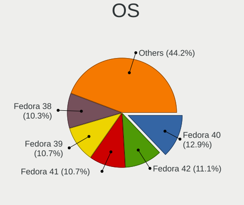

| Name                             | Computers | Percent |
|----------------------------------|-----------|---------|
| Fedora 40                        | 3833      | 12.9%   |
| Fedora 42                        | 3310      | 11.14%  |
| Fedora 41                        | 3184      | 10.71%  |
| Fedora 39                        | 3176      | 10.69%  |
| Fedora 38                        | 3071      | 10.33%  |
| Fedora 36                        | 2153      | 7.24%   |
| Fedora 37                        | 2092      | 7.04%   |
| Fedora 35                        | 1674      | 5.63%   |
| Fedora 34                        | 1603      | 5.39%   |
| Fedora 33                        | 1575      | 5.3%    |
| Fedora 32                        | 1376      | 4.63%   |
| Fedora 43                        | 1157      | 3.89%   |
| Fedora 31                        | 912       | 3.07%   |
| Fedora 30                        | 315       | 1.06%   |
| Fedora 29                        | 173       | 0.58%   |
| Fedora 28                        | 43        | 0.14%   |
| Fedora 27                        | 19        | 0.06%   |
| Fedora 44                        | 11        | 0.04%   |
| Fedora Asahi-remix-40            | 9         | 0.03%   |
| Fedora Asahi-remix-42            | 8         | 0.03%   |
| Fedora 24                        | 6         | 0.02%   |
| Fedora 21                        | 6         | 0.02%   |
| Fedora 25                        | 4         | 0.01%   |
| Fedora Asahi-remix-41            | 2         | 0.01%   |
| Fedora Release-10-(cambridge)-40 | 1         | 0.003%  |
| Fedora Asahi-remix-39            | 1         | 0.003%  |
| Fedora 4                         | 1         | 0.003%  |
| Fedora 20.04                     | 1         | 0.003%  |
| Fedora 17                        | 1         | 0.003%  |
| Fedora 14                        | 1         | 0.003%  |

OS Family
---------

OS without a version

| Name   | Computers | Percent |
|--------|-----------|---------|
| Fedora | 26373     | 100%    |

Kernel
------

Version of the Linux kernel

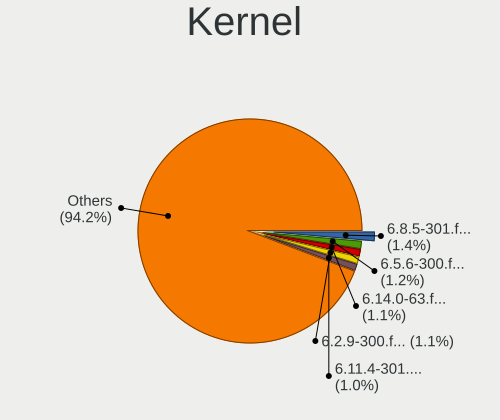

| Version                 | Computers | Percent |
|-------------------------|-----------|---------|
| 6.8.5-301.fc40.x86_64   | 458       | 1.39%   |
| 6.5.6-300.fc39.x86_64   | 393       | 1.19%   |
| 6.14.0-63.fc42.x86_64   | 359       | 1.09%   |
| 6.2.9-300.fc38.x86_64   | 356       | 1.08%   |
| 6.11.4-301.fc41.x86_64  | 340       | 1.03%   |
| 6.8.11-300.fc40.x86_64  | 286       | 0.87%   |
| 6.12.11-200.fc41.x86_64 | 266       | 0.81%   |
| 6.14.9-300.fc42.x86_64  | 257       | 0.78%   |
| 6.8.7-300.fc40.x86_64   | 246       | 0.75%   |
| 6.2.15-300.fc38.x86_64  | 233       | 0.71%   |
| 6.10.6-200.fc40.x86_64  | 232       | 0.7%    |
| 6.8.9-300.fc40.x86_64   | 231       | 0.7%    |
| 6.15.9-201.fc42.x86_64  | 227       | 0.69%   |
| 6.7.9-200.fc39.x86_64   | 226       | 0.69%   |
| 6.5.11-300.fc39.x86_64  | 209       | 0.63%   |
| 6.17.12-300.fc43.x86_64 | 209       | 0.63%   |
| 6.3.8-200.fc38.x86_64   | 208       | 0.63%   |
| 6.6.9-200.fc39.x86_64   | 205       | 0.62%   |
| 6.15.4-200.fc42.x86_64  | 201       | 0.61%   |
| 6.13.5-200.fc41.x86_64  | 201       | 0.61%   |
| 6.7.4-200.fc39.x86_64   | 195       | 0.59%   |
| 6.11.5-300.fc41.x86_64  | 192       | 0.58%   |
| 6.4.15-200.fc38.x86_64  | 190       | 0.58%   |
| 5.17.5-300.fc36.x86_64  | 187       | 0.57%   |
| 6.14.2-300.fc42.x86_64  | 183       | 0.55%   |
| 6.14.6-300.fc42.x86_64  | 181       | 0.55%   |
| 6.11.8-300.fc41.x86_64  | 172       | 0.52%   |
| 6.6.8-200.fc39.x86_64   | 171       | 0.52%   |
| 6.17.8-300.fc43.x86_64  | 168       | 0.51%   |
| 6.5.5-200.fc38.x86_64   | 167       | 0.51%   |
| 6.0.7-301.fc37.x86_64   | 167       | 0.51%   |
| 6.17.7-300.fc43.x86_64  | 165       | 0.5%    |
| 6.13.9-200.fc41.x86_64  | 164       | 0.5%    |
| 5.16.18-200.fc35.x86_64 | 160       | 0.49%   |
| 6.11.10-300.fc41.x86_64 | 159       | 0.48%   |
| 5.9.16-200.fc33.x86_64  | 159       | 0.48%   |
| 6.8.10-300.fc40.x86_64  | 157       | 0.48%   |
| 6.2.14-300.fc38.x86_64  | 155       | 0.47%   |
| 6.10.12-200.fc40.x86_64 | 154       | 0.47%   |
| 6.14.5-300.fc42.x86_64  | 148       | 0.45%   |

Kernel Family
-------------

Linux kernel without a distro release

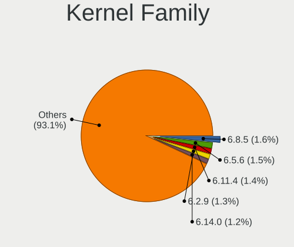

| Version | Computers | Percent |
|---------|-----------|---------|
| 6.8.5   | 520       | 1.58%   |
| 6.5.6   | 499       | 1.51%   |
| 6.11.4  | 448       | 1.36%   |
| 6.2.9   | 420       | 1.28%   |
| 6.14.0  | 399       | 1.21%   |
| 6.8.7   | 331       | 1%      |
| 6.8.11  | 328       | 1%      |
| 6.8.9   | 321       | 0.97%   |
| 6.2.15  | 304       | 0.92%   |
| 6.14.9  | 275       | 0.83%   |
| 6.12.11 | 275       | 0.83%   |
| 6.7.9   | 258       | 0.78%   |
| 5.17.5  | 242       | 0.73%   |
| 6.10.6  | 239       | 0.73%   |
| 6.15.9  | 236       | 0.72%   |
| 6.3.8   | 226       | 0.69%   |
| 6.11.5  | 224       | 0.68%   |
| 6.17.12 | 216       | 0.66%   |
| 6.6.9   | 215       | 0.65%   |
| 6.5.11  | 212       | 0.64%   |
| 6.13.5  | 208       | 0.63%   |
| 6.15.4  | 207       | 0.63%   |
| 6.7.4   | 202       | 0.61%   |
| 6.14.6  | 199       | 0.6%    |
| 6.4.15  | 196       | 0.6%    |
| 6.17.7  | 195       | 0.59%   |
| 6.0.7   | 195       | 0.59%   |
| 6.5.5   | 194       | 0.59%   |
| 6.14.2  | 191       | 0.58%   |
| 6.8.10  | 189       | 0.57%   |
| 6.6.8   | 187       | 0.57%   |
| 6.17.8  | 185       | 0.56%   |
| 6.2.14  | 182       | 0.55%   |
| 6.11.8  | 182       | 0.55%   |
| 6.14.5  | 179       | 0.54%   |
| 5.9.16  | 176       | 0.53%   |
| 6.11.10 | 175       | 0.53%   |
| 5.16.18 | 172       | 0.52%   |
| 6.13.9  | 169       | 0.51%   |
| 6.7.7   | 164       | 0.5%    |

Kernel Major Ver.
-----------------

Linux kernel major version

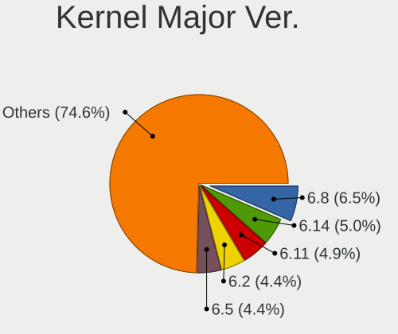

| Version | Computers | Percent |
|---------|-----------|---------|
| 6.8     | 2055      | 6.51%   |
| 6.14    | 1593      | 5.04%   |
| 6.11    | 1562      | 4.95%   |
| 6.2     | 1404      | 4.45%   |
| 6.5     | 1402      | 4.44%   |
| 6.17    | 1325      | 4.2%    |
| 6.12    | 1211      | 3.83%   |
| 6.10    | 1179      | 3.73%   |
| 6.0     | 1156      | 3.66%   |
| 6.6     | 1150      | 3.64%   |
| 6.15    | 1069      | 3.39%   |
| 6.7     | 1041      | 3.3%    |
| 6.9     | 931       | 2.95%   |
| 6.4     | 888       | 2.81%   |
| 6.13    | 869       | 2.75%   |
| 5.17    | 858       | 2.72%   |
| 5.8     | 846       | 2.68%   |
| 6.1     | 802       | 2.54%   |
| 5.11    | 800       | 2.53%   |
| 5.19    | 787       | 2.49%   |
| 6.16    | 742       | 2.35%   |
| 5.18    | 740       | 2.34%   |
| 6.3     | 709       | 2.25%   |
| 5.16    | 665       | 2.11%   |
| 5.14    | 664       | 2.1%    |
| 5.9     | 562       | 1.78%   |
| 5.10    | 550       | 1.74%   |
| 5.13    | 540       | 1.71%   |
| 5.15    | 532       | 1.68%   |
| 5.6     | 526       | 1.67%   |
| 5.12    | 506       | 1.6%    |
| 5.7     | 423       | 1.34%   |
| 5.3     | 332       | 1.05%   |
| 5.4     | 325       | 1.03%   |
| 5.5     | 319       | 1.01%   |
| 5.0     | 121       | 0.38%   |
| 5.2     | 110       | 0.35%   |
| 5.1     | 75        | 0.24%   |
| 4.19    | 56        | 0.18%   |
| 4.18    | 50        | 0.16%   |

Arch
----

OS architecture (x86_64, i586, etc.)

| Name        | Computers | Percent |
|-------------|-----------|---------|
| x86_64      | 26265     | 99.58%  |
| aarch64     | 89        | 0.34%   |
| i686        | 10        | 0.04%   |
| armv7l      | 4         | 0.02%   |
| Unknown     | 3         | 0.01%   |
| riscv64     | 2         | 0.01%   |
| ppc64le     | 2         | 0.01%   |
| loongarch64 | 1         | 0.004%  |

DE
--

Desktop Environment

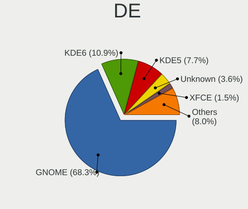

| Name            | Computers | Percent |
|-----------------|-----------|---------|
| GNOME           | 18550     | 68.33%  |
| KDE6            | 2948      | 10.86%  |
| KDE5            | 2093      | 7.71%   |
| Unknown         | 964       | 3.55%   |
| XFCE            | 418       | 1.54%   |
| X-Cinnamon      | 357       | 1.32%   |
| KDE4            | 353       | 1.3%    |
| KDE             | 277       | 1.02%   |
| MATE            | 230       | 0.85%   |
| Cinnamon        | 198       | 0.73%   |
| GNOME Classic   | 188       | 0.69%   |
| sway            | 89        | 0.33%   |
| Budgie          | 81        | 0.3%    |
| i3              | 75        | 0.28%   |
| Hyprland        | 67        | 0.25%   |
| LXQt            | 53        | 0.2%    |
| LXDE            | 43        | 0.16%   |
| COSMIC          | 40        | 0.15%   |
| Deepin          | 38        | 0.14%   |
| niri            | 8         | 0.03%   |
| awesome         | 8         | 0.03%   |
| GNOME Flashback | 7         | 0.03%   |
| Pantheon        | 6         | 0.02%   |
| openbox         | 6         | 0.02%   |
| bspwm           | 6         | 0.02%   |
| GNOME-Classic   | 5         | 0.02%   |
| DWM             | 5         | 0.02%   |
| fluxbox         | 4         | 0.01%   |
| Xpra            | 3         | 0.01%   |
| qtile           | 3         | 0.01%   |
| xmonad          | 2         | 0.01%   |
| xinit-compat    | 2         | 0.01%   |
| sway:wlroots    | 2         | 0.01%   |
| wlroots         | 1         | 0.004%  |
| WindowMaker     | 1         | 0.004%  |
| Unity           | 1         | 0.004%  |
| Trinity         | 1         | 0.004%  |
| river:wlroots   | 1         | 0.004%  |
| river           | 1         | 0.004%  |
| Phosh:GNOME     | 1         | 0.004%  |

Display Server
--------------

X11 or Wayland

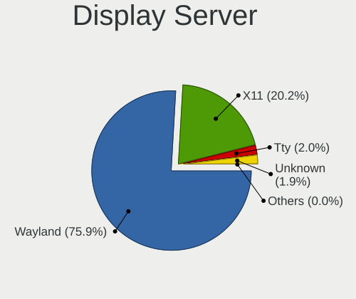

| Name        | Computers | Percent |
|-------------|-----------|---------|
| Wayland     | 20636     | 75.91%  |
| X11         | 5480      | 20.16%  |
| Tty         | 534       | 1.96%   |
| Unknown     | 517       | 1.9%    |
| Web         | 16        | 0.06%   |
| Xcb         | 1         | 0.004%  |
| Unspecified | 1         | 0.004%  |

Display Manager
---------------

SDDM, LightDM, etc.

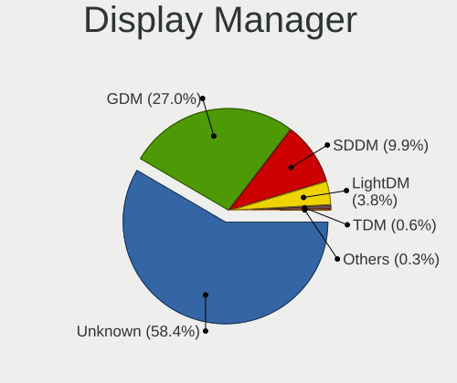

| Name    | Computers | Percent |
|---------|-----------|---------|
| Unknown | 15819     | 58.44%  |
| GDM     | 7299      | 26.96%  |
| SDDM    | 2693      | 9.95%   |
| LightDM | 1016      | 3.75%   |
| TDM     | 168       | 0.62%   |
| LXDM    | 22        | 0.08%   |
| XDM     | 19        | 0.07%   |
| GREETD  | 16        | 0.06%   |
| KDM     | 15        | 0.06%   |
| SLiM    | 3         | 0.01%   |
| Ly      | 1         | 0.004%  |

OS Lang
-------

Language

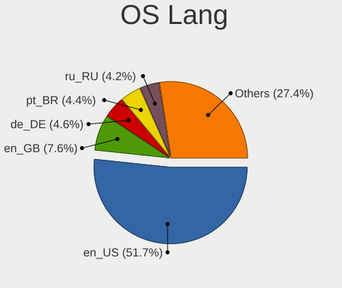

| Lang    | Computers | Percent |
|---------|-----------|---------|
| en_US   | 13826     | 51.67%  |
| en_GB   | 2047      | 7.65%   |
| de_DE   | 1231      | 4.6%    |
| pt_BR   | 1189      | 4.44%   |
| ru_RU   | 1122      | 4.19%   |
| fr_FR   | 778       | 2.91%   |
| it_IT   | 736       | 2.75%   |
| Unknown | 729       | 2.72%   |
| en_CA   | 520       | 1.94%   |
| en_AU   | 482       | 1.8%    |
| es_ES   | 446       | 1.67%   |
| pl_PL   | 397       | 1.48%   |
| en_IN   | 278       | 1.04%   |
| es_MX   | 270       | 1.01%   |
| tr_TR   | 150       | 0.56%   |
| cs_CZ   | 135       | 0.5%    |
| es_AR   | 131       | 0.49%   |
| zh_CN   | 124       | 0.46%   |
| es_CL   | 123       | 0.46%   |
| nl_NL   | 111       | 0.41%   |
| es_CO   | 105       | 0.39%   |
| en_NZ   | 102       | 0.38%   |
| en_DK   | 91        | 0.34%   |
| hu_HU   | 89        | 0.33%   |
| sv_SE   | 88        | 0.33%   |
| de_AT   | 83        | 0.31%   |
| en_IE   | 82        | 0.31%   |
| pt_PT   | 78        | 0.29%   |
| en_ZA   | 64        | 0.24%   |
| de_CH   | 61        | 0.23%   |
| C       | 61        | 0.23%   |
| fi_FI   | 57        | 0.21%   |
| fr_CA   | 53        | 0.2%    |
| da_DK   | 49        | 0.18%   |
| nl_BE   | 45        | 0.17%   |
| ru_UA   | 44        | 0.16%   |
| ja_JP   | 39        | 0.15%   |
| es_PE   | 39        | 0.15%   |
| uk_UA   | 38        | 0.14%   |
| fr_CH   | 37        | 0.14%   |

Boot Mode
---------

EFI or BIOS

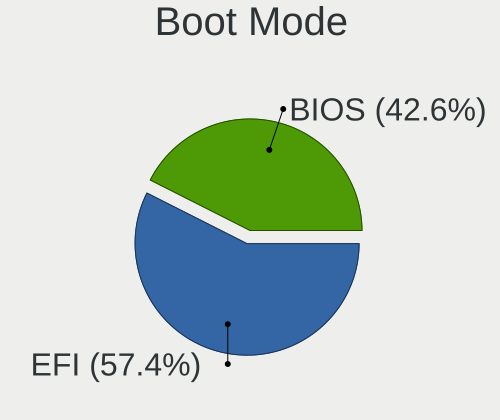

| Mode | Computers | Percent |
|------|-----------|---------|
| EFI  | 15528     | 57.45%  |
| BIOS | 11501     | 42.55%  |

Filesystem
----------

Type of filesystem

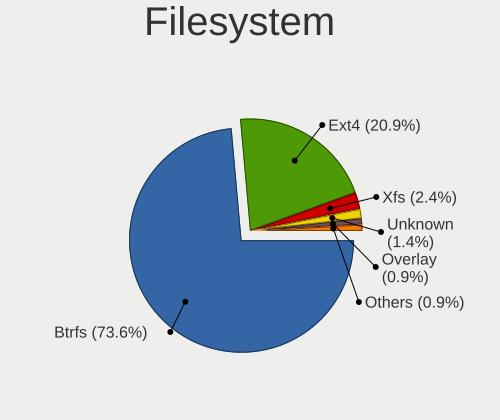

| Type                | Computers | Percent |
|---------------------|-----------|---------|
| Btrfs               | 19748     | 73.59%  |
| Ext4                | 5597      | 20.86%  |
| Xfs                 | 641       | 2.39%   |
| Unknown             | 365       | 1.36%   |
| Overlay             | 233       | 0.87%   |
| Tmpfs               | 214       | 0.8%    |
| Ext3                | 11        | 0.04%   |
| Zfs                 | 10        | 0.04%   |
| F2fs                | 10        | 0.04%   |
| Fuse.fuse-overlayfs | 4         | 0.01%   |
| XXXXX               | 2         | 0.01%   |
| Nfs4                | 1         | 0.004%  |

Part. scheme
------------

Scheme of partitioning

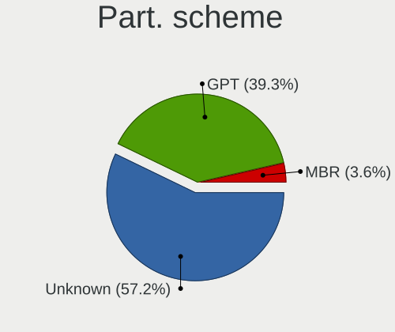

| Type    | Computers | Percent |
|---------|-----------|---------|
| Unknown | 15425     | 57.17%  |
| GPT     | 10593     | 39.26%  |
| MBR     | 963       | 3.57%   |

Dual Boot with Linux/BSD
------------------------

Hosting more than one Linux/BSD

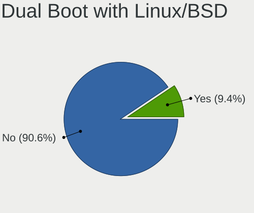

| Dual boot | Computers | Percent |
|-----------|-----------|---------|
| No        | 24228     | 90.58%  |
| Yes       | 2519      | 9.42%   |

Dual Boot (Win)
---------------

Hosting Linux and Windows

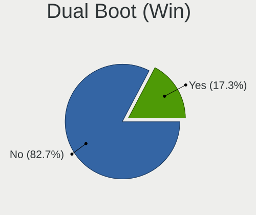

| Dual boot | Computers | Percent |
|-----------|-----------|---------|
| No        | 22131     | 82.74%  |
| Yes       | 4618      | 17.26%  |

Board
-----

Vendor
------

Motherboard manufacturer

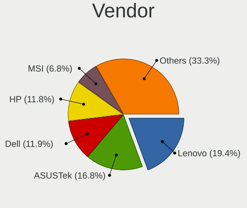

| Name                                 | Computers | Percent |
|--------------------------------------|-----------|---------|
| Lenovo                               | 5113      | 19.39%  |
| ASUSTek Computer                     | 4439      | 16.83%  |
| Dell                                 | 3127      | 11.86%  |
| Hewlett-Packard                      | 3117      | 11.82%  |
| MSI                                  | 1800      | 6.83%   |
| Gigabyte Technology                  | 1694      | 6.42%   |
| Acer                                 | 1091      | 4.14%   |
| Apple                                | 970       | 3.68%   |
| ASRock                               | 897       | 3.4%    |
| Intel                                | 319       | 1.21%   |
| HUAWEI                               | 311       | 1.18%   |
| Samsung Electronics                  | 259       | 0.98%   |
| Unknown                              | 233       | 0.88%   |
| Toshiba                              | 166       | 0.63%   |
| Microsoft                            | 156       | 0.59%   |
| Framework                            | 142       | 0.54%   |
| Google                               | 133       | 0.5%    |
| Fujitsu                              | 126       | 0.48%   |
| Timi                                 | 94        | 0.36%   |
| Sony                                 | 93        | 0.35%   |
| Alienware                            | 87        | 0.33%   |
| AZW                                  | 80        | 0.3%    |
| Notebook                             | 79        | 0.3%    |
| Shenzhen Meigao Electronic Equipment | 70        | 0.27%   |
| Chuwi                                | 61        | 0.23%   |
| Positivo                             | 60        | 0.23%   |
| Pegatron                             | 54        | 0.2%    |
| LG Electronics                       | 54        | 0.2%    |
| HONOR                                | 49        | 0.19%   |
| Medion                               | 48        | 0.18%   |
| Supermicro                           | 45        | 0.17%   |
| TUXEDO                               | 43        | 0.16%   |
| Razer                                | 38        | 0.14%   |
| System76                             | 37        | 0.14%   |
| Huanan                               | 36        | 0.14%   |
| Biostar                              | 34        | 0.13%   |
| AMI                                  | 33        | 0.13%   |
| BESSTAR Tech                         | 32        | 0.12%   |
| Foxconn                              | 28        | 0.11%   |
| SLIMBOOK                             | 26        | 0.1%    |

Model
-----

Motherboard model

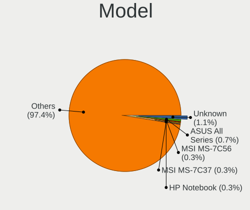

| Name                                       | Computers | Percent |
|--------------------------------------------|-----------|---------|
| Unknown                                    | 286       | 1.08%   |
| ASUS All Series                            | 183       | 0.69%   |
| MSI MS-7C56                                | 72        | 0.27%   |
| MSI MS-7C37                                | 71        | 0.27%   |
| HP Notebook                                | 69        | 0.26%   |
| Apple MacBookPro9,2                        | 67        | 0.25%   |
| ASUS TUF Gaming X570-PLUS                  | 62        | 0.24%   |
| MSI MS-7C91                                | 58        | 0.22%   |
| MSI MS-7C02                                | 48        | 0.18%   |
| Apple MacBookPro14,1                       | 48        | 0.18%   |
| Apple MacBookPro8,1                        | 47        | 0.18%   |
| Gigabyte B450M DS3H                        | 46        | 0.17%   |
| Apple MacBookAir7,2                        | 46        | 0.17%   |
| MSI MS-7C95                                | 45        | 0.17%   |
| Apple MacBookPro12,1                       | 45        | 0.17%   |
| Dell OptiPlex 7010                         | 44        | 0.17%   |
| MSI MS-7B86                                | 43        | 0.16%   |
| Apple MacBookPro11,1                       | 42        | 0.16%   |
| Dell Latitude 7490                         | 39        | 0.15%   |
| ASUS ROG STRIX B550-F GAMING               | 39        | 0.15%   |
| Framework Laptop 13 (AMD Ryzen 7040Series) | 38        | 0.14%   |
| HP EliteBook 840 G6                        | 37        | 0.14%   |
| Framework Laptop                           | 37        | 0.14%   |
| MSI MS-7B89                                | 36        | 0.14%   |
| Dell XPS 15 9570                           | 36        | 0.14%   |
| Dell XPS 15 9560                           | 36        | 0.14%   |
| Dell XPS 15 7590                           | 35        | 0.13%   |
| ASUS PRIME A320M-K                         | 35        | 0.13%   |
| MSI MS-7A38                                | 34        | 0.13%   |
| AZW SER                                    | 34        | 0.13%   |
| ASUS TUF Gaming B550-PLUS                  | 34        | 0.13%   |
| Apple MacBookPro11,3                       | 34        | 0.13%   |
| HP Pavilion Notebook                       | 33        | 0.13%   |
| Dell OptiPlex 9020                         | 33        | 0.13%   |
| Dell XPS 15 9500                           | 32        | 0.12%   |
| Dell XPS 13 9310                           | 32        | 0.12%   |
| Dell XPS 13 9370                           | 30        | 0.11%   |
| ASUS ROG STRIX B450-F GAMING               | 30        | 0.11%   |
| Lenovo IdeaPadFlex 5 14ARE05 81X2          | 29        | 0.11%   |
| Gigabyte B550M DS3H                        | 29        | 0.11%   |

Model Family
------------

Motherboard model prefix

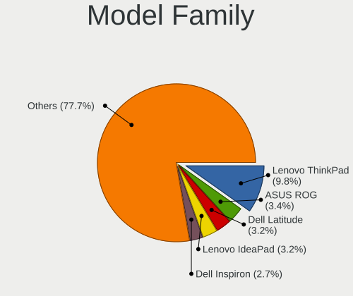

| Name               | Computers | Percent |
|--------------------|-----------|---------|
| Lenovo ThinkPad    | 2594      | 9.84%   |
| ASUS ROG           | 895       | 3.39%   |
| Dell Latitude      | 843       | 3.2%    |
| Lenovo IdeaPad     | 833       | 3.16%   |
| Dell Inspiron      | 714       | 2.71%   |
| Acer Aspire        | 642       | 2.43%   |
| ASUS PRIME         | 590       | 2.24%   |
| Dell XPS           | 549       | 2.08%   |
| HP Pavilion        | 494       | 1.87%   |
| ASUS VivoBook      | 488       | 1.85%   |
| HP EliteBook       | 472       | 1.79%   |
| ASUS TUF           | 434       | 1.65%   |
| Lenovo Yoga        | 375       | 1.42%   |
| Dell Precision     | 346       | 1.31%   |
| HP Laptop          | 345       | 1.31%   |
| Dell OptiPlex      | 332       | 1.26%   |
| ASUS ASUS          | 317       | 1.2%    |
| HP ProBook         | 302       | 1.15%   |
| Lenovo Legion      | 300       | 1.14%   |
| Unknown            | 286       | 1.08%   |
| HP ENVY            | 240       | 0.91%   |
| ASUS All           | 183       | 0.69%   |
| ASUS Zenbook       | 175       | 0.66%   |
| Lenovo ThinkCentre | 174       | 0.66%   |
| Lenovo ThinkBook   | 171       | 0.65%   |
| Acer Nitro         | 162       | 0.61%   |
| Microsoft Surface  | 156       | 0.59%   |
| Framework Laptop   | 140       | 0.53%   |
| Toshiba Satellite  | 131       | 0.5%    |
| Apple MacBookPro11 | 130       | 0.49%   |
| HP ZBook           | 129       | 0.49%   |
| Dell Vostro        | 128       | 0.49%   |
| Gigabyte X570      | 113       | 0.43%   |
| HP EliteDesk       | 109       | 0.41%   |
| HP OMEN            | 108       | 0.41%   |
| HP Compaq          | 108       | 0.41%   |
| Lenovo IdeaPadFlex | 96        | 0.36%   |
| Gigabyte B450M     | 90        | 0.34%   |
| Gigabyte B450      | 89        | 0.34%   |
| Gigabyte B550      | 86        | 0.33%   |

MFG Year
--------

Motherboard manufacture year

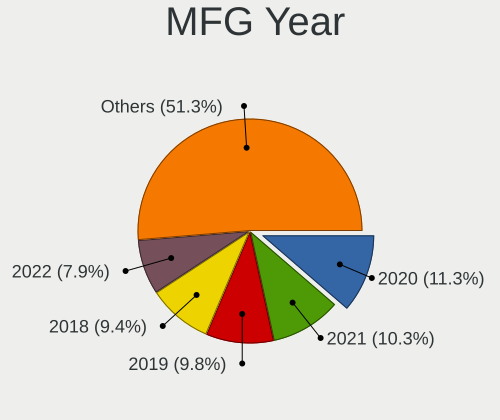

| Year    | Computers | Percent |
|---------|-----------|---------|
| 2020    | 2988      | 11.33%  |
| 2021    | 2706      | 10.26%  |
| 2019    | 2583      | 9.79%   |
| 2018    | 2474      | 9.38%   |
| 2022    | 2094      | 7.94%   |
| 2017    | 1796      | 6.81%   |
| 2023    | 1740      | 6.6%    |
| 2012    | 1376      | 5.22%   |
| 2013    | 1258      | 4.77%   |
| 2016    | 1180      | 4.47%   |
| 2014    | 1177      | 4.46%   |
| 2015    | 1173      | 4.45%   |
| 2024    | 1075      | 4.08%   |
| 2011    | 899       | 3.41%   |
| 2010    | 536       | 2.03%   |
| 2009    | 379       | 1.44%   |
| 2008    | 349       | 1.32%   |
| 2025    | 325       | 1.23%   |
| 2007    | 120       | 0.46%   |
| 2006    | 81        | 0.31%   |
| Unknown | 55        | 0.21%   |
| 2005    | 7         | 0.03%   |
| 2003    | 1         | 0.004%  |
| 2000    | 1         | 0.004%  |

Form Factor
-----------

Physical design of the computer

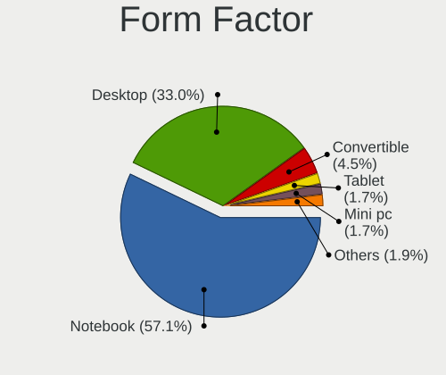

| Name           | Computers | Percent |
|----------------|-----------|---------|
| Notebook       | 15070     | 57.14%  |
| Desktop        | 8697      | 32.98%  |
| Convertible    | 1188      | 4.5%    |
| Tablet         | 460       | 1.74%   |
| Mini pc        | 458       | 1.74%   |
| All in one     | 330       | 1.25%   |
| Server         | 107       | 0.41%   |
| System on chip | 49        | 0.19%   |
| Other          | 12        | 0.05%   |
| Firewall       | 2         | 0.01%   |

Secure Boot
-----------

Enabled or disabled

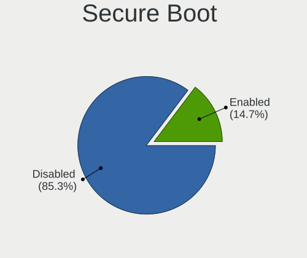

| State    | Computers | Percent |
|----------|-----------|---------|
| Disabled | 22858     | 85.31%  |
| Enabled  | 3936      | 14.69%  |

Coreboot
--------

Have coreboot on board

| Used | Computers | Percent |
|------|-----------|---------|
| No   | 26203     | 99.36%  |
| Yes  | 170       | 0.64%   |

RAM Size
--------

Total RAM memory

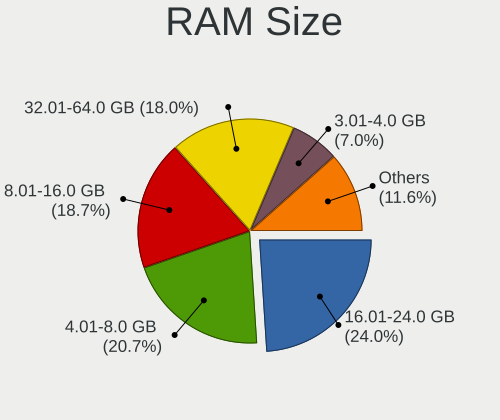

| Size in GB      | Computers | Percent |
|-----------------|-----------|---------|
| 16.01-24.0      | 6433      | 23.98%  |
| 4.01-8.0        | 5559      | 20.72%  |
| 8.01-16.0       | 5011      | 18.68%  |
| 32.01-64.0      | 4831      | 18.01%  |
| 3.01-4.0        | 1890      | 7.05%   |
| 64.01-256.0     | 1486      | 5.54%   |
| 24.01-32.0      | 1168      | 4.35%   |
| 1.01-2.0        | 306       | 1.14%   |
| 2.01-3.0        | 88        | 0.33%   |
| More than 256.0 | 25        | 0.09%   |
| 0.51-1.0        | 22        | 0.08%   |
| Unknown         | 7         | 0.03%   |

RAM Used
--------

Used RAM memory

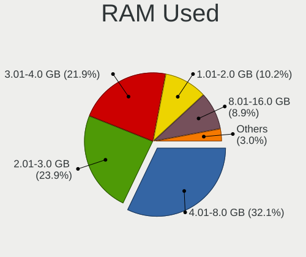

| Used GB     | Computers | Percent |
|-------------|-----------|---------|
| 4.01-8.0    | 9491      | 32.13%  |
| 2.01-3.0    | 7071      | 23.94%  |
| 3.01-4.0    | 6471      | 21.91%  |
| 1.01-2.0    | 3003      | 10.17%  |
| 8.01-16.0   | 2626      | 8.89%   |
| 16.01-24.0  | 374       | 1.27%   |
| 0.51-1.0    | 287       | 0.97%   |
| 24.01-32.0  | 109       | 0.37%   |
| 32.01-64.0  | 59        | 0.2%    |
| 0.01-0.5    | 27        | 0.09%   |
| 64.01-256.0 | 9         | 0.03%   |
| Unknown     | 9         | 0.03%   |

Total Drives
------------

Number of drives on board

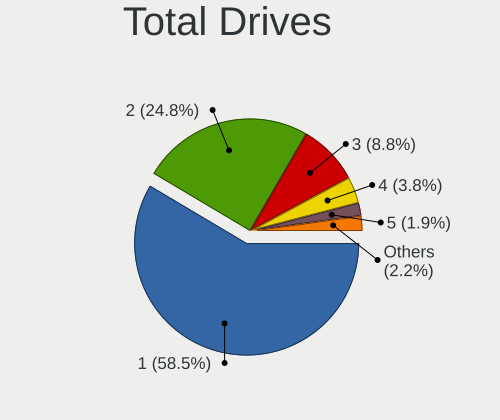

| Drives  | Computers | Percent |
|---------|-----------|---------|
| 1       | 15901     | 58.53%  |
| 2       | 6747      | 24.84%  |
| 3       | 2379      | 8.76%   |
| 4       | 1037      | 3.82%   |
| 5       | 508       | 1.87%   |
| 6       | 244       | 0.9%    |
| 7       | 113       | 0.42%   |
| 0       | 96        | 0.35%   |
| 8       | 57        | 0.21%   |
| 9       | 28        | 0.1%    |
| 10      | 17        | 0.06%   |
| 12      | 9         | 0.03%   |
| 11      | 9         | 0.03%   |
| 13      | 4         | 0.01%   |
| 15      | 3         | 0.01%   |
| 36      | 2         | 0.01%   |
| 22      | 2         | 0.01%   |
| 18      | 2         | 0.01%   |
| 14      | 2         | 0.01%   |
| 410     | 1         | 0.004%  |
| 27      | 1         | 0.004%  |
| 24      | 1         | 0.004%  |
| 17      | 1         | 0.004%  |
| Unknown | 1         | 0.004%  |

Has CD-ROM
----------

Has CD-ROM on board

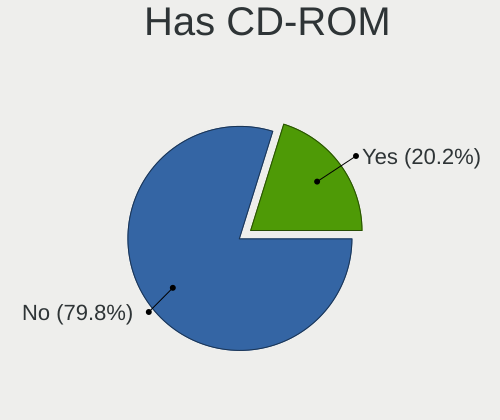

| Presented | Computers | Percent |
|-----------|-----------|---------|
| No        | 21174     | 79.8%   |
| Yes       | 5359      | 20.2%   |

Has Ethernet
------------

Has Ethernet on board

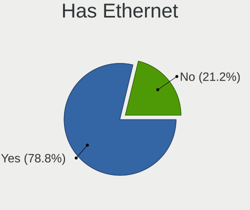

| Presented | Computers | Percent |
|-----------|-----------|---------|
| Yes       | 20874     | 78.76%  |
| No        | 5630      | 21.24%  |

Has WiFi
--------

Has WiFi module

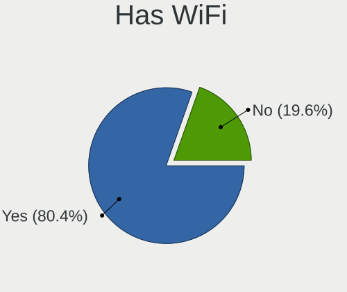

| Presented | Computers | Percent |
|-----------|-----------|---------|
| Yes       | 21328     | 80.41%  |
| No        | 5196      | 19.59%  |

Has Bluetooth
-------------

Has Bluetooth module

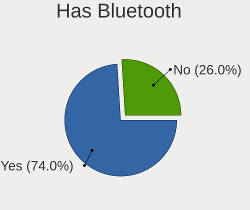

| Presented | Computers | Percent |
|-----------|-----------|---------|
| Yes       | 19760     | 74.03%  |
| No        | 6932      | 25.97%  |

Location
--------

Country
-------

Geographic location (country)

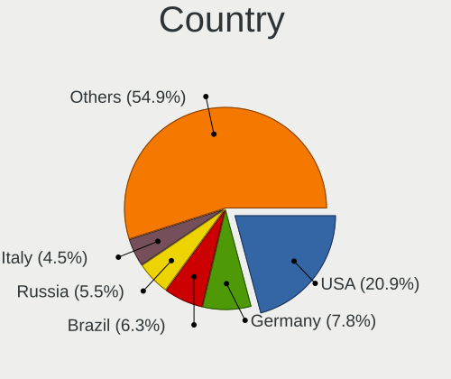

| Country      | Computers | Percent |
|--------------|-----------|---------|
| USA          | 5558      | 20.87%  |
| Germany      | 2088      | 7.84%   |
| Brazil       | 1690      | 6.34%   |
| Russia       | 1460      | 5.48%   |
| Italy        | 1209      | 4.54%   |
| UK           | 1136      | 4.26%   |
| France       | 1011      | 3.8%    |
| Canada       | 912       | 3.42%   |
| India        | 796       | 2.99%   |
| Poland       | 723       | 2.71%   |
| Spain        | 651       | 2.44%   |
| Australia    | 590       | 2.22%   |
| Netherlands  | 587       | 2.2%    |
| Mexico       | 451       | 1.69%   |
| Sweden       | 340       | 1.28%   |
| Turkey       | 334       | 1.25%   |
| Switzerland  | 333       | 1.25%   |
| Czechia      | 326       | 1.22%   |
| Austria      | 292       | 1.1%    |
| Belgium      | 251       | 0.94%   |
| Romania      | 241       | 0.9%    |
| Argentina    | 233       | 0.87%   |
| Portugal     | 222       | 0.83%   |
| Finland      | 209       | 0.78%   |
| Norway       | 201       | 0.75%   |
| Chile        | 192       | 0.72%   |
| Indonesia    | 190       | 0.71%   |
| Hungary      | 184       | 0.69%   |
| Denmark      | 178       | 0.67%   |
| Colombia     | 173       | 0.65%   |
| China        | 150       | 0.56%   |
| Ukraine      | 138       | 0.52%   |
| Greece       | 136       | 0.51%   |
| Japan        | 131       | 0.49%   |
| Bulgaria     | 129       | 0.48%   |
| New Zealand  | 128       | 0.48%   |
| Philippines  | 115       | 0.43%   |
| Israel       | 115       | 0.43%   |
| South Africa | 109       | 0.41%   |
| Belarus      | 107       | 0.4%    |

City
----

Geographic location (city)

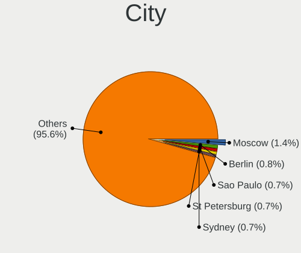

| City              | Computers | Percent |
|-------------------|-----------|---------|
| Moscow            | 395       | 1.4%    |
| Berlin            | 240       | 0.85%   |
| Sao Paulo         | 208       | 0.73%   |
| St Petersburg     | 202       | 0.71%   |
| Sydney            | 188       | 0.66%   |
| Vienna            | 181       | 0.64%   |
| Paris             | 174       | 0.61%   |
| Milan             | 165       | 0.58%   |
| Warsaw            | 164       | 0.58%   |
| Melbourne         | 144       | 0.51%   |
| Istanbul          | 131       | 0.46%   |
| Amsterdam         | 129       | 0.46%   |
| Prague            | 120       | 0.42%   |
| Munich            | 116       | 0.41%   |
| Toronto           | 112       | 0.4%    |
| Mexico City       | 112       | 0.4%    |
| Madrid            | 112       | 0.4%    |
| Helsinki          | 110       | 0.39%   |
| Brisbane          | 109       | 0.39%   |
| Hamburg           | 108       | 0.38%   |
| Bengaluru         | 108       | 0.38%   |
| Rome              | 102       | 0.36%   |
| Zurich            | 101       | 0.36%   |
| Seattle           | 101       | 0.36%   |
| Santiago          | 97        | 0.34%   |
| Los Angeles       | 92        | 0.32%   |
| Rio de Janeiro    | 90        | 0.32%   |
| Montreal          | 90        | 0.32%   |
| Chicago           | 89        | 0.31%   |
| Budapest          | 83        | 0.29%   |
| Bucharest         | 83        | 0.29%   |
| Oslo              | 82        | 0.29%   |
| Frankfurt am Main | 82        | 0.29%   |
| London            | 80        | 0.28%   |
| New York          | 79        | 0.28%   |
| Delhi             | 73        | 0.26%   |
| Dublin            | 72        | 0.25%   |
| Denver            | 71        | 0.25%   |
| Auckland          | 71        | 0.25%   |
| Sofia             | 70        | 0.25%   |

Drives
------

Drive Vendor
------------

Hard drive vendors

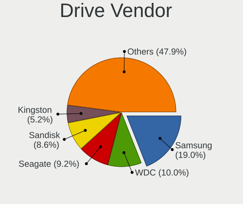

| Vendor                       | Computers | Drives | Percent |
|------------------------------|-----------|--------|---------|
| Samsung Electronics          | 7591      | 12484  | 19.03%  |
| WDC                          | 4005      | 6756   | 10.04%  |
| Seagate                      | 3674      | 6085   | 9.21%   |
| Sandisk                      | 3432      | 4488   | 8.6%    |
| Kingston                     | 2076      | 2844   | 5.2%    |
| Toshiba                      | 1832      | 2543   | 4.59%   |
| SK hynix                     | 1600      | 1985   | 4.01%   |
| Crucial                      | 1390      | 2051   | 3.48%   |
| Unknown                      | 1359      | 1826   | 3.41%   |
| Micron Technology            | 1260      | 1536   | 3.16%   |
| Intel                        | 1186      | 1831   | 2.97%   |
| Micron/Crucial Technology    | 634       | 841    | 1.59%   |
| KIOXIA                       | 589       | 789    | 1.48%   |
| Phison Electronics           | 585       | 782    | 1.47%   |
| Apple                        | 560       | 839    | 1.4%    |
| Hitachi                      | 508       | 744    | 1.27%   |
| A-DATA Technology            | 506       | 633    | 1.27%   |
| HGST                         | 467       | 675    | 1.17%   |
| Kingston Technology Company  | 450       | 543    | 1.13%   |
| China                        | 342       | 424    | 0.86%   |
| Silicon Motion               | 326       | 430    | 0.82%   |
| MAXIO Technology (Hangzhou)  | 318       | 375    | 0.8%    |
| ADATA Technology             | 292       | 364    | 0.73%   |
| SPCC                         | 203       | 270    | 0.51%   |
| Phison                       | 201       | 264    | 0.5%    |
| PNY                          | 194       | 251    | 0.49%   |
| Realtek Semiconductor        | 180       | 217    | 0.45%   |
| Shenzhen Longsys Electronics | 168       | 210    | 0.42%   |
| LITEON                       | 159       | 187    | 0.4%    |
| Patriot                      | 145       | 212    | 0.36%   |
| Unknown                      | 137       | 163    | 0.34%   |
| Transcend                    | 120       | 170    | 0.3%    |
| JMicron Technology           | 119       | 165    | 0.3%    |
| Intenso                      | 113       | 140    | 0.28%   |
| Corsair                      | 111       | 153    | 0.28%   |
| OCZ                          | 104       | 133    | 0.26%   |
| Team                         | 102       | 126    | 0.26%   |
| Netac                        | 87        | 106    | 0.22%   |
| Hewlett-Packard              | 79        | 140    | 0.2%    |
| KingSpec                     | 78        | 119    | 0.2%    |

Drive Model
-----------

Hard drive models

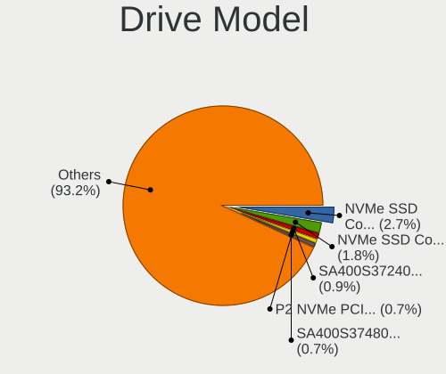

| Model                                                 | Computers | Percent |
|-------------------------------------------------------|-----------|---------|
| Samsung NVMe SSD Controller SM981/PM981/PM983 1TB     | 1178      | 2.67%   |
| Samsung NVMe SSD Controller PM9A1/PM9A3/980PRO 1TB    | 795       | 1.8%    |
| Kingston SA400S37240G 240GB SSD                       | 418       | 0.95%   |
| Micron/Crucial P2 NVMe PCIe SSD 2TB                   | 324       | 0.73%   |
| Kingston SA400S37480G 480GB SSD                       | 307       | 0.69%   |
| Samsung SSD 860 EVO 500GB                             | 299       | 0.68%   |
| Sandisk WD Blue SN550 NVMe SSD 1024GB                 | 285       | 0.64%   |
| Samsung SSD 850 EVO 250GB                             | 282       | 0.64%   |
| Samsung NVMe SSD Controller SM961/PM961/SM963 1024GB  | 270       | 0.61%   |
| Sandisk WD Black SN750 / PC SN730 NVMe SSD 500GB      | 266       | 0.6%    |
| Seagate ST1000LM035-1RK172 1TB                        | 263       | 0.6%    |
| Unknown MMC Card  32GB                                | 244       | 0.55%   |
| Samsung SSD 860 EVO 1TB                               | 242       | 0.55%   |
| Unknown MMC Card  64GB                                | 241       | 0.55%   |
| Samsung SSD 850 EVO 500GB                             | 225       | 0.51%   |
| MAXIO (Hangzhou) NVMe SSD Controller MAP1202 2TB      | 222       | 0.5%    |
| Seagate ST1000DM010-2EP102 1TB                        | 212       | 0.48%   |
| Seagate ST2000DM008-2FR102 2TB                        | 201       | 0.45%   |
| Crucial CT1000MX500SSD1 1TB                           | 201       | 0.45%   |
| Unknown MMC Card  128GB                               | 199       | 0.45%   |
| Samsung SSD 980 1TB                                   | 195       | 0.44%   |
| Crucial CT500MX500SSD1 500GB                          | 185       | 0.42%   |
| Silicon Motion SM2263EN/SM2263XT SSD Controller 512GB | 181       | 0.41%   |
| Phison E12 NVMe Controller 1TB                        | 180       | 0.41%   |
| Kingston SA400S37120G 120GB SSD                       | 175       | 0.4%    |
| Intel SSD 660P Series 512GB                           | 169       | 0.38%   |
| Seagate ST500DM002-1BD142 500GB                       | 163       | 0.37%   |
| Seagate ST1000LM024 HN-M101MBB 1TB                    | 160       | 0.36%   |
| HGST HTS721010A9E630 1TB                              | 157       | 0.36%   |
| Crucial CT240BX500SSD1 240GB                          | 154       | 0.35%   |
| Samsung SSD 860 EVO 250GB                             | 152       | 0.34%   |
| Samsung NVMe SSD Drive 512GB                          | 148       | 0.33%   |
| Sandisk WD Black SN850 1TB                            | 146       | 0.33%   |
| Toshiba MQ04ABF100 1TB                                | 144       | 0.33%   |
| Samsung SSD 990 PRO 2TB                               | 143       | 0.32%   |
| WDC WD10EZEX-08WN4A0 1TB                              | 142       | 0.32%   |
| Toshiba DT01ACA100 1TB                                | 141       | 0.32%   |
| Samsung SSD 870 EVO 1TB                               | 141       | 0.32%   |
| Kingston Company SNV2S1000G 1TB                       | 138       | 0.31%   |
| Intel SSDPEKNU512GZ 512GB                             | 137       | 0.31%   |

HDD Vendor
----------

Hard disk drive vendors

| Vendor              | Computers | Drives | Percent |
|---------------------|-----------|--------|---------|
| Seagate             | 3549      | 5823   | 36.99%  |
| WDC                 | 3025      | 5217   | 31.53%  |
| Toshiba             | 1151      | 1612   | 12%     |
| Hitachi             | 508       | 744    | 5.29%   |
| HGST                | 466       | 674    | 4.86%   |
| Samsung Electronics | 269       | 485    | 2.8%    |
| Unknown             | 115       | 136    | 1.2%    |
| Apple               | 111       | 126    | 1.16%   |
| JMicron Technology  | 74        | 117    | 0.77%   |
| Maxtor              | 37        | 49     | 0.39%   |
| Fujitsu             | 34        | 37     | 0.35%   |
| ASMT                | 26        | 51     | 0.27%   |
| External            | 21        | 31     | 0.22%   |
| Hewlett-Packard     | 19        | 68     | 0.2%    |
| USB3.0              | 17        | 19     | 0.18%   |
| TO Exter            | 14        | 15     | 0.15%   |
| Intenso             | 14        | 19     | 0.15%   |
| SSK                 | 12        | 12     | 0.13%   |
| USB                 | 11        | 11     | 0.11%   |
| LaCie               | 8         | 11     | 0.08%   |
| Inateck             | 7         | 18     | 0.07%   |
| HGST HTS            | 7         | 7      | 0.07%   |
| T-FORCE             | 6         | 6      | 0.06%   |
| SABRENT             | 6         | 8      | 0.06%   |
| Maxone              | 5         | 5      | 0.05%   |
| JetFlash            | 5         | 5      | 0.05%   |
| SAGE                | 4         | 4      | 0.04%   |
| QNAP                | 4         | 11     | 0.04%   |
| LIO-ORG             | 4         | 25     | 0.04%   |
| ASMedia             | 4         | 7      | 0.04%   |
| Synology            | 3         | 4      | 0.03%   |
| Shenzhen            | 3         | 3      | 0.03%   |
| MaxDigital          | 3         | 3      | 0.03%   |
| H/W                 | 3         | 8      | 0.03%   |
| TerraMas            | 2         | 13     | 0.02%   |
| RSH-319             | 2         | 3      | 0.02%   |
| MARVELL             | 2         | 2      | 0.02%   |
| ICY BOX             | 2         | 3      | 0.02%   |
| IB                  | 2         | 3      | 0.02%   |
| ExcelStor           | 2         | 2      | 0.02%   |

SSD Vendor
----------

Solid state drive vendors

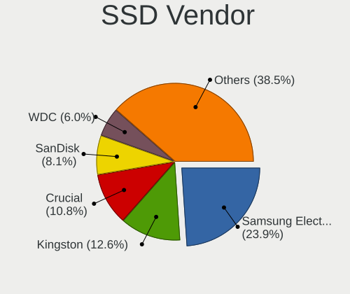

| Vendor              | Computers | Drives | Percent |
|---------------------|-----------|--------|---------|
| Samsung Electronics | 2918      | 4777   | 23.94%  |
| Kingston            | 1533      | 2101   | 12.58%  |
| Crucial             | 1318      | 1958   | 10.81%  |
| SanDisk             | 989       | 1291   | 8.11%   |
| WDC                 | 734       | 1018   | 6.02%   |
| A-DATA Technology   | 408       | 504    | 3.35%   |
| Intel               | 337       | 581    | 2.77%   |
| China               | 337       | 419    | 2.77%   |
| Apple               | 320       | 351    | 2.63%   |
| Micron Technology   | 252       | 306    | 2.07%   |
| SK hynix            | 215       | 262    | 1.76%   |
| PNY                 | 192       | 247    | 1.58%   |
| SPCC                | 181       | 239    | 1.49%   |
| Toshiba             | 165       | 221    | 1.35%   |
| LITEON              | 144       | 172    | 1.18%   |
| Patriot             | 132       | 195    | 1.08%   |
| Transcend           | 110       | 146    | 0.9%    |
| OCZ                 | 103       | 132    | 0.85%   |
| Team                | 91        | 114    | 0.75%   |
| Intenso             | 88        | 105    | 0.72%   |
| KingSpec            | 76        | 116    | 0.62%   |
| GOODRAM             | 76        | 108    | 0.62%   |
| Corsair             | 75        | 101    | 0.62%   |
| Apacer              | 71        | 95     | 0.58%   |
| LITEONIT            | 69        | 88     | 0.57%   |
| Netac               | 64        | 76     | 0.53%   |
| SABRENT             | 59        | 65     | 0.48%   |
| Gigabyte Technology | 56        | 76     | 0.46%   |
| Lexar               | 55        | 89     | 0.45%   |
| Hewlett-Packard     | 44        | 52     | 0.36%   |
| Unknown             | 42        | 50     | 0.34%   |
| Seagate             | 41        | 48     | 0.34%   |
| Plextor             | 36        | 59     | 0.3%    |
| Mushkin             | 28        | 47     | 0.23%   |
| Verbatim            | 27        | 33     | 0.22%   |
| Fanxiang            | 24        | 27     | 0.2%    |
| ASMT                | 24        | 30     | 0.2%    |
| XrayDisk            | 22        | 24     | 0.18%   |
| Unknown             | 22        | 22     | 0.18%   |
| KingDian            | 22        | 23     | 0.18%   |

Drive Kind
----------

HDD or SSD

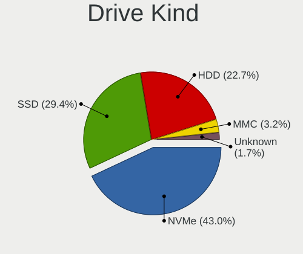

| Kind    | Computers | Drives | Percent |
|---------|-----------|--------|---------|
| NVMe    | 15303     | 23296  | 43.02%  |
| SSD     | 10450     | 17638  | 29.38%  |
| HDD     | 8075      | 15448  | 22.7%   |
| MMC     | 1128      | 1507   | 3.17%   |
| Unknown | 617       | 806    | 1.73%   |

Drive Connector
---------------

SATA, SAS, NVMe, etc.

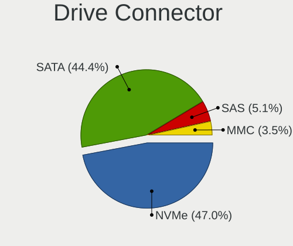

| Type | Computers | Drives | Percent |
|------|-----------|--------|---------|
| NVMe | 15275     | 23100  | 47.02%  |
| SATA | 14417     | 31640  | 44.38%  |
| SAS  | 1663      | 2448   | 5.12%   |
| MMC  | 1128      | 1507   | 3.47%   |

Drive Size
----------

Size of hard drive

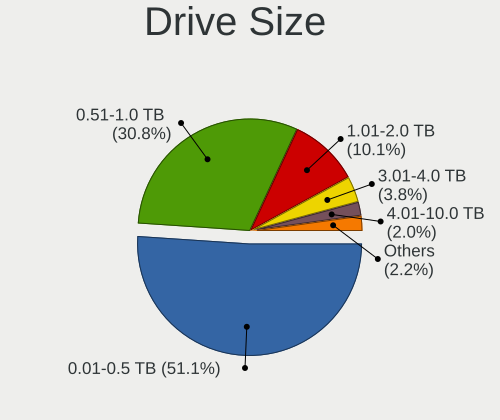

| Size in TB | Computers | Drives | Percent |
|------------|-----------|--------|---------|
| 0.01-0.5   | 10055     | 17288  | 51.07%  |
| 0.51-1.0   | 6074      | 9404   | 30.85%  |
| 1.01-2.0   | 1994      | 3249   | 10.13%  |
| 3.01-4.0   | 742       | 1358   | 3.77%   |
| 4.01-10.0  | 394       | 931    | 2%      |
| 2.01-3.0   | 324       | 617    | 1.65%   |
| 10.01-20.0 | 95        | 214    | 0.48%   |
| 20.01-50.0 | 11        | 23     | 0.06%   |
| 0          | 1         | 2      | 0.01%   |

Space Total
-----------

Amount of disk space available on the file system

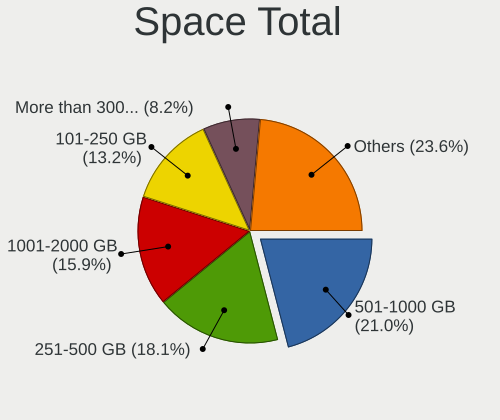

| Size in GB     | Computers | Percent |
|----------------|-----------|---------|
| 501-1000       | 5841      | 20.97%  |
| 251-500        | 5042      | 18.1%   |
| 1001-2000      | 4422      | 15.88%  |
| 101-250        | 3688      | 13.24%  |
| More than 3000 | 2295      | 8.24%   |
| 1-20           | 2286      | 8.21%   |
| Unknown        | 1911      | 6.86%   |
| 2001-3000      | 1122      | 4.03%   |
| 51-100         | 837       | 3%      |
| 21-50          | 409       | 1.47%   |
| 0              | 2         | 0.01%   |

Space Used
----------

Amount of used disk space

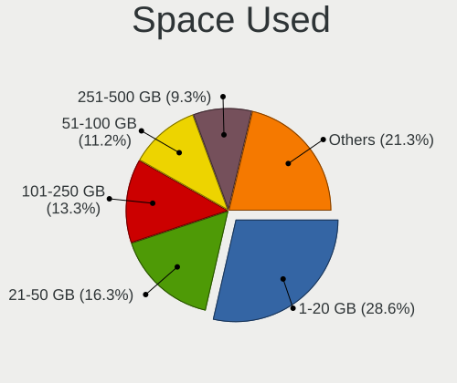

| Used GB        | Computers | Percent |
|----------------|-----------|---------|
| 1-20           | 8330      | 28.57%  |
| 21-50          | 4760      | 16.32%  |
| 101-250        | 3886      | 13.33%  |
| 51-100         | 3255      | 11.16%  |
| 251-500        | 2720      | 9.33%   |
| 501-1000       | 2065      | 7.08%   |
| Unknown        | 1911      | 6.55%   |
| 1001-2000      | 1236      | 4.24%   |
| More than 3000 | 561       | 1.92%   |
| 2001-3000      | 424       | 1.45%   |
| 0              | 10        | 0.03%   |

Malfunc. Drives
---------------

Drive models with a malfunction

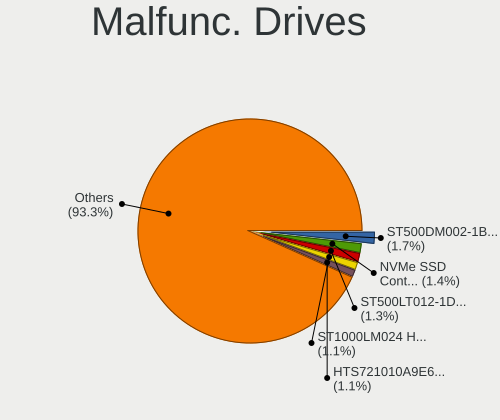

| Model                                                          | Computers | Drives | Percent |
|----------------------------------------------------------------|-----------|--------|---------|
| Seagate ST500DM002-1BD142 500GB                                | 26        | 57     | 1.74%   |
| Samsung Electronics NVMe SSD Controller SM981/PM981/PM983 1TB  | 21        | 24     | 1.41%   |
| Seagate ST500LT012-1DG142 500GB                                | 20        | 20     | 1.34%   |
| Seagate ST1000LM024 HN-M101MBB 1TB                             | 17        | 27     | 1.14%   |
| HGST HTS721010A9E630 1TB                                       | 16        | 19     | 1.07%   |
| Toshiba MQ01ABD100 1TB                                         | 15        | 16     | 1.01%   |
| WDC WD10EZEX-00BN5A0 1TB                                       | 13        | 13     | 0.87%   |
| Seagate ST31000524AS 1TB                                       | 13        | 26     | 0.87%   |
| HGST HTS541010A9E680 1TB                                       | 13        | 13     | 0.87%   |
| Seagate ST1000LM035-1RK172 1TB                                 | 12        | 12     | 0.8%    |
| Seagate ST9500325AS 500GB                                      | 11        | 13     | 0.74%   |
| HGST HTS545050A7E680 500GB                                     | 11        | 11     | 0.74%   |
| Samsung Electronics SSD 870 EVO 1TB                            | 10        | 13     | 0.67%   |
| Samsung Electronics NVMe SSD Controller PM9A1/PM9A3/980PRO 1TB | 10        | 15     | 0.67%   |
| Seagate ST3500418AS 500GB                                      | 9         | 22     | 0.6%    |
| WDC WD10EZEX-08WN4A0 1TB                                       | 8         | 9      | 0.54%   |
| Toshiba MQ01ABD050 500GB                                       | 8         | 14     | 0.54%   |
| Seagate ST31000528AS 1TB                                       | 8         | 10     | 0.54%   |
| SanDisk SSD PLUS 480GB                                         | 8         | 8      | 0.54%   |
| Samsung Electronics SSD 870 EVO 500GB                          | 8         | 12     | 0.54%   |
| Samsung Electronics HD501LJ 500GB                              | 8         | 61     | 0.54%   |
| Kingston SV300S37A120G 120GB SSD                               | 8         | 9      | 0.54%   |
| Hitachi HTS547575A9E384 752GB                                  | 8         | 10     | 0.54%   |
| WDC WDS240G2G0A-00JH30 240GB SSD                               | 7         | 7      | 0.47%   |
| Toshiba MQ01ABD075 752GB                                       | 7         | 7      | 0.47%   |
| Toshiba DT01ACA100 1TB                                         | 7         | 7      | 0.47%   |
| SK hynix BC711 HFM512GD3JX013N 512GB                           | 7         | 7      | 0.47%   |
| Seagate ST500LM021-1KJ152 500GB                                | 7         | 9      | 0.47%   |
| Seagate ST2000DM001-1CH164 2TB                                 | 7         | 7      | 0.47%   |
| SanDisk SSD PLUS 240GB                                         | 7         | 7      | 0.47%   |
| Micron Technology 1100_MTFDDAV256TBN 256GB SSD                 | 7         | 7      | 0.47%   |
| Intel SSDSC2CT120A3 120GB                                      | 7         | 71     | 0.47%   |
| HGST HTS725050A7E630 500GB                                     | 7         | 9      | 0.47%   |
| Crucial CT525MX300SSD1 528GB                                   | 7         | 7      | 0.47%   |
| Crucial CT275MX300SSD1 275GB                                   | 7         | 9      | 0.47%   |
| Crucial CT128MX100SSD1 128GB                                   | 7         | 9      | 0.47%   |
| WDC WDS240G2G0B-00EPW0 240GB SSD                               | 6         | 6      | 0.4%    |
| WDC WD5000AAKX-603CA0 500GB                                    | 6         | 8      | 0.4%    |
| WDC WD40EFRX-68N32N0 4TB                                       | 6         | 19     | 0.4%    |
| Toshiba MQ01ABF050 500GB                                       | 6         | 7      | 0.4%    |

Malfunc. Drive Vendor
---------------------

Vendors of faulty drives

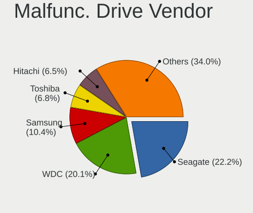

| Vendor                      | Computers | Drives | Percent |
|-----------------------------|-----------|--------|---------|
| Seagate                     | 320       | 506    | 22.22%  |
| WDC                         | 290       | 437    | 20.14%  |
| Samsung Electronics         | 150       | 270    | 10.42%  |
| Toshiba                     | 98        | 125    | 6.81%   |
| Hitachi                     | 93        | 113    | 6.46%   |
| HGST                        | 57        | 64     | 3.96%   |
| Intel                       | 53        | 141    | 3.68%   |
| Crucial                     | 53        | 82     | 3.68%   |
| SanDisk                     | 43        | 46     | 2.99%   |
| Kingston                    | 42        | 50     | 2.92%   |
| SK hynix                    | 36        | 37     | 2.5%    |
| Micron Technology           | 32        | 35     | 2.22%   |
| A-DATA Technology           | 21        | 21     | 1.46%   |
| Apple                       | 12        | 12     | 0.83%   |
| LITEON                      | 10        | 10     | 0.69%   |
| Maxtor                      | 9         | 14     | 0.63%   |
| SPCC                        | 8         | 9      | 0.56%   |
| Corsair                     | 8         | 11     | 0.56%   |
| China                       | 8         | 9      | 0.56%   |
| LITEONIT                    | 6         | 8      | 0.42%   |
| Fujitsu                     | 6         | 6      | 0.42%   |
| Realtek Semiconductor       | 5         | 6      | 0.35%   |
| ADATA Technology            | 5         | 5      | 0.35%   |
| Silicon Motion              | 4         | 4      | 0.28%   |
| OCZ                         | 4         | 5      | 0.28%   |
| Intenso                     | 4         | 4      | 0.28%   |
| Transcend                   | 3         | 3      | 0.21%   |
| SSSTC                       | 3         | 3      | 0.21%   |
| PNY                         | 3         | 3      | 0.21%   |
| OCZ-VERTEX3                 | 3         | 3      | 0.21%   |
| MAXIO Technology (Hangzhou) | 3         | 3      | 0.21%   |
| Hewlett-Packard             | 3         | 3      | 0.21%   |
| Unknown                     | 2         | 2      | 0.14%   |
| Netac                       | 2         | 2      | 0.14%   |
| Mushkin                     | 2         | 2      | 0.14%   |
| Micron/Crucial Technology   | 2         | 3      | 0.14%   |
| KingDian                    | 2         | 2      | 0.14%   |
| JMicron Technology          | 2         | 2      | 0.14%   |
| AMD                         | 2         | 3      | 0.14%   |
| YS                          | 1         | 1      | 0.07%   |

Malfunc. HDD Vendor
-------------------

Vendors of faulty HDD drives

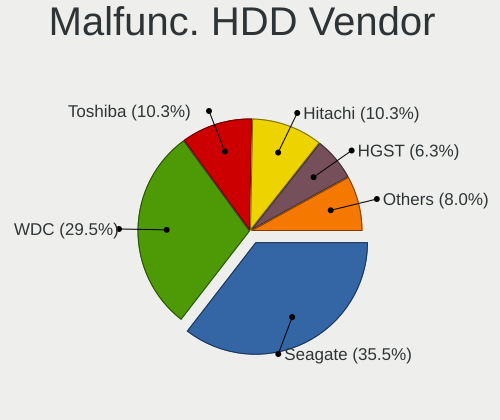

| Vendor              | Computers | Drives | Percent |
|---------------------|-----------|--------|---------|
| Seagate             | 319       | 505    | 35.48%  |
| WDC                 | 265       | 401    | 29.48%  |
| Toshiba             | 93        | 120    | 10.34%  |
| Hitachi             | 93        | 113    | 10.34%  |
| HGST                | 57        | 64     | 6.34%   |
| Samsung Electronics | 44        | 142    | 4.89%   |
| Maxtor              | 9         | 14     | 1%      |
| Fujitsu             | 6         | 6      | 0.67%   |
| Apple               | 6         | 6      | 0.67%   |
| JMicron Technology  | 2         | 2      | 0.22%   |
| Hewlett-Packard     | 2         | 2      | 0.22%   |
| USB3.0              | 1         | 1      | 0.11%   |
| HGST HTS            | 1         | 1      | 0.11%   |
| ASMT                | 1         | 1      | 0.11%   |

Malfunc. Drive Kind
-------------------

Kinds of faulty drives

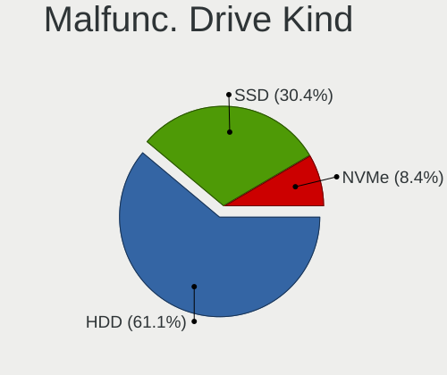

| Kind | Computers | Drives | Percent |
|------|-----------|--------|---------|
| HDD  | 839       | 1378   | 61.11%  |
| SSD  | 418       | 591    | 30.44%  |
| NVMe | 116       | 131    | 8.45%   |

Failed Drives
-------------

Failed drive models

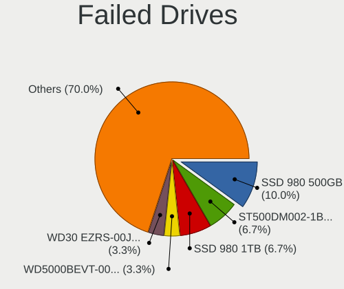

| Model                                            | Computers | Drives | Percent |
|--------------------------------------------------|-----------|--------|---------|
| Samsung Electronics SSD 980 500GB                | 3         | 4      | 10%     |
| Seagate ST500DM002-1BD142 500GB                  | 2         | 2      | 6.67%   |
| Samsung Electronics SSD 980 1TB                  | 2         | 3      | 6.67%   |
| WDC WD5000BEVT-00ZAT0 500GB                      | 1         | 2      | 3.33%   |
| WDC WD30 EZRS-00J99B0 3TB                        | 1         | 1      | 3.33%   |
| WDC PC SN520 SDAPMUW-512G-1001 512GB             | 1         | 1      | 3.33%   |
| Toshiba XG6 NVMe SSD Controller 1024GB           | 1         | 1      | 3.33%   |
| Toshiba THNSN5512GPUK NVMe 512GB                 | 1         | 1      | 3.33%   |
| Toshiba HDWD130 3TB                              | 1         | 1      | 3.33%   |
| SPCC M.2 PCIe SSD 2TB                            | 1         | 1      | 3.33%   |
| SK hynix BC501 NVMe Solid State Drive 512GB      | 1         | 1      | 3.33%   |
| Seagate ST3320613AS 320GB                        | 1         | 1      | 3.33%   |
| Seagate ST31000528AS 1TB                         | 1         | 2      | 3.33%   |
| Seagate ST1000LM035-1RK172 1TB                   | 1         | 1      | 3.33%   |
| Seagate ST1000LM024 HN-M101MBB 1TB               | 1         | 1      | 3.33%   |
| Sandisk PC SN520 NVMe SSD 128GB                  | 1         | 1      | 3.33%   |
| Samsung Electronics MZNTY128HDHP-000H1 128GB SSD | 1         | 1      | 3.33%   |
| Samsung Electronics MZNTY128HDHP-00000 128GB SSD | 1         | 1      | 3.33%   |
| Samsung Electronics HD321HJ 320GB                | 1         | 2      | 3.33%   |
| Hitachi HTS545050A7E380 500GB                    | 1         | 1      | 3.33%   |
| Hitachi HDS721010DLE630 1TB                      | 1         | 12     | 3.33%   |
| Hitachi HDS72101 1TB                             | 1         | 1      | 3.33%   |
| HGST HTS721010A9E630 1TB                         | 1         | 1      | 3.33%   |
| HGST HTS541010A9E680 1TB                         | 1         | 1      | 3.33%   |
| Apple SSD SM0256F 256GB                          | 1         | 1      | 3.33%   |
| ADATA Technology SX6000LNP 1024GB                | 1         | 1      | 3.33%   |

Failed Drive Vendor
-------------------

Failed drive vendors

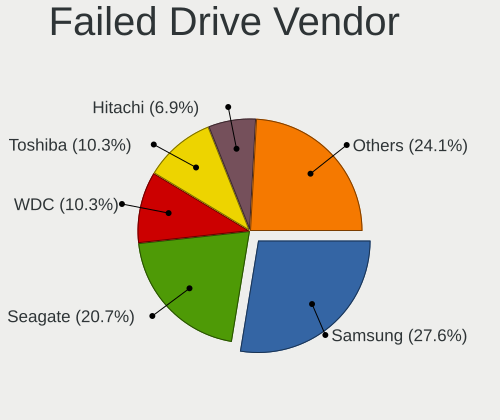

| Vendor              | Computers | Drives | Percent |
|---------------------|-----------|--------|---------|
| Samsung Electronics | 8         | 11     | 27.59%  |
| Seagate             | 6         | 7      | 20.69%  |
| WDC                 | 3         | 4      | 10.34%  |
| Toshiba             | 3         | 3      | 10.34%  |
| Hitachi             | 2         | 14     | 6.9%    |
| HGST                | 2         | 2      | 6.9%    |
| SPCC                | 1         | 1      | 3.45%   |
| SK hynix            | 1         | 1      | 3.45%   |
| Sandisk             | 1         | 1      | 3.45%   |
| Apple               | 1         | 1      | 3.45%   |
| ADATA Technology    | 1         | 1      | 3.45%   |

Drive Status
------------

Number of failed and malfunc. drives

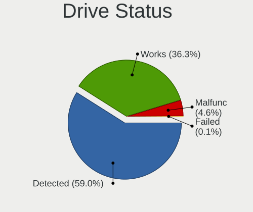

| Status   | Computers | Drives | Percent |
|----------|-----------|--------|---------|
| Detected | 16823     | 35683  | 58.99%  |
| Works    | 10350     | 20866  | 36.29%  |
| Malfunc  | 1318      | 2100   | 4.62%   |
| Failed   | 28        | 46     | 0.1%    |

Storage controller
------------------

Storage Vendor
--------------

Storage controller vendors

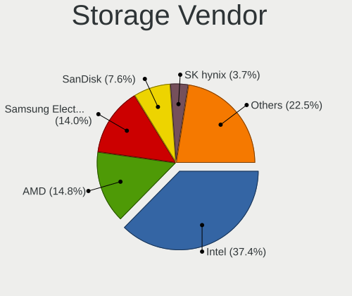

| Vendor                                  | Computers | Percent |
|-----------------------------------------|-----------|---------|
| Intel                                   | 13853     | 37.36%  |
| AMD                                     | 5498      | 14.83%  |
| Samsung Electronics                     | 5199      | 14.02%  |
| SanDisk                                 | 2825      | 7.62%   |
| SK hynix                                | 1368      | 3.69%   |
| Micron Technology                       | 1014      | 2.73%   |
| Kingston Technology Company             | 1007      | 2.72%   |
| Phison Electronics                      | 814       | 2.2%    |
| Micron/Crucial Technology               | 696       | 1.88%   |
| KIOXIA                                  | 605       | 1.63%   |
| ASMedia Technology                      | 601       | 1.62%   |
| Toshiba America Info Systems            | 532       | 1.43%   |
| ADATA Technology                        | 411       | 1.11%   |
| Silicon Motion                          | 356       | 0.96%   |
| MAXIO Technology (Hangzhou)             | 322       | 0.87%   |
| Marvell Technology Group                | 253       | 0.68%   |
| Realtek Semiconductor                   | 194       | 0.52%   |
| Shenzhen Longsys Electronics            | 177       | 0.48%   |
| Nvidia                                  | 169       | 0.46%   |
| JMicron Technology                      | 161       | 0.43%   |
| Apple                                   | 111       | 0.3%    |
| Solid State Storage Technology          | 110       | 0.3%    |
| Union Memory (Shenzhen)                 | 97        | 0.26%   |
| Seagate Technology                      | 78        | 0.21%   |
| Solidigm                                | 72        | 0.19%   |
| Broadcom / LSI                          | 56        | 0.15%   |
| LSI Logic / Symbios Logic               | 55        | 0.15%   |
| Lite-On Technology                      | 55        | 0.15%   |
| Lenovo                                  | 48        | 0.13%   |
| Yangtze Memory Technologies             | 46        | 0.12%   |
| INNOGRIT                                | 41        | 0.11%   |
| Shenzhen Unionmemory Information System | 39        | 0.11%   |
| Biwin Storage Technology                | 34        | 0.09%   |
| Netac Technology                        | 22        | 0.06%   |
| VIA Technologies                        | 20        | 0.05%   |
| Hosin Global Electronics                | 18        | 0.05%   |
| Adaptec                                 | 18        | 0.05%   |
| Silicon Image                           | 13        | 0.04%   |
| Unknown                                 | 13        | 0.04%   |
| Hewlett-Packard                         | 11        | 0.03%   |

Storage Model
-------------

Storage controller models

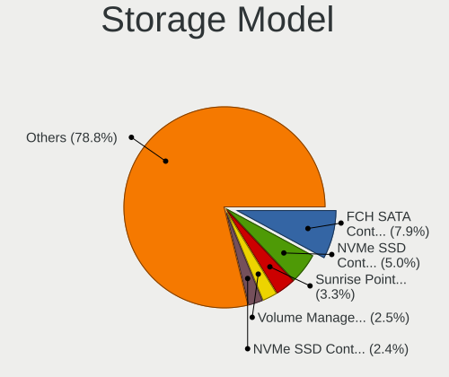

| Model                                                                          | Computers | Percent |
|--------------------------------------------------------------------------------|-----------|---------|
| AMD FCH SATA Controller [AHCI mode]                                            | 3221      | 7.91%   |
| Samsung NVMe SSD Controller SM981/PM981/PM983                                  | 2054      | 5.05%   |
| Intel Sunrise Point-LP SATA Controller [AHCI mode]                             | 1359      | 3.34%   |
| Intel Volume Management Device NVMe RAID Controller                            | 1020      | 2.51%   |
| Samsung NVMe SSD Controller PM9A1/PM9A3/980PRO                                 | 974       | 2.39%   |
| AMD 500 Series Chipset SATA Controller                                         | 872       | 2.14%   |
| Samsung NVMe SSD Controller 980 (DRAM-less)                                    | 870       | 2.14%   |
| Intel 8 Series/C220 Series Chipset Family 6-port SATA Controller 1 [AHCI mode] | 861       | 2.12%   |
| Intel 82801 Mobile SATA Controller [RAID mode]                                 | 811       | 1.99%   |
| AMD 400 Series Chipset SATA Controller                                         | 808       | 1.98%   |
| Intel 7 Series Chipset Family 6-port SATA Controller [AHCI mode]               | 782       | 1.92%   |
| AMD 600 Series Chipset SATA Controller                                         | 661       | 1.62%   |
| Intel Q170/Q150/B150/H170/H110/Z170/CM236 Chipset SATA Controller [AHCI Mode]  | 586       | 1.44%   |
| ASMedia ASM1061/ASM1062 Serial ATA Controller                                  | 532       | 1.31%   |
| Samsung NVMe SSD Controller SM961/PM961/SM963                                  | 474       | 1.16%   |
| Intel 6 Series/C200 Series Chipset Family 6 port Mobile SATA AHCI Controller   | 471       | 1.16%   |
| SanDisk WD SN560/SN740/SN770/SN5000 NVMe SSD                                   | 453       | 1.11%   |
| SanDisk Extreme Pro / WD Black SN750 / PC SN730 / Red SN700 NVMe SSD           | 448       | 1.1%    |
| Intel 200 Series PCH SATA controller [AHCI mode]                               | 447       | 1.1%    |
| SK hynix Gold P31/BC711/PC711 NVMe Solid State Drive                           | 445       | 1.09%   |
| Intel Cannon Lake Mobile PCH SATA AHCI Controller                              | 428       | 1.05%   |
| SanDisk Ultra 3D / WD PC SN530, IX SN530, Blue SN550 NVMe SSD (DRAM-less)      | 427       | 1.05%   |
| Intel 8 Series SATA Controller 1 [AHCI mode]                                   | 427       | 1.05%   |
| Intel SATA Controller [RAID mode]                                              | 398       | 0.98%   |
| Intel Wildcat Point-LP SATA Controller [AHCI Mode]                             | 372       | 0.91%   |
| Intel Comet Lake SATA AHCI Controller                                          | 363       | 0.89%   |
| Micron/Crucial P2 [Nick P2] / P3 / P3 Plus NVMe PCIe SSD (DRAM-less)           | 358       | 0.88%   |
| Intel Cannon Lake PCH SATA AHCI Controller                                     | 348       | 0.85%   |
| Intel 6 Series/C200 Series Chipset Family 6 port Desktop SATA AHCI Controller  | 334       | 0.82%   |
| Intel Alder Lake-S PCH SATA Controller [AHCI Mode]                             | 325       | 0.8%    |
| Intel 7 Series/C210 Series Chipset Family 6-port SATA Controller [AHCI mode]   | 309       | 0.76%   |
| Samsung NVMe SSD Controller S4LV008[Pascal]                                    | 306       | 0.75%   |
| KIOXIA NVMe SSD Controller BG4 (DRAM-less)                                     | 298       | 0.73%   |
| Phison E12 NVMe Controller                                                     | 294       | 0.72%   |
| Intel SSD 660P Series                                                          | 293       | 0.72%   |
| Intel Tiger Lake-LP SATA Controller                                            | 289       | 0.71%   |
| Intel HM170/QM170 Chipset SATA Controller [AHCI Mode]                          | 281       | 0.69%   |
| AMD SB7x0/SB8x0/SB9x0 SATA Controller [AHCI mode]                              | 263       | 0.65%   |
| Intel SSD 670p Series [Keystone Harbor]                                        | 257       | 0.63%   |
| Silicon Motion SM2263EN/SM2263XT (DRAM-less) NVMe SSD Controllers              | 244       | 0.6%    |

Storage Kind
------------

Kind of storage controller (IDE, SATA, NVMe, SAS, ...)

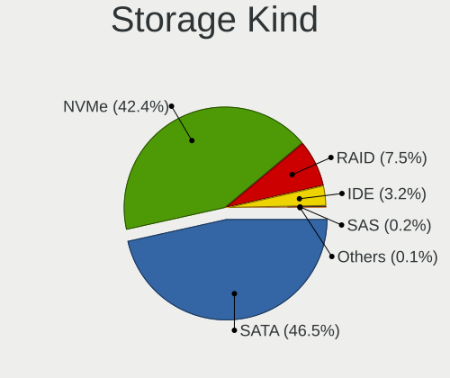

| Kind | Computers | Percent |
|------|-----------|---------|
| SATA | 16707     | 46.53%  |
| NVMe | 15224     | 42.4%   |
| RAID | 2697      | 7.51%   |
| IDE  | 1165      | 3.24%   |
| SAS  | 82        | 0.23%   |
| SCSI | 34        | 0.09%   |

Processor
---------

CPU Vendor
----------

Processor vendors

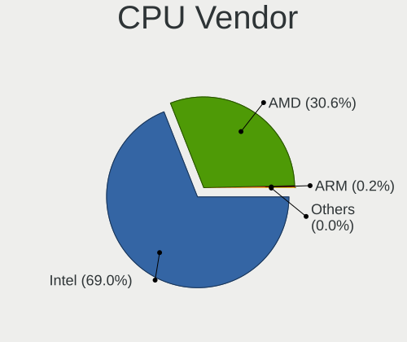

| Vendor                   | Computers | Percent |
|--------------------------|-----------|---------|
| Intel                    | 18205     | 69.03%  |
| AMD                      | 8069      | 30.59%  |
| ARM                      | 55        | 0.21%   |
| Unknown                  | 37        | 0.14%   |
| Qualcomm                 | 4         | 0.02%   |
| PowerNV C1P9S01 REV 1.01 | 1         | 0.004%  |
| Loongson                 | 1         | 0.004%  |
| CHRP IBM,8286-41A        | 1         | 0.004%  |
| CentaurHauls             | 1         | 0.004%  |

CPU Model
---------

Processor models

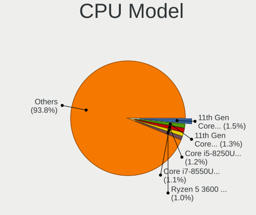

| Model                                         | Computers | Percent |
|-----------------------------------------------|-----------|---------|
| Intel 11th Gen Core i5-1135G7 @ 2.40GHz       | 402       | 1.52%   |
| Intel 11th Gen Core i7-1165G7 @ 2.80GHz       | 333       | 1.26%   |
| Intel Core i5-8250U CPU @ 1.60GHz             | 329       | 1.24%   |
| Intel Core i7-8550U CPU @ 1.80GHz             | 291       | 1.1%    |
| AMD Ryzen 5 3600 6-Core Processor             | 272       | 1.03%   |
| Intel Core i5-7200U CPU @ 2.50GHz             | 244       | 0.92%   |
| Intel Core i5-10210U CPU @ 1.60GHz            | 210       | 0.79%   |
| AMD Ryzen 5 5500U with Radeon Graphics        | 205       | 0.78%   |
| Intel Core i7-8565U CPU @ 1.80GHz             | 204       | 0.77%   |
| Intel Core i5-8265U CPU @ 1.60GHz             | 193       | 0.73%   |
| Intel Core i7-8750H CPU @ 2.20GHz             | 192       | 0.73%   |
| AMD Ryzen 5 5600X 6-Core Processor            | 192       | 0.73%   |
| Intel Core i7-10510U CPU @ 1.80GHz            | 183       | 0.69%   |
| Intel Core i7-7500U CPU @ 2.70GHz             | 181       | 0.68%   |
| AMD Ryzen 7 3700X 8-Core Processor            | 178       | 0.67%   |
| AMD Ryzen 7 5800H with Radeon Graphics        | 175       | 0.66%   |
| AMD Ryzen 7 5700U with Radeon Graphics        | 171       | 0.65%   |
| AMD Ryzen 5 3500U with Radeon Vega Mobile Gfx | 168       | 0.64%   |
| Intel Core i5-6200U CPU @ 2.30GHz             | 162       | 0.61%   |
| Intel Core i7-9750H CPU @ 2.60GHz             | 160       | 0.61%   |
| Intel Core i5-6300U CPU @ 2.40GHz             | 160       | 0.61%   |
| Intel Core i7-7700HQ CPU @ 2.80GHz            | 159       | 0.6%    |
| AMD Ryzen 7 5800X 8-Core Processor            | 156       | 0.59%   |
| Intel Core i7-8650U CPU @ 1.90GHz             | 153       | 0.58%   |
| Intel Core i7-10750H CPU @ 2.60GHz            | 153       | 0.58%   |
| AMD Ryzen 5 5600G with Radeon Graphics        | 149       | 0.56%   |
| Intel 12th Gen Core i7-12700H                 | 148       | 0.56%   |
| Intel Core i5-8350U CPU @ 1.70GHz             | 145       | 0.55%   |
| AMD Ryzen 9 5900X 12-Core Processor           | 139       | 0.53%   |
| AMD Ryzen 7 4800H with Radeon Graphics        | 131       | 0.5%    |
| Intel Core i5-1035G1 CPU @ 1.00GHz            | 127       | 0.48%   |
| Intel Core i5-3210M CPU @ 2.50GHz             | 126       | 0.48%   |
| Intel Core i5-5200U CPU @ 2.20GHz             | 122       | 0.46%   |
| Intel 11th Gen Core i7-1185G7 @ 3.00GHz       | 122       | 0.46%   |
| AMD Ryzen 5 5600H with Radeon Graphics        | 119       | 0.45%   |
| Intel Core i7-6700HQ CPU @ 2.60GHz            | 114       | 0.43%   |
| Intel 12th Gen Core i5-1235U                  | 114       | 0.43%   |
| AMD Ryzen 9 3900X 12-Core Processor           | 113       | 0.43%   |
| AMD Ryzen 5 2600 Six-Core Processor           | 113       | 0.43%   |
| Intel Core i7-1065G7 CPU @ 1.30GHz            | 112       | 0.42%   |

CPU Model Family
----------------

Processor model prefix

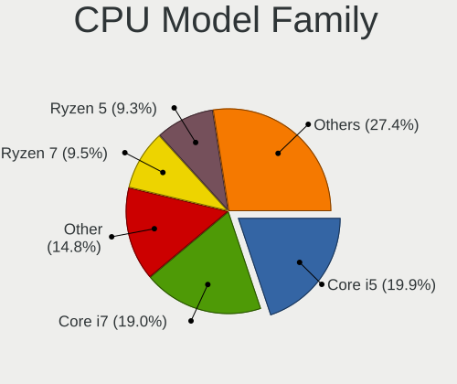

| Model                   | Computers | Percent |
|-------------------------|-----------|---------|
| Intel Core i5           | 5246      | 19.86%  |
| Intel Core i7           | 5028      | 19.03%  |
| Other                   | 3916      | 14.82%  |
| AMD Ryzen 7             | 2515      | 9.52%   |
| AMD Ryzen 5             | 2461      | 9.32%   |
| Intel Core i3           | 1225      | 4.64%   |
| AMD Ryzen 9             | 1007      | 3.81%   |
| Intel Xeon              | 541       | 2.05%   |
| Intel Celeron           | 531       | 2.01%   |
| Intel Core              | 416       | 1.57%   |
| Intel Core 2 Duo        | 390       | 1.48%   |
| AMD Ryzen 3             | 312       | 1.18%   |
| Intel Atom              | 303       | 1.15%   |
| Intel Pentium           | 275       | 1.04%   |
| Intel Core i9           | 262       | 0.99%   |
| AMD Ryzen 7 PRO         | 258       | 0.98%   |
| AMD FX                  | 230       | 0.87%   |
| AMD Ryzen 5 PRO         | 169       | 0.64%   |
| AMD A10                 | 105       | 0.4%    |
| AMD A6                  | 103       | 0.39%   |
| AMD A8                  | 93        | 0.35%   |
| Intel Core 2 Quad       | 90        | 0.34%   |
| AMD Ryzen Threadripper  | 81        | 0.31%   |
| Intel Pentium Silver    | 74        | 0.28%   |
| Intel Pentium Dual-Core | 65        | 0.25%   |
| AMD A4                  | 65        | 0.25%   |
| AMD Phenom II X4        | 61        | 0.23%   |
| AMD Athlon              | 49        | 0.19%   |
| Intel Core m3           | 37        | 0.14%   |
| AMD Phenom II X6        | 27        | 0.1%    |
| AMD Athlon II X2        | 27        | 0.1%    |
| Intel Core 2            | 24        | 0.09%   |
| AMD E1                  | 23        | 0.09%   |
| AMD E2                  | 22        | 0.08%   |
| Intel Pentium Dual      | 21        | 0.08%   |
| Intel Core m5           | 21        | 0.08%   |
| AMD A12                 | 21        | 0.08%   |
| Intel Pentium Gold      | 20        | 0.08%   |
| AMD Ryzen 3 PRO         | 20        | 0.08%   |
| AMD Athlon 64 X2        | 20        | 0.08%   |

CPU Cores
---------

Number of processor cores

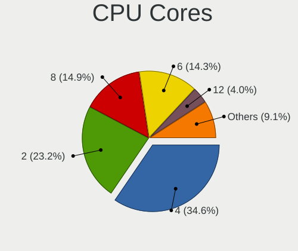

| Number  | Computers | Percent |
|---------|-----------|---------|
| 4       | 9131      | 34.55%  |
| 2       | 6123      | 23.17%  |
| 8       | 3939      | 14.91%  |
| 6       | 3788      | 14.33%  |
| 12      | 1044      | 3.95%   |
| 16      | 712       | 2.69%   |
| 10      | 672       | 2.54%   |
| 14      | 520       | 1.97%   |
| 24      | 188       | 0.71%   |
| 1       | 81        | 0.31%   |
| 3       | 68        | 0.26%   |
| 20      | 59        | 0.22%   |
| 32      | 31        | 0.12%   |
| Unknown | 23        | 0.09%   |
| 28      | 10        | 0.04%   |
| 36      | 9         | 0.03%   |
| 18      | 8         | 0.03%   |
| 5       | 8         | 0.03%   |
| 40      | 3         | 0.01%   |
| 44      | 2         | 0.01%   |
| 96      | 1         | 0.004%  |
| 72      | 1         | 0.004%  |
| 64      | 1         | 0.004%  |
| 48      | 1         | 0.004%  |
| 46      | 1         | 0.004%  |
| 11      | 1         | 0.004%  |
| 7       | 1         | 0.004%  |

CPU Sockets
-----------

Number of sockets

| Number  | Computers | Percent |
|---------|-----------|---------|
| 1       | 26183     | 99.26%  |
| 2       | 167       | 0.63%   |
| Unknown | 19        | 0.07%   |
| 4       | 6         | 0.02%   |
| 11      | 1         | 0.004%  |
| 3       | 1         | 0.004%  |

CPU Threads
-----------

Threads per core (Hyper-Threading)

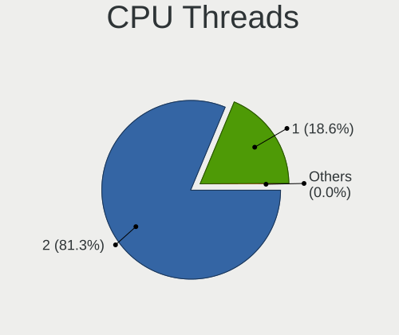

| Number  | Computers | Percent |
|---------|-----------|---------|
| 2       | 21477     | 81.28%  |
| 1       | 4921      | 18.62%  |
| Unknown | 23        | 0.09%   |
| 8       | 1         | 0.004%  |
| 4       | 1         | 0.004%  |
| 3       | 1         | 0.004%  |

CPU Op-Modes
------------

CPU Operation Modes (32-bit, 64-bit)

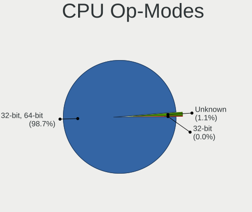

| Op mode        | Computers | Percent |
|----------------|-----------|---------|
| 32-bit, 64-bit | 26073     | 98.69%  |
| Unknown        | 288       | 1.09%   |
| 64-bit         | 55        | 0.21%   |
| 32-bit         | 4         | 0.02%   |

CPU Microcode
-------------

Microcode number

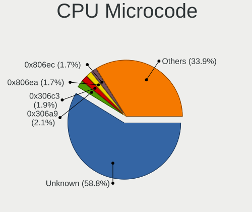

| Number     | Computers | Percent |
|------------|-----------|---------|
| Unknown    | 16003     | 58.76%  |
| 0x306a9    | 568       | 2.09%   |
| 0x306c3    | 508       | 1.87%   |
| 0x806ea    | 468       | 1.72%   |
| 0x806ec    | 463       | 1.7%    |
| 0x206a7    | 444       | 1.63%   |
| 0x806c1    | 423       | 1.55%   |
| 0x906ea    | 420       | 1.54%   |
| 0x806e9    | 351       | 1.29%   |
| 0x0a50000c | 329       | 1.21%   |
| 0x08701021 | 324       | 1.19%   |
| 0x506e3    | 306       | 1.12%   |
| 0x406e3    | 301       | 1.11%   |
| 0x906e9    | 271       | 1%      |
| 0x40651    | 234       | 0.86%   |
| 0x08108109 | 226       | 0.83%   |
| 0x306d4    | 225       | 0.83%   |
| 0x08600106 | 225       | 0.83%   |
| 0x0800820d | 183       | 0.67%   |
| 0x0a50000d | 173       | 0.64%   |
| 0xa0652    | 169       | 0.62%   |
| 0x1067a    | 166       | 0.61%   |
| 0x08608103 | 165       | 0.61%   |
| 0x08108102 | 142       | 0.52%   |
| 0x706e5    | 140       | 0.51%   |
| 0x08701013 | 134       | 0.49%   |
| 0x0a404102 | 117       | 0.43%   |
| 0x906ed    | 115       | 0.42%   |
| 0x20655    | 114       | 0.42%   |
| 0x08600104 | 111       | 0.41%   |
| 0x0a201016 | 105       | 0.39%   |
| 0x906a3    | 103       | 0.38%   |
| 0x30678    | 100       | 0.37%   |
| 0x806eb    | 99        | 0.36%   |
| 0x0a601203 | 87        | 0.32%   |
| 0x06000852 | 86        | 0.32%   |
| 0x0a20120a | 85        | 0.31%   |
| 0x0810100b | 77        | 0.28%   |
| 0x406c4    | 74        | 0.27%   |
| 0x0a201009 | 73        | 0.27%   |

CPU Microarch
-------------

Microarchitecture

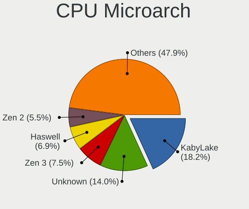

| Name               | Computers | Percent |
|--------------------|-----------|---------|
| KabyLake           | 4819      | 18.19%  |
| Unknown            | 3706      | 13.99%  |
| Zen 3              | 1989      | 7.51%   |
| Haswell            | 1816      | 6.85%   |
| Zen 2              | 1466      | 5.53%   |
| Skylake            | 1380      | 5.21%   |
| IvyBridge          | 1324      | 5%      |
| Alderlake Hybrid   | 1263      | 4.77%   |
| TigerLake          | 1189      | 4.49%   |
| SandyBridge        | 1004      | 3.79%   |
| Zen+               | 879       | 3.32%   |
| CometLake          | 734       | 2.77%   |
| Broadwell          | 584       | 2.2%    |
| IceLake            | 540       | 2.04%   |
| Zen                | 492       | 1.86%   |
| Silvermont         | 482       | 1.82%   |
| Penryn             | 479       | 1.81%   |
| Westmere           | 365       | 1.38%   |
| Piledriver         | 304       | 1.15%   |
| Goldmont plus      | 234       | 0.88%   |
| K10                | 186       | 0.7%    |
| Excavator          | 178       | 0.67%   |
| Core               | 162       | 0.61%   |
| Nehalem            | 151       | 0.57%   |
| Meteorlake Hybrid  | 131       | 0.49%   |
| Goldmont           | 88        | 0.33%   |
| Puma               | 75        | 0.28%   |
| Steamroller        | 63        | 0.24%   |
| Lunarlake Hybrid   | 63        | 0.24%   |
| Jaguar             | 51        | 0.19%   |
| Gracemont          | 50        | 0.19%   |
| Tremont            | 42        | 0.16%   |
| Bobcat             | 40        | 0.15%   |
| K8 Hammer          | 39        | 0.15%   |
| Bulldozer          | 34        | 0.13%   |
| K10 Llano          | 25        | 0.09%   |
| ArrowLake-H Hybrid | 22        | 0.08%   |
| Bonnell            | 20        | 0.08%   |
| NetBurst           | 11        | 0.04%   |
| K8 & K10 hybrid    | 9         | 0.03%   |

Graphics
--------

GPU Vendor
----------

Vendors of graphics cards

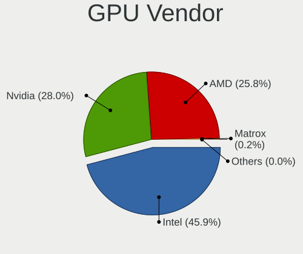

| Vendor                           | Computers | Percent |
|----------------------------------|-----------|---------|
| Intel                            | 14762     | 45.9%   |
| Nvidia                           | 8997      | 27.97%  |
| AMD                              | 8300      | 25.81%  |
| Matrox Electronics Systems       | 51        | 0.16%   |
| ASPEED Technology                | 41        | 0.13%   |
| ATI Technologies                 | 4         | 0.01%   |
| Silicon Motion                   | 2         | 0.01%   |
| Silicon Integrated Systems [SiS] | 2         | 0.01%   |
| Zhaoxin                          | 1         | 0.003%  |
| VIA Technologies                 | 1         | 0.003%  |
| S3 Graphics                      | 1         | 0.003%  |
| Loongson Technology              | 1         | 0.003%  |

GPU Model
---------

Graphics card models

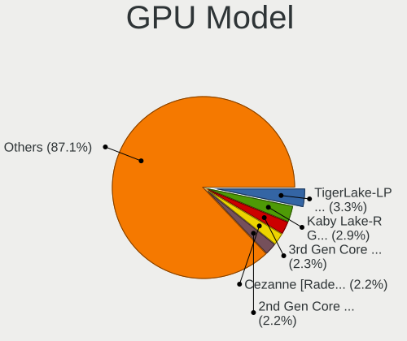

| Model                                                                                    | Computers | Percent |
|------------------------------------------------------------------------------------------|-----------|---------|
| Intel TigerLake-LP GT2 [Iris Xe Graphics]                                                | 1075      | 3.25%   |
| Intel Kaby Lake-R GT2 [UHD Graphics 620]                                                 | 964       | 2.92%   |
| Intel 3rd Gen Core processor Graphics Controller                                         | 765       | 2.32%   |
| AMD Cezanne [Radeon Vega Series / Radeon Vega Mobile Series]                             | 738       | 2.23%   |
| Intel 2nd Generation Core Processor Family Integrated Graphics Controller                | 722       | 2.18%   |
| AMD Renoir [Radeon Vega Series / Radeon Vega Mobile Series]                              | 643       | 1.95%   |
| Intel Kaby Lake-U GT2 [HD Graphics 620]                                                  | 639       | 1.93%   |
| Intel WhiskeyLake-U GT2 [UHD Graphics 620]                                               | 586       | 1.77%   |
| Intel CoffeeLake-H GT2 [UHD Graphics 630]                                                | 571       | 1.73%   |
| Intel Skylake-U GT2 [HD Graphics 520]                                                    | 557       | 1.69%   |
| AMD Picasso/Raven 2 [Radeon Vega Series / Radeon Vega Mobile Series]                     | 545       | 1.65%   |
| Intel Haswell-ULT Integrated Graphics Controller                                         | 523       | 1.58%   |
| AMD Ellesmere [Radeon RX 470/480/570/570X/580/580X/590]                                  | 523       | 1.58%   |
| Intel CometLake-U GT2 [UHD Graphics]                                                     | 508       | 1.54%   |
| Intel Alder Lake-P GT2 [Iris Xe Graphics]                                                | 436       | 1.32%   |
| AMD Rembrandt [Radeon 680M]                                                              | 428       | 1.3%    |
| AMD Lucienne                                                                             | 410       | 1.24%   |
| AMD Raphael                                                                              | 388       | 1.17%   |
| Intel Broadwell-U GT2 [HD Graphics 5500]                                                 | 372       | 1.13%   |
| Intel Raptor Lake-P [Iris Xe Graphics]                                                   | 362       | 1.1%    |
| Intel CometLake-H GT2 [UHD Graphics]                                                     | 358       | 1.08%   |
| Nvidia TU117M [GeForce GTX 1650 Mobile / Max-Q]                                          | 329       | 1%      |
| Intel 4th Gen Core Processor Integrated Graphics Controller                              | 322       | 0.97%   |
| Intel Xeon E3-1200 v3/4th Gen Core Processor Integrated Graphics Controller              | 306       | 0.93%   |
| AMD Phoenix1                                                                             | 302       | 0.91%   |
| AMD Barcelo                                                                              | 255       | 0.77%   |
| Nvidia GA106M [GeForce RTX 3060 Mobile / Max-Q]                                          | 247       | 0.75%   |
| Intel Atom/Celeron/Pentium Processor x5-E8000/J3xxx/N3xxx Integrated Graphics Controller | 242       | 0.73%   |
| Intel Skylake-S GT2 [HD Graphics 530]                                                    | 241       | 0.73%   |
| Intel Kaby Lake-H GT2 [HD Graphics 630]                                                  | 240       | 0.73%   |
| Intel Atom Processor Z36xxx/Z37xxx Series Graphics & Display                             | 237       | 0.72%   |
| AMD Navi 23 [Radeon RX 6600/6600 XT/6600M]                                               | 232       | 0.7%    |
| Intel CoffeeLake-S GT2 [UHD Graphics 630]                                                | 223       | 0.67%   |
| AMD Navi 22 [Radeon RX 6700/6700 XT/6750 XT / 6800M/6850M XT]                            | 221       | 0.67%   |
| AMD Navi 10 [Radeon RX 5600 OEM/5600 XT / 5700/5700 XT]                                  | 219       | 0.66%   |
| AMD Raven Ridge [Radeon Vega Series / Radeon Vega Mobile Series]                         | 217       | 0.66%   |
| Intel Alder Lake-UP3 GT2 [Iris Xe Graphics]                                              | 214       | 0.65%   |
| Intel Core Processor Integrated Graphics Controller                                      | 209       | 0.63%   |
| Nvidia GP107 [GeForce GTX 1050 Ti]                                                       | 208       | 0.63%   |
| Intel TigerLake-H GT1 [UHD Graphics]                                                     | 207       | 0.63%   |

GPU Combo
---------

Combinations of graphics cards

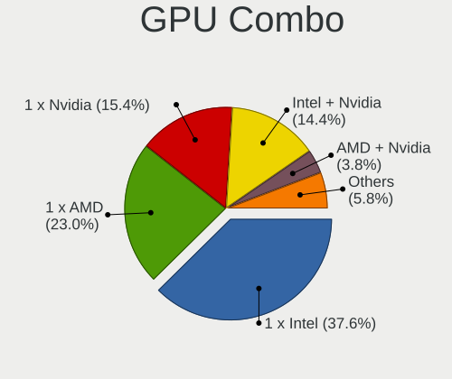

| Name                     | Computers | Percent |
|--------------------------|-----------|---------|
| 1 x Intel                | 9998      | 37.6%   |
| 1 x AMD                  | 6114      | 22.99%  |
| 1 x Nvidia               | 4088      | 15.37%  |
| Intel + Nvidia           | 3837      | 14.43%  |
| AMD + Nvidia             | 1013      | 3.81%   |
| 2 x AMD                  | 605       | 2.28%   |
| Intel + AMD              | 582       | 2.19%   |
| Other                    | 117       | 0.44%   |
| 2 x Intel                | 61        | 0.23%   |
| 2 x Nvidia               | 55        | 0.21%   |
| 1 x Matrox               | 40        | 0.15%   |
| 1 x ASPEED               | 32        | 0.12%   |
| Nvidia + Matrox          | 7         | 0.03%   |
| Nvidia + ASPEED          | 5         | 0.02%   |
| Intel + 2 x Nvidia       | 5         | 0.02%   |
| Intel + AMD + 1 x Nvidia | 5         | 0.02%   |
| AMD + Matrox             | 4         | 0.02%   |
| AMD + 2 x Nvidia         | 3         | 0.01%   |
| AMD + ASPEED             | 3         | 0.01%   |
| 3 x AMD                  | 2         | 0.01%   |
| 1 x SiS                  | 2         | 0.01%   |
| 1 x Silicon Motion       | 2         | 0.01%   |
| Intel + 2 x AMD          | 2         | 0.01%   |
| 2 x Nvidia + 1 x ASPEED  | 1         | 0.004%  |
| 2 x AMD + 1 x Nvidia     | 1         | 0.004%  |
| 1 x Zhaoxin              | 1         | 0.004%  |
| 1 x VIA                  | 1         | 0.004%  |
| 1 x S3 Graphics          | 1         | 0.004%  |
| 1 x Loongson Technology  | 1         | 0.004%  |
| 1 x AMD + 3 x Nvidia     | 1         | 0.004%  |

GPU Driver
----------

Free vs proprietary

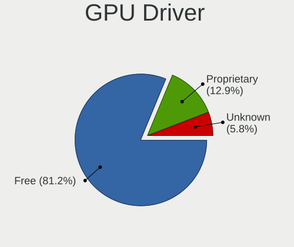

| Driver      | Computers | Percent |
|-------------|-----------|---------|
| Free        | 21762     | 81.25%  |
| Proprietary | 3458      | 12.91%  |
| Unknown     | 1565      | 5.84%   |

GPU Memory
----------

Total video memory

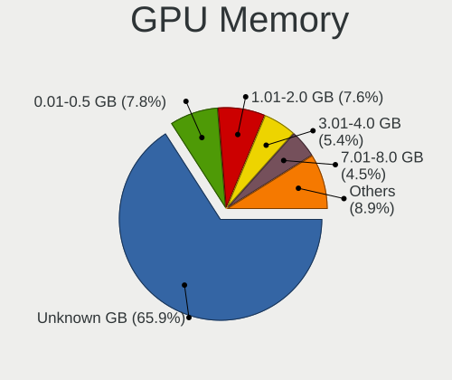

| Size in GB | Computers | Percent |
|------------|-----------|---------|
| Unknown    | 17864     | 65.9%   |
| 0.01-0.5   | 2118      | 7.81%   |
| 1.01-2.0   | 2047      | 7.55%   |
| 3.01-4.0   | 1452      | 5.36%   |
| 7.01-8.0   | 1221      | 4.5%    |
| 0.51-1.0   | 1117      | 4.12%   |
| 8.01-16.0  | 597       | 2.2%    |
| 5.01-6.0   | 453       | 1.67%   |
| 2.01-3.0   | 120       | 0.44%   |
| 16.01-24.0 | 113       | 0.42%   |
| 4.01-5.0   | 3         | 0.01%   |
| 24.01-32.0 | 1         | 0.004%  |

Monitor
-------

Monitor Vendor
--------------

Monitor vendors

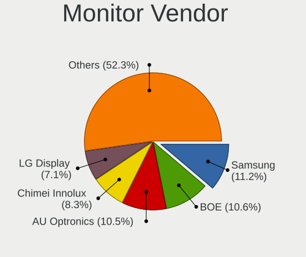

| Vendor                  | Computers | Percent |
|-------------------------|-----------|---------|
| Samsung Electronics     | 3470      | 11.21%  |
| BOE                     | 3298      | 10.65%  |
| AU Optronics            | 3260      | 10.53%  |
| Chimei Innolux          | 2565      | 8.28%   |
| LG Display              | 2193      | 7.08%   |
| Dell                    | 2132      | 6.88%   |
| Goldstar                | 1999      | 6.46%   |
| Acer                    | 923       | 2.98%   |
| Hewlett-Packard         | 920       | 2.97%   |
| Apple                   | 854       | 2.76%   |
| AOC                     | 819       | 2.64%   |
| Lenovo                  | 818       | 2.64%   |
| Sharp                   | 735       | 2.37%   |
| BenQ                    | 625       | 2.02%   |
| Philips                 | 601       | 1.94%   |
| Ancor Communications    | 510       | 1.65%   |
| ASUSTek Computer        | 443       | 1.43%   |
| PANDA                   | 319       | 1.03%   |
| ViewSonic               | 299       | 0.97%   |
| InfoVision              | 275       | 0.89%   |
| Iiyama                  | 275       | 0.89%   |
| MSI                     | 260       | 0.84%   |
| CSO                     | 248       | 0.8%    |
| Gigabyte Technology     | 176       | 0.57%   |
| Chi Mei Optoelectronics | 162       | 0.52%   |
| Sony                    | 153       | 0.49%   |
| TMX                     | 115       | 0.37%   |
| Sceptre Tech            | 110       | 0.36%   |
| Unknown                 | 94        | 0.3%    |
| Eizo                    | 85        | 0.27%   |
| Panasonic               | 78        | 0.25%   |
| Mi                      | 78        | 0.25%   |
| Vizio                   | 70        | 0.23%   |
| CSOT                    | 67        | 0.22%   |
| HKC                     | 66        | 0.21%   |
| Toshiba                 | 60        | 0.19%   |
| NEC Computers           | 59        | 0.19%   |
| CSW                     | 57        | 0.18%   |
| HannStar                | 56        | 0.18%   |
| RTK                     | 54        | 0.17%   |

Monitor Model
-------------

Monitor models

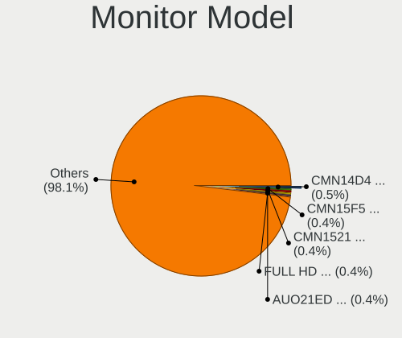

| Model                                                                | Computers | Percent |
|----------------------------------------------------------------------|-----------|---------|
| Chimei Innolux LCD Monitor CMN14D4 1920x1080 309x173mm 13.9-inch     | 146       | 0.45%   |
| Chimei Innolux LCD Monitor CMN15F5 1920x1080 344x193mm 15.5-inch     | 120       | 0.37%   |
| Chimei Innolux LCD Monitor CMN1521 1920x1080 344x193mm 15.5-inch     | 119       | 0.37%   |
| Goldstar FULL HD GSM5B55 1920x1080 480x270mm 21.7-inch               | 116       | 0.36%   |
| AU Optronics LCD Monitor AUO21ED 1920x1080 344x193mm 15.5-inch       | 116       | 0.36%   |
| AU Optronics LCD Monitor AUO403D 1920x1080 309x174mm 14.0-inch       | 110       | 0.34%   |
| AOC 27G2G4 AOC2702 1920x1080 598x336mm 27.0-inch                     | 107       | 0.33%   |
| Chimei Innolux LCD Monitor CMN15E7 1920x1080 344x193mm 15.5-inch     | 103       | 0.32%   |
| PANDA LCD Monitor NCP004D 1920x1080 344x194mm 15.5-inch              | 88        | 0.27%   |
| Goldstar LG ULTRAWIDE GSM59F1 2560x1080 670x280mm 28.6-inch          | 87        | 0.27%   |
| AOC 24G2W1G3 AOC2402 1920x1080 527x296mm 23.8-inch                   | 84        | 0.26%   |
| AU Optronics LCD Monitor AUO38ED 1920x1080 344x193mm 15.5-inch       | 82        | 0.26%   |
| Chimei Innolux LCD Monitor CMN15E8 1920x1080 344x193mm 15.5-inch     | 78        | 0.24%   |
| Samsung Electronics C24F390 SAM0D2C 1920x1080 521x293mm 23.5-inch    | 76        | 0.24%   |
| Dell U2412M DELA07A 1920x1200 518x324mm 24.1-inch                    | 71        | 0.22%   |
| BOE LCD Monitor BOE095F 2256x1504 285x190mm 13.5-inch                | 70        | 0.22%   |
| Unknown LCD Monitor FFFF 2288x1287 2550x2550mm 142.0-inch            | 67        | 0.21%   |
| BOE LCD Monitor BOE0872 1920x1080 344x194mm 15.5-inch                | 63        | 0.2%    |
| Goldstar HDR WFHD GSM7714 2560x1080 798x334mm 34.1-inch              | 61        | 0.19%   |
| Chimei Innolux LCD Monitor CMN15DB 1366x768 344x193mm 15.5-inch      | 60        | 0.19%   |
| Chimei Innolux LCD Monitor CMN14C9 1920x1080 309x173mm 13.9-inch     | 57        | 0.18%   |
| AU Optronics LCD Monitor AUO106C 1366x768 276x155mm 12.5-inch        | 57        | 0.18%   |
| Lenovo LCD Monitor LEN40BA 1920x1080 344x194mm 15.5-inch             | 56        | 0.17%   |
| Goldstar HDR 4K GSM7706 3840x2160 600x340mm 27.2-inch                | 56        | 0.17%   |
| Samsung Electronics LCD Monitor SEC5441 1280x800 331x207mm 15.4-inch | 55        | 0.17%   |
| Goldstar Ultra HD GSM5B09 3840x2160 600x340mm 27.2-inch              | 55        | 0.17%   |
| Samsung Electronics C27F390 SAM0D32 1920x1080 598x336mm 27.0-inch    | 53        | 0.16%   |
| BOE LCD Monitor BOE0812 1920x1080 344x194mm 15.5-inch                | 53        | 0.16%   |
| Samsung Electronics S24F350 SAM0D20 1920x1080 521x293mm 23.5-inch    | 52        | 0.16%   |
| AU Optronics LCD Monitor AUO573D 1920x1080 309x174mm 14.0-inch       | 52        | 0.16%   |
| AOC 24B1W1 AOC2401 1920x1080 527x296mm 23.8-inch                     | 52        | 0.16%   |
| LG Display LCD Monitor LGD0521 1920x1080 309x174mm 14.0-inch         | 51        | 0.16%   |
| Goldstar HDR 4K GSM7707 3840x2160 600x340mm 27.2-inch                | 51        | 0.16%   |
| Chimei Innolux LCD Monitor CMN14D5 1920x1080 309x173mm 13.9-inch     | 51        | 0.16%   |
| LG Display LCD Monitor LGD0555 2736x1824 260x173mm 12.3-inch         | 50        | 0.16%   |
| Goldstar LG IPS FULLHD GSM5AB8 1920x1080 480x270mm 21.7-inch         | 50        | 0.16%   |
| AU Optronics LCD Monitor AUOAF90 1920x1080 344x193mm 15.5-inch       | 50        | 0.16%   |
| Dell P2419H DELD0DA 1920x1080 527x296mm 23.8-inch                    | 49        | 0.15%   |
| Chimei Innolux LCD Monitor CMN15E6 1366x768 344x193mm 15.5-inch      | 48        | 0.15%   |
| Goldstar ULTRAWIDE GSM76F9 2560x1080 531x298mm 24.0-inch             | 46        | 0.14%   |

Monitor Resolution
------------------

Monitor screen resolution

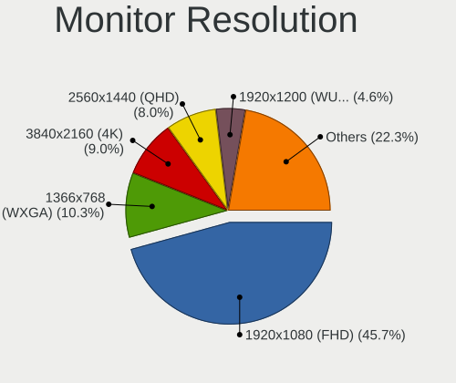

| Resolution         | Computers | Percent |
|--------------------|-----------|---------|
| 1920x1080 (FHD)    | 13362     | 45.74%  |
| 1366x768 (WXGA)    | 3008      | 10.3%   |
| 3840x2160 (4K)     | 2636      | 9.02%   |
| 2560x1440 (QHD)    | 2350      | 8.04%   |
| 1920x1200 (WUXGA)  | 1357      | 4.64%   |
| 2560x1600          | 741       | 2.54%   |
| 1600x900 (HD+)     | 701       | 2.4%    |
| 3440x1440          | 638       | 2.18%   |
| 2880x1800          | 593       | 2.03%   |
| 1680x1050 (WSXGA+) | 416       | 1.42%   |
| 1440x900 (WXGA+)   | 407       | 1.39%   |
| 2560x1080          | 383       | 1.31%   |
| 1280x1024 (SXGA)   | 365       | 1.25%   |
| 1280x800 (WXGA)    | 291       | 1%      |
| 3840x2400          | 166       | 0.57%   |
| Unknown            | 166       | 0.57%   |
| 2160x1440          | 143       | 0.49%   |
| 3840x1080          | 133       | 0.46%   |
| 2256x1504          | 124       | 0.42%   |
| 1360x768           | 117       | 0.4%    |
| 2880x1920          | 93        | 0.32%   |
| 3200x2000          | 91        | 0.31%   |
| 1920x1280          | 74        | 0.25%   |
| 2288x1287          | 71        | 0.24%   |
| 3200x1800 (QHD+)   | 64        | 0.22%   |
| 1920x540           | 57        | 0.2%    |
| 3000x2000          | 53        | 0.18%   |
| 3072x1920          | 50        | 0.17%   |
| 1600x1200          | 45        | 0.15%   |
| 2880x1620          | 43        | 0.15%   |
| 3840x1600          | 41        | 0.14%   |
| 2240x1400          | 41        | 0.14%   |
| 3456x2160          | 35        | 0.12%   |
| 1024x768 (XGA)     | 34        | 0.12%   |
| 2736x1824          | 26        | 0.09%   |
| 2520x1680          | 24        | 0.08%   |
| 1280x720 (HD)      | 20        | 0.07%   |
| 2160x1350          | 15        | 0.05%   |
| 1800x1200          | 15        | 0.05%   |
| 3840x1100          | 14        | 0.05%   |

Monitor Diagonal
----------------

Diagonal size in inches

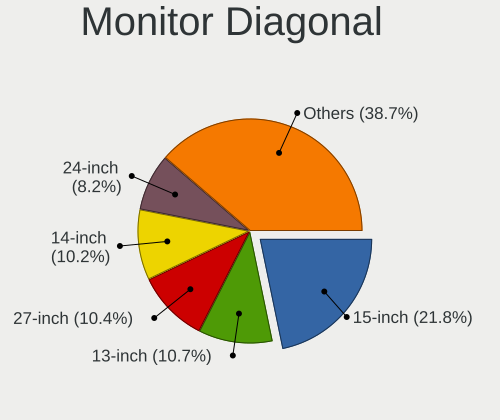

| Inches  | Computers | Percent |
|---------|-----------|---------|
| 15      | 6744      | 21.76%  |
| 13      | 3320      | 10.71%  |
| 27      | 3236      | 10.44%  |
| 14      | 3158      | 10.19%  |
| 24      | 2553      | 8.24%   |
| 23      | 1696      | 5.47%   |
| 21      | 1452      | 4.68%   |
| 31      | 1190      | 3.84%   |
| 16      | 983       | 3.17%   |
| 17      | 967       | 3.12%   |
| 34      | 852       | 2.75%   |
| 12      | 519       | 1.67%   |
| 19      | 461       | 1.49%   |
| Unknown | 385       | 1.24%   |
| 18      | 381       | 1.23%   |
| 20      | 333       | 1.07%   |
| 22      | 323       | 1.04%   |
| 11      | 212       | 0.68%   |
| 32      | 207       | 0.67%   |
| 84      | 205       | 0.66%   |
| 72      | 155       | 0.5%    |
| 40      | 148       | 0.48%   |
| 54      | 125       | 0.4%    |
| 26      | 125       | 0.4%    |
| 25      | 114       | 0.37%   |
| 48      | 112       | 0.36%   |
| 63      | 102       | 0.33%   |
| 28      | 92        | 0.3%    |
| 142     | 67        | 0.22%   |
| 42      | 62        | 0.2%    |
| 10      | 59        | 0.19%   |
| 29      | 58        | 0.19%   |
| 49      | 54        | 0.17%   |
| 37      | 48        | 0.15%   |
| 35      | 41        | 0.13%   |
| 52      | 40        | 0.13%   |
| 39      | 37        | 0.12%   |
| 36      | 37        | 0.12%   |
| 74      | 33        | 0.11%   |
| 43      | 31        | 0.1%    |

Monitor Width
-------------

Physical width

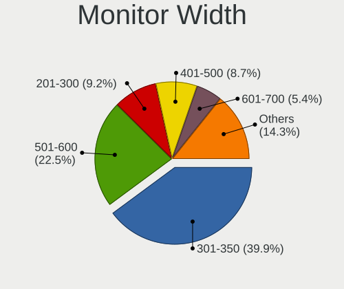

| Width in mm    | Computers | Percent |
|----------------|-----------|---------|
| 301-350        | 12061     | 39.88%  |
| 501-600        | 6812      | 22.52%  |
| 201-300        | 2780      | 9.19%   |
| 401-500        | 2631      | 8.7%    |
| 601-700        | 1645      | 5.44%   |
| 351-400        | 1315      | 4.35%   |
| 701-800        | 1114      | 3.68%   |
| 1001-1500      | 578       | 1.91%   |
| 1501-2000      | 411       | 1.36%   |
| Unknown        | 385       | 1.27%   |
| 801-900        | 279       | 0.92%   |
| 901-1000       | 126       | 0.42%   |
| More than 2000 | 70        | 0.23%   |
| 101-200        | 27        | 0.09%   |
| 1-100          | 9         | 0.03%   |

Aspect Ratio
------------

Proportional relationship between the width and the height

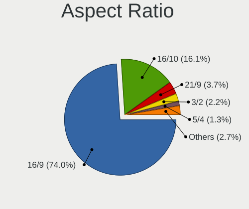

| Ratio   | Computers | Percent |
|---------|-----------|---------|
| 16/9    | 20078     | 73.98%  |
| 16/10   | 4370      | 16.1%   |
| 21/9    | 991       | 3.65%   |
| 3/2     | 608       | 2.24%   |
| 5/4     | 357       | 1.32%   |
| Unknown | 225       | 0.83%   |
| 32/9    | 160       | 0.59%   |
| 4/3     | 140       | 0.52%   |
| 1.00    | 71        | 0.26%   |
| 6/5     | 28        | 0.1%    |
| 0.56    | 22        | 0.08%   |
| 3.40    | 14        | 0.05%   |
| 0.63    | 13        | 0.05%   |
| 0.89    | 11        | 0.04%   |
| 1.96    | 10        | 0.04%   |
| 0.62    | 8         | 0.03%   |
| 0.67    | 7         | 0.03%   |
| 2.12    | 5         | 0.02%   |
| 3.73    | 3         | 0.01%   |
| 3.33    | 2         | 0.01%   |
| 3.20    | 2         | 0.01%   |
| 2.69    | 2         | 0.01%   |
| 2.65    | 2         | 0.01%   |
| 2.00    | 2         | 0.01%   |
| 3.88    | 1         | 0.004%  |
| 2.64    | 1         | 0.004%  |
| 2.01    | 1         | 0.004%  |
| 0.80    | 1         | 0.004%  |
| 0.54    | 1         | 0.004%  |
| 0.45    | 1         | 0.004%  |
| 0.25    | 1         | 0.004%  |
| 0.22    | 1         | 0.004%  |

Monitor Area
------------

Area in inch²

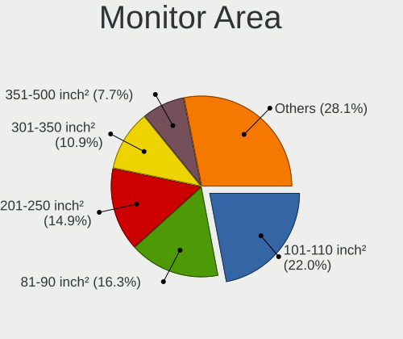

| Area in inch² | Computers | Percent |
|----------------|-----------|---------|
| 101-110        | 6749      | 22.03%  |
| 81-90          | 4989      | 16.28%  |
| 201-250        | 4576      | 14.94%  |
| 301-350        | 3335      | 10.88%  |
| 351-500        | 2366      | 7.72%   |
| 71-80          | 1393      | 4.55%   |
| 151-200        | 1186      | 3.87%   |
| 251-300        | 1031      | 3.36%   |
| 111-120        | 951       | 3.1%    |
| More than 1000 | 861       | 2.81%   |
| 121-130        | 776       | 2.53%   |
| 501-1000       | 585       | 1.91%   |
| 61-70          | 482       | 1.57%   |
| 141-150        | 436       | 1.42%   |
| Unknown        | 385       | 1.26%   |
| 51-60          | 240       | 0.78%   |
| 91-100         | 131       | 0.43%   |
| 131-140        | 84        | 0.27%   |
| 41-50          | 47        | 0.15%   |
| 1-40           | 36        | 0.12%   |

Pixel Density
-------------

Pixels per inch

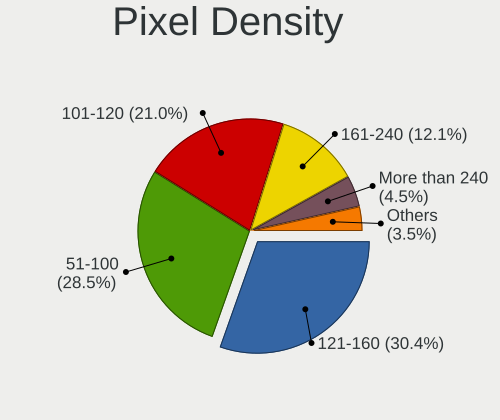

| Density       | Computers | Percent |
|---------------|-----------|---------|
| 121-160       | 9022      | 30.41%  |
| 51-100        | 8442      | 28.46%  |
| 101-120       | 6218      | 20.96%  |
| 161-240       | 3592      | 12.11%  |
| More than 240 | 1343      | 4.53%   |
| 1-50          | 660       | 2.22%   |
| Unknown       | 386       | 1.3%    |

Multiple Monitors
-----------------

Total monitors connected

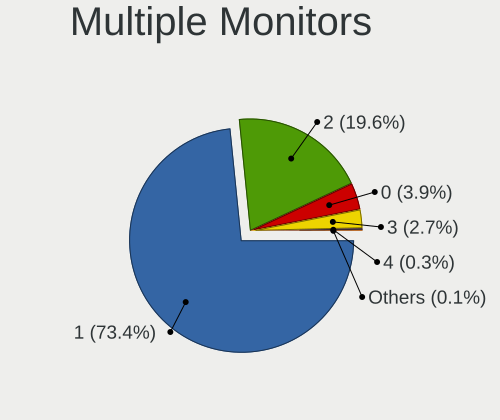

| Total | Computers | Percent |
|-------|-----------|---------|
| 1     | 19970     | 73.41%  |
| 2     | 5342      | 19.64%  |
| 0     | 1052      | 3.87%   |
| 3     | 732       | 2.69%   |
| 4     | 87        | 0.32%   |
| 5     | 16        | 0.06%   |
| 6     | 5         | 0.02%   |

Network
-------

Net Controller Vendor
---------------------

Controller vendors

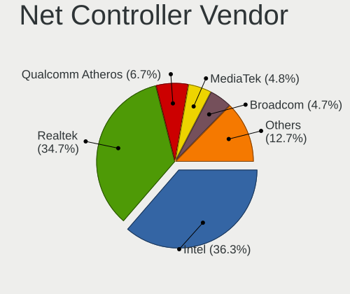

| Vendor                            | Computers | Percent |
|-----------------------------------|-----------|---------|
| Intel                             | 14352     | 36.34%  |
| Realtek Semiconductor             | 13723     | 34.75%  |
| Qualcomm Atheros                  | 2632      | 6.66%   |
| MediaTek                          | 1914      | 4.85%   |
| Broadcom                          | 1850      | 4.68%   |
| TP-Link                           | 479       | 1.21%   |
| Broadcom Limited                  | 373       | 0.94%   |
| ASIX Electronics                  | 322       | 0.82%   |
| Ralink Technology                 | 261       | 0.66%   |
| Qualcomm                          | 217       | 0.55%   |
| Samsung Electronics               | 199       | 0.5%    |
| Ralink                            | 194       | 0.49%   |
| Marvell Technology Group          | 187       | 0.47%   |
| Lenovo                            | 186       | 0.47%   |
| Shenzhen Goodix Technology        | 168       | 0.43%   |
| Microsoft                         | 166       | 0.42%   |
| Aquantia                          | 152       | 0.38%   |
| Sierra Wireless                   | 144       | 0.36%   |
| DisplayLink                       | 131       | 0.33%   |
| Nvidia                            | 127       | 0.32%   |
| Xiaomi                            | 126       | 0.32%   |
| Dell                              | 104       | 0.26%   |
| NetGear                           | 89        | 0.23%   |
| ASUSTek Computer                  | 89        | 0.23%   |
| Qualcomm Technologies             | 84        | 0.21%   |
| Google                            | 81        | 0.21%   |
| Qualcomm Atheros Communications   | 74        | 0.19%   |
| D-Link                            | 72        | 0.18%   |
| Hewlett-Packard                   | 60        | 0.15%   |
| Apple                             | 53        | 0.13%   |
| OPPO Electronics                  | 52        | 0.13%   |
| Huawei Technologies               | 52        | 0.13%   |
| Motorola PCS                      | 46        | 0.12%   |
| Ericsson Business Mobile Networks | 46        | 0.12%   |
| Edimax Technology                 | 39        | 0.1%    |
| Fibocom                           | 38        | 0.1%    |
| D-Link System                     | 38        | 0.1%    |
| Mellanox Technologies             | 34        | 0.09%   |
| Linksys                           | 29        | 0.07%   |
| JMicron Technology                | 24        | 0.06%   |

Net Controller Model
--------------------

Controller models

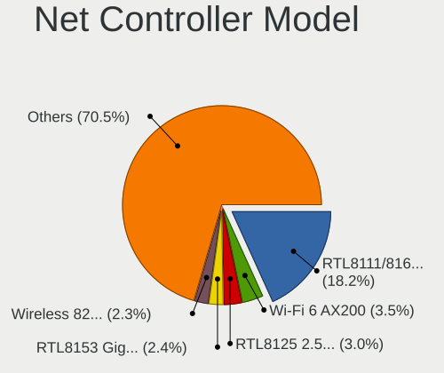

| Model                                                                  | Computers | Percent |
|------------------------------------------------------------------------|-----------|---------|
| Realtek RTL8111/8168/8211/8411 PCI Express Gigabit Ethernet Controller | 8545      | 18.22%  |
| Intel Wi-Fi 6 AX200                                                    | 1652      | 3.52%   |
| Realtek RTL8125 2.5GbE Controller                                      | 1411      | 3.01%   |
| Realtek RTL8153 Gigabit Ethernet Adapter                               | 1134      | 2.42%   |
| Intel Wireless 8265 / 8275                                             | 1095      | 2.34%   |
| Intel Wi-Fi 6 AX201                                                    | 932       | 1.99%   |
| Realtek RTL810xE PCI Express Fast Ethernet controller                  | 859       | 1.83%   |
| MediaTek MT7922 802.11ax PCI Express Wireless Network Adapter          | 723       | 1.54%   |
| Intel Alder Lake-P PCH CNVi WiFi                                       | 699       | 1.49%   |
| Intel Wi-Fi 6E(802.11ax) AX210/AX1675* 2x2 [Typhoon Peak]              | 695       | 1.48%   |
| Intel I211 Gigabit Network Connection                                  | 683       | 1.46%   |
| Intel 82579LM Gigabit Network Connection (Lewisville)                  | 627       | 1.34%   |
| Realtek RTL8822CE 802.11ac PCIe Wireless Network Adapter               | 605       | 1.29%   |
| MediaTek MT7921 802.11ax PCIe Wireless Network Adapter [Filogic 330]   | 598       | 1.28%   |
| Realtek RTL8821CE 802.11ac PCIe Wireless Network Adapter               | 550       | 1.17%   |
| Qualcomm Atheros QCA9377 802.11ac Wireless Network Adapter             | 532       | 1.13%   |
| Intel Wireless 7265                                                    | 532       | 1.13%   |
| Intel Wireless 8260                                                    | 530       | 1.13%   |
| Qualcomm Atheros QCA6174 802.11ac Wireless Network Adapter             | 517       | 1.1%    |
| Intel Ethernet Controller I225-V                                       | 498       | 1.06%   |
| Intel Comet Lake PCH-LP CNVi WiFi                                      | 449       | 0.96%   |
| Intel Wireless 7260                                                    | 444       | 0.95%   |
| Intel Cannon Lake PCH CNVi WiFi                                        | 416       | 0.89%   |
| Intel Comet Lake PCH CNVi WiFi                                         | 397       | 0.85%   |
| Intel Cannon Point-LP CNVi [Wireless-AC]                               | 395       | 0.84%   |
| Intel Ethernet Connection (4) I219-LM                                  | 377       | 0.8%    |
| Intel Ethernet Connection (2) I219-V                                   | 377       | 0.8%    |
| Intel Raptor Lake PCH CNVi WiFi                                        | 369       | 0.79%   |
| Realtek RTL8852BE PCIe 802.11ax Wireless Network Controller            | 357       | 0.76%   |
| Intel Dual Band Wireless-AC 3168NGW [Stone Peak]                       | 331       | 0.71%   |
| Intel Wi-Fi 5(802.11ac) Wireless-AC 9x6x [Thunder Peak]                | 309       | 0.66%   |
| Intel Ethernet Connection I217-LM                                      | 303       | 0.65%   |
| Qualcomm Atheros QCA9565 / AR9565 Wireless Network Adapter             | 299       | 0.64%   |
| ASIX AX88179 Gigabit Ethernet                                          | 292       | 0.62%   |
| Qualcomm Atheros AR9485 Wireless Network Adapter                       | 284       | 0.61%   |
| Intel Wireless 3165                                                    | 284       | 0.61%   |
| Intel Centrino Advanced-N 6205 [Taylor Peak]                           | 243       | 0.52%   |
| Intel Ethernet Connection (7) I219-V                                   | 222       | 0.47%   |
| Intel Ethernet Connection (2) I219-LM                                  | 221       | 0.47%   |
| Intel 700 Series Chipset CNVi WiFi                                     | 218       | 0.46%   |

Wireless Vendor
---------------

Wireless vendors

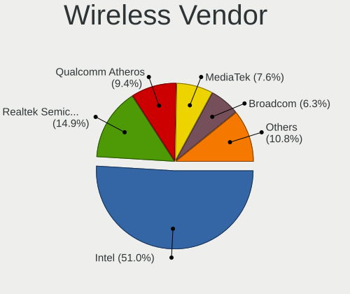

| Vendor                                | Computers | Percent |
|---------------------------------------|-----------|---------|
| Intel                                 | 11486     | 50.96%  |
| Realtek Semiconductor                 | 3361      | 14.91%  |
| Qualcomm Atheros                      | 2125      | 9.43%   |
| MediaTek                              | 1712      | 7.6%    |
| Broadcom                              | 1411      | 6.26%   |
| TP-Link                               | 435       | 1.93%   |
| Broadcom Limited                      | 318       | 1.41%   |
| Ralink Technology                     | 261       | 1.16%   |
| Ralink                                | 194       | 0.86%   |
| Qualcomm                              | 181       | 0.8%    |
| Microsoft                             | 147       | 0.65%   |
| Sierra Wireless                       | 144       | 0.64%   |
| NetGear                               | 87        | 0.39%   |
| ASUSTek Computer                      | 85        | 0.38%   |
| Dell                                  | 78        | 0.35%   |
| Qualcomm Atheros Communications       | 74        | 0.33%   |
| Marvell Technology Group              | 65        | 0.29%   |
| D-Link                                | 63        | 0.28%   |
| Edimax Technology                     | 39        | 0.17%   |
| Fibocom                               | 38        | 0.17%   |
| Qualcomm Technologies                 | 34        | 0.15%   |
| D-Link System                         | 29        | 0.13%   |
| Linksys                               | 26        | 0.12%   |
| Hewlett-Packard                       | 18        | 0.08%   |
| Belkin Components                     | 15        | 0.07%   |
| Realtek                               | 13        | 0.06%   |
| Mercucys                              | 13        | 0.06%   |
| AVM                                   | 12        | 0.05%   |
| Wilocity                              | 8         | 0.04%   |
| IMC Networks                          | 7         | 0.03%   |
| 802.11g Adapter [Linksys WUSB54GC v3] | 7         | 0.03%   |
| Unknown                               | 7         | 0.03%   |
| Quectel Wireless Solutions            | 6         | 0.03%   |
| ZyXEL Communications                  | 5         | 0.02%   |
| ZyDAS                                 | 4         | 0.02%   |
| Sitecom Europe                        | 4         | 0.02%   |
| Wacom                                 | 3         | 0.01%   |
| Xiaomi                                | 2         | 0.01%   |
| TRENDnet                              | 2         | 0.01%   |
| Micro Star International              | 2         | 0.01%   |

Wireless Model
--------------

Wireless models

| Model                                                                | Computers | Percent |
|----------------------------------------------------------------------|-----------|---------|
| Intel Wi-Fi 6 AX200                                                  | 1652      | 7.28%   |
| Intel Wireless 8265 / 8275                                           | 1095      | 4.83%   |
| Intel Wi-Fi 6 AX201                                                  | 932       | 4.11%   |
| Intel Wi-Fi 6E(802.11ax) AX210/AX1675* 2x2 [Typhoon Peak]            | 695       | 3.06%   |
| MediaTek MT7922 802.11ax PCI Express Wireless Network Adapter        | 612       | 2.7%    |
| Realtek RTL8822CE 802.11ac PCIe Wireless Network Adapter             | 605       | 2.67%   |
| MediaTek MT7921 802.11ax PCIe Wireless Network Adapter [Filogic 330] | 598       | 2.64%   |
| Realtek RTL8821CE 802.11ac PCIe Wireless Network Adapter             | 550       | 2.43%   |
| Qualcomm Atheros QCA9377 802.11ac Wireless Network Adapter           | 532       | 2.35%   |
| Intel Wireless 7265                                                  | 532       | 2.35%   |
| Intel Wireless 8260                                                  | 530       | 2.34%   |
| Qualcomm Atheros QCA6174 802.11ac Wireless Network Adapter           | 517       | 2.28%   |
| Intel Comet Lake PCH-LP CNVi WiFi                                    | 449       | 1.98%   |
| Intel Alder Lake-P PCH CNVi WiFi                                     | 447       | 1.97%   |
| Intel Wireless 7260                                                  | 444       | 1.96%   |
| Intel Cannon Lake PCH CNVi WiFi                                      | 416       | 1.83%   |
| Intel Comet Lake PCH CNVi WiFi                                       | 397       | 1.75%   |
| Intel Cannon Point-LP CNVi [Wireless-AC]                             | 395       | 1.74%   |
| Intel Raptor Lake PCH CNVi WiFi                                      | 356       | 1.57%   |
| Intel Dual Band Wireless-AC 3168NGW [Stone Peak]                     | 331       | 1.46%   |
| Intel Wi-Fi 5(802.11ac) Wireless-AC 9x6x [Thunder Peak]              | 309       | 1.36%   |
| Qualcomm Atheros QCA9565 / AR9565 Wireless Network Adapter           | 299       | 1.32%   |
| Realtek RTL8852BE PCIe 802.11ax Wireless Network Controller          | 298       | 1.31%   |
| Qualcomm Atheros AR9485 Wireless Network Adapter                     | 284       | 1.25%   |
| Intel Wireless 3165                                                  | 284       | 1.25%   |
| Intel Centrino Advanced-N 6205 [Taylor Peak]                         | 243       | 1.07%   |
| Intel 700 Series Chipset CNVi WiFi                                   | 217       | 0.96%   |
| Broadcom BCM4360 802.11ac Dual Band Wireless Network Adapter         | 212       | 0.93%   |
| Intel Ice Lake-LP PCH CNVi WiFi                                      | 208       | 0.92%   |
| Realtek RTL8822BE 802.11a/b/g/n/ac WiFi adapter                      | 200       | 0.88%   |
| Realtek RTL8852AE 802.11ax PCIe Wireless Network Adapter             | 197       | 0.87%   |
| Intel Meteor Lake PCH CNVi WiFi                                      | 195       | 0.86%   |
| Broadcom BCM43142 802.11b/g/n                                        | 186       | 0.82%   |
| Broadcom BCM4331 802.11a/b/g/n                                       | 183       | 0.81%   |
| Intel Tiger Lake PCH CNVi WiFi                                       | 177       | 0.78%   |
| Realtek 802.11ac NIC                                                 | 174       | 0.77%   |
| MediaTek MT7921K (RZ608) Wi-Fi 6E 80MHz                              | 174       | 0.77%   |
| Realtek RTL8723BE PCIe Wireless Network Adapter                      | 165       | 0.73%   |
| Qualcomm QCNFA765 Wireless Network Adapter                           | 160       | 0.71%   |
| Broadcom Limited BCM4360 802.11ac Dual Band Wireless Network Adapter | 157       | 0.69%   |

Ethernet Vendor
---------------

Ethernet vendors

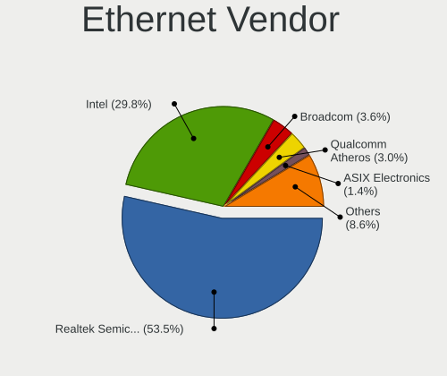

| Vendor                                 | Computers | Percent |
|----------------------------------------|-----------|---------|
| Realtek Semiconductor                  | 12213     | 53.52%  |
| Intel                                  | 6807      | 29.83%  |
| Broadcom                               | 826       | 3.62%   |
| Qualcomm Atheros                       | 685       | 3%      |
| ASIX Electronics                       | 322       | 1.41%   |
| MediaTek                               | 197       | 0.86%   |
| Samsung Electronics                    | 196       | 0.86%   |
| Lenovo                                 | 180       | 0.79%   |
| Aquantia                               | 152       | 0.67%   |
| DisplayLink                            | 131       | 0.57%   |
| Nvidia                                 | 127       | 0.56%   |
| Xiaomi                                 | 124       | 0.54%   |
| Marvell Technology Group               | 122       | 0.53%   |
| Google                                 | 81        | 0.35%   |
| Broadcom Limited                       | 56        | 0.25%   |
| OPPO Electronics                       | 52        | 0.23%   |
| Apple                                  | 52        | 0.23%   |
| Qualcomm Technologies                  | 50        | 0.22%   |
| TP-Link                                | 46        | 0.2%    |
| Motorola PCS                           | 46        | 0.2%    |
| Qualcomm                               | 36        | 0.16%   |
| Huawei Technologies                    | 35        | 0.15%   |
| Mellanox Technologies                  | 32        | 0.14%   |
| JMicron Technology                     | 24        | 0.11%   |
| Hewlett-Packard                        | 23        | 0.1%    |
| ICS Advent                             | 21        | 0.09%   |
| Suzhou Motorcomm Electronic Technology | 14        | 0.06%   |
| Microsoft                              | 12        | 0.05%   |
| OnePlus Technology (Shenzhen)          | 10        | 0.04%   |
| Cypress Semiconductor                  | 10        | 0.04%   |
| D-Link System                          | 9         | 0.04%   |
| D-Link                                 | 9         | 0.04%   |
| Sony Ericsson Mobile Communications AB | 7         | 0.03%   |
| Motorcomm Microelectronics.            | 7         | 0.03%   |
| 3Com                                   | 7         | 0.03%   |
| VIA Technologies                       | 6         | 0.03%   |
| Spreadtrum Communications              | 6         | 0.03%   |
| HMD Global                             | 6         | 0.03%   |
| Dell                                   | 5         | 0.02%   |
| ADMtek                                 | 5         | 0.02%   |

Ethernet Model
--------------

Ethernet models

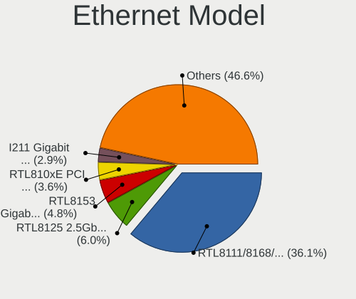

| Model                                                                  | Computers | Percent |
|------------------------------------------------------------------------|-----------|---------|
| Realtek RTL8111/8168/8211/8411 PCI Express Gigabit Ethernet Controller | 8545      | 36.1%   |
| Realtek RTL8125 2.5GbE Controller                                      | 1411      | 5.96%   |
| Realtek RTL8153 Gigabit Ethernet Adapter                               | 1134      | 4.79%   |
| Realtek RTL810xE PCI Express Fast Ethernet controller                  | 859       | 3.63%   |
| Intel I211 Gigabit Network Connection                                  | 683       | 2.89%   |
| Intel 82579LM Gigabit Network Connection (Lewisville)                  | 627       | 2.65%   |
| Intel Ethernet Controller I225-V                                       | 498       | 2.1%    |
| Intel Ethernet Connection (4) I219-LM                                  | 377       | 1.59%   |
| Intel Ethernet Connection (2) I219-V                                   | 377       | 1.59%   |
| Intel Ethernet Connection I217-LM                                      | 303       | 1.28%   |
| ASIX AX88179 Gigabit Ethernet                                          | 292       | 1.23%   |
| Intel Alder Lake-P PCH CNVi WiFi                                       | 252       | 1.06%   |
| Intel Ethernet Connection (7) I219-V                                   | 222       | 0.94%   |
| Intel Ethernet Connection (2) I219-LM                                  | 221       | 0.93%   |
| Intel Ethernet Connection (4) I219-V                                   | 214       | 0.9%    |
| Intel Ethernet Connection I219-LM                                      | 212       | 0.9%    |
| Broadcom NetXtreme BCM57765 Gigabit Ethernet PCIe                      | 197       | 0.83%   |
| Intel Ethernet Connection (7) I219-LM                                  | 181       | 0.76%   |
| Broadcom NetXtreme BCM57766 Gigabit Ethernet PCIe                      | 163       | 0.69%   |
| Samsung Galaxy series, misc. (tethering mode)                          | 152       | 0.64%   |
| Intel Ethernet Controller I226-V                                       | 150       | 0.63%   |
| Intel Ethernet Connection (6) I219-V                                   | 148       | 0.63%   |
| Realtek Killer E2600 GbE Controller                                    | 143       | 0.6%    |
| Intel Ethernet Connection (10) I219-V                                  | 134       | 0.57%   |
| Intel Ethernet Connection (6) I219-LM                                  | 129       | 0.54%   |
| Intel Ethernet Connection I218-LM                                      | 128       | 0.54%   |
| Intel 82579V Gigabit Network Connection                                | 122       | 0.52%   |
| Intel Ethernet Connection (3) I218-LM                                  | 121       | 0.51%   |
| MediaTek MT7922 802.11ax PCI Express Wireless Network Adapter          | 111       | 0.47%   |
| Qualcomm Atheros Killer E220x Gigabit Ethernet Controller              | 109       | 0.46%   |
| Intel 82574L Gigabit Network Connection                                | 106       | 0.45%   |
| Realtek Killer E3000 2.5GbE Controller                                 | 103       | 0.44%   |
| Intel Ethernet Connection (2) I218-V                                   | 103       | 0.44%   |
| Intel I210 Gigabit Network Connection                                  | 100       | 0.42%   |
| Intel Ethernet Connection I217-V                                       | 97        | 0.41%   |
| Qualcomm Atheros AR8151 v2.0 Gigabit Ethernet                          | 96        | 0.41%   |
| Realtek RTL8152 Fast Ethernet Adapter                                  | 92        | 0.39%   |
| Xiaomi Mi/Redmi series (RNDIS)                                         | 88        | 0.37%   |
| Realtek RTL8126 5GbE Controller                                        | 87        | 0.37%   |
| Qualcomm Atheros Killer E2500 Gigabit Ethernet Controller              | 87        | 0.37%   |

Net Controller Kind
-------------------

Ethernet, WiFi or modem

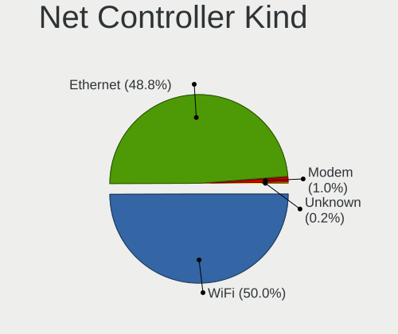

| Kind     | Computers | Percent |
|----------|-----------|---------|
| WiFi     | 21319     | 49.95%  |
| Ethernet | 20825     | 48.8%   |
| Modem    | 447       | 1.05%   |
| Unknown  | 86        | 0.2%    |

Used Controller
---------------

Currently used network controller

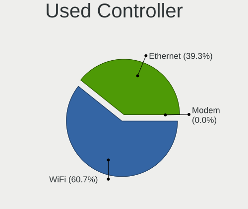

| Kind     | Computers | Percent |
|----------|-----------|---------|
| WiFi     | 16788     | 60.71%  |
| Ethernet | 10860     | 39.27%  |
| Modem    | 6         | 0.02%   |

NICs
----

Total network controllers on board

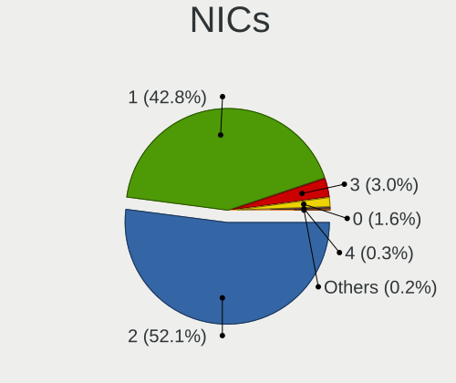

| Total | Computers | Percent |
|-------|-----------|---------|
| 2     | 13794     | 52.05%  |
| 1     | 11342     | 42.8%   |
| 3     | 799       | 3.02%   |
| 0     | 416       | 1.57%   |
| 4     | 90        | 0.34%   |
| 5     | 29        | 0.11%   |
| 6     | 16        | 0.06%   |
| 8     | 4         | 0.02%   |
| 9     | 3         | 0.01%   |
| 12    | 2         | 0.01%   |
| 7     | 2         | 0.01%   |
| 11    | 1         | 0.004%  |
| 10    | 1         | 0.004%  |

IPv6
----

IPv6 vs IPv4

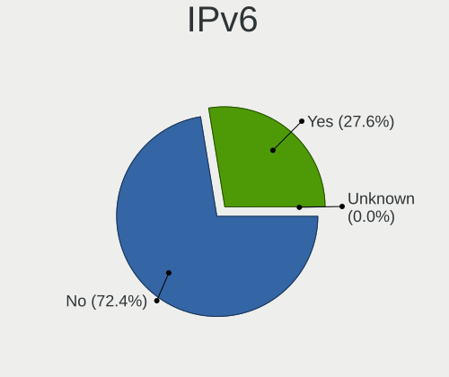

| Used    | Computers | Percent |
|---------|-----------|---------|
| No      | 19552     | 72.41%  |
| Yes     | 7443      | 27.57%  |
| Unknown | 5         | 0.02%   |

Bluetooth
---------

Bluetooth Vendor
----------------

Controller vendors

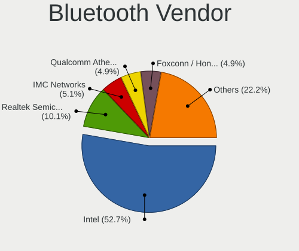

| Vendor                          | Computers | Percent |
|---------------------------------|-----------|---------|
| Intel                           | 10594     | 52.74%  |
| Realtek Semiconductor           | 2036      | 10.14%  |
| IMC Networks                    | 1028      | 5.12%   |
| Qualcomm Atheros Communications | 983       | 4.89%   |
| Foxconn / Hon Hai               | 983       | 4.89%   |
| Apple                           | 838       | 4.17%   |
| Cambridge Silicon Radio         | 787       | 3.92%   |
| Broadcom                        | 564       | 2.81%   |
| MediaTek                        | 514       | 2.56%   |
| Lite-On Technology              | 459       | 2.29%   |
| ASUSTek Computer                | 284       | 1.41%   |
| TP-Link                         | 177       | 0.88%   |
| Realtek                         | 166       | 0.83%   |
| USI                             | 97        | 0.48%   |
| Dell                            | 88        | 0.44%   |
| Marvell Semiconductor           | 65        | 0.32%   |
| Hewlett-Packard                 | 63        | 0.31%   |
| Ralink                          | 50        | 0.25%   |
| Toshiba                         | 48        | 0.24%   |
| Foxconn International           | 37        | 0.18%   |
| Unknown                         | 30        | 0.15%   |
| Actions                         | 23        | 0.11%   |
| Edimax Technology               | 18        | 0.09%   |
| Opticis                         | 16        | 0.08%   |
| Ralink Technology               | 13        | 0.06%   |
| Integrated System Solution      | 12        | 0.06%   |
| Dynex                           | 12        | 0.06%   |
| Quectel Wireless Solutions      | 11        | 0.05%   |
| Belkin Components               | 11        | 0.05%   |
| Smart Modular Technologies      | 10        | 0.05%   |
| HTC (High Tech Computer)        | 10        | 0.05%   |
| Alps Electric                   | 10        | 0.05%   |
| Fujitsu                         | 6         | 0.03%   |
| Mercucys                        | 5         | 0.02%   |
| Askey Computer                  | 5         | 0.02%   |
| SINO WEALTH                     | 4         | 0.02%   |
| Chicony Electronics             | 4         | 0.02%   |
| Taiyo Yuden                     | 3         | 0.01%   |
| Qcom                            | 3         | 0.01%   |
| Creative Technology             | 3         | 0.01%   |

Bluetooth Model
---------------

Controller models

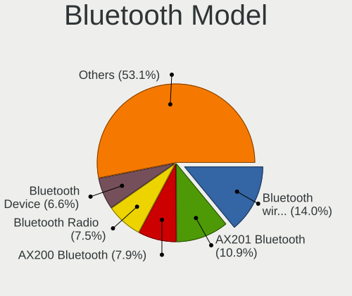

| Model                                               | Computers | Percent |
|-----------------------------------------------------|-----------|---------|
| Intel Bluetooth wireless interface                  | 2825      | 14.04%  |
| Intel AX201 Bluetooth                               | 2190      | 10.88%  |
| Intel AX200 Bluetooth                               | 1585      | 7.88%   |
| Realtek Bluetooth Radio                             | 1511      | 7.51%   |
| Intel Bluetooth Device                              | 1321      | 6.57%   |
| Intel Bluetooth 9460/9560 Jefferson Peak (JfP)      | 1209      | 6.01%   |
| Cambridge Silicon Radio Bluetooth Dongle (HCI mode) | 787       | 3.91%   |
| Intel AX210 Bluetooth                               | 667       | 3.31%   |
| IMC Networks Wireless_Device                        | 560       | 2.78%   |
| Qualcomm Atheros  Bluetooth Device                  | 554       | 2.75%   |
| MediaTek Wireless_Device                            | 513       | 2.55%   |
| Apple Bluetooth Host Controller                     | 452       | 2.25%   |
| Foxconn / Hon Hai Wireless_Device                   | 445       | 2.21%   |
| Realtek  Bluetooth 4.2 Adapter                      | 335       | 1.66%   |
| Intel Wireless-AC 3168 Bluetooth                    | 322       | 1.6%    |
| IMC Networks Bluetooth Radio                        | 286       | 1.42%   |
| Intel Wireless-AC 9260 Bluetooth Adapter            | 283       | 1.41%   |
| Apple Bluetooth USB Host Controller                 | 246       | 1.22%   |
| Foxconn / Hon Hai Bluetooth Device                  | 227       | 1.13%   |
| Qualcomm Atheros QCA61x4 Bluetooth 4.0              | 180       | 0.89%   |
| TP-Link TP-T@- UB500 Adapter                        | 177       | 0.88%   |
| Foxconn / Hon Hai MediaTek Bluetooth Adapter        | 176       | 0.87%   |
| Realtek Bluetooth Radio                             | 166       | 0.83%   |
| Intel Centrino Bluetooth Wireless Transceiver       | 145       | 0.72%   |
| Lite-On Qualcomm Atheros QCA9377 Bluetooth          | 134       | 0.67%   |
| Lite-On Bluetooth Device                            | 110       | 0.55%   |
| Broadcom BCM20702A0 Bluetooth 4.0                   | 109       | 0.54%   |
| IMC Networks Bluetooth Device                       | 106       | 0.53%   |
| Apple Built-in Bluetooth 2.0+EDR HCI                | 102       | 0.51%   |
| USI Bluetooth Device                                | 97        | 0.48%   |
| Lite-On Wireless_Device                             | 96        | 0.48%   |
| Qualcomm Atheros AR3012 Bluetooth 4.0               | 94        | 0.47%   |
| Qualcomm Atheros AR3011 Bluetooth                   | 78        | 0.39%   |
| ASUS ASUS USB-BT500                                 | 78        | 0.39%   |
| Broadcom BCM20702 Bluetooth 4.0 [ThinkPad]          | 77        | 0.38%   |
| ASUS Broadcom BCM20702A0 Bluetooth                  | 76        | 0.38%   |
| Broadcom BCM2045B (BDC-2.1)                         | 66        | 0.33%   |
| Realtek RTL8822BE Bluetooth 4.2 Adapter             | 65        | 0.32%   |
| Ralink RT3290 Bluetooth                             | 50        | 0.25%   |
| Marvell Bluetooth and Wireless LAN Composite        | 50        | 0.25%   |

Sound
-----

Sound Vendor
------------

Sound card vendors

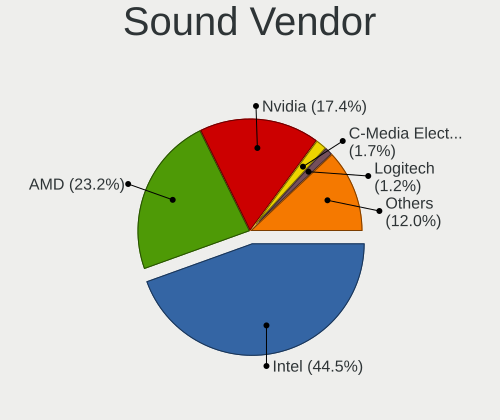

| Vendor                                       | Computers | Percent |
|----------------------------------------------|-----------|---------|
| Intel                                        | 17637     | 44.5%   |
| AMD                                          | 9192      | 23.19%  |
| Nvidia                                       | 6909      | 17.43%  |
| C-Media Electronics                          | 662       | 1.67%   |
| Logitech                                     | 470       | 1.19%   |
| Lenovo                                       | 227       | 0.57%   |
| Realtek Semiconductor                        | 210       | 0.53%   |
| JMTek                                        | 208       | 0.52%   |
| ASUSTek Computer                             | 208       | 0.52%   |
| GN Netcom                                    | 199       | 0.5%    |
| SteelSeries ApS                              | 191       | 0.48%   |
| Focusrite-Novation                           | 168       | 0.42%   |
| Kingston Technology                          | 165       | 0.42%   |
| Razer USA                                    | 162       | 0.41%   |
| Creative Labs                                | 147       | 0.37%   |
| Texas Instruments                            | 145       | 0.37%   |
| Hewlett-Packard                              | 144       | 0.36%   |
| Micro Star International                     | 140       | 0.35%   |
| Generalplus Technology                       | 130       | 0.33%   |
| Corsair                                      | 128       | 0.32%   |
| Creative Technology                          | 127       | 0.32%   |
| Plantronics                                  | 114       | 0.29%   |
| Sony                                         | 101       | 0.25%   |
| Apple                                        | 72        | 0.18%   |
| Blue Microphones                             | 60        | 0.15%   |
| Samson Technologies                          | 57        | 0.14%   |
| DSEA A/S                                     | 50        | 0.13%   |
| RODE Microphones                             | 47        | 0.12%   |
| Jieli Technology                             | 41        | 0.1%    |
| FiiO Electronics Technology                  | 41        | 0.1%    |
| Dell                                         | 40        | 0.1%    |
| BEHRINGER International                      | 40        | 0.1%    |
| Thesycon Systemsoftware & Consulting         | 39        | 0.1%    |
| GYROCOM C&C                                  | 37        | 0.09%   |
| Zoran Co. Personal Media Division (Nogatech) | 36        | 0.09%   |
| XMOS                                         | 36        | 0.09%   |
| KTMicro                                      | 34        | 0.09%   |
| Unknown                                      | 31        | 0.08%   |
| Tenx Technology                              | 30        | 0.08%   |
| Microsoft                                    | 30        | 0.08%   |

Sound Model
-----------

Sound card models

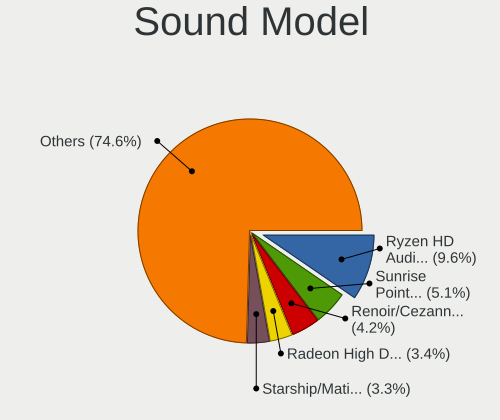

| Model                                                                      | Computers | Percent |
|----------------------------------------------------------------------------|-----------|---------|
| AMD Ryzen HD Audio Controller                                              | 4617      | 9.57%   |
| Intel Sunrise Point-LP HD Audio                                            | 2442      | 5.06%   |
| AMD Renoir/Cezanne HDMI/DP Audio Controller                                | 2018      | 4.18%   |
| AMD Radeon High Definition Audio Controller                                | 1616      | 3.35%   |
| AMD Starship/Matisse HD Audio Controller                                   | 1579      | 3.27%   |
| Intel 7 Series/C216 Chipset Family High Definition Audio Controller        | 1226      | 2.54%   |
| Intel Tiger Lake-LP Smart Sound Technology Audio Controller                | 1187      | 2.46%   |
| Intel Cannon Lake PCH cAVS                                                 | 1026      | 2.13%   |
| Intel 8 Series/C220 Series Chipset High Definition Audio Controller        | 1020      | 2.11%   |
| Intel 6 Series/C200 Series Chipset Family High Definition Audio Controller | 967       | 2%      |
| Intel Alder Lake PCH-P High Definition Audio Controller                    | 907       | 1.88%   |
| AMD Navi 21/23 HDMI/DP Audio Controller                                    | 783       | 1.62%   |
| AMD Raven/Raven2/Fenghuang HDMI/DP Audio Controller                        | 722       | 1.5%    |
| Intel 100 Series/C230 Series Chipset Family HD Audio Controller            | 713       | 1.48%   |
| Intel Xeon E3-1200 v3/4th Gen Core Processor HD Audio Controller           | 647       | 1.34%   |
| Intel Cannon Point-LP High Definition Audio Controller                     | 640       | 1.33%   |
| AMD Ellesmere HDMI Audio [Radeon RX 470/480 / 570/580/590]                 | 568       | 1.18%   |
| AMD Family 17h (Models 00h-0fh) HD Audio Controller                        | 554       | 1.15%   |
| Intel Comet Lake PCH-LP cAVS                                               | 553       | 1.15%   |
| Nvidia GP107GL High Definition Audio Controller                            | 544       | 1.13%   |
| Intel Haswell-ULT HD Audio Controller                                      | 533       | 1.11%   |
| Intel 8 Series HD Audio Controller                                         | 530       | 1.1%    |
| Intel Comet Lake PCH cAVS                                                  | 522       | 1.08%   |
| Intel Broadwell-U Audio Controller                                         | 515       | 1.07%   |
| Intel 200 Series PCH HD Audio                                              | 500       | 1.04%   |
| Intel Wildcat Point-LP High Definition Audio Controller                    | 498       | 1.03%   |
| Intel Raptor Lake-P/U/H cAVS                                               | 482       | 1%      |
| Nvidia GA104 High Definition Audio Controller                              | 463       | 0.96%   |
| Nvidia TU107 GeForce GTX 1650 High Definition Audio Controller             | 461       | 0.96%   |
| Nvidia GA106 High Definition Audio Controller                              | 461       | 0.96%   |
| Intel 5 Series/3400 Series Chipset High Definition Audio                   | 394       | 0.82%   |
| AMD SBx00 Azalia (Intel HDA)                                               | 383       | 0.79%   |
| Nvidia TU116 High Definition Audio Controller                              | 363       | 0.75%   |
| AMD Navi 31 HDMI/DP Audio                                                  | 362       | 0.75%   |
| Nvidia TU106 High Definition Audio Controller                              | 361       | 0.75%   |
| AMD FCH Azalia Controller                                                  | 344       | 0.71%   |
| Nvidia GP106 High Definition Audio Controller                              | 340       | 0.7%    |
| Intel Alder Lake-S HD Audio Controller                                     | 336       | 0.7%    |
| Intel Raptor Lake High Definition Audio Controller                         | 328       | 0.68%   |
| Intel Ice Lake-LP Smart Sound Technology Audio Controller                  | 324       | 0.67%   |

Memory
------

Memory Vendor
-------------

Memory module vendors

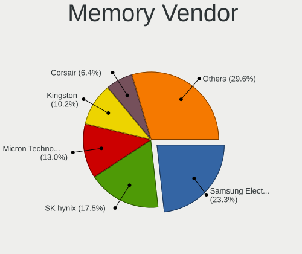

| Vendor                       | Computers | Percent |
|------------------------------|-----------|---------|
| Samsung Electronics          | 3128      | 23.27%  |
| SK hynix                     | 2353      | 17.5%   |
| Micron Technology            | 1745      | 12.98%  |
| Kingston                     | 1376      | 10.23%  |
| Corsair                      | 864       | 6.43%   |
| Crucial                      | 819       | 6.09%   |
| Unknown                      | 678       | 5.04%   |
| G.Skill                      | 611       | 4.54%   |
| A-DATA Technology            | 291       | 2.16%   |
| Unknown                      | 237       | 1.76%   |
| Ramaxel Technology           | 200       | 1.49%   |
| Team                         | 144       | 1.07%   |
| Elpida                       | 102       | 0.76%   |
| Patriot                      | 83        | 0.62%   |
| Smart                        | 75        | 0.56%   |
| Unknown (ABCD)               | 62        | 0.46%   |
| Nanya Technology             | 62        | 0.46%   |
| Transcend                    | 37        | 0.28%   |
| GOODRAM                      | 32        | 0.24%   |
| Apacer                       | 29        | 0.22%   |
| Timetec                      | 24        | 0.18%   |
| Teikon                       | 23        | 0.17%   |
| AMD                          | 23        | 0.17%   |
| PNY                          | 20        | 0.15%   |
| Smart Brazil                 | 18        | 0.13%   |
| Avant                        | 18        | 0.13%   |
| Silicon Power                | 16        | 0.12%   |
| Lexar                        | 15        | 0.11%   |
| GeIL                         | 12        | 0.09%   |
| Hikvision                    | 11        | 0.08%   |
| Goldkey                      | 10        | 0.07%   |
| ChangXin Memory              | 10        | 0.07%   |
| V-GeN                        | 9         | 0.07%   |
| Unknown (0x0B5E)             | 8         | 0.06%   |
| Neo Forza                    | 8         | 0.06%   |
| Kllisre                      | 8         | 0.06%   |
| PUSKILL                      | 7         | 0.05%   |
| Patriot Memory (PDP Systems) | 7         | 0.05%   |
| Golden Empire                | 7         | 0.05%   |
| CSX                          | 7         | 0.05%   |

Memory Model
------------

Memory module models

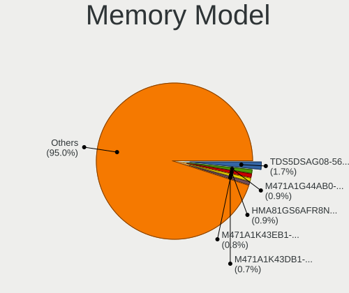

| Model                                                            | Computers | Percent |
|------------------------------------------------------------------|-----------|---------|
| Unknown                                                          | 237       | 1.67%   |
| Samsung RAM M471A1G44AB0-CWE 8GiB SODIMM DDR4 3200MT/s           | 127       | 0.89%   |
| SK hynix RAM HMA81GS6AFR8N-UH 8GB SODIMM DDR4 2667MT/s           | 126       | 0.89%   |
| Samsung RAM M471A1K43EB1-CWE 8GB SODIMM DDR4 3200MT/s            | 111       | 0.78%   |
| Samsung RAM M471A1K43DB1-CWE 8GB SODIMM DDR4 3200MT/s            | 104       | 0.73%   |
| Samsung RAM M471A5244CB0-CTD 4GB SODIMM DDR4 3266MT/s            | 100       | 0.7%    |
| SK hynix RAM HMAA1GS6CJR6N-XN 8GB SODIMM DDR4 3200MT/s           | 82        | 0.58%   |
| Samsung RAM M471A1G44BB0-CWE 8GB SODIMM DDR4 3200MT/s            | 81        | 0.57%   |
| Samsung RAM M471A1G44AB0-CWE 8GB Row Of Chips DDR4 3200MT/s      | 81        | 0.57%   |
| Corsair RAM CMK16GX4M2B3200C16 8GB DIMM DDR4 3600MT/s            | 71        | 0.5%    |
| SK hynix RAM HMA81GS6DJR8N-XN 8GB SODIMM DDR4 3200MT/s           | 69        | 0.49%   |
| Samsung RAM M471A1K43DB1-CTD 8GB SODIMM DDR4 2667MT/s            | 68        | 0.48%   |
| Samsung RAM M471A5244CB0-CWE 4GB SODIMM DDR4 3200MT/s            | 65        | 0.46%   |
| Micron RAM 4ATF1G64HZ-3G2F1 8GB SODIMM DDR4 3200MT/s             | 59        | 0.42%   |
| Samsung RAM M471A1K43CB1-CRC 8GB SODIMM DDR4 8400MT/s            | 57        | 0.4%    |
| Samsung RAM M471A1K43CB1-CTD 8GB SODIMM DDR4 3200MT/s            | 56        | 0.39%   |
| Samsung RAM M471A2G44AM0-CWE 16GB SODIMM DDR4 3200MT/s           | 55        | 0.39%   |
| Samsung RAM M471A1K43BB1-CRC 8GB SODIMM DDR4 2667MT/s            | 55        | 0.39%   |
| SK hynix RAM HMT451S6BFR8A-PB 4GB SODIMM DDR3 1600MT/s           | 53        | 0.37%   |
| Micron RAM 8ATF1G64HZ-3G2J1 8GB SODIMM DDR4 3200MT/s             | 52        | 0.37%   |
| Micron RAM 4ATF51264HZ-2G6E1 4GB SODIMM DDR4 2667MT/s            | 51        | 0.36%   |
| Micron RAM 4ATF1G64HZ-3G2E1 8GB SODIMM DDR4 3200MT/s             | 50        | 0.35%   |
| Unknown (ABCD) RAM 123456789012345678 2GB SODIMM LPDDR4 2400MT/s | 49        | 0.35%   |
| Samsung RAM M471A5244CB0-CRC 4GB SODIMM DDR4 2667MT/s            | 48        | 0.34%   |
| SK hynix RAM HMA81GS6JJR8N-VK 8GB SODIMM DDR4 2667MT/s           | 46        | 0.32%   |
| Samsung RAM M471B5173QH0-YK0 4GB SODIMM DDR3 1600MT/s            | 46        | 0.32%   |
| SK hynix RAM Module 4GB SODIMM DDR3 1600MT/s                     | 45        | 0.32%   |
| Samsung RAM M471B5173DB0-YK0 4GB SODIMM DDR3 1600MT/s            | 45        | 0.32%   |
| SK hynix RAM HMAA2GS6CJR8N-XN 16GB SODIMM DDR4 3200MT/s          | 44        | 0.31%   |
| SK hynix RAM HMA81GS6CJR8N-VK 8GB SODIMM DDR4 2667MT/s           | 44        | 0.31%   |
| Micron RAM 4ATF51264HZ-3G2J1 4GB SODIMM DDR4 3200MT/s            | 43        | 0.3%    |
| Samsung RAM M471A2K43DB1-CWE 16GB SODIMM DDR4 3200MT/s           | 41        | 0.29%   |
| Micron RAM 8ATF1G64HZ-2G6E1 8GB SODIMM DDR4 2667MT/s             | 41        | 0.29%   |
| Micron RAM 4ATF1G64HZ-3G2E1 8GB Row Of Chips DDR4 3200MT/s       | 41        | 0.29%   |
| Kingston RAM KHX3200C16D4/8GX 8GB DIMM DDR4 3733MT/s             | 41        | 0.29%   |
| G.Skill RAM F4-3200C16-16GVK 16GB DIMM DDR4 3600MT/s             | 41        | 0.29%   |
| SK hynix RAM HMA82GS6AFR8N-UH 16GB SODIMM DDR4 2667MT/s          | 40        | 0.28%   |
| Corsair RAM CMK16GX4M2B3000C15 8GB DIMM DDR4 3600MT/s            | 40        | 0.28%   |
| Samsung RAM M471B5273DH0-CH9 4GB SODIMM DDR3 1600MT/s            | 39        | 0.27%   |
| Samsung RAM M471A2K43CB1-CTD 16GB SODIMM DDR4 8400MT/s           | 39        | 0.27%   |

Memory Kind
-----------

Memory module kinds

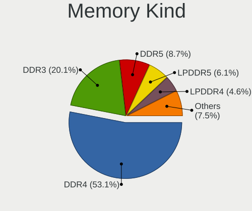

| Kind            | Computers | Percent |
|-----------------|-----------|---------|
| DDR4            | 6227      | 53.05%  |
| DDR3            | 2359      | 20.1%   |
| DDR5            | 1020      | 8.69%   |
| LPDDR5          | 715       | 6.09%   |
| LPDDR4          | 538       | 4.58%   |
| LPDDR3          | 429       | 3.66%   |
| DDR2            | 159       | 1.35%   |
| Unknown         | 142       | 1.21%   |
| SDRAM           | 116       | 0.99%   |
| DDR             | 17        | 0.14%   |
| DRAM            | 13        | 0.11%   |
| Logical non-vol | 2         | 0.02%   |

Memory Form Factor
------------------

Physical design of the memory module

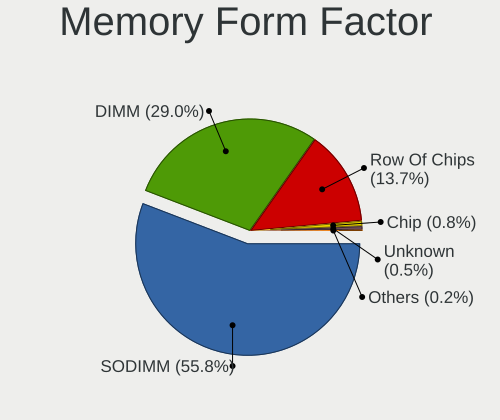

| Name            | Computers | Percent |
|-----------------|-----------|---------|
| SODIMM          | 6578      | 55.83%  |
| DIMM            | 3413      | 28.97%  |
| Row Of Chips    | 1620      | 13.75%  |
| Chip            | 91        | 0.77%   |
| Unknown         | 60        | 0.51%   |
| RIMM            | 14        | 0.12%   |
| FB-DIMM         | 4         | 0.03%   |
| DIP             | 2         | 0.02%   |
| Proprietary Car | 1         | 0.01%   |

Memory Size
-----------

Memory module size

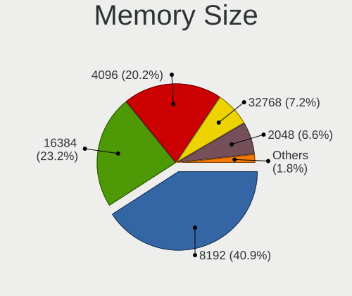

| Size   | Computers | Percent |
|--------|-----------|---------|
| 8192   | 5175      | 40.91%  |
| 16384  | 2939      | 23.23%  |
| 4096   | 2561      | 20.24%  |
| 32768  | 912       | 7.21%   |
| 2048   | 841       | 6.65%   |
| 1024   | 134       | 1.06%   |
| 49152  | 34        | 0.27%   |
| 3072   | 12        | 0.09%   |
| 65536  | 11        | 0.09%   |
| 24576  | 8         | 0.06%   |
| 12288  | 7         | 0.06%   |
| 6144   | 7         | 0.06%   |
| 512    | 5         | 0.04%   |
| 129408 | 2         | 0.02%   |
| 131072 | 1         | 0.01%   |
| 256    | 1         | 0.01%   |
| 64     | 1         | 0.01%   |

Memory Speed
------------

Memory module speed

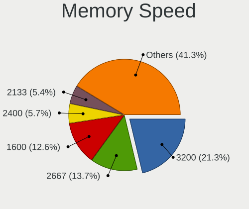

| Speed   | Computers | Percent |
|---------|-----------|---------|
| 3200    | 2674      | 21.27%  |
| 2667    | 1727      | 13.74%  |
| 1600    | 1581      | 12.58%  |
| 2400    | 719       | 5.72%   |
| 2133    | 673       | 5.35%   |
| 3600    | 487       | 3.87%   |
| 1333    | 444       | 3.53%   |
| 6400    | 405       | 3.22%   |
| 5600    | 373       | 2.97%   |
| 4800    | 338       | 2.69%   |
| 4267    | 303       | 2.41%   |
| 1867    | 251       | 2%      |
| 7500    | 188       | 1.5%    |
| 3733    | 180       | 1.43%   |
| 6000    | 164       | 1.3%    |
| 1334    | 117       | 0.93%   |
| 3266    | 111       | 0.88%   |
| 3800    | 107       | 0.85%   |
| 8400    | 105       | 0.84%   |
| 8533    | 100       | 0.8%    |
| 3000    | 99        | 0.79%   |
| 800     | 99        | 0.79%   |
| 667     | 98        | 0.78%   |
| Unknown | 82        | 0.65%   |
| 3400    | 80        | 0.64%   |
| 1067    | 77        | 0.61%   |
| 4000    | 76        | 0.6%    |
| 2666    | 70        | 0.56%   |
| 4266    | 65        | 0.52%   |
| 1066    | 64        | 0.51%   |
| 1866    | 62        | 0.49%   |
| 3466    | 53        | 0.42%   |
| 2933    | 43        | 0.34%   |
| 3866    | 40        | 0.32%   |
| 5200    | 36        | 0.29%   |
| 1800    | 36        | 0.29%   |
| 4199    | 34        | 0.27%   |
| 7467    | 32        | 0.25%   |
| 2800    | 26        | 0.21%   |
| 6200    | 25        | 0.2%    |

Printers & scanners
-------------------

Printer Vendor
--------------

Printer device vendors

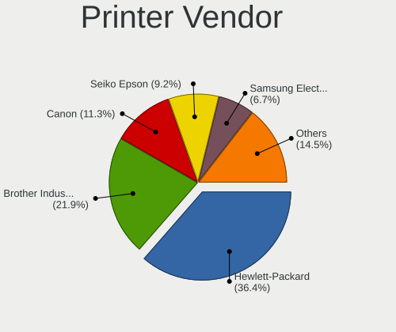

| Vendor                        | Computers | Percent |
|-------------------------------|-----------|---------|
| Hewlett-Packard               | 158       | 36.41%  |
| Brother Industries            | 95        | 21.89%  |
| Canon                         | 49        | 11.29%  |
| Seiko Epson                   | 40        | 9.22%   |
| Samsung Electronics           | 29        | 6.68%   |
| Dymo-CoStar                   | 10        | 2.3%    |
| Prolific Technology           | 9         | 2.07%   |
| Pantum                        | 6         | 1.38%   |
| Lexmark International         | 5         | 1.15%   |
| Kyocera                       | 4         | 0.92%   |
| Xerox                         | 3         | 0.69%   |
| QinHeng Electronics           | 3         | 0.69%   |
| Zhuhai Poskey Technology      | 2         | 0.46%   |
| Samsung Info. Systems America | 2         | 0.46%   |
| Ricoh                         | 2         | 0.46%   |
| NXP Semiconductors            | 2         | 0.46%   |
| iDPRT                         | 2         | 0.46%   |
| Dell                          | 2         | 0.46%   |
| Zebra Technologies            | 1         | 0.23%   |
| TSC Auto ID Technology        | 1         | 0.23%   |
| STMicroelectronics            | 1         | 0.23%   |
| Star Micronics                | 1         | 0.23%   |
| Sato                          | 1         | 0.23%   |
| Printer                       | 1         | 0.23%   |
| Minolta                       | 1         | 0.23%   |
| MiiiW                         | 1         | 0.23%   |
| Lenovo                        | 1         | 0.23%   |
| Graphtec America              | 1         | 0.23%   |
| Boca Systems                  | 1         | 0.23%   |

Printer Model
-------------

Printer device models

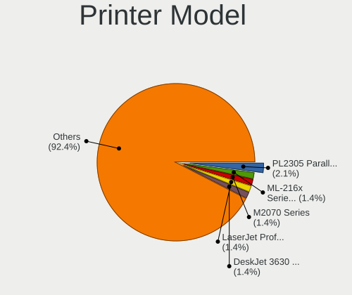

| Model                                  | Computers | Percent |
|----------------------------------------|-----------|---------|
| Prolific PL2305 Parallel Port          | 9         | 2.06%   |
| Samsung ML-216x Series Laser Printer   | 6         | 1.38%   |
| Samsung M2070 Series                   | 6         | 1.38%   |
| HP LaserJet Professional P 1102w       | 6         | 1.38%   |
| HP DeskJet 3630 series                 | 6         | 1.38%   |
| HP DeskJet 2600 series                 | 6         | 1.38%   |
| Seiko Epson Printer                    | 5         | 1.15%   |
| Seiko Epson ET-2710 Series             | 5         | 1.15%   |
| HP LaserJet P1102                      | 5         | 1.15%   |
| HP ENVY 5000 series                    | 5         | 1.15%   |
| Canon LiDE 300                         | 5         | 1.15%   |
| Brother Printer                        | 5         | 1.15%   |
| Brother HL-L2340D series               | 5         | 1.15%   |
| HP Smart Tank 510 series               | 4         | 0.92%   |
| HP LaserJet Pro M148-M149              | 4         | 0.92%   |
| HP LaserJet 1020                       | 4         | 0.92%   |
| HP ENVY 4520 series                    | 4         | 0.92%   |
| HP DeskJet 2700 series                 | 4         | 0.92%   |
| HP DeskJet 2130 series                 | 4         | 0.92%   |
| Dymo-CoStar LabelWriter 450            | 4         | 0.92%   |
| QinHeng CH340S                         | 3         | 0.69%   |
| Pantum P2500W series                   | 3         | 0.69%   |
| HP LaserJet 1018                       | 3         | 0.69%   |
| HP LaserJet 1010                       | 3         | 0.69%   |
| HP Ink Tank 310 series                 | 3         | 0.69%   |
| HP ENVY 4500 series                    | 3         | 0.69%   |
| HP DeskJet F300 series                 | 3         | 0.69%   |
| HP DeskJet 4100 series                 | 3         | 0.69%   |
| HP DeskJet 3700 series                 | 3         | 0.69%   |
| Dymo-CoStar DYMO LabelWriter 450 Turbo | 3         | 0.69%   |
| Canon TS3300 series                    | 3         | 0.69%   |
| Brother MFC-9330CDW                    | 3         | 0.69%   |
| Brother HL-L2320D series               | 3         | 0.69%   |
| Brother HL-L2300D series               | 3         | 0.69%   |
| Brother HL-2240D series                | 3         | 0.69%   |
| Brother HL-2030 Laser Printer          | 3         | 0.69%   |
| Brother HL-1210W series                | 3         | 0.69%   |
| Brother HL-1110 series                 | 3         | 0.69%   |
| Brother DCP-L2510D series              | 3         | 0.69%   |
| Zhuhai Poskey DT426B                   | 2         | 0.46%   |

Scanner Vendor
--------------

Scanner device vendors

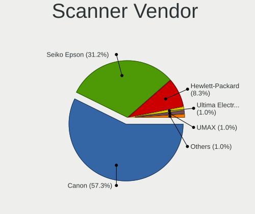

| Vendor             | Computers | Percent |
|--------------------|-----------|---------|
| Canon              | 55        | 57.29%  |
| Seiko Epson        | 30        | 31.25%  |
| Hewlett-Packard    | 8         | 8.33%   |
| UMAX               | 1         | 1.04%   |
| Ultima Electronics | 1         | 1.04%   |
| Mustek Systems     | 1         | 1.04%   |

Scanner Model
-------------

Scanner device models

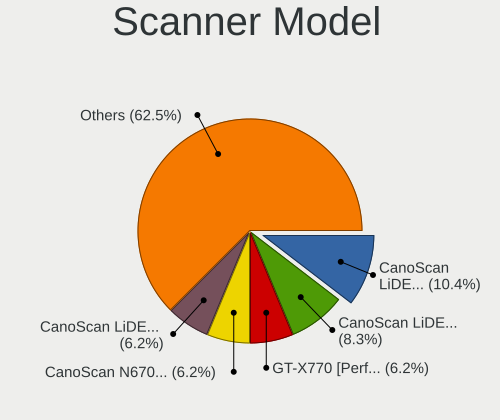

| Model                                                         | Computers | Percent |
|---------------------------------------------------------------|-----------|---------|
| Canon CanoScan LiDE 220                                       | 10        | 10.42%  |
| Canon CanoScan LiDE 210                                       | 8         | 8.33%   |
| Seiko Epson GT-X770 [Perfection V500]                         | 6         | 6.25%   |
| Canon CanoScan N670U/N676U/LiDE 20                            | 6         | 6.25%   |
| Canon CanoScan LiDE 110                                       | 6         | 6.25%   |
| Seiko Epson GT-X820 [Perfection V600 Photo]                   | 5         | 5.21%   |
| Canon CanoScan LiDE 100                                       | 5         | 5.21%   |
| Canon CanoScan LIDE 25                                        | 4         | 4.17%   |
| Seiko Epson GT-6600U [Perfection 610]                         | 3         | 3.13%   |
| Canon CanoScan LiDE 120                                       | 3         | 3.13%   |
| Seiko Epson Scanner                                           | 2         | 2.08%   |
| Seiko Epson GT-X900 [Perfection V700/V750 Photo]              | 2         | 2.08%   |
| Seiko Epson GT-X750 [Perfection 4490 Photo]                   | 2         | 2.08%   |
| Canon CanoScan LiDE 700F                                      | 2         | 2.08%   |
| Canon CanoScan 4400F                                          | 2         | 2.08%   |
| Canon CanoScan 4200F                                          | 2         | 2.08%   |
| UMAX Astra 2200/2200SU                                        | 1         | 1.04%   |
| Ultima Artec E+ Pro                                           | 1         | 1.04%   |
| Seiko Epson Perfection V37/V370                               | 1         | 1.04%   |
| Seiko Epson GT-F720 [GT-S620/Perfection V30/V300 Photo]       | 1         | 1.04%   |
| Seiko Epson GT-F670 [Perfection V200 Photo]                   | 1         | 1.04%   |
| Seiko Epson GT-F500/GT-F550 [Perfection 2480/2580 PHOTO]      | 1         | 1.04%   |
| Seiko Epson GT-9300UF [Perfection 2400 PHOTO]                 | 1         | 1.04%   |
| Seiko Epson GT-8700/GT-8700F [Perfection 1640SU/1640SU PHOTO] | 1         | 1.04%   |
| Seiko Epson GT-8300UF [Perfection 1660 PHOTO]                 | 1         | 1.04%   |
| Seiko Epson GT-1500 [GT-D1000]                                | 1         | 1.04%   |
| Seiko Epson ES-D400 [GT-S80]                                  | 1         | 1.04%   |
| Seiko Epson ES-2000 [Expression 1600U]                        | 1         | 1.04%   |
| Mustek Systems BearPaw 2448 TA Plus                           | 1         | 1.04%   |
| HP ScanJet G4050                                              | 1         | 1.04%   |
| HP ScanJet 82x0C                                              | 1         | 1.04%   |
| HP ScanJet 5590                                               | 1         | 1.04%   |
| HP ScanJet 4070 PhotoSmart                                    | 1         | 1.04%   |
| HP ScanJet 3400cse                                            | 1         | 1.04%   |
| HP ScanJet 3300c                                              | 1         | 1.04%   |
| HP ScanJet 2400c                                              | 1         | 1.04%   |
| HP HP Scanjet 300                                             | 1         | 1.04%   |
| Canon CanoScan N650U/N656U                                    | 1         | 1.04%   |
| Canon CanoScan N1240U/LiDE 30                                 | 1         | 1.04%   |
| Canon CanoScan LiDE 70                                        | 1         | 1.04%   |

Camera
------

Camera Vendor
-------------

Camera device vendors

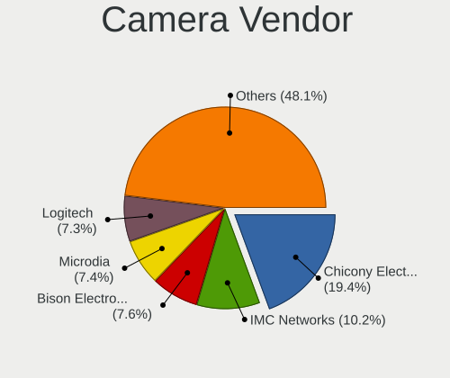

| Vendor                                 | Computers | Percent |
|----------------------------------------|-----------|---------|
| Chicony Electronics                    | 3432      | 19.39%  |
| IMC Networks                           | 1800      | 10.17%  |
| Bison Electronics                      | 1348      | 7.61%   |
| Microdia                               | 1316      | 7.43%   |
| Logitech                               | 1301      | 7.35%   |
| Realtek Semiconductor                  | 1235      | 6.98%   |
| Quanta                                 | 1017      | 5.74%   |
| Sunplus Innovation Technology          | 835       | 4.72%   |
| Apple                                  | 681       | 3.85%   |
| Luxvisions Innotech Limited            | 607       | 3.43%   |
| Cheng Uei Precision Industry (Foxlink) | 530       | 2.99%   |
| Syntek                                 | 498       | 2.81%   |
| Lite-On Technology                     | 361       | 2.04%   |
| Sonix Technology                       | 258       | 1.46%   |
| Suyin                                  | 199       | 1.12%   |
| Shinetech                              | 192       | 1.08%   |
| Microsoft                              | 191       | 1.08%   |
| Samsung Electronics                    | 151       | 0.85%   |
| Silicon Motion                         | 137       | 0.77%   |
| Alcor Micro                            | 108       | 0.61%   |
| SunplusIT                              | 93        | 0.53%   |
| Ricoh                                  | 59        | 0.33%   |
| Lenovo                                 | 56        | 0.32%   |
| Acer                                   | 52        | 0.29%   |
| Generalplus Technology                 | 51        | 0.29%   |
| MacroSilicon                           | 44        | 0.25%   |
| ARC International                      | 43        | 0.24%   |
| KYE Systems (Mouse Systems)            | 42        | 0.24%   |
| Razer USA                              | 41        | 0.23%   |
| kingcome                               | 40        | 0.23%   |
| Z-Star Microelectronics                | 38        | 0.21%   |
| webcam                                 | 33        | 0.19%   |
| Creative Technology                    | 33        | 0.19%   |
| Primax Electronics                     | 31        | 0.18%   |
| Importek                               | 27        | 0.15%   |
| icSpring                               | 27        | 0.15%   |
| Jieli Technology                       | 26        | 0.15%   |
| Unknown                                | 25        | 0.14%   |
| Trust                                  | 24        | 0.14%   |
| AVerMedia Technologies                 | 24        | 0.14%   |

Camera Model
------------

Camera device models

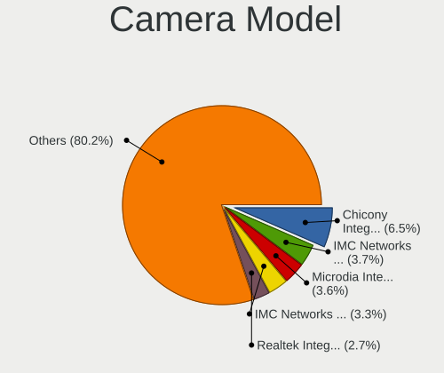

| Model                                             | Computers | Percent |
|---------------------------------------------------|-----------|---------|
| Chicony Integrated Camera                         | 1173      | 6.54%   |
| IMC Networks Integrated Camera                    | 657       | 3.66%   |
| Microdia Integrated_Webcam_HD                     | 642       | 3.58%   |
| IMC Networks USB2.0 HD UVC WebCam                 | 594       | 3.31%   |
| Realtek Integrated_Webcam_HD                      | 488       | 2.72%   |
| Bison Integrated Camera                           | 478       | 2.67%   |
| Syntek Integrated Camera                          | 392       | 2.19%   |
| Sunplus Integrated_Webcam_HD                      | 266       | 1.48%   |
| Chicony HD WebCam                                 | 253       | 1.41%   |
| Logitech Webcam C270                              | 242       | 1.35%   |
| Logitech HD Pro Webcam C920                       | 242       | 1.35%   |
| Apple FaceTime HD Camera (Built-in)               | 207       | 1.15%   |
| Luxvisions Innotech Limited Integrated Camera     | 193       | 1.08%   |
| Apple iPhone 5/5C/5S/6/SE/7/8/X                   | 183       | 1.02%   |
| Quanta HD User Facing                             | 165       | 0.92%   |
| Chicony Integrated Camera (1280x720@30)           | 164       | 0.91%   |
| Chicony HP HD Camera                              | 161       | 0.9%    |
| Lite-On Integrated Camera                         | 155       | 0.86%   |
| Samsung Galaxy series, misc. (MTP mode)           | 149       | 0.83%   |
| Apple FaceTime HD Camera                          | 149       | 0.83%   |
| Sonix USB2.0 HD UVC WebCam                        | 130       | 0.73%   |
| Apple Built-in iSight                             | 126       | 0.7%    |
| Quanta HP HD Camera                               | 122       | 0.68%   |
| Bison SunplusIT Integrated Camera                 | 122       | 0.68%   |
| IMC Networks USB2.0 VGA UVC WebCam                | 120       | 0.67%   |
| Bison HD Webcam                                   | 120       | 0.67%   |
| Luxvisions Innotech Limited Integrated RGB Camera | 116       | 0.65%   |
| Chicony HP Wide Vision HD Camera                  | 111       | 0.62%   |
| Logitech C922 Pro Stream Webcam                   | 110       | 0.61%   |
| Quanta HP Wide Vision HD Camera                   | 107       | 0.6%    |
| Shinetech USB2.0 FHD UVC WebCam                   | 102       | 0.57%   |
| Chicony HP Truevision HD camera                   | 102       | 0.57%   |
| Sonix USB2.0 FHD UVC WebCam                       | 101       | 0.56%   |
| Quanta HD Webcam                                  | 100       | 0.56%   |
| Quanta HP TrueVision HD Camera                    | 99        | 0.55%   |
| Bison Integrated RGB Camera                       | 96        | 0.54%   |
| Bison Lenovo EasyCamera                           | 95        | 0.53%   |
| IMC Networks HD Camera                            | 94        | 0.52%   |
| Logitech C920 PRO HD Webcam                       | 90        | 0.5%    |
| Chicony Integrated IR Camera                      | 90        | 0.5%    |

Security
--------

Fingerprint Vendor
------------------

Fingerprint sensor vendors

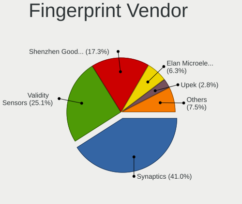

| Vendor                             | Computers | Percent |
|------------------------------------|-----------|---------|
| Synaptics                          | 1504      | 40.99%  |
| Validity Sensors                   | 922       | 25.13%  |
| Shenzhen Goodix Technology         | 635       | 17.31%  |
| Elan Microelectronics              | 231       | 6.3%    |
| Upek                               | 101       | 2.75%   |
| LighTuning Technology              | 95        | 2.59%   |
| AuthenTec                          | 58        | 1.58%   |
| Realtek USB2.0 Finger Print Bridge | 43        | 1.17%   |
| Samsung Electronics                | 27        | 0.74%   |
| HOLTEK                             | 19        | 0.52%   |
| Focal-systems.Corp                 | 10        | 0.27%   |
| STMicroelectronics                 | 9         | 0.25%   |
| DigitalPersona                     | 7         | 0.19%   |
| Dell                               | 3         | 0.08%   |
| Yamila                             | 1         | 0.03%   |
| Next Biometrics                    | 1         | 0.03%   |
| Netchip Technology                 | 1         | 0.03%   |
| Microsoft                          | 1         | 0.03%   |
| GDMicroelectronics                 | 1         | 0.03%   |

Fingerprint Model
-----------------

Fingerprint sensor models

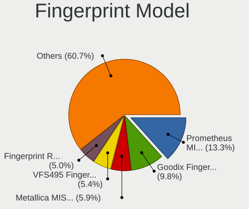

| Model                                                                      | Computers | Percent |
|----------------------------------------------------------------------------|-----------|---------|
| Synaptics Prometheus MIS Touch Fingerprint Reader                          | 489       | 13.32%  |
| Shenzhen Goodix  Fingerprint Device                                        | 358       | 9.75%   |
| Synaptics Metallica MIS Touch Fingerprint Reader                           | 216       | 5.89%   |
| Validity Sensors VFS495 Fingerprint Reader                                 | 197       | 5.37%   |
| Shenzhen Goodix Fingerprint Reader                                         | 184       | 5.01%   |
| Validity Sensors Synaptics WBDI                                            | 146       | 3.98%   |
| Validity Sensors VFS 5011 fingerprint sensor                               | 143       | 3.9%    |
| Synaptics UWP WBDI Device                                                  | 122       | 3.32%   |
| Elan ELAN:Fingerprint                                                      | 115       | 3.13%   |
| Elan ELAN:ARM-M4                                                           | 111       | 3.02%   |
| Synaptics Prometheus Fingerprint Reader                                    | 97        | 2.64%   |
| Upek Biometric Touchchip/Touchstrip Fingerprint Sensor                     | 95        | 2.59%   |
| Shenzhen Goodix FingerPrint                                                | 93        | 2.53%   |
| Synaptics FS7604 Touch Fingerprint Sensor with PurePrint                   | 87        | 2.37%   |
| Synaptics  WBDI                                                            | 85        | 2.32%   |
| Synaptics WBDI                                                             | 84        | 2.29%   |
| Validity Sensors VFS7500 Touch Fingerprint Sensor                          | 81        | 2.21%   |
| Synaptics Fingerprint reader [HP G6]                                       | 80        | 2.18%   |
| Validity Sensors VFS5011 Fingerprint Reader                                | 68        | 1.85%   |
| Validity Sensors Synaptics VFS7552 Touch Fingerprint Sensor with PurePrint | 64        | 1.74%   |
| Synaptics UWP WBDI                                                         | 62        | 1.69%   |
| Synaptics  FS7604 Touch Fingerprint Sensor with PurePrint                  | 56        | 1.53%   |
| Validity Sensors VFS491                                                    | 53        | 1.44%   |
| Realtek USB2.0 Finger Print Bridge FocalTech Fingerprint Device            | 43        | 1.17%   |
| LighTuning EgisTec Touch Fingerprint Sensor                                | 43        | 1.17%   |
| Synaptics WBDI Fingerprint Reader USB 086                                  | 40        | 1.09%   |
| Synaptics Metallica MOH Touch Fingerprint Reader                           | 40        | 1.09%   |
| LighTuning ES603 Swipe Fingerprint Sensor                                  | 34        | 0.93%   |
| Validity Sensors VFS471 Fingerprint Reader                                 | 27        | 0.74%   |
| Validity Sensors Synaptics VFS7552 Touch Fingerprint Sensor                | 26        | 0.71%   |
| Validity Sensors Swipe Fingerprint Sensor                                  | 25        | 0.68%   |
| Validity Sensors VFS7552 Touch Fingerprint Sensor                          | 24        | 0.65%   |
| Validity Sensors Fingerprint scanner                                       | 21        | 0.57%   |
| Validity Sensors VFS451 Fingerprint Reader                                 | 20        | 0.54%   |
| HOLTEK FocalTech Fingerprint Device                                        | 19        | 0.52%   |
| Samsung Fingerprint Sensor Device - 730B                                   | 16        | 0.44%   |
| LighTuning Fingerprint Sensor                                              | 14        | 0.38%   |
| AuthenTec AES2810                                                          | 13        | 0.35%   |
| AuthenTec Fingerprint Sensor                                               | 12        | 0.33%   |
| Validity Sensors VFS Fingerprint sensor                                    | 11        | 0.3%    |

Chipcard Vendor
---------------

Chipcard module vendors

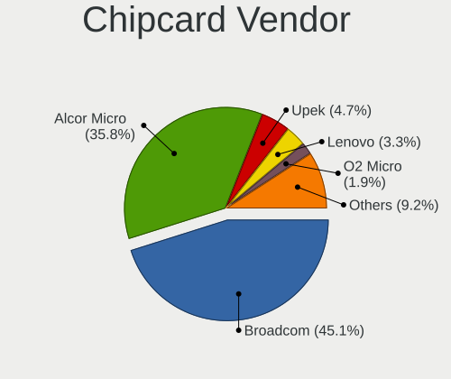

| Vendor                            | Computers | Percent |
|-----------------------------------|-----------|---------|
| Broadcom                          | 611       | 45.13%  |
| Alcor Micro                       | 485       | 35.82%  |
| Upek                              | 63        | 4.65%   |
| Lenovo                            | 45        | 3.32%   |
| O2 Micro                          | 26        | 1.92%   |
| Yubico.com                        | 21        | 1.55%   |
| Gemalto (was Gemplus)             | 15        | 1.11%   |
| Advanced Card Systems             | 13        | 0.96%   |
| Realtek Semiconductor             | 12        | 0.89%   |
| SCM Microsystems                  | 10        | 0.74%   |
| OmniKey                           | 10        | 0.74%   |
| Aladdin Knowledge Systems         | 8         | 0.59%   |
| Cherry                            | 5         | 0.37%   |
| VASCO Data Security International | 4         | 0.3%    |
| Reiner SCT Kartensysteme          | 4         | 0.3%    |
| Bit4id                            | 4         | 0.3%    |
| Aktiv                             | 4         | 0.3%    |
| Chicony Electronics               | 3         | 0.22%   |
| NXP Semiconductors                | 2         | 0.15%   |
| Feitian Technologies              | 2         | 0.15%   |
| Clay Logic                        | 2         | 0.15%   |
| Purism, SPC                       | 1         | 0.07%   |
| Hewlett-Packard                   | 1         | 0.07%   |
| Fujitsu Siemens Computers         | 1         | 0.07%   |
| Free Software Initiative of Japan | 1         | 0.07%   |
| Athena Smartcard Solutions        | 1         | 0.07%   |

Chipcard Model
--------------

Chipcard module models

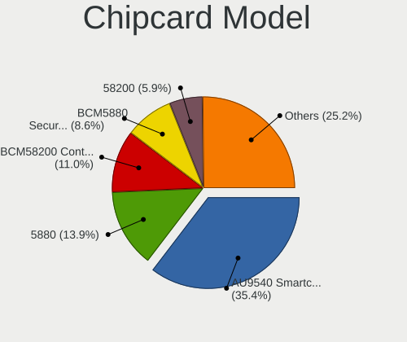

| Model                                                                        | Computers | Percent |
|------------------------------------------------------------------------------|-----------|---------|
| Alcor Micro AU9540 Smartcard Reader                                          | 481       | 35.39%  |
| Broadcom 5880                                                                | 189       | 13.91%  |
| Broadcom BCM58200 ControlVault 3 (FingerPrint sensor + Contacted SmartCard)  | 150       | 11.04%  |
| Broadcom BCM5880 Secure Applications Processor                               | 117       | 8.61%   |
| Broadcom 58200                                                               | 80        | 5.89%   |
| Broadcom BCM5880 Secure Applications Processor with fingerprint swipe sensor | 76        | 5.59%   |
| Upek TouchChip Fingerprint Coprocessor (WBF advanced mode)                   | 63        | 4.64%   |
| Lenovo Integrated Smart Card Reader                                          | 44        | 3.24%   |
| O2 Micro OZ776 CCID Smartcard Reader                                         | 23        | 1.69%   |
| Yubico.com Yubikey 4/5 U2F+CCID                                              | 17        | 1.25%   |
| Realtek Semiconductor Smart Card Reader Interface                            | 12        | 0.88%   |
| Gemalto (was Gemplus) GemPC Twin SmartCard Reader                            | 8         | 0.59%   |
| Aladdin Knowledge Systems Token JC                                           | 8         | 0.59%   |
| Gemalto (was Gemplus) Compact Smart Card Reader Writer                       | 7         | 0.52%   |
| SCM Microsystems SCR331-LC1 / SCR3310 SmartCard Reader                       | 6         | 0.44%   |
| Broadcom BCM5880 Secure Applications Processor with fingerprint touch sensor | 4         | 0.29%   |
| Bit4id miniLector EVO                                                        | 4         | 0.29%   |
| Aktiv Rutoken lite                                                           | 4         | 0.29%   |
| Advanced Card Systems ACR1252 Dual Reader                                    | 4         | 0.29%   |
| VASCO Data Security International Digipass 905 SmartCard Reader              | 3         | 0.22%   |
| Reiner SCT Kartensysteme cyberJack RFID basis contactless smartcard reader   | 3         | 0.22%   |
| OmniKey CardMan 3021 / 3121                                                  | 3         | 0.22%   |
| OmniKey CardMan 1021                                                         | 3         | 0.22%   |
| O2 Micro Oz776 SmartCard Reader                                              | 3         | 0.22%   |
| Chicony Electronics HP Skylab USB Smartcard Keyboard                         | 3         | 0.22%   |
| Cherry SmartCard Reader Keyboard KC 1000 SC                                  | 3         | 0.22%   |
| Alcor Micro Watchdata W 1981                                                 | 3         | 0.22%   |
| Advanced Card Systems ACR39U                                                 | 3         | 0.22%   |
| Advanced Card Systems ACR122U                                                | 3         | 0.22%   |
| Yubico.com Yubikey 4/5 CCID                                                  | 2         | 0.15%   |
| OmniKey CardMan 3121 (HID Technologies)                                      | 2         | 0.15%   |
| NXP Semiconductors PR533                                                     | 2         | 0.15%   |
| Cherry Smart Terminal XX44                                                   | 2         | 0.15%   |
| Yubico.com Yubikey NEO(-N) U2F+CCID                                          | 1         | 0.07%   |
| Yubico.com Yubikey NEO(-N) OTP+CCID                                          | 1         | 0.07%   |
| VASCO Data Security International DIGIPASS 870                               | 1         | 0.07%   |
| SCM Microsystems uTrust FIDO2 Security Key                                   | 1         | 0.07%   |
| SCM Microsystems SCR3340 - ExpressCard54 Smart Card Reader                   | 1         | 0.07%   |
| SCM Microsystems SCR331 SmartCard Reader                                     | 1         | 0.07%   |
| SCM Microsystems CLOUD 2900 R Smart Card Reader                              | 1         | 0.07%   |

Unsupported
-----------

Unsupported Devices
-------------------

Total unsupported devices on board

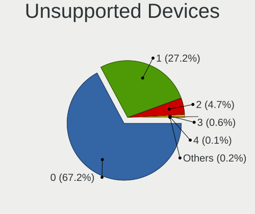

| Total | Computers | Percent |
|-------|-----------|---------|
| 0     | 18151     | 67.19%  |
| 1     | 7360      | 27.24%  |
| 2     | 1267      | 4.69%   |
| 3     | 153       | 0.57%   |
| 4     | 31        | 0.11%   |
| 5     | 23        | 0.09%   |
| 7     | 15        | 0.06%   |
| 6     | 11        | 0.04%   |
| 8     | 4         | 0.01%   |
| 9     | 1         | 0.004%  |

Unsupported Device Types
------------------------

Types of unsupported devices

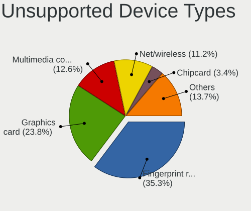

| Type                     | Computers | Percent |
|--------------------------|-----------|---------|
| Fingerprint reader       | 3623      | 35.28%  |
| Graphics card            | 2449      | 23.85%  |
| Multimedia controller    | 1291      | 12.57%  |
| Net/wireless             | 1152      | 11.22%  |
| Chipcard                 | 348       | 3.39%   |
| Camera                   | 257       | 2.5%    |
| Communication controller | 215       | 2.09%   |
| Unassigned class         | 182       | 1.77%   |
| Sound                    | 167       | 1.63%   |
| Bluetooth                | 160       | 1.56%   |
| Card reader              | 96        | 0.93%   |
| Net/ethernet             | 91        | 0.89%   |
| Storage                  | 86        | 0.84%   |
| Network                  | 65        | 0.63%   |
| Modem                    | 32        | 0.31%   |
| Storage/raid             | 27        | 0.26%   |
| Firewire controller      | 7         | 0.07%   |
| Dvb card                 | 5         | 0.05%   |
| Storage/ide              | 4         | 0.04%   |
| Storage/nvme             | 3         | 0.03%   |
| Storage/ata              | 3         | 0.03%   |
| Tv card                  | 2         | 0.02%   |
| Flash memory             | 2         | 0.02%   |
| Wireless                 | 1         | 0.01%   |
| Video                    | 1         | 0.01%   |

