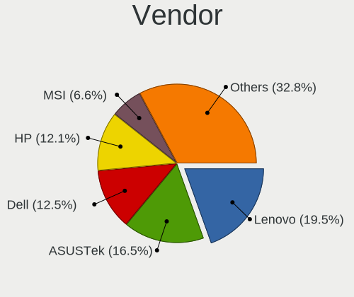
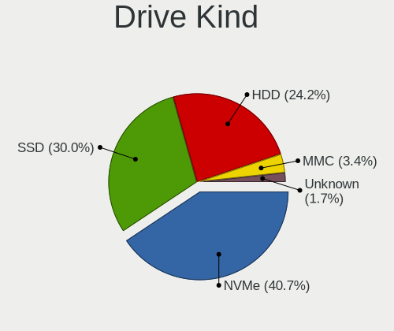
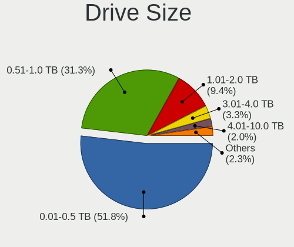
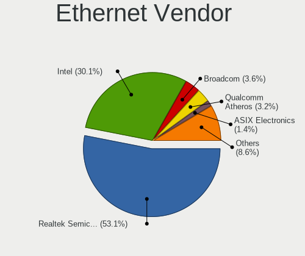
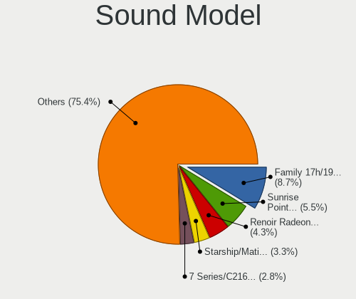

Fedora - Tested Hardware & Statistics
-------------------------------------

A project to collect tested hardware configurations for Fedora.

Anyone can contribute to this report by the [hw-probe](https://github.com/linuxhw/hw-probe) tool:

    sudo -E hw-probe -all -upload

Please contribute! Especially if your hardware is rare.

This is a report for all computer types. See also reports for [desktops](/Dist/Fedora/Desktop/README.md) and [notebooks](/Dist/Fedora/Notebook/README.md).

Contents
--------

* [ Test Cases ](#test-cases)

* [ System ](#system)
  - [ OS                       ](#os)
  - [ OS Family                ](#os-family)
  - [ Kernel                   ](#kernel)
  - [ Kernel Family            ](#kernel-family)
  - [ Kernel Major Ver.        ](#kernel-major-ver)
  - [ Arch                     ](#arch)
  - [ DE                       ](#de)
  - [ Display Server           ](#display-server)
  - [ Display Manager          ](#display-manager)
  - [ OS Lang                  ](#os-lang)
  - [ Boot Mode                ](#boot-mode)
  - [ Filesystem               ](#filesystem)
  - [ Part. scheme             ](#part-scheme)
  - [ Dual Boot with Linux/BSD ](#dual-boot-with-linuxbsd)
  - [ Dual Boot (Win)          ](#dual-boot-win)

* [ Board ](#board)
  - [ Vendor                   ](#vendor)
  - [ Model                    ](#model)
  - [ Model Family             ](#model-family)
  - [ MFG Year                 ](#mfg-year)
  - [ Form Factor              ](#form-factor)
  - [ Secure Boot              ](#secure-boot)
  - [ Coreboot                 ](#coreboot)
  - [ RAM Size                 ](#ram-size)
  - [ RAM Used                 ](#ram-used)
  - [ Total Drives             ](#total-drives)
  - [ Has CD-ROM               ](#has-cd-rom)
  - [ Has Ethernet             ](#has-ethernet)
  - [ Has WiFi                 ](#has-wifi)
  - [ Has Bluetooth            ](#has-bluetooth)

* [ Location ](#location)
  - [ Country                  ](#country)
  - [ City                     ](#city)

* [ Drives ](#drives)
  - [ Drive Vendor             ](#drive-vendor)
  - [ Drive Model              ](#drive-model)
  - [ HDD Vendor               ](#hdd-vendor)
  - [ SSD Vendor               ](#ssd-vendor)
  - [ Drive Kind               ](#drive-kind)
  - [ Drive Connector          ](#drive-connector)
  - [ Drive Size               ](#drive-size)
  - [ Space Total              ](#space-total)
  - [ Space Used               ](#space-used)
  - [ Malfunc. Drives          ](#malfunc-drives)
  - [ Malfunc. Drive Vendor    ](#malfunc-drive-vendor)
  - [ Malfunc. HDD Vendor      ](#malfunc-hdd-vendor)
  - [ Malfunc. Drive Kind      ](#malfunc-drive-kind)
  - [ Failed Drives            ](#failed-drives)
  - [ Failed Drive Vendor      ](#failed-drive-vendor)
  - [ Drive Status             ](#drive-status)

* [ Storage controller ](#storage-controller)
  - [ Storage Vendor           ](#storage-vendor)
  - [ Storage Model            ](#storage-model)
  - [ Storage Kind             ](#storage-kind)

* [ Processor ](#processor)
  - [ CPU Vendor               ](#cpu-vendor)
  - [ CPU Model                ](#cpu-model)
  - [ CPU Model Family         ](#cpu-model-family)
  - [ CPU Cores                ](#cpu-cores)
  - [ CPU Sockets              ](#cpu-sockets)
  - [ CPU Threads              ](#cpu-threads)
  - [ CPU Op-Modes             ](#cpu-op-modes)
  - [ CPU Microcode            ](#cpu-microcode)
  - [ CPU Microarch            ](#cpu-microarch)

* [ Graphics ](#graphics)
  - [ GPU Vendor               ](#gpu-vendor)
  - [ GPU Model                ](#gpu-model)
  - [ GPU Combo                ](#gpu-combo)
  - [ GPU Driver               ](#gpu-driver)
  - [ GPU Memory               ](#gpu-memory)

* [ Monitor ](#monitor)
  - [ Monitor Vendor           ](#monitor-vendor)
  - [ Monitor Model            ](#monitor-model)
  - [ Monitor Resolution       ](#monitor-resolution)
  - [ Monitor Diagonal         ](#monitor-diagonal)
  - [ Monitor Width            ](#monitor-width)
  - [ Aspect Ratio             ](#aspect-ratio)
  - [ Monitor Area             ](#monitor-area)
  - [ Pixel Density            ](#pixel-density)
  - [ Multiple Monitors        ](#multiple-monitors)

* [ Network ](#network)
  - [ Net Controller Vendor    ](#net-controller-vendor)
  - [ Net Controller Model     ](#net-controller-model)
  - [ Wireless Vendor          ](#wireless-vendor)
  - [ Wireless Model           ](#wireless-model)
  - [ Ethernet Vendor          ](#ethernet-vendor)
  - [ Ethernet Model           ](#ethernet-model)
  - [ Net Controller Kind      ](#net-controller-kind)
  - [ Used Controller          ](#used-controller)
  - [ NICs                     ](#nics)
  - [ IPv6                     ](#ipv6)

* [ Bluetooth ](#bluetooth)
  - [ Bluetooth Vendor         ](#bluetooth-vendor)
  - [ Bluetooth Model          ](#bluetooth-model)

* [ Sound ](#sound)
  - [ Sound Vendor             ](#sound-vendor)
  - [ Sound Model              ](#sound-model)

* [ Memory ](#memory)
  - [ Memory Vendor            ](#memory-vendor)
  - [ Memory Model             ](#memory-model)
  - [ Memory Kind              ](#memory-kind)
  - [ Memory Form Factor       ](#memory-form-factor)
  - [ Memory Size              ](#memory-size)
  - [ Memory Speed             ](#memory-speed)

* [ Printers & scanners ](#printers--scanners)
  - [ Printer Vendor           ](#printer-vendor)
  - [ Printer Model            ](#printer-model)
  - [ Scanner Vendor           ](#scanner-vendor)
  - [ Scanner Model            ](#scanner-model)

* [ Camera ](#camera)
  - [ Camera Vendor            ](#camera-vendor)
  - [ Camera Model             ](#camera-model)

* [ Security ](#security)
  - [ Fingerprint Vendor       ](#fingerprint-vendor)
  - [ Fingerprint Model        ](#fingerprint-model)
  - [ Chipcard Vendor          ](#chipcard-vendor)
  - [ Chipcard Model           ](#chipcard-model)

* [ Unsupported ](#unsupported)
  - [ Unsupported Devices      ](#unsupported-devices)
  - [ Unsupported Device Types ](#unsupported-device-types)

Test Cases
----------

Total: 17096

| Vendor        | Model                       | Form-Factor | Probe                                                      | Date         |
|---------------|-----------------------------|-------------|------------------------------------------------------------|--------------|
| ASUSTek       | PRIME B550M-A               | Desktop     | [9146d12231](https://linux-hardware.org/?probe=9146d12231) | May 01, 2023 |
| Valve         | Jupiter                     | Notebook    | [07ef050535](https://linux-hardware.org/?probe=07ef050535) | May 01, 2023 |
| HP            | Laptop 15z-fc000            | Notebook    | [7b57cc42a0](https://linux-hardware.org/?probe=7b57cc42a0) | May 01, 2023 |
| HP            | ElitePad 1000 G2            | Notebook    | [8ae27e00f6](https://linux-hardware.org/?probe=8ae27e00f6) | May 01, 2023 |
| MSI           | X99A RAIDER                 | Desktop     | [f2c73a1fbb](https://linux-hardware.org/?probe=f2c73a1fbb) | May 01, 2023 |
| ASRock        | FM2A88X Extreme6+           | Desktop     | [be8b69e1b4](https://linux-hardware.org/?probe=be8b69e1b4) | May 01, 2023 |
| HUAWEI        | CREM-WXX9                   | Notebook    | [ba99960d5f](https://linux-hardware.org/?probe=ba99960d5f) | May 01, 2023 |
| Lenovo        | IdeaPad 310-15ISK 80UH      | Notebook    | [a7d6d782b2](https://linux-hardware.org/?probe=a7d6d782b2) | May 01, 2023 |
| MSI           | MPG X570 GAMING EDGE WIF... | Desktop     | [2fcc250a35](https://linux-hardware.org/?probe=2fcc250a35) | May 01, 2023 |
| Intel         | CHERRYVIEW D1 PLATFORM      | Notebook    | [6c58138c35](https://linux-hardware.org/?probe=6c58138c35) | May 01, 2023 |
| Microsoft     | Surface Pro 7               | Tablet      | [7c8d87170f](https://linux-hardware.org/?probe=7c8d87170f) | Apr 30, 2023 |
| Lenovo        | IdeaPad S340-15IWLTouch ... | Notebook    | [6857a16a6c](https://linux-hardware.org/?probe=6857a16a6c) | Apr 30, 2023 |
| ASRock        | A520M-ITX/ac                | Desktop     | [5a9f58bcc0](https://linux-hardware.org/?probe=5a9f58bcc0) | Apr 30, 2023 |
| Lenovo        | IdeaPad 320-15AST 80XV      | Notebook    | [0784fc9b1c](https://linux-hardware.org/?probe=0784fc9b1c) | Apr 30, 2023 |
| HP            | Notebook                    | Notebook    | [fd6aa4aeb6](https://linux-hardware.org/?probe=fd6aa4aeb6) | Apr 30, 2023 |
| VIOS          | LTH17                       | Notebook    | [4d1a86ee61](https://linux-hardware.org/?probe=4d1a86ee61) | Apr 30, 2023 |
| Lenovo        | IdeaPad 320-15AST 80XV      | Notebook    | [9c07454907](https://linux-hardware.org/?probe=9c07454907) | Apr 30, 2023 |
| HP            | Pavilion Gaming Laptop 1... | Notebook    | [43a167afad](https://linux-hardware.org/?probe=43a167afad) | Apr 30, 2023 |
| HP            | Pavilion Gaming Laptop 1... | Notebook    | [0ae3fb5506](https://linux-hardware.org/?probe=0ae3fb5506) | Apr 30, 2023 |
| ZOTAC         | ZBOX-CI527/CI547            | Mini pc     | [86e1a89b72](https://linux-hardware.org/?probe=86e1a89b72) | Apr 30, 2023 |
| Gigabyte      | 970A-DS3P                   | Desktop     | [c1fe7a5f87](https://linux-hardware.org/?probe=c1fe7a5f87) | Apr 30, 2023 |
| Samsung       | 730QED                      | Convertible | [f29e3300d2](https://linux-hardware.org/?probe=f29e3300d2) | Apr 30, 2023 |
| ASUSTek       | X555QG                      | Notebook    | [5263b174b2](https://linux-hardware.org/?probe=5263b174b2) | Apr 30, 2023 |
| Lenovo        | ThinkPad T490s 20NX002SG... | Notebook    | [874f19f26e](https://linux-hardware.org/?probe=874f19f26e) | Apr 30, 2023 |
| Dell          | Latitude 5521               | Notebook    | [1629b4efc4](https://linux-hardware.org/?probe=1629b4efc4) | Apr 30, 2023 |
| Gigabyte      | AB350-Gaming 3-CF           | Desktop     | [01311e320c](https://linux-hardware.org/?probe=01311e320c) | Apr 30, 2023 |
| Intel         | S5520HC E26045-454          | Server      | [f1db72cddb](https://linux-hardware.org/?probe=f1db72cddb) | Apr 30, 2023 |
| ASRock        | FM2A88X Extreme6+           | Desktop     | [c33288abe2](https://linux-hardware.org/?probe=c33288abe2) | Apr 30, 2023 |
| MSI           | X99A RAIDER                 | Desktop     | [606b173cab](https://linux-hardware.org/?probe=606b173cab) | Apr 30, 2023 |
| HP            | Laptop 17-by3xxx            | Notebook    | [552dac328b](https://linux-hardware.org/?probe=552dac328b) | Apr 30, 2023 |
| HP            | EliteBook 840 G3            | Notebook    | [c262e81ab9](https://linux-hardware.org/?probe=c262e81ab9) | Apr 30, 2023 |
| Acer          | Nitro AN515-45              | Notebook    | [9b28e69254](https://linux-hardware.org/?probe=9b28e69254) | Apr 30, 2023 |
| MSI           | MPG B650I EDGE WIFI         | Desktop     | [eda4874295](https://linux-hardware.org/?probe=eda4874295) | Apr 30, 2023 |
| Lenovo        | IdeaPadFlex 5 14ITL05 82... | Convertible | [2113c6457a](https://linux-hardware.org/?probe=2113c6457a) | Apr 29, 2023 |
| ASRock        | 970 Extreme4                | Desktop     | [96fd3e62de](https://linux-hardware.org/?probe=96fd3e62de) | Apr 29, 2023 |
| Framework     | Laptop                      | Notebook    | [84b3b9547b](https://linux-hardware.org/?probe=84b3b9547b) | Apr 29, 2023 |
| Dell          | XPS 13 7390                 | Notebook    | [b976cc9656](https://linux-hardware.org/?probe=b976cc9656) | Apr 29, 2023 |
| Dell          | XPS 13 9380                 | Notebook    | [c6591b0852](https://linux-hardware.org/?probe=c6591b0852) | Apr 29, 2023 |
| Lenovo        | YB1-X91F                    | Tablet      | [3316360d7a](https://linux-hardware.org/?probe=3316360d7a) | Apr 29, 2023 |
| Intel         | CHERRYVIEW D1 PLATFORM      | Notebook    | [edf1d60e46](https://linux-hardware.org/?probe=edf1d60e46) | Apr 29, 2023 |
| ASUSTek       | X99-A                       | Desktop     | [6505e46b86](https://linux-hardware.org/?probe=6505e46b86) | Apr 29, 2023 |
| Apple         | Mac-F60DEB81FF30ACF6 Mac... | Desktop     | [80ea529a18](https://linux-hardware.org/?probe=80ea529a18) | Apr 29, 2023 |
| ASUSTek       | TUF Gaming FX505DD_FX505... | Notebook    | [6f6a016997](https://linux-hardware.org/?probe=6f6a016997) | Apr 29, 2023 |
| Lenovo        | ThinkPad T550 20CKA00ECD    | Notebook    | [2545d9dd31](https://linux-hardware.org/?probe=2545d9dd31) | Apr 29, 2023 |
| MSI           | Modern 14 B11MOU            | Notebook    | [6b3fcf3fcc](https://linux-hardware.org/?probe=6b3fcf3fcc) | Apr 29, 2023 |
| HUAWEI        | CREM-WXX9                   | Notebook    | [c17b468722](https://linux-hardware.org/?probe=c17b468722) | Apr 29, 2023 |
| Chuwi         | HeroBook Air                | Notebook    | [123f6df9f8](https://linux-hardware.org/?probe=123f6df9f8) | Apr 29, 2023 |
| Insyde        | M890BAP                     | Notebook    | [151efb0278](https://linux-hardware.org/?probe=151efb0278) | Apr 29, 2023 |
| Insyde        | CherryTrail                 | Notebook    | [a9f658c8af](https://linux-hardware.org/?probe=a9f658c8af) | Apr 29, 2023 |
| Lenovo        | ThinkPad X1 Extreme Gen ... | Notebook    | [cd266d7680](https://linux-hardware.org/?probe=cd266d7680) | Apr 29, 2023 |
| ASUSTek       | P5B-Deluxe                  | Desktop     | [d0d3458299](https://linux-hardware.org/?probe=d0d3458299) | Apr 29, 2023 |
| Acer          | Nitro AN515-58              | Notebook    | [2c335c5bfb](https://linux-hardware.org/?probe=2c335c5bfb) | Apr 29, 2023 |
| GMKtec        | NucBox7                     | Mini pc     | [7398ad2411](https://linux-hardware.org/?probe=7398ad2411) | Apr 29, 2023 |
| Google        | Banon                       | Notebook    | [c21a57806c](https://linux-hardware.org/?probe=c21a57806c) | Apr 29, 2023 |
| Microsoft     | Surface Laptop Go           | Tablet      | [3c891a7698](https://linux-hardware.org/?probe=3c891a7698) | Apr 29, 2023 |
| Lenovo        | IdeaPad 530S-14ARR 81H1     | Notebook    | [e70d66b3ba](https://linux-hardware.org/?probe=e70d66b3ba) | Apr 29, 2023 |
| Lenovo        | IdeaPad 1 14IGL7 82V6       | Notebook    | [2aa69de3ca](https://linux-hardware.org/?probe=2aa69de3ca) | Apr 29, 2023 |
| Gigabyte      | X570 I AORUS PRO WIFI       | Desktop     | [4b47a4606b](https://linux-hardware.org/?probe=4b47a4606b) | Apr 29, 2023 |
| MSI           | B450 TOMAHAWK               | Desktop     | [1404923301](https://linux-hardware.org/?probe=1404923301) | Apr 28, 2023 |
| ASUSTek       | X555QG                      | Notebook    | [b33f41d3c3](https://linux-hardware.org/?probe=b33f41d3c3) | Apr 28, 2023 |
| Gigabyte      | X570 AORUS ELITE WIFI       | Desktop     | [e65094a8f6](https://linux-hardware.org/?probe=e65094a8f6) | Apr 28, 2023 |
| HUAWEI        | BOHK-WAX9X                  | Notebook    | [4de963cbc6](https://linux-hardware.org/?probe=4de963cbc6) | Apr 28, 2023 |
| Lenovo        | ThinkPad P53 20QN0011IV     | Notebook    | [d8af950fd8](https://linux-hardware.org/?probe=d8af950fd8) | Apr 28, 2023 |
| Acer          | Aspire E5-571               | Notebook    | [1d36dafa86](https://linux-hardware.org/?probe=1d36dafa86) | Apr 28, 2023 |
| ASUSTek       | ROG CROSSHAIR X670E GENE    | Desktop     | [c416a3f44a](https://linux-hardware.org/?probe=c416a3f44a) | Apr 28, 2023 |
| Dell          | Precision 3551              | Notebook    | [99ff11c325](https://linux-hardware.org/?probe=99ff11c325) | Apr 28, 2023 |
| Lenovo        | ThinkPad T470p 20J60018M... | Notebook    | [a8deb2307c](https://linux-hardware.org/?probe=a8deb2307c) | Apr 28, 2023 |
| Dell          | Precision 3551              | Notebook    | [93a38e7384](https://linux-hardware.org/?probe=93a38e7384) | Apr 28, 2023 |
| Dell          | 0VHWTR A01                  | Desktop     | [1a73639c02](https://linux-hardware.org/?probe=1a73639c02) | Apr 28, 2023 |
| ASUSTek       | PRIME A520M-E               | Desktop     | [048fda2c60](https://linux-hardware.org/?probe=048fda2c60) | Apr 28, 2023 |
| Lenovo        | ThinkPad X260 20F5S56G00    | Notebook    | [8da21e9a17](https://linux-hardware.org/?probe=8da21e9a17) | Apr 28, 2023 |
| Lenovo        | Yoga 6 13ALC6 82ND          | Convertible | [a931ac9451](https://linux-hardware.org/?probe=a931ac9451) | Apr 28, 2023 |
| ASUSTek       | Zenbook UM5302TA_UM5302T... | Notebook    | [5cb9fe1ae9](https://linux-hardware.org/?probe=5cb9fe1ae9) | Apr 28, 2023 |
| ASUSTek       | Zenbook UM5302TA_UM5302T... | Notebook    | [3669ef1de9](https://linux-hardware.org/?probe=3669ef1de9) | Apr 28, 2023 |
| Unknown       | HX90                        | Desktop     | [8454daed68](https://linux-hardware.org/?probe=8454daed68) | Apr 28, 2023 |
| Lenovo        | ThinkPad T14 Gen 3 21AH0... | Notebook    | [e0ef7894af](https://linux-hardware.org/?probe=e0ef7894af) | Apr 28, 2023 |
| Dell          | 0VHWTR A01                  | Desktop     | [6f56840307](https://linux-hardware.org/?probe=6f56840307) | Apr 28, 2023 |
| Lenovo        | ThinkPad P14s Gen 2a 21A... | Notebook    | [b5a953a984](https://linux-hardware.org/?probe=b5a953a984) | Apr 28, 2023 |
| HP            | ProBook 455 15.6 inch G9... | Notebook    | [1cfc210ce1](https://linux-hardware.org/?probe=1cfc210ce1) | Apr 28, 2023 |
| Acer          | Nitro AN515-54              | Notebook    | [000022b2dd](https://linux-hardware.org/?probe=000022b2dd) | Apr 28, 2023 |
| HP            | ENVY x360 2-in-1 Laptop ... | Convertible | [8a3c1cbc1c](https://linux-hardware.org/?probe=8a3c1cbc1c) | Apr 28, 2023 |
| Lenovo        | ThinkPad L13 Yoga 20R6S1... | Convertible | [c01483e50f](https://linux-hardware.org/?probe=c01483e50f) | Apr 28, 2023 |
| Sony          | VPCEG23EL                   | Notebook    | [c28e3338ce](https://linux-hardware.org/?probe=c28e3338ce) | Apr 28, 2023 |
| HP            | 83E9                        | Desktop     | [ac8ad5d3d5](https://linux-hardware.org/?probe=ac8ad5d3d5) | Apr 28, 2023 |
| HP            | 8062                        | Desktop     | [61c4685659](https://linux-hardware.org/?probe=61c4685659) | Apr 27, 2023 |
| Lenovo        | Legion 7-16-ITHg6 82K6      | Notebook    | [2baf2cbc85](https://linux-hardware.org/?probe=2baf2cbc85) | Apr 27, 2023 |
| Lenovo        | ThinkPad X230 2325O32       | Notebook    | [b38ef1a717](https://linux-hardware.org/?probe=b38ef1a717) | Apr 27, 2023 |
| ASUSTek       | Zephyrus M GU502GW_GU502... | Notebook    | [94d9250bc1](https://linux-hardware.org/?probe=94d9250bc1) | Apr 27, 2023 |
| Dell          | Inspiron 5482               | Convertible | [530ed5285a](https://linux-hardware.org/?probe=530ed5285a) | Apr 27, 2023 |
| ASUSTek       | PRIME A320M-K               | Desktop     | [155ce08a00](https://linux-hardware.org/?probe=155ce08a00) | Apr 27, 2023 |
| Lenovo        | ThinkPad P53 20QN0011IV     | Notebook    | [854cf327d8](https://linux-hardware.org/?probe=854cf327d8) | Apr 27, 2023 |
| HUAWEI        | HVY-WXX9                    | Notebook    | [dd5391c20d](https://linux-hardware.org/?probe=dd5391c20d) | Apr 27, 2023 |
| HP            | Laptop 17-ak0xx             | Notebook    | [6eed1fda15](https://linux-hardware.org/?probe=6eed1fda15) | Apr 27, 2023 |
| HP            | Pavilion Laptop 15-cs0xx... | Notebook    | [4cd1484039](https://linux-hardware.org/?probe=4cd1484039) | Apr 27, 2023 |
| HP            | Pavilion Laptop 15-cs0xx... | Notebook    | [0796e35c73](https://linux-hardware.org/?probe=0796e35c73) | Apr 27, 2023 |
| Dell          | XPS 15 9500                 | Notebook    | [a7cc631b80](https://linux-hardware.org/?probe=a7cc631b80) | Apr 27, 2023 |
| Timi          | Redmi Book Pro 14 2022      | Notebook    | [dcc8c22535](https://linux-hardware.org/?probe=dcc8c22535) | Apr 27, 2023 |
| MSI           | X570-A PRO                  | Desktop     | [15b900cf50](https://linux-hardware.org/?probe=15b900cf50) | Apr 27, 2023 |
| MSI           | X570-A PRO                  | Desktop     | [d5b1ec921a](https://linux-hardware.org/?probe=d5b1ec921a) | Apr 27, 2023 |
| Lenovo        | ThinkPad T420 4177QKU       | Notebook    | [cbabefb1fa](https://linux-hardware.org/?probe=cbabefb1fa) | Apr 27, 2023 |
| Dell          | Vostro 15 3515              | Notebook    | [f58ab8b9c4](https://linux-hardware.org/?probe=f58ab8b9c4) | Apr 27, 2023 |
| Lenovo        | Yoga 6 13ALC6 82ND          | Convertible | [ae51577ddc](https://linux-hardware.org/?probe=ae51577ddc) | Apr 27, 2023 |
| ASUSTek       | PRIME Z490-A                | Desktop     | [9088ae517a](https://linux-hardware.org/?probe=9088ae517a) | Apr 27, 2023 |
| Lenovo        | ThinkPad X270 20HN001HUS    | Notebook    | [3f6586f0d1](https://linux-hardware.org/?probe=3f6586f0d1) | Apr 27, 2023 |
| Lenovo        | ThinkPad T480s 20L8S45W0... | Notebook    | [0e8490c41f](https://linux-hardware.org/?probe=0e8490c41f) | Apr 27, 2023 |
| Acer          | Spin SP313-51N              | Convertible | [0b7c7f7681](https://linux-hardware.org/?probe=0b7c7f7681) | Apr 27, 2023 |
| ASRock        | FM2A88X Extreme6+           | Desktop     | [853016bfe3](https://linux-hardware.org/?probe=853016bfe3) | Apr 27, 2023 |
| ASUSTek       | Zephyrus M GU502GW_GU502... | Notebook    | [67c865f449](https://linux-hardware.org/?probe=67c865f449) | Apr 27, 2023 |
| MSI           | X99A RAIDER                 | Desktop     | [d6bf052a2f](https://linux-hardware.org/?probe=d6bf052a2f) | Apr 27, 2023 |
| Acer          | Aspire A315-54              | Notebook    | [8137aa9008](https://linux-hardware.org/?probe=8137aa9008) | Apr 27, 2023 |
| HP            | EliteBook 630 13 inch G9... | Notebook    | [96bd4f8398](https://linux-hardware.org/?probe=96bd4f8398) | Apr 27, 2023 |
| Apple         | MacBookAir6,1               | Notebook    | [c0f967c0bc](https://linux-hardware.org/?probe=c0f967c0bc) | Apr 27, 2023 |
| Acer          | Aspire E5-575G              | Notebook    | [3497feda9f](https://linux-hardware.org/?probe=3497feda9f) | Apr 27, 2023 |
| Lenovo        | SHARKBAY NOK                | Desktop     | [e694779b17](https://linux-hardware.org/?probe=e694779b17) | Apr 26, 2023 |
| Lenovo        | SHARKBAY NOK                | Desktop     | [1e07e42dd3](https://linux-hardware.org/?probe=1e07e42dd3) | Apr 26, 2023 |
| MSI           | X470 GAMING PLUS            | Desktop     | [a5d42a7b78](https://linux-hardware.org/?probe=a5d42a7b78) | Apr 26, 2023 |
| ASUSTek       | VivoBook_ASUS Laptop X50... | Notebook    | [c443269a81](https://linux-hardware.org/?probe=c443269a81) | Apr 26, 2023 |
| ASUSTek       | ROG Strix G512LW_G512LW     | Notebook    | [a950f656f7](https://linux-hardware.org/?probe=a950f656f7) | Apr 26, 2023 |
| MSI           | MPG B550I GAMING EDGE WI... | Desktop     | [474c43577f](https://linux-hardware.org/?probe=474c43577f) | Apr 26, 2023 |
| Timi          | TM1703                      | Notebook    | [7e6b948ea9](https://linux-hardware.org/?probe=7e6b948ea9) | Apr 26, 2023 |
| ASUSTek       | ROG STRIX B550-I GAMING     | Desktop     | [e14205d01a](https://linux-hardware.org/?probe=e14205d01a) | Apr 26, 2023 |
| ASUSTek       | ROG Zephyrus G14 GA401IV... | Notebook    | [96006a1098](https://linux-hardware.org/?probe=96006a1098) | Apr 26, 2023 |
| HUAWEI        | KLVL-WXXW                   | Notebook    | [de95ac0857](https://linux-hardware.org/?probe=de95ac0857) | Apr 26, 2023 |
| HUAWEI        | KLVL-WXXW                   | Notebook    | [07906a30e3](https://linux-hardware.org/?probe=07906a30e3) | Apr 26, 2023 |
| Acer          | Aspire E5-575G              | Notebook    | [3a7b41fb49](https://linux-hardware.org/?probe=3a7b41fb49) | Apr 26, 2023 |
| Dell          | Latitude 5520               | Notebook    | [7ee153b691](https://linux-hardware.org/?probe=7ee153b691) | Apr 26, 2023 |
| Lenovo        | ThinkPad E14 Gen 4 21EBC... | Notebook    | [3a6e27c6ce](https://linux-hardware.org/?probe=3a6e27c6ce) | Apr 26, 2023 |
| Lenovo        | ThinkBook 14 G3 ACL 21A2    | Notebook    | [86ba8ccc07](https://linux-hardware.org/?probe=86ba8ccc07) | Apr 26, 2023 |
| ASUSTek       | ROG STRIX X670E-F GAMING... | Desktop     | [f1f2ad2731](https://linux-hardware.org/?probe=f1f2ad2731) | Apr 26, 2023 |
| Lenovo        | ThinkPad T480s 20L8002WM... | Notebook    | [82bd4b0d20](https://linux-hardware.org/?probe=82bd4b0d20) | Apr 26, 2023 |
| Gigabyte      | B450 I AORUS PRO WIFI-CF    | Desktop     | [5ce448176d](https://linux-hardware.org/?probe=5ce448176d) | Apr 26, 2023 |
| Gigabyte      | EX58-EXTREME                | Desktop     | [3b263c29fc](https://linux-hardware.org/?probe=3b263c29fc) | Apr 26, 2023 |
| Dell          | Latitude 5520               | Notebook    | [3071d4a9d8](https://linux-hardware.org/?probe=3071d4a9d8) | Apr 26, 2023 |
| Dell          | Latitude 5520               | Notebook    | [23fe32affd](https://linux-hardware.org/?probe=23fe32affd) | Apr 26, 2023 |
| Acer          | Swift SF114-32              | Notebook    | [13d7dc019c](https://linux-hardware.org/?probe=13d7dc019c) | Apr 26, 2023 |
| ASUSTek       | ROG Zephyrus G14 GA401IV... | Notebook    | [a3df65a55c](https://linux-hardware.org/?probe=a3df65a55c) | Apr 26, 2023 |
| ASUSTek       | PRIME H610M-A D4            | Desktop     | [a7e77375d4](https://linux-hardware.org/?probe=a7e77375d4) | Apr 26, 2023 |
| ASUSTek       | PRIME B550M-A               | Desktop     | [ba83f4a4f7](https://linux-hardware.org/?probe=ba83f4a4f7) | Apr 26, 2023 |
| HP            | 1489                        | All in one  | [1058adaefd](https://linux-hardware.org/?probe=1058adaefd) | Apr 26, 2023 |
| ASRock        | FM2A88X Extreme6+           | Desktop     | [909ad37ab0](https://linux-hardware.org/?probe=909ad37ab0) | Apr 26, 2023 |
| MSI           | X99A RAIDER                 | Desktop     | [71983d0574](https://linux-hardware.org/?probe=71983d0574) | Apr 26, 2023 |
| ASUSTek       | P8H61-M LE                  | Desktop     | [a7a9d5069c](https://linux-hardware.org/?probe=a7a9d5069c) | Apr 26, 2023 |
| ASUSTek       | P8H61-M LE                  | Desktop     | [cd60dbbd6a](https://linux-hardware.org/?probe=cd60dbbd6a) | Apr 26, 2023 |
| Huanan        | X79 INTEL (INTEL Xeon E5... | Desktop     | [8c9b08bcab](https://linux-hardware.org/?probe=8c9b08bcab) | Apr 26, 2023 |
| MSI           | Creator 15 A10SGS           | Notebook    | [1b364e385a](https://linux-hardware.org/?probe=1b364e385a) | Apr 26, 2023 |
| Razer         | Blade                       | Notebook    | [b170226896](https://linux-hardware.org/?probe=b170226896) | Apr 25, 2023 |
| Dell          | Inspiron 5748               | Notebook    | [dd4d50839d](https://linux-hardware.org/?probe=dd4d50839d) | Apr 25, 2023 |
| HP            | Laptop 15-fc0xxx            | Notebook    | [cc994920bf](https://linux-hardware.org/?probe=cc994920bf) | Apr 25, 2023 |
| ASUSTek       | VivoBook_ASUSLaptop TP41... | Convertible | [f9228e78d3](https://linux-hardware.org/?probe=f9228e78d3) | Apr 25, 2023 |
| Huanan        | X79 INTEL (INTEL Xeon E5... | Desktop     | [6007547b60](https://linux-hardware.org/?probe=6007547b60) | Apr 25, 2023 |
| Dell          | Precision 7550              | Notebook    | [987df8038c](https://linux-hardware.org/?probe=987df8038c) | Apr 25, 2023 |
| HP            | 0AECh D                     | Desktop     | [c9e99b3f8c](https://linux-hardware.org/?probe=c9e99b3f8c) | Apr 25, 2023 |
| Dell          | G15 5515                    | Notebook    | [a0dd3f2003](https://linux-hardware.org/?probe=a0dd3f2003) | Apr 25, 2023 |
| Dell          | Vostro 3550                 | Notebook    | [653c3c4650](https://linux-hardware.org/?probe=653c3c4650) | Apr 25, 2023 |
| ASRock        | X300M-STX                   | Desktop     | [4a8d662bee](https://linux-hardware.org/?probe=4a8d662bee) | Apr 25, 2023 |
| Lenovo        | ThinkPad E14 20RAS1DB00     | Notebook    | [8e09a153f5](https://linux-hardware.org/?probe=8e09a153f5) | Apr 25, 2023 |
| HP            | Dragonfly Pro               | Notebook    | [9bc83e741f](https://linux-hardware.org/?probe=9bc83e741f) | Apr 25, 2023 |
| HP            | Dragonfly Pro               | Notebook    | [b47e30ac80](https://linux-hardware.org/?probe=b47e30ac80) | Apr 25, 2023 |
| Lenovo        | ThinkPad L15 Gen 3 21C8S... | Notebook    | [765b52074c](https://linux-hardware.org/?probe=765b52074c) | Apr 25, 2023 |
| Lenovo        | ThinkPad L15 Gen 3 21C8S... | Notebook    | [9cd6c064cc](https://linux-hardware.org/?probe=9cd6c064cc) | Apr 25, 2023 |
| Lenovo        | ThinkPad X1 Carbon Gen 9... | Notebook    | [5236dde38f](https://linux-hardware.org/?probe=5236dde38f) | Apr 25, 2023 |
| Apple         | MacBookPro11,1              | Notebook    | [7309ce024f](https://linux-hardware.org/?probe=7309ce024f) | Apr 25, 2023 |
| Dell          | 040DDP A00                  | Desktop     | [8595139862](https://linux-hardware.org/?probe=8595139862) | Apr 25, 2023 |
| Dell          | 0YXT71 A03                  | Desktop     | [abc091f5c0](https://linux-hardware.org/?probe=abc091f5c0) | Apr 25, 2023 |
| Intel         | DQ67OW AAG12528-307         | Desktop     | [28245ea080](https://linux-hardware.org/?probe=28245ea080) | Apr 25, 2023 |
| HUAWEI        | BOHK-WAX9X                  | Notebook    | [c0d8e6e6b5](https://linux-hardware.org/?probe=c0d8e6e6b5) | Apr 25, 2023 |
| LDLC          | SPC-I                       | Notebook    | [899fb46a02](https://linux-hardware.org/?probe=899fb46a02) | Apr 25, 2023 |
| Lenovo        | 1037 SDK0Q40104 WIN 3305... | Server      | [1d6082efe8](https://linux-hardware.org/?probe=1d6082efe8) | Apr 25, 2023 |
| Lenovo        | 1037 SDK0Q40104 WIN 3305... | Server      | [d86639089a](https://linux-hardware.org/?probe=d86639089a) | Apr 25, 2023 |
| Chuwi         | GemiBook Pro                | Notebook    | [1287b17594](https://linux-hardware.org/?probe=1287b17594) | Apr 25, 2023 |
| ASUSTek       | ProArt X670E-CREATOR WIF... | Desktop     | [f878b7d23a](https://linux-hardware.org/?probe=f878b7d23a) | Apr 25, 2023 |
| Dell          | G3 3500                     | Notebook    | [46996524d0](https://linux-hardware.org/?probe=46996524d0) | Apr 25, 2023 |
| Gigabyte      | Z77MX-D3H                   | Desktop     | [373372bf75](https://linux-hardware.org/?probe=373372bf75) | Apr 25, 2023 |
| ASRock        | H310M-STX                   | Desktop     | [9988bc063a](https://linux-hardware.org/?probe=9988bc063a) | Apr 25, 2023 |
| Dell          | XPS 13 9380                 | Notebook    | [290a99fee9](https://linux-hardware.org/?probe=290a99fee9) | Apr 25, 2023 |
| Acer          | Spin SP513-52N              | Convertible | [bdab97deeb](https://linux-hardware.org/?probe=bdab97deeb) | Apr 25, 2023 |
| ASUSTek       | PRIME B550M-A               | Desktop     | [8fbbad22fa](https://linux-hardware.org/?probe=8fbbad22fa) | Apr 25, 2023 |
| Lenovo        | Legion 5 17IMH05 82B3       | Notebook    | [2e542c241d](https://linux-hardware.org/?probe=2e542c241d) | Apr 25, 2023 |
| Sony          | SVS13A25PXB                 | Notebook    | [a31acd0a66](https://linux-hardware.org/?probe=a31acd0a66) | Apr 25, 2023 |
| TUXEDO        | Pulse 15 Gen1               | Notebook    | [0db2c54b2a](https://linux-hardware.org/?probe=0db2c54b2a) | Apr 24, 2023 |
| Notebook      | P95_96_97Ex,Rx              | Notebook    | [297da8c979](https://linux-hardware.org/?probe=297da8c979) | Apr 24, 2023 |
| Lenovo        | V130-15IKB 81HN             | Notebook    | [1b26b3f89b](https://linux-hardware.org/?probe=1b26b3f89b) | Apr 24, 2023 |
| Sony          | SVS13A25PXB                 | Notebook    | [06138dd58a](https://linux-hardware.org/?probe=06138dd58a) | Apr 24, 2023 |
| Dell          | Latitude 5580               | Notebook    | [a153ad5277](https://linux-hardware.org/?probe=a153ad5277) | Apr 24, 2023 |
| HP            | ProBook 445 G8 Notebook ... | Notebook    | [de3ad583ab](https://linux-hardware.org/?probe=de3ad583ab) | Apr 24, 2023 |
| HP            | Pavilion Laptop 15-cc1xx    | Notebook    | [2f3390afca](https://linux-hardware.org/?probe=2f3390afca) | Apr 24, 2023 |
| HP            | Laptop 15s-eq2xxx           | Notebook    | [699adff825](https://linux-hardware.org/?probe=699adff825) | Apr 24, 2023 |
| Lenovo        | IdeaPad L3 15IML05 81Y3     | Notebook    | [e028b13685](https://linux-hardware.org/?probe=e028b13685) | Apr 24, 2023 |
| HP            | ENVY x360 Convertible 13... | Convertible | [76b3daef92](https://linux-hardware.org/?probe=76b3daef92) | Apr 24, 2023 |
| HP            | Spectre x360 Convertible... | Convertible | [e36f5e17a5](https://linux-hardware.org/?probe=e36f5e17a5) | Apr 24, 2023 |
| Intel         | NUC6i7KYB H90766-408        | Mini pc     | [d7e9027e6a](https://linux-hardware.org/?probe=d7e9027e6a) | Apr 24, 2023 |
| Dell          | Vostro 5402                 | Notebook    | [b6cb9c9140](https://linux-hardware.org/?probe=b6cb9c9140) | Apr 24, 2023 |
| ASUSTek       | TUF Gaming B550M-PLUS       | Desktop     | [98ffa037d9](https://linux-hardware.org/?probe=98ffa037d9) | Apr 24, 2023 |
| ASUSTek       | A88XM-A/USB                 | Desktop     | [f4a215fc46](https://linux-hardware.org/?probe=f4a215fc46) | Apr 24, 2023 |
| Lenovo        | ThinkPad P53 20QN0011IV     | Notebook    | [d805c85a12](https://linux-hardware.org/?probe=d805c85a12) | Apr 24, 2023 |
| Dell          | 08WXMX A02                  | Desktop     | [5f68c6a285](https://linux-hardware.org/?probe=5f68c6a285) | Apr 24, 2023 |
| Gigabyte      | X570S I AORUS PRO AX        | Desktop     | [9c37fa5192](https://linux-hardware.org/?probe=9c37fa5192) | Apr 24, 2023 |
| HP            | Laptop 14-cm0xxx            | Notebook    | [4591d1bf9d](https://linux-hardware.org/?probe=4591d1bf9d) | Apr 24, 2023 |
| BTO           | 17X1183                     | Notebook    | [134a6ead50](https://linux-hardware.org/?probe=134a6ead50) | Apr 23, 2023 |
| BTO           | 17X1183                     | Notebook    | [181163b5e8](https://linux-hardware.org/?probe=181163b5e8) | Apr 23, 2023 |
| Dell          | Latitude 9520               | Notebook    | [0ab9a83db6](https://linux-hardware.org/?probe=0ab9a83db6) | Apr 23, 2023 |
| ASUSTek       | ROG Strix G513QY_G513QY     | Notebook    | [696ee85cc9](https://linux-hardware.org/?probe=696ee85cc9) | Apr 23, 2023 |
| ASUSTek       | ROG STRIX B450-I GAMING     | Desktop     | [1cc955413f](https://linux-hardware.org/?probe=1cc955413f) | Apr 23, 2023 |
| HP            | 18E7                        | Desktop     | [c5bc4d9c7f](https://linux-hardware.org/?probe=c5bc4d9c7f) | Apr 23, 2023 |
| ASUSTek       | ROG STRIX X470-F GAMING     | Desktop     | [88036a75ec](https://linux-hardware.org/?probe=88036a75ec) | Apr 23, 2023 |
| Samsung       | 730QDA                      | Convertible | [a6fef02901](https://linux-hardware.org/?probe=a6fef02901) | Apr 23, 2023 |
| ASUSTek       | ASUS TUF Gaming F15 FX50... | Notebook    | [43aae4850b](https://linux-hardware.org/?probe=43aae4850b) | Apr 23, 2023 |
| Apple         | MacBookPro11,3              | Notebook    | [db4dd7bc7a](https://linux-hardware.org/?probe=db4dd7bc7a) | Apr 23, 2023 |
| Gigabyte      | F2A88X-UP4                  | Desktop     | [06859fe586](https://linux-hardware.org/?probe=06859fe586) | Apr 23, 2023 |
| Dynabook      | PORTEGE X30L-K              | Notebook    | [da178b8987](https://linux-hardware.org/?probe=da178b8987) | Apr 23, 2023 |
| HP            | x2 Detachable 10-p0XX       | Tablet      | [815d54b61b](https://linux-hardware.org/?probe=815d54b61b) | Apr 23, 2023 |
| Linx          | LINX10V64                   | Tablet      | [84fc9aff4b](https://linux-hardware.org/?probe=84fc9aff4b) | Apr 23, 2023 |
| HP            | Laptop 15-bs2xx             | Notebook    | [c40dac306c](https://linux-hardware.org/?probe=c40dac306c) | Apr 23, 2023 |
| Notebook      | NLxxPUx                     | Notebook    | [3648be5b0f](https://linux-hardware.org/?probe=3648be5b0f) | Apr 23, 2023 |
| ASUSTek       | X510UAR                     | Notebook    | [3321ccb912](https://linux-hardware.org/?probe=3321ccb912) | Apr 23, 2023 |
| Lenovo        | ThinkPad T14 Gen 2i 20W0... | Notebook    | [9a6f040039](https://linux-hardware.org/?probe=9a6f040039) | Apr 23, 2023 |
| Lenovo        | ThinkPad T495 20NJ000XGE    | Notebook    | [155072c012](https://linux-hardware.org/?probe=155072c012) | Apr 23, 2023 |
| Dell          | Latitude E6520              | Notebook    | [a8b5c5c3ad](https://linux-hardware.org/?probe=a8b5c5c3ad) | Apr 23, 2023 |
| Acer          | Aspire A514-55              | Notebook    | [d98f78cc01](https://linux-hardware.org/?probe=d98f78cc01) | Apr 23, 2023 |
| MSI           | MAG X570 TOMAHAWK WIFI      | Desktop     | [b9496d6431](https://linux-hardware.org/?probe=b9496d6431) | Apr 23, 2023 |
| HP            | 8062                        | Desktop     | [37cde2dc48](https://linux-hardware.org/?probe=37cde2dc48) | Apr 23, 2023 |
| ASUSTek       | VivoBook_ASUSLaptop X515... | Notebook    | [9a92345b08](https://linux-hardware.org/?probe=9a92345b08) | Apr 23, 2023 |
| Lenovo        | ThinkPad X220 4291WSH       | Notebook    | [5a626f5754](https://linux-hardware.org/?probe=5a626f5754) | Apr 23, 2023 |
| Dell          | 0HD5W2 A00                  | Desktop     | [336c1b5da9](https://linux-hardware.org/?probe=336c1b5da9) | Apr 23, 2023 |
| Dell          | Latitude E6430              | Notebook    | [e844bce31c](https://linux-hardware.org/?probe=e844bce31c) | Apr 23, 2023 |
| ASUSTek       | ZenBook UX425UA_UM425UA     | Notebook    | [a8644a5b03](https://linux-hardware.org/?probe=a8644a5b03) | Apr 23, 2023 |
| Lenovo        | IdeaPad Gaming 3 15IMH05... | Notebook    | [0e798db6a8](https://linux-hardware.org/?probe=0e798db6a8) | Apr 23, 2023 |
| ASUSTek       | X550CC                      | Notebook    | [f51db9e4de](https://linux-hardware.org/?probe=f51db9e4de) | Apr 23, 2023 |
| Dell          | Latitude E6420              | Notebook    | [ef822feab1](https://linux-hardware.org/?probe=ef822feab1) | Apr 22, 2023 |
| ASUSTek       | Pro WS WRX80E-SAGE SE WI... | Desktop     | [a82d805ad2](https://linux-hardware.org/?probe=a82d805ad2) | Apr 22, 2023 |
| Pegatron      | Benicia                     | Desktop     | [362a3ff341](https://linux-hardware.org/?probe=362a3ff341) | Apr 22, 2023 |
| Gigabyte      | B550M DS3H                  | Desktop     | [1950979b24](https://linux-hardware.org/?probe=1950979b24) | Apr 22, 2023 |
| HUAWEI        | MRGF-XX                     | Notebook    | [25233eb8d1](https://linux-hardware.org/?probe=25233eb8d1) | Apr 22, 2023 |
| MSI           | B450M MORTAR MAX            | Desktop     | [7560923404](https://linux-hardware.org/?probe=7560923404) | Apr 22, 2023 |
| Dell          | 0CRH6C A00                  | Desktop     | [cbb78e1785](https://linux-hardware.org/?probe=cbb78e1785) | Apr 22, 2023 |
| MSI           | Prestige 15 A10SC           | Notebook    | [f64336848a](https://linux-hardware.org/?probe=f64336848a) | Apr 22, 2023 |
| HP            | ENVY Laptop 13-ad1xx        | Notebook    | [bb1a40d839](https://linux-hardware.org/?probe=bb1a40d839) | Apr 22, 2023 |
| Gigabyte      | E3000N                      | Desktop     | [a6d7a7356a](https://linux-hardware.org/?probe=a6d7a7356a) | Apr 22, 2023 |
| Dell          | Latitude D620               | Notebook    | [7b0c5ec6f2](https://linux-hardware.org/?probe=7b0c5ec6f2) | Apr 22, 2023 |
| ASUSTek       | Zenbook UP6502ZD_UP6502Z... | Convertible | [9cd180c75a](https://linux-hardware.org/?probe=9cd180c75a) | Apr 22, 2023 |
| Lenovo        | Legion 5 Pro 16ACH6H 82J... | Notebook    | [e682d7b9dd](https://linux-hardware.org/?probe=e682d7b9dd) | Apr 22, 2023 |
| ASUSTek       | PRIME B660-PLUS D4          | Desktop     | [3c0a66f0fc](https://linux-hardware.org/?probe=3c0a66f0fc) | Apr 22, 2023 |
| AZW           | GTR V02                     | Desktop     | [104badc0d7](https://linux-hardware.org/?probe=104badc0d7) | Apr 22, 2023 |
| Lenovo        | Legion Y530-15ICH 81FV      | Notebook    | [510237facd](https://linux-hardware.org/?probe=510237facd) | Apr 22, 2023 |
| HP            | Notebook                    | Notebook    | [1d975dfc4f](https://linux-hardware.org/?probe=1d975dfc4f) | Apr 22, 2023 |
| HUAWEI        | BOHB-WAX9                   | Notebook    | [5cceab0ac3](https://linux-hardware.org/?probe=5cceab0ac3) | Apr 22, 2023 |
| Gigabyte      | B450 I AORUS PRO WIFI-CF    | Desktop     | [079c071335](https://linux-hardware.org/?probe=079c071335) | Apr 22, 2023 |
| ASUSTek       | ASUS TUF Dash F15 FX516P... | Notebook    | [c1139db413](https://linux-hardware.org/?probe=c1139db413) | Apr 22, 2023 |
| Dell          | XPS 15 9550                 | Notebook    | [2defeff264](https://linux-hardware.org/?probe=2defeff264) | Apr 22, 2023 |
| Dell          | Precision 5510              | Notebook    | [94b5586a2c](https://linux-hardware.org/?probe=94b5586a2c) | Apr 22, 2023 |
| HP            | Spectre x360 Convertible... | Convertible | [4f473af7a9](https://linux-hardware.org/?probe=4f473af7a9) | Apr 22, 2023 |
| MSI           | Z370M MORTAR                | Desktop     | [9ed0395d2c](https://linux-hardware.org/?probe=9ed0395d2c) | Apr 22, 2023 |
| Gigabyte      | H77N-WIFI                   | Desktop     | [80312ab34c](https://linux-hardware.org/?probe=80312ab34c) | Apr 22, 2023 |
| Acer          | Nitro AN515-58              | Notebook    | [d342e4d24c](https://linux-hardware.org/?probe=d342e4d24c) | Apr 22, 2023 |
| Acer          | TP-SW3-013-181M             | Notebook    | [d231dc8846](https://linux-hardware.org/?probe=d231dc8846) | Apr 22, 2023 |
| Techvision    | TVI7309X B0                 | Desktop     | [26e981dab3](https://linux-hardware.org/?probe=26e981dab3) | Apr 22, 2023 |
| Lenovo        | Yoga Slim 7 14ARE05 82A2    | Notebook    | [a7359e872e](https://linux-hardware.org/?probe=a7359e872e) | Apr 22, 2023 |
| Acer          | Nitro AN515-54              | Notebook    | [452177f9a5](https://linux-hardware.org/?probe=452177f9a5) | Apr 21, 2023 |
| ASUSTek       | PRIME A320M-K               | Desktop     | [fb1f9f0d16](https://linux-hardware.org/?probe=fb1f9f0d16) | Apr 21, 2023 |
| Dell          | XPS 13 9310                 | Notebook    | [5c9b8fef2e](https://linux-hardware.org/?probe=5c9b8fef2e) | Apr 21, 2023 |
| ASUSTek       | ASUS TUF Gaming F15 FX50... | Notebook    | [dae63185d5](https://linux-hardware.org/?probe=dae63185d5) | Apr 21, 2023 |
| MSI           | MPG X570 GAMING PLUS        | Desktop     | [a898476ffa](https://linux-hardware.org/?probe=a898476ffa) | Apr 21, 2023 |
| Lenovo        | ThinkPad E15 Gen 2 20TD0... | Notebook    | [517662dd54](https://linux-hardware.org/?probe=517662dd54) | Apr 21, 2023 |
| Dynabook      | PORTEGE X30L-K              | Notebook    | [b52552ec7f](https://linux-hardware.org/?probe=b52552ec7f) | Apr 21, 2023 |
| Intel         | NUC13SBBi9 M58736-303       | Mini pc     | [406dfe2b8d](https://linux-hardware.org/?probe=406dfe2b8d) | Apr 21, 2023 |
| Lenovo        | Yoga Slim 7 Pro 14ACH5 8... | Notebook    | [db069c8b89](https://linux-hardware.org/?probe=db069c8b89) | Apr 21, 2023 |
| HP            | Laptop 15s-eq2xxx           | Notebook    | [94bd5fe556](https://linux-hardware.org/?probe=94bd5fe556) | Apr 21, 2023 |
| Lenovo        | ThinkPad P14s Gen 1 20Y1... | Notebook    | [c46312dc86](https://linux-hardware.org/?probe=c46312dc86) | Apr 21, 2023 |
| ASRock        | AD2700-ITX                  | Desktop     | [e688e656cd](https://linux-hardware.org/?probe=e688e656cd) | Apr 21, 2023 |
| Timi          | Redmi Book Pro 15 2022      | Notebook    | [3fd583ee9b](https://linux-hardware.org/?probe=3fd583ee9b) | Apr 21, 2023 |
| Digibras      | NH4CU53                     | Notebook    | [d6571e3d78](https://linux-hardware.org/?probe=d6571e3d78) | Apr 21, 2023 |
| ASUSTek       | ROG Zephyrus G14 GA401IV... | Notebook    | [f2f6b7ab4e](https://linux-hardware.org/?probe=f2f6b7ab4e) | Apr 21, 2023 |
| HP            | 843F                        | Desktop     | [0060103f89](https://linux-hardware.org/?probe=0060103f89) | Apr 21, 2023 |
| Positivo      | N6440                       | Notebook    | [b0a1fe417d](https://linux-hardware.org/?probe=b0a1fe417d) | Apr 21, 2023 |
| Lenovo        | 3753 SDK0T76461 WIN 3422... | Desktop     | [65c9942c32](https://linux-hardware.org/?probe=65c9942c32) | Apr 21, 2023 |
| Lenovo        | IdeaPad S540-15IWL          | Notebook    | [8578f44f47](https://linux-hardware.org/?probe=8578f44f47) | Apr 21, 2023 |
| Apple         | MacBookPro11,3              | Notebook    | [09a203e882](https://linux-hardware.org/?probe=09a203e882) | Apr 21, 2023 |
| Lenovo        | 3753 SDK0T76461 WIN 3422... | Desktop     | [607dbbf4d8](https://linux-hardware.org/?probe=607dbbf4d8) | Apr 21, 2023 |
| Lenovo        | ThinkBook 15 G3 ACL 21A4    | Notebook    | [8b18bb529f](https://linux-hardware.org/?probe=8b18bb529f) | Apr 21, 2023 |
| Framework     | Laptop                      | Notebook    | [226765247b](https://linux-hardware.org/?probe=226765247b) | Apr 20, 2023 |
| ASUSTek       | VivoBook_ASUSLaptop X540... | Notebook    | [91999697ba](https://linux-hardware.org/?probe=91999697ba) | Apr 20, 2023 |
| ASUSTek       | PRIME A320M-K               | Desktop     | [ebdd0f2a6a](https://linux-hardware.org/?probe=ebdd0f2a6a) | Apr 20, 2023 |
| ASUSTek       | ZenBook UX425EA_UX425EA     | Notebook    | [b7f138b04c](https://linux-hardware.org/?probe=b7f138b04c) | Apr 20, 2023 |
| ASUSTek       | TUF B450-PLUS GAMING        | Desktop     | [81334f294e](https://linux-hardware.org/?probe=81334f294e) | Apr 20, 2023 |
| ASUSTek       | VivoBook_ASUSLaptop X415... | Notebook    | [901b3d11dc](https://linux-hardware.org/?probe=901b3d11dc) | Apr 20, 2023 |
| ASUSTek       | TUF B450-PLUS GAMING        | Desktop     | [cebfbef6d8](https://linux-hardware.org/?probe=cebfbef6d8) | Apr 20, 2023 |
| Microsoft     | Surface Go 3                | Tablet      | [0a26798f02](https://linux-hardware.org/?probe=0a26798f02) | Apr 20, 2023 |
| MSI           | MAG X570S TOMAHAWK MAX W... | Desktop     | [8e7095e453](https://linux-hardware.org/?probe=8e7095e453) | Apr 20, 2023 |
| Acer          | Swift SF314-511             | Notebook    | [96fd44e94a](https://linux-hardware.org/?probe=96fd44e94a) | Apr 20, 2023 |
| Dell          | G15 5510                    | Notebook    | [724945ee92](https://linux-hardware.org/?probe=724945ee92) | Apr 20, 2023 |
| ASUSTek       | TUF Gaming Z690-PLUS WIF... | Desktop     | [f7ca0a552d](https://linux-hardware.org/?probe=f7ca0a552d) | Apr 20, 2023 |
| ASUSTek       | CG8270                      | Desktop     | [3f390ff38e](https://linux-hardware.org/?probe=3f390ff38e) | Apr 20, 2023 |
| ASUSTek       | CG8270                      | Desktop     | [a4f54ca55b](https://linux-hardware.org/?probe=a4f54ca55b) | Apr 20, 2023 |
| Gigabyte      | A320M-S2H-CF                | Desktop     | [063b4867ba](https://linux-hardware.org/?probe=063b4867ba) | Apr 20, 2023 |
| HP            | ProBook 450 15.6 inch G9... | Notebook    | [3219512811](https://linux-hardware.org/?probe=3219512811) | Apr 20, 2023 |
| Dell          | XPS 13 9310                 | Notebook    | [55685c168f](https://linux-hardware.org/?probe=55685c168f) | Apr 20, 2023 |
| Dell          | Latitude 7490               | Notebook    | [57a719ce62](https://linux-hardware.org/?probe=57a719ce62) | Apr 20, 2023 |
| Gigabyte      | Z270XP-SLI-CF               | Desktop     | [1383ab9981](https://linux-hardware.org/?probe=1383ab9981) | Apr 20, 2023 |
| Lenovo        | ThinkPad T14 Gen 3 21AHS... | Notebook    | [59d7ef5ddd](https://linux-hardware.org/?probe=59d7ef5ddd) | Apr 20, 2023 |
| Toshiba       | Satellite L515              | Notebook    | [5262a186b5](https://linux-hardware.org/?probe=5262a186b5) | Apr 20, 2023 |
| ASUSTek       | PRIME B360-PLUS             | Desktop     | [00b1045cf9](https://linux-hardware.org/?probe=00b1045cf9) | Apr 20, 2023 |
| Gigabyte      | B85-HD3                     | Desktop     | [07ecc38bef](https://linux-hardware.org/?probe=07ecc38bef) | Apr 20, 2023 |
| Lenovo        | ThinkPad P52 20MAS5KM00     | Notebook    | [06ab19cc37](https://linux-hardware.org/?probe=06ab19cc37) | Apr 20, 2023 |
| Getac         | B300G5                      | Notebook    | [307cc71aa3](https://linux-hardware.org/?probe=307cc71aa3) | Apr 20, 2023 |
| Lenovo        | ThinkPad T410 2522PT3       | Notebook    | [8daf9af9b5](https://linux-hardware.org/?probe=8daf9af9b5) | Apr 20, 2023 |
| Lenovo        | ThinkPad T430 2349S4D       | Notebook    | [4b57440851](https://linux-hardware.org/?probe=4b57440851) | Apr 20, 2023 |
| MECHREVO      | Code10-7CC6U                | Notebook    | [0964cd2b26](https://linux-hardware.org/?probe=0964cd2b26) | Apr 20, 2023 |
| MECHREVO      | Code10-7CC6U                | Notebook    | [5ddc83a95c](https://linux-hardware.org/?probe=5ddc83a95c) | Apr 20, 2023 |
| HP            | 89D8 SMVB                   | Desktop     | [c4c1d8086c](https://linux-hardware.org/?probe=c4c1d8086c) | Apr 20, 2023 |
| HP            | ENVY x360 Convertible 15... | Convertible | [f1193f152e](https://linux-hardware.org/?probe=f1193f152e) | Apr 20, 2023 |
| Samsung       | 550P5C/550P7C               | Notebook    | [3648dd39f8](https://linux-hardware.org/?probe=3648dd39f8) | Apr 20, 2023 |
| Lenovo        | G40-30 80FY                 | Notebook    | [923b3fd46b](https://linux-hardware.org/?probe=923b3fd46b) | Apr 19, 2023 |
| HP            | Laptop 15s-eq2xxx           | Notebook    | [9f5fa03bfd](https://linux-hardware.org/?probe=9f5fa03bfd) | Apr 19, 2023 |
| Lenovo        | G50-30 80G0                 | Notebook    | [42cb984b27](https://linux-hardware.org/?probe=42cb984b27) | Apr 19, 2023 |
| Dell          | Inspiron 7460               | Notebook    | [bbfe51bf3c](https://linux-hardware.org/?probe=bbfe51bf3c) | Apr 19, 2023 |
| ASUSTek       | TUF B450-PRO GAMING         | Desktop     | [990cf467d8](https://linux-hardware.org/?probe=990cf467d8) | Apr 19, 2023 |
| Lenovo        | IdeaPad 520-15IKB 81BF      | Notebook    | [b1c04430cc](https://linux-hardware.org/?probe=b1c04430cc) | Apr 19, 2023 |
| Lenovo        | IdeaPad 520-15IKB 81BF      | Notebook    | [b2873d15a0](https://linux-hardware.org/?probe=b2873d15a0) | Apr 19, 2023 |
| ASUSTek       | ROG STRIX B650E-F GAMING... | Desktop     | [4fbb42afa0](https://linux-hardware.org/?probe=4fbb42afa0) | Apr 19, 2023 |
| Lenovo        | ThinkPad T14 Gen 1 20UDS... | Notebook    | [258a5bb354](https://linux-hardware.org/?probe=258a5bb354) | Apr 19, 2023 |
| Unknown       | Unknown                     | Desktop     | [85700f4804](https://linux-hardware.org/?probe=85700f4804) | Apr 19, 2023 |
| Dell          | 08NPPY A00                  | Desktop     | [6780931a5d](https://linux-hardware.org/?probe=6780931a5d) | Apr 19, 2023 |
| HP            | Pavilion x2 Detachable      | Notebook    | [1c7cd2fe1d](https://linux-hardware.org/?probe=1c7cd2fe1d) | Apr 19, 2023 |
| Dell          | Precision 5540              | Notebook    | [66b58fad6c](https://linux-hardware.org/?probe=66b58fad6c) | Apr 19, 2023 |
| Dell          | Precision 5540              | Notebook    | [e114fb911c](https://linux-hardware.org/?probe=e114fb911c) | Apr 19, 2023 |
| Gigabyte      | GA-MA785GM-US2H             | Desktop     | [96f6b41a5c](https://linux-hardware.org/?probe=96f6b41a5c) | Apr 19, 2023 |
| AMI           | Intel                       | Desktop     | [3f1890d683](https://linux-hardware.org/?probe=3f1890d683) | Apr 19, 2023 |
| Apple         | Mac-27ADBB7B4CEE8E61 iMa... | All in one  | [94468c31e6](https://linux-hardware.org/?probe=94468c31e6) | Apr 19, 2023 |
| ASUSTek       | TUF Gaming X570-PLUS        | Desktop     | [2a80be40e3](https://linux-hardware.org/?probe=2a80be40e3) | Apr 19, 2023 |
| Apple         | Mac-27ADBB7B4CEE8E61 iMa... | All in one  | [c17485e831](https://linux-hardware.org/?probe=c17485e831) | Apr 19, 2023 |
| Gigabyte      | B85M-D3V-A                  | Desktop     | [84dbb8ae74](https://linux-hardware.org/?probe=84dbb8ae74) | Apr 19, 2023 |
| Dell          | 0GXM1W A00                  | Desktop     | [3060afd7f7](https://linux-hardware.org/?probe=3060afd7f7) | Apr 19, 2023 |
| HP            | Pavilion 17                 | Notebook    | [66df49c906](https://linux-hardware.org/?probe=66df49c906) | Apr 19, 2023 |
| Intel         | X79M-S                      | Desktop     | [0c51f5a0e0](https://linux-hardware.org/?probe=0c51f5a0e0) | Apr 19, 2023 |
| Alienware     | 0K9TKY A00                  | Desktop     | [22582f8d3e](https://linux-hardware.org/?probe=22582f8d3e) | Apr 19, 2023 |
| Dell          | XPS 13 7390                 | Notebook    | [357c45c81c](https://linux-hardware.org/?probe=357c45c81c) | Apr 19, 2023 |
| Apple         | MacBookAir6,1               | Notebook    | [5a600ce01b](https://linux-hardware.org/?probe=5a600ce01b) | Apr 19, 2023 |
| HUAWEI        | NBD-WXX9                    | Notebook    | [a55a03e648](https://linux-hardware.org/?probe=a55a03e648) | Apr 19, 2023 |
| PC Special... | PCx0Dx                      | Notebook    | [0f82987a84](https://linux-hardware.org/?probe=0f82987a84) | Apr 18, 2023 |
| Toshiba       | Kronos 10CUG                | Notebook    | [228e28e6a8](https://linux-hardware.org/?probe=228e28e6a8) | Apr 18, 2023 |
| Dell          | G5 5590                     | Notebook    | [c7334114be](https://linux-hardware.org/?probe=c7334114be) | Apr 18, 2023 |
| Lenovo        | Yoga Pro 7 14ARP8 83AU      | Notebook    | [3b3f4afdd8](https://linux-hardware.org/?probe=3b3f4afdd8) | Apr 18, 2023 |
| Lenovo        | ThinkPad E15 Gen 4 21ED0... | Notebook    | [0ec2388253](https://linux-hardware.org/?probe=0ec2388253) | Apr 18, 2023 |
| Lenovo        | ThinkBook 15 G4 IAP 21DJ    | Notebook    | [1a5add814c](https://linux-hardware.org/?probe=1a5add814c) | Apr 18, 2023 |
| HUAWEI        | RLEF-XX                     | Notebook    | [b425e2afaf](https://linux-hardware.org/?probe=b425e2afaf) | Apr 18, 2023 |
| HUAWEI        | BOHK-WAX9X                  | Notebook    | [67a6474ece](https://linux-hardware.org/?probe=67a6474ece) | Apr 18, 2023 |
| Fujitsu       | LIFEBOOK U7510              | Notebook    | [21605e555f](https://linux-hardware.org/?probe=21605e555f) | Apr 18, 2023 |
| MSI           | Z170A GAMING PRO CARBON     | Desktop     | [cf13c3781c](https://linux-hardware.org/?probe=cf13c3781c) | Apr 18, 2023 |
| Dell          | 08NPPY A00                  | Desktop     | [7fcc7d1b34](https://linux-hardware.org/?probe=7fcc7d1b34) | Apr 18, 2023 |
| ASRock        | Z170 Gaming K4              | Desktop     | [cbd09f0f67](https://linux-hardware.org/?probe=cbd09f0f67) | Apr 18, 2023 |
| ASUSTek       | GL502VML                    | Notebook    | [7c65476ce9](https://linux-hardware.org/?probe=7c65476ce9) | Apr 18, 2023 |
| Lenovo        | ThinkPad Edge 031946U       | Notebook    | [f9d813509a](https://linux-hardware.org/?probe=f9d813509a) | Apr 18, 2023 |
| ASUSTek       | ROG STRIX X570-F GAMING     | Desktop     | [cb1db50c6c](https://linux-hardware.org/?probe=cb1db50c6c) | Apr 18, 2023 |
| Dell          | 0XHYJF A00                  | All in one  | [9348834e54](https://linux-hardware.org/?probe=9348834e54) | Apr 18, 2023 |
| Dell          | 0XHYJF A00                  | All in one  | [c8804b1836](https://linux-hardware.org/?probe=c8804b1836) | Apr 18, 2023 |
| Lenovo        | ThinkPad P52 20MAS11D00     | Notebook    | [c2227e5f29](https://linux-hardware.org/?probe=c2227e5f29) | Apr 18, 2023 |
| Lenovo        | Unknown                     | Notebook    | [99a0c76ea9](https://linux-hardware.org/?probe=99a0c76ea9) | Apr 18, 2023 |
| Lenovo        | ThinkPad P52 20MAS11D00     | Notebook    | [f56edbb1d1](https://linux-hardware.org/?probe=f56edbb1d1) | Apr 18, 2023 |
| HP            | Pavilion x2 Detachable      | Notebook    | [5d56d95ea5](https://linux-hardware.org/?probe=5d56d95ea5) | Apr 18, 2023 |
| Acer          | Nitro AN515-54              | Notebook    | [7b3a68ca48](https://linux-hardware.org/?probe=7b3a68ca48) | Apr 18, 2023 |
| Intel         | DZ68DB AAG27985-105         | Desktop     | [aa030a4054](https://linux-hardware.org/?probe=aa030a4054) | Apr 18, 2023 |
| Lenovo        | IdeaPad S145-15API 81V7     | Notebook    | [90c4ba9f6e](https://linux-hardware.org/?probe=90c4ba9f6e) | Apr 17, 2023 |
| Lenovo        | ThinkPad E15 Gen 4 21ED0... | Notebook    | [a196246f09](https://linux-hardware.org/?probe=a196246f09) | Apr 17, 2023 |
| Dell          | Inspiron N5110              | Notebook    | [48b2d021fa](https://linux-hardware.org/?probe=48b2d021fa) | Apr 17, 2023 |
| ASUSTek       | B85-PRO GAMER               | Desktop     | [bbe3e437d6](https://linux-hardware.org/?probe=bbe3e437d6) | Apr 17, 2023 |
| Lenovo        | Unknown                     | Notebook    | [653cf225b8](https://linux-hardware.org/?probe=653cf225b8) | Apr 17, 2023 |
| ASUSTek       | PRIME B550M-A               | Desktop     | [4b953003cc](https://linux-hardware.org/?probe=4b953003cc) | Apr 17, 2023 |
| Gigabyte      | GA-MA780G-UD3H              | Desktop     | [07a49303af](https://linux-hardware.org/?probe=07a49303af) | Apr 17, 2023 |
| Lenovo        | ThinkBook 15 G4 IAP 21DJ    | Notebook    | [f8a45caf43](https://linux-hardware.org/?probe=f8a45caf43) | Apr 17, 2023 |
| Dell          | Inspiron 15 7000 Gaming     | Notebook    | [7ca92cfada](https://linux-hardware.org/?probe=7ca92cfada) | Apr 17, 2023 |
| Dell          | XPS 15 9500                 | Notebook    | [1a55ffc593](https://linux-hardware.org/?probe=1a55ffc593) | Apr 17, 2023 |
| ASUSTek       | PRIME H410M-E               | Desktop     | [a537c2bd18](https://linux-hardware.org/?probe=a537c2bd18) | Apr 17, 2023 |
| HP            | Pavilion 17                 | Notebook    | [a09113d5ab](https://linux-hardware.org/?probe=a09113d5ab) | Apr 17, 2023 |
| HP            | ENVY x360 Convertible 13... | Convertible | [a6a81342e7](https://linux-hardware.org/?probe=a6a81342e7) | Apr 17, 2023 |
| ASRock        | A520M-HVS                   | Desktop     | [264d99482b](https://linux-hardware.org/?probe=264d99482b) | Apr 17, 2023 |
| HUAWEI        | HVY-WXX9                    | Notebook    | [3d14cefd78](https://linux-hardware.org/?probe=3d14cefd78) | Apr 17, 2023 |
| MSI           | H310M PRO-VD PLUS           | Desktop     | [bff38bc725](https://linux-hardware.org/?probe=bff38bc725) | Apr 16, 2023 |
| Lenovo        | ThinkBook 13s G2 ITL 20V... | Notebook    | [5e265fd8e1](https://linux-hardware.org/?probe=5e265fd8e1) | Apr 16, 2023 |
| ASUSTek       | ASUS TUF Gaming A15 FA50... | Notebook    | [3ea28c33c9](https://linux-hardware.org/?probe=3ea28c33c9) | Apr 16, 2023 |
| HP            | EliteBook 845 14 inch G9... | Notebook    | [fd256ca124](https://linux-hardware.org/?probe=fd256ca124) | Apr 16, 2023 |
| Lenovo        | IdeaPad Gaming 3 15IAH7 ... | Notebook    | [391b43ba8c](https://linux-hardware.org/?probe=391b43ba8c) | Apr 16, 2023 |
| ASUSTek       | ROG Flow X13 GV301QH_GV3... | Notebook    | [2092251807](https://linux-hardware.org/?probe=2092251807) | Apr 16, 2023 |
| ASUSTek       | TUF Gaming B550-PLUS WIF... | Desktop     | [c8513ddcf3](https://linux-hardware.org/?probe=c8513ddcf3) | Apr 16, 2023 |
| Gigabyte      | GA-880GM-UD2H               | Desktop     | [1fa07cd218](https://linux-hardware.org/?probe=1fa07cd218) | Apr 16, 2023 |
| HP            | 15-dc1018ur                 | Notebook    | [7df35a90ad](https://linux-hardware.org/?probe=7df35a90ad) | Apr 16, 2023 |
| ASUSTek       | PRIME B360-PLUS             | Desktop     | [c228cbe8e1](https://linux-hardware.org/?probe=c228cbe8e1) | Apr 16, 2023 |
| Framework     | Laptop                      | Notebook    | [c03bcdf19a](https://linux-hardware.org/?probe=c03bcdf19a) | Apr 16, 2023 |
| Gigabyte      | B85-HD3                     | Desktop     | [25e7d545ae](https://linux-hardware.org/?probe=25e7d545ae) | Apr 16, 2023 |
| Apple         | MacBookAir7,2               | Notebook    | [ed6f18d5ab](https://linux-hardware.org/?probe=ed6f18d5ab) | Apr 16, 2023 |
| Apple         | MacBookAir7,2               | Notebook    | [82509b267d](https://linux-hardware.org/?probe=82509b267d) | Apr 16, 2023 |
| ASUSTek       | ASUS TUF Dash F15 FX517Z... | Notebook    | [afc478cf27](https://linux-hardware.org/?probe=afc478cf27) | Apr 16, 2023 |
| Dell          | Inspiron 3501               | Notebook    | [19b858e5f8](https://linux-hardware.org/?probe=19b858e5f8) | Apr 16, 2023 |
| ASRock        | A520M-HVS                   | Desktop     | [a0d799e140](https://linux-hardware.org/?probe=a0d799e140) | Apr 16, 2023 |
| Sony          | VPCCA1S1E                   | Notebook    | [05ab5df066](https://linux-hardware.org/?probe=05ab5df066) | Apr 16, 2023 |
| Acer          | Nitro AN515-54              | Notebook    | [73c46e2901](https://linux-hardware.org/?probe=73c46e2901) | Apr 15, 2023 |
| Google        | Dragonair                   | Notebook    | [be10ee5035](https://linux-hardware.org/?probe=be10ee5035) | Apr 15, 2023 |
| Sony          | VPCCA1S1E                   | Notebook    | [30625007d9](https://linux-hardware.org/?probe=30625007d9) | Apr 15, 2023 |
| Google        | Dragonair                   | Notebook    | [cb2aa57d07](https://linux-hardware.org/?probe=cb2aa57d07) | Apr 15, 2023 |
| HP            | 212B                        | Desktop     | [c8f86eb8a4](https://linux-hardware.org/?probe=c8f86eb8a4) | Apr 15, 2023 |
| Acer          | Aspire A114-33              | Notebook    | [53c9fe0b8d](https://linux-hardware.org/?probe=53c9fe0b8d) | Apr 15, 2023 |
| Acer          | Aspire A114-33              | Notebook    | [99f95937d4](https://linux-hardware.org/?probe=99f95937d4) | Apr 15, 2023 |
| Acer          | Aspire E1-572               | Notebook    | [acf5e9b9f5](https://linux-hardware.org/?probe=acf5e9b9f5) | Apr 15, 2023 |
| Apple         | MacBookAir6,1               | Notebook    | [c649f1b898](https://linux-hardware.org/?probe=c649f1b898) | Apr 15, 2023 |
| HP            | Pavilion Laptop 15-eh1xx... | Notebook    | [37eee19e22](https://linux-hardware.org/?probe=37eee19e22) | Apr 15, 2023 |
| Lenovo        | ThinkCentre M58p 7220A72    | Desktop     | [2be395131f](https://linux-hardware.org/?probe=2be395131f) | Apr 15, 2023 |
| HONOR         | HYM-WXX                     | Notebook    | [109b28f217](https://linux-hardware.org/?probe=109b28f217) | Apr 15, 2023 |
| Lenovo        | ThinkCentre M58p 7220A72    | Desktop     | [0ca4b7045e](https://linux-hardware.org/?probe=0ca4b7045e) | Apr 15, 2023 |
| ASUSTek       | TUF Gaming X570-PRO WIFI... | Desktop     | [2e601ecae8](https://linux-hardware.org/?probe=2e601ecae8) | Apr 15, 2023 |
| Panasonic     | CF-C2CCEZXCM                | Notebook    | [361573ef78](https://linux-hardware.org/?probe=361573ef78) | Apr 14, 2023 |
| Dell          | Inspiron 7460               | Notebook    | [ae861b54cd](https://linux-hardware.org/?probe=ae861b54cd) | Apr 14, 2023 |
| HP            | Victus by Laptop 16-e0xx... | Notebook    | [b60b4dbb07](https://linux-hardware.org/?probe=b60b4dbb07) | Apr 14, 2023 |
| Dell          | Precision 5560              | Notebook    | [b6d20ef4bf](https://linux-hardware.org/?probe=b6d20ef4bf) | Apr 14, 2023 |
| Dell          | Precision 5560              | Notebook    | [b76f840bd9](https://linux-hardware.org/?probe=b76f840bd9) | Apr 14, 2023 |
| MSI           | H310M PRO-VD PLUS           | Desktop     | [9f6209111c](https://linux-hardware.org/?probe=9f6209111c) | Apr 14, 2023 |
| Toshiba       | PORTEGE X20W-E              | Convertible | [40894d0141](https://linux-hardware.org/?probe=40894d0141) | Apr 14, 2023 |
| ASRock        | B550M Pro4                  | Desktop     | [ec08193576](https://linux-hardware.org/?probe=ec08193576) | Apr 14, 2023 |
| Gigabyte      | 970A-DS3P                   | Desktop     | [e2f136f068](https://linux-hardware.org/?probe=e2f136f068) | Apr 14, 2023 |
| HP            | ENVY x360 Convertible 15... | Convertible | [d4f384271e](https://linux-hardware.org/?probe=d4f384271e) | Apr 14, 2023 |
| ASUSTek       | TUF Gaming B550M-PLUS       | Desktop     | [c7ca0e9fd1](https://linux-hardware.org/?probe=c7ca0e9fd1) | Apr 14, 2023 |
| MSI           | MS-7388                     | Desktop     | [4efa2b04da](https://linux-hardware.org/?probe=4efa2b04da) | Apr 14, 2023 |
| Toshiba       | PORTEGE X20W-E              | Convertible | [d2c04327fb](https://linux-hardware.org/?probe=d2c04327fb) | Apr 14, 2023 |
| HP            | ZBook 15                    | Notebook    | [c5397a7fbb](https://linux-hardware.org/?probe=c5397a7fbb) | Apr 14, 2023 |
| Gigabyte      | B560M H                     | Desktop     | [c59729f9d2](https://linux-hardware.org/?probe=c59729f9d2) | Apr 14, 2023 |
| ASUSTek       | TUF Gaming FX505DU_TUF50... | Notebook    | [91d7747b6f](https://linux-hardware.org/?probe=91d7747b6f) | Apr 14, 2023 |
| ASUSTek       | TUF Gaming FX505DU_TUF50... | Notebook    | [59b4139974](https://linux-hardware.org/?probe=59b4139974) | Apr 14, 2023 |
| Dell          | Latitude 7400               | Notebook    | [0f917420a1](https://linux-hardware.org/?probe=0f917420a1) | Apr 14, 2023 |
| HP            | Laptop 15-db0xxx            | Notebook    | [f02a5fef82](https://linux-hardware.org/?probe=f02a5fef82) | Apr 14, 2023 |
| Lenovo        | Legion 5 15IAH7 82RC        | Notebook    | [9cb53e6d6f](https://linux-hardware.org/?probe=9cb53e6d6f) | Apr 13, 2023 |
| HP            | ZBook 15                    | Notebook    | [aaaa838a8f](https://linux-hardware.org/?probe=aaaa838a8f) | Apr 13, 2023 |
| Dell          | Inspiron N5110              | Notebook    | [065b7d4c01](https://linux-hardware.org/?probe=065b7d4c01) | Apr 13, 2023 |
| 3Logic Gro... | Graviton N15i-K2            | Notebook    | [7b75b7b08e](https://linux-hardware.org/?probe=7b75b7b08e) | Apr 13, 2023 |
| Dell          | Inspiron 5515               | Notebook    | [e7306b2521](https://linux-hardware.org/?probe=e7306b2521) | Apr 13, 2023 |
| HP            | ENVY Laptop 15-ep0xxx       | Notebook    | [04eb10296f](https://linux-hardware.org/?probe=04eb10296f) | Apr 13, 2023 |
| Lenovo        | ThinkBook 15 G3 ACL 21A4    | Notebook    | [cc0b87e611](https://linux-hardware.org/?probe=cc0b87e611) | Apr 13, 2023 |
| Intel         | NUC6CAYB J23203-402         | Mini pc     | [ac904a4df9](https://linux-hardware.org/?probe=ac904a4df9) | Apr 13, 2023 |
| Lenovo        | ThinkPad T490 20N2000NRT    | Notebook    | [ea97cd752d](https://linux-hardware.org/?probe=ea97cd752d) | Apr 13, 2023 |
| ASUSTek       | ROG Zephyrus G14 GA401QM... | Notebook    | [2d321f3134](https://linux-hardware.org/?probe=2d321f3134) | Apr 13, 2023 |
| ASRock        | 970 Pro3 R2.0               | Desktop     | [1d6ace19a5](https://linux-hardware.org/?probe=1d6ace19a5) | Apr 13, 2023 |
| Dell          | Inspiron 5482               | Convertible | [2d1dbac3cf](https://linux-hardware.org/?probe=2d1dbac3cf) | Apr 13, 2023 |
| Lenovo        | ThinkPad P15s Gen 2i 20W... | Notebook    | [1707343b9b](https://linux-hardware.org/?probe=1707343b9b) | Apr 13, 2023 |
| Lenovo        | Yoga 6 13ABR8 83B2          | Convertible | [817e4bb939](https://linux-hardware.org/?probe=817e4bb939) | Apr 13, 2023 |
| Lenovo        | Yoga 6 13ALC6 82ND          | Convertible | [29d92f085a](https://linux-hardware.org/?probe=29d92f085a) | Apr 12, 2023 |
| HUAWEI        | KLVL-WXX9                   | Notebook    | [3166746b52](https://linux-hardware.org/?probe=3166746b52) | Apr 12, 2023 |
| Lenovo        | IdeaPad 5 15ITL05 82FG      | Notebook    | [77384847ef](https://linux-hardware.org/?probe=77384847ef) | Apr 12, 2023 |
| Lenovo        | IdeaPadFlex 5 14ITL05 82... | Convertible | [ada19dbe5c](https://linux-hardware.org/?probe=ada19dbe5c) | Apr 12, 2023 |
| Gigabyte      | X79-UD3                     | Desktop     | [d2fbfe344c](https://linux-hardware.org/?probe=d2fbfe344c) | Apr 12, 2023 |
| Lenovo        | ThinkPad X220 42911H8       | Notebook    | [7eee4a859e](https://linux-hardware.org/?probe=7eee4a859e) | Apr 12, 2023 |
| Lenovo        | ThinkPad X220 42911H8       | Notebook    | [874513db8d](https://linux-hardware.org/?probe=874513db8d) | Apr 12, 2023 |
| MSI           | MS-7388                     | Desktop     | [d7f892b3e2](https://linux-hardware.org/?probe=d7f892b3e2) | Apr 12, 2023 |
| ASUSTek       | E3M-ET V5 SERIES            | Desktop     | [7e0735056c](https://linux-hardware.org/?probe=7e0735056c) | Apr 12, 2023 |
| Apple         | Mac-35C5E08120C7EEAF Mac... | Mini pc     | [6182cca953](https://linux-hardware.org/?probe=6182cca953) | Apr 12, 2023 |
| Lenovo        | ThinkBook 15-IIL 20SM       | Notebook    | [55a12acf3a](https://linux-hardware.org/?probe=55a12acf3a) | Apr 12, 2023 |
| Dell          | XPS 13 9370                 | Notebook    | [66924704d2](https://linux-hardware.org/?probe=66924704d2) | Apr 12, 2023 |
| ASUSTek       | ROG Strix G713QR_G713QR     | Notebook    | [65bb44978f](https://linux-hardware.org/?probe=65bb44978f) | Apr 12, 2023 |
| Intel         | NUC8BEB J72692-304          | Mini pc     | [19c864f074](https://linux-hardware.org/?probe=19c864f074) | Apr 12, 2023 |
| Lenovo        | IdeaPad Slim 9 14ITL5 82... | Notebook    | [16a7a866f1](https://linux-hardware.org/?probe=16a7a866f1) | Apr 12, 2023 |
| MSI           | Prestige 14Evo B13M         | Notebook    | [f1cafa77dd](https://linux-hardware.org/?probe=f1cafa77dd) | Apr 12, 2023 |
| Lenovo        | IdeaPad 110-15IBR 80T7      | Notebook    | [c33ef2ceeb](https://linux-hardware.org/?probe=c33ef2ceeb) | Apr 11, 2023 |
| HUAWEI        | HVY-WXX9                    | Notebook    | [10da0191c4](https://linux-hardware.org/?probe=10da0191c4) | Apr 11, 2023 |
| MSI           | B450 GAMING PLUS MAX        | Desktop     | [c279e7b8fe](https://linux-hardware.org/?probe=c279e7b8fe) | Apr 11, 2023 |
| Lenovo        | IdeaPad 5 Pro 16ACH6 82L... | Notebook    | [5662df110d](https://linux-hardware.org/?probe=5662df110d) | Apr 11, 2023 |
| Dell          | 0J3C2F A00                  | Desktop     | [12f634cf42](https://linux-hardware.org/?probe=12f634cf42) | Apr 11, 2023 |
| Dell          | XPS 13 7390                 | Notebook    | [da86532b55](https://linux-hardware.org/?probe=da86532b55) | Apr 11, 2023 |
| MSI           | B450 GAMING PRO CARBON A... | Desktop     | [e8645a51dc](https://linux-hardware.org/?probe=e8645a51dc) | Apr 11, 2023 |
| ASUSTek       | ASUS TUF Gaming F15 FX50... | Notebook    | [3792cccd19](https://linux-hardware.org/?probe=3792cccd19) | Apr 11, 2023 |
| HUAWEI        | KLVL-WXX9                   | Notebook    | [52e50e17de](https://linux-hardware.org/?probe=52e50e17de) | Apr 11, 2023 |
| HP            | ProBook 650 G1              | Notebook    | [1a09ecfcd1](https://linux-hardware.org/?probe=1a09ecfcd1) | Apr 11, 2023 |
| Lenovo        | IdeaPadFlex 5 14ARE05 81... | Convertible | [5db9e8f875](https://linux-hardware.org/?probe=5db9e8f875) | Apr 11, 2023 |
| Notebook      | NH55RGQ                     | Notebook    | [7fc1310fc2](https://linux-hardware.org/?probe=7fc1310fc2) | Apr 11, 2023 |
| HP            | 225E                        | Desktop     | [46f665e085](https://linux-hardware.org/?probe=46f665e085) | Apr 11, 2023 |
| Dell          | Latitude 5511               | Notebook    | [fa30633c71](https://linux-hardware.org/?probe=fa30633c71) | Apr 11, 2023 |
| Lenovo        | ThinkPad X1 Carbon 4th 2... | Notebook    | [3c1e7c6f4a](https://linux-hardware.org/?probe=3c1e7c6f4a) | Apr 11, 2023 |
| ASUSTek       | VivoBook_ASUSLaptop X160... | Notebook    | [9d3c5ea28d](https://linux-hardware.org/?probe=9d3c5ea28d) | Apr 11, 2023 |
| ASUSTek       | ROG Zephyrus Duo 16 GX65... | Notebook    | [69f8d7dfdf](https://linux-hardware.org/?probe=69f8d7dfdf) | Apr 11, 2023 |
| Lenovo        | Legion 5 15ACH6H 82JU       | Notebook    | [ac983c99b9](https://linux-hardware.org/?probe=ac983c99b9) | Apr 10, 2023 |
| Lenovo        | Yoga 6 13ALC6 82ND          | Convertible | [6e4aea5587](https://linux-hardware.org/?probe=6e4aea5587) | Apr 10, 2023 |
| Lenovo        | ThinkPad L13 Yoga 20R6S1... | Convertible | [8ca7e7c5ad](https://linux-hardware.org/?probe=8ca7e7c5ad) | Apr 10, 2023 |
| MSI           | X99A RAIDER                 | Desktop     | [35d855a901](https://linux-hardware.org/?probe=35d855a901) | Apr 10, 2023 |
| ASRock        | FM2A88X Extreme6+           | Desktop     | [6fe9dfd9a6](https://linux-hardware.org/?probe=6fe9dfd9a6) | Apr 10, 2023 |
| ECS           | H61H2-M12                   | Desktop     | [f3e8f5eb22](https://linux-hardware.org/?probe=f3e8f5eb22) | Apr 10, 2023 |
| HUAWEI        | HVY-WXX9                    | Notebook    | [11ecb91fec](https://linux-hardware.org/?probe=11ecb91fec) | Apr 09, 2023 |
| ASUSTek       | PRIME B350-PLUS             | Desktop     | [621eb9522f](https://linux-hardware.org/?probe=621eb9522f) | Apr 09, 2023 |
| ASUSTek       | GL552VW                     | Notebook    | [396850fd22](https://linux-hardware.org/?probe=396850fd22) | Apr 09, 2023 |
| MSI           | X99A RAIDER                 | Desktop     | [3f8d1c6a26](https://linux-hardware.org/?probe=3f8d1c6a26) | Apr 09, 2023 |
| ASRock        | FM2A88X Extreme6+           | Desktop     | [87f9a72b18](https://linux-hardware.org/?probe=87f9a72b18) | Apr 09, 2023 |
| ASUSTek       | P552LA                      | Notebook    | [803ac095e7](https://linux-hardware.org/?probe=803ac095e7) | Apr 08, 2023 |
| Lenovo        | ThinkBook 13s G2 ITL 20V... | Notebook    | [a334fb8e82](https://linux-hardware.org/?probe=a334fb8e82) | Apr 08, 2023 |
| Lenovo        | ThinkBook 13s-IML 20RR      | Notebook    | [c06058447c](https://linux-hardware.org/?probe=c06058447c) | Apr 08, 2023 |
| Samsung       | Galaxy Book 12              | Tablet      | [d866c03132](https://linux-hardware.org/?probe=d866c03132) | Apr 08, 2023 |
| Dell          | 0M5DCD A00                  | Desktop     | [f65d106f65](https://linux-hardware.org/?probe=f65d106f65) | Apr 08, 2023 |
| ASUSTek       | VivoBook 15_ASUS Laptop ... | Notebook    | [5605228f3b](https://linux-hardware.org/?probe=5605228f3b) | Apr 08, 2023 |
| MSI           | B450I GAMING PLUS AC        | Desktop     | [e34683f5f0](https://linux-hardware.org/?probe=e34683f5f0) | Apr 07, 2023 |
| ASUSTek       | X553MA                      | Notebook    | [0a307c8c2b](https://linux-hardware.org/?probe=0a307c8c2b) | Apr 07, 2023 |
| HP            | Pavilion dv7                | Notebook    | [3a159264b1](https://linux-hardware.org/?probe=3a159264b1) | Apr 07, 2023 |
| Dell          | Inspiron N5110              | Notebook    | [a3ecc0f893](https://linux-hardware.org/?probe=a3ecc0f893) | Apr 07, 2023 |
| Intel         | S1200BTL E98681-352         | Server      | [891709c211](https://linux-hardware.org/?probe=891709c211) | Apr 07, 2023 |
| Timi          | Redmi Book Pro 15 2022      | Notebook    | [8c1127cfab](https://linux-hardware.org/?probe=8c1127cfab) | Apr 07, 2023 |
| Dell          | Latitude 7490               | Notebook    | [01957ea955](https://linux-hardware.org/?probe=01957ea955) | Apr 07, 2023 |
| Google        | Bluebird                    | Notebook    | [6ab22238ac](https://linux-hardware.org/?probe=6ab22238ac) | Apr 07, 2023 |
| Lenovo        | IdeaPad 5 Pro 16ACH6 82L... | Notebook    | [8d68ef79c3](https://linux-hardware.org/?probe=8d68ef79c3) | Apr 06, 2023 |
| MSI           | B450M MORTAR MAX            | Desktop     | [e9281d0364](https://linux-hardware.org/?probe=e9281d0364) | Apr 06, 2023 |
| Clevo         | M815P                       | Notebook    | [e5194b9fea](https://linux-hardware.org/?probe=e5194b9fea) | Apr 06, 2023 |
| Dell          | XPS 9320                    | Notebook    | [ff14e0074a](https://linux-hardware.org/?probe=ff14e0074a) | Apr 06, 2023 |
| MSI           | Katana 17 B12VGK            | Notebook    | [0f8f9e8ba8](https://linux-hardware.org/?probe=0f8f9e8ba8) | Apr 06, 2023 |
| HP            | Sona                        | Notebook    | [64fa63647b](https://linux-hardware.org/?probe=64fa63647b) | Apr 06, 2023 |
| Samsung       | 760XDA                      | Notebook    | [625178fa5a](https://linux-hardware.org/?probe=625178fa5a) | Apr 06, 2023 |
| NEC Comput... | PC-VK27MCZCK                | Notebook    | [e9572ebd2e](https://linux-hardware.org/?probe=e9572ebd2e) | Apr 06, 2023 |
| Lenovo        | ThinkBook 14 G2 ARE 20VF    | Notebook    | [320195c782](https://linux-hardware.org/?probe=320195c782) | Apr 06, 2023 |
| MSI           | Delta 15 A5EFK              | Notebook    | [d3066bb3d4](https://linux-hardware.org/?probe=d3066bb3d4) | Apr 06, 2023 |
| ASUSTek       | ROG STRIX B650E-F GAMING... | Desktop     | [fb8ef4b4af](https://linux-hardware.org/?probe=fb8ef4b4af) | Apr 06, 2023 |
| ASUSTek       | GL552VW                     | Notebook    | [ab450c0ddd](https://linux-hardware.org/?probe=ab450c0ddd) | Apr 06, 2023 |
| MSI           | B450I GAMING PLUS AC        | Desktop     | [adda27b48e](https://linux-hardware.org/?probe=adda27b48e) | Apr 06, 2023 |
| HP            | OMEN by Laptop 16-b1xxx     | Notebook    | [d741226152](https://linux-hardware.org/?probe=d741226152) | Apr 06, 2023 |
| Dell          | Latitude E7470              | Notebook    | [64721a0d8a](https://linux-hardware.org/?probe=64721a0d8a) | Apr 05, 2023 |
| ASUSTek       | T100TAF                     | Notebook    | [fed8f42482](https://linux-hardware.org/?probe=fed8f42482) | Apr 05, 2023 |
| Lenovo        | IdeaPad 3 15ITL6 82H8       | Notebook    | [a64c365f62](https://linux-hardware.org/?probe=a64c365f62) | Apr 05, 2023 |
| Microsoft     | Surface Laptop 3            | Tablet      | [86291f499e](https://linux-hardware.org/?probe=86291f499e) | Apr 05, 2023 |
| ASUSTek       | VivoBook_ASUSLaptop M650... | Notebook    | [0af2f7cc7f](https://linux-hardware.org/?probe=0af2f7cc7f) | Apr 05, 2023 |
| Lenovo        | ThinkPad X1 Carbon Gen 1... | Notebook    | [f98b9efce7](https://linux-hardware.org/?probe=f98b9efce7) | Apr 05, 2023 |
| HUAWEI        | MACHD-WXX9                  | Notebook    | [7e5be74f0b](https://linux-hardware.org/?probe=7e5be74f0b) | Apr 05, 2023 |
| Gigabyte      | H610M S2H DDR4              | Desktop     | [b34f7e7ea6](https://linux-hardware.org/?probe=b34f7e7ea6) | Apr 05, 2023 |
| Lenovo        | ThinkPad X1 Nano Gen 2 2... | Notebook    | [36338ecf6e](https://linux-hardware.org/?probe=36338ecf6e) | Apr 05, 2023 |
| Lenovo        | G50-80 80E5                 | Notebook    | [b469666726](https://linux-hardware.org/?probe=b469666726) | Apr 05, 2023 |
| Apple         | MacBookPro9,2               | Notebook    | [3a70dc24db](https://linux-hardware.org/?probe=3a70dc24db) | Apr 05, 2023 |
| HUAWEI        | NBLB-WAX9N                  | Notebook    | [4710939159](https://linux-hardware.org/?probe=4710939159) | Apr 05, 2023 |
| Lenovo        | Legion 7 16ACHg6 82N6       | Notebook    | [8982660d51](https://linux-hardware.org/?probe=8982660d51) | Apr 05, 2023 |
| HP            | 1495                        | Desktop     | [c0665ecb23](https://linux-hardware.org/?probe=c0665ecb23) | Apr 04, 2023 |
| HP            | 255 G8 Notebook PC          | Notebook    | [4c46d2ae80](https://linux-hardware.org/?probe=4c46d2ae80) | Apr 04, 2023 |
| ASUSTek       | X550JK                      | Notebook    | [b75b9b9fa2](https://linux-hardware.org/?probe=b75b9b9fa2) | Apr 04, 2023 |
| HP            | Pavilion x2 Detachable      | Tablet      | [ec3a161d36](https://linux-hardware.org/?probe=ec3a161d36) | Apr 04, 2023 |
| HP            | Notebook                    | Notebook    | [935131a649](https://linux-hardware.org/?probe=935131a649) | Apr 04, 2023 |
| HP            | Notebook                    | Notebook    | [f35bee3b90](https://linux-hardware.org/?probe=f35bee3b90) | Apr 04, 2023 |
| Lenovo        | Yoga 530-14IKB 81EK         | Convertible | [316e31eae5](https://linux-hardware.org/?probe=316e31eae5) | Apr 04, 2023 |
| Lenovo        | Yoga 530-14IKB 81EK         | Convertible | [088a09317e](https://linux-hardware.org/?probe=088a09317e) | Apr 04, 2023 |
| Lenovo        | ThinkPad X1 Carbon Gen 1... | Notebook    | [c2240b20c2](https://linux-hardware.org/?probe=c2240b20c2) | Apr 04, 2023 |
| Dell          | XPS 15 9520                 | Notebook    | [1158a2ec97](https://linux-hardware.org/?probe=1158a2ec97) | Apr 04, 2023 |
| Gigabyte      | X570 I AORUS PRO WIFI       | Desktop     | [53fc9d8c25](https://linux-hardware.org/?probe=53fc9d8c25) | Apr 04, 2023 |
| Pegatron      | 2ACB                        | Desktop     | [f35bc7fec6](https://linux-hardware.org/?probe=f35bc7fec6) | Apr 04, 2023 |
| Notebook      | L140PU                      | Notebook    | [628319771e](https://linux-hardware.org/?probe=628319771e) | Apr 04, 2023 |
| Dell          | 00V62H A00                  | Desktop     | [f801258fa5](https://linux-hardware.org/?probe=f801258fa5) | Apr 04, 2023 |
| Lenovo        | ThinkPad E15 Gen 4 21E60... | Notebook    | [ddbd47af34](https://linux-hardware.org/?probe=ddbd47af34) | Apr 04, 2023 |
| Itautec       | ST 4265 ST-4265 Padrao 0... | Desktop     | [26e8d46d94](https://linux-hardware.org/?probe=26e8d46d94) | Apr 03, 2023 |
| ASUSTek       | PRIME B550M-A               | Desktop     | [84c709f5f9](https://linux-hardware.org/?probe=84c709f5f9) | Apr 03, 2023 |
| Dell          | Vostro 15 3515              | Notebook    | [95a98c59b1](https://linux-hardware.org/?probe=95a98c59b1) | Apr 03, 2023 |
| Fanless Mi... | Rev GMLR1                   | Mini pc     | [58eae7ff4e](https://linux-hardware.org/?probe=58eae7ff4e) | Apr 03, 2023 |
| Fujitsu       | LIFEBOOK U747               | Notebook    | [868448ea4b](https://linux-hardware.org/?probe=868448ea4b) | Apr 03, 2023 |
| Apple         | MacBookPro9,2               | Notebook    | [f4343acc49](https://linux-hardware.org/?probe=f4343acc49) | Apr 03, 2023 |
| Unknown       | Unknown                     | Desktop     | [02a35c15b7](https://linux-hardware.org/?probe=02a35c15b7) | Apr 03, 2023 |
| Unknown       | Unknown                     | Desktop     | [9a44a4b80a](https://linux-hardware.org/?probe=9a44a4b80a) | Apr 03, 2023 |
| Gigabyte      | B85M-D3V-A                  | Desktop     | [1789a17694](https://linux-hardware.org/?probe=1789a17694) | Apr 03, 2023 |
| Lenovo        | ThinkPad P14s Gen 1 20Y1... | Notebook    | [e6a732e9b0](https://linux-hardware.org/?probe=e6a732e9b0) | Apr 03, 2023 |
| ASUSTek       | ASUS TUF Dash F15 FX517Z... | Notebook    | [0b97a5a77a](https://linux-hardware.org/?probe=0b97a5a77a) | Apr 03, 2023 |
| ASUSTek       | PRIME B550M-A               | Desktop     | [e65532d978](https://linux-hardware.org/?probe=e65532d978) | Apr 03, 2023 |
| Lenovo        | IdeaPadFlex 5 14IIL05 81... | Convertible | [54c83490dc](https://linux-hardware.org/?probe=54c83490dc) | Apr 03, 2023 |
| Gateway       | ZX6900                      | All in one  | [83a5f64b3f](https://linux-hardware.org/?probe=83a5f64b3f) | Apr 02, 2023 |
| Dell          | Inspiron 7577               | Notebook    | [ada2cb6e08](https://linux-hardware.org/?probe=ada2cb6e08) | Apr 02, 2023 |
| ASUSTek       | TUF Gaming X570-PRO         | Desktop     | [36f91bbb2d](https://linux-hardware.org/?probe=36f91bbb2d) | Apr 02, 2023 |
| Dell          | Inspiron 7577               | Notebook    | [a761c8f978](https://linux-hardware.org/?probe=a761c8f978) | Apr 02, 2023 |
| Toshiba       | Satellite C55-B             | Notebook    | [da341e3be8](https://linux-hardware.org/?probe=da341e3be8) | Apr 02, 2023 |
| ASUSTek       | VivoBook_ASUSLaptop X510... | Notebook    | [f995b3a81f](https://linux-hardware.org/?probe=f995b3a81f) | Apr 02, 2023 |
| Apple         | MacBookPro9,2               | Notebook    | [3e558165a4](https://linux-hardware.org/?probe=3e558165a4) | Apr 02, 2023 |
| Lenovo        | ThinkPad X270 W10DG 20K5... | Notebook    | [65cee818b6](https://linux-hardware.org/?probe=65cee818b6) | Apr 02, 2023 |
| Samsung       | 550P5C/550P7C               | Notebook    | [8e6191f4bb](https://linux-hardware.org/?probe=8e6191f4bb) | Apr 02, 2023 |
| Medion        | MS-7728                     | Desktop     | [83f7f01bde](https://linux-hardware.org/?probe=83f7f01bde) | Apr 02, 2023 |
| ilife         | S806                        | Notebook    | [d089301e66](https://linux-hardware.org/?probe=d089301e66) | Apr 02, 2023 |
| Lenovo        | ThinkPad E14 20RAS0D800     | Notebook    | [ea2f5b484f](https://linux-hardware.org/?probe=ea2f5b484f) | Apr 02, 2023 |
| HP            | Spectre x360 Convertible... | Convertible | [60e80d51ab](https://linux-hardware.org/?probe=60e80d51ab) | Apr 02, 2023 |
| Lenovo        | ThinkPad E495 20NE001RTX    | Notebook    | [804bf25c27](https://linux-hardware.org/?probe=804bf25c27) | Apr 02, 2023 |
| Lenovo        | Yoga 520-14IKB 80X8         | Convertible | [71f34e6ebc](https://linux-hardware.org/?probe=71f34e6ebc) | Apr 02, 2023 |
| Gigabyte      | X570S AERO G                | Desktop     | [30e0bd8317](https://linux-hardware.org/?probe=30e0bd8317) | Apr 02, 2023 |
| ASRock        | X570 Phantom Gaming 4       | Desktop     | [f3b1797500](https://linux-hardware.org/?probe=f3b1797500) | Apr 02, 2023 |
| HP            | Laptop 17-by3xxx            | Notebook    | [76ad9ff828](https://linux-hardware.org/?probe=76ad9ff828) | Apr 02, 2023 |
| Dell          | Inspiron N5110              | Notebook    | [aa74b25c97](https://linux-hardware.org/?probe=aa74b25c97) | Apr 02, 2023 |
| ASRock        | FM2A88X Extreme6+           | Desktop     | [94df0605ae](https://linux-hardware.org/?probe=94df0605ae) | Apr 02, 2023 |
| MSI           | X99A RAIDER                 | Desktop     | [d6f7c92fc7](https://linux-hardware.org/?probe=d6f7c92fc7) | Apr 02, 2023 |
| Lenovo        | ThinkPad A485 20MUCTO1WW    | Notebook    | [f64cf6a2ae](https://linux-hardware.org/?probe=f64cf6a2ae) | Apr 02, 2023 |
| ASUSTek       | ROG CROSSHAIR VIII IMPAC... | Desktop     | [9148a1d487](https://linux-hardware.org/?probe=9148a1d487) | Apr 02, 2023 |
| HP            | Snappy                      | Notebook    | [993161a4c7](https://linux-hardware.org/?probe=993161a4c7) | Apr 02, 2023 |
| Chuwi         | LarkBox Pro                 | Mini pc     | [237eb0712d](https://linux-hardware.org/?probe=237eb0712d) | Apr 02, 2023 |
| ASRock        | J3160DC-ITX                 | Desktop     | [7735423853](https://linux-hardware.org/?probe=7735423853) | Apr 02, 2023 |
| BYTENUC       | AZ51                        | Mini pc     | [d75fba5311](https://linux-hardware.org/?probe=d75fba5311) | Apr 02, 2023 |
| ilife         | S806                        | Notebook    | [3a3ccd7c55](https://linux-hardware.org/?probe=3a3ccd7c55) | Apr 02, 2023 |
| Intel         | VALLEYVIEW C0 PLATFORM      | Tablet      | [3dcf212c95](https://linux-hardware.org/?probe=3dcf212c95) | Apr 01, 2023 |
| ASUSTek       | PRIME B250M-A               | Desktop     | [575a0650aa](https://linux-hardware.org/?probe=575a0650aa) | Apr 01, 2023 |
| ASUSTek       | VivoBook_ASUS Laptop E41... | Notebook    | [dabe76e4ca](https://linux-hardware.org/?probe=dabe76e4ca) | Apr 01, 2023 |
| Lenovo        | ThinkPad X1 Carbon Gen 1... | Notebook    | [95c5f574c9](https://linux-hardware.org/?probe=95c5f574c9) | Apr 01, 2023 |
| Lenovo        | 30FD NOK                    | Mini pc     | [f355bab53f](https://linux-hardware.org/?probe=f355bab53f) | Apr 01, 2023 |
| Gigabyte      | Z170-D3H-CF                 | Desktop     | [f278e6aad0](https://linux-hardware.org/?probe=f278e6aad0) | Apr 01, 2023 |
| HP            | ENVY x360 2-in-1 Laptop ... | Convertible | [ea39081b01](https://linux-hardware.org/?probe=ea39081b01) | Apr 01, 2023 |
| Dell          | Latitude E5450              | Notebook    | [89701abaa1](https://linux-hardware.org/?probe=89701abaa1) | Apr 01, 2023 |
| HP            | ProBook 6475b               | Notebook    | [680348d948](https://linux-hardware.org/?probe=680348d948) | Apr 01, 2023 |
| Gigabyte      | GA-970A-UD3                 | Desktop     | [30d25bdb17](https://linux-hardware.org/?probe=30d25bdb17) | Apr 01, 2023 |
| ASUSTek       | PRIME B250M-A               | Desktop     | [dc5fce2825](https://linux-hardware.org/?probe=dc5fce2825) | Apr 01, 2023 |
| Gigabyte      | B450 I AORUS PRO WIFI-CF    | Desktop     | [b4a624599e](https://linux-hardware.org/?probe=b4a624599e) | Apr 01, 2023 |
| Intel         | DH77EB AAG39073-304         | Desktop     | [f0d73d9284](https://linux-hardware.org/?probe=f0d73d9284) | Apr 01, 2023 |
| ASUSTek       | T100TA                      | Notebook    | [5be9a0230e](https://linux-hardware.org/?probe=5be9a0230e) | Apr 01, 2023 |
| MSI           | MAG B660M MORTAR WIFI DD... | Desktop     | [c512f4cdd9](https://linux-hardware.org/?probe=c512f4cdd9) | Apr 01, 2023 |
| ASUSTek       | PRIME B550M-A               | Desktop     | [79d44a9e66](https://linux-hardware.org/?probe=79d44a9e66) | Apr 01, 2023 |
| MSI           | MAG B660M MORTAR WIFI DD... | Desktop     | [e615755655](https://linux-hardware.org/?probe=e615755655) | Apr 01, 2023 |
| ASRock        | FM2A88X Extreme6+           | Desktop     | [4a9aebc7f0](https://linux-hardware.org/?probe=4a9aebc7f0) | Apr 01, 2023 |
| MSI           | X99A RAIDER                 | Desktop     | [50e745e72a](https://linux-hardware.org/?probe=50e745e72a) | Apr 01, 2023 |
| ASUSTek       | Leonite2                    | Desktop     | [41353f6a59](https://linux-hardware.org/?probe=41353f6a59) | Apr 01, 2023 |
| ASUSTek       | TUF Gaming Z590-PLUS WIF... | Desktop     | [acfff71638](https://linux-hardware.org/?probe=acfff71638) | Mar 31, 2023 |
| Lenovo        | ThinkPad P14s Gen 2a 21A... | Notebook    | [36fab57ba7](https://linux-hardware.org/?probe=36fab57ba7) | Mar 31, 2023 |
| HP            | Pavilion x2 Detachable      | Tablet      | [ca8ae50d80](https://linux-hardware.org/?probe=ca8ae50d80) | Mar 31, 2023 |
| HP            | Pavilion x2 Detachable      | Tablet      | [e18d9530c1](https://linux-hardware.org/?probe=e18d9530c1) | Mar 31, 2023 |
| Dell          | Inspiron 7577               | Notebook    | [5800e3859c](https://linux-hardware.org/?probe=5800e3859c) | Mar 31, 2023 |
| Acer          | Nitro AN515-54              | Notebook    | [9e7aa15a9f](https://linux-hardware.org/?probe=9e7aa15a9f) | Mar 31, 2023 |
| HUAWEI        | HN-WX9X                     | Notebook    | [b10ed7894c](https://linux-hardware.org/?probe=b10ed7894c) | Mar 31, 2023 |
| Acer          | Swift SF113-31              | Notebook    | [fc0539603c](https://linux-hardware.org/?probe=fc0539603c) | Mar 31, 2023 |
| Lenovo        | ThinkPad P15v Gen 2i 21A... | Notebook    | [c76f4f4354](https://linux-hardware.org/?probe=c76f4f4354) | Mar 31, 2023 |
| Lenovo        | ThinkPad P15v Gen 2i 21A... | Notebook    | [3a74487ae8](https://linux-hardware.org/?probe=3a74487ae8) | Mar 31, 2023 |
| Toshiba       | Satellite U940              | Notebook    | [277dba9c1f](https://linux-hardware.org/?probe=277dba9c1f) | Mar 31, 2023 |
| Gigabyte      | Z270P-D3-CF                 | Desktop     | [8ce3dc1981](https://linux-hardware.org/?probe=8ce3dc1981) | Mar 31, 2023 |
| Toshiba       | Satellite U940              | Notebook    | [8a5046cad7](https://linux-hardware.org/?probe=8a5046cad7) | Mar 31, 2023 |
| Lenovo        | ThinkPad Yoga 370 20JJS1... | Convertible | [bb2f5a2276](https://linux-hardware.org/?probe=bb2f5a2276) | Mar 31, 2023 |
| HP            | EliteBook 8460p             | Notebook    | [1d5f866283](https://linux-hardware.org/?probe=1d5f866283) | Mar 31, 2023 |
| Gigabyte      | B550M DS3H AC               | Desktop     | [4693b65922](https://linux-hardware.org/?probe=4693b65922) | Mar 31, 2023 |
| MSI           | GS66 Stealth 10SF           | Notebook    | [a2589dd6f5](https://linux-hardware.org/?probe=a2589dd6f5) | Mar 31, 2023 |
| Google        | Cave                        | Notebook    | [8bd24407be](https://linux-hardware.org/?probe=8bd24407be) | Mar 31, 2023 |
| Exo           | Smart XL4                   | Notebook    | [6421142cb6](https://linux-hardware.org/?probe=6421142cb6) | Mar 31, 2023 |
| ASUSTek       | TUF B365M-PLUS GAMING       | Desktop     | [8d4ef602e5](https://linux-hardware.org/?probe=8d4ef602e5) | Mar 31, 2023 |
| Dell          | 0PP150 A00                  | Desktop     | [fdc879a486](https://linux-hardware.org/?probe=fdc879a486) | Mar 31, 2023 |
| Dell          | Latitude D620               | Notebook    | [801ede47a2](https://linux-hardware.org/?probe=801ede47a2) | Mar 31, 2023 |
| Microsoft     | Surface Pro 7               | Tablet      | [fcb2279eb0](https://linux-hardware.org/?probe=fcb2279eb0) | Mar 31, 2023 |
| Acer          | Swift SFA16-41              | Notebook    | [e110fbb7d6](https://linux-hardware.org/?probe=e110fbb7d6) | Mar 31, 2023 |
| ASRock        | X570 Phantom Gaming 4       | Desktop     | [1417777bbc](https://linux-hardware.org/?probe=1417777bbc) | Mar 30, 2023 |
| Gigabyte      | Z170XP-SLI-CF               | Desktop     | [70efcb81e9](https://linux-hardware.org/?probe=70efcb81e9) | Mar 30, 2023 |
| ASRock        | X570 Phantom Gaming 4       | Desktop     | [2ac52b4538](https://linux-hardware.org/?probe=2ac52b4538) | Mar 30, 2023 |
| HP            | EliteBook 6930p             | Notebook    | [5b087b11f5](https://linux-hardware.org/?probe=5b087b11f5) | Mar 30, 2023 |
| Dell          | Precision 5510              | Notebook    | [4bbf7f5ef2](https://linux-hardware.org/?probe=4bbf7f5ef2) | Mar 30, 2023 |
| AIR           | CX30500                     | Notebook    | [2ea4d0ec83](https://linux-hardware.org/?probe=2ea4d0ec83) | Mar 30, 2023 |
| Lenovo        | ThinkPad T470s 20HGS23V0... | Notebook    | [6af08c4bfe](https://linux-hardware.org/?probe=6af08c4bfe) | Mar 30, 2023 |
| Lenovo        | ThinkPad T470s 20HGS23V0... | Notebook    | [6f0d3fd82b](https://linux-hardware.org/?probe=6f0d3fd82b) | Mar 30, 2023 |
| HUAWEI        | KLVL-WXXW                   | Notebook    | [ab31f6f63d](https://linux-hardware.org/?probe=ab31f6f63d) | Mar 30, 2023 |
| Dell          | Inspiron 15 5510            | Notebook    | [162132b606](https://linux-hardware.org/?probe=162132b606) | Mar 30, 2023 |
| Toshiba       | Satellite C850-C5K          | Notebook    | [8fc7451def](https://linux-hardware.org/?probe=8fc7451def) | Mar 30, 2023 |
| HP            | 18E7                        | Desktop     | [6b64a1639b](https://linux-hardware.org/?probe=6b64a1639b) | Mar 30, 2023 |
| HP            | Pavilion Laptop 15-cs0xx... | Notebook    | [5cf96e41e0](https://linux-hardware.org/?probe=5cf96e41e0) | Mar 30, 2023 |
| HP            | EliteBook 850 G8 Noteboo... | Notebook    | [c73c5374a4](https://linux-hardware.org/?probe=c73c5374a4) | Mar 30, 2023 |
| Dell          | G15 5515                    | Notebook    | [7bb6311632](https://linux-hardware.org/?probe=7bb6311632) | Mar 30, 2023 |
| ASUSTek       | Leonite2                    | Desktop     | [21eb6fba07](https://linux-hardware.org/?probe=21eb6fba07) | Mar 30, 2023 |
| Gigabyte      | J1900M-D2P                  | Desktop     | [881f70cb12](https://linux-hardware.org/?probe=881f70cb12) | Mar 30, 2023 |
| ASUSTek       | TUF Gaming X570-PLUS        | Desktop     | [bc798d371a](https://linux-hardware.org/?probe=bc798d371a) | Mar 30, 2023 |
| HP            | 250 G6 Notebook PC          | Notebook    | [159d154fca](https://linux-hardware.org/?probe=159d154fca) | Mar 30, 2023 |
| System76      | Thelio Mira thelio-mira-... | Desktop     | [4915a172bd](https://linux-hardware.org/?probe=4915a172bd) | Mar 29, 2023 |
| Dell          | Latitude 5580               | Notebook    | [84157deda8](https://linux-hardware.org/?probe=84157deda8) | Mar 29, 2023 |
| Dell          | XPS 13 7390                 | Notebook    | [2eb96be1ee](https://linux-hardware.org/?probe=2eb96be1ee) | Mar 29, 2023 |
| Lenovo        | ThinkPad T470s 20HGS07D0... | Notebook    | [7a8b075b23](https://linux-hardware.org/?probe=7a8b075b23) | Mar 29, 2023 |
| ASUSTek       | ASUS TUF Gaming A15 FA50... | Notebook    | [d74490158e](https://linux-hardware.org/?probe=d74490158e) | Mar 29, 2023 |
| Apple         | MacBookPro8,1               | Notebook    | [6023df2b8b](https://linux-hardware.org/?probe=6023df2b8b) | Mar 29, 2023 |
| Dell          | Latitude 5420               | Notebook    | [aee5c648e7](https://linux-hardware.org/?probe=aee5c648e7) | Mar 29, 2023 |
| Dell          | Latitude 7430               | Notebook    | [3f3b04c185](https://linux-hardware.org/?probe=3f3b04c185) | Mar 29, 2023 |
| HP            | EliteBook 8770w             | Notebook    | [46a3f1d497](https://linux-hardware.org/?probe=46a3f1d497) | Mar 29, 2023 |
| ASUSTek       | ROG Strix G513QY_G513QY     | Notebook    | [2f6655b77c](https://linux-hardware.org/?probe=2f6655b77c) | Mar 29, 2023 |
| Gigabyte      | B85M-D3V-A                  | Desktop     | [06ad8e8099](https://linux-hardware.org/?probe=06ad8e8099) | Mar 29, 2023 |
| HP            | EliteBook 855 G7 Noteboo... | Notebook    | [bf2f7820cd](https://linux-hardware.org/?probe=bf2f7820cd) | Mar 29, 2023 |
| Notebook      | L140CU                      | Notebook    | [e24f4b285d](https://linux-hardware.org/?probe=e24f4b285d) | Mar 29, 2023 |
| Gigabyte      | Z270P-D3-CF                 | Desktop     | [a091222ad4](https://linux-hardware.org/?probe=a091222ad4) | Mar 29, 2023 |
| Notebook      | L140CU                      | Notebook    | [b1b0a5fc03](https://linux-hardware.org/?probe=b1b0a5fc03) | Mar 29, 2023 |
| Acer          | Veriton N4630G              | Desktop     | [fab3140b7b](https://linux-hardware.org/?probe=fab3140b7b) | Mar 29, 2023 |
| ASUSTek       | Zenbook UX5401ZA_UX5401Z... | Notebook    | [c8f2b78c09](https://linux-hardware.org/?probe=c8f2b78c09) | Mar 29, 2023 |
| Clevo         | M815P                       | Notebook    | [ac4eae2a0b](https://linux-hardware.org/?probe=ac4eae2a0b) | Mar 29, 2023 |
| Gigabyte      | P55-UD6-C                   | Desktop     | [7c56c30e23](https://linux-hardware.org/?probe=7c56c30e23) | Mar 29, 2023 |
| HP            | Pavilion g7                 | Notebook    | [5b1e547f92](https://linux-hardware.org/?probe=5b1e547f92) | Mar 29, 2023 |
| Gigabyte      | P55-UD6-C                   | Desktop     | [010ed7a818](https://linux-hardware.org/?probe=010ed7a818) | Mar 29, 2023 |
| Lenovo        | Legion 5 15ACH6H 82JU       | Notebook    | [ccb2d60f5c](https://linux-hardware.org/?probe=ccb2d60f5c) | Mar 29, 2023 |
| HP            | Pavilion g7                 | Notebook    | [ce74564fd9](https://linux-hardware.org/?probe=ce74564fd9) | Mar 28, 2023 |
| Lenovo        | IdeaPad 3 15IML05 81WB      | Notebook    | [5520b0fc5f](https://linux-hardware.org/?probe=5520b0fc5f) | Mar 28, 2023 |
| Lenovo        | ThinkPad P50 20EN0013US     | Notebook    | [67789fc0d1](https://linux-hardware.org/?probe=67789fc0d1) | Mar 28, 2023 |
| HP            | ENVY x360 Convertible 13... | Convertible | [042e72aea5](https://linux-hardware.org/?probe=042e72aea5) | Mar 28, 2023 |
| MSI           | B450M MORTAR                | Desktop     | [7febdf82c0](https://linux-hardware.org/?probe=7febdf82c0) | Mar 28, 2023 |
| Dell          | 0WR7PY A01                  | Desktop     | [5f0453caf8](https://linux-hardware.org/?probe=5f0453caf8) | Mar 28, 2023 |
| Lenovo        | ThinkPad T470p 20J7S0QK0... | Notebook    | [7f5fb11940](https://linux-hardware.org/?probe=7f5fb11940) | Mar 28, 2023 |
| MSI           | X370 GAMING PRO CARBON      | Desktop     | [151a527b35](https://linux-hardware.org/?probe=151a527b35) | Mar 28, 2023 |
| ASUSTek       | TX201LA                     | Notebook    | [27c77d0b6c](https://linux-hardware.org/?probe=27c77d0b6c) | Mar 28, 2023 |
| ASUSTek       | ROG Flow Z13 GZ301ZC_GZ3... | Tablet      | [e5644591de](https://linux-hardware.org/?probe=e5644591de) | Mar 28, 2023 |
| ASUSTek       | TP410UA                     | Convertible | [b74b7f7d31](https://linux-hardware.org/?probe=b74b7f7d31) | Mar 28, 2023 |
| ASUSTek       | PRIME B550M-A               | Desktop     | [4b0ae8033f](https://linux-hardware.org/?probe=4b0ae8033f) | Mar 28, 2023 |
| Lenovo        | ThinkPad T495 20NJ000XGE    | Notebook    | [70715024f2](https://linux-hardware.org/?probe=70715024f2) | Mar 28, 2023 |
| Intel         | NUC11PABi7 K90104-305       | Mini pc     | [35510eaf63](https://linux-hardware.org/?probe=35510eaf63) | Mar 28, 2023 |
| MSI           | B550-A PRO                  | Desktop     | [999219f420](https://linux-hardware.org/?probe=999219f420) | Mar 28, 2023 |
| Lenovo        | ThinkServer TS130           | Desktop     | [2a36fc5043](https://linux-hardware.org/?probe=2a36fc5043) | Mar 28, 2023 |
| ASUSTek       | PRIME B350M-A               | Desktop     | [7e04c0e7cd](https://linux-hardware.org/?probe=7e04c0e7cd) | Mar 27, 2023 |
| Dell          | 08HPGT A01                  | Desktop     | [451ccd93f2](https://linux-hardware.org/?probe=451ccd93f2) | Mar 27, 2023 |
| Dell          | 08HPGT A01                  | Desktop     | [e38a63e793](https://linux-hardware.org/?probe=e38a63e793) | Mar 27, 2023 |
| Huanan        | X99-F8D V2.6                | Desktop     | [65f96586ec](https://linux-hardware.org/?probe=65f96586ec) | Mar 27, 2023 |
| HP            | Compaq 6720s                | Notebook    | [9998cb9bfb](https://linux-hardware.org/?probe=9998cb9bfb) | Mar 27, 2023 |
| ASUSTek       | PRIME B550M-K               | Desktop     | [81dc7d8f53](https://linux-hardware.org/?probe=81dc7d8f53) | Mar 27, 2023 |
| Dell          | Inspiron N5110              | Notebook    | [7ff133a50e](https://linux-hardware.org/?probe=7ff133a50e) | Mar 27, 2023 |
| HP            | 250 G1                      | Notebook    | [75cf798dde](https://linux-hardware.org/?probe=75cf798dde) | Mar 27, 2023 |
| HP            | Pavilion x360 Convertibl... | Convertible | [fc1af1a499](https://linux-hardware.org/?probe=fc1af1a499) | Mar 27, 2023 |
| HP            | Pavilion x360 Convertibl... | Convertible | [ccc0edffff](https://linux-hardware.org/?probe=ccc0edffff) | Mar 27, 2023 |
| Gigabyte      | X570 AORUS PRO WIFI         | Desktop     | [14380327b0](https://linux-hardware.org/?probe=14380327b0) | Mar 27, 2023 |
| Lenovo        | ThinkBook 14-IIL 20SL       | Notebook    | [3173dc99b6](https://linux-hardware.org/?probe=3173dc99b6) | Mar 27, 2023 |
| ASUSTek       | Pro WS WRX80E-SAGE SE WI... | Desktop     | [79dc82b50b](https://linux-hardware.org/?probe=79dc82b50b) | Mar 27, 2023 |
| ASUSTek       | Maximus VIII HERO           | Desktop     | [23ee1856bc](https://linux-hardware.org/?probe=23ee1856bc) | Mar 27, 2023 |
| Dell          | Latitude E5250              | Notebook    | [7d9e678484](https://linux-hardware.org/?probe=7d9e678484) | Mar 27, 2023 |
| Dell          | Inspiron N5110              | Notebook    | [6b3c579924](https://linux-hardware.org/?probe=6b3c579924) | Mar 27, 2023 |
| MSI           | X99A RAIDER                 | Desktop     | [761f7d71db](https://linux-hardware.org/?probe=761f7d71db) | Mar 27, 2023 |
| ASRock        | FM2A88X Extreme6+           | Desktop     | [6b00de6bed](https://linux-hardware.org/?probe=6b00de6bed) | Mar 27, 2023 |
| Alienware     | 17 R4                       | Notebook    | [4a61d300b5](https://linux-hardware.org/?probe=4a61d300b5) | Mar 27, 2023 |
| Acer          | Predator PT515-51           | Notebook    | [2ac6541cf1](https://linux-hardware.org/?probe=2ac6541cf1) | Mar 27, 2023 |
| Acer          | Aspire M3910                | Desktop     | [8cc87c48d1](https://linux-hardware.org/?probe=8cc87c48d1) | Mar 27, 2023 |
| Dell          | Latitude 7280               | Notebook    | [409cf549eb](https://linux-hardware.org/?probe=409cf549eb) | Mar 27, 2023 |
| Dell          | 07PR60 A01                  | Desktop     | [f312d049e0](https://linux-hardware.org/?probe=f312d049e0) | Mar 27, 2023 |
| ASRock        | B450M-HDV R4.0              | Desktop     | [e069fb2622](https://linux-hardware.org/?probe=e069fb2622) | Mar 26, 2023 |
| HP            | Pavilion Laptop 15-eh2xx... | Notebook    | [0ab4054ab9](https://linux-hardware.org/?probe=0ab4054ab9) | Mar 26, 2023 |
| Dell          | G15 5515                    | Notebook    | [3af5157823](https://linux-hardware.org/?probe=3af5157823) | Mar 26, 2023 |
| Acer          | Veriton M2631 V:1.0         | Desktop     | [4a4f12631a](https://linux-hardware.org/?probe=4a4f12631a) | Mar 26, 2023 |
| Chuwi         | HeroBook Air                | Notebook    | [836112a53f](https://linux-hardware.org/?probe=836112a53f) | Mar 26, 2023 |
| Lenovo        | G50-80 80E5                 | Notebook    | [250e0a99d1](https://linux-hardware.org/?probe=250e0a99d1) | Mar 26, 2023 |
| Acer          | Nitro AN515-55              | Notebook    | [36d5ba7071](https://linux-hardware.org/?probe=36d5ba7071) | Mar 26, 2023 |
| MSI           | X79A-GD45 Plus              | Desktop     | [0a5446e862](https://linux-hardware.org/?probe=0a5446e862) | Mar 26, 2023 |
| MSI           | X99A RAIDER                 | Desktop     | [dd6b3f7e44](https://linux-hardware.org/?probe=dd6b3f7e44) | Mar 26, 2023 |
| ASRock        | FM2A88X Extreme6+           | Desktop     | [a607ac616d](https://linux-hardware.org/?probe=a607ac616d) | Mar 26, 2023 |
| Dell          | Latitude 7410               | Convertible | [59c5a72671](https://linux-hardware.org/?probe=59c5a72671) | Mar 26, 2023 |
| ASUSTek       | TUF Gaming B550M-PLUS       | Desktop     | [3711318620](https://linux-hardware.org/?probe=3711318620) | Mar 26, 2023 |
| BESSTAR Te... | F6BFC                       | Desktop     | [881c531ee5](https://linux-hardware.org/?probe=881c531ee5) | Mar 25, 2023 |
| Acer          | Nitro AN515-54              | Notebook    | [2163c72a12](https://linux-hardware.org/?probe=2163c72a12) | Mar 25, 2023 |
| ASUSTek       | PRIME B450M-K               | Desktop     | [95b0768bfc](https://linux-hardware.org/?probe=95b0768bfc) | Mar 25, 2023 |
| Dell          | Vostro 15 3515              | Notebook    | [a999580cf7](https://linux-hardware.org/?probe=a999580cf7) | Mar 25, 2023 |
| MSI           | 2AE0                        | Desktop     | [43a4a75176](https://linux-hardware.org/?probe=43a4a75176) | Mar 25, 2023 |
| Lenovo        | SHARKBAY No DPK             | Desktop     | [2941abc936](https://linux-hardware.org/?probe=2941abc936) | Mar 25, 2023 |
| ASUSTek       | VivoBook_ASUSLaptop X515... | Notebook    | [31788e7103](https://linux-hardware.org/?probe=31788e7103) | Mar 25, 2023 |
| ASRock        | AD525PV3                    | Desktop     | [84545fd0ea](https://linux-hardware.org/?probe=84545fd0ea) | Mar 25, 2023 |
| Dell          | Latitude E6230              | Notebook    | [1a248bdc33](https://linux-hardware.org/?probe=1a248bdc33) | Mar 25, 2023 |
| Lenovo        | G580 2189                   | Notebook    | [edba6da5b6](https://linux-hardware.org/?probe=edba6da5b6) | Mar 25, 2023 |
| MSI           | A320M-A PRO MAX             | Desktop     | [505777b9b6](https://linux-hardware.org/?probe=505777b9b6) | Mar 25, 2023 |
| ASUSTek       | ROG Zephyrus G14 GA401II... | Notebook    | [ae09be520b](https://linux-hardware.org/?probe=ae09be520b) | Mar 25, 2023 |
| Gigabyte      | J1900M-D2P                  | Desktop     | [5acd2b0492](https://linux-hardware.org/?probe=5acd2b0492) | Mar 25, 2023 |
| HP            | OMEN by Laptop 16-b1xxx     | Notebook    | [0096d3d3b1](https://linux-hardware.org/?probe=0096d3d3b1) | Mar 25, 2023 |
| ASUSTek       | GL503VS                     | Notebook    | [8e066fcf6e](https://linux-hardware.org/?probe=8e066fcf6e) | Mar 25, 2023 |
| Samsung       | 950QED                      | Convertible | [14fa80f70c](https://linux-hardware.org/?probe=14fa80f70c) | Mar 25, 2023 |
| MSI           | Summit E16FlipEvo A11MT     | Notebook    | [62839dd4ac](https://linux-hardware.org/?probe=62839dd4ac) | Mar 24, 2023 |
| HP            | Pavilion Aero Laptop 13-... | Notebook    | [24784bc54d](https://linux-hardware.org/?probe=24784bc54d) | Mar 24, 2023 |
| HP            | Pavilion Aero Laptop 13-... | Notebook    | [c2255f36b2](https://linux-hardware.org/?probe=c2255f36b2) | Mar 24, 2023 |
| ASUSTek       | ROG Strix G512LW_G512LW     | Notebook    | [cbb1418cfa](https://linux-hardware.org/?probe=cbb1418cfa) | Mar 24, 2023 |
| ASRock        | X570 Phantom Gaming 4       | Desktop     | [518cef7fe4](https://linux-hardware.org/?probe=518cef7fe4) | Mar 24, 2023 |
| Acer          | Aspire E5-574               | Notebook    | [51a085fb56](https://linux-hardware.org/?probe=51a085fb56) | Mar 24, 2023 |
| Dell          | G15 5515                    | Notebook    | [3510cdb4cf](https://linux-hardware.org/?probe=3510cdb4cf) | Mar 24, 2023 |
| ASUSTek       | TUF Gaming X570-PLUS_BR     | Desktop     | [cce19de050](https://linux-hardware.org/?probe=cce19de050) | Mar 24, 2023 |
| Gigabyte      | H77N-WIFI                   | Desktop     | [1503a33123](https://linux-hardware.org/?probe=1503a33123) | Mar 24, 2023 |
| Dell          | Precision 3551              | Notebook    | [bc979e320b](https://linux-hardware.org/?probe=bc979e320b) | Mar 24, 2023 |
| HP            | Pavilion x2 Detachable      | Tablet      | [55f0bb1013](https://linux-hardware.org/?probe=55f0bb1013) | Mar 24, 2023 |
| Dell          | Precision 3551              | Notebook    | [0509bee16a](https://linux-hardware.org/?probe=0509bee16a) | Mar 24, 2023 |
| ASUSTek       | ZenBook UX433FN_BX433FN     | Notebook    | [d8e67b032e](https://linux-hardware.org/?probe=d8e67b032e) | Mar 24, 2023 |
| MSI           | Modern 14 B4MW              | Notebook    | [c81d9f3b07](https://linux-hardware.org/?probe=c81d9f3b07) | Mar 24, 2023 |
| HP            | Laptop 17-by3xxx            | Notebook    | [01cac0e411](https://linux-hardware.org/?probe=01cac0e411) | Mar 24, 2023 |
| Dell          | Latitude 5290 2-in-1        | Tablet      | [88900a37b9](https://linux-hardware.org/?probe=88900a37b9) | Mar 24, 2023 |
| ASRock        | X670E Pro RS                | Desktop     | [8437e47a82](https://linux-hardware.org/?probe=8437e47a82) | Mar 24, 2023 |
| ASUSTek       | Z170 PRO GAMING             | Desktop     | [b2cdf1deb7](https://linux-hardware.org/?probe=b2cdf1deb7) | Mar 24, 2023 |
| Lenovo        | IdeaPad Yoga 13 20175       | Notebook    | [56d564423e](https://linux-hardware.org/?probe=56d564423e) | Mar 24, 2023 |
| Lenovo        | Legion 5 15ACH6H 82JU       | Notebook    | [ca7d9a9342](https://linux-hardware.org/?probe=ca7d9a9342) | Mar 24, 2023 |
| PCWare        | IPMH310G                    | Desktop     | [3cc2e91e56](https://linux-hardware.org/?probe=3cc2e91e56) | Mar 24, 2023 |
| HP            | ENVY x360 Convertible 15... | Convertible | [3769ec9ab5](https://linux-hardware.org/?probe=3769ec9ab5) | Mar 24, 2023 |
| HP            | Pavilion x2 Detachable      | Tablet      | [1ee3769d23](https://linux-hardware.org/?probe=1ee3769d23) | Mar 24, 2023 |
| Dell          | Latitude 5580               | Notebook    | [d4ad4c55a6](https://linux-hardware.org/?probe=d4ad4c55a6) | Mar 24, 2023 |
| Itautec       | ST 4265                     | Desktop     | [4671d7c30e](https://linux-hardware.org/?probe=4671d7c30e) | Mar 23, 2023 |
| Dell          | Latitude 5285               | Notebook    | [a8114ded15](https://linux-hardware.org/?probe=a8114ded15) | Mar 23, 2023 |
| HP            | 250 G4                      | Notebook    | [e0ff721413](https://linux-hardware.org/?probe=e0ff721413) | Mar 23, 2023 |
| ASUSTek       | TUF Gaming X570-PLUS        | Desktop     | [4731315325](https://linux-hardware.org/?probe=4731315325) | Mar 23, 2023 |
| Dell          | Latitude 5285               | Notebook    | [baa8f358cf](https://linux-hardware.org/?probe=baa8f358cf) | Mar 23, 2023 |
| Framework     | Laptop (12th Gen Intel C... | Notebook    | [aeb25bc22b](https://linux-hardware.org/?probe=aeb25bc22b) | Mar 23, 2023 |
| ASUSTek       | P8P67 PRO                   | Desktop     | [7ed577df49](https://linux-hardware.org/?probe=7ed577df49) | Mar 23, 2023 |
| Gigabyte      | A520M S2H                   | Desktop     | [50931f533e](https://linux-hardware.org/?probe=50931f533e) | Mar 23, 2023 |
| ASRock        | AD525PV3                    | Desktop     | [0749ec7b44](https://linux-hardware.org/?probe=0749ec7b44) | Mar 23, 2023 |
| ASUSTek       | PRIME Z590M-PLUS            | Desktop     | [0027308e3d](https://linux-hardware.org/?probe=0027308e3d) | Mar 23, 2023 |
| ASUSTek       | VivoBook_ASUSLaptop M650... | Notebook    | [2d44e8f5c2](https://linux-hardware.org/?probe=2d44e8f5c2) | Mar 23, 2023 |
| HP            | Pavilion Gaming Laptop 1... | Notebook    | [19efb75aa1](https://linux-hardware.org/?probe=19efb75aa1) | Mar 23, 2023 |
| HP            | Pavilion Gaming Laptop 1... | Notebook    | [85accc79b1](https://linux-hardware.org/?probe=85accc79b1) | Mar 23, 2023 |
| Dell          | Latitude 5480               | Notebook    | [ff60b91842](https://linux-hardware.org/?probe=ff60b91842) | Mar 23, 2023 |
| Acer          | Aspire E3-112               | Notebook    | [721e804a03](https://linux-hardware.org/?probe=721e804a03) | Mar 23, 2023 |
| ASRock        | X79 Extreme6                | Desktop     | [1287699f09](https://linux-hardware.org/?probe=1287699f09) | Mar 23, 2023 |
| Lenovo        | Yoga Slim 7 13ACN5 82CY     | Notebook    | [950e4b69e8](https://linux-hardware.org/?probe=950e4b69e8) | Mar 23, 2023 |
| ASUSTek       | Z170 PRO GAMING             | Desktop     | [bf24fe6112](https://linux-hardware.org/?probe=bf24fe6112) | Mar 23, 2023 |
| HP            | ENVY x360 Convertible 15... | Convertible | [d32ee19009](https://linux-hardware.org/?probe=d32ee19009) | Mar 23, 2023 |
| MSI           | PRO B650M-A WIFI            | Desktop     | [457915fe10](https://linux-hardware.org/?probe=457915fe10) | Mar 23, 2023 |
| Dell          | Inspiron N5110              | Notebook    | [69e58cde56](https://linux-hardware.org/?probe=69e58cde56) | Mar 23, 2023 |
| Lenovo        | SDK0F82993 WIN              | Desktop     | [fbff3ec47c](https://linux-hardware.org/?probe=fbff3ec47c) | Mar 23, 2023 |
| ASUSTek       | TUF Gaming B560M-PLUS WI... | Desktop     | [1159055040](https://linux-hardware.org/?probe=1159055040) | Mar 23, 2023 |
| HP            | ENVY x360 Convertible 13... | Convertible | [aad036448d](https://linux-hardware.org/?probe=aad036448d) | Mar 23, 2023 |
| Intel         | X79 (INTEL Xeon E5/Corei... | Desktop     | [299072c37e](https://linux-hardware.org/?probe=299072c37e) | Mar 22, 2023 |
| HUAWEI        | KPL-W0X                     | Notebook    | [80e6d9af10](https://linux-hardware.org/?probe=80e6d9af10) | Mar 22, 2023 |
| Lenovo        | ThinkPad L380 20M6S3Q000    | Notebook    | [aab8aada0e](https://linux-hardware.org/?probe=aab8aada0e) | Mar 22, 2023 |
| Lenovo        | Legion 5 82B5               | Notebook    | [5298c41263](https://linux-hardware.org/?probe=5298c41263) | Mar 22, 2023 |
| HP            | ENVY x360 Convertible 13... | Convertible | [7b899e790a](https://linux-hardware.org/?probe=7b899e790a) | Mar 22, 2023 |
| Intel         | NUC6CAYB J23203-402         | Mini pc     | [5d6fe54adf](https://linux-hardware.org/?probe=5d6fe54adf) | Mar 22, 2023 |
| Dell          | Inspiron N5110              | Notebook    | [2be6f0d943](https://linux-hardware.org/?probe=2be6f0d943) | Mar 22, 2023 |
| Apple         | MacBookPro11,5              | Notebook    | [ac5768cd3f](https://linux-hardware.org/?probe=ac5768cd3f) | Mar 22, 2023 |
| HP            | Laptop 15s-eq2xxx           | Notebook    | [ea18262536](https://linux-hardware.org/?probe=ea18262536) | Mar 22, 2023 |
| ASUSTek       | B85M-G                      | Desktop     | [e973d0294d](https://linux-hardware.org/?probe=e973d0294d) | Mar 22, 2023 |
| HP            | 158A                        | Desktop     | [4bcb73e1bf](https://linux-hardware.org/?probe=4bcb73e1bf) | Mar 22, 2023 |
| Dell          | XPS 13 9310                 | Notebook    | [386f37d114](https://linux-hardware.org/?probe=386f37d114) | Mar 22, 2023 |
| Samsung       | 550XDA                      | Notebook    | [b145c438d7](https://linux-hardware.org/?probe=b145c438d7) | Mar 22, 2023 |
| HP            | OMEN by Laptop 16-c0xxx     | Notebook    | [4ee498d9fc](https://linux-hardware.org/?probe=4ee498d9fc) | Mar 22, 2023 |
| MSI           | GF63 Thin 11SC              | Notebook    | [a63c9ded60](https://linux-hardware.org/?probe=a63c9ded60) | Mar 22, 2023 |
| MSI           | GF63 Thin 11SC              | Notebook    | [cc5ca6f040](https://linux-hardware.org/?probe=cc5ca6f040) | Mar 22, 2023 |
| HP            | ENVY Laptop 13-ad1xx        | Notebook    | [5207701ff8](https://linux-hardware.org/?probe=5207701ff8) | Mar 22, 2023 |
| Lenovo        | Legion 5 82B5               | Notebook    | [8dfc670e24](https://linux-hardware.org/?probe=8dfc670e24) | Mar 22, 2023 |
| Lenovo        | ThinkPad X270 W10DG 20K5... | Notebook    | [23e4353a34](https://linux-hardware.org/?probe=23e4353a34) | Mar 22, 2023 |
| ASUSTek       | PRIME B550M-A               | Desktop     | [aede16096d](https://linux-hardware.org/?probe=aede16096d) | Mar 22, 2023 |
| HP            | EliteBook 8470p             | Notebook    | [61025e6e8b](https://linux-hardware.org/?probe=61025e6e8b) | Mar 22, 2023 |
| Lenovo        | ThinkPad P15s Gen 2i 20W... | Notebook    | [80d1a2d67d](https://linux-hardware.org/?probe=80d1a2d67d) | Mar 22, 2023 |
| Lenovo        | ThinkPad P15s Gen 2i 20W... | Notebook    | [eb718edb23](https://linux-hardware.org/?probe=eb718edb23) | Mar 22, 2023 |
| ASUSTek       | ROG Zephyrus G14 GA401QH... | Notebook    | [883d4de906](https://linux-hardware.org/?probe=883d4de906) | Mar 21, 2023 |
| Gigabyte      | X570 AORUS PRO              | Desktop     | [825332bfce](https://linux-hardware.org/?probe=825332bfce) | Mar 21, 2023 |
| Lenovo        | B50-10 80QR                 | Notebook    | [134bf99094](https://linux-hardware.org/?probe=134bf99094) | Mar 21, 2023 |
| HP            | 250 15.6 inch G9 Noteboo... | Notebook    | [b4d5442d02](https://linux-hardware.org/?probe=b4d5442d02) | Mar 21, 2023 |
| NZXT          | N7 B550                     | Desktop     | [8ca9bc3db9](https://linux-hardware.org/?probe=8ca9bc3db9) | Mar 21, 2023 |
| HP            | Pavilion Laptop 15-cs2xx... | Notebook    | [6d96576431](https://linux-hardware.org/?probe=6d96576431) | Mar 21, 2023 |
| HP            | Elite x2 1012 G2            | Tablet      | [dbbcf4a29a](https://linux-hardware.org/?probe=dbbcf4a29a) | Mar 21, 2023 |
| MSI           | Z370-A PRO                  | Desktop     | [87bce00c67](https://linux-hardware.org/?probe=87bce00c67) | Mar 21, 2023 |
| Acer          | Aspire F5-573G              | Notebook    | [ec2390af74](https://linux-hardware.org/?probe=ec2390af74) | Mar 21, 2023 |
| MSI           | X570-A PRO                  | Desktop     | [a9c58c1f47](https://linux-hardware.org/?probe=a9c58c1f47) | Mar 21, 2023 |
| ASUSTek       | ROG Maximus X HERO          | Desktop     | [e7ff5cdaae](https://linux-hardware.org/?probe=e7ff5cdaae) | Mar 21, 2023 |
| Dell          | Vostro 14-5480              | Notebook    | [ee892df403](https://linux-hardware.org/?probe=ee892df403) | Mar 21, 2023 |
| Shuttle       | SH570                       | Desktop     | [3ef2bf52b7](https://linux-hardware.org/?probe=3ef2bf52b7) | Mar 21, 2023 |
| Notebook      | W51XTU                      | Notebook    | [de60f3fcba](https://linux-hardware.org/?probe=de60f3fcba) | Mar 21, 2023 |
| HP            | ProBook 445 G8 Notebook ... | Notebook    | [57663c8d60](https://linux-hardware.org/?probe=57663c8d60) | Mar 21, 2023 |
| HP            | ProBook 445 G8 Notebook ... | Notebook    | [f5cbd1977f](https://linux-hardware.org/?probe=f5cbd1977f) | Mar 20, 2023 |
| Hampoo        | Cherry Trail CR Hampoo_r... | Notebook    | [e7eb855568](https://linux-hardware.org/?probe=e7eb855568) | Mar 20, 2023 |
| MSI           | MAG B550 TOMAHAWK           | Desktop     | [3298f3c951](https://linux-hardware.org/?probe=3298f3c951) | Mar 20, 2023 |
| HP            | Laptop 15-dy1xxx            | Notebook    | [1686ba2df4](https://linux-hardware.org/?probe=1686ba2df4) | Mar 20, 2023 |
| Lenovo        | ThinkPad T480s 20L8002WM... | Notebook    | [762762da77](https://linux-hardware.org/?probe=762762da77) | Mar 20, 2023 |
| ASUSTek       | ROG STRIX B650E-F GAMING... | Desktop     | [cb21d30b9e](https://linux-hardware.org/?probe=cb21d30b9e) | Mar 20, 2023 |
| MSI           | PRO Z790-P WIFI             | Desktop     | [038bd3a32b](https://linux-hardware.org/?probe=038bd3a32b) | Mar 20, 2023 |
| ASUSTek       | VivoBook_ASUSLaptop X571... | Notebook    | [7fb78c1c79](https://linux-hardware.org/?probe=7fb78c1c79) | Mar 20, 2023 |
| HUAWEI        | FRD-WX9                     | Notebook    | [b5a517c552](https://linux-hardware.org/?probe=b5a517c552) | Mar 20, 2023 |
| Acer          | Aspire F5-573G              | Notebook    | [e3e0efa236](https://linux-hardware.org/?probe=e3e0efa236) | Mar 20, 2023 |
| Lenovo        | ThinkPad X1 Carbon Gen 9... | Notebook    | [3c0b6b8fdf](https://linux-hardware.org/?probe=3c0b6b8fdf) | Mar 20, 2023 |
| Gigabyte      | GA-78LMT-USB3 SEx           | Desktop     | [4483bfa54d](https://linux-hardware.org/?probe=4483bfa54d) | Mar 20, 2023 |
| Dell          | Latitude 5290 2-in-1        | Tablet      | [1840c57073](https://linux-hardware.org/?probe=1840c57073) | Mar 20, 2023 |
| Win elemen... | M600                        | Desktop     | [eb40c2a7fc](https://linux-hardware.org/?probe=eb40c2a7fc) | Mar 20, 2023 |
| Lenovo        | IdeaPadFlex 5 14ARE05 81... | Convertible | [c63a27da32](https://linux-hardware.org/?probe=c63a27da32) | Mar 20, 2023 |
| ASRock        | H81M-HG4 R4.0               | Desktop     | [ef87ac1a64](https://linux-hardware.org/?probe=ef87ac1a64) | Mar 20, 2023 |
| Gigabyte      | AB350-Gaming 3-CF           | Desktop     | [53a3d14aa0](https://linux-hardware.org/?probe=53a3d14aa0) | Mar 20, 2023 |
| Microsoft     | Surface Laptop 2            | Tablet      | [58900f0caa](https://linux-hardware.org/?probe=58900f0caa) | Mar 19, 2023 |
| Acer          | Aspire 5935                 | Notebook    | [0634ed91ba](https://linux-hardware.org/?probe=0634ed91ba) | Mar 19, 2023 |
| HP            | ENVY x360 Convertible 15... | Convertible | [cb27b0fbaf](https://linux-hardware.org/?probe=cb27b0fbaf) | Mar 19, 2023 |
| Dell          | 0YXT71 A00                  | Desktop     | [7a4669a603](https://linux-hardware.org/?probe=7a4669a603) | Mar 19, 2023 |
| Dell          | XPS 15 9570                 | Notebook    | [4ad2d5c249](https://linux-hardware.org/?probe=4ad2d5c249) | Mar 19, 2023 |
| Prestigio     | PSB141C01BFH                | Notebook    | [9190e0a0e7](https://linux-hardware.org/?probe=9190e0a0e7) | Mar 19, 2023 |
| ASUSTek       | ASUS TUF Dash F15 FX516P... | Notebook    | [4223bbbf7e](https://linux-hardware.org/?probe=4223bbbf7e) | Mar 19, 2023 |
| Avell High... | B.ON                        | Notebook    | [b215c2fd75](https://linux-hardware.org/?probe=b215c2fd75) | Mar 19, 2023 |
| HP            | 250 G7 Notebook PC          | Notebook    | [5033dda127](https://linux-hardware.org/?probe=5033dda127) | Mar 19, 2023 |
| Lenovo        | ThinkPad P16 Gen 1 21D60... | Notebook    | [63b182c7d6](https://linux-hardware.org/?probe=63b182c7d6) | Mar 19, 2023 |
| ASRock        | FM2A88X Extreme6+           | Desktop     | [93ff9f0891](https://linux-hardware.org/?probe=93ff9f0891) | Mar 19, 2023 |
| Toshiba       | Satellite C75D-B            | Notebook    | [1ff56ed31f](https://linux-hardware.org/?probe=1ff56ed31f) | Mar 19, 2023 |
| MSI           | X99A RAIDER                 | Desktop     | [8892fdfdf9](https://linux-hardware.org/?probe=8892fdfdf9) | Mar 19, 2023 |
| HP            | G62                         | Notebook    | [2cb4092da0](https://linux-hardware.org/?probe=2cb4092da0) | Mar 19, 2023 |
| HP            | G62                         | Notebook    | [76d7e36f21](https://linux-hardware.org/?probe=76d7e36f21) | Mar 19, 2023 |
| ASRock        | B450M-HDV R4.0              | Desktop     | [dca0487261](https://linux-hardware.org/?probe=dca0487261) | Mar 19, 2023 |
| HONOR         | GLO-FX6P                    | Notebook    | [0fb3ebc365](https://linux-hardware.org/?probe=0fb3ebc365) | Mar 19, 2023 |
| HP            | Spectre x360 Convertible... | Convertible | [972b8e8c3c](https://linux-hardware.org/?probe=972b8e8c3c) | Mar 19, 2023 |
| ASUSTek       | PRIME Z690-P                | Desktop     | [923aa59ad5](https://linux-hardware.org/?probe=923aa59ad5) | Mar 19, 2023 |
| HP            | ProBook 640 G8 Notebook ... | Notebook    | [88b7883383](https://linux-hardware.org/?probe=88b7883383) | Mar 19, 2023 |
| Unknown       | V00                         | Mini pc     | [6a0c74a051](https://linux-hardware.org/?probe=6a0c74a051) | Mar 18, 2023 |
| Unknown       | V00                         | Mini pc     | [d84f3134b9](https://linux-hardware.org/?probe=d84f3134b9) | Mar 18, 2023 |
| ASUSTek       | VivoBook_ASUSLaptop X509... | Notebook    | [cbad8c5f1e](https://linux-hardware.org/?probe=cbad8c5f1e) | Mar 18, 2023 |
| ASUSTek       | PRIME B550M-A               | Desktop     | [b63ad62fc2](https://linux-hardware.org/?probe=b63ad62fc2) | Mar 18, 2023 |
| ASUSTek       | PRIME B550M-A               | Desktop     | [783a968012](https://linux-hardware.org/?probe=783a968012) | Mar 18, 2023 |
| MSI           | B365M PRO-VDH               | Desktop     | [3332cb54e5](https://linux-hardware.org/?probe=3332cb54e5) | Mar 18, 2023 |
| Acer          | Aspire A315-54              | Notebook    | [49b005770d](https://linux-hardware.org/?probe=49b005770d) | Mar 18, 2023 |
| Acer          | Aspire A315-54              | Notebook    | [6af556d727](https://linux-hardware.org/?probe=6af556d727) | Mar 18, 2023 |
| HP            | Laptop 15-db1xxx            | Notebook    | [08df29b00e](https://linux-hardware.org/?probe=08df29b00e) | Mar 18, 2023 |
| Dell          | Vostro 5471                 | Notebook    | [3b0eb35766](https://linux-hardware.org/?probe=3b0eb35766) | Mar 18, 2023 |
| Dell          | Vostro 5471                 | Notebook    | [7743b2a5a9](https://linux-hardware.org/?probe=7743b2a5a9) | Mar 18, 2023 |
| ASUSTek       | ROG STRIX B650E-F GAMING... | Desktop     | [501c72715a](https://linux-hardware.org/?probe=501c72715a) | Mar 18, 2023 |
| ASRock        | FM2A88X Extreme6+           | Desktop     | [280e67175b](https://linux-hardware.org/?probe=280e67175b) | Mar 18, 2023 |
| MSI           | X99A RAIDER                 | Desktop     | [f842840cc9](https://linux-hardware.org/?probe=f842840cc9) | Mar 18, 2023 |
| ASUSTek       | ROG STRIX Z690-A GAMING ... | Desktop     | [def0907a23](https://linux-hardware.org/?probe=def0907a23) | Mar 18, 2023 |
| ASUSTek       | ROG STRIX Z690-A GAMING ... | Desktop     | [674c4a159e](https://linux-hardware.org/?probe=674c4a159e) | Mar 18, 2023 |
| ASUSTek       | X750JN                      | Notebook    | [7dd8257bc8](https://linux-hardware.org/?probe=7dd8257bc8) | Mar 18, 2023 |
| ASUSTek       | Z170 PRO GAMING             | Desktop     | [bd119c8898](https://linux-hardware.org/?probe=bd119c8898) | Mar 17, 2023 |
| ZOTAC         | H67ITX-C-E                  | Desktop     | [1da59d5440](https://linux-hardware.org/?probe=1da59d5440) | Mar 17, 2023 |
| MSI           | GF65 Thin 10UE              | Notebook    | [8d2db4b0fe](https://linux-hardware.org/?probe=8d2db4b0fe) | Mar 17, 2023 |
| Medion        | S1219T MD99922              | Tablet      | [4e6f4d1197](https://linux-hardware.org/?probe=4e6f4d1197) | Mar 17, 2023 |
| ASUSTek       | ROG Zephyrus G14 GA402RK... | Notebook    | [f219a6e14a](https://linux-hardware.org/?probe=f219a6e14a) | Mar 17, 2023 |
| HIPER         | WORKBOOK                    | Notebook    | [ed14fd6e80](https://linux-hardware.org/?probe=ed14fd6e80) | Mar 17, 2023 |
| Gigabyte      | A320M-S2H-CF                | Desktop     | [35505ab2bf](https://linux-hardware.org/?probe=35505ab2bf) | Mar 17, 2023 |
| ASUSTek       | WS Z390 PRO                 | Desktop     | [b09959cc0b](https://linux-hardware.org/?probe=b09959cc0b) | Mar 17, 2023 |
| ASUSTek       | M5A78L-M/USB3               | Desktop     | [261bcbfc32](https://linux-hardware.org/?probe=261bcbfc32) | Mar 17, 2023 |
| ASUSTek       | X750JN                      | Notebook    | [7ee3dac323](https://linux-hardware.org/?probe=7ee3dac323) | Mar 17, 2023 |
| ASUSTek       | M2N-E SLI                   | Desktop     | [bf5b0c4406](https://linux-hardware.org/?probe=bf5b0c4406) | Mar 17, 2023 |
| Dell          | Inspiron 3542               | Notebook    | [d79a6ae160](https://linux-hardware.org/?probe=d79a6ae160) | Mar 17, 2023 |
| Dell          | Inspiron 3542               | Notebook    | [691f338c53](https://linux-hardware.org/?probe=691f338c53) | Mar 17, 2023 |
| ASUSTek       | TUF Gaming X570-PRO         | Desktop     | [fc2a6e486c](https://linux-hardware.org/?probe=fc2a6e486c) | Mar 17, 2023 |
| ASUSTek       | X555LB                      | Notebook    | [a00be2eabe](https://linux-hardware.org/?probe=a00be2eabe) | Mar 17, 2023 |
| MSI           | MPG X570 GAMING PRO CARB... | Desktop     | [4d82c078c8](https://linux-hardware.org/?probe=4d82c078c8) | Mar 16, 2023 |
| Lenovo        | ThinkPad X1 Carbon 7th 2... | Notebook    | [2ab659150c](https://linux-hardware.org/?probe=2ab659150c) | Mar 16, 2023 |
| HONOR         | BMH-WCX9                    | Notebook    | [47a9ec2aa1](https://linux-hardware.org/?probe=47a9ec2aa1) | Mar 16, 2023 |
| Lenovo        | IdeaPad 5 14ITL05 82FE      | Notebook    | [03123126d0](https://linux-hardware.org/?probe=03123126d0) | Mar 16, 2023 |
| HP            | Laptop 15-da0xxx            | Notebook    | [d00b579583](https://linux-hardware.org/?probe=d00b579583) | Mar 16, 2023 |
| HP            | EliteBook 850 G2            | Notebook    | [f2b9853f35](https://linux-hardware.org/?probe=f2b9853f35) | Mar 16, 2023 |
| Gigabyte      | G41MT-D3                    | Desktop     | [b4483fd4e2](https://linux-hardware.org/?probe=b4483fd4e2) | Mar 16, 2023 |
| Lenovo        | ThinkPad T540p 20BFS1N00... | Notebook    | [03b210c1f8](https://linux-hardware.org/?probe=03b210c1f8) | Mar 16, 2023 |
| Lenovo        | ThinkBook 14s Yoga ITL 2... | Convertible | [73eb93b06f](https://linux-hardware.org/?probe=73eb93b06f) | Mar 16, 2023 |
| Dell          | Latitude D620               | Notebook    | [1731735e10](https://linux-hardware.org/?probe=1731735e10) | Mar 16, 2023 |
| LG Electro... | 15Z980-G.BH72P1             | Notebook    | [0bba01d850](https://linux-hardware.org/?probe=0bba01d850) | Mar 16, 2023 |
| Lenovo        | ThinkPad P15 Gen 1 20SUS... | Notebook    | [5667e8416e](https://linux-hardware.org/?probe=5667e8416e) | Mar 16, 2023 |
| Dell          | Latitude E5470              | Notebook    | [cc4f08349d](https://linux-hardware.org/?probe=cc4f08349d) | Mar 16, 2023 |
| Gigabyte      | H81M-H                      | Desktop     | [0ac96925cd](https://linux-hardware.org/?probe=0ac96925cd) | Mar 16, 2023 |
| Lenovo        | ThinkPad T14s Gen 1 20T1... | Notebook    | [5bf235f5d3](https://linux-hardware.org/?probe=5bf235f5d3) | Mar 16, 2023 |
| Pegatron      | 2ACB                        | Desktop     | [d36124f8d9](https://linux-hardware.org/?probe=d36124f8d9) | Mar 16, 2023 |
| Gigabyte      | H410M H V3                  | Desktop     | [6023b7ce1d](https://linux-hardware.org/?probe=6023b7ce1d) | Mar 16, 2023 |
| ASRock        | H310M-STX                   | Desktop     | [ea6af9ac0b](https://linux-hardware.org/?probe=ea6af9ac0b) | Mar 16, 2023 |
| Lenovo        | 32E6 SDK0T76530 WIN 3556... | Desktop     | [69cb363858](https://linux-hardware.org/?probe=69cb363858) | Mar 16, 2023 |
| ASRock        | H310M-STX                   | Desktop     | [56c7261b06](https://linux-hardware.org/?probe=56c7261b06) | Mar 16, 2023 |
| Lenovo        | 32E6 SDK0T76530 WIN 3556... | Desktop     | [c9e4cb7c2e](https://linux-hardware.org/?probe=c9e4cb7c2e) | Mar 16, 2023 |
| ASUSTek       | PRIME B550M-A               | Desktop     | [f48398a1e2](https://linux-hardware.org/?probe=f48398a1e2) | Mar 16, 2023 |
| Gigabyte      | Z77X-UD3H                   | Desktop     | [c483268c88](https://linux-hardware.org/?probe=c483268c88) | Mar 16, 2023 |
| Unknown       | V00                         | Mini pc     | [3a2e981385](https://linux-hardware.org/?probe=3a2e981385) | Mar 16, 2023 |
| Dell          | Latitude E6430              | Notebook    | [e48fceb5f2](https://linux-hardware.org/?probe=e48fceb5f2) | Mar 16, 2023 |
| Lenovo        | 30D2 SDK0J40697 WIN 3305... | Desktop     | [679da48c41](https://linux-hardware.org/?probe=679da48c41) | Mar 16, 2023 |
| Gigabyte      | B550 AORUS PRO              | Desktop     | [b72b91fd00](https://linux-hardware.org/?probe=b72b91fd00) | Mar 16, 2023 |
| ASUSTek       | ASUS TUF Dash F15 FX516P... | Notebook    | [907581c9cc](https://linux-hardware.org/?probe=907581c9cc) | Mar 16, 2023 |
| MSI           | X470 GAMING PLUS MAX        | Desktop     | [897879b2c7](https://linux-hardware.org/?probe=897879b2c7) | Mar 16, 2023 |
| MSI           | X470 GAMING PLUS MAX        | Desktop     | [bf303c0c16](https://linux-hardware.org/?probe=bf303c0c16) | Mar 16, 2023 |
| Intel         | NUC5i5RYB H40999-502        | Mini pc     | [8f1af30bba](https://linux-hardware.org/?probe=8f1af30bba) | Mar 15, 2023 |
| MSI           | H81M-P33                    | Desktop     | [cb3d11f591](https://linux-hardware.org/?probe=cb3d11f591) | Mar 15, 2023 |
| MSI           | Modern 14 B11MOL            | Notebook    | [33bbc272c0](https://linux-hardware.org/?probe=33bbc272c0) | Mar 15, 2023 |
| Lenovo        | ThinkPad P52s 20LBS0AF00    | Notebook    | [fe02ac3290](https://linux-hardware.org/?probe=fe02ac3290) | Mar 15, 2023 |
| Toshiba       | Satellite P870              | Notebook    | [113fcf770d](https://linux-hardware.org/?probe=113fcf770d) | Mar 15, 2023 |
| HP            | Pavilion Notebook           | Notebook    | [db96098c80](https://linux-hardware.org/?probe=db96098c80) | Mar 15, 2023 |
| MSI           | B450M MORTAR                | Desktop     | [14a4314e39](https://linux-hardware.org/?probe=14a4314e39) | Mar 15, 2023 |
| Dell          | Inspiron 7577               | Notebook    | [d19eaf791f](https://linux-hardware.org/?probe=d19eaf791f) | Mar 15, 2023 |
| Dell          | Latitude 7430               | Notebook    | [58024877c3](https://linux-hardware.org/?probe=58024877c3) | Mar 15, 2023 |
| ASUSTek       | M5A78L-M/USB3               | Desktop     | [79c13317c6](https://linux-hardware.org/?probe=79c13317c6) | Mar 15, 2023 |
| Lenovo        | Legion 5 15ACH6A 82NW       | Notebook    | [1e802bfcd0](https://linux-hardware.org/?probe=1e802bfcd0) | Mar 15, 2023 |
| Dell          | Latitude 5530               | Notebook    | [aac966a8af](https://linux-hardware.org/?probe=aac966a8af) | Mar 15, 2023 |
| ASUSTek       | TUF Gaming FX504GE_FX80G... | Notebook    | [59d7fa9a34](https://linux-hardware.org/?probe=59d7fa9a34) | Mar 15, 2023 |
| HIPER         | WORKBOOK                    | Notebook    | [3d1c928bcb](https://linux-hardware.org/?probe=3d1c928bcb) | Mar 15, 2023 |
| Dell          | Latitude 7390               | Notebook    | [7cc6b3a278](https://linux-hardware.org/?probe=7cc6b3a278) | Mar 15, 2023 |
| Dell          | Inspiron 7577               | Notebook    | [a519acdd2e](https://linux-hardware.org/?probe=a519acdd2e) | Mar 15, 2023 |
| ASUSTek       | ASUS TUF Gaming A17 FA70... | Notebook    | [96f3739077](https://linux-hardware.org/?probe=96f3739077) | Mar 15, 2023 |
| HP            | 245 G8 Notebook PC          | Notebook    | [6c73c46184](https://linux-hardware.org/?probe=6c73c46184) | Mar 15, 2023 |
| ASUSTek       | X550MD                      | Notebook    | [2cd5ae8a43](https://linux-hardware.org/?probe=2cd5ae8a43) | Mar 15, 2023 |
| Toshiba       | Satellite P55t-B            | Notebook    | [7bd981d445](https://linux-hardware.org/?probe=7bd981d445) | Mar 15, 2023 |
| Lenovo        | Yoga Slim 7 14ARE05 82A2    | Notebook    | [fb73add0f6](https://linux-hardware.org/?probe=fb73add0f6) | Mar 14, 2023 |
| Dell          | Inspiron 7375               | Notebook    | [430599b2da](https://linux-hardware.org/?probe=430599b2da) | Mar 14, 2023 |
| Lenovo        | ThinkPad T490 20N3S3UL00    | Notebook    | [a9db94aee2](https://linux-hardware.org/?probe=a9db94aee2) | Mar 14, 2023 |
| Dell          | 0NC2VH A01                  | Desktop     | [e6fd051ae8](https://linux-hardware.org/?probe=e6fd051ae8) | Mar 14, 2023 |
| ASUSTek       | VivoBook_ASUSLaptop K650... | Notebook    | [112d979fc6](https://linux-hardware.org/?probe=112d979fc6) | Mar 14, 2023 |
| MSI           | MS-AEA11                    | All in one  | [b1afba007b](https://linux-hardware.org/?probe=b1afba007b) | Mar 14, 2023 |
| Exo           | Smart XS1                   | Notebook    | [e1e04684eb](https://linux-hardware.org/?probe=e1e04684eb) | Mar 14, 2023 |
| HUAWEI        | CREM-WXX9                   | Notebook    | [933110cc30](https://linux-hardware.org/?probe=933110cc30) | Mar 14, 2023 |
| Huanan        | X99-QD4 V1.0                | Desktop     | [800c597040](https://linux-hardware.org/?probe=800c597040) | Mar 14, 2023 |
| ASUSTek       | A8R32-MVP Deluxe            | Desktop     | [b324afc6f8](https://linux-hardware.org/?probe=b324afc6f8) | Mar 14, 2023 |
| Lenovo        | Legion 7 16ARHA7 82UH       | Notebook    | [d23ddde885](https://linux-hardware.org/?probe=d23ddde885) | Mar 14, 2023 |
| ASRock        | H170M Pro4                  | Desktop     | [c34ef2441a](https://linux-hardware.org/?probe=c34ef2441a) | Mar 14, 2023 |
| Intel         | W2600CR G21602-308          | Server      | [96cda648c2](https://linux-hardware.org/?probe=96cda648c2) | Mar 14, 2023 |
| Dell          | 0C96W1 A03                  | Desktop     | [171959ac44](https://linux-hardware.org/?probe=171959ac44) | Mar 14, 2023 |
| Dell          | 0C96W1 A03                  | Desktop     | [9456c9ff8e](https://linux-hardware.org/?probe=9456c9ff8e) | Mar 14, 2023 |
| ASUSTek       | TUF Gaming FX504GD_FX80G... | Notebook    | [eac2f2ae40](https://linux-hardware.org/?probe=eac2f2ae40) | Mar 14, 2023 |
| System76      | Gazelle                     | Notebook    | [d45f36e46f](https://linux-hardware.org/?probe=d45f36e46f) | Mar 14, 2023 |
| MSI           | Katana GF76 11UD            | Notebook    | [37edbdcce5](https://linux-hardware.org/?probe=37edbdcce5) | Mar 14, 2023 |
| Lenovo        | ThinkPad P16 Gen 1 21D60... | Notebook    | [2c2920d462](https://linux-hardware.org/?probe=2c2920d462) | Mar 14, 2023 |
| HP            | ProBook 450 G3              | Notebook    | [d422d0d291](https://linux-hardware.org/?probe=d422d0d291) | Mar 14, 2023 |
| Lenovo        | ThinkPad E15 Gen 4 21ED0... | Notebook    | [e6792912bf](https://linux-hardware.org/?probe=e6792912bf) | Mar 14, 2023 |
| Dell          | Inspiron M5010              | Notebook    | [0a5d0c9169](https://linux-hardware.org/?probe=0a5d0c9169) | Mar 14, 2023 |
| MSI           | Stealth GS77 12UHS          | Notebook    | [fe00606a03](https://linux-hardware.org/?probe=fe00606a03) | Mar 14, 2023 |
| Lenovo        | ThinkPad X1 Extreme Gen ... | Notebook    | [59d2c50a02](https://linux-hardware.org/?probe=59d2c50a02) | Mar 14, 2023 |
| ASUSTek       | PRIME Z270-A                | Desktop     | [047e561901](https://linux-hardware.org/?probe=047e561901) | Mar 14, 2023 |
| ASUSTek       | Rampage V EXTREME           | Desktop     | [e186537a7e](https://linux-hardware.org/?probe=e186537a7e) | Mar 14, 2023 |
| MSI           | MPG Z390 GAMING PLUS        | Desktop     | [532c5768ad](https://linux-hardware.org/?probe=532c5768ad) | Mar 14, 2023 |
| Toshiba       | Satellite L40               | Notebook    | [bfc73429bb](https://linux-hardware.org/?probe=bfc73429bb) | Mar 13, 2023 |
| HP            | Pro x2 612 G2               | Tablet      | [6ecc8f0bad](https://linux-hardware.org/?probe=6ecc8f0bad) | Mar 13, 2023 |
| Dell          | Inspiron 13 5320            | Notebook    | [efbe50cd5c](https://linux-hardware.org/?probe=efbe50cd5c) | Mar 13, 2023 |
| ASRock        | X570 Phantom Gaming 4       | Desktop     | [c59a00db09](https://linux-hardware.org/?probe=c59a00db09) | Mar 13, 2023 |
| Dell          | Latitude 5290 2-in-1        | Tablet      | [ca456dde7d](https://linux-hardware.org/?probe=ca456dde7d) | Mar 13, 2023 |
| HP            | Pro x2 612 G2               | Tablet      | [13f42eb616](https://linux-hardware.org/?probe=13f42eb616) | Mar 13, 2023 |
| ASUSTek       | TUF Gaming FX504GD_FX80G... | Notebook    | [70de894994](https://linux-hardware.org/?probe=70de894994) | Mar 13, 2023 |
| ASUSTek       | X510UAR                     | Notebook    | [815dfc26ec](https://linux-hardware.org/?probe=815dfc26ec) | Mar 13, 2023 |
| Samsung       | 300E5M/300E5L               | Notebook    | [8567b21f41](https://linux-hardware.org/?probe=8567b21f41) | Mar 13, 2023 |
| MSI           | PRO B550M-VC WIFI           | Desktop     | [c3a62d14b3](https://linux-hardware.org/?probe=c3a62d14b3) | Mar 13, 2023 |
| Gigabyte      | B650 AORUS PRO AX           | Desktop     | [e245557641](https://linux-hardware.org/?probe=e245557641) | Mar 13, 2023 |
| Gigabyte      | 990FXA-UD5 R5               | Desktop     | [532bf1dca2](https://linux-hardware.org/?probe=532bf1dca2) | Mar 13, 2023 |
| HUAWEI        | BOD-WXX9                    | Notebook    | [74452c1274](https://linux-hardware.org/?probe=74452c1274) | Mar 13, 2023 |
| Acer          | Aspire R7-371T              | Notebook    | [b6aef449b6](https://linux-hardware.org/?probe=b6aef449b6) | Mar 13, 2023 |
| Lenovo        | Yoga 6-13ALC7 82UD          | Convertible | [6e3643ecb4](https://linux-hardware.org/?probe=6e3643ecb4) | Mar 13, 2023 |
| ASUSTek       | TUF Gaming B550M-PLUS       | Desktop     | [89e2967e3c](https://linux-hardware.org/?probe=89e2967e3c) | Mar 12, 2023 |
| Lenovo        | IdeaPad U300s 20111         | Notebook    | [aaaee5fcf5](https://linux-hardware.org/?probe=aaaee5fcf5) | Mar 12, 2023 |
| Lenovo        | IdeaPad U300s 20111         | Notebook    | [3f3945f7e3](https://linux-hardware.org/?probe=3f3945f7e3) | Mar 12, 2023 |
| Lenovo        | ThinkPad 11e 3rd Gen 20G... | Notebook    | [1e037723cc](https://linux-hardware.org/?probe=1e037723cc) | Mar 12, 2023 |
| TECNO         | MEGABOOK T1                 | Notebook    | [000c3e4761](https://linux-hardware.org/?probe=000c3e4761) | Mar 12, 2023 |
| Acer          | One S1003                   | Tablet      | [89fff0b13a](https://linux-hardware.org/?probe=89fff0b13a) | Mar 12, 2023 |
| Dell          | Inspiron 5565               | Notebook    | [9415690de2](https://linux-hardware.org/?probe=9415690de2) | Mar 12, 2023 |
| Insyde        | BayTrail                    | Notebook    | [8d0337a8ee](https://linux-hardware.org/?probe=8d0337a8ee) | Mar 12, 2023 |
| Lenovo        | ThinkPad E590 20NBA000AU    | Notebook    | [47bfd44610](https://linux-hardware.org/?probe=47bfd44610) | Mar 12, 2023 |
| Lenovo        | ThinkPad X1 Carbon 7th 2... | Notebook    | [5c45eb6864](https://linux-hardware.org/?probe=5c45eb6864) | Mar 12, 2023 |
| HUAWEI        | BOD-WXX9                    | Notebook    | [1875fd875d](https://linux-hardware.org/?probe=1875fd875d) | Mar 12, 2023 |
| Lenovo        | ThinkPad P15 Gen 2i 20YQ... | Notebook    | [28769bd85b](https://linux-hardware.org/?probe=28769bd85b) | Mar 12, 2023 |
| MSI           | MAG B550M MORTAR WIFI       | Desktop     | [e45386803e](https://linux-hardware.org/?probe=e45386803e) | Mar 12, 2023 |
| HP            | ENVY x360 Convertible 15... | Convertible | [f70aee3bd6](https://linux-hardware.org/?probe=f70aee3bd6) | Mar 12, 2023 |
| Dell          | Latitude 5290 2-in-1        | Tablet      | [03c104f5f3](https://linux-hardware.org/?probe=03c104f5f3) | Mar 12, 2023 |
| Dell          | Vostro 14-5480              | Notebook    | [3ea64e75d4](https://linux-hardware.org/?probe=3ea64e75d4) | Mar 12, 2023 |
| ASUSTek       | PRIME Z690-P                | Desktop     | [76054930ac](https://linux-hardware.org/?probe=76054930ac) | Mar 12, 2023 |
| ASUSTek       | PRIME Z690-P                | Desktop     | [a925c8a320](https://linux-hardware.org/?probe=a925c8a320) | Mar 12, 2023 |
| ASRock        | FM2A88X Extreme6+           | Desktop     | [5434188010](https://linux-hardware.org/?probe=5434188010) | Mar 12, 2023 |
| MSI           | X99A RAIDER                 | Desktop     | [c919e2da37](https://linux-hardware.org/?probe=c919e2da37) | Mar 12, 2023 |

...

See full list of test cases in the file [Test_Cases.md](</Dist/Fedora/All/Test_Cases.md>).

System
------

OS
--

Installed operating systems

| Name      | Computers | Percent |
|-----------|-----------|---------|
| Fedora 36 | 2107      | 17.55%  |
| Fedora 37 | 1904      | 15.86%  |
| Fedora 35 | 1654      | 13.78%  |
| Fedora 34 | 1594      | 13.28%  |
| Fedora 33 | 1567      | 13.05%  |
| Fedora 32 | 1371      | 11.42%  |
| Fedora 31 | 910       | 7.58%   |
| Fedora 38 | 323       | 2.69%   |
| Fedora 30 | 313       | 2.61%   |
| Fedora 29 | 172       | 1.43%   |
| Fedora 28 | 43        | 0.36%   |
| Fedora 27 | 19        | 0.16%   |
| Fedora 39 | 8         | 0.07%   |
| Fedora 24 | 6         | 0.05%   |
| Fedora 21 | 6         | 0.05%   |
| Fedora 25 | 4         | 0.03%   |
| Fedora 4  | 1         | 0.01%   |
| Fedora 17 | 1         | 0.01%   |
| Fedora 14 | 1         | 0.01%   |

OS Family
---------

OS without a version

| Name   | Computers | Percent |
|--------|-----------|---------|
| Fedora | 10589     | 100%    |

Kernel
------

Version of the Linux kernel

| Version                 | Computers | Percent |
|-------------------------|-----------|---------|
| 5.17.5-300.fc36.x86_64  | 179       | 1.32%   |
| 5.16.18-200.fc35.x86_64 | 162       | 1.2%    |
| 5.9.16-200.fc33.x86_64  | 159       | 1.18%   |
| 6.0.7-301.fc37.x86_64   | 135       | 1%      |
| 6.0.15-300.fc37.x86_64  | 131       | 0.97%   |
| 5.14.10-300.fc35.x86_64 | 129       | 0.95%   |
| 6.2.11-300.fc38.x86_64  | 124       | 0.92%   |
| 5.11.12-300.fc34.x86_64 | 123       | 0.91%   |
| 6.0.5-200.fc36.x86_64   | 116       | 0.86%   |
| 5.18.13-200.fc36.x86_64 | 112       | 0.83%   |
| 6.0.12-300.fc37.x86_64  | 107       | 0.79%   |
| 5.8.4-200.fc32.x86_64   | 101       | 0.75%   |
| 5.8.15-301.fc33.x86_64  | 100       | 0.74%   |
| 6.1.14-200.fc37.x86_64  | 97        | 0.72%   |
| 5.8.16-300.fc33.x86_64  | 97        | 0.72%   |
| 5.19.16-200.fc36.x86_64 | 96        | 0.71%   |
| 5.13.12-200.fc34.x86_64 | 96        | 0.71%   |
| 5.18.11-200.fc36.x86_64 | 90        | 0.67%   |
| 6.1.18-200.fc37.x86_64  | 89        | 0.66%   |
| 5.19.9-200.fc36.x86_64  | 87        | 0.64%   |
| 6.0.9-300.fc37.x86_64   | 86        | 0.64%   |
| 6.0.8-300.fc37.x86_64   | 85        | 0.63%   |
| 5.18.16-200.fc36.x86_64 | 85        | 0.63%   |
| 5.8.18-300.fc33.x86_64  | 81        | 0.6%    |
| 6.1.7-200.fc37.x86_64   | 79        | 0.58%   |
| 5.15.6-200.fc35.x86_64  | 78        | 0.58%   |
| 5.12.13-300.fc34.x86_64 | 78        | 0.58%   |
| 5.9.8-200.fc33.x86_64   | 77        | 0.57%   |
| 5.18.5-200.fc36.x86_64  | 75        | 0.55%   |
| 5.16.16-200.fc35.x86_64 | 75        | 0.55%   |
| 5.17.6-300.fc36.x86_64  | 74        | 0.55%   |
| 5.11.11-200.fc33.x86_64 | 73        | 0.54%   |
| 5.17.11-300.fc36.x86_64 | 72        | 0.53%   |
| 5.9.11-200.fc33.x86_64  | 71        | 0.52%   |
| 5.17.4-200.fc35.x86_64  | 71        | 0.52%   |
| 6.0.11-300.fc37.x86_64  | 70        | 0.52%   |
| 6.2.8-200.fc37.x86_64   | 69        | 0.51%   |
| 6.1.8-200.fc37.x86_64   | 69        | 0.51%   |
| 5.3.16-300.fc31.x86_64  | 68        | 0.5%    |
| 5.14.16-301.fc35.x86_64 | 68        | 0.5%    |

Kernel Family
-------------

Linux kernel without a distro release

| Version | Computers | Percent |
|---------|-----------|---------|
| 5.17.5  | 233       | 1.72%   |
| 5.9.16  | 176       | 1.3%    |
| 5.16.18 | 174       | 1.29%   |
| 6.0.7   | 163       | 1.21%   |
| 5.8.15  | 151       | 1.12%   |
| 6.0.15  | 148       | 1.1%    |
| 5.19.16 | 146       | 1.08%   |
| 5.14.10 | 140       | 1.04%   |
| 6.2.11  | 138       | 1.02%   |
| 5.11.12 | 133       | 0.98%   |
| 5.8.16  | 131       | 0.97%   |
| 6.0.12  | 129       | 0.95%   |
| 6.0.5   | 127       | 0.94%   |
| 5.8.18  | 121       | 0.9%    |
| 5.11.11 | 119       | 0.88%   |
| 5.18.13 | 117       | 0.87%   |
| 6.0.9   | 112       | 0.83%   |
| 6.0.8   | 111       | 0.82%   |
| 6.1.14  | 104       | 0.77%   |
| 5.19.9  | 103       | 0.76%   |
| 5.13.12 | 102       | 0.75%   |
| 5.8.4   | 101       | 0.75%   |
| 6.2.9   | 99        | 0.73%   |
| 5.14.18 | 96        | 0.71%   |
| 5.18.11 | 94        | 0.7%    |
| 6.1.18  | 93        | 0.69%   |
| 5.18.16 | 91        | 0.67%   |
| 6.2.8   | 89        | 0.66%   |
| 5.15.6  | 88        | 0.65%   |
| 5.9.8   | 86        | 0.64%   |
| 5.19.8  | 86        | 0.64%   |
| 5.18.5  | 86        | 0.64%   |
| 5.17.6  | 86        | 0.64%   |
| 6.1.7   | 85        | 0.63%   |
| 5.17.11 | 85        | 0.63%   |
| 5.17.4  | 83        | 0.61%   |
| 5.12.13 | 83        | 0.61%   |
| 6.0.10  | 82        | 0.61%   |
| 5.6.6   | 82        | 0.61%   |
| 5.14.16 | 81        | 0.6%    |

Kernel Major Ver.
-----------------

Linux kernel major version

| Version | Computers | Percent |
|---------|-----------|---------|
| 6.0     | 1094      | 8.49%   |
| 5.8     | 843       | 6.54%   |
| 5.17    | 840       | 6.52%   |
| 5.11    | 791       | 6.14%   |
| 5.19    | 782       | 6.07%   |
| 6.1     | 781       | 6.06%   |
| 5.18    | 738       | 5.73%   |
| 5.16    | 664       | 5.15%   |
| 5.14    | 657       | 5.1%    |
| 6.2     | 573       | 4.45%   |
| 5.9     | 563       | 4.37%   |
| 5.10    | 548       | 4.25%   |
| 5.13    | 543       | 4.22%   |
| 5.15    | 531       | 4.12%   |
| 5.6     | 522       | 4.05%   |
| 5.12    | 506       | 3.93%   |
| 5.7     | 423       | 3.28%   |
| 5.3     | 331       | 2.57%   |
| 5.4     | 323       | 2.51%   |
| 5.5     | 319       | 2.48%   |
| 5.0     | 119       | 0.92%   |
| 5.2     | 110       | 0.85%   |
| 5.1     | 75        | 0.58%   |
| 4.19    | 56        | 0.43%   |
| 4.18    | 49        | 0.38%   |
| 4.20    | 39        | 0.3%    |
| 6.3     | 14        | 0.11%   |
| 4.16    | 9         | 0.07%   |
| 4.15    | 6         | 0.05%   |
| 4.17    | 5         | 0.04%   |
| 4.14    | 5         | 0.04%   |
| 4.11    | 5         | 0.04%   |
| 4.1     | 4         | 0.03%   |
| 3.17    | 3         | 0.02%   |
| 4.8     | 2         | 0.02%   |
| 4.13    | 2         | 0.02%   |
| Unknown | 2         | 0.02%   |
| 4.5     | 1         | 0.01%   |
| 4.10    | 1         | 0.01%   |
| 3.9     | 1         | 0.01%   |

Arch
----

OS architecture (x86_64, i586, etc.)

| Name    | Computers | Percent |
|---------|-----------|---------|
| x86_64  | 10550     | 99.61%  |
| aarch64 | 25        | 0.24%   |
| i686    | 9         | 0.08%   |
| armv7l  | 5         | 0.05%   |
| Unknown | 2         | 0.02%   |

DE
--

Desktop Environment

| Name                         | Computers | Percent |
|------------------------------|-----------|---------|
| GNOME                        | 7765      | 71.27%  |
| KDE5                         | 1253      | 11.5%   |
| Unknown                      | 650       | 5.97%   |
| KDE                          | 271       | 2.49%   |
| XFCE                         | 235       | 2.16%   |
| X-Cinnamon                   | 165       | 1.51%   |
| MATE                         | 152       | 1.4%    |
| Cinnamon                     | 139       | 1.28%   |
| GNOME Classic                | 50        | 0.46%   |
| i3                           | 43        | 0.39%   |
| LXQt                         | 37        | 0.34%   |
| LXDE                         | 27        | 0.25%   |
| Deepin                       | 26        | 0.24%   |
| sway                         | 19        | 0.17%   |
| KDE4                         | 10        | 0.09%   |
| awesome                      | 7         | 0.06%   |
| Pantheon                     | 5         | 0.05%   |
| openbox                      | 5         | 0.05%   |
| DWM                          | 5         | 0.05%   |
| Budgie                       | 5         | 0.05%   |
| GNOME Flashback              | 4         | 0.04%   |
| bspwm                        | 4         | 0.04%   |
| qtile                        | 3         | 0.03%   |
| fluxbox                      | 3         | 0.03%   |
| xinit-compat                 | 2         | 0.02%   |
| GNOME-Classic                | 2         | 0.02%   |
| xmonad                       | 1         | 0.01%   |
| Phosh:GNOME                  | 1         | 0.01%   |
| NsCDE                        | 1         | 0.01%   |
| KDE:old                      | 1         | 0.01%   |
| Hyprland                     | 1         | 0.01%   |
| GNUstep                      | 1         | 0.01%   |
| custom                       | 1         | 0.01%   |
| ${XDG_CURRENT_DESKTOP:-sway} | 1         | 0.01%   |

Display Server
--------------

X11 or Wayland

| Name    | Computers | Percent |
|---------|-----------|---------|
| Wayland | 6670      | 60.36%  |
| X11     | 3779      | 34.2%   |
| Unknown | 377       | 3.41%   |
| Tty     | 219       | 1.98%   |
| Web     | 6         | 0.05%   |

Display Manager
---------------

SDDM, LightDM, etc.

| Name    | Computers | Percent |
|---------|-----------|---------|
| Unknown | 5636      | 51.72%  |
| GDM     | 3809      | 34.95%  |
| SDDM    | 801       | 7.35%   |
| LightDM | 437       | 4.01%   |
| TDM     | 169       | 1.55%   |
| XDM     | 18        | 0.17%   |
| KDM     | 15        | 0.14%   |
| LXDM    | 9         | 0.08%   |
| SLiM    | 2         | 0.02%   |
| Ly      | 1         | 0.01%   |
| GREETD  | 1         | 0.01%   |

OS Lang
-------

Language

| Lang    | Computers | Percent |
|---------|-----------|---------|
| en_US   | 5393      | 49.93%  |
| en_GB   | 743       | 6.88%   |
| Unknown | 666       | 6.17%   |
| pt_BR   | 482       | 4.46%   |
| ru_RU   | 475       | 4.4%    |
| de_DE   | 429       | 3.97%   |
| fr_FR   | 323       | 2.99%   |
| it_IT   | 267       | 2.47%   |
| en_CA   | 227       | 2.1%    |
| en_AU   | 199       | 1.84%   |
| pl_PL   | 163       | 1.51%   |
| es_ES   | 160       | 1.48%   |
| en_IN   | 106       | 0.98%   |
| es_MX   | 83        | 0.77%   |
| cs_CZ   | 72        | 0.67%   |
| es_AR   | 48        | 0.44%   |
| en_NZ   | 48        | 0.44%   |
| es_CL   | 46        | 0.43%   |
| nl_NL   | 44        | 0.41%   |
| tr_TR   | 43        | 0.4%    |
| zh_CN   | 41        | 0.38%   |
| sv_SE   | 38        | 0.35%   |
| C       | 38        | 0.35%   |
| de_AT   | 34        | 0.31%   |
| hu_HU   | 33        | 0.31%   |
| es_CO   | 33        | 0.31%   |
| en_IE   | 32        | 0.3%    |
| pt_PT   | 28        | 0.26%   |
| en_DK   | 28        | 0.26%   |
| fi_FI   | 26        | 0.24%   |
| ru_UA   | 22        | 0.2%    |
| fr_CA   | 21        | 0.19%   |
| de_CH   | 20        | 0.19%   |
| uk_UA   | 19        | 0.18%   |
| ja_JP   | 19        | 0.18%   |
| nl_BE   | 18        | 0.17%   |
| en_ZA   | 18        | 0.17%   |
| fr_BE   | 17        | 0.16%   |
| sk_SK   | 16        | 0.15%   |
| nb_NO   | 15        | 0.14%   |

Boot Mode
---------

EFI or BIOS

| Mode | Computers | Percent |
|------|-----------|---------|
| EFI  | 8093      | 75.32%  |
| BIOS | 2652      | 24.68%  |

Filesystem
----------

Type of filesystem

| Type                | Computers | Percent |
|---------------------|-----------|---------|
| Btrfs               | 6195      | 57.04%  |
| Ext4                | 3896      | 35.87%  |
| Xfs                 | 375       | 3.45%   |
| Unknown             | 350       | 3.22%   |
| Overlay             | 20        | 0.18%   |
| Zfs                 | 7         | 0.06%   |
| Ext3                | 7         | 0.06%   |
| F2fs                | 6         | 0.06%   |
| Fuse.fuse-overlayfs | 4         | 0.04%   |

Part. scheme
------------

Scheme of partitioning

| Type    | Computers | Percent |
|---------|-----------|---------|
| Unknown | 5537      | 50.93%  |
| GPT     | 4544      | 41.8%   |
| MBR     | 790       | 7.27%   |

Dual Boot with Linux/BSD
------------------------

Hosting more than one Linux/BSD

| Dual boot | Computers | Percent |
|-----------|-----------|---------|
| No        | 9542      | 88.62%  |
| Yes       | 1225      | 11.38%  |

Dual Boot (Win)
---------------

Hosting Linux and Windows

| Dual boot | Computers | Percent |
|-----------|-----------|---------|
| No        | 8649      | 80.46%  |
| Yes       | 2100      | 19.54%  |

Board
-----

Vendor
------

Motherboard manufacturer

| Name                    | Computers | Percent |
|-------------------------|-----------|---------|
| Lenovo                  | 2170      | 20.49%  |
| ASUSTek Computer        | 1710      | 16.15%  |
| Dell                    | 1437      | 13.57%  |
| Hewlett-Packard         | 1281      | 12.1%   |
| Gigabyte Technology     | 699       | 6.6%    |
| MSI                     | 661       | 6.24%   |
| Acer                    | 469       | 4.43%   |
| ASRock                  | 361       | 3.41%   |
| Apple                   | 232       | 2.19%   |
| Intel                   | 138       | 1.3%    |
| HUAWEI                  | 132       | 1.25%   |
| Samsung Electronics     | 97        | 0.92%   |
| Toshiba                 | 88        | 0.83%   |
| Unknown                 | 75        | 0.71%   |
| Microsoft               | 61        | 0.58%   |
| Sony                    | 51        | 0.48%   |
| Notebook                | 49        | 0.46%   |
| Timi                    | 43        | 0.41%   |
| Fujitsu                 | 41        | 0.39%   |
| Alienware               | 33        | 0.31%   |
| Positivo                | 32        | 0.3%    |
| Framework               | 32        | 0.3%    |
| Google                  | 31        | 0.29%   |
| Supermicro              | 29        | 0.27%   |
| Pegatron                | 23        | 0.22%   |
| System76                | 22        | 0.21%   |
| BESSTAR Tech            | 20        | 0.19%   |
| LG Electronics          | 19        | 0.18%   |
| TUXEDO                  | 18        | 0.17%   |
| Chuwi                   | 18        | 0.17%   |
| Biostar                 | 17        | 0.16%   |
| Razer                   | 16        | 0.15%   |
| ECS                     | 16        | 0.15%   |
| Raspberry Pi Foundation | 14        | 0.13%   |
| Medion                  | 14        | 0.13%   |
| Huanan                  | 14        | 0.13%   |
| AZW                     | 13        | 0.12%   |
| AMI                     | 12        | 0.11%   |
| Packard Bell            | 11        | 0.1%    |
| HONOR                   | 11        | 0.1%    |

Model
-----

Motherboard model

| Name                                       | Computers | Percent |
|--------------------------------------------|-----------|---------|
| ASUS All Series                            | 106       | 1%      |
| Unknown                                    | 99        | 0.93%   |
| MSI MS-7C37                                | 40        | 0.38%   |
| HP Notebook                                | 32        | 0.3%    |
| ASUS TUF Gaming X570-PLUS                  | 28        | 0.26%   |
| Framework Laptop                           | 25        | 0.24%   |
| Dell XPS 15 9570                           | 25        | 0.24%   |
| Gigabyte B450M DS3H                        | 23        | 0.22%   |
| Dell XPS 15 7590                           | 22        | 0.21%   |
| Dell XPS 13 9370                           | 22        | 0.21%   |
| Dell Latitude 7490                         | 22        | 0.21%   |
| MSI MS-7C02                                | 21        | 0.2%    |
| MSI MS-7A38                                | 21        | 0.2%    |
| Lenovo IdeaPadFlex 5 14ARE05 81X2          | 21        | 0.2%    |
| Dell OptiPlex 7010                         | 21        | 0.2%    |
| Dell XPS 15 9560                           | 19        | 0.18%   |
| Dell XPS 13 9360                           | 19        | 0.18%   |
| Dell XPS 13 9310                           | 19        | 0.18%   |
| MSI MS-7B86                                | 18        | 0.17%   |
| HP EliteBook 840 G6                        | 18        | 0.17%   |
| Dell XPS 13 7390                           | 18        | 0.17%   |
| HP Pavilion dv6                            | 17        | 0.16%   |
| Dell XPS 15 9550                           | 17        | 0.16%   |
| Dell XPS 15 9500                           | 17        | 0.16%   |
| MSI MS-7C56                                | 16        | 0.15%   |
| ASUS ROG STRIX B550-F GAMING               | 16        | 0.15%   |
| MSI MS-7C91                                | 15        | 0.14%   |
| MSI MS-7B79                                | 15        | 0.14%   |
| HP Pavilion 15                             | 15        | 0.14%   |
| HP ENVY x360 Convertible 13-ay0xxx         | 15        | 0.14%   |
| Dell OptiPlex 9020                         | 15        | 0.14%   |
| Dell Latitude E7450                        | 15        | 0.14%   |
| ASUS PRIME X370-PRO                        | 15        | 0.14%   |
| HP Laptop 15-da0xxx                        | 14        | 0.13%   |
| Dell XPS 13 9300                           | 14        | 0.13%   |
| ASUS ROG STRIX X570-F GAMING               | 14        | 0.13%   |
| ASUS ROG STRIX B450-F GAMING               | 14        | 0.13%   |
| MSI MS-7C84                                | 13        | 0.12%   |
| Lenovo ThinkPad X1 Carbon Gen 8 20U9CTO1WW | 13        | 0.12%   |
| Lenovo ThinkBook 15 G2 ITL 20VE            | 13        | 0.12%   |

Model Family
------------

Motherboard model prefix

| Name               | Computers | Percent |
|--------------------|-----------|---------|
| Lenovo ThinkPad    | 1183      | 11.17%  |
| Lenovo IdeaPad     | 371       | 3.5%    |
| Dell Inspiron      | 371       | 3.5%    |
| Dell Latitude      | 345       | 3.26%   |
| ASUS ROG           | 315       | 2.97%   |
| Dell XPS           | 300       | 2.83%   |
| Acer Aspire        | 289       | 2.73%   |
| HP Pavilion        | 229       | 2.16%   |
| ASUS PRIME         | 208       | 1.96%   |
| HP EliteBook       | 192       | 1.81%   |
| ASUS TUF           | 147       | 1.39%   |
| HP ProBook         | 146       | 1.38%   |
| Dell Precision     | 136       | 1.28%   |
| Lenovo Yoga        | 134       | 1.27%   |
| Dell OptiPlex      | 134       | 1.27%   |
| HP Laptop          | 130       | 1.23%   |
| ASUS VivoBook      | 127       | 1.2%    |
| HP ENVY            | 112       | 1.06%   |
| ASUS All           | 106       | 1%      |
| Unknown            | 99        | 0.93%   |
| Lenovo Legion      | 79        | 0.75%   |
| Toshiba Satellite  | 74        | 0.7%    |
| Lenovo ThinkCentre | 73        | 0.69%   |
| Lenovo ThinkBook   | 72        | 0.68%   |
| Gigabyte X570      | 63        | 0.59%   |
| ASUS ZenBook       | 62        | 0.59%   |
| Microsoft Surface  | 61        | 0.58%   |
| Dell Vostro        | 61        | 0.58%   |
| ASUS ASUS          | 58        | 0.55%   |
| Acer Nitro         | 56        | 0.53%   |
| HP ZBook           | 50        | 0.47%   |
| HP Compaq          | 50        | 0.47%   |
| Lenovo IdeaPadFlex | 45        | 0.42%   |
| Gigabyte B450      | 43        | 0.41%   |
| Acer Swift         | 41        | 0.39%   |
| MSI MS-7C37        | 40        | 0.38%   |
| Gigabyte B450M     | 37        | 0.35%   |
| HP Spectre         | 36        | 0.34%   |
| HP EliteDesk       | 36        | 0.34%   |
| Apple MacBookPro11 | 33        | 0.31%   |

MFG Year
--------

Motherboard manufacture year

| Year    | Computers | Percent |
|---------|-----------|---------|
| 2019    | 1390      | 13.13%  |
| 2020    | 1387      | 13.1%   |
| 2018    | 1262      | 11.92%  |
| 2021    | 1015      | 9.59%   |
| 2017    | 894       | 8.44%   |
| 2012    | 632       | 5.97%   |
| 2015    | 608       | 5.74%   |
| 2013    | 601       | 5.68%   |
| 2016    | 584       | 5.52%   |
| 2014    | 551       | 5.2%    |
| 2011    | 469       | 4.43%   |
| 2022    | 443       | 4.18%   |
| 2010    | 265       | 2.5%    |
| 2009    | 186       | 1.76%   |
| 2008    | 173       | 1.63%   |
| 2007    | 60        | 0.57%   |
| 2006    | 25        | 0.24%   |
| 2023    | 23        | 0.22%   |
| Unknown | 16        | 0.15%   |
| 2005    | 4         | 0.04%   |
| 2003    | 1         | 0.01%   |

Form Factor
-----------

Physical design of the computer

| Name           | Computers | Percent |
|----------------|-----------|---------|
| Notebook       | 6138      | 57.97%  |
| Desktop        | 3495      | 33.01%  |
| Convertible    | 473       | 4.47%   |
| Tablet         | 153       | 1.44%   |
| Mini pc        | 148       | 1.4%    |
| All in one     | 108       | 1.02%   |
| Server         | 48        | 0.45%   |
| System on chip | 26        | 0.25%   |

Secure Boot
-----------

Enabled or disabled

| State    | Computers | Percent |
|----------|-----------|---------|
| Disabled | 8957      | 83.31%  |
| Enabled  | 1794      | 16.69%  |

Coreboot
--------

Have coreboot on board

| Used | Computers | Percent |
|------|-----------|---------|
| No   | 10539     | 99.53%  |
| Yes  | 50        | 0.47%   |

RAM Size
--------

Total RAM memory

| Size in GB      | Computers | Percent |
|-----------------|-----------|---------|
| 16.01-24.0      | 2804      | 26.02%  |
| 4.01-8.0        | 2475      | 22.97%  |
| 8.01-16.0       | 2051      | 19.03%  |
| 32.01-64.0      | 1587      | 14.73%  |
| 3.01-4.0        | 938       | 8.71%   |
| 64.01-256.0     | 408       | 3.79%   |
| 24.01-32.0      | 256       | 2.38%   |
| 1.01-2.0        | 179       | 1.66%   |
| 2.01-3.0        | 43        | 0.4%    |
| 0.51-1.0        | 20        | 0.19%   |
| More than 256.0 | 8         | 0.07%   |
| Unknown         | 6         | 0.06%   |

RAM Used
--------

Used RAM memory

| Used GB     | Computers | Percent |
|-------------|-----------|---------|
| 4.01-8.0    | 3315      | 27.47%  |
| 2.01-3.0    | 3231      | 26.77%  |
| 3.01-4.0    | 2516      | 20.85%  |
| 1.01-2.0    | 1638      | 13.57%  |
| 8.01-16.0   | 957       | 7.93%   |
| 0.51-1.0    | 172       | 1.43%   |
| 16.01-24.0  | 137       | 1.14%   |
| 24.01-32.0  | 44        | 0.36%   |
| 0.01-0.5    | 25        | 0.21%   |
| 32.01-64.0  | 23        | 0.19%   |
| Unknown     | 8         | 0.07%   |
| 64.01-256.0 | 3         | 0.02%   |

Total Drives
------------

Number of drives on board

| Drives  | Computers | Percent |
|---------|-----------|---------|
| 1       | 6228      | 56.93%  |
| 2       | 2830      | 25.87%  |
| 3       | 948       | 8.67%   |
| 4       | 435       | 3.98%   |
| 5       | 211       | 1.93%   |
| 6       | 110       | 1.01%   |
| 0       | 58        | 0.53%   |
| 7       | 52        | 0.48%   |
| 8       | 26        | 0.24%   |
| 9       | 13        | 0.12%   |
| 10      | 7         | 0.06%   |
| 11      | 5         | 0.05%   |
| 12      | 4         | 0.04%   |
| 36      | 2         | 0.02%   |
| 15      | 2         | 0.02%   |
| 14      | 2         | 0.02%   |
| 27      | 1         | 0.01%   |
| 24      | 1         | 0.01%   |
| 18      | 1         | 0.01%   |
| 17      | 1         | 0.01%   |
| 13      | 1         | 0.01%   |
| Unknown | 1         | 0.01%   |

Has CD-ROM
----------

Has CD-ROM on board

| Presented | Computers | Percent |
|-----------|-----------|---------|
| No        | 8019      | 75.16%  |
| Yes       | 2650      | 24.84%  |

Has Ethernet
------------

Has Ethernet on board

| Presented | Computers | Percent |
|-----------|-----------|---------|
| Yes       | 8489      | 79.79%  |
| No        | 2150      | 20.21%  |

Has WiFi
--------

Has WiFi module

| Presented | Computers | Percent |
|-----------|-----------|---------|
| Yes       | 8541      | 80.19%  |
| No        | 2110      | 19.81%  |

Has Bluetooth
-------------

Has Bluetooth module

| Presented | Computers | Percent |
|-----------|-----------|---------|
| Yes       | 7421      | 69.07%  |
| No        | 3323      | 30.93%  |

Location
--------

Country
-------

Geographic location (country)

| Country     | Computers | Percent |
|-------------|-----------|---------|
| USA         | 2131      | 19.93%  |
| Germany     | 792       | 7.41%   |
| Brazil      | 730       | 6.83%   |
| Russia      | 668       | 6.25%   |
| Italy       | 459       | 4.29%   |
| France      | 416       | 3.89%   |
| UK          | 390       | 3.65%   |
| Canada      | 364       | 3.4%    |
| Poland      | 306       | 2.86%   |
| India       | 306       | 2.86%   |
| Netherlands | 288       | 2.69%   |
| Spain       | 256       | 2.39%   |
| Australia   | 239       | 2.24%   |
| Czechia     | 168       | 1.57%   |
| Sweden      | 161       | 1.51%   |
| Mexico      | 151       | 1.41%   |
| Turkey      | 135       | 1.26%   |
| Switzerland | 134       | 1.25%   |
| Austria     | 132       | 1.23%   |
| Belgium     | 111       | 1.04%   |
| Ukraine     | 101       | 0.94%   |
| Argentina   | 95        | 0.89%   |
| Finland     | 93        | 0.87%   |
| Romania     | 90        | 0.84%   |
| Norway      | 88        | 0.82%   |
| Portugal    | 85        | 0.8%    |
| Hungary     | 80        | 0.75%   |
| Indonesia   | 73        | 0.68%   |
| Chile       | 70        | 0.65%   |
| Denmark     | 67        | 0.63%   |
| New Zealand | 58        | 0.54%   |
| China       | 58        | 0.54%   |
| Greece      | 57        | 0.53%   |
| Colombia    | 57        | 0.53%   |
| Japan       | 53        | 0.5%    |
| Slovakia    | 47        | 0.44%   |
| Israel      | 47        | 0.44%   |
| Belarus     | 47        | 0.44%   |
| Iran        | 43        | 0.4%    |
| Bulgaria    | 43        | 0.4%    |

City
----

Geographic location (city)

| City              | Computers | Percent |
|-------------------|-----------|---------|
| Moscow            | 199       | 1.74%   |
| St Petersburg     | 95        | 0.83%   |
| Sao Paulo         | 94        | 0.82%   |
| Berlin            | 87        | 0.76%   |
| Vienna            | 84        | 0.73%   |
| Sydney            | 83        | 0.73%   |
| Paris             | 74        | 0.65%   |
| Warsaw            | 73        | 0.64%   |
| Prague            | 65        | 0.57%   |
| Milan             | 62        | 0.54%   |
| Amsterdam         | 60        | 0.52%   |
| Istanbul          | 58        | 0.51%   |
| Melbourne         | 56        | 0.49%   |
| Madrid            | 55        | 0.48%   |
| Munich            | 49        | 0.43%   |
| Helsinki          | 47        | 0.41%   |
| Zurich            | 44        | 0.38%   |
| Brisbane          | 44        | 0.38%   |
| Bengaluru         | 44        | 0.38%   |
| Rio de Janeiro    | 42        | 0.37%   |
| Hamburg           | 42        | 0.37%   |
| Delft             | 42        | 0.37%   |
| Montreal          | 41        | 0.36%   |
| Oslo              | 40        | 0.35%   |
| London            | 39        | 0.34%   |
| Rome              | 38        | 0.33%   |
| Budapest          | 38        | 0.33%   |
| Mexico City       | 37        | 0.32%   |
| Frankfurt am Main | 37        | 0.32%   |
| Toronto           | 36        | 0.31%   |
| Bucharest         | 34        | 0.3%    |
| Auckland          | 34        | 0.3%    |
| Athens            | 33        | 0.29%   |
| Seattle           | 32        | 0.28%   |
| Portland          | 32        | 0.28%   |
| New York          | 31        | 0.27%   |
| Los Angeles       | 31        | 0.27%   |
| Denver            | 31        | 0.27%   |
| Wroclaw           | 30        | 0.26%   |
| Kyiv              | 30        | 0.26%   |

Drives
------

Drive Vendor
------------

Hard drive vendors

| Vendor                    | Computers | Drives | Percent |
|---------------------------|-----------|--------|---------|
| Samsung Electronics       | 3233      | 5352   | 20.04%  |
| WDC                       | 2185      | 3654   | 13.55%  |
| Seagate                   | 1830      | 3037   | 11.34%  |
| SanDisk                   | 984       | 1328   | 6.1%    |
| Toshiba                   | 973       | 1328   | 6.03%   |
| Kingston                  | 898       | 1247   | 5.57%   |
| Crucial                   | 642       | 939    | 3.98%   |
| Unknown                   | 606       | 849    | 3.76%   |
| SK hynix                  | 596       | 740    | 3.69%   |
| Intel                     | 549       | 839    | 3.4%    |
| Micron Technology         | 307       | 419    | 1.9%    |
| Hitachi                   | 270       | 402    | 1.67%   |
| A-DATA Technology         | 246       | 313    | 1.53%   |
| HGST                      | 240       | 385    | 1.49%   |
| Phison                    | 170       | 219    | 1.05%   |
| KIOXIA                    | 161       | 241    | 1%      |
| Apple                     | 124       | 157    | 0.77%   |
| China                     | 105       | 129    | 0.65%   |
| LITEON                    | 94        | 104    | 0.58%   |
| SPCC                      | 86        | 125    | 0.53%   |
| Silicon Motion            | 86        | 116    | 0.53%   |
| Micron/Crucial Technology | 81        | 103    | 0.5%    |
| Corsair                   | 79        | 113    | 0.49%   |
| PNY                       | 76        | 104    | 0.47%   |
| Phison Electronics        | 67        | 94     | 0.42%   |
| Transcend                 | 64        | 94     | 0.4%    |
| Patriot                   | 54        | 80     | 0.33%   |
| OCZ                       | 53        | 67     | 0.33%   |
| XPG                       | 48        | 68     | 0.3%    |
| Unknown                   | 40        | 44     | 0.25%   |
| Team                      | 37        | 50     | 0.23%   |
| LITEONIT                  | 37        | 45     | 0.23%   |
| JMicron Technology        | 37        | 53     | 0.23%   |
| Intenso                   | 37        | 48     | 0.23%   |
| ADATA Technology          | 37        | 41     | 0.23%   |
| Hewlett-Packard           | 35        | 58     | 0.22%   |
| Realtek Semiconductor     | 34        | 44     | 0.21%   |
| Gigabyte Technology       | 34        | 51     | 0.21%   |
| Plextor                   | 29        | 39     | 0.18%   |
| GOODRAM                   | 29        | 45     | 0.18%   |

Drive Model
-----------

Hard drive models

| Model                                              | Computers | Percent |
|----------------------------------------------------|-----------|---------|
| Kingston SA400S37240G 240GB SSD                    | 179       | 0.99%   |
| Samsung SSD 850 EVO 250GB                          | 167       | 0.92%   |
| Samsung NVMe SSD Controller SM981/PM981/PM983 1TB  | 161       | 0.89%   |
| Samsung SSD 860 EVO 500GB                          | 156       | 0.86%   |
| Samsung NVMe SSD Drive 512GB                       | 148       | 0.82%   |
| Seagate ST1000LM035-1RK172 970GB                   | 145       | 0.8%    |
| Samsung NVMe SSD Drive 500GB                       | 132       | 0.73%   |
| Samsung SSD 850 EVO 500GB                          | 127       | 0.7%    |
| Samsung SSD 860 EVO 1TB                            | 119       | 0.66%   |
| Samsung NVMe SSD Drive 1TB                         | 119       | 0.66%   |
| Samsung NVMe SSD Drive 256GB                       | 115       | 0.63%   |
| Kingston SA400S37480G 480GB SSD                    | 112       | 0.62%   |
| Seagate ST1000DM010-2EP102 1TB                     | 98        | 0.54%   |
| SanDisk NVMe SSD Drive 512GB                       | 96        | 0.53%   |
| Seagate ST1000LM024 HN-M101MBB 1TB                 | 95        | 0.52%   |
| Kingston SA400S37120G 120GB SSD                    | 94        | 0.52%   |
| Unknown MMC Card  32GB                             | 93        | 0.51%   |
| Seagate ST2000DM008-2FR102 2TB                     | 90        | 0.5%    |
| Crucial CT500MX500SSD1 500GB                       | 89        | 0.49%   |
| HGST HTS721010A9E630 1TB                           | 85        | 0.47%   |
| Samsung SSD 860 EVO 250GB                          | 84        | 0.46%   |
| Crucial CT1000MX500SSD1 1TB                        | 83        | 0.46%   |
| Seagate ST500DM002-1BD142 500GB                    | 78        | 0.43%   |
| Toshiba MQ04ABF100 1TB                             | 76        | 0.42%   |
| Samsung SSD 970 EVO Plus 500GB                     | 75        | 0.41%   |
| Samsung NVMe SSD Controller PM9A1/PM9A3/980PRO 2TB | 75        | 0.41%   |
| Unknown MMC Card  64GB                             | 74        | 0.41%   |
| Toshiba MQ01ABD100 1TB                             | 72        | 0.4%    |
| Samsung SSD 970 EVO Plus 1TB                       | 70        | 0.39%   |
| Samsung NVMe SSD Drive 1024GB                      | 70        | 0.39%   |
| SanDisk NVMe SSD Drive 1TB                         | 69        | 0.38%   |
| Intel NVMe SSD Drive 512GB                         | 69        | 0.38%   |
| Crucial CT240BX500SSD1 240GB                       | 68        | 0.37%   |
| WDC WD10EZEX-08WN4A0 1TB                           | 66        | 0.36%   |
| Toshiba DT01ACA100 1TB                             | 66        | 0.36%   |
| SanDisk NVMe SSD Drive 500GB                       | 65        | 0.36%   |
| SK hynix NVMe SSD Drive 512GB                      | 61        | 0.34%   |
| SanDisk NVMe SSD Drive 256GB                       | 56        | 0.31%   |
| Kingston SV300S37A120G 120GB SSD                   | 56        | 0.31%   |
| Unknown MMC Card  128GB                            | 55        | 0.3%    |

HDD Vendor
----------

Hard disk drive vendors

| Vendor              | Computers | Drives | Percent |
|---------------------|-----------|--------|---------|
| Seagate             | 1773      | 2935   | 37.05%  |
| WDC                 | 1545      | 2697   | 32.28%  |
| Toshiba             | 593       | 805    | 12.39%  |
| Hitachi             | 270       | 402    | 5.64%   |
| HGST                | 239       | 384    | 4.99%   |
| Samsung Electronics | 150       | 236    | 3.13%   |
| Unknown             | 45        | 61     | 0.94%   |
| Apple               | 31        | 33     | 0.65%   |
| Maxtor              | 23        | 26     | 0.48%   |
| JMicron Technology  | 22        | 38     | 0.46%   |
| Fujitsu             | 21        | 23     | 0.44%   |
| ASMT                | 11        | 13     | 0.23%   |
| Hewlett-Packard     | 7         | 27     | 0.15%   |
| USB3.0              | 6         | 6      | 0.13%   |
| Intenso             | 5         | 8      | 0.1%    |
| Inateck             | 5         | 13     | 0.1%    |
| LIO-ORG             | 4         | 21     | 0.08%   |
| USB                 | 3         | 3      | 0.06%   |
| MaxDigital          | 3         | 3      | 0.06%   |
| LaCie               | 3         | 6      | 0.06%   |
| External            | 3         | 3      | 0.06%   |
| ASMedia             | 3         | 3      | 0.06%   |
| Synology            | 2         | 3      | 0.04%   |
| HGST HTS            | 2         | 2      | 0.04%   |
| H/W                 | 2         | 4      | 0.04%   |
| ASMT109x            | 2         | 2      | 0.04%   |
| USB 3.0             | 1         | 3      | 0.02%   |
| SAGE                | 1         | 1      | 0.02%   |
| RSH-339             | 1         | 1      | 0.02%   |
| Phison              | 1         | 2      | 0.02%   |
| PHD 3.0             | 1         | 1      | 0.02%   |
| MARVELL             | 1         | 1      | 0.02%   |
| Magnetic Data       | 1         | 1      | 0.02%   |
| KESU                | 1         | 1      | 0.02%   |
| IET                 | 1         | 1      | 0.02%   |
| IB-AC703            | 1         | 1      | 0.02%   |
| ExcelStor           | 1         | 1      | 0.02%   |
| ASMT106x            | 1         | 2      | 0.02%   |
| Unknown             | 1         | 1      | 0.02%   |

SSD Vendor
----------

Solid state drive vendors

| Vendor              | Computers | Drives | Percent |
|---------------------|-----------|--------|---------|
| Samsung Electronics | 1437      | 2341   | 26.69%  |
| Kingston            | 692       | 965    | 12.85%  |
| Crucial             | 572       | 850    | 10.62%  |
| SanDisk             | 483       | 647    | 8.97%   |
| WDC                 | 329       | 461    | 6.11%   |
| A-DATA Technology   | 185       | 240    | 3.44%   |
| Intel               | 171       | 293    | 3.18%   |
| Micron Technology   | 114       | 148    | 2.12%   |
| China               | 104       | 128    | 1.93%   |
| SK hynix            | 95        | 113    | 1.76%   |
| Toshiba             | 85        | 114    | 1.58%   |
| LITEON              | 79        | 89     | 1.47%   |
| PNY                 | 74        | 100    | 1.37%   |
| Apple               | 71        | 82     | 1.32%   |
| SPCC                | 68        | 98     | 1.26%   |
| Transcend           | 56        | 80     | 1.04%   |
| OCZ                 | 52        | 66     | 0.97%   |
| Patriot             | 49        | 73     | 0.91%   |
| Corsair             | 45        | 63     | 0.84%   |
| LITEONIT            | 37        | 45     | 0.69%   |
| Team                | 28        | 41     | 0.52%   |
| Intenso             | 28        | 35     | 0.52%   |
| GOODRAM             | 28        | 44     | 0.52%   |
| KingSpec            | 27        | 38     | 0.5%    |
| Plextor             | 25        | 34     | 0.46%   |
| Gigabyte Technology | 25        | 35     | 0.46%   |
| Seagate             | 24        | 27     | 0.45%   |
| Apacer              | 22        | 35     | 0.41%   |
| Netac               | 20        | 25     | 0.37%   |
| Unknown             | 18        | 18     | 0.33%   |
| Lexar               | 16        | 28     | 0.3%    |
| Hewlett-Packard     | 16        | 18     | 0.3%    |
| KingDian            | 15        | 16     | 0.28%   |
| Mushkin             | 14        | 29     | 0.26%   |
| ASMT                | 13        | 14     | 0.24%   |
| Leven               | 11        | 12     | 0.2%    |
| Verbatim            | 10        | 13     | 0.19%   |
| TO Exter            | 7         | 7      | 0.13%   |
| KIOXIA-EXCERIA      | 7         | 7      | 0.13%   |
| Dogfish             | 7         | 11     | 0.13%   |

Drive Kind
----------

HDD or SSD

| Kind    | Computers | Drives | Percent |
|---------|-----------|--------|---------|
| NVMe    | 5109      | 7690   | 35.36%  |
| SSD     | 4632      | 7780   | 32.06%  |
| HDD     | 3965      | 7774   | 27.44%  |
| MMC     | 537       | 758    | 3.72%   |
| Unknown | 207       | 286    | 1.43%   |

Drive Connector
---------------

SATA, SAS, NVMe, etc.

| Type | Computers | Drives | Percent |
|------|-----------|--------|---------|
| SATA | 6656      | 14964  | 51.65%  |
| NVMe | 5092      | 7646   | 39.52%  |
| SAS  | 601       | 920    | 4.66%   |
| MMC  | 537       | 758    | 4.17%   |

Drive Size
----------

Size of hard drive

| Size in TB | Computers | Drives | Percent |
|------------|-----------|--------|---------|
| 0.01-0.5   | 4786      | 8251   | 52.05%  |
| 0.51-1.0   | 2901      | 4574   | 31.55%  |
| 1.01-2.0   | 790       | 1283   | 8.59%   |
| 3.01-4.0   | 318       | 568    | 3.46%   |
| 4.01-10.0  | 176       | 424    | 1.91%   |
| 2.01-3.0   | 172       | 355    | 1.87%   |
| 10.01-20.0 | 51        | 97     | 0.55%   |
| 0          | 1         | 2      | 0.01%   |

Space Total
-----------

Amount of disk space available on the file system

| Size in GB     | Computers | Percent |
|----------------|-----------|---------|
| 501-1000       | 2219      | 19.77%  |
| 251-500        | 2186      | 19.48%  |
| 101-250        | 1869      | 16.65%  |
| 1001-2000      | 1460      | 13.01%  |
| 1-20           | 989       | 8.81%   |
| More than 3000 | 734       | 6.54%   |
| Unknown        | 691       | 6.16%   |
| 2001-3000      | 447       | 3.98%   |
| 51-100         | 406       | 3.62%   |
| 21-50          | 222       | 1.98%   |

Space Used
----------

Amount of used disk space

| Used GB        | Computers | Percent |
|----------------|-----------|---------|
| 1-20           | 3034      | 25.73%  |
| 21-50          | 1880      | 15.94%  |
| 101-250        | 1743      | 14.78%  |
| 51-100         | 1463      | 12.41%  |
| 251-500        | 1205      | 10.22%  |
| 501-1000       | 912       | 7.73%   |
| Unknown        | 691       | 5.86%   |
| 1001-2000      | 487       | 4.13%   |
| More than 3000 | 217       | 1.84%   |
| 2001-3000      | 157       | 1.33%   |
| 0              | 2         | 0.02%   |

Malfunc. Drives
---------------

Drive models with a malfunction

| Model                                          | Computers | Drives | Percent |
|------------------------------------------------|-----------|--------|---------|
| Seagate ST500DM002-1BD142 500GB                | 17        | 42     | 2.04%   |
| Seagate ST500LT012-1DG142 500GB                | 14        | 14     | 1.68%   |
| Seagate ST1000LM024 HN-M101MBB 1TB             | 10        | 20     | 1.2%    |
| HGST HTS721010A9E630 1TB                       | 9         | 12     | 1.08%   |
| HGST HTS545050A7E680 500GB                     | 9         | 9      | 1.08%   |
| Seagate ST3500418AS 500GB                      | 8         | 14     | 0.96%   |
| WDC WD10EZEX-00BN5A0 1TB                       | 7         | 7      | 0.84%   |
| Toshiba MQ01ABD100 1TB                         | 7         | 7      | 0.84%   |
| Seagate ST9500325AS 500GB                      | 7         | 9      | 0.84%   |
| Seagate ST31000528AS 1TB                       | 7         | 9      | 0.84%   |
| Seagate ST1000LM035-1RK172 970GB               | 7         | 7      | 0.84%   |
| Samsung Electronics SSD 870 EVO 1TB            | 7         | 8      | 0.84%   |
| Toshiba MQ01ABD050 500GB                       | 6         | 7      | 0.72%   |
| Seagate ST31000524AS 1TB                       | 6         | 6      | 0.72%   |
| Micron Technology 1100_MTFDDAV256TBN 256GB SSD | 6         | 6      | 0.72%   |
| HGST HTS541010A9E680 1TB                       | 6         | 6      | 0.72%   |
| Toshiba MQ01ABD075 752GB                       | 5         | 5      | 0.6%    |
| Seagate ST500LM021-1KJ152 500GB                | 5         | 7      | 0.6%    |
| Seagate ST31500341AS 1TB                       | 5         | 5      | 0.6%    |
| Seagate ST1000DM010-2EP102 1TB                 | 5         | 5      | 0.6%    |
| Samsung Electronics SSD 870 EVO 500GB          | 5         | 9      | 0.6%    |
| Samsung Electronics HD322HJ 320GB              | 5         | 7      | 0.6%    |
| Kingston SV300S37A120G 120GB SSD               | 5         | 5      | 0.6%    |
| Intel SSDSC2CT120A3 120GB                      | 5         | 27     | 0.6%    |
| Hitachi HTS547575A9E384 752GB                  | 5         | 7      | 0.6%    |
| WDC WD10EZEX-08WN4A0 1TB                       | 4         | 5      | 0.48%   |
| Seagate ST500LM012 HN-M500MBB 500GB            | 4         | 4      | 0.48%   |
| Seagate ST2000DM001-1CH164 2TB                 | 4         | 4      | 0.48%   |
| SanDisk SSD PLUS 480GB                         | 4         | 4      | 0.48%   |
| SanDisk SSD PLUS 240GB                         | 4         | 4      | 0.48%   |
| Samsung Electronics HD501LJ 500GB              | 4         | 31     | 0.48%   |
| Hitachi HTS545050B9A300 500GB                  | 4         | 4      | 0.48%   |
| HGST HTS725050A7E630 500GB                     | 4         | 6      | 0.48%   |
| Crucial CT275MX300SSD1 275GB                   | 4         | 5      | 0.48%   |
| Crucial CT240M500SSD1 240GB                    | 4         | 4      | 0.48%   |
| Crucial CT128MX100SSD1 128GB                   | 4         | 6      | 0.48%   |
| WDC WDS240G2G0B-00EPW0 240GB SSD               | 3         | 3      | 0.36%   |
| WDC WD5000AAKX-00ERMA0 500GB                   | 3         | 3      | 0.36%   |
| WDC WD20EZRX-00D8PB0 2TB                       | 3         | 4      | 0.36%   |
| WDC WD10EZEX-00WN4A0 1TB                       | 3         | 3      | 0.36%   |

Malfunc. Drive Vendor
---------------------

Vendors of faulty drives

| Vendor              | Computers | Drives | Percent |
|---------------------|-----------|--------|---------|
| Seagate             | 195       | 299    | 24.38%  |
| WDC                 | 158       | 227    | 19.75%  |
| Samsung Electronics | 69        | 110    | 8.63%   |
| Toshiba             | 63        | 69     | 7.88%   |
| Hitachi             | 57        | 73     | 7.13%   |
| Intel               | 35        | 71     | 4.38%   |
| HGST                | 33        | 40     | 4.13%   |
| Crucial             | 31        | 42     | 3.88%   |
| SanDisk             | 27        | 29     | 3.38%   |
| Kingston            | 19        | 20     | 2.38%   |
| SK hynix            | 18        | 19     | 2.25%   |
| Micron Technology   | 15        | 18     | 1.88%   |
| A-DATA Technology   | 14        | 14     | 1.75%   |
| LITEON              | 8         | 8      | 1%      |
| Maxtor              | 6         | 6      | 0.75%   |
| Corsair             | 6         | 9      | 0.75%   |
| Fujitsu             | 5         | 5      | 0.63%   |
| SPCC                | 4         | 5      | 0.5%    |
| OCZ                 | 4         | 5      | 0.5%    |
| OCZ-VERTEX3         | 3         | 3      | 0.38%   |
| Apple               | 3         | 3      | 0.38%   |
| Unknown             | 2         | 2      | 0.25%   |
| PNY                 | 2         | 2      | 0.25%   |
| LITEONIT            | 2         | 3      | 0.25%   |
| walram              | 1         | 1      | 0.13%   |
| Verbatim            | 1         | 1      | 0.13%   |
| Union Memory        | 1         | 1      | 0.13%   |
| Teclast             | 1         | 1      | 0.13%   |
| Team                | 1         | 4      | 0.13%   |
| SSD                 | 1         | 1      | 0.13%   |
| Plextor             | 1         | 1      | 0.13%   |
| Origin              | 1         | 1      | 0.13%   |
| ORICO               | 1         | 1      | 0.13%   |
| Lenovo              | 1         | 2      | 0.13%   |
| KingSpec            | 1         | 1      | 0.13%   |
| KingDian            | 1         | 1      | 0.13%   |
| HGST HTS            | 1         | 1      | 0.13%   |
| Hewlett-Packard     | 1         | 1      | 0.13%   |
| China               | 1         | 1      | 0.13%   |
| BIWIN               | 1         | 1      | 0.13%   |

Malfunc. HDD Vendor
-------------------

Vendors of faulty HDD drives

| Vendor              | Computers | Drives | Percent |
|---------------------|-----------|--------|---------|
| Seagate             | 195       | 299    | 35.71%  |
| WDC                 | 154       | 223    | 28.21%  |
| Toshiba             | 61        | 67     | 11.17%  |
| Hitachi             | 57        | 73     | 10.44%  |
| HGST                | 33        | 40     | 6.04%   |
| Samsung Electronics | 30        | 63     | 5.49%   |
| Maxtor              | 6         | 6      | 1.1%    |
| Fujitsu             | 5         | 5      | 0.92%   |
| HGST HTS            | 1         | 1      | 0.18%   |
| Hewlett-Packard     | 1         | 1      | 0.18%   |
| ASMT                | 1         | 1      | 0.18%   |
| ASMedia             | 1         | 1      | 0.18%   |
| Apple               | 1         | 1      | 0.18%   |

Malfunc. Drive Kind
-------------------

Kinds of faulty drives

| Kind | Computers | Drives | Percent |
|------|-----------|--------|---------|
| HDD  | 511       | 781    | 67.06%  |
| SSD  | 213       | 285    | 27.95%  |
| NVMe | 38        | 42     | 4.99%   |

Failed Drives
-------------

Failed drive models

| Model                                            | Computers | Drives | Percent |
|--------------------------------------------------|-----------|--------|---------|
| Samsung Electronics SSD 980 500GB                | 2         | 3      | 13.33%  |
| WDC WD5000BEVT-00ZAT0 500GB                      | 1         | 2      | 6.67%   |
| WDC PC SN520 SDAPMUW-512G-1001 512GB             | 1         | 1      | 6.67%   |
| Toshiba THNSN5512GPUK NVMe 512GB                 | 1         | 1      | 6.67%   |
| Toshiba HDWD130 3TB                              | 1         | 1      | 6.67%   |
| SPCC M.2 PCIe SSD 2TB                            | 1         | 1      | 6.67%   |
| Seagate ST3320613AS 320GB                        | 1         | 1      | 6.67%   |
| Seagate ST31000528AS 1TB                         | 1         | 2      | 6.67%   |
| Seagate ST1000LM035-1RK172 970GB                 | 1         | 1      | 6.67%   |
| Samsung Electronics SSD 980 1TB                  | 1         | 1      | 6.67%   |
| Samsung Electronics MZNTY128HDHP-00000 128GB SSD | 1         | 1      | 6.67%   |
| Samsung Electronics HD321HJ 320GB                | 1         | 2      | 6.67%   |
| Hitachi HDS721010DLE630 1TB                      | 1         | 6      | 6.67%   |
| HGST HTS721010A9E630 1TB                         | 1         | 1      | 6.67%   |

Failed Drive Vendor
-------------------

Failed drive vendors

| Vendor              | Computers | Drives | Percent |
|---------------------|-----------|--------|---------|
| Samsung Electronics | 5         | 7      | 33.33%  |
| Seagate             | 3         | 4      | 20%     |
| WDC                 | 2         | 3      | 13.33%  |
| Toshiba             | 2         | 2      | 13.33%  |
| SPCC                | 1         | 1      | 6.67%   |
| Hitachi             | 1         | 6      | 6.67%   |
| HGST                | 1         | 1      | 6.67%   |

Drive Status
------------

Number of failed and malfunc. drives

| Status   | Computers | Drives | Percent |
|----------|-----------|--------|---------|
| Detected | 6117      | 13677  | 52.21%  |
| Works    | 4846      | 9479   | 41.36%  |
| Malfunc  | 740       | 1108   | 6.32%   |
| Failed   | 14        | 24     | 0.12%   |

Storage controller
------------------

Storage Vendor
--------------

Storage controller vendors

| Vendor                         | Computers | Percent |
|--------------------------------|-----------|---------|
| Intel                          | 6191      | 43.59%  |
| AMD                            | 2215      | 15.6%   |
| Samsung Electronics            | 1952      | 13.74%  |
| SanDisk                        | 858       | 6.04%   |
| SK hynix                       | 484       | 3.41%   |
| Toshiba America Info Systems   | 303       | 2.13%   |
| Phison Electronics             | 279       | 1.96%   |
| Kingston Technology Company    | 243       | 1.71%   |
| ASMedia Technology             | 235       | 1.65%   |
| Micron Technology              | 197       | 1.39%   |
| KIOXIA                         | 172       | 1.21%   |
| Micron/Crucial Technology      | 147       | 1.03%   |
| ADATA Technology               | 127       | 0.89%   |
| Marvell Technology Group       | 122       | 0.86%   |
| Silicon Motion                 | 118       | 0.83%   |
| JMicron Technology             | 90        | 0.63%   |
| Nvidia                         | 81        | 0.57%   |
| Realtek Semiconductor          | 50        | 0.35%   |
| Union Memory (Shenzhen)        | 43        | 0.3%    |
| Lite-On Technology             | 37        | 0.26%   |
| Solid State Storage Technology | 27        | 0.19%   |
| LSI Logic / Symbios Logic      | 27        | 0.19%   |
| Seagate Technology             | 26        | 0.18%   |
| Broadcom / LSI                 | 25        | 0.18%   |
| Lenovo                         | 23        | 0.16%   |
| Apple                          | 19        | 0.13%   |
| MAXIO Technology (Hangzhou)    | 17        | 0.12%   |
| Silicon Image                  | 12        | 0.08%   |
| VIA Technologies               | 10        | 0.07%   |
| Shenzhen Longsys Electronics   | 10        | 0.07%   |
| Hewlett-Packard                | 8         | 0.06%   |
| Yangtze Memory Technologies    | 7         | 0.05%   |
| Adaptec                        | 7         | 0.05%   |
| Netac Technology               | 4         | 0.03%   |
| Integrated Technology Express  | 4         | 0.03%   |
| INNOGRIT                       | 4         | 0.03%   |
| Biwin Storage Technology       | 4         | 0.03%   |
| ULi Electronics                | 3         | 0.02%   |
| Lite-On IT Corp. / Plextor     | 3         | 0.02%   |
| 3ware                          | 3         | 0.02%   |

Storage Model
-------------

Storage controller models

| Model                                                                          | Computers | Percent |
|--------------------------------------------------------------------------------|-----------|---------|
| AMD FCH SATA Controller [AHCI mode]                                            | 1666      | 10.53%  |
| Samsung NVMe SSD Controller SM981/PM981/PM983                                  | 1056      | 6.68%   |
| Intel Sunrise Point-LP SATA Controller [AHCI mode]                             | 710       | 4.49%   |
| Intel 8 Series/C220 Series Chipset Family 6-port SATA Controller 1 [AHCI mode] | 419       | 2.65%   |
| Intel 82801 Mobile SATA Controller [RAID mode]                                 | 401       | 2.53%   |
| Intel 7 Series Chipset Family 6-port SATA Controller [AHCI mode]               | 377       | 2.38%   |
| AMD 400 Series Chipset SATA Controller                                         | 370       | 2.34%   |
| Intel Volume Management Device NVMe RAID Controller                            | 332       | 2.1%    |
| Samsung NVMe SSD Controller 980                                                | 324       | 2.05%   |
| Intel Q170/Q150/B150/H170/H110/Z170/CM236 Chipset SATA Controller [AHCI Mode]  | 280       | 1.77%   |
| Samsung NVMe SSD Controller PM9A1/PM9A3/980PRO                                 | 262       | 1.66%   |
| Intel Cannon Lake Mobile PCH SATA AHCI Controller                              | 243       | 1.54%   |
| Samsung NVMe SSD Controller SM961/PM961/SM963                                  | 237       | 1.5%    |
| Intel 6 Series/C200 Series Chipset Family 6 port Mobile SATA AHCI Controller   | 230       | 1.45%   |
| SanDisk WD Black SN750 / PC SN730 NVMe SSD                                     | 227       | 1.43%   |
| ASMedia ASM1062 Serial ATA Controller                                          | 225       | 1.42%   |
| AMD 500 Series Chipset SATA Controller                                         | 219       | 1.38%   |
| Intel 8 Series SATA Controller 1 [AHCI mode]                                   | 216       | 1.37%   |
| Intel 200 Series PCH SATA controller [AHCI mode]                               | 204       | 1.29%   |
| Micron NVMe Storage Controller                                                 | 194       | 1.23%   |
| Intel Wildcat Point-LP SATA Controller [AHCI Mode]                             | 193       | 1.22%   |
| SK hynix Gold P31/PC711 NVMe Solid State Drive                                 | 176       | 1.11%   |
| SanDisk WD Blue SN550 NVMe SSD                                                 | 173       | 1.09%   |
| Intel SATA Controller [RAID mode]                                              | 167       | 1.06%   |
| Intel 6 Series/C200 Series Chipset Family 6 port Desktop SATA AHCI Controller  | 164       | 1.04%   |
| Intel Comet Lake SATA AHCI Controller                                          | 162       | 1.02%   |
| Intel HM170/QM170 Chipset SATA Controller [AHCI Mode]                          | 159       | 1.01%   |
| Intel SSD 660P Series                                                          | 154       | 0.97%   |
| Intel 7 Series/C210 Series Chipset Family 6-port SATA Controller [AHCI mode]   | 152       | 0.96%   |
| AMD SB7x0/SB8x0/SB9x0 SATA Controller [AHCI mode]                              | 149       | 0.94%   |
| Phison E12 NVMe Controller                                                     | 144       | 0.91%   |
| Intel Cannon Lake PCH SATA AHCI Controller                                     | 142       | 0.9%    |
| KIOXIA NVMe SSD Controller BG4                                                 | 140       | 0.89%   |
| AMD SB7x0/SB8x0/SB9x0 IDE Controller                                           | 138       | 0.87%   |
| Toshiba America Info Systems XG6 NVMe SSD Controller                           | 121       | 0.76%   |
| Intel Cannon Point-LP SATA Controller [AHCI Mode]                              | 112       | 0.71%   |
| Intel Tiger Lake-LP SATA Controller                                            | 109       | 0.69%   |
| AMD 300 Series Chipset SATA Controller                                         | 103       | 0.65%   |
| SanDisk WD Black 2018/SN750 / PC SN720 NVMe SSD                                | 99        | 0.63%   |
| Intel 400 Series Chipset Family SATA AHCI Controller                           | 95        | 0.6%    |

Storage Kind
------------

Kind of storage controller (IDE, SATA, NVMe, SAS, ...)

| Kind | Computers | Percent |
|------|-----------|---------|
| SATA | 7243      | 51.56%  |
| NVMe | 5096      | 36.28%  |
| RAID | 992       | 7.06%   |
| IDE  | 658       | 4.68%   |
| SAS  | 44        | 0.31%   |
| SCSI | 15        | 0.11%   |

Processor
---------

CPU Vendor
----------

Processor vendors

| Vendor   | Computers | Percent |
|----------|-----------|---------|
| Intel    | 7686      | 72.58%  |
| AMD      | 2872      | 27.12%  |
| ARM      | 27        | 0.25%   |
| Unknown  | 3         | 0.03%   |
| QUALCOMM | 1         | 0.01%   |

CPU Model
---------

Processor models

| Model                                         | Computers | Percent |
|-----------------------------------------------|-----------|---------|
| Intel Core i7-8550U CPU @ 1.80GHz             | 188       | 1.77%   |
| Intel 11th Gen Core i5-1135G7 @ 2.40GHz       | 169       | 1.59%   |
| Intel Core i5-8250U CPU @ 1.60GHz             | 166       | 1.56%   |
| Intel 11th Gen Core i7-1165G7 @ 2.80GHz       | 155       | 1.46%   |
| Intel Core i7-8565U CPU @ 1.80GHz             | 133       | 1.25%   |
| AMD Ryzen 5 3600 6-Core Processor             | 126       | 1.19%   |
| Intel Core i5-7200U CPU @ 2.50GHz             | 120       | 1.13%   |
| Intel Core i5-8265U CPU @ 1.60GHz             | 116       | 1.09%   |
| Intel Core i7-10510U CPU @ 1.80GHz            | 114       | 1.07%   |
| Intel Core i7-8750H CPU @ 2.20GHz             | 111       | 1.05%   |
| Intel Core i5-10210U CPU @ 1.60GHz            | 109       | 1.03%   |
| AMD Ryzen 5 3500U with Radeon Vega Mobile Gfx | 107       | 1.01%   |
| Intel Core i7-7500U CPU @ 2.70GHz             | 106       | 1%      |
| Intel Core i7-9750H CPU @ 2.60GHz             | 93        | 0.88%   |
| AMD Ryzen 7 3700X 8-Core Processor            | 92        | 0.87%   |
| Intel Core i5-6200U CPU @ 2.30GHz             | 87        | 0.82%   |
| Intel Core i7-7700HQ CPU @ 2.80GHz            | 85        | 0.8%    |
| AMD Ryzen 7 4800H with Radeon Graphics        | 74        | 0.7%    |
| AMD Ryzen 5 5500U with Radeon Graphics        | 74        | 0.7%    |
| Intel Core i7-8650U CPU @ 1.90GHz             | 73        | 0.69%   |
| Intel Core i5-5200U CPU @ 2.20GHz             | 71        | 0.67%   |
| AMD Ryzen 9 3900X 12-Core Processor           | 71        | 0.67%   |
| Intel Core i7-10750H CPU @ 2.60GHz            | 70        | 0.66%   |
| Intel Core i7-6700HQ CPU @ 2.60GHz            | 68        | 0.64%   |
| AMD Ryzen 5 4500U with Radeon Graphics        | 66        | 0.62%   |
| Intel Core i5-6300U CPU @ 2.40GHz             | 63        | 0.59%   |
| Intel Core i5-1035G1 CPU @ 1.00GHz            | 62        | 0.58%   |
| Intel Core i5-3320M CPU @ 2.60GHz             | 61        | 0.57%   |
| Intel Core i7-1065G7 CPU @ 1.30GHz            | 60        | 0.57%   |
| Intel Core i5-2520M CPU @ 2.50GHz             | 60        | 0.57%   |
| AMD Ryzen 7 2700X Eight-Core Processor        | 60        | 0.57%   |
| AMD Ryzen 7 4700U with Radeon Graphics        | 58        | 0.55%   |
| Intel 11th Gen Core i7-1185G7 @ 3.00GHz       | 57        | 0.54%   |
| AMD Ryzen 5 5600X 6-Core Processor            | 57        | 0.54%   |
| AMD Ryzen 5 2600 Six-Core Processor           | 55        | 0.52%   |
| AMD Ryzen 7 5800H with Radeon Graphics        | 52        | 0.49%   |
| AMD Ryzen 7 5700U with Radeon Graphics        | 52        | 0.49%   |
| Intel Core i7-3770 CPU @ 3.40GHz              | 51        | 0.48%   |
| AMD Ryzen 5 1600 Six-Core Processor           | 50        | 0.47%   |
| Intel Core i7-8665U CPU @ 1.90GHz             | 49        | 0.46%   |

CPU Model Family
----------------

Processor model prefix

| Model                   | Computers | Percent |
|-------------------------|-----------|---------|
| Intel Core i7           | 2625      | 24.76%  |
| Intel Core i5           | 2367      | 22.33%  |
| AMD Ryzen 5             | 928       | 8.75%   |
| Other                   | 892       | 8.41%   |
| AMD Ryzen 7             | 742       | 7%      |
| Intel Core i3           | 595       | 5.61%   |
| AMD Ryzen 9             | 306       | 2.89%   |
| Intel Xeon              | 230       | 2.17%   |
| Intel Celeron           | 218       | 2.06%   |
| Intel Core 2 Duo        | 179       | 1.69%   |
| Intel Atom              | 173       | 1.63%   |
| Intel Pentium           | 139       | 1.31%   |
| AMD FX                  | 131       | 1.24%   |
| AMD Ryzen 3             | 109       | 1.03%   |
| Intel Core i9           | 105       | 0.99%   |
| AMD Ryzen 7 PRO         | 98        | 0.92%   |
| AMD Ryzen 5 PRO         | 62        | 0.58%   |
| AMD A10                 | 60        | 0.57%   |
| AMD A6                  | 58        | 0.55%   |
| AMD A8                  | 53        | 0.5%    |
| Intel Core 2 Quad       | 48        | 0.45%   |
| AMD Ryzen Threadripper  | 42        | 0.4%    |
| Intel Pentium Dual-Core | 38        | 0.36%   |
| AMD Phenom II X4        | 33        | 0.31%   |
| Intel Pentium Silver    | 31        | 0.29%   |
| AMD A4                  | 30        | 0.28%   |
| AMD Athlon              | 26        | 0.25%   |
| AMD Athlon II X2        | 19        | 0.18%   |
| Intel Core 2            | 18        | 0.17%   |
| AMD Phenom II X6        | 16        | 0.15%   |
| Intel Core m3           | 14        | 0.13%   |
| AMD A12                 | 13        | 0.12%   |
| AMD Phenom              | 12        | 0.11%   |
| AMD Athlon 64 X2        | 12        | 0.11%   |
| Intel Pentium Dual      | 11        | 0.1%    |
| AMD E1                  | 11        | 0.1%    |
| AMD E                   | 11        | 0.1%    |
| Intel Genuine           | 10        | 0.09%   |
| Intel Core m5           | 8         | 0.08%   |
| AMD E2                  | 8         | 0.08%   |

CPU Cores
---------

Number of processor cores

| Number  | Computers | Percent |
|---------|-----------|---------|
| 4       | 4346      | 40.97%  |
| 2       | 2986      | 28.15%  |
| 6       | 1429      | 13.47%  |
| 8       | 1154      | 10.88%  |
| 12      | 266       | 2.51%   |
| 16      | 124       | 1.17%   |
| 10      | 86        | 0.81%   |
| 14      | 65        | 0.61%   |
| 3       | 52        | 0.49%   |
| 1       | 52        | 0.49%   |
| 24      | 18        | 0.17%   |
| 32      | 10        | 0.09%   |
| Unknown | 7         | 0.07%   |
| 20      | 4         | 0.04%   |
| 36      | 2         | 0.02%   |
| 96      | 1         | 0.01%   |
| 72      | 1         | 0.01%   |
| 40      | 1         | 0.01%   |
| 28      | 1         | 0.01%   |
| 18      | 1         | 0.01%   |
| 5       | 1         | 0.01%   |

CPU Sockets
-----------

Number of sockets

| Number  | Computers | Percent |
|---------|-----------|---------|
| 1       | 10505     | 99.19%  |
| 2       | 76        | 0.72%   |
| Unknown | 7         | 0.07%   |
| 4       | 2         | 0.02%   |
| 3       | 1         | 0.01%   |

CPU Threads
-----------

Threads per core (Hyper-Threading)

| Number  | Computers | Percent |
|---------|-----------|---------|
| 2       | 8464      | 79.78%  |
| 1       | 2138      | 20.15%  |
| Unknown | 7         | 0.07%   |

CPU Op-Modes
------------

CPU Operation Modes (32-bit, 64-bit)

| Op mode        | Computers | Percent |
|----------------|-----------|---------|
| 32-bit, 64-bit | 10340     | 97.24%  |
| Unknown        | 282       | 2.65%   |
| 64-bit         | 8         | 0.08%   |
| 32-bit         | 4         | 0.04%   |

CPU Microcode
-------------

Microcode number

| Number     | Computers | Percent |
|------------|-----------|---------|
| Unknown    | 1008      | 9.27%   |
| 0x306a9    | 558       | 5.13%   |
| 0x306c3    | 501       | 4.61%   |
| 0x806ea    | 464       | 4.27%   |
| 0x806ec    | 458       | 4.21%   |
| 0x206a7    | 438       | 4.03%   |
| 0x806c1    | 417       | 3.83%   |
| 0x906ea    | 414       | 3.81%   |
| 0x806e9    | 348       | 3.2%    |
| 0x506e3    | 302       | 2.78%   |
| 0x406e3    | 298       | 2.74%   |
| 0x08701021 | 273       | 2.51%   |
| 0x906e9    | 266       | 2.45%   |
| 0x0a50000c | 234       | 2.15%   |
| 0x40651    | 232       | 2.13%   |
| 0x306d4    | 222       | 2.04%   |
| 0xa0652    | 167       | 1.54%   |
| 0x1067a    | 166       | 1.53%   |
| 0x08108109 | 165       | 1.52%   |
| 0x08600106 | 163       | 1.5%    |
| 0x0800820d | 145       | 1.33%   |
| 0x706e5    | 140       | 1.29%   |
| 0x08108102 | 125       | 1.15%   |
| 0x08701013 | 120       | 1.1%    |
| 0x906ed    | 115       | 1.06%   |
| 0x20655    | 114       | 1.05%   |
| 0x906a3    | 103       | 0.95%   |
| 0x30678    | 100       | 0.92%   |
| 0x806eb    | 99        | 0.91%   |
| 0x08608103 | 97        | 0.89%   |
| 0x08600104 | 88        | 0.81%   |
| 0x0a201016 | 75        | 0.69%   |
| 0x406c4    | 74        | 0.68%   |
| 0x06000852 | 74        | 0.68%   |
| 0x0810100b | 68        | 0.63%   |
| 0x0a201009 | 64        | 0.59%   |
| 0x806d1    | 61        | 0.56%   |
| 0x08001138 | 60        | 0.55%   |
| 0x08600103 | 56        | 0.51%   |
| 0x90672    | 53        | 0.49%   |

CPU Microarch
-------------

Microarchitecture

| Name             | Computers | Percent |
|------------------|-----------|---------|
| KabyLake         | 2416      | 22.77%  |
| Haswell          | 864       | 8.14%   |
| Zen 2            | 771       | 7.27%   |
| Skylake          | 676       | 6.37%   |
| IvyBridge        | 626       | 5.9%    |
| Zen 3            | 530       | 5%      |
| SandyBridge      | 511       | 4.82%   |
| TigerLake        | 492       | 4.64%   |
| Zen+             | 488       | 4.6%    |
| CometLake        | 310       | 2.92%   |
| Unknown          | 307       | 2.89%   |
| Zen              | 286       | 2.7%    |
| Silvermont       | 254       | 2.39%   |
| IceLake          | 250       | 2.36%   |
| Broadwell        | 248       | 2.34%   |
| Alderlake Hybrid | 247       | 2.33%   |
| Penryn           | 239       | 2.25%   |
| Westmere         | 184       | 1.73%   |
| Piledriver       | 167       | 1.57%   |
| K10              | 110       | 1.04%   |
| Excavator        | 91        | 0.86%   |
| Core             | 90        | 0.85%   |
| Goldmont plus    | 89        | 0.84%   |
| Nehalem          | 82        | 0.77%   |
| Goldmont         | 48        | 0.45%   |
| Steamroller      | 37        | 0.35%   |
| Puma             | 36        | 0.34%   |
| Jaguar           | 26        | 0.25%   |
| Bulldozer        | 24        | 0.23%   |
| K8 Hammer        | 23        | 0.22%   |
| Bobcat           | 21        | 0.2%    |
| Tremont          | 19        | 0.18%   |
| K10 Llano        | 17        | 0.16%   |
| Bonnell          | 15        | 0.14%   |
| NetBurst         | 8         | 0.08%   |
| K8 & K10 hybrid  | 5         | 0.05%   |
| P6               | 3         | 0.03%   |

Graphics
--------

GPU Vendor
----------

Vendors of graphics cards

| Vendor                           | Computers | Percent |
|----------------------------------|-----------|---------|
| Intel                            | 6210      | 47.98%  |
| Nvidia                           | 3564      | 27.53%  |
| AMD                              | 3122      | 24.12%  |
| Matrox Electronics Systems       | 22        | 0.17%   |
| ASPEED Technology                | 21        | 0.16%   |
| ATI Technologies                 | 3         | 0.02%   |
| Silicon Integrated Systems [SiS] | 1         | 0.01%   |
| S3 Graphics                      | 1         | 0.01%   |

GPU Model
---------

Graphics card models

| Model                                                                                    | Computers | Percent |
|------------------------------------------------------------------------------------------|-----------|---------|
| Intel UHD Graphics 620                                                                   | 489       | 3.7%    |
| Intel TigerLake-LP GT2 [Iris Xe Graphics]                                                | 444       | 3.36%   |
| Intel 3rd Gen Core processor Graphics Controller                                         | 361       | 2.73%   |
| Intel 2nd Generation Core Processor Family Integrated Graphics Controller                | 359       | 2.71%   |
| AMD Renoir                                                                               | 353       | 2.67%   |
| Intel HD Graphics 620                                                                    | 341       | 2.58%   |
| Intel WhiskeyLake-U GT2 [UHD Graphics 620]                                               | 328       | 2.48%   |
| Intel CoffeeLake-H GT2 [UHD Graphics 630]                                                | 307       | 2.32%   |
| AMD Ellesmere [Radeon RX 470/480/570/570X/580/580X/590]                                  | 302       | 2.28%   |
| AMD Picasso/Raven 2 [Radeon Vega Series / Radeon Vega Mobile Series]                     | 294       | 2.22%   |
| Intel Skylake GT2 [HD Graphics 520]                                                      | 273       | 2.06%   |
| Intel CometLake-U GT2 [UHD Graphics]                                                     | 262       | 1.98%   |
| AMD Cezanne [Radeon Vega Series / Radeon Vega Mobile Series]                             | 258       | 1.95%   |
| Intel Haswell-ULT Integrated Graphics Controller                                         | 240       | 1.81%   |
| Intel HD Graphics 530                                                                    | 205       | 1.55%   |
| Intel HD Graphics 630                                                                    | 202       | 1.53%   |
| Intel HD Graphics 5500                                                                   | 202       | 1.53%   |
| Intel 4th Gen Core Processor Integrated Graphics Controller                              | 174       | 1.32%   |
| Intel CometLake-H GT2 [UHD Graphics]                                                     | 172       | 1.3%    |
| Intel Xeon E3-1200 v3/4th Gen Core Processor Integrated Graphics Controller              | 154       | 1.16%   |
| AMD Lucienne                                                                             | 134       | 1.01%   |
| Intel Atom Processor Z36xxx/Z37xxx Series Graphics & Display                             | 132       | 1%      |
| AMD Navi 10 [Radeon RX 5600 OEM/5600 XT / 5700/5700 XT]                                  | 132       | 1%      |
| AMD Raven Ridge [Radeon Vega Series / Radeon Vega Mobile Series]                         | 127       | 0.96%   |
| Intel Atom/Celeron/Pentium Processor x5-E8000/J3xxx/N3xxx Integrated Graphics Controller | 120       | 0.91%   |
| Intel Alder Lake-P Integrated Graphics Controller                                        | 120       | 0.91%   |
| Intel Core Processor Integrated Graphics Controller                                      | 109       | 0.82%   |
| Nvidia TU117M [GeForce GTX 1650 Mobile / Max-Q]                                          | 103       | 0.78%   |
| Intel CoffeeLake-S GT2 [UHD Graphics 630]                                                | 101       | 0.76%   |
| Nvidia GP107 [GeForce GTX 1050 Ti]                                                       | 99        | 0.75%   |
| Nvidia GP106 [GeForce GTX 1060 6GB]                                                      | 99        | 0.75%   |
| Nvidia GP107M [GeForce GTX 1050 Ti Mobile]                                               | 89        | 0.67%   |
| Nvidia GA106M [GeForce RTX 3060 Mobile / Max-Q]                                          | 89        | 0.67%   |
| Nvidia GP107M [GeForce GTX 1050 Mobile]                                                  | 86        | 0.65%   |
| Intel Iris Plus Graphics G1 (Ice Lake)                                                   | 86        | 0.65%   |
| AMD Rembrandt [Radeon 680M]                                                              | 85        | 0.64%   |
| AMD Topaz XT [Radeon R7 M260/M265 / M340/M360 / M440/M445 / 530/535 / 620/625 Mobile]    | 82        | 0.62%   |
| Nvidia GP108M [GeForce MX150]                                                            | 74        | 0.56%   |
| AMD Navi 23 [Radeon RX 6600/6600 XT/6600M]                                               | 71        | 0.54%   |
| Intel GeminiLake [UHD Graphics 600]                                                      | 68        | 0.51%   |

GPU Combo
---------

Combinations of graphics cards

| Name                     | Computers | Percent |
|--------------------------|-----------|---------|
| 1 x Intel                | 4147      | 38.88%  |
| 1 x AMD                  | 2430      | 22.78%  |
| 1 x Nvidia               | 1640      | 15.38%  |
| Intel + Nvidia           | 1639      | 15.37%  |
| Intel + AMD              | 275       | 2.58%   |
| AMD + Nvidia             | 252       | 2.36%   |
| 2 x AMD                  | 162       | 1.52%   |
| Other                    | 34        | 0.32%   |
| 2 x Nvidia               | 23        | 0.22%   |
| 1 x Matrox               | 16        | 0.15%   |
| 1 x ASPEED               | 15        | 0.14%   |
| 2 x Intel                | 11        | 0.1%    |
| Nvidia + Matrox          | 4         | 0.04%   |
| Nvidia + ASPEED          | 3         | 0.03%   |
| Intel + 2 x Nvidia       | 3         | 0.03%   |
| Intel + AMD + 1 x Nvidia | 2         | 0.02%   |
| AMD + Matrox             | 2         | 0.02%   |
| AMD + ASPEED             | 2         | 0.02%   |
| 3 x AMD                  | 1         | 0.01%   |
| 2 x Nvidia + 1 x ASPEED  | 1         | 0.01%   |
| 1 x SiS                  | 1         | 0.01%   |
| 1 x S3 Graphics          | 1         | 0.01%   |
| Intel + 2 x AMD          | 1         | 0.01%   |
| AMD + 2 x Nvidia         | 1         | 0.01%   |

GPU Driver
----------

Free vs proprietary

| Driver      | Computers | Percent |
|-------------|-----------|---------|
| Free        | 8739      | 81.37%  |
| Proprietary | 1766      | 16.44%  |
| Unknown     | 235       | 2.19%   |

GPU Memory
----------

Total video memory

| Size in GB | Computers | Percent |
|------------|-----------|---------|
| Unknown    | 5735      | 52.7%   |
| 1.01-2.0   | 1356      | 12.46%  |
| 0.01-0.5   | 1027      | 9.44%   |
| 3.01-4.0   | 846       | 7.77%   |
| 0.51-1.0   | 715       | 6.57%   |
| 7.01-8.0   | 657       | 6.04%   |
| 5.01-6.0   | 264       | 2.43%   |
| 8.01-16.0  | 195       | 1.79%   |
| 2.01-3.0   | 75        | 0.69%   |
| 16.01-24.0 | 12        | 0.11%   |

Monitor
-------

Monitor Vendor
--------------

Monitor vendors

| Vendor                  | Computers | Percent |
|-------------------------|-----------|---------|
| AU Optronics            | 1432      | 11.35%  |
| Samsung Electronics     | 1283      | 10.17%  |
| BOE                     | 1232      | 9.76%   |
| Chimei Innolux          | 1110      | 8.79%   |
| LG Display              | 1080      | 8.56%   |
| Dell                    | 981       | 7.77%   |
| Goldstar                | 759       | 6.01%   |
| Hewlett-Packard         | 402       | 3.19%   |
| Acer                    | 399       | 3.16%   |
| Sharp                   | 383       | 3.03%   |
| AOC                     | 339       | 2.69%   |
| BenQ                    | 330       | 2.61%   |
| Ancor Communications    | 276       | 2.19%   |
| Lenovo                  | 268       | 2.12%   |
| Philips                 | 261       | 2.07%   |
| Apple                   | 205       | 1.62%   |
| ViewSonic               | 149       | 1.18%   |
| PANDA                   | 147       | 1.16%   |
| Iiyama                  | 130       | 1.03%   |
| ASUSTek Computer        | 116       | 0.92%   |
| InfoVision              | 99        | 0.78%   |
| CSO                     | 93        | 0.74%   |
| Chi Mei Optoelectronics | 80        | 0.63%   |
| Sony                    | 65        | 0.52%   |
| MSI                     | 52        | 0.41%   |
| Sceptre Tech            | 50        | 0.4%    |
| Eizo                    | 49        | 0.39%   |
| Panasonic               | 41        | 0.32%   |
| HannStar                | 38        | 0.3%    |
| Gigabyte Technology     | 37        | 0.29%   |
| Unknown                 | 34        | 0.27%   |
| NEC Computers           | 33        | 0.26%   |
| TMX                     | 29        | 0.23%   |
| Vizio                   | 28        | 0.22%   |
| Toshiba                 | 24        | 0.19%   |
| Mi                      | 21        | 0.17%   |
| Fujitsu Siemens         | 21        | 0.17%   |
| JDI                     | 19        | 0.15%   |
| Insignia                | 19        | 0.15%   |
| RTK                     | 17        | 0.13%   |

Monitor Model
-------------

Monitor models

| Model                                                                | Computers | Percent |
|----------------------------------------------------------------------|-----------|---------|
| Chimei Innolux LCD Monitor CMN14D4 1920x1080 309x173mm 13.9-inch     | 76        | 0.58%   |
| Goldstar ULTRAWIDE GSM59F1 2560x1080 673x284mm 28.8-inch             | 61        | 0.46%   |
| AU Optronics LCD Monitor AUO21ED 1920x1080 344x193mm 15.5-inch       | 61        | 0.46%   |
| AU Optronics LCD Monitor AUO403D 1920x1080 309x174mm 14.0-inch       | 56        | 0.43%   |
| Chimei Innolux LCD Monitor CMN15F5 1920x1080 344x193mm 15.5-inch     | 50        | 0.38%   |
| AU Optronics LCD Monitor AUO38ED 1920x1080 344x193mm 15.5-inch       | 48        | 0.37%   |
| Goldstar FULL HD GSM5B55 1920x1080 480x270mm 21.7-inch               | 44        | 0.34%   |
| Dell U2412M DELA07A 1920x1200 518x324mm 24.1-inch                    | 44        | 0.34%   |
| Chimei Innolux LCD Monitor CMN15E8 1920x1080 344x193mm 15.5-inch     | 40        | 0.3%    |
| Chimei Innolux LCD Monitor CMN15E7 1920x1080 344x193mm 15.5-inch     | 39        | 0.3%    |
| AU Optronics LCD Monitor AUO573D 1920x1080 309x174mm 14.0-inch       | 38        | 0.29%   |
| Chimei Innolux LCD Monitor CMN15DB 1366x768 344x193mm 15.5-inch      | 37        | 0.28%   |
| Chimei Innolux LCD Monitor CMN1521 1920x1080 344x193mm 15.5-inch     | 36        | 0.27%   |
| Samsung Electronics C24F390 SAM0D2C 1920x1080 521x293mm 23.5-inch    | 35        | 0.27%   |
| PANDA LCD Monitor NCP004D 1920x1080 344x194mm 15.5-inch              | 35        | 0.27%   |
| AOC 27G2G4 AOC2702 1920x1080 598x336mm 27.0-inch                     | 35        | 0.27%   |
| BOE LCD Monitor BOE095F 2256x1504 285x190mm 13.5-inch                | 34        | 0.26%   |
| Chimei Innolux LCD Monitor CMN14C9 1920x1080 309x173mm 13.9-inch     | 32        | 0.24%   |
| AU Optronics LCD Monitor AUO106C 1366x768 277x156mm 12.5-inch        | 32        | 0.24%   |
| Dell P2419H DELD0DA 1920x1080 527x296mm 23.8-inch                    | 30        | 0.23%   |
| Chimei Innolux LCD Monitor CMN14D5 1920x1080 309x173mm 13.9-inch     | 29        | 0.22%   |
| Samsung Electronics LCD Monitor SEC5441 1366x768 344x194mm 15.5-inch | 28        | 0.21%   |
| Lenovo LCD Monitor LEN40BA 1920x1080 344x194mm 15.5-inch             | 28        | 0.21%   |
| Samsung Electronics S24F350 SAM0D20 1920x1080 521x293mm 23.5-inch    | 26        | 0.2%    |
| Goldstar Ultra HD GSM5B09 3840x2160 600x340mm 27.2-inch              | 26        | 0.2%    |
| Goldstar IPS FULLHD GSM5AB8 1920x1080 480x270mm 21.7-inch            | 26        | 0.2%    |
| Panasonic VVY13F001G10 MEI96A2 1920x1080 344x193mm 15.5-inch         | 25        | 0.19%   |
| LG Display LCD Monitor LGD0521 1920x1080 309x174mm 14.0-inch         | 25        | 0.19%   |
| Chimei Innolux LCD Monitor CMN15C4 1920x1080 344x193mm 15.5-inch     | 24        | 0.18%   |
| LG Display LCD Monitor LGD046F 1920x1080 345x194mm 15.6-inch         | 23        | 0.18%   |
| Goldstar HDR WFHD GSM7714 2560x1080 798x334mm 34.1-inch              | 23        | 0.18%   |
| BOE LCD Monitor BOE0812 1920x1080 344x194mm 15.5-inch                | 23        | 0.18%   |
| AU Optronics LCD Monitor AUO133D 1920x1080 309x173mm 13.9-inch       | 23        | 0.18%   |
| Sharp LCD Monitor SHP1453 1920x1080 346x194mm 15.6-inch              | 22        | 0.17%   |
| LG Display LCD Monitor LGD02DC 1366x768 344x194mm 15.5-inch          | 22        | 0.17%   |
| LG Display LCD Monitor LGD02D8 1366x768 277x156mm 12.5-inch          | 22        | 0.17%   |
| InfoVision LCD Monitor IVO057D 1920x1080 309x174mm 14.0-inch         | 22        | 0.17%   |
| Chimei Innolux LCD Monitor CMN15E6 1366x768 344x193mm 15.5-inch      | 22        | 0.17%   |
| AU Optronics LCD Monitor AUO23ED 1920x1080 344x194mm 15.5-inch       | 22        | 0.17%   |
| AOC 24P2W1DG5 AOC2402 1920x1080 527x296mm 23.8-inch                  | 22        | 0.17%   |

Monitor Resolution
------------------

Monitor screen resolution

| Resolution         | Computers | Percent |
|--------------------|-----------|---------|
| 1920x1080 (FHD)    | 5799      | 49.32%  |
| 1366x768 (WXGA)    | 1490      | 12.67%  |
| 3840x2160 (4K)     | 959       | 8.16%   |
| 2560x1440 (QHD)    | 842       | 7.16%   |
| 1920x1200 (WUXGA)  | 378       | 3.22%   |
| 1600x900 (HD+)     | 333       | 2.83%   |
| 1280x1024 (SXGA)   | 207       | 1.76%   |
| 1680x1050 (WSXGA+) | 206       | 1.75%   |
| 3440x1440          | 199       | 1.69%   |
| 2560x1080          | 172       | 1.46%   |
| 1440x900 (WXGA+)   | 167       | 1.42%   |
| 2560x1600          | 150       | 1.28%   |
| 1280x800 (WXGA)    | 105       | 0.89%   |
| 2880x1800          | 90        | 0.77%   |
| 1360x768           | 66        | 0.56%   |
| 3840x2400          | 60        | 0.51%   |
| 2160x1440          | 54        | 0.46%   |
| 3840x1080          | 42        | 0.36%   |
| Unknown            | 40        | 0.34%   |
| 2256x1504          | 38        | 0.32%   |
| 3200x1800 (QHD+)   | 33        | 0.28%   |
| 2736x1824          | 28        | 0.24%   |
| 1600x1200          | 27        | 0.23%   |
| 3000x2000          | 24        | 0.2%    |
| 1920x1280          | 22        | 0.19%   |
| 1024x768 (XGA)     | 21        | 0.18%   |
| 1920x540           | 20        | 0.17%   |
| 2288x1287          | 17        | 0.14%   |
| 3200x2000          | 11        | 0.09%   |
| 3840x1600          | 10        | 0.09%   |
| 2520x1680          | 10        | 0.09%   |
| 3456x2160          | 9         | 0.08%   |
| 3072x1920          | 9         | 0.08%   |
| 2240x1400          | 9         | 0.08%   |
| 2048x1152          | 9         | 0.08%   |
| 1280x720 (HD)      | 9         | 0.08%   |
| 2160x1350          | 7         | 0.06%   |
| 1280x960           | 6         | 0.05%   |
| 1024x600           | 5         | 0.04%   |
| 3240x2160          | 4         | 0.03%   |

Monitor Diagonal
----------------

Diagonal size in inches

| Inches  | Computers | Percent |
|---------|-----------|---------|
| 15      | 2956      | 23.35%  |
| 13      | 1469      | 11.6%   |
| 27      | 1214      | 9.59%   |
| 14      | 1179      | 9.31%   |
| 24      | 1119      | 8.84%   |
| 23      | 817       | 6.45%   |
| 21      | 694       | 5.48%   |
| 17      | 451       | 3.56%   |
| 34      | 321       | 2.54%   |
| 31      | 296       | 2.34%   |
| 12      | 252       | 1.99%   |
| 19      | 237       | 1.87%   |
| 18      | 207       | 1.63%   |
| 22      | 169       | 1.33%   |
| Unknown | 153       | 1.21%   |
| 20      | 151       | 1.19%   |
| 16      | 133       | 1.05%   |
| 11      | 80        | 0.63%   |
| 32      | 74        | 0.58%   |
| 25      | 74        | 0.58%   |
| 84      | 70        | 0.55%   |
| 72      | 62        | 0.49%   |
| 40      | 59        | 0.47%   |
| 26      | 43        | 0.34%   |
| 54      | 39        | 0.31%   |
| 48      | 36        | 0.28%   |
| 10      | 32        | 0.25%   |
| 42      | 27        | 0.21%   |
| 29      | 27        | 0.21%   |
| 35      | 21        | 0.17%   |
| 28      | 20        | 0.16%   |
| 36      | 15        | 0.12%   |
| 142     | 14        | 0.11%   |
| 52      | 14        | 0.11%   |
| 37      | 14        | 0.11%   |
| 39      | 13        | 0.1%    |
| 49      | 12        | 0.09%   |
| 46      | 12        | 0.09%   |
| 65      | 10        | 0.08%   |
| 43      | 10        | 0.08%   |

Monitor Width
-------------

Physical width

| Width in mm    | Computers | Percent |
|----------------|-----------|---------|
| 301-350        | 4955      | 40.11%  |
| 501-600        | 2884      | 23.34%  |
| 401-500        | 1277      | 10.34%  |
| 201-300        | 1115      | 9.03%   |
| 351-400        | 618       | 5%      |
| 601-700        | 472       | 3.82%   |
| 701-800        | 416       | 3.37%   |
| Unknown        | 153       | 1.24%   |
| 1501-2000      | 148       | 1.2%    |
| 1001-1500      | 145       | 1.17%   |
| 801-900        | 107       | 0.87%   |
| 901-1000       | 45        | 0.36%   |
| More than 2000 | 16        | 0.13%   |
| 1-100          | 2         | 0.02%   |
| 101-200        | 1         | 0.01%   |

Aspect Ratio
------------

Proportional relationship between the width and the height

| Ratio   | Computers | Percent |
|---------|-----------|---------|
| 16/9    | 8576      | 78.72%  |
| 16/10   | 1280      | 11.75%  |
| 21/9    | 369       | 3.39%   |
| 3/2     | 206       | 1.89%   |
| 5/4     | 202       | 1.85%   |
| Unknown | 95        | 0.87%   |
| 4/3     | 79        | 0.73%   |
| 32/9    | 38        | 0.35%   |
| 6/5     | 15        | 0.14%   |
| 1.00    | 14        | 0.13%   |
| 1.96    | 5         | 0.05%   |
| 3.40    | 2         | 0.02%   |
| 0.89    | 2         | 0.02%   |
| 0.67    | 2         | 0.02%   |
| 0.62    | 2         | 0.02%   |
| 3.88    | 1         | 0.01%   |
| 3.73    | 1         | 0.01%   |
| 3.33    | 1         | 0.01%   |
| 3.20    | 1         | 0.01%   |
| 0.80    | 1         | 0.01%   |
| 0.56    | 1         | 0.01%   |
| 0.45    | 1         | 0.01%   |

Monitor Area
------------

Area in inch

| Area in inch | Computers | Percent |
|----------------|-----------|---------|
| 101-110        | 2961      | 23.7%   |
| 201-250        | 2139      | 17.12%  |
| 81-90          | 2013      | 16.11%  |
| 301-350        | 1251      | 10.01%  |
| 351-500        | 737       | 5.9%    |
| 71-80          | 643       | 5.15%   |
| 151-200        | 603       | 4.83%   |
| 251-300        | 436       | 3.49%   |
| 121-130        | 363       | 2.91%   |
| More than 1000 | 253       | 2.02%   |
| 141-150        | 225       | 1.8%    |
| 61-70          | 222       | 1.78%   |
| 501-1000       | 199       | 1.59%   |
| Unknown        | 153       | 1.22%   |
| 111-120        | 114       | 0.91%   |
| 51-60          | 89        | 0.71%   |
| 131-140        | 38        | 0.3%    |
| 91-100         | 27        | 0.22%   |
| 41-50          | 25        | 0.2%    |
| 1-40           | 4         | 0.03%   |

Pixel Density
-------------

Pixels per inch

| Density       | Computers | Percent |
|---------------|-----------|---------|
| 121-160       | 3820      | 31.6%   |
| 51-100        | 3603      | 29.8%   |
| 101-120       | 2692      | 22.27%  |
| 161-240       | 1114      | 9.21%   |
| More than 240 | 491       | 4.06%   |
| 1-50          | 217       | 1.79%   |
| Unknown       | 153       | 1.27%   |

Multiple Monitors
-----------------

Total monitors connected

| Total | Computers | Percent |
|-------|-----------|---------|
| 1     | 7909      | 72.14%  |
| 2     | 2360      | 21.53%  |
| 0     | 359       | 3.27%   |
| 3     | 298       | 2.72%   |
| 4     | 31        | 0.28%   |
| 5     | 6         | 0.05%   |

Network
-------

Net Controller Vendor
---------------------

Controller vendors

| Vendor                            | Computers | Percent |
|-----------------------------------|-----------|---------|
| Intel                             | 6084      | 39.1%   |
| Realtek Semiconductor             | 5337      | 34.3%   |
| Qualcomm Atheros                  | 1419      | 9.12%   |
| Broadcom                          | 600       | 3.86%   |
| MediaTek                          | 290       | 1.86%   |
| TP-Link                           | 178       | 1.14%   |
| Ralink Technology                 | 132       | 0.85%   |
| Broadcom Limited                  | 112       | 0.72%   |
| Lenovo                            | 101       | 0.65%   |
| Ralink                            | 91        | 0.58%   |
| Marvell Technology Group          | 89        | 0.57%   |
| ASIX Electronics                  | 86        | 0.55%   |
| Sierra Wireless                   | 68        | 0.44%   |
| Nvidia                            | 64        | 0.41%   |
| Microsoft                         | 55        | 0.35%   |
| DisplayLink                       | 51        | 0.33%   |
| Samsung Electronics               | 49        | 0.31%   |
| Aquantia                          | 49        | 0.31%   |
| Qualcomm                          | 46        | 0.3%    |
| Dell                              | 45        | 0.29%   |
| ASUSTek Computer                  | 44        | 0.28%   |
| Xiaomi                            | 40        | 0.26%   |
| Qualcomm Atheros Communications   | 39        | 0.25%   |
| D-Link                            | 34        | 0.22%   |
| Huawei Technologies               | 31        | 0.2%    |
| NetGear                           | 30        | 0.19%   |
| Ericsson Business Mobile Networks | 30        | 0.19%   |
| Hewlett-Packard                   | 28        | 0.18%   |
| Google                            | 23        | 0.15%   |
| Edimax Technology                 | 22        | 0.14%   |
| Apple                             | 22        | 0.14%   |
| Linksys                           | 18        | 0.12%   |
| D-Link System                     | 15        | 0.1%    |
| Mellanox Technologies             | 14        | 0.09%   |
| Fibocom                           | 14        | 0.09%   |
| Motorola PCS                      | 12        | 0.08%   |
| JMicron Technology                | 11        | 0.07%   |
| OPPO Electronics                  | 10        | 0.06%   |
| OnePlus Technology (Shenzhen)     | 10        | 0.06%   |
| ICS Advent                        | 9         | 0.06%   |

Net Controller Model
--------------------

Controller models

| Model                                                             | Computers | Percent |
|-------------------------------------------------------------------|-----------|---------|
| Realtek RTL8111/8168/8411 PCI Express Gigabit Ethernet Controller | 3604      | 19.35%  |
| Intel Wi-Fi 6 AX200                                               | 837       | 4.49%   |
| Intel Wireless 8265 / 8275                                        | 529       | 2.84%   |
| Realtek RTL8153 Gigabit Ethernet Adapter                          | 451       | 2.42%   |
| Realtek RTL810xE PCI Express Fast Ethernet controller             | 439       | 2.36%   |
| Intel Wi-Fi 6 AX201                                               | 389       | 2.09%   |
| Intel I211 Gigabit Network Connection                             | 370       | 1.99%   |
| Intel 82579LM Gigabit Network Connection (Lewisville)             | 356       | 1.91%   |
| Qualcomm Atheros QCA9377 802.11ac Wireless Network Adapter        | 280       | 1.5%    |
| Intel Wireless 8260                                               | 279       | 1.5%    |
| Qualcomm Atheros QCA6174 802.11ac Wireless Network Adapter        | 274       | 1.47%   |
| Realtek RTL8125 2.5GbE Controller                                 | 265       | 1.42%   |
| Intel Wireless 7265                                               | 244       | 1.31%   |
| Intel Wireless 7260                                               | 241       | 1.29%   |
| Realtek RTL8822CE 802.11ac PCIe Wireless Network Adapter          | 240       | 1.29%   |
| Intel Comet Lake PCH-LP CNVi WiFi                                 | 223       | 1.2%    |
| Intel Cannon Point-LP CNVi [Wireless-AC]                          | 221       | 1.19%   |
| Intel Ethernet Connection (2) I219-V                              | 218       | 1.17%   |
| Intel Cannon Lake PCH CNVi WiFi                                   | 194       | 1.04%   |
| Realtek RTL8821CE 802.11ac PCIe Wireless Network Adapter          | 184       | 0.99%   |
| Intel Comet Lake PCH CNVi WiFi                                    | 179       | 0.96%   |
| Qualcomm Atheros QCA9565 / AR9565 Wireless Network Adapter        | 174       | 0.93%   |
| Qualcomm Atheros AR9485 Wireless Network Adapter                  | 171       | 0.92%   |
| Intel Wireless-AC 9260                                            | 171       | 0.92%   |
| Intel Wi-Fi 6 AX210/AX211/AX411 160MHz                            | 164       | 0.88%   |
| Intel Ethernet Controller I225-V                                  | 163       | 0.88%   |
| Intel Ethernet Connection (4) I219-LM                             | 158       | 0.85%   |
| MediaTek MT7921 802.11ax PCI Express Wireless Network Adapter     | 156       | 0.84%   |
| Intel Dual Band Wireless-AC 3168NGW [Stone Peak]                  | 156       | 0.84%   |
| Intel Wireless 3165                                               | 151       | 0.81%   |
| Intel Alder Lake-P PCH CNVi WiFi                                  | 142       | 0.76%   |
| Intel Centrino Advanced-N 6205 [Taylor Peak]                      | 140       | 0.75%   |
| Intel Ethernet Connection I217-LM                                 | 135       | 0.72%   |
| Realtek RTL8822BE 802.11a/b/g/n/ac WiFi adapter                   | 131       | 0.7%    |
| Intel Ice Lake-LP PCH CNVi WiFi                                   | 114       | 0.61%   |
| Intel Ethernet Connection (7) I219-V                              | 113       | 0.61%   |
| Intel Ethernet Connection (4) I219-V                              | 102       | 0.55%   |
| Intel Ethernet Connection I219-LM                                 | 101       | 0.54%   |
| Intel Ethernet Connection (2) I219-LM                             | 101       | 0.54%   |
| Realtek RTL8723BE PCIe Wireless Network Adapter                   | 93        | 0.5%    |

Wireless Vendor
---------------

Wireless vendors

| Vendor                                | Computers | Percent |
|---------------------------------------|-----------|---------|
| Intel                                 | 4977      | 55.39%  |
| Realtek Semiconductor                 | 1244      | 13.84%  |
| Qualcomm Atheros                      | 1154      | 12.84%  |
| Broadcom                              | 421       | 4.69%   |
| MediaTek                              | 283       | 3.15%   |
| TP-Link                               | 156       | 1.74%   |
| Ralink Technology                     | 132       | 1.47%   |
| Ralink                                | 91        | 1.01%   |
| Broadcom Limited                      | 84        | 0.93%   |
| Sierra Wireless                       | 51        | 0.57%   |
| Microsoft                             | 51        | 0.57%   |
| ASUSTek Computer                      | 41        | 0.46%   |
| Qualcomm Atheros Communications       | 39        | 0.43%   |
| Dell                                  | 34        | 0.38%   |
| Qualcomm                              | 31        | 0.34%   |
| Marvell Technology Group              | 29        | 0.32%   |
| NetGear                               | 28        | 0.31%   |
| D-Link                                | 25        | 0.28%   |
| Edimax Technology                     | 22        | 0.24%   |
| Linksys                               | 16        | 0.18%   |
| Fibocom                               | 14        | 0.16%   |
| D-Link System                         | 12        | 0.13%   |
| Belkin Components                     | 9         | 0.1%    |
| Hewlett-Packard                       | 8         | 0.09%   |
| AVM                                   | 5         | 0.06%   |
| Wilocity                              | 4         | 0.04%   |
| IMC Networks                          | 4         | 0.04%   |
| 802.11g Adapter [Linksys WUSB54GC v3] | 3         | 0.03%   |
| Xiaomi                                | 2         | 0.02%   |
| Quectel Wireless Solutions            | 2         | 0.02%   |
| BUFFALO                               | 2         | 0.02%   |
| AboCom Systems                        | 2         | 0.02%   |
| ZyXEL Communications                  | 1         | 0.01%   |
| ZTE WCDMA Technologies MSM            | 1         | 0.01%   |
| TRENDnet                              | 1         | 0.01%   |
| Toshiba                               | 1         | 0.01%   |
| Sitecom Europe                        | 1         | 0.01%   |
| Samsung Electronics                   | 1         | 0.01%   |
| Qualcomm Technologies                 | 1         | 0.01%   |
| PLANEX                                | 1         | 0.01%   |

Wireless Model
--------------

Wireless models

| Model                                                          | Computers | Percent |
|----------------------------------------------------------------|-----------|---------|
| Intel Wi-Fi 6 AX200                                            | 837       | 9.26%   |
| Intel Wireless 8265 / 8275                                     | 529       | 5.85%   |
| Intel Wi-Fi 6 AX201                                            | 389       | 4.3%    |
| Qualcomm Atheros QCA9377 802.11ac Wireless Network Adapter     | 280       | 3.1%    |
| Intel Wireless 8260                                            | 279       | 3.09%   |
| Qualcomm Atheros QCA6174 802.11ac Wireless Network Adapter     | 274       | 3.03%   |
| Intel Wireless 7265                                            | 244       | 2.7%    |
| Intel Wireless 7260                                            | 241       | 2.67%   |
| Realtek RTL8822CE 802.11ac PCIe Wireless Network Adapter       | 240       | 2.65%   |
| Intel Comet Lake PCH-LP CNVi WiFi                              | 223       | 2.47%   |
| Intel Cannon Point-LP CNVi [Wireless-AC]                       | 221       | 2.44%   |
| Intel Cannon Lake PCH CNVi WiFi                                | 194       | 2.15%   |
| Realtek RTL8821CE 802.11ac PCIe Wireless Network Adapter       | 184       | 2.03%   |
| Intel Comet Lake PCH CNVi WiFi                                 | 179       | 1.98%   |
| Qualcomm Atheros QCA9565 / AR9565 Wireless Network Adapter     | 174       | 1.92%   |
| Qualcomm Atheros AR9485 Wireless Network Adapter               | 171       | 1.89%   |
| Intel Wireless-AC 9260                                         | 171       | 1.89%   |
| Intel Wi-Fi 6 AX210/AX211/AX411 160MHz                         | 164       | 1.81%   |
| MediaTek MT7921 802.11ax PCI Express Wireless Network Adapter  | 156       | 1.73%   |
| Intel Dual Band Wireless-AC 3168NGW [Stone Peak]               | 156       | 1.73%   |
| Intel Wireless 3165                                            | 151       | 1.67%   |
| Intel Alder Lake-P PCH CNVi WiFi                               | 142       | 1.57%   |
| Intel Centrino Advanced-N 6205 [Taylor Peak]                   | 140       | 1.55%   |
| Realtek RTL8822BE 802.11a/b/g/n/ac WiFi adapter                | 131       | 1.45%   |
| Intel Ice Lake-LP PCH CNVi WiFi                                | 114       | 1.26%   |
| Realtek RTL8723BE PCIe Wireless Network Adapter                | 93        | 1.03%   |
| Intel Dual Band Wireless-AC 3165 Plus Bluetooth                | 83        | 0.92%   |
| Qualcomm Atheros AR9285 Wireless Network Adapter (PCI-Express) | 81        | 0.9%    |
| Intel Wireless 3160                                            | 80        | 0.88%   |
| Realtek RTL8852AE 802.11ax PCIe Wireless Network Adapter       | 72        | 0.8%    |
| Intel Centrino Ultimate-N 6300                                 | 70        | 0.77%   |
| Broadcom BCM4313 802.11bgn Wireless Network Adapter            | 63        | 0.7%    |
| Broadcom BCM43142 802.11b/g/n                                  | 59        | 0.65%   |
| Broadcom BCM4360 802.11ac Wireless Network Adapter             | 57        | 0.63%   |
| Intel Tiger Lake PCH CNVi WiFi                                 | 56        | 0.62%   |
| Realtek RTL8188EUS 802.11n Wireless Network Adapter            | 55        | 0.61%   |
| MediaTek MT7922 802.11ax PCI Express Wireless Network Adapter  | 52        | 0.58%   |
| Ralink MT7601U Wireless Adapter                                | 48        | 0.53%   |
| Intel Centrino Advanced-N 6235                                 | 48        | 0.53%   |
| Qualcomm Atheros AR9462 Wireless Network Adapter               | 46        | 0.51%   |

Ethernet Vendor
---------------

Ethernet vendors

| Vendor                            | Computers | Percent |
|-----------------------------------|-----------|---------|
| Realtek Semiconductor             | 4782      | 52.19%  |
| Intel                             | 2956      | 32.26%  |
| Qualcomm Atheros                  | 373       | 4.07%   |
| Broadcom                          | 265       | 2.89%   |
| Lenovo                            | 99        | 1.08%   |
| ASIX Electronics                  | 86        | 0.94%   |
| Nvidia                            | 64        | 0.7%    |
| Marvell Technology Group          | 60        | 0.65%   |
| DisplayLink                       | 51        | 0.56%   |
| Aquantia                          | 49        | 0.53%   |
| Samsung Electronics               | 40        | 0.44%   |
| Xiaomi                            | 38        | 0.41%   |
| Broadcom Limited                  | 28        | 0.31%   |
| TP-Link                           | 24        | 0.26%   |
| Google                            | 23        | 0.25%   |
| Apple                             | 22        | 0.24%   |
| Huawei Technologies               | 18        | 0.2%    |
| Sierra Wireless                   | 17        | 0.19%   |
| Qualcomm                          | 15        | 0.16%   |
| Mellanox Technologies             | 13        | 0.14%   |
| JMicron Technology                | 11        | 0.12%   |
| OPPO Electronics                  | 10        | 0.11%   |
| OnePlus Technology (Shenzhen)     | 9         | 0.1%    |
| Motorola PCS                      | 9         | 0.1%    |
| ICS Advent                        | 9         | 0.1%    |
| D-Link                            | 9         | 0.1%    |
| MediaTek                          | 7         | 0.08%   |
| HMD Global                        | 6         | 0.07%   |
| Hewlett-Packard                   | 6         | 0.07%   |
| Cypress Semiconductor             | 5         | 0.05%   |
| ZTE WCDMA Technologies MSM        | 4         | 0.04%   |
| MosChip Semiconductor             | 3         | 0.03%   |
| Microsoft                         | 3         | 0.03%   |
| D-Link System                     | 3         | 0.03%   |
| ASUSTek Computer                  | 3         | 0.03%   |
| ADMtek                            | 3         | 0.03%   |
| vivo                              | 2         | 0.02%   |
| VIA Technologies                  | 2         | 0.02%   |
| Sundance Technology Inc / IC Plus | 2         | 0.02%   |
| Standard Microsystems             | 2         | 0.02%   |

Ethernet Model
--------------

Ethernet models

| Model                                                             | Computers | Percent |
|-------------------------------------------------------------------|-----------|---------|
| Realtek RTL8111/8168/8411 PCI Express Gigabit Ethernet Controller | 3604      | 38.2%   |
| Realtek RTL8153 Gigabit Ethernet Adapter                          | 451       | 4.78%   |
| Realtek RTL810xE PCI Express Fast Ethernet controller             | 439       | 4.65%   |
| Intel I211 Gigabit Network Connection                             | 370       | 3.92%   |
| Intel 82579LM Gigabit Network Connection (Lewisville)             | 356       | 3.77%   |
| Realtek RTL8125 2.5GbE Controller                                 | 265       | 2.81%   |
| Intel Ethernet Connection (2) I219-V                              | 218       | 2.31%   |
| Intel Ethernet Controller I225-V                                  | 163       | 1.73%   |
| Intel Ethernet Connection (4) I219-LM                             | 158       | 1.67%   |
| Intel Ethernet Connection I217-LM                                 | 135       | 1.43%   |
| Intel Ethernet Connection (7) I219-V                              | 113       | 1.2%    |
| Intel Ethernet Connection (4) I219-V                              | 102       | 1.08%   |
| Intel Ethernet Connection I219-LM                                 | 101       | 1.07%   |
| Intel Ethernet Connection (2) I219-LM                             | 101       | 1.07%   |
| Intel Ethernet Connection (6) I219-V                              | 91        | 0.96%   |
| Intel Ethernet Connection (7) I219-LM                             | 77        | 0.82%   |
| Intel Ethernet Connection (10) I219-V                             | 77        | 0.82%   |
| ASIX AX88179 Gigabit Ethernet                                     | 76        | 0.81%   |
| Intel Ethernet Connection I218-LM                                 | 73        | 0.77%   |
| Intel Ethernet Connection (2) I218-V                              | 66        | 0.7%    |
| Intel Ethernet Connection (3) I218-LM                             | 64        | 0.68%   |
| Intel 82579V Gigabit Network Connection                           | 61        | 0.65%   |
| Intel Ethernet Connection I217-V                                  | 55        | 0.58%   |
| Qualcomm Atheros Killer E220x Gigabit Ethernet Controller         | 54        | 0.57%   |
| Intel 82574L Gigabit Network Connection                           | 54        | 0.57%   |
| Qualcomm Atheros AR8151 v2.0 Gigabit Ethernet                     | 53        | 0.56%   |
| Intel Ethernet Connection (6) I219-LM                             | 52        | 0.55%   |
| Qualcomm Atheros Killer E2500 Gigabit Ethernet Controller         | 46        | 0.49%   |
| Qualcomm Atheros AR8161 Gigabit Ethernet                          | 45        | 0.48%   |
| Broadcom NetXtreme BCM57765 Gigabit Ethernet PCIe                 | 44        | 0.47%   |
| Intel Ethernet Connection I219-V                                  | 43        | 0.46%   |
| Intel I210 Gigabit Network Connection                             | 42        | 0.45%   |
| Samsung Galaxy series, misc. (tethering mode)                     | 40        | 0.42%   |
| Realtek Killer E2600 Gigabit Ethernet Controller                  | 40        | 0.42%   |
| Qualcomm Atheros Killer E2400 Gigabit Ethernet Controller         | 40        | 0.42%   |
| Lenovo ThinkPad TBT 3 Dock                                        | 39        | 0.41%   |
| Intel 82577LM Gigabit Network Connection                          | 39        | 0.41%   |
| Realtek RTL8152 Fast Ethernet Adapter                             | 36        | 0.38%   |
| Broadcom NetXtreme BCM57766 Gigabit Ethernet PCIe                 | 36        | 0.38%   |
| Intel Ethernet Connection (13) I219-V                             | 35        | 0.37%   |

Net Controller Kind
-------------------

Ethernet, WiFi or modem

| Kind     | Computers | Percent |
|----------|-----------|---------|
| WiFi     | 8543      | 49.76%  |
| Ethernet | 8474      | 49.36%  |
| Modem    | 130       | 0.76%   |
| Unknown  | 20        | 0.12%   |

Used Controller
---------------

Currently used network controller

| Kind     | Computers | Percent |
|----------|-----------|---------|
| WiFi     | 6844      | 61.16%  |
| Ethernet | 4344      | 38.82%  |
| Modem    | 3         | 0.03%   |

NICs
----

Total network controllers on board

| Total | Computers | Percent |
|-------|-----------|---------|
| 2     | 5591      | 52.5%   |
| 1     | 4459      | 41.87%  |
| 3     | 318       | 2.99%   |
| 0     | 214       | 2.01%   |
| 4     | 40        | 0.38%   |
| 5     | 17        | 0.16%   |
| 6     | 6         | 0.06%   |
| 8     | 3         | 0.03%   |
| 9     | 2         | 0.02%   |

IPv6
----

IPv6 vs IPv4

| Used    | Computers | Percent |
|---------|-----------|---------|
| No      | 8855      | 81.81%  |
| Yes     | 1963      | 18.14%  |
| Unknown | 6         | 0.06%   |

Bluetooth
---------

Bluetooth Vendor
----------------

Controller vendors

| Vendor                          | Computers | Percent |
|---------------------------------|-----------|---------|
| Intel                           | 4271      | 56.8%   |
| Realtek Semiconductor           | 675       | 8.98%   |
| Qualcomm Atheros Communications | 525       | 6.98%   |
| Cambridge Silicon Radio         | 374       | 4.97%   |
| Broadcom                        | 288       | 3.83%   |
| IMC Networks                    | 256       | 3.4%    |
| Foxconn / Hon Hai               | 222       | 2.95%   |
| Lite-On Technology              | 210       | 2.79%   |
| Apple                           | 210       | 2.79%   |
| ASUSTek Computer                | 126       | 1.68%   |
| Realtek                         | 62        | 0.82%   |
| MediaTek                        | 45        | 0.6%    |
| Dell                            | 42        | 0.56%   |
| Marvell Semiconductor           | 30        | 0.4%    |
| Hewlett-Packard                 | 29        | 0.39%   |
| Ralink                          | 27        | 0.36%   |
| TP-Link                         | 24        | 0.32%   |
| Toshiba                         | 24        | 0.32%   |
| Foxconn International           | 10        | 0.13%   |
| Opticis                         | 8         | 0.11%   |
| Belkin Components               | 8         | 0.11%   |
| USI                             | 7         | 0.09%   |
| HTC (High Tech Computer)        | 6         | 0.08%   |
| Edimax Technology               | 6         | 0.08%   |
| Ralink Technology               | 4         | 0.05%   |
| Integrated System Solution      | 4         | 0.05%   |
| Dynex                           | 4         | 0.05%   |
| Smart Modular Technologies      | 3         | 0.04%   |
| Chicony Electronics             | 3         | 0.04%   |
| Alps Electric                   | 3         | 0.04%   |
| SINO WEALTH                     | 2         | 0.03%   |
| Qcom                            | 2         | 0.03%   |
| Taiyo Yuden                     | 1         | 0.01%   |
| Micro Star International        | 1         | 0.01%   |
| Kensington                      | 1         | 0.01%   |
| D-Link System                   | 1         | 0.01%   |
| D-Link                          | 1         | 0.01%   |
| Creative Technology             | 1         | 0.01%   |
| Corsair                         | 1         | 0.01%   |
| BUFFALO                         | 1         | 0.01%   |

Bluetooth Model
---------------

Controller models

| Model                                               | Computers | Percent |
|-----------------------------------------------------|-----------|---------|
| Intel Bluetooth wireless interface                  | 1412      | 18.76%  |
| Intel AX201 Bluetooth                               | 812       | 10.79%  |
| Intel AX200 Bluetooth                               | 804       | 10.68%  |
| Intel Bluetooth 9460/9560 Jefferson Peak (JfP)      | 576       | 7.65%   |
| Realtek Bluetooth Radio                             | 418       | 5.55%   |
| Qualcomm Atheros  Bluetooth Device                  | 387       | 5.14%   |
| Cambridge Silicon Radio Bluetooth Dongle (HCI mode) | 374       | 4.97%   |
| Realtek  Bluetooth 4.2 Adapter                      | 157       | 2.09%   |
| Intel AX210 Bluetooth                               | 156       | 2.07%   |
| Intel Wireless-AC 9260 Bluetooth Adapter            | 155       | 2.06%   |
| Intel Wireless-AC 3168 Bluetooth                    | 151       | 2.01%   |
| Apple Bluetooth Host Controller                     | 123       | 1.63%   |
| Intel Bluetooth Device                              | 117       | 1.55%   |
| Foxconn / Hon Hai Wireless_Device                   | 95        | 1.26%   |
| IMC Networks Wireless_Device                        | 91        | 1.21%   |
| IMC Networks Bluetooth Radio                        | 80        | 1.06%   |
| Lite-On Qualcomm Atheros QCA9377 Bluetooth          | 76        | 1.01%   |
| Intel Centrino Bluetooth Wireless Transceiver       | 75        | 1%      |
| Foxconn / Hon Hai Bluetooth Device                  | 71        | 0.94%   |
| Broadcom BCM20702A0 Bluetooth 4.0                   | 67        | 0.89%   |
| Realtek 802.11ac WLAN Adapter                       | 58        | 0.77%   |
| Lite-On Bluetooth Device                            | 54        | 0.72%   |
| Qualcomm Atheros AR3012 Bluetooth 4.0               | 50        | 0.66%   |
| Realtek RTL8822BE Bluetooth 4.2 Adapter             | 49        | 0.65%   |
| ASUS Broadcom BCM20702A0 Bluetooth                  | 46        | 0.61%   |
| MediaTek Wireless_Device                            | 45        | 0.6%    |
| Broadcom BCM20702 Bluetooth 4.0 [ThinkPad]          | 44        | 0.58%   |
| Apple Bluetooth USB Host Controller                 | 44        | 0.58%   |
| Qualcomm Atheros AR3011 Bluetooth                   | 42        | 0.56%   |
| IMC Networks Bluetooth Device                       | 42        | 0.56%   |
| Broadcom BCM2045B (BDC-2.1)                         | 36        | 0.48%   |
| Apple Built-in Bluetooth 2.0+EDR HCI                | 30        | 0.4%    |
| Ralink RT3290 Bluetooth                             | 27        | 0.36%   |
| Lite-On Atheros AR3012 Bluetooth                    | 27        | 0.36%   |
| TP-Link UB500 Adapter                               | 24        | 0.32%   |
| Realtek RTL8723B Bluetooth                          | 24        | 0.32%   |
| Realtek RTL8821A Bluetooth                          | 23        | 0.31%   |
| Marvell Bluetooth and Wireless LAN Composite        | 23        | 0.31%   |
| IMC Networks Atheros AR3012 Bluetooth 4.0 Adapter   | 23        | 0.31%   |
| Qualcomm Atheros AR9462 Bluetooth                   | 22        | 0.29%   |

Sound
-----

Sound Vendor
------------

Sound card vendors

| Vendor                      | Computers | Percent |
|-----------------------------|-----------|---------|
| Intel                       | 7381      | 47.55%  |
| AMD                         | 3382      | 21.79%  |
| Nvidia                      | 2556      | 16.47%  |
| C-Media Electronics         | 310       | 2%      |
| Logitech                    | 171       | 1.1%    |
| Lenovo                      | 117       | 0.75%   |
| Realtek Semiconductor       | 110       | 0.71%   |
| GN Netcom                   | 86        | 0.55%   |
| JMTek                       | 75        | 0.48%   |
| Creative Labs               | 74        | 0.48%   |
| Kingston Technology         | 66        | 0.43%   |
| Texas Instruments           | 62        | 0.4%    |
| Plantronics                 | 62        | 0.4%    |
| SteelSeries ApS             | 61        | 0.39%   |
| Creative Technology         | 60        | 0.39%   |
| Corsair                     | 59        | 0.38%   |
| Razer USA                   | 53        | 0.34%   |
| Focusrite-Novation          | 53        | 0.34%   |
| Generalplus Technology      | 41        | 0.26%   |
| ASUSTek Computer            | 38        | 0.24%   |
| Blue Microphones            | 33        | 0.21%   |
| Hewlett-Packard             | 32        | 0.21%   |
| Samson Technologies         | 27        | 0.17%   |
| Sony                        | 26        | 0.17%   |
| GYROCOM C&C                 | 25        | 0.16%   |
| RODE Microphones            | 22        | 0.14%   |
| Dell                        | 20        | 0.13%   |
| XMOS                        | 19        | 0.12%   |
| Sennheiser Communications   | 17        | 0.11%   |
| Apple                       | 17        | 0.11%   |
| Cambridge Silicon Radio     | 16        | 0.1%    |
| Tenx Technology             | 15        | 0.1%    |
| Micro Star International    | 14        | 0.09%   |
| SAVITECH                    | 13        | 0.08%   |
| PreSonus Audio Electronics  | 12        | 0.08%   |
| Giga-Byte Technology        | 12        | 0.08%   |
| FiiO Electronics Technology | 12        | 0.08%   |
| Conexant Systems            | 12        | 0.08%   |
| Yamaha                      | 11        | 0.07%   |
| Microsoft                   | 11        | 0.07%   |

Sound Model
-----------

Sound card models

| Model                                                                      | Computers | Percent |
|----------------------------------------------------------------------------|-----------|---------|
| AMD Family 17h/19h HD Audio Controller                                     | 1336      | 7.16%   |
| Intel Sunrise Point-LP HD Audio                                            | 1203      | 6.45%   |
| AMD Renoir Radeon High Definition Audio Controller                         | 733       | 3.93%   |
| Intel 7 Series/C216 Chipset Family High Definition Audio Controller        | 599       | 3.21%   |
| AMD Starship/Matisse HD Audio Controller                                   | 598       | 3.2%    |
| Intel Cannon Lake PCH cAVS                                                 | 505       | 2.71%   |
| Intel Tiger Lake-LP Smart Sound Technology Audio Controller                | 491       | 2.63%   |
| Intel 6 Series/C200 Series Chipset Family High Definition Audio Controller | 475       | 2.55%   |
| Intel 8 Series/C220 Series Chipset High Definition Audio Controller        | 470       | 2.52%   |
| AMD Raven/Raven2/Fenghuang HDMI/DP Audio Controller                        | 401       | 2.15%   |
| Intel Cannon Point-LP High Definition Audio Controller                     | 353       | 1.89%   |
| Intel 100 Series/C230 Series Chipset Family HD Audio Controller            | 352       | 1.89%   |
| Intel Xeon E3-1200 v3/4th Gen Core Processor HD Audio Controller           | 340       | 1.82%   |
| AMD Family 17h (Models 00h-0fh) HD Audio Controller                        | 324       | 1.74%   |
| AMD Ellesmere HDMI Audio [Radeon RX 470/480 / 570/580/590]                 | 308       | 1.65%   |
| Intel Comet Lake PCH-LP cAVS                                               | 288       | 1.54%   |
| Nvidia GP107GL High Definition Audio Controller                            | 281       | 1.51%   |
| Intel Haswell-ULT HD Audio Controller                                      | 244       | 1.31%   |
| Intel 8 Series HD Audio Controller                                         | 244       | 1.31%   |
| Intel Broadwell-U Audio Controller                                         | 235       | 1.26%   |
| Intel Comet Lake PCH cAVS                                                  | 234       | 1.25%   |
| Intel 200 Series PCH HD Audio                                              | 229       | 1.23%   |
| Intel Wildcat Point-LP High Definition Audio Controller                    | 226       | 1.21%   |
| AMD SBx00 Azalia (Intel HDA)                                               | 217       | 1.16%   |
| AMD Navi 21/23 HDMI/DP Audio Controller                                    | 213       | 1.14%   |
| Intel 5 Series/3400 Series Chipset High Definition Audio                   | 201       | 1.08%   |
| Nvidia TU107 GeForce GTX 1650 High Definition Audio Controller             | 198       | 1.06%   |
| AMD FCH Azalia Controller                                                  | 187       | 1%      |
| Nvidia GP106 High Definition Audio Controller                              | 182       | 0.98%   |
| Intel Alder Lake PCH-P High Definition Audio Controller                    | 173       | 0.93%   |
| AMD Navi 10 HDMI Audio                                                     | 169       | 0.91%   |
| Nvidia TU116 High Definition Audio Controller                              | 159       | 0.85%   |
| Nvidia TU106 High Definition Audio Controller                              | 158       | 0.85%   |
| Intel Ice Lake-LP Smart Sound Technology Audio Controller                  | 155       | 0.83%   |
| Intel CM238 HD Audio Controller                                            | 150       | 0.8%    |
| AMD Baffin HDMI/DP Audio [Radeon RX 550 640SP / RX 560/560X]               | 143       | 0.77%   |
| Nvidia GP104 High Definition Audio Controller                              | 134       | 0.72%   |
| Nvidia GK208 HDMI/DP Audio Controller                                      | 120       | 0.64%   |
| Nvidia GA104 High Definition Audio Controller                              | 118       | 0.63%   |
| Nvidia GK107 HDMI Audio Controller                                         | 114       | 0.61%   |

Memory
------

Memory Vendor
-------------

Memory module vendors

| Vendor              | Computers | Percent |
|---------------------|-----------|---------|
| Samsung Electronics | 1480      | 23.16%  |
| SK hynix            | 1151      | 18.01%  |
| Micron Technology   | 738       | 11.55%  |
| Kingston            | 723       | 11.31%  |
| Unknown             | 444       | 6.95%   |
| Crucial             | 395       | 6.18%   |
| Corsair             | 387       | 6.06%   |
| G.Skill             | 272       | 4.26%   |
| A-DATA Technology   | 141       | 2.21%   |
| Ramaxel Technology  | 118       | 1.85%   |
| Team                | 59        | 0.92%   |
| Patriot             | 52        | 0.81%   |
| Elpida              | 50        | 0.78%   |
| Unknown (ABCD)      | 38        | 0.59%   |
| Smart               | 38        | 0.59%   |
| Nanya Technology    | 32        | 0.5%    |
| Unknown             | 26        | 0.41%   |
| GOODRAM             | 19        | 0.3%    |
| Transcend           | 16        | 0.25%   |
| Teikon              | 13        | 0.2%    |
| Smart Brazil        | 12        | 0.19%   |
| Avant               | 12        | 0.19%   |
| Silicon Power       | 10        | 0.16%   |
| PNY                 | 9         | 0.14%   |
| GeIL                | 8         | 0.13%   |
| AMD                 | 8         | 0.13%   |
| Goldkey             | 7         | 0.11%   |
| Apacer              | 7         | 0.11%   |
| Qimonda             | 6         | 0.09%   |
| CSX                 | 6         | 0.09%   |
| Qumo                | 5         | 0.08%   |
| Timetec             | 4         | 0.06%   |
| PUSKILL             | 4         | 0.06%   |
| Kllisre             | 4         | 0.06%   |
| Unifosa             | 3         | 0.05%   |
| Sesame              | 3         | 0.05%   |
| OnBoard             | 3         | 0.05%   |
| Micron/Elpida       | 3         | 0.05%   |
| Golden Empire       | 3         | 0.05%   |
| Gold Key            | 3         | 0.05%   |

Memory Model
------------

Memory module models

| Model                                                            | Computers | Percent |
|------------------------------------------------------------------|-----------|---------|
| SK hynix RAM HMA81GS6AFR8N-UH 8GB SODIMM DDR4 2667MT/s           | 80        | 1.18%   |
| Samsung RAM M471A1K43DB1-CWE 8GB SODIMM DDR4 3200MT/s            | 75        | 1.1%    |
| Samsung RAM M471A5244CB0-CTD 4GB SODIMM DDR4 3266MT/s            | 65        | 0.96%   |
| Samsung RAM M471A1G44AB0-CWE 8GB SODIMM DDR4 3200MT/s            | 55        | 0.81%   |
| Samsung RAM M471A1G44AB0-CWE 8GB Row Of Chips DDR4 3200MT/s      | 45        | 0.66%   |
| Samsung RAM M471A1K43DB1-CTD 8GB SODIMM DDR4 2667MT/s            | 41        | 0.6%    |
| Samsung RAM M471A1K43CB1-CTD 8GB SODIMM DDR4 2667MT/s            | 36        | 0.53%   |
| Samsung RAM M471A2G44AM0-CWE 16GB SODIMM DDR4 3200MT/s           | 35        | 0.52%   |
| Micron RAM 4ATF1G64HZ-3G2E1 8GB SODIMM DDR4 3200MT/s             | 34        | 0.5%    |
| Corsair RAM CMK16GX4M2B3200C16 8GB DIMM DDR4 3600MT/s            | 34        | 0.5%    |
| SK hynix RAM HMAA1GS6CJR6N-XN 8GB SODIMM DDR4 3200MT/s           | 33        | 0.49%   |
| SK hynix RAM HMA81GS6DJR8N-XN 8GB SODIMM DDR4 3200MT/s           | 33        | 0.49%   |
| Samsung RAM M471A1K43EB1-CWE 8GB SODIMM DDR4 3200MT/s            | 33        | 0.49%   |
| Micron RAM 4ATF51264HZ-2G6E1 4GB SODIMM DDR4 2667MT/s            | 31        | 0.46%   |
| Unknown (ABCD) RAM 123456789012345678 3GB SODIMM LPDDR4 2400MT/s | 30        | 0.44%   |
| SK hynix RAM HMA81GS6JJR8N-VK 8GB SODIMM DDR4 2667MT/s           | 30        | 0.44%   |
| Micron RAM 8ATF1G64HZ-3G2J1 8GB SODIMM DDR4 3200MT/s             | 30        | 0.44%   |
| SK hynix RAM HMT41GS6BFR8A-PB 8GB SODIMM DDR3 1600MT/s           | 29        | 0.43%   |
| SK hynix RAM HMA81GS6CJR8N-VK 8GB SODIMM DDR4 2667MT/s           | 29        | 0.43%   |
| Samsung RAM M471A5244CB0-CWE 4GB SODIMM DDR4 3200MT/s            | 29        | 0.43%   |
| Samsung RAM M471A1K43CB1-CRC 8GB SODIMM DDR4 2667MT/s            | 29        | 0.43%   |
| SK hynix RAM H9CCNNNCLGALAR-NVD 8GB Row Of Chips LPDDR3 2133MT/s | 28        | 0.41%   |
| Samsung RAM M471B5173QH0-YK0 4GB SODIMM DDR3 1600MT/s            | 28        | 0.41%   |
| Samsung RAM M471A5244CB0-CRC 4GB SODIMM DDR4 2667MT/s            | 28        | 0.41%   |
| Samsung RAM M471A2K43DB1-CWE 16GB SODIMM DDR4 3200MT/s           | 27        | 0.4%    |
| Micron RAM 4ATF1G64HZ-3G2E1 8GB Row Of Chips DDR4 3200MT/s       | 27        | 0.4%    |
| Samsung RAM M471B5173DB0-YK0 4GB SODIMM DDR3 1600MT/s            | 26        | 0.38%   |
| Micron RAM 8ATF1G64HZ-2G6E1 8GB SODIMM DDR4 2667MT/s             | 26        | 0.38%   |
| Unknown                                                          | 26        | 0.38%   |
| SK hynix RAM HMT451S6BFR8A-PB 4GB SODIMM DDR3 1600MT/s           | 25        | 0.37%   |
| Samsung RAM M471B5273DH0-CH9 4GB SODIMM DDR3 1334MT/s            | 25        | 0.37%   |
| Samsung RAM M471A2K43DB1-CTD 16GB SODIMM DDR4 2667MT/s           | 25        | 0.37%   |
| Samsung RAM M471A1K43BB1-CRC 8GB SODIMM DDR4 2667MT/s            | 25        | 0.37%   |
| Corsair RAM CMK16GX4M2B3000C15 8192MB DIMM DDR4 3200MT/s         | 25        | 0.37%   |
| SK hynix RAM HMA82GS6AFR8N-UH 16GB SODIMM DDR4 2667MT/s          | 24        | 0.35%   |
| Samsung RAM M471B1G73QH0-YK0 8GB SODIMM DDR3 1867MT/s            | 24        | 0.35%   |
| Samsung RAM M471B1G73DB0-YK0 8GB SODIMM DDR3 1600MT/s            | 24        | 0.35%   |
| Samsung RAM M471A2K43CB1-CTD 16384MB SODIMM DDR4 8400MT/s        | 24        | 0.35%   |
| Samsung RAM M471B1G73EB0-YK0 8GB SODIMM DDR3 1600MT/s            | 23        | 0.34%   |
| Micron RAM 4ATF51264HZ-3G2J1 4GB SODIMM DDR4 3200MT/s            | 23        | 0.34%   |

Memory Kind
-----------

Memory module kinds

| Kind    | Computers | Percent |
|---------|-----------|---------|
| DDR4    | 3156      | 57.45%  |
| DDR3    | 1425      | 25.94%  |
| LPDDR4  | 250       | 4.55%   |
| LPDDR3  | 242       | 4.41%   |
| DDR2    | 106       | 1.93%   |
| Unknown | 100       | 1.82%   |
| DDR5    | 78        | 1.42%   |
| LPDDR5  | 64        | 1.17%   |
| SDRAM   | 58        | 1.06%   |
| DDR     | 13        | 0.24%   |
| DRAM    | 1         | 0.02%   |

Memory Form Factor
------------------

Physical design of the memory module

| Name         | Computers | Percent |
|--------------|-----------|---------|
| SODIMM       | 3181      | 57.45%  |
| DIMM         | 1656      | 29.91%  |
| Row Of Chips | 614       | 11.09%  |
| Chip         | 55        | 0.99%   |
| Unknown      | 18        | 0.33%   |
| RIMM         | 8         | 0.14%   |
| FB-DIMM      | 4         | 0.07%   |
| DIP          | 1         | 0.02%   |

Memory Size
-----------

Memory module size

| Size   | Computers | Percent |
|--------|-----------|---------|
| 8192   | 2534      | 42.72%  |
| 4096   | 1461      | 24.63%  |
| 16384  | 1111      | 18.73%  |
| 2048   | 485       | 8.18%   |
| 32768  | 245       | 4.13%   |
| 1024   | 85        | 1.43%   |
| 512    | 5         | 0.08%   |
| 3072   | 2         | 0.03%   |
| 129408 | 1         | 0.02%   |
| 32767  | 1         | 0.02%   |
| 256    | 1         | 0.02%   |
| 64     | 1         | 0.02%   |

Memory Speed
------------

Memory module speed

| Speed   | Computers | Percent |
|---------|-----------|---------|
| 3200    | 1149      | 19.41%  |
| 2667    | 1041      | 17.58%  |
| 1600    | 940       | 15.88%  |
| 2400    | 456       | 7.7%    |
| 2133    | 388       | 6.55%   |
| 1333    | 292       | 4.93%   |
| 3600    | 181       | 3.06%   |
| 1867    | 145       | 2.45%   |
| 4267    | 129       | 2.18%   |
| 1334    | 103       | 1.74%   |
| 3266    | 77        | 1.3%    |
| 4800    | 68        | 1.15%   |
| 800     | 68        | 1.15%   |
| 667     | 67        | 1.13%   |
| 6400    | 65        | 1.1%    |
| Unknown | 59        | 1%      |
| 1067    | 51        | 0.86%   |
| 3400    | 49        | 0.83%   |
| 3000    | 49        | 0.83%   |
| 1066    | 49        | 0.83%   |
| 3466    | 47        | 0.79%   |
| 3733    | 44        | 0.74%   |
| 2666    | 33        | 0.56%   |
| 3800    | 30        | 0.51%   |
| 1866    | 28        | 0.47%   |
| 8400    | 27        | 0.46%   |
| 4266    | 27        | 0.46%   |
| 3866    | 25        | 0.42%   |
| 2933    | 23        | 0.39%   |
| 2800    | 23        | 0.39%   |
| 4199    | 15        | 0.25%   |
| 1800    | 15        | 0.25%   |
| 3666    | 14        | 0.24%   |
| 5200    | 8         | 0.14%   |
| 3333    | 8         | 0.14%   |
| 3100    | 8         | 0.14%   |
| 533     | 8         | 0.14%   |
| 3334    | 6         | 0.1%    |
| 2000    | 6         | 0.1%    |
| 2733    | 5         | 0.08%   |

Printers & scanners
-------------------

Printer Vendor
--------------

Printer device vendors

| Vendor                | Computers | Percent |
|-----------------------|-----------|---------|
| Hewlett-Packard       | 75        | 35.89%  |
| Brother Industries    | 47        | 22.49%  |
| Canon                 | 28        | 13.4%   |
| Samsung Electronics   | 18        | 8.61%   |
| Seiko Epson           | 16        | 7.66%   |
| Prolific Technology   | 7         | 3.35%   |
| Lexmark International | 4         | 1.91%   |
| Xerox                 | 2         | 0.96%   |
| Kyocera               | 2         | 0.96%   |
| Star Micronics        | 1         | 0.48%   |
| Ricoh                 | 1         | 0.48%   |
| QinHeng Electronics   | 1         | 0.48%   |
| Pantum                | 1         | 0.48%   |
| NXP Semiconductors    | 1         | 0.48%   |
| MiiiW                 | 1         | 0.48%   |
| Graphtec America      | 1         | 0.48%   |
| Dymo-CoStar           | 1         | 0.48%   |
| Dell                  | 1         | 0.48%   |
| Boca Systems          | 1         | 0.48%   |

Printer Model
-------------

Printer device models

| Model                                        | Computers | Percent |
|----------------------------------------------|-----------|---------|
| Prolific PL2305 Parallel Port                | 7         | 3.33%   |
| Samsung M2070 Series                         | 5         | 2.38%   |
| HP LaserJet Professional P 1102w             | 4         | 1.9%    |
| Brother Printer                              | 4         | 1.9%    |
| Brother HL-L2340D series                     | 4         | 1.9%    |
| Seiko Epson Printer                          | 3         | 1.43%   |
| HP ENVY 5000 series                          | 3         | 1.43%   |
| HP ENVY 4520 series                          | 3         | 1.43%   |
| HP DeskJet F300 series                       | 3         | 1.43%   |
| HP DeskJet 3630 series                       | 3         | 1.43%   |
| HP DeskJet 2130 series                       | 3         | 1.43%   |
| Brother HL-2030 Laser Printer                | 3         | 1.43%   |
| Brother HL-1110 series                       | 3         | 1.43%   |
| Seiko Epson WF-2860 Series                   | 2         | 0.95%   |
| Samsung ML-216x Series Laser Printer         | 2         | 0.95%   |
| HP OfficeJet 6950                            | 2         | 0.95%   |
| HP DeskJet 3700 series                       | 2         | 0.95%   |
| HP Deskjet 3510 series                       | 2         | 0.95%   |
| HP DeskJet 2620 All-in-One Printer           | 2         | 0.95%   |
| Canon TS3300 series                          | 2         | 0.95%   |
| Canon TR4500 series                          | 2         | 0.95%   |
| Canon LiDE 300                               | 2         | 0.95%   |
| Brother MFC-9330CDW                          | 2         | 0.95%   |
| Brother HL-5250DN Printer                    | 2         | 0.95%   |
| Brother HL-2230 series                       | 2         | 0.95%   |
| Xerox Phaser 6500DN                          | 1         | 0.48%   |
| Xerox Phaser 3010                            | 1         | 0.48%   |
| Star Micronics TUP592 (STR_T-001)            | 1         | 0.48%   |
| Seiko Epson XP-100 Series                    | 1         | 0.48%   |
| Seiko Epson WP-4020 Series                   | 1         | 0.48%   |
| Seiko Epson WF-2830 Series                   | 1         | 0.48%   |
| Seiko Epson WF-2510 Series                   | 1         | 0.48%   |
| Seiko Epson ME 320/330 Series [Stylus SX125] | 1         | 0.48%   |
| Seiko Epson L3150 Series                     | 1         | 0.48%   |
| Seiko Epson L3110 Series                     | 1         | 0.48%   |
| Seiko Epson L300 Series                      | 1         | 0.48%   |
| Seiko Epson L222 Series                      | 1         | 0.48%   |
| Seiko Epson L200 Series                      | 1         | 0.48%   |
| Seiko Epson L100 Series                      | 1         | 0.48%   |
| Samsung Xerox Phaser 3117 Laser Printer      | 1         | 0.48%   |

Scanner Vendor
--------------

Scanner device vendors

| Vendor          | Computers | Percent |
|-----------------|-----------|---------|
| Canon           | 29        | 53.7%   |
| Seiko Epson     | 18        | 33.33%  |
| Hewlett-Packard | 5         | 9.26%   |
| UMAX            | 1         | 1.85%   |
| Mustek Systems  | 1         | 1.85%   |

Scanner Model
-------------

Scanner device models

| Model                                                    | Computers | Percent |
|----------------------------------------------------------|-----------|---------|
| Seiko Epson GT-X770 [Perfection V500]                    | 6         | 11.11%  |
| Canon CanoScan LiDE 220                                  | 5         | 9.26%   |
| Canon CanoScan LiDE 210                                  | 5         | 9.26%   |
| Canon CanoScan N670U/N676U/LiDE 20                       | 4         | 7.41%   |
| Canon CanoScan LIDE 25                                   | 3         | 5.56%   |
| Canon CanoScan LiDE 110                                  | 3         | 5.56%   |
| Canon CanoScan LiDE 100                                  | 3         | 5.56%   |
| Seiko Epson GT-X820 [Perfection V600 Photo]              | 2         | 3.7%    |
| Seiko Epson GT-X750 [Perfection 4490 Photo]              | 2         | 3.7%    |
| Seiko Epson GT-6600U [Perfection 610]                    | 2         | 3.7%    |
| UMAX Astra 2200/2200SU                                   | 1         | 1.85%   |
| Seiko Epson GT-X900 [Perfection V700/V750 Photo]         | 1         | 1.85%   |
| Seiko Epson GT-F720 [GT-S620/Perfection V30/V300 Photo]  | 1         | 1.85%   |
| Seiko Epson GT-F670 [Perfection V200 Photo]              | 1         | 1.85%   |
| Seiko Epson GT-F500/GT-F550 [Perfection 2480/2580 PHOTO] | 1         | 1.85%   |
| Seiko Epson GT-9300UF [Perfection 2400 PHOTO]            | 1         | 1.85%   |
| Seiko Epson ES-D400 [GT-S80]                             | 1         | 1.85%   |
| Mustek Systems BearPaw 2448 TA Plus                      | 1         | 1.85%   |
| HP ScanJet G4050                                         | 1         | 1.85%   |
| HP ScanJet 5590                                          | 1         | 1.85%   |
| HP ScanJet 3400cse                                       | 1         | 1.85%   |
| HP Scanjet 300                                           | 1         | 1.85%   |
| HP ScanJet 2400c                                         | 1         | 1.85%   |
| Canon CanoScan N650U/N656U                               | 1         | 1.85%   |
| Canon CanoScan N1240U/LiDE 30                            | 1         | 1.85%   |
| Canon CanoScan LiDE 70                                   | 1         | 1.85%   |
| Canon CanoScan LiDE 200                                  | 1         | 1.85%   |
| Canon CanoScan LiDE 120                                  | 1         | 1.85%   |
| Canon CanoScan 4400F                                     | 1         | 1.85%   |

Camera
------

Camera Vendor
-------------

Camera device vendors

| Vendor                                 | Computers | Percent |
|----------------------------------------|-----------|---------|
| Chicony Electronics                    | 1565      | 21.4%   |
| IMC Networks                           | 774       | 10.58%  |
| Microdia                               | 603       | 8.24%   |
| Logitech                               | 588       | 8.04%   |
| Realtek Semiconductor                  | 563       | 7.7%    |
| Quanta                                 | 377       | 5.15%   |
| Sunplus Innovation Technology          | 349       | 4.77%   |
| Bison Electronics                      | 317       | 4.33%   |
| Acer                                   | 283       | 3.87%   |
| Cheng Uei Precision Industry (Foxlink) | 258       | 3.53%   |
| Apple                                  | 205       | 2.8%    |
| Syntek                                 | 198       | 2.71%   |
| Lite-On Technology                     | 184       | 2.52%   |
| Luxvisions Innotech Limited            | 116       | 1.59%   |
| Microsoft                              | 106       | 1.45%   |
| Suyin                                  | 94        | 1.29%   |
| Silicon Motion                         | 73        | 1%      |
| Samsung Electronics                    | 72        | 0.98%   |
| Alcor Micro                            | 47        | 0.64%   |
| Sonix Technology                       | 38        | 0.52%   |
| Ricoh                                  | 35        | 0.48%   |
| Lenovo                                 | 27        | 0.37%   |
| KYE Systems (Mouse Systems)            | 27        | 0.37%   |
| Z-Star Microelectronics                | 22        | 0.3%    |
| Generalplus Technology                 | 22        | 0.3%    |
| Primax Electronics                     | 20        | 0.27%   |
| ARC International                      | 20        | 0.27%   |
| SunplusIT                              | 19        | 0.26%   |
| Creative Technology                    | 18        | 0.25%   |
| MacroSilicon                           | 14        | 0.19%   |
| Importek                               | 14        | 0.19%   |
| Cubeternet                             | 13        | 0.18%   |
| Razer USA                              | 12        | 0.16%   |
| Jieli Technology                       | 11        | 0.15%   |
| Intel                                  | 10        | 0.14%   |
| Hewlett-Packard                        | 10        | 0.14%   |
| 2M UVC CAMERA                          | 10        | 0.14%   |
| AVerMedia Technologies                 | 9         | 0.12%   |
| LG Electronics                         | 8         | 0.11%   |
| icSpring                               | 8         | 0.11%   |

Camera Model
------------

Camera device models

| Model                                               | Computers | Percent |
|-----------------------------------------------------|-----------|---------|
| Chicony Integrated Camera                           | 524       | 7.08%   |
| Microdia Integrated_Webcam_HD                       | 318       | 4.29%   |
| IMC Networks Integrated Camera                      | 317       | 4.28%   |
| Realtek Integrated_Webcam_HD                        | 237       | 3.2%    |
| IMC Networks USB2.0 HD UVC WebCam                   | 199       | 2.69%   |
| Chicony HD WebCam                                   | 156       | 2.11%   |
| Sunplus Integrated_Webcam_HD                        | 139       | 1.88%   |
| Syntek Integrated Camera                            | 138       | 1.86%   |
| Logitech HD Pro Webcam C920                         | 134       | 1.81%   |
| Logitech Webcam C270                                | 123       | 1.66%   |
| Bison Integrated Camera                             | 101       | 1.36%   |
| Acer Integrated Camera                              | 91        | 1.23%   |
| Chicony Integrated Camera (1280x720@30)             | 84        | 1.13%   |
| Lite-On Integrated Camera                           | 80        | 1.08%   |
| Quanta HD User Facing                               | 74        | 1%      |
| Samsung Galaxy series, misc. (MTP mode)             | 71        | 0.96%   |
| Apple iPhone 5/5C/5S/6/SE/7/8/X                     | 69        | 0.93%   |
| Chicony HP HD Camera                                | 68        | 0.92%   |
| Bison SunplusIT Integrated Camera                   | 63        | 0.85%   |
| Chicony HP Wide Vision HD Camera                    | 57        | 0.77%   |
| Apple FaceTime HD Camera (Built-in)                 | 57        | 0.77%   |
| IMC Networks USB2.0 VGA UVC WebCam                  | 56        | 0.76%   |
| Quanta HP TrueVision HD Camera                      | 51        | 0.69%   |
| Quanta HP HD Camera                                 | 45        | 0.61%   |
| Apple Built-in iSight                               | 45        | 0.61%   |
| Logitech C922 Pro Stream Webcam                     | 44        | 0.59%   |
| Chicony USB2.0 Camera                               | 44        | 0.59%   |
| Microdia Integrated Webcam                          | 41        | 0.55%   |
| IMC Networks HD Camera                              | 40        | 0.54%   |
| Quanta HD Webcam                                    | 39        | 0.53%   |
| Cheng Uei Precision Industry (Foxlink) HP HD Camera | 39        | 0.53%   |
| Realtek USB Camera                                  | 38        | 0.51%   |
| Lite-On HP HD Camera                                | 38        | 0.51%   |
| Acer Lenovo EasyCamera                              | 38        | 0.51%   |
| Chicony EasyCamera                                  | 37        | 0.5%    |
| Chicony HP TrueVision HD Camera                     | 36        | 0.49%   |
| Bison HD Webcam                                     | 36        | 0.49%   |
| Microdia Webcam Vitade AF                           | 35        | 0.47%   |
| Realtek Integrated Webcam                           | 34        | 0.46%   |
| Microsoft LifeCam HD-3000                           | 34        | 0.46%   |

Security
--------

Fingerprint Vendor
------------------

Fingerprint sensor vendors

| Vendor                             | Computers | Percent |
|------------------------------------|-----------|---------|
| Synaptics                          | 696       | 39.46%  |
| Validity Sensors                   | 491       | 27.83%  |
| Shenzhen Goodix Technology         | 301       | 17.06%  |
| Elan Microelectronics              | 101       | 5.73%   |
| LighTuning Technology              | 57        | 3.23%   |
| Upek                               | 55        | 3.12%   |
| AuthenTec                          | 34        | 1.93%   |
| Samsung Electronics                | 11        | 0.62%   |
| STMicroelectronics                 | 4         | 0.23%   |
| Realtek USB2.0 Finger Print Bridge | 4         | 0.23%   |
| Focal-systems.Corp                 | 4         | 0.23%   |
| DigitalPersona                     | 3         | 0.17%   |
| Dell                               | 2         | 0.11%   |
| Microsoft                          | 1         | 0.06%   |

Fingerprint Model
-----------------

Fingerprint sensor models

| Model                                                                      | Computers | Percent |
|----------------------------------------------------------------------------|-----------|---------|
| Synaptics Prometheus MIS Touch Fingerprint Reader                          | 280       | 15.86%  |
| Shenzhen Goodix  Fingerprint Device                                        | 156       | 8.84%   |
| Validity Sensors VFS495 Fingerprint Reader                                 | 104       | 5.89%   |
| Synaptics Metallica MIS Touch Fingerprint Reader                           | 91        | 5.16%   |
| Shenzhen Goodix Fingerprint Reader                                         | 88        | 4.99%   |
| Validity Sensors VFS 5011 fingerprint sensor                               | 85        | 4.82%   |
| Validity Sensors Synaptics WBDI                                            | 65        | 3.68%   |
| Elan ELAN:Fingerprint                                                      | 62        | 3.51%   |
| Synaptics  WBDI                                                            | 57        | 3.23%   |
| Shenzhen Goodix FingerPrint                                                | 57        | 3.23%   |
| Upek Biometric Touchchip/Touchstrip Fingerprint Sensor                     | 53        | 3%      |
| Synaptics WBDI                                                             | 51        | 2.89%   |
| Validity Sensors VFS7500 Touch Fingerprint Sensor                          | 46        | 2.61%   |
| Synaptics UWP WBDI                                                         | 43        | 2.44%   |
| Synaptics  VFS7552 Touch Fingerprint Sensor with PurePrint                 | 41        | 2.32%   |
| Validity Sensors VFS5011 Fingerprint Reader                                | 40        | 2.27%   |
| Elan ELAN:ARM-M4                                                           | 36        | 2.04%   |
| Validity Sensors Synaptics VFS7552 Touch Fingerprint Sensor with PurePrint | 29        | 1.64%   |
| LighTuning EgisTec Touch Fingerprint Sensor                                | 29        | 1.64%   |
| Synaptics Metallica MOH Touch Fingerprint Reader                           | 28        | 1.59%   |
| Validity Sensors VFS491                                                    | 25        | 1.42%   |
| Synaptics  FS7604 Touch Fingerprint Sensor with PurePrint                  | 23        | 1.3%    |
| Synaptics FS7604 Touch Fingerprint Sensor with PurePrint                   | 22        | 1.25%   |
| Synaptics WBDI Fingerprint Reader USB 086                                  | 18        | 1.02%   |
| Synaptics UWP WBDI Device                                                  | 18        | 1.02%   |
| LighTuning ES603 Swipe Fingerprint Sensor                                  | 18        | 1.02%   |
| Validity Sensors Fingerprint scanner                                       | 17        | 0.96%   |
| Validity Sensors VFS471 Fingerprint Reader                                 | 15        | 0.85%   |
| Validity Sensors Synaptics VFS7552 Touch Fingerprint Sensor                | 15        | 0.85%   |
| Validity Sensors VFS7552 Touch Fingerprint Sensor                          | 14        | 0.79%   |
| Validity Sensors VFS451 Fingerprint Reader                                 | 12        | 0.68%   |
| Validity Sensors Swipe Fingerprint Sensor                                  | 11        | 0.62%   |
| AuthenTec Fingerprint Sensor                                               | 9         | 0.51%   |
| Synaptics WBDI Fingerprint Reader USB 102                                  | 8         | 0.45%   |
| Samsung Fingerprint Device                                                 | 7         | 0.4%    |
| AuthenTec AES2810                                                          | 7         | 0.4%    |
| Unknown                                                                    | 7         | 0.4%    |
| Validity Sensors VFS301 Fingerprint Reader                                 | 6         | 0.34%   |
| Validity Sensors VFS Fingerprint sensor                                    | 6         | 0.34%   |
| Synaptics WBDI Device                                                      | 6         | 0.34%   |

Chipcard Vendor
---------------

Chipcard module vendors

| Vendor                            | Computers | Percent |
|-----------------------------------|-----------|---------|
| Alcor Micro                       | 256       | 41.09%  |
| Broadcom                          | 230       | 36.92%  |
| Upek                              | 36        | 5.78%   |
| Lenovo                            | 30        | 4.82%   |
| O2 Micro                          | 12        | 1.93%   |
| Gemalto (was Gemplus)             | 9         | 1.44%   |
| Yubico.com                        | 7         | 1.12%   |
| SCM Microsystems                  | 7         | 1.12%   |
| Realtek Semiconductor             | 7         | 1.12%   |
| OmniKey                           | 7         | 1.12%   |
| VASCO Data Security International | 3         | 0.48%   |
| Aladdin Knowledge Systems         | 3         | 0.48%   |
| Reiner SCT Kartensysteme          | 2         | 0.32%   |
| Chicony Electronics               | 2         | 0.32%   |
| Aktiv                             | 2         | 0.32%   |
| Advanced Card Systems             | 2         | 0.32%   |
| Purism, SPC                       | 1         | 0.16%   |
| Hewlett-Packard                   | 1         | 0.16%   |
| Fujitsu Siemens Computers         | 1         | 0.16%   |
| Feitian Technologies              | 1         | 0.16%   |
| Clay Logic                        | 1         | 0.16%   |
| Cherry                            | 1         | 0.16%   |
| Bit4id                            | 1         | 0.16%   |
| Athena Smartcard Solutions        | 1         | 0.16%   |

Chipcard Model
--------------

Chipcard module models

| Model                                                                        | Computers | Percent |
|------------------------------------------------------------------------------|-----------|---------|
| Alcor Micro AU9540 Smartcard Reader                                          | 253       | 40.61%  |
| Broadcom 5880                                                                | 76        | 12.2%   |
| Broadcom 58200                                                               | 62        | 9.95%   |
| Broadcom BCM5880 Secure Applications Processor                               | 53        | 8.51%   |
| Broadcom BCM5880 Secure Applications Processor with fingerprint swipe sensor | 37        | 5.94%   |
| Upek TouchChip Fingerprint Coprocessor (WBF advanced mode)                   | 36        | 5.78%   |
| Lenovo Integrated Smart Card Reader                                          | 29        | 4.65%   |
| O2 Micro OZ776 CCID Smartcard Reader                                         | 9         | 1.44%   |
| Realtek Semiconductor Smart Card Reader Interface                            | 7         | 1.12%   |
| Gemalto (was Gemplus) Compact Smart Card Reader Writer                       | 6         | 0.96%   |
| Yubico.com Yubikey 4 U2F+CCID                                                | 5         | 0.8%    |
| SCM Microsystems SCR331-LC1 / SCR3310 SmartCard Reader                       | 4         | 0.64%   |
| OmniKey CardMan 1021                                                         | 3         | 0.48%   |
| O2 Micro Oz776 SmartCard Reader                                              | 3         | 0.48%   |
| Gemalto (was Gemplus) GemPC Twin SmartCard Reader                            | 3         | 0.48%   |
| Aladdin Knowledge Systems Token JC                                           | 3         | 0.48%   |
| VASCO Data Security International Digipass 905 SmartCard Reader              | 2         | 0.32%   |
| OmniKey CardMan 3021 / 3121                                                  | 2         | 0.32%   |
| Chicony Electronics HP Skylab USB Smartcard Keyboard                         | 2         | 0.32%   |
| Broadcom BCM5880 Secure Applications Processor with fingerprint touch sensor | 2         | 0.32%   |
| Alcor Micro Watchdata W 1981                                                 | 2         | 0.32%   |
| Aktiv Rutoken lite                                                           | 2         | 0.32%   |
| Yubico.com Yubikey NEO(-N) OTP+CCID                                          | 1         | 0.16%   |
| Yubico.com Yubikey 4/5 CCID                                                  | 1         | 0.16%   |
| VASCO Data Security International DIGIPASS 870                               | 1         | 0.16%   |
| SCM Microsystems SCR3340 - ExpressCard54 Smart Card Reader                   | 1         | 0.16%   |
| SCM Microsystems SCR331 SmartCard Reader                                     | 1         | 0.16%   |
| SCM Microsystems CLOUD 2900 R Smart Card Reader                              | 1         | 0.16%   |
| Reiner SCT Kartensysteme tanJack USB                                         | 1         | 0.16%   |
| Reiner SCT Kartensysteme cyberJack RFID basis contactless smartcard reader   | 1         | 0.16%   |
| Purism, SPC Librem Key                                                       | 1         | 0.16%   |
| OmniKey CardMan 4321                                                         | 1         | 0.16%   |
| OmniKey CardMan 3121 (HID Technologies)                                      | 1         | 0.16%   |
| Lenovo Smartcard Keyboard                                                    | 1         | 0.16%   |
| Hewlett-Packard SC Keyboard - Apollo (Liteon)                                | 1         | 0.16%   |
| Fujitsu Siemens Computers SmartCard Reader 2A                                | 1         | 0.16%   |
| Feitian Technologies FT SCR310                                               | 1         | 0.16%   |
| Clay Logic Nitrokey Pro                                                      | 1         | 0.16%   |
| Cherry SmartCard Reader Keyboard KC 1000 SC                                  | 1         | 0.16%   |
| Bit4id miniLector EVO                                                        | 1         | 0.16%   |

Unsupported
-----------

Unsupported Devices
-------------------

Total unsupported devices on board

| Total | Computers | Percent |
|-------|-----------|---------|
| 0     | 7306      | 67.08%  |
| 1     | 2945      | 27.04%  |
| 2     | 524       | 4.81%   |
| 3     | 72        | 0.66%   |
| 4     | 17        | 0.16%   |
| 5     | 12        | 0.11%   |
| 7     | 6         | 0.06%   |
| 6     | 6         | 0.06%   |
| 8     | 3         | 0.03%   |

Unsupported Device Types
------------------------

Types of unsupported devices

| Type                     | Computers | Percent |
|--------------------------|-----------|---------|
| Fingerprint reader       | 1745      | 41.61%  |
| Graphics card            | 782       | 18.65%  |
| Net/wireless             | 417       | 9.94%   |
| Multimedia controller    | 406       | 9.68%   |
| Chipcard                 | 206       | 4.91%   |
| Camera                   | 160       | 3.81%   |
| Communication controller | 76        | 1.81%   |
| Bluetooth                | 76        | 1.81%   |
| Unassigned class         | 73        | 1.74%   |
| Sound                    | 60        | 1.43%   |
| Card reader              | 52        | 1.24%   |
| Storage                  | 47        | 1.12%   |
| Network                  | 32        | 0.76%   |
| Net/ethernet             | 23        | 0.55%   |
| Modem                    | 14        | 0.33%   |
| Storage/raid             | 12        | 0.29%   |
| Firewire controller      | 3         | 0.07%   |
| Dvb card                 | 3         | 0.07%   |
| Storage/ata              | 2         | 0.05%   |
| Flash memory             | 2         | 0.05%   |
| Wireless                 | 1         | 0.02%   |
| Video                    | 1         | 0.02%   |
| Tv card                  | 1         | 0.02%   |

