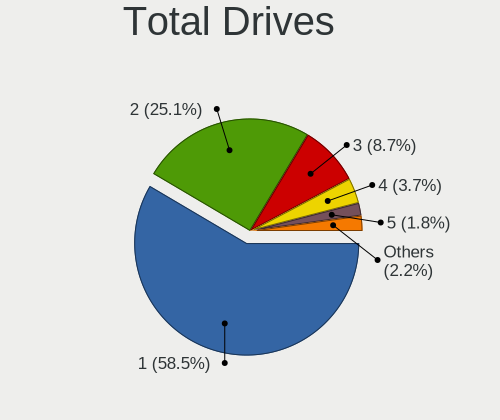
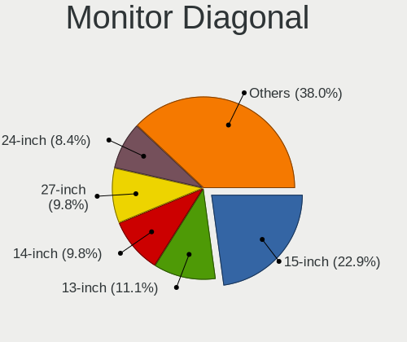
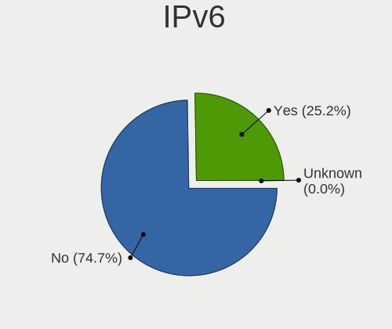

Fedora - Tested Hardware & Statistics
-------------------------------------

A project to collect tested hardware configurations for Fedora.

Anyone can contribute to this report by the [hw-probe](https://github.com/linuxhw/hw-probe) tool:

    sudo -E hw-probe -all -upload

Please contribute! Especially if your hardware is rare.

This is a report for all computer types. See also reports for [desktops](/Dist/Fedora/Desktop/README.md) and [notebooks](/Dist/Fedora/Notebook/README.md).

Contents
--------

* [ Test Cases ](#test-cases)

* [ System ](#system)
  - [ OS                       ](#os)
  - [ OS Family                ](#os-family)
  - [ Kernel                   ](#kernel)
  - [ Kernel Family            ](#kernel-family)
  - [ Kernel Major Ver.        ](#kernel-major-ver)
  - [ Arch                     ](#arch)
  - [ DE                       ](#de)
  - [ Display Server           ](#display-server)
  - [ Display Manager          ](#display-manager)
  - [ OS Lang                  ](#os-lang)
  - [ Boot Mode                ](#boot-mode)
  - [ Filesystem               ](#filesystem)
  - [ Part. scheme             ](#part-scheme)
  - [ Dual Boot with Linux/BSD ](#dual-boot-with-linuxbsd)
  - [ Dual Boot (Win)          ](#dual-boot-win)

* [ Board ](#board)
  - [ Vendor                   ](#vendor)
  - [ Model                    ](#model)
  - [ Model Family             ](#model-family)
  - [ MFG Year                 ](#mfg-year)
  - [ Form Factor              ](#form-factor)
  - [ Secure Boot              ](#secure-boot)
  - [ Coreboot                 ](#coreboot)
  - [ RAM Size                 ](#ram-size)
  - [ RAM Used                 ](#ram-used)
  - [ Total Drives             ](#total-drives)
  - [ Has CD-ROM               ](#has-cd-rom)
  - [ Has Ethernet             ](#has-ethernet)
  - [ Has WiFi                 ](#has-wifi)
  - [ Has Bluetooth            ](#has-bluetooth)

* [ Location ](#location)
  - [ Country                  ](#country)
  - [ City                     ](#city)

* [ Drives ](#drives)
  - [ Drive Vendor             ](#drive-vendor)
  - [ Drive Model              ](#drive-model)
  - [ HDD Vendor               ](#hdd-vendor)
  - [ SSD Vendor               ](#ssd-vendor)
  - [ Drive Kind               ](#drive-kind)
  - [ Drive Connector          ](#drive-connector)
  - [ Drive Size               ](#drive-size)
  - [ Space Total              ](#space-total)
  - [ Space Used               ](#space-used)
  - [ Malfunc. Drives          ](#malfunc-drives)
  - [ Malfunc. Drive Vendor    ](#malfunc-drive-vendor)
  - [ Malfunc. HDD Vendor      ](#malfunc-hdd-vendor)
  - [ Malfunc. Drive Kind      ](#malfunc-drive-kind)
  - [ Failed Drives            ](#failed-drives)
  - [ Failed Drive Vendor      ](#failed-drive-vendor)
  - [ Drive Status             ](#drive-status)

* [ Storage controller ](#storage-controller)
  - [ Storage Vendor           ](#storage-vendor)
  - [ Storage Model            ](#storage-model)
  - [ Storage Kind             ](#storage-kind)

* [ Processor ](#processor)
  - [ CPU Vendor               ](#cpu-vendor)
  - [ CPU Model                ](#cpu-model)
  - [ CPU Model Family         ](#cpu-model-family)
  - [ CPU Cores                ](#cpu-cores)
  - [ CPU Sockets              ](#cpu-sockets)
  - [ CPU Threads              ](#cpu-threads)
  - [ CPU Op-Modes             ](#cpu-op-modes)
  - [ CPU Microcode            ](#cpu-microcode)
  - [ CPU Microarch            ](#cpu-microarch)

* [ Graphics ](#graphics)
  - [ GPU Vendor               ](#gpu-vendor)
  - [ GPU Model                ](#gpu-model)
  - [ GPU Combo                ](#gpu-combo)
  - [ GPU Driver               ](#gpu-driver)
  - [ GPU Memory               ](#gpu-memory)

* [ Monitor ](#monitor)
  - [ Monitor Vendor           ](#monitor-vendor)
  - [ Monitor Model            ](#monitor-model)
  - [ Monitor Resolution       ](#monitor-resolution)
  - [ Monitor Diagonal         ](#monitor-diagonal)
  - [ Monitor Width            ](#monitor-width)
  - [ Aspect Ratio             ](#aspect-ratio)
  - [ Monitor Area             ](#monitor-area)
  - [ Pixel Density            ](#pixel-density)
  - [ Multiple Monitors        ](#multiple-monitors)

* [ Network ](#network)
  - [ Net Controller Vendor    ](#net-controller-vendor)
  - [ Net Controller Model     ](#net-controller-model)
  - [ Wireless Vendor          ](#wireless-vendor)
  - [ Wireless Model           ](#wireless-model)
  - [ Ethernet Vendor          ](#ethernet-vendor)
  - [ Ethernet Model           ](#ethernet-model)
  - [ Net Controller Kind      ](#net-controller-kind)
  - [ Used Controller          ](#used-controller)
  - [ NICs                     ](#nics)
  - [ IPv6                     ](#ipv6)

* [ Bluetooth ](#bluetooth)
  - [ Bluetooth Vendor         ](#bluetooth-vendor)
  - [ Bluetooth Model          ](#bluetooth-model)

* [ Sound ](#sound)
  - [ Sound Vendor             ](#sound-vendor)
  - [ Sound Model              ](#sound-model)

* [ Memory ](#memory)
  - [ Memory Vendor            ](#memory-vendor)
  - [ Memory Model             ](#memory-model)
  - [ Memory Kind              ](#memory-kind)
  - [ Memory Form Factor       ](#memory-form-factor)
  - [ Memory Size              ](#memory-size)
  - [ Memory Speed             ](#memory-speed)

* [ Printers & scanners ](#printers--scanners)
  - [ Printer Vendor           ](#printer-vendor)
  - [ Printer Model            ](#printer-model)
  - [ Scanner Vendor           ](#scanner-vendor)
  - [ Scanner Model            ](#scanner-model)

* [ Camera ](#camera)
  - [ Camera Vendor            ](#camera-vendor)
  - [ Camera Model             ](#camera-model)

* [ Security ](#security)
  - [ Fingerprint Vendor       ](#fingerprint-vendor)
  - [ Fingerprint Model        ](#fingerprint-model)
  - [ Chipcard Vendor          ](#chipcard-vendor)
  - [ Chipcard Model           ](#chipcard-model)

* [ Unsupported ](#unsupported)
  - [ Unsupported Devices      ](#unsupported-devices)
  - [ Unsupported Device Types ](#unsupported-device-types)

Test Cases
----------

Total: 11678

| Vendor        | Model                       | Form-Factor | Probe                                                      | Date         |
|---------------|-----------------------------|-------------|------------------------------------------------------------|--------------|
| Lenovo        | ThinkPad T480 20L6S2EQ00    | Notebook    | [1b45ef7d10](https://linux-hardware.org/?probe=1b45ef7d10) | Jul 01, 2022 |
| Lenovo        | ThinkPad P14s Gen 1 20Y1... | Notebook    | [16413aeb23](https://linux-hardware.org/?probe=16413aeb23) | Jul 01, 2022 |
| HP            | Laptop 14s-cf2xxx           | Notebook    | [8da2258fea](https://linux-hardware.org/?probe=8da2258fea) | Jul 01, 2022 |
| ASUSTek       | ROG STRIX B550-F GAMING     | Desktop     | [8e6d23cf01](https://linux-hardware.org/?probe=8e6d23cf01) | Jul 01, 2022 |
| Dell          | Inspiron M5010              | Notebook    | [14b9aa33d2](https://linux-hardware.org/?probe=14b9aa33d2) | Jul 01, 2022 |
| Gigabyte      | B85M-D3H                    | Desktop     | [a32cb9b3f1](https://linux-hardware.org/?probe=a32cb9b3f1) | Jul 01, 2022 |
| Lenovo        | IdeaPad 5 15ITL05 82FG      | Notebook    | [2671f4ffe2](https://linux-hardware.org/?probe=2671f4ffe2) | Jul 01, 2022 |
| ASUSTek       | VivoBook_ASUSLaptop X512... | Notebook    | [c9d0d64896](https://linux-hardware.org/?probe=c9d0d64896) | Jul 01, 2022 |
| MSI           | X99A RAIDER                 | Desktop     | [e1c3d1dfad](https://linux-hardware.org/?probe=e1c3d1dfad) | Jul 01, 2022 |
| ASRock        | FM2A88X Extreme6+           | Desktop     | [a658ebf5e9](https://linux-hardware.org/?probe=a658ebf5e9) | Jul 01, 2022 |
| Gigabyte      | Z590I AORUS ULTRA           | Desktop     | [febb798e92](https://linux-hardware.org/?probe=febb798e92) | Jul 01, 2022 |
| Lenovo        | ThinkPad T450s 20BX002NM... | Notebook    | [3bb2e1821b](https://linux-hardware.org/?probe=3bb2e1821b) | Jul 01, 2022 |
| Framework     | Laptop                      | Notebook    | [1089f37daf](https://linux-hardware.org/?probe=1089f37daf) | Jul 01, 2022 |
| Dell          | 0M9KCM A00                  | Desktop     | [e72232ee43](https://linux-hardware.org/?probe=e72232ee43) | Jul 01, 2022 |
| Gigabyte      | Z87-HD3                     | Desktop     | [c38c4e9cb9](https://linux-hardware.org/?probe=c38c4e9cb9) | Jun 30, 2022 |
| Dell          | 0M9KCM A00                  | Desktop     | [5e80242b43](https://linux-hardware.org/?probe=5e80242b43) | Jun 30, 2022 |
| Lenovo        | ThinkPad T460 20FMS2292S    | Notebook    | [cf313915ab](https://linux-hardware.org/?probe=cf313915ab) | Jun 30, 2022 |
| ASUSTek       | TUF Gaming X570-PLUS        | Desktop     | [7e14880c80](https://linux-hardware.org/?probe=7e14880c80) | Jun 30, 2022 |
| ASUSTek       | PRIME Z370-A                | Desktop     | [28479b3edf](https://linux-hardware.org/?probe=28479b3edf) | Jun 30, 2022 |
| Lenovo        | ThinkCentre M58p 7220A72    | Desktop     | [cea6c9ea52](https://linux-hardware.org/?probe=cea6c9ea52) | Jun 30, 2022 |
| Acer          | Spin SP313-51N              | Convertible | [2049536427](https://linux-hardware.org/?probe=2049536427) | Jun 30, 2022 |
| HP            | Pavilion Aero Laptop 13-... | Notebook    | [3af286a188](https://linux-hardware.org/?probe=3af286a188) | Jun 30, 2022 |
| Lenovo        | ThinkPad E15 Gen 2 20TDC... | Notebook    | [f29c4de6b4](https://linux-hardware.org/?probe=f29c4de6b4) | Jun 30, 2022 |
| Lenovo        | ThinkPad E15 Gen 2 20TDC... | Notebook    | [7ecd760977](https://linux-hardware.org/?probe=7ecd760977) | Jun 30, 2022 |
| Lenovo        | ThinkPad E15 Gen 2 20TDC... | Notebook    | [8428ba0120](https://linux-hardware.org/?probe=8428ba0120) | Jun 30, 2022 |
| HP            | EliteBook 8470p             | Notebook    | [cd488e4f64](https://linux-hardware.org/?probe=cd488e4f64) | Jun 30, 2022 |
| HP            | EliteBook 8470p             | Notebook    | [52dfa0a4ee](https://linux-hardware.org/?probe=52dfa0a4ee) | Jun 30, 2022 |
| Acer          | Aspire A315-55G             | Notebook    | [e6d7a2a642](https://linux-hardware.org/?probe=e6d7a2a642) | Jun 30, 2022 |
| HP            | Laptop 15-da0xxx            | Notebook    | [9c512247ff](https://linux-hardware.org/?probe=9c512247ff) | Jun 30, 2022 |
| Lenovo        | ThinkPad T410 2518A37       | Notebook    | [4e15b37546](https://linux-hardware.org/?probe=4e15b37546) | Jun 30, 2022 |
| Gigabyte      | GB-BSi5-1135G7              | Desktop     | [4701b81ce2](https://linux-hardware.org/?probe=4701b81ce2) | Jun 30, 2022 |
| ASRock        | FM2A88X Extreme6+           | Desktop     | [163a5c29e6](https://linux-hardware.org/?probe=163a5c29e6) | Jun 30, 2022 |
| MSI           | X99A RAIDER                 | Desktop     | [2da2ad735c](https://linux-hardware.org/?probe=2da2ad735c) | Jun 30, 2022 |
| Gigabyte      | B560M DS3H V2               | Desktop     | [85b8793585](https://linux-hardware.org/?probe=85b8793585) | Jun 29, 2022 |
| Dell          | Inspiron 3543               | Notebook    | [1f9d3b4a6c](https://linux-hardware.org/?probe=1f9d3b4a6c) | Jun 29, 2022 |
| ASUSTek       | ROG CROSSHAIR VIII HERO     | Desktop     | [01d9100427](https://linux-hardware.org/?probe=01d9100427) | Jun 29, 2022 |
| HP            | Laptop 15s-eq2xxx           | Notebook    | [5acbf09f01](https://linux-hardware.org/?probe=5acbf09f01) | Jun 29, 2022 |
| HP            | Pavilion x360 Convertibl... | Convertible | [8ddfd26738](https://linux-hardware.org/?probe=8ddfd26738) | Jun 29, 2022 |
| ASUSTek       | UX302LA                     | Notebook    | [6092e85ae8](https://linux-hardware.org/?probe=6092e85ae8) | Jun 29, 2022 |
| Getac         | B300-X                      | Notebook    | [eb752b6c15](https://linux-hardware.org/?probe=eb752b6c15) | Jun 29, 2022 |
| HP            | ENVY x360 Convertible 13... | Convertible | [1eed1dcced](https://linux-hardware.org/?probe=1eed1dcced) | Jun 29, 2022 |
| HUAWEI        | BOD-WXX9                    | Notebook    | [9c3e14320e](https://linux-hardware.org/?probe=9c3e14320e) | Jun 29, 2022 |
| ASUSTek       | ProArt Z690-CREATOR WIFI    | Desktop     | [392d5c7c12](https://linux-hardware.org/?probe=392d5c7c12) | Jun 29, 2022 |
| HP            | Pavilion Gaming Laptop 1... | Notebook    | [43c87260b2](https://linux-hardware.org/?probe=43c87260b2) | Jun 29, 2022 |
| MSI           | X99A RAIDER                 | Desktop     | [b197a0fd35](https://linux-hardware.org/?probe=b197a0fd35) | Jun 29, 2022 |
| ASRock        | FM2A88X Extreme6+           | Desktop     | [66b8ec6b28](https://linux-hardware.org/?probe=66b8ec6b28) | Jun 29, 2022 |
| Lenovo        | ThinkPad X220 4291WSH       | Notebook    | [7406ba0eb2](https://linux-hardware.org/?probe=7406ba0eb2) | Jun 29, 2022 |
| Alienware     | 17                          | Notebook    | [715b5b0dce](https://linux-hardware.org/?probe=715b5b0dce) | Jun 29, 2022 |
| Apple         | MacBookAir6,1               | Notebook    | [c3172fd9cf](https://linux-hardware.org/?probe=c3172fd9cf) | Jun 28, 2022 |
| Gigabyte      | D525TUD                     | Desktop     | [b6cfc5d2df](https://linux-hardware.org/?probe=b6cfc5d2df) | Jun 28, 2022 |
| Dell          | Precision M6800             | Notebook    | [027cb621ef](https://linux-hardware.org/?probe=027cb621ef) | Jun 28, 2022 |
| Dell          | Latitude 5511               | Notebook    | [c361c37273](https://linux-hardware.org/?probe=c361c37273) | Jun 28, 2022 |
| ASUSTek       | X750JN                      | Notebook    | [4ba4d14a1a](https://linux-hardware.org/?probe=4ba4d14a1a) | Jun 28, 2022 |
| Gigabyte      | B85M-D3V-A                  | Desktop     | [3417dd6a9a](https://linux-hardware.org/?probe=3417dd6a9a) | Jun 28, 2022 |
| Gigabyte      | G41MT-D3                    | Desktop     | [20de16a046](https://linux-hardware.org/?probe=20de16a046) | Jun 28, 2022 |
| Lenovo        | IdeaPad 5 14ALC05 82LM      | Notebook    | [d240efa39f](https://linux-hardware.org/?probe=d240efa39f) | Jun 28, 2022 |
| Apple         | MacBookPro12,1              | Notebook    | [570dd2f164](https://linux-hardware.org/?probe=570dd2f164) | Jun 28, 2022 |
| Toshiba       | Satellite C855-12R          | Notebook    | [e94a109546](https://linux-hardware.org/?probe=e94a109546) | Jun 28, 2022 |
| Dell          | Inspiron N5110              | Notebook    | [239e8c86c0](https://linux-hardware.org/?probe=239e8c86c0) | Jun 28, 2022 |
| Lenovo        | Yoga C740-15IML 81TD        | Convertible | [c450ce45a6](https://linux-hardware.org/?probe=c450ce45a6) | Jun 28, 2022 |
| Lenovo        | Yoga C740-15IML 81TD        | Convertible | [5d2f94f859](https://linux-hardware.org/?probe=5d2f94f859) | Jun 28, 2022 |
| Apple         | Mac-031B6874CF7F642A iMa... | All in one  | [ba68b99167](https://linux-hardware.org/?probe=ba68b99167) | Jun 27, 2022 |
| Dell          | Latitude E6520              | Notebook    | [f688527838](https://linux-hardware.org/?probe=f688527838) | Jun 27, 2022 |
| Gigabyte      | RC14UD                      | Notebook    | [d2b55252d8](https://linux-hardware.org/?probe=d2b55252d8) | Jun 27, 2022 |
| HP            | Pavilion Gaming Laptop 1... | Notebook    | [1c4ace32a2](https://linux-hardware.org/?probe=1c4ace32a2) | Jun 27, 2022 |
| Lenovo        | ThinkPad L390 Yoga 20NT0... | Convertible | [f20fc8c349](https://linux-hardware.org/?probe=f20fc8c349) | Jun 27, 2022 |
| Apple         | MacBookPro5,1               | Notebook    | [1e14793557](https://linux-hardware.org/?probe=1e14793557) | Jun 27, 2022 |
| ASUSTek       | VivoBook_ASUSLaptop X515... | Notebook    | [3a651b23fb](https://linux-hardware.org/?probe=3a651b23fb) | Jun 26, 2022 |
| Dell          | Inspiron 7558               | Notebook    | [d34cfa83d3](https://linux-hardware.org/?probe=d34cfa83d3) | Jun 26, 2022 |
| ASRock        | N68-VS3 UCC                 | Desktop     | [2c7959c607](https://linux-hardware.org/?probe=2c7959c607) | Jun 26, 2022 |
| ASUSTek       | PRIME H410M-E               | Desktop     | [3eb97735b3](https://linux-hardware.org/?probe=3eb97735b3) | Jun 26, 2022 |
| Lenovo        | ThinkPad P1 Gen 3 20TJS5... | Notebook    | [de3ca4e422](https://linux-hardware.org/?probe=de3ca4e422) | Jun 26, 2022 |
| Acer          | Swift SF114-32              | Notebook    | [25e6653354](https://linux-hardware.org/?probe=25e6653354) | Jun 26, 2022 |
| MSI           | GF63 Thin 9SCXR             | Notebook    | [db6195eed2](https://linux-hardware.org/?probe=db6195eed2) | Jun 26, 2022 |
| Timi          | A35S                        | Notebook    | [606e376264](https://linux-hardware.org/?probe=606e376264) | Jun 26, 2022 |
| Dell          | Latitude 7300               | Notebook    | [a7939aeb9e](https://linux-hardware.org/?probe=a7939aeb9e) | Jun 26, 2022 |
| Microsoft     | Surface Pro 7               | Tablet      | [2f4500ddad](https://linux-hardware.org/?probe=2f4500ddad) | Jun 26, 2022 |
| HP            | 3398                        | Desktop     | [4241fd0ba0](https://linux-hardware.org/?probe=4241fd0ba0) | Jun 26, 2022 |
| Gigabyte      | 990FXA-UD5 R5               | Desktop     | [9a853085ea](https://linux-hardware.org/?probe=9a853085ea) | Jun 26, 2022 |
| ASUSTek       | ROG Zephyrus G14 GA402RJ... | Notebook    | [400eaba39f](https://linux-hardware.org/?probe=400eaba39f) | Jun 26, 2022 |
| ASUSTek       | TUF Gaming X570-PLUS        | Desktop     | [bb3f7f9534](https://linux-hardware.org/?probe=bb3f7f9534) | Jun 26, 2022 |
| ASUSTek       | ROG STRIX Z370-G GAMING     | Desktop     | [519e378380](https://linux-hardware.org/?probe=519e378380) | Jun 25, 2022 |
| ASUSTek       | TUF Z370-PLUS GAMING        | Desktop     | [6c6d94e4b7](https://linux-hardware.org/?probe=6c6d94e4b7) | Jun 25, 2022 |
| HP            | Compaq CQ58                 | Notebook    | [5948b56a82](https://linux-hardware.org/?probe=5948b56a82) | Jun 25, 2022 |
| Dell          | XPS 13 9310                 | Notebook    | [fa3d29c80b](https://linux-hardware.org/?probe=fa3d29c80b) | Jun 25, 2022 |
| BESSTAR Te... | HM90                        | Desktop     | [e8a4e37cc6](https://linux-hardware.org/?probe=e8a4e37cc6) | Jun 25, 2022 |
| Lenovo        | ThinkPad E14 Gen 2 20T60... | Notebook    | [81a9b9847d](https://linux-hardware.org/?probe=81a9b9847d) | Jun 25, 2022 |
| ASRock        | H87 Pro4                    | Desktop     | [47cf388077](https://linux-hardware.org/?probe=47cf388077) | Jun 25, 2022 |
| Dell          | Inspiron 5437               | Notebook    | [e206b319a2](https://linux-hardware.org/?probe=e206b319a2) | Jun 25, 2022 |
| Gigabyte      | G5 KC                       | Notebook    | [5ef620811f](https://linux-hardware.org/?probe=5ef620811f) | Jun 25, 2022 |
| ASUSTek       | TUF Gaming Z690-PLUS WIF... | Desktop     | [c3c48bb18e](https://linux-hardware.org/?probe=c3c48bb18e) | Jun 25, 2022 |
| HP            | Pavilion g6                 | Notebook    | [d2e82f01d9](https://linux-hardware.org/?probe=d2e82f01d9) | Jun 25, 2022 |
| MSI           | MPG X570 GAMING PRO CARB... | Desktop     | [c6c59e12b6](https://linux-hardware.org/?probe=c6c59e12b6) | Jun 25, 2022 |
| MSI           | B360M MORTAR                | Desktop     | [607f489961](https://linux-hardware.org/?probe=607f489961) | Jun 25, 2022 |
| HP            | Laptop 15s-fq2xxx           | Notebook    | [170f5de9e2](https://linux-hardware.org/?probe=170f5de9e2) | Jun 25, 2022 |
| HP            | OMEN Notebook PC 15         | Notebook    | [66f845b63e](https://linux-hardware.org/?probe=66f845b63e) | Jun 25, 2022 |
| Unknown       | Unknown                     | Notebook    | [6e62883390](https://linux-hardware.org/?probe=6e62883390) | Jun 25, 2022 |
| ASRock        | H87 Pro4                    | Desktop     | [73eb3e0db6](https://linux-hardware.org/?probe=73eb3e0db6) | Jun 25, 2022 |
| Lenovo        | ThinkPad X1 Carbon Gen 1... | Notebook    | [66283ad8cd](https://linux-hardware.org/?probe=66283ad8cd) | Jun 24, 2022 |
| ASUSTek       | ROG Strix G513QM_G513QM     | Notebook    | [3b78b34416](https://linux-hardware.org/?probe=3b78b34416) | Jun 24, 2022 |
| Lenovo        | IdeaPad L340-15IRH Gamin... | Notebook    | [3b84529124](https://linux-hardware.org/?probe=3b84529124) | Jun 24, 2022 |
| HP            | 89D8 SMVB                   | Desktop     | [f92ff0c37f](https://linux-hardware.org/?probe=f92ff0c37f) | Jun 24, 2022 |
| Lenovo        | ThinkPad E490 20N8CTO1WW    | Notebook    | [58ab145788](https://linux-hardware.org/?probe=58ab145788) | Jun 24, 2022 |
| HP            | Laptop 15-ef2xxx            | Notebook    | [3e16709617](https://linux-hardware.org/?probe=3e16709617) | Jun 24, 2022 |
| HP            | ProBook 4520s               | Notebook    | [eb9033a7c1](https://linux-hardware.org/?probe=eb9033a7c1) | Jun 24, 2022 |
| HP            | Elite Dragonfly G2 Noteb... | Convertible | [7c532e5712](https://linux-hardware.org/?probe=7c532e5712) | Jun 24, 2022 |
| Packard Be... | EasyNote TE69HW             | Notebook    | [d292d79bbe](https://linux-hardware.org/?probe=d292d79bbe) | Jun 24, 2022 |
| Lenovo        | ThinkPad T520 4243VE1       | Notebook    | [7fcfec26eb](https://linux-hardware.org/?probe=7fcfec26eb) | Jun 24, 2022 |
| MSI           | IONA                        | Desktop     | [9f4e8871a7](https://linux-hardware.org/?probe=9f4e8871a7) | Jun 24, 2022 |
| Lenovo        | IdeaPad 5 14ARE05 81YM      | Notebook    | [2c0b9c6402](https://linux-hardware.org/?probe=2c0b9c6402) | Jun 24, 2022 |
| ASUSTek       | ZenBook UX534FTC_UX534FT    | Notebook    | [bb8541d805](https://linux-hardware.org/?probe=bb8541d805) | Jun 24, 2022 |
| Dell          | 0VRWRC A00                  | Desktop     | [373df03a96](https://linux-hardware.org/?probe=373df03a96) | Jun 24, 2022 |
| HP            | ENVY x360 Convertible 15... | Convertible | [a4d7f0fbeb](https://linux-hardware.org/?probe=a4d7f0fbeb) | Jun 24, 2022 |
| ASRock        | H77 Pro4/MVP                | Desktop     | [f022b1b430](https://linux-hardware.org/?probe=f022b1b430) | Jun 24, 2022 |
| Acer          | Nitro AN515-54              | Notebook    | [afce38a95a](https://linux-hardware.org/?probe=afce38a95a) | Jun 24, 2022 |
| HP            | Pavilion Gaming Laptop 1... | Notebook    | [d4b96de9b6](https://linux-hardware.org/?probe=d4b96de9b6) | Jun 24, 2022 |
| Dell          | Precision 5550              | Notebook    | [0811e8c956](https://linux-hardware.org/?probe=0811e8c956) | Jun 23, 2022 |
| HP            | Pavilion Laptop 14-dv0xx... | Notebook    | [ac634d8aa9](https://linux-hardware.org/?probe=ac634d8aa9) | Jun 23, 2022 |
| ASUSTek       | CROSSHAIR V FORMULA-Z       | Desktop     | [5129e4893a](https://linux-hardware.org/?probe=5129e4893a) | Jun 23, 2022 |
| Dell          | 0M877N A01                  | Server      | [107b5509e6](https://linux-hardware.org/?probe=107b5509e6) | Jun 23, 2022 |
| ASUSTek       | CROSSHAIR V FORMULA-Z       | Desktop     | [dbfad9b8fe](https://linux-hardware.org/?probe=dbfad9b8fe) | Jun 23, 2022 |
| Acer          | TMP453-MG                   | Notebook    | [e2790ebf7e](https://linux-hardware.org/?probe=e2790ebf7e) | Jun 23, 2022 |
| ASUSTek       | CROSSHAIR V FORMULA-Z       | Desktop     | [6f13e0f8a0](https://linux-hardware.org/?probe=6f13e0f8a0) | Jun 23, 2022 |
| Acer          | TMP453-MG                   | Notebook    | [c99aceab3b](https://linux-hardware.org/?probe=c99aceab3b) | Jun 23, 2022 |
| Dell          | Inspiron 7577               | Notebook    | [673bd13d0a](https://linux-hardware.org/?probe=673bd13d0a) | Jun 23, 2022 |
| Dell          | Precision 5550              | Notebook    | [0ae65f654e](https://linux-hardware.org/?probe=0ae65f654e) | Jun 23, 2022 |
| Gigabyte      | Z690I AORUS ULTRA           | Desktop     | [eeac425783](https://linux-hardware.org/?probe=eeac425783) | Jun 23, 2022 |
| HP            | x2 Detachable 10-p0XX       | Tablet      | [dc7570d322](https://linux-hardware.org/?probe=dc7570d322) | Jun 23, 2022 |
| Lenovo        | IdeaPad Gaming 3 15ARH05... | Notebook    | [926d4055f7](https://linux-hardware.org/?probe=926d4055f7) | Jun 23, 2022 |
| HP            | Pavilion Laptop 15-cw1xx... | Notebook    | [223e43004a](https://linux-hardware.org/?probe=223e43004a) | Jun 23, 2022 |
| Medion        | AXA                         | All in one  | [0cbda6d693](https://linux-hardware.org/?probe=0cbda6d693) | Jun 23, 2022 |
| HP            | 250 G7 Notebook PC          | Notebook    | [6ec1b55ac0](https://linux-hardware.org/?probe=6ec1b55ac0) | Jun 23, 2022 |
| Unknown       | HX90                        | Desktop     | [837e70229a](https://linux-hardware.org/?probe=837e70229a) | Jun 23, 2022 |
| Lenovo        | G510 20238                  | Notebook    | [1b382e0eb0](https://linux-hardware.org/?probe=1b382e0eb0) | Jun 23, 2022 |
| HP            | ENVY x360 Convertible 13... | Convertible | [9f67f6836e](https://linux-hardware.org/?probe=9f67f6836e) | Jun 23, 2022 |
| Lenovo        | Yoga 7 14ITL5 82BH          | Convertible | [32a4f6d3e0](https://linux-hardware.org/?probe=32a4f6d3e0) | Jun 23, 2022 |
| Gigabyte      | B360M AORUS Gaming 3-CF     | Desktop     | [167acd417b](https://linux-hardware.org/?probe=167acd417b) | Jun 23, 2022 |
| ASUSTek       | ZenBook UX534FTC_UX534FT    | Notebook    | [5dd91493a8](https://linux-hardware.org/?probe=5dd91493a8) | Jun 23, 2022 |
| Gigabyte      | AB350-Gaming 3-CF           | Desktop     | [d11995947a](https://linux-hardware.org/?probe=d11995947a) | Jun 23, 2022 |
| ASUSTek       | K46CB                       | Notebook    | [65344cb089](https://linux-hardware.org/?probe=65344cb089) | Jun 23, 2022 |
| Gigabyte      | Z270X-Ultra Gaming-CF       | Desktop     | [92944b1e97](https://linux-hardware.org/?probe=92944b1e97) | Jun 22, 2022 |
| HP            | 2B05                        | Desktop     | [677bb9d569](https://linux-hardware.org/?probe=677bb9d569) | Jun 22, 2022 |
| ASRock        | B550M Pro4                  | Desktop     | [45871f6d61](https://linux-hardware.org/?probe=45871f6d61) | Jun 22, 2022 |
| Lenovo        | ThinkPad P1 Gen 3 20TJS2... | Notebook    | [f002062377](https://linux-hardware.org/?probe=f002062377) | Jun 22, 2022 |
| ASRock        | B450 Gaming K4              | Desktop     | [05c977bf65](https://linux-hardware.org/?probe=05c977bf65) | Jun 22, 2022 |
| Dell          | 02YYK5 A00                  | Desktop     | [7a571de1b9](https://linux-hardware.org/?probe=7a571de1b9) | Jun 22, 2022 |
| System76      | Thelio Mira thelio-mira-... | Desktop     | [58c9da7f20](https://linux-hardware.org/?probe=58c9da7f20) | Jun 22, 2022 |
| Apple         | Mac-942B59F58194171B iMa... | All in one  | [f140cafa9f](https://linux-hardware.org/?probe=f140cafa9f) | Jun 22, 2022 |
| HP            | ZBook Fury 15 G7 Mobile ... | Notebook    | [1967dad271](https://linux-hardware.org/?probe=1967dad271) | Jun 22, 2022 |
| Apple         | Mac-942B59F58194171B iMa... | All in one  | [b60cfda63f](https://linux-hardware.org/?probe=b60cfda63f) | Jun 22, 2022 |
| MSI           | B85M-E45                    | Desktop     | [f5e1312d31](https://linux-hardware.org/?probe=f5e1312d31) | Jun 22, 2022 |
| Gigabyte      | H61M-S2P                    | Desktop     | [ac99674975](https://linux-hardware.org/?probe=ac99674975) | Jun 22, 2022 |
| Lenovo        | ThinkPad X1 Yoga Gen 6 2... | Convertible | [e02fbb350d](https://linux-hardware.org/?probe=e02fbb350d) | Jun 22, 2022 |
| Positivo      | VJF155F11UAR                | Notebook    | [77c5ca4f1e](https://linux-hardware.org/?probe=77c5ca4f1e) | Jun 22, 2022 |
| Dell          | 04YP6J A02                  | Desktop     | [11151bb62c](https://linux-hardware.org/?probe=11151bb62c) | Jun 22, 2022 |
| Acer          | NC-E5-774G-75TJ             | Notebook    | [55fce68116](https://linux-hardware.org/?probe=55fce68116) | Jun 22, 2022 |
| ASUSTek       | TUF Z390-PLUS GAMING        | Desktop     | [04927da7b6](https://linux-hardware.org/?probe=04927da7b6) | Jun 22, 2022 |
| HP            | ZBook 17 G4                 | Notebook    | [bf03eb0fa7](https://linux-hardware.org/?probe=bf03eb0fa7) | Jun 22, 2022 |
| Fujitsu       | LIFEBOOK U745               | Notebook    | [0fffb61902](https://linux-hardware.org/?probe=0fffb61902) | Jun 22, 2022 |
| HP            | Notebook                    | Notebook    | [03c703cc7f](https://linux-hardware.org/?probe=03c703cc7f) | Jun 21, 2022 |
| Lenovo        | IdeaPad L340-15API 81LW     | Notebook    | [dda5fb9c20](https://linux-hardware.org/?probe=dda5fb9c20) | Jun 21, 2022 |
| HUAWEI        | MACH-WX9                    | Notebook    | [c6f721f315](https://linux-hardware.org/?probe=c6f721f315) | Jun 21, 2022 |
| HP            | EliteBook 830 G6            | Notebook    | [7c7d9af667](https://linux-hardware.org/?probe=7c7d9af667) | Jun 21, 2022 |
| ASRock        | Z690M-ITX/ax                | Desktop     | [cc8224a123](https://linux-hardware.org/?probe=cc8224a123) | Jun 21, 2022 |
| ASRock        | Z690M-ITX/ax                | Desktop     | [1d3eb4348d](https://linux-hardware.org/?probe=1d3eb4348d) | Jun 21, 2022 |
| ASRock        | Z690M-ITX/ax                | Desktop     | [35bec2520a](https://linux-hardware.org/?probe=35bec2520a) | Jun 21, 2022 |
| Microsoft     | Surface Laptop              | Tablet      | [8c621a2c68](https://linux-hardware.org/?probe=8c621a2c68) | Jun 21, 2022 |
| Lenovo        | IdeaPad 3 15ITL6 82H8       | Notebook    | [ae54449547](https://linux-hardware.org/?probe=ae54449547) | Jun 21, 2022 |
| GEO           | GeoBook 240                 | Notebook    | [f08637137c](https://linux-hardware.org/?probe=f08637137c) | Jun 21, 2022 |
| Lenovo        | ThinkPad L13 Yoga 20R5CT... | Convertible | [79c59719f7](https://linux-hardware.org/?probe=79c59719f7) | Jun 21, 2022 |
| Microsoft     | Surface Laptop 3            | Tablet      | [18f31eae70](https://linux-hardware.org/?probe=18f31eae70) | Jun 21, 2022 |
| MSI           | MPG B550 GAMING EDGE WIF... | Desktop     | [f3176204c8](https://linux-hardware.org/?probe=f3176204c8) | Jun 21, 2022 |
| Dell          | XPS 13 9380                 | Notebook    | [dc134b17e9](https://linux-hardware.org/?probe=dc134b17e9) | Jun 21, 2022 |
| HP            | ProBook 440 G6              | Notebook    | [eeeee7321e](https://linux-hardware.org/?probe=eeeee7321e) | Jun 20, 2022 |
| MSI           | B450-A PRO MAX              | Desktop     | [490076a383](https://linux-hardware.org/?probe=490076a383) | Jun 20, 2022 |
| Lenovo        | SHARKBAY SDK0E50512 STD     | Desktop     | [b7a6099e25](https://linux-hardware.org/?probe=b7a6099e25) | Jun 20, 2022 |
| Lenovo        | ThinkPad X1 Carbon Gen 9... | Notebook    | [27623895a1](https://linux-hardware.org/?probe=27623895a1) | Jun 20, 2022 |
| MSI           | MS-B0A1                     | Desktop     | [3193cbe3fd](https://linux-hardware.org/?probe=3193cbe3fd) | Jun 20, 2022 |
| Lenovo        | ThinkPad T495s 20QJ0012G... | Notebook    | [92638f1b46](https://linux-hardware.org/?probe=92638f1b46) | Jun 20, 2022 |
| ASUSTek       | ROG Zephyrus G14 GA401QM... | Notebook    | [52aa806063](https://linux-hardware.org/?probe=52aa806063) | Jun 20, 2022 |
| ASUSTek       | TUF Gaming Z690-PLUS WIF... | Desktop     | [a384703b5e](https://linux-hardware.org/?probe=a384703b5e) | Jun 20, 2022 |
| MSI           | 2A9C                        | Desktop     | [73dd2172d3](https://linux-hardware.org/?probe=73dd2172d3) | Jun 20, 2022 |
| Panasonic     | CFSV9-1                     | Notebook    | [4b7dd23ccd](https://linux-hardware.org/?probe=4b7dd23ccd) | Jun 20, 2022 |
| Apple         | MacBookPro12,1              | Notebook    | [666e91f182](https://linux-hardware.org/?probe=666e91f182) | Jun 20, 2022 |
| Dell          | XPS 15 9520                 | Notebook    | [ec6f5cce04](https://linux-hardware.org/?probe=ec6f5cce04) | Jun 20, 2022 |
| Google        | Droid                       | Notebook    | [5a175a2a78](https://linux-hardware.org/?probe=5a175a2a78) | Jun 20, 2022 |
| Apple         | MacBookPro12,1              | Notebook    | [5d9f65fbc9](https://linux-hardware.org/?probe=5d9f65fbc9) | Jun 20, 2022 |
| HP            | EliteBook 865 16 inch G9... | Notebook    | [9a543a0273](https://linux-hardware.org/?probe=9a543a0273) | Jun 20, 2022 |
| Lenovo        | ThinkPad X13 Gen 1 20T3S... | Notebook    | [bbb3795dc2](https://linux-hardware.org/?probe=bbb3795dc2) | Jun 20, 2022 |
| Lenovo        | ThinkPad P53 20QN0011IV     | Notebook    | [9cf3c1f84c](https://linux-hardware.org/?probe=9cf3c1f84c) | Jun 19, 2022 |
| HP            | ENVY Laptop 13-ad1xx        | Notebook    | [df2017f7d5](https://linux-hardware.org/?probe=df2017f7d5) | Jun 19, 2022 |
| ASUSTek       | ROG CROSSHAIR VIII DARK ... | Desktop     | [560fa88cad](https://linux-hardware.org/?probe=560fa88cad) | Jun 19, 2022 |
| HP            | 2B05                        | Desktop     | [a49ebb4aed](https://linux-hardware.org/?probe=a49ebb4aed) | Jun 19, 2022 |
| MSI           | B450 TOMAHAWK MAX II        | Desktop     | [4fc1134f6d](https://linux-hardware.org/?probe=4fc1134f6d) | Jun 19, 2022 |
| HP            | ProBook 4520s               | Notebook    | [b34f97ddb3](https://linux-hardware.org/?probe=b34f97ddb3) | Jun 19, 2022 |
| MSI           | MAG B550M MORTAR WIFI       | Desktop     | [a59676f7be](https://linux-hardware.org/?probe=a59676f7be) | Jun 19, 2022 |
| ASUSTek       | M5A97 R2.0                  | Desktop     | [707f314c74](https://linux-hardware.org/?probe=707f314c74) | Jun 19, 2022 |
| Micro Elec... | MG-VCP17I-3070              | Notebook    | [e09cfb9236](https://linux-hardware.org/?probe=e09cfb9236) | Jun 19, 2022 |
| HP            | Pavilion dv7                | Notebook    | [ab34fbb528](https://linux-hardware.org/?probe=ab34fbb528) | Jun 19, 2022 |
| Lenovo        | IdeaPad 5 15ITL05 82FG      | Notebook    | [3c8a4e8226](https://linux-hardware.org/?probe=3c8a4e8226) | Jun 18, 2022 |
| ASUSTek       | ZenBook UX434DA_UM433DA     | Notebook    | [68ca5e600d](https://linux-hardware.org/?probe=68ca5e600d) | Jun 18, 2022 |
| MSI           | H510I PRO WIFI              | Desktop     | [b9d3cb4755](https://linux-hardware.org/?probe=b9d3cb4755) | Jun 18, 2022 |
| HUAWEI        | KLVL-WXX9                   | Notebook    | [a71adbf68f](https://linux-hardware.org/?probe=a71adbf68f) | Jun 18, 2022 |
| ASUSTek       | Q170M2                      | Desktop     | [76f5dd0027](https://linux-hardware.org/?probe=76f5dd0027) | Jun 18, 2022 |
| ASUSTek       | Q170M2                      | Desktop     | [32713d6759](https://linux-hardware.org/?probe=32713d6759) | Jun 18, 2022 |
| ASRock        | FM2A88X Extreme6+           | Desktop     | [4801136187](https://linux-hardware.org/?probe=4801136187) | Jun 18, 2022 |
| MSI           | X99A RAIDER                 | Desktop     | [550772184f](https://linux-hardware.org/?probe=550772184f) | Jun 18, 2022 |
| HP            | ProBook 470 G5              | Notebook    | [b070339877](https://linux-hardware.org/?probe=b070339877) | Jun 18, 2022 |
| HP            | ZBook Fury 15 G7 Mobile ... | Notebook    | [4a1a0294d8](https://linux-hardware.org/?probe=4a1a0294d8) | Jun 18, 2022 |
| Dell          | Precision 3571              | Notebook    | [9d6985b0f0](https://linux-hardware.org/?probe=9d6985b0f0) | Jun 18, 2022 |
| Dell          | Precision 3571              | Notebook    | [285846e1a4](https://linux-hardware.org/?probe=285846e1a4) | Jun 18, 2022 |
| ASUSTek       | ROG Zephyrus G14 GA402RJ... | Notebook    | [91af0ec6df](https://linux-hardware.org/?probe=91af0ec6df) | Jun 18, 2022 |
| Acer          | Swift SF314-43              | Notebook    | [a6116d2e8c](https://linux-hardware.org/?probe=a6116d2e8c) | Jun 18, 2022 |
| HP            | ProBook 430 G5              | Notebook    | [1689773788](https://linux-hardware.org/?probe=1689773788) | Jun 18, 2022 |
| ASUSTek       | TUF Gaming FX505DY_TUF50... | Notebook    | [df304b4da1](https://linux-hardware.org/?probe=df304b4da1) | Jun 17, 2022 |
| Acer          | Swift SF314-43              | Notebook    | [674addd96b](https://linux-hardware.org/?probe=674addd96b) | Jun 17, 2022 |
| ASRock        | X370 Gaming-ITX/ac          | Desktop     | [292cc4bcab](https://linux-hardware.org/?probe=292cc4bcab) | Jun 17, 2022 |
| Lenovo        | IdeaPad S145-15IIL 82DJ     | Notebook    | [e0b7e5c636](https://linux-hardware.org/?probe=e0b7e5c636) | Jun 17, 2022 |
| Dell          | XPS 13 7390                 | Notebook    | [9cbdc324b7](https://linux-hardware.org/?probe=9cbdc324b7) | Jun 17, 2022 |
| ASUSTek       | ROG STRIX B550-I GAMING     | Desktop     | [f54dda344d](https://linux-hardware.org/?probe=f54dda344d) | Jun 17, 2022 |
| Lenovo        | ThinkPad X1 Carbon 5th 2... | Notebook    | [cb6bf6ab7c](https://linux-hardware.org/?probe=cb6bf6ab7c) | Jun 17, 2022 |
| ASUSTek       | ROG CROSSHAIR VIII IMPAC... | Desktop     | [6647ddd346](https://linux-hardware.org/?probe=6647ddd346) | Jun 17, 2022 |
| Sony          | SVE15128CNB                 | Notebook    | [029a230c77](https://linux-hardware.org/?probe=029a230c77) | Jun 17, 2022 |
| Gigabyte      | GA-MA785G-UD3H              | Desktop     | [dfed0867e1](https://linux-hardware.org/?probe=dfed0867e1) | Jun 17, 2022 |
| ASUSTek       | ROG Flow X13 GV301QE_GV3... | Notebook    | [2a28e582b5](https://linux-hardware.org/?probe=2a28e582b5) | Jun 17, 2022 |
| ASUSTek       | P8H67-M LE                  | Desktop     | [7205fff536](https://linux-hardware.org/?probe=7205fff536) | Jun 17, 2022 |
| Acer          | Aspire E5-476G              | Notebook    | [df4b512aa8](https://linux-hardware.org/?probe=df4b512aa8) | Jun 17, 2022 |
| HP            | OMEN Laptop 15-en0xxx       | Notebook    | [a7431ef0c5](https://linux-hardware.org/?probe=a7431ef0c5) | Jun 17, 2022 |
| MSI           | MAG B460M MORTAR            | Desktop     | [9074247e52](https://linux-hardware.org/?probe=9074247e52) | Jun 17, 2022 |
| ASRock        | FM2A88X Extreme6+           | Desktop     | [680bf4c033](https://linux-hardware.org/?probe=680bf4c033) | Jun 17, 2022 |
| MSI           | X99A RAIDER                 | Desktop     | [184ad2670a](https://linux-hardware.org/?probe=184ad2670a) | Jun 17, 2022 |
| Samsung       | 500R5M/500R5W/501R5M        | Notebook    | [91f1df8a58](https://linux-hardware.org/?probe=91f1df8a58) | Jun 17, 2022 |
| Acer          | Predator PH315-53           | Notebook    | [7e65c001a5](https://linux-hardware.org/?probe=7e65c001a5) | Jun 17, 2022 |
| Dell          | 08NPPY A00                  | Desktop     | [93eb00c3c5](https://linux-hardware.org/?probe=93eb00c3c5) | Jun 16, 2022 |
| Dell          | 0XC7MM A01                  | Desktop     | [8c8a1ef522](https://linux-hardware.org/?probe=8c8a1ef522) | Jun 16, 2022 |
| Lenovo        | IdeaPad 3 15ALC6 82KU       | Notebook    | [e4d5856a72](https://linux-hardware.org/?probe=e4d5856a72) | Jun 16, 2022 |
| Lenovo        | ThinkPad E15 Gen 2 20T80... | Notebook    | [4e53a55031](https://linux-hardware.org/?probe=4e53a55031) | Jun 16, 2022 |
| Dell          | XPS 13 7390                 | Notebook    | [7dbb9f4adf](https://linux-hardware.org/?probe=7dbb9f4adf) | Jun 16, 2022 |
| ASUSTek       | PRIME A320M-K               | Desktop     | [17e9f5a71f](https://linux-hardware.org/?probe=17e9f5a71f) | Jun 16, 2022 |
| Gigabyte      | H87N-WIFI                   | Desktop     | [613bb8fe40](https://linux-hardware.org/?probe=613bb8fe40) | Jun 16, 2022 |
| ASUSTek       | PRIME B550M-A               | Desktop     | [527aea0d6e](https://linux-hardware.org/?probe=527aea0d6e) | Jun 16, 2022 |
| Micro Elec... | MG-VCP17I-3070              | Notebook    | [c6d123b5ec](https://linux-hardware.org/?probe=c6d123b5ec) | Jun 16, 2022 |
| Micro Elec... | MG-VCP17I-3070              | Notebook    | [d28d429121](https://linux-hardware.org/?probe=d28d429121) | Jun 16, 2022 |
| Lenovo        | ThinkPad X13 Gen 1 20T3S... | Notebook    | [7d8683dfac](https://linux-hardware.org/?probe=7d8683dfac) | Jun 16, 2022 |
| ASRock        | B550M-ITX/ac                | Desktop     | [42fd0dcad9](https://linux-hardware.org/?probe=42fd0dcad9) | Jun 16, 2022 |
| Gigabyte      | 990FXA-UD5 R5               | Desktop     | [08527d664b](https://linux-hardware.org/?probe=08527d664b) | Jun 16, 2022 |
| Lenovo        | ThinkPad P51 20HHCTO1WW     | Notebook    | [f83da947b8](https://linux-hardware.org/?probe=f83da947b8) | Jun 16, 2022 |
| ASUSTek       | ROG STRIX B450-F GAMING ... | Desktop     | [8d106f8677](https://linux-hardware.org/?probe=8d106f8677) | Jun 16, 2022 |
| Itautec       | Infoway w7430               | Notebook    | [776d876064](https://linux-hardware.org/?probe=776d876064) | Jun 16, 2022 |
| ASUSTek       | VivoBook 15_ASUS Laptop ... | Notebook    | [388285efe8](https://linux-hardware.org/?probe=388285efe8) | Jun 15, 2022 |
| HP            | Laptop 17-cp0xxx            | Notebook    | [6b73227c17](https://linux-hardware.org/?probe=6b73227c17) | Jun 15, 2022 |
| Acer          | Predator PH315-53           | Notebook    | [155af690bd](https://linux-hardware.org/?probe=155af690bd) | Jun 15, 2022 |
| Dell          | XPS 15 9520                 | Notebook    | [bdd4ec2ef9](https://linux-hardware.org/?probe=bdd4ec2ef9) | Jun 15, 2022 |
| Gigabyte      | Z170-D3H-CF                 | Desktop     | [701de0d7ad](https://linux-hardware.org/?probe=701de0d7ad) | Jun 15, 2022 |
| ASRock        | B450M Pro4                  | Desktop     | [041f94473b](https://linux-hardware.org/?probe=041f94473b) | Jun 15, 2022 |
| Dell          | XPS 15 9520                 | Notebook    | [03140c6f93](https://linux-hardware.org/?probe=03140c6f93) | Jun 15, 2022 |
| HP            | Laptop 17-cp0xxx            | Notebook    | [6f25a1e394](https://linux-hardware.org/?probe=6f25a1e394) | Jun 15, 2022 |
| Dell          | Inspiron 7472               | Notebook    | [788b7856ca](https://linux-hardware.org/?probe=788b7856ca) | Jun 15, 2022 |
| ASUSTek       | ROG CROSSHAIR VII HERO      | Desktop     | [9418d283c9](https://linux-hardware.org/?probe=9418d283c9) | Jun 15, 2022 |
| Timi          | Redmi Book Pro 15 2022      | Notebook    | [76fd9cba2e](https://linux-hardware.org/?probe=76fd9cba2e) | Jun 15, 2022 |
| Lenovo        | ThinkPad X220 4286CTO       | Notebook    | [fd2fb2f646](https://linux-hardware.org/?probe=fd2fb2f646) | Jun 14, 2022 |
| ASUSTek       | ROG CROSSHAIR VIII DARK ... | Desktop     | [131a938c5e](https://linux-hardware.org/?probe=131a938c5e) | Jun 14, 2022 |
| Foxconn       | nT-i1000 Series PCB         | Desktop     | [e61344b416](https://linux-hardware.org/?probe=e61344b416) | Jun 14, 2022 |
| Gigabyte      | H61M-S2PV                   | Desktop     | [cc88cec642](https://linux-hardware.org/?probe=cc88cec642) | Jun 14, 2022 |
| Dell          | Precision 3551              | Notebook    | [3499839fd0](https://linux-hardware.org/?probe=3499839fd0) | Jun 14, 2022 |
| HP            | Pavilion Gaming Laptop 1... | Notebook    | [b6f26fecef](https://linux-hardware.org/?probe=b6f26fecef) | Jun 14, 2022 |
| HP            | Notebook                    | Notebook    | [390f55db2e](https://linux-hardware.org/?probe=390f55db2e) | Jun 14, 2022 |
| HP            | OMEN by Laptop 15-dc1xxx    | Notebook    | [17077cf1d8](https://linux-hardware.org/?probe=17077cf1d8) | Jun 14, 2022 |
| Dell          | XPS 15 9510                 | Notebook    | [61104911ed](https://linux-hardware.org/?probe=61104911ed) | Jun 14, 2022 |
| Lenovo        | ThinkPad E14 Gen 3 20YDC... | Notebook    | [b10e894950](https://linux-hardware.org/?probe=b10e894950) | Jun 14, 2022 |
| Timi          | Redmi Book Pro 15 2022      | Notebook    | [b3259c0af4](https://linux-hardware.org/?probe=b3259c0af4) | Jun 14, 2022 |
| Lenovo        | ThinkPad T14 Gen 2i 20W1... | Notebook    | [35cbb5ff8b](https://linux-hardware.org/?probe=35cbb5ff8b) | Jun 14, 2022 |
| ASUSTek       | PRIME Z370-A                | Desktop     | [1bb2aa2c68](https://linux-hardware.org/?probe=1bb2aa2c68) | Jun 14, 2022 |
| MSI           | X99A RAIDER                 | Desktop     | [6b279160dc](https://linux-hardware.org/?probe=6b279160dc) | Jun 14, 2022 |
| ASRock        | FM2A88X Extreme6+           | Desktop     | [7990c32699](https://linux-hardware.org/?probe=7990c32699) | Jun 14, 2022 |
| ASUSTek       | VivoBook_ASUSLaptop X515... | Notebook    | [e2385e525c](https://linux-hardware.org/?probe=e2385e525c) | Jun 14, 2022 |
| Lenovo        | ThinkBook 16 G4+ IAP 21C... | Notebook    | [605cab3041](https://linux-hardware.org/?probe=605cab3041) | Jun 14, 2022 |
| HP            | Pavilion Notebook           | Notebook    | [cf08ff4333](https://linux-hardware.org/?probe=cf08ff4333) | Jun 14, 2022 |
| HP            | Pavilion Notebook           | Notebook    | [4b4bd76de7](https://linux-hardware.org/?probe=4b4bd76de7) | Jun 14, 2022 |
| ASUSTek       | Zenbook UX5401ZA_UX5401Z... | Notebook    | [2b87adfa9f](https://linux-hardware.org/?probe=2b87adfa9f) | Jun 13, 2022 |
| Dell          | Inspiron 5400 2n1           | Convertible | [33c22b2507](https://linux-hardware.org/?probe=33c22b2507) | Jun 13, 2022 |
| Dell          | 00V62H A00                  | Desktop     | [dc89caf09f](https://linux-hardware.org/?probe=dc89caf09f) | Jun 13, 2022 |
| Gigabyte      | B560M DS3H V2               | Desktop     | [61d456c166](https://linux-hardware.org/?probe=61d456c166) | Jun 13, 2022 |
| HP            | Pavilion g6                 | Notebook    | [20bd05081e](https://linux-hardware.org/?probe=20bd05081e) | Jun 13, 2022 |
| HP            | Pavilion g6                 | Notebook    | [d147676849](https://linux-hardware.org/?probe=d147676849) | Jun 13, 2022 |
| ASUSTek       | ASUS EXPERTBOOK B3302FEA... | Convertible | [a5d23b52d1](https://linux-hardware.org/?probe=a5d23b52d1) | Jun 13, 2022 |
| Lenovo        | ThinkPad E14 Gen 2 20TB0... | Notebook    | [b8b4869fa1](https://linux-hardware.org/?probe=b8b4869fa1) | Jun 13, 2022 |
| ASUSTek       | ROG Flow X13 GV301QE_GV3... | Notebook    | [221099208b](https://linux-hardware.org/?probe=221099208b) | Jun 13, 2022 |
| Lenovo        | ThinkPad X220 4291WSH       | Notebook    | [0a985a9f53](https://linux-hardware.org/?probe=0a985a9f53) | Jun 13, 2022 |
| HP            | ENVY x360 Convertible 13... | Convertible | [e69ce900b7](https://linux-hardware.org/?probe=e69ce900b7) | Jun 13, 2022 |
| ASUSTek       | H87-PLUS                    | Desktop     | [1c5488bdf7](https://linux-hardware.org/?probe=1c5488bdf7) | Jun 13, 2022 |
| ASUSTek       | H87-PLUS                    | Desktop     | [fd8af28ed5](https://linux-hardware.org/?probe=fd8af28ed5) | Jun 13, 2022 |
| ASRock        | B450M/ac R2.0               | Desktop     | [bc509480d2](https://linux-hardware.org/?probe=bc509480d2) | Jun 13, 2022 |
| MSI           | X99A RAIDER                 | Desktop     | [2f784679b0](https://linux-hardware.org/?probe=2f784679b0) | Jun 13, 2022 |
| ASRock        | FM2A88X Extreme6+           | Desktop     | [dcd3256961](https://linux-hardware.org/?probe=dcd3256961) | Jun 13, 2022 |
| Lenovo        | Y50-70 20378                | Notebook    | [6153f90073](https://linux-hardware.org/?probe=6153f90073) | Jun 13, 2022 |
| Acer          | Aspire 5552                 | Notebook    | [909cdd1a0e](https://linux-hardware.org/?probe=909cdd1a0e) | Jun 12, 2022 |
| ASUSTek       | ASUS TUF Gaming A15 FA50... | Notebook    | [17d6efccfa](https://linux-hardware.org/?probe=17d6efccfa) | Jun 12, 2022 |
| Lenovo        | ThinkPad Yoga 460 20EMCT... | Convertible | [2e1daf6e92](https://linux-hardware.org/?probe=2e1daf6e92) | Jun 12, 2022 |
| Lenovo        | ThinkPad X12 Detachable ... | Tablet      | [08a04e0c7c](https://linux-hardware.org/?probe=08a04e0c7c) | Jun 12, 2022 |
| Acer          | Aspire E5-573G              | Notebook    | [967ef390e0](https://linux-hardware.org/?probe=967ef390e0) | Jun 12, 2022 |
| HP            | 18E5                        | Desktop     | [275b8ca77c](https://linux-hardware.org/?probe=275b8ca77c) | Jun 12, 2022 |
| HP            | Pavilion Laptop 15-cw1xx... | Notebook    | [dbe7d6b6bf](https://linux-hardware.org/?probe=dbe7d6b6bf) | Jun 12, 2022 |
| HP            | Pavilion Laptop 15-cw1xx... | Notebook    | [554002fe47](https://linux-hardware.org/?probe=554002fe47) | Jun 12, 2022 |
| HP            | Laptop 15s-fq3xxx           | Notebook    | [6acd8f6081](https://linux-hardware.org/?probe=6acd8f6081) | Jun 12, 2022 |
| Acer          | Aspire R7-371T              | Notebook    | [b791797ef3](https://linux-hardware.org/?probe=b791797ef3) | Jun 12, 2022 |
| Acer          | Aspire R7-371T              | Notebook    | [d573a80e21](https://linux-hardware.org/?probe=d573a80e21) | Jun 12, 2022 |
| ASUSTek       | P5K Premium                 | Desktop     | [c7243df0c6](https://linux-hardware.org/?probe=c7243df0c6) | Jun 12, 2022 |
| Microsoft     | Surface Book 3              | Tablet      | [26c417012f](https://linux-hardware.org/?probe=26c417012f) | Jun 12, 2022 |
| ASUSTek       | A8R32-MVP Deluxe            | Desktop     | [0c0715a9b2](https://linux-hardware.org/?probe=0c0715a9b2) | Jun 12, 2022 |
| Gigabyte      | B75-D3V                     | Desktop     | [f0fe22dfe7](https://linux-hardware.org/?probe=f0fe22dfe7) | Jun 12, 2022 |
| Apple         | MacBookPro6,2               | Notebook    | [a677849f96](https://linux-hardware.org/?probe=a677849f96) | Jun 12, 2022 |
| ASUSTek       | P5G41T-M                    | Desktop     | [0fd96bfcf3](https://linux-hardware.org/?probe=0fd96bfcf3) | Jun 12, 2022 |
| ASUSTek       | X750JN                      | Notebook    | [6748bf6f1e](https://linux-hardware.org/?probe=6748bf6f1e) | Jun 11, 2022 |
| Lenovo        | ThinkPad L14 Gen 1 20U50... | Notebook    | [c637722355](https://linux-hardware.org/?probe=c637722355) | Jun 11, 2022 |
| HP            | ProBook 650 G1              | Notebook    | [8f468e1fc9](https://linux-hardware.org/?probe=8f468e1fc9) | Jun 11, 2022 |
| Gigabyte      | H77N-WIFI                   | Desktop     | [23fa842567](https://linux-hardware.org/?probe=23fa842567) | Jun 11, 2022 |
| Lenovo        | ThinkPad T420 4180BE1       | Notebook    | [a3c2ffc8e0](https://linux-hardware.org/?probe=a3c2ffc8e0) | Jun 11, 2022 |
| MSI           | B450M MORTAR                | Desktop     | [18240b9552](https://linux-hardware.org/?probe=18240b9552) | Jun 11, 2022 |
| Lenovo        | ThinkBook 16p Gen 2 20YM    | Notebook    | [3c8959c8dc](https://linux-hardware.org/?probe=3c8959c8dc) | Jun 11, 2022 |
| HP            | Laptop 17-bs1xx             | Notebook    | [aa23e1d53e](https://linux-hardware.org/?probe=aa23e1d53e) | Jun 11, 2022 |
| Gigabyte      | GA-MA69GM-S2H               | Desktop     | [a382b54934](https://linux-hardware.org/?probe=a382b54934) | Jun 11, 2022 |
| Gigabyte      | H77N-WIFI                   | Desktop     | [fd1478145b](https://linux-hardware.org/?probe=fd1478145b) | Jun 11, 2022 |
| HUAWEI        | WRT-WX9                     | Notebook    | [13dcf888fe](https://linux-hardware.org/?probe=13dcf888fe) | Jun 10, 2022 |
| Acer          | Swift SF114-32              | Notebook    | [63f76026b7](https://linux-hardware.org/?probe=63f76026b7) | Jun 10, 2022 |
| Lenovo        | ThinkPad X13 Gen 1 20UF0... | Notebook    | [1967d32245](https://linux-hardware.org/?probe=1967d32245) | Jun 10, 2022 |
| Dell          | XPS 15 9570                 | Notebook    | [f37ad0aba6](https://linux-hardware.org/?probe=f37ad0aba6) | Jun 10, 2022 |
| ASUSTek       | ROG Flow X13 GV301QE_GV3... | Notebook    | [14e32dc3cb](https://linux-hardware.org/?probe=14e32dc3cb) | Jun 10, 2022 |
| HP            | Laptop 14s-fq0xxx           | Notebook    | [0a77925edb](https://linux-hardware.org/?probe=0a77925edb) | Jun 10, 2022 |
| Lenovo        | ThinkPad X1 Yoga Gen 6 2... | Convertible | [d9cffc5cc6](https://linux-hardware.org/?probe=d9cffc5cc6) | Jun 10, 2022 |
| MSI           | X470 GAMING PLUS MAX        | Desktop     | [661f4f701b](https://linux-hardware.org/?probe=661f4f701b) | Jun 10, 2022 |
| Lenovo        | SKYBAY SDK0J40697 WIN 33... | Desktop     | [9c7b2faf2c](https://linux-hardware.org/?probe=9c7b2faf2c) | Jun 10, 2022 |
| Gigabyte      | GA-MA785G-UD3H              | Desktop     | [b771c75e31](https://linux-hardware.org/?probe=b771c75e31) | Jun 10, 2022 |
| ASUSTek       | PRIME B360M-A               | Desktop     | [272c6283d4](https://linux-hardware.org/?probe=272c6283d4) | Jun 10, 2022 |
| Gigabyte      | H55M-S2                     | Desktop     | [86b61f1ef6](https://linux-hardware.org/?probe=86b61f1ef6) | Jun 10, 2022 |
| Gigabyte      | GA-880GM-UD2H               | Desktop     | [267db233fa](https://linux-hardware.org/?probe=267db233fa) | Jun 10, 2022 |
| Lenovo        | ThinkPad P50 20EQS3B30R     | Notebook    | [c97b8918a0](https://linux-hardware.org/?probe=c97b8918a0) | Jun 10, 2022 |
| Unknown       | Unknown                     | Desktop     | [4a2f4f8cb1](https://linux-hardware.org/?probe=4a2f4f8cb1) | Jun 09, 2022 |
| ASUSTek       | PRIME B660-PLUS D4          | Desktop     | [4458c8a8ca](https://linux-hardware.org/?probe=4458c8a8ca) | Jun 09, 2022 |
| HP            | ZBook 15                    | Notebook    | [540fada7d4](https://linux-hardware.org/?probe=540fada7d4) | Jun 09, 2022 |
| HP            | ZBook 15                    | Notebook    | [5e3ff70430](https://linux-hardware.org/?probe=5e3ff70430) | Jun 09, 2022 |
| HP            | OMEN Laptop 15-en0xxx       | Notebook    | [158a18f6d1](https://linux-hardware.org/?probe=158a18f6d1) | Jun 09, 2022 |
| Lenovo        | ThinkPad T460s 20FA003JM... | Notebook    | [417d162cab](https://linux-hardware.org/?probe=417d162cab) | Jun 09, 2022 |
| Lenovo        | ThinkPad E480 20KNS0E200    | Notebook    | [321a2df7db](https://linux-hardware.org/?probe=321a2df7db) | Jun 09, 2022 |
| Intel         | X79 V2.4E                   | Desktop     | [12a530acde](https://linux-hardware.org/?probe=12a530acde) | Jun 09, 2022 |
| ASUSTek       | Z170-A                      | Desktop     | [87fa4e032d](https://linux-hardware.org/?probe=87fa4e032d) | Jun 09, 2022 |
| ASUSTek       | Z170-A                      | Desktop     | [3531488e43](https://linux-hardware.org/?probe=3531488e43) | Jun 09, 2022 |
| Lenovo        | ThinkPad E14 Gen 2 20TB0... | Notebook    | [e934effe87](https://linux-hardware.org/?probe=e934effe87) | Jun 09, 2022 |
| HP            | ENVY dv7                    | Notebook    | [f7401e6566](https://linux-hardware.org/?probe=f7401e6566) | Jun 09, 2022 |
| ASUSTek       | ROG Flow X13 GV301RE_GV3... | Convertible | [e0505ec400](https://linux-hardware.org/?probe=e0505ec400) | Jun 08, 2022 |
| Toshiba       | Satellite C50-A             | Notebook    | [1f5918622d](https://linux-hardware.org/?probe=1f5918622d) | Jun 08, 2022 |
| ASUSTek       | ProArt X570-CREATOR WIFI    | Desktop     | [35b29ccf1d](https://linux-hardware.org/?probe=35b29ccf1d) | Jun 08, 2022 |
| Toshiba       | Satellite C50-A             | Notebook    | [20a629adc2](https://linux-hardware.org/?probe=20a629adc2) | Jun 08, 2022 |
| HUAWEI        | KLVL-WXX9                   | Notebook    | [4ce4c3ad20](https://linux-hardware.org/?probe=4ce4c3ad20) | Jun 08, 2022 |
| Gigabyte      | A520M DS3H                  | Desktop     | [e12c11bc94](https://linux-hardware.org/?probe=e12c11bc94) | Jun 08, 2022 |
| Lenovo        | ThinkPad T410 2522PT3       | Notebook    | [75d6b8489b](https://linux-hardware.org/?probe=75d6b8489b) | Jun 08, 2022 |
| Gigabyte      | G41MT-D3                    | Desktop     | [2ac69cc327](https://linux-hardware.org/?probe=2ac69cc327) | Jun 08, 2022 |
| Gigabyte      | B450 GAMING X               | Desktop     | [34e884bb50](https://linux-hardware.org/?probe=34e884bb50) | Jun 08, 2022 |
| HP            | 872D                        | Desktop     | [c27f333c46](https://linux-hardware.org/?probe=c27f333c46) | Jun 08, 2022 |
| Lenovo        | IdeaPadFlex 5 14ARE05 81... | Convertible | [a068a18649](https://linux-hardware.org/?probe=a068a18649) | Jun 08, 2022 |
| ASRock        | AD2700-ITX                  | Desktop     | [9342f5c46b](https://linux-hardware.org/?probe=9342f5c46b) | Jun 08, 2022 |
| Gigabyte      | D525TUD                     | Desktop     | [fdba6d0041](https://linux-hardware.org/?probe=fdba6d0041) | Jun 08, 2022 |
| Lenovo        | ThinkPad T400 6475AJ1       | Notebook    | [3ef905b44a](https://linux-hardware.org/?probe=3ef905b44a) | Jun 08, 2022 |
| Intel         | NUC12EDBi9 M27907-302       | Mini pc     | [0d87deee9d](https://linux-hardware.org/?probe=0d87deee9d) | Jun 08, 2022 |
| VIT           | M2420                       | Notebook    | [8152d4c61b](https://linux-hardware.org/?probe=8152d4c61b) | Jun 08, 2022 |
| VIT           | M2420                       | Notebook    | [d09de8cbd7](https://linux-hardware.org/?probe=d09de8cbd7) | Jun 07, 2022 |
| Microsoft     | Surface 3                   | Tablet      | [7f2eeb5b16](https://linux-hardware.org/?probe=7f2eeb5b16) | Jun 07, 2022 |
| ASUSTek       | ASUS EXPERTBOOK B9400CEA... | Notebook    | [73823d7212](https://linux-hardware.org/?probe=73823d7212) | Jun 07, 2022 |
| Lenovo        | IdeaPad S540-15IWL          | Notebook    | [1a79b3a2ab](https://linux-hardware.org/?probe=1a79b3a2ab) | Jun 07, 2022 |
| HP            | 250 G7 Notebook PC          | Notebook    | [c45207e9ed](https://linux-hardware.org/?probe=c45207e9ed) | Jun 07, 2022 |
| Gigabyte      | H410M S2H V3                | Desktop     | [feaff6859d](https://linux-hardware.org/?probe=feaff6859d) | Jun 07, 2022 |
| Gigabyte      | GA-MA785G-UD3H              | Desktop     | [bfa4e4ff74](https://linux-hardware.org/?probe=bfa4e4ff74) | Jun 07, 2022 |
| Lenovo        | ThinkPad X1 Carbon Gen 9... | Notebook    | [14a3f31e7d](https://linux-hardware.org/?probe=14a3f31e7d) | Jun 07, 2022 |
| HP            | ENVY x360 Convertible 15... | Convertible | [5cd425083f](https://linux-hardware.org/?probe=5cd425083f) | Jun 07, 2022 |
| HP            | ENVY x360 Convertible 15... | Convertible | [f4120531ac](https://linux-hardware.org/?probe=f4120531ac) | Jun 07, 2022 |
| HP            | 250 G7 Notebook PC          | Notebook    | [fa7cd44609](https://linux-hardware.org/?probe=fa7cd44609) | Jun 07, 2022 |
| HP            | 8710                        | Mini pc     | [a4b6fd8f8a](https://linux-hardware.org/?probe=a4b6fd8f8a) | Jun 07, 2022 |
| ASUSTek       | TUF Gaming B550-PLUS        | Desktop     | [c446ea33eb](https://linux-hardware.org/?probe=c446ea33eb) | Jun 07, 2022 |
| Apple         | MacBook4,1                  | Notebook    | [c8e7bd54a3](https://linux-hardware.org/?probe=c8e7bd54a3) | Jun 07, 2022 |
| MSI           | X99A RAIDER                 | Desktop     | [34e068e6ad](https://linux-hardware.org/?probe=34e068e6ad) | Jun 07, 2022 |
| ASRock        | FM2A88X Extreme6+           | Desktop     | [5a835b2aa6](https://linux-hardware.org/?probe=5a835b2aa6) | Jun 07, 2022 |
| Apple         | Mac-031B6874CF7F642A iMa... | All in one  | [937c62f908](https://linux-hardware.org/?probe=937c62f908) | Jun 07, 2022 |
| Apple         | MacBook4,1                  | Notebook    | [1608d3bbd6](https://linux-hardware.org/?probe=1608d3bbd6) | Jun 07, 2022 |
| ASUSTek       | PRIME A320M-K/BR            | Desktop     | [f23f59523b](https://linux-hardware.org/?probe=f23f59523b) | Jun 07, 2022 |
| ASUSTek       | PRIME A320M-K/BR            | Desktop     | [2e5071518f](https://linux-hardware.org/?probe=2e5071518f) | Jun 07, 2022 |
| Dell          | Inspiron 3542               | Notebook    | [8fcf9a9913](https://linux-hardware.org/?probe=8fcf9a9913) | Jun 07, 2022 |
| Apple         | Mac-7BA5B2DFE22DDD8C Mac... | Mini pc     | [8446232909](https://linux-hardware.org/?probe=8446232909) | Jun 07, 2022 |
| HP            | Laptop 15-dy0xxx            | Notebook    | [e2a9ba60e2](https://linux-hardware.org/?probe=e2a9ba60e2) | Jun 07, 2022 |
| Unknown       | Unknown                     | Notebook    | [6c562bbebb](https://linux-hardware.org/?probe=6c562bbebb) | Jun 06, 2022 |
| Apple         | MacBookPro14,3              | Notebook    | [0d56225d08](https://linux-hardware.org/?probe=0d56225d08) | Jun 06, 2022 |
| Lenovo        | IdeaPad 330-17IKB 81DM      | Notebook    | [5f55cd1869](https://linux-hardware.org/?probe=5f55cd1869) | Jun 06, 2022 |
| Dell          | XPS 13 9310 2-in-1          | Convertible | [75d7cde897](https://linux-hardware.org/?probe=75d7cde897) | Jun 06, 2022 |
| ASUSTek       | M5A99FX PRO R2.0            | Desktop     | [4924d1fa99](https://linux-hardware.org/?probe=4924d1fa99) | Jun 06, 2022 |
| HP            | EliteBook 8740w             | Notebook    | [178b330cc1](https://linux-hardware.org/?probe=178b330cc1) | Jun 06, 2022 |
| ASUSTek       | TUF Gaming B550M-PLUS       | Desktop     | [9fe17edc24](https://linux-hardware.org/?probe=9fe17edc24) | Jun 06, 2022 |
| Dell          | Inspiron 14 5410 2-in-1     | Notebook    | [5ad950659b](https://linux-hardware.org/?probe=5ad950659b) | Jun 06, 2022 |
| ASUSTek       | P8H67-M LE                  | Desktop     | [d1409ca910](https://linux-hardware.org/?probe=d1409ca910) | Jun 06, 2022 |
| Lenovo        | ThinkPad T14 Gen 2i 20W0... | Notebook    | [bec76e5f74](https://linux-hardware.org/?probe=bec76e5f74) | Jun 06, 2022 |
| Dell          | 0XC7MM A01                  | Desktop     | [ed376c819b](https://linux-hardware.org/?probe=ed376c819b) | Jun 06, 2022 |
| Lenovo        | IdeaPad Gaming 3 15ARH05... | Notebook    | [0732a60437](https://linux-hardware.org/?probe=0732a60437) | Jun 06, 2022 |
| HP            | 250 G5                      | Notebook    | [1cbf1a1c53](https://linux-hardware.org/?probe=1cbf1a1c53) | Jun 06, 2022 |
| Lenovo        | 81WE                        | Notebook    | [31217f3c4a](https://linux-hardware.org/?probe=31217f3c4a) | Jun 06, 2022 |
| ASUSTek       | ROG CROSSHAIR VIII DARK ... | Desktop     | [0b042e37b3](https://linux-hardware.org/?probe=0b042e37b3) | Jun 06, 2022 |
| Lenovo        | G580 2689PWG                | Notebook    | [e7e658bc95](https://linux-hardware.org/?probe=e7e658bc95) | Jun 06, 2022 |
| Dell          | 08K0X7 A00                  | Desktop     | [28a29e32c6](https://linux-hardware.org/?probe=28a29e32c6) | Jun 06, 2022 |
| Dell          | 06JWJY A00                  | Desktop     | [577bbe62e1](https://linux-hardware.org/?probe=577bbe62e1) | Jun 06, 2022 |
| Dell          | XPS 13 9370                 | Notebook    | [568a879289](https://linux-hardware.org/?probe=568a879289) | Jun 06, 2022 |
| Apple         | Mac-FFE5EF870D7BA81A iMa... | All in one  | [28c5fad176](https://linux-hardware.org/?probe=28c5fad176) | Jun 06, 2022 |
| HP            | Elite Dragonfly Max Note... | Convertible | [3b16bdeb2c](https://linux-hardware.org/?probe=3b16bdeb2c) | Jun 06, 2022 |
| Lenovo        | G580 2689PWG                | Notebook    | [e51b9086bd](https://linux-hardware.org/?probe=e51b9086bd) | Jun 06, 2022 |
| HP            | 250 G5                      | Notebook    | [7cbd2a6796](https://linux-hardware.org/?probe=7cbd2a6796) | Jun 06, 2022 |
| HP            | 250 G5                      | Notebook    | [6668b9ad94](https://linux-hardware.org/?probe=6668b9ad94) | Jun 06, 2022 |
| Apple         | Mac-F2268CC8                | All in one  | [f5ded88514](https://linux-hardware.org/?probe=f5ded88514) | Jun 06, 2022 |
| Apple         | MacBookAir5,1               | Notebook    | [f9ac66019f](https://linux-hardware.org/?probe=f9ac66019f) | Jun 06, 2022 |
| Apple         | MacBookPro14,3              | Notebook    | [8fbfe75f53](https://linux-hardware.org/?probe=8fbfe75f53) | Jun 06, 2022 |
| Intel         | AB2L .A001                  | All in one  | [21da21e426](https://linux-hardware.org/?probe=21da21e426) | Jun 06, 2022 |
| Lenovo        | ThinkPad T420 4177CTO       | Notebook    | [fe28db8adc](https://linux-hardware.org/?probe=fe28db8adc) | Jun 06, 2022 |
| MSI           | X99A RAIDER                 | Desktop     | [9dc558e0e2](https://linux-hardware.org/?probe=9dc558e0e2) | Jun 06, 2022 |
| ASRock        | FM2A88X Extreme6+           | Desktop     | [838e0b8e42](https://linux-hardware.org/?probe=838e0b8e42) | Jun 06, 2022 |
| HP            | EliteBook 2560p             | Notebook    | [9cd1c3d383](https://linux-hardware.org/?probe=9cd1c3d383) | Jun 05, 2022 |
| ASUSTek       | ROG STRIX B560-G GAMING ... | Desktop     | [8b87017c24](https://linux-hardware.org/?probe=8b87017c24) | Jun 05, 2022 |
| Gigabyte      | B460M DS3H V2               | Desktop     | [afb7427d61](https://linux-hardware.org/?probe=afb7427d61) | Jun 05, 2022 |
| Foxconn       | H81MXV FAB A                | Desktop     | [1f880ea008](https://linux-hardware.org/?probe=1f880ea008) | Jun 05, 2022 |
| Gigabyte      | B75M-HD3                    | Desktop     | [63a565a5e1](https://linux-hardware.org/?probe=63a565a5e1) | Jun 05, 2022 |
| Apple         | MacBookPro10,1              | Notebook    | [9e49a2cbac](https://linux-hardware.org/?probe=9e49a2cbac) | Jun 05, 2022 |
| ASUSTek       | VivoBook_ASUSLaptop X512... | Notebook    | [7084316e82](https://linux-hardware.org/?probe=7084316e82) | Jun 05, 2022 |
| Lenovo        | ThinkPad X1 Extreme 2nd ... | Notebook    | [13e2575e63](https://linux-hardware.org/?probe=13e2575e63) | Jun 05, 2022 |
| Acer          | Aspire R3-131T              | Notebook    | [f1becc237d](https://linux-hardware.org/?probe=f1becc237d) | Jun 05, 2022 |
| HP            | OMEN Laptop 15-en0xxx       | Notebook    | [155a8dd1a5](https://linux-hardware.org/?probe=155a8dd1a5) | Jun 05, 2022 |
| Dell          | Latitude 7490               | Notebook    | [feb1fc06d4](https://linux-hardware.org/?probe=feb1fc06d4) | Jun 05, 2022 |
| ASUSTek       | X541NA                      | Notebook    | [0c40d3f3d2](https://linux-hardware.org/?probe=0c40d3f3d2) | Jun 05, 2022 |
| ASUSTek       | VivoBook_ASUSLaptop X515... | Notebook    | [84d72b2b06](https://linux-hardware.org/?probe=84d72b2b06) | Jun 05, 2022 |
| ASUSTek       | CROSSHAIR V FORMULA-Z       | Desktop     | [feec15b490](https://linux-hardware.org/?probe=feec15b490) | Jun 04, 2022 |
| Positivo      | POS-PIH55BO                 | Desktop     | [cffe8043b8](https://linux-hardware.org/?probe=cffe8043b8) | Jun 04, 2022 |
| HP            | ProBook 650 G1              | Notebook    | [be6fcc008b](https://linux-hardware.org/?probe=be6fcc008b) | Jun 04, 2022 |
| TUXEDO        | Polaris Intel Gen3 (TGL)    | Notebook    | [983f898115](https://linux-hardware.org/?probe=983f898115) | Jun 04, 2022 |
| ASUSTek       | PRIME B450M-A               | Desktop     | [1813b3a9a5](https://linux-hardware.org/?probe=1813b3a9a5) | Jun 04, 2022 |
| Acer          | Aspire E5-573G              | Notebook    | [31de2e546e](https://linux-hardware.org/?probe=31de2e546e) | Jun 04, 2022 |
| Gigabyte      | B85M-D3H                    | Desktop     | [4bbee9909a](https://linux-hardware.org/?probe=4bbee9909a) | Jun 04, 2022 |
| Lenovo        | ThinkPad T450 20BUS0HA0G    | Notebook    | [878cae499d](https://linux-hardware.org/?probe=878cae499d) | Jun 04, 2022 |
| ASUSTek       | CROSSHAIR                   | Desktop     | [11834759e2](https://linux-hardware.org/?probe=11834759e2) | Jun 04, 2022 |
| Apple         | Mac-031B6874CF7F642A iMa... | All in one  | [d0797577a9](https://linux-hardware.org/?probe=d0797577a9) | Jun 04, 2022 |
| MSI           | B450M PRO-VDH MAX           | Desktop     | [2e9cc784ac](https://linux-hardware.org/?probe=2e9cc784ac) | Jun 03, 2022 |
| Lenovo        | ThinkPad T450 20BUS0HA0G    | Notebook    | [0c53f7240c](https://linux-hardware.org/?probe=0c53f7240c) | Jun 03, 2022 |
| HP            | Pavilion Aero Laptop 13-... | Notebook    | [41862e04b8](https://linux-hardware.org/?probe=41862e04b8) | Jun 03, 2022 |
| ASUSTek       | ROG STRIX B660-I GAMING ... | Desktop     | [68a1616b4a](https://linux-hardware.org/?probe=68a1616b4a) | Jun 03, 2022 |
| Dell          | Precision 5540              | Notebook    | [641aabe445](https://linux-hardware.org/?probe=641aabe445) | Jun 03, 2022 |
| ASUSTek       | ROG CROSSHAIR VIII IMPAC... | Desktop     | [909d9cb8d5](https://linux-hardware.org/?probe=909d9cb8d5) | Jun 03, 2022 |
| Intel         | AB2L .A001                  | All in one  | [84023f2b4d](https://linux-hardware.org/?probe=84023f2b4d) | Jun 03, 2022 |
| Chuwi         | UBOOK                       | Convertible | [6e2b3d6ee7](https://linux-hardware.org/?probe=6e2b3d6ee7) | Jun 03, 2022 |
| ASRock        | B460 Phantom Gaming 4       | Desktop     | [3806254bc2](https://linux-hardware.org/?probe=3806254bc2) | Jun 03, 2022 |
| Notebook      | NL40_50CU                   | Notebook    | [df0357703d](https://linux-hardware.org/?probe=df0357703d) | Jun 03, 2022 |
| ASUSTek       | ROG CROSSHAIR VIII DARK ... | Desktop     | [9829bd8f60](https://linux-hardware.org/?probe=9829bd8f60) | Jun 03, 2022 |
| Dell          | XPS 15 9560                 | Notebook    | [38de8409ef](https://linux-hardware.org/?probe=38de8409ef) | Jun 02, 2022 |
| Framework     | Laptop                      | Notebook    | [625917cfcd](https://linux-hardware.org/?probe=625917cfcd) | Jun 02, 2022 |
| Lenovo        | G580 20150                  | Notebook    | [6cb0b47bb4](https://linux-hardware.org/?probe=6cb0b47bb4) | Jun 02, 2022 |
| HP            | Laptop 15s-eq2xxx           | Notebook    | [3aa4194ab3](https://linux-hardware.org/?probe=3aa4194ab3) | Jun 02, 2022 |
| Lenovo        | IdeaPad L340-17IWL 81M0     | Notebook    | [b5bb3c0725](https://linux-hardware.org/?probe=b5bb3c0725) | Jun 02, 2022 |
| ASUSTek       | N82JV                       | Notebook    | [623436f0c3](https://linux-hardware.org/?probe=623436f0c3) | Jun 02, 2022 |
| Gigabyte      | B85M-D3H                    | Desktop     | [0ddfd77617](https://linux-hardware.org/?probe=0ddfd77617) | Jun 02, 2022 |
| MSI           | B560M PRO-VDH               | Desktop     | [2e9996424a](https://linux-hardware.org/?probe=2e9996424a) | Jun 02, 2022 |
| Lenovo        | Legion S7 15ACH6 82K8       | Notebook    | [ff63d0c19b](https://linux-hardware.org/?probe=ff63d0c19b) | Jun 02, 2022 |
| ASRock        | FM2A88X Extreme6+           | Desktop     | [cb07ae6e24](https://linux-hardware.org/?probe=cb07ae6e24) | Jun 02, 2022 |
| MSI           | X99A RAIDER                 | Desktop     | [97428f0f4d](https://linux-hardware.org/?probe=97428f0f4d) | Jun 02, 2022 |
| Lenovo        | ThinkPad T14 Gen 2a 20XL... | Notebook    | [978a80c358](https://linux-hardware.org/?probe=978a80c358) | Jun 02, 2022 |
| Lenovo        | ThinkPad X220 4291WSH       | Notebook    | [d81154a7e1](https://linux-hardware.org/?probe=d81154a7e1) | Jun 02, 2022 |
| ASUSTek       | ASUS EXPERTBOOK B3302CEA... | Notebook    | [ad66932f23](https://linux-hardware.org/?probe=ad66932f23) | Jun 02, 2022 |
| ASRock        | H81M-HG4 R4.0               | Desktop     | [2a09c108e5](https://linux-hardware.org/?probe=2a09c108e5) | Jun 02, 2022 |
| Dell          | Inspiron 3531               | Notebook    | [c2d9f4b84b](https://linux-hardware.org/?probe=c2d9f4b84b) | Jun 02, 2022 |
| HUAWEI        | MACH-WX9                    | Notebook    | [70ad46aa8e](https://linux-hardware.org/?probe=70ad46aa8e) | Jun 01, 2022 |
| Acer          | Swift SFX14-41G             | Notebook    | [38fb3963cd](https://linux-hardware.org/?probe=38fb3963cd) | Jun 01, 2022 |
| Acer          | Swift SFX14-41G             | Notebook    | [6f5f1c9373](https://linux-hardware.org/?probe=6f5f1c9373) | Jun 01, 2022 |
| Apple         | Mac-031B6874CF7F642A iMa... | All in one  | [aed2597085](https://linux-hardware.org/?probe=aed2597085) | Jun 01, 2022 |
| Lenovo        | Edge 15 80K9                | Notebook    | [5c8bb97759](https://linux-hardware.org/?probe=5c8bb97759) | Jun 01, 2022 |
| HP            | ENVY x360 Convertible 13... | Convertible | [86b732afda](https://linux-hardware.org/?probe=86b732afda) | Jun 01, 2022 |
| Gigabyte      | B85M-D3V-A                  | Desktop     | [88d5e21b42](https://linux-hardware.org/?probe=88d5e21b42) | Jun 01, 2022 |
| HP            | 871A                        | Mini pc     | [5710666139](https://linux-hardware.org/?probe=5710666139) | Jun 01, 2022 |
| ASUSTek       | Maximus VII IMPACT          | Desktop     | [8b0844f325](https://linux-hardware.org/?probe=8b0844f325) | Jun 01, 2022 |
| Lenovo        | IdeaPad 5 Pro 14ACN6 82L... | Notebook    | [ae39e96b1a](https://linux-hardware.org/?probe=ae39e96b1a) | Jun 01, 2022 |
| ASUSTek       | ROG STRIX Z490-H GAMING     | Desktop     | [0d91ffc3e9](https://linux-hardware.org/?probe=0d91ffc3e9) | Jun 01, 2022 |
| ASUSTek       | ROG STRIX Z490-H GAMING     | Desktop     | [6190087942](https://linux-hardware.org/?probe=6190087942) | Jun 01, 2022 |
| Lenovo        | IdeaPad L340-15IRH Gamin... | Notebook    | [0f84f94a6a](https://linux-hardware.org/?probe=0f84f94a6a) | Jun 01, 2022 |
| ASRock        | FM2A88X Extreme6+           | Desktop     | [dd51d706e3](https://linux-hardware.org/?probe=dd51d706e3) | Jun 01, 2022 |
| MSI           | X99A RAIDER                 | Desktop     | [0b16a52ca1](https://linux-hardware.org/?probe=0b16a52ca1) | Jun 01, 2022 |
| HP            | EliteBook 2560p             | Notebook    | [af6a91d3c7](https://linux-hardware.org/?probe=af6a91d3c7) | Jun 01, 2022 |
| ASUSTek       | PRIME B560M-A               | Desktop     | [b68bcf6b84](https://linux-hardware.org/?probe=b68bcf6b84) | Jun 01, 2022 |
| Dell          | Inspiron 5415               | Notebook    | [942b343fff](https://linux-hardware.org/?probe=942b343fff) | Jun 01, 2022 |
| Lenovo        | ThinkPad X380 Yoga 20LJS... | Convertible | [1ab6112525](https://linux-hardware.org/?probe=1ab6112525) | Jun 01, 2022 |
| HP            | Pavilion Laptop 14-dv0xx... | Notebook    | [1e6ab0f183](https://linux-hardware.org/?probe=1e6ab0f183) | May 31, 2022 |
| ASUSTek       | A8R32-MVP Deluxe            | Desktop     | [0faa61f3a9](https://linux-hardware.org/?probe=0faa61f3a9) | May 31, 2022 |
| ASUSTek       | A8R32-MVP Deluxe            | Desktop     | [9f5906337b](https://linux-hardware.org/?probe=9f5906337b) | May 31, 2022 |
| ASUSTek       | X541NA                      | Notebook    | [3d32754542](https://linux-hardware.org/?probe=3d32754542) | May 31, 2022 |
| Lenovo        | ThinkPad X1 Carbon 2nd 2... | Notebook    | [dc3ee2e520](https://linux-hardware.org/?probe=dc3ee2e520) | May 31, 2022 |
| Lenovo        | Edge 15 80K9                | Notebook    | [9bbdfc95bb](https://linux-hardware.org/?probe=9bbdfc95bb) | May 31, 2022 |
| HP            | OMEN Laptop 15-en0xxx       | Notebook    | [956299505f](https://linux-hardware.org/?probe=956299505f) | May 31, 2022 |
| HP            | ProBook 450 G7              | Notebook    | [010b492184](https://linux-hardware.org/?probe=010b492184) | May 31, 2022 |
| HP            | Pavilion Laptop 14-dv0xx... | Notebook    | [9b53c4df9d](https://linux-hardware.org/?probe=9b53c4df9d) | May 31, 2022 |
| ASUSTek       | N501VW                      | Notebook    | [2f8215fb0a](https://linux-hardware.org/?probe=2f8215fb0a) | May 31, 2022 |
| HP            | EliteBook 840 G3            | Notebook    | [92acbd4c3f](https://linux-hardware.org/?probe=92acbd4c3f) | May 31, 2022 |
| Apple         | MacBookPro8,3               | Notebook    | [38f4cc4c5a](https://linux-hardware.org/?probe=38f4cc4c5a) | May 31, 2022 |
| Microsoft     | Surface Laptop 3            | Tablet      | [e7d02810c1](https://linux-hardware.org/?probe=e7d02810c1) | May 31, 2022 |
| Microsoft     | Surface Laptop 3            | Tablet      | [56929c3f8f](https://linux-hardware.org/?probe=56929c3f8f) | May 31, 2022 |
| Dell          | XPS 15 9520                 | Notebook    | [4d4c32223e](https://linux-hardware.org/?probe=4d4c32223e) | May 31, 2022 |
| MSI           | X99A RAIDER                 | Desktop     | [8794ca2ca9](https://linux-hardware.org/?probe=8794ca2ca9) | May 31, 2022 |
| ASRock        | FM2A88X Extreme6+           | Desktop     | [85a456dd94](https://linux-hardware.org/?probe=85a456dd94) | May 31, 2022 |
| Dell          | Inspiron 5547               | Notebook    | [066f6369b2](https://linux-hardware.org/?probe=066f6369b2) | May 31, 2022 |
| ASUSTek       | TUF Gaming B450-PLUS II     | Desktop     | [53dbc2fe14](https://linux-hardware.org/?probe=53dbc2fe14) | May 31, 2022 |
| HP            | 255 G1                      | Notebook    | [86f7198193](https://linux-hardware.org/?probe=86f7198193) | May 31, 2022 |
| MSI           | B450M PRO-VDH MAX           | Desktop     | [ece9950c65](https://linux-hardware.org/?probe=ece9950c65) | May 31, 2022 |
| Lenovo        | ThinkPad E595 20NF001PTX    | Notebook    | [cf41cc78f7](https://linux-hardware.org/?probe=cf41cc78f7) | May 30, 2022 |
| Lenovo        | ThinkPad X1 Carbon 2nd 2... | Notebook    | [5a813419eb](https://linux-hardware.org/?probe=5a813419eb) | May 30, 2022 |
| Lenovo        | Edge 15 80K9                | Notebook    | [586a31368f](https://linux-hardware.org/?probe=586a31368f) | May 30, 2022 |
| MSI           | B450M PRO-VDH MAX           | Desktop     | [07a1bcfa9e](https://linux-hardware.org/?probe=07a1bcfa9e) | May 30, 2022 |
| Google        | Droid                       | Notebook    | [35e3edeab3](https://linux-hardware.org/?probe=35e3edeab3) | May 30, 2022 |
| Framework     | Laptop                      | Notebook    | [f1c2a80b70](https://linux-hardware.org/?probe=f1c2a80b70) | May 30, 2022 |
| Lenovo        | ThinkPad X240 20AM0040BR    | Notebook    | [e0ff07b590](https://linux-hardware.org/?probe=e0ff07b590) | May 30, 2022 |
| IT Channel... | PA70Hx                      | Notebook    | [091ad22c2d](https://linux-hardware.org/?probe=091ad22c2d) | May 30, 2022 |
| HP            | ProBook x360 435 G8 Note... | Convertible | [60a88b2d81](https://linux-hardware.org/?probe=60a88b2d81) | May 30, 2022 |
| ASUSTek       | ZenBook UX325SA_UM325SA     | Notebook    | [378e6ca9c6](https://linux-hardware.org/?probe=378e6ca9c6) | May 30, 2022 |
| ASUSTek       | ROG STRIX X570-E GAMING     | Desktop     | [e474768a25](https://linux-hardware.org/?probe=e474768a25) | May 30, 2022 |
| ASUSTek       | ROG STRIX B550-F GAMING     | Desktop     | [7b27373492](https://linux-hardware.org/?probe=7b27373492) | May 30, 2022 |
| ASUSTek       | P5Q SE                      | Desktop     | [386a88c2b6](https://linux-hardware.org/?probe=386a88c2b6) | May 30, 2022 |
| Dell          | XPS 15 9520                 | Notebook    | [eee1a317b6](https://linux-hardware.org/?probe=eee1a317b6) | May 30, 2022 |
| MSI           | GE60 2PE                    | Notebook    | [1e15d749ee](https://linux-hardware.org/?probe=1e15d749ee) | May 30, 2022 |
| ASUSTek       | P5Q SE                      | Desktop     | [5a51cc8767](https://linux-hardware.org/?probe=5a51cc8767) | May 30, 2022 |
| ASUSTek       | X541NA                      | Notebook    | [c1fd0c2d4f](https://linux-hardware.org/?probe=c1fd0c2d4f) | May 30, 2022 |
| MSI           | GE60 2PE                    | Notebook    | [b52762040d](https://linux-hardware.org/?probe=b52762040d) | May 30, 2022 |
| ASRock        | FM2A88X Extreme6+           | Desktop     | [ff73ff1ea6](https://linux-hardware.org/?probe=ff73ff1ea6) | May 30, 2022 |
| MSI           | X99A RAIDER                 | Desktop     | [e6fc3ad487](https://linux-hardware.org/?probe=e6fc3ad487) | May 30, 2022 |
| Apple         | Mac-031B6874CF7F642A iMa... | All in one  | [cdc051336a](https://linux-hardware.org/?probe=cdc051336a) | May 30, 2022 |
| Apple         | Mac-031B6874CF7F642A iMa... | All in one  | [2e1fd846a3](https://linux-hardware.org/?probe=2e1fd846a3) | May 30, 2022 |
| HP            | EliteBook 840 G8 Noteboo... | Notebook    | [15fb1b0353](https://linux-hardware.org/?probe=15fb1b0353) | May 30, 2022 |
| Dell          | 0R6PCT A01                  | Desktop     | [23c83c37e6](https://linux-hardware.org/?probe=23c83c37e6) | May 29, 2022 |
| Dell          | Inspiron 7472               | Notebook    | [7d8d96d851](https://linux-hardware.org/?probe=7d8d96d851) | May 29, 2022 |
| ASUSTek       | UX51VZA                     | Notebook    | [c7c6e27cae](https://linux-hardware.org/?probe=c7c6e27cae) | May 29, 2022 |
| Dell          | Latitude E7470              | Notebook    | [159516aefb](https://linux-hardware.org/?probe=159516aefb) | May 29, 2022 |
| ASUSTek       | ROG Maximus X HERO          | Desktop     | [33a2de91a2](https://linux-hardware.org/?probe=33a2de91a2) | May 29, 2022 |
| MSI           | MEG X570 UNIFY              | Desktop     | [b86f47e828](https://linux-hardware.org/?probe=b86f47e828) | May 29, 2022 |
| Acer          | Aspire E5-573G              | Notebook    | [bd9b967f9b](https://linux-hardware.org/?probe=bd9b967f9b) | May 29, 2022 |
| Lenovo        | ThinkCentre M58p 7220A72    | Desktop     | [96cd8abf05](https://linux-hardware.org/?probe=96cd8abf05) | May 29, 2022 |
| Dell          | XPS 15 9520                 | Notebook    | [75d345243e](https://linux-hardware.org/?probe=75d345243e) | May 29, 2022 |
| Notebook      | P65_P67SG                   | Notebook    | [a2aecd5cd3](https://linux-hardware.org/?probe=a2aecd5cd3) | May 29, 2022 |
| MSI           | Delta 15 A5EFK              | Notebook    | [1679888c2c](https://linux-hardware.org/?probe=1679888c2c) | May 29, 2022 |
| MSI           | GE60 2PE                    | Notebook    | [84d5af4ebe](https://linux-hardware.org/?probe=84d5af4ebe) | May 29, 2022 |
| MSI           | GE60 2PE                    | Notebook    | [c8d325a744](https://linux-hardware.org/?probe=c8d325a744) | May 29, 2022 |
| ASRock        | FM2A88X Extreme6+           | Desktop     | [3487c76d47](https://linux-hardware.org/?probe=3487c76d47) | May 29, 2022 |
| MSI           | X99A RAIDER                 | Desktop     | [1783c56618](https://linux-hardware.org/?probe=1783c56618) | May 29, 2022 |
| HP            | Pavilion 17                 | Notebook    | [077be5d10b](https://linux-hardware.org/?probe=077be5d10b) | May 28, 2022 |
| Dell          | Precision 7710              | Notebook    | [befe390051](https://linux-hardware.org/?probe=befe390051) | May 28, 2022 |
| Dell          | Vostro 5515                 | Notebook    | [ae8649e10b](https://linux-hardware.org/?probe=ae8649e10b) | May 28, 2022 |
| Lenovo        | Y70-70 Touch 80DU           | Notebook    | [4c4689f4b7](https://linux-hardware.org/?probe=4c4689f4b7) | May 28, 2022 |
| ASUSTek       | H81M-A                      | Desktop     | [0aa77d107c](https://linux-hardware.org/?probe=0aa77d107c) | May 28, 2022 |
| Lenovo        | IdeaPad 530S-14IKB 81EU     | Notebook    | [df2d7a274d](https://linux-hardware.org/?probe=df2d7a274d) | May 28, 2022 |
| Lenovo        | MIIX 510-12IKB 80XE         | Tablet      | [512d3f18ce](https://linux-hardware.org/?probe=512d3f18ce) | May 28, 2022 |
| Lenovo        | ThinkPad P52 20MAS3X200     | Notebook    | [da2a67f904](https://linux-hardware.org/?probe=da2a67f904) | May 28, 2022 |
| Lenovo        | Yoga 300-11IBY 80M0         | Notebook    | [8d120a2350](https://linux-hardware.org/?probe=8d120a2350) | May 28, 2022 |
| Gigabyte      | GA-MA785G-UD3H              | Desktop     | [b810bd52cc](https://linux-hardware.org/?probe=b810bd52cc) | May 28, 2022 |
| ASRock        | FM2A88X Extreme6+           | Desktop     | [db4eade79e](https://linux-hardware.org/?probe=db4eade79e) | May 28, 2022 |
| MSI           | X99A RAIDER                 | Desktop     | [d83c99fb0e](https://linux-hardware.org/?probe=d83c99fb0e) | May 28, 2022 |
| ASUSTek       | TUF Gaming FX505DY_FX505... | Notebook    | [af42d8d0b4](https://linux-hardware.org/?probe=af42d8d0b4) | May 27, 2022 |
| Samsung       | 950QDB                      | Convertible | [99178c7961](https://linux-hardware.org/?probe=99178c7961) | May 27, 2022 |
| Timi          | A35S                        | Notebook    | [8a1bee3210](https://linux-hardware.org/?probe=8a1bee3210) | May 27, 2022 |
| Dell          | Latitude E7450              | Notebook    | [929e69f0ad](https://linux-hardware.org/?probe=929e69f0ad) | May 27, 2022 |
| Dell          | XPS 15 9570                 | Notebook    | [93d1ebbb72](https://linux-hardware.org/?probe=93d1ebbb72) | May 27, 2022 |
| ASUSTek       | TUF X299 MARK 2             | Desktop     | [8409764263](https://linux-hardware.org/?probe=8409764263) | May 27, 2022 |
| Login Info... | LOG-QAL30                   | Notebook    | [5643c9fb9b](https://linux-hardware.org/?probe=5643c9fb9b) | May 27, 2022 |
| Login Info... | LOG-QAL30                   | Notebook    | [644f3a8dbc](https://linux-hardware.org/?probe=644f3a8dbc) | May 27, 2022 |
| Lenovo        | ThinkBook 14 G3 ACL 21A2    | Notebook    | [983144763a](https://linux-hardware.org/?probe=983144763a) | May 27, 2022 |
| Lenovo        | 14w 81MQS02H00              | Notebook    | [e31087bfa9](https://linux-hardware.org/?probe=e31087bfa9) | May 27, 2022 |
| MSI           | X99A RAIDER                 | Desktop     | [8226c07ba6](https://linux-hardware.org/?probe=8226c07ba6) | May 27, 2022 |
| Dell          | Inspiron 7460               | Notebook    | [3171915433](https://linux-hardware.org/?probe=3171915433) | May 27, 2022 |
| Sony          | VPCEE3S1E                   | Notebook    | [f3c7988996](https://linux-hardware.org/?probe=f3c7988996) | May 27, 2022 |
| Lenovo        | ThinkPad P1 Gen 3 20TJS3... | Notebook    | [88aabea122](https://linux-hardware.org/?probe=88aabea122) | May 27, 2022 |
| ASUSTek       | UX51VZA                     | Notebook    | [5507c9109e](https://linux-hardware.org/?probe=5507c9109e) | May 27, 2022 |
| Lenovo        | IdeaPad 3 15ARE05 81W4      | Notebook    | [9b4287fa8b](https://linux-hardware.org/?probe=9b4287fa8b) | May 26, 2022 |
| HP            | EliteBook x360 830 G6       | Convertible | [f9df0f4196](https://linux-hardware.org/?probe=f9df0f4196) | May 26, 2022 |
| HP            | Pavilion TS 14              | Notebook    | [b7b3d504e2](https://linux-hardware.org/?probe=b7b3d504e2) | May 26, 2022 |
| Dell          | Inspiron 5502               | Notebook    | [90ee31b219](https://linux-hardware.org/?probe=90ee31b219) | May 26, 2022 |
| Dell          | XPS 13 7390                 | Notebook    | [4aa126f1e7](https://linux-hardware.org/?probe=4aa126f1e7) | May 26, 2022 |
| Dell          | Inspiron 3543               | Notebook    | [bf6cb72634](https://linux-hardware.org/?probe=bf6cb72634) | May 26, 2022 |
| HUAWEI        | HN-WX9X                     | Notebook    | [ebb7ce2605](https://linux-hardware.org/?probe=ebb7ce2605) | May 26, 2022 |
| Gigabyte      | H77N-WIFI                   | Desktop     | [ac41fb756c](https://linux-hardware.org/?probe=ac41fb756c) | May 26, 2022 |
| HP            | Pavilion Laptop 15-cd0xx    | Notebook    | [ad9da27671](https://linux-hardware.org/?probe=ad9da27671) | May 26, 2022 |
| Samsung       | 550XDA                      | Notebook    | [807781d70e](https://linux-hardware.org/?probe=807781d70e) | May 26, 2022 |
| BESSTAR Te... | UM700                       | Desktop     | [f754f78f66](https://linux-hardware.org/?probe=f754f78f66) | May 25, 2022 |
| Dell          | Inspiron 5770               | Notebook    | [8bacf91a6b](https://linux-hardware.org/?probe=8bacf91a6b) | May 25, 2022 |
| ASUSTek       | ProArt Z690-CREATOR WIFI    | Desktop     | [c01e0f9ac4](https://linux-hardware.org/?probe=c01e0f9ac4) | May 25, 2022 |
| Toshiba       | TECRA A50-C                 | Notebook    | [60a580cb3b](https://linux-hardware.org/?probe=60a580cb3b) | May 25, 2022 |
| Acer          | Aspire E5-573G              | Notebook    | [6f5b6d8d03](https://linux-hardware.org/?probe=6f5b6d8d03) | May 25, 2022 |
| Gigabyte      | B450M DS3H-CF               | Desktop     | [06e3526c59](https://linux-hardware.org/?probe=06e3526c59) | May 25, 2022 |
| ASUSTek       | GL502VMK                    | Notebook    | [dfca615a89](https://linux-hardware.org/?probe=dfca615a89) | May 25, 2022 |
| ZoomSmart     | A8006                       | Tablet      | [c5ae648f10](https://linux-hardware.org/?probe=c5ae648f10) | May 25, 2022 |
| HP            | Notebook                    | Notebook    | [05e785c8c2](https://linux-hardware.org/?probe=05e785c8c2) | May 25, 2022 |
| HP            | Notebook                    | Notebook    | [17ca21b3a4](https://linux-hardware.org/?probe=17ca21b3a4) | May 25, 2022 |
| ASRock        | X99 Taichi                  | Desktop     | [18ec1a6a1a](https://linux-hardware.org/?probe=18ec1a6a1a) | May 25, 2022 |
| Lenovo        | IdeaPad 5 15ARE05 81YQ      | Notebook    | [dcbaf5defc](https://linux-hardware.org/?probe=dcbaf5defc) | May 25, 2022 |
| ASUSTek       | STRIX Z270F GAMING          | Desktop     | [aea91adcbf](https://linux-hardware.org/?probe=aea91adcbf) | May 25, 2022 |
| ASUSTek       | STRIX Z270F GAMING          | Desktop     | [c2eb6bb974](https://linux-hardware.org/?probe=c2eb6bb974) | May 25, 2022 |
| HP            | Unknown                     | Notebook    | [c6b346ecc6](https://linux-hardware.org/?probe=c6b346ecc6) | May 25, 2022 |
| Gigabyte      | G41MT-D3                    | Desktop     | [89927eb8f5](https://linux-hardware.org/?probe=89927eb8f5) | May 25, 2022 |
| Lenovo        | ThinkPad W540 20BHS04B00    | Notebook    | [376f43287f](https://linux-hardware.org/?probe=376f43287f) | May 25, 2022 |
| ASUSTek       | KCMA-D8                     | Desktop     | [2d8bea4f55](https://linux-hardware.org/?probe=2d8bea4f55) | May 24, 2022 |
| ASUSTek       | ROG Zephyrus G15 GA503RS... | Notebook    | [940a448ea6](https://linux-hardware.org/?probe=940a448ea6) | May 24, 2022 |
| Lenovo        | IdeaPad S145-15IWL 81S9     | Notebook    | [3ecc5b8b4c](https://linux-hardware.org/?probe=3ecc5b8b4c) | May 24, 2022 |
| Lenovo        | IdeaPad S145-15IWL 81S9     | Notebook    | [75d95076eb](https://linux-hardware.org/?probe=75d95076eb) | May 24, 2022 |
| Dell          | 0PU052                      | Desktop     | [4e3e3cc0fd](https://linux-hardware.org/?probe=4e3e3cc0fd) | May 24, 2022 |
| ASUSTek       | ASUS TUF Gaming A15 FA50... | Notebook    | [93c67e62e7](https://linux-hardware.org/?probe=93c67e62e7) | May 24, 2022 |
| Lenovo        | ThinkPad T14 Gen 1 20UDC... | Notebook    | [00baf8a2ff](https://linux-hardware.org/?probe=00baf8a2ff) | May 24, 2022 |
| Dell          | Vostro 3480                 | Notebook    | [7c5c6aa985](https://linux-hardware.org/?probe=7c5c6aa985) | May 24, 2022 |
| ROCK Pi       | Unknown                     | Notebook    | [aa891c0178](https://linux-hardware.org/?probe=aa891c0178) | May 24, 2022 |
| ASUSTek       | TUF Gaming B550-PLUS        | Desktop     | [282c849b82](https://linux-hardware.org/?probe=282c849b82) | May 24, 2022 |
| Lenovo        | ThinkPad P53 20QN0011IV     | Notebook    | [24c2ad0798](https://linux-hardware.org/?probe=24c2ad0798) | May 24, 2022 |
| Dell          | Precision 3561              | Notebook    | [71657d24c1](https://linux-hardware.org/?probe=71657d24c1) | May 24, 2022 |
| Dell          | Precision 3561              | Notebook    | [385a286d0d](https://linux-hardware.org/?probe=385a286d0d) | May 24, 2022 |
| Lenovo        | ThinkPad X1 Carbon 7th 2... | Notebook    | [32f7f3aa4b](https://linux-hardware.org/?probe=32f7f3aa4b) | May 24, 2022 |
| HP            | EliteBook 840 G8 Noteboo... | Notebook    | [eccd990241](https://linux-hardware.org/?probe=eccd990241) | May 24, 2022 |
| Lenovo        | IdeaPad S340-14API 81NB     | Notebook    | [1b061ef293](https://linux-hardware.org/?probe=1b061ef293) | May 24, 2022 |
| Lenovo        | Yoga 9 14ITL5 82BG          | Convertible | [4f43d0fc78](https://linux-hardware.org/?probe=4f43d0fc78) | May 24, 2022 |
| Apple         | Mac-FFE5EF870D7BA81A iMa... | All in one  | [7e8bde85cc](https://linux-hardware.org/?probe=7e8bde85cc) | May 24, 2022 |
| Apple         | Mac-FFE5EF870D7BA81A iMa... | All in one  | [02c35436fd](https://linux-hardware.org/?probe=02c35436fd) | May 24, 2022 |
| Lenovo        | SHARKBAY SDK0E50512 STD     | Desktop     | [da5f6c9ba0](https://linux-hardware.org/?probe=da5f6c9ba0) | May 23, 2022 |
| Lenovo        | ThinkPad W540 20BHS04B00    | Notebook    | [8d62205131](https://linux-hardware.org/?probe=8d62205131) | May 23, 2022 |
| Lenovo        | ThinkPad T480s 20L8S1RS0... | Notebook    | [174f6e2270](https://linux-hardware.org/?probe=174f6e2270) | May 23, 2022 |
| MSI           | Z77A-G43                    | Desktop     | [7d35f08c28](https://linux-hardware.org/?probe=7d35f08c28) | May 23, 2022 |
| ASUSTek       | X550CL                      | Notebook    | [49ebd9e68d](https://linux-hardware.org/?probe=49ebd9e68d) | May 23, 2022 |
| HP            | Pavilion Laptop 15-eg0xx... | Notebook    | [377330c2b5](https://linux-hardware.org/?probe=377330c2b5) | May 23, 2022 |
| ASUSTek       | PRIME Z270-P                | Desktop     | [afb47f4860](https://linux-hardware.org/?probe=afb47f4860) | May 23, 2022 |
| Dell          | Vostro 5490                 | Notebook    | [413a708e81](https://linux-hardware.org/?probe=413a708e81) | May 23, 2022 |
| MSI           | GF63 Thin 9SC               | Notebook    | [a2a182a63e](https://linux-hardware.org/?probe=a2a182a63e) | May 23, 2022 |
| Notebook      | NL5xRU                      | Notebook    | [fa1c36e965](https://linux-hardware.org/?probe=fa1c36e965) | May 23, 2022 |
| Gigabyte      | P34V5                       | Notebook    | [6fa844b91e](https://linux-hardware.org/?probe=6fa844b91e) | May 23, 2022 |
| Gigabyte      | P34V5                       | Notebook    | [3ad8e4b239](https://linux-hardware.org/?probe=3ad8e4b239) | May 23, 2022 |
| Dell          | Precision M4400             | Notebook    | [681a684aa6](https://linux-hardware.org/?probe=681a684aa6) | May 23, 2022 |
| Gigabyte      | B550 AORUS ELITE AX         | Desktop     | [b81dd29850](https://linux-hardware.org/?probe=b81dd29850) | May 23, 2022 |
| Lenovo        | 364F SDK0J40700 WIN 3258... | Desktop     | [2034bf506d](https://linux-hardware.org/?probe=2034bf506d) | May 23, 2022 |
| Dell          | XPS 13 9310                 | Notebook    | [a76a3417d7](https://linux-hardware.org/?probe=a76a3417d7) | May 23, 2022 |
| Toshiba       | Unknown                     | Notebook    | [56ac954440](https://linux-hardware.org/?probe=56ac954440) | May 23, 2022 |
| Lenovo        | ThinkPad X230 2325AC7       | Notebook    | [bf82ad1cc3](https://linux-hardware.org/?probe=bf82ad1cc3) | May 23, 2022 |
| ASUSTek       | H170M-E D3                  | Desktop     | [279a2c9102](https://linux-hardware.org/?probe=279a2c9102) | May 22, 2022 |
| ASUSTek       | ROG STRIX B550-F GAMING     | Desktop     | [2bd8d64c3b](https://linux-hardware.org/?probe=2bd8d64c3b) | May 22, 2022 |
| Sony          | VPCSA2Z9R                   | Notebook    | [5697622de7](https://linux-hardware.org/?probe=5697622de7) | May 22, 2022 |
| Lenovo        | ThinkPad X270 20HMS1QT0E    | Notebook    | [f17079bdce](https://linux-hardware.org/?probe=f17079bdce) | May 22, 2022 |
| ASUSTek       | ROG Strix G513QY_G513QY     | Notebook    | [bdb9536c9c](https://linux-hardware.org/?probe=bdb9536c9c) | May 22, 2022 |
| Acer          | Swift SF514-52T             | Notebook    | [d49880e4c2](https://linux-hardware.org/?probe=d49880e4c2) | May 22, 2022 |
| Acer          | Swift SF514-52T             | Notebook    | [40d5ca6bab](https://linux-hardware.org/?probe=40d5ca6bab) | May 22, 2022 |
| ASUSTek       | P8P67-M                     | Desktop     | [83917315b7](https://linux-hardware.org/?probe=83917315b7) | May 22, 2022 |
| HP            | EliteBook x360 1030 G2      | Convertible | [0ea1ce7372](https://linux-hardware.org/?probe=0ea1ce7372) | May 22, 2022 |
| HP            | 15-dc1018ur                 | Notebook    | [aceb1a1011](https://linux-hardware.org/?probe=aceb1a1011) | May 22, 2022 |
| Dell          | Inspiron 5567               | Notebook    | [afca2e1045](https://linux-hardware.org/?probe=afca2e1045) | May 22, 2022 |
| Lenovo        | ThinkPad W520 42763JF       | Notebook    | [2b87bae835](https://linux-hardware.org/?probe=2b87bae835) | May 22, 2022 |
| Gigabyte      | B550 GAMING X V2            | Desktop     | [a84132c514](https://linux-hardware.org/?probe=a84132c514) | May 22, 2022 |
| ASUSTek       | VivoBook_ASUSLaptop X521... | Notebook    | [f9f00f46cc](https://linux-hardware.org/?probe=f9f00f46cc) | May 22, 2022 |
| ASRock        | FM2A88X Extreme6+           | Desktop     | [19d23eb25f](https://linux-hardware.org/?probe=19d23eb25f) | May 22, 2022 |
| HP            | ProBook 470 G5              | Notebook    | [4be19d46e1](https://linux-hardware.org/?probe=4be19d46e1) | May 21, 2022 |
| Lenovo        | Legion 7 15IMH05 81YT       | Notebook    | [a44f38fd50](https://linux-hardware.org/?probe=a44f38fd50) | May 21, 2022 |
| Lenovo        | ThinkPad X220 Tablet 429... | Notebook    | [1c2288918d](https://linux-hardware.org/?probe=1c2288918d) | May 21, 2022 |
| HP            | Unknown                     | Notebook    | [2277c14d4d](https://linux-hardware.org/?probe=2277c14d4d) | May 21, 2022 |
| Dell          | XPS 13 9310                 | Notebook    | [06943bb7f1](https://linux-hardware.org/?probe=06943bb7f1) | May 21, 2022 |
| Acer          | Swift SF314-54              | Notebook    | [478550abf1](https://linux-hardware.org/?probe=478550abf1) | May 21, 2022 |
| ASRock        | AB350 Pro4                  | Desktop     | [49223fe44b](https://linux-hardware.org/?probe=49223fe44b) | May 21, 2022 |
| ASRock        | AB350 Pro4                  | Desktop     | [40cb336486](https://linux-hardware.org/?probe=40cb336486) | May 21, 2022 |
| Dell          | Latitude 5490               | Notebook    | [450756ee49](https://linux-hardware.org/?probe=450756ee49) | May 21, 2022 |
| MSI           | B450M-A PRO MAX             | Desktop     | [fce678a9e8](https://linux-hardware.org/?probe=fce678a9e8) | May 21, 2022 |
| HP            | Laptop 15s-eq1xxx           | Notebook    | [702e495c23](https://linux-hardware.org/?probe=702e495c23) | May 21, 2022 |
| ASUSTek       | PRIME Z690-P D4             | Desktop     | [01e2d063e8](https://linux-hardware.org/?probe=01e2d063e8) | May 21, 2022 |
| ASUSTek       | PRIME Z690-P D4             | Desktop     | [f3986d7e7d](https://linux-hardware.org/?probe=f3986d7e7d) | May 21, 2022 |
| Dell          | XPS 13 7390 2-in-1          | Convertible | [c90fe96957](https://linux-hardware.org/?probe=c90fe96957) | May 21, 2022 |
| Lenovo        | IdeaPad 330S-15ARR 81FB     | Notebook    | [cc0b92bd45](https://linux-hardware.org/?probe=cc0b92bd45) | May 21, 2022 |
| ASRock        | FM2A88X Extreme6+           | Desktop     | [f5ea71aeb2](https://linux-hardware.org/?probe=f5ea71aeb2) | May 21, 2022 |
| HP            | ProBook 470 G5              | Notebook    | [1557d1e15f](https://linux-hardware.org/?probe=1557d1e15f) | May 21, 2022 |
| MSI           | B450M PRO-M2 MAX            | Desktop     | [1984313b19](https://linux-hardware.org/?probe=1984313b19) | May 20, 2022 |
| Lenovo        | ThinkPad X1 Carbon Gen 9... | Notebook    | [d5b9f1fd4a](https://linux-hardware.org/?probe=d5b9f1fd4a) | May 20, 2022 |
| HP            | Pavilion g4                 | Notebook    | [b29455a037](https://linux-hardware.org/?probe=b29455a037) | May 20, 2022 |
| Lenovo        | ThinkPad X1 Carbon Gen 9... | Notebook    | [567c91351f](https://linux-hardware.org/?probe=567c91351f) | May 20, 2022 |
| HP            | Pavilion g4                 | Notebook    | [001f7d91d2](https://linux-hardware.org/?probe=001f7d91d2) | May 20, 2022 |
| Acer          | Aspire 8940G                | Notebook    | [f6f8622b30](https://linux-hardware.org/?probe=f6f8622b30) | May 20, 2022 |
| Google        | Glimmer                     | Notebook    | [78c39ceda9](https://linux-hardware.org/?probe=78c39ceda9) | May 20, 2022 |
| Dell          | Inspiron 5459               | Notebook    | [ea99252046](https://linux-hardware.org/?probe=ea99252046) | May 20, 2022 |
| HP            | 8053                        | Desktop     | [53c0148d64](https://linux-hardware.org/?probe=53c0148d64) | May 20, 2022 |
| ECS           | P67H2-A3                    | Desktop     | [2bc21b9c81](https://linux-hardware.org/?probe=2bc21b9c81) | May 20, 2022 |
| Samsung       | 550XDA                      | Notebook    | [1f77e9f8f6](https://linux-hardware.org/?probe=1f77e9f8f6) | May 19, 2022 |
| Samsung       | 550XDA                      | Notebook    | [8c31783747](https://linux-hardware.org/?probe=8c31783747) | May 19, 2022 |
| Dell          | Inspiron 5770               | Notebook    | [f87ba7a410](https://linux-hardware.org/?probe=f87ba7a410) | May 19, 2022 |
| Lenovo        | ThinkPad X1 Carbon 2nd 2... | Notebook    | [e8df231af7](https://linux-hardware.org/?probe=e8df231af7) | May 19, 2022 |
| Lenovo        | ThinkPad P14s Gen 2a 21A... | Notebook    | [711e483bb9](https://linux-hardware.org/?probe=711e483bb9) | May 19, 2022 |
| Lenovo        | IdeaPad Creator 5 15IMH0... | Notebook    | [59d945a9b3](https://linux-hardware.org/?probe=59d945a9b3) | May 19, 2022 |
| HP            | ProBook 430 G5              | Notebook    | [be383d0db4](https://linux-hardware.org/?probe=be383d0db4) | May 19, 2022 |
| ASRock        | Z390 Taichi Ultimate        | Desktop     | [68d0cdd597](https://linux-hardware.org/?probe=68d0cdd597) | May 19, 2022 |
| HP            | ENVY x360 Convertible 13... | Convertible | [28b26566bf](https://linux-hardware.org/?probe=28b26566bf) | May 19, 2022 |
| eMachines     | E525                        | Notebook    | [2c397d4229](https://linux-hardware.org/?probe=2c397d4229) | May 19, 2022 |
| eMachines     | E525                        | Notebook    | [7a1e439150](https://linux-hardware.org/?probe=7a1e439150) | May 19, 2022 |
| Lenovo        | ThinkPad X1 Carbon 5th 2... | Notebook    | [0e0fc0905a](https://linux-hardware.org/?probe=0e0fc0905a) | May 19, 2022 |
| SKIKK         | GREEN 4                     | Notebook    | [f58c4904f7](https://linux-hardware.org/?probe=f58c4904f7) | May 19, 2022 |
| Toshiba       | Satellite U940              | Notebook    | [249374be01](https://linux-hardware.org/?probe=249374be01) | May 19, 2022 |
| Apple         | MacBookPro8,1               | Notebook    | [94d2bd3233](https://linux-hardware.org/?probe=94d2bd3233) | May 19, 2022 |
| HP            | 82A2                        | Desktop     | [56d6c8d749](https://linux-hardware.org/?probe=56d6c8d749) | May 19, 2022 |
| Dell          | Precision 7510              | Notebook    | [25f8c31c77](https://linux-hardware.org/?probe=25f8c31c77) | May 19, 2022 |
| Lenovo        | ThinkPad P52 20MAS3X200     | Notebook    | [7f0fc0c72e](https://linux-hardware.org/?probe=7f0fc0c72e) | May 19, 2022 |
| Lenovo        | ThinkPad P50 20EQS1DD00     | Notebook    | [819420bd66](https://linux-hardware.org/?probe=819420bd66) | May 19, 2022 |
| Lenovo        | ThinkPad P50 20EQS1DD00     | Notebook    | [479ab8b5d7](https://linux-hardware.org/?probe=479ab8b5d7) | May 19, 2022 |
| Lenovo        | ThinkPad X230 2306CTO       | Notebook    | [720ba0b788](https://linux-hardware.org/?probe=720ba0b788) | May 19, 2022 |
| HP            | 82A2                        | Desktop     | [6e0efeba1d](https://linux-hardware.org/?probe=6e0efeba1d) | May 19, 2022 |
| ASUSTek       | Z97-PRO GAMER               | Desktop     | [4a971be254](https://linux-hardware.org/?probe=4a971be254) | May 19, 2022 |
| Lenovo        | ThinkPad X1 Carbon Gen 8... | Notebook    | [592a32a1af](https://linux-hardware.org/?probe=592a32a1af) | May 18, 2022 |
| Intel         | DH77EB AAG39073-304         | Desktop     | [dc2f9f56a5](https://linux-hardware.org/?probe=dc2f9f56a5) | May 18, 2022 |
| Lenovo        | IdeaPad Slim 1-14AST-05 ... | Notebook    | [e83ddc569f](https://linux-hardware.org/?probe=e83ddc569f) | May 18, 2022 |
| HP            | 8767 A                      | Desktop     | [0f564fe004](https://linux-hardware.org/?probe=0f564fe004) | May 18, 2022 |
| MSI           | B450M PRO-VDH MAX           | Desktop     | [9c3b90c60d](https://linux-hardware.org/?probe=9c3b90c60d) | May 18, 2022 |
| ASRock        | 970M Pro3                   | Desktop     | [d39e962536](https://linux-hardware.org/?probe=d39e962536) | May 18, 2022 |
| MSI           | B450M PRO-VDH MAX           | Desktop     | [76c661d512](https://linux-hardware.org/?probe=76c661d512) | May 18, 2022 |
| Dell          | XPS 13 7390                 | Notebook    | [98752f9fb4](https://linux-hardware.org/?probe=98752f9fb4) | May 18, 2022 |
| Dell          | Latitude E6420              | Notebook    | [0f06571934](https://linux-hardware.org/?probe=0f06571934) | May 18, 2022 |
| ASUSTek       | P8Z68-V PRO GEN3            | Desktop     | [8a6fc346c5](https://linux-hardware.org/?probe=8a6fc346c5) | May 18, 2022 |
| ASUSTek       | X556URK                     | Notebook    | [b217fd2c65](https://linux-hardware.org/?probe=b217fd2c65) | May 18, 2022 |
| Dell          | 0DF42J A00                  | Desktop     | [ac9f539524](https://linux-hardware.org/?probe=ac9f539524) | May 18, 2022 |
| Raspberry ... | Raspberry Pi 4 Model B      | Soc         | [5e6298871c](https://linux-hardware.org/?probe=5e6298871c) | May 18, 2022 |
| Apple         | MacBookAir7,2               | Notebook    | [a46fea4edb](https://linux-hardware.org/?probe=a46fea4edb) | May 18, 2022 |
| HP            | 8767 A                      | Desktop     | [caad4001f1](https://linux-hardware.org/?probe=caad4001f1) | May 18, 2022 |
| Samsung       | 270E5G/270E5U               | Notebook    | [8d8783e43f](https://linux-hardware.org/?probe=8d8783e43f) | May 18, 2022 |
| Samsung       | 270E5G/270E5U               | Notebook    | [6e01c5c9f5](https://linux-hardware.org/?probe=6e01c5c9f5) | May 18, 2022 |
| Lenovo        | B570e HuronRiver Platfor... | Notebook    | [232b74e86b](https://linux-hardware.org/?probe=232b74e86b) | May 17, 2022 |
| Lenovo        | IdeaPad Y500 20193          | Notebook    | [a3931c5e60](https://linux-hardware.org/?probe=a3931c5e60) | May 17, 2022 |
| ASRock        | 970M Pro3                   | Desktop     | [6f48a71a87](https://linux-hardware.org/?probe=6f48a71a87) | May 17, 2022 |
| HP            | Laptop 15s-eq2xxx           | Notebook    | [9e7bf270db](https://linux-hardware.org/?probe=9e7bf270db) | May 17, 2022 |
| Shuttle       | FZ87                        | Desktop     | [ce4198da70](https://linux-hardware.org/?probe=ce4198da70) | May 17, 2022 |
| Dell          | Latitude E6230              | Notebook    | [1afeba4362](https://linux-hardware.org/?probe=1afeba4362) | May 17, 2022 |
| ASUSTek       | P8H67-M LE                  | Desktop     | [ef70fd2699](https://linux-hardware.org/?probe=ef70fd2699) | May 17, 2022 |
| Gigabyte      | X470 AORUS ULTRA GAMING-... | Desktop     | [d831b6cb22](https://linux-hardware.org/?probe=d831b6cb22) | May 17, 2022 |
| Lenovo        | ThinkBook 15 G2 ITL 20VE    | Notebook    | [f86ea538c8](https://linux-hardware.org/?probe=f86ea538c8) | May 17, 2022 |
| Dell          | Latitude 5520               | Notebook    | [320ed1c4fc](https://linux-hardware.org/?probe=320ed1c4fc) | May 17, 2022 |
| Dell          | Latitude 5520               | Notebook    | [18823f33fb](https://linux-hardware.org/?probe=18823f33fb) | May 17, 2022 |
| ASUSTek       | ROG Strix G513RM_G513RM     | Notebook    | [331099a3da](https://linux-hardware.org/?probe=331099a3da) | May 17, 2022 |
| Microsoft     | Surface 3                   | Tablet      | [9159a8f839](https://linux-hardware.org/?probe=9159a8f839) | May 17, 2022 |
| Apple         | Mac-FFE5EF870D7BA81A iMa... | All in one  | [c006d01be7](https://linux-hardware.org/?probe=c006d01be7) | May 17, 2022 |
| Lenovo        | IdeaPad Slim 7 14ITL05 8... | Notebook    | [2179a16a87](https://linux-hardware.org/?probe=2179a16a87) | May 17, 2022 |
| Notebook      | N8xEJEK                     | Notebook    | [5c2c66e8f5](https://linux-hardware.org/?probe=5c2c66e8f5) | May 17, 2022 |
| Apple         | Mac-FFE5EF870D7BA81A iMa... | All in one  | [de37f2b586](https://linux-hardware.org/?probe=de37f2b586) | May 17, 2022 |
| Microsoft     | Surface 3                   | Tablet      | [94494528f6](https://linux-hardware.org/?probe=94494528f6) | May 16, 2022 |
| Dell          | 0NKW6Y A02                  | Desktop     | [ffee0745b6](https://linux-hardware.org/?probe=ffee0745b6) | May 16, 2022 |
| Gigabyte      | X99-UD4-CF                  | Desktop     | [21b3b45491](https://linux-hardware.org/?probe=21b3b45491) | May 16, 2022 |
| Gigabyte      | X99-UD4-CF                  | Desktop     | [81e0a19eaa](https://linux-hardware.org/?probe=81e0a19eaa) | May 16, 2022 |
| ASUSTek       | ROG STRIX X570-F GAMING     | Desktop     | [d1dbcd7651](https://linux-hardware.org/?probe=d1dbcd7651) | May 16, 2022 |
| Lenovo        | ThinkPad E15 Gen 2 20T80... | Notebook    | [61c1716210](https://linux-hardware.org/?probe=61c1716210) | May 16, 2022 |
| Lenovo        | IdeaPad 330S-14IKB 81F4     | Notebook    | [e99a8117ba](https://linux-hardware.org/?probe=e99a8117ba) | May 16, 2022 |
| Dell          | XPS 13 9350                 | Notebook    | [cf7f597752](https://linux-hardware.org/?probe=cf7f597752) | May 16, 2022 |
| Lenovo        | ThinkPad T14s Gen 2i 20W... | Notebook    | [06afc33451](https://linux-hardware.org/?probe=06afc33451) | May 16, 2022 |
| ASUSTek       | K30AD_M31AD_M51AD_M32AD     | Desktop     | [efe02f8593](https://linux-hardware.org/?probe=efe02f8593) | May 16, 2022 |
| Gigabyte      | B450 I AORUS PRO WIFI-CF    | Desktop     | [2f12c77058](https://linux-hardware.org/?probe=2f12c77058) | May 16, 2022 |
| Lenovo        | ThinkPad T440p 20AW000KU... | Notebook    | [66fc91a0d0](https://linux-hardware.org/?probe=66fc91a0d0) | May 16, 2022 |
| Dell          | XPS 15 7590                 | Notebook    | [7f7463682a](https://linux-hardware.org/?probe=7f7463682a) | May 16, 2022 |
| Dell          | Latitude 5480               | Notebook    | [bccdb55064](https://linux-hardware.org/?probe=bccdb55064) | May 16, 2022 |
| Lenovo        | IdeaPad 320S-14IKB 81BN     | Notebook    | [1661f9e71d](https://linux-hardware.org/?probe=1661f9e71d) | May 16, 2022 |
| Gigabyte      | MQLP7AP-00                  | Desktop     | [3c99b8d861](https://linux-hardware.org/?probe=3c99b8d861) | May 16, 2022 |
| Acer          | Nitro AN515-45              | Notebook    | [2dac9974af](https://linux-hardware.org/?probe=2dac9974af) | May 16, 2022 |
| ASUSTek       | ROG STRIX X470-I GAMING     | Desktop     | [fa17134027](https://linux-hardware.org/?probe=fa17134027) | May 16, 2022 |
| MSI           | MPG B550I GAMING EDGE WI... | Desktop     | [26f332bc9c](https://linux-hardware.org/?probe=26f332bc9c) | May 16, 2022 |
| ASUSTek       | ROG STRIX X470-I GAMING     | Desktop     | [16bd9d3c6d](https://linux-hardware.org/?probe=16bd9d3c6d) | May 16, 2022 |
| Lenovo        | ThinkPad T440 20B7A1P700    | Notebook    | [ee54db9f9e](https://linux-hardware.org/?probe=ee54db9f9e) | May 16, 2022 |
| Lenovo        | Legion Y530-15ICH 81FV      | Notebook    | [be93982cf0](https://linux-hardware.org/?probe=be93982cf0) | May 15, 2022 |
| ASUSTek       | ROG Zephyrus G14 GA401IH... | Notebook    | [a15788c695](https://linux-hardware.org/?probe=a15788c695) | May 15, 2022 |
| Intel         | DH77EB AAG39073-304         | Desktop     | [22f5a0269f](https://linux-hardware.org/?probe=22f5a0269f) | May 15, 2022 |
| Intel         | DH77EB AAG39073-304         | Desktop     | [8b8bd9dead](https://linux-hardware.org/?probe=8b8bd9dead) | May 15, 2022 |
| ASUSTek       | TUF Gaming B550M-PLUS       | Desktop     | [12d277d32c](https://linux-hardware.org/?probe=12d277d32c) | May 15, 2022 |
| Lenovo        | ThinkPad L540 20AUA27UFR    | Notebook    | [4a6dd68139](https://linux-hardware.org/?probe=4a6dd68139) | May 15, 2022 |
| HP            | 250 G7 Notebook PC          | Notebook    | [4e824e7eac](https://linux-hardware.org/?probe=4e824e7eac) | May 15, 2022 |
| Positivo      | H14BU08                     | Notebook    | [ba7d402358](https://linux-hardware.org/?probe=ba7d402358) | May 15, 2022 |
| ASRock        | 880GMH/U3S3                 | Desktop     | [57c85dd37a](https://linux-hardware.org/?probe=57c85dd37a) | May 15, 2022 |
| HP            | ENVY x360 Convertible 13... | Convertible | [74cb2084ef](https://linux-hardware.org/?probe=74cb2084ef) | May 15, 2022 |
| Lenovo        | V14-IIL 82C4                | Notebook    | [b95acee640](https://linux-hardware.org/?probe=b95acee640) | May 15, 2022 |
| Lenovo        | ThinkPad W520 4276CTO       | Notebook    | [28cbc6ab88](https://linux-hardware.org/?probe=28cbc6ab88) | May 15, 2022 |
| Lenovo        | ThinkPad W520 4276CTO       | Notebook    | [142c2d12f7](https://linux-hardware.org/?probe=142c2d12f7) | May 15, 2022 |
| ASUSTek       | VivoBook_ASUSLaptop X571... | Notebook    | [a442279a0b](https://linux-hardware.org/?probe=a442279a0b) | May 15, 2022 |
| Acer          | Swift SF515-51T             | Notebook    | [3e3380c801](https://linux-hardware.org/?probe=3e3380c801) | May 15, 2022 |
| Lenovo        | ThinkPad X220 4286C11       | Notebook    | [8fd4bc6a6d](https://linux-hardware.org/?probe=8fd4bc6a6d) | May 15, 2022 |
| Gigabyte      | Z390 AORUS MASTER-CF        | Desktop     | [ec0ec5ea27](https://linux-hardware.org/?probe=ec0ec5ea27) | May 15, 2022 |
| Lenovo        | ThinkPad X220 4286C11       | Notebook    | [0906d694b9](https://linux-hardware.org/?probe=0906d694b9) | May 15, 2022 |
| Lenovo        | ThinkPad X1 Extreme 2nd ... | Notebook    | [6c635e0f3d](https://linux-hardware.org/?probe=6c635e0f3d) | May 15, 2022 |
| ASUSTek       | ASUS TUF Gaming F15 FX50... | Notebook    | [88c0d2c252](https://linux-hardware.org/?probe=88c0d2c252) | May 15, 2022 |
| Acer          | AO532h                      | Notebook    | [6055013560](https://linux-hardware.org/?probe=6055013560) | May 15, 2022 |
| ASUSTek       | PRIME B450-PLUS             | Desktop     | [a2ae5d95dd](https://linux-hardware.org/?probe=a2ae5d95dd) | May 15, 2022 |
| ASUSTek       | Pro WS X570-ACE             | Desktop     | [6fc56522d6](https://linux-hardware.org/?probe=6fc56522d6) | May 14, 2022 |
| ASUSTek       | ROG STRIX X570-E GAMING     | Desktop     | [1bde2ca3e7](https://linux-hardware.org/?probe=1bde2ca3e7) | May 14, 2022 |
| ASUSTek       | P8Z77-V LK                  | Desktop     | [70809098f6](https://linux-hardware.org/?probe=70809098f6) | May 14, 2022 |
| ASUSTek       | VivoBook_ASUSLaptop X412... | Notebook    | [6adb7e22c5](https://linux-hardware.org/?probe=6adb7e22c5) | May 14, 2022 |
| Lenovo        | IdeaPad L340-15API 81LW     | Notebook    | [5a53456915](https://linux-hardware.org/?probe=5a53456915) | May 14, 2022 |
| MSI           | MPG B550 GAMING PLUS        | Desktop     | [3112931a28](https://linux-hardware.org/?probe=3112931a28) | May 14, 2022 |
| AMI           | Aptio CRB                   | Mini pc     | [91730625e9](https://linux-hardware.org/?probe=91730625e9) | May 14, 2022 |
| MSI           | Creator TRX40               | Desktop     | [9ba6032977](https://linux-hardware.org/?probe=9ba6032977) | May 14, 2022 |
| HP            | EliteBook x360 1030 G2      | Convertible | [210d27dd90](https://linux-hardware.org/?probe=210d27dd90) | May 14, 2022 |
| ASRock        | X570 Phantom Gaming 4       | Desktop     | [d85be75174](https://linux-hardware.org/?probe=d85be75174) | May 14, 2022 |
| Lenovo        | Yoga 920-13IKB 80Y7         | Convertible | [b04a0b8046](https://linux-hardware.org/?probe=b04a0b8046) | May 13, 2022 |
| ASRock        | B560M-C                     | Desktop     | [b4946d836b](https://linux-hardware.org/?probe=b4946d836b) | May 13, 2022 |
| ASRock        | B560M-C                     | Desktop     | [16360de6cd](https://linux-hardware.org/?probe=16360de6cd) | May 13, 2022 |
| Gigabyte      | GA-K8NF-9                   | Desktop     | [f9d59e3770](https://linux-hardware.org/?probe=f9d59e3770) | May 13, 2022 |
| Lenovo        | ThinkPad T14 Gen 2a 20XL... | Notebook    | [8c71a3bd1b](https://linux-hardware.org/?probe=8c71a3bd1b) | May 13, 2022 |
| ASUSTek       | X205TAW                     | Notebook    | [57d9d59b56](https://linux-hardware.org/?probe=57d9d59b56) | May 13, 2022 |
| Gigabyte      | G41MT-D3                    | Desktop     | [78c64b498b](https://linux-hardware.org/?probe=78c64b498b) | May 13, 2022 |
| HP            | EliteBook 8470p             | Notebook    | [2c8d1eec1e](https://linux-hardware.org/?probe=2c8d1eec1e) | May 13, 2022 |
| TUXEDO        | Pulse 14 Gen1               | Notebook    | [31d9027f23](https://linux-hardware.org/?probe=31d9027f23) | May 13, 2022 |
| HP            | EliteBook 8470p             | Notebook    | [074043a5ca](https://linux-hardware.org/?probe=074043a5ca) | May 13, 2022 |
| ASRock        | X570M Pro4                  | Desktop     | [fca86a854a](https://linux-hardware.org/?probe=fca86a854a) | May 13, 2022 |
| ASRock        | G41C-GS R2.0                | Desktop     | [9c3a386393](https://linux-hardware.org/?probe=9c3a386393) | May 13, 2022 |
| Gigabyte      | Z170-D3H-CF                 | Desktop     | [ec4bd74f0b](https://linux-hardware.org/?probe=ec4bd74f0b) | May 13, 2022 |
| ASUSTek       | VivoBook_ASUSLaptop X409... | Notebook    | [ffbf67b890](https://linux-hardware.org/?probe=ffbf67b890) | May 12, 2022 |
| Lenovo        | IdeaPad 510-15ISK 80SR      | Notebook    | [deb6fa57ef](https://linux-hardware.org/?probe=deb6fa57ef) | May 12, 2022 |
| HP            | Pavilion Aero Laptop 13-... | Notebook    | [7aaffeda48](https://linux-hardware.org/?probe=7aaffeda48) | May 12, 2022 |
| Lenovo        | ThinkPad P51 20HJS02H00     | Notebook    | [fc7562c140](https://linux-hardware.org/?probe=fc7562c140) | May 12, 2022 |
| Lenovo        | ThinkPad X1 Yoga 4th 20Q... | Convertible | [3f20d2bc2b](https://linux-hardware.org/?probe=3f20d2bc2b) | May 12, 2022 |
| Lenovo        | ThinkPad P51 20HJS02H00     | Notebook    | [810fda94b1](https://linux-hardware.org/?probe=810fda94b1) | May 12, 2022 |
| Dell          | XPS 13 9310 2-in-1          | Convertible | [50946adee3](https://linux-hardware.org/?probe=50946adee3) | May 12, 2022 |
| Gigabyte      | B85M-D3V-A                  | Desktop     | [46481247b1](https://linux-hardware.org/?probe=46481247b1) | May 12, 2022 |
| Lenovo        | ThinkPad X1 Carbon 7th 2... | Notebook    | [3ba9de57d1](https://linux-hardware.org/?probe=3ba9de57d1) | May 12, 2022 |
| Dell          | Latitude 5420               | Notebook    | [ac04d4cb5b](https://linux-hardware.org/?probe=ac04d4cb5b) | May 12, 2022 |
| ICL           | Unknown                     | Notebook    | [cfb2a7c82f](https://linux-hardware.org/?probe=cfb2a7c82f) | May 12, 2022 |
| Lenovo        | ThinkPad X1 Carbon 7th 2... | Notebook    | [96be9cb5e7](https://linux-hardware.org/?probe=96be9cb5e7) | May 12, 2022 |
| HUAWEI        | KLVL-WXXW                   | Notebook    | [367b6b7bcb](https://linux-hardware.org/?probe=367b6b7bcb) | May 12, 2022 |
| HUAWEI        | NBLB-WAX9N                  | Notebook    | [9baa4a9f57](https://linux-hardware.org/?probe=9baa4a9f57) | May 12, 2022 |
| Acer          | Aspire A514-54              | Notebook    | [372742938a](https://linux-hardware.org/?probe=372742938a) | May 12, 2022 |
| HP            | ENVY x360 Convertible 15... | Convertible | [6212c4d612](https://linux-hardware.org/?probe=6212c4d612) | May 12, 2022 |
| Dell          | XPS 15 9500                 | Notebook    | [da0e4e32b4](https://linux-hardware.org/?probe=da0e4e32b4) | May 12, 2022 |
| Lenovo        | ThinkPad E595 20NFS05500    | Notebook    | [8656f72354](https://linux-hardware.org/?probe=8656f72354) | May 11, 2022 |
| Lenovo        | ThinkBook 15 G2 ITL 20VE    | Notebook    | [cbced4dcff](https://linux-hardware.org/?probe=cbced4dcff) | May 11, 2022 |
| Lenovo        | IdeaPad S540-15IWL          | Notebook    | [bbf4ef2a08](https://linux-hardware.org/?probe=bbf4ef2a08) | May 11, 2022 |
| Lenovo        | ThinkPad X395 20NL0007US    | Notebook    | [aea9571086](https://linux-hardware.org/?probe=aea9571086) | May 11, 2022 |
| Acer          | Aspire M3985                | Desktop     | [e650ae1a26](https://linux-hardware.org/?probe=e650ae1a26) | May 11, 2022 |
| Lenovo        | ThinkPad X1 Carbon 6th 2... | Notebook    | [b0951956fa](https://linux-hardware.org/?probe=b0951956fa) | May 11, 2022 |
| ASUSTek       | ROG STRIX B550-E GAMING     | Desktop     | [927afa0c20](https://linux-hardware.org/?probe=927afa0c20) | May 11, 2022 |
| Gigabyte      | A320M-S2H-CF                | Desktop     | [c703872774](https://linux-hardware.org/?probe=c703872774) | May 11, 2022 |
| ASUSTek       | ROG STRIX B550-E GAMING     | Desktop     | [b9766a94d7](https://linux-hardware.org/?probe=b9766a94d7) | May 11, 2022 |
| Lenovo        | ThinkPad T480 20L6S5M40M    | Notebook    | [f2213829f0](https://linux-hardware.org/?probe=f2213829f0) | May 11, 2022 |
| Lenovo        | ThinkPad P1 Gen 3 20TJS2... | Notebook    | [607c0a2833](https://linux-hardware.org/?probe=607c0a2833) | May 11, 2022 |
| Lenovo        | ThinkPad E570 20H5CTO1WW    | Notebook    | [a22c347eaf](https://linux-hardware.org/?probe=a22c347eaf) | May 11, 2022 |
| Lenovo        | ThinkPad T590 20N5S2NC0N    | Notebook    | [61327f1e21](https://linux-hardware.org/?probe=61327f1e21) | May 11, 2022 |
| Lenovo        | IdeaPad 5 15ITL05 82FG      | Notebook    | [73b4b6a015](https://linux-hardware.org/?probe=73b4b6a015) | May 11, 2022 |
| ASRock        | X470 Taichi                 | Desktop     | [9ead3d53b0](https://linux-hardware.org/?probe=9ead3d53b0) | May 11, 2022 |
| Positivo      | C41TB                       | Notebook    | [2df08b295b](https://linux-hardware.org/?probe=2df08b295b) | May 11, 2022 |
| Lenovo        | Z50-70 20354                | Notebook    | [7dd92b7a41](https://linux-hardware.org/?probe=7dd92b7a41) | May 11, 2022 |
| Positivo      | C41TB                       | Notebook    | [164d3a45c4](https://linux-hardware.org/?probe=164d3a45c4) | May 11, 2022 |
| Lenovo        | B40-70 80F30017BR           | Notebook    | [352c705bf3](https://linux-hardware.org/?probe=352c705bf3) | May 11, 2022 |
| MSI           | X470 GAMING PLUS            | Desktop     | [565dfeea66](https://linux-hardware.org/?probe=565dfeea66) | May 11, 2022 |
| Gigabyte      | Q35M-S2                     | Desktop     | [784ac96428](https://linux-hardware.org/?probe=784ac96428) | May 11, 2022 |
| Lenovo        | B40-70 80F30017BR           | Notebook    | [cb100c3884](https://linux-hardware.org/?probe=cb100c3884) | May 11, 2022 |
| ASUSTek       | Z97-PRO GAMER               | Desktop     | [173fac4f5b](https://linux-hardware.org/?probe=173fac4f5b) | May 11, 2022 |
| Dell          | Inspiron 3542               | Notebook    | [9762e9155b](https://linux-hardware.org/?probe=9762e9155b) | May 11, 2022 |
| Lenovo        | Yoga 3 Pro-1370 80HE        | Notebook    | [3f587813b0](https://linux-hardware.org/?probe=3f587813b0) | May 11, 2022 |
| Lenovo        | ThinkPad P15s Gen 2i 20W... | Notebook    | [6cacb1c49c](https://linux-hardware.org/?probe=6cacb1c49c) | May 11, 2022 |
| Gigabyte      | B450M DS3H-CF               | Desktop     | [41ee4b77ce](https://linux-hardware.org/?probe=41ee4b77ce) | May 10, 2022 |
| Lenovo        | Yoga 7 14ITL5 82BH          | Convertible | [4f87a5b748](https://linux-hardware.org/?probe=4f87a5b748) | May 10, 2022 |
| Gigabyte      | G1.Sniper B5-CF             | Desktop     | [eaa10a050b](https://linux-hardware.org/?probe=eaa10a050b) | May 10, 2022 |
| Lenovo        | ThinkBook 16p Gen 2 20YM    | Notebook    | [a8c09f53de](https://linux-hardware.org/?probe=a8c09f53de) | May 10, 2022 |
| Acer          | Swift SF314-54              | Notebook    | [cc3411e0b4](https://linux-hardware.org/?probe=cc3411e0b4) | May 10, 2022 |
| Dell          | XPS 13 7390                 | Notebook    | [a5630f81ad](https://linux-hardware.org/?probe=a5630f81ad) | May 10, 2022 |
| ASRock        | 880GMH/U3S3                 | Desktop     | [73e6cb3b6b](https://linux-hardware.org/?probe=73e6cb3b6b) | May 10, 2022 |
| ASRock        | X470 Taichi                 | Desktop     | [fb1d5703eb](https://linux-hardware.org/?probe=fb1d5703eb) | May 10, 2022 |
| ASUSTek       | ROG STRIX B550-I GAMING     | Desktop     | [3e3acb2430](https://linux-hardware.org/?probe=3e3acb2430) | May 10, 2022 |
| Lenovo        | IdeaPad 5 15ARE05 81YQ      | Notebook    | [03fc6852e2](https://linux-hardware.org/?probe=03fc6852e2) | May 10, 2022 |
| MSI           | H110M PRO-VD                | Desktop     | [f43f2e2bee](https://linux-hardware.org/?probe=f43f2e2bee) | May 10, 2022 |
| MSI           | H110M PRO-VD                | Desktop     | [3d0c46dc84](https://linux-hardware.org/?probe=3d0c46dc84) | May 10, 2022 |
| HP            | Pavilion Laptop 15-eh0xx... | Notebook    | [3444835d49](https://linux-hardware.org/?probe=3444835d49) | May 10, 2022 |
| HP            | Laptop 14-ck0xxx            | Notebook    | [24b8860aaf](https://linux-hardware.org/?probe=24b8860aaf) | May 10, 2022 |
| Lenovo        | IdeaPad 5 15ARE05 81YQ      | Notebook    | [20eb5bfb9f](https://linux-hardware.org/?probe=20eb5bfb9f) | May 10, 2022 |
| ASUSTek       | VivoBook_ASUSLaptop X515... | Notebook    | [2c069935d3](https://linux-hardware.org/?probe=2c069935d3) | May 10, 2022 |
| Google        | Droid                       | Notebook    | [35d0a5a944](https://linux-hardware.org/?probe=35d0a5a944) | May 10, 2022 |
| ASUSTek       | ROG Strix G513QY_G513QY     | Notebook    | [a0dd43509d](https://linux-hardware.org/?probe=a0dd43509d) | May 09, 2022 |
| Standard      | Unknown                     | Notebook    | [3d9f8907fd](https://linux-hardware.org/?probe=3d9f8907fd) | May 09, 2022 |
| ASUSTek       | TUF Gaming B450-PLUS II     | Desktop     | [e44c7da45a](https://linux-hardware.org/?probe=e44c7da45a) | May 09, 2022 |
| Dell          | XPS 13 9310                 | Notebook    | [d95a50c16a](https://linux-hardware.org/?probe=d95a50c16a) | May 09, 2022 |
| ASUSTek       | ROG CROSSHAIR VII HERO      | Desktop     | [d7e92b0ac7](https://linux-hardware.org/?probe=d7e92b0ac7) | May 09, 2022 |
| HP            | Pavilion Gaming Laptop 1... | Notebook    | [ef9c4b3841](https://linux-hardware.org/?probe=ef9c4b3841) | May 09, 2022 |
| Ruckus Wir... | SCG-100                     | Desktop     | [781560aa15](https://linux-hardware.org/?probe=781560aa15) | May 09, 2022 |
| ASUSTek       | ASUS TUF Dash F15 FX516P... | Notebook    | [86acc529d3](https://linux-hardware.org/?probe=86acc529d3) | May 09, 2022 |
| Dell          | Inspiron 3521               | Notebook    | [48a7e74662](https://linux-hardware.org/?probe=48a7e74662) | May 09, 2022 |
| Gigabyte      | Z170-D3H-CF                 | Desktop     | [fbe61c70ff](https://linux-hardware.org/?probe=fbe61c70ff) | May 09, 2022 |
| HP            | 212A                        | Desktop     | [acd660910f](https://linux-hardware.org/?probe=acd660910f) | May 09, 2022 |
| LG Electro... | 16Z90P-K.AAS9U1             | Notebook    | [26536e15bf](https://linux-hardware.org/?probe=26536e15bf) | May 09, 2022 |
| Positivo      | C41TB                       | Notebook    | [6ba90f69f3](https://linux-hardware.org/?probe=6ba90f69f3) | May 09, 2022 |
| HP            | ENVY x360 Convertible 15... | Convertible | [b7bb0f72a0](https://linux-hardware.org/?probe=b7bb0f72a0) | May 09, 2022 |
| ASUSTek       | ASUS TUF Dash F15 FX516P... | Notebook    | [11cb46c902](https://linux-hardware.org/?probe=11cb46c902) | May 08, 2022 |
| ASUSTek       | ZenBook UX425JA_UX425JA     | Notebook    | [ba03e5bb90](https://linux-hardware.org/?probe=ba03e5bb90) | May 08, 2022 |
| ASUSTek       | ZenBook UX433FA_UX433FA     | Notebook    | [edefb39601](https://linux-hardware.org/?probe=edefb39601) | May 08, 2022 |
| ASRock        | FM2A88X-ITX+                | Desktop     | [c0fa8189f0](https://linux-hardware.org/?probe=c0fa8189f0) | May 08, 2022 |
| Lenovo        | ThinkPad T14s Gen 1 20T1... | Notebook    | [d5348dedec](https://linux-hardware.org/?probe=d5348dedec) | May 08, 2022 |
| Lenovo        | ThinkPad T14s Gen 1 20T1... | Notebook    | [ddded0e6c3](https://linux-hardware.org/?probe=ddded0e6c3) | May 08, 2022 |
| HP            | ENVY x360 Convertible 13... | Convertible | [a1f8265785](https://linux-hardware.org/?probe=a1f8265785) | May 08, 2022 |
| Acer          | Aspire ES1-531              | Notebook    | [a7927b8b27](https://linux-hardware.org/?probe=a7927b8b27) | May 08, 2022 |
| ASUSTek       | N76VZ                       | Notebook    | [f1e06f5c2f](https://linux-hardware.org/?probe=f1e06f5c2f) | May 08, 2022 |
| ASUSTek       | AM1M-A                      | Desktop     | [537def711a](https://linux-hardware.org/?probe=537def711a) | May 08, 2022 |
| Gigabyte      | EP45-DS3L                   | Desktop     | [76e67361ea](https://linux-hardware.org/?probe=76e67361ea) | May 08, 2022 |
| ASUSTek       | P8Z68-V LX                  | Desktop     | [2cd65296c2](https://linux-hardware.org/?probe=2cd65296c2) | May 08, 2022 |
| MSI           | MPG X570 GAMING PLUS        | Desktop     | [d24bbea844](https://linux-hardware.org/?probe=d24bbea844) | May 08, 2022 |
| ASUSTek       | PRIME X570-PRO              | Desktop     | [f12944a9bd](https://linux-hardware.org/?probe=f12944a9bd) | May 07, 2022 |
| MSI           | H55M-P33                    | Desktop     | [0f6b0dc134](https://linux-hardware.org/?probe=0f6b0dc134) | May 07, 2022 |
| ASRock        | 970M Pro3                   | Desktop     | [1983ed1d48](https://linux-hardware.org/?probe=1983ed1d48) | May 07, 2022 |
| MSI           | GE63 Raider RGB 8RE         | Notebook    | [34bd31c9f9](https://linux-hardware.org/?probe=34bd31c9f9) | May 07, 2022 |
| Lenovo        | Legion 5 15ACH6A 82NW       | Notebook    | [2effde38b7](https://linux-hardware.org/?probe=2effde38b7) | May 07, 2022 |
| ASUSTek       | ROG STRIX Z490-G GAMING     | Desktop     | [d4e02db7d2](https://linux-hardware.org/?probe=d4e02db7d2) | May 07, 2022 |
| Apple         | MacBookPro11,1              | Notebook    | [08cbb5e9f7](https://linux-hardware.org/?probe=08cbb5e9f7) | May 07, 2022 |
| Lenovo        | G565 20071                  | Notebook    | [ef5983ea64](https://linux-hardware.org/?probe=ef5983ea64) | May 07, 2022 |
| Gigabyte      | X570 I AORUS PRO WIFI       | Desktop     | [35cfe55dac](https://linux-hardware.org/?probe=35cfe55dac) | May 07, 2022 |
| Toshiba       | TECRA R840                  | Notebook    | [38ff1a3344](https://linux-hardware.org/?probe=38ff1a3344) | May 07, 2022 |
| Lenovo        | Yoga 720-15IKB              | Convertible | [badcc44923](https://linux-hardware.org/?probe=badcc44923) | May 07, 2022 |
| Dell          | Precision 5510              | Notebook    | [749eb5ff32](https://linux-hardware.org/?probe=749eb5ff32) | May 07, 2022 |
| ASUSTek       | P5N7A-VM                    | Desktop     | [44d168e79c](https://linux-hardware.org/?probe=44d168e79c) | May 07, 2022 |
| Lenovo        | Yoga Slim 7 14ITL05 82A3    | Notebook    | [7894bd4591](https://linux-hardware.org/?probe=7894bd4591) | May 07, 2022 |
| ASUSTek       | PRIME B660-PLUS D4          | Desktop     | [7e14e0a766](https://linux-hardware.org/?probe=7e14e0a766) | May 07, 2022 |
| ASUSTek       | PRIME B660-PLUS D4          | Desktop     | [047f75af38](https://linux-hardware.org/?probe=047f75af38) | May 07, 2022 |
| HP            | OMEN Laptop 15-en0xxx       | Notebook    | [38f5d37dcc](https://linux-hardware.org/?probe=38f5d37dcc) | May 07, 2022 |
| Gigabyte      | AB350-Gaming 3-CF           | Desktop     | [6693954f79](https://linux-hardware.org/?probe=6693954f79) | May 07, 2022 |
| Google        | Droid                       | Notebook    | [422252faa5](https://linux-hardware.org/?probe=422252faa5) | May 07, 2022 |
| ASUSTek       | X205TAW                     | Notebook    | [577c71e530](https://linux-hardware.org/?probe=577c71e530) | May 06, 2022 |
| Lenovo        | ThinkPad T14 Gen 2a 20XL... | Notebook    | [8fda480b12](https://linux-hardware.org/?probe=8fda480b12) | May 06, 2022 |
| Fujitsu       | CELSIUS H720                | Notebook    | [7c41d6fd4d](https://linux-hardware.org/?probe=7c41d6fd4d) | May 06, 2022 |
| Gigabyte      | B550 AORUS PRO AC           | Desktop     | [5a08eb1919](https://linux-hardware.org/?probe=5a08eb1919) | May 06, 2022 |
| ASRock        | AD2700-ITX                  | Desktop     | [c44c5e8931](https://linux-hardware.org/?probe=c44c5e8931) | May 06, 2022 |
| Lenovo        | ThinkPad P14s Gen 2a 21A... | Notebook    | [f3e4a840e8](https://linux-hardware.org/?probe=f3e4a840e8) | May 06, 2022 |
| Dell          | Precision M4700             | Notebook    | [81cc8ba45c](https://linux-hardware.org/?probe=81cc8ba45c) | May 06, 2022 |
| ASUSTek       | PRIME X470-PRO              | Desktop     | [be200c9e57](https://linux-hardware.org/?probe=be200c9e57) | May 06, 2022 |
| MSI           | GF63 Thin 10SCSR            | Notebook    | [ad8ee15b6d](https://linux-hardware.org/?probe=ad8ee15b6d) | May 06, 2022 |
| Dell          | Latitude 5420               | Notebook    | [dbe0cffc08](https://linux-hardware.org/?probe=dbe0cffc08) | May 06, 2022 |
| HP            | ZBook 17 G5                 | Notebook    | [5190bc7cf3](https://linux-hardware.org/?probe=5190bc7cf3) | May 06, 2022 |
| Huanan        | X99-BD4 V1.1, NALEX         | Desktop     | [e69b3ef962](https://linux-hardware.org/?probe=e69b3ef962) | May 06, 2022 |
| ASUSTek       | TUF Gaming X570-PRO         | Desktop     | [52d956751f](https://linux-hardware.org/?probe=52d956751f) | May 06, 2022 |
| Lenovo        | IdeaPad 3 15ITL05 81X8      | Notebook    | [0ca81980a3](https://linux-hardware.org/?probe=0ca81980a3) | May 06, 2022 |
| MSI           | B550M PRO-DASH              | Desktop     | [585987ecf7](https://linux-hardware.org/?probe=585987ecf7) | May 06, 2022 |
| Lenovo        | IdeaPad 100-15IBD 80QQ      | Notebook    | [8c1fedaa4b](https://linux-hardware.org/?probe=8c1fedaa4b) | May 06, 2022 |
| Dell          | Vostro 15 5510              | Notebook    | [e2b06a4a28](https://linux-hardware.org/?probe=e2b06a4a28) | May 05, 2022 |
| Apple         | MacBookPro6,2               | Notebook    | [7e44142aac](https://linux-hardware.org/?probe=7e44142aac) | May 05, 2022 |
| Dell          | Precision 3520              | Notebook    | [2d5c4aa671](https://linux-hardware.org/?probe=2d5c4aa671) | May 05, 2022 |
| Apple         | MacBookPro6,2               | Notebook    | [8e99db77e1](https://linux-hardware.org/?probe=8e99db77e1) | May 05, 2022 |
| MSI           | B450 GAMING PRO CARBON A... | Desktop     | [0021b7ff7f](https://linux-hardware.org/?probe=0021b7ff7f) | May 05, 2022 |
| Dell          | XPS 13 9310                 | Notebook    | [fcfb95470e](https://linux-hardware.org/?probe=fcfb95470e) | May 05, 2022 |
| Lenovo        | IdeaPad Gaming 3 15ACH6 ... | Notebook    | [c34e9b0da7](https://linux-hardware.org/?probe=c34e9b0da7) | May 05, 2022 |
| Schenker      | XMG_APEX15_XAP15E20         | Notebook    | [428f653301](https://linux-hardware.org/?probe=428f653301) | May 05, 2022 |
| Timi          | Redmi G                     | Notebook    | [a2738a4d6e](https://linux-hardware.org/?probe=a2738a4d6e) | May 05, 2022 |
| Gigabyte      | H410M H V3                  | Desktop     | [ddc4d88d20](https://linux-hardware.org/?probe=ddc4d88d20) | May 05, 2022 |
| ASUSTek       | X550CC                      | Notebook    | [8306d5b694](https://linux-hardware.org/?probe=8306d5b694) | May 05, 2022 |
| Teclast       | F7 Plus                     | Notebook    | [6aedd4e799](https://linux-hardware.org/?probe=6aedd4e799) | May 05, 2022 |
| ASUSTek       | PRIME X370-PRO              | Desktop     | [b0a2114a0f](https://linux-hardware.org/?probe=b0a2114a0f) | May 05, 2022 |
| Gigabyte      | GA-MA785G-UD3H              | Desktop     | [46adc67882](https://linux-hardware.org/?probe=46adc67882) | May 05, 2022 |
| HP            | Laptop 15s-eq1xxx           | Notebook    | [f255a41930](https://linux-hardware.org/?probe=f255a41930) | May 05, 2022 |
| ASUSTek       | PRIME B450-PLUS             | Desktop     | [60d50d3190](https://linux-hardware.org/?probe=60d50d3190) | May 05, 2022 |
| ASUSTek       | PRIME B450-PLUS             | Desktop     | [fa5e301933](https://linux-hardware.org/?probe=fa5e301933) | May 05, 2022 |
| Lenovo        | G50-70 20351                | Notebook    | [53f05e9b8c](https://linux-hardware.org/?probe=53f05e9b8c) | May 05, 2022 |
| HP            | Laptop 14-fq0xxx            | Notebook    | [29abb73f0b](https://linux-hardware.org/?probe=29abb73f0b) | May 05, 2022 |
| Toshiba       | IS 1413G                    | Notebook    | [8ca57528af](https://linux-hardware.org/?probe=8ca57528af) | May 04, 2022 |
| Toshiba       | IS 1413G                    | Notebook    | [3bc61ca207](https://linux-hardware.org/?probe=3bc61ca207) | May 04, 2022 |
| ASUSTek       | P8H67-M LE                  | Desktop     | [302e27b974](https://linux-hardware.org/?probe=302e27b974) | May 04, 2022 |
| ASUSTek       | P8H67-M LE                  | Desktop     | [a9cf3bc268](https://linux-hardware.org/?probe=a9cf3bc268) | May 04, 2022 |
| Lenovo        | ThinkPad T490 20N20009RI    | Notebook    | [5cdef8caad](https://linux-hardware.org/?probe=5cdef8caad) | May 04, 2022 |
| HP            | 635                         | Notebook    | [66305e8923](https://linux-hardware.org/?probe=66305e8923) | May 04, 2022 |
| ASUSTek       | Rampage III Extreme         | Desktop     | [30ff3d44b0](https://linux-hardware.org/?probe=30ff3d44b0) | May 04, 2022 |
| Gigabyte      | G41MT-S2P                   | Desktop     | [c3ae8f35f9](https://linux-hardware.org/?probe=c3ae8f35f9) | May 04, 2022 |
| Lenovo        | 3130 NOK                    | Mini pc     | [6e3858143b](https://linux-hardware.org/?probe=6e3858143b) | May 04, 2022 |
| Lenovo        | 3130 NOK                    | Mini pc     | [d1fb23854f](https://linux-hardware.org/?probe=d1fb23854f) | May 04, 2022 |
| Lenovo        | ThinkPad P14s Gen 2a 21A... | Notebook    | [155ac0a54c](https://linux-hardware.org/?probe=155ac0a54c) | May 04, 2022 |
| ASUSTek       | Z170-E                      | Desktop     | [99d850c205](https://linux-hardware.org/?probe=99d850c205) | May 04, 2022 |
| Razer         | Blade 14 (2022) - RZ09-0... | Notebook    | [cf2375fae1](https://linux-hardware.org/?probe=cf2375fae1) | May 04, 2022 |
| Alienware     | m15 R4                      | Notebook    | [3b09d65e13](https://linux-hardware.org/?probe=3b09d65e13) | May 04, 2022 |
| ASUSTek       | VM65N-K                     | Desktop     | [9df63c1d99](https://linux-hardware.org/?probe=9df63c1d99) | May 04, 2022 |
| Lenovo        | ThinkPad T480s 20L8S2N70... | Notebook    | [9da4b1ddc5](https://linux-hardware.org/?probe=9da4b1ddc5) | May 03, 2022 |
| Gigabyte      | X570 I AORUS PRO WIFI       | Desktop     | [1d475f29ce](https://linux-hardware.org/?probe=1d475f29ce) | May 03, 2022 |
| HP            | Laptop 15s-eq2xxx           | Notebook    | [8fbc520a1b](https://linux-hardware.org/?probe=8fbc520a1b) | May 03, 2022 |
| ASUSTek       | ROG STRIX X570-F GAMING     | Desktop     | [7d9a2b425f](https://linux-hardware.org/?probe=7d9a2b425f) | May 03, 2022 |
| Gigabyte      | X570 I AORUS PRO WIFI       | Desktop     | [9fa64d179d](https://linux-hardware.org/?probe=9fa64d179d) | May 03, 2022 |
| Gigabyte      | X570 I AORUS PRO WIFI       | Desktop     | [a134998640](https://linux-hardware.org/?probe=a134998640) | May 03, 2022 |
| ASUSTek       | N76VZ                       | Notebook    | [b9c2a28ba0](https://linux-hardware.org/?probe=b9c2a28ba0) | May 03, 2022 |
| MSI           | H97 GAMING 3                | Desktop     | [c3694433d0](https://linux-hardware.org/?probe=c3694433d0) | May 03, 2022 |
| Dell          | 0YNVJG A01                  | Desktop     | [7a6aa0c236](https://linux-hardware.org/?probe=7a6aa0c236) | May 03, 2022 |
| HP            | 1589                        | Desktop     | [79df2c00dc](https://linux-hardware.org/?probe=79df2c00dc) | May 03, 2022 |
| Chuwi         | Hi10 Go                     | Notebook    | [33ea61404a](https://linux-hardware.org/?probe=33ea61404a) | May 03, 2022 |
| Toshiba       | Satellite C660              | Notebook    | [2b4d9cbd0c](https://linux-hardware.org/?probe=2b4d9cbd0c) | May 03, 2022 |
| ASUSTek       | X550CC                      | Notebook    | [e4918450ce](https://linux-hardware.org/?probe=e4918450ce) | May 03, 2022 |
| Lenovo        | IdeaPad 320S-14IKB 81BN     | Notebook    | [5c929eea1c](https://linux-hardware.org/?probe=5c929eea1c) | May 03, 2022 |
| Toshiba       | Satellite U940              | Notebook    | [3d6bd2511e](https://linux-hardware.org/?probe=3d6bd2511e) | May 03, 2022 |
| Acer          | Aspire A315-56              | Notebook    | [4321ddf926](https://linux-hardware.org/?probe=4321ddf926) | May 03, 2022 |
| HP            | Pavilion Gaming Laptop 1... | Notebook    | [3be0a0d66d](https://linux-hardware.org/?probe=3be0a0d66d) | May 03, 2022 |
| Alienware     | m15 R4                      | Notebook    | [1f5f3048d6](https://linux-hardware.org/?probe=1f5f3048d6) | May 03, 2022 |
| Lenovo        | ThinkPad X240 20AMS1S800    | Notebook    | [a00b8586b6](https://linux-hardware.org/?probe=a00b8586b6) | May 03, 2022 |
| HP            | Spectre x360 Convertible... | Convertible | [d30c5337d6](https://linux-hardware.org/?probe=d30c5337d6) | May 02, 2022 |
| Apple         | Mac-27ADBB7B4CEE8E61 iMa... | All in one  | [046b01cae8](https://linux-hardware.org/?probe=046b01cae8) | May 02, 2022 |
| HP            | Laptop 14s-dq1xxx           | Notebook    | [713358f855](https://linux-hardware.org/?probe=713358f855) | May 02, 2022 |
| HP            | ZBook Firefly 15 G7 Mobi... | Notebook    | [90d0e8adb2](https://linux-hardware.org/?probe=90d0e8adb2) | May 02, 2022 |
| JINGSHA       | Unknown                     | Desktop     | [94dd890d71](https://linux-hardware.org/?probe=94dd890d71) | May 02, 2022 |
| HP            | Laptop 15s-eq1xxx           | Notebook    | [7636de5c44](https://linux-hardware.org/?probe=7636de5c44) | May 02, 2022 |
| Lenovo        | Yoga 730-15IKB 81CU         | Convertible | [2b35f16b31](https://linux-hardware.org/?probe=2b35f16b31) | May 02, 2022 |
| Lenovo        | 3181 SDK0J40697 WIN 3305... | Mini pc     | [a717bd6ceb](https://linux-hardware.org/?probe=a717bd6ceb) | May 02, 2022 |
| ASUSTek       | TUF Gaming X570-PRO         | Desktop     | [b7709ed1c5](https://linux-hardware.org/?probe=b7709ed1c5) | May 02, 2022 |
| ASRock        | X399 Taichi                 | Desktop     | [510cfcefd5](https://linux-hardware.org/?probe=510cfcefd5) | May 02, 2022 |
| ASUSTek       | PRIME B450M-A               | Desktop     | [fac138a25c](https://linux-hardware.org/?probe=fac138a25c) | May 02, 2022 |
| HP            | Pavilion 15                 | Notebook    | [d6bd192469](https://linux-hardware.org/?probe=d6bd192469) | May 01, 2022 |
| Lenovo        | IdeaPad 310-14ISK 80UG      | Notebook    | [72f6ebfc11](https://linux-hardware.org/?probe=72f6ebfc11) | May 01, 2022 |
| HP            | Pavilion 15                 | Notebook    | [ec8a9ceb87](https://linux-hardware.org/?probe=ec8a9ceb87) | May 01, 2022 |
| Lenovo        | IdeaPad 310-14ISK 80UG      | Notebook    | [0205c9da07](https://linux-hardware.org/?probe=0205c9da07) | May 01, 2022 |
| ASUSTek       | ROG Strix G512LW_G512LW     | Notebook    | [73396d4b0b](https://linux-hardware.org/?probe=73396d4b0b) | May 01, 2022 |
| Dell          | XPS 13 9310                 | Notebook    | [03b461596c](https://linux-hardware.org/?probe=03b461596c) | May 01, 2022 |
| Dell          | XPS 15 9570                 | Notebook    | [133b6670de](https://linux-hardware.org/?probe=133b6670de) | May 01, 2022 |
| Dell          | Inspiron 7577               | Notebook    | [e039fa0209](https://linux-hardware.org/?probe=e039fa0209) | May 01, 2022 |
| Lenovo        | Legion Y530-15ICH 81FV      | Notebook    | [428509b262](https://linux-hardware.org/?probe=428509b262) | May 01, 2022 |
| Toshiba       | IS 1413G                    | Notebook    | [6d0ad0b8f2](https://linux-hardware.org/?probe=6d0ad0b8f2) | May 01, 2022 |
| HP            | 8459                        | Desktop     | [21d5d92fda](https://linux-hardware.org/?probe=21d5d92fda) | May 01, 2022 |
| ASUSTek       | ZenBook UX431DA_UM431DA     | Notebook    | [f6cc5e2ad5](https://linux-hardware.org/?probe=f6cc5e2ad5) | May 01, 2022 |
| Acer          | Swift SF314-55G             | Notebook    | [1935c949a2](https://linux-hardware.org/?probe=1935c949a2) | May 01, 2022 |
| HP            | Laptop 14-dq2xxx            | Notebook    | [6cefd4f4de](https://linux-hardware.org/?probe=6cefd4f4de) | May 01, 2022 |
| Lenovo        | IdeaPadFlex 6-14IKB 81EM    | Convertible | [dfc204b1b4](https://linux-hardware.org/?probe=dfc204b1b4) | May 01, 2022 |
| Lenovo        | IdeaPadFlex 6-14IKB 81EM    | Convertible | [a822b5b8e7](https://linux-hardware.org/?probe=a822b5b8e7) | May 01, 2022 |
| Dell          | Inspiron 15-3567            | Notebook    | [589f58c857](https://linux-hardware.org/?probe=589f58c857) | Apr 30, 2022 |
| Gigabyte      | B550 AORUS ELITE AX V2      | Desktop     | [cb6d49fe71](https://linux-hardware.org/?probe=cb6d49fe71) | Apr 30, 2022 |
| ASUSTek       | G75VX                       | Notebook    | [fb58cab830](https://linux-hardware.org/?probe=fb58cab830) | Apr 30, 2022 |
| Dell          | Inspiron 7577               | Notebook    | [132a55cc40](https://linux-hardware.org/?probe=132a55cc40) | Apr 30, 2022 |
| Lenovo        | ThinkPad X1 Tablet Gen 3... | Tablet      | [76ee3be416](https://linux-hardware.org/?probe=76ee3be416) | Apr 30, 2022 |
| Gigabyte      | B550 AORUS ELITE AX V2      | Desktop     | [83e47f9c91](https://linux-hardware.org/?probe=83e47f9c91) | Apr 30, 2022 |
| ASUSTek       | PRIME Z390-A                | Desktop     | [c4d7dc5e80](https://linux-hardware.org/?probe=c4d7dc5e80) | Apr 30, 2022 |
| Gigabyte      | H97-Gaming 3                | Desktop     | [150f5a4bd0](https://linux-hardware.org/?probe=150f5a4bd0) | Apr 30, 2022 |
| Lenovo        | ThinkPad P1 Gen 2 20QUS1... | Notebook    | [2065a3c2f3](https://linux-hardware.org/?probe=2065a3c2f3) | Apr 30, 2022 |
| ASUSTek       | A55M-E                      | Desktop     | [eed78fb5ab](https://linux-hardware.org/?probe=eed78fb5ab) | Apr 30, 2022 |
| Intel         | NUC9VXQNB K47179-403        | Mini pc     | [c99c3cdac6](https://linux-hardware.org/?probe=c99c3cdac6) | Apr 30, 2022 |
| JINGSHA       | Unknown                     | Desktop     | [e1b9c4eab0](https://linux-hardware.org/?probe=e1b9c4eab0) | Apr 30, 2022 |
| Acer          | Aspire A514-54              | Notebook    | [70efbbb6c7](https://linux-hardware.org/?probe=70efbbb6c7) | Apr 30, 2022 |
| HP            | Pavilion Gaming Laptop 1... | Notebook    | [67d1865b69](https://linux-hardware.org/?probe=67d1865b69) | Apr 30, 2022 |
| HP            | Pavilion Gaming Laptop 1... | Notebook    | [57a8a5bfcd](https://linux-hardware.org/?probe=57a8a5bfcd) | Apr 30, 2022 |
| MSI           | MAG B460M MORTAR            | Desktop     | [07cb268e5e](https://linux-hardware.org/?probe=07cb268e5e) | Apr 30, 2022 |
| Lenovo        | ThinkPad S3-S440 20AY00B... | Notebook    | [1ecbcb6b83](https://linux-hardware.org/?probe=1ecbcb6b83) | Apr 29, 2022 |
| Lenovo        | ThinkPad P14s Gen 2a 21A... | Notebook    | [9f5c24d3e8](https://linux-hardware.org/?probe=9f5c24d3e8) | Apr 29, 2022 |
| Lenovo        | ThinkPad S3-S440 20AY00B... | Notebook    | [474e572043](https://linux-hardware.org/?probe=474e572043) | Apr 29, 2022 |
| Lenovo        | ThinkPad P14s Gen 2a 21A... | Notebook    | [da73d0b77d](https://linux-hardware.org/?probe=da73d0b77d) | Apr 29, 2022 |
| Dell          | XPS 13 7390                 | Notebook    | [aadc641825](https://linux-hardware.org/?probe=aadc641825) | Apr 29, 2022 |
| Dell          | Inspiron N5110              | Notebook    | [fb1248d6be](https://linux-hardware.org/?probe=fb1248d6be) | Apr 29, 2022 |
| Acer          | Aspire A515-56              | Notebook    | [a10b79694f](https://linux-hardware.org/?probe=a10b79694f) | Apr 29, 2022 |
| HP            | ENVY x360 Convertible 13... | Convertible | [ad8bbf54e3](https://linux-hardware.org/?probe=ad8bbf54e3) | Apr 29, 2022 |
| Dell          | 0RN4PJ A00                  | Server      | [72d2aa925f](https://linux-hardware.org/?probe=72d2aa925f) | Apr 29, 2022 |
| Pine Micro... | Pine64 Pinebook Pro         | Notebook    | [65c9d1ca57](https://linux-hardware.org/?probe=65c9d1ca57) | Apr 29, 2022 |
| Dell          | XPS 13 9360                 | Notebook    | [5df7751e99](https://linux-hardware.org/?probe=5df7751e99) | Apr 29, 2022 |
| MSI           | Katana GF76 11SC            | Notebook    | [15dcec28fc](https://linux-hardware.org/?probe=15dcec28fc) | Apr 29, 2022 |
| Lenovo        | ThinkPad X390 20Q1SCDR00    | Notebook    | [41a3cac1f4](https://linux-hardware.org/?probe=41a3cac1f4) | Apr 29, 2022 |
| Microsoft     | Surface Pro 3               | Tablet      | [6c498d2ce5](https://linux-hardware.org/?probe=6c498d2ce5) | Apr 29, 2022 |
| Lenovo        | ThinkPad X1 Tablet Gen 2... | Tablet      | [bdb2f1c4ad](https://linux-hardware.org/?probe=bdb2f1c4ad) | Apr 29, 2022 |
| Unknown       | X133                        | Notebook    | [b90d940d9e](https://linux-hardware.org/?probe=b90d940d9e) | Apr 29, 2022 |
| HP            | ZBook Firefly 15 inch G8... | Notebook    | [6cdff366fa](https://linux-hardware.org/?probe=6cdff366fa) | Apr 28, 2022 |
| ASUSTek       | PRIME X470-PRO              | Desktop     | [8c1bf73769](https://linux-hardware.org/?probe=8c1bf73769) | Apr 28, 2022 |
| Gigabyte      | B450 AORUS M                | Desktop     | [de4ae72708](https://linux-hardware.org/?probe=de4ae72708) | Apr 28, 2022 |
| HP            | 15                          | Notebook    | [5d7a22faa6](https://linux-hardware.org/?probe=5d7a22faa6) | Apr 28, 2022 |
| Lenovo        | 312D SDK0J40697 WIN 3305... | Mini pc     | [7cd94887fe](https://linux-hardware.org/?probe=7cd94887fe) | Apr 28, 2022 |
| HP            | 871A                        | Mini pc     | [2072675717](https://linux-hardware.org/?probe=2072675717) | Apr 28, 2022 |
| Lenovo        | ThinkPad T495 20NJ0012GM    | Notebook    | [81f7a796be](https://linux-hardware.org/?probe=81f7a796be) | Apr 28, 2022 |
| Dell          | Latitude 5310               | Notebook    | [b4e7215e3b](https://linux-hardware.org/?probe=b4e7215e3b) | Apr 28, 2022 |
| ASUSTek       | PRIME H310M-D R2.0          | Desktop     | [2999ff1487](https://linux-hardware.org/?probe=2999ff1487) | Apr 28, 2022 |
| HP            | 255 G6 Notebook PC          | Notebook    | [d52cf822df](https://linux-hardware.org/?probe=d52cf822df) | Apr 28, 2022 |
| Lenovo        | ThinkPad P14s Gen 1 20Y1... | Notebook    | [6f26e0d7bd](https://linux-hardware.org/?probe=6f26e0d7bd) | Apr 28, 2022 |
| Dell          | XPS 13 9370                 | Notebook    | [349f8f5d64](https://linux-hardware.org/?probe=349f8f5d64) | Apr 27, 2022 |
| HP            | 829A                        | Mini pc     | [316fd2fd12](https://linux-hardware.org/?probe=316fd2fd12) | Apr 27, 2022 |
| System76      | Pangolin                    | Notebook    | [d326fc9a39](https://linux-hardware.org/?probe=d326fc9a39) | Apr 27, 2022 |
| MSI           | B450M PRO-VDH MAX           | Desktop     | [185c64fa0d](https://linux-hardware.org/?probe=185c64fa0d) | Apr 27, 2022 |
| Gigabyte      | X570 I AORUS PRO WIFI       | Desktop     | [11a6c8f173](https://linux-hardware.org/?probe=11a6c8f173) | Apr 27, 2022 |
| ASRock        | B450 Steel Legend           | Desktop     | [bf0a56358c](https://linux-hardware.org/?probe=bf0a56358c) | Apr 27, 2022 |
| Lenovo        | IdeaPad Y470 0855           | Notebook    | [ee26833b58](https://linux-hardware.org/?probe=ee26833b58) | Apr 27, 2022 |
| MSI           | MPG X570 GAMING PLUS        | Desktop     | [80792ef9d7](https://linux-hardware.org/?probe=80792ef9d7) | Apr 27, 2022 |
| Samsung       | RV411/RV511/E3511/S3511/... | Notebook    | [f3c9dd19da](https://linux-hardware.org/?probe=f3c9dd19da) | Apr 26, 2022 |
| HP            | Notebook                    | Notebook    | [ec93418371](https://linux-hardware.org/?probe=ec93418371) | Apr 26, 2022 |
| MSI           | Stealth GS66 12UGS          | Notebook    | [bf36d72c14](https://linux-hardware.org/?probe=bf36d72c14) | Apr 26, 2022 |
| Acer          | Nitro AN515-43              | Notebook    | [99527fd065](https://linux-hardware.org/?probe=99527fd065) | Apr 26, 2022 |
| Lenovo        | ThinkPad T15 Gen 1 20S60... | Notebook    | [482bb47b36](https://linux-hardware.org/?probe=482bb47b36) | Apr 26, 2022 |
| Lenovo        | ThinkPad T14s Gen 1 20UJ... | Notebook    | [2b7f66b701](https://linux-hardware.org/?probe=2b7f66b701) | Apr 26, 2022 |
| MSI           | Stealth GS66 12UGS          | Notebook    | [273526bab2](https://linux-hardware.org/?probe=273526bab2) | Apr 26, 2022 |
| Lenovo        | Z50-70 20354                | Notebook    | [44714b01ff](https://linux-hardware.org/?probe=44714b01ff) | Apr 26, 2022 |
| Lenovo        | Z50-70 20354                | Notebook    | [75188b99b5](https://linux-hardware.org/?probe=75188b99b5) | Apr 26, 2022 |
| Lenovo        | Yoga Slim 7 Pro 14ACH5 8... | Notebook    | [9191742453](https://linux-hardware.org/?probe=9191742453) | Apr 26, 2022 |
| ASUSTek       | ROG STRIX B550-I GAMING     | Desktop     | [5456280ec0](https://linux-hardware.org/?probe=5456280ec0) | Apr 26, 2022 |
| ASUSTek       | ROG Strix G733QR_G733QR     | Notebook    | [e4c1fa069d](https://linux-hardware.org/?probe=e4c1fa069d) | Apr 26, 2022 |
| Lenovo        | 3106 SDK0J40705 WIN 3425... | Desktop     | [93c883ef59](https://linux-hardware.org/?probe=93c883ef59) | Apr 26, 2022 |
| HP            | ZBook Fury 15 G7 Mobile ... | Notebook    | [620718bb9e](https://linux-hardware.org/?probe=620718bb9e) | Apr 26, 2022 |
| Lenovo        | ThinkPad X13 Yoga Gen 2 ... | Convertible | [184c256d66](https://linux-hardware.org/?probe=184c256d66) | Apr 26, 2022 |
| Unknown       | 1.0                         | Desktop     | [7c17b2186e](https://linux-hardware.org/?probe=7c17b2186e) | Apr 26, 2022 |
| Biostar       | G31M+                       | Desktop     | [b756b9bc9f](https://linux-hardware.org/?probe=b756b9bc9f) | Apr 26, 2022 |
| Gigabyte      | H77N-WIFI                   | Desktop     | [205ae74d07](https://linux-hardware.org/?probe=205ae74d07) | Apr 26, 2022 |
| HP            | Pavilion Notebook           | Notebook    | [6a34230d87](https://linux-hardware.org/?probe=6a34230d87) | Apr 26, 2022 |
| Acer          | Aspire A515-45              | Notebook    | [128cdc0a61](https://linux-hardware.org/?probe=128cdc0a61) | Apr 26, 2022 |
| Apple         | MacBookPro11,1              | Notebook    | [a8626eb701](https://linux-hardware.org/?probe=a8626eb701) | Apr 26, 2022 |
| ASUSTek       | ROG STRIX B550-F GAMING     | Desktop     | [35975b7d55](https://linux-hardware.org/?probe=35975b7d55) | Apr 25, 2022 |
| ASUSTek       | ROG Zephyrus G14 GA402RJ... | Notebook    | [0d3c8ed904](https://linux-hardware.org/?probe=0d3c8ed904) | Apr 25, 2022 |
| ASUSTek       | T101HA                      | Tablet      | [23747b18ed](https://linux-hardware.org/?probe=23747b18ed) | Apr 25, 2022 |
| ASUSTek       | PRIME B350-PLUS             | Desktop     | [b24ac490a1](https://linux-hardware.org/?probe=b24ac490a1) | Apr 25, 2022 |
| Lenovo        | IdeaPad 320-15ISK 80XH      | Notebook    | [b4577b2374](https://linux-hardware.org/?probe=b4577b2374) | Apr 25, 2022 |
| HP            | ProBook 455R G6             | Notebook    | [3118a03e9b](https://linux-hardware.org/?probe=3118a03e9b) | Apr 25, 2022 |
| HP            | 212B                        | Desktop     | [f202f01728](https://linux-hardware.org/?probe=f202f01728) | Apr 25, 2022 |
| Google        | Bobba                       | Notebook    | [008afa9913](https://linux-hardware.org/?probe=008afa9913) | Apr 25, 2022 |
| Apple         | MacBookPro9,2               | Notebook    | [003f1099c2](https://linux-hardware.org/?probe=003f1099c2) | Apr 25, 2022 |
| Dell          | Inspiron 5567               | Notebook    | [9da2289998](https://linux-hardware.org/?probe=9da2289998) | Apr 24, 2022 |
| Gigabyte      | B550 AORUS PRO AC           | Desktop     | [c0af99fa7e](https://linux-hardware.org/?probe=c0af99fa7e) | Apr 24, 2022 |
| Lenovo        | SDK0E50510 WIN              | Desktop     | [de010dfc55](https://linux-hardware.org/?probe=de010dfc55) | Apr 24, 2022 |
| ASUSTek       | ASUS TUF Gaming F15 FX50... | Notebook    | [1d1c33575f](https://linux-hardware.org/?probe=1d1c33575f) | Apr 24, 2022 |
| MSI           | B250M PRO-VDH               | Desktop     | [a1ff9cf092](https://linux-hardware.org/?probe=a1ff9cf092) | Apr 24, 2022 |
| Lenovo        | ThinkPad X1 Extreme 2nd ... | Notebook    | [85cc720515](https://linux-hardware.org/?probe=85cc720515) | Apr 24, 2022 |
| HP            | 821D                        | Desktop     | [6a70c646a5](https://linux-hardware.org/?probe=6a70c646a5) | Apr 24, 2022 |
| Lenovo        | Yoga S740-14IIL 81RS        | Notebook    | [ac10947315](https://linux-hardware.org/?probe=ac10947315) | Apr 24, 2022 |
| Toshiba       | Satellite C660              | Notebook    | [c3bb583347](https://linux-hardware.org/?probe=c3bb583347) | Apr 24, 2022 |
| Dell          | Latitude 7280               | Notebook    | [7ad22b030d](https://linux-hardware.org/?probe=7ad22b030d) | Apr 24, 2022 |
| HP            | EliteBook 850 G6            | Notebook    | [438ad440d0](https://linux-hardware.org/?probe=438ad440d0) | Apr 24, 2022 |
| Lenovo        | ThinkCentre M58p 7220A72    | Desktop     | [e686789a94](https://linux-hardware.org/?probe=e686789a94) | Apr 24, 2022 |
| MSI           | MAG B550 TOMAHAWK           | Desktop     | [3f1d42f10f](https://linux-hardware.org/?probe=3f1d42f10f) | Apr 24, 2022 |
| ASUSTek       | X750JN                      | Notebook    | [343a4c47a6](https://linux-hardware.org/?probe=343a4c47a6) | Apr 24, 2022 |
| HUAWEI        | HVY-WXX9                    | Notebook    | [43098a1f34](https://linux-hardware.org/?probe=43098a1f34) | Apr 23, 2022 |
| ASUSTek       | ZenBook UX325EA_UX325EA     | Notebook    | [36f385210f](https://linux-hardware.org/?probe=36f385210f) | Apr 23, 2022 |
| Gigabyte      | X570 AORUS PRO              | Desktop     | [187db4f8e4](https://linux-hardware.org/?probe=187db4f8e4) | Apr 23, 2022 |
| Dell          | 04GJJT A00                  | Desktop     | [73fe079eb6](https://linux-hardware.org/?probe=73fe079eb6) | Apr 23, 2022 |
| Lenovo        | ThinkPad T450s 20BWS3FX0... | Notebook    | [00d3556f08](https://linux-hardware.org/?probe=00d3556f08) | Apr 23, 2022 |
| Acer          | Swift SF514-51              | Notebook    | [d6c47a5367](https://linux-hardware.org/?probe=d6c47a5367) | Apr 23, 2022 |
| ASUSTek       | ROG STRIX B550-I GAMING     | Desktop     | [b9ea98672f](https://linux-hardware.org/?probe=b9ea98672f) | Apr 23, 2022 |
| Lenovo        | ThinkPad T450s 20BWS2HP0... | Notebook    | [762843e768](https://linux-hardware.org/?probe=762843e768) | Apr 23, 2022 |
| Lenovo        | ThinkPad T450s 20BWS2HP0... | Notebook    | [11ec4d291b](https://linux-hardware.org/?probe=11ec4d291b) | Apr 23, 2022 |
| HP            | EliteBook 8570w             | Notebook    | [0a4b339d0f](https://linux-hardware.org/?probe=0a4b339d0f) | Apr 23, 2022 |
| ASUSTek       | ROG STRIX B450-F GAMING ... | Desktop     | [2bcb31328e](https://linux-hardware.org/?probe=2bcb31328e) | Apr 23, 2022 |
| Microsoft     | Surface Pro 7               | Tablet      | [8c3b142c85](https://linux-hardware.org/?probe=8c3b142c85) | Apr 23, 2022 |
| Framework     | Laptop                      | Notebook    | [dbc00cbd42](https://linux-hardware.org/?probe=dbc00cbd42) | Apr 23, 2022 |
| Acer          | TravelMate P215-41-G2       | Notebook    | [dcfad64d9d](https://linux-hardware.org/?probe=dcfad64d9d) | Apr 23, 2022 |
| ASUSTek       | ROG STRIX B550-I GAMING     | Desktop     | [c3f809fc02](https://linux-hardware.org/?probe=c3f809fc02) | Apr 23, 2022 |
| HP            | 8053                        | Desktop     | [f214dbdf74](https://linux-hardware.org/?probe=f214dbdf74) | Apr 23, 2022 |
| Lenovo        | ThinkBook 15p Gen 2 21B1    | Notebook    | [ce0b6939ac](https://linux-hardware.org/?probe=ce0b6939ac) | Apr 22, 2022 |
| Google        | Bobba                       | Notebook    | [5ad66cbf53](https://linux-hardware.org/?probe=5ad66cbf53) | Apr 22, 2022 |
| HP            | 8768 A                      | Desktop     | [a939560d30](https://linux-hardware.org/?probe=a939560d30) | Apr 22, 2022 |
| Dell          | Latitude E7450              | Notebook    | [5ce1623306](https://linux-hardware.org/?probe=5ce1623306) | Apr 22, 2022 |
| Lenovo        | ThinkPad 10 2nd 20E30013... | Tablet      | [0e7e04c683](https://linux-hardware.org/?probe=0e7e04c683) | Apr 22, 2022 |
| AMI           | Cherry Trail Tablet         | Desktop     | [a2179e3116](https://linux-hardware.org/?probe=a2179e3116) | Apr 22, 2022 |
| Lenovo        | Yoga 9 14ITL5 82BG          | Convertible | [208e83a199](https://linux-hardware.org/?probe=208e83a199) | Apr 22, 2022 |
| Gateway       | SX2185                      | Desktop     | [d22bb794a1](https://linux-hardware.org/?probe=d22bb794a1) | Apr 22, 2022 |
| Lenovo        | SKYBAY SDK0J40705 WIN 34... | Desktop     | [30f8dbd98c](https://linux-hardware.org/?probe=30f8dbd98c) | Apr 22, 2022 |
| Lenovo        | SKYBAY SDK0J40705 WIN 34... | Desktop     | [179d1e1a0f](https://linux-hardware.org/?probe=179d1e1a0f) | Apr 22, 2022 |
| Lenovo        | ThinkPad T490 20N20009RI    | Notebook    | [3f5a56d826](https://linux-hardware.org/?probe=3f5a56d826) | Apr 22, 2022 |
| Dell          | 06NWYK A00                  | Desktop     | [e67d861aba](https://linux-hardware.org/?probe=e67d861aba) | Apr 22, 2022 |
| HUAWEI        | DRC-WXX                     | Tablet      | [b2b1324db9](https://linux-hardware.org/?probe=b2b1324db9) | Apr 22, 2022 |
| Sony          | VPCEB3PGX                   | Notebook    | [1771623608](https://linux-hardware.org/?probe=1771623608) | Apr 22, 2022 |
| Gigabyte      | B550 AORUS ELITE AX V2      | Desktop     | [bb2195b690](https://linux-hardware.org/?probe=bb2195b690) | Apr 21, 2022 |
| ASUSTek       | CROSSHAIR V FORMULA-Z       | Desktop     | [d2ba372696](https://linux-hardware.org/?probe=d2ba372696) | Apr 21, 2022 |
| ASUSTek       | CROSSHAIR V FORMULA-Z       | Desktop     | [753f5d4e22](https://linux-hardware.org/?probe=753f5d4e22) | Apr 21, 2022 |
| Gigabyte      | B550 AORUS ELITE AX V2      | Desktop     | [074f40a67b](https://linux-hardware.org/?probe=074f40a67b) | Apr 21, 2022 |
| Timi          | TM1701                      | Notebook    | [dba97f1875](https://linux-hardware.org/?probe=dba97f1875) | Apr 21, 2022 |
| Gigabyte      | GA-78LMT-USB3               | Desktop     | [8034b9ae8c](https://linux-hardware.org/?probe=8034b9ae8c) | Apr 21, 2022 |
| HP            | ZBook 15 G3                 | Notebook    | [664867989b](https://linux-hardware.org/?probe=664867989b) | Apr 21, 2022 |
| Dell          | 04GJJT A00                  | Desktop     | [5f2f4d715e](https://linux-hardware.org/?probe=5f2f4d715e) | Apr 21, 2022 |
| ASUSTek       | ROG Strix G513QM_G513QM     | Notebook    | [b6a457c33a](https://linux-hardware.org/?probe=b6a457c33a) | Apr 21, 2022 |
| ASUSTek       | Z170-P                      | Desktop     | [aa004d1627](https://linux-hardware.org/?probe=aa004d1627) | Apr 21, 2022 |
| Gigabyte      | AERO 15XV8                  | Notebook    | [d52bc41f4c](https://linux-hardware.org/?probe=d52bc41f4c) | Apr 21, 2022 |
| ASUSTek       | TUF Gaming X570-PLUS        | Desktop     | [93a5ff0ad9](https://linux-hardware.org/?probe=93a5ff0ad9) | Apr 21, 2022 |
| MSI           | MAG X570 TOMAHAWK WIFI      | Desktop     | [68a04098ec](https://linux-hardware.org/?probe=68a04098ec) | Apr 21, 2022 |
| Wiltronic     | iVIEW i896QW                | Notebook    | [34e1873984](https://linux-hardware.org/?probe=34e1873984) | Apr 21, 2022 |
| Gigabyte      | GA-MA785G-UD3H              | Desktop     | [1c54ba7a0c](https://linux-hardware.org/?probe=1c54ba7a0c) | Apr 21, 2022 |
| HP            | Pavilion Gaming Laptop 1... | Notebook    | [4e2119abc8](https://linux-hardware.org/?probe=4e2119abc8) | Apr 21, 2022 |
| HP            | Pavilion Gaming Laptop 1... | Notebook    | [d43a69ef63](https://linux-hardware.org/?probe=d43a69ef63) | Apr 21, 2022 |
| MSI           | Z170A GAMING M3             | Desktop     | [84f6645ca5](https://linux-hardware.org/?probe=84f6645ca5) | Apr 20, 2022 |
| HUAWEI        | KLVL-WXXW                   | Notebook    | [aa8173a46a](https://linux-hardware.org/?probe=aa8173a46a) | Apr 20, 2022 |
| ASUSTek       | TUF Gaming X570-PLUS        | Desktop     | [4daf24b44d](https://linux-hardware.org/?probe=4daf24b44d) | Apr 20, 2022 |
| Dell          | Inspiron 3593               | Notebook    | [0e990c65f0](https://linux-hardware.org/?probe=0e990c65f0) | Apr 20, 2022 |
| Dell          | Inspiron 3593               | Notebook    | [f42bf105dc](https://linux-hardware.org/?probe=f42bf105dc) | Apr 20, 2022 |
| Dell          | XPS 13 9350                 | Notebook    | [ed27d7c06d](https://linux-hardware.org/?probe=ed27d7c06d) | Apr 20, 2022 |
| Dell          | Inspiron 7577               | Notebook    | [6843f2bcfe](https://linux-hardware.org/?probe=6843f2bcfe) | Apr 20, 2022 |
| Foxconn       | 2AB1                        | Desktop     | [f32b27ae86](https://linux-hardware.org/?probe=f32b27ae86) | Apr 20, 2022 |
| HP            | ElitePad 1000 G2            | Notebook    | [05daf3f64b](https://linux-hardware.org/?probe=05daf3f64b) | Apr 20, 2022 |
| ASUSTek       | ROG STRIX B550-F GAMING     | Desktop     | [466f67adb3](https://linux-hardware.org/?probe=466f67adb3) | Apr 20, 2022 |
| ASUSTek       | A8R32-MVP Deluxe            | Desktop     | [7969fc986b](https://linux-hardware.org/?probe=7969fc986b) | Apr 20, 2022 |
| MSI           | B550-A PRO                  | Desktop     | [3af8357ab9](https://linux-hardware.org/?probe=3af8357ab9) | Apr 20, 2022 |
| HP            | Laptop 15s-eq2xxx           | Notebook    | [18a941a40d](https://linux-hardware.org/?probe=18a941a40d) | Apr 19, 2022 |
| Lenovo        | 3098 NOK                    | Desktop     | [a9126e3886](https://linux-hardware.org/?probe=a9126e3886) | Apr 19, 2022 |
| Gigabyte      | H81M-S2H                    | Desktop     | [85082e6de6](https://linux-hardware.org/?probe=85082e6de6) | Apr 19, 2022 |
| Lenovo        | Z50-70 20354                | Notebook    | [a7fcc96eb5](https://linux-hardware.org/?probe=a7fcc96eb5) | Apr 19, 2022 |
| Intel         | NUC11PABi5 K90634-304       | Mini pc     | [d359794b2f](https://linux-hardware.org/?probe=d359794b2f) | Apr 19, 2022 |
| Lenovo        | 312A SDK0J40697 WIN 3305... | Desktop     | [0e53d4286d](https://linux-hardware.org/?probe=0e53d4286d) | Apr 19, 2022 |
| Dell          | XPS 13 9310                 | Notebook    | [0f924d06d6](https://linux-hardware.org/?probe=0f924d06d6) | Apr 19, 2022 |
| Razer         | Blade 15 (2022) - RZ09-0... | Notebook    | [4fe85803b7](https://linux-hardware.org/?probe=4fe85803b7) | Apr 19, 2022 |
| Lenovo        | ThinkPad E14 20RA002UBM     | Notebook    | [a888d6756a](https://linux-hardware.org/?probe=a888d6756a) | Apr 19, 2022 |
| HP            | Spectre x360 Convertible... | Convertible | [cb11a3f634](https://linux-hardware.org/?probe=cb11a3f634) | Apr 19, 2022 |
| HP            | Laptop 15-dw0xxx            | Notebook    | [7f35172610](https://linux-hardware.org/?probe=7f35172610) | Apr 19, 2022 |
| Razer         | Blade 15 (2022) - RZ09-0... | Notebook    | [fa995794ba](https://linux-hardware.org/?probe=fa995794ba) | Apr 18, 2022 |
| Lenovo        | SHARKBAY SDK0E50512 STD     | Desktop     | [14fa81fab9](https://linux-hardware.org/?probe=14fa81fab9) | Apr 18, 2022 |
| Apple         | MacBookPro9,2               | Notebook    | [812afb255a](https://linux-hardware.org/?probe=812afb255a) | Apr 18, 2022 |
| Acer          | Swift SF114-34              | Notebook    | [068741773e](https://linux-hardware.org/?probe=068741773e) | Apr 18, 2022 |
| ASUSTek       | G551JW                      | Notebook    | [b0d7f099f5](https://linux-hardware.org/?probe=b0d7f099f5) | Apr 18, 2022 |
| ASUSTek       | WS C422 SAGE/10G            | Desktop     | [27db6c7db6](https://linux-hardware.org/?probe=27db6c7db6) | Apr 18, 2022 |
| Timi          | TM1604                      | Notebook    | [2c182df836](https://linux-hardware.org/?probe=2c182df836) | Apr 18, 2022 |
| HP            | ENVY x360 Convertible 13... | Convertible | [95744e46d1](https://linux-hardware.org/?probe=95744e46d1) | Apr 18, 2022 |
| ASUSTek       | ZenBook UX425EA_UX425EA     | Notebook    | [2369e789c7](https://linux-hardware.org/?probe=2369e789c7) | Apr 18, 2022 |
| TUXEDO        | Polaris Intel Gen3 (TGL)    | Notebook    | [08f9942632](https://linux-hardware.org/?probe=08f9942632) | Apr 18, 2022 |
| Lenovo        | IdeaPad C340-14API 81N6     | Notebook    | [9e1d98199a](https://linux-hardware.org/?probe=9e1d98199a) | Apr 18, 2022 |
| Lenovo        | ThinkPad W530 2463A49       | Notebook    | [202b5d34a1](https://linux-hardware.org/?probe=202b5d34a1) | Apr 18, 2022 |
| ASUSTek       | ROG Zephyrus G14 GA402RJ... | Notebook    | [81b837dc13](https://linux-hardware.org/?probe=81b837dc13) | Apr 18, 2022 |
| Dell          | Latitude E5520              | Notebook    | [1b428165cf](https://linux-hardware.org/?probe=1b428165cf) | Apr 18, 2022 |
| Lenovo        | ThinkPad T480s 20L8S2N70... | Notebook    | [db5f56be25](https://linux-hardware.org/?probe=db5f56be25) | Apr 18, 2022 |
| HP            | ElitePad 1000 G2            | Notebook    | [f7888cc252](https://linux-hardware.org/?probe=f7888cc252) | Apr 18, 2022 |
| HP            | Spectre Notebook            | Notebook    | [42d4ceac84](https://linux-hardware.org/?probe=42d4ceac84) | Apr 18, 2022 |
| ECS           | H310H5-M2                   | Desktop     | [653fae2086](https://linux-hardware.org/?probe=653fae2086) | Apr 18, 2022 |
| ASRock        | Z87 Extreme6                | Desktop     | [d7e24821ee](https://linux-hardware.org/?probe=d7e24821ee) | Apr 18, 2022 |
| Lenovo        | IdeaPad S340-15IWL 81N8     | Notebook    | [b895187681](https://linux-hardware.org/?probe=b895187681) | Apr 17, 2022 |
| ASUSTek       | ROG STRIX B450-F GAMING     | Desktop     | [cc4a1b8b6f](https://linux-hardware.org/?probe=cc4a1b8b6f) | Apr 17, 2022 |
| Intel         | DH61BE AAG14062-206         | Desktop     | [4816f51374](https://linux-hardware.org/?probe=4816f51374) | Apr 17, 2022 |
| HP            | Pavilion Laptop 15-cc6xx    | Notebook    | [42836ca452](https://linux-hardware.org/?probe=42836ca452) | Apr 17, 2022 |
| Lenovo        | ThinkPad X1 Carbon Gen 8... | Notebook    | [cd9d75f503](https://linux-hardware.org/?probe=cd9d75f503) | Apr 17, 2022 |
| Chuwi         | HeroBook Air                | Notebook    | [647f782e9f](https://linux-hardware.org/?probe=647f782e9f) | Apr 17, 2022 |
| Lenovo        | MAHOBAY Win8 Pro DPK TPG    | Desktop     | [4dbd302f8c](https://linux-hardware.org/?probe=4dbd302f8c) | Apr 17, 2022 |
| Lenovo        | Yoga 720-15IKB              | Convertible | [42b7bd7f75](https://linux-hardware.org/?probe=42b7bd7f75) | Apr 16, 2022 |
| Lenovo        | ThinkPad L412 0585AV3       | Notebook    | [382836d952](https://linux-hardware.org/?probe=382836d952) | Apr 16, 2022 |
| Positivo      | H14BU08                     | Notebook    | [43d44df3d2](https://linux-hardware.org/?probe=43d44df3d2) | Apr 16, 2022 |
| Alienware     | Area-51m R2                 | Notebook    | [e6a7b0ef42](https://linux-hardware.org/?probe=e6a7b0ef42) | Apr 16, 2022 |
| MSI           | Modern 14 B4MW              | Notebook    | [5d8e6ca082](https://linux-hardware.org/?probe=5d8e6ca082) | Apr 16, 2022 |
| Dell          | Inspiron 5458               | Notebook    | [5f7dafa5b9](https://linux-hardware.org/?probe=5f7dafa5b9) | Apr 16, 2022 |
| Lenovo        | ThinkPad T490 20N3S19L00    | Notebook    | [5812cc4868](https://linux-hardware.org/?probe=5812cc4868) | Apr 16, 2022 |
| Dell          | XPS 13 9350                 | Notebook    | [d0e37d8bc1](https://linux-hardware.org/?probe=d0e37d8bc1) | Apr 16, 2022 |
| HP            | EliteBook x360 1030 G2      | Convertible | [69fdb71a72](https://linux-hardware.org/?probe=69fdb71a72) | Apr 16, 2022 |
| Dell          | 0DN075                      | Desktop     | [05bd1b50f1](https://linux-hardware.org/?probe=05bd1b50f1) | Apr 16, 2022 |
| Acer          | ConceptD CC314-72           | Convertible | [07f3c16543](https://linux-hardware.org/?probe=07f3c16543) | Apr 16, 2022 |
| Gigabyte      | H110M-H-CF                  | Desktop     | [66ef9c9e5f](https://linux-hardware.org/?probe=66ef9c9e5f) | Apr 16, 2022 |
| Gigabyte      | GA-MA785G-UD3H              | Desktop     | [7c4882a4ef](https://linux-hardware.org/?probe=7c4882a4ef) | Apr 16, 2022 |
| Gigabyte      | X99-UD4-CF                  | Desktop     | [0ce9091731](https://linux-hardware.org/?probe=0ce9091731) | Apr 16, 2022 |
| Dell          | Inspiron 15 7000 Gaming     | Notebook    | [b07e7e9974](https://linux-hardware.org/?probe=b07e7e9974) | Apr 16, 2022 |
| Lenovo        | ThinkPad L14 Gen 2 20X10... | Notebook    | [6f75f679f9](https://linux-hardware.org/?probe=6f75f679f9) | Apr 16, 2022 |
| HP            | Pavilion Gaming Laptop 1... | Notebook    | [6454c55f08](https://linux-hardware.org/?probe=6454c55f08) | Apr 16, 2022 |
| HP            | Pavilion dv6500             | Notebook    | [064748981e](https://linux-hardware.org/?probe=064748981e) | Apr 15, 2022 |
| HP            | Pavilion dv6500             | Notebook    | [48350ccc67](https://linux-hardware.org/?probe=48350ccc67) | Apr 15, 2022 |
| Google        | Squawks                     | Notebook    | [a6dc68bba1](https://linux-hardware.org/?probe=a6dc68bba1) | Apr 15, 2022 |
| Unknown       | HX90                        | Desktop     | [a9b1d5a579](https://linux-hardware.org/?probe=a9b1d5a579) | Apr 15, 2022 |
| HP            | ProBook 455 G8 Notebook ... | Notebook    | [5bff5642ba](https://linux-hardware.org/?probe=5bff5642ba) | Apr 15, 2022 |
| Toshiba       | Satellite U840              | Notebook    | [9468123a43](https://linux-hardware.org/?probe=9468123a43) | Apr 15, 2022 |
| ASRock        | H110M-DGS R3.0              | Desktop     | [aa36281de8](https://linux-hardware.org/?probe=aa36281de8) | Apr 15, 2022 |
| ASUSTek       | ROG STRIX B550-I GAMING     | Desktop     | [69b4016133](https://linux-hardware.org/?probe=69b4016133) | Apr 15, 2022 |
| Notebook      | NH55RGQ                     | Notebook    | [a5b036d6a3](https://linux-hardware.org/?probe=a5b036d6a3) | Apr 15, 2022 |
| Lenovo        | ThinkPad E570 20H5CTO1WW    | Notebook    | [c43bc1fcba](https://linux-hardware.org/?probe=c43bc1fcba) | Apr 15, 2022 |
| Lenovo        | ThinkPad T400 6474AH2       | Notebook    | [f5e7108c33](https://linux-hardware.org/?probe=f5e7108c33) | Apr 15, 2022 |
| Notebook      | NH5x_NH7x_HHx_HJx_HKx       | Notebook    | [c14702d147](https://linux-hardware.org/?probe=c14702d147) | Apr 15, 2022 |
| Toshiba       | Satellite P755              | Notebook    | [fc39ac9f46](https://linux-hardware.org/?probe=fc39ac9f46) | Apr 15, 2022 |
| Lenovo        | IdeaPad Flex-14API 81SS     | Notebook    | [e9969def2d](https://linux-hardware.org/?probe=e9969def2d) | Apr 15, 2022 |
| HP            | Laptop 14-dq2xxx            | Notebook    | [2477951c04](https://linux-hardware.org/?probe=2477951c04) | Apr 15, 2022 |
| Dell          | Studio 1537                 | Notebook    | [56c84908d2](https://linux-hardware.org/?probe=56c84908d2) | Apr 15, 2022 |
| Biostar       | G31M+                       | Desktop     | [bbc349a405](https://linux-hardware.org/?probe=bbc349a405) | Apr 15, 2022 |
| ASUSTek       | A55M-E                      | Desktop     | [76a80df275](https://linux-hardware.org/?probe=76a80df275) | Apr 15, 2022 |
| ASUSTek       | ROG CROSSHAIR VIII HERO     | Desktop     | [edca3eae97](https://linux-hardware.org/?probe=edca3eae97) | Apr 15, 2022 |
| ASUSTek       | A55M-E                      | Desktop     | [74b8687993](https://linux-hardware.org/?probe=74b8687993) | Apr 15, 2022 |
| Acer          | Aspire A515-51              | Notebook    | [dcae73146f](https://linux-hardware.org/?probe=dcae73146f) | Apr 15, 2022 |
| Lenovo        | IdeaPad S145-15API 81V7     | Notebook    | [0646755403](https://linux-hardware.org/?probe=0646755403) | Apr 15, 2022 |
| Nvidia        | Jetson Xavier NX Develop... | Soc         | [a786d1f74e](https://linux-hardware.org/?probe=a786d1f74e) | Apr 15, 2022 |
| Lenovo        | IdeaPad 530S-14IKB 81EU     | Notebook    | [7436528d4f](https://linux-hardware.org/?probe=7436528d4f) | Apr 14, 2022 |
| Getac         | S410                        | Notebook    | [a0ec8cd50e](https://linux-hardware.org/?probe=a0ec8cd50e) | Apr 14, 2022 |
| Acer          | Aspire TC-895 V:1.0         | Desktop     | [22a1a17a81](https://linux-hardware.org/?probe=22a1a17a81) | Apr 14, 2022 |
| Lenovo        | Legion 5 Pro 16ACH6H 82J... | Notebook    | [832620cf67](https://linux-hardware.org/?probe=832620cf67) | Apr 14, 2022 |
| Dell          | 0WMJ54 A01                  | Desktop     | [d113301081](https://linux-hardware.org/?probe=d113301081) | Apr 14, 2022 |
| Framework     | Laptop                      | Notebook    | [a5950266d1](https://linux-hardware.org/?probe=a5950266d1) | Apr 14, 2022 |
| Fujitsu       | D3513-A1 S26361-D3513-A1    | Desktop     | [72b9c04a51](https://linux-hardware.org/?probe=72b9c04a51) | Apr 14, 2022 |
| Lenovo        | ThinkPad T470p 20J7S0000... | Notebook    | [50325a2b5c](https://linux-hardware.org/?probe=50325a2b5c) | Apr 14, 2022 |
| Dell          | Inspiron 3505               | Notebook    | [719a1712f2](https://linux-hardware.org/?probe=719a1712f2) | Apr 14, 2022 |
| Dell          | Inspiron 3505               | Notebook    | [5781ceb5ca](https://linux-hardware.org/?probe=5781ceb5ca) | Apr 14, 2022 |
| Lenovo        | ThinkPad T14 Gen 1 20S00... | Notebook    | [cc1fade012](https://linux-hardware.org/?probe=cc1fade012) | Apr 14, 2022 |
| Framework     | Laptop                      | Notebook    | [8734154fb6](https://linux-hardware.org/?probe=8734154fb6) | Apr 14, 2022 |
| Gigabyte      | B550 AORUS ELITE            | Desktop     | [85b4ecf9d3](https://linux-hardware.org/?probe=85b4ecf9d3) | Apr 14, 2022 |
| HP            | ENVY x360 Convertible 13... | Convertible | [5bdba5a921](https://linux-hardware.org/?probe=5bdba5a921) | Apr 14, 2022 |
| BESSTAR Te... | HM80                        | Desktop     | [80b368187a](https://linux-hardware.org/?probe=80b368187a) | Apr 14, 2022 |
| MSI           | B250M MORTAR                | Desktop     | [8bf9715804](https://linux-hardware.org/?probe=8bf9715804) | Apr 14, 2022 |
| ASUSTek       | ROG Strix G713QC_G713QC     | Notebook    | [c54b458c01](https://linux-hardware.org/?probe=c54b458c01) | Apr 14, 2022 |
| Lenovo        | 3098 NOK                    | Desktop     | [45b5664eb1](https://linux-hardware.org/?probe=45b5664eb1) | Apr 14, 2022 |
| ASUSTek       | P8P67 LE                    | Desktop     | [84abfd3112](https://linux-hardware.org/?probe=84abfd3112) | Apr 14, 2022 |
| Lenovo        | G500 20236                  | Notebook    | [2decdc1731](https://linux-hardware.org/?probe=2decdc1731) | Apr 14, 2022 |
| Apple         | MacBookPro11,3              | Notebook    | [b2fdf48a7f](https://linux-hardware.org/?probe=b2fdf48a7f) | Apr 14, 2022 |
| Lenovo        | ThinkPad P52 20MAS17228     | Notebook    | [dac73320e9](https://linux-hardware.org/?probe=dac73320e9) | Apr 14, 2022 |
| ASUSTek       | ROG STRIX X570-E GAMING     | Desktop     | [f28318e17b](https://linux-hardware.org/?probe=f28318e17b) | Apr 14, 2022 |
| MSI           | FM2-A75IA-E53               | Desktop     | [25ffe3d211](https://linux-hardware.org/?probe=25ffe3d211) | Apr 14, 2022 |
| Dell          | Inspiron 5548               | Notebook    | [77a3c1a7ce](https://linux-hardware.org/?probe=77a3c1a7ce) | Apr 14, 2022 |
| Dell          | XPS 13 9360                 | Notebook    | [021cd80ac4](https://linux-hardware.org/?probe=021cd80ac4) | Apr 14, 2022 |
| Lenovo        | ThinkPad P14s Gen 1 20Y1... | Notebook    | [9dd2675f34](https://linux-hardware.org/?probe=9dd2675f34) | Apr 14, 2022 |
| Foxconn       | 2AB1                        | Desktop     | [0276364302](https://linux-hardware.org/?probe=0276364302) | Apr 14, 2022 |
| Dell          | XPS 13 9370                 | Notebook    | [0175e41474](https://linux-hardware.org/?probe=0175e41474) | Apr 14, 2022 |
| Gigabyte      | GA-MA780G-UD3H              | Desktop     | [43aa5ccd47](https://linux-hardware.org/?probe=43aa5ccd47) | Apr 14, 2022 |
| Dell          | Latitude E6230              | Notebook    | [19e2fe3c97](https://linux-hardware.org/?probe=19e2fe3c97) | Apr 14, 2022 |
| ASUSTek       | Crosshair V Formula         | Desktop     | [3b66db6997](https://linux-hardware.org/?probe=3b66db6997) | Apr 14, 2022 |
| Lenovo        | ThinkPad W541 20EFCTO1WW    | Notebook    | [84815ec94e](https://linux-hardware.org/?probe=84815ec94e) | Apr 14, 2022 |
| Gigabyte      | A320M-S2H-CF                | Desktop     | [a5c9b7fc78](https://linux-hardware.org/?probe=a5c9b7fc78) | Apr 14, 2022 |
| Dell          | XPS 13 9305                 | Notebook    | [48c7781b77](https://linux-hardware.org/?probe=48c7781b77) | Apr 14, 2022 |
| ASUSTek       | X79-DELUXE                  | Desktop     | [77d75fd5b2](https://linux-hardware.org/?probe=77d75fd5b2) | Apr 14, 2022 |
| Dell          | Inspiron 5415               | Notebook    | [89de41a490](https://linux-hardware.org/?probe=89de41a490) | Apr 14, 2022 |
| ASUSTek       | ROG STRIX X570-I GAMING     | Desktop     | [7e080e5205](https://linux-hardware.org/?probe=7e080e5205) | Apr 14, 2022 |
| MSI           | MEG B550 UNIFY              | Desktop     | [8ebb61ef39](https://linux-hardware.org/?probe=8ebb61ef39) | Apr 14, 2022 |
| Lenovo        | ThinkPad P53 20QNS00Y00     | Notebook    | [5ef7e630fa](https://linux-hardware.org/?probe=5ef7e630fa) | Apr 14, 2022 |
| Gigabyte      | Z590 VISION D               | Desktop     | [4bde7cc5cd](https://linux-hardware.org/?probe=4bde7cc5cd) | Apr 13, 2022 |
| MSI           | MPG X570 GAMING EDGE WIF... | Desktop     | [cf0c239670](https://linux-hardware.org/?probe=cf0c239670) | Apr 13, 2022 |
| Lenovo        | ThinkPad L15 Gen 1 20U8S... | Notebook    | [003d57b6a3](https://linux-hardware.org/?probe=003d57b6a3) | Apr 13, 2022 |
| ASUSTek       | ROG STRIX B450-F GAMING     | Desktop     | [9af096ef7f](https://linux-hardware.org/?probe=9af096ef7f) | Apr 13, 2022 |
| ASUSTek       | ASUS EXPERTBOOK B1500CEA... | Notebook    | [7e6cb72711](https://linux-hardware.org/?probe=7e6cb72711) | Apr 13, 2022 |
| Dell          | XPS 13 9370                 | Notebook    | [20ed59527a](https://linux-hardware.org/?probe=20ed59527a) | Apr 13, 2022 |
| Intel         | D945GCL AAD82064-200        | Desktop     | [c6d6c5a3df](https://linux-hardware.org/?probe=c6d6c5a3df) | Apr 13, 2022 |
| Dell          | 0RY007                      | Desktop     | [f4384d4c1e](https://linux-hardware.org/?probe=f4384d4c1e) | Apr 13, 2022 |
| ASUSTek       | M5A97 R2.0                  | Desktop     | [0dddcf5626](https://linux-hardware.org/?probe=0dddcf5626) | Apr 13, 2022 |
| Dell          | Precision 7540              | Notebook    | [2aff9a81ff](https://linux-hardware.org/?probe=2aff9a81ff) | Apr 13, 2022 |
| Acer          | Aspire A715-74G             | Notebook    | [9f5a2049e3](https://linux-hardware.org/?probe=9f5a2049e3) | Apr 13, 2022 |
| MSI           | GX70 3BE                    | Notebook    | [995842e632](https://linux-hardware.org/?probe=995842e632) | Apr 13, 2022 |
| ASUSTek       | ASUS TUF Gaming A15 FA50... | Notebook    | [f365986dfc](https://linux-hardware.org/?probe=f365986dfc) | Apr 13, 2022 |
| Dell          | XPS 13 9360                 | Notebook    | [20f315a2e7](https://linux-hardware.org/?probe=20f315a2e7) | Apr 13, 2022 |
| Toshiba       | Satellite U840              | Notebook    | [c6fe138c8f](https://linux-hardware.org/?probe=c6fe138c8f) | Apr 13, 2022 |
| Gigabyte      | Z170MX-Gaming 5             | Desktop     | [d1b267f496](https://linux-hardware.org/?probe=d1b267f496) | Apr 13, 2022 |
| Raspberry ... | Raspberry Pi 3 Model B R... | Soc         | [43769378a7](https://linux-hardware.org/?probe=43769378a7) | Apr 13, 2022 |
| Gigabyte      | B450 AORUS M                | Desktop     | [c1beed0e9b](https://linux-hardware.org/?probe=c1beed0e9b) | Apr 13, 2022 |
| Dell          | XPS 13 7390                 | Notebook    | [dcca838772](https://linux-hardware.org/?probe=dcca838772) | Apr 13, 2022 |
| Gigabyte      | B450 AORUS M                | Desktop     | [e5a9e99dbc](https://linux-hardware.org/?probe=e5a9e99dbc) | Apr 13, 2022 |
| Lenovo        | IdeaPad 5 Pro 14ACN6 82L... | Notebook    | [bc22c713a7](https://linux-hardware.org/?probe=bc22c713a7) | Apr 13, 2022 |
| Lenovo        | ThinkPad X1 Extreme Gen ... | Notebook    | [332355ddfa](https://linux-hardware.org/?probe=332355ddfa) | Apr 13, 2022 |
| ASUSTek       | ASUS TUF Gaming A15 FA50... | Notebook    | [53ba287837](https://linux-hardware.org/?probe=53ba287837) | Apr 13, 2022 |
| MSI           | MPG X570 GAMING PLUS        | Desktop     | [6ac57575d9](https://linux-hardware.org/?probe=6ac57575d9) | Apr 13, 2022 |
| System76      | Thelio Mira thelio-mira-... | Desktop     | [70b154b039](https://linux-hardware.org/?probe=70b154b039) | Apr 13, 2022 |
| Lenovo        | ThinkPad T15g Gen 2i 20Y... | Notebook    | [6dc94a82ab](https://linux-hardware.org/?probe=6dc94a82ab) | Apr 13, 2022 |
| ASUSTek       | H97-PLUS                    | Desktop     | [234fd15d56](https://linux-hardware.org/?probe=234fd15d56) | Apr 13, 2022 |
| ASUSTek       | ROG STRIX X570-F GAMING     | Desktop     | [18a9612e64](https://linux-hardware.org/?probe=18a9612e64) | Apr 13, 2022 |
| HP            | 829A                        | Mini pc     | [82d14c37b5](https://linux-hardware.org/?probe=82d14c37b5) | Apr 13, 2022 |
| MSI           | Z390-A PRO                  | Desktop     | [bfec30bf8d](https://linux-hardware.org/?probe=bfec30bf8d) | Apr 13, 2022 |
| Dell          | Inspiron 5570               | Notebook    | [ba6f51707b](https://linux-hardware.org/?probe=ba6f51707b) | Apr 13, 2022 |
| ASUSTek       | ROG CROSSHAIR VIII DARK ... | Desktop     | [71d793e054](https://linux-hardware.org/?probe=71d793e054) | Apr 13, 2022 |
| Framework     | Laptop                      | Notebook    | [6de996aa1e](https://linux-hardware.org/?probe=6de996aa1e) | Apr 13, 2022 |
| HP            | Laptop 15-dw3xxx            | Notebook    | [95cff2fbb1](https://linux-hardware.org/?probe=95cff2fbb1) | Apr 13, 2022 |
| ASRock        | X570 Phantom Gaming 4       | Desktop     | [dc6799506a](https://linux-hardware.org/?probe=dc6799506a) | Apr 13, 2022 |
| Lenovo        | Legion Y730-15ICH 81HD      | Notebook    | [9ad8e2f080](https://linux-hardware.org/?probe=9ad8e2f080) | Apr 13, 2022 |
| Lenovo        | ThinkBook 15 G2 ITL 20VE    | Notebook    | [0c40d42b4a](https://linux-hardware.org/?probe=0c40d42b4a) | Apr 13, 2022 |
| Dell          | 0GWHMW A03                  | Desktop     | [ff312c5929](https://linux-hardware.org/?probe=ff312c5929) | Apr 13, 2022 |
| Lenovo        | ThinkPad T490 20N2005VMX    | Notebook    | [d9f1aff70a](https://linux-hardware.org/?probe=d9f1aff70a) | Apr 13, 2022 |
| ASUSTek       | X75VCP                      | Notebook    | [21e0b65e1b](https://linux-hardware.org/?probe=21e0b65e1b) | Apr 13, 2022 |
| ASUSTek       | SABERTOOTH 990FX R2.0       | Desktop     | [13a7544bd3](https://linux-hardware.org/?probe=13a7544bd3) | Apr 13, 2022 |
| Acer          | Nitro AN517-41              | Notebook    | [b10d1a135d](https://linux-hardware.org/?probe=b10d1a135d) | Apr 13, 2022 |
| System76      | Thelio Mira thelio-mira-... | Desktop     | [46ce27bfa6](https://linux-hardware.org/?probe=46ce27bfa6) | Apr 13, 2022 |
| HP            | 805D                        | Desktop     | [56634964fb](https://linux-hardware.org/?probe=56634964fb) | Apr 13, 2022 |
| Dell          | Vostro 5470                 | Notebook    | [e79417a89e](https://linux-hardware.org/?probe=e79417a89e) | Apr 13, 2022 |
| Dell          | 0C1GJ7 A00                  | All in one  | [8dd3b0dfb9](https://linux-hardware.org/?probe=8dd3b0dfb9) | Apr 13, 2022 |
| Dell          | 00NH4P A14                  | Server      | [274931609f](https://linux-hardware.org/?probe=274931609f) | Apr 13, 2022 |
| Dell          | XPS 13 9380                 | Notebook    | [3385b17dd8](https://linux-hardware.org/?probe=3385b17dd8) | Apr 13, 2022 |
| Dell          | Latitude E6530              | Notebook    | [597013072b](https://linux-hardware.org/?probe=597013072b) | Apr 12, 2022 |
| HP            | 255 G6 Notebook PC          | Notebook    | [0d300b2fc3](https://linux-hardware.org/?probe=0d300b2fc3) | Apr 12, 2022 |
| HP            | EliteBook 2540p             | Notebook    | [a06e300bfd](https://linux-hardware.org/?probe=a06e300bfd) | Apr 12, 2022 |
| MSI           | B450M PRO-VDH MAX           | Desktop     | [3656e85663](https://linux-hardware.org/?probe=3656e85663) | Apr 12, 2022 |
| Lenovo        | Legion Y540-15IRH 81SX      | Notebook    | [c3d7c67155](https://linux-hardware.org/?probe=c3d7c67155) | Apr 12, 2022 |
| Gigabyte      | X570 I AORUS PRO WIFI       | Desktop     | [52828f419f](https://linux-hardware.org/?probe=52828f419f) | Apr 12, 2022 |
| ASUSTek       | VivoBook_ASUSLaptop M350... | Notebook    | [29c02b0294](https://linux-hardware.org/?probe=29c02b0294) | Apr 12, 2022 |
| Lenovo        | IdeaPad L340-15IRH Gamin... | Notebook    | [73bb0eeab0](https://linux-hardware.org/?probe=73bb0eeab0) | Apr 12, 2022 |
| HP            | 255 G6 Notebook PC          | Notebook    | [4d7659bd74](https://linux-hardware.org/?probe=4d7659bd74) | Apr 12, 2022 |
| Lenovo        | IdeaPadFlex 5 14ARE05 81... | Convertible | [eccb5e26fc](https://linux-hardware.org/?probe=eccb5e26fc) | Apr 12, 2022 |
| ASUSTek       | PRIME B550-PLUS             | Desktop     | [be0d616e99](https://linux-hardware.org/?probe=be0d616e99) | Apr 12, 2022 |
| Foxconn       | 2AB1                        | Desktop     | [e43f2609cc](https://linux-hardware.org/?probe=e43f2609cc) | Apr 12, 2022 |
| Lenovo        | ThinkCentre M91P 7034A2U    | Desktop     | [a5b9a57a64](https://linux-hardware.org/?probe=a5b9a57a64) | Apr 12, 2022 |
| ASUSTek       | X550CC                      | Notebook    | [0809202e65](https://linux-hardware.org/?probe=0809202e65) | Apr 12, 2022 |
| ASUSTek       | X550CC                      | Notebook    | [a3f3072035](https://linux-hardware.org/?probe=a3f3072035) | Apr 12, 2022 |
| Gigabyte      | X99-UD4-CF                  | Desktop     | [70644a292c](https://linux-hardware.org/?probe=70644a292c) | Apr 12, 2022 |
| Gigabyte      | X99-UD4-CF                  | Desktop     | [d08d83ac3a](https://linux-hardware.org/?probe=d08d83ac3a) | Apr 12, 2022 |
| MSI           | G31TM-P21                   | Desktop     | [8879fa758a](https://linux-hardware.org/?probe=8879fa758a) | Apr 11, 2022 |
| Lenovo        | Yoga 6 13ALC6 82ND          | Convertible | [7349c76e13](https://linux-hardware.org/?probe=7349c76e13) | Apr 11, 2022 |
| ASRock        | EP2C602-4L/D16              | Desktop     | [938b601307](https://linux-hardware.org/?probe=938b601307) | Apr 11, 2022 |
| Lenovo        | ThinkPad L13 Yoga 20R500... | Convertible | [683c394458](https://linux-hardware.org/?probe=683c394458) | Apr 11, 2022 |
| ASUSTek       | TUF Gaming B560-PLUS WIF... | Desktop     | [222189213d](https://linux-hardware.org/?probe=222189213d) | Apr 11, 2022 |
| Intel         | W7650                       | Notebook    | [4bd778e810](https://linux-hardware.org/?probe=4bd778e810) | Apr 11, 2022 |
| ASUSTek       | ROG CROSSHAIR VIII DARK ... | Desktop     | [285b194f70](https://linux-hardware.org/?probe=285b194f70) | Apr 11, 2022 |
| MSI           | GS66 Stealth 10UH           | Notebook    | [5589b339ed](https://linux-hardware.org/?probe=5589b339ed) | Apr 11, 2022 |
| HP            | ProBook 455 G7              | Notebook    | [153f53dadd](https://linux-hardware.org/?probe=153f53dadd) | Apr 11, 2022 |
| Lenovo        | ThinkBook 15 G2 ITL 20VE    | Notebook    | [2ce1788c33](https://linux-hardware.org/?probe=2ce1788c33) | Apr 11, 2022 |
| HP            | ProBook 455 G7              | Notebook    | [edebd20c8e](https://linux-hardware.org/?probe=edebd20c8e) | Apr 11, 2022 |
| Dell          | Studio 1537                 | Notebook    | [048fceac96](https://linux-hardware.org/?probe=048fceac96) | Apr 11, 2022 |
| Gigabyte      | Z170-D3H-CF                 | Desktop     | [8a1cecc21c](https://linux-hardware.org/?probe=8a1cecc21c) | Apr 11, 2022 |
| ASUSTek       | VivoBook_ASUSLaptop X512... | Notebook    | [5a60603c45](https://linux-hardware.org/?probe=5a60603c45) | Apr 11, 2022 |
| Acer          | Aspire E5-571               | Notebook    | [b6c1c28521](https://linux-hardware.org/?probe=b6c1c28521) | Apr 11, 2022 |
| HP            | Pavilion 15                 | Notebook    | [c913cb5a4a](https://linux-hardware.org/?probe=c913cb5a4a) | Apr 11, 2022 |
| Apple         | MacBookPro4,1               | Notebook    | [40dd641006](https://linux-hardware.org/?probe=40dd641006) | Apr 10, 2022 |
| Apple         | MacBookPro4,1               | Notebook    | [2e80786e39](https://linux-hardware.org/?probe=2e80786e39) | Apr 10, 2022 |
| Lenovo        | ThinkPad X12 Detachable ... | Tablet      | [84927bf894](https://linux-hardware.org/?probe=84927bf894) | Apr 10, 2022 |
| HP            | Pavilion 15                 | Notebook    | [f69f54968e](https://linux-hardware.org/?probe=f69f54968e) | Apr 10, 2022 |
| ASRock        | B560M Steel Legend          | Desktop     | [90a9483531](https://linux-hardware.org/?probe=90a9483531) | Apr 10, 2022 |
| Dell          | 0DN075                      | Desktop     | [043e18273e](https://linux-hardware.org/?probe=043e18273e) | Apr 10, 2022 |
| Dell          | 0DN075                      | Desktop     | [759d8d5556](https://linux-hardware.org/?probe=759d8d5556) | Apr 10, 2022 |
| HP            | EliteBook 8570w             | Notebook    | [9d7c1a88d6](https://linux-hardware.org/?probe=9d7c1a88d6) | Apr 10, 2022 |
| ASUSTek       | X405UQ                      | Notebook    | [4b63447e77](https://linux-hardware.org/?probe=4b63447e77) | Apr 10, 2022 |
| MSI           | MAG Z690 TOMAHAWK WIFI D... | Desktop     | [1638359c7b](https://linux-hardware.org/?probe=1638359c7b) | Apr 10, 2022 |
| ASRock        | Z270 Professional Gaming... | Desktop     | [9129317f19](https://linux-hardware.org/?probe=9129317f19) | Apr 10, 2022 |
| Dell          | Latitude 7480               | Notebook    | [b235ce5f92](https://linux-hardware.org/?probe=b235ce5f92) | Apr 10, 2022 |
| Lenovo        | Yoga 720-13IKB 81C3         | Convertible | [82db7996ff](https://linux-hardware.org/?probe=82db7996ff) | Apr 09, 2022 |
| ASUSTek       | X750JN                      | Notebook    | [703a4e77a3](https://linux-hardware.org/?probe=703a4e77a3) | Apr 09, 2022 |
| Lenovo        | ThinkPad 13 2nd Gen 20J1... | Notebook    | [f8c3b429a2](https://linux-hardware.org/?probe=f8c3b429a2) | Apr 09, 2022 |
| Dell          | Latitude 7275               | Notebook    | [fe36710853](https://linux-hardware.org/?probe=fe36710853) | Apr 09, 2022 |
| Alienware     | 0J560M A00                  | Desktop     | [a0b422480a](https://linux-hardware.org/?probe=a0b422480a) | Apr 09, 2022 |
| Dell          | Latitude 7275               | Notebook    | [e6bc45d8d9](https://linux-hardware.org/?probe=e6bc45d8d9) | Apr 09, 2022 |
| Microsoft     | Surface Pro                 | Tablet      | [487adfbcb9](https://linux-hardware.org/?probe=487adfbcb9) | Apr 09, 2022 |
| Dell          | Inspiron 5458               | Notebook    | [7b3a49ec3c](https://linux-hardware.org/?probe=7b3a49ec3c) | Apr 09, 2022 |
| MSI           | B450M PRO-VDH PLUS          | Desktop     | [5b861faffd](https://linux-hardware.org/?probe=5b861faffd) | Apr 09, 2022 |
| ASUSTek       | AM1M-A                      | Desktop     | [1a910e93c5](https://linux-hardware.org/?probe=1a910e93c5) | Apr 09, 2022 |
| ASUSTek       | AM1M-A                      | Desktop     | [2d350f40d2](https://linux-hardware.org/?probe=2d350f40d2) | Apr 09, 2022 |
| Gigabyte      | Z490 UD                     | Desktop     | [31ecc9c776](https://linux-hardware.org/?probe=31ecc9c776) | Apr 09, 2022 |
| Lenovo        | ThinkPad S1 Yoga 20CDCTO... | Notebook    | [eebc86ccbe](https://linux-hardware.org/?probe=eebc86ccbe) | Apr 09, 2022 |
| Biostar       | B550MH                      | Desktop     | [abd373497b](https://linux-hardware.org/?probe=abd373497b) | Apr 09, 2022 |
| ASRock        | FM2A75 Pro4                 | Desktop     | [e6281eef7f](https://linux-hardware.org/?probe=e6281eef7f) | Apr 09, 2022 |
| Dell          | Inspiron 15-3567            | Notebook    | [3ffa339c32](https://linux-hardware.org/?probe=3ffa339c32) | Apr 09, 2022 |
| Acer          | Aspire E1-531               | Notebook    | [9dbe75c090](https://linux-hardware.org/?probe=9dbe75c090) | Apr 09, 2022 |
| Lenovo        | ThinkBook 15p Gen 2 21B1    | Notebook    | [e76eb71b7f](https://linux-hardware.org/?probe=e76eb71b7f) | Apr 09, 2022 |
| Lenovo        | ThinkPad T440 20B7A1P700    | Notebook    | [919af587bb](https://linux-hardware.org/?probe=919af587bb) | Apr 09, 2022 |
| Lenovo        | ThinkPad T440 20B7A1P700    | Notebook    | [3b16991947](https://linux-hardware.org/?probe=3b16991947) | Apr 08, 2022 |
| Gigabyte      | X570 AORUS ELITE            | Desktop     | [fe293471a7](https://linux-hardware.org/?probe=fe293471a7) | Apr 08, 2022 |
| Dell          | XPS 13 7390                 | Notebook    | [03940a7514](https://linux-hardware.org/?probe=03940a7514) | Apr 08, 2022 |
| MSI           | MPG X570 GAMING PRO CARB... | Desktop     | [d42f8f3535](https://linux-hardware.org/?probe=d42f8f3535) | Apr 08, 2022 |
| Gigabyte      | B450 AORUS M                | Desktop     | [1a4b90c894](https://linux-hardware.org/?probe=1a4b90c894) | Apr 08, 2022 |
| Acer          | Aspire A315-31              | Notebook    | [afd87f36b2](https://linux-hardware.org/?probe=afd87f36b2) | Apr 08, 2022 |
| MSI           | Z170A XPOWER GAMING TITA... | Desktop     | [ffcbeed952](https://linux-hardware.org/?probe=ffcbeed952) | Apr 08, 2022 |
| ASUSTek       | VivoBook_ASUSLaptop X421... | Notebook    | [ff93a4d2f5](https://linux-hardware.org/?probe=ff93a4d2f5) | Apr 08, 2022 |
| Gigabyte      | TRX40 AORUS MASTER          | Desktop     | [cdf784520e](https://linux-hardware.org/?probe=cdf784520e) | Apr 08, 2022 |
| MSI           | MPG X570 GAMING EDGE WIF... | Desktop     | [7438fcdda2](https://linux-hardware.org/?probe=7438fcdda2) | Apr 08, 2022 |
| Gigabyte      | F2A88XM-D3H                 | Desktop     | [7305c4d766](https://linux-hardware.org/?probe=7305c4d766) | Apr 08, 2022 |
| ASUSTek       | B85M-G                      | Desktop     | [f812d0803f](https://linux-hardware.org/?probe=f812d0803f) | Apr 08, 2022 |
| Lenovo        | SHARKBAY SDK0E50510 PRO ... | Desktop     | [10458d0000](https://linux-hardware.org/?probe=10458d0000) | Apr 08, 2022 |
| ASRock        | FM2A88X Extreme6+           | Desktop     | [6eb6b5ebaf](https://linux-hardware.org/?probe=6eb6b5ebaf) | Apr 08, 2022 |
| ASUSTek       | N551JB                      | Notebook    | [edbf102771](https://linux-hardware.org/?probe=edbf102771) | Apr 08, 2022 |
| HP            | ProBook 445 G7 Notebook ... | Notebook    | [0d15f8a702](https://linux-hardware.org/?probe=0d15f8a702) | Apr 07, 2022 |
| Dell          | Latitude E6530              | Notebook    | [a99419647f](https://linux-hardware.org/?probe=a99419647f) | Apr 07, 2022 |
| Lenovo        | ThinkBook 14 G2 ARE 20VF    | Notebook    | [4a53e94722](https://linux-hardware.org/?probe=4a53e94722) | Apr 07, 2022 |
| Apple         | MacBookPro10,1              | Notebook    | [b53427c0f4](https://linux-hardware.org/?probe=b53427c0f4) | Apr 07, 2022 |
| Lenovo        | ThinkPad T495 20NJ000XIX    | Notebook    | [f00fb05977](https://linux-hardware.org/?probe=f00fb05977) | Apr 07, 2022 |
| ASUSTek       | N551JB                      | Notebook    | [e1f0b15197](https://linux-hardware.org/?probe=e1f0b15197) | Apr 07, 2022 |
| HP            | EliteBook x360 1030 G8 N... | Convertible | [ef1693c88f](https://linux-hardware.org/?probe=ef1693c88f) | Apr 07, 2022 |
| ASUSTek       | GL553VW                     | Notebook    | [779c7e3858](https://linux-hardware.org/?probe=779c7e3858) | Apr 07, 2022 |
| Dell          | Latitude E5440              | Notebook    | [18a9d37c02](https://linux-hardware.org/?probe=18a9d37c02) | Apr 07, 2022 |
| Framework     | Laptop                      | Notebook    | [bd5ea938e7](https://linux-hardware.org/?probe=bd5ea938e7) | Apr 07, 2022 |
| Lenovo        | ThinkPad Edge E540 20C60... | Notebook    | [158e261517](https://linux-hardware.org/?probe=158e261517) | Apr 07, 2022 |
| Apple         | MacBookPro8,1               | Notebook    | [6cd80e7357](https://linux-hardware.org/?probe=6cd80e7357) | Apr 07, 2022 |
| Lenovo        | ThinkPad T490 20N2005VMX    | Notebook    | [1c62a4c421](https://linux-hardware.org/?probe=1c62a4c421) | Apr 07, 2022 |
| Gigabyte      | F2A88XM-D3H                 | Desktop     | [e50ab269b2](https://linux-hardware.org/?probe=e50ab269b2) | Apr 06, 2022 |
| Dell          | Latitude 3520               | Notebook    | [1ec7dedd4c](https://linux-hardware.org/?probe=1ec7dedd4c) | Apr 06, 2022 |
| Dell          | Precision 7550              | Notebook    | [89df3f1bfd](https://linux-hardware.org/?probe=89df3f1bfd) | Apr 06, 2022 |
| Microsoft     | Surface Pro                 | Tablet      | [92966a1240](https://linux-hardware.org/?probe=92966a1240) | Apr 06, 2022 |
| Intel         | Shark Bay Client platfor... | Notebook    | [8b1a97afe3](https://linux-hardware.org/?probe=8b1a97afe3) | Apr 06, 2022 |
| ASUSTek       | ROG STRIX B550-I GAMING     | Desktop     | [56244d6def](https://linux-hardware.org/?probe=56244d6def) | Apr 06, 2022 |
| Lenovo        | ThinkPad P1 Gen 3 20TJS5... | Notebook    | [a668b151a3](https://linux-hardware.org/?probe=a668b151a3) | Apr 06, 2022 |
| Gigabyte      | F2A88XM-D3H                 | Desktop     | [05e3166f60](https://linux-hardware.org/?probe=05e3166f60) | Apr 06, 2022 |
| ASUSTek       | PRIME B450M-GAMING/BR       | Notebook    | [a6c37e7ee4](https://linux-hardware.org/?probe=a6c37e7ee4) | Apr 06, 2022 |
| Dell          | G3 3579                     | Notebook    | [9994b24cef](https://linux-hardware.org/?probe=9994b24cef) | Apr 06, 2022 |
| Lenovo        | ThinkPad X1 Carbon Gen 9... | Notebook    | [718b671125](https://linux-hardware.org/?probe=718b671125) | Apr 06, 2022 |
| Intel         | NUC8i7HVB J68196-502        | Mini pc     | [45a343796d](https://linux-hardware.org/?probe=45a343796d) | Apr 06, 2022 |
| MSI           | GS66 Stealth 10UH           | Notebook    | [bd6f031bc8](https://linux-hardware.org/?probe=bd6f031bc8) | Apr 06, 2022 |
| ASRock        | X570 Phantom Gaming 4 Wi... | Desktop     | [e20e2247c0](https://linux-hardware.org/?probe=e20e2247c0) | Apr 06, 2022 |
| Lenovo        | ThinkBook 15p Gen 2 21B1    | Notebook    | [dbb3f589ad](https://linux-hardware.org/?probe=dbb3f589ad) | Apr 06, 2022 |
| Acer          | Nitro AN517-41              | Notebook    | [b7cc683cc7](https://linux-hardware.org/?probe=b7cc683cc7) | Apr 05, 2022 |
| ASRock        | B450 Gaming-ITX/ac          | Desktop     | [b1050b51ec](https://linux-hardware.org/?probe=b1050b51ec) | Apr 05, 2022 |
| Gigabyte      | Z170N-Gaming 5              | Desktop     | [f0472bcf0d](https://linux-hardware.org/?probe=f0472bcf0d) | Apr 05, 2022 |
| Gigabyte      | Z170N-Gaming 5              | Desktop     | [9ee2f76c12](https://linux-hardware.org/?probe=9ee2f76c12) | Apr 05, 2022 |
| Lenovo        | 3135 SDK0J40697 WIN 3305... | Mini pc     | [13aafa70b2](https://linux-hardware.org/?probe=13aafa70b2) | Apr 05, 2022 |
| Acer          | Swift SF114-32              | Notebook    | [3947799e36](https://linux-hardware.org/?probe=3947799e36) | Apr 05, 2022 |
| ASRock        | B450 Pro4                   | Desktop     | [65e855a6a5](https://linux-hardware.org/?probe=65e855a6a5) | Apr 05, 2022 |
| Dell          | XPS 13 9305                 | Notebook    | [0e254bc578](https://linux-hardware.org/?probe=0e254bc578) | Apr 05, 2022 |
| Microsoft     | Surface Pro 7               | Tablet      | [a4e35bec86](https://linux-hardware.org/?probe=a4e35bec86) | Apr 05, 2022 |
| Dell          | XPS 13 9370                 | Notebook    | [a2dd193a18](https://linux-hardware.org/?probe=a2dd193a18) | Apr 05, 2022 |
| Acer          | Aspire A315-31              | Notebook    | [219ae7c834](https://linux-hardware.org/?probe=219ae7c834) | Apr 05, 2022 |
| HP            | 1494                        | Desktop     | [5d81c1dd3c](https://linux-hardware.org/?probe=5d81c1dd3c) | Apr 05, 2022 |
| MSI           | Prestige 14Evo A11M         | Notebook    | [29b43c3e27](https://linux-hardware.org/?probe=29b43c3e27) | Apr 05, 2022 |
| Lenovo        | MAHOBAY                     | Desktop     | [ad714d63bc](https://linux-hardware.org/?probe=ad714d63bc) | Apr 05, 2022 |
| Lenovo        | ThinkPad P1 Gen 3 20TJS2... | Notebook    | [00da75f071](https://linux-hardware.org/?probe=00da75f071) | Apr 05, 2022 |
| ASUSTek       | ROG STRIX Z590-I GAMING ... | Desktop     | [770088302a](https://linux-hardware.org/?probe=770088302a) | Apr 05, 2022 |
| Intel         | NUC8i7HVB J68196-502        | Mini pc     | [8b13f1e4ca](https://linux-hardware.org/?probe=8b13f1e4ca) | Apr 05, 2022 |
| TUXEDO        | Pulse 15 Gen1               | Notebook    | [18e1fc86be](https://linux-hardware.org/?probe=18e1fc86be) | Apr 05, 2022 |
| ASUSTek       | ROG Strix G512LV_G512LV     | Notebook    | [9cbf0f3aad](https://linux-hardware.org/?probe=9cbf0f3aad) | Apr 04, 2022 |
| ASUSTek       | ROG Zephyrus G14 GA402RJ... | Notebook    | [5c28fb1391](https://linux-hardware.org/?probe=5c28fb1391) | Apr 04, 2022 |
| Lenovo        | ThinkPad X1 Carbon 5th 2... | Notebook    | [92130ffb61](https://linux-hardware.org/?probe=92130ffb61) | Apr 04, 2022 |
| Acer          | Swift SF314-41              | Notebook    | [564cfd1f31](https://linux-hardware.org/?probe=564cfd1f31) | Apr 04, 2022 |
| Dell          | XPS 15 9570                 | Notebook    | [05569f49ca](https://linux-hardware.org/?probe=05569f49ca) | Apr 04, 2022 |
| ASUSTek       | B150M-K                     | Desktop     | [016a08bf47](https://linux-hardware.org/?probe=016a08bf47) | Apr 04, 2022 |
| Acer          | Aspire A515-45              | Notebook    | [eb69a7978b](https://linux-hardware.org/?probe=eb69a7978b) | Apr 04, 2022 |
| Lenovo        | IdeaPad 320S-13IKB 81AK     | Notebook    | [8444b44333](https://linux-hardware.org/?probe=8444b44333) | Apr 04, 2022 |
| Lenovo        | ThinkPad T495 20NJ000XIX    | Notebook    | [bdd5a36f62](https://linux-hardware.org/?probe=bdd5a36f62) | Apr 04, 2022 |
| Apple         | MacBookPro15,1              | Notebook    | [1c4423ca19](https://linux-hardware.org/?probe=1c4423ca19) | Apr 04, 2022 |
| HP            | ElitePad 1000 G2            | Notebook    | [d479e2ae4a](https://linux-hardware.org/?probe=d479e2ae4a) | Apr 04, 2022 |
| ASUSTek       | UX301LAA                    | Notebook    | [1c631fdb63](https://linux-hardware.org/?probe=1c631fdb63) | Apr 04, 2022 |
| Chuwi         | Hi10 Go                     | Notebook    | [cfa6610288](https://linux-hardware.org/?probe=cfa6610288) | Apr 04, 2022 |
| Gigabyte      | B550I AORUS PRO AX          | Desktop     | [b697fd5f0a](https://linux-hardware.org/?probe=b697fd5f0a) | Apr 03, 2022 |
| HP            | ENVY x360 Convertible 15... | Convertible | [1cc5b6fbc3](https://linux-hardware.org/?probe=1cc5b6fbc3) | Apr 03, 2022 |
| ASUSTek       | X550LC                      | Notebook    | [30ed5cb046](https://linux-hardware.org/?probe=30ed5cb046) | Apr 03, 2022 |
| Sony          | VPCEB4L1E                   | Notebook    | [358783a077](https://linux-hardware.org/?probe=358783a077) | Apr 03, 2022 |
| ASUSTek       | A55BM-K                     | Desktop     | [c0832d15d0](https://linux-hardware.org/?probe=c0832d15d0) | Apr 03, 2022 |
| Gigabyte      | 970A-DS3P                   | Desktop     | [5bbc4cbbf5](https://linux-hardware.org/?probe=5bbc4cbbf5) | Apr 03, 2022 |
| ASRock        | C2750D4I                    | Desktop     | [b328ff82c5](https://linux-hardware.org/?probe=b328ff82c5) | Apr 03, 2022 |
| Lenovo        | ThinkPad X1 Carbon 6th 2... | Notebook    | [8c1841d2d0](https://linux-hardware.org/?probe=8c1841d2d0) | Apr 03, 2022 |
| ASUSTek       | ZenBook UX363EA_UX371EA     | Convertible | [ec65d243a5](https://linux-hardware.org/?probe=ec65d243a5) | Apr 03, 2022 |
| HP            | OMEN Laptop 15-en1xxx       | Notebook    | [3e8d03d8d6](https://linux-hardware.org/?probe=3e8d03d8d6) | Apr 03, 2022 |
| Dell          | Latitude 5520               | Notebook    | [0fc592dd2c](https://linux-hardware.org/?probe=0fc592dd2c) | Apr 03, 2022 |
| Lenovo        | Yoga 6 13ALC6 82ND          | Convertible | [67b9d43387](https://linux-hardware.org/?probe=67b9d43387) | Apr 03, 2022 |
| HP            | EliteBook 8770w             | Notebook    | [e826deade2](https://linux-hardware.org/?probe=e826deade2) | Apr 03, 2022 |
| ASUSTek       | P7P55D-E PRO                | Desktop     | [3e01b6fb25](https://linux-hardware.org/?probe=3e01b6fb25) | Apr 03, 2022 |
| Framework     | Laptop                      | Notebook    | [a0e35b1871](https://linux-hardware.org/?probe=a0e35b1871) | Apr 03, 2022 |
| Lenovo        | ThinkPad X390 20Q0002LMX    | Notebook    | [22aaabe433](https://linux-hardware.org/?probe=22aaabe433) | Apr 03, 2022 |
| Lenovo        | ThinkPad X250 20CLS2B000    | Notebook    | [869407eb01](https://linux-hardware.org/?probe=869407eb01) | Apr 03, 2022 |
| Lenovo        | ThinkPad X1 Carbon 7th 2... | Notebook    | [5eef69398a](https://linux-hardware.org/?probe=5eef69398a) | Apr 03, 2022 |
| ASUSTek       | ROG STRIX B450-E GAMING     | Desktop     | [a5c5028fde](https://linux-hardware.org/?probe=a5c5028fde) | Apr 03, 2022 |
| ASUSTek       | ROG STRIX B450-E GAMING     | Desktop     | [d978436f5f](https://linux-hardware.org/?probe=d978436f5f) | Apr 03, 2022 |
| Dell          | Precision 5530              | Notebook    | [96b22b6124](https://linux-hardware.org/?probe=96b22b6124) | Apr 03, 2022 |
| MSI           | H81M-E34                    | Desktop     | [fad24f9efc](https://linux-hardware.org/?probe=fad24f9efc) | Apr 03, 2022 |
| Dell          | Inspiron 5548               | Notebook    | [d187a0de09](https://linux-hardware.org/?probe=d187a0de09) | Apr 03, 2022 |
| Lenovo        | ThinkPad T470s W10DG 20J... | Notebook    | [6154972f18](https://linux-hardware.org/?probe=6154972f18) | Apr 03, 2022 |
| Samsung       | 270E5J/2570EJ               | Notebook    | [2911dea3f0](https://linux-hardware.org/?probe=2911dea3f0) | Apr 02, 2022 |
| HP            | EliteBook Folio 9480m       | Notebook    | [a83be65e4f](https://linux-hardware.org/?probe=a83be65e4f) | Apr 02, 2022 |
| HP            | ProBook 650 G1              | Notebook    | [f13dbb1e06](https://linux-hardware.org/?probe=f13dbb1e06) | Apr 02, 2022 |
| Acer          | Swift SF114-34              | Notebook    | [5dcb0a1847](https://linux-hardware.org/?probe=5dcb0a1847) | Apr 02, 2022 |
| Lenovo        | ThinkBook 13s G3 ACN 20Y... | Notebook    | [ba4863a7bb](https://linux-hardware.org/?probe=ba4863a7bb) | Apr 02, 2022 |
| HP            | 871A                        | Mini pc     | [b71bc66f21](https://linux-hardware.org/?probe=b71bc66f21) | Apr 02, 2022 |
| Dell          | 0X2MKR A00                  | All in one  | [446d4b4c59](https://linux-hardware.org/?probe=446d4b4c59) | Apr 02, 2022 |
| Lenovo        | IdeaPad Yoga 13 20175       | Notebook    | [cd942b0305](https://linux-hardware.org/?probe=cd942b0305) | Apr 02, 2022 |
| Dell          | 088DT1 A01                  | Desktop     | [718a7d42cc](https://linux-hardware.org/?probe=718a7d42cc) | Apr 02, 2022 |
| Lenovo        | ThinkCentre M91p 7033HS8    | Desktop     | [0fab8669e0](https://linux-hardware.org/?probe=0fab8669e0) | Apr 02, 2022 |
| MSI           | Z97 GAMING 5                | Desktop     | [8bd2b269ff](https://linux-hardware.org/?probe=8bd2b269ff) | Apr 02, 2022 |
| Dell          | Latitude 5500               | Notebook    | [798c0e5fa4](https://linux-hardware.org/?probe=798c0e5fa4) | Apr 02, 2022 |
| Dell          | Inspiron 5548               | Notebook    | [9e35cab29a](https://linux-hardware.org/?probe=9e35cab29a) | Apr 02, 2022 |
| HP            | EliteBook Folio 9480m       | Notebook    | [5bb1b6ca04](https://linux-hardware.org/?probe=5bb1b6ca04) | Apr 02, 2022 |
| Gigabyte      | H81M-S2H                    | Desktop     | [8a810aa9f6](https://linux-hardware.org/?probe=8a810aa9f6) | Apr 02, 2022 |
| Lenovo        | ThinkPad X380 Yoga 20LJS... | Convertible | [ccacc732b8](https://linux-hardware.org/?probe=ccacc732b8) | Apr 02, 2022 |
| MSI           | GF63 Thin 9SCXR             | Notebook    | [3bc3694efb](https://linux-hardware.org/?probe=3bc3694efb) | Apr 02, 2022 |
| Timi          | TM1612                      | Notebook    | [7eb83bb23a](https://linux-hardware.org/?probe=7eb83bb23a) | Apr 02, 2022 |
| Gigabyte      | B550I AORUS PRO AX          | Desktop     | [1de292a85c](https://linux-hardware.org/?probe=1de292a85c) | Apr 02, 2022 |
| Lenovo        | IdeaPadFlex 5 14ARE05 81... | Convertible | [8af8994f80](https://linux-hardware.org/?probe=8af8994f80) | Apr 02, 2022 |
| ASUSTek       | TUF Gaming FX505GE_FX505... | Notebook    | [3c89c6c9d8](https://linux-hardware.org/?probe=3c89c6c9d8) | Apr 02, 2022 |
| ASUSTek       | ROG STRIX X470-F GAMING     | Desktop     | [3bcc5c9790](https://linux-hardware.org/?probe=3bcc5c9790) | Apr 02, 2022 |
| ASUSTek       | X750JN                      | Notebook    | [11153fc9f1](https://linux-hardware.org/?probe=11153fc9f1) | Apr 02, 2022 |
| Acer          | Aspire TC-895 V:1.0         | Desktop     | [6b2cbca4b2](https://linux-hardware.org/?probe=6b2cbca4b2) | Apr 02, 2022 |
| HP            | Pavilion Laptop 15-eh0xx... | Notebook    | [055b15c7a9](https://linux-hardware.org/?probe=055b15c7a9) | Apr 02, 2022 |
| ASRock        | X399 Taichi                 | Desktop     | [4696339b4e](https://linux-hardware.org/?probe=4696339b4e) | Apr 02, 2022 |
| ASUSTek       | ROG Zephyrus G15 GA503RM... | Notebook    | [8ae9fd4940](https://linux-hardware.org/?probe=8ae9fd4940) | Apr 02, 2022 |
| Apple         | Mac-942B5BF58194151B        | All in one  | [f30982f3ac](https://linux-hardware.org/?probe=f30982f3ac) | Apr 01, 2022 |
| Lenovo        | Legion Y530-15ICH 81FV      | Notebook    | [29b8b7110c](https://linux-hardware.org/?probe=29b8b7110c) | Apr 01, 2022 |
| Intel         | NUC6i7KYB H90766-402        | Mini pc     | [03812d6355](https://linux-hardware.org/?probe=03812d6355) | Apr 01, 2022 |
| Gigabyte      | P65Q                        | Notebook    | [c0e5b4550a](https://linux-hardware.org/?probe=c0e5b4550a) | Apr 01, 2022 |
| PC Special... | PC5x_7xHP_HR_HS             | Notebook    | [82ec2ff5f6](https://linux-hardware.org/?probe=82ec2ff5f6) | Apr 01, 2022 |
| PC Special... | PC5x_7xHP_HR_HS             | Notebook    | [7aefa77b4b](https://linux-hardware.org/?probe=7aefa77b4b) | Apr 01, 2022 |
| Dell          | XPS 13 9333                 | Notebook    | [f4fb42182f](https://linux-hardware.org/?probe=f4fb42182f) | Apr 01, 2022 |
| Lenovo        | IdeaPad 510S-13IKB 80V0     | Notebook    | [97505bf353](https://linux-hardware.org/?probe=97505bf353) | Apr 01, 2022 |
| MSI           | Z590-A PRO                  | Desktop     | [cafa6713f0](https://linux-hardware.org/?probe=cafa6713f0) | Apr 01, 2022 |
| Lenovo        | G500 20236                  | Notebook    | [9ebbf23e28](https://linux-hardware.org/?probe=9ebbf23e28) | Apr 01, 2022 |
| Lenovo        | G500 20236                  | Notebook    | [95d2d82ede](https://linux-hardware.org/?probe=95d2d82ede) | Apr 01, 2022 |
| Dell          | Inspiron 14 5410            | Notebook    | [3acec795a6](https://linux-hardware.org/?probe=3acec795a6) | Apr 01, 2022 |
| Dell          | Inspiron N5110              | Notebook    | [d18cd45522](https://linux-hardware.org/?probe=d18cd45522) | Apr 01, 2022 |
| Dell          | Inspiron N5110              | Notebook    | [ec162ebae4](https://linux-hardware.org/?probe=ec162ebae4) | Apr 01, 2022 |
| Gigabyte      | B460M D3H                   | Desktop     | [7c159eefd8](https://linux-hardware.org/?probe=7c159eefd8) | Apr 01, 2022 |
| GPU Compan... | GWTN141-4                   | Notebook    | [81e7639a72](https://linux-hardware.org/?probe=81e7639a72) | Apr 01, 2022 |
| ASUSTek       | B85M-E                      | Desktop     | [b81a77ca49](https://linux-hardware.org/?probe=b81a77ca49) | Apr 01, 2022 |
| HP            | ElitePad 1000 G2            | Notebook    | [b6da5f9629](https://linux-hardware.org/?probe=b6da5f9629) | Apr 01, 2022 |
| Samsung       | RC420/RC520/RC720           | Notebook    | [5a576e8488](https://linux-hardware.org/?probe=5a576e8488) | Apr 01, 2022 |
| Dell          | Inspiron 5548               | Notebook    | [06b3aacb51](https://linux-hardware.org/?probe=06b3aacb51) | Apr 01, 2022 |
| Lenovo        | ThinkPad Edge E531 6885D... | Notebook    | [913c396bde](https://linux-hardware.org/?probe=913c396bde) | Apr 01, 2022 |
| Lenovo        | ThinkPad Edge E531 6885D... | Notebook    | [6774f9f9c8](https://linux-hardware.org/?probe=6774f9f9c8) | Apr 01, 2022 |
| AZW           | GTR V01                     | Mini pc     | [17eda00f3d](https://linux-hardware.org/?probe=17eda00f3d) | Apr 01, 2022 |
| Lenovo        | 3111 SDK0J40697 WIN 3305... | Mini pc     | [cb4611f386](https://linux-hardware.org/?probe=cb4611f386) | Apr 01, 2022 |
| AZW           | GTR V01                     | Mini pc     | [d4691ddfac](https://linux-hardware.org/?probe=d4691ddfac) | Apr 01, 2022 |
| MSI           | MPG Z590 GAMING CARBON W... | Desktop     | [f7946783ea](https://linux-hardware.org/?probe=f7946783ea) | Mar 31, 2022 |
| HP            | Laptop 17z-ca300            | Notebook    | [726d1e7b0f](https://linux-hardware.org/?probe=726d1e7b0f) | Mar 31, 2022 |
| Lenovo        | ThinkPad L13 Gen 2 20VJS... | Notebook    | [4c0c1422e7](https://linux-hardware.org/?probe=4c0c1422e7) | Mar 31, 2022 |
| MSI           | B85-G43 GAMING              | Desktop     | [70574c396b](https://linux-hardware.org/?probe=70574c396b) | Mar 31, 2022 |
| Lenovo        | Yoga 9 14ITL5 82BG          | Convertible | [99276b473e](https://linux-hardware.org/?probe=99276b473e) | Mar 31, 2022 |
| TUXEDO        | Polaris Intel Gen3 (TGL)    | Notebook    | [c01344bd43](https://linux-hardware.org/?probe=c01344bd43) | Mar 31, 2022 |
| Lenovo        | ThinkPad X260 20F5S0HK1J    | Notebook    | [a83d3cbe5f](https://linux-hardware.org/?probe=a83d3cbe5f) | Mar 31, 2022 |
| ASUSTek       | TUF Gaming B550-PLUS        | Desktop     | [b08e7d8589](https://linux-hardware.org/?probe=b08e7d8589) | Mar 31, 2022 |
| Lenovo        | ThinkBook 15 G2 ITL 20VE    | Notebook    | [cc95f0e3ab](https://linux-hardware.org/?probe=cc95f0e3ab) | Mar 31, 2022 |
| Lenovo        | IdeaPad Gaming 3 15IMH05... | Notebook    | [4ad9fe021c](https://linux-hardware.org/?probe=4ad9fe021c) | Mar 31, 2022 |
| HP            | Pavilion Notebook           | Notebook    | [a18360bae8](https://linux-hardware.org/?probe=a18360bae8) | Mar 31, 2022 |
| ASRock        | H510M-HVS R2.0              | Desktop     | [a4ad860e3d](https://linux-hardware.org/?probe=a4ad860e3d) | Mar 31, 2022 |
| MSI           | X570-A PRO                  | Desktop     | [0813d4bc9e](https://linux-hardware.org/?probe=0813d4bc9e) | Mar 31, 2022 |
| MSI           | X570-A PRO                  | Desktop     | [defac75126](https://linux-hardware.org/?probe=defac75126) | Mar 31, 2022 |
| HP            | Pavilion Aero Laptop 13-... | Notebook    | [6ab27f6f88](https://linux-hardware.org/?probe=6ab27f6f88) | Mar 31, 2022 |
| Gigabyte      | H370M DS3H-CF               | Desktop     | [1110b2974c](https://linux-hardware.org/?probe=1110b2974c) | Mar 31, 2022 |
| ASUSTek       | M5A97 EVO                   | Desktop     | [96cd3f3a03](https://linux-hardware.org/?probe=96cd3f3a03) | Mar 31, 2022 |
| ASUSTek       | ROG STRIX B550-XE GAMING... | Desktop     | [a9cf0523c2](https://linux-hardware.org/?probe=a9cf0523c2) | Mar 31, 2022 |
| Samsung       | RC420/RC520/RC720           | Notebook    | [83800436e5](https://linux-hardware.org/?probe=83800436e5) | Mar 31, 2022 |
| VALE          | Notebook Slim S132          | Notebook    | [138a4f1d68](https://linux-hardware.org/?probe=138a4f1d68) | Mar 31, 2022 |
| Lenovo        | ThinkPad P15 Gen 1 20STS... | Notebook    | [05c02cbe41](https://linux-hardware.org/?probe=05c02cbe41) | Mar 31, 2022 |
| Sony          | SVF14213CLB                 | Notebook    | [b87a95ae1a](https://linux-hardware.org/?probe=b87a95ae1a) | Mar 31, 2022 |
| Sony          | SVF14213CLB                 | Notebook    | [fecf079b63](https://linux-hardware.org/?probe=fecf079b63) | Mar 31, 2022 |
| Dell          | Inspiron 7391 2n1           | Convertible | [4ba34b9b1f](https://linux-hardware.org/?probe=4ba34b9b1f) | Mar 31, 2022 |
| Lenovo        | IdeaPad Slim 1-14AST-05 ... | Notebook    | [43e45df9f5](https://linux-hardware.org/?probe=43e45df9f5) | Mar 30, 2022 |
| Gigabyte      | M68MT-S2P                   | Desktop     | [c2daebfd60](https://linux-hardware.org/?probe=c2daebfd60) | Mar 30, 2022 |
| Toshiba       | TECRA Z50-A                 | Notebook    | [cd333e5720](https://linux-hardware.org/?probe=cd333e5720) | Mar 30, 2022 |
| ASUSTek       | PRIME X470-PRO              | Desktop     | [3cd8bdb60c](https://linux-hardware.org/?probe=3cd8bdb60c) | Mar 30, 2022 |
| Dell          | XPS 13 7390                 | Notebook    | [db3d70e53a](https://linux-hardware.org/?probe=db3d70e53a) | Mar 30, 2022 |
| HP            | EliteBook x360 830 G5       | Convertible | [d384ca307e](https://linux-hardware.org/?probe=d384ca307e) | Mar 30, 2022 |
| HP            | EliteBook 840 G3            | Notebook    | [3a64f14cc4](https://linux-hardware.org/?probe=3a64f14cc4) | Mar 30, 2022 |
| Gigabyte      | X99-UD4-CF                  | Desktop     | [e6075f51f5](https://linux-hardware.org/?probe=e6075f51f5) | Mar 30, 2022 |
| HONOR         | NBD-WXX9                    | Notebook    | [dd51589f73](https://linux-hardware.org/?probe=dd51589f73) | Mar 30, 2022 |
| HP            | ProBook 450 G8 Notebook ... | Notebook    | [0f18e7b54b](https://linux-hardware.org/?probe=0f18e7b54b) | Mar 30, 2022 |
| Gigabyte      | F2A88XM-D3H                 | Desktop     | [2491111c9d](https://linux-hardware.org/?probe=2491111c9d) | Mar 30, 2022 |
| HP            | Pavilion 17                 | Notebook    | [f815e79449](https://linux-hardware.org/?probe=f815e79449) | Mar 30, 2022 |
| Lenovo        | Legion 5 Pro 16ACH6H 82J... | Notebook    | [fd1759c341](https://linux-hardware.org/?probe=fd1759c341) | Mar 29, 2022 |
| Lenovo        | ThinkBook 15 G2 ITL 20VE    | Notebook    | [670f83f6bb](https://linux-hardware.org/?probe=670f83f6bb) | Mar 29, 2022 |
| Avell High... | B.ON                        | Notebook    | [697fc1d4ec](https://linux-hardware.org/?probe=697fc1d4ec) | Mar 29, 2022 |
| Lenovo        | ThinkPad T440p 20AWA07B0... | Notebook    | [4e67f54e53](https://linux-hardware.org/?probe=4e67f54e53) | Mar 29, 2022 |
| Lenovo        | V330-15IKB 81AX             | Notebook    | [8a881c75f4](https://linux-hardware.org/?probe=8a881c75f4) | Mar 29, 2022 |
| HP            | OMEN by Laptop              | Notebook    | [88b64a12df](https://linux-hardware.org/?probe=88b64a12df) | Mar 29, 2022 |
| Apple         | Mac-942B5BF58194151B        | All in one  | [535acf7c14](https://linux-hardware.org/?probe=535acf7c14) | Mar 29, 2022 |
| Hampoo        | C1W6_AP123C_6GB Reserved    | Notebook    | [ff622b910d](https://linux-hardware.org/?probe=ff622b910d) | Mar 29, 2022 |
| Framework     | Laptop                      | Notebook    | [a22656afee](https://linux-hardware.org/?probe=a22656afee) | Mar 28, 2022 |
| Lenovo        | ThinkPad X1 Carbon Gen 9... | Notebook    | [5e0763131c](https://linux-hardware.org/?probe=5e0763131c) | Mar 28, 2022 |
| HP            | Pavilion Laptop 15-cs3xx... | Notebook    | [9d24029a71](https://linux-hardware.org/?probe=9d24029a71) | Mar 28, 2022 |
| Dell          | XPS 17 9710                 | Notebook    | [461d175c44](https://linux-hardware.org/?probe=461d175c44) | Mar 28, 2022 |
| Dell          | Vostro 3580                 | Notebook    | [0ec442c0be](https://linux-hardware.org/?probe=0ec442c0be) | Mar 28, 2022 |
| Lenovo        | ThinkPad X1 Yoga 2nd 20J... | Convertible | [18a5e10a64](https://linux-hardware.org/?probe=18a5e10a64) | Mar 28, 2022 |
| HP            | 82A2                        | Desktop     | [5736762c06](https://linux-hardware.org/?probe=5736762c06) | Mar 28, 2022 |
| Lenovo        | ThinkPad X1 Carbon 6th 2... | Notebook    | [c1384b9063](https://linux-hardware.org/?probe=c1384b9063) | Mar 28, 2022 |
| ASUSTek       | VivoBook_ASUSLaptop X512... | Notebook    | [92bbba70b0](https://linux-hardware.org/?probe=92bbba70b0) | Mar 28, 2022 |
| ASUSTek       | VivoBook_ASUSLaptop X512... | Notebook    | [981757ce36](https://linux-hardware.org/?probe=981757ce36) | Mar 28, 2022 |
| MSI           | Delta 15 A5EFK              | Notebook    | [9c5efbe2a7](https://linux-hardware.org/?probe=9c5efbe2a7) | Mar 28, 2022 |
| ASUSTek       | P8Z68-V GEN3                | Desktop     | [e4c1632bc2](https://linux-hardware.org/?probe=e4c1632bc2) | Mar 28, 2022 |
| HP            | Pavilion Notebook           | Notebook    | [ac807c9324](https://linux-hardware.org/?probe=ac807c9324) | Mar 27, 2022 |
| ASUSTek       | P5Q-PRO                     | Desktop     | [c5d26f3dc7](https://linux-hardware.org/?probe=c5d26f3dc7) | Mar 27, 2022 |
| ASUSTek       | P5Q-PRO                     | Desktop     | [53da8c0cdf](https://linux-hardware.org/?probe=53da8c0cdf) | Mar 27, 2022 |
| Dell          | Inspiron 3505               | Notebook    | [c472ae03f6](https://linux-hardware.org/?probe=c472ae03f6) | Mar 27, 2022 |
| Gigabyte      | B450 AORUS M                | Desktop     | [51c0f63296](https://linux-hardware.org/?probe=51c0f63296) | Mar 27, 2022 |
| AAEON         | IMBA-H110A V1.0             | Desktop     | [9c0577803f](https://linux-hardware.org/?probe=9c0577803f) | Mar 27, 2022 |
| HP            | ProBook 470 G5              | Notebook    | [b8969bf34b](https://linux-hardware.org/?probe=b8969bf34b) | Mar 27, 2022 |
| AAEON         | IMBA-H110A V1.0             | Desktop     | [a296d4597c](https://linux-hardware.org/?probe=a296d4597c) | Mar 27, 2022 |
| HP            | EliteBook 850 G6            | Notebook    | [084d60ff3b](https://linux-hardware.org/?probe=084d60ff3b) | Mar 27, 2022 |
| Gigabyte      | G1.Sniper B5-CF             | Desktop     | [e04592bee1](https://linux-hardware.org/?probe=e04592bee1) | Mar 27, 2022 |
| Dell          | 0M6C7G A00                  | Desktop     | [d214df0c57](https://linux-hardware.org/?probe=d214df0c57) | Mar 27, 2022 |
| Dell          | XPS 13 9310 2-in-1          | Convertible | [fd1c735c98](https://linux-hardware.org/?probe=fd1c735c98) | Mar 27, 2022 |
| ASUSTek       | ROG STRIX B550-I GAMING     | Desktop     | [8252c302e2](https://linux-hardware.org/?probe=8252c302e2) | Mar 27, 2022 |
| Fujitsu Si... | ESPRIMO Mobile V5555        | Notebook    | [b557a2005c](https://linux-hardware.org/?probe=b557a2005c) | Mar 27, 2022 |
| ASUSTek       | TUF Gaming FX505DT_FX505... | Notebook    | [64606b8247](https://linux-hardware.org/?probe=64606b8247) | Mar 26, 2022 |
| Fujitsu       | LIFEBOOK E746               | Notebook    | [dc5e0a376b](https://linux-hardware.org/?probe=dc5e0a376b) | Mar 26, 2022 |
| ASUSTek       | ROG Maximus XI HERO         | Desktop     | [ce82ab584b](https://linux-hardware.org/?probe=ce82ab584b) | Mar 26, 2022 |
| ASUSTek       | PRIME Z490-A                | Desktop     | [91b7f328b1](https://linux-hardware.org/?probe=91b7f328b1) | Mar 26, 2022 |
| ASUSTek       | PRIME Z490-A                | Desktop     | [48ce1c3bd8](https://linux-hardware.org/?probe=48ce1c3bd8) | Mar 26, 2022 |
| MSI           | X470 GAMING PLUS MAX        | Desktop     | [029e0a790e](https://linux-hardware.org/?probe=029e0a790e) | Mar 26, 2022 |
| Lenovo        | Yoga 7 14ITL5 82BH          | Convertible | [c4b697295e](https://linux-hardware.org/?probe=c4b697295e) | Mar 26, 2022 |
| ASUSTek       | TUF Gaming FX505DT_FX505... | Notebook    | [25ad4e35b9](https://linux-hardware.org/?probe=25ad4e35b9) | Mar 26, 2022 |
| HP            | Pavilion Gaming Laptop 1... | Notebook    | [d5e927b59e](https://linux-hardware.org/?probe=d5e927b59e) | Mar 26, 2022 |
| Acer          | Aspire E5-575G              | Notebook    | [b47822d246](https://linux-hardware.org/?probe=b47822d246) | Mar 26, 2022 |
| ASUSTek       | N550JK                      | Notebook    | [a3ecefa43f](https://linux-hardware.org/?probe=a3ecefa43f) | Mar 26, 2022 |
| Gigabyte      | EP45-DS3L                   | Desktop     | [c7d6879a86](https://linux-hardware.org/?probe=c7d6879a86) | Mar 26, 2022 |
| ASUSTek       | STRIX B250F GAMING          | Desktop     | [c8acfed97a](https://linux-hardware.org/?probe=c8acfed97a) | Mar 26, 2022 |
| HP            | ElitePad 1000 G2            | Notebook    | [5861c8e75a](https://linux-hardware.org/?probe=5861c8e75a) | Mar 26, 2022 |
| Acer          | Aspire E5-573G              | Notebook    | [b78f0137ba](https://linux-hardware.org/?probe=b78f0137ba) | Mar 26, 2022 |
| ASUSTek       | TUF Gaming B560M-PLUS WI... | Desktop     | [a68ce8edaf](https://linux-hardware.org/?probe=a68ce8edaf) | Mar 26, 2022 |
| ASUSTek       | P8H61-MX USB3               | Desktop     | [949d5ffcf5](https://linux-hardware.org/?probe=949d5ffcf5) | Mar 26, 2022 |
| MSI           | MPG B550I GAMING EDGE WI... | Desktop     | [90299bc344](https://linux-hardware.org/?probe=90299bc344) | Mar 26, 2022 |
| Alienware     | m15 R6                      | Notebook    | [5505410995](https://linux-hardware.org/?probe=5505410995) | Mar 25, 2022 |
| ASUSTek       | ROG STRIX B360-F GAMING     | Desktop     | [6190e57794](https://linux-hardware.org/?probe=6190e57794) | Mar 25, 2022 |
| HP            | Laptop 15s-eq0xxx           | Notebook    | [22d9e9ead2](https://linux-hardware.org/?probe=22d9e9ead2) | Mar 25, 2022 |
| Lenovo        | ThinkPad X250 20CLS09Y19    | Notebook    | [2602549f95](https://linux-hardware.org/?probe=2602549f95) | Mar 25, 2022 |
| ASUSTek       | ROG Zephyrus G15 GA503QM... | Notebook    | [1d0229f697](https://linux-hardware.org/?probe=1d0229f697) | Mar 25, 2022 |
| Acer          | Nitro AN515-44              | Notebook    | [1ab1216e5b](https://linux-hardware.org/?probe=1ab1216e5b) | Mar 25, 2022 |
| Dell          | Vostro 5402                 | Notebook    | [b47655a721](https://linux-hardware.org/?probe=b47655a721) | Mar 25, 2022 |
| Gigabyte      | B85M-D3V-A                  | Desktop     | [b7679b78be](https://linux-hardware.org/?probe=b7679b78be) | Mar 25, 2022 |
| Sony          | VGN-FW180D                  | Notebook    | [9bbcb3d0ac](https://linux-hardware.org/?probe=9bbcb3d0ac) | Mar 25, 2022 |
| Gigabyte      | B85M-D3V-A                  | Desktop     | [49853bb240](https://linux-hardware.org/?probe=49853bb240) | Mar 25, 2022 |
| Lenovo        | ThinkPad X1 Carbon 7th 2... | Notebook    | [10c6384de8](https://linux-hardware.org/?probe=10c6384de8) | Mar 25, 2022 |
| Lenovo        | ThinkPad Edge E540 20C60... | Notebook    | [a05a647662](https://linux-hardware.org/?probe=a05a647662) | Mar 25, 2022 |
| HUAWEI        | BOHK-WAX9X                  | Notebook    | [da358bbf5c](https://linux-hardware.org/?probe=da358bbf5c) | Mar 25, 2022 |
| MSI           | Stealth GS66 12UHS          | Notebook    | [4a6b3d619c](https://linux-hardware.org/?probe=4a6b3d619c) | Mar 25, 2022 |
| MSI           | Stealth GS66 12UHS          | Notebook    | [7d1fa138d0](https://linux-hardware.org/?probe=7d1fa138d0) | Mar 25, 2022 |
| HP            | Pavilion 11 x360 PC         | Notebook    | [975bcd1031](https://linux-hardware.org/?probe=975bcd1031) | Mar 25, 2022 |
| Dell          | Inspiron 3542               | Notebook    | [870e407665](https://linux-hardware.org/?probe=870e407665) | Mar 25, 2022 |
| Lenovo        | G50-45 80E3                 | Notebook    | [8dbd85ced8](https://linux-hardware.org/?probe=8dbd85ced8) | Mar 25, 2022 |
| ASRock        | G41M-VS3                    | Desktop     | [34ccbe7db2](https://linux-hardware.org/?probe=34ccbe7db2) | Mar 25, 2022 |
| Dell          | XPS 15 9500                 | Notebook    | [911fd95d9f](https://linux-hardware.org/?probe=911fd95d9f) | Mar 25, 2022 |
| Lenovo        | 312A SDK0J40697 WIN 3305... | Desktop     | [2424807acb](https://linux-hardware.org/?probe=2424807acb) | Mar 24, 2022 |
| Apple         | Mac-942B59F58194171B iMa... | All in one  | [552956f271](https://linux-hardware.org/?probe=552956f271) | Mar 24, 2022 |
| Lenovo        | 312A SDK0J40697 WIN 3305... | Desktop     | [d6d6620190](https://linux-hardware.org/?probe=d6d6620190) | Mar 24, 2022 |
| Dell          | Inspiron 5567               | Notebook    | [7c80283af3](https://linux-hardware.org/?probe=7c80283af3) | Mar 24, 2022 |
| BESSTAR Te... | UM700                       | Desktop     | [b1ff998755](https://linux-hardware.org/?probe=b1ff998755) | Mar 24, 2022 |
| MSI           | MPG Z390 GAMING EDGE AC     | Desktop     | [25d5cba9dc](https://linux-hardware.org/?probe=25d5cba9dc) | Mar 24, 2022 |
| Gigabyte      | B450M DS3H-CF               | Desktop     | [c10b664e4e](https://linux-hardware.org/?probe=c10b664e4e) | Mar 24, 2022 |
| Intel         | DH61BE AAG14062-206         | Desktop     | [08a352b1d2](https://linux-hardware.org/?probe=08a352b1d2) | Mar 24, 2022 |
| ASUSTek       | ROG Zephyrus Duo 15 SE G... | Notebook    | [16ac712c84](https://linux-hardware.org/?probe=16ac712c84) | Mar 24, 2022 |
| Acer          | Aspire A515-43              | Notebook    | [52bc15cdf9](https://linux-hardware.org/?probe=52bc15cdf9) | Mar 24, 2022 |
| ASUSTek       | ROG STRIX X570-I GAMING     | Desktop     | [6136cfa920](https://linux-hardware.org/?probe=6136cfa920) | Mar 24, 2022 |
| System76      | Gazelle                     | Notebook    | [5a83198dd6](https://linux-hardware.org/?probe=5a83198dd6) | Mar 24, 2022 |
| Dell          | 08NG84 A01                  | All in one  | [8e2101ed83](https://linux-hardware.org/?probe=8e2101ed83) | Mar 24, 2022 |
| HP            | Laptop 15-db0xxx            | Notebook    | [ef1af7bbae](https://linux-hardware.org/?probe=ef1af7bbae) | Mar 23, 2022 |
| Colorful T... | C.H110M-K D3 PLUS V20       | Desktop     | [191dfebc88](https://linux-hardware.org/?probe=191dfebc88) | Mar 23, 2022 |
| Dell          | XPS 13 9310 2-in-1          | Convertible | [337b027d96](https://linux-hardware.org/?probe=337b027d96) | Mar 23, 2022 |
| Dell          | 08HPGT A01                  | Desktop     | [440e4d8b48](https://linux-hardware.org/?probe=440e4d8b48) | Mar 23, 2022 |
| Dell          | XPS 13 9305                 | Notebook    | [1fb70f4b83](https://linux-hardware.org/?probe=1fb70f4b83) | Mar 23, 2022 |
| HUAWEI        | BOHK-WAX9X                  | Notebook    | [55730a4af8](https://linux-hardware.org/?probe=55730a4af8) | Mar 23, 2022 |
| HP            | Pavilion Aero Laptop 13-... | Notebook    | [3f4f125a64](https://linux-hardware.org/?probe=3f4f125a64) | Mar 23, 2022 |
| Dell          | Vostro 5402                 | Notebook    | [64718709d1](https://linux-hardware.org/?probe=64718709d1) | Mar 23, 2022 |
| Dell          | Vostro 5402                 | Notebook    | [f123e292b9](https://linux-hardware.org/?probe=f123e292b9) | Mar 23, 2022 |
| ASUSTek       | X75VCP                      | Notebook    | [54e978fcca](https://linux-hardware.org/?probe=54e978fcca) | Mar 23, 2022 |
| ASUSTek       | ROG CROSSHAIR VII HERO      | Desktop     | [86c831ce79](https://linux-hardware.org/?probe=86c831ce79) | Mar 23, 2022 |
| Gigabyte      | G1.Sniper Z97               | Desktop     | [3024cce066](https://linux-hardware.org/?probe=3024cce066) | Mar 23, 2022 |
| Gigabyte      | X470 AORUS ULTRA GAMING-... | Desktop     | [44ff6c5827](https://linux-hardware.org/?probe=44ff6c5827) | Mar 22, 2022 |
| Lenovo        | IdeaPad 710S-13ISK 80SW     | Notebook    | [6285900fd7](https://linux-hardware.org/?probe=6285900fd7) | Mar 22, 2022 |
| Lenovo        | ThinkPad L14 Gen 1 20U1S... | Notebook    | [f140780c32](https://linux-hardware.org/?probe=f140780c32) | Mar 22, 2022 |
| Lenovo        | ThinkPad X1 Yoga 1st 20F... | Convertible | [6fc4d08da4](https://linux-hardware.org/?probe=6fc4d08da4) | Mar 22, 2022 |
| Gigabyte      | B550 AORUS ELITE            | Desktop     | [7977e70f86](https://linux-hardware.org/?probe=7977e70f86) | Mar 22, 2022 |
| Acer          | Aspire A515-43              | Notebook    | [6934e641a4](https://linux-hardware.org/?probe=6934e641a4) | Mar 22, 2022 |
| Gigabyte      | B450 AORUS ELITE            | Desktop     | [188fb139c3](https://linux-hardware.org/?probe=188fb139c3) | Mar 21, 2022 |
| ABIT          | IP35-E                      | Desktop     | [9d6e95572e](https://linux-hardware.org/?probe=9d6e95572e) | Mar 21, 2022 |
| ABIT          | IP35-E                      | Desktop     | [3d93ef42c9](https://linux-hardware.org/?probe=3d93ef42c9) | Mar 21, 2022 |
| HP            | 0B54h D                     | Desktop     | [7153ec172b](https://linux-hardware.org/?probe=7153ec172b) | Mar 21, 2022 |
| Apple         | Mac-942B59F58194171B iMa... | All in one  | [a1a39d622b](https://linux-hardware.org/?probe=a1a39d622b) | Mar 21, 2022 |
| MSI           | A320M BAZOOKA               | Desktop     | [0c12287476](https://linux-hardware.org/?probe=0c12287476) | Mar 21, 2022 |
| Dell          | Latitude 5520               | Notebook    | [a8e30b61c6](https://linux-hardware.org/?probe=a8e30b61c6) | Mar 21, 2022 |
| Dell          | Latitude 5520               | Notebook    | [02b408b5f6](https://linux-hardware.org/?probe=02b408b5f6) | Mar 21, 2022 |
| MACHINIST     | X99-G7 V1.0                 | Desktop     | [70a784f09c](https://linux-hardware.org/?probe=70a784f09c) | Mar 21, 2022 |
| Lenovo        | 3111 NOK                    | Mini pc     | [fe298dc766](https://linux-hardware.org/?probe=fe298dc766) | Mar 21, 2022 |
| ASUSTek       | P8P67                       | Desktop     | [c294e20164](https://linux-hardware.org/?probe=c294e20164) | Mar 21, 2022 |
| ASUSTek       | P8P67                       | Desktop     | [5b9b7903ad](https://linux-hardware.org/?probe=5b9b7903ad) | Mar 21, 2022 |
| ASRock        | Z270 Extreme4               | Desktop     | [0f3a8eb166](https://linux-hardware.org/?probe=0f3a8eb166) | Mar 21, 2022 |
| MSI           | MPG B550I GAMING EDGE WI... | Desktop     | [279bb03666](https://linux-hardware.org/?probe=279bb03666) | Mar 21, 2022 |
| Lenovo        | ThinkPad X1 Carbon 4th 2... | Notebook    | [f4e2b38106](https://linux-hardware.org/?probe=f4e2b38106) | Mar 20, 2022 |
| ASUSTek       | PRIME Z370-P                | Desktop     | [a5937e694a](https://linux-hardware.org/?probe=a5937e694a) | Mar 20, 2022 |
| HUAWEI        | DRC-WXX                     | Tablet      | [927252e84e](https://linux-hardware.org/?probe=927252e84e) | Mar 20, 2022 |
| HUAWEI        | DRC-WXX                     | Tablet      | [be2a3fd33b](https://linux-hardware.org/?probe=be2a3fd33b) | Mar 20, 2022 |
| Razer         | Blade Stealth               | Notebook    | [6b524f20d4](https://linux-hardware.org/?probe=6b524f20d4) | Mar 20, 2022 |
| Dell          | Inspiron 15 5501            | Notebook    | [1865c91af0](https://linux-hardware.org/?probe=1865c91af0) | Mar 20, 2022 |
| Lenovo        | ThinkPad X270 20HMS6AT00    | Notebook    | [40767d2545](https://linux-hardware.org/?probe=40767d2545) | Mar 20, 2022 |
| HP            | Laptop 14-dk0xxx            | Notebook    | [bde47f2d75](https://linux-hardware.org/?probe=bde47f2d75) | Mar 20, 2022 |
| Gigabyte      | X99-UD4-CF                  | Desktop     | [cdbd9842e1](https://linux-hardware.org/?probe=cdbd9842e1) | Mar 20, 2022 |
| HP            | Pavilion Aero Laptop 13-... | Notebook    | [8793c924fe](https://linux-hardware.org/?probe=8793c924fe) | Mar 19, 2022 |
| HP            | ZBook Firefly 15 inch G8... | Notebook    | [674a4429c2](https://linux-hardware.org/?probe=674a4429c2) | Mar 19, 2022 |
| MSI           | B550-A PRO                  | Desktop     | [2f713e8db8](https://linux-hardware.org/?probe=2f713e8db8) | Mar 19, 2022 |
| MACHINIST     | X99-G7 V1.0                 | Desktop     | [ebc42c3206](https://linux-hardware.org/?probe=ebc42c3206) | Mar 19, 2022 |
| ASUSTek       | K46CM                       | Notebook    | [8366f92538](https://linux-hardware.org/?probe=8366f92538) | Mar 19, 2022 |
| ASUSTek       | K46CM                       | Notebook    | [8f96005683](https://linux-hardware.org/?probe=8f96005683) | Mar 19, 2022 |
| HP            | EliteBook 8470p             | Notebook    | [3c40b29b63](https://linux-hardware.org/?probe=3c40b29b63) | Mar 19, 2022 |
| Lenovo        | Legion 5 15ARH05H 82B1      | Notebook    | [5eb63254f8](https://linux-hardware.org/?probe=5eb63254f8) | Mar 19, 2022 |
| ASUSTek       | ZenBook UX363EA_UX363EA     | Convertible | [baae82b163](https://linux-hardware.org/?probe=baae82b163) | Mar 19, 2022 |
| Lenovo        | Legion 5 15ARH05H 82B1      | Notebook    | [5864c55419](https://linux-hardware.org/?probe=5864c55419) | Mar 19, 2022 |
| MSI           | B550-A PRO                  | Desktop     | [b4a188ad90](https://linux-hardware.org/?probe=b4a188ad90) | Mar 19, 2022 |
| Dell          | Inspiron 5502               | Notebook    | [ce6b8e3716](https://linux-hardware.org/?probe=ce6b8e3716) | Mar 19, 2022 |
| HP            | 84EF 01100                  | All in one  | [be542cf367](https://linux-hardware.org/?probe=be542cf367) | Mar 19, 2022 |
| Digibras      | NH4CU03                     | Notebook    | [7970a8e8d2](https://linux-hardware.org/?probe=7970a8e8d2) | Mar 19, 2022 |
| Gigabyte      | GB-BRR7H-4800               | Desktop     | [5415b5f876](https://linux-hardware.org/?probe=5415b5f876) | Mar 18, 2022 |
| eMachines     | E725 V1.03                  | Notebook    | [12ea923e2b](https://linux-hardware.org/?probe=12ea923e2b) | Mar 18, 2022 |
| Acer          | Aspire A317-51G             | Notebook    | [f2a7cadaff](https://linux-hardware.org/?probe=f2a7cadaff) | Mar 18, 2022 |
| Toshiba       | Satellite C855-12R          | Notebook    | [96554352c8](https://linux-hardware.org/?probe=96554352c8) | Mar 18, 2022 |
| Lenovo        | ThinkPad P53 20QN000HGE     | Notebook    | [db71f4d011](https://linux-hardware.org/?probe=db71f4d011) | Mar 18, 2022 |
| ASUSTek       | ROG STRIX B550-F GAMING     | Desktop     | [dc3b3ab391](https://linux-hardware.org/?probe=dc3b3ab391) | Mar 18, 2022 |
| Lenovo        | ThinkPad P14s Gen 1 20Y1... | Notebook    | [c869642fe9](https://linux-hardware.org/?probe=c869642fe9) | Mar 18, 2022 |
| Gigabyte      | Z68MA-D2H-B3                | Desktop     | [6f4835e78d](https://linux-hardware.org/?probe=6f4835e78d) | Mar 18, 2022 |
| Dell          | Latitude E6420              | Notebook    | [e97e686e5e](https://linux-hardware.org/?probe=e97e686e5e) | Mar 17, 2022 |
| HP            | EliteBook 8460p             | Notebook    | [7bc2963830](https://linux-hardware.org/?probe=7bc2963830) | Mar 17, 2022 |
| ASUSTek       | ROG CROSSHAIR VII HERO      | Desktop     | [b928348a02](https://linux-hardware.org/?probe=b928348a02) | Mar 17, 2022 |
| Lenovo        | G40-80 80JE                 | Notebook    | [c41639222f](https://linux-hardware.org/?probe=c41639222f) | Mar 17, 2022 |
| ASRock        | B550 Steel Legend           | Desktop     | [c6b6cc1f1d](https://linux-hardware.org/?probe=c6b6cc1f1d) | Mar 17, 2022 |
| Dell          | Inspiron 5502               | Notebook    | [b5aeb18001](https://linux-hardware.org/?probe=b5aeb18001) | Mar 17, 2022 |
| Lenovo        | IdeaPad Gaming 3 15IHU6 ... | Notebook    | [6a5b5cd15e](https://linux-hardware.org/?probe=6a5b5cd15e) | Mar 17, 2022 |
| Acer          | Veriton X2640G V:1.0        | Desktop     | [30bcf38da7](https://linux-hardware.org/?probe=30bcf38da7) | Mar 17, 2022 |
| Dell          | XPS 15 9550                 | Notebook    | [f7eb058e61](https://linux-hardware.org/?probe=f7eb058e61) | Mar 17, 2022 |
| Lenovo        | G50-70 20351                | Notebook    | [16ced37ed8](https://linux-hardware.org/?probe=16ced37ed8) | Mar 17, 2022 |
| HP            | ZBook Firefly 14 inch G8... | Notebook    | [207eca584c](https://linux-hardware.org/?probe=207eca584c) | Mar 17, 2022 |
| Lenovo        | ThinkPad X220 428767U       | Notebook    | [380351014b](https://linux-hardware.org/?probe=380351014b) | Mar 16, 2022 |
| ASUSTek       | ROG CROSSHAIR VIII IMPAC... | Desktop     | [a3444ce232](https://linux-hardware.org/?probe=a3444ce232) | Mar 16, 2022 |
| Gigabyte      | H61M-USB3V                  | Desktop     | [d5afbde22c](https://linux-hardware.org/?probe=d5afbde22c) | Mar 16, 2022 |
| Supermicro    | X11DPU                      | Server      | [b285661c3b](https://linux-hardware.org/?probe=b285661c3b) | Mar 16, 2022 |
| HP            | 826A A01                    | All in one  | [e7df5fb705](https://linux-hardware.org/?probe=e7df5fb705) | Mar 16, 2022 |
| Lenovo        | IdeaPad 320S-14IKB 81BN     | Notebook    | [fa74626a55](https://linux-hardware.org/?probe=fa74626a55) | Mar 16, 2022 |
| ASUSTek       | ROG Maximus Z690 FORMULA    | Desktop     | [b0d9828f83](https://linux-hardware.org/?probe=b0d9828f83) | Mar 16, 2022 |
| Lenovo        | ThinkPad E15 Gen 2 20T8S... | Notebook    | [1ac160aea7](https://linux-hardware.org/?probe=1ac160aea7) | Mar 15, 2022 |
| ASUSTek       | PRIME B450M-A               | Desktop     | [75a7099e71](https://linux-hardware.org/?probe=75a7099e71) | Mar 15, 2022 |
| HP            | ENVY TS m6 Sleekbook        | Notebook    | [66bda745cd](https://linux-hardware.org/?probe=66bda745cd) | Mar 15, 2022 |
| Dell          | 0GDJXY A00                  | All in one  | [dc4e443fca](https://linux-hardware.org/?probe=dc4e443fca) | Mar 15, 2022 |
| Dell          | Vostro 5402                 | Notebook    | [62038e09e8](https://linux-hardware.org/?probe=62038e09e8) | Mar 15, 2022 |
| Dell          | Vostro 5402                 | Notebook    | [cbebb0b476](https://linux-hardware.org/?probe=cbebb0b476) | Mar 15, 2022 |
| MSI           | GE75 Raider 10SE            | Notebook    | [affad66907](https://linux-hardware.org/?probe=affad66907) | Mar 14, 2022 |
| Acer          | Calpella                    | Notebook    | [038e7b15ee](https://linux-hardware.org/?probe=038e7b15ee) | Mar 14, 2022 |
| MSI           | GE75 Raider 10SE            | Notebook    | [79744a34f1](https://linux-hardware.org/?probe=79744a34f1) | Mar 14, 2022 |
| Lenovo        | IdeaPad 330-14AST 81D5      | Notebook    | [c334e9a1f6](https://linux-hardware.org/?probe=c334e9a1f6) | Mar 14, 2022 |
| HP            | ProBook 6465b               | Notebook    | [95ecc6cdbd](https://linux-hardware.org/?probe=95ecc6cdbd) | Mar 14, 2022 |
| Lenovo        | Yoga 730-13IWL 81JR         | Convertible | [00edfc8f9b](https://linux-hardware.org/?probe=00edfc8f9b) | Mar 14, 2022 |
| Apple         | MacBookPro9,2               | Notebook    | [b400e8a455](https://linux-hardware.org/?probe=b400e8a455) | Mar 14, 2022 |
| Apple         | MacBook7,1                  | Notebook    | [5cdaea7c5a](https://linux-hardware.org/?probe=5cdaea7c5a) | Mar 14, 2022 |
| ASRock        | H470M-HDV                   | Desktop     | [72a6f7ef1b](https://linux-hardware.org/?probe=72a6f7ef1b) | Mar 13, 2022 |
| Dell          | Vostro 1014                 | Notebook    | [8df761ef60](https://linux-hardware.org/?probe=8df761ef60) | Mar 13, 2022 |
| Apple         | MacBookPro16,1              | Notebook    | [9cce5830b5](https://linux-hardware.org/?probe=9cce5830b5) | Mar 13, 2022 |
| Positivo      | N1250                       | Notebook    | [e0ac8b69f1](https://linux-hardware.org/?probe=e0ac8b69f1) | Mar 13, 2022 |
| Lenovo        | IdeaPad 520-15IKB 81BF      | Notebook    | [739b74effe](https://linux-hardware.org/?probe=739b74effe) | Mar 13, 2022 |
| Lenovo        | IdeaPad 530S-14ARR 81H1     | Notebook    | [1b57f1f410](https://linux-hardware.org/?probe=1b57f1f410) | Mar 13, 2022 |
| Lenovo        | IdeaPad 710S-13IKB 80VQ     | Notebook    | [3dc49dc5f3](https://linux-hardware.org/?probe=3dc49dc5f3) | Mar 13, 2022 |
| Dell          | 08HPGT A02                  | Desktop     | [79211f85fd](https://linux-hardware.org/?probe=79211f85fd) | Mar 13, 2022 |
| MSI           | B85M-E45 2015-08-19         | Desktop     | [90f5d4247e](https://linux-hardware.org/?probe=90f5d4247e) | Mar 13, 2022 |
| Intel         | NUC7i3DNB J57625-513        | Mini pc     | [d23d5b7f32](https://linux-hardware.org/?probe=d23d5b7f32) | Mar 13, 2022 |
| Dell          | Latitude 7285               | Notebook    | [87e555f958](https://linux-hardware.org/?probe=87e555f958) | Mar 13, 2022 |
| Acer          | Aspire M3420                | Desktop     | [ab930c70e0](https://linux-hardware.org/?probe=ab930c70e0) | Mar 13, 2022 |
| Gigabyte      | X570 AORUS MASTER           | Desktop     | [d5d90a423a](https://linux-hardware.org/?probe=d5d90a423a) | Mar 13, 2022 |
| HP            | Pavilion Gaming Laptop 1... | Notebook    | [6e9075eebf](https://linux-hardware.org/?probe=6e9075eebf) | Mar 13, 2022 |
| Dell          | Latitude 5511               | Notebook    | [ec15afa8e7](https://linux-hardware.org/?probe=ec15afa8e7) | Mar 12, 2022 |
| Lenovo        | ThinkPad T490 20N2S1CV00    | Notebook    | [b013642d11](https://linux-hardware.org/?probe=b013642d11) | Mar 12, 2022 |
| Dell          | Precision 5540              | Notebook    | [99b2435d7a](https://linux-hardware.org/?probe=99b2435d7a) | Mar 12, 2022 |
| MSI           | 2A9C                        | Desktop     | [99c139f47b](https://linux-hardware.org/?probe=99c139f47b) | Mar 12, 2022 |
| MSI           | X570-A PRO                  | Desktop     | [2bb86501da](https://linux-hardware.org/?probe=2bb86501da) | Mar 12, 2022 |
| ASUSTek       | P8Z77-V LK                  | Desktop     | [21c958ad5f](https://linux-hardware.org/?probe=21c958ad5f) | Mar 12, 2022 |
| ASUSTek       | UX303LB                     | Notebook    | [72333c923a](https://linux-hardware.org/?probe=72333c923a) | Mar 12, 2022 |
| Lenovo        | G780 20138                  | Notebook    | [276b115350](https://linux-hardware.org/?probe=276b115350) | Mar 12, 2022 |
| Apple         | Mac-942B59F58194171B iMa... | All in one  | [98fd2cf2c6](https://linux-hardware.org/?probe=98fd2cf2c6) | Mar 12, 2022 |
| HP            | 8767 A                      | Desktop     | [6eca88e86f](https://linux-hardware.org/?probe=6eca88e86f) | Mar 12, 2022 |
| Lenovo        | Yoga Slim 7 Pro 14ACH5 8... | Notebook    | [f2a82ddf3b](https://linux-hardware.org/?probe=f2a82ddf3b) | Mar 11, 2022 |
| Acer          | Aspire 5250                 | Notebook    | [a3f9e83752](https://linux-hardware.org/?probe=a3f9e83752) | Mar 11, 2022 |
| Dell          | Latitude 7480               | Notebook    | [bb03e5e22e](https://linux-hardware.org/?probe=bb03e5e22e) | Mar 11, 2022 |
| HUAWEI        | BOD-WXX9                    | Notebook    | [cbfe261386](https://linux-hardware.org/?probe=cbfe261386) | Mar 11, 2022 |
| HP            | Notebook                    | Notebook    | [de3091d5d4](https://linux-hardware.org/?probe=de3091d5d4) | Mar 11, 2022 |
| Apple         | MacBookPro10,1              | Notebook    | [2a4e580bd6](https://linux-hardware.org/?probe=2a4e580bd6) | Mar 11, 2022 |
| MSI           | B450 GAMING PRO CARBON A... | Desktop     | [889e5fe7a3](https://linux-hardware.org/?probe=889e5fe7a3) | Mar 11, 2022 |
| Dell          | G5 5505                     | Notebook    | [286d140bd5](https://linux-hardware.org/?probe=286d140bd5) | Mar 10, 2022 |
| HP            | Stream Laptop 14-ax0XX      | Notebook    | [f4a2cbf25a](https://linux-hardware.org/?probe=f4a2cbf25a) | Mar 10, 2022 |
| ASUSTek       | PRIME Z390-A                | Desktop     | [dc38e0d85a](https://linux-hardware.org/?probe=dc38e0d85a) | Mar 10, 2022 |
| HP            | Pavilion dv6                | Notebook    | [5ee398dbbd](https://linux-hardware.org/?probe=5ee398dbbd) | Mar 10, 2022 |
| HP            | ZBook 14u G4                | Notebook    | [cc637b12de](https://linux-hardware.org/?probe=cc637b12de) | Mar 10, 2022 |
| HP            | ZBook Fury 15 G7 Mobile ... | Notebook    | [917a6b65a8](https://linux-hardware.org/?probe=917a6b65a8) | Mar 10, 2022 |
| Acer          | Swift SF314-42              | Notebook    | [68e933e6a3](https://linux-hardware.org/?probe=68e933e6a3) | Mar 10, 2022 |
| MSI           | MPG X570 GAMING PRO CARB... | Desktop     | [4d16610cf3](https://linux-hardware.org/?probe=4d16610cf3) | Mar 10, 2022 |
| Acer          | Aspire C22-760              | All in one  | [8952d0f7d8](https://linux-hardware.org/?probe=8952d0f7d8) | Mar 10, 2022 |
| Apple         | MacBookPro13,2              | Notebook    | [f1f2a94be9](https://linux-hardware.org/?probe=f1f2a94be9) | Mar 10, 2022 |
| Apple         | MacBookPro13,2              | Notebook    | [fc015f45ba](https://linux-hardware.org/?probe=fc015f45ba) | Mar 10, 2022 |
| Acer          | AO725                       | Notebook    | [70febdd28f](https://linux-hardware.org/?probe=70febdd28f) | Mar 10, 2022 |
| Gigabyte      | X570 I AORUS PRO WIFI       | Desktop     | [c4d9b11074](https://linux-hardware.org/?probe=c4d9b11074) | Mar 10, 2022 |
| HP            | EliteBook 850 G5            | Notebook    | [ab88a095ac](https://linux-hardware.org/?probe=ab88a095ac) | Mar 10, 2022 |
| Dell          | Inspiron 15 7000 Gaming     | Notebook    | [849f4141ce](https://linux-hardware.org/?probe=849f4141ce) | Mar 09, 2022 |
| Dell          | Inspiron 15 7000 Gaming     | Notebook    | [49503537f5](https://linux-hardware.org/?probe=49503537f5) | Mar 09, 2022 |
| MSI           | 2A9C                        | Desktop     | [2f6380807c](https://linux-hardware.org/?probe=2f6380807c) | Mar 09, 2022 |
| Positivo      | CHT12CP                     | Notebook    | [fa7f40245b](https://linux-hardware.org/?probe=fa7f40245b) | Mar 09, 2022 |
| MSI           | 2A9C                        | Desktop     | [4702507c0f](https://linux-hardware.org/?probe=4702507c0f) | Mar 09, 2022 |
| Acer          | Aspire 4750                 | Notebook    | [0659469dbe](https://linux-hardware.org/?probe=0659469dbe) | Mar 09, 2022 |
| Lenovo        | ThinkPad L390 Yoga 20NT0... | Convertible | [1935867fe2](https://linux-hardware.org/?probe=1935867fe2) | Mar 09, 2022 |
| ASUSTek       | ROG Zephyrus G14 GA401IH... | Notebook    | [4378396a20](https://linux-hardware.org/?probe=4378396a20) | Mar 08, 2022 |
| HP            | Pavilion g4                 | Notebook    | [3ff8cf8ed0](https://linux-hardware.org/?probe=3ff8cf8ed0) | Mar 08, 2022 |
| Medion        | E3222                       | Convertible | [064457ad59](https://linux-hardware.org/?probe=064457ad59) | Mar 08, 2022 |
| Medion        | E3222                       | Convertible | [287046ff17](https://linux-hardware.org/?probe=287046ff17) | Mar 08, 2022 |
| Gigabyte      | H410M H                     | Desktop     | [13a9aa4fb3](https://linux-hardware.org/?probe=13a9aa4fb3) | Mar 08, 2022 |
| Gigabyte      | X570 AORUS MASTER           | Desktop     | [c935c59d99](https://linux-hardware.org/?probe=c935c59d99) | Mar 08, 2022 |
| ASUSTek       | ROG Zephyrus G14 GA401IH... | Notebook    | [02b4ade19f](https://linux-hardware.org/?probe=02b4ade19f) | Mar 08, 2022 |
| Gigabyte      | Z68XP-UD3                   | Desktop     | [5fb0149650](https://linux-hardware.org/?probe=5fb0149650) | Mar 08, 2022 |
| Acer          | Aspire A114-32              | Notebook    | [1260b41068](https://linux-hardware.org/?probe=1260b41068) | Mar 08, 2022 |
| ASUSTek       | PRIME X370-A                | Desktop     | [cec3d7b058](https://linux-hardware.org/?probe=cec3d7b058) | Mar 08, 2022 |
| HP            | Pavilion Gaming Laptop 1... | Notebook    | [96833919d2](https://linux-hardware.org/?probe=96833919d2) | Mar 08, 2022 |
| Dell          | Inspiron 5458               | Notebook    | [16f5e2d856](https://linux-hardware.org/?probe=16f5e2d856) | Mar 08, 2022 |
| Apple         | MacBookPro11,4              | Notebook    | [f3eb9f941a](https://linux-hardware.org/?probe=f3eb9f941a) | Mar 08, 2022 |
| ASUSTek       | UX31E                       | Notebook    | [2b8b852d07](https://linux-hardware.org/?probe=2b8b852d07) | Mar 07, 2022 |
| ASUSTek       | M5A78L-M LX3                | Desktop     | [ae9c8e47e2](https://linux-hardware.org/?probe=ae9c8e47e2) | Mar 07, 2022 |
| HP            | Laptop 15s-eq2xxx           | Notebook    | [aebf1eb00c](https://linux-hardware.org/?probe=aebf1eb00c) | Mar 07, 2022 |
| Acer          | TMP453-MG                   | Notebook    | [87bcae98bc](https://linux-hardware.org/?probe=87bcae98bc) | Mar 07, 2022 |
| Gigabyte      | AB350-Gaming 3-CF           | Desktop     | [f0a65362c5](https://linux-hardware.org/?probe=f0a65362c5) | Mar 07, 2022 |
| ASUSTek       | X550LC                      | Notebook    | [267fa2ca76](https://linux-hardware.org/?probe=267fa2ca76) | Mar 06, 2022 |
| Lenovo        | G40-80 80JE                 | Notebook    | [2bf4890b1b](https://linux-hardware.org/?probe=2bf4890b1b) | Mar 06, 2022 |
| Lenovo        | IdeaPad 5 Pro 14ACN6 82L... | Notebook    | [e14e313311](https://linux-hardware.org/?probe=e14e313311) | Mar 06, 2022 |
| Lenovo        | V14-ADA 82C6                | Notebook    | [856cb873fc](https://linux-hardware.org/?probe=856cb873fc) | Mar 06, 2022 |
| ASUSTek       | ROG CROSSHAIR VII HERO      | Desktop     | [a544689bd5](https://linux-hardware.org/?probe=a544689bd5) | Mar 06, 2022 |
| HUAWEI        | HVY-WXX9                    | Notebook    | [fc4d2904c3](https://linux-hardware.org/?probe=fc4d2904c3) | Mar 06, 2022 |
| HPE           | ProLiant MicroServer Gen... | Server      | [f7739e263e](https://linux-hardware.org/?probe=f7739e263e) | Mar 06, 2022 |
| Lenovo        | IdeaPadFlex 5 14ALC05 82... | Convertible | [4498ec2620](https://linux-hardware.org/?probe=4498ec2620) | Mar 06, 2022 |
| Vulcan Ele... | Excursion XB                | Notebook    | [ed4256b15d](https://linux-hardware.org/?probe=ed4256b15d) | Mar 05, 2022 |
| Dell          | 0KWVT8 A03                  | Desktop     | [e29f709958](https://linux-hardware.org/?probe=e29f709958) | Mar 05, 2022 |
| MSI           | X470 GAMING PLUS MAX        | Desktop     | [91bb2e28fe](https://linux-hardware.org/?probe=91bb2e28fe) | Mar 05, 2022 |
| Acer          | Aspire E1-522               | Notebook    | [1d4f09c200](https://linux-hardware.org/?probe=1d4f09c200) | Mar 05, 2022 |
| ASUSTek       | G551JK                      | Notebook    | [a9f394c585](https://linux-hardware.org/?probe=a9f394c585) | Mar 05, 2022 |
| Dell          | Latitude 7490               | Notebook    | [64f0d004ce](https://linux-hardware.org/?probe=64f0d004ce) | Mar 05, 2022 |
| Dell          | Latitude E5470              | Notebook    | [1ef8a55ede](https://linux-hardware.org/?probe=1ef8a55ede) | Mar 05, 2022 |
| ASUSTek       | TUF Gaming B550M-PLUS       | Desktop     | [97eedd34f4](https://linux-hardware.org/?probe=97eedd34f4) | Mar 05, 2022 |
| Dell          | 0WR7PY A00                  | Desktop     | [19895058a5](https://linux-hardware.org/?probe=19895058a5) | Mar 05, 2022 |
| ASUSTek       | ROG STRIX B550-F GAMING     | Desktop     | [55d8863b7b](https://linux-hardware.org/?probe=55d8863b7b) | Mar 05, 2022 |
| HP            | EliteBook 850 G5            | Notebook    | [bf630f003c](https://linux-hardware.org/?probe=bf630f003c) | Mar 04, 2022 |
| HP            | ProBook 430 G5              | Notebook    | [9b130dbcb5](https://linux-hardware.org/?probe=9b130dbcb5) | Mar 04, 2022 |
| HP            | Pavilion Laptop 14-ce0xx... | Notebook    | [134d1cf65b](https://linux-hardware.org/?probe=134d1cf65b) | Mar 03, 2022 |
| Gigabyte      | EP45-DS3L                   | Desktop     | [da3962a1da](https://linux-hardware.org/?probe=da3962a1da) | Mar 03, 2022 |
| Dell          | 01TN68 A01                  | Desktop     | [f57cafd9b1](https://linux-hardware.org/?probe=f57cafd9b1) | Mar 03, 2022 |
| Dell          | 01TN68 A01                  | Desktop     | [a93c073676](https://linux-hardware.org/?probe=a93c073676) | Mar 03, 2022 |
| Medion        | Akoya P6638                 | Notebook    | [102c7910e5](https://linux-hardware.org/?probe=102c7910e5) | Mar 03, 2022 |
| HP            | Laptop 14s-dk0xxx           | Notebook    | [c5bf02a4d7](https://linux-hardware.org/?probe=c5bf02a4d7) | Mar 03, 2022 |
| Gigabyte      | Z170-D3H-CF                 | Desktop     | [d2e96e523e](https://linux-hardware.org/?probe=d2e96e523e) | Mar 03, 2022 |
| HP            | 0B54h D                     | Desktop     | [399cc50503](https://linux-hardware.org/?probe=399cc50503) | Mar 02, 2022 |
| Lenovo        | ThinkPad P53 20QN0011IV     | Notebook    | [48c1285eec](https://linux-hardware.org/?probe=48c1285eec) | Mar 02, 2022 |
| Acer          | Veriton X6620G v1.0         | Desktop     | [01922bdee0](https://linux-hardware.org/?probe=01922bdee0) | Mar 02, 2022 |
| Lenovo        | IdeaPad S145-15IIL 82DJ     | Notebook    | [35507d8b67](https://linux-hardware.org/?probe=35507d8b67) | Mar 02, 2022 |
| Medion        | E3222                       | Convertible | [ee2111791a](https://linux-hardware.org/?probe=ee2111791a) | Mar 02, 2022 |
| HP            | ProBook 650 G1              | Notebook    | [89e589ec6b](https://linux-hardware.org/?probe=89e589ec6b) | Mar 02, 2022 |
| Dell          | Latitude 5411               | Notebook    | [c6e4b5cf11](https://linux-hardware.org/?probe=c6e4b5cf11) | Mar 02, 2022 |
| ASUSTek       | PRIME B450M-A               | Desktop     | [eb61ea7985](https://linux-hardware.org/?probe=eb61ea7985) | Mar 02, 2022 |
| Lenovo        | G40-80 80JE                 | Notebook    | [476396ef7c](https://linux-hardware.org/?probe=476396ef7c) | Mar 02, 2022 |
| Lenovo        | ThinkPad P53 20QN0011IV     | Notebook    | [f1d191a15c](https://linux-hardware.org/?probe=f1d191a15c) | Mar 02, 2022 |
| Lenovo        | ThinkPad P53 20QN0011IV     | Notebook    | [46656cb5cc](https://linux-hardware.org/?probe=46656cb5cc) | Mar 02, 2022 |
| Lenovo        | ThinkPad T490s 20NYS7K91... | Notebook    | [21b4f724b8](https://linux-hardware.org/?probe=21b4f724b8) | Mar 02, 2022 |
| System76      | Oryx Pro                    | Notebook    | [7c9f5c83cf](https://linux-hardware.org/?probe=7c9f5c83cf) | Mar 01, 2022 |
| ASUSTek       | ROG STRIX B550-I GAMING     | Desktop     | [7af526bbb7](https://linux-hardware.org/?probe=7af526bbb7) | Mar 01, 2022 |
| Timi          | TM1612                      | Notebook    | [dc1c26b3a9](https://linux-hardware.org/?probe=dc1c26b3a9) | Mar 01, 2022 |
| HP            | 212B                        | Desktop     | [c183489268](https://linux-hardware.org/?probe=c183489268) | Mar 01, 2022 |
| Apple         | Mac-77F17D7DA9285301 iMa... | All in one  | [841ab4ffe2](https://linux-hardware.org/?probe=841ab4ffe2) | Mar 01, 2022 |
| Dell          | 0M5DCD A00                  | Desktop     | [884adfefd3](https://linux-hardware.org/?probe=884adfefd3) | Mar 01, 2022 |
| Lenovo        | IdeaPad Z510 20287          | Notebook    | [f61c04b0a8](https://linux-hardware.org/?probe=f61c04b0a8) | Mar 01, 2022 |
| Dell          | Latitude 7285               | Notebook    | [8d3fe46d72](https://linux-hardware.org/?probe=8d3fe46d72) | Mar 01, 2022 |
| ASRock        | FM2A88X Extreme6+           | Desktop     | [9d178352ca](https://linux-hardware.org/?probe=9d178352ca) | Mar 01, 2022 |
| HP            | EliteBook 840 G3            | Notebook    | [9ffc6b43ec](https://linux-hardware.org/?probe=9ffc6b43ec) | Feb 28, 2022 |
| Acer          | Aspire E1-522               | Notebook    | [4245cd910a](https://linux-hardware.org/?probe=4245cd910a) | Feb 28, 2022 |
| Lenovo        | SHARKBAY SDK0E50512 STD     | Desktop     | [8a51a8730b](https://linux-hardware.org/?probe=8a51a8730b) | Feb 28, 2022 |
| HP            | Notebook                    | Notebook    | [c8cd62d913](https://linux-hardware.org/?probe=c8cd62d913) | Feb 28, 2022 |
| Lenovo        | IdeaPad 100-15IBD 80QQ      | Notebook    | [02ea37a7a8](https://linux-hardware.org/?probe=02ea37a7a8) | Feb 28, 2022 |
| Lenovo        | IdeaPad Slim 1-14AST-05 ... | Notebook    | [fa94978a0b](https://linux-hardware.org/?probe=fa94978a0b) | Feb 28, 2022 |
| ASUSTek       | ROG CROSSHAIR VII HERO      | Desktop     | [d09e650768](https://linux-hardware.org/?probe=d09e650768) | Feb 28, 2022 |
| Apple         | MacBookAir7,2               | Notebook    | [e2bc04b6f4](https://linux-hardware.org/?probe=e2bc04b6f4) | Feb 27, 2022 |
| Apple         | MacBookAir7,2               | Notebook    | [592d42e16c](https://linux-hardware.org/?probe=592d42e16c) | Feb 27, 2022 |
| Dell          | Latitude 5300               | Notebook    | [e5d00c6d74](https://linux-hardware.org/?probe=e5d00c6d74) | Feb 27, 2022 |
| ASUSTek       | ROG CROSSHAIR VII HERO      | Desktop     | [78cc2173d9](https://linux-hardware.org/?probe=78cc2173d9) | Feb 27, 2022 |
| Lenovo        | G70-70 80HW007LNX           | Notebook    | [a0ba78ccea](https://linux-hardware.org/?probe=a0ba78ccea) | Feb 27, 2022 |
| HP            | ProBook 640 G2              | Notebook    | [75cdf384b5](https://linux-hardware.org/?probe=75cdf384b5) | Feb 27, 2022 |
| HP            | Pavilion Notebook           | Notebook    | [57bb50b654](https://linux-hardware.org/?probe=57bb50b654) | Feb 27, 2022 |
| Lenovo        | IdeaPad 3 14IML05 81WA      | Notebook    | [0a92c063a1](https://linux-hardware.org/?probe=0a92c063a1) | Feb 27, 2022 |
| Samsung       | 550P5C/550P7C               | Notebook    | [24861666e2](https://linux-hardware.org/?probe=24861666e2) | Feb 27, 2022 |
| Lenovo        | IdeaPad S540-14IML Touch... | Notebook    | [22bb5f0b44](https://linux-hardware.org/?probe=22bb5f0b44) | Feb 27, 2022 |
| Gigabyte      | Z170-D3H-CF                 | Desktop     | [7ce556e43a](https://linux-hardware.org/?probe=7ce556e43a) | Feb 26, 2022 |
| ASUSTek       | ROG CROSSHAIR VIII HERO     | Desktop     | [9cdd0eea43](https://linux-hardware.org/?probe=9cdd0eea43) | Feb 26, 2022 |
| HUAWEI        | KLVL-WXX9                   | Notebook    | [efd62e1ed7](https://linux-hardware.org/?probe=efd62e1ed7) | Feb 26, 2022 |
| Lenovo        | SHARKBAY NO DPK             | Desktop     | [9670ab829e](https://linux-hardware.org/?probe=9670ab829e) | Feb 26, 2022 |
| Dell          | 0VNGWR A01                  | All in one  | [399d367f06](https://linux-hardware.org/?probe=399d367f06) | Feb 26, 2022 |
| Dell          | XPS 13 9305                 | Notebook    | [36aacb1723](https://linux-hardware.org/?probe=36aacb1723) | Feb 26, 2022 |
| HP            | Pavilion g4                 | Notebook    | [0e40990ec2](https://linux-hardware.org/?probe=0e40990ec2) | Feb 26, 2022 |
| HP            | Pavilion 15                 | Notebook    | [463d26d75c](https://linux-hardware.org/?probe=463d26d75c) | Feb 26, 2022 |
| ASUSTek       | TUF Gaming X570-PLUS        | Desktop     | [03f2fa46f2](https://linux-hardware.org/?probe=03f2fa46f2) | Feb 26, 2022 |
| HP            | Pavilion 17                 | Notebook    | [d4a3fb2dfc](https://linux-hardware.org/?probe=d4a3fb2dfc) | Feb 26, 2022 |
| AZW           | GTR V01                     | Mini pc     | [39d215e49d](https://linux-hardware.org/?probe=39d215e49d) | Feb 25, 2022 |
| Sony          | VGN-FW21E                   | Notebook    | [930ce5581f](https://linux-hardware.org/?probe=930ce5581f) | Feb 25, 2022 |
| Lenovo        | Yoga Slim 7 14ARE05 82A2    | Notebook    | [02ac351573](https://linux-hardware.org/?probe=02ac351573) | Feb 25, 2022 |
| MSI           | MAG X570 TOMAHAWK WIFI      | Desktop     | [f0692aebbe](https://linux-hardware.org/?probe=f0692aebbe) | Feb 25, 2022 |
| ASUSTek       | H97M-E                      | Desktop     | [d8dec986e8](https://linux-hardware.org/?probe=d8dec986e8) | Feb 25, 2022 |
| Acer          | Aspire E5-471               | Notebook    | [194baf83e9](https://linux-hardware.org/?probe=194baf83e9) | Feb 25, 2022 |
| Vulcan Ele... | Excursion XB                | Notebook    | [22b96f4622](https://linux-hardware.org/?probe=22b96f4622) | Feb 25, 2022 |
| Dell          | Latitude 3350               | Notebook    | [093650ba06](https://linux-hardware.org/?probe=093650ba06) | Feb 25, 2022 |
| ASUSTek       | H97M-E                      | Desktop     | [7b58208c52](https://linux-hardware.org/?probe=7b58208c52) | Feb 25, 2022 |
| Lenovo        | IdeaPadFlex 5 15ALC05 82... | Convertible | [800ecfe818](https://linux-hardware.org/?probe=800ecfe818) | Feb 24, 2022 |
| Lenovo        | Legion 5 15ARH05 82B5       | Notebook    | [6b0f448d7b](https://linux-hardware.org/?probe=6b0f448d7b) | Feb 24, 2022 |
| MSI           | B350 TOMAHAWK               | Desktop     | [e1ddcb9f9a](https://linux-hardware.org/?probe=e1ddcb9f9a) | Feb 24, 2022 |
| Gigabyte      | B450 AORUS M                | Desktop     | [b94d0c6e20](https://linux-hardware.org/?probe=b94d0c6e20) | Feb 24, 2022 |
| ASUSTek       | ZenBook UX425UA_UM425UA     | Notebook    | [13b7868e73](https://linux-hardware.org/?probe=13b7868e73) | Feb 24, 2022 |
| Dell          | Inspiron 5567               | Notebook    | [0e9130cffe](https://linux-hardware.org/?probe=0e9130cffe) | Feb 24, 2022 |
| Google        | Snappy                      | Notebook    | [cf0b11bd65](https://linux-hardware.org/?probe=cf0b11bd65) | Feb 24, 2022 |
| Lenovo        | IdeaPad 3 14ITL6 82H7       | Notebook    | [15df5df598](https://linux-hardware.org/?probe=15df5df598) | Feb 24, 2022 |
| ASUSTek       | M4N68T-M-LE-V2              | Desktop     | [e639fc94c0](https://linux-hardware.org/?probe=e639fc94c0) | Feb 23, 2022 |
| ASUSTek       | X553MA                      | Notebook    | [020df21e37](https://linux-hardware.org/?probe=020df21e37) | Feb 23, 2022 |
| Sony          | VPCEH3S6E                   | Notebook    | [334451b6e7](https://linux-hardware.org/?probe=334451b6e7) | Feb 23, 2022 |
| Lenovo        | IdeaPad 3 15IML05 U 81WB    | Notebook    | [73c7d63295](https://linux-hardware.org/?probe=73c7d63295) | Feb 23, 2022 |
| Google        | Edgar                       | Notebook    | [46f5948f03](https://linux-hardware.org/?probe=46f5948f03) | Feb 23, 2022 |
| ASUSTek       | VivoBook_ASUSLaptop X421... | Notebook    | [f09566c9ee](https://linux-hardware.org/?probe=f09566c9ee) | Feb 23, 2022 |
| Samsung       | 750XDA                      | Notebook    | [ad6823c08e](https://linux-hardware.org/?probe=ad6823c08e) | Feb 23, 2022 |
| Lenovo        | ThinkPad T495 20NJ0004US    | Notebook    | [d8002e9eae](https://linux-hardware.org/?probe=d8002e9eae) | Feb 23, 2022 |
| MSI           | GE63VR 7RF                  | Notebook    | [68e1d81309](https://linux-hardware.org/?probe=68e1d81309) | Feb 23, 2022 |
| Apple         | MacBookPro12,1              | Notebook    | [677ffe54b5](https://linux-hardware.org/?probe=677ffe54b5) | Feb 23, 2022 |
| MSI           | B550-A PRO                  | Desktop     | [9d3f01a706](https://linux-hardware.org/?probe=9d3f01a706) | Feb 23, 2022 |
| MSI           | PRO Z690-A WIFI DDR4        | Desktop     | [228e9e9d0c](https://linux-hardware.org/?probe=228e9e9d0c) | Feb 23, 2022 |
| Microsoft     | Surface Pro                 | Tablet      | [1a4f0d32ab](https://linux-hardware.org/?probe=1a4f0d32ab) | Feb 22, 2022 |
| Lenovo        | 30D2 NOK                    | Desktop     | [108296cf9b](https://linux-hardware.org/?probe=108296cf9b) | Feb 22, 2022 |
| MSI           | MAG X570 TOMAHAWK WIFI      | Desktop     | [d32c812d2b](https://linux-hardware.org/?probe=d32c812d2b) | Feb 22, 2022 |
| Gigabyte      | X470 AORUS ULTRA GAMING-... | Desktop     | [0d69aa634e](https://linux-hardware.org/?probe=0d69aa634e) | Feb 22, 2022 |
| Dell          | Inspiron 7577               | Notebook    | [660240eb93](https://linux-hardware.org/?probe=660240eb93) | Feb 22, 2022 |
| ASRock        | B450M Pro4                  | Desktop     | [5825d4fcaf](https://linux-hardware.org/?probe=5825d4fcaf) | Feb 22, 2022 |
| HP            | ProBook 430 G5              | Notebook    | [b9cb7cad60](https://linux-hardware.org/?probe=b9cb7cad60) | Feb 22, 2022 |
| Lenovo        | IdeaPad 5 Pro 14ACN6 82L... | Notebook    | [ee3ef301c2](https://linux-hardware.org/?probe=ee3ef301c2) | Feb 22, 2022 |
| ASRock        | FM2A88X Extreme6+           | Desktop     | [67deab7343](https://linux-hardware.org/?probe=67deab7343) | Feb 22, 2022 |
| Jumper        | EZbook                      | Notebook    | [9cded25245](https://linux-hardware.org/?probe=9cded25245) | Feb 22, 2022 |
| ASUSTek       | P5QL                        | Desktop     | [2714d59901](https://linux-hardware.org/?probe=2714d59901) | Feb 22, 2022 |
| Lenovo        | V14-ADA 82C6                | Notebook    | [94c0f0f3a3](https://linux-hardware.org/?probe=94c0f0f3a3) | Feb 22, 2022 |
| Gigabyte      | Z690 UD DDR4                | Desktop     | [6c4ff21b02](https://linux-hardware.org/?probe=6c4ff21b02) | Feb 21, 2022 |
| ASUSTek       | ROG STRIX B550-F GAMING     | Desktop     | [c8223731dc](https://linux-hardware.org/?probe=c8223731dc) | Feb 21, 2022 |
| Panasonic     | CFSV9-1                     | Notebook    | [fa3b39bca1](https://linux-hardware.org/?probe=fa3b39bca1) | Feb 21, 2022 |
| HP            | Notebook                    | Notebook    | [d8dd214532](https://linux-hardware.org/?probe=d8dd214532) | Feb 21, 2022 |
| Lenovo        | MIIX 320-10ICR 80XF         | Tablet      | [debfe75b31](https://linux-hardware.org/?probe=debfe75b31) | Feb 21, 2022 |
| ASUSTek       | ROG ZENITH EXTREME          | Desktop     | [ebca133032](https://linux-hardware.org/?probe=ebca133032) | Feb 21, 2022 |
| HP            | Laptop 14z-dk100            | Notebook    | [65130b9760](https://linux-hardware.org/?probe=65130b9760) | Feb 21, 2022 |
| eMachines     | E725 V1.03                  | Notebook    | [0f12be73fa](https://linux-hardware.org/?probe=0f12be73fa) | Feb 21, 2022 |
| Acer          | Swift SFX14-41G             | Notebook    | [5eb9d81462](https://linux-hardware.org/?probe=5eb9d81462) | Feb 20, 2022 |
| Gigabyte      | A320M-S2H-CF                | Desktop     | [558ef9e9d4](https://linux-hardware.org/?probe=558ef9e9d4) | Feb 20, 2022 |
| Acer          | Aspire A515-54G             | Notebook    | [388a17923c](https://linux-hardware.org/?probe=388a17923c) | Feb 20, 2022 |
| HP            | ENVY x360 Convertible 15... | Convertible | [ad584de4c3](https://linux-hardware.org/?probe=ad584de4c3) | Feb 20, 2022 |
| ASUSTek       | G551JK                      | Notebook    | [93e40c8fbc](https://linux-hardware.org/?probe=93e40c8fbc) | Feb 20, 2022 |
| Gigabyte      | Z170-D3H-CF                 | Desktop     | [34e4b434b4](https://linux-hardware.org/?probe=34e4b434b4) | Feb 20, 2022 |
| Apple         | MacBookPro14,1              | Notebook    | [229a11c203](https://linux-hardware.org/?probe=229a11c203) | Feb 20, 2022 |
| Google        | Eve                         | Convertible | [5baf085bb9](https://linux-hardware.org/?probe=5baf085bb9) | Feb 20, 2022 |
| Acer          | Aspire 5250                 | Notebook    | [65c44b63d6](https://linux-hardware.org/?probe=65c44b63d6) | Feb 20, 2022 |
| Acer          | Aspire 5250                 | Notebook    | [d8c4226f82](https://linux-hardware.org/?probe=d8c4226f82) | Feb 20, 2022 |
| Apple         | MacBookPro14,1              | Notebook    | [2a934577d6](https://linux-hardware.org/?probe=2a934577d6) | Feb 20, 2022 |
| HP            | Notebook                    | Notebook    | [b2bc5693f7](https://linux-hardware.org/?probe=b2bc5693f7) | Feb 20, 2022 |
| HP            | 255 G4                      | Notebook    | [631246447d](https://linux-hardware.org/?probe=631246447d) | Feb 20, 2022 |
| Apple         | MacBookAir5,2               | Notebook    | [dc8f1e8a38](https://linux-hardware.org/?probe=dc8f1e8a38) | Feb 20, 2022 |
| Acer          | Aspire E1-532G              | Notebook    | [2ec2b8bf53](https://linux-hardware.org/?probe=2ec2b8bf53) | Feb 20, 2022 |
| ASUSTek       | H81M-A                      | Desktop     | [2975e4ef42](https://linux-hardware.org/?probe=2975e4ef42) | Feb 20, 2022 |
| ASRock        | H110M-STX                   | Desktop     | [e5876258c7](https://linux-hardware.org/?probe=e5876258c7) | Feb 19, 2022 |
| Acer          | Aspire A515-54G             | Notebook    | [5d973743c8](https://linux-hardware.org/?probe=5d973743c8) | Feb 19, 2022 |
| Acer          | Nitro AN515-44              | Notebook    | [c73dc0aa9f](https://linux-hardware.org/?probe=c73dc0aa9f) | Feb 19, 2022 |
| TUXEDO        | InfinityBook Pro 14 Gen6    | Notebook    | [1ad67d12e0](https://linux-hardware.org/?probe=1ad67d12e0) | Feb 19, 2022 |
| Positivo      | CHT14B                      | Notebook    | [c2f39e4414](https://linux-hardware.org/?probe=c2f39e4414) | Feb 19, 2022 |
| Positivo      | CHT14B                      | Notebook    | [674256dc2a](https://linux-hardware.org/?probe=674256dc2a) | Feb 19, 2022 |
| ASUSTek       | PRIME Z690-P D4             | Desktop     | [eccaa1c72e](https://linux-hardware.org/?probe=eccaa1c72e) | Feb 19, 2022 |
| Gateway       | DX4860                      | Desktop     | [d28784e189](https://linux-hardware.org/?probe=d28784e189) | Feb 19, 2022 |
| Gigabyte      | GA-MA780G-UD3H              | Desktop     | [3d816cc71a](https://linux-hardware.org/?probe=3d816cc71a) | Feb 19, 2022 |
| Acer          | TMP453-MG                   | Notebook    | [4b25f5d025](https://linux-hardware.org/?probe=4b25f5d025) | Feb 19, 2022 |
| HP            | ZBook 17 G4                 | Notebook    | [0ac02f47be](https://linux-hardware.org/?probe=0ac02f47be) | Feb 19, 2022 |
| Lenovo        | ThinkCentre M58p 6234A1G    | Desktop     | [1cbf260df6](https://linux-hardware.org/?probe=1cbf260df6) | Feb 18, 2022 |
| Lenovo        | ThinkPad L13 Gen 2 20VJS... | Notebook    | [f988c3bfdc](https://linux-hardware.org/?probe=f988c3bfdc) | Feb 18, 2022 |
| Acer          | Aspire E5-575G              | Notebook    | [4cbc6b81bf](https://linux-hardware.org/?probe=4cbc6b81bf) | Feb 18, 2022 |
| ASUSTek       | ROG STRIX B450-F GAMING     | Desktop     | [b2c662bad6](https://linux-hardware.org/?probe=b2c662bad6) | Feb 18, 2022 |
| Avell High... | B.ON                        | Notebook    | [3b3e1a7730](https://linux-hardware.org/?probe=3b3e1a7730) | Feb 18, 2022 |
| Dell          | Latitude E6330              | Notebook    | [4d2f890592](https://linux-hardware.org/?probe=4d2f890592) | Feb 17, 2022 |
| HP            | Dratini                     | Notebook    | [bb3f3445ee](https://linux-hardware.org/?probe=bb3f3445ee) | Feb 17, 2022 |
| Gigabyte      | F2A68HM-S1                  | Desktop     | [83e6228c44](https://linux-hardware.org/?probe=83e6228c44) | Feb 17, 2022 |
| MSI           | A520M-A PRO                 | Desktop     | [dbe8ddd097](https://linux-hardware.org/?probe=dbe8ddd097) | Feb 17, 2022 |
| ASUSTek       | ROG Maximus Z690 FORMULA    | Desktop     | [f2d47f2d8b](https://linux-hardware.org/?probe=f2d47f2d8b) | Feb 17, 2022 |
| Lenovo        | ThinkPad T450 20BUS0VH08    | Notebook    | [c896752de0](https://linux-hardware.org/?probe=c896752de0) | Feb 17, 2022 |
| Inspire Te... | Trio Windows OD 1.0         | Notebook    | [a0f755c28a](https://linux-hardware.org/?probe=a0f755c28a) | Feb 17, 2022 |
| Avell High... | B.ON                        | Notebook    | [26b25d67d6](https://linux-hardware.org/?probe=26b25d67d6) | Feb 17, 2022 |
| ASUSTek       | ROG STRIX Z370-G GAMING     | Desktop     | [a74d65bfe6](https://linux-hardware.org/?probe=a74d65bfe6) | Feb 16, 2022 |
| HP            | 82A2                        | Desktop     | [5efad9b732](https://linux-hardware.org/?probe=5efad9b732) | Feb 16, 2022 |
| Acer          | Predator G9-793             | Notebook    | [45ec93214f](https://linux-hardware.org/?probe=45ec93214f) | Feb 16, 2022 |
| MSI           | B450-A PRO MAX              | Desktop     | [538072f18d](https://linux-hardware.org/?probe=538072f18d) | Feb 16, 2022 |
| Samsung       | 900X3C/900X3D/900X3E/900... | Notebook    | [c81bbf6c93](https://linux-hardware.org/?probe=c81bbf6c93) | Feb 16, 2022 |
| Lenovo        | IdeaPad S145-15API 81V7     | Notebook    | [e03bf2b8a8](https://linux-hardware.org/?probe=e03bf2b8a8) | Feb 16, 2022 |
| System76      | Lemur Pro                   | Notebook    | [3a7527d1e3](https://linux-hardware.org/?probe=3a7527d1e3) | Feb 16, 2022 |
| ASUSTek       | ROG STRIX B450-F GAMING     | Desktop     | [e3eee22fef](https://linux-hardware.org/?probe=e3eee22fef) | Feb 16, 2022 |
| Dell          | 08HPGT A02                  | Desktop     | [a6c76eb5f6](https://linux-hardware.org/?probe=a6c76eb5f6) | Feb 15, 2022 |
| Dell          | 08HPGT A02                  | Desktop     | [6d024608a5](https://linux-hardware.org/?probe=6d024608a5) | Feb 15, 2022 |
| HP            | Pavilion x2 Detachable      | Tablet      | [16b7c17050](https://linux-hardware.org/?probe=16b7c17050) | Feb 15, 2022 |
| ASUSTek       | T200TAC                     | Notebook    | [87db259935](https://linux-hardware.org/?probe=87db259935) | Feb 15, 2022 |
| HP            | Pavilion x2 Detachable      | Tablet      | [e4220e0244](https://linux-hardware.org/?probe=e4220e0244) | Feb 15, 2022 |
| Lenovo        | ThinkPad X200T 7449G6G      | Notebook    | [9a9f646438](https://linux-hardware.org/?probe=9a9f646438) | Feb 15, 2022 |
| MSI           | B450M MORTAR MAX            | Desktop     | [68f6b7dd88](https://linux-hardware.org/?probe=68f6b7dd88) | Feb 15, 2022 |
| ASUSTek       | ROG CROSSHAIR VII HERO      | Desktop     | [890fea8813](https://linux-hardware.org/?probe=890fea8813) | Feb 15, 2022 |
| Dell          | Latitude 7490               | Notebook    | [2620ebab43](https://linux-hardware.org/?probe=2620ebab43) | Feb 15, 2022 |
| HUAWEI        | KLVL-WXX9                   | Notebook    | [881b6c0f83](https://linux-hardware.org/?probe=881b6c0f83) | Feb 15, 2022 |
| Dell          | 0X501H A02                  | Desktop     | [3c59b77cb3](https://linux-hardware.org/?probe=3c59b77cb3) | Feb 15, 2022 |
| Dell          | 0YM158 A00                  | Server      | [c022b50299](https://linux-hardware.org/?probe=c022b50299) | Feb 14, 2022 |
| ASUSTek       | X550WE                      | Notebook    | [beed529fc3](https://linux-hardware.org/?probe=beed529fc3) | Feb 14, 2022 |
| Lenovo        | IdeaPadFlex 5 14ARE05 81... | Convertible | [b1de32eb02](https://linux-hardware.org/?probe=b1de32eb02) | Feb 14, 2022 |
| Lenovo        | ThinkPad E14 Gen 2 20T60... | Notebook    | [f199e025e3](https://linux-hardware.org/?probe=f199e025e3) | Feb 14, 2022 |
| Dell          | XPS 15 9550                 | Notebook    | [701eeea0ed](https://linux-hardware.org/?probe=701eeea0ed) | Feb 14, 2022 |
| Lenovo        | ThinkPad P15 Gen 1 20SUS... | Notebook    | [32022a8232](https://linux-hardware.org/?probe=32022a8232) | Feb 14, 2022 |
| Lenovo        | ThinkPad P15 Gen 1 20SUS... | Notebook    | [372c231b58](https://linux-hardware.org/?probe=372c231b58) | Feb 14, 2022 |
| RCA           | W101AS23T2                  | Tablet      | [23fbc9a6ee](https://linux-hardware.org/?probe=23fbc9a6ee) | Feb 14, 2022 |
| ASUSTek       | ROG Maximus Z690 FORMULA    | Desktop     | [a82c9b223f](https://linux-hardware.org/?probe=a82c9b223f) | Feb 14, 2022 |
| Lenovo        | ThinkPad X1 Carbon 6th 2... | Notebook    | [a8c5477e60](https://linux-hardware.org/?probe=a8c5477e60) | Feb 13, 2022 |
| Lenovo        | ThinkPad Edge E531 68851... | Notebook    | [e82c11b42e](https://linux-hardware.org/?probe=e82c11b42e) | Feb 13, 2022 |
| Biostar       | H55 HD                      | Desktop     | [b0d5843b6e](https://linux-hardware.org/?probe=b0d5843b6e) | Feb 13, 2022 |
| ECS           | A58F2P-M4                   | Desktop     | [bae5185ab0](https://linux-hardware.org/?probe=bae5185ab0) | Feb 13, 2022 |
| Acer          | Aspire A514-54              | Notebook    | [1f5dd04a09](https://linux-hardware.org/?probe=1f5dd04a09) | Feb 13, 2022 |
| Apple         | MacBookPro12,1              | Notebook    | [aeec085062](https://linux-hardware.org/?probe=aeec085062) | Feb 13, 2022 |
| PC Special... | NH5xAx                      | Notebook    | [5e0b855dbf](https://linux-hardware.org/?probe=5e0b855dbf) | Feb 13, 2022 |
| Gigabyte      | B450M DS3H-CF               | Desktop     | [84005ca8f9](https://linux-hardware.org/?probe=84005ca8f9) | Feb 12, 2022 |
| Apple         | MacBookAir7,2               | Notebook    | [91fa01f5a6](https://linux-hardware.org/?probe=91fa01f5a6) | Feb 12, 2022 |
| Apple         | MacBookAir7,2               | Notebook    | [dc1249f2a1](https://linux-hardware.org/?probe=dc1249f2a1) | Feb 12, 2022 |
| HP            | ProBook 635 Aero G8 Note... | Notebook    | [42674c38b2](https://linux-hardware.org/?probe=42674c38b2) | Feb 12, 2022 |
| Gigabyte      | B85M-D3H                    | Desktop     | [9aabe7c08f](https://linux-hardware.org/?probe=9aabe7c08f) | Feb 12, 2022 |
| ASUSTek       | VivoBook_ASUSLaptop X409... | Notebook    | [46d98c991e](https://linux-hardware.org/?probe=46d98c991e) | Feb 12, 2022 |
| Biostar       | AM1ML                       | Desktop     | [54e50bd790](https://linux-hardware.org/?probe=54e50bd790) | Feb 12, 2022 |
| Biostar       | AM1ML                       | Desktop     | [e933dbc718](https://linux-hardware.org/?probe=e933dbc718) | Feb 12, 2022 |
| ASUSTek       | Maximus VIII HERO           | Desktop     | [359fac7afc](https://linux-hardware.org/?probe=359fac7afc) | Feb 12, 2022 |
| Acer          | Aspire A515-54G             | Notebook    | [f8e7f688a6](https://linux-hardware.org/?probe=f8e7f688a6) | Feb 11, 2022 |
| Intel         | NUC11TNBi7 M11895-402       | Mini pc     | [23fce48df7](https://linux-hardware.org/?probe=23fce48df7) | Feb 11, 2022 |
| HP            | ProBook 450 G5              | Notebook    | [4c500fd383](https://linux-hardware.org/?probe=4c500fd383) | Feb 11, 2022 |
| Microsoft     | Surface Go                  | Tablet      | [9a8cc4cbd7](https://linux-hardware.org/?probe=9a8cc4cbd7) | Feb 11, 2022 |
| HP            | ProBook 635 Aero G8 Note... | Notebook    | [2cfb1f14b9](https://linux-hardware.org/?probe=2cfb1f14b9) | Feb 10, 2022 |
| ASUSTek       | ASUS TUF Gaming F15 FX50... | Notebook    | [b2d14e7f15](https://linux-hardware.org/?probe=b2d14e7f15) | Feb 10, 2022 |
| ASUSTek       | ASUS TUF Gaming F15 FX50... | Notebook    | [2661cf0743](https://linux-hardware.org/?probe=2661cf0743) | Feb 10, 2022 |
| Gigabyte      | B550 GAMING X V2            | Desktop     | [60ee5faa6c](https://linux-hardware.org/?probe=60ee5faa6c) | Feb 10, 2022 |
| Samsung       | 355V4C/355V4X/355V5C/355... | Notebook    | [6edb773462](https://linux-hardware.org/?probe=6edb773462) | Feb 10, 2022 |
| Gigabyte      | G41MT-D3                    | Desktop     | [ac4b2855c6](https://linux-hardware.org/?probe=ac4b2855c6) | Feb 10, 2022 |
| ASUSTek       | STRIX B250F GAMING          | Desktop     | [1b903af2df](https://linux-hardware.org/?probe=1b903af2df) | Feb 10, 2022 |
| Dell          | 04Y8V0 A02                  | Desktop     | [96679aaa7e](https://linux-hardware.org/?probe=96679aaa7e) | Feb 09, 2022 |
| RCA           | W101AS23T2                  | Tablet      | [c61d480ba0](https://linux-hardware.org/?probe=c61d480ba0) | Feb 09, 2022 |
| Lenovo        | ThinkPad T410 2522Y15       | Notebook    | [66a496ba4c](https://linux-hardware.org/?probe=66a496ba4c) | Feb 09, 2022 |
| Acer          | Nitro AN515-42              | Notebook    | [4906efe7f4](https://linux-hardware.org/?probe=4906efe7f4) | Feb 09, 2022 |
| HONOR         | NBD-WXX9                    | Notebook    | [83ab33660d](https://linux-hardware.org/?probe=83ab33660d) | Feb 09, 2022 |
| HONOR         | NBD-WXX9                    | Notebook    | [52bec77385](https://linux-hardware.org/?probe=52bec77385) | Feb 09, 2022 |
| Acer          | Nitro AN515-42              | Notebook    | [52d6fa9b66](https://linux-hardware.org/?probe=52d6fa9b66) | Feb 09, 2022 |
| ASUSTek       | A8R32-MVP Deluxe            | Desktop     | [87d3fd2916](https://linux-hardware.org/?probe=87d3fd2916) | Feb 09, 2022 |
| HP            | EliteBook 840 G6            | Notebook    | [dae40dba1f](https://linux-hardware.org/?probe=dae40dba1f) | Feb 09, 2022 |
| ASRock        | Z87 Pro3                    | Desktop     | [dea0b07f08](https://linux-hardware.org/?probe=dea0b07f08) | Feb 08, 2022 |
| Lenovo        | IdeaPad S340-14IWL 81N7     | Notebook    | [b7e0365760](https://linux-hardware.org/?probe=b7e0365760) | Feb 08, 2022 |
| ASUSTek       | X75VC                       | Notebook    | [55fda8de04](https://linux-hardware.org/?probe=55fda8de04) | Feb 08, 2022 |
| Supermicro    | X9DAi                       | Desktop     | [ea3cbb18b7](https://linux-hardware.org/?probe=ea3cbb18b7) | Feb 08, 2022 |
| Supermicro    | X9DAi                       | Desktop     | [f4ce79a016](https://linux-hardware.org/?probe=f4ce79a016) | Feb 08, 2022 |
| ASUSTek       | TUF Gaming Z690-PLUS WIF... | Desktop     | [ab81e91207](https://linux-hardware.org/?probe=ab81e91207) | Feb 08, 2022 |
| ASUSTek       | PRIME B450M-K               | Desktop     | [24a7621237](https://linux-hardware.org/?probe=24a7621237) | Feb 08, 2022 |
| Lenovo        | ThinkPad E595 20NF001PTX    | Notebook    | [b4cfe297d4](https://linux-hardware.org/?probe=b4cfe297d4) | Feb 08, 2022 |
| Acer          | TMP453-MG                   | Notebook    | [4e741a6acc](https://linux-hardware.org/?probe=4e741a6acc) | Feb 08, 2022 |
| Lenovo        | ThinkPad X230 23257R2       | Notebook    | [4fa07e0a61](https://linux-hardware.org/?probe=4fa07e0a61) | Feb 08, 2022 |
| Lenovo        | ThinkPad X1 Extreme 2nd ... | Notebook    | [b400a64d30](https://linux-hardware.org/?probe=b400a64d30) | Feb 07, 2022 |
| Acer          | Aspire E5-575               | Notebook    | [cb02bc65cc](https://linux-hardware.org/?probe=cb02bc65cc) | Feb 07, 2022 |
| Gigabyte      | EP45-DS3L                   | Desktop     | [7966e303e6](https://linux-hardware.org/?probe=7966e303e6) | Feb 07, 2022 |
| ASRock        | X570 Taichi                 | Desktop     | [e7b3bb2161](https://linux-hardware.org/?probe=e7b3bb2161) | Feb 07, 2022 |
| ASRock        | X570 Taichi                 | Desktop     | [97a6c42f5f](https://linux-hardware.org/?probe=97a6c42f5f) | Feb 07, 2022 |
| HP            | Pavilion dv6                | Notebook    | [0ba10bc3bb](https://linux-hardware.org/?probe=0ba10bc3bb) | Feb 07, 2022 |
| Lenovo        | Unknown                     | Notebook    | [8f315e1abe](https://linux-hardware.org/?probe=8f315e1abe) | Feb 07, 2022 |
| Lenovo        | Unknown                     | Notebook    | [bf281646d9](https://linux-hardware.org/?probe=bf281646d9) | Feb 07, 2022 |
| Lenovo        | IdeaPad 5 Pro 14ACN6 82L... | Notebook    | [5b6802c8e3](https://linux-hardware.org/?probe=5b6802c8e3) | Feb 07, 2022 |
| ASUSTek       | Maximus VIII HERO           | Desktop     | [e0da1ac4f2](https://linux-hardware.org/?probe=e0da1ac4f2) | Feb 06, 2022 |
| Lenovo        | Legion 5 15ARH05 82B5       | Notebook    | [61e4b1c45e](https://linux-hardware.org/?probe=61e4b1c45e) | Feb 06, 2022 |
| Gigabyte      | H310M M.2 x.x               | Desktop     | [824af874a4](https://linux-hardware.org/?probe=824af874a4) | Feb 06, 2022 |
| Lenovo        | G70-70 80HW007LNX           | Notebook    | [79e8d4895c](https://linux-hardware.org/?probe=79e8d4895c) | Feb 06, 2022 |
| Lenovo        | Ducati 5 82ES               | Notebook    | [3364f4de6b](https://linux-hardware.org/?probe=3364f4de6b) | Feb 06, 2022 |
| HP            | Compaq 6730s                | Notebook    | [8d1fa47bb0](https://linux-hardware.org/?probe=8d1fa47bb0) | Feb 06, 2022 |
| ASRock        | B560M Steel Legend          | Desktop     | [e2a7b380d8](https://linux-hardware.org/?probe=e2a7b380d8) | Feb 06, 2022 |
| HP            | ProBook 430 G5              | Notebook    | [88146657b7](https://linux-hardware.org/?probe=88146657b7) | Feb 06, 2022 |
| HUAWEI        | NBLK-WAX9X                  | Notebook    | [73db0d90e9](https://linux-hardware.org/?probe=73db0d90e9) | Feb 06, 2022 |
| MSI           | B450-A PRO MAX              | Desktop     | [830c0232b6](https://linux-hardware.org/?probe=830c0232b6) | Feb 06, 2022 |
| MSI           | Z77A-GD65 GAMING            | Desktop     | [8d2cf11a20](https://linux-hardware.org/?probe=8d2cf11a20) | Feb 06, 2022 |
| AMI           | Aptio CRB                   | Mini pc     | [97911feaef](https://linux-hardware.org/?probe=97911feaef) | Feb 06, 2022 |
| Dell          | 0200DY A00                  | Desktop     | [5714dfdd29](https://linux-hardware.org/?probe=5714dfdd29) | Feb 06, 2022 |
| Intel         | NUC11PABi7 K90104-302       | Mini pc     | [2b0f2f8139](https://linux-hardware.org/?probe=2b0f2f8139) | Feb 06, 2022 |
| ASUSTek       | GL702VSK                    | Notebook    | [d3eb319919](https://linux-hardware.org/?probe=d3eb319919) | Feb 06, 2022 |
| Gigabyte      | Z170-D3H-CF                 | Desktop     | [d7796dd19f](https://linux-hardware.org/?probe=d7796dd19f) | Feb 05, 2022 |
| Supermicro    | X9DRW                       | Desktop     | [432d4db3ea](https://linux-hardware.org/?probe=432d4db3ea) | Feb 05, 2022 |
| Dell          | Inspiron 5537               | Notebook    | [79e02b1ade](https://linux-hardware.org/?probe=79e02b1ade) | Feb 05, 2022 |
| Lenovo        | ThinkPad X395 20NLCTO1WW    | Notebook    | [ce23fdbead](https://linux-hardware.org/?probe=ce23fdbead) | Feb 05, 2022 |
| ASUSTek       | ROG CROSSHAIR VIII IMPAC... | Desktop     | [63a70836f3](https://linux-hardware.org/?probe=63a70836f3) | Feb 05, 2022 |
| Gigabyte      | D525TUD                     | Desktop     | [08962dc9f9](https://linux-hardware.org/?probe=08962dc9f9) | Feb 05, 2022 |
| ASUSTek       | TUF B450-PLUS GAMING        | Desktop     | [cd81e5ce82](https://linux-hardware.org/?probe=cd81e5ce82) | Feb 05, 2022 |
| Intel         | NUC11PABi7 K90104-302       | Mini pc     | [6f0d26a803](https://linux-hardware.org/?probe=6f0d26a803) | Feb 05, 2022 |
| Lenovo        | ThinkPad E14 Gen 2 20TAS... | Notebook    | [d457ee5311](https://linux-hardware.org/?probe=d457ee5311) | Feb 05, 2022 |
| HP            | ProBook 450 G3              | Notebook    | [7b28e44b0e](https://linux-hardware.org/?probe=7b28e44b0e) | Feb 05, 2022 |
| HUAWEI        | NBM-WXX9                    | Notebook    | [5256293dec](https://linux-hardware.org/?probe=5256293dec) | Feb 05, 2022 |
| Framework     | Laptop                      | Notebook    | [64e6669cbc](https://linux-hardware.org/?probe=64e6669cbc) | Feb 04, 2022 |
| Dell          | Inspiron 5521               | Notebook    | [8d4968c10a](https://linux-hardware.org/?probe=8d4968c10a) | Feb 04, 2022 |
| Gigabyte      | GA-990FXA-UD3               | Desktop     | [cab5335d99](https://linux-hardware.org/?probe=cab5335d99) | Feb 04, 2022 |
| ASUSTek       | M5A97 R2.0                  | Desktop     | [548f756c0e](https://linux-hardware.org/?probe=548f756c0e) | Feb 04, 2022 |
| Acer          | Aspire A515-43              | Notebook    | [6bc39a1855](https://linux-hardware.org/?probe=6bc39a1855) | Feb 04, 2022 |
| Toshiba       | Satellite C645              | Notebook    | [d552c9b132](https://linux-hardware.org/?probe=d552c9b132) | Feb 04, 2022 |
| Gigabyte      | 970A-DS3P                   | Desktop     | [e799f33b3f](https://linux-hardware.org/?probe=e799f33b3f) | Feb 04, 2022 |
| HUAWEI        | KLVL-WXX9                   | Notebook    | [ca238c69a5](https://linux-hardware.org/?probe=ca238c69a5) | Feb 04, 2022 |
| ASUSTek       | PRIME B250M-A               | Desktop     | [9a45aba28e](https://linux-hardware.org/?probe=9a45aba28e) | Feb 03, 2022 |
| ASUSTek       | ROG Zephyrus G14 GA401QM... | Notebook    | [862367b523](https://linux-hardware.org/?probe=862367b523) | Feb 03, 2022 |
| Lenovo        | ThinkCentre M58p 7220A72    | Desktop     | [4df88dcf23](https://linux-hardware.org/?probe=4df88dcf23) | Feb 03, 2022 |
| Lenovo        | IdeaPad S540-14API 81NH     | Notebook    | [e32abec202](https://linux-hardware.org/?probe=e32abec202) | Feb 03, 2022 |
| Gigabyte      | 970A-DS3P                   | Desktop     | [9da6b947f5](https://linux-hardware.org/?probe=9da6b947f5) | Feb 03, 2022 |
| Dell          | XPS 13 9310                 | Notebook    | [40c74584ee](https://linux-hardware.org/?probe=40c74584ee) | Feb 03, 2022 |
| Lenovo        | Legion 5 15IMH05H 81Y6      | Notebook    | [d9cc5f0548](https://linux-hardware.org/?probe=d9cc5f0548) | Feb 03, 2022 |
| Dell          | Latitude E6230              | Notebook    | [05d9080c0c](https://linux-hardware.org/?probe=05d9080c0c) | Feb 03, 2022 |
| Biostar       | H55 HD                      | Desktop     | [e08da3e685](https://linux-hardware.org/?probe=e08da3e685) | Feb 03, 2022 |
| Gigabyte      | D525TUD                     | Desktop     | [83678f76fc](https://linux-hardware.org/?probe=83678f76fc) | Feb 03, 2022 |
| ASUSTek       | ROG STRIX B550-I GAMING     | Desktop     | [104c871438](https://linux-hardware.org/?probe=104c871438) | Feb 03, 2022 |
| Gigabyte      | GB-BRR7H-4800               | Desktop     | [dca1097e4a](https://linux-hardware.org/?probe=dca1097e4a) | Feb 02, 2022 |
| Dell          | 0X4H68 A00                  | Desktop     | [3ecad8d7e4](https://linux-hardware.org/?probe=3ecad8d7e4) | Feb 02, 2022 |
| HP            | Pavilion Laptop 15-eh0xx... | Notebook    | [2cb72b3867](https://linux-hardware.org/?probe=2cb72b3867) | Feb 02, 2022 |
| Dell          | 0H21J3 A09                  | Server      | [c0aa1bf2f1](https://linux-hardware.org/?probe=c0aa1bf2f1) | Feb 02, 2022 |
| Dell          | 0H21J3 A09                  | Server      | [6b48b653ea](https://linux-hardware.org/?probe=6b48b653ea) | Feb 02, 2022 |
| HP            | EliteBook 830 G8 Noteboo... | Notebook    | [f111410eeb](https://linux-hardware.org/?probe=f111410eeb) | Feb 02, 2022 |
| Gigabyte      | Z270-HD3P-CF                | Desktop     | [813bec5fe7](https://linux-hardware.org/?probe=813bec5fe7) | Feb 02, 2022 |
| ASUSTek       | PRIME Z270-P                | Desktop     | [26a4917db5](https://linux-hardware.org/?probe=26a4917db5) | Feb 02, 2022 |
| Dell          | XPS 15 9560                 | Notebook    | [fbfdb02fcc](https://linux-hardware.org/?probe=fbfdb02fcc) | Feb 02, 2022 |
| ASUSTek       | ROG CROSSHAIR VIII HERO     | Desktop     | [7ea870fff3](https://linux-hardware.org/?probe=7ea870fff3) | Feb 02, 2022 |
| Dell          | XPS 13 7390                 | Notebook    | [978273c0aa](https://linux-hardware.org/?probe=978273c0aa) | Feb 02, 2022 |
| Sony          | SVD1121Q2EB                 | Notebook    | [8e484b15d2](https://linux-hardware.org/?probe=8e484b15d2) | Feb 02, 2022 |
| ASRock        | A320M-HD R4.0               | Desktop     | [f2dfa50076](https://linux-hardware.org/?probe=f2dfa50076) | Feb 02, 2022 |
| ASUSTek       | P8Z77-V LK                  | Desktop     | [a6321e237c](https://linux-hardware.org/?probe=a6321e237c) | Feb 01, 2022 |
| HP            | ProBook 4530s               | Notebook    | [4a1bfbe60f](https://linux-hardware.org/?probe=4a1bfbe60f) | Feb 01, 2022 |
| HP            | ProBook 6465b               | Notebook    | [aca95b9f2d](https://linux-hardware.org/?probe=aca95b9f2d) | Feb 01, 2022 |
| Dell          | Vostro 3500                 | Notebook    | [c9cae610a6](https://linux-hardware.org/?probe=c9cae610a6) | Feb 01, 2022 |
| PC Special... | NH5xAx                      | Notebook    | [6c8a746762](https://linux-hardware.org/?probe=6c8a746762) | Feb 01, 2022 |
| Samsung       | RV409/RV509/RV709           | Notebook    | [535f5504f0](https://linux-hardware.org/?probe=535f5504f0) | Feb 01, 2022 |
| ASUSTek       | PRIME B360M-A               | Desktop     | [c60e8a85c4](https://linux-hardware.org/?probe=c60e8a85c4) | Feb 01, 2022 |
| Gigabyte      | B450 AORUS M                | Desktop     | [fb9c5fac50](https://linux-hardware.org/?probe=fb9c5fac50) | Feb 01, 2022 |
| Fujitsu       | D3600-A1 S26361-D3600-A1    | Desktop     | [9ba4b1306f](https://linux-hardware.org/?probe=9ba4b1306f) | Jan 31, 2022 |
| Dell          | Precision 5530              | Notebook    | [3bb85a7897](https://linux-hardware.org/?probe=3bb85a7897) | Jan 31, 2022 |
| ASUSTek       | VivoBook Flip 14_ASUS Fl... | Convertible | [fc5490ffca](https://linux-hardware.org/?probe=fc5490ffca) | Jan 31, 2022 |
| Lenovo        | ThinkBook 13s-IML 20RR      | Notebook    | [b7796bb104](https://linux-hardware.org/?probe=b7796bb104) | Jan 31, 2022 |
| Lenovo        | IdeaPad 5 Pro 14ITL6 82L... | Notebook    | [8efcb72970](https://linux-hardware.org/?probe=8efcb72970) | Jan 31, 2022 |
| ASUSTek       | H97M-E                      | Desktop     | [d8cbfade46](https://linux-hardware.org/?probe=d8cbfade46) | Jan 31, 2022 |
| Lenovo        | Yoga S940-14IWL 81Q7        | Notebook    | [316ea97198](https://linux-hardware.org/?probe=316ea97198) | Jan 31, 2022 |
| Lenovo        | Yoga S940-14IWL 81Q7        | Notebook    | [940c2e990d](https://linux-hardware.org/?probe=940c2e990d) | Jan 31, 2022 |
| MSI           | X99A GAMING PRO CARBON      | Desktop     | [49bd28cbf5](https://linux-hardware.org/?probe=49bd28cbf5) | Jan 31, 2022 |
| Lenovo        | IdeaPadFlex 6-14IKB 81EM    | Convertible | [337397846d](https://linux-hardware.org/?probe=337397846d) | Jan 31, 2022 |
| Lenovo        | IdeaPad Z500 20202          | Notebook    | [ebe757d792](https://linux-hardware.org/?probe=ebe757d792) | Jan 30, 2022 |
| Dell          | Latitude 7490               | Notebook    | [d3a6ac321f](https://linux-hardware.org/?probe=d3a6ac321f) | Jan 30, 2022 |
| Lenovo        | ThinkPad T490 20N2000LFR    | Notebook    | [0c7293a8ec](https://linux-hardware.org/?probe=0c7293a8ec) | Jan 30, 2022 |
| Lenovo        | ThinkPad T420 4180F65       | Notebook    | [23a97a1da0](https://linux-hardware.org/?probe=23a97a1da0) | Jan 30, 2022 |
| Apple         | MacBookPro14,1              | Notebook    | [88eae6cdfb](https://linux-hardware.org/?probe=88eae6cdfb) | Jan 30, 2022 |
| Apple         | MacBookPro14,1              | Notebook    | [d8040d8fc4](https://linux-hardware.org/?probe=d8040d8fc4) | Jan 30, 2022 |
| HP            | Pavilion Gaming Laptop 1... | Notebook    | [c1494af863](https://linux-hardware.org/?probe=c1494af863) | Jan 30, 2022 |
| Lenovo        | ThinkPad T490 20N20009RT    | Notebook    | [538c4fb88c](https://linux-hardware.org/?probe=538c4fb88c) | Jan 30, 2022 |
| ASUSTek       | TUF Gaming X570-PLUS_BR     | Desktop     | [dc652a6ac4](https://linux-hardware.org/?probe=dc652a6ac4) | Jan 30, 2022 |
| Lenovo        | ThinkPad E570 20H500B4MH    | Notebook    | [209156e57d](https://linux-hardware.org/?probe=209156e57d) | Jan 29, 2022 |
| Lenovo        | ThinkPad E570 20H500B4MH    | Notebook    | [2f9a17c907](https://linux-hardware.org/?probe=2f9a17c907) | Jan 29, 2022 |
| Lenovo        | IdeaPad 3 14ALC6 82KT       | Notebook    | [e06431af49](https://linux-hardware.org/?probe=e06431af49) | Jan 29, 2022 |
| Apple         | MacBookAir6,2               | Notebook    | [2440be23b6](https://linux-hardware.org/?probe=2440be23b6) | Jan 29, 2022 |
| HP            | ZBook 17 G2                 | Notebook    | [4210faf0d2](https://linux-hardware.org/?probe=4210faf0d2) | Jan 29, 2022 |
| Lenovo        | IdeaPad L340-15IRH Gamin... | Notebook    | [4a98af8b6c](https://linux-hardware.org/?probe=4a98af8b6c) | Jan 29, 2022 |
| Lenovo        | IdeaPad 100-14IBD 80RK      | Notebook    | [e6af97e09c](https://linux-hardware.org/?probe=e6af97e09c) | Jan 29, 2022 |
| Dell          | 0X4H68 A00                  | Desktop     | [0e6a0c4725](https://linux-hardware.org/?probe=0e6a0c4725) | Jan 29, 2022 |
| Lenovo        | Yoga 730-13IWL 81JR         | Convertible | [ed633ddd09](https://linux-hardware.org/?probe=ed633ddd09) | Jan 29, 2022 |
| Lenovo        | Yoga 730-13IWL 81JR         | Convertible | [607ade73d0](https://linux-hardware.org/?probe=607ade73d0) | Jan 29, 2022 |
| HP            | ProLiant DL580 G7           | Server      | [fe6b8cb2e4](https://linux-hardware.org/?probe=fe6b8cb2e4) | Jan 29, 2022 |
| Dell          | Latitude 5511               | Notebook    | [94f621a74b](https://linux-hardware.org/?probe=94f621a74b) | Jan 29, 2022 |
| Lenovo        | ThinkPad X240 20AMA2AN00    | Notebook    | [3d321c7afd](https://linux-hardware.org/?probe=3d321c7afd) | Jan 28, 2022 |
| Lenovo        | ThinkPad X240 20AMA2AN00    | Notebook    | [dd9909e9f4](https://linux-hardware.org/?probe=dd9909e9f4) | Jan 28, 2022 |
| Lenovo        | ThinkBook 15 G2 ITL 20VE    | Notebook    | [c573633ba7](https://linux-hardware.org/?probe=c573633ba7) | Jan 28, 2022 |
| Lenovo        | ThinkPad E14 Gen 3 20Y70... | Notebook    | [bab2021d07](https://linux-hardware.org/?probe=bab2021d07) | Jan 28, 2022 |
| ASUSTek       | TUF Gaming B550M-PLUS       | Desktop     | [83cdfa61a4](https://linux-hardware.org/?probe=83cdfa61a4) | Jan 28, 2022 |
| ASUSTek       | X510UNR                     | Notebook    | [64f7ad2ba1](https://linux-hardware.org/?probe=64f7ad2ba1) | Jan 27, 2022 |
| Toshiba       | Satellite C660              | Notebook    | [8609aaadb3](https://linux-hardware.org/?probe=8609aaadb3) | Jan 27, 2022 |
| Apple         | MacBookPro9,2               | Notebook    | [d112bf0361](https://linux-hardware.org/?probe=d112bf0361) | Jan 27, 2022 |
| Mediacom      | GTZS                        | Notebook    | [10a0d977b0](https://linux-hardware.org/?probe=10a0d977b0) | Jan 27, 2022 |
| Gigabyte      | Z270-HD3P-CF                | Desktop     | [e422d19fb3](https://linux-hardware.org/?probe=e422d19fb3) | Jan 27, 2022 |
| PCWare        | IPMH110G                    | Desktop     | [82ee6777f1](https://linux-hardware.org/?probe=82ee6777f1) | Jan 26, 2022 |
| HP            | Pavilion Gaming Laptop 1... | Notebook    | [f7633506c3](https://linux-hardware.org/?probe=f7633506c3) | Jan 26, 2022 |
| Gigabyte      | F2A68HM-DS2                 | Desktop     | [267ee0e693](https://linux-hardware.org/?probe=267ee0e693) | Jan 26, 2022 |
| Gigabyte      | AB350-Gaming 3-CF           | Desktop     | [a72f036b05](https://linux-hardware.org/?probe=a72f036b05) | Jan 26, 2022 |
| Lenovo        | IdeaPad 5 15ALC05 82LN      | Notebook    | [b930fcaa84](https://linux-hardware.org/?probe=b930fcaa84) | Jan 26, 2022 |
| Dell          | XPS 13 7390                 | Notebook    | [95d6e59e28](https://linux-hardware.org/?probe=95d6e59e28) | Jan 26, 2022 |
| HP            | Spectre x360 Convertible... | Convertible | [3a25d57a74](https://linux-hardware.org/?probe=3a25d57a74) | Jan 26, 2022 |
| HP            | Spectre x360 Convertible... | Convertible | [dc01d09a1d](https://linux-hardware.org/?probe=dc01d09a1d) | Jan 26, 2022 |
| ASUSTek       | ROG Zephyrus G14 GA401IV... | Notebook    | [738074142b](https://linux-hardware.org/?probe=738074142b) | Jan 26, 2022 |
| Gigabyte      | P55A-UD7                    | Desktop     | [084f158a19](https://linux-hardware.org/?probe=084f158a19) | Jan 26, 2022 |
| Lenovo        | ThinkPad T470s W10DG 20J... | Notebook    | [1bd39d2b68](https://linux-hardware.org/?probe=1bd39d2b68) | Jan 26, 2022 |
| Intel         | S1200RP G62251-405          | Server      | [7023226f81](https://linux-hardware.org/?probe=7023226f81) | Jan 26, 2022 |
| MSI           | Z270M MORTAR                | Desktop     | [2493fd0195](https://linux-hardware.org/?probe=2493fd0195) | Jan 26, 2022 |
| Intel         | S1200RP G62251-405          | Server      | [d3e6916421](https://linux-hardware.org/?probe=d3e6916421) | Jan 26, 2022 |
| Lenovo        | ThinkPad T470s W10DG 20J... | Notebook    | [9613005856](https://linux-hardware.org/?probe=9613005856) | Jan 26, 2022 |
| MSI           | CR61 2M/CX61 2OC/CX61 2O... | Notebook    | [36a39bf7eb](https://linux-hardware.org/?probe=36a39bf7eb) | Jan 26, 2022 |
| MSI           | CR61 2M/CX61 2OC/CX61 2O... | Notebook    | [9d12ae4f9a](https://linux-hardware.org/?probe=9d12ae4f9a) | Jan 26, 2022 |
| Acer          | Nitro AN515-52              | Notebook    | [e9f06efa7a](https://linux-hardware.org/?probe=e9f06efa7a) | Jan 26, 2022 |
| Lenovo        | IdeaPad L340-15IRH Gamin... | Notebook    | [041c78217d](https://linux-hardware.org/?probe=041c78217d) | Jan 26, 2022 |
| Dell          | Precision 5510              | Notebook    | [511eeac9a0](https://linux-hardware.org/?probe=511eeac9a0) | Jan 25, 2022 |
| Dell          | Latitude E5420              | Notebook    | [4d49e477b0](https://linux-hardware.org/?probe=4d49e477b0) | Jan 25, 2022 |
| Dell          | Latitude E7470              | Notebook    | [c47b0efb73](https://linux-hardware.org/?probe=c47b0efb73) | Jan 25, 2022 |
| HUAWEI        | KLVL-WXX9                   | Notebook    | [5846d2031f](https://linux-hardware.org/?probe=5846d2031f) | Jan 25, 2022 |
| ASUSTek       | PRIME B250M-A               | Desktop     | [875671a912](https://linux-hardware.org/?probe=875671a912) | Jan 25, 2022 |
| HP            | Pavilion Laptop 15-eh0xx... | Notebook    | [c7fbcbcd07](https://linux-hardware.org/?probe=c7fbcbcd07) | Jan 25, 2022 |
| System76      | Gazelle                     | Notebook    | [4066e8f06a](https://linux-hardware.org/?probe=4066e8f06a) | Jan 24, 2022 |
| ASUSTek       | ZenBook UX363EA_UX371EA     | Convertible | [6593d27252](https://linux-hardware.org/?probe=6593d27252) | Jan 24, 2022 |
| ASUSTek       | ZenBook UX363EA_UX371EA     | Convertible | [b5899e206a](https://linux-hardware.org/?probe=b5899e206a) | Jan 24, 2022 |
| ASUSTek       | Z170 PRO GAMING             | Desktop     | [ec67e898bd](https://linux-hardware.org/?probe=ec67e898bd) | Jan 24, 2022 |
| ASUSTek       | ASUS TUF Gaming A15 FA50... | Notebook    | [f36cdb65e7](https://linux-hardware.org/?probe=f36cdb65e7) | Jan 24, 2022 |
| Dell          | XPS 13 9310 2-in-1          | Convertible | [1fabe2847b](https://linux-hardware.org/?probe=1fabe2847b) | Jan 24, 2022 |
| Lenovo        | ThinkBook 15 G2 ITL 20VE    | Notebook    | [e9c2ec480a](https://linux-hardware.org/?probe=e9c2ec480a) | Jan 24, 2022 |
| Fujitsu       | LIFEBOOK U9311X             | Convertible | [9918c37b0c](https://linux-hardware.org/?probe=9918c37b0c) | Jan 24, 2022 |
| Gigabyte      | X399 AORUS PRO-CF           | Desktop     | [58bbf7b07f](https://linux-hardware.org/?probe=58bbf7b07f) | Jan 24, 2022 |
| HP            | 1497                        | Desktop     | [7761e5755c](https://linux-hardware.org/?probe=7761e5755c) | Jan 24, 2022 |
| MSI           | MEG Z390 GODLIKE            | Desktop     | [dd33a742c9](https://linux-hardware.org/?probe=dd33a742c9) | Jan 24, 2022 |
| Gigabyte      | H110M-H-CF                  | Desktop     | [f8afc9746e](https://linux-hardware.org/?probe=f8afc9746e) | Jan 24, 2022 |
| MSI           | MAG X570 TOMAHAWK WIFI      | Desktop     | [3ceffb0902](https://linux-hardware.org/?probe=3ceffb0902) | Jan 24, 2022 |
| MSI           | B450M MORTAR MAX            | Desktop     | [619b081f40](https://linux-hardware.org/?probe=619b081f40) | Jan 23, 2022 |
| MSI           | B450 GAMING PRO CARBON A... | Desktop     | [79e2d3dc48](https://linux-hardware.org/?probe=79e2d3dc48) | Jan 23, 2022 |
| MSI           | B450 GAMING PRO CARBON A... | Desktop     | [937ad3940c](https://linux-hardware.org/?probe=937ad3940c) | Jan 23, 2022 |
| Acer          | Nitro AN515-45              | Notebook    | [34568da477](https://linux-hardware.org/?probe=34568da477) | Jan 23, 2022 |
| ASUSTek       | ROG Strix G513IC_G513IC     | Notebook    | [d6ea0ad749](https://linux-hardware.org/?probe=d6ea0ad749) | Jan 23, 2022 |
| MSI           | B450 GAMING PRO CARBON A... | Desktop     | [1bea66eb77](https://linux-hardware.org/?probe=1bea66eb77) | Jan 23, 2022 |
| SCHNEIDER     | SCL141CTP                   | Notebook    | [ff14e3fa97](https://linux-hardware.org/?probe=ff14e3fa97) | Jan 23, 2022 |
| Gigabyte      | GA-880GM-UD2H               | Desktop     | [38c5a8b4f6](https://linux-hardware.org/?probe=38c5a8b4f6) | Jan 23, 2022 |
| Lenovo        | 3172 SDK0T08861 WIN 3305... | Mini pc     | [fa29a65816](https://linux-hardware.org/?probe=fa29a65816) | Jan 23, 2022 |
| Lenovo        | 3172 SDK0T08861 WIN 3305... | Mini pc     | [c5dbd167d2](https://linux-hardware.org/?probe=c5dbd167d2) | Jan 23, 2022 |
| Apple         | Mac-F4238CC8 PVT            | All in one  | [18ce23e783](https://linux-hardware.org/?probe=18ce23e783) | Jan 23, 2022 |
| HP            | ProBook 470 G5              | Notebook    | [6610c7d6e1](https://linux-hardware.org/?probe=6610c7d6e1) | Jan 22, 2022 |
| Dell          | Inspiron N5110              | Notebook    | [3253470667](https://linux-hardware.org/?probe=3253470667) | Jan 22, 2022 |
| Acer          | TravelMate Spin B311R-31    | Convertible | [61aa24c314](https://linux-hardware.org/?probe=61aa24c314) | Jan 22, 2022 |
| Lenovo        | Legion Y530-15ICH 81FV      | Notebook    | [427ce82d40](https://linux-hardware.org/?probe=427ce82d40) | Jan 22, 2022 |
| Acer          | Aspire ES1-111M             | Notebook    | [02368f5bb1](https://linux-hardware.org/?probe=02368f5bb1) | Jan 22, 2022 |
| Gigabyte      | H77N-WIFI                   | Desktop     | [b006be0c8b](https://linux-hardware.org/?probe=b006be0c8b) | Jan 22, 2022 |
| Gigabyte      | D525TUD                     | Desktop     | [db0a0adc46](https://linux-hardware.org/?probe=db0a0adc46) | Jan 22, 2022 |
| Gigabyte      | GB-BRR7H-4800               | Desktop     | [992e0c224c](https://linux-hardware.org/?probe=992e0c224c) | Jan 22, 2022 |
| HP            | ENVY Laptop 15-ep0xxx       | Notebook    | [2c0f007811](https://linux-hardware.org/?probe=2c0f007811) | Jan 22, 2022 |
| Lenovo        | ThinkPad E480 20KN003WUS    | Notebook    | [44e1189857](https://linux-hardware.org/?probe=44e1189857) | Jan 22, 2022 |
| HP            | EliteBook 840 G3            | Notebook    | [4ef203e4a1](https://linux-hardware.org/?probe=4ef203e4a1) | Jan 22, 2022 |
| Lenovo        | ThinkBook 15 G3 ACL 21A4    | Notebook    | [636e98e6e5](https://linux-hardware.org/?probe=636e98e6e5) | Jan 21, 2022 |
| ASRock        | B550 Phantom Gaming 4/ac    | Desktop     | [ada27693c4](https://linux-hardware.org/?probe=ada27693c4) | Jan 21, 2022 |
| Lenovo        | IdeaPadFlex 5-1570 81CA     | Convertible | [cbc42a2c14](https://linux-hardware.org/?probe=cbc42a2c14) | Jan 21, 2022 |
| MSI           | H310M PRO-VH                | Desktop     | [68c71dac17](https://linux-hardware.org/?probe=68c71dac17) | Jan 21, 2022 |
| Gigabyte      | D525TUD                     | Desktop     | [b3622bb011](https://linux-hardware.org/?probe=b3622bb011) | Jan 21, 2022 |
| Dell          | XPS 13 9350                 | Notebook    | [485c5e0968](https://linux-hardware.org/?probe=485c5e0968) | Jan 21, 2022 |
| Sony          | SVF15328CXB                 | Notebook    | [d55d8f394d](https://linux-hardware.org/?probe=d55d8f394d) | Jan 21, 2022 |
| Dell          | Latitude E6530              | Notebook    | [bf71e70abb](https://linux-hardware.org/?probe=bf71e70abb) | Jan 21, 2022 |
| Acer          | Aspire E5-471               | Notebook    | [a7c6bed4e1](https://linux-hardware.org/?probe=a7c6bed4e1) | Jan 21, 2022 |
| Dell          | Inspiron 7591               | Notebook    | [2f1c294587](https://linux-hardware.org/?probe=2f1c294587) | Jan 21, 2022 |
| Lenovo        | IdeaPad 530S-14IKB 81EU     | Notebook    | [c63c055197](https://linux-hardware.org/?probe=c63c055197) | Jan 21, 2022 |
| Gigabyte      | H97-D3H-CF                  | Desktop     | [8e39cc0d01](https://linux-hardware.org/?probe=8e39cc0d01) | Jan 21, 2022 |
| HP            | Laptop 15s-fq2xxx           | Notebook    | [172a8a48ad](https://linux-hardware.org/?probe=172a8a48ad) | Jan 21, 2022 |
| BESSTAR Te... | HM50                        | Desktop     | [ddc2e44fcc](https://linux-hardware.org/?probe=ddc2e44fcc) | Jan 21, 2022 |
| Gigabyte      | H77N-WIFI                   | Desktop     | [c4760a5fc7](https://linux-hardware.org/?probe=c4760a5fc7) | Jan 21, 2022 |
| HP            | ProLiant DL580 G7           | Server      | [8c817d64a7](https://linux-hardware.org/?probe=8c817d64a7) | Jan 21, 2022 |
| MSI           | PRO Z690-A WIFI DDR4        | Desktop     | [1b1004081a](https://linux-hardware.org/?probe=1b1004081a) | Jan 21, 2022 |
| Gigabyte      | H81M-S2H                    | Desktop     | [5a010a60d7](https://linux-hardware.org/?probe=5a010a60d7) | Jan 20, 2022 |
| Gigabyte      | Z370P D3-CF                 | Desktop     | [5dc59f682d](https://linux-hardware.org/?probe=5dc59f682d) | Jan 20, 2022 |
| Acer          | Aspire A315-41G             | Notebook    | [03a8c77758](https://linux-hardware.org/?probe=03a8c77758) | Jan 20, 2022 |
| Acer          | Aspire A315-41G             | Notebook    | [df698a1427](https://linux-hardware.org/?probe=df698a1427) | Jan 20, 2022 |
| Lenovo        | B490 37722QP                | Notebook    | [6b32b6b8ef](https://linux-hardware.org/?probe=6b32b6b8ef) | Jan 20, 2022 |
| Lenovo        | ThinkPad X1 Carbon 6th 2... | Notebook    | [efbe19b07b](https://linux-hardware.org/?probe=efbe19b07b) | Jan 20, 2022 |
| Gigabyte      | Z390 AORUS MASTER-CF        | Desktop     | [04926d5643](https://linux-hardware.org/?probe=04926d5643) | Jan 20, 2022 |
| ASUSTek       | ROG Maximus XI FORMULA      | Desktop     | [af3563e3e7](https://linux-hardware.org/?probe=af3563e3e7) | Jan 20, 2022 |
| HP            | Compaq 6710b (RM405UT#AB... | Notebook    | [0ae4377d83](https://linux-hardware.org/?probe=0ae4377d83) | Jan 19, 2022 |
| Acer          | Aspire E5-573G              | Notebook    | [30829ce42e](https://linux-hardware.org/?probe=30829ce42e) | Jan 19, 2022 |
| HP            | Compaq 6710b (RM405UT#AB... | Notebook    | [1a128aada0](https://linux-hardware.org/?probe=1a128aada0) | Jan 19, 2022 |
| Gigabyte      | B450 AORUS M                | Desktop     | [a846ee2ac3](https://linux-hardware.org/?probe=a846ee2ac3) | Jan 19, 2022 |
| MSI           | B450-A PRO MAX              | Desktop     | [72415f94c8](https://linux-hardware.org/?probe=72415f94c8) | Jan 19, 2022 |
| Positivo      | H14BU08                     | Notebook    | [8fb0d7e730](https://linux-hardware.org/?probe=8fb0d7e730) | Jan 19, 2022 |
| ASUSTek       | ROG STRIX B350-F GAMING     | Desktop     | [87c1802929](https://linux-hardware.org/?probe=87c1802929) | Jan 19, 2022 |
| Acer          | Swift SF314-42              | Notebook    | [a2e70fe7b1](https://linux-hardware.org/?probe=a2e70fe7b1) | Jan 19, 2022 |
| HP            | Pavilion Notebook           | Notebook    | [533f74b810](https://linux-hardware.org/?probe=533f74b810) | Jan 19, 2022 |
| ASUSTek       | ROG Zephyrus M15 GU502LW... | Notebook    | [2407b5f5bb](https://linux-hardware.org/?probe=2407b5f5bb) | Jan 19, 2022 |
| Dell          | Latitude E6530              | Notebook    | [8559d4a5b0](https://linux-hardware.org/?probe=8559d4a5b0) | Jan 19, 2022 |
| MSI           | X470 GAMING PLUS MAX        | Desktop     | [ca82eeb3d3](https://linux-hardware.org/?probe=ca82eeb3d3) | Jan 19, 2022 |
| MSI           | H310M PRO-VH                | Desktop     | [844791ed3e](https://linux-hardware.org/?probe=844791ed3e) | Jan 19, 2022 |
| Dell          | 0PP150 A00                  | Desktop     | [851a920599](https://linux-hardware.org/?probe=851a920599) | Jan 19, 2022 |
| ASUSTek       | ROG STRIX X570-F GAMING     | Desktop     | [c4103d5c5a](https://linux-hardware.org/?probe=c4103d5c5a) | Jan 19, 2022 |
| Lenovo        | B490 37722QP                | Notebook    | [3113fb2078](https://linux-hardware.org/?probe=3113fb2078) | Jan 18, 2022 |
| Fujitsu       | D3227-A1 S26361-D3227-A1    | Desktop     | [3dd363739d](https://linux-hardware.org/?probe=3dd363739d) | Jan 18, 2022 |
| Lenovo        | SHARKBAY SDK0E50510 PRO     | Desktop     | [01e009ebd0](https://linux-hardware.org/?probe=01e009ebd0) | Jan 18, 2022 |
| Dell          | Latitude 7420               | Notebook    | [8cbb2600f9](https://linux-hardware.org/?probe=8cbb2600f9) | Jan 18, 2022 |
| ASUSTek       | Maximus IV GENE-Z           | Desktop     | [e4489c39b8](https://linux-hardware.org/?probe=e4489c39b8) | Jan 18, 2022 |
| Gigabyte      | Z590 AORUS MASTER           | Desktop     | [db8f93ad4a](https://linux-hardware.org/?probe=db8f93ad4a) | Jan 18, 2022 |
| Lenovo        | ThinkPad X240 20AMS1S800    | Notebook    | [a168ef0aa5](https://linux-hardware.org/?probe=a168ef0aa5) | Jan 18, 2022 |
| Apple         | Mac-F4238CC8 PVT            | All in one  | [fc51156352](https://linux-hardware.org/?probe=fc51156352) | Jan 18, 2022 |
| Lenovo        | ThinkPad X1 Yoga 4th 20S... | Convertible | [70537beab1](https://linux-hardware.org/?probe=70537beab1) | Jan 17, 2022 |
| Lenovo        | ThinkPad X1 Carbon Gen 9... | Notebook    | [84689bb51a](https://linux-hardware.org/?probe=84689bb51a) | Jan 17, 2022 |
| HP            | ProBook 450 G8 Notebook ... | Notebook    | [d9a33b7287](https://linux-hardware.org/?probe=d9a33b7287) | Jan 17, 2022 |
| MSI           | B550M PRO-VDH WIFI          | Desktop     | [7451fd2f02](https://linux-hardware.org/?probe=7451fd2f02) | Jan 17, 2022 |
| Acer          | Aspire E5-471               | Notebook    | [bf81e9a289](https://linux-hardware.org/?probe=bf81e9a289) | Jan 17, 2022 |
| Acer          | Predator PH315-51           | Notebook    | [d6edc6139f](https://linux-hardware.org/?probe=d6edc6139f) | Jan 17, 2022 |
| Jumper        | EZbook                      | Notebook    | [6c949f1929](https://linux-hardware.org/?probe=6c949f1929) | Jan 17, 2022 |
| Framework     | Laptop                      | Notebook    | [a50fe83d60](https://linux-hardware.org/?probe=a50fe83d60) | Jan 17, 2022 |
| HP            | ProBook 650 G1              | Notebook    | [8d78cc6770](https://linux-hardware.org/?probe=8d78cc6770) | Jan 16, 2022 |
| Lenovo        | ThinkPad X61s 7666WCQ       | Notebook    | [7e1d764ca8](https://linux-hardware.org/?probe=7e1d764ca8) | Jan 16, 2022 |
| HP            | 1494                        | Desktop     | [c03b887753](https://linux-hardware.org/?probe=c03b887753) | Jan 16, 2022 |
| ASUSTek       | PRIME B250-PLUS             | Desktop     | [6a024b63f0](https://linux-hardware.org/?probe=6a024b63f0) | Jan 16, 2022 |
| ASUSTek       | ROG CROSSHAIR VII HERO      | Desktop     | [01f17fdaa9](https://linux-hardware.org/?probe=01f17fdaa9) | Jan 16, 2022 |
| Gigabyte      | B550 AORUS PRO AC           | Desktop     | [ef86d029ff](https://linux-hardware.org/?probe=ef86d029ff) | Jan 16, 2022 |
| Notebook      | NS50MU                      | Notebook    | [8527a3e637](https://linux-hardware.org/?probe=8527a3e637) | Jan 16, 2022 |
| Lenovo        | ThinkPad T410 2522PT3       | Notebook    | [a61f1b9d56](https://linux-hardware.org/?probe=a61f1b9d56) | Jan 16, 2022 |
| Acer          | Veriton X6620G v1.0         | Desktop     | [8ef5b3632a](https://linux-hardware.org/?probe=8ef5b3632a) | Jan 16, 2022 |
| HP            | Pavilion 11 x360 PC         | Notebook    | [750744f996](https://linux-hardware.org/?probe=750744f996) | Jan 16, 2022 |
| Dell          | 09M8Y8 A01                  | Desktop     | [d5bd08abac](https://linux-hardware.org/?probe=d5bd08abac) | Jan 16, 2022 |
| Acer          | Swift SF114-34              | Notebook    | [2098bc3881](https://linux-hardware.org/?probe=2098bc3881) | Jan 16, 2022 |
| HP            | ProBook 650 G1              | Notebook    | [829a2b8221](https://linux-hardware.org/?probe=829a2b8221) | Jan 15, 2022 |
| Gigabyte      | B250M-D3H-CF                | Desktop     | [339d7aa470](https://linux-hardware.org/?probe=339d7aa470) | Jan 15, 2022 |
| ASUSTek       | PRIME X299-DELUXE           | Desktop     | [6903f0230f](https://linux-hardware.org/?probe=6903f0230f) | Jan 15, 2022 |
| ASUSTek       | PRIME X299-DELUXE           | Desktop     | [c458fb3c47](https://linux-hardware.org/?probe=c458fb3c47) | Jan 15, 2022 |
| Lenovo        | ThinkPad T470s W10DG 20J... | Notebook    | [6bda3e5854](https://linux-hardware.org/?probe=6bda3e5854) | Jan 15, 2022 |
| ASUSTek       | Q87M-E                      | Desktop     | [30309c0416](https://linux-hardware.org/?probe=30309c0416) | Jan 15, 2022 |
| Lenovo        | ThinkPad E490 20N8CTO1WW    | Notebook    | [779202413e](https://linux-hardware.org/?probe=779202413e) | Jan 15, 2022 |
| Dell          | 0NDYHG A01                  | Desktop     | [cc3a8808e7](https://linux-hardware.org/?probe=cc3a8808e7) | Jan 15, 2022 |
| Dell          | Latitude 5480               | Notebook    | [6e363cb43c](https://linux-hardware.org/?probe=6e363cb43c) | Jan 15, 2022 |
| HP            | 15                          | Notebook    | [65d1bd3651](https://linux-hardware.org/?probe=65d1bd3651) | Jan 15, 2022 |
| Intel         | NUC6i5SYB H81131-503        | Mini pc     | [2c877954ab](https://linux-hardware.org/?probe=2c877954ab) | Jan 15, 2022 |
| ASUSTek       | VivoBook_ASUS Laptop E21... | Notebook    | [350fb6b638](https://linux-hardware.org/?probe=350fb6b638) | Jan 14, 2022 |
| Gigabyte      | Z390 AORUS MASTER-CF        | Desktop     | [4151d78b0a](https://linux-hardware.org/?probe=4151d78b0a) | Jan 14, 2022 |
| Gigabyte      | Z390 AORUS MASTER-CF        | Desktop     | [322291a7b1](https://linux-hardware.org/?probe=322291a7b1) | Jan 14, 2022 |
| Dell          | XPS 13 9310                 | Notebook    | [f695de13bf](https://linux-hardware.org/?probe=f695de13bf) | Jan 14, 2022 |
| MSI           | B450-A PRO MAX              | Desktop     | [7bf06ab6f0](https://linux-hardware.org/?probe=7bf06ab6f0) | Jan 14, 2022 |
| Gigabyte      | Z490 AORUS MASTER           | Desktop     | [7de1f8971f](https://linux-hardware.org/?probe=7de1f8971f) | Jan 14, 2022 |
| ASUSTek       | Maximus IV GENE-Z           | Desktop     | [e1d5a4a319](https://linux-hardware.org/?probe=e1d5a4a319) | Jan 14, 2022 |
| Lenovo        | IdeaPadFlex 5 14ARE05 81... | Convertible | [0f49e3c67f](https://linux-hardware.org/?probe=0f49e3c67f) | Jan 14, 2022 |
| Dell          | Inspiron M5010              | Notebook    | [21dddfe6a8](https://linux-hardware.org/?probe=21dddfe6a8) | Jan 14, 2022 |
| Apple         | MacBookPro11,3              | Notebook    | [0fbef723d5](https://linux-hardware.org/?probe=0fbef723d5) | Jan 14, 2022 |
| ASUSTek       | TUF B365M-PLUS GAMING       | Desktop     | [bef980429e](https://linux-hardware.org/?probe=bef980429e) | Jan 14, 2022 |
| HP            | Pavilion Gaming Laptop 1... | Notebook    | [b2ac4f1622](https://linux-hardware.org/?probe=b2ac4f1622) | Jan 13, 2022 |
| Intel         | NUC6i5SYB H81131-503        | Mini pc     | [dfe91144b0](https://linux-hardware.org/?probe=dfe91144b0) | Jan 13, 2022 |
| Intel         | NUC6i5SYB H81131-503        | Mini pc     | [247f2934b0](https://linux-hardware.org/?probe=247f2934b0) | Jan 13, 2022 |
| ASUSTek       | VivoBook_ASUS Laptop E21... | Notebook    | [ee8a872afd](https://linux-hardware.org/?probe=ee8a872afd) | Jan 13, 2022 |
| Lenovo        | ThinkPad T440p 20AWS2CH0... | Notebook    | [7f440733c2](https://linux-hardware.org/?probe=7f440733c2) | Jan 13, 2022 |
| Apple         | MacBook6,1                  | Notebook    | [e9f23e9f5f](https://linux-hardware.org/?probe=e9f23e9f5f) | Jan 13, 2022 |
| Apple         | MacBook6,1                  | Notebook    | [85d81f357a](https://linux-hardware.org/?probe=85d81f357a) | Jan 13, 2022 |
| Lenovo        | Yoga 7 14ITL5 82BH          | Convertible | [9404914df6](https://linux-hardware.org/?probe=9404914df6) | Jan 13, 2022 |
| Lenovo        | ThinkPad T430u 3351CTO      | Notebook    | [41f9777fcf](https://linux-hardware.org/?probe=41f9777fcf) | Jan 13, 2022 |
| Gigabyte      | F2A68HM-H                   | Desktop     | [f8b504601e](https://linux-hardware.org/?probe=f8b504601e) | Jan 13, 2022 |
| MSI           | MAG B550M MORTAR            | Desktop     | [c7567b5c29](https://linux-hardware.org/?probe=c7567b5c29) | Jan 13, 2022 |
| Lenovo        | ThinkPad T14 Gen 2i 20W0... | Notebook    | [45d63385d2](https://linux-hardware.org/?probe=45d63385d2) | Jan 12, 2022 |
| HP            | ZBook Fury 15 G7 Mobile ... | Notebook    | [9fa645342b](https://linux-hardware.org/?probe=9fa645342b) | Jan 12, 2022 |
| Lenovo        | ThinkPad E15 20RD0015PG     | Notebook    | [008fd40914](https://linux-hardware.org/?probe=008fd40914) | Jan 11, 2022 |
| Dell          | XPS 13 7390                 | Notebook    | [10dea3ac81](https://linux-hardware.org/?probe=10dea3ac81) | Jan 11, 2022 |
| Lenovo        | IdeaPad Y470 20090          | Notebook    | [29ff376953](https://linux-hardware.org/?probe=29ff376953) | Jan 11, 2022 |
| Lenovo        | IdeaPad S540-15IWL          | Notebook    | [34bf588c0b](https://linux-hardware.org/?probe=34bf588c0b) | Jan 11, 2022 |
| HP            | OMEN by Laptop 15-dc0xxx    | Notebook    | [5ba5bfc822](https://linux-hardware.org/?probe=5ba5bfc822) | Jan 11, 2022 |
| Gigabyte      | GA-A55M-DS2                 | Desktop     | [f05cc95e99](https://linux-hardware.org/?probe=f05cc95e99) | Jan 11, 2022 |
| Dell          | Venue 10 Pro 5055           | Notebook    | [22d084e747](https://linux-hardware.org/?probe=22d084e747) | Jan 11, 2022 |
| ASRock        | AD2700-ITX                  | Desktop     | [5c082420d7](https://linux-hardware.org/?probe=5c082420d7) | Jan 11, 2022 |
| Dell          | Latitude E6530              | Notebook    | [80cfbed225](https://linux-hardware.org/?probe=80cfbed225) | Jan 11, 2022 |
| HP            | EliteBook 820 G1            | Notebook    | [37dd78dd6e](https://linux-hardware.org/?probe=37dd78dd6e) | Jan 11, 2022 |
| Lenovo        | ThinkPad T530 239265U       | Notebook    | [5aba32fde1](https://linux-hardware.org/?probe=5aba32fde1) | Jan 11, 2022 |
| ASRock        | B360M IB-R1                 | Desktop     | [afb5a134ce](https://linux-hardware.org/?probe=afb5a134ce) | Jan 11, 2022 |
| Samsung       | 930QAA                      | Convertible | [56758d8bfb](https://linux-hardware.org/?probe=56758d8bfb) | Jan 10, 2022 |
| Samsung       | 930QAA                      | Convertible | [206f508be5](https://linux-hardware.org/?probe=206f508be5) | Jan 10, 2022 |
| Toshiba       | Satellite L855              | Notebook    | [5668d7e463](https://linux-hardware.org/?probe=5668d7e463) | Jan 10, 2022 |
| Dell          | Latitude E7440              | Notebook    | [3ca26c22cc](https://linux-hardware.org/?probe=3ca26c22cc) | Jan 10, 2022 |
| Toshiba       | Satellite L855              | Notebook    | [f14ba2d184](https://linux-hardware.org/?probe=f14ba2d184) | Jan 10, 2022 |
| ASUSTek       | Pro WS X570-ACE             | Desktop     | [63db2e4ecc](https://linux-hardware.org/?probe=63db2e4ecc) | Jan 10, 2022 |
| ASRock        | B450 Pro4                   | Desktop     | [3b3b0c2855](https://linux-hardware.org/?probe=3b3b0c2855) | Jan 10, 2022 |
| ASUSTek       | Pro WS X570-ACE             | Desktop     | [132d4e0b47](https://linux-hardware.org/?probe=132d4e0b47) | Jan 10, 2022 |
| Lenovo        | ThinkPad T460s 20FAS1NF0... | Notebook    | [b6b9155c53](https://linux-hardware.org/?probe=b6b9155c53) | Jan 10, 2022 |
| Lenovo        | ThinkPad W541 20EFCTO1WW    | Notebook    | [0d9fc3a53c](https://linux-hardware.org/?probe=0d9fc3a53c) | Jan 10, 2022 |
| Lenovo        | 312A SDK0J40697 WIN 3305... | Desktop     | [5d7aaea168](https://linux-hardware.org/?probe=5d7aaea168) | Jan 10, 2022 |
| Lenovo        | ThinkPad X1 Carbon 5th 2... | Notebook    | [72db511d09](https://linux-hardware.org/?probe=72db511d09) | Jan 10, 2022 |
| ASUSTek       | H81-GAMER                   | Desktop     | [e123597c40](https://linux-hardware.org/?probe=e123597c40) | Jan 09, 2022 |
| ASUSTek       | PRIME B350M-A               | Desktop     | [b51f64610b](https://linux-hardware.org/?probe=b51f64610b) | Jan 09, 2022 |
| Gigabyte      | F2A88XM-D3H                 | Desktop     | [02fe041d02](https://linux-hardware.org/?probe=02fe041d02) | Jan 09, 2022 |
| Lenovo        | IdeaPad 330-15IKB 81FD      | Notebook    | [6b6c84515a](https://linux-hardware.org/?probe=6b6c84515a) | Jan 09, 2022 |
| Lenovo        | ThinkPad X260 20F5S0W22B    | Notebook    | [b9812a839e](https://linux-hardware.org/?probe=b9812a839e) | Jan 09, 2022 |
| MSI           | B350M MORTAR ARCTIC         | Desktop     | [8d51630dcf](https://linux-hardware.org/?probe=8d51630dcf) | Jan 09, 2022 |
| ONN           | 100002435                   | Tablet      | [aa4e678faa](https://linux-hardware.org/?probe=aa4e678faa) | Jan 08, 2022 |
| Gigabyte      | F2A88XM-D3H                 | Desktop     | [8875c8251a](https://linux-hardware.org/?probe=8875c8251a) | Jan 08, 2022 |
| Gigabyte      | TRX40 AORUS XTREME          | Desktop     | [fa9ae6e044](https://linux-hardware.org/?probe=fa9ae6e044) | Jan 08, 2022 |
| Toshiba       | Satellite C55-A-1NU         | Notebook    | [208f411c99](https://linux-hardware.org/?probe=208f411c99) | Jan 08, 2022 |
| Lenovo        | ThinkPad L14 Gen 1 20U50... | Notebook    | [dc436bb38c](https://linux-hardware.org/?probe=dc436bb38c) | Jan 08, 2022 |
| Lenovo        | 369A SDK0F82993 WIN         | Desktop     | [e1141045bf](https://linux-hardware.org/?probe=e1141045bf) | Jan 08, 2022 |
| Dell          | XPS 13 9310                 | Notebook    | [e0dfa537f4](https://linux-hardware.org/?probe=e0dfa537f4) | Jan 08, 2022 |
| Gigabyte      | X570S AERO G                | Desktop     | [fc3f2a485a](https://linux-hardware.org/?probe=fc3f2a485a) | Jan 08, 2022 |
| Dell          | 04Y8V0 A02                  | Desktop     | [fa29ca9b4b](https://linux-hardware.org/?probe=fa29ca9b4b) | Jan 08, 2022 |
| Dell          | 04Y8V0 A02                  | Desktop     | [2564a1e4de](https://linux-hardware.org/?probe=2564a1e4de) | Jan 08, 2022 |
| ASUSTek       | Maximus IX CODE             | Desktop     | [32c7db26bd](https://linux-hardware.org/?probe=32c7db26bd) | Jan 08, 2022 |
| Notebook      | P15SM                       | Notebook    | [3b7c794008](https://linux-hardware.org/?probe=3b7c794008) | Jan 08, 2022 |
| ONN           | 100002435                   | Tablet      | [3587fa7a04](https://linux-hardware.org/?probe=3587fa7a04) | Jan 08, 2022 |
| Dell          | Precision 3551              | Notebook    | [73d2d759ba](https://linux-hardware.org/?probe=73d2d759ba) | Jan 07, 2022 |
| Dell          | XPS 13 9310                 | Notebook    | [aa1ce4d9ca](https://linux-hardware.org/?probe=aa1ce4d9ca) | Jan 07, 2022 |
| Dell          | Precision 5510              | Notebook    | [7a763a42bb](https://linux-hardware.org/?probe=7a763a42bb) | Jan 07, 2022 |
| Toshiba       | Satellite L755              | Notebook    | [df6cc34c45](https://linux-hardware.org/?probe=df6cc34c45) | Jan 07, 2022 |
| Razer         | Book 13 - RZ09-0357         | Notebook    | [148a68191d](https://linux-hardware.org/?probe=148a68191d) | Jan 06, 2022 |
| Gigabyte      | B75M-D3V                    | Desktop     | [faa71fac97](https://linux-hardware.org/?probe=faa71fac97) | Jan 06, 2022 |
| ASUSTek       | PRIME B360M-A               | Desktop     | [3b6e3858d5](https://linux-hardware.org/?probe=3b6e3858d5) | Jan 06, 2022 |
| ASUSTek       | Z77-A                       | Desktop     | [627b0162be](https://linux-hardware.org/?probe=627b0162be) | Jan 06, 2022 |
| Apple         | MacBookPro14,1              | Notebook    | [a37ac164fb](https://linux-hardware.org/?probe=a37ac164fb) | Jan 06, 2022 |
| Apple         | MacBookPro14,1              | Notebook    | [51930e8d89](https://linux-hardware.org/?probe=51930e8d89) | Jan 06, 2022 |
| HUAWEI        | MACHD-WXX9                  | Notebook    | [6c5e2e7851](https://linux-hardware.org/?probe=6c5e2e7851) | Jan 06, 2022 |
| Lenovo        | ThinkPad L14 Gen 1 20U50... | Notebook    | [cafe68988e](https://linux-hardware.org/?probe=cafe68988e) | Jan 06, 2022 |
| TrekStor      | Primetab T13B               | Tablet      | [47bf32530f](https://linux-hardware.org/?probe=47bf32530f) | Jan 06, 2022 |
| HP            | OMEN by Laptop 15-dc1xxx    | Notebook    | [8d8227634a](https://linux-hardware.org/?probe=8d8227634a) | Jan 06, 2022 |
| Panasonic     | CF-195FYCALM                | Notebook    | [19ad0002e5](https://linux-hardware.org/?probe=19ad0002e5) | Jan 06, 2022 |
| Lenovo        | ThinkPad T420 4178CTO       | Notebook    | [60b4eb1768](https://linux-hardware.org/?probe=60b4eb1768) | Jan 06, 2022 |
| Gigabyte      | B450 AORUS M                | Desktop     | [9ebb75d7a4](https://linux-hardware.org/?probe=9ebb75d7a4) | Jan 06, 2022 |
| HP            | Laptop 15s-eq2xxx           | Notebook    | [527c2f975b](https://linux-hardware.org/?probe=527c2f975b) | Jan 05, 2022 |
| Samsung       | 550XDA                      | Notebook    | [1bdf544285](https://linux-hardware.org/?probe=1bdf544285) | Jan 05, 2022 |
| Lenovo        | ThinkPad T490 20N3S2NJ00    | Notebook    | [e9170a81fe](https://linux-hardware.org/?probe=e9170a81fe) | Jan 05, 2022 |
| Dell          | Latitude E6520              | Notebook    | [f9c32b0bee](https://linux-hardware.org/?probe=f9c32b0bee) | Jan 05, 2022 |
| Dell          | Latitude E7440              | Notebook    | [c8811522dd](https://linux-hardware.org/?probe=c8811522dd) | Jan 05, 2022 |
| XFX           | nForce 780i 3-Way SLI 1     | Desktop     | [b56f576ff8](https://linux-hardware.org/?probe=b56f576ff8) | Jan 05, 2022 |
| ASUSTek       | ASUS EXPERTBOOK B3302CEA... | Notebook    | [270443c029](https://linux-hardware.org/?probe=270443c029) | Jan 05, 2022 |
| Sony          | VPCEB3PGX                   | Notebook    | [b97121f86e](https://linux-hardware.org/?probe=b97121f86e) | Jan 05, 2022 |
| Sony          | VPCEB3PGX                   | Notebook    | [9fa953475a](https://linux-hardware.org/?probe=9fa953475a) | Jan 05, 2022 |
| Apple         | Mac-F4208EAA PVT            | Mini pc     | [2075a95bfb](https://linux-hardware.org/?probe=2075a95bfb) | Jan 05, 2022 |
| HP            | ProBook 450 G1              | Notebook    | [3a0d2d3754](https://linux-hardware.org/?probe=3a0d2d3754) | Jan 05, 2022 |
| HP            | ENVY x360 Convertible 13... | Convertible | [4be68e5286](https://linux-hardware.org/?probe=4be68e5286) | Jan 05, 2022 |
| ASUSTek       | VivoBook_ASUSLaptop X421... | Notebook    | [e4526aa9d8](https://linux-hardware.org/?probe=e4526aa9d8) | Jan 05, 2022 |
| HP            | ProBook 450 G1              | Notebook    | [4516e6113b](https://linux-hardware.org/?probe=4516e6113b) | Jan 05, 2022 |
| Lenovo        | ThinkBook 14 G3 ACL 21A2    | Notebook    | [8d492fa1d4](https://linux-hardware.org/?probe=8d492fa1d4) | Jan 05, 2022 |
| ASUSTek       | ASUS TUF Dash F15 FX516P... | Notebook    | [56a85d54e4](https://linux-hardware.org/?probe=56a85d54e4) | Jan 04, 2022 |
| Dell          | Latitude E5550              | Notebook    | [8956b15ec8](https://linux-hardware.org/?probe=8956b15ec8) | Jan 04, 2022 |
| Acer          | Swift SF114-34              | Notebook    | [3d15bf4d48](https://linux-hardware.org/?probe=3d15bf4d48) | Jan 04, 2022 |
| Intel         | NUC8BEB J72688-307          | Mini pc     | [a5ce28f08f](https://linux-hardware.org/?probe=a5ce28f08f) | Jan 04, 2022 |
| Intel         | NUC10i7FNB K61360-306       | Mini pc     | [2befa53304](https://linux-hardware.org/?probe=2befa53304) | Jan 04, 2022 |
| Acer          | Extensa 2540                | Notebook    | [c3587d4c57](https://linux-hardware.org/?probe=c3587d4c57) | Jan 04, 2022 |
| Positivo      | VJF155F11UAR                | Notebook    | [9ac42b2131](https://linux-hardware.org/?probe=9ac42b2131) | Jan 04, 2022 |
| Acer          | Extensa 2540                | Notebook    | [0a39d6fe8c](https://linux-hardware.org/?probe=0a39d6fe8c) | Jan 04, 2022 |
| Positivo      | VJF155F11UAR                | Notebook    | [e8bc9392ff](https://linux-hardware.org/?probe=e8bc9392ff) | Jan 04, 2022 |
| Dell          | Latitude 3470               | Notebook    | [9e4742c283](https://linux-hardware.org/?probe=9e4742c283) | Jan 04, 2022 |
| Dell          | Inspiron 7591               | Notebook    | [4044cf11d2](https://linux-hardware.org/?probe=4044cf11d2) | Jan 04, 2022 |
| Dell          | Inspiron 5402               | Notebook    | [3cae008c9d](https://linux-hardware.org/?probe=3cae008c9d) | Jan 04, 2022 |
| Lenovo        | Yoga 2 Pro 20266            | Notebook    | [d5e7352413](https://linux-hardware.org/?probe=d5e7352413) | Jan 04, 2022 |
| ASUSTek       | ROG CROSSHAIR VIII HERO     | Desktop     | [75db843d7d](https://linux-hardware.org/?probe=75db843d7d) | Jan 04, 2022 |
| Lenovo        | ThinkBook 15 G2 ITL 20VE    | Notebook    | [7f5e49e07a](https://linux-hardware.org/?probe=7f5e49e07a) | Jan 04, 2022 |
| ASRock        | H110M-HDV R3.0              | Desktop     | [90fe76c900](https://linux-hardware.org/?probe=90fe76c900) | Jan 03, 2022 |
| HP            | 1495                        | Desktop     | [6298747a55](https://linux-hardware.org/?probe=6298747a55) | Jan 03, 2022 |
| Lenovo        | IdeaPad 3 14ALC6 82KT       | Notebook    | [8cd52a2f8f](https://linux-hardware.org/?probe=8cd52a2f8f) | Jan 03, 2022 |
| MSI           | B350 PC MATE                | Desktop     | [c5c108c138](https://linux-hardware.org/?probe=c5c108c138) | Jan 03, 2022 |
| ASUSTek       | ZenBook UX425EA_UX425EA     | Notebook    | [3953d7ae46](https://linux-hardware.org/?probe=3953d7ae46) | Jan 03, 2022 |
| Intel         | NUC6i7KYB H90766-410        | Mini pc     | [dc32208597](https://linux-hardware.org/?probe=dc32208597) | Jan 03, 2022 |
| Dell          | XPS 15 7590                 | Notebook    | [b661a2cdf0](https://linux-hardware.org/?probe=b661a2cdf0) | Jan 03, 2022 |
| ASRock        | H81M-HG4 R4.0               | Desktop     | [282277fa58](https://linux-hardware.org/?probe=282277fa58) | Jan 02, 2022 |
| MSI           | Z97S SLI Krait Edition      | Desktop     | [abff969a99](https://linux-hardware.org/?probe=abff969a99) | Jan 02, 2022 |
| Dell          | Latitude 7490               | Notebook    | [2d6469644a](https://linux-hardware.org/?probe=2d6469644a) | Jan 02, 2022 |
| ASUSTek       | PRIME H310M-E R2.0/BR       | Desktop     | [b4049969e7](https://linux-hardware.org/?probe=b4049969e7) | Jan 02, 2022 |
| Intel         | NUC5PPYB H76558-107         | Mini pc     | [3386b9a581](https://linux-hardware.org/?probe=3386b9a581) | Jan 02, 2022 |
| ASUSTek       | PRIME H310M-E R2.0/BR       | Desktop     | [c5e569b5c7](https://linux-hardware.org/?probe=c5e569b5c7) | Jan 02, 2022 |
| Intel         | NUC5PPYB H76558-107         | Mini pc     | [cbaf830807](https://linux-hardware.org/?probe=cbaf830807) | Jan 02, 2022 |
| Unknown       | Unknown                     | Notebook    | [033354ee53](https://linux-hardware.org/?probe=033354ee53) | Jan 02, 2022 |
| ASRock        | B360M IB-R1                 | Desktop     | [f300f71e62](https://linux-hardware.org/?probe=f300f71e62) | Jan 02, 2022 |
| ASUSTek       | X542URR                     | Notebook    | [8af11eb0f1](https://linux-hardware.org/?probe=8af11eb0f1) | Jan 02, 2022 |
| Lenovo        | IdeaPad 3 15IIL05 81WE      | Notebook    | [0692c6e121](https://linux-hardware.org/?probe=0692c6e121) | Jan 02, 2022 |
| Lenovo        | 1046 SDK0T08861 WIN 3305... | Desktop     | [93f4a40b03](https://linux-hardware.org/?probe=93f4a40b03) | Jan 01, 2022 |
| Gigabyte      | EP45-DS3L                   | Desktop     | [5d9026b1c0](https://linux-hardware.org/?probe=5d9026b1c0) | Jan 01, 2022 |
| HP            | Laptop 15s-eq2xxx           | Notebook    | [3bfe8cb49e](https://linux-hardware.org/?probe=3bfe8cb49e) | Jan 01, 2022 |
| Unknown       | X79                         | Desktop     | [ec1620ee82](https://linux-hardware.org/?probe=ec1620ee82) | Jan 01, 2022 |
| Gigabyte      | G41MT-D3                    | Desktop     | [9c2f65c964](https://linux-hardware.org/?probe=9c2f65c964) | Jan 01, 2022 |
| Acer          | Aspire E5-471               | Notebook    | [ad8cdd464b](https://linux-hardware.org/?probe=ad8cdd464b) | Jan 01, 2022 |
| Dell          | 0T7D40 A01                  | Desktop     | [4fce685dae](https://linux-hardware.org/?probe=4fce685dae) | Jan 01, 2022 |
| Dell          | 0T7D40 A01                  | Desktop     | [4ce7ea3bb0](https://linux-hardware.org/?probe=4ce7ea3bb0) | Dec 31, 2021 |
| Dell          | Latitude E5570              | Notebook    | [34af93663b](https://linux-hardware.org/?probe=34af93663b) | Dec 31, 2021 |
| Intel         | SKYBAY                      | Desktop     | [043f80cded](https://linux-hardware.org/?probe=043f80cded) | Dec 31, 2021 |
| Google        | Coral                       | Notebook    | [23a0352176](https://linux-hardware.org/?probe=23a0352176) | Dec 31, 2021 |
| ASUSTek       | TP300LD                     | Notebook    | [13e63153f1](https://linux-hardware.org/?probe=13e63153f1) | Dec 31, 2021 |
| Apple         | Mac-F2268DC8                | All in one  | [6a91ead443](https://linux-hardware.org/?probe=6a91ead443) | Dec 31, 2021 |
| Dell          | XPS 13 9380                 | Notebook    | [cd66e486be](https://linux-hardware.org/?probe=cd66e486be) | Dec 31, 2021 |
| Apple         | MacBookPro8,2               | Notebook    | [298d5a0323](https://linux-hardware.org/?probe=298d5a0323) | Dec 31, 2021 |
| HP            | Pavilion Gaming Laptop 1... | Notebook    | [9d60e196d4](https://linux-hardware.org/?probe=9d60e196d4) | Dec 31, 2021 |
| ASUSTek       | PRIME B450M-A               | Desktop     | [58cb628601](https://linux-hardware.org/?probe=58cb628601) | Dec 31, 2021 |
| Lenovo        | ThinkPad T460 20FMS1R01K    | Notebook    | [c6dbec8e70](https://linux-hardware.org/?probe=c6dbec8e70) | Dec 31, 2021 |
| Lenovo        | ThinkPad P1 Gen 3 20TJS5... | Notebook    | [c1eeaec01b](https://linux-hardware.org/?probe=c1eeaec01b) | Dec 30, 2021 |
| Google        | Chell                       | Notebook    | [9a2a4a03ed](https://linux-hardware.org/?probe=9a2a4a03ed) | Dec 30, 2021 |
| Lenovo        | ThinkPad T490 20N3S6VU00    | Notebook    | [afb7fa66f5](https://linux-hardware.org/?probe=afb7fa66f5) | Dec 30, 2021 |
| Lenovo        | IdeaPad 5 14ARE05 81YM      | Notebook    | [bfd79da0e0](https://linux-hardware.org/?probe=bfd79da0e0) | Dec 30, 2021 |
| Gigabyte      | F2A88XM-DS2P                | Desktop     | [75eea6ae2f](https://linux-hardware.org/?probe=75eea6ae2f) | Dec 30, 2021 |
| ASUSTek       | TUF B365M-PLUS GAMING       | Desktop     | [00f3b181b3](https://linux-hardware.org/?probe=00f3b181b3) | Dec 30, 2021 |
| HP            | ProBook 430 G2              | Notebook    | [d384dc0b2f](https://linux-hardware.org/?probe=d384dc0b2f) | Dec 29, 2021 |
| Dell          | Inspiron 3521               | Notebook    | [af800e1071](https://linux-hardware.org/?probe=af800e1071) | Dec 29, 2021 |
| HP            | EliteBook 840 G7 Noteboo... | Notebook    | [4dfe6a5b8c](https://linux-hardware.org/?probe=4dfe6a5b8c) | Dec 29, 2021 |
| Dell          | Inspiron 7559               | Notebook    | [12ba9454e7](https://linux-hardware.org/?probe=12ba9454e7) | Dec 29, 2021 |
| MSI           | X370 GAMING PLUS            | Desktop     | [49f7093e8c](https://linux-hardware.org/?probe=49f7093e8c) | Dec 29, 2021 |
| Lenovo        | ThinkPad X1 Nano Gen 1 2... | Notebook    | [c539559392](https://linux-hardware.org/?probe=c539559392) | Dec 29, 2021 |
| Lenovo        | ThinkPad T520 4243B96       | Notebook    | [9ba0058839](https://linux-hardware.org/?probe=9ba0058839) | Dec 29, 2021 |
| Lenovo        | ThinkPad T520 4243B96       | Notebook    | [dbcf70aced](https://linux-hardware.org/?probe=dbcf70aced) | Dec 29, 2021 |
| ASUSTek       | ROG CROSSHAIR VIII HERO     | Desktop     | [47edce55a4](https://linux-hardware.org/?probe=47edce55a4) | Dec 29, 2021 |
| HP            | EliteBook x360 1030 G2      | Convertible | [5cbf982807](https://linux-hardware.org/?probe=5cbf982807) | Dec 29, 2021 |
| ASUSTek       | TUF B365M-PLUS GAMING       | Desktop     | [e3297eb51f](https://linux-hardware.org/?probe=e3297eb51f) | Dec 29, 2021 |
| Apple         | MacBookPro9,2               | Notebook    | [18a966b290](https://linux-hardware.org/?probe=18a966b290) | Dec 29, 2021 |
| Gigabyte      | TRX40 AORUS XTREME          | Desktop     | [cbf9ee4a86](https://linux-hardware.org/?probe=cbf9ee4a86) | Dec 28, 2021 |
| Lenovo        | ThinkPad P15s Gen 1 20T4... | Notebook    | [41b463b6c4](https://linux-hardware.org/?probe=41b463b6c4) | Dec 28, 2021 |
| Hampoo        | C3W6_AP108_4GB Reserved     | Notebook    | [433a512192](https://linux-hardware.org/?probe=433a512192) | Dec 28, 2021 |
| Lenovo        | ThinkPad E480 20KN001QPB    | Notebook    | [0615d7a112](https://linux-hardware.org/?probe=0615d7a112) | Dec 28, 2021 |
| MSI           | H81M-E33                    | Desktop     | [a7e25b05e2](https://linux-hardware.org/?probe=a7e25b05e2) | Dec 27, 2021 |
| Lenovo        | G50-30 80G0                 | Notebook    | [f74d67441b](https://linux-hardware.org/?probe=f74d67441b) | Dec 27, 2021 |
| Lenovo        | ThinkPad T550 20CKA00ECD    | Notebook    | [bea75ed7d5](https://linux-hardware.org/?probe=bea75ed7d5) | Dec 27, 2021 |
| Lenovo        | IdeaPad 320-15ISK 80XH      | Notebook    | [cc15a65a54](https://linux-hardware.org/?probe=cc15a65a54) | Dec 27, 2021 |
| Dell          | Latitude 7490               | Notebook    | [4e350048ed](https://linux-hardware.org/?probe=4e350048ed) | Dec 27, 2021 |
| Toshiba       | Satellite L12-C-104         | Notebook    | [fae8f8e1f9](https://linux-hardware.org/?probe=fae8f8e1f9) | Dec 27, 2021 |
| HUAWEI        | HVY-WXX9                    | Notebook    | [23460afe38](https://linux-hardware.org/?probe=23460afe38) | Dec 27, 2021 |
| HP            | ENVY x360 Convertible 13... | Convertible | [980d46c560](https://linux-hardware.org/?probe=980d46c560) | Dec 27, 2021 |
| Lenovo        | ThinkPad X1 Carbon 6th 2... | Notebook    | [23db048750](https://linux-hardware.org/?probe=23db048750) | Dec 27, 2021 |
| HP            | Laptop 15s-eq0xxx           | Notebook    | [f255947b6f](https://linux-hardware.org/?probe=f255947b6f) | Dec 27, 2021 |
| Dell          | XPS 13 7390                 | Notebook    | [572bbe8d7b](https://linux-hardware.org/?probe=572bbe8d7b) | Dec 27, 2021 |
| Unknown       | Unknown                     | Notebook    | [ea795a97e1](https://linux-hardware.org/?probe=ea795a97e1) | Dec 26, 2021 |
| Lenovo        | ThinkPad P14s Gen 1 20S4... | Notebook    | [1724d0d357](https://linux-hardware.org/?probe=1724d0d357) | Dec 26, 2021 |
| Lenovo        | ThinkBook 15-IIL 20SM       | Notebook    | [86651ee07a](https://linux-hardware.org/?probe=86651ee07a) | Dec 26, 2021 |
| Lenovo        | Ducati 5 82ES               | Notebook    | [61dd257cc7](https://linux-hardware.org/?probe=61dd257cc7) | Dec 26, 2021 |
| XFX           | nForce 780i 3-Way SLI 1     | Desktop     | [36da2e6d4e](https://linux-hardware.org/?probe=36da2e6d4e) | Dec 26, 2021 |
| Lenovo        | IdeaPad Flex-14API 81SS     | Notebook    | [56c0a83ab8](https://linux-hardware.org/?probe=56c0a83ab8) | Dec 26, 2021 |
| MSI           | Alpha 15 B5EEK              | Notebook    | [e076af5bf8](https://linux-hardware.org/?probe=e076af5bf8) | Dec 26, 2021 |
| Dell          | Inspiron M5010              | Notebook    | [e576e17ed7](https://linux-hardware.org/?probe=e576e17ed7) | Dec 26, 2021 |
| HP            | 2000                        | Notebook    | [e3408eb743](https://linux-hardware.org/?probe=e3408eb743) | Dec 26, 2021 |
| HUAWEI        | NBLK-WAX9X                  | Notebook    | [1e8ce2ec6d](https://linux-hardware.org/?probe=1e8ce2ec6d) | Dec 25, 2021 |
| Dell          | Inspiron 5558               | Notebook    | [58e49e7f72](https://linux-hardware.org/?probe=58e49e7f72) | Dec 25, 2021 |
| Dell          | Latitude 7410               | Notebook    | [71a96bfc8f](https://linux-hardware.org/?probe=71a96bfc8f) | Dec 25, 2021 |
| Gigabyte      | GA-MA780G-UD3H              | Desktop     | [ea153b6c44](https://linux-hardware.org/?probe=ea153b6c44) | Dec 25, 2021 |
| Lenovo        | IdeaPad Flex-14API 81SS     | Notebook    | [6fe369b6b7](https://linux-hardware.org/?probe=6fe369b6b7) | Dec 25, 2021 |
| ASUSTek       | M2N-E                       | Desktop     | [3a08145f4b](https://linux-hardware.org/?probe=3a08145f4b) | Dec 24, 2021 |
| Cube          | i18-L                       | Notebook    | [6770cf2a44](https://linux-hardware.org/?probe=6770cf2a44) | Dec 24, 2021 |
| ASUSTek       | ROG Maximus XI HERO         | Desktop     | [ca0f62a716](https://linux-hardware.org/?probe=ca0f62a716) | Dec 24, 2021 |
| Lenovo        | V470 439627U                | Notebook    | [7c44d560dc](https://linux-hardware.org/?probe=7c44d560dc) | Dec 24, 2021 |
| MSI           | MEG Z390 GODLIKE            | Desktop     | [f1e535b5ba](https://linux-hardware.org/?probe=f1e535b5ba) | Dec 24, 2021 |
| HP            | EliteBook 2570p             | Notebook    | [a02655b4b8](https://linux-hardware.org/?probe=a02655b4b8) | Dec 24, 2021 |
| HP            | EliteBook 2570p             | Notebook    | [6e08796257](https://linux-hardware.org/?probe=6e08796257) | Dec 24, 2021 |
| Lenovo        | IdeaPad 530S-14IKB 81EU     | Notebook    | [44dd4eee41](https://linux-hardware.org/?probe=44dd4eee41) | Dec 24, 2021 |
| HP            | Laptop 14-dk1xxx            | Notebook    | [ab7902b875](https://linux-hardware.org/?probe=ab7902b875) | Dec 24, 2021 |
| Lenovo        | CRESCENTBAY 31900058 WIN... | All in one  | [91ee24853b](https://linux-hardware.org/?probe=91ee24853b) | Dec 23, 2021 |
| LDLC          | Mercure MH                  | Notebook    | [ff094fa4f3](https://linux-hardware.org/?probe=ff094fa4f3) | Dec 23, 2021 |
| ASUSTek       | P8Z68-V LX                  | Desktop     | [7ac56b955a](https://linux-hardware.org/?probe=7ac56b955a) | Dec 23, 2021 |
| Lenovo        | ThinkPad X250 20CLS2B000    | Notebook    | [abba53c091](https://linux-hardware.org/?probe=abba53c091) | Dec 23, 2021 |
| Lenovo        | ThinkPad E14 Gen 3 20Y70... | Notebook    | [1962ddfdb4](https://linux-hardware.org/?probe=1962ddfdb4) | Dec 23, 2021 |
| Gigabyte      | G41MT-D3                    | Desktop     | [703f2f070d](https://linux-hardware.org/?probe=703f2f070d) | Dec 23, 2021 |
| Gigabyte      | Z390 M-CF                   | Desktop     | [6efc5bede0](https://linux-hardware.org/?probe=6efc5bede0) | Dec 23, 2021 |
| Lenovo        | ThinkPad X390 20Q0CTO1WW    | Notebook    | [4c7c98c256](https://linux-hardware.org/?probe=4c7c98c256) | Dec 23, 2021 |
| Lenovo        | ThinkPad E15 Gen 2 20TDS... | Notebook    | [d22c47d314](https://linux-hardware.org/?probe=d22c47d314) | Dec 23, 2021 |
| ASUSTek       | TUF B365M-PLUS GAMING       | Desktop     | [4cd052492e](https://linux-hardware.org/?probe=4cd052492e) | Dec 23, 2021 |
| ASUSTek       | ASUS TUF Gaming A17 FA70... | Notebook    | [d6d85114b6](https://linux-hardware.org/?probe=d6d85114b6) | Dec 23, 2021 |
| HP            | 250 G1                      | Notebook    | [da8e31b740](https://linux-hardware.org/?probe=da8e31b740) | Dec 23, 2021 |
| Dell          | 0GC080                      | Desktop     | [7ab7f1da0e](https://linux-hardware.org/?probe=7ab7f1da0e) | Dec 23, 2021 |
| Dell          | Precision M4800             | Notebook    | [8f5d376b7b](https://linux-hardware.org/?probe=8f5d376b7b) | Dec 23, 2021 |
| Dell          | 0VF3CH A02                  | All in one  | [4f2a7cbb45](https://linux-hardware.org/?probe=4f2a7cbb45) | Dec 23, 2021 |
| MSI           | A320M PRO-VH PLUS           | Desktop     | [27379a7599](https://linux-hardware.org/?probe=27379a7599) | Dec 22, 2021 |
| Dell          | Inspiron 5447               | Notebook    | [83331a9c7c](https://linux-hardware.org/?probe=83331a9c7c) | Dec 22, 2021 |
| MSI           | PRO Z690-A WIFI DDR4        | Desktop     | [51a7e08e9a](https://linux-hardware.org/?probe=51a7e08e9a) | Dec 22, 2021 |
| Acer          | Aspire A315-41              | Notebook    | [85da21d9e9](https://linux-hardware.org/?probe=85da21d9e9) | Dec 22, 2021 |
| MSI           | X470 GAMING M7 AC           | Desktop     | [9b2acc6ea1](https://linux-hardware.org/?probe=9b2acc6ea1) | Dec 22, 2021 |
| Apple         | MacBookPro11,3              | Notebook    | [1975ee2fc0](https://linux-hardware.org/?probe=1975ee2fc0) | Dec 22, 2021 |
| Lenovo        | ThinkPad X270 W10DG 20K5... | Notebook    | [df0d434539](https://linux-hardware.org/?probe=df0d434539) | Dec 22, 2021 |
| Apple         | MacBookPro7,1               | Notebook    | [5994dbd498](https://linux-hardware.org/?probe=5994dbd498) | Dec 21, 2021 |
| Lenovo        | ThinkPad X270 W10DG 20K5... | Notebook    | [9724b1359d](https://linux-hardware.org/?probe=9724b1359d) | Dec 21, 2021 |
| Notebook      | NH5x_NH7xHP                 | Notebook    | [0408aca941](https://linux-hardware.org/?probe=0408aca941) | Dec 21, 2021 |
| Apple         | Mac-8ED6AF5B48C039E1 Mac... | Mini pc     | [5f27936a88](https://linux-hardware.org/?probe=5f27936a88) | Dec 21, 2021 |
| Apple         | MacBookPro14,1              | Notebook    | [e82554da93](https://linux-hardware.org/?probe=e82554da93) | Dec 21, 2021 |
| Samsung       | DT1234567890 SAMSUNG_SW_... | Desktop     | [151434ab61](https://linux-hardware.org/?probe=151434ab61) | Dec 21, 2021 |
| Gigabyte      | B450 AORUS ELITE            | Desktop     | [dd197ecb62](https://linux-hardware.org/?probe=dd197ecb62) | Dec 21, 2021 |
| ASUSTek       | P5G41-M                     | Desktop     | [09352ecc24](https://linux-hardware.org/?probe=09352ecc24) | Dec 21, 2021 |
| Lenovo        | IdeaPad 5 Pro 16ACH6 82L... | Notebook    | [7fc27f5255](https://linux-hardware.org/?probe=7fc27f5255) | Dec 21, 2021 |
| Apple         | MacBookPro7,1               | Notebook    | [5f47284626](https://linux-hardware.org/?probe=5f47284626) | Dec 21, 2021 |
| ASUSTek       | ROG CROSSHAIR VIII IMPAC... | Desktop     | [03abaff4ae](https://linux-hardware.org/?probe=03abaff4ae) | Dec 21, 2021 |
| Apple         | MacBookPro14,1              | Notebook    | [022cabd3f2](https://linux-hardware.org/?probe=022cabd3f2) | Dec 21, 2021 |
| Intel         | NUC8BEB J72692-309          | Mini pc     | [42d4ee98ce](https://linux-hardware.org/?probe=42d4ee98ce) | Dec 21, 2021 |
| Dell          | 0YJPT1 A00                  | Desktop     | [a92e152a7c](https://linux-hardware.org/?probe=a92e152a7c) | Dec 20, 2021 |
| Gigabyte      | B450 AORUS M                | Desktop     | [abc283a58a](https://linux-hardware.org/?probe=abc283a58a) | Dec 20, 2021 |
| HP            | Pavilion 15                 | Notebook    | [7248fa574f](https://linux-hardware.org/?probe=7248fa574f) | Dec 20, 2021 |
| ASRock        | X399 Taichi                 | Desktop     | [16e27617b9](https://linux-hardware.org/?probe=16e27617b9) | Dec 20, 2021 |
| Notebook      | N24_25JU                    | Notebook    | [8ac7d4890e](https://linux-hardware.org/?probe=8ac7d4890e) | Dec 20, 2021 |
| Gigabyte      | H61M-USB3V                  | Desktop     | [d05d2fe462](https://linux-hardware.org/?probe=d05d2fe462) | Dec 20, 2021 |
| ASUSTek       | PRIME H270-PLUS             | Desktop     | [9c1cf57d74](https://linux-hardware.org/?probe=9c1cf57d74) | Dec 20, 2021 |
| Dell          | 0C522T A03                  | Desktop     | [58f36b9637](https://linux-hardware.org/?probe=58f36b9637) | Dec 20, 2021 |
| Lenovo        | ThinkPad T14s Gen 2i 20W... | Notebook    | [ddb3571ec6](https://linux-hardware.org/?probe=ddb3571ec6) | Dec 20, 2021 |
| Dell          | 0YXT71 A03                  | Desktop     | [0a48d9579b](https://linux-hardware.org/?probe=0a48d9579b) | Dec 19, 2021 |
| MSI           | X370 SLI PLUS               | Desktop     | [adb27f9347](https://linux-hardware.org/?probe=adb27f9347) | Dec 19, 2021 |
| Lenovo        | ThinkPad S430 33644KG       | Notebook    | [ab3ed20cc1](https://linux-hardware.org/?probe=ab3ed20cc1) | Dec 19, 2021 |
| HUAWEI        | HVY-WXX9                    | Notebook    | [d335e16395](https://linux-hardware.org/?probe=d335e16395) | Dec 19, 2021 |
| HP            | 8056                        | Desktop     | [68992da248](https://linux-hardware.org/?probe=68992da248) | Dec 19, 2021 |
| Lenovo        | 312A SDK0J40697 WIN 3305... | Desktop     | [e2ce1d7284](https://linux-hardware.org/?probe=e2ce1d7284) | Dec 19, 2021 |
| Samsung       | RV410/RV510/S3510/E3510     | Notebook    | [9c38b95aa0](https://linux-hardware.org/?probe=9c38b95aa0) | Dec 19, 2021 |
| Lenovo        | IdeaPad 510-15ISK 80SR      | Notebook    | [e380536aac](https://linux-hardware.org/?probe=e380536aac) | Dec 19, 2021 |
| Lenovo        | ThinkPad P14s Gen 1 20Y1... | Notebook    | [87399b5e8b](https://linux-hardware.org/?probe=87399b5e8b) | Dec 19, 2021 |
| Intel         | NUC6i7KYB H90766-410        | Mini pc     | [c5f8ba42bd](https://linux-hardware.org/?probe=c5f8ba42bd) | Dec 19, 2021 |
| HUAWEI        | NBLB-WAX9N                  | Notebook    | [ffd979b53f](https://linux-hardware.org/?probe=ffd979b53f) | Dec 19, 2021 |
| HUAWEI        | HVY-WXX9                    | Notebook    | [85e3feaeba](https://linux-hardware.org/?probe=85e3feaeba) | Dec 19, 2021 |
| Dell          | XPS 13 7390 2-in-1          | Convertible | [25c7dd18f2](https://linux-hardware.org/?probe=25c7dd18f2) | Dec 19, 2021 |
| MSI           | MAG B550 TOMAHAWK           | Desktop     | [6653477f61](https://linux-hardware.org/?probe=6653477f61) | Dec 18, 2021 |
| JINGSHA       | Unknown                     | Desktop     | [13da82798c](https://linux-hardware.org/?probe=13da82798c) | Dec 18, 2021 |
| Gigabyte      | H370 HD3-CF                 | Desktop     | [2497b24eda](https://linux-hardware.org/?probe=2497b24eda) | Dec 18, 2021 |
| Lenovo        | ThinkPad E580 20KS001EMX    | Notebook    | [366aae1cd6](https://linux-hardware.org/?probe=366aae1cd6) | Dec 18, 2021 |
| Acer          | Nitro AN515-53              | Notebook    | [a9affc8e28](https://linux-hardware.org/?probe=a9affc8e28) | Dec 18, 2021 |
| Dell          | Precision 5540              | Notebook    | [14a6857b99](https://linux-hardware.org/?probe=14a6857b99) | Dec 18, 2021 |
| Gigabyte      | F2A88XM-DS2P                | Desktop     | [c18ddabc8d](https://linux-hardware.org/?probe=c18ddabc8d) | Dec 18, 2021 |
| ASUSTek       | P5G41-M                     | Desktop     | [c073d4a4e9](https://linux-hardware.org/?probe=c073d4a4e9) | Dec 17, 2021 |
| Lenovo        | ThinkPad P1 Gen 3 20TJS5... | Notebook    | [cda7a2c35c](https://linux-hardware.org/?probe=cda7a2c35c) | Dec 17, 2021 |
| ASUSTek       | ROG STRIX B350-F GAMING     | Desktop     | [8f47435f8d](https://linux-hardware.org/?probe=8f47435f8d) | Dec 17, 2021 |
| Gigabyte      | X570 AORUS MASTER           | Desktop     | [dc5f8e3963](https://linux-hardware.org/?probe=dc5f8e3963) | Dec 17, 2021 |
| Lenovo        | ThinkPad T14s Gen 1 20T1... | Notebook    | [6bf6c57117](https://linux-hardware.org/?probe=6bf6c57117) | Dec 17, 2021 |
| HP            | ENVY Pro 4-b000 Ultraboo... | Notebook    | [1bac69aa61](https://linux-hardware.org/?probe=1bac69aa61) | Dec 17, 2021 |
| Lenovo        | ThinkPad E14 Gen 3 20Y70... | Notebook    | [e985e04d6d](https://linux-hardware.org/?probe=e985e04d6d) | Dec 17, 2021 |
| Lenovo        | Yoga S740-14IIL 81RS        | Notebook    | [6deb57beb2](https://linux-hardware.org/?probe=6deb57beb2) | Dec 17, 2021 |
| Dell          | XPS 15 9500                 | Notebook    | [98e451612c](https://linux-hardware.org/?probe=98e451612c) | Dec 17, 2021 |
| ASUSTek       | ROG STRIX Z690-G GAMING ... | Desktop     | [b86150c4bd](https://linux-hardware.org/?probe=b86150c4bd) | Dec 16, 2021 |
| ASUSTek       | ROG STRIX Z690-G GAMING ... | Desktop     | [923f77a787](https://linux-hardware.org/?probe=923f77a787) | Dec 16, 2021 |
| AVITA         | NS14A1US                    | Notebook    | [e20bf09217](https://linux-hardware.org/?probe=e20bf09217) | Dec 16, 2021 |
| Dell          | XPS 17 9700                 | Notebook    | [aba6548652](https://linux-hardware.org/?probe=aba6548652) | Dec 16, 2021 |
| HP            | 805D                        | Desktop     | [dfdc70512c](https://linux-hardware.org/?probe=dfdc70512c) | Dec 16, 2021 |
| Lenovo        | IdeaPad 3 15ALC6 82KU       | Notebook    | [30a4a58c5d](https://linux-hardware.org/?probe=30a4a58c5d) | Dec 16, 2021 |
| Dell          | XPS 15 9500                 | Notebook    | [4d52a02213](https://linux-hardware.org/?probe=4d52a02213) | Dec 16, 2021 |
| Dell          | XPS 17 9700                 | Notebook    | [ff779fe08f](https://linux-hardware.org/?probe=ff779fe08f) | Dec 16, 2021 |
| MSI           | GL63 9SC                    | Notebook    | [ed637c5d15](https://linux-hardware.org/?probe=ed637c5d15) | Dec 16, 2021 |
| Lenovo        | ThinkPad X1 Extreme 2nd ... | Notebook    | [0fc861a848](https://linux-hardware.org/?probe=0fc861a848) | Dec 16, 2021 |
| ASUSTek       | ASUS TUF Dash F15 FX516P... | Notebook    | [39491139d5](https://linux-hardware.org/?probe=39491139d5) | Dec 15, 2021 |
| ASUSTek       | ASUS TUF Dash F15 FX516P... | Notebook    | [615d071a26](https://linux-hardware.org/?probe=615d071a26) | Dec 15, 2021 |
| HP            | Pavilion dv7                | Notebook    | [0e0f0e3c23](https://linux-hardware.org/?probe=0e0f0e3c23) | Dec 15, 2021 |
| Dell          | Latitude 5500               | Notebook    | [5b9479065e](https://linux-hardware.org/?probe=5b9479065e) | Dec 15, 2021 |
| Lenovo        | ThinkPad E14 20RA007TUE     | Notebook    | [3edd54970c](https://linux-hardware.org/?probe=3edd54970c) | Dec 15, 2021 |
| HP            | Pavilion Laptop 15-cw1xx... | Notebook    | [ca0c96e24b](https://linux-hardware.org/?probe=ca0c96e24b) | Dec 15, 2021 |
| ASUSTek       | K43U                        | Notebook    | [d7df2cd94e](https://linux-hardware.org/?probe=d7df2cd94e) | Dec 15, 2021 |
| ASUSTek       | Z97-PRO GAMER               | Desktop     | [45a411c9fe](https://linux-hardware.org/?probe=45a411c9fe) | Dec 15, 2021 |
| Gigabyte      | TRX40 AORUS MASTER          | Desktop     | [5915e986de](https://linux-hardware.org/?probe=5915e986de) | Dec 15, 2021 |
| MSI           | MPG B550 GAMING EDGE WIF... | Desktop     | [60a7206b05](https://linux-hardware.org/?probe=60a7206b05) | Dec 15, 2021 |
| Acer          | Swift SF314-43              | Notebook    | [2cabe8184b](https://linux-hardware.org/?probe=2cabe8184b) | Dec 15, 2021 |
| ASUSTek       | ROG STRIX X570-F GAMING     | Desktop     | [660ce7fc74](https://linux-hardware.org/?probe=660ce7fc74) | Dec 15, 2021 |
| Positivo      | W942SW_SW1                  | Notebook    | [8022ee0ceb](https://linux-hardware.org/?probe=8022ee0ceb) | Dec 14, 2021 |
| Dell          | 0RY007                      | Desktop     | [f3cb490147](https://linux-hardware.org/?probe=f3cb490147) | Dec 14, 2021 |
| Lenovo        | 3111 NOK                    | Mini pc     | [b599c84248](https://linux-hardware.org/?probe=b599c84248) | Dec 14, 2021 |
| Gigabyte      | Z270P-D3-CF                 | Desktop     | [b2dc7c9e05](https://linux-hardware.org/?probe=b2dc7c9e05) | Dec 14, 2021 |
| HP            | ENVY Pro 4-b000 Ultraboo... | Notebook    | [20259384ac](https://linux-hardware.org/?probe=20259384ac) | Dec 14, 2021 |
| Lenovo        | ThinkPad X1 Carbon 5th 2... | Notebook    | [4290797f32](https://linux-hardware.org/?probe=4290797f32) | Dec 14, 2021 |
| Lenovo        | ThinkPad X1 Carbon 5th 2... | Notebook    | [fb79be9e00](https://linux-hardware.org/?probe=fb79be9e00) | Dec 14, 2021 |
| Lenovo        | Yoga 9 14ITL5 82BG          | Convertible | [1ffa9927c7](https://linux-hardware.org/?probe=1ffa9927c7) | Dec 14, 2021 |
| Lenovo        | Yoga 9 14ITL5 82BG          | Convertible | [a1c2190f8d](https://linux-hardware.org/?probe=a1c2190f8d) | Dec 14, 2021 |
| Dell          | Inspiron 15 5510            | Notebook    | [dd29feeb10](https://linux-hardware.org/?probe=dd29feeb10) | Dec 14, 2021 |
| Dell          | Latitude 7300               | Notebook    | [23f38f8a7d](https://linux-hardware.org/?probe=23f38f8a7d) | Dec 14, 2021 |
| Acer          | Aspire A515-55              | Notebook    | [8d121836c9](https://linux-hardware.org/?probe=8d121836c9) | Dec 14, 2021 |
| HP            | 2B2B                        | Desktop     | [bf929a4359](https://linux-hardware.org/?probe=bf929a4359) | Dec 14, 2021 |
| Dell          | Latitude 7490               | Notebook    | [ae8a45bc5a](https://linux-hardware.org/?probe=ae8a45bc5a) | Dec 14, 2021 |
| ASUSTek       | Z97-PRO GAMER               | Desktop     | [53523a4ea7](https://linux-hardware.org/?probe=53523a4ea7) | Dec 14, 2021 |
| Dell          | Inspiron 16 7610            | Notebook    | [e0d697a356](https://linux-hardware.org/?probe=e0d697a356) | Dec 14, 2021 |
| Acer          | Swift SF314-43              | Notebook    | [fd53be96e6](https://linux-hardware.org/?probe=fd53be96e6) | Dec 13, 2021 |
| Schenker      | XMG_APEX15_XAP15E20         | Notebook    | [fcd36c9b82](https://linux-hardware.org/?probe=fcd36c9b82) | Dec 13, 2021 |
| Dell          | Vostro 5402                 | Notebook    | [2074bdb7a5](https://linux-hardware.org/?probe=2074bdb7a5) | Dec 13, 2021 |
| Dell          | 0T1D10 A01                  | Desktop     | [78db9d87b2](https://linux-hardware.org/?probe=78db9d87b2) | Dec 13, 2021 |
| MSI           | Modern 14 B5M               | Notebook    | [5274b5a06c](https://linux-hardware.org/?probe=5274b5a06c) | Dec 13, 2021 |
| MSI           | MPG B550 GAMING PLUS        | Desktop     | [3030fcf474](https://linux-hardware.org/?probe=3030fcf474) | Dec 13, 2021 |
| Avell High... | A70 LIV                     | Notebook    | [3930fc87b1](https://linux-hardware.org/?probe=3930fc87b1) | Dec 12, 2021 |
| Acer          | Aspire A315-31              | Notebook    | [24c8e29d95](https://linux-hardware.org/?probe=24c8e29d95) | Dec 12, 2021 |
| Dell          | Latitude 7290               | Notebook    | [8a2ecfe430](https://linux-hardware.org/?probe=8a2ecfe430) | Dec 12, 2021 |
| Lenovo        | IdeaPad S340-14API 81NB     | Notebook    | [1846fa72b5](https://linux-hardware.org/?probe=1846fa72b5) | Dec 12, 2021 |
| Gigabyte      | Z170-D3H-CF                 | Desktop     | [3616fc5b0e](https://linux-hardware.org/?probe=3616fc5b0e) | Dec 12, 2021 |
| Gigabyte      | B560M DS3H V2               | Desktop     | [169e6793c2](https://linux-hardware.org/?probe=169e6793c2) | Dec 12, 2021 |
| ASUSTek       | ROG CROSSHAIR VII HERO      | Desktop     | [021525201e](https://linux-hardware.org/?probe=021525201e) | Dec 12, 2021 |
| MSI           | MAG B550 TOMAHAWK           | Desktop     | [bd4a0c5d2f](https://linux-hardware.org/?probe=bd4a0c5d2f) | Dec 12, 2021 |
| Lenovo        | ThinkPad T440p 20AWS1H60... | Notebook    | [ffb1c97626](https://linux-hardware.org/?probe=ffb1c97626) | Dec 12, 2021 |
| Timi          | TM1612                      | Notebook    | [1179aed154](https://linux-hardware.org/?probe=1179aed154) | Dec 12, 2021 |
| Lenovo        | Yoga 910-13IKB 80VF         | Convertible | [a46fba1154](https://linux-hardware.org/?probe=a46fba1154) | Dec 12, 2021 |
| ASUSTek       | P6T                         | Desktop     | [b789a1151e](https://linux-hardware.org/?probe=b789a1151e) | Dec 11, 2021 |
| Dell          | Inspiron 5515               | Notebook    | [901f720089](https://linux-hardware.org/?probe=901f720089) | Dec 11, 2021 |
| Dell          | Inspiron 5515               | Notebook    | [7c0553b250](https://linux-hardware.org/?probe=7c0553b250) | Dec 11, 2021 |
| ASUSTek       | UX331UN                     | Notebook    | [e72e95f8de](https://linux-hardware.org/?probe=e72e95f8de) | Dec 11, 2021 |
| Lenovo        | ThinkPad T14 Gen 1 20UD0... | Notebook    | [54058ac7e2](https://linux-hardware.org/?probe=54058ac7e2) | Dec 11, 2021 |
| HP            | Pavilion Power Laptop 15... | Notebook    | [6d5c35bf9f](https://linux-hardware.org/?probe=6d5c35bf9f) | Dec 11, 2021 |
| Lenovo        | IdeaPad 3 14ITL6 82H7       | Notebook    | [584be17bec](https://linux-hardware.org/?probe=584be17bec) | Dec 11, 2021 |
| Lenovo        | ThinkPad X1 Extreme Gen ... | Notebook    | [4fba952635](https://linux-hardware.org/?probe=4fba952635) | Dec 11, 2021 |
| HP            | ZBook 15 G2                 | Notebook    | [d7faa88624](https://linux-hardware.org/?probe=d7faa88624) | Dec 11, 2021 |
| Dell          | Latitude 7300               | Notebook    | [2bb3c232b6](https://linux-hardware.org/?probe=2bb3c232b6) | Dec 11, 2021 |
| ASUSTek       | ROG Zephyrus G14 GA401QM... | Notebook    | [3030cb05b9](https://linux-hardware.org/?probe=3030cb05b9) | Dec 11, 2021 |
| Fujitsu       | LIFEBOOK U7411              | Notebook    | [65bc5c1c5b](https://linux-hardware.org/?probe=65bc5c1c5b) | Dec 11, 2021 |
| Dell          | Inspiron 13 5310            | Notebook    | [7a721d2c05](https://linux-hardware.org/?probe=7a721d2c05) | Dec 10, 2021 |
| Gigabyte      | X570 AORUS PRO              | Desktop     | [8ae1043ce6](https://linux-hardware.org/?probe=8ae1043ce6) | Dec 10, 2021 |
| Dell          | Vostro 3400                 | Notebook    | [bcb885e52b](https://linux-hardware.org/?probe=bcb885e52b) | Dec 10, 2021 |
| ASUSTek       | VivoBook_ASUSLaptop X435... | Notebook    | [4fe4d7393e](https://linux-hardware.org/?probe=4fe4d7393e) | Dec 10, 2021 |
| Gigabyte      | 990FXA-UD3                  | Desktop     | [b76ef07c59](https://linux-hardware.org/?probe=b76ef07c59) | Dec 10, 2021 |
| Acer          | Swift SFX14-41G             | Notebook    | [a81ed5c974](https://linux-hardware.org/?probe=a81ed5c974) | Dec 10, 2021 |
| Lenovo        | ThinkPad L14 Gen 2 20X10... | Notebook    | [181607bac3](https://linux-hardware.org/?probe=181607bac3) | Dec 10, 2021 |
| Lenovo        | ThinkPad L14 Gen 2 20X10... | Notebook    | [c1de54b513](https://linux-hardware.org/?probe=c1de54b513) | Dec 10, 2021 |
| HP            | OMEN Laptop 15-en0xxx       | Notebook    | [4ba265c070](https://linux-hardware.org/?probe=4ba265c070) | Dec 10, 2021 |
| Lenovo        | G570 20079                  | Notebook    | [439a97ec9b](https://linux-hardware.org/?probe=439a97ec9b) | Dec 09, 2021 |
| Acer          | Predator PH517-61           | Notebook    | [47706c797f](https://linux-hardware.org/?probe=47706c797f) | Dec 09, 2021 |
| Lenovo        | ThinkPad E14 Gen 3 20Y7C... | Notebook    | [195283a93a](https://linux-hardware.org/?probe=195283a93a) | Dec 09, 2021 |
| ASUSTek       | ROG STRIX X470-I GAMING     | Desktop     | [bf533d0378](https://linux-hardware.org/?probe=bf533d0378) | Dec 09, 2021 |
| Dell          | XPS 13 9305                 | Notebook    | [60e57ae6dd](https://linux-hardware.org/?probe=60e57ae6dd) | Dec 09, 2021 |
| Gigabyte      | Z690 UD DDR4                | Desktop     | [d0070c39c4](https://linux-hardware.org/?probe=d0070c39c4) | Dec 09, 2021 |
| Gigabyte      | Z77-D3H                     | Desktop     | [c486c9645b](https://linux-hardware.org/?probe=c486c9645b) | Dec 09, 2021 |
| Lenovo        | IdeaPadFlex 5 14ITL05 82... | Convertible | [1881f48bd1](https://linux-hardware.org/?probe=1881f48bd1) | Dec 09, 2021 |
| Lenovo        | Y520-15IKBM 80YY            | Notebook    | [abe258b7ec](https://linux-hardware.org/?probe=abe258b7ec) | Dec 09, 2021 |
| Lenovo        | Y520-15IKBM 80YY            | Notebook    | [ddc7b8c96f](https://linux-hardware.org/?probe=ddc7b8c96f) | Dec 09, 2021 |
| Lenovo        | ThinkPad P1 Gen 3 20TJS0... | Notebook    | [73645a62d6](https://linux-hardware.org/?probe=73645a62d6) | Dec 09, 2021 |
| Lenovo        | ThinkPad X260 20F5S0V400    | Notebook    | [77c3ba8640](https://linux-hardware.org/?probe=77c3ba8640) | Dec 09, 2021 |
| Dell          | 040DDP A01                  | Desktop     | [b8e92a4957](https://linux-hardware.org/?probe=b8e92a4957) | Dec 09, 2021 |
| Lenovo        | 3151 SDK0J40697 WIN 3305... | Mini pc     | [f7ca8d84ca](https://linux-hardware.org/?probe=f7ca8d84ca) | Dec 08, 2021 |
| ASUSTek       | P6T                         | Desktop     | [d04f9d16a8](https://linux-hardware.org/?probe=d04f9d16a8) | Dec 08, 2021 |
| Intel         | NUC11PABi5 K90634-304       | Mini pc     | [80630ad3ed](https://linux-hardware.org/?probe=80630ad3ed) | Dec 08, 2021 |
| TUXEDO        | InfinityBook S 15 Gen6      | Notebook    | [3880c485fb](https://linux-hardware.org/?probe=3880c485fb) | Dec 08, 2021 |
| Apple         | MacBookPro12,1              | Notebook    | [fcfdb2cedc](https://linux-hardware.org/?probe=fcfdb2cedc) | Dec 08, 2021 |
| Raspberry ... | Raspberry Pi 4 Model B R... | Soc         | [a85a563642](https://linux-hardware.org/?probe=a85a563642) | Dec 08, 2021 |
| Dell          | XPS 13 9310                 | Notebook    | [38cf5730b3](https://linux-hardware.org/?probe=38cf5730b3) | Dec 08, 2021 |
| Dell          | XPS 13 9310                 | Notebook    | [4501078e9a](https://linux-hardware.org/?probe=4501078e9a) | Dec 08, 2021 |
| Dell          | Vostro 1510                 | Notebook    | [68820e21d2](https://linux-hardware.org/?probe=68820e21d2) | Dec 08, 2021 |
| ASUSTek       | ROG CROSSHAIR VIII HERO     | Desktop     | [82926e68a4](https://linux-hardware.org/?probe=82926e68a4) | Dec 08, 2021 |
| Supermicro    | X9DRi-LN4+/X9DR3-LN4+       | Desktop     | [bd8742e075](https://linux-hardware.org/?probe=bd8742e075) | Dec 08, 2021 |
| Lenovo        | Yoga 7 14ITL5 82BH          | Convertible | [78b37822bc](https://linux-hardware.org/?probe=78b37822bc) | Dec 08, 2021 |
| Dell          | Vostro 1510                 | Notebook    | [c7e180ab84](https://linux-hardware.org/?probe=c7e180ab84) | Dec 08, 2021 |
| Sony          | SVE1711Z1RB                 | Notebook    | [adb25167ea](https://linux-hardware.org/?probe=adb25167ea) | Dec 07, 2021 |
| Apple         | Mac-F221BEC8                | Desktop     | [809152313d](https://linux-hardware.org/?probe=809152313d) | Dec 07, 2021 |
| ASUSTek       | SABERTOOTH X79              | Desktop     | [58c6a86730](https://linux-hardware.org/?probe=58c6a86730) | Dec 07, 2021 |
| Gigabyte      | Z97P-D3                     | Desktop     | [abc89c9b78](https://linux-hardware.org/?probe=abc89c9b78) | Dec 07, 2021 |
| Lenovo        | ThinkPad T14s Gen 1 20T1... | Notebook    | [ad406a6f63](https://linux-hardware.org/?probe=ad406a6f63) | Dec 07, 2021 |
| HP            | 340 G5                      | Notebook    | [8ed2eec9b4](https://linux-hardware.org/?probe=8ed2eec9b4) | Dec 07, 2021 |
| Schenker      | XMG_APEX15_XAP15E20         | Notebook    | [801df46937](https://linux-hardware.org/?probe=801df46937) | Dec 07, 2021 |
| Lenovo        | ThinkPad X13 Yoga Gen 2 ... | Convertible | [775bafdec8](https://linux-hardware.org/?probe=775bafdec8) | Dec 07, 2021 |
| HP            | 15 Notebook PC              | Notebook    | [0523a58e8a](https://linux-hardware.org/?probe=0523a58e8a) | Dec 07, 2021 |
| Lenovo        | ThinkPad X230 23255E4       | Notebook    | [3f2487b1a6](https://linux-hardware.org/?probe=3f2487b1a6) | Dec 07, 2021 |
| Lenovo        | G570 20079                  | Notebook    | [a6722f2ff3](https://linux-hardware.org/?probe=a6722f2ff3) | Dec 07, 2021 |
| Sony          | SVE1713S1RW                 | Notebook    | [41775b7503](https://linux-hardware.org/?probe=41775b7503) | Dec 07, 2021 |
| Lenovo        | ThinkPad T490s 20NX000DR... | Notebook    | [b5a282abf6](https://linux-hardware.org/?probe=b5a282abf6) | Dec 06, 2021 |
| Unknown       | Unknown                     | Notebook    | [2b26e185d0](https://linux-hardware.org/?probe=2b26e185d0) | Dec 06, 2021 |
| XFX           | MI-A78S-8209 Ver1.1         | Desktop     | [5393b5ad7a](https://linux-hardware.org/?probe=5393b5ad7a) | Dec 06, 2021 |
| Apple         | MacBookPro9,2               | Notebook    | [4fc7bc5515](https://linux-hardware.org/?probe=4fc7bc5515) | Dec 06, 2021 |
| Dell          | Precision 3560              | Notebook    | [87925c4bee](https://linux-hardware.org/?probe=87925c4bee) | Dec 06, 2021 |
| Lenovo        | ThinkBook 16p Gen 2 20YM    | Notebook    | [42fe75c227](https://linux-hardware.org/?probe=42fe75c227) | Dec 06, 2021 |
| ASUSTek       | TUF Gaming B550-PLUS        | Desktop     | [9e878d83a3](https://linux-hardware.org/?probe=9e878d83a3) | Dec 06, 2021 |
| ASUSTek       | ROG Zephyrus G14 GA401QE... | Notebook    | [bedc5e41fc](https://linux-hardware.org/?probe=bedc5e41fc) | Dec 06, 2021 |
| ASUSTek       | ROG Zephyrus G15 GA503QM... | Notebook    | [0dc0958719](https://linux-hardware.org/?probe=0dc0958719) | Dec 06, 2021 |
| ASUSTek       | TUF Gaming B550-PLUS        | Desktop     | [0a06cba7c5](https://linux-hardware.org/?probe=0a06cba7c5) | Dec 06, 2021 |
| ASUSTek       | ROG Zephyrus G14 GA401QM... | Notebook    | [e18de7567f](https://linux-hardware.org/?probe=e18de7567f) | Dec 06, 2021 |
| Lenovo        | 3642 SDK0J40700 WIN 3258... | Desktop     | [82cd98ea5a](https://linux-hardware.org/?probe=82cd98ea5a) | Dec 06, 2021 |
| Lenovo        | 3642 SDK0J40700 WIN 3258... | Desktop     | [07f484651e](https://linux-hardware.org/?probe=07f484651e) | Dec 06, 2021 |
| HP            | ENVY x360 Convertible 13... | Convertible | [05538278b6](https://linux-hardware.org/?probe=05538278b6) | Dec 06, 2021 |
| Lenovo        | ThinkPad T460p 20FXS0550... | Notebook    | [40640fd92f](https://linux-hardware.org/?probe=40640fd92f) | Dec 06, 2021 |
| Framework     | Laptop                      | Notebook    | [64dc54fbc6](https://linux-hardware.org/?probe=64dc54fbc6) | Dec 06, 2021 |
| Dell          | Inspiron 5406 2n1           | Convertible | [9e6cd42a9f](https://linux-hardware.org/?probe=9e6cd42a9f) | Dec 05, 2021 |
| Dell          | Inspiron 7586               | Convertible | [53604c12d1](https://linux-hardware.org/?probe=53604c12d1) | Dec 05, 2021 |
| Acer          | Nitro AN515-45              | Notebook    | [8641f9b078](https://linux-hardware.org/?probe=8641f9b078) | Dec 05, 2021 |
| Gigabyte      | B450 AORUS M                | Desktop     | [18ae64d44d](https://linux-hardware.org/?probe=18ae64d44d) | Dec 05, 2021 |
| Lenovo        | ThinkPad W520 42763JF       | Notebook    | [50d1714228](https://linux-hardware.org/?probe=50d1714228) | Dec 05, 2021 |
| ASUSTek       | TUF B365M-PLUS GAMING       | Desktop     | [b296e2a320](https://linux-hardware.org/?probe=b296e2a320) | Dec 05, 2021 |
| Fujitsu Si... | ESPRIMO Mobile V6535        | Notebook    | [e2d660554f](https://linux-hardware.org/?probe=e2d660554f) | Dec 05, 2021 |
| Dell          | Inspiron 5405               | Notebook    | [91806303e6](https://linux-hardware.org/?probe=91806303e6) | Dec 05, 2021 |
| Dell          | 0M859N A00                  | Desktop     | [f254ee88c6](https://linux-hardware.org/?probe=f254ee88c6) | Dec 05, 2021 |
| Dell          | Latitude E6530              | Notebook    | [de5ad42b2f](https://linux-hardware.org/?probe=de5ad42b2f) | Dec 04, 2021 |
| Lenovo        | ThinkPad L14 Gen 1 20U50... | Notebook    | [c91db7e021](https://linux-hardware.org/?probe=c91db7e021) | Dec 04, 2021 |
| Lenovo        | ThinkPad T490s 20NX000DR... | Notebook    | [15e8e28073](https://linux-hardware.org/?probe=15e8e28073) | Dec 04, 2021 |
| Acer          | Aspire E5-571G              | Notebook    | [b006a547c8](https://linux-hardware.org/?probe=b006a547c8) | Dec 04, 2021 |
| MSI           | Z87M GAMING                 | Desktop     | [4ef67e0560](https://linux-hardware.org/?probe=4ef67e0560) | Dec 04, 2021 |
| ASUSTek       | Z87-A                       | Desktop     | [e7d4963834](https://linux-hardware.org/?probe=e7d4963834) | Dec 04, 2021 |
| ASUSTek       | Z8P                         | Desktop     | [a085ed0138](https://linux-hardware.org/?probe=a085ed0138) | Dec 04, 2021 |
| HP            | ProBook 470 G5              | Notebook    | [1cfd3aadd8](https://linux-hardware.org/?probe=1cfd3aadd8) | Dec 04, 2021 |
| Lenovo        | ThinkPad E480 20KNS0E200    | Notebook    | [be3c6c3e84](https://linux-hardware.org/?probe=be3c6c3e84) | Dec 04, 2021 |
| ASUSTek       | ROG Zephyrus G14 GA401QM... | Notebook    | [826435e568](https://linux-hardware.org/?probe=826435e568) | Dec 04, 2021 |
| Lenovo        | ThinkPad W520 42763JF       | Notebook    | [23d42021b2](https://linux-hardware.org/?probe=23d42021b2) | Dec 04, 2021 |
| XFX           | MI-A78S-8209 Ver1.1         | Desktop     | [ce556a2535](https://linux-hardware.org/?probe=ce556a2535) | Dec 04, 2021 |
| Dell          | 0J3C2F A00                  | Desktop     | [bfead2c865](https://linux-hardware.org/?probe=bfead2c865) | Dec 04, 2021 |
| ASUSTek       | TUF Gaming B550-PLUS        | Desktop     | [511a349d7f](https://linux-hardware.org/?probe=511a349d7f) | Dec 03, 2021 |
| Lenovo        | ThinkPad T14 Gen 1 20UD0... | Notebook    | [f90f047538](https://linux-hardware.org/?probe=f90f047538) | Dec 03, 2021 |
| Dell          | Latitude E6520              | Notebook    | [faf1be45ae](https://linux-hardware.org/?probe=faf1be45ae) | Dec 03, 2021 |
| Gigabyte      | Z390 I AORUS PRO WIFI-CF    | Desktop     | [fd20b7fc56](https://linux-hardware.org/?probe=fd20b7fc56) | Dec 03, 2021 |
| Dell          | 06D7TR A00                  | Desktop     | [8c6244cb77](https://linux-hardware.org/?probe=8c6244cb77) | Dec 03, 2021 |
| Toshiba       | Satellite C70-A-K2W         | Notebook    | [8e46f67032](https://linux-hardware.org/?probe=8e46f67032) | Dec 03, 2021 |
| ASUSTek       | P8Z68-V LX                  | Desktop     | [5991c3dff6](https://linux-hardware.org/?probe=5991c3dff6) | Dec 03, 2021 |
| Lenovo        | ThinkPad X230 23257R2       | Notebook    | [775ec45ab8](https://linux-hardware.org/?probe=775ec45ab8) | Dec 03, 2021 |
| Lenovo        | ThinkPad X230 23257R2       | Notebook    | [b783f0a79d](https://linux-hardware.org/?probe=b783f0a79d) | Dec 03, 2021 |
| Gigabyte      | AERO 15 KB                  | Notebook    | [a7d3041cd2](https://linux-hardware.org/?probe=a7d3041cd2) | Dec 03, 2021 |
| MSI           | MEG Z390 GODLIKE            | Desktop     | [ca1727f54a](https://linux-hardware.org/?probe=ca1727f54a) | Dec 02, 2021 |
| Fujitsu       | D3521-A1 S26361-D3521-A1... | Server      | [cded98e996](https://linux-hardware.org/?probe=cded98e996) | Dec 02, 2021 |
| Gateway       | SX2185                      | Desktop     | [70e907b207](https://linux-hardware.org/?probe=70e907b207) | Dec 02, 2021 |
| HP            | EliteBook x360 830 G5       | Convertible | [33ef9926a3](https://linux-hardware.org/?probe=33ef9926a3) | Dec 02, 2021 |
| Dell          | 040DDP A01                  | Desktop     | [b108ae97c2](https://linux-hardware.org/?probe=b108ae97c2) | Dec 02, 2021 |
| MSI           | X370 XPOWER GAMING TITAN... | Desktop     | [56bd9b515c](https://linux-hardware.org/?probe=56bd9b515c) | Dec 02, 2021 |
| Lenovo        | V15-ADA 82C7                | Notebook    | [5ade9a0569](https://linux-hardware.org/?probe=5ade9a0569) | Dec 02, 2021 |
| ASUSTek       | H81M-C                      | Desktop     | [ffecd77f3a](https://linux-hardware.org/?probe=ffecd77f3a) | Dec 02, 2021 |
| Lenovo        | IdeaPadFlex 5 14ARE05 81... | Convertible | [142cab14c6](https://linux-hardware.org/?probe=142cab14c6) | Dec 02, 2021 |
| MSI           | B550M PRO-VDH WIFI          | Desktop     | [508352ad4a](https://linux-hardware.org/?probe=508352ad4a) | Dec 02, 2021 |
| Lenovo        | ThinkPad L390 20NSS43600    | Notebook    | [e9aae12812](https://linux-hardware.org/?probe=e9aae12812) | Dec 02, 2021 |
| Lenovo        | IdeaPadFlex 5 14ARE05 81... | Convertible | [0b2751c5c1](https://linux-hardware.org/?probe=0b2751c5c1) | Dec 02, 2021 |
| Dell          | Latitude E6520              | Notebook    | [16b69bfefc](https://linux-hardware.org/?probe=16b69bfefc) | Dec 01, 2021 |
| Acer          | Nitro AN515-55              | Notebook    | [d5c6c6edee](https://linux-hardware.org/?probe=d5c6c6edee) | Dec 01, 2021 |
| ASUSTek       | ROG STRIX X570-E GAMING     | Desktop     | [74dcac77ec](https://linux-hardware.org/?probe=74dcac77ec) | Dec 01, 2021 |
| Gigabyte      | B85M-D3V-A                  | Desktop     | [7304efa5d7](https://linux-hardware.org/?probe=7304efa5d7) | Dec 01, 2021 |
| HP            | Laptop 15s-fq2xxx           | Notebook    | [94b9d8b093](https://linux-hardware.org/?probe=94b9d8b093) | Dec 01, 2021 |
| HP            | ProBook 470 G5              | Notebook    | [240ca54dfb](https://linux-hardware.org/?probe=240ca54dfb) | Dec 01, 2021 |
| HP            | 2B2E A01                    | All in one  | [6f6101b39b](https://linux-hardware.org/?probe=6f6101b39b) | Dec 01, 2021 |
| ASUSTek       | ROG Strix G513QY_G513QY     | Notebook    | [8cebf41624](https://linux-hardware.org/?probe=8cebf41624) | Dec 01, 2021 |
| HP            | Laptop 15s-eq1xxx           | Notebook    | [9b11575394](https://linux-hardware.org/?probe=9b11575394) | Dec 01, 2021 |
| Lenovo        | Yoga 510-14IKB 80VB         | Convertible | [24800d20ac](https://linux-hardware.org/?probe=24800d20ac) | Dec 01, 2021 |
| HP            | ProBook 470 G5              | Notebook    | [610709bb66](https://linux-hardware.org/?probe=610709bb66) | Nov 30, 2021 |
| Acer          | Aspire E5-571G              | Notebook    | [f940ae414d](https://linux-hardware.org/?probe=f940ae414d) | Nov 30, 2021 |
| Dell          | Inspiron 7460               | Notebook    | [0a6feb58e7](https://linux-hardware.org/?probe=0a6feb58e7) | Nov 30, 2021 |
| Huanan        | X99-F8 V2.0                 | Desktop     | [1b4de261b3](https://linux-hardware.org/?probe=1b4de261b3) | Nov 30, 2021 |
| Lenovo        | ThinkPad T14 Gen 1 20UD0... | Notebook    | [b2d55bd445](https://linux-hardware.org/?probe=b2d55bd445) | Nov 30, 2021 |
| ASUSTek       | TUF Gaming B550-PLUS        | Desktop     | [5c4ae3bd8c](https://linux-hardware.org/?probe=5c4ae3bd8c) | Nov 30, 2021 |
| ASUSTek       | ZenBook UX482EA_UX482EA     | Notebook    | [fbeac79b31](https://linux-hardware.org/?probe=fbeac79b31) | Nov 30, 2021 |
| Lenovo        | ThinkPad P1 Gen 2 20QUS1... | Notebook    | [23ae32af07](https://linux-hardware.org/?probe=23ae32af07) | Nov 30, 2021 |
| Lenovo        | ThinkPad P1 Gen 2 20QUS1... | Notebook    | [074ec973ae](https://linux-hardware.org/?probe=074ec973ae) | Nov 30, 2021 |
| Apple         | Mac-F221BEC8                | Desktop     | [2ceb61c052](https://linux-hardware.org/?probe=2ceb61c052) | Nov 30, 2021 |
| Lenovo        | ThinkPad T480s 20L7CTO1W... | Notebook    | [cbe2a2a0a1](https://linux-hardware.org/?probe=cbe2a2a0a1) | Nov 30, 2021 |
| Lenovo        | ThinkPad P1 Gen 3 20TJS5... | Notebook    | [80bbba47f6](https://linux-hardware.org/?probe=80bbba47f6) | Nov 29, 2021 |
| Acer          | Aspire E5-571G              | Notebook    | [95cb3fe8b3](https://linux-hardware.org/?probe=95cb3fe8b3) | Nov 29, 2021 |
| Acer          | Predator G9-793             | Notebook    | [b9dc27ddac](https://linux-hardware.org/?probe=b9dc27ddac) | Nov 29, 2021 |
| Dell          | G5 5590                     | Notebook    | [e569e56450](https://linux-hardware.org/?probe=e569e56450) | Nov 29, 2021 |
| ASUSTek       | ROG CROSSHAIR VIII HERO     | Desktop     | [b586fa0595](https://linux-hardware.org/?probe=b586fa0595) | Nov 29, 2021 |
| Apple         | MacBookPro16,1              | Notebook    | [f7dcf4ad9c](https://linux-hardware.org/?probe=f7dcf4ad9c) | Nov 29, 2021 |
| Notebook      | PB50_70DFx,DDx              | Notebook    | [6bc0b3c34f](https://linux-hardware.org/?probe=6bc0b3c34f) | Nov 29, 2021 |
| Acer          | Swift SF113-31              | Notebook    | [f1e3d8c722](https://linux-hardware.org/?probe=f1e3d8c722) | Nov 29, 2021 |
| Apple         | Mac-8ED6AF5B48C039E1 Mac... | Mini pc     | [a91b7dd31b](https://linux-hardware.org/?probe=a91b7dd31b) | Nov 29, 2021 |
| Lenovo        | ThinkPad 10 20C10027SP      | Tablet      | [1c4e6ab62b](https://linux-hardware.org/?probe=1c4e6ab62b) | Nov 29, 2021 |
| Gigabyte      | EX58-UD3R                   | Desktop     | [8ece12c9e6](https://linux-hardware.org/?probe=8ece12c9e6) | Nov 28, 2021 |
| HP            | ProBook 470 G5              | Notebook    | [28e824a86c](https://linux-hardware.org/?probe=28e824a86c) | Nov 28, 2021 |
| Notebook      | NB50TL                      | Notebook    | [15a716161c](https://linux-hardware.org/?probe=15a716161c) | Nov 28, 2021 |
| ECS           | H61H2-CM                    | Desktop     | [525be50825](https://linux-hardware.org/?probe=525be50825) | Nov 28, 2021 |
| Dell          | Inspiron 5558               | Notebook    | [b003366a2c](https://linux-hardware.org/?probe=b003366a2c) | Nov 28, 2021 |
| Notebook      | NH5x_NH7x_HHx_HJx_HKx       | Notebook    | [8e5c4cc27b](https://linux-hardware.org/?probe=8e5c4cc27b) | Nov 28, 2021 |
| Apple         | MacBookPro7,1               | Notebook    | [6a4ed949e9](https://linux-hardware.org/?probe=6a4ed949e9) | Nov 28, 2021 |
| Lenovo        | IdeaPad S145-15IWL 81MV     | Notebook    | [0852350348](https://linux-hardware.org/?probe=0852350348) | Nov 28, 2021 |
| Dell          | Latitude 7420               | Notebook    | [7a96812e39](https://linux-hardware.org/?probe=7a96812e39) | Nov 28, 2021 |
| Gigabyte      | GA-MA780G-UD3H              | Desktop     | [b84bde4b26](https://linux-hardware.org/?probe=b84bde4b26) | Nov 28, 2021 |
| Gigabyte      | H170-Gaming 3               | Desktop     | [e83680db56](https://linux-hardware.org/?probe=e83680db56) | Nov 28, 2021 |
| Gigabyte      | X570 AORUS MASTER           | Desktop     | [d813ffb878](https://linux-hardware.org/?probe=d813ffb878) | Nov 28, 2021 |
| Dell          | Inspiron 5447               | Notebook    | [bbdd9f0b69](https://linux-hardware.org/?probe=bbdd9f0b69) | Nov 28, 2021 |
| Lenovo        | G40-45 80E1                 | Notebook    | [b3cdb202fc](https://linux-hardware.org/?probe=b3cdb202fc) | Nov 28, 2021 |
| HP            | Laptop 15s-fq2xxx           | Notebook    | [d559f82ee3](https://linux-hardware.org/?probe=d559f82ee3) | Nov 28, 2021 |
| Dell          | XPS 13 7390                 | Notebook    | [783b49e383](https://linux-hardware.org/?probe=783b49e383) | Nov 28, 2021 |
| Gigabyte      | AB350M-DS3H V2-CF           | Desktop     | [5d5d624d8c](https://linux-hardware.org/?probe=5d5d624d8c) | Nov 27, 2021 |
| Lenovo        | IdeaPad Z510 20287          | Notebook    | [b4a83f65e8](https://linux-hardware.org/?probe=b4a83f65e8) | Nov 27, 2021 |
| Lenovo        | ThinkPad T400 6474B84       | Notebook    | [67f32be00d](https://linux-hardware.org/?probe=67f32be00d) | Nov 27, 2021 |
| HUAWEI        | BOD-WXX9                    | Notebook    | [c21782d496](https://linux-hardware.org/?probe=c21782d496) | Nov 27, 2021 |
| MSI           | B450-A PRO MAX              | Desktop     | [d949cb9963](https://linux-hardware.org/?probe=d949cb9963) | Nov 27, 2021 |
| Dell          | 06D7TR A00                  | Desktop     | [d980b32136](https://linux-hardware.org/?probe=d980b32136) | Nov 27, 2021 |
| Lenovo        | ThinkPad E480 20KNS0E200    | Notebook    | [968f938b4e](https://linux-hardware.org/?probe=968f938b4e) | Nov 27, 2021 |
| Lenovo        | IdeaPad 320S-14IKB 81BN     | Notebook    | [08612b7f88](https://linux-hardware.org/?probe=08612b7f88) | Nov 27, 2021 |
| Dell          | Inspiron 7572               | Notebook    | [08c282da3a](https://linux-hardware.org/?probe=08c282da3a) | Nov 27, 2021 |
| ASRock        | H81M-HG4 R4.0               | Desktop     | [c23e7e890b](https://linux-hardware.org/?probe=c23e7e890b) | Nov 27, 2021 |
| ASUSTek       | M4A77T/USB3                 | Desktop     | [e23dea02cf](https://linux-hardware.org/?probe=e23dea02cf) | Nov 26, 2021 |
| Gigabyte      | AB350M-Gaming 3-CF          | Desktop     | [1e4799819e](https://linux-hardware.org/?probe=1e4799819e) | Nov 26, 2021 |
| Gigabyte      | B550 AORUS ELITE            | Desktop     | [faf9c22988](https://linux-hardware.org/?probe=faf9c22988) | Nov 26, 2021 |
| Lenovo        | ThinkPad E15 20RD003JRT     | Notebook    | [ef8336f76a](https://linux-hardware.org/?probe=ef8336f76a) | Nov 26, 2021 |
| MSI           | GF63 Thin 9SC               | Notebook    | [c3a2a79baa](https://linux-hardware.org/?probe=c3a2a79baa) | Nov 26, 2021 |
| Dell          | Latitude E6510              | Notebook    | [9f89e081fa](https://linux-hardware.org/?probe=9f89e081fa) | Nov 26, 2021 |
| Dell          | Precision 5550              | Notebook    | [41caa6a4a0](https://linux-hardware.org/?probe=41caa6a4a0) | Nov 26, 2021 |
| Lenovo        | ThinkPad X1 Carbon Gen 9... | Notebook    | [6056117cca](https://linux-hardware.org/?probe=6056117cca) | Nov 26, 2021 |
| ASUSTek       | K54C                        | Notebook    | [2604de426e](https://linux-hardware.org/?probe=2604de426e) | Nov 26, 2021 |
| Acer          | AP714-51T                   | Notebook    | [3fe9bcf889](https://linux-hardware.org/?probe=3fe9bcf889) | Nov 26, 2021 |
| Acer          | AP714-51T                   | Notebook    | [406001fc85](https://linux-hardware.org/?probe=406001fc85) | Nov 26, 2021 |
| Lenovo        | IdeaPad 320-15ISK 80XH      | Notebook    | [c207f61d91](https://linux-hardware.org/?probe=c207f61d91) | Nov 26, 2021 |
| Lenovo        | IdeaPad 320-15ISK 80XH      | Notebook    | [96c90ad6c9](https://linux-hardware.org/?probe=96c90ad6c9) | Nov 26, 2021 |
| Lenovo        | IdeaPad 320-15ISK 80XH      | Notebook    | [039dbf659a](https://linux-hardware.org/?probe=039dbf659a) | Nov 26, 2021 |
| ASUSTek       | B150M-A D3                  | Desktop     | [9f95a1d036](https://linux-hardware.org/?probe=9f95a1d036) | Nov 26, 2021 |
| Lenovo        | ThinkBook 15-IML 20RW       | Notebook    | [a000027ce6](https://linux-hardware.org/?probe=a000027ce6) | Nov 26, 2021 |
| Lenovo        | ThinkPad P1 Gen 2 20QT00... | Notebook    | [b9c1906f2b](https://linux-hardware.org/?probe=b9c1906f2b) | Nov 26, 2021 |
| Lenovo        | IdeaPad 3 15IGL05 81WQ      | Notebook    | [366fe373c9](https://linux-hardware.org/?probe=366fe373c9) | Nov 25, 2021 |
| HUAWEI        | KLVL-WXXW                   | Notebook    | [beff046f56](https://linux-hardware.org/?probe=beff046f56) | Nov 25, 2021 |
| ASUSTek       | Maximus IV GENE-Z           | Desktop     | [89729fef47](https://linux-hardware.org/?probe=89729fef47) | Nov 25, 2021 |
| Microsoft     | Surface Pro 3               | Tablet      | [395718db33](https://linux-hardware.org/?probe=395718db33) | Nov 25, 2021 |
| HUAWEI        | KLVL-WXXW                   | Notebook    | [2a96a2a7af](https://linux-hardware.org/?probe=2a96a2a7af) | Nov 25, 2021 |
| Apple         | Mac-F221BEC8                | Desktop     | [f4f5c37779](https://linux-hardware.org/?probe=f4f5c37779) | Nov 25, 2021 |
| Gigabyte      | Z690 UD DDR4                | Desktop     | [b6ffc90d4e](https://linux-hardware.org/?probe=b6ffc90d4e) | Nov 25, 2021 |
| Gigabyte      | 990FXA-UD3                  | Desktop     | [06acab97b2](https://linux-hardware.org/?probe=06acab97b2) | Nov 25, 2021 |
| Lenovo        | IdeaPad Z510 20287          | Notebook    | [9cffad20cd](https://linux-hardware.org/?probe=9cffad20cd) | Nov 25, 2021 |
| Sony          | VPCF131FM                   | Notebook    | [f0ba5e0db2](https://linux-hardware.org/?probe=f0ba5e0db2) | Nov 25, 2021 |
| HUAWEI        | KLVL-WXX9                   | Notebook    | [3352efa5cd](https://linux-hardware.org/?probe=3352efa5cd) | Nov 25, 2021 |
| Dell          | Latitude E5470              | Notebook    | [1e35555998](https://linux-hardware.org/?probe=1e35555998) | Nov 24, 2021 |
| HP            | 3561                        | All in one  | [5ff1d7a72e](https://linux-hardware.org/?probe=5ff1d7a72e) | Nov 24, 2021 |
| Dell          | XPS 13 9300                 | Notebook    | [a91462bd5a](https://linux-hardware.org/?probe=a91462bd5a) | Nov 24, 2021 |
| HP            | EliteBook 735 G5            | Notebook    | [d80b574cb4](https://linux-hardware.org/?probe=d80b574cb4) | Nov 24, 2021 |
| MSI           | B550-A PRO                  | Desktop     | [b90083da69](https://linux-hardware.org/?probe=b90083da69) | Nov 24, 2021 |
| Apple         | Mac-F221BEC8                | Desktop     | [e606757d4a](https://linux-hardware.org/?probe=e606757d4a) | Nov 24, 2021 |
| Gigabyte      | B550 AORUS PRO              | Desktop     | [35801f40df](https://linux-hardware.org/?probe=35801f40df) | Nov 24, 2021 |
| MSI           | A55M-E33                    | Desktop     | [e6616870b6](https://linux-hardware.org/?probe=e6616870b6) | Nov 24, 2021 |
| ASUSTek       | VivoBook_ASUSLaptop X512... | Notebook    | [b6bfa4b827](https://linux-hardware.org/?probe=b6bfa4b827) | Nov 24, 2021 |
| HP            | 1906                        | Desktop     | [8ec5c16fc7](https://linux-hardware.org/?probe=8ec5c16fc7) | Nov 24, 2021 |
| HP            | 83E1                        | Desktop     | [7598ac7e6c](https://linux-hardware.org/?probe=7598ac7e6c) | Nov 23, 2021 |
| Lenovo        | ThinkPad X1 Extreme 2nd ... | Notebook    | [44bf6f6d6f](https://linux-hardware.org/?probe=44bf6f6d6f) | Nov 23, 2021 |
| HP            | Compaq Presario CQ71        | Notebook    | [eded1a32cf](https://linux-hardware.org/?probe=eded1a32cf) | Nov 23, 2021 |
| ASUSTek       | Maximus IV GENE-Z           | Desktop     | [dab6e17223](https://linux-hardware.org/?probe=dab6e17223) | Nov 23, 2021 |
| Lenovo        | 3731 SDK0J40697 WIN 3305... | Desktop     | [c50601fb76](https://linux-hardware.org/?probe=c50601fb76) | Nov 23, 2021 |
| Lenovo        | ThinkPad P1 Gen 2 20QT00... | Notebook    | [c224ffa45a](https://linux-hardware.org/?probe=c224ffa45a) | Nov 23, 2021 |
| Lenovo        | ThinkPad X1 Carbon 7th 2... | Notebook    | [3c3fbf498a](https://linux-hardware.org/?probe=3c3fbf498a) | Nov 23, 2021 |
| HP            | ENVY Laptop 14-eb0xxx       | Notebook    | [5be975dd37](https://linux-hardware.org/?probe=5be975dd37) | Nov 23, 2021 |
| HP            | 0B4Ch D                     | Desktop     | [0c3c7c6bb3](https://linux-hardware.org/?probe=0c3c7c6bb3) | Nov 23, 2021 |
| Lenovo        | B40-70 80F30006BR           | Notebook    | [d29d6c2f61](https://linux-hardware.org/?probe=d29d6c2f61) | Nov 23, 2021 |
| Lenovo        | B40-70 80F30006BR           | Notebook    | [6e361a8715](https://linux-hardware.org/?probe=6e361a8715) | Nov 23, 2021 |
| HP            | 1906                        | Desktop     | [90499fe34d](https://linux-hardware.org/?probe=90499fe34d) | Nov 23, 2021 |
| Gigabyte      | X570 AORUS ELITE            | Desktop     | [91a66a7648](https://linux-hardware.org/?probe=91a66a7648) | Nov 22, 2021 |
| Gigabyte      | GA-MA790X-UD4               | Desktop     | [0a19a35ac4](https://linux-hardware.org/?probe=0a19a35ac4) | Nov 22, 2021 |
| Acer          | Nitro AN515-54              | Notebook    | [b58b567113](https://linux-hardware.org/?probe=b58b567113) | Nov 22, 2021 |
| ASRock        | G41M-VS3                    | Desktop     | [35277b1155](https://linux-hardware.org/?probe=35277b1155) | Nov 22, 2021 |
| Apple         | MacBookPro11,4              | Notebook    | [7b9225653f](https://linux-hardware.org/?probe=7b9225653f) | Nov 22, 2021 |
| HP            | ENVY Laptop 14-eb0xxx       | Notebook    | [365b3888e6](https://linux-hardware.org/?probe=365b3888e6) | Nov 22, 2021 |
| Lenovo        | 3746 No DPK                 | All in one  | [44d15ef318](https://linux-hardware.org/?probe=44d15ef318) | Nov 22, 2021 |
| Fujitsu       | LIFEBOOK U747               | Notebook    | [ece0600e5d](https://linux-hardware.org/?probe=ece0600e5d) | Nov 22, 2021 |
| Apple         | MacBookPro7,1               | Notebook    | [c686d7d85c](https://linux-hardware.org/?probe=c686d7d85c) | Nov 22, 2021 |
| Pegatron      | 2AD5                        | Desktop     | [8fc4f44be5](https://linux-hardware.org/?probe=8fc4f44be5) | Nov 22, 2021 |
| Gigabyte      | F2A85XM-D3H                 | Desktop     | [1c41d8c34c](https://linux-hardware.org/?probe=1c41d8c34c) | Nov 22, 2021 |
| Lenovo        | IdeaPad 3 17IIL05 81WF      | Notebook    | [f13b0fb2b9](https://linux-hardware.org/?probe=f13b0fb2b9) | Nov 22, 2021 |
| Lenovo        | ThinkPad T400 6474B84       | Notebook    | [f779165258](https://linux-hardware.org/?probe=f779165258) | Nov 21, 2021 |
| Dell          | Latitude E5570              | Notebook    | [8cf8db7a89](https://linux-hardware.org/?probe=8cf8db7a89) | Nov 21, 2021 |
| Google        | Relm                        | Notebook    | [92e569bf1e](https://linux-hardware.org/?probe=92e569bf1e) | Nov 21, 2021 |
| Dell          | Inspiron 5406 2n1           | Convertible | [5412f75d12](https://linux-hardware.org/?probe=5412f75d12) | Nov 21, 2021 |
| ASRock        | X570 Phantom Gaming 4       | Desktop     | [683697e6ee](https://linux-hardware.org/?probe=683697e6ee) | Nov 21, 2021 |
| MSI           | B450M-A PRO MAX             | Desktop     | [92375d0ecc](https://linux-hardware.org/?probe=92375d0ecc) | Nov 21, 2021 |
| Dell          | 0M859N A00                  | Desktop     | [2fa52f3236](https://linux-hardware.org/?probe=2fa52f3236) | Nov 21, 2021 |
| Gigabyte      | B450M DS3H-CF               | Desktop     | [faec9a8f8b](https://linux-hardware.org/?probe=faec9a8f8b) | Nov 21, 2021 |
| HP            | Pavilion 17                 | Notebook    | [2d69072cdf](https://linux-hardware.org/?probe=2d69072cdf) | Nov 20, 2021 |
| HP            | 3048h                       | Desktop     | [e38eb769b5](https://linux-hardware.org/?probe=e38eb769b5) | Nov 20, 2021 |
| Positivo      | CHT12CP                     | Notebook    | [53054c8f7a](https://linux-hardware.org/?probe=53054c8f7a) | Nov 20, 2021 |
| Lenovo        | ThinkPad P1 Gen 3 20TJS2... | Notebook    | [6b2b37cfc2](https://linux-hardware.org/?probe=6b2b37cfc2) | Nov 20, 2021 |
| Dell          | Latitude 5490               | Notebook    | [cbe23836bf](https://linux-hardware.org/?probe=cbe23836bf) | Nov 20, 2021 |
| Dell          | Latitude E7440              | Notebook    | [a4581f0839](https://linux-hardware.org/?probe=a4581f0839) | Nov 20, 2021 |
| ASUSTek       | M5A78L-M/USB3               | Desktop     | [44d1a95b0b](https://linux-hardware.org/?probe=44d1a95b0b) | Nov 20, 2021 |
| Lenovo        | ThinkPad L15 Gen 2 20X4S... | Notebook    | [8dfec492a4](https://linux-hardware.org/?probe=8dfec492a4) | Nov 19, 2021 |
| Lenovo        | ThinkPad L15 Gen 2 20X4S... | Notebook    | [78341a1a16](https://linux-hardware.org/?probe=78341a1a16) | Nov 19, 2021 |
| ASUSTek       | VivoBook_ASUS Laptop E51... | Notebook    | [31cebd4e96](https://linux-hardware.org/?probe=31cebd4e96) | Nov 19, 2021 |
| ASUSTek       | VivoBook_ASUS Laptop E51... | Notebook    | [0be43eb710](https://linux-hardware.org/?probe=0be43eb710) | Nov 19, 2021 |
| Acer          | Swift SF514-51              | Notebook    | [07e73dc8ab](https://linux-hardware.org/?probe=07e73dc8ab) | Nov 19, 2021 |
| ASUSTek       | A68HM-K                     | Desktop     | [8bf7660808](https://linux-hardware.org/?probe=8bf7660808) | Nov 19, 2021 |
| Lenovo        | ThinkPad X1 Extreme 20MF... | Notebook    | [a524ba65b5](https://linux-hardware.org/?probe=a524ba65b5) | Nov 19, 2021 |
| Lenovo        | ThinkPad X1 Extreme 20MF... | Notebook    | [7e7b7d381e](https://linux-hardware.org/?probe=7e7b7d381e) | Nov 19, 2021 |
| Lenovo        | ThinkPad T470 20HD000EMH    | Notebook    | [31902cc75f](https://linux-hardware.org/?probe=31902cc75f) | Nov 19, 2021 |
| ASUSTek       | H87-PRO                     | Desktop     | [02b2e4cb00](https://linux-hardware.org/?probe=02b2e4cb00) | Nov 19, 2021 |
| Dell          | Inspiron 3593               | Notebook    | [0e670dc090](https://linux-hardware.org/?probe=0e670dc090) | Nov 19, 2021 |
| ASUSTek       | H87-PRO                     | Desktop     | [181c56512d](https://linux-hardware.org/?probe=181c56512d) | Nov 19, 2021 |
| Lenovo        | Legion 5 Pro 16ACH6H 82J... | Notebook    | [d7a5775f61](https://linux-hardware.org/?probe=d7a5775f61) | Nov 19, 2021 |
| Dell          | 0YNVJG A01                  | Desktop     | [00f5cc73fe](https://linux-hardware.org/?probe=00f5cc73fe) | Nov 19, 2021 |
| Lenovo        | ThinkPad P14s Gen 1 20Y1... | Notebook    | [01a15306b9](https://linux-hardware.org/?probe=01a15306b9) | Nov 19, 2021 |
| Lenovo        | ThinkPad X13 Gen 1 20UF0... | Notebook    | [709cd419bc](https://linux-hardware.org/?probe=709cd419bc) | Nov 19, 2021 |
| ASUSTek       | X750JN                      | Notebook    | [bb6f44b058](https://linux-hardware.org/?probe=bb6f44b058) | Nov 19, 2021 |
| Pegatron      | 2AD5                        | Desktop     | [839b5c24aa](https://linux-hardware.org/?probe=839b5c24aa) | Nov 19, 2021 |
| Lenovo        | IdeaPadFlex 5 14ARE05 81... | Convertible | [12f769ed4c](https://linux-hardware.org/?probe=12f769ed4c) | Nov 19, 2021 |
| Lenovo        | ThinkPad X1 Carbon 6th 2... | Notebook    | [f5a721bf24](https://linux-hardware.org/?probe=f5a721bf24) | Nov 19, 2021 |
| Dell          | Precision 5510              | Notebook    | [1d46cced08](https://linux-hardware.org/?probe=1d46cced08) | Nov 19, 2021 |
| Lenovo        | ThinkPad X13 Yoga Gen 2 ... | Convertible | [70ee93daac](https://linux-hardware.org/?probe=70ee93daac) | Nov 19, 2021 |
| HP            | Laptop 14s-fq0xxx           | Notebook    | [f9b7bdfef8](https://linux-hardware.org/?probe=f9b7bdfef8) | Nov 19, 2021 |
| MSI           | B450 TOMAHAWK               | Desktop     | [6a1607ab9d](https://linux-hardware.org/?probe=6a1607ab9d) | Nov 18, 2021 |
| Dell          | Inspiron 7572               | Notebook    | [0953d49db6](https://linux-hardware.org/?probe=0953d49db6) | Nov 18, 2021 |
| Lenovo        | ThinkPad X1 Nano Gen 1 2... | Notebook    | [dc150f9fba](https://linux-hardware.org/?probe=dc150f9fba) | Nov 18, 2021 |
| MSI           | MPG X570 GAMING PRO CARB... | Desktop     | [c8a6893780](https://linux-hardware.org/?probe=c8a6893780) | Nov 18, 2021 |
| MSI           | A320M-A PRO MAX             | Desktop     | [d9f71fda8f](https://linux-hardware.org/?probe=d9f71fda8f) | Nov 18, 2021 |
| Dell          | 0C27VV A01                  | Desktop     | [34aff3ab72](https://linux-hardware.org/?probe=34aff3ab72) | Nov 18, 2021 |
| Gigabyte      | B450M DS3H-CF               | Desktop     | [f35f04cabd](https://linux-hardware.org/?probe=f35f04cabd) | Nov 18, 2021 |
| ASUSTek       | ROG CROSSHAIR VI HERO       | Desktop     | [50535d277c](https://linux-hardware.org/?probe=50535d277c) | Nov 18, 2021 |
| HP            | EliteBook 840 G3            | Notebook    | [9e8fd0520d](https://linux-hardware.org/?probe=9e8fd0520d) | Nov 18, 2021 |
| ASUSTek       | PRIME B360M-K               | Desktop     | [3b2165faa8](https://linux-hardware.org/?probe=3b2165faa8) | Nov 18, 2021 |
| Gigabyte      | B550M DS3H                  | Desktop     | [93c3ab9ed1](https://linux-hardware.org/?probe=93c3ab9ed1) | Nov 18, 2021 |
| Lenovo        | Legion R9000P2021H 82JQ     | Notebook    | [7734a8d28c](https://linux-hardware.org/?probe=7734a8d28c) | Nov 18, 2021 |
| HP            | Pavilion Notebook           | Notebook    | [01f7a4c33d](https://linux-hardware.org/?probe=01f7a4c33d) | Nov 18, 2021 |
| Gigabyte      | H97M-D3H                    | Desktop     | [f6dc8337e7](https://linux-hardware.org/?probe=f6dc8337e7) | Nov 18, 2021 |
| Acer          | Swift SF314-42              | Notebook    | [05020e1e61](https://linux-hardware.org/?probe=05020e1e61) | Nov 18, 2021 |
| Microsoft     | Surface Pro                 | Tablet      | [5f40fb240a](https://linux-hardware.org/?probe=5f40fb240a) | Nov 17, 2021 |
| ASUSTek       | Z97-PRO                     | Desktop     | [8cd0ce3c4a](https://linux-hardware.org/?probe=8cd0ce3c4a) | Nov 17, 2021 |
| ASUSTek       | Z97-PRO                     | Desktop     | [a2ae0961aa](https://linux-hardware.org/?probe=a2ae0961aa) | Nov 17, 2021 |
| ASRock        | B85M Pro3                   | Desktop     | [41f0bd1661](https://linux-hardware.org/?probe=41f0bd1661) | Nov 17, 2021 |
| ASRock        | B85M Pro3                   | Desktop     | [34d73e5e3a](https://linux-hardware.org/?probe=34d73e5e3a) | Nov 17, 2021 |
| Lenovo        | ThinkPad X1 Carbon Gen 9... | Notebook    | [427ee1a6de](https://linux-hardware.org/?probe=427ee1a6de) | Nov 17, 2021 |
| Login Info... | LOG-QAL30                   | Notebook    | [585419cd38](https://linux-hardware.org/?probe=585419cd38) | Nov 17, 2021 |
| MSI           | Z77A-G43                    | Desktop     | [04db0a2350](https://linux-hardware.org/?probe=04db0a2350) | Nov 17, 2021 |
| Login Info... | LOG-QAL30                   | Notebook    | [9dff5423c9](https://linux-hardware.org/?probe=9dff5423c9) | Nov 17, 2021 |
| Dell          | Latitude E7270              | Notebook    | [70a4c30534](https://linux-hardware.org/?probe=70a4c30534) | Nov 17, 2021 |
| ASRock        | X470 Master SLI             | Desktop     | [c48f95d233](https://linux-hardware.org/?probe=c48f95d233) | Nov 17, 2021 |
| HP            | ZBook Fury 15 G7 Mobile ... | Notebook    | [6196137046](https://linux-hardware.org/?probe=6196137046) | Nov 17, 2021 |
| ASUSTek       | B150M-A D3                  | Desktop     | [fe4ea79cb7](https://linux-hardware.org/?probe=fe4ea79cb7) | Nov 17, 2021 |
| Gigabyte      | H370M DS3H-CF               | Desktop     | [c69f79e654](https://linux-hardware.org/?probe=c69f79e654) | Nov 17, 2021 |
| HP            | Pavilion 15                 | Notebook    | [d6caf6dd12](https://linux-hardware.org/?probe=d6caf6dd12) | Nov 17, 2021 |
| HP            | Pavilion 15                 | Notebook    | [581a56e963](https://linux-hardware.org/?probe=581a56e963) | Nov 17, 2021 |
| ASUSTek       | ROG CROSSHAIR VIII IMPAC... | Desktop     | [ddfb1c2b1a](https://linux-hardware.org/?probe=ddfb1c2b1a) | Nov 17, 2021 |
| Dell          | 0GY6Y8 A02                  | Desktop     | [61734716ea](https://linux-hardware.org/?probe=61734716ea) | Nov 16, 2021 |
| HP            | ENVY Laptop 15t-ep000       | Notebook    | [02c2ed5954](https://linux-hardware.org/?probe=02c2ed5954) | Nov 16, 2021 |
| HP            | Laptop 15s-eq2xxx           | Notebook    | [ec73e73572](https://linux-hardware.org/?probe=ec73e73572) | Nov 16, 2021 |
| Razer         | Blade 15 Advanced Model ... | Notebook    | [c4763ca2a5](https://linux-hardware.org/?probe=c4763ca2a5) | Nov 16, 2021 |
| Acer          | Swift SF314-43              | Notebook    | [db85b885ae](https://linux-hardware.org/?probe=db85b885ae) | Nov 16, 2021 |
| Lenovo        | ThinkPad E14 Gen 3 20Y70... | Notebook    | [6b1f5ce8b7](https://linux-hardware.org/?probe=6b1f5ce8b7) | Nov 16, 2021 |
| ASUSTek       | S551LN                      | Notebook    | [53b3fced16](https://linux-hardware.org/?probe=53b3fced16) | Nov 16, 2021 |
| Toshiba       | Satellite C855-12R          | Notebook    | [ccf125eb47](https://linux-hardware.org/?probe=ccf125eb47) | Nov 16, 2021 |
| Lenovo        | SHARKBAY NOK                | Desktop     | [2e7ed34d33](https://linux-hardware.org/?probe=2e7ed34d33) | Nov 16, 2021 |
| ASUSTek       | ROG STRIX B450-F GAMING     | Desktop     | [9404dfb1fe](https://linux-hardware.org/?probe=9404dfb1fe) | Nov 16, 2021 |
| MSI           | Modern 15 A11M              | Notebook    | [6398858488](https://linux-hardware.org/?probe=6398858488) | Nov 16, 2021 |
| Notebook      | NH55RGQ                     | Notebook    | [b3cb30c28d](https://linux-hardware.org/?probe=b3cb30c28d) | Nov 16, 2021 |
| Gigabyte      | X570 AORUS MASTER           | Desktop     | [3412d5cf0b](https://linux-hardware.org/?probe=3412d5cf0b) | Nov 16, 2021 |
| Gigabyte      | X570 AORUS MASTER           | Desktop     | [bdd9599f2f](https://linux-hardware.org/?probe=bdd9599f2f) | Nov 16, 2021 |
| Razer         | Blade 15 Advanced Model ... | Notebook    | [1119a0805e](https://linux-hardware.org/?probe=1119a0805e) | Nov 16, 2021 |
| Acer          | Aspire E1-572               | Notebook    | [dbaa27643e](https://linux-hardware.org/?probe=dbaa27643e) | Nov 16, 2021 |
| Acer          | Aspire E1-572               | Notebook    | [aad4a92e0e](https://linux-hardware.org/?probe=aad4a92e0e) | Nov 16, 2021 |
| Apple         | MacBookPro6,2               | Notebook    | [75e80e1ea8](https://linux-hardware.org/?probe=75e80e1ea8) | Nov 15, 2021 |
| ASUSTek       | ROG Strix G513QY_G513QY     | Notebook    | [06f896ff98](https://linux-hardware.org/?probe=06f896ff98) | Nov 15, 2021 |
| HP            | EliteBook x360 1030 G2      | Convertible | [b4ebd974c1](https://linux-hardware.org/?probe=b4ebd974c1) | Nov 15, 2021 |
| ASUSTek       | M2N-E                       | Desktop     | [8da42387a5](https://linux-hardware.org/?probe=8da42387a5) | Nov 15, 2021 |
| Gigabyte      | B560M DS3H                  | Desktop     | [97ed26b846](https://linux-hardware.org/?probe=97ed26b846) | Nov 15, 2021 |
| Fujitsu       | D3034-A1 S26361-D3034-A1... | Server      | [8cf8f98a53](https://linux-hardware.org/?probe=8cf8f98a53) | Nov 15, 2021 |
| Acer          | Aspire A715-71G             | Notebook    | [dd0bfcd823](https://linux-hardware.org/?probe=dd0bfcd823) | Nov 15, 2021 |
| Lenovo        | ThinkPad T450 20BU000QLM    | Notebook    | [5df470b888](https://linux-hardware.org/?probe=5df470b888) | Nov 15, 2021 |
| Apple         | Mac-F2268DC8                | All in one  | [9ef2a8f6d7](https://linux-hardware.org/?probe=9ef2a8f6d7) | Nov 15, 2021 |
| ASRock        | B450 Pro4                   | Desktop     | [098387cb9c](https://linux-hardware.org/?probe=098387cb9c) | Nov 15, 2021 |
| Lenovo        | IdeaPad 3 17IIL05 81WF      | Notebook    | [ea6139e86c](https://linux-hardware.org/?probe=ea6139e86c) | Nov 15, 2021 |
| Lenovo        | IdeaPad 3 17IIL05 81WF      | Notebook    | [90e882710c](https://linux-hardware.org/?probe=90e882710c) | Nov 15, 2021 |
| ASUSTek       | P6T                         | Desktop     | [bc74d32e1c](https://linux-hardware.org/?probe=bc74d32e1c) | Nov 14, 2021 |
| Lenovo        | IdeaPad S540-15IWL          | Notebook    | [516e448510](https://linux-hardware.org/?probe=516e448510) | Nov 14, 2021 |
| MSI           | Modern 15 A11M              | Notebook    | [8b02ecc2b6](https://linux-hardware.org/?probe=8b02ecc2b6) | Nov 14, 2021 |
| SiComputer    | Nauta 01W PRO               | Notebook    | [70b84217bd](https://linux-hardware.org/?probe=70b84217bd) | Nov 14, 2021 |
| Dell          | Precision 3541              | Notebook    | [a21fd45ac3](https://linux-hardware.org/?probe=a21fd45ac3) | Nov 14, 2021 |
| ASUSTek       | ZenBook UX433FA_UX433FA     | Notebook    | [54bb479f64](https://linux-hardware.org/?probe=54bb479f64) | Nov 14, 2021 |
| SiComputer    | Nauta 01W PRO               | Notebook    | [d88aea84ef](https://linux-hardware.org/?probe=d88aea84ef) | Nov 14, 2021 |
| Lenovo        | ThinkPad X1 Carbon 7th 2... | Notebook    | [48f29ffe3a](https://linux-hardware.org/?probe=48f29ffe3a) | Nov 14, 2021 |
| Apple         | MacBookPro6,2               | Notebook    | [a778aba19c](https://linux-hardware.org/?probe=a778aba19c) | Nov 14, 2021 |
| Dell          | Vostro 3460                 | Notebook    | [3a6a636384](https://linux-hardware.org/?probe=3a6a636384) | Nov 14, 2021 |
| Apple         | Mac-8ED6AF5B48C039E1 Mac... | Mini pc     | [2bca77430e](https://linux-hardware.org/?probe=2bca77430e) | Nov 14, 2021 |
| Lenovo        | ThinkPad P1 Gen 2 20QT00... | Notebook    | [1976dd6a72](https://linux-hardware.org/?probe=1976dd6a72) | Nov 14, 2021 |
| Dell          | Latitude 5511               | Notebook    | [dc7c10f4e2](https://linux-hardware.org/?probe=dc7c10f4e2) | Nov 13, 2021 |

...

See full list of test cases in the file [Test_Cases.md](</Dist/Fedora/All/Test_Cases.md>).

System
------

OS
--

Installed operating systems

| Name      | Computers | Percent |
|-----------|-----------|---------|
| Fedora 35 | 1585      | 19.23%  |
| Fedora 34 | 1575      | 19.1%   |
| Fedora 33 | 1558      | 18.9%   |
| Fedora 32 | 1366      | 16.57%  |
| Fedora 31 | 908       | 11.01%  |
| Fedora 36 | 684       | 8.3%    |
| Fedora 30 | 312       | 3.78%   |
| Fedora 29 | 170       | 2.06%   |
| Fedora 28 | 42        | 0.51%   |
| Fedora 27 | 19        | 0.23%   |
| Fedora 37 | 6         | 0.07%   |
| Fedora 24 | 6         | 0.07%   |
| Fedora 21 | 6         | 0.07%   |
| Fedora 25 | 4         | 0.05%   |
| Fedora 4  | 1         | 0.01%   |
| Fedora 17 | 1         | 0.01%   |
| Fedora 14 | 1         | 0.01%   |

OS Family
---------

OS without a version

| Name   | Computers | Percent |
|--------|-----------|---------|
| Fedora | 7314      | 100%    |

Kernel
------

Version of the Linux kernel

| Version                 | Computers | Percent |
|-------------------------|-----------|---------|
| 5.16.18-200.fc35.x86_64 | 161       | 1.73%   |
| 5.9.16-200.fc33.x86_64  | 159       | 1.71%   |
| 5.14.10-300.fc35.x86_64 | 126       | 1.35%   |
| 5.11.12-300.fc34.x86_64 | 118       | 1.27%   |
| 5.8.4-200.fc32.x86_64   | 101       | 1.08%   |
| 5.8.15-301.fc33.x86_64  | 99        | 1.06%   |
| 5.8.16-300.fc33.x86_64  | 97        | 1.04%   |
| 5.13.12-200.fc34.x86_64 | 96        | 1.03%   |
| 5.8.18-300.fc33.x86_64  | 81        | 0.87%   |
| 5.15.6-200.fc35.x86_64  | 78        | 0.84%   |
| 5.12.13-300.fc34.x86_64 | 78        | 0.84%   |
| 5.9.8-200.fc33.x86_64   | 77        | 0.83%   |
| 5.17.6-300.fc36.x86_64  | 74        | 0.79%   |
| 5.16.16-200.fc35.x86_64 | 74        | 0.79%   |
| 5.18.5-200.fc36.x86_64  | 73        | 0.78%   |
| 5.17.5-300.fc36.x86_64  | 73        | 0.78%   |
| 5.11.11-200.fc33.x86_64 | 73        | 0.78%   |
| 5.9.11-200.fc33.x86_64  | 71        | 0.76%   |
| 5.17.4-200.fc35.x86_64  | 71        | 0.76%   |
| 5.17.11-300.fc36.x86_64 | 71        | 0.76%   |
| 5.3.16-300.fc31.x86_64  | 68        | 0.73%   |
| 5.14.16-301.fc35.x86_64 | 68        | 0.73%   |
| 5.6.19-300.fc32.x86_64  | 66        | 0.71%   |
| 5.7.10-201.fc32.x86_64  | 65        | 0.7%    |
| 5.6.6-300.fc32.x86_64   | 65        | 0.7%    |
| 5.16.12-200.fc35.x86_64 | 63        | 0.68%   |
| 5.15.12-200.fc35.x86_64 | 62        | 0.67%   |
| 5.14.18-300.fc35.x86_64 | 62        | 0.67%   |
| 5.7.8-200.fc32.x86_64   | 61        | 0.65%   |
| 5.3.7-301.fc31.x86_64   | 60        | 0.64%   |
| 5.10.19-200.fc33.x86_64 | 60        | 0.64%   |
| 5.12.8-300.fc34.x86_64  | 59        | 0.63%   |
| 5.16.9-200.fc35.x86_64  | 58        | 0.62%   |
| 5.9.10-200.fc33.x86_64  | 56        | 0.6%    |
| 5.8.11-200.fc32.x86_64  | 56        | 0.6%    |
| 5.11.16-300.fc34.x86_64 | 56        | 0.6%    |
| 5.14.9-200.fc34.x86_64  | 55        | 0.59%   |
| 5.11.17-300.fc34.x86_64 | 55        | 0.59%   |
| 5.9.13-200.fc33.x86_64  | 53        | 0.57%   |
| 5.17.13-300.fc36.x86_64 | 53        | 0.57%   |
| 5.13.19-200.fc34.x86_64 | 52        | 0.56%   |
| 5.12.14-300.fc34.x86_64 | 50        | 0.54%   |
| 5.15.16-200.fc35.x86_64 | 49        | 0.53%   |
| 5.13.4-200.fc34.x86_64  | 49        | 0.53%   |
| 5.16.20-200.fc35.x86_64 | 48        | 0.51%   |
| 5.14.17-301.fc35.x86_64 | 48        | 0.51%   |
| 5.13.16-200.fc34.x86_64 | 48        | 0.51%   |
| 5.8.15-201.fc32.x86_64  | 47        | 0.5%    |
| 5.5.5-200.fc31.x86_64   | 46        | 0.49%   |
| 5.17.5-200.fc35.x86_64  | 46        | 0.49%   |
| 5.17.12-300.fc36.x86_64 | 46        | 0.49%   |
| 5.12.9-300.fc34.x86_64  | 46        | 0.49%   |
| 5.6.8-300.fc32.x86_64   | 45        | 0.48%   |
| 5.8.12-200.fc32.x86_64  | 44        | 0.47%   |
| 5.5.8-200.fc31.x86_64   | 44        | 0.47%   |
| 5.13.9-200.fc34.x86_64  | 44        | 0.47%   |
| 5.8.10-200.fc32.x86_64  | 43        | 0.46%   |
| 5.7.14-200.fc32.x86_64  | 43        | 0.46%   |
| 5.4.8-200.fc31.x86_64   | 43        | 0.46%   |
| 5.17.8-300.fc36.x86_64  | 43        | 0.46%   |

Kernel Family
-------------

Linux kernel without a distro release

| Version | Computers | Percent |
|---------|-----------|---------|
| 5.9.16  | 176       | 1.89%   |
| 5.16.18 | 173       | 1.86%   |
| 5.8.15  | 150       | 1.61%   |
| 5.14.10 | 137       | 1.47%   |
| 5.8.16  | 131       | 1.41%   |
| 5.17.5  | 128       | 1.38%   |
| 5.11.12 | 128       | 1.38%   |
| 5.8.18  | 121       | 1.3%    |
| 5.11.11 | 119       | 1.28%   |
| 5.13.12 | 102       | 1.1%    |
| 5.8.4   | 101       | 1.08%   |
| 5.14.18 | 89        | 0.96%   |
| 5.15.6  | 88        | 0.95%   |
| 5.9.8   | 86        | 0.92%   |
| 5.17.6  | 86        | 0.92%   |
| 5.17.4  | 83        | 0.89%   |
| 5.17.11 | 83        | 0.89%   |
| 5.12.13 | 83        | 0.89%   |
| 5.6.6   | 82        | 0.88%   |
| 5.18.5  | 82        | 0.88%   |
| 5.14.16 | 81        | 0.87%   |
| 5.9.11  | 78        | 0.84%   |
| 5.16.16 | 77        | 0.83%   |
| 5.12.8  | 74        | 0.79%   |
| 5.14.9  | 73        | 0.78%   |
| 5.15.12 | 72        | 0.77%   |
| 5.6.19  | 71        | 0.76%   |
| 5.16.12 | 71        | 0.76%   |
| 5.11.16 | 70        | 0.75%   |
| 5.3.16  | 69        | 0.74%   |
| 5.3.7   | 67        | 0.72%   |
| 5.10.19 | 66        | 0.71%   |
| 5.7.8   | 65        | 0.7%    |
| 5.7.10  | 65        | 0.7%    |
| 5.11.17 | 64        | 0.69%   |
| 5.9.10  | 61        | 0.66%   |
| 5.16.9  | 61        | 0.66%   |
| 5.14.14 | 61        | 0.66%   |
| 5.6.8   | 58        | 0.62%   |
| 5.8.11  | 57        | 0.61%   |
| 5.3.11  | 57        | 0.61%   |
| 5.13.4  | 56        | 0.6%    |
| 5.13.19 | 56        | 0.6%    |
| 5.6.13  | 55        | 0.59%   |
| 5.17.12 | 55        | 0.59%   |
| 5.9.13  | 54        | 0.58%   |
| 5.8.13  | 54        | 0.58%   |
| 5.8.12  | 54        | 0.58%   |
| 5.17.13 | 54        | 0.58%   |
| 5.15.16 | 53        | 0.57%   |
| 5.7.9   | 52        | 0.56%   |
| 5.16.20 | 52        | 0.56%   |
| 5.14.17 | 51        | 0.55%   |
| 5.12.9  | 51        | 0.55%   |
| 5.12.14 | 51        | 0.55%   |
| 5.11.14 | 51        | 0.55%   |
| 5.8.10  | 50        | 0.54%   |
| 5.5.8   | 50        | 0.54%   |
| 5.13.16 | 50        | 0.54%   |
| 5.11.18 | 49        | 0.53%   |

Kernel Major Ver.
-----------------

Linux kernel major version

| Version | Computers | Percent |
|---------|-----------|---------|
| 5.8     | 842       | 9.49%   |
| 5.11    | 782       | 8.81%   |
| 5.17    | 708       | 7.98%   |
| 5.16    | 654       | 7.37%   |
| 5.14    | 647       | 7.29%   |
| 5.9     | 562       | 6.33%   |
| 5.10    | 546       | 6.15%   |
| 5.13    | 543       | 6.12%   |
| 5.15    | 526       | 5.93%   |
| 5.6     | 521       | 5.87%   |
| 5.12    | 506       | 5.7%    |
| 5.7     | 423       | 4.77%   |
| 5.3     | 329       | 3.71%   |
| 5.4     | 322       | 3.63%   |
| 5.5     | 317       | 3.57%   |
| 5.18    | 156       | 1.76%   |
| 5.0     | 117       | 1.32%   |
| 5.2     | 110       | 1.24%   |
| 5.1     | 75        | 0.84%   |
| 4.19    | 56        | 0.63%   |
| 4.18    | 48        | 0.54%   |
| 4.20    | 39        | 0.44%   |
| 4.16    | 9         | 0.1%    |
| 4.15    | 6         | 0.07%   |
| 4.17    | 5         | 0.06%   |
| 4.14    | 5         | 0.06%   |
| 4.11    | 5         | 0.06%   |
| 4.1     | 4         | 0.05%   |
| 3.17    | 3         | 0.03%   |
| 4.8     | 2         | 0.02%   |
| 4.13    | 2         | 0.02%   |
| Unknown | 2         | 0.02%   |
| 5.19    | 1         | 0.01%   |
| 4.5     | 1         | 0.01%   |
| 4.10    | 1         | 0.01%   |
| 3.9     | 1         | 0.01%   |
| 2.6.35  | 1         | 0.01%   |

Arch
----

OS architecture (x86_64, i586, etc.)

| Name    | Computers | Percent |
|---------|-----------|---------|
| x86_64  | 7282      | 99.54%  |
| aarch64 | 19        | 0.26%   |
| i686    | 8         | 0.11%   |
| armv7l  | 5         | 0.07%   |
| Unknown | 2         | 0.03%   |

DE
--

Desktop Environment

| Name            | Computers | Percent |
|-----------------|-----------|---------|
| GNOME           | 5314      | 70.41%  |
| KDE5            | 684       | 9.06%   |
| Unknown         | 569       | 7.54%   |
| KDE             | 268       | 3.55%   |
| XFCE            | 163       | 2.16%   |
| X-Cinnamon      | 128       | 1.7%    |
| Cinnamon        | 123       | 1.63%   |
| MATE            | 117       | 1.55%   |
| GNOME Classic   | 38        | 0.5%    |
| LXQt            | 25        | 0.33%   |
| i3              | 24        | 0.32%   |
| Deepin          | 23        | 0.3%    |
| LXDE            | 21        | 0.28%   |
| KDE4            | 10        | 0.13%   |
| sway            | 9         | 0.12%   |
| awesome         | 5         | 0.07%   |
| Pantheon        | 4         | 0.05%   |
| openbox         | 4         | 0.05%   |
| DWM             | 4         | 0.05%   |
| Budgie          | 4         | 0.05%   |
| GNOME Flashback | 3         | 0.04%   |
| fluxbox         | 2         | 0.03%   |
| xinit-compat    | 1         | 0.01%   |
| qtile           | 1         | 0.01%   |
| NsCDE           | 1         | 0.01%   |
| GNUstep         | 1         | 0.01%   |
| bspwm           | 1         | 0.01%   |

Display Server
--------------

X11 or Wayland

| Name    | Computers | Percent |
|---------|-----------|---------|
| Wayland | 4223      | 55.24%  |
| X11     | 2915      | 38.13%  |
| Unknown | 329       | 4.3%    |
| Tty     | 173       | 2.26%   |
| Web     | 5         | 0.07%   |

Display Manager
---------------

SDDM, LightDM, etc.

| Name    | Computers | Percent |
|---------|-----------|---------|
| Unknown | 3955      | 52.54%  |
| GDM     | 2631      | 34.95%  |
| SDDM    | 500       | 6.64%   |
| LightDM | 235       | 3.12%   |
| TDM     | 169       | 2.24%   |
| XDM     | 18        | 0.24%   |
| KDM     | 13        | 0.17%   |
| LXDM    | 4         | 0.05%   |
| SLiM    | 2         | 0.03%   |
| Ly      | 1         | 0.01%   |

OS Lang
-------

Language

| Lang    | Computers | Percent |
|---------|-----------|---------|
| en_US   | 3627      | 48.48%  |
| Unknown | 651       | 8.7%    |
| en_GB   | 528       | 7.06%   |
| pt_BR   | 360       | 4.81%   |
| de_DE   | 281       | 3.76%   |
| ru_RU   | 273       | 3.65%   |
| fr_FR   | 235       | 3.14%   |
| en_CA   | 153       | 2.04%   |
| it_IT   | 143       | 1.91%   |
| en_AU   | 130       | 1.74%   |
| pl_PL   | 114       | 1.52%   |
| es_ES   | 101       | 1.35%   |
| en_IN   | 66        | 0.88%   |
| cs_CZ   | 58        | 0.78%   |
| es_MX   | 55        | 0.74%   |
| es_AR   | 38        | 0.51%   |
| en_NZ   | 34        | 0.45%   |
| nl_NL   | 32        | 0.43%   |
| es_CL   | 27        | 0.36%   |
| zh_CN   | 26        | 0.35%   |
| sv_SE   | 26        | 0.35%   |
| C       | 26        | 0.35%   |
| tr_TR   | 24        | 0.32%   |
| hu_HU   | 23        | 0.31%   |
| es_CO   | 23        | 0.31%   |
| en_IE   | 22        | 0.29%   |
| en_DK   | 22        | 0.29%   |
| fi_FI   | 21        | 0.28%   |
| de_AT   | 21        | 0.28%   |
| pt_PT   | 19        | 0.25%   |
| fr_CA   | 18        | 0.24%   |
| uk_UA   | 17        | 0.23%   |
| nl_BE   | 17        | 0.23%   |
| ja_JP   | 15        | 0.2%    |
| sk_SK   | 14        | 0.19%   |
| ru_UA   | 14        | 0.19%   |
| fr_CH   | 12        | 0.16%   |
| nb_NO   | 11        | 0.15%   |
| fr_BE   | 11        | 0.15%   |
| en_SG   | 11        | 0.15%   |
| de_CH   | 11        | 0.15%   |
| da_DK   | 11        | 0.15%   |
| en_ZA   | 10        | 0.13%   |
| en_IL   | 10        | 0.13%   |
| el_GR   | 10        | 0.13%   |
| ko_KR   | 9         | 0.12%   |
| es_EC   | 9         | 0.12%   |
| ro_RO   | 8         | 0.11%   |
| ca_ES   | 7         | 0.09%   |
| en_PH   | 6         | 0.08%   |
| id_ID   | 5         | 0.07%   |
| es_VE   | 5         | 0.07%   |
| zh_TW   | 4         | 0.05%   |
| hr_HR   | 4         | 0.05%   |
| es_PE   | 4         | 0.05%   |
| es_NI   | 4         | 0.05%   |
| es_GT   | 4         | 0.05%   |
| es_DO   | 4         | 0.05%   |
| es_UY   | 3         | 0.04%   |
| sr_RS   | 2         | 0.03%   |

Boot Mode
---------

EFI or BIOS

| Mode | Computers | Percent |
|------|-----------|---------|
| EFI  | 5354      | 72.2%   |
| BIOS | 2061      | 27.8%   |

Filesystem
----------

Type of filesystem

| Type                | Computers | Percent |
|---------------------|-----------|---------|
| Btrfs               | 3526      | 46.77%  |
| Ext4                | 3323      | 44.08%  |
| Unknown             | 348       | 4.62%   |
| Xfs                 | 313       | 4.15%   |
| Overlay             | 12        | 0.16%   |
| Zfs                 | 6         | 0.08%   |
| Ext3                | 5         | 0.07%   |
| Fuse.fuse-overlayfs | 4         | 0.05%   |
| F2fs                | 2         | 0.03%   |

Part. scheme
------------

Scheme of partitioning

| Type    | Computers | Percent |
|---------|-----------|---------|
| Unknown | 3895      | 51.92%  |
| GPT     | 2955      | 39.39%  |
| MBR     | 652       | 8.69%   |

Dual Boot with Linux/BSD
------------------------

Hosting more than one Linux/BSD

| Dual boot | Computers | Percent |
|-----------|-----------|---------|
| No        | 6587      | 88.52%  |
| Yes       | 854       | 11.48%  |

Dual Boot (Win)
---------------

Hosting Linux and Windows

| Dual boot | Computers | Percent |
|-----------|-----------|---------|
| No        | 6019      | 81.11%  |
| Yes       | 1402      | 18.89%  |

Board
-----

Vendor
------

Motherboard manufacturer

| Name                    | Computers | Percent |
|-------------------------|-----------|---------|
| Lenovo                  | 1523      | 20.82%  |
| ASUSTek Computer        | 1128      | 15.42%  |
| Dell                    | 1030      | 14.08%  |
| Hewlett-Packard         | 873       | 11.94%  |
| Gigabyte Technology     | 534       | 7.3%    |
| MSI                     | 445       | 6.08%   |
| Acer                    | 320       | 4.38%   |
| ASRock                  | 267       | 3.65%   |
| Apple                   | 173       | 2.37%   |
| Intel                   | 93        | 1.27%   |
| Samsung Electronics     | 68        | 0.93%   |
| Toshiba                 | 66        | 0.9%    |
| HUAWEI                  | 65        | 0.89%   |
| Unknown                 | 58        | 0.79%   |
| Sony                    | 41        | 0.56%   |
| Notebook                | 38        | 0.52%   |
| Microsoft               | 34        | 0.46%   |
| Fujitsu                 | 32        | 0.44%   |
| Positivo                | 28        | 0.38%   |
| Supermicro              | 23        | 0.31%   |
| Alienware               | 23        | 0.31%   |
| Timi                    | 22        | 0.3%    |
| Framework               | 17        | 0.23%   |
| System76                | 16        | 0.22%   |
| LG Electronics          | 15        | 0.21%   |
| Biostar                 | 14        | 0.19%   |
| Raspberry Pi Foundation | 13        | 0.18%   |
| Pegatron                | 13        | 0.18%   |
| Google                  | 13        | 0.18%   |
| ECS                     | 13        | 0.18%   |
| Razer                   | 12        | 0.16%   |
| Medion                  | 11        | 0.15%   |
| Chuwi                   | 10        | 0.14%   |
| AMI                     | 10        | 0.14%   |
| TUXEDO                  | 9         | 0.12%   |
| Packard Bell            | 9         | 0.12%   |
| BESSTAR Tech            | 9         | 0.12%   |
| eMachines               | 8         | 0.11%   |
| PC Specialist           | 7         | 0.1%    |
| Foxconn                 | 7         | 0.1%    |
| AZW                     | 7         | 0.1%    |
| Avell High Performance  | 7         | 0.1%    |
| Shuttle                 | 6         | 0.08%   |
| Panasonic               | 6         | 0.08%   |
| Huanan                  | 6         | 0.08%   |
| Fujitsu Siemens         | 6         | 0.08%   |
| Pine Microsystems       | 5         | 0.07%   |
| Hampoo                  | 5         | 0.07%   |
| Gateway                 | 5         | 0.07%   |
| Wortmann AG             | 4         | 0.05%   |
| Teclast                 | 4         | 0.05%   |
| Standard                | 4         | 0.05%   |
| SLIMBOOK                | 4         | 0.05%   |
| PCWare                  | 4         | 0.05%   |
| EVGA                    | 4         | 0.05%   |
| ZOTAC                   | 3         | 0.04%   |
| TrekStor                | 3         | 0.04%   |
| Schenker                | 3         | 0.04%   |
| Quanta                  | 3         | 0.04%   |
| Jumper                  | 3         | 0.04%   |

Model
-----

Motherboard model

| Name                                       | Computers | Percent |
|--------------------------------------------|-----------|---------|
| ASUS All Series                            | 80        | 1.09%   |
| Unknown                                    | 75        | 1.03%   |
| MSI MS-7C37                                | 25        | 0.34%   |
| HP Notebook                                | 23        | 0.31%   |
| Dell XPS 13 9370                           | 21        | 0.29%   |
| Gigabyte B450M DS3H                        | 20        | 0.27%   |
| Dell XPS 15 7590                           | 20        | 0.27%   |
| Dell XPS 13 9360                           | 19        | 0.26%   |
| MSI MS-7C02                                | 18        | 0.25%   |
| Dell XPS 15 9560                           | 18        | 0.25%   |
| ASUS TUF Gaming X570-PLUS                  | 18        | 0.25%   |
| Lenovo IdeaPadFlex 5 14ARE05 81X2          | 17        | 0.23%   |
| Framework Laptop                           | 17        | 0.23%   |
| Dell XPS 15 9570                           | 17        | 0.23%   |
| HP EliteBook 840 G6                        | 16        | 0.22%   |
| Dell Latitude 7490                         | 16        | 0.22%   |
| MSI MS-7A38                                | 15        | 0.21%   |
| HP Pavilion dv6                            | 14        | 0.19%   |
| HP Pavilion 15                             | 14        | 0.19%   |
| Dell XPS 13 7390                           | 14        | 0.19%   |
| Dell Latitude E7450                        | 14        | 0.19%   |
| Dell XPS 15 9550                           | 13        | 0.18%   |
| Dell XPS 15 9500                           | 13        | 0.18%   |
| Dell XPS 13 9310                           | 13        | 0.18%   |
| Dell Latitude 5480                         | 13        | 0.18%   |
| ASUS PRIME X370-PRO                        | 13        | 0.18%   |
| HP Pavilion Notebook                       | 12        | 0.16%   |
| MSI MS-7C84                                | 11        | 0.15%   |
| MSI MS-7B86                                | 11        | 0.15%   |
| MSI MS-7B79                                | 11        | 0.15%   |
| Lenovo ThinkPad X1 Carbon Gen 8 20U9CTO1WW | 11        | 0.15%   |
| HP ENVY x360 Convertible 13-ay0xxx         | 11        | 0.15%   |
| Gigabyte B450 AORUS M                      | 11        | 0.15%   |
| Dell Inspiron 5570                         | 11        | 0.15%   |
| Dell Inspiron 15 7000 Gaming               | 11        | 0.15%   |
| ASUS ROG STRIX B550-F GAMING               | 11        | 0.15%   |
| MSI MS-7C56                                | 10        | 0.14%   |
| Lenovo IdeaPad 5 15ARE05 81YQ              | 10        | 0.14%   |
| HP Pavilion dv7                            | 10        | 0.14%   |
| HP Laptop 15-da0xxx                        | 10        | 0.14%   |
| Gigabyte X570 I AORUS PRO WIFI             | 10        | 0.14%   |
| Gigabyte A320M-S2H                         | 10        | 0.14%   |
| Gigabyte 970A-DS3P                         | 10        | 0.14%   |
| Dell OptiPlex 9020                         | 10        | 0.14%   |
| Dell OptiPlex 7010                         | 10        | 0.14%   |
| Dell Latitude E7440                        | 10        | 0.14%   |
| ASUS ROG STRIX B550-I GAMING               | 10        | 0.14%   |
| ASUS ROG STRIX B450-F GAMING               | 10        | 0.14%   |
| ASUS ROG CROSSHAIR VII HERO                | 10        | 0.14%   |
| Acer Aspire E5-573G                        | 10        | 0.14%   |
| MSI MS-7C91                                | 9         | 0.12%   |
| MSI MS-7B89                                | 9         | 0.12%   |
| MSI MS-7A34                                | 9         | 0.12%   |
| HUAWEI KLVL-WXX9                           | 9         | 0.12%   |
| Gigabyte X570 AORUS ELITE                  | 9         | 0.12%   |
| Dell XPS 13 9350                           | 9         | 0.12%   |
| Dell XPS 13 9300                           | 9         | 0.12%   |
| Dell Latitude E6520                        | 9         | 0.12%   |
| ASUS TP410UAR                              | 9         | 0.12%   |
| ASUS ROG Zephyrus G14 GA401QM_GA401QM      | 9         | 0.12%   |

Model Family
------------

Motherboard model prefix

| Name               | Computers | Percent |
|--------------------|-----------|---------|
| Lenovo ThinkPad    | 860       | 11.76%  |
| Dell Inspiron      | 263       | 3.6%    |
| Lenovo IdeaPad     | 255       | 3.49%   |
| Dell Latitude      | 234       | 3.2%    |
| Dell XPS           | 228       | 3.12%   |
| Acer Aspire        | 206       | 2.82%   |
| ASUS ROG           | 191       | 2.61%   |
| HP Pavilion        | 158       | 2.16%   |
| HP EliteBook       | 138       | 1.89%   |
| ASUS PRIME         | 133       | 1.82%   |
| HP ProBook         | 104       | 1.42%   |
| Dell Precision     | 103       | 1.41%   |
| Dell OptiPlex      | 96        | 1.31%   |
| Lenovo Yoga        | 90        | 1.23%   |
| ASUS TUF           | 85        | 1.16%   |
| HP Laptop          | 83        | 1.13%   |
| ASUS All           | 80        | 1.09%   |
| Unknown            | 75        | 1.03%   |
| HP ENVY            | 67        | 0.92%   |
| ASUS VivoBook      | 59        | 0.81%   |
| Toshiba Satellite  | 56        | 0.77%   |
| Lenovo ThinkCentre | 54        | 0.74%   |
| Gigabyte X570      | 51        | 0.7%    |
| Lenovo Legion      | 43        | 0.59%   |
| Dell Vostro        | 39        | 0.53%   |
| HP Compaq          | 37        | 0.51%   |
| Gigabyte B450      | 36        | 0.49%   |
| Microsoft Surface  | 34        | 0.46%   |
| HP ZBook           | 34        | 0.46%   |
| ASUS ZenBook       | 34        | 0.46%   |
| HP EliteDesk       | 33        | 0.45%   |
| Acer Swift         | 33        | 0.45%   |
| Lenovo ThinkBook   | 31        | 0.42%   |
| Lenovo IdeaPadFlex | 30        | 0.41%   |
| Gigabyte B450M     | 29        | 0.4%    |
| Acer Nitro         | 27        | 0.37%   |
| ASUS ASUS          | 26        | 0.36%   |
| MSI MS-7C37        | 25        | 0.34%   |
| HP Spectre         | 24        | 0.33%   |
| HP Notebook        | 23        | 0.31%   |
| Apple MacBookPro11 | 22        | 0.3%    |
| HP OMEN            | 20        | 0.27%   |
| MSI MS-7C02        | 18        | 0.25%   |
| Dell G5            | 18        | 0.25%   |
| ASRock X570        | 18        | 0.25%   |
| HP ProDesk         | 17        | 0.23%   |
| Framework Laptop   | 17        | 0.23%   |
| Fujitsu LIFEBOOK   | 16        | 0.22%   |
| ASRock B450        | 16        | 0.22%   |
| MSI MS-7A38        | 15        | 0.21%   |
| ASRock B450M       | 15        | 0.21%   |
| ASUS P8Z77-V       | 14        | 0.19%   |
| RPi Raspberry      | 13        | 0.18%   |
| Gigabyte B550      | 13        | 0.18%   |
| ASUS M5A97         | 13        | 0.18%   |
| ASUS M5A78L-M      | 13        | 0.18%   |
| ASUS SABERTOOTH    | 12        | 0.16%   |
| ASUS Maximus       | 12        | 0.16%   |
| Razer Blade        | 11        | 0.15%   |
| MSI MS-7C84        | 11        | 0.15%   |

MFG Year
--------

Motherboard manufacture year

| Year    | Computers | Percent |
|---------|-----------|---------|
| 2019    | 1031      | 14.1%   |
| 2018    | 958       | 13.1%   |
| 2020    | 917       | 12.54%  |
| 2017    | 688       | 9.41%   |
| 2012    | 476       | 6.51%   |
| 2015    | 469       | 6.41%   |
| 2021    | 459       | 6.28%   |
| 2016    | 454       | 6.21%   |
| 2013    | 440       | 6.02%   |
| 2014    | 432       | 5.91%   |
| 2011    | 375       | 5.13%   |
| 2010    | 212       | 2.9%    |
| 2009    | 144       | 1.97%   |
| 2008    | 143       | 1.96%   |
| 2007    | 51        | 0.7%    |
| 2022    | 32        | 0.44%   |
| 2006    | 15        | 0.21%   |
| Unknown | 13        | 0.18%   |
| 2005    | 4         | 0.05%   |
| 2003    | 1         | 0.01%   |

Form Factor
-----------

Physical design of the computer

| Name           | Computers | Percent |
|----------------|-----------|---------|
| Notebook       | 4175      | 57.08%  |
| Desktop        | 2524      | 34.51%  |
| Convertible    | 289       | 3.95%   |
| Mini pc        | 97        | 1.33%   |
| Tablet         | 93        | 1.27%   |
| All in one     | 81        | 1.11%   |
| Server         | 35        | 0.48%   |
| System on chip | 20        | 0.27%   |

Secure Boot
-----------

Enabled or disabled

| State    | Computers | Percent |
|----------|-----------|---------|
| Disabled | 6341      | 85.55%  |
| Enabled  | 1071      | 14.45%  |

Coreboot
--------

Have coreboot on board

| Used | Computers | Percent |
|------|-----------|---------|
| No   | 7291      | 99.69%  |
| Yes  | 23        | 0.31%   |

RAM Size
--------

Total RAM memory

| Size in GB      | Computers | Percent |
|-----------------|-----------|---------|
| 16.01-24.0      | 1969      | 26.47%  |
| 4.01-8.0        | 1752      | 23.55%  |
| 8.01-16.0       | 1408      | 18.92%  |
| 32.01-64.0      | 1039      | 13.97%  |
| 3.01-4.0        | 684       | 9.19%   |
| 64.01-256.0     | 257       | 3.45%   |
| 24.01-32.0      | 147       | 1.98%   |
| 1.01-2.0        | 122       | 1.64%   |
| 2.01-3.0        | 35        | 0.47%   |
| 0.51-1.0        | 18        | 0.24%   |
| Unknown         | 6         | 0.08%   |
| More than 256.0 | 3         | 0.04%   |

RAM Used
--------

Used RAM memory

| Used GB     | Computers | Percent |
|-------------|-----------|---------|
| 2.01-3.0    | 2335      | 27.88%  |
| 4.01-8.0    | 2175      | 25.97%  |
| 3.01-4.0    | 1647      | 19.67%  |
| 1.01-2.0    | 1288      | 15.38%  |
| 8.01-16.0   | 626       | 7.47%   |
| 0.51-1.0    | 133       | 1.59%   |
| 16.01-24.0  | 95        | 1.13%   |
| 24.01-32.0  | 29        | 0.35%   |
| 0.01-0.5    | 20        | 0.24%   |
| 32.01-64.0  | 16        | 0.19%   |
| Unknown     | 8         | 0.1%    |
| 64.01-256.0 | 3         | 0.04%   |

Total Drives
------------

Number of drives on board

| Drives  | Computers | Percent |
|---------|-----------|---------|
| 1       | 4215      | 55.74%  |
| 2       | 1968      | 26.02%  |
| 3       | 699       | 9.24%   |
| 4       | 321       | 4.24%   |
| 5       | 152       | 2.01%   |
| 6       | 76        | 1.01%   |
| 7       | 41        | 0.54%   |
| 0       | 41        | 0.54%   |
| 8       | 23        | 0.3%    |
| 9       | 10        | 0.13%   |
| 10      | 4         | 0.05%   |
| 36      | 2         | 0.03%   |
| 14      | 2         | 0.03%   |
| 12      | 2         | 0.03%   |
| 11      | 2         | 0.03%   |
| 27      | 1         | 0.01%   |
| 24      | 1         | 0.01%   |
| 15      | 1         | 0.01%   |
| Unknown | 1         | 0.01%   |

Has CD-ROM
----------

Has CD-ROM on board

| Presented | Computers | Percent |
|-----------|-----------|---------|
| No        | 5319      | 72.16%  |
| Yes       | 2052      | 27.84%  |

Has Ethernet
------------

Has Ethernet on board

| Presented | Computers | Percent |
|-----------|-----------|---------|
| Yes       | 6029      | 82.03%  |
| No        | 1321      | 17.97%  |

Has WiFi
--------

Has WiFi module

| Presented | Computers | Percent |
|-----------|-----------|---------|
| Yes       | 5767      | 78.38%  |
| No        | 1591      | 21.62%  |

Has Bluetooth
-------------

Has Bluetooth module

| Presented | Computers | Percent |
|-----------|-----------|---------|
| Yes       | 4952      | 66.77%  |
| No        | 2464      | 33.23%  |

Location
--------

Country
-------

Geographic location (country)

| Country      | Computers | Percent |
|--------------|-----------|---------|
| USA          | 1504      | 20.39%  |
| Brazil       | 542       | 7.35%   |
| Germany      | 531       | 7.2%    |
| Russia       | 424       | 5.75%   |
| France       | 304       | 4.12%   |
| UK           | 286       | 3.88%   |
| Canada       | 261       | 3.54%   |
| Italy        | 252       | 3.42%   |
| Poland       | 209       | 2.83%   |
| India        | 205       | 2.78%   |
| Netherlands  | 199       | 2.7%    |
| Spain        | 171       | 2.32%   |
| Australia    | 156       | 2.11%   |
| Czechia      | 136       | 1.84%   |
| Sweden       | 114       | 1.55%   |
| Switzerland  | 99        | 1.34%   |
| Mexico       | 99        | 1.34%   |
| Austria      | 92        | 1.25%   |
| Ukraine      | 89        | 1.21%   |
| Belgium      | 80        | 1.08%   |
| Turkey       | 79        | 1.07%   |
| Romania      | 70        | 0.95%   |
| Norway       | 70        | 0.95%   |
| Finland      | 70        | 0.95%   |
| Argentina    | 70        | 0.95%   |
| Portugal     | 61        | 0.83%   |
| Hungary      | 52        | 0.7%    |
| Indonesia    | 51        | 0.69%   |
| Denmark      | 48        | 0.65%   |
| Chile        | 48        | 0.65%   |
| China        | 45        | 0.61%   |
| New Zealand  | 44        | 0.6%    |
| Greece       | 44        | 0.6%    |
| Colombia     | 38        | 0.52%   |
| Slovakia     | 37        | 0.5%    |
| Japan        | 36        | 0.49%   |
| Iran         | 35        | 0.47%   |
| Israel       | 34        | 0.46%   |
| Bulgaria     | 34        | 0.46%   |
| Belarus      | 31        | 0.42%   |
| South Africa | 24        | 0.33%   |
| Hong Kong    | 23        | 0.31%   |
| Singapore    | 22        | 0.3%    |
| Philippines  | 22        | 0.3%    |
| Ireland      | 22        | 0.3%    |
| Estonia      | 20        | 0.27%   |
| Egypt        | 20        | 0.27%   |
| Serbia       | 18        | 0.24%   |
| Thailand     | 17        | 0.23%   |
| Malaysia     | 17        | 0.23%   |
| Croatia      | 17        | 0.23%   |
| Taiwan       | 16        | 0.22%   |
| South Korea  | 16        | 0.22%   |
| Ecuador      | 16        | 0.22%   |
| Slovenia     | 14        | 0.19%   |
| Saudi Arabia | 13        | 0.18%   |
| Lithuania    | 13        | 0.18%   |
| Kenya        | 12        | 0.16%   |
| Vietnam      | 11        | 0.15%   |
| Peru         | 10        | 0.14%   |

City
----

Geographic location (city)

| City              | Computers | Percent |
|-------------------|-----------|---------|
| Moscow            | 134       | 1.7%    |
| Sao Paulo         | 68        | 0.86%   |
| Sydney            | 63        | 0.8%    |
| Vienna            | 61        | 0.77%   |
| St Petersburg     | 61        | 0.77%   |
| Berlin            | 59        | 0.75%   |
| Paris             | 54        | 0.69%   |
| Warsaw            | 51        | 0.65%   |
| Prague            | 50        | 0.64%   |
| Amsterdam         | 47        | 0.6%    |
| Milan             | 40        | 0.51%   |
| Istanbul          | 40        | 0.51%   |
| Munich            | 38        | 0.48%   |
| Madrid            | 38        | 0.48%   |
| Oslo              | 33        | 0.42%   |
| Zurich            | 32        | 0.41%   |
| Toronto           | 32        | 0.41%   |
| Melbourne         | 32        | 0.41%   |
| Helsinki          | 32        | 0.41%   |
| Hamburg           | 32        | 0.41%   |
| Rio de Janeiro    | 31        | 0.39%   |
| Montreal          | 30        | 0.38%   |
| Bengaluru         | 30        | 0.38%   |
| Kyiv              | 29        | 0.37%   |
| Bucharest         | 27        | 0.34%   |
| Athens            | 27        | 0.34%   |
| Mexico City       | 26        | 0.33%   |
| Denver            | 26        | 0.33%   |
| Delft             | 25        | 0.32%   |
| Buenos Aires      | 25        | 0.32%   |
| Budapest          | 25        | 0.32%   |
| Brno              | 25        | 0.32%   |
| Krakow            | 24        | 0.3%    |
| Rome              | 23        | 0.29%   |
| Auckland          | 23        | 0.29%   |
| Los Angeles       | 22        | 0.28%   |
| Brisbane          | 22        | 0.28%   |
| Braslia         | 22        | 0.28%   |
| Seattle           | 21        | 0.27%   |
| Portland          | 21        | 0.27%   |
| Tehran            | 20        | 0.25%   |
| Singapore         | 20        | 0.25%   |
| Minsk             | 20        | 0.25%   |
| Dublin            | 20        | 0.25%   |
| Bratislava        | 20        | 0.25%   |
| Belo Horizonte    | 20        | 0.25%   |
| Sofia             | 19        | 0.24%   |
| New York          | 19        | 0.24%   |
| Lisbon            | 19        | 0.24%   |
| Frankfurt am Main | 19        | 0.24%   |
| Yekaterinburg     | 18        | 0.23%   |
| Wroclaw           | 18        | 0.23%   |
| Raleigh           | 18        | 0.23%   |
| Nizhniy Novgorod  | 18        | 0.23%   |
| London            | 18        | 0.23%   |
| Dallas            | 18        | 0.23%   |
| Chicago           | 18        | 0.23%   |
| Vancouver         | 17        | 0.22%   |
| Stockholm         | 17        | 0.22%   |
| Cologne           | 17        | 0.22%   |

Drives
------

Drive Vendor
------------

Hard drive vendors

| Vendor                         | Computers | Drives | Percent |
|--------------------------------|-----------|--------|---------|
| Samsung Electronics            | 2245      | 3765   | 20%     |
| WDC                            | 1620      | 2678   | 14.43%  |
| Seagate                        | 1371      | 2283   | 12.21%  |
| Toshiba                        | 727       | 993    | 6.48%   |
| Kingston                       | 627       | 874    | 5.59%   |
| SanDisk                        | 623       | 837    | 5.55%   |
| Crucial                        | 445       | 629    | 3.96%   |
| Unknown                        | 434       | 618    | 3.87%   |
| Intel                          | 393       | 600    | 3.5%    |
| SK hynix                       | 367       | 468    | 3.27%   |
| Hitachi                        | 216       | 318    | 1.92%   |
| HGST                           | 186       | 293    | 1.66%   |
| A-DATA Technology              | 183       | 238    | 1.63%   |
| Micron Technology              | 158       | 223    | 1.41%   |
| Phison                         | 125       | 168    | 1.11%   |
| Apple                          | 91        | 110    | 0.81%   |
| KIOXIA                         | 81        | 129    | 0.72%   |
| LITEON                         | 74        | 82     | 0.66%   |
| Corsair                        | 63        | 87     | 0.56%   |
| SPCC                           | 59        | 86     | 0.53%   |
| China                          | 59        | 70     | 0.53%   |
| Transcend                      | 55        | 73     | 0.49%   |
| Silicon Motion                 | 54        | 78     | 0.48%   |
| PNY                            | 51        | 71     | 0.45%   |
| OCZ                            | 47        | 57     | 0.42%   |
| XPG                            | 39        | 55     | 0.35%   |
| Patriot                        | 37        | 57     | 0.33%   |
| Micron/Crucial Technology      | 34        | 43     | 0.3%    |
| LITEONIT                       | 29        | 36     | 0.26%   |
| Hewlett-Packard                | 29        | 32     | 0.26%   |
| Team                           | 24        | 32     | 0.21%   |
| Maxtor                         | 24        | 28     | 0.21%   |
| Goodram                        | 24        | 28     | 0.21%   |
| Gigabyte Technology            | 24        | 36     | 0.21%   |
| Intenso                        | 23        | 32     | 0.2%    |
| Plextor                        | 22        | 28     | 0.2%    |
| KingSpec                       | 22        | 31     | 0.2%    |
| JMicron Technology             | 22        | 32     | 0.2%    |
| Realtek Semiconductor          | 18        | 24     | 0.16%   |
| Lite-On                        | 18        | 26     | 0.16%   |
| ASMT                           | 18        | 19     | 0.16%   |
| Fujitsu                        | 17        | 18     | 0.15%   |
| SABRENT                        | 16        | 18     | 0.14%   |
| Lenovo                         | 16        | 17     | 0.14%   |
| Unknown                        | 14        | 16     | 0.12%   |
| Lexar                          | 13        | 22     | 0.12%   |
| Apacer                         | 13        | 19     | 0.12%   |
| Mushkin                        | 12        | 23     | 0.11%   |
| KingDian                       | 11        | 12     | 0.1%    |
| ADATA Technology               | 11        | 11     | 0.1%    |
| Union Memory (Shenzhen)        | 10        | 16     | 0.09%   |
| Union Memory                   | 10        | 14     | 0.09%   |
| KingFast                       | 10        | 13     | 0.09%   |
| UMIS                           | 9         | 16     | 0.08%   |
| Leven                          | 9         | 10     | 0.08%   |
| Verbatim                       | 7         | 7      | 0.06%   |
| LaCie                          | 7         | 13     | 0.06%   |
| Dogfish                        | 7         | 9      | 0.06%   |
| BIWIN                          | 7         | 8      | 0.06%   |
| Solid State Storage Technology | 6         | 7      | 0.05%   |

Drive Model
-----------

Hard drive models

| Model                                  | Computers | Percent |
|----------------------------------------|-----------|---------|
| Samsung NVMe SSD Drive 512GB           | 138       | 1.09%   |
| Samsung SSD 850 EVO 250GB              | 135       | 1.06%   |
| Samsung SSD 860 EVO 500GB              | 129       | 1.02%   |
| Kingston SA400S37240G 240GB SSD        | 123       | 0.97%   |
| Samsung SM963 2.5" NVMe PCIe SSD 500GB | 116       | 0.91%   |
| Samsung SSD 850 EVO 500GB              | 102       | 0.8%    |
| Samsung NVMe SSD Drive 256GB           | 102       | 0.8%    |
| Seagate ST1000LM035-1RK172 1TB         | 101       | 0.8%    |
| Samsung NVMe SSD Drive 1TB             | 99        | 0.78%   |
| Samsung SSD 860 EVO 1TB                | 96        | 0.76%   |
| Kingston SA400S37480G 480GB SSD        | 81        | 0.64%   |
| SanDisk NVMe SSD Drive 512GB           | 74        | 0.58%   |
| Seagate ST1000LM024 HN-M101MBB 1TB     | 72        | 0.57%   |
| Seagate ST1000DM010-2EP102 1TB         | 72        | 0.57%   |
| HGST HTS721010A9E630 1TB               | 69        | 0.54%   |
| Unknown MMC Card  32GB                 | 68        | 0.54%   |
| Kingston SA400S37120G 120GB SSD        | 67        | 0.53%   |
| Crucial CT500MX500SSD1 500GB           | 65        | 0.51%   |
| Intel NVMe SSD Drive 512GB             | 63        | 0.5%    |
| Toshiba MQ01ABD100 1TB                 | 61        | 0.48%   |
| Samsung SSD 860 EVO 250GB              | 60        | 0.47%   |
| Samsung NVMe SSD Drive 1024GB          | 60        | 0.47%   |
| Seagate ST2000DM008-2FR102 2TB         | 59        | 0.46%   |
| SK hynix NVMe SSD Drive 512GB          | 55        | 0.43%   |
| Seagate ST500DM002-1BD142 500GB        | 55        | 0.43%   |
| Samsung SSD 970 EVO Plus 500GB         | 54        | 0.43%   |
| Samsung SSD 970 EVO Plus 1TB           | 52        | 0.41%   |
| Crucial CT1000MX500SSD1 1TB            | 52        | 0.41%   |
| Toshiba DT01ACA100 1TB                 | 51        | 0.4%    |
| SanDisk NVMe SSD Drive 500GB           | 51        | 0.4%    |
| Unknown MMC Card  64GB                 | 50        | 0.39%   |
| SanDisk NVMe SSD Drive 256GB           | 49        | 0.39%   |
| SanDisk NVMe SSD Drive 1TB             | 47        | 0.37%   |
| WDC WD10EZEX-08WN4A0 1TB               | 46        | 0.36%   |
| Toshiba KBG30ZMS128G 128GB NVMe SSD    | 46        | 0.36%   |
| Kingston SV300S37A120G 120GB SSD       | 46        | 0.36%   |
| Toshiba NVMe SSD Drive 512GB           | 45        | 0.35%   |
| Crucial CT240BX500SSD1 240GB           | 44        | 0.35%   |
| Toshiba MQ04ABF100 1TB                 | 43        | 0.34%   |
| Seagate Expansion 1TB                  | 43        | 0.34%   |
| Samsung SSD 840 EVO 250GB              | 43        | 0.34%   |
| Samsung SSD 860 QVO 1TB                | 41        | 0.32%   |
| SK hynix NVMe SSD Drive 256GB          | 40        | 0.32%   |
| Samsung SSD 970 EVO 1TB                | 40        | 0.32%   |
| Unknown MMC Card  128GB                | 39        | 0.31%   |
| Samsung NVMe SSD Drive 250GB           | 38        | 0.3%    |
| WDC WDS500G2B0A-00SM50 500GB SSD       | 33        | 0.26%   |
| Unknown SD/MMC/MS PRO 128GB            | 33        | 0.26%   |
| Seagate ST4000DM004-2CV104 4TB         | 33        | 0.26%   |
| Seagate ST3500418AS 500GB              | 32        | 0.25%   |
| Seagate ST500LT012-1DG142 500GB        | 31        | 0.24%   |
| Seagate ST2000DM001-1ER164 2TB         | 30        | 0.24%   |
| Crucial CT480BX500SSD1 480GB           | 30        | 0.24%   |
| WDC WDS240G2G0A-00JH30 240GB SSD       | 29        | 0.23%   |
| Samsung SSD 970 EVO 500GB              | 29        | 0.23%   |
| Samsung NVMe SSD Drive 2TB             | 28        | 0.22%   |
| WDC WD10SPZX-21Z10T0 1TB               | 27        | 0.21%   |
| WDC WD10EZEX-00BN5A0 1TB               | 27        | 0.21%   |
| Seagate ST1000DM003-1ER162 1TB         | 27        | 0.21%   |
| Seagate ST1000DM003-1CH162 1TB         | 27        | 0.21%   |

HDD Vendor
----------

Hard disk drive vendors

| Vendor              | Computers | Drives | Percent |
|---------------------|-----------|--------|---------|
| Seagate             | 1328      | 2204   | 36.46%  |
| WDC                 | 1194      | 2041   | 32.78%  |
| Toshiba             | 425       | 600    | 11.67%  |
| Hitachi             | 216       | 318    | 5.93%   |
| HGST                | 185       | 292    | 5.08%   |
| Samsung Electronics | 131       | 201    | 3.6%    |
| Unknown             | 35        | 47     | 0.96%   |
| Apple               | 23        | 25     | 0.63%   |
| Maxtor              | 21        | 23     | 0.58%   |
| Fujitsu             | 17        | 18     | 0.47%   |
| JMicron Technology  | 14        | 21     | 0.38%   |
| ASMT                | 14        | 14     | 0.38%   |
| LIO-ORG             | 4         | 21     | 0.11%   |
| Inateck             | 4         | 9      | 0.11%   |
| Hewlett-Packard     | 4         | 4      | 0.11%   |
| MaxDigital          | 3         | 3      | 0.08%   |
| LaCie               | 3         | 6      | 0.08%   |
| USB                 | 2         | 2      | 0.05%   |
| Intenso             | 2         | 5      | 0.05%   |
| ASMT109x            | 2         | 2      | 0.05%   |
| ASMedia             | 2         | 2      | 0.05%   |
| USB3.0              | 1         | 1      | 0.03%   |
| USB 3.0             | 1         | 3      | 0.03%   |
| Unknown (583)       | 1         | 1      | 0.03%   |
| Synology            | 1         | 1      | 0.03%   |
| Phison              | 1         | 2      | 0.03%   |
| PHD 3.0             | 1         | 1      | 0.03%   |
| MARVELL             | 1         | 1      | 0.03%   |
| Magnetic Data       | 1         | 1      | 0.03%   |
| KESU                | 1         | 1      | 0.03%   |
| IB-AC703            | 1         | 1      | 0.03%   |
| HGST HTS            | 1         | 1      | 0.03%   |
| H/W                 | 1         | 1      | 0.03%   |
| ASMT106x            | 1         | 1      | 0.03%   |

SSD Vendor
----------

Solid state drive vendors

| Vendor              | Computers | Drives | Percent |
|---------------------|-----------|--------|---------|
| Samsung Electronics | 1115      | 1824   | 27.95%  |
| Kingston            | 507       | 710    | 12.71%  |
| Crucial             | 403       | 576    | 10.1%   |
| SanDisk             | 361       | 492    | 9.05%   |
| WDC                 | 234       | 321    | 5.87%   |
| A-DATA Technology   | 145       | 194    | 3.63%   |
| Intel               | 144       | 239    | 3.61%   |
| Micron Technology   | 86        | 109    | 2.16%   |
| Toshiba             | 67        | 87     | 1.68%   |
| SK hynix            | 66        | 80     | 1.65%   |
| LITEON              | 62        | 70     | 1.55%   |
| China               | 58        | 69     | 1.45%   |
| Apple               | 53        | 61     | 1.33%   |
| PNY                 | 50        | 68     | 1.25%   |
| SPCC                | 49        | 68     | 1.23%   |
| Transcend           | 48        | 62     | 1.2%    |
| OCZ                 | 46        | 56     | 1.15%   |
| Corsair             | 37        | 51     | 0.93%   |
| Patriot             | 34        | 52     | 0.85%   |
| LITEONIT            | 29        | 36     | 0.73%   |
| Goodram             | 23        | 27     | 0.58%   |
| Seagate             | 21        | 24     | 0.53%   |
| KingSpec            | 21        | 29     | 0.53%   |
| Team                | 20        | 28     | 0.5%    |
| Intenso             | 20        | 26     | 0.5%    |
| Plextor             | 18        | 23     | 0.45%   |
| Hewlett-Packard     | 16        | 18     | 0.4%    |
| Gigabyte Technology | 16        | 22     | 0.4%    |
| Unknown             | 15        | 15     | 0.38%   |
| Apacer              | 13        | 19     | 0.33%   |
| Mushkin             | 11        | 22     | 0.28%   |
| KingDian            | 10        | 11     | 0.25%   |
| Leven               | 9         | 10     | 0.23%   |
| Lexar               | 8         | 15     | 0.2%    |
| Verbatim            | 7         | 7      | 0.18%   |
| Dogfish             | 7         | 9      | 0.18%   |
| Netac               | 6         | 6      | 0.15%   |
| Drevo               | 6         | 8      | 0.15%   |
| BIWIN               | 6         | 7      | 0.15%   |
| TO Exter            | 4         | 4      | 0.1%    |
| KingFast            | 4         | 4      | 0.1%    |
| ASMT                | 4         | 5      | 0.1%    |
| ACASIS              | 4         | 4      | 0.1%    |
| Vaseky              | 3         | 4      | 0.08%   |
| TCSUNBOW            | 3         | 4      | 0.08%   |
| Smart               | 3         | 3      | 0.08%   |
| Radeon              | 3         | 4      | 0.08%   |
| OWC                 | 3         | 5      | 0.08%   |
| OCZ-VERTEX3         | 3         | 3      | 0.08%   |
| Maxtor              | 3         | 5      | 0.08%   |
| Kingmax             | 3         | 3      | 0.08%   |
| FORESEE             | 3         | 3      | 0.08%   |
| BHT                 | 3         | 3      | 0.08%   |
| AMD                 | 3         | 5      | 0.08%   |
| Unknown             | 3         | 3      | 0.08%   |
| WDC WDS2            | 2         | 2      | 0.05%   |
| V Series            | 2         | 2      | 0.05%   |
| USB3.0              | 2         | 2      | 0.05%   |
| UNIC2               | 2         | 2      | 0.05%   |
| Teclast             | 2         | 2      | 0.05%   |

Drive Kind
----------

HDD or SSD

| Kind    | Computers | Drives | Percent |
|---------|-----------|--------|---------|
| SSD     | 3435      | 5747   | 34.2%   |
| NVMe    | 3089      | 4649   | 30.76%  |
| HDD     | 3010      | 5874   | 29.97%  |
| MMC     | 370       | 538    | 3.68%   |
| Unknown | 139       | 210    | 1.38%   |

Drive Connector
---------------

SATA, SAS, NVMe, etc.

| Type | Computers | Drives | Percent |
|------|-----------|--------|---------|
| SATA | 4975      | 11205  | 56.3%   |
| NVMe | 3080      | 4625   | 34.85%  |
| SAS  | 412       | 650    | 4.66%   |
| MMC  | 370       | 538    | 4.19%   |

Drive Size
----------

Size of hard drive

| Size in TB | Computers | Drives | Percent |
|------------|-----------|--------|---------|
| 0.01-0.5   | 3629      | 6252   | 52.72%  |
| 0.51-1.0   | 2180      | 3440   | 31.67%  |
| 1.01-2.0   | 560       | 905    | 8.14%   |
| 3.01-4.0   | 215       | 410    | 3.12%   |
| 2.01-3.0   | 141       | 264    | 2.05%   |
| 4.01-10.0  | 133       | 309    | 1.93%   |
| 10.01-20.0 | 24        | 39     | 0.35%   |
| 0          | 1         | 2      | 0.01%   |

Space Total
-----------

Amount of disk space available on the file system

| Size in GB     | Computers | Percent |
|----------------|-----------|---------|
| 251-500        | 1564      | 20.21%  |
| 501-1000       | 1497      | 19.34%  |
| 101-250        | 1432      | 18.5%   |
| 1001-2000      | 935       | 12.08%  |
| 1-20           | 614       | 7.93%   |
| More than 3000 | 480       | 6.2%    |
| Unknown        | 438       | 5.66%   |
| 51-100         | 309       | 3.99%   |
| 2001-3000      | 307       | 3.97%   |
| 21-50          | 164       | 2.12%   |

Space Used
----------

Amount of used disk space

| Used GB        | Computers | Percent |
|----------------|-----------|---------|
| 1-20           | 2028      | 25%     |
| 21-50          | 1304      | 16.07%  |
| 101-250        | 1248      | 15.38%  |
| 51-100         | 1034      | 12.75%  |
| 251-500        | 849       | 10.47%  |
| 501-1000       | 608       | 7.5%    |
| Unknown        | 438       | 5.4%    |
| 1001-2000      | 344       | 4.24%   |
| More than 3000 | 150       | 1.85%   |
| 2001-3000      | 107       | 1.32%   |
| 0              | 2         | 0.02%   |

Malfunc. Drives
---------------

Drive models with a malfunction

| Model                                          | Computers | Drives | Percent |
|------------------------------------------------|-----------|--------|---------|
| Seagate ST500DM002-1BD142 500GB                | 11        | 29     | 1.79%   |
| Seagate ST500LT012-1DG142 500GB                | 10        | 10     | 1.63%   |
| Seagate ST1000LM024 HN-M101MBB 1TB             | 9         | 16     | 1.47%   |
| Toshiba MQ01ABD100 1TB                         | 7         | 7      | 1.14%   |
| HGST HTS545050A7E680 500GB                     | 7         | 7      | 1.14%   |
| Seagate ST31000528AS 1TB                       | 6         | 8      | 0.98%   |
| Seagate ST1000LM035-1RK172 1TB                 | 6         | 6      | 0.98%   |
| HGST HTS721010A9E630 1TB                       | 6         | 7      | 0.98%   |
| HGST HTS541010A9E680 1TB                       | 6         | 6      | 0.98%   |
| Toshiba MQ01ABD050 500GB                       | 5         | 5      | 0.82%   |
| Seagate ST9500325AS 500GB                      | 5         | 5      | 0.82%   |
| Seagate ST1000DM010-2EP102 1TB                 | 5         | 5      | 0.82%   |
| Micron Technology 1100_MTFDDAV256TBN 256GB SSD | 5         | 5      | 0.82%   |
| Intel SSDSC2CT120A3 120GB                      | 5         | 15     | 0.82%   |
| Hitachi HTS547575A9E384 752GB                  | 5         | 7      | 0.82%   |
| WDC WD10EZEX-08WN4A0 1TB                       | 4         | 4      | 0.65%   |
| WDC WD10EZEX-00BN5A0 1TB                       | 4         | 4      | 0.65%   |
| Toshiba MQ01ABD075 752GB                       | 4         | 4      | 0.65%   |
| Seagate ST3500418AS 500GB                      | 4         | 8      | 0.65%   |
| Seagate ST31500341AS 1TB                       | 4         | 4      | 0.65%   |
| Seagate ST31000524AS 1TB                       | 4         | 4      | 0.65%   |
| Samsung Electronics HD501LJ 500GB              | 4         | 17     | 0.65%   |
| Samsung Electronics HD322HJ 320GB              | 4         | 4      | 0.65%   |
| Kingston SV300S37A120G 120GB SSD               | 4         | 4      | 0.65%   |
| Hitachi HTS545050B9A300 500GB                  | 4         | 4      | 0.65%   |
| WDC WD1002FAEX-00Z3A0 1TB                      | 3         | 3      | 0.49%   |
| Seagate ST9750420AS 752GB                      | 3         | 3      | 0.49%   |
| Seagate ST9500420AS 500GB                      | 3         | 4      | 0.49%   |
| SanDisk SSD PLUS 240GB                         | 3         | 3      | 0.49%   |
| SanDisk SD6PP4M-256G-1006 256GB SSD            | 3         | 3      | 0.49%   |
| Samsung Electronics SSD 870 EVO 500GB          | 3         | 4      | 0.49%   |
| Samsung Electronics HM160HI 160GB              | 3         | 6      | 0.49%   |
| LITEON CV8-8E128-HP 128GB SSD                  | 3         | 3      | 0.49%   |
| Hitachi HTS543225L9A300 250GB                  | 3         | 3      | 0.49%   |
| Hitachi HDS721010DLE630 1TB                    | 3         | 5      | 0.49%   |
| Hitachi HDS721010CLA332 1TB                    | 3         | 3      | 0.49%   |
| HGST HTS725050A7E630 500GB                     | 3         | 5      | 0.49%   |
| Crucial CT275MX300SSD1 275GB                   | 3         | 3      | 0.49%   |
| Crucial CT240M500SSD1 240GB                    | 3         | 3      | 0.49%   |
| Crucial CT128MX100SSD1 128GB                   | 3         | 5      | 0.49%   |
| Crucial CT1000P1SSD8 1TB                       | 3         | 3      | 0.49%   |
| WDC WD5000AAKX-753CA1 500GB                    | 2         | 2      | 0.33%   |
| WDC WD5000AAKX-00ERMA0 500GB                   | 2         | 2      | 0.33%   |
| WDC WD3200BPVT-75ZEST0 320GB                   | 2         | 4      | 0.33%   |
| WDC WD30EZRX-00D8PB0 3TB                       | 2         | 2      | 0.33%   |
| WDC WD20EZRX-00D8PB0 2TB                       | 2         | 3      | 0.33%   |
| WDC WD20EFRX-68AX9N0 2TB                       | 2         | 6      | 0.33%   |
| WDC WD2003FYYS-02W0B1 2TB                      | 2         | 7      | 0.33%   |
| WDC WD1600AVVS-63L2B0 160GB                    | 2         | 5      | 0.33%   |
| WDC WD1600AABS-00H4A0 160GB                    | 2         | 2      | 0.33%   |
| WDC WD10SPZX-24Z10 1TB                         | 2         | 2      | 0.33%   |
| WDC WD10EZRX-00A8LB0 1TB                       | 2         | 2      | 0.33%   |
| WDC WD10EZEX-60ZF5A0 1TB                       | 2         | 2      | 0.33%   |
| WDC WD10EZEX-00WN4A0 1TB                       | 2         | 2      | 0.33%   |
| WDC WD10EZEX-00RKKA0 1TB                       | 2         | 2      | 0.33%   |
| WDC WD10EADS-00L5B1 1TB                        | 2         | 2      | 0.33%   |
| WDC WD1003FBYX-01Y7B1 1TB                      | 2         | 3      | 0.33%   |
| Toshiba MQ01ACF050 500GB                       | 2         | 2      | 0.33%   |
| Toshiba MQ01ABD050V 500GB                      | 2         | 2      | 0.33%   |
| Toshiba MK8037GSX 80GB                         | 2         | 2      | 0.33%   |

Malfunc. Drive Vendor
---------------------

Vendors of faulty drives

| Vendor              | Computers | Drives | Percent |
|---------------------|-----------|--------|---------|
| Seagate             | 146       | 212    | 24.58%  |
| WDC                 | 112       | 167    | 18.86%  |
| Samsung Electronics | 50        | 70     | 8.42%   |
| Hitachi             | 50        | 65     | 8.42%   |
| Toshiba             | 44        | 48     | 7.41%   |
| Intel               | 28        | 51     | 4.71%   |
| HGST                | 26        | 31     | 4.38%   |
| Crucial             | 23        | 29     | 3.87%   |
| SanDisk             | 20        | 21     | 3.37%   |
| Kingston            | 12        | 13     | 2.02%   |
| Micron Technology   | 11        | 13     | 1.85%   |
| A-DATA Technology   | 11        | 11     | 1.85%   |
| SK hynix            | 10        | 11     | 1.68%   |
| LITEON              | 6         | 6      | 1.01%   |
| Maxtor              | 5         | 5      | 0.84%   |
| Fujitsu             | 5         | 5      | 0.84%   |
| OCZ                 | 4         | 5      | 0.67%   |
| SPCC                | 3         | 4      | 0.51%   |
| OCZ-VERTEX3         | 3         | 3      | 0.51%   |
| Corsair             | 3         | 6      | 0.51%   |
| Unknown             | 2         | 2      | 0.34%   |
| LITEONIT            | 2         | 2      | 0.34%   |
| Verbatim            | 1         | 1      | 0.17%   |
| Union Memory        | 1         | 1      | 0.17%   |
| Teclast             | 1         | 1      | 0.17%   |
| Team                | 1         | 4      | 0.17%   |
| SSD                 | 1         | 1      | 0.17%   |
| PNY                 | 1         | 1      | 0.17%   |
| Plextor             | 1         | 1      | 0.17%   |
| Origin              | 1         | 1      | 0.17%   |
| ORICO               | 1         | 1      | 0.17%   |
| Lenovo              | 1         | 1      | 0.17%   |
| KingDian            | 1         | 1      | 0.17%   |
| Hewlett-Packard     | 1         | 1      | 0.17%   |
| China               | 1         | 1      | 0.17%   |
| BIWIN               | 1         | 1      | 0.17%   |
| ASMT                | 1         | 1      | 0.17%   |
| ASMedia             | 1         | 1      | 0.17%   |
| Apple               | 1         | 1      | 0.17%   |
| Apacer              | 1         | 1      | 0.17%   |

Malfunc. HDD Vendor
-------------------

Vendors of faulty HDD drives

| Vendor              | Computers | Drives | Percent |
|---------------------|-----------|--------|---------|
| Seagate             | 146       | 212    | 35.18%  |
| WDC                 | 111       | 166    | 26.75%  |
| Hitachi             | 50        | 65     | 12.05%  |
| Toshiba             | 43        | 47     | 10.36%  |
| HGST                | 26        | 31     | 6.27%   |
| Samsung Electronics | 25        | 42     | 6.02%   |
| Maxtor              | 5         | 5      | 1.2%    |
| Fujitsu             | 5         | 5      | 1.2%    |
| Hewlett-Packard     | 1         | 1      | 0.24%   |
| ASMT                | 1         | 1      | 0.24%   |
| ASMedia             | 1         | 1      | 0.24%   |
| Apple               | 1         | 1      | 0.24%   |

Malfunc. Drive Kind
-------------------

Kinds of faulty drives

| Kind | Computers | Drives | Percent |
|------|-----------|--------|---------|
| HDD  | 388       | 577    | 68.55%  |
| SSD  | 152       | 196    | 26.86%  |
| NVMe | 26        | 28     | 4.59%   |

Failed Drives
-------------

Failed drive models

| Model                                | Computers | Drives | Percent |
|--------------------------------------|-----------|--------|---------|
| Samsung Electronics SSD 980 500GB    | 2         | 3      | 20%     |
| WDC WD5000BEVT-00ZAT0 500GB          | 1         | 2      | 10%     |
| WDC PC SN520 SDAPMUW-512G-1001 512GB | 1         | 1      | 10%     |
| Toshiba THNSN5512GPUK NVMe 512GB     | 1         | 1      | 10%     |
| Toshiba HDWD130 3TB                  | 1         | 1      | 10%     |
| Seagate ST3320613AS 320GB            | 1         | 1      | 10%     |
| Samsung Electronics HD321HJ 320GB    | 1         | 2      | 10%     |
| Hitachi HDS721010DLE630 1TB          | 1         | 6      | 10%     |
| HGST HTS721010A9E630 1TB             | 1         | 1      | 10%     |

Failed Drive Vendor
-------------------

Failed drive vendors

| Vendor              | Computers | Drives | Percent |
|---------------------|-----------|--------|---------|
| Samsung Electronics | 3         | 5      | 30%     |
| WDC                 | 2         | 3      | 20%     |
| Toshiba             | 2         | 2      | 20%     |
| Seagate             | 1         | 1      | 10%     |
| Hitachi             | 1         | 6      | 10%     |
| HGST                | 1         | 1      | 10%     |

Drive Status
------------

Number of failed and malfunc. drives

| Status   | Computers | Drives | Percent |
|----------|-----------|--------|---------|
| Detected | 4220      | 9600   | 52.02%  |
| Works    | 3331      | 6599   | 41.06%  |
| Malfunc  | 552       | 801    | 6.8%    |
| Failed   | 9         | 18     | 0.11%   |

Storage controller
------------------

Storage Vendor
--------------

Storage controller vendors

| Vendor                           | Computers | Percent |
|----------------------------------|-----------|---------|
| Intel                            | 4455      | 46.45%  |
| AMD                              | 1532      | 15.97%  |
| Samsung Electronics              | 1232      | 12.85%  |
| SanDisk                          | 491       | 5.12%   |
| SK hynix                         | 284       | 2.96%   |
| Toshiba America Info Systems     | 237       | 2.47%   |
| ASMedia Technology               | 179       | 1.87%   |
| Phison Electronics               | 164       | 1.71%   |
| Kingston Technology Company      | 129       | 1.35%   |
| Marvell Technology Group         | 95        | 0.99%   |
| KIOXIA                           | 93        | 0.97%   |
| ADATA Technology                 | 80        | 0.83%   |
| Micron Technology                | 76        | 0.79%   |
| Micron/Crucial Technology        | 75        | 0.78%   |
| JMicron Technology               | 75        | 0.78%   |
| Silicon Motion                   | 74        | 0.77%   |
| Nvidia                           | 71        | 0.74%   |
| Lite-On Technology               | 31        | 0.32%   |
| Realtek Semiconductor            | 29        | 0.3%    |
| Union Memory (Shenzhen)          | 28        | 0.29%   |
| Broadcom / LSI                   | 20        | 0.21%   |
| LSI Logic / Symbios Logic        | 19        | 0.2%    |
| Seagate Technology               | 16        | 0.17%   |
| Lenovo                           | 16        | 0.17%   |
| Solid State Storage Technology   | 15        | 0.16%   |
| Apple                            | 13        | 0.14%   |
| Silicon Image                    | 11        | 0.11%   |
| VIA Technologies                 | 7         | 0.07%   |
| Adaptec                          | 6         | 0.06%   |
| Hewlett-Packard                  | 5         | 0.05%   |
| Unknown                          | 4         | 0.04%   |
| MAXIO Technology (Hangzhou)      | 4         | 0.04%   |
| Yangtze Memory Technologies      | 3         | 0.03%   |
| ULi Electronics                  | 3         | 0.03%   |
| Lite-On IT Corp. / Plextor       | 3         | 0.03%   |
| Integrated Technology Express    | 3         | 0.03%   |
| Silicon Integrated Systems [SiS] | 2         | 0.02%   |
| Shenzhen Longsys Electronics     | 2         | 0.02%   |
| HighPoint Technologies           | 2         | 0.02%   |
| 3ware                            | 2         | 0.02%   |
| PMC-Sierra                       | 1         | 0.01%   |
| OCZ Technology Group             | 1         | 0.01%   |
| Enmotus                          | 1         | 0.01%   |
| Dell                             | 1         | 0.01%   |
| Beijing Starblaze Technology     | 1         | 0.01%   |

Storage Model
-------------

Storage controller models

| Model                                                                            | Computers | Percent |
|----------------------------------------------------------------------------------|-----------|---------|
| AMD FCH SATA Controller [AHCI mode]                                              | 1161      | 10.78%  |
| Samsung NVMe SSD Controller SM981/PM981/PM983                                    | 738       | 6.85%   |
| Intel Sunrise Point-LP SATA Controller [AHCI mode]                               | 545       | 5.06%   |
| Intel 8 Series/C220 Series Chipset Family 6-port SATA Controller 1 [AHCI mode]   | 337       | 3.13%   |
| Intel 82801 Mobile SATA Controller [RAID mode]                                   | 285       | 2.65%   |
| Intel 7 Series Chipset Family 6-port SATA Controller [AHCI mode]                 | 282       | 2.62%   |
| AMD 400 Series Chipset SATA Controller                                           | 277       | 2.57%   |
| Intel Q170/Q150/B150/H170/H110/Z170/CM236 Chipset SATA Controller [AHCI Mode]    | 213       | 1.98%   |
| Intel 6 Series/C200 Series Chipset Family 6 port Mobile SATA AHCI Controller     | 191       | 1.77%   |
| Samsung NVMe SSD Controller SM961/PM961/SM963                                    | 186       | 1.73%   |
| Intel Cannon Lake Mobile PCH SATA AHCI Controller                                | 180       | 1.67%   |
| Intel 8 Series SATA Controller 1 [AHCI mode]                                     | 171       | 1.59%   |
| ASMedia ASM1062 Serial ATA Controller                                            | 171       | 1.59%   |
| Intel Wildcat Point-LP SATA Controller [AHCI Mode]                               | 153       | 1.42%   |
| Intel 200 Series PCH SATA controller [AHCI mode]                                 | 151       | 1.4%    |
| Samsung NVMe SSD Controller 980                                                  | 150       | 1.39%   |
| SanDisk WD Black SN750 / PC SN730 NVMe SSD                                       | 144       | 1.34%   |
| Intel Volume Management Device NVMe RAID Controller                              | 131       | 1.22%   |
| Intel SATA Controller [RAID mode]                                                | 128       | 1.19%   |
| AMD SB7x0/SB8x0/SB9x0 SATA Controller [AHCI mode]                                | 127       | 1.18%   |
| Intel 6 Series/C200 Series Chipset Family 6 port Desktop SATA AHCI Controller    | 124       | 1.15%   |
| AMD 500 Series Chipset SATA Controller                                           | 121       | 1.12%   |
| Intel HM170/QM170 Chipset SATA Controller [AHCI Mode]                            | 118       | 1.1%    |
| AMD SB7x0/SB8x0/SB9x0 IDE Controller                                             | 112       | 1.04%   |
| Intel SSD 660P Series                                                            | 110       | 1.02%   |
| Intel 7 Series/C210 Series Chipset Family 6-port SATA Controller [AHCI mode]     | 109       | 1.01%   |
| SanDisk WD Blue SN550 NVMe SSD                                                   | 108       | 1%      |
| Intel Cannon Lake PCH SATA AHCI Controller                                       | 107       | 0.99%   |
| Intel Comet Lake SATA AHCI Controller                                            | 97        | 0.9%    |
| Samsung NVMe SSD Controller PM9A1/PM9A3/980PRO                                   | 95        | 0.88%   |
| Phison E12 NVMe Controller                                                       | 94        | 0.87%   |
| KIOXIA Non-Volatile memory controller                                            | 92        | 0.85%   |
| Toshiba America Info Systems XG6 NVMe SSD Controller                             | 86        | 0.8%    |
| Intel Cannon Point-LP SATA Controller [AHCI Mode]                                | 83        | 0.77%   |
| SanDisk WD Black 2018/SN750 / PC SN720 NVMe SSD                                  | 80        | 0.74%   |
| AMD 300 Series Chipset SATA Controller                                           | 78        | 0.72%   |
| Intel 5 Series/3400 Series Chipset 6 port SATA AHCI Controller                   | 76        | 0.71%   |
| Micron Non-Volatile memory controller                                            | 75        | 0.7%    |
| SK hynix Gold P31 SSD                                                            | 72        | 0.67%   |
| Intel 9 Series Chipset Family SATA Controller [AHCI Mode]                        | 71        | 0.66%   |
| AMD SB7x0/SB8x0/SB9x0 SATA Controller [IDE mode]                                 | 69        | 0.64%   |
| SK hynix Non-Volatile memory controller                                          | 61        | 0.57%   |
| SK hynix BC501 NVMe Solid State Drive                                            | 61        | 0.57%   |
| Toshiba America Info Systems Toshiba America Info Non-Volatile memory controller | 59        | 0.55%   |
| Intel SSD Pro 7600p/760p/E 6100p Series                                          | 59        | 0.55%   |
| ADATA XPG SX8200 Pro PCIe Gen3x4 M.2 2280 Solid State Drive                      | 59        | 0.55%   |
| Intel 400 Series Chipset Family SATA AHCI Controller                             | 58        | 0.54%   |
| SanDisk Non-Volatile memory controller                                           | 56        | 0.52%   |
| Intel 5 Series/3400 Series Chipset 4 port SATA AHCI Controller                   | 55        | 0.51%   |
| SanDisk WD Blue SN500 / PC SN520 NVMe SSD                                        | 53        | 0.49%   |
| Samsung NVMe SSD Controller SM951/PM951                                          | 53        | 0.49%   |
| Intel 82801IBM/IEM (ICH9M/ICH9M-E) 4 port SATA Controller [AHCI mode]            | 52        | 0.48%   |
| Silicon Motion SM2263EN/SM2263XT SSD Controller                                  | 51        | 0.47%   |
| Kingston Company A2000 NVMe SSD                                                  | 51        | 0.47%   |
| Intel NM10/ICH7 Family SATA Controller [IDE mode]                                | 49        | 0.45%   |
| Intel Tiger Lake-LP SATA Controller [AHCI mode]                                  | 47        | 0.44%   |
| AMD FCH SATA Controller D                                                        | 46        | 0.43%   |
| SK hynix BC511                                                                   | 45        | 0.42%   |
| Intel Celeron/Pentium Silver Processor SATA Controller                           | 45        | 0.42%   |
| Toshiba America Info Systems BG3 NVMe SSD Controller                             | 44        | 0.41%   |

Storage Kind
------------

Kind of storage controller (IDE, SATA, NVMe, SAS, ...)

| Kind | Computers | Percent |
|------|-----------|---------|
| SATA | 5230      | 55.11%  |
| NVMe | 3094      | 32.6%   |
| RAID | 600       | 6.32%   |
| IDE  | 523       | 5.51%   |
| SAS  | 32        | 0.34%   |
| SCSI | 11        | 0.12%   |

Processor
---------

CPU Vendor
----------

Processor vendors

| Vendor   | Computers | Percent |
|----------|-----------|---------|
| Intel    | 5414      | 74.02%  |
| AMD      | 1875      | 25.64%  |
| ARM      | 22        | 0.3%    |
| Unknown  | 2         | 0.03%   |
| QUALCOMM | 1         | 0.01%   |

CPU Model
---------

Processor models

| Model                                         | Computers | Percent |
|-----------------------------------------------|-----------|---------|
| Intel Core i7-8550U CPU @ 1.80GHz             | 152       | 2.07%   |
| Intel Core i5-8250U CPU @ 1.60GHz             | 125       | 1.71%   |
| Intel Core i7-8565U CPU @ 1.80GHz             | 100       | 1.37%   |
| Intel 11th Gen Core i7-1165G7 @ 2.80GHz       | 92        | 1.26%   |
| Intel Core i5-8265U CPU @ 1.60GHz             | 88        | 1.2%    |
| Intel Core i7-8750H CPU @ 2.20GHz             | 86        | 1.17%   |
| AMD Ryzen 5 3600 6-Core Processor             | 83        | 1.13%   |
| Intel Core i7-10510U CPU @ 1.80GHz            | 81        | 1.11%   |
| Intel Core i5-7200U CPU @ 2.50GHz             | 81        | 1.11%   |
| Intel 11th Gen Core i5-1135G7 @ 2.40GHz       | 80        | 1.09%   |
| Intel Core i7-7500U CPU @ 2.70GHz             | 79        | 1.08%   |
| AMD Ryzen 5 3500U with Radeon Vega Mobile Gfx | 75        | 1.02%   |
| Intel Core i7-9750H CPU @ 2.60GHz             | 72        | 0.98%   |
| AMD Ryzen 7 3700X 8-Core Processor            | 72        | 0.98%   |
| Intel Core i7-7700HQ CPU @ 2.80GHz            | 70        | 0.96%   |
| Intel Core i5-10210U CPU @ 1.60GHz            | 69        | 0.94%   |
| Intel Core i5-6200U CPU @ 2.30GHz             | 68        | 0.93%   |
| Intel Core i7-8650U CPU @ 1.90GHz             | 61        | 0.83%   |
| AMD Ryzen 7 4800H with Radeon Graphics        | 54        | 0.74%   |
| AMD Ryzen 9 3900X 12-Core Processor           | 53        | 0.72%   |
| Intel Core i5-5200U CPU @ 2.20GHz             | 51        | 0.7%    |
| Intel Core i5-2520M CPU @ 2.50GHz             | 49        | 0.67%   |
| AMD Ryzen 5 4500U with Radeon Graphics        | 48        | 0.66%   |
| Intel Core i7-6700HQ CPU @ 2.60GHz            | 47        | 0.64%   |
| AMD Ryzen 7 2700X Eight-Core Processor        | 47        | 0.64%   |
| Intel Core i7-10750H CPU @ 2.60GHz            | 46        | 0.63%   |
| Intel Core i5-6300U CPU @ 2.40GHz             | 46        | 0.63%   |
| Intel Core i5-3320M CPU @ 2.60GHz             | 46        | 0.63%   |
| Intel Core i7-8665U CPU @ 1.90GHz             | 43        | 0.59%   |
| AMD Ryzen 7 4700U with Radeon Graphics        | 43        | 0.59%   |
| AMD Ryzen 5 2600 Six-Core Processor           | 43        | 0.59%   |
| AMD Ryzen 5 1600 Six-Core Processor           | 41        | 0.56%   |
| Intel Core i7-6600U CPU @ 2.60GHz             | 40        | 0.55%   |
| Intel Core i7-4790 CPU @ 3.60GHz              | 40        | 0.55%   |
| Intel Core i7-1065G7 CPU @ 1.30GHz            | 40        | 0.55%   |
| Intel Core i7-6500U CPU @ 2.50GHz             | 38        | 0.52%   |
| Intel Core i5-1035G1 CPU @ 1.00GHz            | 38        | 0.52%   |
| AMD Ryzen 5 2500U with Radeon Vega Mobile Gfx | 36        | 0.49%   |
| Intel Core i5-5300U CPU @ 2.30GHz             | 35        | 0.48%   |
| Intel Atom x5-Z8350 CPU @ 1.44GHz             | 35        | 0.48%   |
| AMD Ryzen 7 PRO 4750U with Radeon Graphics    | 35        | 0.48%   |
| Intel 11th Gen Core i7-1185G7 @ 3.00GHz       | 33        | 0.45%   |
| Intel Core i7-3770 CPU @ 3.40GHz              | 32        | 0.44%   |
| Intel Core i5-4200U CPU @ 1.60GHz             | 31        | 0.42%   |
| Intel Core i7-5500U CPU @ 2.40GHz             | 30        | 0.41%   |
| Intel Core i7-4790K CPU @ 4.00GHz             | 30        | 0.41%   |
| Intel Core 2 Duo CPU E8400 @ 3.00GHz          | 30        | 0.41%   |
| Intel Core i7-6700K CPU @ 4.00GHz             | 29        | 0.4%    |
| Intel Core i5-4300U CPU @ 1.90GHz             | 29        | 0.4%    |
| Intel Core i5-3230M CPU @ 2.60GHz             | 29        | 0.4%    |
| AMD Ryzen 7 3700U with Radeon Vega Mobile Gfx | 29        | 0.4%    |
| AMD Ryzen 7 1700 Eight-Core Processor         | 29        | 0.4%    |
| AMD Ryzen 5 5600X 6-Core Processor            | 29        | 0.4%    |
| AMD Ryzen 5 5500U with Radeon Graphics        | 29        | 0.4%    |
| Intel Core i5-6500 CPU @ 3.20GHz              | 28        | 0.38%   |
| Intel Core i5-3210M CPU @ 2.50GHz             | 28        | 0.38%   |
| AMD Ryzen 5 3400G with Radeon Vega Graphics   | 28        | 0.38%   |
| Intel Core i5-7300U CPU @ 2.60GHz             | 27        | 0.37%   |
| AMD FX-6300 Six-Core Processor                | 27        | 0.37%   |
| Intel Core i7-8700 CPU @ 3.20GHz              | 26        | 0.35%   |

CPU Model Family
----------------

Processor model prefix

| Model                   | Computers | Percent |
|-------------------------|-----------|---------|
| Intel Core i7           | 2021      | 27.61%  |
| Intel Core i5           | 1744      | 23.83%  |
| AMD Ryzen 5             | 574       | 7.84%   |
| AMD Ryzen 7             | 446       | 6.09%   |
| Intel Core i3           | 429       | 5.86%   |
| Other                   | 346       | 4.73%   |
| AMD Ryzen 9             | 179       | 2.45%   |
| Intel Xeon              | 166       | 2.27%   |
| Intel Core 2 Duo        | 144       | 1.97%   |
| Intel Celeron           | 135       | 1.84%   |
| Intel Atom              | 127       | 1.73%   |
| AMD FX                  | 111       | 1.52%   |
| Intel Pentium           | 104       | 1.42%   |
| AMD Ryzen 3             | 82        | 1.12%   |
| Intel Core i9           | 77        | 1.05%   |
| AMD Ryzen 7 PRO         | 61        | 0.83%   |
| AMD A10                 | 43        | 0.59%   |
| AMD A6                  | 42        | 0.57%   |
| AMD A8                  | 38        | 0.52%   |
| Intel Core 2 Quad       | 37        | 0.51%   |
| AMD Ryzen Threadripper  | 37        | 0.51%   |
| AMD Ryzen 5 PRO         | 32        | 0.44%   |
| Intel Pentium Dual-Core | 29        | 0.4%    |
| AMD Phenom II X4        | 25        | 0.34%   |
| AMD Athlon              | 22        | 0.3%    |
| AMD A4                  | 20        | 0.27%   |
| Intel Pentium Silver    | 19        | 0.26%   |
| AMD Athlon II X2        | 16        | 0.22%   |
| Intel Core 2            | 13        | 0.18%   |
| AMD Phenom II X6        | 13        | 0.18%   |
| AMD Phenom              | 12        | 0.16%   |
| AMD Athlon 64 X2        | 12        | 0.16%   |
| AMD E                   | 10        | 0.14%   |
| Intel Core m3           | 9         | 0.12%   |
| AMD A12                 | 9         | 0.12%   |
| Intel Pentium Dual      | 8         | 0.11%   |
| AMD E1                  | 8         | 0.11%   |
| AMD Athlon X4           | 8         | 0.11%   |
| Intel Genuine           | 7         | 0.1%    |
| Intel Core m5           | 7         | 0.1%    |
| AMD E2                  | 7         | 0.1%    |
| Intel Core M            | 6         | 0.08%   |
| AMD Phenom II X2        | 6         | 0.08%   |
| AMD Opteron             | 6         | 0.08%   |
| AMD Athlon II X4        | 6         | 0.08%   |
| Intel Xeon Gold         | 5         | 0.07%   |
| Intel Core m7           | 4         | 0.05%   |
| AMD PRO A10             | 4         | 0.05%   |
| AMD Phenom II           | 4         | 0.05%   |
| Intel Pentium D         | 3         | 0.04%   |
| Intel Pentium 4         | 3         | 0.04%   |
| AMD Ryzen 3 PRO         | 3         | 0.04%   |
| AMD Athlon X2           | 3         | 0.04%   |
| AMD Athlon II           | 3         | 0.04%   |
| AMD Athlon Dual Core    | 3         | 0.04%   |
| AMD Athlon 64           | 3         | 0.04%   |
| Intel Pentium Gold      | 2         | 0.03%   |
| Intel Core 2 Extreme    | 2         | 0.03%   |
| Intel Celeron Dual-Core | 2         | 0.03%   |
| ARM BCM                 | 2         | 0.03%   |

CPU Cores
---------

Number of processor cores

| Number  | Computers | Percent |
|---------|-----------|---------|
| 4       | 3151      | 43.03%  |
| 2       | 2239      | 30.57%  |
| 6       | 909       | 12.41%  |
| 8       | 675       | 9.22%   |
| 12      | 128       | 1.75%   |
| 16      | 71        | 0.97%   |
| 3       | 45        | 0.61%   |
| 1       | 44        | 0.6%    |
| 10      | 21        | 0.29%   |
| 24      | 11        | 0.15%   |
| 14      | 10        | 0.14%   |
| 32      | 9         | 0.12%   |
| Unknown | 5         | 0.07%   |
| 20      | 2         | 0.03%   |
| 72      | 1         | 0.01%   |
| 40      | 1         | 0.01%   |
| 36      | 1         | 0.01%   |

CPU Sockets
-----------

Number of sockets

| Number  | Computers | Percent |
|---------|-----------|---------|
| 1       | 7253      | 99.15%  |
| 2       | 54        | 0.74%   |
| Unknown | 5         | 0.07%   |
| 4       | 2         | 0.03%   |
| 3       | 1         | 0.01%   |

CPU Threads
-----------

Threads per core (Hyper-Threading)

| Number  | Computers | Percent |
|---------|-----------|---------|
| 2       | 5724      | 78.1%   |
| 1       | 1600      | 21.83%  |
| Unknown | 5         | 0.07%   |

CPU Op-Modes
------------

CPU Operation Modes (32-bit, 64-bit)

| Op mode        | Computers | Percent |
|----------------|-----------|---------|
| 32-bit, 64-bit | 7068      | 96.08%  |
| Unknown        | 282       | 3.83%   |
| 64-bit         | 3         | 0.04%   |
| 32-bit         | 3         | 0.04%   |

CPU Microcode
-------------

Microcode number

| Number     | Computers | Percent |
|------------|-----------|---------|
| Unknown    | 463       | 6.21%   |
| 0x306a9    | 425       | 5.7%    |
| 0x306c3    | 415       | 5.57%   |
| 0x206a7    | 357       | 4.79%   |
| 0x806ea    | 353       | 4.73%   |
| 0x806ec    | 343       | 4.6%    |
| 0x906ea    | 317       | 4.25%   |
| 0x806e9    | 259       | 3.47%   |
| 0x406e3    | 238       | 3.19%   |
| 0x806c1    | 232       | 3.11%   |
| 0x506e3    | 224       | 3%      |
| 0x906e9    | 220       | 2.95%   |
| 0x08701021 | 186       | 2.49%   |
| 0x40651    | 185       | 2.48%   |
| 0x306d4    | 178       | 2.39%   |
| 0x1067a    | 133       | 1.78%   |
| 0x0800820d | 121       | 1.62%   |
| 0xa0652    | 120       | 1.61%   |
| 0x08108102 | 113       | 1.52%   |
| 0x08701013 | 100       | 1.34%   |
| 0x08600106 | 100       | 1.34%   |
| 0x0a50000c | 99        | 1.33%   |
| 0x08108109 | 99        | 1.33%   |
| 0x20655    | 95        | 1.27%   |
| 0x706e5    | 93        | 1.25%   |
| 0x906ed    | 87        | 1.17%   |
| 0x30678    | 79        | 1.06%   |
| 0x806eb    | 76        | 1.02%   |
| 0x06000852 | 72        | 0.97%   |
| 0x08600104 | 64        | 0.86%   |
| 0x406c4    | 58        | 0.78%   |
| 0x0810100b | 52        | 0.7%    |
| 0x0a201009 | 51        | 0.68%   |
| 0x08600103 | 48        | 0.64%   |
| 0x08001138 | 46        | 0.62%   |
| 0x08001137 | 45        | 0.6%    |
| 0x10676    | 43        | 0.58%   |
| 0x010000c8 | 42        | 0.56%   |
| 0x06001119 | 41        | 0.55%   |
| 0x106e5    | 40        | 0.54%   |
| 0x0a201016 | 37        | 0.5%    |
| 0x08101016 | 36        | 0.48%   |
| 0x08608103 | 35        | 0.47%   |
| 0x306f2    | 34        | 0.46%   |
| 0x08600102 | 33        | 0.44%   |
| 0x506c9    | 31        | 0.42%   |
| 0x406c3    | 31        | 0.42%   |
| 0xa0655    | 29        | 0.39%   |
| 0x6fb      | 28        | 0.38%   |
| 0x20652    | 27        | 0.36%   |
| 0x706a1    | 26        | 0.35%   |
| 0x106a5    | 25        | 0.34%   |
| 0x0600611a | 25        | 0.34%   |
| 0x706a8    | 24        | 0.32%   |
| 0x906eb    | 22        | 0.3%    |
| 0xa0653    | 21        | 0.28%   |
| 0x40661    | 21        | 0.28%   |
| 0x206d7    | 21        | 0.28%   |
| 0x07030105 | 21        | 0.28%   |
| 0x06006705 | 21        | 0.28%   |

CPU Microarch
-------------

Microarchitecture

| Name             | Computers | Percent |
|------------------|-----------|---------|
| KabyLake         | 1797      | 24.54%  |
| Haswell          | 680       | 9.29%   |
| Zen 2            | 559       | 7.63%   |
| Skylake          | 511       | 6.98%   |
| IvyBridge        | 460       | 6.28%   |
| SandyBridge      | 399       | 5.45%   |
| Zen+             | 372       | 5.08%   |
| TigerLake        | 249       | 3.4%    |
| Zen              | 226       | 3.09%   |
| Zen 3            | 215       | 2.94%   |
| Broadwell        | 192       | 2.62%   |
| CometLake        | 191       | 2.61%   |
| Penryn           | 190       | 2.59%   |
| Silvermont       | 183       | 2.5%    |
| Westmere         | 149       | 2.03%   |
| Piledriver       | 139       | 1.9%    |
| IceLake          | 132       | 1.8%    |
| Unknown          | 95        | 1.3%    |
| K10              | 94        | 1.28%   |
| Nehalem          | 72        | 0.98%   |
| Core             | 71        | 0.97%   |
| Excavator        | 62        | 0.85%   |
| Goldmont plus    | 51        | 0.7%    |
| Goldmont         | 33        | 0.45%   |
| Puma             | 29        | 0.4%    |
| Steamroller      | 26        | 0.36%   |
| Alderlake Hybrid | 26        | 0.36%   |
| K8 Hammer        | 21        | 0.29%   |
| Bobcat           | 20        | 0.27%   |
| Jaguar           | 18        | 0.25%   |
| Bulldozer        | 17        | 0.23%   |
| K10 Llano        | 13        | 0.18%   |
| Bonnell          | 11        | 0.15%   |
| NetBurst         | 8         | 0.11%   |
| Tremont          | 6         | 0.08%   |
| K8 & K10 hybrid  | 3         | 0.04%   |
| P6               | 2         | 0.03%   |

Graphics
--------

GPU Vendor
----------

Vendors of graphics cards

| Vendor                           | Computers | Percent |
|----------------------------------|-----------|---------|
| Intel                            | 4349      | 48.77%  |
| Nvidia                           | 2471      | 27.71%  |
| AMD                              | 2062      | 23.12%  |
| Matrox Electronics Systems       | 17        | 0.19%   |
| ASPEED Technology                | 14        | 0.16%   |
| ATI Technologies                 | 3         | 0.03%   |
| Silicon Integrated Systems [SiS] | 1         | 0.01%   |
| S3 Graphics                      | 1         | 0.01%   |

GPU Model
---------

Graphics card models

| Model                                                                                    | Computers | Percent |
|------------------------------------------------------------------------------------------|-----------|---------|
| Intel UHD Graphics 620                                                                   | 373       | 4.11%   |
| Intel 2nd Generation Core Processor Family Integrated Graphics Controller                | 293       | 3.22%   |
| Intel 3rd Gen Core processor Graphics Controller                                         | 270       | 2.97%   |
| Intel WhiskeyLake-U GT2 [UHD Graphics 620]                                               | 254       | 2.8%    |
| AMD Renoir                                                                               | 254       | 2.8%    |
| Intel HD Graphics 620                                                                    | 241       | 2.65%   |
| Intel CoffeeLake-H GT2 [UHD Graphics 630]                                                | 234       | 2.58%   |
| Intel TigerLake-LP GT2 [Iris Xe Graphics]                                                | 227       | 2.5%    |
| AMD Ellesmere [Radeon RX 470/480/570/570X/580/580X/590]                                  | 223       | 2.45%   |
| Intel Skylake GT2 [HD Graphics 520]                                                      | 214       | 2.36%   |
| AMD Picasso/Raven 2 [Radeon Vega Series / Radeon Vega Mobile Series]                     | 213       | 2.34%   |
| Intel Haswell-ULT Integrated Graphics Controller                                         | 187       | 2.06%   |
| Intel CometLake-U GT2 [UHD Graphics]                                                     | 173       | 1.9%    |
| Intel HD Graphics 630                                                                    | 164       | 1.8%    |
| Intel HD Graphics 5500                                                                   | 159       | 1.75%   |
| Intel HD Graphics 530                                                                    | 152       | 1.67%   |
| Intel 4th Gen Core Processor Integrated Graphics Controller                              | 148       | 1.63%   |
| Intel Xeon E3-1200 v3/4th Gen Core Processor Integrated Graphics Controller              | 121       | 1.33%   |
| Intel CometLake-H GT2 [UHD Graphics]                                                     | 112       | 1.23%   |
| AMD Cezanne                                                                              | 108       | 1.19%   |
| AMD Navi 10 [Radeon RX 5600 OEM/5600 XT / 5700/5700 XT]                                  | 106       | 1.17%   |
| AMD Raven Ridge [Radeon Vega Series / Radeon Vega Mobile Series]                         | 94        | 1.03%   |
| Intel Atom Processor Z36xxx/Z37xxx Series Graphics & Display                             | 92        | 1.01%   |
| Intel Atom/Celeron/Pentium Processor x5-E8000/J3xxx/N3xxx Integrated Graphics Controller | 89        | 0.98%   |
| Intel Core Processor Integrated Graphics Controller                                      | 87        | 0.96%   |
| Nvidia GP107 [GeForce GTX 1050 Ti]                                                       | 76        | 0.84%   |
| Intel CoffeeLake-S GT2 [UHD Graphics 630]                                                | 76        | 0.84%   |
| Nvidia GP106 [GeForce GTX 1060 6GB]                                                      | 74        | 0.81%   |
| Nvidia GP107M [GeForce GTX 1050 Mobile]                                                  | 67        | 0.74%   |
| Nvidia TU117M [GeForce GTX 1650 Mobile / Max-Q]                                          | 66        | 0.73%   |
| Nvidia GP107M [GeForce GTX 1050 Ti Mobile]                                               | 65        | 0.72%   |
| AMD Topaz XT [Radeon R7 M260/M265 / M340/M360 / M440/M445 / 530/535 / 620/625 Mobile]    | 64        | 0.7%    |
| Nvidia GP108M [GeForce MX150]                                                            | 54        | 0.59%   |
| AMD Lucienne                                                                             | 53        | 0.58%   |
| Intel Iris Plus Graphics G1 (Ice Lake)                                                   | 52        | 0.57%   |
| AMD Baffin [Radeon RX 460/560D / Pro 450/455/460/555/555X/560/560X]                      | 51        | 0.56%   |
| Intel Xeon E3-1200 v2/3rd Gen Core processor Graphics Controller                         | 50        | 0.55%   |
| Nvidia GK208B [GeForce GT 710]                                                           | 46        | 0.51%   |
| AMD Lexa PRO [Radeon 540/540X/550/550X / RX 540X/550/550X]                               | 46        | 0.51%   |
| Nvidia GP104 [GeForce GTX 1070]                                                          | 42        | 0.46%   |
| Intel Iris Plus Graphics G7                                                              | 42        | 0.46%   |
| Nvidia TU117M [GeForce GTX 1650 Ti Mobile]                                               | 41        | 0.45%   |
| AMD Sun XT [Radeon HD 8670A/8670M/8690M / R5 M330 / M430 / Radeon 520 Mobile]            | 41        | 0.45%   |
| Nvidia GA106M [GeForce RTX 3060 Mobile / Max-Q]                                          | 39        | 0.43%   |
| Nvidia TU116M [GeForce GTX 1660 Ti Mobile]                                               | 37        | 0.41%   |
| Nvidia GP108 [GeForce GT 1030]                                                           | 37        | 0.41%   |
| Nvidia GM204 [GeForce GTX 970]                                                           | 37        | 0.41%   |
| AMD Wani [Radeon R5/R6/R7 Graphics]                                                      | 37        | 0.41%   |
| Nvidia GM108M [GeForce 940MX]                                                            | 36        | 0.4%    |
| Intel Mobile 4 Series Chipset Integrated Graphics Controller                             | 36        | 0.4%    |
| Nvidia GT218 [GeForce 210]                                                               | 35        | 0.39%   |
| Intel GeminiLake [UHD Graphics 600]                                                      | 35        | 0.39%   |
| Nvidia GP106M [GeForce GTX 1060 Mobile]                                                  | 34        | 0.37%   |
| Nvidia GM107M [GeForce GTX 960M]                                                         | 34        | 0.37%   |
| Nvidia GP108M [GeForce MX250]                                                            | 32        | 0.35%   |
| AMD Cedar [Radeon HD 5000/6000/7350/8350 Series]                                         | 32        | 0.35%   |
| Nvidia GP102 [GeForce GTX 1080 Ti]                                                       | 30        | 0.33%   |
| Intel 4 Series Chipset Integrated Graphics Controller                                    | 30        | 0.33%   |
| AMD Baffin [Radeon RX 550 640SP / RX 560/560X]                                           | 30        | 0.33%   |
| Nvidia GP106 [GeForce GTX 1060 3GB]                                                      | 29        | 0.32%   |

GPU Combo
---------

Combinations of graphics cards

| Name                     | Computers | Percent |
|--------------------------|-----------|---------|
| 1 x Intel                | 2903      | 39.39%  |
| 1 x AMD                  | 1618      | 21.96%  |
| 1 x Nvidia               | 1201      | 16.3%   |
| Intel + Nvidia           | 1120      | 15.2%   |
| Intel + AMD              | 219       | 2.97%   |
| AMD + Nvidia             | 127       | 1.72%   |
| 2 x AMD                  | 97        | 1.32%   |
| Other                    | 28        | 0.38%   |
| 2 x Nvidia               | 18        | 0.24%   |
| 1 x Matrox               | 14        | 0.19%   |
| 1 x ASPEED               | 12        | 0.16%   |
| Nvidia + Matrox          | 2         | 0.03%   |
| Intel + 2 x Nvidia       | 2         | 0.03%   |
| 1 x SiS                  | 1         | 0.01%   |
| 1 x S3 Graphics          | 1         | 0.01%   |
| Nvidia + ASPEED          | 1         | 0.01%   |
| Intel + 2 x AMD          | 1         | 0.01%   |
| Intel + AMD + 1 x Nvidia | 1         | 0.01%   |
| AMD + 2 x Nvidia         | 1         | 0.01%   |
| AMD + Matrox             | 1         | 0.01%   |
| AMD + ASPEED             | 1         | 0.01%   |

GPU Driver
----------

Free vs proprietary

| Driver      | Computers | Percent |
|-------------|-----------|---------|
| Free        | 6073      | 81.85%  |
| Proprietary | 1193      | 16.08%  |
| Unknown     | 154       | 2.08%   |

GPU Memory
----------

Total video memory

| Size in GB | Computers | Percent |
|------------|-----------|---------|
| Unknown    | 3985      | 53.11%  |
| 1.01-2.0   | 1006      | 13.41%  |
| 0.01-0.5   | 658       | 8.77%   |
| 3.01-4.0   | 574       | 7.65%   |
| 0.51-1.0   | 527       | 7.02%   |
| 7.01-8.0   | 422       | 5.62%   |
| 5.01-6.0   | 171       | 2.28%   |
| 8.01-16.0  | 99        | 1.32%   |
| 2.01-3.0   | 58        | 0.77%   |
| 16.01-24.0 | 3         | 0.04%   |

Monitor
-------

Monitor Vendor
--------------

Monitor vendors

| Vendor                  | Computers | Percent |
|-------------------------|-----------|---------|
| AU Optronics            | 996       | 11.31%  |
| Samsung Electronics     | 928       | 10.53%  |
| LG Display              | 800       | 9.08%   |
| BOE                     | 751       | 8.52%   |
| Chimei Innolux          | 746       | 8.47%   |
| Dell                    | 731       | 8.3%    |
| Goldstar                | 573       | 6.5%    |
| Hewlett-Packard         | 289       | 3.28%   |
| Acer                    | 289       | 3.28%   |
| Sharp                   | 273       | 3.1%    |
| AOC                     | 233       | 2.64%   |
| BenQ                    | 232       | 2.63%   |
| Ancor Communications    | 217       | 2.46%   |
| Philips                 | 192       | 2.18%   |
| Lenovo                  | 185       | 2.1%    |
| Apple                   | 153       | 1.74%   |
| ViewSonic               | 113       | 1.28%   |
| Iiyama                  | 100       | 1.14%   |
| PANDA                   | 87        | 0.99%   |
| ASUSTek Computer        | 67        | 0.76%   |
| InfoVision              | 62        | 0.7%    |
| Chi Mei Optoelectronics | 60        | 0.68%   |
| Sony                    | 47        | 0.53%   |
| CSO                     | 41        | 0.47%   |
| Sceptre Tech            | 34        | 0.39%   |
| Eizo                    | 34        | 0.39%   |
| Panasonic               | 32        | 0.36%   |
| HannStar                | 32        | 0.36%   |
| MSI                     | 25        | 0.28%   |
| NEC Computers           | 24        | 0.27%   |
| Unknown                 | 23        | 0.26%   |
| Insignia                | 18        | 0.2%    |
| Vizio                   | 16        | 0.18%   |
| Gigabyte Technology     | 16        | 0.18%   |
| TMX                     | 15        | 0.17%   |
| Fujitsu Siemens         | 15        | 0.17%   |
| Toshiba                 | 14        | 0.16%   |
| RTK                     | 13        | 0.15%   |
| JDI                     | 12        | 0.14%   |
| ___                     | 11        | 0.12%   |
| LG Electronics          | 11        | 0.12%   |
| Pixio                   | 10        | 0.11%   |
| ONN                     | 8         | 0.09%   |
| Gateway                 | 8         | 0.09%   |
| CPT                     | 8         | 0.09%   |
| Vestel Elektronik       | 7         | 0.08%   |
| Mi                      | 7         | 0.08%   |
| Unknown (XXX)           | 6         | 0.07%   |
| Packard Bell            | 6         | 0.07%   |
| LG Philips              | 6         | 0.07%   |
| Planar                  | 5         | 0.06%   |
| MStar                   | 5         | 0.06%   |
| Mitsubishi              | 5         | 0.06%   |
| InnoLux Display         | 5         | 0.06%   |
| HKC                     | 5         | 0.06%   |
| Belinea                 | 5         | 0.06%   |
| SNC                     | 4         | 0.05%   |
| Onkyo                   | 4         | 0.05%   |
| JRY                     | 4         | 0.05%   |
| IBM                     | 4         | 0.05%   |

Monitor Model
-------------

Monitor models

| Model                                                                 | Computers | Percent |
|-----------------------------------------------------------------------|-----------|---------|
| Chimei Innolux LCD Monitor CMN14D4 1920x1080 309x173mm 13.9-inch      | 53        | 0.58%   |
| Goldstar ULTRAWIDE GSM59F1 2560x1080 673x284mm 28.8-inch              | 47        | 0.51%   |
| Dell U2412M DELA07A 1920x1200 518x324mm 24.1-inch                     | 36        | 0.39%   |
| Chimei Innolux LCD Monitor CMN15F5 1920x1080 344x193mm 15.5-inch      | 36        | 0.39%   |
| AU Optronics LCD Monitor AUO403D 1920x1080 309x174mm 14.0-inch        | 35        | 0.38%   |
| AU Optronics LCD Monitor AUO21ED 1920x1080 344x193mm 15.5-inch        | 35        | 0.38%   |
| Goldstar FULL HD GSM5B55 1920x1080 480x270mm 21.7-inch                | 34        | 0.37%   |
| AU Optronics LCD Monitor AUO38ED 1920x1080 344x193mm 15.5-inch        | 34        | 0.37%   |
| AU Optronics LCD Monitor AUO573D 1920x1080 309x174mm 14.0-inch        | 33        | 0.36%   |
| AU Optronics LCD Monitor AUO61ED 1920x1080 344x194mm 15.5-inch        | 28        | 0.3%    |
| Chimei Innolux LCD Monitor CMN15E8 1920x1080 340x190mm 15.3-inch      | 27        | 0.29%   |
| Goldstar HDR 4K GSM7707 3840x2160 600x340mm 27.2-inch                 | 26        | 0.28%   |
| Chimei Innolux LCD Monitor CMN14C9 1920x1080 309x173mm 13.9-inch      | 25        | 0.27%   |
| Samsung Electronics LCD Monitor SEC5441 1366x768 344x194mm 15.5-inch  | 24        | 0.26%   |
| Samsung Electronics C24F390 SAM0D2C 1920x1080 521x293mm 23.5-inch     | 24        | 0.26%   |
| Chimei Innolux LCD Monitor CMN15E7 1920x1080 344x193mm 15.5-inch      | 24        | 0.26%   |
| Lenovo LCD Monitor LEN40BA 1920x1080 344x194mm 15.5-inch              | 23        | 0.25%   |
| Dell P2419H DELD0DA 1920x1080 530x300mm 24.0-inch                     | 23        | 0.25%   |
| Chimei Innolux LCD Monitor CMN15DB 1366x768 344x193mm 15.5-inch       | 23        | 0.25%   |
| AU Optronics LCD Monitor AUO106C 1366x768 277x156mm 12.5-inch         | 23        | 0.25%   |
| Panasonic LCD Monitor MEI96A2 2560x1440 309x173mm 13.9-inch           | 21        | 0.23%   |
| AU Optronics LCD Monitor AUO423D 1920x1080 309x173mm 13.9-inch        | 20        | 0.22%   |
| Sharp LCD Monitor SHP1453 1920x1080 346x194mm 15.6-inch               | 19        | 0.21%   |
| Goldstar Ultra HD GSM5B09 3840x2160 600x340mm 27.2-inch               | 19        | 0.21%   |
| BOE LCD Monitor BOE0812 1920x1080 344x194mm 15.5-inch                 | 19        | 0.21%   |
| AOC 27V2G5 AOC2702 1920x1080 598x336mm 27.0-inch                      | 19        | 0.21%   |
| Samsung Electronics S24F350 SAM0D20 1920x1080 521x293mm 23.5-inch     | 18        | 0.2%    |
| PANDA LCD Monitor NCP004D 1920x1080 344x194mm 15.5-inch               | 18        | 0.2%    |
| LG Display LCD Monitor LGD05E5 1920x1080 340x190mm 15.3-inch          | 18        | 0.2%    |
| LG Display LCD Monitor LGD0521 1920x1080 309x174mm 14.0-inch          | 18        | 0.2%    |
| LG Display LCD Monitor LGD02DC 1366x768 344x194mm 15.5-inch           | 18        | 0.2%    |
| LG Display LCD Monitor LGD02D8 1366x768 277x156mm 12.5-inch           | 18        | 0.2%    |
| Goldstar ULTRAWIDE GSM76F9 2560x1080 531x298mm 24.0-inch              | 18        | 0.2%    |
| Goldstar IPS FULLHD GSM5AB8 1920x1080 480x270mm 21.7-inch             | 18        | 0.2%    |
| Chimei Innolux LCD Monitor CMN14D5 1920x1080 309x173mm 13.9-inch      | 18        | 0.2%    |
| AU Optronics LCD Monitor AUO23ED 1920x1080 344x193mm 15.5-inch        | 18        | 0.2%    |
| Samsung Electronics Color LCD SDCA029 2160x1440 252x168mm 11.9-inch   | 17        | 0.18%   |
| Dell U2412M DELA07B 1920x1200 518x324mm 24.1-inch                     | 17        | 0.18%   |
| BOE LCD Monitor BOE095F 2256x1504 285x190mm 13.5-inch                 | 17        | 0.18%   |
| AU Optronics LCD Monitor AUO5B2D 1920x1080 293x162mm 13.2-inch        | 17        | 0.18%   |
| AU Optronics LCD Monitor AUO133D 1920x1080 309x173mm 13.9-inch        | 17        | 0.18%   |
| Sharp LCD Monitor SHP144A 3200x1800 294x165mm 13.3-inch               | 16        | 0.17%   |
| LG Display LCD Monitor LGD033A 1366x768 344x194mm 15.5-inch           | 16        | 0.17%   |
| BenQ GW2480 BNQ78E7 1920x1080 527x296mm 23.8-inch                     | 16        | 0.17%   |
| AOC 24B1W1 AOC2401 1920x1080 527x296mm 23.8-inch                      | 16        | 0.17%   |
| Sharp LCD Monitor SHP148D 3840x2160 344x194mm 15.5-inch               | 15        | 0.16%   |
| LG Display LCD Monitor LGD05FA 1920x1080 309x174mm 14.0-inch          | 15        | 0.16%   |
| LG Display LCD Monitor LGD046F 1920x1080 344x194mm 15.5-inch          | 15        | 0.16%   |
| LG Display LCD Monitor LGD046D 1920x1080 309x174mm 14.0-inch          | 15        | 0.16%   |
| Chimei Innolux LCD Monitor CMN1521 1920x1080 344x193mm 15.5-inch      | 15        | 0.16%   |
| Samsung Electronics LCD Monitor SDC4C48 1920x1080 344x194mm 15.5-inch | 14        | 0.15%   |
| LG Display LCD Monitor LGD0590 1920x1080 344x194mm 15.5-inch          | 14        | 0.15%   |
| LG Display LCD Monitor LGD053F 1920x1080 344x194mm 15.5-inch          | 14        | 0.15%   |
| InfoVision LCD Monitor IVO057D 1920x1080 309x174mm 14.0-inch          | 14        | 0.15%   |
| Chimei Innolux LCD Monitor CMN15E6 1366x768 344x193mm 15.5-inch       | 14        | 0.15%   |
| Chimei Innolux LCD Monitor CMN15C4 1920x1080 344x193mm 15.5-inch      | 14        | 0.15%   |
| Chimei Innolux LCD Monitor CMN1482 1600x900 309x174mm 14.0-inch       | 14        | 0.15%   |
| BOE LCD Monitor BOE06A4 1366x768 344x194mm 15.5-inch                  | 14        | 0.15%   |
| Ancor Communications VS248 ACI2498 1920x1080 531x299mm 24.0-inch      | 14        | 0.15%   |
| Ancor Communications ASUS VS247 ACI249A 1920x1080 521x293mm 23.5-inch | 14        | 0.15%   |

Monitor Resolution
------------------

Monitor screen resolution

| Resolution         | Computers | Percent |
|--------------------|-----------|---------|
| 1920x1080 (FHD)    | 4054      | 49.46%  |
| 1366x768 (WXGA)    | 1094      | 13.35%  |
| 3840x2160 (4K)     | 675       | 8.24%   |
| 2560x1440 (QHD)    | 563       | 6.87%   |
| 1920x1200 (WUXGA)  | 259       | 3.16%   |
| 1600x900 (HD+)     | 256       | 3.12%   |
| 1680x1050 (WSXGA+) | 171       | 2.09%   |
| 1280x1024 (SXGA)   | 162       | 1.98%   |
| 1440x900 (WXGA+)   | 132       | 1.61%   |
| 2560x1080          | 129       | 1.57%   |
| 3440x1440          | 100       | 1.22%   |
| 1280x800 (WXGA)    | 80        | 0.98%   |
| 2560x1600          | 58        | 0.71%   |
| 1360x768           | 51        | 0.62%   |
| 2880x1800          | 42        | 0.51%   |
| Unknown            | 34        | 0.41%   |
| 3840x1080          | 33        | 0.4%    |
| 2160x1440          | 33        | 0.4%    |
| 3200x1800 (QHD+)   | 31        | 0.38%   |
| 3840x2400          | 28        | 0.34%   |
| 2256x1504          | 18        | 0.22%   |
| 1600x1200          | 18        | 0.22%   |
| 3000x2000          | 15        | 0.18%   |
| 1024x768 (XGA)     | 15        | 0.18%   |
| 1920x540           | 14        | 0.17%   |
| 2736x1824          | 13        | 0.16%   |
| 1920x1280          | 10        | 0.12%   |
| 3840x1600          | 8         | 0.1%    |
| 1280x720 (HD)      | 8         | 0.1%    |
| 2048x1152          | 7         | 0.09%   |
| 3456x2160          | 6         | 0.07%   |
| 2288x1287          | 6         | 0.07%   |
| 3200x2000          | 5         | 0.06%   |
| 1280x960           | 5         | 0.06%   |
| 3240x2160          | 4         | 0.05%   |
| 2240x1400          | 4         | 0.05%   |
| 2160x1350          | 4         | 0.05%   |
| 1024x600           | 4         | 0.05%   |
| 3072x1920          | 3         | 0.04%   |
| 2880x1920          | 3         | 0.04%   |
| 1800x1200          | 3         | 0.04%   |
| 5760x2160          | 2         | 0.02%   |
| 3840x1200          | 2         | 0.02%   |
| 3520x1080          | 2         | 0.02%   |
| 1920x515           | 2         | 0.02%   |
| 1680x945           | 2         | 0.02%   |
| 1280x768           | 2         | 0.02%   |
| 9360x2160          | 1         | 0.01%   |
| 800x1280           | 1         | 0.01%   |
| 7680x2160          | 1         | 0.01%   |
| 7680x1440          | 1         | 0.01%   |
| 7120x1080          | 1         | 0.01%   |
| 6784x2160          | 1         | 0.01%   |
| 6400x2160          | 1         | 0.01%   |
| 6400x1080          | 1         | 0.01%   |
| 5760x1200          | 1         | 0.01%   |
| 5760x1080          | 1         | 0.01%   |
| 5120x1440          | 1         | 0.01%   |
| 4864x2160          | 1         | 0.01%   |
| 4680x2175          | 1         | 0.01%   |

Monitor Diagonal
----------------

Diagonal size in inches

| Inches  | Computers | Percent |
|---------|-----------|---------|
| 15      | 2029      | 22.96%  |
| 13      | 1031      | 11.67%  |
| 27      | 864       | 9.78%   |
| 24      | 841       | 9.52%   |
| 14      | 770       | 8.71%   |
| 23      | 592       | 6.7%    |
| 21      | 532       | 6.02%   |
| 17      | 325       | 3.68%   |
| 34      | 199       | 2.25%   |
| 19      | 187       | 2.12%   |
| 31      | 181       | 2.05%   |
| 12      | 181       | 2.05%   |
| 18      | 158       | 1.79%   |
| 22      | 138       | 1.56%   |
| Unknown | 112       | 1.27%   |
| 20      | 111       | 1.26%   |
| 11      | 55        | 0.62%   |
| 72      | 53        | 0.6%    |
| 25      | 52        | 0.59%   |
| 32      | 51        | 0.58%   |
| 84      | 44        | 0.5%    |
| 16      | 37        | 0.42%   |
| 40      | 31        | 0.35%   |
| 54      | 30        | 0.34%   |
| 26      | 25        | 0.28%   |
| 10      | 24        | 0.27%   |
| 48      | 22        | 0.25%   |
| 42      | 18        | 0.2%    |
| 29      | 16        | 0.18%   |
| 28      | 14        | 0.16%   |
| 49      | 13        | 0.15%   |
| 46      | 12        | 0.14%   |
| 37      | 11        | 0.12%   |
| 35      | 10        | 0.11%   |
| 39      | 8         | 0.09%   |
| 65      | 7         | 0.08%   |
| 33      | 6         | 0.07%   |
| 74      | 5         | 0.06%   |
| 52      | 5         | 0.06%   |
| 43      | 5         | 0.06%   |
| 30      | 5         | 0.06%   |
| 47      | 4         | 0.05%   |
| 142     | 3         | 0.03%   |
| 50      | 3         | 0.03%   |
| 100     | 2         | 0.02%   |
| 57      | 2         | 0.02%   |
| 55      | 2         | 0.02%   |
| 36      | 2         | 0.02%   |
| 75      | 1         | 0.01%   |
| 69      | 1         | 0.01%   |
| 66      | 1         | 0.01%   |
| 64      | 1         | 0.01%   |
| 63      | 1         | 0.01%   |
| 60      | 1         | 0.01%   |
| 41      | 1         | 0.01%   |
| 38      | 1         | 0.01%   |
| 8       | 1         | 0.01%   |

Monitor Width
-------------

Physical width

| Width in mm    | Computers | Percent |
|----------------|-----------|---------|
| 301-350        | 3339      | 38.79%  |
| 501-600        | 2087      | 24.24%  |
| 401-500        | 981       | 11.4%   |
| 201-300        | 776       | 9.01%   |
| 351-400        | 454       | 5.27%   |
| 601-700        | 306       | 3.55%   |
| 701-800        | 257       | 2.99%   |
| Unknown        | 112       | 1.3%    |
| 1501-2000      | 102       | 1.18%   |
| 1001-1500      | 102       | 1.18%   |
| 801-900        | 59        | 0.69%   |
| 901-1000       | 27        | 0.31%   |
| More than 2000 | 5         | 0.06%   |
| 101-200        | 1         | 0.01%   |

Aspect Ratio
------------

Proportional relationship between the width and the height

| Ratio   | Computers | Percent |
|---------|-----------|---------|
| 16/9    | 6042      | 79.71%  |
| 16/10   | 850       | 11.21%  |
| 21/9    | 227       | 2.99%   |
| 5/4     | 162       | 2.14%   |
| 3/2     | 115       | 1.52%   |
| Unknown | 74        | 0.98%   |
| 4/3     | 53        | 0.7%    |
| 32/9    | 29        | 0.38%   |
| 6/5     | 14        | 0.18%   |
| 1.96    | 4         | 0.05%   |
| 1.00    | 3         | 0.04%   |
| 0.62    | 2         | 0.03%   |
| 3.88    | 1         | 0.01%   |
| 3.73    | 1         | 0.01%   |
| 3.40    | 1         | 0.01%   |
| 3.20    | 1         | 0.01%   |
| 0.45    | 1         | 0.01%   |

Monitor Area
------------

Area in inch

| Area in inch | Computers | Percent |
|----------------|-----------|---------|
| 101-110        | 2025      | 23.25%  |
| 201-250        | 1585      | 18.2%   |
| 81-90          | 1355      | 15.56%  |
| 301-350        | 891       | 10.23%  |
| 151-200        | 457       | 5.25%   |
| 71-80          | 455       | 5.22%   |
| 351-500        | 454       | 5.21%   |
| 251-300        | 339       | 3.89%   |
| 121-130        | 257       | 2.95%   |
| 141-150        | 171       | 1.96%   |
| 61-70          | 166       | 1.91%   |
| More than 1000 | 163       | 1.87%   |
| 501-1000       | 126       | 1.45%   |
| Unknown        | 112       | 1.29%   |
| 51-60          | 58        | 0.67%   |
| 131-140        | 32        | 0.37%   |
| 111-120        | 29        | 0.33%   |
| 41-50          | 22        | 0.25%   |
| 91-100         | 10        | 0.11%   |
| 1-40           | 2         | 0.02%   |

Pixel Density
-------------

Pixels per inch

| Density       | Computers | Percent |
|---------------|-----------|---------|
| 51-100        | 2609      | 30.99%  |
| 121-160       | 2570      | 30.53%  |
| 101-120       | 1945      | 23.11%  |
| 161-240       | 695       | 8.26%   |
| More than 240 | 335       | 3.98%   |
| 1-50          | 152       | 1.81%   |
| Unknown       | 112       | 1.33%   |

Multiple Monitors
-----------------

Total monitors connected

| Total | Computers | Percent |
|-------|-----------|---------|
| 1     | 5426      | 71.77%  |
| 2     | 1648      | 21.8%   |
| 0     | 248       | 3.28%   |
| 3     | 213       | 2.82%   |
| 4     | 20        | 0.26%   |
| 5     | 5         | 0.07%   |

Network
-------

Net Controller Vendor
---------------------

Controller vendors

| Vendor                            | Computers | Percent |
|-----------------------------------|-----------|---------|
| Intel                             | 4167      | 38.86%  |
| Realtek Semiconductor             | 3630      | 33.85%  |
| Qualcomm Atheros                  | 1105      | 10.3%   |
| Broadcom                          | 438       | 4.08%   |
| TP-Link                           | 114       | 1.06%   |
| Ralink Technology                 | 105       | 0.98%   |
| Broadcom Limited                  | 86        | 0.8%    |
| MediaTek                          | 83        | 0.77%   |
| Marvell Technology Group          | 77        | 0.72%   |
| Lenovo                            | 73        | 0.68%   |
| Ralink                            | 64        | 0.6%    |
| ASIX Electronics                  | 58        | 0.54%   |
| Nvidia                            | 56        | 0.52%   |
| Sierra Wireless                   | 49        | 0.46%   |
| ASUSTek Computer                  | 37        | 0.35%   |
| Aquantia                          | 37        | 0.35%   |
| Microsoft                         | 36        | 0.34%   |
| DisplayLink                       | 36        | 0.34%   |
| Dell                              | 33        | 0.31%   |
| Qualcomm Atheros Communications   | 27        | 0.25%   |
| Ericsson Business Mobile Networks | 26        | 0.24%   |
| D-Link                            | 25        | 0.23%   |
| Samsung Electronics               | 24        | 0.22%   |
| NetGear                           | 24        | 0.22%   |
| Xiaomi                            | 22        | 0.21%   |
| Huawei Technologies               | 19        | 0.18%   |
| Hewlett-Packard                   | 19        | 0.18%   |
| Edimax Technology                 | 19        | 0.18%   |
| Qualcomm                          | 16        | 0.15%   |
| Apple                             | 16        | 0.15%   |
| Linksys                           | 15        | 0.14%   |
| D-Link System                     | 13        | 0.12%   |
| Google                            | 12        | 0.11%   |
| Motorola PCS                      | 8         | 0.07%   |
| Mellanox Technologies             | 8         | 0.07%   |
| JMicron Technology                | 8         | 0.07%   |
| Fibocom                           | 8         | 0.07%   |
| ICS Advent                        | 7         | 0.07%   |
| Belkin Components                 | 7         | 0.07%   |
| Arduino SA                        | 7         | 0.07%   |
| OnePlus Technology (Shenzhen)     | 6         | 0.06%   |
| Cypress Semiconductor             | 5         | 0.05%   |
| AVM                               | 5         | 0.05%   |
| Wilocity                          | 4         | 0.04%   |
| OPPO Electronics                  | 4         | 0.04%   |
| Microchip Technology              | 4         | 0.04%   |
| InterBiometrics                   | 4         | 0.04%   |
| HMD Global                        | 4         | 0.04%   |
| ZTE WCDMA Technologies MSM        | 3         | 0.03%   |
| U-Blox                            | 3         | 0.03%   |
| OpenMoko                          | 3         | 0.03%   |
| MosChip Semiconductor             | 3         | 0.03%   |
| MicroPython                       | 3         | 0.03%   |
| vivo                              | 2         | 0.02%   |
| VIA Technologies                  | 2         | 0.02%   |
| Standard Microsystems             | 2         | 0.02%   |
| Silicon Integrated Systems [SiS]  | 2         | 0.02%   |
| Oculus VR                         | 2         | 0.02%   |
| NetXen Incorporated               | 2         | 0.02%   |
| LG Electronics                    | 2         | 0.02%   |

Net Controller Model
--------------------

Controller models

| Model                                                             | Computers | Percent |
|-------------------------------------------------------------------|-----------|---------|
| Realtek RTL8111/8168/8411 PCI Express Gigabit Ethernet Controller | 2529      | 19.55%  |
| Intel Wi-Fi 6 AX200                                               | 600       | 4.64%   |
| Intel Wireless 8265 / 8275                                        | 385       | 2.98%   |
| Realtek RTL810xE PCI Express Fast Ethernet controller             | 326       | 2.52%   |
| Realtek RTL8153 Gigabit Ethernet Adapter                          | 296       | 2.29%   |
| Intel I211 Gigabit Network Connection                             | 293       | 2.27%   |
| Intel 82579LM Gigabit Network Connection (Lewisville)             | 264       | 2.04%   |
| Intel Wireless 8260                                               | 219       | 1.69%   |
| Qualcomm Atheros QCA6174 802.11ac Wireless Network Adapter        | 218       | 1.69%   |
| Qualcomm Atheros QCA9377 802.11ac Wireless Network Adapter        | 208       | 1.61%   |
| Intel Wireless 7260                                               | 201       | 1.55%   |
| Intel Wi-Fi 6 AX201                                               | 191       | 1.48%   |
| Intel Wireless 7265                                               | 176       | 1.36%   |
| Intel Cannon Point-LP CNVi [Wireless-AC]                          | 168       | 1.3%    |
| Intel Ethernet Connection (2) I219-V                              | 166       | 1.28%   |
| Intel Comet Lake PCH-LP CNVi WiFi                                 | 145       | 1.12%   |
| Intel Wireless-AC 9260                                            | 138       | 1.07%   |
| Qualcomm Atheros AR9485 Wireless Network Adapter                  | 136       | 1.05%   |
| Intel Cannon Lake PCH CNVi WiFi                                   | 136       | 1.05%   |
| Realtek RTL8822CE 802.11ac PCIe Wireless Network Adapter          | 134       | 1.04%   |
| Qualcomm Atheros QCA9565 / AR9565 Wireless Network Adapter        | 131       | 1.01%   |
| Realtek RTL8125 2.5GbE Controller                                 | 127       | 0.98%   |
| Intel Centrino Advanced-N 6205 [Taylor Peak]                      | 120       | 0.93%   |
| Intel Comet Lake PCH CNVi WiFi                                    | 116       | 0.9%    |
| Realtek RTL8821CE 802.11ac PCIe Wireless Network Adapter          | 115       | 0.89%   |
| Intel Wireless 3165                                               | 115       | 0.89%   |
| Realtek RTL8822BE 802.11a/b/g/n/ac WiFi adapter                   | 114       | 0.88%   |
| Intel Ethernet Connection (4) I219-LM                             | 114       | 0.88%   |
| Intel Ethernet Connection I217-LM                                 | 112       | 0.87%   |
| Intel Dual Band Wireless-AC 3168NGW [Stone Peak]                  | 110       | 0.85%   |
| Intel Ethernet Connection (7) I219-V                              | 89        | 0.69%   |
| Intel Ethernet Connection I219-LM                                 | 78        | 0.6%    |
| Intel Ethernet Connection (2) I219-LM                             | 77        | 0.6%    |
| Intel Ethernet Connection (6) I219-V                              | 74        | 0.57%   |
| Intel Ethernet Controller I225-V                                  | 73        | 0.56%   |
| Intel Ethernet Connection (4) I219-V                              | 71        | 0.55%   |
| Intel Ice Lake-LP PCH CNVi WiFi                                   | 68        | 0.53%   |
| Intel Dual Band Wireless-AC 3165 Plus Bluetooth                   | 67        | 0.52%   |
| Realtek RTL8723BE PCIe Wireless Network Adapter                   | 65        | 0.5%    |
| Intel Wireless 3160                                               | 64        | 0.49%   |
| Intel Wi-Fi 6 AX210/AX211/AX411 160MHz                            | 62        | 0.48%   |
| Qualcomm Atheros AR9285 Wireless Network Adapter (PCI-Express)    | 61        | 0.47%   |
| Intel Ethernet Connection I218-LM                                 | 58        | 0.45%   |
| Intel Ethernet Connection (7) I219-LM                             | 58        | 0.45%   |
| Intel Ethernet Connection (10) I219-V                             | 55        | 0.43%   |
| Intel Ethernet Connection (3) I218-LM                             | 52        | 0.4%    |
| Broadcom BCM4313 802.11bgn Wireless Network Adapter               | 52        | 0.4%    |
| MediaTek MT7921 802.11ax PCI Express Wireless Network Adapter     | 51        | 0.39%   |
| Intel Ethernet Connection (2) I218-V                              | 50        | 0.39%   |
| ASIX AX88179 Gigabit Ethernet                                     | 49        | 0.38%   |
| Intel Centrino Ultimate-N 6300                                    | 48        | 0.37%   |
| Realtek RTL8188EUS 802.11n Wireless Network Adapter               | 47        | 0.36%   |
| Intel 82579V Gigabit Network Connection                           | 47        | 0.36%   |
| Qualcomm Atheros Killer E220x Gigabit Ethernet Controller         | 46        | 0.36%   |
| Intel Ethernet Connection I217-V                                  | 45        | 0.35%   |
| Intel Ethernet Connection (6) I219-LM                             | 43        | 0.33%   |
| Intel 82574L Gigabit Network Connection                           | 42        | 0.32%   |
| Qualcomm Atheros AR8151 v2.0 Gigabit Ethernet                     | 40        | 0.31%   |
| Qualcomm Atheros AR8161 Gigabit Ethernet                          | 39        | 0.3%    |
| Ralink MT7601U Wireless Adapter                                   | 38        | 0.29%   |

Wireless Vendor
---------------

Wireless vendors

| Vendor                                | Computers | Percent |
|---------------------------------------|-----------|---------|
| Intel                                 | 3372      | 55.3%   |
| Qualcomm Atheros                      | 891       | 14.61%  |
| Realtek Semiconductor                 | 800       | 13.12%  |
| Broadcom                              | 305       | 5%      |
| Ralink Technology                     | 105       | 1.72%   |
| TP-Link                               | 97        | 1.59%   |
| MediaTek                              | 78        | 1.28%   |
| Ralink                                | 64        | 1.05%   |
| Broadcom Limited                      | 59        | 0.97%   |
| Sierra Wireless                       | 49        | 0.8%    |
| ASUSTek Computer                      | 34        | 0.56%   |
| Microsoft                             | 33        | 0.54%   |
| Qualcomm Atheros Communications       | 27        | 0.44%   |
| Dell                                  | 24        | 0.39%   |
| NetGear                               | 23        | 0.38%   |
| Marvell Technology Group              | 21        | 0.34%   |
| Edimax Technology                     | 19        | 0.31%   |
| D-Link                                | 19        | 0.31%   |
| Linksys                               | 14        | 0.23%   |
| D-Link System                         | 10        | 0.16%   |
| Qualcomm                              | 9         | 0.15%   |
| Fibocom                               | 8         | 0.13%   |
| Belkin Components                     | 7         | 0.11%   |
| Hewlett-Packard                       | 5         | 0.08%   |
| AVM                                   | 5         | 0.08%   |
| Wilocity                              | 4         | 0.07%   |
| Xiaomi                                | 2         | 0.03%   |
| IMC Networks                          | 2         | 0.03%   |
| ZyXEL Communications                  | 1         | 0.02%   |
| ZTE WCDMA Technologies MSM            | 1         | 0.02%   |
| TRENDnet                              | 1         | 0.02%   |
| Toshiba                               | 1         | 0.02%   |
| Samsung Electronics                   | 1         | 0.02%   |
| Realtek                               | 1         | 0.02%   |
| Quectel Wireless Solutions            | 1         | 0.02%   |
| PLANEX                                | 1         | 0.02%   |
| Gemtek                                | 1         | 0.02%   |
| BUFFALO                               | 1         | 0.02%   |
| AboCom Systems                        | 1         | 0.02%   |
| 802.11g Adapter [Linksys WUSB54GC v3] | 1         | 0.02%   |

Wireless Model
--------------

Wireless models

| Model                                                          | Computers | Percent |
|----------------------------------------------------------------|-----------|---------|
| Intel Wi-Fi 6 AX200                                            | 600       | 9.76%   |
| Intel Wireless 8265 / 8275                                     | 385       | 6.26%   |
| Intel Wireless 8260                                            | 219       | 3.56%   |
| Qualcomm Atheros QCA6174 802.11ac Wireless Network Adapter     | 218       | 3.55%   |
| Qualcomm Atheros QCA9377 802.11ac Wireless Network Adapter     | 208       | 3.38%   |
| Intel Wireless 7260                                            | 201       | 3.27%   |
| Intel Wi-Fi 6 AX201                                            | 191       | 3.11%   |
| Intel Wireless 7265                                            | 176       | 2.86%   |
| Intel Cannon Point-LP CNVi [Wireless-AC]                       | 168       | 2.73%   |
| Intel Comet Lake PCH-LP CNVi WiFi                              | 145       | 2.36%   |
| Intel Wireless-AC 9260                                         | 138       | 2.25%   |
| Qualcomm Atheros AR9485 Wireless Network Adapter               | 136       | 2.21%   |
| Intel Cannon Lake PCH CNVi WiFi                                | 136       | 2.21%   |
| Realtek RTL8822CE 802.11ac PCIe Wireless Network Adapter       | 134       | 2.18%   |
| Qualcomm Atheros QCA9565 / AR9565 Wireless Network Adapter     | 131       | 2.13%   |
| Intel Centrino Advanced-N 6205 [Taylor Peak]                   | 120       | 1.95%   |
| Intel Comet Lake PCH CNVi WiFi                                 | 116       | 1.89%   |
| Realtek RTL8821CE 802.11ac PCIe Wireless Network Adapter       | 115       | 1.87%   |
| Intel Wireless 3165                                            | 115       | 1.87%   |
| Realtek RTL8822BE 802.11a/b/g/n/ac WiFi adapter                | 114       | 1.85%   |
| Intel Dual Band Wireless-AC 3168NGW [Stone Peak]               | 110       | 1.79%   |
| Intel Ice Lake-LP PCH CNVi WiFi                                | 68        | 1.11%   |
| Intel Dual Band Wireless-AC 3165 Plus Bluetooth                | 67        | 1.09%   |
| Realtek RTL8723BE PCIe Wireless Network Adapter                | 65        | 1.06%   |
| Intel Wireless 3160                                            | 64        | 1.04%   |
| Intel Wi-Fi 6 AX210/AX211/AX411 160MHz                         | 62        | 1.01%   |
| Qualcomm Atheros AR9285 Wireless Network Adapter (PCI-Express) | 61        | 0.99%   |
| Broadcom BCM4313 802.11bgn Wireless Network Adapter            | 52        | 0.85%   |
| MediaTek MT7921 802.11ax PCI Express Wireless Network Adapter  | 51        | 0.83%   |
| Intel Centrino Ultimate-N 6300                                 | 48        | 0.78%   |
| Realtek RTL8188EUS 802.11n Wireless Network Adapter            | 47        | 0.76%   |
| Ralink MT7601U Wireless Adapter                                | 38        | 0.62%   |
| Broadcom BCM4360 802.11ac Wireless Network Adapter             | 38        | 0.62%   |
| Broadcom BCM43142 802.11b/g/n                                  | 38        | 0.62%   |
| Qualcomm Atheros AR9462 Wireless Network Adapter               | 35        | 0.57%   |
| Intel Centrino Advanced-N 6235                                 | 33        | 0.54%   |
| Qualcomm Atheros AR9287 Wireless Network Adapter (PCI-Express) | 31        | 0.5%    |
| Broadcom BCM43602 802.11ac Wireless LAN SoC                    | 31        | 0.5%    |
| Realtek RTL8852AE 802.11ax PCIe Wireless Network Adapter       | 29        | 0.47%   |
| Realtek RTL8821AE 802.11ac PCIe Wireless Network Adapter       | 28        | 0.46%   |
| Realtek RTL8188EE Wireless Network Adapter                     | 28        | 0.46%   |
| Realtek RTL8188CE 802.11b/g/n WiFi Adapter                     | 28        | 0.46%   |
| Qualcomm Atheros AR93xx Wireless Network Adapter               | 28        | 0.46%   |
| Intel Centrino Advanced-N 6200                                 | 27        | 0.44%   |
| Intel Centrino Wireless-N 2230                                 | 26        | 0.42%   |
| Realtek RTL8723DE Wireless Network Adapter                     | 24        | 0.39%   |
| Ralink RT3290 Wireless 802.11n 1T/1R PCIe                      | 24        | 0.39%   |
| Broadcom BCM4331 802.11a/b/g/n                                 | 24        | 0.39%   |
| Broadcom BCM43228 802.11a/b/g/n                                | 24        | 0.39%   |
| Realtek RTL88x2bu [AC1200 Techkey]                             | 23        | 0.37%   |
| Realtek 802.11ac NIC                                           | 23        | 0.37%   |
| Ralink RT5370 Wireless Adapter                                 | 23        | 0.37%   |
| Qualcomm Atheros AR9271 802.11n                                | 22        | 0.36%   |
| Marvell Group 88W8897 [AVASTAR] 802.11ac Wireless              | 21        | 0.34%   |
| Intel Centrino Wireless-N 1030 [Rainbow Peak]                  | 20        | 0.33%   |
| Intel Centrino Wireless-N 1000 [Condor Peak]                   | 20        | 0.33%   |
| TP-Link TL-WN722N v2/v3 [Realtek RTL8188EUS]                   | 19        | 0.31%   |
| Sierra Wireless EM7455                                         | 19        | 0.31%   |
| Intel Gemini Lake PCH CNVi WiFi                                | 18        | 0.29%   |
| TP-Link TL-WN823N v2/v3 [Realtek RTL8192EU]                    | 17        | 0.28%   |

Ethernet Vendor
---------------

Ethernet vendors

| Vendor                                 | Computers | Percent |
|----------------------------------------|-----------|---------|
| Realtek Semiconductor                  | 3278      | 50.61%  |
| Intel                                  | 2147      | 33.15%  |
| Qualcomm Atheros                       | 308       | 4.76%   |
| Broadcom                               | 194       | 3%      |
| Lenovo                                 | 73        | 1.13%   |
| ASIX Electronics                       | 58        | 0.9%    |
| Nvidia                                 | 56        | 0.86%   |
| Marvell Technology Group               | 56        | 0.86%   |
| Aquantia                               | 37        | 0.57%   |
| DisplayLink                            | 36        | 0.56%   |
| Broadcom Limited                       | 27        | 0.42%   |
| Samsung Electronics                    | 23        | 0.36%   |
| Xiaomi                                 | 20        | 0.31%   |
| TP-Link                                | 18        | 0.28%   |
| Apple                                  | 16        | 0.25%   |
| Huawei Technologies                    | 10        | 0.15%   |
| Google                                 | 9         | 0.14%   |
| JMicron Technology                     | 8         | 0.12%   |
| Qualcomm                               | 7         | 0.11%   |
| Mellanox Technologies                  | 7         | 0.11%   |
| ICS Advent                             | 7         | 0.11%   |
| Motorola PCS                           | 6         | 0.09%   |
| D-Link                                 | 6         | 0.09%   |
| OnePlus Technology (Shenzhen)          | 5         | 0.08%   |
| MediaTek                               | 5         | 0.08%   |
| Cypress Semiconductor                  | 5         | 0.08%   |
| OPPO Electronics                       | 4         | 0.06%   |
| HMD Global                             | 4         | 0.06%   |
| Hewlett-Packard                        | 4         | 0.06%   |
| MosChip Semiconductor                  | 3         | 0.05%   |
| D-Link System                          | 3         | 0.05%   |
| ASUSTek Computer                       | 3         | 0.05%   |
| ZTE WCDMA Technologies MSM             | 2         | 0.03%   |
| vivo                                   | 2         | 0.03%   |
| VIA Technologies                       | 2         | 0.03%   |
| Standard Microsystems                  | 2         | 0.03%   |
| Silicon Integrated Systems [SiS]       | 2         | 0.03%   |
| NetXen Incorporated                    | 2         | 0.03%   |
| Microsoft                              | 2         | 0.03%   |
| Microchip Technology                   | 2         | 0.03%   |
| ADMtek                                 | 2         | 0.03%   |
| Accton Technology                      | 2         | 0.03%   |
| 3Com                                   | 2         | 0.03%   |
| Xilinx                                 | 1         | 0.02%   |
| Unknown                                | 1         | 0.02%   |
| Sundance Technology Inc / IC Plus      | 1         | 0.02%   |
| Spreadtrum Communications              | 1         | 0.02%   |
| Sony Ericsson Mobile Communications AB | 1         | 0.02%   |
| OpenMoko                               | 1         | 0.02%   |
| Novatel Wireless                       | 1         | 0.02%   |
| NetGear                                | 1         | 0.02%   |
| National Semiconductor                 | 1         | 0.02%   |
| Linksys                                | 1         | 0.02%   |
| LG Electronics                         | 1         | 0.02%   |
| Davicom Semiconductor                  | 1         | 0.02%   |

Ethernet Model
--------------

Ethernet models

| Model                                                             | Computers | Percent |
|-------------------------------------------------------------------|-----------|---------|
| Realtek RTL8111/8168/8411 PCI Express Gigabit Ethernet Controller | 2529      | 37.85%  |
| Realtek RTL810xE PCI Express Fast Ethernet controller             | 326       | 4.88%   |
| Realtek RTL8153 Gigabit Ethernet Adapter                          | 296       | 4.43%   |
| Intel I211 Gigabit Network Connection                             | 293       | 4.39%   |
| Intel 82579LM Gigabit Network Connection (Lewisville)             | 264       | 3.95%   |
| Intel Ethernet Connection (2) I219-V                              | 166       | 2.48%   |
| Realtek RTL8125 2.5GbE Controller                                 | 127       | 1.9%    |
| Intel Ethernet Connection (4) I219-LM                             | 114       | 1.71%   |
| Intel Ethernet Connection I217-LM                                 | 112       | 1.68%   |
| Intel Ethernet Connection (7) I219-V                              | 89        | 1.33%   |
| Intel Ethernet Connection I219-LM                                 | 78        | 1.17%   |
| Intel Ethernet Connection (2) I219-LM                             | 77        | 1.15%   |
| Intel Ethernet Connection (6) I219-V                              | 74        | 1.11%   |
| Intel Ethernet Controller I225-V                                  | 73        | 1.09%   |
| Intel Ethernet Connection (4) I219-V                              | 71        | 1.06%   |
| Intel Ethernet Connection I218-LM                                 | 58        | 0.87%   |
| Intel Ethernet Connection (7) I219-LM                             | 58        | 0.87%   |
| Intel Ethernet Connection (10) I219-V                             | 55        | 0.82%   |
| Intel Ethernet Connection (3) I218-LM                             | 52        | 0.78%   |
| Intel Ethernet Connection (2) I218-V                              | 50        | 0.75%   |
| ASIX AX88179 Gigabit Ethernet                                     | 49        | 0.73%   |
| Intel 82579V Gigabit Network Connection                           | 47        | 0.7%    |
| Qualcomm Atheros Killer E220x Gigabit Ethernet Controller         | 46        | 0.69%   |
| Intel Ethernet Connection I217-V                                  | 45        | 0.67%   |
| Intel Ethernet Connection (6) I219-LM                             | 43        | 0.64%   |
| Intel 82574L Gigabit Network Connection                           | 42        | 0.63%   |
| Qualcomm Atheros AR8151 v2.0 Gigabit Ethernet                     | 40        | 0.6%    |
| Qualcomm Atheros AR8161 Gigabit Ethernet                          | 39        | 0.58%   |
| Qualcomm Atheros Killer E2500 Gigabit Ethernet Controller         | 38        | 0.57%   |
| Intel I210 Gigabit Network Connection                             | 36        | 0.54%   |
| Intel Ethernet Connection I219-V                                  | 33        | 0.49%   |
| Intel 82577LM Gigabit Network Connection                          | 33        | 0.49%   |
| Broadcom NetXtreme BCM57765 Gigabit Ethernet PCIe                 | 32        | 0.48%   |
| Qualcomm Atheros Killer E2400 Gigabit Ethernet Controller         | 28        | 0.42%   |
| Lenovo ThinkPad TBT 3 Dock                                        | 28        | 0.42%   |
| Broadcom NetXtreme BCM57766 Gigabit Ethernet PCIe                 | 25        | 0.37%   |
| Broadcom NetXtreme BCM5764M Gigabit Ethernet PCIe                 | 24        | 0.36%   |
| Aquantia AQC107 NBase-T/IEEE 802.3bz Ethernet Controller [AQtion] | 23        | 0.34%   |
| Realtek RTL8152 Fast Ethernet Adapter                             | 21        | 0.31%   |
| Qualcomm Atheros QCA8171 Gigabit Ethernet                         | 21        | 0.31%   |
| Qualcomm Atheros AR8162 Fast Ethernet                             | 19        | 0.28%   |
| Intel Ethernet Connection (5) I219-LM                             | 19        | 0.28%   |
| Samsung Galaxy series, misc. (tethering mode)                     | 18        | 0.27%   |
| Realtek Killer E2600 Gigabit Ethernet Controller                  | 18        | 0.27%   |
| Realtek RTL-8100/8101L/8139 PCI Fast Ethernet Adapter             | 17        | 0.25%   |
| Qualcomm Atheros AR8152 v2.0 Fast Ethernet                        | 17        | 0.25%   |
| Intel 82567LM-3 Gigabit Network Connection                        | 17        | 0.25%   |
| Qualcomm Atheros QCA8172 Fast Ethernet                            | 16        | 0.24%   |
| Nvidia MCP79 Ethernet                                             | 16        | 0.24%   |
| Nvidia MCP61 Ethernet                                             | 16        | 0.24%   |
| Lenovo ThinkPad TBT3 LAN                                          | 16        | 0.24%   |
| Broadcom NetLink BCM57785 Gigabit Ethernet PCIe                   | 16        | 0.24%   |
| Xiaomi Mi/Redmi series (RNDIS)                                    | 15        | 0.22%   |
| TP-Link UE300 10/100/1000 LAN (ethernet mode) [Realtek RTL8153]   | 15        | 0.22%   |
| Qualcomm Atheros AR8131 Gigabit Ethernet                          | 15        | 0.22%   |
| Intel Ethernet Connection (13) I219-V                             | 15        | 0.22%   |
| Broadcom NetXtreme BCM57786 Gigabit Ethernet PCIe                 | 15        | 0.22%   |
| Broadcom NetXtreme BCM5761 Gigabit Ethernet PCIe                  | 15        | 0.22%   |
| Marvell Group 88E8056 PCI-E Gigabit Ethernet Controller           | 14        | 0.21%   |
| Qualcomm Atheros AR8121/AR8113/AR8114 Gigabit or Fast Ethernet    | 13        | 0.19%   |

Net Controller Kind
-------------------

Ethernet, WiFi or modem

| Kind     | Computers | Percent |
|----------|-----------|---------|
| Ethernet | 6021      | 50.62%  |
| WiFi     | 5767      | 48.48%  |
| Modem    | 93        | 0.78%   |
| Unknown  | 14        | 0.12%   |

Used Controller
---------------

Currently used network controller

| Kind     | Computers | Percent |
|----------|-----------|---------|
| WiFi     | 4590      | 59.46%  |
| Ethernet | 3129      | 40.53%  |
| Modem    | 1         | 0.01%   |

NICs
----

Total network controllers on board

| Total | Computers | Percent |
|-------|-----------|---------|
| 2     | 3931      | 53.46%  |
| 1     | 2987      | 40.62%  |
| 3     | 229       | 3.11%   |
| 0     | 153       | 2.08%   |
| 4     | 29        | 0.39%   |
| 5     | 13        | 0.18%   |
| 6     | 6         | 0.08%   |
| 8     | 3         | 0.04%   |
| 9     | 2         | 0.03%   |

IPv6
----

IPv6 vs IPv4

| Used    | Computers | Percent |
|---------|-----------|---------|
| No      | 6404      | 85.76%  |
| Yes     | 1057      | 14.16%  |
| Unknown | 6         | 0.08%   |

Bluetooth
---------

Bluetooth Vendor
----------------

Controller vendors

| Vendor                          | Computers | Percent |
|---------------------------------|-----------|---------|
| Intel                           | 2839      | 56.62%  |
| Realtek Semiconductor           | 421       | 8.4%    |
| Qualcomm Atheros Communications | 397       | 7.92%   |
| Cambridge Silicon Radio         | 277       | 5.52%   |
| Broadcom                        | 214       | 4.27%   |
| Apple                           | 154       | 3.07%   |
| IMC Networks                    | 148       | 2.95%   |
| Lite-On Technology              | 146       | 2.91%   |
| Foxconn / Hon Hai               | 107       | 2.13%   |
| ASUSTek Computer                | 105       | 2.09%   |
| Realtek                         | 33        | 0.66%   |
| Dell                            | 33        | 0.66%   |
| Ralink                          | 24        | 0.48%   |
| Hewlett-Packard                 | 22        | 0.44%   |
| Marvell Semiconductor           | 21        | 0.42%   |
| Toshiba                         | 15        | 0.3%    |
| MediaTek                        | 9         | 0.18%   |
| Foxconn International           | 9         | 0.18%   |
| TP-Link                         | 5         | 0.1%    |
| Belkin Components               | 5         | 0.1%    |
| Ralink Technology               | 4         | 0.08%   |
| HTC (High Tech Computer)        | 4         | 0.08%   |
| Integrated System Solution      | 3         | 0.06%   |
| Dynex                           | 3         | 0.06%   |
| Alps Electric                   | 3         | 0.06%   |
| Unknown                         | 2         | 0.04%   |
| Qcom                            | 2         | 0.04%   |
| Edimax Technology               | 2         | 0.04%   |
| Chicony Electronics             | 2         | 0.04%   |
| Taiyo Yuden                     | 1         | 0.02%   |
| Opticis                         | 1         | 0.02%   |
| D-Link System                   | 1         | 0.02%   |
| Creative Technology             | 1         | 0.02%   |
| Askey Computer                  | 1         | 0.02%   |

Bluetooth Model
---------------

Controller models

| Model                                                                               | Computers | Percent |
|-------------------------------------------------------------------------------------|-----------|---------|
| Intel Bluetooth wireless interface                                                  | 1078      | 21.47%  |
| Intel AX200 Bluetooth                                                               | 575       | 11.45%  |
| Intel Bluetooth Device                                                              | 449       | 8.94%   |
| Intel Bluetooth 9460/9560 Jefferson Peak (JfP)                                      | 373       | 7.43%   |
| Cambridge Silicon Radio Bluetooth Dongle (HCI mode)                                 | 277       | 5.52%   |
| Realtek Bluetooth Radio                                                             | 221       | 4.4%    |
| Qualcomm Atheros  Bluetooth Device                                                  | 219       | 4.36%   |
| Intel Wireless-AC 9260 Bluetooth Adapter                                            | 125       | 2.49%   |
| Realtek  Bluetooth 4.2 Adapter                                                      | 122       | 2.43%   |
| Intel Wireless-AC 3168 Bluetooth                                                    | 108       | 2.15%   |
| Apple Bluetooth Host Controller                                                     | 74        | 1.47%   |
| Qualcomm Atheros QCA61x4 Bluetooth 4.0                                              | 69        | 1.37%   |
| Intel Centrino Bluetooth Wireless Transceiver                                       | 59        | 1.18%   |
| Intel AX210 Bluetooth                                                               | 59        | 1.18%   |
| Lite-On Qualcomm Atheros QCA9377 Bluetooth                                          | 58        | 1.16%   |
| Foxconn / Hon Hai Bluetooth Device                                                  | 54        | 1.08%   |
| Broadcom BCM20702A0 Bluetooth 4.0                                                   | 52        | 1.04%   |
| IMC Networks Bluetooth Radio                                                        | 49        | 0.98%   |
| Qualcomm Atheros AR3012 Bluetooth 4.0                                               | 41        | 0.82%   |
| ASUS Broadcom BCM20702A0 Bluetooth                                                  | 41        | 0.82%   |
| Apple Bluetooth USB Host Controller                                                 | 41        | 0.82%   |
| Realtek RTL8822BE Bluetooth 4.2 Adapter                                             | 40        | 0.8%    |
| Lite-On Bluetooth Device                                                            | 38        | 0.76%   |
| Realtek Bluetooth Radio                                                             | 33        | 0.66%   |
| IMC Networks Wireless_Device                                                        | 33        | 0.66%   |
| Broadcom BCM20702 Bluetooth 4.0 [ThinkPad]                                          | 33        | 0.66%   |
| Qualcomm Atheros AR3011 Bluetooth                                                   | 31        | 0.62%   |
| IMC Networks Bluetooth Device                                                       | 29        | 0.58%   |
| Broadcom BCM2045B (BDC-2.1)                                                         | 29        | 0.58%   |
| Apple Built-in Bluetooth 2.0+EDR HCI                                                | 26        | 0.52%   |
| Ralink RT3290 Bluetooth                                                             | 24        | 0.48%   |
| IMC Networks Atheros AR3012 Bluetooth 4.0 Adapter                                   | 21        | 0.42%   |
| Intel Centrino Advanced-N 6230 Bluetooth adapter                                    | 19        | 0.38%   |
| Realtek RTL8723B Bluetooth                                                          | 18        | 0.36%   |
| Lite-On Atheros AR3012 Bluetooth                                                    | 18        | 0.36%   |
| Realtek RTL8821A Bluetooth                                                          | 17        | 0.34%   |
| Qualcomm Atheros AR9462 Bluetooth                                                   | 17        | 0.34%   |
| Marvell Bluetooth and Wireless LAN Composite                                        | 16        | 0.32%   |
| ASUS Bluetooth Radio                                                                | 16        | 0.32%   |
| HP Broadcom 2070 Bluetooth Combo                                                    | 15        | 0.3%    |
| Foxconn / Hon Hai Wireless_Device                                                   | 15        | 0.3%    |
| Dell DW375 Bluetooth Module                                                         | 15        | 0.3%    |
| Qualcomm Atheros Bluetooth USB Host Controller                                      | 12        | 0.24%   |
| Dell BCM20702A0 Bluetooth Module                                                    | 12        | 0.24%   |
| Broadcom BCM2070 Bluetooth 2.1 + EDR                                                | 12        | 0.24%   |
| ASUS Bluetooth Adapter                                                              | 12        | 0.24%   |
| Broadcom HP Portable Bumble Bee                                                     | 11        | 0.22%   |
| Broadcom HP Portable SoftSailing                                                    | 10        | 0.2%    |
| Apple Bluetooth HCI MacBookPro (HID mode)                                           | 10        | 0.2%    |
| MediaTek Wireless_Device                                                            | 9         | 0.18%   |
| Lite-On Wireless_Device                                                             | 9         | 0.18%   |
| Foxconn International BCM43142A0 Bluetooth module                                   | 9         | 0.18%   |
| ASUS ASUS USB-BT500                                                                 | 9         | 0.18%   |
| Foxconn / Hon Hai Foxconn T77H114 BCM2070 [Single-Chip Bluetooth 2.1 + EDR Adapter] | 8         | 0.16%   |
| Foxconn / Hon Hai Bluetooth USB Host Controller                                     | 8         | 0.16%   |
| ASUS BCM20702A0                                                                     | 8         | 0.16%   |
| Lite-On Bluetooth Radio                                                             | 7         | 0.14%   |
| Lite-On Atheros Bluetooth                                                           | 7         | 0.14%   |
| IMC Networks Bluetooth                                                              | 7         | 0.14%   |
| Broadcom BCM20703A1 Bluetooth 4.1 + LE                                              | 7         | 0.14%   |

Sound
-----

Sound Vendor
------------

Sound card vendors

| Vendor                               | Computers | Percent |
|--------------------------------------|-----------|---------|
| Intel                                | 5184      | 48.74%  |
| AMD                                  | 2233      | 20.99%  |
| Nvidia                               | 1769      | 16.63%  |
| C-Media Electronics                  | 216       | 2.03%   |
| Logitech                             | 112       | 1.05%   |
| Lenovo                               | 84        | 0.79%   |
| Realtek Semiconductor                | 74        | 0.7%    |
| GN Netcom                            | 62        | 0.58%   |
| Creative Labs                        | 56        | 0.53%   |
| JMTek                                | 49        | 0.46%   |
| Plantronics                          | 48        | 0.45%   |
| Texas Instruments                    | 44        | 0.41%   |
| Creative Technology                  | 43        | 0.4%    |
| Corsair                              | 40        | 0.38%   |
| Kingston Technology                  | 39        | 0.37%   |
| SteelSeries ApS                      | 38        | 0.36%   |
| Focusrite-Novation                   | 36        | 0.34%   |
| Razer USA                            | 31        | 0.29%   |
| Blue Microphones                     | 27        | 0.25%   |
| Generalplus Technology               | 25        | 0.24%   |
| Sennheiser Communications            | 22        | 0.21%   |
| GYROCOM C&C                          | 22        | 0.21%   |
| Hewlett-Packard                      | 19        | 0.18%   |
| Sony                                 | 18        | 0.17%   |
| Samson Technologies                  | 14        | 0.13%   |
| RODE Microphones                     | 14        | 0.13%   |
| Dell                                 | 14        | 0.13%   |
| XMOS                                 | 13        | 0.12%   |
| Tenx Technology                      | 13        | 0.12%   |
| SAVITECH                             | 12        | 0.11%   |
| Cambridge Silicon Radio              | 12        | 0.11%   |
| Apple                                | 10        | 0.09%   |
| Giga-Byte Technology                 | 9         | 0.08%   |
| ASUSTek Computer                     | 9         | 0.08%   |
| M-Audio                              | 8         | 0.08%   |
| Conexant Systems                     | 8         | 0.08%   |
| PreSonus Audio Electronics           | 7         | 0.07%   |
| Microsoft                            | 7         | 0.07%   |
| FiiO Electronics Technology          | 7         | 0.07%   |
| BEHRINGER International              | 7         | 0.07%   |
| Yamaha                               | 6         | 0.06%   |
| VIA Technologies                     | 6         | 0.06%   |
| Native Instruments                   | 6         | 0.06%   |
| FIFINE Microphones                   | 6         | 0.06%   |
| Unknown                              | 5         | 0.05%   |
| Schiit Audio                         | 5         | 0.05%   |
| C&T                                  | 5         | 0.05%   |
| Audio-Technica                       | 5         | 0.05%   |
| Apogee Electronics                   | 5         | 0.05%   |
| ZOOM                                 | 4         | 0.04%   |
| Micro Star International             | 4         | 0.04%   |
| Valve Software                       | 3         | 0.03%   |
| ULi Electronics                      | 3         | 0.03%   |
| Trust                                | 3         | 0.03%   |
| Thesycon Systemsoftware & Consulting | 3         | 0.03%   |
| Samsung Electronics                  | 3         | 0.03%   |
| RME                                  | 3         | 0.03%   |
| No brand                             | 3         | 0.03%   |
| Micronas                             | 3         | 0.03%   |
| JBL                                  | 3         | 0.03%   |

Sound Model
-----------

Sound card models

| Model                                                                      | Computers | Percent |
|----------------------------------------------------------------------------|-----------|---------|
| Intel Sunrise Point-LP HD Audio                                            | 905       | 7.11%   |
| AMD Family 17h/19h HD Audio Controller                                     | 749       | 5.89%   |
| Intel 7 Series/C216 Chipset Family High Definition Audio Controller        | 443       | 3.48%   |
| AMD Starship/Matisse HD Audio Controller                                   | 385       | 3.03%   |
| Intel Cannon Lake PCH cAVS                                                 | 384       | 3.02%   |
| Intel 6 Series/C200 Series Chipset Family High Definition Audio Controller | 376       | 2.95%   |
| AMD Renoir Radeon High Definition Audio Controller                         | 373       | 2.93%   |
| Intel 8 Series/C220 Series Chipset High Definition Audio Controller        | 372       | 2.92%   |
| AMD Raven/Raven2/Fenghuang HDMI/DP Audio Controller                        | 295       | 2.32%   |
| Intel Xeon E3-1200 v3/4th Gen Core Processor HD Audio Controller           | 277       | 2.18%   |
| Intel Cannon Point-LP High Definition Audio Controller                     | 268       | 2.11%   |
| AMD Family 17h (Models 00h-0fh) HD Audio Controller                        | 267       | 2.1%    |
| Intel 100 Series/C230 Series Chipset Family HD Audio Controller            | 263       | 2.07%   |
| Intel Tiger Lake-LP Smart Sound Technology Audio Controller                | 249       | 1.96%   |
| AMD Ellesmere HDMI Audio [Radeon RX 470/480 / 570/580/590]                 | 226       | 1.78%   |
| Nvidia GP107GL High Definition Audio Controller                            | 215       | 1.69%   |
| Intel Haswell-ULT HD Audio Controller                                      | 191       | 1.5%    |
| Intel Comet Lake PCH-LP cAVS                                               | 191       | 1.5%    |
| Intel 8 Series HD Audio Controller                                         | 191       | 1.5%    |
| Intel Broadwell-U Audio Controller                                         | 183       | 1.44%   |
| AMD SBx00 Azalia (Intel HDA)                                               | 183       | 1.44%   |
| Intel Wildcat Point-LP High Definition Audio Controller                    | 176       | 1.38%   |
| Intel 200 Series PCH HD Audio                                              | 169       | 1.33%   |
| Intel 5 Series/3400 Series Chipset High Definition Audio                   | 164       | 1.29%   |
| Intel Comet Lake PCH cAVS                                                  | 146       | 1.15%   |
| AMD FCH Azalia Controller                                                  | 143       | 1.12%   |
| Nvidia GP106 High Definition Audio Controller                              | 138       | 1.08%   |
| AMD Navi 10 HDMI Audio                                                     | 129       | 1.01%   |
| Nvidia TU107 GeForce GTX 1650 High Definition Audio Controller             | 127       | 1%      |
| Intel CM238 HD Audio Controller                                            | 121       | 0.95%   |
| AMD Baffin HDMI/DP Audio [Radeon RX 550 640SP / RX 560/560X]               | 114       | 0.9%    |
| Nvidia TU116 High Definition Audio Controller                              | 108       | 0.85%   |
| Nvidia TU106 High Definition Audio Controller                              | 107       | 0.84%   |
| Nvidia GP104 High Definition Audio Controller                              | 99        | 0.78%   |
| Intel Ice Lake-LP Smart Sound Technology Audio Controller                  | 97        | 0.76%   |
| Nvidia GK208 HDMI/DP Audio Controller                                      | 92        | 0.72%   |
| Intel 82801I (ICH9 Family) HD Audio Controller                             | 88        | 0.69%   |
| Nvidia GK107 HDMI Audio Controller                                         | 87        | 0.68%   |
| AMD Oland/Hainan/Cape Verde/Pitcairn HDMI Audio [Radeon HD 7000 Series]    | 83        | 0.65%   |
| AMD Kabini HDMI/DP Audio                                                   | 80        | 0.63%   |
| Nvidia GM107 High Definition Audio Controller [GeForce 940MX]              | 75        | 0.59%   |
| Nvidia GF108 High Definition Audio Controller                              | 75        | 0.59%   |
| Intel 9 Series Chipset Family HD Audio Controller                          | 75        | 0.59%   |
| Realtek Semiconductor USB Audio                                            | 68        | 0.53%   |
| AMD Navi 21/23 HDMI/DP Audio Controller                                    | 68        | 0.53%   |
| Nvidia TU104 HD Audio Controller                                           | 66        | 0.52%   |
| Intel 82801JI (ICH10 Family) HD Audio Controller                           | 65        | 0.51%   |
| Nvidia High Definition Audio Controller                                    | 64        | 0.5%    |
| AMD Family 15h (Models 60h-6fh) Audio Controller                           | 57        | 0.45%   |
| Intel NM10/ICH7 Family High Definition Audio Controller                    | 56        | 0.44%   |
| Nvidia Audio device                                                        | 55        | 0.43%   |
| Nvidia GM204 High Definition Audio Controller                              | 51        | 0.4%    |
| Intel Celeron/Pentium Silver Processor High Definition Audio               | 51        | 0.4%    |
| C-Media Electronics Audio Adapter (Unitek Y-247A)                          | 49        | 0.39%   |
| Nvidia GF119 HDMI Audio Controller                                         | 44        | 0.35%   |
| Nvidia GA104 High Definition Audio Controller                              | 41        | 0.32%   |
| Intel C610/X99 series chipset HD Audio Controller                          | 40        | 0.31%   |
| AMD Cedar HDMI Audio [Radeon HD 5400/6300/7300 Series]                     | 40        | 0.31%   |
| Nvidia GM206 High Definition Audio Controller                              | 39        | 0.31%   |
| Nvidia GK104 HDMI Audio Controller                                         | 38        | 0.3%    |

Memory
------

Memory Vendor
-------------

Memory module vendors

| Vendor                       | Computers | Percent |
|------------------------------|-----------|---------|
| Samsung Electronics          | 985       | 22.52%  |
| SK hynix                     | 782       | 17.88%  |
| Kingston                     | 533       | 12.19%  |
| Micron Technology            | 475       | 10.86%  |
| Unknown                      | 338       | 7.73%   |
| Corsair                      | 287       | 6.56%   |
| Crucial                      | 277       | 6.33%   |
| G.Skill                      | 192       | 4.39%   |
| A-DATA Technology            | 89        | 2.04%   |
| Ramaxel Technology           | 76        | 1.74%   |
| Elpida                       | 35        | 0.8%    |
| Team                         | 31        | 0.71%   |
| Patriot                      | 27        | 0.62%   |
| Unknown (ABCD)               | 23        | 0.53%   |
| Smart                        | 22        | 0.5%    |
| Nanya Technology             | 22        | 0.5%    |
| Goodram                      | 17        | 0.39%   |
| Transcend                    | 13        | 0.3%    |
| Teikon                       | 10        | 0.23%   |
| Smart Brazil                 | 9         | 0.21%   |
| Avant                        | 9         | 0.21%   |
| Unknown                      | 9         | 0.21%   |
| Silicon Power                | 7         | 0.16%   |
| GeIL                         | 6         | 0.14%   |
| Goldkey                      | 5         | 0.11%   |
| CSX                          | 5         | 0.11%   |
| Apacer                       | 5         | 0.11%   |
| Qimonda                      | 4         | 0.09%   |
| PNY                          | 4         | 0.09%   |
| Kllisre                      | 4         | 0.09%   |
| Timetec                      | 3         | 0.07%   |
| Sesame                       | 3         | 0.07%   |
| Qumo                         | 3         | 0.07%   |
| OnBoard                      | 3         | 0.07%   |
| AMD                          | 3         | 0.07%   |
| SHARETRONIC                  | 2         | 0.05%   |
| RZX                          | 2         | 0.05%   |
| OCZ                          | 2         | 0.05%   |
| Neo Forza                    | 2         | 0.05%   |
| Mushkin                      | 2         | 0.05%   |
| MINPO                        | 2         | 0.05%   |
| Micron/Elpida                | 2         | 0.05%   |
| Memox                        | 2         | 0.05%   |
| Golden Empire                | 2         | 0.05%   |
| zApacer                      | 1         | 0.02%   |
| V-GeN                        | 1         | 0.02%   |
| V-Color                      | 1         | 0.02%   |
| Uroad                        | 1         | 0.02%   |
| Unknown (AB)                 | 1         | 0.02%   |
| Unknown (9B)                 | 1         | 0.02%   |
| Unknown (898F)               | 1         | 0.02%   |
| Unknown (0xF7F7F7F7F7F7E300) | 1         | 0.02%   |
| Unknown (0x7301)             | 1         | 0.02%   |
| Toshiba                      | 1         | 0.02%   |
| TakeMS                       | 1         | 0.02%   |
| Swissbit                     | 1         | 0.02%   |
| SemsoTai                     | 1         | 0.02%   |
| SanMax                       | 1         | 0.02%   |
| Samsung 1                    | 1         | 0.02%   |
| Rahonix                      | 1         | 0.02%   |

Memory Model
------------

Memory module models

| Model                                                               | Computers | Percent |
|---------------------------------------------------------------------|-----------|---------|
| SK hynix RAM HMA81GS6AFR8N-UH 8GB SODIMM DDR4 2667MT/s              | 51        | 1.09%   |
| Samsung RAM M471A5244CB0-CTD 4GB SODIMM DDR4 3266MT/s               | 49        | 1.05%   |
| Samsung RAM M471A1K43DB1-CWE 8GB SODIMM DDR4 3200MT/s               | 47        | 1.01%   |
| Samsung RAM M471A1K43DB1-CTD 8GB SODIMM DDR4 2667MT/s               | 33        | 0.71%   |
| Samsung RAM M471A1G44AB0-CWE 8192MB SODIMM DDR4 3200MT/s            | 31        | 0.66%   |
| Samsung RAM M471A1K43CB1-CTD 8GB SODIMM DDR4 2667MT/s               | 28        | 0.6%    |
| Corsair RAM CMK16GX4M2B3200C16 8GB DIMM DDR4 3600MT/s               | 27        | 0.58%   |
| Samsung RAM M471A2G44AM0-CWE 16384MB SODIMM DDR4 3200MT/s           | 25        | 0.54%   |
| SK hynix RAM HMA81GS6JJR8N-VK 8GB SODIMM DDR4 2667MT/s              | 24        | 0.51%   |
| SK hynix RAM HMA81GS6CJR8N-VK 8GB SODIMM DDR4 2667MT/s              | 24        | 0.51%   |
| SK hynix RAM HMT41GS6BFR8A-PB 8GB SODIMM DDR3 1600MT/s              | 23        | 0.49%   |
| Samsung RAM M471B5173QH0-YK0 4GB SODIMM DDR3 1600MT/s               | 23        | 0.49%   |
| Samsung RAM M471A1K43CB1-CRC 8192MB SODIMM DDR4 2667MT/s            | 23        | 0.49%   |
| Samsung RAM M471A1G44AB0-CWE 8GB Row Of Chips DDR4 3200MT/s         | 23        | 0.49%   |
| Micron RAM 4ATF51264HZ-2G6E1 4GB SODIMM DDR4 2667MT/s               | 23        | 0.49%   |
| Samsung RAM M471B5273DH0-CH9 4GB SODIMM DDR3 1334MT/s               | 22        | 0.47%   |
| Samsung RAM M471A2K43DB1-CTD 16384MB SODIMM DDR4 2667MT/s           | 22        | 0.47%   |
| SK hynix RAM H9CCNNNCLGALAR-NVD 8GB Row Of Chips LPDDR3 2133MT/s    | 20        | 0.43%   |
| Samsung RAM M471B5173DB0-YK0 4GB SODIMM DDR3 1600MT/s               | 20        | 0.43%   |
| Samsung RAM M471A5244CB0-CRC 4GB SODIMM DDR4 2667MT/s               | 20        | 0.43%   |
| Micron RAM 4ATF1G64HZ-3G2E1 8GB SODIMM DDR4 3200MT/s                | 20        | 0.43%   |
| Micron RAM 8ATF1G64HZ-3G2J1 8GB SODIMM DDR4 3200MT/s                | 19        | 0.41%   |
| Corsair RAM CMK16GX4M2B3000C15 8192MB DIMM DDR4 3000MT/s            | 19        | 0.41%   |
| Samsung RAM M471B5173EB0-YK0 4GB SODIMM DDR3 1600MT/s               | 18        | 0.39%   |
| Samsung RAM M471B1G73QH0-YK0 8GB SODIMM DDR3 1600MT/s               | 18        | 0.39%   |
| Samsung RAM M471B1G73EB0-YK0 8GB SODIMM DDR3 1600MT/s               | 18        | 0.39%   |
| Samsung RAM M471A1K43BB1-CTD 8GB SODIMM DDR4 2667MT/s               | 18        | 0.39%   |
| Micron RAM 8ATF1G64HZ-2G6E1 8192MB SODIMM DDR4 2667MT/s             | 18        | 0.39%   |
| Unknown (ABCD) RAM 123456789012345678 2048MB SODIMM LPDDR4 2400MT/s | 17        | 0.36%   |
| SK hynix RAM HMT451S6BFR8A-PB 4096MB SODIMM DDR3 1600MT/s           | 17        | 0.36%   |
| SK hynix RAM HMA82GS6JJR8N-VK 16GB SODIMM DDR4 2667MT/s             | 17        | 0.36%   |
| Samsung RAM M471B1G73DB0-YK0 8GB SODIMM DDR3 1600MT/s               | 17        | 0.36%   |
| Samsung RAM M471A2K43DB1-CWE 16GB SODIMM DDR4 3200MT/s              | 16        | 0.34%   |
| Samsung RAM M471A2K43CB1-CTD 16GB SODIMM DDR4 2667MT/s              | 16        | 0.34%   |
| Samsung RAM M471A2K43CB1-CRC 16GB SODIMM DDR4 2667MT/s              | 16        | 0.34%   |
| Micron RAM MT52L1G32D4PG-093 8GB Row Of Chips LPDDR3 2133MT/s       | 16        | 0.34%   |
| SK hynix RAM Module 4GB SODIMM DDR3 1600MT/s                        | 15        | 0.32%   |
| SK hynix RAM HMT351S6CFR8C-PB 4GB SODIMM DDR3 1600MT/s              | 15        | 0.32%   |
| SK hynix RAM HMA41GS6AFR8N-TF 8GB SODIMM DDR4 2667MT/s              | 15        | 0.32%   |
| Samsung RAM M471A1K43BB1-CRC 8GB SODIMM DDR4 2667MT/s               | 15        | 0.32%   |
| G.Skill RAM F4-3200C16-16GVK 16GB DIMM DDR4 3600MT/s                | 15        | 0.32%   |
| SK hynix RAM HMA851S6CJR6N-VK 4GB SODIMM DDR4 2667MT/s              | 14        | 0.3%    |
| SK hynix RAM HMA851S6AFR6N-UH 4GB SODIMM DDR4 2667MT/s              | 14        | 0.3%    |
| SK hynix RAM HMA82GS6AFR8N-UH 16GB SODIMM DDR4 2667MT/s             | 14        | 0.3%    |
| SK hynix RAM HMA81GS6DJR8N-XN 8192MB SODIMM DDR4 3200MT/s           | 14        | 0.3%    |
| Samsung RAM M471B5273CH0-CH9 4GB SODIMM DDR3 1334MT/s               | 14        | 0.3%    |
| Samsung RAM M471A4G43MB1-CTD 32GB SODIMM DDR4 2667MT/s              | 14        | 0.3%    |
| Samsung RAM M471A2G44AM0-CTD 16GB SODIMM DDR4 2667MT/s              | 14        | 0.3%    |
| Micron RAM 53E1G32D2NP-046 2048MB Row Of Chips LPDDR4 4267MT/s      | 14        | 0.3%    |
| SK hynix RAM Module 8GB Row Of Chips LPDDR3 2133MT/s                | 13        | 0.28%   |
| Samsung RAM M471B5273DH0-CK0 4GB SODIMM DDR3 1600MT/s               | 13        | 0.28%   |
| Ramaxel RAM RMSA3260ME78HAF-2666 8GB SODIMM DDR4 2667MT/s           | 13        | 0.28%   |
| Micron RAM 4ATF51264HZ-3G2J1 4GB SODIMM DDR4 3200MT/s               | 13        | 0.28%   |
| Micron RAM 4ATF51264HZ-3G2J1 4GB Row Of Chips DDR4 3200MT/s         | 13        | 0.28%   |
| Kingston RAM 99U5428-018.A00LF 8GB SODIMM DDR3 1600MT/s             | 13        | 0.28%   |
| Unknown RAM Module 4GB DIMM 1333MT/s                                | 12        | 0.26%   |
| Unknown RAM Module 2GB SODIMM DDR3 1333MT/s                         | 12        | 0.26%   |
| Samsung RAM M471A5244CB0-CWE 4GB SODIMM DDR4 3200MT/s               | 12        | 0.26%   |
| Samsung RAM M471A2G43AB2-CWE 16GB SODIMM DDR4 3200MT/s              | 12        | 0.26%   |
| Kingston RAM KHX3200C16D4/8GX 8192MB DIMM DDR4 3533MT/s             | 12        | 0.26%   |

Memory Kind
-----------

Memory module kinds

| Kind    | Computers | Percent |
|---------|-----------|---------|
| DDR4    | 2091      | 55.67%  |
| DDR3    | 1093      | 29.1%   |
| LPDDR3  | 190       | 5.06%   |
| LPDDR4  | 145       | 3.86%   |
| Unknown | 98        | 2.61%   |
| DDR2    | 82        | 2.18%   |
| SDRAM   | 44        | 1.17%   |
| DDR     | 12        | 0.32%   |
| DRAM    | 1         | 0.03%   |

Memory Form Factor
------------------

Physical design of the memory module

| Name         | Computers | Percent |
|--------------|-----------|---------|
| SODIMM       | 2152      | 56.93%  |
| DIMM         | 1201      | 31.77%  |
| Row Of Chips | 359       | 9.5%    |
| Chip         | 50        | 1.32%   |
| RIMM         | 8         | 0.21%   |
| Unknown      | 8         | 0.21%   |
| FB-DIMM      | 2         | 0.05%   |

Memory Size
-----------

Memory module size

| Size   | Computers | Percent |
|--------|-----------|---------|
| 8192   | 1692      | 41.5%   |
| 4096   | 1099      | 26.96%  |
| 16384  | 727       | 17.83%  |
| 2048   | 357       | 8.76%   |
| 32768  | 124       | 3.04%   |
| 1024   | 68        | 1.67%   |
| 512    | 6         | 0.15%   |
| 129408 | 1         | 0.02%   |
| 3072   | 1         | 0.02%   |
| 256    | 1         | 0.02%   |
| 64     | 1         | 0.02%   |

Memory Speed
------------

Memory module speed

| Speed   | Computers | Percent |
|---------|-----------|---------|
| 2667    | 765       | 18.81%  |
| 1600    | 716       | 17.61%  |
| 3200    | 636       | 15.64%  |
| 2400    | 352       | 8.66%   |
| 2133    | 301       | 7.4%    |
| 1333    | 232       | 5.7%    |
| 3600    | 114       | 2.8%    |
| 1867    | 106       | 2.61%   |
| 1334    | 84        | 2.07%   |
| 4267    | 77        | 1.89%   |
| 800     | 59        | 1.45%   |
| 667     | 54        | 1.33%   |
| 3266    | 53        | 1.3%    |
| Unknown | 49        | 1.2%    |
| 3466    | 43        | 1.06%   |
| 1067    | 42        | 1.03%   |
| 1066    | 42        | 1.03%   |
| 3000    | 41        | 1.01%   |
| 2666    | 29        | 0.71%   |
| 2933    | 27        | 0.66%   |
| 3733    | 19        | 0.47%   |
| 3400    | 19        | 0.47%   |
| 1866    | 16        | 0.39%   |
| 4800    | 15        | 0.37%   |
| 4199    | 14        | 0.34%   |
| 3533    | 14        | 0.34%   |
| 2800    | 13        | 0.32%   |
| 4266    | 12        | 0.3%    |
| 3800    | 11        | 0.27%   |
| 1800    | 9         | 0.22%   |
| 3866    | 6         | 0.15%   |
| 2000    | 6         | 0.15%   |
| 3100    | 5         | 0.12%   |
| 2733    | 5         | 0.12%   |
| 4000    | 4         | 0.1%    |
| 3334    | 4         | 0.1%    |
| 3333    | 4         | 0.1%    |
| 2134    | 4         | 0.1%    |
| 975     | 4         | 0.1%    |
| 533     | 4         | 0.1%    |
| 400     | 4         | 0.1%    |
| 333     | 4         | 0.1%    |
| 6400    | 3         | 0.07%   |
| 3500    | 3         | 0.07%   |
| 3151    | 3         | 0.07%   |
| 2048    | 3         | 0.07%   |
| 1639    | 3         | 0.07%   |
| 8400    | 2         | 0.05%   |
| 4400    | 2         | 0.05%   |
| 3666    | 2         | 0.05%   |
| 3467    | 2         | 0.05%   |
| 3067    | 2         | 0.05%   |
| 2934    | 2         | 0.05%   |
| 2465    | 2         | 0.05%   |
| 2132    | 2         | 0.05%   |
| 933     | 2         | 0.05%   |
| 49926   | 1         | 0.02%   |
| 4133    | 1         | 0.02%   |
| 3066    | 1         | 0.02%   |
| 3007    | 1         | 0.02%   |

Printers & scanners
-------------------

Printer Vendor
--------------

Printer device vendors

| Vendor                | Computers | Percent |
|-----------------------|-----------|---------|
| Hewlett-Packard       | 63        | 40.13%  |
| Brother Industries    | 33        | 21.02%  |
| Canon                 | 18        | 11.46%  |
| Samsung Electronics   | 14        | 8.92%   |
| Seiko Epson           | 10        | 6.37%   |
| Prolific Technology   | 5         | 3.18%   |
| Xerox                 | 2         | 1.27%   |
| Lexmark International | 2         | 1.27%   |
| Kyocera               | 2         | 1.27%   |
| Star Micronics        | 1         | 0.64%   |
| Ricoh                 | 1         | 0.64%   |
| QinHeng Electronics   | 1         | 0.64%   |
| Pantum                | 1         | 0.64%   |
| Graphtec America      | 1         | 0.64%   |
| Dymo-CoStar           | 1         | 0.64%   |
| Dell                  | 1         | 0.64%   |
| Boca Systems          | 1         | 0.64%   |

Printer Model
-------------

Printer device models

| Model                                        | Computers | Percent |
|----------------------------------------------|-----------|---------|
| Samsung M2070 Series                         | 5         | 3.18%   |
| Prolific PL2305 Parallel Port                | 5         | 3.18%   |
| HP LaserJet Professional P 1102w             | 4         | 2.55%   |
| Brother Printer                              | 4         | 2.55%   |
| Brother HL-L2340D series                     | 4         | 2.55%   |
| HP ENVY 5000 series                          | 3         | 1.91%   |
| HP ENVY 4520 series                          | 3         | 1.91%   |
| HP DeskJet F300 series                       | 3         | 1.91%   |
| HP DeskJet 2130 series                       | 3         | 1.91%   |
| Seiko Epson Printer                          | 2         | 1.27%   |
| Samsung ML-216x Series Laser Printer         | 2         | 1.27%   |
| HP OfficeJet 6950                            | 2         | 1.27%   |
| HP Deskjet 3510 series                       | 2         | 1.27%   |
| HP DeskJet 2620 All-in-One Printer           | 2         | 1.27%   |
| Canon TS3300 series                          | 2         | 1.27%   |
| Brother HL-5250DN Printer                    | 2         | 1.27%   |
| Brother HL-2030 Laser Printer                | 2         | 1.27%   |
| Brother HL-1110 series                       | 2         | 1.27%   |
| Xerox Phaser 6500DN                          | 1         | 0.64%   |
| Xerox Phaser 3010                            | 1         | 0.64%   |
| Star Micronics TUP592 (STR_T-001)            | 1         | 0.64%   |
| Seiko Epson WF-2830 Series                   | 1         | 0.64%   |
| Seiko Epson WF-2510 Series                   | 1         | 0.64%   |
| Seiko Epson PX-045A Series                   | 1         | 0.64%   |
| Seiko Epson ME 320/330 Series [Stylus SX125] | 1         | 0.64%   |
| Seiko Epson L3150 Series                     | 1         | 0.64%   |
| Seiko Epson L222 Series                      | 1         | 0.64%   |
| Seiko Epson L200 Series                      | 1         | 0.64%   |
| Seiko Epson L100 Series                      | 1         | 0.64%   |
| Samsung Xerox Phaser 3117 Laser Printer      | 1         | 0.64%   |
| Samsung SCX-4200 series                      | 1         | 0.64%   |
| Samsung SCX-3200 Series                      | 1         | 0.64%   |
| Samsung ML-331x Series Laser Printer         | 1         | 0.64%   |
| Samsung ML-2010P Mono Laser Printer          | 1         | 0.64%   |
| Samsung CLX-6260 Series                      | 1         | 0.64%   |
| Samsung C43x Series                          | 1         | 0.64%   |
| Ricoh SP 212SUw                              | 1         | 0.64%   |
| QinHeng CH340S                               | 1         | 0.64%   |
| Pantum P2500W series                         | 1         | 0.64%   |
| Lexmark International Lexmark MS521dn        | 1         | 0.64%   |
| Lexmark International Laser Printer E232     | 1         | 0.64%   |
| Kyocera TASKalfa 250ci                       | 1         | 0.64%   |
| Kyocera ECOSYS M5521cdw                      | 1         | 0.64%   |
| HP Printing Support                          | 1         | 0.64%   |
| HP Photosmart B010 series                    | 1         | 0.64%   |
| HP PhotoSmart 7150                           | 1         | 0.64%   |
| HP Officejet 6600                            | 1         | 0.64%   |
| HP OfficeJet 5200 series                     | 1         | 0.64%   |
| HP OfficeJet 4650 series                     | 1         | 0.64%   |
| HP Officejet 4500 G510g-m                    | 1         | 0.64%   |
| HP OfficeJet 3830 series                     | 1         | 0.64%   |
| HP Neverstop Laser 100x                      | 1         | 0.64%   |
| HP LaserJet Professional P1102w              | 1         | 0.64%   |
| HP LaserJet P3005                            | 1         | 0.64%   |
| HP LaserJet P1102                            | 1         | 0.64%   |
| HP LaserJet P1006                            | 1         | 0.64%   |
| HP LaserJet P1005                            | 1         | 0.64%   |
| HP LaserJet M101-M106                        | 1         | 0.64%   |
| HP LaserJet CM1415fnw                        | 1         | 0.64%   |
| HP LaserJet 400 colorMFP M475dw              | 1         | 0.64%   |

Scanner Vendor
--------------

Scanner device vendors

| Vendor          | Computers | Percent |
|-----------------|-----------|---------|
| Canon           | 27        | 58.7%   |
| Seiko Epson     | 13        | 28.26%  |
| Hewlett-Packard | 4         | 8.7%    |
| UMAX            | 1         | 2.17%   |
| Mustek Systems  | 1         | 2.17%   |

Scanner Model
-------------

Scanner device models

| Model                                                   | Computers | Percent |
|---------------------------------------------------------|-----------|---------|
| Seiko Epson GT-X770 [Perfection V500]                   | 5         | 10.87%  |
| Canon CanoScan LiDE 220                                 | 5         | 10.87%  |
| Canon CanoScan LiDE 210                                 | 4         | 8.7%    |
| Canon CanoScan N670U/N676U/LiDE 20                      | 3         | 6.52%   |
| Canon CanoScan LIDE 25                                  | 3         | 6.52%   |
| Canon CanoScan LiDE 110                                 | 3         | 6.52%   |
| Canon CanoScan LiDE 100                                 | 3         | 6.52%   |
| Seiko Epson GT-X750 [Perfection 4490 Photo]             | 2         | 4.35%   |
| UMAX Astra 2200/2200SU                                  | 1         | 2.17%   |
| Seiko Epson GT-X900 [Perfection V700/V750 Photo]        | 1         | 2.17%   |
| Seiko Epson GT-X820 [Perfection V600 Photo]             | 1         | 2.17%   |
| Seiko Epson GT-F720 [GT-S620/Perfection V30/V300 Photo] | 1         | 2.17%   |
| Seiko Epson GT-F670 [Perfection V200 Photo]             | 1         | 2.17%   |
| Seiko Epson GT-9300UF [Perfection 2400 PHOTO]           | 1         | 2.17%   |
| Seiko Epson ES-D400 [GT-S80]                            | 1         | 2.17%   |
| Mustek Systems BearPaw 2448 TA Plus                     | 1         | 2.17%   |
| HP ScanJet G4050                                        | 1         | 2.17%   |
| HP ScanJet 5590                                         | 1         | 2.17%   |
| HP ScanJet 3400cse                                      | 1         | 2.17%   |
| HP ScanJet 2400c                                        | 1         | 2.17%   |
| Canon CanoScan N650U/N656U                              | 1         | 2.17%   |
| Canon CanoScan N1240U/LiDE 30                           | 1         | 2.17%   |
| Canon CanoScan LiDE 70                                  | 1         | 2.17%   |
| Canon CanoScan LiDE 200                                 | 1         | 2.17%   |
| Canon CanoScan LiDE 120                                 | 1         | 2.17%   |
| Canon CanoScan 4400F                                    | 1         | 2.17%   |

Camera
------

Camera Vendor
-------------

Camera device vendors

| Vendor                                 | Computers | Percent |
|----------------------------------------|-----------|---------|
| Chicony Electronics                    | 1081      | 21.78%  |
| IMC Networks                           | 486       | 9.79%   |
| Realtek Semiconductor                  | 420       | 8.46%   |
| Acer                                   | 415       | 8.36%   |
| Logitech                               | 404       | 8.14%   |
| Microdia                               | 396       | 7.98%   |
| Sunplus Innovation Technology          | 246       | 4.96%   |
| Quanta                                 | 212       | 4.27%   |
| Cheng Uei Precision Industry (Foxlink) | 181       | 3.65%   |
| Lite-On Technology                     | 151       | 3.04%   |
| Apple                                  | 149       | 3%      |
| Syntek                                 | 136       | 2.74%   |
| Microsoft                              | 78        | 1.57%   |
| Suyin                                  | 74        | 1.49%   |
| Silicon Motion                         | 55        | 1.11%   |
| Samsung Electronics                    | 53        | 1.07%   |
| Luxvisions Innotech Limited            | 43        | 0.87%   |
| Alcor Micro                            | 35        | 0.71%   |
| Ricoh                                  | 25        | 0.5%    |
| Lenovo                                 | 21        | 0.42%   |
| Z-Star Microelectronics                | 20        | 0.4%    |
| KYE Systems (Mouse Systems)            | 17        | 0.34%   |
| Creative Technology                    | 17        | 0.34%   |
| Generalplus Technology                 | 16        | 0.32%   |
| Primax Electronics                     | 15        | 0.3%    |
| ARC International                      | 13        | 0.26%   |
| Importek                               | 11        | 0.22%   |
| Unknown                                | 10        | 0.2%    |
| MacroSilicon                           | 9         | 0.18%   |
| SunplusIT                              | 8         | 0.16%   |
| Sonix Technology                       | 8         | 0.16%   |
| Cubeternet                             | 8         | 0.16%   |
| Jieli Technology                       | 7         | 0.14%   |
| Intel                                  | 7         | 0.14%   |
| GEMBIRD                                | 7         | 0.14%   |
| 2M UVC CAMERA                          | 7         | 0.14%   |
| Razer USA                              | 6         | 0.12%   |
| Pixart Imaging                         | 6         | 0.12%   |
| Genesys Logic                          | 6         | 0.12%   |
| ALi                                    | 6         | 0.12%   |
| Trust                                  | 5         | 0.1%    |
| Hewlett-Packard                        | 5         | 0.1%    |
| Tobii Technology AB                    | 4         | 0.08%   |
| LG Electronics                         | 4         | 0.08%   |
| icSpring                               | 4         | 0.08%   |
| Huawei Technologies                    | 4         | 0.08%   |
| AVerMedia Technologies                 | 4         | 0.08%   |
| Arkmicro Technologies                  | 4         | 0.08%   |
| WaveRider Communications               | 3         | 0.06%   |
| Sony                                   | 3         | 0.06%   |
| OmniVision Technologies                | 3         | 0.06%   |
| Aveo Technology                        | 3         | 0.06%   |
| Alpha Imaging Technology               | 3         | 0.06%   |
| Valve Software                         | 2         | 0.04%   |
| Sunplus IT                             | 2         | 0.04%   |
| Magic Control Technology               | 2         | 0.04%   |
| HD WEBCAM                              | 2         | 0.04%   |
| Google                                 | 2         | 0.04%   |
| Foxconn / Hon Hai                      | 2         | 0.04%   |
| DigiTech                               | 2         | 0.04%   |

Camera Model
------------

Camera device models

| Model                                                                      | Computers | Percent |
|----------------------------------------------------------------------------|-----------|---------|
| Chicony Integrated Camera                                                  | 356       | 7.07%   |
| IMC Networks Integrated Camera                                             | 217       | 4.31%   |
| Microdia Integrated_Webcam_HD                                              | 207       | 4.11%   |
| Realtek Integrated_Webcam_HD                                               | 181       | 3.59%   |
| Acer Integrated Camera                                                     | 129       | 2.56%   |
| Chicony HD WebCam                                                          | 113       | 2.24%   |
| IMC Networks USB2.0 HD UVC WebCam                                          | 106       | 2.1%    |
| Sunplus Integrated_Webcam_HD                                               | 101       | 2.01%   |
| Logitech HD Pro Webcam C920                                                | 97        | 1.93%   |
| Logitech Webcam C270                                                       | 91        | 1.81%   |
| Syntek Integrated Camera                                                   | 90        | 1.79%   |
| Lite-On Integrated Camera                                                  | 66        | 1.31%   |
| Chicony Integrated Camera (1280x720@30)                                    | 64        | 1.27%   |
| Samsung Galaxy series, misc. (MTP mode)                                    | 52        | 1.03%   |
| Chicony HP HD Camera                                                       | 48        | 0.95%   |
| Acer SunplusIT Integrated Camera                                           | 47        | 0.93%   |
| Apple iPhone 5/5C/5S/6/SE                                                  | 46        | 0.91%   |
| Acer Lenovo EasyCamera                                                     | 46        | 0.91%   |
| Quanta HD User Facing                                                      | 44        | 0.87%   |
| Apple FaceTime HD Camera (Built-in)                                        | 41        | 0.81%   |
| Lite-On HP HD Camera                                                       | 39        | 0.77%   |
| Apple Built-in iSight                                                      | 39        | 0.77%   |
| Quanta HP TrueVision HD Camera                                             | 38        | 0.75%   |
| Microdia Integrated Webcam                                                 | 35        | 0.69%   |
| IMC Networks USB2.0 VGA UVC WebCam                                         | 35        | 0.69%   |
| Chicony HP Wide Vision HD Camera                                           | 35        | 0.69%   |
| Cheng Uei Precision Industry (Foxlink) HP HD Camera                        | 34        | 0.68%   |
| Acer EasyCamera                                                            | 32        | 0.64%   |
| Realtek Integrated Webcam                                                  | 30        | 0.6%    |
| Microsoft LifeCam HD-3000                                                  | 30        | 0.6%    |
| Chicony USB2.0 Camera                                                      | 29        | 0.58%   |
| Sunplus HD WebCam                                                          | 27        | 0.54%   |
| Realtek USB Camera                                                         | 27        | 0.54%   |
| Logitech C922 Pro Stream Webcam                                            | 27        | 0.54%   |
| Realtek Integrated Webcam HD                                               | 26        | 0.52%   |
| Chicony HP TrueVision HD                                                   | 26        | 0.52%   |
| Quanta HP HD Camera                                                        | 25        | 0.5%    |
| Microdia Integrated Webcam HD                                              | 25        | 0.5%    |
| Chicony Lenovo Integrated Camera (0.3MP)                                   | 25        | 0.5%    |
| Acer BisonCam, NB Pro                                                      | 25        | 0.5%    |
| Quanta HD Webcam                                                           | 24        | 0.48%   |
| Logitech HD Webcam C525                                                    | 24        | 0.48%   |
| Chicony USB2.0 HD UVC WebCam                                               | 23        | 0.46%   |
| Chicony EasyCamera                                                         | 23        | 0.46%   |
| Microdia Webcam Vitade AF                                                  | 22        | 0.44%   |
| Lite-On HP Wide Vision HD Camera                                           | 22        | 0.44%   |
| IMC Networks HD Camera                                                     | 22        | 0.44%   |
| Cheng Uei Precision Industry (Foxlink) HP Wide Vision HD Integrated Webcam | 21        | 0.42%   |
| Acer ThinkPad P50 Integrated Camera                                        | 21        | 0.42%   |
| Quanta VGA WebCam                                                          | 20        | 0.4%    |
| Logitech Webcam C310                                                       | 20        | 0.4%    |
| Chicony HP TrueVision HD Camera                                            | 20        | 0.4%    |
| Alcor Micro USB 2.0 Camera                                                 | 20        | 0.4%    |
| Acer HD Webcam                                                             | 20        | 0.4%    |
| Syntek Lenovo EasyCamera                                                   | 19        | 0.38%   |
| Microsoft LifeCam Cinema                                                   | 19        | 0.38%   |
| Chicony TOSHIBA Web Camera - HD                                            | 19        | 0.38%   |
| Chicony ThinkPad T490 Webcam                                               | 19        | 0.38%   |
| Chicony Integrated IR Camera                                               | 19        | 0.38%   |
| Syntek EasyCamera                                                          | 18        | 0.36%   |

Security
--------

Fingerprint Vendor
------------------

Fingerprint sensor vendors

| Vendor                     | Computers | Percent |
|----------------------------|-----------|---------|
| Synaptics                  | 491       | 39.34%  |
| Validity Sensors           | 388       | 31.09%  |
| Shenzhen Goodix Technology | 176       | 14.1%   |
| Elan Microelectronics      | 65        | 5.21%   |
| Upek                       | 48        | 3.85%   |
| LighTuning Technology      | 42        | 3.37%   |
| AuthenTec                  | 23        | 1.84%   |
| Samsung Electronics        | 8         | 0.64%   |
| STMicroelectronics         | 3         | 0.24%   |
| Focal-systems.Corp         | 2         | 0.16%   |
| DigitalPersona             | 1         | 0.08%   |
| Dell                       | 1         | 0.08%   |

Fingerprint Model
-----------------

Fingerprint sensor models

| Model                                                                      | Computers | Percent |
|----------------------------------------------------------------------------|-----------|---------|
| Synaptics Prometheus MIS Touch Fingerprint Reader                          | 199       | 15.93%  |
| Unknown                                                                    | 94        | 7.53%   |
| Validity Sensors VFS495 Fingerprint Reader                                 | 82        | 6.57%   |
| Shenzhen Goodix  FingerPrint Device                                        | 78        | 6.24%   |
| Validity Sensors VFS 5011 fingerprint sensor                               | 74        | 5.92%   |
| Synaptics Metallica MIS Touch Fingerprint Reader                           | 65        | 5.2%    |
| Shenzhen Goodix Fingerprint Reader                                         | 59        | 4.72%   |
| Elan ELAN:Fingerprint                                                      | 48        | 3.84%   |
| Upek Biometric Touchchip/Touchstrip Fingerprint Sensor                     | 46        | 3.68%   |
| Validity Sensors Synaptics WBDI                                            | 45        | 3.6%    |
| Synaptics  WBDI                                                            | 43        | 3.44%   |
| Shenzhen Goodix FingerPrint                                                | 39        | 3.12%   |
| Validity Sensors VFS7500 Touch Fingerprint Sensor                          | 38        | 3.04%   |
| Synaptics  VFS7552 Touch Fingerprint Sensor with PurePrint                 | 35        | 2.8%    |
| Validity Sensors VFS5011 Fingerprint Reader                                | 30        | 2.4%    |
| Synaptics Metallica MOH Touch Fingerprint Reader                           | 27        | 2.16%   |
| LighTuning EgisTec Touch Fingerprint Sensor                                | 24        | 1.92%   |
| Validity Sensors Synaptics VFS7552 Touch Fingerprint Sensor with PurePrint | 21        | 1.68%   |
| Validity Sensors VFS491                                                    | 20        | 1.6%    |
| Synaptics  FS7604 Touch Fingerprint Sensor with PurePrint                  | 19        | 1.52%   |
| Validity Sensors Fingerprint scanner                                       | 16        | 1.28%   |
| Elan ELAN:ARM-M4                                                           | 16        | 1.28%   |
| Validity Sensors VFS7552 Touch Fingerprint Sensor                          | 13        | 1.04%   |
| LighTuning ES603 Swipe Fingerprint Sensor                                  | 12        | 0.96%   |
| Validity Sensors Swipe Fingerprint Sensor                                  | 11        | 0.88%   |
| Validity Sensors VFS451 Fingerprint Reader                                 | 10        | 0.8%    |
| Validity Sensors VFS471 Fingerprint Reader                                 | 9         | 0.72%   |
| Validity Sensors Synaptics VFS7552 Touch Fingerprint Sensor                | 8         | 0.64%   |
| Validity Sensors VFS301 Fingerprint Reader                                 | 6         | 0.48%   |
| Synaptics WBDI Device                                                      | 6         | 0.48%   |
| Samsung Fingerprint Device                                                 | 6         | 0.48%   |
| AuthenTec Fingerprint Sensor                                               | 6         | 0.48%   |
| AuthenTec AES2810                                                          | 5         | 0.4%    |
| Validity Sensors VFS Fingerprint sensor                                    | 4         | 0.32%   |
| Synaptics  WBDI Fingerprint Reader - USB 052                               | 4         | 0.32%   |
| AuthenTec AES2501 Fingerprint Sensor                                       | 4         | 0.32%   |
| STMicroelectronics Fingerprint Reader                                      | 3         | 0.24%   |
| LighTuning Fingerprint Sensor                                              | 3         | 0.24%   |
| LighTuning Fingerprint Reader                                              | 3         | 0.24%   |
| AuthenTec AES2550 Fingerprint Sensor                                       | 3         | 0.24%   |
| AuthenTec AES1660 Fingerprint Sensor                                       | 3         | 0.24%   |
| Upek TCS5B Fingerprint sensor                                              | 2         | 0.16%   |
| Samsung Fingerprint Sensor Device - 730B                                   | 2         | 0.16%   |
| Focal-systems.Corp FT9201Fingerprint.                                      | 2         | 0.16%   |
| AuthenTec AES1600                                                          | 2         | 0.16%   |
| Validity Sensors VFS300 Fingerprint Reader                                 | 1         | 0.08%   |
| Elan Elan Security-WBF Fingerprint Sensor                                  | 1         | 0.08%   |
| DigitalPersona Fingerprint Reader                                          | 1         | 0.08%   |
| Dell MS819 Wired Mouse With Fingerprint Reader                             | 1         | 0.08%   |

Chipcard Vendor
---------------

Chipcard module vendors

| Vendor                            | Computers | Percent |
|-----------------------------------|-----------|---------|
| Alcor Micro                       | 175       | 39.95%  |
| Broadcom                          | 161       | 36.76%  |
| Upek                              | 25        | 5.71%   |
| Lenovo                            | 23        | 5.25%   |
| O2 Micro                          | 8         | 1.83%   |
| Gemalto (was Gemplus)             | 7         | 1.6%    |
| Yubico.com                        | 6         | 1.37%   |
| SCM Microsystems                  | 6         | 1.37%   |
| OmniKey                           | 6         | 1.37%   |
| Realtek Semiconductor             | 5         | 1.14%   |
| VASCO Data Security International | 3         | 0.68%   |
| Aladdin Knowledge Systems         | 3         | 0.68%   |
| Chicony Electronics               | 2         | 0.46%   |
| Advanced Card Systems             | 2         | 0.46%   |
| Reiner SCT Kartensysteme          | 1         | 0.23%   |
| Hewlett-Packard                   | 1         | 0.23%   |
| Fujitsu Siemens Computers         | 1         | 0.23%   |
| Feitian Technologies              | 1         | 0.23%   |
| Clay Logic                        | 1         | 0.23%   |
| Cherry                            | 1         | 0.23%   |

Chipcard Model
--------------

Chipcard module models

| Model                                                                        | Computers | Percent |
|------------------------------------------------------------------------------|-----------|---------|
| Alcor Micro AU9540 Smartcard Reader                                          | 173       | 39.5%   |
| Broadcom 5880                                                                | 55        | 12.56%  |
| Broadcom BCM5880 Secure Applications Processor                               | 43        | 9.82%   |
| Broadcom 58200                                                               | 34        | 7.76%   |
| Broadcom BCM5880 Secure Applications Processor with fingerprint swipe sensor | 28        | 6.39%   |
| Upek TouchChip Fingerprint Coprocessor (WBF advanced mode)                   | 25        | 5.71%   |
| Lenovo Integrated Smart Card Reader                                          | 23        | 5.25%   |
| O2 Micro OZ776 CCID Smartcard Reader                                         | 8         | 1.83%   |
| Realtek Semiconductor Smart Card Reader Interface                            | 5         | 1.14%   |
| Yubico.com Yubikey 4/5 U2F+CCID                                              | 4         | 0.91%   |
| Gemalto (was Gemplus) Compact Smart Card Reader Writer                       | 4         | 0.91%   |
| SCM Microsystems SCR331-LC1 / SCR3310 SmartCard Reader                       | 3         | 0.68%   |
| Gemalto (was Gemplus) GemPC Twin SmartCard Reader                            | 3         | 0.68%   |
| Aladdin Knowledge Systems Token JC                                           | 3         | 0.68%   |
| VASCO Data Security International Digipass 905 SmartCard Reader              | 2         | 0.46%   |
| OmniKey CardMan 3021 / 3121                                                  | 2         | 0.46%   |
| OmniKey CardMan 1021                                                         | 2         | 0.46%   |
| Chicony Electronics HP Skylab USB Smartcard Keyboard                         | 2         | 0.46%   |
| Yubico.com Yubikey NEO(-N) OTP+CCID                                          | 1         | 0.23%   |
| Yubico.com Yubikey 4/5 CCID                                                  | 1         | 0.23%   |
| VASCO Data Security International DIGIPASS 870                               | 1         | 0.23%   |
| SCM Microsystems SCR3340 - ExpressCard54 Smart Card Reader                   | 1         | 0.23%   |
| SCM Microsystems SCR331 SmartCard Reader                                     | 1         | 0.23%   |
| SCM Microsystems CLOUD 2900 R Smart Card Reader                              | 1         | 0.23%   |
| Reiner SCT Kartensysteme tanJack USB                                         | 1         | 0.23%   |
| OmniKey CardMan 4321                                                         | 1         | 0.23%   |
| OmniKey CardMan 3121 (HID Technologies)                                      | 1         | 0.23%   |
| Hewlett-Packard SC Keyboard - Apollo (Liteon)                                | 1         | 0.23%   |
| Fujitsu Siemens Computers SmartCard Reader 2A                                | 1         | 0.23%   |
| Feitian Technologies FT SCR310                                               | 1         | 0.23%   |
| Clay Logic Nitrokey Pro                                                      | 1         | 0.23%   |
| Cherry SmartCard Reader Keyboard KC 1000 SC                                  | 1         | 0.23%   |
| Broadcom BCM5880 Secure Applications Processor with fingerprint touch sensor | 1         | 0.23%   |
| Alcor Micro Watchdata W 1981                                                 | 1         | 0.23%   |
| Alcor Micro EMV Smartcard Reader                                             | 1         | 0.23%   |
| Advanced Card Systems ACR39U                                                 | 1         | 0.23%   |
| Advanced Card Systems ACR122U                                                | 1         | 0.23%   |

Unsupported
-----------

Unsupported Devices
-------------------

Total unsupported devices on board

| Total | Computers | Percent |
|-------|-----------|---------|
| 0     | 5122      | 68.1%   |
| 1     | 1973      | 26.23%  |
| 2     | 358       | 4.76%   |
| 3     | 50        | 0.66%   |
| 4     | 7         | 0.09%   |
| 5     | 6         | 0.08%   |
| 6     | 5         | 0.07%   |

Unsupported Device Types
------------------------

Types of unsupported devices

| Type                     | Computers | Percent |
|--------------------------|-----------|---------|
| Fingerprint reader       | 1236      | 44.48%  |
| Graphics card            | 441       | 15.87%  |
| Net/wireless             | 292       | 10.51%  |
| Multimedia controller    | 243       | 8.74%   |
| Chipcard                 | 165       | 5.94%   |
| Camera                   | 86        | 3.09%   |
| Unassigned class         | 56        | 2.02%   |
| Communication controller | 50        | 1.8%    |
| Bluetooth                | 49        | 1.76%   |
| Storage                  | 37        | 1.33%   |
| Card reader              | 37        | 1.33%   |
| Sound                    | 26        | 0.94%   |
| Network                  | 22        | 0.79%   |
| Net/ethernet             | 14        | 0.5%    |
| Modem                    | 11        | 0.4%    |
| Storage/raid             | 5         | 0.18%   |
| Dvb card                 | 3         | 0.11%   |
| Flash memory             | 2         | 0.07%   |
| Firewire controller      | 2         | 0.07%   |
| Video                    | 1         | 0.04%   |
| Storage/ata              | 1         | 0.04%   |

