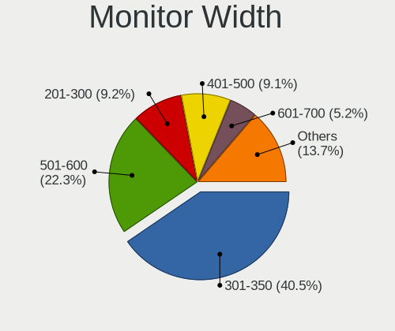
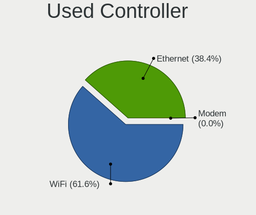
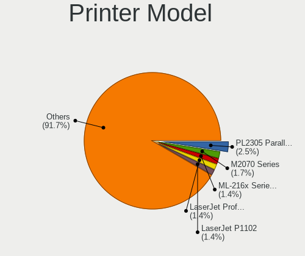
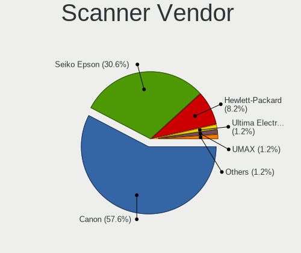

Fedora - Tested Hardware & Statistics
-------------------------------------

A project to collect tested hardware configurations for Fedora.

Anyone can contribute to this report by the [hw-probe](https://github.com/linuxhw/hw-probe) tool:

    sudo -E hw-probe -all -upload

Please contribute! Especially if your hardware is rare.

This is a report for all computer types. See also reports for [desktops](/Dist/Fedora/Desktop/README.md) and [notebooks](/Dist/Fedora/Notebook/README.md).

Contents
--------

* [ Test Cases ](#test-cases)

* [ System ](#system)
  - [ OS                       ](#os)
  - [ OS Family                ](#os-family)
  - [ Kernel                   ](#kernel)
  - [ Kernel Family            ](#kernel-family)
  - [ Kernel Major Ver.        ](#kernel-major-ver)
  - [ Arch                     ](#arch)
  - [ DE                       ](#de)
  - [ Display Server           ](#display-server)
  - [ Display Manager          ](#display-manager)
  - [ OS Lang                  ](#os-lang)
  - [ Boot Mode                ](#boot-mode)
  - [ Filesystem               ](#filesystem)
  - [ Part. scheme             ](#part-scheme)
  - [ Dual Boot with Linux/BSD ](#dual-boot-with-linuxbsd)
  - [ Dual Boot (Win)          ](#dual-boot-win)

* [ Board ](#board)
  - [ Vendor                   ](#vendor)
  - [ Model                    ](#model)
  - [ Model Family             ](#model-family)
  - [ MFG Year                 ](#mfg-year)
  - [ Form Factor              ](#form-factor)
  - [ Secure Boot              ](#secure-boot)
  - [ Coreboot                 ](#coreboot)
  - [ RAM Size                 ](#ram-size)
  - [ RAM Used                 ](#ram-used)
  - [ Total Drives             ](#total-drives)
  - [ Has CD-ROM               ](#has-cd-rom)
  - [ Has Ethernet             ](#has-ethernet)
  - [ Has WiFi                 ](#has-wifi)
  - [ Has Bluetooth            ](#has-bluetooth)

* [ Location ](#location)
  - [ Country                  ](#country)
  - [ City                     ](#city)

* [ Drives ](#drives)
  - [ Drive Vendor             ](#drive-vendor)
  - [ Drive Model              ](#drive-model)
  - [ HDD Vendor               ](#hdd-vendor)
  - [ SSD Vendor               ](#ssd-vendor)
  - [ Drive Kind               ](#drive-kind)
  - [ Drive Connector          ](#drive-connector)
  - [ Drive Size               ](#drive-size)
  - [ Space Total              ](#space-total)
  - [ Space Used               ](#space-used)
  - [ Malfunc. Drives          ](#malfunc-drives)
  - [ Malfunc. Drive Vendor    ](#malfunc-drive-vendor)
  - [ Malfunc. HDD Vendor      ](#malfunc-hdd-vendor)
  - [ Malfunc. Drive Kind      ](#malfunc-drive-kind)
  - [ Failed Drives            ](#failed-drives)
  - [ Failed Drive Vendor      ](#failed-drive-vendor)
  - [ Drive Status             ](#drive-status)

* [ Storage controller ](#storage-controller)
  - [ Storage Vendor           ](#storage-vendor)
  - [ Storage Model            ](#storage-model)
  - [ Storage Kind             ](#storage-kind)

* [ Processor ](#processor)
  - [ CPU Vendor               ](#cpu-vendor)
  - [ CPU Model                ](#cpu-model)
  - [ CPU Model Family         ](#cpu-model-family)
  - [ CPU Cores                ](#cpu-cores)
  - [ CPU Sockets              ](#cpu-sockets)
  - [ CPU Threads              ](#cpu-threads)
  - [ CPU Op-Modes             ](#cpu-op-modes)
  - [ CPU Microcode            ](#cpu-microcode)
  - [ CPU Microarch            ](#cpu-microarch)

* [ Graphics ](#graphics)
  - [ GPU Vendor               ](#gpu-vendor)
  - [ GPU Model                ](#gpu-model)
  - [ GPU Combo                ](#gpu-combo)
  - [ GPU Driver               ](#gpu-driver)
  - [ GPU Memory               ](#gpu-memory)

* [ Monitor ](#monitor)
  - [ Monitor Vendor           ](#monitor-vendor)
  - [ Monitor Model            ](#monitor-model)
  - [ Monitor Resolution       ](#monitor-resolution)
  - [ Monitor Diagonal         ](#monitor-diagonal)
  - [ Monitor Width            ](#monitor-width)
  - [ Aspect Ratio             ](#aspect-ratio)
  - [ Monitor Area             ](#monitor-area)
  - [ Pixel Density            ](#pixel-density)
  - [ Multiple Monitors        ](#multiple-monitors)

* [ Network ](#network)
  - [ Net Controller Vendor    ](#net-controller-vendor)
  - [ Net Controller Model     ](#net-controller-model)
  - [ Wireless Vendor          ](#wireless-vendor)
  - [ Wireless Model           ](#wireless-model)
  - [ Ethernet Vendor          ](#ethernet-vendor)
  - [ Ethernet Model           ](#ethernet-model)
  - [ Net Controller Kind      ](#net-controller-kind)
  - [ Used Controller          ](#used-controller)
  - [ NICs                     ](#nics)
  - [ IPv6                     ](#ipv6)

* [ Bluetooth ](#bluetooth)
  - [ Bluetooth Vendor         ](#bluetooth-vendor)
  - [ Bluetooth Model          ](#bluetooth-model)

* [ Sound ](#sound)
  - [ Sound Vendor             ](#sound-vendor)
  - [ Sound Model              ](#sound-model)

* [ Memory ](#memory)
  - [ Memory Vendor            ](#memory-vendor)
  - [ Memory Model             ](#memory-model)
  - [ Memory Kind              ](#memory-kind)
  - [ Memory Form Factor       ](#memory-form-factor)
  - [ Memory Size              ](#memory-size)
  - [ Memory Speed             ](#memory-speed)

* [ Printers & scanners ](#printers--scanners)
  - [ Printer Vendor           ](#printer-vendor)
  - [ Printer Model            ](#printer-model)
  - [ Scanner Vendor           ](#scanner-vendor)
  - [ Scanner Model            ](#scanner-model)

* [ Camera ](#camera)
  - [ Camera Vendor            ](#camera-vendor)
  - [ Camera Model             ](#camera-model)

* [ Security ](#security)
  - [ Fingerprint Vendor       ](#fingerprint-vendor)
  - [ Fingerprint Model        ](#fingerprint-model)
  - [ Chipcard Vendor          ](#chipcard-vendor)
  - [ Chipcard Model           ](#chipcard-model)

* [ Unsupported ](#unsupported)
  - [ Unsupported Devices      ](#unsupported-devices)
  - [ Unsupported Device Types ](#unsupported-device-types)

Test Cases
----------

Total: 18431

| Vendor        | Model                       | Form-Factor | Probe                                                      | Date         |
|---------------|-----------------------------|-------------|------------------------------------------------------------|--------------|
| Fujitsu       | LIFEBOOK E780               | Notebook    | [12c5cd0309](https://linux-hardware.org/?probe=12c5cd0309) | Jul 01, 2023 |
| Lenovo        | IdeaPadFlex 5 14ALC05 82... | Convertible | [d772da19a0](https://linux-hardware.org/?probe=d772da19a0) | Jun 30, 2023 |
| Gigabyte      | H410M S2H V3                | Desktop     | [e539937c27](https://linux-hardware.org/?probe=e539937c27) | Jun 30, 2023 |
| Dell          | Inspiron N5110              | Notebook    | [b465607eea](https://linux-hardware.org/?probe=b465607eea) | Jun 30, 2023 |
| Acer          | Predator PO5-640            | Desktop     | [416b01c954](https://linux-hardware.org/?probe=416b01c954) | Jun 30, 2023 |
| Acer          | Aspire A315-23              | Notebook    | [434ba90999](https://linux-hardware.org/?probe=434ba90999) | Jun 30, 2023 |
| HP            | ENVY m6                     | Notebook    | [b4f8d19895](https://linux-hardware.org/?probe=b4f8d19895) | Jun 30, 2023 |
| Gigabyte      | Z87X-UD5H-CF                | Desktop     | [3749bda51b](https://linux-hardware.org/?probe=3749bda51b) | Jun 30, 2023 |
| ASUSTek       | TUF Gaming B550-PLUS WIF... | Desktop     | [3c3556dd33](https://linux-hardware.org/?probe=3c3556dd33) | Jun 30, 2023 |
| Gigabyte      | Z87X-UD5H-CF                | Desktop     | [6ee8476c0e](https://linux-hardware.org/?probe=6ee8476c0e) | Jun 30, 2023 |
| Dell          | Inspiron N5010              | Notebook    | [eab5331f66](https://linux-hardware.org/?probe=eab5331f66) | Jun 30, 2023 |
| ASUSTek       | VivoBook_ASUSLaptop M560... | Notebook    | [5dd37cbc97](https://linux-hardware.org/?probe=5dd37cbc97) | Jun 30, 2023 |
| Dell          | Inspiron N5110              | Notebook    | [0668932749](https://linux-hardware.org/?probe=0668932749) | Jun 30, 2023 |
| Google        | Eldrid                      | Notebook    | [4e08107dd6](https://linux-hardware.org/?probe=4e08107dd6) | Jun 30, 2023 |
| ASRock        | FM2A88X Extreme6+           | Desktop     | [77e6b09eb9](https://linux-hardware.org/?probe=77e6b09eb9) | Jun 30, 2023 |
| Dell          | Vostro 2520                 | Notebook    | [48d04d8282](https://linux-hardware.org/?probe=48d04d8282) | Jun 30, 2023 |
| MSI           | X99A RAIDER                 | Desktop     | [bb8a8eac46](https://linux-hardware.org/?probe=bb8a8eac46) | Jun 30, 2023 |
| Apple         | MacBookPro12,1              | Notebook    | [997b1fe1f8](https://linux-hardware.org/?probe=997b1fe1f8) | Jun 30, 2023 |
| Lenovo        | ThinkPad X1 Yoga 3rd 20L... | Convertible | [394788bdc8](https://linux-hardware.org/?probe=394788bdc8) | Jun 30, 2023 |
| AZW           | MINI S 10                   | Desktop     | [84eec8c276](https://linux-hardware.org/?probe=84eec8c276) | Jun 29, 2023 |
| AZW           | MINI S 10                   | Desktop     | [d1795fbf64](https://linux-hardware.org/?probe=d1795fbf64) | Jun 29, 2023 |
| HP            | ProBook x360 435 G8 Note... | Convertible | [a64b48a5a2](https://linux-hardware.org/?probe=a64b48a5a2) | Jun 29, 2023 |
| Apple         | Mac-BE088AF8C5EB4FA2 iMa... | All in one  | [e21f5d35bb](https://linux-hardware.org/?probe=e21f5d35bb) | Jun 29, 2023 |
| HP            | Pavilion 11 x360 PC         | Notebook    | [cfbc8c8a97](https://linux-hardware.org/?probe=cfbc8c8a97) | Jun 29, 2023 |
| MSI           | PS63 Modern 8SC             | Notebook    | [dcbb8108cf](https://linux-hardware.org/?probe=dcbb8108cf) | Jun 29, 2023 |
| Gigabyte      | H310M H                     | Desktop     | [0ad496c06d](https://linux-hardware.org/?probe=0ad496c06d) | Jun 29, 2023 |
| Dell          | Latitude 5521               | Notebook    | [3a8f3794aa](https://linux-hardware.org/?probe=3a8f3794aa) | Jun 29, 2023 |
| Gigabyte      | H410M H V3                  | Desktop     | [5496b9130e](https://linux-hardware.org/?probe=5496b9130e) | Jun 29, 2023 |
| Lenovo        | ThinkPad X1 Carbon 2nd 2... | Notebook    | [df0ca94515](https://linux-hardware.org/?probe=df0ca94515) | Jun 29, 2023 |
| ASUSTek       | ROG STRIX X670E-E GAMING... | Desktop     | [95fb20193a](https://linux-hardware.org/?probe=95fb20193a) | Jun 29, 2023 |
| ASUSTek       | PRIME B550M-A               | Desktop     | [5bb4af3f8b](https://linux-hardware.org/?probe=5bb4af3f8b) | Jun 29, 2023 |
| Lenovo        | ThinkBook 14p Gen 3 21EJ    | Notebook    | [0086cae258](https://linux-hardware.org/?probe=0086cae258) | Jun 29, 2023 |
| Google        | Nami                        | Notebook    | [6ffc403580](https://linux-hardware.org/?probe=6ffc403580) | Jun 29, 2023 |
| Lenovo        | ThinkPad X1 Yoga 3rd 20L... | Convertible | [2a5ae27f54](https://linux-hardware.org/?probe=2a5ae27f54) | Jun 29, 2023 |
| Acer          | Aspire 5745G                | Notebook    | [c3394b9eb0](https://linux-hardware.org/?probe=c3394b9eb0) | Jun 28, 2023 |
| Apple         | MacBookAir7,2               | Notebook    | [92a71d25d7](https://linux-hardware.org/?probe=92a71d25d7) | Jun 28, 2023 |
| Microsoft     | Surface Laptop 4            | Tablet      | [6e6779c5d6](https://linux-hardware.org/?probe=6e6779c5d6) | Jun 28, 2023 |
| ASUSTek       | ROG STRIX B650E-F GAMING... | Desktop     | [08708e8e9d](https://linux-hardware.org/?probe=08708e8e9d) | Jun 28, 2023 |
| ASUSTek       | ROG Zephyrus G15 GA502IV... | Notebook    | [76e11b36e9](https://linux-hardware.org/?probe=76e11b36e9) | Jun 28, 2023 |
| ASUSTek       | PRIME H310M-K R2.0          | Desktop     | [3f9d0da410](https://linux-hardware.org/?probe=3f9d0da410) | Jun 28, 2023 |
| Acer          | Aspire A315-23              | Notebook    | [36f9eb51e6](https://linux-hardware.org/?probe=36f9eb51e6) | Jun 28, 2023 |
| Gigabyte      | B560M DS3H V2               | Desktop     | [aa24aa071b](https://linux-hardware.org/?probe=aa24aa071b) | Jun 28, 2023 |
| Dell          | Precision M6500             | Notebook    | [1db851fd5d](https://linux-hardware.org/?probe=1db851fd5d) | Jun 28, 2023 |
| MSI           | 880GM-E41                   | Desktop     | [91a2474332](https://linux-hardware.org/?probe=91a2474332) | Jun 28, 2023 |
| Fill By OE... | Q7700                       | Desktop     | [93c7c01ecb](https://linux-hardware.org/?probe=93c7c01ecb) | Jun 28, 2023 |
| ASRock        | H510M-HVS                   | Desktop     | [b90f532588](https://linux-hardware.org/?probe=b90f532588) | Jun 28, 2023 |
| Dell          | XPS 15 9510                 | Notebook    | [0294ef5e1f](https://linux-hardware.org/?probe=0294ef5e1f) | Jun 28, 2023 |
| Lenovo        | G500s 20245                 | Notebook    | [1aa332e26f](https://linux-hardware.org/?probe=1aa332e26f) | Jun 27, 2023 |
| HP            | EliteBook 8440p             | Notebook    | [3d2a2196ae](https://linux-hardware.org/?probe=3d2a2196ae) | Jun 27, 2023 |
| HP            | 802F                        | Desktop     | [585f9bf338](https://linux-hardware.org/?probe=585f9bf338) | Jun 27, 2023 |
| HP            | 802F                        | Desktop     | [efceba0028](https://linux-hardware.org/?probe=efceba0028) | Jun 27, 2023 |
| HP            | Pavilion g6                 | Notebook    | [ec6a70b7d4](https://linux-hardware.org/?probe=ec6a70b7d4) | Jun 27, 2023 |
| AMI           | Aptio CRB                   | Mini pc     | [8c2e9b8870](https://linux-hardware.org/?probe=8c2e9b8870) | Jun 27, 2023 |
| Dell          | Inspiron 3543               | Notebook    | [4baea798b1](https://linux-hardware.org/?probe=4baea798b1) | Jun 27, 2023 |
| Intel Clie... | LAPRC710                    | Notebook    | [5aabe7850a](https://linux-hardware.org/?probe=5aabe7850a) | Jun 27, 2023 |
| Lenovo        | Legion 5 15ACH6H 82JU       | Notebook    | [c05a780b64](https://linux-hardware.org/?probe=c05a780b64) | Jun 27, 2023 |
| Lenovo        | IdeaPad Gaming 3 15ACH6 ... | Notebook    | [24d66c058b](https://linux-hardware.org/?probe=24d66c058b) | Jun 27, 2023 |
| Apple         | Mac-031AEE4D24BFF0B1 Mac... | Mini pc     | [c3ae8b2d38](https://linux-hardware.org/?probe=c3ae8b2d38) | Jun 27, 2023 |
| ASUSTek       | TUF Gaming FX505DT_FX505... | Notebook    | [39ec9cf6c4](https://linux-hardware.org/?probe=39ec9cf6c4) | Jun 27, 2023 |
| Lenovo        | Yoga Slim 7 Carbon 13ITL... | Notebook    | [78b698279a](https://linux-hardware.org/?probe=78b698279a) | Jun 27, 2023 |
| Intel         | LADPNVMO AAE76523-300       | Desktop     | [76cc7bbb86](https://linux-hardware.org/?probe=76cc7bbb86) | Jun 27, 2023 |
| Fill By OE... | Q7700                       | Desktop     | [32ac9cb839](https://linux-hardware.org/?probe=32ac9cb839) | Jun 27, 2023 |
| HP            | ENVY Laptop 17-ch2xxx       | Notebook    | [41e22753cc](https://linux-hardware.org/?probe=41e22753cc) | Jun 27, 2023 |
| Dell          | 0R6PCT A01                  | Desktop     | [2fd7aa28db](https://linux-hardware.org/?probe=2fd7aa28db) | Jun 27, 2023 |
| Lenovo        | ThinkPad Z13 Gen 1 21D20... | Notebook    | [7487f61ff1](https://linux-hardware.org/?probe=7487f61ff1) | Jun 26, 2023 |
| Gigabyte      | B450M DS3H-CF               | Desktop     | [b21d5b2e0a](https://linux-hardware.org/?probe=b21d5b2e0a) | Jun 26, 2023 |
| HP            | EliteBook 850 G8 Noteboo... | Notebook    | [e16689358e](https://linux-hardware.org/?probe=e16689358e) | Jun 26, 2023 |
| ASUSTek       | T102HA                      | Tablet      | [09acdc7c4a](https://linux-hardware.org/?probe=09acdc7c4a) | Jun 26, 2023 |
| Gigabyte      | MZBAYAB-00                  | Desktop     | [a44397603c](https://linux-hardware.org/?probe=a44397603c) | Jun 26, 2023 |
| Lenovo        | ThinkPad X1 Carbon 6th 2... | Notebook    | [253fb546a2](https://linux-hardware.org/?probe=253fb546a2) | Jun 26, 2023 |
| Acer          | Nitro AN515-55              | Notebook    | [e5b49b2807](https://linux-hardware.org/?probe=e5b49b2807) | Jun 26, 2023 |
| Acer          | Nitro AN515-55              | Notebook    | [49c7e22c1e](https://linux-hardware.org/?probe=49c7e22c1e) | Jun 26, 2023 |
| Dell          | PowerEdge R720xd            | Server      | [4570023480](https://linux-hardware.org/?probe=4570023480) | Jun 26, 2023 |
| Toshiba       | TECRA R950                  | Notebook    | [f02bb9a43a](https://linux-hardware.org/?probe=f02bb9a43a) | Jun 26, 2023 |
| ASUSTek       | X510UAR                     | Notebook    | [22372b435f](https://linux-hardware.org/?probe=22372b435f) | Jun 26, 2023 |
| ASRock        | FM2A88X Extreme6+           | Desktop     | [a974c1b82e](https://linux-hardware.org/?probe=a974c1b82e) | Jun 26, 2023 |
| MSI           | X99A RAIDER                 | Desktop     | [31fc00f1ac](https://linux-hardware.org/?probe=31fc00f1ac) | Jun 26, 2023 |
| Acer          | Aspire A515-51              | Notebook    | [ee5172b420](https://linux-hardware.org/?probe=ee5172b420) | Jun 26, 2023 |
| Lenovo        | IdeaPad L340-15API 81LW     | Notebook    | [03153f31b2](https://linux-hardware.org/?probe=03153f31b2) | Jun 26, 2023 |
| Lenovo        | ThinkPad T430 2349UA9       | Notebook    | [68117675ab](https://linux-hardware.org/?probe=68117675ab) | Jun 25, 2023 |
| Gigabyte      | Z390 AORUS PRO WIFI-CF      | Desktop     | [3486e43434](https://linux-hardware.org/?probe=3486e43434) | Jun 25, 2023 |
| HP            | Pavilion Laptop 14-bk0xx    | Notebook    | [e6184368a0](https://linux-hardware.org/?probe=e6184368a0) | Jun 25, 2023 |
| Lenovo        | Yoga Slim 7 13ACN5 82CY     | Notebook    | [bfa03ecd27](https://linux-hardware.org/?probe=bfa03ecd27) | Jun 25, 2023 |
| Lenovo        | ThinkPad X230 2324H58       | Notebook    | [bcf8a71bb4](https://linux-hardware.org/?probe=bcf8a71bb4) | Jun 25, 2023 |
| Lenovo        | Yoga Slim 7 13ACN5 82CY     | Notebook    | [58d1b3da16](https://linux-hardware.org/?probe=58d1b3da16) | Jun 25, 2023 |
| HP            | 255 G5 Notebook PC          | Notebook    | [cad891675f](https://linux-hardware.org/?probe=cad891675f) | Jun 25, 2023 |
| ASUSTek       | X540NA                      | Notebook    | [6a01ca36af](https://linux-hardware.org/?probe=6a01ca36af) | Jun 25, 2023 |
| ASUSTek       | X540NA                      | Notebook    | [b5996a0d85](https://linux-hardware.org/?probe=b5996a0d85) | Jun 25, 2023 |
| Lenovo        | ThinkPad X1 Carbon 6th 2... | Notebook    | [29203c5ffe](https://linux-hardware.org/?probe=29203c5ffe) | Jun 25, 2023 |
| HP            | OMEN by Laptop 16-c0xxx     | Notebook    | [3fbef5ec38](https://linux-hardware.org/?probe=3fbef5ec38) | Jun 25, 2023 |
| ASUSTek       | VivoBook_ASUSLaptop K650... | Notebook    | [8a833d8c52](https://linux-hardware.org/?probe=8a833d8c52) | Jun 25, 2023 |
| Acer          | Nitro AN515-55              | Notebook    | [2153f80362](https://linux-hardware.org/?probe=2153f80362) | Jun 25, 2023 |
| ASRock        | FM2A88X Extreme6+           | Desktop     | [1c648f1f3e](https://linux-hardware.org/?probe=1c648f1f3e) | Jun 25, 2023 |
| MSI           | X99A RAIDER                 | Desktop     | [684000f2c5](https://linux-hardware.org/?probe=684000f2c5) | Jun 25, 2023 |
| Lenovo        | V14 G2 ALC 82KC             | Notebook    | [40cbc38a69](https://linux-hardware.org/?probe=40cbc38a69) | Jun 25, 2023 |
| Google        | Nami                        | Notebook    | [f9f785f70d](https://linux-hardware.org/?probe=f9f785f70d) | Jun 25, 2023 |
| Gigabyte      | H110M-H-CF                  | Desktop     | [7baa53c127](https://linux-hardware.org/?probe=7baa53c127) | Jun 25, 2023 |
| Lenovo        | ThinkPad T470s W10DG 20J... | Notebook    | [75f62d2200](https://linux-hardware.org/?probe=75f62d2200) | Jun 24, 2023 |
| ASUSTek       | P9X79 PRO                   | Desktop     | [3d1eeda7fa](https://linux-hardware.org/?probe=3d1eeda7fa) | Jun 24, 2023 |
| Dell          | 088DT1 A01                  | Desktop     | [755d1f8c03](https://linux-hardware.org/?probe=755d1f8c03) | Jun 24, 2023 |
| Dell          | Precision 5510              | Notebook    | [38d61a4475](https://linux-hardware.org/?probe=38d61a4475) | Jun 24, 2023 |
| HP            | Pavilion Notebook           | Notebook    | [e80fd49ba9](https://linux-hardware.org/?probe=e80fd49ba9) | Jun 24, 2023 |
| Dell          | Vostro 2520                 | Notebook    | [9279842ec3](https://linux-hardware.org/?probe=9279842ec3) | Jun 24, 2023 |
| MSI           | Modern 14 A10M              | Notebook    | [fcc6786de6](https://linux-hardware.org/?probe=fcc6786de6) | Jun 24, 2023 |
| HP            | EliteBook 840 G5            | Notebook    | [4ad837baa7](https://linux-hardware.org/?probe=4ad837baa7) | Jun 24, 2023 |
| Dell          | Inspiron 15 3515            | Notebook    | [77473ea84c](https://linux-hardware.org/?probe=77473ea84c) | Jun 24, 2023 |
| ASUSTek       | M5A78L-M/USB3               | Desktop     | [1c0d2d86f3](https://linux-hardware.org/?probe=1c0d2d86f3) | Jun 24, 2023 |
| Lenovo        | IdeaPad 5 14ABA7 82SE       | Notebook    | [99efa1a1c5](https://linux-hardware.org/?probe=99efa1a1c5) | Jun 24, 2023 |
| Lenovo        | Yoga Pro 7 14IRH8 82Y7      | Notebook    | [a74b5c2880](https://linux-hardware.org/?probe=a74b5c2880) | Jun 24, 2023 |
| HP            | Spectre x360 Convertible... | Convertible | [27c389d734](https://linux-hardware.org/?probe=27c389d734) | Jun 24, 2023 |
| HP            | Laptop 15s-eq2xxx           | Notebook    | [b4c9b0d1f7](https://linux-hardware.org/?probe=b4c9b0d1f7) | Jun 24, 2023 |
| Xplore        | iX104C6                     | Notebook    | [23bb4c656b](https://linux-hardware.org/?probe=23bb4c656b) | Jun 24, 2023 |
| ASUSTek       | P8Z77-V LK                  | Desktop     | [bcfc1fe2de](https://linux-hardware.org/?probe=bcfc1fe2de) | Jun 23, 2023 |
| Lenovo        | ThinkPad X1 Nano Gen 2 2... | Notebook    | [f51aeb6252](https://linux-hardware.org/?probe=f51aeb6252) | Jun 23, 2023 |
| Lenovo        | ThinkPad P15 Gen 1 20ST0... | Notebook    | [e44e80fc33](https://linux-hardware.org/?probe=e44e80fc33) | Jun 23, 2023 |
| Lenovo        | 00YJ434 SVT                 | Server      | [ba92d2c25b](https://linux-hardware.org/?probe=ba92d2c25b) | Jun 23, 2023 |
| Apple         | Mac-AA95B1DDAB278B95 iMa... | All in one  | [4c4335bcff](https://linux-hardware.org/?probe=4c4335bcff) | Jun 23, 2023 |
| Lenovo        | ThinkPad X1 Carbon 5th 2... | Notebook    | [7b187eac86](https://linux-hardware.org/?probe=7b187eac86) | Jun 23, 2023 |
| Lenovo        | IdeaPad L340-15IRH Gamin... | Notebook    | [ae40c874ae](https://linux-hardware.org/?probe=ae40c874ae) | Jun 23, 2023 |
| Lenovo        | IdeaPad L340-15IRH Gamin... | Notebook    | [505b340648](https://linux-hardware.org/?probe=505b340648) | Jun 23, 2023 |
| Oracle        | ASM,MOTHERBOARD,1U          | Server      | [cb71d1574c](https://linux-hardware.org/?probe=cb71d1574c) | Jun 23, 2023 |
| Lenovo        | ThinkPad T460s 20FAS0NF0... | Notebook    | [f2e368a70d](https://linux-hardware.org/?probe=f2e368a70d) | Jun 23, 2023 |
| ASRock        | B450 Pro4                   | Desktop     | [a5f281a10e](https://linux-hardware.org/?probe=a5f281a10e) | Jun 23, 2023 |
| ASUSTek       | M4A77                       | Desktop     | [67e6b51c63](https://linux-hardware.org/?probe=67e6b51c63) | Jun 23, 2023 |
| AZW           | SER                         | Mini pc     | [4375fcb36a](https://linux-hardware.org/?probe=4375fcb36a) | Jun 23, 2023 |
| MSI           | B450M PRO-M2 V2             | Desktop     | [af46eedb6f](https://linux-hardware.org/?probe=af46eedb6f) | Jun 23, 2023 |
| ASUSTek       | PRIME B350M-A               | Desktop     | [efb0264470](https://linux-hardware.org/?probe=efb0264470) | Jun 23, 2023 |
| Lenovo        | ThinkPad X1 Carbon 5th 2... | Notebook    | [06977283b8](https://linux-hardware.org/?probe=06977283b8) | Jun 22, 2023 |
| HP            | Compaq 6710b (GF940AT#AB... | Notebook    | [75199aaf80](https://linux-hardware.org/?probe=75199aaf80) | Jun 22, 2023 |
| HONOR         | NBR-WAX9                    | Notebook    | [dfeaf221e6](https://linux-hardware.org/?probe=dfeaf221e6) | Jun 22, 2023 |
| ASUSTek       | PN64                        | Mini pc     | [c63cf5f434](https://linux-hardware.org/?probe=c63cf5f434) | Jun 22, 2023 |
| Positivo B... | VJFE43F11X-XXXXXX           | Notebook    | [e03310c8e8](https://linux-hardware.org/?probe=e03310c8e8) | Jun 22, 2023 |
| ASUSTek       | Maximus VIII RANGER Modi... | Desktop     | [d24120bc4e](https://linux-hardware.org/?probe=d24120bc4e) | Jun 22, 2023 |
| Samsung       | 750QFG                      | Convertible | [6e0e03a83e](https://linux-hardware.org/?probe=6e0e03a83e) | Jun 22, 2023 |
| Lenovo        | G500s 20245                 | Notebook    | [17db397c48](https://linux-hardware.org/?probe=17db397c48) | Jun 22, 2023 |
| MSI           | PRO B550M-VC WIFI           | Desktop     | [c9f86c15b7](https://linux-hardware.org/?probe=c9f86c15b7) | Jun 22, 2023 |
| iRU           | J231                        | All in one  | [3002ce753a](https://linux-hardware.org/?probe=3002ce753a) | Jun 22, 2023 |
| Lenovo        | ThinkServer TS140           | Desktop     | [5043d686d8](https://linux-hardware.org/?probe=5043d686d8) | Jun 22, 2023 |
| Lenovo        | ThinkPad E14 Gen 3 20Y70... | Notebook    | [aa0f45d3f1](https://linux-hardware.org/?probe=aa0f45d3f1) | Jun 22, 2023 |
| ASUSTek       | ROG Zephyrus G15 GA503RS... | Notebook    | [7782ddf809](https://linux-hardware.org/?probe=7782ddf809) | Jun 22, 2023 |
| ASUSTek       | ROG STRIX B650E-F GAMING... | Desktop     | [b07361bc89](https://linux-hardware.org/?probe=b07361bc89) | Jun 22, 2023 |
| MSI           | MAG X570S TOMAHAWK MAX W... | Desktop     | [52bcb712ec](https://linux-hardware.org/?probe=52bcb712ec) | Jun 22, 2023 |
| Lenovo        | ThinkPad P15 Gen 1 20ST0... | Notebook    | [e8e25f684e](https://linux-hardware.org/?probe=e8e25f684e) | Jun 22, 2023 |
| Framework     | Laptop                      | Notebook    | [eb51a9a662](https://linux-hardware.org/?probe=eb51a9a662) | Jun 22, 2023 |
| Apple         | MacBookAir5,2               | Notebook    | [8f6d75c75e](https://linux-hardware.org/?probe=8f6d75c75e) | Jun 22, 2023 |
| TUXEDO        | Pulse 15 Gen2               | Notebook    | [8158959dbd](https://linux-hardware.org/?probe=8158959dbd) | Jun 22, 2023 |
| Lenovo        | SHARKBAY NOK                | Desktop     | [c0f250b2f9](https://linux-hardware.org/?probe=c0f250b2f9) | Jun 22, 2023 |
| HP            | EliteBook 865 16 inch G9... | Notebook    | [e4407d328d](https://linux-hardware.org/?probe=e4407d328d) | Jun 22, 2023 |
| Lenovo        | ThinkPad L480 20LS002YMX    | Notebook    | [9c9702483c](https://linux-hardware.org/?probe=9c9702483c) | Jun 22, 2023 |
| ASUSTek       | ROG Zephyrus M15 GU502LU... | Notebook    | [a2e5b66940](https://linux-hardware.org/?probe=a2e5b66940) | Jun 22, 2023 |
| HP            | Spectre x360 Convertible... | Convertible | [71d10fdd86](https://linux-hardware.org/?probe=71d10fdd86) | Jun 22, 2023 |
| Unknown       | Unknown                     | Desktop     | [172c84a53d](https://linux-hardware.org/?probe=172c84a53d) | Jun 22, 2023 |
| HP            | EliteBook 850 G6            | Notebook    | [a68e387274](https://linux-hardware.org/?probe=a68e387274) | Jun 21, 2023 |
| Dell          | 09KPNV A01                  | Desktop     | [eaa3017d03](https://linux-hardware.org/?probe=eaa3017d03) | Jun 21, 2023 |
| ASUSTek       | ProArt Z690-CREATOR WIFI    | Desktop     | [30f85c0f2e](https://linux-hardware.org/?probe=30f85c0f2e) | Jun 21, 2023 |
| ASUSTek       | TUF Gaming X570-PLUS        | Desktop     | [fd367d0725](https://linux-hardware.org/?probe=fd367d0725) | Jun 21, 2023 |
| HUAWEI        | BOHK-WAX9X                  | Notebook    | [510604914c](https://linux-hardware.org/?probe=510604914c) | Jun 21, 2023 |
| HUAWEI        | BOHK-WAX9X                  | Notebook    | [ab169bfbfd](https://linux-hardware.org/?probe=ab169bfbfd) | Jun 21, 2023 |
| ASUSTek       | ZenBook UX425IA_UM425IA     | Notebook    | [61ba243843](https://linux-hardware.org/?probe=61ba243843) | Jun 21, 2023 |
| Lenovo        | ThinkPad T440p 20AWS02V0... | Notebook    | [bed60c3010](https://linux-hardware.org/?probe=bed60c3010) | Jun 21, 2023 |
| HUAWEI        | NBD-WXX9                    | Notebook    | [4e7d62b30a](https://linux-hardware.org/?probe=4e7d62b30a) | Jun 21, 2023 |
| HP            | ProBook 450 G2              | Notebook    | [60babdeb16](https://linux-hardware.org/?probe=60babdeb16) | Jun 21, 2023 |
| Lenovo        | IdeaPad 5 Pro 14ACN6 82L... | Notebook    | [e26b3e6d58](https://linux-hardware.org/?probe=e26b3e6d58) | Jun 21, 2023 |
| Lenovo        | IdeaPad 5 Pro 14ACN6 82L... | Notebook    | [0b6bb0a043](https://linux-hardware.org/?probe=0b6bb0a043) | Jun 21, 2023 |
| Notebook      | NV4xPZ                      | Notebook    | [873c70b184](https://linux-hardware.org/?probe=873c70b184) | Jun 21, 2023 |
| Lenovo        | Yoga Slim 7 Carbon 13ITL... | Notebook    | [73306c60af](https://linux-hardware.org/?probe=73306c60af) | Jun 21, 2023 |
| ASUSTek       | PRIME B550M-A               | Desktop     | [a5e833c54e](https://linux-hardware.org/?probe=a5e833c54e) | Jun 21, 2023 |
| Dell          | Latitude E6410              | Notebook    | [0d9054df1e](https://linux-hardware.org/?probe=0d9054df1e) | Jun 21, 2023 |
| ASUSTek       | Z87-A                       | Desktop     | [ca84827c75](https://linux-hardware.org/?probe=ca84827c75) | Jun 21, 2023 |
| ASUSTek       | Z87-A                       | Desktop     | [a30c01fab8](https://linux-hardware.org/?probe=a30c01fab8) | Jun 21, 2023 |
| ASUSTek       | TUF B360-PRO GAMING WIFI    | Desktop     | [52e2d1b77a](https://linux-hardware.org/?probe=52e2d1b77a) | Jun 21, 2023 |
| Pegatron      | IPMIP-H55-INSPUR            | Desktop     | [176a1c3e01](https://linux-hardware.org/?probe=176a1c3e01) | Jun 21, 2023 |
| Gigabyte      | Z370 AORUS Gaming 5-CF      | Desktop     | [a1e0b61e89](https://linux-hardware.org/?probe=a1e0b61e89) | Jun 20, 2023 |
| HP            | EliteBook 840 G6            | Notebook    | [8d35565fd3](https://linux-hardware.org/?probe=8d35565fd3) | Jun 20, 2023 |
| Dell          | XPS 13 9350                 | Notebook    | [3aa5f3f213](https://linux-hardware.org/?probe=3aa5f3f213) | Jun 20, 2023 |
| Lenovo        | ThinkBook 15 G4 IAP 21DJ    | Notebook    | [8550e224ec](https://linux-hardware.org/?probe=8550e224ec) | Jun 20, 2023 |
| MSI           | X570-A PRO                  | Desktop     | [b968cb073e](https://linux-hardware.org/?probe=b968cb073e) | Jun 20, 2023 |
| Lenovo        | IdeaPad S540-14IWL 81ND     | Notebook    | [3be3d70197](https://linux-hardware.org/?probe=3be3d70197) | Jun 20, 2023 |
| Dell          | Latitude 5289               | Notebook    | [cb492423ed](https://linux-hardware.org/?probe=cb492423ed) | Jun 20, 2023 |
| ASUSTek       | Rampage V EXTREME           | Desktop     | [e7bb42d6d4](https://linux-hardware.org/?probe=e7bb42d6d4) | Jun 20, 2023 |
| MSI           | Modern 14 B4MW              | Notebook    | [11edb8696f](https://linux-hardware.org/?probe=11edb8696f) | Jun 20, 2023 |
| ASUSTek       | Rampage V EXTREME           | Desktop     | [2fe4bf8ad2](https://linux-hardware.org/?probe=2fe4bf8ad2) | Jun 20, 2023 |
| MSI           | Modern 14 B4MW              | Notebook    | [2df6a58651](https://linux-hardware.org/?probe=2df6a58651) | Jun 20, 2023 |
| Lenovo        | ThinkPad X1 Carbon 6th 2... | Notebook    | [1595a5adbd](https://linux-hardware.org/?probe=1595a5adbd) | Jun 20, 2023 |
| Lenovo        | Legion Y540-17IRH 81Q4      | Notebook    | [530f6272c9](https://linux-hardware.org/?probe=530f6272c9) | Jun 20, 2023 |
| Gigabyte      | B450 I AORUS PRO WIFI-CF    | Desktop     | [b154e92f35](https://linux-hardware.org/?probe=b154e92f35) | Jun 20, 2023 |
| MSI           | B75MA-P45                   | Desktop     | [2d8b92b0e6](https://linux-hardware.org/?probe=2d8b92b0e6) | Jun 20, 2023 |
| Gigabyte      | B450 I AORUS PRO WIFI-CF    | Desktop     | [ee8a4e18c4](https://linux-hardware.org/?probe=ee8a4e18c4) | Jun 20, 2023 |
| Dell          | Inspiron 7415 2-in-1        | Convertible | [744e0e7188](https://linux-hardware.org/?probe=744e0e7188) | Jun 20, 2023 |
| ASUSTek       | VivoBook_ASUSLaptop K660... | Notebook    | [3e3987b43f](https://linux-hardware.org/?probe=3e3987b43f) | Jun 20, 2023 |
| Lenovo        | ThinkPad Yoga 11e 5th Ge... | Convertible | [2a1262580e](https://linux-hardware.org/?probe=2a1262580e) | Jun 20, 2023 |
| HP            | ENVY x360 Convertible 15... | Convertible | [06a28c4a80](https://linux-hardware.org/?probe=06a28c4a80) | Jun 20, 2023 |
| Lenovo        | IdeaPad S340-15IIL 81VW     | Notebook    | [82927c0cb7](https://linux-hardware.org/?probe=82927c0cb7) | Jun 20, 2023 |
| HP            | Pavilion Laptop 14-bk0xx    | Notebook    | [063ce55dd5](https://linux-hardware.org/?probe=063ce55dd5) | Jun 20, 2023 |
| ASUSTek       | ROG Zephyrus G14 GA401IV... | Notebook    | [e5db90d1b4](https://linux-hardware.org/?probe=e5db90d1b4) | Jun 20, 2023 |
| Gigabyte      | MZBAYAB-00                  | Desktop     | [5864261490](https://linux-hardware.org/?probe=5864261490) | Jun 20, 2023 |
| HP            | EliteBook 840 G6            | Notebook    | [058b2ea405](https://linux-hardware.org/?probe=058b2ea405) | Jun 20, 2023 |
| Lenovo        | IdeaPadFlex 5 14ARE05 81... | Convertible | [e1c2d99faa](https://linux-hardware.org/?probe=e1c2d99faa) | Jun 19, 2023 |
| Lenovo        | IdeaPadFlex 5 14ARE05 81... | Convertible | [7fe527c4fa](https://linux-hardware.org/?probe=7fe527c4fa) | Jun 19, 2023 |
| Itautec       | ST 4265 ST-4265 Padrao 0... | Desktop     | [689b10e4be](https://linux-hardware.org/?probe=689b10e4be) | Jun 19, 2023 |
| Lenovo        | Legion 5 15ACH6A 82NW       | Notebook    | [f38684c33d](https://linux-hardware.org/?probe=f38684c33d) | Jun 19, 2023 |
| Dell          | Latitude E7470              | Notebook    | [645538d81e](https://linux-hardware.org/?probe=645538d81e) | Jun 19, 2023 |
| Dell          | XPS 15 9510                 | Notebook    | [27bfb2de7d](https://linux-hardware.org/?probe=27bfb2de7d) | Jun 19, 2023 |
| Toshiba       | Satellite A300              | Notebook    | [f37d67a18d](https://linux-hardware.org/?probe=f37d67a18d) | Jun 19, 2023 |
| Acer          | Aspire A515-46              | Notebook    | [e40e63fa5f](https://linux-hardware.org/?probe=e40e63fa5f) | Jun 19, 2023 |
| Lenovo        | Legion R7000P2021 82JW      | Notebook    | [df59b5e8b7](https://linux-hardware.org/?probe=df59b5e8b7) | Jun 19, 2023 |
| HP            | ENVY x360 Convertible 13... | Convertible | [d196994309](https://linux-hardware.org/?probe=d196994309) | Jun 19, 2023 |
| HP            | ENVY x360 Convertible 15... | Convertible | [bd1d19c56b](https://linux-hardware.org/?probe=bd1d19c56b) | Jun 19, 2023 |
| Gigabyte      | B365M D2V                   | Desktop     | [e16cbf315f](https://linux-hardware.org/?probe=e16cbf315f) | Jun 19, 2023 |
| Lenovo        | ThinkPad P53 20QN0011IV     | Notebook    | [65385cc189](https://linux-hardware.org/?probe=65385cc189) | Jun 19, 2023 |
| Lenovo        | Legion 5 82B5               | Notebook    | [146ef72817](https://linux-hardware.org/?probe=146ef72817) | Jun 19, 2023 |
| ASUSTek       | ROG CROSSHAIR VIII IMPAC... | Desktop     | [b3e34f06a4](https://linux-hardware.org/?probe=b3e34f06a4) | Jun 19, 2023 |
| HP            | ENVY 15                     | Notebook    | [101fb8810b](https://linux-hardware.org/?probe=101fb8810b) | Jun 19, 2023 |
| Gigabyte      | GA-MA785G-UD3H              | Desktop     | [e5740353af](https://linux-hardware.org/?probe=e5740353af) | Jun 19, 2023 |
| Lenovo        | Yoga 3 Pro-1370 80HE        | Notebook    | [125b4fefa5](https://linux-hardware.org/?probe=125b4fefa5) | Jun 19, 2023 |
| Razer         | Blade 15 Advanced Model ... | Notebook    | [7dd15a9fa4](https://linux-hardware.org/?probe=7dd15a9fa4) | Jun 19, 2023 |
| HP            | Pavilion Laptop 15-eg2xx... | Notebook    | [8a88cbb916](https://linux-hardware.org/?probe=8a88cbb916) | Jun 19, 2023 |
| Lenovo        | ThinkPad E14 Gen 3 20Y70... | Notebook    | [0806a6be0a](https://linux-hardware.org/?probe=0806a6be0a) | Jun 19, 2023 |
| HP            | Pavilion Notebook           | Notebook    | [ce3c5bc056](https://linux-hardware.org/?probe=ce3c5bc056) | Jun 18, 2023 |
| Dell          | 0C2XKD A01                  | Desktop     | [15331b91ed](https://linux-hardware.org/?probe=15331b91ed) | Jun 18, 2023 |
| ASUSTek       | PRIME H310M-E R2.0          | Desktop     | [5ff46d41fd](https://linux-hardware.org/?probe=5ff46d41fd) | Jun 18, 2023 |
| Dell          | Inspiron 5559               | Notebook    | [7dc6f3af4b](https://linux-hardware.org/?probe=7dc6f3af4b) | Jun 18, 2023 |
| ASUSTek       | PRIME Z690-P WIFI D4        | Desktop     | [924b6e8d54](https://linux-hardware.org/?probe=924b6e8d54) | Jun 18, 2023 |
| HP            | Pavilion Laptop 15-cc6xx    | Notebook    | [ecf90f8368](https://linux-hardware.org/?probe=ecf90f8368) | Jun 18, 2023 |
| HP            | Pavilion x360 Convertibl... | Convertible | [cf19f7a582](https://linux-hardware.org/?probe=cf19f7a582) | Jun 18, 2023 |
| Dell          | Precision 7540              | Notebook    | [8b9ddcc1d8](https://linux-hardware.org/?probe=8b9ddcc1d8) | Jun 18, 2023 |
| Microsoft     | Surface Go                  | Tablet      | [f266551c9d](https://linux-hardware.org/?probe=f266551c9d) | Jun 18, 2023 |
| Lenovo        | SHARKBAY NOK                | Desktop     | [73a438e6b8](https://linux-hardware.org/?probe=73a438e6b8) | Jun 18, 2023 |
| Lenovo        | IdeaPad 5 Pro 14ACN6 82L... | Notebook    | [50626f77d7](https://linux-hardware.org/?probe=50626f77d7) | Jun 18, 2023 |
| MSI           | X470 GAMING PLUS            | Desktop     | [17c61c0aee](https://linux-hardware.org/?probe=17c61c0aee) | Jun 18, 2023 |
| MSI           | PS63 Modern 8RC             | Notebook    | [f540e88555](https://linux-hardware.org/?probe=f540e88555) | Jun 18, 2023 |
| Intel         | DG965RY AAD41691-301        | Desktop     | [3f18a24757](https://linux-hardware.org/?probe=3f18a24757) | Jun 18, 2023 |
| Gigabyte      | GA-880GM-UD2H               | Desktop     | [fdbe50b1d6](https://linux-hardware.org/?probe=fdbe50b1d6) | Jun 18, 2023 |
| ASUSTek       | ROG STRIX X670E-E GAMING... | Desktop     | [231a3aeb2e](https://linux-hardware.org/?probe=231a3aeb2e) | Jun 18, 2023 |
| Google        | Kefka                       | Notebook    | [86421e3d29](https://linux-hardware.org/?probe=86421e3d29) | Jun 18, 2023 |
| Lenovo        | IdeaPad 3 15ITL6 82H8       | Notebook    | [d5c387d28e](https://linux-hardware.org/?probe=d5c387d28e) | Jun 18, 2023 |
| HP            | Pavilion x2 Detachable      | Tablet      | [e01ed6ab42](https://linux-hardware.org/?probe=e01ed6ab42) | Jun 17, 2023 |
| ASUSTek       | ROG STRIX B550-I GAMING     | Desktop     | [cd87a6b19f](https://linux-hardware.org/?probe=cd87a6b19f) | Jun 17, 2023 |
| Acer          | Aspire E5-574               | Notebook    | [ca656065e5](https://linux-hardware.org/?probe=ca656065e5) | Jun 17, 2023 |
| Dell          | XPS 13 9370                 | Notebook    | [f008a78339](https://linux-hardware.org/?probe=f008a78339) | Jun 17, 2023 |
| HP            | EliteBook x360 1030 G4      | Convertible | [acaa27666b](https://linux-hardware.org/?probe=acaa27666b) | Jun 17, 2023 |
| Dell          | Inspiron 5567               | Notebook    | [92ace6e5ab](https://linux-hardware.org/?probe=92ace6e5ab) | Jun 17, 2023 |
| HP            | Laptop 15-da0xxx            | Notebook    | [7da8691a87](https://linux-hardware.org/?probe=7da8691a87) | Jun 17, 2023 |
| ASUSTek       | ROG STRIX B550-I GAMING     | Desktop     | [ae4661e26f](https://linux-hardware.org/?probe=ae4661e26f) | Jun 17, 2023 |
| Sony          | SVF15213CBW                 | Notebook    | [4fcc62d3ac](https://linux-hardware.org/?probe=4fcc62d3ac) | Jun 17, 2023 |
| ASUSTek       | ROG CROSSHAIR X670E EXTR... | Desktop     | [c555238190](https://linux-hardware.org/?probe=c555238190) | Jun 17, 2023 |
| HP            | Pavilion Gaming Laptop      | Notebook    | [2d5c5b2c80](https://linux-hardware.org/?probe=2d5c5b2c80) | Jun 17, 2023 |
| Framework     | Laptop                      | Notebook    | [3df2b82bc3](https://linux-hardware.org/?probe=3df2b82bc3) | Jun 17, 2023 |
| HP            | ENVY x360 Convertible 13... | Convertible | [cb1add1b88](https://linux-hardware.org/?probe=cb1add1b88) | Jun 17, 2023 |
| Intel         | NUC12WSBi5 M46425-302       | Mini pc     | [79c0cd0257](https://linux-hardware.org/?probe=79c0cd0257) | Jun 17, 2023 |
| HP            | Pavilion Gaming Laptop 1... | Notebook    | [d7e9625e19](https://linux-hardware.org/?probe=d7e9625e19) | Jun 17, 2023 |
| Dell          | Inspiron 3593               | Notebook    | [46ad2c78f7](https://linux-hardware.org/?probe=46ad2c78f7) | Jun 17, 2023 |
| ASUSTek       | PRIME B550M-A               | Desktop     | [7e135be518](https://linux-hardware.org/?probe=7e135be518) | Jun 17, 2023 |
| Google        | Cave                        | Notebook    | [31c31973e1](https://linux-hardware.org/?probe=31c31973e1) | Jun 17, 2023 |
| Apple         | MacBook6,1                  | Notebook    | [913d8d26b9](https://linux-hardware.org/?probe=913d8d26b9) | Jun 17, 2023 |
| Huanan        | X99-ZD4 V2.0                | Desktop     | [be1f0f151e](https://linux-hardware.org/?probe=be1f0f151e) | Jun 16, 2023 |
| ASUSTek       | ROG ZENITH EXTREME          | Desktop     | [5dc49896e5](https://linux-hardware.org/?probe=5dc49896e5) | Jun 16, 2023 |
| MSI           | B85-G43 GAMING              | Desktop     | [93da970965](https://linux-hardware.org/?probe=93da970965) | Jun 16, 2023 |
| ASUSTek       | VivoBook_ASUSLaptop K340... | Notebook    | [edd82d072b](https://linux-hardware.org/?probe=edd82d072b) | Jun 16, 2023 |
| HP            | 212B                        | Desktop     | [134ff203c4](https://linux-hardware.org/?probe=134ff203c4) | Jun 16, 2023 |
| MSI           | B450 GAMING PLUS            | Desktop     | [8a480175f8](https://linux-hardware.org/?probe=8a480175f8) | Jun 16, 2023 |
| Lenovo        | Legion 5 15ACH6A 82NW       | Notebook    | [268b733c44](https://linux-hardware.org/?probe=268b733c44) | Jun 16, 2023 |
| ASUSTek       | ROG STRIX B550-XE GAMING... | Desktop     | [84b103464e](https://linux-hardware.org/?probe=84b103464e) | Jun 16, 2023 |
| MSI           | B450M MORTAR TITANIUM       | Desktop     | [3b83e2ea48](https://linux-hardware.org/?probe=3b83e2ea48) | Jun 16, 2023 |
| MSI           | B450 GAMING PLUS            | Desktop     | [8a3d74a5fa](https://linux-hardware.org/?probe=8a3d74a5fa) | Jun 16, 2023 |
| ASRock        | X399 Phantom Gaming 6       | Desktop     | [aad3ead710](https://linux-hardware.org/?probe=aad3ead710) | Jun 16, 2023 |
| HP            | EliteBook 820 G1            | Notebook    | [4c6361a099](https://linux-hardware.org/?probe=4c6361a099) | Jun 16, 2023 |
| HP            | Laptop 15-bw0xx             | Notebook    | [1b97aa6745](https://linux-hardware.org/?probe=1b97aa6745) | Jun 16, 2023 |
| Lenovo        | ThinkBook 14-IIL 20SL       | Notebook    | [04329cdc14](https://linux-hardware.org/?probe=04329cdc14) | Jun 16, 2023 |
| Lenovo        | Legion 5 Pro 16ACH6H 82J... | Notebook    | [dc892cf2b0](https://linux-hardware.org/?probe=dc892cf2b0) | Jun 16, 2023 |
| Dell          | Latitude 3420               | Notebook    | [a0074970bf](https://linux-hardware.org/?probe=a0074970bf) | Jun 16, 2023 |
| HP            | Pavilion Plus Laptop 14-... | Notebook    | [eb9232a196](https://linux-hardware.org/?probe=eb9232a196) | Jun 16, 2023 |
| MSI           | Prestige 15 A10SC           | Notebook    | [a2426b801a](https://linux-hardware.org/?probe=a2426b801a) | Jun 16, 2023 |
| Gigabyte      | Z370 AORUS Ultra Gaming-... | Desktop     | [9c3bb21706](https://linux-hardware.org/?probe=9c3bb21706) | Jun 16, 2023 |
| ASUSTek       | A8R32-MVP Deluxe            | Desktop     | [29ff056f4a](https://linux-hardware.org/?probe=29ff056f4a) | Jun 16, 2023 |
| MSI           | Z170A GAMING M5             | Desktop     | [a0d460b4a3](https://linux-hardware.org/?probe=a0d460b4a3) | Jun 16, 2023 |
| ASUSTek       | ROG Strix G512LW_G512LW     | Notebook    | [a6a2463b97](https://linux-hardware.org/?probe=a6a2463b97) | Jun 16, 2023 |
| Gigabyte      | H97-HD3                     | Desktop     | [24a487274f](https://linux-hardware.org/?probe=24a487274f) | Jun 16, 2023 |
| HP            | OMEN by Laptop 15-ce0xx     | Notebook    | [89ac5ef04b](https://linux-hardware.org/?probe=89ac5ef04b) | Jun 15, 2023 |
| Acer          | Swift SF114-34              | Notebook    | [32eb9f5dea](https://linux-hardware.org/?probe=32eb9f5dea) | Jun 15, 2023 |
| Acer          | Swift SF114-34              | Notebook    | [9f9ffda2e3](https://linux-hardware.org/?probe=9f9ffda2e3) | Jun 15, 2023 |
| Intel         | NUC6i7KYB H90766-410        | Mini pc     | [b4677c0332](https://linux-hardware.org/?probe=b4677c0332) | Jun 15, 2023 |
| MSI           | MAG B550M MORTAR            | Desktop     | [9604c6211e](https://linux-hardware.org/?probe=9604c6211e) | Jun 15, 2023 |
| Itautec       | ST 4265 ST-4265 Padrao 0... | Desktop     | [ecc8c7d2d0](https://linux-hardware.org/?probe=ecc8c7d2d0) | Jun 15, 2023 |
| Lenovo        | IdeaPad 5 Pro 16ARH7 82S... | Notebook    | [2346d706e3](https://linux-hardware.org/?probe=2346d706e3) | Jun 15, 2023 |
| Itautec       | ST 4265 ST-4265 Padrao 0... | Desktop     | [4cad282848](https://linux-hardware.org/?probe=4cad282848) | Jun 15, 2023 |
| MSI           | Modern 14 B10MW             | Notebook    | [c488929cdc](https://linux-hardware.org/?probe=c488929cdc) | Jun 15, 2023 |
| Dell          | XPS 13 9310                 | Notebook    | [9cba8f7730](https://linux-hardware.org/?probe=9cba8f7730) | Jun 15, 2023 |
| HP            | Laptop 15s-fq0xxx           | Notebook    | [ff98efdef7](https://linux-hardware.org/?probe=ff98efdef7) | Jun 15, 2023 |
| Lenovo        | IdeaPad 5 Pro 14IAP7 82S... | Notebook    | [dd5aaca858](https://linux-hardware.org/?probe=dd5aaca858) | Jun 15, 2023 |
| Lenovo        | G500s 20245                 | Notebook    | [8a04ec65f7](https://linux-hardware.org/?probe=8a04ec65f7) | Jun 15, 2023 |
| HP            | Spectre x360 Convertible... | Convertible | [721dc95455](https://linux-hardware.org/?probe=721dc95455) | Jun 15, 2023 |
| ASUSTek       | ROG STRIX Z690-E GAMING ... | Desktop     | [5a1e944af2](https://linux-hardware.org/?probe=5a1e944af2) | Jun 15, 2023 |
| Dell          | Latitude E7470              | Notebook    | [c4bd47b182](https://linux-hardware.org/?probe=c4bd47b182) | Jun 15, 2023 |
| Lenovo        | ThinkPad L14 Gen 2a 20X6... | Notebook    | [e3e61eef7a](https://linux-hardware.org/?probe=e3e61eef7a) | Jun 15, 2023 |
| Apple         | Mac-031B6874CF7F642A iMa... | All in one  | [f3d2cd0976](https://linux-hardware.org/?probe=f3d2cd0976) | Jun 15, 2023 |
| MSI           | PRO B550M-VC WIFI           | Desktop     | [64e0ce279b](https://linux-hardware.org/?probe=64e0ce279b) | Jun 15, 2023 |
| HP            | 212B                        | Desktop     | [b107461bdd](https://linux-hardware.org/?probe=b107461bdd) | Jun 14, 2023 |
| ASUSTek       | ROG Strix G512LW_G512LW     | Notebook    | [b9d120642c](https://linux-hardware.org/?probe=b9d120642c) | Jun 14, 2023 |
| Gigabyte      | B85M-D3V-A                  | Desktop     | [bbcb31d079](https://linux-hardware.org/?probe=bbcb31d079) | Jun 14, 2023 |
| Dell          | Latitude 7430               | Notebook    | [6cf1c68c1d](https://linux-hardware.org/?probe=6cf1c68c1d) | Jun 14, 2023 |
| Dell          | Inspiron M5010              | Notebook    | [33541731e3](https://linux-hardware.org/?probe=33541731e3) | Jun 14, 2023 |
| ASUSTek       | P5G41C-M LX                 | Desktop     | [7ae654d4e2](https://linux-hardware.org/?probe=7ae654d4e2) | Jun 14, 2023 |
| Lenovo        | ThinkBook 14-IIL 20SL       | Notebook    | [6f4c06d514](https://linux-hardware.org/?probe=6f4c06d514) | Jun 14, 2023 |
| Kllisre       | X99-B5 V1.1                 | Desktop     | [5e22a31b3e](https://linux-hardware.org/?probe=5e22a31b3e) | Jun 14, 2023 |
| Gigabyte      | D525TUD                     | Desktop     | [2d854be38a](https://linux-hardware.org/?probe=2d854be38a) | Jun 14, 2023 |
| ECS           | H61H2-M17                   | Desktop     | [63ded73edb](https://linux-hardware.org/?probe=63ded73edb) | Jun 14, 2023 |
| HP            | ProBook 455 G8 Notebook ... | Notebook    | [57b3c23d43](https://linux-hardware.org/?probe=57b3c23d43) | Jun 14, 2023 |
| Dell          | 0KRC95 A02                  | Desktop     | [5f9a1aafe0](https://linux-hardware.org/?probe=5f9a1aafe0) | Jun 14, 2023 |
| ASUSTek       | TUF B450M-PLUS GAMING       | Desktop     | [ddb9fc5a43](https://linux-hardware.org/?probe=ddb9fc5a43) | Jun 14, 2023 |
| Apple         | Mac-AA95B1DDAB278B95 iMa... | All in one  | [8ad5106aca](https://linux-hardware.org/?probe=8ad5106aca) | Jun 14, 2023 |
| Samsung       | 930QDB                      | Convertible | [f513cc35ed](https://linux-hardware.org/?probe=f513cc35ed) | Jun 14, 2023 |
| ASUSTek       | ROG STRIX B550-E GAMING     | Desktop     | [4fac659113](https://linux-hardware.org/?probe=4fac659113) | Jun 13, 2023 |
| Lenovo        | IdeaPad 330-15IKB 81DE      | Notebook    | [e676294e36](https://linux-hardware.org/?probe=e676294e36) | Jun 13, 2023 |
| Acer          | Aspire 5733                 | Notebook    | [6291133649](https://linux-hardware.org/?probe=6291133649) | Jun 13, 2023 |
| MSI           | H510M PRO                   | Desktop     | [08e44766fe](https://linux-hardware.org/?probe=08e44766fe) | Jun 13, 2023 |
| ECS           | H61H2-M17                   | Desktop     | [fb57cc3ed4](https://linux-hardware.org/?probe=fb57cc3ed4) | Jun 13, 2023 |
| HP            | Pavilion Laptop 15-cs2xx... | Notebook    | [58b9a1f862](https://linux-hardware.org/?probe=58b9a1f862) | Jun 13, 2023 |
| MSI           | IONA                        | Desktop     | [86535af79b](https://linux-hardware.org/?probe=86535af79b) | Jun 13, 2023 |
| Gigabyte      | D525TUD                     | Desktop     | [be2c796ab2](https://linux-hardware.org/?probe=be2c796ab2) | Jun 13, 2023 |
| HP            | Notebook                    | Notebook    | [64232e0a08](https://linux-hardware.org/?probe=64232e0a08) | Jun 13, 2023 |
| Google        | Blooglet                    | Notebook    | [3dedc16acb](https://linux-hardware.org/?probe=3dedc16acb) | Jun 13, 2023 |
| MSI           | Z77A-G45                    | Desktop     | [db1a941e2c](https://linux-hardware.org/?probe=db1a941e2c) | Jun 13, 2023 |
| Gigabyte      | A520M DS3H                  | Desktop     | [0f5b161a60](https://linux-hardware.org/?probe=0f5b161a60) | Jun 13, 2023 |
| Dell          | XPS 17 9710                 | Notebook    | [9ab7a065c4](https://linux-hardware.org/?probe=9ab7a065c4) | Jun 13, 2023 |
| Lenovo        | IdeaPad Gaming 3 15ARH05... | Notebook    | [dc3b9443ef](https://linux-hardware.org/?probe=dc3b9443ef) | Jun 13, 2023 |
| Lenovo        | ThinkPad E14 Gen 2 20TA0... | Notebook    | [ee5c72c283](https://linux-hardware.org/?probe=ee5c72c283) | Jun 13, 2023 |
| Lenovo        | ThinkPad E14 Gen 2 20TA0... | Notebook    | [db48a7b38d](https://linux-hardware.org/?probe=db48a7b38d) | Jun 13, 2023 |
| HP            | ENVY x360 2-in-1 Laptop ... | Convertible | [cea599b1d4](https://linux-hardware.org/?probe=cea599b1d4) | Jun 13, 2023 |
| HP            | ENVY x360 Convertible 13... | Convertible | [87fae7fd5c](https://linux-hardware.org/?probe=87fae7fd5c) | Jun 13, 2023 |
| Lenovo        | Yoga Slim 7 Carbon 13ITL... | Notebook    | [5eb605a720](https://linux-hardware.org/?probe=5eb605a720) | Jun 13, 2023 |
| ASUSTek       | P5G41C-M LX                 | Desktop     | [1361d3551c](https://linux-hardware.org/?probe=1361d3551c) | Jun 12, 2023 |
| Gigabyte      | B560M DS3H V2               | Desktop     | [1b8ad811e0](https://linux-hardware.org/?probe=1b8ad811e0) | Jun 12, 2023 |
| Dell          | Latitude 7430               | Notebook    | [6a01453dfa](https://linux-hardware.org/?probe=6a01453dfa) | Jun 12, 2023 |
| Acer          | Aspire ES1-572              | Notebook    | [e6713db4c3](https://linux-hardware.org/?probe=e6713db4c3) | Jun 12, 2023 |
| Lenovo        | Yoga 9 14ITL5 82BG          | Convertible | [f31365f369](https://linux-hardware.org/?probe=f31365f369) | Jun 12, 2023 |
| Lenovo        | Yoga 9 14ITL5 82BG          | Convertible | [ffd9da63dd](https://linux-hardware.org/?probe=ffd9da63dd) | Jun 12, 2023 |
| ASRock        | Z390 Pro4                   | Desktop     | [067d0e5da5](https://linux-hardware.org/?probe=067d0e5da5) | Jun 12, 2023 |
| Lenovo        | ThinkPad W541 20EGS15J0N    | Notebook    | [ba935e9d5c](https://linux-hardware.org/?probe=ba935e9d5c) | Jun 12, 2023 |
| Lenovo        | V14-ARE 82DQ                | Notebook    | [318f1f4d2a](https://linux-hardware.org/?probe=318f1f4d2a) | Jun 12, 2023 |
| Lenovo        | ThinkPad X1 Nano Gen 2 2... | Notebook    | [edf817eef9](https://linux-hardware.org/?probe=edf817eef9) | Jun 12, 2023 |
| Lenovo        | ThinkPad X1 Nano Gen 2 2... | Notebook    | [5c98700539](https://linux-hardware.org/?probe=5c98700539) | Jun 12, 2023 |
| Lenovo        | ThinkPad P15 Gen 2i 20YQ... | Notebook    | [d183d47822](https://linux-hardware.org/?probe=d183d47822) | Jun 12, 2023 |
| HP            | Pavilion dm4                | Notebook    | [6eb4c3d87a](https://linux-hardware.org/?probe=6eb4c3d87a) | Jun 12, 2023 |
| HP            | Pavilion Gaming Laptop 1... | Notebook    | [eb6dc5143e](https://linux-hardware.org/?probe=eb6dc5143e) | Jun 12, 2023 |
| Timi          | RedmiBook Pro 14            | Notebook    | [7b2e093b24](https://linux-hardware.org/?probe=7b2e093b24) | Jun 12, 2023 |
| Shenzhen M... | F7BFD                       | Desktop     | [8f43ad0e76](https://linux-hardware.org/?probe=8f43ad0e76) | Jun 12, 2023 |
| Google        | Blorb                       | Notebook    | [0083999b8a](https://linux-hardware.org/?probe=0083999b8a) | Jun 12, 2023 |
| Lenovo        | IdeaPad 330S-14IKB 81F4     | Notebook    | [b9c83e1b8a](https://linux-hardware.org/?probe=b9c83e1b8a) | Jun 12, 2023 |
| Google        | Blorb                       | Notebook    | [516c0548dc](https://linux-hardware.org/?probe=516c0548dc) | Jun 12, 2023 |
| Acer          | Aspire E5-575G              | Notebook    | [90bcfaba60](https://linux-hardware.org/?probe=90bcfaba60) | Jun 12, 2023 |
| ASUSTek       | PRIME H310M-K               | Desktop     | [f1614bb08f](https://linux-hardware.org/?probe=f1614bb08f) | Jun 11, 2023 |
| ASUSTek       | M5A78L-M/USB3               | Desktop     | [cf9274f969](https://linux-hardware.org/?probe=cf9274f969) | Jun 11, 2023 |
| Apple         | MacBookPro8,1               | Notebook    | [ec6af41f13](https://linux-hardware.org/?probe=ec6af41f13) | Jun 11, 2023 |
| ASUSTek       | VivoBook_ASUSLaptop X513... | Notebook    | [0d07b35562](https://linux-hardware.org/?probe=0d07b35562) | Jun 11, 2023 |
| Dell          | G3 3579                     | Notebook    | [c04bf46d3e](https://linux-hardware.org/?probe=c04bf46d3e) | Jun 11, 2023 |
| ASUSTek       | PRIME Z270-P                | Desktop     | [57fcd66521](https://linux-hardware.org/?probe=57fcd66521) | Jun 11, 2023 |
| ASUSTek       | P9X79 PRO                   | Desktop     | [a280f19bb2](https://linux-hardware.org/?probe=a280f19bb2) | Jun 11, 2023 |
| Apple         | Mac-27ADBB7B4CEE8E61 iMa... | All in one  | [238dbf7ebb](https://linux-hardware.org/?probe=238dbf7ebb) | Jun 11, 2023 |
| Lenovo        | ThinkPad E560 20EVCTO1WW    | Notebook    | [777f28f9e8](https://linux-hardware.org/?probe=777f28f9e8) | Jun 11, 2023 |
| Apple         | Mac-27ADBB7B4CEE8E61 iMa... | All in one  | [334034fb3d](https://linux-hardware.org/?probe=334034fb3d) | Jun 11, 2023 |
| MSI           | PRO Z790-A WIFI DDR4        | Desktop     | [0e3bbb5b14](https://linux-hardware.org/?probe=0e3bbb5b14) | Jun 11, 2023 |
| HP            | Pavilion Laptop 14-ec1xx... | Notebook    | [66aa96212a](https://linux-hardware.org/?probe=66aa96212a) | Jun 11, 2023 |
| Dell          | Inspiron 3583               | Notebook    | [f3a04ea109](https://linux-hardware.org/?probe=f3a04ea109) | Jun 11, 2023 |
| Dell          | Inspiron 3583               | Notebook    | [d9ad875572](https://linux-hardware.org/?probe=d9ad875572) | Jun 11, 2023 |
| Apple         | MacBookPro12,1              | Notebook    | [7e6a1fa5ff](https://linux-hardware.org/?probe=7e6a1fa5ff) | Jun 11, 2023 |
| MSI           | Modern 14 A10M              | Notebook    | [7d5fc6a209](https://linux-hardware.org/?probe=7d5fc6a209) | Jun 11, 2023 |
| Lenovo        | Legion Slim 7 16IRH8 82Y... | Notebook    | [e9e79a1c3b](https://linux-hardware.org/?probe=e9e79a1c3b) | Jun 11, 2023 |
| Dell          | Inspiron 7506 2n1           | Convertible | [bdb57b974f](https://linux-hardware.org/?probe=bdb57b974f) | Jun 11, 2023 |
| MSI           | X99A RAIDER                 | Desktop     | [1fd265b6d8](https://linux-hardware.org/?probe=1fd265b6d8) | Jun 11, 2023 |
| ASRock        | FM2A88X Extreme6+           | Desktop     | [1c5e1b092a](https://linux-hardware.org/?probe=1c5e1b092a) | Jun 11, 2023 |
| MSI           | PRO B660M-A DDR4            | Desktop     | [e3311e26b6](https://linux-hardware.org/?probe=e3311e26b6) | Jun 11, 2023 |
| Dell          | Inspiron 7506 2n1           | Convertible | [d08556f55b](https://linux-hardware.org/?probe=d08556f55b) | Jun 11, 2023 |
| Lenovo        | ThinkPad P1 20MD001VUS      | Notebook    | [c74425abce](https://linux-hardware.org/?probe=c74425abce) | Jun 11, 2023 |
| Acer          | Aspire A515-47              | Notebook    | [2838a84809](https://linux-hardware.org/?probe=2838a84809) | Jun 11, 2023 |
| Dell          | Latitude 3420               | Notebook    | [07061e9d7d](https://linux-hardware.org/?probe=07061e9d7d) | Jun 10, 2023 |
| ASUSTek       | X541UVK                     | Notebook    | [22a8a9d964](https://linux-hardware.org/?probe=22a8a9d964) | Jun 10, 2023 |
| Apple         | MacBookAir5,2               | Notebook    | [18e80281cc](https://linux-hardware.org/?probe=18e80281cc) | Jun 10, 2023 |
| Samsung       | 730QCJ/730QCR               | Notebook    | [96b21d42f1](https://linux-hardware.org/?probe=96b21d42f1) | Jun 10, 2023 |
| Gigabyte      | Z87X-UD4H-CF                | Desktop     | [abd31d2f92](https://linux-hardware.org/?probe=abd31d2f92) | Jun 10, 2023 |
| Apple         | MacBookAir5,2               | Notebook    | [f7bd03dbb9](https://linux-hardware.org/?probe=f7bd03dbb9) | Jun 10, 2023 |
| Lenovo        | 32E9 SDK0T76465 WIN 3422... | Desktop     | [2ac8db1b4c](https://linux-hardware.org/?probe=2ac8db1b4c) | Jun 10, 2023 |
| Lenovo        | G580 ChiefRiver Platform    | Notebook    | [ac48eeb92c](https://linux-hardware.org/?probe=ac48eeb92c) | Jun 10, 2023 |
| Lenovo        | G580 ChiefRiver Platform    | Notebook    | [ade15528d8](https://linux-hardware.org/?probe=ade15528d8) | Jun 10, 2023 |
| HP            | Pavilion Laptop 14-ec1xx... | Notebook    | [1eeb12a5ca](https://linux-hardware.org/?probe=1eeb12a5ca) | Jun 10, 2023 |
| HP            | Pavilion Laptop 14-ec1xx... | Notebook    | [e46f2fe66e](https://linux-hardware.org/?probe=e46f2fe66e) | Jun 10, 2023 |
| Dell          | 0N4YC8 A00                  | Desktop     | [bc832400b4](https://linux-hardware.org/?probe=bc832400b4) | Jun 10, 2023 |
| Unknown       | Unknown                     | Soc         | [a61c241455](https://linux-hardware.org/?probe=a61c241455) | Jun 10, 2023 |
| HP            | ENVY Laptop 13-ad1xx        | Notebook    | [1de48a4515](https://linux-hardware.org/?probe=1de48a4515) | Jun 10, 2023 |
| HP            | ZBook 15 G2                 | Notebook    | [68c941fe5d](https://linux-hardware.org/?probe=68c941fe5d) | Jun 10, 2023 |
| Toshiba       | PORTEGE Z10t-A              | Notebook    | [4a0712b322](https://linux-hardware.org/?probe=4a0712b322) | Jun 10, 2023 |
| Dell          | Inspiron 7506 2n1           | Convertible | [392ff8bfbb](https://linux-hardware.org/?probe=392ff8bfbb) | Jun 10, 2023 |
| Apple         | MacBookPro13,2              | Notebook    | [929c318674](https://linux-hardware.org/?probe=929c318674) | Jun 10, 2023 |
| MSI           | MS-7388                     | Desktop     | [6d3a406400](https://linux-hardware.org/?probe=6d3a406400) | Jun 10, 2023 |
| Lenovo        | IdeaPad 3 15ITL6 82H8       | Notebook    | [1a36e2fa98](https://linux-hardware.org/?probe=1a36e2fa98) | Jun 10, 2023 |
| MSI           | X99A RAIDER                 | Desktop     | [4ab556e4b8](https://linux-hardware.org/?probe=4ab556e4b8) | Jun 10, 2023 |
| ASRock        | FM2A88X Extreme6+           | Desktop     | [212c44c43f](https://linux-hardware.org/?probe=212c44c43f) | Jun 10, 2023 |
| Dell          | Inspiron 5515               | Notebook    | [36016c0c6b](https://linux-hardware.org/?probe=36016c0c6b) | Jun 10, 2023 |
| HUAWEI        | BOD-WXX9                    | Notebook    | [c4063bcf07](https://linux-hardware.org/?probe=c4063bcf07) | Jun 09, 2023 |
| HUAWEI        | BOD-WXX9                    | Notebook    | [9016ad81ae](https://linux-hardware.org/?probe=9016ad81ae) | Jun 09, 2023 |
| HP            | Laptop 15-db0xxx            | Notebook    | [881d5dc409](https://linux-hardware.org/?probe=881d5dc409) | Jun 09, 2023 |
| HP            | ZBook 15 G2                 | Notebook    | [2851b41659](https://linux-hardware.org/?probe=2851b41659) | Jun 09, 2023 |
| Lenovo        | IdeaPad L340-15API 81LW     | Notebook    | [1794287cf0](https://linux-hardware.org/?probe=1794287cf0) | Jun 09, 2023 |
| Lenovo        | ThinkPad P1 20MD001VUS      | Notebook    | [9765261d02](https://linux-hardware.org/?probe=9765261d02) | Jun 09, 2023 |
| HP            | 339B                        | Desktop     | [bc6de07e07](https://linux-hardware.org/?probe=bc6de07e07) | Jun 09, 2023 |
| Lenovo        | ThinkPad T460 20FN002JUS    | Notebook    | [8cc29c049e](https://linux-hardware.org/?probe=8cc29c049e) | Jun 09, 2023 |
| Lenovo        | IdeaPadFlex 5 14ITL05 82... | Convertible | [7bc800675d](https://linux-hardware.org/?probe=7bc800675d) | Jun 09, 2023 |
| Gigabyte      | B450 AORUS PRO WIFI-CF      | Desktop     | [f9677c0861](https://linux-hardware.org/?probe=f9677c0861) | Jun 09, 2023 |
| Lenovo        | ThinkPad P53 20QN0011IV     | Notebook    | [9e3dfb25be](https://linux-hardware.org/?probe=9e3dfb25be) | Jun 09, 2023 |
| Dell          | XPS 13 9370                 | Notebook    | [c605e51eca](https://linux-hardware.org/?probe=c605e51eca) | Jun 09, 2023 |
| ASUSTek       | A8R32-MVP Deluxe            | Desktop     | [f02bc23dd0](https://linux-hardware.org/?probe=f02bc23dd0) | Jun 09, 2023 |
| HP            | Laptop 15-db0xxx            | Notebook    | [5dd8c1fed8](https://linux-hardware.org/?probe=5dd8c1fed8) | Jun 09, 2023 |
| ASRock        | AB350M Pro4                 | Desktop     | [8f0087d741](https://linux-hardware.org/?probe=8f0087d741) | Jun 09, 2023 |
| Lenovo        | IdeaPad 5 14ARE05 81YM      | Notebook    | [e246e70bb6](https://linux-hardware.org/?probe=e246e70bb6) | Jun 09, 2023 |
| Lenovo        | Yoga Slim 7 Carbon 13ITL... | Notebook    | [27c0e57cb3](https://linux-hardware.org/?probe=27c0e57cb3) | Jun 09, 2023 |
| MSI           | 760GM-P23                   | Desktop     | [abc3a3d8a1](https://linux-hardware.org/?probe=abc3a3d8a1) | Jun 09, 2023 |
| MSI           | 760GM-P23                   | Desktop     | [fc826b3cb1](https://linux-hardware.org/?probe=fc826b3cb1) | Jun 09, 2023 |
| ASUSTek       | STRIX B250F GAMING          | Desktop     | [c0fd33b9cc](https://linux-hardware.org/?probe=c0fd33b9cc) | Jun 09, 2023 |
| Dell          | Inspiron 3493               | Notebook    | [ffcd21fc3b](https://linux-hardware.org/?probe=ffcd21fc3b) | Jun 09, 2023 |
| ASUSTek       | STRIX B250F GAMING          | Desktop     | [76c3e6625b](https://linux-hardware.org/?probe=76c3e6625b) | Jun 09, 2023 |
| Dell          | 0FDY5C A00                  | Desktop     | [1caf029f79](https://linux-hardware.org/?probe=1caf029f79) | Jun 09, 2023 |
| Dell          | Precision 7540              | Notebook    | [41fe2f93ff](https://linux-hardware.org/?probe=41fe2f93ff) | Jun 09, 2023 |
| Apple         | MacBookPro9,2               | Notebook    | [c22081b097](https://linux-hardware.org/?probe=c22081b097) | Jun 09, 2023 |
| ASRock        | A320M-HD                    | Desktop     | [9e88454384](https://linux-hardware.org/?probe=9e88454384) | Jun 09, 2023 |
| Apple         | MacBookPro8,1               | Notebook    | [70fea7478a](https://linux-hardware.org/?probe=70fea7478a) | Jun 08, 2023 |
| ASUSTek       | Z97M-PLUS                   | Desktop     | [24f6f6e727](https://linux-hardware.org/?probe=24f6f6e727) | Jun 08, 2023 |
| Dell          | Latitude 5175               | Notebook    | [63d6fcf641](https://linux-hardware.org/?probe=63d6fcf641) | Jun 08, 2023 |
| Lenovo        | ThinkPad E14 20RA0016GE     | Notebook    | [4c8d8758b7](https://linux-hardware.org/?probe=4c8d8758b7) | Jun 08, 2023 |
| HUAWEI        | NBLK-WAX9X                  | Notebook    | [e28668e147](https://linux-hardware.org/?probe=e28668e147) | Jun 08, 2023 |
| ASUSTek       | Z97M-PLUS                   | Desktop     | [8d4e2bedde](https://linux-hardware.org/?probe=8d4e2bedde) | Jun 08, 2023 |
| Lenovo        | IdeaPadFlex 5 14ITL05 82... | Convertible | [0c923e1174](https://linux-hardware.org/?probe=0c923e1174) | Jun 08, 2023 |
| Colorful T... | A520M-K PRO V14             | Desktop     | [48c4aa3d8c](https://linux-hardware.org/?probe=48c4aa3d8c) | Jun 08, 2023 |
| ASUSTek       | TUF Gaming X570-PRO         | Desktop     | [b9e1c5e320](https://linux-hardware.org/?probe=b9e1c5e320) | Jun 08, 2023 |
| Gigabyte      | X570 I AORUS PRO WIFI       | Desktop     | [bf2fc7d3b7](https://linux-hardware.org/?probe=bf2fc7d3b7) | Jun 08, 2023 |
| ASUSTek       | VivoBook_ASUSLaptop M350... | Notebook    | [59ff5486a9](https://linux-hardware.org/?probe=59ff5486a9) | Jun 08, 2023 |
| HP            | 240 G6 Notebook PC          | Notebook    | [eda13b898c](https://linux-hardware.org/?probe=eda13b898c) | Jun 08, 2023 |
| ASUSTek       | ROG Strix G713PI_G713PI     | Notebook    | [13b0e73872](https://linux-hardware.org/?probe=13b0e73872) | Jun 08, 2023 |
| TUXEDO        | Stellaris Intel Gen4        | Notebook    | [e6cb646bd4](https://linux-hardware.org/?probe=e6cb646bd4) | Jun 08, 2023 |
| HP            | OMEN by Laptop 16-c0xxx     | Notebook    | [6de4ea13fe](https://linux-hardware.org/?probe=6de4ea13fe) | Jun 08, 2023 |
| Lenovo        | Legion S7 15ACH6 82K8       | Notebook    | [8f160a999a](https://linux-hardware.org/?probe=8f160a999a) | Jun 08, 2023 |
| Lenovo        | Legion 5 15ACH6A 82NW       | Notebook    | [0aea375d78](https://linux-hardware.org/?probe=0aea375d78) | Jun 08, 2023 |
| Dell          | Precision 3551              | Notebook    | [0e484bd6a5](https://linux-hardware.org/?probe=0e484bd6a5) | Jun 08, 2023 |
| HP            | Pavilion g6                 | Notebook    | [12b1174ce8](https://linux-hardware.org/?probe=12b1174ce8) | Jun 08, 2023 |
| MSI           | B450M PRO-VDH MAX           | Desktop     | [c96be9f4cd](https://linux-hardware.org/?probe=c96be9f4cd) | Jun 08, 2023 |
| Lenovo        | ThinkPad P14s Gen 2a 21A... | Notebook    | [7543a0bbc1](https://linux-hardware.org/?probe=7543a0bbc1) | Jun 08, 2023 |
| Dell          | Precision 5510              | Notebook    | [24317d94ff](https://linux-hardware.org/?probe=24317d94ff) | Jun 08, 2023 |
| Lenovo        | ThinkPad T580 20L90047US    | Notebook    | [bee34052a3](https://linux-hardware.org/?probe=bee34052a3) | Jun 08, 2023 |
| HP            | Pavilion Aero Laptop 13-... | Notebook    | [9c9fb1b1a6](https://linux-hardware.org/?probe=9c9fb1b1a6) | Jun 08, 2023 |
| Gigabyte      | B75M-D3H                    | Desktop     | [65e06561cf](https://linux-hardware.org/?probe=65e06561cf) | Jun 08, 2023 |
| Lenovo        | IdeaPad 3 15ITL6 82H8       | Notebook    | [82d0019a0b](https://linux-hardware.org/?probe=82d0019a0b) | Jun 08, 2023 |
| Gigabyte      | Z77MX-D3H                   | Desktop     | [e1fdfde650](https://linux-hardware.org/?probe=e1fdfde650) | Jun 08, 2023 |
| HPE           | ProLiant MicroServer Gen... | Desktop     | [e95900bc0c](https://linux-hardware.org/?probe=e95900bc0c) | Jun 08, 2023 |
| Gigabyte      | Z370 AORUS Gaming 5-CF      | Desktop     | [74f55613b5](https://linux-hardware.org/?probe=74f55613b5) | Jun 08, 2023 |
| Lenovo        | ThinkServer TS140           | Desktop     | [e9ca405eff](https://linux-hardware.org/?probe=e9ca405eff) | Jun 08, 2023 |
| Dell          | Inspiron 5505               | Notebook    | [05973f7d9b](https://linux-hardware.org/?probe=05973f7d9b) | Jun 08, 2023 |
| Unknown       | Unknown                     | Notebook    | [829839a3b3](https://linux-hardware.org/?probe=829839a3b3) | Jun 07, 2023 |
| Dell          | Inspiron 15 5510            | Notebook    | [98d7cb7ea7](https://linux-hardware.org/?probe=98d7cb7ea7) | Jun 07, 2023 |
| Dell          | Inspiron 5565               | Notebook    | [91fc26029a](https://linux-hardware.org/?probe=91fc26029a) | Jun 07, 2023 |
| TYAN Compu... | S7020                       | Server      | [6b39aa397f](https://linux-hardware.org/?probe=6b39aa397f) | Jun 07, 2023 |
| Gigabyte      | Z390 GAMING SLI-CF          | Desktop     | [5f0e8ab63a](https://linux-hardware.org/?probe=5f0e8ab63a) | Jun 07, 2023 |
| Lenovo        | ThinkPad E15 Gen 4 21EES... | Notebook    | [06608c68d7](https://linux-hardware.org/?probe=06608c68d7) | Jun 07, 2023 |
| Gigabyte      | Z87X-UD5H-CF                | Desktop     | [fd156e669f](https://linux-hardware.org/?probe=fd156e669f) | Jun 07, 2023 |
| Fujitsu       | CELSIUS H730                | Notebook    | [a1e397f4a7](https://linux-hardware.org/?probe=a1e397f4a7) | Jun 07, 2023 |
| HP            | Pavilion dv7                | Notebook    | [75a37cd4c8](https://linux-hardware.org/?probe=75a37cd4c8) | Jun 07, 2023 |
| Lenovo        | SHARKBAY NOK                | Desktop     | [cf560e91e7](https://linux-hardware.org/?probe=cf560e91e7) | Jun 07, 2023 |
| Dell          | Inspiron 5548               | Notebook    | [e67581e121](https://linux-hardware.org/?probe=e67581e121) | Jun 07, 2023 |
| Apple         | MacBookPro9,2               | Notebook    | [2a0add5b7e](https://linux-hardware.org/?probe=2a0add5b7e) | Jun 07, 2023 |
| HP            | 339B                        | Desktop     | [a1739aa36b](https://linux-hardware.org/?probe=a1739aa36b) | Jun 07, 2023 |
| HP            | Pavilion Laptop 15-eg3xx... | Notebook    | [e103817b2d](https://linux-hardware.org/?probe=e103817b2d) | Jun 07, 2023 |
| Lenovo        | ThinkPad T590 20N5S2NC0F    | Notebook    | [581602e921](https://linux-hardware.org/?probe=581602e921) | Jun 07, 2023 |
| Gigabyte      | H77N-WIFI                   | Desktop     | [1c8078b748](https://linux-hardware.org/?probe=1c8078b748) | Jun 07, 2023 |
| Dell          | Latitude 5300               | Notebook    | [1eea10cfa3](https://linux-hardware.org/?probe=1eea10cfa3) | Jun 07, 2023 |
| Lenovo        | Yoga Pro 9 14IRP8 83BU      | Notebook    | [7d33fb0564](https://linux-hardware.org/?probe=7d33fb0564) | Jun 07, 2023 |
| Lenovo        | Yoga Slim 7 Carbon 13ITL... | Notebook    | [b6bb7bad1d](https://linux-hardware.org/?probe=b6bb7bad1d) | Jun 07, 2023 |
| Apple         | MacBookPro9,2               | Notebook    | [8d70c1dd42](https://linux-hardware.org/?probe=8d70c1dd42) | Jun 07, 2023 |
| Gigabyte      | B550 VISION D               | Desktop     | [94cf7f5675](https://linux-hardware.org/?probe=94cf7f5675) | Jun 07, 2023 |
| Acer          | Predator PH315-52           | Notebook    | [f7178495c7](https://linux-hardware.org/?probe=f7178495c7) | Jun 07, 2023 |
| Acer          | Aspire E5-411G              | Notebook    | [9a69b50d97](https://linux-hardware.org/?probe=9a69b50d97) | Jun 07, 2023 |
| Lenovo        | ThinkPad T14 Gen 1 20S1S... | Notebook    | [f9b3588ff3](https://linux-hardware.org/?probe=f9b3588ff3) | Jun 07, 2023 |
| Lenovo        | ThinkPad T495 20NKS10K00    | Notebook    | [f205c52b8f](https://linux-hardware.org/?probe=f205c52b8f) | Jun 07, 2023 |
| MSI           | GT72 2QE                    | Notebook    | [211494a051](https://linux-hardware.org/?probe=211494a051) | Jun 07, 2023 |
| Lenovo        | ThinkPad P1 20MD001VUS      | Notebook    | [8c505b5d84](https://linux-hardware.org/?probe=8c505b5d84) | Jun 06, 2023 |
| Lenovo        | ThinkPad X270 W10DG 20K5... | Notebook    | [9afe34cdd8](https://linux-hardware.org/?probe=9afe34cdd8) | Jun 06, 2023 |
| ASUSTek       | VivoBook_ASUSLaptop X512... | Notebook    | [b7ab29fbb5](https://linux-hardware.org/?probe=b7ab29fbb5) | Jun 06, 2023 |
| MSI           | B350M GAMING PRO            | Desktop     | [eb3fbddd2c](https://linux-hardware.org/?probe=eb3fbddd2c) | Jun 06, 2023 |
| ASUSTek       | ZenBook UX325JA_UX325JA     | Notebook    | [721ff5908a](https://linux-hardware.org/?probe=721ff5908a) | Jun 06, 2023 |
| Gigabyte      | B250-FinTech-CF             | Desktop     | [022138ad16](https://linux-hardware.org/?probe=022138ad16) | Jun 06, 2023 |
| Toshiba       | Satellite L40               | Notebook    | [16c5f74991](https://linux-hardware.org/?probe=16c5f74991) | Jun 06, 2023 |
| Apple         | MacBookPro14,1              | Notebook    | [16aa33fdfe](https://linux-hardware.org/?probe=16aa33fdfe) | Jun 06, 2023 |
| Dell          | 0427JK A00                  | Desktop     | [addb15771e](https://linux-hardware.org/?probe=addb15771e) | Jun 06, 2023 |
| Lenovo        | ThinkPad W520 4282AB9       | Notebook    | [790550e99f](https://linux-hardware.org/?probe=790550e99f) | Jun 06, 2023 |
| Lenovo        | ThinkPad T460 20FMS2292K    | Notebook    | [380ffe6574](https://linux-hardware.org/?probe=380ffe6574) | Jun 06, 2023 |
| Dell          | 0NW6H5 A00                  | Desktop     | [631e6bba84](https://linux-hardware.org/?probe=631e6bba84) | Jun 06, 2023 |
| Dell          | 06X1TJ A00                  | Desktop     | [c3f02841f4](https://linux-hardware.org/?probe=c3f02841f4) | Jun 06, 2023 |
| Dell          | XPS 15 9560                 | Notebook    | [0d326774c9](https://linux-hardware.org/?probe=0d326774c9) | Jun 06, 2023 |
| Dell          | 06X1TJ A00                  | Desktop     | [4cec4f0517](https://linux-hardware.org/?probe=4cec4f0517) | Jun 06, 2023 |
| Lenovo        | ThinkPad P51 20HH0011US     | Notebook    | [4766608bc1](https://linux-hardware.org/?probe=4766608bc1) | Jun 06, 2023 |
| Apple         | MacBookPro9,2               | Notebook    | [7394a9d94b](https://linux-hardware.org/?probe=7394a9d94b) | Jun 06, 2023 |
| HP            | 83E1                        | Desktop     | [227e410c6f](https://linux-hardware.org/?probe=227e410c6f) | Jun 06, 2023 |
| Lenovo        | 30D0 NOK                    | Desktop     | [045b011b7a](https://linux-hardware.org/?probe=045b011b7a) | Jun 06, 2023 |
| HP            | Pavilion Laptop 15-eg3xx... | Notebook    | [2a612dc748](https://linux-hardware.org/?probe=2a612dc748) | Jun 06, 2023 |
| MSI           | X99A RAIDER                 | Desktop     | [d70fe31101](https://linux-hardware.org/?probe=d70fe31101) | Jun 06, 2023 |
| ASRock        | FM2A88X Extreme6+           | Desktop     | [3c3708dcec](https://linux-hardware.org/?probe=3c3708dcec) | Jun 06, 2023 |
| Apple         | MacBookPro9,2               | Notebook    | [9df43aede5](https://linux-hardware.org/?probe=9df43aede5) | Jun 06, 2023 |
| HP            | 8918                        | Desktop     | [917b8c425f](https://linux-hardware.org/?probe=917b8c425f) | Jun 06, 2023 |
| Lenovo        | ThinkPad P50 20EN001SUS     | Notebook    | [77b332cb2d](https://linux-hardware.org/?probe=77b332cb2d) | Jun 06, 2023 |
| System76      | Oryx Pro                    | Notebook    | [4f39b2d690](https://linux-hardware.org/?probe=4f39b2d690) | Jun 06, 2023 |
| HP            | Spectre x360 Convertible... | Convertible | [76a8e35b72](https://linux-hardware.org/?probe=76a8e35b72) | Jun 05, 2023 |
| Lenovo        | ThinkPad X1 Carbon Gen 9... | Notebook    | [0deafae1f1](https://linux-hardware.org/?probe=0deafae1f1) | Jun 05, 2023 |
| realme        | CloudProXXXX                | Notebook    | [22cced9066](https://linux-hardware.org/?probe=22cced9066) | Jun 05, 2023 |
| Acer          | Nitro AN515-44              | Notebook    | [d7a2c59432](https://linux-hardware.org/?probe=d7a2c59432) | Jun 05, 2023 |
| Gigabyte      | X570 I AORUS PRO WIFI       | Desktop     | [91ee57c108](https://linux-hardware.org/?probe=91ee57c108) | Jun 05, 2023 |
| Gigabyte      | B250-FinTech-CF             | Desktop     | [e22c496628](https://linux-hardware.org/?probe=e22c496628) | Jun 05, 2023 |
| Dell          | Latitude E7450              | Notebook    | [e19dbd1a84](https://linux-hardware.org/?probe=e19dbd1a84) | Jun 05, 2023 |
| Unknown       | Unknown                     | Desktop     | [292269611c](https://linux-hardware.org/?probe=292269611c) | Jun 05, 2023 |
| Dell          | XPS 13 9305                 | Notebook    | [78459738e9](https://linux-hardware.org/?probe=78459738e9) | Jun 05, 2023 |
| Lenovo        | ThinkPad S1 Yoga 20CD003... | Notebook    | [9a1c9022af](https://linux-hardware.org/?probe=9a1c9022af) | Jun 05, 2023 |
| Lenovo        | ThinkPad P53 20QN0011IV     | Notebook    | [bb29d15c61](https://linux-hardware.org/?probe=bb29d15c61) | Jun 05, 2023 |
| Acer          | Predator PT515-51           | Notebook    | [5c3daec3c7](https://linux-hardware.org/?probe=5c3daec3c7) | Jun 05, 2023 |
| GPU Compan... | GWTC116-2                   | Notebook    | [de8a3d6dab](https://linux-hardware.org/?probe=de8a3d6dab) | Jun 05, 2023 |
| ASRock        | FM2A88X Extreme6+           | Desktop     | [79b80daf83](https://linux-hardware.org/?probe=79b80daf83) | Jun 05, 2023 |
| MSI           | X99A RAIDER                 | Desktop     | [36173d5a42](https://linux-hardware.org/?probe=36173d5a42) | Jun 05, 2023 |
| Samsung       | 950XEE                      | Notebook    | [cc47fd0df0](https://linux-hardware.org/?probe=cc47fd0df0) | Jun 05, 2023 |
| Lenovo        | ThinkPad E450 20DC003WUS    | Notebook    | [6abecb1cd3](https://linux-hardware.org/?probe=6abecb1cd3) | Jun 05, 2023 |
| MSI           | B360M PRO-VH                | Desktop     | [8e4ad66edc](https://linux-hardware.org/?probe=8e4ad66edc) | Jun 05, 2023 |
| ASUSTek       | X540UP                      | Notebook    | [b6613930a2](https://linux-hardware.org/?probe=b6613930a2) | Jun 05, 2023 |
| ASUSTek       | PRIME B350M-A               | Desktop     | [3a0576b177](https://linux-hardware.org/?probe=3a0576b177) | Jun 05, 2023 |
| Dell          | Precision 7540              | Notebook    | [a10ecca056](https://linux-hardware.org/?probe=a10ecca056) | Jun 04, 2023 |
| Sony          | VPCSC1AFM                   | Notebook    | [2cf80cf628](https://linux-hardware.org/?probe=2cf80cf628) | Jun 04, 2023 |
| Apple         | MacBookPro8,1               | Notebook    | [e3f89d1faa](https://linux-hardware.org/?probe=e3f89d1faa) | Jun 04, 2023 |
| ASUSTek       | PRIME B550M-A               | Desktop     | [d6befa925e](https://linux-hardware.org/?probe=d6befa925e) | Jun 04, 2023 |
| ASUSTek       | X540UP                      | Notebook    | [5102ecc266](https://linux-hardware.org/?probe=5102ecc266) | Jun 04, 2023 |
| MECHREVO      | Code01 Ver2.0               | Notebook    | [d311022361](https://linux-hardware.org/?probe=d311022361) | Jun 04, 2023 |
| MSI           | Modern 14 C12M              | Notebook    | [a5d1a0e656](https://linux-hardware.org/?probe=a5d1a0e656) | Jun 04, 2023 |
| HP            | ENVY x360 Convertible 15... | Convertible | [f254b0806d](https://linux-hardware.org/?probe=f254b0806d) | Jun 04, 2023 |
| ASUSTek       | VivoBook_ASUSLaptop X571... | Notebook    | [dfb8881ffe](https://linux-hardware.org/?probe=dfb8881ffe) | Jun 04, 2023 |
| HP            | Laptop 17-cp0xxx            | Notebook    | [253c561829](https://linux-hardware.org/?probe=253c561829) | Jun 04, 2023 |
| Dell          | Latitude 7210 2-in-1        | Tablet      | [a735050ced](https://linux-hardware.org/?probe=a735050ced) | Jun 04, 2023 |
| AMI           | Intel                       | Notebook    | [cd2beb79d2](https://linux-hardware.org/?probe=cd2beb79d2) | Jun 04, 2023 |
| Dell          | 09D7F7 A00                  | Desktop     | [9b80703b01](https://linux-hardware.org/?probe=9b80703b01) | Jun 04, 2023 |
| UNOWHY        | Y13G002S4EI                 | Notebook    | [f1b932f397](https://linux-hardware.org/?probe=f1b932f397) | Jun 04, 2023 |
| ASUSTek       | ROG STRIX B550-A GAMING     | Desktop     | [5b35735d26](https://linux-hardware.org/?probe=5b35735d26) | Jun 04, 2023 |
| ASUSTek       | VivoBook Flip 14_ASUS Fl... | Convertible | [267010517a](https://linux-hardware.org/?probe=267010517a) | Jun 04, 2023 |
| MSI           | X470 GAMING PLUS            | Desktop     | [7af9263ba9](https://linux-hardware.org/?probe=7af9263ba9) | Jun 04, 2023 |
| MSI           | X470 GAMING PLUS            | Desktop     | [ae24cbf98d](https://linux-hardware.org/?probe=ae24cbf98d) | Jun 04, 2023 |
| Lenovo        | 32E9 SDK0T76465 WIN 3422... | Desktop     | [fa41f1f3c2](https://linux-hardware.org/?probe=fa41f1f3c2) | Jun 04, 2023 |
| Lenovo        | B570 HuronRiver Platform    | Notebook    | [43cffb0d0f](https://linux-hardware.org/?probe=43cffb0d0f) | Jun 04, 2023 |
| Lenovo        | B570 HuronRiver Platform    | Notebook    | [cef2bf28c9](https://linux-hardware.org/?probe=cef2bf28c9) | Jun 04, 2023 |
| Dell          | Latitude D620               | Notebook    | [0e1b7f4320](https://linux-hardware.org/?probe=0e1b7f4320) | Jun 03, 2023 |
| HP            | ZBook 15 G2                 | Notebook    | [19ed8e22e6](https://linux-hardware.org/?probe=19ed8e22e6) | Jun 03, 2023 |
| Lenovo        | Yoga 6 13ALC7 82UD          | Convertible | [78786ec91a](https://linux-hardware.org/?probe=78786ec91a) | Jun 03, 2023 |
| Apple         | MacBookPro8,1               | Notebook    | [7bdff81d7d](https://linux-hardware.org/?probe=7bdff81d7d) | Jun 03, 2023 |
| Lenovo        | Yoga Slim 7 Carbon 13ITL... | Notebook    | [f241c0cf38](https://linux-hardware.org/?probe=f241c0cf38) | Jun 03, 2023 |
| Lenovo        | Yoga Slim 7 Carbon 13ITL... | Notebook    | [aea1babfb7](https://linux-hardware.org/?probe=aea1babfb7) | Jun 03, 2023 |
| Dell          | Latitude E6420              | Notebook    | [4d1ad8d52a](https://linux-hardware.org/?probe=4d1ad8d52a) | Jun 03, 2023 |
| Acer          | Aspire AV15-51              | Notebook    | [41e5c1790c](https://linux-hardware.org/?probe=41e5c1790c) | Jun 03, 2023 |
| Acer          | Aspire AV15-51              | Notebook    | [d583c74274](https://linux-hardware.org/?probe=d583c74274) | Jun 03, 2023 |
| Dell          | 0KRC95 A02                  | Desktop     | [3fb87e5a0e](https://linux-hardware.org/?probe=3fb87e5a0e) | Jun 03, 2023 |
| Acer          | Aspire AV15-51              | Notebook    | [7ed9ba7165](https://linux-hardware.org/?probe=7ed9ba7165) | Jun 03, 2023 |
| MSI           | A320M PRO-VH PLUS           | Desktop     | [8ba76b1e88](https://linux-hardware.org/?probe=8ba76b1e88) | Jun 03, 2023 |
| Lenovo        | Yoga 720-15IKB 80X7         | Convertible | [7ae3c54a4c](https://linux-hardware.org/?probe=7ae3c54a4c) | Jun 03, 2023 |
| ASUSTek       | ASUS TUF Dash F15 FX516P... | Notebook    | [1aa286ccff](https://linux-hardware.org/?probe=1aa286ccff) | Jun 03, 2023 |
| Apple         | MacBookAir6,1               | Notebook    | [20a14caf03](https://linux-hardware.org/?probe=20a14caf03) | Jun 03, 2023 |
| MSI           | MAG B550M MORTAR            | Desktop     | [3d911ac9c9](https://linux-hardware.org/?probe=3d911ac9c9) | Jun 03, 2023 |
| Lenovo        | ThinkPad X220 4291WSH       | Notebook    | [f95d5c3046](https://linux-hardware.org/?probe=f95d5c3046) | Jun 03, 2023 |
| Gigabyte      | B650M GAMING X AX           | Desktop     | [610ba5871f](https://linux-hardware.org/?probe=610ba5871f) | Jun 03, 2023 |
| HONOR         | BBR-WAX9                    | Notebook    | [fe03659a55](https://linux-hardware.org/?probe=fe03659a55) | Jun 02, 2023 |
| Sony          | SVF1521A1EW                 | Notebook    | [4e3fe0308e](https://linux-hardware.org/?probe=4e3fe0308e) | Jun 02, 2023 |
| Lenovo        | IdeaPad 5 14ALC05 82LM      | Notebook    | [d856669333](https://linux-hardware.org/?probe=d856669333) | Jun 02, 2023 |
| Gigabyte      | G5 GE                       | Notebook    | [558ee7e63f](https://linux-hardware.org/?probe=558ee7e63f) | Jun 02, 2023 |
| ASUSTek       | VivoBook_ASUSLaptop X571... | Notebook    | [3a51aa06b9](https://linux-hardware.org/?probe=3a51aa06b9) | Jun 02, 2023 |
| Gigabyte      | Z590 UD AC                  | Desktop     | [da5b2056e4](https://linux-hardware.org/?probe=da5b2056e4) | Jun 02, 2023 |
| ASUSTek       | P8Z77-V LK                  | Desktop     | [d50ca19dc3](https://linux-hardware.org/?probe=d50ca19dc3) | Jun 02, 2023 |
| Lenovo        | ThinkPad T460 20FMS0WN00    | Notebook    | [f576f54ff2](https://linux-hardware.org/?probe=f576f54ff2) | Jun 02, 2023 |
| ASUSTek       | ROG Zephyrus G14 GA402XI... | Notebook    | [e920b77fbb](https://linux-hardware.org/?probe=e920b77fbb) | Jun 02, 2023 |
| HP            | 212B                        | Desktop     | [15c4a7b64f](https://linux-hardware.org/?probe=15c4a7b64f) | Jun 02, 2023 |
| HP            | Unknown                     | Notebook    | [626075d6f2](https://linux-hardware.org/?probe=626075d6f2) | Jun 02, 2023 |
| HP            | Unknown                     | Notebook    | [2289bb8d24](https://linux-hardware.org/?probe=2289bb8d24) | Jun 02, 2023 |
| Gigabyte      | B85-HD3                     | Desktop     | [9931f8e663](https://linux-hardware.org/?probe=9931f8e663) | Jun 02, 2023 |
| Lenovo        | ThinkPad P16s Gen 1 21CK... | Notebook    | [0a6e1e6be8](https://linux-hardware.org/?probe=0a6e1e6be8) | Jun 02, 2023 |
| ASUSTek       | ROG STRIX X670E-E GAMING... | Desktop     | [5562bc75b8](https://linux-hardware.org/?probe=5562bc75b8) | Jun 02, 2023 |
| Lenovo        | ThinkPad E14 Gen 2 20TAS... | Notebook    | [13adb1e221](https://linux-hardware.org/?probe=13adb1e221) | Jun 02, 2023 |
| MSI           | PRO X670-P WIFI             | Desktop     | [714ed7283d](https://linux-hardware.org/?probe=714ed7283d) | Jun 02, 2023 |
| MSI           | PRO X670-P WIFI             | Desktop     | [bb2776b990](https://linux-hardware.org/?probe=bb2776b990) | Jun 02, 2023 |
| Acer          | Nitro AN515-51              | Notebook    | [2dc3c08466](https://linux-hardware.org/?probe=2dc3c08466) | Jun 02, 2023 |
| MSI           | MS-7388                     | Desktop     | [fc12ac6b90](https://linux-hardware.org/?probe=fc12ac6b90) | Jun 02, 2023 |
| Alienware     | 0N43JM A00                  | Desktop     | [047bfb6e8e](https://linux-hardware.org/?probe=047bfb6e8e) | Jun 02, 2023 |
| Lenovo        | ThinkPad T430 2350BG7       | Notebook    | [29d6e72544](https://linux-hardware.org/?probe=29d6e72544) | Jun 02, 2023 |
| Lenovo        | ThinkPad X220 42911H8       | Notebook    | [e28e041a5c](https://linux-hardware.org/?probe=e28e041a5c) | Jun 02, 2023 |
| Dell          | 04Y8V0 A02                  | Desktop     | [ce749a8df5](https://linux-hardware.org/?probe=ce749a8df5) | Jun 02, 2023 |
| Lenovo        | ThinkPad X220 42911H8       | Notebook    | [dcba8dc683](https://linux-hardware.org/?probe=dcba8dc683) | Jun 02, 2023 |
| Dell          | Latitude 7400               | Notebook    | [ef9ef10e4e](https://linux-hardware.org/?probe=ef9ef10e4e) | Jun 02, 2023 |
| Lenovo        | IdeaPad L340-17IRH Gamin... | Notebook    | [ca904474bf](https://linux-hardware.org/?probe=ca904474bf) | Jun 02, 2023 |
| Positivo B... | VJFE43F11X-XXXXXX           | Notebook    | [ea337d3d2a](https://linux-hardware.org/?probe=ea337d3d2a) | Jun 02, 2023 |
| Gigabyte      | GA-78LMT-USB3               | Desktop     | [def2c6020b](https://linux-hardware.org/?probe=def2c6020b) | Jun 01, 2023 |
| HP            | EliteBook 8470p             | Notebook    | [bc606409ff](https://linux-hardware.org/?probe=bc606409ff) | Jun 01, 2023 |
| ASUSTek       | PRIME X570-P                | Desktop     | [cde4aaef3e](https://linux-hardware.org/?probe=cde4aaef3e) | Jun 01, 2023 |
| HONOR         | BBR-WAX9                    | Notebook    | [0a536c1198](https://linux-hardware.org/?probe=0a536c1198) | Jun 01, 2023 |
| Lenovo        | MIIX 320-10ICR 80XF         | Tablet      | [57db123250](https://linux-hardware.org/?probe=57db123250) | Jun 01, 2023 |
| Itautec       | ST 4265 ST-4265 Padrao 0... | Desktop     | [7ac5ec7c05](https://linux-hardware.org/?probe=7ac5ec7c05) | Jun 01, 2023 |
| UNOWHY        | Y13G002S4EI                 | Notebook    | [0bb0a8be66](https://linux-hardware.org/?probe=0bb0a8be66) | Jun 01, 2023 |
| HP            | ZBook 15 G3                 | Notebook    | [28eec89b69](https://linux-hardware.org/?probe=28eec89b69) | Jun 01, 2023 |
| ASRock        | H310M-HDV                   | Desktop     | [3dc5138ecd](https://linux-hardware.org/?probe=3dc5138ecd) | Jun 01, 2023 |
| Dell          | Latitude 7490               | Notebook    | [3cb9ad156f](https://linux-hardware.org/?probe=3cb9ad156f) | Jun 01, 2023 |
| HP            | 845A                        | Desktop     | [b68054952b](https://linux-hardware.org/?probe=b68054952b) | Jun 01, 2023 |
| Unknown       | Unknown                     | Tablet      | [40aebbf364](https://linux-hardware.org/?probe=40aebbf364) | Jun 01, 2023 |
| Lenovo        | SHARKBAY NOK                | Desktop     | [108cb2ce17](https://linux-hardware.org/?probe=108cb2ce17) | Jun 01, 2023 |
| Dell          | Precision 7540              | Notebook    | [de2fc5bc92](https://linux-hardware.org/?probe=de2fc5bc92) | Jun 01, 2023 |
| Timi          | A35S                        | Notebook    | [c9ce47a446](https://linux-hardware.org/?probe=c9ce47a446) | Jun 01, 2023 |
| HP            | 339A                        | Desktop     | [24ab8463bb](https://linux-hardware.org/?probe=24ab8463bb) | Jun 01, 2023 |
| ASUSTek       | TUF Gaming B550M-PLUS WI... | Desktop     | [9afffc17a1](https://linux-hardware.org/?probe=9afffc17a1) | Jun 01, 2023 |
| ASUSTek       | PRIME B550M-A               | Desktop     | [8799da8513](https://linux-hardware.org/?probe=8799da8513) | Jun 01, 2023 |
| Samsung       | 750QFG                      | Convertible | [7720d51647](https://linux-hardware.org/?probe=7720d51647) | Jun 01, 2023 |
| Dell          | Latitude 5490               | Notebook    | [34dde30b90](https://linux-hardware.org/?probe=34dde30b90) | Jun 01, 2023 |
| Gigabyte      | J1900M-D2P                  | Desktop     | [0e89db7255](https://linux-hardware.org/?probe=0e89db7255) | Jun 01, 2023 |
| Toshiba       | TECRA Z40t-C                | Notebook    | [f3dc10c852](https://linux-hardware.org/?probe=f3dc10c852) | Jun 01, 2023 |
| MSI           | X99A RAIDER                 | Desktop     | [b951e6223c](https://linux-hardware.org/?probe=b951e6223c) | Jun 01, 2023 |
| ASRock        | FM2A88X Extreme6+           | Desktop     | [df9086deb4](https://linux-hardware.org/?probe=df9086deb4) | Jun 01, 2023 |
| Microsoft     | Surface Pro                 | Tablet      | [5c9c446c66](https://linux-hardware.org/?probe=5c9c446c66) | Jun 01, 2023 |
| Lenovo        | ThinkPad L15 Gen 1 20U7C... | Notebook    | [8c16cec2e8](https://linux-hardware.org/?probe=8c16cec2e8) | Jun 01, 2023 |
| Dell          | Latitude 5531               | Notebook    | [5dc2ae0939](https://linux-hardware.org/?probe=5dc2ae0939) | Jun 01, 2023 |
| Toshiba       | TECRA Z40t-C                | Notebook    | [1d128e6153](https://linux-hardware.org/?probe=1d128e6153) | Jun 01, 2023 |
| Timi          | TM1801                      | Notebook    | [aa1db210df](https://linux-hardware.org/?probe=aa1db210df) | Jun 01, 2023 |
| Lenovo        | ThinkPad X1 Yoga 1st 20F... | Convertible | [1dfd1982d8](https://linux-hardware.org/?probe=1dfd1982d8) | May 31, 2023 |
| ASUSTek       | ROG Flow X13 GV301QH_GV3... | Notebook    | [0b0c375bb8](https://linux-hardware.org/?probe=0b0c375bb8) | May 31, 2023 |
| HP            | Pavilion x360 Convertibl... | Convertible | [e365621d30](https://linux-hardware.org/?probe=e365621d30) | May 31, 2023 |
| ASUSTek       | PRIME H510M-K               | Desktop     | [f6f91b620c](https://linux-hardware.org/?probe=f6f91b620c) | May 31, 2023 |
| Lenovo        | IdeaPad 3 14ALC6 82KT       | Notebook    | [65b03710b2](https://linux-hardware.org/?probe=65b03710b2) | May 31, 2023 |
| Acer          | Nitro AN515-42              | Notebook    | [fc808ec2fd](https://linux-hardware.org/?probe=fc808ec2fd) | May 31, 2023 |
| Lenovo        | ThinkPad T430 2350BG7       | Notebook    | [a09171afde](https://linux-hardware.org/?probe=a09171afde) | May 31, 2023 |
| Lenovo        | ThinkPad Z13 Gen 1 21D20... | Notebook    | [f1e9073b3d](https://linux-hardware.org/?probe=f1e9073b3d) | May 31, 2023 |
| Dell          | Inspiron 15 5510            | Notebook    | [bd2319fd67](https://linux-hardware.org/?probe=bd2319fd67) | May 31, 2023 |
| Lenovo        | ThinkServer TS140           | Desktop     | [e8e3834bf8](https://linux-hardware.org/?probe=e8e3834bf8) | May 31, 2023 |
| Lenovo        | ThinkServer TS140           | Desktop     | [48cf9db6cd](https://linux-hardware.org/?probe=48cf9db6cd) | May 31, 2023 |
| Intel Clie... | LAPRC710                    | Notebook    | [ef0d589f75](https://linux-hardware.org/?probe=ef0d589f75) | May 31, 2023 |
| HP            | Unknown                     | Notebook    | [3eb658702b](https://linux-hardware.org/?probe=3eb658702b) | May 31, 2023 |
| Apple         | MacBookPro9,1               | Notebook    | [0b958e0c5c](https://linux-hardware.org/?probe=0b958e0c5c) | May 31, 2023 |
| ASUSTek       | VivoBook_ASUSLaptop X571... | Notebook    | [93ac1fb021](https://linux-hardware.org/?probe=93ac1fb021) | May 31, 2023 |
| Lenovo        | ZhaoYangN4620Z 20A0Z037K... | Notebook    | [7e07cca977](https://linux-hardware.org/?probe=7e07cca977) | May 31, 2023 |
| Acer          | Nitro AN515-42              | Notebook    | [75f612c4db](https://linux-hardware.org/?probe=75f612c4db) | May 31, 2023 |
| ASUSTek       | ROG STRIX X670E-I GAMING... | Desktop     | [3718997542](https://linux-hardware.org/?probe=3718997542) | May 31, 2023 |
| ASUSTek       | VivoBook_ASUSLaptop X515... | Notebook    | [32ba69494b](https://linux-hardware.org/?probe=32ba69494b) | May 31, 2023 |
| MSI           | X99A RAIDER                 | Desktop     | [3404cb6c67](https://linux-hardware.org/?probe=3404cb6c67) | May 31, 2023 |
| ASRock        | FM2A88X Extreme6+           | Desktop     | [4a908da319](https://linux-hardware.org/?probe=4a908da319) | May 31, 2023 |
| Lenovo        | ThinkPad Z13 Gen 1 21D20... | Notebook    | [2f61fcf47d](https://linux-hardware.org/?probe=2f61fcf47d) | May 31, 2023 |
| Gigabyte      | B450 I AORUS PRO WIFI-CF    | Desktop     | [ad79be40f5](https://linux-hardware.org/?probe=ad79be40f5) | May 31, 2023 |
| Lenovo        | ThinkBook 15 G2 ITL 20VE    | Notebook    | [6d6d7c65a8](https://linux-hardware.org/?probe=6d6d7c65a8) | May 31, 2023 |
| ASUSTek       | ROG Strix G712LW_G712LW     | Notebook    | [5e96e1c54e](https://linux-hardware.org/?probe=5e96e1c54e) | May 31, 2023 |
| Lenovo        | ThinkPad X270 20HMS1RM02    | Notebook    | [8f39bcbb17](https://linux-hardware.org/?probe=8f39bcbb17) | May 30, 2023 |
| Acer          | Nitro AN515-51              | Notebook    | [d3ee3757e0](https://linux-hardware.org/?probe=d3ee3757e0) | May 30, 2023 |
| Lenovo        | IdeaPad C340-14API 81N6     | Notebook    | [29ec12f64d](https://linux-hardware.org/?probe=29ec12f64d) | May 30, 2023 |
| ASUSTek       | ZenBook UX333FA_UX333FA     | Notebook    | [5881fb6ae2](https://linux-hardware.org/?probe=5881fb6ae2) | May 30, 2023 |
| Notebook      | P15SM-A/SM1-A               | Notebook    | [e71d8e3bc0](https://linux-hardware.org/?probe=e71d8e3bc0) | May 30, 2023 |
| Gigabyte      | B250-FinTech-CF             | Desktop     | [1903d991a3](https://linux-hardware.org/?probe=1903d991a3) | May 30, 2023 |
| Lenovo        | ThinkPad T480 20L6S09E00    | Notebook    | [894bac5d62](https://linux-hardware.org/?probe=894bac5d62) | May 30, 2023 |
| Shenzhen M... | F7BFC                       | Desktop     | [c496e8a74f](https://linux-hardware.org/?probe=c496e8a74f) | May 30, 2023 |
| ASUSTek       | PRIME B550M-A               | Desktop     | [349eb108ab](https://linux-hardware.org/?probe=349eb108ab) | May 30, 2023 |
| HP            | ENVY Laptop 16-h0xxx        | Notebook    | [59e9fd9749](https://linux-hardware.org/?probe=59e9fd9749) | May 30, 2023 |
| ASRock        | B450M Steel Legend          | Desktop     | [87c3dbc5df](https://linux-hardware.org/?probe=87c3dbc5df) | May 30, 2023 |
| HP            | Unknown                     | Notebook    | [2007104aeb](https://linux-hardware.org/?probe=2007104aeb) | May 30, 2023 |
| Dell          | XPS 13 9310                 | Notebook    | [a3e4ffb4fd](https://linux-hardware.org/?probe=a3e4ffb4fd) | May 30, 2023 |
| Framework     | Laptop (12th Gen Intel C... | Notebook    | [287ebf0b10](https://linux-hardware.org/?probe=287ebf0b10) | May 30, 2023 |
| Lenovo        | Yoga 720-15IKB 80X7         | Convertible | [b3966a1d81](https://linux-hardware.org/?probe=b3966a1d81) | May 30, 2023 |
| Apple         | Mac-7BA5B2DFE22DDD8C Mac... | Mini pc     | [049fbd746b](https://linux-hardware.org/?probe=049fbd746b) | May 30, 2023 |
| ASRock        | A320M-DVS R4.0              | Desktop     | [611b47056d](https://linux-hardware.org/?probe=611b47056d) | May 30, 2023 |
| ASUSTek       | ROG Zephyrus G15 GA503RW... | Notebook    | [74447476fe](https://linux-hardware.org/?probe=74447476fe) | May 30, 2023 |
| HP            | EliteBook 6930p             | Notebook    | [882f43330b](https://linux-hardware.org/?probe=882f43330b) | May 30, 2023 |
| HP            | 8307                        | Desktop     | [c8d0506eda](https://linux-hardware.org/?probe=c8d0506eda) | May 30, 2023 |
| Gigabyte      | B550 AORUS ELITE AX V2      | Desktop     | [ffbccb8f47](https://linux-hardware.org/?probe=ffbccb8f47) | May 30, 2023 |
| Dell          | Precision 5540              | Notebook    | [2f3cdafe90](https://linux-hardware.org/?probe=2f3cdafe90) | May 30, 2023 |
| ASUSTek       | ASUS TUF Dash F15 FX516P... | Notebook    | [360e8fd5e5](https://linux-hardware.org/?probe=360e8fd5e5) | May 30, 2023 |
| ASRock        | FM2A88X Extreme6+           | Desktop     | [8b96413dfd](https://linux-hardware.org/?probe=8b96413dfd) | May 30, 2023 |
| MSI           | X99A RAIDER                 | Desktop     | [ffe895debc](https://linux-hardware.org/?probe=ffe895debc) | May 30, 2023 |
| ASRock        | B560M-ITX/ac                | Desktop     | [e643aa0f5d](https://linux-hardware.org/?probe=e643aa0f5d) | May 30, 2023 |
| VPU Compan... | VWNC51518                   | Notebook    | [16329bde51](https://linux-hardware.org/?probe=16329bde51) | May 30, 2023 |
| HP            | Pavilion Gaming Laptop 1... | Notebook    | [7816244e1a](https://linux-hardware.org/?probe=7816244e1a) | May 30, 2023 |
| HP            | 8169                        | Desktop     | [4f10a589e7](https://linux-hardware.org/?probe=4f10a589e7) | May 29, 2023 |
| MSI           | GF65 Thin 10UE              | Notebook    | [98e2096ab6](https://linux-hardware.org/?probe=98e2096ab6) | May 29, 2023 |
| ASUSTek       | VivoBook_ASUSLaptop X571... | Notebook    | [5839982a52](https://linux-hardware.org/?probe=5839982a52) | May 29, 2023 |
| ASUSTek       | ZenBook UX431DA_UM431DA     | Notebook    | [048a3a0f30](https://linux-hardware.org/?probe=048a3a0f30) | May 29, 2023 |
| Itautec       | ST 4265                     | Desktop     | [8814373cb4](https://linux-hardware.org/?probe=8814373cb4) | May 29, 2023 |
| Lenovo        | ThinkPad E14 Gen 3 20Y70... | Notebook    | [3933dfe4f0](https://linux-hardware.org/?probe=3933dfe4f0) | May 29, 2023 |
| Lenovo        | SHARKBAY NOK                | Desktop     | [a199dc360d](https://linux-hardware.org/?probe=a199dc360d) | May 29, 2023 |
| Lenovo        | ThinkPad E490 20N8000RPG    | Notebook    | [73b8bfb3a5](https://linux-hardware.org/?probe=73b8bfb3a5) | May 29, 2023 |
| MSI           | X370 XPOWER GAMING TITAN... | Desktop     | [3ecf79af69](https://linux-hardware.org/?probe=3ecf79af69) | May 29, 2023 |
| Biostar       | H310MHP                     | Desktop     | [7bfe35481d](https://linux-hardware.org/?probe=7bfe35481d) | May 29, 2023 |
| Sony          | VPCSA25GB                   | Notebook    | [981a09e39a](https://linux-hardware.org/?probe=981a09e39a) | May 29, 2023 |
| Sony          | VPCSA25GB                   | Notebook    | [e36e944a92](https://linux-hardware.org/?probe=e36e944a92) | May 29, 2023 |
| Lenovo        | IdeaPad L340-15API 81LW     | Notebook    | [8e09d71949](https://linux-hardware.org/?probe=8e09d71949) | May 29, 2023 |
| Itautec       | ST 4265                     | Desktop     | [b89c45a31d](https://linux-hardware.org/?probe=b89c45a31d) | May 29, 2023 |
| Acer          | Aspire A315-51              | Notebook    | [d6f1c2bdbd](https://linux-hardware.org/?probe=d6f1c2bdbd) | May 29, 2023 |
| ASUSTek       | ASUS TUF Gaming F15 FX50... | Notebook    | [230a02bfda](https://linux-hardware.org/?probe=230a02bfda) | May 29, 2023 |
| Lenovo        | ThinkPad T440p 20AWS19P0... | Notebook    | [8d25da413c](https://linux-hardware.org/?probe=8d25da413c) | May 29, 2023 |
| ASUSTek       | VivoBook S13 X330FN         | Notebook    | [e94b6fbf06](https://linux-hardware.org/?probe=e94b6fbf06) | May 29, 2023 |
| Dell          | Inspiron 7577               | Notebook    | [94e5a63c07](https://linux-hardware.org/?probe=94e5a63c07) | May 29, 2023 |
| Gigabyte      | B550M DS3H AC               | Desktop     | [6dca0624e2](https://linux-hardware.org/?probe=6dca0624e2) | May 29, 2023 |
| HP            | 2820h                       | Desktop     | [d326b49f48](https://linux-hardware.org/?probe=d326b49f48) | May 29, 2023 |
| Apple         | MacBookAir7,2               | Notebook    | [2f44574d7c](https://linux-hardware.org/?probe=2f44574d7c) | May 29, 2023 |
| HP            | Laptop 15-dw0xxx            | Notebook    | [a430b5287c](https://linux-hardware.org/?probe=a430b5287c) | May 29, 2023 |
| HP            | Pavilion g4                 | Notebook    | [12bef484db](https://linux-hardware.org/?probe=12bef484db) | May 29, 2023 |
| Biostar       | H310MHP                     | Desktop     | [7138f287c8](https://linux-hardware.org/?probe=7138f287c8) | May 29, 2023 |
| MSI           | X99A RAIDER                 | Desktop     | [0b7f7fb99a](https://linux-hardware.org/?probe=0b7f7fb99a) | May 29, 2023 |
| ASRock        | FM2A88X Extreme6+           | Desktop     | [38936854c8](https://linux-hardware.org/?probe=38936854c8) | May 29, 2023 |
| MSI           | B350M GAMING PRO            | Desktop     | [52517395ca](https://linux-hardware.org/?probe=52517395ca) | May 29, 2023 |
| Lenovo        | IdeaPad 320-15IKB 80YH      | Notebook    | [14e5763b6f](https://linux-hardware.org/?probe=14e5763b6f) | May 29, 2023 |
| Lenovo        | Yoga 9 14IRP8 83B1          | Convertible | [64c67b0919](https://linux-hardware.org/?probe=64c67b0919) | May 29, 2023 |
| Lenovo        | ThinkPad Edge 0301DCU       | Notebook    | [5b7394bc19](https://linux-hardware.org/?probe=5b7394bc19) | May 28, 2023 |
| Apple         | MacBookAir7,2               | Notebook    | [5e146ef326](https://linux-hardware.org/?probe=5e146ef326) | May 28, 2023 |
| ASUSTek       | PRIME H510M-K               | Desktop     | [0c7bfc7977](https://linux-hardware.org/?probe=0c7bfc7977) | May 28, 2023 |
| HP            | ProLiant ML110 G7           | Desktop     | [fd74c84f0a](https://linux-hardware.org/?probe=fd74c84f0a) | May 28, 2023 |
| HP            | Pavilion Laptop 14-ce3xx... | Notebook    | [01d3e0d237](https://linux-hardware.org/?probe=01d3e0d237) | May 28, 2023 |
| iRU           | J231                        | All in one  | [fdc7f7219d](https://linux-hardware.org/?probe=fdc7f7219d) | May 28, 2023 |
| Lenovo        | IdeaPad 320-15IKB 80YH      | Notebook    | [1b4eb11af8](https://linux-hardware.org/?probe=1b4eb11af8) | May 28, 2023 |
| Dell          | XPS 9320                    | Notebook    | [33e7d964ad](https://linux-hardware.org/?probe=33e7d964ad) | May 28, 2023 |
| Acer          | Aspire A315-41              | Notebook    | [8bdf6722e2](https://linux-hardware.org/?probe=8bdf6722e2) | May 28, 2023 |
| Dell          | Inspiron 3542               | Notebook    | [423fe90cad](https://linux-hardware.org/?probe=423fe90cad) | May 28, 2023 |
| ASRock        | B550M Phantom Gaming 4      | Desktop     | [773f0d5242](https://linux-hardware.org/?probe=773f0d5242) | May 28, 2023 |
| Gigabyte      | Z77MX-D3H                   | Desktop     | [3c001962b0](https://linux-hardware.org/?probe=3c001962b0) | May 28, 2023 |
| Razer         | Blade 15 Advanced Model ... | Notebook    | [92b96250d1](https://linux-hardware.org/?probe=92b96250d1) | May 28, 2023 |
| Toshiba       | Satellite C850-C5K          | Notebook    | [481789fa1e](https://linux-hardware.org/?probe=481789fa1e) | May 28, 2023 |
| Dell          | 0W2F8G A00                  | Desktop     | [f5a76aaf01](https://linux-hardware.org/?probe=f5a76aaf01) | May 28, 2023 |
| ASUSTek       | ROG STRIX X670E-E GAMING... | Desktop     | [4e1ad3c652](https://linux-hardware.org/?probe=4e1ad3c652) | May 28, 2023 |
| Dell          | 0W2F8G A00                  | Desktop     | [419c0c7359](https://linux-hardware.org/?probe=419c0c7359) | May 28, 2023 |
| MSI           | X470 GAMING PRO CARBON      | Desktop     | [db3d362e28](https://linux-hardware.org/?probe=db3d362e28) | May 28, 2023 |
| MSI           | X470 GAMING PRO CARBON      | Desktop     | [94fe283791](https://linux-hardware.org/?probe=94fe283791) | May 28, 2023 |
| Positivo      | N1250                       | Notebook    | [f014b93eba](https://linux-hardware.org/?probe=f014b93eba) | May 28, 2023 |
| Intel         | X99                         | Desktop     | [6826d78921](https://linux-hardware.org/?probe=6826d78921) | May 28, 2023 |
| Lenovo        | V15 G2 ALC 82KD             | Notebook    | [dc2b5e538f](https://linux-hardware.org/?probe=dc2b5e538f) | May 27, 2023 |
| Lenovo        | ThinkPad X240 20AMS1UB1H    | Notebook    | [4147fc8cb7](https://linux-hardware.org/?probe=4147fc8cb7) | May 27, 2023 |
| Dell          | Latitude E6330              | Notebook    | [dd302db25c](https://linux-hardware.org/?probe=dd302db25c) | May 27, 2023 |
| Lenovo        | ThinkPad X240 20AMS1UB1H    | Notebook    | [d9295f37bc](https://linux-hardware.org/?probe=d9295f37bc) | May 27, 2023 |
| Lenovo        | IdeaPadFlex 5 14ALC05 82... | Convertible | [9d6faf76a0](https://linux-hardware.org/?probe=9d6faf76a0) | May 27, 2023 |
| ASUSTek       | ASUS EXPERTBOOK B1400CEA... | Notebook    | [f068d88c01](https://linux-hardware.org/?probe=f068d88c01) | May 27, 2023 |
| Lenovo        | ThinkPad T470 20HES0FA03    | Notebook    | [c8c8087ee8](https://linux-hardware.org/?probe=c8c8087ee8) | May 27, 2023 |
| HP            | Laptop 14s-dk0xxx           | Notebook    | [902b837f1a](https://linux-hardware.org/?probe=902b837f1a) | May 27, 2023 |
| ASUSTek       | ASUS TUF Gaming F15 FX50... | Notebook    | [767c697ac8](https://linux-hardware.org/?probe=767c697ac8) | May 27, 2023 |
| Lenovo        | 3111 SDK0J40697 WIN 3305... | Mini pc     | [0ff9159d89](https://linux-hardware.org/?probe=0ff9159d89) | May 27, 2023 |
| ASUSTek       | ROG STRIX B660-I GAMING ... | Desktop     | [906e585809](https://linux-hardware.org/?probe=906e585809) | May 27, 2023 |
| Huanan        | X79 249PC V2.2              | Desktop     | [0723379042](https://linux-hardware.org/?probe=0723379042) | May 27, 2023 |
| Huanan        | X79 249PC V2.2              | Desktop     | [ef1a056412](https://linux-hardware.org/?probe=ef1a056412) | May 27, 2023 |
| MSI           | X370 GAMING PRO CARBON A... | Desktop     | [ffbc308836](https://linux-hardware.org/?probe=ffbc308836) | May 27, 2023 |
| HP            | 8307                        | Desktop     | [94cad3911e](https://linux-hardware.org/?probe=94cad3911e) | May 27, 2023 |
| MSI           | MAG B550 TOMAHAWK           | Desktop     | [9a3691f3f2](https://linux-hardware.org/?probe=9a3691f3f2) | May 27, 2023 |
| Dell          | Latitude E6330              | Notebook    | [f93b318d71](https://linux-hardware.org/?probe=f93b318d71) | May 27, 2023 |
| Lenovo        | IdeaPad Gaming 3 15IMH05... | Notebook    | [82cad47c63](https://linux-hardware.org/?probe=82cad47c63) | May 27, 2023 |
| Lenovo        | IdeaPad Gaming 3 15IMH05... | Notebook    | [09cc59aa19](https://linux-hardware.org/?probe=09cc59aa19) | May 27, 2023 |
| MSI           | MPG B650I EDGE WIFI         | Desktop     | [8fdbd504af](https://linux-hardware.org/?probe=8fdbd504af) | May 27, 2023 |
| Gigabyte      | P75-D3P                     | Desktop     | [c341cbff1b](https://linux-hardware.org/?probe=c341cbff1b) | May 26, 2023 |
| HP            | Pavilion x2 Detachable      | Notebook    | [e21476b6d2](https://linux-hardware.org/?probe=e21476b6d2) | May 26, 2023 |
| HP            | Laptop 14s-dk0xxx           | Notebook    | [5cf35078b0](https://linux-hardware.org/?probe=5cf35078b0) | May 26, 2023 |
| Acer          | Aspire F5-573G              | Notebook    | [f8ec1083ad](https://linux-hardware.org/?probe=f8ec1083ad) | May 26, 2023 |
| MSI           | B450 TOMAHAWK MAX II        | Desktop     | [ecf6ecb00d](https://linux-hardware.org/?probe=ecf6ecb00d) | May 26, 2023 |
| Acer          | Aspire F5-573G              | Notebook    | [eb636c0b30](https://linux-hardware.org/?probe=eb636c0b30) | May 26, 2023 |
| ASUSTek       | PRIME B550M-A               | Desktop     | [424078f376](https://linux-hardware.org/?probe=424078f376) | May 26, 2023 |
| AAEON         | AEC-6637                    | Notebook    | [19050f7ccd](https://linux-hardware.org/?probe=19050f7ccd) | May 26, 2023 |
| Lenovo        | ThinkPad T460s 20F90058G... | Notebook    | [71a2e90192](https://linux-hardware.org/?probe=71a2e90192) | May 26, 2023 |
| ASUSTek       | TUF Gaming B550-PLUS        | Desktop     | [16d7a61394](https://linux-hardware.org/?probe=16d7a61394) | May 26, 2023 |
| Dell          | XPS 13 9310                 | Notebook    | [689eec8b51](https://linux-hardware.org/?probe=689eec8b51) | May 26, 2023 |
| HP            | 0AECh D                     | Desktop     | [30868178ea](https://linux-hardware.org/?probe=30868178ea) | May 26, 2023 |
| Notebook      | NV4xPZ                      | Notebook    | [750cb90d83](https://linux-hardware.org/?probe=750cb90d83) | May 26, 2023 |
| HP            | EliteBook x360 1040 G5      | Convertible | [5037ec3f4a](https://linux-hardware.org/?probe=5037ec3f4a) | May 26, 2023 |
| Intel Clie... | LAPBC510                    | Notebook    | [fe45f8ba3c](https://linux-hardware.org/?probe=fe45f8ba3c) | May 26, 2023 |
| Acer          | Aspire V3-551               | Notebook    | [9d609ccd4a](https://linux-hardware.org/?probe=9d609ccd4a) | May 26, 2023 |
| Apple         | Mac-F42386C8 PVT            | All in one  | [2a7c9f1c06](https://linux-hardware.org/?probe=2a7c9f1c06) | May 26, 2023 |
| Dell          | Inspiron 15-3567            | Notebook    | [0f79b43742](https://linux-hardware.org/?probe=0f79b43742) | May 26, 2023 |
| Lenovo        | ThinkPad T14 Gen 1 20S0C... | Notebook    | [29d761bff5](https://linux-hardware.org/?probe=29d761bff5) | May 26, 2023 |
| Dell          | G15 5525                    | Notebook    | [b2c8f44d8b](https://linux-hardware.org/?probe=b2c8f44d8b) | May 26, 2023 |
| Samsung       | 550XDA                      | Notebook    | [6cc9f3cbe4](https://linux-hardware.org/?probe=6cc9f3cbe4) | May 26, 2023 |
| HP            | Spectre x360 Convertible... | Convertible | [4a59deb075](https://linux-hardware.org/?probe=4a59deb075) | May 25, 2023 |
| ASUSTek       | X705UVR                     | Notebook    | [bedbf77e16](https://linux-hardware.org/?probe=bedbf77e16) | May 25, 2023 |
| Lenovo        | ThinkPad T490 20N3S5DQ02    | Notebook    | [bb00a96df8](https://linux-hardware.org/?probe=bb00a96df8) | May 25, 2023 |
| Dell          | Precision 7540              | Notebook    | [99c7b41c6b](https://linux-hardware.org/?probe=99c7b41c6b) | May 25, 2023 |
| Unknown       | Unknown                     | Notebook    | [cfaffcaa0a](https://linux-hardware.org/?probe=cfaffcaa0a) | May 25, 2023 |
| Lenovo        | IdeaPad 3 15ALC6 82KU       | Notebook    | [913f21a49c](https://linux-hardware.org/?probe=913f21a49c) | May 25, 2023 |
| Lenovo        | IdeaPad 330-15IGM 81FN      | Notebook    | [3304e68c39](https://linux-hardware.org/?probe=3304e68c39) | May 25, 2023 |
| Lenovo        | IdeaPad Duet 5 12IAU7 82... | Tablet      | [b88a90f9d3](https://linux-hardware.org/?probe=b88a90f9d3) | May 25, 2023 |
| Gigabyte      | J1900M-D2P                  | Desktop     | [f0c2fede02](https://linux-hardware.org/?probe=f0c2fede02) | May 25, 2023 |
| Lenovo        | ThinkPad T15 Gen 2i 20W4... | Notebook    | [5dd56ed986](https://linux-hardware.org/?probe=5dd56ed986) | May 25, 2023 |
| Gigabyte      | B560M AORUS ELITE           | Desktop     | [c2d85ba655](https://linux-hardware.org/?probe=c2d85ba655) | May 25, 2023 |
| ASUSTek       | GL553VD                     | Notebook    | [51dbf3c463](https://linux-hardware.org/?probe=51dbf3c463) | May 25, 2023 |
| Dell          | Vostro 3480                 | Notebook    | [490c47960a](https://linux-hardware.org/?probe=490c47960a) | May 25, 2023 |
| Lenovo        | ThinkPad T440p 20AW0045M... | Notebook    | [355e03f684](https://linux-hardware.org/?probe=355e03f684) | May 25, 2023 |
| Gigabyte      | J1900M-D2P                  | Desktop     | [a167562cba](https://linux-hardware.org/?probe=a167562cba) | May 25, 2023 |
| Lenovo        | ThinkPad X1 Carbon 5th 2... | Notebook    | [9294d16ea5](https://linux-hardware.org/?probe=9294d16ea5) | May 25, 2023 |
| ASRock        | B450M-HDV R4.0              | Desktop     | [063077bd52](https://linux-hardware.org/?probe=063077bd52) | May 25, 2023 |
| Google        | Voxel                       | Notebook    | [9dae4b7464](https://linux-hardware.org/?probe=9dae4b7464) | May 25, 2023 |
| Foxconn       | 2ABF                        | Desktop     | [8472aba19b](https://linux-hardware.org/?probe=8472aba19b) | May 25, 2023 |
| ASUSTek       | PRIME B450M-GAMING/BR       | Desktop     | [2c31d88fa2](https://linux-hardware.org/?probe=2c31d88fa2) | May 25, 2023 |
| ASUSTek       | PRIME B450M-GAMING/BR       | Desktop     | [efb5aa9bfc](https://linux-hardware.org/?probe=efb5aa9bfc) | May 24, 2023 |
| HP            | Victus by Laptop 16-d1xx... | Notebook    | [d03d942df4](https://linux-hardware.org/?probe=d03d942df4) | May 24, 2023 |
| Apple         | Mac-F42386C8 PVT            | All in one  | [fe046d6420](https://linux-hardware.org/?probe=fe046d6420) | May 24, 2023 |
| Dell          | Precision 7530              | Notebook    | [5cf37f39f4](https://linux-hardware.org/?probe=5cf37f39f4) | May 24, 2023 |
| Dell          | Precision 7540              | Notebook    | [65605ee5e8](https://linux-hardware.org/?probe=65605ee5e8) | May 24, 2023 |
| ASUSTek       | VivoBook_ASUSLaptop TP42... | Convertible | [85202f4e41](https://linux-hardware.org/?probe=85202f4e41) | May 24, 2023 |
| Dell          | Vostro 3480                 | Notebook    | [ae4f8dba2c](https://linux-hardware.org/?probe=ae4f8dba2c) | May 24, 2023 |
| ASUSTek       | PRIME Z390-P                | Desktop     | [909becff79](https://linux-hardware.org/?probe=909becff79) | May 24, 2023 |
| Lenovo        | G500s 20245                 | Notebook    | [dd15a8197e](https://linux-hardware.org/?probe=dd15a8197e) | May 24, 2023 |
| Lenovo        | ThinkPad T530 24297XG       | Notebook    | [520e3d90a6](https://linux-hardware.org/?probe=520e3d90a6) | May 24, 2023 |
| ASUSTek       | UL30A                       | Notebook    | [d7ab3b0ed3](https://linux-hardware.org/?probe=d7ab3b0ed3) | May 24, 2023 |
| HP            | EliteBook 845 G8 Noteboo... | Notebook    | [1280876877](https://linux-hardware.org/?probe=1280876877) | May 24, 2023 |
| ASUSTek       | X542UN                      | Notebook    | [29547f8e99](https://linux-hardware.org/?probe=29547f8e99) | May 24, 2023 |
| HP            | Pavilion Aero Laptop 13-... | Notebook    | [ba72bf9d52](https://linux-hardware.org/?probe=ba72bf9d52) | May 24, 2023 |
| Lenovo        | ThinkPad X1 Carbon 7th 2... | Notebook    | [64ceddcdd4](https://linux-hardware.org/?probe=64ceddcdd4) | May 24, 2023 |
| ASUSTek       | ASUS TUF Dash F15 FX517Z... | Notebook    | [d99af6bab2](https://linux-hardware.org/?probe=d99af6bab2) | May 24, 2023 |
| ASUSTek       | ROG STRIX X670E-E GAMING... | Desktop     | [d6ec4cc9bc](https://linux-hardware.org/?probe=d6ec4cc9bc) | May 24, 2023 |
| MSI           | 2A9C                        | Desktop     | [acaff65dda](https://linux-hardware.org/?probe=acaff65dda) | May 24, 2023 |
| ASUSTek       | SABERTOOTH 990FX R2.0       | Desktop     | [bcb5af2775](https://linux-hardware.org/?probe=bcb5af2775) | May 24, 2023 |
| HP            | 8307                        | Desktop     | [6797c02e08](https://linux-hardware.org/?probe=6797c02e08) | May 24, 2023 |
| ASUSTek       | ASUS TUF Gaming F15 FX50... | Notebook    | [fff0e981f2](https://linux-hardware.org/?probe=fff0e981f2) | May 23, 2023 |
| Lenovo        | Yoga Slim 7 14ARE05 82A2    | Notebook    | [0dfd1ede62](https://linux-hardware.org/?probe=0dfd1ede62) | May 23, 2023 |
| Unknown       | 0R5KP9 A09                  | Server      | [b77be6c666](https://linux-hardware.org/?probe=b77be6c666) | May 23, 2023 |
| HP            | 250 15.6 inch G9 Noteboo... | Notebook    | [428a152134](https://linux-hardware.org/?probe=428a152134) | May 23, 2023 |
| Dell          | Inspiron 3593               | Notebook    | [715800f05d](https://linux-hardware.org/?probe=715800f05d) | May 23, 2023 |
| Samsung       | 930QED                      | Convertible | [14f0193b6a](https://linux-hardware.org/?probe=14f0193b6a) | May 23, 2023 |
| ASUSTek       | VivoBook_ASUSLaptop M340... | Notebook    | [691b17e221](https://linux-hardware.org/?probe=691b17e221) | May 23, 2023 |
| ASUSTek       | ROG ZENITH EXTREME          | Desktop     | [402231776b](https://linux-hardware.org/?probe=402231776b) | May 23, 2023 |
| Gigabyte      | B250-FinTech-CF             | Desktop     | [d8d33293ef](https://linux-hardware.org/?probe=d8d33293ef) | May 23, 2023 |
| HUAWEI        | BOHK-WAX9X                  | Notebook    | [eaa5b878d3](https://linux-hardware.org/?probe=eaa5b878d3) | May 23, 2023 |
| Lenovo        | ThinkPad E14 Gen 4 21EB0... | Notebook    | [90235c6d2e](https://linux-hardware.org/?probe=90235c6d2e) | May 23, 2023 |
| MSI           | B460M PRO                   | Desktop     | [94ce62125f](https://linux-hardware.org/?probe=94ce62125f) | May 23, 2023 |
| HUAWEI        | CREF-XX                     | Notebook    | [39ff25bc94](https://linux-hardware.org/?probe=39ff25bc94) | May 23, 2023 |
| MSI           | GF65 Thin 9SE               | Notebook    | [c485674a13](https://linux-hardware.org/?probe=c485674a13) | May 23, 2023 |
| HP            | 3647h                       | Desktop     | [fc8cf5c799](https://linux-hardware.org/?probe=fc8cf5c799) | May 23, 2023 |
| ASUSTek       | N75SF                       | Notebook    | [a385375f4d](https://linux-hardware.org/?probe=a385375f4d) | May 23, 2023 |
| Dell          | G5 5587                     | Notebook    | [18faf1497f](https://linux-hardware.org/?probe=18faf1497f) | May 23, 2023 |
| Apple         | MacBookPro8,1               | Notebook    | [fadd25f4c5](https://linux-hardware.org/?probe=fadd25f4c5) | May 23, 2023 |
| Lenovo        | ThinkPad E495 20NE001GMX    | Notebook    | [cc966f1ede](https://linux-hardware.org/?probe=cc966f1ede) | May 23, 2023 |
| HP            | ENVY 15                     | Notebook    | [85a97390d5](https://linux-hardware.org/?probe=85a97390d5) | May 23, 2023 |
| Lenovo        | Legion Y7000P IAH7 82RC     | Notebook    | [c4040a0905](https://linux-hardware.org/?probe=c4040a0905) | May 23, 2023 |
| ASRock        | B450M Pro4                  | Desktop     | [2d42a4443c](https://linux-hardware.org/?probe=2d42a4443c) | May 23, 2023 |
| ASRock        | FM2A88X Extreme6+           | Desktop     | [ec7d8d12e1](https://linux-hardware.org/?probe=ec7d8d12e1) | May 23, 2023 |
| MSI           | X99A RAIDER                 | Desktop     | [1b7089a58b](https://linux-hardware.org/?probe=1b7089a58b) | May 23, 2023 |
| Lenovo        | ThinkPad T420 4180Q3U       | Notebook    | [56042328ac](https://linux-hardware.org/?probe=56042328ac) | May 23, 2023 |
| Lenovo        | ThinkPad T420 4180Q3U       | Notebook    | [0d63b518e4](https://linux-hardware.org/?probe=0d63b518e4) | May 23, 2023 |
| ASUSTek       | ET2321I                     | Notebook    | [829fe9b078](https://linux-hardware.org/?probe=829fe9b078) | May 23, 2023 |
| Dell          | Precision 7540              | Notebook    | [95bbab11f1](https://linux-hardware.org/?probe=95bbab11f1) | May 23, 2023 |
| HP            | Pavilion x2 Detachable      | Notebook    | [f9f3305d0b](https://linux-hardware.org/?probe=f9f3305d0b) | May 23, 2023 |
| UNOWHY        | Y13G011S4EI                 | Notebook    | [3642f34cd6](https://linux-hardware.org/?probe=3642f34cd6) | May 23, 2023 |
| Lenovo        | ThinkPad L480 20LTA01LLM    | Notebook    | [ed45fc495a](https://linux-hardware.org/?probe=ed45fc495a) | May 22, 2023 |
| HP            | EliteBook 840 G5            | Notebook    | [74a0ea4304](https://linux-hardware.org/?probe=74a0ea4304) | May 22, 2023 |
| ASUSTek       | PRIME B550M-A               | Desktop     | [de335816aa](https://linux-hardware.org/?probe=de335816aa) | May 22, 2023 |
| HP            | ENVY x360 Convertible 13... | Convertible | [d5b2c1e7b5](https://linux-hardware.org/?probe=d5b2c1e7b5) | May 22, 2023 |
| ASRock        | B550 Taichi                 | Desktop     | [175272b7e0](https://linux-hardware.org/?probe=175272b7e0) | May 22, 2023 |
| Gigabyte      | GA-880GM-UD2H               | Desktop     | [e110548f6e](https://linux-hardware.org/?probe=e110548f6e) | May 22, 2023 |
| Lenovo        | ThinkPad T490s 20NYS7K91... | Notebook    | [7d81e00b27](https://linux-hardware.org/?probe=7d81e00b27) | May 22, 2023 |
| MSI           | X370 GAMING PRO CARBON A... | Desktop     | [71730fa381](https://linux-hardware.org/?probe=71730fa381) | May 22, 2023 |
| Lenovo        | ThinkCentre M58p 7220A72    | Desktop     | [c2965aff69](https://linux-hardware.org/?probe=c2965aff69) | May 22, 2023 |
| Framework     | Laptop                      | Notebook    | [7715f5f056](https://linux-hardware.org/?probe=7715f5f056) | May 22, 2023 |
| Apple         | MacBookPro5,5               | Notebook    | [a4b0d5fd13](https://linux-hardware.org/?probe=a4b0d5fd13) | May 22, 2023 |
| Lenovo        | ThinkPad E14 Gen 4 21EB0... | Notebook    | [c492073bac](https://linux-hardware.org/?probe=c492073bac) | May 22, 2023 |
| ASUSTek       | PRIME B550M-A               | Desktop     | [63b100e342](https://linux-hardware.org/?probe=63b100e342) | May 22, 2023 |
| MSI           | X99A RAIDER                 | Desktop     | [1fd2d41164](https://linux-hardware.org/?probe=1fd2d41164) | May 22, 2023 |
| ASRock        | FM2A88X Extreme6+           | Desktop     | [ecc77ee7a9](https://linux-hardware.org/?probe=ecc77ee7a9) | May 22, 2023 |
| HP            | 1589                        | Desktop     | [a7d56849a5](https://linux-hardware.org/?probe=a7d56849a5) | May 22, 2023 |
| Unknown       | Unknown                     | Desktop     | [9cc7b8d0a8](https://linux-hardware.org/?probe=9cc7b8d0a8) | May 22, 2023 |
| Dell          | Precision 5560              | Notebook    | [1fc79f4cc0](https://linux-hardware.org/?probe=1fc79f4cc0) | May 22, 2023 |
| ASUSTek       | ROG STRIX B660-F GAMING ... | Desktop     | [94c7ddea69](https://linux-hardware.org/?probe=94c7ddea69) | May 21, 2023 |
| HP            | ENVY 15                     | Notebook    | [21a38278ca](https://linux-hardware.org/?probe=21a38278ca) | May 21, 2023 |
| Microsoft     | Surface 3                   | Tablet      | [bc39784c46](https://linux-hardware.org/?probe=bc39784c46) | May 21, 2023 |
| Fujitsu Si... | D2831-S1 S26361-D2831-S1    | Desktop     | [0d2426a070](https://linux-hardware.org/?probe=0d2426a070) | May 21, 2023 |
| MSI           | Modern 14 B11MOL            | Notebook    | [7bc8f5e875](https://linux-hardware.org/?probe=7bc8f5e875) | May 21, 2023 |
| Micro Elec... | MG-VCP17I-3070              | Notebook    | [8c8c77d9a3](https://linux-hardware.org/?probe=8c8c77d9a3) | May 21, 2023 |
| Gigabyte      | B550M AORUS ELITE           | Desktop     | [2ae04bd0d4](https://linux-hardware.org/?probe=2ae04bd0d4) | May 21, 2023 |
| Gigabyte      | X570S AORUS ELITE AX        | Desktop     | [2adc02040e](https://linux-hardware.org/?probe=2adc02040e) | May 21, 2023 |
| HP            | Laptop 15-dy5xxx            | Notebook    | [3ab3a101e8](https://linux-hardware.org/?probe=3ab3a101e8) | May 21, 2023 |
| Gigabyte      | X570 AORUS ELITE            | Desktop     | [7b5628af0e](https://linux-hardware.org/?probe=7b5628af0e) | May 21, 2023 |
| ASRock        | B550M-ITX/ac                | Desktop     | [b03cb56dfa](https://linux-hardware.org/?probe=b03cb56dfa) | May 21, 2023 |
| Lenovo        | ThinkPad T460s 20FAS0W90... | Notebook    | [0b3265b088](https://linux-hardware.org/?probe=0b3265b088) | May 21, 2023 |
| ASUSTek       | ZenBook UX425JA_UX425JA     | Notebook    | [916d381f2f](https://linux-hardware.org/?probe=916d381f2f) | May 21, 2023 |
| Dell          | XPS 13 9310                 | Notebook    | [19be933f8a](https://linux-hardware.org/?probe=19be933f8a) | May 21, 2023 |
| ASUSTek       | G10DK                       | Desktop     | [b19380fb21](https://linux-hardware.org/?probe=b19380fb21) | May 21, 2023 |
| Acer          | Aspire XC-705               | Desktop     | [bdd393edd7](https://linux-hardware.org/?probe=bdd393edd7) | May 21, 2023 |
| Acer          | TravelMate Spin P614RN-5... | Convertible | [de2fc32d08](https://linux-hardware.org/?probe=de2fc32d08) | May 21, 2023 |
| ASUSTek       | ROG Strix G713PV_G713PV     | Notebook    | [8ec7bb4682](https://linux-hardware.org/?probe=8ec7bb4682) | May 21, 2023 |
| Lenovo        | ThinkBook 14 G5+ ARP 21H... | Notebook    | [5a30bf445a](https://linux-hardware.org/?probe=5a30bf445a) | May 21, 2023 |
| Lenovo        | ThinkPad Helix 36986DG      | Notebook    | [a6b4b230da](https://linux-hardware.org/?probe=a6b4b230da) | May 21, 2023 |
| MSI           | Summit E13FlipEvo A11MT     | Notebook    | [ef2b821a84](https://linux-hardware.org/?probe=ef2b821a84) | May 21, 2023 |
| ASRock        | H310CM-HG4                  | Desktop     | [6f698f47d8](https://linux-hardware.org/?probe=6f698f47d8) | May 21, 2023 |
| ASUSTek       | G75VW                       | Notebook    | [7063bb70eb](https://linux-hardware.org/?probe=7063bb70eb) | May 21, 2023 |
| ASUSTek       | PRIME Z370-P                | Desktop     | [b3564ca1cf](https://linux-hardware.org/?probe=b3564ca1cf) | May 20, 2023 |
| ASUSTek       | ASUS TUF Gaming A17 FA70... | Notebook    | [fc75b5ebda](https://linux-hardware.org/?probe=fc75b5ebda) | May 20, 2023 |
| Lenovo        | ThinkPad E14 Gen 4 21EB0... | Notebook    | [4fff2c9c8a](https://linux-hardware.org/?probe=4fff2c9c8a) | May 20, 2023 |
| HP            | 255 G8 Notebook PC          | Notebook    | [157b535164](https://linux-hardware.org/?probe=157b535164) | May 20, 2023 |
| Apple         | Mac-F2238AC8                | All in one  | [5f02199d8d](https://linux-hardware.org/?probe=5f02199d8d) | May 20, 2023 |
| Lenovo        | ThinkPad E14 Gen 3 20Y70... | Notebook    | [b695d18b13](https://linux-hardware.org/?probe=b695d18b13) | May 20, 2023 |
| HP            | ZBook 17 G2                 | Notebook    | [50b19fc413](https://linux-hardware.org/?probe=50b19fc413) | May 20, 2023 |
| Lenovo        | G500s 20245                 | Notebook    | [fc125408b5](https://linux-hardware.org/?probe=fc125408b5) | May 20, 2023 |
| Lenovo        | IdeaPad U430 Touch 20270    | Notebook    | [36d4349090](https://linux-hardware.org/?probe=36d4349090) | May 20, 2023 |
| Google        | Akemi                       | Notebook    | [595f8b1a24](https://linux-hardware.org/?probe=595f8b1a24) | May 20, 2023 |
| Dell          | Vostro 15-3568              | Notebook    | [5c6dbc1b8a](https://linux-hardware.org/?probe=5c6dbc1b8a) | May 20, 2023 |
| Lenovo        | IdeaPad Gaming 3 15ARH05... | Notebook    | [0f8329fecb](https://linux-hardware.org/?probe=0f8329fecb) | May 20, 2023 |
| Lenovo        | ThinkPad W530 24382LU       | Notebook    | [908f53f58b](https://linux-hardware.org/?probe=908f53f58b) | May 20, 2023 |
| HP            | Victus by Laptop 16-e0xx... | Notebook    | [e464ddd1b6](https://linux-hardware.org/?probe=e464ddd1b6) | May 20, 2023 |
| HP            | Laptop 17-by0061st          | Notebook    | [68e551f58a](https://linux-hardware.org/?probe=68e551f58a) | May 20, 2023 |
| ASUSTek       | P5B                         | Desktop     | [3effc437bb](https://linux-hardware.org/?probe=3effc437bb) | May 20, 2023 |
| Apple         | MacBookPro12,1              | Notebook    | [c25d920f3d](https://linux-hardware.org/?probe=c25d920f3d) | May 20, 2023 |
| ASRock        | A320M-HD                    | Desktop     | [1a05e80ee5](https://linux-hardware.org/?probe=1a05e80ee5) | May 20, 2023 |
| HP            | Pavilion dv3                | Notebook    | [34c6a2c14a](https://linux-hardware.org/?probe=34c6a2c14a) | May 20, 2023 |
| Acer          | Nitro AN515-54              | Notebook    | [4f27fb9c64](https://linux-hardware.org/?probe=4f27fb9c64) | May 20, 2023 |
| Apple         | MacBookPro9,2               | Notebook    | [ac3d3ea87c](https://linux-hardware.org/?probe=ac3d3ea87c) | May 19, 2023 |
| Gigabyte      | B550M S2H                   | Desktop     | [04dac52364](https://linux-hardware.org/?probe=04dac52364) | May 19, 2023 |
| MSI           | 2A9C                        | Desktop     | [78d54a3ebf](https://linux-hardware.org/?probe=78d54a3ebf) | May 19, 2023 |
| HP            | Laptop 15-dw2xxx            | Notebook    | [7d7bdf142c](https://linux-hardware.org/?probe=7d7bdf142c) | May 19, 2023 |
| HP            | Laptop 15-dw2xxx            | Notebook    | [e0a1fa9223](https://linux-hardware.org/?probe=e0a1fa9223) | May 19, 2023 |
| Lenovo        | G500s 20245                 | Notebook    | [8c6b9dc52f](https://linux-hardware.org/?probe=8c6b9dc52f) | May 19, 2023 |
| Acer          | Aspire A515-57              | Notebook    | [3272ba5e49](https://linux-hardware.org/?probe=3272ba5e49) | May 19, 2023 |
| Dell          | Precision 5470              | Notebook    | [e600af2d5a](https://linux-hardware.org/?probe=e600af2d5a) | May 19, 2023 |
| Lenovo        | ThinkPad T480 20L5S1S000    | Notebook    | [30950ddd01](https://linux-hardware.org/?probe=30950ddd01) | May 19, 2023 |
| Gigabyte      | H77N-WIFI                   | Desktop     | [b59b0160fb](https://linux-hardware.org/?probe=b59b0160fb) | May 19, 2023 |
| Lenovo        | ThinkPad T61 6463B45        | Notebook    | [a2445821f3](https://linux-hardware.org/?probe=a2445821f3) | May 19, 2023 |
| ASRock        | X470 Taichi                 | Desktop     | [a6755db2c4](https://linux-hardware.org/?probe=a6755db2c4) | May 19, 2023 |
| ASUSTek       | TUF Gaming Z490-PLUS        | Desktop     | [52bfbb69ee](https://linux-hardware.org/?probe=52bfbb69ee) | May 19, 2023 |
| ASUSTek       | TUF Gaming Z490-PLUS        | Desktop     | [6d04bdb08d](https://linux-hardware.org/?probe=6d04bdb08d) | May 19, 2023 |
| Google        | Candy                       | Notebook    | [2ed0555d82](https://linux-hardware.org/?probe=2ed0555d82) | May 19, 2023 |
| Lenovo        | ThinkPad P52 20MAS88000     | Notebook    | [f9a256566b](https://linux-hardware.org/?probe=f9a256566b) | May 19, 2023 |
| MSI           | Stealth 15M B12UE           | Notebook    | [d6e14242b8](https://linux-hardware.org/?probe=d6e14242b8) | May 19, 2023 |
| Lenovo        | ThinkBook 15-IIL 20SM       | Notebook    | [7f2ca00e36](https://linux-hardware.org/?probe=7f2ca00e36) | May 18, 2023 |
| Lenovo        | 314F SDK0J40697 WIN 3305... | Desktop     | [ebe436d0b5](https://linux-hardware.org/?probe=ebe436d0b5) | May 18, 2023 |
| ASRock        | B85M-HDS                    | Desktop     | [411344a862](https://linux-hardware.org/?probe=411344a862) | May 18, 2023 |
| Lenovo        | ThinkPad E14 Gen 2 20T7S... | Notebook    | [f811501691](https://linux-hardware.org/?probe=f811501691) | May 18, 2023 |
| Dell          | Precision 3560              | Notebook    | [f83f42ab2f](https://linux-hardware.org/?probe=f83f42ab2f) | May 18, 2023 |
| ASRock        | B85M-HDS                    | Desktop     | [868d98e4f4](https://linux-hardware.org/?probe=868d98e4f4) | May 18, 2023 |
| Gigabyte      | X99-UD4-CF                  | Desktop     | [0eec4b5bbe](https://linux-hardware.org/?probe=0eec4b5bbe) | May 18, 2023 |
| MSI           | GE72 7RE                    | Notebook    | [15a31e188f](https://linux-hardware.org/?probe=15a31e188f) | May 18, 2023 |
| Dell          | XPS 13 9305                 | Notebook    | [3eb1bee421](https://linux-hardware.org/?probe=3eb1bee421) | May 18, 2023 |
| MSI           | GS70 2PC Stealth            | Notebook    | [254f42a469](https://linux-hardware.org/?probe=254f42a469) | May 18, 2023 |
| HP            | Victus by Laptop 16-e0xx... | Notebook    | [d4fc64a451](https://linux-hardware.org/?probe=d4fc64a451) | May 18, 2023 |
| HP            | 630                         | Notebook    | [bd7bdf5942](https://linux-hardware.org/?probe=bd7bdf5942) | May 18, 2023 |
| Gigabyte      | B550I AORUS PRO AX          | Desktop     | [b8ed6a8b77](https://linux-hardware.org/?probe=b8ed6a8b77) | May 18, 2023 |
| MSI           | MPG B650I EDGE WIFI         | Desktop     | [c15ff8f4c4](https://linux-hardware.org/?probe=c15ff8f4c4) | May 18, 2023 |
| Dell          | Precision 7540              | Notebook    | [98727430ff](https://linux-hardware.org/?probe=98727430ff) | May 18, 2023 |
| Lenovo        | IdeaPad Z470                | Notebook    | [158feeb98d](https://linux-hardware.org/?probe=158feeb98d) | May 18, 2023 |
| ASUSTek       | ROG STRIX X670E-E GAMING... | Desktop     | [4c72848255](https://linux-hardware.org/?probe=4c72848255) | May 18, 2023 |
| Lenovo        | MAHOBAY NOK                 | Desktop     | [a33efd912c](https://linux-hardware.org/?probe=a33efd912c) | May 18, 2023 |
| Lenovo        | ThinkPad Edge E430 3254T... | Notebook    | [681fd36c12](https://linux-hardware.org/?probe=681fd36c12) | May 18, 2023 |
| Dell          | Precision 5520              | Notebook    | [6e4c751579](https://linux-hardware.org/?probe=6e4c751579) | May 18, 2023 |
| Dell          | Inspiron 15 3511            | Notebook    | [255961cb74](https://linux-hardware.org/?probe=255961cb74) | May 18, 2023 |
| Gigabyte      | Z790 GAMING X AX            | Desktop     | [09f9f2e231](https://linux-hardware.org/?probe=09f9f2e231) | May 17, 2023 |
| Dell          | Latitude 7420               | Convertible | [947b45703a](https://linux-hardware.org/?probe=947b45703a) | May 17, 2023 |
| HP            | 3048h                       | Desktop     | [9e65995057](https://linux-hardware.org/?probe=9e65995057) | May 17, 2023 |
| ASUSTek       | M5A97 R2.0                  | Desktop     | [5d77e9825a](https://linux-hardware.org/?probe=5d77e9825a) | May 17, 2023 |
| Dell          | Latitude 7490               | Notebook    | [392cde1432](https://linux-hardware.org/?probe=392cde1432) | May 17, 2023 |
| ASUSTek       | ROG Strix G513QY_G513QY     | Notebook    | [b22bdcc636](https://linux-hardware.org/?probe=b22bdcc636) | May 17, 2023 |
| Gigabyte      | 990FXA-UD3 R5               | Desktop     | [b3e10fd912](https://linux-hardware.org/?probe=b3e10fd912) | May 17, 2023 |
| Dell          | XPS 13 9305                 | Notebook    | [6adf226281](https://linux-hardware.org/?probe=6adf226281) | May 17, 2023 |
| Dell          | 0D6H9T A00                  | Desktop     | [e4787e9b05](https://linux-hardware.org/?probe=e4787e9b05) | May 17, 2023 |
| ASUSTek       | Leonite2                    | Desktop     | [9c923defd1](https://linux-hardware.org/?probe=9c923defd1) | May 17, 2023 |
| ASUSTek       | PRIME Z490-A                | Desktop     | [c3f3d961bb](https://linux-hardware.org/?probe=c3f3d961bb) | May 17, 2023 |
| ASUSTek       | PRIME Z370-A                | Desktop     | [cf08703fd3](https://linux-hardware.org/?probe=cf08703fd3) | May 17, 2023 |
| ASUSTek       | D700SC                      | Desktop     | [eab212a67d](https://linux-hardware.org/?probe=eab212a67d) | May 17, 2023 |
| HP            | ProBook 4540s               | Notebook    | [2a2712560e](https://linux-hardware.org/?probe=2a2712560e) | May 17, 2023 |
| HP            | ENVY 15                     | Notebook    | [4576cea8b0](https://linux-hardware.org/?probe=4576cea8b0) | May 17, 2023 |
| Acer          | Aspire E5-576G              | Notebook    | [6cba75fa36](https://linux-hardware.org/?probe=6cba75fa36) | May 17, 2023 |
| HP            | OMEN by Laptop 15-ce0xx     | Notebook    | [7d818512b8](https://linux-hardware.org/?probe=7d818512b8) | May 17, 2023 |
| HP            | 8055                        | Desktop     | [0efb5c8b5d](https://linux-hardware.org/?probe=0efb5c8b5d) | May 17, 2023 |
| ASUSTek       | PRIME B550M-A               | Desktop     | [d4b209ad20](https://linux-hardware.org/?probe=d4b209ad20) | May 17, 2023 |
| HP            | 8055                        | Desktop     | [d660088965](https://linux-hardware.org/?probe=d660088965) | May 17, 2023 |
| HP            | Pavilion Aero Laptop 13-... | Notebook    | [f31be9149e](https://linux-hardware.org/?probe=f31be9149e) | May 17, 2023 |
| Dell          | XPS 13 7390                 | Notebook    | [51ff9a820a](https://linux-hardware.org/?probe=51ff9a820a) | May 16, 2023 |
| ASRock        | B450M Pro4                  | Desktop     | [c05d5e127e](https://linux-hardware.org/?probe=c05d5e127e) | May 16, 2023 |
| Dell          | XPS 13 7390                 | Notebook    | [e98b404c17](https://linux-hardware.org/?probe=e98b404c17) | May 16, 2023 |
| ASUSTek       | TUF Gaming X570-PRO WIFI... | Desktop     | [9b29aafd95](https://linux-hardware.org/?probe=9b29aafd95) | May 16, 2023 |
| HP            | EliteBook 8540p             | Notebook    | [4f5efbc9fe](https://linux-hardware.org/?probe=4f5efbc9fe) | May 16, 2023 |
| ASUSTek       | G73Sw                       | Notebook    | [ec9817e3d1](https://linux-hardware.org/?probe=ec9817e3d1) | May 16, 2023 |
| HP            | EliteBook 8540p             | Notebook    | [8041b17525](https://linux-hardware.org/?probe=8041b17525) | May 16, 2023 |
| Dell          | Latitude 7420               | Notebook    | [4e1680877b](https://linux-hardware.org/?probe=4e1680877b) | May 16, 2023 |
| Samsung       | 550XDA                      | Notebook    | [75bc1cdfb3](https://linux-hardware.org/?probe=75bc1cdfb3) | May 16, 2023 |
| Dell          | Inspiron 16 7620 2-in-1     | Convertible | [5408ecb0b7](https://linux-hardware.org/?probe=5408ecb0b7) | May 16, 2023 |
| HP            | 630                         | Notebook    | [3527caae6f](https://linux-hardware.org/?probe=3527caae6f) | May 16, 2023 |
| HP            | 630                         | Notebook    | [f34f960671](https://linux-hardware.org/?probe=f34f960671) | May 16, 2023 |
| HP            | ENVY x360 Convertible 13... | Convertible | [a7d169fdf8](https://linux-hardware.org/?probe=a7d169fdf8) | May 16, 2023 |
| Dell          | Latitude 7430               | Notebook    | [d137c2d73b](https://linux-hardware.org/?probe=d137c2d73b) | May 16, 2023 |
| HP            | ENVY x360 Convertible 13... | Convertible | [c03dec75f1](https://linux-hardware.org/?probe=c03dec75f1) | May 16, 2023 |
| Lenovo        | IdeaPad Gaming 3 15IMH05... | Notebook    | [055aae99b8](https://linux-hardware.org/?probe=055aae99b8) | May 16, 2023 |
| Gigabyte      | H170-Gaming 3               | Desktop     | [ae5f06df99](https://linux-hardware.org/?probe=ae5f06df99) | May 16, 2023 |
| MSI           | MAG B560M MORTAR            | Desktop     | [2323128fd2](https://linux-hardware.org/?probe=2323128fd2) | May 16, 2023 |
| HP            | ProBook 450 G2              | Notebook    | [a399b17822](https://linux-hardware.org/?probe=a399b17822) | May 16, 2023 |
| iRU           | A231                        | Desktop     | [0b35bba039](https://linux-hardware.org/?probe=0b35bba039) | May 16, 2023 |
| Gigabyte      | GA-990FX-GAMING             | Desktop     | [d7503c22b2](https://linux-hardware.org/?probe=d7503c22b2) | May 16, 2023 |
| Microsoft     | Surface Pro 3               | Tablet      | [10c0c499c2](https://linux-hardware.org/?probe=10c0c499c2) | May 16, 2023 |
| Microsoft     | Surface Pro 3               | Tablet      | [cc0f5fc70a](https://linux-hardware.org/?probe=cc0f5fc70a) | May 16, 2023 |
| Dell          | 09KPNV A01                  | Desktop     | [15b4320ae1](https://linux-hardware.org/?probe=15b4320ae1) | May 16, 2023 |
| ASUSTek       | ROG STRIX B650E-F GAMING... | Desktop     | [294fe7853f](https://linux-hardware.org/?probe=294fe7853f) | May 15, 2023 |
| Acer          | Aspire A515-45              | Notebook    | [2375fac142](https://linux-hardware.org/?probe=2375fac142) | May 15, 2023 |
| Gigabyte      | GA-990FX-GAMING             | Desktop     | [cc42c4e227](https://linux-hardware.org/?probe=cc42c4e227) | May 15, 2023 |
| HP            | Pavilion Gaming Laptop 1... | Notebook    | [2ffc331e90](https://linux-hardware.org/?probe=2ffc331e90) | May 15, 2023 |
| Gigabyte      | B450 AORUS ELITE            | Desktop     | [4529ae76bb](https://linux-hardware.org/?probe=4529ae76bb) | May 15, 2023 |
| Apple         | Mac-031B6874CF7F642A iMa... | All in one  | [9cb65eaaf2](https://linux-hardware.org/?probe=9cb65eaaf2) | May 15, 2023 |
| MSI           | H170A PC MATE               | Desktop     | [389ab53539](https://linux-hardware.org/?probe=389ab53539) | May 15, 2023 |
| MSI           | Summit E14FlipEvo A13MT     | Notebook    | [60e19220b9](https://linux-hardware.org/?probe=60e19220b9) | May 15, 2023 |
| Gigabyte      | H310M S2H x.x               | Desktop     | [8f36de95ee](https://linux-hardware.org/?probe=8f36de95ee) | May 15, 2023 |
| Gigabyte      | H310M S2H x.x               | Desktop     | [975de0cf0d](https://linux-hardware.org/?probe=975de0cf0d) | May 15, 2023 |
| Lenovo        | IdeaPad 3 14ITL6 82H7       | Notebook    | [38482c1a10](https://linux-hardware.org/?probe=38482c1a10) | May 15, 2023 |
| Lenovo        | IdeaPad U430 Touch 20270    | Notebook    | [1e7e92e7e8](https://linux-hardware.org/?probe=1e7e92e7e8) | May 15, 2023 |
| Gigabyte      | B450M S2H                   | Desktop     | [5a28a0c505](https://linux-hardware.org/?probe=5a28a0c505) | May 15, 2023 |
| ASUSTek       | ROG STRIX X670E-E GAMING... | Desktop     | [14a0c32722](https://linux-hardware.org/?probe=14a0c32722) | May 15, 2023 |
| ASRock        | FM2A88X Extreme6+           | Desktop     | [d4344603b6](https://linux-hardware.org/?probe=d4344603b6) | May 15, 2023 |
| MSI           | X99A RAIDER                 | Desktop     | [14928b0276](https://linux-hardware.org/?probe=14928b0276) | May 15, 2023 |
| HP            | Pavilion x2 Detachable      | Notebook    | [e9e5b21145](https://linux-hardware.org/?probe=e9e5b21145) | May 15, 2023 |
| ASUSTek       | M5A78L-M LX/BR              | Desktop     | [58f493d242](https://linux-hardware.org/?probe=58f493d242) | May 15, 2023 |
| HP            | Pavilion x2 Detachable      | Notebook    | [34c6621991](https://linux-hardware.org/?probe=34c6621991) | May 15, 2023 |

...

See full list of test cases in the file [Test_Cases.md](</Dist/Fedora/All/Test_Cases.md>).

System
------

OS
--

Installed operating systems

| Name      | Computers | Percent |
|-----------|-----------|---------|
| Fedora 36 | 2127      | 16.45%  |
| Fedora 37 | 1972      | 15.25%  |
| Fedora 35 | 1659      | 12.83%  |
| Fedora 34 | 1594      | 12.33%  |
| Fedora 33 | 1567      | 12.12%  |
| Fedora 32 | 1371      | 10.6%   |
| Fedora 38 | 1151      | 8.9%    |
| Fedora 31 | 910       | 7.04%   |
| Fedora 30 | 314       | 2.43%   |
| Fedora 29 | 172       | 1.33%   |
| Fedora 28 | 43        | 0.33%   |
| Fedora 27 | 19        | 0.15%   |
| Fedora 39 | 15        | 0.12%   |
| Fedora 24 | 6         | 0.05%   |
| Fedora 21 | 6         | 0.05%   |
| Fedora 25 | 4         | 0.03%   |
| Fedora 4  | 1         | 0.01%   |
| Fedora 17 | 1         | 0.01%   |
| Fedora 14 | 1         | 0.01%   |

OS Family
---------

OS without a version

| Name   | Computers | Percent |
|--------|-----------|---------|
| Fedora | 11412     | 100%    |

Kernel
------

Version of the Linux kernel

| Version                 | Computers | Percent |
|-------------------------|-----------|---------|
| 6.2.15-300.fc38.x86_64  | 222       | 1.53%   |
| 5.17.5-300.fc36.x86_64  | 180       | 1.24%   |
| 5.16.18-200.fc35.x86_64 | 162       | 1.11%   |
| 5.9.16-200.fc33.x86_64  | 159       | 1.09%   |
| 6.2.14-300.fc38.x86_64  | 151       | 1.04%   |
| 6.0.7-301.fc37.x86_64   | 141       | 0.97%   |
| 6.2.11-300.fc38.x86_64  | 132       | 0.91%   |
| 6.0.15-300.fc37.x86_64  | 131       | 0.9%    |
| 5.14.10-300.fc35.x86_64 | 130       | 0.89%   |
| 6.2.9-300.fc38.x86_64   | 129       | 0.89%   |
| 5.11.12-300.fc34.x86_64 | 123       | 0.85%   |
| 6.3.8-200.fc38.x86_64   | 117       | 0.8%    |
| 6.0.5-200.fc36.x86_64   | 116       | 0.8%    |
| 5.18.13-200.fc36.x86_64 | 112       | 0.77%   |
| 6.0.12-300.fc37.x86_64  | 107       | 0.74%   |
| 5.8.4-200.fc32.x86_64   | 101       | 0.69%   |
| 5.8.15-301.fc33.x86_64  | 100       | 0.69%   |
| 6.1.14-200.fc37.x86_64  | 97        | 0.67%   |
| 5.8.16-300.fc33.x86_64  | 97        | 0.67%   |
| 5.19.16-200.fc36.x86_64 | 96        | 0.66%   |
| 5.13.12-200.fc34.x86_64 | 96        | 0.66%   |
| 5.18.11-200.fc36.x86_64 | 90        | 0.62%   |
| 6.1.18-200.fc37.x86_64  | 89        | 0.61%   |
| 6.0.9-300.fc37.x86_64   | 87        | 0.6%    |
| 5.19.9-200.fc36.x86_64  | 87        | 0.6%    |
| 6.0.8-300.fc37.x86_64   | 86        | 0.59%   |
| 5.18.16-200.fc36.x86_64 | 85        | 0.58%   |
| 5.8.18-300.fc33.x86_64  | 81        | 0.56%   |
| 6.1.7-200.fc37.x86_64   | 79        | 0.54%   |
| 5.15.6-200.fc35.x86_64  | 78        | 0.54%   |
| 5.12.13-300.fc34.x86_64 | 78        | 0.54%   |
| 5.9.8-200.fc33.x86_64   | 77        | 0.53%   |
| 5.18.5-200.fc36.x86_64  | 75        | 0.52%   |
| 5.16.16-200.fc35.x86_64 | 75        | 0.52%   |
| 6.3.5-200.fc38.x86_64   | 74        | 0.51%   |
| 5.17.6-300.fc36.x86_64  | 74        | 0.51%   |
| 5.11.11-200.fc33.x86_64 | 73        | 0.5%    |
| 6.2.13-300.fc38.x86_64  | 72        | 0.49%   |
| 5.17.11-300.fc36.x86_64 | 72        | 0.49%   |
| 6.0.11-300.fc37.x86_64  | 71        | 0.49%   |

Kernel Family
-------------

Linux kernel without a distro release

| Version | Computers | Percent |
|---------|-----------|---------|
| 6.2.15  | 260       | 1.79%   |
| 5.17.5  | 234       | 1.61%   |
| 6.2.9   | 191       | 1.31%   |
| 6.2.14  | 177       | 1.22%   |
| 5.9.16  | 176       | 1.21%   |
| 5.16.18 | 174       | 1.2%    |
| 6.0.7   | 169       | 1.16%   |
| 6.2.11  | 151       | 1.04%   |
| 5.8.15  | 151       | 1.04%   |
| 6.0.15  | 149       | 1.03%   |
| 5.19.16 | 146       | 1%      |
| 5.14.10 | 141       | 0.97%   |
| 5.11.12 | 133       | 0.92%   |
| 6.0.12  | 131       | 0.9%    |
| 5.8.16  | 131       | 0.9%    |
| 6.0.5   | 127       | 0.87%   |
| 6.3.8   | 123       | 0.85%   |
| 5.8.18  | 121       | 0.83%   |
| 5.11.11 | 119       | 0.82%   |
| 5.18.13 | 117       | 0.81%   |
| 6.0.9   | 113       | 0.78%   |
| 6.0.8   | 112       | 0.77%   |
| 6.1.14  | 104       | 0.72%   |
| 5.19.9  | 103       | 0.71%   |
| 5.13.12 | 102       | 0.7%    |
| 5.8.4   | 101       | 0.7%    |
| 5.14.18 | 96        | 0.66%   |
| 5.18.11 | 94        | 0.65%   |
| 6.1.18  | 93        | 0.64%   |
| 5.18.16 | 91        | 0.63%   |
| 6.2.8   | 89        | 0.61%   |
| 5.15.6  | 88        | 0.61%   |
| 5.9.8   | 86        | 0.59%   |
| 5.19.8  | 86        | 0.59%   |
| 5.18.5  | 86        | 0.59%   |
| 5.17.6  | 86        | 0.59%   |
| 6.1.7   | 85        | 0.58%   |
| 5.17.11 | 85        | 0.58%   |
| 5.17.4  | 83        | 0.57%   |
| 5.12.13 | 83        | 0.57%   |

Kernel Major Ver.
-----------------

Linux kernel major version

| Version | Computers | Percent |
|---------|-----------|---------|
| 6.2     | 1122      | 8.1%    |
| 6.0     | 1109      | 8.01%   |
| 5.8     | 843       | 6.09%   |
| 5.17    | 841       | 6.07%   |
| 5.11    | 792       | 5.72%   |
| 6.1     | 789       | 5.7%    |
| 5.19    | 784       | 5.66%   |
| 5.18    | 738       | 5.33%   |
| 5.16    | 664       | 4.79%   |
| 5.14    | 658       | 4.75%   |
| 5.9     | 563       | 4.06%   |
| 5.10    | 549       | 3.96%   |
| 5.13    | 543       | 3.92%   |
| 5.15    | 531       | 3.83%   |
| 5.6     | 522       | 3.77%   |
| 5.12    | 506       | 3.65%   |
| 5.7     | 423       | 3.05%   |
| 6.3     | 395       | 2.85%   |
| 5.3     | 332       | 2.4%    |
| 5.4     | 323       | 2.33%   |
| 5.5     | 319       | 2.3%    |
| 5.0     | 120       | 0.87%   |
| 5.2     | 110       | 0.79%   |
| 5.1     | 75        | 0.54%   |
| 4.19    | 56        | 0.4%    |
| 4.18    | 49        | 0.35%   |
| 4.20    | 39        | 0.28%   |
| 6.4     | 11        | 0.08%   |
| 4.16    | 9         | 0.06%   |
| 4.15    | 6         | 0.04%   |
| 4.17    | 5         | 0.04%   |
| 4.14    | 5         | 0.04%   |
| 4.11    | 5         | 0.04%   |
| 4.1     | 4         | 0.03%   |
| 3.17    | 3         | 0.02%   |
| 4.8     | 2         | 0.01%   |
| 4.13    | 2         | 0.01%   |
| Unknown | 2         | 0.01%   |
| 4.5     | 1         | 0.01%   |
| 4.10    | 1         | 0.01%   |

Arch
----

OS architecture (x86_64, i586, etc.)

| Name    | Computers | Percent |
|---------|-----------|---------|
| x86_64  | 11371     | 99.62%  |
| aarch64 | 26        | 0.23%   |
| i686    | 9         | 0.08%   |
| armv7l  | 5         | 0.04%   |
| Unknown | 2         | 0.02%   |
| ppc64le | 1         | 0.01%   |

DE
--

Desktop Environment

| Name                         | Computers | Percent |
|------------------------------|-----------|---------|
| GNOME                        | 8409      | 71.69%  |
| KDE5                         | 1376      | 11.73%  |
| Unknown                      | 669       | 5.7%    |
| KDE                          | 271       | 2.31%   |
| XFCE                         | 248       | 2.11%   |
| X-Cinnamon                   | 175       | 1.49%   |
| MATE                         | 154       | 1.31%   |
| Cinnamon                     | 146       | 1.24%   |
| GNOME Classic                | 53        | 0.45%   |
| i3                           | 47        | 0.4%    |
| LXQt                         | 38        | 0.32%   |
| LXDE                         | 29        | 0.25%   |
| Deepin                       | 27        | 0.23%   |
| sway                         | 21        | 0.18%   |
| KDE4                         | 10        | 0.09%   |
| Budgie                       | 7         | 0.06%   |
| awesome                      | 7         | 0.06%   |
| Pantheon                     | 5         | 0.04%   |
| openbox                      | 5         | 0.04%   |
| DWM                          | 5         | 0.04%   |
| GNOME Flashback              | 4         | 0.03%   |
| bspwm                        | 4         | 0.03%   |
| qtile                        | 3         | 0.03%   |
| Hyprland                     | 3         | 0.03%   |
| fluxbox                      | 3         | 0.03%   |
| xinit-compat                 | 2         | 0.02%   |
| GNOME-Classic                | 2         | 0.02%   |
| xmonad                       | 1         | 0.01%   |
| Phosh:GNOME                  | 1         | 0.01%   |
| NsCDE                        | 1         | 0.01%   |
| KDE:old                      | 1         | 0.01%   |
| GNUstep                      | 1         | 0.01%   |
| custom                       | 1         | 0.01%   |
| ${XDG_CURRENT_DESKTOP:-sway} | 1         | 0.01%   |

Display Server
--------------

X11 or Wayland

| Name    | Computers | Percent |
|---------|-----------|---------|
| Wayland | 7339      | 61.7%   |
| X11     | 3928      | 33.02%  |
| Unknown | 386       | 3.25%   |
| Tty     | 235       | 1.98%   |
| Web     | 6         | 0.05%   |
| Xcb     | 1         | 0.01%   |

Display Manager
---------------

SDDM, LightDM, etc.

| Name    | Computers | Percent |
|---------|-----------|---------|
| Unknown | 6169      | 52.53%  |
| GDM     | 4029      | 34.31%  |
| SDDM    | 854       | 7.27%   |
| LightDM | 473       | 4.03%   |
| TDM     | 169       | 1.44%   |
| XDM     | 18        | 0.15%   |
| KDM     | 15        | 0.13%   |
| LXDM    | 11        | 0.09%   |
| SLiM    | 3         | 0.03%   |
| Ly      | 1         | 0.01%   |
| GREETD  | 1         | 0.01%   |

OS Lang
-------

Language

| Lang    | Computers | Percent |
|---------|-----------|---------|
| en_US   | 5816      | 50%     |
| en_GB   | 804       | 6.91%   |
| Unknown | 669       | 5.75%   |
| pt_BR   | 527       | 4.53%   |
| ru_RU   | 516       | 4.44%   |
| de_DE   | 466       | 4.01%   |
| fr_FR   | 348       | 2.99%   |
| it_IT   | 282       | 2.42%   |
| en_CA   | 248       | 2.13%   |
| en_AU   | 212       | 1.82%   |
| pl_PL   | 177       | 1.52%   |
| es_ES   | 173       | 1.49%   |
| en_IN   | 114       | 0.98%   |
| es_MX   | 97        | 0.83%   |
| cs_CZ   | 75        | 0.64%   |
| es_CL   | 57        | 0.49%   |
| es_AR   | 55        | 0.47%   |
| en_NZ   | 50        | 0.43%   |
| zh_CN   | 48        | 0.41%   |
| tr_TR   | 48        | 0.41%   |
| nl_NL   | 47        | 0.4%    |
| hu_HU   | 40        | 0.34%   |
| C       | 40        | 0.34%   |
| sv_SE   | 39        | 0.34%   |
| es_CO   | 38        | 0.33%   |
| de_AT   | 37        | 0.32%   |
| pt_PT   | 33        | 0.28%   |
| en_DK   | 33        | 0.28%   |
| en_IE   | 32        | 0.28%   |
| fi_FI   | 27        | 0.23%   |
| fr_CA   | 24        | 0.21%   |
| ru_UA   | 23        | 0.2%    |
| de_CH   | 21        | 0.18%   |
| nl_BE   | 20        | 0.17%   |
| ja_JP   | 20        | 0.17%   |
| uk_UA   | 19        | 0.16%   |
| fr_BE   | 19        | 0.16%   |
| sk_SK   | 18        | 0.15%   |
| en_ZA   | 18        | 0.15%   |
| nb_NO   | 16        | 0.14%   |

Boot Mode
---------

EFI or BIOS

| Mode | Computers | Percent |
|------|-----------|---------|
| EFI  | 8751      | 75.6%   |
| BIOS | 2824      | 24.4%   |

Filesystem
----------

Type of filesystem

| Type                | Computers | Percent |
|---------------------|-----------|---------|
| Btrfs               | 6885      | 58.88%  |
| Ext4                | 4017      | 34.35%  |
| Xfs                 | 394       | 3.37%   |
| Unknown             | 351       | 3%      |
| Overlay             | 21        | 0.18%   |
| Zfs                 | 8         | 0.07%   |
| Ext3                | 7         | 0.06%   |
| F2fs                | 6         | 0.05%   |
| Fuse.fuse-overlayfs | 4         | 0.03%   |

Part. scheme
------------

Scheme of partitioning

| Type    | Computers | Percent |
|---------|-----------|---------|
| Unknown | 6049      | 51.65%  |
| GPT     | 4854      | 41.44%  |
| MBR     | 809       | 6.91%   |

Dual Boot with Linux/BSD
------------------------

Hosting more than one Linux/BSD

| Dual boot | Computers | Percent |
|-----------|-----------|---------|
| No        | 10287     | 88.69%  |
| Yes       | 1312      | 11.31%  |

Dual Boot (Win)
---------------

Hosting Linux and Windows

| Dual boot | Computers | Percent |
|-----------|-----------|---------|
| No        | 9343      | 80.68%  |
| Yes       | 2238      | 19.32%  |

Board
-----

Vendor
------

Motherboard manufacturer

| Name                    | Computers | Percent |
|-------------------------|-----------|---------|
| Lenovo                  | 2344      | 20.54%  |
| ASUSTek Computer        | 1827      | 16.01%  |
| Dell                    | 1539      | 13.49%  |
| Hewlett-Packard         | 1396      | 12.23%  |
| Gigabyte Technology     | 747       | 6.55%   |
| MSI                     | 713       | 6.25%   |
| Acer                    | 499       | 4.37%   |
| ASRock                  | 386       | 3.38%   |
| Apple                   | 262       | 2.3%    |
| Intel                   | 144       | 1.26%   |
| HUAWEI                  | 140       | 1.23%   |
| Samsung Electronics     | 107       | 0.94%   |
| Toshiba                 | 93        | 0.81%   |
| Unknown                 | 85        | 0.74%   |
| Microsoft               | 66        | 0.58%   |
| Sony                    | 55        | 0.48%   |
| Notebook                | 54        | 0.47%   |
| Timi                    | 46        | 0.4%    |
| Fujitsu                 | 43        | 0.38%   |
| Google                  | 39        | 0.34%   |
| Alienware               | 35        | 0.31%   |
| Positivo                | 34        | 0.3%    |
| Framework               | 33        | 0.29%   |
| Supermicro              | 31        | 0.27%   |
| Pegatron                | 24        | 0.21%   |
| System76                | 23        | 0.2%    |
| BESSTAR Tech            | 20        | 0.18%   |
| TUXEDO                  | 19        | 0.17%   |
| LG Electronics          | 19        | 0.17%   |
| Razer                   | 18        | 0.16%   |
| Chuwi                   | 18        | 0.16%   |
| Biostar                 | 18        | 0.16%   |
| AZW                     | 18        | 0.16%   |
| ECS                     | 17        | 0.15%   |
| Huanan                  | 16        | 0.14%   |
| Medion                  | 15        | 0.13%   |
| Raspberry Pi Foundation | 14        | 0.12%   |
| AMI                     | 14        | 0.12%   |
| HONOR                   | 13        | 0.11%   |
| Itautec                 | 12        | 0.11%   |

Model
-----

Motherboard model

| Name                               | Computers | Percent |
|------------------------------------|-----------|---------|
| Unknown                            | 111       | 0.97%   |
| ASUS All Series                    | 110       | 0.96%   |
| MSI MS-7C37                        | 41        | 0.36%   |
| HP Notebook                        | 33        | 0.29%   |
| ASUS TUF Gaming X570-PLUS          | 29        | 0.25%   |
| Framework Laptop                   | 25        | 0.22%   |
| Dell XPS 15 9570                   | 25        | 0.22%   |
| Gigabyte B450M DS3H                | 24        | 0.21%   |
| MSI MS-7A38                        | 23        | 0.2%    |
| Dell XPS 13 9370                   | 23        | 0.2%    |
| Dell Latitude 7490                 | 23        | 0.2%    |
| MSI MS-7C02                        | 22        | 0.19%   |
| Lenovo IdeaPadFlex 5 14ARE05 81X2  | 22        | 0.19%   |
| Dell XPS 15 7590                   | 22        | 0.19%   |
| Dell OptiPlex 7010                 | 22        | 0.19%   |
| Dell XPS 15 9560                   | 21        | 0.18%   |
| Dell XPS 13 9310                   | 21        | 0.18%   |
| MSI MS-7B86                        | 19        | 0.17%   |
| HP EliteBook 840 G6                | 19        | 0.17%   |
| Dell XPS 13 9360                   | 19        | 0.17%   |
| Dell XPS 13 7390                   | 19        | 0.17%   |
| Dell XPS 15 9500                   | 18        | 0.16%   |
| Dell Latitude E7450                | 18        | 0.16%   |
| HP Pavilion dv6                    | 17        | 0.15%   |
| HP ENVY x360 Convertible 13-ay0xxx | 17        | 0.15%   |
| Dell XPS 15 9550                   | 17        | 0.15%   |
| Dell OptiPlex 9020                 | 17        | 0.15%   |
| MSI MS-7C91                        | 16        | 0.14%   |
| MSI MS-7C56                        | 16        | 0.14%   |
| MSI MS-7B79                        | 16        | 0.14%   |
| ASUS ROG STRIX B550-F GAMING       | 16        | 0.14%   |
| Apple MacBookPro9,2                | 16        | 0.14%   |
| Apple MacBookPro12,1               | 16        | 0.14%   |
| HP Pavilion 15                     | 15        | 0.13%   |
| HP Laptop 15-da0xxx                | 15        | 0.13%   |
| Gigabyte B450 AORUS ELITE          | 15        | 0.13%   |
| ASUS PRIME X370-PRO                | 15        | 0.13%   |
| ASRock B450M Pro4                  | 15        | 0.13%   |
| MSI MS-7B89                        | 14        | 0.12%   |
| Lenovo ThinkBook 15 G2 ITL 20VE    | 14        | 0.12%   |

Model Family
------------

Motherboard model prefix

| Name               | Computers | Percent |
|--------------------|-----------|---------|
| Lenovo ThinkPad    | 1266      | 11.09%  |
| Lenovo IdeaPad     | 410       | 3.59%   |
| Dell Inspiron      | 399       | 3.5%    |
| Dell Latitude      | 371       | 3.25%   |
| ASUS ROG           | 342       | 3%      |
| Dell XPS           | 317       | 2.78%   |
| Acer Aspire        | 307       | 2.69%   |
| HP Pavilion        | 258       | 2.26%   |
| ASUS PRIME         | 225       | 1.97%   |
| HP EliteBook       | 208       | 1.82%   |
| ASUS TUF           | 157       | 1.38%   |
| HP ProBook         | 153       | 1.34%   |
| Dell Precision     | 147       | 1.29%   |
| Dell OptiPlex      | 145       | 1.27%   |
| Lenovo Yoga        | 144       | 1.26%   |
| ASUS VivoBook      | 144       | 1.26%   |
| HP Laptop          | 142       | 1.24%   |
| HP ENVY            | 122       | 1.07%   |
| Unknown            | 111       | 0.97%   |
| ASUS All           | 110       | 0.96%   |
| Lenovo Legion      | 89        | 0.78%   |
| Lenovo ThinkCentre | 78        | 0.68%   |
| Lenovo ThinkBook   | 78        | 0.68%   |
| Toshiba Satellite  | 76        | 0.67%   |
| Microsoft Surface  | 66        | 0.58%   |
| ASUS Zenbook       | 66        | 0.58%   |
| Gigabyte X570      | 65        | 0.57%   |
| Dell Vostro        | 65        | 0.57%   |
| ASUS ASUS          | 64        | 0.56%   |
| Acer Nitro         | 63        | 0.55%   |
| HP Compaq          | 56        | 0.49%   |
| HP ZBook           | 54        | 0.47%   |
| Lenovo IdeaPadFlex | 50        | 0.44%   |
| Gigabyte B450      | 48        | 0.42%   |
| MSI MS-7C37        | 41        | 0.36%   |
| Acer Swift         | 41        | 0.36%   |
| HP Spectre         | 39        | 0.34%   |
| HP EliteDesk       | 39        | 0.34%   |
| Gigabyte B450M     | 39        | 0.34%   |
| HP OMEN            | 36        | 0.32%   |

MFG Year
--------

Motherboard manufacture year

| Year    | Computers | Percent |
|---------|-----------|---------|
| 2020    | 1482      | 12.99%  |
| 2019    | 1467      | 12.85%  |
| 2018    | 1350      | 11.83%  |
| 2021    | 1141      | 10%     |
| 2017    | 935       | 8.19%   |
| 2012    | 683       | 5.98%   |
| 2013    | 642       | 5.63%   |
| 2015    | 639       | 5.6%    |
| 2016    | 612       | 5.36%   |
| 2014    | 599       | 5.25%   |
| 2022    | 545       | 4.78%   |
| 2011    | 495       | 4.34%   |
| 2010    | 284       | 2.49%   |
| 2009    | 194       | 1.7%    |
| 2008    | 181       | 1.59%   |
| 2007    | 64        | 0.56%   |
| 2023    | 51        | 0.45%   |
| 2006    | 26        | 0.23%   |
| Unknown | 17        | 0.15%   |
| 2005    | 4         | 0.04%   |
| 2003    | 1         | 0.01%   |

Form Factor
-----------

Physical design of the computer

| Name           | Computers | Percent |
|----------------|-----------|---------|
| Notebook       | 6644      | 58.22%  |
| Desktop        | 3734      | 32.72%  |
| Convertible    | 510       | 4.47%   |
| Tablet         | 164       | 1.44%   |
| Mini pc        | 161       | 1.41%   |
| All in one     | 117       | 1.03%   |
| Server         | 55        | 0.48%   |
| System on chip | 27        | 0.24%   |

Secure Boot
-----------

Enabled or disabled

| State    | Computers | Percent |
|----------|-----------|---------|
| Disabled | 9611      | 82.94%  |
| Enabled  | 1977      | 17.06%  |

Coreboot
--------

Have coreboot on board

| Used | Computers | Percent |
|------|-----------|---------|
| No   | 11352     | 99.47%  |
| Yes  | 60        | 0.53%   |

RAM Size
--------

Total RAM memory

| Size in GB      | Computers | Percent |
|-----------------|-----------|---------|
| 16.01-24.0      | 3019      | 26%     |
| 4.01-8.0        | 2678      | 23.06%  |
| 8.01-16.0       | 2206      | 19%     |
| 32.01-64.0      | 1716      | 14.78%  |
| 3.01-4.0        | 1006      | 8.66%   |
| 64.01-256.0     | 445       | 3.83%   |
| 24.01-32.0      | 278       | 2.39%   |
| 1.01-2.0        | 185       | 1.59%   |
| 2.01-3.0        | 45        | 0.39%   |
| 0.51-1.0        | 20        | 0.17%   |
| More than 256.0 | 9         | 0.08%   |
| Unknown         | 6         | 0.05%   |

RAM Used
--------

Used RAM memory

| Used GB     | Computers | Percent |
|-------------|-----------|---------|
| 4.01-8.0    | 3610      | 27.8%   |
| 2.01-3.0    | 3465      | 26.68%  |
| 3.01-4.0    | 2741      | 21.11%  |
| 1.01-2.0    | 1721      | 13.25%  |
| 8.01-16.0   | 1021      | 7.86%   |
| 0.51-1.0    | 178       | 1.37%   |
| 16.01-24.0  | 143       | 1.1%    |
| 24.01-32.0  | 45        | 0.35%   |
| 32.01-64.0  | 26        | 0.2%    |
| 0.01-0.5    | 25        | 0.19%   |
| Unknown     | 8         | 0.06%   |
| 64.01-256.0 | 3         | 0.02%   |

Total Drives
------------

Number of drives on board

| Drives  | Computers | Percent |
|---------|-----------|---------|
| 1       | 6753      | 57.31%  |
| 2       | 3036      | 25.77%  |
| 3       | 1003      | 8.51%   |
| 4       | 463       | 3.93%   |
| 5       | 228       | 1.93%   |
| 6       | 114       | 0.97%   |
| 0       | 63        | 0.53%   |
| 7       | 53        | 0.45%   |
| 8       | 27        | 0.23%   |
| 9       | 13        | 0.11%   |
| 10      | 9         | 0.08%   |
| 11      | 5         | 0.04%   |
| 12      | 4         | 0.03%   |
| 36      | 2         | 0.02%   |
| 15      | 2         | 0.02%   |
| 14      | 2         | 0.02%   |
| 27      | 1         | 0.01%   |
| 24      | 1         | 0.01%   |
| 18      | 1         | 0.01%   |
| 17      | 1         | 0.01%   |
| 13      | 1         | 0.01%   |
| Unknown | 1         | 0.01%   |

Has CD-ROM
----------

Has CD-ROM on board

| Presented | Computers | Percent |
|-----------|-----------|---------|
| No        | 8670      | 75.41%  |
| Yes       | 2827      | 24.59%  |

Has Ethernet
------------

Has Ethernet on board

| Presented | Computers | Percent |
|-----------|-----------|---------|
| Yes       | 9139      | 79.7%   |
| No        | 2328      | 20.3%   |

Has WiFi
--------

Has WiFi module

| Presented | Computers | Percent |
|-----------|-----------|---------|
| Yes       | 9226      | 80.39%  |
| No        | 2251      | 19.61%  |

Has Bluetooth
-------------

Has Bluetooth module

| Presented | Computers | Percent |
|-----------|-----------|---------|
| Yes       | 8039      | 69.45%  |
| No        | 3537      | 30.55%  |

Location
--------

Country
-------

Geographic location (country)

| Country     | Computers | Percent |
|-------------|-----------|---------|
| USA         | 2280      | 19.79%  |
| Germany     | 851       | 7.39%   |
| Brazil      | 794       | 6.89%   |
| Russia      | 714       | 6.2%    |
| Italy       | 485       | 4.21%   |
| France      | 447       | 3.88%   |
| UK          | 413       | 3.58%   |
| Canada      | 393       | 3.41%   |
| India       | 335       | 2.91%   |
| Poland      | 330       | 2.86%   |
| Netherlands | 311       | 2.7%    |
| Spain       | 269       | 2.33%   |
| Australia   | 255       | 2.21%   |
| Czechia     | 178       | 1.54%   |
| Mexico      | 175       | 1.52%   |
| Sweden      | 165       | 1.43%   |
| Turkey      | 146       | 1.27%   |
| Switzerland | 144       | 1.25%   |
| Austria     | 140       | 1.22%   |
| Belgium     | 119       | 1.03%   |
| Ukraine     | 104       | 0.9%    |
| Argentina   | 104       | 0.9%    |
| Finland     | 102       | 0.89%   |
| Romania     | 98        | 0.85%   |
| Portugal    | 95        | 0.82%   |
| Norway      | 95        | 0.82%   |
| Hungary     | 91        | 0.79%   |
| Chile       | 86        | 0.75%   |
| Indonesia   | 78        | 0.68%   |
| Denmark     | 73        | 0.63%   |
| Colombia    | 66        | 0.57%   |
| China       | 63        | 0.55%   |
| New Zealand | 61        | 0.53%   |
| Greece      | 61        | 0.53%   |
| Japan       | 57        | 0.49%   |
| Belarus     | 54        | 0.47%   |
| Israel      | 53        | 0.46%   |
| Slovakia    | 49        | 0.43%   |
| Bulgaria    | 46        | 0.4%    |
| Iran        | 45        | 0.39%   |

City
----

Geographic location (city)

| City              | Computers | Percent |
|-------------------|-----------|---------|
| Moscow            | 214       | 1.74%   |
| Sao Paulo         | 103       | 0.84%   |
| St Petersburg     | 99        | 0.8%    |
| Berlin            | 98        | 0.8%    |
| Vienna            | 89        | 0.72%   |
| Sydney            | 85        | 0.69%   |
| Warsaw            | 77        | 0.62%   |
| Paris             | 76        | 0.62%   |
| Prague            | 69        | 0.56%   |
| Milan             | 67        | 0.54%   |
| Amsterdam         | 65        | 0.53%   |
| Melbourne         | 62        | 0.5%    |
| Istanbul          | 61        | 0.49%   |
| Madrid            | 60        | 0.49%   |
| Helsinki          | 57        | 0.46%   |
| Munich            | 50        | 0.41%   |
| Bengaluru         | 48        | 0.39%   |
| Rio de Janeiro    | 47        | 0.38%   |
| Brisbane          | 47        | 0.38%   |
| Hamburg           | 45        | 0.37%   |
| Delft             | 45        | 0.37%   |
| Mexico City       | 44        | 0.36%   |
| Zurich            | 43        | 0.35%   |
| Oslo              | 43        | 0.35%   |
| Montreal          | 43        | 0.35%   |
| Budapest          | 43        | 0.35%   |
| Rome              | 41        | 0.33%   |
| Toronto           | 40        | 0.32%   |
| Frankfurt am Main | 40        | 0.32%   |
| Santiago          | 38        | 0.31%   |
| Bucharest         | 37        | 0.3%    |
| Seattle           | 36        | 0.29%   |
| Portland          | 36        | 0.29%   |
| Athens            | 36        | 0.29%   |
| Los Angeles       | 35        | 0.28%   |
| London            | 35        | 0.28%   |
| Minsk             | 34        | 0.28%   |
| Auckland          | 34        | 0.28%   |
| Kyiv              | 33        | 0.27%   |
| Buenos Aires      | 33        | 0.27%   |

Drives
------

Drive Vendor
------------

Hard drive vendors

| Vendor                      | Computers | Drives | Percent |
|-----------------------------|-----------|--------|---------|
| Samsung Electronics         | 3466      | 5718   | 20.01%  |
| WDC                         | 2280      | 3822   | 13.16%  |
| Seagate                     | 1923      | 3183   | 11.1%   |
| SanDisk                     | 1097      | 1470   | 6.33%   |
| Toshiba                     | 1032      | 1410   | 5.96%   |
| Kingston                    | 980       | 1340   | 5.66%   |
| Crucial                     | 678       | 990    | 3.91%   |
| Unknown                     | 652       | 908    | 3.76%   |
| SK hynix                    | 645       | 798    | 3.72%   |
| Intel                       | 596       | 911    | 3.44%   |
| Micron Technology           | 340       | 456    | 1.96%   |
| Hitachi                     | 280       | 423    | 1.62%   |
| A-DATA Technology           | 265       | 339    | 1.53%   |
| HGST                        | 250       | 398    | 1.44%   |
| KIOXIA                      | 177       | 263    | 1.02%   |
| Phison                      | 173       | 223    | 1%      |
| Apple                       | 140       | 185    | 0.81%   |
| China                       | 120       | 149    | 0.69%   |
| Silicon Motion              | 101       | 133    | 0.58%   |
| Micron/Crucial Technology   | 98        | 121    | 0.57%   |
| LITEON                      | 98        | 108    | 0.57%   |
| SPCC                        | 92        | 133    | 0.53%   |
| Phison Electronics          | 86        | 121    | 0.5%    |
| PNY                         | 80        | 109    | 0.46%   |
| Corsair                     | 80        | 114    | 0.46%   |
| Transcend                   | 66        | 96     | 0.38%   |
| Patriot                     | 60        | 88     | 0.35%   |
| OCZ                         | 53        | 69     | 0.31%   |
| XPG                         | 48        | 68     | 0.28%   |
| ADATA Technology            | 48        | 52     | 0.28%   |
| Intenso                     | 43        | 54     | 0.25%   |
| Unknown                     | 42        | 47     | 0.24%   |
| JMicron Technology          | 41        | 59     | 0.24%   |
| Team                        | 38        | 51     | 0.22%   |
| LITEONIT                    | 38        | 46     | 0.22%   |
| Hewlett-Packard             | 38        | 61     | 0.22%   |
| Realtek Semiconductor       | 37        | 49     | 0.21%   |
| Gigabyte Technology         | 37        | 59     | 0.21%   |
| Netac                       | 34        | 41     | 0.2%    |
| Kingston Technology Company | 34        | 41     | 0.2%    |

Drive Model
-----------

Hard drive models

| Model                                               | Computers | Percent |
|-----------------------------------------------------|-----------|---------|
| Samsung NVMe SSD Controller SM981/PM981/PM983 250GB | 212       | 1.09%   |
| Kingston SA400S37240G 240GB SSD                     | 197       | 1.01%   |
| Samsung SSD 850 EVO 250GB                           | 173       | 0.89%   |
| Samsung SSD 860 EVO 500GB                           | 166       | 0.85%   |
| Seagate ST1000LM035-1RK172 1TB                      | 149       | 0.77%   |
| Samsung NVMe SSD Drive 512GB                        | 148       | 0.76%   |
| Samsung NVMe SSD Drive 500GB                        | 132       | 0.68%   |
| Samsung SSD 850 EVO 500GB                           | 129       | 0.66%   |
| Kingston SA400S37480G 480GB SSD                     | 126       | 0.65%   |
| Samsung SSD 860 EVO 1TB                             | 125       | 0.64%   |
| Samsung NVMe SSD Drive 1TB                          | 119       | 0.61%   |
| Samsung NVMe SSD Drive 256GB                        | 115       | 0.59%   |
| Samsung NVMe SSD Controller PM9A1/PM9A3/980PRO 2TB  | 113       | 0.58%   |
| Unknown MMC Card  32GB                              | 102       | 0.52%   |
| Kingston SA400S37120G 120GB SSD                     | 102       | 0.52%   |
| Seagate ST1000DM010-2EP102 1TB                      | 100       | 0.51%   |
| Seagate ST1000LM024 HN-M101MBB 1TB                  | 97        | 0.5%    |
| SanDisk NVMe SSD Drive 512GB                        | 97        | 0.5%    |
| Crucial CT500MX500SSD1 500GB                        | 96        | 0.49%   |
| Seagate ST2000DM008-2FR102 2TB                      | 94        | 0.48%   |
| Unknown MMC Card  64GB                              | 90        | 0.46%   |
| HGST HTS721010A9E630 1TB                            | 89        | 0.46%   |
| Crucial CT1000MX500SSD1 1TB                         | 87        | 0.45%   |
| Samsung SSD 860 EVO 250GB                           | 86        | 0.44%   |
| Seagate ST500DM002-1BD142 500GB                     | 82        | 0.42%   |
| Toshiba MQ04ABF100 1TB                              | 78        | 0.4%    |
| Toshiba MQ01ABD100 1TB                              | 77        | 0.4%    |
| Samsung SSD 970 EVO Plus 500GB                      | 76        | 0.39%   |
| Toshiba DT01ACA100 1TB                              | 73        | 0.37%   |
| Crucial CT240BX500SSD1 240GB                        | 72        | 0.37%   |
| Samsung SSD 970 EVO Plus 1TB                        | 71        | 0.36%   |
| WDC WD10EZEX-08WN4A0 1TB                            | 70        | 0.36%   |
| SanDisk NVMe SSD Drive 1TB                          | 70        | 0.36%   |
| Samsung NVMe SSD Drive 1024GB                       | 70        | 0.36%   |
| Intel NVMe SSD Drive 512GB                          | 69        | 0.35%   |
| Unknown MMC Card  128GB                             | 67        | 0.34%   |
| SanDisk NVMe SSD Drive 500GB                        | 65        | 0.33%   |
| SK hynix NVMe SSD Drive 512GB                       | 61        | 0.31%   |
| Kingston SV300S37A120G 120GB SSD                    | 61        | 0.31%   |
| Seagate Expansion 1TB                               | 58        | 0.3%    |

HDD Vendor
----------

Hard disk drive vendors

| Vendor              | Computers | Drives | Percent |
|---------------------|-----------|--------|---------|
| Seagate             | 1860      | 3071   | 37.04%  |
| WDC                 | 1623      | 2834   | 32.32%  |
| Toshiba             | 632       | 855    | 12.58%  |
| Hitachi             | 280       | 423    | 5.58%   |
| HGST                | 249       | 397    | 4.96%   |
| Samsung Electronics | 160       | 247    | 3.19%   |
| Unknown             | 47        | 63     | 0.94%   |
| Apple               | 37        | 40     | 0.74%   |
| Maxtor              | 25        | 28     | 0.5%    |
| Fujitsu             | 21        | 23     | 0.42%   |
| ASMT                | 12        | 15     | 0.24%   |
| Hewlett-Packard     | 7         | 27     | 0.14%   |
| USB3.0              | 6         | 6      | 0.12%   |
| JMicron Technology  | 5         | 18     | 0.1%    |
| Intenso             | 5         | 8      | 0.1%    |
| Inateck             | 5         | 13     | 0.1%    |
| SSK                 | 4         | 4      | 0.08%   |
| LIO-ORG             | 4         | 21     | 0.08%   |
| LaCie               | 4         | 7      | 0.08%   |
| USB                 | 3         | 3      | 0.06%   |
| MaxDigital          | 3         | 3      | 0.06%   |
| External            | 3         | 3      | 0.06%   |
| ASMedia             | 3         | 3      | 0.06%   |
| Synology            | 2         | 3      | 0.04%   |
| SAGE                | 2         | 2      | 0.04%   |
| QNAP                | 2         | 2      | 0.04%   |
| HGST HTS            | 2         | 2      | 0.04%   |
| H/W                 | 2         | 4      | 0.04%   |
| ASMT109x            | 2         | 2      | 0.04%   |
| USB 3.0             | 1         | 3      | 0.02%   |
| RSH-339             | 1         | 1      | 0.02%   |
| Phison              | 1         | 2      | 0.02%   |
| PHD 3.0             | 1         | 1      | 0.02%   |
| MARVELL             | 1         | 1      | 0.02%   |
| Magnetic Data       | 1         | 1      | 0.02%   |
| KESU                | 1         | 1      | 0.02%   |
| IET                 | 1         | 1      | 0.02%   |
| IB-AC703            | 1         | 1      | 0.02%   |
| ExcelStor           | 1         | 1      | 0.02%   |
| ASMT106x            | 1         | 2      | 0.02%   |

SSD Vendor
----------

Solid state drive vendors

| Vendor              | Computers | Drives | Percent |
|---------------------|-----------|--------|---------|
| Samsung Electronics | 1531      | 2482   | 26.52%  |
| Kingston            | 754       | 1036   | 13.06%  |
| Crucial             | 608       | 901    | 10.53%  |
| SanDisk             | 517       | 688    | 8.96%   |
| WDC                 | 347       | 486    | 6.01%   |
| A-DATA Technology   | 200       | 262    | 3.46%   |
| Intel               | 184       | 312    | 3.19%   |
| Micron Technology   | 120       | 154    | 2.08%   |
| China               | 119       | 148    | 2.06%   |
| SK hynix            | 98        | 116    | 1.7%    |
| Toshiba             | 94        | 127    | 1.63%   |
| LITEON              | 83        | 93     | 1.44%   |
| PNY                 | 78        | 105    | 1.35%   |
| Apple               | 78        | 91     | 1.35%   |
| SPCC                | 74        | 106    | 1.28%   |
| Transcend           | 58        | 82     | 1%      |
| Patriot             | 55        | 81     | 0.95%   |
| OCZ                 | 52        | 68     | 0.9%    |
| Corsair             | 45        | 63     | 0.78%   |
| LITEONIT            | 38        | 46     | 0.66%   |
| Intenso             | 30        | 37     | 0.52%   |
| GOODRAM             | 30        | 49     | 0.52%   |
| Team                | 29        | 42     | 0.5%    |
| KingSpec            | 29        | 41     | 0.5%    |
| Gigabyte Technology | 27        | 42     | 0.47%   |
| Seagate             | 25        | 28     | 0.43%   |
| Plextor             | 25        | 34     | 0.43%   |
| Apacer              | 25        | 40     | 0.43%   |
| Netac               | 24        | 29     | 0.42%   |
| Unknown             | 18        | 18     | 0.31%   |
| Lexar               | 18        | 30     | 0.31%   |
| Hewlett-Packard     | 18        | 20     | 0.31%   |
| KingDian            | 16        | 17     | 0.28%   |
| Mushkin             | 14        | 29     | 0.24%   |
| ASMT                | 14        | 15     | 0.24%   |
| Leven               | 11        | 12     | 0.19%   |
| Verbatim            | 10        | 13     | 0.17%   |
| TO Exter            | 8         | 8      | 0.14%   |
| Dogfish             | 8         | 12     | 0.14%   |
| Unknown             | 8         | 10     | 0.14%   |

Drive Kind
----------

HDD or SSD

| Kind    | Computers | Drives | Percent |
|---------|-----------|--------|---------|
| NVMe    | 5586      | 8398   | 35.98%  |
| SSD     | 4969      | 8302   | 32%     |
| HDD     | 4172      | 8143   | 26.87%  |
| MMC     | 578       | 812    | 3.72%   |
| Unknown | 222       | 304    | 1.43%   |

Drive Connector
---------------

SATA, SAS, NVMe, etc.

| Type | Computers | Drives | Percent |
|------|-----------|--------|---------|
| SATA | 7095      | 15835  | 51.13%  |
| NVMe | 5556      | 8326   | 40.04%  |
| SAS  | 648       | 986    | 4.67%   |
| MMC  | 578       | 812    | 4.17%   |

Drive Size
----------

Size of hard drive

| Size in TB | Computers | Drives | Percent |
|------------|-----------|--------|---------|
| 0.01-0.5   | 5098      | 8770   | 52.48%  |
| 0.51-1.0   | 3087      | 4877   | 31.78%  |
| 1.01-2.0   | 832       | 1343   | 8.56%   |
| 3.01-4.0   | 286       | 536    | 2.94%   |
| 4.01-10.0  | 202       | 473    | 2.08%   |
| 2.01-3.0   | 177       | 364    | 1.82%   |
| 10.01-20.0 | 32        | 80     | 0.33%   |
| 0          | 1         | 2      | 0.01%   |

Space Total
-----------

Amount of disk space available on the file system

| Size in GB     | Computers | Percent |
|----------------|-----------|---------|
| 501-1000       | 2414      | 19.97%  |
| 251-500        | 2372      | 19.62%  |
| 101-250        | 1979      | 16.37%  |
| 1001-2000      | 1584      | 13.1%   |
| 1-20           | 1062      | 8.78%   |
| More than 3000 | 790       | 6.53%   |
| Unknown        | 742       | 6.14%   |
| 2001-3000      | 478       | 3.95%   |
| 51-100         | 433       | 3.58%   |
| 21-50          | 235       | 1.94%   |

Space Used
----------

Amount of used disk space

| Used GB        | Computers | Percent |
|----------------|-----------|---------|
| 1-20           | 3339      | 26.31%  |
| 21-50          | 2030      | 16%     |
| 101-250        | 1859      | 14.65%  |
| 51-100         | 1564      | 12.33%  |
| 251-500        | 1288      | 10.15%  |
| 501-1000       | 965       | 7.61%   |
| Unknown        | 742       | 5.85%   |
| 1001-2000      | 512       | 4.03%   |
| More than 3000 | 226       | 1.78%   |
| 2001-3000      | 162       | 1.28%   |
| 0              | 2         | 0.02%   |

Malfunc. Drives
---------------

Drive models with a malfunction

| Model                                          | Computers | Drives | Percent |
|------------------------------------------------|-----------|--------|---------|
| Seagate ST500DM002-1BD142 500GB                | 18        | 43     | 2.08%   |
| Seagate ST500LT012-1DG142 500GB                | 14        | 14     | 1.62%   |
| Seagate ST1000LM024 HN-M101MBB 1TB             | 10        | 20     | 1.15%   |
| HGST HTS721010A9E630 1TB                       | 9         | 12     | 1.04%   |
| Toshiba MQ01ABD100 1TB                         | 8         | 8      | 0.92%   |
| Seagate ST3500418AS 500GB                      | 8         | 16     | 0.92%   |
| HGST HTS545050A7E680 500GB                     | 8         | 8      | 0.92%   |
| WDC WD10EZEX-00BN5A0 1TB                       | 7         | 7      | 0.81%   |
| Seagate ST9500325AS 500GB                      | 7         | 9      | 0.81%   |
| Seagate ST31000528AS 1TB                       | 7         | 9      | 0.81%   |
| Seagate ST31000524AS 1TB                       | 7         | 7      | 0.81%   |
| Seagate ST1000LM035-1RK172 1TB                 | 7         | 7      | 0.81%   |
| Samsung Electronics SSD 870 EVO 1TB            | 7         | 8      | 0.81%   |
| HGST HTS541010A9E680 1TB                       | 7         | 7      | 0.81%   |
| Toshiba MQ01ABD050 500GB                       | 6         | 7      | 0.69%   |
| Micron Technology 1100_MTFDDAV256TBN 256GB SSD | 6         | 6      | 0.69%   |
| Toshiba MQ01ABD075 752GB                       | 5         | 5      | 0.58%   |
| Seagate ST500LM021-1KJ152 500GB                | 5         | 7      | 0.58%   |
| Seagate ST31500341AS 1TB                       | 5         | 5      | 0.58%   |
| Seagate ST1000DM010-2EP102 1TB                 | 5         | 5      | 0.58%   |
| Samsung Electronics SSD 870 EVO 500GB          | 5         | 9      | 0.58%   |
| Samsung Electronics HD322HJ 320GB              | 5         | 7      | 0.58%   |
| Kingston SV300S37A120G 120GB SSD               | 5         | 5      | 0.58%   |
| Intel SSDSC2CT120A3 120GB                      | 5         | 29     | 0.58%   |
| Hitachi HTS547575A9E384 752GB                  | 5         | 7      | 0.58%   |
| Crucial CT128MX100SSD1 128GB                   | 5         | 7      | 0.58%   |
| WDC WD10EZEX-08WN4A0 1TB                       | 4         | 5      | 0.46%   |
| Seagate ST500LM012 HN-M500MBB 500GB            | 4         | 4      | 0.46%   |
| Seagate ST2000DM001-1CH164 2TB                 | 4         | 4      | 0.46%   |
| SanDisk SSD PLUS 480GB                         | 4         | 4      | 0.46%   |
| SanDisk SSD PLUS 240GB                         | 4         | 4      | 0.46%   |
| Samsung Electronics HD501LJ 500GB              | 4         | 31     | 0.46%   |
| Hitachi HTS545050B9A300 500GB                  | 4         | 4      | 0.46%   |
| HGST HTS725050A7E630 500GB                     | 4         | 6      | 0.46%   |
| Crucial CT275MX300SSD1 275GB                   | 4         | 5      | 0.46%   |
| Crucial CT240M500SSD1 240GB                    | 4         | 4      | 0.46%   |
| WDC WDS240G2G0B-00EPW0 240GB SSD               | 3         | 3      | 0.35%   |
| WDC WD5000AAKX-00ERMA0 500GB                   | 3         | 3      | 0.35%   |
| WDC WD20EZRX-00D8PB0 2TB                       | 3         | 5      | 0.35%   |
| WDC WD10EZEX-00WN4A0 1TB                       | 3         | 3      | 0.35%   |

Malfunc. Drive Vendor
---------------------

Vendors of faulty drives

| Vendor              | Computers | Drives | Percent |
|---------------------|-----------|--------|---------|
| Seagate             | 203       | 312    | 24.37%  |
| WDC                 | 162       | 234    | 19.45%  |
| Samsung Electronics | 73        | 114    | 8.76%   |
| Toshiba             | 66        | 72     | 7.92%   |
| Hitachi             | 57        | 74     | 6.84%   |
| Intel               | 36        | 74     | 4.32%   |
| HGST                | 33        | 40     | 3.96%   |
| Crucial             | 33        | 47     | 3.96%   |
| SanDisk             | 29        | 31     | 3.48%   |
| SK hynix            | 20        | 21     | 2.4%    |
| Kingston            | 20        | 21     | 2.4%    |
| Micron Technology   | 16        | 19     | 1.92%   |
| A-DATA Technology   | 16        | 16     | 1.92%   |
| LITEON              | 8         | 8      | 0.96%   |
| Maxtor              | 6         | 6      | 0.72%   |
| Corsair             | 6         | 9      | 0.72%   |
| Fujitsu             | 5         | 5      | 0.6%    |
| SPCC                | 4         | 5      | 0.48%   |
| OCZ                 | 4         | 5      | 0.48%   |
| OCZ-VERTEX3         | 3         | 3      | 0.36%   |
| Apple               | 3         | 3      | 0.36%   |
| Unknown             | 2         | 2      | 0.24%   |
| PNY                 | 2         | 2      | 0.24%   |
| LITEONIT            | 2         | 3      | 0.24%   |
| Intenso             | 2         | 2      | 0.24%   |
| walram              | 1         | 1      | 0.12%   |
| Verbatim            | 1         | 1      | 0.12%   |
| Union Memory        | 1         | 1      | 0.12%   |
| Teclast             | 1         | 1      | 0.12%   |
| Team                | 1         | 4      | 0.12%   |
| SSSTC               | 1         | 1      | 0.12%   |
| SSD                 | 1         | 1      | 0.12%   |
| Plextor             | 1         | 1      | 0.12%   |
| Origin              | 1         | 1      | 0.12%   |
| ORICO               | 1         | 1      | 0.12%   |
| Lenovo              | 1         | 2      | 0.12%   |
| KingSpec            | 1         | 1      | 0.12%   |
| KingDian            | 1         | 1      | 0.12%   |
| HGST HTS            | 1         | 1      | 0.12%   |
| Hewlett-Packard     | 1         | 1      | 0.12%   |

Malfunc. HDD Vendor
-------------------

Vendors of faulty HDD drives

| Vendor              | Computers | Drives | Percent |
|---------------------|-----------|--------|---------|
| Seagate             | 203       | 312    | 36.25%  |
| WDC                 | 156       | 227    | 27.86%  |
| Toshiba             | 64        | 70     | 11.43%  |
| Hitachi             | 57        | 74     | 10.18%  |
| HGST                | 33        | 40     | 5.89%   |
| Samsung Electronics | 31        | 64     | 5.54%   |
| Maxtor              | 6         | 6      | 1.07%   |
| Fujitsu             | 5         | 5      | 0.89%   |
| HGST HTS            | 1         | 1      | 0.18%   |
| Hewlett-Packard     | 1         | 1      | 0.18%   |
| ASMT                | 1         | 1      | 0.18%   |
| ASMedia             | 1         | 1      | 0.18%   |
| Apple               | 1         | 1      | 0.18%   |

Malfunc. Drive Kind
-------------------

Kinds of faulty drives

| Kind | Computers | Drives | Percent |
|------|-----------|--------|---------|
| HDD  | 525       | 803    | 66.04%  |
| SSD  | 230       | 308    | 28.93%  |
| NVMe | 40        | 44     | 5.03%   |

Failed Drives
-------------

Failed drive models

| Model                                            | Computers | Drives | Percent |
|--------------------------------------------------|-----------|--------|---------|
| Samsung Electronics SSD 980 500GB                | 2         | 3      | 13.33%  |
| WDC WD5000BEVT-00ZAT0 500GB                      | 1         | 2      | 6.67%   |
| WDC PC SN520 SDAPMUW-512G-1001 512GB             | 1         | 1      | 6.67%   |
| Toshiba THNSN5512GPUK NVMe 512GB                 | 1         | 1      | 6.67%   |
| Toshiba HDWD130 3TB                              | 1         | 1      | 6.67%   |
| SPCC M.2 PCIe SSD 2TB                            | 1         | 1      | 6.67%   |
| Seagate ST3320613AS 320GB                        | 1         | 1      | 6.67%   |
| Seagate ST31000528AS 1TB                         | 1         | 2      | 6.67%   |
| Seagate ST1000LM035-1RK172 1TB                   | 1         | 1      | 6.67%   |
| Samsung Electronics SSD 980 1TB                  | 1         | 1      | 6.67%   |
| Samsung Electronics MZNTY128HDHP-00000 128GB SSD | 1         | 1      | 6.67%   |
| Samsung Electronics HD321HJ 320GB                | 1         | 2      | 6.67%   |
| Hitachi HDS721010DLE630 1TB                      | 1         | 6      | 6.67%   |
| HGST HTS721010A9E630 1TB                         | 1         | 1      | 6.67%   |

Failed Drive Vendor
-------------------

Failed drive vendors

| Vendor              | Computers | Drives | Percent |
|---------------------|-----------|--------|---------|
| Samsung Electronics | 5         | 7      | 33.33%  |
| Seagate             | 3         | 4      | 20%     |
| WDC                 | 2         | 3      | 13.33%  |
| Toshiba             | 2         | 2      | 13.33%  |
| SPCC                | 1         | 1      | 6.67%   |
| Hitachi             | 1         | 6      | 6.67%   |
| HGST                | 1         | 1      | 6.67%   |

Drive Status
------------

Number of failed and malfunc. drives

| Status   | Computers | Drives | Percent |
|----------|-----------|--------|---------|
| Detected | 6673      | 14761  | 53%     |
| Works    | 5133      | 10019  | 40.77%  |
| Malfunc  | 770       | 1155   | 6.12%   |
| Failed   | 14        | 24     | 0.11%   |

Storage controller
------------------

Storage Vendor
--------------

Storage controller vendors

| Vendor                         | Computers | Percent |
|--------------------------------|-----------|---------|
| Intel                          | 6644      | 43.29%  |
| AMD                            | 2384      | 15.53%  |
| Samsung Electronics            | 2112      | 13.76%  |
| SanDisk                        | 936       | 6.1%    |
| SK hynix                       | 530       | 3.45%   |
| Toshiba America Info Systems   | 314       | 2.05%   |
| Phison Electronics             | 299       | 1.95%   |
| Kingston Technology Company    | 276       | 1.8%    |
| ASMedia Technology             | 251       | 1.64%   |
| Micron Technology              | 224       | 1.46%   |
| KIOXIA                         | 187       | 1.22%   |
| Micron/Crucial Technology      | 164       | 1.07%   |
| ADATA Technology               | 141       | 0.92%   |
| Marvell Technology Group       | 137       | 0.89%   |
| Silicon Motion                 | 132       | 0.86%   |
| JMicron Technology             | 93        | 0.61%   |
| Nvidia                         | 83        | 0.54%   |
| Realtek Semiconductor          | 53        | 0.35%   |
| Union Memory (Shenzhen)        | 50        | 0.33%   |
| Lite-On Technology             | 37        | 0.24%   |
| Solid State Storage Technology | 34        | 0.22%   |
| LSI Logic / Symbios Logic      | 32        | 0.21%   |
| Seagate Technology             | 30        | 0.2%    |
| Broadcom / LSI                 | 26        | 0.17%   |
| Lenovo                         | 24        | 0.16%   |
| MAXIO Technology (Hangzhou)    | 22        | 0.14%   |
| Apple                          | 22        | 0.14%   |
| Silicon Image                  | 13        | 0.08%   |
| Shenzhen Longsys Electronics   | 11        | 0.07%   |
| VIA Technologies               | 10        | 0.07%   |
| Yangtze Memory Technologies    | 9         | 0.06%   |
| Adaptec                        | 9         | 0.06%   |
| Netac Technology               | 8         | 0.05%   |
| Hewlett-Packard                | 8         | 0.05%   |
| Solidigm                       | 4         | 0.03%   |
| Integrated Technology Express  | 4         | 0.03%   |
| INNOGRIT                       | 4         | 0.03%   |
| Biwin Storage Technology       | 4         | 0.03%   |
| ULi Electronics                | 3         | 0.02%   |
| Lite-On IT Corp. / Plextor     | 3         | 0.02%   |

Storage Model
-------------

Storage controller models

| Model                                                                          | Computers | Percent |
|--------------------------------------------------------------------------------|-----------|---------|
| AMD FCH SATA Controller [AHCI mode]                                            | 1782      | 10.43%  |
| Samsung NVMe SSD Controller SM981/PM981/PM983                                  | 1109      | 6.49%   |
| Intel Sunrise Point-LP SATA Controller [AHCI mode]                             | 750       | 4.39%   |
| Intel 8 Series/C220 Series Chipset Family 6-port SATA Controller 1 [AHCI mode] | 451       | 2.64%   |
| Intel 82801 Mobile SATA Controller [RAID mode]                                 | 427       | 2.5%    |
| Intel 7 Series Chipset Family 6-port SATA Controller [AHCI mode]               | 403       | 2.36%   |
| AMD 400 Series Chipset SATA Controller                                         | 395       | 2.31%   |
| Samsung NVMe SSD Controller 980                                                | 373       | 2.18%   |
| Intel Volume Management Device NVMe RAID Controller                            | 373       | 2.18%   |
| Samsung NVMe SSD Controller PM9A1/PM9A3/980PRO                                 | 300       | 1.76%   |
| Intel Q170/Q150/B150/H170/H110/Z170/CM236 Chipset SATA Controller [AHCI Mode]  | 295       | 1.73%   |
| Intel Cannon Lake Mobile PCH SATA AHCI Controller                              | 259       | 1.52%   |
| Samsung NVMe SSD Controller SM961/PM961/SM963                                  | 247       | 1.45%   |
| AMD 500 Series Chipset SATA Controller                                         | 247       | 1.45%   |
| Intel 6 Series/C200 Series Chipset Family 6 port Mobile SATA AHCI Controller   | 244       | 1.43%   |
| ASMedia ASM1062 Serial ATA Controller                                          | 240       | 1.41%   |
| SanDisk WD Black SN750 / PC SN730 NVMe SSD                                     | 236       | 1.38%   |
| Intel 8 Series SATA Controller 1 [AHCI mode]                                   | 232       | 1.36%   |
| Intel 200 Series PCH SATA controller [AHCI mode]                               | 216       | 1.26%   |
| Intel Wildcat Point-LP SATA Controller [AHCI Mode]                             | 202       | 1.18%   |
| SK hynix Gold P31/BC711/PC711 NVMe Solid State Drive                           | 197       | 1.15%   |
| SanDisk WD Blue SN550 NVMe SSD                                                 | 189       | 1.11%   |
| Intel SATA Controller [RAID mode]                                              | 175       | 1.02%   |
| Intel Comet Lake SATA AHCI Controller                                          | 171       | 1%      |
| Intel HM170/QM170 Chipset SATA Controller [AHCI Mode]                          | 169       | 0.99%   |
| Intel SSD 660P Series                                                          | 167       | 0.98%   |
| Intel 6 Series/C200 Series Chipset Family 6 port Desktop SATA AHCI Controller  | 167       | 0.98%   |
| Intel 7 Series/C210 Series Chipset Family 6-port SATA Controller [AHCI mode]   | 166       | 0.97%   |
| Intel Cannon Lake PCH SATA AHCI Controller                                     | 157       | 0.92%   |
| AMD SB7x0/SB8x0/SB9x0 SATA Controller [AHCI mode]                              | 157       | 0.92%   |
| Phison E12 NVMe Controller                                                     | 150       | 0.88%   |
| KIOXIA NVMe SSD Controller BG4                                                 | 149       | 0.87%   |
| AMD SB7x0/SB8x0/SB9x0 IDE Controller                                           | 149       | 0.87%   |
| Toshiba America Info Systems XG6 NVMe SSD Controller                           | 127       | 0.74%   |
| Intel Tiger Lake-LP SATA Controller                                            | 124       | 0.73%   |
| Micron NVMe Storage Controller                                                 | 123       | 0.72%   |
| Intel Cannon Point-LP SATA Controller [AHCI Mode]                              | 120       | 0.7%    |
| AMD 300 Series Chipset SATA Controller                                         | 107       | 0.63%   |
| SanDisk WD Black 2018/SN750 / PC SN720 NVMe SSD                                | 102       | 0.6%    |
| Intel 400 Series Chipset Family SATA AHCI Controller                           | 102       | 0.6%    |

Storage Kind
------------

Kind of storage controller (IDE, SATA, NVMe, SAS, ...)

| Kind | Computers | Percent |
|------|-----------|---------|
| SATA | 7775      | 51.23%  |
| NVMe | 5560      | 36.64%  |
| RAID | 1083      | 7.14%   |
| IDE  | 694       | 4.57%   |
| SAS  | 47        | 0.31%   |
| SCSI | 17        | 0.11%   |

Processor
---------

CPU Vendor
----------

Processor vendors

| Vendor                   | Computers | Percent |
|--------------------------|-----------|---------|
| Intel                    | 8268      | 72.45%  |
| AMD                      | 3110      | 27.25%  |
| ARM                      | 28        | 0.25%   |
| Unknown                  | 3         | 0.03%   |
| QUALCOMM                 | 1         | 0.01%   |
| PowerNV C1P9S01 REV 1.01 | 1         | 0.01%   |
| CentaurHauls             | 1         | 0.01%   |

CPU Model
---------

Processor models

| Model                                         | Computers | Percent |
|-----------------------------------------------|-----------|---------|
| Intel Core i7-8550U CPU @ 1.80GHz             | 193       | 1.69%   |
| Intel 11th Gen Core i5-1135G7 @ 2.40GHz       | 193       | 1.69%   |
| Intel Core i5-8250U CPU @ 1.60GHz             | 175       | 1.53%   |
| Intel 11th Gen Core i7-1165G7 @ 2.80GHz       | 166       | 1.45%   |
| Intel Core i7-8565U CPU @ 1.80GHz             | 140       | 1.22%   |
| AMD Ryzen 5 3600 6-Core Processor             | 132       | 1.15%   |
| Intel Core i5-7200U CPU @ 2.50GHz             | 128       | 1.12%   |
| Intel Core i5-8265U CPU @ 1.60GHz             | 121       | 1.06%   |
| Intel Core i5-10210U CPU @ 1.60GHz            | 119       | 1.04%   |
| Intel Core i7-10510U CPU @ 1.80GHz            | 117       | 1.02%   |
| Intel Core i7-8750H CPU @ 2.20GHz             | 116       | 1.01%   |
| AMD Ryzen 5 3500U with Radeon Vega Mobile Gfx | 116       | 1.01%   |
| Intel Core i7-7500U CPU @ 2.70GHz             | 108       | 0.94%   |
| Intel Core i7-9750H CPU @ 2.60GHz             | 98        | 0.86%   |
| AMD Ryzen 7 3700X 8-Core Processor            | 96        | 0.84%   |
| Intel Core i5-6200U CPU @ 2.30GHz             | 93        | 0.81%   |
| Intel Core i7-7700HQ CPU @ 2.80GHz            | 92        | 0.8%    |
| AMD Ryzen 5 5500U with Radeon Graphics        | 84        | 0.73%   |
| AMD Ryzen 7 4800H with Radeon Graphics        | 78        | 0.68%   |
| Intel Core i7-8650U CPU @ 1.90GHz             | 77        | 0.67%   |
| Intel Core i7-10750H CPU @ 2.60GHz            | 75        | 0.66%   |
| AMD Ryzen 9 3900X 12-Core Processor           | 73        | 0.64%   |
| Intel Core i5-5200U CPU @ 2.20GHz             | 72        | 0.63%   |
| AMD Ryzen 5 4500U with Radeon Graphics        | 71        | 0.62%   |
| Intel Core i5-6300U CPU @ 2.40GHz             | 69        | 0.6%    |
| Intel Core i7-6700HQ CPU @ 2.60GHz            | 68        | 0.59%   |
| Intel Core i5-1035G1 CPU @ 1.00GHz            | 68        | 0.59%   |
| Intel Core i5-3320M CPU @ 2.60GHz             | 66        | 0.58%   |
| AMD Ryzen 5 5600X 6-Core Processor            | 66        | 0.58%   |
| AMD Ryzen 7 4700U with Radeon Graphics        | 64        | 0.56%   |
| Intel 11th Gen Core i7-1185G7 @ 3.00GHz       | 63        | 0.55%   |
| AMD Ryzen 7 2700X Eight-Core Processor        | 63        | 0.55%   |
| AMD Ryzen 5 2600 Six-Core Processor           | 63        | 0.55%   |
| Intel Core i7-1065G7 CPU @ 1.30GHz            | 62        | 0.54%   |
| AMD Ryzen 7 5800H with Radeon Graphics        | 61        | 0.53%   |
| Intel Core i5-2520M CPU @ 2.50GHz             | 60        | 0.52%   |
| AMD Ryzen 7 5700U with Radeon Graphics        | 60        | 0.52%   |
| Intel Core i7-3770 CPU @ 3.40GHz              | 54        | 0.47%   |
| AMD Ryzen 9 5900X 12-Core Processor           | 54        | 0.47%   |
| Intel Core i7-8665U CPU @ 1.90GHz             | 53        | 0.46%   |

CPU Model Family
----------------

Processor model prefix

| Model                   | Computers | Percent |
|-------------------------|-----------|---------|
| Intel Core i7           | 2761      | 24.16%  |
| Intel Core i5           | 2547      | 22.29%  |
| Other                   | 1032      | 9.03%   |
| AMD Ryzen 5             | 1009      | 8.83%   |
| AMD Ryzen 7             | 818       | 7.16%   |
| Intel Core i3           | 636       | 5.57%   |
| AMD Ryzen 9             | 330       | 2.89%   |
| Intel Xeon              | 248       | 2.17%   |
| Intel Celeron           | 241       | 2.11%   |
| Intel Core 2 Duo        | 188       | 1.65%   |
| Intel Atom              | 182       | 1.59%   |
| Intel Pentium           | 147       | 1.29%   |
| AMD FX                  | 141       | 1.23%   |
| AMD Ryzen 3             | 125       | 1.09%   |
| Intel Core i9           | 113       | 0.99%   |
| AMD Ryzen 7 PRO         | 102       | 0.89%   |
| AMD Ryzen 5 PRO         | 66        | 0.58%   |
| AMD A10                 | 64        | 0.56%   |
| AMD A6                  | 60        | 0.53%   |
| AMD A8                  | 55        | 0.48%   |
| Intel Core 2 Quad       | 52        | 0.46%   |
| AMD Ryzen Threadripper  | 45        | 0.39%   |
| Intel Pentium Dual-Core | 39        | 0.34%   |
| AMD Phenom II X4        | 37        | 0.32%   |
| Intel Pentium Silver    | 34        | 0.3%    |
| AMD A4                  | 30        | 0.26%   |
| AMD Athlon              | 27        | 0.24%   |
| Intel Core 2            | 19        | 0.17%   |
| AMD Athlon II X2        | 19        | 0.17%   |
| AMD Phenom II X6        | 17        | 0.15%   |
| Intel Core m3           | 15        | 0.13%   |
| Intel Pentium Dual      | 13        | 0.11%   |
| AMD A12                 | 13        | 0.11%   |
| AMD Phenom              | 12        | 0.11%   |
| AMD Athlon 64 X2        | 12        | 0.11%   |
| AMD E1                  | 11        | 0.1%    |
| AMD E                   | 11        | 0.1%    |
| Intel Genuine           | 10        | 0.09%   |
| Intel Core m5           | 10        | 0.09%   |
| AMD Opteron             | 8         | 0.07%   |

CPU Cores
---------

Number of processor cores

| Number  | Computers | Percent |
|---------|-----------|---------|
| 4       | 4644      | 40.63%  |
| 2       | 3193      | 27.94%  |
| 6       | 1545      | 13.52%  |
| 8       | 1266      | 11.08%  |
| 12      | 304       | 2.66%   |
| 16      | 133       | 1.16%   |
| 10      | 101       | 0.88%   |
| 14      | 86        | 0.75%   |
| 3       | 55        | 0.48%   |
| 1       | 52        | 0.45%   |
| 24      | 20        | 0.17%   |
| 32      | 10        | 0.09%   |
| Unknown | 7         | 0.06%   |
| 36      | 4         | 0.03%   |
| 20      | 4         | 0.03%   |
| 96      | 1         | 0.01%   |
| 72      | 1         | 0.01%   |
| 40      | 1         | 0.01%   |
| 28      | 1         | 0.01%   |
| 18      | 1         | 0.01%   |
| 5       | 1         | 0.01%   |

CPU Sockets
-----------

Number of sockets

| Number  | Computers | Percent |
|---------|-----------|---------|
| 1       | 11323     | 99.2%   |
| 2       | 81        | 0.71%   |
| Unknown | 7         | 0.06%   |
| 4       | 2         | 0.02%   |
| 3       | 1         | 0.01%   |

CPU Threads
-----------

Threads per core (Hyper-Threading)

| Number  | Computers | Percent |
|---------|-----------|---------|
| 2       | 9139      | 79.94%  |
| 1       | 2285      | 19.99%  |
| Unknown | 7         | 0.06%   |
| 4       | 1         | 0.01%   |

CPU Op-Modes
------------

CPU Operation Modes (32-bit, 64-bit)

| Op mode        | Computers | Percent |
|----------------|-----------|---------|
| 32-bit, 64-bit | 11161     | 97.42%  |
| Unknown        | 283       | 2.47%   |
| 64-bit         | 9         | 0.08%   |
| 32-bit         | 4         | 0.03%   |

CPU Microcode
-------------

Microcode number

| Number     | Computers | Percent |
|------------|-----------|---------|
| Unknown    | 1657      | 14.07%  |
| 0x306a9    | 559       | 4.75%   |
| 0x306c3    | 503       | 4.27%   |
| 0x806ea    | 464       | 3.94%   |
| 0x806ec    | 459       | 3.9%    |
| 0x206a7    | 438       | 3.72%   |
| 0x806c1    | 419       | 3.56%   |
| 0x906ea    | 416       | 3.53%   |
| 0x806e9    | 349       | 2.96%   |
| 0x506e3    | 304       | 2.58%   |
| 0x406e3    | 301       | 2.56%   |
| 0x08701021 | 281       | 2.39%   |
| 0x906e9    | 266       | 2.26%   |
| 0x0a50000c | 256       | 2.17%   |
| 0x40651    | 232       | 1.97%   |
| 0x306d4    | 223       | 1.89%   |
| 0x08108109 | 182       | 1.55%   |
| 0x08600106 | 175       | 1.49%   |
| 0xa0652    | 167       | 1.42%   |
| 0x1067a    | 166       | 1.41%   |
| 0x0800820d | 158       | 1.34%   |
| 0x706e5    | 140       | 1.19%   |
| 0x08108102 | 132       | 1.12%   |
| 0x08701013 | 121       | 1.03%   |
| 0x906ed    | 115       | 0.98%   |
| 0x20655    | 114       | 0.97%   |
| 0x08608103 | 114       | 0.97%   |
| 0x906a3    | 103       | 0.87%   |
| 0x30678    | 100       | 0.85%   |
| 0x806eb    | 99        | 0.84%   |
| 0x08600104 | 93        | 0.79%   |
| 0x0a201016 | 81        | 0.69%   |
| 0x406c4    | 74        | 0.63%   |
| 0x06000852 | 74        | 0.63%   |
| 0x0a50000d | 71        | 0.6%    |
| 0x0810100b | 70        | 0.59%   |
| 0x0a201009 | 65        | 0.55%   |
| 0x806d1    | 61        | 0.52%   |
| 0x08001138 | 61        | 0.52%   |
| 0x0a404102 | 59        | 0.5%    |

CPU Microarch
-------------

Microarchitecture

| Name             | Computers | Percent |
|------------------|-----------|---------|
| KabyLake         | 2571      | 22.49%  |
| Haswell          | 922       | 8.06%   |
| Zen 2            | 810       | 7.08%   |
| Skylake          | 711       | 6.22%   |
| IvyBridge        | 675       | 5.9%    |
| Zen 3            | 599       | 5.24%   |
| TigerLake        | 544       | 4.76%   |
| SandyBridge      | 537       | 4.7%    |
| Zen+             | 528       | 4.62%   |
| Unknown          | 367       | 3.21%   |
| CometLake        | 334       | 2.92%   |
| Alderlake Hybrid | 310       | 2.71%   |
| Zen              | 294       | 2.57%   |
| Icelake          | 278       | 2.43%   |
| Silvermont       | 269       | 2.35%   |
| Broadwell        | 265       | 2.32%   |
| Penryn           | 250       | 2.19%   |
| Westmere         | 202       | 1.77%   |
| Piledriver       | 179       | 1.57%   |
| K10              | 116       | 1.01%   |
| Goldmont plus    | 102       | 0.89%   |
| Core             | 98        | 0.86%   |
| Excavator        | 96        | 0.84%   |
| Nehalem          | 85        | 0.74%   |
| Goldmont         | 51        | 0.45%   |
| Puma             | 38        | 0.33%   |
| Steamroller      | 37        | 0.32%   |
| Bulldozer        | 27        | 0.24%   |
| Jaguar           | 26        | 0.23%   |
| K8 Hammer        | 23        | 0.2%    |
| Bobcat           | 21        | 0.18%   |
| Tremont          | 19        | 0.17%   |
| K10 Llano        | 17        | 0.15%   |
| Bonnell          | 15        | 0.13%   |
| NetBurst         | 8         | 0.07%   |
| K8 & K10 hybrid  | 5         | 0.04%   |
| P6               | 3         | 0.03%   |
| Gracemont        | 2         | 0.02%   |

Graphics
--------

GPU Vendor
----------

Vendors of graphics cards

| Vendor                           | Computers | Percent |
|----------------------------------|-----------|---------|
| Intel                            | 6682      | 47.96%  |
| Nvidia                           | 3819      | 27.41%  |
| AMD                              | 3373      | 24.21%  |
| Matrox Electronics Systems       | 27        | 0.19%   |
| ASPEED Technology                | 24        | 0.17%   |
| ATI Technologies                 | 3         | 0.02%   |
| Zhaoxin                          | 1         | 0.01%   |
| Silicon Integrated Systems [SiS] | 1         | 0.01%   |
| S3 Graphics                      | 1         | 0.01%   |

GPU Model
---------

Graphics card models

| Model                                                                                    | Computers | Percent |
|------------------------------------------------------------------------------------------|-----------|---------|
| Intel UHD Graphics 620                                                                   | 516       | 3.62%   |
| Intel TigerLake-LP GT2 [Iris Xe Graphics]                                                | 493       | 3.46%   |
| Intel 3rd Gen Core processor Graphics Controller                                         | 389       | 2.73%   |
| Intel 2nd Generation Core Processor Family Integrated Graphics Controller                | 378       | 2.65%   |
| AMD Renoir                                                                               | 374       | 2.63%   |
| Intel HD Graphics 620                                                                    | 358       | 2.51%   |
| Intel WhiskeyLake-U GT2 [UHD Graphics 620]                                               | 347       | 2.44%   |
| Intel CoffeeLake-H GT2 [UHD Graphics 630]                                                | 328       | 2.3%    |
| AMD Ellesmere [Radeon RX 470/480/570/570X/580/580X/590]                                  | 326       | 2.29%   |
| AMD Picasso/Raven 2 [Radeon Vega Series / Radeon Vega Mobile Series]                     | 317       | 2.23%   |
| Intel Skylake GT2 [HD Graphics 520]                                                      | 293       | 2.06%   |
| AMD Cezanne [Radeon Vega Series / Radeon Vega Mobile Series]                             | 286       | 2.01%   |
| Intel CometLake-U GT2 [UHD Graphics]                                                     | 280       | 1.97%   |
| Intel Haswell-ULT Integrated Graphics Controller                                         | 255       | 1.79%   |
| Intel HD Graphics 630                                                                    | 218       | 1.53%   |
| Intel HD Graphics 530                                                                    | 212       | 1.49%   |
| Intel HD Graphics 5500                                                                   | 211       | 1.48%   |
| Intel CometLake-H GT2 [UHD Graphics]                                                     | 186       | 1.31%   |
| Intel 4th Gen Core Processor Integrated Graphics Controller                              | 185       | 1.3%    |
| Intel Xeon E3-1200 v3/4th Gen Core Processor Integrated Graphics Controller              | 163       | 1.14%   |
| AMD Lucienne                                                                             | 156       | 1.1%    |
| Intel Alder Lake-P Integrated Graphics Controller                                        | 152       | 1.07%   |
| Intel Atom Processor Z36xxx/Z37xxx Series Graphics & Display                             | 139       | 0.98%   |
| AMD Navi 10 [Radeon RX 5600 OEM/5600 XT / 5700/5700 XT]                                  | 137       | 0.96%   |
| AMD Raven Ridge [Radeon Vega Series / Radeon Vega Mobile Series]                         | 131       | 0.92%   |
| Intel Atom/Celeron/Pentium Processor x5-E8000/J3xxx/N3xxx Integrated Graphics Controller | 128       | 0.9%    |
| Intel Core Processor Integrated Graphics Controller                                      | 119       | 0.84%   |
| Nvidia TU117M [GeForce GTX 1650 Mobile / Max-Q]                                          | 113       | 0.79%   |
| Intel CoffeeLake-S GT2 [UHD Graphics 630]                                                | 109       | 0.77%   |
| Nvidia GP107 [GeForce GTX 1050 Ti]                                                       | 107       | 0.75%   |
| Nvidia GP106 [GeForce GTX 1060 6GB]                                                      | 103       | 0.72%   |
| AMD Rembrandt [Radeon 680M]                                                              | 103       | 0.72%   |
| Nvidia GA106M [GeForce RTX 3060 Mobile / Max-Q]                                          | 101       | 0.71%   |
| Intel Iris Plus Graphics G1 (Ice Lake)                                                   | 95        | 0.67%   |
| Nvidia GP107M [GeForce GTX 1050 Ti Mobile]                                               | 94        | 0.66%   |
| Nvidia GP107M [GeForce GTX 1050 Mobile]                                                  | 93        | 0.65%   |
| AMD Topaz XT [Radeon R7 M260/M265 / M340/M360 / M440/M445 / 530/535 / 620/625 Mobile]    | 85        | 0.6%    |
| AMD Navi 23 [Radeon RX 6600/6600 XT/6600M]                                               | 83        | 0.58%   |
| Intel GeminiLake [UHD Graphics 600]                                                      | 78        | 0.55%   |
| Nvidia GP108M [GeForce MX150]                                                            | 76        | 0.53%   |

GPU Combo
---------

Combinations of graphics cards

| Name                     | Computers | Percent |
|--------------------------|-----------|---------|
| 1 x Intel                | 4481      | 38.98%  |
| 1 x AMD                  | 2623      | 22.81%  |
| 1 x Nvidia               | 1756      | 15.27%  |
| Intel + Nvidia           | 1749      | 15.21%  |
| Intel + AMD              | 295       | 2.57%   |
| AMD + Nvidia             | 280       | 2.44%   |
| 2 x AMD                  | 174       | 1.51%   |
| Other                    | 36        | 0.31%   |
| 2 x Nvidia               | 25        | 0.22%   |
| 1 x Matrox               | 21        | 0.18%   |
| 1 x ASPEED               | 18        | 0.16%   |
| 2 x Intel                | 16        | 0.14%   |
| Nvidia + Matrox          | 4         | 0.03%   |
| Nvidia + ASPEED          | 3         | 0.03%   |
| Intel + 2 x Nvidia       | 3         | 0.03%   |
| Intel + AMD + 1 x Nvidia | 2         | 0.02%   |
| AMD + Matrox             | 2         | 0.02%   |
| AMD + ASPEED             | 2         | 0.02%   |
| 3 x AMD                  | 1         | 0.01%   |
| 2 x Nvidia + 1 x ASPEED  | 1         | 0.01%   |
| 1 x Zhaoxin              | 1         | 0.01%   |
| 1 x SiS                  | 1         | 0.01%   |
| 1 x S3 Graphics          | 1         | 0.01%   |
| Intel + 2 x AMD          | 1         | 0.01%   |
| AMD + 2 x Nvidia         | 1         | 0.01%   |

GPU Driver
----------

Free vs proprietary

| Driver      | Computers | Percent |
|-------------|-----------|---------|
| Free        | 9450      | 81.66%  |
| Proprietary | 1865      | 16.12%  |
| Unknown     | 258       | 2.23%   |

GPU Memory
----------

Total video memory

| Size in GB | Computers | Percent |
|------------|-----------|---------|
| Unknown    | 6181      | 52.73%  |
| 1.01-2.0   | 1442      | 12.3%   |
| 0.01-0.5   | 1115      | 9.51%   |
| 3.01-4.0   | 914       | 7.8%    |
| 0.51-1.0   | 759       | 6.48%   |
| 7.01-8.0   | 707       | 6.03%   |
| 5.01-6.0   | 285       | 2.43%   |
| 8.01-16.0  | 220       | 1.88%   |
| 2.01-3.0   | 80        | 0.68%   |
| 16.01-24.0 | 18        | 0.15%   |

Monitor
-------

Monitor Vendor
--------------

Monitor vendors

| Vendor                  | Computers | Percent |
|-------------------------|-----------|---------|
| AU Optronics            | 1537      | 11.31%  |
| Samsung Electronics     | 1373      | 10.1%   |
| BOE                     | 1353      | 9.95%   |
| Chimei Innolux          | 1204      | 8.86%   |
| LG Display              | 1157      | 8.51%   |
| Dell                    | 1041      | 7.66%   |
| Goldstar                | 831       | 6.11%   |
| Hewlett-Packard         | 425       | 3.13%   |
| Acer                    | 420       | 3.09%   |
| Sharp                   | 405       | 2.98%   |
| AOC                     | 361       | 2.66%   |
| BenQ                    | 344       | 2.53%   |
| Ancor Communications    | 293       | 2.16%   |
| Lenovo                  | 285       | 2.1%    |
| Philips                 | 277       | 2.04%   |
| Apple                   | 232       | 1.71%   |
| PANDA                   | 160       | 1.18%   |
| ViewSonic               | 154       | 1.13%   |
| Iiyama                  | 140       | 1.03%   |
| ASUSTek Computer        | 133       | 0.98%   |
| InfoVision              | 109       | 0.8%    |
| CSO                     | 103       | 0.76%   |
| Chi Mei Optoelectronics | 88        | 0.65%   |
| Sony                    | 66        | 0.49%   |
| MSI                     | 58        | 0.43%   |
| Sceptre Tech            | 53        | 0.39%   |
| Eizo                    | 50        | 0.37%   |
| Gigabyte Technology     | 46        | 0.34%   |
| Panasonic               | 43        | 0.32%   |
| Unknown                 | 38        | 0.28%   |
| HannStar                | 38        | 0.28%   |
| NEC Computers           | 36        | 0.26%   |
| Vizio                   | 31        | 0.23%   |
| TMX                     | 30        | 0.22%   |
| Toshiba                 | 26        | 0.19%   |
| Mi                      | 26        | 0.19%   |
| Fujitsu Siemens         | 25        | 0.18%   |
| Insignia                | 20        | 0.15%   |
| JDI                     | 19        | 0.14%   |
| RTK                     | 18        | 0.13%   |

Monitor Model
-------------

Monitor models

| Model                                                                | Computers | Percent |
|----------------------------------------------------------------------|-----------|---------|
| Chimei Innolux LCD Monitor CMN14D4 1920x1080 309x173mm 13.9-inch     | 79        | 0.56%   |
| AU Optronics LCD Monitor AUO21ED 1920x1080 344x194mm 15.5-inch       | 64        | 0.45%   |
| Goldstar ULTRAWIDE GSM59F1 2560x1080 673x284mm 28.8-inch             | 62        | 0.44%   |
| AU Optronics LCD Monitor AUO403D 1920x1080 309x174mm 14.0-inch       | 58        | 0.41%   |
| Goldstar FULL HD GSM5B55 1920x1080 480x270mm 21.7-inch               | 51        | 0.36%   |
| Chimei Innolux LCD Monitor CMN15F5 1920x1080 344x193mm 15.5-inch     | 51        | 0.36%   |
| AU Optronics LCD Monitor AUO38ED 1920x1080 344x193mm 15.5-inch       | 51        | 0.36%   |
| Chimei Innolux LCD Monitor CMN15E7 1920x1080 344x193mm 15.5-inch     | 45        | 0.32%   |
| Dell U2412M DELA07A 1920x1200 518x324mm 24.1-inch                    | 44        | 0.31%   |
| Chimei Innolux LCD Monitor CMN15E8 1920x1080 344x193mm 15.5-inch     | 44        | 0.31%   |
| PANDA LCD Monitor NCP004D 1920x1080 344x194mm 15.5-inch              | 38        | 0.27%   |
| Chimei Innolux LCD Monitor CMN15DB 1366x768 344x193mm 15.5-inch      | 38        | 0.27%   |
| Chimei Innolux LCD Monitor CMN1521 1920x1080 344x193mm 15.5-inch     | 38        | 0.27%   |
| AU Optronics LCD Monitor AUO573D 1920x1080 309x174mm 14.0-inch       | 38        | 0.27%   |
| Samsung Electronics C24F390 SAM0D2C 1920x1080 521x293mm 23.5-inch    | 37        | 0.26%   |
| AOC 27G2G4 AOC2702 1920x1080 598x336mm 27.0-inch                     | 37        | 0.26%   |
| BOE LCD Monitor BOE095F 2256x1504 285x190mm 13.5-inch                | 36        | 0.25%   |
| AU Optronics LCD Monitor AUO106C 1366x768 277x156mm 12.5-inch        | 35        | 0.25%   |
| Chimei Innolux LCD Monitor CMN14C9 1920x1080 309x173mm 13.9-inch     | 34        | 0.24%   |
| Dell P2419H DELD0DA 1920x1080 530x300mm 24.0-inch                    | 33        | 0.23%   |
| Lenovo LCD Monitor LEN40BA 1920x1080 344x194mm 15.5-inch             | 32        | 0.23%   |
| Chimei Innolux LCD Monitor CMN14D5 1920x1080 309x173mm 13.9-inch     | 31        | 0.22%   |
| Goldstar Ultra HD GSM5B09 3840x2160 600x340mm 27.2-inch              | 29        | 0.21%   |
| Goldstar LG IPS FULLHD GSM5AB8 1920x1080 480x270mm 21.7-inch         | 29        | 0.21%   |
| Samsung Electronics S24F350 SAM0D20 1920x1080 521x293mm 23.5-inch    | 28        | 0.2%    |
| Samsung Electronics LCD Monitor SEC5441 1366x768 293x165mm 13.2-inch | 28        | 0.2%    |
| Panasonic VVX14T092N00 MEI96A2 2256x1504 285x190mm 13.5-inch         | 26        | 0.18%   |
| LG Display LCD Monitor LGD0521 1920x1080 309x174mm 14.0-inch         | 26        | 0.18%   |
| BOE LCD Monitor BOE0812 1920x1080 344x194mm 15.5-inch                | 26        | 0.18%   |
| Chimei Innolux LCD Monitor CMN15C4 1920x1080 344x193mm 15.5-inch     | 25        | 0.18%   |
| BOE LCD Monitor BOE08D7 1920x1080 309x174mm 14.0-inch                | 25        | 0.18%   |
| InfoVision LCD Monitor IVO057D 1920x1080 309x174mm 14.0-inch         | 24        | 0.17%   |
| Goldstar ULTRAWIDE GSM76F9 2560x1080 531x298mm 24.0-inch             | 24        | 0.17%   |
| Goldstar HDR WFHD GSM7714 2560x1080 798x334mm 34.1-inch              | 24        | 0.17%   |
| Sharp LCD Monitor SHP1453 1920x1080 346x194mm 15.6-inch              | 23        | 0.16%   |
| Samsung Electronics C27F390 SAM0D32 1920x1080 598x336mm 27.0-inch    | 23        | 0.16%   |
| LG Display LCD Monitor LGD05E5 1920x1080 344x194mm 15.5-inch         | 23        | 0.16%   |
| LG Display LCD Monitor LGD046F 1920x1080 350x190mm 15.7-inch         | 23        | 0.16%   |
| LG Display LCD Monitor LGD046D 1920x1080 309x174mm 14.0-inch         | 23        | 0.16%   |
| LG Display LCD Monitor LGD02DC 1366x768 344x194mm 15.5-inch          | 23        | 0.16%   |

Monitor Resolution
------------------

Monitor screen resolution

| Resolution         | Computers | Percent |
|--------------------|-----------|---------|
| 1920x1080 (FHD)    | 6212      | 49.04%  |
| 1366x768 (WXGA)    | 1590      | 12.55%  |
| 3840x2160 (4K)     | 1042      | 8.23%   |
| 2560x1440 (QHD)    | 937       | 7.4%    |
| 1920x1200 (WUXGA)  | 405       | 3.2%    |
| 1600x900 (HD+)     | 357       | 2.82%   |
| 1680x1050 (WSXGA+) | 224       | 1.77%   |
| 1280x1024 (SXGA)   | 221       | 1.74%   |
| 3440x1440          | 218       | 1.72%   |
| 2560x1080          | 183       | 1.44%   |
| 1440x900 (WXGA+)   | 180       | 1.42%   |
| 2560x1600          | 170       | 1.34%   |
| 1280x800 (WXGA)    | 120       | 0.95%   |
| 2880x1800          | 100       | 0.79%   |
| 1360x768           | 71        | 0.56%   |
| 3840x2400          | 64        | 0.51%   |
| 2160x1440          | 56        | 0.44%   |
| 3840x1080          | 43        | 0.34%   |
| 2256x1504          | 43        | 0.34%   |
| Unknown            | 40        | 0.32%   |
| 3200x1800 (QHD+)   | 36        | 0.28%   |
| 2736x1824          | 29        | 0.23%   |
| 1600x1200          | 27        | 0.21%   |
| 3000x2000          | 24        | 0.19%   |
| 1920x1280          | 23        | 0.18%   |
| 1024x768 (XGA)     | 22        | 0.17%   |
| 1920x540           | 21        | 0.17%   |
| 2288x1287          | 19        | 0.15%   |
| 3840x1600          | 13        | 0.1%    |
| 3200x2000          | 12        | 0.09%   |
| 2520x1680          | 12        | 0.09%   |
| 2240x1400          | 11        | 0.09%   |
| 3072x1920          | 10        | 0.08%   |
| 2048x1152          | 10        | 0.08%   |
| 3456x2160          | 9         | 0.07%   |
| 2160x1350          | 9         | 0.07%   |
| 1280x720 (HD)      | 9         | 0.07%   |
| 1280x960           | 7         | 0.06%   |
| 2880x1620          | 5         | 0.04%   |
| 1800x1200          | 5         | 0.04%   |

Monitor Diagonal
----------------

Diagonal size in inches

| Inches  | Computers | Percent |
|---------|-----------|---------|
| 15      | 3199      | 23.47%  |
| 13      | 1591      | 11.67%  |
| 27      | 1306      | 9.58%   |
| 14      | 1266      | 9.29%   |
| 24      | 1207      | 8.85%   |
| 23      | 842       | 6.18%   |
| 21      | 759       | 5.57%   |
| 17      | 478       | 3.51%   |
| 34      | 347       | 2.55%   |
| 31      | 337       | 2.47%   |
| 12      | 266       | 1.95%   |
| 19      | 252       | 1.85%   |
| 18      | 220       | 1.61%   |
| 22      | 179       | 1.31%   |
| 20      | 169       | 1.24%   |
| Unknown | 155       | 1.14%   |
| 16      | 152       | 1.12%   |
| 11      | 86        | 0.63%   |
| 84      | 81        | 0.59%   |
| 32      | 80        | 0.59%   |
| 25      | 75        | 0.55%   |
| 72      | 66        | 0.48%   |
| 40      | 61        | 0.45%   |
| 26      | 45        | 0.33%   |
| 54      | 41        | 0.3%    |
| 48      | 37        | 0.27%   |
| 10      | 34        | 0.25%   |
| 28      | 30        | 0.22%   |
| 42      | 29        | 0.21%   |
| 29      | 27        | 0.2%    |
| 35      | 24        | 0.18%   |
| 37      | 17        | 0.12%   |
| 142     | 16        | 0.12%   |
| 36      | 15        | 0.11%   |
| 52      | 14        | 0.1%    |
| 46      | 13        | 0.1%    |
| 39      | 13        | 0.1%    |
| 49      | 12        | 0.09%   |
| 65      | 11        | 0.08%   |
| 43      | 10        | 0.07%   |

Monitor Width
-------------

Physical width

| Width in mm    | Computers | Percent |
|----------------|-----------|---------|
| 301-350        | 5351      | 40.22%  |
| 501-600        | 3072      | 23.09%  |
| 401-500        | 1389      | 10.44%  |
| 201-300        | 1208      | 9.08%   |
| 351-400        | 651       | 4.89%   |
| 601-700        | 530       | 3.98%   |
| 701-800        | 449       | 3.37%   |
| 1501-2000      | 163       | 1.23%   |
| Unknown        | 155       | 1.17%   |
| 1001-1500      | 152       | 1.14%   |
| 801-900        | 116       | 0.87%   |
| 901-1000       | 47        | 0.35%   |
| More than 2000 | 18        | 0.14%   |
| 1-100          | 2         | 0.02%   |
| 101-200        | 1         | 0.01%   |

Aspect Ratio
------------

Proportional relationship between the width and the height

| Ratio   | Computers | Percent |
|---------|-----------|---------|
| 16/9    | 9233      | 78.7%   |
| 16/10   | 1395      | 11.89%  |
| 21/9    | 400       | 3.41%   |
| 3/2     | 220       | 1.88%   |
| 5/4     | 215       | 1.83%   |
| Unknown | 95        | 0.81%   |
| 4/3     | 81        | 0.69%   |
| 32/9    | 39        | 0.33%   |
| 6/5     | 16        | 0.14%   |
| 1.00    | 16        | 0.14%   |
| 1.96    | 5         | 0.04%   |
| 3.40    | 4         | 0.03%   |
| 0.89    | 2         | 0.02%   |
| 0.67    | 2         | 0.02%   |
| 0.62    | 2         | 0.02%   |
| 3.88    | 1         | 0.01%   |
| 3.73    | 1         | 0.01%   |
| 3.33    | 1         | 0.01%   |
| 3.20    | 1         | 0.01%   |
| 0.80    | 1         | 0.01%   |
| 0.56    | 1         | 0.01%   |
| 0.45    | 1         | 0.01%   |

Monitor Area
------------

Area in inch

| Area in inch | Computers | Percent |
|----------------|-----------|---------|
| 101-110        | 3191      | 23.71%  |
| 201-250        | 2283      | 16.96%  |
| 81-90          | 2178      | 16.18%  |
| 301-350        | 1346      | 10%     |
| 351-500        | 820       | 6.09%   |
| 71-80          | 684       | 5.08%   |
| 151-200        | 657       | 4.88%   |
| 251-300        | 460       | 3.42%   |
| 121-130        | 375       | 2.79%   |
| More than 1000 | 275       | 2.04%   |
| 141-150        | 244       | 1.81%   |
| 61-70          | 235       | 1.75%   |
| 501-1000       | 209       | 1.55%   |
| Unknown        | 155       | 1.15%   |
| 111-120        | 145       | 1.08%   |
| 51-60          | 97        | 0.72%   |
| 131-140        | 46        | 0.34%   |
| 91-100         | 29        | 0.22%   |
| 41-50          | 27        | 0.2%    |
| 1-40           | 4         | 0.03%   |

Pixel Density
-------------

Pixels per inch

| Density       | Computers | Percent |
|---------------|-----------|---------|
| 121-160       | 4127      | 31.7%   |
| 51-100        | 3855      | 29.61%  |
| 101-120       | 2902      | 22.29%  |
| 161-240       | 1225      | 9.41%   |
| More than 240 | 523       | 4.02%   |
| 1-50          | 231       | 1.77%   |
| Unknown       | 155       | 1.19%   |

Multiple Monitors
-----------------

Total monitors connected

| Total | Computers | Percent |
|-------|-----------|---------|
| 1     | 8519      | 72.16%  |
| 2     | 2531      | 21.44%  |
| 0     | 384       | 3.25%   |
| 3     | 332       | 2.81%   |
| 4     | 33        | 0.28%   |
| 5     | 7         | 0.06%   |

Network
-------

Net Controller Vendor
---------------------

Controller vendors

| Vendor                            | Computers | Percent |
|-----------------------------------|-----------|---------|
| Intel                             | 6519      | 38.81%  |
| Realtek Semiconductor             | 5784      | 34.43%  |
| Qualcomm Atheros                  | 1496      | 8.91%   |
| Broadcom                          | 675       | 4.02%   |
| MediaTek                          | 341       | 2.03%   |
| TP-Link                           | 190       | 1.13%   |
| Ralink Technology                 | 137       | 0.82%   |
| Broadcom Limited                  | 121       | 0.72%   |
| Lenovo                            | 108       | 0.64%   |
| Ralink                            | 98        | 0.58%   |
| ASIX Electronics                  | 97        | 0.58%   |
| Marvell Technology Group          | 95        | 0.57%   |
| Sierra Wireless                   | 73        | 0.43%   |
| Nvidia                            | 65        | 0.39%   |
| Microsoft                         | 63        | 0.38%   |
| DisplayLink                       | 60        | 0.36%   |
| Samsung Electronics               | 58        | 0.35%   |
| Aquantia                          | 56        | 0.33%   |
| Qualcomm                          | 53        | 0.32%   |
| Dell                              | 48        | 0.29%   |
| Xiaomi                            | 47        | 0.28%   |
| ASUSTek Computer                  | 46        | 0.27%   |
| Qualcomm Atheros Communications   | 43        | 0.26%   |
| D-Link                            | 36        | 0.21%   |
| Huawei Technologies               | 33        | 0.2%    |
| Ericsson Business Mobile Networks | 33        | 0.2%    |
| NetGear                           | 31        | 0.18%   |
| Hewlett-Packard                   | 29        | 0.17%   |
| Google                            | 23        | 0.14%   |
| Apple                             | 23        | 0.14%   |
| Edimax Technology                 | 22        | 0.13%   |
| Linksys                           | 18        | 0.11%   |
| Mellanox Technologies             | 16        | 0.1%    |
| Motorola PCS                      | 15        | 0.09%   |
| D-Link System                     | 15        | 0.09%   |
| OPPO Electronics                  | 14        | 0.08%   |
| Fibocom                           | 14        | 0.08%   |
| JMicron Technology                | 11        | 0.07%   |
| ICS Advent                        | 11        | 0.07%   |
| OnePlus Technology (Shenzhen)     | 10        | 0.06%   |

Net Controller Model
--------------------

Controller models

| Model                                                             | Computers | Percent |
|-------------------------------------------------------------------|-----------|---------|
| Realtek RTL8111/8168/8411 PCI Express Gigabit Ethernet Controller | 3887      | 19.35%  |
| Intel Wi-Fi 6 AX200                                               | 884       | 4.4%    |
| Intel Wireless 8265 / 8275                                        | 559       | 2.78%   |
| Realtek RTL8153 Gigabit Ethernet Adapter                          | 484       | 2.41%   |
| Realtek RTL810xE PCI Express Fast Ethernet controller             | 467       | 2.32%   |
| Intel Wi-Fi 6 AX201                                               | 434       | 2.16%   |
| Intel I211 Gigabit Network Connection                             | 384       | 1.91%   |
| Intel 82579LM Gigabit Network Connection (Lewisville)             | 377       | 1.88%   |
| Realtek RTL8125 2.5GbE Controller                                 | 298       | 1.48%   |
| Qualcomm Atheros QCA9377 802.11ac Wireless Network Adapter        | 298       | 1.48%   |
| Intel Wireless 8260                                               | 294       | 1.46%   |
| Qualcomm Atheros QCA6174 802.11ac Wireless Network Adapter        | 288       | 1.43%   |
| Realtek RTL8822CE 802.11ac PCIe Wireless Network Adapter          | 268       | 1.33%   |
| Intel Wireless 7265                                               | 262       | 1.3%    |
| Intel Wireless 7260                                               | 261       | 1.3%    |
| Intel Comet Lake PCH-LP CNVi WiFi                                 | 240       | 1.19%   |
| Intel Cannon Point-LP CNVi [Wireless-AC]                          | 232       | 1.15%   |
| Intel Ethernet Connection (2) I219-V                              | 222       | 1.11%   |
| Intel Cannon Lake PCH CNVi WiFi                                   | 209       | 1.04%   |
| Realtek RTL8821CE 802.11ac PCIe Wireless Network Adapter          | 206       | 1.03%   |
| Intel Comet Lake PCH CNVi WiFi                                    | 193       | 0.96%   |
| Qualcomm Atheros QCA9565 / AR9565 Wireless Network Adapter        | 183       | 0.91%   |
| Intel Ethernet Controller I225-V                                  | 182       | 0.91%   |
| MediaTek MT7921 802.11ax PCI Express Wireless Network Adapter     | 180       | 0.9%    |
| Intel Wi-Fi 6 AX210/AX211/AX411 160MHz                            | 179       | 0.89%   |
| Intel Alder Lake-P PCH CNVi WiFi                                  | 177       | 0.88%   |
| Intel Wireless-AC 9260                                            | 176       | 0.88%   |
| Qualcomm Atheros AR9485 Wireless Network Adapter                  | 175       | 0.87%   |
| Intel Ethernet Connection (4) I219-LM                             | 172       | 0.86%   |
| Intel Dual Band Wireless-AC 3168NGW [Stone Peak]                  | 166       | 0.83%   |
| Intel Wireless 3165                                               | 158       | 0.79%   |
| Intel Ethernet Connection I217-LM                                 | 149       | 0.74%   |
| Intel Centrino Advanced-N 6205 [Taylor Peak]                      | 149       | 0.74%   |
| Realtek RTL8822BE 802.11a/b/g/n/ac WiFi adapter                   | 137       | 0.68%   |
| Intel Ethernet Connection (7) I219-V                              | 119       | 0.59%   |
| Intel Ice Lake-LP PCH CNVi WiFi                                   | 118       | 0.59%   |
| Intel Ethernet Connection I219-LM                                 | 111       | 0.55%   |
| Intel Ethernet Connection (4) I219-V                              | 108       | 0.54%   |
| Intel Ethernet Connection (2) I219-LM                             | 108       | 0.54%   |
| Realtek RTL8723BE PCIe Wireless Network Adapter                   | 95        | 0.47%   |

Wireless Vendor
---------------

Wireless vendors

| Vendor                                | Computers | Percent |
|---------------------------------------|-----------|---------|
| Intel                                 | 5347      | 54.96%  |
| Realtek Semiconductor                 | 1364      | 14.02%  |
| Qualcomm Atheros                      | 1217      | 12.51%  |
| Broadcom                              | 480       | 4.93%   |
| MediaTek                              | 333       | 3.42%   |
| TP-Link                               | 166       | 1.71%   |
| Ralink Technology                     | 137       | 1.41%   |
| Ralink                                | 98        | 1.01%   |
| Broadcom Limited                      | 91        | 0.94%   |
| Sierra Wireless                       | 73        | 0.75%   |
| Microsoft                             | 58        | 0.6%    |
| Qualcomm Atheros Communications       | 43        | 0.44%   |
| ASUSTek Computer                      | 43        | 0.44%   |
| Qualcomm                              | 36        | 0.37%   |
| Dell                                  | 36        | 0.37%   |
| Marvell Technology Group              | 32        | 0.33%   |
| NetGear                               | 29        | 0.3%    |
| D-Link                                | 27        | 0.28%   |
| Edimax Technology                     | 22        | 0.23%   |
| Linksys                               | 16        | 0.16%   |
| Fibocom                               | 14        | 0.14%   |
| D-Link System                         | 12        | 0.12%   |
| Belkin Components                     | 9         | 0.09%   |
| Hewlett-Packard                       | 8         | 0.08%   |
| Wilocity                              | 6         | 0.06%   |
| AVM                                   | 6         | 0.06%   |
| IMC Networks                          | 4         | 0.04%   |
| 802.11g Adapter [Linksys WUSB54GC v3] | 3         | 0.03%   |
| Xiaomi                                | 2         | 0.02%   |
| Sitecom Europe                        | 2         | 0.02%   |
| Quectel Wireless Solutions            | 2         | 0.02%   |
| BUFFALO                               | 2         | 0.02%   |
| AboCom Systems                        | 2         | 0.02%   |
| ZyXEL Communications                  | 1         | 0.01%   |
| ZTE WCDMA Technologies MSM            | 1         | 0.01%   |
| TRENDnet                              | 1         | 0.01%   |
| Toshiba                               | 1         | 0.01%   |
| Samsung Electronics                   | 1         | 0.01%   |
| Qualcomm Technologies                 | 1         | 0.01%   |
| PLANEX                                | 1         | 0.01%   |

Wireless Model
--------------

Wireless models

| Model                                                          | Computers | Percent |
|----------------------------------------------------------------|-----------|---------|
| Intel Wi-Fi 6 AX200                                            | 884       | 9.03%   |
| Intel Wireless 8265 / 8275                                     | 559       | 5.71%   |
| Intel Wi-Fi 6 AX201                                            | 434       | 4.43%   |
| Qualcomm Atheros QCA9377 802.11ac Wireless Network Adapter     | 298       | 3.04%   |
| Intel Wireless 8260                                            | 294       | 3%      |
| Qualcomm Atheros QCA6174 802.11ac Wireless Network Adapter     | 288       | 2.94%   |
| Realtek RTL8822CE 802.11ac PCIe Wireless Network Adapter       | 268       | 2.74%   |
| Intel Wireless 7265                                            | 262       | 2.68%   |
| Intel Wireless 7260                                            | 261       | 2.67%   |
| Intel Comet Lake PCH-LP CNVi WiFi                              | 240       | 2.45%   |
| Intel Cannon Point-LP CNVi [Wireless-AC]                       | 232       | 2.37%   |
| Intel Cannon Lake PCH CNVi WiFi                                | 209       | 2.14%   |
| Realtek RTL8821CE 802.11ac PCIe Wireless Network Adapter       | 206       | 2.1%    |
| Intel Comet Lake PCH CNVi WiFi                                 | 193       | 1.97%   |
| Qualcomm Atheros QCA9565 / AR9565 Wireless Network Adapter     | 183       | 1.87%   |
| MediaTek MT7921 802.11ax PCI Express Wireless Network Adapter  | 180       | 1.84%   |
| Intel Wi-Fi 6 AX210/AX211/AX411 160MHz                         | 179       | 1.83%   |
| Intel Alder Lake-P PCH CNVi WiFi                               | 177       | 1.81%   |
| Intel Wireless-AC 9260                                         | 176       | 1.8%    |
| Qualcomm Atheros AR9485 Wireless Network Adapter               | 175       | 1.79%   |
| Intel Dual Band Wireless-AC 3168NGW [Stone Peak]               | 166       | 1.7%    |
| Intel Wireless 3165                                            | 158       | 1.61%   |
| Intel Centrino Advanced-N 6205 [Taylor Peak]                   | 149       | 1.52%   |
| Realtek RTL8822BE 802.11a/b/g/n/ac WiFi adapter                | 137       | 1.4%    |
| Intel Ice Lake-LP PCH CNVi WiFi                                | 118       | 1.21%   |
| Realtek RTL8723BE PCIe Wireless Network Adapter                | 95        | 0.97%   |
| Qualcomm Atheros AR9285 Wireless Network Adapter (PCI-Express) | 90        | 0.92%   |
| MediaTek MT7922 802.11ax PCI Express Wireless Network Adapter  | 89        | 0.91%   |
| Realtek RTL8852AE 802.11ax PCIe Wireless Network Adapter       | 85        | 0.87%   |
| Intel Dual Band Wireless-AC 3165 Plus Bluetooth                | 85        | 0.87%   |
| Intel Wireless 3160                                            | 82        | 0.84%   |
| Intel Centrino Ultimate-N 6300                                 | 72        | 0.74%   |
| Broadcom BCM43142 802.11b/g/n                                  | 72        | 0.74%   |
| Broadcom BCM4313 802.11bgn Wireless Network Adapter            | 68        | 0.69%   |
| Intel Tiger Lake PCH CNVi WiFi                                 | 64        | 0.65%   |
| Broadcom BCM4360 802.11ac Wireless Network Adapter             | 62        | 0.63%   |
| Realtek RTL8188EUS 802.11n Wireless Network Adapter            | 58        | 0.59%   |
| Ralink MT7601U Wireless Adapter                                | 50        | 0.51%   |
| Broadcom BCM43602 802.11ac Wireless LAN SoC                    | 50        | 0.51%   |
| Realtek 802.11ac NIC                                           | 49        | 0.5%    |

Ethernet Vendor
---------------

Ethernet vendors

| Vendor                                 | Computers | Percent |
|----------------------------------------|-----------|---------|
| Realtek Semiconductor                  | 5165      | 52.45%  |
| Intel                                  | 3152      | 32.01%  |
| Qualcomm Atheros                       | 393       | 3.99%   |
| Broadcom                               | 297       | 3.02%   |
| Lenovo                                 | 106       | 1.08%   |
| ASIX Electronics                       | 97        | 0.99%   |
| Nvidia                                 | 65        | 0.66%   |
| Marvell Technology Group               | 63        | 0.64%   |
| DisplayLink                            | 60        | 0.61%   |
| Aquantia                               | 56        | 0.57%   |
| Samsung Electronics                    | 47        | 0.48%   |
| Xiaomi                                 | 45        | 0.46%   |
| Broadcom Limited                       | 30        | 0.3%    |
| TP-Link                                | 26        | 0.26%   |
| Google                                 | 23        | 0.23%   |
| Apple                                  | 23        | 0.23%   |
| Huawei Technologies                    | 19        | 0.19%   |
| Qualcomm                               | 17        | 0.17%   |
| Mellanox Technologies                  | 15        | 0.15%   |
| OPPO Electronics                       | 14        | 0.14%   |
| JMicron Technology                     | 11        | 0.11%   |
| ICS Advent                             | 11        | 0.11%   |
| Motorola PCS                           | 10        | 0.1%    |
| OnePlus Technology (Shenzhen)          | 9         | 0.09%   |
| D-Link                                 | 9         | 0.09%   |
| MediaTek                               | 8         | 0.08%   |
| HMD Global                             | 6         | 0.06%   |
| Hewlett-Packard                        | 6         | 0.06%   |
| Cypress Semiconductor                  | 5         | 0.05%   |
| Microsoft                              | 4         | 0.04%   |
| Sony Ericsson Mobile Communications AB | 3         | 0.03%   |
| MosChip Semiconductor                  | 3         | 0.03%   |
| D-Link System                          | 3         | 0.03%   |
| ASUSTek Computer                       | 3         | 0.03%   |
| ADMtek                                 | 3         | 0.03%   |
| 3Com                                   | 3         | 0.03%   |
| vivo                                   | 2         | 0.02%   |
| VIA Technologies                       | 2         | 0.02%   |
| Sundance Technology Inc / IC Plus      | 2         | 0.02%   |
| Standard Microsystems                  | 2         | 0.02%   |

Ethernet Model
--------------

Ethernet models

| Model                                                             | Computers | Percent |
|-------------------------------------------------------------------|-----------|---------|
| Realtek RTL8111/8168/8411 PCI Express Gigabit Ethernet Controller | 3887      | 38.36%  |
| Realtek RTL8153 Gigabit Ethernet Adapter                          | 484       | 4.78%   |
| Realtek RTL810xE PCI Express Fast Ethernet controller             | 467       | 4.61%   |
| Intel I211 Gigabit Network Connection                             | 384       | 3.79%   |
| Intel 82579LM Gigabit Network Connection (Lewisville)             | 377       | 3.72%   |
| Realtek RTL8125 2.5GbE Controller                                 | 298       | 2.94%   |
| Intel Ethernet Connection (2) I219-V                              | 222       | 2.19%   |
| Intel Ethernet Controller I225-V                                  | 182       | 1.8%    |
| Intel Ethernet Connection (4) I219-LM                             | 172       | 1.7%    |
| Intel Ethernet Connection I217-LM                                 | 149       | 1.47%   |
| Intel Ethernet Connection (7) I219-V                              | 119       | 1.17%   |
| Intel Ethernet Connection I219-LM                                 | 111       | 1.1%    |
| Intel Ethernet Connection (4) I219-V                              | 108       | 1.07%   |
| Intel Ethernet Connection (2) I219-LM                             | 108       | 1.07%   |
| Intel Ethernet Connection (6) I219-V                              | 95        | 0.94%   |
| ASIX AX88179 Gigabit Ethernet                                     | 86        | 0.85%   |
| Intel Ethernet Connection (7) I219-LM                             | 84        | 0.83%   |
| Intel Ethernet Connection (10) I219-V                             | 79        | 0.78%   |
| Intel Ethernet Connection I218-LM                                 | 77        | 0.76%   |
| Intel Ethernet Connection (2) I218-V                              | 69        | 0.68%   |
| Intel Ethernet Connection (3) I218-LM                             | 68        | 0.67%   |
| Intel 82579V Gigabit Network Connection                           | 64        | 0.63%   |
| Qualcomm Atheros Killer E220x Gigabit Ethernet Controller         | 60        | 0.59%   |
| Intel Ethernet Connection I217-V                                  | 60        | 0.59%   |
| Qualcomm Atheros AR8151 v2.0 Gigabit Ethernet                     | 57        | 0.56%   |
| Intel Ethernet Connection (6) I219-LM                             | 56        | 0.55%   |
| Intel 82574L Gigabit Network Connection                           | 56        | 0.55%   |
| Broadcom NetXtreme BCM57765 Gigabit Ethernet PCIe                 | 54        | 0.53%   |
| Qualcomm Atheros Killer E2500 Gigabit Ethernet Controller         | 48        | 0.47%   |
| Samsung Galaxy series, misc. (tethering mode)                     | 47        | 0.46%   |
| Qualcomm Atheros AR8161 Gigabit Ethernet                          | 45        | 0.44%   |
| Intel Ethernet Connection I219-V                                  | 45        | 0.44%   |
| Realtek Killer E2600 Gigabit Ethernet Controller                  | 44        | 0.43%   |
| Intel I210 Gigabit Network Connection                             | 44        | 0.43%   |
| Intel 82577LM Gigabit Network Connection                          | 44        | 0.43%   |
| Broadcom NetXtreme BCM57766 Gigabit Ethernet PCIe                 | 43        | 0.42%   |
| Qualcomm Atheros Killer E2400 Gigabit Ethernet Controller         | 42        | 0.41%   |
| Realtek RTL8152 Fast Ethernet Adapter                             | 40        | 0.39%   |
| Lenovo ThinkPad TBT 3 Dock                                        | 40        | 0.39%   |
| Xiaomi Mi/Redmi series (RNDIS)                                    | 36        | 0.36%   |

Net Controller Kind
-------------------

Ethernet, WiFi or modem

| Kind     | Computers | Percent |
|----------|-----------|---------|
| WiFi     | 9229      | 49.84%  |
| Ethernet | 9121      | 49.26%  |
| Modem    | 145       | 0.78%   |
| Unknown  | 22        | 0.12%   |

Used Controller
---------------

Currently used network controller

| Kind     | Computers | Percent |
|----------|-----------|---------|
| WiFi     | 7384      | 61.19%  |
| Ethernet | 4679      | 38.78%  |
| Modem    | 4         | 0.03%   |

NICs
----

Total network controllers on board

| Total | Computers | Percent |
|-------|-----------|---------|
| 2     | 6030      | 52.55%  |
| 1     | 4800      | 41.83%  |
| 3     | 336       | 2.93%   |
| 0     | 233       | 2.03%   |
| 4     | 46        | 0.4%    |
| 5     | 17        | 0.15%   |
| 6     | 7         | 0.06%   |
| 8     | 4         | 0.03%   |
| 9     | 2         | 0.02%   |

IPv6
----

IPv6 vs IPv4

| Used    | Computers | Percent |
|---------|-----------|---------|
| No      | 9455      | 81.05%  |
| Yes     | 2205      | 18.9%   |
| Unknown | 6         | 0.05%   |

Bluetooth
---------

Bluetooth Vendor
----------------

Controller vendors

| Vendor                          | Computers | Percent |
|---------------------------------|-----------|---------|
| Intel                           | 4603      | 56.47%  |
| Realtek Semiconductor           | 754       | 9.25%   |
| Qualcomm Atheros Communications | 557       | 6.83%   |
| Cambridge Silicon Radio         | 394       | 4.83%   |
| Broadcom                        | 313       | 3.84%   |
| IMC Networks                    | 283       | 3.47%   |
| Foxconn / Hon Hai               | 256       | 3.14%   |
| Apple                           | 236       | 2.9%    |
| Lite-On Technology              | 219       | 2.69%   |
| ASUSTek Computer                | 132       | 1.62%   |
| Realtek                         | 65        | 0.8%    |
| MediaTek                        | 58        | 0.71%   |
| Dell                            | 44        | 0.54%   |
| Marvell Semiconductor           | 33        | 0.4%    |
| Hewlett-Packard                 | 33        | 0.4%    |
| Ralink                          | 28        | 0.34%   |
| TP-Link                         | 26        | 0.32%   |
| Toshiba                         | 26        | 0.32%   |
| Foxconn International           | 12        | 0.15%   |
| USI                             | 10        | 0.12%   |
| Opticis                         | 9         | 0.11%   |
| Belkin Components               | 8         | 0.1%    |
| HTC (High Tech Computer)        | 6         | 0.07%   |
| Edimax Technology               | 6         | 0.07%   |
| Integrated System Solution      | 5         | 0.06%   |
| Smart Modular Technologies      | 4         | 0.05%   |
| Ralink Technology               | 4         | 0.05%   |
| Dynex                           | 4         | 0.05%   |
| Chicony Electronics             | 3         | 0.04%   |
| Alps Electric                   | 3         | 0.04%   |
| SINO WEALTH                     | 2         | 0.02%   |
| Qcom                            | 2         | 0.02%   |
| Askey Computer                  | 2         | 0.02%   |
| Unknown                         | 2         | 0.02%   |
| Taiyo Yuden                     | 1         | 0.01%   |
| Micro Star International        | 1         | 0.01%   |
| Kensington                      | 1         | 0.01%   |
| Fujitsu                         | 1         | 0.01%   |
| D-Link System                   | 1         | 0.01%   |
| D-Link                          | 1         | 0.01%   |

Bluetooth Model
---------------

Controller models

| Model                                               | Computers | Percent |
|-----------------------------------------------------|-----------|---------|
| Intel Bluetooth wireless interface                  | 1495      | 18.32%  |
| Intel AX201 Bluetooth                               | 893       | 10.94%  |
| Intel AX200 Bluetooth                               | 851       | 10.43%  |
| Intel Bluetooth 9460/9560 Jefferson Peak (JfP)      | 622       | 7.62%   |
| Realtek Bluetooth Radio                             | 483       | 5.92%   |
| Cambridge Silicon Radio Bluetooth Dongle (HCI mode) | 394       | 4.83%   |
| Qualcomm Atheros  Bluetooth Device                  | 313       | 3.84%   |
| Intel AX210 Bluetooth                               | 172       | 2.11%   |
| Realtek  Bluetooth 4.2 Adapter                      | 170       | 2.08%   |
| Intel Wireless-AC 9260 Bluetooth Adapter            | 161       | 1.97%   |
| Intel Wireless-AC 3168 Bluetooth                    | 160       | 1.96%   |
| Intel Bluetooth Device                              | 153       | 1.88%   |
| Apple Bluetooth Host Controller                     | 114       | 1.4%    |
| IMC Networks Wireless_Device                        | 104       | 1.27%   |
| Qualcomm Atheros QCA61x4 Bluetooth 4.0              | 99        | 1.21%   |
| IMC Networks Bluetooth Radio                        | 88        | 1.08%   |
| Intel Centrino Bluetooth Wireless Transceiver       | 81        | 0.99%   |
| Lite-On Qualcomm Atheros QCA9377 Bluetooth          | 79        | 0.97%   |
| Apple Bluetooth USB Host Controller                 | 75        | 0.92%   |
| Foxconn / Hon Hai Bluetooth Device                  | 73        | 0.89%   |
| Broadcom BCM20702A0 Bluetooth 4.0                   | 69        | 0.85%   |
| Realtek Bluetooth Radio                             | 65        | 0.8%    |
| Foxconn / Hon Hai MediaTek Bluetooth Adapter        | 65        | 0.8%    |
| MediaTek Wireless_Device                            | 58        | 0.71%   |
| Lite-On Bluetooth Device                            | 55        | 0.67%   |
| Qualcomm Atheros AR3012 Bluetooth 4.0               | 52        | 0.64%   |
| Realtek RTL8822BE Bluetooth 4.2 Adapter             | 51        | 0.63%   |
| Foxconn / Hon Hai Wireless_Device                   | 51        | 0.63%   |
| Broadcom BCM20702 Bluetooth 4.0 [ThinkPad]          | 49        | 0.6%    |
| IMC Networks Bluetooth Device                       | 47        | 0.58%   |
| ASUS Broadcom BCM20702A0 Bluetooth                  | 46        | 0.56%   |
| Qualcomm Atheros AR3011 Bluetooth                   | 45        | 0.55%   |
| Broadcom BCM2045B (BDC-2.1)                         | 37        | 0.45%   |
| Apple Built-in Bluetooth 2.0+EDR HCI                | 32        | 0.39%   |
| Ralink RT3290 Bluetooth                             | 28        | 0.34%   |
| Lite-On Atheros AR3012 Bluetooth                    | 28        | 0.34%   |
| TP-Link UB500 Adapter                               | 26        | 0.32%   |
| Marvell Bluetooth and Wireless LAN Composite        | 25        | 0.31%   |
| Realtek RTL8821A Bluetooth                          | 24        | 0.29%   |
| Realtek RTL8723B Bluetooth                          | 24        | 0.29%   |

Sound
-----

Sound Vendor
------------

Sound card vendors

| Vendor                      | Computers | Percent |
|-----------------------------|-----------|---------|
| Intel                       | 7940      | 47.42%  |
| AMD                         | 3660      | 21.86%  |
| Nvidia                      | 2759      | 16.48%  |
| C-Media Electronics         | 337       | 2.01%   |
| Logitech                    | 188       | 1.12%   |
| Lenovo                      | 127       | 0.76%   |
| Realtek Semiconductor       | 121       | 0.72%   |
| GN Netcom                   | 92        | 0.55%   |
| JMTek                       | 83        | 0.5%    |
| Creative Labs               | 80        | 0.48%   |
| Kingston Technology         | 69        | 0.41%   |
| Texas Instruments           | 66        | 0.39%   |
| SteelSeries ApS             | 65        | 0.39%   |
| Plantronics                 | 64        | 0.38%   |
| Creative Technology         | 63        | 0.38%   |
| Corsair                     | 60        | 0.36%   |
| Razer USA                   | 57        | 0.34%   |
| Generalplus Technology      | 46        | 0.27%   |
| Focusrite-Novation          | 45        | 0.27%   |
| ASUSTek Computer            | 45        | 0.27%   |
| Hewlett-Packard             | 35        | 0.21%   |
| Blue Microphones            | 35        | 0.21%   |
| Samson Technologies         | 29        | 0.17%   |
| Sony                        | 28        | 0.17%   |
| GYROCOM C&C                 | 25        | 0.15%   |
| RODE Microphones            | 23        | 0.14%   |
| Dell                        | 23        | 0.14%   |
| Sennheiser Communications   | 21        | 0.13%   |
| XMOS                        | 20        | 0.12%   |
| Micro Star International    | 18        | 0.11%   |
| Apple                       | 18        | 0.11%   |
| Tenx Technology             | 16        | 0.1%    |
| Cambridge Silicon Radio     | 16        | 0.1%    |
| Scarlett                    | 14        | 0.08%   |
| Yamaha                      | 13        | 0.08%   |
| SAVITECH                    | 13        | 0.08%   |
| FiiO Electronics Technology | 13        | 0.08%   |
| Conexant Systems            | 13        | 0.08%   |
| PreSonus Audio Electronics  | 12        | 0.07%   |
| Microsoft                   | 12        | 0.07%   |

Sound Model
-----------

Sound card models

| Model                                                                      | Computers | Percent |
|----------------------------------------------------------------------------|-----------|---------|
| AMD Family 17h/19h HD Audio Controller                                     | 1475      | 7.33%   |
| Intel Sunrise Point-LP HD Audio                                            | 1272      | 6.32%   |
| AMD Renoir Radeon High Definition Audio Controller                         | 808       | 4.01%   |
| Intel 7 Series/C216 Chipset Family High Definition Audio Controller        | 646       | 3.21%   |
| AMD Starship/Matisse HD Audio Controller                                   | 640       | 3.18%   |
| Intel Cannon Lake PCH cAVS                                                 | 544       | 2.7%    |
| Intel Tiger Lake-LP Smart Sound Technology Audio Controller                | 543       | 2.7%    |
| Intel 8 Series/C220 Series Chipset High Definition Audio Controller        | 506       | 2.51%   |
| Intel 6 Series/C200 Series Chipset Family High Definition Audio Controller | 497       | 2.47%   |
| AMD Raven/Raven2/Fenghuang HDMI/DP Audio Controller                        | 426       | 2.12%   |
| Intel Cannon Point-LP High Definition Audio Controller                     | 375       | 1.86%   |
| Intel 100 Series/C230 Series Chipset Family HD Audio Controller            | 366       | 1.82%   |
| Intel Xeon E3-1200 v3/4th Gen Core Processor HD Audio Controller           | 360       | 1.79%   |
| AMD Family 17h (Models 00h-0fh) HD Audio Controller                        | 343       | 1.7%    |
| AMD Ellesmere HDMI Audio [Radeon RX 470/480 / 570/580/590]                 | 332       | 1.65%   |
| Intel Comet Lake PCH-LP cAVS                                               | 307       | 1.52%   |
| Nvidia GP107GL High Definition Audio Controller                            | 302       | 1.5%    |
| Intel Haswell-ULT HD Audio Controller                                      | 260       | 1.29%   |
| Intel 8 Series HD Audio Controller                                         | 260       | 1.29%   |
| Intel Comet Lake PCH cAVS                                                  | 252       | 1.25%   |
| Intel Broadwell-U Audio Controller                                         | 251       | 1.25%   |
| AMD Navi 21/23 HDMI/DP Audio Controller                                    | 244       | 1.21%   |
| Intel Wildcat Point-LP High Definition Audio Controller                    | 242       | 1.2%    |
| Intel 200 Series PCH HD Audio                                              | 242       | 1.2%    |
| AMD SBx00 Azalia (Intel HDA)                                               | 232       | 1.15%   |
| Nvidia TU107 GeForce GTX 1650 High Definition Audio Controller             | 220       | 1.09%   |
| Intel 5 Series/3400 Series Chipset High Definition Audio                   | 219       | 1.09%   |
| Intel Alder Lake PCH-P High Definition Audio Controller                    | 216       | 1.07%   |
| AMD FCH Azalia Controller                                                  | 194       | 0.96%   |
| Nvidia GP106 High Definition Audio Controller                              | 190       | 0.94%   |
| AMD Navi 10 HDMI Audio                                                     | 175       | 0.87%   |
| Nvidia TU116 High Definition Audio Controller                              | 171       | 0.85%   |
| Intel Ice Lake-LP Smart Sound Technology Audio Controller                  | 166       | 0.82%   |
| Nvidia TU106 High Definition Audio Controller                              | 165       | 0.82%   |
| Intel CM238 HD Audio Controller                                            | 161       | 0.8%    |
| AMD Baffin HDMI/DP Audio [Radeon RX 550 640SP / RX 560/560X]               | 150       | 0.74%   |
| Nvidia GP104 High Definition Audio Controller                              | 141       | 0.7%    |
| Nvidia GA104 High Definition Audio Controller                              | 136       | 0.68%   |
| AMD Rembrandt Radeon High Definition Audio Controller                      | 133       | 0.66%   |
| Nvidia GA106 High Definition Audio Controller                              | 131       | 0.65%   |

Memory
------

Memory Vendor
-------------

Memory module vendors

| Vendor              | Computers | Percent |
|---------------------|-----------|---------|
| Samsung Electronics | 1577      | 23.24%  |
| SK hynix            | 1211      | 17.85%  |
| Micron Technology   | 795       | 11.72%  |
| Kingston            | 762       | 11.23%  |
| Unknown             | 460       | 6.78%   |
| Crucial             | 422       | 6.22%   |
| Corsair             | 405       | 5.97%   |
| G.Skill             | 285       | 4.2%    |
| A-DATA Technology   | 152       | 2.24%   |
| Ramaxel Technology  | 125       | 1.84%   |
| Team                | 63        | 0.93%   |
| Patriot             | 54        | 0.8%    |
| Elpida              | 52        | 0.77%   |
| Smart               | 43        | 0.63%   |
| Unknown (ABCD)      | 41        | 0.6%    |
| Nanya Technology    | 34        | 0.5%    |
| Unknown             | 33        | 0.49%   |
| GOODRAM             | 19        | 0.28%   |
| Transcend           | 18        | 0.27%   |
| Teikon              | 17        | 0.25%   |
| Avant               | 13        | 0.19%   |
| Smart Brazil        | 12        | 0.18%   |
| Silicon Power       | 11        | 0.16%   |
| AMD                 | 10        | 0.15%   |
| PNY                 | 9         | 0.13%   |
| GeIL                | 9         | 0.13%   |
| Apacer              | 9         | 0.13%   |
| Goldkey             | 7         | 0.1%    |
| Qumo                | 6         | 0.09%   |
| Qimonda             | 6         | 0.09%   |
| CSX                 | 6         | 0.09%   |
| Timetec             | 5         | 0.07%   |
| PUSKILL             | 5         | 0.07%   |
| Kllisre             | 4         | 0.06%   |
| V-GeN               | 3         | 0.04%   |
| Unifosa             | 3         | 0.04%   |
| Sesame              | 3         | 0.04%   |
| OnBoard             | 3         | 0.04%   |
| Micron/Elpida       | 3         | 0.04%   |
| Lexar               | 3         | 0.04%   |

Memory Model
------------

Memory module models

| Model                                                            | Computers | Percent |
|------------------------------------------------------------------|-----------|---------|
| SK hynix RAM HMA81GS6AFR8N-UH 8GB SODIMM DDR4 2667MT/s           | 82        | 1.14%   |
| Samsung RAM M471A1K43DB1-CWE 8GB SODIMM DDR4 3200MT/s            | 78        | 1.08%   |
| Samsung RAM M471A5244CB0-CTD 4GB SODIMM DDR4 3266MT/s            | 65        | 0.9%    |
| Samsung RAM M471A1G44AB0-CWE 8GB SODIMM DDR4 3200MT/s            | 60        | 0.83%   |
| Samsung RAM M471A1G44AB0-CWE 8GB Row Of Chips DDR4 3200MT/s      | 45        | 0.62%   |
| Samsung RAM M471A1K43DB1-CTD 8GB SODIMM DDR4 2667MT/s            | 44        | 0.61%   |
| SK hynix RAM HMA81GS6DJR8N-XN 8GB SODIMM DDR4 3200MT/s           | 40        | 0.56%   |
| Samsung RAM M471A1K43CB1-CTD 8GB SODIMM DDR4 2667MT/s            | 40        | 0.56%   |
| Samsung RAM M471A1K43EB1-CWE 8GB SODIMM DDR4 3200MT/s            | 39        | 0.54%   |
| SK hynix RAM HMAA1GS6CJR6N-XN 8GB SODIMM DDR4 3200MT/s           | 36        | 0.5%    |
| Samsung RAM M471A2G44AM0-CWE 16GB SODIMM DDR4 3200MT/s           | 36        | 0.5%    |
| Micron RAM 4ATF1G64HZ-3G2E1 8GB SODIMM DDR4 3200MT/s             | 36        | 0.5%    |
| Corsair RAM CMK16GX4M2B3200C16 8192MB DIMM DDR4 3600MT/s         | 36        | 0.5%    |
| Unknown (ABCD) RAM 123456789012345678 3GB SODIMM LPDDR4 2400MT/s | 33        | 0.46%   |
| Unknown                                                          | 33        | 0.46%   |
| Samsung RAM M471A5244CB0-CWE 4GB SODIMM DDR4 3200MT/s            | 32        | 0.44%   |
| Samsung RAM M471A1K43CB1-CRC 8GB SODIMM DDR4 2667MT/s            | 32        | 0.44%   |
| SK hynix RAM HMA81GS6JJR8N-VK 8GB SODIMM DDR4 2667MT/s           | 31        | 0.43%   |
| Micron RAM 4ATF51264HZ-2G6E1 4GB SODIMM DDR4 2667MT/s            | 31        | 0.43%   |
| SK hynix RAM HMT41GS6BFR8A-PB 8GB SODIMM DDR3 1600MT/s           | 30        | 0.42%   |
| Micron RAM 8ATF1G64HZ-3G2J1 8GB SODIMM DDR4 3200MT/s             | 30        | 0.42%   |
| SK hynix RAM HMT451S6BFR8A-PB 4GB SODIMM DDR3 1600MT/s           | 28        | 0.39%   |
| SK hynix RAM H9CCNNNCLGALAR-NVD 8GB Row Of Chips LPDDR3 2133MT/s | 28        | 0.39%   |
| Samsung RAM M471B5173QH0-YK0 4GB SODIMM DDR3 1600MT/s            | 28        | 0.39%   |
| Samsung RAM M471A5244CB0-CRC 4GB SODIMM DDR4 2667MT/s            | 28        | 0.39%   |
| Samsung RAM M471A2K43DB1-CWE 16GB SODIMM DDR4 3200MT/s           | 28        | 0.39%   |
| Samsung RAM M471A1K43BB1-CRC 8GB SODIMM DDR4 2667MT/s            | 28        | 0.39%   |
| Micron RAM 4ATF1G64HZ-3G2E1 8GB Row Of Chips DDR4 3200MT/s       | 28        | 0.39%   |
| Samsung RAM M471B5173DB0-YK0 4GB SODIMM DDR3 1600MT/s            | 27        | 0.37%   |
| SK hynix RAM HMA82GS6AFR8N-UH 16GB SODIMM DDR4 2667MT/s          | 26        | 0.36%   |
| Samsung RAM M471B5273DH0-CH9 4GB SODIMM DDR3 1334MT/s            | 26        | 0.36%   |
| Samsung RAM M471A2K43DB1-CTD 16GB SODIMM DDR4 2667MT/s           | 26        | 0.36%   |
| Micron RAM 8ATF1G64HZ-2G6E1 8GB SODIMM DDR4 2667MT/s             | 26        | 0.36%   |
| Samsung RAM M471A2K43CB1-CTD 16GB SODIMM DDR4 8400MT/s           | 25        | 0.35%   |
| Corsair RAM CMK16GX4M2B3000C15 8GB DIMM DDR4 3533MT/s            | 25        | 0.35%   |
| SK hynix RAM HMA81GS6CJR8N-VK 8192MB SODIMM DDR4 2667MT/s        | 24        | 0.33%   |
| Samsung RAM M471B1G73QH0-YK0 8GB SODIMM DDR3 1867MT/s            | 24        | 0.33%   |
| Samsung RAM M471B1G73EB0-YK0 8GB SODIMM DDR3 1600MT/s            | 24        | 0.33%   |
| Samsung RAM M471B1G73DB0-YK0 8GB SODIMM DDR3 1600MT/s            | 24        | 0.33%   |
| Micron RAM 4ATF51264HZ-3G2J1 4GB SODIMM DDR4 3200MT/s            | 24        | 0.33%   |

Memory Kind
-----------

Memory module kinds

| Kind            | Computers | Percent |
|-----------------|-----------|---------|
| DDR4            | 3349      | 57.46%  |
| DDR3            | 1488      | 25.53%  |
| LPDDR4          | 269       | 4.62%   |
| LPDDR3          | 254       | 4.36%   |
| DDR2            | 115       | 1.97%   |
| Unknown         | 101       | 1.73%   |
| DDR5            | 99        | 1.7%    |
| LPDDR5          | 77        | 1.32%   |
| SDRAM           | 60        | 1.03%   |
| DDR             | 13        | 0.22%   |
| Logical non-vol | 2         | 0.03%   |
| DRAM            | 1         | 0.02%   |

Memory Form Factor
------------------

Physical design of the memory module

| Name         | Computers | Percent |
|--------------|-----------|---------|
| SODIMM       | 3373      | 57.41%  |
| DIMM         | 1747      | 29.74%  |
| Row Of Chips | 661       | 11.25%  |
| Chip         | 59        | 1%      |
| Unknown      | 22        | 0.37%   |
| RIMM         | 8         | 0.14%   |
| FB-DIMM      | 4         | 0.07%   |
| DIP          | 1         | 0.02%   |

Memory Size
-----------

Memory module size

| Size   | Computers | Percent |
|--------|-----------|---------|
| 8192   | 2696      | 42.78%  |
| 4096   | 1507      | 23.91%  |
| 16384  | 1211      | 19.22%  |
| 2048   | 520       | 8.25%   |
| 32768  | 262       | 4.16%   |
| 1024   | 94        | 1.49%   |
| 512    | 5         | 0.08%   |
| 129408 | 2         | 0.03%   |
| 3072   | 2         | 0.03%   |
| 32767  | 1         | 0.02%   |
| 256    | 1         | 0.02%   |
| 64     | 1         | 0.02%   |

Memory Speed
------------

Memory module speed

| Speed   | Computers | Percent |
|---------|-----------|---------|
| 3200    | 1251      | 19.91%  |
| 2667    | 1098      | 17.48%  |
| 1600    | 982       | 15.63%  |
| 2400    | 467       | 7.43%   |
| 2133    | 407       | 6.48%   |
| 1333    | 301       | 4.79%   |
| 3600    | 196       | 3.12%   |
| 1867    | 152       | 2.42%   |
| 4267    | 141       | 2.24%   |
| 1334    | 110       | 1.75%   |
| 4800    | 83        | 1.32%   |
| 6400    | 79        | 1.26%   |
| 3266    | 77        | 1.23%   |
| 800     | 74        | 1.18%   |
| 667     | 74        | 1.18%   |
| Unknown | 60        | 0.96%   |
| 3000    | 52        | 0.83%   |
| 1067    | 52        | 0.83%   |
| 3400    | 50        | 0.8%    |
| 1066    | 49        | 0.78%   |
| 3733    | 45        | 0.72%   |
| 2666    | 35        | 0.56%   |
| 3800    | 33        | 0.53%   |
| 1866    | 30        | 0.48%   |
| 4266    | 29        | 0.46%   |
| 8400    | 28        | 0.45%   |
| 3533    | 27        | 0.43%   |
| 3866    | 25        | 0.4%    |
| 2800    | 25        | 0.4%    |
| 2933    | 24        | 0.38%   |
| 3466    | 22        | 0.35%   |
| 1800    | 22        | 0.35%   |
| 4199    | 15        | 0.24%   |
| 3666    | 14        | 0.22%   |
| 5200    | 10        | 0.16%   |
| 3333    | 8         | 0.13%   |
| 3100    | 8         | 0.13%   |
| 533     | 8         | 0.13%   |
| 4000    | 6         | 0.1%    |
| 3534    | 6         | 0.1%    |

Printers & scanners
-------------------

Printer Vendor
--------------

Printer device vendors

| Vendor                | Computers | Percent |
|-----------------------|-----------|---------|
| Hewlett-Packard       | 82        | 36.94%  |
| Brother Industries    | 50        | 22.52%  |
| Canon                 | 28        | 12.61%  |
| Seiko Epson           | 18        | 8.11%   |
| Samsung Electronics   | 18        | 8.11%   |
| Prolific Technology   | 7         | 3.15%   |
| Lexmark International | 4         | 1.8%    |
| Xerox                 | 2         | 0.9%    |
| Kyocera               | 2         | 0.9%    |
| Dymo-CoStar           | 2         | 0.9%    |
| Star Micronics        | 1         | 0.45%   |
| Ricoh                 | 1         | 0.45%   |
| QinHeng Electronics   | 1         | 0.45%   |
| Pantum                | 1         | 0.45%   |
| NXP Semiconductors    | 1         | 0.45%   |
| MiiiW                 | 1         | 0.45%   |
| Graphtec America      | 1         | 0.45%   |
| Dell                  | 1         | 0.45%   |
| Boca Systems          | 1         | 0.45%   |

Printer Model
-------------

Printer device models

| Model                                                                 | Computers | Percent |
|-----------------------------------------------------------------------|-----------|---------|
| Prolific PL2305 Parallel Port                                         | 7         | 3.14%   |
| Samsung M2070 Series                                                  | 5         | 2.24%   |
| HP LaserJet Professional P 1102w                                      | 4         | 1.79%   |
| HP ENVY 5000 series                                                   | 4         | 1.79%   |
| Brother Printer                                                       | 4         | 1.79%   |
| Brother HL-L2340D series                                              | 4         | 1.79%   |
| Seiko Epson Printer                                                   | 3         | 1.35%   |
| HP ENVY 4520 series                                                   | 3         | 1.35%   |
| HP DeskJet F300 series                                                | 3         | 1.35%   |
| HP DeskJet 3700 series                                                | 3         | 1.35%   |
| HP DeskJet 3630 series                                                | 3         | 1.35%   |
| HP DeskJet 2130 series                                                | 3         | 1.35%   |
| Brother HL-2030 Laser Printer                                         | 3         | 1.35%   |
| Brother HL-1110 series                                                | 3         | 1.35%   |
| Seiko Epson WF-2860 Series                                            | 2         | 0.9%    |
| Samsung ML-216x Series Laser Printer                                  | 2         | 0.9%    |
| HP OfficeJet 6950                                                     | 2         | 0.9%    |
| HP LaserJet Professional P1102w                                       | 2         | 0.9%    |
| HP LaserJet 1020                                                      | 2         | 0.9%    |
| HP LaserJet 1010                                                      | 2         | 0.9%    |
| HP Deskjet 3510 series                                                | 2         | 0.9%    |
| HP DeskJet 2620 All-in-One Printer                                    | 2         | 0.9%    |
| Canon TS3300 series                                                   | 2         | 0.9%    |
| Canon TR4500 series                                                   | 2         | 0.9%    |
| Canon CanoScan LiDE 300                                               | 2         | 0.9%    |
| Brother MFC-9330CDW                                                   | 2         | 0.9%    |
| Brother HL-5250DN Printer                                             | 2         | 0.9%    |
| Brother HL-2230 series                                                | 2         | 0.9%    |
| Brother HL-1440 Laser Printer                                         | 2         | 0.9%    |
| Xerox Phaser 6500DN                                                   | 1         | 0.45%   |
| Xerox Phaser 3010                                                     | 1         | 0.45%   |
| Star Micronics TUP592 (STR_T-001)                                     | 1         | 0.45%   |
| Seiko Epson XP-100 Series                                             | 1         | 0.45%   |
| Seiko Epson WP-4020 Series                                            | 1         | 0.45%   |
| Seiko Epson WF-2830 Series                                            | 1         | 0.45%   |
| Seiko Epson WF-2510 Series                                            | 1         | 0.45%   |
| Seiko Epson ME OFFICE 620F Series/Stylus Office BX305F/BX305FW/TX320F | 1         | 0.45%   |
| Seiko Epson ME 320/330 Series [Stylus SX125]                          | 1         | 0.45%   |
| Seiko Epson L3110 Series                                              | 1         | 0.45%   |
| Seiko Epson L300 Series                                               | 1         | 0.45%   |

Scanner Vendor
--------------

Scanner device vendors

| Vendor          | Computers | Percent |
|-----------------|-----------|---------|
| Canon           | 31        | 55.36%  |
| Seiko Epson     | 18        | 32.14%  |
| Hewlett-Packard | 5         | 8.93%   |
| UMAX            | 1         | 1.79%   |
| Mustek Systems  | 1         | 1.79%   |

Scanner Model
-------------

Scanner device models

| Model                                                    | Computers | Percent |
|----------------------------------------------------------|-----------|---------|
| Seiko Epson GT-X770 [Perfection V500]                    | 6         | 10.71%  |
| Canon CanoScan LiDE 210                                  | 6         | 10.71%  |
| Canon CanoScan LiDE 220                                  | 5         | 8.93%   |
| Canon CanoScan N670U/N676U/LiDE 20                       | 4         | 7.14%   |
| Canon CanoScan LIDE 25                                   | 3         | 5.36%   |
| Canon CanoScan LiDE 110                                  | 3         | 5.36%   |
| Canon CanoScan LiDE 100                                  | 3         | 5.36%   |
| Seiko Epson GT-X820 [Perfection V600 Photo]              | 2         | 3.57%   |
| Seiko Epson GT-X750 [Perfection 4490 Photo]              | 2         | 3.57%   |
| Seiko Epson GT-6600U [Perfection 610]                    | 2         | 3.57%   |
| Canon CanoScan 4400F                                     | 2         | 3.57%   |
| UMAX Astra 2200/2200SU                                   | 1         | 1.79%   |
| Seiko Epson GT-X900 [Perfection V700/V750 Photo]         | 1         | 1.79%   |
| Seiko Epson GT-F720 [GT-S620/Perfection V30/V300 Photo]  | 1         | 1.79%   |
| Seiko Epson GT-F670 [Perfection V200 Photo]              | 1         | 1.79%   |
| Seiko Epson GT-F500/GT-F550 [Perfection 2480/2580 PHOTO] | 1         | 1.79%   |
| Seiko Epson GT-9300UF [Perfection 2400 PHOTO]            | 1         | 1.79%   |
| Seiko Epson ES-D400 [GT-S80]                             | 1         | 1.79%   |
| Mustek Systems BearPaw 2448 TA Plus                      | 1         | 1.79%   |
| HP ScanJet G4050                                         | 1         | 1.79%   |
| HP ScanJet 5590                                          | 1         | 1.79%   |
| HP ScanJet 3400cse                                       | 1         | 1.79%   |
| HP Scanjet 300                                           | 1         | 1.79%   |
| HP ScanJet 2400c                                         | 1         | 1.79%   |
| Canon CanoScan N650U/N656U                               | 1         | 1.79%   |
| Canon CanoScan N1240U/LiDE 30                            | 1         | 1.79%   |
| Canon CanoScan LiDE 70                                   | 1         | 1.79%   |
| Canon CanoScan LiDE 200                                  | 1         | 1.79%   |
| Canon CanoScan LiDE 120                                  | 1         | 1.79%   |

Camera
------

Camera Vendor
-------------

Camera device vendors

| Vendor                                 | Computers | Percent |
|----------------------------------------|-----------|---------|
| Chicony Electronics                    | 1657      | 21%     |
| IMC Networks                           | 829       | 10.5%   |
| Microdia                               | 653       | 8.27%   |
| Logitech                               | 625       | 7.92%   |
| Realtek Semiconductor                  | 595       | 7.54%   |
| Quanta                                 | 420       | 5.32%   |
| Bison Electronics                      | 416       | 5.27%   |
| Sunplus Innovation Technology          | 377       | 4.78%   |
| Cheng Uei Precision Industry (Foxlink) | 279       | 3.54%   |
| Acer                                   | 250       | 3.17%   |
| Apple                                  | 231       | 2.93%   |
| Syntek                                 | 211       | 2.67%   |
| Lite-On Technology                     | 196       | 2.48%   |
| Luxvisions Innotech Limited            | 134       | 1.7%    |
| Microsoft                              | 113       | 1.43%   |
| Suyin                                  | 101       | 1.28%   |
| Samsung Electronics                    | 76        | 0.96%   |
| Silicon Motion                         | 75        | 0.95%   |
| Alcor Micro                            | 52        | 0.66%   |
| Sonix Technology                       | 48        | 0.61%   |
| Ricoh                                  | 37        | 0.47%   |
| Lenovo                                 | 28        | 0.35%   |
| KYE Systems (Mouse Systems)            | 28        | 0.35%   |
| SunplusIT                              | 27        | 0.34%   |
| Generalplus Technology                 | 24        | 0.3%    |
| Z-Star Microelectronics                | 22        | 0.28%   |
| Primax Electronics                     | 22        | 0.28%   |
| ARC International                      | 21        | 0.27%   |
| Creative Technology                    | 18        | 0.23%   |
| MacroSilicon                           | 15        | 0.19%   |
| Importek                               | 15        | 0.19%   |
| Razer USA                              | 13        | 0.16%   |
| Cubeternet                             | 13        | 0.16%   |
| 2M UVC CAMERA                          | 12        | 0.15%   |
| Jieli Technology                       | 11        | 0.14%   |
| Intel                                  | 11        | 0.14%   |
| Shenzhen Kingcome Optoelectronic       | 10        | 0.13%   |
| Hewlett-Packard                        | 10        | 0.13%   |
| AVerMedia Technologies                 | 10        | 0.13%   |
| USB Camera                             | 9         | 0.11%   |

Camera Model
------------

Camera device models

| Model                                               | Computers | Percent |
|-----------------------------------------------------|-----------|---------|
| Chicony Integrated Camera                           | 560       | 7.01%   |
| Microdia Integrated_Webcam_HD                       | 342       | 4.28%   |
| IMC Networks Integrated Camera                      | 337       | 4.22%   |
| Realtek Integrated_Webcam_HD                        | 262       | 3.28%   |
| IMC Networks USB2.0 HD UVC WebCam                   | 219       | 2.74%   |
| Chicony HD WebCam                                   | 149       | 1.87%   |
| Syntek Integrated Camera                            | 148       | 1.85%   |
| Sunplus Integrated_Webcam_HD                        | 145       | 1.82%   |
| Logitech HD Pro Webcam C920                         | 139       | 1.74%   |
| Logitech Webcam C270                                | 128       | 1.6%    |
| Bison Integrated Camera                             | 127       | 1.59%   |
| Acer Integrated Camera                              | 97        | 1.21%   |
| Chicony Integrated Camera (1280x720@30)             | 91        | 1.14%   |
| Quanta HD User Facing                               | 86        | 1.08%   |
| Lite-On Integrated Camera                           | 86        | 1.08%   |
| Apple iPhone 5/5C/5S/6/SE/7/8/X                     | 78        | 0.98%   |
| Samsung Galaxy A5 (MTP)                             | 75        | 0.94%   |
| Chicony HP HD Camera                                | 71        | 0.89%   |
| Bison SunplusIT Integrated Camera                   | 69        | 0.86%   |
| Chicony HP Wide Vision HD Camera                    | 61        | 0.76%   |
| Apple FaceTime HD Camera (Built-in)                 | 61        | 0.76%   |
| IMC Networks USB2.0 VGA UVC WebCam                  | 60        | 0.75%   |
| Quanta HP TrueVision HD Camera                      | 54        | 0.68%   |
| Apple Built-in iSight                               | 49        | 0.61%   |
| Quanta HP HD Camera                                 | 48        | 0.6%    |
| Chicony USB2.0 Camera                               | 46        | 0.58%   |
| Logitech C922 Pro Stream Webcam                     | 45        | 0.56%   |
| Acer HD Webcam                                      | 43        | 0.54%   |
| Microdia Integrated Webcam                          | 42        | 0.53%   |
| IMC Networks HD Camera                              | 42        | 0.53%   |
| Chicony Integrated IR Camera                        | 41        | 0.51%   |
| Chicony HP TrueVision HD Camera                     | 41        | 0.51%   |
| Cheng Uei Precision Industry (Foxlink) HP HD Camera | 41        | 0.51%   |
| Quanta HP Wide Vision HD Camera                     | 40        | 0.5%    |
| Lite-On HP HD Camera                                | 40        | 0.5%    |
| Realtek USB Camera                                  | 38        | 0.48%   |
| Microdia Webcam Vitade AF                           | 38        | 0.48%   |
| Chicony EasyCamera                                  | 38        | 0.48%   |
| Realtek Integrated Webcam                           | 36        | 0.45%   |
| Microsoft LifeCam HD-3000                           | 36        | 0.45%   |

Security
--------

Fingerprint Vendor
------------------

Fingerprint sensor vendors

| Vendor                             | Computers | Percent |
|------------------------------------|-----------|---------|
| Synaptics                          | 732       | 38.47%  |
| Validity Sensors                   | 529       | 27.8%   |
| Shenzhen Goodix Technology         | 332       | 17.45%  |
| Elan Microelectronics              | 116       | 6.1%    |
| LighTuning Technology              | 61        | 3.21%   |
| Upek                               | 59        | 3.1%    |
| AuthenTec                          | 37        | 1.94%   |
| Samsung Electronics                | 13        | 0.68%   |
| Realtek USB2.0 Finger Print Bridge | 9         | 0.47%   |
| STMicroelectronics                 | 5         | 0.26%   |
| Focal-systems.Corp                 | 4         | 0.21%   |
| DigitalPersona                     | 3         | 0.16%   |
| Dell                               | 2         | 0.11%   |
| Microsoft                          | 1         | 0.05%   |

Fingerprint Model
-----------------

Fingerprint sensor models

| Model                                                                      | Computers | Percent |
|----------------------------------------------------------------------------|-----------|---------|
| Synaptics Prometheus MIS Touch Fingerprint Reader                          | 289       | 15.18%  |
| Shenzhen Goodix  FingerPrint Device                                        | 179       | 9.4%    |
| Validity Sensors VFS495 Fingerprint Reader                                 | 107       | 5.62%   |
| Synaptics Metallica MIS Touch Fingerprint Reader                           | 100       | 5.25%   |
| Shenzhen Goodix Fingerprint Reader                                         | 94        | 4.94%   |
| Validity Sensors VFS 5011 fingerprint sensor                               | 92        | 4.83%   |
| Validity Sensors Synaptics WBDI                                            | 72        | 3.78%   |
| Elan ELAN:Fingerprint                                                      | 64        | 3.36%   |
| Shenzhen Goodix FingerPrint                                                | 59        | 3.1%    |
| Synaptics  WBDI                                                            | 58        | 3.05%   |
| Upek Biometric Touchchip/Touchstrip Fingerprint Sensor                     | 56        | 2.94%   |
| Synaptics WBDI                                                             | 53        | 2.78%   |
| Validity Sensors VFS7500 Touch Fingerprint Sensor                          | 51        | 2.68%   |
| Elan ELAN:ARM-M4                                                           | 47        | 2.47%   |
| Synaptics UWP WBDI                                                         | 46        | 2.42%   |
| Synaptics  VFS7552 Touch Fingerprint Sensor with PurePrint                 | 44        | 2.31%   |
| Validity Sensors VFS5011 Fingerprint Reader                                | 41        | 2.15%   |
| Validity Sensors Synaptics VFS7552 Touch Fingerprint Sensor with PurePrint | 33        | 1.73%   |
| Synaptics Metallica MOH Touch Fingerprint Reader                           | 29        | 1.52%   |
| LighTuning EgisTec Touch Fingerprint Sensor                                | 29        | 1.52%   |
| Validity Sensors VFS491                                                    | 28        | 1.47%   |
| Synaptics FS7604 Touch Fingerprint Sensor with PurePrint                   | 25        | 1.31%   |
| Synaptics  FS7604 Touch Fingerprint Sensor with PurePrint                  | 24        | 1.26%   |
| LighTuning ES603 Swipe Fingerprint Sensor                                  | 22        | 1.16%   |
| Synaptics WBDI Fingerprint Reader USB 086                                  | 21        | 1.1%    |
| Synaptics UWP WBDI Device                                                  | 19        | 1%      |
| Validity Sensors Fingerprint scanner                                       | 18        | 0.95%   |
| Validity Sensors VFS7552 Touch Fingerprint Sensor                          | 15        | 0.79%   |
| Validity Sensors VFS471 Fingerprint Reader                                 | 15        | 0.79%   |
| Validity Sensors Synaptics VFS7552 Touch Fingerprint Sensor                | 15        | 0.79%   |
| Validity Sensors VFS451 Fingerprint Reader                                 | 14        | 0.74%   |
| Validity Sensors Swipe Fingerprint Sensor                                  | 12        | 0.63%   |
| Realtek USB2.0 Finger Print Bridge FocalTech Fingerprint Device            | 9         | 0.47%   |
| AuthenTec Fingerprint Sensor                                               | 9         | 0.47%   |
| Validity Sensors VFS301 Fingerprint Reader                                 | 8         | 0.42%   |
| Synaptics WBDI Fingerprint Reader USB 102                                  | 8         | 0.42%   |
| Validity Sensors VFS Fingerprint sensor                                    | 7         | 0.37%   |
| Samsung Fingerprint Device                                                 | 7         | 0.37%   |
| AuthenTec AES2810                                                          | 7         | 0.37%   |
| AuthenTec AES2501 Fingerprint Sensor                                       | 7         | 0.37%   |

Chipcard Vendor
---------------

Chipcard module vendors

| Vendor                            | Computers | Percent |
|-----------------------------------|-----------|---------|
| Alcor Micro                       | 266       | 40.06%  |
| Broadcom                          | 254       | 38.25%  |
| Upek                              | 38        | 5.72%   |
| Lenovo                            | 33        | 4.97%   |
| O2 Micro                          | 13        | 1.96%   |
| Gemalto (was Gemplus)             | 9         | 1.36%   |
| Yubico.com                        | 8         | 1.2%    |
| SCM Microsystems                  | 7         | 1.05%   |
| Realtek Semiconductor             | 7         | 1.05%   |
| OmniKey                           | 7         | 1.05%   |
| VASCO Data Security International | 3         | 0.45%   |
| Aladdin Knowledge Systems         | 3         | 0.45%   |
| Reiner SCT Kartensysteme          | 2         | 0.3%    |
| Chicony Electronics               | 2         | 0.3%    |
| Aktiv                             | 2         | 0.3%    |
| Advanced Card Systems             | 2         | 0.3%    |
| Purism, SPC                       | 1         | 0.15%   |
| Hewlett-Packard                   | 1         | 0.15%   |
| Fujitsu Siemens Computers         | 1         | 0.15%   |
| Feitian Technologies              | 1         | 0.15%   |
| Clay Logic                        | 1         | 0.15%   |
| Cherry                            | 1         | 0.15%   |
| BIT4ID                            | 1         | 0.15%   |
| Athena Smartcard Solutions        | 1         | 0.15%   |

Chipcard Model
--------------

Chipcard module models

| Model                                                                        | Computers | Percent |
|------------------------------------------------------------------------------|-----------|---------|
| Alcor Micro AU9540 Smartcard Reader                                          | 263       | 39.61%  |
| Broadcom 5880                                                                | 81        | 12.2%   |
| Broadcom 58200                                                               | 75        | 11.3%   |
| Broadcom BCM5880 Secure Applications Processor                               | 54        | 8.13%   |
| Broadcom BCM5880 Secure Applications Processor with fingerprint swipe sensor | 42        | 6.33%   |
| Upek TouchChip Fingerprint Coprocessor (WBF advanced mode)                   | 38        | 5.72%   |
| Lenovo Integrated Smart Card Reader                                          | 32        | 4.82%   |
| O2 Micro OZ776 CCID Smartcard Reader                                         | 10        | 1.51%   |
| Realtek Semiconductor Smart Card Reader Interface                            | 7         | 1.05%   |
| Yubico.com Yubikey 4/5 U2F+CCID                                              | 6         | 0.9%    |
| Gemalto (was Gemplus) Compact Smart Card Reader Writer                       | 6         | 0.9%    |
| SCM Microsystems SCR331-LC1 / SCR3310 SmartCard Reader                       | 4         | 0.6%    |
| OmniKey CardMan 1021                                                         | 3         | 0.45%   |
| O2 Micro Oz776 SmartCard Reader                                              | 3         | 0.45%   |
| Gemalto (was Gemplus) GemPC Twin SmartCard Reader                            | 3         | 0.45%   |
| Aladdin Knowledge Systems Token JC                                           | 3         | 0.45%   |
| VASCO Data Security International Digipass 905 SmartCard Reader              | 2         | 0.3%    |
| OmniKey CardMan 3021 / 3121                                                  | 2         | 0.3%    |
| Chicony Electronics HP Skylab USB Smartcard Keyboard                         | 2         | 0.3%    |
| Broadcom BCM5880 Secure Applications Processor with fingerprint touch sensor | 2         | 0.3%    |
| Alcor Micro Watchdata W 1981                                                 | 2         | 0.3%    |
| Aktiv Rutoken lite                                                           | 2         | 0.3%    |
| Yubico.com Yubikey NEO(-N) OTP+CCID                                          | 1         | 0.15%   |
| Yubico.com Yubikey 4/5 CCID                                                  | 1         | 0.15%   |
| VASCO Data Security International DIGIPASS 870                               | 1         | 0.15%   |
| SCM Microsystems SCR3340 - ExpressCard54 Smart Card Reader                   | 1         | 0.15%   |
| SCM Microsystems SCR331 SmartCard Reader                                     | 1         | 0.15%   |
| SCM Microsystems CLOUD 2900 R Smart Card Reader                              | 1         | 0.15%   |
| Reiner SCT Kartensysteme tanJack USB                                         | 1         | 0.15%   |
| Reiner SCT Kartensysteme cyberJack RFID basis contactless smartcard reader   | 1         | 0.15%   |
| Purism, SPC Librem Key                                                       | 1         | 0.15%   |
| OmniKey CardMan 4321                                                         | 1         | 0.15%   |
| OmniKey CardMan 3121 (HID Technologies)                                      | 1         | 0.15%   |
| Lenovo Smartcard Keyboard                                                    | 1         | 0.15%   |
| Hewlett-Packard SC Keyboard - Apollo (Liteon)                                | 1         | 0.15%   |
| Fujitsu Siemens Computers SmartCard Reader 2A                                | 1         | 0.15%   |
| Feitian Technologies FT SCR310                                               | 1         | 0.15%   |
| Clay Logic Nitrokey Pro                                                      | 1         | 0.15%   |
| Cherry SmartCard Reader Keyboard KC 1000 SC                                  | 1         | 0.15%   |
| BIT4ID miniLector EVO                                                        | 1         | 0.15%   |

Unsupported
-----------

Unsupported Devices
-------------------

Total unsupported devices on board

| Total | Computers | Percent |
|-------|-----------|---------|
| 0     | 7852      | 66.91%  |
| 1     | 3186      | 27.15%  |
| 2     | 574       | 4.89%   |
| 3     | 75        | 0.64%   |
| 4     | 19        | 0.16%   |
| 5     | 13        | 0.11%   |
| 6     | 7         | 0.06%   |
| 7     | 6         | 0.05%   |
| 8     | 3         | 0.03%   |

Unsupported Device Types
------------------------

Types of unsupported devices

| Type                     | Computers | Percent |
|--------------------------|-----------|---------|
| Fingerprint reader       | 1881      | 41.36%  |
| Graphics card            | 869       | 19.11%  |
| Net/wireless             | 456       | 10.03%  |
| Multimedia controller    | 448       | 9.85%   |
| Chipcard                 | 213       | 4.68%   |
| Camera                   | 169       | 3.72%   |
| Communication controller | 84        | 1.85%   |
| Bluetooth                | 80        | 1.76%   |
| Unassigned class         | 78        | 1.72%   |
| Sound                    | 66        | 1.45%   |
| Card reader              | 57        | 1.25%   |
| Storage                  | 49        | 1.08%   |
| Network                  | 32        | 0.7%    |
| Net/ethernet             | 25        | 0.55%   |
| Modem                    | 15        | 0.33%   |
| Storage/raid             | 12        | 0.26%   |
| Firewire controller      | 3         | 0.07%   |
| Dvb card                 | 3         | 0.07%   |
| Storage/ata              | 2         | 0.04%   |
| Flash memory             | 2         | 0.04%   |
| Wireless                 | 1         | 0.02%   |
| Video                    | 1         | 0.02%   |
| Tv card                  | 1         | 0.02%   |
| Storage/nvme             | 1         | 0.02%   |

