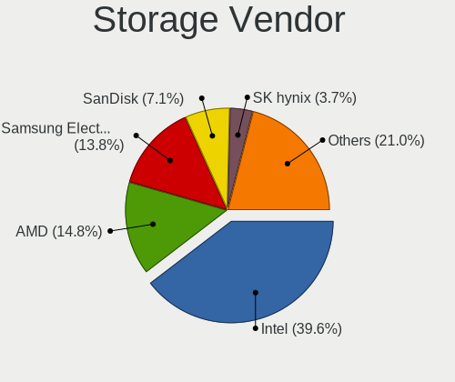
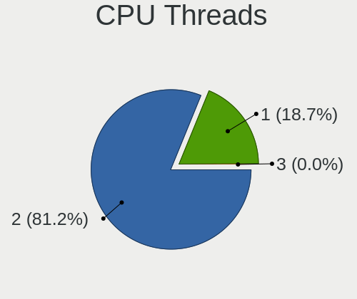
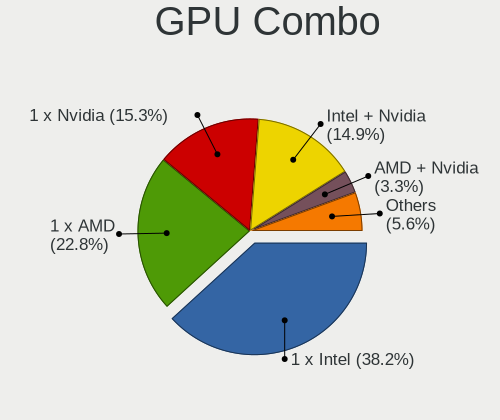
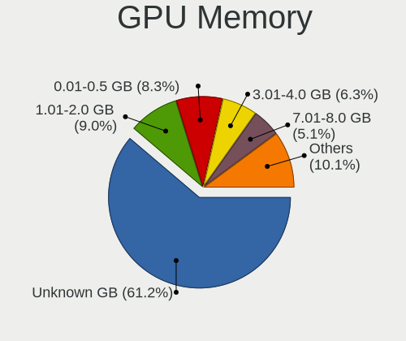
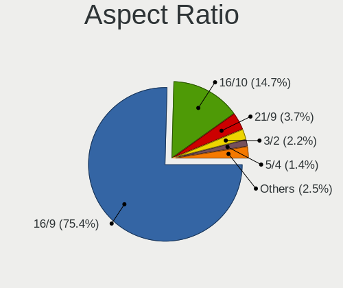
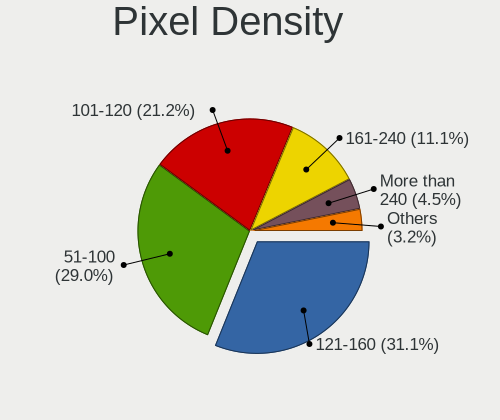
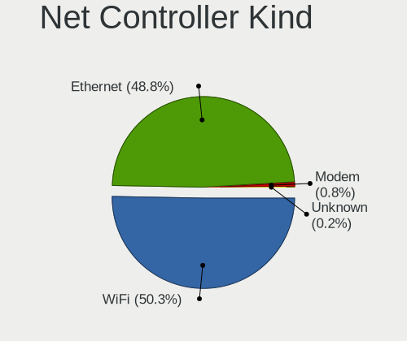
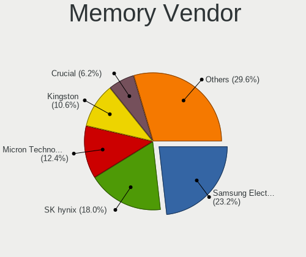
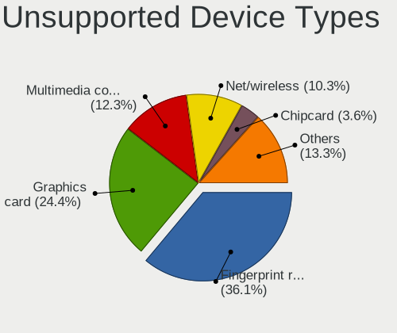

Fedora - Tested Hardware & Statistics
-------------------------------------

A project to collect tested hardware configurations for Fedora.

Anyone can contribute to this report by the [hw-probe](https://github.com/linuxhw/hw-probe) tool:

    sudo -E hw-probe -all -upload

Please contribute! Especially if your hardware is rare.

This is a report for all computer types. See also reports for [desktops](/Dist/Fedora/Desktop/README.md) and [notebooks](/Dist/Fedora/Notebook/README.md).

Contents
--------

* [ Test Cases ](#test-cases)

* [ System ](#system)
  - [ OS                       ](#os)
  - [ OS Family                ](#os-family)
  - [ Kernel                   ](#kernel)
  - [ Kernel Family            ](#kernel-family)
  - [ Kernel Major Ver.        ](#kernel-major-ver)
  - [ Arch                     ](#arch)
  - [ DE                       ](#de)
  - [ Display Server           ](#display-server)
  - [ Display Manager          ](#display-manager)
  - [ OS Lang                  ](#os-lang)
  - [ Boot Mode                ](#boot-mode)
  - [ Filesystem               ](#filesystem)
  - [ Part. scheme             ](#part-scheme)
  - [ Dual Boot with Linux/BSD ](#dual-boot-with-linuxbsd)
  - [ Dual Boot (Win)          ](#dual-boot-win)

* [ Board ](#board)
  - [ Vendor                   ](#vendor)
  - [ Model                    ](#model)
  - [ Model Family             ](#model-family)
  - [ MFG Year                 ](#mfg-year)
  - [ Form Factor              ](#form-factor)
  - [ Secure Boot              ](#secure-boot)
  - [ Coreboot                 ](#coreboot)
  - [ RAM Size                 ](#ram-size)
  - [ RAM Used                 ](#ram-used)
  - [ Total Drives             ](#total-drives)
  - [ Has CD-ROM               ](#has-cd-rom)
  - [ Has Ethernet             ](#has-ethernet)
  - [ Has WiFi                 ](#has-wifi)
  - [ Has Bluetooth            ](#has-bluetooth)

* [ Location ](#location)
  - [ Country                  ](#country)
  - [ City                     ](#city)

* [ Drives ](#drives)
  - [ Drive Vendor             ](#drive-vendor)
  - [ Drive Model              ](#drive-model)
  - [ HDD Vendor               ](#hdd-vendor)
  - [ SSD Vendor               ](#ssd-vendor)
  - [ Drive Kind               ](#drive-kind)
  - [ Drive Connector          ](#drive-connector)
  - [ Drive Size               ](#drive-size)
  - [ Space Total              ](#space-total)
  - [ Space Used               ](#space-used)
  - [ Malfunc. Drives          ](#malfunc-drives)
  - [ Malfunc. Drive Vendor    ](#malfunc-drive-vendor)
  - [ Malfunc. HDD Vendor      ](#malfunc-hdd-vendor)
  - [ Malfunc. Drive Kind      ](#malfunc-drive-kind)
  - [ Failed Drives            ](#failed-drives)
  - [ Failed Drive Vendor      ](#failed-drive-vendor)
  - [ Drive Status             ](#drive-status)

* [ Storage controller ](#storage-controller)
  - [ Storage Vendor           ](#storage-vendor)
  - [ Storage Model            ](#storage-model)
  - [ Storage Kind             ](#storage-kind)

* [ Processor ](#processor)
  - [ CPU Vendor               ](#cpu-vendor)
  - [ CPU Model                ](#cpu-model)
  - [ CPU Model Family         ](#cpu-model-family)
  - [ CPU Cores                ](#cpu-cores)
  - [ CPU Sockets              ](#cpu-sockets)
  - [ CPU Threads              ](#cpu-threads)
  - [ CPU Op-Modes             ](#cpu-op-modes)
  - [ CPU Microcode            ](#cpu-microcode)
  - [ CPU Microarch            ](#cpu-microarch)

* [ Graphics ](#graphics)
  - [ GPU Vendor               ](#gpu-vendor)
  - [ GPU Model                ](#gpu-model)
  - [ GPU Combo                ](#gpu-combo)
  - [ GPU Driver               ](#gpu-driver)
  - [ GPU Memory               ](#gpu-memory)

* [ Monitor ](#monitor)
  - [ Monitor Vendor           ](#monitor-vendor)
  - [ Monitor Model            ](#monitor-model)
  - [ Monitor Resolution       ](#monitor-resolution)
  - [ Monitor Diagonal         ](#monitor-diagonal)
  - [ Monitor Width            ](#monitor-width)
  - [ Aspect Ratio             ](#aspect-ratio)
  - [ Monitor Area             ](#monitor-area)
  - [ Pixel Density            ](#pixel-density)
  - [ Multiple Monitors        ](#multiple-monitors)

* [ Network ](#network)
  - [ Net Controller Vendor    ](#net-controller-vendor)
  - [ Net Controller Model     ](#net-controller-model)
  - [ Wireless Vendor          ](#wireless-vendor)
  - [ Wireless Model           ](#wireless-model)
  - [ Ethernet Vendor          ](#ethernet-vendor)
  - [ Ethernet Model           ](#ethernet-model)
  - [ Net Controller Kind      ](#net-controller-kind)
  - [ Used Controller          ](#used-controller)
  - [ NICs                     ](#nics)
  - [ IPv6                     ](#ipv6)

* [ Bluetooth ](#bluetooth)
  - [ Bluetooth Vendor         ](#bluetooth-vendor)
  - [ Bluetooth Model          ](#bluetooth-model)

* [ Sound ](#sound)
  - [ Sound Vendor             ](#sound-vendor)
  - [ Sound Model              ](#sound-model)

* [ Memory ](#memory)
  - [ Memory Vendor            ](#memory-vendor)
  - [ Memory Model             ](#memory-model)
  - [ Memory Kind              ](#memory-kind)
  - [ Memory Form Factor       ](#memory-form-factor)
  - [ Memory Size              ](#memory-size)
  - [ Memory Speed             ](#memory-speed)

* [ Printers & scanners ](#printers--scanners)
  - [ Printer Vendor           ](#printer-vendor)
  - [ Printer Model            ](#printer-model)
  - [ Scanner Vendor           ](#scanner-vendor)
  - [ Scanner Model            ](#scanner-model)

* [ Camera ](#camera)
  - [ Camera Vendor            ](#camera-vendor)
  - [ Camera Model             ](#camera-model)

* [ Security ](#security)
  - [ Fingerprint Vendor       ](#fingerprint-vendor)
  - [ Fingerprint Model        ](#fingerprint-model)
  - [ Chipcard Vendor          ](#chipcard-vendor)
  - [ Chipcard Model           ](#chipcard-model)

* [ Unsupported ](#unsupported)
  - [ Unsupported Devices      ](#unsupported-devices)
  - [ Unsupported Device Types ](#unsupported-device-types)

Test Cases
----------

Total: 26072

| Vendor        | Model                       | Form-Factor | Probe                                                      | Date         |
|---------------|-----------------------------|-------------|------------------------------------------------------------|--------------|
| ASUSTek       | X75VBP                      | Notebook    | [45dd9e0bea](https://linux-hardware.org/?probe=45dd9e0bea) | May 09, 2024 |
| HP            | 1905                        | Desktop     | [8e94c4bb4e](https://linux-hardware.org/?probe=8e94c4bb4e) | May 09, 2024 |
| ASUSTek       | TUF Gaming B550-PLUS WIF... | Desktop     | [c314d61f74](https://linux-hardware.org/?probe=c314d61f74) | May 09, 2024 |
| Lenovo        | Yoga Duet IML 2020 82E9     | Tablet      | [469abd69c4](https://linux-hardware.org/?probe=469abd69c4) | May 09, 2024 |
| Unknown       | Unknown                     | Notebook    | [64e1e4cc73](https://linux-hardware.org/?probe=64e1e4cc73) | May 09, 2024 |
| ASRock        | B450M/ac R2.0               | Desktop     | [a20443a9d6](https://linux-hardware.org/?probe=a20443a9d6) | May 09, 2024 |
| MSI           | MAG B460M MORTAR WIFI       | Desktop     | [d35204127f](https://linux-hardware.org/?probe=d35204127f) | May 09, 2024 |
| Sony          | VPCYB45JB                   | Notebook    | [6f70d22391](https://linux-hardware.org/?probe=6f70d22391) | May 09, 2024 |
| MSI           | B450M MORTAR MAX            | Desktop     | [51a4eae4e1](https://linux-hardware.org/?probe=51a4eae4e1) | May 09, 2024 |
| Dell          | Inspiron 13-7359            | Notebook    | [ed773eb204](https://linux-hardware.org/?probe=ed773eb204) | May 09, 2024 |
| Dell          | Vostro 1220                 | Notebook    | [a4ee382052](https://linux-hardware.org/?probe=a4ee382052) | May 09, 2024 |
| Gigabyte      | GA-770TA-UD3                | Desktop     | [5fad364df3](https://linux-hardware.org/?probe=5fad364df3) | May 09, 2024 |
| MSI           | B450 TOMAHAWK MAX II        | Desktop     | [813f68dad3](https://linux-hardware.org/?probe=813f68dad3) | May 08, 2024 |
| Micro Comp... | V3                          | Tablet      | [8a0c0d99f9](https://linux-hardware.org/?probe=8a0c0d99f9) | May 08, 2024 |
| Gigabyte      | EP45-DS3L                   | Desktop     | [7cd20b2530](https://linux-hardware.org/?probe=7cd20b2530) | May 08, 2024 |
| Dell          | Vostro 1220                 | Notebook    | [7f6372d340](https://linux-hardware.org/?probe=7f6372d340) | May 08, 2024 |
| Avell High... | A70 MOB                     | Notebook    | [2be654083e](https://linux-hardware.org/?probe=2be654083e) | May 08, 2024 |
| HP            | Pavilion x360 Convertibl... | Convertible | [762a9e4609](https://linux-hardware.org/?probe=762a9e4609) | May 08, 2024 |
| HP            | Pavilion x360 Convertibl... | Convertible | [f3aa52459b](https://linux-hardware.org/?probe=f3aa52459b) | May 08, 2024 |
| HP            | EliteBook 840 G6            | Notebook    | [1baa287464](https://linux-hardware.org/?probe=1baa287464) | May 08, 2024 |
| Intel         | DH77EB AAG39073-304         | Desktop     | [6fd6f40abe](https://linux-hardware.org/?probe=6fd6f40abe) | May 08, 2024 |
| MSI           | H310M PRO-M2 PLUS           | Desktop     | [969ea9ed0c](https://linux-hardware.org/?probe=969ea9ed0c) | May 08, 2024 |
| Huanan        | X99-QD4 V1.0                | Desktop     | [f6e1a31fef](https://linux-hardware.org/?probe=f6e1a31fef) | May 08, 2024 |
| HP            | ZBook Firefly 14 inch G8... | Notebook    | [ed064c4025](https://linux-hardware.org/?probe=ed064c4025) | May 08, 2024 |
| Gigabyte      | B760M DS3H AX DDR4          | Desktop     | [8556d97dea](https://linux-hardware.org/?probe=8556d97dea) | May 08, 2024 |
| Dell          | XPS 15 9500                 | Notebook    | [b981a13960](https://linux-hardware.org/?probe=b981a13960) | May 08, 2024 |
| ASUSTek       | X705UVP                     | Notebook    | [b850816596](https://linux-hardware.org/?probe=b850816596) | May 08, 2024 |
| Linx          | LINX1010B                   | Notebook    | [782fb4ec65](https://linux-hardware.org/?probe=782fb4ec65) | May 08, 2024 |
| Gigabyte      | Z790 UD AX                  | Desktop     | [d1a276f0c5](https://linux-hardware.org/?probe=d1a276f0c5) | May 08, 2024 |
| MSI           | MAG Z690 TOMAHAWK WIFI D... | Desktop     | [2143043fa4](https://linux-hardware.org/?probe=2143043fa4) | May 08, 2024 |
| ASUSTek       | Zenbook S 13 UX5304VA_UX... | Notebook    | [d77842b741](https://linux-hardware.org/?probe=d77842b741) | May 08, 2024 |
| Acer          | Nitro AN515-58              | Notebook    | [64289cb32c](https://linux-hardware.org/?probe=64289cb32c) | May 08, 2024 |
| ASUSTek       | A8R32-MVP Deluxe            | Desktop     | [7ad1e2a464](https://linux-hardware.org/?probe=7ad1e2a464) | May 08, 2024 |
| HP            | ZBook 15 G3                 | Notebook    | [8fbd2e21a7](https://linux-hardware.org/?probe=8fbd2e21a7) | May 08, 2024 |
| HP            | ZBook Power 15.6 inch G8... | Notebook    | [e49b5301ae](https://linux-hardware.org/?probe=e49b5301ae) | May 08, 2024 |
| HP            | ZBook Power 15.6 inch G8... | Notebook    | [8acc6c69a3](https://linux-hardware.org/?probe=8acc6c69a3) | May 08, 2024 |
| Apple         | MacBookPro11,2              | Notebook    | [0ff911f7ac](https://linux-hardware.org/?probe=0ff911f7ac) | May 08, 2024 |
| Samsung       | 270E5G/270E5U               | Notebook    | [11c56432a4](https://linux-hardware.org/?probe=11c56432a4) | May 08, 2024 |
| Lenovo        | IdeaPadFlex 5 14ALC7 82R... | Convertible | [796a659b4e](https://linux-hardware.org/?probe=796a659b4e) | May 08, 2024 |
| Gigabyte      | A520I AC                    | Desktop     | [199cd47039](https://linux-hardware.org/?probe=199cd47039) | May 08, 2024 |
| Lenovo        | ThinkPad T15 Gen 2i 20W5... | Notebook    | [c4d3aa24cf](https://linux-hardware.org/?probe=c4d3aa24cf) | May 08, 2024 |
| MSI           | B250M PRO-VDH               | Desktop     | [d11117aeae](https://linux-hardware.org/?probe=d11117aeae) | May 08, 2024 |
| Gigabyte      | B550M AORUS ELITE AX        | Desktop     | [422cc265d3](https://linux-hardware.org/?probe=422cc265d3) | May 08, 2024 |
| Acer          | Predator PH16-71            | Notebook    | [516e53ae7f](https://linux-hardware.org/?probe=516e53ae7f) | May 08, 2024 |
| ASUSTek       | CROSSHAIR VI HERO           | Desktop     | [13c15b0230](https://linux-hardware.org/?probe=13c15b0230) | May 08, 2024 |
| MSI           | MPG X570 GAMING PRO CARB... | Desktop     | [1be8775956](https://linux-hardware.org/?probe=1be8775956) | May 08, 2024 |
| HP            | Pavilion Gaming Laptop 1... | Notebook    | [3292b37df6](https://linux-hardware.org/?probe=3292b37df6) | May 08, 2024 |
| ASUSTek       | ASUS TUF Gaming F17 FX70... | Notebook    | [eb38e0f3a5](https://linux-hardware.org/?probe=eb38e0f3a5) | May 08, 2024 |
| HUAWEI        | KLVL-WXX9                   | Notebook    | [6021a53b71](https://linux-hardware.org/?probe=6021a53b71) | May 08, 2024 |
| Dell          | Vostro 1015                 | Notebook    | [b5f6b13138](https://linux-hardware.org/?probe=b5f6b13138) | May 07, 2024 |
| Dell          | Inspiron 7558               | Notebook    | [6d19146c49](https://linux-hardware.org/?probe=6d19146c49) | May 07, 2024 |
| Acer          | Swift SF314-52              | Notebook    | [d112cef6d2](https://linux-hardware.org/?probe=d112cef6d2) | May 07, 2024 |
| ASUSTek       | ASUS TUF Gaming F17 FX70... | Notebook    | [2f571c8d88](https://linux-hardware.org/?probe=2f571c8d88) | May 07, 2024 |
| Lenovo        | ThinkPad X1 Carbon Gen 8... | Notebook    | [3b821d76a7](https://linux-hardware.org/?probe=3b821d76a7) | May 07, 2024 |
| Lenovo        | ThinkPad L15 Gen 3 21C70... | Notebook    | [701d936a1c](https://linux-hardware.org/?probe=701d936a1c) | May 07, 2024 |
| MSI           | Z170A-G43 PLUS              | Desktop     | [cbc2d08a03](https://linux-hardware.org/?probe=cbc2d08a03) | May 07, 2024 |
| Lenovo        | SHARKBAY NOK                | Desktop     | [bc53340b58](https://linux-hardware.org/?probe=bc53340b58) | May 07, 2024 |
| PCSMART       | 7.0                         | Desktop     | [66d6082bf4](https://linux-hardware.org/?probe=66d6082bf4) | May 07, 2024 |
| Lenovo        | ThinkPad Edge E330 3354D... | Notebook    | [4f7e381c6f](https://linux-hardware.org/?probe=4f7e381c6f) | May 07, 2024 |
| Lenovo        | ThinkPad L15 Gen 3 21C70... | Notebook    | [6d05bc6b3d](https://linux-hardware.org/?probe=6d05bc6b3d) | May 07, 2024 |
| HP            | Laptop 15s-eq2xxx           | Notebook    | [32e408088d](https://linux-hardware.org/?probe=32e408088d) | May 07, 2024 |
| Acer          | Aspire A515-57              | Notebook    | [c7471afead](https://linux-hardware.org/?probe=c7471afead) | May 07, 2024 |
| ASUSTek       | M5A78L-M PLUS/USB3          | Desktop     | [48be6a2dbb](https://linux-hardware.org/?probe=48be6a2dbb) | May 07, 2024 |
| Lenovo        | Unknown                     | Notebook    | [63995e584e](https://linux-hardware.org/?probe=63995e584e) | May 07, 2024 |
| Acer          | Aspire A315-56              | Notebook    | [37f76a3652](https://linux-hardware.org/?probe=37f76a3652) | May 07, 2024 |
| Lenovo        | SHARKBAY NOK                | Desktop     | [f41f238d9f](https://linux-hardware.org/?probe=f41f238d9f) | May 07, 2024 |
| Dell          | XPS 15 9520                 | Notebook    | [70022231bd](https://linux-hardware.org/?probe=70022231bd) | May 07, 2024 |
| HP            | Victus by Gaming Laptop ... | Notebook    | [24cf77eb91](https://linux-hardware.org/?probe=24cf77eb91) | May 07, 2024 |
| Gigabyte      | B550M DS3H                  | Desktop     | [3514c9adca](https://linux-hardware.org/?probe=3514c9adca) | May 07, 2024 |
| Acer          | Aspire A515-45              | Notebook    | [c9dab30ab0](https://linux-hardware.org/?probe=c9dab30ab0) | May 07, 2024 |
| ASRock        | B450M Steel Legend          | Desktop     | [072fd0ea79](https://linux-hardware.org/?probe=072fd0ea79) | May 07, 2024 |
| ASRock        | B450M Steel Legend          | Desktop     | [c2a2f067b4](https://linux-hardware.org/?probe=c2a2f067b4) | May 07, 2024 |
| HP            | ENVY Notebook 13-ab0XX      | Notebook    | [7d6b757088](https://linux-hardware.org/?probe=7d6b757088) | May 07, 2024 |
| Lenovo        | ThinkPad E15 Gen 4 21E60... | Notebook    | [230c054c87](https://linux-hardware.org/?probe=230c054c87) | May 07, 2024 |
| HP            | ENVY Notebook 13-ab0XX      | Notebook    | [a9d1c1234c](https://linux-hardware.org/?probe=a9d1c1234c) | May 07, 2024 |
| Framework     | Laptop 13 (AMD Ryzen 704... | Notebook    | [b3a37af0d0](https://linux-hardware.org/?probe=b3a37af0d0) | May 07, 2024 |
| Framework     | Laptop 13 (AMD Ryzen 704... | Notebook    | [63e6a64d1b](https://linux-hardware.org/?probe=63e6a64d1b) | May 07, 2024 |
| ASUSTek       | ROG Zephyrus G14 GA403UI... | Notebook    | [61b3a490a8](https://linux-hardware.org/?probe=61b3a490a8) | May 07, 2024 |
| Apple         | MacBookPro8,1               | Notebook    | [abbe6a092c](https://linux-hardware.org/?probe=abbe6a092c) | May 07, 2024 |
| Apple         | MacBookPro8,1               | Notebook    | [dcd5e1e281](https://linux-hardware.org/?probe=dcd5e1e281) | May 07, 2024 |
| Dell          | Precision 5520              | Notebook    | [3b0c11a9ff](https://linux-hardware.org/?probe=3b0c11a9ff) | May 07, 2024 |
| HP            | Pavilion Gaming Laptop 1... | Notebook    | [643f150579](https://linux-hardware.org/?probe=643f150579) | May 07, 2024 |
| Dell          | Precision 5520              | Notebook    | [bf1f2486cd](https://linux-hardware.org/?probe=bf1f2486cd) | May 07, 2024 |
| Dell          | XPS 15 9500                 | Notebook    | [e5dc310897](https://linux-hardware.org/?probe=e5dc310897) | May 07, 2024 |
| Apple         | MacBookPro11,1              | Notebook    | [c18909580d](https://linux-hardware.org/?probe=c18909580d) | May 07, 2024 |
| Apple         | MacBookPro11,1              | Notebook    | [61aed9772b](https://linux-hardware.org/?probe=61aed9772b) | May 07, 2024 |
| ASUSTek       | VivoBook_ASUSLaptop M760... | Notebook    | [773ca4f9c9](https://linux-hardware.org/?probe=773ca4f9c9) | May 06, 2024 |
| ASUSTek       | VivoBook_ASUSLaptop M760... | Notebook    | [0104fa9a83](https://linux-hardware.org/?probe=0104fa9a83) | May 06, 2024 |
| ASUSTek       | X405UQ                      | Notebook    | [aa39bc4676](https://linux-hardware.org/?probe=aa39bc4676) | May 06, 2024 |
| Lenovo        | ThinkPad X13 Gen 3 21CM0... | Notebook    | [39fdd434dd](https://linux-hardware.org/?probe=39fdd434dd) | May 06, 2024 |
| Lenovo        | SDK0E50510 WIN              | Desktop     | [885618c382](https://linux-hardware.org/?probe=885618c382) | May 06, 2024 |
| Acer          | Aspire E1-572               | Notebook    | [3df494e445](https://linux-hardware.org/?probe=3df494e445) | May 06, 2024 |
| ASUSTek       | TUF Gaming B650M-PLUS       | Desktop     | [0e930ac423](https://linux-hardware.org/?probe=0e930ac423) | May 06, 2024 |
| Lenovo        | ThinkPad Helix 36986CG      | Notebook    | [9b2bd77573](https://linux-hardware.org/?probe=9b2bd77573) | May 06, 2024 |
| Linx          | LINX1010B                   | Notebook    | [5abe12bf84](https://linux-hardware.org/?probe=5abe12bf84) | May 06, 2024 |
| Star Labs     | StarBook                    | Notebook    | [7e37692a50](https://linux-hardware.org/?probe=7e37692a50) | May 06, 2024 |
| Gigabyte      | EP45-DS3L                   | Desktop     | [9a1d11cc26](https://linux-hardware.org/?probe=9a1d11cc26) | May 06, 2024 |
| ASRock        | B450M-HDV R4.0              | Desktop     | [1d40ae8807](https://linux-hardware.org/?probe=1d40ae8807) | May 06, 2024 |
| Dell          | Precision M4700             | Notebook    | [db0b8eb10b](https://linux-hardware.org/?probe=db0b8eb10b) | May 06, 2024 |
| Gigabyte      | H97M-HD3                    | Desktop     | [7548e25e9d](https://linux-hardware.org/?probe=7548e25e9d) | May 06, 2024 |
| Lenovo        | IdeaPad C340-14API 81N6     | Notebook    | [c120bbd998](https://linux-hardware.org/?probe=c120bbd998) | May 06, 2024 |
| Samsung       | 960QFG                      | Convertible | [938356247b](https://linux-hardware.org/?probe=938356247b) | May 06, 2024 |
| ASUSTek       | GL553VW                     | Notebook    | [c51bf874e5](https://linux-hardware.org/?probe=c51bf874e5) | May 06, 2024 |
| Unknown       | Unknown                     | Desktop     | [b6bf02e276](https://linux-hardware.org/?probe=b6bf02e276) | May 06, 2024 |
| Unknown       | Unknown                     | Desktop     | [9f8df7b114](https://linux-hardware.org/?probe=9f8df7b114) | May 06, 2024 |
| ASUSTek       | Zenbook UN5401QA_UN5401Q... | Convertible | [6c0c235ec2](https://linux-hardware.org/?probe=6c0c235ec2) | May 06, 2024 |
| ASUSTek       | S550CB                      | Notebook    | [943c34e625](https://linux-hardware.org/?probe=943c34e625) | May 06, 2024 |
| Alienware     | x17 R2                      | Notebook    | [ed5c24948b](https://linux-hardware.org/?probe=ed5c24948b) | May 06, 2024 |
| Acer          | Aspire A715-41G             | Notebook    | [b24efb4449](https://linux-hardware.org/?probe=b24efb4449) | May 06, 2024 |
| Apple         | MacBookPro15,2              | Notebook    | [4720f69696](https://linux-hardware.org/?probe=4720f69696) | May 06, 2024 |
| ASUSTek       | ROG STRIX B450-F GAMING ... | Desktop     | [869ffa1875](https://linux-hardware.org/?probe=869ffa1875) | May 06, 2024 |
| ASUSTek       | X550CA                      | Notebook    | [5038e329fc](https://linux-hardware.org/?probe=5038e329fc) | May 06, 2024 |
| Unknown       | X570 Phantom Gaming-ITX/... | Notebook    | [a02a58b376](https://linux-hardware.org/?probe=a02a58b376) | May 06, 2024 |
| Alienware     | x17 R2                      | Notebook    | [a920973ad3](https://linux-hardware.org/?probe=a920973ad3) | May 06, 2024 |
| Lenovo        | ThinkPad P52 20M9CTO1WW     | Notebook    | [8d12951a69](https://linux-hardware.org/?probe=8d12951a69) | May 06, 2024 |
| ASUSTek       | ROG Ally RC71L_RC71L        | Tablet      | [6bb4152903](https://linux-hardware.org/?probe=6bb4152903) | May 06, 2024 |
| Lenovo        | 32E1 SDK0T76463 WIN 3422... | Desktop     | [981ac7ef2b](https://linux-hardware.org/?probe=981ac7ef2b) | May 06, 2024 |
| Dell          | Vostro 5471                 | Notebook    | [dae50714b1](https://linux-hardware.org/?probe=dae50714b1) | May 06, 2024 |
| Dell          | Vostro 5471                 | Notebook    | [92897b02b9](https://linux-hardware.org/?probe=92897b02b9) | May 06, 2024 |
| ASUSTek       | TUF Gaming Z690-PLUS D4     | Desktop     | [add0ddcfc0](https://linux-hardware.org/?probe=add0ddcfc0) | May 06, 2024 |
| ASUSTek       | ROG Strix G731GV_G731GV     | Notebook    | [00ceb2ea16](https://linux-hardware.org/?probe=00ceb2ea16) | May 06, 2024 |
| Lenovo        | IdeaPad L3 15IML05 81Y3     | Notebook    | [74454fbcde](https://linux-hardware.org/?probe=74454fbcde) | May 05, 2024 |
| Apple         | MacBookPro15,2              | Notebook    | [568bb3b863](https://linux-hardware.org/?probe=568bb3b863) | May 05, 2024 |
| Positivo      | J14GL11                     | Notebook    | [71f761fa87](https://linux-hardware.org/?probe=71f761fa87) | May 05, 2024 |
| ASUSTek       | VivoBook_ASUSLaptop X515... | Notebook    | [278add8d07](https://linux-hardware.org/?probe=278add8d07) | May 05, 2024 |
| Apple         | Mac-42FD25EABCABB274 iMa... | All in one  | [3f095aabb5](https://linux-hardware.org/?probe=3f095aabb5) | May 05, 2024 |
| ASUSTek       | H81M-K                      | Desktop     | [a17314c287](https://linux-hardware.org/?probe=a17314c287) | May 05, 2024 |
| ASUSTek       | M5A78L-M/USB3               | Desktop     | [551c4cd540](https://linux-hardware.org/?probe=551c4cd540) | May 05, 2024 |
| HP            | ProBook 455 G7              | Notebook    | [470e53d860](https://linux-hardware.org/?probe=470e53d860) | May 05, 2024 |
| ASUSTek       | ROG STRIX B650E-E GAMING... | Desktop     | [14b56b3e78](https://linux-hardware.org/?probe=14b56b3e78) | May 05, 2024 |
| Dell          | Inspiron 15 3530            | Notebook    | [a71239f845](https://linux-hardware.org/?probe=a71239f845) | May 05, 2024 |
| Fujitsu       | LIFEBOOK T900               | Notebook    | [d396d19b06](https://linux-hardware.org/?probe=d396d19b06) | May 05, 2024 |
| HUAWEI        | MACHR-WX9                   | Notebook    | [9577917e03](https://linux-hardware.org/?probe=9577917e03) | May 05, 2024 |
| ASUSTek       | X510UAR                     | Notebook    | [3317acbe53](https://linux-hardware.org/?probe=3317acbe53) | May 05, 2024 |
| Timi          | Mi NoteBook Pro             | Notebook    | [71071a816e](https://linux-hardware.org/?probe=71071a816e) | May 05, 2024 |
| Micro Comp... | V3                          | Tablet      | [4d2b3ac262](https://linux-hardware.org/?probe=4d2b3ac262) | May 05, 2024 |
| ASUSTek       | TUF Gaming FX505GE_FX505... | Notebook    | [6794452c3b](https://linux-hardware.org/?probe=6794452c3b) | May 05, 2024 |
| Acer          | Swift SFA16-41              | Notebook    | [df5596b6b2](https://linux-hardware.org/?probe=df5596b6b2) | May 05, 2024 |
| Acer          | Nitro AN515-46              | Notebook    | [23ae7fd7c6](https://linux-hardware.org/?probe=23ae7fd7c6) | May 05, 2024 |
| HP            | 240 G8                      | Notebook    | [8b7c23e6cb](https://linux-hardware.org/?probe=8b7c23e6cb) | May 05, 2024 |
| PCSMART       | 7.0                         | Desktop     | [18ea3d8d19](https://linux-hardware.org/?probe=18ea3d8d19) | May 05, 2024 |
| Gigabyte      | B450 AORUS M                | Desktop     | [336365df6e](https://linux-hardware.org/?probe=336365df6e) | May 05, 2024 |
| Dell          | Latitude 5290 2-in-1        | Tablet      | [466c94724a](https://linux-hardware.org/?probe=466c94724a) | May 05, 2024 |
| HP            | Pavilion Laptop 15-cc5xx    | Notebook    | [ab0226a735](https://linux-hardware.org/?probe=ab0226a735) | May 05, 2024 |
| Dell          | Precision M4700             | Notebook    | [7b8ccefbed](https://linux-hardware.org/?probe=7b8ccefbed) | May 05, 2024 |
| ASRock        | B450M Pro4                  | Desktop     | [af898c03a5](https://linux-hardware.org/?probe=af898c03a5) | May 05, 2024 |
| Apple         | Mac-CFF7D910A743CAAF iMa... | All in one  | [2efddf3a94](https://linux-hardware.org/?probe=2efddf3a94) | May 04, 2024 |
| Dell          | Latitude 3400               | Notebook    | [259b0b8cbf](https://linux-hardware.org/?probe=259b0b8cbf) | May 04, 2024 |
| Unknown       | Unknown                     | Notebook    | [b7866b963f](https://linux-hardware.org/?probe=b7866b963f) | May 04, 2024 |
| ASUSTek       | ROG Strix G512LV_G512LV     | Notebook    | [7c2c0a0fc2](https://linux-hardware.org/?probe=7c2c0a0fc2) | May 04, 2024 |
| HP            | ProBook 470 G5              | Notebook    | [66da43e604](https://linux-hardware.org/?probe=66da43e604) | May 04, 2024 |
| Positivo      | S14CT01                     | Notebook    | [45c8a9d70b](https://linux-hardware.org/?probe=45c8a9d70b) | May 04, 2024 |
| Apple         | MacBook5,1                  | Notebook    | [021661dd6a](https://linux-hardware.org/?probe=021661dd6a) | May 04, 2024 |
| Apple         | MacBook5,1                  | Notebook    | [cc8e76485b](https://linux-hardware.org/?probe=cc8e76485b) | May 04, 2024 |
| Lenovo        | ThinkPad T440p 20AWS3D60... | Notebook    | [ee74f28516](https://linux-hardware.org/?probe=ee74f28516) | May 04, 2024 |
| Intel         | NUC7i5BNB J31144-309        | Mini pc     | [b05731fd5b](https://linux-hardware.org/?probe=b05731fd5b) | May 04, 2024 |
| Positivo      | S14CT01                     | Notebook    | [f2994ff445](https://linux-hardware.org/?probe=f2994ff445) | May 04, 2024 |
| Toshiba       | Satellite L855              | Notebook    | [15101644b0](https://linux-hardware.org/?probe=15101644b0) | May 04, 2024 |
| ASUSTek       | PRIME A320M-K               | Desktop     | [ceb76bac39](https://linux-hardware.org/?probe=ceb76bac39) | May 04, 2024 |
| Intel         | NUC7i5BNB J31144-309        | Mini pc     | [3d777f43db](https://linux-hardware.org/?probe=3d777f43db) | May 04, 2024 |
| Toshiba       | Satellite L855              | Notebook    | [359b9f3cd6](https://linux-hardware.org/?probe=359b9f3cd6) | May 04, 2024 |
| Lenovo        | ThinkPad T14 Gen 1 20S00... | Notebook    | [ed456fa085](https://linux-hardware.org/?probe=ed456fa085) | May 04, 2024 |
| ASUSTek       | ROG STRIX B450-F GAMING ... | Desktop     | [b5517c3d77](https://linux-hardware.org/?probe=b5517c3d77) | May 04, 2024 |
| Dell          | Inspiron 5721               | Notebook    | [7b78782a60](https://linux-hardware.org/?probe=7b78782a60) | May 04, 2024 |
| Acer          | Nitro AN515-57              | Notebook    | [de8582fd4b](https://linux-hardware.org/?probe=de8582fd4b) | May 04, 2024 |
| Lenovo        | IdeaPad 5 15IIL05 81YK      | Notebook    | [1a042bfbb0](https://linux-hardware.org/?probe=1a042bfbb0) | May 04, 2024 |
| AMI           | Intel                       | Convertible | [2b09abb2a6](https://linux-hardware.org/?probe=2b09abb2a6) | May 04, 2024 |
| Alienware     | m15 R6                      | Notebook    | [98d55c3264](https://linux-hardware.org/?probe=98d55c3264) | May 04, 2024 |
| Gigabyte      | EP45-DS3L                   | Desktop     | [9bc9ab2e35](https://linux-hardware.org/?probe=9bc9ab2e35) | May 04, 2024 |
| ASUSTek       | K56CB                       | Notebook    | [1d94e1ecd1](https://linux-hardware.org/?probe=1d94e1ecd1) | May 04, 2024 |
| ASUSTek       | PRIME B560-PLUS             | Desktop     | [44afb954d6](https://linux-hardware.org/?probe=44afb954d6) | May 04, 2024 |
| AZW           | GTR V21                     | Mini pc     | [7c20e2e82b](https://linux-hardware.org/?probe=7c20e2e82b) | May 04, 2024 |
| Lenovo        | ThinkPad T480 20L6S7MP00    | Notebook    | [2e32ab2b3b](https://linux-hardware.org/?probe=2e32ab2b3b) | May 04, 2024 |
| Lenovo        | ThinkBook 15 G2 ITL 20VE    | Notebook    | [a308965bd0](https://linux-hardware.org/?probe=a308965bd0) | May 04, 2024 |
| ASRock        | A320M-HDV R4.0              | Desktop     | [3dea08aed3](https://linux-hardware.org/?probe=3dea08aed3) | May 04, 2024 |
| ASUSTek       | GL703VM                     | Notebook    | [9fc5a6d2eb](https://linux-hardware.org/?probe=9fc5a6d2eb) | May 04, 2024 |
| Dell          | Vostro 15 5510              | Notebook    | [a3b2e8da38](https://linux-hardware.org/?probe=a3b2e8da38) | May 04, 2024 |
| Lenovo        | ThinkPad E15 Gen 2 20T80... | Notebook    | [5975b5df1b](https://linux-hardware.org/?probe=5975b5df1b) | May 04, 2024 |
| ASUSTek       | ROG STRIX Z490-F GAMING     | Desktop     | [be77d3d806](https://linux-hardware.org/?probe=be77d3d806) | May 04, 2024 |
| Lenovo        | IdeaPad C340-14API 81N6     | Notebook    | [ff66cc5e3d](https://linux-hardware.org/?probe=ff66cc5e3d) | May 04, 2024 |
| Lenovo        | ThinkBook 15-IIL 20SM       | Notebook    | [7471316f20](https://linux-hardware.org/?probe=7471316f20) | May 04, 2024 |
| Intel         | X99H                        | Desktop     | [a2a38cc926](https://linux-hardware.org/?probe=a2a38cc926) | May 04, 2024 |
| Gigabyte      | Z68MA-D2H-B3                | Desktop     | [b7c53048d5](https://linux-hardware.org/?probe=b7c53048d5) | May 04, 2024 |
| MSI           | B450M BAZOOKA V2            | Desktop     | [654421979a](https://linux-hardware.org/?probe=654421979a) | May 04, 2024 |
| Acer          | Aspire E5-773G              | Notebook    | [e49a79cb29](https://linux-hardware.org/?probe=e49a79cb29) | May 04, 2024 |
| Lenovo        | ThinkPad T480s 20L8S3KR0... | Notebook    | [3853332c92](https://linux-hardware.org/?probe=3853332c92) | May 04, 2024 |
| Unknown       | Unknown                     | Desktop     | [1a175146c0](https://linux-hardware.org/?probe=1a175146c0) | May 04, 2024 |
| ECS           | H81H3-M4                    | Desktop     | [e9cfe50e27](https://linux-hardware.org/?probe=e9cfe50e27) | May 04, 2024 |
| Gigabyte      | GA-870A-UD3                 | Desktop     | [ac3f4b6ccb](https://linux-hardware.org/?probe=ac3f4b6ccb) | May 04, 2024 |
| ASUSTek       | ROG STRIX Z690-A GAMING ... | Desktop     | [9f7202da23](https://linux-hardware.org/?probe=9f7202da23) | May 04, 2024 |
| Lenovo        | SKYBAY SDK0J40709 WIN 32... | Desktop     | [316673b817](https://linux-hardware.org/?probe=316673b817) | May 04, 2024 |
| Gigabyte      | B450 AORUS ELITE            | Desktop     | [8a157b99f2](https://linux-hardware.org/?probe=8a157b99f2) | May 04, 2024 |
| MSI           | Raider GE68HX 13VG          | Notebook    | [b3f866a8e6](https://linux-hardware.org/?probe=b3f866a8e6) | May 04, 2024 |
| MSI           | B350 GAMING PLUS            | Desktop     | [ac7913c0fa](https://linux-hardware.org/?probe=ac7913c0fa) | May 04, 2024 |
| ASRock        | B450 Gaming-ITX/ac          | Desktop     | [a698a1991c](https://linux-hardware.org/?probe=a698a1991c) | May 03, 2024 |
| Unknown       | Unknown                     | Desktop     | [fd0ceb7e75](https://linux-hardware.org/?probe=fd0ceb7e75) | May 03, 2024 |
| AYANEO        | AIR 1S                      | Tablet      | [cd4a0f8fdb](https://linux-hardware.org/?probe=cd4a0f8fdb) | May 03, 2024 |
| ASRock        | B450 Gaming-ITX/ac          | Desktop     | [e52fd6543b](https://linux-hardware.org/?probe=e52fd6543b) | May 03, 2024 |
| SLIMBOOK      | HERO-S-TGL-RTX              | Notebook    | [eac9faa98c](https://linux-hardware.org/?probe=eac9faa98c) | May 03, 2024 |
| Dell          | Latitude 5289               | Convertible | [fe9312926c](https://linux-hardware.org/?probe=fe9312926c) | May 03, 2024 |
| ASUSTek       | VivoBook_ASUSLaptop M150... | Notebook    | [ad6d7c5f93](https://linux-hardware.org/?probe=ad6d7c5f93) | May 03, 2024 |
| ASRock        | B450 Gaming K4              | Desktop     | [721fef3d82](https://linux-hardware.org/?probe=721fef3d82) | May 03, 2024 |
| IGEL Techn... | M340C                       | Notebook    | [dbb60f0c71](https://linux-hardware.org/?probe=dbb60f0c71) | May 03, 2024 |
| Toshiba       | Satellite L745              | Notebook    | [797c23bdbc](https://linux-hardware.org/?probe=797c23bdbc) | May 03, 2024 |
| ASUSTek       | VivoBook_ASUSLaptop X515... | Notebook    | [5b3074a531](https://linux-hardware.org/?probe=5b3074a531) | May 03, 2024 |
| HP            | OMEN by Laptop 16-c0xxx     | Notebook    | [44e9f4946e](https://linux-hardware.org/?probe=44e9f4946e) | May 03, 2024 |
| HP            | OMEN by Laptop 16-c0xxx     | Notebook    | [02a14960a9](https://linux-hardware.org/?probe=02a14960a9) | May 03, 2024 |
| ASUSTek       | ASUS Zenbook 14 UX3405MA... | Notebook    | [2b3beb5230](https://linux-hardware.org/?probe=2b3beb5230) | May 03, 2024 |
| Framework     | Laptop 13 (AMD Ryzen 704... | Notebook    | [90520db800](https://linux-hardware.org/?probe=90520db800) | May 03, 2024 |
| Gigabyte      | H510M H                     | Desktop     | [8bbb10ebf0](https://linux-hardware.org/?probe=8bbb10ebf0) | May 03, 2024 |
| Lenovo        | ThinkPad X1 Titanium Gen... | Convertible | [ae4b49a085](https://linux-hardware.org/?probe=ae4b49a085) | May 03, 2024 |
| Lenovo        | IdeaPad Z500 20202          | Notebook    | [41468a4e5c](https://linux-hardware.org/?probe=41468a4e5c) | May 03, 2024 |
| N-one         | Nbook Ultra                 | Notebook    | [ae1609d065](https://linux-hardware.org/?probe=ae1609d065) | May 03, 2024 |
| HP            | Notebook                    | Notebook    | [ba95ac1b57](https://linux-hardware.org/?probe=ba95ac1b57) | May 03, 2024 |
| Gigabyte      | P35-DQ6                     | Desktop     | [c448c676a8](https://linux-hardware.org/?probe=c448c676a8) | May 03, 2024 |
| Lenovo        | ThinkPad P15s Gen 2i 20W... | Notebook    | [89ce066855](https://linux-hardware.org/?probe=89ce066855) | May 03, 2024 |
| Apple         | Mac-27ADBB7B4CEE8E61 iMa... | All in one  | [84de6c0ea1](https://linux-hardware.org/?probe=84de6c0ea1) | May 03, 2024 |
| HP            | EliteBook 8570w             | Notebook    | [050889a119](https://linux-hardware.org/?probe=050889a119) | May 03, 2024 |
| HP            | EliteBook 8570w             | Notebook    | [6b53737811](https://linux-hardware.org/?probe=6b53737811) | May 03, 2024 |
| Lenovo        | 102F SBB0M45864 WIN 3305... | Desktop     | [55c596ead8](https://linux-hardware.org/?probe=55c596ead8) | May 03, 2024 |
| ASUSTek       | TUF Gaming B550M-PLUS       | Desktop     | [ab935bd409](https://linux-hardware.org/?probe=ab935bd409) | May 02, 2024 |
| PC Special... | PCx0Dx                      | Notebook    | [8aa3848116](https://linux-hardware.org/?probe=8aa3848116) | May 02, 2024 |
| HP            | EliteBook 840 G6            | Notebook    | [da166304a5](https://linux-hardware.org/?probe=da166304a5) | May 02, 2024 |
| Schenker      | XMG CORE 15(M20, RTX 206... | Notebook    | [e22a67c560](https://linux-hardware.org/?probe=e22a67c560) | May 02, 2024 |
| Lenovo        | ThinkPad T14 Gen 5 21MLC... | Notebook    | [d1732b9421](https://linux-hardware.org/?probe=d1732b9421) | May 02, 2024 |
| Lenovo        | IdeaPad Pro 5 16IMH9 83D... | Notebook    | [194589e94c](https://linux-hardware.org/?probe=194589e94c) | May 02, 2024 |
| Dell          | 0YGYJY A01                  | Desktop     | [eb2aba50a5](https://linux-hardware.org/?probe=eb2aba50a5) | May 02, 2024 |
| Intel         | H81                         | Desktop     | [8250f2ced3](https://linux-hardware.org/?probe=8250f2ced3) | May 02, 2024 |
| Lenovo        | Yoga Pro 7 14IRH8 82Y7      | Notebook    | [2bd6f2ebd6](https://linux-hardware.org/?probe=2bd6f2ebd6) | May 02, 2024 |
| HP            | EliteBook 865 16 inch G1... | Notebook    | [9051ebbe11](https://linux-hardware.org/?probe=9051ebbe11) | May 02, 2024 |
| Chuwi         | HeroBook Pro                | Notebook    | [76e47767d1](https://linux-hardware.org/?probe=76e47767d1) | May 02, 2024 |
| HP            | Laptop 15-ra0xx             | Notebook    | [4d00a746ff](https://linux-hardware.org/?probe=4d00a746ff) | May 02, 2024 |
| HP            | EliteBook 840 G5            | Notebook    | [e200a00e5a](https://linux-hardware.org/?probe=e200a00e5a) | May 02, 2024 |
| MSI           | B250M PRO OPT BOOST         | Desktop     | [d6c113d53c](https://linux-hardware.org/?probe=d6c113d53c) | May 02, 2024 |
| Lenovo        | MIIX 320-10ICR 80XF         | Tablet      | [94cf2334b9](https://linux-hardware.org/?probe=94cf2334b9) | May 02, 2024 |
| Dell          | 0JP3NX A01                  | Desktop     | [59857ba04e](https://linux-hardware.org/?probe=59857ba04e) | May 02, 2024 |
| ASUSTek       | VivoBook_ASUSLaptop X150... | Notebook    | [db48550f51](https://linux-hardware.org/?probe=db48550f51) | May 02, 2024 |
| Dell          | Inspiron M5010              | Notebook    | [eed6e90235](https://linux-hardware.org/?probe=eed6e90235) | May 02, 2024 |
| LG Electro... | 14Z90S-GA5HK                | Notebook    | [ba55286732](https://linux-hardware.org/?probe=ba55286732) | May 02, 2024 |
| HUAWEI        | BOD-WXX9                    | Notebook    | [555e3c4b2c](https://linux-hardware.org/?probe=555e3c4b2c) | May 02, 2024 |
| Gigabyte      | B550 AORUS ELITE AX V2      | Desktop     | [1ef79831c6](https://linux-hardware.org/?probe=1ef79831c6) | May 02, 2024 |
| ASUSTek       | ROG STRIX X470-F GAMING     | Desktop     | [5f2e9277ad](https://linux-hardware.org/?probe=5f2e9277ad) | May 02, 2024 |
| Lenovo        | ThinkPad X201 3626HMG       | Notebook    | [c445ea85c4](https://linux-hardware.org/?probe=c445ea85c4) | May 02, 2024 |
| Gigabyte      | B450M DS3H-CF               | Notebook    | [eb1d061242](https://linux-hardware.org/?probe=eb1d061242) | May 02, 2024 |
| HP            | EliteBook x360 830 G6       | Convertible | [ed4c19870c](https://linux-hardware.org/?probe=ed4c19870c) | May 02, 2024 |
| HP            | Dragonfly 13.5 inch G4 N... | Notebook    | [0a75b86ae0](https://linux-hardware.org/?probe=0a75b86ae0) | May 02, 2024 |
| HP            | 805A                        | Desktop     | [1c688de61d](https://linux-hardware.org/?probe=1c688de61d) | May 02, 2024 |
| Lenovo        | IdeaPad Z500 20202          | Notebook    | [f7e35750cd](https://linux-hardware.org/?probe=f7e35750cd) | May 02, 2024 |
| Apple         | MacBookPro11,4              | Notebook    | [e4b5fb0f12](https://linux-hardware.org/?probe=e4b5fb0f12) | May 01, 2024 |
| ASUSTek       | ROG Ally RC71L_RC71L        | Tablet      | [851f0630cc](https://linux-hardware.org/?probe=851f0630cc) | May 01, 2024 |
| Samsung       | 550P5C/550P7C               | Notebook    | [c8bdddb366](https://linux-hardware.org/?probe=c8bdddb366) | May 01, 2024 |
| Maibenben     | MaiBook M                   | Notebook    | [791e571e24](https://linux-hardware.org/?probe=791e571e24) | May 01, 2024 |
| Apple         | Mac-031B6874CF7F642A iMa... | All in one  | [c30af0da8c](https://linux-hardware.org/?probe=c30af0da8c) | May 01, 2024 |
| Gigabyte      | H61M-S2PV                   | Desktop     | [45bb15cd11](https://linux-hardware.org/?probe=45bb15cd11) | May 01, 2024 |
| Micro Comp... | V3                          | Tablet      | [159bd001f3](https://linux-hardware.org/?probe=159bd001f3) | May 01, 2024 |
| Microsoft     | Surface Go                  | Tablet      | [00403f8f26](https://linux-hardware.org/?probe=00403f8f26) | May 01, 2024 |
| Apple         | MacBookPro9,2               | Notebook    | [120440b735](https://linux-hardware.org/?probe=120440b735) | May 01, 2024 |
| Dell          | Vostro 5402                 | Notebook    | [34a28e5fd3](https://linux-hardware.org/?probe=34a28e5fd3) | May 01, 2024 |
| Gigabyte      | B660M DS3H AX DDR4          | Desktop     | [cfdd3a4535](https://linux-hardware.org/?probe=cfdd3a4535) | May 01, 2024 |
| Acer          | Aspire A715-41G             | Notebook    | [aa9c440102](https://linux-hardware.org/?probe=aa9c440102) | May 01, 2024 |
| ASUSTek       | ASUS Vivobook S 16 S5606... | Notebook    | [bfe20c3d58](https://linux-hardware.org/?probe=bfe20c3d58) | May 01, 2024 |
| HP            | ENVY x360 Convertible 15... | Convertible | [4386528195](https://linux-hardware.org/?probe=4386528195) | May 01, 2024 |
| HP            | Notebook                    | Notebook    | [415db360d5](https://linux-hardware.org/?probe=415db360d5) | May 01, 2024 |
| AYANEO        | GEEK 1S                     | Tablet      | [57648b445e](https://linux-hardware.org/?probe=57648b445e) | May 01, 2024 |
| Lenovo        | ThinkPad X260 20F5S3J301    | Notebook    | [d373de3608](https://linux-hardware.org/?probe=d373de3608) | May 01, 2024 |
| HP            | Laptop 15q-bu0xx            | Notebook    | [7f08bc6862](https://linux-hardware.org/?probe=7f08bc6862) | May 01, 2024 |
| LG Electro... | 16Z90P-G.AA76G              | Notebook    | [f9bdc22f6f](https://linux-hardware.org/?probe=f9bdc22f6f) | May 01, 2024 |
| Dell          | Inspiron 7537               | Notebook    | [d27f9ad169](https://linux-hardware.org/?probe=d27f9ad169) | May 01, 2024 |
| HP            | EliteBook 850 G1            | Notebook    | [c6effb94ba](https://linux-hardware.org/?probe=c6effb94ba) | May 01, 2024 |
| MSI           | B550-A PRO                  | Desktop     | [e4727af25c](https://linux-hardware.org/?probe=e4727af25c) | May 01, 2024 |
| Acer          | Aspire GX-785               | Desktop     | [9237b7c910](https://linux-hardware.org/?probe=9237b7c910) | May 01, 2024 |
| Unknown       | ROUTER                      | Desktop     | [1889de9474](https://linux-hardware.org/?probe=1889de9474) | May 01, 2024 |
| Acer          | Aspire GX-785               | Desktop     | [1134c5fd30](https://linux-hardware.org/?probe=1134c5fd30) | May 01, 2024 |
| Gigabyte      | Z77MX-D3H                   | Desktop     | [7faebd43a1](https://linux-hardware.org/?probe=7faebd43a1) | May 01, 2024 |
| Gigabyte      | Z690 GAMING X               | Desktop     | [abd215cdb3](https://linux-hardware.org/?probe=abd215cdb3) | May 01, 2024 |
| Gigabyte      | Z690 GAMING X               | Desktop     | [0d6f66a0d7](https://linux-hardware.org/?probe=0d6f66a0d7) | May 01, 2024 |
| Lenovo        | MAHOBAY                     | Desktop     | [ff63252cfb](https://linux-hardware.org/?probe=ff63252cfb) | May 01, 2024 |
| Lenovo        | V580c 20160                 | Notebook    | [f7f711165b](https://linux-hardware.org/?probe=f7f711165b) | May 01, 2024 |
| MSI           | MAG B650M MORTAR WIFI       | Desktop     | [c86e158ede](https://linux-hardware.org/?probe=c86e158ede) | May 01, 2024 |
| Lenovo        | ThinkPad SL510 2847Q7G      | Notebook    | [c2f435ff58](https://linux-hardware.org/?probe=c2f435ff58) | May 01, 2024 |
| ASUSTek       | VivoBook_ASUSLaptop X515... | Notebook    | [badf656eaf](https://linux-hardware.org/?probe=badf656eaf) | May 01, 2024 |
| Gigabyte      | 990FXA-UD5                  | Desktop     | [3ca3bc5d3f](https://linux-hardware.org/?probe=3ca3bc5d3f) | May 01, 2024 |
| HP            | 3397                        | Desktop     | [3c25b70b50](https://linux-hardware.org/?probe=3c25b70b50) | May 01, 2024 |
| ASUSTek       | TUF Gaming X570-PLUS        | Desktop     | [1f2b64a2d2](https://linux-hardware.org/?probe=1f2b64a2d2) | May 01, 2024 |
| ASUSTek       | TUF Gaming B550-PLUS        | Desktop     | [6fce33dd2b](https://linux-hardware.org/?probe=6fce33dd2b) | Apr 30, 2024 |
| Apple         | MacBookPro15,2              | Notebook    | [5d0cceea3e](https://linux-hardware.org/?probe=5d0cceea3e) | Apr 30, 2024 |
| ASUSTek       | ROG Zephyrus G14 GA402RJ... | Notebook    | [568e826f4b](https://linux-hardware.org/?probe=568e826f4b) | Apr 30, 2024 |
| ASUSTek       | PRIME H610I-PLUS D4         | Desktop     | [1c4e390f2d](https://linux-hardware.org/?probe=1c4e390f2d) | Apr 30, 2024 |
| Sony          | SVE1512Z1EB                 | Notebook    | [18a1eb8f10](https://linux-hardware.org/?probe=18a1eb8f10) | Apr 30, 2024 |
| Gigabyte      | 990FXA-UD5                  | Desktop     | [ccf4678d12](https://linux-hardware.org/?probe=ccf4678d12) | Apr 30, 2024 |
| Lenovo        | ThinkPad P53 20QN0011IV     | Notebook    | [ab7c916d4c](https://linux-hardware.org/?probe=ab7c916d4c) | Apr 30, 2024 |
| ASUSTek       | VivoBook_ASUSLaptop X350... | Notebook    | [3c551032a7](https://linux-hardware.org/?probe=3c551032a7) | Apr 30, 2024 |
| Dell          | Latitude 7410               | Convertible | [e0b90e01f1](https://linux-hardware.org/?probe=e0b90e01f1) | Apr 30, 2024 |
| HP            | EliteBook 860 16 inch G1... | Notebook    | [7a9e1274fa](https://linux-hardware.org/?probe=7a9e1274fa) | Apr 30, 2024 |
| HP            | 8459                        | Desktop     | [9d3aa648fa](https://linux-hardware.org/?probe=9d3aa648fa) | Apr 30, 2024 |
| Dell          | 0YGYJY A01                  | Desktop     | [3d88956cd5](https://linux-hardware.org/?probe=3d88956cd5) | Apr 30, 2024 |
| Lenovo        | V580c 20160                 | Notebook    | [2114d134ab](https://linux-hardware.org/?probe=2114d134ab) | Apr 30, 2024 |
| HP            | 89B5 A                      | Desktop     | [bae1a00b46](https://linux-hardware.org/?probe=bae1a00b46) | Apr 30, 2024 |
| Framework     | Laptop 13 (AMD Ryzen 704... | Notebook    | [94cfd5a8cf](https://linux-hardware.org/?probe=94cfd5a8cf) | Apr 30, 2024 |
| Framework     | Laptop 13 (AMD Ryzen 704... | Notebook    | [b8bb184ea8](https://linux-hardware.org/?probe=b8bb184ea8) | Apr 30, 2024 |
| Dell          | Latitude 5440               | Notebook    | [c51190016f](https://linux-hardware.org/?probe=c51190016f) | Apr 30, 2024 |
| Lenovo        | ThinkPad P1 Gen 4i 20Y4S... | Notebook    | [44057fd7b0](https://linux-hardware.org/?probe=44057fd7b0) | Apr 30, 2024 |
| HP            | Victus by Gaming Laptop ... | Notebook    | [9318ac5f47](https://linux-hardware.org/?probe=9318ac5f47) | Apr 30, 2024 |
| HP            | Pavilion g4                 | Notebook    | [2ef481129d](https://linux-hardware.org/?probe=2ef481129d) | Apr 30, 2024 |
| ASRock        | AD2700-ITX                  | Desktop     | [a146dd8039](https://linux-hardware.org/?probe=a146dd8039) | Apr 30, 2024 |
| ASRock        | B550 Phantom Gaming 4       | Desktop     | [fe30f88923](https://linux-hardware.org/?probe=fe30f88923) | Apr 30, 2024 |
| HUAWEI        | KLVL-WXXW                   | Notebook    | [1e4b5f233f](https://linux-hardware.org/?probe=1e4b5f233f) | Apr 30, 2024 |
| HUAWEI        | BOM-WXX9                    | Notebook    | [b6223c94a8](https://linux-hardware.org/?probe=b6223c94a8) | Apr 30, 2024 |
| Gigabyte      | D525TUD                     | Desktop     | [e332a20422](https://linux-hardware.org/?probe=e332a20422) | Apr 30, 2024 |
| ASUSTek       | CG8480                      | Desktop     | [7567b12c01](https://linux-hardware.org/?probe=7567b12c01) | Apr 30, 2024 |
| Lenovo        | ThinkPad T14 Gen 4 21K4S... | Notebook    | [8cd1bfd7aa](https://linux-hardware.org/?probe=8cd1bfd7aa) | Apr 30, 2024 |
| AMI           | Aptio CRB                   | Mini pc     | [92e3a6d0ec](https://linux-hardware.org/?probe=92e3a6d0ec) | Apr 30, 2024 |
| ASUSTek       | H61M-K                      | Desktop     | [4a0b5a5fd6](https://linux-hardware.org/?probe=4a0b5a5fd6) | Apr 30, 2024 |
| HP            | Pavilion Gaming Laptop 1... | Notebook    | [17441de577](https://linux-hardware.org/?probe=17441de577) | Apr 30, 2024 |
| HP            | EliteBook 840 G4            | Notebook    | [86a58844a8](https://linux-hardware.org/?probe=86a58844a8) | Apr 30, 2024 |
| Maibenben     | MaiBook M                   | Notebook    | [ca131f72bd](https://linux-hardware.org/?probe=ca131f72bd) | Apr 30, 2024 |
| ASRock        | B550 Phantom Gaming 4       | Desktop     | [29804b3285](https://linux-hardware.org/?probe=29804b3285) | Apr 30, 2024 |
| MSI           | X670E GAMING PLUS WIFI      | Desktop     | [4d9e58a6de](https://linux-hardware.org/?probe=4d9e58a6de) | Apr 30, 2024 |
| HP            | OMEN by Laptop              | Notebook    | [90a616a0ca](https://linux-hardware.org/?probe=90a616a0ca) | Apr 30, 2024 |
| Unknown       | Unknown                     | Desktop     | [ac60c18ae7](https://linux-hardware.org/?probe=ac60c18ae7) | Apr 30, 2024 |
| MSI           | MAG B550M MORTAR            | Desktop     | [b1197903be](https://linux-hardware.org/?probe=b1197903be) | Apr 30, 2024 |
| Lenovo        | ThinkBook 13x G4 IMH 21K... | Notebook    | [eface5275d](https://linux-hardware.org/?probe=eface5275d) | Apr 29, 2024 |
| Lenovo        | V330-15IKB 81AX             | Notebook    | [2282169665](https://linux-hardware.org/?probe=2282169665) | Apr 29, 2024 |
| Apple         | MacBook5,1                  | Notebook    | [899bc07aae](https://linux-hardware.org/?probe=899bc07aae) | Apr 29, 2024 |
| HUAWEI        | DRC-WXX                     | Tablet      | [bb9985f901](https://linux-hardware.org/?probe=bb9985f901) | Apr 29, 2024 |
| Radxa         | ROCK 5 Model B              | Soc         | [4078cf0ae2](https://linux-hardware.org/?probe=4078cf0ae2) | Apr 29, 2024 |
| HP            | EliteBook 8570p             | Notebook    | [03f63c8caf](https://linux-hardware.org/?probe=03f63c8caf) | Apr 29, 2024 |
| HP            | EliteBook 8570p             | Notebook    | [5c699c7770](https://linux-hardware.org/?probe=5c699c7770) | Apr 29, 2024 |
| ASUSTek       | S550CB                      | Notebook    | [81cb26d4c3](https://linux-hardware.org/?probe=81cb26d4c3) | Apr 29, 2024 |
| Gigabyte      | B450 AORUS ELITE V2         | Desktop     | [92d8a990de](https://linux-hardware.org/?probe=92d8a990de) | Apr 29, 2024 |
| Dell          | G5 5505                     | Notebook    | [4ecf1f44e4](https://linux-hardware.org/?probe=4ecf1f44e4) | Apr 29, 2024 |
| Lenovo        | ThinkPad E16 Gen 1 21JTC... | Notebook    | [cec886e488](https://linux-hardware.org/?probe=cec886e488) | Apr 29, 2024 |
| Dell          | Latitude 5490               | Notebook    | [0b0c0eb973](https://linux-hardware.org/?probe=0b0c0eb973) | Apr 29, 2024 |
| ASRock        | Z87 Extreme6                | Desktop     | [738b732d00](https://linux-hardware.org/?probe=738b732d00) | Apr 29, 2024 |
| Apple         | MacBookPro9,1               | Notebook    | [d670f48308](https://linux-hardware.org/?probe=d670f48308) | Apr 29, 2024 |
| Unknown       | Unknown                     | Desktop     | [b2784a219f](https://linux-hardware.org/?probe=b2784a219f) | Apr 29, 2024 |
| Unknown       | Unknown                     | Desktop     | [5189791d8b](https://linux-hardware.org/?probe=5189791d8b) | Apr 29, 2024 |
| HP            | ZBook Firefly 14 inch G9... | Notebook    | [22dcf39db0](https://linux-hardware.org/?probe=22dcf39db0) | Apr 29, 2024 |
| ASRock        | B660-ITX                    | Desktop     | [b0d7ab9acf](https://linux-hardware.org/?probe=b0d7ab9acf) | Apr 29, 2024 |
| Gigabyte      | X570 I AORUS PRO WIFI       | Desktop     | [58fc3d5b13](https://linux-hardware.org/?probe=58fc3d5b13) | Apr 29, 2024 |
| Dell          | Latitude 7300               | Notebook    | [9fb87e1a65](https://linux-hardware.org/?probe=9fb87e1a65) | Apr 29, 2024 |
| Acer          | Aspire A315-44P             | Notebook    | [88d63b7ebb](https://linux-hardware.org/?probe=88d63b7ebb) | Apr 29, 2024 |
| AZW           | SER V10                     | Mini pc     | [efddeb4c76](https://linux-hardware.org/?probe=efddeb4c76) | Apr 29, 2024 |
| Dell          | Latitude 5540               | Notebook    | [71894c9703](https://linux-hardware.org/?probe=71894c9703) | Apr 29, 2024 |
| Dell          | 0H8GYJ A02                  | Server      | [26c6662d67](https://linux-hardware.org/?probe=26c6662d67) | Apr 29, 2024 |
| Lenovo        | ThinkPad Yoga 370 20JJS0... | Convertible | [6aab19ee1d](https://linux-hardware.org/?probe=6aab19ee1d) | Apr 29, 2024 |
| Apple         | MacBookAir6,2               | Notebook    | [f64a8cacbe](https://linux-hardware.org/?probe=f64a8cacbe) | Apr 29, 2024 |
| ASRock        | H97M Pro4                   | Desktop     | [daeb522dd6](https://linux-hardware.org/?probe=daeb522dd6) | Apr 29, 2024 |
| HP            | 14                          | Notebook    | [e3828c3dc9](https://linux-hardware.org/?probe=e3828c3dc9) | Apr 29, 2024 |
| Lenovo        | ThinkPad L15 Gen 1 20U70... | Notebook    | [d4e717f7b6](https://linux-hardware.org/?probe=d4e717f7b6) | Apr 29, 2024 |
| HP            | 14                          | Notebook    | [a1017c1b83](https://linux-hardware.org/?probe=a1017c1b83) | Apr 29, 2024 |
| ASRock        | Z790 PG Riptide             | Desktop     | [937704be25](https://linux-hardware.org/?probe=937704be25) | Apr 29, 2024 |
| Lenovo        | Legion Pro 5 16IRX8 82WK    | Notebook    | [82a20d0525](https://linux-hardware.org/?probe=82a20d0525) | Apr 29, 2024 |
| Lenovo        | Legion Pro 5 16IRX8 82WK    | Notebook    | [c56c98c58e](https://linux-hardware.org/?probe=c56c98c58e) | Apr 29, 2024 |
| Dell          | XPS 13 7390                 | Notebook    | [ec7fc4cf5a](https://linux-hardware.org/?probe=ec7fc4cf5a) | Apr 29, 2024 |
| MSI           | H170M PRO-VDH               | Desktop     | [88dbd5e70e](https://linux-hardware.org/?probe=88dbd5e70e) | Apr 29, 2024 |
| MSI           | B560M PRO-E                 | Desktop     | [b2adb051ee](https://linux-hardware.org/?probe=b2adb051ee) | Apr 29, 2024 |
| ASUSTek       | M5A97 R2.0                  | Desktop     | [a5697195ec](https://linux-hardware.org/?probe=a5697195ec) | Apr 28, 2024 |
| ASUSTek       | ROG Zephyrus G14 GA401QH... | Notebook    | [eef1270128](https://linux-hardware.org/?probe=eef1270128) | Apr 28, 2024 |
| Lenovo        | ThinkPad L13 Yoga Gen 2 ... | Convertible | [3abd0e1665](https://linux-hardware.org/?probe=3abd0e1665) | Apr 28, 2024 |
| Gigabyte      | B660M DS3H DDR4             | Desktop     | [a365316494](https://linux-hardware.org/?probe=a365316494) | Apr 28, 2024 |
| Apple         | MacBookPro11,3              | Notebook    | [3e372c3652](https://linux-hardware.org/?probe=3e372c3652) | Apr 28, 2024 |
| Lenovo        | IdeaPad S145-15IWL 81MV     | Notebook    | [9b282865ea](https://linux-hardware.org/?probe=9b282865ea) | Apr 28, 2024 |
| Apple         | MacBookPro11,3              | Notebook    | [881eaab6c1](https://linux-hardware.org/?probe=881eaab6c1) | Apr 28, 2024 |
| Lenovo        | ThinkPad T420 4236MA3       | Notebook    | [c968415c21](https://linux-hardware.org/?probe=c968415c21) | Apr 28, 2024 |
| Dell          | Latitude 5420               | Notebook    | [0a95f2013b](https://linux-hardware.org/?probe=0a95f2013b) | Apr 28, 2024 |
| Lenovo        | ThinkPad T14 Gen 2i 20W0... | Notebook    | [e2a9d44509](https://linux-hardware.org/?probe=e2a9d44509) | Apr 28, 2024 |
| HP            | 8266                        | Desktop     | [f71d887eb9](https://linux-hardware.org/?probe=f71d887eb9) | Apr 28, 2024 |
| Dixonsxp      | Crestline & ICH8M Chipse... | Notebook    | [1361feafda](https://linux-hardware.org/?probe=1361feafda) | Apr 28, 2024 |
| HP            | Victus by Gaming Laptop ... | Notebook    | [a05a4bbcc2](https://linux-hardware.org/?probe=a05a4bbcc2) | Apr 28, 2024 |
| HP            | OMEN by Laptop 15-ce0xx     | Notebook    | [d888ad1bd2](https://linux-hardware.org/?probe=d888ad1bd2) | Apr 28, 2024 |
| MSI           | B450 TOMAHAWK MAX           | Desktop     | [1fd2d052b0](https://linux-hardware.org/?probe=1fd2d052b0) | Apr 28, 2024 |
| Mini PC       | Rev JSL5 DDR4               | Mini pc     | [80eb2b98de](https://linux-hardware.org/?probe=80eb2b98de) | Apr 28, 2024 |
| MSI           | GF63 8RD                    | Notebook    | [01aaa42b00](https://linux-hardware.org/?probe=01aaa42b00) | Apr 28, 2024 |
| HP            | Pavilion Notebook           | Notebook    | [6da1776d42](https://linux-hardware.org/?probe=6da1776d42) | Apr 28, 2024 |
| Gigabyte      | B660M DS3H DDR4             | Desktop     | [5a9d78e148](https://linux-hardware.org/?probe=5a9d78e148) | Apr 28, 2024 |
| Star Labs     | StarBook                    | Notebook    | [99017e5822](https://linux-hardware.org/?probe=99017e5822) | Apr 28, 2024 |
| HP            | Notebook                    | Notebook    | [6252c3e002](https://linux-hardware.org/?probe=6252c3e002) | Apr 28, 2024 |
| Intel         | LADPNVMO AAE76523-300       | Desktop     | [b30f7742a0](https://linux-hardware.org/?probe=b30f7742a0) | Apr 28, 2024 |
| ASUSTek       | Zenbook Flip UP3404VA_UP... | Convertible | [97758ba3a4](https://linux-hardware.org/?probe=97758ba3a4) | Apr 28, 2024 |
| Unknown       | Unknown                     | Desktop     | [8b5d3a333e](https://linux-hardware.org/?probe=8b5d3a333e) | Apr 28, 2024 |
| Lenovo        | ThinkPad T410 2522PT3       | Notebook    | [1e61d17468](https://linux-hardware.org/?probe=1e61d17468) | Apr 28, 2024 |
| Dell          | Inspiron 5459               | Notebook    | [b63833a7b2](https://linux-hardware.org/?probe=b63833a7b2) | Apr 28, 2024 |
| ASUSTek       | G20AJ                       | Desktop     | [d314388bb1](https://linux-hardware.org/?probe=d314388bb1) | Apr 28, 2024 |
| Intel         | NUC6i7KYB H90766-404        | Mini pc     | [4bd7b42a5a](https://linux-hardware.org/?probe=4bd7b42a5a) | Apr 28, 2024 |
| Lenovo        | G700 20251                  | Notebook    | [c98807b638](https://linux-hardware.org/?probe=c98807b638) | Apr 28, 2024 |
| Lenovo        | ThinkPad E14 Gen 4 21E3S... | Notebook    | [9553bbdbc4](https://linux-hardware.org/?probe=9553bbdbc4) | Apr 28, 2024 |
| HP            | Laptop 15-bs0xx             | Notebook    | [92878d7fb2](https://linux-hardware.org/?probe=92878d7fb2) | Apr 28, 2024 |
| HP            | ENVY x360 2-in-1 Laptop ... | Convertible | [ffc336849d](https://linux-hardware.org/?probe=ffc336849d) | Apr 28, 2024 |
| HP            | ENVY x360 2-in-1 Laptop ... | Convertible | [cd0143ba78](https://linux-hardware.org/?probe=cd0143ba78) | Apr 28, 2024 |
| Gigabyte      | GA-880GM-UD2H               | Desktop     | [4d6c9aae19](https://linux-hardware.org/?probe=4d6c9aae19) | Apr 28, 2024 |
| Apple         | Mac-F60DEB81FF30ACF6 Mac... | Desktop     | [1af94235a9](https://linux-hardware.org/?probe=1af94235a9) | Apr 28, 2024 |
| ASUSTek       | TUF Gaming B550M-PLUS WI... | Desktop     | [73f586776d](https://linux-hardware.org/?probe=73f586776d) | Apr 28, 2024 |
| ASUSTek       | A8R32-MVP Deluxe            | Desktop     | [7f9fdeb912](https://linux-hardware.org/?probe=7f9fdeb912) | Apr 28, 2024 |
| Lenovo        | ThinkCentre M58p 7220A72    | Desktop     | [a7638ef3b1](https://linux-hardware.org/?probe=a7638ef3b1) | Apr 28, 2024 |
| Lenovo        | IdeaPad Gaming 3 15IMH05... | Notebook    | [bb0733cb2a](https://linux-hardware.org/?probe=bb0733cb2a) | Apr 28, 2024 |
| HP            | 2187 A01                    | Desktop     | [5aad523baf](https://linux-hardware.org/?probe=5aad523baf) | Apr 27, 2024 |
| ASUSTek       | PRIME B650M-K               | Desktop     | [b25f0a8640](https://linux-hardware.org/?probe=b25f0a8640) | Apr 27, 2024 |
| Lenovo        | ThinkPad T520 42424WU       | Notebook    | [f54ef8bc01](https://linux-hardware.org/?probe=f54ef8bc01) | Apr 27, 2024 |
| Dell          | Inspiron 5770               | Notebook    | [9194ac8af9](https://linux-hardware.org/?probe=9194ac8af9) | Apr 27, 2024 |
| Biostar       | Hi-Fi Z87X 3D               | Desktop     | [09d7331f2b](https://linux-hardware.org/?probe=09d7331f2b) | Apr 27, 2024 |
| ASRock        | B550 Steel Legend           | Desktop     | [45c1449bf6](https://linux-hardware.org/?probe=45c1449bf6) | Apr 27, 2024 |
| ASUSTek       | ROG Zephyrus G14 GA401IV... | Notebook    | [70ce1e3cee](https://linux-hardware.org/?probe=70ce1e3cee) | Apr 27, 2024 |
| Lenovo        | G700 20251                  | Notebook    | [a280143fe1](https://linux-hardware.org/?probe=a280143fe1) | Apr 27, 2024 |
| HP            | 8591                        | Desktop     | [bb5e30b6c7](https://linux-hardware.org/?probe=bb5e30b6c7) | Apr 27, 2024 |
| ASUSTek       | TUF B450-PRO GAMING         | Desktop     | [29c763baa8](https://linux-hardware.org/?probe=29c763baa8) | Apr 27, 2024 |
| Lenovo        | ThinkPad P70 20ESS2J700     | Notebook    | [3ed1b856a7](https://linux-hardware.org/?probe=3ed1b856a7) | Apr 27, 2024 |
| HONOR         | BMH-WDX9                    | Notebook    | [0f5f7fc34b](https://linux-hardware.org/?probe=0f5f7fc34b) | Apr 27, 2024 |
| Dell          | Latitude 7490               | Notebook    | [12d9f9cce2](https://linux-hardware.org/?probe=12d9f9cce2) | Apr 27, 2024 |
| Lenovo        | Legion 5 15IMH05H 82CF      | Notebook    | [46b36289be](https://linux-hardware.org/?probe=46b36289be) | Apr 27, 2024 |
| ASUSTek       | ASUS TUF Gaming F15 FX50... | Notebook    | [1699679c97](https://linux-hardware.org/?probe=1699679c97) | Apr 27, 2024 |
| Gigabyte      | H610M H DDR4                | Desktop     | [1617705438](https://linux-hardware.org/?probe=1617705438) | Apr 27, 2024 |
| Gigabyte      | H610M H DDR4                | Desktop     | [e6d74d7705](https://linux-hardware.org/?probe=e6d74d7705) | Apr 27, 2024 |
| ASUSTek       | PRIME A320M-K               | Desktop     | [64c6882150](https://linux-hardware.org/?probe=64c6882150) | Apr 27, 2024 |
| HP            | EliteBook 830 G6            | Notebook    | [6b74d2c1b5](https://linux-hardware.org/?probe=6b74d2c1b5) | Apr 27, 2024 |
| Gigabyte      | G41MT-D3                    | Desktop     | [80fc4c1829](https://linux-hardware.org/?probe=80fc4c1829) | Apr 27, 2024 |
| Acer          | Nitro AN515-58              | Notebook    | [5192e9d32b](https://linux-hardware.org/?probe=5192e9d32b) | Apr 27, 2024 |
| ASUSTek       | VivoBook_ASUSLaptop X150... | Notebook    | [dfcd535d56](https://linux-hardware.org/?probe=dfcd535d56) | Apr 27, 2024 |
| Dell          | Latitude 5300               | Notebook    | [0bacb68e71](https://linux-hardware.org/?probe=0bacb68e71) | Apr 27, 2024 |
| Lenovo        | ThinkStation D20 4155CTO    | Desktop     | [54cae1f375](https://linux-hardware.org/?probe=54cae1f375) | Apr 27, 2024 |
| HP            | 15                          | Notebook    | [474c29dc98](https://linux-hardware.org/?probe=474c29dc98) | Apr 27, 2024 |
| ASUSTek       | PRIME X570-P                | Desktop     | [7011148205](https://linux-hardware.org/?probe=7011148205) | Apr 27, 2024 |
| HUAWEI        | BOM-WXX9                    | Notebook    | [8fd8598d05](https://linux-hardware.org/?probe=8fd8598d05) | Apr 27, 2024 |
| MSI           | MPG X570S CARBON MAX WIF... | Desktop     | [39557715aa](https://linux-hardware.org/?probe=39557715aa) | Apr 27, 2024 |
| Gigabyte      | X570 AORUS PRO WIFI         | Desktop     | [3d5ac136c2](https://linux-hardware.org/?probe=3d5ac136c2) | Apr 27, 2024 |
| Apple         | MacBookPro9,2               | Notebook    | [3c61d5b617](https://linux-hardware.org/?probe=3c61d5b617) | Apr 27, 2024 |
| ASUSTek       | ASUS Zenbook 14 UX3405MA... | Notebook    | [dc503c161a](https://linux-hardware.org/?probe=dc503c161a) | Apr 27, 2024 |
| Google        | Laser14                     | Notebook    | [5addd4566a](https://linux-hardware.org/?probe=5addd4566a) | Apr 27, 2024 |
| ASUSTek       | ROG STRIX X670E-E GAMING... | Desktop     | [0bd0a47e34](https://linux-hardware.org/?probe=0bd0a47e34) | Apr 27, 2024 |
| ASUSTek       | ROG STRIX X670E-E GAMING... | Desktop     | [b912438c97](https://linux-hardware.org/?probe=b912438c97) | Apr 27, 2024 |
| Acer          | Aspire A314-35              | Notebook    | [b81c267e1b](https://linux-hardware.org/?probe=b81c267e1b) | Apr 27, 2024 |
| Dell          | Inspiron 15 3520            | Notebook    | [e8f25e02cb](https://linux-hardware.org/?probe=e8f25e02cb) | Apr 27, 2024 |
| ASUSTek       | BM2AD_D310312510MT_ED3      | Desktop     | [bb26b52f52](https://linux-hardware.org/?probe=bb26b52f52) | Apr 27, 2024 |
| Dell          | Inspiron 7415 2-in-1        | Convertible | [9036d0b261](https://linux-hardware.org/?probe=9036d0b261) | Apr 26, 2024 |
| Gigabyte      | H61M-S2-B3                  | Desktop     | [cc5989068c](https://linux-hardware.org/?probe=cc5989068c) | Apr 26, 2024 |
| MSI           | MPG Z690 EDGE WIFI DDR4     | Desktop     | [de866879b7](https://linux-hardware.org/?probe=de866879b7) | Apr 26, 2024 |
| HP            | 87D6 SMVB                   | Desktop     | [fd5b7a9db1](https://linux-hardware.org/?probe=fd5b7a9db1) | Apr 26, 2024 |
| Lenovo        | IdeaPad S145-15API 81V7     | Notebook    | [d815a3ca77](https://linux-hardware.org/?probe=d815a3ca77) | Apr 26, 2024 |
| Lenovo        | IdeaPad S145-15API 81V7     | Notebook    | [079540b490](https://linux-hardware.org/?probe=079540b490) | Apr 26, 2024 |
| ASUSTek       | ROG Zephyrus G14 GA402XV... | Notebook    | [7982a1cc5b](https://linux-hardware.org/?probe=7982a1cc5b) | Apr 26, 2024 |
| Acer          | Aspire A315-31              | Notebook    | [252cddf085](https://linux-hardware.org/?probe=252cddf085) | Apr 26, 2024 |
| Dell          | Precision 5560              | Notebook    | [5bb30e87d6](https://linux-hardware.org/?probe=5bb30e87d6) | Apr 26, 2024 |
| ASUSTek       | ROG STRIX B650E-E GAMING... | Desktop     | [46b14746fc](https://linux-hardware.org/?probe=46b14746fc) | Apr 26, 2024 |
| Lenovo        | Unknown                     | Notebook    | [314b707335](https://linux-hardware.org/?probe=314b707335) | Apr 26, 2024 |
| Apple         | MacBookPro11,5              | Notebook    | [477f528415](https://linux-hardware.org/?probe=477f528415) | Apr 26, 2024 |
| HP            | EliteBook 840 G6            | Notebook    | [6b247b5b1f](https://linux-hardware.org/?probe=6b247b5b1f) | Apr 26, 2024 |
| HP            | Elite x2 G8 Tablet          | Tablet      | [ce51f2c1ab](https://linux-hardware.org/?probe=ce51f2c1ab) | Apr 26, 2024 |
| Lenovo        | LOQ 15APH8 82XT             | Notebook    | [fad4840965](https://linux-hardware.org/?probe=fad4840965) | Apr 26, 2024 |
| Positivo      | S15SL                       | Notebook    | [7eeb7b8841](https://linux-hardware.org/?probe=7eeb7b8841) | Apr 26, 2024 |
| Lenovo        | Legion 5 Pro 16ACH6H 82J... | Notebook    | [46e559a9de](https://linux-hardware.org/?probe=46e559a9de) | Apr 26, 2024 |
| Lenovo        | YB1-X91L                    | Tablet      | [1d5955bbb4](https://linux-hardware.org/?probe=1d5955bbb4) | Apr 26, 2024 |
| Lenovo        | 32DD SDK0J40697 WIN 3305... | Mini pc     | [db2bf2ecf2](https://linux-hardware.org/?probe=db2bf2ecf2) | Apr 26, 2024 |
| MSI           | Modern 15 A5M               | Notebook    | [3e1d481314](https://linux-hardware.org/?probe=3e1d481314) | Apr 26, 2024 |
| Monster       | ABRA A5 V20.2               | Notebook    | [7c8b0185ad](https://linux-hardware.org/?probe=7c8b0185ad) | Apr 26, 2024 |
| MSI           | B550M PRO-VDH WIFI          | Desktop     | [694a93488d](https://linux-hardware.org/?probe=694a93488d) | Apr 26, 2024 |
| Lenovo        | ThinkPad T460 20FNCTO1WW    | Notebook    | [3727b60089](https://linux-hardware.org/?probe=3727b60089) | Apr 26, 2024 |
| ASUSTek       | X542UQ                      | Notebook    | [146282870d](https://linux-hardware.org/?probe=146282870d) | Apr 26, 2024 |
| ASUSTek       | VivoBook_ASUSLaptop E410... | Notebook    | [cdc03d24ba](https://linux-hardware.org/?probe=cdc03d24ba) | Apr 26, 2024 |
| Dell          | Latitude 5290 2-in-1        | Tablet      | [b447e031ce](https://linux-hardware.org/?probe=b447e031ce) | Apr 26, 2024 |
| Gigabyte      | B450M DS3H WIFI-CF          | Desktop     | [14dee832b2](https://linux-hardware.org/?probe=14dee832b2) | Apr 26, 2024 |
| Lenovo        | 3768 SDK0T76463 WIN 3422... | Desktop     | [01e2eecd25](https://linux-hardware.org/?probe=01e2eecd25) | Apr 26, 2024 |
| Chuwi         | MiniBook X                  | Notebook    | [72a19fbe38](https://linux-hardware.org/?probe=72a19fbe38) | Apr 26, 2024 |
| Fujitsu       | D3348-B1 S26361-D3348-B1    | Desktop     | [7dec9416f7](https://linux-hardware.org/?probe=7dec9416f7) | Apr 26, 2024 |
| Fujitsu       | D3348-B1 S26361-D3348-B1    | Desktop     | [3d1b636742](https://linux-hardware.org/?probe=3d1b636742) | Apr 26, 2024 |
| Gigabyte      | Z170-D3H-CF                 | Desktop     | [af3e9393cf](https://linux-hardware.org/?probe=af3e9393cf) | Apr 26, 2024 |
| Dell          | XPS 15 9560                 | Notebook    | [ec025f4541](https://linux-hardware.org/?probe=ec025f4541) | Apr 26, 2024 |
| Lenovo        | ThinkPad X1 Carbon 2nd 2... | Notebook    | [732deac74e](https://linux-hardware.org/?probe=732deac74e) | Apr 26, 2024 |
| Dell          | 06X1TJ A00                  | Notebook    | [fc0fca88fa](https://linux-hardware.org/?probe=fc0fca88fa) | Apr 26, 2024 |
| HUAWEI        | BOM-WXX9                    | Notebook    | [5fe5c7ed8d](https://linux-hardware.org/?probe=5fe5c7ed8d) | Apr 26, 2024 |
| Acer          | Aspire A315-53G             | Notebook    | [2a3e224f63](https://linux-hardware.org/?probe=2a3e224f63) | Apr 26, 2024 |
| Dell          | XPS 15 9530                 | Notebook    | [2349cf6da5](https://linux-hardware.org/?probe=2349cf6da5) | Apr 26, 2024 |
| Apple         | MacBookPro12,1              | Notebook    | [2480570421](https://linux-hardware.org/?probe=2480570421) | Apr 26, 2024 |
| Pegatron      | 2AA1h                       | Desktop     | [52b3bc466c](https://linux-hardware.org/?probe=52b3bc466c) | Apr 25, 2024 |
| Dell          | Latitude E6530              | Notebook    | [ef156e14fe](https://linux-hardware.org/?probe=ef156e14fe) | Apr 25, 2024 |
| HUAWEI        | MRGF-XX                     | Notebook    | [fc337f163c](https://linux-hardware.org/?probe=fc337f163c) | Apr 25, 2024 |
| HUAWEI        | MRGF-XX                     | Notebook    | [f8e3f93462](https://linux-hardware.org/?probe=f8e3f93462) | Apr 25, 2024 |
| HP            | EliteBook 840 G8 Noteboo... | Notebook    | [eaf4d9f0b7](https://linux-hardware.org/?probe=eaf4d9f0b7) | Apr 25, 2024 |
| Dell          | XPS 13 9310 2-in-1          | Convertible | [780095b96e](https://linux-hardware.org/?probe=780095b96e) | Apr 25, 2024 |
| ASUSTek       | VivoBook 14_ASUS Laptop ... | Notebook    | [537da6819a](https://linux-hardware.org/?probe=537da6819a) | Apr 25, 2024 |
| ASUSTek       | VivoBook 15_ASUS Laptop ... | Notebook    | [256b1160a5](https://linux-hardware.org/?probe=256b1160a5) | Apr 25, 2024 |
| Acer          | Predator PH315-51           | Notebook    | [f671d64f35](https://linux-hardware.org/?probe=f671d64f35) | Apr 25, 2024 |
| Lenovo        | IdeaPad 5 Pro 14ACN6 82L... | Notebook    | [ae5dddd784](https://linux-hardware.org/?probe=ae5dddd784) | Apr 25, 2024 |
| ASRock        | Z790 LiveMixer              | Desktop     | [4fbb7b2214](https://linux-hardware.org/?probe=4fbb7b2214) | Apr 25, 2024 |
| HP            | Victus by Gaming Laptop ... | Notebook    | [c56f9e6bd0](https://linux-hardware.org/?probe=c56f9e6bd0) | Apr 25, 2024 |
| Lenovo        | ThinkPad T450s 20BX001EU... | Notebook    | [b1cd1d7df2](https://linux-hardware.org/?probe=b1cd1d7df2) | Apr 25, 2024 |
| Dell          | 0Y2MRG A01                  | Desktop     | [f1ed6a2c54](https://linux-hardware.org/?probe=f1ed6a2c54) | Apr 25, 2024 |
| Lenovo        | ThinkPad T450s 20BX001EU... | Notebook    | [9acc3eed8d](https://linux-hardware.org/?probe=9acc3eed8d) | Apr 25, 2024 |
| Lenovo        | IdeaPad L340-15IRH Gamin... | Notebook    | [70560c5a36](https://linux-hardware.org/?probe=70560c5a36) | Apr 25, 2024 |
| Gigabyte      | X399 AORUS PRO-CF           | Desktop     | [ae667fce92](https://linux-hardware.org/?probe=ae667fce92) | Apr 25, 2024 |
| Fujitsu       | LIFEBOOK P702               | Notebook    | [e7b04de0c7](https://linux-hardware.org/?probe=e7b04de0c7) | Apr 25, 2024 |
| GPD           | G1619-04                    | Notebook    | [ad6e53094b](https://linux-hardware.org/?probe=ad6e53094b) | Apr 25, 2024 |
| ASUSTek       | N751JK                      | Notebook    | [f49afec710](https://linux-hardware.org/?probe=f49afec710) | Apr 25, 2024 |
| Dell          | Inspiron 15 3520            | Notebook    | [3c7367dc40](https://linux-hardware.org/?probe=3c7367dc40) | Apr 25, 2024 |
| ASUSTek       | ASUS TUF Gaming F15 FX50... | Notebook    | [b3ed13ee2a](https://linux-hardware.org/?probe=b3ed13ee2a) | Apr 25, 2024 |
| XIAOMI        | Redmi Book Pro 14 2024      | Notebook    | [5e4ee36b4a](https://linux-hardware.org/?probe=5e4ee36b4a) | Apr 25, 2024 |
| HP            | Notebook                    | Notebook    | [c9db8c0cb7](https://linux-hardware.org/?probe=c9db8c0cb7) | Apr 25, 2024 |
| Unknown       | W1415A                      | Notebook    | [50907a4878](https://linux-hardware.org/?probe=50907a4878) | Apr 25, 2024 |
| ASUSTek       | X550LA                      | Notebook    | [e2d624d7b2](https://linux-hardware.org/?probe=e2d624d7b2) | Apr 25, 2024 |
| ASUSTek       | VivoBook_ASUSLaptop E410... | Notebook    | [3de02dadd5](https://linux-hardware.org/?probe=3de02dadd5) | Apr 25, 2024 |
| Alienware     | M18xR1                      | Notebook    | [d6f3028e98](https://linux-hardware.org/?probe=d6f3028e98) | Apr 25, 2024 |
| Sony          | SVF14211CLB                 | Notebook    | [715b8f68ea](https://linux-hardware.org/?probe=715b8f68ea) | Apr 25, 2024 |
| NZXT          | N7 B550                     | Desktop     | [7db93b1587](https://linux-hardware.org/?probe=7db93b1587) | Apr 25, 2024 |
| HP            | ZBook 15                    | Notebook    | [b5181afe2b](https://linux-hardware.org/?probe=b5181afe2b) | Apr 25, 2024 |
| MSI           | GF63 Thin 10SC              | Notebook    | [3ed0366984](https://linux-hardware.org/?probe=3ed0366984) | Apr 25, 2024 |
| Dell          | Latitude 5430               | Notebook    | [dba91be037](https://linux-hardware.org/?probe=dba91be037) | Apr 25, 2024 |
| ASUSTek       | ROG Strix G513RC_G513RC     | Notebook    | [24559368fd](https://linux-hardware.org/?probe=24559368fd) | Apr 25, 2024 |
| HP            | Notebook                    | Notebook    | [64adec78e1](https://linux-hardware.org/?probe=64adec78e1) | Apr 25, 2024 |
| HP            | Laptop 15s-du1xxx           | Notebook    | [b1502b6440](https://linux-hardware.org/?probe=b1502b6440) | Apr 25, 2024 |
| HP            | Dragonfly 13.5 inch G4 N... | Notebook    | [09ff8bf6dd](https://linux-hardware.org/?probe=09ff8bf6dd) | Apr 25, 2024 |
| Acer          | Aspire TC-1660 V:1.1        | Desktop     | [cd563cdb02](https://linux-hardware.org/?probe=cd563cdb02) | Apr 25, 2024 |
| HP            | EliteBook 840 G5            | Notebook    | [13645366c7](https://linux-hardware.org/?probe=13645366c7) | Apr 24, 2024 |
| Lenovo        | IdeaPad Gaming 3 15IMH05... | Notebook    | [5078c26f9c](https://linux-hardware.org/?probe=5078c26f9c) | Apr 24, 2024 |
| Apple         | MacBookPro15,1              | Notebook    | [cd32029949](https://linux-hardware.org/?probe=cd32029949) | Apr 24, 2024 |
| Lenovo        | IdeaPad Gaming 3 15IMH05... | Notebook    | [f9582b6020](https://linux-hardware.org/?probe=f9582b6020) | Apr 24, 2024 |
| Dell          | XPS 13 9310                 | Notebook    | [35ff9b2c9d](https://linux-hardware.org/?probe=35ff9b2c9d) | Apr 24, 2024 |
| ASUSTek       | P8Z77-V LX                  | Desktop     | [4b42dd83cd](https://linux-hardware.org/?probe=4b42dd83cd) | Apr 24, 2024 |
| Acer          | Aspire VX5-591G             | Notebook    | [598f3696dc](https://linux-hardware.org/?probe=598f3696dc) | Apr 24, 2024 |
| Gigabyte      | 970A-UD3P                   | Desktop     | [e4237a07f0](https://linux-hardware.org/?probe=e4237a07f0) | Apr 24, 2024 |
| HP            | 84FD                        | Desktop     | [e0a1835b65](https://linux-hardware.org/?probe=e0a1835b65) | Apr 24, 2024 |
| HUAWEI        | KLVL-WXX9                   | Notebook    | [34fe2bdfdd](https://linux-hardware.org/?probe=34fe2bdfdd) | Apr 24, 2024 |
| HP            | Pavilion Gaming Laptop 1... | Notebook    | [55dc7f440b](https://linux-hardware.org/?probe=55dc7f440b) | Apr 24, 2024 |
| Acer          | Nitro AN515-58              | Notebook    | [4512bf861b](https://linux-hardware.org/?probe=4512bf861b) | Apr 24, 2024 |
| ASUSTek       | M2N-SLI DELUXE              | Desktop     | [e74da3b338](https://linux-hardware.org/?probe=e74da3b338) | Apr 24, 2024 |
| Acer          | Aspire A314-23P             | Notebook    | [cfe8e7fdae](https://linux-hardware.org/?probe=cfe8e7fdae) | Apr 24, 2024 |
| Toshiba       | Satellite Pro L630          | Notebook    | [9c0d08ec19](https://linux-hardware.org/?probe=9c0d08ec19) | Apr 24, 2024 |
| Gigabyte      | GA-MA785G-UD3H              | Desktop     | [2d5a0348a2](https://linux-hardware.org/?probe=2d5a0348a2) | Apr 24, 2024 |
| ASUSTek       | X551MA                      | Notebook    | [462203c835](https://linux-hardware.org/?probe=462203c835) | Apr 24, 2024 |
| ZET           | Ward M103                   | Notebook    | [af64c3a8c3](https://linux-hardware.org/?probe=af64c3a8c3) | Apr 24, 2024 |
| HP            | Victus by Gaming Laptop ... | Notebook    | [8d2850aa6b](https://linux-hardware.org/?probe=8d2850aa6b) | Apr 24, 2024 |
| Samsung       | 550XDA                      | Notebook    | [7d2c852ee6](https://linux-hardware.org/?probe=7d2c852ee6) | Apr 24, 2024 |
| ASRock        | B450 Pro4                   | Desktop     | [a43f744651](https://linux-hardware.org/?probe=a43f744651) | Apr 24, 2024 |
| AZW           | SER V10                     | Mini pc     | [3c76958b8b](https://linux-hardware.org/?probe=3c76958b8b) | Apr 24, 2024 |
| Lenovo        | G780 20138                  | Notebook    | [dc970a2fc7](https://linux-hardware.org/?probe=dc970a2fc7) | Apr 24, 2024 |
| Gigabyte      | G5 MF                       | Notebook    | [abbf347c78](https://linux-hardware.org/?probe=abbf347c78) | Apr 24, 2024 |
| Lenovo        | G500s 20245                 | Notebook    | [9742cd9e94](https://linux-hardware.org/?probe=9742cd9e94) | Apr 24, 2024 |
| Dell          | Inspiron 7573               | Convertible | [1d334171b7](https://linux-hardware.org/?probe=1d334171b7) | Apr 24, 2024 |
| Gigabyte      | F2A58M-HD2                  | Desktop     | [4906ae2911](https://linux-hardware.org/?probe=4906ae2911) | Apr 24, 2024 |
| Gigabyte      | F2A58M-HD2                  | Desktop     | [6574256f49](https://linux-hardware.org/?probe=6574256f49) | Apr 24, 2024 |
| HP            | 15                          | Notebook    | [479cea6b16](https://linux-hardware.org/?probe=479cea6b16) | Apr 24, 2024 |
| ASUSTek       | A88X-PLUS                   | Desktop     | [758736ef94](https://linux-hardware.org/?probe=758736ef94) | Apr 24, 2024 |
| Gigabyte      | GA-A55M-S2V                 | Desktop     | [cc1a7f7fef](https://linux-hardware.org/?probe=cc1a7f7fef) | Apr 24, 2024 |
| ASUSTek       | Maximus IV GENE-Z           | Desktop     | [858d6537b1](https://linux-hardware.org/?probe=858d6537b1) | Apr 24, 2024 |
| HP            | 15                          | Notebook    | [4ecce71b7d](https://linux-hardware.org/?probe=4ecce71b7d) | Apr 24, 2024 |
| HP            | EliteBook Folio 9470m       | Notebook    | [9ec106714c](https://linux-hardware.org/?probe=9ec106714c) | Apr 24, 2024 |
| Lenovo        | IdeaPadFlex 14 20308        | Notebook    | [bb56600612](https://linux-hardware.org/?probe=bb56600612) | Apr 24, 2024 |
| HP            | Pavilion Notebook           | Notebook    | [0ed4e3a757](https://linux-hardware.org/?probe=0ed4e3a757) | Apr 24, 2024 |
| Dell          | 04Y8V0 A02                  | Desktop     | [069de8abaf](https://linux-hardware.org/?probe=069de8abaf) | Apr 24, 2024 |
| Gigabyte      | B75M-D3V                    | Desktop     | [719891e7c2](https://linux-hardware.org/?probe=719891e7c2) | Apr 24, 2024 |
| MSI           | MEG X670E ACE               | Desktop     | [4d5bed42bc](https://linux-hardware.org/?probe=4d5bed42bc) | Apr 24, 2024 |
| ASUSTek       | PRIME B550M-A AC            | Desktop     | [7e76ea0f76](https://linux-hardware.org/?probe=7e76ea0f76) | Apr 24, 2024 |
| Gigabyte      | X670E AORUS PRO X           | Desktop     | [ac94661695](https://linux-hardware.org/?probe=ac94661695) | Apr 24, 2024 |
| Dell          | Precision M6700             | Notebook    | [cc8f317f9d](https://linux-hardware.org/?probe=cc8f317f9d) | Apr 24, 2024 |
| Toshiba       | STI NI 1401                 | Notebook    | [caed126d9e](https://linux-hardware.org/?probe=caed126d9e) | Apr 24, 2024 |
| Digiboard     | MPxx                        | Desktop     | [e277b1a1d5](https://linux-hardware.org/?probe=e277b1a1d5) | Apr 24, 2024 |
| HP            | 21D0                        | Desktop     | [fe5b1a679c](https://linux-hardware.org/?probe=fe5b1a679c) | Apr 24, 2024 |
| Lenovo        | ThinkPad P50 20EQS3B30R     | Notebook    | [524d874cd6](https://linux-hardware.org/?probe=524d874cd6) | Apr 24, 2024 |
| Apple         | MacBookPro8,1               | Notebook    | [cf1ac0276a](https://linux-hardware.org/?probe=cf1ac0276a) | Apr 24, 2024 |
| Acer          | Aspire A315-24P             | Notebook    | [e25a1d0676](https://linux-hardware.org/?probe=e25a1d0676) | Apr 24, 2024 |
| Dell          | Precision 5560              | Notebook    | [47fef25c3b](https://linux-hardware.org/?probe=47fef25c3b) | Apr 24, 2024 |
| ASUSTek       | X550LA                      | Notebook    | [2b25065840](https://linux-hardware.org/?probe=2b25065840) | Apr 24, 2024 |
| Dell          | Latitude 5410               | Notebook    | [1f501048f1](https://linux-hardware.org/?probe=1f501048f1) | Apr 24, 2024 |
| Gigabyte      | B660 GAMING X DDR4          | Desktop     | [2894e9f653](https://linux-hardware.org/?probe=2894e9f653) | Apr 23, 2024 |
| Lenovo        | ThinkPad X1 Carbon 7th 2... | Notebook    | [2bc3bf2f34](https://linux-hardware.org/?probe=2bc3bf2f34) | Apr 23, 2024 |
| Gigabyte      | B75M-D3H                    | Desktop     | [1617699830](https://linux-hardware.org/?probe=1617699830) | Apr 23, 2024 |
| Microsoft     | Surface Go                  | Tablet      | [1db80a733f](https://linux-hardware.org/?probe=1db80a733f) | Apr 23, 2024 |
| Dell          | 0VNGWR A01                  | All in one  | [b95fa4f6b0](https://linux-hardware.org/?probe=b95fa4f6b0) | Apr 23, 2024 |
| Acer          | Nitro AN515-46              | Notebook    | [0a90ca1966](https://linux-hardware.org/?probe=0a90ca1966) | Apr 23, 2024 |
| Gigabyte      | H110M-H DDR3-CF             | Desktop     | [455f999e6d](https://linux-hardware.org/?probe=455f999e6d) | Apr 23, 2024 |
| Lenovo        | ThinkPad X220 4291WSH       | Notebook    | [ff6227451a](https://linux-hardware.org/?probe=ff6227451a) | Apr 23, 2024 |
| Intel         | NUC11PHBi7 M26151-404       | Mini pc     | [7fc49ffc5f](https://linux-hardware.org/?probe=7fc49ffc5f) | Apr 23, 2024 |
| Lenovo        | IdeaPad Gaming 3 15IMH05... | Notebook    | [6f01a069fa](https://linux-hardware.org/?probe=6f01a069fa) | Apr 23, 2024 |
| Lenovo        | LOQ 15APH8 82XT             | Notebook    | [0fb0456833](https://linux-hardware.org/?probe=0fb0456833) | Apr 23, 2024 |
| Apple         | MacBook5,1                  | Notebook    | [83ab8ba33c](https://linux-hardware.org/?probe=83ab8ba33c) | Apr 23, 2024 |
| Gigabyte      | B660 GAMING X DDR4          | Desktop     | [cd7b10e8c0](https://linux-hardware.org/?probe=cd7b10e8c0) | Apr 23, 2024 |
| Gigabyte      | Z170-D3H-CF                 | Desktop     | [d96419f8cf](https://linux-hardware.org/?probe=d96419f8cf) | Apr 23, 2024 |
| Dell          | 0YGYJY A01                  | Desktop     | [c922a511fd](https://linux-hardware.org/?probe=c922a511fd) | Apr 23, 2024 |
| Lenovo        | ThinkPad T580 20LAS8HJ20    | Notebook    | [8a1c282b2e](https://linux-hardware.org/?probe=8a1c282b2e) | Apr 23, 2024 |
| Lenovo        | ThinkPad P16s Gen 2 21K9... | Notebook    | [95453a6898](https://linux-hardware.org/?probe=95453a6898) | Apr 23, 2024 |
| Dell          | 0HHV7N A00                  | Desktop     | [328456d99c](https://linux-hardware.org/?probe=328456d99c) | Apr 23, 2024 |
| Lenovo        | IdeaPad 1 15IJL7 82LX       | Notebook    | [0e17097ee4](https://linux-hardware.org/?probe=0e17097ee4) | Apr 23, 2024 |
| HP            | 158B                        | Desktop     | [de46c9cc60](https://linux-hardware.org/?probe=de46c9cc60) | Apr 23, 2024 |
| Dell          | 0HHV7N A00                  | Desktop     | [dbe31bb448](https://linux-hardware.org/?probe=dbe31bb448) | Apr 23, 2024 |
| Framework     | Laptop 16 (AMD Ryzen 704... | Notebook    | [cac3e53fbd](https://linux-hardware.org/?probe=cac3e53fbd) | Apr 23, 2024 |
| Lenovo        | ThinkPad L14 Gen 3 21C10... | Notebook    | [72b47f3d18](https://linux-hardware.org/?probe=72b47f3d18) | Apr 23, 2024 |
| Google        | Kohaku                      | Notebook    | [da381d459f](https://linux-hardware.org/?probe=da381d459f) | Apr 23, 2024 |
| Apple         | Mac-F226BEC8 PVT            | All in one  | [06c04ebd74](https://linux-hardware.org/?probe=06c04ebd74) | Apr 23, 2024 |
| HP            | 8299                        | Desktop     | [e2ee3223fd](https://linux-hardware.org/?probe=e2ee3223fd) | Apr 23, 2024 |
| TUXEDO        | InfinityBook Pro Gen7 (M... | Notebook    | [894feb1a4d](https://linux-hardware.org/?probe=894feb1a4d) | Apr 23, 2024 |
| ASUSTek       | VivoBook_ASUSLaptop X150... | Notebook    | [a7180ee8da](https://linux-hardware.org/?probe=a7180ee8da) | Apr 23, 2024 |
| Framework     | Laptop (12th Gen Intel C... | Notebook    | [e79a07e085](https://linux-hardware.org/?probe=e79a07e085) | Apr 23, 2024 |
| ASUSTek       | VivoBook_ASUSLaptop X570... | Notebook    | [cda9b90e74](https://linux-hardware.org/?probe=cda9b90e74) | Apr 23, 2024 |
| ASUSTek       | PRIME H510M-K               | Desktop     | [7a3a6c5bba](https://linux-hardware.org/?probe=7a3a6c5bba) | Apr 23, 2024 |
| ASUSTek       | VivoBook_ASUSLaptop X570... | Notebook    | [922e4ea114](https://linux-hardware.org/?probe=922e4ea114) | Apr 23, 2024 |
| MSI           | Thin GF63 12HW              | Notebook    | [8de9a06c68](https://linux-hardware.org/?probe=8de9a06c68) | Apr 23, 2024 |
| Gigabyte      | X570S AORUS MASTER          | Desktop     | [864cdaee54](https://linux-hardware.org/?probe=864cdaee54) | Apr 23, 2024 |
| Gigabyte      | X570 AORUS ELITE            | Desktop     | [a06e5411c0](https://linux-hardware.org/?probe=a06e5411c0) | Apr 23, 2024 |
| ASUSTek       | ROG STRIX B450-F GAMING ... | Desktop     | [4626c1b15a](https://linux-hardware.org/?probe=4626c1b15a) | Apr 23, 2024 |
| Google        | Blipper                     | Notebook    | [9e3d9fd3bb](https://linux-hardware.org/?probe=9e3d9fd3bb) | Apr 23, 2024 |
| ASUSTek       | PRIME Z590-A                | Desktop     | [ab2310f0d6](https://linux-hardware.org/?probe=ab2310f0d6) | Apr 22, 2024 |
| Gigabyte      | Z170XP-SLI-CF               | Desktop     | [90e696166f](https://linux-hardware.org/?probe=90e696166f) | Apr 22, 2024 |
| MSI           | CSM-H81M-P32                | Desktop     | [056face9de](https://linux-hardware.org/?probe=056face9de) | Apr 22, 2024 |
| ASUSTek       | TUF Gaming B550M-PLUS WI... | Desktop     | [a671f5391b](https://linux-hardware.org/?probe=a671f5391b) | Apr 22, 2024 |
| Apple         | MacBookPro9,2               | Notebook    | [da3cb2d356](https://linux-hardware.org/?probe=da3cb2d356) | Apr 22, 2024 |
| Acer          | Aspire A315-56              | Notebook    | [92fb8268cc](https://linux-hardware.org/?probe=92fb8268cc) | Apr 22, 2024 |
| MSI           | B550-A PRO                  | Desktop     | [f1d18ed809](https://linux-hardware.org/?probe=f1d18ed809) | Apr 22, 2024 |
| Intel         | X99H                        | Desktop     | [cca155cf13](https://linux-hardware.org/?probe=cca155cf13) | Apr 22, 2024 |
| ASUSTek       | M5A78L-M PLUS/USB3          | Desktop     | [68d6575b15](https://linux-hardware.org/?probe=68d6575b15) | Apr 22, 2024 |
| HP            | Victus by Gaming Laptop ... | Notebook    | [4ffd3e632b](https://linux-hardware.org/?probe=4ffd3e632b) | Apr 22, 2024 |
| Lenovo        | ThinkPad X1 Yoga 4th 20Q... | Convertible | [ec24097ebe](https://linux-hardware.org/?probe=ec24097ebe) | Apr 22, 2024 |
| Lenovo        | Legion R7000P APH8 82Y9     | Notebook    | [a3f2909959](https://linux-hardware.org/?probe=a3f2909959) | Apr 22, 2024 |
| Lenovo        | IdeaPad 100-15IBD 80QQ      | Notebook    | [a8d83edd62](https://linux-hardware.org/?probe=a8d83edd62) | Apr 22, 2024 |
| ASUSTek       | VivoBook_ASUSLaptop K350... | Notebook    | [6b7887b99a](https://linux-hardware.org/?probe=6b7887b99a) | Apr 22, 2024 |
| ASUSTek       | VivoBook_ASUSLaptop K350... | Notebook    | [bc1baac9c9](https://linux-hardware.org/?probe=bc1baac9c9) | Apr 22, 2024 |
| Acer          | Aspire A514-54              | Notebook    | [3685be6a35](https://linux-hardware.org/?probe=3685be6a35) | Apr 22, 2024 |
| ASUSTek       | ROG STRIX Z690-A GAMING ... | Desktop     | [0cac32bd87](https://linux-hardware.org/?probe=0cac32bd87) | Apr 22, 2024 |
| AZW           | SER V10                     | Mini pc     | [f8795eab03](https://linux-hardware.org/?probe=f8795eab03) | Apr 22, 2024 |
| ASUSTek       | ROG Strix G713PV_G713PV     | Notebook    | [d7a06f7d8d](https://linux-hardware.org/?probe=d7a06f7d8d) | Apr 22, 2024 |
| Lenovo        | Yoga Pro 7 14APH8 82Y8      | Notebook    | [e36ba9916d](https://linux-hardware.org/?probe=e36ba9916d) | Apr 22, 2024 |
| Biostar       | Hi-Fi Z87X 3D               | Desktop     | [8c77d98a43](https://linux-hardware.org/?probe=8c77d98a43) | Apr 21, 2024 |
| Positivo      | S14SL01                     | Notebook    | [4840897917](https://linux-hardware.org/?probe=4840897917) | Apr 21, 2024 |
| Lenovo        | IdeaPad Duet 5 12IAU7 82... | Tablet      | [b359e67d9e](https://linux-hardware.org/?probe=b359e67d9e) | Apr 21, 2024 |
| Microsoft     | Surface Go                  | Tablet      | [7bc00f9635](https://linux-hardware.org/?probe=7bc00f9635) | Apr 21, 2024 |
| ASUSTek       | PRIME B660M-A AC D4         | Desktop     | [6c6b1a2edd](https://linux-hardware.org/?probe=6c6b1a2edd) | Apr 21, 2024 |
| ASUSTek       | PRIME B660M-A AC D4         | Desktop     | [7f5ce15d32](https://linux-hardware.org/?probe=7f5ce15d32) | Apr 21, 2024 |
| Lenovo        | IdeaPad 5 14ITL05 82FE      | Notebook    | [e0c405894c](https://linux-hardware.org/?probe=e0c405894c) | Apr 21, 2024 |
| Lenovo        | ThinkPad T570 W10DG 20JX... | Notebook    | [458a4bd2b2](https://linux-hardware.org/?probe=458a4bd2b2) | Apr 21, 2024 |
| MSI           | Prestige 16 AI Studio B1... | Notebook    | [d1aa5b8b39](https://linux-hardware.org/?probe=d1aa5b8b39) | Apr 21, 2024 |
| Lenovo        | Yoga 9 14IAP7 82LU          | Convertible | [0dc4bf1a19](https://linux-hardware.org/?probe=0dc4bf1a19) | Apr 21, 2024 |
| ASRock        | B450M-HDV R4.0              | Desktop     | [c5eedce567](https://linux-hardware.org/?probe=c5eedce567) | Apr 21, 2024 |
| Acer          | RS780DV                     | Desktop     | [2fd4cf8e84](https://linux-hardware.org/?probe=2fd4cf8e84) | Apr 21, 2024 |
| ASUSTek       | TUF Gaming X570-PLUS        | Desktop     | [2c617e212d](https://linux-hardware.org/?probe=2c617e212d) | Apr 21, 2024 |
| Lenovo        | ThinkPad E595 20NF001PTX    | Notebook    | [6e6ef1d063](https://linux-hardware.org/?probe=6e6ef1d063) | Apr 21, 2024 |
| HP            | ProBook 4530s               | Notebook    | [11f3df5775](https://linux-hardware.org/?probe=11f3df5775) | Apr 21, 2024 |
| MSI           | B450 TOMAHAWK MAX II        | Desktop     | [9287fd48fd](https://linux-hardware.org/?probe=9287fd48fd) | Apr 21, 2024 |
| MSI           | B550M PRO-VDH WIFI          | Desktop     | [40c04cd535](https://linux-hardware.org/?probe=40c04cd535) | Apr 21, 2024 |
| ASUSTek       | PRIME A520M-E               | Desktop     | [fa784dad84](https://linux-hardware.org/?probe=fa784dad84) | Apr 21, 2024 |
| MSI           | Thin GF63 12HW              | Notebook    | [388ebd516f](https://linux-hardware.org/?probe=388ebd516f) | Apr 21, 2024 |
| Acer          | Aspire A514-54              | Notebook    | [b06b4f2ac7](https://linux-hardware.org/?probe=b06b4f2ac7) | Apr 21, 2024 |
| Dell          | Latitude 5440               | Notebook    | [58cc268fb3](https://linux-hardware.org/?probe=58cc268fb3) | Apr 21, 2024 |
| ASUSTek       | PRIME X370-PRO              | Desktop     | [a4e68832be](https://linux-hardware.org/?probe=a4e68832be) | Apr 21, 2024 |
| ASUSTek       | VivoBook_ASUSLaptop E510... | Notebook    | [ceca4cef9c](https://linux-hardware.org/?probe=ceca4cef9c) | Apr 21, 2024 |
| ASUSTek       | TUF Gaming B550M-PLUS WI... | Desktop     | [66ef509347](https://linux-hardware.org/?probe=66ef509347) | Apr 21, 2024 |
| HP            | ENVY x360 2-in-1 Laptop ... | Convertible | [7b75dbd834](https://linux-hardware.org/?probe=7b75dbd834) | Apr 21, 2024 |
| MSI           | MAG X570S TOMAHAWK MAX W... | Desktop     | [dc0120c1ae](https://linux-hardware.org/?probe=dc0120c1ae) | Apr 21, 2024 |
| MSI           | MPG Z790 EDGE TI MAX WIF... | Desktop     | [34da91dacf](https://linux-hardware.org/?probe=34da91dacf) | Apr 21, 2024 |
| HP            | Laptop 17-cp0xxx            | Notebook    | [9eff554fa4](https://linux-hardware.org/?probe=9eff554fa4) | Apr 21, 2024 |
| ASUSTek       | G75VW                       | Notebook    | [1853702bed](https://linux-hardware.org/?probe=1853702bed) | Apr 21, 2024 |
| Alienware     | x15 R1                      | Notebook    | [63bd9e4e5b](https://linux-hardware.org/?probe=63bd9e4e5b) | Apr 21, 2024 |
| Lenovo        | ThinkPad X1 Carbon 2nd 2... | Notebook    | [9fb21baa1b](https://linux-hardware.org/?probe=9fb21baa1b) | Apr 21, 2024 |
| Alienware     | x15 R1                      | Notebook    | [adfa8b3aea](https://linux-hardware.org/?probe=adfa8b3aea) | Apr 21, 2024 |
| HP            | 805B                        | Desktop     | [06e17f3461](https://linux-hardware.org/?probe=06e17f3461) | Apr 21, 2024 |
| HP            | 87D6 SMVB                   | Desktop     | [b3862648a1](https://linux-hardware.org/?probe=b3862648a1) | Apr 21, 2024 |
| ASUSTek       | P6T                         | Desktop     | [d2206947bb](https://linux-hardware.org/?probe=d2206947bb) | Apr 21, 2024 |
| HP            | ProBook 470 G5              | Notebook    | [0c1225132c](https://linux-hardware.org/?probe=0c1225132c) | Apr 21, 2024 |
| ASUSTek       | G20AJ                       | Desktop     | [0b3321dc98](https://linux-hardware.org/?probe=0b3321dc98) | Apr 21, 2024 |
| Apple         | Mac-031AEE4D24BFF0B1 Mac... | Mini pc     | [fdae0762c0](https://linux-hardware.org/?probe=fdae0762c0) | Apr 20, 2024 |
| HP            | Laptop 17-cp0xxx            | Notebook    | [fea13a098d](https://linux-hardware.org/?probe=fea13a098d) | Apr 20, 2024 |
| Colorful T... | CVN Z690 GAMING FROZEN V... | Desktop     | [09cbde09ca](https://linux-hardware.org/?probe=09cbde09ca) | Apr 20, 2024 |
| Apple         | MacBookPro11,2              | Notebook    | [802dfe39ec](https://linux-hardware.org/?probe=802dfe39ec) | Apr 20, 2024 |
| HP            | ENVY TS 17                  | Notebook    | [eafd63648e](https://linux-hardware.org/?probe=eafd63648e) | Apr 20, 2024 |
| Gigabyte      | X570 AORUS ELITE WIFI       | Desktop     | [a343ca7f17](https://linux-hardware.org/?probe=a343ca7f17) | Apr 20, 2024 |
| Gigabyte      | X570 AORUS ELITE WIFI       | Desktop     | [9836019d80](https://linux-hardware.org/?probe=9836019d80) | Apr 20, 2024 |
| ASUSTek       | H110M-PLUS                  | Desktop     | [98eba50e5b](https://linux-hardware.org/?probe=98eba50e5b) | Apr 20, 2024 |
| ASUSTek       | ROG Maximus Z790 HERO       | Desktop     | [f673dc2fdf](https://linux-hardware.org/?probe=f673dc2fdf) | Apr 20, 2024 |
| HP            | ENVY Laptop 17-ch2xxx       | Notebook    | [2532aaf12b](https://linux-hardware.org/?probe=2532aaf12b) | Apr 20, 2024 |
| ASUSTek       | ROG STRIX B650E-E GAMING... | Desktop     | [7c9a2419bf](https://linux-hardware.org/?probe=7c9a2419bf) | Apr 20, 2024 |
| Acer          | Aspire A315-44P             | Notebook    | [6636df5576](https://linux-hardware.org/?probe=6636df5576) | Apr 20, 2024 |
| ASUSTek       | VivoBook_ASUSLaptop X712... | Notebook    | [35685d6f90](https://linux-hardware.org/?probe=35685d6f90) | Apr 20, 2024 |
| Samsung       | 750QFG                      | Convertible | [19c7a1d90b](https://linux-hardware.org/?probe=19c7a1d90b) | Apr 20, 2024 |
| HP            | Victus by Laptop 16-e0xx... | Notebook    | [5b3e452e53](https://linux-hardware.org/?probe=5b3e452e53) | Apr 20, 2024 |
| Lenovo        | ThinkPad X1 Yoga 4th 20S... | Convertible | [94fe70153d](https://linux-hardware.org/?probe=94fe70153d) | Apr 20, 2024 |
| Samsung       | 750QFG                      | Convertible | [958ad1cbf7](https://linux-hardware.org/?probe=958ad1cbf7) | Apr 20, 2024 |
| ASUSTek       | T103HAF                     | Tablet      | [30ac5535f2](https://linux-hardware.org/?probe=30ac5535f2) | Apr 20, 2024 |
| Dell          | Latitude 5290 2-in-1        | Tablet      | [c2e6974e1f](https://linux-hardware.org/?probe=c2e6974e1f) | Apr 20, 2024 |
| Dell          | Inspiron 3501               | Notebook    | [0f62918ed2](https://linux-hardware.org/?probe=0f62918ed2) | Apr 20, 2024 |
| HP            | EliteBook 840 G8 Noteboo... | Notebook    | [e090d79256](https://linux-hardware.org/?probe=e090d79256) | Apr 20, 2024 |
| Chuwi         | MiniBook X                  | Notebook    | [d65bae182c](https://linux-hardware.org/?probe=d65bae182c) | Apr 19, 2024 |
| SLIMBOOK      | Executive                   | Notebook    | [bdaee49e30](https://linux-hardware.org/?probe=bdaee49e30) | Apr 19, 2024 |
| Valve         | Jupiter                     | Notebook    | [da44a88ec3](https://linux-hardware.org/?probe=da44a88ec3) | Apr 19, 2024 |
| Lenovo        | SDK0E50510 WIN              | Desktop     | [bc958fb0e5](https://linux-hardware.org/?probe=bc958fb0e5) | Apr 19, 2024 |
| ASUSTek       | ROG Zephyrus G15 GA503RW    | Notebook    | [8d5622069d](https://linux-hardware.org/?probe=8d5622069d) | Apr 19, 2024 |
| Lenovo        | ThinkPad T450s 20BWS00V0... | Notebook    | [8d933e8d9e](https://linux-hardware.org/?probe=8d933e8d9e) | Apr 19, 2024 |
| Dell          | 08NPPY A00                  | Desktop     | [dad92afe76](https://linux-hardware.org/?probe=dad92afe76) | Apr 19, 2024 |
| Dell          | G15 5530                    | Notebook    | [c1f49dc2d9](https://linux-hardware.org/?probe=c1f49dc2d9) | Apr 19, 2024 |
| Fujitsu       | LIFEBOOK T902               | Notebook    | [1f6b5be9dc](https://linux-hardware.org/?probe=1f6b5be9dc) | Apr 19, 2024 |
| Dell          | Latitude E6400              | Notebook    | [d084b4b030](https://linux-hardware.org/?probe=d084b4b030) | Apr 19, 2024 |
| Google        | Shyvana                     | Notebook    | [a0d110b275](https://linux-hardware.org/?probe=a0d110b275) | Apr 19, 2024 |
| ASUSTek       | ZenBook Pro Duo UX582LR_... | Notebook    | [967c710a95](https://linux-hardware.org/?probe=967c710a95) | Apr 19, 2024 |
| Acer          | Aspire A715-43G             | Notebook    | [737b4f2bfb](https://linux-hardware.org/?probe=737b4f2bfb) | Apr 19, 2024 |
| Acer          | Aspire A715-43G             | Notebook    | [b1605729ff](https://linux-hardware.org/?probe=b1605729ff) | Apr 19, 2024 |
| Lenovo        | ThinkBook 14s Yoga ITL 2... | Convertible | [20a1b474e5](https://linux-hardware.org/?probe=20a1b474e5) | Apr 19, 2024 |
| Lenovo        | Yoga 14sACH 2021 82MS       | Notebook    | [a2fb569143](https://linux-hardware.org/?probe=a2fb569143) | Apr 19, 2024 |
| HP            | Elite x2 G8 Tablet          | Tablet      | [eded3eb6dd](https://linux-hardware.org/?probe=eded3eb6dd) | Apr 19, 2024 |
| Lenovo        | Yoga 14sACH 2021 82MS       | Notebook    | [b70a3e9c9f](https://linux-hardware.org/?probe=b70a3e9c9f) | Apr 19, 2024 |
| ASUSTek       | PRIME B650M-A AX II         | Desktop     | [6b0dd29862](https://linux-hardware.org/?probe=6b0dd29862) | Apr 19, 2024 |
| ASUSTek       | ZenBook Pro Duo UX582LR_... | Notebook    | [ab7744c990](https://linux-hardware.org/?probe=ab7744c990) | Apr 19, 2024 |
| ASUSTek       | Pro WS WRX80E-SAGE SE WI... | Desktop     | [f2d598a8a4](https://linux-hardware.org/?probe=f2d598a8a4) | Apr 19, 2024 |
| ASUSTek       | ProArt Z690-CREATOR WIFI    | Desktop     | [58afd7824e](https://linux-hardware.org/?probe=58afd7824e) | Apr 19, 2024 |
| Dell          | 0Y2MRG A00                  | Desktop     | [6abe6d21fc](https://linux-hardware.org/?probe=6abe6d21fc) | Apr 19, 2024 |
| Lenovo        | G50-80 80E5                 | Notebook    | [5de5267a1a](https://linux-hardware.org/?probe=5de5267a1a) | Apr 19, 2024 |
| Framework     | Laptop 16 (AMD Ryzen 704... | Notebook    | [d447a24dc3](https://linux-hardware.org/?probe=d447a24dc3) | Apr 18, 2024 |
| Dell          | Latitude 5290 2-in-1        | Tablet      | [a813962065](https://linux-hardware.org/?probe=a813962065) | Apr 18, 2024 |
| Lenovo        | ThinkPad X1 Carbon 6th 2... | Notebook    | [d173c3e7d7](https://linux-hardware.org/?probe=d173c3e7d7) | Apr 18, 2024 |
| Pegatron      | 2AB5                        | Desktop     | [36f9f1b443](https://linux-hardware.org/?probe=36f9f1b443) | Apr 18, 2024 |
| Lenovo        | IdeaPad Slim 3 15IAN8 82... | Notebook    | [7e7a28ef89](https://linux-hardware.org/?probe=7e7a28ef89) | Apr 18, 2024 |
| Unknown       | T100                        | Desktop     | [cbe8f3e9af](https://linux-hardware.org/?probe=cbe8f3e9af) | Apr 18, 2024 |
| Unknown       | T100                        | Desktop     | [03f07534d1](https://linux-hardware.org/?probe=03f07534d1) | Apr 18, 2024 |
| Lenovo        | ThinkPad X1 Extreme Gen ... | Notebook    | [43a3e3b36d](https://linux-hardware.org/?probe=43a3e3b36d) | Apr 18, 2024 |
| Lenovo        | ThinkPad X1 Extreme Gen ... | Notebook    | [8c079004f7](https://linux-hardware.org/?probe=8c079004f7) | Apr 18, 2024 |
| Dell          | Precision M4800             | Notebook    | [e1bbe5bf56](https://linux-hardware.org/?probe=e1bbe5bf56) | Apr 18, 2024 |
| Lenovo        | ThinkPad X1 Carbon 6th 2... | Notebook    | [aaef73d221](https://linux-hardware.org/?probe=aaef73d221) | Apr 18, 2024 |
| MSI           | MAG B550 TOMAHAWK           | Desktop     | [89107c7d88](https://linux-hardware.org/?probe=89107c7d88) | Apr 18, 2024 |
| Acer          | Aspire E5-571G              | Notebook    | [c0cb351a9c](https://linux-hardware.org/?probe=c0cb351a9c) | Apr 18, 2024 |
| MSI           | B450 GAMING PLUS            | Desktop     | [7f84bae081](https://linux-hardware.org/?probe=7f84bae081) | Apr 18, 2024 |
| HP            | EliteBook x360 1030 G4      | Convertible | [019a0a3f80](https://linux-hardware.org/?probe=019a0a3f80) | Apr 18, 2024 |
| Lenovo        | ThinkPad T14 Gen 3 21CF0... | Notebook    | [011644727b](https://linux-hardware.org/?probe=011644727b) | Apr 18, 2024 |
| Samsung       | 730QED                      | Convertible | [c4f2b15449](https://linux-hardware.org/?probe=c4f2b15449) | Apr 18, 2024 |
| HP            | EliteBook 2540p             | Notebook    | [9748a3188e](https://linux-hardware.org/?probe=9748a3188e) | Apr 18, 2024 |
| Acer          | V5-131                      | Notebook    | [5ca622b910](https://linux-hardware.org/?probe=5ca622b910) | Apr 18, 2024 |
| Acer          | V5-131                      | Notebook    | [984da3beb5](https://linux-hardware.org/?probe=984da3beb5) | Apr 18, 2024 |
| HP            | Pavilion Gaming Laptop 1... | Notebook    | [59aceeb367](https://linux-hardware.org/?probe=59aceeb367) | Apr 18, 2024 |
| Fujitsu       | D2778-C1 S26361-D2778-C1    | Desktop     | [a344875df9](https://linux-hardware.org/?probe=a344875df9) | Apr 18, 2024 |
| Dell          | Inspiron 15-7568            | Notebook    | [cf77d5e408](https://linux-hardware.org/?probe=cf77d5e408) | Apr 18, 2024 |
| Acer          | Aspire E5-571G              | Notebook    | [f225a565f5](https://linux-hardware.org/?probe=f225a565f5) | Apr 18, 2024 |
| ASUSTek       | X450LN                      | Notebook    | [bab98faa56](https://linux-hardware.org/?probe=bab98faa56) | Apr 18, 2024 |
| Lenovo        | IdeaPad 3 15IAU7 82RK       | Notebook    | [267091524b](https://linux-hardware.org/?probe=267091524b) | Apr 18, 2024 |
| MSI           | Z270 GAMING PLUS            | Desktop     | [4e997cc9d3](https://linux-hardware.org/?probe=4e997cc9d3) | Apr 18, 2024 |
| Samsung       | 960XFH                      | Notebook    | [ebd54da0c3](https://linux-hardware.org/?probe=ebd54da0c3) | Apr 17, 2024 |
| Dell          | Latitude 5310               | Notebook    | [e46914e458](https://linux-hardware.org/?probe=e46914e458) | Apr 17, 2024 |
| ASUSTek       | PRIME N100I-D D4            | Desktop     | [1b1bec34e3](https://linux-hardware.org/?probe=1b1bec34e3) | Apr 17, 2024 |
| ASUSTek       | ASUS TUF Gaming F15 FX50... | Notebook    | [0eb26f6fcc](https://linux-hardware.org/?probe=0eb26f6fcc) | Apr 17, 2024 |
| ASUSTek       | K53BE                       | Notebook    | [26673bc3d5](https://linux-hardware.org/?probe=26673bc3d5) | Apr 17, 2024 |
| ASRock        | B550 Extreme4               | Desktop     | [6ee8d62842](https://linux-hardware.org/?probe=6ee8d62842) | Apr 17, 2024 |
| PCWare        | IPMH110G                    | Desktop     | [0646f27757](https://linux-hardware.org/?probe=0646f27757) | Apr 17, 2024 |
| Dell          | XPS 9320                    | Notebook    | [572e9a9030](https://linux-hardware.org/?probe=572e9a9030) | Apr 17, 2024 |
| Dell          | XPS 9320                    | Notebook    | [ba5e5d3733](https://linux-hardware.org/?probe=ba5e5d3733) | Apr 17, 2024 |
| HP            | Laptop 15-dy2xxx            | Notebook    | [0e9bf013da](https://linux-hardware.org/?probe=0e9bf013da) | Apr 17, 2024 |
| ASRock        | B550 Phantom Gaming 4/ac    | Desktop     | [344e87c2a8](https://linux-hardware.org/?probe=344e87c2a8) | Apr 17, 2024 |
| Lenovo        | ThinkPad X13 Gen 1 20T20... | Notebook    | [32d8be9f50](https://linux-hardware.org/?probe=32d8be9f50) | Apr 17, 2024 |
| TrekStor      | SurfTab twin 11.6           | Convertible | [a72554e3cd](https://linux-hardware.org/?probe=a72554e3cd) | Apr 17, 2024 |
| Dell          | Latitude E5420              | Notebook    | [29150a7b19](https://linux-hardware.org/?probe=29150a7b19) | Apr 17, 2024 |
| ASUSTek       | VivoBook_ASUSLaptop X150... | Notebook    | [a776a9677a](https://linux-hardware.org/?probe=a776a9677a) | Apr 17, 2024 |
| ASUSTek       | VivoBook_ASUSLaptop X150... | Notebook    | [4f7d67acb4](https://linux-hardware.org/?probe=4f7d67acb4) | Apr 17, 2024 |
| Lenovo        | ThinkPad X13 Gen 1 20T20... | Notebook    | [0ce853dae6](https://linux-hardware.org/?probe=0ce853dae6) | Apr 17, 2024 |
| Apple         | MacBookPro13,2              | Notebook    | [25f6afbbd6](https://linux-hardware.org/?probe=25f6afbbd6) | Apr 17, 2024 |
| Lenovo        | IdeaPadFlex 5 14ABR8 82X... | Convertible | [47a3594e98](https://linux-hardware.org/?probe=47a3594e98) | Apr 17, 2024 |
| Sony          | VPCEH25EN                   | Notebook    | [3bf6f9edaa](https://linux-hardware.org/?probe=3bf6f9edaa) | Apr 17, 2024 |
| ASUSTek       | TUF Gaming B550M-PLUS WI... | Desktop     | [eb6c0896d5](https://linux-hardware.org/?probe=eb6c0896d5) | Apr 17, 2024 |
| MSI           | MPG B550I GAMING EDGE WI... | Desktop     | [ddf96b058d](https://linux-hardware.org/?probe=ddf96b058d) | Apr 17, 2024 |
| Lenovo        | ThinkBook 14 G4+ ARA 21D... | Notebook    | [eea2672841](https://linux-hardware.org/?probe=eea2672841) | Apr 17, 2024 |
| ASRock        | B550M Pro4                  | Notebook    | [2a69ec7381](https://linux-hardware.org/?probe=2a69ec7381) | Apr 17, 2024 |
| Dell          | 0P99M4 A01                  | Desktop     | [77e4450298](https://linux-hardware.org/?probe=77e4450298) | Apr 16, 2024 |
| Lenovo        | Yoga 7 16IRL8 82YN          | Convertible | [4ca70a3152](https://linux-hardware.org/?probe=4ca70a3152) | Apr 16, 2024 |
| ASUSTek       | P8Z68 DELUXE                | Desktop     | [f77a3ef205](https://linux-hardware.org/?probe=f77a3ef205) | Apr 16, 2024 |
| Dell          | 0MWYPT A01                  | Desktop     | [1dcea45437](https://linux-hardware.org/?probe=1dcea45437) | Apr 16, 2024 |
| Gigabyte      | Z690 GAMING X DDR4          | Desktop     | [4bc71ebee3](https://linux-hardware.org/?probe=4bc71ebee3) | Apr 16, 2024 |
| ASUSTek       | ASUS TUF Gaming A15 FA50... | Notebook    | [7809a3250e](https://linux-hardware.org/?probe=7809a3250e) | Apr 16, 2024 |
| HP            | 8617                        | Desktop     | [4f55f454d0](https://linux-hardware.org/?probe=4f55f454d0) | Apr 16, 2024 |
| Lenovo        | V15 G3 ABA 82TV             | Notebook    | [6877dcd901](https://linux-hardware.org/?probe=6877dcd901) | Apr 16, 2024 |
| HP            | ENVY x360 Convertible 15... | Convertible | [4767337e78](https://linux-hardware.org/?probe=4767337e78) | Apr 16, 2024 |
| Apple         | Mac-27ADBB7B4CEE8E61 iMa... | All in one  | [6110ef887b](https://linux-hardware.org/?probe=6110ef887b) | Apr 16, 2024 |
| Lenovo        | ThinkPad T450s 20BWS00V0... | Notebook    | [763289fa74](https://linux-hardware.org/?probe=763289fa74) | Apr 16, 2024 |
| HP            | EliteBook 840 G1            | Notebook    | [a810237e8f](https://linux-hardware.org/?probe=a810237e8f) | Apr 16, 2024 |
| Notebook      | PD5x_7xSNC_SND_SNE          | Notebook    | [a0b18d9fe1](https://linux-hardware.org/?probe=a0b18d9fe1) | Apr 16, 2024 |
| Apple         | MacBookPro8,2               | Notebook    | [2e79d9d11e](https://linux-hardware.org/?probe=2e79d9d11e) | Apr 16, 2024 |
| Dell          | 0Y2MRG A00                  | Desktop     | [693ad9a009](https://linux-hardware.org/?probe=693ad9a009) | Apr 16, 2024 |
| ASUSTek       | UX305CA                     | Notebook    | [e25d8c8e00](https://linux-hardware.org/?probe=e25d8c8e00) | Apr 16, 2024 |
| Lenovo        | 1030 SBB0J05441 WIN 3305... | Desktop     | [3370e4360d](https://linux-hardware.org/?probe=3370e4360d) | Apr 16, 2024 |
| HP            | Laptop 14s-dk0xxx           | Notebook    | [d3f9e91579](https://linux-hardware.org/?probe=d3f9e91579) | Apr 16, 2024 |
| Lenovo        | V15 G2 ITL 82KB             | Notebook    | [a596d334bf](https://linux-hardware.org/?probe=a596d334bf) | Apr 16, 2024 |
| Dell          | 0KV62T A00                  | Desktop     | [13b11b28fc](https://linux-hardware.org/?probe=13b11b28fc) | Apr 16, 2024 |
| ASRock        | B550 Phantom Gaming 4/ac    | Desktop     | [5be1a4715b](https://linux-hardware.org/?probe=5be1a4715b) | Apr 16, 2024 |
| ASUSTek       | X551MA                      | Notebook    | [9ef43fd0f2](https://linux-hardware.org/?probe=9ef43fd0f2) | Apr 16, 2024 |
| Lenovo        | Legion 5 15ARH05H 82B1      | Notebook    | [862eca9c16](https://linux-hardware.org/?probe=862eca9c16) | Apr 16, 2024 |
| Dell          | XPS 15 9560                 | Notebook    | [5e92237577](https://linux-hardware.org/?probe=5e92237577) | Apr 16, 2024 |
| ASUSTek       | H87-PLUS                    | Desktop     | [7da05aaadf](https://linux-hardware.org/?probe=7da05aaadf) | Apr 16, 2024 |
| ASRock        | B650M Pro RS WiFi           | Desktop     | [eb9f0768cf](https://linux-hardware.org/?probe=eb9f0768cf) | Apr 16, 2024 |
| Lenovo        | IdeaPad Gaming 3 15ARH7 ... | Notebook    | [54ea7f1e25](https://linux-hardware.org/?probe=54ea7f1e25) | Apr 16, 2024 |
| MSI           | MAG B650 TOMAHAWK WIFI      | Desktop     | [d74cf44500](https://linux-hardware.org/?probe=d74cf44500) | Apr 16, 2024 |
| HUAWEI        | RLEF-XX                     | Notebook    | [461426c098](https://linux-hardware.org/?probe=461426c098) | Apr 16, 2024 |
| Apple         | MacBookAir7,2               | Notebook    | [163f3a262e](https://linux-hardware.org/?probe=163f3a262e) | Apr 15, 2024 |
| ASUSTek       | ROG Strix G513QY_G513QY     | Notebook    | [7c4f1e45c9](https://linux-hardware.org/?probe=7c4f1e45c9) | Apr 15, 2024 |
| ASUSTek       | H110M-A                     | Desktop     | [fcc681df4b](https://linux-hardware.org/?probe=fcc681df4b) | Apr 15, 2024 |
| Microsoft     | Surface Pro 4               | Tablet      | [9e42a69ea4](https://linux-hardware.org/?probe=9e42a69ea4) | Apr 15, 2024 |
| Lenovo        | IdeaPadFlex 5 14ABR8 82X... | Convertible | [ffc28a2270](https://linux-hardware.org/?probe=ffc28a2270) | Apr 15, 2024 |
| Lenovo        | ThinkPad E460 20EUS00000    | Notebook    | [aa85d58506](https://linux-hardware.org/?probe=aa85d58506) | Apr 15, 2024 |
| ASUSTek       | H110M-A                     | Desktop     | [d46d720322](https://linux-hardware.org/?probe=d46d720322) | Apr 15, 2024 |
| Acer          | Aspire A515-51              | Notebook    | [7ff3e868b5](https://linux-hardware.org/?probe=7ff3e868b5) | Apr 15, 2024 |
| ASUSTek       | VivoBook_ASUSLaptop X571... | Notebook    | [5378d5a780](https://linux-hardware.org/?probe=5378d5a780) | Apr 15, 2024 |
| AZW           | GTR V01                     | Mini pc     | [61665e4bac](https://linux-hardware.org/?probe=61665e4bac) | Apr 15, 2024 |
| Lenovo        | ThinkPad X13 Gen 3 21CMA... | Notebook    | [9820ac9335](https://linux-hardware.org/?probe=9820ac9335) | Apr 15, 2024 |
| Dell          | 0KJCC5 A00                  | Desktop     | [688001e950](https://linux-hardware.org/?probe=688001e950) | Apr 15, 2024 |
| LG Electro... | 17Z90R-G.AA77G              | Notebook    | [c3c12d00f2](https://linux-hardware.org/?probe=c3c12d00f2) | Apr 15, 2024 |
| HP            | ZBook 15                    | Notebook    | [f581a351ed](https://linux-hardware.org/?probe=f581a351ed) | Apr 15, 2024 |
| ASUSTek       | Vivobook Go E1504GAB_E15... | Notebook    | [a1f52176e4](https://linux-hardware.org/?probe=a1f52176e4) | Apr 15, 2024 |
| Dell          | G15 5525                    | Notebook    | [74c6d6a8f8](https://linux-hardware.org/?probe=74c6d6a8f8) | Apr 15, 2024 |
| Apple         | MacBookPro9,2               | Notebook    | [60e642d93c](https://linux-hardware.org/?probe=60e642d93c) | Apr 15, 2024 |
| MSI           | Z270M MORTAR                | Desktop     | [2d81483fa4](https://linux-hardware.org/?probe=2d81483fa4) | Apr 15, 2024 |
| HP            | OMEN by Laptop 16-c0xxx     | Notebook    | [c249f10628](https://linux-hardware.org/?probe=c249f10628) | Apr 15, 2024 |
| ASUSTek       | P5G41T-M LX                 | Desktop     | [24a706aaeb](https://linux-hardware.org/?probe=24a706aaeb) | Apr 15, 2024 |
| Apple         | Mac-F42C88C8 Proto1         | Desktop     | [583357f85f](https://linux-hardware.org/?probe=583357f85f) | Apr 15, 2024 |
| LG Electro... | 17Z90R-G.AA77G              | Notebook    | [9adb0d4728](https://linux-hardware.org/?probe=9adb0d4728) | Apr 15, 2024 |
| ASUSTek       | PRIME H510M-K               | Desktop     | [8ae1401a90](https://linux-hardware.org/?probe=8ae1401a90) | Apr 14, 2024 |
| Gigabyte      | B450M K-CF                  | Desktop     | [b2bcb4464b](https://linux-hardware.org/?probe=b2bcb4464b) | Apr 14, 2024 |
| Apple         | Mac-35C5E08120C7EEAF Mac... | Mini pc     | [4114d5cfe4](https://linux-hardware.org/?probe=4114d5cfe4) | Apr 14, 2024 |
| Dell          | Precision 5520              | Notebook    | [6a85a306b8](https://linux-hardware.org/?probe=6a85a306b8) | Apr 14, 2024 |
| Gigabyte      | X670E AORUS PRO X           | Desktop     | [c7a6c2d6ed](https://linux-hardware.org/?probe=c7a6c2d6ed) | Apr 14, 2024 |
| Apple         | Mac-35C5E08120C7EEAF Mac... | Mini pc     | [ca106270ee](https://linux-hardware.org/?probe=ca106270ee) | Apr 14, 2024 |
| ASUSTek       | PRIME Z270-P                | Desktop     | [aaed2b7478](https://linux-hardware.org/?probe=aaed2b7478) | Apr 14, 2024 |
| ASUSTek       | P10S-I Series               | Desktop     | [c0afefe9bc](https://linux-hardware.org/?probe=c0afefe9bc) | Apr 14, 2024 |
| ASUSTek       | TUF H310M-PLUS GAMING/BR    | Desktop     | [5de5178742](https://linux-hardware.org/?probe=5de5178742) | Apr 14, 2024 |
| HP            | 255 15.6 inch G10           | Notebook    | [b72fb5d156](https://linux-hardware.org/?probe=b72fb5d156) | Apr 14, 2024 |
| ASRock        | B650M-HDV/M.2               | Desktop     | [8ed3523f0a](https://linux-hardware.org/?probe=8ed3523f0a) | Apr 14, 2024 |
| ASUSTek       | TUF H310M-PLUS GAMING/BR    | Desktop     | [e96012759d](https://linux-hardware.org/?probe=e96012759d) | Apr 14, 2024 |
| TUXEDO        | Gemini Gen2                 | Notebook    | [89fbde8b2d](https://linux-hardware.org/?probe=89fbde8b2d) | Apr 14, 2024 |
| HP            | EliteBook x360 1030 G3      | Convertible | [38168a41b4](https://linux-hardware.org/?probe=38168a41b4) | Apr 14, 2024 |
| HP            | EliteBook x360 1030 G3      | Convertible | [4a91844828](https://linux-hardware.org/?probe=4a91844828) | Apr 14, 2024 |
| ASUSTek       | ROG Zephyrus G14 GA401IV... | Notebook    | [476daae154](https://linux-hardware.org/?probe=476daae154) | Apr 14, 2024 |
| ASUSTek       | ROG STRIX X570-E GAMING     | Desktop     | [5bb8884eee](https://linux-hardware.org/?probe=5bb8884eee) | Apr 14, 2024 |
| ASUSTek       | ROG STRIX X570-E GAMING     | Desktop     | [841b3d5f2e](https://linux-hardware.org/?probe=841b3d5f2e) | Apr 14, 2024 |
| Gigabyte      | H61M-S2-B3                  | Desktop     | [5e533a401e](https://linux-hardware.org/?probe=5e533a401e) | Apr 14, 2024 |
| Gigabyte      | X570 AORUS ULTRA            | Desktop     | [776d567b36](https://linux-hardware.org/?probe=776d567b36) | Apr 14, 2024 |
| Lenovo        | Yoga 6 13ABR8 83B2          | Convertible | [31da76530e](https://linux-hardware.org/?probe=31da76530e) | Apr 13, 2024 |
| Dell          | Latitude E6420              | Notebook    | [713c9b9514](https://linux-hardware.org/?probe=713c9b9514) | Apr 13, 2024 |
| ASUSTek       | H81M-E                      | Desktop     | [7af65eace4](https://linux-hardware.org/?probe=7af65eace4) | Apr 13, 2024 |
| Lenovo        | 3102 SDK0J40697 WIN 3305... | Desktop     | [2bb2f2f042](https://linux-hardware.org/?probe=2bb2f2f042) | Apr 13, 2024 |
| ASUSTek       | PRIME B650M-K               | Desktop     | [702273a412](https://linux-hardware.org/?probe=702273a412) | Apr 13, 2024 |
| ASUSTek       | PRIME H610I-PLUS D4         | Desktop     | [cf8e423d4c](https://linux-hardware.org/?probe=cf8e423d4c) | Apr 13, 2024 |
| Apple         | MacBookPro11,3              | Notebook    | [abbfebcf21](https://linux-hardware.org/?probe=abbfebcf21) | Apr 13, 2024 |
| Lenovo        | IdeaPad 310-15IKB 80TV      | Notebook    | [75ef2f2d7a](https://linux-hardware.org/?probe=75ef2f2d7a) | Apr 13, 2024 |
| HP            | ProBook 450 G0              | Notebook    | [686202a739](https://linux-hardware.org/?probe=686202a739) | Apr 13, 2024 |
| HP            | 1905                        | Desktop     | [85c5b91f0d](https://linux-hardware.org/?probe=85c5b91f0d) | Apr 13, 2024 |
| Timi          | RedmiBook 15                | Notebook    | [4bfafed148](https://linux-hardware.org/?probe=4bfafed148) | Apr 13, 2024 |
| Lenovo        | IdeaPadFlex 5 14ARE05 81... | Convertible | [8ac09a4b58](https://linux-hardware.org/?probe=8ac09a4b58) | Apr 13, 2024 |
| Acer          | Spin SP513-55N              | Convertible | [7592d772c2](https://linux-hardware.org/?probe=7592d772c2) | Apr 13, 2024 |
| MSI           | B450 GAMING PLUS            | Desktop     | [fe95b1e7e7](https://linux-hardware.org/?probe=fe95b1e7e7) | Apr 13, 2024 |
| HUAWEI        | BOM-WXX9                    | Notebook    | [c5720fd484](https://linux-hardware.org/?probe=c5720fd484) | Apr 13, 2024 |
| MSI           | B450M MORTAR MAX            | Desktop     | [bebccc0dd1](https://linux-hardware.org/?probe=bebccc0dd1) | Apr 13, 2024 |
| Shenzhen M... | F7BAA                       | Desktop     | [1015688c75](https://linux-hardware.org/?probe=1015688c75) | Apr 13, 2024 |
| ASUSTek       | ZenBook UX482EG_UX482EG     | Notebook    | [c4c0c27585](https://linux-hardware.org/?probe=c4c0c27585) | Apr 13, 2024 |
| MSI           | X99A RAIDER                 | Desktop     | [84a01ab668](https://linux-hardware.org/?probe=84a01ab668) | Apr 13, 2024 |
| Acer          | Aspire A315-41              | Notebook    | [df30810cbe](https://linux-hardware.org/?probe=df30810cbe) | Apr 13, 2024 |
| Gigabyte      | H81M-DS2                    | Desktop     | [b8407eb44d](https://linux-hardware.org/?probe=b8407eb44d) | Apr 13, 2024 |
| MSI           | MAG A520M VECTOR WIFI       | Desktop     | [a8de6973de](https://linux-hardware.org/?probe=a8de6973de) | Apr 13, 2024 |
| Apple         | MacBookPro14,1              | Notebook    | [02b8d8e933](https://linux-hardware.org/?probe=02b8d8e933) | Apr 12, 2024 |
| HP            | Laptop 15-dy2xxx            | Notebook    | [b93bba8226](https://linux-hardware.org/?probe=b93bba8226) | Apr 12, 2024 |
| HP            | ProBook 6570b               | Notebook    | [d17831e754](https://linux-hardware.org/?probe=d17831e754) | Apr 12, 2024 |
| Lenovo        | ThinkBook 13s G2 ITL 20V... | Notebook    | [c62b0de6a3](https://linux-hardware.org/?probe=c62b0de6a3) | Apr 12, 2024 |
| Acer          | Nitro AN515-44              | Notebook    | [8b8b4193c8](https://linux-hardware.org/?probe=8b8b4193c8) | Apr 12, 2024 |
| Dell          | G15 5525                    | Notebook    | [7842ec2d68](https://linux-hardware.org/?probe=7842ec2d68) | Apr 12, 2024 |
| ASUSTek       | ROG STRIX B550-F GAMING ... | Desktop     | [aa96253b80](https://linux-hardware.org/?probe=aa96253b80) | Apr 12, 2024 |
| ASUSTek       | K52Je                       | Notebook    | [7cfd3a8614](https://linux-hardware.org/?probe=7cfd3a8614) | Apr 12, 2024 |
| Gigabyte      | X570 AORUS XTREME           | Desktop     | [f0de46fc9a](https://linux-hardware.org/?probe=f0de46fc9a) | Apr 12, 2024 |
| HP            | ProBook 450 G0              | Notebook    | [becdc6cf99](https://linux-hardware.org/?probe=becdc6cf99) | Apr 12, 2024 |
| ASUSTek       | TUF Gaming B760M-PLUS       | Desktop     | [cb668da9ee](https://linux-hardware.org/?probe=cb668da9ee) | Apr 12, 2024 |
| ASUSTek       | ROG ZENITH EXTREME          | Desktop     | [4f51073d9c](https://linux-hardware.org/?probe=4f51073d9c) | Apr 12, 2024 |
| Gigabyte      | Z170XP-SLI-CF               | Desktop     | [16f0af2047](https://linux-hardware.org/?probe=16f0af2047) | Apr 12, 2024 |
| Gigabyte      | Z170XP-SLI-CF               | Desktop     | [2ee7ec3b1f](https://linux-hardware.org/?probe=2ee7ec3b1f) | Apr 12, 2024 |
| Dell          | G15 5510                    | Notebook    | [9820798256](https://linux-hardware.org/?probe=9820798256) | Apr 12, 2024 |
| Lenovo        | Yoga 9 14IRP8 83B1          | Convertible | [dcabc6c4f7](https://linux-hardware.org/?probe=dcabc6c4f7) | Apr 12, 2024 |
| Pegatron      | H81-M1                      | Desktop     | [ad6b67560b](https://linux-hardware.org/?probe=ad6b67560b) | Apr 12, 2024 |
| HP            | Split 13 x2 Detachable P... | Notebook    | [17c8956856](https://linux-hardware.org/?probe=17c8956856) | Apr 12, 2024 |
| raspberryp... | Raspberry Pi 4 Model B R... | Soc         | [533488aa1d](https://linux-hardware.org/?probe=533488aa1d) | Apr 12, 2024 |
| Dell          | XPS 9315                    | Notebook    | [a034dc4942](https://linux-hardware.org/?probe=a034dc4942) | Apr 12, 2024 |
| Lenovo        | ThinkPad T470p 20J7S0FA0... | Notebook    | [77db3dff9e](https://linux-hardware.org/?probe=77db3dff9e) | Apr 12, 2024 |
| Dell          | Inspiron 15-7568            | Notebook    | [939c6125de](https://linux-hardware.org/?probe=939c6125de) | Apr 12, 2024 |
| MSI           | B350M GAMING PRO            | Desktop     | [448a1d81fb](https://linux-hardware.org/?probe=448a1d81fb) | Apr 12, 2024 |
| ASUSTek       | PRIME Z270-A                | Desktop     | [6a4269d6d1](https://linux-hardware.org/?probe=6a4269d6d1) | Apr 12, 2024 |
| ASUSTek       | K52Je                       | Notebook    | [e825e3871d](https://linux-hardware.org/?probe=e825e3871d) | Apr 12, 2024 |
| HP            | ZBook 15 G3                 | Notebook    | [5f48d3ede1](https://linux-hardware.org/?probe=5f48d3ede1) | Apr 12, 2024 |
| MSI           | B350M GAMING PRO            | Desktop     | [25ed2372d0](https://linux-hardware.org/?probe=25ed2372d0) | Apr 12, 2024 |
| Juana Mans... | SF20GM7                     | Notebook    | [2a01eeac36](https://linux-hardware.org/?probe=2a01eeac36) | Apr 12, 2024 |
| Lenovo        | ThinkPad T580 20L9001EUS    | Notebook    | [95d21ed0f1](https://linux-hardware.org/?probe=95d21ed0f1) | Apr 12, 2024 |
| Lenovo        | ThinkBook 16 G6+ AHP 21L... | Notebook    | [fd2fc14275](https://linux-hardware.org/?probe=fd2fc14275) | Apr 12, 2024 |
| ASUSTek       | ROG ZENITH EXTREME          | Desktop     | [d81a8d46ed](https://linux-hardware.org/?probe=d81a8d46ed) | Apr 12, 2024 |
| Acer          | Nitro ANV15-51              | Notebook    | [b78fb4e0df](https://linux-hardware.org/?probe=b78fb4e0df) | Apr 12, 2024 |
| Dell          | Precision 5750              | Notebook    | [f59c1fa6c6](https://linux-hardware.org/?probe=f59c1fa6c6) | Apr 12, 2024 |
| Unknown       | Unknown                     | Notebook    | [5da1928cd5](https://linux-hardware.org/?probe=5da1928cd5) | Apr 12, 2024 |
| Lenovo        | ThinkPad T580 20L9001EUS    | Notebook    | [9f0cfb04b0](https://linux-hardware.org/?probe=9f0cfb04b0) | Apr 12, 2024 |
| Toshiba       | Satellite C70-B             | Notebook    | [305c87ae5d](https://linux-hardware.org/?probe=305c87ae5d) | Apr 12, 2024 |
| Timi          | TM1701                      | Notebook    | [0af4854c82](https://linux-hardware.org/?probe=0af4854c82) | Apr 12, 2024 |
| Apple         | MacBookPro14,1              | Notebook    | [f6720efacd](https://linux-hardware.org/?probe=f6720efacd) | Apr 11, 2024 |
| Acer          | Nitro AN515-52              | Notebook    | [e08da0d2dd](https://linux-hardware.org/?probe=e08da0d2dd) | Apr 11, 2024 |
| HP            | Laptop 15s-eq2xxx           | Notebook    | [f73b16ab18](https://linux-hardware.org/?probe=f73b16ab18) | Apr 11, 2024 |
| Apple         | Mac-FFE5EF870D7BA81A iMa... | All in one  | [c614d887b6](https://linux-hardware.org/?probe=c614d887b6) | Apr 11, 2024 |
| ASUSTek       | ASUS TUF Gaming F15 FX50... | Notebook    | [f7ab9249b4](https://linux-hardware.org/?probe=f7ab9249b4) | Apr 11, 2024 |
| ASUSTek       | Z170-DELUXE                 | Desktop     | [8efe50aabf](https://linux-hardware.org/?probe=8efe50aabf) | Apr 11, 2024 |
| Lenovo        | ThinkPad X1 Yoga Gen 6 2... | Convertible | [6fd7de9ca4](https://linux-hardware.org/?probe=6fd7de9ca4) | Apr 11, 2024 |
| ASRock        | H77 Pro4-M                  | Desktop     | [7b10a71ade](https://linux-hardware.org/?probe=7b10a71ade) | Apr 11, 2024 |
| Gigabyte      | Z77MX-D3H                   | Desktop     | [1234bcb2a4](https://linux-hardware.org/?probe=1234bcb2a4) | Apr 11, 2024 |
| SZQFTX        | MI2-SC                      | Desktop     | [be8172007e](https://linux-hardware.org/?probe=be8172007e) | Apr 11, 2024 |
| Intel         | B365                        | Desktop     | [7abeea79f6](https://linux-hardware.org/?probe=7abeea79f6) | Apr 11, 2024 |
| Dell          | Inspiron N5110              | Notebook    | [1d379b09d7](https://linux-hardware.org/?probe=1d379b09d7) | Apr 11, 2024 |
| ASUSTek       | ROG Zephyrus M16 GU604VI... | Notebook    | [988ea47737](https://linux-hardware.org/?probe=988ea47737) | Apr 11, 2024 |
| Acer          | Swift SF314-43              | Notebook    | [a02fa9c7cf](https://linux-hardware.org/?probe=a02fa9c7cf) | Apr 11, 2024 |
| Lenovo        | ThinkPad X1 Yoga Gen 7 2... | Convertible | [3d83075443](https://linux-hardware.org/?probe=3d83075443) | Apr 11, 2024 |
| Dell          | Inspiron 5566               | Notebook    | [bd5c43f6c8](https://linux-hardware.org/?probe=bd5c43f6c8) | Apr 11, 2024 |
| Lenovo        | ThinkPad T480 20L6S29D0W    | Notebook    | [7d55e2a84d](https://linux-hardware.org/?probe=7d55e2a84d) | Apr 11, 2024 |
| Lenovo        | ThinkBook 16 G6+ AHP 21L... | Notebook    | [52de364ea7](https://linux-hardware.org/?probe=52de364ea7) | Apr 11, 2024 |
| Lenovo        | IdeaPadFlex 5 14ARE05 81... | Convertible | [2294836c34](https://linux-hardware.org/?probe=2294836c34) | Apr 11, 2024 |
| HP            | ZBook Firefly 14 inch G8... | Notebook    | [1d9ef42930](https://linux-hardware.org/?probe=1d9ef42930) | Apr 11, 2024 |
| ASUSTek       | VivoBook_ASUSLaptop X712... | Notebook    | [c1899c8840](https://linux-hardware.org/?probe=c1899c8840) | Apr 11, 2024 |
| Dell          | Studio 1558                 | Notebook    | [195acc75cf](https://linux-hardware.org/?probe=195acc75cf) | Apr 10, 2024 |
| Dell          | Studio 1558                 | Notebook    | [92678a06a0](https://linux-hardware.org/?probe=92678a06a0) | Apr 10, 2024 |
| Lenovo        | ThinkPad E16 Gen 1 21JTC... | Notebook    | [38d04908c1](https://linux-hardware.org/?probe=38d04908c1) | Apr 10, 2024 |
| Lenovo        | ThinkPad T480 20L6S5QH00    | Notebook    | [5068f44f3b](https://linux-hardware.org/?probe=5068f44f3b) | Apr 10, 2024 |
| Itautec       | ST 4265                     | Desktop     | [dc37dd8381](https://linux-hardware.org/?probe=dc37dd8381) | Apr 10, 2024 |
| HP            | Pavilion x360 Convertibl... | Convertible | [301474cde1](https://linux-hardware.org/?probe=301474cde1) | Apr 10, 2024 |
| Dell          | Precision 3571              | Notebook    | [6bef26b856](https://linux-hardware.org/?probe=6bef26b856) | Apr 10, 2024 |
| Gigabyte      | GA-870A-UD3                 | Desktop     | [ef8d387984](https://linux-hardware.org/?probe=ef8d387984) | Apr 10, 2024 |
| Lenovo        | Yoga Pro 7 14APH8 82Y8      | Notebook    | [85d3c8baf5](https://linux-hardware.org/?probe=85d3c8baf5) | Apr 10, 2024 |
| Gigabyte      | G41MT-D3                    | Desktop     | [4ec86b2e5d](https://linux-hardware.org/?probe=4ec86b2e5d) | Apr 10, 2024 |
| Acer          | Aspire 5930                 | Notebook    | [6389c2a9af](https://linux-hardware.org/?probe=6389c2a9af) | Apr 10, 2024 |
| HUAWEI        | BOM-WXX9                    | Notebook    | [514738e85f](https://linux-hardware.org/?probe=514738e85f) | Apr 10, 2024 |
| Lenovo        | Legion 5 Pro 16ACH6H 82J... | Notebook    | [9a15677135](https://linux-hardware.org/?probe=9a15677135) | Apr 10, 2024 |
| Gigabyte      | B550M GAMING                | Desktop     | [d85fa6cbe3](https://linux-hardware.org/?probe=d85fa6cbe3) | Apr 10, 2024 |
| Dell          | Precision M6800             | Notebook    | [fbdc7e53c6](https://linux-hardware.org/?probe=fbdc7e53c6) | Apr 10, 2024 |
| Lenovo        | 3306 SDK0T76528 WIN 3556... | All in one  | [06b63083c7](https://linux-hardware.org/?probe=06b63083c7) | Apr 10, 2024 |
| Alienware     | m15 R7 AMD                  | Notebook    | [effd96032c](https://linux-hardware.org/?probe=effd96032c) | Apr 10, 2024 |
| Lenovo        | ThinkPad P50 20EN0013US     | Notebook    | [afbcbc9b57](https://linux-hardware.org/?probe=afbcbc9b57) | Apr 10, 2024 |
| ASUSTek       | M5A97 R2.0                  | Desktop     | [eadf15884b](https://linux-hardware.org/?probe=eadf15884b) | Apr 10, 2024 |
| Gigabyte      | TRX40 DESIGNARE             | Desktop     | [e86ef24429](https://linux-hardware.org/?probe=e86ef24429) | Apr 10, 2024 |
| MSI           | Raider GE66 12UGS           | Notebook    | [e45ec711e7](https://linux-hardware.org/?probe=e45ec711e7) | Apr 10, 2024 |
| Lenovo        | IdeaPad 3 15ITL6 82H8       | Notebook    | [184f279e1e](https://linux-hardware.org/?probe=184f279e1e) | Apr 10, 2024 |
| HP            | ENVY x360 m6 Convertible    | Convertible | [a8283e57e1](https://linux-hardware.org/?probe=a8283e57e1) | Apr 10, 2024 |
| HP            | ENVY x360 m6 Convertible    | Convertible | [63c063feab](https://linux-hardware.org/?probe=63c063feab) | Apr 10, 2024 |
| Lenovo        | ThinkPad T14s Gen 2a 20X... | Notebook    | [0a7b693def](https://linux-hardware.org/?probe=0a7b693def) | Apr 10, 2024 |
| Lenovo        | ThinkPad T430 2349SA2       | Notebook    | [f892422654](https://linux-hardware.org/?probe=f892422654) | Apr 10, 2024 |
| ASUSTek       | ZenBook UX482EG_UX482EG     | Notebook    | [4d6466d304](https://linux-hardware.org/?probe=4d6466d304) | Apr 10, 2024 |
| HP            | 250 G8 Notebook PC          | Notebook    | [73ef8a88c7](https://linux-hardware.org/?probe=73ef8a88c7) | Apr 10, 2024 |
| ASUSTek       | ROG Zephyrus M16 GU604VI... | Notebook    | [5b99de1b59](https://linux-hardware.org/?probe=5b99de1b59) | Apr 10, 2024 |
| ASUSTek       | ROG STRIX B550-F GAMING     | Desktop     | [be0f54854d](https://linux-hardware.org/?probe=be0f54854d) | Apr 10, 2024 |
| HP            | Laptop 15-dy5xxx            | Notebook    | [716e9907f4](https://linux-hardware.org/?probe=716e9907f4) | Apr 10, 2024 |
| HP            | Laptop 15-dy5xxx            | Notebook    | [41bec233fb](https://linux-hardware.org/?probe=41bec233fb) | Apr 10, 2024 |
| HP            | ProBook 440 G2              | Notebook    | [1761f221f8](https://linux-hardware.org/?probe=1761f221f8) | Apr 09, 2024 |
| Itautec       | ST 4265                     | Desktop     | [c54a887467](https://linux-hardware.org/?probe=c54a887467) | Apr 09, 2024 |
| Dell          | 030VXY A01                  | Desktop     | [793be088c2](https://linux-hardware.org/?probe=793be088c2) | Apr 09, 2024 |
| Dell          | 030VXY A01                  | Desktop     | [64ed2bb4d3](https://linux-hardware.org/?probe=64ed2bb4d3) | Apr 09, 2024 |
| HP            | ProBook 440 G2              | Notebook    | [84b8f6128b](https://linux-hardware.org/?probe=84b8f6128b) | Apr 09, 2024 |
| Acer          | Aspire E5-771G              | Notebook    | [752982118a](https://linux-hardware.org/?probe=752982118a) | Apr 09, 2024 |
| Lenovo        | ThinkPad X1 Nano Gen 1 2... | Notebook    | [1c025781a3](https://linux-hardware.org/?probe=1c025781a3) | Apr 09, 2024 |
| Digiboard     | MPxx                        | Desktop     | [fe1ed8d822](https://linux-hardware.org/?probe=fe1ed8d822) | Apr 09, 2024 |
| Acer          | Predator PH16-71            | Notebook    | [fc34fae4a8](https://linux-hardware.org/?probe=fc34fae4a8) | Apr 09, 2024 |
| Gigabyte      | B450M GAMING                | Desktop     | [e033d32271](https://linux-hardware.org/?probe=e033d32271) | Apr 09, 2024 |
| HP            | ENVY x360 2-in-1 Laptop ... | Convertible | [d712921459](https://linux-hardware.org/?probe=d712921459) | Apr 09, 2024 |
| Dell          | 0NW6H5 A00                  | Desktop     | [90e0b376a1](https://linux-hardware.org/?probe=90e0b376a1) | Apr 09, 2024 |
| ASUSTek       | ROG STRIX B650E-I GAMING... | Desktop     | [f4dfa0c669](https://linux-hardware.org/?probe=f4dfa0c669) | Apr 09, 2024 |
| Lenovo        | ThinkPad X1 Carbon Gen 1... | Notebook    | [d21570a024](https://linux-hardware.org/?probe=d21570a024) | Apr 09, 2024 |
| ASRock        | B650I Lightning WiFi        | Desktop     | [229c518db0](https://linux-hardware.org/?probe=229c518db0) | Apr 09, 2024 |
| Gigabyte      | Z390 M GAMING-CF            | Desktop     | [cb1ab91477](https://linux-hardware.org/?probe=cb1ab91477) | Apr 09, 2024 |
| Dell          | Latitude 7420               | Notebook    | [8dc657f9e2](https://linux-hardware.org/?probe=8dc657f9e2) | Apr 09, 2024 |
| HUAWEI        | CREM-WXX9                   | Notebook    | [2abd83a846](https://linux-hardware.org/?probe=2abd83a846) | Apr 09, 2024 |
| Gigabyte      | B650M DS3H                  | Desktop     | [2c7e501a12](https://linux-hardware.org/?probe=2c7e501a12) | Apr 09, 2024 |
| HP            | 250 15.6 inch G9 Noteboo... | Notebook    | [717e8590bb](https://linux-hardware.org/?probe=717e8590bb) | Apr 09, 2024 |
| Lenovo        | ThinkPad X1 Carbon 4th 2... | Notebook    | [3ed13a3d8a](https://linux-hardware.org/?probe=3ed13a3d8a) | Apr 09, 2024 |
| HP            | 8918                        | Desktop     | [b8cfaae142](https://linux-hardware.org/?probe=b8cfaae142) | Apr 09, 2024 |
| Samsung       | 930XCJ/931XCJ/930XCR        | Notebook    | [c08adc1120](https://linux-hardware.org/?probe=c08adc1120) | Apr 09, 2024 |
| Foxconn       | H55MX-S Series              | Desktop     | [e659b4546f](https://linux-hardware.org/?probe=e659b4546f) | Apr 09, 2024 |
| Alienware     | 0XJKKD A01                  | Desktop     | [891952c62d](https://linux-hardware.org/?probe=891952c62d) | Apr 09, 2024 |
| Gigabyte      | GA-MA785G-UD3H              | Desktop     | [7e40bc4b0a](https://linux-hardware.org/?probe=7e40bc4b0a) | Apr 09, 2024 |
| Lenovo        | ThinkPad X13s Gen 1 21BY... | Notebook    | [fbfb8d076d](https://linux-hardware.org/?probe=fbfb8d076d) | Apr 09, 2024 |
| Lenovo        | ThinkPad X1 Carbon 4th 2... | Notebook    | [32842b7d56](https://linux-hardware.org/?probe=32842b7d56) | Apr 09, 2024 |
| Foxconn       | H55MX-S Series              | Desktop     | [93deba6ce5](https://linux-hardware.org/?probe=93deba6ce5) | Apr 09, 2024 |
| Toshiba       | Satellite C850-C5K          | Notebook    | [81be04c868](https://linux-hardware.org/?probe=81be04c868) | Apr 09, 2024 |
| ASRock        | B550M-C                     | Desktop     | [dd5090a053](https://linux-hardware.org/?probe=dd5090a053) | Apr 09, 2024 |
| Toshiba       | Satellite L750              | Notebook    | [296a0d80a0](https://linux-hardware.org/?probe=296a0d80a0) | Apr 09, 2024 |
| Alienware     | 07HV66 A01                  | Desktop     | [5557c9197d](https://linux-hardware.org/?probe=5557c9197d) | Apr 09, 2024 |
| Itautec       | ST 4265                     | Desktop     | [256c04b1e3](https://linux-hardware.org/?probe=256c04b1e3) | Apr 09, 2024 |
| Alienware     | m18 R1 AMD                  | Notebook    | [8031bfa7f7](https://linux-hardware.org/?probe=8031bfa7f7) | Apr 08, 2024 |
| Itautec       | ST 4265                     | Desktop     | [052c74a17d](https://linux-hardware.org/?probe=052c74a17d) | Apr 08, 2024 |
| Acer          | Aspire 5750ZG               | Notebook    | [b80881ad3d](https://linux-hardware.org/?probe=b80881ad3d) | Apr 08, 2024 |
| Infinix       | ZERO BOOK 13                | Notebook    | [f27647e9bb](https://linux-hardware.org/?probe=f27647e9bb) | Apr 08, 2024 |
| Dell          | Precision M4800             | Notebook    | [3ec884f458](https://linux-hardware.org/?probe=3ec884f458) | Apr 08, 2024 |
| Gigabyte      | Z68MA-D2H-B3                | Desktop     | [cc080ae6d6](https://linux-hardware.org/?probe=cc080ae6d6) | Apr 08, 2024 |
| Lenovo        | Legion Pro 5 16ARX8 82WM    | Notebook    | [9d9dacedb7](https://linux-hardware.org/?probe=9d9dacedb7) | Apr 08, 2024 |
| Lenovo        | IdeaPad 3 15ALC6 82MF       | Notebook    | [38e6d94c4b](https://linux-hardware.org/?probe=38e6d94c4b) | Apr 08, 2024 |
| Lenovo        | IdeaPad 3 15ALC6 82MF       | Notebook    | [3430881bac](https://linux-hardware.org/?probe=3430881bac) | Apr 08, 2024 |
| Timi          | Mi NoteBook Pro             | Notebook    | [ab28993dd3](https://linux-hardware.org/?probe=ab28993dd3) | Apr 08, 2024 |
| Dell          | Precision 5510              | Notebook    | [7790933937](https://linux-hardware.org/?probe=7790933937) | Apr 08, 2024 |
| Lenovo        | ThinkPad X1 Carbon Gen 1... | Notebook    | [97879c1052](https://linux-hardware.org/?probe=97879c1052) | Apr 08, 2024 |
| HUAWEI        | CREM-WXX9                   | Notebook    | [622d81532a](https://linux-hardware.org/?probe=622d81532a) | Apr 08, 2024 |
| Lenovo        | ThinkPad T15 Gen 2i 20W4... | Notebook    | [e9cd6d780b](https://linux-hardware.org/?probe=e9cd6d780b) | Apr 08, 2024 |
| Dell          | Inspiron 5570               | Notebook    | [3247065dc8](https://linux-hardware.org/?probe=3247065dc8) | Apr 08, 2024 |
| ASUSTek       | X553MA                      | Notebook    | [3e60ae1de4](https://linux-hardware.org/?probe=3e60ae1de4) | Apr 08, 2024 |
| AYANEO        | GEEK 1S                     | Tablet      | [2b4664da0c](https://linux-hardware.org/?probe=2b4664da0c) | Apr 08, 2024 |
| Dell          | Latitude 3410               | Notebook    | [0922287873](https://linux-hardware.org/?probe=0922287873) | Apr 08, 2024 |
| HP            | 8595                        | Desktop     | [75999844ff](https://linux-hardware.org/?probe=75999844ff) | Apr 08, 2024 |
| ASUSTek       | Zenbook UP6502ZD_Q539ZD     | Convertible | [67cdf98b8b](https://linux-hardware.org/?probe=67cdf98b8b) | Apr 08, 2024 |
| ASUSTek       | VivoBook_ASUSLaptop M340... | Notebook    | [3c71179d12](https://linux-hardware.org/?probe=3c71179d12) | Apr 08, 2024 |
| HP            | 8595                        | Desktop     | [78e64097d4](https://linux-hardware.org/?probe=78e64097d4) | Apr 08, 2024 |
| Apple         | MacBookPro10,1              | Notebook    | [62d0c49e82](https://linux-hardware.org/?probe=62d0c49e82) | Apr 08, 2024 |
| ASUSTek       | PRIME B450M-A II            | Desktop     | [7e5d44baee](https://linux-hardware.org/?probe=7e5d44baee) | Apr 08, 2024 |
| Apple         | MacBookPro10,1              | Notebook    | [96e5d2941a](https://linux-hardware.org/?probe=96e5d2941a) | Apr 08, 2024 |
| Apple         | Mac-F2268DAE                | All in one  | [abc57ed409](https://linux-hardware.org/?probe=abc57ed409) | Apr 08, 2024 |
| HP            | 2000                        | Notebook    | [1dd10f95ab](https://linux-hardware.org/?probe=1dd10f95ab) | Apr 08, 2024 |
| MSI           | X99A RAIDER                 | Desktop     | [8ebbe74fff](https://linux-hardware.org/?probe=8ebbe74fff) | Apr 08, 2024 |
| HP            | 2000                        | Notebook    | [023731233e](https://linux-hardware.org/?probe=023731233e) | Apr 08, 2024 |
| Google        | Lillipup                    | Notebook    | [c5ba5bce21](https://linux-hardware.org/?probe=c5ba5bce21) | Apr 08, 2024 |
| Lenovo        | ThinkBook 15 G2 ARE 20VG    | Notebook    | [3bd133ac82](https://linux-hardware.org/?probe=3bd133ac82) | Apr 08, 2024 |
| HP            | 2B38                        | Desktop     | [db7129fcde](https://linux-hardware.org/?probe=db7129fcde) | Apr 07, 2024 |
| ASUSTek       | PRIME B550-PLUS             | Desktop     | [0553161eac](https://linux-hardware.org/?probe=0553161eac) | Apr 07, 2024 |

...

See full list of test cases in the file [Test_Cases.md](</Dist/Fedora/All/Test_Cases.md>).

System
------

OS
--

Installed operating systems

| Name      | Computers | Percent |
|-----------|-----------|---------|
| Fedora 38 | 3033      | 16.44%  |
| Fedora 39 | 2970      | 16.1%   |
| Fedora 36 | 2148      | 11.65%  |
| Fedora 37 | 2062      | 11.18%  |
| Fedora 35 | 1671      | 9.06%   |
| Fedora 34 | 1601      | 8.68%   |
| Fedora 33 | 1573      | 8.53%   |
| Fedora 32 | 1374      | 7.45%   |
| Fedora 31 | 910       | 4.93%   |
| Fedora 40 | 517       | 2.8%    |
| Fedora 30 | 315       | 1.71%   |
| Fedora 29 | 173       | 0.94%   |
| Fedora 28 | 43        | 0.23%   |
| Fedora 27 | 19        | 0.1%    |
| Fedora 41 | 16        | 0.09%   |
| Fedora 24 | 6         | 0.03%   |
| Fedora 21 | 6         | 0.03%   |
| Fedora 25 | 4         | 0.02%   |
| Fedora 4  | 1         | 0.01%   |
| Fedora 17 | 1         | 0.01%   |
| Fedora 14 | 1         | 0.01%   |

OS Family
---------

OS without a version

| Name   | Computers | Percent |
|--------|-----------|---------|
| Fedora | 16295     | 100%    |

Kernel
------

Version of the Linux kernel

| Version                 | Computers | Percent |
|-------------------------|-----------|---------|
| 6.5.6-300.fc39.x86_64   | 369       | 1.79%   |
| 6.2.9-300.fc38.x86_64   | 350       | 1.69%   |
| 6.8.7-300.fc40.x86_64   | 239       | 1.16%   |
| 6.2.15-300.fc38.x86_64  | 233       | 1.13%   |
| 6.7.9-200.fc39.x86_64   | 222       | 1.07%   |
| 6.5.11-300.fc39.x86_64  | 209       | 1.01%   |
| 6.3.8-200.fc38.x86_64   | 208       | 1.01%   |
| 6.6.9-200.fc39.x86_64   | 205       | 0.99%   |
| 6.7.4-200.fc39.x86_64   | 194       | 0.94%   |
| 6.4.15-200.fc38.x86_64  | 190       | 0.92%   |
| 5.17.5-300.fc36.x86_64  | 186       | 0.9%    |
| 6.6.8-200.fc39.x86_64   | 170       | 0.82%   |
| 6.5.5-200.fc38.x86_64   | 167       | 0.81%   |
| 5.16.18-200.fc35.x86_64 | 160       | 0.77%   |
| 5.9.16-200.fc33.x86_64  | 159       | 0.77%   |
| 6.2.14-300.fc38.x86_64  | 154       | 0.75%   |
| 6.0.7-301.fc37.x86_64   | 149       | 0.72%   |
| 6.7.7-200.fc39.x86_64   | 144       | 0.7%    |
| 6.2.11-300.fc38.x86_64  | 134       | 0.65%   |
| 5.14.10-300.fc35.x86_64 | 131       | 0.63%   |
| 6.0.15-300.fc37.x86_64  | 130       | 0.63%   |
| 5.11.12-300.fc34.x86_64 | 124       | 0.6%    |
| 6.3.12-200.fc38.x86_64  | 121       | 0.59%   |
| 6.0.5-200.fc36.x86_64   | 116       | 0.56%   |
| 6.6.13-200.fc39.x86_64  | 114       | 0.55%   |
| 5.18.13-200.fc36.x86_64 | 112       | 0.54%   |
| 6.0.12-300.fc37.x86_64  | 109       | 0.53%   |
| 6.5.12-300.fc39.x86_64  | 108       | 0.52%   |
| 6.5.8-200.fc38.x86_64   | 105       | 0.51%   |
| 6.8.8-300.fc40.x86_64   | 104       | 0.5%    |
| 5.8.4-200.fc32.x86_64   | 101       | 0.49%   |
| 5.8.15-301.fc33.x86_64  | 101       | 0.49%   |
| 6.6.11-200.fc39.x86_64  | 100       | 0.48%   |
| 6.5.6-200.fc38.x86_64   | 100       | 0.48%   |
| 6.1.14-200.fc37.x86_64  | 97        | 0.47%   |
| 5.8.16-300.fc33.x86_64  | 97        | 0.47%   |
| 6.6.6-200.fc39.x86_64   | 96        | 0.46%   |
| 6.6.4-200.fc39.x86_64   | 96        | 0.46%   |
| 6.5.7-200.fc38.x86_64   | 96        | 0.46%   |
| 5.19.16-200.fc36.x86_64 | 96        | 0.46%   |

Kernel Family
-------------

Linux kernel without a distro release

| Version | Computers | Percent |
|---------|-----------|---------|
| 6.5.6   | 474       | 2.3%    |
| 6.2.9   | 414       | 2%      |
| 6.8.7   | 309       | 1.5%    |
| 6.2.15  | 299       | 1.45%   |
| 6.7.9   | 251       | 1.22%   |
| 5.17.5  | 241       | 1.17%   |
| 6.3.8   | 226       | 1.09%   |
| 6.6.9   | 215       | 1.04%   |
| 6.5.11  | 212       | 1.03%   |
| 6.7.4   | 201       | 0.97%   |
| 6.4.15  | 196       | 0.95%   |
| 6.5.5   | 194       | 0.94%   |
| 6.6.8   | 186       | 0.9%    |
| 6.2.14  | 181       | 0.88%   |
| 6.0.7   | 177       | 0.86%   |
| 5.9.16  | 176       | 0.85%   |
| 5.16.18 | 172       | 0.83%   |
| 6.7.7   | 162       | 0.78%   |
| 6.2.11  | 153       | 0.74%   |
| 5.8.15  | 152       | 0.74%   |
| 6.0.15  | 148       | 0.72%   |
| 5.19.16 | 146       | 0.71%   |
| 6.0.12  | 144       | 0.7%    |
| 5.14.10 | 142       | 0.69%   |
| 5.11.12 | 134       | 0.65%   |
| 5.8.16  | 131       | 0.63%   |
| 6.5.12  | 128       | 0.62%   |
| 6.3.12  | 127       | 0.61%   |
| 6.0.5   | 127       | 0.61%   |
| 5.8.18  | 121       | 0.59%   |
| 6.6.13  | 119       | 0.58%   |
| 5.11.11 | 119       | 0.58%   |
| 6.0.8   | 118       | 0.57%   |
| 5.18.13 | 117       | 0.57%   |
| 6.8.8   | 114       | 0.55%   |
| 6.8.4   | 113       | 0.55%   |
| 6.5.8   | 113       | 0.55%   |
| 6.0.9   | 113       | 0.55%   |
| 6.8.5   | 112       | 0.54%   |
| 6.6.6   | 109       | 0.53%   |

Kernel Major Ver.
-----------------

Linux kernel major version

| Version | Computers | Percent |
|---------|-----------|---------|
| 6.2     | 1391      | 7.05%   |
| 6.5     | 1365      | 6.92%   |
| 6.6     | 1139      | 5.77%   |
| 6.0     | 1136      | 5.76%   |
| 6.7     | 1022      | 5.18%   |
| 6.4     | 888       | 4.5%    |
| 5.17    | 856       | 4.34%   |
| 5.8     | 844       | 4.28%   |
| 6.8     | 806       | 4.09%   |
| 6.1     | 797       | 4.04%   |
| 5.11    | 795       | 4.03%   |
| 5.19    | 786       | 3.98%   |
| 5.18    | 740       | 3.75%   |
| 6.3     | 709       | 3.59%   |
| 5.16    | 665       | 3.37%   |
| 5.14    | 662       | 3.36%   |
| 5.9     | 562       | 2.85%   |
| 5.10    | 549       | 2.78%   |
| 5.13    | 540       | 2.74%   |
| 5.15    | 531       | 2.69%   |
| 5.6     | 525       | 2.66%   |
| 5.12    | 506       | 2.57%   |
| 5.7     | 423       | 2.14%   |
| 5.3     | 332       | 1.68%   |
| 5.4     | 324       | 1.64%   |
| 5.5     | 319       | 1.62%   |
| 5.0     | 121       | 0.61%   |
| 5.2     | 110       | 0.56%   |
| 5.1     | 75        | 0.38%   |
| 4.19    | 56        | 0.28%   |
| 4.18    | 50        | 0.25%   |
| 4.20    | 39        | 0.2%    |
| 6.9     | 16        | 0.08%   |
| 4.16    | 9         | 0.05%   |
| 4.15    | 6         | 0.03%   |
| 4.14    | 5         | 0.03%   |
| 4.11    | 5         | 0.03%   |
| 4.17    | 4         | 0.02%   |
| 4.1     | 4         | 0.02%   |
| 3.17    | 3         | 0.02%   |

Arch
----

OS architecture (x86_64, i586, etc.)

| Name        | Computers | Percent |
|-------------|-----------|---------|
| x86_64      | 16236     | 99.62%  |
| aarch64     | 42        | 0.26%   |
| i686        | 10        | 0.06%   |
| armv7l      | 4         | 0.02%   |
| Unknown     | 3         | 0.02%   |
| riscv64     | 1         | 0.01%   |
| ppc64le     | 1         | 0.01%   |
| loongarch64 | 1         | 0.01%   |

DE
--

Desktop Environment

| Name            | Computers | Percent |
|-----------------|-----------|---------|
| GNOME           | 12170     | 72.67%  |
| KDE5            | 2054      | 12.26%  |
| Unknown         | 771       | 4.6%    |
| XFCE            | 310       | 1.85%   |
| KDE             | 274       | 1.64%   |
| X-Cinnamon      | 244       | 1.46%   |
| MATE            | 188       | 1.12%   |
| Cinnamon        | 170       | 1.02%   |
| KDE6            | 122       | 0.73%   |
| GNOME Classic   | 89        | 0.53%   |
| i3              | 57        | 0.34%   |
| LXQt            | 44        | 0.26%   |
| sway            | 42        | 0.25%   |
| Budgie          | 37        | 0.22%   |
| LXDE            | 35        | 0.21%   |
| Deepin          | 33        | 0.2%    |
| KDE4            | 30        | 0.18%   |
| Hyprland        | 17        | 0.1%    |
| awesome         | 7         | 0.04%   |
| Pantheon        | 6         | 0.04%   |
| openbox         | 6         | 0.04%   |
| GNOME-Classic   | 5         | 0.03%   |
| DWM             | 5         | 0.03%   |
| GNOME Flashback | 4         | 0.02%   |
| fluxbox         | 4         | 0.02%   |
| Xpra            | 3         | 0.02%   |
| qtile           | 3         | 0.02%   |
| bspwm           | 3         | 0.02%   |
| xinit-compat    | 2         | 0.01%   |
| xmonad          | 1         | 0.01%   |
| wlroots         | 1         | 0.01%   |
| WindowMaker     | 1         | 0.01%   |
| Unity           | 1         | 0.01%   |
| river           | 1         | 0.01%   |
| Phosh:GNOME     | 1         | 0.01%   |
| NsCDE           | 1         | 0.01%   |
| KDE:old         | 1         | 0.01%   |
| i3-with-shmlog  | 1         | 0.01%   |
| GNUstep         | 1         | 0.01%   |
| e16-session     | 1         | 0.01%   |

Display Server
--------------

X11 or Wayland

| Name        | Computers | Percent |
|-------------|-----------|---------|
| Wayland     | 11400     | 67.39%  |
| X11         | 4755      | 28.11%  |
| Unknown     | 440       | 2.6%    |
| Tty         | 312       | 1.84%   |
| Web         | 7         | 0.04%   |
| Xcb         | 1         | 0.01%   |
| Unspecified | 1         | 0.01%   |

Display Manager
---------------

SDDM, LightDM, etc.

| Name    | Computers | Percent |
|---------|-----------|---------|
| Unknown | 9391      | 56.06%  |
| GDM     | 5206      | 31.08%  |
| SDDM    | 1240      | 7.4%    |
| LightDM | 691       | 4.13%   |
| TDM     | 168       | 1%      |
| XDM     | 18        | 0.11%   |
| LXDM    | 16        | 0.1%    |
| KDM     | 15        | 0.09%   |
| SLiM    | 3         | 0.02%   |
| GREETD  | 2         | 0.01%   |
| Ly      | 1         | 0.01%   |

OS Lang
-------

Language

| Lang    | Computers | Percent |
|---------|-----------|---------|
| en_US   | 8331      | 50.27%  |
| en_GB   | 1183      | 7.14%   |
| ru_RU   | 793       | 4.78%   |
| pt_BR   | 744       | 4.49%   |
| de_DE   | 718       | 4.33%   |
| Unknown | 688       | 4.15%   |
| fr_FR   | 482       | 2.91%   |
| it_IT   | 425       | 2.56%   |
| en_CA   | 354       | 2.14%   |
| en_AU   | 311       | 1.88%   |
| es_ES   | 255       | 1.54%   |
| pl_PL   | 249       | 1.5%    |
| en_IN   | 173       | 1.04%   |
| es_MX   | 159       | 0.96%   |
| cs_CZ   | 104       | 0.63%   |
| es_CL   | 82        | 0.49%   |
| es_AR   | 82        | 0.49%   |
| tr_TR   | 80        | 0.48%   |
| zh_CN   | 75        | 0.45%   |
| es_CO   | 64        | 0.39%   |
| en_NZ   | 63        | 0.38%   |
| nl_NL   | 60        | 0.36%   |
| hu_HU   | 60        | 0.36%   |
| de_AT   | 59        | 0.36%   |
| en_DK   | 56        | 0.34%   |
| pt_PT   | 49        | 0.3%    |
| sv_SE   | 48        | 0.29%   |
| en_IE   | 44        | 0.27%   |
| C       | 43        | 0.26%   |
| de_CH   | 38        | 0.23%   |
| fr_CA   | 34        | 0.21%   |
| fi_FI   | 34        | 0.21%   |
| ru_UA   | 32        | 0.19%   |
| en_ZA   | 31        | 0.19%   |
| ja_JP   | 30        | 0.18%   |
| fr_BE   | 27        | 0.16%   |
| da_DK   | 26        | 0.16%   |
| uk_UA   | 25        | 0.15%   |
| nl_BE   | 25        | 0.15%   |
| nb_NO   | 22        | 0.13%   |

Boot Mode
---------

EFI or BIOS

| Mode | Computers | Percent |
|------|-----------|---------|
| EFI  | 11954     | 71.84%  |
| BIOS | 4685      | 28.16%  |

Filesystem
----------

Type of filesystem

| Type                | Computers | Percent |
|---------------------|-----------|---------|
| Btrfs               | 11029     | 66.29%  |
| Ext4                | 4682      | 28.14%  |
| Xfs                 | 491       | 2.95%   |
| Unknown             | 354       | 2.13%   |
| Overlay             | 26        | 0.16%   |
| Tmpfs               | 25        | 0.15%   |
| Zfs                 | 9         | 0.05%   |
| Ext3                | 9         | 0.05%   |
| F2fs                | 7         | 0.04%   |
| Fuse.fuse-overlayfs | 4         | 0.02%   |
| XXXXX               | 1         | 0.01%   |

Part. scheme
------------

Scheme of partitioning

| Type    | Computers | Percent |
|---------|-----------|---------|
| Unknown | 9184      | 54.96%  |
| GPT     | 6630      | 39.68%  |
| MBR     | 895       | 5.36%   |

Dual Boot with Linux/BSD
------------------------

Hosting more than one Linux/BSD

| Dual boot | Computers | Percent |
|-----------|-----------|---------|
| No        | 14817     | 89.54%  |
| Yes       | 1730      | 10.46%  |

Dual Boot (Win)
---------------

Hosting Linux and Windows

| Dual boot | Computers | Percent |
|-----------|-----------|---------|
| No        | 13516     | 81.78%  |
| Yes       | 3011      | 18.22%  |

Board
-----

Vendor
------

Motherboard manufacturer

| Name                | Computers | Percent |
|---------------------|-----------|---------|
| Lenovo              | 3248      | 19.93%  |
| ASUSTek Computer    | 2643      | 16.22%  |
| Dell                | 2110      | 12.95%  |
| Hewlett-Packard     | 2013      | 12.35%  |
| MSI                 | 1051      | 6.45%   |
| Gigabyte Technology | 1016      | 6.24%   |
| Acer                | 703       | 4.31%   |
| ASRock              | 527       | 3.23%   |
| Apple               | 497       | 3.05%   |
| HUAWEI              | 217       | 1.33%   |
| Intel               | 193       | 1.18%   |
| Samsung Electronics | 155       | 0.95%   |
| Unknown             | 123       | 0.75%   |
| Toshiba             | 118       | 0.72%   |
| Microsoft           | 95        | 0.58%   |
| Fujitsu             | 75        | 0.46%   |
| Sony                | 74        | 0.45%   |
| Google              | 71        | 0.44%   |
| Timi                | 68        | 0.42%   |
| Framework           | 66        | 0.41%   |
| Notebook            | 64        | 0.39%   |
| Alienware           | 52        | 0.32%   |
| Positivo            | 44        | 0.27%   |
| AZW                 | 41        | 0.25%   |
| Pegatron            | 39        | 0.24%   |
| Chuwi               | 36        | 0.22%   |
| Supermicro          | 34        | 0.21%   |
| System76            | 28        | 0.17%   |
| LG Electronics      | 28        | 0.17%   |
| TUXEDO              | 26        | 0.16%   |
| Huanan              | 24        | 0.15%   |
| Biostar             | 24        | 0.15%   |
| BESSTAR Tech        | 24        | 0.15%   |
| Razer               | 23        | 0.14%   |
| Medion              | 23        | 0.14%   |
| HONOR               | 22        | 0.14%   |
| AMI                 | 21        | 0.13%   |
| Packard Bell        | 19        | 0.12%   |
| Foxconn             | 18        | 0.11%   |
| ECS                 | 18        | 0.11%   |

Model
-----

Motherboard model

| Name                               | Computers | Percent |
|------------------------------------|-----------|---------|
| Unknown                            | 156       | 0.96%   |
| ASUS All Series                    | 136       | 0.83%   |
| MSI MS-7C37                        | 50        | 0.31%   |
| HP Notebook                        | 47        | 0.29%   |
| ASUS TUF Gaming X570-PLUS          | 40        | 0.25%   |
| Framework Laptop                   | 33        | 0.2%    |
| MSI MS-7C02                        | 32        | 0.2%    |
| Gigabyte B450M DS3H                | 31        | 0.19%   |
| Dell OptiPlex 7010                 | 31        | 0.19%   |
| Apple MacBookPro9,2                | 31        | 0.19%   |
| MSI MS-7A38                        | 29        | 0.18%   |
| Dell Latitude 7490                 | 29        | 0.18%   |
| Dell XPS 15 9570                   | 28        | 0.17%   |
| Dell XPS 15 9560                   | 28        | 0.17%   |
| MSI MS-7C56                        | 27        | 0.17%   |
| HP EliteBook 840 G6                | 27        | 0.17%   |
| Dell XPS 13 9370                   | 27        | 0.17%   |
| Dell XPS 15 7590                   | 26        | 0.16%   |
| MSI MS-7C91                        | 25        | 0.15%   |
| Lenovo IdeaPadFlex 5 14ARE05 81X2  | 25        | 0.15%   |
| Apple MacBookPro12,1               | 25        | 0.15%   |
| MSI MS-7B89                        | 24        | 0.15%   |
| Dell XPS 13 9310                   | 24        | 0.15%   |
| Dell OptiPlex 9020                 | 24        | 0.15%   |
| ASUS ROG STRIX B550-F GAMING       | 24        | 0.15%   |
| Apple MacBookPro8,1                | 24        | 0.15%   |
| MSI MS-7B86                        | 23        | 0.14%   |
| Dell XPS 15 9500                   | 23        | 0.14%   |
| MSI MS-7B79                        | 22        | 0.14%   |
| HP Pavilion Notebook               | 22        | 0.14%   |
| Dell XPS 13 9360                   | 22        | 0.14%   |
| Apple MacBookPro14,1               | 22        | 0.14%   |
| MSI MS-7C95                        | 21        | 0.13%   |
| ASUS PRIME A320M-K                 | 21        | 0.13%   |
| HP Pavilion dv6                    | 20        | 0.12%   |
| Dell XPS 13 7390                   | 20        | 0.12%   |
| HP ENVY x360 Convertible 13-ay0xxx | 19        | 0.12%   |
| Dell Latitude E7450                | 19        | 0.12%   |
| ASUS TUF Gaming B550-PLUS          | 18        | 0.11%   |
| ASRock B450M Pro4                  | 18        | 0.11%   |

Model Family
------------

Motherboard model prefix

| Name               | Computers | Percent |
|--------------------|-----------|---------|
| Lenovo ThinkPad    | 1673      | 10.27%  |
| Lenovo IdeaPad     | 563       | 3.46%   |
| Dell Latitude      | 541       | 3.32%   |
| Dell Inspiron      | 528       | 3.24%   |
| ASUS ROG           | 513       | 3.15%   |
| Acer Aspire        | 432       | 2.65%   |
| Dell XPS           | 395       | 2.42%   |
| HP Pavilion        | 342       | 2.1%    |
| ASUS PRIME         | 328       | 2.01%   |
| HP EliteBook       | 314       | 1.93%   |
| ASUS VivoBook      | 262       | 1.61%   |
| ASUS TUF           | 237       | 1.45%   |
| Lenovo Yoga        | 213       | 1.31%   |
| HP Laptop          | 213       | 1.31%   |
| Dell Precision     | 212       | 1.3%    |
| Dell OptiPlex      | 209       | 1.28%   |
| HP ProBook         | 201       | 1.23%   |
| HP ENVY            | 184       | 1.13%   |
| Unknown            | 156       | 0.96%   |
| Lenovo Legion      | 150       | 0.92%   |
| ASUS All           | 136       | 0.83%   |
| ASUS Zenbook       | 115       | 0.71%   |
| ASUS ASUS          | 115       | 0.71%   |
| Lenovo ThinkCentre | 112       | 0.69%   |
| Lenovo ThinkBook   | 106       | 0.65%   |
| Toshiba Satellite  | 95        | 0.58%   |
| Microsoft Surface  | 95        | 0.58%   |
| Acer Nitro         | 93        | 0.57%   |
| Dell Vostro        | 89        | 0.55%   |
| Gigabyte X570      | 82        | 0.5%    |
| HP Compaq          | 79        | 0.48%   |
| HP ZBook           | 71        | 0.44%   |
| Lenovo IdeaPadFlex | 69        | 0.42%   |
| Framework Laptop   | 66        | 0.41%   |
| HP EliteDesk       | 64        | 0.39%   |
| HP OMEN            | 63        | 0.39%   |
| Apple MacBookPro11 | 61        | 0.37%   |
| Gigabyte B450      | 58        | 0.36%   |
| Gigabyte B450M     | 56        | 0.34%   |
| Acer Swift         | 56        | 0.34%   |

MFG Year
--------

Motherboard manufacture year

| Year    | Computers | Percent |
|---------|-----------|---------|
| 2020    | 2013      | 12.35%  |
| 2019    | 1806      | 11.08%  |
| 2018    | 1769      | 10.86%  |
| 2021    | 1741      | 10.68%  |
| 2017    | 1216      | 7.46%   |
| 2022    | 1150      | 7.06%   |
| 2012    | 945       | 5.8%    |
| 2013    | 870       | 5.34%   |
| 2014    | 826       | 5.07%   |
| 2015    | 799       | 4.9%    |
| 2016    | 789       | 4.84%   |
| 2011    | 646       | 3.96%   |
| 2023    | 590       | 3.62%   |
| 2010    | 388       | 2.38%   |
| 2008    | 276       | 1.69%   |
| 2009    | 266       | 1.63%   |
| 2007    | 108       | 0.66%   |
| 2024    | 41        | 0.25%   |
| 2006    | 30        | 0.18%   |
| Unknown | 20        | 0.12%   |
| 2005    | 5         | 0.03%   |
| 2003    | 1         | 0.01%   |

Form Factor
-----------

Physical design of the computer

| Name           | Computers | Percent |
|----------------|-----------|---------|
| Notebook       | 9499      | 58.29%  |
| Desktop        | 5243      | 32.18%  |
| Convertible    | 741       | 4.55%   |
| Tablet         | 263       | 1.61%   |
| Mini pc        | 253       | 1.55%   |
| All in one     | 186       | 1.14%   |
| Server         | 71        | 0.44%   |
| System on chip | 38        | 0.23%   |
| Other          | 1         | 0.01%   |

Secure Boot
-----------

Enabled or disabled

| State    | Computers | Percent |
|----------|-----------|---------|
| Disabled | 13704     | 82.67%  |
| Enabled  | 2872      | 17.33%  |

Coreboot
--------

Have coreboot on board

| Used | Computers | Percent |
|------|-----------|---------|
| No   | 16197     | 99.4%   |
| Yes  | 98        | 0.6%    |

RAM Size
--------

Total RAM memory

| Size in GB      | Computers | Percent |
|-----------------|-----------|---------|
| 16.01-24.0      | 4200      | 25.31%  |
| 4.01-8.0        | 3771      | 22.73%  |
| 8.01-16.0       | 3127      | 18.85%  |
| 32.01-64.0      | 2564      | 15.45%  |
| 3.01-4.0        | 1367      | 8.24%   |
| 64.01-256.0     | 731       | 4.41%   |
| 24.01-32.0      | 490       | 2.95%   |
| 1.01-2.0        | 236       | 1.42%   |
| 2.01-3.0        | 67        | 0.4%    |
| 0.51-1.0        | 21        | 0.13%   |
| More than 256.0 | 11        | 0.07%   |
| Unknown         | 7         | 0.04%   |

RAM Used
--------

Used RAM memory

| Used GB     | Computers | Percent |
|-------------|-----------|---------|
| 4.01-8.0    | 5346      | 29%     |
| 2.01-3.0    | 4831      | 26.2%   |
| 3.01-4.0    | 4007      | 21.73%  |
| 1.01-2.0    | 2258      | 12.25%  |
| 8.01-16.0   | 1446      | 7.84%   |
| 0.51-1.0    | 218       | 1.18%   |
| 16.01-24.0  | 204       | 1.11%   |
| 24.01-32.0  | 58        | 0.31%   |
| 32.01-64.0  | 30        | 0.16%   |
| 0.01-0.5    | 26        | 0.14%   |
| Unknown     | 9         | 0.05%   |
| 64.01-256.0 | 4         | 0.02%   |

Total Drives
------------

Number of drives on board

| Drives  | Computers | Percent |
|---------|-----------|---------|
| 1       | 9811      | 58.36%  |
| 2       | 4230      | 25.16%  |
| 3       | 1434      | 8.53%   |
| 4       | 635       | 3.78%   |
| 5       | 312       | 1.86%   |
| 6       | 152       | 0.9%    |
| 0       | 73        | 0.43%   |
| 7       | 69        | 0.41%   |
| 8       | 37        | 0.22%   |
| 9       | 16        | 0.1%    |
| 10      | 12        | 0.07%   |
| 11      | 8         | 0.05%   |
| 12      | 6         | 0.04%   |
| 36      | 2         | 0.01%   |
| 15      | 2         | 0.01%   |
| 14      | 2         | 0.01%   |
| 13      | 2         | 0.01%   |
| 410     | 1         | 0.01%   |
| 27      | 1         | 0.01%   |
| 24      | 1         | 0.01%   |
| 22      | 1         | 0.01%   |
| 18      | 1         | 0.01%   |
| 17      | 1         | 0.01%   |
| Unknown | 1         | 0.01%   |

Has CD-ROM
----------

Has CD-ROM on board

| Presented | Computers | Percent |
|-----------|-----------|---------|
| No        | 12647     | 77.1%   |
| Yes       | 3756      | 22.9%   |

Has Ethernet
------------

Has Ethernet on board

| Presented | Computers | Percent |
|-----------|-----------|---------|
| Yes       | 12888     | 78.64%  |
| No        | 3500      | 21.36%  |

Has WiFi
--------

Has WiFi module

| Presented | Computers | Percent |
|-----------|-----------|---------|
| Yes       | 13410     | 81.83%  |
| No        | 2977      | 18.17%  |

Has Bluetooth
-------------

Has Bluetooth module

| Presented | Computers | Percent |
|-----------|-----------|---------|
| Yes       | 11783     | 71.37%  |
| No        | 4727      | 28.63%  |

Location
--------

Country
-------

Geographic location (country)

| Country     | Computers | Percent |
|-------------|-----------|---------|
| USA         | 3260      | 19.82%  |
| Germany     | 1257      | 7.64%   |
| Brazil      | 1100      | 6.69%   |
| Russia      | 1039      | 6.32%   |
| Italy       | 721       | 4.38%   |
| UK          | 632       | 3.84%   |
| France      | 626       | 3.81%   |
| Canada      | 572       | 3.48%   |
| India       | 478       | 2.91%   |
| Poland      | 464       | 2.82%   |
| Netherlands | 409       | 2.49%   |
| Spain       | 406       | 2.47%   |
| Australia   | 369       | 2.24%   |
| Mexico      | 277       | 1.68%   |
| Czechia     | 243       | 1.48%   |
| Sweden      | 215       | 1.31%   |
| Turkey      | 207       | 1.26%   |
| Switzerland | 205       | 1.25%   |
| Austria     | 193       | 1.17%   |
| Belgium     | 154       | 0.94%   |
| Argentina   | 154       | 0.94%   |
| Romania     | 143       | 0.87%   |
| Portugal    | 140       | 0.85%   |
| Hungary     | 132       | 0.8%    |
| Finland     | 131       | 0.8%    |
| Norway      | 123       | 0.75%   |
| Chile       | 118       | 0.72%   |
| Ukraine     | 113       | 0.69%   |
| Colombia    | 108       | 0.66%   |
| Denmark     | 107       | 0.65%   |
| Indonesia   | 105       | 0.64%   |
| China       | 92        | 0.56%   |
| Japan       | 83        | 0.5%    |
| Greece      | 80        | 0.49%   |
| Bulgaria    | 79        | 0.48%   |
| Belarus     | 77        | 0.47%   |
| New Zealand | 74        | 0.45%   |
| Israel      | 68        | 0.41%   |
| Slovakia    | 61        | 0.37%   |
| Philippines | 60        | 0.36%   |

City
----

Geographic location (city)

| City              | Computers | Percent |
|-------------------|-----------|---------|
| Moscow            | 288       | 1.64%   |
| St Petersburg     | 146       | 0.83%   |
| Berlin            | 142       | 0.81%   |
| Sao Paulo         | 133       | 0.76%   |
| Vienna            | 128       | 0.73%   |
| Sydney            | 117       | 0.67%   |
| Paris             | 109       | 0.62%   |
| Warsaw            | 108       | 0.62%   |
| Milan             | 96        | 0.55%   |
| Prague            | 88        | 0.5%    |
| Melbourne         | 84        | 0.48%   |
| Madrid            | 82        | 0.47%   |
| Amsterdam         | 80        | 0.46%   |
| Istanbul          | 76        | 0.43%   |
| Munich            | 75        | 0.43%   |
| Helsinki          | 72        | 0.41%   |
| Mexico City       | 69        | 0.39%   |
| Toronto           | 68        | 0.39%   |
| Brisbane          | 67        | 0.38%   |
| Montreal          | 66        | 0.38%   |
| Hamburg           | 66        | 0.38%   |
| Bengaluru         | 66        | 0.38%   |
| Budapest          | 64        | 0.37%   |
| Zurich            | 62        | 0.35%   |
| Rome              | 62        | 0.35%   |
| Rio de Janeiro    | 60        | 0.34%   |
| Seattle           | 59        | 0.34%   |
| Santiago          | 58        | 0.33%   |
| Los Angeles       | 54        | 0.31%   |
| London            | 54        | 0.31%   |
| Minsk             | 51        | 0.29%   |
| Oslo              | 50        | 0.29%   |
| Lisbon            | 49        | 0.28%   |
| Frankfurt am Main | 49        | 0.28%   |
| Delft             | 49        | 0.28%   |
| Bucharest         | 49        | 0.28%   |
| New York          | 47        | 0.27%   |
| Yekaterinburg     | 45        | 0.26%   |
| Sofia             | 45        | 0.26%   |
| Denver            | 45        | 0.26%   |

Drives
------

Drive Vendor
------------

Hard drive vendors

| Vendor                      | Computers | Drives | Percent |
|-----------------------------|-----------|--------|---------|
| Samsung Electronics         | 4780      | 7882   | 19.46%  |
| WDC                         | 2890      | 4887   | 11.77%  |
| Seagate                     | 2539      | 4166   | 10.34%  |
| SanDisk                     | 1771      | 2360   | 7.21%   |
| Toshiba                     | 1320      | 1839   | 5.38%   |
| Kingston                    | 1316      | 1806   | 5.36%   |
| SK hynix                    | 953       | 1174   | 3.88%   |
| Crucial                     | 907       | 1321   | 3.69%   |
| Unknown                     | 899       | 1241   | 3.66%   |
| Intel                       | 838       | 1272   | 3.41%   |
| Micron Technology           | 607       | 766    | 2.47%   |
| Hitachi                     | 369       | 553    | 1.5%    |
| A-DATA Technology           | 347       | 439    | 1.41%   |
| HGST                        | 331       | 506    | 1.35%   |
| KIOXIA                      | 285       | 397    | 1.16%   |
| Apple                       | 268       | 370    | 1.09%   |
| Micron/Crucial Technology   | 258       | 338    | 1.05%   |
| Phison Electronics          | 255       | 342    | 1.04%   |
| Silicon Motion              | 185       | 249    | 0.75%   |
| China                       | 183       | 232    | 0.75%   |
| Phison                      | 178       | 231    | 0.72%   |
| Kingston Technology Company | 137       | 163    | 0.56%   |
| SPCC                        | 125       | 175    | 0.51%   |
| ADATA Technology            | 123       | 156    | 0.5%    |
| PNY                         | 116       | 158    | 0.47%   |
| LITEON                      | 115       | 132    | 0.47%   |
| Corsair                     | 89        | 128    | 0.36%   |
| Patriot                     | 87        | 125    | 0.35%   |
| MAXIO Technology (Hangzhou) | 86        | 103    | 0.35%   |
| Transcend                   | 85        | 121    | 0.35%   |
| Realtek Semiconductor       | 79        | 97     | 0.32%   |
| OCZ                         | 70        | 92     | 0.29%   |
| Intenso                     | 70        | 86     | 0.29%   |
| Unknown                     | 69        | 83     | 0.28%   |
| JMicron Technology          | 66        | 96     | 0.27%   |
| Team                        | 60        | 78     | 0.24%   |
| Hewlett-Packard             | 59        | 113    | 0.24%   |
| Netac                       | 57        | 69     | 0.23%   |
| LITEONIT                    | 55        | 69     | 0.22%   |
| GOODRAM                     | 50        | 75     | 0.2%    |

Drive Model
-----------

Hard drive models

| Model                                                 | Computers | Percent |
|-------------------------------------------------------|-----------|---------|
| Samsung NVMe SSD Controller SM981/PM981/PM983 1TB     | 560       | 2.04%   |
| Samsung NVMe SSD Controller PM9A1/PM9A3/980PRO 1TB    | 346       | 1.26%   |
| Kingston SA400S37240G 240GB SSD                       | 270       | 0.99%   |
| Samsung SSD 850 EVO 250GB                             | 211       | 0.77%   |
| Samsung SSD 860 EVO 500GB                             | 209       | 0.76%   |
| Seagate ST1000LM035-1RK172 1TB                        | 196       | 0.72%   |
| Kingston SA400S37480G 480GB SSD                       | 185       | 0.68%   |
| Samsung SSD 850 EVO 500GB                             | 166       | 0.61%   |
| Samsung SSD 860 EVO 1TB                               | 158       | 0.58%   |
| Micron/Crucial P2 NVMe PCIe SSD 4TB                   | 153       | 0.56%   |
| Unknown MMC Card  32GB                                | 148       | 0.54%   |
| Samsung NVMe SSD Drive 512GB                          | 148       | 0.54%   |
| Seagate ST1000DM010-2EP102 1TB                        | 139       | 0.51%   |
| Unknown MMC Card  64GB                                | 138       | 0.5%    |
| Sandisk WD Blue SN550 NVMe SSD 2TB                    | 136       | 0.5%    |
| Seagate ST2000DM008-2FR102 2TB                        | 133       | 0.49%   |
| Samsung NVMe SSD Drive 500GB                          | 132       | 0.48%   |
| Crucial CT500MX500SSD1 500GB                          | 131       | 0.48%   |
| Crucial CT1000MX500SSD1 1TB                           | 125       | 0.46%   |
| Kingston SA400S37120G 120GB SSD                       | 124       | 0.45%   |
| Seagate ST1000LM024 HN-M101MBB 1TB                    | 122       | 0.45%   |
| Unknown MMC Card  128GB                               | 119       | 0.43%   |
| Samsung NVMe SSD Drive 1TB                            | 119       | 0.43%   |
| HGST HTS721010A9E630 1TB                              | 118       | 0.43%   |
| Seagate ST500DM002-1BD142 500GB                       | 116       | 0.42%   |
| Samsung PM963 2.5" NVMe PCIe SSD 256GB                | 115       | 0.42%   |
| Sandisk WD Black SN750 / PC SN730 NVMe SSD 512GB      | 114       | 0.42%   |
| Samsung NVMe SSD Controller SM961/PM961/SM963 1TB     | 102       | 0.37%   |
| Samsung SSD 860 EVO 250GB                             | 101       | 0.37%   |
| SanDisk NVMe SSD Drive 512GB                          | 98        | 0.36%   |
| Samsung SSD 980 1TB                                   | 98        | 0.36%   |
| Toshiba MQ04ABF100 1TB                                | 97        | 0.35%   |
| Crucial CT240BX500SSD1 240GB                          | 96        | 0.35%   |
| Toshiba MQ01ABD100 1TB                                | 95        | 0.35%   |
| Toshiba DT01ACA100 1TB                                | 95        | 0.35%   |
| Phison E12 NVMe Controller 2TB                        | 95        | 0.35%   |
| WDC WD10EZEX-08WN4A0 1TB                              | 94        | 0.34%   |
| Intel SSD 660P Series 1024GB                          | 85        | 0.31%   |
| Intel SSDPEKNU512GZ 512GB                             | 83        | 0.3%    |
| Silicon Motion SM2263EN/SM2263XT SSD Controller 256GB | 78        | 0.28%   |

HDD Vendor
----------

Hard disk drive vendors

| Vendor              | Computers | Drives | Percent |
|---------------------|-----------|--------|---------|
| Seagate             | 2452      | 4009   | 36.71%  |
| WDC                 | 2125      | 3704   | 31.82%  |
| Toshiba             | 814       | 1141   | 12.19%  |
| Hitachi             | 369       | 553    | 5.52%   |
| HGST                | 329       | 504    | 4.93%   |
| Samsung Electronics | 209       | 330    | 3.13%   |
| Unknown             | 71        | 91     | 1.06%   |
| Apple               | 63        | 70     | 0.94%   |
| JMicron Technology  | 43        | 71     | 0.64%   |
| SABRENT             | 37        | 40     | 0.55%   |
| Maxtor              | 31        | 36     | 0.46%   |
| Fujitsu             | 25        | 27     | 0.37%   |
| ASMT                | 14        | 31     | 0.21%   |
| Hewlett-Packard     | 13        | 61     | 0.19%   |
| TO Exter            | 10        | 11     | 0.15%   |
| Intenso             | 7         | 10     | 0.1%    |
| Inateck             | 5         | 15     | 0.07%   |
| USB3.0              | 4         | 6      | 0.06%   |
| LIO-ORG             | 4         | 25     | 0.06%   |
| LaCie               | 4         | 7      | 0.06%   |
| External            | 4         | 4      | 0.06%   |
| USB                 | 3         | 3      | 0.04%   |
| SAGE                | 3         | 3      | 0.04%   |
| QNAP                | 3         | 6      | 0.04%   |
| MaxDigital          | 3         | 3      | 0.04%   |
| HGST HTS            | 3         | 3      | 0.04%   |
| ASMedia             | 3         | 6      | 0.04%   |
| Synology            | 2         | 3      | 0.03%   |
| H/W                 | 2         | 4      | 0.03%   |
| ASMT109x            | 2         | 2      | 0.03%   |
| XrayDisk            | 1         | 1      | 0.01%   |
| USB 3.0             | 1         | 3      | 0.01%   |
| RSH-339             | 1         | 1      | 0.01%   |
| Phison              | 1         | 2      | 0.01%   |
| ORICO               | 1         | 1      | 0.01%   |
| Mercury             | 1         | 1      | 0.01%   |
| Maxone              | 1         | 1      | 0.01%   |
| MARVELL             | 1         | 1      | 0.01%   |
| Magnetic Data       | 1         | 1      | 0.01%   |
| Lenovo              | 1         | 1      | 0.01%   |

SSD Vendor
----------

Solid state drive vendors

| Vendor              | Computers | Drives | Percent |
|---------------------|-----------|--------|---------|
| Samsung Electronics | 1982      | 3238   | 25.1%   |
| Kingston            | 1002      | 1377   | 12.69%  |
| Crucial             | 836       | 1229   | 10.59%  |
| SanDisk             | 679       | 896    | 8.6%    |
| WDC                 | 474       | 673    | 6%      |
| A-DATA Technology   | 269       | 340    | 3.41%   |
| Intel               | 245       | 419    | 3.1%    |
| China               | 182       | 231    | 2.3%    |
| Micron Technology   | 165       | 204    | 2.09%   |
| SK hynix            | 149       | 178    | 1.89%   |
| Apple               | 149       | 170    | 1.89%   |
| Toshiba             | 124       | 163    | 1.57%   |
| PNY                 | 114       | 154    | 1.44%   |
| SPCC                | 107       | 148    | 1.35%   |
| LITEON              | 100       | 117    | 1.27%   |
| Patriot             | 81        | 117    | 1.03%   |
| Transcend           | 76        | 105    | 0.96%   |
| OCZ                 | 69        | 91     | 0.87%   |
| LITEONIT            | 55        | 69     | 0.7%    |
| Corsair             | 54        | 77     | 0.68%   |
| Intenso             | 53        | 63     | 0.67%   |
| Team                | 51        | 69     | 0.65%   |
| GOODRAM             | 49        | 74     | 0.62%   |
| KingSpec            | 45        | 63     | 0.57%   |
| Apacer              | 44        | 63     | 0.56%   |
| Netac               | 39        | 47     | 0.49%   |
| Gigabyte Technology | 36        | 53     | 0.46%   |
| Lexar               | 33        | 52     | 0.42%   |
| Hewlett-Packard     | 31        | 35     | 0.39%   |
| Seagate             | 30        | 34     | 0.38%   |
| Plextor             | 28        | 43     | 0.35%   |
| Mushkin             | 20        | 37     | 0.25%   |
| Unknown             | 19        | 19     | 0.24%   |
| KingDian            | 19        | 20     | 0.24%   |
| ASMT                | 19        | 20     | 0.24%   |
| Unknown             | 17        | 24     | 0.22%   |
| Verbatim            | 13        | 16     | 0.16%   |
| Smartbuy            | 11        | 12     | 0.14%   |
| Leven               | 11        | 12     | 0.14%   |
| AMD                 | 11        | 14     | 0.14%   |

Drive Kind
----------

HDD or SSD

| Kind    | Computers | Drives | Percent |
|---------|-----------|--------|---------|
| NVMe    | 8532      | 12826  | 38.73%  |
| SSD     | 6789      | 11702  | 30.82%  |
| HDD     | 5579      | 10806  | 25.32%  |
| MMC     | 771       | 1063   | 3.5%    |
| Unknown | 359       | 487    | 1.63%   |

Drive Connector
---------------

SATA, SAS, NVMe, etc.

| Type | Computers | Drives | Percent |
|------|-----------|--------|---------|
| SATA | 9618      | 21606  | 48.41%  |
| NVMe | 8522      | 12772  | 42.89%  |
| SAS  | 958       | 1443   | 4.82%   |
| MMC  | 771       | 1063   | 3.88%   |

Drive Size
----------

Size of hard drive

| Size in TB | Computers | Drives | Percent |
|------------|-----------|--------|---------|
| 0.01-0.5   | 6881      | 12202  | 52.51%  |
| 0.51-1.0   | 4101      | 6423   | 31.29%  |
| 1.01-2.0   | 1180      | 1925   | 9%      |
| 3.01-4.0   | 425       | 795    | 3.24%   |
| 4.01-10.0  | 234       | 582    | 1.79%   |
| 2.01-3.0   | 220       | 443    | 1.68%   |
| 10.01-20.0 | 63        | 136    | 0.48%   |
| 0          | 1         | 2      | 0.01%   |

Space Total
-----------

Amount of disk space available on the file system

| Size in GB     | Computers | Percent |
|----------------|-----------|---------|
| 501-1000       | 3591      | 20.81%  |
| 251-500        | 3293      | 19.08%  |
| 101-250        | 2600      | 15.06%  |
| 1001-2000      | 2472      | 14.32%  |
| 1-20           | 1446      | 8.38%   |
| More than 3000 | 1181      | 6.84%   |
| Unknown        | 1115      | 6.46%   |
| 2001-3000      | 686       | 3.97%   |
| 51-100         | 577       | 3.34%   |
| 21-50          | 297       | 1.72%   |
| 0              | 1         | 0.01%   |

Space Used
----------

Amount of used disk space

| Used GB        | Computers | Percent |
|----------------|-----------|---------|
| 1-20           | 4958      | 27.42%  |
| 21-50          | 2970      | 16.43%  |
| 101-250        | 2549      | 14.1%   |
| 51-100         | 2149      | 11.89%  |
| 251-500        | 1762      | 9.75%   |
| 501-1000       | 1290      | 7.13%   |
| Unknown        | 1115      | 6.17%   |
| 1001-2000      | 721       | 3.99%   |
| More than 3000 | 328       | 1.81%   |
| 2001-3000      | 235       | 1.3%    |
| 0              | 3         | 0.02%   |

Malfunc. Drives
---------------

Drive models with a malfunction

| Model                                                         | Computers | Drives | Percent |
|---------------------------------------------------------------|-----------|--------|---------|
| Seagate ST500DM002-1BD142 500GB                               | 22        | 48     | 2.04%   |
| Seagate ST500LT012-1DG142 500GB                               | 17        | 17     | 1.58%   |
| HGST HTS721010A9E630 1TB                                      | 14        | 17     | 1.3%    |
| Toshiba MQ01ABD100 1TB                                        | 10        | 10     | 0.93%   |
| Seagate ST1000LM024 HN-M101MBB 1TB                            | 10        | 20     | 0.93%   |
| Seagate ST31000524AS 1TB                                      | 9         | 12     | 0.84%   |
| HGST HTS545050A7E680 500GB                                    | 9         | 9      | 0.84%   |
| Seagate ST9500325AS 500GB                                     | 8         | 10     | 0.74%   |
| Seagate ST3500418AS 500GB                                     | 8         | 18     | 0.74%   |
| Seagate ST31000528AS 1TB                                      | 8         | 10     | 0.74%   |
| HGST HTS541010A9E680 1TB                                      | 8         | 8      | 0.74%   |
| WDC WD10EZEX-00BN5A0 1TB                                      | 7         | 7      | 0.65%   |
| Seagate ST1000LM035-1RK172 1TB                                | 7         | 7      | 0.65%   |
| Samsung Electronics SSD 870 EVO 1TB                           | 7         | 9      | 0.65%   |
| Crucial CT128MX100SSD1 128GB                                  | 7         | 9      | 0.65%   |
| WDC WD10EZEX-08WN4A0 1TB                                      | 6         | 7      | 0.56%   |
| Toshiba MQ01ABD050 500GB                                      | 6         | 11     | 0.56%   |
| SanDisk SSD PLUS 240GB                                        | 6         | 6      | 0.56%   |
| Samsung Electronics SSD 870 EVO 500GB                         | 6         | 10     | 0.56%   |
| Micron Technology 1100_MTFDDAV256TBN 256GB SSD                | 6         | 6      | 0.56%   |
| Intel SSDSC2CT120A3 120GB                                     | 6         | 44     | 0.56%   |
| Hitachi HTS547575A9E384 752GB                                 | 6         | 8      | 0.56%   |
| WDC WDS240G2G0A-00JH30 240GB SSD                              | 5         | 5      | 0.46%   |
| WDC WD5000AAKX-603CA0 500GB                                   | 5         | 6      | 0.46%   |
| WDC WD40EFRX-68N32N0 4TB                                      | 5         | 6      | 0.46%   |
| Toshiba MQ01ABF050 500GB                                      | 5         | 6      | 0.46%   |
| Toshiba MQ01ABD075 752GB                                      | 5         | 5      | 0.46%   |
| Seagate ST9500420AS 500GB                                     | 5         | 6      | 0.46%   |
| Seagate ST500LM021-1KJ152 500GB                               | 5         | 7      | 0.46%   |
| Seagate ST31500341AS 1TB                                      | 5         | 5      | 0.46%   |
| Seagate ST2000DM001-1CH164 2TB                                | 5         | 5      | 0.46%   |
| Seagate ST1000DM010-2EP102 1TB                                | 5         | 5      | 0.46%   |
| SanDisk SSD PLUS 480GB                                        | 5         | 5      | 0.46%   |
| Samsung Electronics NVMe SSD Controller SM981/PM981/PM983 1TB | 5         | 6      | 0.46%   |
| Samsung Electronics HD501LJ 500GB                             | 5         | 37     | 0.46%   |
| Samsung Electronics HD322HJ 320GB                             | 5         | 7      | 0.46%   |
| Kingston SV300S37A120G 120GB SSD                              | 5         | 5      | 0.46%   |
| Hitachi HTS545050B9A300 500GB                                 | 5         | 5      | 0.46%   |
| HGST HTS725050A7E630 500GB                                    | 5         | 7      | 0.46%   |
| WDC WDS240G2G0B-00EPW0 240GB SSD                              | 4         | 4      | 0.37%   |

Malfunc. Drive Vendor
---------------------

Vendors of faulty drives

| Vendor                | Computers | Drives | Percent |
|-----------------------|-----------|--------|---------|
| Seagate               | 239       | 365    | 23.09%  |
| WDC                   | 208       | 302    | 20.1%   |
| Samsung Electronics   | 92        | 156    | 8.89%   |
| Toshiba               | 77        | 91     | 7.44%   |
| Hitachi               | 76        | 93     | 7.34%   |
| Intel                 | 43        | 96     | 4.15%   |
| HGST                  | 42        | 49     | 4.06%   |
| Crucial               | 39        | 61     | 3.77%   |
| SanDisk               | 37        | 39     | 3.57%   |
| Kingston              | 25        | 29     | 2.42%   |
| SK hynix              | 24        | 25     | 2.32%   |
| Micron Technology     | 20        | 23     | 1.93%   |
| A-DATA Technology     | 16        | 16     | 1.55%   |
| Maxtor                | 9         | 10     | 0.87%   |
| LITEON                | 9         | 9      | 0.87%   |
| Corsair               | 6         | 9      | 0.58%   |
| Apple                 | 6         | 6      | 0.58%   |
| SPCC                  | 5         | 6      | 0.48%   |
| LITEONIT              | 5         | 6      | 0.48%   |
| Fujitsu               | 5         | 5      | 0.48%   |
| OCZ                   | 4         | 5      | 0.39%   |
| China                 | 4         | 4      | 0.39%   |
| OCZ-VERTEX3           | 3         | 3      | 0.29%   |
| Intenso               | 3         | 3      | 0.29%   |
| Unknown               | 2         | 2      | 0.19%   |
| Realtek Semiconductor | 2         | 2      | 0.19%   |
| PNY                   | 2         | 2      | 0.19%   |
| Mushkin               | 2         | 2      | 0.19%   |
| Hewlett-Packard       | 2         | 2      | 0.19%   |
| YS                    | 1         | 1      | 0.1%    |
| Wibtek                | 1         | 1      | 0.1%    |
| walram                | 1         | 1      | 0.1%    |
| Verbatim              | 1         | 1      | 0.1%    |
| Union Memory          | 1         | 1      | 0.1%    |
| Transcend             | 1         | 1      | 0.1%    |
| Teclast               | 1         | 1      | 0.1%    |
| Team                  | 1         | 4      | 0.1%    |
| SSSTC                 | 1         | 1      | 0.1%    |
| SSD                   | 1         | 1      | 0.1%    |
| Plextor               | 1         | 1      | 0.1%    |

Malfunc. HDD Vendor
-------------------

Vendors of faulty HDD drives

| Vendor              | Computers | Drives | Percent |
|---------------------|-----------|--------|---------|
| Seagate             | 239       | 365    | 35.1%   |
| WDC                 | 197       | 289    | 28.93%  |
| Hitachi             | 76        | 93     | 11.16%  |
| Toshiba             | 72        | 86     | 10.57%  |
| HGST                | 42        | 49     | 6.17%   |
| Samsung Electronics | 35        | 87     | 5.14%   |
| Maxtor              | 9         | 10     | 1.32%   |
| Fujitsu             | 5         | 5      | 0.73%   |
| Apple               | 3         | 3      | 0.44%   |
| HGST HTS            | 1         | 1      | 0.15%   |
| Hewlett-Packard     | 1         | 1      | 0.15%   |
| ASMT                | 1         | 1      | 0.15%   |

Malfunc. Drive Kind
-------------------

Kinds of faulty drives

| Kind | Computers | Drives | Percent |
|------|-----------|--------|---------|
| HDD  | 633       | 990    | 64.33%  |
| SSD  | 294       | 403    | 29.88%  |
| NVMe | 57        | 62     | 5.79%   |

Failed Drives
-------------

Failed drive models

| Model                                            | Computers | Drives | Percent |
|--------------------------------------------------|-----------|--------|---------|
| Samsung Electronics SSD 980 500GB                | 2         | 3      | 11.11%  |
| Samsung Electronics SSD 980 1TB                  | 2         | 3      | 11.11%  |
| WDC WD5000BEVT-00ZAT0 500GB                      | 1         | 2      | 5.56%   |
| WDC WD30 EZRS-00J99B0 3TB                        | 1         | 1      | 5.56%   |
| WDC PC SN520 SDAPMUW-512G-1001 512GB             | 1         | 1      | 5.56%   |
| Toshiba THNSN5512GPUK NVMe 512GB                 | 1         | 1      | 5.56%   |
| Toshiba HDWD130 3TB                              | 1         | 1      | 5.56%   |
| SPCC M.2 PCIe SSD 2TB                            | 1         | 1      | 5.56%   |
| Seagate ST3320613AS 320GB                        | 1         | 1      | 5.56%   |
| Seagate ST31000528AS 1TB                         | 1         | 2      | 5.56%   |
| Seagate ST1000LM035-1RK172 1TB                   | 1         | 1      | 5.56%   |
| Sandisk PC SN520 NVMe SSD 512GB                  | 1         | 1      | 5.56%   |
| Samsung Electronics MZNTY128HDHP-00000 128GB SSD | 1         | 1      | 5.56%   |
| Samsung Electronics HD321HJ 320GB                | 1         | 2      | 5.56%   |
| Hitachi HDS721010DLE630 1TB                      | 1         | 12     | 5.56%   |
| HGST HTS721010A9E630 1TB                         | 1         | 1      | 5.56%   |

Failed Drive Vendor
-------------------

Failed drive vendors

| Vendor              | Computers | Drives | Percent |
|---------------------|-----------|--------|---------|
| Samsung Electronics | 6         | 9      | 33.33%  |
| WDC                 | 3         | 4      | 16.67%  |
| Seagate             | 3         | 4      | 16.67%  |
| Toshiba             | 2         | 2      | 11.11%  |
| SPCC                | 1         | 1      | 5.56%   |
| Sandisk             | 1         | 1      | 5.56%   |
| Hitachi             | 1         | 12     | 5.56%   |
| HGST                | 1         | 1      | 5.56%   |

Drive Status
------------

Number of failed and malfunc. drives

| Status   | Computers | Drives | Percent |
|----------|-----------|--------|---------|
| Detected | 10079     | 21739  | 56.66%  |
| Works    | 6744      | 13656  | 37.91%  |
| Malfunc  | 949       | 1455   | 5.33%   |
| Failed   | 17        | 34     | 0.1%    |

Storage controller
------------------

Storage Vendor
--------------

Storage controller vendors

| Vendor                                  | Computers | Percent |
|-----------------------------------------|-----------|---------|
| Intel                                   | 9164      | 41.22%  |
| AMD                                     | 3372      | 15.17%  |
| Samsung Electronics                     | 3053      | 13.73%  |
| SanDisk                                 | 1453      | 6.54%   |
| SK hynix                                | 787       | 3.54%   |
| Phison Electronics                      | 471       | 2.12%   |
| Kingston Technology Company             | 469       | 2.11%   |
| Micron Technology                       | 445       | 2%      |
| Toshiba America Info Systems            | 391       | 1.76%   |
| ASMedia Technology                      | 365       | 1.64%   |
| Micron/Crucial Technology               | 323       | 1.45%   |
| KIOXIA                                  | 295       | 1.33%   |
| ADATA Technology                        | 226       | 1.02%   |
| Silicon Motion                          | 216       | 0.97%   |
| Marvell Technology Group                | 177       | 0.8%    |
| JMicron Technology                      | 123       | 0.55%   |
| Nvidia                                  | 119       | 0.54%   |
| Realtek Semiconductor                   | 94        | 0.42%   |
| MAXIO Technology (Hangzhou)             | 92        | 0.41%   |
| Union Memory (Shenzhen)                 | 73        | 0.33%   |
| Solid State Storage Technology          | 57        | 0.26%   |
| Apple                                   | 57        | 0.26%   |
| Seagate Technology                      | 42        | 0.19%   |
| Lite-On Technology                      | 42        | 0.19%   |
| Shenzhen Longsys Electronics            | 40        | 0.18%   |
| LSI Logic / Symbios Logic               | 37        | 0.17%   |
| Lenovo                                  | 35        | 0.16%   |
| Broadcom / LSI                          | 34        | 0.15%   |
| Solidigm                                | 25        | 0.11%   |
| Yangtze Memory Technologies             | 17        | 0.08%   |
| Netac Technology                        | 16        | 0.07%   |
| INNOGRIT                                | 15        | 0.07%   |
| VIA Technologies                        | 13        | 0.06%   |
| Silicon Image                           | 13        | 0.06%   |
| Adaptec                                 | 12        | 0.05%   |
| Shenzhen Unionmemory Information System | 11        | 0.05%   |
| Biwin Storage Technology                | 10        | 0.04%   |
| Hewlett-Packard                         | 9         | 0.04%   |
| Transcend                               | 4         | 0.02%   |
| Integrated Technology Express           | 4         | 0.02%   |

Storage Model
-------------

Storage controller models

| Model                                                                          | Computers | Percent |
|--------------------------------------------------------------------------------|-----------|---------|
| AMD FCH SATA Controller [AHCI mode]                                            | 2297      | 9.32%   |
| Samsung NVMe SSD Controller SM981/PM981/PM983                                  | 1439      | 5.84%   |
| Intel Sunrise Point-LP SATA Controller [AHCI mode]                             | 970       | 3.94%   |
| Intel Volume Management Device NVMe RAID Controller                            | 637       | 2.59%   |
| Intel 8 Series/C220 Series Chipset Family 6-port SATA Controller 1 [AHCI mode] | 588       | 2.39%   |
| Intel 82801 Mobile SATA Controller [RAID mode]                                 | 579       | 2.35%   |
| Samsung NVMe SSD Controller 980 (DRAM-less)                                    | 566       | 2.3%    |
| Intel 7 Series Chipset Family 6-port SATA Controller [AHCI mode]               | 548       | 2.22%   |
| AMD 400 Series Chipset SATA Controller                                         | 538       | 2.18%   |
| Samsung NVMe SSD Controller PM9A1/PM9A3/980PRO                                 | 526       | 2.13%   |
| AMD 500 Series Chipset SATA Controller                                         | 418       | 1.7%    |
| Intel Q170/Q150/B150/H170/H110/Z170/CM236 Chipset SATA Controller [AHCI Mode]  | 397       | 1.61%   |
| ASMedia ASM1061/ASM1062 Serial ATA Controller                                  | 340       | 1.38%   |
| Intel 6 Series/C200 Series Chipset Family 6 port Mobile SATA AHCI Controller   | 334       | 1.36%   |
| Samsung NVMe SSD Controller SM961/PM961/SM963                                  | 309       | 1.25%   |
| Intel Cannon Lake Mobile PCH SATA AHCI Controller                              | 306       | 1.24%   |
| Intel 8 Series SATA Controller 1 [AHCI mode]                                   | 303       | 1.23%   |
| SanDisk Extreme Pro / WD Black SN750 / PC SN730 / Red SN700 NVMe SSD           | 298       | 1.21%   |
| SK hynix Gold P31/BC711/PC711 NVMe Solid State Drive                           | 293       | 1.19%   |
| Intel 200 Series PCH SATA controller [AHCI mode]                               | 288       | 1.17%   |
| SanDisk Ultra 3D / WD Blue SN550 NVMe SSD                                      | 278       | 1.13%   |
| Intel Wildcat Point-LP SATA Controller [AHCI Mode]                             | 270       | 1.1%    |
| Intel SATA Controller [RAID mode]                                              | 258       | 1.05%   |
| Intel Comet Lake SATA AHCI Controller                                          | 227       | 0.92%   |
| Intel 6 Series/C200 Series Chipset Family 6 port Desktop SATA AHCI Controller  | 226       | 0.92%   |
| Intel 7 Series/C210 Series Chipset Family 6-port SATA Controller [AHCI mode]   | 218       | 0.88%   |
| Intel SSD 660P Series                                                          | 212       | 0.86%   |
| Intel Cannon Lake PCH SATA AHCI Controller                                     | 212       | 0.86%   |
| Phison E12 NVMe Controller                                                     | 210       | 0.85%   |
| Intel HM170/QM170 Chipset SATA Controller [AHCI Mode]                          | 208       | 0.84%   |
| KIOXIA NVMe SSD Controller BG4 (DRAM-less)                                     | 198       | 0.8%    |
| AMD SB7x0/SB8x0/SB9x0 SATA Controller [AHCI mode]                              | 196       | 0.8%    |
| Intel Tiger Lake-LP SATA Controller                                            | 192       | 0.78%   |
| Micron/Crucial P2 [Nick P2] / P3 / P3 Plus NVMe PCIe SSD (DRAM-less)           | 187       | 0.76%   |
| AMD SB7x0/SB8x0/SB9x0 IDE Controller                                           | 182       | 0.74%   |
| Intel Alder Lake-S PCH SATA Controller [AHCI Mode]                             | 170       | 0.69%   |
| Toshiba America Info Systems XG6 NVMe SSD Controller                           | 163       | 0.66%   |
| AMD 600 Series Chipset SATA Controller                                         | 162       | 0.66%   |
| Intel SSD 670p Series [Keystone Harbor]                                        | 159       | 0.65%   |
| Intel Cannon Point-LP SATA Controller [AHCI Mode]                              | 147       | 0.6%    |

Storage Kind
------------

Kind of storage controller (IDE, SATA, NVMe, SAS, ...)

| Kind | Computers | Percent |
|------|-----------|---------|
| SATA | 10758     | 49.14%  |
| NVMe | 8522      | 38.92%  |
| RAID | 1642      | 7.5%    |
| IDE  | 895       | 4.09%   |
| SAS  | 54        | 0.25%   |
| SCSI | 23        | 0.11%   |

Processor
---------

CPU Vendor
----------

Processor vendors

| Vendor                   | Computers | Percent |
|--------------------------|-----------|---------|
| Intel                    | 11606     | 71.22%  |
| AMD                      | 4639      | 28.47%  |
| ARM                      | 41        | 0.25%   |
| Unknown                  | 6         | 0.04%   |
| QUALCOMM                 | 1         | 0.01%   |
| PowerNV C1P9S01 REV 1.01 | 1         | 0.01%   |
| Loongson                 | 1         | 0.01%   |
| CentaurHauls             | 1         | 0.01%   |

CPU Model
---------

Processor models

| Model                                         | Computers | Percent |
|-----------------------------------------------|-----------|---------|
| Intel 11th Gen Core i5-1135G7 @ 2.40GHz       | 281       | 1.72%   |
| Intel Core i5-8250U CPU @ 1.60GHz             | 233       | 1.43%   |
| Intel 11th Gen Core i7-1165G7 @ 2.80GHz       | 232       | 1.42%   |
| Intel Core i7-8550U CPU @ 1.80GHz             | 225       | 1.38%   |
| AMD Ryzen 5 3600 6-Core Processor             | 177       | 1.08%   |
| Intel Core i5-7200U CPU @ 2.50GHz             | 169       | 1.03%   |
| Intel Core i7-8565U CPU @ 1.80GHz             | 164       | 1%      |
| Intel Core i5-10210U CPU @ 1.60GHz            | 151       | 0.92%   |
| Intel Core i5-8265U CPU @ 1.60GHz             | 147       | 0.9%    |
| Intel Core i7-8750H CPU @ 2.20GHz             | 140       | 0.86%   |
| AMD Ryzen 5 5500U with Radeon Graphics        | 138       | 0.84%   |
| Intel Core i7-10510U CPU @ 1.80GHz            | 135       | 0.83%   |
| Intel Core i7-7500U CPU @ 2.70GHz             | 134       | 0.82%   |
| AMD Ryzen 5 3500U with Radeon Vega Mobile Gfx | 133       | 0.81%   |
| AMD Ryzen 7 3700X 8-Core Processor            | 125       | 0.77%   |
| Intel Core i5-6200U CPU @ 2.30GHz             | 119       | 0.73%   |
| Intel Core i7-9750H CPU @ 2.60GHz             | 116       | 0.71%   |
| Intel Core i7-7700HQ CPU @ 2.80GHz            | 115       | 0.7%    |
| Intel Core i7-8650U CPU @ 1.90GHz             | 107       | 0.65%   |
| AMD Ryzen 5 5600X 6-Core Processor            | 107       | 0.65%   |
| AMD Ryzen 7 5800H with Radeon Graphics        | 105       | 0.64%   |
| AMD Ryzen 7 4800H with Radeon Graphics        | 105       | 0.64%   |
| Intel Core i7-10750H CPU @ 2.60GHz            | 103       | 0.63%   |
| AMD Ryzen 7 5700U with Radeon Graphics        | 102       | 0.62%   |
| Intel Core i5-6300U CPU @ 2.40GHz             | 98        | 0.6%    |
| Intel Core i5-1035G1 CPU @ 1.00GHz            | 90        | 0.55%   |
| Intel Core i5-5200U CPU @ 2.20GHz             | 87        | 0.53%   |
| AMD Ryzen 9 3900X 12-Core Processor           | 87        | 0.53%   |
| AMD Ryzen 5 4500U with Radeon Graphics        | 87        | 0.53%   |
| Intel Core i7-6700HQ CPU @ 2.60GHz            | 86        | 0.53%   |
| AMD Ryzen 7 4700U with Radeon Graphics        | 84        | 0.51%   |
| Intel Core i5-8350U CPU @ 1.70GHz             | 82        | 0.5%    |
| Intel Core i7-1065G7 CPU @ 1.30GHz            | 81        | 0.5%    |
| Intel 12th Gen Core i7-12700H                 | 81        | 0.5%    |
| AMD Ryzen 7 5800X 8-Core Processor            | 80        | 0.49%   |
| Intel Core i5-3320M CPU @ 2.60GHz             | 79        | 0.48%   |
| Intel 11th Gen Core i7-1185G7 @ 3.00GHz       | 79        | 0.48%   |
| AMD Ryzen 5 2600 Six-Core Processor           | 79        | 0.48%   |
| AMD Ryzen 5 5600G with Radeon Graphics        | 76        | 0.47%   |
| Intel Core i5-3210M CPU @ 2.50GHz             | 75        | 0.46%   |

CPU Model Family
----------------

Processor model prefix

| Model                   | Computers | Percent |
|-------------------------|-----------|---------|
| Intel Core i7           | 3511      | 21.51%  |
| Intel Core i5           | 3491      | 21.39%  |
| Other                   | 1968      | 12.06%  |
| AMD Ryzen 5             | 1461      | 8.95%   |
| AMD Ryzen 7             | 1327      | 8.13%   |
| Intel Core i3           | 856       | 5.24%   |
| AMD Ryzen 9             | 540       | 3.31%   |
| Intel Celeron           | 363       | 2.22%   |
| Intel Xeon              | 351       | 2.15%   |
| Intel Core 2 Duo        | 279       | 1.71%   |
| Intel Atom              | 226       | 1.38%   |
| AMD Ryzen 3             | 195       | 1.19%   |
| Intel Pentium           | 192       | 1.18%   |
| AMD FX                  | 169       | 1.04%   |
| AMD Ryzen 7 PRO         | 158       | 0.97%   |
| Intel Core i9           | 140       | 0.86%   |
| AMD Ryzen 5 PRO         | 93        | 0.57%   |
| AMD A10                 | 83        | 0.51%   |
| AMD A6                  | 78        | 0.48%   |
| Intel Core 2 Quad       | 72        | 0.44%   |
| AMD A8                  | 70        | 0.43%   |
| AMD Ryzen Threadripper  | 62        | 0.38%   |
| AMD Phenom II X4        | 49        | 0.3%    |
| Intel Pentium Silver    | 47        | 0.29%   |
| Intel Pentium Dual-Core | 47        | 0.29%   |
| AMD A4                  | 40        | 0.25%   |
| AMD Athlon              | 37        | 0.23%   |
| Intel Core m3           | 24        | 0.15%   |
| AMD Phenom II X6        | 23        | 0.14%   |
| Intel Core 2            | 21        | 0.13%   |
| AMD Athlon II X2        | 21        | 0.13%   |
| Intel Pentium Dual      | 18        | 0.11%   |
| AMD E1                  | 17        | 0.1%    |
| AMD Athlon 64 X2        | 17        | 0.1%    |
| Intel Core m5           | 15        | 0.09%   |
| Intel Core              | 15        | 0.09%   |
| AMD E                   | 15        | 0.09%   |
| AMD A12                 | 15        | 0.09%   |
| Intel Genuine           | 14        | 0.09%   |
| AMD Phenom              | 13        | 0.08%   |

CPU Cores
---------

Number of processor cores

| Number  | Computers | Percent |
|---------|-----------|---------|
| 4       | 6197      | 37.97%  |
| 2       | 4343      | 26.61%  |
| 6       | 2228      | 13.65%  |
| 8       | 2034      | 12.46%  |
| 12      | 533       | 3.27%   |
| 10      | 275       | 1.68%   |
| 16      | 245       | 1.5%    |
| 14      | 217       | 1.33%   |
| 1       | 69        | 0.42%   |
| 3       | 62        | 0.38%   |
| 24      | 58        | 0.36%   |
| 32      | 17        | 0.1%    |
| Unknown | 14        | 0.09%   |
| 20      | 10        | 0.06%   |
| 36      | 5         | 0.03%   |
| 28      | 4         | 0.02%   |
| 18      | 3         | 0.02%   |
| 40      | 2         | 0.01%   |
| 5       | 2         | 0.01%   |
| 96      | 1         | 0.01%   |
| 72      | 1         | 0.01%   |
| 11      | 1         | 0.01%   |

CPU Sockets
-----------

Number of sockets

| Number  | Computers | Percent |
|---------|-----------|---------|
| 1       | 16171     | 99.23%  |
| 2       | 108       | 0.66%   |
| Unknown | 14        | 0.09%   |
| 4       | 2         | 0.01%   |
| 11      | 1         | 0.01%   |
| 3       | 1         | 0.01%   |

CPU Threads
-----------

Threads per core (Hyper-Threading)

| Number  | Computers | Percent |
|---------|-----------|---------|
| 2       | 13170     | 80.68%  |
| 1       | 3138      | 19.22%  |
| Unknown | 14        | 0.09%   |
| 4       | 1         | 0.01%   |

CPU Op-Modes
------------

CPU Operation Modes (32-bit, 64-bit)

| Op mode        | Computers | Percent |
|----------------|-----------|---------|
| 32-bit, 64-bit | 16033     | 98.12%  |
| Unknown        | 286       | 1.75%   |
| 64-bit         | 18        | 0.11%   |
| 32-bit         | 4         | 0.02%   |

CPU Microcode
-------------

Microcode number

| Number     | Computers | Percent |
|------------|-----------|---------|
| Unknown    | 5774      | 34.06%  |
| 0x306a9    | 561       | 3.31%   |
| 0x306c3    | 506       | 2.98%   |
| 0x806ea    | 466       | 2.75%   |
| 0x806ec    | 461       | 2.72%   |
| 0x206a7    | 442       | 2.61%   |
| 0x806c1    | 423       | 2.5%    |
| 0x906ea    | 419       | 2.47%   |
| 0x806e9    | 351       | 2.07%   |
| 0x0a50000c | 327       | 1.93%   |
| 0x08701021 | 323       | 1.91%   |
| 0x506e3    | 306       | 1.8%    |
| 0x406e3    | 301       | 1.78%   |
| 0x906e9    | 269       | 1.59%   |
| 0x40651    | 233       | 1.37%   |
| 0x306d4    | 225       | 1.33%   |
| 0x08600106 | 225       | 1.33%   |
| 0x08108109 | 225       | 1.33%   |
| 0x0800820d | 183       | 1.08%   |
| 0x0a50000d | 172       | 1.01%   |
| 0xa0652    | 169       | 1%      |
| 0x1067a    | 166       | 0.98%   |
| 0x08608103 | 165       | 0.97%   |
| 0x08108102 | 142       | 0.84%   |
| 0x706e5    | 140       | 0.83%   |
| 0x08701013 | 134       | 0.79%   |
| 0x0a404102 | 117       | 0.69%   |
| 0x906ed    | 115       | 0.68%   |
| 0x20655    | 114       | 0.67%   |
| 0x08600104 | 109       | 0.64%   |
| 0x0a201016 | 104       | 0.61%   |
| 0x906a3    | 103       | 0.61%   |
| 0x30678    | 100       | 0.59%   |
| 0x806eb    | 99        | 0.58%   |
| 0x0a601203 | 87        | 0.51%   |
| 0x0a20120a | 85        | 0.5%    |
| 0x06000852 | 85        | 0.5%    |
| 0x0810100b | 77        | 0.45%   |
| 0x406c4    | 74        | 0.44%   |
| 0x0a201009 | 73        | 0.43%   |

CPU Microarch
-------------

Microarchitecture

| Name              | Computers | Percent |
|-------------------|-----------|---------|
| KabyLake          | 3336      | 20.39%  |
| Haswell           | 1229      | 7.51%   |
| Unknown           | 1070      | 6.54%   |
| Zen 2             | 1060      | 6.48%   |
| Zen 3             | 1028      | 6.28%   |
| Skylake           | 947       | 5.79%   |
| IvyBridge         | 908       | 5.55%   |
| TigerLake         | 798       | 4.88%   |
| Alderlake Hybrid  | 751       | 4.59%   |
| SandyBridge       | 714       | 4.36%   |
| Zen+              | 651       | 3.98%   |
| CometLake         | 455       | 2.78%   |
| Icelake           | 392       | 2.4%    |
| Broadwell         | 381       | 2.33%   |
| Zen               | 369       | 2.26%   |
| Penryn            | 354       | 2.16%   |
| Silvermont        | 349       | 2.13%   |
| Westmere          | 277       | 1.69%   |
| Piledriver        | 222       | 1.36%   |
| Goldmont plus     | 154       | 0.94%   |
| K10               | 149       | 0.91%   |
| Excavator         | 128       | 0.78%   |
| Core              | 128       | 0.78%   |
| Nehalem           | 107       | 0.65%   |
| Goldmont          | 65        | 0.4%    |
| Steamroller       | 53        | 0.32%   |
| Puma              | 52        | 0.32%   |
| Jaguar            | 36        | 0.22%   |
| Tremont           | 33        | 0.2%    |
| K8 Hammer         | 33        | 0.2%    |
| Bulldozer         | 29        | 0.18%   |
| Bobcat            | 28        | 0.17%   |
| K10 Llano         | 18        | 0.11%   |
| Bonnell           | 16        | 0.1%    |
| Gracemont         | 13        | 0.08%   |
| Meteorlake Hybrid | 9         | 0.06%   |
| NetBurst          | 8         | 0.05%   |
| K8 & K10 hybrid   | 6         | 0.04%   |
| P6                | 3         | 0.02%   |

Graphics
--------

GPU Vendor
----------

Vendors of graphics cards

| Vendor                           | Computers | Percent |
|----------------------------------|-----------|---------|
| Intel                            | 9435      | 47.51%  |
| Nvidia                           | 5410      | 27.24%  |
| AMD                              | 4941      | 24.88%  |
| Matrox Electronics Systems       | 36        | 0.18%   |
| ASPEED Technology                | 29        | 0.15%   |
| ATI Technologies                 | 3         | 0.02%   |
| Silicon Integrated Systems [SiS] | 2         | 0.01%   |
| Zhaoxin                          | 1         | 0.01%   |
| VIA Technologies                 | 1         | 0.01%   |
| S3 Graphics                      | 1         | 0.01%   |
| Loongson Technology              | 1         | 0.01%   |

GPU Model
---------

Graphics card models

| Model                                                                                    | Computers | Percent |
|------------------------------------------------------------------------------------------|-----------|---------|
| Intel TigerLake-LP GT2 [Iris Xe Graphics]                                                | 720       | 3.54%   |
| Intel UHD Graphics 620                                                                   | 682       | 3.35%   |
| Intel 3rd Gen Core processor Graphics Controller                                         | 526       | 2.59%   |
| Intel 2nd Generation Core Processor Family Integrated Graphics Controller                | 509       | 2.5%    |
| AMD Renoir [Radeon RX Vega 6 (Ryzen 4000/5000 Mobile Series)]                            | 488       | 2.4%    |
| Intel HD Graphics 620                                                                    | 463       | 2.28%   |
| AMD Cezanne [Radeon Vega Series / Radeon Vega Mobile Series]                             | 447       | 2.2%    |
| Intel WhiskeyLake-U GT2 [UHD Graphics 620]                                               | 434       | 2.13%   |
| Intel CoffeeLake-H GT2 [UHD Graphics 630]                                                | 406       | 2%      |
| AMD Picasso/Raven 2 [Radeon Vega Series / Radeon Vega Mobile Series]                     | 400       | 1.97%   |
| AMD Ellesmere [Radeon RX 470/480/570/570X/580/580X/590]                                  | 388       | 1.91%   |
| Intel Skylake GT2 [HD Graphics 520]                                                      | 385       | 1.89%   |
| Intel Haswell-ULT Integrated Graphics Controller                                         | 350       | 1.72%   |
| Intel CometLake-U GT2 [UHD Graphics]                                                     | 350       | 1.72%   |
| Intel HD Graphics 530                                                                    | 287       | 1.41%   |
| Intel HD Graphics 5500                                                                   | 278       | 1.37%   |
| Intel HD Graphics 630                                                                    | 273       | 1.34%   |
| Intel Alder Lake-P GT2 [Iris Xe Graphics]                                                | 262       | 1.29%   |
| AMD Lucienne                                                                             | 258       | 1.27%   |
| Intel CometLake-H GT2 [UHD Graphics]                                                     | 248       | 1.22%   |
| Intel 4th Gen Core Processor Integrated Graphics Controller                              | 236       | 1.16%   |
| Nvidia TU117M [GeForce GTX 1650 Mobile / Max-Q]                                          | 214       | 1.05%   |
| AMD Rembrandt [Radeon 680M]                                                              | 214       | 1.05%   |
| Intel Xeon E3-1200 v3/4th Gen Core Processor Integrated Graphics Controller              | 211       | 1.04%   |
| Intel Atom Processor Z36xxx/Z37xxx Series Graphics & Display                             | 179       | 0.88%   |
| Intel Atom/Celeron/Pentium Processor x5-E8000/J3xxx/N3xxx Integrated Graphics Controller | 168       | 0.83%   |
| AMD Raven Ridge [Radeon Vega Series / Radeon Vega Mobile Series]                         | 165       | 0.81%   |
| AMD Navi 10 [Radeon RX 5600 OEM/5600 XT / 5700/5700 XT]                                  | 164       | 0.81%   |
| Intel Core Processor Integrated Graphics Controller                                      | 161       | 0.79%   |
| Nvidia GA106M [GeForce RTX 3060 Mobile / Max-Q]                                          | 149       | 0.73%   |
| Intel CoffeeLake-S GT2 [UHD Graphics 630]                                                | 147       | 0.72%   |
| Nvidia GP107 [GeForce GTX 1050 Ti]                                                       | 144       | 0.71%   |
| AMD Raphael                                                                              | 135       | 0.66%   |
| Intel Raptor Lake-P [Iris Xe Graphics]                                                   | 130       | 0.64%   |
| AMD Navi 23 [Radeon RX 6600/6600 XT/6600M]                                               | 128       | 0.63%   |
| Intel Iris Plus Graphics G1 (Ice Lake)                                                   | 127       | 0.62%   |
| Nvidia GP107M [GeForce GTX 1050 Mobile]                                                  | 126       | 0.62%   |
| AMD Navi 22 [Radeon RX 6700/6700 XT/6750 XT / 6800M/6850M XT]                            | 124       | 0.61%   |
| Intel GeminiLake [UHD Graphics 600]                                                      | 121       | 0.59%   |
| Intel TigerLake-H GT1 [UHD Graphics]                                                     | 120       | 0.59%   |

GPU Combo
---------

Combinations of graphics cards

| Name                     | Computers | Percent |
|--------------------------|-----------|---------|
| 1 x Intel                | 6385      | 38.87%  |
| 1 x AMD                  | 3770      | 22.95%  |
| 1 x Nvidia               | 2451      | 14.92%  |
| Intel + Nvidia           | 2437      | 14.83%  |
| AMD + Nvidia             | 484       | 2.95%   |
| Intel + AMD              | 400       | 2.43%   |
| 2 x AMD                  | 290       | 1.77%   |
| Other                    | 59        | 0.36%   |
| 2 x Intel                | 37        | 0.23%   |
| 2 x Nvidia               | 33        | 0.2%    |
| 1 x Matrox               | 29        | 0.18%   |
| 1 x ASPEED               | 21        | 0.13%   |
| Nvidia + Matrox          | 5         | 0.03%   |
| Nvidia + ASPEED          | 4         | 0.02%   |
| Intel + 2 x Nvidia       | 3         | 0.02%   |
| AMD + 2 x Nvidia         | 3         | 0.02%   |
| AMD + ASPEED             | 3         | 0.02%   |
| 1 x SiS                  | 2         | 0.01%   |
| Intel + 2 x AMD          | 2         | 0.01%   |
| Intel + AMD + 1 x Nvidia | 2         | 0.01%   |
| AMD + Matrox             | 2         | 0.01%   |
| 3 x AMD                  | 1         | 0.01%   |
| 2 x Nvidia + 1 x ASPEED  | 1         | 0.01%   |
| 1 x Zhaoxin              | 1         | 0.01%   |
| 1 x VIA                  | 1         | 0.01%   |
| 1 x S3 Graphics          | 1         | 0.01%   |
| 1 x Loongson Technology  | 1         | 0.01%   |

GPU Driver
----------

Free vs proprietary

| Driver      | Computers | Percent |
|-------------|-----------|---------|
| Free        | 13518     | 81.75%  |
| Proprietary | 2544      | 15.38%  |
| Unknown     | 474       | 2.87%   |

GPU Memory
----------

Total video memory

| Size in GB | Computers | Percent |
|------------|-----------|---------|
| Unknown    | 9352      | 55.74%  |
| 1.01-2.0   | 1783      | 10.63%  |
| 0.01-0.5   | 1593      | 9.49%   |
| 3.01-4.0   | 1220      | 7.27%   |
| 0.51-1.0   | 977       | 5.82%   |
| 7.01-8.0   | 949       | 5.66%   |
| 8.01-16.0  | 375       | 2.24%   |
| 5.01-6.0   | 367       | 2.19%   |
| 2.01-3.0   | 105       | 0.63%   |
| 16.01-24.0 | 55        | 0.33%   |
| 4.01-5.0   | 2         | 0.01%   |

Monitor
-------

Monitor Vendor
--------------

Monitor vendors

| Vendor                  | Computers | Percent |
|-------------------------|-----------|---------|
| AU Optronics            | 2140      | 11.11%  |
| Samsung Electronics     | 2065      | 10.72%  |
| BOE                     | 2033      | 10.56%  |
| Chimei Innolux          | 1703      | 8.84%   |
| LG Display              | 1514      | 7.86%   |
| Dell                    | 1411      | 7.33%   |
| Goldstar                | 1205      | 6.26%   |
| Hewlett-Packard         | 593       | 3.08%   |
| Acer                    | 572       | 2.97%   |
| Sharp                   | 522       | 2.71%   |
| AOC                     | 484       | 2.51%   |
| Apple                   | 435       | 2.26%   |
| BenQ                    | 426       | 2.21%   |
| Lenovo                  | 407       | 2.11%   |
| Philips                 | 388       | 2.01%   |
| Ancor Communications    | 368       | 1.91%   |
| PANDA                   | 219       | 1.14%   |
| ASUSTek Computer        | 206       | 1.07%   |
| ViewSonic               | 199       | 1.03%   |
| Iiyama                  | 181       | 0.94%   |
| CSO                     | 171       | 0.89%   |
| InfoVision              | 165       | 0.86%   |
| Chi Mei Optoelectronics | 116       | 0.6%    |
| MSI                     | 105       | 0.55%   |
| Sony                    | 99        | 0.51%   |
| Gigabyte Technology     | 76        | 0.39%   |
| Sceptre Tech            | 70        | 0.36%   |
| TMX                     | 63        | 0.33%   |
| Eizo                    | 63        | 0.33%   |
| Unknown                 | 58        | 0.3%    |
| Panasonic               | 58        | 0.3%    |
| NEC Computers           | 46        | 0.24%   |
| HannStar                | 44        | 0.23%   |
| Vizio                   | 43        | 0.22%   |
| Toshiba                 | 36        | 0.19%   |
| Mi                      | 36        | 0.19%   |
| Fujitsu Siemens         | 31        | 0.16%   |
| Insignia                | 29        | 0.15%   |
| RTK                     | 27        | 0.14%   |
| HKC                     | 26        | 0.14%   |

Monitor Model
-------------

Monitor models

| Model                                                                | Computers | Percent |
|----------------------------------------------------------------------|-----------|---------|
| Chimei Innolux LCD Monitor CMN14D4 1920x1080 309x173mm 13.9-inch     | 107       | 0.54%   |
| AU Optronics LCD Monitor AUO21ED 1920x1080 344x193mm 15.5-inch       | 83        | 0.42%   |
| Chimei Innolux LCD Monitor CMN15F5 1920x1080 344x193mm 15.5-inch     | 75        | 0.38%   |
| Chimei Innolux LCD Monitor CMN15E7 1920x1080 344x193mm 15.5-inch     | 73        | 0.37%   |
| AU Optronics LCD Monitor AUO403D 1920x1080 309x174mm 14.0-inch       | 73        | 0.37%   |
| Goldstar ULTRAWIDE GSM59F1 2560x1080 673x284mm 28.8-inch             | 71        | 0.36%   |
| Goldstar FULL HD GSM5B55 1920x1080 480x270mm 21.7-inch               | 70        | 0.35%   |
| PANDA LCD Monitor NCP004D 1920x1080 344x194mm 15.5-inch              | 60        | 0.3%    |
| AU Optronics LCD Monitor AUO38ED 1920x1080 344x193mm 15.5-inch       | 58        | 0.29%   |
| Chimei Innolux LCD Monitor CMN15E8 1920x1080 344x193mm 15.5-inch     | 57        | 0.29%   |
| Chimei Innolux LCD Monitor CMN1521 1920x1080 344x193mm 15.5-inch     | 56        | 0.28%   |
| AOC 27G2G3 AOC2702 1920x1080 598x336mm 27.0-inch                     | 56        | 0.28%   |
| BOE LCD Monitor BOE095F 2256x1504 285x190mm 13.5-inch                | 54        | 0.27%   |
| Chimei Innolux LCD Monitor CMN15DB 1366x768 344x193mm 15.5-inch      | 53        | 0.27%   |
| Dell U2412M DELA07A 1920x1200 518x324mm 24.1-inch                    | 52        | 0.26%   |
| Samsung Electronics C24F390 SAM0D2C 1920x1080 521x293mm 23.5-inch    | 48        | 0.24%   |
| AU Optronics LCD Monitor AUO106C 1366x768 277x156mm 12.5-inch        | 44        | 0.22%   |
| Chimei Innolux LCD Monitor CMN14C9 1920x1080 309x173mm 13.9-inch     | 43        | 0.22%   |
| AU Optronics LCD Monitor AUO573D 1920x1080 309x174mm 14.0-inch       | 43        | 0.22%   |
| Samsung Electronics LCD Monitor SEC5441 1366x768 344x194mm 15.5-inch | 42        | 0.21%   |
| Goldstar Ultra HD GSM5B09 3840x2160 600x340mm 27.2-inch              | 40        | 0.2%    |
| Dell P2419H DELD0DA 1920x1080 527x296mm 23.8-inch                    | 39        | 0.2%    |
| Chimei Innolux LCD Monitor CMN14D5 1920x1080 309x173mm 13.9-inch     | 39        | 0.2%    |
| Samsung Electronics S24F350 SAM0D20 1920x1080 521x293mm 23.5-inch    | 38        | 0.19%   |
| Goldstar HDR WFHD GSM7714 2560x1080 798x334mm 34.1-inch              | 38        | 0.19%   |
| BOE LCD Monitor BOE0872 1920x1080 344x194mm 15.5-inch                | 38        | 0.19%   |
| Lenovo LCD Monitor LEN40BA 1920x1080 344x194mm 15.5-inch             | 37        | 0.19%   |
| LG Display LCD Monitor LGD0521 1920x1080 309x174mm 14.0-inch         | 35        | 0.18%   |
| Goldstar IPS FULLHD GSM5AB8 1920x1080 480x270mm 21.7-inch            | 35        | 0.18%   |
| BOE LCD Monitor BOE0812 1920x1080 344x194mm 15.5-inch                | 35        | 0.18%   |
| Goldstar HDR 4K GSM7706 3840x2160 600x340mm 27.2-inch                | 33        | 0.17%   |
| AOC 24B2W1 AOC2402 1920x1080 527x296mm 23.8-inch                     | 33        | 0.17%   |
| AOC 24B1W1G5 AOC2401 1920x1080 527x296mm 23.8-inch                   | 33        | 0.17%   |
| Unknown LCD Monitor FFFF 2288x1287 2550x2550mm 142.0-inch            | 32        | 0.16%   |
| LG Display LCD Monitor LGD02DC 1366x768 344x194mm 15.5-inch          | 32        | 0.16%   |
| Chimei Innolux LCD Monitor CMN1406 1920x1080 309x173mm 13.9-inch     | 32        | 0.16%   |
| BOE LCD Monitor BOE0877 1920x1080 309x173mm 13.9-inch                | 32        | 0.16%   |
| Samsung Electronics C27F390 SAM0D32 1920x1080 598x336mm 27.0-inch    | 31        | 0.16%   |
| Panasonic VVX13F009G00 MEI96A2 1920x1080 344x193mm 15.5-inch         | 31        | 0.16%   |
| Goldstar ULTRAWIDE GSM76F9 2560x1080 531x298mm 24.0-inch             | 31        | 0.16%   |

Monitor Resolution
------------------

Monitor screen resolution

| Resolution         | Computers | Percent |
|--------------------|-----------|---------|
| 1920x1080 (FHD)    | 8618      | 47.73%  |
| 1366x768 (WXGA)    | 2163      | 11.98%  |
| 3840x2160 (4K)     | 1554      | 8.61%   |
| 2560x1440 (QHD)    | 1318      | 7.3%    |
| 1920x1200 (WUXGA)  | 635       | 3.52%   |
| 1600x900 (HD+)     | 490       | 2.71%   |
| 2560x1600          | 337       | 1.87%   |
| 3440x1440          | 321       | 1.78%   |
| 1680x1050 (WSXGA+) | 302       | 1.67%   |
| 1280x1024 (SXGA)   | 280       | 1.55%   |
| 1440x900 (WXGA+)   | 253       | 1.4%    |
| 2560x1080          | 250       | 1.38%   |
| 2880x1800          | 231       | 1.28%   |
| 1280x800 (WXGA)    | 189       | 1.05%   |
| 3840x2400          | 97        | 0.54%   |
| 1360x768           | 91        | 0.5%    |
| 2160x1440          | 90        | 0.5%    |
| 2256x1504          | 78        | 0.43%   |
| 3840x1080          | 65        | 0.36%   |
| Unknown            | 56        | 0.31%   |
| 1920x1280          | 52        | 0.29%   |
| 3200x1800 (QHD+)   | 44        | 0.24%   |
| 2736x1824          | 44        | 0.24%   |
| 1920x540           | 38        | 0.21%   |
| 2288x1287          | 35        | 0.19%   |
| 1600x1200          | 35        | 0.19%   |
| 3000x2000          | 32        | 0.18%   |
| 3200x2000          | 31        | 0.17%   |
| 1024x768 (XGA)     | 26        | 0.14%   |
| 3840x1600          | 21        | 0.12%   |
| 3072x1920          | 21        | 0.12%   |
| 3456x2160          | 20        | 0.11%   |
| 2880x1620          | 20        | 0.11%   |
| 2520x1680          | 20        | 0.11%   |
| 2240x1400          | 18        | 0.1%    |
| 2160x1350          | 13        | 0.07%   |
| 2048x1152          | 12        | 0.07%   |
| 1280x720 (HD)      | 12        | 0.07%   |
| 1800x1200          | 10        | 0.06%   |
| 2880x1920          | 9         | 0.05%   |

Monitor Diagonal
----------------

Diagonal size in inches

| Inches  | Computers | Percent |
|---------|-----------|---------|
| 15      | 4502      | 23.32%  |
| 13      | 2206      | 11.43%  |
| 27      | 1867      | 9.67%   |
| 14      | 1846      | 9.56%   |
| 24      | 1644      | 8.52%   |
| 23      | 1124      | 5.82%   |
| 21      | 1016      | 5.26%   |
| 17      | 658       | 3.41%   |
| 31      | 552       | 2.86%   |
| 34      | 500       | 2.59%   |
| 12      | 380       | 1.97%   |
| 16      | 366       | 1.9%    |
| 19      | 325       | 1.68%   |
| 18      | 279       | 1.45%   |
| 20      | 235       | 1.22%   |
| 22      | 230       | 1.19%   |
| Unknown | 217       | 1.12%   |
| 11      | 125       | 0.65%   |
| 84      | 122       | 0.63%   |
| 32      | 112       | 0.58%   |
| 72      | 95        | 0.49%   |
| 40      | 90        | 0.47%   |
| 54      | 85        | 0.44%   |
| 25      | 85        | 0.44%   |
| 26      | 72        | 0.37%   |
| 48      | 52        | 0.27%   |
| 28      | 51        | 0.26%   |
| 10      | 44        | 0.23%   |
| 42      | 39        | 0.2%    |
| 29      | 37        | 0.19%   |
| 142     | 32        | 0.17%   |
| 35      | 28        | 0.15%   |
| 37      | 26        | 0.13%   |
| 49      | 22        | 0.11%   |
| 52      | 21        | 0.11%   |
| 36      | 20        | 0.1%    |
| 39      | 19        | 0.1%    |
| 46      | 16        | 0.08%   |
| 33      | 16        | 0.08%   |
| 65      | 15        | 0.08%   |

Monitor Width
-------------

Physical width

| Width in mm    | Computers | Percent |
|----------------|-----------|---------|
| 301-350        | 7638      | 40.53%  |
| 501-600        | 4221      | 22.4%   |
| 401-500        | 1844      | 9.78%   |
| 201-300        | 1753      | 9.3%    |
| 351-400        | 902       | 4.79%   |
| 601-700        | 841       | 4.46%   |
| 701-800        | 648       | 3.44%   |
| 1001-1500      | 261       | 1.38%   |
| 1501-2000      | 240       | 1.27%   |
| Unknown        | 217       | 1.15%   |
| 801-900        | 167       | 0.89%   |
| 901-1000       | 70        | 0.37%   |
| More than 2000 | 34        | 0.18%   |
| 101-200        | 7         | 0.04%   |
| 1-100          | 4         | 0.02%   |

Aspect Ratio
------------

Proportional relationship between the width and the height

| Ratio   | Computers | Percent |
|---------|-----------|---------|
| 16/9    | 12856     | 76.76%  |
| 16/10   | 2265      | 13.52%  |
| 21/9    | 578       | 3.45%   |
| 3/2     | 376       | 2.25%   |
| 5/4     | 275       | 1.64%   |
| Unknown | 124       | 0.74%   |
| 4/3     | 99        | 0.59%   |
| 32/9    | 66        | 0.39%   |
| 1.00    | 33        | 0.2%    |
| 6/5     | 23        | 0.14%   |
| 0.56    | 15        | 0.09%   |
| 3.40    | 7         | 0.04%   |
| 1.96    | 7         | 0.04%   |
| 0.62    | 5         | 0.03%   |
| 0.67    | 4         | 0.02%   |
| 0.89    | 3         | 0.02%   |
| 3.73    | 2         | 0.01%   |
| 3.33    | 2         | 0.01%   |
| 3.20    | 2         | 0.01%   |
| 2.12    | 2         | 0.01%   |
| 3.88    | 1         | 0.01%   |
| 2.01    | 1         | 0.01%   |
| 0.80    | 1         | 0.01%   |
| 0.45    | 1         | 0.01%   |

Monitor Area
------------

Area in inch

| Area in inch | Computers | Percent |
|----------------|-----------|---------|
| 101-110        | 4507      | 23.63%  |
| 81-90          | 3120      | 16.36%  |
| 201-250        | 3049      | 15.99%  |
| 301-350        | 1928      | 10.11%  |
| 351-500        | 1245      | 6.53%   |
| 71-80          | 925       | 4.85%   |
| 151-200        | 856       | 4.49%   |
| 251-300        | 648       | 3.4%    |
| 121-130        | 527       | 2.76%   |
| More than 1000 | 449       | 2.35%   |
| 111-120        | 334       | 1.75%   |
| 61-70          | 328       | 1.72%   |
| 501-1000       | 314       | 1.65%   |
| 141-150        | 310       | 1.63%   |
| Unknown        | 217       | 1.14%   |
| 51-60          | 141       | 0.74%   |
| 91-100         | 65        | 0.34%   |
| 131-140        | 60        | 0.31%   |
| 41-50          | 35        | 0.18%   |
| 1-40           | 12        | 0.06%   |

Pixel Density
-------------

Pixels per inch

| Density       | Computers | Percent |
|---------------|-----------|---------|
| 121-160       | 5833      | 31.64%  |
| 51-100        | 5318      | 28.85%  |
| 101-120       | 4005      | 21.72%  |
| 161-240       | 1926      | 10.45%  |
| More than 240 | 776       | 4.21%   |
| 1-50          | 360       | 1.95%   |
| Unknown       | 217       | 1.18%   |

Multiple Monitors
-----------------

Total monitors connected

| Total | Computers | Percent |
|-------|-----------|---------|
| 1     | 12326     | 73.13%  |
| 2     | 3445      | 20.44%  |
| 0     | 581       | 3.45%   |
| 3     | 442       | 2.62%   |
| 4     | 50        | 0.3%    |
| 5     | 8         | 0.05%   |
| 6     | 2         | 0.01%   |

Network
-------

Net Controller Vendor
---------------------

Controller vendors

| Vendor                            | Computers | Percent |
|-----------------------------------|-----------|---------|
| Intel                             | 9103      | 37.71%  |
| Realtek Semiconductor             | 8323      | 34.48%  |
| Qualcomm Atheros                  | 1932      | 8%      |
| Broadcom                          | 1104      | 4.57%   |
| MediaTek                          | 753       | 3.12%   |
| TP-Link                           | 276       | 1.14%   |
| Broadcom Limited                  | 203       | 0.84%   |
| Ralink Technology                 | 188       | 0.78%   |
| ASIX Electronics                  | 184       | 0.76%   |
| Ralink                            | 137       | 0.57%   |
| Lenovo                            | 135       | 0.56%   |
| Marvell Technology Group          | 134       | 0.56%   |
| Qualcomm                          | 112       | 0.46%   |
| Microsoft                         | 104       | 0.43%   |
| Sierra Wireless                   | 91        | 0.38%   |
| Samsung Electronics               | 90        | 0.37%   |
| Nvidia                            | 90        | 0.37%   |
| DisplayLink                       | 83        | 0.34%   |
| Aquantia                          | 83        | 0.34%   |
| Xiaomi                            | 75        | 0.31%   |
| Dell                              | 67        | 0.28%   |
| ASUSTek Computer                  | 63        | 0.26%   |
| Qualcomm Atheros Communications   | 56        | 0.23%   |
| NetGear                           | 51        | 0.21%   |
| D-Link                            | 47        | 0.19%   |
| Google                            | 46        | 0.19%   |
| Hewlett-Packard                   | 43        | 0.18%   |
| Huawei Technologies               | 40        | 0.17%   |
| Ericsson Business Mobile Networks | 36        | 0.15%   |
| Apple                             | 33        | 0.14%   |
| OPPO Electronics                  | 27        | 0.11%   |
| Edimax Technology                 | 26        | 0.11%   |
| Motorola PCS                      | 25        | 0.1%    |
| Linksys                           | 22        | 0.09%   |
| D-Link System                     | 22        | 0.09%   |
| Mellanox Technologies             | 20        | 0.08%   |
| FIBOCOM                           | 20        | 0.08%   |
| JMicron Technology                | 16        | 0.07%   |
| ICS Advent                        | 12        | 0.05%   |
| Arduino SA                        | 12        | 0.05%   |

Net Controller Model
--------------------

Controller models

| Model                                                                  | Computers | Percent |
|------------------------------------------------------------------------|-----------|---------|
| Realtek RTL8111/8168/8211/8411 PCI Express Gigabit Ethernet Controller | 5429      | 18.89%  |
| Intel Wi-Fi 6 AX200                                                    | 1156      | 4.02%   |
| Intel Wireless 8265 / 8275                                             | 752       | 2.62%   |
| Realtek RTL8153 Gigabit Ethernet Adapter                               | 693       | 2.41%   |
| Intel Wi-Fi 6 AX201                                                    | 622       | 2.16%   |
| Realtek RTL810xE PCI Express Fast Ethernet controller                  | 617       | 2.15%   |
| Realtek RTL8125 2.5GbE Controller                                      | 578       | 2.01%   |
| Intel I211 Gigabit Network Connection                                  | 487       | 1.69%   |
| Intel 82579LM Gigabit Network Connection (Lewisville)                  | 462       | 1.61%   |
| Realtek RTL8822CE 802.11ac PCIe Wireless Network Adapter               | 407       | 1.42%   |
| Qualcomm Atheros QCA9377 802.11ac Wireless Network Adapter             | 384       | 1.34%   |
| Intel Alder Lake-P PCH CNVi WiFi                                       | 384       | 1.34%   |
| Intel Wireless 8260                                                    | 371       | 1.29%   |
| Qualcomm Atheros QCA6174 802.11ac Wireless Network Adapter             | 369       | 1.28%   |
| Intel Wireless 7265                                                    | 363       | 1.26%   |
| Intel Wi-Fi 6E(802.11ax) AX210/AX1675* 2x2 [Typhoon Peak]              | 340       | 1.18%   |
| Intel Wireless 7260                                                    | 331       | 1.15%   |
| Realtek RTL8821CE 802.11ac PCIe Wireless Network Adapter               | 324       | 1.13%   |
| MediaTek MT7921 802.11ax PCI Express Wireless Network Adapter          | 316       | 1.1%    |
| Intel Comet Lake PCH-LP CNVi WiFi                                      | 302       | 1.05%   |
| Intel Ethernet Controller I225-V                                       | 297       | 1.03%   |
| Intel Cannon Point-LP CNVi [Wireless-AC]                               | 289       | 1.01%   |
| MediaTek MT7922 802.11ax PCI Express Wireless Network Adapter          | 285       | 0.99%   |
| Intel Cannon Lake PCH CNVi WiFi                                        | 273       | 0.95%   |
| Intel Ethernet Connection (2) I219-V                                   | 270       | 0.94%   |
| Intel Comet Lake PCH CNVi WiFi                                         | 256       | 0.89%   |
| Intel Ethernet Connection (4) I219-LM                                  | 242       | 0.84%   |
| Qualcomm Atheros QCA9565 / AR9565 Wireless Network Adapter             | 239       | 0.83%   |
| Intel Dual Band Wireless-AC 3168NGW [Stone Peak]                       | 222       | 0.77%   |
| Qualcomm Atheros AR9485 Wireless Network Adapter                       | 216       | 0.75%   |
| Intel Ethernet Connection I217-LM                                      | 211       | 0.73%   |
| Intel Wireless 3165                                                    | 209       | 0.73%   |
| Intel Wi-Fi 5(802.11ac) Wireless-AC 9x6x [Thunder Peak]                | 207       | 0.72%   |
| Intel Centrino Advanced-N 6205 [Taylor Peak]                           | 185       | 0.64%   |
| Realtek RTL8822BE 802.11a/b/g/n/ac WiFi adapter                        | 165       | 0.57%   |
| ASIX AX88179 Gigabit Ethernet                                          | 163       | 0.57%   |
| Intel Ethernet Connection (7) I219-V                                   | 153       | 0.53%   |
| Intel Ethernet Connection (4) I219-V                                   | 152       | 0.53%   |
| Intel Ice Lake-LP PCH CNVi WiFi                                        | 149       | 0.52%   |
| Intel Ethernet Connection (2) I219-LM                                  | 149       | 0.52%   |

Wireless Vendor
---------------

Wireless vendors

| Vendor                                | Computers | Percent |
|---------------------------------------|-----------|---------|
| Intel                                 | 7505      | 53.08%  |
| Realtek Semiconductor                 | 2035      | 14.39%  |
| Qualcomm Atheros                      | 1569      | 11.1%   |
| Broadcom                              | 826       | 5.84%   |
| MediaTek                              | 737       | 5.21%   |
| TP-Link                               | 248       | 1.75%   |
| Ralink Technology                     | 188       | 1.33%   |
| Broadcom Limited                      | 164       | 1.16%   |
| Ralink                                | 137       | 0.97%   |
| Microsoft                             | 93        | 0.66%   |
| Sierra Wireless                       | 91        | 0.64%   |
| Qualcomm                              | 86        | 0.61%   |
| ASUSTek Computer                      | 60        | 0.42%   |
| Qualcomm Atheros Communications       | 56        | 0.4%    |
| Dell                                  | 50        | 0.35%   |
| NetGear                               | 49        | 0.35%   |
| Marvell Technology Group              | 42        | 0.3%    |
| D-Link                                | 38        | 0.27%   |
| Edimax Technology                     | 26        | 0.18%   |
| Linksys                               | 20        | 0.14%   |
| FIBOCOM                               | 20        | 0.14%   |
| D-Link System                         | 16        | 0.11%   |
| Belkin Components                     | 11        | 0.08%   |
| Hewlett-Packard                       | 10        | 0.07%   |
| AVM                                   | 9         | 0.06%   |
| Wilocity                              | 6         | 0.04%   |
| Qualcomm Technologies                 | 5         | 0.04%   |
| IMC Networks                          | 5         | 0.04%   |
| 802.11g Adapter [Linksys WUSB54GC v3] | 5         | 0.04%   |
| Mercucys                              | 4         | 0.03%   |
| Unknown                               | 4         | 0.03%   |
| ZyDAS                                 | 3         | 0.02%   |
| Xiaomi                                | 2         | 0.01%   |
| Wacom                                 | 2         | 0.01%   |
| Sitecom Europe                        | 2         | 0.01%   |
| Quectel Wireless Solutions            | 2         | 0.01%   |
| BUFFALO                               | 2         | 0.01%   |
| AboCom Systems                        | 2         | 0.01%   |
| ZyXEL Communications                  | 1         | 0.01%   |
| ZTE WCDMA Technologies MSM            | 1         | 0.01%   |

Wireless Model
--------------

Wireless models

| Model                                                          | Computers | Percent |
|----------------------------------------------------------------|-----------|---------|
| Intel Wi-Fi 6 AX200                                            | 1156      | 8.13%   |
| Intel Wireless 8265 / 8275                                     | 752       | 5.29%   |
| Intel Wi-Fi 6 AX201                                            | 622       | 4.37%   |
| Realtek RTL8822CE 802.11ac PCIe Wireless Network Adapter       | 407       | 2.86%   |
| Qualcomm Atheros QCA9377 802.11ac Wireless Network Adapter     | 384       | 2.7%    |
| Intel Alder Lake-P PCH CNVi WiFi                               | 384       | 2.7%    |
| Intel Wireless 8260                                            | 371       | 2.61%   |
| Qualcomm Atheros QCA6174 802.11ac Wireless Network Adapter     | 369       | 2.59%   |
| Intel Wireless 7265                                            | 363       | 2.55%   |
| Intel Wi-Fi 6E(802.11ax) AX210/AX1675* 2x2 [Typhoon Peak]      | 340       | 2.39%   |
| Intel Wireless 7260                                            | 331       | 2.33%   |
| Realtek RTL8821CE 802.11ac PCIe Wireless Network Adapter       | 324       | 2.28%   |
| MediaTek MT7921 802.11ax PCI Express Wireless Network Adapter  | 316       | 2.22%   |
| Intel Comet Lake PCH-LP CNVi WiFi                              | 302       | 2.12%   |
| Intel Cannon Point-LP CNVi [Wireless-AC]                       | 289       | 2.03%   |
| MediaTek MT7922 802.11ax PCI Express Wireless Network Adapter  | 285       | 2%      |
| Intel Cannon Lake PCH CNVi WiFi                                | 273       | 1.92%   |
| Intel Comet Lake PCH CNVi WiFi                                 | 256       | 1.8%    |
| Qualcomm Atheros QCA9565 / AR9565 Wireless Network Adapter     | 239       | 1.68%   |
| Intel Dual Band Wireless-AC 3168NGW [Stone Peak]               | 222       | 1.56%   |
| Qualcomm Atheros AR9485 Wireless Network Adapter               | 216       | 1.52%   |
| Intel Wireless 3165                                            | 209       | 1.47%   |
| Intel Wi-Fi 5(802.11ac) Wireless-AC 9x6x [Thunder Peak]        | 207       | 1.46%   |
| Intel Centrino Advanced-N 6205 [Taylor Peak]                   | 185       | 1.3%    |
| Realtek RTL8822BE 802.11a/b/g/n/ac WiFi adapter                | 165       | 1.16%   |
| Intel Ice Lake-LP PCH CNVi WiFi                                | 149       | 1.05%   |
| Realtek RTL8852AE 802.11ax PCIe Wireless Network Adapter       | 127       | 0.89%   |
| Intel Raptor Lake PCH CNVi WiFi                                | 124       | 0.87%   |
| Realtek RTL8852BE PCIe 802.11ax Wireless Network Controller    | 122       | 0.86%   |
| Broadcom BCM43142 802.11b/g/n                                  | 120       | 0.84%   |
| Realtek RTL8723BE PCIe Wireless Network Adapter                | 118       | 0.83%   |
| Qualcomm Atheros AR9285 Wireless Network Adapter (PCI-Express) | 118       | 0.83%   |
| Broadcom BCM4360 802.11ac Dual Band Wireless Network Adapter   | 117       | 0.82%   |
| Intel Dual Band Wireless-AC 3165 Plus Bluetooth                | 110       | 0.77%   |
| Intel Wireless 3160                                            | 107       | 0.75%   |
| Intel Tiger Lake PCH CNVi WiFi                                 | 104       | 0.73%   |
| Broadcom BCM4331 802.11a/b/g/n                                 | 94        | 0.66%   |
| MediaTek MT7921K (RZ608) Wi-Fi 6E 80MHz                        | 91        | 0.64%   |
| Broadcom BCM4313 802.11bgn Wireless Network Adapter            | 88        | 0.62%   |
| Intel Centrino Ultimate-N 6300                                 | 87        | 0.61%   |

Ethernet Vendor
---------------

Ethernet vendors

| Vendor                                 | Computers | Percent |
|----------------------------------------|-----------|---------|
| Realtek Semiconductor                  | 7383      | 53.14%  |
| Intel                                  | 4270      | 30.73%  |
| Qualcomm Atheros                       | 499       | 3.59%   |
| Broadcom                               | 475       | 3.42%   |
| ASIX Electronics                       | 184       | 1.32%   |
| Lenovo                                 | 132       | 0.95%   |
| Marvell Technology Group               | 92        | 0.66%   |
| Nvidia                                 | 90        | 0.65%   |
| Samsung Electronics                    | 89        | 0.64%   |
| DisplayLink                            | 83        | 0.6%    |
| Aquantia                               | 83        | 0.6%    |
| Xiaomi                                 | 73        | 0.53%   |
| Google                                 | 46        | 0.33%   |
| Broadcom Limited                       | 39        | 0.28%   |
| Apple                                  | 33        | 0.24%   |
| TP-Link                                | 30        | 0.22%   |
| OPPO Electronics                       | 27        | 0.19%   |
| Qualcomm                               | 26        | 0.19%   |
| Huawei Technologies                    | 25        | 0.18%   |
| Motorola PCS                           | 18        | 0.13%   |
| Mellanox Technologies                  | 18        | 0.13%   |
| JMicron Technology                     | 16        | 0.12%   |
| Hewlett-Packard                        | 15        | 0.11%   |
| MediaTek                               | 12        | 0.09%   |
| ICS Advent                             | 12        | 0.09%   |
| OnePlus Technology (Shenzhen)          | 9         | 0.06%   |
| D-Link                                 | 9         | 0.06%   |
| Microsoft                              | 8         | 0.06%   |
| ZTE WCDMA Technologies MSM             | 6         | 0.04%   |
| HMD Global                             | 6         | 0.04%   |
| D-Link System                          | 6         | 0.04%   |
| Cypress Semiconductor                  | 6         | 0.04%   |
| 3Com                                   | 6         | 0.04%   |
| VIA Technologies                       | 4         | 0.03%   |
| Spreadtrum Communications              | 4         | 0.03%   |
| Sony Ericsson Mobile Communications AB | 4         | 0.03%   |
| T & A Mobile Phones                    | 3         | 0.02%   |
| MosChip Semiconductor                  | 3         | 0.02%   |
| ASUSTek Computer                       | 3         | 0.02%   |
| ADMtek                                 | 3         | 0.02%   |

Ethernet Model
--------------

Ethernet models

| Model                                                                  | Computers | Percent |
|------------------------------------------------------------------------|-----------|---------|
| Realtek RTL8111/8168/8211/8411 PCI Express Gigabit Ethernet Controller | 5429      | 37.98%  |
| Realtek RTL8153 Gigabit Ethernet Adapter                               | 693       | 4.85%   |
| Realtek RTL810xE PCI Express Fast Ethernet controller                  | 617       | 4.32%   |
| Realtek RTL8125 2.5GbE Controller                                      | 578       | 4.04%   |
| Intel I211 Gigabit Network Connection                                  | 487       | 3.41%   |
| Intel 82579LM Gigabit Network Connection (Lewisville)                  | 462       | 3.23%   |
| Intel Ethernet Controller I225-V                                       | 297       | 2.08%   |
| Intel Ethernet Connection (2) I219-V                                   | 270       | 1.89%   |
| Intel Ethernet Connection (4) I219-LM                                  | 242       | 1.69%   |
| Intel Ethernet Connection I217-LM                                      | 211       | 1.48%   |
| ASIX AX88179 Gigabit Ethernet                                          | 163       | 1.14%   |
| Intel Ethernet Connection (7) I219-V                                   | 153       | 1.07%   |
| Intel Ethernet Connection (4) I219-V                                   | 152       | 1.06%   |
| Intel Ethernet Connection (2) I219-LM                                  | 149       | 1.04%   |
| Intel Ethernet Connection I219-LM                                      | 143       | 1%      |
| Intel Ethernet Connection (6) I219-V                                   | 112       | 0.78%   |
| Intel Ethernet Connection (7) I219-LM                                  | 107       | 0.75%   |
| Intel Ethernet Connection (3) I218-LM                                  | 98        | 0.69%   |
| Intel Ethernet Connection I218-LM                                      | 97        | 0.68%   |
| Broadcom NetXtreme BCM57765 Gigabit Ethernet PCIe                      | 97        | 0.68%   |
| Intel Ethernet Connection (10) I219-V                                  | 91        | 0.64%   |
| Intel 82579V Gigabit Network Connection                                | 85        | 0.59%   |
| Intel Ethernet Connection (6) I219-LM                                  | 82        | 0.57%   |
| Broadcom NetXtreme BCM57766 Gigabit Ethernet PCIe                      | 81        | 0.57%   |
| Intel Ethernet Connection (2) I218-V                                   | 80        | 0.56%   |
| Intel 82574L Gigabit Network Connection                                | 78        | 0.55%   |
| Realtek Killer E2600 GbE Controller                                    | 75        | 0.52%   |
| Intel Ethernet Connection I217-V                                       | 75        | 0.52%   |
| Qualcomm Atheros Killer E220x Gigabit Ethernet Controller              | 74        | 0.52%   |
| Qualcomm Atheros AR8151 v2.0 Gigabit Ethernet                          | 73        | 0.51%   |
| Samsung Galaxy series, misc. (tethering mode)                          | 72        | 0.5%    |
| Intel I210 Gigabit Network Connection                                  | 68        | 0.48%   |
| Intel 82577LM Gigabit Network Connection                               | 62        | 0.43%   |
| Intel Ethernet Connection I219-V                                       | 59        | 0.41%   |
| Qualcomm Atheros Killer E2500 Gigabit Ethernet Controller              | 58        | 0.41%   |
| Realtek RTL8152 Fast Ethernet Adapter                                  | 56        | 0.39%   |
| Qualcomm Atheros AR8161 Gigabit Ethernet                               | 55        | 0.38%   |
| Xiaomi Mi/Redmi series (RNDIS)                                         | 54        | 0.38%   |
| Qualcomm Atheros Killer E2400 Gigabit Ethernet Controller              | 54        | 0.38%   |
| Intel Ethernet Connection (13) I219-V                                  | 50        | 0.35%   |

Net Controller Kind
-------------------

Ethernet, WiFi or modem

| Kind     | Computers | Percent |
|----------|-----------|---------|
| WiFi     | 13413     | 50.65%  |
| Ethernet | 12853     | 48.53%  |
| Modem    | 177       | 0.67%   |
| Unknown  | 40        | 0.15%   |

Used Controller
---------------

Currently used network controller

| Kind     | Computers | Percent |
|----------|-----------|---------|
| WiFi     | 10666     | 62%     |
| Ethernet | 6534      | 37.98%  |
| Modem    | 2         | 0.01%   |

NICs
----

Total network controllers on board

| Total | Computers | Percent |
|-------|-----------|---------|
| 2     | 8603      | 52.53%  |
| 1     | 6911      | 42.2%   |
| 3     | 457       | 2.79%   |
| 0     | 305       | 1.86%   |
| 4     | 65        | 0.4%    |
| 5     | 20        | 0.12%   |
| 6     | 10        | 0.06%   |
| 8     | 4         | 0.02%   |
| 9     | 2         | 0.01%   |
| 11    | 1         | 0.01%   |

IPv6
----

IPv6 vs IPv4

| Used    | Computers | Percent |
|---------|-----------|---------|
| No      | 12802     | 76.77%  |
| Yes     | 3869      | 23.2%   |
| Unknown | 5         | 0.03%   |

Bluetooth
---------

Bluetooth Vendor
----------------

Controller vendors

| Vendor                          | Computers | Percent |
|---------------------------------|-----------|---------|
| Intel                           | 6542      | 54.73%  |
| Realtek Semiconductor           | 1172      | 9.8%    |
| Qualcomm Atheros Communications | 721       | 6.03%   |
| Cambridge Silicon Radio         | 515       | 4.31%   |
| IMC Networks                    | 495       | 4.14%   |
| Foxconn / Hon Hai               | 437       | 3.66%   |
| Apple                           | 430       | 3.6%    |
| Broadcom                        | 410       | 3.43%   |
| Lite-On Technology              | 308       | 2.58%   |
| ASUSTek Computer                | 182       | 1.52%   |
| MediaTek                        | 173       | 1.45%   |
| Realtek                         | 111       | 0.93%   |
| Dell                            | 59        | 0.49%   |
| TP-Link                         | 58        | 0.49%   |
| Hewlett-Packard                 | 45        | 0.38%   |
| Marvell Semiconductor           | 43        | 0.36%   |
| USI                             | 38        | 0.32%   |
| Ralink                          | 38        | 0.32%   |
| Toshiba                         | 35        | 0.29%   |
| Foxconn International           | 24        | 0.2%    |
| Opticis                         | 13        | 0.11%   |
| Edimax Technology               | 10        | 0.08%   |
| Belkin Components               | 10        | 0.08%   |
| Ralink Technology               | 9         | 0.08%   |
| Integrated System Solution      | 8         | 0.07%   |
| Dynex                           | 8         | 0.07%   |
| HTC (High Tech Computer)        | 7         | 0.06%   |
| Alps Electric                   | 7         | 0.06%   |
| Actions                         | 7         | 0.06%   |
| Unknown                         | 7         | 0.06%   |
| Smart Modular Technologies      | 5         | 0.04%   |
| Askey Computer                  | 4         | 0.03%   |
| Taiyo Yuden                     | 3         | 0.03%   |
| Qcom                            | 3         | 0.03%   |
| Chicony Electronics             | 3         | 0.03%   |
| SINO WEALTH                     | 2         | 0.02%   |
| Fujitsu                         | 2         | 0.02%   |
| Syntek                          | 1         | 0.01%   |
| Mobile Action Technology        | 1         | 0.01%   |
| Micro Star International        | 1         | 0.01%   |

Bluetooth Model
---------------

Controller models

| Model                                               | Computers | Percent |
|-----------------------------------------------------|-----------|---------|
| Intel AX201 Bluetooth                               | 1321      | 11.04%  |
| Intel AX200 Bluetooth                               | 1108      | 9.26%   |
| Intel Bluetooth wireless interface                  | 1015      | 8.48%   |
| Intel Bluetooth Device                              | 966       | 8.07%   |
| Intel Bluetooth 9460/9560 Jefferson Peak (JfP)      | 809       | 6.76%   |
| Realtek Bluetooth Radio                             | 738       | 6.17%   |
| Cambridge Silicon Radio Bluetooth Dongle (HCI mode) | 515       | 4.3%    |
| Intel AX211 Bluetooth                               | 468       | 3.91%   |
| Qualcomm Atheros  Bluetooth Device                  | 403       | 3.37%   |
| Intel AX210 Bluetooth                               | 325       | 2.72%   |
| Apple Bluetooth Host Controller                     | 236       | 1.97%   |
| IMC Networks Wireless_Device                        | 233       | 1.95%   |
| Intel Wireless-AC 3168 Bluetooth                    | 216       | 1.8%    |
| Intel Wireless-AC 9260 Bluetooth Adapter            | 191       | 1.6%    |
| MediaTek Wireless_Device                            | 172       | 1.44%   |
| Realtek  Bluetooth 4.2 Adapter                      | 171       | 1.43%   |
| Foxconn / Hon Hai Wireless_Device                   | 148       | 1.24%   |
| IMC Networks Bluetooth Radio                        | 141       | 1.18%   |
| Realtek 802.11ac WLAN Adapter                       | 137       | 1.14%   |
| Qualcomm Atheros QCA61x4 Bluetooth 4.0              | 128       | 1.07%   |
| Realtek Bluetooth Radio                             | 111       | 0.93%   |
| Apple Bluetooth USB Host Controller                 | 111       | 0.93%   |
| Intel Centrino Bluetooth Wireless Transceiver       | 104       | 0.87%   |
| Lite-On Qualcomm Atheros QCA9377 Bluetooth          | 99        | 0.83%   |
| Foxconn / Hon Hai MediaTek Bluetooth Adapter        | 96        | 0.8%    |
| Foxconn / Hon Hai Bluetooth Device                  | 95        | 0.79%   |
| Broadcom BCM20702A0 Bluetooth 4.0                   | 83        | 0.69%   |
| Lite-On Bluetooth Device                            | 75        | 0.63%   |
| Qualcomm Atheros AR3012 Bluetooth 4.0               | 70        | 0.58%   |
| IMC Networks Bluetooth Device                       | 66        | 0.55%   |
| Realtek RTL8822BE Bluetooth 4.2 Adapter             | 59        | 0.49%   |
| Qualcomm Atheros AR3011 Bluetooth                   | 59        | 0.49%   |
| TP-Link UB500 Adapter                               | 58        | 0.48%   |
| Apple Built-in Bluetooth 2.0+EDR HCI                | 56        | 0.47%   |
| Broadcom BCM20702 Bluetooth 4.0 [ThinkPad]          | 55        | 0.46%   |
| ASUS Broadcom BCM20702A0 Bluetooth                  | 53        | 0.44%   |
| Lite-On Wireless_Device                             | 49        | 0.41%   |
| Broadcom BCM2045B (BDC-2.1)                         | 48        | 0.4%    |
| USI Bluetooth Device                                | 38        | 0.32%   |
| Ralink RT3290 Bluetooth                             | 38        | 0.32%   |

Sound
-----

Sound Vendor
------------

Sound card vendors

| Vendor                               | Computers | Percent |
|--------------------------------------|-----------|---------|
| Intel                                | 11186     | 46.68%  |
| AMD                                  | 5372      | 22.42%  |
| Nvidia                               | 3990      | 16.65%  |
| C-Media Electronics                  | 450       | 1.88%   |
| Logitech                             | 266       | 1.11%   |
| Lenovo                               | 161       | 0.67%   |
| Realtek Semiconductor                | 149       | 0.62%   |
| GN Netcom                            | 129       | 0.54%   |
| JMTek                                | 127       | 0.53%   |
| Creative Labs                        | 105       | 0.44%   |
| Kingston Technology                  | 104       | 0.43%   |
| ASUSTek Computer                     | 93        | 0.39%   |
| Razer USA                            | 92        | 0.38%   |
| SteelSeries ApS                      | 91        | 0.38%   |
| Texas Instruments                    | 89        | 0.37%   |
| Plantronics                          | 84        | 0.35%   |
| Creative Technology                  | 79        | 0.33%   |
| Focusrite-Novation                   | 77        | 0.32%   |
| Generalplus Technology               | 74        | 0.31%   |
| Corsair                              | 74        | 0.31%   |
| Hewlett-Packard                      | 62        | 0.26%   |
| Micro Star International             | 55        | 0.23%   |
| Sony                                 | 49        | 0.2%    |
| Apple                                | 40        | 0.17%   |
| Blue Microphones                     | 39        | 0.16%   |
| Samson Technologies                  | 36        | 0.15%   |
| RODE Microphones                     | 32        | 0.13%   |
| DSEA A/S                             | 32        | 0.13%   |
| Dell                                 | 31        | 0.13%   |
| GYROCOM C&C                          | 26        | 0.11%   |
| XMOS                                 | 23        | 0.1%    |
| FiiO Electronics Technology          | 21        | 0.09%   |
| Thesycon Systemsoftware & Consulting | 20        | 0.08%   |
| Tenx Technology                      | 20        | 0.08%   |
| BEHRINGER International              | 19        | 0.08%   |
| M-Audio                              | 18        | 0.08%   |
| Cambridge Silicon Radio              | 18        | 0.08%   |
| SAVITECH                             | 17        | 0.07%   |
| Yamaha                               | 16        | 0.07%   |
| Schiit Audio                         | 16        | 0.07%   |

Sound Model
-----------

Sound card models

| Model                                                                      | Computers | Percent |
|----------------------------------------------------------------------------|-----------|---------|
| AMD Family 17h/19h HD Audio Controller                                     | 2391      | 8.25%   |
| Intel Sunrise Point-LP HD Audio                                            | 1697      | 5.85%   |
| AMD Renoir Radeon High Definition Audio Controller                         | 1248      | 4.31%   |
| AMD Starship/Matisse HD Audio Controller                                   | 925       | 3.19%   |
| Intel 7 Series/C216 Chipset Family High Definition Audio Controller        | 864       | 2.98%   |
| Intel Tiger Lake-LP Smart Sound Technology Audio Controller                | 797       | 2.75%   |
| Intel Cannon Lake PCH cAVS                                                 | 694       | 2.39%   |
| Intel 8 Series/C220 Series Chipset High Definition Audio Controller        | 683       | 2.36%   |
| Intel 6 Series/C200 Series Chipset Family High Definition Audio Controller | 670       | 2.31%   |
| AMD Raven/Raven2/Fenghuang HDMI/DP Audio Controller                        | 538       | 1.86%   |
| Intel 100 Series/C230 Series Chipset Family HD Audio Controller            | 490       | 1.69%   |
| Intel Cannon Point-LP High Definition Audio Controller                     | 473       | 1.63%   |
| Intel Alder Lake PCH-P High Definition Audio Controller                    | 471       | 1.62%   |
| AMD Rembrandt Radeon High Definition Audio Controller                      | 468       | 1.61%   |
| Intel Xeon E3-1200 v3/4th Gen Core Processor HD Audio Controller           | 464       | 1.6%    |
| AMD Navi 21/23 HDMI/DP Audio Controller                                    | 419       | 1.45%   |
| AMD Family 17h (Models 00h-0fh) HD Audio Controller                        | 419       | 1.45%   |
| AMD Ellesmere HDMI Audio [Radeon RX 470/480 / 570/580/590]                 | 416       | 1.44%   |
| Nvidia GP107GL High Definition Audio Controller                            | 386       | 1.33%   |
| Intel Comet Lake PCH-LP cAVS                                               | 379       | 1.31%   |
| Intel Haswell-ULT HD Audio Controller                                      | 357       | 1.23%   |
| Intel 8 Series HD Audio Controller                                         | 354       | 1.22%   |
| Intel Broadwell-U Audio Controller                                         | 348       | 1.2%    |
| Intel Comet Lake PCH cAVS                                                  | 339       | 1.17%   |
| Intel Wildcat Point-LP High Definition Audio Controller                    | 336       | 1.16%   |
| Intel 200 Series PCH HD Audio                                              | 320       | 1.1%    |
| Nvidia TU107 GeForce GTX 1650 High Definition Audio Controller             | 303       | 1.05%   |
| Intel 5 Series/3400 Series Chipset High Definition Audio                   | 298       | 1.03%   |
| AMD SBx00 Azalia (Intel HDA)                                               | 293       | 1.01%   |
| Nvidia Audio device                                                        | 271       | 0.93%   |
| AMD FCH Azalia Controller                                                  | 255       | 0.88%   |
| Nvidia GA106 High Definition Audio Controller                              | 244       | 0.84%   |
| Nvidia GA104 High Definition Audio Controller                              | 239       | 0.82%   |
| Nvidia TU116 High Definition Audio Controller                              | 229       | 0.79%   |
| Nvidia GP106 High Definition Audio Controller                              | 229       | 0.79%   |
| Nvidia TU106 High Definition Audio Controller                              | 222       | 0.77%   |
| Intel Ice Lake-LP Smart Sound Technology Audio Controller                  | 221       | 0.76%   |
| AMD Navi 10 HDMI Audio                                                     | 219       | 0.76%   |
| Intel CM238 HD Audio Controller                                            | 202       | 0.7%    |
| AMD Baffin HDMI/DP Audio [Radeon RX 550 640SP / RX 560/560X]               | 198       | 0.68%   |

Memory
------

Memory Vendor
-------------

Memory module vendors

| Vendor              | Computers | Percent |
|---------------------|-----------|---------|
| Samsung Electronics | 2080      | 23.39%  |
| SK hynix            | 1592      | 17.9%   |
| Micron Technology   | 1086      | 12.21%  |
| Kingston            | 971       | 10.92%  |
| Crucial             | 553       | 6.22%   |
| Unknown             | 541       | 6.08%   |
| Corsair             | 529       | 5.95%   |
| G.Skill             | 383       | 4.31%   |
| A-DATA Technology   | 194       | 2.18%   |
| Ramaxel Technology  | 152       | 1.71%   |
| Team                | 82        | 0.92%   |
| Unknown             | 79        | 0.89%   |
| Elpida              | 69        | 0.78%   |
| Patriot             | 63        | 0.71%   |
| Smart               | 55        | 0.62%   |
| Unknown (ABCD)      | 49        | 0.55%   |
| Nanya Technology    | 45        | 0.51%   |
| Transcend           | 26        | 0.29%   |
| GOODRAM             | 21        | 0.24%   |
| Teikon              | 18        | 0.2%    |
| Avant               | 15        | 0.17%   |
| AMD                 | 15        | 0.17%   |
| Smart Brazil        | 14        | 0.16%   |
| Silicon Power       | 13        | 0.15%   |
| Apacer              | 13        | 0.15%   |
| PNY                 | 12        | 0.13%   |
| Timetec             | 11        | 0.12%   |
| Lexar               | 9         | 0.1%    |
| GeIL                | 9         | 0.1%    |
| Goldkey             | 7         | 0.08%   |
| CSX                 | 7         | 0.08%   |
| V-GeN               | 6         | 0.07%   |
| Qumo                | 6         | 0.07%   |
| Qimonda             | 6         | 0.07%   |
| Kllisre             | 6         | 0.07%   |
| ChangXin Memory     | 6         | 0.07%   |
| PUSKILL             | 5         | 0.06%   |
| Patriot Memory      | 5         | 0.06%   |
| Atermiter           | 5         | 0.06%   |
| Sesame              | 4         | 0.04%   |

Memory Model
------------

Memory module models

| Model                                                            | Computers | Percent |
|------------------------------------------------------------------|-----------|---------|
| SK hynix RAM HMA81GS6AFR8N-UH 8GB SODIMM DDR4 2667MT/s           | 99        | 1.05%   |
| Samsung RAM M471A1K43DB1-CWE 8GB SODIMM DDR4 3200MT/s            | 91        | 0.97%   |
| Samsung RAM M471A1G44AB0-CWE 8192MB SODIMM DDR4 3200MT/s         | 83        | 0.88%   |
| Unknown                                                          | 79        | 0.84%   |
| Samsung RAM M471A5244CB0-CTD 4GB SODIMM DDR4 3266MT/s            | 74        | 0.79%   |
| Samsung RAM M471A1K43EB1-CWE 8GB SODIMM DDR4 3200MT/s            | 65        | 0.69%   |
| Samsung RAM M471A1G44AB0-CWE 8GB Row Of Chips DDR4 3200MT/s      | 63        | 0.67%   |
| SK hynix RAM HMAA1GS6CJR6N-XN 8GB SODIMM DDR4 3200MT/s           | 56        | 0.59%   |
| Samsung RAM M471A1K43DB1-CTD 8GB SODIMM DDR4 2667MT/s            | 52        | 0.55%   |
| Samsung RAM M471A2G44AM0-CWE 16GB SODIMM DDR4 3200MT/s           | 46        | 0.49%   |
| Corsair RAM CMK16GX4M2B3200C16 8GB DIMM DDR4 3600MT/s            | 46        | 0.49%   |
| Samsung RAM M471A5244CB0-CWE 4GB SODIMM DDR4 3200MT/s            | 45        | 0.48%   |
| Samsung RAM M471A1K43CB1-CTD 8GB SODIMM DDR4 2667MT/s            | 45        | 0.48%   |
| Samsung RAM M471A1G44BB0-CWE 8GB SODIMM DDR4 3200MT/s            | 42        | 0.45%   |
| Micron RAM 4ATF1G64HZ-3G2E1 8GB SODIMM DDR4 3200MT/s             | 42        | 0.45%   |
| Samsung RAM M471A1K43CB1-CRC 8GB SODIMM DDR4 2667MT/s            | 41        | 0.44%   |
| SK hynix RAM HMT451S6BFR8A-PB 4GB SODIMM DDR3 1600MT/s           | 39        | 0.41%   |
| Unknown (ABCD) RAM 123456789012345678 2GB SODIMM LPDDR4 2400MT/s | 37        | 0.39%   |
| Samsung RAM M471A1K43BB1-CRC 8192MB SODIMM DDR4 2667MT/s         | 37        | 0.39%   |
| Micron RAM 8ATF1G64HZ-3G2J1 8GB SODIMM DDR4 3200MT/s             | 37        | 0.39%   |
| SK hynix RAM HMT41GS6BFR8A-PB 8GB SODIMM DDR3 1600MT/s           | 36        | 0.38%   |
| Micron RAM 4ATF1G64HZ-3G2E1 8GB Row Of Chips DDR4 3200MT/s       | 36        | 0.38%   |
| SK hynix RAM HMA81GS6CJR8N-VK 8GB SODIMM DDR4 2667MT/s           | 35        | 0.37%   |
| Micron RAM 4ATF51264HZ-2G6E1 4GB SODIMM DDR4 2667MT/s            | 35        | 0.37%   |
| Samsung RAM M471B5173QH0-YK0 4GB SODIMM DDR3 1600MT/s            | 34        | 0.36%   |
| SK hynix RAM HMA81GS6JJR8N-VK 8GB SODIMM DDR4 2667MT/s           | 33        | 0.35%   |
| Samsung RAM M471A2K43DB1-CWE 16GB SODIMM DDR4 3200MT/s           | 33        | 0.35%   |
| SK hynix RAM HMA82GS6AFR8N-UH 16GB SODIMM DDR4 2667MT/s          | 32        | 0.34%   |
| SK hynix RAM H9CCNNNCLGALAR-NVD 8GB Row Of Chips LPDDR3 2133MT/s | 32        | 0.34%   |
| Samsung RAM M471B5273DH0-CH9 4GB SODIMM DDR3 1334MT/s            | 32        | 0.34%   |
| Samsung RAM M471B1G73DB0-YK0 8GB SODIMM DDR3 1600MT/s            | 32        | 0.34%   |
| Samsung RAM M471A5244CB0-CRC 4GB SODIMM DDR4 2667MT/s            | 32        | 0.34%   |
| Samsung RAM M471A2K43DB1-CTD 16GB SODIMM DDR4 2667MT/s           | 32        | 0.34%   |
| Samsung RAM M471B5173DB0-YK0 4GB SODIMM DDR3 1600MT/s            | 31        | 0.33%   |
| Samsung RAM M471B1G73EB0-YK0 8GB SODIMM DDR3 1600MT/s            | 31        | 0.33%   |
| Micron RAM 4ATF51264HZ-3G2J1 4GB SODIMM DDR4 3200MT/s            | 31        | 0.33%   |
| SK hynix RAM HMAA2GS6CJR8N-XN 16GB SODIMM DDR4 3200MT/s          | 30        | 0.32%   |
| Samsung RAM M471A2K43CB1-CTD 16GB SODIMM DDR4 8400MT/s           | 30        | 0.32%   |
| Samsung RAM M471A5244CB0-CWE 4GB Row Of Chips DDR4 3200MT/s      | 29        | 0.31%   |
| SK hynix RAM HMA81GS6DJR8N-XN 8192MB SODIMM DDR4 3200MT/s        | 28        | 0.3%    |

Memory Kind
-----------

Memory module kinds

| Kind            | Computers | Percent |
|-----------------|-----------|---------|
| DDR4            | 4320      | 56.21%  |
| DDR3            | 1806      | 23.5%   |
| LPDDR4          | 355       | 4.62%   |
| LPDDR3          | 322       | 4.19%   |
| DDR5            | 300       | 3.9%    |
| LPDDR5          | 231       | 3.01%   |
| DDR2            | 133       | 1.73%   |
| Unknown         | 114       | 1.48%   |
| SDRAM           | 77        | 1%      |
| DDR             | 15        | 0.2%    |
| DRAM            | 11        | 0.14%   |
| Logical non-vol | 2         | 0.03%   |

Memory Form Factor
------------------

Physical design of the memory module

| Name         | Computers | Percent |
|--------------|-----------|---------|
| SODIMM       | 4451      | 57.49%  |
| DIMM         | 2225      | 28.74%  |
| Row Of Chips | 949       | 12.26%  |
| Chip         | 69        | 0.89%   |
| Unknown      | 30        | 0.39%   |
| RIMM         | 12        | 0.15%   |
| FB-DIMM      | 4         | 0.05%   |
| DIP          | 2         | 0.03%   |

Memory Size
-----------

Memory module size

| Size   | Computers | Percent |
|--------|-----------|---------|
| 8192   | 3510      | 42.22%  |
| 4096   | 1869      | 22.48%  |
| 16384  | 1734      | 20.86%  |
| 2048   | 624       | 7.51%   |
| 32768  | 445       | 5.35%   |
| 1024   | 111       | 1.34%   |
| 3072   | 6         | 0.07%   |
| 512    | 5         | 0.06%   |
| 49152  | 3         | 0.04%   |
| 129408 | 2         | 0.02%   |
| 65536  | 2         | 0.02%   |
| 12288  | 1         | 0.01%   |
| 256    | 1         | 0.01%   |
| 64     | 1         | 0.01%   |

Memory Speed
------------

Memory module speed

| Speed   | Computers | Percent |
|---------|-----------|---------|
| 3200    | 1748      | 21.21%  |
| 2667    | 1322      | 16.04%  |
| 1600    | 1190      | 14.44%  |
| 2400    | 545       | 6.61%   |
| 2133    | 501       | 6.08%   |
| 1333    | 356       | 4.32%   |
| 3600    | 270       | 3.28%   |
| 6400    | 208       | 2.52%   |
| 1867    | 196       | 2.38%   |
| 4267    | 183       | 2.22%   |
| 4800    | 176       | 2.14%   |
| 1334    | 139       | 1.69%   |
| 3733    | 94        | 1.14%   |
| 800     | 83        | 1.01%   |
| 667     | 83        | 1.01%   |
| 3266    | 79        | 0.96%   |
| Unknown | 76        | 0.92%   |
| 5600    | 68        | 0.83%   |
| 1067    | 65        | 0.79%   |
| 3800    | 64        | 0.78%   |
| 3400    | 63        | 0.76%   |
| 3000    | 59        | 0.72%   |
| 1066    | 54        | 0.66%   |
| 2666    | 47        | 0.57%   |
| 4266    | 46        | 0.56%   |
| 3866    | 39        | 0.47%   |
| 1866    | 36        | 0.44%   |
| 8400    | 33        | 0.4%    |
| 2933    | 33        | 0.4%    |
| 1800    | 31        | 0.38%   |
| 3466    | 26        | 0.32%   |
| 7500    | 24        | 0.29%   |
| 6000    | 24        | 0.29%   |
| 3666    | 21        | 0.25%   |
| 2800    | 19        | 0.23%   |
| 5200    | 17        | 0.21%   |
| 4199    | 17        | 0.21%   |
| 3534    | 16        | 0.19%   |
| 3066    | 13        | 0.16%   |
| 4000    | 11        | 0.13%   |

Printers & scanners
-------------------

Printer Vendor
--------------

Printer device vendors

| Vendor                        | Computers | Percent |
|-------------------------------|-----------|---------|
| Hewlett-Packard               | 108       | 36.24%  |
| Brother Industries            | 64        | 21.48%  |
| Canon                         | 35        | 11.74%  |
| Seiko Epson                   | 27        | 9.06%   |
| Samsung Electronics           | 22        | 7.38%   |
| Dymo-CoStar                   | 8         | 2.68%   |
| Prolific Technology           | 7         | 2.35%   |
| Lexmark International         | 4         | 1.34%   |
| Pantum                        | 3         | 1.01%   |
| Xerox                         | 2         | 0.67%   |
| Kyocera                       | 2         | 0.67%   |
| Dell                          | 2         | 0.67%   |
| Zhuhai Poskey Technology      | 1         | 0.34%   |
| STMicroelectronics            | 1         | 0.34%   |
| Star Micronics                | 1         | 0.34%   |
| Sato                          | 1         | 0.34%   |
| SAT                           | 1         | 0.34%   |
| Samsung Info. Systems America | 1         | 0.34%   |
| Ricoh                         | 1         | 0.34%   |
| QinHeng Electronics           | 1         | 0.34%   |
| Printer                       | 1         | 0.34%   |
| NXP Semiconductors            | 1         | 0.34%   |
| Minolta                       | 1         | 0.34%   |
| MiiiW                         | 1         | 0.34%   |
| Graphtec America              | 1         | 0.34%   |
| Boca Systems                  | 1         | 0.34%   |

Printer Model
-------------

Printer device models

| Model                                                                 | Computers | Percent |
|-----------------------------------------------------------------------|-----------|---------|
| Prolific PL2305 Parallel Port                                         | 7         | 2.34%   |
| Samsung M2070 Series                                                  | 6         | 2.01%   |
| HP ENVY 5000 series                                                   | 5         | 1.67%   |
| Brother Printer                                                       | 5         | 1.67%   |
| Brother HL-L2340D series                                              | 5         | 1.67%   |
| Samsung ML-216x Series Laser Printer                                  | 4         | 1.34%   |
| HP LaserJet Professional P 1102w                                      | 4         | 1.34%   |
| HP LaserJet P1102                                                     | 4         | 1.34%   |
| HP DeskJet 2600 series                                                | 4         | 1.34%   |
| Seiko Epson Printer                                                   | 3         | 1%      |
| Seiko Epson ET-2710 Series                                            | 3         | 1%      |
| HP LaserJet 1020                                                      | 3         | 1%      |
| HP LaserJet 1010                                                      | 3         | 1%      |
| HP ENVY 4520 series                                                   | 3         | 1%      |
| HP DeskJet F300 series                                                | 3         | 1%      |
| HP DeskJet 3700 series                                                | 3         | 1%      |
| HP DeskJet 3630 series                                                | 3         | 1%      |
| HP DeskJet 2700 series                                                | 3         | 1%      |
| HP DeskJet 2130 series                                                | 3         | 1%      |
| Dymo-CoStar LabelWriter 450                                           | 3         | 1%      |
| Canon LiDE 300                                                        | 3         | 1%      |
| Brother HL-2030 Laser Printer                                         | 3         | 1%      |
| Brother HL-1110 series                                                | 3         | 1%      |
| Seiko Epson WF-2860 Series                                            | 2         | 0.67%   |
| Seiko Epson ME OFFICE 620F Series/Stylus Office BX305F/BX305FW/TX320F | 2         | 0.67%   |
| Pantum P2500W series                                                  | 2         | 0.67%   |
| HP OfficeJet 6950                                                     | 2         | 0.67%   |
| HP LaserJet Professional P1102w                                       | 2         | 0.67%   |
| HP LaserJet P1005                                                     | 2         | 0.67%   |
| HP Ink Tank 310 series                                                | 2         | 0.67%   |
| HP ENVY 4500 series                                                   | 2         | 0.67%   |
| HP Deskjet 3510 series                                                | 2         | 0.67%   |
| Dymo-CoStar DYMO LabelWriter 450 Turbo                                | 2         | 0.67%   |
| Canon TS3300 series                                                   | 2         | 0.67%   |
| Canon TS3100 series                                                   | 2         | 0.67%   |
| Canon TR4500 series                                                   | 2         | 0.67%   |
| Canon MF3010                                                          | 2         | 0.67%   |
| Brother MFC-L2710DW series                                            | 2         | 0.67%   |
| Brother MFC-9330CDW                                                   | 2         | 0.67%   |
| Brother HL-L2320D series                                              | 2         | 0.67%   |

Scanner Vendor
--------------

Scanner device vendors

| Vendor             | Computers | Percent |
|--------------------|-----------|---------|
| Canon              | 41        | 56.16%  |
| Seiko Epson        | 24        | 32.88%  |
| Hewlett-Packard    | 5         | 6.85%   |
| UMAX               | 1         | 1.37%   |
| Ultima Electronics | 1         | 1.37%   |
| Mustek Systems     | 1         | 1.37%   |

Scanner Model
-------------

Scanner device models

| Model                                                    | Computers | Percent |
|----------------------------------------------------------|-----------|---------|
| Canon CanoScan LiDE 220                                  | 8         | 10.96%  |
| Canon CanoScan LiDE 210                                  | 8         | 10.96%  |
| Seiko Epson GT-X770 [Perfection V500]                    | 6         | 8.22%   |
| Canon CanoScan N670U/N676U/LiDE 20                       | 6         | 8.22%   |
| Canon CanoScan LiDE 110                                  | 5         | 6.85%   |
| Seiko Epson GT-X820 [Perfection V600 Photo]              | 4         | 5.48%   |
| Seiko Epson GT-6600U [Perfection 610]                    | 3         | 4.11%   |
| Canon CanoScan LIDE 25                                   | 3         | 4.11%   |
| Canon CanoScan LiDE 100                                  | 3         | 4.11%   |
| Seiko Epson GT-X900 [Perfection V700/V750 Photo]         | 2         | 2.74%   |
| Seiko Epson GT-X750 [Perfection 4490 Photo]              | 2         | 2.74%   |
| Canon CanoScan 4400F                                     | 2         | 2.74%   |
| UMAX Astra 2200/2200SU                                   | 1         | 1.37%   |
| Ultima Artec E+ Pro                                      | 1         | 1.37%   |
| Seiko Epson Scanner                                      | 1         | 1.37%   |
| Seiko Epson GT-F720 [GT-S620/Perfection V30/V300 Photo]  | 1         | 1.37%   |
| Seiko Epson GT-F670 [Perfection V200 Photo]              | 1         | 1.37%   |
| Seiko Epson GT-F500/GT-F550 [Perfection 2480/2580 PHOTO] | 1         | 1.37%   |
| Seiko Epson GT-9300UF [Perfection 2400 PHOTO]            | 1         | 1.37%   |
| Seiko Epson GT-8300UF [Perfection 1660 PHOTO]            | 1         | 1.37%   |
| Seiko Epson ES-D400 [GT-S80]                             | 1         | 1.37%   |
| Mustek Systems BearPaw 2448 TA Plus                      | 1         | 1.37%   |
| HP ScanJet G4050                                         | 1         | 1.37%   |
| HP ScanJet 5590                                          | 1         | 1.37%   |
| HP ScanJet 3400cse                                       | 1         | 1.37%   |
| HP Scanjet 300                                           | 1         | 1.37%   |
| HP ScanJet 2400c                                         | 1         | 1.37%   |
| Canon CanoScan N650U/N656U                               | 1         | 1.37%   |
| Canon CanoScan N1240U/LiDE 30                            | 1         | 1.37%   |
| Canon CanoScan LiDE 700F                                 | 1         | 1.37%   |
| Canon CanoScan LiDE 70                                   | 1         | 1.37%   |
| Canon CanoScan LiDE 200                                  | 1         | 1.37%   |
| Canon CanoScan LiDE 120                                  | 1         | 1.37%   |

Camera
------

Camera Vendor
-------------

Camera device vendors

| Vendor                                 | Computers | Percent |
|----------------------------------------|-----------|---------|
| Chicony Electronics                    | 2228      | 20.04%  |
| IMC Networks                           | 1181      | 10.63%  |
| Microdia                               | 896       | 8.06%   |
| Logitech                               | 816       | 7.34%   |
| Realtek Semiconductor                  | 805       | 7.24%   |
| Bison Electronics                      | 663       | 5.96%   |
| Quanta                                 | 639       | 5.75%   |
| Sunplus Innovation Technology          | 528       | 4.75%   |
| Apple                                  | 387       | 3.48%   |
| Cheng Uei Precision Industry (Foxlink) | 368       | 3.31%   |
| Syntek                                 | 300       | 2.7%    |
| Acer                                   | 266       | 2.39%   |
| Luxvisions Innotech Limited            | 264       | 2.38%   |
| Lite-On Technology                     | 256       | 2.3%    |
| Microsoft                              | 143       | 1.29%   |
| Suyin                                  | 141       | 1.27%   |
| Sonix Technology                       | 123       | 1.11%   |
| Silicon Motion                         | 105       | 0.94%   |
| Samsung Electronics                    | 100       | 0.9%    |
| Alcor Micro                            | 78        | 0.7%    |
| SunplusIT                              | 47        | 0.42%   |
| Ricoh                                  | 47        | 0.42%   |
| Lenovo                                 | 38        | 0.34%   |
| Generalplus Technology                 | 35        | 0.31%   |
| ShineTech                              | 29        | 0.26%   |
| KYE Systems (Mouse Systems)            | 29        | 0.26%   |
| ARC International                      | 28        | 0.25%   |
| Z-Star Microelectronics                | 27        | 0.24%   |
| Primax Electronics                     | 25        | 0.22%   |
| MacroSilicon                           | 25        | 0.22%   |
| Creative Technology                    | 25        | 0.22%   |
| Razer USA                              | 24        | 0.22%   |
| Importek                               | 20        | 0.18%   |
| 2M UVC CAMERA                          | 19        | 0.17%   |
| Shenzhen Kingcome Optoelectronic       | 17        | 0.15%   |
| Jieli Technology                       | 16        | 0.14%   |
| AVerMedia Technologies                 | 16        | 0.14%   |
| Trust                                  | 15        | 0.13%   |
| icSpring                               | 14        | 0.13%   |
| Cubeternet                             | 14        | 0.13%   |

Camera Model
------------

Camera device models

| Model                                               | Computers | Percent |
|-----------------------------------------------------|-----------|---------|
| Chicony Integrated Camera                           | 740       | 6.58%   |
| IMC Networks Integrated Camera                      | 449       | 3.99%   |
| Microdia Integrated_Webcam_HD                       | 447       | 3.97%   |
| Realtek Integrated_Webcam_HD                        | 351       | 3.12%   |
| IMC Networks USB2.0 HD UVC WebCam                   | 347       | 3.08%   |
| Bison Integrated Camera                             | 255       | 2.27%   |
| Syntek Integrated Camera                            | 223       | 1.98%   |
| Sunplus Integrated_Webcam_HD                        | 197       | 1.75%   |
| Chicony HD Webcam                                   | 181       | 1.61%   |
| Logitech Webcam C270                                | 163       | 1.45%   |
| Logitech HD Pro Webcam C920                         | 163       | 1.45%   |
| Quanta HD User Facing                               | 120       | 1.07%   |
| Apple iPhone 5/5C/5S/6/SE/7/8/X                     | 119       | 1.06%   |
| Chicony Integrated Camera (1280x720@30)             | 115       | 1.02%   |
| Lite-On Integrated Camera                           | 111       | 0.99%   |
| Apple FaceTime HD Camera (Built-in)                 | 106       | 0.94%   |
| Chicony HP HD Camera                                | 100       | 0.89%   |
| Samsung Galaxy series, misc. (MTP mode)             | 99        | 0.88%   |
| Acer Integrated Camera                              | 93        | 0.83%   |
| IMC Networks USB2.0 VGA UVC WebCam                  | 92        | 0.82%   |
| Bison SunplusIT Integrated Camera                   | 87        | 0.77%   |
| Chicony HP Wide Vision HD Camera                    | 79        | 0.7%    |
| Apple Built-in iSight                               | 76        | 0.68%   |
| Quanta HP TrueVision HD Camera                      | 71        | 0.63%   |
| IMC Networks HD Camera                              | 71        | 0.63%   |
| Apple FaceTime HD Camera                            | 71        | 0.63%   |
| Bison HD Webcam                                     | 67        | 0.6%    |
| Quanta HP Wide Vision HD Camera                     | 66        | 0.59%   |
| Logitech C922 Pro Stream Webcam                     | 66        | 0.59%   |
| Realtek USB Camera                                  | 65        | 0.58%   |
| Quanta HP HD Camera                                 | 65        | 0.58%   |
| Chicony HP TrueVision HD Camera                     | 65        | 0.58%   |
| Sonix USB2.0 HD UVC WebCam                          | 62        | 0.55%   |
| Luxvisions Innotech Limited Integrated Camera       | 60        | 0.53%   |
| Luxvisions Innotech Limited HP TrueVision HD Camera | 60        | 0.53%   |
| Cheng Uei Precision Industry (Foxlink) HP HD Camera | 60        | 0.53%   |
| Microdia Webcam Vitade AF                           | 59        | 0.52%   |
| Chicony USB2.0 Camera                               | 59        | 0.52%   |
| Microdia Integrated Webcam                          | 58        | 0.52%   |
| Chicony Integrated IR Camera                        | 57        | 0.51%   |

Security
--------

Fingerprint Vendor
------------------

Fingerprint sensor vendors

| Vendor                             | Computers | Percent |
|------------------------------------|-----------|---------|
| Synaptics                          | 949       | 37.87%  |
| Validity Sensors                   | 676       | 26.98%  |
| Shenzhen Goodix Technology         | 453       | 18.08%  |
| Elan Microelectronics              | 157       | 6.26%   |
| Upek                               | 78        | 3.11%   |
| LighTuning Technology              | 75        | 2.99%   |
| AuthenTec                          | 49        | 1.96%   |
| Realtek USB2.0 Finger Print Bridge | 28        | 1.12%   |
| Samsung Electronics                | 20        | 0.8%    |
| Focal-systems.Corp                 | 6         | 0.24%   |
| STMicroelectronics                 | 5         | 0.2%    |
| DigitalPersona                     | 3         | 0.12%   |
| Dell                               | 3         | 0.12%   |
| FocalTech                          | 2         | 0.08%   |
| Microsoft                          | 1         | 0.04%   |
| GDMicroelectronics                 | 1         | 0.04%   |

Fingerprint Model
-----------------

Fingerprint sensor models

| Model                                                                      | Computers | Percent |
|----------------------------------------------------------------------------|-----------|---------|
| Synaptics Prometheus MIS Touch Fingerprint Reader                          | 343       | 13.68%  |
| Shenzhen Goodix  Fingerprint Device                                        | 256       | 10.21%  |
| Validity Sensors VFS495 Fingerprint Reader                                 | 149       | 5.94%   |
| Synaptics Metallica MIS Touch Fingerprint Reader                           | 140       | 5.58%   |
| Shenzhen Goodix Fingerprint Reader                                         | 126       | 5.03%   |
| Validity Sensors VFS 5011 fingerprint sensor                               | 114       | 4.55%   |
| Validity Sensors Synaptics WBDI                                            | 93        | 3.71%   |
| Elan ELAN:Fingerprint                                                      | 85        | 3.39%   |
| Upek Biometric Touchchip/Touchstrip Fingerprint Sensor                     | 72        | 2.87%   |
| Shenzhen Goodix FingerPrint                                                | 71        | 2.83%   |
| Synaptics WBDI                                                             | 68        | 2.71%   |
| Elan ELAN:ARM-M4                                                           | 67        | 2.67%   |
| Synaptics  WBDI                                                            | 65        | 2.59%   |
| Validity Sensors VFS7500 Touch Fingerprint Sensor                          | 60        | 2.39%   |
| Synaptics Fingerprint reader [HP G6]                                       | 57        | 2.27%   |
| Synaptics UWP WBDI                                                         | 52        | 2.07%   |
| Validity Sensors VFS5011 Fingerprint Reader                                | 50        | 1.99%   |
| Synaptics UWP WBDI Device                                                  | 44        | 1.76%   |
| Validity Sensors Synaptics VFS7552 Touch Fingerprint Sensor with PurePrint | 43        | 1.72%   |
| Synaptics FS7604 Touch Fingerprint Sensor with PurePrint                   | 43        | 1.72%   |
| Synaptics Metallica MOH Touch Fingerprint Reader                           | 36        | 1.44%   |
| Validity Sensors VFS491                                                    | 35        | 1.4%    |
| LighTuning EgisTec Touch Fingerprint Sensor                                | 34        | 1.36%   |
| Synaptics  FS7604 Touch Fingerprint Sensor with PurePrint                  | 33        | 1.32%   |
| Synaptics WBDI Fingerprint Reader USB 086                                  | 31        | 1.24%   |
| Realtek USB2.0 Finger Print Bridge FocalTech Fingerprint Device            | 28        | 1.12%   |
| LighTuning ES603 Swipe Fingerprint Sensor                                  | 26        | 1.04%   |
| Validity Sensors VFS471 Fingerprint Reader                                 | 21        | 0.84%   |
| Validity Sensors VFS7552 Touch Fingerprint Sensor                          | 20        | 0.8%    |
| Validity Sensors Synaptics VFS7552 Touch Fingerprint Sensor                | 19        | 0.76%   |
| Validity Sensors Fingerprint scanner                                       | 19        | 0.76%   |
| Validity Sensors VFS451 Fingerprint Reader                                 | 16        | 0.64%   |
| Validity Sensors Swipe Fingerprint Sensor                                  | 14        | 0.56%   |
| Samsung Fingerprint Sensor Device - 730B                                   | 11        | 0.44%   |
| LighTuning Fingerprint Sensor                                              | 11        | 0.44%   |
| AuthenTec Fingerprint Sensor                                               | 10        | 0.4%    |
| AuthenTec AES2810                                                          | 10        | 0.4%    |
| AuthenTec AES2501 Fingerprint Sensor                                       | 10        | 0.4%    |
| Validity Sensors VFS301 Fingerprint Reader                                 | 9         | 0.36%   |
| Validity Sensors VFS Fingerprint sensor                                    | 9         | 0.36%   |

Chipcard Vendor
---------------

Chipcard module vendors

| Vendor                            | Computers | Percent |
|-----------------------------------|-----------|---------|
| Broadcom                          | 379       | 41.33%  |
| Alcor Micro                       | 354       | 38.6%   |
| Upek                              | 44        | 4.8%    |
| Lenovo                            | 36        | 3.93%   |
| O2 Micro                          | 17        | 1.85%   |
| Yubico.com                        | 12        | 1.31%   |
| Gemalto (was Gemplus)             | 12        | 1.31%   |
| Realtek Semiconductor             | 10        | 1.09%   |
| OmniKey                           | 9         | 0.98%   |
| SCM Microsystems                  | 7         | 0.76%   |
| Aladdin Knowledge Systems         | 6         | 0.65%   |
| Advanced Card Systems             | 6         | 0.65%   |
| VASCO Data Security International | 4         | 0.44%   |
| CHERRY                            | 4         | 0.44%   |
| Reiner SCT Kartensysteme          | 3         | 0.33%   |
| Aktiv                             | 3         | 0.33%   |
| Chicony Electronics               | 2         | 0.22%   |
| Bit4id                            | 2         | 0.22%   |
| Purism, SPC                       | 1         | 0.11%   |
| NXP Semiconductors                | 1         | 0.11%   |
| Hewlett-Packard                   | 1         | 0.11%   |
| Fujitsu Siemens Computers         | 1         | 0.11%   |
| Feitian Technologies              | 1         | 0.11%   |
| Clay Logic                        | 1         | 0.11%   |
| Athena Smartcard Solutions        | 1         | 0.11%   |

Chipcard Model
--------------

Chipcard module models

| Model                                                                        | Computers | Percent |
|------------------------------------------------------------------------------|-----------|---------|
| Alcor Micro AU9540 Smartcard Reader                                          | 351       | 38.28%  |
| Broadcom 58200                                                               | 124       | 13.52%  |
| Broadcom 5880                                                                | 113       | 12.32%  |
| Broadcom BCM5880 Secure Applications Processor                               | 85        | 9.27%   |
| Broadcom BCM5880 Secure Applications Processor with fingerprint swipe sensor | 54        | 5.89%   |
| Upek TouchChip Fingerprint Coprocessor (WBF advanced mode)                   | 44        | 4.8%    |
| Lenovo Integrated Smart Card Reader                                          | 35        | 3.82%   |
| O2 Micro OZ776 CCID Smartcard Reader                                         | 14        | 1.53%   |
| Yubico.com Yubikey 4/5 U2F+CCID                                              | 10        | 1.09%   |
| Realtek Semiconductor Smart Card Reader Interface                            | 10        | 1.09%   |
| Gemalto (was Gemplus) GemPC Twin SmartCard Reader                            | 6         | 0.65%   |
| Gemalto (was Gemplus) Compact Smart Card Reader Writer                       | 6         | 0.65%   |
| Aladdin Knowledge Systems Token JC                                           | 6         | 0.65%   |
| SCM Microsystems SCR331-LC1 / SCR3310 SmartCard Reader                       | 4         | 0.44%   |
| VASCO Data Security International Digipass 905 SmartCard Reader              | 3         | 0.33%   |
| OmniKey CardMan 3021 / 3121                                                  | 3         | 0.33%   |
| OmniKey CardMan 1021                                                         | 3         | 0.33%   |
| O2 Micro Oz776 SmartCard Reader                                              | 3         | 0.33%   |
| CHERRY SmartCard Reader Keyboard KC 1000 SC                                  | 3         | 0.33%   |
| Broadcom BCM5880 Secure Applications Processor with fingerprint touch sensor | 3         | 0.33%   |
| Aktiv Rutoken lite                                                           | 3         | 0.33%   |
| Reiner SCT Kartensysteme cyberJack RFID basis contactless smartcard reader   | 2         | 0.22%   |
| Chicony Electronics HP Skylab USB Smartcard Keyboard                         | 2         | 0.22%   |
| Bit4id miniLector EVO                                                        | 2         | 0.22%   |
| Alcor Micro Watchdata W 1981                                                 | 2         | 0.22%   |
| Advanced Card Systems ACR39U                                                 | 2         | 0.22%   |
| Yubico.com Yubikey NEO(-N) OTP+CCID                                          | 1         | 0.11%   |
| Yubico.com Yubikey 4/5 CCID                                                  | 1         | 0.11%   |
| VASCO Data Security International DIGIPASS 870                               | 1         | 0.11%   |
| SCM Microsystems SCR3340 - ExpressCard54 Smart Card Reader                   | 1         | 0.11%   |
| SCM Microsystems SCR331 SmartCard Reader                                     | 1         | 0.11%   |
| SCM Microsystems CLOUD 2900 R Smart Card Reader                              | 1         | 0.11%   |
| Reiner SCT Kartensysteme tanJack USB                                         | 1         | 0.11%   |
| Purism, SPC Librem Key                                                       | 1         | 0.11%   |
| OmniKey CardMan Smart@Link                                                   | 1         | 0.11%   |
| OmniKey CardMan 4321                                                         | 1         | 0.11%   |
| OmniKey CardMan 3121 (HID Technologies)                                      | 1         | 0.11%   |
| NXP Semiconductors PR533                                                     | 1         | 0.11%   |
| Lenovo Smartcard Keyboard                                                    | 1         | 0.11%   |
| Hewlett-Packard SC Keyboard - Apollo (Liteon)                                | 1         | 0.11%   |

Unsupported
-----------

Unsupported Devices
-------------------

Total unsupported devices on board

| Total | Computers | Percent |
|-------|-----------|---------|
| 0     | 11141     | 66.6%   |
| 1     | 4593      | 27.46%  |
| 2     | 821       | 4.91%   |
| 3     | 108       | 0.65%   |
| 4     | 27        | 0.16%   |
| 5     | 16        | 0.1%    |
| 6     | 10        | 0.06%   |
| 7     | 8         | 0.05%   |
| 8     | 3         | 0.02%   |

Unsupported Device Types
------------------------

Types of unsupported devices

| Type                     | Computers | Percent |
|--------------------------|-----------|---------|
| Fingerprint reader       | 2477      | 37.92%  |
| Graphics card            | 1439      | 22.03%  |
| Multimedia controller    | 759       | 11.62%  |
| Net/wireless             | 676       | 10.35%  |
| Chipcard                 | 253       | 3.87%   |
| Camera                   | 208       | 3.18%   |
| Unassigned class         | 118       | 1.81%   |
| Bluetooth                | 112       | 1.71%   |
| Sound                    | 106       | 1.62%   |
| Communication controller | 106       | 1.62%   |
| Card reader              | 69        | 1.06%   |
| Storage                  | 67        | 1.03%   |
| Network                  | 42        | 0.64%   |
| Net/ethernet             | 42        | 0.64%   |
| Modem                    | 20        | 0.31%   |
| Storage/raid             | 19        | 0.29%   |
| Firewire controller      | 5         | 0.08%   |
| Dvb card                 | 4         | 0.06%   |
| Storage/nvme             | 2         | 0.03%   |
| Storage/ide              | 2         | 0.03%   |
| Storage/ata              | 2         | 0.03%   |
| Flash memory             | 2         | 0.03%   |
| Wireless                 | 1         | 0.02%   |
| Video                    | 1         | 0.02%   |
| Tv card                  | 1         | 0.02%   |

