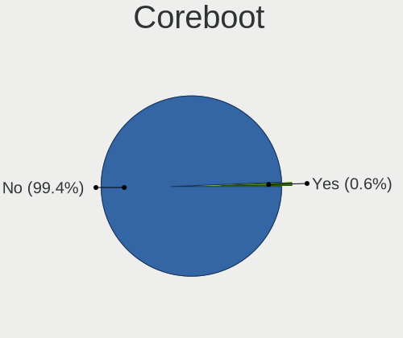
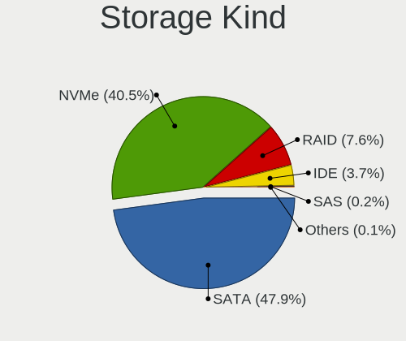
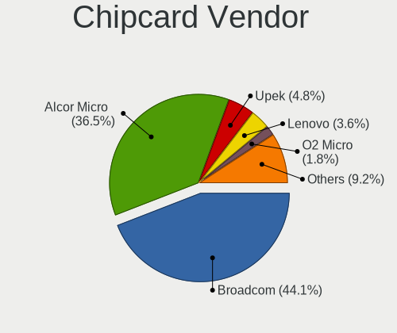
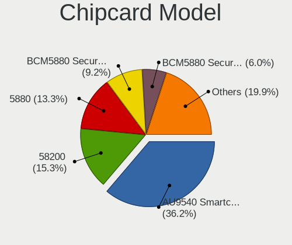

Fedora - Tested Hardware & Statistics
-------------------------------------

A project to collect tested hardware configurations for Fedora.

Anyone can contribute to this report by the [hw-probe](https://github.com/linuxhw/hw-probe) tool:

    sudo -E hw-probe -all -upload

Please contribute! Especially if your hardware is rare.

This is a report for all computer types. See also reports for [desktops](/Dist/Fedora/Desktop/README.md) and [notebooks](/Dist/Fedora/Notebook/README.md).

Contents
--------

* [ Test Cases ](#test-cases)

* [ System ](#system)
  - [ OS                       ](#os)
  - [ OS Family                ](#os-family)
  - [ Kernel                   ](#kernel)
  - [ Kernel Family            ](#kernel-family)
  - [ Kernel Major Ver.        ](#kernel-major-ver)
  - [ Arch                     ](#arch)
  - [ DE                       ](#de)
  - [ Display Server           ](#display-server)
  - [ Display Manager          ](#display-manager)
  - [ OS Lang                  ](#os-lang)
  - [ Boot Mode                ](#boot-mode)
  - [ Filesystem               ](#filesystem)
  - [ Part. scheme             ](#part-scheme)
  - [ Dual Boot with Linux/BSD ](#dual-boot-with-linuxbsd)
  - [ Dual Boot (Win)          ](#dual-boot-win)

* [ Board ](#board)
  - [ Vendor                   ](#vendor)
  - [ Model                    ](#model)
  - [ Model Family             ](#model-family)
  - [ MFG Year                 ](#mfg-year)
  - [ Form Factor              ](#form-factor)
  - [ Secure Boot              ](#secure-boot)
  - [ Coreboot                 ](#coreboot)
  - [ RAM Size                 ](#ram-size)
  - [ RAM Used                 ](#ram-used)
  - [ Total Drives             ](#total-drives)
  - [ Has CD-ROM               ](#has-cd-rom)
  - [ Has Ethernet             ](#has-ethernet)
  - [ Has WiFi                 ](#has-wifi)
  - [ Has Bluetooth            ](#has-bluetooth)

* [ Location ](#location)
  - [ Country                  ](#country)
  - [ City                     ](#city)

* [ Drives ](#drives)
  - [ Drive Vendor             ](#drive-vendor)
  - [ Drive Model              ](#drive-model)
  - [ HDD Vendor               ](#hdd-vendor)
  - [ SSD Vendor               ](#ssd-vendor)
  - [ Drive Kind               ](#drive-kind)
  - [ Drive Connector          ](#drive-connector)
  - [ Drive Size               ](#drive-size)
  - [ Space Total              ](#space-total)
  - [ Space Used               ](#space-used)
  - [ Malfunc. Drives          ](#malfunc-drives)
  - [ Malfunc. Drive Vendor    ](#malfunc-drive-vendor)
  - [ Malfunc. HDD Vendor      ](#malfunc-hdd-vendor)
  - [ Malfunc. Drive Kind      ](#malfunc-drive-kind)
  - [ Failed Drives            ](#failed-drives)
  - [ Failed Drive Vendor      ](#failed-drive-vendor)
  - [ Drive Status             ](#drive-status)

* [ Storage controller ](#storage-controller)
  - [ Storage Vendor           ](#storage-vendor)
  - [ Storage Model            ](#storage-model)
  - [ Storage Kind             ](#storage-kind)

* [ Processor ](#processor)
  - [ CPU Vendor               ](#cpu-vendor)
  - [ CPU Model                ](#cpu-model)
  - [ CPU Model Family         ](#cpu-model-family)
  - [ CPU Cores                ](#cpu-cores)
  - [ CPU Sockets              ](#cpu-sockets)
  - [ CPU Threads              ](#cpu-threads)
  - [ CPU Op-Modes             ](#cpu-op-modes)
  - [ CPU Microcode            ](#cpu-microcode)
  - [ CPU Microarch            ](#cpu-microarch)

* [ Graphics ](#graphics)
  - [ GPU Vendor               ](#gpu-vendor)
  - [ GPU Model                ](#gpu-model)
  - [ GPU Combo                ](#gpu-combo)
  - [ GPU Driver               ](#gpu-driver)
  - [ GPU Memory               ](#gpu-memory)

* [ Monitor ](#monitor)
  - [ Monitor Vendor           ](#monitor-vendor)
  - [ Monitor Model            ](#monitor-model)
  - [ Monitor Resolution       ](#monitor-resolution)
  - [ Monitor Diagonal         ](#monitor-diagonal)
  - [ Monitor Width            ](#monitor-width)
  - [ Aspect Ratio             ](#aspect-ratio)
  - [ Monitor Area             ](#monitor-area)
  - [ Pixel Density            ](#pixel-density)
  - [ Multiple Monitors        ](#multiple-monitors)

* [ Network ](#network)
  - [ Net Controller Vendor    ](#net-controller-vendor)
  - [ Net Controller Model     ](#net-controller-model)
  - [ Wireless Vendor          ](#wireless-vendor)
  - [ Wireless Model           ](#wireless-model)
  - [ Ethernet Vendor          ](#ethernet-vendor)
  - [ Ethernet Model           ](#ethernet-model)
  - [ Net Controller Kind      ](#net-controller-kind)
  - [ Used Controller          ](#used-controller)
  - [ NICs                     ](#nics)
  - [ IPv6                     ](#ipv6)

* [ Bluetooth ](#bluetooth)
  - [ Bluetooth Vendor         ](#bluetooth-vendor)
  - [ Bluetooth Model          ](#bluetooth-model)

* [ Sound ](#sound)
  - [ Sound Vendor             ](#sound-vendor)
  - [ Sound Model              ](#sound-model)

* [ Memory ](#memory)
  - [ Memory Vendor            ](#memory-vendor)
  - [ Memory Model             ](#memory-model)
  - [ Memory Kind              ](#memory-kind)
  - [ Memory Form Factor       ](#memory-form-factor)
  - [ Memory Size              ](#memory-size)
  - [ Memory Speed             ](#memory-speed)

* [ Printers & scanners ](#printers--scanners)
  - [ Printer Vendor           ](#printer-vendor)
  - [ Printer Model            ](#printer-model)
  - [ Scanner Vendor           ](#scanner-vendor)
  - [ Scanner Model            ](#scanner-model)

* [ Camera ](#camera)
  - [ Camera Vendor            ](#camera-vendor)
  - [ Camera Model             ](#camera-model)

* [ Security ](#security)
  - [ Fingerprint Vendor       ](#fingerprint-vendor)
  - [ Fingerprint Model        ](#fingerprint-model)
  - [ Chipcard Vendor          ](#chipcard-vendor)
  - [ Chipcard Model           ](#chipcard-model)

* [ Unsupported ](#unsupported)
  - [ Unsupported Devices      ](#unsupported-devices)
  - [ Unsupported Device Types ](#unsupported-device-types)

Test Cases
----------

Total: 21114

| Vendor        | Model                       | Form-Factor | Probe                                                      | Date         |
|---------------|-----------------------------|-------------|------------------------------------------------------------|--------------|
| Lenovo        | ThinkPad E15 20RD0011IX     | Notebook    | [88cc97d0be](https://linux-hardware.org/?probe=88cc97d0be) | Nov 06, 2023 |
| Lenovo        | 1038 NO DPK                 | Server      | [fe01dc6819](https://linux-hardware.org/?probe=fe01dc6819) | Nov 06, 2023 |
| Lenovo        | ThinkPad T480s 20L7002HU... | Notebook    | [f09ace6b9d](https://linux-hardware.org/?probe=f09ace6b9d) | Nov 06, 2023 |
| ASUSTek       | M4A785TD-V EVO              | Desktop     | [d57d789e77](https://linux-hardware.org/?probe=d57d789e77) | Nov 06, 2023 |
| HP            | G61                         | Notebook    | [65f7664fe3](https://linux-hardware.org/?probe=65f7664fe3) | Nov 06, 2023 |
| Samsung       | 550P5C/550P7C               | Notebook    | [f87e3a97c4](https://linux-hardware.org/?probe=f87e3a97c4) | Nov 06, 2023 |
| MSI           | X99A RAIDER                 | Desktop     | [3a2a72df26](https://linux-hardware.org/?probe=3a2a72df26) | Nov 06, 2023 |
| Acer          | Aspire A315-53              | Notebook    | [3daa9909b3](https://linux-hardware.org/?probe=3daa9909b3) | Nov 06, 2023 |
| Dell          | Venue 11 Pro 5130           | Notebook    | [d643312744](https://linux-hardware.org/?probe=d643312744) | Nov 06, 2023 |
| Lenovo        | ThinkPad T14s Gen 1 20UJ... | Notebook    | [d61e270082](https://linux-hardware.org/?probe=d61e270082) | Nov 06, 2023 |
| Dell          | Inspiron 5459               | Notebook    | [fc242f51bf](https://linux-hardware.org/?probe=fc242f51bf) | Nov 05, 2023 |
| Lenovo        | 1038 NO DPK                 | Server      | [a8c249eafd](https://linux-hardware.org/?probe=a8c249eafd) | Nov 05, 2023 |
| Lenovo        | IdeaPad 5 Pro 14ARH7 82S... | Notebook    | [4bfe797838](https://linux-hardware.org/?probe=4bfe797838) | Nov 05, 2023 |
| ASRock        | X670E Taichi                | Desktop     | [6f05d717db](https://linux-hardware.org/?probe=6f05d717db) | Nov 05, 2023 |
| ASRock        | X670E Taichi                | Desktop     | [a366b27921](https://linux-hardware.org/?probe=a366b27921) | Nov 05, 2023 |
| ASUSTek       | X550WA                      | Notebook    | [8c15da796b](https://linux-hardware.org/?probe=8c15da796b) | Nov 05, 2023 |
| Lenovo        | ThinkPad T480s 20L7002HU... | Notebook    | [92ef56cc92](https://linux-hardware.org/?probe=92ef56cc92) | Nov 05, 2023 |
| Acer          | Predator PT516-52s          | Notebook    | [30b7a47643](https://linux-hardware.org/?probe=30b7a47643) | Nov 05, 2023 |
| Dell          | Inspiron 7559               | Notebook    | [da97d12548](https://linux-hardware.org/?probe=da97d12548) | Nov 05, 2023 |
| ASRock        | X570 Phantom Gaming 4       | Desktop     | [05a8c22a35](https://linux-hardware.org/?probe=05a8c22a35) | Nov 05, 2023 |
| ASUSTek       | ROG STRIX Z390-E GAMING     | Desktop     | [e1d50d8743](https://linux-hardware.org/?probe=e1d50d8743) | Nov 05, 2023 |
| HP            | ENVY x360 Convertible 15... | Convertible | [a42da62572](https://linux-hardware.org/?probe=a42da62572) | Nov 05, 2023 |
| Dell          | 0VNP2H A00                  | Desktop     | [98439489ad](https://linux-hardware.org/?probe=98439489ad) | Nov 05, 2023 |
| HP            | 1494                        | Desktop     | [93e0e0302f](https://linux-hardware.org/?probe=93e0e0302f) | Nov 05, 2023 |
| Toshiba       | Satellite L515              | Notebook    | [70a66852db](https://linux-hardware.org/?probe=70a66852db) | Nov 05, 2023 |
| Toshiba       | Satellite L845              | Notebook    | [4dc7e8931e](https://linux-hardware.org/?probe=4dc7e8931e) | Nov 05, 2023 |
| ASUSTek       | PRIME B550M-A               | Desktop     | [4998a82a6b](https://linux-hardware.org/?probe=4998a82a6b) | Nov 05, 2023 |
| ASUSTek       | PRIME B450M-A II            | Desktop     | [539d8551fc](https://linux-hardware.org/?probe=539d8551fc) | Nov 05, 2023 |
| ASUSTek       | ROG Maximus Z790 HERO       | Desktop     | [a9ad2b542a](https://linux-hardware.org/?probe=a9ad2b542a) | Nov 05, 2023 |
| Dell          | Latitude E7440              | Notebook    | [5a151e929f](https://linux-hardware.org/?probe=5a151e929f) | Nov 05, 2023 |
| Pegatron      | 2AD5                        | Desktop     | [f8860a91a3](https://linux-hardware.org/?probe=f8860a91a3) | Nov 05, 2023 |
| Lenovo        | S145-15IWL 81MV             | Notebook    | [d38fdaf0eb](https://linux-hardware.org/?probe=d38fdaf0eb) | Nov 04, 2023 |
| Lenovo        | ThinkPad W550s 20E2000PM... | Notebook    | [1294d54c1a](https://linux-hardware.org/?probe=1294d54c1a) | Nov 04, 2023 |
| MSI           | Modern 15 B7M               | Notebook    | [b4a588e60e](https://linux-hardware.org/?probe=b4a588e60e) | Nov 04, 2023 |
| Intel         | NUC8BEB J72692-303          | Mini pc     | [77f3748e01](https://linux-hardware.org/?probe=77f3748e01) | Nov 04, 2023 |
| HP            | ProBook 430 G8 Notebook ... | Notebook    | [5d8cae0407](https://linux-hardware.org/?probe=5d8cae0407) | Nov 04, 2023 |
| Lenovo        | IdeaPad L340-15IRH Gamin... | Notebook    | [b390f8cd05](https://linux-hardware.org/?probe=b390f8cd05) | Nov 04, 2023 |
| Gigabyte      | B550M S2H                   | Desktop     | [7fb9150b16](https://linux-hardware.org/?probe=7fb9150b16) | Nov 04, 2023 |
| Apple         | MacBook5,2                  | Notebook    | [1d8dad6600](https://linux-hardware.org/?probe=1d8dad6600) | Nov 04, 2023 |
| HP            | EliteBook 850 G5            | Notebook    | [a7f0f43604](https://linux-hardware.org/?probe=a7f0f43604) | Nov 04, 2023 |
| Sony          | VPCEH3J1E                   | Notebook    | [e0ae745034](https://linux-hardware.org/?probe=e0ae745034) | Nov 04, 2023 |
| Lenovo        | ThinkPad P16v Gen 1 21FE... | Notebook    | [d0d84fed9a](https://linux-hardware.org/?probe=d0d84fed9a) | Nov 04, 2023 |
| Lenovo        | ThinkPad T14 Gen 4 21K4S... | Notebook    | [60187ba0be](https://linux-hardware.org/?probe=60187ba0be) | Nov 04, 2023 |
| MSI           | B650 GAMING PLUS WIFI       | Desktop     | [8edaffcccb](https://linux-hardware.org/?probe=8edaffcccb) | Nov 04, 2023 |
| Unknown       | Unknown                     | Desktop     | [50949c6e51](https://linux-hardware.org/?probe=50949c6e51) | Nov 04, 2023 |
| Lenovo        | V15 G2 ITL 82KB             | Notebook    | [85e528f1bf](https://linux-hardware.org/?probe=85e528f1bf) | Nov 04, 2023 |
| HP            | EliteBook 840 G4            | Notebook    | [5abff2e87a](https://linux-hardware.org/?probe=5abff2e87a) | Nov 04, 2023 |
| Dell          | Inspiron 15 3511            | Notebook    | [8c23fbf7d1](https://linux-hardware.org/?probe=8c23fbf7d1) | Nov 04, 2023 |
| POV           | I102A                       | Notebook    | [955f97d47e](https://linux-hardware.org/?probe=955f97d47e) | Nov 04, 2023 |
| ASRock        | B450 Steel Legend           | Desktop     | [2ab63a2fb6](https://linux-hardware.org/?probe=2ab63a2fb6) | Nov 04, 2023 |
| ASUSTek       | ROG STRIX X670E-E GAMING... | Desktop     | [a3eb4c9d76](https://linux-hardware.org/?probe=a3eb4c9d76) | Nov 04, 2023 |
| ASUSTek       | H81M-C                      | Desktop     | [cfb51ce306](https://linux-hardware.org/?probe=cfb51ce306) | Nov 03, 2023 |
| Irbis         | NB211                       | Notebook    | [694ca0f127](https://linux-hardware.org/?probe=694ca0f127) | Nov 03, 2023 |
| ASUSTek       | ROG Strix G513QY_G513QY     | Notebook    | [85a38e7906](https://linux-hardware.org/?probe=85a38e7906) | Nov 03, 2023 |
| HUAWEI        | KLVL-WXX9                   | Notebook    | [61342b31ea](https://linux-hardware.org/?probe=61342b31ea) | Nov 03, 2023 |
| Lenovo        | ThinkPad P14s Gen 4 21K5... | Notebook    | [7b64212148](https://linux-hardware.org/?probe=7b64212148) | Nov 03, 2023 |
| HP            | Laptop 15-dy2xxx            | Notebook    | [f4bae2d5b5](https://linux-hardware.org/?probe=f4bae2d5b5) | Nov 03, 2023 |
| HP            | 859C                        | Desktop     | [7928158950](https://linux-hardware.org/?probe=7928158950) | Nov 03, 2023 |
| Timi          | A35S                        | Notebook    | [d62fbb6f83](https://linux-hardware.org/?probe=d62fbb6f83) | Nov 03, 2023 |
| Lenovo        | ThinkPad P14s Gen 4 21K5... | Notebook    | [0e71b912ec](https://linux-hardware.org/?probe=0e71b912ec) | Nov 03, 2023 |
| ASUSTek       | ASUS TUF Gaming A15 FA50... | Notebook    | [ff0d013246](https://linux-hardware.org/?probe=ff0d013246) | Nov 03, 2023 |
| Lenovo        | IdeaPad 3 15IML05 81WB      | Notebook    | [f9bdbf6371](https://linux-hardware.org/?probe=f9bdbf6371) | Nov 03, 2023 |
| Lenovo        | IdeaPad 3 15ALC6 82KU       | Notebook    | [bcea72b22f](https://linux-hardware.org/?probe=bcea72b22f) | Nov 03, 2023 |
| Lenovo        | ThinkPad T470s 20HF0047U... | Notebook    | [00a8b74f46](https://linux-hardware.org/?probe=00a8b74f46) | Nov 03, 2023 |
| Lenovo        | ThinkPad Z13 Gen 1 21D3S... | Notebook    | [6a2591b5e9](https://linux-hardware.org/?probe=6a2591b5e9) | Nov 03, 2023 |
| Gigabyte      | G41MT-D3                    | Desktop     | [3a4be91563](https://linux-hardware.org/?probe=3a4be91563) | Nov 03, 2023 |
| Lenovo        | ThinkBook Plus G3 IAP 21... | Notebook    | [a6fabd1a6d](https://linux-hardware.org/?probe=a6fabd1a6d) | Nov 03, 2023 |
| HP            | Laptop 15-dy2xxx            | Notebook    | [28990f206a](https://linux-hardware.org/?probe=28990f206a) | Nov 03, 2023 |
| MSI           | B450M-A PRO MAX             | Desktop     | [3618f2a4b5](https://linux-hardware.org/?probe=3618f2a4b5) | Nov 03, 2023 |
| Irbis         | NB211                       | Notebook    | [3ebca4338a](https://linux-hardware.org/?probe=3ebca4338a) | Nov 03, 2023 |
| HP            | Pavilion Notebook           | Notebook    | [f23e44229f](https://linux-hardware.org/?probe=f23e44229f) | Nov 03, 2023 |
| HP            | Stream Laptop 11-ah1XX      | Notebook    | [94cdd979b2](https://linux-hardware.org/?probe=94cdd979b2) | Nov 03, 2023 |
| Intel         | NUC8BEB J72688-307          | Mini pc     | [36fb8d63bb](https://linux-hardware.org/?probe=36fb8d63bb) | Nov 03, 2023 |
| Fujitsu       | LIFEBOOK A3510              | Notebook    | [0929326be0](https://linux-hardware.org/?probe=0929326be0) | Nov 03, 2023 |
| HP            | Stream Laptop 11-ah1XX      | Notebook    | [5149df3a58](https://linux-hardware.org/?probe=5149df3a58) | Nov 03, 2023 |
| Framework     | Laptop 13 (AMD Ryzen 704... | Notebook    | [1b43feda1f](https://linux-hardware.org/?probe=1b43feda1f) | Nov 03, 2023 |
| Lenovo        | Legion 5 Pro 16ARH7H 82R... | Notebook    | [26bc5f025c](https://linux-hardware.org/?probe=26bc5f025c) | Nov 02, 2023 |
| MSI           | MPG B550 GAMING PLUS        | Desktop     | [b58b97e74a](https://linux-hardware.org/?probe=b58b97e74a) | Nov 02, 2023 |
| Lenovo        | IdeaPad S340-15API 81NC     | Notebook    | [741bcd1343](https://linux-hardware.org/?probe=741bcd1343) | Nov 02, 2023 |
| Lenovo        | ThinkPad T400 2768BB1       | Notebook    | [56bbf7c0bb](https://linux-hardware.org/?probe=56bbf7c0bb) | Nov 02, 2023 |
| GreatWall     | W1011                       | Tablet      | [fe355d55c3](https://linux-hardware.org/?probe=fe355d55c3) | Nov 02, 2023 |
| HP            | ENVY x360 Convertible 13... | Convertible | [cf88c7f3db](https://linux-hardware.org/?probe=cf88c7f3db) | Nov 02, 2023 |
| MSI           | MAG B550 TOMAHAWK           | Desktop     | [bbe345cd5d](https://linux-hardware.org/?probe=bbe345cd5d) | Nov 02, 2023 |
| ASUSTek       | VivoBook_ASUSLaptop K350... | Notebook    | [bb1da2575d](https://linux-hardware.org/?probe=bb1da2575d) | Nov 02, 2023 |
| Lenovo        | ThinkBook Plus G3 IAP 21... | Notebook    | [c6634f090f](https://linux-hardware.org/?probe=c6634f090f) | Nov 02, 2023 |
| Acer          | Aspire A715-41G             | Notebook    | [664191098d](https://linux-hardware.org/?probe=664191098d) | Nov 02, 2023 |
| HUAWEI        | BOM-WXX9                    | Notebook    | [97ca7a0bfd](https://linux-hardware.org/?probe=97ca7a0bfd) | Nov 02, 2023 |
| ASRock        | B760M PG SONIC WiFi         | Desktop     | [71e1e69f30](https://linux-hardware.org/?probe=71e1e69f30) | Nov 02, 2023 |
| MSI           | IONA                        | Desktop     | [579757d1cf](https://linux-hardware.org/?probe=579757d1cf) | Nov 02, 2023 |
| Lenovo        | ThinkPad T410 2537NT8       | Notebook    | [2d1404f4ae](https://linux-hardware.org/?probe=2d1404f4ae) | Nov 02, 2023 |
| Dell          | Inspiron N5110              | Notebook    | [ad0e3ec9ea](https://linux-hardware.org/?probe=ad0e3ec9ea) | Nov 01, 2023 |
| MSI           | B450M MORTAR MAX            | Desktop     | [960c1dbbd2](https://linux-hardware.org/?probe=960c1dbbd2) | Nov 01, 2023 |
| HP            | ProBook 650 G1              | Notebook    | [60c6e3a5d2](https://linux-hardware.org/?probe=60c6e3a5d2) | Nov 01, 2023 |
| ASUSTek       | M52AD_M12AD                 | Desktop     | [a75715ee4a](https://linux-hardware.org/?probe=a75715ee4a) | Nov 01, 2023 |
| Dell          | G3 3579                     | Notebook    | [0b33f63284](https://linux-hardware.org/?probe=0b33f63284) | Nov 01, 2023 |
| Acer          | TravelMate P259-MG          | Notebook    | [ba3faece8c](https://linux-hardware.org/?probe=ba3faece8c) | Nov 01, 2023 |
| ASRock        | H97M Anniversary            | Desktop     | [6c66e3862d](https://linux-hardware.org/?probe=6c66e3862d) | Nov 01, 2023 |
| HP            | Laptop 15s-eq2xxx           | Notebook    | [685b1b18eb](https://linux-hardware.org/?probe=685b1b18eb) | Nov 01, 2023 |
| Acer          | Nitro AN515-52              | Notebook    | [829c16d044](https://linux-hardware.org/?probe=829c16d044) | Nov 01, 2023 |
| Lenovo        | Yoga 7 15ITL5 82BJ          | Convertible | [236c6c4f9a](https://linux-hardware.org/?probe=236c6c4f9a) | Nov 01, 2023 |
| Apple         | MacBookPro16,2              | Notebook    | [37b53d54e8](https://linux-hardware.org/?probe=37b53d54e8) | Nov 01, 2023 |
| Acer          | Aspire E1-572G              | Notebook    | [d347dc93b5](https://linux-hardware.org/?probe=d347dc93b5) | Nov 01, 2023 |
| Lenovo        | ThinkPad T480s 20L8S1R50... | Notebook    | [bbf2002cea](https://linux-hardware.org/?probe=bbf2002cea) | Nov 01, 2023 |
| ASUSTek       | TUF Gaming X570-PRO         | Desktop     | [bb9a00e5b5](https://linux-hardware.org/?probe=bb9a00e5b5) | Nov 01, 2023 |
| Lenovo        | ThinkPad X1 Carbon Gen 1... | Notebook    | [7dd972fb0d](https://linux-hardware.org/?probe=7dd972fb0d) | Nov 01, 2023 |
| Acer          | Aspire A715-41G             | Notebook    | [63fa5e90b2](https://linux-hardware.org/?probe=63fa5e90b2) | Nov 01, 2023 |
| Apple         | MacBookPro15,2              | Notebook    | [b724e20965](https://linux-hardware.org/?probe=b724e20965) | Nov 01, 2023 |
| Lenovo        | IdeaPadFlex 5 14ALC7 82R... | Convertible | [636993569c](https://linux-hardware.org/?probe=636993569c) | Nov 01, 2023 |
| Gigabyte      | GA-MA780G-UD3H              | Desktop     | [168597b33e](https://linux-hardware.org/?probe=168597b33e) | Nov 01, 2023 |
| HP            | Laptop 15-fc0xxx            | Notebook    | [d0be3aec4e](https://linux-hardware.org/?probe=d0be3aec4e) | Nov 01, 2023 |
| HP            | 8767 A                      | Desktop     | [618323a058](https://linux-hardware.org/?probe=618323a058) | Nov 01, 2023 |
| Lenovo        | ThinkPad L380 20M6S11800    | Notebook    | [06fd1ea497](https://linux-hardware.org/?probe=06fd1ea497) | Nov 01, 2023 |
| Lenovo        | ThinkPad L380 20M6S11800    | Notebook    | [ded89ffc10](https://linux-hardware.org/?probe=ded89ffc10) | Nov 01, 2023 |
| ABIT          | F-I90HD                     | Desktop     | [2d6d01983c](https://linux-hardware.org/?probe=2d6d01983c) | Nov 01, 2023 |
| ASUSTek       | X555QG                      | Notebook    | [f047c1d264](https://linux-hardware.org/?probe=f047c1d264) | Nov 01, 2023 |
| Gigabyte      | P67A-D3-B3                  | Desktop     | [0c51ffc039](https://linux-hardware.org/?probe=0c51ffc039) | Nov 01, 2023 |
| Lenovo        | ThinkPad T14 Gen 4 21HDC... | Notebook    | [0d9316dbcf](https://linux-hardware.org/?probe=0d9316dbcf) | Oct 31, 2023 |
| HUAWEI        | BOHB-WAX9                   | Notebook    | [5da84da52f](https://linux-hardware.org/?probe=5da84da52f) | Oct 31, 2023 |
| MSI           | B450M PRO-M2 V2             | Desktop     | [7296b22122](https://linux-hardware.org/?probe=7296b22122) | Oct 31, 2023 |
| MSI           | MPG B550 GAMING EDGE WIF... | Desktop     | [3b79851103](https://linux-hardware.org/?probe=3b79851103) | Oct 31, 2023 |
| Lenovo        | IdeaPad 5 15ARE05 81YQ      | Notebook    | [aef3dccca0](https://linux-hardware.org/?probe=aef3dccca0) | Oct 31, 2023 |
| Alienware     | 14                          | Notebook    | [e88b7c0ac6](https://linux-hardware.org/?probe=e88b7c0ac6) | Oct 31, 2023 |
| ASUSTek       | X507UA                      | Notebook    | [c52aa98c38](https://linux-hardware.org/?probe=c52aa98c38) | Oct 31, 2023 |
| ASUSTek       | ROG Zephyrus G15 GA503RS... | Notebook    | [af854a07c5](https://linux-hardware.org/?probe=af854a07c5) | Oct 31, 2023 |
| ASUSTek       | ROG Zephyrus G15 GA503RS... | Notebook    | [fadc897ee2](https://linux-hardware.org/?probe=fadc897ee2) | Oct 31, 2023 |
| HP            | Elite x360 1040 14 inch ... | Convertible | [f7385ed51b](https://linux-hardware.org/?probe=f7385ed51b) | Oct 31, 2023 |
| Lenovo        | ThinkPad E14 Gen 4 21E3S... | Notebook    | [ebec8d6fd1](https://linux-hardware.org/?probe=ebec8d6fd1) | Oct 31, 2023 |
| Microsoft     | Surface Go                  | Tablet      | [ef58eef71a](https://linux-hardware.org/?probe=ef58eef71a) | Oct 31, 2023 |
| Gigabyte      | F2A55M-DS2                  | Desktop     | [069872b404](https://linux-hardware.org/?probe=069872b404) | Oct 31, 2023 |
| Apple         | MacBookPro8,1               | Notebook    | [0ea1a71a53](https://linux-hardware.org/?probe=0ea1a71a53) | Oct 31, 2023 |
| ASUSTek       | ROG STRIX X370-F GAMING     | Desktop     | [3179102373](https://linux-hardware.org/?probe=3179102373) | Oct 31, 2023 |
| Lenovo        | ThinkPad T490 20N2S0QE00    | Notebook    | [9785ae64c0](https://linux-hardware.org/?probe=9785ae64c0) | Oct 31, 2023 |
| Lenovo        | ThinkPad E470 20H1006KIX    | Notebook    | [d84959fadc](https://linux-hardware.org/?probe=d84959fadc) | Oct 31, 2023 |
| HP            | ProBook 645 G1              | Notebook    | [b637cedab4](https://linux-hardware.org/?probe=b637cedab4) | Oct 31, 2023 |
| ASUSTek       | ASUS TUF Gaming A15 FA50... | Notebook    | [54a64f0a7e](https://linux-hardware.org/?probe=54a64f0a7e) | Oct 31, 2023 |
| Dell          | Latitude 5414               | Notebook    | [fd7b086e1b](https://linux-hardware.org/?probe=fd7b086e1b) | Oct 31, 2023 |
| Lenovo        | ThinkPad X13 Gen 1 20T3S... | Notebook    | [487222ef3e](https://linux-hardware.org/?probe=487222ef3e) | Oct 31, 2023 |
| HP            | Spectre x360 2-in-1 Lapt... | Convertible | [a9a2e2ab03](https://linux-hardware.org/?probe=a9a2e2ab03) | Oct 30, 2023 |
| Lenovo        | IdeaPad 5 14ARE05 81YM      | Notebook    | [055e34b095](https://linux-hardware.org/?probe=055e34b095) | Oct 30, 2023 |
| Acer          | Aspire A515-45              | Notebook    | [25431e9c91](https://linux-hardware.org/?probe=25431e9c91) | Oct 30, 2023 |
| ASUSTek       | X555UJ                      | Notebook    | [de6e2775a4](https://linux-hardware.org/?probe=de6e2775a4) | Oct 30, 2023 |
| MSI           | X570-A PRO                  | Desktop     | [a198e0f9c2](https://linux-hardware.org/?probe=a198e0f9c2) | Oct 30, 2023 |
| Lenovo        | ThinkPad T440 20B7S03Q00    | Notebook    | [de24032ac7](https://linux-hardware.org/?probe=de24032ac7) | Oct 30, 2023 |
| Unknown       | Unknown                     | Notebook    | [43e6db0023](https://linux-hardware.org/?probe=43e6db0023) | Oct 30, 2023 |
| ASUSTek       | PRIME B660-PLUS D4          | Desktop     | [53e53337bb](https://linux-hardware.org/?probe=53e53337bb) | Oct 30, 2023 |
| Lenovo        | ThinkBook 14 G4 ABA 21DK    | Notebook    | [0b129d4a95](https://linux-hardware.org/?probe=0b129d4a95) | Oct 30, 2023 |
| Dell          | Vostro 3525                 | Notebook    | [ad34d5b54f](https://linux-hardware.org/?probe=ad34d5b54f) | Oct 30, 2023 |
| MSI           | MPG X570 GAMING PLUS        | Desktop     | [e4d622b76b](https://linux-hardware.org/?probe=e4d622b76b) | Oct 30, 2023 |
| ASUSTek       | Zenbook UM3402YAR_UM3402... | Notebook    | [48f8f53d3e](https://linux-hardware.org/?probe=48f8f53d3e) | Oct 30, 2023 |
| Dell          | Latitude 5490               | Notebook    | [63f4fce332](https://linux-hardware.org/?probe=63f4fce332) | Oct 30, 2023 |
| Lenovo        | ThinkPad T400 2768BB1       | Notebook    | [249ea48334](https://linux-hardware.org/?probe=249ea48334) | Oct 30, 2023 |
| MSI           | H310M PRO-VDH PLUS          | Desktop     | [624a99186e](https://linux-hardware.org/?probe=624a99186e) | Oct 30, 2023 |
| ASUSTek       | VivoBook_ASUSLaptop E210... | Notebook    | [6cbfd91e78](https://linux-hardware.org/?probe=6cbfd91e78) | Oct 30, 2023 |
| Lenovo        | ThinkPad Z13 Gen 1 21D3S... | Notebook    | [8730c3de9d](https://linux-hardware.org/?probe=8730c3de9d) | Oct 30, 2023 |
| Dell          | Precision 3551              | Notebook    | [4f054a63ef](https://linux-hardware.org/?probe=4f054a63ef) | Oct 30, 2023 |
| Gigabyte      | B650 AORUS ELITE AX         | Desktop     | [949a1ab2bb](https://linux-hardware.org/?probe=949a1ab2bb) | Oct 30, 2023 |
| Fujitsu       | D3049-B1 S26361-D3049-B1... | Server      | [261e5240fe](https://linux-hardware.org/?probe=261e5240fe) | Oct 30, 2023 |
| Gigabyte      | B85M-D3V-A                  | Desktop     | [c35ab1031d](https://linux-hardware.org/?probe=c35ab1031d) | Oct 30, 2023 |
| ASUSTek       | F3Sv                        | Notebook    | [3da2894228](https://linux-hardware.org/?probe=3da2894228) | Oct 30, 2023 |
| ASRock        | 890GM Pro3                  | Desktop     | [cfeea44315](https://linux-hardware.org/?probe=cfeea44315) | Oct 30, 2023 |
| Shenzhen M... | F7BSC                       | Mini pc     | [8ed2593c1e](https://linux-hardware.org/?probe=8ed2593c1e) | Oct 30, 2023 |
| Shenzhen M... | F7BSC                       | Mini pc     | [c894a2ac6a](https://linux-hardware.org/?probe=c894a2ac6a) | Oct 30, 2023 |
| Framework     | Laptop (12th Gen Intel C... | Notebook    | [b1adeb2f86](https://linux-hardware.org/?probe=b1adeb2f86) | Oct 30, 2023 |
| HP            | Pavilion Gaming Laptop 1... | Notebook    | [fe7dbb2385](https://linux-hardware.org/?probe=fe7dbb2385) | Oct 29, 2023 |
| Gigabyte      | B550 AORUS PRO AC           | Desktop     | [e41780f56a](https://linux-hardware.org/?probe=e41780f56a) | Oct 29, 2023 |
| Lenovo        | ThinkBook 14s Yoga ITL 2... | Convertible | [a526322459](https://linux-hardware.org/?probe=a526322459) | Oct 29, 2023 |
| Gigabyte      | B550I AORUS PRO AX          | Desktop     | [7d0eb8f922](https://linux-hardware.org/?probe=7d0eb8f922) | Oct 29, 2023 |
| Pegatron      | IPM41-D3                    | Desktop     | [ff941d75c9](https://linux-hardware.org/?probe=ff941d75c9) | Oct 29, 2023 |
| Pegatron      | IPM41-D3                    | Desktop     | [307134fa91](https://linux-hardware.org/?probe=307134fa91) | Oct 29, 2023 |
| Apple         | MacBookPro15,4              | Notebook    | [09ee918b60](https://linux-hardware.org/?probe=09ee918b60) | Oct 29, 2023 |
| Lenovo        | ThinkPad L14 Gen 4 21H10... | Notebook    | [0a7d468516](https://linux-hardware.org/?probe=0a7d468516) | Oct 29, 2023 |
| HP            | Notebook                    | Notebook    | [79843ed7c3](https://linux-hardware.org/?probe=79843ed7c3) | Oct 29, 2023 |
| Lenovo        | Yoga 9 14ITL5 82BG          | Convertible | [519bf4fbae](https://linux-hardware.org/?probe=519bf4fbae) | Oct 29, 2023 |
| Dell          | Precision 5480              | Notebook    | [5df408828c](https://linux-hardware.org/?probe=5df408828c) | Oct 29, 2023 |
| ASUSTek       | PRIME B550M-A               | Desktop     | [deef4da5dc](https://linux-hardware.org/?probe=deef4da5dc) | Oct 29, 2023 |
| MSI           | PRO B650M-P                 | Desktop     | [521367f574](https://linux-hardware.org/?probe=521367f574) | Oct 29, 2023 |
| ASUSTek       | ZenBook UX535LI_UX535LI     | Notebook    | [313770aff1](https://linux-hardware.org/?probe=313770aff1) | Oct 29, 2023 |
| Dell          | 0HFG24 A01                  | Server      | [12d5c69b6a](https://linux-hardware.org/?probe=12d5c69b6a) | Oct 29, 2023 |
| ASRock        | X399 Taichi                 | Desktop     | [78ab56301b](https://linux-hardware.org/?probe=78ab56301b) | Oct 29, 2023 |
| raspberryp... | Raspberry Pi 4 Model B R... | Soc         | [2aa83dbdfc](https://linux-hardware.org/?probe=2aa83dbdfc) | Oct 29, 2023 |
| Dell          | Precision M6800             | Notebook    | [a5e2100522](https://linux-hardware.org/?probe=a5e2100522) | Oct 29, 2023 |
| MSI           | MPG B550 GAMING PLUS        | Desktop     | [dee4ef8a3b](https://linux-hardware.org/?probe=dee4ef8a3b) | Oct 29, 2023 |
| ASRock        | Z370 Professional Gaming... | Desktop     | [f589e0c914](https://linux-hardware.org/?probe=f589e0c914) | Oct 28, 2023 |
| Lenovo        | ThinkPad E14 20RA0020AU     | Notebook    | [1d1a7bd472](https://linux-hardware.org/?probe=1d1a7bd472) | Oct 28, 2023 |
| Thomson       | N14C4WH64                   | Notebook    | [8dd9b1dbde](https://linux-hardware.org/?probe=8dd9b1dbde) | Oct 28, 2023 |
| HP            | Pavilion Laptop 15-cc6xx    | Notebook    | [da25874b12](https://linux-hardware.org/?probe=da25874b12) | Oct 28, 2023 |
| Apple         | MacBookPro8,1               | Notebook    | [762e9a6d4d](https://linux-hardware.org/?probe=762e9a6d4d) | Oct 28, 2023 |
| Apple         | MacBookPro8,1               | Notebook    | [b4645667a4](https://linux-hardware.org/?probe=b4645667a4) | Oct 28, 2023 |
| HP            | 8053                        | Desktop     | [352cc1bad8](https://linux-hardware.org/?probe=352cc1bad8) | Oct 28, 2023 |
| HP            | Notebook                    | Notebook    | [791dfef3cc](https://linux-hardware.org/?probe=791dfef3cc) | Oct 28, 2023 |
| HP            | 8053                        | Desktop     | [25f2c6e830](https://linux-hardware.org/?probe=25f2c6e830) | Oct 28, 2023 |
| ASUSTek       | Z10PE-D8 WS                 | Desktop     | [4562f80268](https://linux-hardware.org/?probe=4562f80268) | Oct 28, 2023 |
| HUAWEI        | CREM-WXX9                   | Notebook    | [217aaa00da](https://linux-hardware.org/?probe=217aaa00da) | Oct 28, 2023 |
| Acer          | TravelMate P214-41          | Notebook    | [53659e599e](https://linux-hardware.org/?probe=53659e599e) | Oct 28, 2023 |
| Lenovo        | Legion 5 15IAH7 82RC        | Notebook    | [f78fcbc612](https://linux-hardware.org/?probe=f78fcbc612) | Oct 28, 2023 |
| Gigabyte      | Z77-D3H                     | Desktop     | [77541125c0](https://linux-hardware.org/?probe=77541125c0) | Oct 28, 2023 |
| Gigabyte      | D525TUD                     | Desktop     | [944bb2ecb2](https://linux-hardware.org/?probe=944bb2ecb2) | Oct 28, 2023 |
| Gigabyte      | B550 VISION D-P             | Desktop     | [d78b4f6222](https://linux-hardware.org/?probe=d78b4f6222) | Oct 28, 2023 |
| HP            | EliteBook 840 G7 Noteboo... | Notebook    | [5591930fc0](https://linux-hardware.org/?probe=5591930fc0) | Oct 27, 2023 |
| Lenovo        | YogaAir 14s APU8 83AA       | Notebook    | [4f120347b7](https://linux-hardware.org/?probe=4f120347b7) | Oct 27, 2023 |
| MSI           | H310M PRO-VDH PLUS          | Desktop     | [b18bbae606](https://linux-hardware.org/?probe=b18bbae606) | Oct 27, 2023 |
| Dell          | Precision 5530              | Notebook    | [e707fe59cc](https://linux-hardware.org/?probe=e707fe59cc) | Oct 27, 2023 |
| HP            | 843F                        | Desktop     | [c39418a5fe](https://linux-hardware.org/?probe=c39418a5fe) | Oct 27, 2023 |
| ASUSTek       | ROG STRIX X670E-I GAMING... | Desktop     | [4eacfc5dd8](https://linux-hardware.org/?probe=4eacfc5dd8) | Oct 27, 2023 |
| Acer          | Aspire V5-572P              | Notebook    | [18938afb70](https://linux-hardware.org/?probe=18938afb70) | Oct 27, 2023 |
| HP            | ZBook Firefly 14 inch G8... | Notebook    | [bd82dd57be](https://linux-hardware.org/?probe=bd82dd57be) | Oct 27, 2023 |
| Lenovo        | ThinkPad T480 20L6S69X08    | Notebook    | [61da163866](https://linux-hardware.org/?probe=61da163866) | Oct 27, 2023 |
| ASUSTek       | TUF Gaming B550M-PLUS       | Desktop     | [1cb73bada5](https://linux-hardware.org/?probe=1cb73bada5) | Oct 27, 2023 |
| Apple         | MacBookPro14,2              | Notebook    | [346fad17ff](https://linux-hardware.org/?probe=346fad17ff) | Oct 27, 2023 |
| Apple         | MacBookPro14,2              | Notebook    | [481d6c83fb](https://linux-hardware.org/?probe=481d6c83fb) | Oct 27, 2023 |
| Apple         | Mac-7BA5B2DFE22DDD8C Mac... | Mini pc     | [51e6c3cef4](https://linux-hardware.org/?probe=51e6c3cef4) | Oct 27, 2023 |
| Lenovo        | 300w Gen 3 82J1             | Convertible | [570c03f594](https://linux-hardware.org/?probe=570c03f594) | Oct 27, 2023 |
| Lenovo        | ThinkPad T480s 20L8S1R50... | Notebook    | [057e350f82](https://linux-hardware.org/?probe=057e350f82) | Oct 27, 2023 |
| Lenovo        | IdeaPad 1 15IAU7 82QD       | Notebook    | [a20c6e2c77](https://linux-hardware.org/?probe=a20c6e2c77) | Oct 26, 2023 |
| ASUSTek       | ROG Zephyrus G14 GA402RJ... | Notebook    | [9650e62539](https://linux-hardware.org/?probe=9650e62539) | Oct 26, 2023 |
| Lenovo        | ThinkPad X1 Carbon 6th 2... | Notebook    | [82ba56a70d](https://linux-hardware.org/?probe=82ba56a70d) | Oct 26, 2023 |
| Dell          | Latitude 5440               | Notebook    | [e7d56ee207](https://linux-hardware.org/?probe=e7d56ee207) | Oct 26, 2023 |
| Dell          | Latitude 7490               | Notebook    | [58324a8dfd](https://linux-hardware.org/?probe=58324a8dfd) | Oct 26, 2023 |
| ASUSTek       | TUF Gaming B760M-PLUS       | Desktop     | [a576bfd0b1](https://linux-hardware.org/?probe=a576bfd0b1) | Oct 26, 2023 |
| ASUSTek       | Zephyrus G GU502DU_GA502... | Notebook    | [3aa43f0bf7](https://linux-hardware.org/?probe=3aa43f0bf7) | Oct 26, 2023 |
| Gigabyte      | B450M DS3H V2               | Desktop     | [3279dc82a1](https://linux-hardware.org/?probe=3279dc82a1) | Oct 26, 2023 |
| HP            | EliteBook 630 13.3 inch ... | Notebook    | [8f57ab5108](https://linux-hardware.org/?probe=8f57ab5108) | Oct 26, 2023 |
| HP            | Pavilion dv7                | Notebook    | [15526c62b8](https://linux-hardware.org/?probe=15526c62b8) | Oct 26, 2023 |
| Maibenben     | MaiBook M                   | Notebook    | [ccee3b60c7](https://linux-hardware.org/?probe=ccee3b60c7) | Oct 26, 2023 |
| HP            | EliteBook 845 G8 Noteboo... | Notebook    | [4506629e6a](https://linux-hardware.org/?probe=4506629e6a) | Oct 26, 2023 |
| Unknown       | Unknown                     | Notebook    | [7d25c7409a](https://linux-hardware.org/?probe=7d25c7409a) | Oct 26, 2023 |
| Gigabyte      | X670 AORUS ELITE AX         | Desktop     | [fff464540a](https://linux-hardware.org/?probe=fff464540a) | Oct 26, 2023 |
| HUAWEI        | NBLK-WAX9X                  | Notebook    | [38046f165d](https://linux-hardware.org/?probe=38046f165d) | Oct 26, 2023 |
| Intel         | NUC6i5SYB H81131-505        | Mini pc     | [992a1810e2](https://linux-hardware.org/?probe=992a1810e2) | Oct 26, 2023 |
| HUAWEI        | NBLK-WAX9X                  | Notebook    | [7830b3ae27](https://linux-hardware.org/?probe=7830b3ae27) | Oct 26, 2023 |
| Lenovo        | ThinkBook 14s Yoga ITL 2... | Convertible | [67b3859d9d](https://linux-hardware.org/?probe=67b3859d9d) | Oct 26, 2023 |
| Toshiba       | Satellite L75D-A            | Notebook    | [82efb2dd44](https://linux-hardware.org/?probe=82efb2dd44) | Oct 26, 2023 |
| Apple         | MacBookPro15,4              | Notebook    | [751e98cb04](https://linux-hardware.org/?probe=751e98cb04) | Oct 26, 2023 |
| Schenker      | VISION (M23)                | Notebook    | [64cead24ba](https://linux-hardware.org/?probe=64cead24ba) | Oct 26, 2023 |
| Dell          | 0KJCC5 A00                  | Desktop     | [f4f5605117](https://linux-hardware.org/?probe=f4f5605117) | Oct 26, 2023 |
| ASUSTek       | ROG STRIX X570-F GAMING     | Desktop     | [ca40b148a0](https://linux-hardware.org/?probe=ca40b148a0) | Oct 26, 2023 |
| ASRock        | 890GM Pro3                  | Desktop     | [ca2fb95579](https://linux-hardware.org/?probe=ca2fb95579) | Oct 25, 2023 |
| ASUSTek       | ROG STRIX B760-I GAMING ... | Desktop     | [d5afb1c9da](https://linux-hardware.org/?probe=d5afb1c9da) | Oct 25, 2023 |
| Lenovo        | ThinkPad X1 Carbon Gen 1... | Notebook    | [a17a8b4360](https://linux-hardware.org/?probe=a17a8b4360) | Oct 25, 2023 |
| Gigabyte      | EP45-DS3L                   | Desktop     | [a3a2c0b74b](https://linux-hardware.org/?probe=a3a2c0b74b) | Oct 25, 2023 |
| Acer          | Aspire 7750G                | Notebook    | [673c675bc6](https://linux-hardware.org/?probe=673c675bc6) | Oct 25, 2023 |
| HP            | 8433 11                     | Desktop     | [902343e220](https://linux-hardware.org/?probe=902343e220) | Oct 25, 2023 |
| Lenovo        | ThinkPad P1 Gen 6 21FV00... | Notebook    | [3cf7c10977](https://linux-hardware.org/?probe=3cf7c10977) | Oct 25, 2023 |
| ASUSTek       | ROG CROSSHAIR X670E HERO    | Desktop     | [9207de9b44](https://linux-hardware.org/?probe=9207de9b44) | Oct 25, 2023 |
| Dell          | 0C27VV A02                  | Desktop     | [7a88945a88](https://linux-hardware.org/?probe=7a88945a88) | Oct 25, 2023 |
| Timi          | TM1701                      | Notebook    | [13801c83a2](https://linux-hardware.org/?probe=13801c83a2) | Oct 25, 2023 |
| Supermicro    | X8SAX                       | Desktop     | [5d90e1af8c](https://linux-hardware.org/?probe=5d90e1af8c) | Oct 25, 2023 |
| Lenovo        | IdeaPadFlex 15 20309        | Notebook    | [7476940ad0](https://linux-hardware.org/?probe=7476940ad0) | Oct 25, 2023 |
| Packard Be... | EasyNote LE69KB             | Notebook    | [3626d833e9](https://linux-hardware.org/?probe=3626d833e9) | Oct 24, 2023 |
| HP            | Dragonfly Folio 13.5 inc... | Notebook    | [ffb075a639](https://linux-hardware.org/?probe=ffb075a639) | Oct 24, 2023 |
| ASRock        | FM2A88X+ Killer             | Desktop     | [c9b5ffd5b8](https://linux-hardware.org/?probe=c9b5ffd5b8) | Oct 24, 2023 |
| ASRock        | B450 Pro4                   | Desktop     | [d4a28890a5](https://linux-hardware.org/?probe=d4a28890a5) | Oct 24, 2023 |
| Intel         | NUC8BEB J72692-303          | Mini pc     | [2a476e881e](https://linux-hardware.org/?probe=2a476e881e) | Oct 24, 2023 |
| ASUSTek       | TUF Gaming FX505DT_FX505... | Notebook    | [3eee01cd16](https://linux-hardware.org/?probe=3eee01cd16) | Oct 24, 2023 |
| TrekStor      | Primebook C11B              | Convertible | [7038c45f32](https://linux-hardware.org/?probe=7038c45f32) | Oct 24, 2023 |
| Lenovo        | ThinkPad T410 2537NT8       | Notebook    | [52b5addead](https://linux-hardware.org/?probe=52b5addead) | Oct 24, 2023 |
| MSI           | B550-A PRO                  | Desktop     | [ed696b1c52](https://linux-hardware.org/?probe=ed696b1c52) | Oct 24, 2023 |
| Dell          | XPS 9315                    | Notebook    | [9246bb9a28](https://linux-hardware.org/?probe=9246bb9a28) | Oct 24, 2023 |
| Gigabyte      | A320M-H-CF                  | Desktop     | [3d211c5277](https://linux-hardware.org/?probe=3d211c5277) | Oct 24, 2023 |
| Apple         | MacBookPro15,1              | Notebook    | [41fd350f12](https://linux-hardware.org/?probe=41fd350f12) | Oct 24, 2023 |
| ASUSTek       | P5Q3                        | Desktop     | [660547e520](https://linux-hardware.org/?probe=660547e520) | Oct 24, 2023 |
| Apple         | MacBookPro5,5               | Notebook    | [ed7e1a1932](https://linux-hardware.org/?probe=ed7e1a1932) | Oct 24, 2023 |
| Lenovo        | ThinkPad T430 2349UA9       | Notebook    | [84883d560d](https://linux-hardware.org/?probe=84883d560d) | Oct 24, 2023 |
| GPD           | G1621-02                    | Notebook    | [ea3897be17](https://linux-hardware.org/?probe=ea3897be17) | Oct 24, 2023 |
| MSI           | A320M PRO-VH PLUS           | Desktop     | [92dbf8615b](https://linux-hardware.org/?probe=92dbf8615b) | Oct 24, 2023 |
| Lenovo        | 371E SDK0J40709 WIN 3259... | All in one  | [47d70a6fcb](https://linux-hardware.org/?probe=47d70a6fcb) | Oct 24, 2023 |
| Gigabyte      | B550M AORUS ELITE           | Desktop     | [4e13c711c7](https://linux-hardware.org/?probe=4e13c711c7) | Oct 24, 2023 |
| Apple         | MacBookPro5,5               | Notebook    | [37be8caf53](https://linux-hardware.org/?probe=37be8caf53) | Oct 23, 2023 |
| Acer          | Aspire X1900                | Desktop     | [6454f71562](https://linux-hardware.org/?probe=6454f71562) | Oct 23, 2023 |
| Lenovo        | G500 20236                  | Notebook    | [3effd4e3d3](https://linux-hardware.org/?probe=3effd4e3d3) | Oct 23, 2023 |
| Dell          | Latitude 5320               | Notebook    | [520c2effa3](https://linux-hardware.org/?probe=520c2effa3) | Oct 23, 2023 |
| MSI           | Z170A GAMING PRO CARBON     | Desktop     | [4440cac740](https://linux-hardware.org/?probe=4440cac740) | Oct 23, 2023 |
| Lenovo        | ThinkPad X1 Carbon Gen 1... | Notebook    | [8da5e9e836](https://linux-hardware.org/?probe=8da5e9e836) | Oct 23, 2023 |
| Schenker      | XMG NEO (TGL/M21)           | Notebook    | [6d63f6c5ba](https://linux-hardware.org/?probe=6d63f6c5ba) | Oct 23, 2023 |
| MSI           | X370 SLI PLUS               | Desktop     | [2ac0a2ecc8](https://linux-hardware.org/?probe=2ac0a2ecc8) | Oct 23, 2023 |
| TUXEDO        | Unknown                     | Notebook    | [0994b60ab4](https://linux-hardware.org/?probe=0994b60ab4) | Oct 23, 2023 |
| Gigabyte      | GA-MA785G-UD3H              | Desktop     | [7c86d9f1e5](https://linux-hardware.org/?probe=7c86d9f1e5) | Oct 23, 2023 |
| ASRock        | D1800M                      | Desktop     | [d31fadd4a5](https://linux-hardware.org/?probe=d31fadd4a5) | Oct 23, 2023 |
| Lenovo        | Yoga 9 14ITL5 82BG          | Convertible | [2af156789d](https://linux-hardware.org/?probe=2af156789d) | Oct 23, 2023 |
| Gigabyte      | B450M DS3H-CF               | Desktop     | [eb9bba4f5c](https://linux-hardware.org/?probe=eb9bba4f5c) | Oct 23, 2023 |
| Dell          | G15 5515                    | Notebook    | [16754901cb](https://linux-hardware.org/?probe=16754901cb) | Oct 23, 2023 |
| HP            | ProBook 4530s               | Notebook    | [104df79d8e](https://linux-hardware.org/?probe=104df79d8e) | Oct 23, 2023 |
| Lenovo        | ThinkPad T480s 20L8S2SS0... | Notebook    | [9877bb17c1](https://linux-hardware.org/?probe=9877bb17c1) | Oct 23, 2023 |
| Lenovo        | ThinkPad T470 W10DG 20JN... | Notebook    | [2e4786bb32](https://linux-hardware.org/?probe=2e4786bb32) | Oct 23, 2023 |
| Gigabyte      | Z77MX-D3H                   | Desktop     | [1f16388df7](https://linux-hardware.org/?probe=1f16388df7) | Oct 23, 2023 |
| Lenovo        | Y50-70 20378                | Notebook    | [6f65dcd448](https://linux-hardware.org/?probe=6f65dcd448) | Oct 23, 2023 |
| ASUSTek       | T101HA                      | Tablet      | [7190f336e0](https://linux-hardware.org/?probe=7190f336e0) | Oct 23, 2023 |
| ASUSTek       | T101HA                      | Tablet      | [fc5437cf30](https://linux-hardware.org/?probe=fc5437cf30) | Oct 22, 2023 |
| ASUSTek       | Vivobook Go E1504FA_E150... | Notebook    | [7981b12a61](https://linux-hardware.org/?probe=7981b12a61) | Oct 22, 2023 |
| MSI           | IONA                        | Desktop     | [e444708510](https://linux-hardware.org/?probe=e444708510) | Oct 22, 2023 |
| Lenovo        | V15 G4 AMN 82YU             | Notebook    | [705aaea029](https://linux-hardware.org/?probe=705aaea029) | Oct 22, 2023 |
| Dell          | XPS 13 9300                 | Notebook    | [ccf935ca37](https://linux-hardware.org/?probe=ccf935ca37) | Oct 22, 2023 |
| HP            | ENVY Laptop 13-ba0xxx       | Notebook    | [38823c0a55](https://linux-hardware.org/?probe=38823c0a55) | Oct 22, 2023 |
| Lenovo        | ThinkPad L13 20R30005RT     | Notebook    | [23a9651432](https://linux-hardware.org/?probe=23a9651432) | Oct 22, 2023 |
| Lenovo        | IdeaPad S540-14IWL 81ND     | Notebook    | [c725f222a3](https://linux-hardware.org/?probe=c725f222a3) | Oct 22, 2023 |
| ASUSTek       | ROG Zephyrus Duo 16 GX65... | Notebook    | [92d3be3fff](https://linux-hardware.org/?probe=92d3be3fff) | Oct 22, 2023 |
| AZW           | SER V1                      | Desktop     | [4262bad6c4](https://linux-hardware.org/?probe=4262bad6c4) | Oct 22, 2023 |
| Gigabyte      | G41MT-S2PT                  | Desktop     | [0b67401f8c](https://linux-hardware.org/?probe=0b67401f8c) | Oct 22, 2023 |
| Gigabyte      | G41MT-S2PT                  | Desktop     | [5a2f8368e1](https://linux-hardware.org/?probe=5a2f8368e1) | Oct 22, 2023 |
| Dell          | Venue 11 Pro 5130           | Notebook    | [7105618a0a](https://linux-hardware.org/?probe=7105618a0a) | Oct 22, 2023 |
| Dell          | Venue 11 Pro 5130           | Notebook    | [0b91bab038](https://linux-hardware.org/?probe=0b91bab038) | Oct 22, 2023 |
| HP            | ProBook 450 G8 Notebook ... | Notebook    | [1eed0a53b6](https://linux-hardware.org/?probe=1eed0a53b6) | Oct 22, 2023 |
| MSI           | X99A RAIDER                 | Desktop     | [3ba4cde45a](https://linux-hardware.org/?probe=3ba4cde45a) | Oct 22, 2023 |
| Apple         | Mac-F65AE981FFA204ED Mac... | Mini pc     | [04a430e244](https://linux-hardware.org/?probe=04a430e244) | Oct 22, 2023 |
| HP            | 83E9                        | Desktop     | [c324d1ee0a](https://linux-hardware.org/?probe=c324d1ee0a) | Oct 22, 2023 |
| HP            | 83E9                        | Desktop     | [8102d00cdc](https://linux-hardware.org/?probe=8102d00cdc) | Oct 22, 2023 |
| Apple         | MacBookPro12,1              | Notebook    | [5d9310d00e](https://linux-hardware.org/?probe=5d9310d00e) | Oct 21, 2023 |
| ASUSTek       | PRIME Z690-P WIFI D4        | Desktop     | [7c383004b6](https://linux-hardware.org/?probe=7c383004b6) | Oct 21, 2023 |
| ASUSTek       | N551JK                      | Notebook    | [863f309154](https://linux-hardware.org/?probe=863f309154) | Oct 21, 2023 |
| HP            | Pavilion Gaming Laptop 1... | Notebook    | [dca6ad28b3](https://linux-hardware.org/?probe=dca6ad28b3) | Oct 21, 2023 |
| HP            | ENVY Laptop 13-ad1xx        | Notebook    | [1f4b7f796f](https://linux-hardware.org/?probe=1f4b7f796f) | Oct 21, 2023 |
| Apple         | MacBookAir4,2               | Notebook    | [dcef0a70af](https://linux-hardware.org/?probe=dcef0a70af) | Oct 21, 2023 |
| Dell          | Latitude E6320              | Notebook    | [c6965e07e3](https://linux-hardware.org/?probe=c6965e07e3) | Oct 21, 2023 |
| Dell          | Inspiron 7506 2n1           | Convertible | [37389245cd](https://linux-hardware.org/?probe=37389245cd) | Oct 21, 2023 |
| Dell          | Inspiron 7506 2n1           | Convertible | [ce517165dc](https://linux-hardware.org/?probe=ce517165dc) | Oct 21, 2023 |
| Gigabyte      | F2A55M-DS2                  | Desktop     | [422e70640a](https://linux-hardware.org/?probe=422e70640a) | Oct 21, 2023 |
| Shenzhen M... | F6BFC                       | Desktop     | [64148c88c0](https://linux-hardware.org/?probe=64148c88c0) | Oct 21, 2023 |
| HP            | Pavilion Notebook           | Notebook    | [ffeaa7da2f](https://linux-hardware.org/?probe=ffeaa7da2f) | Oct 21, 2023 |
| MSI           | B450M MORTAR MAX            | Desktop     | [c1ad18b5c9](https://linux-hardware.org/?probe=c1ad18b5c9) | Oct 21, 2023 |
| Gigabyte      | B85-HD3                     | Desktop     | [36f840931d](https://linux-hardware.org/?probe=36f840931d) | Oct 21, 2023 |
| Lenovo        | ThinkPad E15 Gen 4 21EES... | Notebook    | [f1b2f555ef](https://linux-hardware.org/?probe=f1b2f555ef) | Oct 21, 2023 |
| ASUSTek       | PRIME B360-PLUS             | Desktop     | [1190f127a2](https://linux-hardware.org/?probe=1190f127a2) | Oct 21, 2023 |
| Schenker      | XMG NEO (TGL/M21)           | Notebook    | [3afdd1b0da](https://linux-hardware.org/?probe=3afdd1b0da) | Oct 21, 2023 |
| ASRock        | H610M-HVS/M.2 R2.0          | Desktop     | [74df5e1893](https://linux-hardware.org/?probe=74df5e1893) | Oct 21, 2023 |
| Lenovo        | ThinkPad T540p 20BE0086M... | Notebook    | [a149fbf417](https://linux-hardware.org/?probe=a149fbf417) | Oct 21, 2023 |
| HP            | ENVY x360 Convertible 15... | Convertible | [466e429ddd](https://linux-hardware.org/?probe=466e429ddd) | Oct 21, 2023 |
| MSI           | X99A RAIDER                 | Desktop     | [edefe667a4](https://linux-hardware.org/?probe=edefe667a4) | Oct 21, 2023 |
| ASUSTek       | X442UAR                     | Notebook    | [454f454638](https://linux-hardware.org/?probe=454f454638) | Oct 21, 2023 |
| Packard Be... | IMEDIA S3840                | Desktop     | [3cc1398528](https://linux-hardware.org/?probe=3cc1398528) | Oct 21, 2023 |
| Dell          | Latitude 7440               | Notebook    | [e0997ac78c](https://linux-hardware.org/?probe=e0997ac78c) | Oct 20, 2023 |
| ASUSTek       | ROG STRIX Z690-E GAMING ... | Desktop     | [8290e4c160](https://linux-hardware.org/?probe=8290e4c160) | Oct 20, 2023 |
| Lenovo        | ThinkPad T540p 20BE0086M... | Notebook    | [f4f7d19069](https://linux-hardware.org/?probe=f4f7d19069) | Oct 20, 2023 |
| ASUSTek       | ROG STRIX B450-E GAMING     | Desktop     | [2d07542448](https://linux-hardware.org/?probe=2d07542448) | Oct 20, 2023 |
| BANGHO        | M7x0K                       | Notebook    | [1f72eb6b91](https://linux-hardware.org/?probe=1f72eb6b91) | Oct 20, 2023 |
| HP            | EliteBook 630 13.3 inch ... | Notebook    | [e1ed7c2ee4](https://linux-hardware.org/?probe=e1ed7c2ee4) | Oct 20, 2023 |
| Dell          | Vostro 14 5410              | Notebook    | [4cb4e5aab9](https://linux-hardware.org/?probe=4cb4e5aab9) | Oct 20, 2023 |
| ANGXUN        | X99-DM3 V3.0                | Desktop     | [86fca6aaf4](https://linux-hardware.org/?probe=86fca6aaf4) | Oct 20, 2023 |
| Dell          | Latitude 7280               | Notebook    | [ec9e688b4e](https://linux-hardware.org/?probe=ec9e688b4e) | Oct 20, 2023 |
| HP            | Pavilion Notebook           | Notebook    | [9d49844572](https://linux-hardware.org/?probe=9d49844572) | Oct 20, 2023 |
| Lenovo        | ThinkPad E15 Gen 4 21E60... | Notebook    | [aa76e46b18](https://linux-hardware.org/?probe=aa76e46b18) | Oct 20, 2023 |
| Gigabyte      | GA-MA780G-UD3H              | Desktop     | [984eba244a](https://linux-hardware.org/?probe=984eba244a) | Oct 20, 2023 |
| ASUSTek       | Zenbook UM3402YAR_UM3402... | Notebook    | [32d375b029](https://linux-hardware.org/?probe=32d375b029) | Oct 20, 2023 |
| MSI           | B550M PRO-VDH WIFI          | Desktop     | [6bb9b08c6e](https://linux-hardware.org/?probe=6bb9b08c6e) | Oct 20, 2023 |
| MSI           | B450-A PRO MAX              | Desktop     | [17b8a78644](https://linux-hardware.org/?probe=17b8a78644) | Oct 20, 2023 |
| Dell          | G7 7700                     | Notebook    | [336bd76568](https://linux-hardware.org/?probe=336bd76568) | Oct 20, 2023 |
| Apple         | Mac-F65AE981FFA204ED Mac... | Mini pc     | [fe5af0991d](https://linux-hardware.org/?probe=fe5af0991d) | Oct 20, 2023 |
| Lenovo        | G500 20236                  | Notebook    | [6e5d214cb8](https://linux-hardware.org/?probe=6e5d214cb8) | Oct 20, 2023 |
| ASUSTek       | Zephyrus M GU502GW_GU502... | Notebook    | [c96f9ccef3](https://linux-hardware.org/?probe=c96f9ccef3) | Oct 19, 2023 |
| MSI           | B550M PRO-VDH WIFI          | Desktop     | [3b1da376dc](https://linux-hardware.org/?probe=3b1da376dc) | Oct 19, 2023 |
| Apple         | MacBookAir5,2               | Notebook    | [deeaf6af5b](https://linux-hardware.org/?probe=deeaf6af5b) | Oct 19, 2023 |
| Toshiba       | Satellite A500              | Notebook    | [15b78585e0](https://linux-hardware.org/?probe=15b78585e0) | Oct 19, 2023 |
| HP            | ProBook 445 G7              | Notebook    | [10fab445ad](https://linux-hardware.org/?probe=10fab445ad) | Oct 19, 2023 |
| Toshiba       | Satellite A500              | Notebook    | [0d2e2856a9](https://linux-hardware.org/?probe=0d2e2856a9) | Oct 19, 2023 |
| ASUSTek       | PRIME X570-P                | Notebook    | [4506612f98](https://linux-hardware.org/?probe=4506612f98) | Oct 19, 2023 |
| Acer          | Aspire A315-57G             | Notebook    | [7e39a647e3](https://linux-hardware.org/?probe=7e39a647e3) | Oct 19, 2023 |
| ASUSTek       | X555QG                      | Notebook    | [e2e11a852f](https://linux-hardware.org/?probe=e2e11a852f) | Oct 19, 2023 |
| Lenovo        | IdeaPad 5 15ALC05 82LN      | Notebook    | [09ad44bf2e](https://linux-hardware.org/?probe=09ad44bf2e) | Oct 19, 2023 |
| HP            | OMEN by Laptop 16-c0xxx     | Notebook    | [8d38f6e16d](https://linux-hardware.org/?probe=8d38f6e16d) | Oct 19, 2023 |
| Lenovo        | Legion 5 15ARH05H 82B1      | Notebook    | [fbb4ce606d](https://linux-hardware.org/?probe=fbb4ce606d) | Oct 19, 2023 |
| Lenovo        | G50-80 80E5                 | Notebook    | [1f244ed949](https://linux-hardware.org/?probe=1f244ed949) | Oct 19, 2023 |
| Lenovo        | IdeaPad 320-15IKB 80YH      | Notebook    | [e94e48868c](https://linux-hardware.org/?probe=e94e48868c) | Oct 19, 2023 |
| Gigabyte      | B75M-D3V                    | Desktop     | [b02f1b04e3](https://linux-hardware.org/?probe=b02f1b04e3) | Oct 19, 2023 |
| MACHINIST     | X99 G7 V1.0                 | Desktop     | [caca14cc52](https://linux-hardware.org/?probe=caca14cc52) | Oct 19, 2023 |
| Lenovo        | G450 2949                   | Notebook    | [abafeadb35](https://linux-hardware.org/?probe=abafeadb35) | Oct 19, 2023 |
| Lenovo        | G450 2949                   | Notebook    | [ab3c18427d](https://linux-hardware.org/?probe=ab3c18427d) | Oct 19, 2023 |
| ASUSTek       | Vivobook Go E1504FA_E150... | Notebook    | [a25bc084fc](https://linux-hardware.org/?probe=a25bc084fc) | Oct 19, 2023 |
| MSI           | B550-A PRO                  | Desktop     | [77cf0c3af6](https://linux-hardware.org/?probe=77cf0c3af6) | Oct 18, 2023 |
| ASUSTek       | T101HA                      | Tablet      | [b3cd8983eb](https://linux-hardware.org/?probe=b3cd8983eb) | Oct 18, 2023 |
| ASUSTek       | Zenbook UX3402ZA_UX3402Z... | Notebook    | [4d4e3d82fd](https://linux-hardware.org/?probe=4d4e3d82fd) | Oct 18, 2023 |
| ASUSTek       | PRIME B550M-A               | Desktop     | [064dc574bb](https://linux-hardware.org/?probe=064dc574bb) | Oct 18, 2023 |
| Timi          | Redmi Book Pro 14 2022      | Notebook    | [1984a8305d](https://linux-hardware.org/?probe=1984a8305d) | Oct 18, 2023 |
| Lenovo        | 30D9 SDK0J40705 WIN 3425... | Desktop     | [305b104f83](https://linux-hardware.org/?probe=305b104f83) | Oct 18, 2023 |
| MSI           | MPG X570S CARBON MAX WIF... | Desktop     | [0566ab2287](https://linux-hardware.org/?probe=0566ab2287) | Oct 18, 2023 |
| HP            | 2B52                        | Desktop     | [b14a00a196](https://linux-hardware.org/?probe=b14a00a196) | Oct 18, 2023 |
| HP            | EliteBook 860 16 inch G1... | Notebook    | [bde071302f](https://linux-hardware.org/?probe=bde071302f) | Oct 18, 2023 |
| ASUSTek       | PRIME B350-PLUS             | Desktop     | [d7ddb794ec](https://linux-hardware.org/?probe=d7ddb794ec) | Oct 18, 2023 |
| ASUSTek       | VivoBook_ASUSLaptop K650... | Notebook    | [48b90d30be](https://linux-hardware.org/?probe=48b90d30be) | Oct 18, 2023 |
| Dell          | Precision 7680              | Notebook    | [70f6453d4c](https://linux-hardware.org/?probe=70f6453d4c) | Oct 18, 2023 |
| MSI           | MPG X570S CARBON MAX WIF... | Desktop     | [bb941b90f8](https://linux-hardware.org/?probe=bb941b90f8) | Oct 18, 2023 |
| Gigabyte      | H77N-WIFI                   | Desktop     | [0c16d31374](https://linux-hardware.org/?probe=0c16d31374) | Oct 18, 2023 |
| Dell          | XPS 13 9360                 | Notebook    | [dbbedd9f06](https://linux-hardware.org/?probe=dbbedd9f06) | Oct 18, 2023 |
| Samsung       | 670Z5E                      | Notebook    | [65ee0747bc](https://linux-hardware.org/?probe=65ee0747bc) | Oct 18, 2023 |
| ASUSTek       | VivoBook_ASUSLaptop X509... | Notebook    | [04885ecaa3](https://linux-hardware.org/?probe=04885ecaa3) | Oct 18, 2023 |
| Lenovo        | ThinkPad T480s 20L8002AM... | Notebook    | [b8d09ca2f5](https://linux-hardware.org/?probe=b8d09ca2f5) | Oct 18, 2023 |
| ASUSTek       | ROG STRIX X670E-E GAMING... | Desktop     | [d531813a7a](https://linux-hardware.org/?probe=d531813a7a) | Oct 18, 2023 |
| Gigabyte      | G41MT-S2PT                  | Desktop     | [e437f5edcb](https://linux-hardware.org/?probe=e437f5edcb) | Oct 18, 2023 |
| Dell          | Latitude 5440               | Notebook    | [2097e4ed5e](https://linux-hardware.org/?probe=2097e4ed5e) | Oct 18, 2023 |
| ASUSTek       | TUF Gaming B550M-PLUS WI... | Desktop     | [2530967a90](https://linux-hardware.org/?probe=2530967a90) | Oct 17, 2023 |
| ASUSTek       | X556UJ                      | Notebook    | [010c7b3e14](https://linux-hardware.org/?probe=010c7b3e14) | Oct 17, 2023 |
| Lenovo        | Yoga Slim 7 Pro 16ARH7 8... | Notebook    | [6193aa3ed1](https://linux-hardware.org/?probe=6193aa3ed1) | Oct 17, 2023 |
| ASUSTek       | X556UJ                      | Notebook    | [e9065ad0d2](https://linux-hardware.org/?probe=e9065ad0d2) | Oct 17, 2023 |
| HP            | 1589                        | Desktop     | [9fca3eb994](https://linux-hardware.org/?probe=9fca3eb994) | Oct 17, 2023 |
| ASUSTek       | Zenbook UX3402VA_UX3402V... | Notebook    | [4d69a046ff](https://linux-hardware.org/?probe=4d69a046ff) | Oct 17, 2023 |
| HUAWEI        | KLVL-WXX9                   | Notebook    | [0ca9b4c2bd](https://linux-hardware.org/?probe=0ca9b4c2bd) | Oct 17, 2023 |
| HP            | OMEN by Laptop 16-c0xxx     | Notebook    | [660d60e1a8](https://linux-hardware.org/?probe=660d60e1a8) | Oct 17, 2023 |
| AZW           | SER V1                      | Desktop     | [fa5f054ba7](https://linux-hardware.org/?probe=fa5f054ba7) | Oct 17, 2023 |
| AZW           | SER V1                      | Desktop     | [e5c570b755](https://linux-hardware.org/?probe=e5c570b755) | Oct 17, 2023 |
| ASUSTek       | TUF Gaming X570-PRO         | Desktop     | [8422037a50](https://linux-hardware.org/?probe=8422037a50) | Oct 17, 2023 |
| HUAWEI        | MACH-WX9                    | Notebook    | [8cb8d0943c](https://linux-hardware.org/?probe=8cb8d0943c) | Oct 17, 2023 |
| Lenovo        | ThinkPad X1 Carbon Gen 1... | Notebook    | [0b4065c185](https://linux-hardware.org/?probe=0b4065c185) | Oct 17, 2023 |
| ASUSTek       | PRIME B450M-A II            | Desktop     | [b552badf93](https://linux-hardware.org/?probe=b552badf93) | Oct 17, 2023 |
| ASUSTek       | K30BF_M32BF_A_F_K31BF_6     | Desktop     | [6f8e6d4251](https://linux-hardware.org/?probe=6f8e6d4251) | Oct 17, 2023 |
| MSI           | MS-1T31                     | Desktop     | [2ca507b92f](https://linux-hardware.org/?probe=2ca507b92f) | Oct 17, 2023 |
| Dell          | Inspiron 7706 2n1           | Convertible | [10c951fdee](https://linux-hardware.org/?probe=10c951fdee) | Oct 17, 2023 |
| ASUSTek       | PRIME H510M-E               | Desktop     | [375e62bbf4](https://linux-hardware.org/?probe=375e62bbf4) | Oct 17, 2023 |
| ASRock        | B365M Pro4                  | Desktop     | [c84d539a84](https://linux-hardware.org/?probe=c84d539a84) | Oct 17, 2023 |
| Samsung       | 930QCG                      | Convertible | [26595d7bc0](https://linux-hardware.org/?probe=26595d7bc0) | Oct 17, 2023 |
| Microsoft     | Surface Pro 6               | Tablet      | [85e4efe1d3](https://linux-hardware.org/?probe=85e4efe1d3) | Oct 17, 2023 |
| ASUSTek       | Zenbook 15 UM3504DA_UM35... | Notebook    | [6f1f662d3a](https://linux-hardware.org/?probe=6f1f662d3a) | Oct 17, 2023 |
| Lenovo        | IdeaPad 320-15ABR 80XS      | Notebook    | [8b92e44d64](https://linux-hardware.org/?probe=8b92e44d64) | Oct 17, 2023 |
| Lenovo        | ThinkPad T480 20L6S69X08    | Notebook    | [efc4ad7803](https://linux-hardware.org/?probe=efc4ad7803) | Oct 17, 2023 |
| Lenovo        | E41-50 82HW                 | Notebook    | [f31f632ea0](https://linux-hardware.org/?probe=f31f632ea0) | Oct 17, 2023 |
| Microsoft     | Surface Pro 7               | Tablet      | [e28562a4d2](https://linux-hardware.org/?probe=e28562a4d2) | Oct 17, 2023 |
| HP            | 8AB6 SMVB                   | Desktop     | [e88f9153df](https://linux-hardware.org/?probe=e88f9153df) | Oct 17, 2023 |
| MSI           | Prestige 14H B12UCX         | Notebook    | [81dac6f109](https://linux-hardware.org/?probe=81dac6f109) | Oct 17, 2023 |
| ASRock        | X570 Phantom Gaming 4       | Desktop     | [3f87e6216a](https://linux-hardware.org/?probe=3f87e6216a) | Oct 16, 2023 |
| Positivo B... | VJFE42F11X-XXXXXX           | Notebook    | [d271c61b92](https://linux-hardware.org/?probe=d271c61b92) | Oct 16, 2023 |
| MSI           | MAG B650M MORTAR WIFI       | Desktop     | [01bccdaf20](https://linux-hardware.org/?probe=01bccdaf20) | Oct 16, 2023 |
| MSI           | MAG B650M MORTAR WIFI       | Desktop     | [bc4d536f22](https://linux-hardware.org/?probe=bc4d536f22) | Oct 16, 2023 |
| Dynabook E... | Satellite Pro ET10-G-106    | Tablet      | [e5a0e9fee3](https://linux-hardware.org/?probe=e5a0e9fee3) | Oct 16, 2023 |
| Dell          | Latitude E6540              | Notebook    | [27875d6fe5](https://linux-hardware.org/?probe=27875d6fe5) | Oct 16, 2023 |
| MSI           | PRO B650-P WIFI             | Desktop     | [55d07d6ee2](https://linux-hardware.org/?probe=55d07d6ee2) | Oct 16, 2023 |
| Lenovo        | IdeaPad Gaming 3 15IMH05... | Notebook    | [d14e5830b2](https://linux-hardware.org/?probe=d14e5830b2) | Oct 16, 2023 |
| ASUSTek       | P8H61-M                     | Desktop     | [66c28b84cf](https://linux-hardware.org/?probe=66c28b84cf) | Oct 16, 2023 |
| ASUSTek       | P8H61-M                     | Desktop     | [982543f4bc](https://linux-hardware.org/?probe=982543f4bc) | Oct 16, 2023 |
| Dell          | Vostro 14 5410              | Notebook    | [219d504a89](https://linux-hardware.org/?probe=219d504a89) | Oct 16, 2023 |
| HP            | Pavilion Laptop 14-dv1xx... | Notebook    | [73e2838408](https://linux-hardware.org/?probe=73e2838408) | Oct 16, 2023 |
| Lenovo        | ThinkBook 15 G2 ARE 20VG    | Notebook    | [5651db5e36](https://linux-hardware.org/?probe=5651db5e36) | Oct 16, 2023 |
| Gigabyte      | Z170-D3H-CF                 | Desktop     | [70c2d315e0](https://linux-hardware.org/?probe=70c2d315e0) | Oct 16, 2023 |
| HP            | Notebook                    | Notebook    | [44730825fa](https://linux-hardware.org/?probe=44730825fa) | Oct 16, 2023 |
| Lenovo        | ThinkPad P14s Gen 3 21J6... | Notebook    | [386d015b42](https://linux-hardware.org/?probe=386d015b42) | Oct 16, 2023 |
| Gigabyte      | X570 I AORUS PRO WIFI       | Desktop     | [453546268b](https://linux-hardware.org/?probe=453546268b) | Oct 16, 2023 |
| ASRock        | B550 Phantom Gaming-ITX/... | Desktop     | [d294330c51](https://linux-hardware.org/?probe=d294330c51) | Oct 16, 2023 |
| GLM           | 14-Z8350-C                  | Notebook    | [2db6571799](https://linux-hardware.org/?probe=2db6571799) | Oct 15, 2023 |
| HUAWEI        | MACH-WX9                    | Notebook    | [19ec3283fc](https://linux-hardware.org/?probe=19ec3283fc) | Oct 15, 2023 |
| ASUSTek       | VivoBook_ASUSLaptop X150... | Notebook    | [8c4e60d5ca](https://linux-hardware.org/?probe=8c4e60d5ca) | Oct 15, 2023 |
| ASRock        | A320M-HDV R4.0              | Desktop     | [bfbd0b0a49](https://linux-hardware.org/?probe=bfbd0b0a49) | Oct 15, 2023 |
| Gigabyte      | 970A-DS3P                   | Desktop     | [37983381b0](https://linux-hardware.org/?probe=37983381b0) | Oct 15, 2023 |
| Lenovo        | ThinkPad T430s 2352CTO      | Notebook    | [1a38144f94](https://linux-hardware.org/?probe=1a38144f94) | Oct 15, 2023 |
| ASUSTek       | STRIX Z270H GAMING          | Desktop     | [6082a5c0de](https://linux-hardware.org/?probe=6082a5c0de) | Oct 15, 2023 |
| Dell          | Latitude 5591               | Notebook    | [ef0287bbad](https://linux-hardware.org/?probe=ef0287bbad) | Oct 15, 2023 |
| MSI           | MPG B550 GAMING EDGE WIF... | Desktop     | [5330b349cb](https://linux-hardware.org/?probe=5330b349cb) | Oct 15, 2023 |
| Gigabyte      | 970A-DS3P                   | Desktop     | [8bbdd141fe](https://linux-hardware.org/?probe=8bbdd141fe) | Oct 15, 2023 |
| HP            | 1589                        | Desktop     | [88e5bbcc5a](https://linux-hardware.org/?probe=88e5bbcc5a) | Oct 15, 2023 |
| MSI           | PRO B660M-P DDR4            | Desktop     | [364fd8849a](https://linux-hardware.org/?probe=364fd8849a) | Oct 15, 2023 |
| Gigabyte      | G7 GD                       | Notebook    | [667243780c](https://linux-hardware.org/?probe=667243780c) | Oct 15, 2023 |
| HP            | Pavilion Aero Laptop 13-... | Notebook    | [85e073cb44](https://linux-hardware.org/?probe=85e073cb44) | Oct 15, 2023 |
| Gigabyte      | J1900M-D2P                  | Desktop     | [27881eaaac](https://linux-hardware.org/?probe=27881eaaac) | Oct 15, 2023 |
| Dell          | 0TY915                      | Desktop     | [8ebe2fefc1](https://linux-hardware.org/?probe=8ebe2fefc1) | Oct 15, 2023 |
| Dell          | 0TY915                      | Desktop     | [736f520474](https://linux-hardware.org/?probe=736f520474) | Oct 15, 2023 |
| ASRock        | A320M-DGS                   | Desktop     | [a9599537b8](https://linux-hardware.org/?probe=a9599537b8) | Oct 15, 2023 |
| MSI           | MPG Z690 FORCE WIFI         | Desktop     | [7e4e4b6a5d](https://linux-hardware.org/?probe=7e4e4b6a5d) | Oct 15, 2023 |
| Acer          | Aspire VN7-592G             | Notebook    | [13b64fc9bd](https://linux-hardware.org/?probe=13b64fc9bd) | Oct 15, 2023 |
| ASUSTek       | ASUS TUF Gaming A15 FA50... | Notebook    | [5aac34fb6e](https://linux-hardware.org/?probe=5aac34fb6e) | Oct 15, 2023 |
| HP            | Laptop 15-dy2xxx            | Notebook    | [5079c96f33](https://linux-hardware.org/?probe=5079c96f33) | Oct 15, 2023 |
| Intel         | DP55WB AAE64798-204         | Desktop     | [b5d7147862](https://linux-hardware.org/?probe=b5d7147862) | Oct 15, 2023 |
| Intel         | DP55WB AAE64798-204         | Desktop     | [642ecadbd2](https://linux-hardware.org/?probe=642ecadbd2) | Oct 15, 2023 |
| Toshiba       | Satellite CL10-C-102        | Notebook    | [cdaab4e230](https://linux-hardware.org/?probe=cdaab4e230) | Oct 15, 2023 |
| Dell          | Inspiron 14 7425 2-in-1     | Convertible | [1fb7256af8](https://linux-hardware.org/?probe=1fb7256af8) | Oct 15, 2023 |
| MSI           | Prestige 14H B12UCX         | Notebook    | [ddc0082c22](https://linux-hardware.org/?probe=ddc0082c22) | Oct 14, 2023 |
| ASUSTek       | Zenbook UM3402YAR_UM3402... | Notebook    | [4b4d5899fa](https://linux-hardware.org/?probe=4b4d5899fa) | Oct 14, 2023 |
| Lenovo        | IdeaPad 3 15ALC6 82MF       | Notebook    | [3c91ad6491](https://linux-hardware.org/?probe=3c91ad6491) | Oct 14, 2023 |
| Lenovo        | IdeaPad 3 15ALC6 82MF       | Notebook    | [160af8609e](https://linux-hardware.org/?probe=160af8609e) | Oct 14, 2023 |
| Lenovo        | IdeaPad 320-15IKB 81BG      | Notebook    | [d68359ee50](https://linux-hardware.org/?probe=d68359ee50) | Oct 14, 2023 |
| Dell          | 0Y2K8N A01                  | Desktop     | [32a0d75e98](https://linux-hardware.org/?probe=32a0d75e98) | Oct 14, 2023 |
| ASUSTek       | ASUS TUF Gaming F15 FX50... | Notebook    | [11d91a0246](https://linux-hardware.org/?probe=11d91a0246) | Oct 14, 2023 |
| Dell          | XPS 9320                    | Notebook    | [21de4b869f](https://linux-hardware.org/?probe=21de4b869f) | Oct 14, 2023 |
| Acer          | Aspire TC-895 V:1.0         | Desktop     | [70b85fc17d](https://linux-hardware.org/?probe=70b85fc17d) | Oct 14, 2023 |
| ASUSTek       | TUF H310M-PLUS GAMING/BR    | Desktop     | [0a86fd4e1d](https://linux-hardware.org/?probe=0a86fd4e1d) | Oct 14, 2023 |
| Lenovo        | 3112 SDK0J40697 WIN 3305... | All in one  | [dec3f47001](https://linux-hardware.org/?probe=dec3f47001) | Oct 14, 2023 |
| Lenovo        | Yoga 3 Pro-1370 80HE        | Notebook    | [1215db6b88](https://linux-hardware.org/?probe=1215db6b88) | Oct 13, 2023 |
| MSI           | X470 GAMING PRO CARBON      | Desktop     | [039e898b5d](https://linux-hardware.org/?probe=039e898b5d) | Oct 13, 2023 |
| HPE           | ProLiant MicroServer Gen... | Server      | [62f56cc610](https://linux-hardware.org/?probe=62f56cc610) | Oct 13, 2023 |
| Google        | Morphius                    | Notebook    | [fd4be61654](https://linux-hardware.org/?probe=fd4be61654) | Oct 13, 2023 |
| ASUSTek       | VivoBook_ASUSLaptop X160... | Notebook    | [3a6c620560](https://linux-hardware.org/?probe=3a6c620560) | Oct 13, 2023 |
| Lenovo        | SHARKBAY 0B98401 WIN        | Desktop     | [2edd75be93](https://linux-hardware.org/?probe=2edd75be93) | Oct 13, 2023 |
| Dell          | Precision 7520              | Notebook    | [e9cb628c83](https://linux-hardware.org/?probe=e9cb628c83) | Oct 13, 2023 |
| Framework     | Laptop                      | Notebook    | [760f431061](https://linux-hardware.org/?probe=760f431061) | Oct 13, 2023 |
| Dell          | Precision 3580              | Notebook    | [f2a080ed43](https://linux-hardware.org/?probe=f2a080ed43) | Oct 13, 2023 |
| Apple         | MacBookPro11,3              | Notebook    | [1c1d7152a3](https://linux-hardware.org/?probe=1c1d7152a3) | Oct 13, 2023 |
| ASRock        | B450M Pro4                  | Desktop     | [01e717042e](https://linux-hardware.org/?probe=01e717042e) | Oct 13, 2023 |
| ASRock        | H87 Performance             | Desktop     | [5d1713de03](https://linux-hardware.org/?probe=5d1713de03) | Oct 13, 2023 |
| Lenovo        | ThinkPad P53 20QN20VZZC     | Notebook    | [4485ad6d0b](https://linux-hardware.org/?probe=4485ad6d0b) | Oct 13, 2023 |
| ASUSTek       | ROG Zephyrus G14 GA402RJ... | Notebook    | [a4dfa6f17f](https://linux-hardware.org/?probe=a4dfa6f17f) | Oct 13, 2023 |
| AMI           | Intel                       | Desktop     | [888a4e1a0f](https://linux-hardware.org/?probe=888a4e1a0f) | Oct 13, 2023 |
| MSI           | Prestige 14H B12UCX         | Notebook    | [63a132c897](https://linux-hardware.org/?probe=63a132c897) | Oct 13, 2023 |
| Microsoft     | Surface Pro 6               | Tablet      | [a93d337261](https://linux-hardware.org/?probe=a93d337261) | Oct 13, 2023 |
| Lenovo        | ThinkPad P15 Gen 2i 20YQ... | Notebook    | [d268453669](https://linux-hardware.org/?probe=d268453669) | Oct 13, 2023 |
| HP            | EliteBook 845 G8 Noteboo... | Notebook    | [17b0ef31ee](https://linux-hardware.org/?probe=17b0ef31ee) | Oct 13, 2023 |
| HP            | Pavilion x360 Convertibl... | Convertible | [f6dd5e142c](https://linux-hardware.org/?probe=f6dd5e142c) | Oct 13, 2023 |
| HP            | G61                         | Notebook    | [34e955886e](https://linux-hardware.org/?probe=34e955886e) | Oct 13, 2023 |
| Dell          | Precision M4700             | Notebook    | [1c10565d3f](https://linux-hardware.org/?probe=1c10565d3f) | Oct 13, 2023 |
| Lenovo        | SHARKBAY 0B98401 WIN        | Desktop     | [f24ebc31a5](https://linux-hardware.org/?probe=f24ebc31a5) | Oct 13, 2023 |
| Lenovo        | Yoga Slim 7 ProX 14ARH7 ... | Notebook    | [1b88716ae2](https://linux-hardware.org/?probe=1b88716ae2) | Oct 13, 2023 |
| Dell          | Precision 7520              | Notebook    | [de5b9c8fa1](https://linux-hardware.org/?probe=de5b9c8fa1) | Oct 13, 2023 |
| Dell          | 0WR7PY A03                  | Desktop     | [f59286c03f](https://linux-hardware.org/?probe=f59286c03f) | Oct 13, 2023 |
| Acer          | Nitro AN515-44              | Notebook    | [1f1524c080](https://linux-hardware.org/?probe=1f1524c080) | Oct 13, 2023 |
| Dell          | Latitude 7430               | Notebook    | [fb8c320433](https://linux-hardware.org/?probe=fb8c320433) | Oct 13, 2023 |
| HP            | Spectre x360 Convertible... | Convertible | [f51db4d9ed](https://linux-hardware.org/?probe=f51db4d9ed) | Oct 12, 2023 |
| Dell          | Inspiron N5110              | Notebook    | [92726caa44](https://linux-hardware.org/?probe=92726caa44) | Oct 12, 2023 |
| Apple         | Mac-00BE6ED71E35EB86 iMa... | All in one  | [2598a9d29b](https://linux-hardware.org/?probe=2598a9d29b) | Oct 12, 2023 |
| Lenovo        | ThinkPad X1 Carbon Gen 1... | Notebook    | [67b91cca13](https://linux-hardware.org/?probe=67b91cca13) | Oct 12, 2023 |
| Dell          | Latitude 3490               | Notebook    | [1c5aa8fca4](https://linux-hardware.org/?probe=1c5aa8fca4) | Oct 12, 2023 |
| Infinix       | ZERO BOOK 13                | Notebook    | [c20c04a240](https://linux-hardware.org/?probe=c20c04a240) | Oct 12, 2023 |
| MSI           | Modern 15 A11M              | Notebook    | [33272a00fb](https://linux-hardware.org/?probe=33272a00fb) | Oct 12, 2023 |
| ASUSTek       | X510UQ                      | Notebook    | [0494369566](https://linux-hardware.org/?probe=0494369566) | Oct 12, 2023 |
| Dell          | XPS 9320                    | Notebook    | [33d6205766](https://linux-hardware.org/?probe=33d6205766) | Oct 12, 2023 |
| Dell          | Latitude 7400 2-in-1        | Convertible | [c6c1d1b3d1](https://linux-hardware.org/?probe=c6c1d1b3d1) | Oct 12, 2023 |
| HP            | 802F                        | Desktop     | [ed3a09f912](https://linux-hardware.org/?probe=ed3a09f912) | Oct 12, 2023 |
| Lenovo        | ThinkPad T14 Gen 1 20UDS... | Notebook    | [6396467c6d](https://linux-hardware.org/?probe=6396467c6d) | Oct 12, 2023 |
| Lenovo        | ThinkPad T470s 20HGS29Y0... | Notebook    | [18b3c9fef8](https://linux-hardware.org/?probe=18b3c9fef8) | Oct 12, 2023 |
| Lenovo        | ThinkBook 16 G4+ IAP 21C... | Notebook    | [87e16d607b](https://linux-hardware.org/?probe=87e16d607b) | Oct 12, 2023 |
| Lenovo        | ThinkPad T470s 20HGS29Y0... | Notebook    | [7c843b4c27](https://linux-hardware.org/?probe=7c843b4c27) | Oct 12, 2023 |
| HP            | 802F                        | Desktop     | [c2b0f9720e](https://linux-hardware.org/?probe=c2b0f9720e) | Oct 12, 2023 |
| Lenovo        | 1038 NO DPK                 | Server      | [19e632eb79](https://linux-hardware.org/?probe=19e632eb79) | Oct 12, 2023 |
| MSI           | A68HM-E33                   | Desktop     | [71c8888ea4](https://linux-hardware.org/?probe=71c8888ea4) | Oct 12, 2023 |
| Lenovo        | IdeaPad 5 14ALC05 82LM      | Notebook    | [cc8062e568](https://linux-hardware.org/?probe=cc8062e568) | Oct 12, 2023 |
| Gigabyte      | X570S UD                    | Desktop     | [c7b68dbfe1](https://linux-hardware.org/?probe=c7b68dbfe1) | Oct 12, 2023 |
| HP            | EliteBook 840 G6 HC         | Notebook    | [e1b3f5dbeb](https://linux-hardware.org/?probe=e1b3f5dbeb) | Oct 11, 2023 |
| Lenovo        | LOQ 15IRH8 82XV             | Notebook    | [3fe12fb88e](https://linux-hardware.org/?probe=3fe12fb88e) | Oct 11, 2023 |
| MSI           | PS42 Modern 8MO             | Notebook    | [be9a0659d4](https://linux-hardware.org/?probe=be9a0659d4) | Oct 11, 2023 |
| Lenovo        | ThinkPad X1 Carbon Gen 9... | Notebook    | [de934434ec](https://linux-hardware.org/?probe=de934434ec) | Oct 11, 2023 |
| ASUSTek       | TUF Gaming B660M-PLUS D4    | Desktop     | [b71efdb817](https://linux-hardware.org/?probe=b71efdb817) | Oct 11, 2023 |
| Lenovo        | ThinkPad P53 20QN20VZZC     | Notebook    | [2659f02d19](https://linux-hardware.org/?probe=2659f02d19) | Oct 11, 2023 |
| HP            | 843B                        | Desktop     | [652027900b](https://linux-hardware.org/?probe=652027900b) | Oct 11, 2023 |
| ASUSTek       | Z97-DELUXE                  | Desktop     | [2e77fb6729](https://linux-hardware.org/?probe=2e77fb6729) | Oct 11, 2023 |
| ASRock        | B550 Steel Legend           | Desktop     | [c699787ab8](https://linux-hardware.org/?probe=c699787ab8) | Oct 11, 2023 |
| ASUSTek       | Z97-DELUXE                  | Desktop     | [fa0785421a](https://linux-hardware.org/?probe=fa0785421a) | Oct 11, 2023 |
| Lenovo        | ThinkPad X1 Carbon Gen 1... | Notebook    | [275a0bcd64](https://linux-hardware.org/?probe=275a0bcd64) | Oct 11, 2023 |
| Gigabyte      | B450 AORUS PRO WIFI-CF      | Desktop     | [3ceccfff97](https://linux-hardware.org/?probe=3ceccfff97) | Oct 11, 2023 |
| Lenovo        | ThinkBook 13s G4 ARB 21A... | Notebook    | [d7d6c74d55](https://linux-hardware.org/?probe=d7d6c74d55) | Oct 11, 2023 |
| Lenovo        | ThinkPad E15 Gen 4 21E60... | Notebook    | [ea3f6440b2](https://linux-hardware.org/?probe=ea3f6440b2) | Oct 11, 2023 |
| Gigabyte      | X570 AORUS ELITE            | Desktop     | [9b5d4b21a7](https://linux-hardware.org/?probe=9b5d4b21a7) | Oct 11, 2023 |
| HP            | ProBook 640 G1              | Notebook    | [f6fbcbf614](https://linux-hardware.org/?probe=f6fbcbf614) | Oct 11, 2023 |
| Lenovo        | IdeaPad 5 14ARE05 81YM      | Notebook    | [7aeb935c28](https://linux-hardware.org/?probe=7aeb935c28) | Oct 11, 2023 |
| Lenovo        | ThinkPad T410 2522PT3       | Notebook    | [3d389cfbfa](https://linux-hardware.org/?probe=3d389cfbfa) | Oct 11, 2023 |
| Gigabyte      | X570 I AORUS PRO WIFI       | Desktop     | [a8028e0998](https://linux-hardware.org/?probe=a8028e0998) | Oct 11, 2023 |
| ASUSTek       | TUF Gaming X570-PLUS_BR     | Desktop     | [5566e985cf](https://linux-hardware.org/?probe=5566e985cf) | Oct 11, 2023 |
| Avell High... | B.ON                        | Notebook    | [3a419fbd20](https://linux-hardware.org/?probe=3a419fbd20) | Oct 11, 2023 |
| Lenovo        | IdeaPad Flex-14API 81SS     | Notebook    | [e06a4e6c13](https://linux-hardware.org/?probe=e06a4e6c13) | Oct 11, 2023 |
| ASUSTek       | TUF Gaming Z590-PLUS WIF... | Desktop     | [69f9b41478](https://linux-hardware.org/?probe=69f9b41478) | Oct 11, 2023 |
| Dell          | Precision 3571              | Notebook    | [ac3735cea4](https://linux-hardware.org/?probe=ac3735cea4) | Oct 11, 2023 |
| Dell          | Latitude 5440               | Notebook    | [54922b77f9](https://linux-hardware.org/?probe=54922b77f9) | Oct 10, 2023 |
| Acer          | Nitro AN515-58              | Notebook    | [767f2c26e0](https://linux-hardware.org/?probe=767f2c26e0) | Oct 10, 2023 |
| Framework     | Laptop 13 (AMD Ryzen 704... | Notebook    | [b4db6e379a](https://linux-hardware.org/?probe=b4db6e379a) | Oct 10, 2023 |
| HP            | 240 G5 Notebook PC          | Notebook    | [22f4ada2e9](https://linux-hardware.org/?probe=22f4ada2e9) | Oct 10, 2023 |
| Lenovo        | IdeaPad 5 14ARE05 81YM      | Notebook    | [50682769d9](https://linux-hardware.org/?probe=50682769d9) | Oct 10, 2023 |
| Apple         | MacBookPro12,1              | Notebook    | [9de05646a3](https://linux-hardware.org/?probe=9de05646a3) | Oct 10, 2023 |
| Lenovo        | Yoga Slim 7 13ACN5 82CY     | Notebook    | [162889c4a3](https://linux-hardware.org/?probe=162889c4a3) | Oct 10, 2023 |
| HP            | ENVY x360 Convertible 13... | Convertible | [87471871a7](https://linux-hardware.org/?probe=87471871a7) | Oct 10, 2023 |
| Lenovo        | ThinkPad T510 43142PU       | Notebook    | [fb8a2b5bf1](https://linux-hardware.org/?probe=fb8a2b5bf1) | Oct 10, 2023 |
| MSI           | B450I GAMING PLUS AC        | Desktop     | [b1ff58e369](https://linux-hardware.org/?probe=b1ff58e369) | Oct 10, 2023 |
| Gigabyte      | J1900M-D2P                  | Desktop     | [8091bb0ceb](https://linux-hardware.org/?probe=8091bb0ceb) | Oct 10, 2023 |
| ASUSTek       | ProArt X670E-CREATOR WIF... | Desktop     | [19f6294d43](https://linux-hardware.org/?probe=19f6294d43) | Oct 10, 2023 |
| HP            | 89B5 A                      | Desktop     | [746fef0fc7](https://linux-hardware.org/?probe=746fef0fc7) | Oct 10, 2023 |
| ASRock        | B365M IB-R                  | Desktop     | [c1ac8c374a](https://linux-hardware.org/?probe=c1ac8c374a) | Oct 10, 2023 |
| Samsung       | 950XCJ/951XCJ/950XCR        | Notebook    | [47ba0bddd0](https://linux-hardware.org/?probe=47ba0bddd0) | Oct 10, 2023 |
| AMI           | Intel                       | Convertible | [dd83e7aaf0](https://linux-hardware.org/?probe=dd83e7aaf0) | Oct 10, 2023 |
| Techvision    | TVI7309X B0                 | Desktop     | [5954b70bb9](https://linux-hardware.org/?probe=5954b70bb9) | Oct 10, 2023 |
| Lenovo        | IdeaPad 3 15ITL6 82H8       | Notebook    | [28a78b32e5](https://linux-hardware.org/?probe=28a78b32e5) | Oct 10, 2023 |
| ASUSTek       | VivoBook_ASUS Laptop X50... | Notebook    | [7d759c245f](https://linux-hardware.org/?probe=7d759c245f) | Oct 10, 2023 |
| Dell          | Latitude 9430               | Convertible | [c7e409eb50](https://linux-hardware.org/?probe=c7e409eb50) | Oct 10, 2023 |
| Teclast       | F7S                         | Notebook    | [92c51af32a](https://linux-hardware.org/?probe=92c51af32a) | Oct 10, 2023 |
| LattePanda    | 3 Delta LP-BS-7-S70JR120... | Desktop     | [107d1f4d14](https://linux-hardware.org/?probe=107d1f4d14) | Oct 09, 2023 |
| MSI           | A320M-A PRO                 | Desktop     | [4a1888b421](https://linux-hardware.org/?probe=4a1888b421) | Oct 09, 2023 |
| Notebook      | PCx0Dx                      | Notebook    | [9e8bfb1d9e](https://linux-hardware.org/?probe=9e8bfb1d9e) | Oct 09, 2023 |
| Apple         | Mac-27ADBB7B4CEE8E61 iMa... | All in one  | [4ef40bc57a](https://linux-hardware.org/?probe=4ef40bc57a) | Oct 09, 2023 |
| Dell          | 0478VN A00                  | Desktop     | [8881cc216c](https://linux-hardware.org/?probe=8881cc216c) | Oct 09, 2023 |
| Dell          | 0DF42J A00                  | Desktop     | [830730801b](https://linux-hardware.org/?probe=830730801b) | Oct 09, 2023 |
| Lenovo        | ThinkPad T14 Gen 2a 20XK... | Notebook    | [2777b3d965](https://linux-hardware.org/?probe=2777b3d965) | Oct 09, 2023 |
| Lenovo        | ThinkPad T490 20N3S8HL00    | Notebook    | [e75ca9bf06](https://linux-hardware.org/?probe=e75ca9bf06) | Oct 09, 2023 |
| Dell          | Vostro 3700                 | Notebook    | [5776334e3a](https://linux-hardware.org/?probe=5776334e3a) | Oct 09, 2023 |
| ASUSTek       | ROG Zephyrus G14 GA401QM... | Notebook    | [749e1a7e28](https://linux-hardware.org/?probe=749e1a7e28) | Oct 09, 2023 |
| Acer          | Predator PH315-51           | Notebook    | [265a8e5346](https://linux-hardware.org/?probe=265a8e5346) | Oct 09, 2023 |
| Lenovo        | IdeaPadFlex 5 14ABR8 82X... | Convertible | [38ee158d8a](https://linux-hardware.org/?probe=38ee158d8a) | Oct 09, 2023 |
| ASUSTek       | ASUS TUF Dash F15 FX517Z... | Notebook    | [f269e7a6ee](https://linux-hardware.org/?probe=f269e7a6ee) | Oct 09, 2023 |
| Lenovo        | 3102 SDK0J40697 WIN 3305... | Desktop     | [7aa0b01da6](https://linux-hardware.org/?probe=7aa0b01da6) | Oct 09, 2023 |
| ASRock        | B550 Phantom Gaming 4/ac    | Desktop     | [b249985c20](https://linux-hardware.org/?probe=b249985c20) | Oct 09, 2023 |
| Lenovo        | ThinkPad T480 20L5CTO1WW    | Notebook    | [60a4c67d48](https://linux-hardware.org/?probe=60a4c67d48) | Oct 09, 2023 |
| ASRock        | B550 Phantom Gaming 4/ac    | Desktop     | [90b88ff378](https://linux-hardware.org/?probe=90b88ff378) | Oct 09, 2023 |
| Lenovo        | ThinkPad T480 20L5CTO1WW    | Notebook    | [65a1ff3587](https://linux-hardware.org/?probe=65a1ff3587) | Oct 09, 2023 |
| Lenovo        | ThinkPad T480 20L5CTO1WW    | Notebook    | [a1ae219e54](https://linux-hardware.org/?probe=a1ae219e54) | Oct 09, 2023 |
| MSI           | Summit E16Flip A12UCT       | Notebook    | [882d0daf54](https://linux-hardware.org/?probe=882d0daf54) | Oct 09, 2023 |
| Gigabyte      | B550M DS3H                  | Desktop     | [7070641150](https://linux-hardware.org/?probe=7070641150) | Oct 08, 2023 |
| ASUSTek       | ZenBook UX425JA_UX425JA     | Notebook    | [e4158a4175](https://linux-hardware.org/?probe=e4158a4175) | Oct 08, 2023 |
| Gigabyte      | F2A55M-DS2                  | Desktop     | [dd44b0dc9e](https://linux-hardware.org/?probe=dd44b0dc9e) | Oct 08, 2023 |
| MSI           | MPG B550I GAMING EDGE WI... | Desktop     | [26708ac497](https://linux-hardware.org/?probe=26708ac497) | Oct 08, 2023 |
| Google        | Lindar                      | Notebook    | [75852e1ad7](https://linux-hardware.org/?probe=75852e1ad7) | Oct 08, 2023 |
| Gigabyte      | H310M S2H x.x               | Desktop     | [fd3c1d1196](https://linux-hardware.org/?probe=fd3c1d1196) | Oct 08, 2023 |
| MSI           | B450 TOMAHAWK MAX           | Desktop     | [b04266e656](https://linux-hardware.org/?probe=b04266e656) | Oct 08, 2023 |
| AZW           | GTR V01                     | Mini pc     | [c2718a5c04](https://linux-hardware.org/?probe=c2718a5c04) | Oct 08, 2023 |
| HP            | ENVY Laptop 13-ad1xx        | Notebook    | [d400853f78](https://linux-hardware.org/?probe=d400853f78) | Oct 08, 2023 |
| Dell          | Vostro 1450                 | Notebook    | [55334a897d](https://linux-hardware.org/?probe=55334a897d) | Oct 08, 2023 |
| HP            | 240 G5 Notebook PC          | Notebook    | [db5dd15d83](https://linux-hardware.org/?probe=db5dd15d83) | Oct 08, 2023 |
| Dell          | Inspiron 14 5410            | Notebook    | [5f69a24978](https://linux-hardware.org/?probe=5f69a24978) | Oct 08, 2023 |
| Gigabyte      | B550 VISION D-P             | Desktop     | [b0a2980430](https://linux-hardware.org/?probe=b0a2980430) | Oct 08, 2023 |
| ASUSTek       | PRIME B550M-A               | Desktop     | [d43dc626c0](https://linux-hardware.org/?probe=d43dc626c0) | Oct 08, 2023 |
| Acer          | Nitro AN515-58              | Notebook    | [907f3a4cf1](https://linux-hardware.org/?probe=907f3a4cf1) | Oct 08, 2023 |
| ASUSTek       | ROG STRIX B660-I GAMING ... | Desktop     | [998f01f73b](https://linux-hardware.org/?probe=998f01f73b) | Oct 08, 2023 |
| Acer          | Nitro AN515-58              | Notebook    | [d003fa7343](https://linux-hardware.org/?probe=d003fa7343) | Oct 08, 2023 |
| HP            | Pavilion Gaming Laptop 1... | Notebook    | [173accc37f](https://linux-hardware.org/?probe=173accc37f) | Oct 08, 2023 |
| HP            | 158A                        | Desktop     | [a1c0d51b9d](https://linux-hardware.org/?probe=a1c0d51b9d) | Oct 08, 2023 |
| Timi          | A35S                        | Notebook    | [58494c03cf](https://linux-hardware.org/?probe=58494c03cf) | Oct 07, 2023 |
| Lenovo        | 32E9 SDK0T76461 WIN 3422... | Desktop     | [86f56798dc](https://linux-hardware.org/?probe=86f56798dc) | Oct 07, 2023 |
| Dell          | Inspiron 16 Plus 7630       | Notebook    | [51571d43df](https://linux-hardware.org/?probe=51571d43df) | Oct 07, 2023 |
| XIAOMI        | Redmi Book Pro 15 2023      | Notebook    | [bad231ff7d](https://linux-hardware.org/?probe=bad231ff7d) | Oct 07, 2023 |
| Samsung       | 960XFH                      | Notebook    | [0d8aca1f6e](https://linux-hardware.org/?probe=0d8aca1f6e) | Oct 07, 2023 |
| XIAOMI        | Redmi Book Pro 15 2023      | Notebook    | [eac5ec9d19](https://linux-hardware.org/?probe=eac5ec9d19) | Oct 07, 2023 |
| Samsung       | 960XFH                      | Notebook    | [a2138fa3f8](https://linux-hardware.org/?probe=a2138fa3f8) | Oct 07, 2023 |
| HP            | ProBook 455 15.6 inch G9... | Notebook    | [3c93fdc206](https://linux-hardware.org/?probe=3c93fdc206) | Oct 07, 2023 |
| Framework     | Laptop                      | Notebook    | [92ced4e3c6](https://linux-hardware.org/?probe=92ced4e3c6) | Oct 07, 2023 |
| Lenovo        | IdeaPad 320-14IKB 80XK      | Notebook    | [2adab9deb5](https://linux-hardware.org/?probe=2adab9deb5) | Oct 07, 2023 |
| Acer          | Aspire TC-895 V:1.0         | Desktop     | [0d980c4a61](https://linux-hardware.org/?probe=0d980c4a61) | Oct 07, 2023 |
| Dell          | Latitude 3490               | Notebook    | [723d6797ae](https://linux-hardware.org/?probe=723d6797ae) | Oct 07, 2023 |
| VANT          | MOOVE14_2023                | Notebook    | [d9379b5405](https://linux-hardware.org/?probe=d9379b5405) | Oct 06, 2023 |
| Timi          | A35S                        | Notebook    | [8d2f6ffa19](https://linux-hardware.org/?probe=8d2f6ffa19) | Oct 06, 2023 |
| Lenovo        | G400 20235                  | Notebook    | [4f9d192833](https://linux-hardware.org/?probe=4f9d192833) | Oct 06, 2023 |
| Acer          | Aspire X1900                | Desktop     | [38b7e52e6b](https://linux-hardware.org/?probe=38b7e52e6b) | Oct 06, 2023 |
| Dell          | Latitude 5310 2-in-1        | Convertible | [a88c9fdbb6](https://linux-hardware.org/?probe=a88c9fdbb6) | Oct 06, 2023 |
| Lenovo        | Legion Y540-17IRH-PG0 81... | Notebook    | [c5c7ad01ed](https://linux-hardware.org/?probe=c5c7ad01ed) | Oct 06, 2023 |
| Lenovo        | Mullins-LarneML             | Notebook    | [73b6f496a3](https://linux-hardware.org/?probe=73b6f496a3) | Oct 06, 2023 |
| Lenovo        | Yoga 920-13IKB 80Y7         | Convertible | [3d434adf2c](https://linux-hardware.org/?probe=3d434adf2c) | Oct 06, 2023 |
| Gigabyte      | B85M-D3V-A                  | Desktop     | [1a20748a43](https://linux-hardware.org/?probe=1a20748a43) | Oct 06, 2023 |
| HP            | Notebook                    | Notebook    | [be54658252](https://linux-hardware.org/?probe=be54658252) | Oct 06, 2023 |
| Gigabyte      | H81M-D2V                    | Desktop     | [a41f086304](https://linux-hardware.org/?probe=a41f086304) | Oct 06, 2023 |
| HP            | Notebook                    | Notebook    | [02dae8739a](https://linux-hardware.org/?probe=02dae8739a) | Oct 06, 2023 |
| HP            | EliteBook 840 G6            | Notebook    | [e8ae378997](https://linux-hardware.org/?probe=e8ae378997) | Oct 06, 2023 |
| HP            | EliteBook 735 G5            | Notebook    | [108728a0b6](https://linux-hardware.org/?probe=108728a0b6) | Oct 06, 2023 |
| Lenovo        | IdeaPadFlex 5 14ALC05 82... | Convertible | [25612e7681](https://linux-hardware.org/?probe=25612e7681) | Oct 06, 2023 |
| ASUSTek       | ROG STRIX X670E-E GAMING... | Desktop     | [6bf5869cab](https://linux-hardware.org/?probe=6bf5869cab) | Oct 06, 2023 |
| HP            | Laptop 17-bs0xx             | Notebook    | [0b9d1772cd](https://linux-hardware.org/?probe=0b9d1772cd) | Oct 06, 2023 |
| Dell          | 0N4YC8 A00                  | Desktop     | [76c6fdfad6](https://linux-hardware.org/?probe=76c6fdfad6) | Oct 06, 2023 |
| Lenovo        | ThinkPad T14 Gen 3 21AH0... | Notebook    | [676106fbb7](https://linux-hardware.org/?probe=676106fbb7) | Oct 06, 2023 |
| MSI           | B450M MORTAR MAX            | Desktop     | [a2fb75cc3e](https://linux-hardware.org/?probe=a2fb75cc3e) | Oct 06, 2023 |
| Razer         | Blade 15 Base Model (Lat... | Notebook    | [8ae84cb1dc](https://linux-hardware.org/?probe=8ae84cb1dc) | Oct 05, 2023 |
| Dell          | Precision 5480              | Notebook    | [3a87c7a065](https://linux-hardware.org/?probe=3a87c7a065) | Oct 05, 2023 |
| Medion        | MS-7707                     | Desktop     | [42bc6357f7](https://linux-hardware.org/?probe=42bc6357f7) | Oct 05, 2023 |
| HP            | 8906 SMVB                   | Desktop     | [010c54ccaf](https://linux-hardware.org/?probe=010c54ccaf) | Oct 05, 2023 |
| ASUSTek       | Vivobook Go E1504FA_E150... | Notebook    | [bfe115219f](https://linux-hardware.org/?probe=bfe115219f) | Oct 05, 2023 |
| Acer          | Aspire A314-23P             | Notebook    | [2ed7997cfe](https://linux-hardware.org/?probe=2ed7997cfe) | Oct 05, 2023 |
| Lenovo        | ThinkPad E14 Gen 4 21EBC... | Notebook    | [01f88bafa7](https://linux-hardware.org/?probe=01f88bafa7) | Oct 05, 2023 |
| Dell          | 0478VN A00                  | Desktop     | [511df57852](https://linux-hardware.org/?probe=511df57852) | Oct 05, 2023 |
| Google        | Magpie                      | Notebook    | [91fa583b13](https://linux-hardware.org/?probe=91fa583b13) | Oct 05, 2023 |
| ASUSTek       | VivoBook_ASUSLaptop M650... | Notebook    | [ee95e8f5fd](https://linux-hardware.org/?probe=ee95e8f5fd) | Oct 05, 2023 |
| ASUSTek       | P8H67                       | Desktop     | [68e28eea76](https://linux-hardware.org/?probe=68e28eea76) | Oct 05, 2023 |
| Acer          | Spin SP314-21               | Convertible | [644e66499e](https://linux-hardware.org/?probe=644e66499e) | Oct 05, 2023 |
| HP            | EliteBook 655 15.6 inch ... | Notebook    | [7b888eeb58](https://linux-hardware.org/?probe=7b888eeb58) | Oct 05, 2023 |
| ASUSTek       | ROG STRIX X670E-I GAMING... | Desktop     | [9948b7ed73](https://linux-hardware.org/?probe=9948b7ed73) | Oct 05, 2023 |
| Dell          | 0N4YC8 A00                  | Desktop     | [fd4fb61bac](https://linux-hardware.org/?probe=fd4fb61bac) | Oct 05, 2023 |
| MSI           | PRO X670-P WIFI             | Desktop     | [d8f9e7b32a](https://linux-hardware.org/?probe=d8f9e7b32a) | Oct 05, 2023 |
| MSI           | PRO X670-P WIFI             | Desktop     | [ae798c007e](https://linux-hardware.org/?probe=ae798c007e) | Oct 05, 2023 |
| MSI           | B550M PRO-VDH WIFI          | Desktop     | [0aa9a5ddc3](https://linux-hardware.org/?probe=0aa9a5ddc3) | Oct 05, 2023 |
| Dell          | Inspiron 5459               | Notebook    | [965f7580d3](https://linux-hardware.org/?probe=965f7580d3) | Oct 05, 2023 |
| ASRock        | AD2700-ITX                  | Desktop     | [3aea9e7d2f](https://linux-hardware.org/?probe=3aea9e7d2f) | Oct 05, 2023 |
| Direkt-Tek    | DTLAPY116-1                 | Notebook    | [09c308ed3d](https://linux-hardware.org/?probe=09c308ed3d) | Oct 05, 2023 |
| MSI           | Prestige 15 A11SCX          | Notebook    | [9a4bc722e5](https://linux-hardware.org/?probe=9a4bc722e5) | Oct 05, 2023 |
| HP            | EliteBook 8460p             | Notebook    | [6be4af5bb3](https://linux-hardware.org/?probe=6be4af5bb3) | Oct 05, 2023 |
| Lenovo        | ThinkPad X1 Carbon 6th 2... | Notebook    | [7700b3d342](https://linux-hardware.org/?probe=7700b3d342) | Oct 04, 2023 |
| Samsung       | 940Z5L                      | Notebook    | [120b5dac7e](https://linux-hardware.org/?probe=120b5dac7e) | Oct 04, 2023 |
| Shenzhen M... | HX90G                       | Desktop     | [135859015c](https://linux-hardware.org/?probe=135859015c) | Oct 04, 2023 |
| HP            | EliteBook 745 G6            | Notebook    | [77cfc34723](https://linux-hardware.org/?probe=77cfc34723) | Oct 04, 2023 |
| Lenovo        | ThinkPad L13 20R30009RT     | Notebook    | [8bc32c8cb6](https://linux-hardware.org/?probe=8bc32c8cb6) | Oct 04, 2023 |
| HP            | EliteBook 840 G1            | Notebook    | [2447ea5d85](https://linux-hardware.org/?probe=2447ea5d85) | Oct 04, 2023 |
| Dell          | Latitude 7340               | Notebook    | [713640e574](https://linux-hardware.org/?probe=713640e574) | Oct 04, 2023 |
| Lenovo        | ThinkPad L570 W10DG 20JR... | Notebook    | [b2f26d1c00](https://linux-hardware.org/?probe=b2f26d1c00) | Oct 04, 2023 |
| HP            | EliteBook 735 G5            | Notebook    | [5600a75dba](https://linux-hardware.org/?probe=5600a75dba) | Oct 04, 2023 |
| Gigabyte      | GA-MA780G-UD3H              | Desktop     | [ca79f8ce4c](https://linux-hardware.org/?probe=ca79f8ce4c) | Oct 04, 2023 |
| ASUSTek       | A8R32-MVP Deluxe            | Desktop     | [08f5cef7f3](https://linux-hardware.org/?probe=08f5cef7f3) | Oct 04, 2023 |
| MSI           | PR600                       | Notebook    | [09fe9eb818](https://linux-hardware.org/?probe=09fe9eb818) | Oct 04, 2023 |
| ASRock        | B365 Pro4                   | Desktop     | [8e9fff1e35](https://linux-hardware.org/?probe=8e9fff1e35) | Oct 04, 2023 |
| Lenovo        | IdeaPad S145-15API 81V7     | Notebook    | [7bb81b99a0](https://linux-hardware.org/?probe=7bb81b99a0) | Oct 04, 2023 |
| Direkt-Tek    | DTLAPY116-1                 | Notebook    | [eb797a8074](https://linux-hardware.org/?probe=eb797a8074) | Oct 03, 2023 |
| Dell          | 0DF42J A00                  | Desktop     | [a98397577c](https://linux-hardware.org/?probe=a98397577c) | Oct 03, 2023 |
| ASUSTek       | K52JT                       | Notebook    | [30a087cc37](https://linux-hardware.org/?probe=30a087cc37) | Oct 03, 2023 |
| HP            | Laptop 14-cf2xxx            | Notebook    | [4c6c3c41b3](https://linux-hardware.org/?probe=4c6c3c41b3) | Oct 03, 2023 |
| ASUSTek       | ROG STRIX B650E-F GAMING... | Desktop     | [400e01b1bf](https://linux-hardware.org/?probe=400e01b1bf) | Oct 03, 2023 |
| Lenovo        | ThinkPad T14 Gen 3 21AH0... | Notebook    | [452537ff56](https://linux-hardware.org/?probe=452537ff56) | Oct 03, 2023 |
| Lenovo        | ThinkPad T14 Gen 3 21AH0... | Notebook    | [0085d7a6ca](https://linux-hardware.org/?probe=0085d7a6ca) | Oct 03, 2023 |
| Lenovo        | IdeaPad 330-15IKB 81FD      | Notebook    | [5813f8d107](https://linux-hardware.org/?probe=5813f8d107) | Oct 03, 2023 |
| Samsung       | 940XGK                      | Notebook    | [63aededb0c](https://linux-hardware.org/?probe=63aededb0c) | Oct 03, 2023 |
| Samsung       | 940XGK                      | Notebook    | [805cef3023](https://linux-hardware.org/?probe=805cef3023) | Oct 03, 2023 |
| HUAWEI        | KLVL-WXXW                   | Notebook    | [a55f97899c](https://linux-hardware.org/?probe=a55f97899c) | Oct 03, 2023 |
| Lenovo        | ThinkPad T420 4236BR4       | Notebook    | [002422b029](https://linux-hardware.org/?probe=002422b029) | Oct 03, 2023 |
| ASUSTek       | Zenbook UX7602ZM_UX7602Z... | Notebook    | [cc7ba8c1ea](https://linux-hardware.org/?probe=cc7ba8c1ea) | Oct 03, 2023 |
| HP            | 802E                        | Desktop     | [2d84b83c17](https://linux-hardware.org/?probe=2d84b83c17) | Oct 03, 2023 |
| HP            | 802E                        | Desktop     | [10fcb68621](https://linux-hardware.org/?probe=10fcb68621) | Oct 03, 2023 |
| Supermicro    | H8DM8-2                     | Desktop     | [5386350e20](https://linux-hardware.org/?probe=5386350e20) | Oct 03, 2023 |
| Acer          | Aspire A715-51G             | Notebook    | [6bc4edfef5](https://linux-hardware.org/?probe=6bc4edfef5) | Oct 02, 2023 |
| ASUSTek       | PRIME X470-PRO              | Desktop     | [b225569c1d](https://linux-hardware.org/?probe=b225569c1d) | Oct 02, 2023 |
| MSI           | VR630                       | Notebook    | [a9ce96c1ff](https://linux-hardware.org/?probe=a9ce96c1ff) | Oct 02, 2023 |
| HP            | Pavilion 17                 | Notebook    | [d78757ca20](https://linux-hardware.org/?probe=d78757ca20) | Oct 02, 2023 |
| HP            | 15                          | Notebook    | [254f7000e9](https://linux-hardware.org/?probe=254f7000e9) | Oct 02, 2023 |
| Dell          | 0YJPT1 A00                  | Desktop     | [59f53b1488](https://linux-hardware.org/?probe=59f53b1488) | Oct 02, 2023 |
| Acer          | Aspire A715-51G             | Notebook    | [a9b3098036](https://linux-hardware.org/?probe=a9b3098036) | Oct 02, 2023 |
| Acer          | Swift SF515-51T             | Notebook    | [2452e6e54f](https://linux-hardware.org/?probe=2452e6e54f) | Oct 02, 2023 |
| Chuwi         | UBook X                     | Convertible | [dd61ba0953](https://linux-hardware.org/?probe=dd61ba0953) | Oct 02, 2023 |
| Chuwi         | UBook X                     | Convertible | [641ddde28b](https://linux-hardware.org/?probe=641ddde28b) | Oct 02, 2023 |
| Apple         | MacBookPro16,3              | Notebook    | [9ca487f2cf](https://linux-hardware.org/?probe=9ca487f2cf) | Oct 02, 2023 |
| HP            | Laptop 14s-dq2xxx           | Notebook    | [4c5eef8118](https://linux-hardware.org/?probe=4c5eef8118) | Oct 02, 2023 |
| Dell          | 07PR60 A01                  | Desktop     | [020c2fbbf8](https://linux-hardware.org/?probe=020c2fbbf8) | Oct 02, 2023 |
| HP            | 15                          | Notebook    | [a5814d048c](https://linux-hardware.org/?probe=a5814d048c) | Oct 02, 2023 |
| MSI           | Vector GP68HX 12VH          | Notebook    | [e582127237](https://linux-hardware.org/?probe=e582127237) | Oct 02, 2023 |
| Unknown       | Unknown                     | Desktop     | [1f2e2a6b13](https://linux-hardware.org/?probe=1f2e2a6b13) | Oct 02, 2023 |
| Fujitsu       | LIFEBOOK A357               | Notebook    | [6f11536a5f](https://linux-hardware.org/?probe=6f11536a5f) | Oct 02, 2023 |
| Dell          | Inspiron 7573               | Convertible | [04d2b10c14](https://linux-hardware.org/?probe=04d2b10c14) | Oct 02, 2023 |
| ASUSTek       | ROG CROSSHAIR X670E HERO    | Desktop     | [76c5466daa](https://linux-hardware.org/?probe=76c5466daa) | Oct 02, 2023 |
| Lenovo        | IdeaPad L3 15ITL6 82HL      | Notebook    | [ae0c9bf33a](https://linux-hardware.org/?probe=ae0c9bf33a) | Oct 02, 2023 |
| Intel         | H110                        | Desktop     | [eaf6f0f81c](https://linux-hardware.org/?probe=eaf6f0f81c) | Oct 02, 2023 |
| Acer          | Aspire X1900                | Desktop     | [5d958ae7d1](https://linux-hardware.org/?probe=5d958ae7d1) | Oct 02, 2023 |
| HP            | Spectre x360 Convertible... | Convertible | [17aca5008c](https://linux-hardware.org/?probe=17aca5008c) | Oct 02, 2023 |
| ASRock        | H370M-ITX/ac                | Desktop     | [cf9e8e26c2](https://linux-hardware.org/?probe=cf9e8e26c2) | Oct 02, 2023 |
| ASUSTek       | VivoBook_ASUSLaptop X415... | Notebook    | [657482458f](https://linux-hardware.org/?probe=657482458f) | Oct 02, 2023 |
| MSI           | X99A RAIDER                 | Desktop     | [5442de3655](https://linux-hardware.org/?probe=5442de3655) | Oct 02, 2023 |
| ASUSTek       | ROG STRIX X670E-I GAMING... | Desktop     | [b27cfa6ad6](https://linux-hardware.org/?probe=b27cfa6ad6) | Oct 02, 2023 |
| ASUSTek       | TUF Gaming X570-PLUS        | Desktop     | [45b94d86b5](https://linux-hardware.org/?probe=45b94d86b5) | Oct 02, 2023 |
| ASUSTek       | VivoBook_ASUSLaptop M160... | Notebook    | [4462bfcb6d](https://linux-hardware.org/?probe=4462bfcb6d) | Oct 02, 2023 |
| Acer          | Aspire A515-45              | Notebook    | [9e09848439](https://linux-hardware.org/?probe=9e09848439) | Oct 02, 2023 |
| Lenovo        | Legion 5 Pro 16ACH6H 82J... | Notebook    | [160d49a81f](https://linux-hardware.org/?probe=160d49a81f) | Oct 01, 2023 |
| Lenovo        | Legion 5 Pro 16ACH6H 82J... | Notebook    | [445e604c2e](https://linux-hardware.org/?probe=445e604c2e) | Oct 01, 2023 |
| Google        | Magpie                      | Notebook    | [32a7bba307](https://linux-hardware.org/?probe=32a7bba307) | Oct 01, 2023 |
| HP            | Pavilion x360 Convertibl... | Convertible | [cd70d42de1](https://linux-hardware.org/?probe=cd70d42de1) | Oct 01, 2023 |
| ASRock        | B650E PG-ITX WiFi           | Desktop     | [10e1561364](https://linux-hardware.org/?probe=10e1561364) | Oct 01, 2023 |
| HP            | Pavilion x360 Convertibl... | Convertible | [21a71fe352](https://linux-hardware.org/?probe=21a71fe352) | Oct 01, 2023 |
| Lenovo        | G500 20236                  | Notebook    | [96ce4b8060](https://linux-hardware.org/?probe=96ce4b8060) | Oct 01, 2023 |
| Dell          | Inspiron 15 3515            | Notebook    | [44bfa52d57](https://linux-hardware.org/?probe=44bfa52d57) | Oct 01, 2023 |
| HP            | ProBook 640 G1              | Notebook    | [e1945fe82f](https://linux-hardware.org/?probe=e1945fe82f) | Oct 01, 2023 |
| MSI           | X470 GAMING PLUS            | Desktop     | [113ab4dbc3](https://linux-hardware.org/?probe=113ab4dbc3) | Oct 01, 2023 |
| Acer          | Nitro AN515-55              | Notebook    | [9dd550337d](https://linux-hardware.org/?probe=9dd550337d) | Oct 01, 2023 |
| HP            | ENVY Laptop 13-ad1xx        | Notebook    | [16354c8d94](https://linux-hardware.org/?probe=16354c8d94) | Oct 01, 2023 |
| Dell          | XPS 15 9500                 | Notebook    | [a8f95ea32d](https://linux-hardware.org/?probe=a8f95ea32d) | Oct 01, 2023 |
| ASUSTek       | ASUS TUF Gaming F15 FX50... | Notebook    | [34b8e1853b](https://linux-hardware.org/?probe=34b8e1853b) | Oct 01, 2023 |
| Toshiba       | Satellite L735              | Notebook    | [c969a72669](https://linux-hardware.org/?probe=c969a72669) | Oct 01, 2023 |
| Acer          | Predator PH16-71            | Notebook    | [a07278dc43](https://linux-hardware.org/?probe=a07278dc43) | Oct 01, 2023 |
| Microsoft     | Surface Pro 3               | Tablet      | [9d3a95cfd5](https://linux-hardware.org/?probe=9d3a95cfd5) | Oct 01, 2023 |
| ASUSTek       | PRIME B450M-A               | Desktop     | [1e825c5574](https://linux-hardware.org/?probe=1e825c5574) | Oct 01, 2023 |
| Dell          | Latitude 5520               | Notebook    | [024af71640](https://linux-hardware.org/?probe=024af71640) | Oct 01, 2023 |
| Apple         | MacBookPro9,2               | Notebook    | [124425b8b3](https://linux-hardware.org/?probe=124425b8b3) | Oct 01, 2023 |
| Google        | Nocturne                    | Tablet      | [966636d4d1](https://linux-hardware.org/?probe=966636d4d1) | Oct 01, 2023 |
| Google        | Nocturne                    | Tablet      | [5c4cae2a0b](https://linux-hardware.org/?probe=5c4cae2a0b) | Oct 01, 2023 |
| MSI           | X99A RAIDER                 | Desktop     | [3e13770075](https://linux-hardware.org/?probe=3e13770075) | Oct 01, 2023 |
| Gigabyte      | D525TUD                     | Desktop     | [913e98318d](https://linux-hardware.org/?probe=913e98318d) | Oct 01, 2023 |
| Gigabyte      | D525TUD                     | Desktop     | [f48a538837](https://linux-hardware.org/?probe=f48a538837) | Oct 01, 2023 |
| ASUSTek       | Z170-DELUXE                 | Desktop     | [9e04efc2d9](https://linux-hardware.org/?probe=9e04efc2d9) | Oct 01, 2023 |
| Dell          | Latitude E6420              | Notebook    | [55c45fb7cb](https://linux-hardware.org/?probe=55c45fb7cb) | Oct 01, 2023 |
| HP            | EliteBook 840 G8 Noteboo... | Notebook    | [30bf4415dc](https://linux-hardware.org/?probe=30bf4415dc) | Sep 30, 2023 |
| ASRock        | X570 Taichi                 | Desktop     | [7a670fe0ef](https://linux-hardware.org/?probe=7a670fe0ef) | Sep 30, 2023 |
| HUAWEI        | VLT-WX0                     | Notebook    | [a312a57d16](https://linux-hardware.org/?probe=a312a57d16) | Sep 30, 2023 |
| MSI           | Prestige 14H B12UCX         | Notebook    | [b3a006adc7](https://linux-hardware.org/?probe=b3a006adc7) | Sep 30, 2023 |
| ASUSTek       | TUF Gaming B660M-PLUS D4    | Desktop     | [f3d279f91b](https://linux-hardware.org/?probe=f3d279f91b) | Sep 30, 2023 |
| HP            | EliteBook 745 G3            | Notebook    | [700c901144](https://linux-hardware.org/?probe=700c901144) | Sep 30, 2023 |
| MSI           | Prestige 14H B12UCX         | Notebook    | [1c1f35d1c8](https://linux-hardware.org/?probe=1c1f35d1c8) | Sep 30, 2023 |
| HP            | EliteBook 745 G3            | Notebook    | [16f4068970](https://linux-hardware.org/?probe=16f4068970) | Sep 30, 2023 |
| ASUSTek       | Z170-A                      | Desktop     | [bee067d5dd](https://linux-hardware.org/?probe=bee067d5dd) | Sep 30, 2023 |
| MSI           | PRO B660M-A DDR4            | Desktop     | [a7683dc02d](https://linux-hardware.org/?probe=a7683dc02d) | Sep 30, 2023 |
| ASUSTek       | TUF Gaming B660M-PLUS D4    | Desktop     | [02af70281a](https://linux-hardware.org/?probe=02af70281a) | Sep 30, 2023 |
| Dell          | Latitude 7280               | Notebook    | [dbe9d3e4be](https://linux-hardware.org/?probe=dbe9d3e4be) | Sep 30, 2023 |
| Toshiba       | PORTEGE R30-D               | Notebook    | [04ef694f1d](https://linux-hardware.org/?probe=04ef694f1d) | Sep 30, 2023 |
| Dell          | 0V8WGR A02                  | Desktop     | [9c9ded765b](https://linux-hardware.org/?probe=9c9ded765b) | Sep 30, 2023 |
| Fanless Mi... | Rev GMLR1                   | Mini pc     | [751b4d268a](https://linux-hardware.org/?probe=751b4d268a) | Sep 30, 2023 |
| ASUSTek       | ASUS EXPERTBOOK B1402CBA... | Notebook    | [91873a529a](https://linux-hardware.org/?probe=91873a529a) | Sep 30, 2023 |
| Gigabyte      | Z790 AORUS ELITE AX         | Desktop     | [9a749a1c41](https://linux-hardware.org/?probe=9a749a1c41) | Sep 30, 2023 |
| Gigabyte      | Z790 AORUS ELITE AX         | Desktop     | [452cd2622a](https://linux-hardware.org/?probe=452cd2622a) | Sep 30, 2023 |
| Lenovo        | ThinkPad T420 4180BV1       | Notebook    | [e81749053b](https://linux-hardware.org/?probe=e81749053b) | Sep 30, 2023 |
| ASUSTek       | ROG STRIX Z590-E GAMING ... | Desktop     | [3d40d7878a](https://linux-hardware.org/?probe=3d40d7878a) | Sep 30, 2023 |
| Gigabyte      | GA-870A-UD3                 | Desktop     | [5a507ec4da](https://linux-hardware.org/?probe=5a507ec4da) | Sep 30, 2023 |
| MSI           | X99A RAIDER                 | Desktop     | [a36938e994](https://linux-hardware.org/?probe=a36938e994) | Sep 30, 2023 |
| Acer          | Aspire A514-53              | Notebook    | [6d8a5b1a13](https://linux-hardware.org/?probe=6d8a5b1a13) | Sep 30, 2023 |
| HP            | 8055                        | Desktop     | [3ddf31c78e](https://linux-hardware.org/?probe=3ddf31c78e) | Sep 30, 2023 |
| ASUSTek       | TUF Gaming B550-PLUS        | Desktop     | [3bec9011bd](https://linux-hardware.org/?probe=3bec9011bd) | Sep 30, 2023 |
| Gigabyte      | B550M AORUS ELITE           | Desktop     | [74bed86ee5](https://linux-hardware.org/?probe=74bed86ee5) | Sep 30, 2023 |
| Microsoft     | Surface Pro 4               | Tablet      | [c69ab4bc0f](https://linux-hardware.org/?probe=c69ab4bc0f) | Sep 30, 2023 |
| Microsoft     | Surface Pro 4               | Tablet      | [4a7b1ee936](https://linux-hardware.org/?probe=4a7b1ee936) | Sep 29, 2023 |
| Lenovo        | IdeaPad 5 14ALC05 82LM      | Notebook    | [c1a605af33](https://linux-hardware.org/?probe=c1a605af33) | Sep 29, 2023 |
| ASUSTek       | PRIME B450M-A               | Desktop     | [3c9f4d4aef](https://linux-hardware.org/?probe=3c9f4d4aef) | Sep 29, 2023 |
| Intel         | H61                         | Desktop     | [f6a417439c](https://linux-hardware.org/?probe=f6a417439c) | Sep 29, 2023 |
| ASUSTek       | ROG Strix G713QM_G713QM     | Notebook    | [ec1384a424](https://linux-hardware.org/?probe=ec1384a424) | Sep 29, 2023 |
| Razer         | Blade 15 Base Model (Lat... | Notebook    | [95dc405a73](https://linux-hardware.org/?probe=95dc405a73) | Sep 29, 2023 |
| ASRock        | B450M Pro4 R2.0             | Desktop     | [8e039e23f3](https://linux-hardware.org/?probe=8e039e23f3) | Sep 29, 2023 |
| Intel         | H61                         | Desktop     | [e7dac2f9ed](https://linux-hardware.org/?probe=e7dac2f9ed) | Sep 29, 2023 |
| HP            | Laptop 17-cn1xxx            | Notebook    | [051a233121](https://linux-hardware.org/?probe=051a233121) | Sep 29, 2023 |
| Lenovo        | ThinkPad L15 Gen 1 20U70... | Notebook    | [e51fd2a8e9](https://linux-hardware.org/?probe=e51fd2a8e9) | Sep 29, 2023 |
| Intel         | NUC13ANBi5 M89647-202       | Mini pc     | [e1f22fdce4](https://linux-hardware.org/?probe=e1f22fdce4) | Sep 29, 2023 |
| MSI           | PRO B660M-A DDR4            | Desktop     | [4b5a46a1e2](https://linux-hardware.org/?probe=4b5a46a1e2) | Sep 29, 2023 |
| ASUSTek       | ROG Strix G713QM_G713QM     | Notebook    | [d958b4e16a](https://linux-hardware.org/?probe=d958b4e16a) | Sep 29, 2023 |
| HP            | EliteBook 745 G5            | Notebook    | [b734ec49e2](https://linux-hardware.org/?probe=b734ec49e2) | Sep 29, 2023 |
| Dell          | Latitude 7490               | Notebook    | [a22e4e9304](https://linux-hardware.org/?probe=a22e4e9304) | Sep 29, 2023 |
| ANGXUN        | X99-DM3 V3.0                | Desktop     | [1a7ed0ba7d](https://linux-hardware.org/?probe=1a7ed0ba7d) | Sep 29, 2023 |
| Lenovo        | Yoga 7 15ITL5 82BJ          | Convertible | [c822d38335](https://linux-hardware.org/?probe=c822d38335) | Sep 29, 2023 |
| Lenovo        | Yoga 7 15ITL5 82BJ          | Convertible | [222c45e72e](https://linux-hardware.org/?probe=222c45e72e) | Sep 29, 2023 |
| HP            | EliteBook 840 G6            | Notebook    | [e57cdefe7a](https://linux-hardware.org/?probe=e57cdefe7a) | Sep 29, 2023 |
| HP            | Stream x360 Convertible ... | Convertible | [427ea0aa4f](https://linux-hardware.org/?probe=427ea0aa4f) | Sep 29, 2023 |
| HUAWEI        | HVY-WXX9                    | Notebook    | [713d59f3d0](https://linux-hardware.org/?probe=713d59f3d0) | Sep 29, 2023 |
| HUAWEI        | HVY-WXX9                    | Notebook    | [c434f30a15](https://linux-hardware.org/?probe=c434f30a15) | Sep 29, 2023 |
| Radxa         | ROCK Pi 4B                  | Soc         | [fac4bb4863](https://linux-hardware.org/?probe=fac4bb4863) | Sep 29, 2023 |
| Lenovo        | SHARKBAY SDK0E50510 WIN     | Desktop     | [60c04875f1](https://linux-hardware.org/?probe=60c04875f1) | Sep 29, 2023 |
| ASUSTek       | PRIME X570-PRO              | Desktop     | [74ec125e88](https://linux-hardware.org/?probe=74ec125e88) | Sep 29, 2023 |
| Lenovo        | IdeaPad 3 14IML05 81WA      | Notebook    | [d95e370c54](https://linux-hardware.org/?probe=d95e370c54) | Sep 29, 2023 |
| ASUSTek       | PRIME X570-PRO              | Desktop     | [cc8c6efba3](https://linux-hardware.org/?probe=cc8c6efba3) | Sep 28, 2023 |
| Dell          | 0YJPT1 A00                  | Desktop     | [a0a41d401e](https://linux-hardware.org/?probe=a0a41d401e) | Sep 28, 2023 |
| MSI           | H310M PRO-VD                | Desktop     | [67e14c1b2d](https://linux-hardware.org/?probe=67e14c1b2d) | Sep 28, 2023 |
| ASUSTek       | Z97-A-USB31                 | Desktop     | [b7e5fb069c](https://linux-hardware.org/?probe=b7e5fb069c) | Sep 28, 2023 |
| Radxa         | ROCK Pi 4B                  | Soc         | [1210322d55](https://linux-hardware.org/?probe=1210322d55) | Sep 28, 2023 |
| Dell          | 0XC7MM A01                  | Desktop     | [9fdfc5a13f](https://linux-hardware.org/?probe=9fdfc5a13f) | Sep 28, 2023 |
| ASUSTek       | ASUS TUF Dash F15 FX516P... | Notebook    | [4cef8be854](https://linux-hardware.org/?probe=4cef8be854) | Sep 28, 2023 |
| HP            | EliteBook 840 G2            | Notebook    | [bec979fcd0](https://linux-hardware.org/?probe=bec979fcd0) | Sep 28, 2023 |
| Lenovo        | ThinkPad E14 Gen 4 21E3S... | Notebook    | [356b5f053d](https://linux-hardware.org/?probe=356b5f053d) | Sep 28, 2023 |
| HP            | EliteBook 840 G6            | Notebook    | [5b87382fce](https://linux-hardware.org/?probe=5b87382fce) | Sep 28, 2023 |
| Lenovo        | ThinkPad P51 20HHCTO1WW     | Notebook    | [64a85b8eb3](https://linux-hardware.org/?probe=64a85b8eb3) | Sep 28, 2023 |
| HP            | ProBook 430 G5              | Notebook    | [9e68b6e2be](https://linux-hardware.org/?probe=9e68b6e2be) | Sep 28, 2023 |
| ASUSTek       | ROG STRIX X570-F GAMING     | Desktop     | [5dbe8e1541](https://linux-hardware.org/?probe=5dbe8e1541) | Sep 28, 2023 |
| ASUSTek       | ROG Flow X13 GV302XU_GV3... | Convertible | [abf12be6ff](https://linux-hardware.org/?probe=abf12be6ff) | Sep 28, 2023 |
| Gigabyte      | B560M AORUS PRO AX          | Desktop     | [2e3d19e919](https://linux-hardware.org/?probe=2e3d19e919) | Sep 28, 2023 |
| Lenovo        | ThinkPad T495 20NJ000XGE    | Notebook    | [737b3910bb](https://linux-hardware.org/?probe=737b3910bb) | Sep 28, 2023 |
| Lenovo        | ThinkPad T495 20NJ000XGE    | Notebook    | [b064b5b9ca](https://linux-hardware.org/?probe=b064b5b9ca) | Sep 28, 2023 |
| HP            | Notebook                    | Notebook    | [b13debd2fa](https://linux-hardware.org/?probe=b13debd2fa) | Sep 27, 2023 |
| Zebra Tech... | 10-WLAN-1                   | Notebook    | [9959efdb76](https://linux-hardware.org/?probe=9959efdb76) | Sep 27, 2023 |
| Dell          | Latitude 7490               | Notebook    | [6f5e4547fa](https://linux-hardware.org/?probe=6f5e4547fa) | Sep 27, 2023 |
| MSI           | MPG Z490M GAMING EDGE WI... | Desktop     | [23150c5bd3](https://linux-hardware.org/?probe=23150c5bd3) | Sep 27, 2023 |
| Lenovo        | ThinkPad X1 Carbon 7th 2... | Notebook    | [a95feaee78](https://linux-hardware.org/?probe=a95feaee78) | Sep 27, 2023 |
| Framework     | Laptop                      | Notebook    | [2a65b0dff2](https://linux-hardware.org/?probe=2a65b0dff2) | Sep 27, 2023 |
| Acer          | Predator G3-571             | Notebook    | [f301a514ad](https://linux-hardware.org/?probe=f301a514ad) | Sep 27, 2023 |
| Samsung       | 550XDA                      | Notebook    | [ab1fabfe9b](https://linux-hardware.org/?probe=ab1fabfe9b) | Sep 27, 2023 |
| ASUSTek       | PRIME B350-PLUS             | Desktop     | [546df5b57f](https://linux-hardware.org/?probe=546df5b57f) | Sep 27, 2023 |
| ASUSTek       | PRIME B350-PLUS             | Desktop     | [503570ad7a](https://linux-hardware.org/?probe=503570ad7a) | Sep 27, 2023 |
| Chuwi         | CoreBook X                  | Notebook    | [0c31a47880](https://linux-hardware.org/?probe=0c31a47880) | Sep 27, 2023 |
| ASUSTek       | ROG CROSSHAIR X670E HERO    | Desktop     | [41f0f8666c](https://linux-hardware.org/?probe=41f0f8666c) | Sep 27, 2023 |
| Gigabyte      | GA-MA785G-UD3H              | Desktop     | [4f0651ccc2](https://linux-hardware.org/?probe=4f0651ccc2) | Sep 27, 2023 |
| Notebook      | PCx0Dx                      | Notebook    | [53dd8cbd0d](https://linux-hardware.org/?probe=53dd8cbd0d) | Sep 27, 2023 |
| HP            | Stream x360 Convertible ... | Convertible | [d237ab1a11](https://linux-hardware.org/?probe=d237ab1a11) | Sep 27, 2023 |
| Lenovo        | ThinkPad T410 2522PT3       | Notebook    | [fed9f17a22](https://linux-hardware.org/?probe=fed9f17a22) | Sep 27, 2023 |
| Acer          | Predator G3-571             | Notebook    | [06b0300670](https://linux-hardware.org/?probe=06b0300670) | Sep 27, 2023 |
| Lenovo        | ThinkPad T410 2522PT3       | Notebook    | [0dd1b47aa0](https://linux-hardware.org/?probe=0dd1b47aa0) | Sep 27, 2023 |
| Lenovo        | IdeaPadFlex 5 14ARE05 81... | Convertible | [b6e832a4d8](https://linux-hardware.org/?probe=b6e832a4d8) | Sep 27, 2023 |
| Lenovo        | ThinkPad T14s Gen 4 21F8... | Notebook    | [c7ec123b46](https://linux-hardware.org/?probe=c7ec123b46) | Sep 27, 2023 |
| Gigabyte      | B650M K                     | Desktop     | [73da1b7ade](https://linux-hardware.org/?probe=73da1b7ade) | Sep 27, 2023 |
| Dell          | Latitude E7450              | Notebook    | [afa1cce666](https://linux-hardware.org/?probe=afa1cce666) | Sep 27, 2023 |
| ASRock        | B450M Steel Legend          | Desktop     | [b4de4fe266](https://linux-hardware.org/?probe=b4de4fe266) | Sep 27, 2023 |
| HUAWEI        | RLEF-XX                     | Notebook    | [156140f867](https://linux-hardware.org/?probe=156140f867) | Sep 27, 2023 |
| Dell          | 0773VG A00                  | Desktop     | [a68caa37d8](https://linux-hardware.org/?probe=a68caa37d8) | Sep 26, 2023 |
| Dell          | Latitude 5420               | Notebook    | [4f890f283a](https://linux-hardware.org/?probe=4f890f283a) | Sep 26, 2023 |
| Dell          | 0773VG A00                  | Desktop     | [5e34f7d424](https://linux-hardware.org/?probe=5e34f7d424) | Sep 26, 2023 |
| Gigabyte      | B550M S2H                   | Desktop     | [f61801ddb3](https://linux-hardware.org/?probe=f61801ddb3) | Sep 26, 2023 |
| Dell          | Latitude 7490               | Notebook    | [8bb2e054ec](https://linux-hardware.org/?probe=8bb2e054ec) | Sep 26, 2023 |
| Dell          | G15 5520                    | Notebook    | [64cfeba3ee](https://linux-hardware.org/?probe=64cfeba3ee) | Sep 26, 2023 |
| Dell          | Latitude 5420               | Notebook    | [3a22857022](https://linux-hardware.org/?probe=3a22857022) | Sep 26, 2023 |
| Gigabyte      | B550M DS3H                  | Desktop     | [3bb1109d44](https://linux-hardware.org/?probe=3bb1109d44) | Sep 26, 2023 |
| HP            | Laptop 14s-dq2xxx           | Notebook    | [424e7e3d87](https://linux-hardware.org/?probe=424e7e3d87) | Sep 26, 2023 |
| HP            | EliteBook 745 G6            | Notebook    | [bb5a7f8b2c](https://linux-hardware.org/?probe=bb5a7f8b2c) | Sep 26, 2023 |
| ASUSTek       | ROG CROSSHAIR VIII HERO     | Desktop     | [85c6c01e63](https://linux-hardware.org/?probe=85c6c01e63) | Sep 26, 2023 |
| Lenovo        | IdeaPad 3 15ITL6 82H8       | Notebook    | [dd48e0075b](https://linux-hardware.org/?probe=dd48e0075b) | Sep 26, 2023 |
| Lenovo        | ThinkPad T14 Gen 4 21HD0... | Notebook    | [35e9d35a69](https://linux-hardware.org/?probe=35e9d35a69) | Sep 26, 2023 |
| ASUSTek       | TUF B450-PLUS GAMING        | Desktop     | [8da87a8c78](https://linux-hardware.org/?probe=8da87a8c78) | Sep 26, 2023 |
| Dell          | Inspiron 7577               | Notebook    | [a90c8128d1](https://linux-hardware.org/?probe=a90c8128d1) | Sep 26, 2023 |
| Lenovo        | ThinkPad P15 Gen 2i 20YQ... | Notebook    | [dc762f9ae6](https://linux-hardware.org/?probe=dc762f9ae6) | Sep 26, 2023 |
| MSI           | MPG B650 CARBON WIFI        | Desktop     | [4b0aff27e8](https://linux-hardware.org/?probe=4b0aff27e8) | Sep 26, 2023 |
| MSI           | B450 GAMING PRO CARBON A... | Desktop     | [b49d28bbd4](https://linux-hardware.org/?probe=b49d28bbd4) | Sep 26, 2023 |
| ASRock        | B450M Steel Legend          | Desktop     | [ccb7f736f6](https://linux-hardware.org/?probe=ccb7f736f6) | Sep 26, 2023 |
| Lenovo        | ThinkPad T490s 20NX003NR... | Notebook    | [0a38f1e9a4](https://linux-hardware.org/?probe=0a38f1e9a4) | Sep 26, 2023 |
| Huanan        | X99-8M-F V1.2               | Desktop     | [4ddba514a1](https://linux-hardware.org/?probe=4ddba514a1) | Sep 26, 2023 |
| ASUSTek       | VivoBook_ASUSLaptop K350... | Notebook    | [14766bbd15](https://linux-hardware.org/?probe=14766bbd15) | Sep 26, 2023 |
| ASUSTek       | ASUS TUF Gaming F15 FX50... | Notebook    | [7c547aa37a](https://linux-hardware.org/?probe=7c547aa37a) | Sep 26, 2023 |
| MSI           | X99A RAIDER                 | Desktop     | [b69e9b97ec](https://linux-hardware.org/?probe=b69e9b97ec) | Sep 26, 2023 |
| Lenovo        | IdeaPad Slim 5 16IRL8 82... | Notebook    | [b22a584cea](https://linux-hardware.org/?probe=b22a584cea) | Sep 26, 2023 |
| Juana Mans... | SF20GM7                     | Notebook    | [355aaa1b07](https://linux-hardware.org/?probe=355aaa1b07) | Sep 26, 2023 |
| Lenovo        | IdeaPad 5 14ALC05 82LM      | Notebook    | [73d2dae51c](https://linux-hardware.org/?probe=73d2dae51c) | Sep 26, 2023 |
| Lenovo        | Z50-70 20354                | Notebook    | [ccdfae441b](https://linux-hardware.org/?probe=ccdfae441b) | Sep 26, 2023 |
| Lenovo        | ThinkBook 15 G2 ARE 20VG    | Notebook    | [37fdb062e1](https://linux-hardware.org/?probe=37fdb062e1) | Sep 26, 2023 |
| ASUSTek       | M4A88TD-V EVO/USB3          | Desktop     | [4375a551e1](https://linux-hardware.org/?probe=4375a551e1) | Sep 25, 2023 |
| ASUSTek       | P9D WS                      | Desktop     | [fd2133400d](https://linux-hardware.org/?probe=fd2133400d) | Sep 25, 2023 |
| MSI           | MPG Z490M GAMING EDGE WI... | Desktop     | [a6ef2b5028](https://linux-hardware.org/?probe=a6ef2b5028) | Sep 25, 2023 |
| ASUSTek       | TUF B450-PLUS GAMING        | Desktop     | [b7dae6ef48](https://linux-hardware.org/?probe=b7dae6ef48) | Sep 25, 2023 |
| HP            | ENVY x360 2-in-1 Laptop ... | Convertible | [c665cddf99](https://linux-hardware.org/?probe=c665cddf99) | Sep 25, 2023 |
| Apple         | MacBookPro10,1              | Notebook    | [1c1268d4e0](https://linux-hardware.org/?probe=1c1268d4e0) | Sep 25, 2023 |
| Apple         | MacBookPro10,1              | Notebook    | [4fbb517b71](https://linux-hardware.org/?probe=4fbb517b71) | Sep 25, 2023 |
| Lenovo        | ThinkPad X1 Yoga 2nd 20J... | Convertible | [2953047bfa](https://linux-hardware.org/?probe=2953047bfa) | Sep 25, 2023 |
| HP            | EliteBook 840 G3            | Notebook    | [4e0f83e1fe](https://linux-hardware.org/?probe=4e0f83e1fe) | Sep 25, 2023 |
| HP            | EliteBook 840 G3            | Notebook    | [60ff167d14](https://linux-hardware.org/?probe=60ff167d14) | Sep 25, 2023 |
| System76      | Pangolin                    | Notebook    | [3c56c50463](https://linux-hardware.org/?probe=3c56c50463) | Sep 25, 2023 |
| Acer          | Aspire V3-571G              | Notebook    | [6b5dcea023](https://linux-hardware.org/?probe=6b5dcea023) | Sep 25, 2023 |
| Dell          | Latitude E7270              | Notebook    | [98dd5eefb6](https://linux-hardware.org/?probe=98dd5eefb6) | Sep 25, 2023 |
| ASUSTek       | Z170I PRO GAMING            | Desktop     | [f4d45948eb](https://linux-hardware.org/?probe=f4d45948eb) | Sep 25, 2023 |
| HP            | 255 G8 Notebook PC          | Notebook    | [91c3333a18](https://linux-hardware.org/?probe=91c3333a18) | Sep 25, 2023 |
| Lenovo        | ThinkPad P14s Gen 2a 21A... | Notebook    | [9a24a19f6e](https://linux-hardware.org/?probe=9a24a19f6e) | Sep 25, 2023 |
| HP            | ProBook 6570b               | Notebook    | [a67981aa91](https://linux-hardware.org/?probe=a67981aa91) | Sep 25, 2023 |
| Lenovo        | ThinkPad E14 Gen 4 21EB0... | Notebook    | [88385cbacc](https://linux-hardware.org/?probe=88385cbacc) | Sep 25, 2023 |
| Dell          | XPS 13 9310                 | Notebook    | [4233a2e5e3](https://linux-hardware.org/?probe=4233a2e5e3) | Sep 25, 2023 |
| MSI           | X99A RAIDER                 | Desktop     | [c6dc860de5](https://linux-hardware.org/?probe=c6dc860de5) | Sep 25, 2023 |
| Dell          | XPS 13 9380                 | Notebook    | [705c3fdeff](https://linux-hardware.org/?probe=705c3fdeff) | Sep 25, 2023 |
| ASRock        | B550M Pro4                  | Desktop     | [1b8b856469](https://linux-hardware.org/?probe=1b8b856469) | Sep 25, 2023 |
| Apple         | Mac-F226BEC8 PVT            | All in one  | [e741b61807](https://linux-hardware.org/?probe=e741b61807) | Sep 25, 2023 |
| MSI           | GL65 Leopard 10SER          | Notebook    | [e97a8fa2c7](https://linux-hardware.org/?probe=e97a8fa2c7) | Sep 25, 2023 |
| HP            | 250 G6 Notebook PC          | Notebook    | [88ce9be8a1](https://linux-hardware.org/?probe=88ce9be8a1) | Sep 24, 2023 |
| MSI           | GL65 Leopard 10SER          | Notebook    | [fac92f385c](https://linux-hardware.org/?probe=fac92f385c) | Sep 24, 2023 |
| Lenovo        | IdeaPad 5 14ALC05 82LM      | Notebook    | [0531db8cb8](https://linux-hardware.org/?probe=0531db8cb8) | Sep 24, 2023 |
| Acer          | TravelMate P259-MG          | Notebook    | [26ca7317b2](https://linux-hardware.org/?probe=26ca7317b2) | Sep 24, 2023 |
| Intel         | NUC7i7DNB J83500-204        | Mini pc     | [44784bdea7](https://linux-hardware.org/?probe=44784bdea7) | Sep 24, 2023 |
| Lenovo        | ThinkPad P15v Gen 3 21D8... | Notebook    | [408377c3fd](https://linux-hardware.org/?probe=408377c3fd) | Sep 24, 2023 |
| MSI           | MAG B550 TOMAHAWK MAX WI... | Desktop     | [23d9e87224](https://linux-hardware.org/?probe=23d9e87224) | Sep 24, 2023 |
| Sony          | VAIO                        | All in one  | [75e484b949](https://linux-hardware.org/?probe=75e484b949) | Sep 24, 2023 |
| Apple         | MacBookPro8,2               | Notebook    | [cba55a15ec](https://linux-hardware.org/?probe=cba55a15ec) | Sep 24, 2023 |
| AZW           | SER V1.0                    | Mini pc     | [53051aa7eb](https://linux-hardware.org/?probe=53051aa7eb) | Sep 24, 2023 |
| Dell          | Latitude 7400               | Notebook    | [f537b79d15](https://linux-hardware.org/?probe=f537b79d15) | Sep 24, 2023 |
| Lenovo        | V14-ARE 82DQ                | Notebook    | [31a635bff8](https://linux-hardware.org/?probe=31a635bff8) | Sep 24, 2023 |
| Google        | Eve                         | Convertible | [b3c890ec7a](https://linux-hardware.org/?probe=b3c890ec7a) | Sep 24, 2023 |
| Gigabyte      | X570S UD                    | Desktop     | [88653e2f06](https://linux-hardware.org/?probe=88653e2f06) | Sep 24, 2023 |
| HUAWEI        | NBD-WXX9                    | Notebook    | [f728eb13bd](https://linux-hardware.org/?probe=f728eb13bd) | Sep 24, 2023 |
| Gigabyte      | EP45-DS3L                   | Desktop     | [57d5f67adf](https://linux-hardware.org/?probe=57d5f67adf) | Sep 24, 2023 |
| HP            | Laptop 15s-eq2xxx           | Notebook    | [72940bf53e](https://linux-hardware.org/?probe=72940bf53e) | Sep 24, 2023 |
| HP            | 350 G2                      | Notebook    | [8440938e22](https://linux-hardware.org/?probe=8440938e22) | Sep 24, 2023 |
| ASUSTek       | PRIME B660M-A AC D4         | Desktop     | [7c0eb47c16](https://linux-hardware.org/?probe=7c0eb47c16) | Sep 24, 2023 |
| Lenovo        | IdeaPad 5 14ALC05 82LM      | Notebook    | [01b1c1acdb](https://linux-hardware.org/?probe=01b1c1acdb) | Sep 24, 2023 |
| ASRock        | B150M Pro4/Hyper            | Desktop     | [6bd5055b96](https://linux-hardware.org/?probe=6bd5055b96) | Sep 24, 2023 |
| ASUSTek       | VivoBook_ASUSLaptop X513... | Notebook    | [fc14083064](https://linux-hardware.org/?probe=fc14083064) | Sep 24, 2023 |
| ASUSTek       | VivoBook_ASUSLaptop X513... | Notebook    | [acba7de2ec](https://linux-hardware.org/?probe=acba7de2ec) | Sep 24, 2023 |
| Google        | Eve                         | Convertible | [eccabb6bc2](https://linux-hardware.org/?probe=eccabb6bc2) | Sep 24, 2023 |
| Gigabyte      | X470 AORUS ULTRA GAMING-... | Desktop     | [5ed3f9381a](https://linux-hardware.org/?probe=5ed3f9381a) | Sep 23, 2023 |
| HP            | 255 15.6 inch G10           | Notebook    | [9f02426c5d](https://linux-hardware.org/?probe=9f02426c5d) | Sep 23, 2023 |
| Apple         | MacBookPro10,1              | Notebook    | [18b2a7026b](https://linux-hardware.org/?probe=18b2a7026b) | Sep 23, 2023 |
| Apple         | MacBookPro10,1              | Notebook    | [60f81eeb50](https://linux-hardware.org/?probe=60f81eeb50) | Sep 23, 2023 |
| MSI           | B450M MORTAR MAX            | Desktop     | [fa3021d826](https://linux-hardware.org/?probe=fa3021d826) | Sep 23, 2023 |
| Dell          | 060J9C A00                  | Mini pc     | [338cbff584](https://linux-hardware.org/?probe=338cbff584) | Sep 23, 2023 |
| Lenovo        | ThinkPad T550 20CK0002MZ    | Notebook    | [a34763914d](https://linux-hardware.org/?probe=a34763914d) | Sep 23, 2023 |
| HP            | Pavilion dv6                | Notebook    | [bd8ae0385b](https://linux-hardware.org/?probe=bd8ae0385b) | Sep 23, 2023 |
| ASRock        | N68C-S UCC                  | Desktop     | [844c35381f](https://linux-hardware.org/?probe=844c35381f) | Sep 23, 2023 |
| MSI           | MPG X570 GAMING EDGE WIF... | Desktop     | [f59df7021c](https://linux-hardware.org/?probe=f59df7021c) | Sep 23, 2023 |
| Dell          | Latitude 7280               | Notebook    | [1d032535e1](https://linux-hardware.org/?probe=1d032535e1) | Sep 23, 2023 |
| Gigabyte      | MZGLKBP-00                  | Desktop     | [678c17756d](https://linux-hardware.org/?probe=678c17756d) | Sep 23, 2023 |
| HP            | Pavilion Gaming Laptop 1... | Notebook    | [a6ff891fa1](https://linux-hardware.org/?probe=a6ff891fa1) | Sep 23, 2023 |
| Casper        | NIRVANA NB F500             | Notebook    | [1f66f22544](https://linux-hardware.org/?probe=1f66f22544) | Sep 23, 2023 |
| ASRock        | H61M/U3S3                   | Desktop     | [1d397abb90](https://linux-hardware.org/?probe=1d397abb90) | Sep 23, 2023 |
| Dell          | 00010C A00                  | Desktop     | [40d7defca4](https://linux-hardware.org/?probe=40d7defca4) | Sep 23, 2023 |
| Lenovo        | ThinkPad E15 20RD0011UK     | Notebook    | [d464d79df3](https://linux-hardware.org/?probe=d464d79df3) | Sep 23, 2023 |
| HP            | ENVY Laptop 13-ad1xx        | Notebook    | [11ce4105e1](https://linux-hardware.org/?probe=11ce4105e1) | Sep 23, 2023 |
| HP            | Spectre x360 Convertible... | Convertible | [e473797863](https://linux-hardware.org/?probe=e473797863) | Sep 23, 2023 |
| Gigabyte      | B85-HD3                     | Desktop     | [5da83e8683](https://linux-hardware.org/?probe=5da83e8683) | Sep 23, 2023 |
| ASUSTek       | PRIME B360-PLUS             | Desktop     | [5629e161ab](https://linux-hardware.org/?probe=5629e161ab) | Sep 23, 2023 |
| Lenovo        | ThinkPad L570 W10DG 20JR... | Notebook    | [b96887841e](https://linux-hardware.org/?probe=b96887841e) | Sep 23, 2023 |
| MSI           | MS-7388                     | Desktop     | [f5ee235af0](https://linux-hardware.org/?probe=f5ee235af0) | Sep 23, 2023 |
| ASUSTek       | PRIME B660M-A AC D4         | Desktop     | [1a81f24fbb](https://linux-hardware.org/?probe=1a81f24fbb) | Sep 23, 2023 |
| Dell          | 0KWVT8 A03                  | Desktop     | [c6f224508a](https://linux-hardware.org/?probe=c6f224508a) | Sep 23, 2023 |
| HP            | 3397                        | Desktop     | [fa230ba389](https://linux-hardware.org/?probe=fa230ba389) | Sep 23, 2023 |
| Toshiba       | Satellite C70-B             | Notebook    | [904a43b77e](https://linux-hardware.org/?probe=904a43b77e) | Sep 23, 2023 |
| MSI           | B450M MORTAR MAX            | Desktop     | [3b9bbcebb0](https://linux-hardware.org/?probe=3b9bbcebb0) | Sep 23, 2023 |
| Lenovo        | ThinkPad P15 Gen 2i 20YR... | Notebook    | [6a6fde2ca9](https://linux-hardware.org/?probe=6a6fde2ca9) | Sep 23, 2023 |
| Toshiba       | Satellite C70-B             | Notebook    | [eedf248084](https://linux-hardware.org/?probe=eedf248084) | Sep 23, 2023 |
| Acer          | Aspire ES1-520              | Notebook    | [22ce921c1e](https://linux-hardware.org/?probe=22ce921c1e) | Sep 22, 2023 |
| Dell          | 0PP150 A00                  | Desktop     | [766815ba45](https://linux-hardware.org/?probe=766815ba45) | Sep 22, 2023 |
| Lenovo        | ThinkPad L570 W10DG 20JR... | Notebook    | [535d4769c8](https://linux-hardware.org/?probe=535d4769c8) | Sep 22, 2023 |
| Acer          | Aspire A715-51G             | Notebook    | [674c086aa5](https://linux-hardware.org/?probe=674c086aa5) | Sep 22, 2023 |
| Apple         | MacBookPro11,1              | Notebook    | [169fe58269](https://linux-hardware.org/?probe=169fe58269) | Sep 22, 2023 |
| Lenovo        | IdeaPad Slim 3 15AMN8 82... | Notebook    | [c933242918](https://linux-hardware.org/?probe=c933242918) | Sep 22, 2023 |
| MSI           | H110M PRO-D                 | Desktop     | [40380b4dce](https://linux-hardware.org/?probe=40380b4dce) | Sep 22, 2023 |
| HP            | 834F                        | Desktop     | [b69b667f2c](https://linux-hardware.org/?probe=b69b667f2c) | Sep 22, 2023 |
| Dell          | Inspiron N5110              | Notebook    | [e98b118b85](https://linux-hardware.org/?probe=e98b118b85) | Sep 22, 2023 |
| Apple         | MacBookPro14,1              | Notebook    | [8b1188ba33](https://linux-hardware.org/?probe=8b1188ba33) | Sep 22, 2023 |
| HUAWEI        | BOD-WXX9                    | Notebook    | [909efbf81b](https://linux-hardware.org/?probe=909efbf81b) | Sep 22, 2023 |
| Gigabyte      | H61M-S2PV                   | Desktop     | [fd5d5651ce](https://linux-hardware.org/?probe=fd5d5651ce) | Sep 22, 2023 |
| Dell          | Latitude 5420               | Notebook    | [d9c1c1537f](https://linux-hardware.org/?probe=d9c1c1537f) | Sep 22, 2023 |
| Lenovo        | IdeaPad 3 15ITL6 82H8       | Notebook    | [7b093ed910](https://linux-hardware.org/?probe=7b093ed910) | Sep 22, 2023 |
| MSI           | 760GM-P33                   | Desktop     | [6dfb722e45](https://linux-hardware.org/?probe=6dfb722e45) | Sep 22, 2023 |
| ASUSTek       | PRIME X570-P                | Desktop     | [21b73523cf](https://linux-hardware.org/?probe=21b73523cf) | Sep 22, 2023 |
| Gigabyte      | Z170-D3H-CF                 | Desktop     | [2e715ca7b2](https://linux-hardware.org/?probe=2e715ca7b2) | Sep 22, 2023 |
| ASUSTek       | Rampage V EXTREME           | Desktop     | [fe545c13e7](https://linux-hardware.org/?probe=fe545c13e7) | Sep 22, 2023 |
| HP            | Pavilion Gaming Laptop 1... | Notebook    | [7c5cc5e0ab](https://linux-hardware.org/?probe=7c5cc5e0ab) | Sep 22, 2023 |
| HP            | Pavilion Gaming Laptop 1... | Notebook    | [74fa7aed8b](https://linux-hardware.org/?probe=74fa7aed8b) | Sep 22, 2023 |
| HP            | EliteBook 840 G5 NOTEBOO... | Notebook    | [0e85445e8e](https://linux-hardware.org/?probe=0e85445e8e) | Sep 21, 2023 |
| Lenovo        | 1036 SDK0Q40104 WIN 3305... | Desktop     | [80c7b750ea](https://linux-hardware.org/?probe=80c7b750ea) | Sep 21, 2023 |
| HP            | EliteBook 840 G5 NOTEBOO... | Notebook    | [3a372bed63](https://linux-hardware.org/?probe=3a372bed63) | Sep 21, 2023 |
| Lenovo        | Slim 7 14IRP8 83A4          | Notebook    | [b1ccf59045](https://linux-hardware.org/?probe=b1ccf59045) | Sep 21, 2023 |
| HP            | Pavilion dv6                | Notebook    | [270b0c0878](https://linux-hardware.org/?probe=270b0c0878) | Sep 21, 2023 |
| ASUSTek       | Vivobook Go E1504FA_E150... | Notebook    | [3cd9b7841a](https://linux-hardware.org/?probe=3cd9b7841a) | Sep 21, 2023 |
| Timi          | A35S                        | Notebook    | [ae2a6acf26](https://linux-hardware.org/?probe=ae2a6acf26) | Sep 21, 2023 |
| ASUSTek       | M5A78L-M/USB3               | Desktop     | [609a91b51f](https://linux-hardware.org/?probe=609a91b51f) | Sep 21, 2023 |
| Apple         | Mac-F2268CC8                | All in one  | [b8821b0cf1](https://linux-hardware.org/?probe=b8821b0cf1) | Sep 21, 2023 |
| ANGXUN        | X99-DM3 V3.0                | Desktop     | [20e0572ade](https://linux-hardware.org/?probe=20e0572ade) | Sep 21, 2023 |
| Intel         | B75                         | Desktop     | [37b59e6605](https://linux-hardware.org/?probe=37b59e6605) | Sep 21, 2023 |
| HP            | 1495                        | Desktop     | [ad97ea883d](https://linux-hardware.org/?probe=ad97ea883d) | Sep 21, 2023 |
| HP            | 3047h                       | Desktop     | [cb19fdc589](https://linux-hardware.org/?probe=cb19fdc589) | Sep 21, 2023 |
| Apple         | Mac-27AD2F918AE68F61 Mac... | Desktop     | [ff9bab7040](https://linux-hardware.org/?probe=ff9bab7040) | Sep 21, 2023 |
| Gigabyte      | B360M D3H-CF                | Desktop     | [875f4f3f2a](https://linux-hardware.org/?probe=875f4f3f2a) | Sep 21, 2023 |
| Timi          | RedmiBook 15                | Notebook    | [af7ac2b917](https://linux-hardware.org/?probe=af7ac2b917) | Sep 21, 2023 |
| Lenovo        | Mullins-LarneML             | Notebook    | [56157a1cff](https://linux-hardware.org/?probe=56157a1cff) | Sep 21, 2023 |
| Samsung       | R530/R730/R540              | Notebook    | [658ca13022](https://linux-hardware.org/?probe=658ca13022) | Sep 21, 2023 |
| ASUSTek       | V230IC                      | Desktop     | [aea46e7fc6](https://linux-hardware.org/?probe=aea46e7fc6) | Sep 21, 2023 |
| Samsung       | 550XBE/350XBE               | Notebook    | [522d50a437](https://linux-hardware.org/?probe=522d50a437) | Sep 21, 2023 |
| MSI           | Z270M MORTAR                | Desktop     | [ec0adfb60f](https://linux-hardware.org/?probe=ec0adfb60f) | Sep 21, 2023 |
| HP            | Pavilion g6                 | Notebook    | [11c60c8645](https://linux-hardware.org/?probe=11c60c8645) | Sep 21, 2023 |
| Dell          | Vostro 1310                 | Notebook    | [bc0c23c23c](https://linux-hardware.org/?probe=bc0c23c23c) | Sep 21, 2023 |
| Sony          | VAIO                        | All in one  | [5cd160ea53](https://linux-hardware.org/?probe=5cd160ea53) | Sep 21, 2023 |
| Dell          | XPS 15 9520                 | Notebook    | [2bb7ed1454](https://linux-hardware.org/?probe=2bb7ed1454) | Sep 21, 2023 |
| ASUSTek       | PRIME A320M-K/BR            | Desktop     | [5e05853c00](https://linux-hardware.org/?probe=5e05853c00) | Sep 20, 2023 |
| HP            | 250 G7 Notebook PC          | Notebook    | [a2a2bc81e9](https://linux-hardware.org/?probe=a2a2bc81e9) | Sep 20, 2023 |
| HP            | ProBook 450 15.6 inch G9... | Notebook    | [b4f1770e14](https://linux-hardware.org/?probe=b4f1770e14) | Sep 20, 2023 |
| Lenovo        | IdeaPad 130-15IKB 81H7      | Notebook    | [ddf1d6a712](https://linux-hardware.org/?probe=ddf1d6a712) | Sep 20, 2023 |
| MSI           | Prestige 14 A10SC           | Notebook    | [6f81167a6c](https://linux-hardware.org/?probe=6f81167a6c) | Sep 20, 2023 |
| ASUSTek       | ZenBook UX333FA_UX333FA     | Notebook    | [7377101d6d](https://linux-hardware.org/?probe=7377101d6d) | Sep 20, 2023 |
| HP            | ProBook 450 15.6 inch G9... | Notebook    | [79111191a0](https://linux-hardware.org/?probe=79111191a0) | Sep 20, 2023 |
| HP            | 3397                        | Desktop     | [f202c90e23](https://linux-hardware.org/?probe=f202c90e23) | Sep 20, 2023 |
| MSI           | Prestige 14 A10SC           | Notebook    | [e0ee68b1a7](https://linux-hardware.org/?probe=e0ee68b1a7) | Sep 20, 2023 |
| Dell          | 0WN7Y6 A01                  | Desktop     | [f4d4f80645](https://linux-hardware.org/?probe=f4d4f80645) | Sep 20, 2023 |
| TUXEDO        | P65_P67RGRERA               | Notebook    | [97bae35595](https://linux-hardware.org/?probe=97bae35595) | Sep 20, 2023 |

...

See full list of test cases in the file [Test_Cases.md](</Dist/Fedora/All/Test_Cases.md>).

System
------

OS
--

Installed operating systems

| Name      | Computers | Percent |
|-----------|-----------|---------|
| Fedora 38 | 2826      | 19.11%  |
| Fedora 36 | 2142      | 14.48%  |
| Fedora 37 | 2035      | 13.76%  |
| Fedora 35 | 1663      | 11.24%  |
| Fedora 34 | 1597      | 10.8%   |
| Fedora 33 | 1569      | 10.61%  |
| Fedora 32 | 1371      | 9.27%   |
| Fedora 31 | 910       | 6.15%   |
| Fedora 30 | 314       | 2.12%   |
| Fedora 29 | 173       | 1.17%   |
| Fedora 39 | 99        | 0.67%   |
| Fedora 28 | 43        | 0.29%   |
| Fedora 27 | 19        | 0.13%   |
| Fedora 40 | 9         | 0.06%   |
| Fedora 24 | 6         | 0.04%   |
| Fedora 21 | 6         | 0.04%   |
| Fedora 25 | 4         | 0.03%   |
| Fedora 4  | 1         | 0.01%   |
| Fedora 17 | 1         | 0.01%   |
| Fedora 14 | 1         | 0.01%   |

OS Family
---------

OS without a version

| Name   | Computers | Percent |
|--------|-----------|---------|
| Fedora | 13096     | 100%    |

Kernel
------

Version of the Linux kernel

| Version                 | Computers | Percent |
|-------------------------|-----------|---------|
| 6.2.9-300.fc38.x86_64   | 337       | 2.02%   |
| 6.2.15-300.fc38.x86_64  | 232       | 1.39%   |
| 6.3.8-200.fc38.x86_64   | 208       | 1.25%   |
| 6.4.15-200.fc38.x86_64  | 190       | 1.14%   |
| 5.17.5-300.fc36.x86_64  | 184       | 1.1%    |
| 6.5.5-200.fc38.x86_64   | 163       | 0.98%   |
| 5.16.18-200.fc35.x86_64 | 162       | 0.97%   |
| 5.9.16-200.fc33.x86_64  | 159       | 0.95%   |
| 6.2.14-300.fc38.x86_64  | 154       | 0.92%   |
| 6.0.7-301.fc37.x86_64   | 149       | 0.89%   |
| 6.2.11-300.fc38.x86_64  | 133       | 0.8%    |
| 6.0.15-300.fc37.x86_64  | 131       | 0.79%   |
| 5.14.10-300.fc35.x86_64 | 130       | 0.78%   |
| 5.11.12-300.fc34.x86_64 | 123       | 0.74%   |
| 6.3.12-200.fc38.x86_64  | 119       | 0.71%   |
| 6.0.5-200.fc36.x86_64   | 116       | 0.7%    |
| 5.18.13-200.fc36.x86_64 | 112       | 0.67%   |
| 6.0.12-300.fc37.x86_64  | 107       | 0.64%   |
| 5.8.4-200.fc32.x86_64   | 101       | 0.61%   |
| 5.8.15-301.fc33.x86_64  | 100       | 0.6%    |
| 6.5.8-200.fc38.x86_64   | 99        | 0.59%   |
| 6.5.6-200.fc38.x86_64   | 98        | 0.59%   |
| 6.1.14-200.fc37.x86_64  | 98        | 0.59%   |
| 5.8.16-300.fc33.x86_64  | 97        | 0.58%   |
| 5.19.16-200.fc36.x86_64 | 96        | 0.58%   |
| 5.13.12-200.fc34.x86_64 | 96        | 0.58%   |
| 6.4.11-200.fc38.x86_64  | 93        | 0.56%   |
| 6.5.7-200.fc38.x86_64   | 91        | 0.55%   |
| 6.4.6-200.fc38.x86_64   | 90        | 0.54%   |
| 5.18.11-200.fc36.x86_64 | 90        | 0.54%   |
| 6.3.11-200.fc38.x86_64  | 89        | 0.53%   |
| 6.1.18-200.fc37.x86_64  | 89        | 0.53%   |
| 6.0.9-300.fc37.x86_64   | 87        | 0.52%   |
| 6.0.8-300.fc37.x86_64   | 87        | 0.52%   |
| 5.19.9-200.fc36.x86_64  | 87        | 0.52%   |
| 5.18.16-200.fc36.x86_64 | 85        | 0.51%   |
| 6.4.12-200.fc38.x86_64  | 81        | 0.49%   |
| 5.8.18-300.fc33.x86_64  | 81        | 0.49%   |
| 6.1.7-200.fc37.x86_64   | 80        | 0.48%   |
| 6.4.14-200.fc38.x86_64  | 78        | 0.47%   |

Kernel Family
-------------

Linux kernel without a distro release

| Version | Computers | Percent |
|---------|-----------|---------|
| 6.2.9   | 400       | 2.4%    |
| 6.2.15  | 289       | 1.74%   |
| 5.17.5  | 238       | 1.43%   |
| 6.3.8   | 226       | 1.36%   |
| 6.4.15  | 194       | 1.17%   |
| 6.5.5   | 190       | 1.14%   |
| 6.2.14  | 181       | 1.09%   |
| 6.0.7   | 177       | 1.06%   |
| 5.9.16  | 176       | 1.06%   |
| 5.16.18 | 174       | 1.05%   |
| 6.2.11  | 152       | 0.91%   |
| 5.8.15  | 151       | 0.91%   |
| 6.0.15  | 149       | 0.9%    |
| 5.19.16 | 146       | 0.88%   |
| 5.14.10 | 141       | 0.85%   |
| 6.0.12  | 136       | 0.82%   |
| 5.11.12 | 133       | 0.8%    |
| 5.8.16  | 131       | 0.79%   |
| 6.5.6   | 130       | 0.78%   |
| 6.0.5   | 127       | 0.76%   |
| 6.3.12  | 125       | 0.75%   |
| 5.8.18  | 121       | 0.73%   |
| 5.11.11 | 119       | 0.71%   |
| 6.0.8   | 117       | 0.7%    |
| 5.18.13 | 117       | 0.7%    |
| 6.0.9   | 113       | 0.68%   |
| 6.5.8   | 107       | 0.64%   |
| 6.1.14  | 105       | 0.63%   |
| 5.19.9  | 103       | 0.62%   |
| 5.13.12 | 102       | 0.61%   |
| 5.8.4   | 101       | 0.61%   |
| 5.14.18 | 97        | 0.58%   |
| 6.5.7   | 96        | 0.58%   |
| 6.4.11  | 95        | 0.57%   |
| 5.18.11 | 94        | 0.56%   |
| 6.4.6   | 93        | 0.56%   |
| 6.1.18  | 93        | 0.56%   |
| 5.18.16 | 91        | 0.55%   |
| 6.3.11  | 90        | 0.54%   |
| 6.2.8   | 89        | 0.53%   |

Kernel Major Ver.
-----------------

Linux kernel major version

| Version | Computers | Percent |
|---------|-----------|---------|
| 6.2     | 1367      | 8.6%    |
| 6.0     | 1126      | 7.08%   |
| 6.4     | 880       | 5.54%   |
| 5.17    | 849       | 5.34%   |
| 5.8     | 843       | 5.3%    |
| 6.1     | 796       | 5.01%   |
| 5.11    | 792       | 4.98%   |
| 5.19    | 785       | 4.94%   |
| 5.18    | 738       | 4.64%   |
| 6.3     | 705       | 4.44%   |
| 5.16    | 664       | 4.18%   |
| 5.14    | 660       | 4.15%   |
| 6.5     | 572       | 3.6%    |
| 5.9     | 563       | 3.54%   |
| 5.10    | 549       | 3.45%   |
| 5.13    | 543       | 3.42%   |
| 5.15    | 532       | 3.35%   |
| 5.6     | 522       | 3.28%   |
| 5.12    | 506       | 3.18%   |
| 5.7     | 423       | 2.66%   |
| 5.3     | 332       | 2.09%   |
| 5.4     | 324       | 2.04%   |
| 5.5     | 319       | 2.01%   |
| 5.0     | 120       | 0.75%   |
| 5.2     | 110       | 0.69%   |
| 5.1     | 75        | 0.47%   |
| 4.19    | 56        | 0.35%   |
| 4.18    | 49        | 0.31%   |
| 4.20    | 39        | 0.25%   |
| 6.6     | 10        | 0.06%   |
| 4.16    | 9         | 0.06%   |
| 4.15    | 6         | 0.04%   |
| 4.17    | 5         | 0.03%   |
| 4.14    | 5         | 0.03%   |
| 4.11    | 5         | 0.03%   |
| 4.1     | 4         | 0.03%   |
| 3.17    | 3         | 0.02%   |
| 4.8     | 2         | 0.01%   |
| 4.13    | 2         | 0.01%   |
| Unknown | 2         | 0.01%   |

Arch
----

OS architecture (x86_64, i586, etc.)

| Name    | Computers | Percent |
|---------|-----------|---------|
| x86_64  | 13049     | 99.63%  |
| aarch64 | 32        | 0.24%   |
| i686    | 9         | 0.07%   |
| armv7l  | 5         | 0.04%   |
| Unknown | 2         | 0.02%   |
| ppc64le | 1         | 0.01%   |

DE
--

Desktop Environment

| Name                         | Computers | Percent |
|------------------------------|-----------|---------|
| GNOME                        | 9722      | 72.24%  |
| KDE5                         | 1635      | 12.15%  |
| Unknown                      | 703       | 5.22%   |
| XFCE                         | 273       | 2.03%   |
| KDE                          | 271       | 2.01%   |
| X-Cinnamon                   | 199       | 1.48%   |
| MATE                         | 162       | 1.2%    |
| Cinnamon                     | 157       | 1.17%   |
| GNOME Classic                | 68        | 0.51%   |
| i3                           | 50        | 0.37%   |
| LXQt                         | 40        | 0.3%    |
| LXDE                         | 32        | 0.24%   |
| sway                         | 29        | 0.22%   |
| Deepin                       | 27        | 0.2%    |
| Budgie                       | 15        | 0.11%   |
| KDE4                         | 11        | 0.08%   |
| Hyprland                     | 8         | 0.06%   |
| awesome                      | 7         | 0.05%   |
| Pantheon                     | 6         | 0.04%   |
| openbox                      | 6         | 0.04%   |
| DWM                          | 5         | 0.04%   |
| GNOME Flashback              | 4         | 0.03%   |
| fluxbox                      | 4         | 0.03%   |
| bspwm                        | 4         | 0.03%   |
| Xpra                         | 3         | 0.02%   |
| qtile                        | 3         | 0.02%   |
| xinit-compat                 | 2         | 0.01%   |
| GNOME-Classic                | 2         | 0.01%   |
| xmonad                       | 1         | 0.01%   |
| Unity                        | 1         | 0.01%   |
| Phosh:GNOME                  | 1         | 0.01%   |
| NsCDE                        | 1         | 0.01%   |
| KDE:old                      | 1         | 0.01%   |
| GNUstep                      | 1         | 0.01%   |
| e16-session                  | 1         | 0.01%   |
| custom                       | 1         | 0.01%   |
| ${XDG_CURRENT_DESKTOP:-sway} | 1         | 0.01%   |

Display Server
--------------

X11 or Wayland

| Name    | Computers | Percent |
|---------|-----------|---------|
| Wayland | 8696      | 63.83%  |
| X11     | 4252      | 31.21%  |
| Unknown | 399       | 2.93%   |
| Tty     | 270       | 1.98%   |
| Web     | 6         | 0.04%   |
| Xcb     | 1         | 0.01%   |

Display Manager
---------------

SDDM, LightDM, etc.

| Name    | Computers | Percent |
|---------|-----------|---------|
| Unknown | 7245      | 53.77%  |
| GDM     | 4468      | 33.16%  |
| SDDM    | 986       | 7.32%   |
| LightDM | 555       | 4.12%   |
| TDM     | 169       | 1.25%   |
| XDM     | 18        | 0.13%   |
| KDM     | 15        | 0.11%   |
| LXDM    | 13        | 0.1%    |
| SLiM    | 3         | 0.02%   |
| Ly      | 1         | 0.01%   |
| GREETD  | 1         | 0.01%   |

OS Lang
-------

Language

| Lang    | Computers | Percent |
|---------|-----------|---------|
| en_US   | 6690      | 50.16%  |
| en_GB   | 944       | 7.08%   |
| Unknown | 677       | 5.08%   |
| ru_RU   | 604       | 4.53%   |
| pt_BR   | 592       | 4.44%   |
| de_DE   | 552       | 4.14%   |
| fr_FR   | 387       | 2.9%    |
| it_IT   | 329       | 2.47%   |
| en_CA   | 286       | 2.14%   |
| en_AU   | 254       | 1.9%    |
| es_ES   | 211       | 1.58%   |
| pl_PL   | 195       | 1.46%   |
| en_IN   | 134       | 1%      |
| es_MX   | 121       | 0.91%   |
| cs_CZ   | 84        | 0.63%   |
| es_CL   | 67        | 0.5%    |
| es_AR   | 62        | 0.46%   |
| zh_CN   | 55        | 0.41%   |
| tr_TR   | 54        | 0.4%    |
| nl_NL   | 53        | 0.4%    |
| en_NZ   | 53        | 0.4%    |
| es_CO   | 51        | 0.38%   |
| hu_HU   | 45        | 0.34%   |
| de_AT   | 44        | 0.33%   |
| en_DK   | 43        | 0.32%   |
| sv_SE   | 42        | 0.31%   |
| pt_PT   | 41        | 0.31%   |
| C       | 40        | 0.3%    |
| en_IE   | 37        | 0.28%   |
| fi_FI   | 29        | 0.22%   |
| fr_CA   | 27        | 0.2%    |
| ru_UA   | 26        | 0.19%   |
| nl_BE   | 24        | 0.18%   |
| ja_JP   | 24        | 0.18%   |
| en_ZA   | 23        | 0.17%   |
| de_CH   | 23        | 0.17%   |
| fr_BE   | 21        | 0.16%   |
| uk_UA   | 20        | 0.15%   |
| sk_SK   | 20        | 0.15%   |
| da_DK   | 18        | 0.13%   |

Boot Mode
---------

EFI or BIOS

| Mode | Computers | Percent |
|------|-----------|---------|
| EFI  | 10145     | 76.39%  |
| BIOS | 3135      | 23.61%  |

Filesystem
----------

Type of filesystem

| Type                | Computers | Percent |
|---------------------|-----------|---------|
| Btrfs               | 8277      | 61.81%  |
| Ext4                | 4276      | 31.93%  |
| Xfs                 | 439       | 3.28%   |
| Unknown             | 351       | 2.62%   |
| Overlay             | 22        | 0.16%   |
| Zfs                 | 9         | 0.07%   |
| Ext3                | 8         | 0.06%   |
| F2fs                | 6         | 0.04%   |
| Fuse.fuse-overlayfs | 4         | 0.03%   |

Part. scheme
------------

Scheme of partitioning

| Type    | Computers | Percent |
|---------|-----------|---------|
| Unknown | 7095      | 52.83%  |
| GPT     | 5493      | 40.9%   |
| MBR     | 843       | 6.28%   |

Dual Boot with Linux/BSD
------------------------

Hosting more than one Linux/BSD

| Dual boot | Computers | Percent |
|-----------|-----------|---------|
| No        | 11837     | 88.96%  |
| Yes       | 1469      | 11.04%  |

Dual Boot (Win)
---------------

Hosting Linux and Windows

| Dual boot | Computers | Percent |
|-----------|-----------|---------|
| No        | 10765     | 81.05%  |
| Yes       | 2517      | 18.95%  |

Board
-----

Vendor
------

Motherboard manufacturer

| Name                    | Computers | Percent |
|-------------------------|-----------|---------|
| Lenovo                  | 2669      | 20.38%  |
| ASUSTek Computer        | 2080      | 15.88%  |
| Dell                    | 1751      | 13.37%  |
| Hewlett-Packard         | 1616      | 12.34%  |
| MSI                     | 843       | 6.44%   |
| Gigabyte Technology     | 839       | 6.41%   |
| Acer                    | 564       | 4.31%   |
| ASRock                  | 438       | 3.34%   |
| Apple                   | 329       | 2.51%   |
| HUAWEI                  | 173       | 1.32%   |
| Intel                   | 162       | 1.24%   |
| Samsung Electronics     | 130       | 0.99%   |
| Toshiba                 | 104       | 0.79%   |
| Unknown                 | 95        | 0.73%   |
| Microsoft               | 81        | 0.62%   |
| Sony                    | 62        | 0.47%   |
| Timi                    | 58        | 0.44%   |
| Notebook                | 57        | 0.44%   |
| Fujitsu                 | 54        | 0.41%   |
| Google                  | 47        | 0.36%   |
| Framework               | 41        | 0.31%   |
| Alienware               | 37        | 0.28%   |
| Positivo                | 36        | 0.27%   |
| Supermicro              | 34        | 0.26%   |
| Pegatron                | 30        | 0.23%   |
| System76                | 27        | 0.21%   |
| AZW                     | 27        | 0.21%   |
| Chuwi                   | 22        | 0.17%   |
| TUXEDO                  | 21        | 0.16%   |
| BESSTAR Tech            | 20        | 0.15%   |
| Razer                   | 19        | 0.15%   |
| LG Electronics          | 19        | 0.15%   |
| Huanan                  | 19        | 0.15%   |
| Biostar                 | 18        | 0.14%   |
| Medion                  | 17        | 0.13%   |
| ECS                     | 17        | 0.13%   |
| Packard Bell            | 16        | 0.12%   |
| AMI                     | 16        | 0.12%   |
| Raspberry Pi Foundation | 15        | 0.11%   |
| HONOR                   | 14        | 0.11%   |

Model
-----

Motherboard model

| Name                               | Computers | Percent |
|------------------------------------|-----------|---------|
| Unknown                            | 123       | 0.94%   |
| ASUS All Series                    | 120       | 0.92%   |
| MSI MS-7C37                        | 46        | 0.35%   |
| HP Notebook                        | 39        | 0.3%    |
| ASUS TUF Gaming X570-PLUS          | 33        | 0.25%   |
| Framework Laptop                   | 30        | 0.23%   |
| Dell OptiPlex 7010                 | 29        | 0.22%   |
| Dell Latitude 7490                 | 28        | 0.21%   |
| MSI MS-7A38                        | 26        | 0.2%    |
| Gigabyte B450M DS3H                | 26        | 0.2%    |
| MSI MS-7C02                        | 25        | 0.19%   |
| Dell XPS 15 9570                   | 25        | 0.19%   |
| Dell XPS 13 9370                   | 25        | 0.19%   |
| Dell XPS 15 7590                   | 24        | 0.18%   |
| Apple MacBookPro9,2                | 24        | 0.18%   |
| Lenovo IdeaPadFlex 5 14ARE05 81X2  | 23        | 0.18%   |
| Dell XPS 15 9560                   | 23        | 0.18%   |
| MSI MS-7C56                        | 22        | 0.17%   |
| Dell XPS 13 9310                   | 22        | 0.17%   |
| HP EliteBook 840 G6                | 21        | 0.16%   |
| Dell XPS 13 9360                   | 20        | 0.15%   |
| MSI MS-7C91                        | 19        | 0.15%   |
| MSI MS-7B86                        | 19        | 0.15%   |
| Dell XPS 15 9500                   | 19        | 0.15%   |
| Dell XPS 13 7390                   | 19        | 0.15%   |
| Dell OptiPlex 9020                 | 19        | 0.15%   |
| Dell Latitude E7450                | 19        | 0.15%   |
| MSI MS-7B89                        | 18        | 0.14%   |
| MSI MS-7B79                        | 18        | 0.14%   |
| HP Pavilion dv6                    | 18        | 0.14%   |
| HP ENVY x360 Convertible 13-ay0xxx | 18        | 0.14%   |
| Apple MacBookPro12,1               | 18        | 0.14%   |
| HP Pavilion 15                     | 17        | 0.13%   |
| Dell XPS 15 9550                   | 17        | 0.13%   |
| ASUS ROG STRIX X570-F GAMING       | 17        | 0.13%   |
| ASUS ROG STRIX B550-F GAMING       | 17        | 0.13%   |
| ASRock B450M Pro4                  | 17        | 0.13%   |
| Apple MacBookPro8,1                | 17        | 0.13%   |
| HP Pavilion Notebook               | 16        | 0.12%   |
| Gigabyte B450 AORUS ELITE          | 16        | 0.12%   |

Model Family
------------

Motherboard model prefix

| Name               | Computers | Percent |
|--------------------|-----------|---------|
| Lenovo ThinkPad    | 1405      | 10.73%  |
| Lenovo IdeaPad     | 471       | 3.6%    |
| Dell Inspiron      | 446       | 3.41%   |
| Dell Latitude      | 437       | 3.34%   |
| ASUS ROG           | 395       | 3.02%   |
| Acer Aspire        | 346       | 2.64%   |
| Dell XPS           | 344       | 2.63%   |
| HP Pavilion        | 290       | 2.21%   |
| ASUS PRIME         | 251       | 1.92%   |
| HP EliteBook       | 243       | 1.86%   |
| ASUS VivoBook      | 185       | 1.41%   |
| ASUS TUF           | 185       | 1.41%   |
| HP ProBook         | 179       | 1.37%   |
| Dell OptiPlex      | 173       | 1.32%   |
| Lenovo Yoga        | 171       | 1.31%   |
| Dell Precision     | 167       | 1.28%   |
| HP Laptop          | 163       | 1.24%   |
| HP ENVY            | 140       | 1.07%   |
| Unknown            | 123       | 0.94%   |
| ASUS All           | 120       | 0.92%   |
| Lenovo Legion      | 104       | 0.79%   |
| Lenovo ThinkCentre | 92        | 0.7%    |
| Lenovo ThinkBook   | 89        | 0.68%   |
| Toshiba Satellite  | 84        | 0.64%   |
| ASUS Zenbook       | 82        | 0.63%   |
| Microsoft Surface  | 81        | 0.62%   |
| ASUS ASUS          | 79        | 0.6%    |
| Dell Vostro        | 73        | 0.56%   |
| HP Compaq          | 71        | 0.54%   |
| Gigabyte X570      | 71        | 0.54%   |
| Acer Nitro         | 71        | 0.54%   |
| Lenovo IdeaPadFlex | 58        | 0.44%   |
| HP ZBook           | 56        | 0.43%   |
| Gigabyte B450      | 50        | 0.38%   |
| MSI MS-7C37        | 46        | 0.35%   |
| HP EliteDesk       | 46        | 0.35%   |
| HP OMEN            | 45        | 0.34%   |
| Gigabyte B450M     | 45        | 0.34%   |
| Acer Swift         | 44        | 0.34%   |
| Framework Laptop   | 41        | 0.31%   |

MFG Year
--------

Motherboard manufacture year

| Year    | Computers | Percent |
|---------|-----------|---------|
| 2020    | 1677      | 12.81%  |
| 2019    | 1588      | 12.13%  |
| 2018    | 1512      | 11.55%  |
| 2021    | 1360      | 10.38%  |
| 2017    | 1027      | 7.84%   |
| 2012    | 784       | 5.99%   |
| 2022    | 764       | 5.83%   |
| 2013    | 722       | 5.51%   |
| 2015    | 702       | 5.36%   |
| 2014    | 693       | 5.29%   |
| 2016    | 670       | 5.12%   |
| 2011    | 545       | 4.16%   |
| 2010    | 316       | 2.41%   |
| 2009    | 224       | 1.71%   |
| 2008    | 202       | 1.54%   |
| 2023    | 185       | 1.41%   |
| 2007    | 76        | 0.58%   |
| 2006    | 26        | 0.2%    |
| Unknown | 17        | 0.13%   |
| 2005    | 5         | 0.04%   |
| 2003    | 1         | 0.01%   |

Form Factor
-----------

Physical design of the computer

| Name           | Computers | Percent |
|----------------|-----------|---------|
| Notebook       | 7642      | 58.35%  |
| Desktop        | 4257      | 32.51%  |
| Convertible    | 577       | 4.41%   |
| Tablet         | 193       | 1.47%   |
| Mini pc        | 192       | 1.47%   |
| All in one     | 138       | 1.05%   |
| Server         | 65        | 0.5%    |
| System on chip | 32        | 0.24%   |

Secure Boot
-----------

Enabled or disabled

| State    | Computers | Percent |
|----------|-----------|---------|
| Disabled | 10926     | 82.1%   |
| Enabled  | 2382      | 17.9%   |

Coreboot
--------

Have coreboot on board

| Used | Computers | Percent |
|------|-----------|---------|
| No   | 13026     | 99.47%  |
| Yes  | 70        | 0.53%   |

RAM Size
--------

Total RAM memory

| Size in GB      | Computers | Percent |
|-----------------|-----------|---------|
| 16.01-24.0      | 3409      | 25.55%  |
| 4.01-8.0        | 3058      | 22.92%  |
| 8.01-16.0       | 2541      | 19.05%  |
| 32.01-64.0      | 1995      | 14.95%  |
| 3.01-4.0        | 1151      | 8.63%   |
| 64.01-256.0     | 548       | 4.11%   |
| 24.01-32.0      | 341       | 2.56%   |
| 1.01-2.0        | 208       | 1.56%   |
| 2.01-3.0        | 56        | 0.42%   |
| 0.51-1.0        | 20        | 0.15%   |
| More than 256.0 | 9         | 0.07%   |
| Unknown         | 6         | 0.04%   |

RAM Used
--------

Used RAM memory

| Used GB     | Computers | Percent |
|-------------|-----------|---------|
| 4.01-8.0    | 4184      | 28.14%  |
| 2.01-3.0    | 3946      | 26.54%  |
| 3.01-4.0    | 3184      | 21.42%  |
| 1.01-2.0    | 1899      | 12.77%  |
| 8.01-16.0   | 1189      | 8%      |
| 0.51-1.0    | 192       | 1.29%   |
| 16.01-24.0  | 159       | 1.07%   |
| 24.01-32.0  | 50        | 0.34%   |
| 32.01-64.0  | 27        | 0.18%   |
| 0.01-0.5    | 26        | 0.17%   |
| Unknown     | 8         | 0.05%   |
| 64.01-256.0 | 4         | 0.03%   |

Total Drives
------------

Number of drives on board

| Drives  | Computers | Percent |
|---------|-----------|---------|
| 1       | 7808      | 57.73%  |
| 2       | 3459      | 25.58%  |
| 3       | 1150      | 8.5%    |
| 4       | 516       | 3.82%   |
| 5       | 255       | 1.89%   |
| 6       | 129       | 0.95%   |
| 0       | 68        | 0.5%    |
| 7       | 60        | 0.44%   |
| 8       | 31        | 0.23%   |
| 9       | 14        | 0.1%    |
| 10      | 10        | 0.07%   |
| 11      | 6         | 0.04%   |
| 12      | 4         | 0.03%   |
| 36      | 2         | 0.01%   |
| 15      | 2         | 0.01%   |
| 14      | 2         | 0.01%   |
| 13      | 2         | 0.01%   |
| 410     | 1         | 0.01%   |
| 27      | 1         | 0.01%   |
| 24      | 1         | 0.01%   |
| 18      | 1         | 0.01%   |
| 17      | 1         | 0.01%   |
| Unknown | 1         | 0.01%   |

Has CD-ROM
----------

Has CD-ROM on board

| Presented | Computers | Percent |
|-----------|-----------|---------|
| No        | 10036     | 76.13%  |
| Yes       | 3146      | 23.87%  |

Has Ethernet
------------

Has Ethernet on board

| Presented | Computers | Percent |
|-----------|-----------|---------|
| Yes       | 10451     | 79.39%  |
| No        | 2713      | 20.61%  |

Has WiFi
--------

Has WiFi module

| Presented | Computers | Percent |
|-----------|-----------|---------|
| Yes       | 10661     | 80.94%  |
| No        | 2510      | 19.06%  |

Has Bluetooth
-------------

Has Bluetooth module

| Presented | Computers | Percent |
|-----------|-----------|---------|
| Yes       | 9294      | 70%     |
| No        | 3983      | 30%     |

Location
--------

Country
-------

Geographic location (country)

| Country     | Computers | Percent |
|-------------|-----------|---------|
| USA         | 2589      | 19.58%  |
| Germany     | 984       | 7.44%   |
| Brazil      | 896       | 6.78%   |
| Russia      | 818       | 6.19%   |
| Italy       | 573       | 4.33%   |
| France      | 501       | 3.79%   |
| UK          | 492       | 3.72%   |
| Canada      | 455       | 3.44%   |
| India       | 390       | 2.95%   |
| Poland      | 367       | 2.78%   |
| Netherlands | 349       | 2.64%   |
| Spain       | 336       | 2.54%   |
| Australia   | 300       | 2.27%   |
| Mexico      | 220       | 1.66%   |
| Czechia     | 198       | 1.5%    |
| Sweden      | 184       | 1.39%   |
| Turkey      | 168       | 1.27%   |
| Switzerland | 157       | 1.19%   |
| Austria     | 156       | 1.18%   |
| Belgium     | 134       | 1.01%   |
| Argentina   | 120       | 0.91%   |
| Ukraine     | 108       | 0.82%   |
| Portugal    | 108       | 0.82%   |
| Norway      | 107       | 0.81%   |
| Finland     | 107       | 0.81%   |
| Romania     | 105       | 0.79%   |
| Hungary     | 100       | 0.76%   |
| Chile       | 97        | 0.73%   |
| Indonesia   | 93        | 0.7%    |
| Colombia    | 88        | 0.67%   |
| Denmark     | 84        | 0.64%   |
| China       | 73        | 0.55%   |
| Japan       | 66        | 0.5%    |
| Greece      | 66        | 0.5%    |
| New Zealand | 65        | 0.49%   |
| Belarus     | 62        | 0.47%   |
| Israel      | 59        | 0.45%   |
| Bulgaria    | 59        | 0.45%   |
| Iran        | 56        | 0.42%   |
| Slovakia    | 53        | 0.4%    |

City
----

Geographic location (city)

| City              | Computers | Percent |
|-------------------|-----------|---------|
| Moscow            | 237       | 1.68%   |
| St Petersburg     | 114       | 0.81%   |
| Sao Paulo         | 113       | 0.8%    |
| Berlin            | 110       | 0.78%   |
| Vienna            | 102       | 0.72%   |
| Sydney            | 98        | 0.69%   |
| Warsaw            | 89        | 0.63%   |
| Paris             | 85        | 0.6%    |
| Milan             | 80        | 0.57%   |
| Prague            | 74        | 0.52%   |
| Melbourne         | 72        | 0.51%   |
| Madrid            | 71        | 0.5%    |
| Amsterdam         | 70        | 0.5%    |
| Istanbul          | 66        | 0.47%   |
| Helsinki          | 60        | 0.43%   |
| Munich            | 57        | 0.4%    |
| Mexico City       | 57        | 0.4%    |
| Hamburg           | 53        | 0.38%   |
| Montreal          | 52        | 0.37%   |
| Brisbane          | 52        | 0.37%   |
| Bengaluru         | 52        | 0.37%   |
| Rio de Janeiro    | 50        | 0.35%   |
| Budapest          | 50        | 0.35%   |
| Zurich            | 48        | 0.34%   |
| Frankfurt am Main | 47        | 0.33%   |
| Toronto           | 46        | 0.33%   |
| Rome              | 46        | 0.33%   |
| Delft             | 46        | 0.33%   |
| Santiago          | 45        | 0.32%   |
| Oslo              | 45        | 0.32%   |
| London            | 43        | 0.3%    |
| Seattle           | 42        | 0.3%    |
| Minsk             | 41        | 0.29%   |
| Los Angeles       | 41        | 0.29%   |
| Athens            | 40        | 0.28%   |
| Portland          | 39        | 0.28%   |
| Lisbon            | 39        | 0.28%   |
| Bucharest         | 39        | 0.28%   |
| Buenos Aires      | 38        | 0.27%   |
| New York          | 37        | 0.26%   |

Drives
------

Drive Vendor
------------

Hard drive vendors

| Vendor                      | Computers | Drives | Percent |
|-----------------------------|-----------|--------|---------|
| Samsung Electronics         | 3934      | 6487   | 19.83%  |
| WDC                         | 2502      | 4203   | 12.61%  |
| Seagate                     | 2155      | 3535   | 10.87%  |
| SanDisk                     | 1307      | 1757   | 6.59%   |
| Toshiba                     | 1134      | 1581   | 5.72%   |
| Kingston                    | 1093      | 1495   | 5.51%   |
| Crucial                     | 768       | 1127   | 3.87%   |
| SK hynix                    | 739       | 908    | 3.73%   |
| Unknown                     | 735       | 1012   | 3.71%   |
| Intel                       | 687       | 1047   | 3.46%   |
| Micron Technology           | 434       | 562    | 2.19%   |
| Hitachi                     | 314       | 473    | 1.58%   |
| A-DATA Technology           | 293       | 372    | 1.48%   |
| HGST                        | 283       | 437    | 1.43%   |
| KIOXIA                      | 209       | 304    | 1.05%   |
| Apple                       | 176       | 232    | 0.89%   |
| Phison                      | 175       | 226    | 0.88%   |
| Micron/Crucial Technology   | 146       | 185    | 0.74%   |
| China                       | 139       | 175    | 0.7%    |
| Silicon Motion              | 138       | 177    | 0.7%    |
| Phison Electronics          | 138       | 185    | 0.7%    |
| LITEON                      | 102       | 113    | 0.51%   |
| SPCC                        | 101       | 144    | 0.51%   |
| PNY                         | 95        | 127    | 0.48%   |
| Corsair                     | 83        | 119    | 0.42%   |
| Transcend                   | 72        | 104    | 0.36%   |
| Patriot                     | 71        | 103    | 0.36%   |
| ADATA Technology            | 69        | 78     | 0.35%   |
| Kingston Technology Company | 67        | 81     | 0.34%   |
| OCZ                         | 60        | 78     | 0.3%    |
| JMicron Technology          | 54        | 74     | 0.27%   |
| Intenso                     | 54        | 67     | 0.27%   |
| Realtek Semiconductor       | 53        | 67     | 0.27%   |
| Unknown                     | 49        | 56     | 0.25%   |
| XPG                         | 48        | 68     | 0.24%   |
| Team                        | 46        | 61     | 0.23%   |
| LITEONIT                    | 46        | 54     | 0.23%   |
| Hewlett-Packard             | 46        | 69     | 0.23%   |
| Netac                       | 43        | 50     | 0.22%   |
| Gigabyte Technology         | 40        | 63     | 0.2%    |

Drive Model
-----------

Hard drive models

| Model                                              | Computers | Percent |
|----------------------------------------------------|-----------|---------|
| Samsung NVMe SSD Controller SM981/PM981/PM983 1TB  | 333       | 1.5%    |
| Kingston SA400S37240G 240GB SSD                    | 221       | 1%      |
| Samsung NVMe SSD Controller PM9A1/PM9A3/980PRO 1TB | 194       | 0.87%   |
| Samsung SSD 850 EVO 250GB                          | 186       | 0.84%   |
| Samsung SSD 860 EVO 500GB                          | 176       | 0.79%   |
| Seagate ST1000LM035-1RK172 1TB                     | 169       | 0.76%   |
| Kingston SA400S37480G 480GB SSD                    | 151       | 0.68%   |
| Samsung NVMe SSD Drive 512GB                       | 148       | 0.67%   |
| Samsung SSD 850 EVO 500GB                          | 141       | 0.63%   |
| Samsung SSD 860 EVO 1TB                            | 136       | 0.61%   |
| Samsung NVMe SSD Drive 500GB                       | 132       | 0.59%   |
| Samsung NVMe SSD Drive 1TB                         | 119       | 0.54%   |
| Unknown MMC Card  32GB                             | 116       | 0.52%   |
| Crucial CT500MX500SSD1 500GB                       | 116       | 0.52%   |
| Samsung PM963 2.5" NVMe PCIe SSD 256GB             | 115       | 0.52%   |
| Unknown MMC Card  64GB                             | 112       | 0.5%    |
| Seagate ST2000DM008-2FR102 2TB                     | 112       | 0.5%    |
| Seagate ST1000DM010-2EP102 1TB                     | 111       | 0.5%    |
| Kingston SA400S37120G 120GB SSD                    | 107       | 0.48%   |
| Seagate ST1000LM024 HN-M101MBB 1TB                 | 106       | 0.48%   |
| HGST HTS721010A9E630 1TB                           | 100       | 0.45%   |
| Crucial CT1000MX500SSD1 1TB                        | 100       | 0.45%   |
| SanDisk NVMe SSD Drive 512GB                       | 97        | 0.44%   |
| Seagate ST500DM002-1BD142 500GB                    | 94        | 0.42%   |
| Samsung SSD 860 EVO 250GB                          | 90        | 0.41%   |
| Unknown MMC Card  128GB                            | 85        | 0.38%   |
| Toshiba MQ04ABF100 1TB                             | 85        | 0.38%   |
| Toshiba MQ01ABD100 1TB                             | 84        | 0.38%   |
| Toshiba DT01ACA100 1TB                             | 81        | 0.36%   |
| Crucial CT240BX500SSD1 240GB                       | 81        | 0.36%   |
| WDC WD10EZEX-08WN4A0 1TB                           | 79        | 0.36%   |
| Sandisk WD Blue SN550 NVMe SSD 1TB                 | 79        | 0.36%   |
| Samsung SSD 970 EVO Plus 500GB                     | 76        | 0.34%   |
| Micron/Crucial P2 NVMe PCIe SSD 500GB              | 75        | 0.34%   |
| Sandisk WD Black SN750 / PC SN730 NVMe SSD 1024GB  | 71        | 0.32%   |
| Samsung SSD 970 EVO Plus 1TB                       | 71        | 0.32%   |
| SanDisk NVMe SSD Drive 1TB                         | 70        | 0.32%   |
| Samsung NVMe SSD Drive 1024GB                      | 70        | 0.32%   |
| Intel NVMe SSD Drive 512GB                         | 69        | 0.31%   |
| Samsung SSD 980 1TB                                | 66        | 0.3%    |

HDD Vendor
----------

Hard disk drive vendors

| Vendor              | Computers | Drives | Percent |
|---------------------|-----------|--------|---------|
| Seagate             | 2082      | 3403   | 37.16%  |
| WDC                 | 1806      | 3145   | 32.23%  |
| Toshiba             | 698       | 970    | 12.46%  |
| Hitachi             | 314       | 473    | 5.6%    |
| HGST                | 282       | 436    | 5.03%   |
| Samsung Electronics | 177       | 274    | 3.16%   |
| Unknown             | 55        | 74     | 0.98%   |
| Apple               | 48        | 52     | 0.86%   |
| Maxtor              | 27        | 31     | 0.48%   |
| Fujitsu             | 24        | 26     | 0.43%   |
| ASMT                | 10        | 13     | 0.18%   |
| Hewlett-Packard     | 7         | 27     | 0.12%   |
| External            | 7         | 10     | 0.12%   |
| USB3.0              | 6         | 6      | 0.11%   |
| JMicron Technology  | 6         | 19     | 0.11%   |
| Intenso             | 6         | 9      | 0.11%   |
| USB                 | 4         | 4      | 0.07%   |
| SSK                 | 4         | 4      | 0.07%   |
| LIO-ORG             | 4         | 21     | 0.07%   |
| LaCie               | 4         | 7      | 0.07%   |
| QNAP                | 3         | 6      | 0.05%   |
| MaxDigital          | 3         | 3      | 0.05%   |
| Synology            | 2         | 3      | 0.04%   |
| SAGE                | 2         | 2      | 0.04%   |
| HGST HTS            | 2         | 2      | 0.04%   |
| H/W                 | 2         | 4      | 0.04%   |
| ASMT109x            | 2         | 2      | 0.04%   |
| USB 3.0             | 1         | 3      | 0.02%   |
| RSH-339             | 1         | 1      | 0.02%   |
| Phison              | 1         | 2      | 0.02%   |
| Maxone              | 1         | 1      | 0.02%   |
| MARVELL             | 1         | 1      | 0.02%   |
| Magnetic Data       | 1         | 1      | 0.02%   |
| KESU                | 1         | 1      | 0.02%   |
| Inateck             | 1         | 2      | 0.02%   |
| IET                 | 1         | 1      | 0.02%   |
| IB-AC703            | 1         | 1      | 0.02%   |
| IB                  | 1         | 2      | 0.02%   |
| ExcelStor           | 1         | 1      | 0.02%   |
| ASMT106x            | 1         | 2      | 0.02%   |

SSD Vendor
----------

Solid state drive vendors

| Vendor              | Computers | Drives | Percent |
|---------------------|-----------|--------|---------|
| Samsung Electronics | 1681      | 2732   | 25.72%  |
| Kingston            | 837       | 1149   | 12.81%  |
| Crucial             | 697       | 1035   | 10.66%  |
| SanDisk             | 571       | 758    | 8.74%   |
| WDC                 | 389       | 552    | 5.95%   |
| A-DATA Technology   | 224       | 288    | 3.43%   |
| Intel               | 210       | 359    | 3.21%   |
| China               | 138       | 174    | 2.11%   |
| Micron Technology   | 134       | 169    | 2.05%   |
| SK hynix            | 107       | 126    | 1.64%   |
| Toshiba             | 106       | 144    | 1.62%   |
| Apple               | 96        | 111    | 1.47%   |
| PNY                 | 93        | 123    | 1.42%   |
| LITEON              | 87        | 98     | 1.33%   |
| SPCC                | 83        | 117    | 1.27%   |
| Patriot             | 66        | 96     | 1.01%   |
| Transcend           | 64        | 90     | 0.98%   |
| OCZ                 | 59        | 77     | 0.9%    |
| Corsair             | 48        | 68     | 0.73%   |
| LITEONIT            | 46        | 54     | 0.7%    |
| Intenso             | 39        | 46     | 0.6%    |
| Team                | 37        | 52     | 0.57%   |
| SABRENT             | 36        | 40     | 0.55%   |
| KingSpec            | 35        | 48     | 0.54%   |
| GOODRAM             | 35        | 57     | 0.54%   |
| Netac               | 30        | 35     | 0.46%   |
| Gigabyte Technology | 30        | 46     | 0.46%   |
| Apacer              | 30        | 46     | 0.46%   |
| Seagate             | 26        | 30     | 0.4%    |
| Plextor             | 26        | 37     | 0.4%    |
| Hewlett-Packard     | 25        | 27     | 0.38%   |
| Lexar               | 21        | 36     | 0.32%   |
| ASMT                | 19        | 20     | 0.29%   |
| Unknown             | 18        | 18     | 0.28%   |
| Mushkin             | 17        | 34     | 0.26%   |
| KingDian            | 16        | 17     | 0.24%   |
| Verbatim            | 11        | 14     | 0.17%   |
| Leven               | 11        | 12     | 0.17%   |
| Unknown             | 11        | 14     | 0.17%   |
| TO Exter            | 9         | 9      | 0.14%   |

Drive Kind
----------

HDD or SSD

| Kind    | Computers | Drives | Percent |
|---------|-----------|--------|---------|
| NVMe    | 6571      | 9877   | 36.93%  |
| SSD     | 5610      | 9779   | 31.53%  |
| HDD     | 4680      | 9048   | 26.3%   |
| MMC     | 652       | 901    | 3.66%   |
| Unknown | 280       | 369    | 1.57%   |

Drive Connector
---------------

SATA, SAS, NVMe, etc.

| Type | Computers | Drives | Percent |
|------|-----------|--------|---------|
| SATA | 8000      | 18154  | 50.17%  |
| NVMe | 6547      | 9813   | 41.05%  |
| SAS  | 748       | 1106   | 4.69%   |
| MMC  | 652       | 901    | 4.09%   |

Drive Size
----------

Size of hard drive

| Size in TB | Computers | Drives | Percent |
|------------|-----------|--------|---------|
| 0.01-0.5   | 5731      | 10208  | 52.54%  |
| 0.51-1.0   | 3445      | 5446   | 31.58%  |
| 1.01-2.0   | 940       | 1537   | 8.62%   |
| 3.01-4.0   | 336       | 623    | 3.08%   |
| 2.01-3.0   | 222       | 447    | 2.04%   |
| 4.01-10.0  | 198       | 477    | 1.82%   |
| 10.01-20.0 | 35        | 87     | 0.32%   |
| 0          | 1         | 2      | 0.01%   |

Space Total
-----------

Amount of disk space available on the file system

| Size in GB     | Computers | Percent |
|----------------|-----------|---------|
| 501-1000       | 2825      | 20.36%  |
| 251-500        | 2698      | 19.45%  |
| 101-250        | 2189      | 15.78%  |
| 1001-2000      | 1878      | 13.54%  |
| 1-20           | 1209      | 8.72%   |
| More than 3000 | 913       | 6.58%   |
| Unknown        | 865       | 6.24%   |
| 2001-3000      | 551       | 3.97%   |
| 51-100         | 483       | 3.48%   |
| 21-50          | 260       | 1.87%   |
| 0              | 1         | 0.01%   |

Space Used
----------

Amount of used disk space

| Used GB        | Computers | Percent |
|----------------|-----------|---------|
| 1-20           | 3913      | 26.87%  |
| 21-50          | 2329      | 15.99%  |
| 101-250        | 2109      | 14.48%  |
| 51-100         | 1767      | 12.14%  |
| 251-500        | 1461      | 10.03%  |
| 501-1000       | 1079      | 7.41%   |
| Unknown        | 865       | 5.94%   |
| 1001-2000      | 584       | 4.01%   |
| More than 3000 | 256       | 1.76%   |
| 2001-3000      | 195       | 1.34%   |
| 0              | 3         | 0.02%   |

Malfunc. Drives
---------------

Drive models with a malfunction

| Model                                          | Computers | Drives | Percent |
|------------------------------------------------|-----------|--------|---------|
| Seagate ST500DM002-1BD142 500GB                | 20        | 45     | 2.1%    |
| Seagate ST500LT012-1DG142 500GB                | 16        | 16     | 1.68%   |
| HGST HTS721010A9E630 1TB                       | 12        | 15     | 1.26%   |
| Seagate ST1000LM024 HN-M101MBB 1TB             | 10        | 20     | 1.05%   |
| Toshiba MQ01ABD100 1TB                         | 9         | 9      | 0.94%   |
| HGST HTS545050A7E680 500GB                     | 9         | 9      | 0.94%   |
| Seagate ST3500418AS 500GB                      | 8         | 17     | 0.84%   |
| Seagate ST31000528AS 1TB                       | 8         | 10     | 0.84%   |
| Seagate ST31000524AS 1TB                       | 8         | 8      | 0.84%   |
| WDC WD10EZEX-00BN5A0 1TB                       | 7         | 7      | 0.73%   |
| Seagate ST9500325AS 500GB                      | 7         | 9      | 0.73%   |
| Seagate ST1000LM035-1RK172 1TB                 | 7         | 7      | 0.73%   |
| Samsung Electronics SSD 870 EVO 1TB            | 7         | 9      | 0.73%   |
| HGST HTS541010A9E680 1TB                       | 7         | 7      | 0.73%   |
| Toshiba MQ01ABD050 500GB                       | 6         | 7      | 0.63%   |
| Samsung Electronics SSD 870 EVO 500GB          | 6         | 10     | 0.63%   |
| Micron Technology 1100_MTFDDAV256TBN 256GB SSD | 6         | 6      | 0.63%   |
| Intel SSDSC2CT120A3 120GB                      | 6         | 35     | 0.63%   |
| WDC WD10EZEX-08WN4A0 1TB                       | 5         | 6      | 0.52%   |
| Toshiba MQ01ABD075 752GB                       | 5         | 5      | 0.52%   |
| Seagate ST500LM021-1KJ152 500GB                | 5         | 7      | 0.52%   |
| Seagate ST31500341AS 1TB                       | 5         | 5      | 0.52%   |
| Seagate ST2000DM001-1CH164 2TB                 | 5         | 5      | 0.52%   |
| Seagate ST1000DM010-2EP102 1TB                 | 5         | 5      | 0.52%   |
| SanDisk SSD PLUS 480GB                         | 5         | 5      | 0.52%   |
| Samsung Electronics HD322HJ 320GB              | 5         | 7      | 0.52%   |
| Kingston SV300S37A120G 120GB SSD               | 5         | 5      | 0.52%   |
| Hitachi HTS547575A9E384 752GB                  | 5         | 7      | 0.52%   |
| HGST HTS725050A7E630 500GB                     | 5         | 7      | 0.52%   |
| Crucial CT128MX100SSD1 128GB                   | 5         | 7      | 0.52%   |
| WDC WD5000AAKX-00ERMA0 500GB                   | 4         | 4      | 0.42%   |
| WDC WD20EZRX-00D8PB0 2TB                       | 4         | 6      | 0.42%   |
| WDC WD1002FAEX-00Z3A0 1TB                      | 4         | 4      | 0.42%   |
| Toshiba MQ01ABF050 500GB                       | 4         | 4      | 0.42%   |
| Seagate ST9750420AS 752GB                      | 4         | 4      | 0.42%   |
| Seagate ST9500420AS 500GB                      | 4         | 5      | 0.42%   |
| Seagate ST500LM012 HN-M500MBB 500GB            | 4         | 4      | 0.42%   |
| Seagate ST1000LM014-1EJ164 1TB                 | 4         | 4      | 0.42%   |
| SanDisk SSD PLUS 240GB                         | 4         | 4      | 0.42%   |
| Samsung Electronics HD501LJ 500GB              | 4         | 35     | 0.42%   |

Malfunc. Drive Vendor
---------------------

Vendors of faulty drives

| Vendor                      | Computers | Drives | Percent |
|-----------------------------|-----------|--------|---------|
| Seagate                     | 220       | 332    | 23.94%  |
| WDC                         | 176       | 253    | 19.15%  |
| Samsung Electronics         | 83        | 133    | 9.03%   |
| Toshiba                     | 68        | 74     | 7.4%    |
| Hitachi                     | 64        | 81     | 6.96%   |
| Intel                       | 41        | 84     | 4.46%   |
| HGST                        | 38        | 45     | 4.13%   |
| Crucial                     | 35        | 53     | 3.81%   |
| SanDisk                     | 32        | 34     | 3.48%   |
| Kingston                    | 24        | 28     | 2.61%   |
| SK hynix                    | 21        | 22     | 2.29%   |
| Micron Technology           | 17        | 20     | 1.85%   |
| A-DATA Technology           | 16        | 16     | 1.74%   |
| LITEON                      | 9         | 9      | 0.98%   |
| Maxtor                      | 8         | 8      | 0.87%   |
| Corsair                     | 6         | 9      | 0.65%   |
| SPCC                        | 5         | 6      | 0.54%   |
| Fujitsu                     | 5         | 5      | 0.54%   |
| OCZ                         | 4         | 5      | 0.44%   |
| LITEONIT                    | 4         | 5      | 0.44%   |
| Apple                       | 4         | 4      | 0.44%   |
| OCZ-VERTEX3                 | 3         | 3      | 0.33%   |
| Intenso                     | 3         | 3      | 0.33%   |
| China                       | 3         | 3      | 0.33%   |
| Unknown                     | 2         | 2      | 0.22%   |
| PNY                         | 2         | 2      | 0.22%   |
| YS                          | 1         | 1      | 0.11%   |
| Wibtek                      | 1         | 1      | 0.11%   |
| walram                      | 1         | 1      | 0.11%   |
| Verbatim                    | 1         | 1      | 0.11%   |
| Union Memory                | 1         | 1      | 0.11%   |
| Teclast                     | 1         | 1      | 0.11%   |
| Team                        | 1         | 4      | 0.11%   |
| SSSTC                       | 1         | 1      | 0.11%   |
| SSD                         | 1         | 1      | 0.11%   |
| Plextor                     | 1         | 1      | 0.11%   |
| Origin                      | 1         | 1      | 0.11%   |
| ORICO                       | 1         | 1      | 0.11%   |
| Netac                       | 1         | 1      | 0.11%   |
| MAXIO Technology (Hangzhou) | 1         | 1      | 0.11%   |

Malfunc. HDD Vendor
-------------------

Vendors of faulty HDD drives

| Vendor              | Computers | Drives | Percent |
|---------------------|-----------|--------|---------|
| Seagate             | 220       | 332    | 36.12%  |
| WDC                 | 169       | 245    | 27.75%  |
| Toshiba             | 66        | 72     | 10.84%  |
| Hitachi             | 64        | 81     | 10.51%  |
| HGST                | 38        | 45     | 6.24%   |
| Samsung Electronics | 34        | 73     | 5.58%   |
| Maxtor              | 8         | 8      | 1.31%   |
| Fujitsu             | 5         | 5      | 0.82%   |
| Apple               | 2         | 2      | 0.33%   |
| HGST HTS            | 1         | 1      | 0.16%   |
| Hewlett-Packard     | 1         | 1      | 0.16%   |
| ASMT                | 1         | 1      | 0.16%   |

Malfunc. Drive Kind
-------------------

Kinds of faulty drives

| Kind | Computers | Drives | Percent |
|------|-----------|--------|---------|
| HDD  | 570       | 866    | 65.07%  |
| SSD  | 259       | 353    | 29.57%  |
| NVMe | 47        | 51     | 5.37%   |

Failed Drives
-------------

Failed drive models

| Model                                            | Computers | Drives | Percent |
|--------------------------------------------------|-----------|--------|---------|
| Samsung Electronics SSD 980 500GB                | 2         | 3      | 12.5%   |
| Samsung Electronics SSD 980 1TB                  | 2         | 3      | 12.5%   |
| WDC WD5000BEVT-00ZAT0 500GB                      | 1         | 2      | 6.25%   |
| WDC PC SN520 SDAPMUW-512G-1001 512GB             | 1         | 1      | 6.25%   |
| Toshiba THNSN5512GPUK NVMe 512GB                 | 1         | 1      | 6.25%   |
| Toshiba HDWD130 3TB                              | 1         | 1      | 6.25%   |
| SPCC M.2 PCIe SSD 2TB                            | 1         | 1      | 6.25%   |
| Seagate ST3320613AS 320GB                        | 1         | 1      | 6.25%   |
| Seagate ST31000528AS 1TB                         | 1         | 2      | 6.25%   |
| Seagate ST1000LM035-1RK172 1TB                   | 1         | 1      | 6.25%   |
| Samsung Electronics MZNTY128HDHP-00000 128GB SSD | 1         | 1      | 6.25%   |
| Samsung Electronics HD321HJ 320GB                | 1         | 2      | 6.25%   |
| Hitachi HDS721010DLE630 1TB                      | 1         | 8      | 6.25%   |
| HGST HTS721010A9E630 1TB                         | 1         | 1      | 6.25%   |

Failed Drive Vendor
-------------------

Failed drive vendors

| Vendor              | Computers | Drives | Percent |
|---------------------|-----------|--------|---------|
| Samsung Electronics | 6         | 9      | 37.5%   |
| Seagate             | 3         | 4      | 18.75%  |
| WDC                 | 2         | 3      | 12.5%   |
| Toshiba             | 2         | 2      | 12.5%   |
| SPCC                | 1         | 1      | 6.25%   |
| Hitachi             | 1         | 8      | 6.25%   |
| HGST                | 1         | 1      | 6.25%   |

Drive Status
------------

Number of failed and malfunc. drives

| Status   | Computers | Drives | Percent |
|----------|-----------|--------|---------|
| Detected | 7771      | 16982  | 53.99%  |
| Works    | 5761      | 11694  | 40.02%  |
| Malfunc  | 847       | 1270   | 5.88%   |
| Failed   | 15        | 28     | 0.1%    |

Storage controller
------------------

Storage Vendor
--------------

Storage controller vendors

| Vendor                                  | Computers | Percent |
|-----------------------------------------|-----------|---------|
| Intel                                   | 7533      | 42.59%  |
| AMD                                     | 2734      | 15.46%  |
| Samsung Electronics                     | 2442      | 13.81%  |
| SanDisk                                 | 1095      | 6.19%   |
| SK hynix                                | 614       | 3.47%   |
| Phison Electronics                      | 352       | 1.99%   |
| Kingston Technology Company             | 340       | 1.92%   |
| Toshiba America Info Systems            | 338       | 1.91%   |
| Micron Technology                       | 304       | 1.72%   |
| ASMedia Technology                      | 291       | 1.65%   |
| KIOXIA                                  | 219       | 1.24%   |
| Micron/Crucial Technology               | 211       | 1.19%   |
| Silicon Motion                          | 169       | 0.96%   |
| ADATA Technology                        | 163       | 0.92%   |
| Marvell Technology Group                | 149       | 0.84%   |
| JMicron Technology                      | 97        | 0.55%   |
| Nvidia                                  | 96        | 0.54%   |
| Realtek Semiconductor                   | 69        | 0.39%   |
| Union Memory (Shenzhen)                 | 58        | 0.33%   |
| Solid State Storage Technology          | 42        | 0.24%   |
| Lite-On Technology                      | 39        | 0.22%   |
| MAXIO Technology (Hangzhou)             | 36        | 0.2%    |
| Seagate Technology                      | 35        | 0.2%    |
| LSI Logic / Symbios Logic               | 35        | 0.2%    |
| Apple                                   | 31        | 0.18%   |
| Lenovo                                  | 29        | 0.16%   |
| Broadcom / LSI                          | 29        | 0.16%   |
| Shenzhen Longsys Electronics            | 20        | 0.11%   |
| VIA Technologies                        | 13        | 0.07%   |
| Silicon Image                           | 13        | 0.07%   |
| Yangtze Memory Technologies             | 12        | 0.07%   |
| Netac Technology                        | 12        | 0.07%   |
| Adaptec                                 | 10        | 0.06%   |
| Hewlett-Packard                         | 8         | 0.05%   |
| Solidigm                                | 6         | 0.03%   |
| INNOGRIT                                | 6         | 0.03%   |
| Biwin Storage Technology                | 6         | 0.03%   |
| Shenzhen Unionmemory Information System | 4         | 0.02%   |
| Integrated Technology Express           | 4         | 0.02%   |
| ULi Electronics                         | 3         | 0.02%   |

Storage Model
-------------

Storage controller models

| Model                                                                          | Computers | Percent |
|--------------------------------------------------------------------------------|-----------|---------|
| AMD FCH SATA Controller [AHCI mode]                                            | 2034      | 10.35%  |
| Samsung NVMe SSD Controller SM981/PM981/PM983                                  | 1224      | 6.23%   |
| Intel Sunrise Point-LP SATA Controller [AHCI mode]                             | 821       | 4.18%   |
| Intel 8 Series/C220 Series Chipset Family 6-port SATA Controller 1 [AHCI mode] | 490       | 2.49%   |
| Intel 82801 Mobile SATA Controller [RAID mode]                                 | 475       | 2.42%   |
| Intel Volume Management Device NVMe RAID Controller                            | 468       | 2.38%   |
| Intel 7 Series Chipset Family 6-port SATA Controller [AHCI mode]               | 457       | 2.33%   |
| Samsung NVMe SSD Controller 980 (DRAM-less)                                    | 451       | 2.3%    |
| AMD 400 Series Chipset SATA Controller                                         | 447       | 2.28%   |
| Samsung NVMe SSD Controller PM9A1/PM9A3/980PRO                                 | 376       | 1.91%   |
| Intel Q170/Q150/B150/H170/H110/Z170/CM236 Chipset SATA Controller [AHCI Mode]  | 339       | 1.73%   |
| AMD 500 Series Chipset SATA Controller                                         | 295       | 1.5%    |
| ASMedia ASM1062 Serial ATA Controller                                          | 277       | 1.41%   |
| Intel Cannon Lake Mobile PCH SATA AHCI Controller                              | 274       | 1.39%   |
| Intel 6 Series/C200 Series Chipset Family 6 port Mobile SATA AHCI Controller   | 271       | 1.38%   |
| Samsung NVMe SSD Controller SM961/PM961/SM963                                  | 269       | 1.37%   |
| SanDisk Extreme Pro / WD Black SN750 / PC SN730 / Red SN700 NVMe SSD           | 257       | 1.31%   |
| Intel 8 Series SATA Controller 1 [AHCI mode]                                   | 256       | 1.3%    |
| Intel 200 Series PCH SATA controller [AHCI mode]                               | 246       | 1.25%   |
| SK hynix Gold P31/BC711/PC711 NVMe Solid State Drive                           | 232       | 1.18%   |
| Intel Wildcat Point-LP SATA Controller [AHCI Mode]                             | 223       | 1.14%   |
| SanDisk Ultra 3D / WD Blue SN550 NVMe SSD                                      | 222       | 1.13%   |
| Intel Comet Lake SATA AHCI Controller                                          | 193       | 0.98%   |
| Intel SATA Controller [RAID mode]                                              | 192       | 0.98%   |
| Intel 7 Series/C210 Series Chipset Family 6-port SATA Controller [AHCI mode]   | 191       | 0.97%   |
| Intel 6 Series/C200 Series Chipset Family 6 port Desktop SATA AHCI Controller  | 188       | 0.96%   |
| Intel HM170/QM170 Chipset SATA Controller [AHCI Mode]                          | 183       | 0.93%   |
| Intel SSD 660P Series                                                          | 182       | 0.93%   |
| Intel Cannon Lake PCH SATA AHCI Controller                                     | 181       | 0.92%   |
| Phison E12 NVMe Controller                                                     | 172       | 0.88%   |
| AMD SB7x0/SB8x0/SB9x0 SATA Controller [AHCI mode]                              | 172       | 0.88%   |
| KIOXIA NVMe SSD Controller BG4 (DRAM-less)                                     | 165       | 0.84%   |
| AMD SB7x0/SB8x0/SB9x0 IDE Controller                                           | 158       | 0.8%    |
| Intel Tiger Lake-LP SATA Controller                                            | 150       | 0.76%   |
| Toshiba America Info Systems XG6 NVMe SSD Controller                           | 140       | 0.71%   |
| Intel Cannon Point-LP SATA Controller [AHCI Mode]                              | 130       | 0.66%   |
| Intel 400 Series Chipset Family SATA AHCI Controller                           | 121       | 0.62%   |
| AMD 300 Series Chipset SATA Controller                                         | 118       | 0.6%    |
| Silicon Motion SM2263EN/SM2263XT (DRAM-less) NVMe SSD Controllers              | 112       | 0.57%   |
| Intel Alder Lake-S PCH SATA Controller [AHCI Mode]                             | 110       | 0.56%   |

Storage Kind
------------

Kind of storage controller (IDE, SATA, NVMe, SAS, ...)

| Kind | Computers | Percent |
|------|-----------|---------|
| SATA | 8826      | 50.51%  |
| NVMe | 6541      | 37.43%  |
| RAID | 1273      | 7.28%   |
| IDE  | 764       | 4.37%   |
| SAS  | 50        | 0.29%   |
| SCSI | 21        | 0.12%   |

Processor
---------

CPU Vendor
----------

Processor vendors

| Vendor                   | Computers | Percent |
|--------------------------|-----------|---------|
| Intel                    | 9423      | 71.95%  |
| AMD                      | 3633      | 27.74%  |
| ARM                      | 34        | 0.26%   |
| Unknown                  | 3         | 0.02%   |
| QUALCOMM                 | 1         | 0.01%   |
| PowerNV C1P9S01 REV 1.01 | 1         | 0.01%   |
| CentaurHauls             | 1         | 0.01%   |

CPU Model
---------

Processor models

| Model                                         | Computers | Percent |
|-----------------------------------------------|-----------|---------|
| Intel 11th Gen Core i5-1135G7 @ 2.40GHz       | 229       | 1.74%   |
| Intel Core i7-8550U CPU @ 1.80GHz             | 204       | 1.55%   |
| Intel Core i5-8250U CPU @ 1.60GHz             | 197       | 1.5%    |
| Intel 11th Gen Core i7-1165G7 @ 2.80GHz       | 195       | 1.49%   |
| Intel Core i7-8565U CPU @ 1.80GHz             | 153       | 1.17%   |
| Intel Core i5-7200U CPU @ 2.50GHz             | 144       | 1.1%    |
| AMD Ryzen 5 3600 6-Core Processor             | 142       | 1.08%   |
| Intel Core i5-10210U CPU @ 1.60GHz            | 131       | 1%      |
| Intel Core i5-8265U CPU @ 1.60GHz             | 128       | 0.98%   |
| Intel Core i7-10510U CPU @ 1.80GHz            | 123       | 0.94%   |
| AMD Ryzen 5 3500U with Radeon Vega Mobile Gfx | 123       | 0.94%   |
| Intel Core i7-8750H CPU @ 2.20GHz             | 122       | 0.93%   |
| Intel Core i7-7500U CPU @ 2.70GHz             | 119       | 0.91%   |
| Intel Core i5-6200U CPU @ 2.30GHz             | 105       | 0.8%    |
| AMD Ryzen 7 3700X 8-Core Processor            | 104       | 0.79%   |
| AMD Ryzen 5 5500U with Radeon Graphics        | 104       | 0.79%   |
| Intel Core i7-9750H CPU @ 2.60GHz             | 103       | 0.78%   |
| Intel Core i7-7700HQ CPU @ 2.80GHz            | 102       | 0.78%   |
| AMD Ryzen 7 4800H with Radeon Graphics        | 91        | 0.69%   |
| Intel Core i7-10750H CPU @ 2.60GHz            | 86        | 0.66%   |
| Intel Core i7-8650U CPU @ 1.90GHz             | 85        | 0.65%   |
| Intel Core i5-6300U CPU @ 2.40GHz             | 84        | 0.64%   |
| AMD Ryzen 7 5800H with Radeon Graphics        | 80        | 0.61%   |
| AMD Ryzen 9 3900X 12-Core Processor           | 79        | 0.6%    |
| AMD Ryzen 7 5700U with Radeon Graphics        | 78        | 0.59%   |
| AMD Ryzen 5 5600X 6-Core Processor            | 78        | 0.59%   |
| AMD Ryzen 5 4500U with Radeon Graphics        | 78        | 0.59%   |
| Intel Core i5-5200U CPU @ 2.20GHz             | 76        | 0.58%   |
| Intel Core i7-6700HQ CPU @ 2.60GHz            | 74        | 0.56%   |
| Intel Core i5-1035G1 CPU @ 1.00GHz            | 73        | 0.56%   |
| Intel 11th Gen Core i7-1185G7 @ 3.00GHz       | 72        | 0.55%   |
| AMD Ryzen 7 2700X Eight-Core Processor        | 71        | 0.54%   |
| Intel Core i7-1065G7 CPU @ 1.30GHz            | 70        | 0.53%   |
| Intel Core i5-3320M CPU @ 2.60GHz             | 70        | 0.53%   |
| AMD Ryzen 7 4700U with Radeon Graphics        | 70        | 0.53%   |
| AMD Ryzen 5 2600 Six-Core Processor           | 70        | 0.53%   |
| Intel Core i5-2520M CPU @ 2.50GHz             | 64        | 0.49%   |
| Intel Core i5-3210M CPU @ 2.50GHz             | 62        | 0.47%   |
| Intel Atom x5-Z8350 CPU @ 1.44GHz             | 61        | 0.46%   |
| Intel Core i7-3770 CPU @ 3.40GHz              | 59        | 0.45%   |

CPU Model Family
----------------

Processor model prefix

| Model                   | Computers | Percent |
|-------------------------|-----------|---------|
| Intel Core i7           | 3008      | 22.94%  |
| Intel Core i5           | 2882      | 21.98%  |
| Other                   | 1347      | 10.27%  |
| AMD Ryzen 5             | 1160      | 8.85%   |
| AMD Ryzen 7             | 997       | 7.6%    |
| Intel Core i3           | 712       | 5.43%   |
| AMD Ryzen 9             | 399       | 3.04%   |
| Intel Celeron           | 293       | 2.23%   |
| Intel Xeon              | 287       | 2.19%   |
| Intel Core 2 Duo        | 221       | 1.69%   |
| Intel Atom              | 201       | 1.53%   |
| Intel Pentium           | 155       | 1.18%   |
| AMD FX                  | 150       | 1.14%   |
| AMD Ryzen 3             | 142       | 1.08%   |
| AMD Ryzen 7 PRO         | 123       | 0.94%   |
| Intel Core i9           | 121       | 0.92%   |
| AMD A10                 | 75        | 0.57%   |
| AMD Ryzen 5 PRO         | 72        | 0.55%   |
| AMD A6                  | 67        | 0.51%   |
| Intel Core 2 Quad       | 60        | 0.46%   |
| AMD A8                  | 60        | 0.46%   |
| AMD Ryzen Threadripper  | 49        | 0.37%   |
| AMD Phenom II X4        | 46        | 0.35%   |
| Intel Pentium Dual-Core | 41        | 0.31%   |
| Intel Pentium Silver    | 39        | 0.3%    |
| AMD A4                  | 36        | 0.27%   |
| AMD Athlon              | 32        | 0.24%   |
| Intel Core 2            | 21        | 0.16%   |
| AMD Athlon II X2        | 20        | 0.15%   |
| AMD Phenom II X6        | 18        | 0.14%   |
| Intel Pentium Dual      | 16        | 0.12%   |
| Intel Core m3           | 16        | 0.12%   |
| AMD E1                  | 15        | 0.11%   |
| AMD A12                 | 15        | 0.11%   |
| AMD Athlon 64 X2        | 13        | 0.1%    |
| Intel Genuine           | 12        | 0.09%   |
| AMD Phenom              | 12        | 0.09%   |
| Intel Core m5           | 11        | 0.08%   |
| AMD E2                  | 11        | 0.08%   |
| AMD E                   | 11        | 0.08%   |

CPU Cores
---------

Number of processor cores

| Number  | Computers | Percent |
|---------|-----------|---------|
| 4       | 5198      | 39.63%  |
| 2       | 3606      | 27.49%  |
| 6       | 1765      | 13.46%  |
| 8       | 1519      | 11.58%  |
| 12      | 377       | 2.87%   |
| 16      | 172       | 1.31%   |
| 10      | 161       | 1.23%   |
| 14      | 129       | 0.98%   |
| 1       | 64        | 0.49%   |
| 3       | 57        | 0.43%   |
| 24      | 27        | 0.21%   |
| 32      | 13        | 0.1%    |
| Unknown | 10        | 0.08%   |
| 20      | 6         | 0.05%   |
| 36      | 5         | 0.04%   |
| 40      | 2         | 0.02%   |
| 5       | 2         | 0.02%   |
| 96      | 1         | 0.01%   |
| 72      | 1         | 0.01%   |
| 28      | 1         | 0.01%   |
| 18      | 1         | 0.01%   |

CPU Sockets
-----------

Number of sockets

| Number  | Computers | Percent |
|---------|-----------|---------|
| 1       | 12990     | 99.18%  |
| 2       | 95        | 0.73%   |
| Unknown | 10        | 0.08%   |
| 4       | 2         | 0.02%   |
| 3       | 1         | 0.01%   |

CPU Threads
-----------

Threads per core (Hyper-Threading)

| Number  | Computers | Percent |
|---------|-----------|---------|
| 2       | 10515     | 80.16%  |
| 1       | 2592      | 19.76%  |
| Unknown | 10        | 0.08%   |
| 4       | 1         | 0.01%   |

CPU Op-Modes
------------

CPU Operation Modes (32-bit, 64-bit)

| Op mode        | Computers | Percent |
|----------------|-----------|---------|
| 32-bit, 64-bit | 12841     | 97.72%  |
| Unknown        | 283       | 2.15%   |
| 64-bit         | 13        | 0.1%    |
| 32-bit         | 4         | 0.03%   |

CPU Microcode
-------------

Microcode number

| Number     | Computers | Percent |
|------------|-----------|---------|
| Unknown    | 2919      | 21.53%  |
| 0x306a9    | 560       | 4.13%   |
| 0x306c3    | 503       | 3.71%   |
| 0x806ea    | 466       | 3.44%   |
| 0x806ec    | 460       | 3.39%   |
| 0x206a7    | 439       | 3.24%   |
| 0x806c1    | 420       | 3.1%    |
| 0x906ea    | 418       | 3.08%   |
| 0x806e9    | 350       | 2.58%   |
| 0x506e3    | 305       | 2.25%   |
| 0x406e3    | 301       | 2.22%   |
| 0x0a50000c | 300       | 2.21%   |
| 0x08701021 | 297       | 2.19%   |
| 0x906e9    | 266       | 1.96%   |
| 0x40651    | 233       | 1.72%   |
| 0x306d4    | 224       | 1.65%   |
| 0x08108109 | 207       | 1.53%   |
| 0x08600106 | 202       | 1.49%   |
| 0x0800820d | 175       | 1.29%   |
| 0xa0652    | 168       | 1.24%   |
| 0x1067a    | 166       | 1.22%   |
| 0x08608103 | 141       | 1.04%   |
| 0x706e5    | 140       | 1.03%   |
| 0x08108102 | 139       | 1.03%   |
| 0x08701013 | 127       | 0.94%   |
| 0x0a50000d | 118       | 0.87%   |
| 0x906ed    | 115       | 0.85%   |
| 0x20655    | 114       | 0.84%   |
| 0x08600104 | 104       | 0.77%   |
| 0x906a3    | 103       | 0.76%   |
| 0x30678    | 100       | 0.74%   |
| 0x806eb    | 99        | 0.73%   |
| 0x0a201016 | 93        | 0.69%   |
| 0x0a404102 | 88        | 0.65%   |
| 0x06000852 | 78        | 0.58%   |
| 0x406c4    | 74        | 0.55%   |
| 0x0810100b | 74        | 0.55%   |
| 0x0a20120a | 69        | 0.51%   |
| 0x0a201009 | 69        | 0.51%   |
| 0x0a601203 | 67        | 0.49%   |

CPU Microarch
-------------

Microarchitecture

| Name              | Computers | Percent |
|-------------------|-----------|---------|
| KabyLake          | 2832      | 21.58%  |
| Haswell           | 1015      | 7.73%   |
| Zen 2             | 892       | 6.8%    |
| Skylake           | 806       | 6.14%   |
| IvyBridge         | 766       | 5.84%   |
| Zen 3             | 751       | 5.72%   |
| TigerLake         | 649       | 4.95%   |
| SandyBridge       | 601       | 4.58%   |
| Zen+              | 578       | 4.4%    |
| Unknown           | 536       | 4.08%   |
| Alderlake Hybrid  | 478       | 3.64%   |
| CometLake         | 377       | 2.87%   |
| IceLake           | 322       | 2.45%   |
| Zen               | 315       | 2.4%    |
| Silvermont        | 300       | 2.29%   |
| Broadwell         | 299       | 2.28%   |
| Penryn            | 286       | 2.18%   |
| Westmere          | 228       | 1.74%   |
| Piledriver        | 198       | 1.51%   |
| K10               | 130       | 0.99%   |
| Goldmont plus     | 121       | 0.92%   |
| Core              | 112       | 0.85%   |
| Excavator         | 110       | 0.84%   |
| Nehalem           | 89        | 0.68%   |
| Goldmont          | 59        | 0.45%   |
| Steamroller       | 43        | 0.33%   |
| Puma              | 42        | 0.32%   |
| Jaguar            | 31        | 0.24%   |
| Bulldozer         | 28        | 0.21%   |
| Tremont           | 27        | 0.21%   |
| K8 Hammer         | 27        | 0.21%   |
| Bobcat            | 22        | 0.17%   |
| K10 Llano         | 17        | 0.13%   |
| Bonnell           | 16        | 0.12%   |
| NetBurst          | 8         | 0.06%   |
| K8 & K10 hybrid   | 6         | 0.05%   |
| P6                | 3         | 0.02%   |
| Gracemont         | 3         | 0.02%   |
| Meteorlake Hybrid | 1         | 0.01%   |

Graphics
--------

GPU Vendor
----------

Vendors of graphics cards

| Vendor                           | Computers | Percent |
|----------------------------------|-----------|---------|
| Intel                            | 7638      | 47.9%   |
| Nvidia                           | 4322      | 27.11%  |
| AMD                              | 3918      | 24.57%  |
| Matrox Electronics Systems       | 33        | 0.21%   |
| ASPEED Technology                | 26        | 0.16%   |
| ATI Technologies                 | 3         | 0.02%   |
| Silicon Integrated Systems [SiS] | 2         | 0.01%   |
| Zhaoxin                          | 1         | 0.01%   |
| VIA Technologies                 | 1         | 0.01%   |
| S3 Graphics                      | 1         | 0.01%   |

GPU Model
---------

Graphics card models

| Model                                                                                    | Computers | Percent |
|------------------------------------------------------------------------------------------|-----------|---------|
| Intel TigerLake-LP GT2 [Iris Xe Graphics]                                                | 590       | 3.62%   |
| Intel UHD Graphics 620                                                                   | 571       | 3.5%    |
| Intel 3rd Gen Core processor Graphics Controller                                         | 439       | 2.69%   |
| Intel 2nd Generation Core Processor Family Integrated Graphics Controller                | 425       | 2.6%    |
| AMD Renoir [Radeon RX Vega 6 (Ryzen 4000/5000 Mobile Series)]                            | 420       | 2.57%   |
| Intel HD Graphics 620                                                                    | 393       | 2.41%   |
| Intel WhiskeyLake-U GT2 [UHD Graphics 620]                                               | 378       | 2.32%   |
| Intel CoffeeLake-H GT2 [UHD Graphics 630]                                                | 354       | 2.17%   |
| AMD Ellesmere [Radeon RX 470/480/570/570X/580/580X/590]                                  | 351       | 2.15%   |
| AMD Cezanne [Radeon Vega Series / Radeon Vega Mobile Series]                             | 351       | 2.15%   |
| AMD Picasso/Raven 2 [Radeon Vega Series / Radeon Vega Mobile Series]                     | 350       | 2.14%   |
| Intel Skylake GT2 [HD Graphics 520]                                                      | 329       | 2.02%   |
| Intel CometLake-U GT2 [UHD Graphics]                                                     | 306       | 1.88%   |
| Intel Haswell-ULT Integrated Graphics Controller                                         | 289       | 1.77%   |
| Intel HD Graphics 530                                                                    | 243       | 1.49%   |
| Intel HD Graphics 630                                                                    | 233       | 1.43%   |
| Intel HD Graphics 5500                                                                   | 232       | 1.42%   |
| Intel CometLake-H GT2 [UHD Graphics]                                                     | 206       | 1.26%   |
| Intel 4th Gen Core Processor Integrated Graphics Controller                              | 198       | 1.21%   |
| AMD Lucienne                                                                             | 196       | 1.2%    |
| Intel Alder Lake-P GT2 [Iris Xe Graphics]                                                | 182       | 1.12%   |
| Intel Xeon E3-1200 v3/4th Gen Core Processor Integrated Graphics Controller              | 176       | 1.08%   |
| Nvidia TU117M [GeForce GTX 1650 Mobile / Max-Q]                                          | 174       | 1.07%   |
| Intel Atom Processor Z36xxx/Z37xxx Series Graphics & Display                             | 155       | 0.95%   |
| AMD Navi 10 [Radeon RX 5600 OEM/5600 XT / 5700/5700 XT]                                  | 147       | 0.9%    |
| Intel Atom/Celeron/Pentium Processor x5-E8000/J3xxx/N3xxx Integrated Graphics Controller | 143       | 0.88%   |
| AMD Rembrandt [Radeon 680M]                                                              | 143       | 0.88%   |
| AMD Raven Ridge [Radeon Vega Series / Radeon Vega Mobile Series]                         | 142       | 0.87%   |
| Intel Core Processor Integrated Graphics Controller                                      | 133       | 0.82%   |
| Nvidia GP107 [GeForce GTX 1050 Ti]                                                       | 123       | 0.75%   |
| Intel CoffeeLake-S GT2 [UHD Graphics 630]                                                | 123       | 0.75%   |
| Nvidia GA106M [GeForce RTX 3060 Mobile / Max-Q]                                          | 116       | 0.71%   |
| Nvidia GP106 [GeForce GTX 1060 6GB]                                                      | 106       | 0.65%   |
| Nvidia GP107M [GeForce GTX 1050 Mobile]                                                  | 104       | 0.64%   |
| Intel Iris Plus Graphics G1 (Ice Lake)                                                   | 103       | 0.63%   |
| AMD Navi 23 [Radeon RX 6600/6600 XT/6600M]                                               | 101       | 0.62%   |
| Nvidia GP107M [GeForce GTX 1050 Ti Mobile]                                               | 97        | 0.59%   |
| Intel GeminiLake [UHD Graphics 600]                                                      | 93        | 0.57%   |
| AMD Topaz XT [Radeon R7 M260/M265 / M340/M360 / M440/M445 / 530/535 / 620/625 Mobile]    | 92        | 0.56%   |
| AMD Navi 22 [Radeon RX 6700/6700 XT/6750 XT / 6800M/6850M XT]                            | 87        | 0.53%   |

GPU Combo
---------

Combinations of graphics cards

| Name                     | Computers | Percent |
|--------------------------|-----------|---------|
| 1 x Intel                | 5161      | 39.1%   |
| 1 x AMD                  | 3030      | 22.95%  |
| 1 x Nvidia               | 1975      | 14.96%  |
| Intel + Nvidia           | 1973      | 14.95%  |
| AMD + Nvidia             | 339       | 2.57%   |
| Intel + AMD              | 333       | 2.52%   |
| 2 x AMD                  | 216       | 1.64%   |
| Other                    | 44        | 0.33%   |
| 2 x Nvidia               | 28        | 0.21%   |
| 2 x Intel                | 27        | 0.2%    |
| 1 x Matrox               | 26        | 0.2%    |
| 1 x ASPEED               | 19        | 0.14%   |
| Nvidia + Matrox          | 5         | 0.04%   |
| Nvidia + ASPEED          | 3         | 0.02%   |
| Intel + 2 x Nvidia       | 3         | 0.02%   |
| AMD + ASPEED             | 3         | 0.02%   |
| 1 x SiS                  | 2         | 0.02%   |
| Intel + 2 x AMD          | 2         | 0.02%   |
| Intel + AMD + 1 x Nvidia | 2         | 0.02%   |
| AMD + 2 x Nvidia         | 2         | 0.02%   |
| AMD + Matrox             | 2         | 0.02%   |
| 3 x AMD                  | 1         | 0.01%   |
| 2 x Nvidia + 1 x ASPEED  | 1         | 0.01%   |
| 1 x Zhaoxin              | 1         | 0.01%   |
| 1 x VIA                  | 1         | 0.01%   |
| 1 x S3 Graphics          | 1         | 0.01%   |

GPU Driver
----------

Free vs proprietary

| Driver      | Computers | Percent |
|-------------|-----------|---------|
| Free        | 10859     | 81.78%  |
| Proprietary | 2106      | 15.86%  |
| Unknown     | 313       | 2.36%   |

GPU Memory
----------

Total video memory

| Size in GB | Computers | Percent |
|------------|-----------|---------|
| Unknown    | 7103      | 52.8%   |
| 1.01-2.0   | 1593      | 11.84%  |
| 0.01-0.5   | 1328      | 9.87%   |
| 3.01-4.0   | 1045      | 7.77%   |
| 0.51-1.0   | 858       | 6.38%   |
| 7.01-8.0   | 817       | 6.07%   |
| 5.01-6.0   | 310       | 2.3%    |
| 8.01-16.0  | 276       | 2.05%   |
| 2.01-3.0   | 91        | 0.68%   |
| 16.01-24.0 | 31        | 0.23%   |
| 4.01-5.0   | 1         | 0.01%   |

Monitor
-------

Monitor Vendor
--------------

Monitor vendors

| Vendor                  | Computers | Percent |
|-------------------------|-----------|---------|
| AU Optronics            | 1734      | 11.12%  |
| Samsung Electronics     | 1626      | 10.43%  |
| BOE                     | 1605      | 10.29%  |
| Chimei Innolux          | 1388      | 8.9%    |
| LG Display              | 1274      | 8.17%   |
| Dell                    | 1180      | 7.57%   |
| Goldstar                | 979       | 6.28%   |
| Hewlett-Packard         | 496       | 3.18%   |
| Acer                    | 471       | 3.02%   |
| Sharp                   | 440       | 2.82%   |
| AOC                     | 402       | 2.58%   |
| BenQ                    | 373       | 2.39%   |
| Lenovo                  | 333       | 2.14%   |
| Ancor Communications    | 317       | 2.03%   |
| Philips                 | 312       | 2%      |
| Apple                   | 292       | 1.87%   |
| PANDA                   | 179       | 1.15%   |
| ViewSonic               | 172       | 1.1%    |
| Iiyama                  | 156       | 1%      |
| ASUSTek Computer        | 153       | 0.98%   |
| InfoVision              | 129       | 0.83%   |
| CSO                     | 118       | 0.76%   |
| Chi Mei Optoelectronics | 99        | 0.63%   |
| Sony                    | 76        | 0.49%   |
| MSI                     | 70        | 0.45%   |
| Sceptre Tech            | 61        | 0.39%   |
| Gigabyte Technology     | 58        | 0.37%   |
| Eizo                    | 54        | 0.35%   |
| Panasonic               | 49        | 0.31%   |
| Unknown                 | 48        | 0.31%   |
| TMX                     | 42        | 0.27%   |
| HannStar                | 40        | 0.26%   |
| NEC Computers           | 38        | 0.24%   |
| Vizio                   | 33        | 0.21%   |
| Toshiba                 | 32        | 0.21%   |
| Mi                      | 28        | 0.18%   |
| Fujitsu Siemens         | 27        | 0.17%   |
| RTK                     | 21        | 0.13%   |
| Insignia                | 20        | 0.13%   |
| LG Philips              | 19        | 0.12%   |

Monitor Model
-------------

Monitor models

| Model                                                                | Computers | Percent |
|----------------------------------------------------------------------|-----------|---------|
| Chimei Innolux LCD Monitor CMN14D4 1920x1080 309x173mm 13.9-inch     | 91        | 0.56%   |
| AU Optronics LCD Monitor AUO21ED 1920x1080 344x194mm 15.5-inch       | 69        | 0.43%   |
| Goldstar LG ULTRAWIDE GSM59F1 2560x1080 800x340mm 34.2-inch          | 65        | 0.4%    |
| AU Optronics LCD Monitor AUO403D 1920x1080 309x173mm 13.9-inch       | 64        | 0.4%    |
| Goldstar FULL HD GSM5B55 1920x1080 480x270mm 21.7-inch               | 60        | 0.37%   |
| Chimei Innolux LCD Monitor CMN15F5 1920x1080 344x193mm 15.5-inch     | 60        | 0.37%   |
| Chimei Innolux LCD Monitor CMN15E7 1920x1080 344x193mm 15.5-inch     | 56        | 0.35%   |
| AU Optronics LCD Monitor AUO38ED 1920x1080 344x193mm 15.5-inch       | 51        | 0.32%   |
| Chimei Innolux LCD Monitor CMN15E8 1920x1080 344x193mm 15.5-inch     | 48        | 0.3%    |
| Chimei Innolux LCD Monitor CMN15DB 1366x768 344x193mm 15.5-inch      | 48        | 0.3%    |
| Dell U2412M DELA07A 1920x1200 518x324mm 24.1-inch                    | 46        | 0.28%   |
| PANDA LCD Monitor NCP004D 1920x1080 344x194mm 15.5-inch              | 45        | 0.28%   |
| Chimei Innolux LCD Monitor CMN1521 1920x1080 344x193mm 15.5-inch     | 43        | 0.27%   |
| BOE LCD Monitor BOE095F 2256x1504 285x190mm 13.5-inch                | 42        | 0.26%   |
| AOC Q27P2W AOC2702 2560x1440 597x336mm 27.0-inch                     | 42        | 0.26%   |
| Samsung Electronics C24F390 SAM0D2C 1920x1080 521x293mm 23.5-inch    | 41        | 0.25%   |
| AU Optronics LCD Monitor AUO573D 1920x1080 309x174mm 14.0-inch       | 39        | 0.24%   |
| AU Optronics LCD Monitor AUO106C 1366x768 276x155mm 12.5-inch        | 38        | 0.23%   |
| Chimei Innolux LCD Monitor CMN14C9 1920x1080 309x173mm 13.9-inch     | 37        | 0.23%   |
| Goldstar Ultra HD GSM5B09 3840x2160 600x340mm 27.2-inch              | 35        | 0.22%   |
| Samsung Electronics S24F350 SAM0D20 1920x1080 521x293mm 23.5-inch    | 34        | 0.21%   |
| Lenovo LCD Monitor LEN40BA 1920x1080 344x194mm 15.5-inch             | 34        | 0.21%   |
| Goldstar LG IPS FULLHD GSM5AB8 1920x1080 480x270mm 21.7-inch         | 34        | 0.21%   |
| Chimei Innolux LCD Monitor CMN14D5 1920x1080 309x173mm 13.9-inch     | 34        | 0.21%   |
| Goldstar HDR WFHD GSM7714 2560x1080 798x334mm 34.1-inch              | 33        | 0.2%    |
| Dell P2419H DELD0DA 1920x1080 527x296mm 23.8-inch                    | 33        | 0.2%    |
| Samsung Electronics LCD Monitor SEC5441 1366x768 309x174mm 14.0-inch | 32        | 0.2%    |
| BOE LCD Monitor BOE0812 1920x1080 344x194mm 15.5-inch                | 31        | 0.19%   |
| Panasonic LCD Monitor MEI96A2 2880x1620 344x193mm 15.5-inch          | 30        | 0.19%   |
| LG Display LCD Monitor LGD0521 1920x1080 309x174mm 14.0-inch         | 29        | 0.18%   |
| Chimei Innolux LCD Monitor CMN1406 1920x1080 309x173mm 13.9-inch     | 28        | 0.17%   |
| BOE LCD Monitor BOE08D7 1920x1080 309x174mm 14.0-inch                | 28        | 0.17%   |
| BOE LCD Monitor BOE0893 2160x1440 296x197mm 14.0-inch                | 28        | 0.17%   |
| Samsung Electronics C27F390 SAM0D32 1920x1080 598x336mm 27.0-inch    | 27        | 0.17%   |
| Goldstar ULTRAWIDE GSM76F9 2560x1080 531x298mm 24.0-inch             | 27        | 0.17%   |
| BOE LCD Monitor BOE0872 1920x1080 344x194mm 15.5-inch                | 27        | 0.17%   |
| LG Display LCD Monitor LGD02DC 1366x768 344x194mm 15.5-inch          | 26        | 0.16%   |
| InfoVision LCD Monitor IVO057D 1920x1080 309x174mm 14.0-inch         | 26        | 0.16%   |
| Goldstar HDR 4K GSM7706 3840x2160 600x340mm 27.2-inch                | 26        | 0.16%   |
| Chimei Innolux LCD Monitor CMN15C4 1920x1080 344x193mm 15.5-inch     | 26        | 0.16%   |

Monitor Resolution
------------------

Monitor screen resolution

| Resolution         | Computers | Percent |
|--------------------|-----------|---------|
| 1920x1080 (FHD)    | 7076      | 48.59%  |
| 1366x768 (WXGA)    | 1814      | 12.46%  |
| 3840x2160 (4K)     | 1226      | 8.42%   |
| 2560x1440 (QHD)    | 1057      | 7.26%   |
| 1920x1200 (WUXGA)  | 476       | 3.27%   |
| 1600x900 (HD+)     | 405       | 2.78%   |
| 3440x1440          | 255       | 1.75%   |
| 1680x1050 (WSXGA+) | 247       | 1.7%    |
| 1280x1024 (SXGA)   | 240       | 1.65%   |
| 2560x1600          | 227       | 1.56%   |
| 2560x1080          | 211       | 1.45%   |
| 1440x900 (WXGA+)   | 202       | 1.39%   |
| 1280x800 (WXGA)    | 148       | 1.02%   |
| 2880x1800          | 133       | 0.91%   |
| 1360x768           | 81        | 0.56%   |
| 3840x2400          | 73        | 0.5%    |
| 2160x1440          | 68        | 0.47%   |
| 3840x1080          | 53        | 0.36%   |
| 2256x1504          | 52        | 0.36%   |
| Unknown            | 47        | 0.32%   |
| 3200x1800 (QHD+)   | 38        | 0.26%   |
| 2736x1824          | 37        | 0.25%   |
| 1920x1280          | 30        | 0.21%   |
| 1600x1200          | 28        | 0.19%   |
| 3000x2000          | 26        | 0.18%   |
| 2288x1287          | 26        | 0.18%   |
| 1920x540           | 26        | 0.18%   |
| 1024x768 (XGA)     | 25        | 0.17%   |
| 3200x2000          | 17        | 0.12%   |
| 3840x1600          | 15        | 0.1%    |
| 2520x1680          | 15        | 0.1%    |
| 2240x1400          | 15        | 0.1%    |
| 3072x1920          | 13        | 0.09%   |
| 3456x2160          | 11        | 0.08%   |
| 2880x1620          | 11        | 0.08%   |
| 2048x1152          | 11        | 0.08%   |
| 1280x720 (HD)      | 11        | 0.08%   |
| 2160x1350          | 10        | 0.07%   |
| 1280x960           | 7         | 0.05%   |
| 2880x1920          | 6         | 0.04%   |

Monitor Diagonal
----------------

Diagonal size in inches

| Inches  | Computers | Percent |
|---------|-----------|---------|
| 15      | 3650      | 23.34%  |
| 13      | 1798      | 11.5%   |
| 27      | 1519      | 9.71%   |
| 14      | 1486      | 9.5%    |
| 24      | 1347      | 8.61%   |
| 23      | 963       | 6.16%   |
| 21      | 863       | 5.52%   |
| 17      | 535       | 3.42%   |
| 34      | 405       | 2.59%   |
| 31      | 393       | 2.51%   |
| 12      | 303       | 1.94%   |
| 19      | 277       | 1.77%   |
| 18      | 240       | 1.53%   |
| 16      | 215       | 1.37%   |
| 20      | 196       | 1.25%   |
| 22      | 194       | 1.24%   |
| Unknown | 182       | 1.16%   |
| 11      | 100       | 0.64%   |
| 84      | 94        | 0.6%    |
| 32      | 91        | 0.58%   |
| 25      | 81        | 0.52%   |
| 72      | 78        | 0.5%    |
| 40      | 76        | 0.49%   |
| 54      | 58        | 0.37%   |
| 26      | 52        | 0.33%   |
| 48      | 44        | 0.28%   |
| 28      | 41        | 0.26%   |
| 10      | 38        | 0.24%   |
| 42      | 31        | 0.2%    |
| 29      | 31        | 0.2%    |
| 35      | 25        | 0.16%   |
| 142     | 23        | 0.15%   |
| 37      | 19        | 0.12%   |
| 52      | 18        | 0.12%   |
| 49      | 18        | 0.12%   |
| 36      | 15        | 0.1%    |
| 65      | 14        | 0.09%   |
| 39      | 14        | 0.09%   |
| 46      | 13        | 0.08%   |
| 43      | 11        | 0.07%   |

Monitor Width
-------------

Physical width

| Width in mm    | Computers | Percent |
|----------------|-----------|---------|
| 301-350        | 6160      | 40.36%  |
| 501-600        | 3492      | 22.88%  |
| 401-500        | 1559      | 10.21%  |
| 201-300        | 1380      | 9.04%   |
| 351-400        | 735       | 4.82%   |
| 601-700        | 629       | 4.12%   |
| 701-800        | 521       | 3.41%   |
| 1001-1500      | 196       | 1.28%   |
| 1501-2000      | 191       | 1.25%   |
| Unknown        | 182       | 1.19%   |
| 801-900        | 138       | 0.9%    |
| 901-1000       | 52        | 0.34%   |
| More than 2000 | 25        | 0.16%   |
| 101-200        | 2         | 0.01%   |
| 1-100          | 2         | 0.01%   |

Aspect Ratio
------------

Proportional relationship between the width and the height

| Ratio   | Computers | Percent |
|---------|-----------|---------|
| 16/9    | 10517     | 78%     |
| 16/10   | 1672      | 12.4%   |
| 21/9    | 467       | 3.46%   |
| 3/2     | 268       | 1.99%   |
| 5/4     | 237       | 1.76%   |
| Unknown | 107       | 0.79%   |
| 4/3     | 85        | 0.63%   |
| 32/9    | 53        | 0.39%   |
| 1.00    | 24        | 0.18%   |
| 6/5     | 20        | 0.15%   |
| 0.56    | 11        | 0.08%   |
| 1.96    | 5         | 0.04%   |
| 3.40    | 4         | 0.03%   |
| 0.62    | 3         | 0.02%   |
| 0.89    | 2         | 0.01%   |
| 0.67    | 2         | 0.01%   |
| 3.88    | 1         | 0.01%   |
| 3.73    | 1         | 0.01%   |
| 3.33    | 1         | 0.01%   |
| 3.20    | 1         | 0.01%   |
| 2.12    | 1         | 0.01%   |
| 0.80    | 1         | 0.01%   |
| 0.45    | 1         | 0.01%   |

Monitor Area
------------

Area in inch

| Area in inch | Computers | Percent |
|----------------|-----------|---------|
| 101-110        | 3647      | 23.62%  |
| 201-250        | 2566      | 16.62%  |
| 81-90          | 2526      | 16.36%  |
| 301-350        | 1564      | 10.13%  |
| 351-500        | 956       | 6.19%   |
| 71-80          | 763       | 4.94%   |
| 151-200        | 733       | 4.75%   |
| 251-300        | 525       | 3.4%    |
| 121-130        | 427       | 2.77%   |
| More than 1000 | 347       | 2.25%   |
| 141-150        | 269       | 1.74%   |
| 61-70          | 264       | 1.71%   |
| 501-1000       | 243       | 1.57%   |
| 111-120        | 196       | 1.27%   |
| Unknown        | 182       | 1.18%   |
| 51-60          | 112       | 0.73%   |
| 131-140        | 47        | 0.3%    |
| 91-100         | 40        | 0.26%   |
| 41-50          | 30        | 0.19%   |
| 1-40           | 5         | 0.03%   |

Pixel Density
-------------

Pixels per inch

| Density       | Computers | Percent |
|---------------|-----------|---------|
| 121-160       | 4701      | 31.48%  |
| 51-100        | 4392      | 29.41%  |
| 101-120       | 3330      | 22.3%   |
| 161-240       | 1445      | 9.68%   |
| More than 240 | 599       | 4.01%   |
| 1-50          | 283       | 1.9%    |
| Unknown       | 182       | 1.22%   |

Multiple Monitors
-----------------

Total monitors connected

| Total | Computers | Percent |
|-------|-----------|---------|
| 1     | 9802      | 72.33%  |
| 2     | 2876      | 21.22%  |
| 0     | 450       | 3.32%   |
| 3     | 379       | 2.8%    |
| 4     | 37        | 0.27%   |
| 5     | 8         | 0.06%   |

Network
-------

Net Controller Vendor
---------------------

Controller vendors

| Vendor                            | Computers | Percent |
|-----------------------------------|-----------|---------|
| Intel                             | 7431      | 38.47%  |
| Realtek Semiconductor             | 6639      | 34.37%  |
| Qualcomm Atheros                  | 1658      | 8.58%   |
| Broadcom                          | 825       | 4.27%   |
| MediaTek                          | 461       | 2.39%   |
| TP-Link                           | 224       | 1.16%   |
| Ralink Technology                 | 158       | 0.82%   |
| Broadcom Limited                  | 151       | 0.78%   |
| ASIX Electronics                  | 123       | 0.64%   |
| Lenovo                            | 117       | 0.61%   |
| Ralink                            | 109       | 0.56%   |
| Marvell Technology Group          | 107       | 0.55%   |
| Sierra Wireless                   | 78        | 0.4%    |
| Samsung Electronics               | 75        | 0.39%   |
| Nvidia                            | 75        | 0.39%   |
| Microsoft                         | 74        | 0.38%   |
| Qualcomm                          | 73        | 0.38%   |
| DisplayLink                       | 66        | 0.34%   |
| Aquantia                          | 65        | 0.34%   |
| Xiaomi                            | 61        | 0.32%   |
| Dell                              | 53        | 0.27%   |
| ASUSTek Computer                  | 51        | 0.26%   |
| Qualcomm Atheros Communications   | 45        | 0.23%   |
| D-Link                            | 39        | 0.2%    |
| NetGear                           | 37        | 0.19%   |
| Huawei Technologies               | 37        | 0.19%   |
| Hewlett-Packard                   | 35        | 0.18%   |
| Google                            | 33        | 0.17%   |
| Ericsson Business Mobile Networks | 33        | 0.17%   |
| Apple                             | 25        | 0.13%   |
| Edimax Technology                 | 24        | 0.12%   |
| Linksys                           | 20        | 0.1%    |
| OPPO Electronics                  | 18        | 0.09%   |
| Mellanox Technologies             | 18        | 0.09%   |
| D-Link System                     | 18        | 0.09%   |
| Motorola PCS                      | 16        | 0.08%   |
| Fibocom                           | 14        | 0.07%   |
| JMicron Technology                | 13        | 0.07%   |
| ICS Advent                        | 11        | 0.06%   |
| OnePlus Technology (Shenzhen)     | 10        | 0.05%   |

Net Controller Model
--------------------

Controller models

| Model                                                             | Computers | Percent |
|-------------------------------------------------------------------|-----------|---------|
| Realtek RTL8111/8168/8411 PCI Express Gigabit Ethernet Controller | 4425      | 19.18%  |
| Intel Wi-Fi 6 AX200                                               | 975       | 4.23%   |
| Intel Wireless 8265 / 8275                                        | 621       | 2.69%   |
| Realtek RTL8153 Gigabit Ethernet Adapter                          | 556       | 2.41%   |
| Realtek RTL810xE PCI Express Fast Ethernet controller             | 523       | 2.27%   |
| Intel Wi-Fi 6 AX201                                               | 513       | 2.22%   |
| Intel I211 Gigabit Network Connection                             | 424       | 1.84%   |
| Intel 82579LM Gigabit Network Connection (Lewisville)             | 420       | 1.82%   |
| Realtek RTL8125 2.5GbE Controller                                 | 370       | 1.6%    |
| Qualcomm Atheros QCA9377 802.11ac Wireless Network Adapter        | 326       | 1.41%   |
| Intel Wireless 8260                                               | 321       | 1.39%   |
| Qualcomm Atheros QCA6174 802.11ac Wireless Network Adapter        | 319       | 1.38%   |
| Realtek RTL8822CE 802.11ac PCIe Wireless Network Adapter          | 315       | 1.37%   |
| Intel Wireless 7265                                               | 292       | 1.27%   |
| Intel Wireless 7260                                               | 285       | 1.24%   |
| Intel Comet Lake PCH-LP CNVi WiFi                                 | 266       | 1.15%   |
| Intel Cannon Point-LP CNVi [Wireless-AC]                          | 253       | 1.1%    |
| Realtek RTL8821CE 802.11ac PCIe Wireless Network Adapter          | 246       | 1.07%   |
| Intel Alder Lake-P PCH CNVi WiFi                                  | 245       | 1.06%   |
| Intel Ethernet Connection (2) I219-V                              | 243       | 1.05%   |
| Intel Wi-Fi 6 AX210/AX211/AX411 160MHz                            | 231       | 1%      |
| Intel Cannon Lake PCH CNVi WiFi                                   | 231       | 1%      |
| Intel Ethernet Controller I225-V                                  | 222       | 0.96%   |
| MediaTek MT7921 802.11ax PCI Express Wireless Network Adapter     | 219       | 0.95%   |
| Intel Comet Lake PCH CNVi WiFi                                    | 215       | 0.93%   |
| Qualcomm Atheros QCA9565 / AR9565 Wireless Network Adapter        | 204       | 0.88%   |
| Intel Wireless-AC 9260                                            | 194       | 0.84%   |
| Intel Ethernet Connection (4) I219-LM                             | 191       | 0.83%   |
| Qualcomm Atheros AR9485 Wireless Network Adapter                  | 188       | 0.81%   |
| Intel Dual Band Wireless-AC 3168NGW [Stone Peak]                  | 186       | 0.81%   |
| Intel Wireless 3165                                               | 177       | 0.77%   |
| Intel Ethernet Connection I217-LM                                 | 167       | 0.72%   |
| Intel Centrino Advanced-N 6205 [Taylor Peak]                      | 156       | 0.68%   |
| Realtek RTL8822BE 802.11a/b/g/n/ac WiFi adapter                   | 145       | 0.63%   |
| MediaTek MT7922 802.11ax PCI Express Wireless Network Adapter     | 144       | 0.62%   |
| Intel Ethernet Connection (7) I219-V                              | 135       | 0.59%   |
| Intel Ice Lake-LP PCH CNVi WiFi                                   | 132       | 0.57%   |
| Intel Ethernet Connection I219-LM                                 | 126       | 0.55%   |
| Intel Ethernet Connection (4) I219-V                              | 125       | 0.54%   |
| Intel Ethernet Connection (2) I219-LM                             | 123       | 0.53%   |

Wireless Vendor
---------------

Wireless vendors

| Vendor                                | Computers | Percent |
|---------------------------------------|-----------|---------|
| Intel                                 | 6086      | 54.13%  |
| Realtek Semiconductor                 | 1598      | 14.21%  |
| Qualcomm Atheros                      | 1350      | 12.01%  |
| Broadcom                              | 599       | 5.33%   |
| MediaTek                              | 453       | 4.03%   |
| TP-Link                               | 200       | 1.78%   |
| Ralink Technology                     | 158       | 1.41%   |
| Broadcom Limited                      | 117       | 1.04%   |
| Ralink                                | 109       | 0.97%   |
| Sierra Wireless                       | 78        | 0.69%   |
| Microsoft                             | 67        | 0.6%    |
| Qualcomm                              | 50        | 0.44%   |
| ASUSTek Computer                      | 48        | 0.43%   |
| Qualcomm Atheros Communications       | 45        | 0.4%    |
| Dell                                  | 39        | 0.35%   |
| Marvell Technology Group              | 36        | 0.32%   |
| NetGear                               | 35        | 0.31%   |
| D-Link                                | 30        | 0.27%   |
| Edimax Technology                     | 24        | 0.21%   |
| Linksys                               | 18        | 0.16%   |
| Fibocom                               | 14        | 0.12%   |
| D-Link System                         | 14        | 0.12%   |
| Ericsson Business Mobile Networks     | 11        | 0.1%    |
| Hewlett-Packard                       | 9         | 0.08%   |
| Belkin Components                     | 9         | 0.08%   |
| AVM                                   | 7         | 0.06%   |
| Wilocity                              | 6         | 0.05%   |
| IMC Networks                          | 5         | 0.04%   |
| 802.11g Adapter [Linksys WUSB54GC v3] | 4         | 0.04%   |
| ZyDAS                                 | 2         | 0.02%   |
| Xiaomi                                | 2         | 0.02%   |
| Sitecom Europe                        | 2         | 0.02%   |
| Quectel Wireless Solutions            | 2         | 0.02%   |
| Mercucys                              | 2         | 0.02%   |
| BUFFALO                               | 2         | 0.02%   |
| AboCom Systems                        | 2         | 0.02%   |
| ZyXEL Communications                  | 1         | 0.01%   |
| ZTE WCDMA Technologies MSM            | 1         | 0.01%   |
| Wacom                                 | 1         | 0.01%   |
| TRENDnet                              | 1         | 0.01%   |

Wireless Model
--------------

Wireless models

| Model                                                          | Computers | Percent |
|----------------------------------------------------------------|-----------|---------|
| Intel Wi-Fi 6 AX200                                            | 975       | 8.62%   |
| Intel Wireless 8265 / 8275                                     | 621       | 5.49%   |
| Intel Wi-Fi 6 AX201                                            | 513       | 4.54%   |
| Qualcomm Atheros QCA9377 802.11ac Wireless Network Adapter     | 326       | 2.88%   |
| Intel Wireless 8260                                            | 321       | 2.84%   |
| Qualcomm Atheros QCA6174 802.11ac Wireless Network Adapter     | 319       | 2.82%   |
| Realtek RTL8822CE 802.11ac PCIe Wireless Network Adapter       | 315       | 2.78%   |
| Intel Wireless 7265                                            | 292       | 2.58%   |
| Intel Wireless 7260                                            | 285       | 2.52%   |
| Intel Comet Lake PCH-LP CNVi WiFi                              | 266       | 2.35%   |
| Intel Cannon Point-LP CNVi [Wireless-AC]                       | 253       | 2.24%   |
| Realtek RTL8821CE 802.11ac PCIe Wireless Network Adapter       | 246       | 2.17%   |
| Intel Alder Lake-P PCH CNVi WiFi                               | 243       | 2.15%   |
| Intel Wi-Fi 6 AX210/AX211/AX411 160MHz                         | 231       | 2.04%   |
| Intel Cannon Lake PCH CNVi WiFi                                | 231       | 2.04%   |
| MediaTek MT7921 802.11ax PCI Express Wireless Network Adapter  | 219       | 1.94%   |
| Intel Comet Lake PCH CNVi WiFi                                 | 215       | 1.9%    |
| Qualcomm Atheros QCA9565 / AR9565 Wireless Network Adapter     | 204       | 1.8%    |
| Intel Wireless-AC 9260                                         | 194       | 1.71%   |
| Qualcomm Atheros AR9485 Wireless Network Adapter               | 188       | 1.66%   |
| Intel Dual Band Wireless-AC 3168NGW [Stone Peak]               | 186       | 1.64%   |
| Intel Wireless 3165                                            | 177       | 1.56%   |
| Intel Centrino Advanced-N 6205 [Taylor Peak]                   | 156       | 1.38%   |
| Realtek RTL8822BE 802.11a/b/g/n/ac WiFi adapter                | 145       | 1.28%   |
| MediaTek MT7922 802.11ax PCI Express Wireless Network Adapter  | 144       | 1.27%   |
| Intel Ice Lake-LP PCH CNVi WiFi                                | 132       | 1.17%   |
| Realtek RTL8852AE 802.11ax PCIe Wireless Network Adapter       | 105       | 0.93%   |
| Realtek RTL8723BE PCIe Wireless Network Adapter                | 102       | 0.9%    |
| Qualcomm Atheros AR9285 Wireless Network Adapter (PCI-Express) | 101       | 0.89%   |
| Intel Dual Band Wireless-AC 3165 Plus Bluetooth                | 91        | 0.8%    |
| Intel Wireless 3160                                            | 89        | 0.79%   |
| Broadcom BCM43142 802.11b/g/n                                  | 87        | 0.77%   |
| Intel Centrino Ultimate-N 6300                                 | 78        | 0.69%   |
| Broadcom BCM4360 802.11ac Dual Band Wireless Network Adapter   | 75        | 0.66%   |
| Intel Tiger Lake PCH CNVi WiFi                                 | 73        | 0.65%   |
| Broadcom BCM4313 802.11bgn Wireless Network Adapter            | 73        | 0.65%   |
| Realtek RTL8852BE PCIe 802.11ax Wireless Network Controller    | 69        | 0.61%   |
| Realtek RTL8188EUS 802.11n Wireless Network Adapter            | 67        | 0.59%   |
| Broadcom BCM4331 802.11a/b/g/n                                 | 64        | 0.57%   |
| Realtek 802.11ac NIC                                           | 63        | 0.56%   |

Ethernet Vendor
---------------

Ethernet vendors

| Vendor                                 | Computers | Percent |
|----------------------------------------|-----------|---------|
| Realtek Semiconductor                  | 5907      | 52.4%   |
| Intel                                  | 3575      | 31.72%  |
| Qualcomm Atheros                       | 430       | 3.81%   |
| Broadcom                               | 356       | 3.16%   |
| ASIX Electronics                       | 123       | 1.09%   |
| Lenovo                                 | 115       | 1.02%   |
| Nvidia                                 | 75        | 0.67%   |
| Samsung Electronics                    | 74        | 0.66%   |
| Marvell Technology Group               | 71        | 0.63%   |
| DisplayLink                            | 66        | 0.59%   |
| Aquantia                               | 65        | 0.58%   |
| Xiaomi                                 | 59        | 0.52%   |
| Broadcom Limited                       | 34        | 0.3%    |
| Google                                 | 33        | 0.29%   |
| TP-Link                                | 26        | 0.23%   |
| Apple                                  | 25        | 0.22%   |
| Qualcomm                               | 23        | 0.2%    |
| Huawei Technologies                    | 23        | 0.2%    |
| OPPO Electronics                       | 18        | 0.16%   |
| Mellanox Technologies                  | 16        | 0.14%   |
| JMicron Technology                     | 13        | 0.12%   |
| ICS Advent                             | 11        | 0.1%    |
| Motorola PCS                           | 10        | 0.09%   |
| Hewlett-Packard                        | 10        | 0.09%   |
| OnePlus Technology (Shenzhen)          | 9         | 0.08%   |
| D-Link                                 | 9         | 0.08%   |
| MediaTek                               | 8         | 0.07%   |
| Microsoft                              | 6         | 0.05%   |
| HMD Global                             | 6         | 0.05%   |
| Cypress Semiconductor                  | 6         | 0.05%   |
| 3Com                                   | 5         | 0.04%   |
| ZTE WCDMA Technologies MSM             | 4         | 0.04%   |
| VIA Technologies                       | 4         | 0.04%   |
| D-Link System                          | 4         | 0.04%   |
| T & A Mobile Phones                    | 3         | 0.03%   |
| Sony Ericsson Mobile Communications AB | 3         | 0.03%   |
| MosChip Semiconductor                  | 3         | 0.03%   |
| ASUSTek Computer                       | 3         | 0.03%   |
| ADMtek                                 | 3         | 0.03%   |
| vivo                                   | 2         | 0.02%   |

Ethernet Model
--------------

Ethernet models

| Model                                                             | Computers | Percent |
|-------------------------------------------------------------------|-----------|---------|
| Realtek RTL8111/8168/8411 PCI Express Gigabit Ethernet Controller | 4425      | 38.14%  |
| Realtek RTL8153 Gigabit Ethernet Adapter                          | 556       | 4.79%   |
| Realtek RTL810xE PCI Express Fast Ethernet controller             | 523       | 4.51%   |
| Intel I211 Gigabit Network Connection                             | 424       | 3.65%   |
| Intel 82579LM Gigabit Network Connection (Lewisville)             | 420       | 3.62%   |
| Realtek RTL8125 2.5GbE Controller                                 | 370       | 3.19%   |
| Intel Ethernet Connection (2) I219-V                              | 243       | 2.09%   |
| Intel Ethernet Controller I225-V                                  | 222       | 1.91%   |
| Intel Ethernet Connection (4) I219-LM                             | 191       | 1.65%   |
| Intel Ethernet Connection I217-LM                                 | 167       | 1.44%   |
| Intel Ethernet Connection (7) I219-V                              | 135       | 1.16%   |
| Intel Ethernet Connection I219-LM                                 | 126       | 1.09%   |
| Intel Ethernet Connection (4) I219-V                              | 125       | 1.08%   |
| Intel Ethernet Connection (2) I219-LM                             | 123       | 1.06%   |
| ASIX AX88179 Gigabit Ethernet                                     | 110       | 0.95%   |
| Intel Ethernet Connection (6) I219-V                              | 104       | 0.9%    |
| Intel Ethernet Connection (7) I219-LM                             | 90        | 0.78%   |
| Intel Ethernet Connection I218-LM                                 | 86        | 0.74%   |
| Intel Ethernet Connection (10) I219-V                             | 85        | 0.73%   |
| Intel Ethernet Connection (3) I218-LM                             | 77        | 0.66%   |
| Intel Ethernet Connection (2) I218-V                              | 73        | 0.63%   |
| Intel 82579V Gigabit Network Connection                           | 72        | 0.62%   |
| Broadcom NetXtreme BCM57765 Gigabit Ethernet PCIe                 | 71        | 0.61%   |
| Intel Ethernet Connection I217-V                                  | 67        | 0.58%   |
| Qualcomm Atheros Killer E220x Gigabit Ethernet Controller         | 65        | 0.56%   |
| Intel Ethernet Connection (6) I219-LM                             | 63        | 0.54%   |
| Intel 82574L Gigabit Network Connection                           | 63        | 0.54%   |
| Qualcomm Atheros AR8151 v2.0 Gigabit Ethernet                     | 62        | 0.53%   |
| Samsung Galaxy series, misc. (tethering mode)                     | 61        | 0.53%   |
| Qualcomm Atheros Killer E2500 Gigabit Ethernet Controller         | 55        | 0.47%   |
| Intel I210 Gigabit Network Connection                             | 54        | 0.47%   |
| Realtek Killer E2600 Gigabit Ethernet Controller                  | 52        | 0.45%   |
| Broadcom NetXtreme BCM57766 Gigabit Ethernet PCIe                 | 52        | 0.45%   |
| Qualcomm Atheros AR8161 Gigabit Ethernet                          | 49        | 0.42%   |
| Intel Ethernet Connection I219-V                                  | 49        | 0.42%   |
| Intel 82577LM Gigabit Network Connection                          | 49        | 0.42%   |
| Realtek RTL8152 Fast Ethernet Adapter                             | 48        | 0.41%   |
| Xiaomi Mi/Redmi series (RNDIS)                                    | 46        | 0.4%    |
| Qualcomm Atheros Killer E2400 Gigabit Ethernet Controller         | 44        | 0.38%   |
| Lenovo ThinkPad TBT 3 Dock                                        | 43        | 0.37%   |

Net Controller Kind
-------------------

Ethernet, WiFi or modem

| Kind     | Computers | Percent |
|----------|-----------|---------|
| WiFi     | 10659     | 50.16%  |
| Ethernet | 10431     | 49.09%  |
| Modem    | 131       | 0.62%   |
| Unknown  | 27        | 0.13%   |

Used Controller
---------------

Currently used network controller

| Kind     | Computers | Percent |
|----------|-----------|---------|
| WiFi     | 8485      | 61.39%  |
| Ethernet | 5334      | 38.59%  |
| Modem    | 2         | 0.01%   |

NICs
----

Total network controllers on board

| Total | Computers | Percent |
|-------|-----------|---------|
| 2     | 6921      | 52.56%  |
| 1     | 5523      | 41.94%  |
| 3     | 376       | 2.86%   |
| 0     | 263       | 2%      |
| 4     | 55        | 0.42%   |
| 5     | 17        | 0.13%   |
| 6     | 8         | 0.06%   |
| 8     | 4         | 0.03%   |
| 9     | 2         | 0.02%   |

IPv6
----

IPv6 vs IPv4

| Used    | Computers | Percent |
|---------|-----------|---------|
| No      | 10623     | 79.25%  |
| Yes     | 2776      | 20.71%  |
| Unknown | 6         | 0.04%   |

Bluetooth
---------

Bluetooth Vendor
----------------

Controller vendors

| Vendor                          | Computers | Percent |
|---------------------------------|-----------|---------|
| Intel                           | 5268      | 55.85%  |
| Realtek Semiconductor           | 904       | 9.58%   |
| Qualcomm Atheros Communications | 622       | 6.59%   |
| Cambridge Silicon Radio         | 433       | 4.59%   |
| Broadcom                        | 352       | 3.73%   |
| IMC Networks                    | 335       | 3.55%   |
| Foxconn / Hon Hai               | 314       | 3.33%   |
| Apple                           | 295       | 3.13%   |
| Lite-On Technology              | 245       | 2.6%    |
| ASUSTek Computer                | 149       | 1.58%   |
| MediaTek                        | 92        | 0.98%   |
| Realtek                         | 82        | 0.87%   |
| Dell                            | 49        | 0.52%   |
| Hewlett-Packard                 | 38        | 0.4%    |
| Marvell Semiconductor           | 37        | 0.39%   |
| TP-Link                         | 36        | 0.38%   |
| Ralink                          | 32        | 0.34%   |
| Toshiba                         | 31        | 0.33%   |
| USI                             | 19        | 0.2%    |
| Foxconn International           | 16        | 0.17%   |
| Opticis                         | 12        | 0.13%   |
| Belkin Components               | 8         | 0.08%   |
| HTC (High Tech Computer)        | 7         | 0.07%   |
| Edimax Technology               | 7         | 0.07%   |
| Integrated System Solution      | 5         | 0.05%   |
| Dynex                           | 5         | 0.05%   |
| Smart Modular Technologies      | 4         | 0.04%   |
| Ralink Technology               | 4         | 0.04%   |
| Alps Electric                   | 4         | 0.04%   |
| Chicony Electronics             | 3         | 0.03%   |
| Askey Computer                  | 3         | 0.03%   |
| Taiyo Yuden                     | 2         | 0.02%   |
| SINO WEALTH                     | 2         | 0.02%   |
| Qcom                            | 2         | 0.02%   |
| Actions                         | 2         | 0.02%   |
| Unknown                         | 2         | 0.02%   |
| Syntek                          | 1         | 0.01%   |
| Mobile Action Technology        | 1         | 0.01%   |
| Micro Star International        | 1         | 0.01%   |
| Kensington                      | 1         | 0.01%   |

Bluetooth Model
---------------

Controller models

| Model                                               | Computers | Percent |
|-----------------------------------------------------|-----------|---------|
| Intel Bluetooth wireless interface                  | 1647      | 17.44%  |
| Intel AX201 Bluetooth                               | 1053      | 11.15%  |
| Intel AX200 Bluetooth                               | 940       | 9.95%   |
| Intel Bluetooth 9460/9560 Jefferson Peak (JfP)      | 694       | 7.35%   |
| Realtek Bluetooth Radio                             | 609       | 6.45%   |
| Cambridge Silicon Radio Bluetooth Dongle (HCI mode) | 433       | 4.58%   |
| Qualcomm Atheros  Bluetooth Device                  | 346       | 3.66%   |
| Intel Bluetooth Device                              | 278       | 2.94%   |
| Intel AX210 Bluetooth                               | 220       | 2.33%   |
| Realtek  Bluetooth 4.2 Adapter                      | 189       | 2%      |
| Intel Wireless-AC 3168 Bluetooth                    | 180       | 1.91%   |
| Intel Wireless-AC 9260 Bluetooth Adapter            | 177       | 1.87%   |
| Apple Bluetooth Host Controller                     | 163       | 1.73%   |
| Foxconn / Hon Hai Wireless_Device                   | 154       | 1.63%   |
| IMC Networks Wireless_Device                        | 138       | 1.46%   |
| Qualcomm Atheros QCA61x4 Bluetooth 4.0              | 111       | 1.18%   |
| IMC Networks Bluetooth Radio                        | 100       | 1.06%   |
| MediaTek Wireless_Device                            | 92        | 0.97%   |
| Intel Centrino Bluetooth Wireless Transceiver       | 92        | 0.97%   |
| Lite-On Qualcomm Atheros QCA9377 Bluetooth          | 83        | 0.88%   |
| Realtek Bluetooth Radio                             | 82        | 0.87%   |
| Foxconn / Hon Hai Bluetooth Device                  | 82        | 0.87%   |
| Broadcom BCM20702A0 Bluetooth 4.0                   | 73        | 0.77%   |
| Apple Bluetooth USB Host Controller                 | 72        | 0.76%   |
| Lite-On Bluetooth Device                            | 61        | 0.65%   |
| Qualcomm Atheros AR3012 Bluetooth 4.0               | 60        | 0.64%   |
| Realtek RTL8822BE Bluetooth 4.2 Adapter             | 54        | 0.57%   |
| IMC Networks Bluetooth Device                       | 53        | 0.56%   |
| Qualcomm Atheros AR3011 Bluetooth                   | 51        | 0.54%   |
| Broadcom BCM20702 Bluetooth 4.0 [ThinkPad]          | 51        | 0.54%   |
| ASUS Broadcom BCM20702A0 Bluetooth                  | 47        | 0.5%    |
| Apple Built-in Bluetooth 2.0+EDR HCI                | 43        | 0.46%   |
| Broadcom BCM2045B (BDC-2.1)                         | 39        | 0.41%   |
| TP-Link UB500 Adapter                               | 36        | 0.38%   |
| Ralink RT3290 Bluetooth                             | 32        | 0.34%   |
| Lite-On Atheros AR3012 Bluetooth                    | 32        | 0.34%   |
| Lite-On Wireless_Device                             | 30        | 0.32%   |
| Marvell Bluetooth and Wireless LAN Composite        | 28        | 0.3%    |
| Realtek RTL8821A Bluetooth                          | 26        | 0.28%   |
| HP Broadcom 2070 Bluetooth Combo                    | 26        | 0.28%   |

Sound
-----

Sound Vendor
------------

Sound card vendors

| Vendor                      | Computers | Percent |
|-----------------------------|-----------|---------|
| Intel                       | 9052      | 47.15%  |
| AMD                         | 4228      | 22.02%  |
| Nvidia                      | 3142      | 16.37%  |
| C-Media Electronics         | 387       | 2.02%   |
| Logitech                    | 223       | 1.16%   |
| Lenovo                      | 144       | 0.75%   |
| Realtek Semiconductor       | 132       | 0.69%   |
| GN Netcom                   | 107       | 0.56%   |
| JMTek                       | 99        | 0.52%   |
| Creative Labs               | 89        | 0.46%   |
| Kingston Technology         | 83        | 0.43%   |
| SteelSeries ApS             | 77        | 0.4%    |
| Plantronics                 | 72        | 0.38%   |
| Texas Instruments           | 71        | 0.37%   |
| Razer USA                   | 68        | 0.35%   |
| Focusrite-Novation          | 68        | 0.35%   |
| Creative Technology         | 68        | 0.35%   |
| Corsair                     | 64        | 0.33%   |
| ASUSTek Computer            | 64        | 0.33%   |
| Generalplus Technology      | 54        | 0.28%   |
| Hewlett-Packard             | 41        | 0.21%   |
| Sony                        | 37        | 0.19%   |
| Blue Microphones            | 35        | 0.18%   |
| Samson Technologies         | 30        | 0.16%   |
| Micro Star International    | 30        | 0.16%   |
| Dell                        | 28        | 0.15%   |
| RODE Microphones            | 27        | 0.14%   |
| GYROCOM C&C                 | 26        | 0.14%   |
| Apple                       | 24        | 0.13%   |
| XMOS                        | 21        | 0.11%   |
| Tenx Technology             | 18        | 0.09%   |
| Cambridge Silicon Radio     | 18        | 0.09%   |
| DSEA A/S                    | 16        | 0.08%   |
| Yamaha                      | 15        | 0.08%   |
| Sennheiser Communications   | 15        | 0.08%   |
| SAVITECH                    | 15        | 0.08%   |
| Microsoft                   | 15        | 0.08%   |
| FiiO Electronics Technology | 15        | 0.08%   |
| M-Audio                     | 14        | 0.07%   |
| Giga-Byte Technology        | 13        | 0.07%   |

Sound Model
-----------

Sound card models

| Model                                                                      | Computers | Percent |
|----------------------------------------------------------------------------|-----------|---------|
| AMD Family 17h/19h HD Audio Controller                                     | 1787      | 7.72%   |
| Intel Sunrise Point-LP HD Audio                                            | 1410      | 6.09%   |
| AMD Renoir Radeon High Definition Audio Controller                         | 978       | 4.22%   |
| Intel 7 Series/C216 Chipset Family High Definition Audio Controller        | 735       | 3.17%   |
| AMD Starship/Matisse HD Audio Controller                                   | 726       | 3.14%   |
| Intel Tiger Lake-LP Smart Sound Technology Audio Controller                | 648       | 2.8%    |
| Intel Cannon Lake PCH cAVS                                                 | 598       | 2.58%   |
| Intel 6 Series/C200 Series Chipset Family High Definition Audio Controller | 554       | 2.39%   |
| Intel 8 Series/C220 Series Chipset High Definition Audio Controller        | 553       | 2.39%   |
| AMD Raven/Raven2/Fenghuang HDMI/DP Audio Controller                        | 469       | 2.03%   |
| Intel 100 Series/C230 Series Chipset Family HD Audio Controller            | 417       | 1.8%    |
| Intel Cannon Point-LP High Definition Audio Controller                     | 412       | 1.78%   |
| Intel Xeon E3-1200 v3/4th Gen Core Processor HD Audio Controller           | 392       | 1.69%   |
| AMD Family 17h (Models 00h-0fh) HD Audio Controller                        | 367       | 1.58%   |
| AMD Ellesmere HDMI Audio [Radeon RX 470/480 / 570/580/590]                 | 362       | 1.56%   |
| Intel Comet Lake PCH-LP cAVS                                               | 335       | 1.45%   |
| Nvidia GP107GL High Definition Audio Controller                            | 334       | 1.44%   |
| AMD Navi 21/23 HDMI/DP Audio Controller                                    | 308       | 1.33%   |
| Intel Alder Lake PCH-P High Definition Audio Controller                    | 303       | 1.31%   |
| Intel Haswell-ULT HD Audio Controller                                      | 294       | 1.27%   |
| Intel 8 Series HD Audio Controller                                         | 294       | 1.27%   |
| Intel Comet Lake PCH cAVS                                                  | 280       | 1.21%   |
| Intel Broadwell-U Audio Controller                                         | 278       | 1.2%    |
| Intel 200 Series PCH HD Audio                                              | 273       | 1.18%   |
| Intel Wildcat Point-LP High Definition Audio Controller                    | 269       | 1.16%   |
| AMD SBx00 Azalia (Intel HDA)                                               | 254       | 1.1%    |
| Nvidia TU107 GeForce GTX 1650 High Definition Audio Controller             | 244       | 1.05%   |
| Intel 5 Series/3400 Series Chipset High Definition Audio                   | 242       | 1.05%   |
| AMD Rembrandt Radeon High Definition Audio Controller                      | 225       | 0.97%   |
| AMD FCH Azalia Controller                                                  | 222       | 0.96%   |
| Nvidia GP106 High Definition Audio Controller                              | 204       | 0.88%   |
| AMD Navi 10 HDMI Audio                                                     | 192       | 0.83%   |
| Nvidia TU116 High Definition Audio Controller                              | 187       | 0.81%   |
| Intel Ice Lake-LP Smart Sound Technology Audio Controller                  | 185       | 0.8%    |
| Nvidia TU106 High Definition Audio Controller                              | 178       | 0.77%   |
| Intel CM238 HD Audio Controller                                            | 173       | 0.75%   |
| Nvidia GA106 High Definition Audio Controller                              | 166       | 0.72%   |
| Nvidia GA104 High Definition Audio Controller                              | 165       | 0.71%   |
| AMD Baffin HDMI/DP Audio [Radeon RX 550 640SP / RX 560/560X]               | 164       | 0.71%   |
| Nvidia GP104 High Definition Audio Controller                              | 161       | 0.7%    |

Memory
------

Memory Vendor
-------------

Memory module vendors

| Vendor              | Computers | Percent |
|---------------------|-----------|---------|
| Samsung Electronics | 1785      | 23.49%  |
| SK hynix            | 1351      | 17.78%  |
| Micron Technology   | 897       | 11.81%  |
| Kingston            | 840       | 11.06%  |
| Unknown             | 489       | 6.44%   |
| Crucial             | 475       | 6.25%   |
| Corsair             | 454       | 5.98%   |
| G.Skill             | 323       | 4.25%   |
| A-DATA Technology   | 168       | 2.21%   |
| Ramaxel Technology  | 135       | 1.78%   |
| Team                | 70        | 0.92%   |
| Elpida              | 59        | 0.78%   |
| Patriot             | 58        | 0.76%   |
| Unknown             | 57        | 0.75%   |
| Smart               | 47        | 0.62%   |
| Unknown (ABCD)      | 44        | 0.58%   |
| Nanya Technology    | 37        | 0.49%   |
| Goodram             | 21        | 0.28%   |
| Transcend           | 19        | 0.25%   |
| Teikon              | 17        | 0.22%   |
| Smart Brazil        | 13        | 0.17%   |
| Avant               | 13        | 0.17%   |
| Silicon Power       | 12        | 0.16%   |
| PNY                 | 11        | 0.14%   |
| Apacer              | 11        | 0.14%   |
| AMD                 | 10        | 0.13%   |
| GeIL                | 9         | 0.12%   |
| Timetec             | 8         | 0.11%   |
| Goldkey             | 7         | 0.09%   |
| CSX                 | 7         | 0.09%   |
| Qumo                | 6         | 0.08%   |
| Qimonda             | 6         | 0.08%   |
| Lexar               | 6         | 0.08%   |
| V-GeN               | 5         | 0.07%   |
| PUSKILL             | 5         | 0.07%   |
| Kllisre             | 5         | 0.07%   |
| Sesame              | 4         | 0.05%   |
| Gold Key            | 4         | 0.05%   |
| 4ea5                | 4         | 0.05%   |
| Unifosa             | 3         | 0.04%   |

Memory Model
------------

Memory module models

| Model                                                            | Computers | Percent |
|------------------------------------------------------------------|-----------|---------|
| SK hynix RAM HMA81GS6AFR8N-UH 8GB SODIMM DDR4 2667MT/s           | 87        | 1.08%   |
| Samsung RAM M471A1K43DB1-CWE 8GB SODIMM DDR4 3200MT/s            | 83        | 1.03%   |
| Samsung RAM M471A5244CB0-CTD 4GB SODIMM DDR4 3266MT/s            | 69        | 0.86%   |
| Samsung RAM M471A1G44AB0-CWE 8GB SODIMM DDR4 3200MT/s            | 67        | 0.83%   |
| Samsung RAM M471A1G44AB0-CWE 8GB Row Of Chips DDR4 3200MT/s      | 58        | 0.72%   |
| Unknown                                                          | 57        | 0.71%   |
| Samsung RAM M471A1K43EB1-CWE 8GB SODIMM DDR4 3200MT/s            | 50        | 0.62%   |
| Samsung RAM M471A1K43DB1-CTD 8GB SODIMM DDR4 2667MT/s            | 50        | 0.62%   |
| SK hynix RAM HMAA1GS6CJR6N-XN 8GB SODIMM DDR4 3200MT/s           | 45        | 0.56%   |
| Samsung RAM M471A1K43CB1-CTD 8GB SODIMM DDR4 2667MT/s            | 43        | 0.53%   |
| Samsung RAM M471A2G44AM0-CWE 16384MB SODIMM DDR4 3200MT/s        | 42        | 0.52%   |
| Corsair RAM CMK16GX4M2B3200C16 8GB DIMM DDR4 3600MT/s            | 41        | 0.51%   |
| SK hynix RAM HMA81GS6DJR8N-XN 8GB SODIMM DDR4 3200MT/s           | 40        | 0.5%    |
| Samsung RAM M471A1K43CB1-CRC 8GB SODIMM DDR4 2667MT/s            | 38        | 0.47%   |
| Micron RAM 4ATF1G64HZ-3G2E1 8GB SODIMM DDR4 3200MT/s             | 38        | 0.47%   |
| Samsung RAM M471A5244CB0-CWE 4GB SODIMM DDR4 3200MT/s            | 36        | 0.45%   |
| Unknown (ABCD) RAM 123456789012345678 2GB SODIMM LPDDR4 2400MT/s | 34        | 0.42%   |
| Micron RAM 4ATF51264HZ-2G6E1 4GB SODIMM DDR4 2667MT/s            | 34        | 0.42%   |
| Micron RAM 8ATF1G64HZ-3G2J1 8GB SODIMM DDR4 3200MT/s             | 33        | 0.41%   |
| SK hynix RAM HMA81GS6JJR8N-VK 8GB SODIMM DDR4 2667MT/s           | 32        | 0.4%    |
| SK hynix RAM HMA81GS6CJR8N-VK 8GB SODIMM DDR4 2667MT/s           | 32        | 0.4%    |
| Samsung RAM M471A1K43BB1-CRC 8GB SODIMM DDR4 2667MT/s            | 32        | 0.4%    |
| Micron RAM 4ATF1G64HZ-3G2E1 8GB Row Of Chips DDR4 3200MT/s       | 32        | 0.4%    |
| Samsung RAM M471B5173QH0-YK0 4GB SODIMM DDR3 1600MT/s            | 31        | 0.38%   |
| SK hynix RAM H9CCNNNCLGALAR-NVD 8GB Row Of Chips LPDDR3 2133MT/s | 30        | 0.37%   |
| Samsung RAM M471A5244CB0-CRC 4GB SODIMM DDR4 2667MT/s            | 30        | 0.37%   |
| Samsung RAM M471A2K43DB1-CWE 16GB SODIMM DDR4 3200MT/s           | 29        | 0.36%   |
| Samsung RAM M471B1G73DB0-YK0 8GB SODIMM DDR3 1600MT/s            | 28        | 0.35%   |
| Samsung RAM M471A2K43DB1-CTD 16GB SODIMM DDR4 2667MT/s           | 28        | 0.35%   |
| SK hynix RAM HMA82GS6AFR8N-UH 16GB SODIMM DDR4 2667MT/s          | 27        | 0.34%   |
| Samsung RAM M471B5273DH0-CH9 4GB SODIMM DDR3 1334MT/s            | 27        | 0.34%   |
| Samsung RAM M471B5173DB0-YK0 4GB SODIMM DDR3 1600MT/s            | 27        | 0.34%   |
| Samsung RAM M471A2K43CB1-CTD 16GB SODIMM DDR4 8400MT/s           | 27        | 0.34%   |
| Samsung RAM M471A1G44BB0-CWE 8GB SODIMM DDR4 3200MT/s            | 27        | 0.34%   |
| Micron RAM 8ATF1G64HZ-2G6E1 8GB SODIMM DDR4 2667MT/s             | 27        | 0.34%   |
| SK hynix RAM HMT451S6BFR8A-PB 4GB SODIMM DDR3 1600MT/s           | 26        | 0.32%   |
| Samsung RAM M471B5173EB0-YK0 4GB SODIMM DDR3 1600MT/s            | 26        | 0.32%   |
| Corsair RAM CMK16GX4M2B3000C15 8GB DIMM DDR4 3533MT/s            | 26        | 0.32%   |
| SK hynix RAM HMAA2GS6CJR8N-XN 16GB SODIMM DDR4 3200MT/s          | 25        | 0.31%   |
| Samsung RAM M471B1G73QH0-YK0 8GB SODIMM DDR3 1867MT/s            | 25        | 0.31%   |

Memory Kind
-----------

Memory module kinds

| Kind            | Computers | Percent |
|-----------------|-----------|---------|
| DDR4            | 3730      | 57.13%  |
| DDR3            | 1610      | 24.66%  |
| LPDDR4          | 296       | 4.53%   |
| LPDDR3          | 277       | 4.24%   |
| DDR5            | 162       | 2.48%   |
| LPDDR5          | 130       | 1.99%   |
| DDR2            | 122       | 1.87%   |
| Unknown         | 108       | 1.65%   |
| SDRAM           | 70        | 1.07%   |
| DDR             | 14        | 0.21%   |
| DRAM            | 8         | 0.12%   |
| Logical non-vol | 2         | 0.03%   |

Memory Form Factor
------------------

Physical design of the memory module

| Name         | Computers | Percent |
|--------------|-----------|---------|
| SODIMM       | 3764      | 57.26%  |
| DIMM         | 1933      | 29.4%   |
| Row Of Chips | 775       | 11.79%  |
| Chip         | 60        | 0.91%   |
| Unknown      | 27        | 0.41%   |
| RIMM         | 10        | 0.15%   |
| FB-DIMM      | 4         | 0.06%   |
| DIP          | 1         | 0.02%   |

Memory Size
-----------

Memory module size

| Size   | Computers | Percent |
|--------|-----------|---------|
| 8192   | 3033      | 42.91%  |
| 4096   | 1640      | 23.2%   |
| 16384  | 1387      | 19.62%  |
| 2048   | 563       | 7.96%   |
| 32768  | 333       | 4.71%   |
| 1024   | 99        | 1.4%    |
| 512    | 5         | 0.07%   |
| 129408 | 2         | 0.03%   |
| 49152  | 2         | 0.03%   |
| 3072   | 2         | 0.03%   |
| 12288  | 1         | 0.01%   |
| 256    | 1         | 0.01%   |
| 64     | 1         | 0.01%   |

Memory Speed
------------

Memory module speed

| Speed   | Computers | Percent |
|---------|-----------|---------|
| 3200    | 1465      | 20.82%  |
| 2667    | 1187      | 16.87%  |
| 1600    | 1056      | 15.01%  |
| 2400    | 483       | 6.87%   |
| 2133    | 438       | 6.23%   |
| 1333    | 329       | 4.68%   |
| 3600    | 204       | 2.9%    |
| 1867    | 172       | 2.44%   |
| 4267    | 153       | 2.17%   |
| 6400    | 132       | 1.88%   |
| 1334    | 120       | 1.71%   |
| 4800    | 118       | 1.68%   |
| 3266    | 84        | 1.19%   |
| 667     | 78        | 1.11%   |
| 800     | 77        | 1.09%   |
| 3733    | 74        | 1.05%   |
| Unknown | 66        | 0.94%   |
| 1067    | 61        | 0.87%   |
| 3000    | 55        | 0.78%   |
| 3400    | 54        | 0.77%   |
| 1066    | 50        | 0.71%   |
| 2666    | 46        | 0.65%   |
| 4266    | 34        | 0.48%   |
| 3800    | 33        | 0.47%   |
| 2933    | 33        | 0.47%   |
| 1866    | 32        | 0.45%   |
| 1800    | 31        | 0.44%   |
| 8400    | 30        | 0.43%   |
| 3866    | 28        | 0.4%    |
| 3533    | 28        | 0.4%    |
| 2800    | 27        | 0.38%   |
| 3466    | 24        | 0.34%   |
| 3666    | 19        | 0.27%   |
| 5600    | 18        | 0.26%   |
| 4199    | 16        | 0.23%   |
| 5200    | 10        | 0.14%   |
| 3534    | 9         | 0.13%   |
| 3100    | 9         | 0.13%   |
| 6000    | 8         | 0.11%   |
| 2733    | 8         | 0.11%   |

Printers & scanners
-------------------

Printer Vendor
--------------

Printer device vendors

| Vendor                        | Computers | Percent |
|-------------------------------|-----------|---------|
| Hewlett-Packard               | 90        | 36.59%  |
| Brother Industries            | 53        | 21.54%  |
| Canon                         | 30        | 12.2%   |
| Seiko Epson                   | 21        | 8.54%   |
| Samsung Electronics           | 20        | 8.13%   |
| Prolific Technology           | 7         | 2.85%   |
| Lexmark International         | 4         | 1.63%   |
| Dymo-CoStar                   | 4         | 1.63%   |
| Xerox                         | 2         | 0.81%   |
| Pantum                        | 2         | 0.81%   |
| Kyocera                       | 2         | 0.81%   |
| STMicroelectronics            | 1         | 0.41%   |
| Star Micronics                | 1         | 0.41%   |
| Sato                          | 1         | 0.41%   |
| Samsung Info. Systems America | 1         | 0.41%   |
| Ricoh                         | 1         | 0.41%   |
| QinHeng Electronics           | 1         | 0.41%   |
| NXP Semiconductors            | 1         | 0.41%   |
| MiiiW                         | 1         | 0.41%   |
| Graphtec America              | 1         | 0.41%   |
| Dell                          | 1         | 0.41%   |
| Boca Systems                  | 1         | 0.41%   |

Printer Model
-------------

Printer device models

| Model                                                                 | Computers | Percent |
|-----------------------------------------------------------------------|-----------|---------|
| Prolific PL2305 Parallel Port                                         | 7         | 2.83%   |
| Samsung M2070 Series                                                  | 6         | 2.43%   |
| HP LaserJet Professional P 1102w                                      | 4         | 1.62%   |
| HP LaserJet P1102                                                     | 4         | 1.62%   |
| HP ENVY 5000 series                                                   | 4         | 1.62%   |
| Brother Printer                                                       | 4         | 1.62%   |
| Brother HL-L2340D series                                              | 4         | 1.62%   |
| Seiko Epson Printer                                                   | 3         | 1.21%   |
| Samsung ML-216x Series Laser Printer                                  | 3         | 1.21%   |
| HP LaserJet 1010                                                      | 3         | 1.21%   |
| HP ENVY 4520 series                                                   | 3         | 1.21%   |
| HP DeskJet F300 series                                                | 3         | 1.21%   |
| HP DeskJet 3700 series                                                | 3         | 1.21%   |
| HP DeskJet 3630 series                                                | 3         | 1.21%   |
| HP DeskJet 2600 series                                                | 3         | 1.21%   |
| HP DeskJet 2130 series                                                | 3         | 1.21%   |
| Brother HL-2030 Laser Printer                                         | 3         | 1.21%   |
| Brother HL-1110 series                                                | 3         | 1.21%   |
| Seiko Epson WF-2860 Series                                            | 2         | 0.81%   |
| Seiko Epson ME OFFICE 620F Series/Stylus Office BX305F/BX305FW/TX320F | 2         | 0.81%   |
| Seiko Epson ET-2710 Series                                            | 2         | 0.81%   |
| HP OfficeJet 6950                                                     | 2         | 0.81%   |
| HP LaserJet Professional P1102w                                       | 2         | 0.81%   |
| HP LaserJet 1020                                                      | 2         | 0.81%   |
| HP Ink Tank 310 series                                                | 2         | 0.81%   |
| HP Deskjet 3510 series                                                | 2         | 0.81%   |
| HP DeskJet 2700 series                                                | 2         | 0.81%   |
| Dymo-CoStar DYMO LabelWriter 450 Turbo                                | 2         | 0.81%   |
| Canon TS3300 series                                                   | 2         | 0.81%   |
| Canon TR4500 series                                                   | 2         | 0.81%   |
| Canon LiDE 300                                                        | 2         | 0.81%   |
| Brother MFC-9330CDW                                                   | 2         | 0.81%   |
| Brother HL-5250DN Printer                                             | 2         | 0.81%   |
| Brother HL-2230 series                                                | 2         | 0.81%   |
| Brother HL-1440 Laser Printer                                         | 2         | 0.81%   |
| Brother DCP-1600                                                      | 2         | 0.81%   |
| Xerox Phaser 6500N                                                    | 1         | 0.4%    |
| Xerox Phaser 3010                                                     | 1         | 0.4%    |
| STMicroelectronics USB Printing Support                               | 1         | 0.4%    |
| Star Micronics TUP592 (STR_T-001)                                     | 1         | 0.4%    |

Scanner Vendor
--------------

Scanner device vendors

| Vendor          | Computers | Percent |
|-----------------|-----------|---------|
| Canon           | 35        | 56.45%  |
| Seiko Epson     | 20        | 32.26%  |
| Hewlett-Packard | 5         | 8.06%   |
| UMAX            | 1         | 1.61%   |
| Mustek Systems  | 1         | 1.61%   |

Scanner Model
-------------

Scanner device models

| Model                                                    | Computers | Percent |
|----------------------------------------------------------|-----------|---------|
| Canon CanoScan LiDE 210                                  | 7         | 11.29%  |
| Seiko Epson GT-X770 [Perfection V500]                    | 6         | 9.68%   |
| Canon CanoScan LiDE 220                                  | 6         | 9.68%   |
| Canon CanoScan N670U/N676U/LiDE 20                       | 4         | 6.45%   |
| Canon CanoScan LiDE 110                                  | 4         | 6.45%   |
| Canon CanoScan LIDE 25                                   | 3         | 4.84%   |
| Canon CanoScan LiDE 100                                  | 3         | 4.84%   |
| Seiko Epson GT-X820 [Perfection V600 Photo]              | 2         | 3.23%   |
| Seiko Epson GT-X750 [Perfection 4490 Photo]              | 2         | 3.23%   |
| Seiko Epson GT-6600U [Perfection 610]                    | 2         | 3.23%   |
| Canon CanoScan 4400F                                     | 2         | 3.23%   |
| UMAX Astra 2200/2200SU                                   | 1         | 1.61%   |
| Seiko Epson Scanner                                      | 1         | 1.61%   |
| Seiko Epson GT-X900 [Perfection V700/V750 Photo]         | 1         | 1.61%   |
| Seiko Epson GT-F720 [GT-S620/Perfection V30/V300 Photo]  | 1         | 1.61%   |
| Seiko Epson GT-F670 [Perfection V200 Photo]              | 1         | 1.61%   |
| Seiko Epson GT-F500/GT-F550 [Perfection 2480/2580 PHOTO] | 1         | 1.61%   |
| Seiko Epson GT-9300UF [Perfection 2400 PHOTO]            | 1         | 1.61%   |
| Seiko Epson GT-8300UF [Perfection 1660 PHOTO]            | 1         | 1.61%   |
| Seiko Epson ES-D400 [GT-S80]                             | 1         | 1.61%   |
| Mustek Systems BearPaw 2448 TA Plus                      | 1         | 1.61%   |
| HP ScanJet G4050                                         | 1         | 1.61%   |
| HP ScanJet 5590                                          | 1         | 1.61%   |
| HP ScanJet 3400cse                                       | 1         | 1.61%   |
| HP Scanjet 300                                           | 1         | 1.61%   |
| HP ScanJet 2400c                                         | 1         | 1.61%   |
| Canon CanoScan N650U/N656U                               | 1         | 1.61%   |
| Canon CanoScan N1240U/LiDE 30                            | 1         | 1.61%   |
| Canon CanoScan LiDE 700F                                 | 1         | 1.61%   |
| Canon CanoScan LiDE 70                                   | 1         | 1.61%   |
| Canon CanoScan LiDE 200                                  | 1         | 1.61%   |
| Canon CanoScan LiDE 120                                  | 1         | 1.61%   |

Camera
------

Camera Vendor
-------------

Camera device vendors

| Vendor                                 | Computers | Percent |
|----------------------------------------|-----------|---------|
| Chicony Electronics                    | 1848      | 20.51%  |
| IMC Networks                           | 957       | 10.62%  |
| Microdia                               | 731       | 8.11%   |
| Logitech                               | 698       | 7.75%   |
| Realtek Semiconductor                  | 669       | 7.42%   |
| Bison Electronics                      | 540       | 5.99%   |
| Quanta                                 | 497       | 5.52%   |
| Sunplus Innovation Technology          | 430       | 4.77%   |
| Cheng Uei Precision Industry (Foxlink) | 318       | 3.53%   |
| Apple                                  | 291       | 3.23%   |
| Syntek                                 | 248       | 2.75%   |
| Lite-On Technology                     | 213       | 2.36%   |
| Acer                                   | 210       | 2.33%   |
| Luxvisions Innotech Limited            | 156       | 1.73%   |
| Microsoft                              | 124       | 1.38%   |
| Suyin                                  | 116       | 1.29%   |
| Silicon Motion                         | 89        | 0.99%   |
| Samsung Electronics                    | 85        | 0.94%   |
| Sonix Technology                       | 75        | 0.83%   |
| Alcor Micro                            | 61        | 0.68%   |
| Ricoh                                  | 41        | 0.45%   |
| SunplusIT                              | 33        | 0.37%   |
| Lenovo                                 | 32        | 0.36%   |
| KYE Systems (Mouse Systems)            | 28        | 0.31%   |
| Z-Star Microelectronics                | 26        | 0.29%   |
| Generalplus Technology                 | 26        | 0.29%   |
| Primax Electronics                     | 23        | 0.26%   |
| ARC International                      | 22        | 0.24%   |
| Creative Technology                    | 21        | 0.23%   |
| MacroSilicon                           | 19        | 0.21%   |
| Importek                               | 18        | 0.2%    |
| Razer USA                              | 17        | 0.19%   |
| Shenzhen Kingcome Optoelectronic       | 14        | 0.16%   |
| Jieli Technology                       | 14        | 0.16%   |
| HD 2MP WEBCAM                          | 14        | 0.16%   |
| Cubeternet                             | 14        | 0.16%   |
| AVerMedia Technologies                 | 14        | 0.16%   |
| Trust                                  | 11        | 0.12%   |
| Intel                                  | 11        | 0.12%   |
| Hewlett-Packard                        | 11        | 0.12%   |

Camera Model
------------

Camera device models

| Model                                               | Computers | Percent |
|-----------------------------------------------------|-----------|---------|
| Chicony Integrated Camera                           | 620       | 6.8%    |
| IMC Networks Integrated Camera                      | 384       | 4.21%   |
| Microdia Integrated_Webcam_HD                       | 382       | 4.19%   |
| Realtek Integrated_Webcam_HD                        | 297       | 3.26%   |
| IMC Networks USB2.0 HD UVC WebCam                   | 259       | 2.84%   |
| Syntek Integrated Camera                            | 179       | 1.96%   |
| Sunplus Integrated_Webcam_HD                        | 164       | 1.8%    |
| Bison Integrated Camera                             | 162       | 1.78%   |
| Chicony HD Webcam                                   | 158       | 1.73%   |
| Logitech HD Pro Webcam C920                         | 146       | 1.6%    |
| Logitech Webcam C270                                | 145       | 1.59%   |
| Chicony Integrated Camera (1280x720@30)             | 100       | 1.1%    |
| Acer Integrated Camera                              | 99        | 1.09%   |
| Quanta HD User Facing                               | 97        | 1.06%   |
| Lite-On Integrated Camera                           | 96        | 1.05%   |
| Apple iPhone 5/5C/5S/6/SE/7/8/X                     | 95        | 1.04%   |
| Samsung Galaxy series, misc. (MTP mode)             | 84        | 0.92%   |
| Chicony HP HD Camera                                | 84        | 0.92%   |
| Apple FaceTime HD Camera (Built-in)                 | 74        | 0.81%   |
| Bison SunplusIT Integrated Camera                   | 73        | 0.8%    |
| IMC Networks USB2.0 VGA UVC WebCam                  | 72        | 0.79%   |
| Chicony HP Wide Vision HD Camera                    | 66        | 0.72%   |
| Quanta HP TrueVision HD Camera                      | 58        | 0.64%   |
| Apple Built-in iSight                               | 58        | 0.64%   |
| Quanta HP HD Camera                                 | 56        | 0.61%   |
| Bison HD Webcam                                     | 55        | 0.6%    |
| Logitech C922 Pro Stream Webcam                     | 54        | 0.59%   |
| Quanta HP Wide Vision HD Camera                     | 52        | 0.57%   |
| Chicony USB2.0 Camera                               | 52        | 0.57%   |
| Bison Lenovo EasyCamera                             | 51        | 0.56%   |
| Apple FaceTime HD Camera                            | 50        | 0.55%   |
| IMC Networks HD Camera                              | 49        | 0.54%   |
| Chicony HP TrueVision HD Camera                     | 49        | 0.54%   |
| Microdia Integrated Webcam                          | 46        | 0.5%    |
| Chicony EasyCamera                                  | 45        | 0.49%   |
| Cheng Uei Precision Industry (Foxlink) HP HD Camera | 45        | 0.49%   |
| Microdia Webcam Vitade AF                           | 44        | 0.48%   |
| Luxvisions Innotech Limited HP TrueVision HD Camera | 44        | 0.48%   |
| Realtek USB Camera                                  | 42        | 0.46%   |
| Lite-On HP HD Camera                                | 42        | 0.46%   |

Security
--------

Fingerprint Vendor
------------------

Fingerprint sensor vendors

| Vendor                             | Computers | Percent |
|------------------------------------|-----------|---------|
| Synaptics                          | 813       | 38.19%  |
| Validity Sensors                   | 576       | 27.05%  |
| Shenzhen Goodix Technology         | 382       | 17.94%  |
| Elan Microelectronics              | 130       | 6.11%   |
| Upek                               | 65        | 3.05%   |
| LighTuning Technology              | 65        | 3.05%   |
| AuthenTec                          | 46        | 2.16%   |
| Realtek USB2.0 Finger Print Bridge | 19        | 0.89%   |
| Samsung Electronics                | 17        | 0.8%    |
| STMicroelectronics                 | 5         | 0.23%   |
| Focal-systems.Corp                 | 5         | 0.23%   |
| DigitalPersona                     | 3         | 0.14%   |
| Dell                               | 2         | 0.09%   |
| Microsoft                          | 1         | 0.05%   |

Fingerprint Model
-----------------

Fingerprint sensor models

| Model                                                                      | Computers | Percent |
|----------------------------------------------------------------------------|-----------|---------|
| Synaptics Prometheus MIS Touch Fingerprint Reader                          | 308       | 14.46%  |
| Shenzhen Goodix  Fingerprint Device                                        | 213       | 10%     |
| Validity Sensors VFS495 Fingerprint Reader                                 | 120       | 5.63%   |
| Synaptics Metallica MIS Touch Fingerprint Reader                           | 114       | 5.35%   |
| Shenzhen Goodix Fingerprint Reader                                         | 105       | 4.93%   |
| Validity Sensors VFS 5011 fingerprint sensor                               | 101       | 4.74%   |
| Validity Sensors Synaptics WBDI                                            | 79        | 3.71%   |
| Elan ELAN:Fingerprint                                                      | 69        | 3.24%   |
| Shenzhen Goodix FingerPrint                                                | 64        | 3%      |
| Synaptics WBDI                                                             | 63        | 2.96%   |
| Synaptics  WBDI                                                            | 62        | 2.91%   |
| Upek Biometric Touchchip/Touchstrip Fingerprint Sensor                     | 60        | 2.82%   |
| Elan ELAN:ARM-M4                                                           | 56        | 2.63%   |
| Validity Sensors VFS7500 Touch Fingerprint Sensor                          | 55        | 2.58%   |
| Synaptics Fingerprint reader [HP G6]                                       | 47        | 2.21%   |
| Validity Sensors VFS5011 Fingerprint Reader                                | 44        | 2.07%   |
| Synaptics UWP WBDI                                                         | 44        | 2.07%   |
| Validity Sensors Synaptics VFS7552 Touch Fingerprint Sensor with PurePrint | 36        | 1.69%   |
| Synaptics Metallica MOH Touch Fingerprint Reader                           | 32        | 1.5%    |
| Synaptics FS7604 Touch Fingerprint Sensor with PurePrint                   | 31        | 1.46%   |
| Validity Sensors VFS491                                                    | 30        | 1.41%   |
| LighTuning EgisTec Touch Fingerprint Sensor                                | 30        | 1.41%   |
| Synaptics UWP WBDI Device                                                  | 27        | 1.27%   |
| Synaptics WBDI Fingerprint Reader USB 086                                  | 25        | 1.17%   |
| Synaptics  FS7604 Touch Fingerprint Sensor with PurePrint                  | 25        | 1.17%   |
| LighTuning ES603 Swipe Fingerprint Sensor                                  | 23        | 1.08%   |
| Realtek USB2.0 Finger Print Bridge FocalTech Fingerprint Device            | 19        | 0.89%   |
| Validity Sensors Fingerprint scanner                                       | 18        | 0.85%   |
| Validity Sensors VFS471 Fingerprint Reader                                 | 17        | 0.8%    |
| Validity Sensors VFS7552 Touch Fingerprint Sensor                          | 16        | 0.75%   |
| Validity Sensors Synaptics VFS7552 Touch Fingerprint Sensor                | 16        | 0.75%   |
| Validity Sensors VFS451 Fingerprint Reader                                 | 14        | 0.66%   |
| Validity Sensors Swipe Fingerprint Sensor                                  | 12        | 0.56%   |
| AuthenTec Fingerprint Sensor                                               | 10        | 0.47%   |
| Validity Sensors VFS301 Fingerprint Reader                                 | 9         | 0.42%   |
| Samsung Fingerprint Sensor Device - 730B                                   | 9         | 0.42%   |
| AuthenTec AES2810                                                          | 9         | 0.42%   |
| AuthenTec AES2501 Fingerprint Sensor                                       | 9         | 0.42%   |
| Synaptics WBDI Fingerprint Reader USB 102                                  | 8         | 0.38%   |
| Samsung Fingerprint Device                                                 | 8         | 0.38%   |

Chipcard Vendor
---------------

Chipcard module vendors

| Vendor                            | Computers | Percent |
|-----------------------------------|-----------|---------|
| Broadcom                          | 301       | 40.08%  |
| Alcor Micro                       | 291       | 38.75%  |
| Upek                              | 41        | 5.46%   |
| Lenovo                            | 34        | 4.53%   |
| O2 Micro                          | 15        | 2%      |
| Gemalto (was Gemplus)             | 10        | 1.33%   |
| Yubico.com                        | 9         | 1.2%    |
| Realtek Semiconductor             | 8         | 1.07%   |
| SCM Microsystems                  | 7         | 0.93%   |
| OmniKey                           | 7         | 0.93%   |
| Aladdin Knowledge Systems         | 5         | 0.67%   |
| VASCO Data Security International | 4         | 0.53%   |
| Advanced Card Systems             | 3         | 0.4%    |
| Reiner SCT Kartensysteme          | 2         | 0.27%   |
| Chicony Electronics               | 2         | 0.27%   |
| Cherry                            | 2         | 0.27%   |
| Bit4id                            | 2         | 0.27%   |
| Aktiv                             | 2         | 0.27%   |
| Purism, SPC                       | 1         | 0.13%   |
| Hewlett-Packard                   | 1         | 0.13%   |
| Fujitsu Siemens Computers         | 1         | 0.13%   |
| Feitian Technologies              | 1         | 0.13%   |
| Clay Logic                        | 1         | 0.13%   |
| Athena Smartcard Solutions        | 1         | 0.13%   |

Chipcard Model
--------------

Chipcard module models

| Model                                                                        | Computers | Percent |
|------------------------------------------------------------------------------|-----------|---------|
| Alcor Micro AU9540 Smartcard Reader                                          | 288       | 38.35%  |
| Broadcom 58200                                                               | 96        | 12.78%  |
| Broadcom 5880                                                                | 94        | 12.52%  |
| Broadcom BCM5880 Secure Applications Processor                               | 64        | 8.52%   |
| Broadcom BCM5880 Secure Applications Processor with fingerprint swipe sensor | 45        | 5.99%   |
| Upek TouchChip Fingerprint Coprocessor (WBF advanced mode)                   | 41        | 5.46%   |
| Lenovo Integrated Smart Card Reader                                          | 33        | 4.39%   |
| O2 Micro OZ776 CCID Smartcard Reader                                         | 12        | 1.6%    |
| Realtek Semiconductor Smart Card Reader Interface                            | 8         | 1.07%   |
| Yubico.com Yubikey 4/5 U2F+CCID                                              | 7         | 0.93%   |
| Gemalto (was Gemplus) Compact Smart Card Reader Writer                       | 6         | 0.8%    |
| Aladdin Knowledge Systems Token JC                                           | 5         | 0.67%   |
| SCM Microsystems SCR331-LC1 / SCR3310 SmartCard Reader                       | 4         | 0.53%   |
| Gemalto (was Gemplus) GemPC Twin SmartCard Reader                            | 4         | 0.53%   |
| VASCO Data Security International Digipass 905 SmartCard Reader              | 3         | 0.4%    |
| OmniKey CardMan 1021                                                         | 3         | 0.4%    |
| O2 Micro Oz776 SmartCard Reader                                              | 3         | 0.4%    |
| OmniKey CardMan 3021 / 3121                                                  | 2         | 0.27%   |
| Chicony Electronics HP Skylab USB Smartcard Keyboard                         | 2         | 0.27%   |
| Broadcom BCM5880 Secure Applications Processor with fingerprint touch sensor | 2         | 0.27%   |
| Bit4id miniLector EVO                                                        | 2         | 0.27%   |
| Alcor Micro Watchdata W 1981                                                 | 2         | 0.27%   |
| Aktiv Rutoken lite                                                           | 2         | 0.27%   |
| Advanced Card Systems ACR39U                                                 | 2         | 0.27%   |
| Yubico.com Yubikey NEO(-N) OTP+CCID                                          | 1         | 0.13%   |
| Yubico.com Yubikey 4/5 CCID                                                  | 1         | 0.13%   |
| VASCO Data Security International DIGIPASS 870                               | 1         | 0.13%   |
| SCM Microsystems SCR3340 - ExpressCard54 Smart Card Reader                   | 1         | 0.13%   |
| SCM Microsystems SCR331 SmartCard Reader                                     | 1         | 0.13%   |
| SCM Microsystems CLOUD 2900 R Smart Card Reader                              | 1         | 0.13%   |
| Reiner SCT Kartensysteme tanJack USB                                         | 1         | 0.13%   |
| Reiner SCT Kartensysteme cyberJack RFID basis contactless smartcard reader   | 1         | 0.13%   |
| Purism, SPC Librem Key                                                       | 1         | 0.13%   |
| OmniKey CardMan 4321                                                         | 1         | 0.13%   |
| OmniKey CardMan 3121 (HID Technologies)                                      | 1         | 0.13%   |
| Lenovo Smartcard Keyboard                                                    | 1         | 0.13%   |
| Hewlett-Packard SC Keyboard - Apollo (Liteon)                                | 1         | 0.13%   |
| Fujitsu Siemens Computers SmartCard Reader 2A                                | 1         | 0.13%   |
| Feitian Technologies FT SCR310                                               | 1         | 0.13%   |
| Clay Logic Nitrokey Pro                                                      | 1         | 0.13%   |

Unsupported
-----------

Unsupported Devices
-------------------

Total unsupported devices on board

| Total | Computers | Percent |
|-------|-----------|---------|
| 0     | 8959      | 66.58%  |
| 1     | 3688      | 27.41%  |
| 2     | 660       | 4.91%   |
| 3     | 95        | 0.71%   |
| 4     | 22        | 0.16%   |
| 5     | 13        | 0.1%    |
| 6     | 9         | 0.07%   |
| 7     | 6         | 0.04%   |
| 8     | 3         | 0.02%   |

Unsupported Device Types
------------------------

Types of unsupported devices

| Type                     | Computers | Percent |
|--------------------------|-----------|---------|
| Fingerprint reader       | 2104      | 39.92%  |
| Graphics card            | 1057      | 20.05%  |
| Multimedia controller    | 553       | 10.49%  |
| Net/wireless             | 543       | 10.3%   |
| Chipcard                 | 230       | 4.36%   |
| Camera                   | 188       | 3.57%   |
| Bluetooth                | 97        | 1.84%   |
| Communication controller | 95        | 1.8%    |
| Unassigned class         | 92        | 1.75%   |
| Sound                    | 79        | 1.5%    |
| Card reader              | 62        | 1.18%   |
| Storage                  | 57        | 1.08%   |
| Network                  | 35        | 0.66%   |
| Net/ethernet             | 31        | 0.59%   |
| Modem                    | 17        | 0.32%   |
| Storage/raid             | 13        | 0.25%   |
| Firewire controller      | 5         | 0.09%   |
| Dvb card                 | 3         | 0.06%   |
| Storage/ide              | 2         | 0.04%   |
| Storage/ata              | 2         | 0.04%   |
| Flash memory             | 2         | 0.04%   |
| Wireless                 | 1         | 0.02%   |
| Video                    | 1         | 0.02%   |
| Tv card                  | 1         | 0.02%   |
| Storage/nvme             | 1         | 0.02%   |

