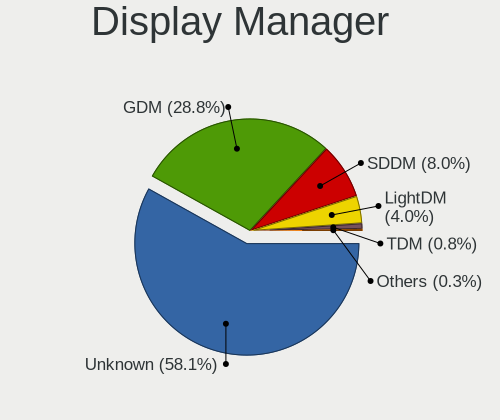
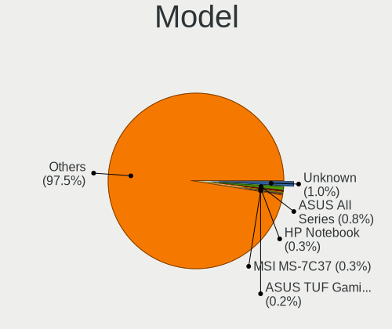
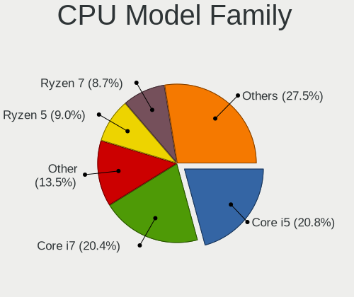
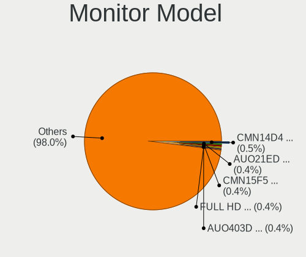
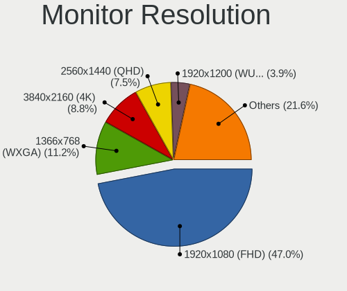
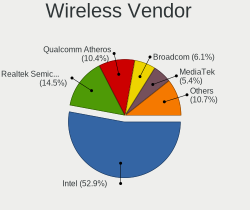
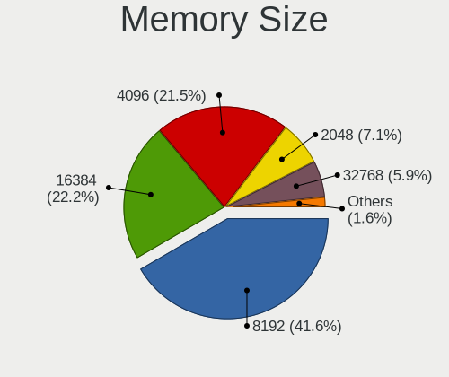

Fedora - Tested Hardware & Statistics
-------------------------------------

A project to collect tested hardware configurations for Fedora.

Anyone can contribute to this report by the [hw-probe](https://github.com/linuxhw/hw-probe) tool:

    sudo -E hw-probe -all -upload

Please contribute! Especially if your hardware is rare.

This is a report for all computer types. See also reports for [desktops](/Dist/Fedora/Desktop/README.md) and [notebooks](/Dist/Fedora/Notebook/README.md).

Contents
--------

* [ Test Cases ](#test-cases)

* [ System ](#system)
  - [ OS                       ](#os)
  - [ OS Family                ](#os-family)
  - [ Kernel                   ](#kernel)
  - [ Kernel Family            ](#kernel-family)
  - [ Kernel Major Ver.        ](#kernel-major-ver)
  - [ Arch                     ](#arch)
  - [ DE                       ](#de)
  - [ Display Server           ](#display-server)
  - [ Display Manager          ](#display-manager)
  - [ OS Lang                  ](#os-lang)
  - [ Boot Mode                ](#boot-mode)
  - [ Filesystem               ](#filesystem)
  - [ Part. scheme             ](#part-scheme)
  - [ Dual Boot with Linux/BSD ](#dual-boot-with-linuxbsd)
  - [ Dual Boot (Win)          ](#dual-boot-win)

* [ Board ](#board)
  - [ Vendor                   ](#vendor)
  - [ Model                    ](#model)
  - [ Model Family             ](#model-family)
  - [ MFG Year                 ](#mfg-year)
  - [ Form Factor              ](#form-factor)
  - [ Secure Boot              ](#secure-boot)
  - [ Coreboot                 ](#coreboot)
  - [ RAM Size                 ](#ram-size)
  - [ RAM Used                 ](#ram-used)
  - [ Total Drives             ](#total-drives)
  - [ Has CD-ROM               ](#has-cd-rom)
  - [ Has Ethernet             ](#has-ethernet)
  - [ Has WiFi                 ](#has-wifi)
  - [ Has Bluetooth            ](#has-bluetooth)

* [ Location ](#location)
  - [ Country                  ](#country)
  - [ City                     ](#city)

* [ Drives ](#drives)
  - [ Drive Vendor             ](#drive-vendor)
  - [ Drive Model              ](#drive-model)
  - [ HDD Vendor               ](#hdd-vendor)
  - [ SSD Vendor               ](#ssd-vendor)
  - [ Drive Kind               ](#drive-kind)
  - [ Drive Connector          ](#drive-connector)
  - [ Drive Size               ](#drive-size)
  - [ Space Total              ](#space-total)
  - [ Space Used               ](#space-used)
  - [ Malfunc. Drives          ](#malfunc-drives)
  - [ Malfunc. Drive Vendor    ](#malfunc-drive-vendor)
  - [ Malfunc. HDD Vendor      ](#malfunc-hdd-vendor)
  - [ Malfunc. Drive Kind      ](#malfunc-drive-kind)
  - [ Failed Drives            ](#failed-drives)
  - [ Failed Drive Vendor      ](#failed-drive-vendor)
  - [ Drive Status             ](#drive-status)

* [ Storage controller ](#storage-controller)
  - [ Storage Vendor           ](#storage-vendor)
  - [ Storage Model            ](#storage-model)
  - [ Storage Kind             ](#storage-kind)

* [ Processor ](#processor)
  - [ CPU Vendor               ](#cpu-vendor)
  - [ CPU Model                ](#cpu-model)
  - [ CPU Model Family         ](#cpu-model-family)
  - [ CPU Cores                ](#cpu-cores)
  - [ CPU Sockets              ](#cpu-sockets)
  - [ CPU Threads              ](#cpu-threads)
  - [ CPU Op-Modes             ](#cpu-op-modes)
  - [ CPU Microcode            ](#cpu-microcode)
  - [ CPU Microarch            ](#cpu-microarch)

* [ Graphics ](#graphics)
  - [ GPU Vendor               ](#gpu-vendor)
  - [ GPU Model                ](#gpu-model)
  - [ GPU Combo                ](#gpu-combo)
  - [ GPU Driver               ](#gpu-driver)
  - [ GPU Memory               ](#gpu-memory)

* [ Monitor ](#monitor)
  - [ Monitor Vendor           ](#monitor-vendor)
  - [ Monitor Model            ](#monitor-model)
  - [ Monitor Resolution       ](#monitor-resolution)
  - [ Monitor Diagonal         ](#monitor-diagonal)
  - [ Monitor Width            ](#monitor-width)
  - [ Aspect Ratio             ](#aspect-ratio)
  - [ Monitor Area             ](#monitor-area)
  - [ Pixel Density            ](#pixel-density)
  - [ Multiple Monitors        ](#multiple-monitors)

* [ Network ](#network)
  - [ Net Controller Vendor    ](#net-controller-vendor)
  - [ Net Controller Model     ](#net-controller-model)
  - [ Wireless Vendor          ](#wireless-vendor)
  - [ Wireless Model           ](#wireless-model)
  - [ Ethernet Vendor          ](#ethernet-vendor)
  - [ Ethernet Model           ](#ethernet-model)
  - [ Net Controller Kind      ](#net-controller-kind)
  - [ Used Controller          ](#used-controller)
  - [ NICs                     ](#nics)
  - [ IPv6                     ](#ipv6)

* [ Bluetooth ](#bluetooth)
  - [ Bluetooth Vendor         ](#bluetooth-vendor)
  - [ Bluetooth Model          ](#bluetooth-model)

* [ Sound ](#sound)
  - [ Sound Vendor             ](#sound-vendor)
  - [ Sound Model              ](#sound-model)

* [ Memory ](#memory)
  - [ Memory Vendor            ](#memory-vendor)
  - [ Memory Model             ](#memory-model)
  - [ Memory Kind              ](#memory-kind)
  - [ Memory Form Factor       ](#memory-form-factor)
  - [ Memory Size              ](#memory-size)
  - [ Memory Speed             ](#memory-speed)

* [ Printers & scanners ](#printers--scanners)
  - [ Printer Vendor           ](#printer-vendor)
  - [ Printer Model            ](#printer-model)
  - [ Scanner Vendor           ](#scanner-vendor)
  - [ Scanner Model            ](#scanner-model)

* [ Camera ](#camera)
  - [ Camera Vendor            ](#camera-vendor)
  - [ Camera Model             ](#camera-model)

* [ Security ](#security)
  - [ Fingerprint Vendor       ](#fingerprint-vendor)
  - [ Fingerprint Model        ](#fingerprint-model)
  - [ Chipcard Vendor          ](#chipcard-vendor)
  - [ Chipcard Model           ](#chipcard-model)

* [ Unsupported ](#unsupported)
  - [ Unsupported Devices      ](#unsupported-devices)
  - [ Unsupported Device Types ](#unsupported-device-types)

Test Cases
----------

Total: 32399

| Vendor        | Model                       | Form-Factor | Probe                                                      | Date         |
|---------------|-----------------------------|-------------|------------------------------------------------------------|--------------|
| MSI           | Prestige 16 AI Studio B1... | Notebook    | [22d073249b](https://linux-hardware.org/?probe=22d073249b) | Jan 06, 2025 |
| MSI           | Prestige 16 AI Studio B1... | Notebook    | [d8d6ab4b82](https://linux-hardware.org/?probe=d8d6ab4b82) | Jan 06, 2025 |
| ASUSTek       | ROG STRIX B650-A GAMING ... | Desktop     | [04f9ffdab4](https://linux-hardware.org/?probe=04f9ffdab4) | Jan 06, 2025 |
| GPU Compan... | GWNR7L1749                  | Notebook    | [0f2438bc90](https://linux-hardware.org/?probe=0f2438bc90) | Jan 06, 2025 |
| Apple         | MacBookAir6,2               | Notebook    | [dfb4117f5c](https://linux-hardware.org/?probe=dfb4117f5c) | Jan 06, 2025 |
| ASUSTek       | PRIME B650M-A AX II         | Desktop     | [7fea0bb2a1](https://linux-hardware.org/?probe=7fea0bb2a1) | Jan 06, 2025 |
| ASRock        | H110M-ITX                   | Desktop     | [d9985ebe4e](https://linux-hardware.org/?probe=d9985ebe4e) | Jan 06, 2025 |
| MSI           | B450 GAMING PLUS MAX        | Desktop     | [89cd372074](https://linux-hardware.org/?probe=89cd372074) | Jan 06, 2025 |
| ASUSTek       | TUF Z370-PLUS GAMING II     | Desktop     | [10fd8ef9dd](https://linux-hardware.org/?probe=10fd8ef9dd) | Jan 06, 2025 |
| ASRock        | B360M Performance           | Desktop     | [1e63738abb](https://linux-hardware.org/?probe=1e63738abb) | Jan 06, 2025 |
| Google        | Treeya                      | Notebook    | [b8f7c2d75a](https://linux-hardware.org/?probe=b8f7c2d75a) | Jan 06, 2025 |
| ASUSTek       | ROG STRIX B550-F GAMING     | Desktop     | [c8c490c383](https://linux-hardware.org/?probe=c8c490c383) | Jan 06, 2025 |
| HP            | ENVY x360 Convertible 15... | Convertible | [19193380d7](https://linux-hardware.org/?probe=19193380d7) | Jan 06, 2025 |
| Lenovo        | IdeaPad Pro 5 14APH8 83A... | Notebook    | [046bbb97db](https://linux-hardware.org/?probe=046bbb97db) | Jan 05, 2025 |
| Dell          | XPS 9320                    | Notebook    | [35af44b04a](https://linux-hardware.org/?probe=35af44b04a) | Jan 05, 2025 |
| Dell          | Latitude 7390               | Notebook    | [48814ed45f](https://linux-hardware.org/?probe=48814ed45f) | Jan 05, 2025 |
| ASUSTek       | H110M-E/M.2                 | Desktop     | [ff2e84ab02](https://linux-hardware.org/?probe=ff2e84ab02) | Jan 05, 2025 |
| HP            | 2B12                        | Desktop     | [f9594ff416](https://linux-hardware.org/?probe=f9594ff416) | Jan 05, 2025 |
| Gigabyte      | X570 AORUS ELITE WIFI       | Desktop     | [d80a8fd406](https://linux-hardware.org/?probe=d80a8fd406) | Jan 05, 2025 |
| Sony          | VGN-NR21E_S                 | Notebook    | [0ed147c4fb](https://linux-hardware.org/?probe=0ed147c4fb) | Jan 05, 2025 |
| Apple         | MacBookAir6,2               | Notebook    | [3b5dc1b1c2](https://linux-hardware.org/?probe=3b5dc1b1c2) | Jan 05, 2025 |
| ASUSTek       | TUF Gaming B550M-PLUS       | Desktop     | [a7c3662aec](https://linux-hardware.org/?probe=a7c3662aec) | Jan 05, 2025 |
| Lenovo        | 14w Gen 2 82N9              | Notebook    | [733559df9e](https://linux-hardware.org/?probe=733559df9e) | Jan 05, 2025 |
| Lenovo        | ThinkPad E16 Gen 2 21M5C... | Notebook    | [fe15c1092e](https://linux-hardware.org/?probe=fe15c1092e) | Jan 05, 2025 |
| WIWYNN        | Qualcomm Centriq 2400 Cu... | Server      | [bd0fe2f7fd](https://linux-hardware.org/?probe=bd0fe2f7fd) | Jan 05, 2025 |
| Dell          | Latitude 7400               | Notebook    | [9c347a93bf](https://linux-hardware.org/?probe=9c347a93bf) | Jan 05, 2025 |
| Dell          | Latitude 7400               | Notebook    | [70481b51db](https://linux-hardware.org/?probe=70481b51db) | Jan 05, 2025 |
| HP            | ZHAN 66 Pro A 14 G4 Note... | Notebook    | [0c0d5510fc](https://linux-hardware.org/?probe=0c0d5510fc) | Jan 05, 2025 |
| ASUSTek       | H110M-E/M.2                 | Desktop     | [3b654f1020](https://linux-hardware.org/?probe=3b654f1020) | Jan 05, 2025 |
| Lenovo        | ThinkPad L13 Yoga Gen 4 ... | Convertible | [a1704866ba](https://linux-hardware.org/?probe=a1704866ba) | Jan 05, 2025 |
| Lenovo        | ThinkPad T420 4236PFG       | Notebook    | [df34cf20b9](https://linux-hardware.org/?probe=df34cf20b9) | Jan 05, 2025 |
| Dell          | 0WKGTH A04                  | Server      | [069319fa9f](https://linux-hardware.org/?probe=069319fa9f) | Jan 05, 2025 |
| HP            | Pavilion Laptop 15-eh0xx... | Notebook    | [d87015b7dd](https://linux-hardware.org/?probe=d87015b7dd) | Jan 05, 2025 |
| Dell          | 0HFG24 A01                  | Server      | [9484e3f188](https://linux-hardware.org/?probe=9484e3f188) | Jan 05, 2025 |
| Supermicro    | X10SLM-F                    | Desktop     | [a8188b3af2](https://linux-hardware.org/?probe=a8188b3af2) | Jan 04, 2025 |
| MSI           | B450-A PRO MAX              | Desktop     | [c9cf4100bb](https://linux-hardware.org/?probe=c9cf4100bb) | Jan 04, 2025 |
| Lenovo        | ThinkPad T14s Gen 1 20UH... | Notebook    | [c68a17f027](https://linux-hardware.org/?probe=c68a17f027) | Jan 04, 2025 |
| ASUSTek       | ROG STRIX B550-F GAMING ... | Desktop     | [3f75716ffa](https://linux-hardware.org/?probe=3f75716ffa) | Jan 04, 2025 |
| Lenovo        | B490 377222P                | Notebook    | [4e6cc04345](https://linux-hardware.org/?probe=4e6cc04345) | Jan 04, 2025 |
| Lenovo        | Legion Slim 5 16APH8 82Y... | Notebook    | [3cd4965210](https://linux-hardware.org/?probe=3cd4965210) | Jan 04, 2025 |
| HP            | 635                         | Notebook    | [021402dc32](https://linux-hardware.org/?probe=021402dc32) | Jan 04, 2025 |
| HP            | Laptop 15-db1xxx            | Notebook    | [7bc8aeba55](https://linux-hardware.org/?probe=7bc8aeba55) | Jan 04, 2025 |
| Chuwi         | Hi10 pro tablet             | Tablet      | [496c93250d](https://linux-hardware.org/?probe=496c93250d) | Jan 04, 2025 |
| MSI           | B650 GAMING PLUS WIFI       | Desktop     | [3c54d15e6e](https://linux-hardware.org/?probe=3c54d15e6e) | Jan 04, 2025 |
| Microsoft     | Surface Pro 3               | Tablet      | [bb626d70b0](https://linux-hardware.org/?probe=bb626d70b0) | Jan 04, 2025 |
| Unknown       | Unknown                     | Tablet      | [3044720fe2](https://linux-hardware.org/?probe=3044720fe2) | Jan 04, 2025 |
| Lenovo        | ThinkPad P17 Gen 1 20SQS... | Notebook    | [4fc43ed5a9](https://linux-hardware.org/?probe=4fc43ed5a9) | Jan 04, 2025 |
| ASUSTek       | H110M-E/M.2                 | Desktop     | [d36b787d21](https://linux-hardware.org/?probe=d36b787d21) | Jan 04, 2025 |
| HP            | EliteBook 845 G7 Noteboo... | Notebook    | [33a984a2df](https://linux-hardware.org/?probe=33a984a2df) | Jan 04, 2025 |
| Gigabyte      | B760M AORUS ELITE AX        | Desktop     | [0181bfcd89](https://linux-hardware.org/?probe=0181bfcd89) | Jan 04, 2025 |
| MSI           | MAG Z390 TOMAHAWK           | Desktop     | [7e8f8f5c09](https://linux-hardware.org/?probe=7e8f8f5c09) | Jan 04, 2025 |
| AZW           | MINI S                      | Desktop     | [b4b44d49d3](https://linux-hardware.org/?probe=b4b44d49d3) | Jan 04, 2025 |
| HP            | Laptop 17-cn0xxx            | Notebook    | [6426be4511](https://linux-hardware.org/?probe=6426be4511) | Jan 04, 2025 |
| Microsoft     | Surface Pro 7               | Tablet      | [1226114f62](https://linux-hardware.org/?probe=1226114f62) | Jan 04, 2025 |
| MSI           | GF63 Thin 11SC              | Notebook    | [3f1c75f109](https://linux-hardware.org/?probe=3f1c75f109) | Jan 04, 2025 |
| Acer          | Predator PH16-71            | Notebook    | [51c220bbe4](https://linux-hardware.org/?probe=51c220bbe4) | Jan 04, 2025 |
| Lenovo        | ThinkPad T530 2394A11       | Notebook    | [87cb15684c](https://linux-hardware.org/?probe=87cb15684c) | Jan 04, 2025 |
| Lenovo        | ThinkPad Z16 Gen 1 21D4C... | Notebook    | [3c9cd9e73c](https://linux-hardware.org/?probe=3c9cd9e73c) | Jan 04, 2025 |
| ASUSTek       | ROG STRIX X670E-F GAMING... | Desktop     | [053a6288cb](https://linux-hardware.org/?probe=053a6288cb) | Jan 04, 2025 |
| Gigabyte      | Z97N-WIFI                   | Notebook    | [94525b433d](https://linux-hardware.org/?probe=94525b433d) | Jan 04, 2025 |
| Gigabyte      | G41MT-D3                    | Desktop     | [c5a86cbe2b](https://linux-hardware.org/?probe=c5a86cbe2b) | Jan 04, 2025 |
| HP            | Victus by Laptop 16-e0xx... | Notebook    | [125f9224f6](https://linux-hardware.org/?probe=125f9224f6) | Jan 04, 2025 |
| MSI           | B450-A PRO MAX              | Desktop     | [a829ef7128](https://linux-hardware.org/?probe=a829ef7128) | Jan 04, 2025 |
| HP            | Laptop 17t-cn300            | Notebook    | [d7d9dcc497](https://linux-hardware.org/?probe=d7d9dcc497) | Jan 04, 2025 |
| Dell          | Inspiron 7386               | Notebook    | [aecd7bdb44](https://linux-hardware.org/?probe=aecd7bdb44) | Jan 04, 2025 |
| Maibenben     | MaiBook M Series            | Notebook    | [0d480fbbc9](https://linux-hardware.org/?probe=0d480fbbc9) | Jan 04, 2025 |
| HP            | Laptop 15s-fq1xxx           | Notebook    | [062f7792dc](https://linux-hardware.org/?probe=062f7792dc) | Jan 03, 2025 |
| Acer          | Nitro AN16-41               | Notebook    | [dedf248848](https://linux-hardware.org/?probe=dedf248848) | Jan 03, 2025 |
| ASUSTek       | ASUS Zenbook S 16 UM5606... | Notebook    | [d3d4e90cf3](https://linux-hardware.org/?probe=d3d4e90cf3) | Jan 03, 2025 |
| ASUSTek       | ASUS TUF Gaming A16 FA60... | Notebook    | [c649f47fe2](https://linux-hardware.org/?probe=c649f47fe2) | Jan 03, 2025 |
| AZW           | SER V1                      | Mini pc     | [eed87de39c](https://linux-hardware.org/?probe=eed87de39c) | Jan 03, 2025 |
| Chuwi         | MiniBook X                  | Notebook    | [77278dd73d](https://linux-hardware.org/?probe=77278dd73d) | Jan 03, 2025 |
| Acer          | Aspire XC-105               | Desktop     | [997c408078](https://linux-hardware.org/?probe=997c408078) | Jan 03, 2025 |
| Dell          | Latitude 5290 2-in-1        | Notebook    | [0b277582ac](https://linux-hardware.org/?probe=0b277582ac) | Jan 03, 2025 |
| Lenovo        | 3168 SDK0J40697 WIN 3305... | Desktop     | [c6915cb84a](https://linux-hardware.org/?probe=c6915cb84a) | Jan 03, 2025 |
| HP            | 2B0D A01                    | All in one  | [5aed288755](https://linux-hardware.org/?probe=5aed288755) | Jan 03, 2025 |
| Lenovo        | IdeaPadFlex 5 14ABR8 82X... | Convertible | [2092cc07f6](https://linux-hardware.org/?probe=2092cc07f6) | Jan 03, 2025 |
| AMI           | Intel                       | Desktop     | [a5d99b38fe](https://linux-hardware.org/?probe=a5d99b38fe) | Jan 03, 2025 |
| Dell          | Latitude E7450              | Notebook    | [03b4f85891](https://linux-hardware.org/?probe=03b4f85891) | Jan 03, 2025 |
| Gigabyte      | X670E AORUS MASTER          | Desktop     | [903f395545](https://linux-hardware.org/?probe=903f395545) | Jan 03, 2025 |
| Dell          | Latitude 7440               | Notebook    | [5e2a44e27d](https://linux-hardware.org/?probe=5e2a44e27d) | Jan 03, 2025 |
| MSI           | MAG Z390 TOMAHAWK           | Desktop     | [de008cdc23](https://linux-hardware.org/?probe=de008cdc23) | Jan 03, 2025 |
| Lenovo        | IdeaPad 1 15AMN7 82VG       | Notebook    | [a791c57fad](https://linux-hardware.org/?probe=a791c57fad) | Jan 03, 2025 |
| Lenovo        | ThinkPad X13 Yoga Gen 2 ... | Convertible | [a9e7b0df46](https://linux-hardware.org/?probe=a9e7b0df46) | Jan 03, 2025 |
| Dell          | Latitude 5440               | Notebook    | [60ed15e860](https://linux-hardware.org/?probe=60ed15e860) | Jan 03, 2025 |
| Dell          | Latitude 5440               | Notebook    | [18c0535aa3](https://linux-hardware.org/?probe=18c0535aa3) | Jan 03, 2025 |
| ASRock        | X870E Taichi                | Desktop     | [416afc1fb4](https://linux-hardware.org/?probe=416afc1fb4) | Jan 03, 2025 |
| Dell          | Inspiron 3583               | Notebook    | [d2423ded38](https://linux-hardware.org/?probe=d2423ded38) | Jan 03, 2025 |
| Google        | Candy                       | Notebook    | [9cd761ead3](https://linux-hardware.org/?probe=9cd761ead3) | Jan 03, 2025 |
| Apple         | Mac-F60DEB81FF30ACF6 Mac... | Desktop     | [ecfa27b66d](https://linux-hardware.org/?probe=ecfa27b66d) | Jan 02, 2025 |
| HP            | Laptop 17-cn0xxx            | Notebook    | [4fdad5bec0](https://linux-hardware.org/?probe=4fdad5bec0) | Jan 02, 2025 |
| HP            | Laptop 17t-cn300            | Notebook    | [a118a2798f](https://linux-hardware.org/?probe=a118a2798f) | Jan 02, 2025 |
| Lenovo        | IdeaPad Slim 3 15ABR8 82... | Notebook    | [f453563b1e](https://linux-hardware.org/?probe=f453563b1e) | Jan 02, 2025 |
| HP            | Laptop 15s-fq2xxx           | Notebook    | [b4f0d1def7](https://linux-hardware.org/?probe=b4f0d1def7) | Jan 02, 2025 |
| HP            | Laptop 15s-eq2xxx           | Notebook    | [37b47880bb](https://linux-hardware.org/?probe=37b47880bb) | Jan 02, 2025 |
| Gigabyte      | B75M-D3H                    | Desktop     | [139b1d261d](https://linux-hardware.org/?probe=139b1d261d) | Jan 02, 2025 |
| ASUSTek       | VivoBook_ASUSLaptop X150... | Notebook    | [110b5ee190](https://linux-hardware.org/?probe=110b5ee190) | Jan 02, 2025 |
| MSI           | B550M PRO-VDH WIFI          | Desktop     | [a24d68ca3c](https://linux-hardware.org/?probe=a24d68ca3c) | Jan 02, 2025 |
| Lenovo        | ThinkPad T14 Gen 3 21AH0... | Notebook    | [8be01ca5c2](https://linux-hardware.org/?probe=8be01ca5c2) | Jan 02, 2025 |
| ASUSTek       | PRIME B550-PLUS AC-HES      | Desktop     | [b5eaeaee82](https://linux-hardware.org/?probe=b5eaeaee82) | Jan 02, 2025 |
| HP            | Pavilion Laptop 15-eh0xx... | Notebook    | [49011f501a](https://linux-hardware.org/?probe=49011f501a) | Jan 02, 2025 |
| ASUSTek       | PRIME H510M-K               | Desktop     | [2a6b25b609](https://linux-hardware.org/?probe=2a6b25b609) | Jan 02, 2025 |
| HP            | OmniBook Ultra Flip Lapt... | Convertible | [5f2a3c878a](https://linux-hardware.org/?probe=5f2a3c878a) | Jan 02, 2025 |
| ASUSTek       | VivoBook_ASUSLaptop X570... | Notebook    | [8511083019](https://linux-hardware.org/?probe=8511083019) | Jan 02, 2025 |
| ASUSTek       | VivoBook_ASUSLaptop X570... | Notebook    | [97cfd2d77b](https://linux-hardware.org/?probe=97cfd2d77b) | Jan 02, 2025 |
| ASUSTek       | Vivobook Go E1504FA_E150... | Notebook    | [e2dc314209](https://linux-hardware.org/?probe=e2dc314209) | Jan 02, 2025 |
| ASUSTek       | ROG STRIX X670E-E GAMING... | Desktop     | [99fc88c92b](https://linux-hardware.org/?probe=99fc88c92b) | Jan 02, 2025 |
| ASUSTek       | Pro B650M-CT                | Desktop     | [eeb61bea29](https://linux-hardware.org/?probe=eeb61bea29) | Jan 02, 2025 |
| Lenovo        | ThinkPad T15g Gen 1 20US... | Notebook    | [c5dc058f75](https://linux-hardware.org/?probe=c5dc058f75) | Jan 01, 2025 |
| MSI           | MPG Z390 GAMING EDGE AC     | Desktop     | [08ef8b7453](https://linux-hardware.org/?probe=08ef8b7453) | Jan 01, 2025 |
| Lenovo        | IdeaPadFlex 5 14ALC05 82... | Convertible | [25af48ddf7](https://linux-hardware.org/?probe=25af48ddf7) | Jan 01, 2025 |
| Lenovo        | G510 20238                  | Notebook    | [ebd16410b8](https://linux-hardware.org/?probe=ebd16410b8) | Jan 01, 2025 |
| MSI           | MPG Z390 GAMING EDGE AC     | Desktop     | [88aa3ff70d](https://linux-hardware.org/?probe=88aa3ff70d) | Jan 01, 2025 |
| HP            | 2B0D A01                    | All in one  | [871b4fe736](https://linux-hardware.org/?probe=871b4fe736) | Jan 01, 2025 |
| HP            | Laptop 15-fc0xxx            | Notebook    | [ca0732e368](https://linux-hardware.org/?probe=ca0732e368) | Jan 01, 2025 |
| Acer          | Aspire 5750G                | Notebook    | [4c99e58ae4](https://linux-hardware.org/?probe=4c99e58ae4) | Jan 01, 2025 |
| Lenovo        | Yoga 7 2-in-1 14IML9 83D... | Convertible | [1f7e53a59e](https://linux-hardware.org/?probe=1f7e53a59e) | Jan 01, 2025 |
| ASUSTek       | ASUS TUF Gaming A17 FA70... | Notebook    | [110e5ff032](https://linux-hardware.org/?probe=110e5ff032) | Jan 01, 2025 |
| Dell          | XPS 13 9310 2-in-1          | Convertible | [d1cd34a8af](https://linux-hardware.org/?probe=d1cd34a8af) | Jan 01, 2025 |
| Apple         | Mac-FFE5EF870D7BA81A iMa... | All in one  | [500acccf00](https://linux-hardware.org/?probe=500acccf00) | Jan 01, 2025 |
| Apple         | Mac-FFE5EF870D7BA81A iMa... | All in one  | [4df51338c0](https://linux-hardware.org/?probe=4df51338c0) | Jan 01, 2025 |
| Gigabyte      | GA-MA785G-UD3H              | Desktop     | [61fe87d63e](https://linux-hardware.org/?probe=61fe87d63e) | Jan 01, 2025 |
| Packard Be... | EasyNote MH36               | Notebook    | [f8b0243bfd](https://linux-hardware.org/?probe=f8b0243bfd) | Jan 01, 2025 |
| MSI           | 970 GAMING                  | Desktop     | [c77ab27b22](https://linux-hardware.org/?probe=c77ab27b22) | Jan 01, 2025 |
| Microsoft     | Surface Pro 7               | Tablet      | [6fa9a75b00](https://linux-hardware.org/?probe=6fa9a75b00) | Jan 01, 2025 |
| ASUSTek       | ROG STRIX X570-E GAMING ... | Desktop     | [eb17054181](https://linux-hardware.org/?probe=eb17054181) | Jan 01, 2025 |
| ASUSTek       | PRIME B650M-A AX II         | Desktop     | [c619b6152e](https://linux-hardware.org/?probe=c619b6152e) | Jan 01, 2025 |
| Apple         | Mac-031AEE4D24BFF0B1 Mac... | Mini pc     | [e1f2728de3](https://linux-hardware.org/?probe=e1f2728de3) | Jan 01, 2025 |
| ASUSTek       | ROG STRIX Z790-E GAMING ... | Desktop     | [040cb2efa9](https://linux-hardware.org/?probe=040cb2efa9) | Jan 01, 2025 |
| ASUSTek       | VivoBook Flip 14 TP401CA... | Convertible | [361e80801b](https://linux-hardware.org/?probe=361e80801b) | Jan 01, 2025 |
| HP            | 2B0D A01                    | All in one  | [f2958af04d](https://linux-hardware.org/?probe=f2958af04d) | Dec 31, 2024 |
| ASUSTek       | ROG CROSSHAIR VIII HERO     | Desktop     | [f9183ea9f9](https://linux-hardware.org/?probe=f9183ea9f9) | Dec 31, 2024 |
| MSI           | A520M PRO                   | Desktop     | [092cdc906c](https://linux-hardware.org/?probe=092cdc906c) | Dec 31, 2024 |
| Dell          | Latitude E5550              | Notebook    | [4df1fcb20c](https://linux-hardware.org/?probe=4df1fcb20c) | Dec 31, 2024 |
| Dell          | Latitude E7440              | Notebook    | [e25716eb4b](https://linux-hardware.org/?probe=e25716eb4b) | Dec 31, 2024 |
| HP            | 2B0D A01                    | All in one  | [d28496bed0](https://linux-hardware.org/?probe=d28496bed0) | Dec 31, 2024 |
| ASUSTek       | ROG Strix G713PI_G713PI     | Notebook    | [eeef064f3d](https://linux-hardware.org/?probe=eeef064f3d) | Dec 31, 2024 |
| ASUSTek       | TUF B450M-PLUS GAMING       | Desktop     | [bfc48412dd](https://linux-hardware.org/?probe=bfc48412dd) | Dec 31, 2024 |
| ASUSTek       | TUF Gaming B550M-PLUS WI... | Desktop     | [66588a9985](https://linux-hardware.org/?probe=66588a9985) | Dec 31, 2024 |
| Lenovo        | Yoga 7 2-in-1 14IML9 83D... | Convertible | [4cf88cdd93](https://linux-hardware.org/?probe=4cf88cdd93) | Dec 31, 2024 |
| Lenovo        | ThinkPad P14s Gen 3 21J5... | Notebook    | [d99505e615](https://linux-hardware.org/?probe=d99505e615) | Dec 31, 2024 |
| ASUSTek       | Maximus IX CODE             | Desktop     | [026ee0facd](https://linux-hardware.org/?probe=026ee0facd) | Dec 31, 2024 |
| Dell          | Latitude 5400               | Notebook    | [0a64fb9a01](https://linux-hardware.org/?probe=0a64fb9a01) | Dec 31, 2024 |
| Dell          | Latitude 5400               | Notebook    | [192ab2428b](https://linux-hardware.org/?probe=192ab2428b) | Dec 31, 2024 |
| Dell          | Latitude E6520              | Notebook    | [c3a5cf03a9](https://linux-hardware.org/?probe=c3a5cf03a9) | Dec 31, 2024 |
| ASUSTek       | PRIME H510M-K               | Desktop     | [125c5a0ee0](https://linux-hardware.org/?probe=125c5a0ee0) | Dec 31, 2024 |
| ASUSTek       | PRIME B650M-A AX II         | Desktop     | [04eb3b79c5](https://linux-hardware.org/?probe=04eb3b79c5) | Dec 31, 2024 |
| ASUSTek       | ROG Flow X13 GV301RE_GV3... | Convertible | [7c749965ff](https://linux-hardware.org/?probe=7c749965ff) | Dec 31, 2024 |
| HP            | Nami                        | Notebook    | [bd56fc3a14](https://linux-hardware.org/?probe=bd56fc3a14) | Dec 31, 2024 |
| HP            | Nami                        | Notebook    | [dc21545854](https://linux-hardware.org/?probe=dc21545854) | Dec 31, 2024 |
| Lenovo        | ThinkPad T495s 20QKS12J1... | Notebook    | [40610d9582](https://linux-hardware.org/?probe=40610d9582) | Dec 31, 2024 |
| Samsung       | Galaxy Book 12              | Tablet      | [ebd4e47906](https://linux-hardware.org/?probe=ebd4e47906) | Dec 31, 2024 |
| Lenovo        | ThinkPad T15 Gen 1 20S60... | Notebook    | [a6451f3941](https://linux-hardware.org/?probe=a6451f3941) | Dec 31, 2024 |
| Dell          | Latitude 7275               | Tablet      | [0fd89ec85a](https://linux-hardware.org/?probe=0fd89ec85a) | Dec 31, 2024 |
| Framework     | Laptop 16 (AMD Ryzen 704... | Notebook    | [d25adffd4b](https://linux-hardware.org/?probe=d25adffd4b) | Dec 30, 2024 |
| System76      | Thelio Major thelio-majo... | Desktop     | [4519da1309](https://linux-hardware.org/?probe=4519da1309) | Dec 30, 2024 |
| Dell          | Inspiron 14 7440 2-in-1     | Convertible | [1c748f0bb6](https://linux-hardware.org/?probe=1c748f0bb6) | Dec 30, 2024 |
| Lenovo        | 312D SDK0J40697 WIN 3305... | Mini pc     | [05de1b24e3](https://linux-hardware.org/?probe=05de1b24e3) | Dec 30, 2024 |
| Gigabyte      | A620I AX                    | Desktop     | [801e27533c](https://linux-hardware.org/?probe=801e27533c) | Dec 30, 2024 |
| XIAOMI        | Redmi Book Pro 15 2023      | Notebook    | [cc175b8319](https://linux-hardware.org/?probe=cc175b8319) | Dec 30, 2024 |
| Pegatron      | 2AD5                        | Desktop     | [18dc34ec58](https://linux-hardware.org/?probe=18dc34ec58) | Dec 30, 2024 |
| MSI           | MAG Z390 TOMAHAWK           | Desktop     | [f457b3f670](https://linux-hardware.org/?probe=f457b3f670) | Dec 30, 2024 |
| MSI           | MAG Z390 TOMAHAWK           | Desktop     | [c51b4b60fd](https://linux-hardware.org/?probe=c51b4b60fd) | Dec 30, 2024 |
| ASUSTek       | PRIME Z690-P WIFI D4        | Desktop     | [3e9fa7ec25](https://linux-hardware.org/?probe=3e9fa7ec25) | Dec 30, 2024 |
| ASUSTek       | PRIME B650-PLUS             | Desktop     | [5bae41298f](https://linux-hardware.org/?probe=5bae41298f) | Dec 30, 2024 |
| ASUSTek       | PRIME H510M-K               | Desktop     | [5f6888e1a9](https://linux-hardware.org/?probe=5f6888e1a9) | Dec 30, 2024 |
| ASRock        | A320M-HDV R4.0              | Desktop     | [b8d923b1af](https://linux-hardware.org/?probe=b8d923b1af) | Dec 30, 2024 |
| MSI           | PRO B660-A DDR4             | Desktop     | [1760e67766](https://linux-hardware.org/?probe=1760e67766) | Dec 30, 2024 |
| Dell          | 0YXT71 A03                  | Desktop     | [a373cef681](https://linux-hardware.org/?probe=a373cef681) | Dec 30, 2024 |
| Lenovo        | ThinkPad L15 Gen 4 21H7C... | Notebook    | [810f9eeaaa](https://linux-hardware.org/?probe=810f9eeaaa) | Dec 30, 2024 |
| Apple         | MacBookAir6,2               | Notebook    | [f8255d3c15](https://linux-hardware.org/?probe=f8255d3c15) | Dec 30, 2024 |
| Samsung       | RV411/RV511/E3511/S3511/... | Notebook    | [89094bd2df](https://linux-hardware.org/?probe=89094bd2df) | Dec 30, 2024 |
| Dell          | Precision 7720              | Notebook    | [888706d340](https://linux-hardware.org/?probe=888706d340) | Dec 30, 2024 |
| Dell          | Precision 3561              | Notebook    | [effdc98e23](https://linux-hardware.org/?probe=effdc98e23) | Dec 30, 2024 |
| Lenovo        | 3328 SDK0T76463 WIN 3422... | Desktop     | [4dde6cad5a](https://linux-hardware.org/?probe=4dde6cad5a) | Dec 30, 2024 |
| Acer          | Nitro AN515-45              | Notebook    | [cf19396a9a](https://linux-hardware.org/?probe=cf19396a9a) | Dec 30, 2024 |
| ASUSTek       | Zenbook UX3402ZA_UX3402Z... | Notebook    | [06b6bc85d9](https://linux-hardware.org/?probe=06b6bc85d9) | Dec 29, 2024 |
| ASUSTek       | ROG STRIX B550-E GAMING     | Desktop     | [1fc44cea15](https://linux-hardware.org/?probe=1fc44cea15) | Dec 29, 2024 |
| ASUSTek       | VivoBook_ASUSLaptop M650... | Notebook    | [21c6eba6fd](https://linux-hardware.org/?probe=21c6eba6fd) | Dec 29, 2024 |
| ASUSTek       | VivoBook_ASUSLaptop M650... | Notebook    | [73ea07394a](https://linux-hardware.org/?probe=73ea07394a) | Dec 29, 2024 |
| MSI           | GF63 Thin 8SC               | Notebook    | [e88a8b539f](https://linux-hardware.org/?probe=e88a8b539f) | Dec 29, 2024 |
| HP            | 8906 SMVB                   | Desktop     | [c7a78e601d](https://linux-hardware.org/?probe=c7a78e601d) | Dec 29, 2024 |
| Lenovo        | ThinkBook 16 G6+ IMH 21L... | Notebook    | [c80dde07d0](https://linux-hardware.org/?probe=c80dde07d0) | Dec 29, 2024 |
| Gigabyte      | H61M-S2PV                   | Desktop     | [58be9bacfd](https://linux-hardware.org/?probe=58be9bacfd) | Dec 29, 2024 |
| MSI           | GL73 8SC                    | Notebook    | [77d8c60ea1](https://linux-hardware.org/?probe=77d8c60ea1) | Dec 29, 2024 |
| MSI           | GL73 8SC                    | Notebook    | [57691f4432](https://linux-hardware.org/?probe=57691f4432) | Dec 29, 2024 |
| Gigabyte      | GA-MA785G-UD3H              | Desktop     | [135c62cd91](https://linux-hardware.org/?probe=135c62cd91) | Dec 29, 2024 |
| Framework     | Laptop 16 (AMD Ryzen 704... | Notebook    | [c19c3fe9fc](https://linux-hardware.org/?probe=c19c3fe9fc) | Dec 29, 2024 |
| Acer          | Aspire E5-576               | Notebook    | [4ae46bc01a](https://linux-hardware.org/?probe=4ae46bc01a) | Dec 29, 2024 |
| MSI           | GE60 2PL                    | Notebook    | [db806920f1](https://linux-hardware.org/?probe=db806920f1) | Dec 29, 2024 |
| MSI           | GE60 2PL                    | Notebook    | [0cd07458bc](https://linux-hardware.org/?probe=0cd07458bc) | Dec 29, 2024 |
| Lenovo        | ThinkPad X1 Carbon Gen 9... | Notebook    | [e08182adc8](https://linux-hardware.org/?probe=e08182adc8) | Dec 29, 2024 |
| MSI           | B550-A PRO                  | Desktop     | [93afafb17b](https://linux-hardware.org/?probe=93afafb17b) | Dec 29, 2024 |
| Toshiba       | Satellite C70-B             | Notebook    | [5014d7827e](https://linux-hardware.org/?probe=5014d7827e) | Dec 29, 2024 |
| Dell          | Inspiron 16 5645            | Notebook    | [254ce49ccb](https://linux-hardware.org/?probe=254ce49ccb) | Dec 28, 2024 |
| Dell          | Inspiron 15 3511            | Notebook    | [bd840e0eeb](https://linux-hardware.org/?probe=bd840e0eeb) | Dec 28, 2024 |
| Dell          | Latitude E6430              | Notebook    | [3bbd75ec42](https://linux-hardware.org/?probe=3bbd75ec42) | Dec 28, 2024 |
| Lenovo        | Legion 5 Pro 16IAH7H 82R... | Notebook    | [dd408ca578](https://linux-hardware.org/?probe=dd408ca578) | Dec 28, 2024 |
| HP            | 1589                        | Desktop     | [dd5a66147d](https://linux-hardware.org/?probe=dd5a66147d) | Dec 28, 2024 |
| ASRock        | B550M-C                     | Desktop     | [dec3229b3a](https://linux-hardware.org/?probe=dec3229b3a) | Dec 28, 2024 |
| ASUSTek       | ZenBook UX425EA_UX425EA     | Notebook    | [2ee9b0919f](https://linux-hardware.org/?probe=2ee9b0919f) | Dec 28, 2024 |
| Pegatron      | Benicia                     | Desktop     | [e061c1cadc](https://linux-hardware.org/?probe=e061c1cadc) | Dec 28, 2024 |
| Dell          | Latitude 5490               | Notebook    | [bef25394e1](https://linux-hardware.org/?probe=bef25394e1) | Dec 28, 2024 |
| Dell          | Latitude 5490               | Notebook    | [f98e9d822a](https://linux-hardware.org/?probe=f98e9d822a) | Dec 28, 2024 |
| ASRock        | B550M Phantom Gaming 4      | Desktop     | [1a05752e8c](https://linux-hardware.org/?probe=1a05752e8c) | Dec 28, 2024 |
| Gigabyte      | H77N-WIFI                   | Desktop     | [e22cddb5fd](https://linux-hardware.org/?probe=e22cddb5fd) | Dec 28, 2024 |
| ASUSTek       | VivoBook_ASUSLaptop M370... | Notebook    | [374d7bf403](https://linux-hardware.org/?probe=374d7bf403) | Dec 28, 2024 |
| MSI           | A520M-A PRO                 | Desktop     | [e3ba91e9a3](https://linux-hardware.org/?probe=e3ba91e9a3) | Dec 28, 2024 |
| ASUSTek       | Zenbook UX3404VA_Q410VA     | Notebook    | [04112caf10](https://linux-hardware.org/?probe=04112caf10) | Dec 28, 2024 |
| ASUSTek       | P8H61-M LX3 PLUS R2.0       | Desktop     | [345c9bffd4](https://linux-hardware.org/?probe=345c9bffd4) | Dec 28, 2024 |
| Gigabyte      | G41MT-D3                    | Desktop     | [dc90350a72](https://linux-hardware.org/?probe=dc90350a72) | Dec 28, 2024 |
| Huanan        | X99-F8 GAMING V5.0          | Desktop     | [784d69901d](https://linux-hardware.org/?probe=784d69901d) | Dec 28, 2024 |
| Lenovo        | ThinkPad X131e 336855U      | Notebook    | [b0b97f4290](https://linux-hardware.org/?probe=b0b97f4290) | Dec 28, 2024 |
| Microsoft     | Surface Pro 7               | Tablet      | [39a701d7b2](https://linux-hardware.org/?probe=39a701d7b2) | Dec 28, 2024 |
| Microsoft     | Surface Pro 7               | Tablet      | [8c04767880](https://linux-hardware.org/?probe=8c04767880) | Dec 28, 2024 |
| HP            | ProBook 470 G2              | Notebook    | [ee181df849](https://linux-hardware.org/?probe=ee181df849) | Dec 28, 2024 |
| AZW           | MINI S                      | Desktop     | [2f997d878f](https://linux-hardware.org/?probe=2f997d878f) | Dec 28, 2024 |
| HP            | 81B3                        | Desktop     | [67462f75bb](https://linux-hardware.org/?probe=67462f75bb) | Dec 27, 2024 |
| Apple         | Mac-031AEE4D24BFF0B1 Mac... | Mini pc     | [1b43c72fa8](https://linux-hardware.org/?probe=1b43c72fa8) | Dec 27, 2024 |
| Gigabyte      | B650 EAGLE AX               | Desktop     | [e4b9c34646](https://linux-hardware.org/?probe=e4b9c34646) | Dec 27, 2024 |
| Toshiba       | Satellite A200              | Notebook    | [9a071c6521](https://linux-hardware.org/?probe=9a071c6521) | Dec 27, 2024 |
| Dell          | Latitude E5550              | Notebook    | [643b7759bc](https://linux-hardware.org/?probe=643b7759bc) | Dec 27, 2024 |
| Lenovo        | IdeaPad 3 15ALC6 82KU       | Notebook    | [e428436322](https://linux-hardware.org/?probe=e428436322) | Dec 27, 2024 |
| Toshiba       | Satellite A200              | Notebook    | [eea353e34a](https://linux-hardware.org/?probe=eea353e34a) | Dec 27, 2024 |
| Acer          | Nitro AN16-41               | Notebook    | [8521ef1a55](https://linux-hardware.org/?probe=8521ef1a55) | Dec 27, 2024 |
| MSI           | MEG Z790 ACE                | Desktop     | [6d77957bbb](https://linux-hardware.org/?probe=6d77957bbb) | Dec 27, 2024 |
| Monster       | ABRA A5 V17.3               | Notebook    | [8ac82ca045](https://linux-hardware.org/?probe=8ac82ca045) | Dec 27, 2024 |
| Gigabyte      | GA-A55M-S2V                 | Desktop     | [476ca1ca6d](https://linux-hardware.org/?probe=476ca1ca6d) | Dec 27, 2024 |
| MSI           | A320M PRO-VH                | Desktop     | [e16bd64c51](https://linux-hardware.org/?probe=e16bd64c51) | Dec 27, 2024 |
| MSI           | A320M PRO-VH                | Desktop     | [6c30c82884](https://linux-hardware.org/?probe=6c30c82884) | Dec 27, 2024 |
| ASUSTek       | ASUS Zenbook S 16 UM5606... | Notebook    | [2b5056fe92](https://linux-hardware.org/?probe=2b5056fe92) | Dec 27, 2024 |
| HP            | 7Z0P3UA                     | Notebook    | [474af6633c](https://linux-hardware.org/?probe=474af6633c) | Dec 27, 2024 |
| ASUSTek       | ASUS Zenbook S 14 UX5406... | Notebook    | [3b4e12f8b0](https://linux-hardware.org/?probe=3b4e12f8b0) | Dec 27, 2024 |
| HP            | ZBook 15 G6                 | Notebook    | [40bd2c3025](https://linux-hardware.org/?probe=40bd2c3025) | Dec 27, 2024 |
| ASUSTek       | ASUS Zenbook S 16 UM5606... | Notebook    | [bc55a24f5d](https://linux-hardware.org/?probe=bc55a24f5d) | Dec 27, 2024 |
| Lenovo        | ThinkPad L14 Gen 1 20U2S... | Notebook    | [77830eacc7](https://linux-hardware.org/?probe=77830eacc7) | Dec 27, 2024 |
| Lenovo        | ThinkPad T470 20HES0EV0Q    | Notebook    | [df7447ad48](https://linux-hardware.org/?probe=df7447ad48) | Dec 26, 2024 |
| GPD           | G1619-04                    | Notebook    | [b44a9df6e8](https://linux-hardware.org/?probe=b44a9df6e8) | Dec 26, 2024 |
| ASRock        | X670E Steel Legend          | Desktop     | [77dfeca508](https://linux-hardware.org/?probe=77dfeca508) | Dec 26, 2024 |
| Avell High... | A70 HYB                     | Notebook    | [aea76220df](https://linux-hardware.org/?probe=aea76220df) | Dec 26, 2024 |
| Gigabyte      | X570 I AORUS PRO WIFI       | Desktop     | [856acb68a4](https://linux-hardware.org/?probe=856acb68a4) | Dec 26, 2024 |
| Dell          | Latitude E5550              | Notebook    | [d4783d7b35](https://linux-hardware.org/?probe=d4783d7b35) | Dec 26, 2024 |
| ASUSTek       | H170-PRO                    | Desktop     | [04f9098e0d](https://linux-hardware.org/?probe=04f9098e0d) | Dec 26, 2024 |
| MSI           | 785GT-E63                   | Desktop     | [7bef4fbf53](https://linux-hardware.org/?probe=7bef4fbf53) | Dec 26, 2024 |
| MSI           | H110M PRO-D                 | Desktop     | [9ecfd504b7](https://linux-hardware.org/?probe=9ecfd504b7) | Dec 26, 2024 |
| HP            | Pavilion dv6700             | Notebook    | [d9ccd55fd5](https://linux-hardware.org/?probe=d9ccd55fd5) | Dec 26, 2024 |
| ASUSTek       | H81M-A/BR                   | Desktop     | [37badc0cfd](https://linux-hardware.org/?probe=37badc0cfd) | Dec 26, 2024 |
| Gigabyte      | Z690 UD DDR4                | Desktop     | [fc2486e691](https://linux-hardware.org/?probe=fc2486e691) | Dec 26, 2024 |
| ASUSTek       | ROG Zephyrus G14 GA402RK... | Notebook    | [d48fae0d86](https://linux-hardware.org/?probe=d48fae0d86) | Dec 26, 2024 |
| Gigabyte      | B650 GAMING X AX V2         | Desktop     | [c12274a13c](https://linux-hardware.org/?probe=c12274a13c) | Dec 26, 2024 |
| Lenovo        | ThinkPad P14s Gen 5 21G2... | Notebook    | [f1a3b79f94](https://linux-hardware.org/?probe=f1a3b79f94) | Dec 26, 2024 |
| ASUSTek       | G75VW                       | Notebook    | [6f5eceb221](https://linux-hardware.org/?probe=6f5eceb221) | Dec 26, 2024 |
| HP            | Pavilion dv6700             | Notebook    | [06e2ee69ef](https://linux-hardware.org/?probe=06e2ee69ef) | Dec 26, 2024 |
| MSI           | Z270I GAMING PRO CARBON ... | Desktop     | [deae2e3249](https://linux-hardware.org/?probe=deae2e3249) | Dec 26, 2024 |
| Dell          | 0K240Y A01                  | Desktop     | [8aca080a7d](https://linux-hardware.org/?probe=8aca080a7d) | Dec 26, 2024 |
| Lenovo        | ThinkCentre M58p 7220A72    | Desktop     | [f41fa38fd7](https://linux-hardware.org/?probe=f41fa38fd7) | Dec 26, 2024 |
| Lenovo        | Yoga 3 14 80JH              | Notebook    | [d17784bc63](https://linux-hardware.org/?probe=d17784bc63) | Dec 26, 2024 |
| Lenovo        | ThinkPad T14s Gen 6 21M1... | Notebook    | [1111c1a9ac](https://linux-hardware.org/?probe=1111c1a9ac) | Dec 26, 2024 |
| Dell          | Inspiron 15 3510            | Notebook    | [3eb40bb419](https://linux-hardware.org/?probe=3eb40bb419) | Dec 26, 2024 |
| Lenovo        | IdeaPad Pro 5 16AHP9 83D... | Notebook    | [28dcf6960e](https://linux-hardware.org/?probe=28dcf6960e) | Dec 26, 2024 |
| Lenovo        | ThinkPad X390 20Q0CTO1WW    | Notebook    | [618303b5f9](https://linux-hardware.org/?probe=618303b5f9) | Dec 26, 2024 |
| MSI           | Z270I GAMING PRO CARBON ... | Desktop     | [20b0460a24](https://linux-hardware.org/?probe=20b0460a24) | Dec 25, 2024 |
| Lenovo        | ThinkPad T14s Gen 3 21CQ... | Notebook    | [a16e1a46ec](https://linux-hardware.org/?probe=a16e1a46ec) | Dec 25, 2024 |
| MSI           | Z790 GAMING PLUS WIFI       | Desktop     | [0d13f70a8e](https://linux-hardware.org/?probe=0d13f70a8e) | Dec 25, 2024 |
| Dell          | 0VNGWR A01                  | All in one  | [c125805f0d](https://linux-hardware.org/?probe=c125805f0d) | Dec 25, 2024 |
| Samsung       | 700Z3A/700Z4A/700Z5A/700... | Notebook    | [a6a8ce86e8](https://linux-hardware.org/?probe=a6a8ce86e8) | Dec 25, 2024 |
| Gigabyte      | B365M GAMING HD             | Desktop     | [c72350ab41](https://linux-hardware.org/?probe=c72350ab41) | Dec 25, 2024 |
| Samsung       | 700Z3A/700Z4A/700Z5A/700... | Notebook    | [68bb2644f5](https://linux-hardware.org/?probe=68bb2644f5) | Dec 25, 2024 |
| Lenovo        | Legion 9 16IRX9 83G0        | Notebook    | [128debb210](https://linux-hardware.org/?probe=128debb210) | Dec 25, 2024 |
| Lenovo        | ThinkPad T14s Gen 3 21CQ... | Notebook    | [0659ed4270](https://linux-hardware.org/?probe=0659ed4270) | Dec 25, 2024 |
| ASUSTek       | ROG Zephyrus G14 GA401II... | Notebook    | [f561382ccd](https://linux-hardware.org/?probe=f561382ccd) | Dec 25, 2024 |
| ASUSTek       | X751NA                      | Notebook    | [f5f28d0769](https://linux-hardware.org/?probe=f5f28d0769) | Dec 25, 2024 |
| ASUSTek       | PRIME B550-PLUS             | Desktop     | [8c3e2b5020](https://linux-hardware.org/?probe=8c3e2b5020) | Dec 25, 2024 |
| MSI           | Vector GP66 12UHSO          | Notebook    | [49d28925e5](https://linux-hardware.org/?probe=49d28925e5) | Dec 25, 2024 |
| ASRock        | J4105-ITX                   | Desktop     | [760c59fa66](https://linux-hardware.org/?probe=760c59fa66) | Dec 25, 2024 |
| Acer          | Nitro ANV15-51              | Notebook    | [652451b779](https://linux-hardware.org/?probe=652451b779) | Dec 25, 2024 |
| Acer          | Nitro ANV15-51              | Notebook    | [ce85c5a816](https://linux-hardware.org/?probe=ce85c5a816) | Dec 25, 2024 |
| Dell          | Vostro 3491                 | Notebook    | [f0cc8a9f56](https://linux-hardware.org/?probe=f0cc8a9f56) | Dec 25, 2024 |
| ASUSTek       | ASUS Zenbook 14 UM3406HA... | Notebook    | [35ea5d7b34](https://linux-hardware.org/?probe=35ea5d7b34) | Dec 25, 2024 |
| Lenovo        | ThinkPad T480s 20L7CTO1W... | Notebook    | [e79ac6d419](https://linux-hardware.org/?probe=e79ac6d419) | Dec 25, 2024 |
| Lenovo        | ThinkPad X1 Carbon Gen 9... | Notebook    | [00b72da4db](https://linux-hardware.org/?probe=00b72da4db) | Dec 25, 2024 |
| Lenovo        | ThinkPad T14s Gen 6 21M1... | Notebook    | [96c145445a](https://linux-hardware.org/?probe=96c145445a) | Dec 25, 2024 |
| Lenovo        | SHARKBAY SDK0E50510 WIN     | Desktop     | [002375d8d5](https://linux-hardware.org/?probe=002375d8d5) | Dec 25, 2024 |
| Acer          | Aspire A515-46              | Notebook    | [899ca07b7d](https://linux-hardware.org/?probe=899ca07b7d) | Dec 25, 2024 |
| Dell          | 04Y8V0 A02                  | Desktop     | [3cd26b82de](https://linux-hardware.org/?probe=3cd26b82de) | Dec 25, 2024 |
| Gigabyte      | GA-MA780G-UD3H              | Desktop     | [b44b582e4b](https://linux-hardware.org/?probe=b44b582e4b) | Dec 25, 2024 |
| Apple         | MacBookPro8,1               | Notebook    | [19e759cb83](https://linux-hardware.org/?probe=19e759cb83) | Dec 25, 2024 |
| Gigabyte      | AERO 17 KC                  | Notebook    | [3c4ef2900f](https://linux-hardware.org/?probe=3c4ef2900f) | Dec 24, 2024 |
| Lenovo        | ThinkPad E14 Gen 5 21JRS... | Notebook    | [debe380fb9](https://linux-hardware.org/?probe=debe380fb9) | Dec 24, 2024 |
| HP            | Laptop 14-em0xxx            | Notebook    | [86de6fe058](https://linux-hardware.org/?probe=86de6fe058) | Dec 24, 2024 |
| Lenovo        | ThinkPad X1 Tablet 20GGS... | Tablet      | [047961b6d0](https://linux-hardware.org/?probe=047961b6d0) | Dec 24, 2024 |
| Lenovo        | Yoga 900-13ISK 80MK         | Notebook    | [7852114da0](https://linux-hardware.org/?probe=7852114da0) | Dec 24, 2024 |
| Lenovo        | ThinkPad X1 Carbon Gen 9... | Notebook    | [4b6d9e080e](https://linux-hardware.org/?probe=4b6d9e080e) | Dec 24, 2024 |
| Lenovo        | IdeaPad Slim 3 15ABR8 82... | Notebook    | [3a374eb06f](https://linux-hardware.org/?probe=3a374eb06f) | Dec 24, 2024 |
| AZW           | EQ                          | Mini pc     | [0559d3b21a](https://linux-hardware.org/?probe=0559d3b21a) | Dec 24, 2024 |
| HP            | ProBook 450 G5              | Notebook    | [825918c34e](https://linux-hardware.org/?probe=825918c34e) | Dec 24, 2024 |
| PC Special... | P65xRP                      | Notebook    | [36a98584dd](https://linux-hardware.org/?probe=36a98584dd) | Dec 24, 2024 |
| Apple         | MacBookAir8,1               | Notebook    | [70ac7767c5](https://linux-hardware.org/?probe=70ac7767c5) | Dec 24, 2024 |
| Lenovo        | IdeaPad Gaming 3 15ACH6 ... | Notebook    | [e7ad20e4e1](https://linux-hardware.org/?probe=e7ad20e4e1) | Dec 24, 2024 |
| Supermicro    | X10SDV-4C-TLN2F             | Server      | [3e9be7a949](https://linux-hardware.org/?probe=3e9be7a949) | Dec 24, 2024 |
| Valve         | Jupiter                     | Notebook    | [61b4cfc7d9](https://linux-hardware.org/?probe=61b4cfc7d9) | Dec 24, 2024 |
| Lenovo        | ThinkBook 15 G3 ACL 21A4    | Notebook    | [678bac446f](https://linux-hardware.org/?probe=678bac446f) | Dec 24, 2024 |
| Lenovo        | ThinkPad E14 Gen 6 21M3C... | Notebook    | [27c22b69a1](https://linux-hardware.org/?probe=27c22b69a1) | Dec 24, 2024 |
| Lenovo        | ThinkPad X1 Yoga 1st 20F... | Convertible | [0458999e07](https://linux-hardware.org/?probe=0458999e07) | Dec 24, 2024 |
| Dell          | Inspiron 5458               | Notebook    | [463ab8c7ce](https://linux-hardware.org/?probe=463ab8c7ce) | Dec 24, 2024 |
| ASRock        | B760M Pro-A WiFi            | Desktop     | [8323aa21ad](https://linux-hardware.org/?probe=8323aa21ad) | Dec 24, 2024 |
| Apple         | MacBookPro14,2              | Notebook    | [fded50dece](https://linux-hardware.org/?probe=fded50dece) | Dec 24, 2024 |
| Fujitsu       | LIFEBOOK AH532              | Notebook    | [aa2e5f57ac](https://linux-hardware.org/?probe=aa2e5f57ac) | Dec 24, 2024 |
| HUAWEI        | KPL-W0X                     | Notebook    | [6bcb7835d8](https://linux-hardware.org/?probe=6bcb7835d8) | Dec 24, 2024 |
| HONOR         | FRI-FXX                     | Notebook    | [36c0ad82b3](https://linux-hardware.org/?probe=36c0ad82b3) | Dec 24, 2024 |
| HP            | ProBook x360 435 G7         | Convertible | [c4767baf9f](https://linux-hardware.org/?probe=c4767baf9f) | Dec 24, 2024 |
| ASUSTek       | VivoBook_ASUSLaptop M370... | Notebook    | [86f9503271](https://linux-hardware.org/?probe=86f9503271) | Dec 23, 2024 |
| Fujitsu       | FMVA08008                   | Notebook    | [fc76839db5](https://linux-hardware.org/?probe=fc76839db5) | Dec 23, 2024 |
| Unknown       | Unknown                     | Notebook    | [5dfb56f742](https://linux-hardware.org/?probe=5dfb56f742) | Dec 23, 2024 |
| Unknown       | Unknown                     | Notebook    | [2a60e915d0](https://linux-hardware.org/?probe=2a60e915d0) | Dec 23, 2024 |
| MSI           | Cyborg 15 A12VF             | Notebook    | [f95b7169c1](https://linux-hardware.org/?probe=f95b7169c1) | Dec 23, 2024 |
| Gigabyte      | Z790I AORUS ULTRA           | Desktop     | [f36ee00671](https://linux-hardware.org/?probe=f36ee00671) | Dec 23, 2024 |
| Dell          | Venue 11 Pro 5130           | Notebook    | [f973f4c831](https://linux-hardware.org/?probe=f973f4c831) | Dec 23, 2024 |
| HP            | ProBook x360 435 G7         | Convertible | [b59d2b169e](https://linux-hardware.org/?probe=b59d2b169e) | Dec 23, 2024 |
| Dell          | Inspiron 5570               | Notebook    | [325d9a8f2c](https://linux-hardware.org/?probe=325d9a8f2c) | Dec 23, 2024 |
| ASUSTek       | PRIME Z390M-PLUS            | Desktop     | [da6ad47fac](https://linux-hardware.org/?probe=da6ad47fac) | Dec 23, 2024 |
| ASUSTek       | PRIME Z390M-PLUS            | Desktop     | [0a0b737503](https://linux-hardware.org/?probe=0a0b737503) | Dec 23, 2024 |
| HP            | EliteBook 855 G8 Noteboo... | Notebook    | [1d6bf9301c](https://linux-hardware.org/?probe=1d6bf9301c) | Dec 23, 2024 |
| Lenovo        | ThinkPad X240 20AL009CUS    | Notebook    | [9fdd4ef9fc](https://linux-hardware.org/?probe=9fdd4ef9fc) | Dec 23, 2024 |
| Lenovo        | V15 G4 IRU 83A1             | Notebook    | [4053c77698](https://linux-hardware.org/?probe=4053c77698) | Dec 23, 2024 |
| Lenovo        | V15 G4 IRU 83A1             | Notebook    | [252f3e5bb8](https://linux-hardware.org/?probe=252f3e5bb8) | Dec 23, 2024 |
| HP            | Laptop 15s-eq2xxx           | Notebook    | [75bf43b349](https://linux-hardware.org/?probe=75bf43b349) | Dec 23, 2024 |
| ASUSTek       | ROG Strix G513QY_G513QY     | Notebook    | [3c5de917d2](https://linux-hardware.org/?probe=3c5de917d2) | Dec 23, 2024 |
| Apple         | MacBookPro14,1              | Notebook    | [62ce6ad6d0](https://linux-hardware.org/?probe=62ce6ad6d0) | Dec 23, 2024 |
| HUAWEI        | MCLF-XX                     | Notebook    | [e97a651e78](https://linux-hardware.org/?probe=e97a651e78) | Dec 23, 2024 |
| Intel         | NUC13ANBi7 N13084-202       | Mini pc     | [b3512c9ee2](https://linux-hardware.org/?probe=b3512c9ee2) | Dec 23, 2024 |
| HP            | 8906 SMVB                   | Desktop     | [41496e7796](https://linux-hardware.org/?probe=41496e7796) | Dec 23, 2024 |
| ASUSTek       | ROG STRIX B650E-I GAMING... | Desktop     | [f34d1131ed](https://linux-hardware.org/?probe=f34d1131ed) | Dec 23, 2024 |
| Gigabyte      | X570 AORUS ELITE WIFI       | Desktop     | [abc685fb60](https://linux-hardware.org/?probe=abc685fb60) | Dec 23, 2024 |
| HP            | Victus by Gaming Laptop ... | Notebook    | [e3ecdfe665](https://linux-hardware.org/?probe=e3ecdfe665) | Dec 23, 2024 |
| Gigabyte      | J1900M-D2P                  | Desktop     | [6d2e2dedfe](https://linux-hardware.org/?probe=6d2e2dedfe) | Dec 23, 2024 |
| ASRock        | H510M-HDV/M.2               | Desktop     | [66b8b7eae0](https://linux-hardware.org/?probe=66b8b7eae0) | Dec 23, 2024 |
| Dell          | Latitude 5290 2-in-1        | Notebook    | [d9eccdb791](https://linux-hardware.org/?probe=d9eccdb791) | Dec 23, 2024 |
| Apple         | Mac-F2268DAE                | All in one  | [af5aca38ee](https://linux-hardware.org/?probe=af5aca38ee) | Dec 23, 2024 |
| ASUSTek       | H81M-PLUS                   | Desktop     | [237817752c](https://linux-hardware.org/?probe=237817752c) | Dec 23, 2024 |
| Acer          | Predator PH16-71            | Notebook    | [d721bfca82](https://linux-hardware.org/?probe=d721bfca82) | Dec 23, 2024 |
| ASRockRack    | X570D4U-2L2T/BCM            | Server      | [9f3633caa8](https://linux-hardware.org/?probe=9f3633caa8) | Dec 22, 2024 |
| ASUSTek       | VivoBook_ASUSLaptop X570... | Notebook    | [d48eeae1c9](https://linux-hardware.org/?probe=d48eeae1c9) | Dec 22, 2024 |
| TUXEDO        | N650DU                      | Notebook    | [00621c75d7](https://linux-hardware.org/?probe=00621c75d7) | Dec 22, 2024 |
| Dell          | XPS 13 7390 2-in-1          | Convertible | [8d11e1210e](https://linux-hardware.org/?probe=8d11e1210e) | Dec 22, 2024 |
| Lenovo        | ThinkPad T540p 20BFS0N20... | Notebook    | [f49f8d4c4c](https://linux-hardware.org/?probe=f49f8d4c4c) | Dec 22, 2024 |
| Dell          | Latitude 7320 Detachable    | Tablet      | [88d7eda3a3](https://linux-hardware.org/?probe=88d7eda3a3) | Dec 22, 2024 |
| ASRock        | N68-GS4 FX                  | Desktop     | [e21e961747](https://linux-hardware.org/?probe=e21e961747) | Dec 22, 2024 |
| Dell          | Precision 7560              | Notebook    | [0181667d44](https://linux-hardware.org/?probe=0181667d44) | Dec 22, 2024 |
| ASUSTek       | X510UQR                     | Notebook    | [a86cafa832](https://linux-hardware.org/?probe=a86cafa832) | Dec 22, 2024 |
| AZW           | EQ                          | Mini pc     | [9facdd11f2](https://linux-hardware.org/?probe=9facdd11f2) | Dec 22, 2024 |
| MSI           | B550-A PRO                  | Desktop     | [27c4858497](https://linux-hardware.org/?probe=27c4858497) | Dec 22, 2024 |
| ASUSTek       | ASUS TUF Gaming A15 FA50... | Notebook    | [8ab0fc807b](https://linux-hardware.org/?probe=8ab0fc807b) | Dec 22, 2024 |
| Lenovo        | ThinkPad X1 Carbon Gen 1... | Notebook    | [bb6b07c2e4](https://linux-hardware.org/?probe=bb6b07c2e4) | Dec 22, 2024 |
| HP            | Victus by Gaming Laptop ... | Notebook    | [b800e65be6](https://linux-hardware.org/?probe=b800e65be6) | Dec 22, 2024 |
| ASRock        | B450 Gaming K4              | Desktop     | [5df1c0becb](https://linux-hardware.org/?probe=5df1c0becb) | Dec 22, 2024 |
| ASUSTek       | ASUS TUF Gaming A15 FA50... | Notebook    | [4f994766ca](https://linux-hardware.org/?probe=4f994766ca) | Dec 22, 2024 |
| Dell          | Inspiron 15 3510            | Notebook    | [84ebd422a6](https://linux-hardware.org/?probe=84ebd422a6) | Dec 22, 2024 |
| Dell          | Latitude 5175               | Notebook    | [50e07a5bed](https://linux-hardware.org/?probe=50e07a5bed) | Dec 22, 2024 |
| Lenovo        | ThinkPad T14 Gen 1 20UES... | Notebook    | [7bfad25e97](https://linux-hardware.org/?probe=7bfad25e97) | Dec 22, 2024 |
| Dell          | 0K240Y A01                  | Desktop     | [d24d7b9494](https://linux-hardware.org/?probe=d24d7b9494) | Dec 22, 2024 |
| ASUSTek       | ROG STRIX X370-F GAMING     | Desktop     | [a1e3da32e8](https://linux-hardware.org/?probe=a1e3da32e8) | Dec 22, 2024 |
| Lenovo        | ThinkPad T14 Gen 1 20UES... | Notebook    | [f4f76c3079](https://linux-hardware.org/?probe=f4f76c3079) | Dec 22, 2024 |
| Lenovo        | Yoga 9 14IAP7 82LU          | Convertible | [26226da814](https://linux-hardware.org/?probe=26226da814) | Dec 22, 2024 |
| MSI           | Alpha 17 C7VG               | Notebook    | [e84308bf47](https://linux-hardware.org/?probe=e84308bf47) | Dec 22, 2024 |
| MSI           | Alpha 17 C7VG               | Notebook    | [c3c778482b](https://linux-hardware.org/?probe=c3c778482b) | Dec 22, 2024 |
| Acer          | Swift SF315-51G             | Notebook    | [52ed0ca55e](https://linux-hardware.org/?probe=52ed0ca55e) | Dec 22, 2024 |
| Acer          | Swift SF315-51G             | Notebook    | [69b8980a29](https://linux-hardware.org/?probe=69b8980a29) | Dec 22, 2024 |
| Lenovo        | ThinkPad P14s Gen 5 21G2... | Notebook    | [424ae22644](https://linux-hardware.org/?probe=424ae22644) | Dec 22, 2024 |
| Lenovo        | ThinkPad E14 Gen 6 21M4C... | Notebook    | [6fa3114483](https://linux-hardware.org/?probe=6fa3114483) | Dec 22, 2024 |
| Lenovo        | ThinkPad T14 Gen 5 21MCC... | Notebook    | [e6c226ac61](https://linux-hardware.org/?probe=e6c226ac61) | Dec 21, 2024 |
| TUXEDO        | Pulse 14 Gen1               | Notebook    | [d1fe4c6194](https://linux-hardware.org/?probe=d1fe4c6194) | Dec 21, 2024 |
| ASUSTek       | ASUS TUF Gaming F15 FX50... | Notebook    | [fe9e479afd](https://linux-hardware.org/?probe=fe9e479afd) | Dec 21, 2024 |
| ASUSTek       | Z170 PRO GAMING             | Desktop     | [7e6e91ee61](https://linux-hardware.org/?probe=7e6e91ee61) | Dec 21, 2024 |
| Gigabyte      | 970A-D3P                    | Desktop     | [1374f8f13a](https://linux-hardware.org/?probe=1374f8f13a) | Dec 21, 2024 |
| Lenovo        | LOQ 15AHP9 83DX             | Notebook    | [ced0769044](https://linux-hardware.org/?probe=ced0769044) | Dec 21, 2024 |
| ASUSTek       | PRIME B450-PLUS             | Desktop     | [26585ec299](https://linux-hardware.org/?probe=26585ec299) | Dec 21, 2024 |
| ASUSTek       | ASUS Zenbook 14 UX3405MA... | Notebook    | [0f99359a6d](https://linux-hardware.org/?probe=0f99359a6d) | Dec 21, 2024 |
| ASUSTek       | P8Z68-V PRO GEN3            | Desktop     | [adf5dc1d46](https://linux-hardware.org/?probe=adf5dc1d46) | Dec 21, 2024 |
| Chuwi         | GemiBook XPro               | Notebook    | [cf7ccb0604](https://linux-hardware.org/?probe=cf7ccb0604) | Dec 21, 2024 |
| ASUSTek       | PRIME B350M-A               | Desktop     | [8c74a99311](https://linux-hardware.org/?probe=8c74a99311) | Dec 21, 2024 |
| Dell          | Latitude 14 Rugged (5404... | Notebook    | [0613277441](https://linux-hardware.org/?probe=0613277441) | Dec 21, 2024 |
| ASUSTek       | PRIME B350M-A               | Desktop     | [02bf6146b7](https://linux-hardware.org/?probe=02bf6146b7) | Dec 21, 2024 |
| Alienware     | m15                         | Notebook    | [7002846b7f](https://linux-hardware.org/?probe=7002846b7f) | Dec 21, 2024 |
| Lenovo        | IdeaPadFlex 5 16IAU7 82R... | Convertible | [9254a30bbd](https://linux-hardware.org/?probe=9254a30bbd) | Dec 21, 2024 |
| Unknown       | Unknown                     | Notebook    | [1359327212](https://linux-hardware.org/?probe=1359327212) | Dec 21, 2024 |
| ASUSTek       | ASUS Zenbook S 14 UX5406... | Notebook    | [78598d0f36](https://linux-hardware.org/?probe=78598d0f36) | Dec 21, 2024 |
| HP            | Laptop 15s-eq2xxx           | Notebook    | [ff85345164](https://linux-hardware.org/?probe=ff85345164) | Dec 21, 2024 |
| MSI           | MEG Z390 GODLIKE            | Desktop     | [16741176a8](https://linux-hardware.org/?probe=16741176a8) | Dec 21, 2024 |
| ONE-NETBOO... | ONEMIX5                     | Notebook    | [4a3a1d7980](https://linux-hardware.org/?probe=4a3a1d7980) | Dec 21, 2024 |
| HP            | OMEN Laptop 15-ek0xxx       | Notebook    | [6061ff7a43](https://linux-hardware.org/?probe=6061ff7a43) | Dec 21, 2024 |
| Acer          | Nitro AN515-54              | Notebook    | [6c1a9f6cda](https://linux-hardware.org/?probe=6c1a9f6cda) | Dec 21, 2024 |
| Apple         | MacBookPro8,1               | Notebook    | [7e908ee163](https://linux-hardware.org/?probe=7e908ee163) | Dec 21, 2024 |
| Gigabyte      | B660M DS3H AX DDR4          | Desktop     | [de1dda444a](https://linux-hardware.org/?probe=de1dda444a) | Dec 21, 2024 |
| ASUSTek       | PRIME A520M-K               | Desktop     | [83995fdfa3](https://linux-hardware.org/?probe=83995fdfa3) | Dec 21, 2024 |
| Gigabyte      | X570 AORUS PRO WIFI         | Desktop     | [9d2496eed1](https://linux-hardware.org/?probe=9d2496eed1) | Dec 21, 2024 |
| ASRock        | B450M Pro4 R2.0             | Desktop     | [10620ef914](https://linux-hardware.org/?probe=10620ef914) | Dec 20, 2024 |
| ASUSTek       | H97-PLUS                    | Desktop     | [a9d05502ce](https://linux-hardware.org/?probe=a9d05502ce) | Dec 20, 2024 |
| HP            | OMEN by Laptop 16-c0xxx     | Notebook    | [95118d357e](https://linux-hardware.org/?probe=95118d357e) | Dec 20, 2024 |
| Apple         | MacBookPro11,1              | Notebook    | [e46b293cc4](https://linux-hardware.org/?probe=e46b293cc4) | Dec 20, 2024 |
| Dell          | Latitude 5400               | Notebook    | [a0a87d0a74](https://linux-hardware.org/?probe=a0a87d0a74) | Dec 20, 2024 |
| Acidanther... | Mac-27AD2F918AE68F61 Mac... | Desktop     | [2e5e5e6242](https://linux-hardware.org/?probe=2e5e5e6242) | Dec 20, 2024 |
| MSI           | PRO H610M-S DDR4            | Desktop     | [9cec96a0b8](https://linux-hardware.org/?probe=9cec96a0b8) | Dec 20, 2024 |
| ASUSTek       | VivoBook_ASUSLaptop M370... | Notebook    | [b52bea9b5c](https://linux-hardware.org/?probe=b52bea9b5c) | Dec 20, 2024 |
| ASRock        | A520M-ITX/ac                | Desktop     | [7bc977761e](https://linux-hardware.org/?probe=7bc977761e) | Dec 20, 2024 |
| ASUSTek       | VivoBook_ASUSLaptop X509... | Notebook    | [8e15096c09](https://linux-hardware.org/?probe=8e15096c09) | Dec 20, 2024 |
| ASUSTek       | ASUS TUF Gaming A15 FA50... | Notebook    | [6816110a56](https://linux-hardware.org/?probe=6816110a56) | Dec 20, 2024 |
| ASUSTek       | TUF Gaming FX505GE_FX505... | Notebook    | [26283d6910](https://linux-hardware.org/?probe=26283d6910) | Dec 20, 2024 |
| ASRock        | B760M Pro-A WiFi            | Desktop     | [3946d0bb57](https://linux-hardware.org/?probe=3946d0bb57) | Dec 20, 2024 |
| Gigabyte      | X870E AORUS PRO             | Desktop     | [830132d35c](https://linux-hardware.org/?probe=830132d35c) | Dec 20, 2024 |
| ASUSTek       | ROG STRIX Z390-I GAMING     | Desktop     | [b202efa3e6](https://linux-hardware.org/?probe=b202efa3e6) | Dec 20, 2024 |
| Acer          | Aspire A315-24P             | Notebook    | [a52fe2c4c9](https://linux-hardware.org/?probe=a52fe2c4c9) | Dec 20, 2024 |
| ASUSTek       | VivoBook_ASUSLaptop TP42... | Convertible | [d6b9530d72](https://linux-hardware.org/?probe=d6b9530d72) | Dec 20, 2024 |
| ASUSTek       | ASUS Zenbook S 14 UX5406... | Notebook    | [2ac89c432d](https://linux-hardware.org/?probe=2ac89c432d) | Dec 19, 2024 |
| ASUSTek       | ROG STRIX X570-F GAMING     | Desktop     | [373f51ec84](https://linux-hardware.org/?probe=373f51ec84) | Dec 19, 2024 |
| ASUSTek       | TUF B450M-PLUS GAMING       | Desktop     | [9f24ad2683](https://linux-hardware.org/?probe=9f24ad2683) | Dec 19, 2024 |
| Lenovo        | ThinkPad L13 Yoga Gen 2 ... | Convertible | [179a63f113](https://linux-hardware.org/?probe=179a63f113) | Dec 19, 2024 |
| ASUSTek       | H110M-K                     | Desktop     | [a20b5ae9f0](https://linux-hardware.org/?probe=a20b5ae9f0) | Dec 19, 2024 |
| ASUSTek       | ASUS EXPERTBOOK B1402CBA... | Notebook    | [fff8bed544](https://linux-hardware.org/?probe=fff8bed544) | Dec 19, 2024 |
| ASUSTek       | ASUS EXPERTBOOK B1402CBA... | Notebook    | [02f1237767](https://linux-hardware.org/?probe=02f1237767) | Dec 19, 2024 |
| ASUSTek       | PRIME H510M-A R2.0          | Desktop     | [600869b46a](https://linux-hardware.org/?probe=600869b46a) | Dec 19, 2024 |
| ASUSTek       | ROG Flow Z13 GZ301VU_GZ3... | Tablet      | [e35c79dde2](https://linux-hardware.org/?probe=e35c79dde2) | Dec 19, 2024 |
| COMEXR        | GM5IX7A                     | Notebook    | [263df0c661](https://linux-hardware.org/?probe=263df0c661) | Dec 19, 2024 |
| ASUSTek       | ROG STRIX B650E-I GAMING... | Desktop     | [059108072c](https://linux-hardware.org/?probe=059108072c) | Dec 19, 2024 |
| ASUSTek       | PRIME Z370-A                | Desktop     | [78d17c7869](https://linux-hardware.org/?probe=78d17c7869) | Dec 19, 2024 |
| Lenovo        | IdeaPad 330S-15IKB 81F5     | Notebook    | [41b2a0d866](https://linux-hardware.org/?probe=41b2a0d866) | Dec 19, 2024 |
| HP            | 15 Notebook PC              | Notebook    | [d4d74d7666](https://linux-hardware.org/?probe=d4d74d7666) | Dec 19, 2024 |
| HP            | 8054                        | Desktop     | [ab28ff6e7c](https://linux-hardware.org/?probe=ab28ff6e7c) | Dec 19, 2024 |
| ASRock        | AB350M Pro4                 | Desktop     | [0369c244e9](https://linux-hardware.org/?probe=0369c244e9) | Dec 19, 2024 |
| Dell          | Wyse 5470                   | Notebook    | [85cbadcae3](https://linux-hardware.org/?probe=85cbadcae3) | Dec 19, 2024 |
| GPU Compan... | GWTC116-2                   | Notebook    | [a8a0a4dbe9](https://linux-hardware.org/?probe=a8a0a4dbe9) | Dec 19, 2024 |
| ASUSTek       | P8P67                       | Desktop     | [fa26a62bc4](https://linux-hardware.org/?probe=fa26a62bc4) | Dec 19, 2024 |
| ASUSTek       | Zenbook 15 UM3504DA_UM35... | Notebook    | [bc6f16d08f](https://linux-hardware.org/?probe=bc6f16d08f) | Dec 18, 2024 |
| ASUSTek       | Zenbook 15 UM3504DA_UM35... | Notebook    | [b4b2988f08](https://linux-hardware.org/?probe=b4b2988f08) | Dec 18, 2024 |
| Lenovo        | ThinkPad P15 Gen 2i 20YQ... | Notebook    | [2653ad16d9](https://linux-hardware.org/?probe=2653ad16d9) | Dec 18, 2024 |
| MSI           | C236A WORKSTATION           | Desktop     | [49ab170cda](https://linux-hardware.org/?probe=49ab170cda) | Dec 18, 2024 |
| MSI           | MAG X870 TOMAHAWK WIFI      | Desktop     | [18273fb5dd](https://linux-hardware.org/?probe=18273fb5dd) | Dec 18, 2024 |
| Gigabyte      | X870 EAGLE WIFI7            | Desktop     | [b80f8d2129](https://linux-hardware.org/?probe=b80f8d2129) | Dec 18, 2024 |
| Intel         | NUC10i7FNB K61360-306       | Mini pc     | [a8590c9436](https://linux-hardware.org/?probe=a8590c9436) | Dec 18, 2024 |
| Intel         | NUC10i7FNB K61360-306       | Mini pc     | [f5b0929884](https://linux-hardware.org/?probe=f5b0929884) | Dec 18, 2024 |
| MSI           | C236A WORKSTATION           | Desktop     | [ddec979f1d](https://linux-hardware.org/?probe=ddec979f1d) | Dec 18, 2024 |
| HP            | Pavilion Gaming Laptop 1... | Notebook    | [1d44dea703](https://linux-hardware.org/?probe=1d44dea703) | Dec 18, 2024 |
| HP            | ENVY m6                     | Notebook    | [e732571527](https://linux-hardware.org/?probe=e732571527) | Dec 18, 2024 |
| GPU Compan... | GWTC116-2                   | Notebook    | [dc80c40690](https://linux-hardware.org/?probe=dc80c40690) | Dec 18, 2024 |
| Lenovo        | ThinkPad T14s Gen 6 21M1... | Notebook    | [9c999b2e96](https://linux-hardware.org/?probe=9c999b2e96) | Dec 18, 2024 |
| HP            | ENVY m6                     | Notebook    | [4060abf5de](https://linux-hardware.org/?probe=4060abf5de) | Dec 18, 2024 |
| Toshiba       | Satellite L745              | Notebook    | [55a3a3c512](https://linux-hardware.org/?probe=55a3a3c512) | Dec 18, 2024 |
| Dell          | Latitude 5175               | Tablet      | [31a3c7af1e](https://linux-hardware.org/?probe=31a3c7af1e) | Dec 18, 2024 |
| Gigabyte      | Z77MX-D3H                   | Desktop     | [9b82850a59](https://linux-hardware.org/?probe=9b82850a59) | Dec 18, 2024 |
| Lenovo        | ThinkPad X260 20F5S0D501    | Notebook    | [d1c3cc5bc7](https://linux-hardware.org/?probe=d1c3cc5bc7) | Dec 18, 2024 |
| ASUSTek       | X455LJ                      | Notebook    | [dae3d540f6](https://linux-hardware.org/?probe=dae3d540f6) | Dec 18, 2024 |
| Apple         | MacBookPro13,3              | Notebook    | [25b2cf9a59](https://linux-hardware.org/?probe=25b2cf9a59) | Dec 18, 2024 |
| MSI           | MPG X570 GAMING PLUS        | Desktop     | [9f1e3acf5c](https://linux-hardware.org/?probe=9f1e3acf5c) | Dec 18, 2024 |
| Toshiba       | PORTEGE R700                | Notebook    | [71c89a13ef](https://linux-hardware.org/?probe=71c89a13ef) | Dec 18, 2024 |
| Unknown       | Unknown                     | Notebook    | [dc53769580](https://linux-hardware.org/?probe=dc53769580) | Dec 18, 2024 |
| Acer          | Swift SF314-512             | Notebook    | [f3193ea048](https://linux-hardware.org/?probe=f3193ea048) | Dec 18, 2024 |
| Apple         | MacBookPro9,2               | Notebook    | [c33a85fd8c](https://linux-hardware.org/?probe=c33a85fd8c) | Dec 18, 2024 |
| Lenovo        | V14-IIL 82C4                | Notebook    | [89e9c44d6a](https://linux-hardware.org/?probe=89e9c44d6a) | Dec 18, 2024 |
| Lenovo        | ThinkPad L13 Yoga Gen 2 ... | Convertible | [736b23610e](https://linux-hardware.org/?probe=736b23610e) | Dec 18, 2024 |
| Lenovo        | ThinkPad P14s Gen 2a 21A... | Notebook    | [2ab8cdb946](https://linux-hardware.org/?probe=2ab8cdb946) | Dec 18, 2024 |
| Apple         | Mac-35C5E08120C7EEAF Mac... | Mini pc     | [0316594714](https://linux-hardware.org/?probe=0316594714) | Dec 18, 2024 |
| Apple         | Mac-35C5E08120C7EEAF Mac... | Mini pc     | [d30a56ccc6](https://linux-hardware.org/?probe=d30a56ccc6) | Dec 18, 2024 |
| ASUSTek       | UX390UAK                    | Notebook    | [795d742aff](https://linux-hardware.org/?probe=795d742aff) | Dec 18, 2024 |
| Dell          | 0MWYPT A02                  | Desktop     | [ee147a7018](https://linux-hardware.org/?probe=ee147a7018) | Dec 18, 2024 |
| Samsung       | 550XDA                      | Notebook    | [d1b77b4082](https://linux-hardware.org/?probe=d1b77b4082) | Dec 17, 2024 |
| Samsung       | 550XDA                      | Notebook    | [d986e68aed](https://linux-hardware.org/?probe=d986e68aed) | Dec 17, 2024 |
| Timi          | TM1801                      | Notebook    | [5d632bcba3](https://linux-hardware.org/?probe=5d632bcba3) | Dec 17, 2024 |
| ASUSTek       | TUF Gaming X570-PLUS        | Desktop     | [3830383cb9](https://linux-hardware.org/?probe=3830383cb9) | Dec 17, 2024 |
| ASUSTek       | H81M-CS/BR                  | Desktop     | [5f38363403](https://linux-hardware.org/?probe=5f38363403) | Dec 17, 2024 |
| ASUSTek       | ASUS TUF Gaming A15 FA50... | Notebook    | [c80c3adbe0](https://linux-hardware.org/?probe=c80c3adbe0) | Dec 17, 2024 |
| ASUSTek       | X555LF                      | Notebook    | [7c3dbd59b5](https://linux-hardware.org/?probe=7c3dbd59b5) | Dec 17, 2024 |
| ASUSTek       | TUF Gaming B550M-PLUS WI... | Desktop     | [c9737709d2](https://linux-hardware.org/?probe=c9737709d2) | Dec 17, 2024 |
| Acer          | Aspire A15-41M              | Notebook    | [559864f811](https://linux-hardware.org/?probe=559864f811) | Dec 17, 2024 |
| Timi          | Mi NoteBook Pro             | Notebook    | [635ad0c15c](https://linux-hardware.org/?probe=635ad0c15c) | Dec 17, 2024 |
| ASUSTek       | G750JW                      | Notebook    | [398868f146](https://linux-hardware.org/?probe=398868f146) | Dec 17, 2024 |
| Lenovo        | LOQ 15IAX9 83GS             | Notebook    | [4cc0adf6ee](https://linux-hardware.org/?probe=4cc0adf6ee) | Dec 17, 2024 |
| MSI           | PRO H610M-S DDR4            | Desktop     | [5df9fcc399](https://linux-hardware.org/?probe=5df9fcc399) | Dec 17, 2024 |
| Lenovo        | Legion S7 15ACH6 82K8       | Notebook    | [27cdbae6a3](https://linux-hardware.org/?probe=27cdbae6a3) | Dec 17, 2024 |
| ASUSTek       | G750JS                      | Notebook    | [f33b8f1749](https://linux-hardware.org/?probe=f33b8f1749) | Dec 17, 2024 |
| Lenovo        | ThinkPad X270 20HMS2C003    | Notebook    | [d713ec0e9b](https://linux-hardware.org/?probe=d713ec0e9b) | Dec 17, 2024 |
| Toshiba       | Satellite C70-B             | Notebook    | [c1d411bf64](https://linux-hardware.org/?probe=c1d411bf64) | Dec 17, 2024 |
| AZW           | MINI S                      | Desktop     | [f78e053ac9](https://linux-hardware.org/?probe=f78e053ac9) | Dec 17, 2024 |
| Lenovo        | V14-IIL 82C4                | Notebook    | [04d36b04c4](https://linux-hardware.org/?probe=04d36b04c4) | Dec 17, 2024 |
| Lenovo        | SHARKBAY SDK0E50512 STD     | Desktop     | [c3e53139a7](https://linux-hardware.org/?probe=c3e53139a7) | Dec 17, 2024 |
| Lenovo        | ThinkPad X1 Carbon 7th 2... | Notebook    | [21ee611b47](https://linux-hardware.org/?probe=21ee611b47) | Dec 17, 2024 |
| HP            | 8643 SMVB                   | Desktop     | [fde3487f3f](https://linux-hardware.org/?probe=fde3487f3f) | Dec 17, 2024 |
| Dell          | Latitude E6420              | Notebook    | [2629998c09](https://linux-hardware.org/?probe=2629998c09) | Dec 17, 2024 |
| Radxa         | ROCK 5 Model B              | Soc         | [89b110c42d](https://linux-hardware.org/?probe=89b110c42d) | Dec 16, 2024 |
| HP            | 1494                        | Desktop     | [4af4907cff](https://linux-hardware.org/?probe=4af4907cff) | Dec 16, 2024 |
| Acer          | Aspire A315-59              | Notebook    | [1ddb9a6cc4](https://linux-hardware.org/?probe=1ddb9a6cc4) | Dec 16, 2024 |
| HP            | EliteBook 860 16 inch G1... | Notebook    | [792e2c0b50](https://linux-hardware.org/?probe=792e2c0b50) | Dec 16, 2024 |
| Lenovo        | LOQ 15ARP9 83JC             | Notebook    | [0ae2327989](https://linux-hardware.org/?probe=0ae2327989) | Dec 16, 2024 |
| Lenovo        | ThinkPad X390 20Q0CTO1WW    | Notebook    | [bcd9527a31](https://linux-hardware.org/?probe=bcd9527a31) | Dec 16, 2024 |
| ASUSTek       | ProArt X870E-CREATOR WIF... | Desktop     | [4828ed9df5](https://linux-hardware.org/?probe=4828ed9df5) | Dec 16, 2024 |
| ASUSTek       | Rampage II GENE             | Desktop     | [92edcfef77](https://linux-hardware.org/?probe=92edcfef77) | Dec 16, 2024 |
| Lenovo        | ThinkPad X1 Carbon 5th 2... | Notebook    | [42683b700f](https://linux-hardware.org/?probe=42683b700f) | Dec 16, 2024 |
| Dell          | 0M017G A00                  | Desktop     | [0f1c439447](https://linux-hardware.org/?probe=0f1c439447) | Dec 16, 2024 |
| Dell          | 0M017G A00                  | Desktop     | [e306c72db0](https://linux-hardware.org/?probe=e306c72db0) | Dec 16, 2024 |
| ASUSTek       | ASUS Zenbook 14 UX3405MA... | Notebook    | [5d556ab3f4](https://linux-hardware.org/?probe=5d556ab3f4) | Dec 16, 2024 |
| Lenovo        | ThinkPad T420 42365H1       | Notebook    | [76f6547c79](https://linux-hardware.org/?probe=76f6547c79) | Dec 16, 2024 |
| Apple         | Mac-F2268DAE                | All in one  | [36dda8a551](https://linux-hardware.org/?probe=36dda8a551) | Dec 16, 2024 |
| HP            | 198E                        | Desktop     | [902931c40d](https://linux-hardware.org/?probe=902931c40d) | Dec 16, 2024 |
| Apple         | Mac-F2268DAE                | All in one  | [c79509f24f](https://linux-hardware.org/?probe=c79509f24f) | Dec 16, 2024 |
| Acer          | Aspire A515-54              | Notebook    | [6fa352739e](https://linux-hardware.org/?probe=6fa352739e) | Dec 16, 2024 |
| Packard Be... | EasyNote MH36               | Notebook    | [504944e21f](https://linux-hardware.org/?probe=504944e21f) | Dec 15, 2024 |
| HP            | Laptop 15-fc0xxx            | Notebook    | [43c7b5ca99](https://linux-hardware.org/?probe=43c7b5ca99) | Dec 15, 2024 |
| ASRock        | B550 Phantom Gaming 4/ac    | Desktop     | [11dc169e95](https://linux-hardware.org/?probe=11dc169e95) | Dec 15, 2024 |
| Framework     | Laptop 16 (AMD Ryzen 704... | Notebook    | [1be6e20939](https://linux-hardware.org/?probe=1be6e20939) | Dec 15, 2024 |
| Acer          | Aspire A315-59              | Notebook    | [166754f7f0](https://linux-hardware.org/?probe=166754f7f0) | Dec 15, 2024 |
| HP            | Spectre x360 2-in-1 Lapt... | Convertible | [a88e919512](https://linux-hardware.org/?probe=a88e919512) | Dec 15, 2024 |
| Acer          | Aspire S27-1755             | All in one  | [6e8d78bce8](https://linux-hardware.org/?probe=6e8d78bce8) | Dec 15, 2024 |
| Lenovo        | V15 G2 IJL 82QY             | Notebook    | [1d77122693](https://linux-hardware.org/?probe=1d77122693) | Dec 15, 2024 |
| Dell          | Latitude E5570              | Notebook    | [5eb8637f79](https://linux-hardware.org/?probe=5eb8637f79) | Dec 15, 2024 |
| Timi          | RedmiBook 16                | Notebook    | [0d74278d32](https://linux-hardware.org/?probe=0d74278d32) | Dec 15, 2024 |
| Acer          | Aspire A515-46              | Notebook    | [7ad510d617](https://linux-hardware.org/?probe=7ad510d617) | Dec 15, 2024 |
| Lenovo        | IdeaPad Y580 20132          | Notebook    | [73b29547e7](https://linux-hardware.org/?probe=73b29547e7) | Dec 15, 2024 |
| Lenovo        | IdeaPad Y580 20132          | Notebook    | [8f859be522](https://linux-hardware.org/?probe=8f859be522) | Dec 15, 2024 |
| Intel         | X99-P4 V5.1                 | Notebook    | [1b51ac4e5f](https://linux-hardware.org/?probe=1b51ac4e5f) | Dec 15, 2024 |
| Dell          | Inspiron 3583               | Notebook    | [06f46f7744](https://linux-hardware.org/?probe=06f46f7744) | Dec 15, 2024 |
| Framework     | Laptop 16 (AMD Ryzen 704... | Notebook    | [d83059ffbd](https://linux-hardware.org/?probe=d83059ffbd) | Dec 14, 2024 |
| Toshiba       | Satellite L50-B             | Notebook    | [44d23fe380](https://linux-hardware.org/?probe=44d23fe380) | Dec 14, 2024 |
| Lenovo        | Legion 5 15IMH05H 81Y6      | Notebook    | [4ed1aefa4d](https://linux-hardware.org/?probe=4ed1aefa4d) | Dec 14, 2024 |
| Acer          | Nitro AN515-55              | Notebook    | [e322fbd405](https://linux-hardware.org/?probe=e322fbd405) | Dec 14, 2024 |
| Lenovo        | LOQ 15IRH8 82XV             | Notebook    | [288edef8e9](https://linux-hardware.org/?probe=288edef8e9) | Dec 14, 2024 |
| Chuwi         | Hi10 pro tablet             | Tablet      | [361a72e881](https://linux-hardware.org/?probe=361a72e881) | Dec 14, 2024 |
| Lenovo        | ThinkPad T480s 20L8S1R50... | Notebook    | [4a41974e06](https://linux-hardware.org/?probe=4a41974e06) | Dec 14, 2024 |
| ASUSTek       | ASUS Zenbook 14 UM3406HA... | Notebook    | [a2501d0b0b](https://linux-hardware.org/?probe=a2501d0b0b) | Dec 14, 2024 |
| Lenovo        | IdeaPadFlex 5 16IAU7 82R... | Convertible | [2c638e70fc](https://linux-hardware.org/?probe=2c638e70fc) | Dec 14, 2024 |
| Positivo      | Mobile                      | Notebook    | [3ffa6c7d77](https://linux-hardware.org/?probe=3ffa6c7d77) | Dec 14, 2024 |
| ASUSTek       | ASUS Vivobook 15 X1504VA... | Notebook    | [f1a3ece9ad](https://linux-hardware.org/?probe=f1a3ece9ad) | Dec 14, 2024 |
| Lenovo        | ThinkPad L490 20Q6S1VS00    | Notebook    | [1884970842](https://linux-hardware.org/?probe=1884970842) | Dec 14, 2024 |
| Dell          | Latitude E5570              | Notebook    | [c1af283f5f](https://linux-hardware.org/?probe=c1af283f5f) | Dec 14, 2024 |
| Dell          | Latitude 7440               | Notebook    | [2072f1bec0](https://linux-hardware.org/?probe=2072f1bec0) | Dec 14, 2024 |
| Framework     | Laptop 16 (AMD Ryzen 704... | Notebook    | [de6cae595a](https://linux-hardware.org/?probe=de6cae595a) | Dec 14, 2024 |
| Gigabyte      | G41MT-D3                    | Desktop     | [51632357e5](https://linux-hardware.org/?probe=51632357e5) | Dec 14, 2024 |
| Gigabyte      | B550M AORUS ELITE           | Desktop     | [39f30baf2e](https://linux-hardware.org/?probe=39f30baf2e) | Dec 14, 2024 |
| HP            | Dragonfly Pro ONE           | Notebook    | [b5d99e3a51](https://linux-hardware.org/?probe=b5d99e3a51) | Dec 14, 2024 |
| Acidanther... | Mac-27AD2F918AE68F61 Mac... | Desktop     | [f337acfd7a](https://linux-hardware.org/?probe=f337acfd7a) | Dec 14, 2024 |
| Gigabyte      | Z690 UD DDR4                | Desktop     | [42b3bd140f](https://linux-hardware.org/?probe=42b3bd140f) | Dec 13, 2024 |
| Acer          | Aspire A515-45              | Notebook    | [12ef38498b](https://linux-hardware.org/?probe=12ef38498b) | Dec 13, 2024 |
| Intel Clie... | LAPBC510                    | Notebook    | [ad76cb1437](https://linux-hardware.org/?probe=ad76cb1437) | Dec 13, 2024 |
| Dell          | 02YYK5 A01                  | Desktop     | [ce9189a198](https://linux-hardware.org/?probe=ce9189a198) | Dec 13, 2024 |
| Dell          | Inspiron 3443               | Notebook    | [ba6daf3a46](https://linux-hardware.org/?probe=ba6daf3a46) | Dec 13, 2024 |
| Gigabyte      | X570 AORUS ELITE WIFI       | Desktop     | [c3817fc2bf](https://linux-hardware.org/?probe=c3817fc2bf) | Dec 13, 2024 |
| Dell          | Latitude 7390               | Notebook    | [7c762c0713](https://linux-hardware.org/?probe=7c762c0713) | Dec 13, 2024 |
| HP            | 8906 SMVB                   | Desktop     | [164362fb04](https://linux-hardware.org/?probe=164362fb04) | Dec 13, 2024 |
| Dell          | 0GY6Y8 A00                  | Desktop     | [41fd350e84](https://linux-hardware.org/?probe=41fd350e84) | Dec 13, 2024 |
| Lenovo        | Legion Slim 5 16AHP9 83D... | Notebook    | [c67af7e433](https://linux-hardware.org/?probe=c67af7e433) | Dec 13, 2024 |
| Dell          | XPS 15 9530                 | Notebook    | [fdc43e11d5](https://linux-hardware.org/?probe=fdc43e11d5) | Dec 13, 2024 |
| MSI           | A520M-A PRO                 | Desktop     | [d72d3b5ba5](https://linux-hardware.org/?probe=d72d3b5ba5) | Dec 13, 2024 |
| ASUSTek       | PRIME X570-P                | Desktop     | [05e5753958](https://linux-hardware.org/?probe=05e5753958) | Dec 13, 2024 |
| w 9k          | Unknown                     | Server      | [1423c51cdb](https://linux-hardware.org/?probe=1423c51cdb) | Dec 13, 2024 |
| Apple         | MacBookPro11,3              | Notebook    | [89e566e2cc](https://linux-hardware.org/?probe=89e566e2cc) | Dec 13, 2024 |
| Dell          | Inspiron 13-5368            | Notebook    | [bd47986d73](https://linux-hardware.org/?probe=bd47986d73) | Dec 13, 2024 |
| Apple         | MacBookPro11,3              | Notebook    | [ad546ac102](https://linux-hardware.org/?probe=ad546ac102) | Dec 13, 2024 |
| Gigabyte      | B450M DS3H-CF               | Desktop     | [a6f9793144](https://linux-hardware.org/?probe=a6f9793144) | Dec 13, 2024 |
| Gigabyte      | B450M DS3H-CF               | Desktop     | [6e31ffceab](https://linux-hardware.org/?probe=6e31ffceab) | Dec 13, 2024 |
| GEO           | GeoFlex                     | Convertible | [1b076cc569](https://linux-hardware.org/?probe=1b076cc569) | Dec 13, 2024 |
| Lenovo        | Legion 5 17ACH6 82K0        | Notebook    | [2c776f0fbc](https://linux-hardware.org/?probe=2c776f0fbc) | Dec 13, 2024 |
| Dell          | Precision 5520              | Notebook    | [1130b44342](https://linux-hardware.org/?probe=1130b44342) | Dec 13, 2024 |
| Lenovo        | IdeaPadFlex 5 14IAU7 82R... | Convertible | [d54a08523f](https://linux-hardware.org/?probe=d54a08523f) | Dec 13, 2024 |
| GEO           | GeoFlex                     | Convertible | [ea25ad7f55](https://linux-hardware.org/?probe=ea25ad7f55) | Dec 13, 2024 |
| MSI           | A520M-A PRO                 | Desktop     | [4035532469](https://linux-hardware.org/?probe=4035532469) | Dec 13, 2024 |
| MSI           | A520M-A PRO                 | Desktop     | [b35d0ef2a9](https://linux-hardware.org/?probe=b35d0ef2a9) | Dec 13, 2024 |
| Lenovo        | IdeaPadFlex 15 20309        | Notebook    | [833506e3ba](https://linux-hardware.org/?probe=833506e3ba) | Dec 13, 2024 |
| Lenovo        | ThinkPad X1 Yoga Gen 7 2... | Convertible | [738c5d2c5f](https://linux-hardware.org/?probe=738c5d2c5f) | Dec 13, 2024 |
| Lenovo        | IdeaPad Gaming 3 15ARH7 ... | Notebook    | [2407d824e5](https://linux-hardware.org/?probe=2407d824e5) | Dec 13, 2024 |
| ASUSTek       | X510UAR                     | Notebook    | [6e752d45d2](https://linux-hardware.org/?probe=6e752d45d2) | Dec 13, 2024 |
| MSI           | 970A-G46                    | Desktop     | [eeea91c2c7](https://linux-hardware.org/?probe=eeea91c2c7) | Dec 13, 2024 |
| MSI           | Z87-G45 GAMING              | Desktop     | [f86b7a5624](https://linux-hardware.org/?probe=f86b7a5624) | Dec 12, 2024 |
| HP            | EliteBook 735 G5            | Notebook    | [747ae84f9e](https://linux-hardware.org/?probe=747ae84f9e) | Dec 12, 2024 |
| Dell          | 0HHV7N A00                  | Desktop     | [020475e5fe](https://linux-hardware.org/?probe=020475e5fe) | Dec 12, 2024 |
| MSI           | MAG X870 TOMAHAWK WIFI      | Desktop     | [83c21053dc](https://linux-hardware.org/?probe=83c21053dc) | Dec 12, 2024 |
| Lenovo        | Legion Slim 5 16AHP9 83D... | Notebook    | [02c452576f](https://linux-hardware.org/?probe=02c452576f) | Dec 12, 2024 |
| ASRock        | B660M-C                     | Desktop     | [1236820692](https://linux-hardware.org/?probe=1236820692) | Dec 12, 2024 |
| Gigabyte      | Z890 EAGLE WIFI7            | Desktop     | [f7233e7156](https://linux-hardware.org/?probe=f7233e7156) | Dec 12, 2024 |
| Lenovo        | Legion 5 15ACH6H 82JU       | Notebook    | [ee8dddc4e4](https://linux-hardware.org/?probe=ee8dddc4e4) | Dec 12, 2024 |
| HP            | Laptop 15-dw3xxx            | Notebook    | [6b8ce5850b](https://linux-hardware.org/?probe=6b8ce5850b) | Dec 12, 2024 |
| Lenovo        | ThinkPad Z13 Gen 1 21D3S... | Notebook    | [b8fc7010b0](https://linux-hardware.org/?probe=b8fc7010b0) | Dec 12, 2024 |
| Dell          | Inspiron 1545               | Notebook    | [d21ea3aaac](https://linux-hardware.org/?probe=d21ea3aaac) | Dec 12, 2024 |
| Gigabyte      | Z390 AORUS PRO WIFI-CF      | Desktop     | [7ae34455fd](https://linux-hardware.org/?probe=7ae34455fd) | Dec 12, 2024 |
| ASUSTek       | TUF Gaming X670E-PLUS WI... | Desktop     | [1d01300877](https://linux-hardware.org/?probe=1d01300877) | Dec 12, 2024 |
| Gigabyte      | B550 AORUS ELITE AX V2      | Desktop     | [b819493263](https://linux-hardware.org/?probe=b819493263) | Dec 12, 2024 |
| Lenovo        | ThinkPad P50 20EQS3B30R     | Notebook    | [5885521edc](https://linux-hardware.org/?probe=5885521edc) | Dec 12, 2024 |
| Lenovo        | IdeaPadFlex 5 14ITL05 82... | Convertible | [9eb556b8b9](https://linux-hardware.org/?probe=9eb556b8b9) | Dec 12, 2024 |
| Lenovo        | Legion 5 16IRX9 83DG        | Notebook    | [804631a716](https://linux-hardware.org/?probe=804631a716) | Dec 12, 2024 |
| ASUSTek       | STRIX Z270H GAMING          | Desktop     | [24c88ab18a](https://linux-hardware.org/?probe=24c88ab18a) | Dec 12, 2024 |
| Lenovo        | ThinkPad T14 Gen 4 21K3C... | Notebook    | [e0b3f9eb93](https://linux-hardware.org/?probe=e0b3f9eb93) | Dec 11, 2024 |
| Gigabyte      | H410M H V2                  | Desktop     | [29d08f5d9c](https://linux-hardware.org/?probe=29d08f5d9c) | Dec 11, 2024 |
| Samsung       | 550XDA                      | Notebook    | [aaef6e9779](https://linux-hardware.org/?probe=aaef6e9779) | Dec 11, 2024 |
| MSI           | MPG Z790 EDGE TI MAX WIF... | Desktop     | [962e3b7c94](https://linux-hardware.org/?probe=962e3b7c94) | Dec 11, 2024 |
| HP            | ProBook 450 G3              | Notebook    | [e39b84b016](https://linux-hardware.org/?probe=e39b84b016) | Dec 11, 2024 |
| Lenovo        | IdeaPad 3 14IML05 81WA      | Notebook    | [6606762082](https://linux-hardware.org/?probe=6606762082) | Dec 11, 2024 |
| Acer          | Aspire A315-41              | Notebook    | [98a0319c78](https://linux-hardware.org/?probe=98a0319c78) | Dec 11, 2024 |
| Dell          | Inspiron 3584               | Notebook    | [3a3f027b1e](https://linux-hardware.org/?probe=3a3f027b1e) | Dec 11, 2024 |
| Intel         | NUC7JYB M37329-601          | Mini pc     | [73016aa2ff](https://linux-hardware.org/?probe=73016aa2ff) | Dec 11, 2024 |
| ASUSTek       | TUF Z390M-PRO GAMING        | Desktop     | [f55cefc4aa](https://linux-hardware.org/?probe=f55cefc4aa) | Dec 11, 2024 |
| AZW           | GTi14 V1.0                  | Mini pc     | [69370c3ec3](https://linux-hardware.org/?probe=69370c3ec3) | Dec 11, 2024 |
| Dell          | Inspiron 5437               | Notebook    | [3df37e9946](https://linux-hardware.org/?probe=3df37e9946) | Dec 11, 2024 |
| ASUSTek       | VivoBook_ASUSLaptop X150... | Notebook    | [02a4e78e26](https://linux-hardware.org/?probe=02a4e78e26) | Dec 11, 2024 |
| ASUSTek       | ROG CROSSHAIR VIII IMPAC... | Desktop     | [1fc3e7965d](https://linux-hardware.org/?probe=1fc3e7965d) | Dec 11, 2024 |
| Gigabyte      | Z790 UD AC                  | Desktop     | [a70d79b557](https://linux-hardware.org/?probe=a70d79b557) | Dec 11, 2024 |
| Acer          | Predator PH16-71            | Notebook    | [663de39a0e](https://linux-hardware.org/?probe=663de39a0e) | Dec 11, 2024 |
| Dell          | XPS 9320                    | Notebook    | [3ea96c1332](https://linux-hardware.org/?probe=3ea96c1332) | Dec 11, 2024 |
| Lenovo        | Legion 9 16IRX9 83G0        | Notebook    | [89ea566fc9](https://linux-hardware.org/?probe=89ea566fc9) | Dec 11, 2024 |
| Acer          | Aspire A315-51              | Notebook    | [7c6b88af46](https://linux-hardware.org/?probe=7c6b88af46) | Dec 10, 2024 |
| Apple         | MacBookPro11,5              | Notebook    | [31b95c4a85](https://linux-hardware.org/?probe=31b95c4a85) | Dec 10, 2024 |
| ASUSTek       | PRIME B660-PLUS D4          | Desktop     | [bea1bb6368](https://linux-hardware.org/?probe=bea1bb6368) | Dec 10, 2024 |
| Unknown       | Unknown                     | Notebook    | [bc7de4a192](https://linux-hardware.org/?probe=bc7de4a192) | Dec 10, 2024 |
| ASRock        | H97M Pro4                   | Desktop     | [ad4a8c30fa](https://linux-hardware.org/?probe=ad4a8c30fa) | Dec 10, 2024 |
| Fujitsu       | D3164-A1 S26361-D3164-A1    | Desktop     | [49f31af912](https://linux-hardware.org/?probe=49f31af912) | Dec 10, 2024 |
| HP            | ENVY x360 Convertible 15... | Convertible | [8eef7e1da7](https://linux-hardware.org/?probe=8eef7e1da7) | Dec 10, 2024 |
| HP            | 8906 SMVB                   | Desktop     | [4d33ab52fc](https://linux-hardware.org/?probe=4d33ab52fc) | Dec 10, 2024 |
| SLIMBOOK      | ONE-AM5                     | Desktop     | [d0bbc8aa6e](https://linux-hardware.org/?probe=d0bbc8aa6e) | Dec 10, 2024 |
| Dell          | G3 3779                     | Notebook    | [931e58ebb5](https://linux-hardware.org/?probe=931e58ebb5) | Dec 10, 2024 |
| Lenovo        | Yoga Pro 7 14ASP9 83HN      | Notebook    | [a46be93602](https://linux-hardware.org/?probe=a46be93602) | Dec 10, 2024 |
| HP            | ProBook 450 G8 Notebook ... | Notebook    | [ee2af3d283](https://linux-hardware.org/?probe=ee2af3d283) | Dec 10, 2024 |
| ASUSTek       | G750JM                      | Notebook    | [3b9ba01301](https://linux-hardware.org/?probe=3b9ba01301) | Dec 10, 2024 |
| Acer          | Swift SFX14-41G             | Notebook    | [98081a7c5a](https://linux-hardware.org/?probe=98081a7c5a) | Dec 10, 2024 |
| ASUSTek       | PRIME X670-P WIFI           | Desktop     | [3a7dd0b60b](https://linux-hardware.org/?probe=3a7dd0b60b) | Dec 10, 2024 |
| Dell          | 0Y9655                      | Desktop     | [02dddf8f3b](https://linux-hardware.org/?probe=02dddf8f3b) | Dec 10, 2024 |
| Lenovo        | Legion Pro 5 16ARX8 82WM    | Notebook    | [4eb63f761a](https://linux-hardware.org/?probe=4eb63f761a) | Dec 10, 2024 |
| Lenovo        | ThinkPad T480 20L6SC5502    | Notebook    | [832aa4a194](https://linux-hardware.org/?probe=832aa4a194) | Dec 10, 2024 |
| Pegatron      | 2A86E01                     | Desktop     | [7f912e4b1b](https://linux-hardware.org/?probe=7f912e4b1b) | Dec 10, 2024 |
| Lenovo        | Legion 5 Pro 16IAH7H 82R... | Notebook    | [62082eb1f9](https://linux-hardware.org/?probe=62082eb1f9) | Dec 09, 2024 |
| ASUSTek       | VivoBook_ASUSLaptop M160... | Notebook    | [522008f269](https://linux-hardware.org/?probe=522008f269) | Dec 09, 2024 |
| Lenovo        | IdeaPad 510-15ISK 80SR      | Notebook    | [8d3e4cf289](https://linux-hardware.org/?probe=8d3e4cf289) | Dec 09, 2024 |
| Intel         | LADPNVMO AAE76523-300       | Desktop     | [e42ba66dd1](https://linux-hardware.org/?probe=e42ba66dd1) | Dec 09, 2024 |
| Dell          | G3 3779                     | Notebook    | [6efadf2972](https://linux-hardware.org/?probe=6efadf2972) | Dec 09, 2024 |
| Lenovo        | ThinkPad E14 Gen 3 20YDS... | Notebook    | [8733335c47](https://linux-hardware.org/?probe=8733335c47) | Dec 09, 2024 |
| Lenovo        | ThinkPad E525 12003NG       | Notebook    | [ae0a08738a](https://linux-hardware.org/?probe=ae0a08738a) | Dec 09, 2024 |
| Lenovo        | Yoga 510-14IKB 80VB         | Convertible | [ad930c5c8f](https://linux-hardware.org/?probe=ad930c5c8f) | Dec 09, 2024 |
| ASUSTek       | ASUS Zenbook 14 UX3405MA... | Notebook    | [39eb234a0f](https://linux-hardware.org/?probe=39eb234a0f) | Dec 09, 2024 |
| Lenovo        | ThinkPad T14 Gen 5 21MDS... | Notebook    | [67cd429682](https://linux-hardware.org/?probe=67cd429682) | Dec 09, 2024 |
| ASRock        | B650M PG Riptide            | Desktop     | [ec69fb26c9](https://linux-hardware.org/?probe=ec69fb26c9) | Dec 09, 2024 |
| HP            | Laptop 15s-eq2xxx           | Notebook    | [acb2794fe0](https://linux-hardware.org/?probe=acb2794fe0) | Dec 09, 2024 |
| Raspberry ... | Raspberry Pi 4 Model B R... | Soc         | [a68416d928](https://linux-hardware.org/?probe=a68416d928) | Dec 09, 2024 |
| Dell          | Inspiron 5567               | Notebook    | [d2f763a866](https://linux-hardware.org/?probe=d2f763a866) | Dec 09, 2024 |
| Dell          | XPS 16 9640                 | Notebook    | [abc56657dd](https://linux-hardware.org/?probe=abc56657dd) | Dec 09, 2024 |
| Dell          | XPS 16 9640                 | Notebook    | [b72bcc523e](https://linux-hardware.org/?probe=b72bcc523e) | Dec 09, 2024 |
| ASUSTek       | PRIME B460M-A               | Desktop     | [275b70a9b3](https://linux-hardware.org/?probe=275b70a9b3) | Dec 09, 2024 |
| Dell          | XPS 13 9370                 | Notebook    | [2e41f81cf3](https://linux-hardware.org/?probe=2e41f81cf3) | Dec 09, 2024 |
| ASUSTek       | M4A89GTD-PRO/USB3           | Desktop     | [80d9b4596e](https://linux-hardware.org/?probe=80d9b4596e) | Dec 08, 2024 |
| ASUSTek       | TUF Gaming B550M-PLUS WI... | Desktop     | [8d72975c1f](https://linux-hardware.org/?probe=8d72975c1f) | Dec 08, 2024 |
| Lenovo        | ThinkPad T480 20L5000ART    | Notebook    | [e1c0b393c6](https://linux-hardware.org/?probe=e1c0b393c6) | Dec 08, 2024 |
| Acer          | Aspire 5720                 | Notebook    | [143fb9ef5e](https://linux-hardware.org/?probe=143fb9ef5e) | Dec 08, 2024 |
| HP            | Laptop 15s-eq2xxx           | Notebook    | [d5bfbc4908](https://linux-hardware.org/?probe=d5bfbc4908) | Dec 08, 2024 |
| HP            | 250 G7 Notebook PC          | Notebook    | [c40248a5a1](https://linux-hardware.org/?probe=c40248a5a1) | Dec 08, 2024 |
| ASUSTek       | STRIX B250F GAMING          | Desktop     | [aad04cbfa0](https://linux-hardware.org/?probe=aad04cbfa0) | Dec 08, 2024 |
| Lenovo        | ThinkPad T480 20L6SDF920    | Notebook    | [362e2af4bf](https://linux-hardware.org/?probe=362e2af4bf) | Dec 08, 2024 |
| Microsoft     | Surface Pro 6               | Tablet      | [0bad8a7035](https://linux-hardware.org/?probe=0bad8a7035) | Dec 08, 2024 |
| Microsoft     | Surface Pro 6               | Tablet      | [fe40cc0ef3](https://linux-hardware.org/?probe=fe40cc0ef3) | Dec 08, 2024 |
| Intel         | B85                         | Desktop     | [319a350c09](https://linux-hardware.org/?probe=319a350c09) | Dec 08, 2024 |
| MSI           | B450M MORTAR MAX            | Desktop     | [6dd73b8ba5](https://linux-hardware.org/?probe=6dd73b8ba5) | Dec 08, 2024 |
| MSI           | Katana GF66 12UE            | Notebook    | [f4e70930ed](https://linux-hardware.org/?probe=f4e70930ed) | Dec 08, 2024 |
| HP            | ProBook 470 G3              | Notebook    | [f6ed449358](https://linux-hardware.org/?probe=f6ed449358) | Dec 08, 2024 |
| MSI           | MAG B550M BAZOOKA           | Desktop     | [ac421a6697](https://linux-hardware.org/?probe=ac421a6697) | Dec 08, 2024 |
| Lenovo        | ThinkPad T480s 20L8S4GU0... | Notebook    | [d1dafff4c9](https://linux-hardware.org/?probe=d1dafff4c9) | Dec 08, 2024 |
| Google        | Caroline                    | Notebook    | [1cb302691a](https://linux-hardware.org/?probe=1cb302691a) | Dec 08, 2024 |
| ASUSTek       | ROG STRIX B550-F GAMING ... | Desktop     | [22bfeaf18d](https://linux-hardware.org/?probe=22bfeaf18d) | Dec 08, 2024 |
| HUAWEI        | KLVL-WXX9                   | Notebook    | [b858296fef](https://linux-hardware.org/?probe=b858296fef) | Dec 07, 2024 |
| Intel         | B85                         | Desktop     | [7cbfefe75c](https://linux-hardware.org/?probe=7cbfefe75c) | Dec 07, 2024 |
| HP            | 250 G7 Notebook PC          | Notebook    | [4bd0c9c32f](https://linux-hardware.org/?probe=4bd0c9c32f) | Dec 07, 2024 |
| ASUSTek       | ROG Maximus XIII HERO       | Desktop     | [c27ff3f4de](https://linux-hardware.org/?probe=c27ff3f4de) | Dec 07, 2024 |
| Lenovo        | ThinkPad T470s W10DG 20J... | Notebook    | [d9e0314d14](https://linux-hardware.org/?probe=d9e0314d14) | Dec 07, 2024 |
| ASUSTek       | PRIME A620-PLUS WIFI6       | Desktop     | [8c2e5346f1](https://linux-hardware.org/?probe=8c2e5346f1) | Dec 07, 2024 |
| Dell          | Inspiron 3543               | Notebook    | [39ace45f52](https://linux-hardware.org/?probe=39ace45f52) | Dec 07, 2024 |
| Lenovo        | ThinkPad T460s 20F9003RM... | Notebook    | [5092bec86b](https://linux-hardware.org/?probe=5092bec86b) | Dec 07, 2024 |
| Gigabyte      | B450 AORUS ELITE            | Desktop     | [4503233bdb](https://linux-hardware.org/?probe=4503233bdb) | Dec 07, 2024 |
| HUAWEI        | BOM-WXX9                    | Notebook    | [931b9d73cc](https://linux-hardware.org/?probe=931b9d73cc) | Dec 07, 2024 |
| ASUSTek       | VivoBook_ASUSLaptop X421... | Notebook    | [7ec6f9d3b2](https://linux-hardware.org/?probe=7ec6f9d3b2) | Dec 07, 2024 |
| Acer          | Nitro AN515-54              | Notebook    | [a1ca34ba37](https://linux-hardware.org/?probe=a1ca34ba37) | Dec 07, 2024 |
| Acer          | Aspire VN7-572G             | Notebook    | [9a6eeaf235](https://linux-hardware.org/?probe=9a6eeaf235) | Dec 07, 2024 |
| MSI           | Z87-G45 GAMING              | Desktop     | [74ef542001](https://linux-hardware.org/?probe=74ef542001) | Dec 07, 2024 |
| HP            | ProBook 430 G5              | Notebook    | [d6fbd54c05](https://linux-hardware.org/?probe=d6fbd54c05) | Dec 07, 2024 |
| Dell          | 0Y9655                      | Desktop     | [b5f13b6611](https://linux-hardware.org/?probe=b5f13b6611) | Dec 07, 2024 |
| HP            | Pavilion Laptop 15-cw0xx... | Notebook    | [86f767d519](https://linux-hardware.org/?probe=86f767d519) | Dec 07, 2024 |
| Apple         | MacBookAir6,2               | Notebook    | [65c7ec1ad4](https://linux-hardware.org/?probe=65c7ec1ad4) | Dec 07, 2024 |
| ASUSTek       | PRIME B460M-A               | Desktop     | [422c8408b1](https://linux-hardware.org/?probe=422c8408b1) | Dec 07, 2024 |
| ASRock        | A320M-HD                    | Desktop     | [ac1057440a](https://linux-hardware.org/?probe=ac1057440a) | Dec 07, 2024 |
| ASUSTek       | TUF Gaming A620-PRO WIFI    | Desktop     | [19aa855f4d](https://linux-hardware.org/?probe=19aa855f4d) | Dec 07, 2024 |
| Gigabyte      | X470 AORUS ULTRA GAMING-... | Desktop     | [5313e20734](https://linux-hardware.org/?probe=5313e20734) | Dec 07, 2024 |
| Samsung       | 700G7C                      | Notebook    | [681265c670](https://linux-hardware.org/?probe=681265c670) | Dec 06, 2024 |
| Lenovo        | Yoga Pro 9 16IRP8 83BY      | Notebook    | [3e24a418c3](https://linux-hardware.org/?probe=3e24a418c3) | Dec 06, 2024 |
| Apple         | MacBookPro4,1               | Notebook    | [4dba947354](https://linux-hardware.org/?probe=4dba947354) | Dec 06, 2024 |
| HP            | Elite x2 1012 G2            | Tablet      | [f0d42df827](https://linux-hardware.org/?probe=f0d42df827) | Dec 06, 2024 |
| Daten Tecn... | DB85PRO                     | Desktop     | [eb235e849d](https://linux-hardware.org/?probe=eb235e849d) | Dec 06, 2024 |
| Dell          | Latitude E6540              | Notebook    | [718496c009](https://linux-hardware.org/?probe=718496c009) | Dec 06, 2024 |
| Gigabyte      | X870 EAGLE WIFI7            | Desktop     | [b7f62c7b88](https://linux-hardware.org/?probe=b7f62c7b88) | Dec 06, 2024 |
| ASUSTek       | PRIME Z270-P                | Desktop     | [85d7cd1e9a](https://linux-hardware.org/?probe=85d7cd1e9a) | Dec 06, 2024 |
| ASUSTek       | Vivobook Go E1504FA_E150... | Notebook    | [56c3ba74f7](https://linux-hardware.org/?probe=56c3ba74f7) | Dec 06, 2024 |
| HP            | ProBook 440 G7              | Notebook    | [c3cbf63026](https://linux-hardware.org/?probe=c3cbf63026) | Dec 06, 2024 |
| Toshiba       | Satellite Pro L630          | Notebook    | [ea76280b19](https://linux-hardware.org/?probe=ea76280b19) | Dec 06, 2024 |
| Gigabyte      | B250M-DS3H-CF               | Desktop     | [765f860e00](https://linux-hardware.org/?probe=765f860e00) | Dec 06, 2024 |
| MSI           | MS-B090                     | All in one  | [c1b90fd6f0](https://linux-hardware.org/?probe=c1b90fd6f0) | Dec 06, 2024 |
| Lenovo        | IdeaPad 100-15IBD 80QQ      | Notebook    | [3dafc8c3c6](https://linux-hardware.org/?probe=3dafc8c3c6) | Dec 06, 2024 |
| Gigabyte      | H61M-USB3H                  | Desktop     | [f6f758c80a](https://linux-hardware.org/?probe=f6f758c80a) | Dec 06, 2024 |
| Acer          | Spin SP513-54N              | Convertible | [3c0060f1b7](https://linux-hardware.org/?probe=3c0060f1b7) | Dec 06, 2024 |
| Lenovo        | IdeaPad 100-15IBD 80QQ      | Notebook    | [34f8b6bc0b](https://linux-hardware.org/?probe=34f8b6bc0b) | Dec 06, 2024 |
| Gigabyte      | EP45-UD3R                   | Desktop     | [988eece545](https://linux-hardware.org/?probe=988eece545) | Dec 06, 2024 |
| ASUSTek       | ProArt X870E-CREATOR WIF... | Desktop     | [ea0f32ae89](https://linux-hardware.org/?probe=ea0f32ae89) | Dec 06, 2024 |
| Lenovo        | Legion 5 16IRX9 83DG        | Notebook    | [b4d4e702b1](https://linux-hardware.org/?probe=b4d4e702b1) | Dec 06, 2024 |
| MSI           | Modern 14 B11MOU            | Notebook    | [2212d1af6e](https://linux-hardware.org/?probe=2212d1af6e) | Dec 06, 2024 |
| ASUSTek       | H81M-A/BR                   | Desktop     | [5e9219a165](https://linux-hardware.org/?probe=5e9219a165) | Dec 06, 2024 |
| Samsung       | 960XGK                      | Notebook    | [d5299ede05](https://linux-hardware.org/?probe=d5299ede05) | Dec 06, 2024 |
| Apple         | MacBookPro8,2               | Notebook    | [387911d615](https://linux-hardware.org/?probe=387911d615) | Dec 06, 2024 |
| ASUSTek       | Zenbook UM3402YAR_UM3402... | Notebook    | [96e4ef23ce](https://linux-hardware.org/?probe=96e4ef23ce) | Dec 06, 2024 |
| Dell          | XPS 13 9350                 | Notebook    | [513aec641c](https://linux-hardware.org/?probe=513aec641c) | Dec 06, 2024 |
| Apple         | MacBookPro8,2               | Notebook    | [574943c92f](https://linux-hardware.org/?probe=574943c92f) | Dec 06, 2024 |
| ASUSTek       | ProArt X670E-CREATOR WIF... | Desktop     | [3a5389b84a](https://linux-hardware.org/?probe=3a5389b84a) | Dec 06, 2024 |
| ASUSTek       | ROG STRIX B550-F GAMING     | Desktop     | [a9ec07c3c9](https://linux-hardware.org/?probe=a9ec07c3c9) | Dec 06, 2024 |
| Dell          | Latitude 7280               | Notebook    | [8abf259624](https://linux-hardware.org/?probe=8abf259624) | Dec 06, 2024 |
| Dell          | Venue 8 Pro 5830            | Notebook    | [1f4656669a](https://linux-hardware.org/?probe=1f4656669a) | Dec 05, 2024 |
| Dell          | Venue 8 Pro 5830            | Notebook    | [5c6aa00d01](https://linux-hardware.org/?probe=5c6aa00d01) | Dec 05, 2024 |
| MSI           | X470 GAMING PLUS            | Desktop     | [bcba713eb3](https://linux-hardware.org/?probe=bcba713eb3) | Dec 05, 2024 |
| HP            | 15 Notebook PC              | Notebook    | [d045ab60ba](https://linux-hardware.org/?probe=d045ab60ba) | Dec 05, 2024 |
| HP            | 8299                        | Desktop     | [8fb4eb84e5](https://linux-hardware.org/?probe=8fb4eb84e5) | Dec 05, 2024 |
| ASRock        | B360M Pro4                  | Desktop     | [110b5c92b3](https://linux-hardware.org/?probe=110b5c92b3) | Dec 05, 2024 |
| HP            | Elite x2 1012 G2            | Tablet      | [3bb847b8e3](https://linux-hardware.org/?probe=3bb847b8e3) | Dec 05, 2024 |
| ASRock        | B360M Pro4                  | Desktop     | [51ed30ad3f](https://linux-hardware.org/?probe=51ed30ad3f) | Dec 05, 2024 |
| Timi          | RedmiBook 16                | Notebook    | [f88c0150a1](https://linux-hardware.org/?probe=f88c0150a1) | Dec 05, 2024 |
| ASUSTek       | ROG Strix G513RC_G513RC     | Notebook    | [edc5e493f0](https://linux-hardware.org/?probe=edc5e493f0) | Dec 05, 2024 |
| ASUSTek       | ROG Strix G513RC_G513RC     | Notebook    | [c85a51cea1](https://linux-hardware.org/?probe=c85a51cea1) | Dec 05, 2024 |
| ASUSTek       | Zenbook UX3404VA_Q410VA     | Notebook    | [0855c65cb9](https://linux-hardware.org/?probe=0855c65cb9) | Dec 05, 2024 |
| ASUSTek       | PRIME B450-PLUS             | Desktop     | [3ac8b9ac4d](https://linux-hardware.org/?probe=3ac8b9ac4d) | Dec 05, 2024 |
| MSI           | MAG B550 TOMAHAWK           | Desktop     | [4ec5a1bec9](https://linux-hardware.org/?probe=4ec5a1bec9) | Dec 05, 2024 |
| HP            | Unknown                     | Notebook    | [0fa9417cad](https://linux-hardware.org/?probe=0fa9417cad) | Dec 05, 2024 |
| MSI           | B450M PRO-VDH MAX           | Desktop     | [b866222ea1](https://linux-hardware.org/?probe=b866222ea1) | Dec 05, 2024 |
| ASUSTek       | TUF Gaming X670E-PLUS       | Desktop     | [d5da253b51](https://linux-hardware.org/?probe=d5da253b51) | Dec 05, 2024 |
| ASUSTek       | ROG STRIX Z370-E GAMING     | Desktop     | [3f7324c90a](https://linux-hardware.org/?probe=3f7324c90a) | Dec 05, 2024 |
| ASRock        | AD2700-ITX                  | Desktop     | [5fdaccb9a8](https://linux-hardware.org/?probe=5fdaccb9a8) | Dec 05, 2024 |
| ASUSTek       | Zenbook UM3402YAR_UM3402... | Notebook    | [0a72d4f1ca](https://linux-hardware.org/?probe=0a72d4f1ca) | Dec 05, 2024 |
| Lenovo        | IdeaPad Gaming 3 16IAH7 ... | Notebook    | [32315adf16](https://linux-hardware.org/?probe=32315adf16) | Dec 05, 2024 |
| ASUSTek       | PRIME A320M-K               | Desktop     | [03151f3639](https://linux-hardware.org/?probe=03151f3639) | Dec 05, 2024 |
| Shenzhen M... | HPBSD                       | Mini pc     | [b1b14a084d](https://linux-hardware.org/?probe=b1b14a084d) | Dec 05, 2024 |
| Gigabyte      | B550I AORUS PRO AX          | Desktop     | [fa4be7b516](https://linux-hardware.org/?probe=fa4be7b516) | Dec 05, 2024 |
| MSI           | Raider GE68 HX 14VGG        | Notebook    | [0e76370025](https://linux-hardware.org/?probe=0e76370025) | Dec 05, 2024 |
| Gigabyte      | GA-MA780G-UD3H              | Desktop     | [bc1c756ed9](https://linux-hardware.org/?probe=bc1c756ed9) | Dec 05, 2024 |
| KVADRA        | NAU LE14U                   | Notebook    | [46457138df](https://linux-hardware.org/?probe=46457138df) | Dec 05, 2024 |
| Google        | Marasov                     | Notebook    | [cd94c505e9](https://linux-hardware.org/?probe=cd94c505e9) | Dec 05, 2024 |
| Lenovo        | IdeaPad Gaming 3 15ACH6 ... | Notebook    | [e51903f612](https://linux-hardware.org/?probe=e51903f612) | Dec 05, 2024 |
| Gigabyte      | B450M DS3H-CF               | Desktop     | [fc67178348](https://linux-hardware.org/?probe=fc67178348) | Dec 04, 2024 |
| ASUSTek       | ROG Zephyrus G14 GA403UI... | Notebook    | [66b7b0f5df](https://linux-hardware.org/?probe=66b7b0f5df) | Dec 04, 2024 |
| HP            | ProBook 430 G2              | Notebook    | [7d778aaa23](https://linux-hardware.org/?probe=7d778aaa23) | Dec 04, 2024 |
| HUAWEI        | KLVL-WXX9                   | Notebook    | [e3f8a0e16b](https://linux-hardware.org/?probe=e3f8a0e16b) | Dec 04, 2024 |
| ASUSTek       | VivoBook_ASUSLaptop M760... | Notebook    | [834649c8ed](https://linux-hardware.org/?probe=834649c8ed) | Dec 04, 2024 |
| Lenovo        | ThinkBook 15 G4 ABA 21DL    | Notebook    | [efe5d109c6](https://linux-hardware.org/?probe=efe5d109c6) | Dec 04, 2024 |
| Lenovo        | ThinkPad X1 Carbon 2nd 2... | Notebook    | [e494fd0d75](https://linux-hardware.org/?probe=e494fd0d75) | Dec 04, 2024 |
| Lenovo        | IdeaPadFlex 6-14IKB 81EM    | Convertible | [444d3c7259](https://linux-hardware.org/?probe=444d3c7259) | Dec 04, 2024 |
| Dell          | XPS 13 9305                 | Notebook    | [1496432b74](https://linux-hardware.org/?probe=1496432b74) | Dec 04, 2024 |
| Lenovo        | MAHOBAY NO DPK              | Desktop     | [f77678469a](https://linux-hardware.org/?probe=f77678469a) | Dec 04, 2024 |
| ASUSTek       | ZenBook Pro Duo UX581LV_... | Notebook    | [e169ffa11a](https://linux-hardware.org/?probe=e169ffa11a) | Dec 04, 2024 |
| Lenovo        | IdeaPad 3 15ALC6 82KU       | Notebook    | [29e95f13ac](https://linux-hardware.org/?probe=29e95f13ac) | Dec 04, 2024 |
| ASUSTek       | A8R32-MVP Deluxe            | Desktop     | [2c25863ae9](https://linux-hardware.org/?probe=2c25863ae9) | Dec 04, 2024 |
| Lenovo        | MAHOBAY NO DPK              | Desktop     | [f6767b3b26](https://linux-hardware.org/?probe=f6767b3b26) | Dec 04, 2024 |
| MSI           | Prestige 14Evo A12M         | Notebook    | [1e27b379e6](https://linux-hardware.org/?probe=1e27b379e6) | Dec 04, 2024 |
| ASRock        | B450 Pro4                   | Desktop     | [55e24b5774](https://linux-hardware.org/?probe=55e24b5774) | Dec 04, 2024 |
| Lenovo        | IdeaPad S145-15API 81V7     | Notebook    | [30e11ead8d](https://linux-hardware.org/?probe=30e11ead8d) | Dec 03, 2024 |
| Lenovo        | IdeaPad S145-15API 81V7     | Notebook    | [8f1919da6d](https://linux-hardware.org/?probe=8f1919da6d) | Dec 03, 2024 |
| Unknown       | Unknown                     | Notebook    | [a3f6f532b8](https://linux-hardware.org/?probe=a3f6f532b8) | Dec 03, 2024 |
| ASUSTek       | ProArt B550-CREATOR         | Desktop     | [074e91d7d5](https://linux-hardware.org/?probe=074e91d7d5) | Dec 03, 2024 |
| Gigabyte      | H410M H V2                  | Desktop     | [1b1f8c13e7](https://linux-hardware.org/?probe=1b1f8c13e7) | Dec 03, 2024 |
| Gigabyte      | Z790 GAMING X               | Desktop     | [0fe982b162](https://linux-hardware.org/?probe=0fe982b162) | Dec 03, 2024 |
| ASRock        | B450 Gaming K4              | Desktop     | [ce617f14e9](https://linux-hardware.org/?probe=ce617f14e9) | Dec 03, 2024 |
| MSI           | B450M PRO-VDH MAX           | Desktop     | [de3399c33d](https://linux-hardware.org/?probe=de3399c33d) | Dec 03, 2024 |
| Sony          | VPCEH25FD                   | Notebook    | [a5e2ac76fc](https://linux-hardware.org/?probe=a5e2ac76fc) | Dec 03, 2024 |
| Dell          | XPS 15 9570                 | Notebook    | [047e3e03f0](https://linux-hardware.org/?probe=047e3e03f0) | Dec 03, 2024 |
| Lenovo        | Yoga 9 14IAP7 82LU          | Convertible | [d9b6d0ac26](https://linux-hardware.org/?probe=d9b6d0ac26) | Dec 03, 2024 |
| Apple         | Mac-031B6874CF7F642A iMa... | All in one  | [d829862429](https://linux-hardware.org/?probe=d829862429) | Dec 03, 2024 |
| Apple         | Mac-F2268DAE                | All in one  | [f232bee597](https://linux-hardware.org/?probe=f232bee597) | Dec 03, 2024 |
| HP            | 83EF                        | Desktop     | [8ec6753877](https://linux-hardware.org/?probe=8ec6753877) | Dec 03, 2024 |
| Unknown       | Unknown                     | Notebook    | [26f56c98be](https://linux-hardware.org/?probe=26f56c98be) | Dec 03, 2024 |
| Gigabyte      | H77N-WIFI                   | Desktop     | [fb898274e9](https://linux-hardware.org/?probe=fb898274e9) | Dec 03, 2024 |
| Pegatron      | IPM31G                      | Desktop     | [a94a211e70](https://linux-hardware.org/?probe=a94a211e70) | Dec 03, 2024 |
| Lenovo        | ThinkPad E14 Gen 6 21M4C... | Notebook    | [f73390cd6f](https://linux-hardware.org/?probe=f73390cd6f) | Dec 03, 2024 |
| Lenovo        | IdeaPad Gaming 3 15ACH6 ... | Notebook    | [4e0782715d](https://linux-hardware.org/?probe=4e0782715d) | Dec 02, 2024 |
| MSI           | GE75 Raider 10SF            | Notebook    | [5b34c70d2f](https://linux-hardware.org/?probe=5b34c70d2f) | Dec 02, 2024 |
| Gigabyte      | B550M K                     | Desktop     | [6483d852ee](https://linux-hardware.org/?probe=6483d852ee) | Dec 02, 2024 |
| HP            | 8299                        | Desktop     | [5de364edd7](https://linux-hardware.org/?probe=5de364edd7) | Dec 02, 2024 |
| HP            | 1998                        | Desktop     | [924f8aa401](https://linux-hardware.org/?probe=924f8aa401) | Dec 02, 2024 |
| HP            | 1998                        | Desktop     | [96ed13c26f](https://linux-hardware.org/?probe=96ed13c26f) | Dec 02, 2024 |
| ASUSTek       | STRIX H270F GAMING          | Desktop     | [2e9abd7b29](https://linux-hardware.org/?probe=2e9abd7b29) | Dec 02, 2024 |
| Lenovo        | Yoga 510-14IKB 80VB         | Convertible | [1e515c3231](https://linux-hardware.org/?probe=1e515c3231) | Dec 02, 2024 |
| ASUSTek       | TUF Gaming B650-PLUS WIF... | Desktop     | [b2b3a3aa1f](https://linux-hardware.org/?probe=b2b3a3aa1f) | Dec 02, 2024 |
| Acer          | Aspire E5-771G              | Notebook    | [46262b8198](https://linux-hardware.org/?probe=46262b8198) | Dec 02, 2024 |
| ASUSTek       | ROG STRIX B550-F GAMING     | Desktop     | [f392f0cb5f](https://linux-hardware.org/?probe=f392f0cb5f) | Dec 02, 2024 |
| HONOR         | FRI-FXX                     | Notebook    | [d5c89a650a](https://linux-hardware.org/?probe=d5c89a650a) | Dec 02, 2024 |
| Gigabyte      | B450M DS3H WIFI-CF          | Desktop     | [a48c737bf4](https://linux-hardware.org/?probe=a48c737bf4) | Dec 02, 2024 |
| Gigabyte      | GA-A55M-S2V                 | Desktop     | [64ef142041](https://linux-hardware.org/?probe=64ef142041) | Dec 02, 2024 |
| HP            | 885E A01                    | All in one  | [176bf6c346](https://linux-hardware.org/?probe=176bf6c346) | Dec 02, 2024 |
| Lenovo        | ThinkPad X1 Carbon Gen 8... | Notebook    | [52e40afb3d](https://linux-hardware.org/?probe=52e40afb3d) | Dec 02, 2024 |
| Gigabyte      | J1900M-D2P                  | Desktop     | [7997ade01f](https://linux-hardware.org/?probe=7997ade01f) | Dec 02, 2024 |
| ASUSTek       | PRIME X670E-PRO WIFI        | Desktop     | [2612abfcee](https://linux-hardware.org/?probe=2612abfcee) | Dec 02, 2024 |
| Apple         | MacBookPro11,2              | Notebook    | [669a223085](https://linux-hardware.org/?probe=669a223085) | Dec 02, 2024 |
| Intel         | H61                         | Desktop     | [1202ad97f8](https://linux-hardware.org/?probe=1202ad97f8) | Dec 02, 2024 |
| Apple         | MacBookPro11,2              | Notebook    | [c629a65420](https://linux-hardware.org/?probe=c629a65420) | Dec 02, 2024 |
| HUAWEI        | FLMH-XX                     | Notebook    | [6ba9f9d750](https://linux-hardware.org/?probe=6ba9f9d750) | Dec 01, 2024 |
| Gigabyte      | G5 MD                       | Notebook    | [2e918500f4](https://linux-hardware.org/?probe=2e918500f4) | Dec 01, 2024 |
| Lenovo        | LOQ 15IAX9 83GS             | Notebook    | [c056898b94](https://linux-hardware.org/?probe=c056898b94) | Dec 01, 2024 |
| Lenovo        | IdeaPad 3 15ALC6 82KU       | Notebook    | [bbc5353eab](https://linux-hardware.org/?probe=bbc5353eab) | Dec 01, 2024 |
| Samsung       | Galaxy Book 12              | Tablet      | [1765ab02d8](https://linux-hardware.org/?probe=1765ab02d8) | Dec 01, 2024 |
| Lenovo        | ThinkPad E15 20RD001FPB     | Notebook    | [fa2477acc2](https://linux-hardware.org/?probe=fa2477acc2) | Dec 01, 2024 |
| Dell          | Latitude E6440              | Notebook    | [2c75de8400](https://linux-hardware.org/?probe=2c75de8400) | Dec 01, 2024 |
| HP            | EliteBook 645 14 inch G9... | Notebook    | [7ac5dd88d8](https://linux-hardware.org/?probe=7ac5dd88d8) | Dec 01, 2024 |
| HP            | ENVY x360 2-in-1 Laptop ... | Convertible | [0ff47a4a36](https://linux-hardware.org/?probe=0ff47a4a36) | Dec 01, 2024 |
| Gigabyte      | GA-MA785G-UD3H              | Desktop     | [cf6a4a0297](https://linux-hardware.org/?probe=cf6a4a0297) | Dec 01, 2024 |
| Toshiba       | Satellite L850              | Notebook    | [d7efdeae96](https://linux-hardware.org/?probe=d7efdeae96) | Dec 01, 2024 |
| Toshiba       | Satellite L850              | Notebook    | [510d7773fa](https://linux-hardware.org/?probe=510d7773fa) | Dec 01, 2024 |
| ASUSTek       | ROG STRIX Z690-I GAMING ... | Desktop     | [b3a49c1c20](https://linux-hardware.org/?probe=b3a49c1c20) | Dec 01, 2024 |
| Dell          | Inspiron 3442               | Notebook    | [8354433195](https://linux-hardware.org/?probe=8354433195) | Dec 01, 2024 |
| MSI           | MAG B550 TOMAHAWK           | Desktop     | [05b0c23f90](https://linux-hardware.org/?probe=05b0c23f90) | Dec 01, 2024 |
| AZW           | MINI S                      | Desktop     | [6b1e7b76ae](https://linux-hardware.org/?probe=6b1e7b76ae) | Dec 01, 2024 |
| Dell          | 0X2MKR A00                  | All in one  | [ccda6ea567](https://linux-hardware.org/?probe=ccda6ea567) | Dec 01, 2024 |
| HP            | 83E0                        | Desktop     | [e3acb6a03b](https://linux-hardware.org/?probe=e3acb6a03b) | Dec 01, 2024 |
| Dell          | Latitude E7470              | Notebook    | [5e9163052e](https://linux-hardware.org/?probe=5e9163052e) | Dec 01, 2024 |
| Framework     | Laptop 13 (AMD Ryzen 704... | Notebook    | [42386d1cbc](https://linux-hardware.org/?probe=42386d1cbc) | Dec 01, 2024 |
| Google        | Bluebird                    | Notebook    | [02f1a3c1a4](https://linux-hardware.org/?probe=02f1a3c1a4) | Dec 01, 2024 |
| HP            | Pavilion Gaming Laptop 1... | Notebook    | [7af06c00e5](https://linux-hardware.org/?probe=7af06c00e5) | Dec 01, 2024 |
| LG Electro... | S425-G.BC34P1               | Notebook    | [abbae32be1](https://linux-hardware.org/?probe=abbae32be1) | Dec 01, 2024 |
| ASUSTek       | TUF Gaming X570-PRO         | Desktop     | [a7854e08eb](https://linux-hardware.org/?probe=a7854e08eb) | Dec 01, 2024 |
| ASUSTek       | P8H77-M PRO                 | Desktop     | [9655fa6aa4](https://linux-hardware.org/?probe=9655fa6aa4) | Dec 01, 2024 |
| Lenovo        | ThinkPad Edge 13 019727U    | Notebook    | [5f74e9f6ae](https://linux-hardware.org/?probe=5f74e9f6ae) | Dec 01, 2024 |
| Lenovo        | Yoga 720-13IKB 81C3         | Convertible | [20a51ea196](https://linux-hardware.org/?probe=20a51ea196) | Dec 01, 2024 |
| Dell          | XPS 15 7590                 | Notebook    | [8d0614c20c](https://linux-hardware.org/?probe=8d0614c20c) | Dec 01, 2024 |
| Lenovo        | LOQ 15ARP9 83JC             | Notebook    | [5bc6d451f8](https://linux-hardware.org/?probe=5bc6d451f8) | Dec 01, 2024 |
| Toshiba       | Satellite L645              | Notebook    | [8ce1185c95](https://linux-hardware.org/?probe=8ce1185c95) | Nov 30, 2024 |
| MSI           | Z77A-G45                    | Desktop     | [4ff6c04aeb](https://linux-hardware.org/?probe=4ff6c04aeb) | Nov 30, 2024 |
| Microsoft     | Surface Pro                 | Tablet      | [9102694f7e](https://linux-hardware.org/?probe=9102694f7e) | Nov 30, 2024 |
| Lenovo        | IdeaPad 5 15ALC05 82LN      | Notebook    | [b512d19a63](https://linux-hardware.org/?probe=b512d19a63) | Nov 30, 2024 |
| Dell          | Latitude E6430              | Notebook    | [d1aabb8f2e](https://linux-hardware.org/?probe=d1aabb8f2e) | Nov 30, 2024 |
| Lenovo        | ThinkPad P53 20QQS01L25     | Notebook    | [2ab5a606c9](https://linux-hardware.org/?probe=2ab5a606c9) | Nov 30, 2024 |
| Acer          | Nitro AN515-45              | Notebook    | [0188b1df97](https://linux-hardware.org/?probe=0188b1df97) | Nov 30, 2024 |
| ASUSTek       | SABERTOOTH 990FX R2.0       | Desktop     | [32d10cb8bd](https://linux-hardware.org/?probe=32d10cb8bd) | Nov 30, 2024 |
| HP            | ProBook 450 G3              | Notebook    | [f3ade75c2d](https://linux-hardware.org/?probe=f3ade75c2d) | Nov 30, 2024 |
| Acer          | Nitro AN515-45              | Notebook    | [01f38573f1](https://linux-hardware.org/?probe=01f38573f1) | Nov 30, 2024 |
| Lenovo        | ThinkPad P14s Gen 1 20S4... | Notebook    | [8b5b98ce96](https://linux-hardware.org/?probe=8b5b98ce96) | Nov 30, 2024 |
| Lenovo        | ThinkPad E15 Gen 4 21ED0... | Notebook    | [018f813a0d](https://linux-hardware.org/?probe=018f813a0d) | Nov 30, 2024 |
| Acer          | Aspire A315-22              | Notebook    | [5b6d7f1853](https://linux-hardware.org/?probe=5b6d7f1853) | Nov 30, 2024 |
| Chuwi         | Hi10 Max                    | Tablet      | [a031d56603](https://linux-hardware.org/?probe=a031d56603) | Nov 30, 2024 |
| ASUSTek       | ROG Zephyrus G15 GA503RM... | Notebook    | [48e6078d2d](https://linux-hardware.org/?probe=48e6078d2d) | Nov 30, 2024 |
| ASUSTek       | Maximus IV GENE-Z/GEN3      | Desktop     | [df1e7231c1](https://linux-hardware.org/?probe=df1e7231c1) | Nov 30, 2024 |
| Lenovo        | ThinkPad X1 Extreme 2nd ... | Notebook    | [c784305789](https://linux-hardware.org/?probe=c784305789) | Nov 30, 2024 |
| HP            | ENVY Laptop 16-h0xxx        | Notebook    | [0d30cc34bb](https://linux-hardware.org/?probe=0d30cc34bb) | Nov 30, 2024 |
| MOTILE        | M141                        | Notebook    | [42b7aef056](https://linux-hardware.org/?probe=42b7aef056) | Nov 30, 2024 |
| Microsoft     | Surface Pro 4               | Tablet      | [45e2db1c09](https://linux-hardware.org/?probe=45e2db1c09) | Nov 30, 2024 |
| HP            | ENVY Laptop 16-h0xxx        | Notebook    | [259005c193](https://linux-hardware.org/?probe=259005c193) | Nov 30, 2024 |
| Apple         | MacBookPro9,2               | Notebook    | [58f0a1ff3a](https://linux-hardware.org/?probe=58f0a1ff3a) | Nov 30, 2024 |
| AZW           | U59                         | Desktop     | [895bcb5792](https://linux-hardware.org/?probe=895bcb5792) | Nov 30, 2024 |
| ASRock        | X670E Taichi                | Desktop     | [e20725a706](https://linux-hardware.org/?probe=e20725a706) | Nov 30, 2024 |
| Gigabyte      | B450 AORUS ELITE            | Desktop     | [745588252f](https://linux-hardware.org/?probe=745588252f) | Nov 30, 2024 |
| ASRock        | B550 Phantom Gaming 4/ac    | Desktop     | [f305c13791](https://linux-hardware.org/?probe=f305c13791) | Nov 30, 2024 |
| Toshiba       | Satellite L745D             | Notebook    | [de3749718c](https://linux-hardware.org/?probe=de3749718c) | Nov 29, 2024 |
| Dell          | Latitude 5290 2-in-1        | Tablet      | [fc1f50762a](https://linux-hardware.org/?probe=fc1f50762a) | Nov 29, 2024 |
| ASUSTek       | ROG STRIX B650E-I GAMING... | Desktop     | [341c2709d8](https://linux-hardware.org/?probe=341c2709d8) | Nov 29, 2024 |
| HP            | Laptop 17-cp0xxx            | Notebook    | [f9f30dfbbc](https://linux-hardware.org/?probe=f9f30dfbbc) | Nov 29, 2024 |
| Lenovo        | G70-80 80FF                 | Notebook    | [b3126b68cd](https://linux-hardware.org/?probe=b3126b68cd) | Nov 29, 2024 |
| Acer          | Predator PT316-51s          | Notebook    | [01e433bc5b](https://linux-hardware.org/?probe=01e433bc5b) | Nov 29, 2024 |
| Unknown       | Unknown                     | Desktop     | [e5904a131c](https://linux-hardware.org/?probe=e5904a131c) | Nov 29, 2024 |
| Lenovo        | ThinkPad P15 Gen 1 20SUS... | Notebook    | [88019f06b5](https://linux-hardware.org/?probe=88019f06b5) | Nov 29, 2024 |
| HP            | ENVY 15                     | Notebook    | [d48d53e1f2](https://linux-hardware.org/?probe=d48d53e1f2) | Nov 29, 2024 |
| HP            | 340S G7 Notebook PC         | Notebook    | [1b0bce07cc](https://linux-hardware.org/?probe=1b0bce07cc) | Nov 29, 2024 |
| ASUSTek       | PRIME B250-PLUS             | Desktop     | [2e64c84332](https://linux-hardware.org/?probe=2e64c84332) | Nov 29, 2024 |
| MSI           | Z97 PC Mate                 | Desktop     | [2f0201c36b](https://linux-hardware.org/?probe=2f0201c36b) | Nov 29, 2024 |
| Tianbei       | GEM12                       | Desktop     | [a9116936ae](https://linux-hardware.org/?probe=a9116936ae) | Nov 29, 2024 |
| Alienware     | 17                          | Notebook    | [323d4a6349](https://linux-hardware.org/?probe=323d4a6349) | Nov 29, 2024 |
| Alienware     | 17                          | Notebook    | [13e4a3a410](https://linux-hardware.org/?probe=13e4a3a410) | Nov 29, 2024 |
| ASUSTek       | ROG STRIX X370-F GAMING     | Desktop     | [95680c9fec](https://linux-hardware.org/?probe=95680c9fec) | Nov 29, 2024 |
| Acer          | Swift SF314-43              | Notebook    | [12009a8a6e](https://linux-hardware.org/?probe=12009a8a6e) | Nov 29, 2024 |
| Dell          | 0F96C8 A00                  | All in one  | [f50f82aa00](https://linux-hardware.org/?probe=f50f82aa00) | Nov 28, 2024 |
| HP            | 2820h                       | Desktop     | [ef90aa8270](https://linux-hardware.org/?probe=ef90aa8270) | Nov 28, 2024 |
| ASRock        | FM2A68M-HD+                 | Desktop     | [abbaade865](https://linux-hardware.org/?probe=abbaade865) | Nov 28, 2024 |
| ASRock        | B450M-HDV R4.0              | Desktop     | [5368752126](https://linux-hardware.org/?probe=5368752126) | Nov 28, 2024 |
| HP            | Pavilion Laptop 15-cc5xx    | Notebook    | [8d3d4f6e65](https://linux-hardware.org/?probe=8d3d4f6e65) | Nov 28, 2024 |
| Dell          | Latitude 5290 2-in-1        | Tablet      | [1aab837de8](https://linux-hardware.org/?probe=1aab837de8) | Nov 28, 2024 |
| HP            | Compaq 515                  | Notebook    | [898c82b9d2](https://linux-hardware.org/?probe=898c82b9d2) | Nov 28, 2024 |
| MSI           | B550-A PRO                  | Desktop     | [b8646c3e51](https://linux-hardware.org/?probe=b8646c3e51) | Nov 28, 2024 |
| Apple         | MacBookPro10,2              | Notebook    | [d7a890c3bc](https://linux-hardware.org/?probe=d7a890c3bc) | Nov 28, 2024 |
| Gigabyte      | Z790 AORUS ELITE AX         | Desktop     | [97a6701e22](https://linux-hardware.org/?probe=97a6701e22) | Nov 28, 2024 |
| ASUSTek       | Zenbook UX3404VA_Q420VA     | Notebook    | [e1c8d61248](https://linux-hardware.org/?probe=e1c8d61248) | Nov 28, 2024 |
| Biostar       | B450MH                      | Desktop     | [ecf1f7fc9e](https://linux-hardware.org/?probe=ecf1f7fc9e) | Nov 28, 2024 |
| HP            | Pavilion Gaming Laptop 1... | Notebook    | [3757df02d2](https://linux-hardware.org/?probe=3757df02d2) | Nov 28, 2024 |
| Acer          | Aspire V5-573P              | Notebook    | [6e5b5fddf5](https://linux-hardware.org/?probe=6e5b5fddf5) | Nov 28, 2024 |
| Apple         | MacBookPro11,1              | Notebook    | [92dd553051](https://linux-hardware.org/?probe=92dd553051) | Nov 28, 2024 |
| Intel         | NUC10i7FNB K61360-302       | Mini pc     | [9d0494ea1b](https://linux-hardware.org/?probe=9d0494ea1b) | Nov 28, 2024 |
| Gigabyte      | B550 GAMING X V2            | Desktop     | [85f8cae557](https://linux-hardware.org/?probe=85f8cae557) | Nov 28, 2024 |
| Framework     | Laptop 16 (AMD Ryzen 704... | Notebook    | [a894c8cfca](https://linux-hardware.org/?probe=a894c8cfca) | Nov 28, 2024 |
| Alienware     | 17 R4                       | Notebook    | [ef42de0d20](https://linux-hardware.org/?probe=ef42de0d20) | Nov 28, 2024 |
| MSI           | Z97 PC Mate                 | Desktop     | [1bda8fbcb4](https://linux-hardware.org/?probe=1bda8fbcb4) | Nov 28, 2024 |
| HUAWEI        | BOM-WXX9                    | Notebook    | [8c2e6b9292](https://linux-hardware.org/?probe=8c2e6b9292) | Nov 28, 2024 |
| ASRock        | Z590 Phantom Gaming 4       | Desktop     | [0fa184b969](https://linux-hardware.org/?probe=0fa184b969) | Nov 28, 2024 |
| Lenovo        | ThinkPad T470s 20HGS4G80... | Notebook    | [92886f4b9e](https://linux-hardware.org/?probe=92886f4b9e) | Nov 28, 2024 |
| MSI           | MPG B550 GAMING PLUS        | Desktop     | [7c5dbdf270](https://linux-hardware.org/?probe=7c5dbdf270) | Nov 28, 2024 |
| Lenovo        | LOQ 16APH8 82XU             | Notebook    | [de092853e8](https://linux-hardware.org/?probe=de092853e8) | Nov 27, 2024 |
| HP            | 82B4                        | Desktop     | [6d6647f3e4](https://linux-hardware.org/?probe=6d6647f3e4) | Nov 27, 2024 |
| Dell          | 0WMJ54 A01                  | Desktop     | [1dab8af4cf](https://linux-hardware.org/?probe=1dab8af4cf) | Nov 27, 2024 |
| Dell          | 0WMJ54 A01                  | Desktop     | [4dcd36587b](https://linux-hardware.org/?probe=4dcd36587b) | Nov 27, 2024 |
| Lenovo        | Legion Y9000P IAH7H 82RF    | Notebook    | [b356b66672](https://linux-hardware.org/?probe=b356b66672) | Nov 27, 2024 |
| ASUSTek       | ROG STRIX B650E-I GAMING... | Desktop     | [107f6ec159](https://linux-hardware.org/?probe=107f6ec159) | Nov 27, 2024 |
| HP            | Pavilion Laptop 15-eh3xx... | Notebook    | [ed79db6569](https://linux-hardware.org/?probe=ed79db6569) | Nov 27, 2024 |
| Lenovo        | ThinkPad X1 Carbon Gen 8... | Notebook    | [7273568e68](https://linux-hardware.org/?probe=7273568e68) | Nov 27, 2024 |
| ASUSTek       | ROG CROSSHAIR X670E HERO    | Desktop     | [49d629a4df](https://linux-hardware.org/?probe=49d629a4df) | Nov 27, 2024 |
| Apple         | Mac-F221BEC8                | Desktop     | [601f8f459f](https://linux-hardware.org/?probe=601f8f459f) | Nov 27, 2024 |
| MSI           | MS-7318                     | Desktop     | [e117ee013a](https://linux-hardware.org/?probe=e117ee013a) | Nov 27, 2024 |
| Lenovo        | ThinkPad T14s Gen 4 21F8... | Notebook    | [41bb4341c5](https://linux-hardware.org/?probe=41bb4341c5) | Nov 27, 2024 |
| ASUSTek       | T100TA                      | Notebook    | [8c6076c6c9](https://linux-hardware.org/?probe=8c6076c6c9) | Nov 27, 2024 |
| Dell          | Precision 7520              | Notebook    | [0262100774](https://linux-hardware.org/?probe=0262100774) | Nov 27, 2024 |
| Dell          | Precision 7520              | Notebook    | [dccf4c6b4e](https://linux-hardware.org/?probe=dccf4c6b4e) | Nov 27, 2024 |
| HP            | 82B4                        | Desktop     | [fbe90d8967](https://linux-hardware.org/?probe=fbe90d8967) | Nov 27, 2024 |
| HP            | 2B0D A01                    | All in one  | [1fea98fbc3](https://linux-hardware.org/?probe=1fea98fbc3) | Nov 27, 2024 |
| Gigabyte      | 990FXA-UD3                  | Desktop     | [28b0d5272c](https://linux-hardware.org/?probe=28b0d5272c) | Nov 27, 2024 |
| HP            | Pavilion Notebook           | Notebook    | [9e655c4859](https://linux-hardware.org/?probe=9e655c4859) | Nov 27, 2024 |
| Samsung       | 960XGL                      | Notebook    | [60544dead7](https://linux-hardware.org/?probe=60544dead7) | Nov 26, 2024 |
| Gigabyte      | 990FXA-UD3                  | Desktop     | [32e941719a](https://linux-hardware.org/?probe=32e941719a) | Nov 26, 2024 |
| Microsoft     | Surface Pro 8               | Tablet      | [0b901fda6f](https://linux-hardware.org/?probe=0b901fda6f) | Nov 26, 2024 |
| Dell          | Inspiron 3583               | Notebook    | [a8954557d8](https://linux-hardware.org/?probe=a8954557d8) | Nov 26, 2024 |
| ASUSTek       | ROG STRIX X570-E GAMING     | Desktop     | [6aeed4ada0](https://linux-hardware.org/?probe=6aeed4ada0) | Nov 26, 2024 |
| Lenovo        | Legion 5 Pro 16ITH6H 82J... | Notebook    | [bfd54b7d97](https://linux-hardware.org/?probe=bfd54b7d97) | Nov 26, 2024 |
| Dell          | XPS 16 9640                 | Notebook    | [7e6be4729e](https://linux-hardware.org/?probe=7e6be4729e) | Nov 26, 2024 |
| ASRock        | B450M-HDV R4.0              | Desktop     | [42f36d7dfa](https://linux-hardware.org/?probe=42f36d7dfa) | Nov 26, 2024 |
| Micro Comp... | V3                          | Tablet      | [0bc6665145](https://linux-hardware.org/?probe=0bc6665145) | Nov 26, 2024 |
| ASUSTek       | VivoBook_ASUSLaptop K350... | Notebook    | [8464af3717](https://linux-hardware.org/?probe=8464af3717) | Nov 26, 2024 |
| Acer          | Aspire ES1-572              | Notebook    | [612f5558b5](https://linux-hardware.org/?probe=612f5558b5) | Nov 26, 2024 |
| ASUSTek       | VivoBook_ASUSLaptop M340... | Notebook    | [30d5372617](https://linux-hardware.org/?probe=30d5372617) | Nov 26, 2024 |
| Gigabyte      | Z77MX-D3H                   | Desktop     | [3bdd24a725](https://linux-hardware.org/?probe=3bdd24a725) | Nov 26, 2024 |
| Lenovo        | ThinkPad P15s Gen 2i 20W... | Notebook    | [eeafb00551](https://linux-hardware.org/?probe=eeafb00551) | Nov 26, 2024 |
| Acer          | Nitro AN515-44              | Notebook    | [5d0c074a0f](https://linux-hardware.org/?probe=5d0c074a0f) | Nov 26, 2024 |
| Dell          | 04Y8V0 A02                  | Desktop     | [46151592a2](https://linux-hardware.org/?probe=46151592a2) | Nov 26, 2024 |
| MSI           | A520M-A PRO                 | Desktop     | [955e1ca8e6](https://linux-hardware.org/?probe=955e1ca8e6) | Nov 26, 2024 |
| Dell          | XPS 9320                    | Notebook    | [1b38c8ce81](https://linux-hardware.org/?probe=1b38c8ce81) | Nov 26, 2024 |
| Lenovo        | ThinkPad Edge 0302CTO       | Notebook    | [453f972762](https://linux-hardware.org/?probe=453f972762) | Nov 26, 2024 |
| MSI           | Pulse GL76 12UEK            | Notebook    | [82fd637679](https://linux-hardware.org/?probe=82fd637679) | Nov 26, 2024 |
| Lenovo        | IdeaPadFlex 5 14ABR8 82X... | Convertible | [2d868f3d83](https://linux-hardware.org/?probe=2d868f3d83) | Nov 26, 2024 |
| YiFang        | NXW9QC132                   | Notebook    | [62263fa4cd](https://linux-hardware.org/?probe=62263fa4cd) | Nov 26, 2024 |
| Apple         | Mac-031B6874CF7F642A iMa... | All in one  | [e01d704491](https://linux-hardware.org/?probe=e01d704491) | Nov 26, 2024 |
| HP            | Dragonfly Pro ONE           | Notebook    | [dbd0482a3f](https://linux-hardware.org/?probe=dbd0482a3f) | Nov 26, 2024 |
| ASUSTek       | PRIME X670E-PRO WIFI        | Desktop     | [5820c49268](https://linux-hardware.org/?probe=5820c49268) | Nov 26, 2024 |
| Dell          | 0VNGWR A02                  | All in one  | [8fe8d8b38e](https://linux-hardware.org/?probe=8fe8d8b38e) | Nov 26, 2024 |
| Gigabyte      | Z370P D3-CF                 | Desktop     | [f690af96e7](https://linux-hardware.org/?probe=f690af96e7) | Nov 26, 2024 |
| Dell          | 0NW73C A01                  | Desktop     | [09b0c9f738](https://linux-hardware.org/?probe=09b0c9f738) | Nov 26, 2024 |
| Dell          | XPS 17 9710                 | Notebook    | [acb695d13e](https://linux-hardware.org/?probe=acb695d13e) | Nov 25, 2024 |
| Google        | Voxel                       | Notebook    | [ef48cc569d](https://linux-hardware.org/?probe=ef48cc569d) | Nov 25, 2024 |
| ASUSTek       | Z97-PRO                     | Desktop     | [06a9dbf820](https://linux-hardware.org/?probe=06a9dbf820) | Nov 25, 2024 |
| Lenovo        | IdeaPadFlex 5 14ITL05 82... | Convertible | [997d7c3621](https://linux-hardware.org/?probe=997d7c3621) | Nov 25, 2024 |
| Biostar       | B450MH                      | Desktop     | [b6de2bc533](https://linux-hardware.org/?probe=b6de2bc533) | Nov 25, 2024 |
| Apple         | MacBookPro5,1               | Notebook    | [1b2768b378](https://linux-hardware.org/?probe=1b2768b378) | Nov 25, 2024 |
| ASUSTek       | B150M-C                     | Desktop     | [aea6bc9c92](https://linux-hardware.org/?probe=aea6bc9c92) | Nov 25, 2024 |
| Dell          | Inspiron 3521               | Notebook    | [7e1f2fee77](https://linux-hardware.org/?probe=7e1f2fee77) | Nov 25, 2024 |
| Lenovo        | ThinkPad P53 20QQS01L25     | Notebook    | [9a46aa789c](https://linux-hardware.org/?probe=9a46aa789c) | Nov 25, 2024 |
| ASRock        | Z370 Pro4                   | Desktop     | [444d9d7d0b](https://linux-hardware.org/?probe=444d9d7d0b) | Nov 25, 2024 |
| Gigabyte      | B550M AORUS ELITE           | Desktop     | [72541ff724](https://linux-hardware.org/?probe=72541ff724) | Nov 25, 2024 |
| Apple         | MacBookPro10,1              | Notebook    | [e4d9733951](https://linux-hardware.org/?probe=e4d9733951) | Nov 25, 2024 |
| Gigabyte      | B550M AORUS ELITE           | Desktop     | [a372d0e63d](https://linux-hardware.org/?probe=a372d0e63d) | Nov 25, 2024 |
| Gigabyte      | Z68MA-D2H-B3                | Desktop     | [33e54edc5c](https://linux-hardware.org/?probe=33e54edc5c) | Nov 25, 2024 |
| Dell          | Latitude 9520               | Convertible | [cd169ab964](https://linux-hardware.org/?probe=cd169ab964) | Nov 25, 2024 |
| ASUSTek       | TUF Gaming B660M-PLUS WI... | Desktop     | [ab34148bbb](https://linux-hardware.org/?probe=ab34148bbb) | Nov 25, 2024 |
| ASUSTek       | TUF Gaming B660M-PLUS WI... | Desktop     | [556e1e8117](https://linux-hardware.org/?probe=556e1e8117) | Nov 25, 2024 |
| MSI           | MAG B650M MORTAR WIFI       | Desktop     | [20683bbaf5](https://linux-hardware.org/?probe=20683bbaf5) | Nov 24, 2024 |
| ASUSTek       | ROG STRIX B650E-I GAMING... | Desktop     | [e05ac701f9](https://linux-hardware.org/?probe=e05ac701f9) | Nov 24, 2024 |
| HP            | Laptop 15-dy2xxx            | Notebook    | [9bab1fe930](https://linux-hardware.org/?probe=9bab1fe930) | Nov 24, 2024 |
| ASUSTek       | X556UQK                     | Notebook    | [697ad92c88](https://linux-hardware.org/?probe=697ad92c88) | Nov 24, 2024 |
| ASUSTek       | ROG Strix G634JZ_G634JZ     | Notebook    | [75d0d803d0](https://linux-hardware.org/?probe=75d0d803d0) | Nov 24, 2024 |
| TUXEDO        | InfinityBook Pro Intel G... | Notebook    | [dd0ea1fc00](https://linux-hardware.org/?probe=dd0ea1fc00) | Nov 24, 2024 |
| ASUSTek       | ROG STRIX B550-F GAMING     | Desktop     | [42ff38d61f](https://linux-hardware.org/?probe=42ff38d61f) | Nov 24, 2024 |
| Apple         | MacBookPro15,2              | Notebook    | [73163d4ee6](https://linux-hardware.org/?probe=73163d4ee6) | Nov 24, 2024 |
| Apple         | MacBookPro9,2               | Notebook    | [5b7f540652](https://linux-hardware.org/?probe=5b7f540652) | Nov 24, 2024 |
| Lenovo        | B590 20206                  | Notebook    | [9424bab447](https://linux-hardware.org/?probe=9424bab447) | Nov 24, 2024 |
| Lenovo        | Yoga Pro 7 14IMH9 83E2      | Notebook    | [028fe1f620](https://linux-hardware.org/?probe=028fe1f620) | Nov 24, 2024 |
| Lenovo        | ThinkPad S5-S540 20B3002... | Notebook    | [5aabcad625](https://linux-hardware.org/?probe=5aabcad625) | Nov 24, 2024 |
| ASUSTek       | Vivobook Slate T3300KA_T... | Tablet      | [1f850c6012](https://linux-hardware.org/?probe=1f850c6012) | Nov 24, 2024 |
| Dell          | Latitude E6520              | Notebook    | [38d394dc79](https://linux-hardware.org/?probe=38d394dc79) | Nov 24, 2024 |
| Dell          | XPS 13 9350                 | Notebook    | [e26379b5f0](https://linux-hardware.org/?probe=e26379b5f0) | Nov 24, 2024 |
| Gigabyte      | B550M AORUS ELITE           | Desktop     | [ddd400a998](https://linux-hardware.org/?probe=ddd400a998) | Nov 24, 2024 |
| ASUSTek       | ASUS Vivobook S 14 S5406... | Notebook    | [dd9902f09e](https://linux-hardware.org/?probe=dd9902f09e) | Nov 24, 2024 |
| Dell          | XPS 14 9440                 | Notebook    | [e2339b154a](https://linux-hardware.org/?probe=e2339b154a) | Nov 24, 2024 |
| Gigabyte      | J1900M-D2P                  | Desktop     | [02184c6e08](https://linux-hardware.org/?probe=02184c6e08) | Nov 24, 2024 |
| ASUSTek       | PRIME B650M-A AX II         | Desktop     | [146aa6feef](https://linux-hardware.org/?probe=146aa6feef) | Nov 24, 2024 |
| Unknown       | Unknown                     | Notebook    | [dd4b8a11bd](https://linux-hardware.org/?probe=dd4b8a11bd) | Nov 24, 2024 |
| Lenovo        | ThinkPad T14 Gen 2i 20W0... | Notebook    | [c6e6aacfe0](https://linux-hardware.org/?probe=c6e6aacfe0) | Nov 24, 2024 |
| ASUSTek       | ROG Strix G713PU_G713PU     | Notebook    | [9743c11187](https://linux-hardware.org/?probe=9743c11187) | Nov 24, 2024 |
| ASRock        | Z590 Pro4                   | Desktop     | [f569229d50](https://linux-hardware.org/?probe=f569229d50) | Nov 24, 2024 |
| HP            | 8643 SMVB                   | Desktop     | [074a9e3202](https://linux-hardware.org/?probe=074a9e3202) | Nov 24, 2024 |
| HP            | ZBook 17 G4                 | Notebook    | [06e6871d8c](https://linux-hardware.org/?probe=06e6871d8c) | Nov 23, 2024 |
| Dell          | 09KPNV A00                  | Desktop     | [3071efb367](https://linux-hardware.org/?probe=3071efb367) | Nov 23, 2024 |
| Lenovo        | ThinkPad T470s 20HGS4G80... | Notebook    | [2176a47b77](https://linux-hardware.org/?probe=2176a47b77) | Nov 23, 2024 |
| MSI           | MAG B650M MORTAR WIFI       | Desktop     | [1fda2a7642](https://linux-hardware.org/?probe=1fda2a7642) | Nov 23, 2024 |
| ASUSTek       | PRIME B250-PLUS             | Desktop     | [b83b69cfbe](https://linux-hardware.org/?probe=b83b69cfbe) | Nov 23, 2024 |
| Gigabyte      | Z890 EAGLE WIFI7            | Desktop     | [38990b4a95](https://linux-hardware.org/?probe=38990b4a95) | Nov 23, 2024 |
| Lenovo        | IdeaPad 1 15IAU7 82VY       | Notebook    | [5e869e5fb0](https://linux-hardware.org/?probe=5e869e5fb0) | Nov 23, 2024 |
| Lenovo        | G550 20023                  | Notebook    | [1feabb54b9](https://linux-hardware.org/?probe=1feabb54b9) | Nov 23, 2024 |
| Lenovo        | ThinkPad T570 W10DG 20JX... | Notebook    | [da194d6897](https://linux-hardware.org/?probe=da194d6897) | Nov 23, 2024 |
| ASUSTek       | ASUS Vivobook S 16 S5606... | Notebook    | [2b9ffeae7c](https://linux-hardware.org/?probe=2b9ffeae7c) | Nov 23, 2024 |
| ASUSTek       | H110M-PLUS                  | Desktop     | [0edb7dce3a](https://linux-hardware.org/?probe=0edb7dce3a) | Nov 23, 2024 |
| HP            | Pavilion g7                 | Notebook    | [059e972b96](https://linux-hardware.org/?probe=059e972b96) | Nov 23, 2024 |
| Gigabyte      | H370 AORUS GAMING 3-CF      | Desktop     | [56651b3fbf](https://linux-hardware.org/?probe=56651b3fbf) | Nov 23, 2024 |
| Dell          | Latitude 3540               | Notebook    | [a29c279d23](https://linux-hardware.org/?probe=a29c279d23) | Nov 23, 2024 |
| HUAWEI        | MDF-XX                      | Notebook    | [5345ae504f](https://linux-hardware.org/?probe=5345ae504f) | Nov 23, 2024 |
| ASUSTek       | ROG STRIX Z370-E GAMING     | Desktop     | [b6f18ef9c7](https://linux-hardware.org/?probe=b6f18ef9c7) | Nov 23, 2024 |
| PELADN        | HO4                         | Desktop     | [aea6bf6fc7](https://linux-hardware.org/?probe=aea6bf6fc7) | Nov 23, 2024 |
| ASUSTek       | TP410UR                     | Convertible | [67e9fe630a](https://linux-hardware.org/?probe=67e9fe630a) | Nov 23, 2024 |
| HP            | ZBook Fury 15 G7 Mobile ... | Notebook    | [6ff921cfe0](https://linux-hardware.org/?probe=6ff921cfe0) | Nov 23, 2024 |
| ASUSTek       | PRIME B650M-A AX II         | Desktop     | [bfdfab6c5a](https://linux-hardware.org/?probe=bfdfab6c5a) | Nov 23, 2024 |

...

See full list of test cases in the file [Test_Cases.md](</Dist/Fedora/All/Test_Cases.md>).

System
------

OS
--

Installed operating systems

| Name                             | Computers | Percent |
|----------------------------------|-----------|---------|
| Fedora 40                        | 3738      | 16.09%  |
| Fedora 39                        | 3152      | 13.57%  |
| Fedora 38                        | 3060      | 13.17%  |
| Fedora 36                        | 2151      | 9.26%   |
| Fedora 37                        | 2080      | 8.96%   |
| Fedora 35                        | 1673      | 7.2%    |
| Fedora 34                        | 1601      | 6.89%   |
| Fedora 33                        | 1573      | 6.77%   |
| Fedora 32                        | 1375      | 5.92%   |
| Fedora 41                        | 1300      | 5.6%    |
| Fedora 31                        | 912       | 3.93%   |
| Fedora 30                        | 315       | 1.36%   |
| Fedora 29                        | 173       | 0.74%   |
| Fedora 28                        | 43        | 0.19%   |
| Fedora 42                        | 32        | 0.14%   |
| Fedora 27                        | 19        | 0.08%   |
| Fedora Asahi-remix-40            | 8         | 0.03%   |
| Fedora 24                        | 6         | 0.03%   |
| Fedora 21                        | 6         | 0.03%   |
| Fedora 25                        | 4         | 0.02%   |
| Fedora Release-10-(cambridge)-40 | 1         | 0.004%  |
| Fedora Asahi-remix-39            | 1         | 0.004%  |
| Fedora 4                         | 1         | 0.004%  |
| Fedora 17                        | 1         | 0.004%  |
| Fedora 14                        | 1         | 0.004%  |

OS Family
---------

OS without a version

| Name   | Computers | Percent |
|--------|-----------|---------|
| Fedora | 20577     | 100%    |

Kernel
------

Version of the Linux kernel

| Version                 | Computers | Percent |
|-------------------------|-----------|---------|
| 6.8.5-301.fc40.x86_64   | 443       | 1.71%   |
| 6.5.6-300.fc39.x86_64   | 390       | 1.51%   |
| 6.2.9-300.fc38.x86_64   | 354       | 1.37%   |
| 6.8.11-300.fc40.x86_64  | 284       | 1.1%    |
| 6.8.7-300.fc40.x86_64   | 246       | 0.95%   |
| 6.2.15-300.fc38.x86_64  | 233       | 0.9%    |
| 6.10.6-200.fc40.x86_64  | 231       | 0.89%   |
| 6.8.9-300.fc40.x86_64   | 229       | 0.88%   |
| 6.7.9-200.fc39.x86_64   | 226       | 0.87%   |
| 6.5.11-300.fc39.x86_64  | 209       | 0.81%   |
| 6.3.8-200.fc38.x86_64   | 208       | 0.8%    |
| 6.6.9-200.fc39.x86_64   | 205       | 0.79%   |
| 6.7.4-200.fc39.x86_64   | 195       | 0.75%   |
| 6.11.5-300.fc41.x86_64  | 191       | 0.74%   |
| 6.4.15-200.fc38.x86_64  | 190       | 0.73%   |
| 5.17.5-300.fc36.x86_64  | 187       | 0.72%   |
| 6.11.8-300.fc41.x86_64  | 172       | 0.66%   |
| 6.6.8-200.fc39.x86_64   | 171       | 0.66%   |
| 6.5.5-200.fc38.x86_64   | 167       | 0.64%   |
| 5.16.18-200.fc35.x86_64 | 160       | 0.62%   |
| 6.0.7-301.fc37.x86_64   | 159       | 0.61%   |
| 5.9.16-200.fc33.x86_64  | 159       | 0.61%   |
| 6.8.10-300.fc40.x86_64  | 156       | 0.6%    |
| 6.2.14-300.fc38.x86_64  | 155       | 0.6%    |
| 6.11.10-300.fc41.x86_64 | 155       | 0.6%    |
| 6.10.12-200.fc40.x86_64 | 150       | 0.58%   |
| 6.10.11-200.fc40.x86_64 | 147       | 0.57%   |
| 6.7.7-200.fc39.x86_64   | 145       | 0.56%   |
| 6.9.12-200.fc40.x86_64  | 140       | 0.54%   |
| 6.2.11-300.fc38.x86_64  | 134       | 0.52%   |
| 6.11.4-301.fc41.x86_64  | 134       | 0.52%   |
| 6.11.7-300.fc41.x86_64  | 131       | 0.51%   |
| 5.14.10-300.fc35.x86_64 | 131       | 0.51%   |
| 6.0.15-300.fc37.x86_64  | 130       | 0.5%    |
| 6.8.8-300.fc40.x86_64   | 129       | 0.5%    |
| 6.11.3-200.fc40.x86_64  | 127       | 0.49%   |
| 6.10.3-200.fc40.x86_64  | 127       | 0.49%   |
| 5.11.12-300.fc34.x86_64 | 124       | 0.48%   |
| 6.9.7-200.fc40.x86_64   | 123       | 0.47%   |
| 6.3.12-200.fc38.x86_64  | 121       | 0.47%   |

Kernel Family
-------------

Linux kernel without a distro release

| Version | Computers | Percent |
|---------|-----------|---------|
| 6.8.5   | 505       | 1.95%   |
| 6.5.6   | 496       | 1.92%   |
| 6.2.9   | 418       | 1.62%   |
| 6.8.7   | 331       | 1.28%   |
| 6.8.11  | 325       | 1.26%   |
| 6.8.9   | 310       | 1.2%    |
| 6.2.15  | 303       | 1.17%   |
| 6.7.9   | 258       | 1%      |
| 5.17.5  | 242       | 0.94%   |
| 6.11.4  | 241       | 0.93%   |
| 6.10.6  | 238       | 0.92%   |
| 6.3.8   | 226       | 0.87%   |
| 6.11.5  | 221       | 0.85%   |
| 6.6.9   | 215       | 0.83%   |
| 6.5.11  | 212       | 0.82%   |
| 6.7.4   | 202       | 0.78%   |
| 6.4.15  | 196       | 0.76%   |
| 6.5.5   | 194       | 0.75%   |
| 6.6.8   | 187       | 0.72%   |
| 6.0.7   | 187       | 0.72%   |
| 6.8.10  | 186       | 0.72%   |
| 6.2.14  | 182       | 0.7%    |
| 6.11.8  | 180       | 0.7%    |
| 5.9.16  | 176       | 0.68%   |
| 5.16.18 | 172       | 0.66%   |
| 6.11.10 | 170       | 0.66%   |
| 6.7.7   | 162       | 0.63%   |
| 6.2.11  | 153       | 0.59%   |
| 6.10.12 | 152       | 0.59%   |
| 6.10.11 | 152       | 0.59%   |
| 5.8.15  | 152       | 0.59%   |
| 6.8.8   | 149       | 0.58%   |
| 6.9.12  | 148       | 0.57%   |
| 6.0.15  | 148       | 0.57%   |
| 6.0.12  | 146       | 0.56%   |
| 5.19.16 | 146       | 0.56%   |
| 5.14.10 | 142       | 0.55%   |
| 6.11.7  | 141       | 0.54%   |
| 6.11.3  | 139       | 0.54%   |
| 6.9.7   | 137       | 0.53%   |

Kernel Major Ver.
-----------------

Linux kernel major version

| Version | Computers | Percent |
|---------|-----------|---------|
| 6.8     | 2024      | 8.18%   |
| 6.2     | 1401      | 5.66%   |
| 6.5     | 1394      | 5.63%   |
| 6.11    | 1314      | 5.31%   |
| 6.10    | 1169      | 4.72%   |
| 6.6     | 1148      | 4.64%   |
| 6.0     | 1148      | 4.64%   |
| 6.7     | 1037      | 4.19%   |
| 6.9     | 931       | 3.76%   |
| 6.4     | 888       | 3.59%   |
| 5.17    | 857       | 3.46%   |
| 5.8     | 846       | 3.42%   |
| 6.1     | 802       | 3.24%   |
| 5.11    | 797       | 3.22%   |
| 5.19    | 786       | 3.17%   |
| 5.18    | 740       | 2.99%   |
| 6.3     | 709       | 2.86%   |
| 5.16    | 665       | 2.69%   |
| 5.14    | 662       | 2.67%   |
| 5.9     | 562       | 2.27%   |
| 5.10    | 550       | 2.22%   |
| 5.13    | 540       | 2.18%   |
| 5.15    | 532       | 2.15%   |
| 5.6     | 525       | 2.12%   |
| 5.12    | 506       | 2.04%   |
| 5.7     | 423       | 1.71%   |
| 5.3     | 332       | 1.34%   |
| 5.4     | 325       | 1.31%   |
| 5.5     | 319       | 1.29%   |
| 6.12    | 310       | 1.25%   |
| 5.0     | 121       | 0.49%   |
| 5.2     | 110       | 0.44%   |
| 5.1     | 75        | 0.3%    |
| 4.19    | 56        | 0.23%   |
| 4.18    | 50        | 0.2%    |
| 4.20    | 39        | 0.16%   |
| 6.13    | 16        | 0.06%   |
| 4.16    | 9         | 0.04%   |
| 4.15    | 6         | 0.02%   |
| 4.14    | 5         | 0.02%   |

Arch
----

OS architecture (x86_64, i586, etc.)

| Name        | Computers | Percent |
|-------------|-----------|---------|
| x86_64      | 20500     | 99.61%  |
| aarch64     | 59        | 0.29%   |
| i686        | 10        | 0.05%   |
| armv7l      | 4         | 0.02%   |
| Unknown     | 3         | 0.01%   |
| riscv64     | 2         | 0.01%   |
| ppc64le     | 1         | 0.005%  |
| loongarch64 | 1         | 0.005%  |

DE
--

Desktop Environment

| Name            | Computers | Percent |
|-----------------|-----------|---------|
| GNOME           | 15220     | 71.92%  |
| KDE5            | 2085      | 9.85%   |
| KDE6            | 995       | 4.7%    |
| Unknown         | 849       | 4.01%   |
| XFCE            | 361       | 1.71%   |
| X-Cinnamon      | 293       | 1.38%   |
| KDE             | 275       | 1.3%    |
| MATE            | 205       | 0.97%   |
| Cinnamon        | 184       | 0.87%   |
| KDE4            | 144       | 0.68%   |
| GNOME Classic   | 131       | 0.62%   |
| i3              | 67        | 0.32%   |
| sway            | 65        | 0.31%   |
| Budgie          | 58        | 0.27%   |
| LXQt            | 47        | 0.22%   |
| LXDE            | 38        | 0.18%   |
| Hyprland        | 37        | 0.17%   |
| Deepin          | 37        | 0.17%   |
| awesome         | 8         | 0.04%   |
| Pantheon        | 6         | 0.03%   |
| openbox         | 6         | 0.03%   |
| GNOME-Classic   | 5         | 0.02%   |
| GNOME Flashback | 5         | 0.02%   |
| DWM             | 5         | 0.02%   |
| bspwm           | 5         | 0.02%   |
| fluxbox         | 4         | 0.02%   |
| Xpra            | 3         | 0.01%   |
| qtile           | 3         | 0.01%   |
| COSMIC          | 3         | 0.01%   |
| xinit-compat    | 2         | 0.01%   |
| xmonad          | 1         | 0.005%  |
| wlroots         | 1         | 0.005%  |
| WindowMaker     | 1         | 0.005%  |
| Unity           | 1         | 0.005%  |
| river:wlroots   | 1         | 0.005%  |
| river           | 1         | 0.005%  |
| Phosh:GNOME     | 1         | 0.005%  |
| NsCDE           | 1         | 0.005%  |
| niri            | 1         | 0.005%  |
| labwc:wlroots   | 1         | 0.005%  |

Display Server
--------------

X11 or Wayland

| Name        | Computers | Percent |
|-------------|-----------|---------|
| Wayland     | 15229     | 71.56%  |
| X11         | 5177      | 24.33%  |
| Unknown     | 487       | 2.29%   |
| Tty         | 378       | 1.78%   |
| Web         | 9         | 0.04%   |
| Xcb         | 1         | 0.005%  |
| Unspecified | 1         | 0.005%  |

Display Manager
---------------

SDDM, LightDM, etc.

| Name    | Computers | Percent |
|---------|-----------|---------|
| Unknown | 12275     | 58.09%  |
| GDM     | 6086      | 28.8%   |
| SDDM    | 1700      | 8.05%   |
| LightDM | 837       | 3.96%   |
| TDM     | 168       | 0.8%    |
| LXDM    | 20        | 0.09%   |
| XDM     | 18        | 0.09%   |
| KDM     | 15        | 0.07%   |
| GREETD  | 7         | 0.03%   |
| SLiM    | 3         | 0.01%   |
| Ly      | 1         | 0.005%  |

OS Lang
-------

Language

| Lang    | Computers | Percent |
|---------|-----------|---------|
| en_US   | 10650     | 50.95%  |
| en_GB   | 1539      | 7.36%   |
| pt_BR   | 956       | 4.57%   |
| ru_RU   | 953       | 4.56%   |
| de_DE   | 945       | 4.52%   |
| Unknown | 709       | 3.39%   |
| fr_FR   | 604       | 2.89%   |
| it_IT   | 525       | 2.51%   |
| en_CA   | 423       | 2.02%   |
| en_AU   | 389       | 1.86%   |
| es_ES   | 320       | 1.53%   |
| pl_PL   | 314       | 1.5%    |
| en_IN   | 220       | 1.05%   |
| es_MX   | 207       | 0.99%   |
| cs_CZ   | 116       | 0.55%   |
| tr_TR   | 109       | 0.52%   |
| es_CL   | 105       | 0.5%    |
| es_AR   | 103       | 0.49%   |
| zh_CN   | 91        | 0.44%   |
| es_CO   | 83        | 0.4%    |
| nl_NL   | 82        | 0.39%   |
| en_NZ   | 77        | 0.37%   |
| hu_HU   | 75        | 0.36%   |
| de_AT   | 73        | 0.35%   |
| en_DK   | 72        | 0.34%   |
| sv_SE   | 64        | 0.31%   |
| pt_PT   | 62        | 0.3%    |
| en_IE   | 62        | 0.3%    |
| de_CH   | 49        | 0.23%   |
| fr_CA   | 48        | 0.23%   |
| fi_FI   | 44        | 0.21%   |
| C       | 44        | 0.21%   |
| da_DK   | 42        | 0.2%    |
| en_ZA   | 39        | 0.19%   |
| ru_UA   | 37        | 0.18%   |
| ja_JP   | 35        | 0.17%   |
| es_PE   | 34        | 0.16%   |
| nl_BE   | 31        | 0.15%   |
| fr_BE   | 31        | 0.15%   |
| uk_UA   | 30        | 0.14%   |

Boot Mode
---------

EFI or BIOS

| Mode | Computers | Percent |
|------|-----------|---------|
| EFI  | 13330     | 63.24%  |
| BIOS | 7747      | 36.76%  |

Filesystem
----------

Type of filesystem

| Type                | Computers | Percent |
|---------------------|-----------|---------|
| Btrfs               | 14740     | 70.27%  |
| Ext4                | 5132      | 24.47%  |
| Xfs                 | 559       | 2.67%   |
| Unknown             | 358       | 1.71%   |
| Tmpfs               | 91        | 0.43%   |
| Overlay             | 64        | 0.31%   |
| Zfs                 | 9         | 0.04%   |
| Ext3                | 9         | 0.04%   |
| F2fs                | 8         | 0.04%   |
| Fuse.fuse-overlayfs | 4         | 0.02%   |
| XXXXX               | 1         | 0.005%  |

Part. scheme
------------

Scheme of partitioning

| Type    | Computers | Percent |
|---------|-----------|---------|
| Unknown | 11994     | 56.92%  |
| GPT     | 8153      | 38.69%  |
| MBR     | 923       | 4.38%   |

Dual Boot with Linux/BSD
------------------------

Hosting more than one Linux/BSD

| Dual boot | Computers | Percent |
|-----------|-----------|---------|
| No        | 18802     | 90.03%  |
| Yes       | 2081      | 9.97%   |

Dual Boot (Win)
---------------

Hosting Linux and Windows

| Dual boot | Computers | Percent |
|-----------|-----------|---------|
| No        | 17242     | 82.61%  |
| Yes       | 3630      | 17.39%  |

Board
-----

Vendor
------

Motherboard manufacturer

| Name                                 | Computers | Percent |
|--------------------------------------|-----------|---------|
| Lenovo                               | 4021      | 19.54%  |
| ASUSTek Computer                     | 3395      | 16.5%   |
| Dell                                 | 2569      | 12.48%  |
| Hewlett-Packard                      | 2498      | 12.14%  |
| MSI                                  | 1348      | 6.55%   |
| Gigabyte Technology                  | 1294      | 6.29%   |
| Acer                                 | 881       | 4.28%   |
| Apple                                | 705       | 3.43%   |
| ASRock                               | 681       | 3.31%   |
| HUAWEI                               | 260       | 1.26%   |
| Intel                                | 258       | 1.25%   |
| Samsung Electronics                  | 186       | 0.9%    |
| Unknown                              | 157       | 0.76%   |
| Toshiba                              | 143       | 0.69%   |
| Microsoft                            | 121       | 0.59%   |
| Google                               | 101       | 0.49%   |
| Framework                            | 101       | 0.49%   |
| Fujitsu                              | 95        | 0.46%   |
| Timi                                 | 86        | 0.42%   |
| Sony                                 | 84        | 0.41%   |
| Alienware                            | 71        | 0.35%   |
| Notebook                             | 68        | 0.33%   |
| AZW                                  | 60        | 0.29%   |
| Positivo                             | 50        | 0.24%   |
| Chuwi                                | 49        | 0.24%   |
| Pegatron                             | 48        | 0.23%   |
| Supermicro                           | 41        | 0.2%    |
| LG Electronics                       | 39        | 0.19%   |
| TUXEDO                               | 36        | 0.17%   |
| System76                             | 33        | 0.16%   |
| Huanan                               | 32        | 0.16%   |
| HONOR                                | 32        | 0.16%   |
| Medion                               | 30        | 0.15%   |
| Razer                                | 29        | 0.14%   |
| BESSTAR Tech                         | 29        | 0.14%   |
| AMI                                  | 29        | 0.14%   |
| Shenzhen Meigao Electronic Equipment | 28        | 0.14%   |
| Biostar                              | 27        | 0.13%   |
| Packard Bell                         | 23        | 0.11%   |
| Foxconn                              | 23        | 0.11%   |

Model
-----

Motherboard model

| Name                                       | Computers | Percent |
|--------------------------------------------|-----------|---------|
| Unknown                                    | 198       | 0.96%   |
| ASUS All Series                            | 158       | 0.77%   |
| HP Notebook                                | 56        | 0.27%   |
| MSI MS-7C37                                | 55        | 0.27%   |
| ASUS TUF Gaming X570-PLUS                  | 50        | 0.24%   |
| MSI MS-7C56                                | 47        | 0.23%   |
| Apple MacBookPro9,2                        | 47        | 0.23%   |
| MSI MS-7C02                                | 40        | 0.19%   |
| MSI MS-7C91                                | 38        | 0.18%   |
| Dell OptiPlex 7010                         | 38        | 0.18%   |
| Gigabyte B450M DS3H                        | 37        | 0.18%   |
| Apple MacBookPro8,1                        | 36        | 0.17%   |
| Framework Laptop                           | 35        | 0.17%   |
| Apple MacBookPro14,1                       | 35        | 0.17%   |
| Apple MacBookPro12,1                       | 34        | 0.17%   |
| MSI MS-7A38                                | 33        | 0.16%   |
| Dell XPS 15 9560                           | 33        | 0.16%   |
| Dell XPS 15 7590                           | 33        | 0.16%   |
| HP EliteBook 840 G6                        | 32        | 0.16%   |
| Dell Latitude 7490                         | 32        | 0.16%   |
| ASUS ROG STRIX B550-F GAMING               | 32        | 0.16%   |
| MSI MS-7C95                                | 31        | 0.15%   |
| MSI MS-7B86                                | 31        | 0.15%   |
| Dell XPS 15 9570                           | 31        | 0.15%   |
| MSI MS-7B89                                | 30        | 0.15%   |
| Apple MacBookPro11,1                       | 30        | 0.15%   |
| Dell OptiPlex 9020                         | 29        | 0.14%   |
| HP Pavilion Notebook                       | 28        | 0.14%   |
| Dell XPS 13 9370                           | 28        | 0.14%   |
| Dell XPS 13 9310                           | 28        | 0.14%   |
| Lenovo IdeaPadFlex 5 14ARE05 81X2          | 27        | 0.13%   |
| Dell XPS 15 9500                           | 27        | 0.13%   |
| AZW SER                                    | 27        | 0.13%   |
| ASUS PRIME A320M-K                         | 27        | 0.13%   |
| Dell XPS 13 9360                           | 26        | 0.13%   |
| ASUS TUF Gaming B550-PLUS                  | 26        | 0.13%   |
| Apple MacBookPro11,3                       | 25        | 0.12%   |
| MSI MS-7C52                                | 24        | 0.12%   |
| Framework Laptop 13 (AMD Ryzen 7040Series) | 24        | 0.12%   |
| Apple MacBookAir7,2                        | 24        | 0.12%   |

Model Family
------------

Motherboard model prefix

| Name               | Computers | Percent |
|--------------------|-----------|---------|
| Lenovo ThinkPad    | 2051      | 9.97%   |
| Lenovo IdeaPad     | 681       | 3.31%   |
| ASUS ROG           | 677       | 3.29%   |
| Dell Latitude      | 674       | 3.28%   |
| Dell Inspiron      | 609       | 2.96%   |
| Acer Aspire        | 531       | 2.58%   |
| Dell XPS           | 466       | 2.26%   |
| ASUS PRIME         | 431       | 2.09%   |
| HP Pavilion        | 414       | 2.01%   |
| HP EliteBook       | 380       | 1.85%   |
| ASUS VivoBook      | 356       | 1.73%   |
| ASUS TUF           | 321       | 1.56%   |
| Dell Precision     | 279       | 1.36%   |
| Lenovo Yoga        | 271       | 1.32%   |
| HP Laptop          | 271       | 1.32%   |
| Dell OptiPlex      | 270       | 1.31%   |
| HP ProBook         | 249       | 1.21%   |
| Lenovo Legion      | 222       | 1.08%   |
| HP ENVY            | 213       | 1.04%   |
| ASUS ASUS          | 199       | 0.97%   |
| Unknown            | 198       | 0.96%   |
| ASUS All           | 158       | 0.77%   |
| ASUS ZenBook       | 138       | 0.67%   |
| Lenovo ThinkCentre | 135       | 0.66%   |
| Lenovo ThinkBook   | 129       | 0.63%   |
| Acer Nitro         | 127       | 0.62%   |
| Microsoft Surface  | 121       | 0.59%   |
| Toshiba Satellite  | 112       | 0.54%   |
| Dell Vostro        | 104       | 0.51%   |
| Framework Laptop   | 101       | 0.49%   |
| HP ZBook           | 97        | 0.47%   |
| Gigabyte X570      | 93        | 0.45%   |
| Apple MacBookPro11 | 93        | 0.45%   |
| HP Compaq          | 90        | 0.44%   |
| HP EliteDesk       | 87        | 0.42%   |
| HP OMEN            | 84        | 0.41%   |
| Lenovo IdeaPadFlex | 83        | 0.4%    |
| Gigabyte B450M     | 73        | 0.35%   |
| Gigabyte B450      | 70        | 0.34%   |
| Acer Swift         | 68        | 0.33%   |

MFG Year
--------

Motherboard manufacture year

| Year    | Computers | Percent |
|---------|-----------|---------|
| 2020    | 2449      | 11.9%   |
| 2021    | 2198      | 10.68%  |
| 2019    | 2140      | 10.4%   |
| 2018    | 2095      | 10.18%  |
| 2022    | 1575      | 7.65%   |
| 2017    | 1481      | 7.2%    |
| 2012    | 1166      | 5.67%   |
| 2023    | 1118      | 5.43%   |
| 2013    | 1042      | 5.06%   |
| 2014    | 997       | 4.85%   |
| 2016    | 959       | 4.66%   |
| 2015    | 945       | 4.59%   |
| 2011    | 751       | 3.65%   |
| 2010    | 460       | 2.24%   |
| 2024    | 373       | 1.81%   |
| 2008    | 317       | 1.54%   |
| 2009    | 309       | 1.5%    |
| 2007    | 130       | 0.63%   |
| Unknown | 33        | 0.16%   |
| 2006    | 31        | 0.15%   |
| 2005    | 6         | 0.03%   |
| 2003    | 1         | 0.005%  |
| 2000    | 1         | 0.005%  |

Form Factor
-----------

Physical design of the computer

| Name           | Computers | Percent |
|----------------|-----------|---------|
| Notebook       | 11930     | 57.98%  |
| Desktop        | 6674      | 32.43%  |
| Convertible    | 894       | 4.34%   |
| Tablet         | 367       | 1.78%   |
| Mini pc        | 329       | 1.6%    |
| All in one     | 248       | 1.21%   |
| Server         | 90        | 0.44%   |
| System on chip | 41        | 0.2%    |
| Other          | 4         | 0.02%   |

Secure Boot
-----------

Enabled or disabled

| State    | Computers | Percent |
|----------|-----------|---------|
| Disabled | 17646     | 84.35%  |
| Enabled  | 3273      | 15.65%  |

Coreboot
--------

Have coreboot on board

| Used | Computers | Percent |
|------|-----------|---------|
| No   | 20444     | 99.35%  |
| Yes  | 133       | 0.65%   |

RAM Size
--------

Total RAM memory

| Size in GB      | Computers | Percent |
|-----------------|-----------|---------|
| 16.01-24.0      | 5222      | 24.94%  |
| 4.01-8.0        | 4572      | 21.84%  |
| 8.01-16.0       | 3918      | 18.71%  |
| 32.01-64.0      | 3456      | 16.51%  |
| 3.01-4.0        | 1615      | 7.71%   |
| 64.01-256.0     | 1019      | 4.87%   |
| 24.01-32.0      | 733       | 3.5%    |
| 1.01-2.0        | 274       | 1.31%   |
| 2.01-3.0        | 81        | 0.39%   |
| 0.51-1.0        | 22        | 0.11%   |
| More than 256.0 | 18        | 0.09%   |
| Unknown         | 7         | 0.03%   |

RAM Used
--------

Used RAM memory

| Used GB     | Computers | Percent |
|-------------|-----------|---------|
| 4.01-8.0    | 7042      | 30.41%  |
| 2.01-3.0    | 5812      | 25.1%   |
| 3.01-4.0    | 5128      | 22.15%  |
| 1.01-2.0    | 2596      | 11.21%  |
| 8.01-16.0   | 1906      | 8.23%   |
| 16.01-24.0  | 265       | 1.14%   |
| 0.51-1.0    | 246       | 1.06%   |
| 24.01-32.0  | 79        | 0.34%   |
| 32.01-64.0  | 40        | 0.17%   |
| 0.01-0.5    | 27        | 0.12%   |
| Unknown     | 9         | 0.04%   |
| 64.01-256.0 | 6         | 0.03%   |

Total Drives
------------

Number of drives on board

| Drives  | Computers | Percent |
|---------|-----------|---------|
| 1       | 12409     | 58.49%  |
| 2       | 5330      | 25.12%  |
| 3       | 1842      | 8.68%   |
| 4       | 780       | 3.68%   |
| 5       | 388       | 1.83%   |
| 6       | 183       | 0.86%   |
| 7       | 89        | 0.42%   |
| 0       | 82        | 0.39%   |
| 8       | 44        | 0.21%   |
| 9       | 22        | 0.1%    |
| 10      | 13        | 0.06%   |
| 12      | 9         | 0.04%   |
| 11      | 8         | 0.04%   |
| 13      | 4         | 0.02%   |
| 36      | 2         | 0.01%   |
| 15      | 2         | 0.01%   |
| 14      | 2         | 0.01%   |
| 410     | 1         | 0.005%  |
| 27      | 1         | 0.005%  |
| 24      | 1         | 0.005%  |
| 22      | 1         | 0.005%  |
| 18      | 1         | 0.005%  |
| 17      | 1         | 0.005%  |
| Unknown | 1         | 0.005%  |

Has CD-ROM
----------

Has CD-ROM on board

| Presented | Computers | Percent |
|-----------|-----------|---------|
| No        | 16229     | 78.37%  |
| Yes       | 4480      | 21.63%  |

Has Ethernet
------------

Has Ethernet on board

| Presented | Computers | Percent |
|-----------|-----------|---------|
| Yes       | 16311     | 78.83%  |
| No        | 4381      | 21.17%  |

Has WiFi
--------

Has WiFi module

| Presented | Computers | Percent |
|-----------|-----------|---------|
| Yes       | 16780     | 81.08%  |
| No        | 3915      | 18.92%  |

Has Bluetooth
-------------

Has Bluetooth module

| Presented | Computers | Percent |
|-----------|-----------|---------|
| Yes       | 15142     | 72.68%  |
| No        | 5691      | 27.32%  |

Location
--------

Country
-------

Geographic location (country)

| Country     | Computers | Percent |
|-------------|-----------|---------|
| USA         | 4239      | 20.4%   |
| Germany     | 1606      | 7.73%   |
| Brazil      | 1382      | 6.65%   |
| Russia      | 1261      | 6.07%   |
| Italy       | 877       | 4.22%   |
| UK          | 861       | 4.14%   |
| France      | 779       | 3.75%   |
| Canada      | 704       | 3.39%   |
| India       | 622       | 2.99%   |
| Poland      | 564       | 2.71%   |
| Spain       | 500       | 2.41%   |
| Netherlands | 494       | 2.38%   |
| Australia   | 458       | 2.2%    |
| Mexico      | 356       | 1.71%   |
| Czechia     | 279       | 1.34%   |
| Turkey      | 266       | 1.28%   |
| Sweden      | 265       | 1.28%   |
| Switzerland | 257       | 1.24%   |
| Austria     | 244       | 1.17%   |
| Belgium     | 192       | 0.92%   |
| Argentina   | 191       | 0.92%   |
| Romania     | 178       | 0.86%   |
| Portugal    | 177       | 0.85%   |
| Norway      | 157       | 0.76%   |
| Chile       | 157       | 0.76%   |
| Hungary     | 156       | 0.75%   |
| Finland     | 155       | 0.75%   |
| Denmark     | 141       | 0.68%   |
| Colombia    | 136       | 0.65%   |
| Indonesia   | 133       | 0.64%   |
| Ukraine     | 125       | 0.6%    |
| China       | 110       | 0.53%   |
| Greece      | 107       | 0.51%   |
| Japan       | 104       | 0.5%    |
| Bulgaria    | 102       | 0.49%   |
| New Zealand | 94        | 0.45%   |
| Philippines | 86        | 0.41%   |
| Belarus     | 86        | 0.41%   |
| Israel      | 84        | 0.4%    |
| Egypt       | 84        | 0.4%    |

City
----

Geographic location (city)

| City              | Computers | Percent |
|-------------------|-----------|---------|
| Moscow            | 341       | 1.54%   |
| Berlin            | 187       | 0.85%   |
| St Petersburg     | 179       | 0.81%   |
| Sao Paulo         | 163       | 0.74%   |
| Vienna            | 154       | 0.7%    |
| Sydney            | 147       | 0.67%   |
| Paris             | 134       | 0.61%   |
| Warsaw            | 132       | 0.6%    |
| Milan             | 128       | 0.58%   |
| Melbourne         | 105       | 0.48%   |
| Amsterdam         | 103       | 0.47%   |
| Istanbul          | 101       | 0.46%   |
| Prague            | 100       | 0.45%   |
| Munich            | 98        | 0.44%   |
| Madrid            | 95        | 0.43%   |
| Mexico City       | 91        | 0.41%   |
| Helsinki          | 86        | 0.39%   |
| Brisbane          | 85        | 0.38%   |
| Bengaluru         | 84        | 0.38%   |
| Santiago          | 81        | 0.37%   |
| Toronto           | 79        | 0.36%   |
| Montreal          | 79        | 0.36%   |
| Hamburg           | 79        | 0.36%   |
| Zurich            | 78        | 0.35%   |
| Seattle           | 78        | 0.35%   |
| Rio de Janeiro    | 78        | 0.35%   |
| Rome              | 76        | 0.34%   |
| Budapest          | 71        | 0.32%   |
| Chicago           | 68        | 0.31%   |
| Los Angeles       | 65        | 0.29%   |
| London            | 65        | 0.29%   |
| Oslo              | 61        | 0.28%   |
| New York          | 59        | 0.27%   |
| Bucharest         | 59        | 0.27%   |
| Lisbon            | 58        | 0.26%   |
| Athens            | 58        | 0.26%   |
| Dublin            | 57        | 0.26%   |
| Sofia             | 56        | 0.25%   |
| Portland          | 56        | 0.25%   |
| Frankfurt am Main | 56        | 0.25%   |

Drives
------

Drive Vendor
------------

Hard drive vendors

| Vendor                       | Computers | Drives | Percent |
|------------------------------|-----------|--------|---------|
| Samsung Electronics          | 5936      | 9773   | 19.12%  |
| WDC                          | 3365      | 5670   | 10.84%  |
| Seagate                      | 3068      | 5015   | 9.88%   |
| SanDisk                      | 2469      | 3251   | 7.95%   |
| Kingston                     | 1660      | 2262   | 5.35%   |
| Toshiba                      | 1570      | 2171   | 5.06%   |
| SK hynix                     | 1235      | 1532   | 3.98%   |
| Unknown                      | 1141      | 1534   | 3.67%   |
| Crucial                      | 1106      | 1616   | 3.56%   |
| Intel                        | 994       | 1524   | 3.2%    |
| Micron Technology            | 868       | 1073   | 2.8%    |
| Hitachi                      | 442       | 647    | 1.42%   |
| A-DATA Technology            | 416       | 523    | 1.34%   |
| HGST                         | 402       | 592    | 1.29%   |
| KIOXIA                       | 401       | 546    | 1.29%   |
| Micron/Crucial Technology    | 400       | 527    | 1.29%   |
| Phison Electronics           | 394       | 534    | 1.27%   |
| Apple                        | 387       | 559    | 1.25%   |
| China                        | 255       | 322    | 0.82%   |
| Silicon Motion               | 250       | 330    | 0.81%   |
| Kingston Technology Company  | 248       | 286    | 0.8%    |
| ADATA Technology             | 195       | 245    | 0.63%   |
| Phison                       | 189       | 247    | 0.61%   |
| SPCC                         | 159       | 215    | 0.51%   |
| MAXIO Technology (Hangzhou)  | 154       | 182    | 0.5%    |
| PNY                          | 147       | 195    | 0.47%   |
| LITEON                       | 131       | 154    | 0.42%   |
| Realtek Semiconductor        | 119       | 145    | 0.38%   |
| Patriot                      | 113       | 168    | 0.36%   |
| Transcend                    | 102       | 146    | 0.33%   |
| Unknown                      | 101       | 123    | 0.33%   |
| Corsair                      | 99        | 140    | 0.32%   |
| JMicron Technology           | 89        | 131    | 0.29%   |
| Shenzhen Longsys Electronics | 86        | 107    | 0.28%   |
| Intenso                      | 85        | 104    | 0.27%   |
| OCZ                          | 84        | 111    | 0.27%   |
| Team                         | 73        | 93     | 0.24%   |
| Netac                        | 70        | 87     | 0.23%   |
| Hewlett-Packard              | 66        | 123    | 0.21%   |
| GOODRAM                      | 62        | 89     | 0.2%    |

Drive Model
-----------

Hard drive models

| Model                                                 | Computers | Percent |
|-------------------------------------------------------|-----------|---------|
| Samsung NVMe SSD Controller SM981/PM981/PM983 512GB   | 847       | 2.46%   |
| Samsung NVMe SSD Controller PM9A1/PM9A3/980PRO 512GB  | 555       | 1.61%   |
| Kingston SA400S37240G 240GB SSD                       | 343       | 0.99%   |
| Samsung SSD 860 EVO 500GB                             | 255       | 0.74%   |
| Kingston SA400S37480G 480GB SSD                       | 245       | 0.71%   |
| Samsung SSD 850 EVO 250GB                             | 243       | 0.7%    |
| Seagate ST1000LM035-1RK172 1TB                        | 230       | 0.67%   |
| Micron/Crucial P2 NVMe PCIe SSD 500GB                 | 230       | 0.67%   |
| Sandisk WD Blue SN550 NVMe SSD 256GB                  | 202       | 0.59%   |
| Unknown MMC Card  32GB                                | 196       | 0.57%   |
| Samsung SSD 860 EVO 1TB                               | 195       | 0.57%   |
| Samsung SSD 850 EVO 500GB                             | 191       | 0.55%   |
| Samsung NVMe SSD Controller SM961/PM961/SM963 256GB   | 189       | 0.55%   |
| Unknown MMC Card  64GB                                | 183       | 0.53%   |
| Sandisk WD Black SN750 / PC SN730 NVMe SSD 512GB      | 177       | 0.51%   |
| Seagate ST1000DM010-2EP102 1TB                        | 171       | 0.5%    |
| Unknown MMC Card  128GB                               | 166       | 0.48%   |
| Seagate ST2000DM008-2FR102 2TB                        | 161       | 0.47%   |
| Crucial CT1000MX500SSD1 1TB                           | 159       | 0.46%   |
| Crucial CT500MX500SSD1 500GB                          | 156       | 0.45%   |
| Samsung NVMe SSD Drive 512GB                          | 148       | 0.43%   |
| Kingston SA400S37120G 120GB SSD                       | 148       | 0.43%   |
| Seagate ST1000LM024 HN-M101MBB 1TB                    | 141       | 0.41%   |
| HGST HTS721010A9E630 1TB                              | 139       | 0.4%    |
| Samsung SSD 980 1TB                                   | 138       | 0.4%    |
| Seagate ST500DM002-1BD142 500GB                       | 136       | 0.39%   |
| Samsung NVMe SSD Drive 500GB                          | 133       | 0.39%   |
| Phison E12 NVMe Controller 480GB                      | 133       | 0.39%   |
| Silicon Motion SM2263EN/SM2263XT SSD Controller 256GB | 131       | 0.38%   |
| Intel SSD 660P Series 1024GB                          | 124       | 0.36%   |
| Samsung SSD 860 EVO 250GB                             | 123       | 0.36%   |
| Crucial CT240BX500SSD1 240GB                          | 121       | 0.35%   |
| Samsung NVMe SSD Drive 1TB                            | 119       | 0.35%   |
| Toshiba DT01ACA100 1TB                                | 117       | 0.34%   |
| Toshiba MQ04ABF100 1TB                                | 116       | 0.34%   |
| Samsung NVMe SSD Drive 256GB                          | 115       | 0.33%   |
| WDC WD10EZEX-08WN4A0 1TB                              | 112       | 0.32%   |
| Toshiba MQ01ABD100 1TB                                | 112       | 0.32%   |
| Intel SSDPEKNU512GZ 512GB                             | 111       | 0.32%   |
| MAXIO (Hangzhou) NVMe SSD Controller MAP1202 512GB    | 108       | 0.31%   |

HDD Vendor
----------

Hard disk drive vendors

| Vendor              | Computers | Drives | Percent |
|---------------------|-----------|--------|---------|
| Seagate             | 2964      | 4817   | 36.9%   |
| WDC                 | 2507      | 4343   | 31.21%  |
| Toshiba             | 982       | 1356   | 12.23%  |
| Hitachi             | 442       | 647    | 5.5%    |
| HGST                | 400       | 590    | 4.98%   |
| Samsung Electronics | 231       | 394    | 2.88%   |
| Unknown             | 86        | 106    | 1.07%   |
| Apple               | 83        | 91     | 1.03%   |
| JMicron Technology  | 59        | 99     | 0.73%   |
| SABRENT             | 46        | 51     | 0.57%   |
| ASMT                | 40        | 63     | 0.5%    |
| Maxtor              | 34        | 41     | 0.42%   |
| Fujitsu             | 30        | 33     | 0.37%   |
| External            | 15        | 24     | 0.19%   |
| Hewlett-Packard     | 13        | 61     | 0.16%   |
| TO Exter            | 12        | 13     | 0.15%   |
| USB                 | 7         | 7      | 0.09%   |
| Intenso             | 7         | 10     | 0.09%   |
| Inateck             | 7         | 18     | 0.09%   |
| LaCie               | 6         | 9      | 0.07%   |
| USB3.0              | 4         | 6      | 0.05%   |
| SAGE                | 4         | 4      | 0.05%   |
| LIO-ORG             | 4         | 25     | 0.05%   |
| QNAP                | 3         | 6      | 0.04%   |
| MaxDigital          | 3         | 3      | 0.04%   |
| HGST HTS            | 3         | 3      | 0.04%   |
| ASMedia             | 3         | 6      | 0.04%   |
| Synology            | 2         | 3      | 0.02%   |
| ICY BOX             | 2         | 3      | 0.02%   |
| H/W                 | 2         | 4      | 0.02%   |
| ExcelStor           | 2         | 2      | 0.02%   |
| ASMT109x            | 2         | 2      | 0.02%   |
| XrayDisk            | 1         | 1      | 0.01%   |
| Verbatim            | 1         | 1      | 0.01%   |
| USB 3.0             | 1         | 3      | 0.01%   |
| StoreJet            | 1         | 1      | 0.01%   |
| RSH-339             | 1         | 1      | 0.01%   |
| RSH-319             | 1         | 2      | 0.01%   |
| Phison              | 1         | 2      | 0.01%   |
| ORICO               | 1         | 1      | 0.01%   |

SSD Vendor
----------

Solid state drive vendors

| Vendor              | Computers | Drives | Percent |
|---------------------|-----------|--------|---------|
| Samsung Electronics | 2385      | 3906   | 24.63%  |
| Kingston            | 1247      | 1693   | 12.88%  |
| Crucial             | 1034      | 1523   | 10.68%  |
| SanDisk             | 811       | 1068   | 8.37%   |
| WDC                 | 585       | 815    | 6.04%   |
| A-DATA Technology   | 329       | 409    | 3.4%    |
| Intel               | 286       | 490    | 2.95%   |
| China               | 253       | 320    | 2.61%   |
| Apple               | 221       | 250    | 2.28%   |
| Micron Technology   | 202       | 248    | 2.09%   |
| SK hynix            | 180       | 221    | 1.86%   |
| PNY                 | 145       | 191    | 1.5%    |
| Toshiba             | 140       | 190    | 1.45%   |
| SPCC                | 140       | 187    | 1.45%   |
| LITEON              | 116       | 139    | 1.2%    |
| Patriot             | 105       | 158    | 1.08%   |
| Transcend           | 92        | 126    | 0.95%   |
| OCZ                 | 83        | 110    | 0.86%   |
| Intenso             | 68        | 80     | 0.7%    |
| Corsair             | 64        | 89     | 0.66%   |
| Team                | 63        | 82     | 0.65%   |
| LITEONIT            | 61        | 78     | 0.63%   |
| GOODRAM             | 61        | 88     | 0.63%   |
| KingSpec            | 59        | 84     | 0.61%   |
| Apacer              | 55        | 75     | 0.57%   |
| Netac               | 51        | 63     | 0.53%   |
| Lexar               | 43        | 70     | 0.44%   |
| Gigabyte Technology | 41        | 59     | 0.42%   |
| Hewlett-Packard     | 38        | 45     | 0.39%   |
| Seagate             | 34        | 39     | 0.35%   |
| Plextor             | 30        | 52     | 0.31%   |
| Unknown             | 28        | 35     | 0.29%   |
| Mushkin             | 24        | 41     | 0.25%   |
| Unknown             | 21        | 21     | 0.22%   |
| Verbatim            | 20        | 24     | 0.21%   |
| KingDian            | 20        | 21     | 0.21%   |
| Fanxiang            | 17        | 20     | 0.18%   |
| XrayDisk            | 16        | 16     | 0.17%   |
| Leven               | 13        | 14     | 0.13%   |
| Emtec               | 13        | 18     | 0.13%   |

Drive Kind
----------

HDD or SSD

| Kind    | Computers | Drives | Percent |
|---------|-----------|--------|---------|
| NVMe    | 11308     | 17050  | 40.66%  |
| SSD     | 8340      | 14188  | 29.99%  |
| HDD     | 6735      | 12873  | 24.22%  |
| MMC     | 954       | 1286   | 3.43%   |
| Unknown | 476       | 634    | 1.71%   |

Drive Connector
---------------

SATA, SAS, NVMe, etc.

| Type | Computers | Drives | Percent |
|------|-----------|--------|---------|
| SATA | 11738     | 25950  | 46.54%  |
| NVMe | 11294     | 16951  | 44.78%  |
| SAS  | 1234      | 1844   | 4.89%   |
| MMC  | 954       | 1286   | 3.78%   |

Drive Size
----------

Size of hard drive

| Size in TB | Computers | Drives | Percent |
|------------|-----------|--------|---------|
| 0.01-0.5   | 8266      | 14427  | 51.84%  |
| 0.51-1.0   | 4984      | 7770   | 31.26%  |
| 1.01-2.0   | 1497      | 2440   | 9.39%   |
| 3.01-4.0   | 520       | 967    | 3.26%   |
| 4.01-10.0  | 314       | 752    | 1.97%   |
| 2.01-3.0   | 267       | 507    | 1.67%   |
| 10.01-20.0 | 96        | 191    | 0.6%    |
| 20.01-50.0 | 1         | 5      | 0.01%   |
| 0          | 1         | 2      | 0.01%   |

Space Total
-----------

Amount of disk space available on the file system

| Size in GB     | Computers | Percent |
|----------------|-----------|---------|
| 501-1000       | 4592      | 21.11%  |
| 251-500        | 4048      | 18.61%  |
| 1001-2000      | 3274      | 15.05%  |
| 101-250        | 3097      | 14.24%  |
| 1-20           | 1778      | 8.17%   |
| More than 3000 | 1625      | 7.47%   |
| Unknown        | 1424      | 6.55%   |
| 2001-3000      | 868       | 3.99%   |
| 51-100         | 696       | 3.2%    |
| 21-50          | 349       | 1.6%    |
| 0              | 1         | 0.005%  |

Space Used
----------

Amount of used disk space

| Used GB        | Computers | Percent |
|----------------|-----------|---------|
| 1-20           | 6468      | 28.38%  |
| 21-50          | 3705      | 16.26%  |
| 101-250        | 3111      | 13.65%  |
| 51-100         | 2641      | 11.59%  |
| 251-500        | 2171      | 9.53%   |
| 501-1000       | 1617      | 7.09%   |
| Unknown        | 1424      | 6.25%   |
| 1001-2000      | 917       | 4.02%   |
| More than 3000 | 423       | 1.86%   |
| 2001-3000      | 310       | 1.36%   |
| 0              | 4         | 0.02%   |

Malfunc. Drives
---------------

Drive models with a malfunction

| Model                                                           | Computers | Drives | Percent |
|-----------------------------------------------------------------|-----------|--------|---------|
| Seagate ST500DM002-1BD142 500GB                                 | 24        | 51     | 1.96%   |
| Seagate ST500LT012-1DG142 500GB                                 | 18        | 18     | 1.47%   |
| HGST HTS721010A9E630 1TB                                        | 15        | 18     | 1.23%   |
| Seagate ST1000LM024 HN-M101MBB 1TB                              | 13        | 23     | 1.06%   |
| Samsung Electronics NVMe SSD Controller SM981/PM981/PM983 512GB | 12        | 14     | 0.98%   |
| Toshiba MQ01ABD100 1TB                                          | 11        | 11     | 0.9%    |
| Seagate ST31000524AS 1TB                                        | 10        | 19     | 0.82%   |
| Seagate ST9500325AS 500GB                                       | 9         | 11     | 0.74%   |
| Seagate ST3500418AS 500GB                                       | 9         | 22     | 0.74%   |
| Seagate ST1000LM035-1RK172 1TB                                  | 9         | 9      | 0.74%   |
| Samsung Electronics SSD 870 EVO 1TB                             | 9         | 12     | 0.74%   |
| HGST HTS545050A7E680 500GB                                      | 9         | 9      | 0.74%   |
| HGST HTS541010A9E680 1TB                                        | 9         | 9      | 0.74%   |
| WDC WD10EZEX-00BN5A0 1TB                                        | 8         | 8      | 0.65%   |
| Seagate ST31000528AS 1TB                                        | 8         | 10     | 0.65%   |
| Kingston SV300S37A120G 120GB SSD                                | 8         | 8      | 0.65%   |
| WDC WD10EZEX-08WN4A0 1TB                                        | 7         | 8      | 0.57%   |
| Toshiba MQ01ABD050 500GB                                        | 7         | 13     | 0.57%   |
| SanDisk SSD PLUS 480GB                                          | 7         | 7      | 0.57%   |
| Samsung Electronics SSD 870 EVO 500GB                           | 7         | 11     | 0.57%   |
| Intel SSDSC2CT120A3 120GB                                       | 7         | 56     | 0.57%   |
| Hitachi HTS547575A9E384 752GB                                   | 7         | 9      | 0.57%   |
| HGST HTS725050A7E630 500GB                                      | 7         | 9      | 0.57%   |
| Crucial CT128MX100SSD1 128GB                                    | 7         | 9      | 0.57%   |
| WDC WDS240G2G0A-00JH30 240GB SSD                                | 6         | 6      | 0.49%   |
| WDC WD5000AAKX-603CA0 500GB                                     | 6         | 8      | 0.49%   |
| WDC WD40EFRX-68N32N0 4TB                                        | 6         | 14     | 0.49%   |
| Toshiba MQ01ABD075 752GB                                        | 6         | 6      | 0.49%   |
| Toshiba DT01ACA100 1TB                                          | 6         | 6      | 0.49%   |
| Seagate ST500LM021-1KJ152 500GB                                 | 6         | 8      | 0.49%   |
| Seagate ST2000DM001-1CH164 2TB                                  | 6         | 6      | 0.49%   |
| SanDisk SSD PLUS 240GB                                          | 6         | 6      | 0.49%   |
| Samsung Electronics HD501LJ 500GB                               | 6         | 51     | 0.49%   |
| Micron Technology 1100_MTFDDAV256TBN 256GB SSD                  | 6         | 6      | 0.49%   |
| Kingston SA400S37480G 480GB SSD                                 | 6         | 8      | 0.49%   |
| WDC WDS240G2G0B-00EPW0 240GB SSD                                | 5         | 5      | 0.41%   |
| Toshiba MQ01ABF050 500GB                                        | 5         | 6      | 0.41%   |
| Seagate ST9500420AS 500GB                                       | 5         | 6      | 0.41%   |
| Seagate ST500LM012 HN-M500MBB 500GB                             | 5         | 5      | 0.41%   |
| Seagate ST31500341AS 1TB                                        | 5         | 5      | 0.41%   |

Malfunc. Drive Vendor
---------------------

Vendors of faulty drives

| Vendor                      | Computers | Drives | Percent |
|-----------------------------|-----------|--------|---------|
| Seagate                     | 269       | 420    | 22.78%  |
| WDC                         | 233       | 343    | 19.73%  |
| Samsung Electronics         | 114       | 202    | 9.65%   |
| Toshiba                     | 85        | 100    | 7.2%    |
| Hitachi                     | 83        | 100    | 7.03%   |
| HGST                        | 47        | 54     | 3.98%   |
| Intel                       | 46        | 113    | 3.9%    |
| Crucial                     | 42        | 67     | 3.56%   |
| SanDisk                     | 39        | 41     | 3.3%    |
| Kingston                    | 38        | 44     | 3.22%   |
| SK hynix                    | 27        | 28     | 2.29%   |
| Micron Technology           | 23        | 26     | 1.95%   |
| A-DATA Technology           | 17        | 17     | 1.44%   |
| Maxtor                      | 9         | 11     | 0.76%   |
| LITEON                      | 9         | 9      | 0.76%   |
| China                       | 8         | 8      | 0.68%   |
| Corsair                     | 7         | 10     | 0.59%   |
| Apple                       | 7         | 7      | 0.59%   |
| SPCC                        | 6         | 7      | 0.51%   |
| Fujitsu                     | 6         | 6      | 0.51%   |
| LITEONIT                    | 5         | 6      | 0.42%   |
| Realtek Semiconductor       | 4         | 4      | 0.34%   |
| OCZ                         | 4         | 5      | 0.34%   |
| Intenso                     | 4         | 4      | 0.34%   |
| Transcend                   | 3         | 3      | 0.25%   |
| PNY                         | 3         | 3      | 0.25%   |
| OCZ-VERTEX3                 | 3         | 3      | 0.25%   |
| Unknown                     | 2         | 2      | 0.17%   |
| Silicon Motion              | 2         | 2      | 0.17%   |
| Netac                       | 2         | 2      | 0.17%   |
| Mushkin                     | 2         | 2      | 0.17%   |
| MAXIO Technology (Hangzhou) | 2         | 2      | 0.17%   |
| Hewlett-Packard             | 2         | 2      | 0.17%   |
| YS                          | 1         | 1      | 0.08%   |
| XrayDisk                    | 1         | 1      | 0.08%   |
| Wibtek                      | 1         | 1      | 0.08%   |
| walram                      | 1         | 1      | 0.08%   |
| Verbatim                    | 1         | 1      | 0.08%   |
| Union Memory                | 1         | 1      | 0.08%   |
| Teclast                     | 1         | 1      | 0.08%   |

Malfunc. HDD Vendor
-------------------

Vendors of faulty HDD drives

| Vendor              | Computers | Drives | Percent |
|---------------------|-----------|--------|---------|
| Seagate             | 269       | 420    | 35.58%  |
| WDC                 | 218       | 325    | 28.84%  |
| Hitachi             | 83        | 100    | 10.98%  |
| Toshiba             | 80        | 95     | 10.58%  |
| HGST                | 47        | 54     | 6.22%   |
| Samsung Electronics | 38        | 112    | 5.03%   |
| Maxtor              | 9         | 11     | 1.19%   |
| Fujitsu             | 6         | 6      | 0.79%   |
| Apple               | 3         | 3      | 0.4%    |
| HGST HTS            | 1         | 1      | 0.13%   |
| Hewlett-Packard     | 1         | 1      | 0.13%   |
| ASMT                | 1         | 1      | 0.13%   |

Malfunc. Drive Kind
-------------------

Kinds of faulty drives

| Kind | Computers | Drives | Percent |
|------|-----------|--------|---------|
| HDD  | 706       | 1129   | 62.7%   |
| SSD  | 339       | 471    | 30.11%  |
| NVMe | 81        | 87     | 7.19%   |

Failed Drives
-------------

Failed drive models

| Model                                            | Computers | Drives | Percent |
|--------------------------------------------------|-----------|--------|---------|
| Samsung Electronics SSD 980 500GB                | 2         | 3      | 9.09%   |
| Samsung Electronics SSD 980 1TB                  | 2         | 3      | 9.09%   |
| WDC WD5000BEVT-00ZAT0 500GB                      | 1         | 2      | 4.55%   |
| WDC WD30 EZRS-00J99B0 3TB                        | 1         | 1      | 4.55%   |
| WDC PC SN520 SDAPMUW-512G-1001 512GB             | 1         | 1      | 4.55%   |
| Toshiba THNSN5512GPUK NVMe 512GB                 | 1         | 1      | 4.55%   |
| Toshiba HDWD130 3TB                              | 1         | 1      | 4.55%   |
| SPCC M.2 PCIe SSD 2TB                            | 1         | 1      | 4.55%   |
| Seagate ST3320613AS 320GB                        | 1         | 1      | 4.55%   |
| Seagate ST31000528AS 1TB                         | 1         | 2      | 4.55%   |
| Seagate ST1000LM035-1RK172 1TB                   | 1         | 1      | 4.55%   |
| Sandisk PC SN520 NVMe SSD 256GB                  | 1         | 1      | 4.55%   |
| Samsung Electronics MZNTY128HDHP-00000 128GB SSD | 1         | 1      | 4.55%   |
| Samsung Electronics HD321HJ 320GB                | 1         | 2      | 4.55%   |
| Hitachi HDS721010DLE630 1TB                      | 1         | 12     | 4.55%   |
| Hitachi HDS72101 1TB                             | 1         | 1      | 4.55%   |
| HGST HTS721010A9E630 1TB                         | 1         | 1      | 4.55%   |
| HGST HTS541010A9E680 1TB                         | 1         | 1      | 4.55%   |
| Apple SSD SM0256F 256GB                          | 1         | 1      | 4.55%   |
| ADATA Technology SX6000LNP 256GB                 | 1         | 1      | 4.55%   |

Failed Drive Vendor
-------------------

Failed drive vendors

| Vendor              | Computers | Drives | Percent |
|---------------------|-----------|--------|---------|
| Samsung Electronics | 6         | 9      | 28.57%  |
| WDC                 | 3         | 4      | 14.29%  |
| Seagate             | 3         | 4      | 14.29%  |
| Toshiba             | 2         | 2      | 9.52%   |
| HGST                | 2         | 2      | 9.52%   |
| SPCC                | 1         | 1      | 4.76%   |
| Sandisk             | 1         | 1      | 4.76%   |
| Hitachi             | 1         | 13     | 4.76%   |
| Apple               | 1         | 1      | 4.76%   |
| ADATA Technology    | 1         | 1      | 4.76%   |

Drive Status
------------

Number of failed and malfunc. drives

| Status   | Computers | Drives | Percent |
|----------|-----------|--------|---------|
| Detected | 13083     | 27840  | 58.6%   |
| Works    | 8141      | 16466  | 36.46%  |
| Malfunc  | 1083      | 1687   | 4.85%   |
| Failed   | 20        | 38     | 0.09%   |

Storage controller
------------------

Storage Vendor
--------------

Storage controller vendors

| Vendor                                  | Computers | Percent |
|-----------------------------------------|-----------|---------|
| Intel                                   | 11269     | 39.6%   |
| AMD                                     | 4226      | 14.85%  |
| Samsung Electronics                     | 3924      | 13.79%  |
| SanDisk                                 | 2030      | 7.13%   |
| SK hynix                                | 1039      | 3.65%   |
| Kingston Technology Company             | 680       | 2.39%   |
| Micron Technology                       | 672       | 2.36%   |
| Phison Electronics                      | 614       | 2.16%   |
| Micron/Crucial Technology               | 462       | 1.62%   |
| Toshiba America Info Systems            | 460       | 1.62%   |
| ASMedia Technology                      | 460       | 1.62%   |
| KIOXIA                                  | 411       | 1.44%   |
| ADATA Technology                        | 304       | 1.07%   |
| Silicon Motion                          | 281       | 0.99%   |
| Marvell Technology Group                | 211       | 0.74%   |
| MAXIO Technology (Hangzhou)             | 158       | 0.56%   |
| Nvidia                                  | 138       | 0.48%   |
| JMicron Technology                      | 138       | 0.48%   |
| Realtek Semiconductor                   | 134       | 0.47%   |
| Shenzhen Longsys Electronics            | 94        | 0.33%   |
| Union Memory (Shenzhen)                 | 82        | 0.29%   |
| Apple                                   | 78        | 0.27%   |
| Solid State Storage Technology          | 76        | 0.27%   |
| Seagate Technology                      | 59        | 0.21%   |
| Lite-On Technology                      | 51        | 0.18%   |
| Solidigm                                | 48        | 0.17%   |
| LSI Logic / Symbios Logic               | 44        | 0.15%   |
| Broadcom / LSI                          | 44        | 0.15%   |
| Lenovo                                  | 42        | 0.15%   |
| INNOGRIT                                | 26        | 0.09%   |
| Yangtze Memory Technologies             | 25        | 0.09%   |
| Shenzhen Unionmemory Information System | 22        | 0.08%   |
| Biwin Storage Technology                | 22        | 0.08%   |
| Netac Technology                        | 20        | 0.07%   |
| VIA Technologies                        | 18        | 0.06%   |
| Adaptec                                 | 16        | 0.06%   |
| Silicon Image                           | 13        | 0.05%   |
| Hewlett-Packard                         | 9         | 0.03%   |
| Unknown                                 | 8         | 0.03%   |
| Transcend                               | 7         | 0.02%   |

Storage Model
-------------

Storage controller models

| Model                                                                          | Computers | Percent |
|--------------------------------------------------------------------------------|-----------|---------|
| AMD FCH SATA Controller [AHCI mode]                                            | 2700      | 8.6%    |
| Samsung NVMe SSD Controller SM981/PM981/PM983                                  | 1727      | 5.5%    |
| Intel Sunrise Point-LP SATA Controller [AHCI mode]                             | 1136      | 3.62%   |
| Intel Volume Management Device NVMe RAID Controller                            | 809       | 2.58%   |
| Samsung NVMe SSD Controller PM9A1/PM9A3/980PRO                                 | 734       | 2.34%   |
| Intel 8 Series/C220 Series Chipset Family 6-port SATA Controller 1 [AHCI mode] | 710       | 2.26%   |
| Samsung NVMe SSD Controller 980 (DRAM-less)                                    | 686       | 2.19%   |
| Intel 82801 Mobile SATA Controller [RAID mode]                                 | 675       | 2.15%   |
| Intel 7 Series Chipset Family 6-port SATA Controller [AHCI mode]               | 666       | 2.12%   |
| AMD 400 Series Chipset SATA Controller                                         | 664       | 2.12%   |
| AMD 500 Series Chipset SATA Controller                                         | 613       | 1.95%   |
| Intel Q170/Q150/B150/H170/H110/Z170/CM236 Chipset SATA Controller [AHCI Mode]  | 474       | 1.51%   |
| ASMedia ASM1061/ASM1062 Serial ATA Controller                                  | 420       | 1.34%   |
| Intel 6 Series/C200 Series Chipset Family 6 port Mobile SATA AHCI Controller   | 397       | 1.26%   |
| Samsung NVMe SSD Controller SM961/PM961/SM963                                  | 395       | 1.26%   |
| Intel Cannon Lake Mobile PCH SATA AHCI Controller                              | 371       | 1.18%   |
| SK hynix Gold P31/BC711/PC711 NVMe Solid State Drive                           | 368       | 1.17%   |
| Intel 8 Series SATA Controller 1 [AHCI mode]                                   | 363       | 1.16%   |
| Intel 200 Series PCH SATA controller [AHCI mode]                               | 361       | 1.15%   |
| SanDisk Extreme Pro / WD Black SN750 / PC SN730 / Red SN700 NVMe SSD           | 360       | 1.15%   |
| SanDisk Ultra 3D / WD PC SN530, IX SN530, Blue SN550 NVMe SSD (DRAM-less)      | 343       | 1.09%   |
| Intel SATA Controller [RAID Mode]                                              | 328       | 1.04%   |
| Intel Wildcat Point-LP SATA Controller [AHCI Mode]                             | 317       | 1.01%   |
| AMD 600 Series Chipset SATA Controller                                         | 296       | 0.94%   |
| Intel Comet Lake SATA AHCI Controller                                          | 292       | 0.93%   |
| Intel 6 Series/C200 Series Chipset Family 6 port Desktop SATA AHCI Controller  | 276       | 0.88%   |
| Intel Cannon Lake PCH SATA AHCI Controller                                     | 270       | 0.86%   |
| SanDisk WD Black SN770 / PC SN740 256GB / PC SN560 (DRAM-less) NVMe SSD        | 267       | 0.85%   |
| Micron/Crucial P2 [Nick P2] / P3 / P3 Plus NVMe PCIe SSD (DRAM-less)           | 264       | 0.84%   |
| Intel 7 Series/C210 Series Chipset Family 6-port SATA Controller [AHCI mode]   | 264       | 0.84%   |
| Intel SSD 660P Series                                                          | 249       | 0.79%   |
| Phison E12 NVMe Controller                                                     | 246       | 0.78%   |
| Intel HM170/QM170 Chipset SATA Controller [AHCI Mode]                          | 244       | 0.78%   |
| KIOXIA NVMe SSD Controller BG4 (DRAM-less)                                     | 243       | 0.77%   |
| Intel Tiger Lake-LP SATA Controller                                            | 236       | 0.75%   |
| Intel Alder Lake-S PCH SATA Controller [AHCI Mode]                             | 234       | 0.75%   |
| AMD SB7x0/SB8x0/SB9x0 SATA Controller [AHCI mode]                              | 232       | 0.74%   |
| AMD SB7x0/SB8x0/SB9x0 IDE Controller                                           | 205       | 0.65%   |
| Intel SSD 670p Series [Keystone Harbor]                                        | 204       | 0.65%   |
| Silicon Motion SM2263EN/SM2263XT (DRAM-less) NVMe SSD Controllers              | 195       | 0.62%   |

Storage Kind
------------

Kind of storage controller (IDE, SATA, NVMe, SAS, ...)

| Kind | Computers | Percent |
|------|-----------|---------|
| SATA | 13331     | 47.89%  |
| NVMe | 11277     | 40.51%  |
| RAID | 2110      | 7.58%   |
| IDE  | 1027      | 3.69%   |
| SAS  | 66        | 0.24%   |
| SCSI | 27        | 0.1%    |

Processor
---------

CPU Vendor
----------

Processor vendors

| Vendor                   | Computers | Percent |
|--------------------------|-----------|---------|
| Intel                    | 14521     | 70.57%  |
| AMD                      | 5988      | 29.1%   |
| ARM                      | 45        | 0.22%   |
| Unknown                  | 18        | 0.09%   |
| QUALCOMM                 | 3         | 0.01%   |
| PowerNV C1P9S01 REV 1.01 | 1         | 0.005%  |
| Loongson                 | 1         | 0.005%  |
| CentaurHauls             | 1         | 0.005%  |

CPU Model
---------

Processor models

| Model                                         | Computers | Percent |
|-----------------------------------------------|-----------|---------|
| Intel 11th Gen Core i5-1135G7 @ 2.40GHz       | 333       | 1.61%   |
| Intel 11th Gen Core i7-1165G7 @ 2.80GHz       | 279       | 1.35%   |
| Intel Core i5-8250U CPU @ 1.60GHz             | 276       | 1.34%   |
| Intel Core i7-8550U CPU @ 1.80GHz             | 252       | 1.22%   |
| AMD Ryzen 5 3600 6-Core Processor             | 222       | 1.08%   |
| Intel Core i5-7200U CPU @ 2.50GHz             | 200       | 0.97%   |
| Intel Core i5-10210U CPU @ 1.60GHz            | 180       | 0.87%   |
| Intel Core i7-8565U CPU @ 1.80GHz             | 178       | 0.86%   |
| Intel Core i5-8265U CPU @ 1.60GHz             | 169       | 0.82%   |
| Intel Core i7-8750H CPU @ 2.20GHz             | 167       | 0.81%   |
| AMD Ryzen 5 5500U with Radeon Graphics        | 167       | 0.81%   |
| Intel Core i7-10510U CPU @ 1.80GHz            | 156       | 0.76%   |
| Intel Core i7-7500U CPU @ 2.70GHz             | 152       | 0.74%   |
| AMD Ryzen 7 3700X 8-Core Processor            | 149       | 0.72%   |
| AMD Ryzen 5 3500U with Radeon Vega Mobile Gfx | 149       | 0.72%   |
| Intel Core i7-9750H CPU @ 2.60GHz             | 143       | 0.69%   |
| AMD Ryzen 7 5800H with Radeon Graphics        | 140       | 0.68%   |
| AMD Ryzen 5 5600X 6-Core Processor            | 138       | 0.67%   |
| Intel Core i5-6200U CPU @ 2.30GHz             | 137       | 0.66%   |
| Intel Core i7-7700HQ CPU @ 2.80GHz            | 135       | 0.65%   |
| AMD Ryzen 7 5700U with Radeon Graphics        | 133       | 0.64%   |
| Intel Core i5-6300U CPU @ 2.40GHz             | 128       | 0.62%   |
| Intel Core i7-8650U CPU @ 1.90GHz             | 125       | 0.61%   |
| Intel Core i7-10750H CPU @ 2.60GHz            | 122       | 0.59%   |
| AMD Ryzen 7 5800X 8-Core Processor            | 118       | 0.57%   |
| Intel 12th Gen Core i7-12700H                 | 117       | 0.57%   |
| AMD Ryzen 7 4800H with Radeon Graphics        | 115       | 0.56%   |
| Intel Core i5-8350U CPU @ 1.70GHz             | 111       | 0.54%   |
| AMD Ryzen 5 5600G with Radeon Graphics        | 109       | 0.53%   |
| Intel Core i5-5200U CPU @ 2.20GHz             | 108       | 0.52%   |
| Intel Core i5-1035G1 CPU @ 1.00GHz            | 106       | 0.51%   |
| AMD Ryzen 9 5900X 12-Core Processor           | 103       | 0.5%    |
| Intel Core i5-3210M CPU @ 2.50GHz             | 102       | 0.49%   |
| AMD Ryzen 5 2600 Six-Core Processor           | 100       | 0.48%   |
| Intel Core i7-6700HQ CPU @ 2.60GHz            | 99        | 0.48%   |
| AMD Ryzen 9 3900X 12-Core Processor           | 99        | 0.48%   |
| AMD Ryzen 5 4500U with Radeon Graphics        | 99        | 0.48%   |
| Intel 11th Gen Core i7-1185G7 @ 3.00GHz       | 93        | 0.45%   |
| AMD Ryzen 7 4700U with Radeon Graphics        | 91        | 0.44%   |
| Intel Core i7-3770 CPU @ 3.40GHz              | 90        | 0.44%   |

CPU Model Family
----------------

Processor model prefix

| Model                   | Computers | Percent |
|-------------------------|-----------|---------|
| Intel Core i5           | 4284      | 20.79%  |
| Intel Core i7           | 4203      | 20.39%  |
| Other                   | 2779      | 13.48%  |
| AMD Ryzen 5             | 1865      | 9.05%   |
| AMD Ryzen 7             | 1803      | 8.75%   |
| Intel Core i3           | 1011      | 4.91%   |
| AMD Ryzen 9             | 720       | 3.49%   |
| Intel Xeon              | 451       | 2.19%   |
| Intel Celeron           | 442       | 2.14%   |
| Intel Core 2 Duo        | 331       | 1.61%   |
| Intel Atom              | 268       | 1.3%    |
| AMD Ryzen 3             | 252       | 1.22%   |
| Intel Pentium           | 234       | 1.14%   |
| AMD Ryzen 7 PRO         | 199       | 0.97%   |
| AMD FX                  | 194       | 0.94%   |
| Intel Core i9           | 188       | 0.91%   |
| AMD Ryzen 5 PRO         | 125       | 0.61%   |
| Intel Core              | 117       | 0.57%   |
| AMD A10                 | 93        | 0.45%   |
| AMD A6                  | 90        | 0.44%   |
| AMD A8                  | 81        | 0.39%   |
| Intel Core 2 Quad       | 79        | 0.38%   |
| AMD Ryzen Threadripper  | 67        | 0.33%   |
| Intel Pentium Silver    | 62        | 0.3%    |
| Intel Pentium Dual-Core | 56        | 0.27%   |
| AMD Phenom II X4        | 56        | 0.27%   |
| AMD A4                  | 50        | 0.24%   |
| AMD Athlon              | 42        | 0.2%    |
| Intel Core m3           | 30        | 0.15%   |
| AMD Phenom II X6        | 25        | 0.12%   |
| AMD Athlon II X2        | 24        | 0.12%   |
| Intel Core 2            | 22        | 0.11%   |
| Intel Pentium Dual      | 21        | 0.1%    |
| AMD E1                  | 21        | 0.1%    |
| Intel Core m5           | 19        | 0.09%   |
| AMD Athlon 64 X2        | 19        | 0.09%   |
| Intel Genuine           | 17        | 0.08%   |
| AMD E                   | 17        | 0.08%   |
| AMD A12                 | 17        | 0.08%   |
| Intel Pentium Gold      | 15        | 0.07%   |

CPU Cores
---------

Number of processor cores

| Number  | Computers | Percent |
|---------|-----------|---------|
| 4       | 7489      | 36.32%  |
| 2       | 5171      | 25.08%  |
| 6       | 2886      | 14%     |
| 8       | 2782      | 13.49%  |
| 12      | 730       | 3.54%   |
| 10      | 439       | 2.13%   |
| 16      | 414       | 2.01%   |
| 14      | 359       | 1.74%   |
| 24      | 115       | 0.56%   |
| 1       | 73        | 0.35%   |
| 3       | 67        | 0.32%   |
| 20      | 21        | 0.1%    |
| 32      | 19        | 0.09%   |
| Unknown | 18        | 0.09%   |
| 28      | 8         | 0.04%   |
| 36      | 6         | 0.03%   |
| 18      | 5         | 0.02%   |
| 5       | 5         | 0.02%   |
| 40      | 3         | 0.01%   |
| 96      | 1         | 0.005%  |
| 72      | 1         | 0.005%  |
| 64      | 1         | 0.005%  |
| 48      | 1         | 0.005%  |
| 46      | 1         | 0.005%  |
| 44      | 1         | 0.005%  |
| 11      | 1         | 0.005%  |

CPU Sockets
-----------

Number of sockets

| Number  | Computers | Percent |
|---------|-----------|---------|
| 1       | 20419     | 99.21%  |
| 2       | 139       | 0.68%   |
| Unknown | 18        | 0.09%   |
| 4       | 3         | 0.01%   |
| 11      | 1         | 0.005%  |
| 3       | 1         | 0.005%  |

CPU Threads
-----------

Threads per core (Hyper-Threading)

| Number  | Computers | Percent |
|---------|-----------|---------|
| 2       | 16730     | 81.16%  |
| 1       | 3863      | 18.74%  |
| Unknown | 18        | 0.09%   |
| 4       | 1         | 0.005%  |
| 3       | 1         | 0.005%  |

CPU Op-Modes
------------

CPU Operation Modes (32-bit, 64-bit)

| Op mode        | Computers | Percent |
|----------------|-----------|---------|
| 32-bit, 64-bit | 20299     | 98.43%  |
| Unknown        | 287       | 1.39%   |
| 64-bit         | 33        | 0.16%   |
| 32-bit         | 4         | 0.02%   |

CPU Microcode
-------------

Microcode number

| Number     | Computers | Percent |
|------------|-----------|---------|
| Unknown    | 10133     | 47.47%  |
| 0x306a9    | 565       | 2.65%   |
| 0x306c3    | 507       | 2.38%   |
| 0x806ea    | 468       | 2.19%   |
| 0x806ec    | 463       | 2.17%   |
| 0x206a7    | 444       | 2.08%   |
| 0x806c1    | 423       | 1.98%   |
| 0x906ea    | 419       | 1.96%   |
| 0x806e9    | 351       | 1.64%   |
| 0x0a50000c | 329       | 1.54%   |
| 0x08701021 | 324       | 1.52%   |
| 0x506e3    | 306       | 1.43%   |
| 0x406e3    | 301       | 1.41%   |
| 0x906e9    | 270       | 1.26%   |
| 0x40651    | 233       | 1.09%   |
| 0x306d4    | 225       | 1.05%   |
| 0x08600106 | 225       | 1.05%   |
| 0x08108109 | 225       | 1.05%   |
| 0x0800820d | 183       | 0.86%   |
| 0x0a50000d | 173       | 0.81%   |
| 0xa0652    | 169       | 0.79%   |
| 0x1067a    | 166       | 0.78%   |
| 0x08608103 | 165       | 0.77%   |
| 0x08108102 | 142       | 0.67%   |
| 0x706e5    | 140       | 0.66%   |
| 0x08701013 | 134       | 0.63%   |
| 0x0a404102 | 117       | 0.55%   |
| 0x906ed    | 115       | 0.54%   |
| 0x20655    | 114       | 0.53%   |
| 0x08600104 | 111       | 0.52%   |
| 0x0a201016 | 105       | 0.49%   |
| 0x906a3    | 103       | 0.48%   |
| 0x30678    | 100       | 0.47%   |
| 0x806eb    | 99        | 0.46%   |
| 0x0a601203 | 87        | 0.41%   |
| 0x06000852 | 86        | 0.4%    |
| 0x0a20120a | 85        | 0.4%    |
| 0x0810100b | 77        | 0.36%   |
| 0x406c4    | 74        | 0.35%   |
| 0x0a201009 | 73        | 0.34%   |

CPU Microarch
-------------

Microarchitecture

| Name              | Computers | Percent |
|-------------------|-----------|---------|
| KabyLake          | 3998      | 19.34%  |
| Unknown           | 2045      | 9.89%   |
| Haswell           | 1499      | 7.25%   |
| Zen 3             | 1437      | 6.95%   |
| Zen 2             | 1238      | 5.99%   |
| Skylake           | 1149      | 5.56%   |
| IvyBridge         | 1115      | 5.39%   |
| Alderlake Hybrid  | 973       | 4.71%   |
| TigerLake         | 970       | 4.69%   |
| SandyBridge       | 852       | 4.12%   |
| Zen+              | 756       | 3.66%   |
| CometLake         | 578       | 2.8%    |
| Broadwell         | 467       | 2.26%   |
| Icelake           | 457       | 2.21%   |
| Zen               | 424       | 2.05%   |
| Silvermont        | 416       | 2.01%   |
| Penryn            | 410       | 1.98%   |
| Westmere          | 320       | 1.55%   |
| Piledriver        | 257       | 1.24%   |
| Goldmont plus     | 193       | 0.93%   |
| K10               | 167       | 0.81%   |
| Excavator         | 153       | 0.74%   |
| Core              | 147       | 0.71%   |
| Nehalem           | 128       | 0.62%   |
| Goldmont          | 72        | 0.35%   |
| Puma              | 60        | 0.29%   |
| Meteorlake Hybrid | 60        | 0.29%   |
| Steamroller       | 56        | 0.27%   |
| Jaguar            | 42        | 0.2%    |
| Tremont           | 38        | 0.18%   |
| K8 Hammer         | 37        | 0.18%   |
| Bulldozer         | 31        | 0.15%   |
| Bobcat            | 31        | 0.15%   |
| Gracemont         | 26        | 0.13%   |
| K10 Llano         | 22        | 0.11%   |
| Bonnell           | 19        | 0.09%   |
| NetBurst          | 10        | 0.05%   |
| K8 & K10 hybrid   | 7         | 0.03%   |
| Lunarlake Hybrid  | 4         | 0.02%   |
| P6                | 3         | 0.01%   |

Graphics
--------

GPU Vendor
----------

Vendors of graphics cards

| Vendor                           | Computers | Percent |
|----------------------------------|-----------|---------|
| Intel                            | 11773     | 46.83%  |
| Nvidia                           | 6989      | 27.8%   |
| AMD                              | 6290      | 25.02%  |
| Matrox Electronics Systems       | 43        | 0.17%   |
| ASPEED Technology                | 36        | 0.14%   |
| ATI Technologies                 | 3         | 0.01%   |
| Silicon Integrated Systems [SiS] | 2         | 0.01%   |
| Zhaoxin                          | 1         | 0.004%  |
| VIA Technologies                 | 1         | 0.004%  |
| Silicon Motion                   | 1         | 0.004%  |
| S3 Graphics                      | 1         | 0.004%  |
| Loongson Technology              | 1         | 0.004%  |

GPU Model
---------

Graphics card models

| Model                                                                                    | Computers | Percent |
|------------------------------------------------------------------------------------------|-----------|---------|
| Intel TigerLake-LP GT2 [Iris Xe Graphics]                                                | 872       | 3.38%   |
| Intel UHD Graphics 620                                                                   | 804       | 3.12%   |
| Intel 3rd Gen Core processor Graphics Controller                                         | 641       | 2.49%   |
| Intel 2nd Generation Core Processor Family Integrated Graphics Controller                | 604       | 2.34%   |
| AMD Cezanne [Radeon Vega Series / Radeon Vega Mobile Series]                             | 591       | 2.29%   |
| AMD Renoir [Radeon Vega Series / Radeon Vega Mobile Series]                              | 551       | 2.14%   |
| Intel HD Graphics 620                                                                    | 545       | 2.11%   |
| Intel WhiskeyLake-U GT2 [UHD Graphics 620]                                               | 503       | 1.95%   |
| Intel CoffeeLake-H GT2 [UHD Graphics 630]                                                | 487       | 1.89%   |
| Intel Skylake GT2 [HD Graphics 520]                                                      | 466       | 1.81%   |
| AMD Picasso/Raven 2 [Radeon Vega Series / Radeon Vega Mobile Series]                     | 464       | 1.8%    |
| AMD Ellesmere [Radeon RX 470/480/570/570X/580/580X/590]                                  | 452       | 1.75%   |
| Intel Haswell-ULT Integrated Graphics Controller                                         | 432       | 1.68%   |
| Intel CometLake-U GT2 [UHD Graphics]                                                     | 417       | 1.62%   |
| Intel HD Graphics 530                                                                    | 346       | 1.34%   |
| Intel Alder Lake-P GT2 [Iris Xe Graphics]                                                | 346       | 1.34%   |
| Intel HD Graphics 630                                                                    | 331       | 1.28%   |
| AMD Lucienne                                                                             | 327       | 1.27%   |
| Intel HD Graphics 5500                                                                   | 321       | 1.25%   |
| AMD Rembrandt [Radeon 680M]                                                              | 300       | 1.16%   |
| Intel CometLake-H GT2 [UHD Graphics]                                                     | 296       | 1.15%   |
| Intel 4th Gen Core Processor Integrated Graphics Controller                              | 278       | 1.08%   |
| Nvidia TU117M [GeForce GTX 1650 Mobile / Max-Q]                                          | 274       | 1.06%   |
| Intel Xeon E3-1200 v3/4th Gen Core Processor Integrated Graphics Controller              | 252       | 0.98%   |
| Intel Raptor Lake-P [Iris Xe Graphics]                                                   | 233       | 0.9%    |
| AMD Raphael                                                                              | 220       | 0.85%   |
| Intel Atom Processor Z36xxx/Z37xxx Series Graphics & Display                             | 210       | 0.81%   |
| Intel Atom/Celeron/Pentium Processor x5-E8000/J3xxx/N3xxx Integrated Graphics Controller | 203       | 0.79%   |
| AMD Phoenix1                                                                             | 202       | 0.78%   |
| Nvidia GA106M [GeForce RTX 3060 Mobile / Max-Q]                                          | 199       | 0.77%   |
| AMD Raven Ridge [Radeon Vega Series / Radeon Vega Mobile Series]                         | 192       | 0.74%   |
| AMD Navi 10 [Radeon RX 5600 OEM/5600 XT / 5700/5700 XT]                                  | 190       | 0.74%   |
| Intel CoffeeLake-S GT2 [UHD Graphics 630]                                                | 186       | 0.72%   |
| Intel Core Processor Integrated Graphics Controller                                      | 185       | 0.72%   |
| AMD Navi 23 [Radeon RX 6600/6600 XT/6600M]                                               | 176       | 0.68%   |
| Nvidia GP107 [GeForce GTX 1050 Ti]                                                       | 174       | 0.68%   |
| AMD Navi 22 [Radeon RX 6700/6700 XT/6750 XT / 6800M/6850M XT]                            | 160       | 0.62%   |
| Intel TigerLake-H GT1 [UHD Graphics]                                                     | 159       | 0.62%   |
| AMD Barcelo                                                                              | 159       | 0.62%   |
| Nvidia GP107M [GeForce GTX 1050 Mobile]                                                  | 153       | 0.59%   |

GPU Combo
---------

Combinations of graphics cards

| Name                     | Computers | Percent |
|--------------------------|-----------|---------|
| 1 x Intel                | 7923      | 38.21%  |
| 1 x AMD                  | 4722      | 22.77%  |
| 1 x Nvidia               | 3163      | 15.25%  |
| Intel + Nvidia           | 3086      | 14.88%  |
| AMD + Nvidia             | 681       | 3.28%   |
| Intel + AMD              | 487       | 2.35%   |
| 2 x AMD                  | 405       | 1.95%   |
| Other                    | 78        | 0.38%   |
| 2 x Nvidia               | 45        | 0.22%   |
| 2 x Intel                | 44        | 0.21%   |
| 1 x Matrox               | 33        | 0.16%   |
| 1 x ASPEED               | 28        | 0.14%   |
| Nvidia + Matrox          | 6         | 0.03%   |
| Intel + AMD + 1 x Nvidia | 5         | 0.02%   |
| Nvidia + ASPEED          | 4         | 0.02%   |
| Intel + 2 x Nvidia       | 4         | 0.02%   |
| AMD + Matrox             | 4         | 0.02%   |
| AMD + 2 x Nvidia         | 3         | 0.01%   |
| AMD + ASPEED             | 3         | 0.01%   |
| 1 x SiS                  | 2         | 0.01%   |
| Intel + 2 x AMD          | 2         | 0.01%   |
| 3 x AMD                  | 1         | 0.005%  |
| 2 x Nvidia + 1 x ASPEED  | 1         | 0.005%  |
| 1 x Zhaoxin              | 1         | 0.005%  |
| 1 x VIA                  | 1         | 0.005%  |
| 1 x Silicon Motion       | 1         | 0.005%  |
| 1 x S3 Graphics          | 1         | 0.005%  |
| 1 x Loongson Technology  | 1         | 0.005%  |
| 1 x AMD + 3 x Nvidia     | 1         | 0.005%  |

GPU Driver
----------

Free vs proprietary

| Driver      | Computers | Percent |
|-------------|-----------|---------|
| Free        | 16825     | 80.55%  |
| Proprietary | 3150      | 15.08%  |
| Unknown     | 912       | 4.37%   |

GPU Memory
----------

Total video memory

| Size in GB | Computers | Percent |
|------------|-----------|---------|
| Unknown    | 12962     | 61.21%  |
| 1.01-2.0   | 1908      | 9.01%   |
| 0.01-0.5   | 1755      | 8.29%   |
| 3.01-4.0   | 1339      | 6.32%   |
| 7.01-8.0   | 1071      | 5.06%   |
| 0.51-1.0   | 1055      | 4.98%   |
| 8.01-16.0  | 468       | 2.21%   |
| 5.01-6.0   | 425       | 2.01%   |
| 2.01-3.0   | 110       | 0.52%   |
| 16.01-24.0 | 81        | 0.38%   |
| 4.01-5.0   | 3         | 0.01%   |

Monitor
-------

Monitor Vendor
--------------

Monitor vendors

| Vendor                  | Computers | Percent |
|-------------------------|-----------|---------|
| AU Optronics            | 2662      | 11.01%  |
| Samsung Electronics     | 2651      | 10.97%  |
| BOE                     | 2596      | 10.74%  |
| Chimei Innolux          | 2091      | 8.65%   |
| LG Display              | 1814      | 7.5%    |
| Dell                    | 1700      | 7.03%   |
| Goldstar                | 1550      | 6.41%   |
| Hewlett-Packard         | 732       | 3.03%   |
| Acer                    | 711       | 2.94%   |
| AOC                     | 616       | 2.55%   |
| Sharp                   | 615       | 2.54%   |
| Apple                   | 610       | 2.52%   |
| BenQ                    | 511       | 2.11%   |
| Lenovo                  | 496       | 2.05%   |
| Philips                 | 478       | 1.98%   |
| Ancor Communications    | 425       | 1.76%   |
| ASUSTek Computer        | 289       | 1.2%    |
| PANDA                   | 262       | 1.08%   |
| CSO                     | 248       | 1.03%   |
| ViewSonic               | 247       | 1.02%   |
| Iiyama                  | 229       | 0.95%   |
| InfoVision              | 210       | 0.87%   |
| MSI                     | 162       | 0.67%   |
| Chi Mei Optoelectronics | 141       | 0.58%   |
| Sony                    | 120       | 0.5%    |
| Gigabyte Technology     | 107       | 0.44%   |
| Sceptre Tech            | 88        | 0.36%   |
| TMX                     | 84        | 0.35%   |
| Unknown                 | 76        | 0.31%   |
| Eizo                    | 75        | 0.31%   |
| Panasonic               | 67        | 0.28%   |
| Vizio                   | 52        | 0.22%   |
| Mi                      | 51        | 0.21%   |
| NEC Computers           | 49        | 0.2%    |
| HannStar                | 48        | 0.2%    |
| Toshiba                 | 42        | 0.17%   |
| HKC                     | 39        | 0.16%   |
| Fujitsu Siemens         | 38        | 0.16%   |
| Insignia                | 35        | 0.14%   |
| RTK                     | 34        | 0.14%   |

Monitor Model
-------------

Monitor models

| Model                                                                | Computers | Percent |
|----------------------------------------------------------------------|-----------|---------|
| Chimei Innolux LCD Monitor CMN14D4 1920x1080 309x173mm 13.9-inch     | 124       | 0.49%   |
| AU Optronics LCD Monitor AUO21ED 1920x1080 344x193mm 15.5-inch       | 101       | 0.4%    |
| Chimei Innolux LCD Monitor CMN15F5 1920x1080 344x193mm 15.5-inch     | 94        | 0.37%   |
| Goldstar FULL HD GSM5B55 1920x1080 480x270mm 21.7-inch               | 93        | 0.37%   |
| AU Optronics LCD Monitor AUO403D 1920x1080 309x174mm 14.0-inch       | 90        | 0.36%   |
| Chimei Innolux LCD Monitor CMN15E7 1920x1080 344x193mm 15.5-inch     | 82        | 0.33%   |
| Goldstar ULTRAWIDE GSM59F1 2560x1080 677x290mm 29.0-inch             | 80        | 0.32%   |
| Chimei Innolux LCD Monitor CMN1521 1920x1080 344x193mm 15.5-inch     | 80        | 0.32%   |
| PANDA LCD Monitor NCP004D 1920x1080 344x194mm 15.5-inch              | 77        | 0.31%   |
| AOC Q27G2WG4 AOC2702 2560x1440 597x336mm 27.0-inch                   | 76        | 0.3%    |
| Chimei Innolux LCD Monitor CMN15E8 1920x1080 344x193mm 15.5-inch     | 69        | 0.28%   |
| AU Optronics LCD Monitor AUO38ED 1920x1080 344x193mm 15.5-inch       | 66        | 0.26%   |
| BOE LCD Monitor BOE095F 2256x1504 285x190mm 13.5-inch                | 63        | 0.25%   |
| Samsung Electronics C24F390 SAM0D2C 1920x1080 521x293mm 23.5-inch    | 62        | 0.25%   |
| Dell U2412M DELA07A 1920x1200 518x324mm 24.1-inch                    | 62        | 0.25%   |
| Chimei Innolux LCD Monitor CMN15DB 1366x768 344x193mm 15.5-inch      | 59        | 0.24%   |
| AOC 24G2W1G5 AOC2402 1920x1080 527x296mm 23.8-inch                   | 56        | 0.22%   |
| BOE LCD Monitor BOE0872 1920x1080 344x194mm 15.5-inch                | 51        | 0.2%    |
| Samsung Electronics LCD Monitor SEC5441 1280x800 286x179mm 13.3-inch | 50        | 0.2%    |
| Chimei Innolux LCD Monitor CMN14C9 1920x1080 309x173mm 13.9-inch     | 50        | 0.2%    |
| AU Optronics LCD Monitor AUO106C 1366x768 277x156mm 12.5-inch        | 50        | 0.2%    |
| Unknown LCD Monitor FFFF 2288x1287 2550x2550mm 142.0-inch            | 49        | 0.2%    |
| Goldstar HDR WFHD GSM7714 2560x1080 798x334mm 34.1-inch              | 49        | 0.2%    |
| AU Optronics LCD Monitor AUO573D 1920x1080 309x174mm 14.0-inch       | 49        | 0.2%    |
| Chimei Innolux LCD Monitor CMN14D5 1920x1080 309x173mm 13.9-inch     | 47        | 0.19%   |
| Goldstar Ultra HD GSM5B09 3840x2160 600x340mm 27.2-inch              | 45        | 0.18%   |
| LG Display LCD Monitor LGD0521 1920x1080 309x174mm 14.0-inch         | 43        | 0.17%   |
| Lenovo LCD Monitor LEN40BA 1920x1080 344x194mm 15.5-inch             | 43        | 0.17%   |
| Dell P2419H DELD0DA 1920x1080 527x296mm 23.8-inch                    | 43        | 0.17%   |
| BOE LCD Monitor BOE0812 1920x1080 344x194mm 15.5-inch                | 42        | 0.17%   |
| Samsung Electronics S24F350 SAM0D20 1920x1080 521x293mm 23.5-inch    | 41        | 0.16%   |
| Goldstar IPS FULLHD GSM5AB8 1920x1080 480x270mm 21.7-inch            | 41        | 0.16%   |
| Goldstar ULTRAWIDE GSM76F9 2560x1080 531x298mm 24.0-inch             | 40        | 0.16%   |
| AU Optronics LCD Monitor AUOAF90 1920x1080 344x193mm 15.5-inch       | 39        | 0.16%   |
| AOC 24B1W1 AOC2401 1920x1080 527x296mm 23.8-inch                     | 39        | 0.16%   |
| LG Display LCD Monitor LGD0555 2880x1920 274x183mm 13.0-inch         | 38        | 0.15%   |
| Chimei Innolux LCD Monitor CMN15E6 1366x768 344x193mm 15.5-inch      | 38        | 0.15%   |
| LG Display LCD Monitor LGD02DC 1366x768 344x194mm 15.5-inch          | 37        | 0.15%   |
| Goldstar HDR 4K GSM7706 3840x2160 600x340mm 27.2-inch                | 37        | 0.15%   |
| Samsung Electronics C27F390 SAM0D32 1920x1080 600x340mm 27.2-inch    | 36        | 0.14%   |

Monitor Resolution
------------------

Monitor screen resolution

| Resolution         | Computers | Percent |
|--------------------|-----------|---------|
| 1920x1080 (FHD)    | 10686     | 46.96%  |
| 1366x768 (WXGA)    | 2547      | 11.19%  |
| 3840x2160 (4K)     | 1996      | 8.77%   |
| 2560x1440 (QHD)    | 1716      | 7.54%   |
| 1920x1200 (WUXGA)  | 897       | 3.94%   |
| 1600x900 (HD+)     | 582       | 2.56%   |
| 2560x1600          | 503       | 2.21%   |
| 3440x1440          | 451       | 1.98%   |
| 2880x1800          | 379       | 1.67%   |
| 1680x1050 (WSXGA+) | 350       | 1.54%   |
| 1440x900 (WXGA+)   | 314       | 1.38%   |
| 1280x1024 (SXGA)   | 313       | 1.38%   |
| 2560x1080          | 312       | 1.37%   |
| 1280x800 (WXGA)    | 237       | 1.04%   |
| 3840x2400          | 132       | 0.58%   |
| 2160x1440          | 107       | 0.47%   |
| 1360x768           | 106       | 0.47%   |
| 2256x1504          | 99        | 0.44%   |
| 3840x1080          | 91        | 0.4%    |
| Unknown            | 78        | 0.34%   |
| 1920x1280          | 65        | 0.29%   |
| 3200x2000          | 63        | 0.28%   |
| 2880x1920          | 54        | 0.24%   |
| 3200x1800 (QHD+)   | 53        | 0.23%   |
| 2288x1287          | 53        | 0.23%   |
| 1920x540           | 44        | 0.19%   |
| 3000x2000          | 42        | 0.18%   |
| 1600x1200          | 40        | 0.18%   |
| 3072x1920          | 33        | 0.15%   |
| 2240x1400          | 31        | 0.14%   |
| 1024x768 (XGA)     | 30        | 0.13%   |
| 3840x1600          | 28        | 0.12%   |
| 3456x2160          | 28        | 0.12%   |
| 2880x1620          | 27        | 0.12%   |
| 2736x1824          | 24        | 0.11%   |
| 2520x1680          | 21        | 0.09%   |
| 1280x720 (HD)      | 17        | 0.07%   |
| 2160x1350          | 15        | 0.07%   |
| 2048x1152          | 13        | 0.06%   |
| 3840x1100          | 12        | 0.05%   |

Monitor Diagonal
----------------

Diagonal size in inches

| Inches  | Computers | Percent |
|---------|-----------|---------|
| 15      | 5538      | 22.86%  |
| 13      | 2688      | 11.09%  |
| 14      | 2379      | 9.82%   |
| 27      | 2374      | 9.8%    |
| 24      | 2043      | 8.43%   |
| 23      | 1374      | 5.67%   |
| 21      | 1159      | 4.78%   |
| 31      | 875       | 3.61%   |
| 17      | 778       | 3.21%   |
| 34      | 680       | 2.81%   |
| 16      | 619       | 2.55%   |
| 12      | 428       | 1.77%   |
| 19      | 385       | 1.59%   |
| 18      | 317       | 1.31%   |
| 20      | 283       | 1.17%   |
| Unknown | 277       | 1.14%   |
| 22      | 272       | 1.12%   |
| 11      | 167       | 0.69%   |
| 84      | 155       | 0.64%   |
| 32      | 155       | 0.64%   |
| 72      | 118       | 0.49%   |
| 40      | 112       | 0.46%   |
| 54      | 104       | 0.43%   |
| 25      | 95        | 0.39%   |
| 26      | 94        | 0.39%   |
| 48      | 77        | 0.32%   |
| 28      | 66        | 0.27%   |
| 10      | 52        | 0.21%   |
| 42      | 50        | 0.21%   |
| 142     | 49        | 0.2%    |
| 29      | 43        | 0.18%   |
| 37      | 34        | 0.14%   |
| 49      | 33        | 0.14%   |
| 35      | 33        | 0.14%   |
| 52      | 29        | 0.12%   |
| 39      | 24        | 0.1%    |
| 36      | 24        | 0.1%    |
| 43      | 22        | 0.09%   |
| 33      | 22        | 0.09%   |
| 65      | 20        | 0.08%   |

Monitor Width
-------------

Physical width

| Width in mm    | Computers | Percent |
|----------------|-----------|---------|
| 301-350        | 9575      | 40.46%  |
| 501-600        | 5282      | 22.32%  |
| 201-300        | 2187      | 9.24%   |
| 401-500        | 2148      | 9.08%   |
| 601-700        | 1224      | 5.17%   |
| 351-400        | 1065      | 4.5%    |
| 701-800        | 875       | 3.7%    |
| 1001-1500      | 352       | 1.49%   |
| 1501-2000      | 304       | 1.28%   |
| Unknown        | 277       | 1.17%   |
| 801-900        | 210       | 0.89%   |
| 901-1000       | 94        | 0.4%    |
| More than 2000 | 51        | 0.22%   |
| 101-200        | 12        | 0.05%   |
| 1-100          | 9         | 0.04%   |

Aspect Ratio
------------

Proportional relationship between the width and the height

| Ratio   | Computers | Percent |
|---------|-----------|---------|
| 16/9    | 15948     | 75.42%  |
| 16/10   | 3107      | 14.69%  |
| 21/9    | 781       | 3.69%   |
| 3/2     | 474       | 2.24%   |
| 5/4     | 306       | 1.45%   |
| Unknown | 154       | 0.73%   |
| 4/3     | 121       | 0.57%   |
| 32/9    | 100       | 0.47%   |
| 1.00    | 52        | 0.25%   |
| 6/5     | 26        | 0.12%   |
| 0.56    | 16        | 0.08%   |
| 3.40    | 12        | 0.06%   |
| 1.96    | 9         | 0.04%   |
| 0.89    | 8         | 0.04%   |
| 0.62    | 8         | 0.04%   |
| 0.67    | 7         | 0.03%   |
| 2.12    | 4         | 0.02%   |
| 3.73    | 2         | 0.01%   |
| 3.33    | 2         | 0.01%   |
| 2.00    | 2         | 0.01%   |
| 3.88    | 1         | 0.005%  |
| 3.20    | 1         | 0.005%  |
| 2.69    | 1         | 0.005%  |
| 2.01    | 1         | 0.005%  |
| 0.80    | 1         | 0.005%  |
| 0.45    | 1         | 0.005%  |

Monitor Area
------------

Area in inch

| Area in inch | Computers | Percent |
|----------------|-----------|---------|
| 101-110        | 5568      | 23.26%  |
| 81-90          | 3893      | 16.26%  |
| 201-250        | 3668      | 15.32%  |
| 301-350        | 2450      | 10.23%  |
| 351-500        | 1807      | 7.55%   |
| 71-80          | 1108      | 4.63%   |
| 151-200        | 1004      | 4.19%   |
| 251-300        | 805       | 3.36%   |
| 121-130        | 620       | 2.59%   |
| More than 1000 | 575       | 2.4%    |
| 111-120        | 567       | 2.37%   |
| 501-1000       | 421       | 1.76%   |
| 61-70          | 396       | 1.65%   |
| 141-150        | 359       | 1.5%    |
| Unknown        | 277       | 1.16%   |
| 51-60          | 191       | 0.8%    |
| 91-100         | 92        | 0.38%   |
| 131-140        | 74        | 0.31%   |
| 41-50          | 41        | 0.17%   |
| 1-40           | 22        | 0.09%   |

Pixel Density
-------------

Pixels per inch

| Density       | Computers | Percent |
|---------------|-----------|---------|
| 121-160       | 7203      | 31.11%  |
| 51-100        | 6711      | 28.98%  |
| 101-120       | 4900      | 21.16%  |
| 161-240       | 2570      | 11.1%   |
| More than 240 | 1037      | 4.48%   |
| 1-50          | 458       | 1.98%   |
| Unknown       | 277       | 1.2%    |

Multiple Monitors
-----------------

Total monitors connected

| Total | Computers | Percent |
|-------|-----------|---------|
| 1     | 15595     | 73.4%   |
| 2     | 4231      | 19.91%  |
| 0     | 780       | 3.67%   |
| 3     | 561       | 2.64%   |
| 4     | 66        | 0.31%   |
| 5     | 11        | 0.05%   |
| 6     | 4         | 0.02%   |

Network
-------

Net Controller Vendor
---------------------

Controller vendors

| Vendor                            | Computers | Percent |
|-----------------------------------|-----------|---------|
| Intel                             | 11418     | 37.32%  |
| Realtek Semiconductor             | 10569     | 34.55%  |
| Qualcomm Atheros                  | 2252      | 7.36%   |
| Broadcom                          | 1446      | 4.73%   |
| MediaTek                          | 1157      | 3.78%   |
| TP-Link                           | 366       | 1.2%    |
| Broadcom Limited                  | 282       | 0.92%   |
| ASIX Electronics                  | 247       | 0.81%   |
| Ralink Technology                 | 217       | 0.71%   |
| Ralink                            | 165       | 0.54%   |
| Marvell Technology Group          | 164       | 0.54%   |
| Qualcomm                          | 157       | 0.51%   |
| Lenovo                            | 154       | 0.5%    |
| Samsung Electronics               | 139       | 0.45%   |
| Microsoft                         | 127       | 0.42%   |
| Aquantia                          | 111       | 0.36%   |
| Sierra Wireless                   | 110       | 0.36%   |
| DisplayLink                       | 109       | 0.36%   |
| Nvidia                            | 103       | 0.34%   |
| Xiaomi                            | 97        | 0.32%   |
| Dell                              | 85        | 0.28%   |
| ASUSTek Computer                  | 72        | 0.24%   |
| NetGear                           | 67        | 0.22%   |
| Qualcomm Atheros Communications   | 64        | 0.21%   |
| Google                            | 64        | 0.21%   |
| D-Link                            | 54        | 0.18%   |
| Hewlett-Packard                   | 49        | 0.16%   |
| Huawei Technologies               | 46        | 0.15%   |
| Apple                             | 40        | 0.13%   |
| Ericsson Business Mobile Networks | 39        | 0.13%   |
| OPPO Electronics                  | 37        | 0.12%   |
| Edimax Technology                 | 35        | 0.11%   |
| Motorola PCS                      | 33        | 0.11%   |
| D-Link System                     | 29        | 0.09%   |
| Mellanox Technologies             | 28        | 0.09%   |
| Qualcomm Technologies             | 27        | 0.09%   |
| Linksys                           | 26        | 0.08%   |
| Fibocom                           | 26        | 0.08%   |
| JMicron Technology                | 20        | 0.07%   |
| ICS Advent                        | 16        | 0.05%   |

Net Controller Model
--------------------

Controller models

| Model                                                                  | Computers | Percent |
|------------------------------------------------------------------------|-----------|---------|
| Realtek RTL8111/8168/8211/8411 PCI Express Gigabit Ethernet Controller | 6789      | 18.66%  |
| Intel Wi-Fi 6 AX200                                                    | 1374      | 3.78%   |
| Intel Wireless 8265 / 8275                                             | 914       | 2.51%   |
| Realtek RTL8153 Gigabit Ethernet Adapter                               | 874       | 2.4%    |
| Realtek RTL8125 2.5GbE Controller                                      | 847       | 2.33%   |
| Intel Wi-Fi 6 AX201                                                    | 757       | 2.08%   |
| Realtek RTL810xE PCI Express Fast Ethernet controller                  | 740       | 2.03%   |
| Intel I211 Gigabit Network Connection                                  | 574       | 1.58%   |
| Intel 82579LM Gigabit Network Connection (Lewisville)                  | 540       | 1.48%   |
| Intel Alder Lake-P PCH CNVi WiFi                                       | 532       | 1.46%   |
| Intel Wi-Fi 6E(802.11ax) AX210/AX1675* 2x2 [Typhoon Peak]              | 513       | 1.41%   |
| Realtek RTL8822CE 802.11ac PCIe Wireless Network Adapter               | 490       | 1.35%   |
| MediaTek MT7922 802.11ax PCI Express Wireless Network Adapter          | 456       | 1.25%   |
| Qualcomm Atheros QCA9377 802.11ac Wireless Network Adapter             | 450       | 1.24%   |
| MediaTek MT7921 802.11ax PCI Express Wireless Network Adapter          | 447       | 1.23%   |
| Intel Wireless 8260                                                    | 444       | 1.22%   |
| Intel Wireless 7265                                                    | 438       | 1.2%    |
| Qualcomm Atheros QCA6174 802.11ac Wireless Network Adapter             | 436       | 1.2%    |
| Realtek RTL8821CE 802.11ac PCIe Wireless Network Adapter               | 427       | 1.17%   |
| Intel Ethernet Controller I225-V                                       | 403       | 1.11%   |
| Intel Wireless 7260                                                    | 377       | 1.04%   |
| Intel Comet Lake PCH-LP CNVi WiFi                                      | 363       | 1%      |
| Intel Cannon Lake PCH CNVi WiFi                                        | 344       | 0.95%   |
| Intel Cannon Point-LP CNVi [Wireless-AC]                               | 342       | 0.94%   |
| Intel Ethernet Connection (2) I219-V                                   | 319       | 0.88%   |
| Intel Comet Lake PCH CNVi WiFi                                         | 315       | 0.87%   |
| Intel Ethernet Connection (4) I219-LM                                  | 296       | 0.81%   |
| Qualcomm Atheros QCA9565 / AR9565 Wireless Network Adapter             | 267       | 0.73%   |
| Intel Dual Band Wireless-AC 3168NGW [Stone Peak]                       | 267       | 0.73%   |
| Intel Ethernet Connection I217-LM                                      | 260       | 0.71%   |
| Qualcomm Atheros AR9485 Wireless Network Adapter                       | 246       | 0.68%   |
| Intel Wi-Fi 5(802.11ac) Wireless-AC 9x6x [Thunder Peak]                | 245       | 0.67%   |
| Intel Wireless 3165                                                    | 238       | 0.65%   |
| Intel Raptor Lake PCH CNVi WiFi                                        | 225       | 0.62%   |
| ASIX AX88179 Gigabit Ethernet                                          | 223       | 0.61%   |
| Intel Centrino Advanced-N 6205 [Taylor Peak]                           | 212       | 0.58%   |
| Realtek RTL8852BE PCIe 802.11ax Wireless Network Controller            | 199       | 0.55%   |
| Intel Ethernet Connection (7) I219-V                                   | 188       | 0.52%   |
| Intel Ethernet Connection (4) I219-V                                   | 182       | 0.5%    |
| Realtek RTL8822BE 802.11a/b/g/n/ac WiFi adapter                        | 181       | 0.5%    |

Wireless Vendor
---------------

Wireless vendors

| Vendor                                | Computers | Percent |
|---------------------------------------|-----------|---------|
| Intel                                 | 9368      | 52.91%  |
| Realtek Semiconductor                 | 2568      | 14.51%  |
| Qualcomm Atheros                      | 1836      | 10.37%  |
| Broadcom                              | 1085      | 6.13%   |
| MediaTek                              | 960       | 5.42%   |
| TP-Link                               | 328       | 1.85%   |
| Broadcom Limited                      | 237       | 1.34%   |
| Ralink Technology                     | 217       | 1.23%   |
| Ralink                                | 165       | 0.93%   |
| Qualcomm                              | 128       | 0.72%   |
| Microsoft                             | 111       | 0.63%   |
| Sierra Wireless                       | 110       | 0.62%   |
| ASUSTek Computer                      | 69        | 0.39%   |
| NetGear                               | 65        | 0.37%   |
| Dell                                  | 65        | 0.37%   |
| Qualcomm Atheros Communications       | 64        | 0.36%   |
| Marvell Technology Group              | 54        | 0.31%   |
| D-Link                                | 45        | 0.25%   |
| Edimax Technology                     | 35        | 0.2%    |
| Qualcomm Technologies                 | 27        | 0.15%   |
| Fibocom                               | 26        | 0.15%   |
| Linksys                               | 23        | 0.13%   |
| D-Link System                         | 21        | 0.12%   |
| Hewlett-Packard                       | 16        | 0.09%   |
| Belkin Components                     | 13        | 0.07%   |
| AVM                                   | 10        | 0.06%   |
| Mercucys                              | 9         | 0.05%   |
| Wilocity                              | 6         | 0.03%   |
| 802.11g Adapter [Linksys WUSB54GC v3] | 6         | 0.03%   |
| IMC Networks                          | 5         | 0.03%   |
| ZyDAS                                 | 3         | 0.02%   |
| Wacom                                 | 3         | 0.02%   |
| Sitecom Europe                        | 3         | 0.02%   |
| ZyXEL Communications                  | 2         | 0.01%   |
| Xiaomi                                | 2         | 0.01%   |
| Realtek                               | 2         | 0.01%   |
| Gemtek                                | 2         | 0.01%   |
| BUFFALO                               | 2         | 0.01%   |
| AboCom Systems                        | 2         | 0.01%   |
| ZTE WCDMA Technologies MSM            | 1         | 0.01%   |

Wireless Model
--------------

Wireless models

| Model                                                          | Computers | Percent |
|----------------------------------------------------------------|-----------|---------|
| Intel Wi-Fi 6 AX200                                            | 1374      | 7.72%   |
| Intel Wireless 8265 / 8275                                     | 914       | 5.13%   |
| Intel Wi-Fi 6 AX201                                            | 757       | 4.25%   |
| Intel Alder Lake-P PCH CNVi WiFi                               | 528       | 2.96%   |
| Intel Wi-Fi 6E(802.11ax) AX210/AX1675* 2x2 [Typhoon Peak]      | 513       | 2.88%   |
| Realtek RTL8822CE 802.11ac PCIe Wireless Network Adapter       | 490       | 2.75%   |
| Qualcomm Atheros QCA9377 802.11ac Wireless Network Adapter     | 450       | 2.53%   |
| MediaTek MT7921 802.11ax PCI Express Wireless Network Adapter  | 447       | 2.51%   |
| Intel Wireless 8260                                            | 444       | 2.49%   |
| Intel Wireless 7265                                            | 438       | 2.46%   |
| Qualcomm Atheros QCA6174 802.11ac Wireless Network Adapter     | 436       | 2.45%   |
| Realtek RTL8821CE 802.11ac PCIe Wireless Network Adapter       | 427       | 2.4%    |
| Intel Wireless 7260                                            | 377       | 2.12%   |
| Intel Comet Lake PCH-LP CNVi WiFi                              | 363       | 2.04%   |
| Intel Cannon Lake PCH CNVi WiFi                                | 344       | 1.93%   |
| Intel Cannon Point-LP CNVi [Wireless-AC]                       | 342       | 1.92%   |
| Intel Comet Lake PCH CNVi WiFi                                 | 315       | 1.77%   |
| MediaTek MT7922 802.11ax PCI Express Wireless Network Adapter  | 292       | 1.64%   |
| Qualcomm Atheros QCA9565 / AR9565 Wireless Network Adapter     | 267       | 1.5%    |
| Intel Dual Band Wireless-AC 3168NGW [Stone Peak]               | 267       | 1.5%    |
| Qualcomm Atheros AR9485 Wireless Network Adapter               | 246       | 1.38%   |
| Intel Wi-Fi 5(802.11ac) Wireless-AC 9x6x [Thunder Peak]        | 245       | 1.38%   |
| Intel Wireless 3165                                            | 238       | 1.34%   |
| Intel Raptor Lake PCH CNVi WiFi                                | 225       | 1.26%   |
| Intel Centrino Advanced-N 6205 [Taylor Peak]                   | 212       | 1.19%   |
| Realtek RTL8822BE 802.11a/b/g/n/ac WiFi adapter                | 181       | 1.02%   |
| Realtek RTL8852BE PCIe 802.11ax Wireless Network Controller    | 177       | 0.99%   |
| Intel Ice Lake-LP PCH CNVi WiFi                                | 167       | 0.94%   |
| Broadcom BCM4360 802.11ac Dual Band Wireless Network Adapter   | 165       | 0.93%   |
| Realtek RTL8852AE 802.11ax PCIe Wireless Network Adapter       | 159       | 0.89%   |
| Broadcom BCM43142 802.11b/g/n                                  | 149       | 0.84%   |
| Intel Tiger Lake PCH CNVi WiFi                                 | 140       | 0.79%   |
| Realtek RTL8723BE PCIe Wireless Network Adapter                | 139       | 0.78%   |
| Qualcomm Atheros AR9285 Wireless Network Adapter (PCI-Express) | 139       | 0.78%   |
| Broadcom BCM4331 802.11a/b/g/n                                 | 137       | 0.77%   |
| Intel Dual Band Wireless-AC 3165 Plus Bluetooth                | 129       | 0.72%   |
| Intel Wireless 3160                                            | 125       | 0.7%    |
| Intel Raptor Lake-S PCH CNVi WiFi                              | 121       | 0.68%   |
| MediaTek MT7921K (RZ608) Wi-Fi 6E 80MHz                        | 120       | 0.67%   |
| Realtek 802.11ac NIC                                           | 115       | 0.65%   |

Ethernet Vendor
---------------

Ethernet vendors

| Vendor                                 | Computers | Percent |
|----------------------------------------|-----------|---------|
| Realtek Semiconductor                  | 9397      | 53.08%  |
| Intel                                  | 5331      | 30.11%  |
| Broadcom                               | 638       | 3.6%    |
| Qualcomm Atheros                       | 574       | 3.24%   |
| ASIX Electronics                       | 247       | 1.4%    |
| MediaTek                               | 188       | 1.06%   |
| Lenovo                                 | 150       | 0.85%   |
| Aquantia                               | 111       | 0.63%   |
| Marvell Technology Group               | 110       | 0.62%   |
| DisplayLink                            | 109       | 0.62%   |
| Samsung Electronics                    | 105       | 0.59%   |
| Nvidia                                 | 103       | 0.58%   |
| Xiaomi                                 | 95        | 0.54%   |
| Google                                 | 57        | 0.32%   |
| Broadcom Limited                       | 46        | 0.26%   |
| TP-Link                                | 40        | 0.23%   |
| Apple                                  | 40        | 0.23%   |
| OPPO Electronics                       | 37        | 0.21%   |
| Motorola PCS                           | 33        | 0.19%   |
| Huawei Technologies                    | 31        | 0.18%   |
| Qualcomm                               | 29        | 0.16%   |
| Mellanox Technologies                  | 26        | 0.15%   |
| JMicron Technology                     | 20        | 0.11%   |
| Hewlett-Packard                        | 18        | 0.1%    |
| ICS Advent                             | 16        | 0.09%   |
| Microsoft                              | 11        | 0.06%   |
| OnePlus Technology (Shenzhen)          | 9         | 0.05%   |
| D-Link                                 | 9         | 0.05%   |
| D-Link System                          | 8         | 0.05%   |
| Sony Ericsson Mobile Communications AB | 7         | 0.04%   |
| Unknown                                | 7         | 0.04%   |
| VIA Technologies                       | 6         | 0.03%   |
| Spreadtrum Communications              | 6         | 0.03%   |
| HMD Global                             | 6         | 0.03%   |
| Cypress Semiconductor                  | 6         | 0.03%   |
| 3Com                                   | 6         | 0.03%   |
| ADMtek                                 | 5         | 0.03%   |
| Suzhou Motorcomm Electronic Technology | 4         | 0.02%   |
| Microchip Technology                   | 4         | 0.02%   |
| Dell                                   | 4         | 0.02%   |

Ethernet Model
--------------

Ethernet models

| Model                                                                  | Computers | Percent |
|------------------------------------------------------------------------|-----------|---------|
| Realtek RTL8111/8168/8211/8411 PCI Express Gigabit Ethernet Controller | 6789      | 37.2%   |
| Realtek RTL8153 Gigabit Ethernet Adapter                               | 874       | 4.79%   |
| Realtek RTL8125 2.5GbE Controller                                      | 847       | 4.64%   |
| Realtek RTL810xE PCI Express Fast Ethernet controller                  | 740       | 4.05%   |
| Intel I211 Gigabit Network Connection                                  | 574       | 3.14%   |
| Intel 82579LM Gigabit Network Connection (Lewisville)                  | 540       | 2.96%   |
| Intel Ethernet Controller I225-V                                       | 403       | 2.21%   |
| Intel Ethernet Connection (2) I219-V                                   | 319       | 1.75%   |
| Intel Ethernet Connection (4) I219-LM                                  | 296       | 1.62%   |
| Intel Ethernet Connection I217-LM                                      | 260       | 1.42%   |
| ASIX AX88179 Gigabit Ethernet                                          | 223       | 1.22%   |
| Intel Ethernet Connection (7) I219-V                                   | 188       | 1.03%   |
| Intel Ethernet Connection (4) I219-V                                   | 182       | 1%      |
| Intel Ethernet Connection (2) I219-LM                                  | 181       | 0.99%   |
| Intel Ethernet Connection I219-LM                                      | 179       | 0.98%   |
| MediaTek MT7922 802.11ax PCI Express Wireless Network Adapter          | 164       | 0.9%    |
| Intel Ethernet Connection (7) I219-LM                                  | 145       | 0.79%   |
| Broadcom NetXtreme BCM57765 Gigabit Ethernet PCIe                      | 145       | 0.79%   |
| Intel Ethernet Connection (6) I219-V                                   | 125       | 0.68%   |
| Broadcom NetXtreme BCM57766 Gigabit Ethernet PCIe                      | 114       | 0.62%   |
| Intel Ethernet Connection I218-LM                                      | 113       | 0.62%   |
| Intel Ethernet Connection (10) I219-V                                  | 113       | 0.62%   |
| Realtek Killer E2600 GbE Controller                                    | 109       | 0.6%    |
| Intel Ethernet Connection (6) I219-LM                                  | 107       | 0.59%   |
| Samsung Galaxy series, misc. (tethering mode)                          | 105       | 0.58%   |
| Intel Ethernet Connection (3) I218-LM                                  | 105       | 0.58%   |
| Intel 82579V Gigabit Network Connection                                | 104       | 0.57%   |
| Intel 82574L Gigabit Network Connection                                | 91        | 0.5%    |
| Qualcomm Atheros Killer E220x Gigabit Ethernet Controller              | 89        | 0.49%   |
| Intel Ethernet Connection (2) I218-V                                   | 88        | 0.48%   |
| Qualcomm Atheros AR8151 v2.0 Gigabit Ethernet                          | 85        | 0.47%   |
| Intel I210 Gigabit Network Connection                                  | 85        | 0.47%   |
| Intel Ethernet Connection I217-V                                       | 81        | 0.44%   |
| Realtek RTL8152 Fast Ethernet Adapter                                  | 73        | 0.4%    |
| Realtek Killer E3000 2.5GbE Controller                                 | 73        | 0.4%    |
| Intel 82577LM Gigabit Network Connection                               | 70        | 0.38%   |
| Xiaomi Mi/Redmi series (RNDIS)                                         | 68        | 0.37%   |
| Qualcomm Atheros Killer E2500 Gigabit Ethernet Controller              | 67        | 0.37%   |
| Qualcomm Atheros AR8161 Gigabit Ethernet                               | 66        | 0.36%   |
| Intel Ethernet Connection (13) I219-V                                  | 66        | 0.36%   |

Net Controller Kind
-------------------

Ethernet, WiFi or modem

| Kind     | Computers | Percent |
|----------|-----------|---------|
| WiFi     | 16779     | 50.29%  |
| Ethernet | 16271     | 48.77%  |
| Modem    | 263       | 0.79%   |
| Unknown  | 52        | 0.16%   |

Used Controller
---------------

Currently used network controller

| Kind     | Computers | Percent |
|----------|-----------|---------|
| WiFi     | 13316     | 61.56%  |
| Ethernet | 8306      | 38.4%   |
| Modem    | 8         | 0.04%   |

NICs
----

Total network controllers on board

| Total | Computers | Percent |
|-------|-----------|---------|
| 2     | 10861     | 52.52%  |
| 1     | 8754      | 42.33%  |
| 3     | 584       | 2.82%   |
| 0     | 359       | 1.74%   |
| 4     | 73        | 0.35%   |
| 5     | 26        | 0.13%   |
| 6     | 13        | 0.06%   |
| 8     | 4         | 0.02%   |
| 9     | 3         | 0.01%   |
| 11    | 1         | 0.005%  |
| 7     | 1         | 0.005%  |

IPv6
----

IPv6 vs IPv4

| Used    | Computers | Percent |
|---------|-----------|---------|
| No      | 15741     | 74.74%  |
| Yes     | 5314      | 25.23%  |
| Unknown | 5         | 0.02%   |

Bluetooth
---------

Bluetooth Vendor
----------------

Controller vendors

| Vendor                          | Computers | Percent |
|---------------------------------|-----------|---------|
| Intel                           | 8294      | 53.98%  |
| Realtek Semiconductor           | 1518      | 9.88%   |
| Qualcomm Atheros Communications | 849       | 5.53%   |
| IMC Networks                    | 700       | 4.56%   |
| Cambridge Silicon Radio         | 640       | 4.17%   |
| Foxconn / Hon Hai               | 632       | 4.11%   |
| Apple                           | 614       | 4%      |
| Broadcom                        | 473       | 3.08%   |
| Lite-On Technology              | 387       | 2.52%   |
| MediaTek                        | 282       | 1.84%   |
| ASUSTek Computer                | 227       | 1.48%   |
| Realtek                         | 131       | 0.85%   |
| TP-Link                         | 105       | 0.68%   |
| Dell                            | 71        | 0.46%   |
| USI                             | 65        | 0.42%   |
| Marvell Semiconductor           | 54        | 0.35%   |
| Hewlett-Packard                 | 52        | 0.34%   |
| Toshiba                         | 43        | 0.28%   |
| Ralink                          | 43        | 0.28%   |
| Foxconn International           | 29        | 0.19%   |
| Opticis                         | 16        | 0.1%    |
| Actions                         | 14        | 0.09%   |
| Unknown                         | 13        | 0.08%   |
| Edimax Technology               | 12        | 0.08%   |
| Ralink Technology               | 11        | 0.07%   |
| HTC (High Tech Computer)        | 10        | 0.07%   |
| Dynex                           | 10        | 0.07%   |
| Belkin Components               | 10        | 0.07%   |
| Integrated System Solution      | 9         | 0.06%   |
| Alps Electric                   | 9         | 0.06%   |
| Smart Modular Technologies      | 6         | 0.04%   |
| Askey Computer                  | 5         | 0.03%   |
| Fujitsu                         | 4         | 0.03%   |
| Taiyo Yuden                     | 3         | 0.02%   |
| Qcom                            | 3         | 0.02%   |
| Creative Technology             | 3         | 0.02%   |
| Chicony Electronics             | 3         | 0.02%   |
| SINO WEALTH                     | 2         | 0.01%   |
| Syntek                          | 1         | 0.01%   |
| Sitecom Europe                  | 1         | 0.01%   |

Bluetooth Model
---------------

Controller models

| Model                                               | Computers | Percent |
|-----------------------------------------------------|-----------|---------|
| Intel Bluetooth wireless interface                  | 2364      | 15.36%  |
| Intel AX201 Bluetooth                               | 1699      | 11.04%  |
| Intel AX200 Bluetooth                               | 1318      | 8.57%   |
| Intel Bluetooth 9460/9560 Jefferson Peak (JfP)      | 994       | 6.46%   |
| Realtek Bluetooth Radio                             | 945       | 6.14%   |
| Intel AX211 Bluetooth                               | 760       | 4.94%   |
| Cambridge Silicon Radio Bluetooth Dongle (HCI mode) | 640       | 4.16%   |
| Intel AX210 Bluetooth                               | 490       | 3.18%   |
| Qualcomm Atheros  Bluetooth Device                  | 473       | 3.07%   |
| IMC Networks Wireless_Device                        | 360       | 2.34%   |
| Apple Bluetooth Host Controller                     | 335       | 2.18%   |
| MediaTek Wireless_Device                            | 281       | 1.83%   |
| Realtek  Bluetooth 4.2 Adapter                      | 280       | 1.82%   |
| Intel Wireless-AC 3168 Bluetooth                    | 259       | 1.68%   |
| Foxconn / Hon Hai Wireless_Device                   | 257       | 1.67%   |
| Intel Wireless-AC 9260 Bluetooth Adapter            | 224       | 1.46%   |
| IMC Networks Bluetooth Radio                        | 191       | 1.24%   |
| Apple Bluetooth USB Host Controller                 | 164       | 1.07%   |
| Qualcomm Atheros QCA61x4 Bluetooth 4.0              | 154       | 1%      |
| Realtek 802.11ac WLAN Adapter                       | 145       | 0.94%   |
| Foxconn / Hon Hai Bluetooth Device                  | 139       | 0.9%    |
| Intel Centrino Bluetooth Wireless Transceiver       | 132       | 0.86%   |
| Realtek Bluetooth Radio                             | 131       | 0.85%   |
| Foxconn / Hon Hai MediaTek Bluetooth Adapter        | 125       | 0.81%   |
| Lite-On Qualcomm Atheros QCA9377 Bluetooth          | 116       | 0.75%   |
| TP-Link TP-Link Bluetooth USB Adapter               | 105       | 0.68%   |
| Lite-On Bluetooth Device                            | 93        | 0.6%    |
| Broadcom BCM20702A0 Bluetooth 4.0                   | 92        | 0.6%    |
| Apple Built-in Bluetooth 2.0+EDR HCI                | 80        | 0.52%   |
| Qualcomm Atheros AR3012 Bluetooth 4.0               | 79        | 0.51%   |
| IMC Networks Bluetooth Device                       | 79        | 0.51%   |
| Lite-On Wireless_Device                             | 76        | 0.49%   |
| Qualcomm Atheros AR3011 Bluetooth                   | 72        | 0.47%   |
| USI Bluetooth Device                                | 65        | 0.42%   |
| Broadcom BCM20702 Bluetooth 4.0 [ThinkPad]          | 65        | 0.42%   |
| Realtek RTL8822BE Bluetooth 4.2 Adapter             | 62        | 0.4%    |
| ASUS Broadcom BCM20702A0 Bluetooth                  | 61        | 0.4%    |
| ASUS ASUS USB-BT500                                 | 55        | 0.36%   |
| Broadcom BCM2045B (BDC-2.1)                         | 54        | 0.35%   |
| Ralink RT3290 Bluetooth                             | 43        | 0.28%   |

Sound
-----

Sound Vendor
------------

Sound card vendors

| Vendor                               | Computers | Percent |
|--------------------------------------|-----------|---------|
| Intel                                | 14024     | 45.89%  |
| AMD                                  | 6910      | 22.61%  |
| Nvidia                               | 5254      | 17.19%  |
| C-Media Electronics                  | 539       | 1.76%   |
| Logitech                             | 352       | 1.15%   |
| Lenovo                               | 185       | 0.61%   |
| Realtek Semiconductor                | 176       | 0.58%   |
| GN Netcom                            | 167       | 0.55%   |
| JMTek                                | 158       | 0.52%   |
| ASUSTek Computer                     | 141       | 0.46%   |
| Kingston Technology                  | 134       | 0.44%   |
| Focusrite-Novation                   | 125       | 0.41%   |
| SteelSeries ApS                      | 124       | 0.41%   |
| Creative Labs                        | 121       | 0.4%    |
| Razer USA                            | 115       | 0.38%   |
| Texas Instruments                    | 108       | 0.35%   |
| Creative Technology                  | 99        | 0.32%   |
| Plantronics                          | 95        | 0.31%   |
| Generalplus Technology               | 94        | 0.31%   |
| Corsair                              | 90        | 0.29%   |
| Hewlett-Packard                      | 84        | 0.27%   |
| Micro Star International             | 78        | 0.26%   |
| Sony                                 | 74        | 0.24%   |
| Apple                                | 52        | 0.17%   |
| Blue Microphones                     | 47        | 0.15%   |
| Samson Technologies                  | 45        | 0.15%   |
| RODE Microphones                     | 39        | 0.13%   |
| DSEA A/S                             | 38        | 0.12%   |
| Dell                                 | 33        | 0.11%   |
| GYROCOM C&C                          | 31        | 0.1%    |
| XMOS                                 | 27        | 0.09%   |
| FiiO Electronics Technology          | 27        | 0.09%   |
| BEHRINGER International              | 27        | 0.09%   |
| Jieli Technology                     | 25        | 0.08%   |
| M-Audio                              | 24        | 0.08%   |
| Conexant Systems                     | 24        | 0.08%   |
| Thesycon Systemsoftware & Consulting | 23        | 0.08%   |
| Tenx Technology                      | 22        | 0.07%   |
| KTMicro                              | 22        | 0.07%   |
| SAVITECH                             | 21        | 0.07%   |

Sound Model
-----------

Sound card models

| Model                                                                      | Computers | Percent |
|----------------------------------------------------------------------------|-----------|---------|
| AMD Family 17h/19h/1ah HD Audio Controller                                 | 3227      | 8.73%   |
| Intel Sunrise Point-LP HD Audio                                            | 2031      | 5.49%   |
| AMD Renoir Radeon High Definition Audio Controller                         | 1580      | 4.27%   |
| AMD Starship/Matisse HD Audio Controller                                   | 1207      | 3.26%   |
| Intel 7 Series/C216 Chipset Family High Definition Audio Controller        | 1047      | 2.83%   |
| Intel Tiger Lake-LP Smart Sound Technology Audio Controller                | 968       | 2.62%   |
| Intel Cannon Lake PCH cAVS                                                 | 851       | 2.3%    |
| AMD Rembrandt Radeon High Definition Audio Controller                      | 843       | 2.28%   |
| Intel 8 Series/C220 Series Chipset High Definition Audio Controller        | 836       | 2.26%   |
| Intel 6 Series/C200 Series Chipset Family High Definition Audio Controller | 806       | 2.18%   |
| Intel Alder Lake PCH-P High Definition Audio Controller                    | 675       | 1.83%   |
| AMD Raven/Raven2/Fenghuang HDMI/DP Audio Controller                        | 623       | 1.68%   |
| Intel 100 Series/C230 Series Chipset Family HD Audio Controller            | 586       | 1.58%   |
| AMD Navi 21/23 HDMI/DP Audio Controller                                    | 582       | 1.57%   |
| Intel Cannon Point-LP High Definition Audio Controller                     | 547       | 1.48%   |
| Intel Xeon E3-1200 v3/4th Gen Core Processor HD Audio Controller           | 546       | 1.48%   |
| AMD Ellesmere HDMI Audio [Radeon RX 470/480 / 570/580/590]                 | 489       | 1.32%   |
| AMD Family 17h (Models 00h-0fh) HD Audio Controller                        | 478       | 1.29%   |
| Nvidia GP107GL High Definition Audio Controller                            | 461       | 1.25%   |
| Intel Comet Lake PCH-LP cAVS                                               | 452       | 1.22%   |
| Intel Haswell-ULT HD Audio Controller                                      | 440       | 1.19%   |
| Intel 8 Series HD Audio Controller                                         | 437       | 1.18%   |
| Intel Comet Lake PCH cAVS                                                  | 422       | 1.14%   |
| Intel Broadwell-U Audio Controller                                         | 420       | 1.14%   |
| Intel Wildcat Point-LP High Definition Audio Controller                    | 405       | 1.1%    |
| Intel 200 Series PCH HD Audio                                              | 400       | 1.08%   |
| Nvidia TU107 GeForce GTX 1650 High Definition Audio Controller             | 383       | 1.04%   |
| Nvidia GA106 High Definition Audio Controller                              | 352       | 0.95%   |
| Intel 5 Series/3400 Series Chipset High Definition Audio                   | 344       | 0.93%   |
| Nvidia GA104 High Definition Audio Controller                              | 335       | 0.91%   |
| AMD SBx00 Azalia (Intel HDA)                                               | 333       | 0.9%    |
| Nvidia TU116 High Definition Audio Controller                              | 294       | 0.8%    |
| Nvidia TU106 High Definition Audio Controller                              | 287       | 0.78%   |
| AMD FCH Azalia Controller                                                  | 287       | 0.78%   |
| Intel Raptor Lake-P/U/H cAVS                                               | 286       | 0.77%   |
| Nvidia GP106 High Definition Audio Controller                              | 274       | 0.74%   |
| Intel Ice Lake-LP Smart Sound Technology Audio Controller                  | 265       | 0.72%   |
| AMD Navi 10 HDMI Audio                                                     | 260       | 0.7%    |
| Intel Tiger Lake-H HD Audio Controller                                     | 250       | 0.68%   |
| Intel CM238 HD Audio Controller                                            | 243       | 0.66%   |

Memory
------

Memory Vendor
-------------

Memory module vendors

| Vendor              | Computers | Percent |
|---------------------|-----------|---------|
| Samsung Electronics | 2477      | 23.21%  |
| SK hynix            | 1920      | 17.99%  |
| Micron Technology   | 1328      | 12.44%  |
| Kingston            | 1130      | 10.59%  |
| Crucial             | 663       | 6.21%   |
| Corsair             | 645       | 6.04%   |
| Unknown             | 599       | 5.61%   |
| G.Skill             | 473       | 4.43%   |
| A-DATA Technology   | 236       | 2.21%   |
| Ramaxel Technology  | 169       | 1.58%   |
| Unknown             | 134       | 1.26%   |
| Team                | 105       | 0.98%   |
| Elpida              | 83        | 0.78%   |
| Patriot             | 70        | 0.66%   |
| Smart               | 67        | 0.63%   |
| Unknown (ABCD)      | 55        | 0.52%   |
| Nanya Technology    | 51        | 0.48%   |
| Transcend           | 30        | 0.28%   |
| GOODRAM             | 25        | 0.23%   |
| Teikon              | 21        | 0.2%    |
| Apacer              | 20        | 0.19%   |
| AMD                 | 20        | 0.19%   |
| Smart Brazil        | 17        | 0.16%   |
| Avant               | 17        | 0.16%   |
| PNY                 | 16        | 0.15%   |
| Timetec             | 15        | 0.14%   |
| Silicon Power       | 15        | 0.14%   |
| Lexar               | 12        | 0.11%   |
| Goldkey             | 9         | 0.08%   |
| GeIL                | 9         | 0.08%   |
| ChangXin Memory     | 9         | 0.08%   |
| Kllisre             | 8         | 0.07%   |
| V-GeN               | 7         | 0.07%   |
| Hikvision           | 7         | 0.07%   |
| CSX                 | 7         | 0.07%   |
| Qumo                | 6         | 0.06%   |
| Qimonda             | 6         | 0.06%   |
| Sesame              | 5         | 0.05%   |
| PUSKILL             | 5         | 0.05%   |
| Patriot Memory      | 5         | 0.05%   |

Memory Model
------------

Memory module models

| Model                                                               | Computers | Percent |
|---------------------------------------------------------------------|-----------|---------|
| Unknown                                                             | 134       | 1.19%   |
| SK hynix RAM HMA81GS6AFR8N-UH 8GB SODIMM DDR4 2667MT/s              | 108       | 0.96%   |
| Samsung RAM M471A1G44AB0-CWE 8GB SODIMM DDR4 3200MT/s               | 102       | 0.9%    |
| Samsung RAM M471A1K43DB1-CWE 8GB SODIMM DDR4 3200MT/s               | 95        | 0.84%   |
| Samsung RAM M471A1K43EB1-CWE 8GB SODIMM DDR4 3200MT/s               | 88        | 0.78%   |
| Samsung RAM M471A5244CB0-CTD 4GB SODIMM DDR4 3266MT/s               | 84        | 0.74%   |
| Samsung RAM M471A1G44AB0-CWE 8GB Row Of Chips DDR4 3200MT/s         | 70        | 0.62%   |
| SK hynix RAM HMAA1GS6CJR6N-XN 8GB SODIMM DDR4 3200MT/s              | 68        | 0.6%    |
| Samsung RAM M471A1K43DB1-CTD 8GB SODIMM DDR4 2667MT/s               | 59        | 0.52%   |
| SK hynix RAM HMA81GS6DJR8N-XN 8GB SODIMM DDR4 3200MT/s              | 57        | 0.5%    |
| Samsung RAM M471A1G44BB0-CWE 8GB SODIMM DDR4 3200MT/s               | 56        | 0.5%    |
| Corsair RAM CMK16GX4M2B3200C16 8GB DIMM DDR4 3600MT/s               | 52        | 0.46%   |
| Samsung RAM M471A5244CB0-CWE 4096MB SODIMM DDR4 3200MT/s            | 49        | 0.43%   |
| Samsung RAM M471A2G44AM0-CWE 16GB SODIMM DDR4 3200MT/s              | 49        | 0.43%   |
| Samsung RAM M471A1K43CB1-CTD 8GB SODIMM DDR4 2667MT/s               | 49        | 0.43%   |
| Samsung RAM M471A1K43BB1-CRC 8GB SODIMM DDR4 2667MT/s               | 49        | 0.43%   |
| Micron RAM 4ATF1G64HZ-3G2E1 8GB SODIMM DDR4 3200MT/s                | 48        | 0.43%   |
| Samsung RAM M471A1K43CB1-CRC 8GB SODIMM DDR4 2667MT/s               | 46        | 0.41%   |
| Micron RAM 8ATF1G64HZ-3G2J1 8GB SODIMM DDR4 3200MT/s                | 46        | 0.41%   |
| Unknown (ABCD) RAM 123456789012345678 2GB SODIMM LPDDR3 2400MT/s    | 42        | 0.37%   |
| Samsung RAM M471B5173QH0-YK0 4GB SODIMM DDR3 1600MT/s               | 41        | 0.36%   |
| SK hynix RAM HMT41GS6BFR8A-PB 8GB SODIMM DDR3 1600MT/s              | 40        | 0.35%   |
| Samsung RAM M471A5244CB0-CRC 4GB SODIMM DDR4 2667MT/s               | 40        | 0.35%   |
| Micron RAM 4ATF51264HZ-2G6E1 4GB SODIMM DDR4 2667MT/s               | 40        | 0.35%   |
| SK hynix RAM HMA81GS6CJR8N-VK 8GB SODIMM DDR4 2667MT/s              | 39        | 0.35%   |
| SK hynix RAM HMA81GS6JJR8N-VK 8GB SODIMM DDR4 2667MT/s              | 38        | 0.34%   |
| Samsung RAM M471B5173DB0-YK0 4GB SODIMM DDR3 1600MT/s               | 38        | 0.34%   |
| Micron RAM 4ATF1G64HZ-3G2F1 8GB SODIMM DDR4 3200MT/s                | 37        | 0.33%   |
| Micron RAM 4ATF1G64HZ-3G2E1 8GB Row Of Chips DDR4 3200MT/s          | 37        | 0.33%   |
| SK hynix RAM HMA82GS6AFR8N-UH 16GB SODIMM DDR4 2667MT/s             | 35        | 0.31%   |
| Samsung RAM M471B5273DH0-CH9 4GB SODIMM DDR3 1334MT/s               | 35        | 0.31%   |
| Samsung RAM M471B1G73DB0-YK0 8GB SODIMM DDR3 1600MT/s               | 35        | 0.31%   |
| Samsung RAM M471A2K43DB1-CWE 16GB SODIMM DDR4 3200MT/s              | 35        | 0.31%   |
| Samsung RAM M471A2K43DB1-CTD 16GB SODIMM DDR4 2667MT/s              | 35        | 0.31%   |
| Micron RAM 4ATF51264HZ-3G2J1 4GB SODIMM DDR4 3200MT/s               | 35        | 0.31%   |
| SK hynix RAM Module 4GB SODIMM DDR3 1600MT/s                        | 34        | 0.3%    |
| SK hynix RAM HMAA2GS6CJR8N-XN 16GB SODIMM DDR4 3200MT/s             | 34        | 0.3%    |
| Samsung RAM M471B1G73EB0-YK0 8GB SODIMM DDR3 1600MT/s               | 34        | 0.3%    |
| G.Skill RAM F4-3200C16-16GVK 16GB DIMM DDR4 3600MT/s                | 34        | 0.3%    |
| SK hynix RAM H9CCNNNCLGALAR-NVD 8192MB Row Of Chips LPDDR3 2133MT/s | 33        | 0.29%   |

Memory Kind
-----------

Memory module kinds

| Kind            | Computers | Percent |
|-----------------|-----------|---------|
| DDR4            | 5108      | 55.11%  |
| DDR3            | 2044      | 22.05%  |
| DDR5            | 525       | 5.66%   |
| LPDDR4          | 436       | 4.7%    |
| LPDDR5          | 401       | 4.33%   |
| LPDDR3          | 371       | 4%      |
| DDR2            | 145       | 1.56%   |
| Unknown         | 125       | 1.35%   |
| SDRAM           | 84        | 0.91%   |
| DDR             | 16        | 0.17%   |
| DRAM            | 12        | 0.13%   |
| Logical non-vol | 2         | 0.02%   |

Memory Form Factor
------------------

Physical design of the memory module

| Name            | Computers | Percent |
|-----------------|-----------|---------|
| SODIMM          | 5306      | 56.95%  |
| DIMM            | 2660      | 28.55%  |
| Row Of Chips    | 1209      | 12.98%  |
| Chip            | 77        | 0.83%   |
| Unknown         | 45        | 0.48%   |
| RIMM            | 13        | 0.14%   |
| FB-DIMM         | 4         | 0.04%   |
| DIP             | 2         | 0.02%   |
| Proprietary Car | 1         | 0.01%   |

Memory Size
-----------

Memory module size

| Size   | Computers | Percent |
|--------|-----------|---------|
| 8192   | 4171      | 41.61%  |
| 16384  | 2229      | 22.23%  |
| 4096   | 2156      | 21.51%  |
| 2048   | 715       | 7.13%   |
| 32768  | 589       | 5.88%   |
| 1024   | 122       | 1.22%   |
| 49152  | 14        | 0.14%   |
| 3072   | 10        | 0.1%    |
| 512    | 5         | 0.05%   |
| 65536  | 3         | 0.03%   |
| 12288  | 3         | 0.03%   |
| 129408 | 2         | 0.02%   |
| 24576  | 2         | 0.02%   |
| 131072 | 1         | 0.01%   |
| 6144   | 1         | 0.01%   |
| 256    | 1         | 0.01%   |
| 64     | 1         | 0.01%   |

Memory Speed
------------

Memory module speed

| Speed   | Computers | Percent |
|---------|-----------|---------|
| 3200    | 2122      | 21.39%  |
| 2667    | 1501      | 15.13%  |
| 1600    | 1348      | 13.59%  |
| 2400    | 646       | 6.51%   |
| 2133    | 567       | 5.72%   |
| 1333    | 396       | 3.99%   |
| 3600    | 327       | 3.3%    |
| 6400    | 280       | 2.82%   |
| 4800    | 250       | 2.52%   |
| 1867    | 235       | 2.37%   |
| 4267    | 234       | 2.36%   |
| 5600    | 162       | 1.63%   |
| 1334    | 145       | 1.46%   |
| 3733    | 123       | 1.24%   |
| 667     | 92        | 0.93%   |
| 3266    | 89        | 0.9%    |
| 800     | 88        | 0.89%   |
| 3000    | 84        | 0.85%   |
| 7500    | 82        | 0.83%   |
| 3800    | 82        | 0.83%   |
| Unknown | 79        | 0.8%    |
| 1067    | 68        | 0.69%   |
| 6000    | 63        | 0.64%   |
| 3400    | 63        | 0.64%   |
| 1066    | 58        | 0.58%   |
| 2666    | 54        | 0.54%   |
| 4266    | 52        | 0.52%   |
| 2933    | 47        | 0.47%   |
| 3466    | 42        | 0.42%   |
| 4000    | 41        | 0.41%   |
| 1866    | 41        | 0.41%   |
| 8400    | 36        | 0.36%   |
| 1800    | 31        | 0.31%   |
| 7467    | 25        | 0.25%   |
| 3866    | 25        | 0.25%   |
| 3666    | 25        | 0.25%   |
| 2800    | 23        | 0.23%   |
| 8533    | 20        | 0.2%    |
| 5200    | 20        | 0.2%    |
| 3534    | 20        | 0.2%    |

Printers & scanners
-------------------

Printer Vendor
--------------

Printer device vendors

| Vendor                        | Computers | Percent |
|-------------------------------|-----------|---------|
| Hewlett-Packard               | 130       | 36.31%  |
| Brother Industries            | 79        | 22.07%  |
| Canon                         | 39        | 10.89%  |
| Seiko Epson                   | 32        | 8.94%   |
| Samsung Electronics           | 26        | 7.26%   |
| Dymo-CoStar                   | 10        | 2.79%   |
| Prolific Technology           | 9         | 2.51%   |
| Pantum                        | 4         | 1.12%   |
| Lexmark International         | 4         | 1.12%   |
| Kyocera                       | 3         | 0.84%   |
| Zhuhai Poskey Technology      | 2         | 0.56%   |
| Xerox                         | 2         | 0.56%   |
| Samsung Info. Systems America | 2         | 0.56%   |
| QinHeng Electronics           | 2         | 0.56%   |
| iDPRT                         | 2         | 0.56%   |
| Dell                          | 2         | 0.56%   |
| STMicroelectronics            | 1         | 0.28%   |
| Star Micronics                | 1         | 0.28%   |
| Sato                          | 1         | 0.28%   |
| Ricoh                         | 1         | 0.28%   |
| Printer                       | 1         | 0.28%   |
| NXP Semiconductors            | 1         | 0.28%   |
| Minolta                       | 1         | 0.28%   |
| MiiiW                         | 1         | 0.28%   |
| Graphtec America              | 1         | 0.28%   |
| Boca Systems                  | 1         | 0.28%   |

Printer Model
-------------

Printer device models

| Model                                                                 | Computers | Percent |
|-----------------------------------------------------------------------|-----------|---------|
| Prolific PL2305 Parallel Port                                         | 9         | 2.5%    |
| Samsung M2070 Series                                                  | 6         | 1.67%   |
| Samsung ML-216x Series Laser Printer                                  | 5         | 1.39%   |
| HP LaserJet Professional P 1102w                                      | 5         | 1.39%   |
| HP LaserJet P1102                                                     | 5         | 1.39%   |
| HP ENVY 5000 series                                                   | 5         | 1.39%   |
| HP DeskJet 3630 series                                                | 5         | 1.39%   |
| HP DeskJet 2620 All-in-One Printer                                    | 5         | 1.39%   |
| Brother Printer                                                       | 5         | 1.39%   |
| Brother HL-L2340D series                                              | 5         | 1.39%   |
| Seiko Epson Printer                                                   | 4         | 1.11%   |
| Seiko Epson L3150 Series                                              | 4         | 1.11%   |
| HP LaserJet 1020                                                      | 4         | 1.11%   |
| Dymo-CoStar LabelWriter 450                                           | 4         | 1.11%   |
| HP Smart Tank 510 series                                              | 3         | 0.83%   |
| HP LaserJet 1010                                                      | 3         | 0.83%   |
| HP Ink Tank 310 series                                                | 3         | 0.83%   |
| HP ENVY 4520 series                                                   | 3         | 0.83%   |
| HP DeskJet F300 series                                                | 3         | 0.83%   |
| HP DeskJet 3700 series                                                | 3         | 0.83%   |
| HP DeskJet 2700 series                                                | 3         | 0.83%   |
| HP DeskJet 2130 series                                                | 3         | 0.83%   |
| Dymo-CoStar DYMO LabelWriter 450 Turbo                                | 3         | 0.83%   |
| Canon TS3300 series                                                   | 3         | 0.83%   |
| Canon CanoScan LiDE 300                                               | 3         | 0.83%   |
| Brother MFC-9330CDW                                                   | 3         | 0.83%   |
| Brother HL-L2320D series                                              | 3         | 0.83%   |
| Brother HL-2030 Laser Printer                                         | 3         | 0.83%   |
| Brother HL-1110 series                                                | 3         | 0.83%   |
| Brother DCP-L2510D series                                             | 3         | 0.83%   |
| Zhuhai Poskey DT426B                                                  | 2         | 0.56%   |
| Seiko Epson WF-2860 Series                                            | 2         | 0.56%   |
| Seiko Epson WF-2830 Series                                            | 2         | 0.56%   |
| Seiko Epson ME OFFICE 620F Series/Stylus Office BX305F/BX305FW/TX320F | 2         | 0.56%   |
| Seiko Epson L3110 Series                                              | 2         | 0.56%   |
| Samsung SCX-4623 Series                                               | 2         | 0.56%   |
| QinHeng CH340S                                                        | 2         | 0.56%   |
| Pantum P2500W series                                                  | 2         | 0.56%   |
| Pantum M6500W-series                                                  | 2         | 0.56%   |
| iDPRT SP410                                                           | 2         | 0.56%   |

Scanner Vendor
--------------

Scanner device vendors

| Vendor             | Computers | Percent |
|--------------------|-----------|---------|
| Canon              | 49        | 57.65%  |
| Seiko Epson        | 26        | 30.59%  |
| Hewlett-Packard    | 7         | 8.24%   |
| UMAX               | 1         | 1.18%   |
| Ultima Electronics | 1         | 1.18%   |
| Mustek Systems     | 1         | 1.18%   |

Scanner Model
-------------

Scanner device models

| Model                                                         | Computers | Percent |
|---------------------------------------------------------------|-----------|---------|
| Canon CanoScan LiDE 220                                       | 9         | 10.59%  |
| Canon CanoScan LiDE 210                                       | 8         | 9.41%   |
| Seiko Epson GT-X770 [Perfection V500]                         | 6         | 7.06%   |
| Canon CanoScan N670U/N676U/LiDE 20                            | 6         | 7.06%   |
| Canon CanoScan LiDE 110                                       | 5         | 5.88%   |
| Canon CanoScan LiDE 100                                       | 5         | 5.88%   |
| Seiko Epson GT-X820 [Perfection V600 Photo]                   | 4         | 4.71%   |
| Seiko Epson GT-6600U [Perfection 610]                         | 3         | 3.53%   |
| Canon CanoScan LIDE 25                                        | 3         | 3.53%   |
| Seiko Epson GT-X900 [Perfection V700/V750 Photo]              | 2         | 2.35%   |
| Seiko Epson GT-X750 [Perfection 4490 Photo]                   | 2         | 2.35%   |
| Canon CanoScan LiDE 120                                       | 2         | 2.35%   |
| Canon CanoScan 4400F                                          | 2         | 2.35%   |
| Canon CanoScan 4200F                                          | 2         | 2.35%   |
| UMAX Astra 2200/2200SU                                        | 1         | 1.18%   |
| Ultima Artec E+ Pro                                           | 1         | 1.18%   |
| Seiko Epson Scanner                                           | 1         | 1.18%   |
| Seiko Epson GT-F720 [GT-S620/Perfection V30/V300 Photo]       | 1         | 1.18%   |
| Seiko Epson GT-F670 [Perfection V200 Photo]                   | 1         | 1.18%   |
| Seiko Epson GT-F500/GT-F550 [Perfection 2480/2580 PHOTO]      | 1         | 1.18%   |
| Seiko Epson GT-9300UF [Perfection 2400 PHOTO]                 | 1         | 1.18%   |
| Seiko Epson GT-8700/GT-8700F [Perfection 1640SU/1640SU PHOTO] | 1         | 1.18%   |
| Seiko Epson GT-8300UF [Perfection 1660 PHOTO]                 | 1         | 1.18%   |
| Seiko Epson GT-1500 [GT-D1000]                                | 1         | 1.18%   |
| Seiko Epson ES-D400 [GT-S80]                                  | 1         | 1.18%   |
| Mustek Systems BearPaw 2448 TA Plus                           | 1         | 1.18%   |
| HP ScanJet G4050                                              | 1         | 1.18%   |
| HP ScanJet 82x0C                                              | 1         | 1.18%   |
| HP ScanJet 5590                                               | 1         | 1.18%   |
| HP ScanJet 4070 PhotoSmart                                    | 1         | 1.18%   |
| HP ScanJet 3400cse                                            | 1         | 1.18%   |
| HP Scanjet 300                                                | 1         | 1.18%   |
| HP ScanJet 2400c                                              | 1         | 1.18%   |
| Canon CanoScan N650U/N656U                                    | 1         | 1.18%   |
| Canon CanoScan N1240U/LiDE 30                                 | 1         | 1.18%   |
| Canon CanoScan LiDE 700F                                      | 1         | 1.18%   |
| Canon CanoScan LiDE 70                                        | 1         | 1.18%   |
| Canon CanoScan LiDE 60                                        | 1         | 1.18%   |
| Canon CanoScan LiDE 200                                       | 1         | 1.18%   |
| Canon CanoScan 8800F                                          | 1         | 1.18%   |

Camera
------

Camera Vendor
-------------

Camera device vendors

| Vendor                                 | Computers | Percent |
|----------------------------------------|-----------|---------|
| Chicony Electronics                    | 2739      | 19.69%  |
| IMC Networks                           | 1447      | 10.4%   |
| Microdia                               | 1084      | 7.79%   |
| Logitech                               | 1008      | 7.25%   |
| Realtek Semiconductor                  | 1007      | 7.24%   |
| Bison Electronics                      | 925       | 6.65%   |
| Quanta                                 | 817       | 5.87%   |
| Sunplus Innovation Technology          | 670       | 4.82%   |
| Apple                                  | 505       | 3.63%   |
| Cheng Uei Precision Industry (Foxlink) | 449       | 3.23%   |
| Luxvisions Innotech Limited            | 392       | 2.82%   |
| Syntek                                 | 382       | 2.75%   |
| Lite-On Technology                     | 306       | 2.2%    |
| Acer                                   | 201       | 1.44%   |
| Sonix Technology                       | 190       | 1.37%   |
| Suyin                                  | 164       | 1.18%   |
| Microsoft                              | 159       | 1.14%   |
| Samsung Electronics                    | 128       | 0.92%   |
| Silicon Motion                         | 118       | 0.85%   |
| ShineTech                              | 94        | 0.68%   |
| Alcor Micro                            | 93        | 0.67%   |
| SunplusIT                              | 72        | 0.52%   |
| Ricoh                                  | 49        | 0.35%   |
| Lenovo                                 | 42        | 0.3%    |
| Generalplus Technology                 | 39        | 0.28%   |
| Z-Star Microelectronics                | 33        | 0.24%   |
| ARC International                      | 33        | 0.24%   |
| MacroSilicon                           | 32        | 0.23%   |
| KYE Systems (Mouse Systems)            | 32        | 0.23%   |
| Razer USA                              | 29        | 0.21%   |
| Creative Technology                    | 29        | 0.21%   |
| 2M UVC CAMERA                          | 28        | 0.2%    |
| Primax Electronics                     | 26        | 0.19%   |
| kingcome                               | 24        | 0.17%   |
| icSpring                               | 23        | 0.17%   |
| Importek                               | 22        | 0.16%   |
| AVerMedia Technologies                 | 21        | 0.15%   |
| Trust                                  | 19        | 0.14%   |
| Shenzhen Kingcome Optoelectronic       | 19        | 0.14%   |
| Jieli Technology                       | 19        | 0.14%   |

Camera Model
------------

Camera device models

| Model                                               | Computers | Percent |
|-----------------------------------------------------|-----------|---------|
| Chicony Integrated Camera                           | 913       | 6.48%   |
| IMC Networks Integrated Camera                      | 538       | 3.82%   |
| Microdia Integrated_Webcam_HD                       | 531       | 3.77%   |
| IMC Networks USB2.0 HD UVC WebCam                   | 451       | 3.2%    |
| Realtek Integrated_Webcam_HD                        | 431       | 3.06%   |
| Bison Integrated Camera                             | 343       | 2.44%   |
| Syntek Integrated Camera                            | 293       | 2.08%   |
| Logitech HD Pro Webcam C920                         | 258       | 1.83%   |
| Sunplus Integrated_Webcam_HD                        | 231       | 1.64%   |
| Logitech Webcam C270                                | 195       | 1.38%   |
| Chicony HD WebCam                                   | 190       | 1.35%   |
| Apple FaceTime HD Camera (Built-in)                 | 146       | 1.04%   |
| Apple iPhone 5/5C/5S/6/SE/7/8/X/XR                  | 142       | 1.01%   |
| Quanta HD User Facing                               | 141       | 1%      |
| Chicony Integrated Camera (1280x720@30)             | 137       | 0.97%   |
| Chicony HP HD Camera                                | 134       | 0.95%   |
| Lite-On Integrated Camera                           | 132       | 0.94%   |
| Samsung Galaxy series, misc. (MTP mode)             | 126       | 0.89%   |
| Apple FaceTime HD Camera                            | 106       | 0.75%   |
| IMC Networks USB2.0 VGA UVC WebCam                  | 104       | 0.74%   |
| Bison SunplusIT Integrated Camera                   | 103       | 0.73%   |
| Sonix USB2.0 HD UVC WebCam                          | 102       | 0.72%   |
| Luxvisions Innotech Limited Integrated Camera       | 100       | 0.71%   |
| Apple Built-in iSight                               | 99        | 0.7%    |
| Quanta HP HD Camera                                 | 94        | 0.67%   |
| Chicony HP Wide Vision HD Camera                    | 93        | 0.66%   |
| IMC Networks HD Camera                              | 92        | 0.65%   |
| Quanta HP Wide Vision HD Camera                     | 88        | 0.62%   |
| Bison HD Webcam                                     | 88        | 0.62%   |
| Quanta HP TrueVision HD Camera                      | 83        | 0.59%   |
| Logitech C922 Pro Stream Webcam                     | 83        | 0.59%   |
| Luxvisions Innotech Limited Integrated RGB Camera   | 77        | 0.55%   |
| Chicony HP TrueVision HD Camera                     | 76        | 0.54%   |
| Chicony Integrated IR Camera                        | 75        | 0.53%   |
| Microdia Webcam Vitade AF                           | 71        | 0.5%    |
| Luxvisions Innotech Limited HP TrueVision HD Camera | 71        | 0.5%    |
| Chicony HD User Facing                              | 69        | 0.49%   |
| Microdia Integrated Webcam                          | 68        | 0.48%   |
| Microdia Integrated_Webcam_FHD                      | 65        | 0.46%   |
| Sunplus HD WebCam                                   | 64        | 0.45%   |

Security
--------

Fingerprint Vendor
------------------

Fingerprint sensor vendors

| Vendor                             | Computers | Percent |
|------------------------------------|-----------|---------|
| Synaptics                          | 1212      | 39.95%  |
| Validity Sensors                   | 795       | 26.2%   |
| Shenzhen Goodix Technology         | 522       | 17.21%  |
| Elan Microelectronics              | 196       | 6.46%   |
| Upek                               | 88        | 2.9%    |
| LighTuning Technology              | 79        | 2.6%    |
| AuthenTec                          | 53        | 1.75%   |
| Realtek USB2.0 Finger Print Bridge | 37        | 1.22%   |
| Samsung Electronics                | 21        | 0.69%   |
| Focal-systems.Corp                 | 9         | 0.3%    |
| STMicroelectronics                 | 6         | 0.2%    |
| DigitalPersona                     | 5         | 0.16%   |
| FocalTech                          | 3         | 0.1%    |
| Dell                               | 3         | 0.1%    |
| HOLTEK                             | 2         | 0.07%   |
| Next Biometrics                    | 1         | 0.03%   |
| Microsoft                          | 1         | 0.03%   |
| GDMicroelectronics                 | 1         | 0.03%   |

Fingerprint Model
-----------------

Fingerprint sensor models

| Model                                                                      | Computers | Percent |
|----------------------------------------------------------------------------|-----------|---------|
| Synaptics Prometheus MIS Touch Fingerprint Reader                          | 414       | 13.64%  |
| Shenzhen Goodix  FingerPrint Device                                        | 298       | 9.82%   |
| Synaptics Metallica MIS Touch Fingerprint Reader                           | 174       | 5.73%   |
| Validity Sensors VFS495 Fingerprint Reader                                 | 171       | 5.63%   |
| Shenzhen Goodix Fingerprint Reader                                         | 143       | 4.71%   |
| Validity Sensors VFS 5011 fingerprint sensor                               | 127       | 4.18%   |
| Validity Sensors Synaptics WBDI                                            | 119       | 3.92%   |
| Elan ELAN:Fingerprint                                                      | 87        | 2.87%   |
| Elan ELAN:ARM-M4                                                           | 87        | 2.87%   |
| Upek Biometric Touchchip/Touchstrip Fingerprint Sensor                     | 82        | 2.7%    |
| Shenzhen Goodix FingerPrint                                                | 81        | 2.67%   |
| Synaptics WBDI                                                             | 75        | 2.47%   |
| Synaptics  WBDI                                                            | 73        | 2.41%   |
| Synaptics UWP WBDI Device                                                  | 70        | 2.31%   |
| Validity Sensors VFS7500 Touch Fingerprint Sensor                          | 69        | 2.27%   |
| Synaptics Prometheus Fingerprint Reader                                    | 69        | 2.27%   |
| Synaptics Fingerprint reader [HP G6]                                       | 64        | 2.11%   |
| Synaptics FS7604 Touch Fingerprint Sensor with PurePrint                   | 59        | 1.94%   |
| Validity Sensors VFS5011 Fingerprint Reader                                | 58        | 1.91%   |
| Synaptics UWP WBDI                                                         | 56        | 1.85%   |
| Validity Sensors Synaptics VFS7552 Touch Fingerprint Sensor with PurePrint | 54        | 1.78%   |
| Synaptics  FS7604 Touch Fingerprint Sensor with PurePrint                  | 45        | 1.48%   |
| Validity Sensors VFS491                                                    | 44        | 1.45%   |
| Synaptics WBDI Fingerprint Reader USB 086                                  | 37        | 1.22%   |
| Realtek USB2.0 Finger Print Bridge FocalTech Fingerprint Device            | 37        | 1.22%   |
| Synaptics Metallica MOH Touch Fingerprint Reader                           | 36        | 1.19%   |
| LighTuning EgisTec Touch Fingerprint Sensor                                | 36        | 1.19%   |
| LighTuning ES603 Swipe Fingerprint Sensor                                  | 28        | 0.92%   |
| Validity Sensors VFS7552 Touch Fingerprint Sensor                          | 24        | 0.79%   |
| Validity Sensors VFS471 Fingerprint Reader                                 | 23        | 0.76%   |
| Validity Sensors Synaptics VFS7552 Touch Fingerprint Sensor                | 22        | 0.72%   |
| Validity Sensors Swipe Fingerprint Sensor                                  | 20        | 0.66%   |
| Validity Sensors Fingerprint scanner                                       | 20        | 0.66%   |
| Validity Sensors VFS451 Fingerprint Reader                                 | 19        | 0.63%   |
| Elan WBF Fingerprint Sensor                                                | 17        | 0.56%   |
| Samsung Fingerprint Sensor Device - 730B                                   | 12        | 0.4%    |
| AuthenTec Fingerprint Sensor                                               | 12        | 0.4%    |
| LighTuning Fingerprint Sensor                                              | 11        | 0.36%   |
| AuthenTec AES2501 Fingerprint Sensor                                       | 11        | 0.36%   |
| Validity Sensors VFS Fingerprint sensor                                    | 10        | 0.33%   |

Chipcard Vendor
---------------

Chipcard module vendors

| Vendor                            | Computers | Percent |
|-----------------------------------|-----------|---------|
| Broadcom                          | 493       | 44.1%   |
| Alcor Micro                       | 408       | 36.49%  |
| Upek                              | 54        | 4.83%   |
| Lenovo                            | 40        | 3.58%   |
| O2 Micro                          | 20        | 1.79%   |
| Yubico.com                        | 15        | 1.34%   |
| Gemalto (was Gemplus)             | 12        | 1.07%   |
| Realtek Semiconductor             | 11        | 0.98%   |
| OmniKey                           | 10        | 0.89%   |
| Advanced Card Systems             | 9         | 0.81%   |
| SCM Microsystems                  | 8         | 0.72%   |
| Aladdin Knowledge Systems         | 8         | 0.72%   |
| VASCO Data Security International | 4         | 0.36%   |
| Reiner SCT Kartensysteme          | 4         | 0.36%   |
| Cherry                            | 4         | 0.36%   |
| Aktiv                             | 4         | 0.36%   |
| Chicony Electronics               | 3         | 0.27%   |
| Feitian Technologies              | 2         | 0.18%   |
| Clay Logic                        | 2         | 0.18%   |
| Bit4id                            | 2         | 0.18%   |
| Purism, SPC                       | 1         | 0.09%   |
| NXP Semiconductors                | 1         | 0.09%   |
| Hewlett-Packard                   | 1         | 0.09%   |
| Fujitsu Siemens Computers         | 1         | 0.09%   |
| Athena Smartcard Solutions        | 1         | 0.09%   |

Chipcard Model
--------------

Chipcard module models

| Model                                                                        | Computers | Percent |
|------------------------------------------------------------------------------|-----------|---------|
| Alcor Micro AU9540 Smartcard Reader                                          | 405       | 36.23%  |
| Broadcom 58200                                                               | 171       | 15.3%   |
| Broadcom 5880                                                                | 149       | 13.33%  |
| Broadcom BCM5880 Secure Applications Processor                               | 103       | 9.21%   |
| Broadcom BCM5880 Secure Applications Processor with fingerprint swipe sensor | 67        | 5.99%   |
| Upek TouchChip Fingerprint Coprocessor (WBF advanced mode)                   | 54        | 4.83%   |
| Lenovo Integrated Smart Card Reader                                          | 39        | 3.49%   |
| O2 Micro OZ776 CCID Smartcard Reader                                         | 17        | 1.52%   |
| Yubico.com Yubikey 4/5 U2F+CCID                                              | 13        | 1.16%   |
| Realtek Semiconductor Smart Card Reader Interface                            | 11        | 0.98%   |
| Aladdin Knowledge Systems Token JC                                           | 8         | 0.72%   |
| Gemalto (was Gemplus) GemPC Twin SmartCard Reader                            | 6         | 0.54%   |
| Gemalto (was Gemplus) Compact Smart Card Reader Writer                       | 6         | 0.54%   |
| SCM Microsystems SCR331-LC1 / SCR3310 SmartCard Reader                       | 5         | 0.45%   |
| Aktiv Rutoken lite                                                           | 4         | 0.36%   |
| VASCO Data Security International Digipass 905 SmartCard Reader              | 3         | 0.27%   |
| Reiner SCT Kartensysteme cyberJack RFID basis contactless smartcard reader   | 3         | 0.27%   |
| OmniKey CardMan 3021 / 3121                                                  | 3         | 0.27%   |
| OmniKey CardMan 1021                                                         | 3         | 0.27%   |
| O2 Micro Oz776 SmartCard Reader                                              | 3         | 0.27%   |
| Chicony Electronics HP Skylab USB Smartcard Keyboard                         | 3         | 0.27%   |
| CHERRY SmartCard Reader Keyboard KC 1000 SC                                  | 3         | 0.27%   |
| Broadcom BCM5880 Secure Applications Processor with fingerprint touch sensor | 3         | 0.27%   |
| OmniKey CardMan 3121 (HID Technologies)                                      | 2         | 0.18%   |
| Bit4id miniLector EVO                                                        | 2         | 0.18%   |
| Alcor Micro Watchdata W 1981                                                 | 2         | 0.18%   |
| Advanced Card Systems ACR39U                                                 | 2         | 0.18%   |
| Advanced Card Systems ACR1252 Dual Reader                                    | 2         | 0.18%   |
| Advanced Card Systems ACR122U                                                | 2         | 0.18%   |
| Yubico.com Yubikey NEO(-N) OTP+CCID                                          | 1         | 0.09%   |
| Yubico.com Yubikey 4/5 CCID                                                  | 1         | 0.09%   |
| VASCO Data Security International DIGIPASS 870                               | 1         | 0.09%   |
| SCM Microsystems SCR3340 - ExpressCard54 Smart Card Reader                   | 1         | 0.09%   |
| SCM Microsystems SCR331 SmartCard Reader                                     | 1         | 0.09%   |
| SCM Microsystems CLOUD 2900 R Smart Card Reader                              | 1         | 0.09%   |
| Reiner SCT Kartensysteme tanJack USB                                         | 1         | 0.09%   |
| Purism, SPC Librem Key                                                       | 1         | 0.09%   |
| OmniKey CardMan Smart@Link                                                   | 1         | 0.09%   |
| OmniKey CardMan 4321                                                         | 1         | 0.09%   |
| NXP Semiconductors PR533                                                     | 1         | 0.09%   |

Unsupported
-----------

Unsupported Devices
-------------------

Total unsupported devices on board

| Total | Computers | Percent |
|-------|-----------|---------|
| 0     | 13988     | 66.25%  |
| 1     | 5851      | 27.71%  |
| 2     | 1068      | 5.06%   |
| 3     | 137       | 0.65%   |
| 4     | 29        | 0.14%   |
| 5     | 16        | 0.08%   |
| 7     | 10        | 0.05%   |
| 6     | 10        | 0.05%   |
| 8     | 3         | 0.01%   |
| 9     | 1         | 0.005%  |

Unsupported Device Types
------------------------

Types of unsupported devices

| Type                     | Computers | Percent |
|--------------------------|-----------|---------|
| Fingerprint reader       | 3002      | 36.07%  |
| Graphics card            | 2030      | 24.39%  |
| Multimedia controller    | 1027      | 12.34%  |
| Net/wireless             | 857       | 10.3%   |
| Chipcard                 | 296       | 3.56%   |
| Camera                   | 229       | 2.75%   |
| Unassigned class         | 152       | 1.83%   |
| Communication controller | 133       | 1.6%    |
| Sound                    | 127       | 1.53%   |
| Bluetooth                | 126       | 1.51%   |
| Card reader              | 80        | 0.96%   |
| Storage                  | 76        | 0.91%   |
| Net/ethernet             | 64        | 0.77%   |
| Network                  | 51        | 0.61%   |
| Modem                    | 26        | 0.31%   |
| Storage/raid             | 21        | 0.25%   |
| Firewire controller      | 6         | 0.07%   |
| Storage/ide              | 4         | 0.05%   |
| Dvb card                 | 4         | 0.05%   |
| Storage/nvme             | 3         | 0.04%   |
| Tv card                  | 2         | 0.02%   |
| Storage/ata              | 2         | 0.02%   |
| Flash memory             | 2         | 0.02%   |
| Wireless                 | 1         | 0.01%   |
| Video                    | 1         | 0.01%   |

