Fedora 34 - Tested Hardware & Statistics
----------------------------------------

A project to collect tested hardware configurations for Fedora 34 (Beta test).

Anyone can contribute to this report by the [hw-probe](https://github.com/linuxhw/hw-probe) tool:

    sudo -E hw-probe -all -upload

Please submit a probe of your configuration if it's not presented on the page or is rare.

This is a report for all computer types. See also reports for [desktops](/Dist/Fedora_34/Desktop/README.md) and [notebooks](/Dist/Fedora_34/Notebook/README.md).

Full-feature report is available here: https://linux-hardware.org/?view=trends&rel=fedora-34

Contents
--------

* [ Test Cases ](#test-cases)

* [ System ](#system)
  - [ Kernel                   ](#kernel)
  - [ Kernel Family            ](#kernel-family)
  - [ Kernel Major Ver.        ](#kernel-major-ver)
  - [ Arch                     ](#arch)
  - [ DE                       ](#de)
  - [ Display Server           ](#display-server)
  - [ Display Manager          ](#display-manager)
  - [ OS Lang                  ](#os-lang)
  - [ Boot Mode                ](#boot-mode)
  - [ Filesystem               ](#filesystem)
  - [ Part. scheme             ](#part-scheme)
  - [ Dual Boot with Linux/BSD ](#dual-boot-with-linuxbsd)
  - [ Dual Boot (Win)          ](#dual-boot-win)

* [ Board ](#board)
  - [ Vendor                   ](#vendor)
  - [ Model                    ](#model)
  - [ Model Family             ](#model-family)
  - [ MFG Year                 ](#mfg-year)
  - [ Form Factor              ](#form-factor)
  - [ Secure Boot              ](#secure-boot)
  - [ Coreboot                 ](#coreboot)
  - [ RAM Size                 ](#ram-size)
  - [ RAM Used                 ](#ram-used)
  - [ Total Drives             ](#total-drives)
  - [ Has CD-ROM               ](#has-cd-rom)
  - [ Has Ethernet             ](#has-ethernet)
  - [ Has WiFi                 ](#has-wifi)
  - [ Has Bluetooth            ](#has-bluetooth)

* [ Location ](#location)
  - [ Country                  ](#country)
  - [ City                     ](#city)

* [ Drives ](#drives)
  - [ Drive Vendor             ](#drive-vendor)
  - [ Drive Model              ](#drive-model)
  - [ HDD Vendor               ](#hdd-vendor)
  - [ SSD Vendor               ](#ssd-vendor)
  - [ Drive Kind               ](#drive-kind)
  - [ Drive Connector          ](#drive-connector)
  - [ Drive Size               ](#drive-size)
  - [ Space Total              ](#space-total)
  - [ Space Used               ](#space-used)
  - [ Malfunc. Drives          ](#malfunc-drives)
  - [ Malfunc. Drive Vendor    ](#malfunc-drive-vendor)
  - [ Malfunc. HDD Vendor      ](#malfunc-hdd-vendor)
  - [ Malfunc. Drive Kind      ](#malfunc-drive-kind)
  - [ Failed Drives            ](#failed-drives)
  - [ Failed Drive Vendor      ](#failed-drive-vendor)
  - [ Drive Status             ](#drive-status)

* [ Storage controller ](#storage-controller)
  - [ Storage Vendor           ](#storage-vendor)
  - [ Storage Model            ](#storage-model)
  - [ Storage Kind             ](#storage-kind)

* [ Processor ](#processor)
  - [ CPU Vendor               ](#cpu-vendor)
  - [ CPU Model                ](#cpu-model)
  - [ CPU Model Family         ](#cpu-model-family)
  - [ CPU Cores                ](#cpu-cores)
  - [ CPU Sockets              ](#cpu-sockets)
  - [ CPU Threads              ](#cpu-threads)
  - [ CPU Op-Modes             ](#cpu-op-modes)
  - [ CPU Microcode            ](#cpu-microcode)
  - [ CPU Microarch            ](#cpu-microarch)

* [ Graphics ](#graphics)
  - [ GPU Vendor               ](#gpu-vendor)
  - [ GPU Model                ](#gpu-model)
  - [ GPU Combo                ](#gpu-combo)
  - [ GPU Driver               ](#gpu-driver)
  - [ GPU Memory               ](#gpu-memory)

* [ Monitor ](#monitor)
  - [ Monitor Vendor           ](#monitor-vendor)
  - [ Monitor Model            ](#monitor-model)
  - [ Monitor Resolution       ](#monitor-resolution)
  - [ Monitor Diagonal         ](#monitor-diagonal)
  - [ Monitor Width            ](#monitor-width)
  - [ Aspect Ratio             ](#aspect-ratio)
  - [ Monitor Area             ](#monitor-area)
  - [ Pixel Density            ](#pixel-density)
  - [ Multiple Monitors        ](#multiple-monitors)

* [ Network ](#network)
  - [ Net Controller Vendor    ](#net-controller-vendor)
  - [ Net Controller Model     ](#net-controller-model)
  - [ Wireless Vendor          ](#wireless-vendor)
  - [ Wireless Model           ](#wireless-model)
  - [ Ethernet Vendor          ](#ethernet-vendor)
  - [ Ethernet Model           ](#ethernet-model)
  - [ Net Controller Kind      ](#net-controller-kind)
  - [ Used Controller          ](#used-controller)
  - [ NICs                     ](#nics)
  - [ IPv6                     ](#ipv6)

* [ Bluetooth ](#bluetooth)
  - [ Bluetooth Vendor         ](#bluetooth-vendor)
  - [ Bluetooth Model          ](#bluetooth-model)

* [ Sound ](#sound)
  - [ Sound Vendor             ](#sound-vendor)
  - [ Sound Model              ](#sound-model)

* [ Memory ](#memory)
  - [ Memory Vendor            ](#memory-vendor)
  - [ Memory Model             ](#memory-model)
  - [ Memory Kind              ](#memory-kind)
  - [ Memory Form Factor       ](#memory-form-factor)
  - [ Memory Size              ](#memory-size)
  - [ Memory Speed             ](#memory-speed)

* [ Printers & scanners ](#printers--scanners)
  - [ Printer Vendor           ](#printer-vendor)
  - [ Printer Model            ](#printer-model)
  - [ Scanner Vendor           ](#scanner-vendor)
  - [ Scanner Model            ](#scanner-model)

* [ Camera ](#camera)
  - [ Camera Vendor            ](#camera-vendor)
  - [ Camera Model             ](#camera-model)

* [ Security ](#security)
  - [ Fingerprint Vendor       ](#fingerprint-vendor)
  - [ Fingerprint Model        ](#fingerprint-model)
  - [ Chipcard Vendor          ](#chipcard-vendor)
  - [ Chipcard Model           ](#chipcard-model)

* [ Unsupported ](#unsupported)
  - [ Unsupported Devices      ](#unsupported-devices)
  - [ Unsupported Device Types ](#unsupported-device-types)

Test Cases
----------

| Vendor        | Model                       | Form-Factor | Probe                                                      | Date         |
|---------------|-----------------------------|-------------|------------------------------------------------------------|--------------|
| ASUSTek       | ROG STRIX B450-F GAMING     | Desktop     | [33bfc09a3a](https://linux-hardware.org/?probe=33bfc09a3a) | Aug 17, 2021 |
| ASUSTek       | N56JN                       | Notebook    | [5c3c22a21d](https://linux-hardware.org/?probe=5c3c22a21d) | Aug 17, 2021 |
| ASUSTek       | N56JN                       | Notebook    | [affdbcbf08](https://linux-hardware.org/?probe=affdbcbf08) | Aug 17, 2021 |
| ASRock        | B460M-ITX/ac                | Desktop     | [2eb3e6f3f6](https://linux-hardware.org/?probe=2eb3e6f3f6) | Aug 17, 2021 |
| Lenovo        | ThinkPad P14s Gen 1 20Y1... | Notebook    | [28cd688d16](https://linux-hardware.org/?probe=28cd688d16) | Aug 17, 2021 |
| Gigabyte      | G41MT-S2P                   | Desktop     | [63a8a28fd9](https://linux-hardware.org/?probe=63a8a28fd9) | Aug 17, 2021 |
| HP            | 8056                        | Desktop     | [5607e09042](https://linux-hardware.org/?probe=5607e09042) | Aug 17, 2021 |
| Acer          | S7-392                      | Notebook    | [1251d42538](https://linux-hardware.org/?probe=1251d42538) | Aug 17, 2021 |
| Lenovo        | ThinkPad E14 20RA001BUK     | Notebook    | [584785653a](https://linux-hardware.org/?probe=584785653a) | Aug 17, 2021 |
| HP            | EliteBook 840 G6            | Notebook    | [43ee57ed48](https://linux-hardware.org/?probe=43ee57ed48) | Aug 17, 2021 |
| Acer          | Aspire A515-46              | Notebook    | [ad8f403c6d](https://linux-hardware.org/?probe=ad8f403c6d) | Aug 17, 2021 |
| Dell          | Latitude E6510              | Notebook    | [b7071ddea1](https://linux-hardware.org/?probe=b7071ddea1) | Aug 17, 2021 |
| Dell          | 0Y2YM6 A00                  | Desktop     | [4d3d87b641](https://linux-hardware.org/?probe=4d3d87b641) | Aug 17, 2021 |
| Lenovo        | ThinkPad X1 Carbon 7th 2... | Notebook    | [d64c2407ca](https://linux-hardware.org/?probe=d64c2407ca) | Aug 17, 2021 |
| HP            | 15 Notebook PC              | Notebook    | [86101835e0](https://linux-hardware.org/?probe=86101835e0) | Aug 17, 2021 |
| Lenovo        | IdeaPad 710S-13ISK 80SW     | Notebook    | [10cec0686e](https://linux-hardware.org/?probe=10cec0686e) | Aug 17, 2021 |
| Gigabyte      | GA-880GM-UD2H               | Desktop     | [78a3158393](https://linux-hardware.org/?probe=78a3158393) | Aug 16, 2021 |
| Intel         | NUC7i5BNB J31144-305        | Mini pc     | [1c581950df](https://linux-hardware.org/?probe=1c581950df) | Aug 16, 2021 |
| MSI           | MPG Z390I GAMING EDGE AC    | Desktop     | [391c21db23](https://linux-hardware.org/?probe=391c21db23) | Aug 16, 2021 |
| HP            | 198E                        | Desktop     | [d1c56bffb1](https://linux-hardware.org/?probe=d1c56bffb1) | Aug 15, 2021 |
| Fujitsu       | D3120-A1 S26361-D3120-A1    | Desktop     | [86f9693894](https://linux-hardware.org/?probe=86f9693894) | Aug 15, 2021 |
| HP            | ProBook 470 G5              | Notebook    | [2864cc0f2a](https://linux-hardware.org/?probe=2864cc0f2a) | Aug 15, 2021 |
| Lenovo        | Yoga 7 14ITL5 82BH          | Convertible | [b29b9f86ab](https://linux-hardware.org/?probe=b29b9f86ab) | Aug 15, 2021 |
| Microsoft     | Surface Pro                 | Tablet      | [31c30e5c1f](https://linux-hardware.org/?probe=31c30e5c1f) | Aug 15, 2021 |
| ASUSTek       | ROG STRIX B550-I GAMING     | Desktop     | [419995b0da](https://linux-hardware.org/?probe=419995b0da) | Aug 15, 2021 |
| Dell          | Studio 1747                 | Notebook    | [ba0f2b7d03](https://linux-hardware.org/?probe=ba0f2b7d03) | Aug 15, 2021 |
| ASUSTek       | TUF GAMING B550M-PLUS       | Desktop     | [f931b86af5](https://linux-hardware.org/?probe=f931b86af5) | Aug 15, 2021 |
| Lenovo        | Board                       | Desktop     | [cd8825c8d0](https://linux-hardware.org/?probe=cd8825c8d0) | Aug 15, 2021 |
| Lenovo        | ThinkPad T450 20BU000QLM    | Notebook    | [41e2825c3d](https://linux-hardware.org/?probe=41e2825c3d) | Aug 15, 2021 |
| Gigabyte      | GA-MA785G-UD3H              | Desktop     | [d34022df3b](https://linux-hardware.org/?probe=d34022df3b) | Aug 15, 2021 |
| Lenovo        | ThinkPad X1 Carbon 4th 2... | Notebook    | [8bf626f6b3](https://linux-hardware.org/?probe=8bf626f6b3) | Aug 15, 2021 |
| ASUSTek       | VivoBook 15_ASUS Laptop ... | Notebook    | [6909a1a841](https://linux-hardware.org/?probe=6909a1a841) | Aug 14, 2021 |
| HP            | Laptop 15s-eq2xxx           | Notebook    | [b8722b62ff](https://linux-hardware.org/?probe=b8722b62ff) | Aug 14, 2021 |
| Lenovo        | IdeaPad S145-15IWL 81S9     | Notebook    | [eda5da5e9d](https://linux-hardware.org/?probe=eda5da5e9d) | Aug 14, 2021 |
| Lenovo        | IdeaPad S145-15IWL 81S9     | Notebook    | [518309e6c8](https://linux-hardware.org/?probe=518309e6c8) | Aug 14, 2021 |
| HP            | Laptop 15s-eq2xxx           | Notebook    | [7df108445b](https://linux-hardware.org/?probe=7df108445b) | Aug 14, 2021 |
| ASUSTek       | ROG STRIX X570-E GAMING     | Desktop     | [9bf7d4afd7](https://linux-hardware.org/?probe=9bf7d4afd7) | Aug 14, 2021 |
| Dell          | XPS 15 7590                 | Notebook    | [b656e3aec4](https://linux-hardware.org/?probe=b656e3aec4) | Aug 14, 2021 |
| HP            | ProBook 440 G3              | Notebook    | [e93a65b9cf](https://linux-hardware.org/?probe=e93a65b9cf) | Aug 14, 2021 |
| Framework     | Laptop                      | Notebook    | [bd868e3985](https://linux-hardware.org/?probe=bd868e3985) | Aug 14, 2021 |
| ASUSTek       | A8R32-MVP Deluxe            | Desktop     | [5f49d58f42](https://linux-hardware.org/?probe=5f49d58f42) | Aug 14, 2021 |
| Dell          | 0NKW6Y A00                  | Desktop     | [7d0c7834be](https://linux-hardware.org/?probe=7d0c7834be) | Aug 14, 2021 |
| Chuwi         | GemiBook                    | Notebook    | [c7d0df9fbb](https://linux-hardware.org/?probe=c7d0df9fbb) | Aug 13, 2021 |
| Apple         | Mac-00BE6ED71E35EB86 iMa... | All in one  | [4a9b684e95](https://linux-hardware.org/?probe=4a9b684e95) | Aug 13, 2021 |
| HP            | Pavilion dv7                | Notebook    | [640a5fb2b3](https://linux-hardware.org/?probe=640a5fb2b3) | Aug 13, 2021 |
| ASUSTek       | A8R32-MVP Deluxe            | Desktop     | [05bfca3339](https://linux-hardware.org/?probe=05bfca3339) | Aug 13, 2021 |
| Gigabyte      | B450 I AORUS PRO WIFI-CF    | Desktop     | [32bc94c4e2](https://linux-hardware.org/?probe=32bc94c4e2) | Aug 13, 2021 |
| Intel         | B75                         | Desktop     | [2bac7a8140](https://linux-hardware.org/?probe=2bac7a8140) | Aug 13, 2021 |
| Apple         | Mac-4BC72D62AD45599E Mac... | Mini pc     | [07f3a8a2c9](https://linux-hardware.org/?probe=07f3a8a2c9) | Aug 13, 2021 |
| Gigabyte      | Z390 D                      | Desktop     | [8bfd432fba](https://linux-hardware.org/?probe=8bfd432fba) | Aug 13, 2021 |
| Acer          | Aspire V3-772G              | Notebook    | [58d92680bb](https://linux-hardware.org/?probe=58d92680bb) | Aug 13, 2021 |
| Lenovo        | ThinkPad T14s Gen 1 20UH... | Notebook    | [4dc4a0efe0](https://linux-hardware.org/?probe=4dc4a0efe0) | Aug 13, 2021 |
| Lenovo        | ThinkPad T14s Gen 1 20UH... | Notebook    | [6e44d2998d](https://linux-hardware.org/?probe=6e44d2998d) | Aug 13, 2021 |
| ASUSTek       | TUF GAMING X570-PLUS        | Desktop     | [5e9853124d](https://linux-hardware.org/?probe=5e9853124d) | Aug 13, 2021 |
| Lenovo        | ThinkPad P14s Gen 2a 21A... | Notebook    | [10db213e5d](https://linux-hardware.org/?probe=10db213e5d) | Aug 13, 2021 |
| Gigabyte      | G41MT-D3                    | Desktop     | [13558f63ab](https://linux-hardware.org/?probe=13558f63ab) | Aug 13, 2021 |
| ASUSTek       | ROG Zephyrus G14 GA401QM... | Notebook    | [2aa119abf8](https://linux-hardware.org/?probe=2aa119abf8) | Aug 13, 2021 |
| ASUSTek       | ROG Zephyrus G14 GA401QM... | Notebook    | [f7dabed440](https://linux-hardware.org/?probe=f7dabed440) | Aug 13, 2021 |
| Lenovo        | IdeaPad L340-15IRH Gamin... | Notebook    | [6f0b883adb](https://linux-hardware.org/?probe=6f0b883adb) | Aug 13, 2021 |
| Lenovo        | IdeaPad L340-15IRH Gamin... | Notebook    | [5d036af9c0](https://linux-hardware.org/?probe=5d036af9c0) | Aug 13, 2021 |
| ASUSTek       | A8R32-MVP Deluxe            | Desktop     | [0b46a87be6](https://linux-hardware.org/?probe=0b46a87be6) | Aug 13, 2021 |
| Lenovo        | B50-80 80EW                 | Notebook    | [f8af262ae5](https://linux-hardware.org/?probe=f8af262ae5) | Aug 13, 2021 |
| Lenovo        | IdeaPad Flex 5 14ARE05 8... | Convertible | [f4dd349090](https://linux-hardware.org/?probe=f4dd349090) | Aug 13, 2021 |
| Dell          | 03NVJ6 A01                  | Desktop     | [ef0028e285](https://linux-hardware.org/?probe=ef0028e285) | Aug 12, 2021 |
| MSI           | X570-A PRO                  | Desktop     | [8cc7d05010](https://linux-hardware.org/?probe=8cc7d05010) | Aug 12, 2021 |
| Acer          | Aspire E5-574               | Notebook    | [7fb046bc6a](https://linux-hardware.org/?probe=7fb046bc6a) | Aug 12, 2021 |
| Gigabyte      | B450 I AORUS PRO WIFI-CF    | Desktop     | [3ed6340d82](https://linux-hardware.org/?probe=3ed6340d82) | Aug 12, 2021 |
| Lenovo        | IdeaPad 720S-15IKB 81AC     | Notebook    | [adae4a7ada](https://linux-hardware.org/?probe=adae4a7ada) | Aug 12, 2021 |
| Dell          | XPS 15 7590                 | Notebook    | [185cff6125](https://linux-hardware.org/?probe=185cff6125) | Aug 12, 2021 |
| ASRock        | FM2A88X-ITX+                | Desktop     | [5f70360eea](https://linux-hardware.org/?probe=5f70360eea) | Aug 12, 2021 |
| Razer         | Blade 15 Mid 2019-Base      | Notebook    | [7b708488a2](https://linux-hardware.org/?probe=7b708488a2) | Aug 12, 2021 |
| ASRock        | FM2A88X-ITX+                | Desktop     | [aeec0ec477](https://linux-hardware.org/?probe=aeec0ec477) | Aug 12, 2021 |
| Acer          | Aspire TC-705               | Desktop     | [bbf5c161d3](https://linux-hardware.org/?probe=bbf5c161d3) | Aug 12, 2021 |
| MSI           | MAG B550 TOMAHAWK           | Desktop     | [3fd838012c](https://linux-hardware.org/?probe=3fd838012c) | Aug 12, 2021 |
| Alienware     | x17 R1                      | Notebook    | [447d4de752](https://linux-hardware.org/?probe=447d4de752) | Aug 12, 2021 |
| Gigabyte      | GA-MA785G-UD3H              | Desktop     | [f1eabffafd](https://linux-hardware.org/?probe=f1eabffafd) | Aug 12, 2021 |
| HP            | ProBook 450 G5              | Notebook    | [745332d76b](https://linux-hardware.org/?probe=745332d76b) | Aug 12, 2021 |
| HP            | 8056                        | Desktop     | [afe5072bf8](https://linux-hardware.org/?probe=afe5072bf8) | Aug 12, 2021 |
| HUAWEI        | NBLB-WAX9N                  | Notebook    | [34848a17dc](https://linux-hardware.org/?probe=34848a17dc) | Aug 12, 2021 |
| Lenovo        | ThinkBook 16p Gen 2 20YM    | Notebook    | [2e9babd6f4](https://linux-hardware.org/?probe=2e9babd6f4) | Aug 11, 2021 |
| HP            | Pavilion 15                 | Notebook    | [4e8387b8e9](https://linux-hardware.org/?probe=4e8387b8e9) | Aug 11, 2021 |
| Lenovo        | ThinkBook 14 G2 ITL 20VD    | Notebook    | [42368b3305](https://linux-hardware.org/?probe=42368b3305) | Aug 10, 2021 |
| Gigabyte      | B450 I AORUS PRO WIFI-CF    | Desktop     | [6808748401](https://linux-hardware.org/?probe=6808748401) | Aug 10, 2021 |
| HP            | Laptop 15-dw3xxx            | Notebook    | [7ee6c3801e](https://linux-hardware.org/?probe=7ee6c3801e) | Aug 10, 2021 |
| Lenovo        | ThinkBook 15 G2 ITL 20VE    | Notebook    | [02a92f8ff3](https://linux-hardware.org/?probe=02a92f8ff3) | Aug 10, 2021 |
| HP            | EliteBook 850 G5            | Notebook    | [b106b91bcb](https://linux-hardware.org/?probe=b106b91bcb) | Aug 10, 2021 |
| Dell          | 0KWVT8 A02                  | Desktop     | [d8e685c049](https://linux-hardware.org/?probe=d8e685c049) | Aug 10, 2021 |
| MSI           | B75MA-E33                   | Desktop     | [8a1743cb75](https://linux-hardware.org/?probe=8a1743cb75) | Aug 10, 2021 |
| Dell          | Precision 5530              | Notebook    | [e1f4582882](https://linux-hardware.org/?probe=e1f4582882) | Aug 09, 2021 |
| Lenovo        | ThinkPad T14s Gen 1 20UJ... | Notebook    | [dc5848146e](https://linux-hardware.org/?probe=dc5848146e) | Aug 09, 2021 |
| Lenovo        | ThinkPad X250 20CMCTO1WW    | Notebook    | [c3b36c30d8](https://linux-hardware.org/?probe=c3b36c30d8) | Aug 09, 2021 |
| HP            | Laptop 15s-eq2xxx           | Notebook    | [b1cab0fd9c](https://linux-hardware.org/?probe=b1cab0fd9c) | Aug 09, 2021 |
| Gigabyte      | Z270-HD3P-CF                | Desktop     | [8ad0df4157](https://linux-hardware.org/?probe=8ad0df4157) | Aug 09, 2021 |
| HP            | Pavilion dv7                | Notebook    | [a56935a751](https://linux-hardware.org/?probe=a56935a751) | Aug 09, 2021 |
| Notebook      | NH55RGQ                     | Notebook    | [985e447ff5](https://linux-hardware.org/?probe=985e447ff5) | Aug 09, 2021 |
| ASRock        | AD2700-ITX                  | Desktop     | [fac88c2a70](https://linux-hardware.org/?probe=fac88c2a70) | Aug 09, 2021 |
| HP            | ProBook 6465b               | Notebook    | [8d7f457e6e](https://linux-hardware.org/?probe=8d7f457e6e) | Aug 09, 2021 |
| Sony          | VPCEH36EG                   | Notebook    | [ec709da453](https://linux-hardware.org/?probe=ec709da453) | Aug 09, 2021 |
| Lenovo        | ThinkPad T14 Gen 1 20UD0... | Notebook    | [fa2d2aa603](https://linux-hardware.org/?probe=fa2d2aa603) | Aug 09, 2021 |
| ASUSTek       | ZenBook 13 UX331FN_UX331... | Notebook    | [fe9a44853c](https://linux-hardware.org/?probe=fe9a44853c) | Aug 08, 2021 |
| Biostar       | X370GTN                     | Desktop     | [eeff407867](https://linux-hardware.org/?probe=eeff407867) | Aug 08, 2021 |
| ASRock        | B550 Phantom Gaming 4/ac    | Desktop     | [ec3a3d05e5](https://linux-hardware.org/?probe=ec3a3d05e5) | Aug 08, 2021 |
| ASRock        | B550 Phantom Gaming 4/ac    | Desktop     | [795328301d](https://linux-hardware.org/?probe=795328301d) | Aug 08, 2021 |
| Dell          | Inspiron 5502               | Notebook    | [955889f7c8](https://linux-hardware.org/?probe=955889f7c8) | Aug 08, 2021 |
| Gigabyte      | GA-MA780G-UD3H              | Desktop     | [a81ec533a8](https://linux-hardware.org/?probe=a81ec533a8) | Aug 08, 2021 |
| Gigabyte      | GA-MA785G-UD3H              | Desktop     | [1a68be3ffe](https://linux-hardware.org/?probe=1a68be3ffe) | Aug 08, 2021 |
| Gigabyte      | G41MT-D3                    | Desktop     | [feacdb6873](https://linux-hardware.org/?probe=feacdb6873) | Aug 08, 2021 |
| HP            | 1998                        | Desktop     | [38acf34efb](https://linux-hardware.org/?probe=38acf34efb) | Aug 08, 2021 |
| MSI           | MAG B560 TORPEDO            | Desktop     | [8e1e7782d9](https://linux-hardware.org/?probe=8e1e7782d9) | Aug 08, 2021 |
| MSI           | MAG B460M MORTAR WIFI       | Desktop     | [f51ff5d22f](https://linux-hardware.org/?probe=f51ff5d22f) | Aug 07, 2021 |
| Lenovo        | ThinkPad E15 Gen 2 20T80... | Notebook    | [5a46a3aa4a](https://linux-hardware.org/?probe=5a46a3aa4a) | Aug 07, 2021 |
| Dell          | Inspiron 5558               | Notebook    | [7b24aa2b0c](https://linux-hardware.org/?probe=7b24aa2b0c) | Aug 07, 2021 |
| HP            | ENVY x360 Convertible 13... | Convertible | [a18e7eaaa9](https://linux-hardware.org/?probe=a18e7eaaa9) | Aug 07, 2021 |
| Dell          | Inspiron 5406 2n1           | Convertible | [d2819f7f94](https://linux-hardware.org/?probe=d2819f7f94) | Aug 07, 2021 |
| MSI           | MAG B560 TORPEDO            | Desktop     | [4d2a5f5d27](https://linux-hardware.org/?probe=4d2a5f5d27) | Aug 07, 2021 |
| Lenovo        | G40-45 80E1                 | Notebook    | [322608eeb3](https://linux-hardware.org/?probe=322608eeb3) | Aug 07, 2021 |
| Lenovo        | G40-45 80E1                 | Notebook    | [2dd10ed83f](https://linux-hardware.org/?probe=2dd10ed83f) | Aug 07, 2021 |
| Toshiba       | TECRA Z50-A                 | Notebook    | [e04191385a](https://linux-hardware.org/?probe=e04191385a) | Aug 07, 2021 |
| Dell          | XPS 13 9310 2-in-1          | Convertible | [dd86f5be32](https://linux-hardware.org/?probe=dd86f5be32) | Aug 06, 2021 |
| Lenovo        | IdeaPad 5 14ALC05 82LM      | Notebook    | [20b75d980d](https://linux-hardware.org/?probe=20b75d980d) | Aug 06, 2021 |
| ASUSTek       | ROG STRIX Z590-F GAMING ... | Desktop     | [2f7d7bbb1d](https://linux-hardware.org/?probe=2f7d7bbb1d) | Aug 06, 2021 |
| Gigabyte      | Z170-D3H-CF                 | Desktop     | [6e05bc86aa](https://linux-hardware.org/?probe=6e05bc86aa) | Aug 06, 2021 |
| ASUSTek       | ROG CROSSHAIR VII HERO      | Desktop     | [4c87b2ff27](https://linux-hardware.org/?probe=4c87b2ff27) | Aug 06, 2021 |
| Dell          | Inspiron 5323               | Notebook    | [3600f5a7a8](https://linux-hardware.org/?probe=3600f5a7a8) | Aug 06, 2021 |
| Apple         | MacBookPro16,2              | Notebook    | [4c2763b512](https://linux-hardware.org/?probe=4c2763b512) | Aug 06, 2021 |
| Notebook      | Titanium B155 MAX           | Notebook    | [f1fd39abcd](https://linux-hardware.org/?probe=f1fd39abcd) | Aug 06, 2021 |
| Dell          | Inspiron 7572               | Notebook    | [a41678d0ce](https://linux-hardware.org/?probe=a41678d0ce) | Aug 06, 2021 |
| Toshiba       | TECRA Z50-A                 | Notebook    | [6a9e7d18fc](https://linux-hardware.org/?probe=6a9e7d18fc) | Aug 06, 2021 |
| Dell          | Inspiron 7572               | Notebook    | [aea38e48c7](https://linux-hardware.org/?probe=aea38e48c7) | Aug 06, 2021 |
| HP            | 15                          | Notebook    | [24c674140c](https://linux-hardware.org/?probe=24c674140c) | Aug 05, 2021 |
| Notebook      | Titanium B155 MAX           | Notebook    | [2311d7a604](https://linux-hardware.org/?probe=2311d7a604) | Aug 05, 2021 |
| Dell          | Latitude 7410               | Notebook    | [013122833c](https://linux-hardware.org/?probe=013122833c) | Aug 05, 2021 |
| ASUSTek       | ROG STRIX X570-E GAMING     | Desktop     | [f74df24802](https://linux-hardware.org/?probe=f74df24802) | Aug 05, 2021 |
| Lenovo        | ThinkPad T14 Gen 1 20UDC... | Notebook    | [a5e93c2b7f](https://linux-hardware.org/?probe=a5e93c2b7f) | Aug 05, 2021 |
| ASUSTek       | VivoBook_ASUSLaptop X513... | Notebook    | [6fe693a80e](https://linux-hardware.org/?probe=6fe693a80e) | Aug 05, 2021 |
| HP            | 8432                        | All in one  | [ab036fdfb9](https://linux-hardware.org/?probe=ab036fdfb9) | Aug 05, 2021 |
| HP            | ProBook 6465b               | Notebook    | [73822c2796](https://linux-hardware.org/?probe=73822c2796) | Aug 05, 2021 |
| ASUSTek       | VivoBook_ASUSLaptop X512... | Notebook    | [234f1782ff](https://linux-hardware.org/?probe=234f1782ff) | Aug 05, 2021 |
| Fujitsu       | LIFEBOOK A357               | Notebook    | [68af6cccad](https://linux-hardware.org/?probe=68af6cccad) | Aug 05, 2021 |
| ASUSTek       | Z170I PRO GAMING            | Desktop     | [2fbf46c559](https://linux-hardware.org/?probe=2fbf46c559) | Aug 05, 2021 |
| MSI           | B450-A PRO MAX              | Desktop     | [a096b9bb71](https://linux-hardware.org/?probe=a096b9bb71) | Aug 05, 2021 |
| Acer          | Aspire V5-122P              | Notebook    | [7c04b89c8a](https://linux-hardware.org/?probe=7c04b89c8a) | Aug 04, 2021 |
| HP            | Pavilion dv6                | Notebook    | [87b441ff00](https://linux-hardware.org/?probe=87b441ff00) | Aug 04, 2021 |
| Dell          | Inspiron 5370               | Notebook    | [40360bb1e3](https://linux-hardware.org/?probe=40360bb1e3) | Aug 04, 2021 |
| MSI           | MAG B550 TOMAHAWK           | Desktop     | [2c843a3d35](https://linux-hardware.org/?probe=2c843a3d35) | Aug 04, 2021 |
| Gigabyte      | EP45-DS3L                   | Desktop     | [dfb3b0302c](https://linux-hardware.org/?probe=dfb3b0302c) | Aug 04, 2021 |
| HP            | Laptop 15s-eq2xxx           | Notebook    | [e70f3ab4cd](https://linux-hardware.org/?probe=e70f3ab4cd) | Aug 04, 2021 |
| ASUSTek       | K75DE                       | Notebook    | [139840a80c](https://linux-hardware.org/?probe=139840a80c) | Aug 04, 2021 |
| ASRockRack    | X470D4U                     | Desktop     | [b3ae79f78f](https://linux-hardware.org/?probe=b3ae79f78f) | Aug 04, 2021 |
| Lenovo        | IdeaPad 5 15ARE05 81YQ      | Notebook    | [d4f12adb88](https://linux-hardware.org/?probe=d4f12adb88) | Aug 04, 2021 |
| ASRockRack    | X470D4U                     | Desktop     | [a124194272](https://linux-hardware.org/?probe=a124194272) | Aug 04, 2021 |
| ASUSTek       | PRIME X370-PRO              | Desktop     | [dce96ae07e](https://linux-hardware.org/?probe=dce96ae07e) | Aug 04, 2021 |
| ASUSTek       | PRIME X370-PRO              | Desktop     | [345ce8fb64](https://linux-hardware.org/?probe=345ce8fb64) | Aug 04, 2021 |
| HP            | 82F2 A01                    | Desktop     | [b6b124c434](https://linux-hardware.org/?probe=b6b124c434) | Aug 03, 2021 |
| HUAWEI        | HVY-WXX9                    | Notebook    | [b1d2bc3821](https://linux-hardware.org/?probe=b1d2bc3821) | Aug 03, 2021 |
| MSI           | X470 GAMING PLUS MAX        | Desktop     | [f776a4eb93](https://linux-hardware.org/?probe=f776a4eb93) | Aug 03, 2021 |
| Lenovo        | ThinkPad E14 20RBCTO1WW     | Notebook    | [bed31de6b8](https://linux-hardware.org/?probe=bed31de6b8) | Aug 03, 2021 |
| Dell          | XPS 15 7590                 | Notebook    | [4d3a4d6db1](https://linux-hardware.org/?probe=4d3a4d6db1) | Aug 03, 2021 |
| Dell          | XPS 13 7390                 | Notebook    | [3f857761fa](https://linux-hardware.org/?probe=3f857761fa) | Aug 03, 2021 |
| Gigabyte      | GA-MA780G-UD3H              | Desktop     | [ad5bc52a88](https://linux-hardware.org/?probe=ad5bc52a88) | Aug 03, 2021 |
| Gigabyte      | AORUS 15G KB                | Notebook    | [323ac43e6d](https://linux-hardware.org/?probe=323ac43e6d) | Aug 03, 2021 |
| Gigabyte      | AORUS 15G KB                | Notebook    | [5e01ce0d4f](https://linux-hardware.org/?probe=5e01ce0d4f) | Aug 03, 2021 |
| ASUSTek       | PRIME X470-PRO              | Desktop     | [39919aab55](https://linux-hardware.org/?probe=39919aab55) | Aug 02, 2021 |
| Apple         | Mac-F2238BAE iMac11,3       | All in one  | [cc58c27c6f](https://linux-hardware.org/?probe=cc58c27c6f) | Aug 02, 2021 |
| ASUSTek       | ASUS TUF Gaming A17 FA70... | Notebook    | [847bf89546](https://linux-hardware.org/?probe=847bf89546) | Aug 02, 2021 |
| ASRock        | B450 Pro4                   | Desktop     | [47a05531da](https://linux-hardware.org/?probe=47a05531da) | Aug 02, 2021 |
| Lenovo        | ThinkPad E14 Gen 2 20TA0... | Notebook    | [6c6c327314](https://linux-hardware.org/?probe=6c6c327314) | Aug 02, 2021 |
| HP            | Pavilion Gaming Laptop 1... | Notebook    | [d09a20ffb6](https://linux-hardware.org/?probe=d09a20ffb6) | Aug 02, 2021 |
| ASUSTek       | ROG CROSSHAIR VIII FORMU... | Desktop     | [454fecb7fb](https://linux-hardware.org/?probe=454fecb7fb) | Aug 01, 2021 |
| Lenovo        | ThinkPad Edge E440 20C50... | Notebook    | [ba11bbceb8](https://linux-hardware.org/?probe=ba11bbceb8) | Aug 01, 2021 |
| ASUSTek       | ROG STRIX B350-F GAMING     | Desktop     | [c18e0a53fc](https://linux-hardware.org/?probe=c18e0a53fc) | Aug 01, 2021 |
| HP            | Pavilion dv6                | Notebook    | [ba0a55bf85](https://linux-hardware.org/?probe=ba0a55bf85) | Aug 01, 2021 |
| Acer          | Aspire A515-54G             | Notebook    | [8431041495](https://linux-hardware.org/?probe=8431041495) | Aug 01, 2021 |
| Acer          | Aspire A515-54G             | Notebook    | [8218aa8198](https://linux-hardware.org/?probe=8218aa8198) | Aug 01, 2021 |
| ASUSTek       | ROG Strix G513QY_G513QY     | Notebook    | [0d6c963f0e](https://linux-hardware.org/?probe=0d6c963f0e) | Jul 31, 2021 |
| ASUSTek       | ROG Strix G513QY_G513QY     | Notebook    | [c0d8e5adf6](https://linux-hardware.org/?probe=c0d8e5adf6) | Jul 31, 2021 |
| ASRock        | B550 Phantom Gaming 4/ac    | Desktop     | [052a6762c4](https://linux-hardware.org/?probe=052a6762c4) | Jul 31, 2021 |
| ASUSTek       | VivoBook_ASUSLaptop X513... | Notebook    | [e88f8edeb9](https://linux-hardware.org/?probe=e88f8edeb9) | Jul 31, 2021 |
| ASUSTek       | VivoBook_ASUSLaptop X513... | Notebook    | [e5e3591da2](https://linux-hardware.org/?probe=e5e3591da2) | Jul 31, 2021 |
| ASRock        | X570 Phantom Gaming-ITX/... | Desktop     | [2b00e34271](https://linux-hardware.org/?probe=2b00e34271) | Jul 31, 2021 |
| Lenovo        | MAHOBAY NOK                 | Desktop     | [921bde522e](https://linux-hardware.org/?probe=921bde522e) | Jul 31, 2021 |
| HP            | Laptop 15-dw3xxx            | Notebook    | [4a5ead6209](https://linux-hardware.org/?probe=4a5ead6209) | Jul 31, 2021 |
| HONOR         | NBD-WXX9                    | Notebook    | [2b6a0f8576](https://linux-hardware.org/?probe=2b6a0f8576) | Jul 31, 2021 |
| Lenovo        | Legion Y7000P 81LD          | Notebook    | [b92fbcc1fd](https://linux-hardware.org/?probe=b92fbcc1fd) | Jul 31, 2021 |
| Lenovo        | IdeaPad S145-14IIL 81W6     | Notebook    | [07d66d0963](https://linux-hardware.org/?probe=07d66d0963) | Jul 30, 2021 |
| Timi          | A35S                        | Notebook    | [dfd89e45de](https://linux-hardware.org/?probe=dfd89e45de) | Jul 30, 2021 |
| Dell          | Inspiron 5323               | Notebook    | [52700f62dc](https://linux-hardware.org/?probe=52700f62dc) | Jul 30, 2021 |
| ASUSTek       | K46CM                       | Notebook    | [a627b4644e](https://linux-hardware.org/?probe=a627b4644e) | Jul 30, 2021 |
| Lenovo        | ThinkBook 13s G2 ARE 20W... | Notebook    | [23d664d987](https://linux-hardware.org/?probe=23d664d987) | Jul 30, 2021 |
| Lenovo        | ThinkBook 13s G2 ARE 20W... | Notebook    | [95a364c010](https://linux-hardware.org/?probe=95a364c010) | Jul 30, 2021 |
| ASUSTek       | K46CM                       | Notebook    | [ac14ce7f86](https://linux-hardware.org/?probe=ac14ce7f86) | Jul 30, 2021 |
| Lenovo        | ThinkBook 13s G2 ARE 20W... | Notebook    | [a95b853ed8](https://linux-hardware.org/?probe=a95b853ed8) | Jul 30, 2021 |
| MSI           | B450 TOMAHAWK MAX           | Desktop     | [b5a0d25d72](https://linux-hardware.org/?probe=b5a0d25d72) | Jul 30, 2021 |
| MSI           | B450 TOMAHAWK MAX           | Desktop     | [e842eefc11](https://linux-hardware.org/?probe=e842eefc11) | Jul 29, 2021 |
| Acer          | Aspire E5-576               | Notebook    | [11d9b03eca](https://linux-hardware.org/?probe=11d9b03eca) | Jul 29, 2021 |
| Gigabyte      | F2A78M-HD2                  | Desktop     | [ae31c59ee8](https://linux-hardware.org/?probe=ae31c59ee8) | Jul 29, 2021 |
| ASUSTek       | ROG STRIX Z370-H GAMING     | Desktop     | [20e3d5c8af](https://linux-hardware.org/?probe=20e3d5c8af) | Jul 29, 2021 |
| HP            | EliteBook 850 G6            | Notebook    | [6933a56e5a](https://linux-hardware.org/?probe=6933a56e5a) | Jul 29, 2021 |
| HP            | EliteBook 850 G6            | Notebook    | [c1c1ff83e5](https://linux-hardware.org/?probe=c1c1ff83e5) | Jul 29, 2021 |
| HP            | Pavilion 11 x360 PC         | Notebook    | [6e097e987f](https://linux-hardware.org/?probe=6e097e987f) | Jul 29, 2021 |
| HP            | Pavilion Laptop 14-dv0xx... | Notebook    | [8121463c28](https://linux-hardware.org/?probe=8121463c28) | Jul 29, 2021 |
| Gigabyte      | GA-MA785G-UD3H              | Desktop     | [21bcfb6822](https://linux-hardware.org/?probe=21bcfb6822) | Jul 29, 2021 |
| HP            | ProBook 445 G7              | Notebook    | [961bafd03a](https://linux-hardware.org/?probe=961bafd03a) | Jul 29, 2021 |
| ASUSTek       | ZenBook S UX391UA           | Notebook    | [edfea43d47](https://linux-hardware.org/?probe=edfea43d47) | Jul 28, 2021 |
| HP            | EliteBook 850 G6            | Notebook    | [5b6c57fdb2](https://linux-hardware.org/?probe=5b6c57fdb2) | Jul 28, 2021 |
| HP            | EliteBook 850 G6            | Notebook    | [d95d409e75](https://linux-hardware.org/?probe=d95d409e75) | Jul 28, 2021 |
| Lenovo        | Yoga 700-14ISK 80QD         | Notebook    | [cbbc9c0451](https://linux-hardware.org/?probe=cbbc9c0451) | Jul 28, 2021 |
| Dell          | Inspiron 3502               | Notebook    | [9216707eed](https://linux-hardware.org/?probe=9216707eed) | Jul 28, 2021 |
| Acer          | Aspire A517-51G             | Notebook    | [85dececf7f](https://linux-hardware.org/?probe=85dececf7f) | Jul 28, 2021 |
| Acer          | Aspire A517-51G             | Notebook    | [4d811eb752](https://linux-hardware.org/?probe=4d811eb752) | Jul 28, 2021 |
| Intel         | NUC6i7KYB H90766-406        | Mini pc     | [744ab63b06](https://linux-hardware.org/?probe=744ab63b06) | Jul 28, 2021 |
| Timi          | TM1707                      | Notebook    | [69ece09721](https://linux-hardware.org/?probe=69ece09721) | Jul 28, 2021 |
| ASUSTek       | PRIME Z390-A                | Desktop     | [c6239b2672](https://linux-hardware.org/?probe=c6239b2672) | Jul 28, 2021 |
| ASUSTek       | ROG STRIX X570-F GAMING     | Desktop     | [88d668c3ab](https://linux-hardware.org/?probe=88d668c3ab) | Jul 27, 2021 |
| Prestigio     | PSB141C03                   | Notebook    | [60fe58fa1b](https://linux-hardware.org/?probe=60fe58fa1b) | Jul 27, 2021 |
| Lenovo        | ThinkPad T590 20N5S72000    | Notebook    | [f82a0e5777](https://linux-hardware.org/?probe=f82a0e5777) | Jul 27, 2021 |
| ASUSTek       | M5A97 R2.0                  | Desktop     | [fe0953d7db](https://linux-hardware.org/?probe=fe0953d7db) | Jul 27, 2021 |
| Dell          | Vostro 14-3468              | Notebook    | [c222cecae0](https://linux-hardware.org/?probe=c222cecae0) | Jul 27, 2021 |
| ASRock        | X399 Professional Gaming    | Desktop     | [5e769c8137](https://linux-hardware.org/?probe=5e769c8137) | Jul 26, 2021 |
| Gigabyte      | H61N-USB3                   | Desktop     | [25961dfa1f](https://linux-hardware.org/?probe=25961dfa1f) | Jul 26, 2021 |
| Samsung       | 305V4A/305V5A/3415VA        | Notebook    | [79fbd86b2a](https://linux-hardware.org/?probe=79fbd86b2a) | Jul 26, 2021 |
| Dell          | Latitude 7400               | Notebook    | [0ad7b49f7a](https://linux-hardware.org/?probe=0ad7b49f7a) | Jul 26, 2021 |
| Gigabyte      | Q87M-D2H                    | Desktop     | [4f26f93184](https://linux-hardware.org/?probe=4f26f93184) | Jul 26, 2021 |
| Fujitsu       | LIFEBOOK T901               | Notebook    | [a470eeaa37](https://linux-hardware.org/?probe=a470eeaa37) | Jul 26, 2021 |
| Gigabyte      | H97M-DS3P                   | Desktop     | [c5f1df2581](https://linux-hardware.org/?probe=c5f1df2581) | Jul 26, 2021 |
| HP            | 2AF7                        | Desktop     | [a24b46f292](https://linux-hardware.org/?probe=a24b46f292) | Jul 26, 2021 |
| Samsung       | 305V4A/305V5A/3415VA        | Notebook    | [7df57c3e0c](https://linux-hardware.org/?probe=7df57c3e0c) | Jul 25, 2021 |
| Lenovo        | ThinkPad E15 Gen 2 20TD0... | Notebook    | [a085cda70b](https://linux-hardware.org/?probe=a085cda70b) | Jul 25, 2021 |
| Lenovo        | Yoga 7 14ITL5 82BH          | Convertible | [c94593c3bd](https://linux-hardware.org/?probe=c94593c3bd) | Jul 25, 2021 |
| Dell          | Inspiron N4030              | Notebook    | [3f20462c62](https://linux-hardware.org/?probe=3f20462c62) | Jul 25, 2021 |
| HP            | Laptop 15-db1xxx            | Notebook    | [97b8085def](https://linux-hardware.org/?probe=97b8085def) | Jul 25, 2021 |
| Acer          | Aspire A315-42G             | Notebook    | [bfb12f37c8](https://linux-hardware.org/?probe=bfb12f37c8) | Jul 25, 2021 |
| ASUSTek       | ROG STRIX X570-E GAMING     | Desktop     | [925ddff018](https://linux-hardware.org/?probe=925ddff018) | Jul 25, 2021 |
| Dell          | Inspiron 5558               | Notebook    | [1cbc95eb56](https://linux-hardware.org/?probe=1cbc95eb56) | Jul 25, 2021 |
| Samsung       | 305V4A/305V5A/3415VA        | Notebook    | [95937e3a67](https://linux-hardware.org/?probe=95937e3a67) | Jul 25, 2021 |
| Acer          | Aspire V5-122P              | Notebook    | [5025f05f95](https://linux-hardware.org/?probe=5025f05f95) | Jul 25, 2021 |
| Apple         | MacBookPro9,2               | Notebook    | [7ebac3504c](https://linux-hardware.org/?probe=7ebac3504c) | Jul 25, 2021 |
| Lenovo        | G40-45 80E1                 | Notebook    | [f2f6ae3a0d](https://linux-hardware.org/?probe=f2f6ae3a0d) | Jul 24, 2021 |
| Lenovo        | G40-45 80E1                 | Notebook    | [fef67a0fc3](https://linux-hardware.org/?probe=fef67a0fc3) | Jul 24, 2021 |
| HP            | 250 G1                      | Notebook    | [61d592b754](https://linux-hardware.org/?probe=61d592b754) | Jul 24, 2021 |
| Dell          | Inspiron 5406 2n1           | Convertible | [9f6fa077ca](https://linux-hardware.org/?probe=9f6fa077ca) | Jul 24, 2021 |
| Lenovo        | MIIX 310-10ICR 80SG         | Tablet      | [b26e588a14](https://linux-hardware.org/?probe=b26e588a14) | Jul 24, 2021 |
| Gigabyte      | GA-MA780G-UD3H              | Desktop     | [f2c2beb7da](https://linux-hardware.org/?probe=f2c2beb7da) | Jul 24, 2021 |
| Lenovo        | Yoga Slim 7 Pro 14ACH5 8... | Notebook    | [4c1fea7f03](https://linux-hardware.org/?probe=4c1fea7f03) | Jul 23, 2021 |
| FUJITSU CL... | LIFEBOOK U7411              | Notebook    | [ad8fb39682](https://linux-hardware.org/?probe=ad8fb39682) | Jul 23, 2021 |
| Timi          | TM1701                      | Notebook    | [2d44d6cccb](https://linux-hardware.org/?probe=2d44d6cccb) | Jul 23, 2021 |
| HP            | EliteBook x360 1020 G2      | Convertible | [bf9a3d1a33](https://linux-hardware.org/?probe=bf9a3d1a33) | Jul 23, 2021 |
| Lenovo        | MAHOBAY NOK                 | Desktop     | [00614fd705](https://linux-hardware.org/?probe=00614fd705) | Jul 23, 2021 |
| Unknown       | Unknown                     | Desktop     | [0bf537187a](https://linux-hardware.org/?probe=0bf537187a) | Jul 23, 2021 |
| Lenovo        | MAHOBAY NOK                 | Desktop     | [37924533d9](https://linux-hardware.org/?probe=37924533d9) | Jul 23, 2021 |
| Unknown       | Unknown                     | Desktop     | [8681aef84a](https://linux-hardware.org/?probe=8681aef84a) | Jul 23, 2021 |
| Dell          | Vostro 15-3568              | Notebook    | [94aa730eda](https://linux-hardware.org/?probe=94aa730eda) | Jul 23, 2021 |
| Fujitsu       | LIFEBOOK T5010              | Notebook    | [1da124bb23](https://linux-hardware.org/?probe=1da124bb23) | Jul 23, 2021 |
| Lenovo        | Yoga 510-15ISK 80S8         | Convertible | [9a0dbf2630](https://linux-hardware.org/?probe=9a0dbf2630) | Jul 23, 2021 |
| Lenovo        | Yoga Slim 7 15IIL05 82AA    | Notebook    | [5ca74a5c0a](https://linux-hardware.org/?probe=5ca74a5c0a) | Jul 22, 2021 |
| Acer          | WG43M                       | Desktop     | [9efd66b779](https://linux-hardware.org/?probe=9efd66b779) | Jul 22, 2021 |
| Lenovo        | ThinkPad E595 20NFCTO1WW    | Notebook    | [ed51414a9d](https://linux-hardware.org/?probe=ed51414a9d) | Jul 22, 2021 |
| Positivo      | C41TB                       | Notebook    | [fa578942bc](https://linux-hardware.org/?probe=fa578942bc) | Jul 22, 2021 |
| Acer          | Aspire V5-122P              | Notebook    | [b788dcfcdb](https://linux-hardware.org/?probe=b788dcfcdb) | Jul 22, 2021 |
| Acer          | Aspire V5-122P              | Notebook    | [76203cb8e7](https://linux-hardware.org/?probe=76203cb8e7) | Jul 22, 2021 |
| Lenovo        | ThinkPad X220 4289A92       | Notebook    | [c985a9874f](https://linux-hardware.org/?probe=c985a9874f) | Jul 22, 2021 |
| HP            | Laptop 15s-eq2xxx           | Notebook    | [3006193ccc](https://linux-hardware.org/?probe=3006193ccc) | Jul 22, 2021 |
| Dell          | 0W0CHX A01                  | Desktop     | [d4f3e21abc](https://linux-hardware.org/?probe=d4f3e21abc) | Jul 22, 2021 |
| Fujitsu       | D2991-A1 S26361-D2991-A1    | Desktop     | [0b87f80aa9](https://linux-hardware.org/?probe=0b87f80aa9) | Jul 22, 2021 |
| Fujitsu       | D2991-A1 S26361-D2991-A1    | Desktop     | [114ecaea11](https://linux-hardware.org/?probe=114ecaea11) | Jul 22, 2021 |
| Gigabyte      | GA-MA780G-UD3H              | Desktop     | [831024faec](https://linux-hardware.org/?probe=831024faec) | Jul 22, 2021 |
| Lenovo        | ThinkPad X1 Carbon Gen 9... | Notebook    | [47b95dd012](https://linux-hardware.org/?probe=47b95dd012) | Jul 21, 2021 |
| Intel         | H81                         | Desktop     | [166b35fa7f](https://linux-hardware.org/?probe=166b35fa7f) | Jul 21, 2021 |
| Dell          | Inspiron 7572               | Notebook    | [0b2a96b6d7](https://linux-hardware.org/?probe=0b2a96b6d7) | Jul 21, 2021 |
| ASRock        | 980DE3/U3S3                 | Desktop     | [437aef57fd](https://linux-hardware.org/?probe=437aef57fd) | Jul 21, 2021 |
| ASRock        | 980DE3/U3S3                 | Desktop     | [9ca97016e0](https://linux-hardware.org/?probe=9ca97016e0) | Jul 21, 2021 |
| Google        | Kindred                     | Notebook    | [19b81352aa](https://linux-hardware.org/?probe=19b81352aa) | Jul 21, 2021 |
| HP            | Laptop 15s-eq2xxx           | Notebook    | [6ba7627daa](https://linux-hardware.org/?probe=6ba7627daa) | Jul 21, 2021 |
| Gigabyte      | G41M-Combo                  | Desktop     | [785c30284d](https://linux-hardware.org/?probe=785c30284d) | Jul 21, 2021 |
| Fujitsu       | D2991-A1 S26361-D2991-A1    | Desktop     | [4dd5b903b6](https://linux-hardware.org/?probe=4dd5b903b6) | Jul 21, 2021 |
| Lenovo        | IdeaPad 710S-13ISK 80SW     | Notebook    | [977c0df343](https://linux-hardware.org/?probe=977c0df343) | Jul 21, 2021 |
| HP            | 83E1                        | Desktop     | [977631dbb5](https://linux-hardware.org/?probe=977631dbb5) | Jul 20, 2021 |
| ASUSTek       | B85M-G                      | Desktop     | [bddfad8365](https://linux-hardware.org/?probe=bddfad8365) | Jul 20, 2021 |
| ASUSTek       | B85M-G                      | Desktop     | [2dcaee58ab](https://linux-hardware.org/?probe=2dcaee58ab) | Jul 20, 2021 |
| Lenovo        | ThinkPad L580 20LXS4K600    | Notebook    | [fc8ad7a780](https://linux-hardware.org/?probe=fc8ad7a780) | Jul 20, 2021 |
| HP            | Pavilion Gaming Laptop 1... | Notebook    | [87370c4ac2](https://linux-hardware.org/?probe=87370c4ac2) | Jul 20, 2021 |
| HP            | Pavilion Gaming Laptop 1... | Notebook    | [b5194fe4e7](https://linux-hardware.org/?probe=b5194fe4e7) | Jul 20, 2021 |
| Gigabyte      | B450 AORUS M                | Desktop     | [ebed27d481](https://linux-hardware.org/?probe=ebed27d481) | Jul 20, 2021 |
| Gigabyte      | H61N-USB3                   | Desktop     | [54677110b4](https://linux-hardware.org/?probe=54677110b4) | Jul 20, 2021 |
| Acer          | Aspire E5-573G              | Notebook    | [d0d9ea99c9](https://linux-hardware.org/?probe=d0d9ea99c9) | Jul 20, 2021 |
| HP            | Laptop 15-bw0xx             | Notebook    | [c8821b395f](https://linux-hardware.org/?probe=c8821b395f) | Jul 19, 2021 |
| Lenovo        | ThinkPad L14 Gen 1 20U50... | Notebook    | [33cd8cd38a](https://linux-hardware.org/?probe=33cd8cd38a) | Jul 19, 2021 |
| ASUSTek       | P8B75-M                     | Desktop     | [ce3ef21b15](https://linux-hardware.org/?probe=ce3ef21b15) | Jul 19, 2021 |
| ASUSTek       | P8B75-M                     | Desktop     | [70e6e81263](https://linux-hardware.org/?probe=70e6e81263) | Jul 19, 2021 |
| Gigabyte      | EP45-DS3L                   | Desktop     | [3e9218d801](https://linux-hardware.org/?probe=3e9218d801) | Jul 19, 2021 |
| HP            | Laptop 15s-eq2xxx           | Notebook    | [23e7b76362](https://linux-hardware.org/?probe=23e7b76362) | Jul 19, 2021 |
| ASUSTek       | P5LD2                       | Desktop     | [9e97498649](https://linux-hardware.org/?probe=9e97498649) | Jul 19, 2021 |
| Lenovo        | IdeaPad S540-15IWL D 81N... | Notebook    | [8cee50ac90](https://linux-hardware.org/?probe=8cee50ac90) | Jul 19, 2021 |
| MSI           | Z390-A PRO                  | Desktop     | [811ff5b5d4](https://linux-hardware.org/?probe=811ff5b5d4) | Jul 19, 2021 |
| Dell          | Precision 5510              | Notebook    | [62987d66d1](https://linux-hardware.org/?probe=62987d66d1) | Jul 18, 2021 |
| Lenovo        | ThinkPad X1 Carbon 4th 2... | Notebook    | [e1d4b0e45d](https://linux-hardware.org/?probe=e1d4b0e45d) | Jul 18, 2021 |
| Lenovo        | ThinkPad L580 20LWZ3SMUS    | Notebook    | [0ec8152ed0](https://linux-hardware.org/?probe=0ec8152ed0) | Jul 18, 2021 |
| Gigabyte      | G41M-Combo                  | Desktop     | [5f182f7f80](https://linux-hardware.org/?probe=5f182f7f80) | Jul 18, 2021 |
| HP            | 3646h                       | Desktop     | [b4dd06e5ce](https://linux-hardware.org/?probe=b4dd06e5ce) | Jul 18, 2021 |
| Unknown       | Unknown                     | Notebook    | [944b172397](https://linux-hardware.org/?probe=944b172397) | Jul 18, 2021 |
| ASUSTek       | ROG Zephyrus G15 GA503QS... | Notebook    | [140d166cbb](https://linux-hardware.org/?probe=140d166cbb) | Jul 18, 2021 |
| Dell          | Vostro 3300                 | Notebook    | [67e30e41e8](https://linux-hardware.org/?probe=67e30e41e8) | Jul 17, 2021 |
| Gigabyte      | B550 AORUS ELITE            | Desktop     | [d51165f3df](https://linux-hardware.org/?probe=d51165f3df) | Jul 17, 2021 |
| Notebook      | L14xMU                      | Notebook    | [90d627350d](https://linux-hardware.org/?probe=90d627350d) | Jul 17, 2021 |
| Lenovo        | Yoga 9 14ITL5 82BG          | Convertible | [b747ae8605](https://linux-hardware.org/?probe=b747ae8605) | Jul 17, 2021 |
| Lenovo        | IdeaPad Flex 5 14ARE05 8... | Convertible | [f969140705](https://linux-hardware.org/?probe=f969140705) | Jul 17, 2021 |
| Sony          | VPCEB3PGX                   | Notebook    | [d979c2edc1](https://linux-hardware.org/?probe=d979c2edc1) | Jul 17, 2021 |
| Apple         | MacBookPro11,3              | Notebook    | [8384c9bc8b](https://linux-hardware.org/?probe=8384c9bc8b) | Jul 17, 2021 |
| Gigabyte      | M61PME-S2P                  | Desktop     | [02dc77286f](https://linux-hardware.org/?probe=02dc77286f) | Jul 17, 2021 |
| Purism        | Librem 15 v4                | Notebook    | [4d73479f35](https://linux-hardware.org/?probe=4d73479f35) | Jul 16, 2021 |
| Gigabyte      | X570 AORUS PRO WIFI         | Desktop     | [6f6f7c6f5b](https://linux-hardware.org/?probe=6f6f7c6f5b) | Jul 16, 2021 |
| Gigabyte      | X570 AORUS PRO WIFI         | Desktop     | [02c451c80b](https://linux-hardware.org/?probe=02c451c80b) | Jul 16, 2021 |
| Biostar       | X370GTN                     | Desktop     | [22114c765e](https://linux-hardware.org/?probe=22114c765e) | Jul 16, 2021 |
| Unknown       | Unknown                     | Notebook    | [1d1680d9c3](https://linux-hardware.org/?probe=1d1680d9c3) | Jul 16, 2021 |
| Lenovo        | IdeaPad C340-14API 81N6     | Notebook    | [0f518d6dd3](https://linux-hardware.org/?probe=0f518d6dd3) | Jul 16, 2021 |
| Lenovo        | IdeaPad C340-14API 81N6     | Notebook    | [3b38895b98](https://linux-hardware.org/?probe=3b38895b98) | Jul 16, 2021 |
| Gigabyte      | GA-MA785G-UD3H              | Desktop     | [15a186d484](https://linux-hardware.org/?probe=15a186d484) | Jul 16, 2021 |
| Toshiba       | Satellite L750              | Notebook    | [29781e432b](https://linux-hardware.org/?probe=29781e432b) | Jul 16, 2021 |
| MSI           | Modern 14 A10M              | Notebook    | [3ccfcf4bc7](https://linux-hardware.org/?probe=3ccfcf4bc7) | Jul 16, 2021 |
| Positivo      | CHT12CP                     | Notebook    | [f339240754](https://linux-hardware.org/?probe=f339240754) | Jul 15, 2021 |
| Gigabyte      | B560M AORUS PRO AX          | Desktop     | [38067d7d6d](https://linux-hardware.org/?probe=38067d7d6d) | Jul 15, 2021 |
| Medion        | E15301                      | Notebook    | [20b60d58c9](https://linux-hardware.org/?probe=20b60d58c9) | Jul 15, 2021 |
| HP            | 8056                        | Desktop     | [bff5c3bb8d](https://linux-hardware.org/?probe=bff5c3bb8d) | Jul 15, 2021 |
| ASRock        | 990FX Extreme3              | Desktop     | [0621ec449f](https://linux-hardware.org/?probe=0621ec449f) | Jul 15, 2021 |
| HP            | ZBook 17 G5                 | Notebook    | [5292f36e16](https://linux-hardware.org/?probe=5292f36e16) | Jul 15, 2021 |
| HP            | ZBook 17 G5                 | Notebook    | [3367527048](https://linux-hardware.org/?probe=3367527048) | Jul 15, 2021 |
| HP            | Laptop 15s-eq2xxx           | Notebook    | [aec09069ed](https://linux-hardware.org/?probe=aec09069ed) | Jul 15, 2021 |
| Lenovo        | G500 20236                  | Notebook    | [23ba122f57](https://linux-hardware.org/?probe=23ba122f57) | Jul 15, 2021 |
| Toshiba       | Satellite P50-C             | Notebook    | [3b8ead252b](https://linux-hardware.org/?probe=3b8ead252b) | Jul 15, 2021 |
| Lenovo        | IdeaPad 15ARE05 81YQ        | Notebook    | [9edec18576](https://linux-hardware.org/?probe=9edec18576) | Jul 15, 2021 |
| HP            | Laptop 15s-eq2xxx           | Notebook    | [433f44e117](https://linux-hardware.org/?probe=433f44e117) | Jul 14, 2021 |
| ASUSTek       | ROG STRIX X570-F GAMING     | Desktop     | [24a13881c1](https://linux-hardware.org/?probe=24a13881c1) | Jul 14, 2021 |
| Lenovo        | ThinkPad 25 20K70004US      | Notebook    | [444232e659](https://linux-hardware.org/?probe=444232e659) | Jul 14, 2021 |
| HP            | ProBook 470 G0              | Notebook    | [0ac8121d51](https://linux-hardware.org/?probe=0ac8121d51) | Jul 14, 2021 |
| Acer          | Aspire E5-573G              | Notebook    | [8294dc2b59](https://linux-hardware.org/?probe=8294dc2b59) | Jul 14, 2021 |
| Lenovo        | ThinkPad T590 20N4CTO1WW    | Notebook    | [bad5668fb0](https://linux-hardware.org/?probe=bad5668fb0) | Jul 13, 2021 |
| Lenovo        | V330-15IKB 81AX             | Notebook    | [70128f07ea](https://linux-hardware.org/?probe=70128f07ea) | Jul 13, 2021 |
| ASRock        | A320M-HDV R4.0              | Desktop     | [663c98e1f6](https://linux-hardware.org/?probe=663c98e1f6) | Jul 13, 2021 |
| Razer         | Blade 15 Mid 2019-Base      | Notebook    | [197a44190e](https://linux-hardware.org/?probe=197a44190e) | Jul 13, 2021 |
| HP            | 872B                        | Desktop     | [319ce0e306](https://linux-hardware.org/?probe=319ce0e306) | Jul 13, 2021 |
| ASUSTek       | A8R32-MVP Deluxe            | Desktop     | [c7fad2195c](https://linux-hardware.org/?probe=c7fad2195c) | Jul 13, 2021 |
| HP            | Pavilion Laptop 14-dv0xx... | Notebook    | [c632e51628](https://linux-hardware.org/?probe=c632e51628) | Jul 13, 2021 |
| FUJITSU CL... | LIFEBOOK U7411              | Notebook    | [9d1dfce344](https://linux-hardware.org/?probe=9d1dfce344) | Jul 13, 2021 |
| ASRock        | A320M-HD                    | Desktop     | [d3700506ef](https://linux-hardware.org/?probe=d3700506ef) | Jul 13, 2021 |
| Lenovo        | ThinkPad L15 Gen 1 20U70... | Notebook    | [cb44035a70](https://linux-hardware.org/?probe=cb44035a70) | Jul 13, 2021 |
| Dell          | G7 7588                     | Notebook    | [899a0f9ae0](https://linux-hardware.org/?probe=899a0f9ae0) | Jul 12, 2021 |
| Lenovo        | ThinkPad T460s 20FAS0W90... | Notebook    | [d6812debb6](https://linux-hardware.org/?probe=d6812debb6) | Jul 12, 2021 |
| SYWZ          | S200 Series                 | Desktop     | [842ae5d4a3](https://linux-hardware.org/?probe=842ae5d4a3) | Jul 12, 2021 |
| Dell          | Latitude 3570               | Notebook    | [de199e258b](https://linux-hardware.org/?probe=de199e258b) | Jul 12, 2021 |
| Lenovo        | ThinkPad T460s 20FAS0W90... | Notebook    | [e3d1b2dd96](https://linux-hardware.org/?probe=e3d1b2dd96) | Jul 12, 2021 |
| HP            | Pavilion Gaming Laptop 1... | Notebook    | [8f5ed33e46](https://linux-hardware.org/?probe=8f5ed33e46) | Jul 12, 2021 |
| Fujitsu       | D3120-A1 S26361-D3120-A1    | Desktop     | [6f04de798d](https://linux-hardware.org/?probe=6f04de798d) | Jul 12, 2021 |
| HP            | ProBook 470 G5              | Notebook    | [3bca640897](https://linux-hardware.org/?probe=3bca640897) | Jul 12, 2021 |
| Lenovo        | Yoga 7 14ITL5 82BH          | Convertible | [1fdcb33dcd](https://linux-hardware.org/?probe=1fdcb33dcd) | Jul 12, 2021 |
| Dell          | 0C2KJT A00                  | Desktop     | [891d514a94](https://linux-hardware.org/?probe=891d514a94) | Jul 12, 2021 |
| Linx          | VISION004                   | Notebook    | [52bb79b8a7](https://linux-hardware.org/?probe=52bb79b8a7) | Jul 12, 2021 |
| Lenovo        | ThinkPad L560 20F10029MC    | Notebook    | [a96e4cc1a5](https://linux-hardware.org/?probe=a96e4cc1a5) | Jul 12, 2021 |
| Lenovo        | ThinkPad P70 20ER0035MH     | Notebook    | [3b7269dbb9](https://linux-hardware.org/?probe=3b7269dbb9) | Jul 12, 2021 |
| MSI           | GF65 Thin 10UE              | Notebook    | [cfd00f1018](https://linux-hardware.org/?probe=cfd00f1018) | Jul 12, 2021 |
| Intel Clie... | LAPBC710                    | Notebook    | [49a2ccdeee](https://linux-hardware.org/?probe=49a2ccdeee) | Jul 12, 2021 |
| Lenovo        | ThinkPad E14 20RA001LMC     | Notebook    | [96f87991b2](https://linux-hardware.org/?probe=96f87991b2) | Jul 12, 2021 |
| HP            | Pavilion Laptop 14-dv0xx... | Notebook    | [3427802385](https://linux-hardware.org/?probe=3427802385) | Jul 12, 2021 |
| EVGA          | 111-KS-E272                 | Desktop     | [a97173038d](https://linux-hardware.org/?probe=a97173038d) | Jul 12, 2021 |
| Dell          | XPS 17 9700                 | Notebook    | [592276c98f](https://linux-hardware.org/?probe=592276c98f) | Jul 12, 2021 |
| Acer          | Swift SF515-51T             | Notebook    | [f5ec156890](https://linux-hardware.org/?probe=f5ec156890) | Jul 12, 2021 |
| Dell          | XPS 15 9575                 | Convertible | [9694d7fb43](https://linux-hardware.org/?probe=9694d7fb43) | Jul 12, 2021 |
| Lenovo        | IdeaPad 330-15IKB 81FD      | Notebook    | [cd32be6d20](https://linux-hardware.org/?probe=cd32be6d20) | Jul 12, 2021 |
| HP            | EliteBook 840 G6            | Notebook    | [14595ee84e](https://linux-hardware.org/?probe=14595ee84e) | Jul 12, 2021 |
| HP            | EliteBook 840 G6            | Notebook    | [c73776222b](https://linux-hardware.org/?probe=c73776222b) | Jul 11, 2021 |
| ASUSTek       | M5A78L-M PLUS/USB3          | Desktop     | [16799202de](https://linux-hardware.org/?probe=16799202de) | Jul 11, 2021 |
| Lenovo        | IdeaPad S540-15IWL D 81N... | Notebook    | [4056165c35](https://linux-hardware.org/?probe=4056165c35) | Jul 11, 2021 |
| Lenovo        | ThinkPad W540 20BHS04B00    | Notebook    | [7601025893](https://linux-hardware.org/?probe=7601025893) | Jul 11, 2021 |
| HP            | Pavilion Laptop 14-dv0xx... | Notebook    | [d1c166c13e](https://linux-hardware.org/?probe=d1c166c13e) | Jul 11, 2021 |
| HP            | Laptop 15-da0xxx            | Notebook    | [cdc4222058](https://linux-hardware.org/?probe=cdc4222058) | Jul 11, 2021 |
| Dell          | XPS 13 9310 2-in-1          | Convertible | [c046880bd3](https://linux-hardware.org/?probe=c046880bd3) | Jul 11, 2021 |
| PC Special... | N85_N87,HJ,HJ1,HK1          | Notebook    | [515b7e11d1](https://linux-hardware.org/?probe=515b7e11d1) | Jul 11, 2021 |
| HASEE Comp... | Computer                    | Notebook    | [641cab4c92](https://linux-hardware.org/?probe=641cab4c92) | Jul 11, 2021 |
| ASUSTek       | X556UR                      | Notebook    | [477a92a37e](https://linux-hardware.org/?probe=477a92a37e) | Jul 11, 2021 |
| Dell          | Latitude E6420              | Notebook    | [fe42f53d85](https://linux-hardware.org/?probe=fe42f53d85) | Jul 11, 2021 |
| Dell          | 0DF42J A00                  | Desktop     | [8a76db0ada](https://linux-hardware.org/?probe=8a76db0ada) | Jul 11, 2021 |
| ASUSTek       | EX-B250-V7                  | Desktop     | [32e09fdf66](https://linux-hardware.org/?probe=32e09fdf66) | Jul 11, 2021 |
| Acer          | Nitro AN515-54              | Notebook    | [61ea8363bc](https://linux-hardware.org/?probe=61ea8363bc) | Jul 10, 2021 |
| Dell          | XPS 13 9310                 | Notebook    | [223f91e471](https://linux-hardware.org/?probe=223f91e471) | Jul 10, 2021 |
| Timi          | TM1604                      | Notebook    | [496798e57c](https://linux-hardware.org/?probe=496798e57c) | Jul 10, 2021 |
| Dell          | XPS 13 7390 2-in-1          | Convertible | [3c18064125](https://linux-hardware.org/?probe=3c18064125) | Jul 10, 2021 |
| Dell          | XPS 13 7390 2-in-1          | Convertible | [8cdf123315](https://linux-hardware.org/?probe=8cdf123315) | Jul 10, 2021 |
| Gigabyte      | Z270-Gaming K3              | Desktop     | [731361283a](https://linux-hardware.org/?probe=731361283a) | Jul 10, 2021 |
| Lenovo        | IdeaPad 5 15ALC05 82LN      | Notebook    | [b411603809](https://linux-hardware.org/?probe=b411603809) | Jul 10, 2021 |
| Gigabyte      | G41MT-D3                    | Desktop     | [9a275b8307](https://linux-hardware.org/?probe=9a275b8307) | Jul 10, 2021 |
| Apple         | MacBookPro11,3              | Notebook    | [0394bf80be](https://linux-hardware.org/?probe=0394bf80be) | Jul 10, 2021 |
| ASUSTek       | ROG STRIX X570-F GAMING     | Desktop     | [89ed1de959](https://linux-hardware.org/?probe=89ed1de959) | Jul 10, 2021 |
| Dell          | 0VRWRC A00                  | Desktop     | [3ec458e478](https://linux-hardware.org/?probe=3ec458e478) | Jul 10, 2021 |
| Lenovo        | ThinkPad T490 20N3S94A00    | Notebook    | [2c4c458feb](https://linux-hardware.org/?probe=2c4c458feb) | Jul 10, 2021 |
| Gigabyte      | P31-ES3G                    | Desktop     | [09ec64fc0d](https://linux-hardware.org/?probe=09ec64fc0d) | Jul 10, 2021 |
| ASUSTek       | TUF GAMING B550M-PLUS       | Desktop     | [f008db5308](https://linux-hardware.org/?probe=f008db5308) | Jul 10, 2021 |
| Gigabyte      | X570 AORUS ELITE WIFI       | Desktop     | [e1049532a5](https://linux-hardware.org/?probe=e1049532a5) | Jul 09, 2021 |
| Lenovo        | IdeaPad 5 14ARE05 81YM      | Notebook    | [b059e3bcea](https://linux-hardware.org/?probe=b059e3bcea) | Jul 09, 2021 |
| Lenovo        | IdeaPad 5 14IIL05 81YH      | Notebook    | [b4240819e1](https://linux-hardware.org/?probe=b4240819e1) | Jul 09, 2021 |
| HP            | ENVY TS m7                  | Notebook    | [6d939a6434](https://linux-hardware.org/?probe=6d939a6434) | Jul 09, 2021 |
| Dell          | Latitude E6530              | Notebook    | [7df496ffb5](https://linux-hardware.org/?probe=7df496ffb5) | Jul 09, 2021 |
| Dell          | Latitude 7420               | Notebook    | [ebf2372c3b](https://linux-hardware.org/?probe=ebf2372c3b) | Jul 09, 2021 |
| Lenovo        | G500 20236                  | Notebook    | [4f880e87a0](https://linux-hardware.org/?probe=4f880e87a0) | Jul 09, 2021 |
| Lenovo        | ThinkPad T460s 20FAS0W90... | Notebook    | [b1ae6e7111](https://linux-hardware.org/?probe=b1ae6e7111) | Jul 09, 2021 |
| Acer          | One S1003                   | Tablet      | [5b88dd3887](https://linux-hardware.org/?probe=5b88dd3887) | Jul 09, 2021 |
| MSI           | MS-B1711                    | Desktop     | [ad46286aa7](https://linux-hardware.org/?probe=ad46286aa7) | Jul 09, 2021 |
| Dell          | Latitude D530               | Notebook    | [d48cd58890](https://linux-hardware.org/?probe=d48cd58890) | Jul 09, 2021 |
| HP            | 1497                        | Desktop     | [eecafd7c6c](https://linux-hardware.org/?probe=eecafd7c6c) | Jul 09, 2021 |
| Gigabyte      | B450 AORUS ELITE            | Desktop     | [07e45f519d](https://linux-hardware.org/?probe=07e45f519d) | Jul 09, 2021 |
| ASUSTek       | X556UR                      | Notebook    | [4e555accb1](https://linux-hardware.org/?probe=4e555accb1) | Jul 08, 2021 |
| MSI           | MPG X570 GAMING PLUS        | Desktop     | [413c28caa0](https://linux-hardware.org/?probe=413c28caa0) | Jul 08, 2021 |
| Dell          | Latitude E6540              | Notebook    | [1b488de7b9](https://linux-hardware.org/?probe=1b488de7b9) | Jul 08, 2021 |
| ASUSTek       | ASUS EXPERTBOOK P2451FB_... | Notebook    | [af389420e2](https://linux-hardware.org/?probe=af389420e2) | Jul 08, 2021 |
| Dell          | Precision M4600             | Notebook    | [388aad414f](https://linux-hardware.org/?probe=388aad414f) | Jul 08, 2021 |
| eMachines     | eME732                      | Notebook    | [50e1042533](https://linux-hardware.org/?probe=50e1042533) | Jul 08, 2021 |
| HP            | 8056                        | Desktop     | [c35a7e4e65](https://linux-hardware.org/?probe=c35a7e4e65) | Jul 08, 2021 |
| Gigabyte      | GA-890GPA-UD3H              | Desktop     | [785027f8f6](https://linux-hardware.org/?probe=785027f8f6) | Jul 08, 2021 |
| Lenovo        | ThinkPad T460s 20FAS0W90... | Notebook    | [bdcc6ae937](https://linux-hardware.org/?probe=bdcc6ae937) | Jul 08, 2021 |
| Lenovo        | ThinkPad X61 7676A12        | Notebook    | [3e43acf8af](https://linux-hardware.org/?probe=3e43acf8af) | Jul 08, 2021 |
| Lenovo        | ThinkPad T590 20N5S2NC1V    | Notebook    | [048e092d2f](https://linux-hardware.org/?probe=048e092d2f) | Jul 08, 2021 |
| Lenovo        | ThinkPad X61 7676A12        | Notebook    | [196e6c6ec4](https://linux-hardware.org/?probe=196e6c6ec4) | Jul 08, 2021 |
| Notebook      | NH55RGQ                     | Notebook    | [553b287a99](https://linux-hardware.org/?probe=553b287a99) | Jul 08, 2021 |
| ASRock        | X399 Phantom Gaming 6       | Desktop     | [d93e096489](https://linux-hardware.org/?probe=d93e096489) | Jul 08, 2021 |
| Fujitsu       | LIFEBOOK U747               | Notebook    | [68be809f45](https://linux-hardware.org/?probe=68be809f45) | Jul 08, 2021 |
| Lenovo        | ThinkPad X1 Carbon 3rd 2... | Notebook    | [ba806c9513](https://linux-hardware.org/?probe=ba806c9513) | Jul 08, 2021 |
| Lenovo        | ThinkPad L390 Yoga 20NT0... | Convertible | [bd0b0aa6ab](https://linux-hardware.org/?probe=bd0b0aa6ab) | Jul 08, 2021 |
| Unknown       | DH61BR G32662-203           | Desktop     | [9314761de4](https://linux-hardware.org/?probe=9314761de4) | Jul 08, 2021 |
| Unknown       | DH61BR G32662-203           | Desktop     | [c658575abc](https://linux-hardware.org/?probe=c658575abc) | Jul 08, 2021 |
| Lenovo        | IdeaPad Slim 1-14AST-05 ... | Notebook    | [0f7853a74f](https://linux-hardware.org/?probe=0f7853a74f) | Jul 08, 2021 |
| ASUSTek       | TUF GAMING B550-PLUS        | Desktop     | [f0474e6193](https://linux-hardware.org/?probe=f0474e6193) | Jul 08, 2021 |
| MSI           | B450M MORTAR TITANIUM       | Desktop     | [25fdba4c4f](https://linux-hardware.org/?probe=25fdba4c4f) | Jul 08, 2021 |
| MSI           | MAG B550M MORTAR WIFI       | Desktop     | [47e2b55bb5](https://linux-hardware.org/?probe=47e2b55bb5) | Jul 07, 2021 |
| ASUSTek       | VivoBook_ASUSLaptop X512... | Notebook    | [c325080602](https://linux-hardware.org/?probe=c325080602) | Jul 07, 2021 |
| HP            | 8056                        | Desktop     | [f40b845088](https://linux-hardware.org/?probe=f40b845088) | Jul 07, 2021 |
| Lenovo        | IdeaPad Gaming 3 15IMH05... | Notebook    | [cc542d5a92](https://linux-hardware.org/?probe=cc542d5a92) | Jul 07, 2021 |
| Dell          | Vostro 3460                 | Notebook    | [d24bfb0cba](https://linux-hardware.org/?probe=d24bfb0cba) | Jul 07, 2021 |
| HP            | Laptop 17-bs1xx             | Notebook    | [17baeef261](https://linux-hardware.org/?probe=17baeef261) | Jul 07, 2021 |
| Acer          | Aspire E5-574               | Notebook    | [72aa4529ca](https://linux-hardware.org/?probe=72aa4529ca) | Jul 07, 2021 |
| Acer          | Aspire E5-574               | Notebook    | [8360c2bcdc](https://linux-hardware.org/?probe=8360c2bcdc) | Jul 07, 2021 |
| Dell          | Latitude D530               | Notebook    | [21ad721b61](https://linux-hardware.org/?probe=21ad721b61) | Jul 07, 2021 |
| Dell          | Inspiron 5770               | Notebook    | [48d7ad6341](https://linux-hardware.org/?probe=48d7ad6341) | Jul 07, 2021 |
| Lenovo        | ThinkPad X250 20CLS4NUSA    | Notebook    | [2f6b8a2bd6](https://linux-hardware.org/?probe=2f6b8a2bd6) | Jul 07, 2021 |
| Lenovo        | ThinkPad X250 20CLS4NUSA    | Notebook    | [c36dd3d8e6](https://linux-hardware.org/?probe=c36dd3d8e6) | Jul 07, 2021 |
| HP            | ENVY Laptop 15-ep0xxx       | Notebook    | [ec0db39d7a](https://linux-hardware.org/?probe=ec0db39d7a) | Jul 07, 2021 |
| HP            | ENVY Laptop 15-ep0xxx       | Notebook    | [86fdf9dc69](https://linux-hardware.org/?probe=86fdf9dc69) | Jul 07, 2021 |
| Acer          | Aspire 5749                 | Notebook    | [7aa3ecf46d](https://linux-hardware.org/?probe=7aa3ecf46d) | Jul 07, 2021 |
| ASUSTek       | X99-A II                    | Desktop     | [d84c3b80a1](https://linux-hardware.org/?probe=d84c3b80a1) | Jul 07, 2021 |
| TUXEDO        | InfinityBook S 15 Gen6      | Notebook    | [0ae36379ae](https://linux-hardware.org/?probe=0ae36379ae) | Jul 07, 2021 |
| ASUSTek       | A8R32-MVP Deluxe            | Desktop     | [a7ffc7e0dd](https://linux-hardware.org/?probe=a7ffc7e0dd) | Jul 07, 2021 |
| Apple         | Mac-8ED6AF5B48C039E1 Mac... | Mini pc     | [e3ea65a467](https://linux-hardware.org/?probe=e3ea65a467) | Jul 07, 2021 |
| ASUSTek       | ASUS EXPERTBOOK P2451FB_... | Notebook    | [4831f1aed2](https://linux-hardware.org/?probe=4831f1aed2) | Jul 07, 2021 |
| Gigabyte      | H61N-USB3                   | Desktop     | [4533c4325a](https://linux-hardware.org/?probe=4533c4325a) | Jul 07, 2021 |
| ASUSTek       | X555LA                      | Notebook    | [8c44ea27c9](https://linux-hardware.org/?probe=8c44ea27c9) | Jul 06, 2021 |
| ASUSTek       | X555LA                      | Notebook    | [9974f7325e](https://linux-hardware.org/?probe=9974f7325e) | Jul 06, 2021 |
| Lenovo        | ThinkPad L14 Gen 1 20U50... | Notebook    | [429e94317f](https://linux-hardware.org/?probe=429e94317f) | Jul 06, 2021 |
| Dell          | Inspiron 13-7378            | Notebook    | [2006f747eb](https://linux-hardware.org/?probe=2006f747eb) | Jul 06, 2021 |
| Dell          | 0PC5F7 A02                  | Desktop     | [ea43204b3b](https://linux-hardware.org/?probe=ea43204b3b) | Jul 06, 2021 |
| ASUSTek       | Z170-A                      | Desktop     | [04b8667d2e](https://linux-hardware.org/?probe=04b8667d2e) | Jul 06, 2021 |
| Gigabyte      | H61N-USB3                   | Desktop     | [936f2b1169](https://linux-hardware.org/?probe=936f2b1169) | Jul 06, 2021 |
| HP            | EliteBook 2540p             | Notebook    | [5c9b345041](https://linux-hardware.org/?probe=5c9b345041) | Jul 06, 2021 |
| Lenovo        | IdeaPad S145-15IGM 81MX     | Notebook    | [47bac68af2](https://linux-hardware.org/?probe=47bac68af2) | Jul 06, 2021 |
| Lenovo        | ThinkPad E480 20KNS0E200    | Notebook    | [e031e80b6b](https://linux-hardware.org/?probe=e031e80b6b) | Jul 06, 2021 |
| Microsoft     | Surface Book 2              | Tablet      | [53ae472c1d](https://linux-hardware.org/?probe=53ae472c1d) | Jul 06, 2021 |
| ASRock        | AD2700-ITX                  | Desktop     | [9b868b0c9b](https://linux-hardware.org/?probe=9b868b0c9b) | Jul 06, 2021 |
| Lenovo        | 3716 SDK0R32862 WIN 3258... | Desktop     | [5758df25ec](https://linux-hardware.org/?probe=5758df25ec) | Jul 06, 2021 |
| Samsung       | 355V4C/355V4X/355V5C/355... | Notebook    | [85ee7fa5f1](https://linux-hardware.org/?probe=85ee7fa5f1) | Jul 05, 2021 |
| ASUSTek       | PRIME A320M-K               | Desktop     | [a44525ea2d](https://linux-hardware.org/?probe=a44525ea2d) | Jul 05, 2021 |
| Gigabyte      | G41MT-D3                    | Desktop     | [faa3279fc6](https://linux-hardware.org/?probe=faa3279fc6) | Jul 05, 2021 |
| ASUSTek       | Z87-DELUXE                  | Desktop     | [3aa1e79866](https://linux-hardware.org/?probe=3aa1e79866) | Jul 05, 2021 |
| Lenovo        | ThinkPad X1 Extreme 2nd ... | Notebook    | [70c0bc44a2](https://linux-hardware.org/?probe=70c0bc44a2) | Jul 05, 2021 |
| Apple         | MacBookPro11,2              | Notebook    | [f5c0f2dd2d](https://linux-hardware.org/?probe=f5c0f2dd2d) | Jul 05, 2021 |
| ASUSTek       | PRIME X470-PRO              | Desktop     | [6fdc284c1a](https://linux-hardware.org/?probe=6fdc284c1a) | Jul 05, 2021 |
| MSI           | B450M BAZOOKA V2            | Desktop     | [efe8014efa](https://linux-hardware.org/?probe=efe8014efa) | Jul 05, 2021 |
| Dell          | Inspiron 7306 2n1           | Convertible | [74a262254d](https://linux-hardware.org/?probe=74a262254d) | Jul 05, 2021 |
| Gigabyte      | H61N-USB3                   | Desktop     | [7fe084720d](https://linux-hardware.org/?probe=7fe084720d) | Jul 05, 2021 |
| Dell          | Inspiron 7306 2n1           | Convertible | [3779d55f6e](https://linux-hardware.org/?probe=3779d55f6e) | Jul 05, 2021 |
| Acer          | Swift SF314-52G             | Notebook    | [ad7dfb7bf6](https://linux-hardware.org/?probe=ad7dfb7bf6) | Jul 05, 2021 |
| Lenovo        | IdeaPad 710S-13ISK 80SW     | Notebook    | [3803784209](https://linux-hardware.org/?probe=3803784209) | Jul 05, 2021 |
| Dell          | G3 3579                     | Notebook    | [97c520db01](https://linux-hardware.org/?probe=97c520db01) | Jul 04, 2021 |
| ASUSTek       | PRIME X470-PRO              | Desktop     | [13f5ecaf06](https://linux-hardware.org/?probe=13f5ecaf06) | Jul 04, 2021 |
| Lenovo        | G50-30 80G0                 | Notebook    | [6f974e427e](https://linux-hardware.org/?probe=6f974e427e) | Jul 04, 2021 |
| Alienware     | 0N4R4N A00                  | Desktop     | [9219336156](https://linux-hardware.org/?probe=9219336156) | Jul 04, 2021 |
| Login Info... | LOG-QAL30                   | Notebook    | [3376c8f541](https://linux-hardware.org/?probe=3376c8f541) | Jul 04, 2021 |
| HP            | Laptop 15s-eq2xxx           | Notebook    | [be18b0347f](https://linux-hardware.org/?probe=be18b0347f) | Jul 04, 2021 |
| ASUSTek       | A8R32-MVP Deluxe            | Desktop     | [9e7e50fd74](https://linux-hardware.org/?probe=9e7e50fd74) | Jul 04, 2021 |
| Gigabyte      | GA-990FXA-UD3               | Desktop     | [cb030b0e9f](https://linux-hardware.org/?probe=cb030b0e9f) | Jul 04, 2021 |
| Gigabyte      | H61N-USB3                   | Desktop     | [5b2d86e06f](https://linux-hardware.org/?probe=5b2d86e06f) | Jul 04, 2021 |
| HP            | ProBook 6465b               | Notebook    | [dd03f5f10c](https://linux-hardware.org/?probe=dd03f5f10c) | Jul 04, 2021 |
| HP            | ProBook 6465b               | Notebook    | [27a6794579](https://linux-hardware.org/?probe=27a6794579) | Jul 04, 2021 |
| MSI           | MPG X570 GAMING EDGE WIF... | Desktop     | [de1eb87e32](https://linux-hardware.org/?probe=de1eb87e32) | Jul 04, 2021 |
| HP            | 8056                        | Desktop     | [56f294962a](https://linux-hardware.org/?probe=56f294962a) | Jul 04, 2021 |
| ASUSTek       | ROG ZENITH EXTREME          | Desktop     | [e25c41c312](https://linux-hardware.org/?probe=e25c41c312) | Jul 03, 2021 |
| Lenovo        | ThinkPad T460s 20FAS0W90... | Notebook    | [e684bf151e](https://linux-hardware.org/?probe=e684bf151e) | Jul 03, 2021 |
| HP            | Laptop 15s-eq2xxx           | Notebook    | [8dd431f915](https://linux-hardware.org/?probe=8dd431f915) | Jul 03, 2021 |
| MSI           | MS-B9321                    | Desktop     | [93243d00da](https://linux-hardware.org/?probe=93243d00da) | Jul 03, 2021 |
| Google        | Panther                     | Desktop     | [043feff8fe](https://linux-hardware.org/?probe=043feff8fe) | Jul 03, 2021 |
| ASRock        | J3160DC-ITX                 | Desktop     | [cfd320c331](https://linux-hardware.org/?probe=cfd320c331) | Jul 03, 2021 |
| Chuwi         | LarkBox Pro                 | Desktop     | [0b050f9b1d](https://linux-hardware.org/?probe=0b050f9b1d) | Jul 03, 2021 |
| Gigabyte      | X470 AORUS ULTRA GAMING-... | Desktop     | [0e5e9b16b8](https://linux-hardware.org/?probe=0e5e9b16b8) | Jul 03, 2021 |
| HUAWEI        | HLYL-WXX9                   | Notebook    | [5aa1cef5bb](https://linux-hardware.org/?probe=5aa1cef5bb) | Jul 03, 2021 |
| MSI           | PRESTIGE X570 CREATION      | Desktop     | [f61ba12c20](https://linux-hardware.org/?probe=f61ba12c20) | Jul 03, 2021 |
| Apple         | MacBookPro11,5              | Notebook    | [713b8738d7](https://linux-hardware.org/?probe=713b8738d7) | Jul 03, 2021 |
| CompuLab      | Intense-PC                  | Mini pc     | [04d1fd85d9](https://linux-hardware.org/?probe=04d1fd85d9) | Jul 03, 2021 |
| CompuLab      | Intense-PC                  | Mini pc     | [2cfeeb8105](https://linux-hardware.org/?probe=2cfeeb8105) | Jul 03, 2021 |
| Lenovo        | 3716 SDK0R32862 WIN 3258... | Desktop     | [36c64a337b](https://linux-hardware.org/?probe=36c64a337b) | Jul 03, 2021 |
| MSI           | H110M PRO-VD                | Desktop     | [55cdedffc2](https://linux-hardware.org/?probe=55cdedffc2) | Jul 03, 2021 |
| Lenovo        | ThinkPad P1 Gen 3 20TJS0... | Notebook    | [aa4b4e2c5e](https://linux-hardware.org/?probe=aa4b4e2c5e) | Jul 03, 2021 |
| HP            | Pavilion x2 Detachable P... | Notebook    | [d917cdea53](https://linux-hardware.org/?probe=d917cdea53) | Jul 02, 2021 |
| HP            | EliteBook x360 1030 G2      | Convertible | [9282890b2e](https://linux-hardware.org/?probe=9282890b2e) | Jul 02, 2021 |
| HP            | ENVY TS m7                  | Notebook    | [e4c275224b](https://linux-hardware.org/?probe=e4c275224b) | Jul 02, 2021 |
| Dell          | XPS 15 9500                 | Notebook    | [8f0d98b462](https://linux-hardware.org/?probe=8f0d98b462) | Jul 02, 2021 |
| ASUSTek       | TUF GAMING B550-PLUS        | Desktop     | [f3ef9d51b3](https://linux-hardware.org/?probe=f3ef9d51b3) | Jul 02, 2021 |
| Lenovo        | Yoga 2 Pro 20266            | Notebook    | [f29842baff](https://linux-hardware.org/?probe=f29842baff) | Jul 02, 2021 |
| Lenovo        | Yoga 2 Pro 20266            | Notebook    | [2c9eb028c4](https://linux-hardware.org/?probe=2c9eb028c4) | Jul 02, 2021 |
| MSI           | MS-B1711                    | Desktop     | [21ec3e7523](https://linux-hardware.org/?probe=21ec3e7523) | Jul 02, 2021 |
| Lenovo        | 30BB SDK0J40705 WIN 3425... | All in one  | [27cd95557e](https://linux-hardware.org/?probe=27cd95557e) | Jul 02, 2021 |
| ASUSTek       | ROG Zephyrus G14 GA401QM... | Notebook    | [51e1bb06dd](https://linux-hardware.org/?probe=51e1bb06dd) | Jul 02, 2021 |
| Lenovo        | ThinkPad X220 42914CG       | Notebook    | [4f886f5775](https://linux-hardware.org/?probe=4f886f5775) | Jul 02, 2021 |
| Unknown       | Unknown                     | Notebook    | [99c56b3bda](https://linux-hardware.org/?probe=99c56b3bda) | Jul 01, 2021 |
| HP            | Spectre x360 Convertible... | Convertible | [cca3e863f7](https://linux-hardware.org/?probe=cca3e863f7) | Jul 01, 2021 |
| AMD           | A320IPC VER:1.00            | Desktop     | [f165ce8a70](https://linux-hardware.org/?probe=f165ce8a70) | Jul 01, 2021 |
| Acer          | Aspire 5250                 | Notebook    | [4a9dcc3234](https://linux-hardware.org/?probe=4a9dcc3234) | Jul 01, 2021 |
| Dell          | XPS 13 9343                 | Notebook    | [04e26d7f9d](https://linux-hardware.org/?probe=04e26d7f9d) | Jul 01, 2021 |
| Acer          | Aspire A515-51              | Notebook    | [6ee9cba880](https://linux-hardware.org/?probe=6ee9cba880) | Jul 01, 2021 |
| Acer          | Aspire A515-51              | Notebook    | [c2eb051f8c](https://linux-hardware.org/?probe=c2eb051f8c) | Jul 01, 2021 |
| HP            | 8056                        | Desktop     | [d10cd539f1](https://linux-hardware.org/?probe=d10cd539f1) | Jul 01, 2021 |
| ASUSTek       | ZenBook UX431DA_UM431DA     | Notebook    | [6b924d8505](https://linux-hardware.org/?probe=6b924d8505) | Jul 01, 2021 |
| MSI           | MAG B550M MORTAR WIFI       | Desktop     | [48bef18c1a](https://linux-hardware.org/?probe=48bef18c1a) | Jul 01, 2021 |
| Dell          | Inspiron 3442               | Notebook    | [544a5040ad](https://linux-hardware.org/?probe=544a5040ad) | Jul 01, 2021 |
| Gigabyte      | G41MT-D3                    | Desktop     | [ed64b27c12](https://linux-hardware.org/?probe=ed64b27c12) | Jul 01, 2021 |
| Lenovo        | Yoga 920-13IKB 80Y7         | Convertible | [e2c078e281](https://linux-hardware.org/?probe=e2c078e281) | Jul 01, 2021 |
| Apple         | MacBookPro11,5              | Notebook    | [43d77edd56](https://linux-hardware.org/?probe=43d77edd56) | Jul 01, 2021 |
| Dell          | XPS 13 9310 2-in-1          | Convertible | [2caf3e1dd5](https://linux-hardware.org/?probe=2caf3e1dd5) | Jun 30, 2021 |
| Apple         | MacBookPro11,5              | Notebook    | [103c0edcbd](https://linux-hardware.org/?probe=103c0edcbd) | Jun 30, 2021 |
| Gigabyte      | H61N-USB3                   | Desktop     | [d6bf3eece4](https://linux-hardware.org/?probe=d6bf3eece4) | Jun 30, 2021 |
| Apple         | MacBookPro5,1               | Notebook    | [47dfbc7a00](https://linux-hardware.org/?probe=47dfbc7a00) | Jun 30, 2021 |
| ASUSTek       | P8H61-M LX R2.0             | Desktop     | [a37dd487ac](https://linux-hardware.org/?probe=a37dd487ac) | Jun 30, 2021 |
| Lenovo        | ThinkPad X1 Extreme 2nd ... | Notebook    | [d85a7c67f9](https://linux-hardware.org/?probe=d85a7c67f9) | Jun 30, 2021 |
| HUAWEI        | HLYL-WXX9                   | Notebook    | [132edccbe5](https://linux-hardware.org/?probe=132edccbe5) | Jun 30, 2021 |
| ASUSTek       | P8H61-M LX R2.0             | Desktop     | [e6cda3b64b](https://linux-hardware.org/?probe=e6cda3b64b) | Jun 30, 2021 |
| Dell          | 08NPPY A00                  | Desktop     | [28dd0487c3](https://linux-hardware.org/?probe=28dd0487c3) | Jun 30, 2021 |
| ASRock        | A320M-HD                    | Desktop     | [ce332204a6](https://linux-hardware.org/?probe=ce332204a6) | Jun 30, 2021 |
| Gigabyte      | B450M DS3H-CF               | Desktop     | [891b06178e](https://linux-hardware.org/?probe=891b06178e) | Jun 29, 2021 |
| Dell          | XPS 13 9310 2-in-1          | Convertible | [f38fd14520](https://linux-hardware.org/?probe=f38fd14520) | Jun 29, 2021 |
| ASUSTek       | P8H61-M LX R2.0             | Desktop     | [a8268a0c9d](https://linux-hardware.org/?probe=a8268a0c9d) | Jun 29, 2021 |
| Dell          | Latitude E6320              | Notebook    | [dd93a97faf](https://linux-hardware.org/?probe=dd93a97faf) | Jun 29, 2021 |
| Lenovo        | Board                       | Desktop     | [1e1ba598d3](https://linux-hardware.org/?probe=1e1ba598d3) | Jun 29, 2021 |
| ASUSTek       | PRIME Z370-A                | Desktop     | [1185271556](https://linux-hardware.org/?probe=1185271556) | Jun 29, 2021 |
| ASUSTek       | PRIME Z370-A                | Desktop     | [0369ff2b06](https://linux-hardware.org/?probe=0369ff2b06) | Jun 29, 2021 |
| ASUSTek       | ROG STRIX X470-F GAMING     | Desktop     | [353a5052a1](https://linux-hardware.org/?probe=353a5052a1) | Jun 29, 2021 |
| Dell          | G7 7588                     | Notebook    | [c053b00ac1](https://linux-hardware.org/?probe=c053b00ac1) | Jun 29, 2021 |
| Lenovo        | IdeaPad 330S-15IKB 81F5     | Notebook    | [6820c53176](https://linux-hardware.org/?probe=6820c53176) | Jun 29, 2021 |
| eMachines     | eME732                      | Notebook    | [81bbc7fe0f](https://linux-hardware.org/?probe=81bbc7fe0f) | Jun 29, 2021 |
| eMachines     | eME732                      | Notebook    | [1f334d1a64](https://linux-hardware.org/?probe=1f334d1a64) | Jun 29, 2021 |
| ASUSTek       | VivoBook_ASUS Laptop X51... | Notebook    | [67e302d5d5](https://linux-hardware.org/?probe=67e302d5d5) | Jun 29, 2021 |
| Dell          | 06D7TR A00                  | Desktop     | [52e029b58e](https://linux-hardware.org/?probe=52e029b58e) | Jun 28, 2021 |
| Acer          | One S1003                   | Tablet      | [db5be6c431](https://linux-hardware.org/?probe=db5be6c431) | Jun 28, 2021 |
| SYWZ          | S200 Series                 | Desktop     | [a848b9e433](https://linux-hardware.org/?probe=a848b9e433) | Jun 28, 2021 |
| Dell          | Vostro 5590                 | Notebook    | [1cc0df9bfd](https://linux-hardware.org/?probe=1cc0df9bfd) | Jun 28, 2021 |
| Dell          | Vostro 5590                 | Notebook    | [0caade1304](https://linux-hardware.org/?probe=0caade1304) | Jun 28, 2021 |
| Lenovo        | ThinkPad T430 2349V4B       | Notebook    | [d6ef1b054b](https://linux-hardware.org/?probe=d6ef1b054b) | Jun 28, 2021 |
| Apple         | Mac-942B5BF58194151B        | All in one  | [3ef8e128d8](https://linux-hardware.org/?probe=3ef8e128d8) | Jun 27, 2021 |
| Acer          | Nitro AN515-52              | Notebook    | [ea190d7d5b](https://linux-hardware.org/?probe=ea190d7d5b) | Jun 27, 2021 |
| Lenovo        | ThinkPad W530 2447AC4       | Notebook    | [42a4d32f82](https://linux-hardware.org/?probe=42a4d32f82) | Jun 27, 2021 |
| Lenovo        | ThinkPad T460p 20FXS1SX0... | Notebook    | [09705e74ac](https://linux-hardware.org/?probe=09705e74ac) | Jun 27, 2021 |
| Positivo      | POS-MI945AA                 | Desktop     | [fd4be0982e](https://linux-hardware.org/?probe=fd4be0982e) | Jun 27, 2021 |
| ASUSTek       | P8H61-M LE/CSM              | Desktop     | [a6b799f108](https://linux-hardware.org/?probe=a6b799f108) | Jun 27, 2021 |
| ASUSTek       | TUF GAMING X570-PLUS        | Desktop     | [62c1b02c31](https://linux-hardware.org/?probe=62c1b02c31) | Jun 27, 2021 |
| Dell          | Latitude E6510              | Notebook    | [554b7b8739](https://linux-hardware.org/?probe=554b7b8739) | Jun 27, 2021 |
| HP            | 8436                        | Desktop     | [617d5e50fd](https://linux-hardware.org/?probe=617d5e50fd) | Jun 27, 2021 |
| MSI           | B450M MORTAR TITANIUM       | Desktop     | [f479cb95d4](https://linux-hardware.org/?probe=f479cb95d4) | Jun 26, 2021 |
| HP            | Pro x2 612 G1 Tablet        | Notebook    | [4f8ff6b6a4](https://linux-hardware.org/?probe=4f8ff6b6a4) | Jun 26, 2021 |
| Dell          | 08NPPY A00                  | Desktop     | [3c33ace801](https://linux-hardware.org/?probe=3c33ace801) | Jun 26, 2021 |
| Positivo      | CHT14B                      | Notebook    | [4fd6be9b48](https://linux-hardware.org/?probe=4fd6be9b48) | Jun 26, 2021 |
| ASUSTek       | ROG STRIX X299-E GAMING ... | Desktop     | [c1e9364997](https://linux-hardware.org/?probe=c1e9364997) | Jun 26, 2021 |
| Lenovo        | Yoga S740-15IRH 81NX        | Convertible | [5c409fa78e](https://linux-hardware.org/?probe=5c409fa78e) | Jun 26, 2021 |
| Gigabyte      | GA-MA785G-UD3H              | Desktop     | [533712977b](https://linux-hardware.org/?probe=533712977b) | Jun 26, 2021 |
| Unknown       | NF-MCP78                    | Desktop     | [39a0c32be8](https://linux-hardware.org/?probe=39a0c32be8) | Jun 26, 2021 |
| HP            | Pavilion dv6                | Notebook    | [44c09f0096](https://linux-hardware.org/?probe=44c09f0096) | Jun 26, 2021 |
| Gigabyte      | G41MT-D3                    | Desktop     | [03a472ae41](https://linux-hardware.org/?probe=03a472ae41) | Jun 26, 2021 |
| ASUSTek       | X510URR                     | Notebook    | [980f6dda35](https://linux-hardware.org/?probe=980f6dda35) | Jun 25, 2021 |
| Lenovo        | Yoga 7 14ITL5 82BH          | Convertible | [2c4a16ea24](https://linux-hardware.org/?probe=2c4a16ea24) | Jun 25, 2021 |
| ASUSTek       | ROG STRIX X570-E GAMING     | Desktop     | [68cd01f446](https://linux-hardware.org/?probe=68cd01f446) | Jun 25, 2021 |
| HP            | 8056                        | Desktop     | [3cce894f08](https://linux-hardware.org/?probe=3cce894f08) | Jun 25, 2021 |
| ASUSTek       | PRIME B460M-A               | Desktop     | [95a80b91fd](https://linux-hardware.org/?probe=95a80b91fd) | Jun 25, 2021 |
| ASUSTek       | ASUS TUF Gaming A17 FA70... | Notebook    | [a6c3875064](https://linux-hardware.org/?probe=a6c3875064) | Jun 25, 2021 |
| ASUSTek       | ASUS TUF Gaming A17 FA70... | Notebook    | [3fabc021d6](https://linux-hardware.org/?probe=3fabc021d6) | Jun 25, 2021 |
| Gigabyte      | B150M-D3H-CF                | Desktop     | [02924c7c01](https://linux-hardware.org/?probe=02924c7c01) | Jun 25, 2021 |
| Acer          | Aspire E1-572P              | Notebook    | [b6b916afd7](https://linux-hardware.org/?probe=b6b916afd7) | Jun 25, 2021 |
| ASUSTek       | N551JX                      | Notebook    | [3ef394cafb](https://linux-hardware.org/?probe=3ef394cafb) | Jun 24, 2021 |
| Dell          | Inspiron 3442               | Notebook    | [3b153ae2f9](https://linux-hardware.org/?probe=3b153ae2f9) | Jun 24, 2021 |
| Dell          | Inspiron 3442               | Notebook    | [988fc9a599](https://linux-hardware.org/?probe=988fc9a599) | Jun 24, 2021 |
| Apple         | MacBookPro7,1               | Notebook    | [3853510dae](https://linux-hardware.org/?probe=3853510dae) | Jun 24, 2021 |
| HP            | EliteBook 745 G5            | Notebook    | [5b2fd462f9](https://linux-hardware.org/?probe=5b2fd462f9) | Jun 24, 2021 |
| HP            | OMEN by HP Laptop 15-dc1... | Notebook    | [0a87a16629](https://linux-hardware.org/?probe=0a87a16629) | Jun 24, 2021 |
| HP            | OMEN by HP Laptop 15-dc1... | Notebook    | [f08002593f](https://linux-hardware.org/?probe=f08002593f) | Jun 24, 2021 |
| Lenovo        | ThinkPad E15 Gen 2 20T80... | Notebook    | [f008bcb38f](https://linux-hardware.org/?probe=f008bcb38f) | Jun 24, 2021 |
| MSI           | B350M MORTAR ARCTIC         | Desktop     | [7f19e67108](https://linux-hardware.org/?probe=7f19e67108) | Jun 24, 2021 |
| Gigabyte      | H110M-H-CF                  | Desktop     | [f8a74fc57a](https://linux-hardware.org/?probe=f8a74fc57a) | Jun 24, 2021 |
| Lenovo        | IdeaPad 520-15IKB 81BF      | Notebook    | [febe8388b9](https://linux-hardware.org/?probe=febe8388b9) | Jun 24, 2021 |
| ASUSTek       | ROG CROSSHAIR VIII IMPAC... | Desktop     | [b5d17f5b99](https://linux-hardware.org/?probe=b5d17f5b99) | Jun 24, 2021 |
| Lenovo        | IdeaPad Yoga 13 20175       | Notebook    | [3e700499c7](https://linux-hardware.org/?probe=3e700499c7) | Jun 24, 2021 |
| Lenovo        | ThinkPad W540 20BHS04T0K    | Notebook    | [7f9142fffb](https://linux-hardware.org/?probe=7f9142fffb) | Jun 24, 2021 |
| ASRock        | A320M-HD                    | Desktop     | [121770a05e](https://linux-hardware.org/?probe=121770a05e) | Jun 23, 2021 |
| ASUSTek       | N550JV                      | Notebook    | [1189ce0f29](https://linux-hardware.org/?probe=1189ce0f29) | Jun 23, 2021 |
| Acer          | Nitro AN515-52              | Notebook    | [63d7af3f6c](https://linux-hardware.org/?probe=63d7af3f6c) | Jun 23, 2021 |
| ASUSTek       | N550JV                      | Notebook    | [3d037467a7](https://linux-hardware.org/?probe=3d037467a7) | Jun 23, 2021 |
| MSI           | Z97 GAMING 5                | Desktop     | [8edc5f4d03](https://linux-hardware.org/?probe=8edc5f4d03) | Jun 23, 2021 |
| HP            | Pavilion Laptop 15-eh0xx... | Notebook    | [2c6ef158c3](https://linux-hardware.org/?probe=2c6ef158c3) | Jun 23, 2021 |
| ASRock        | B550M Steel Legend          | Desktop     | [e1346ace5c](https://linux-hardware.org/?probe=e1346ace5c) | Jun 23, 2021 |
| Dell          | XPS 13 9310 2-in-1          | Convertible | [89e7443645](https://linux-hardware.org/?probe=89e7443645) | Jun 23, 2021 |
| ASUSTek       | TUF GAMING FX504GD_FX80G... | Notebook    | [9d80703f35](https://linux-hardware.org/?probe=9d80703f35) | Jun 23, 2021 |
| Apple         | MacBookPro7,1               | Notebook    | [458921c45b](https://linux-hardware.org/?probe=458921c45b) | Jun 23, 2021 |
| ASUSTek       | VivoBook_ASUSLaptop X512... | Notebook    | [e563be02ff](https://linux-hardware.org/?probe=e563be02ff) | Jun 23, 2021 |
| Lenovo        | ThinkPad T580 20LAS3NJ0B    | Notebook    | [3e8ac913f5](https://linux-hardware.org/?probe=3e8ac913f5) | Jun 23, 2021 |
| Gigabyte      | G41MT-D3                    | Desktop     | [c69a0b8125](https://linux-hardware.org/?probe=c69a0b8125) | Jun 23, 2021 |
| Lenovo        | IdeaPad Yoga 13 20175       | Notebook    | [6dc73fd38c](https://linux-hardware.org/?probe=6dc73fd38c) | Jun 23, 2021 |
| ASUSTek       | VivoBook_ASUSLaptop X512... | Notebook    | [b9d01c99ff](https://linux-hardware.org/?probe=b9d01c99ff) | Jun 23, 2021 |
| Lenovo        | ThinkPad P1 Gen 2 20QUS1... | Notebook    | [30717e79a0](https://linux-hardware.org/?probe=30717e79a0) | Jun 22, 2021 |
| ASUSTek       | ROG STRIX X570-F GAMING     | Desktop     | [7a6f9e9890](https://linux-hardware.org/?probe=7a6f9e9890) | Jun 22, 2021 |
| Acer          | Aspire 5742                 | Notebook    | [38f25268b8](https://linux-hardware.org/?probe=38f25268b8) | Jun 22, 2021 |
| ASRock        | H77 Pro4-M                  | Desktop     | [643c704c39](https://linux-hardware.org/?probe=643c704c39) | Jun 22, 2021 |
| Lenovo        | 3714 SDK0R32862 WIN 3258... | Desktop     | [b20ad5477a](https://linux-hardware.org/?probe=b20ad5477a) | Jun 22, 2021 |
| HP            | 198E                        | Desktop     | [b614ce2528](https://linux-hardware.org/?probe=b614ce2528) | Jun 22, 2021 |
| HP            | ENVY x360 Convertible 13... | Convertible | [9b71a93aed](https://linux-hardware.org/?probe=9b71a93aed) | Jun 22, 2021 |
| Lenovo        | ThinkPad E595 20NF001PTX    | Notebook    | [6dbda9f5d3](https://linux-hardware.org/?probe=6dbda9f5d3) | Jun 22, 2021 |
| MSI           | MAG X570 TOMAHAWK WIFI      | Desktop     | [ca17e02509](https://linux-hardware.org/?probe=ca17e02509) | Jun 22, 2021 |
| Unknown       | NF-MCP78                    | Desktop     | [b9ad532089](https://linux-hardware.org/?probe=b9ad532089) | Jun 22, 2021 |
| Dell          | Inspiron M5010              | Notebook    | [1776eab993](https://linux-hardware.org/?probe=1776eab993) | Jun 22, 2021 |
| ASRock        | H97M Pro4                   | Desktop     | [b57edde05d](https://linux-hardware.org/?probe=b57edde05d) | Jun 22, 2021 |
| Acer          | Nitro AN515-42              | Notebook    | [3fbcc9554f](https://linux-hardware.org/?probe=3fbcc9554f) | Jun 22, 2021 |
| Lenovo        | ThinkPad X1 Nano Gen 1 2... | Notebook    | [fecaaeafe2](https://linux-hardware.org/?probe=fecaaeafe2) | Jun 22, 2021 |
| HP            | ENVY TS m7                  | Notebook    | [8d0a64c8c1](https://linux-hardware.org/?probe=8d0a64c8c1) | Jun 22, 2021 |
| ASUSTek       | X450LA                      | Notebook    | [243cc91799](https://linux-hardware.org/?probe=243cc91799) | Jun 22, 2021 |
| HP            | ProLiant DL380 G6           | Server      | [096d3e62fe](https://linux-hardware.org/?probe=096d3e62fe) | Jun 21, 2021 |
| HP            | ProLiant ML150 G5           | Desktop     | [dd931cb4e6](https://linux-hardware.org/?probe=dd931cb4e6) | Jun 21, 2021 |
| ASRock        | Z97 Extreme4                | Desktop     | [9974950d4a](https://linux-hardware.org/?probe=9974950d4a) | Jun 21, 2021 |
| MSI           | B450 TOMAHAWK               | Desktop     | [8513c961a4](https://linux-hardware.org/?probe=8513c961a4) | Jun 21, 2021 |
| Lenovo        | ThinkPad T410 2522PT3       | Notebook    | [4d638e6ba4](https://linux-hardware.org/?probe=4d638e6ba4) | Jun 21, 2021 |
| ASUSTek       | ROG STRIX X570-F GAMING     | Desktop     | [4ac446c37b](https://linux-hardware.org/?probe=4ac446c37b) | Jun 21, 2021 |
| Lenovo        | ThinkPad T460s 20FAS0W90... | Notebook    | [d0164778ea](https://linux-hardware.org/?probe=d0164778ea) | Jun 21, 2021 |
| Gigabyte      | H77N-WIFI                   | Desktop     | [0c1eb0be4f](https://linux-hardware.org/?probe=0c1eb0be4f) | Jun 21, 2021 |
| Lenovo        | Yoga 9 15IMH5 82DE          | Convertible | [235d2d6944](https://linux-hardware.org/?probe=235d2d6944) | Jun 21, 2021 |
| Lenovo        | ThinkPad P14s Gen 1 20Y1... | Notebook    | [7499a86ba1](https://linux-hardware.org/?probe=7499a86ba1) | Jun 21, 2021 |
| Lenovo        | ThinkPad E15 20RD0011MZ     | Notebook    | [df96074b07](https://linux-hardware.org/?probe=df96074b07) | Jun 21, 2021 |
| ASUSTek       | P8H61-M LX R2.0             | Desktop     | [5af8c6f41c](https://linux-hardware.org/?probe=5af8c6f41c) | Jun 21, 2021 |
| ASUSTek       | PRIME B460M-A               | Desktop     | [5050b7baad](https://linux-hardware.org/?probe=5050b7baad) | Jun 21, 2021 |
| LG Electro... | 17Z90N-R.AAC8U1             | Notebook    | [09434b48cf](https://linux-hardware.org/?probe=09434b48cf) | Jun 21, 2021 |
| HP            | Pavilion Laptop 15-eg0xx... | Notebook    | [5b26e5e2c9](https://linux-hardware.org/?probe=5b26e5e2c9) | Jun 20, 2021 |
| ASUSTek       | A8R32-MVP Deluxe            | Desktop     | [59fa18019a](https://linux-hardware.org/?probe=59fa18019a) | Jun 20, 2021 |
| Acer          | Aspire E5-475G              | Notebook    | [0d6df01751](https://linux-hardware.org/?probe=0d6df01751) | Jun 20, 2021 |
| ASUSTek       | PRIME A320M-E               | Desktop     | [edb0b62fe0](https://linux-hardware.org/?probe=edb0b62fe0) | Jun 19, 2021 |
| ASUSTek       | P8H61-M LX R2.0             | Desktop     | [e3e63b4e4c](https://linux-hardware.org/?probe=e3e63b4e4c) | Jun 19, 2021 |
| Gigabyte      | GA-MA785GT-UD3H             | Desktop     | [ed109bbeda](https://linux-hardware.org/?probe=ed109bbeda) | Jun 19, 2021 |
| Dell          | 0F8101                      | Desktop     | [a33d01212c](https://linux-hardware.org/?probe=a33d01212c) | Jun 19, 2021 |
| Apple         | MacBookPro11,5              | Notebook    | [de8b613aef](https://linux-hardware.org/?probe=de8b613aef) | Jun 19, 2021 |
| Apple         | MacBookPro11,5              | Notebook    | [0cdcd68d1e](https://linux-hardware.org/?probe=0cdcd68d1e) | Jun 19, 2021 |
| Medion        | E3223 MD61127               | Convertible | [7c073ecfb9](https://linux-hardware.org/?probe=7c073ecfb9) | Jun 19, 2021 |
| HP            | 255 G4                      | Notebook    | [3a4a67761f](https://linux-hardware.org/?probe=3a4a67761f) | Jun 19, 2021 |
| ASUSTek       | ROG Zephyrus GX550LXS_GX... | Notebook    | [822acd5e9b](https://linux-hardware.org/?probe=822acd5e9b) | Jun 19, 2021 |
| Lenovo        | G500 20236                  | Notebook    | [55d0bea92e](https://linux-hardware.org/?probe=55d0bea92e) | Jun 19, 2021 |
| Acer          | Aspire E1-572               | Notebook    | [5d9f586d72](https://linux-hardware.org/?probe=5d9f586d72) | Jun 19, 2021 |
| Acer          | Predator G3-571             | Notebook    | [1e3a3e9e1b](https://linux-hardware.org/?probe=1e3a3e9e1b) | Jun 19, 2021 |
| HP            | 8056                        | Desktop     | [f1b5c0d45e](https://linux-hardware.org/?probe=f1b5c0d45e) | Jun 18, 2021 |
| HP            | Pavilion Gaming Laptop 1... | Notebook    | [3489fe1584](https://linux-hardware.org/?probe=3489fe1584) | Jun 18, 2021 |
| ASUSTek       | VivoBook_ASUS Laptop X50... | Notebook    | [0fe1eac567](https://linux-hardware.org/?probe=0fe1eac567) | Jun 18, 2021 |
| Lenovo        | ThinkPad X1 Carbon Gen 8... | Notebook    | [0cfbaaded5](https://linux-hardware.org/?probe=0cfbaaded5) | Jun 18, 2021 |
| Gigabyte      | Z270-HD3P-CF                | Desktop     | [8e3aa30f32](https://linux-hardware.org/?probe=8e3aa30f32) | Jun 18, 2021 |
| Lenovo        | ThinkPad T480 20L6S29D07    | Notebook    | [5c87bcb1dc](https://linux-hardware.org/?probe=5c87bcb1dc) | Jun 18, 2021 |
| Dell          | Latitude 5310               | Notebook    | [a38b907625](https://linux-hardware.org/?probe=a38b907625) | Jun 18, 2021 |
| Lenovo        | ThinkPad E490 20N8CTO1WW    | Notebook    | [92d16a4d2d](https://linux-hardware.org/?probe=92d16a4d2d) | Jun 18, 2021 |
| ASRock        | H97 Killer                  | Desktop     | [acc4773b1b](https://linux-hardware.org/?probe=acc4773b1b) | Jun 18, 2021 |
| Lenovo        | ThinkPad E15 20RD0011MZ     | Notebook    | [d7cfb8d16f](https://linux-hardware.org/?probe=d7cfb8d16f) | Jun 18, 2021 |
| Dell          | Inspiron 15 7000 Gaming     | Notebook    | [04fa70e3af](https://linux-hardware.org/?probe=04fa70e3af) | Jun 18, 2021 |
| ASUSTek       | P8H61-M LX R2.0             | Desktop     | [ecdf88f402](https://linux-hardware.org/?probe=ecdf88f402) | Jun 18, 2021 |
| HP            | Pro x2 612 G1 Tablet        | Notebook    | [05dbeca379](https://linux-hardware.org/?probe=05dbeca379) | Jun 17, 2021 |
| HP            | 81C5 MVB                    | Desktop     | [eb5550cdef](https://linux-hardware.org/?probe=eb5550cdef) | Jun 17, 2021 |
| ASUSTek       | P8H61-M LX R2.0             | Desktop     | [419ff5b1e5](https://linux-hardware.org/?probe=419ff5b1e5) | Jun 17, 2021 |
| Gigabyte      | H77N-WIFI                   | Desktop     | [c9cf129666](https://linux-hardware.org/?probe=c9cf129666) | Jun 17, 2021 |
| Dell          | Inspiron 3543               | Notebook    | [4a5c3ed30c](https://linux-hardware.org/?probe=4a5c3ed30c) | Jun 17, 2021 |
| ASUSTek       | VivoBook_ASUSLaptop X415... | Notebook    | [a078b826cc](https://linux-hardware.org/?probe=a078b826cc) | Jun 17, 2021 |
| ASUSTek       | A8R32-MVP Deluxe            | Desktop     | [d17aa6436e](https://linux-hardware.org/?probe=d17aa6436e) | Jun 17, 2021 |
| Intel         | MIR1 RVP7                   | Desktop     | [b0a36a3845](https://linux-hardware.org/?probe=b0a36a3845) | Jun 17, 2021 |
| HP            | Pro x2 612 G1 Tablet        | Notebook    | [f685842bb1](https://linux-hardware.org/?probe=f685842bb1) | Jun 16, 2021 |
| ASUSTek       | P5N73-CM                    | Desktop     | [5320c39497](https://linux-hardware.org/?probe=5320c39497) | Jun 16, 2021 |
| ASUSTek       | P5N73-CM                    | Desktop     | [096e520c57](https://linux-hardware.org/?probe=096e520c57) | Jun 16, 2021 |
| Lenovo        | IdeaPad 5 15ARE05 81YQ      | Notebook    | [e66e2f9e89](https://linux-hardware.org/?probe=e66e2f9e89) | Jun 16, 2021 |
| ASRock        | Z170 Extreme7+              | Desktop     | [180e2dcad0](https://linux-hardware.org/?probe=180e2dcad0) | Jun 16, 2021 |
| MSI           | MAG X570 TOMAHAWK WIFI      | Desktop     | [caee94b554](https://linux-hardware.org/?probe=caee94b554) | Jun 16, 2021 |
| Lenovo        | ThinkPad X1 Carbon Gen 8... | Notebook    | [28d36f1b88](https://linux-hardware.org/?probe=28d36f1b88) | Jun 16, 2021 |
| TrekStor      | Notebook Slim S130          | Notebook    | [312670a9e8](https://linux-hardware.org/?probe=312670a9e8) | Jun 16, 2021 |
| TrekStor      | Notebook Slim S130          | Notebook    | [c5bd6200eb](https://linux-hardware.org/?probe=c5bd6200eb) | Jun 16, 2021 |
| Dell          | Precision 7530              | Notebook    | [3e5d3c4292](https://linux-hardware.org/?probe=3e5d3c4292) | Jun 15, 2021 |
| HP            | Notebook                    | Notebook    | [d8ac22f956](https://linux-hardware.org/?probe=d8ac22f956) | Jun 15, 2021 |
| SLIMBOOK      | PROX15-AMD                  | Notebook    | [790371eae7](https://linux-hardware.org/?probe=790371eae7) | Jun 15, 2021 |
| Positivo      | C41TB                       | Notebook    | [3824885cc3](https://linux-hardware.org/?probe=3824885cc3) | Jun 15, 2021 |
| Gigabyte      | GA-MA785G-UD3H              | Desktop     | [28f64a2715](https://linux-hardware.org/?probe=28f64a2715) | Jun 15, 2021 |
| Gigabyte      | G41MT-D3                    | Desktop     | [6d61e60824](https://linux-hardware.org/?probe=6d61e60824) | Jun 15, 2021 |
| Gigabyte      | G41MT-D3                    | Desktop     | [7e4f2022c8](https://linux-hardware.org/?probe=7e4f2022c8) | Jun 15, 2021 |
| Lenovo        | IdeaPad 5 15ALC05 82LN      | Notebook    | [6cf8aa4053](https://linux-hardware.org/?probe=6cf8aa4053) | Jun 15, 2021 |
| Lenovo        | IdeaPad 5 15ALC05 82LN      | Notebook    | [9145765cc5](https://linux-hardware.org/?probe=9145765cc5) | Jun 15, 2021 |
| Lenovo        | Board                       | Desktop     | [b30a75edb2](https://linux-hardware.org/?probe=b30a75edb2) | Jun 15, 2021 |
| Gigabyte      | H77N-WIFI                   | Desktop     | [8fa18de364](https://linux-hardware.org/?probe=8fa18de364) | Jun 15, 2021 |
| ASUSTek       | VivoBook_ASUSLaptop X509... | Notebook    | [891f747f39](https://linux-hardware.org/?probe=891f747f39) | Jun 15, 2021 |
| Lenovo        | Yoga 9 14ITL5 82BG          | Convertible | [9d6796ee13](https://linux-hardware.org/?probe=9d6796ee13) | Jun 14, 2021 |
| ASUSTek       | TUF Gaming FX705DT_FX705... | Notebook    | [447e508593](https://linux-hardware.org/?probe=447e508593) | Jun 14, 2021 |
| Dell          | Latitude 5285               | Notebook    | [0fad55c520](https://linux-hardware.org/?probe=0fad55c520) | Jun 14, 2021 |
| Dell          | Latitude 5285               | Notebook    | [4d7dfa80fc](https://linux-hardware.org/?probe=4d7dfa80fc) | Jun 14, 2021 |
| Lenovo        | ThinkPad T14 Gen 1 20UDC... | Notebook    | [4ecc3eec8f](https://linux-hardware.org/?probe=4ecc3eec8f) | Jun 14, 2021 |
| Gigabyte      | EP45-DS3L                   | Desktop     | [a1f4d070a3](https://linux-hardware.org/?probe=a1f4d070a3) | Jun 14, 2021 |
| Dell          | Inspiron 5548               | Notebook    | [11bea838aa](https://linux-hardware.org/?probe=11bea838aa) | Jun 14, 2021 |
| Lenovo        | ThinkPad W520 4282AB9       | Notebook    | [a5d7b02f3f](https://linux-hardware.org/?probe=a5d7b02f3f) | Jun 14, 2021 |
| Gigabyte      | AB350M-Gaming 3-CF          | Desktop     | [692dcceeee](https://linux-hardware.org/?probe=692dcceeee) | Jun 14, 2021 |
| Gigabyte      | AB350M-Gaming 3-CF          | Desktop     | [3b280580e0](https://linux-hardware.org/?probe=3b280580e0) | Jun 14, 2021 |
| ASUSTek       | TUF Gaming FX705DT_FX705... | Notebook    | [0c32c6e173](https://linux-hardware.org/?probe=0c32c6e173) | Jun 14, 2021 |
| Lenovo        | Yoga 720-15IKB 80X7         | Convertible | [ed5ee6c4fd](https://linux-hardware.org/?probe=ed5ee6c4fd) | Jun 14, 2021 |
| Apple         | Mac-BE088AF8C5EB4FA2 iMa... | All in one  | [2f146aa93d](https://linux-hardware.org/?probe=2f146aa93d) | Jun 14, 2021 |
| Lenovo        | ThinkPad E15 20RD0011RT     | Notebook    | [c995062581](https://linux-hardware.org/?probe=c995062581) | Jun 14, 2021 |
| HP            | Pro x2 612 G1 Tablet        | Notebook    | [696a1c9564](https://linux-hardware.org/?probe=696a1c9564) | Jun 13, 2021 |
| Lenovo        | Board                       | Desktop     | [c89aa8ea82](https://linux-hardware.org/?probe=c89aa8ea82) | Jun 13, 2021 |
| ASRock        | B450M-HDV R4.0              | Desktop     | [b5b8d7a195](https://linux-hardware.org/?probe=b5b8d7a195) | Jun 13, 2021 |
| Notebook      | NH5x_7xDPx                  | Notebook    | [0f4817a280](https://linux-hardware.org/?probe=0f4817a280) | Jun 13, 2021 |
| Acer          | Nitro AN515-42              | Notebook    | [f70d1d9749](https://linux-hardware.org/?probe=f70d1d9749) | Jun 13, 2021 |
| Notebook      | NH5x_7xDPx                  | Notebook    | [1ffaea82ea](https://linux-hardware.org/?probe=1ffaea82ea) | Jun 13, 2021 |
| Intel         | SHARKBAY                    | Desktop     | [2b38485e94](https://linux-hardware.org/?probe=2b38485e94) | Jun 13, 2021 |
| HP            | Laptop 15-db1xxx            | Notebook    | [ab3536f2c6](https://linux-hardware.org/?probe=ab3536f2c6) | Jun 13, 2021 |
| Gigabyte      | Z170-D3H-CF                 | Desktop     | [c2803c157e](https://linux-hardware.org/?probe=c2803c157e) | Jun 13, 2021 |
| ASUSTek       | M2N-E SLI                   | Desktop     | [c1805791ab](https://linux-hardware.org/?probe=c1805791ab) | Jun 13, 2021 |
| LG Electro... | 22V280 FAB1                 | All in one  | [dc2adb8c8b](https://linux-hardware.org/?probe=dc2adb8c8b) | Jun 13, 2021 |
| Notebook      | PB50_70DFx,DDx              | Notebook    | [48d6b0c4de](https://linux-hardware.org/?probe=48d6b0c4de) | Jun 13, 2021 |
| ASUSTek       | ROG STRIX X570-F GAMING     | Desktop     | [3f74265d6d](https://linux-hardware.org/?probe=3f74265d6d) | Jun 12, 2021 |
| Lenovo        | IdeaPad 530S-14ARR 81H1     | Notebook    | [86c9df0816](https://linux-hardware.org/?probe=86c9df0816) | Jun 12, 2021 |
| Samsung       | 700Z3C/700Z5C               | Notebook    | [01e22d19b3](https://linux-hardware.org/?probe=01e22d19b3) | Jun 12, 2021 |
| Gigabyte      | Z97MX-Gaming 5              | Desktop     | [2dcbc551cd](https://linux-hardware.org/?probe=2dcbc551cd) | Jun 12, 2021 |
| ASUSTek       | ROG CROSSHAIR VII HERO      | Desktop     | [0a78275a12](https://linux-hardware.org/?probe=0a78275a12) | Jun 12, 2021 |
| ASUSTek       | ROG STRIX X570-F GAMING     | Desktop     | [8081e6a752](https://linux-hardware.org/?probe=8081e6a752) | Jun 12, 2021 |
| Dell          | Precision 5510              | Notebook    | [afb07c1b1a](https://linux-hardware.org/?probe=afb07c1b1a) | Jun 12, 2021 |
| ASUSTek       | P8H61-M LX R2.0             | Desktop     | [edcaa9a1be](https://linux-hardware.org/?probe=edcaa9a1be) | Jun 12, 2021 |
| Lenovo        | IdeaPad Flex 5 14ARE05 8... | Convertible | [755e53550d](https://linux-hardware.org/?probe=755e53550d) | Jun 12, 2021 |
| Lenovo        | ThinkPad E480 20KN003YUS    | Notebook    | [33d07363b6](https://linux-hardware.org/?probe=33d07363b6) | Jun 12, 2021 |
| ASUSTek       | VivoBook_ASUSLaptop X509... | Notebook    | [3641fab1a0](https://linux-hardware.org/?probe=3641fab1a0) | Jun 12, 2021 |
| Lenovo        | IdeaPad S340-14API 81NB     | Notebook    | [b0ded1652a](https://linux-hardware.org/?probe=b0ded1652a) | Jun 12, 2021 |
| ASUSTek       | STRIX Z270F GAMING          | Desktop     | [92f48178fc](https://linux-hardware.org/?probe=92f48178fc) | Jun 12, 2021 |
| Dell          | Inspiron 5555               | Notebook    | [dd9bf62ea7](https://linux-hardware.org/?probe=dd9bf62ea7) | Jun 11, 2021 |
| HP            | Laptop 15-db1xxx            | Notebook    | [b012f183ba](https://linux-hardware.org/?probe=b012f183ba) | Jun 11, 2021 |
| Gigabyte      | Z170-D3H-CF                 | Desktop     | [94d4ada14e](https://linux-hardware.org/?probe=94d4ada14e) | Jun 11, 2021 |
| ASUSTek       | P8H61-M LX R2.0             | Desktop     | [7805e2e2a1](https://linux-hardware.org/?probe=7805e2e2a1) | Jun 11, 2021 |
| Lenovo        | ThinkPad P14s Gen 1 20Y1... | Notebook    | [2d43d8a465](https://linux-hardware.org/?probe=2d43d8a465) | Jun 11, 2021 |
| ASUSTek       | VivoBook_ASUSLaptop X509... | Notebook    | [d4c54270ff](https://linux-hardware.org/?probe=d4c54270ff) | Jun 11, 2021 |
| ASUSTek       | VivoBook_ASUSLaptop X509... | Notebook    | [c346ece974](https://linux-hardware.org/?probe=c346ece974) | Jun 11, 2021 |
| HP            | 3397                        | Desktop     | [e171bcda3f](https://linux-hardware.org/?probe=e171bcda3f) | Jun 11, 2021 |
| Dell          | Inspiron 5548               | Notebook    | [9c821bc1eb](https://linux-hardware.org/?probe=9c821bc1eb) | Jun 11, 2021 |
| Gigabyte      | EP41-UD3L                   | Desktop     | [aa273ff14d](https://linux-hardware.org/?probe=aa273ff14d) | Jun 10, 2021 |
| ASRock        | B550 Phantom Gaming-ITX/... | Desktop     | [405b055ebd](https://linux-hardware.org/?probe=405b055ebd) | Jun 10, 2021 |
| HUAWEI        | HLYL-WXX9                   | Notebook    | [cf5a4ceda4](https://linux-hardware.org/?probe=cf5a4ceda4) | Jun 10, 2021 |
| HUAWEI        | HLYL-WXX9                   | Notebook    | [43b8801add](https://linux-hardware.org/?probe=43b8801add) | Jun 10, 2021 |
| ASUSTek       | ROG Zephyrus G14 GA401QM... | Notebook    | [5221d99db7](https://linux-hardware.org/?probe=5221d99db7) | Jun 10, 2021 |
| HP            | Pavilion Notebook           | Notebook    | [c51cb3ca6a](https://linux-hardware.org/?probe=c51cb3ca6a) | Jun 10, 2021 |
| Gigabyte      | GA-MA785G-UD3H              | Desktop     | [565cd46886](https://linux-hardware.org/?probe=565cd46886) | Jun 10, 2021 |
| Dell          | Inspiron 15 7000 Gaming     | Notebook    | [241e4071cc](https://linux-hardware.org/?probe=241e4071cc) | Jun 10, 2021 |
| Lenovo        | Yoga C940-14IIL 81Q9        | Convertible | [403ab2f377](https://linux-hardware.org/?probe=403ab2f377) | Jun 09, 2021 |
| ASUSTek       | TUF B365M-PLUS GAMING       | Desktop     | [ebca8fe85a](https://linux-hardware.org/?probe=ebca8fe85a) | Jun 09, 2021 |
| HP            | ZBook 17 G2                 | Notebook    | [05a2ecf3ec](https://linux-hardware.org/?probe=05a2ecf3ec) | Jun 09, 2021 |
| ASUSTek       | TUF B365M-PLUS GAMING       | Desktop     | [0023c36bb4](https://linux-hardware.org/?probe=0023c36bb4) | Jun 09, 2021 |
| HP            | Laptop 15-db1xxx            | Notebook    | [d0192aebbf](https://linux-hardware.org/?probe=d0192aebbf) | Jun 09, 2021 |
| Acer          | Aspire 5742                 | Notebook    | [2cbf5797c7](https://linux-hardware.org/?probe=2cbf5797c7) | Jun 09, 2021 |
| Lenovo        | Yoga 300-11IBR 80M1         | Notebook    | [4134764afd](https://linux-hardware.org/?probe=4134764afd) | Jun 09, 2021 |
| Gigabyte      | Z270-HD3P-CF                | Desktop     | [85ad270405](https://linux-hardware.org/?probe=85ad270405) | Jun 09, 2021 |
| ASUSTek       | ROG CROSSHAIR VIII IMPAC... | Desktop     | [783d8a89bd](https://linux-hardware.org/?probe=783d8a89bd) | Jun 09, 2021 |
| Lenovo        | ThinkPad X1 Carbon Gen 9... | Notebook    | [91d8938c98](https://linux-hardware.org/?probe=91d8938c98) | Jun 09, 2021 |
| Acer          | Aspire 5742                 | Notebook    | [07bd5e87d7](https://linux-hardware.org/?probe=07bd5e87d7) | Jun 09, 2021 |
| Gigabyte      | G41MT-D3                    | Desktop     | [a1cfc1d335](https://linux-hardware.org/?probe=a1cfc1d335) | Jun 09, 2021 |
| Supermicro    | X9SRA/X9SRA-3               | Server      | [47401d66ce](https://linux-hardware.org/?probe=47401d66ce) | Jun 09, 2021 |
| ASRock        | A300M-STX                   | Desktop     | [d5fbd4c05d](https://linux-hardware.org/?probe=d5fbd4c05d) | Jun 08, 2021 |
| HP            | ZBook Studio G3             | Notebook    | [02463072c4](https://linux-hardware.org/?probe=02463072c4) | Jun 08, 2021 |
| Lenovo        | ThinkPad E560 20EV003WUS    | Notebook    | [fc739d0d64](https://linux-hardware.org/?probe=fc739d0d64) | Jun 08, 2021 |
| Dell          | Inspiron 5548               | Notebook    | [2ac85efa40](https://linux-hardware.org/?probe=2ac85efa40) | Jun 08, 2021 |
| Gigabyte      | Z170-D3H-CF                 | Desktop     | [0604956adc](https://linux-hardware.org/?probe=0604956adc) | Jun 08, 2021 |
| MSI           | Z390-A PRO                  | Desktop     | [8d4983662d](https://linux-hardware.org/?probe=8d4983662d) | Jun 08, 2021 |
| ASUSTek       | ZenBook UX431DA_UM431DA     | Notebook    | [efff65d826](https://linux-hardware.org/?probe=efff65d826) | Jun 08, 2021 |
| ASUSTek       | N550JV                      | Notebook    | [7973dc9123](https://linux-hardware.org/?probe=7973dc9123) | Jun 08, 2021 |
| HP            | 843C                        | Desktop     | [391865c5a2](https://linux-hardware.org/?probe=391865c5a2) | Jun 08, 2021 |
| Dell          | Inspiron 3583               | Notebook    | [ead95cf972](https://linux-hardware.org/?probe=ead95cf972) | Jun 08, 2021 |
| Acer          | Aspire E5-573G              | Notebook    | [74bfd5efb9](https://linux-hardware.org/?probe=74bfd5efb9) | Jun 08, 2021 |
| Lenovo        | ThinkPad T450s 20BWS1RG0... | Notebook    | [79d386a567](https://linux-hardware.org/?probe=79d386a567) | Jun 08, 2021 |
| HP            | Pavilion 15                 | Notebook    | [8c0f52c64d](https://linux-hardware.org/?probe=8c0f52c64d) | Jun 08, 2021 |
| Gigabyte      | B550 AORUS PRO AC           | Desktop     | [c493d4cdf9](https://linux-hardware.org/?probe=c493d4cdf9) | Jun 07, 2021 |
| ASUSTek       | ROG STRIX B450-F GAMING     | Desktop     | [2c66c12e1b](https://linux-hardware.org/?probe=2c66c12e1b) | Jun 07, 2021 |
| Gigabyte      | B550 AORUS PRO AC           | Desktop     | [13eaba8cd2](https://linux-hardware.org/?probe=13eaba8cd2) | Jun 07, 2021 |
| HP            | OMEN by HP Laptop           | Notebook    | [8f4c9482d3](https://linux-hardware.org/?probe=8f4c9482d3) | Jun 07, 2021 |
| Pine Micro... | Pine64 Pinebook Pro         | Notebook    | [47a618e206](https://linux-hardware.org/?probe=47a618e206) | Jun 07, 2021 |
| Lenovo        | ThinkPad L380 Yoga 20M7S... | Convertible | [6c78870b5b](https://linux-hardware.org/?probe=6c78870b5b) | Jun 07, 2021 |
| ASUSTek       | TUF GAMING B550M-PLUS       | Desktop     | [872d0ecc32](https://linux-hardware.org/?probe=872d0ecc32) | Jun 07, 2021 |
| Fujitsu       | D3120-A1 S26361-D3120-A1    | Desktop     | [521f3e1bde](https://linux-hardware.org/?probe=521f3e1bde) | Jun 07, 2021 |
| HP            | ProBook 470 G5              | Notebook    | [517c800c42](https://linux-hardware.org/?probe=517c800c42) | Jun 07, 2021 |
| Lenovo        | Yoga 7 14ITL5 82BH          | Convertible | [10cb3b472b](https://linux-hardware.org/?probe=10cb3b472b) | Jun 07, 2021 |
| Lenovo        | ThinkPad X220 4290LT8       | Notebook    | [281446b9b1](https://linux-hardware.org/?probe=281446b9b1) | Jun 07, 2021 |
| Dell          | XPS 13 9300                 | Notebook    | [63f094943a](https://linux-hardware.org/?probe=63f094943a) | Jun 07, 2021 |
| ASUSTek       | TUF Gaming FX705DT_FX705... | Notebook    | [c98bcbf189](https://linux-hardware.org/?probe=c98bcbf189) | Jun 07, 2021 |
| HP            | ProBook 450 G5              | Notebook    | [3f5df2365c](https://linux-hardware.org/?probe=3f5df2365c) | Jun 07, 2021 |
| Gateway       | DX4860                      | Desktop     | [bd9a842eec](https://linux-hardware.org/?probe=bd9a842eec) | Jun 07, 2021 |
| Gateway       | DX4860                      | Desktop     | [a26d972766](https://linux-hardware.org/?probe=a26d972766) | Jun 07, 2021 |
| ASUSTek       | P8H61-M LX R2.0             | Desktop     | [d5b58807dd](https://linux-hardware.org/?probe=d5b58807dd) | Jun 07, 2021 |
| Dell          | Latitude 7370               | Notebook    | [ddfe1dc0a3](https://linux-hardware.org/?probe=ddfe1dc0a3) | Jun 07, 2021 |
| ASRock        | B560M Steel Legend          | Desktop     | [c87d28e8c0](https://linux-hardware.org/?probe=c87d28e8c0) | Jun 07, 2021 |
| HP            | Pavilion 15                 | Notebook    | [010da56dde](https://linux-hardware.org/?probe=010da56dde) | Jun 06, 2021 |
| Lenovo        | Yoga 7 15ITL5 82BJ          | Convertible | [5541611054](https://linux-hardware.org/?probe=5541611054) | Jun 06, 2021 |
| Acer          | Nitro AN517-52              | Notebook    | [c79b400454](https://linux-hardware.org/?probe=c79b400454) | Jun 06, 2021 |
| HP            | EliteBook x360 1040 G5      | Convertible | [3af4716969](https://linux-hardware.org/?probe=3af4716969) | Jun 06, 2021 |
| ASRock        | H97M Pro4                   | Desktop     | [8ba65755ff](https://linux-hardware.org/?probe=8ba65755ff) | Jun 06, 2021 |
| ASUSTek       | ROG STRIX B450-F GAMING     | Desktop     | [7e68daad35](https://linux-hardware.org/?probe=7e68daad35) | Jun 06, 2021 |
| Dell          | XPS 13 7390                 | Notebook    | [4d157e0cce](https://linux-hardware.org/?probe=4d157e0cce) | Jun 06, 2021 |
| ASUSTek       | Z170-A                      | Desktop     | [ba3e1c4e32](https://linux-hardware.org/?probe=ba3e1c4e32) | Jun 05, 2021 |
| ASUSTek       | T100TA                      | Notebook    | [6bd42268f6](https://linux-hardware.org/?probe=6bd42268f6) | Jun 05, 2021 |
| ASUSTek       | ROG CROSSHAIR VIII IMPAC... | Desktop     | [d94c194ba5](https://linux-hardware.org/?probe=d94c194ba5) | Jun 05, 2021 |
| Intel         | H61                         | Desktop     | [607d6e5e33](https://linux-hardware.org/?probe=607d6e5e33) | Jun 05, 2021 |
| Intel         | H61                         | Desktop     | [8ed3e75d2d](https://linux-hardware.org/?probe=8ed3e75d2d) | Jun 05, 2021 |
| HP            | 8768 A                      | Desktop     | [f239501901](https://linux-hardware.org/?probe=f239501901) | Jun 05, 2021 |
| Lenovo        | Yoga Slim 7 15ITL05 82AC    | Notebook    | [da76c3ea04](https://linux-hardware.org/?probe=da76c3ea04) | Jun 05, 2021 |
| HP            | Pavilion Gaming Laptop 1... | Notebook    | [25a53bf5a0](https://linux-hardware.org/?probe=25a53bf5a0) | Jun 05, 2021 |
| Apple         | MacBookPro9,2               | Notebook    | [4fb050f895](https://linux-hardware.org/?probe=4fb050f895) | Jun 05, 2021 |
| MSI           | A78M-E35                    | Desktop     | [4d4959df32](https://linux-hardware.org/?probe=4d4959df32) | Jun 04, 2021 |
| MSI           | A78M-E35                    | Desktop     | [7dc4db6092](https://linux-hardware.org/?probe=7dc4db6092) | Jun 04, 2021 |
| ASRock        | AB350 Pro4                  | Desktop     | [557557b4eb](https://linux-hardware.org/?probe=557557b4eb) | Jun 04, 2021 |
| Dell          | Latitude E7440              | Notebook    | [32b9a694b3](https://linux-hardware.org/?probe=32b9a694b3) | Jun 04, 2021 |
| HP            | 0AECh D                     | Desktop     | [0a0a487efe](https://linux-hardware.org/?probe=0a0a487efe) | Jun 04, 2021 |
| Lenovo        | IdeaPad Yoga 13 20175       | Notebook    | [43a9dc51d9](https://linux-hardware.org/?probe=43a9dc51d9) | Jun 04, 2021 |
| Lenovo        | IdeaPad Yoga 13 20175       | Notebook    | [4023b437d2](https://linux-hardware.org/?probe=4023b437d2) | Jun 04, 2021 |
| Intel         | NUC6i7KYB H90766-406        | Mini pc     | [c8d175865c](https://linux-hardware.org/?probe=c8d175865c) | Jun 04, 2021 |
| Intel         | NUC6i7KYB H90766-406        | Mini pc     | [f3ffbcfa47](https://linux-hardware.org/?probe=f3ffbcfa47) | Jun 04, 2021 |
| ASUSTek       | ROG STRIX X570-F GAMING     | Desktop     | [4931426516](https://linux-hardware.org/?probe=4931426516) | Jun 03, 2021 |
| Lenovo        | ThinkPad T14 Gen 2i 20W1... | Notebook    | [b967eaa6db](https://linux-hardware.org/?probe=b967eaa6db) | Jun 03, 2021 |
| ASUSTek       | ROG STRIX X570-F GAMING     | Desktop     | [1cb5b38d5e](https://linux-hardware.org/?probe=1cb5b38d5e) | Jun 03, 2021 |
| Lenovo        | ThinkPad P1 Gen 2 20QUS1... | Notebook    | [00119f7ba5](https://linux-hardware.org/?probe=00119f7ba5) | Jun 03, 2021 |
| ASUSTek       | Z170-A                      | Desktop     | [221e440b21](https://linux-hardware.org/?probe=221e440b21) | Jun 03, 2021 |
| ASUSTek       | PRIME H310M-D               | Desktop     | [5f98fdcb02](https://linux-hardware.org/?probe=5f98fdcb02) | Jun 03, 2021 |
| HP            | ENVY x360 Convertible 15... | Convertible | [f0057c8374](https://linux-hardware.org/?probe=f0057c8374) | Jun 03, 2021 |
| Gigabyte      | X570 I AORUS PRO WIFI       | Desktop     | [1c0016dc30](https://linux-hardware.org/?probe=1c0016dc30) | Jun 03, 2021 |
| ASUSTek       | A8R32-MVP Deluxe            | Desktop     | [0e54cb2214](https://linux-hardware.org/?probe=0e54cb2214) | Jun 03, 2021 |
| Gigabyte      | B250M-DS3H-CF               | Desktop     | [290d70d292](https://linux-hardware.org/?probe=290d70d292) | Jun 03, 2021 |
| Dell          | XPS 15 9500                 | Notebook    | [1cba119582](https://linux-hardware.org/?probe=1cba119582) | Jun 03, 2021 |
| Gigabyte      | H77N-WIFI                   | Desktop     | [ceb72d0ae7](https://linux-hardware.org/?probe=ceb72d0ae7) | Jun 03, 2021 |
| Gigabyte      | G41MT-D3                    | Desktop     | [9bae888d70](https://linux-hardware.org/?probe=9bae888d70) | Jun 03, 2021 |
| Lenovo        | Board                       | Desktop     | [4c17a95dc1](https://linux-hardware.org/?probe=4c17a95dc1) | Jun 03, 2021 |
| Dell          | 0427JK A00                  | Desktop     | [0cde3de43d](https://linux-hardware.org/?probe=0cde3de43d) | Jun 03, 2021 |
| ASUSTek       | Maximus VII HERO            | Desktop     | [dbfeab0bb4](https://linux-hardware.org/?probe=dbfeab0bb4) | Jun 02, 2021 |
| Fujitsu       | D3161-A1 S26361-D3161-A1    | Desktop     | [1a7c5aee0e](https://linux-hardware.org/?probe=1a7c5aee0e) | Jun 02, 2021 |
| ASUSTek       | M2N-E SLI                   | Desktop     | [203b62c458](https://linux-hardware.org/?probe=203b62c458) | Jun 02, 2021 |
| Acer          | Swift SF315-52G             | Notebook    | [8ed81a9451](https://linux-hardware.org/?probe=8ed81a9451) | Jun 02, 2021 |
| Acer          | Swift SF315-52G             | Notebook    | [5d8e928b43](https://linux-hardware.org/?probe=5d8e928b43) | Jun 02, 2021 |
| Lenovo        | Yoga C740-14IML 81TC        | Convertible | [09a3733791](https://linux-hardware.org/?probe=09a3733791) | Jun 01, 2021 |
| ASUSTek       | N550JV                      | Notebook    | [475195dcd9](https://linux-hardware.org/?probe=475195dcd9) | Jun 01, 2021 |
| ASUSTek       | P8H61-M LX R2.0             | Desktop     | [ad37db1da8](https://linux-hardware.org/?probe=ad37db1da8) | Jun 01, 2021 |
| HP            | 240 G4 Notebook PC          | Notebook    | [e47851b0ed](https://linux-hardware.org/?probe=e47851b0ed) | Jun 01, 2021 |
| Gigabyte      | A320M-S2H-CF                | Desktop     | [f5dafbe2de](https://linux-hardware.org/?probe=f5dafbe2de) | Jun 01, 2021 |
| Lenovo        | Legion 5 15ARH05H 82B1      | Notebook    | [90afa2df5b](https://linux-hardware.org/?probe=90afa2df5b) | Jun 01, 2021 |
| Lenovo        | IdeaPad L340-15IRH Gamin... | Notebook    | [9c3ecf7ae2](https://linux-hardware.org/?probe=9c3ecf7ae2) | Jun 01, 2021 |
| Lenovo        | IdeaPad L340-15IRH Gamin... | Notebook    | [a6131ffc39](https://linux-hardware.org/?probe=a6131ffc39) | Jun 01, 2021 |
| Acer          | Swift SF314-56              | Notebook    | [1b59a580ea](https://linux-hardware.org/?probe=1b59a580ea) | Jun 01, 2021 |
| ASUSTek       | ROG Zephyrus G14 GA401II... | Notebook    | [add3cc76ee](https://linux-hardware.org/?probe=add3cc76ee) | Jun 01, 2021 |
| Gigabyte      | GA-MA785G-UD3H              | Desktop     | [f7ca87e974](https://linux-hardware.org/?probe=f7ca87e974) | Jun 01, 2021 |
| Samsung       | 350V5C/351V5C/3540VC/344... | Notebook    | [5441c2ab6f](https://linux-hardware.org/?probe=5441c2ab6f) | Jun 01, 2021 |
| HP            | 240 G4 Notebook PC          | Notebook    | [0a9b2c114f](https://linux-hardware.org/?probe=0a9b2c114f) | Jun 01, 2021 |
| MSI           | B450 GAMING PRO CARBON A... | Desktop     | [b8d0e81636](https://linux-hardware.org/?probe=b8d0e81636) | Jun 01, 2021 |
| Gigabyte      | 990XA-UD3                   | Desktop     | [77fcb9cf4a](https://linux-hardware.org/?probe=77fcb9cf4a) | Jun 01, 2021 |
| Dell          | XPS 13 9310 2-in-1          | Convertible | [ad3c1fb56a](https://linux-hardware.org/?probe=ad3c1fb56a) | May 31, 2021 |
| Gigabyte      | Z97-HD3                     | Desktop     | [e0277e3530](https://linux-hardware.org/?probe=e0277e3530) | May 31, 2021 |
| HP            | Laptop 15-bs0xx             | Notebook    | [5e75af2ba4](https://linux-hardware.org/?probe=5e75af2ba4) | May 31, 2021 |
| Dell          | 0R849J A00                  | Desktop     | [7a75936b55](https://linux-hardware.org/?probe=7a75936b55) | May 31, 2021 |
| Dell          | 0GXM1W A01                  | Desktop     | [4daf9fdc0d](https://linux-hardware.org/?probe=4daf9fdc0d) | May 31, 2021 |
| ASUSTek       | PRIME B460M-A               | Desktop     | [5125306d59](https://linux-hardware.org/?probe=5125306d59) | May 31, 2021 |
| ASUSTek       | VivoBook_ASUSLaptop X509... | Notebook    | [af8045a7b3](https://linux-hardware.org/?probe=af8045a7b3) | May 31, 2021 |
| HP            | Notebook                    | Notebook    | [7493540206](https://linux-hardware.org/?probe=7493540206) | May 31, 2021 |
| HP            | Notebook                    | Notebook    | [eaabc0c626](https://linux-hardware.org/?probe=eaabc0c626) | May 31, 2021 |
| Login Info... | LOG-QAL30                   | Notebook    | [4caf31da4e](https://linux-hardware.org/?probe=4caf31da4e) | May 31, 2021 |
| ASUSTek       | K54C                        | Notebook    | [389e1a52a6](https://linux-hardware.org/?probe=389e1a52a6) | May 31, 2021 |
| MSI           | X570-A PRO                  | Desktop     | [9b20a88d5e](https://linux-hardware.org/?probe=9b20a88d5e) | May 31, 2021 |
| Timi          | RedmiBook 14 II             | Notebook    | [8700a7eaed](https://linux-hardware.org/?probe=8700a7eaed) | May 31, 2021 |
| HP            | EliteBook 745 G4            | Notebook    | [c401996108](https://linux-hardware.org/?probe=c401996108) | May 31, 2021 |
| Dell          | Latitude 7490               | Notebook    | [a92377cb2a](https://linux-hardware.org/?probe=a92377cb2a) | May 31, 2021 |
| ASUSTek       | ROG STRIX X570-E GAMING     | Desktop     | [65310866eb](https://linux-hardware.org/?probe=65310866eb) | May 31, 2021 |
| ASUSTek       | TUF Gaming FX505DD_TUF50... | Notebook    | [d8a3297ab9](https://linux-hardware.org/?probe=d8a3297ab9) | May 30, 2021 |
| ASUSTek       | PRIME B450M-GAMING/BR       | Desktop     | [ff3d2367ee](https://linux-hardware.org/?probe=ff3d2367ee) | May 30, 2021 |
| Lenovo        | ThinkPad X1 Nano Gen 1 2... | Notebook    | [80a31f37f4](https://linux-hardware.org/?probe=80a31f37f4) | May 30, 2021 |
| Apple         | Mac-031AEE4D24BFF0B1 Mac... | Mini pc     | [e334fad2cc](https://linux-hardware.org/?probe=e334fad2cc) | May 30, 2021 |
| Lenovo        | ThinkPad X1 Extreme 2nd ... | Notebook    | [5002e43f11](https://linux-hardware.org/?probe=5002e43f11) | May 30, 2021 |
| Lenovo        | IdeaPad L340-15IRH Gamin... | Notebook    | [0449b14156](https://linux-hardware.org/?probe=0449b14156) | May 30, 2021 |
| HP            | 8056                        | Desktop     | [fc6d4c2e7d](https://linux-hardware.org/?probe=fc6d4c2e7d) | May 30, 2021 |
| Huanan        | X79 VAA1                    | Desktop     | [150afcb2d1](https://linux-hardware.org/?probe=150afcb2d1) | May 30, 2021 |
| ASRock        | FM2A55M-VG3+                | Desktop     | [d9065ac8d1](https://linux-hardware.org/?probe=d9065ac8d1) | May 30, 2021 |
| Lenovo        | ThinkPad X1 Yoga 4th 20S... | Convertible | [32ca60dcea](https://linux-hardware.org/?probe=32ca60dcea) | May 30, 2021 |
| ASUSTek       | X750JN                      | Notebook    | [1f075feb49](https://linux-hardware.org/?probe=1f075feb49) | May 30, 2021 |
| Lenovo        | IdeaPad L340-15IRH Gamin... | Notebook    | [00c5d17913](https://linux-hardware.org/?probe=00c5d17913) | May 30, 2021 |
| Lenovo        | IdeaPad Flex 5 14ARE05 8... | Convertible | [64a9e43743](https://linux-hardware.org/?probe=64a9e43743) | May 30, 2021 |
| Dell          | XPS 15 9570                 | Notebook    | [31a6f21ccd](https://linux-hardware.org/?probe=31a6f21ccd) | May 29, 2021 |
| Dell          | Inspiron 3505               | Notebook    | [1b68ebc549](https://linux-hardware.org/?probe=1b68ebc549) | May 29, 2021 |
| MSI           | PX60 6QE                    | Notebook    | [eca3f4ce76](https://linux-hardware.org/?probe=eca3f4ce76) | May 29, 2021 |
| Samsung       | 700T                        | Notebook    | [374154a439](https://linux-hardware.org/?probe=374154a439) | May 29, 2021 |
| Lenovo        | ThinkPad X1 Carbon 4th 2... | Notebook    | [af407b12e2](https://linux-hardware.org/?probe=af407b12e2) | May 29, 2021 |
| Lenovo        | IdeaPad 720S-14IKB 81BD     | Notebook    | [35941050e8](https://linux-hardware.org/?probe=35941050e8) | May 29, 2021 |
| Dell          | 00V62H A01                  | Desktop     | [73da9f35d4](https://linux-hardware.org/?probe=73da9f35d4) | May 29, 2021 |
| Dell          | XPS 13 9310                 | Notebook    | [7a13082af6](https://linux-hardware.org/?probe=7a13082af6) | May 29, 2021 |
| ASUSTek       | A88X-PRO                    | Desktop     | [bdb612797a](https://linux-hardware.org/?probe=bdb612797a) | May 29, 2021 |
| Gigabyte      | H370N WIFI-CF               | Desktop     | [197e319075](https://linux-hardware.org/?probe=197e319075) | May 29, 2021 |
| HUAWEI        | KPR-WX9                     | Notebook    | [9c73a8d7d6](https://linux-hardware.org/?probe=9c73a8d7d6) | May 29, 2021 |
| Gigabyte      | X570 AORUS ELITE WIFI       | Desktop     | [06bb083e38](https://linux-hardware.org/?probe=06bb083e38) | May 29, 2021 |
| Lenovo        | ThinkPad E595 20NFCTO1WW    | Notebook    | [1268e75895](https://linux-hardware.org/?probe=1268e75895) | May 29, 2021 |
| Acer          | Nitro AN515-56              | Notebook    | [d468019e77](https://linux-hardware.org/?probe=d468019e77) | May 29, 2021 |
| A-DATA Tec... | XENIA159GENI72060           | Notebook    | [eee4dbbb99](https://linux-hardware.org/?probe=eee4dbbb99) | May 28, 2021 |
| ASUSTek       | TUF Gaming FX505DT_FX505... | Notebook    | [e8440f3a09](https://linux-hardware.org/?probe=e8440f3a09) | May 28, 2021 |
| Intel         | NUC7i5BNB J31144-309        | Mini pc     | [1761317692](https://linux-hardware.org/?probe=1761317692) | May 28, 2021 |
| HP            | ENVY x360 Convertible 15... | Convertible | [168717d052](https://linux-hardware.org/?probe=168717d052) | May 28, 2021 |
| Dell          | XPS 13 7390                 | Notebook    | [9e26259821](https://linux-hardware.org/?probe=9e26259821) | May 28, 2021 |
| Gigabyte      | B360M D3H-CF                | Desktop     | [f23de0d726](https://linux-hardware.org/?probe=f23de0d726) | May 28, 2021 |
| Gigabyte      | H61M-S2PH                   | Desktop     | [e88de55691](https://linux-hardware.org/?probe=e88de55691) | May 28, 2021 |
| Dell          | Inspiron 5391               | Notebook    | [6722a1c1a6](https://linux-hardware.org/?probe=6722a1c1a6) | May 28, 2021 |
| Dell          | 00V62H A01                  | Desktop     | [927f339e68](https://linux-hardware.org/?probe=927f339e68) | May 28, 2021 |
| Dell          | Inspiron 5584               | Notebook    | [ebffa34fe2](https://linux-hardware.org/?probe=ebffa34fe2) | May 28, 2021 |
| Lenovo        | Legion 5 15IMH05H 82CF      | Notebook    | [7a7114baf9](https://linux-hardware.org/?probe=7a7114baf9) | May 28, 2021 |
| ASRock        | B450M Pro4                  | Desktop     | [ccd56acb24](https://linux-hardware.org/?probe=ccd56acb24) | May 27, 2021 |
| HP            | Pavilion 15                 | Notebook    | [379b83c4c6](https://linux-hardware.org/?probe=379b83c4c6) | May 27, 2021 |
| Dell          | Latitude 7490               | Notebook    | [879fc7a838](https://linux-hardware.org/?probe=879fc7a838) | May 27, 2021 |
| HP            | Laptop 17-bs1xx             | Notebook    | [582d387cec](https://linux-hardware.org/?probe=582d387cec) | May 27, 2021 |
| Gigabyte      | Z170-Gaming K3-CF           | Desktop     | [5474165f7b](https://linux-hardware.org/?probe=5474165f7b) | May 27, 2021 |
| Lenovo        | ThinkPad T450 20BUS0WK03    | Notebook    | [6131e3c22a](https://linux-hardware.org/?probe=6131e3c22a) | May 27, 2021 |
| MSI           | GF63 Thin 9SC               | Notebook    | [95561ae2cf](https://linux-hardware.org/?probe=95561ae2cf) | May 27, 2021 |
| Dell          | Latitude 5480               | Notebook    | [8a2f2558ac](https://linux-hardware.org/?probe=8a2f2558ac) | May 27, 2021 |
| Dell          | Latitude 5480               | Notebook    | [faa9bc7f20](https://linux-hardware.org/?probe=faa9bc7f20) | May 27, 2021 |
| Apple         | MacBookPro11,3              | Notebook    | [07190ac752](https://linux-hardware.org/?probe=07190ac752) | May 27, 2021 |
| Acer          | Aspire F5-573G              | Notebook    | [7d0b344759](https://linux-hardware.org/?probe=7d0b344759) | May 27, 2021 |
| Acer          | Aspire F5-573G              | Notebook    | [bfb194b61c](https://linux-hardware.org/?probe=bfb194b61c) | May 27, 2021 |
| Dell          | Inspiron N5110              | Notebook    | [ff37a9c00d](https://linux-hardware.org/?probe=ff37a9c00d) | May 27, 2021 |
| Lenovo        | ThinkPad Yoga 370 20JJS1... | Convertible | [9fcfe8bf6a](https://linux-hardware.org/?probe=9fcfe8bf6a) | May 27, 2021 |
| System76      | Oryx Pro                    | Notebook    | [a3d9cae93e](https://linux-hardware.org/?probe=a3d9cae93e) | May 27, 2021 |
| Unknown       | X79                         | Desktop     | [c6dcb137fb](https://linux-hardware.org/?probe=c6dcb137fb) | May 27, 2021 |
| HP            | Laptop 15-bs0xx             | Notebook    | [8e85b5f3cf](https://linux-hardware.org/?probe=8e85b5f3cf) | May 26, 2021 |
| ASRock        | X99 Extreme4                | Desktop     | [6feb0aec47](https://linux-hardware.org/?probe=6feb0aec47) | May 26, 2021 |
| ASUSTek       | VivoBook_ASUS Laptop X50... | Notebook    | [22f2fd6b39](https://linux-hardware.org/?probe=22f2fd6b39) | May 26, 2021 |
| Lenovo        | G510 20238                  | Notebook    | [7fb630f632](https://linux-hardware.org/?probe=7fb630f632) | May 26, 2021 |
| Lenovo        | ThinkPad E14 20RA001BUK     | Notebook    | [fb9abea0c5](https://linux-hardware.org/?probe=fb9abea0c5) | May 26, 2021 |
| Gigabyte      | Z170-Gaming K3-CF           | Desktop     | [172ab027e5](https://linux-hardware.org/?probe=172ab027e5) | May 26, 2021 |
| HP            | EliteBook Folio 9470m       | Notebook    | [8c36612ff4](https://linux-hardware.org/?probe=8c36612ff4) | May 26, 2021 |
| HP            | 21D0                        | Desktop     | [d6d7cbe7c5](https://linux-hardware.org/?probe=d6d7cbe7c5) | May 26, 2021 |
| HP            | 21D0                        | Desktop     | [68f25edcdd](https://linux-hardware.org/?probe=68f25edcdd) | May 26, 2021 |
| ASUSTek       | SABERTOOTH Z97 MARK 2       | Desktop     | [a6751fcc02](https://linux-hardware.org/?probe=a6751fcc02) | May 26, 2021 |
| Lenovo        | ThinkPad X1 Carbon 7th 2... | Notebook    | [fbf4582983](https://linux-hardware.org/?probe=fbf4582983) | May 25, 2021 |
| Raspberry ... | Raspberry Pi 4 Model B      | Soc         | [5c2536f2d0](https://linux-hardware.org/?probe=5c2536f2d0) | May 25, 2021 |
| Raspberry ... | Raspberry Pi 4 Model B      | Soc         | [426b6eecef](https://linux-hardware.org/?probe=426b6eecef) | May 25, 2021 |
| ASRock        | A300M-STX                   | Desktop     | [4e5245a71d](https://linux-hardware.org/?probe=4e5245a71d) | May 25, 2021 |
| Raspberry ... | Raspberry Pi 4 Model B      | Soc         | [c88a440423](https://linux-hardware.org/?probe=c88a440423) | May 25, 2021 |
| Pine Micro... | Pine64 RockPro64 v2.1       | Soc         | [e14edc9f4c](https://linux-hardware.org/?probe=e14edc9f4c) | May 25, 2021 |
| Raspberry ... | Raspberry Pi 4 Model B      | Soc         | [3bd27c32fa](https://linux-hardware.org/?probe=3bd27c32fa) | May 25, 2021 |
| Lenovo        | ThinkPad E595 20NF001PTX    | Notebook    | [6cdaad9758](https://linux-hardware.org/?probe=6cdaad9758) | May 25, 2021 |
| Lenovo        | ThinkPad L14 Gen 1 20U50... | Notebook    | [2ffefbd96c](https://linux-hardware.org/?probe=2ffefbd96c) | May 25, 2021 |
| Acer          | Aspire A315-41G             | Notebook    | [8dab17c109](https://linux-hardware.org/?probe=8dab17c109) | May 25, 2021 |
| Gigabyte      | Z170-Gaming K3-CF           | Desktop     | [b07793f86c](https://linux-hardware.org/?probe=b07793f86c) | May 25, 2021 |
| HP            | ZBook Studio G5             | Notebook    | [522583da69](https://linux-hardware.org/?probe=522583da69) | May 25, 2021 |
| ASUSTek       | TP410UAR                    | Convertible | [ce8e9af30d](https://linux-hardware.org/?probe=ce8e9af30d) | May 25, 2021 |
| Gigabyte      | Z97N-Gaming 5               | Desktop     | [b1b61b4aa6](https://linux-hardware.org/?probe=b1b61b4aa6) | May 25, 2021 |
| Intel         | H61                         | Desktop     | [5b5682ab2e](https://linux-hardware.org/?probe=5b5682ab2e) | May 25, 2021 |
| A-DATA Tec... | XENIA159GENI72060           | Notebook    | [e4c4563465](https://linux-hardware.org/?probe=e4c4563465) | May 24, 2021 |
| Lenovo        | ThinkPad L15 Gen 1 20U30... | Notebook    | [980ef053d1](https://linux-hardware.org/?probe=980ef053d1) | May 24, 2021 |
| HP            | Laptop 15-bs0xx             | Notebook    | [be51fbb033](https://linux-hardware.org/?probe=be51fbb033) | May 24, 2021 |
| HP            | Laptop 15-bs0xx             | Notebook    | [8ffe17b548](https://linux-hardware.org/?probe=8ffe17b548) | May 24, 2021 |
| ASRock        | A300M-STX                   | Desktop     | [cecc5ad69e](https://linux-hardware.org/?probe=cecc5ad69e) | May 24, 2021 |
| NEC Comput... | PC-VK25MXZCB                | Notebook    | [0a1b7b959f](https://linux-hardware.org/?probe=0a1b7b959f) | May 24, 2021 |
| Timi          | RedmiBook 16                | Notebook    | [6ec8bb7df6](https://linux-hardware.org/?probe=6ec8bb7df6) | May 24, 2021 |
| Apple         | MacBookPro11,3              | Notebook    | [4d0c48aa12](https://linux-hardware.org/?probe=4d0c48aa12) | May 24, 2021 |
| Apple         | MacBookPro11,3              | Notebook    | [07a4b88864](https://linux-hardware.org/?probe=07a4b88864) | May 24, 2021 |
| ASUSTek       | PRIME Z370-A                | Desktop     | [cf4e1cb0d6](https://linux-hardware.org/?probe=cf4e1cb0d6) | May 24, 2021 |
| ASUSTek       | PRIME Z370-A                | Desktop     | [e65ad78e90](https://linux-hardware.org/?probe=e65ad78e90) | May 24, 2021 |
| Lenovo        | IdeaPad 320-15ABR 80XS      | Notebook    | [55abc8169d](https://linux-hardware.org/?probe=55abc8169d) | May 24, 2021 |
| HP            | ENVY x360 Convertible 13... | Convertible | [fd10e51b1d](https://linux-hardware.org/?probe=fd10e51b1d) | May 24, 2021 |
| Dell          | XPS 13 9310 2-in-1          | Convertible | [a200c3666a](https://linux-hardware.org/?probe=a200c3666a) | May 23, 2021 |
| HP            | 198E                        | Desktop     | [45fbf9c1d7](https://linux-hardware.org/?probe=45fbf9c1d7) | May 23, 2021 |
| Dell          | Latitude 5480               | Notebook    | [bc9170f4cd](https://linux-hardware.org/?probe=bc9170f4cd) | May 23, 2021 |
| Lenovo        | Yoga 2 Pro 20266            | Notebook    | [93b4f5b14e](https://linux-hardware.org/?probe=93b4f5b14e) | May 22, 2021 |
| Lenovo        | IdeaPad 330S-15IKB 81F5     | Notebook    | [2198e565bf](https://linux-hardware.org/?probe=2198e565bf) | May 22, 2021 |
| Wortmann      | 1220692_1470187             | Notebook    | [8febf0d66c](https://linux-hardware.org/?probe=8febf0d66c) | May 22, 2021 |
| Acer          | Aspire C24-865              | All in one  | [eb23862ded](https://linux-hardware.org/?probe=eb23862ded) | May 22, 2021 |
| Notebook      | NH5x_7xDPx                  | Notebook    | [4a9dd7d6a1](https://linux-hardware.org/?probe=4a9dd7d6a1) | May 22, 2021 |
| Lenovo        | IdeaPad Duet 3 10IGL5 82... | Tablet      | [fd98fd839e](https://linux-hardware.org/?probe=fd98fd839e) | May 22, 2021 |
| HP            | Pavilion dv7                | Notebook    | [f04eba21ce](https://linux-hardware.org/?probe=f04eba21ce) | May 22, 2021 |
| Unknown       | Unknown                     | Desktop     | [ad90a50d8d](https://linux-hardware.org/?probe=ad90a50d8d) | May 22, 2021 |
| Lenovo        | ThinkBook 13s G2 ITL 20V... | Notebook    | [f367112b19](https://linux-hardware.org/?probe=f367112b19) | May 22, 2021 |
| Unknown       | Unknown                     | Desktop     | [acaa4c3731](https://linux-hardware.org/?probe=acaa4c3731) | May 22, 2021 |
| Lenovo        | ThinkPad E480 20KNS0E200    | Notebook    | [893f642cbb](https://linux-hardware.org/?probe=893f642cbb) | May 22, 2021 |
| Positivo      | CHT14B                      | Notebook    | [4aab647b4f](https://linux-hardware.org/?probe=4aab647b4f) | May 22, 2021 |
| Lenovo        | ThinkPad X1 Carbon 4th 2... | Notebook    | [d5ea76578b](https://linux-hardware.org/?probe=d5ea76578b) | May 22, 2021 |
| ASUSTek       | M4A89GTD-PRO/USB3           | Desktop     | [d3762e2020](https://linux-hardware.org/?probe=d3762e2020) | May 21, 2021 |
| Lenovo        | ThinkPad X1 Carbon 4th 2... | Notebook    | [0ccd96a39e](https://linux-hardware.org/?probe=0ccd96a39e) | May 21, 2021 |
| Hampoo        | Cherry Trail CR Hampoo_r... | Notebook    | [6ca37bdf8b](https://linux-hardware.org/?probe=6ca37bdf8b) | May 21, 2021 |
| ASUSTek       | ROG Zephyrus G15 GA503QM... | Notebook    | [0ab74390ed](https://linux-hardware.org/?probe=0ab74390ed) | May 21, 2021 |
| Lenovo        | ThinkPad P1 Gen 2 20QUS1... | Notebook    | [0a4bf488d4](https://linux-hardware.org/?probe=0a4bf488d4) | May 21, 2021 |
| ASUSTek       | M4A89GTD-PRO/USB3           | Desktop     | [662203ff7f](https://linux-hardware.org/?probe=662203ff7f) | May 21, 2021 |
| HP            | Notebook                    | Notebook    | [1ce5457d13](https://linux-hardware.org/?probe=1ce5457d13) | May 21, 2021 |
| HP            | Notebook                    | Notebook    | [42756549fb](https://linux-hardware.org/?probe=42756549fb) | May 21, 2021 |
| ASUSTek       | X540YA                      | Notebook    | [c7d85ee10a](https://linux-hardware.org/?probe=c7d85ee10a) | May 21, 2021 |
| HP            | Laptop 15-da0xxx            | Notebook    | [197cbc5a5d](https://linux-hardware.org/?probe=197cbc5a5d) | May 21, 2021 |
| Dell          | XPS 15 9500                 | Notebook    | [b17a5c4cd5](https://linux-hardware.org/?probe=b17a5c4cd5) | May 21, 2021 |
| HP            | Pavilion dv7                | Notebook    | [f908acc1ad](https://linux-hardware.org/?probe=f908acc1ad) | May 20, 2021 |
| Apple         | MacBookPro11,5              | Notebook    | [550a3398ee](https://linux-hardware.org/?probe=550a3398ee) | May 20, 2021 |
| HP            | EliteBook 845 G7 Noteboo... | Notebook    | [c0b08eec61](https://linux-hardware.org/?probe=c0b08eec61) | May 20, 2021 |
| Lenovo        | ThinkPad P50 20EN0013US     | Notebook    | [88a08a450d](https://linux-hardware.org/?probe=88a08a450d) | May 20, 2021 |
| ASUSTek       | TUF Gaming FX705DT_FX705... | Notebook    | [7f2f6d6fc2](https://linux-hardware.org/?probe=7f2f6d6fc2) | May 20, 2021 |
| ASUSTek       | GL502VMK                    | Notebook    | [0d9f5609e7](https://linux-hardware.org/?probe=0d9f5609e7) | May 20, 2021 |
| ASRock        | E3C226D2I                   | Desktop     | [195f9748ad](https://linux-hardware.org/?probe=195f9748ad) | May 20, 2021 |
| Raspberry ... | Raspberry Pi 4 Model B      | Soc         | [295d74c4f2](https://linux-hardware.org/?probe=295d74c4f2) | May 20, 2021 |
| Gigabyte      | Z170-D3H-CF                 | Desktop     | [a0188a80b1](https://linux-hardware.org/?probe=a0188a80b1) | May 20, 2021 |
| Raspberry ... | Raspberry Pi 4 Model B      | Soc         | [16725e35f7](https://linux-hardware.org/?probe=16725e35f7) | May 20, 2021 |
| Raspberry ... | Raspberry Pi 4 Model B      | Soc         | [0a4ef78253](https://linux-hardware.org/?probe=0a4ef78253) | May 20, 2021 |
| Raspberry ... | Raspberry Pi 4 Model B      | Soc         | [e447290fed](https://linux-hardware.org/?probe=e447290fed) | May 20, 2021 |
| Raspberry ... | Raspberry Pi 4 Model B      | Soc         | [29f08a2300](https://linux-hardware.org/?probe=29f08a2300) | May 20, 2021 |
| Pine Micro... | Pine64 RockPro64 v2.1       | Soc         | [439e99b79e](https://linux-hardware.org/?probe=439e99b79e) | May 20, 2021 |
| ASUSTek       | ROG STRIX B460-H GAMING     | Desktop     | [7911704f32](https://linux-hardware.org/?probe=7911704f32) | May 19, 2021 |
| Dell          | XPS 15 9550                 | Notebook    | [3366809177](https://linux-hardware.org/?probe=3366809177) | May 19, 2021 |
| Lenovo        | ThinkPad T440p 20AWS2820... | Notebook    | [4ec9eaac2f](https://linux-hardware.org/?probe=4ec9eaac2f) | May 19, 2021 |
| ASUSTek       | TUF Gaming FX705DT_FX705... | Notebook    | [666ddeb09c](https://linux-hardware.org/?probe=666ddeb09c) | May 19, 2021 |
| Lenovo        | Yoga Slim 7 Pro 14ITL5 8... | Notebook    | [01af2920f0](https://linux-hardware.org/?probe=01af2920f0) | May 19, 2021 |
| Gigabyte      | Z390 M GAMING-CF            | Desktop     | [657fe689d6](https://linux-hardware.org/?probe=657fe689d6) | May 19, 2021 |
| Dell          | XPS 15 9500                 | Notebook    | [f2205716bb](https://linux-hardware.org/?probe=f2205716bb) | May 19, 2021 |
| Dell          | Inspiron 7737               | Notebook    | [ed5c16c955](https://linux-hardware.org/?probe=ed5c16c955) | May 19, 2021 |
| SLIMBOOK      | PROX15-AMD                  | Notebook    | [d80f4e83a0](https://linux-hardware.org/?probe=d80f4e83a0) | May 19, 2021 |
| ASUSTek       | ROG Zephyrus G14 GA401IV... | Notebook    | [883f67612b](https://linux-hardware.org/?probe=883f67612b) | May 19, 2021 |
| Lenovo        | ThinkPad E14 Gen 2 20TA0... | Notebook    | [c2267f8dd1](https://linux-hardware.org/?probe=c2267f8dd1) | May 19, 2021 |
| Acer          | Nitro AN515-42              | Notebook    | [507cb00cac](https://linux-hardware.org/?probe=507cb00cac) | May 19, 2021 |
| HP            | Pavilion Gaming Laptop 1... | Notebook    | [4a21e62a29](https://linux-hardware.org/?probe=4a21e62a29) | May 19, 2021 |
| HP            | Pavilion Gaming Laptop 1... | Notebook    | [039435162c](https://linux-hardware.org/?probe=039435162c) | May 19, 2021 |
| Dell          | XPS 13 7390 2-in-1          | Convertible | [6b27a727be](https://linux-hardware.org/?probe=6b27a727be) | May 19, 2021 |
| Dell          | Inspiron 3421               | Notebook    | [4c5ee61420](https://linux-hardware.org/?probe=4c5ee61420) | May 19, 2021 |
| ASUSTek       | Z97-A                       | Desktop     | [0767c99abb](https://linux-hardware.org/?probe=0767c99abb) | May 19, 2021 |
| Unknown       | X79                         | Desktop     | [718089029d](https://linux-hardware.org/?probe=718089029d) | May 18, 2021 |
| ASUSTek       | X510URR                     | Notebook    | [51577f00b4](https://linux-hardware.org/?probe=51577f00b4) | May 18, 2021 |
| Lenovo        | Yoga Slim 7 14ITL05 82A3    | Notebook    | [abdc61ad94](https://linux-hardware.org/?probe=abdc61ad94) | May 18, 2021 |
| ASUSTek       | X510URR                     | Notebook    | [e373dac808](https://linux-hardware.org/?probe=e373dac808) | May 18, 2021 |
| Acer          | Veriton X2640G V:1.0        | Desktop     | [6e95528aca](https://linux-hardware.org/?probe=6e95528aca) | May 18, 2021 |
| HP            | Pavilion Gaming Laptop 1... | Notebook    | [56baaff907](https://linux-hardware.org/?probe=56baaff907) | May 18, 2021 |
| Samsung       | R580/R590                   | Notebook    | [41ca2c7546](https://linux-hardware.org/?probe=41ca2c7546) | May 18, 2021 |
| Acer          | Aspire A515-52              | Notebook    | [d2e4a69c16](https://linux-hardware.org/?probe=d2e4a69c16) | May 18, 2021 |
| ASUSTek       | PRIME Z370-A II             | Desktop     | [5a5c05e953](https://linux-hardware.org/?probe=5a5c05e953) | May 18, 2021 |
| ASUSTek       | Z77-A                       | Desktop     | [5569c32840](https://linux-hardware.org/?probe=5569c32840) | May 18, 2021 |
| HP            | Spectre Folio Convertibl... | Convertible | [87199d7e85](https://linux-hardware.org/?probe=87199d7e85) | May 18, 2021 |
| Gigabyte      | A320M-S2H-CF                | Desktop     | [64c121a751](https://linux-hardware.org/?probe=64c121a751) | May 18, 2021 |
| Lenovo        | ThinkPad X250 20CLS1B803    | Notebook    | [ae357880c6](https://linux-hardware.org/?probe=ae357880c6) | May 18, 2021 |
| ASRock        | Z370 Professional Gaming... | Desktop     | [2c915c81d9](https://linux-hardware.org/?probe=2c915c81d9) | May 18, 2021 |
| Dell          | Latitude 7400               | Notebook    | [660659882e](https://linux-hardware.org/?probe=660659882e) | May 17, 2021 |
| Dell          | Latitude 7400               | Notebook    | [4901f6b836](https://linux-hardware.org/?probe=4901f6b836) | May 17, 2021 |
| HP            | Pavilion Gaming Laptop 1... | Notebook    | [e32d9effa0](https://linux-hardware.org/?probe=e32d9effa0) | May 17, 2021 |
| Lenovo        | V130-15IKB 81HN             | Notebook    | [3630dfb215](https://linux-hardware.org/?probe=3630dfb215) | May 17, 2021 |
| Lenovo        | IdeaPad Flex 5 14ARE05 8... | Convertible | [5287ceef8d](https://linux-hardware.org/?probe=5287ceef8d) | May 17, 2021 |
| ASUSTek       | ZenBook Q406DA              | Convertible | [824bb881d7](https://linux-hardware.org/?probe=824bb881d7) | May 17, 2021 |
| Dell          | 077RRV A00                  | Desktop     | [c9ed9d5dfa](https://linux-hardware.org/?probe=c9ed9d5dfa) | May 17, 2021 |
| ASRock        | Z270 Pro4                   | Desktop     | [ba92e877c3](https://linux-hardware.org/?probe=ba92e877c3) | May 17, 2021 |
| MSI           | H110I PRO AC                | Desktop     | [17722fe0bf](https://linux-hardware.org/?probe=17722fe0bf) | May 17, 2021 |
| Gigabyte      | Z370N WIFI-CF               | Desktop     | [ca8565e246](https://linux-hardware.org/?probe=ca8565e246) | May 17, 2021 |
| ASUSTek       | ZenBook UX431DA_UM431DA     | Notebook    | [c98ee08146](https://linux-hardware.org/?probe=c98ee08146) | May 17, 2021 |
| ASUSTek       | ZenBook UX431DA_UM431DA     | Notebook    | [d8cec0c95b](https://linux-hardware.org/?probe=d8cec0c95b) | May 17, 2021 |
| ASUSTek       | ZenBook Q406DA              | Convertible | [89871a46e7](https://linux-hardware.org/?probe=89871a46e7) | May 17, 2021 |
| Dell          | G5 5590                     | Notebook    | [18621bd612](https://linux-hardware.org/?probe=18621bd612) | May 17, 2021 |
| Dell          | G5 5590                     | Notebook    | [3f55c4844d](https://linux-hardware.org/?probe=3f55c4844d) | May 17, 2021 |
| Dell          | Precision 5540              | Notebook    | [91e4aff19e](https://linux-hardware.org/?probe=91e4aff19e) | May 17, 2021 |
| Dell          | XPS 13 9350                 | Notebook    | [42eddedfb8](https://linux-hardware.org/?probe=42eddedfb8) | May 17, 2021 |
| Lenovo        | ThinkPad T440p 20AW009YB... | Notebook    | [1dda6f002e](https://linux-hardware.org/?probe=1dda6f002e) | May 16, 2021 |
| Dell          | XPS 13 9310 2-in-1          | Convertible | [5da8abe961](https://linux-hardware.org/?probe=5da8abe961) | May 16, 2021 |
| ASUSTek       | P8H61-M LX R2.0             | Desktop     | [43bbdc2153](https://linux-hardware.org/?probe=43bbdc2153) | May 16, 2021 |
| Lenovo        | Yoga Slim 7 14ARE05 82A2    | Notebook    | [51c5d13230](https://linux-hardware.org/?probe=51c5d13230) | May 16, 2021 |
| Lenovo        | Yoga Slim 7 14ARE05 82A2    | Notebook    | [557f952ce8](https://linux-hardware.org/?probe=557f952ce8) | May 16, 2021 |
| Sony          | VPCS12C5E                   | Notebook    | [188765c8f8](https://linux-hardware.org/?probe=188765c8f8) | May 16, 2021 |
| Lenovo        | ThinkPad X1 Carbon 7th 2... | Notebook    | [a035be3ea2](https://linux-hardware.org/?probe=a035be3ea2) | May 16, 2021 |
| ASUSTek       | TUF Gaming FX505DY_FX505... | Notebook    | [1579b9c9d7](https://linux-hardware.org/?probe=1579b9c9d7) | May 16, 2021 |
| Lenovo        | Legion 5 Pro 16ACH6H 82J... | Notebook    | [15a742842f](https://linux-hardware.org/?probe=15a742842f) | May 16, 2021 |
| MSI           | X570-A PRO                  | Desktop     | [16c877dbfe](https://linux-hardware.org/?probe=16c877dbfe) | May 16, 2021 |
| ASUSTek       | P7P55 LX                    | Desktop     | [35257f4cf0](https://linux-hardware.org/?probe=35257f4cf0) | May 16, 2021 |
| Unknown       | NF-MCP78                    | Desktop     | [4af8e42b5a](https://linux-hardware.org/?probe=4af8e42b5a) | May 16, 2021 |
| ASRock        | FM2A55M-VG3+                | Desktop     | [41e6c088d2](https://linux-hardware.org/?probe=41e6c088d2) | May 16, 2021 |
| Fujitsu       | D3120-A1 S26361-D3120-A1    | Desktop     | [1d398072e8](https://linux-hardware.org/?probe=1d398072e8) | May 15, 2021 |
| Gigabyte      | Z390 AORUS ULTRA-CF         | Desktop     | [be75687645](https://linux-hardware.org/?probe=be75687645) | May 15, 2021 |
| ASUSTek       | ROG Maximus XI FORMULA      | Desktop     | [344858ad94](https://linux-hardware.org/?probe=344858ad94) | May 15, 2021 |
| Apple         | MacBookPro14,1              | Notebook    | [620cd76f75](https://linux-hardware.org/?probe=620cd76f75) | May 15, 2021 |
| Lenovo        | IdeaPad 330S-15IKB GTX10... | Notebook    | [0f8a6b3dcf](https://linux-hardware.org/?probe=0f8a6b3dcf) | May 15, 2021 |
| Alienware     | 07HV66 A01                  | Desktop     | [016da6343d](https://linux-hardware.org/?probe=016da6343d) | May 15, 2021 |
| HP            | 15 Notebook PC              | Notebook    | [310752864a](https://linux-hardware.org/?probe=310752864a) | May 15, 2021 |
| ASUSTek       | P8H61-M LX R2.0             | Desktop     | [c85191ea3e](https://linux-hardware.org/?probe=c85191ea3e) | May 15, 2021 |
| Dell          | Latitude 5480               | Notebook    | [2c7c1983ac](https://linux-hardware.org/?probe=2c7c1983ac) | May 15, 2021 |
| Intel         | NUC9i9QNB K49243-402        | Mini pc     | [592fa60c7d](https://linux-hardware.org/?probe=592fa60c7d) | May 14, 2021 |
| ASUSTek       | N56VZ                       | Notebook    | [16d1cff353](https://linux-hardware.org/?probe=16d1cff353) | May 14, 2021 |
| MSI           | B560M PRO-VDH WIFI          | Desktop     | [529fdcaf2a](https://linux-hardware.org/?probe=529fdcaf2a) | May 14, 2021 |
| Acer          | Nitro AN515-42              | Notebook    | [ffe39a0c5a](https://linux-hardware.org/?probe=ffe39a0c5a) | May 14, 2021 |
| Unknown       | NF-MCP78                    | Desktop     | [a419bff4a3](https://linux-hardware.org/?probe=a419bff4a3) | May 14, 2021 |
| TUXEDO        | Pulse 15 Gen1               | Notebook    | [674a800477](https://linux-hardware.org/?probe=674a800477) | May 14, 2021 |
| ASRock        | X570 Creator                | Desktop     | [6ac8300ce8](https://linux-hardware.org/?probe=6ac8300ce8) | May 14, 2021 |
| HP            | ProBook x360 435 G7         | Convertible | [f36ea99568](https://linux-hardware.org/?probe=f36ea99568) | May 14, 2021 |
| HP            | EliteBook 850 G3            | Notebook    | [cb589a4d2c](https://linux-hardware.org/?probe=cb589a4d2c) | May 14, 2021 |
| HP            | EliteBook 850 G3            | Notebook    | [00a23f1149](https://linux-hardware.org/?probe=00a23f1149) | May 14, 2021 |
| Lenovo        | Yoga 9 14ITL5 82BG          | Convertible | [9907063783](https://linux-hardware.org/?probe=9907063783) | May 14, 2021 |
| Irbis         | TW94                        | Notebook    | [099d5c86c3](https://linux-hardware.org/?probe=099d5c86c3) | May 14, 2021 |
| ASUSTek       | M5A97                       | Desktop     | [3853338a60](https://linux-hardware.org/?probe=3853338a60) | May 14, 2021 |
| HP            | EliteBook 850 G3            | Notebook    | [0885b824f7](https://linux-hardware.org/?probe=0885b824f7) | May 13, 2021 |
| HP            | EliteBook 850 G3            | Notebook    | [231212bfe0](https://linux-hardware.org/?probe=231212bfe0) | May 13, 2021 |
| Acer          | Veriton X2640G V:1.0        | Desktop     | [924b420c67](https://linux-hardware.org/?probe=924b420c67) | May 13, 2021 |
| Dell          | Latitude 7490               | Notebook    | [c533165389](https://linux-hardware.org/?probe=c533165389) | May 13, 2021 |
| Lenovo        | ThinkPad P1 Gen 2 20QUS1... | Notebook    | [91d1b5e802](https://linux-hardware.org/?probe=91d1b5e802) | May 13, 2021 |
| Lenovo        | Yoga 510-14ISK 80S7         | Convertible | [1e4a851ad2](https://linux-hardware.org/?probe=1e4a851ad2) | May 13, 2021 |
| Dell          | 0HD5W2 A01                  | Desktop     | [3d9373090c](https://linux-hardware.org/?probe=3d9373090c) | May 13, 2021 |
| ASUSTek       | Benicia                     | Desktop     | [d8f52bab1c](https://linux-hardware.org/?probe=d8f52bab1c) | May 12, 2021 |
| ASUSTek       | Benicia                     | Desktop     | [a36fa0a3b4](https://linux-hardware.org/?probe=a36fa0a3b4) | May 12, 2021 |
| Lenovo        | ThinkPad T490s 20NYS04V0... | Notebook    | [18da93a841](https://linux-hardware.org/?probe=18da93a841) | May 12, 2021 |
| HP            | ProBook 4530s               | Notebook    | [3d5a77511e](https://linux-hardware.org/?probe=3d5a77511e) | May 12, 2021 |
| Dell          | Inspiron 5555               | Notebook    | [e0a49e12f1](https://linux-hardware.org/?probe=e0a49e12f1) | May 12, 2021 |
| Lenovo        | ThinkPad T460s 20FAS0W90... | Notebook    | [b526eddd71](https://linux-hardware.org/?probe=b526eddd71) | May 12, 2021 |
| ASUSTek       | M5A78L-M LX/BR              | Desktop     | [22e9d3f5fd](https://linux-hardware.org/?probe=22e9d3f5fd) | May 12, 2021 |
| ASUSTek       | UX330UAK                    | Notebook    | [0abe5082fe](https://linux-hardware.org/?probe=0abe5082fe) | May 12, 2021 |
| ASUSTek       | UX330UAK                    | Notebook    | [0f72a78d10](https://linux-hardware.org/?probe=0f72a78d10) | May 12, 2021 |
| Lenovo        | IdeaPad Slim 1-14AST-05 ... | Notebook    | [eeac0e0535](https://linux-hardware.org/?probe=eeac0e0535) | May 12, 2021 |
| Lenovo        | IdeaPad Slim 1-14AST-05 ... | Notebook    | [dc39103e2e](https://linux-hardware.org/?probe=dc39103e2e) | May 12, 2021 |
| MSI           | B450 TOMAHAWK MAX           | Desktop     | [fab7d18783](https://linux-hardware.org/?probe=fab7d18783) | May 12, 2021 |
| ASRock        | FM2A55M-VG3+                | Desktop     | [370eb9dee4](https://linux-hardware.org/?probe=370eb9dee4) | May 12, 2021 |
| ASRock        | FM2A55M-VG3+                | Desktop     | [ada1c4a259](https://linux-hardware.org/?probe=ada1c4a259) | May 12, 2021 |
| Apple         | MacBookPro9,2               | Notebook    | [d2951f517e](https://linux-hardware.org/?probe=d2951f517e) | May 12, 2021 |
| MSI           | B350M GAMING PRO            | Desktop     | [565e8ea07c](https://linux-hardware.org/?probe=565e8ea07c) | May 12, 2021 |
| Dell          | Inspiron N5010              | Notebook    | [c4c9a421b7](https://linux-hardware.org/?probe=c4c9a421b7) | May 12, 2021 |
| ASUSTek       | X555LB                      | Notebook    | [10b0865cab](https://linux-hardware.org/?probe=10b0865cab) | May 12, 2021 |
| Lenovo        | IdeaPad 330S-14IKB 81F4     | Notebook    | [744242646f](https://linux-hardware.org/?probe=744242646f) | May 12, 2021 |
| Lenovo        | IdeaPad 330S-14IKB 81F4     | Notebook    | [c5e4ff103f](https://linux-hardware.org/?probe=c5e4ff103f) | May 11, 2021 |
| HUAWEI        | BOHK-WAX9X                  | Notebook    | [ad9a7e706d](https://linux-hardware.org/?probe=ad9a7e706d) | May 11, 2021 |
| Lenovo        | ThinkPad P14s Gen 1 20S4... | Notebook    | [049f443199](https://linux-hardware.org/?probe=049f443199) | May 11, 2021 |
| HP            | EliteBook x360 830 G6       | Convertible | [d862548439](https://linux-hardware.org/?probe=d862548439) | May 11, 2021 |
| Gigabyte      | Z170-D3H-CF                 | Desktop     | [702de808b0](https://linux-hardware.org/?probe=702de808b0) | May 11, 2021 |
| Unknown       | Unknown                     | Notebook    | [6b7557c4d1](https://linux-hardware.org/?probe=6b7557c4d1) | May 11, 2021 |
| Dell          | Latitude E6320              | Notebook    | [3d76e2296e](https://linux-hardware.org/?probe=3d76e2296e) | May 11, 2021 |
| HP            | 15 Notebook PC              | Notebook    | [6afabfb5b3](https://linux-hardware.org/?probe=6afabfb5b3) | May 11, 2021 |
| Lenovo        | ThinkPad X230 2330A17       | Notebook    | [02280704ba](https://linux-hardware.org/?probe=02280704ba) | May 11, 2021 |
| Gigabyte      | A320M-S2H-CF                | Desktop     | [cff0fbf297](https://linux-hardware.org/?probe=cff0fbf297) | May 11, 2021 |
| Intel         | NUC7i7BNB J31145-310        | Mini pc     | [08a78a5d61](https://linux-hardware.org/?probe=08a78a5d61) | May 11, 2021 |
| HP            | 15 Notebook PC              | Notebook    | [1c1e7aeecf](https://linux-hardware.org/?probe=1c1e7aeecf) | May 11, 2021 |
| Lenovo        | IdeaPad Slim 1-14AST-05 ... | Notebook    | [fcc03f3447](https://linux-hardware.org/?probe=fcc03f3447) | May 11, 2021 |
| MSI           | H170A GAMING PRO            | Desktop     | [a7c97c0108](https://linux-hardware.org/?probe=a7c97c0108) | May 10, 2021 |
| HUAWEI        | BOHK-WAX9X                  | Notebook    | [6410919f51](https://linux-hardware.org/?probe=6410919f51) | May 10, 2021 |
| Positivo      | Q4128C-S                    | Notebook    | [15db0dcbec](https://linux-hardware.org/?probe=15db0dcbec) | May 10, 2021 |
| Positivo B... | VJFE53F11X-XXXXXX           | Notebook    | [bb0d6e1883](https://linux-hardware.org/?probe=bb0d6e1883) | May 10, 2021 |
| HP            | Elite x2 1012 G2            | Tablet      | [d6ab5352b8](https://linux-hardware.org/?probe=d6ab5352b8) | May 10, 2021 |
| AZW           | Z83-V                       | Notebook    | [6ca32efbd7](https://linux-hardware.org/?probe=6ca32efbd7) | May 10, 2021 |
| HP            | ProBook 470 G5              | Notebook    | [22781d64e0](https://linux-hardware.org/?probe=22781d64e0) | May 10, 2021 |
| HP            | 1494                        | Desktop     | [26a35b5f46](https://linux-hardware.org/?probe=26a35b5f46) | May 10, 2021 |
| HP            | ProBook 440 G8 Notebook ... | Notebook    | [b61a1c61d8](https://linux-hardware.org/?probe=b61a1c61d8) | May 10, 2021 |
| ASUSTek       | ROG STRIX X299-E GAMING ... | Desktop     | [a3a6a201cf](https://linux-hardware.org/?probe=a3a6a201cf) | May 10, 2021 |
| HP            | ENVY x360 Convertible 15... | Convertible | [2910a4173e](https://linux-hardware.org/?probe=2910a4173e) | May 10, 2021 |
| HP            | Pavilion Gaming Laptop 1... | Notebook    | [c9b4ee21fd](https://linux-hardware.org/?probe=c9b4ee21fd) | May 10, 2021 |
| Lenovo        | ThinkPad T460s 20FAS0W90... | Notebook    | [c4df22f011](https://linux-hardware.org/?probe=c4df22f011) | May 09, 2021 |
| ASUSTek       | VivoBook_ASUSLaptop X512... | Notebook    | [a1e5c2f4f5](https://linux-hardware.org/?probe=a1e5c2f4f5) | May 09, 2021 |
| HP            | ProBook 470 G5              | Notebook    | [f66084bbd9](https://linux-hardware.org/?probe=f66084bbd9) | May 09, 2021 |
| ASUSTek       | TUF GAMING X570-PLUS        | Desktop     | [816b6507ca](https://linux-hardware.org/?probe=816b6507ca) | May 09, 2021 |
| HP            | 826A A01                    | All in one  | [c60fceaee4](https://linux-hardware.org/?probe=c60fceaee4) | May 09, 2021 |
| ASUSTek       | P8H61-M LX R2.0             | Desktop     | [16ae1580d3](https://linux-hardware.org/?probe=16ae1580d3) | May 09, 2021 |
| HP            | EliteBook 840 G6            | Notebook    | [08d59f23ab](https://linux-hardware.org/?probe=08d59f23ab) | May 09, 2021 |
| ASUSTek       | ProArt B550-CREATOR         | Desktop     | [6969c309d4](https://linux-hardware.org/?probe=6969c309d4) | May 09, 2021 |
| Lenovo        | ThinkPad P1 20MD001VUS      | Notebook    | [23c21ceedf](https://linux-hardware.org/?probe=23c21ceedf) | May 08, 2021 |
| Gigabyte      | H310M H                     | Desktop     | [993800d632](https://linux-hardware.org/?probe=993800d632) | May 08, 2021 |
| Gigabyte      | H87-HD3                     | Desktop     | [ef87a640ab](https://linux-hardware.org/?probe=ef87a640ab) | May 08, 2021 |
| ASUSTek       | ROG STRIX X570-F GAMING     | Desktop     | [312ad18259](https://linux-hardware.org/?probe=312ad18259) | May 08, 2021 |
| Biostar       | H81MLC                      | Desktop     | [d8da680e51](https://linux-hardware.org/?probe=d8da680e51) | May 08, 2021 |
| Lenovo        | IdeaPad S130-11IGM 81J1     | Notebook    | [75431661e3](https://linux-hardware.org/?probe=75431661e3) | May 08, 2021 |
| HP            | Laptop 15s-du3xxx           | Notebook    | [25f309da06](https://linux-hardware.org/?probe=25f309da06) | May 08, 2021 |
| Lenovo        | ThinkPad E14 Gen 2 20T6S... | Notebook    | [dc95288d50](https://linux-hardware.org/?probe=dc95288d50) | May 08, 2021 |
| MSI           | B450 TOMAHAWK MAX           | Desktop     | [d20858b78f](https://linux-hardware.org/?probe=d20858b78f) | May 08, 2021 |
| Apple         | Mac-27ADBB7B4CEE8E61 iMa... | All in one  | [20fb29a6ae](https://linux-hardware.org/?probe=20fb29a6ae) | May 08, 2021 |
| Lenovo        | ThinkPad P1 20MD001VUS      | Notebook    | [ec32719d86](https://linux-hardware.org/?probe=ec32719d86) | May 08, 2021 |
| Positivo      | C41TB                       | Notebook    | [060b2d882f](https://linux-hardware.org/?probe=060b2d882f) | May 08, 2021 |
| Dell          | Precision M4600             | Notebook    | [9f1f5b7ef7](https://linux-hardware.org/?probe=9f1f5b7ef7) | May 08, 2021 |
| ASUSTek       | M5A78L-M LX3                | Desktop     | [d6af9c1156](https://linux-hardware.org/?probe=d6af9c1156) | May 07, 2021 |
| Lenovo        | IdeaPad 310-14ISK 80UG      | Notebook    | [155ecefe3c](https://linux-hardware.org/?probe=155ecefe3c) | May 07, 2021 |
| Apple         | Mac-27ADBB7B4CEE8E61 iMa... | All in one  | [22aa84909b](https://linux-hardware.org/?probe=22aa84909b) | May 07, 2021 |
| ASRock        | X570 Taichi                 | Desktop     | [a0c245e667](https://linux-hardware.org/?probe=a0c245e667) | May 07, 2021 |
| Lenovo        | ThinkPad T460s 20FAS0W90... | Notebook    | [f34f4b2b22](https://linux-hardware.org/?probe=f34f4b2b22) | May 07, 2021 |
| Fujitsu       | D3220-A1 S26361-D3220-A1    | Desktop     | [73fd34e4a9](https://linux-hardware.org/?probe=73fd34e4a9) | May 07, 2021 |
| Acer          | Veriton S2660G              | Desktop     | [31f3a2c202](https://linux-hardware.org/?probe=31f3a2c202) | May 07, 2021 |
| Dell          | XPS 13 9310                 | Notebook    | [8d372d62b7](https://linux-hardware.org/?probe=8d372d62b7) | May 07, 2021 |
| Dell          | Latitude 5480               | Notebook    | [05ee730b0f](https://linux-hardware.org/?probe=05ee730b0f) | May 07, 2021 |
| ASUSTek       | P8H61-M LX R2.0             | Desktop     | [bdd3604cd8](https://linux-hardware.org/?probe=bdd3604cd8) | May 07, 2021 |
| Toshiba       | Satellite Click Mini L9W... | Notebook    | [b6204cb85d](https://linux-hardware.org/?probe=b6204cb85d) | May 07, 2021 |
| HP            | 1497                        | Desktop     | [bd5ee666bd](https://linux-hardware.org/?probe=bd5ee666bd) | May 07, 2021 |
| Dell          | XPS 13 9310 2-in-1          | Convertible | [353367c079](https://linux-hardware.org/?probe=353367c079) | May 06, 2021 |
| Dell          | XPS 13 9310 2-in-1          | Convertible | [c5563f5d49](https://linux-hardware.org/?probe=c5563f5d49) | May 06, 2021 |
| HP            | 1497                        | Desktop     | [e52c3c2489](https://linux-hardware.org/?probe=e52c3c2489) | May 06, 2021 |
| HP            | 1791                        | Desktop     | [ad7ad34a9d](https://linux-hardware.org/?probe=ad7ad34a9d) | May 06, 2021 |
| ASUSTek       | PRIME X570-P                | Desktop     | [a34826ba77](https://linux-hardware.org/?probe=a34826ba77) | May 06, 2021 |
| HP            | EliteBook 850 G3            | Notebook    | [85a71e335a](https://linux-hardware.org/?probe=85a71e335a) | May 06, 2021 |
| Lenovo        | Board                       | Desktop     | [239c4bf44d](https://linux-hardware.org/?probe=239c4bf44d) | May 06, 2021 |
| ASUSTek       | P8H61-M LE R2.0             | Desktop     | [b411cc602f](https://linux-hardware.org/?probe=b411cc602f) | May 06, 2021 |
| Lenovo        | ThinkPad P1 Gen 2 20QUS1... | Notebook    | [91b671b246](https://linux-hardware.org/?probe=91b671b246) | May 06, 2021 |
| Gigabyte      | B75M-D3P                    | Desktop     | [ab4f7cc66d](https://linux-hardware.org/?probe=ab4f7cc66d) | May 06, 2021 |
| Lenovo        | ThinkPad E15 Gen 2 20T80... | Notebook    | [d186bad578](https://linux-hardware.org/?probe=d186bad578) | May 06, 2021 |
| Lenovo        | ThinkPad E15 Gen 2 20T80... | Notebook    | [9036e74d34](https://linux-hardware.org/?probe=9036e74d34) | May 06, 2021 |
| Unknown       | Unknown                     | Notebook    | [50d2466e84](https://linux-hardware.org/?probe=50d2466e84) | May 06, 2021 |
| Dell          | Latitude 5520               | Notebook    | [3d5b6379e3](https://linux-hardware.org/?probe=3d5b6379e3) | May 06, 2021 |
| Unknown       | Unknown                     | Notebook    | [410d40ca5f](https://linux-hardware.org/?probe=410d40ca5f) | May 06, 2021 |
| Lenovo        | ThinkPad X1 Extreme 2nd ... | Notebook    | [06d44f569d](https://linux-hardware.org/?probe=06d44f569d) | May 06, 2021 |
| Acer          | Aspire E5-576               | Notebook    | [58d3bc658d](https://linux-hardware.org/?probe=58d3bc658d) | May 06, 2021 |
| Acer          | Aspire E5-576               | Notebook    | [ee72676e37](https://linux-hardware.org/?probe=ee72676e37) | May 05, 2021 |
| Dell          | Latitude 5480               | Notebook    | [08f77f376e](https://linux-hardware.org/?probe=08f77f376e) | May 05, 2021 |
| Samsung       | R520/R522/R620              | Notebook    | [bf28931c58](https://linux-hardware.org/?probe=bf28931c58) | May 05, 2021 |
| HP            | ProBook 6460b               | Notebook    | [939b480c49](https://linux-hardware.org/?probe=939b480c49) | May 05, 2021 |
| Apple         | MacBookPro11,1              | Notebook    | [ce9091f8ae](https://linux-hardware.org/?probe=ce9091f8ae) | May 05, 2021 |
| HP            | G42                         | Notebook    | [4a107897cf](https://linux-hardware.org/?probe=4a107897cf) | May 05, 2021 |
| Lenovo        | IdeaPad 320-15IKB 80XL      | Notebook    | [9e64212d9f](https://linux-hardware.org/?probe=9e64212d9f) | May 05, 2021 |
| Dell          | Latitude 7400               | Notebook    | [a32714d409](https://linux-hardware.org/?probe=a32714d409) | May 05, 2021 |
| ASUSTek       | ROG Strix G531GT_G531GT     | Notebook    | [05f84c951f](https://linux-hardware.org/?probe=05f84c951f) | May 05, 2021 |
| Dell          | Latitude 7400               | Notebook    | [eb8ca2d9d2](https://linux-hardware.org/?probe=eb8ca2d9d2) | May 05, 2021 |
| Lenovo        | ThinkPad T450s 20BWS0NS0... | Notebook    | [6c0c3b3ea0](https://linux-hardware.org/?probe=6c0c3b3ea0) | May 05, 2021 |
| Lenovo        | Yoga 9 14ITL5 82BG          | Convertible | [3d5896459f](https://linux-hardware.org/?probe=3d5896459f) | May 05, 2021 |
| Lenovo        | Yoga C940-14IIL 81Q9        | Convertible | [f813c25e0d](https://linux-hardware.org/?probe=f813c25e0d) | May 05, 2021 |
| ASUSTek       | P5QL-E                      | Desktop     | [1aee0fab6e](https://linux-hardware.org/?probe=1aee0fab6e) | May 05, 2021 |
| Lenovo        | ThinkPad Edge E145 20BC0... | Notebook    | [035481a413](https://linux-hardware.org/?probe=035481a413) | May 05, 2021 |
| Lenovo        | ThinkPad Edge E535 32607... | Notebook    | [b8627e7f6d](https://linux-hardware.org/?probe=b8627e7f6d) | May 05, 2021 |
| Acer          | Aspire V3-574G              | Notebook    | [507422ce0b](https://linux-hardware.org/?probe=507422ce0b) | May 05, 2021 |
| Lenovo        | IdeaPad S145-15API 81UT     | Notebook    | [1fefa80fdd](https://linux-hardware.org/?probe=1fefa80fdd) | May 05, 2021 |
| MSI           | CX61 2PC                    | Notebook    | [e0f172fbd5](https://linux-hardware.org/?probe=e0f172fbd5) | May 05, 2021 |
| ASUSTek       | ZenBook Q406DA              | Convertible | [9af0cba170](https://linux-hardware.org/?probe=9af0cba170) | May 04, 2021 |
| MSI           | P55-GD80                    | Desktop     | [e9002ad1ad](https://linux-hardware.org/?probe=e9002ad1ad) | May 04, 2021 |
| ASUSTek       | STRIX Z270F GAMING          | Desktop     | [2f8ba8af70](https://linux-hardware.org/?probe=2f8ba8af70) | May 04, 2021 |
| Lenovo        | IdeaPad Slim 1-14AST-05 ... | Notebook    | [1d8be54bc6](https://linux-hardware.org/?probe=1d8be54bc6) | May 04, 2021 |
| Fujitsu       | LIFEBOOK E780               | Notebook    | [79dc3442b5](https://linux-hardware.org/?probe=79dc3442b5) | May 04, 2021 |
| ASUSTek       | ROG Maximus XI FORMULA      | Desktop     | [523fba1dd3](https://linux-hardware.org/?probe=523fba1dd3) | May 04, 2021 |
| Lenovo        | ThinkPad X230 2325BP9       | Notebook    | [6d2bb231a4](https://linux-hardware.org/?probe=6d2bb231a4) | May 04, 2021 |
| Lenovo        | ThinkPad X230 2325BP9       | Notebook    | [1ea17840d1](https://linux-hardware.org/?probe=1ea17840d1) | May 04, 2021 |
| ASRock        | H310CM-HDV/M.2              | Desktop     | [af0ec6cab7](https://linux-hardware.org/?probe=af0ec6cab7) | May 04, 2021 |
| MSI           | B350I PRO AC                | Desktop     | [db10576980](https://linux-hardware.org/?probe=db10576980) | May 04, 2021 |
| Lenovo        | ThinkPad P1 Gen 2 20QUS1... | Notebook    | [aa18447496](https://linux-hardware.org/?probe=aa18447496) | May 03, 2021 |
| HP            | 3561                        | All in one  | [90e0f93e8d](https://linux-hardware.org/?probe=90e0f93e8d) | May 03, 2021 |
| HP            | 3561                        | All in one  | [740d8be804](https://linux-hardware.org/?probe=740d8be804) | May 03, 2021 |
| Dell          | XPS 13 9310 2-in-1          | Convertible | [e9c4f5a257](https://linux-hardware.org/?probe=e9c4f5a257) | May 03, 2021 |
| Acer          | Nitro AN515-44              | Notebook    | [c118461e82](https://linux-hardware.org/?probe=c118461e82) | May 03, 2021 |
| Dell          | Latitude E5420              | Notebook    | [989dd7d36f](https://linux-hardware.org/?probe=989dd7d36f) | May 03, 2021 |
| HUAWEI        | EUL-WX9                     | Notebook    | [e59bd99fd2](https://linux-hardware.org/?probe=e59bd99fd2) | May 03, 2021 |
| ordissimo     | E17201                      | Notebook    | [ada3ab54e0](https://linux-hardware.org/?probe=ada3ab54e0) | May 03, 2021 |
| Gigabyte      | B150M-D3H-CF                | Desktop     | [3ab07ff020](https://linux-hardware.org/?probe=3ab07ff020) | May 03, 2021 |
| Lenovo        | ThinkPad T580 20LAS3NJ0R    | Notebook    | [11c98724d5](https://linux-hardware.org/?probe=11c98724d5) | May 03, 2021 |
| Lenovo        | ThinkPad T580 20LAS3NJ0R    | Notebook    | [6b88e1bda9](https://linux-hardware.org/?probe=6b88e1bda9) | May 03, 2021 |
| Gigabyte      | B450M DS3H WIFI-CF          | Desktop     | [fec58faf85](https://linux-hardware.org/?probe=fec58faf85) | May 03, 2021 |
| Dell          | Inspiron 3593               | Notebook    | [4ade35b9d9](https://linux-hardware.org/?probe=4ade35b9d9) | May 02, 2021 |
| MSI           | Bravo 15 A4DDR              | Notebook    | [649dbceeff](https://linux-hardware.org/?probe=649dbceeff) | May 02, 2021 |
| Gigabyte      | X470 AORUS GAMING 5 WIFI... | Desktop     | [74bff35fdd](https://linux-hardware.org/?probe=74bff35fdd) | May 02, 2021 |
| Gigabyte      | X470 AORUS GAMING 5 WIFI... | Desktop     | [3551a877a0](https://linux-hardware.org/?probe=3551a877a0) | May 02, 2021 |
| ASUSTek       | ROG STRIX B550-E GAMING     | Desktop     | [d0660819a7](https://linux-hardware.org/?probe=d0660819a7) | May 02, 2021 |
| Dell          | XPS 15 9550                 | Notebook    | [30b952e127](https://linux-hardware.org/?probe=30b952e127) | May 02, 2021 |
| HP            | 3029h                       | Desktop     | [f0912110eb](https://linux-hardware.org/?probe=f0912110eb) | May 02, 2021 |
| Gigabyte      | B450 AORUS M                | Desktop     | [fe7a0a48f9](https://linux-hardware.org/?probe=fe7a0a48f9) | May 02, 2021 |
| HP            | EliteBook 855 G7 Noteboo... | Notebook    | [1707ff6faf](https://linux-hardware.org/?probe=1707ff6faf) | May 02, 2021 |
| ASUSTek       | ROG STRIX Z370-I GAMING     | Desktop     | [1c48dea9a3](https://linux-hardware.org/?probe=1c48dea9a3) | May 02, 2021 |
| Samsung       | R520/R522/R620              | Notebook    | [95581f21a3](https://linux-hardware.org/?probe=95581f21a3) | May 01, 2021 |
| Lenovo        | ThinkPad 10 2nd 20E4S0UD... | Tablet      | [aae6f982a0](https://linux-hardware.org/?probe=aae6f982a0) | May 01, 2021 |
| HP            | Pavilion dv7                | Notebook    | [98693d2a86](https://linux-hardware.org/?probe=98693d2a86) | May 01, 2021 |
| HP            | Pavilion dv7                | Notebook    | [bd65b55f0a](https://linux-hardware.org/?probe=bd65b55f0a) | May 01, 2021 |
| Lenovo        | ThinkPad X1 Yoga 1st 20F... | Convertible | [89532532bc](https://linux-hardware.org/?probe=89532532bc) | May 01, 2021 |
| MSI           | P55-GD80                    | Desktop     | [2fc3e6dd6a](https://linux-hardware.org/?probe=2fc3e6dd6a) | May 01, 2021 |
| MSI           | P55-GD80                    | Desktop     | [a950a914fc](https://linux-hardware.org/?probe=a950a914fc) | May 01, 2021 |
| HP            | ProBook 4525s               | Notebook    | [809516ad9a](https://linux-hardware.org/?probe=809516ad9a) | May 01, 2021 |
| ASUSTek       | ASUS TUF Gaming A15 FA50... | Notebook    | [285dfaddb2](https://linux-hardware.org/?probe=285dfaddb2) | May 01, 2021 |
| Lenovo        | IdeaPad L340-15IRH Gamin... | Notebook    | [857022f167](https://linux-hardware.org/?probe=857022f167) | May 01, 2021 |
| Lenovo        | Yoga 510-14IKB 80VB         | Convertible | [59ec21b8d7](https://linux-hardware.org/?probe=59ec21b8d7) | May 01, 2021 |
| Lenovo        | ThinkBook 13s-IML 20RR      | Notebook    | [a6afe0cc34](https://linux-hardware.org/?probe=a6afe0cc34) | May 01, 2021 |
| Lenovo        | ThinkBook 13s-IWL 20R9      | Notebook    | [0790e842a9](https://linux-hardware.org/?probe=0790e842a9) | May 01, 2021 |
| ASUSTek       | P8H61-M LX R2.0             | Desktop     | [e019fb0b7a](https://linux-hardware.org/?probe=e019fb0b7a) | May 01, 2021 |
| Apple         | Mac-27ADBB7B4CEE8E61 iMa... | All in one  | [f15da67866](https://linux-hardware.org/?probe=f15da67866) | May 01, 2021 |
| Biostar       | TB350-BTC                   | Desktop     | [905cd6f7b5](https://linux-hardware.org/?probe=905cd6f7b5) | May 01, 2021 |
| HP            | ProBook 430 G5              | Notebook    | [18081fbf4f](https://linux-hardware.org/?probe=18081fbf4f) | May 01, 2021 |
| Apple         | MacBookPro7,1               | Notebook    | [c00cb7a2c9](https://linux-hardware.org/?probe=c00cb7a2c9) | May 01, 2021 |
| MSI           | MPG B550 GAMING CARBON W... | Desktop     | [ef811a6184](https://linux-hardware.org/?probe=ef811a6184) | May 01, 2021 |
| Lenovo        | ThinkPad T460s 20FAS2BN0... | Notebook    | [8e3b1498da](https://linux-hardware.org/?probe=8e3b1498da) | Apr 30, 2021 |
| MSI           | B365M PRO-VDH               | Desktop     | [e0ff71901e](https://linux-hardware.org/?probe=e0ff71901e) | Apr 30, 2021 |
| ASRock        | H81M-HG4 R4.0               | Desktop     | [3fb3ca76ae](https://linux-hardware.org/?probe=3fb3ca76ae) | Apr 30, 2021 |
| HP            | Laptop 15-db0xxx            | Notebook    | [0b1a312f87](https://linux-hardware.org/?probe=0b1a312f87) | Apr 30, 2021 |
| Dell          | XPS 13 7390                 | Notebook    | [2c97753280](https://linux-hardware.org/?probe=2c97753280) | Apr 30, 2021 |
| HP            | ProBook 470 G5              | Notebook    | [f37646891f](https://linux-hardware.org/?probe=f37646891f) | Apr 30, 2021 |
| Lenovo        | SDK0J40700 WIN              | Desktop     | [000925bf4b](https://linux-hardware.org/?probe=000925bf4b) | Apr 30, 2021 |
| ASUSTek       | PRIME A520M-K               | Desktop     | [9f2a73a4d2](https://linux-hardware.org/?probe=9f2a73a4d2) | Apr 30, 2021 |
| Gigabyte      | B450 AORUS M                | Desktop     | [179e39ba13](https://linux-hardware.org/?probe=179e39ba13) | Apr 30, 2021 |
| HP            | ProBook 470 G5              | Notebook    | [b9dbe92598](https://linux-hardware.org/?probe=b9dbe92598) | Apr 30, 2021 |
| ASUSTek       | TUF GAMING X570-PLUS        | Desktop     | [916b016881](https://linux-hardware.org/?probe=916b016881) | Apr 30, 2021 |
| ASRock        | B450 Pro4                   | Desktop     | [e66999f076](https://linux-hardware.org/?probe=e66999f076) | Apr 30, 2021 |
| Acer          | Aspire F5-571G              | Notebook    | [5bb52c52af](https://linux-hardware.org/?probe=5bb52c52af) | Apr 30, 2021 |
| Notebook      | PB50_70DFx,DDx              | Notebook    | [e0484075af](https://linux-hardware.org/?probe=e0484075af) | Apr 30, 2021 |
| ASRock        | A320M-HDV R4.0              | Desktop     | [3bb19f53e9](https://linux-hardware.org/?probe=3bb19f53e9) | Apr 30, 2021 |
| Dell          | Latitude 5480               | Notebook    | [a9a63b3679](https://linux-hardware.org/?probe=a9a63b3679) | Apr 30, 2021 |
| HP            | Pavilion Gaming Laptop 1... | Notebook    | [3401ccaf08](https://linux-hardware.org/?probe=3401ccaf08) | Apr 30, 2021 |
| HP            | 82F2 A01                    | Desktop     | [abecc29894](https://linux-hardware.org/?probe=abecc29894) | Apr 30, 2021 |
| HP            | 82F2 A01                    | Desktop     | [6c0f1f15f5](https://linux-hardware.org/?probe=6c0f1f15f5) | Apr 30, 2021 |
| ASUSTek       | ROG Maximus XI FORMULA      | Desktop     | [fcfd291a4f](https://linux-hardware.org/?probe=fcfd291a4f) | Apr 30, 2021 |
| ASUSTek       | ROG STRIX X570-E GAMING     | Desktop     | [fb11e4cdcc](https://linux-hardware.org/?probe=fb11e4cdcc) | Apr 29, 2021 |
| Lenovo        | ThinkPad X1 Extreme 2nd ... | Notebook    | [be1fac0a5c](https://linux-hardware.org/?probe=be1fac0a5c) | Apr 29, 2021 |
| Gigabyte      | Z87-D3HP-CF                 | Desktop     | [a93721363c](https://linux-hardware.org/?probe=a93721363c) | Apr 29, 2021 |
| Dell          | Inspiron 13-5378            | Notebook    | [e36e444bac](https://linux-hardware.org/?probe=e36e444bac) | Apr 29, 2021 |
| Gigabyte      | B450 AORUS ELITE V2         | Desktop     | [a09dab9f9b](https://linux-hardware.org/?probe=a09dab9f9b) | Apr 29, 2021 |
| Gigabyte      | X570 AORUS PRO WIFI         | Desktop     | [492d410d60](https://linux-hardware.org/?probe=492d410d60) | Apr 29, 2021 |
| Acer          | Aspire V5-571G              | Notebook    | [89cb767ad1](https://linux-hardware.org/?probe=89cb767ad1) | Apr 29, 2021 |
| ASUSTek       | P8H61-M LX R2.0             | Desktop     | [ac1ae66d11](https://linux-hardware.org/?probe=ac1ae66d11) | Apr 29, 2021 |
| HP            | EliteBook 840 G3            | Notebook    | [880e12969e](https://linux-hardware.org/?probe=880e12969e) | Apr 29, 2021 |
| Samsung       | 300E4A/300E5A/300E7A        | Notebook    | [b4ec0e1cfe](https://linux-hardware.org/?probe=b4ec0e1cfe) | Apr 29, 2021 |
| ASUSTek       | G74Sx                       | Notebook    | [73c1eaa647](https://linux-hardware.org/?probe=73c1eaa647) | Apr 29, 2021 |
| MSI           | GF615M-P33                  | Desktop     | [4219571ca8](https://linux-hardware.org/?probe=4219571ca8) | Apr 29, 2021 |
| ASUSTek       | H110M-K                     | Desktop     | [f323b316a2](https://linux-hardware.org/?probe=f323b316a2) | Apr 29, 2021 |
| HP            | EliteBook 850 G5            | Notebook    | [3b2545921f](https://linux-hardware.org/?probe=3b2545921f) | Apr 29, 2021 |
| HP            | ProBook 4525s               | Notebook    | [78228915c0](https://linux-hardware.org/?probe=78228915c0) | Apr 28, 2021 |
| ASUSTek       | ROG Maximus XI FORMULA      | Desktop     | [2ff23ca44c](https://linux-hardware.org/?probe=2ff23ca44c) | Apr 28, 2021 |
| System76      | Oryx Pro                    | Notebook    | [8c925dbcbe](https://linux-hardware.org/?probe=8c925dbcbe) | Apr 28, 2021 |
| MSI           | B250 PC MATE                | Desktop     | [4feda9bc8e](https://linux-hardware.org/?probe=4feda9bc8e) | Apr 28, 2021 |
| Dell          | XPS 15 7590                 | Notebook    | [b73eecf0c5](https://linux-hardware.org/?probe=b73eecf0c5) | Apr 28, 2021 |
| Medion        | Cattle24 1M                 | Desktop     | [2273e237c4](https://linux-hardware.org/?probe=2273e237c4) | Apr 28, 2021 |
| ASUSTek       | ROG ZENITH EXTREME ALPHA    | Desktop     | [69827caaf1](https://linux-hardware.org/?probe=69827caaf1) | Apr 28, 2021 |
| Lenovo        | ThinkPad T15 Gen 2i 20W4... | Notebook    | [190564ec8e](https://linux-hardware.org/?probe=190564ec8e) | Apr 28, 2021 |
| Lenovo        | ThinkPad T460p 20FXS1SX0... | Notebook    | [267f4b13f7](https://linux-hardware.org/?probe=267f4b13f7) | Apr 28, 2021 |
| Lenovo        | IdeaPad Slim 1-14AST-05 ... | Notebook    | [f603a8365a](https://linux-hardware.org/?probe=f603a8365a) | Apr 28, 2021 |
| HP            | EliteBook 845 G7 Noteboo... | Notebook    | [e259d34a4c](https://linux-hardware.org/?probe=e259d34a4c) | Apr 28, 2021 |
| Dell          | Inspiron 13-5378            | Notebook    | [9edeb6f6ad](https://linux-hardware.org/?probe=9edeb6f6ad) | Apr 28, 2021 |
| Lenovo        | ThinkPad X1 Carbon 2nd 2... | Notebook    | [2a73d602a7](https://linux-hardware.org/?probe=2a73d602a7) | Apr 28, 2021 |
| Lenovo        | ThinkPad T430 2347G2P       | Notebook    | [c1fa54ec47](https://linux-hardware.org/?probe=c1fa54ec47) | Apr 28, 2021 |
| Lenovo        | ThinkPad T460p 20FXS1SX0... | Notebook    | [9595aedbc6](https://linux-hardware.org/?probe=9595aedbc6) | Apr 28, 2021 |
| Fujitsu       | LIFEBOOK AH531/GFO          | Notebook    | [ad0dfb309f](https://linux-hardware.org/?probe=ad0dfb309f) | Apr 27, 2021 |
| ASUSTek       | ROG CROSSHAIR VIII IMPAC... | Desktop     | [97016e3ff3](https://linux-hardware.org/?probe=97016e3ff3) | Apr 27, 2021 |
| ASUSTek       | ROG Flow X13 GV301QH_GV3... | Notebook    | [c1a5d52c30](https://linux-hardware.org/?probe=c1a5d52c30) | Apr 27, 2021 |
| Lenovo        | ThinkPad E495 20NECTO1WW    | Notebook    | [f67c550f8e](https://linux-hardware.org/?probe=f67c550f8e) | Apr 27, 2021 |
| Lenovo        | ThinkPad E495 20NECTO1WW    | Notebook    | [0876a200b7](https://linux-hardware.org/?probe=0876a200b7) | Apr 27, 2021 |
| Lenovo        | Yoga 9 14ITL5 82BG          | Convertible | [c3cb8df55c](https://linux-hardware.org/?probe=c3cb8df55c) | Apr 26, 2021 |
| Positivo      | C41TB                       | Notebook    | [1d746150af](https://linux-hardware.org/?probe=1d746150af) | Apr 26, 2021 |
| Chuwi         | CoreBook Pro                | Notebook    | [ca84914f1d](https://linux-hardware.org/?probe=ca84914f1d) | Apr 25, 2021 |
| Lenovo        | ThinkPad X1 Carbon Gen 9... | Notebook    | [e4b338aa1a](https://linux-hardware.org/?probe=e4b338aa1a) | Apr 25, 2021 |
| Positivo      | C41TB                       | Notebook    | [179c326307](https://linux-hardware.org/?probe=179c326307) | Apr 25, 2021 |
| Dell          | XPS 13 9310 2-in-1          | Convertible | [7a133af461](https://linux-hardware.org/?probe=7a133af461) | Apr 25, 2021 |
| HP            | 246 G7 Notebook PC          | Notebook    | [a1ab7115cf](https://linux-hardware.org/?probe=a1ab7115cf) | Apr 25, 2021 |
| HP            | Stream 7 Tablet             | Tablet      | [b3a1820a41](https://linux-hardware.org/?probe=b3a1820a41) | Apr 25, 2021 |
| ASRock        | H81M-HG4 R4.0               | Desktop     | [4a7617821f](https://linux-hardware.org/?probe=4a7617821f) | Apr 25, 2021 |
| ASRock        | K10N78D                     | Desktop     | [9b0a7f242b](https://linux-hardware.org/?probe=9b0a7f242b) | Apr 24, 2021 |
| Gigabyte      | B150M-D3H-CF                | Desktop     | [573385087f](https://linux-hardware.org/?probe=573385087f) | Apr 24, 2021 |
| Dell          | Latitude 5511               | Notebook    | [4884be79b4](https://linux-hardware.org/?probe=4884be79b4) | Apr 24, 2021 |
| Dell          | Latitude 5511               | Notebook    | [f9f9c1acaa](https://linux-hardware.org/?probe=f9f9c1acaa) | Apr 24, 2021 |
| Lenovo        | IdeaPad 330S-15IKB 81F5     | Notebook    | [140e992105](https://linux-hardware.org/?probe=140e992105) | Apr 24, 2021 |
| Lenovo        | IdeaPad 530S-14ARR 81H1     | Notebook    | [557ef5a2ae](https://linux-hardware.org/?probe=557ef5a2ae) | Apr 23, 2021 |
| MSI           | Z370-A PRO                  | Desktop     | [470be454f6](https://linux-hardware.org/?probe=470be454f6) | Apr 23, 2021 |
| Gigabyte      | B150M-D3H-CF                | Desktop     | [4ea82584ae](https://linux-hardware.org/?probe=4ea82584ae) | Apr 23, 2021 |
| Acer          | One S1003                   | Tablet      | [42b52c70c7](https://linux-hardware.org/?probe=42b52c70c7) | Apr 22, 2021 |
| Acer          | One S1003                   | Tablet      | [16d2bb232b](https://linux-hardware.org/?probe=16d2bb232b) | Apr 22, 2021 |
| Lenovo        | IdeaPad 530S-14ARR 81H1     | Notebook    | [1c206551a3](https://linux-hardware.org/?probe=1c206551a3) | Apr 22, 2021 |
| Lenovo        | IdeaPad 5 14ARE05 81YM      | Notebook    | [fa4b4edcec](https://linux-hardware.org/?probe=fa4b4edcec) | Apr 22, 2021 |
| eMachines     | EMCP73VT-PM                 | Desktop     | [4e2eabe9ea](https://linux-hardware.org/?probe=4e2eabe9ea) | Apr 21, 2021 |
| Lenovo        | ThinkPad X1 Carbon Gen 9... | Notebook    | [926fa9f69a](https://linux-hardware.org/?probe=926fa9f69a) | Apr 21, 2021 |
| Lenovo        | IdeaPad S145-15IWL 81S9     | Notebook    | [c4f21a1871](https://linux-hardware.org/?probe=c4f21a1871) | Apr 21, 2021 |
| HP            | EliteBook x360 1030 G2      | Convertible | [d384c6f71c](https://linux-hardware.org/?probe=d384c6f71c) | Apr 21, 2021 |
| MSI           | MEG Z390 GODLIKE            | Desktop     | [320bab5ee4](https://linux-hardware.org/?probe=320bab5ee4) | Apr 21, 2021 |
| Lenovo        | IdeaPad S145-15IWL 81S9     | Notebook    | [ba7a3bd259](https://linux-hardware.org/?probe=ba7a3bd259) | Apr 21, 2021 |
| Gigabyte      | B450M DS3H V2               | Desktop     | [7b5da54a3b](https://linux-hardware.org/?probe=7b5da54a3b) | Apr 20, 2021 |
| MSI           | B350M PRO-VDH               | Desktop     | [50704a4b1b](https://linux-hardware.org/?probe=50704a4b1b) | Apr 20, 2021 |
| ASUSTek       | ZenBook UX481FAY_UX481FA    | Notebook    | [0ec748b06e](https://linux-hardware.org/?probe=0ec748b06e) | Apr 20, 2021 |
| ASUSTek       | ZenBook UX481FAY_UX481FA    | Notebook    | [79ae1f5b0c](https://linux-hardware.org/?probe=79ae1f5b0c) | Apr 20, 2021 |
| Acer          | Nitro AN515-42              | Notebook    | [1b6b0bfcef](https://linux-hardware.org/?probe=1b6b0bfcef) | Apr 20, 2021 |
| Acer          | Nitro AN515-42              | Notebook    | [94173730f8](https://linux-hardware.org/?probe=94173730f8) | Apr 20, 2021 |
| Dell          | Inspiron N5010              | Notebook    | [d54729d43d](https://linux-hardware.org/?probe=d54729d43d) | Apr 20, 2021 |
| Connect       | Tablet 9                    | Notebook    | [6d68fde5d8](https://linux-hardware.org/?probe=6d68fde5d8) | Apr 19, 2021 |
| MSI           | B450M MORTAR TITANIUM       | Desktop     | [3aa509bfc6](https://linux-hardware.org/?probe=3aa509bfc6) | Apr 19, 2021 |
| MSI           | B450 GAMING PRO CARBON A... | Desktop     | [4046940d3e](https://linux-hardware.org/?probe=4046940d3e) | Apr 19, 2021 |
| HP            | Pavilion 15                 | Notebook    | [cb55fa7fcd](https://linux-hardware.org/?probe=cb55fa7fcd) | Apr 19, 2021 |
| MSI           | B450 GAMING PRO CARBON A... | Desktop     | [41035d03ea](https://linux-hardware.org/?probe=41035d03ea) | Apr 19, 2021 |
| MPMAN         | MPWIN8900CL                 | Notebook    | [3c21016b82](https://linux-hardware.org/?probe=3c21016b82) | Apr 19, 2021 |
| Dell          | Latitude 7410               | Notebook    | [d2a62b6afb](https://linux-hardware.org/?probe=d2a62b6afb) | Apr 19, 2021 |
| ASUSTek       | TUF Gaming FA506IU_FX506... | Notebook    | [9d9c3e89a5](https://linux-hardware.org/?probe=9d9c3e89a5) | Apr 19, 2021 |
| Insyde        | i71c                        | Notebook    | [ec749b6624](https://linux-hardware.org/?probe=ec749b6624) | Apr 18, 2021 |
| ASUSTek       | X550CA                      | Notebook    | [103cc770c2](https://linux-hardware.org/?probe=103cc770c2) | Apr 18, 2021 |
| Irbis         | TW90                        | Tablet      | [129d1bda9e](https://linux-hardware.org/?probe=129d1bda9e) | Apr 18, 2021 |
| HP            | ProBook 470 G5              | Notebook    | [1f0b5b042f](https://linux-hardware.org/?probe=1f0b5b042f) | Apr 18, 2021 |
| AMI           | Aptio CRB                   | Mini pc     | [71cec0648d](https://linux-hardware.org/?probe=71cec0648d) | Apr 18, 2021 |
| TrekStor      | SurfTab wintron 7.0 ST70... | Notebook    | [12af9205b0](https://linux-hardware.org/?probe=12af9205b0) | Apr 18, 2021 |
| HP            | ProBook x360 435 G7         | Convertible | [8648cefc80](https://linux-hardware.org/?probe=8648cefc80) | Apr 18, 2021 |
| HP            | Pavilion 11 x360 PC         | Notebook    | [8aab148f59](https://linux-hardware.org/?probe=8aab148f59) | Apr 17, 2021 |
| Teclast       | TbooK 11                    | Notebook    | [29537c9609](https://linux-hardware.org/?probe=29537c9609) | Apr 17, 2021 |
| ASUSTek       | TUF Gaming FA506IU_FX506... | Notebook    | [f35c55ba89](https://linux-hardware.org/?probe=f35c55ba89) | Apr 17, 2021 |
| HP            | ProBook 4525s               | Notebook    | [5fea2f9652](https://linux-hardware.org/?probe=5fea2f9652) | Apr 17, 2021 |
| Lenovo        | IdeaPad Z580                | Notebook    | [757a310b4a](https://linux-hardware.org/?probe=757a310b4a) | Apr 17, 2021 |
| ASUSTek       | ROG STRIX B550-E GAMING     | Desktop     | [2fe3493737](https://linux-hardware.org/?probe=2fe3493737) | Apr 17, 2021 |
| Lenovo        | Yoga C740-14IML 81TC        | Convertible | [4dd2eeb695](https://linux-hardware.org/?probe=4dd2eeb695) | Apr 17, 2021 |
| Lenovo        | ThinkPad X230 2325BP9       | Notebook    | [dc8fb53f61](https://linux-hardware.org/?probe=dc8fb53f61) | Apr 17, 2021 |
| Lenovo        | V330-14ARR 81B1             | Notebook    | [d79109ba72](https://linux-hardware.org/?probe=d79109ba72) | Apr 16, 2021 |
| Acer          | Aspire A315-42              | Notebook    | [f8d626eea1](https://linux-hardware.org/?probe=f8d626eea1) | Apr 16, 2021 |
| Dell          | Latitude 5480               | Notebook    | [ff6578cc63](https://linux-hardware.org/?probe=ff6578cc63) | Apr 16, 2021 |
| Shenzhen P... | MOMO7W                      | Notebook    | [763921a4a1](https://linux-hardware.org/?probe=763921a4a1) | Apr 16, 2021 |
| Gigabyte      | Z170-D3H-CF                 | Desktop     | [0691d30eea](https://linux-hardware.org/?probe=0691d30eea) | Apr 16, 2021 |
| Lenovo        | ThinkPad X230 2325BP9       | Notebook    | [6b2b705578](https://linux-hardware.org/?probe=6b2b705578) | Apr 16, 2021 |
| ASUSTek       | ROG STRIX X570-E GAMING     | Desktop     | [414dee060e](https://linux-hardware.org/?probe=414dee060e) | Apr 15, 2021 |
| Gigabyte      | Z170-D3H-CF                 | Desktop     | [099a3d1264](https://linux-hardware.org/?probe=099a3d1264) | Apr 15, 2021 |
| Dell          | XPS 15 7590                 | Notebook    | [b5dda74089](https://linux-hardware.org/?probe=b5dda74089) | Apr 14, 2021 |
| Lenovo        | IdeaPad Z580                | Notebook    | [3089a9a333](https://linux-hardware.org/?probe=3089a9a333) | Apr 14, 2021 |
| Dell          | Latitude E6520              | Notebook    | [0283ca3671](https://linux-hardware.org/?probe=0283ca3671) | Apr 13, 2021 |
| Acer          | Aspire A315-55G             | Notebook    | [907647d9a2](https://linux-hardware.org/?probe=907647d9a2) | Apr 13, 2021 |
| Dell          | XPS 13 9360                 | Notebook    | [4b5e9623a8](https://linux-hardware.org/?probe=4b5e9623a8) | Apr 13, 2021 |
| Sony          | VPCSC41FM                   | Notebook    | [b04963620c](https://linux-hardware.org/?probe=b04963620c) | Apr 13, 2021 |
| Lenovo        | Yoga Slim 7 14ARE05 82A2    | Notebook    | [8a8adf8790](https://linux-hardware.org/?probe=8a8adf8790) | Apr 12, 2021 |
| Dell          | Inspiron N5010              | Notebook    | [e809ca489d](https://linux-hardware.org/?probe=e809ca489d) | Apr 12, 2021 |
| Lenovo        | ThinkPad X270 20HMS27Q00    | Notebook    | [6a307c820d](https://linux-hardware.org/?probe=6a307c820d) | Apr 12, 2021 |
| HP            | ProBook 4525s               | Notebook    | [e6f339fbf7](https://linux-hardware.org/?probe=e6f339fbf7) | Apr 11, 2021 |
| ASRock        | AB350 Pro4                  | Desktop     | [a0686a3f62](https://linux-hardware.org/?probe=a0686a3f62) | Apr 11, 2021 |
| ASRock        | AB350 Pro4                  | Desktop     | [7e77253d59](https://linux-hardware.org/?probe=7e77253d59) | Apr 11, 2021 |
| Acer          | Swift SF314-55G             | Notebook    | [b9ec42b5ff](https://linux-hardware.org/?probe=b9ec42b5ff) | Apr 11, 2021 |
| Lenovo        | ThinkPad E14 20RACTO1WW     | Notebook    | [a1d56d3f37](https://linux-hardware.org/?probe=a1d56d3f37) | Apr 11, 2021 |
| Acer          | Nitro AN515-54              | Notebook    | [8cc623fb70](https://linux-hardware.org/?probe=8cc623fb70) | Apr 10, 2021 |
| ASUSTek       | ASUS TUF Dash F15 FX516P... | Notebook    | [5f52a14994](https://linux-hardware.org/?probe=5f52a14994) | Apr 10, 2021 |
| Fujitsu       | D3120-A1 S26361-D3120-A1    | Desktop     | [722e60e516](https://linux-hardware.org/?probe=722e60e516) | Apr 10, 2021 |
| Lenovo        | ThinkPad E480 20KNS0MC00    | Notebook    | [92079ca9e3](https://linux-hardware.org/?probe=92079ca9e3) | Apr 10, 2021 |
| Lenovo        | ThinkPad X140e 20BL000BU... | Notebook    | [8f5d7459d2](https://linux-hardware.org/?probe=8f5d7459d2) | Apr 10, 2021 |
| Standard      | Unknown                     | Notebook    | [2e2b5648ce](https://linux-hardware.org/?probe=2e2b5648ce) | Apr 09, 2021 |
| Notebook      | N8xEJEK                     | Notebook    | [4794a1ad98](https://linux-hardware.org/?probe=4794a1ad98) | Apr 09, 2021 |
| Lenovo        | ThinkPad T440p 20AN0069U... | Notebook    | [006b564b4d](https://linux-hardware.org/?probe=006b564b4d) | Apr 09, 2021 |
| Intel         | NUC10i5FNB K61361-305       | Mini pc     | [261dc7158d](https://linux-hardware.org/?probe=261dc7158d) | Apr 09, 2021 |
| ASUSTek       | TUF GAMING X570-PLUS        | Desktop     | [a4b4d5abd6](https://linux-hardware.org/?probe=a4b4d5abd6) | Apr 09, 2021 |
| Acer          | Nitro AN515-44              | Notebook    | [c9dcfde4e1](https://linux-hardware.org/?probe=c9dcfde4e1) | Apr 09, 2021 |
| ASUSTek       | ROG STRIX X470-I GAMING     | Desktop     | [0b127087c5](https://linux-hardware.org/?probe=0b127087c5) | Apr 09, 2021 |
| Lenovo        | V310-15IKB 80T3             | Notebook    | [6e1542aab7](https://linux-hardware.org/?probe=6e1542aab7) | Apr 09, 2021 |
| ASUSTek       | H110M-K                     | Desktop     | [b2c194ec6f](https://linux-hardware.org/?probe=b2c194ec6f) | Apr 09, 2021 |
| Lenovo        | ThinkPad T490 20N20009MC    | Notebook    | [4e38c1e886](https://linux-hardware.org/?probe=4e38c1e886) | Apr 09, 2021 |
| Lenovo        | ThinkPad T440p 20AWS2820... | Notebook    | [3440af3ade](https://linux-hardware.org/?probe=3440af3ade) | Apr 09, 2021 |
| Dell          | XPS 15 9500                 | Notebook    | [81aeaba043](https://linux-hardware.org/?probe=81aeaba043) | Apr 09, 2021 |
| Lenovo        | Board                       | Desktop     | [d27988d8dd](https://linux-hardware.org/?probe=d27988d8dd) | Apr 09, 2021 |
| HP            | EliteBook x360 830 G6       | Convertible | [c568aa9f2c](https://linux-hardware.org/?probe=c568aa9f2c) | Apr 09, 2021 |
| Lenovo        | ThinkPad X1 Carbon Gen 9... | Notebook    | [4c2971804a](https://linux-hardware.org/?probe=4c2971804a) | Apr 09, 2021 |
| Gigabyte      | Z97N-WIFI                   | Desktop     | [6e9360be26](https://linux-hardware.org/?probe=6e9360be26) | Apr 09, 2021 |
| ASUSTek       | Maximus VII HERO            | Desktop     | [f1bdcd63e8](https://linux-hardware.org/?probe=f1bdcd63e8) | Apr 09, 2021 |
| Lenovo        | IdeaPad 530S-14ARR 81H1     | Notebook    | [7730367108](https://linux-hardware.org/?probe=7730367108) | Apr 08, 2021 |
| Dell          | Inspiron 3581               | Notebook    | [8acf527693](https://linux-hardware.org/?probe=8acf527693) | Apr 08, 2021 |
| Lenovo        | G40-70 80GA                 | Notebook    | [ca5eaa8733](https://linux-hardware.org/?probe=ca5eaa8733) | Apr 08, 2021 |
| Dell          | 0GWHMW A03                  | Desktop     | [a0ff0f4cf3](https://linux-hardware.org/?probe=a0ff0f4cf3) | Apr 08, 2021 |
| Lenovo        | ThinkPad T440p 20AWS2820... | Notebook    | [352aee7525](https://linux-hardware.org/?probe=352aee7525) | Apr 08, 2021 |
| Gigabyte      | B450 AORUS PRO-CF           | Desktop     | [b3b901029c](https://linux-hardware.org/?probe=b3b901029c) | Apr 07, 2021 |
| Gigabyte      | B450 AORUS PRO-CF           | Desktop     | [2824275b63](https://linux-hardware.org/?probe=2824275b63) | Apr 07, 2021 |
| SUN MICROS... | ASSY,MOTHERBOARD,X4170 5... | Server      | [8f6e544820](https://linux-hardware.org/?probe=8f6e544820) | Apr 07, 2021 |
| ASUSTek       | X556URK                     | Notebook    | [0fe23f914d](https://linux-hardware.org/?probe=0fe23f914d) | Apr 06, 2021 |
| HP            | ENVY x360 Convertible 15... | Convertible | [035de5bc79](https://linux-hardware.org/?probe=035de5bc79) | Apr 06, 2021 |
| Dell          | XPS L502X                   | Notebook    | [fe680d21e1](https://linux-hardware.org/?probe=fe680d21e1) | Apr 06, 2021 |
| Lenovo        | ThinkPad T490 20N20009MC    | Notebook    | [c40cb2c60f](https://linux-hardware.org/?probe=c40cb2c60f) | Apr 06, 2021 |
| Dell          | Inspiron 5580               | Notebook    | [9f4333693a](https://linux-hardware.org/?probe=9f4333693a) | Apr 06, 2021 |
| Lenovo        | ThinkPad T450s 20BX0013G... | Notebook    | [66d90069a1](https://linux-hardware.org/?probe=66d90069a1) | Apr 06, 2021 |
| Lenovo        | ThinkPad T450s 20BX0013G... | Notebook    | [7441379cc7](https://linux-hardware.org/?probe=7441379cc7) | Apr 06, 2021 |
| MSI           | B350M GAMING PRO            | Desktop     | [de5a14a4f3](https://linux-hardware.org/?probe=de5a14a4f3) | Apr 06, 2021 |
| Toshiba       | Satellite L50-C             | Notebook    | [1baa6a6817](https://linux-hardware.org/?probe=1baa6a6817) | Apr 06, 2021 |
| HP            | ENVY x360 Convertible 15... | Convertible | [7490f0847d](https://linux-hardware.org/?probe=7490f0847d) | Apr 05, 2021 |
| ASUSTek       | Z87-DELUXE                  | Desktop     | [e4f7f8688b](https://linux-hardware.org/?probe=e4f7f8688b) | Apr 05, 2021 |
| Gigabyte      | H87-HD3                     | Desktop     | [a78f2d8699](https://linux-hardware.org/?probe=a78f2d8699) | Apr 05, 2021 |
| Gigabyte      | H310M H x.x                 | Desktop     | [ec750c2771](https://linux-hardware.org/?probe=ec750c2771) | Apr 05, 2021 |
| Dell          | XPS 13 9350                 | Notebook    | [07b527d603](https://linux-hardware.org/?probe=07b527d603) | Apr 05, 2021 |
| Dell          | XPS 13 9350                 | Notebook    | [914388c5c5](https://linux-hardware.org/?probe=914388c5c5) | Apr 05, 2021 |
| Lenovo        | ThinkPad X1 Extreme 20MG... | Notebook    | [1fe5a2530d](https://linux-hardware.org/?probe=1fe5a2530d) | Apr 05, 2021 |
| Dell          | Latitude 7275               | Tablet      | [7a9c92f242](https://linux-hardware.org/?probe=7a9c92f242) | Apr 05, 2021 |
| HP            | EliteBook 840 G3            | Notebook    | [ddfa056734](https://linux-hardware.org/?probe=ddfa056734) | Apr 05, 2021 |
| HP            | ProBook 650 G1              | Notebook    | [051017604f](https://linux-hardware.org/?probe=051017604f) | Apr 04, 2021 |
| HP            | Pavilion Laptop 15-cw1xx... | Notebook    | [f1c3f62a55](https://linux-hardware.org/?probe=f1c3f62a55) | Apr 04, 2021 |
| Unknown       | Unknown                     | Desktop     | [d38419f785](https://linux-hardware.org/?probe=d38419f785) | Apr 04, 2021 |
| Acer          | Nitro AN515-54              | Notebook    | [b865e7ccff](https://linux-hardware.org/?probe=b865e7ccff) | Apr 04, 2021 |
| HP            | Elite x2 1012 G1            | Notebook    | [4957115cec](https://linux-hardware.org/?probe=4957115cec) | Apr 04, 2021 |
| MSI           | GS73VR 7RG                  | Notebook    | [394ae3b96f](https://linux-hardware.org/?probe=394ae3b96f) | Apr 04, 2021 |
| Dell          | XPS L502X                   | Notebook    | [134b59c95e](https://linux-hardware.org/?probe=134b59c95e) | Apr 03, 2021 |
| Dell          | XPS L502X                   | Notebook    | [4b1e34e9ed](https://linux-hardware.org/?probe=4b1e34e9ed) | Apr 03, 2021 |
| Fujitsu       | D3120-A1 S26361-D3120-A1    | Desktop     | [42b83bbd08](https://linux-hardware.org/?probe=42b83bbd08) | Apr 03, 2021 |
| ASUSTek       | UX303UA                     | Notebook    | [fb33764025](https://linux-hardware.org/?probe=fb33764025) | Apr 03, 2021 |
| ASUSTek       | UX303UA                     | Notebook    | [9c8c52cca9](https://linux-hardware.org/?probe=9c8c52cca9) | Apr 03, 2021 |
| Gigabyte      | AERO 15-X9                  | Notebook    | [0984402bad](https://linux-hardware.org/?probe=0984402bad) | Apr 03, 2021 |
| Gigabyte      | AERO 15-X9                  | Notebook    | [eba80415c0](https://linux-hardware.org/?probe=eba80415c0) | Apr 03, 2021 |
| Dell          | Latitude 3570               | Notebook    | [e83eac31ce](https://linux-hardware.org/?probe=e83eac31ce) | Apr 02, 2021 |
| Lenovo        | IdeaPad Z580                | Notebook    | [5af64d1099](https://linux-hardware.org/?probe=5af64d1099) | Apr 02, 2021 |
| Lenovo        | IdeaPad Z580                | Notebook    | [7dc56a24a6](https://linux-hardware.org/?probe=7dc56a24a6) | Apr 02, 2021 |
| ASUSTek       | ROG Maximus XI FORMULA      | Desktop     | [9e4b82fb49](https://linux-hardware.org/?probe=9e4b82fb49) | Apr 02, 2021 |
| System76      | Oryx Pro                    | Notebook    | [a2d6163aef](https://linux-hardware.org/?probe=a2d6163aef) | Apr 02, 2021 |
| System76      | Oryx Pro                    | Notebook    | [3b33c626bd](https://linux-hardware.org/?probe=3b33c626bd) | Apr 02, 2021 |
| ASUSTek       | ROG STRIX X570-E GAMING     | Desktop     | [ea8316fe72](https://linux-hardware.org/?probe=ea8316fe72) | Apr 01, 2021 |
| Gigabyte      | A520M DS3H                  | Desktop     | [6977cb0073](https://linux-hardware.org/?probe=6977cb0073) | Mar 31, 2021 |
| HP            | EliteBook 755 G2            | Notebook    | [12cd60c247](https://linux-hardware.org/?probe=12cd60c247) | Mar 31, 2021 |
| HUAWEI        | KPL-W0X                     | Notebook    | [af3acea363](https://linux-hardware.org/?probe=af3acea363) | Mar 31, 2021 |
| ASUSTek       | ROG STRIX X570-E GAMING     | Desktop     | [e6a1ba54cc](https://linux-hardware.org/?probe=e6a1ba54cc) | Mar 30, 2021 |
| Lenovo        | ThinkPad X1 Extreme 2nd ... | Notebook    | [84cc759796](https://linux-hardware.org/?probe=84cc759796) | Mar 30, 2021 |
| ASUSTek       | H61M-E                      | Desktop     | [fcc9dabb3d](https://linux-hardware.org/?probe=fcc9dabb3d) | Mar 30, 2021 |
| ASUSTek       | H61M-E                      | Desktop     | [ed7f2979b9](https://linux-hardware.org/?probe=ed7f2979b9) | Mar 30, 2021 |
| Dell          | G5 5505                     | Notebook    | [466cbb0b8e](https://linux-hardware.org/?probe=466cbb0b8e) | Mar 30, 2021 |
| HP            | ProBook 4525s               | Notebook    | [390e030b1e](https://linux-hardware.org/?probe=390e030b1e) | Mar 29, 2021 |
| Toshiba       | TECRA Z40-A                 | Notebook    | [9b283640c6](https://linux-hardware.org/?probe=9b283640c6) | Mar 29, 2021 |
| HP            | EliteBook 840 G3            | Notebook    | [10b6c6cbc0](https://linux-hardware.org/?probe=10b6c6cbc0) | Mar 29, 2021 |
| HP            | EliteBook 840 G3            | Notebook    | [a0ef308b2c](https://linux-hardware.org/?probe=a0ef308b2c) | Mar 29, 2021 |
| Alienware     | 0FRTKJ A00                  | Desktop     | [e31c5f36aa](https://linux-hardware.org/?probe=e31c5f36aa) | Mar 28, 2021 |
| MSI           | Z490-A PRO                  | Desktop     | [cf1b5653e8](https://linux-hardware.org/?probe=cf1b5653e8) | Mar 28, 2021 |
| Apple         | Mac-63001698E7A34814 iMa... | All in one  | [56cafec701](https://linux-hardware.org/?probe=56cafec701) | Mar 28, 2021 |
| ASRock        | B450 Gaming-ITX/ac          | Desktop     | [b41b0c2610](https://linux-hardware.org/?probe=b41b0c2610) | Mar 28, 2021 |
| Gigabyte      | H87-HD3                     | Desktop     | [0f0ff492d9](https://linux-hardware.org/?probe=0f0ff492d9) | Mar 27, 2021 |
| Gigabyte      | H87-HD3                     | Desktop     | [87cb9f98e5](https://linux-hardware.org/?probe=87cb9f98e5) | Mar 27, 2021 |
| Lenovo        | ThinkPad X1 Extreme 2nd ... | Notebook    | [6bf5c0b770](https://linux-hardware.org/?probe=6bf5c0b770) | Mar 27, 2021 |
| Dell          | Inspiron 5505               | Notebook    | [9b4af8147c](https://linux-hardware.org/?probe=9b4af8147c) | Mar 26, 2021 |
| ASUSTek       | ROG STRIX X570-E GAMING     | Desktop     | [0e12cc8e95](https://linux-hardware.org/?probe=0e12cc8e95) | Mar 25, 2021 |
| Lenovo        | ThinkPad T480s 20L7001RP... | Notebook    | [1992bbf887](https://linux-hardware.org/?probe=1992bbf887) | Mar 24, 2021 |
| HP            | ProBook 4525s               | Notebook    | [e4df2fd0b0](https://linux-hardware.org/?probe=e4df2fd0b0) | Mar 24, 2021 |
| Dell          | XPS 13 9310                 | Notebook    | [684313d4d9](https://linux-hardware.org/?probe=684313d4d9) | Mar 24, 2021 |
| Gigabyte      | B550I AORUS PRO AX          | Desktop     | [a0f771669c](https://linux-hardware.org/?probe=a0f771669c) | Mar 24, 2021 |
| Lenovo        | ThinkPad T420 4236VD9       | Notebook    | [abaf5a9e37](https://linux-hardware.org/?probe=abaf5a9e37) | Mar 24, 2021 |
| ASUSTek       | UX305FA                     | Notebook    | [4a9ff479d0](https://linux-hardware.org/?probe=4a9ff479d0) | Mar 24, 2021 |
| HP            | Pavilion dm4                | Notebook    | [700de148a7](https://linux-hardware.org/?probe=700de148a7) | Mar 24, 2021 |
| Dell          | Precision 5520              | Notebook    | [f95b93d1ca](https://linux-hardware.org/?probe=f95b93d1ca) | Mar 23, 2021 |
| Gigabyte      | A320M-H-CF                  | Desktop     | [01c43fc8b4](https://linux-hardware.org/?probe=01c43fc8b4) | Mar 23, 2021 |
| MSI           | 760GM-P21                   | Desktop     | [91a13be8c4](https://linux-hardware.org/?probe=91a13be8c4) | Mar 17, 2021 |
| Gigabyte      | B450 I AORUS PRO WIFI-CF    | Desktop     | [6124e0aa83](https://linux-hardware.org/?probe=6124e0aa83) | Mar 17, 2021 |
| Gigabyte      | X570 AORUS MASTER           | Desktop     | [07cd9eac56](https://linux-hardware.org/?probe=07cd9eac56) | Mar 17, 2021 |
| HP            | ZBook 15 G3                 | Notebook    | [4ab4d49018](https://linux-hardware.org/?probe=4ab4d49018) | Mar 17, 2021 |
| Lenovo        | ThinkPad X1 Extreme 2nd ... | Notebook    | [25c2dd2a64](https://linux-hardware.org/?probe=25c2dd2a64) | Mar 15, 2021 |
| Lenovo        | ThinkPad X1 Extreme 2nd ... | Notebook    | [1deb9edb46](https://linux-hardware.org/?probe=1deb9edb46) | Mar 14, 2021 |
| Toshiba       | Satellite S55t-B            | Notebook    | [cbabe52a7f](https://linux-hardware.org/?probe=cbabe52a7f) | Mar 10, 2021 |
| Dell          | 0GDJXY A00                  | All in one  | [a9270e1284](https://linux-hardware.org/?probe=a9270e1284) | Mar 06, 2021 |
| Dell          | 0GDJXY A00                  | All in one  | [1297bd9914](https://linux-hardware.org/?probe=1297bd9914) | Mar 06, 2021 |
| Lenovo        | G50-80 80E5                 | Notebook    | [4336742334](https://linux-hardware.org/?probe=4336742334) | Mar 04, 2021 |
| HP            | Pavilion x360 Convertibl... | Convertible | [a758fdf9af](https://linux-hardware.org/?probe=a758fdf9af) | Mar 01, 2021 |
| Gigabyte      | Z490 VISION D               | Desktop     | [0ac71fbeba](https://linux-hardware.org/?probe=0ac71fbeba) | Feb 28, 2021 |
| Gigabyte      | B450M DS3H-CF               | Desktop     | [6b611bf344](https://linux-hardware.org/?probe=6b611bf344) | Feb 26, 2021 |
| ASUSTek       | PRIME B460-PLUS             | Desktop     | [fdc4baf022](https://linux-hardware.org/?probe=fdc4baf022) | Feb 23, 2021 |
| HP            | Laptop 15-da0xxx            | Notebook    | [86f60bbc44](https://linux-hardware.org/?probe=86f60bbc44) | Feb 23, 2021 |
| ASUSTek       | K53SC                       | Notebook    | [24fe67fa00](https://linux-hardware.org/?probe=24fe67fa00) | Jan 29, 2021 |
| ECS           | MCP61M-M3                   | Desktop     | [445f06dbde](https://linux-hardware.org/?probe=445f06dbde) | Jan 29, 2021 |
| Dell          | Inspiron 3521               | Notebook    | [ce19e3ee18](https://linux-hardware.org/?probe=ce19e3ee18) | Dec 24, 2020 |
| Lenovo        | ThinkPad X230 Tablet 343... | Notebook    | [e133316a3c](https://linux-hardware.org/?probe=e133316a3c) | Nov 28, 2020 |
| Lenovo        | ThinkPad X230 Tablet 343... | Notebook    | [f1c5e6588a](https://linux-hardware.org/?probe=f1c5e6588a) | Nov 23, 2020 |
| Lenovo        | ThinkPad X230 Tablet 343... | Notebook    | [a6e7ec5f07](https://linux-hardware.org/?probe=a6e7ec5f07) | Nov 22, 2020 |
| ASUSTek       | PRIME X570-PRO              | Desktop     | [e3a5631517](https://linux-hardware.org/?probe=e3a5631517) | Nov 15, 2020 |
| Lenovo        | ThinkPad X140e 20BLS0040... | Notebook    | [ec056bb102](https://linux-hardware.org/?probe=ec056bb102) | Nov 12, 2020 |
| Dell          | G5 5505                     | Notebook    | [5770e00a83](https://linux-hardware.org/?probe=5770e00a83) | Nov 11, 2020 |
| Lenovo        | ThinkPad X140e 20BLS0040... | Notebook    | [541347d1a0](https://linux-hardware.org/?probe=541347d1a0) | Nov 11, 2020 |
| HP            | Unknown                     | Notebook    | [734dd9e30e](https://linux-hardware.org/?probe=734dd9e30e) | Nov 08, 2020 |
| ASUSTek       | ROG STRIX X570-I GAMING     | Desktop     | [f695c35adf](https://linux-hardware.org/?probe=f695c35adf) | Oct 12, 2020 |
| LG Electro... | 17Z90N-V.AA77G              | Notebook    | [eaeb99f180](https://linux-hardware.org/?probe=eaeb99f180) | Sep 06, 2020 |
| Positivo      | POS-PARS760GCD              | Desktop     | [482e549764](https://linux-hardware.org/?probe=482e549764) | Sep 05, 2020 |
| HP            | Notebook                    | Notebook    | [c5d0ec5edb](https://linux-hardware.org/?probe=c5d0ec5edb) | Aug 30, 2020 |

System
------

Kernel
------

Version of the Linux kernel

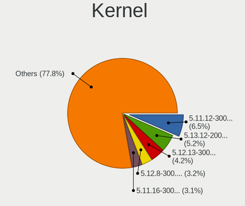

| Version                                                       | Computers | Percent |
|---------------------------------------------------------------|-----------|---------|
| 5.12.13-300.fc34.x86_64                                       | 78        | 6.84%   |
| 5.11.12-300.fc34.x86_64                                       | 77        | 6.75%   |
| 5.12.8-300.fc34.x86_64                                        | 60        | 5.26%   |
| 5.11.17-300.fc34.x86_64                                       | 56        | 4.91%   |
| 5.11.16-300.fc34.x86_64                                       | 55        | 4.82%   |
| 5.12.14-300.fc34.x86_64                                       | 53        | 4.65%   |
| 5.12.9-300.fc34.x86_64                                        | 46        | 4.04%   |
| 5.13.4-200.fc34.x86_64                                        | 42        | 3.68%   |
| 5.11.18-300.fc34.x86_64                                       | 41        | 3.6%    |
| 5.13.6-200.fc34.x86_64                                        | 40        | 3.51%   |
| 5.12.11-300.fc34.x86_64                                       | 39        | 3.42%   |
| 5.11.20-300.fc34.x86_64                                       | 39        | 3.42%   |
| 5.11.11-300.fc34.x86_64                                       | 39        | 3.42%   |
| 5.12.7-300.fc34.x86_64                                        | 37        | 3.25%   |
| 5.12.15-300.fc34.x86_64                                       | 37        | 3.25%   |
| 5.13.8-200.fc34.x86_64                                        | 36        | 3.16%   |
| 5.12.12-300.fc34.x86_64                                       | 35        | 3.07%   |
| 5.13.9-200.fc34.x86_64                                        | 28        | 2.46%   |
| 5.12.6-300.fc34.x86_64                                        | 28        | 2.46%   |
| 5.12.10-300.fc34.x86_64                                       | 28        | 2.46%   |
| 5.11.15-300.fc34.x86_64                                       | 25        | 2.19%   |
| 5.11.19-300.fc34.x86_64                                       | 22        | 1.93%   |
| 5.11.3-300.fc34.x86_64                                        | 18        | 1.58%   |
| 5.13.5-200.fc34.x86_64                                        | 17        | 1.49%   |
| 5.11.21-300.fc34.x86_64                                       | 16        | 1.4%    |
| 5.11.10-300.fc34.x86_64                                       | 14        | 1.23%   |
| 5.13.7-200.fc34.x86_64                                        | 12        | 1.05%   |
| 5.12.5-300.fc34.x86_64                                        | 12        | 1.05%   |
| 5.11.14-300.fc34.x86_64                                       | 11        | 0.96%   |
| 5.11.13-300.fc34.x86_64                                       | 11        | 0.96%   |
| 5.12.17-300.fc34.x86_64                                       | 8         | 0.7%    |
| 5.11.8-300.fc34.x86_64                                        | 6         | 0.53%   |
| 5.11.21-300.fc34.aarch64                                      | 5         | 0.44%   |
| 5.13.1-300.fc34.x86_64                                        | 4         | 0.35%   |
| 5.11.9-300.fc34.x86_64                                        | 4         | 0.35%   |
| 5.11.0-156.fc34.x86_64                                        | 4         | 0.35%   |
| 5.11.7-300.fc34.x86_64                                        | 3         | 0.26%   |
| 5.12.2-300.fc34.x86_64                                        | 2         | 0.18%   |
| 5.11.6-300.fc34.x86_64                                        | 2         | 0.18%   |
| 5.11.2-300.fc34.x86_64                                        | 2         | 0.18%   |
| 5.10.0-0.rc3.68.fc34.x86_64                                   | 2         | 0.18%   |
| 5.10.0-0.rc1.20201028gited8780e3f2ec.57.fc34.x86_64           | 2         | 0.18%   |
| 5.9.0-0.rc8.20201009git7575fdda569b.32.fc34.x86_64            | 1         | 0.09%   |
| 5.9.0-0.rc3.1.fc34.x86_64                                     | 1         | 0.09%   |
| 5.8.0-1.fc33.x86_64                                           | 1         | 0.09%   |
| 5.4.111                                                       | 1         | 0.09%   |
| 5.14.0-0.rc3.20210728git7d549995d4e0.31.fc35.x86_64           | 1         | 0.09%   |
| 5.13.9-200.rog.fc34.x86_64                                    | 1         | 0.09%   |
| 5.13.8-xm1cacule.0.fc34.x86_64                                | 1         | 0.09%   |
| 5.13.6-250.vanilla.1.fc34.x86_64                              | 1         | 0.09%   |
| 5.13.4-201.fsync.fc34.x86_64                                  | 1         | 0.09%   |
| 5.13.2-300.fc34.x86_64                                        | 1         | 0.09%   |
| 5.13.11-xm1.0.fc34.x86_64                                     | 1         | 0.09%   |
| 5.13.1-xm1.0.fc34.x86_64                                      | 1         | 0.09%   |
| 5.13.0-xm1.1.fc34.x86_64                                      | 1         | 0.09%   |
| 5.13.0-rc3-202105300039+                                      | 1         | 0.09%   |
| 5.13.0-bersa1+                                                | 1         | 0.09%   |
| 5.13.0-0.rc1.20210513gitc06a2ba62fc4.15.vanilla.1.fc34.x86_64 | 1         | 0.09%   |
| 5.12.8-300.fc34.aarch64                                       | 1         | 0.09%   |
| 5.12.7-16-Yeoreum                                             | 1         | 0.09%   |

Kernel Family
-------------

Linux kernel without a distro release

| Version  | Computers | Percent |
|----------|-----------|---------|
| 5.12.13  | 79        | 6.93%   |
| 5.11.12  | 77        | 6.75%   |
| 5.12.8   | 61        | 5.35%   |
| 5.11.17  | 56        | 4.91%   |
| 5.11.16  | 56        | 4.91%   |
| 5.12.14  | 54        | 4.74%   |
| 5.12.9   | 46        | 4.04%   |
| 5.13.4   | 43        | 3.77%   |
| 5.13.6   | 41        | 3.6%    |
| 5.12.11  | 41        | 3.6%    |
| 5.11.18  | 41        | 3.6%    |
| 5.11.20  | 39        | 3.42%   |
| 5.11.11  | 39        | 3.42%   |
| 5.12.7   | 38        | 3.33%   |
| 5.12.15  | 38        | 3.33%   |
| 5.13.8   | 37        | 3.25%   |
| 5.12.12  | 35        | 3.07%   |
| 5.12.10  | 30        | 2.63%   |
| 5.13.9   | 29        | 2.54%   |
| 5.12.6   | 29        | 2.54%   |
| 5.11.15  | 25        | 2.19%   |
| 5.11.19  | 23        | 2.02%   |
| 5.11.21  | 21        | 1.84%   |
| 5.11.3   | 18        | 1.58%   |
| 5.13.5   | 17        | 1.49%   |
| 5.11.10  | 14        | 1.23%   |
| 5.13.7   | 12        | 1.05%   |
| 5.12.5   | 12        | 1.05%   |
| 5.11.14  | 11        | 0.96%   |
| 5.11.13  | 11        | 0.96%   |
| 5.12.17  | 8         | 0.7%    |
| 5.11.0   | 8         | 0.7%    |
| 5.11.8   | 6         | 0.53%   |
| 5.10.0   | 6         | 0.53%   |
| 5.13.1   | 5         | 0.44%   |
| 5.13.0   | 4         | 0.35%   |
| 5.11.9   | 4         | 0.35%   |
| 5.11.7   | 3         | 0.26%   |
| 5.9.0    | 2         | 0.18%   |
| 5.12.3   | 2         | 0.18%   |
| 5.12.2   | 2         | 0.18%   |
| 5.12.0   | 2         | 0.18%   |
| 5.11.6   | 2         | 0.18%   |
| 5.11.2   | 2         | 0.18%   |
| 5.8.0    | 1         | 0.09%   |
| 5.4.111  | 1         | 0.09%   |
| 5.14.0   | 1         | 0.09%   |
| 5.13.2   | 1         | 0.09%   |
| 5.13.11  | 1         | 0.09%   |
| 5.11.5   | 1         | 0.09%   |
| 5.10.47  | 1         | 0.09%   |
| 5.10.21  | 1         | 0.09%   |
| 5.10.13  | 1         | 0.09%   |
| 5.1.15   | 1         | 0.09%   |
| 4.14.190 | 1         | 0.09%   |

Kernel Major Ver.
-----------------

Linux kernel major version

| Version | Computers | Percent |
|---------|-----------|---------|
| 5.12    | 447       | 41.5%   |
| 5.11    | 431       | 40.02%  |
| 5.13    | 183       | 16.99%  |
| 5.10    | 9         | 0.84%   |
| 5.9     | 2         | 0.19%   |
| 5.8     | 1         | 0.09%   |
| 5.4     | 1         | 0.09%   |
| 5.14    | 1         | 0.09%   |
| 5.1     | 1         | 0.09%   |
| 4.14    | 1         | 0.09%   |

Arch
----

OS architecture (x86_64, i586, etc.)

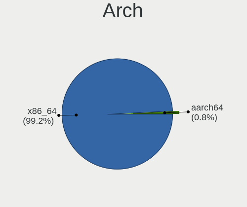

| Name    | Computers | Percent |
|---------|-----------|---------|
| x86_64  | 991       | 99.1%   |
| aarch64 | 9         | 0.9%    |

DE
--

Desktop Environment

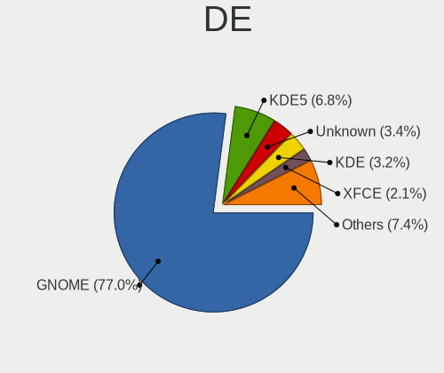

| Name          | Computers | Percent |
|---------------|-----------|---------|
| GNOME         | 807       | 79.98%  |
| KDE5          | 46        | 4.56%   |
| KDE           | 39        | 3.87%   |
| Unknown       | 37        | 3.67%   |
| X-Cinnamon    | 18        | 1.78%   |
| Cinnamon      | 17        | 1.68%   |
| XFCE          | 15        | 1.49%   |
| MATE          | 13        | 1.29%   |
| Deepin        | 4         | 0.4%    |
| GNOME Classic | 3         | 0.3%    |
| LXDE          | 2         | 0.2%    |
| i3            | 2         | 0.2%    |
| sway          | 1         | 0.1%    |
| Pantheon      | 1         | 0.1%    |
| openbox       | 1         | 0.1%    |
| NsCDE         | 1         | 0.1%    |
| LXQt          | 1         | 0.1%    |
| dwm           | 1         | 0.1%    |

Display Server
--------------

X11 or Wayland

| Name    | Computers | Percent |
|---------|-----------|---------|
| Wayland | 650       | 63.41%  |
| X11     | 334       | 32.59%  |
| Tty     | 26        | 2.54%   |
| Unknown | 15        | 1.46%   |

Display Manager
---------------

SDDM, LightDM, etc.

| Name    | Computers | Percent |
|---------|-----------|---------|
| Unknown | 586       | 57.73%  |
| GDM     | 344       | 33.89%  |
| SDDM    | 39        | 3.84%   |
| TDM     | 31        | 3.05%   |
| LightDM | 12        | 1.18%   |
| XDM     | 1         | 0.1%    |
| SLiM    | 1         | 0.1%    |
| KDM     | 1         | 0.1%    |

OS Lang
-------

Language

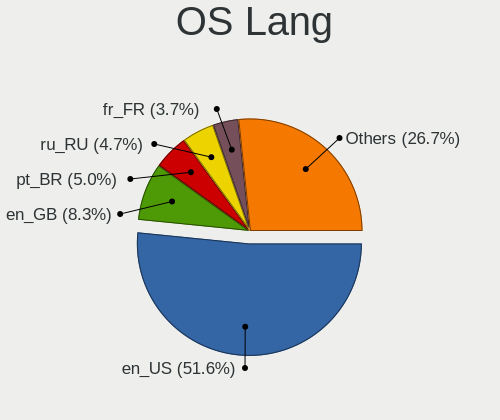

| Lang    | Computers | Percent |
|---------|-----------|---------|
| en_US   | 499       | 49.6%   |
| en_GB   | 85        | 8.45%   |
| pt_BR   | 60        | 5.96%   |
| ru_RU   | 51        | 5.07%   |
| de_DE   | 43        | 4.27%   |
| fr_FR   | 36        | 3.58%   |
| en_CA   | 27        | 2.68%   |
| en_AU   | 23        | 2.29%   |
| en_IN   | 19        | 1.89%   |
| it_IT   | 18        | 1.79%   |
| es_ES   | 14        | 1.39%   |
| pl_PL   | 13        | 1.29%   |
| cs_CZ   | 10        | 0.99%   |
| es_CL   | 6         | 0.6%    |
| ru_UA   | 5         | 0.5%    |
| pt_PT   | 5         | 0.5%    |
| nl_BE   | 5         | 0.5%    |
| hu_HU   | 5         | 0.5%    |
| tr_TR   | 4         | 0.4%    |
| nl_NL   | 4         | 0.4%    |
| fi_FI   | 4         | 0.4%    |
| es_MX   | 4         | 0.4%    |
| es_CO   | 4         | 0.4%    |
| en_SG   | 4         | 0.4%    |
| de_AT   | 4         | 0.4%    |
| Unknown | 4         | 0.4%    |
| ja_JP   | 3         | 0.3%    |
| fr_CH   | 3         | 0.3%    |
| es_EC   | 3         | 0.3%    |
| en_NZ   | 3         | 0.3%    |
| en_DK   | 3         | 0.3%    |
| C       | 3         | 0.3%    |
| zh_TW   | 2         | 0.2%    |
| sk_SK   | 2         | 0.2%    |
| ko_KR   | 2         | 0.2%    |
| fr_BE   | 2         | 0.2%    |
| es_DO   | 2         | 0.2%    |
| es_AR   | 2         | 0.2%    |
| en_PH   | 2         | 0.2%    |
| en_IE   | 2         | 0.2%    |
| ca_ES   | 2         | 0.2%    |
| uk_UA   | 1         | 0.1%    |
| sv_SE   | 1         | 0.1%    |
| sr_ME   | 1         | 0.1%    |
| nb_NO   | 1         | 0.1%    |
| ms_MY   | 1         | 0.1%    |
| es_UY   | 1         | 0.1%    |
| es_PA   | 1         | 0.1%    |
| es_NI   | 1         | 0.1%    |
| en_IL   | 1         | 0.1%    |
| el_GR   | 1         | 0.1%    |
| de_CH   | 1         | 0.1%    |
| da_DK   | 1         | 0.1%    |
| ca_AD   | 1         | 0.1%    |
| ar_KW   | 1         | 0.1%    |

Boot Mode
---------

EFI or BIOS

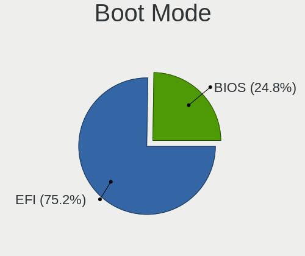

| Mode | Computers | Percent |
|------|-----------|---------|
| EFI  | 762       | 75.9%   |
| BIOS | 242       | 24.1%   |

Filesystem
----------

Type of filesystem

| Type                | Computers | Percent |
|---------------------|-----------|---------|
| Btrfs               | 703       | 70.16%  |
| Ext4                | 251       | 25.05%  |
| Xfs                 | 44        | 4.39%   |
| Zfs                 | 2         | 0.2%    |
| Fuse.fuse-overlayfs | 1         | 0.1%    |
| Unknown             | 1         | 0.1%    |

Part. scheme
------------

Scheme of partitioning

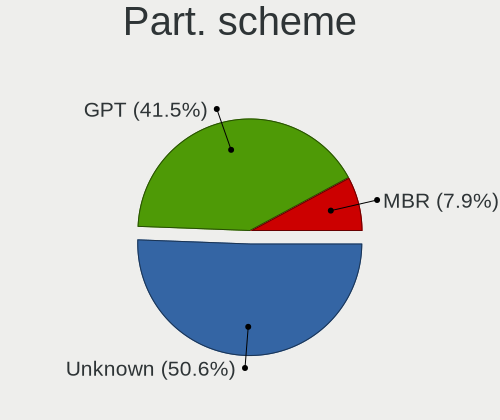

| Type    | Computers | Percent |
|---------|-----------|---------|
| Unknown | 572       | 56.47%  |
| GPT     | 369       | 36.43%  |
| MBR     | 72        | 7.11%   |

Dual Boot with Linux/BSD
------------------------

Hosting more than one Linux/BSD

| Dual boot | Computers | Percent |
|-----------|-----------|---------|
| No        | 915       | 90.95%  |
| Yes       | 91        | 9.05%   |

Dual Boot (Win)
---------------

Hosting Linux and Windows

| Dual boot | Computers | Percent |
|-----------|-----------|---------|
| No        | 821       | 81.61%  |
| Yes       | 185       | 18.39%  |

Board
-----

Vendor
------

Motherboard manufacturer

| Name                             | Computers | Percent |
|----------------------------------|-----------|---------|
| Lenovo                           | 209       | 20.9%   |
| ASUSTek Computer                 | 153       | 15.3%   |
| Dell                             | 129       | 12.9%   |
| Hewlett-Packard                  | 126       | 12.6%   |
| Gigabyte Technology              | 72        | 7.2%    |
| MSI                              | 51        | 5.1%    |
| Acer                             | 48        | 4.8%    |
| ASRock                           | 39        | 3.9%    |
| Apple                            | 24        | 2.4%    |
| Intel                            | 12        | 1.2%    |
| Unknown                          | 11        | 1.1%    |
| Fujitsu                          | 10        | 1%      |
| Toshiba                          | 7         | 0.7%    |
| Samsung Electronics              | 7         | 0.7%    |
| HUAWEI                           | 7         | 0.7%    |
| Timi                             | 6         | 0.6%    |
| Raspberry Pi Foundation          | 6         | 0.6%    |
| Notebook                         | 6         | 0.6%    |
| Positivo                         | 5         | 0.5%    |
| Sony                             | 4         | 0.4%    |
| Biostar                          | 4         | 0.4%    |
| Alienware                        | 4         | 0.4%    |
| Medion                           | 3         | 0.3%    |
| LG Electronics                   | 3         | 0.3%    |
| eMachines                        | 3         | 0.3%    |
| Chuwi                            | 3         | 0.3%    |
| TUXEDO                           | 2         | 0.2%    |
| TrekStor                         | 2         | 0.2%    |
| System76                         | 2         | 0.2%    |
| SLIMBOOK                         | 2         | 0.2%    |
| Pine Microsystems                | 2         | 0.2%    |
| Microsoft                        | 2         | 0.2%    |
| Wortmann AG                      | 1         | 0.1%    |
| Teclast                          | 1         | 0.1%    |
| SYWZ                             | 1         | 0.1%    |
| Supermicro                       | 1         | 0.1%    |
| SUN MICROSYSTEMS                 | 1         | 0.1%    |
| Standard                         | 1         | 0.1%    |
| Shenzhen PLOYER electronics      | 1         | 0.1%    |
| Razer                            | 1         | 0.1%    |
| Purism                           | 1         | 0.1%    |
| Prestigio                        | 1         | 0.1%    |
| PC Specialist                    | 1         | 0.1%    |
| ordissimo                        | 1         | 0.1%    |
| NEC Computers                    | 1         | 0.1%    |
| MPMAN                            | 1         | 0.1%    |
| Login Informatica                | 1         | 0.1%    |
| Linx                             | 1         | 0.1%    |
| Irbis                            | 1         | 0.1%    |
| Intel Client Systems             | 1         | 0.1%    |
| Insyde                           | 1         | 0.1%    |
| Huanan                           | 1         | 0.1%    |
| HONOR                            | 1         | 0.1%    |
| HASEE Computer                   | 1         | 0.1%    |
| Hampoo                           | 1         | 0.1%    |
| Google                           | 1         | 0.1%    |
| Gateway                          | 1         | 0.1%    |
| FUJITSU CLIENT COMPUTING LIMITED | 1         | 0.1%    |
| Framework                        | 1         | 0.1%    |
| EVGA                             | 1         | 0.1%    |

Model
-----

Motherboard model

| Name                                       | Computers | Percent |
|--------------------------------------------|-----------|---------|
| Unknown                                    | 13        | 1.3%    |
| ASUS All Series                            | 7         | 0.7%    |
| RPi Raspberry Pi 4 Model B                 | 6         | 0.6%    |
| MSI MS-7C37                                | 5         | 0.5%    |
| Lenovo IdeaPad Flex 5 14ARE05 81X2         | 5         | 0.5%    |
| Dell XPS 15 9500                           | 5         | 0.5%    |
| HP Pavilion dv7                            | 4         | 0.4%    |
| HP Notebook                                | 4         | 0.4%    |
| Dell XPS 15 7590                           | 4         | 0.4%    |
| ASUS TUF GAMING X570-PLUS                  | 4         | 0.4%    |
| Apple MacBookPro11,5                       | 4         | 0.4%    |
| MSI MS-7C02                                | 3         | 0.3%    |
| Lenovo Yoga 9 14ITL5 82BG                  | 3         | 0.3%    |
| Lenovo ThinkPad X1 Carbon Gen 9 20XWCTO1WW | 3         | 0.3%    |
| HP Pavilion 15                             | 3         | 0.3%    |
| HP Laptop 15s-eq2xxx                       | 3         | 0.3%    |
| HP Laptop 15-da0xxx                        | 3         | 0.3%    |
| HP EliteBook 840 G6                        | 3         | 0.3%    |
| Gigabyte B450 I AORUS PRO WIFI             | 3         | 0.3%    |
| Dell XPS 13 9310                           | 3         | 0.3%    |
| Dell XPS 13 7390                           | 3         | 0.3%    |
| Dell Latitude 7490                         | 3         | 0.3%    |
| Dell Latitude 5480                         | 3         | 0.3%    |
| ASUS ZenBook UX431DA_UM431DA               | 3         | 0.3%    |
| ASUS TUF GAMING B550M-PLUS                 | 3         | 0.3%    |
| ASUS ROG Zephyrus G14 GA401QM_GA401QM      | 3         | 0.3%    |
| ASUS ROG STRIX X570-E GAMING               | 3         | 0.3%    |
| ASUS ROG STRIX B450-F GAMING               | 3         | 0.3%    |
| Apple MacBookPro11,3                       | 3         | 0.3%    |
| Acer Aspire E5-573G                        | 3         | 0.3%    |
| System76 Oryx Pro                          | 2         | 0.2%    |
| SLIMBOOK PROX15-AMD                        | 2         | 0.2%    |
| Positivo CHT14B                            | 2         | 0.2%    |
| MSI MS-7C84                                | 2         | 0.2%    |
| MSI MS-7B98                                | 2         | 0.2%    |
| MSI MS-7B85                                | 2         | 0.2%    |
| MSI MS-7A38                                | 2         | 0.2%    |
| Lenovo Yoga Slim 7 14ARE05 82A2            | 2         | 0.2%    |
| Lenovo Yoga C940-14IIL 81Q9                | 2         | 0.2%    |
| Lenovo Yoga 7 14ITL5 82BH                  | 2         | 0.2%    |
| Lenovo Yoga 2 Pro 20266                    | 2         | 0.2%    |
| Lenovo ThinkPad T14 Gen 1 20UDCTO1WW       | 2         | 0.2%    |
| Lenovo ThinkPad E595 20NFCTO1WW            | 2         | 0.2%    |
| Lenovo IdeaPad Yoga 13 20175               | 2         | 0.2%    |
| Lenovo IdeaPad S145-15IWL 81S9             | 2         | 0.2%    |
| Lenovo IdeaPad 5 15ARE05 81YQ              | 2         | 0.2%    |
| Lenovo IdeaPad 5 15ALC05 82LN              | 2         | 0.2%    |
| Lenovo IdeaPad 330S-15IKB 81F5             | 2         | 0.2%    |
| Intel H61                                  | 2         | 0.2%    |
| HP ProBook x360 435 G7                     | 2         | 0.2%    |
| HP ProBook 450 G5                          | 2         | 0.2%    |
| HP Pro x2 612 G1 Tablet                    | 2         | 0.2%    |
| HP Pavilion dv6                            | 2         | 0.2%    |
| HP Pavilion 11 x360 PC                     | 2         | 0.2%    |
| HP Laptop 17-bs1xx                         | 2         | 0.2%    |
| HP ENVY x360 Convertible 13-ay0xxx         | 2         | 0.2%    |
| HP EliteBook x360 1030 G2                  | 2         | 0.2%    |
| HP Compaq 6200 Pro SFF PC                  | 2         | 0.2%    |
| Gigabyte X570 AORUS PRO WIFI               | 2         | 0.2%    |
| Gigabyte X570 AORUS ELITE WIFI             | 2         | 0.2%    |

Model Family
------------

Motherboard model prefix

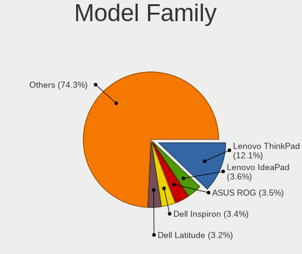

| Name                     | Computers | Percent |
|--------------------------|-----------|---------|
| Lenovo ThinkPad          | 109       | 10.9%   |
| Lenovo IdeaPad           | 41        | 4.1%    |
| ASUS ROG                 | 38        | 3.8%    |
| Dell Inspiron            | 34        | 3.4%    |
| Dell XPS                 | 32        | 3.2%    |
| Acer Aspire              | 30        | 3%      |
| Dell Latitude            | 29        | 2.9%    |
| Lenovo Yoga              | 27        | 2.7%    |
| HP Pavilion              | 23        | 2.3%    |
| HP EliteBook             | 19        | 1.9%    |
| ASUS TUF                 | 16        | 1.6%    |
| HP ProBook               | 15        | 1.5%    |
| ASUS PRIME               | 15        | 1.5%    |
| HP Laptop                | 14        | 1.4%    |
| Unknown                  | 13        | 1.3%    |
| Dell OptiPlex            | 12        | 1.2%    |
| ASUS VivoBook            | 12        | 1.2%    |
| HP ENVY                  | 10        | 1%      |
| Apple MacBookPro11       | 9         | 0.9%    |
| Dell Precision           | 8         | 0.8%    |
| Lenovo ThinkBook         | 7         | 0.7%    |
| ASUS ZenBook             | 7         | 0.7%    |
| ASUS All                 | 7         | 0.7%    |
| Acer Nitro               | 7         | 0.7%    |
| RPi Raspberry            | 6         | 0.6%    |
| Lenovo ThinkCentre       | 6         | 0.6%    |
| HP Compaq                | 6         | 0.6%    |
| Gigabyte B450            | 6         | 0.6%    |
| Fujitsu LIFEBOOK         | 6         | 0.6%    |
| Dell Vostro              | 6         | 0.6%    |
| Toshiba Satellite        | 5         | 0.5%    |
| MSI MS-7C37              | 5         | 0.5%    |
| Lenovo Legion            | 5         | 0.5%    |
| Gigabyte X570            | 5         | 0.5%    |
| ASUS ASUS                | 5         | 0.5%    |
| Acer Swift               | 5         | 0.5%    |
| HP ZBook                 | 4         | 0.4%    |
| HP Notebook              | 4         | 0.4%    |
| HP EliteDesk             | 4         | 0.4%    |
| Gigabyte B450M           | 4         | 0.4%    |
| Fujitsu ESPRIMO          | 4         | 0.4%    |
| MSI MS-7C02              | 3         | 0.3%    |
| Gigabyte Z390            | 3         | 0.3%    |
| Dell G5                  | 3         | 0.3%    |
| ASUS P8H61-M             | 3         | 0.3%    |
| ASRock X570              | 3         | 0.3%    |
| ASRock B450              | 3         | 0.3%    |
| Toshiba TECRA            | 2         | 0.2%    |
| Timi RedmiBook           | 2         | 0.2%    |
| System76 Oryx            | 2         | 0.2%    |
| SLIMBOOK PROX15-AMD      | 2         | 0.2%    |
| Positivo CHT14B          | 2         | 0.2%    |
| Pine Microsystems Pine64 | 2         | 0.2%    |
| MSI MS-7C84              | 2         | 0.2%    |
| MSI MS-7B98              | 2         | 0.2%    |
| MSI MS-7B85              | 2         | 0.2%    |
| MSI MS-7A38              | 2         | 0.2%    |
| Microsoft Surface        | 2         | 0.2%    |
| Intel H61                | 2         | 0.2%    |
| HP Spectre               | 2         | 0.2%    |

MFG Year
--------

Motherboard manufacture year

| Year    | Computers | Percent |
|---------|-----------|---------|
| 2020    | 249       | 24.9%   |
| 2021    | 199       | 19.9%   |
| 2019    | 147       | 14.7%   |
| 2018    | 93        | 9.3%    |
| 2015    | 48        | 4.8%    |
| 2017    | 37        | 3.7%    |
| 2016    | 37        | 3.7%    |
| 2012    | 37        | 3.7%    |
| 2014    | 36        | 3.6%    |
| 2013    | 35        | 3.5%    |
| 2011    | 29        | 2.9%    |
| 2010    | 28        | 2.8%    |
| 2009    | 14        | 1.4%    |
| 2008    | 6         | 0.6%    |
| Unknown | 2         | 0.2%    |
| 2007    | 1         | 0.1%    |
| 2006    | 1         | 0.1%    |
| 2005    | 1         | 0.1%    |

Form Factor
-----------

Physical design of the computer

| Name           | Computers | Percent |
|----------------|-----------|---------|
| Notebook       | 578       | 57.8%   |
| Desktop        | 327       | 32.7%   |
| Convertible    | 52        | 5.2%    |
| All in one     | 12        | 1.2%    |
| Mini pc        | 11        | 1.1%    |
| Tablet         | 10        | 1%      |
| System on chip | 7         | 0.7%    |
| Server         | 3         | 0.3%    |

Secure Boot
-----------

Enabled or disabled

| State    | Computers | Percent |
|----------|-----------|---------|
| Disabled | 865       | 85.31%  |
| Enabled  | 149       | 14.69%  |

Coreboot
--------

Have coreboot on board

| Used | Computers | Percent |
|------|-----------|---------|
| No   | 996       | 99.6%   |
| Yes  | 4         | 0.4%    |

RAM Size
--------

Total RAM memory

| Size in GB  | Computers | Percent |
|-------------|-----------|---------|
| 16.01-24.0  | 259       | 25.67%  |
| 4.01-8.0    | 246       | 24.38%  |
| 8.01-16.0   | 180       | 17.84%  |
| 32.01-64.0  | 149       | 14.77%  |
| 3.01-4.0    | 86        | 8.52%   |
| 64.01-256.0 | 38        | 3.77%   |
| 24.01-32.0  | 23        | 2.28%   |
| 1.01-2.0    | 17        | 1.68%   |
| 0.51-1.0    | 7         | 0.69%   |
| 2.01-3.0    | 4         | 0.4%    |

RAM Used
--------

Used RAM memory

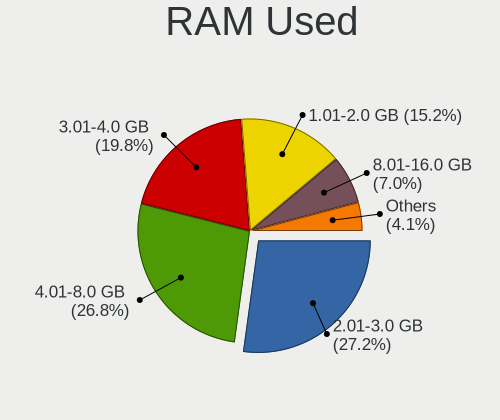

| Used GB    | Computers | Percent |
|------------|-----------|---------|
| 4.01-8.0   | 283       | 26.35%  |
| 2.01-3.0   | 281       | 26.16%  |
| 3.01-4.0   | 217       | 20.2%   |
| 1.01-2.0   | 181       | 16.85%  |
| 8.01-16.0  | 67        | 6.24%   |
| 0.51-1.0   | 29        | 2.7%    |
| 16.01-24.0 | 8         | 0.74%   |
| 0.01-0.5   | 4         | 0.37%   |
| 32.01-64.0 | 2         | 0.19%   |
| 24.01-32.0 | 2         | 0.19%   |

Total Drives
------------

Number of drives on board

| Drives | Computers | Percent |
|--------|-----------|---------|
| 1      | 567       | 56.03%  |
| 2      | 258       | 25.49%  |
| 3      | 104       | 10.28%  |
| 4      | 38        | 3.75%   |
| 5      | 20        | 1.98%   |
| 6      | 7         | 0.69%   |
| 8      | 6         | 0.59%   |
| 0      | 6         | 0.59%   |
| 7      | 3         | 0.3%    |
| 12     | 2         | 0.2%    |
| 9      | 1         | 0.1%    |

Has CD-ROM
----------

Has CD-ROM on board

| Presented | Computers | Percent |
|-----------|-----------|---------|
| No        | 757       | 75.32%  |
| Yes       | 248       | 24.68%  |

Has Ethernet
------------

Has Ethernet on board

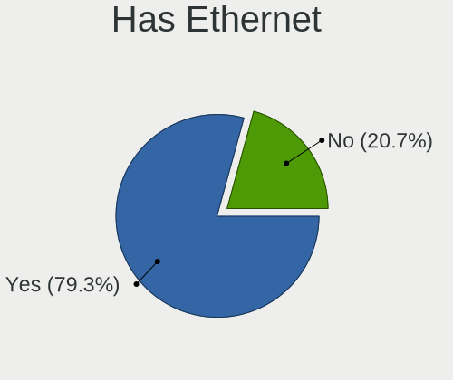

| Presented | Computers | Percent |
|-----------|-----------|---------|
| Yes       | 784       | 78.09%  |
| No        | 220       | 21.91%  |

Has WiFi
--------

Has WiFi module

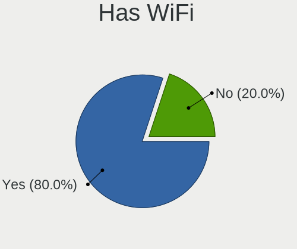

| Presented | Computers | Percent |
|-----------|-----------|---------|
| Yes       | 798       | 79.56%  |
| No        | 205       | 20.44%  |

Has Bluetooth
-------------

Has Bluetooth module

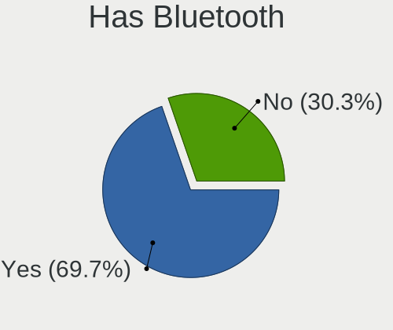

| Presented | Computers | Percent |
|-----------|-----------|---------|
| Yes       | 709       | 70.55%  |
| No        | 296       | 29.45%  |

Location
--------

Country
-------

Geographic location (country)

| Country            | Computers | Percent |
|--------------------|-----------|---------|
| USA                | 190       | 18.94%  |
| Brazil             | 80        | 7.98%   |
| Germany            | 76        | 7.58%   |
| Russia             | 53        | 5.28%   |
| India              | 40        | 3.99%   |
| France             | 39        | 3.89%   |
| Netherlands        | 38        | 3.79%   |
| Canada             | 36        | 3.59%   |
| UK                 | 31        | 3.09%   |
| Italy              | 26        | 2.59%   |
| Australia          | 26        | 2.59%   |
| Spain              | 25        | 2.49%   |
| Poland             | 22        | 2.19%   |
| Czechia            | 21        | 2.09%   |
| Ukraine            | 18        | 1.79%   |
| Switzerland        | 17        | 1.69%   |
| Belgium            | 15        | 1.5%    |
| Sweden             | 14        | 1.4%    |
| Turkey             | 13        | 1.3%    |
| Portugal           | 11        | 1.1%    |
| Chile              | 11        | 1.1%    |
| Slovakia           | 10        | 1%      |
| Finland            | 10        | 1%      |
| Argentina          | 9         | 0.9%    |
| Romania            | 8         | 0.8%    |
| Norway             | 8         | 0.8%    |
| Belarus            | 8         | 0.8%    |
| Mexico             | 7         | 0.7%    |
| Hungary            | 7         | 0.7%    |
| Colombia           | 7         | 0.7%    |
| Austria            | 7         | 0.7%    |
| Denmark            | 6         | 0.6%    |
| China              | 6         | 0.6%    |
| Malaysia           | 5         | 0.5%    |
| Iran               | 5         | 0.5%    |
| Indonesia          | 5         | 0.5%    |
| Greece             | 5         | 0.5%    |
| Serbia             | 4         | 0.4%    |
| New Zealand        | 4         | 0.4%    |
| Japan              | 4         | 0.4%    |
| Estonia            | 4         | 0.4%    |
| Taiwan             | 3         | 0.3%    |
| South Korea        | 3         | 0.3%    |
| South Africa       | 3         | 0.3%    |
| Slovenia           | 3         | 0.3%    |
| Philippines        | 3         | 0.3%    |
| Israel             | 3         | 0.3%    |
| Ecuador            | 3         | 0.3%    |
| Bulgaria           | 3         | 0.3%    |
| Vietnam            | 2         | 0.2%    |
| Uruguay            | 2         | 0.2%    |
| Sri Lanka          | 2         | 0.2%    |
| Montenegro         | 2         | 0.2%    |
| Moldova            | 2         | 0.2%    |
| Lithuania          | 2         | 0.2%    |
| Latvia             | 2         | 0.2%    |
| Kyrgyzstan         | 2         | 0.2%    |
| Egypt              | 2         | 0.2%    |
| Dominican Republic | 2         | 0.2%    |
| Croatia            | 2         | 0.2%    |

City
----

Geographic location (city)

| City             | Computers | Percent |
|------------------|-----------|---------|
| Sydney           | 15        | 1.46%   |
| Moscow           | 14        | 1.36%   |
| Berlin           | 12        | 1.17%   |
| The Hague        | 9         | 0.88%   |
| St Petersburg    | 9         | 0.88%   |
| Prague           | 9         | 0.88%   |
| Madrid           | 8         | 0.78%   |
| Denver           | 8         | 0.78%   |
| Kyiv             | 7         | 0.68%   |
| Milan            | 6         | 0.58%   |
| Belo Horizonte   | 6         | 0.58%   |
| Amsterdam        | 6         | 0.58%   |
| So Paulo       | 5         | 0.49%   |
| Santiago         | 5         | 0.49%   |
| Minsk            | 5         | 0.49%   |
| London           | 5         | 0.49%   |
| Lodz             | 5         | 0.49%   |
| Kharkiv          | 5         | 0.49%   |
| Istanbul         | 5         | 0.49%   |
| Fortaleza        | 5         | 0.49%   |
| Budapest         | 5         | 0.49%   |
| Brussels         | 5         | 0.49%   |
| Bratislava       | 5         | 0.49%   |
| Zurich           | 4         | 0.39%   |
| Yekaterinburg    | 4         | 0.39%   |
| Wroclaw          | 4         | 0.39%   |
| Toronto          | 4         | 0.39%   |
| Porto Alegre     | 4         | 0.39%   |
| Melbourne        | 4         | 0.39%   |
| Hamburg          | 4         | 0.39%   |
| Feeding Hills    | 4         | 0.39%   |
| Buenos Aires     | 4         | 0.39%   |
| Winnipeg         | 3         | 0.29%   |
| Vienna           | 3         | 0.29%   |
| Vancouver        | 3         | 0.29%   |
| Ufa              | 3         | 0.29%   |
| Tehran           | 3         | 0.29%   |
| Tallinn          | 3         | 0.29%   |
| Sharon           | 3         | 0.29%   |
| Rostov-on-Don    | 3         | 0.29%   |
| Riverside        | 3         | 0.29%   |
| Raleigh          | 3         | 0.29%   |
| Pymble           | 3         | 0.29%   |
| Oslo             | 3         | 0.29%   |
| Montreal         | 3         | 0.29%   |
| Jambes           | 3         | 0.29%   |
| Fort Worth       | 3         | 0.29%   |
| Cologne          | 3         | 0.29%   |
| Campinas         | 3         | 0.29%   |
| Caldas da Rainha | 3         | 0.29%   |
| Bucharest        | 3         | 0.29%   |
| Brno             | 3         | 0.29%   |
| Brisbane         | 3         | 0.29%   |
| Braslia        | 3         | 0.29%   |
| Brampton         | 3         | 0.29%   |
| Bogot          | 3         | 0.29%   |
| Bengaluru        | 3         | 0.29%   |
| Basel            | 3         | 0.29%   |
| Athens           | 3         | 0.29%   |
| Ashburn          | 3         | 0.29%   |

Drives
------

Drive Vendor
------------

Hard drive vendors

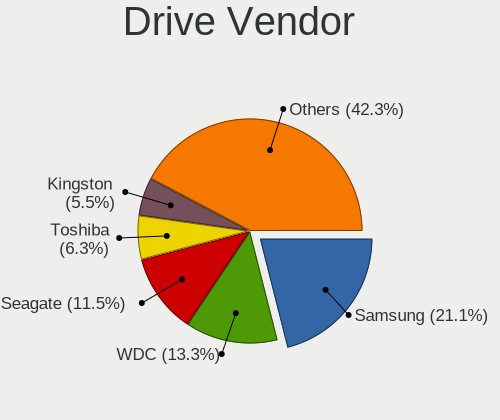

| Vendor                    | Computers | Drives | Percent |
|---------------------------|-----------|--------|---------|
| Samsung Electronics       | 320       | 505    | 21.01%  |
| WDC                       | 204       | 285    | 13.39%  |
| Seagate                   | 166       | 245    | 10.9%   |
| Toshiba                   | 97        | 120    | 6.37%   |
| SanDisk                   | 87        | 97     | 5.71%   |
| Kingston                  | 79        | 92     | 5.19%   |
| Unknown                   | 66        | 87     | 4.33%   |
| Crucial                   | 61        | 82     | 4.01%   |
| Intel                     | 56        | 77     | 3.68%   |
| SK Hynix                  | 51        | 62     | 3.35%   |
| Hitachi                   | 28        | 35     | 1.84%   |
| Micron Technology         | 27        | 35     | 1.77%   |
| A-DATA Technology         | 25        | 29     | 1.64%   |
| Phison                    | 19        | 25     | 1.25%   |
| KIOXIA                    | 17        | 25     | 1.12%   |
| HGST                      | 16        | 28     | 1.05%   |
| Apple                     | 16        | 18     | 1.05%   |
| Silicon Motion            | 11        | 15     | 0.72%   |
| SPCC                      | 10        | 11     | 0.66%   |
| Corsair                   | 10        | 13     | 0.66%   |
| XPG                       | 9         | 11     | 0.59%   |
| Union Memory              | 9         | 12     | 0.59%   |
| Transcend                 | 8         | 8      | 0.53%   |
| PNY                       | 8         | 10     | 0.53%   |
| Micron/Crucial Technology | 8         | 9      | 0.53%   |
| OCZ                       | 7         | 12     | 0.46%   |
| Patriot                   | 6         | 7      | 0.39%   |
| LITEON                    | 6         | 6      | 0.39%   |
| Realtek Semiconductor     | 5         | 6      | 0.33%   |
| Maxtor                    | 5         | 6      | 0.33%   |
| Team                      | 4         | 5      | 0.26%   |
| LITEONIT                  | 4         | 4      | 0.26%   |
| JMicron                   | 4         | 4      | 0.26%   |
| Intenso                   | 4         | 4      | 0.26%   |
| Solid State Storage       | 3         | 3      | 0.2%    |
| SABRENT                   | 3         | 3      | 0.2%    |
| KingFast                  | 3         | 4      | 0.2%    |
| Gigabyte Technology       | 3         | 3      | 0.2%    |
| ASMT                      | 3         | 3      | 0.2%    |
| Apacer                    | 3         | 4      | 0.2%    |
| Phison Electronics        | 2         | 2      | 0.13%   |
| Mushkin                   | 2         | 3      | 0.13%   |
| Lite-On                   | 2         | 2      | 0.13%   |
| Lexar                     | 2         | 2      | 0.13%   |
| Lenovo                    | 2         | 2      | 0.13%   |
| KIOXIA-EXCERIA            | 2         | 2      | 0.13%   |
| KingSpec                  | 2         | 4      | 0.13%   |
| DOGFISH                   | 2         | 2      | 0.13%   |
| China                     | 2         | 3      | 0.13%   |
| XrayDisk                  | 1         | 1      | 0.07%   |
| WDC WDS2                  | 1         | 1      | 0.07%   |
| W800S                     | 1         | 1      | 0.07%   |
| USB 3.0                   | 1         | 1      | 0.07%   |
| Union Memory (Shenzhen)   | 1         | 1      | 0.07%   |
| Ugreen                    | 1         | 1      | 0.07%   |
| TCSUNBOW                  | 1         | 1      | 0.07%   |
| Tanbassh                  | 1         | 1      | 0.07%   |
| Synology                  | 1         | 1      | 0.07%   |
| SSK                       | 1         | 1      | 0.07%   |
| Smartbuy                  | 1         | 1      | 0.07%   |

Drive Model
-----------

Hard drive models

| Model                              | Computers | Percent |
|------------------------------------|-----------|---------|
| Samsung NVMe SSD Drive 512GB       | 29        | 1.68%   |
| Samsung SSD 860 EVO 500GB          | 24        | 1.39%   |
| Samsung NVMe SSD Drive 1TB         | 23        | 1.33%   |
| Samsung SSD 860 EVO 1TB            | 19        | 1.1%    |
| Samsung NVMe SSD Drive 500GB       | 18        | 1.04%   |
| Samsung NVMe SSD Drive 256GB       | 17        | 0.98%   |
| Samsung SSD 850 EVO 250GB          | 15        | 0.87%   |
| Samsung SSD 850 EVO 500GB          | 14        | 0.81%   |
| Seagate ST1000LM035-1RK172 1TB     | 13        | 0.75%   |
| Kingston SA400S37480G 480GB SSD    | 13        | 0.75%   |
| Kingston SA400S37240G 240GB SSD    | 13        | 0.75%   |
| Seagate ST2000DM008-2FR102 2TB     | 12        | 0.69%   |
| Crucial CT500MX500SSD1 500GB       | 12        | 0.69%   |
| Unknown SD/MMC/MS PRO 128GB        | 11        | 0.64%   |
| Sandisk NVMe SSD Drive 512GB       | 11        | 0.64%   |
| Samsung SSD 970 EVO Plus 1TB       | 11        | 0.64%   |
| Intel NVMe SSD Drive 512GB         | 11        | 0.64%   |
| Seagate ST500DM002-1BD142 500GB    | 10        | 0.58%   |
| Sandisk NVMe SSD Drive 500GB       | 10        | 0.58%   |
| Samsung NVMe SSD Drive 250GB       | 10        | 0.58%   |
| Kingston SA400S37120G 120GB SSD    | 10        | 0.58%   |
| Unknown MMC Card  32GB             | 9         | 0.52%   |
| Seagate ST1000LM024 HN-M101MBB 1TB | 9         | 0.52%   |
| Samsung SSD 860 EVO 250GB          | 9         | 0.52%   |
| Seagate ST1000DM010-2EP102 1TB     | 8         | 0.46%   |
| Sandisk NVMe SSD Drive 256GB       | 8         | 0.46%   |
| Toshiba NVMe SSD Drive 512GB       | 7         | 0.4%    |
| Toshiba MQ01ABD100 1TB             | 7         | 0.4%    |
| Toshiba DT01ACA100 1TB             | 7         | 0.4%    |
| Seagate ST1000LM049-2GH172 1TB     | 7         | 0.4%    |
| Samsung SSD 970 EVO 500GB          | 7         | 0.4%    |
| Samsung NVMe SSD Drive 1024GB      | 7         | 0.4%    |
| Micron/Crucial NVMe SSD Drive 1TB  | 7         | 0.4%    |
| WDC WDS240G2G0B-00EPW0 240GB SSD   | 6         | 0.35%   |
| Unknown MMC Card  128GB            | 6         | 0.35%   |
| Toshiba NVMe SSD Drive 256GB       | 6         | 0.35%   |
| Toshiba MQ04ABF100 1TB             | 6         | 0.35%   |
| SK Hynix NVMe SSD Drive 512GB      | 6         | 0.35%   |
| Samsung SSD 970 EVO Plus 500GB     | 6         | 0.35%   |
| Samsung SSD 970 EVO Plus 2TB       | 6         | 0.35%   |
| Samsung SSD 860 QVO 1TB            | 6         | 0.35%   |
| Samsung SSD 840 EVO 250GB          | 6         | 0.35%   |
| Samsung NVMe SSD Drive 2TB         | 6         | 0.35%   |
| HGST HTS541010A9E680 1TB           | 6         | 0.35%   |
| Crucial CT240BX500SSD1 240GB       | 6         | 0.35%   |
| WDC WDS500G2B0B-00YS70 500GB SSD   | 5         | 0.29%   |
| WDC WDS500G2B0A-00SM50 500GB SSD   | 5         | 0.29%   |
| WDC WDS240G2G0A-00JH30 240GB SSD   | 5         | 0.29%   |
| WDC WD20EZRZ-00Z5HB0 2TB           | 5         | 0.29%   |
| WDC WD10SPZX-21Z10T0 1TB           | 5         | 0.29%   |
| Toshiba DT01ACA200 2TB             | 5         | 0.29%   |
| SK Hynix NVMe SSD Drive 256GB      | 5         | 0.29%   |
| Seagate ST1000DM003-1SB102 1TB     | 5         | 0.29%   |
| Seagate ST1000DM003-1ER162 1TB     | 5         | 0.29%   |
| Seagate Expansion 1TB              | 5         | 0.29%   |
| Sandisk NVMe SSD Drive 1TB         | 5         | 0.29%   |
| Sandisk NVMe SSD Drive 1024GB      | 5         | 0.29%   |
| Samsung SSD 970 EVO 1TB            | 5         | 0.29%   |
| Samsung MZVLB512HBJQ-000L7 512GB   | 5         | 0.29%   |
| Phison NVMe SSD Drive 1TB          | 5         | 0.29%   |

HDD Vendor
----------

Hard disk drive vendors

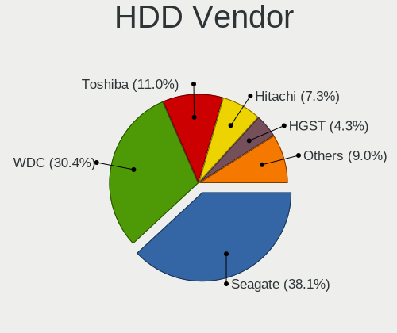

| Vendor              | Computers | Drives | Percent |
|---------------------|-----------|--------|---------|
| Seagate             | 159       | 235    | 36.81%  |
| WDC                 | 143       | 204    | 33.1%   |
| Toshiba             | 54        | 72     | 12.5%   |
| Hitachi             | 28        | 35     | 6.48%   |
| Samsung Electronics | 17        | 25     | 3.94%   |
| HGST                | 16        | 28     | 3.7%    |
| Apple               | 4         | 4      | 0.93%   |
| Maxtor              | 3         | 3      | 0.69%   |
| ASMT                | 2         | 2      | 0.46%   |
| Unknown             | 1         | 1      | 0.23%   |
| Synology            | 1         | 1      | 0.23%   |
| PHD 3.0             | 1         | 1      | 0.23%   |
| Inateck             | 1         | 1      | 0.23%   |
| Hewlett-Packard     | 1         | 1      | 0.23%   |
| Fujitsu             | 1         | 1      | 0.23%   |

SSD Vendor
----------

Solid state drive vendors

| Vendor              | Computers | Drives | Percent |
|---------------------|-----------|--------|---------|
| Samsung Electronics | 157       | 229    | 28.6%   |
| Kingston            | 59        | 67     | 10.75%  |
| Crucial             | 54        | 74     | 9.84%   |
| SanDisk             | 47        | 55     | 8.56%   |
| WDC                 | 38        | 44     | 6.92%   |
| Intel               | 20        | 28     | 3.64%   |
| A-DATA Technology   | 20        | 23     | 3.64%   |
| Toshiba             | 14        | 14     | 2.55%   |
| Micron Technology   | 14        | 16     | 2.55%   |
| SK Hynix            | 11        | 12     | 2%      |
| Apple               | 10        | 11     | 1.82%   |
| SPCC                | 8         | 9      | 1.46%   |
| PNY                 | 8         | 9      | 1.46%   |
| Transcend           | 7         | 7      | 1.28%   |
| OCZ                 | 7         | 12     | 1.28%   |
| LITEON              | 6         | 6      | 1.09%   |
| Patriot             | 5         | 5      | 0.91%   |
| Corsair             | 5         | 5      | 0.91%   |
| Unknown             | 4         | 4      | 0.73%   |
| Team                | 4         | 5      | 0.73%   |
| LITEONIT            | 4         | 4      | 0.73%   |
| Intenso             | 4         | 4      | 0.73%   |
| SABRENT             | 3         | 3      | 0.55%   |
| Apacer              | 3         | 4      | 0.55%   |
| Mushkin             | 2         | 3      | 0.36%   |
| Maxtor              | 2         | 3      | 0.36%   |
| Lexar               | 2         | 2      | 0.36%   |
| KingSpec            | 2         | 4      | 0.36%   |
| JMicron             | 2         | 2      | 0.36%   |
| Gigabyte Technology | 2         | 2      | 0.36%   |
| DOGFISH             | 2         | 2      | 0.36%   |
| China               | 2         | 3      | 0.36%   |
| WDC WDS2            | 1         | 1      | 0.18%   |
| W800S               | 1         | 1      | 0.18%   |
| Union Memory        | 1         | 1      | 0.18%   |
| TCSUNBOW            | 1         | 1      | 0.18%   |
| Smartbuy            | 1         | 1      | 0.18%   |
| SMART               | 1         | 1      | 0.18%   |
| Seagate             | 1         | 1      | 0.18%   |
| PLEXTOR             | 1         | 2      | 0.18%   |
| OWC                 | 1         | 1      | 0.18%   |
| OCZ-ARC1            | 1         | 1      | 0.18%   |
| NGFF                | 1         | 1      | 0.18%   |
| MG                  | 1         | 1      | 0.18%   |
| KLEVV               | 1         | 1      | 0.18%   |
| KIOXIA-EXCERIA      | 1         | 1      | 0.18%   |
| Hoodisk             | 1         | 2      | 0.18%   |
| GOODRAM             | 1         | 1      | 0.18%   |
| GALAX               | 1         | 1      | 0.18%   |
| EMTEC               | 1         | 1      | 0.18%   |
| DREVO               | 1         | 1      | 0.18%   |
| CT1000P1            | 1         | 1      | 0.18%   |
| ASMT                | 1         | 1      | 0.18%   |

Drive Kind
----------

HDD or SSD

| Kind    | Computers | Drives | Percent |
|---------|-----------|--------|---------|
| SSD     | 481       | 694    | 34.75%  |
| NVMe    | 462       | 656    | 33.38%  |
| HDD     | 359       | 614    | 25.94%  |
| MMC     | 53        | 71     | 3.83%   |
| Unknown | 29        | 33     | 2.1%    |

Drive Connector
---------------

SATA, SAS, NVMe, etc.

| Type | Computers | Drives | Percent |
|------|-----------|--------|---------|
| SATA | 662       | 1269   | 53.47%  |
| NVMe | 462       | 655    | 37.32%  |
| SAS  | 61        | 73     | 4.93%   |
| MMC  | 53        | 71     | 4.28%   |

Drive Size
----------

Size of hard drive

| Size in TB | Computers | Drives | Percent |
|------------|-----------|--------|---------|
| 0.01-0.5   | 473       | 710    | 53.09%  |
| 0.51-1.0   | 278       | 396    | 31.2%   |
| 1.01-2.0   | 82        | 103    | 9.2%    |
| 3.01-4.0   | 21        | 33     | 2.36%   |
| 4.01-10.0  | 20        | 42     | 2.24%   |
| 2.01-3.0   | 12        | 13     | 1.35%   |
| 10.01-20.0 | 4         | 10     | 0.45%   |
| 0          | 1         | 1      | 0.11%   |

Space Total
-----------

Amount of disk space available on the file system

| Size in GB     | Computers | Percent |
|----------------|-----------|---------|
| 501-1000       | 217       | 21.13%  |
| 251-500        | 191       | 18.6%   |
| 101-250        | 148       | 14.41%  |
| 1001-2000      | 123       | 11.98%  |
| 1-20           | 111       | 10.81%  |
| Unknown        | 86        | 8.37%   |
| More than 3000 | 60        | 5.84%   |
| 51-100         | 36        | 3.51%   |
| 2001-3000      | 34        | 3.31%   |
| 21-50          | 21        | 2.04%   |

Space Used
----------

Amount of used disk space

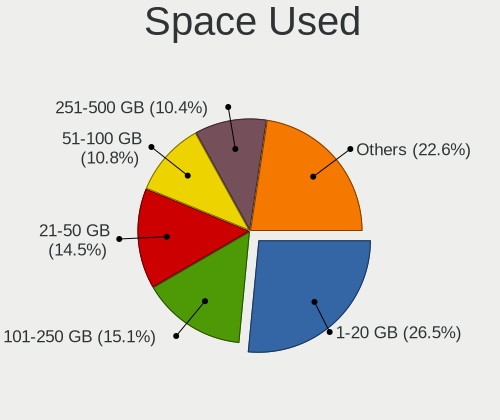

| Used GB        | Computers | Percent |
|----------------|-----------|---------|
| 1-20           | 296       | 28.24%  |
| 21-50          | 158       | 15.08%  |
| 101-250        | 153       | 14.6%   |
| 51-100         | 109       | 10.4%   |
| 251-500        | 104       | 9.92%   |
| Unknown        | 86        | 8.21%   |
| 501-1000       | 85        | 8.11%   |
| 1001-2000      | 34        | 3.24%   |
| More than 3000 | 15        | 1.43%   |
| 2001-3000      | 8         | 0.76%   |

Malfunc. Drives
---------------

Drive models with a malfunction

| Model                                   | Computers | Drives | Percent |
|-----------------------------------------|-----------|--------|---------|
| Seagate ST500DM002-1BD142 500GB         | 3         | 15     | 5.66%   |
| Intel SSDSC2CT120A3 120GB               | 3         | 5      | 5.66%   |
| Toshiba DT01ACA200 2TB                  | 2         | 4      | 3.77%   |
| Seagate ST1000LM035-1RK172 1TB          | 2         | 2      | 3.77%   |
| WDC WD60EFAX-68SHWN0 6TB                | 1         | 1      | 1.89%   |
| WDC WD40PURZ-85AKKY0 4TB                | 1         | 1      | 1.89%   |
| WDC WD3200BPVT-75ZEST0 320GB            | 1         | 1      | 1.89%   |
| WDC WD15EARS-00Z5B1 1TB                 | 1         | 1      | 1.89%   |
| WDC WD10SPZX-24Z10 1TB                  | 1         | 1      | 1.89%   |
| WDC WD10JPVX-75JC3T0 1TB                | 1         | 1      | 1.89%   |
| WDC WD1003FBYX-01Y7B1 1TB               | 1         | 1      | 1.89%   |
| Union Memory UMIS RPJTJ128MED1MWX 128GB | 1         | 1      | 1.89%   |
| Toshiba MQ01ABD100 1TB                  | 1         | 1      | 1.89%   |
| SPCC Solid State Disk 256GB             | 1         | 1      | 1.89%   |
| SK Hynix PC401 NVMe 1TB                 | 1         | 1      | 1.89%   |
| SK Hynix HFS256G39TND-N210A 256GB SSD   | 1         | 1      | 1.89%   |
| Seagate ST500LM021-1KJ152 500GB         | 1         | 1      | 1.89%   |
| Seagate ST4000DM000-1F2168 4TB          | 1         | 1      | 1.89%   |
| Seagate ST3500630AS 500GB               | 1         | 1      | 1.89%   |
| Seagate ST31000340NS 1TB                | 1         | 1      | 1.89%   |
| Seagate ST1000LM049-2GH172 1TB          | 1         | 1      | 1.89%   |
| Seagate ST1000LM024 HN-M101MBB 1TB      | 1         | 1      | 1.89%   |
| Seagate ST1000DX001-1CM162 1TB          | 1         | 1      | 1.89%   |
| SanDisk SSD U100 64GB                   | 1         | 1      | 1.89%   |
| SanDisk SSD PLUS 480GB                  | 1         | 1      | 1.89%   |
| SanDisk SDSSDX240GG25 240GB             | 1         | 1      | 1.89%   |
| Samsung Electronics SSD 860 EVO 250GB   | 1         | 1      | 1.89%   |
| Samsung Electronics SP2514N 250GB       | 1         | 1      | 1.89%   |
| Samsung Electronics SP2004C 200GB       | 1         | 1      | 1.89%   |
| Samsung Electronics HM160HI 160GB       | 1         | 2      | 1.89%   |
| Samsung Electronics HD501LJ 500GB       | 1         | 4      | 1.89%   |
| LITEON LGH-512V2G-11 M.2 2280 512GB SSD | 1         | 1      | 1.89%   |
| Intel SSDSC2KF480H6L 480GB              | 1         | 1      | 1.89%   |
| Intel SSDSC2BW240A4 240GB               | 1         | 1      | 1.89%   |
| Intel SSDSA2M080G2GC 80GB               | 1         | 1      | 1.89%   |
| Intel SSDPEKKW128G7 128GB               | 1         | 1      | 1.89%   |
| Hitachi HTS725050A7E630 500GB           | 1         | 1      | 1.89%   |
| Hitachi HTS545032A7E380 320GB           | 1         | 1      | 1.89%   |
| Hitachi HDS721050CLA362 500GB           | 1         | 1      | 1.89%   |
| Fujitsu MHY2120BH 120GB                 | 1         | 1      | 1.89%   |
| Crucial CT275MX300SSD1 275GB            | 1         | 1      | 1.89%   |
| Crucial CT128MX100SSD1 128GB            | 1         | 1      | 1.89%   |
| Crucial CT1050MX300SSD1 1TB             | 1         | 1      | 1.89%   |
| Crucial CT1000P1SSD8 1TB                | 1         | 1      | 1.89%   |
| A-DATA Technology SX6000NP 128GB        | 1         | 1      | 1.89%   |
| A-DATA Technology SP900 256GB SSD       | 1         | 1      | 1.89%   |
| A-DATA Technology SP900 128GB SSD       | 1         | 2      | 1.89%   |

Malfunc. Drive Vendor
---------------------

Vendors of faulty drives

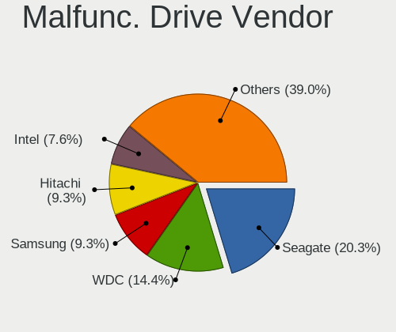

| Vendor              | Computers | Drives | Percent |
|---------------------|-----------|--------|---------|
| Seagate             | 12        | 24     | 22.64%  |
| WDC                 | 7         | 7      | 13.21%  |
| Intel               | 7         | 9      | 13.21%  |
| Samsung Electronics | 5         | 9      | 9.43%   |
| Crucial             | 4         | 4      | 7.55%   |
| Toshiba             | 3         | 5      | 5.66%   |
| SanDisk             | 3         | 3      | 5.66%   |
| Hitachi             | 3         | 3      | 5.66%   |
| A-DATA Technology   | 3         | 4      | 5.66%   |
| SK Hynix            | 2         | 2      | 3.77%   |
| Union Memory        | 1         | 1      | 1.89%   |
| SPCC                | 1         | 1      | 1.89%   |
| LITEON              | 1         | 1      | 1.89%   |
| Fujitsu             | 1         | 1      | 1.89%   |

Malfunc. HDD Vendor
-------------------

Vendors of faulty HDD drives

| Vendor              | Computers | Drives | Percent |
|---------------------|-----------|--------|---------|
| Seagate             | 12        | 24     | 40%     |
| WDC                 | 7         | 7      | 23.33%  |
| Samsung Electronics | 4         | 8      | 13.33%  |
| Toshiba             | 3         | 5      | 10%     |
| Hitachi             | 3         | 3      | 10%     |
| Fujitsu             | 1         | 1      | 3.33%   |

Malfunc. Drive Kind
-------------------

Kinds of faulty drives

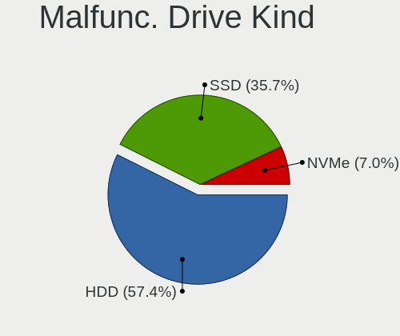

| Kind | Computers | Drives | Percent |
|------|-----------|--------|---------|
| HDD  | 29        | 48     | 55.77%  |
| SSD  | 18        | 21     | 34.62%  |
| NVMe | 5         | 5      | 9.62%   |

Failed Drives
-------------

Failed drive models

| Model                                | Computers | Drives | Percent |
|--------------------------------------|-----------|--------|---------|
| WDC PC SN520 SDAPMUW-512G-1001 512GB | 1         | 1      | 50%     |
| Hitachi HDS721010DLE630 1TB          | 1         | 2      | 50%     |

Failed Drive Vendor
-------------------

Failed drive vendors

| Vendor  | Computers | Drives | Percent |
|---------|-----------|--------|---------|
| WDC     | 1         | 1      | 50%     |
| Hitachi | 1         | 2      | 50%     |

Drive Status
------------

Number of failed and malfunc. drives

| Status   | Computers | Drives | Percent |
|----------|-----------|--------|---------|
| Detected | 628       | 1239   | 57.3%   |
| Works    | 416       | 752    | 37.96%  |
| Malfunc  | 50        | 74     | 4.56%   |
| Failed   | 2         | 3      | 0.18%   |

Storage controller
------------------

Storage Vendor
--------------

Storage controller vendors

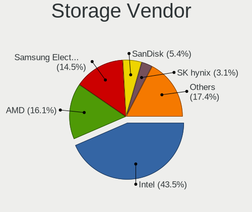

| Vendor                         | Computers | Percent |
|--------------------------------|-----------|---------|
| Intel                          | 580       | 43.54%  |
| AMD                            | 216       | 16.22%  |
| Samsung Electronics            | 188       | 14.11%  |
| Sandisk                        | 72        | 5.41%   |
| SK Hynix                       | 35        | 2.63%   |
| Toshiba America Info Systems   | 30        | 2.25%   |
| Phison Electronics             | 29        | 2.18%   |
| ASMedia Technology             | 24        | 1.8%    |
| Kingston Technology Company    | 20        | 1.5%    |
| KIOXIA                         | 18        | 1.35%   |
| Micron/Crucial Technology      | 15        | 1.13%   |
| Micron Technology              | 13        | 0.98%   |
| ADATA Technology               | 13        | 0.98%   |
| Silicon Motion                 | 12        | 0.9%    |
| Nvidia                         | 11        | 0.83%   |
| Union Memory (Shenzhen)        | 9         | 0.68%   |
| Realtek Semiconductor          | 6         | 0.45%   |
| Broadcom / LSI                 | 6         | 0.45%   |
| Marvell Technology Group       | 5         | 0.38%   |
| JMicron Technology             | 5         | 0.38%   |
| Seagate Technology             | 4         | 0.3%    |
| Solid State Storage Technology | 3         | 0.23%   |
| LSI Logic / Symbios Logic      | 3         | 0.23%   |
| Lite-On Technology             | 2         | 0.15%   |
| Lenovo                         | 2         | 0.15%   |
| Hewlett-Packard                | 2         | 0.15%   |
| Apple                          | 2         | 0.15%   |
| Adaptec                        | 2         | 0.15%   |
| VIA Technologies               | 1         | 0.08%   |
| ULi Electronics                | 1         | 0.08%   |
| Silicon Image                  | 1         | 0.08%   |
| Shenzhen Longsys Electronics   | 1         | 0.08%   |
| Lite-On IT Corp. / Plextor     | 1         | 0.08%   |

Storage Model
-------------

Storage controller models

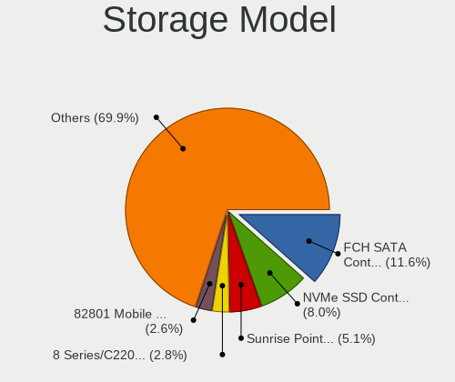

| Model                                                                          | Computers | Percent |
|--------------------------------------------------------------------------------|-----------|---------|
| AMD FCH SATA Controller [AHCI mode]                                            | 168       | 11.41%  |
| Samsung NVMe SSD Controller SM981/PM981/PM983                                  | 124       | 8.42%   |
| Intel Sunrise Point-LP SATA Controller [AHCI mode]                             | 78        | 5.3%    |
| Intel 82801 Mobile SATA Controller [RAID mode]                                 | 39        | 2.65%   |
| Intel 8 Series/C220 Series Chipset Family 6-port SATA Controller 1 [AHCI mode] | 39        | 2.65%   |
| AMD 400 Series Chipset SATA Controller                                         | 37        | 2.51%   |
| Intel 6 Series/C200 Series Chipset Family 6 port Mobile SATA AHCI Controller   | 30        | 2.04%   |
| Intel Cannon Lake Mobile PCH SATA AHCI Controller                              | 27        | 1.83%   |
| Intel 7 Series Chipset Family 6-port SATA Controller [AHCI mode]               | 27        | 1.83%   |
| Intel 200 Series PCH SATA controller [AHCI mode]                               | 26        | 1.77%   |
| Intel Wildcat Point-LP SATA Controller [AHCI Mode]                             | 24        | 1.63%   |
| Intel Q170/Q150/B150/H170/H110/Z170/CM236 Chipset SATA Controller [AHCI Mode]  | 24        | 1.63%   |
| ASMedia ASM1062 Serial ATA Controller                                          | 24        | 1.63%   |
| Samsung NVMe SSD Controller SM961/PM961/SM963                                  | 22        | 1.49%   |
| Samsung NVMe Controller                                                        | 21        | 1.43%   |
| AMD Starship/Matisse Chipset SATA Controller [AHCI mode]                       | 20        | 1.36%   |
| Sandisk WD Black SN750 / PC SN730 NVMe SSD                                     | 18        | 1.22%   |
| KIOXIA Non-Volatile memory controller                                          | 18        | 1.22%   |
| Intel Volume Management Device NVMe RAID Controller                            | 18        | 1.22%   |
| Intel SATA Controller [RAID mode]                                              | 18        | 1.22%   |
| Intel 8 Series SATA Controller 1 [AHCI mode]                                   | 18        | 1.22%   |
| Sandisk WD Blue SN550 NVMe SSD                                                 | 17        | 1.15%   |
| Intel SSD 660P Series                                                          | 16        | 1.09%   |
| Intel Comet Lake SATA AHCI Controller                                          | 16        | 1.09%   |
| Intel 6 Series/C200 Series Chipset Family 6 port Desktop SATA AHCI Controller  | 16        | 1.09%   |
| Toshiba America Info Systems XG6 NVMe SSD Controller                           | 15        | 1.02%   |
| Phison E12 NVMe Controller                                                     | 14        | 0.95%   |
| Intel 400 Series Chipset Family SATA AHCI Controller                           | 14        | 0.95%   |
| Intel Cannon Lake PCH SATA AHCI Controller                                     | 13        | 0.88%   |
| AMD SB7x0/SB8x0/SB9x0 SATA Controller [AHCI mode]                              | 13        | 0.88%   |
| Sandisk WD Black 2018/SN750 / PC SN720 NVMe SSD                                | 12        | 0.81%   |
| Phison E16 PCIe4 NVMe Controller                                               | 12        | 0.81%   |
| Micron Non-Volatile memory controller                                          | 12        | 0.81%   |
| Intel 9 Series Chipset Family SATA Controller [AHCI Mode]                      | 12        | 0.81%   |
| AMD SB7x0/SB8x0/SB9x0 IDE Controller                                           | 12        | 0.81%   |
| ADATA XPG SX8200 Pro PCIe Gen3x4 M.2 2280 Solid State Drive                    | 12        | 0.81%   |
| Intel Celeron/Pentium Silver Processor SATA Controller                         | 11        | 0.75%   |
| Sandisk Non-Volatile memory controller                                         | 10        | 0.68%   |
| Samsung NVMe SSD Controller PM9A1/PM9A3/980PRO                                 | 10        | 0.68%   |
| Intel SSD Pro 7600p/760p/E 6100p Series                                        | 10        | 0.68%   |
| Intel HM170/QM170 Chipset SATA Controller [AHCI Mode]                          | 10        | 0.68%   |
| Intel Cannon Point-LP SATA Controller [AHCI Mode]                              | 10        | 0.68%   |
| Intel 7 Series/C210 Series Chipset Family 6-port SATA Controller [AHCI mode]   | 10        | 0.68%   |
| SK Hynix Non-Volatile memory controller                                        | 9         | 0.61%   |
| SK Hynix BC511                                                                 | 9         | 0.61%   |
| Silicon Motion SM2263EN/SM2263XT SSD Controller                                | 9         | 0.61%   |
| Kingston Company A2000 NVMe SSD                                                | 9         | 0.61%   |
| Intel NM10/ICH7 Family SATA Controller [IDE mode]                              | 9         | 0.61%   |
| AMD FCH SATA Controller D                                                      | 9         | 0.61%   |
| AMD 300 Series Chipset SATA Controller                                         | 9         | 0.61%   |
| Union Memory (Shenzhen) Non-Volatile memory controller                         | 8         | 0.54%   |
| SK Hynix NVMe SSD Controller                                                   | 8         | 0.54%   |
| Micron/Crucial P1 NVMe PCIe SSD                                                | 8         | 0.54%   |
| Intel 5 Series/3400 Series Chipset 6 port SATA AHCI Controller                 | 8         | 0.54%   |
| Intel 5 Series/3400 Series Chipset 4 port SATA AHCI Controller                 | 8         | 0.54%   |
| SK Hynix BC501 NVMe Solid State Drive                                          | 7         | 0.48%   |
| Sandisk WD Blue SN500 / PC SN520 NVMe SSD                                      | 7         | 0.48%   |
| Intel Tiger Lake-LP SATA Controller [AHCI mode]                                | 7         | 0.48%   |
| Intel 5 Series/3400 Series Chipset 4 port SATA IDE Controller                  | 7         | 0.48%   |
| AMD SB7x0/SB8x0/SB9x0 SATA Controller [IDE mode]                               | 7         | 0.48%   |

Storage Kind
------------

Kind of storage controller (IDE, SATA, NVMe, SAS, ...)

| Kind | Computers | Percent |
|------|-----------|---------|
| SATA | 700       | 53.48%  |
| NVMe | 459       | 35.06%  |
| RAID | 82        | 6.26%   |
| IDE  | 61        | 4.66%   |
| SCSI | 5         | 0.38%   |
| SAS  | 2         | 0.15%   |

Processor
---------

CPU Vendor
----------

Processor vendors

| Vendor   | Computers | Percent |
|----------|-----------|---------|
| Intel    | 719       | 71.9%   |
| AMD      | 272       | 27.2%   |
| ARM      | 8         | 0.8%    |
| QUALCOMM | 1         | 0.1%    |

CPU Model
---------

Processor models

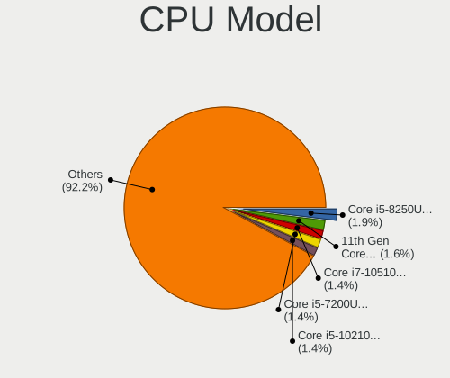

| Model                                         | Computers | Percent |
|-----------------------------------------------|-----------|---------|
| Intel Core i5-8250U CPU @ 1.60GHz             | 22        | 2.2%    |
| Intel Core i7-8550U CPU @ 1.80GHz             | 17        | 1.7%    |
| Intel 11th Gen Core i7-1165G7 @ 2.80GHz       | 17        | 1.7%    |
| Intel 11th Gen Core i5-1135G7 @ 2.40GHz       | 15        | 1.5%    |
| Intel Core i5-7200U CPU @ 2.50GHz             | 14        | 1.4%    |
| AMD Ryzen 5 3600 6-Core Processor             | 14        | 1.4%    |
| Intel Core i5-10210U CPU @ 1.60GHz            | 13        | 1.3%    |
| AMD Ryzen 5 3500U with Radeon Vega Mobile Gfx | 13        | 1.3%    |
| Intel Core i7-8750H CPU @ 2.20GHz             | 12        | 1.2%    |
| Intel Core i7-8565U CPU @ 1.80GHz             | 11        | 1.1%    |
| Intel Core i7-10510U CPU @ 1.80GHz            | 11        | 1.1%    |
| Intel Core i5-8265U CPU @ 1.60GHz             | 11        | 1.1%    |
| AMD Ryzen 7 4800H with Radeon Graphics        | 11        | 1.1%    |
| Intel Core i5-6200U CPU @ 2.30GHz             | 10        | 1%      |
| AMD Ryzen 9 3900X 12-Core Processor           | 10        | 1%      |
| AMD Ryzen 5 4500U with Radeon Graphics        | 10        | 1%      |
| AMD Ryzen 5 2500U with Radeon Vega Mobile Gfx | 10        | 1%      |
| Intel Core i7-9750H CPU @ 2.60GHz             | 9         | 0.9%    |
| Intel Core i7-10750H CPU @ 2.60GHz            | 9         | 0.9%    |
| Intel Core i7-1065G7 CPU @ 1.30GHz            | 9         | 0.9%    |
| Intel Core i5-5200U CPU @ 2.20GHz             | 9         | 0.9%    |
| Intel Core i5-1035G1 CPU @ 1.00GHz            | 9         | 0.9%    |
| AMD Ryzen 7 4700U with Radeon Graphics        | 9         | 0.9%    |
| Intel Atom x5-Z8350 CPU @ 1.44GHz             | 8         | 0.8%    |
| ARM Processor                                 | 8         | 0.8%    |
| AMD Ryzen 7 PRO 4750U with Radeon Graphics    | 8         | 0.8%    |
| AMD Ryzen 7 3700X 8-Core Processor            | 8         | 0.8%    |
| AMD Ryzen 5 1600 Six-Core Processor           | 8         | 0.8%    |
| Intel Core i7-8665U CPU @ 1.90GHz             | 7         | 0.7%    |
| Intel Core i7-7500U CPU @ 2.70GHz             | 7         | 0.7%    |
| Intel Core i7-6700HQ CPU @ 2.60GHz            | 7         | 0.7%    |
| Intel Core i5-2520M CPU @ 2.50GHz             | 7         | 0.7%    |
| Intel Atom CPU Z3735G @ 1.33GHz               | 7         | 0.7%    |
| Intel 11th Gen Core i7-1185G7 @ 3.00GHz       | 7         | 0.7%    |
| AMD Ryzen 5 5600X 6-Core Processor            | 7         | 0.7%    |
| AMD Ryzen 5 3400G with Radeon Vega Graphics   | 7         | 0.7%    |
| Intel Core i7-8650U CPU @ 1.90GHz             | 6         | 0.6%    |
| Intel Core i7-5500U CPU @ 2.40GHz             | 6         | 0.6%    |
| Intel Core i7-4790K CPU @ 4.00GHz             | 6         | 0.6%    |
| Intel Core i7-4790 CPU @ 3.60GHz              | 6         | 0.6%    |
| Intel Core i5-7300U CPU @ 2.60GHz             | 6         | 0.6%    |
| Intel Core i5-5300U CPU @ 2.30GHz             | 6         | 0.6%    |
| AMD Ryzen 9 3950X 16-Core Processor           | 6         | 0.6%    |
| AMD Ryzen 7 5800X 8-Core Processor            | 6         | 0.6%    |
| Intel Core i7-6500U CPU @ 2.50GHz             | 5         | 0.5%    |
| Intel Core i7-2670QM CPU @ 2.20GHz            | 5         | 0.5%    |
| Intel Core i5-8400 CPU @ 2.80GHz              | 5         | 0.5%    |
| Intel Core i5-7300HQ CPU @ 2.50GHz            | 5         | 0.5%    |
| Intel Core i5-3320M CPU @ 2.60GHz             | 5         | 0.5%    |
| AMD Ryzen 9 5900X 12-Core Processor           | 5         | 0.5%    |
| AMD Ryzen 7 3700U with Radeon Vega Mobile Gfx | 5         | 0.5%    |
| AMD Ryzen 5 2600X Six-Core Processor          | 5         | 0.5%    |
| AMD Ryzen 5 2600 Six-Core Processor           | 5         | 0.5%    |
| Intel Core i9-9980HK CPU @ 2.40GHz            | 4         | 0.4%    |
| Intel Core i9-9900K CPU @ 3.60GHz             | 4         | 0.4%    |
| Intel Core i7-7700HQ CPU @ 2.80GHz            | 4         | 0.4%    |
| Intel Core i7-6700 CPU @ 3.40GHz              | 4         | 0.4%    |
| Intel Core i5-6500 CPU @ 3.20GHz              | 4         | 0.4%    |
| Intel Core i5-4570 CPU @ 3.20GHz              | 4         | 0.4%    |
| Intel Core i5-4200U CPU @ 1.60GHz             | 4         | 0.4%    |

CPU Model Family
----------------

Processor model prefix

| Model                   | Computers | Percent |
|-------------------------|-----------|---------|
| Intel Core i7           | 253       | 25.3%   |
| Intel Core i5           | 228       | 22.8%   |
| AMD Ryzen 5             | 95        | 9.5%    |
| Other                   | 58        | 5.8%    |
| AMD Ryzen 7             | 58        | 5.8%    |
| Intel Core i3           | 57        | 5.7%    |
| AMD Ryzen 9             | 33        | 3.3%    |
| Intel Atom              | 24        | 2.4%    |
| Intel Xeon              | 22        | 2.2%    |
| Intel Core i9           | 17        | 1.7%    |
| Intel Celeron           | 16        | 1.6%    |
| Intel Pentium           | 14        | 1.4%    |
| Intel Core 2 Duo        | 14        | 1.4%    |
| AMD Ryzen 3             | 13        | 1.3%    |
| AMD Ryzen 7 PRO         | 10        | 1%      |
| AMD FX                  | 8         | 0.8%    |
| AMD A10                 | 8         | 0.8%    |
| Intel Pentium Silver    | 6         | 0.6%    |
| AMD Ryzen 5 PRO         | 6         | 0.6%    |
| Intel Pentium Dual-Core | 5         | 0.5%    |
| AMD A6                  | 5         | 0.5%    |
| AMD A4                  | 5         | 0.5%    |
| Intel Core 2 Quad       | 4         | 0.4%    |
| AMD Ryzen Threadripper  | 4         | 0.4%    |
| AMD Phenom II X2        | 3         | 0.3%    |
| AMD Athlon 64 X2        | 3         | 0.3%    |
| AMD A8                  | 3         | 0.3%    |
| Intel Pentium Dual      | 2         | 0.2%    |
| Intel Core m7           | 2         | 0.2%    |
| AMD Phenom II X6        | 2         | 0.2%    |
| AMD Phenom II X4        | 2         | 0.2%    |
| AMD E2                  | 2         | 0.2%    |
| AMD Athlon Dual Core    | 2         | 0.2%    |
| QUALCOMM AArch64        | 1         | 0.1%    |
| Intel Pentium D         | 1         | 0.1%    |
| Intel Pentium 4         | 1         | 0.1%    |
| Intel Core m5           | 1         | 0.1%    |
| Intel Core m3           | 1         | 0.1%    |
| Intel Core M            | 1         | 0.1%    |
| Intel Core 2            | 1         | 0.1%    |
| AMD Turion II           | 1         | 0.1%    |
| AMD PRO A10             | 1         | 0.1%    |
| AMD E1                  | 1         | 0.1%    |
| AMD E                   | 1         | 0.1%    |
| AMD Athlon X2           | 1         | 0.1%    |
| AMD Athlon II X4        | 1         | 0.1%    |
| AMD Athlon II X2        | 1         | 0.1%    |
| AMD Athlon II           | 1         | 0.1%    |
| AMD A12                 | 1         | 0.1%    |

CPU Cores
---------

Number of processor cores

| Number | Computers | Percent |
|--------|-----------|---------|
| 4      | 444       | 44.36%  |
| 2      | 276       | 27.57%  |
| 6      | 137       | 13.69%  |
| 8      | 103       | 10.29%  |
| 12     | 20        | 2%      |
| 16     | 11        | 1.1%    |
| 1      | 5         | 0.5%    |
| 10     | 2         | 0.2%    |
| 3      | 2         | 0.2%    |
| 24     | 1         | 0.1%    |

CPU Sockets
-----------

Number of sockets

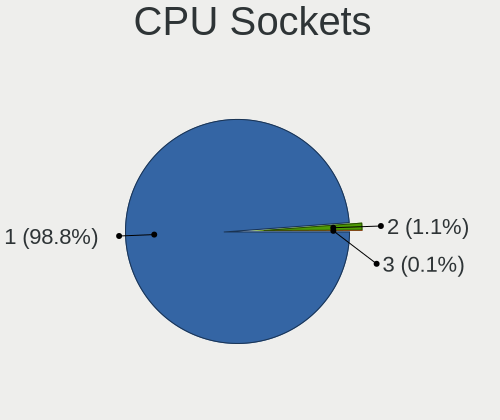

| Number | Computers | Percent |
|--------|-----------|---------|
| 1      | 991       | 99.1%   |
| 2      | 8         | 0.8%    |
| 3      | 1         | 0.1%    |

CPU Threads
-----------

Threads per core (Hyper-Threading)

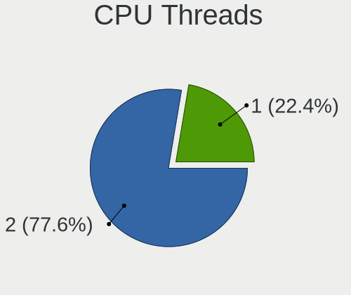

| Number | Computers | Percent |
|--------|-----------|---------|
| 2      | 773       | 77.07%  |
| 1      | 230       | 22.93%  |

CPU Op-Modes
------------

CPU Operation Modes (32-bit, 64-bit)

| Op mode        | Computers | Percent |
|----------------|-----------|---------|
| 32-bit, 64-bit | 1000      | 100%    |

CPU Microcode
-------------

Microcode number

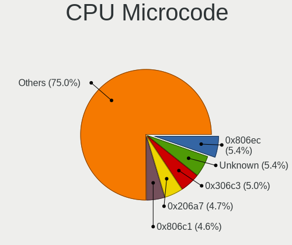

| Number     | Computers | Percent |
|------------|-----------|---------|
| Unknown    | 55        | 5.47%   |
| 0x306c3    | 50        | 4.98%   |
| 0x206a7    | 50        | 4.98%   |
| 0x806ec    | 46        | 4.58%   |
| 0x806ea    | 46        | 4.58%   |
| 0x806c1    | 44        | 4.38%   |
| 0x306a9    | 42        | 4.18%   |
| 0x906ea    | 41        | 4.08%   |
| 0x806e9    | 41        | 4.08%   |
| 0x406e3    | 28        | 2.79%   |
| 0x08701021 | 28        | 2.79%   |
| 0x906e9    | 26        | 2.59%   |
| 0x506e3    | 25        | 2.49%   |
| 0x08600106 | 24        | 2.39%   |
| 0x306d4    | 23        | 2.29%   |
| 0x40651    | 21        | 2.09%   |
| 0x1067a    | 20        | 1.99%   |
| 0x906ed    | 19        | 1.89%   |
| 0x706e5    | 19        | 1.89%   |
| 0xa0652    | 18        | 1.79%   |
| 0x08108102 | 18        | 1.79%   |
| 0x08108109 | 16        | 1.59%   |
| 0x0800820d | 16        | 1.59%   |
| 0x20655    | 15        | 1.49%   |
| 0x0a201009 | 15        | 1.49%   |
| 0x08600104 | 15        | 1.49%   |
| 0x30678    | 14        | 1.39%   |
| 0x806eb    | 13        | 1.29%   |
| 0x08701013 | 13        | 1.29%   |
| 0x406c4    | 10        | 1%      |
| 0x706a1    | 9         | 0.9%    |
| 0x08600103 | 9         | 0.9%    |
| 0x40661    | 8         | 0.8%    |
| 0x0a50000c | 8         | 0.8%    |
| 0x0810100b | 8         | 0.8%    |
| 0xa0655    | 7         | 0.7%    |
| 0x406c3    | 7         | 0.7%    |
| 0x08101016 | 7         | 0.7%    |
| 0x106e5    | 6         | 0.6%    |
| 0x0a201016 | 6         | 0.6%    |
| 0x08608102 | 5         | 0.5%    |
| 0x08001138 | 5         | 0.5%    |
| 0xa0671    | 4         | 0.4%    |
| 0xa0653    | 4         | 0.4%    |
| 0x906ec    | 4         | 0.4%    |
| 0x0a50000b | 4         | 0.4%    |
| 0x08600102 | 4         | 0.4%    |
| 0x010000c8 | 4         | 0.4%    |
| 0x906eb    | 3         | 0.3%    |
| 0x706a8    | 3         | 0.3%    |
| 0x6fd      | 3         | 0.3%    |
| 0x08101007 | 3         | 0.3%    |
| 0x08001137 | 3         | 0.3%    |
| 0x07030105 | 3         | 0.3%    |
| 0x06001119 | 3         | 0.3%    |
| 0xa0660    | 2         | 0.2%    |
| 0x6fb      | 2         | 0.2%    |
| 0x50654    | 2         | 0.2%    |
| 0x406f1    | 2         | 0.2%    |
| 0x306f2    | 2         | 0.2%    |

CPU Microarch
-------------

Microarchitecture

| Name          | Computers | Percent |
|---------------|-----------|---------|
| KabyLake      | 249       | 24.9%   |
| Zen 2         | 97        | 9.7%    |
| Haswell       | 84        | 8.4%    |
| Skylake       | 57        | 5.7%    |
| Zen+          | 55        | 5.5%    |
| SandyBridge   | 52        | 5.2%    |
| IvyBridge     | 46        | 4.6%    |
| TigerLake     | 44        | 4.4%    |
| Zen 3         | 33        | 3.3%    |
| Silvermont    | 32        | 3.2%    |
| CometLake     | 32        | 3.2%    |
| Zen           | 29        | 2.9%    |
| Broadwell     | 26        | 2.6%    |
| IceLake       | 25        | 2.5%    |
| Penryn        | 22        | 2.2%    |
| Westmere      | 18        | 1.8%    |
| Unknown       | 14        | 1.4%    |
| Piledriver    | 12        | 1.2%    |
| K10           | 12        | 1.2%    |
| Goldmont plus | 12        | 1.2%    |
| Nehalem       | 9         | 0.9%    |
| Excavator     | 7         | 0.7%    |
| Core          | 7         | 0.7%    |
| K8 Hammer     | 5         | 0.5%    |
| Puma          | 4         | 0.4%    |
| Jaguar        | 4         | 0.4%    |
| Steamroller   | 3         | 0.3%    |
| K10 Llano     | 3         | 0.3%    |
| NetBurst      | 2         | 0.2%    |
| Bulldozer     | 2         | 0.2%    |
| Goldmont      | 1         | 0.1%    |
| Bonnell       | 1         | 0.1%    |
| Bobcat        | 1         | 0.1%    |

Graphics
--------

GPU Vendor
----------

Vendors of graphics cards

| Vendor                     | Computers | Percent |
|----------------------------|-----------|---------|
| Intel                      | 585       | 48.03%  |
| Nvidia                     | 333       | 27.34%  |
| AMD                        | 296       | 24.3%   |
| ASPEED Technology          | 2         | 0.16%   |
| Matrox Electronics Systems | 1         | 0.08%   |
| ATI Technologies           | 1         | 0.08%   |

GPU Model
---------

Graphics card models

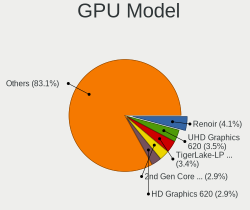

| Model                                                                                    | Computers | Percent |
|------------------------------------------------------------------------------------------|-----------|---------|
| AMD Renoir                                                                               | 55        | 4.44%   |
| Intel UHD Graphics 620                                                                   | 50        | 4.03%   |
| Intel TigerLake-LP GT2 [Iris Xe Graphics]                                                | 42        | 3.39%   |
| Intel 2nd Generation Core Processor Family Integrated Graphics Controller                | 41        | 3.31%   |
| Intel HD Graphics 620                                                                    | 36        | 2.9%    |
| Intel CoffeeLake-H GT2 [UHD Graphics 630]                                                | 35        | 2.82%   |
| AMD Picasso                                                                              | 35        | 2.82%   |
| AMD Ellesmere [Radeon RX 470/480/570/570X/580/580X/590]                                  | 32        | 2.58%   |
| Intel WhiskeyLake-U GT2 [UHD Graphics 620]                                               | 31        | 2.5%    |
| Intel CometLake-U GT2 [UHD Graphics]                                                     | 28        | 2.26%   |
| Intel 3rd Gen Core processor Graphics Controller                                         | 26        | 2.1%    |
| Intel HD Graphics 5500                                                                   | 23        | 1.85%   |
| Intel Skylake GT2 [HD Graphics 520]                                                      | 22        | 1.77%   |
| Intel HD Graphics 630                                                                    | 20        | 1.61%   |
| Intel Haswell-ULT Integrated Graphics Controller                                         | 19        | 1.53%   |
| Intel 4th Gen Core Processor Integrated Graphics Controller                              | 19        | 1.53%   |
| AMD Raven Ridge [Radeon Vega Series / Radeon Vega Mobile Series]                         | 19        | 1.53%   |
| AMD Navi 10 [Radeon RX 5600 OEM/5600 XT / 5700/5700 XT]                                  | 19        | 1.53%   |
| Intel CometLake-H GT2 [UHD Graphics]                                                     | 17        | 1.37%   |
| Intel Atom/Celeron/Pentium Processor x5-E8000/J3xxx/N3xxx Integrated Graphics Controller | 17        | 1.37%   |
| Intel HD Graphics 530                                                                    | 16        | 1.29%   |
| Intel Atom Processor Z36xxx/Z37xxx Series Graphics & Display                             | 15        | 1.21%   |
| Intel Xeon E3-1200 v3/4th Gen Core Processor Integrated Graphics Controller              | 14        | 1.13%   |
| Nvidia TU117M [GeForce GTX 1650 Mobile / Max-Q]                                          | 13        | 1.05%   |
| Intel Core Processor Integrated Graphics Controller                                      | 12        | 0.97%   |
| Nvidia GP108M [GeForce MX150]                                                            | 11        | 0.89%   |
| Intel CometLake-S GT2 [UHD Graphics 630]                                                 | 11        | 0.89%   |
| AMD Topaz XT [Radeon R7 M260/M265 / M340/M360 / M440/M445 / 530/535 / 620/625 Mobile]    | 11        | 0.89%   |
| AMD Cezanne                                                                              | 11        | 0.89%   |
| Nvidia GP106 [GeForce GTX 1060 6GB]                                                      | 10        | 0.81%   |
| Intel Iris Plus Graphics G1 (Ice Lake)                                                   | 10        | 0.81%   |
| Intel Xeon E3-1200 v2/3rd Gen Core processor Graphics Controller                         | 9         | 0.73%   |
| Intel Iris Plus Graphics G7                                                              | 9         | 0.73%   |
| Nvidia TU117M [GeForce GTX 1650 Ti Mobile]                                               | 8         | 0.65%   |
| Nvidia GP107M [GeForce GTX 1050 Ti Mobile]                                               | 8         | 0.65%   |
| Nvidia GP107 [GeForce GTX 1050 Ti]                                                       | 8         | 0.65%   |
| Nvidia GK208B [GeForce GT 710]                                                           | 8         | 0.65%   |
| Nvidia GP107M [GeForce GTX 1050 Mobile]                                                  | 7         | 0.56%   |
| Intel 4 Series Chipset Integrated Graphics Controller                                    | 7         | 0.56%   |
| Nvidia TU116M [GeForce GTX 1660 Ti Mobile]                                               | 6         | 0.48%   |
| Nvidia GP106M [GeForce GTX 1060 Mobile]                                                  | 6         | 0.48%   |
| Nvidia GP104 [GeForce GTX 1070]                                                          | 6         | 0.48%   |
| Nvidia GM108M [GeForce 940M]                                                             | 6         | 0.48%   |
| Nvidia GA106M [GeForce RTX 3060 Mobile / Max-Q]                                          | 6         | 0.48%   |
| Intel GeminiLake [UHD Graphics 605]                                                      | 6         | 0.48%   |
| Intel GeminiLake [UHD Graphics 600]                                                      | 6         | 0.48%   |
| AMD Sun XT [Radeon HD 8670A/8670M/8690M / R5 M330 / M430 / Radeon 520 Mobile]            | 6         | 0.48%   |
| AMD Baffin [Radeon RX 550 640SP / RX 560/560X]                                           | 6         | 0.48%   |
| AMD Baffin [Radeon RX 460/560D / Pro 450/455/460/555/555X/560/560X]                      | 6         | 0.48%   |
| Nvidia GP104 [GeForce GTX 1080]                                                          | 5         | 0.4%    |
| Nvidia GM108M [GeForce MX110]                                                            | 5         | 0.4%    |
| Nvidia GM108M [GeForce 930MX]                                                            | 5         | 0.4%    |
| AMD Lucienne                                                                             | 5         | 0.4%    |
| Nvidia TU116 [GeForce GTX 1660]                                                          | 4         | 0.32%   |
| Nvidia TU116 [GeForce GTX 1660 SUPER]                                                    | 4         | 0.32%   |
| Nvidia TU106M [GeForce RTX 2060 Mobile]                                                  | 4         | 0.32%   |
| Nvidia TU106 [GeForce RTX 2070]                                                          | 4         | 0.32%   |
| Nvidia TU106 [GeForce RTX 2060 SUPER]                                                    | 4         | 0.32%   |
| Nvidia TU102 [GeForce RTX 2080 Ti Rev. A]                                                | 4         | 0.32%   |
| Nvidia GP108M [GeForce MX250]                                                            | 4         | 0.32%   |

GPU Combo
---------

Combinations of graphics cards

| Name           | Computers | Percent |
|----------------|-----------|---------|
| 1 x Intel      | 381       | 38.02%  |
| 1 x AMD        | 229       | 22.85%  |
| Intel + Nvidia | 156       | 15.57%  |
| 1 x Nvidia     | 151       | 15.07%  |
| Intel + AMD    | 31        | 3.09%   |
| AMD + Nvidia   | 22        | 2.2%    |
| 2 x AMD        | 14        | 1.4%    |
| Other          | 10        | 1%      |
| 2 x Nvidia     | 5         | 0.5%    |
| 1 x ASPEED     | 2         | 0.2%    |
| 1 x Matrox     | 1         | 0.1%    |

GPU Driver
----------

Free vs proprietary

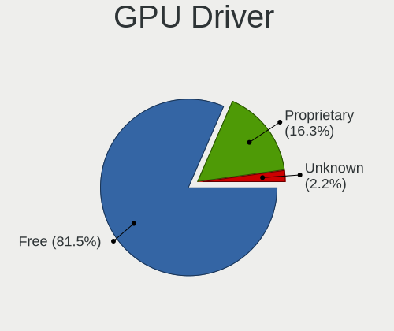

| Driver      | Computers | Percent |
|-------------|-----------|---------|
| Free        | 830       | 82.18%  |
| Proprietary | 158       | 15.64%  |
| Unknown     | 22        | 2.18%   |

GPU Memory
----------

Total video memory

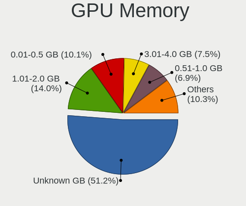

| Size in GB | Computers | Percent |
|------------|-----------|---------|
| Unknown    | 516       | 50.84%  |
| 1.01-2.0   | 145       | 14.29%  |
| 0.01-0.5   | 102       | 10.05%  |
| 3.01-4.0   | 79        | 7.78%   |
| 7.01-8.0   | 62        | 6.11%   |
| 0.51-1.0   | 57        | 5.62%   |
| 5.01-6.0   | 30        | 2.96%   |
| 8.01-16.0  | 14        | 1.38%   |
| 2.01-3.0   | 9         | 0.89%   |
| 16.01-24.0 | 1         | 0.1%    |

Monitor
-------

Monitor Vendor
--------------

Monitor vendors

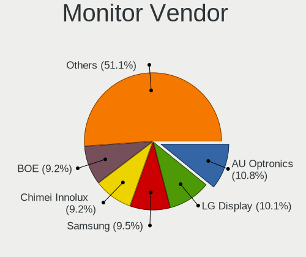

| Vendor                  | Computers | Percent |
|-------------------------|-----------|---------|
| AU Optronics            | 137       | 11.71%  |
| LG Display              | 120       | 10.26%  |
| Samsung Electronics     | 117       | 10%     |
| Chimei Innolux          | 107       | 9.15%   |
| BOE                     | 97        | 8.29%   |
| Dell                    | 90        | 7.69%   |
| Goldstar                | 86        | 7.35%   |
| Sharp                   | 41        | 3.5%    |
| Acer                    | 37        | 3.16%   |
| Hewlett-Packard         | 35        | 2.99%   |
| BenQ                    | 32        | 2.74%   |
| AOC                     | 26        | 2.22%   |
| Lenovo                  | 23        | 1.97%   |
| Philips                 | 22        | 1.88%   |
| Apple                   | 22        | 1.88%   |
| Ancor Communications    | 21        | 1.79%   |
| Iiyama                  | 18        | 1.54%   |
| PANDA                   | 14        | 1.2%    |
| ViewSonic               | 11        | 0.94%   |
| CSO                     | 10        | 0.85%   |
| ASUSTek Computer        | 9         | 0.77%   |
| InfoVision              | 8         | 0.68%   |
| Chi Mei Optoelectronics | 8         | 0.68%   |
| Sceptre Tech            | 7         | 0.6%    |
| Sony                    | 5         | 0.43%   |
| Vizio                   | 4         | 0.34%   |
| MSI                     | 4         | 0.34%   |
| ___                     | 3         | 0.26%   |
| Unknown                 | 3         | 0.26%   |
| Toshiba                 | 3         | 0.26%   |
| Pixio                   | 3         | 0.26%   |
| NEC Computers           | 3         | 0.26%   |
| Insignia                | 3         | 0.26%   |
| Vestel Elektronik       | 2         | 0.17%   |
| TMX                     | 2         | 0.17%   |
| Mi                      | 2         | 0.17%   |
| HannStar                | 2         | 0.17%   |
| Unknown (XXX)           | 1         | 0.09%   |
| SKY                     | 1         | 0.09%   |
| RZR                     | 1         | 0.09%   |
| RTK                     | 1         | 0.09%   |
| QCM                     | 1         | 0.09%   |
| Panasonic               | 1         | 0.09%   |
| Packard Bell            | 1         | 0.09%   |
| OUT                     | 1         | 0.09%   |
| Orion                   | 1         | 0.09%   |
| OPT                     | 1         | 0.09%   |
| Onkyo                   | 1         | 0.09%   |
| NEW                     | 1         | 0.09%   |
| Mitsubishi              | 1         | 0.09%   |
| Microstep               | 1         | 0.09%   |
| Medion Akoya            | 1         | 0.09%   |
| Medion                  | 1         | 0.09%   |
| Marantz                 | 1         | 0.09%   |
| LG Philips              | 1         | 0.09%   |
| LG Electronics          | 1         | 0.09%   |
| KTC                     | 1         | 0.09%   |
| JXG                     | 1         | 0.09%   |
| JDI                     | 1         | 0.09%   |
| IPS                     | 1         | 0.09%   |

Monitor Model
-------------

Monitor models

| Model                                                                                 | Computers | Percent |
|---------------------------------------------------------------------------------------|-----------|---------|
| AU Optronics LCD Monitor AUO21ED 1920x1080 344x194mm 15.5-inch                        | 10        | 0.82%   |
| Goldstar LG ULTRAWIDE GSM59F1 1920x1080 580x240mm 24.7-inch                           | 9         | 0.74%   |
| Chimei Innolux LCD Monitor CMN15F5 1920x1080 344x193mm 15.5-inch                      | 9         | 0.74%   |
| Chimei Innolux LCD Monitor CMN14D4 1920x1080 309x173mm 13.9-inch                      | 8         | 0.66%   |
| AU Optronics LCD Monitor AUO573D 1920x1080 309x174mm 14.0-inch                        | 7         | 0.58%   |
| Lenovo LCD Monitor LEN40BA 1920x1080 344x194mm 15.5-inch                              | 6         | 0.49%   |
| Goldstar FULL HD GSM5B55 1920x1080 480x270mm 21.7-inch                                | 6         | 0.49%   |
| AU Optronics LCD Monitor AUO38ED 1920x1080 340x190mm 15.3-inch                        | 6         | 0.49%   |
| Sharp LCD Monitor SHP14D1 1920x1200 336x210mm 15.6-inch                               | 5         | 0.41%   |
| Samsung Electronics S24F350 SAM0D20 1920x1080 521x293mm 23.5-inch                     | 5         | 0.41%   |
| Samsung Electronics S22F350 SAM0D1A 1920x1080 480x270mm 21.7-inch                     | 5         | 0.41%   |
| Samsung Electronics LCD Monitor SEC5441 1366x768 344x194mm 15.5-inch                  | 5         | 0.41%   |
| LG Display LCD Monitor LGD05E5 1920x1080 344x194mm 15.5-inch                          | 5         | 0.41%   |
| Chimei Innolux LCD Monitor CMN15E6 1366x768 344x193mm 15.5-inch                       | 5         | 0.41%   |
| Chimei Innolux LCD Monitor CMN15D5 1920x1080 340x190mm 15.3-inch                      | 5         | 0.41%   |
| PANDA LCD Monitor NCP0035 1920x1080 309x174mm 14.0-inch                               | 4         | 0.33%   |
| LG Display LCD Monitor LGD02DC 1366x768 344x194mm 15.5-inch                           | 4         | 0.33%   |
| Goldstar LG FULL HD GSM5ABB 1920x1080 480x270mm 21.7-inch                             | 4         | 0.33%   |
| Dell U2412M DELA07A 1920x1200 518x324mm 24.1-inch                                     | 4         | 0.33%   |
| Dell P2319H DELD0D7 1920x1080 509x286mm 23.0-inch                                     | 4         | 0.33%   |
| Chimei Innolux LCD Monitor CMN15E7 1920x1080 344x193mm 15.5-inch                      | 4         | 0.33%   |
| Chimei Innolux LCD Monitor CMN14D5 1920x1080 309x173mm 13.9-inch                      | 4         | 0.33%   |
| AU Optronics LCD Monitor AUO61ED 1920x1080 340x190mm 15.3-inch                        | 4         | 0.33%   |
| AU Optronics LCD Monitor AUO403D 1920x1080 309x173mm 13.9-inch                        | 4         | 0.33%   |
| Apple Color LCD APPA02E 2880x1800 331x207mm 15.4-inch                                 | 4         | 0.33%   |
| AOC 2757M AOC2757 1920x1080 598x336mm 27.0-inch                                       | 4         | 0.33%   |
| Sharp LQ156M1JW01 SHP14C3 1920x1080 344x194mm 15.5-inch                               | 3         | 0.25%   |
| Sharp LCD Monitor SHP14BA 1920x1080 344x194mm 15.5-inch                               | 3         | 0.25%   |
| Sharp LCD Monitor SHP1453 1920x1080 346x194mm 15.6-inch                               | 3         | 0.25%   |
| Sharp LCD Monitor SHP144A 3200x1800 294x165mm 13.3-inch                               | 3         | 0.25%   |
| Sceptre Tech E275W-1920 SPT0ABF 1920x1080 443x249mm 20.0-inch                         | 3         | 0.25%   |
| Sceptre Tech E248W-1920 SPT099D 1920x1080 443x249mm 20.0-inch                         | 3         | 0.25%   |
| Samsung Electronics LCD Monitor SDC4141 1366x768 340x190mm 15.3-inch                  | 3         | 0.25%   |
| Samsung Electronics C27F390 SAM0D32 1920x1080 600x340mm 27.2-inch                     | 3         | 0.25%   |
| LG Display LCD Monitor LGD062E 1920x1080 344x194mm 15.5-inch                          | 3         | 0.25%   |
| LG Display LCD Monitor LGD05FA 1920x1080 309x174mm 14.0-inch                          | 3         | 0.25%   |
| LG Display LCD Monitor LGD046F 1920x1080 344x194mm 15.5-inch                          | 3         | 0.25%   |
| LG Display LCD Monitor LGD02D8 1366x768 277x156mm 12.5-inch                           | 3         | 0.25%   |
| Goldstar W2442 GSM56D9 1680x1050 530x300mm 24.0-inch                                  | 3         | 0.25%   |
| Goldstar MP59G GSM5B35 1920x1080 480x270mm 21.7-inch                                  | 3         | 0.25%   |
| Goldstar 27GL850 GSM5B7F 2560x1440 597x336mm 27.0-inch                                | 3         | 0.25%   |
| Dell U2515H DELD06E 1920x1080 550x310mm 24.9-inch                                     | 3         | 0.25%   |
| Dell P2419H DELD0DA 1920x1080 527x296mm 23.8-inch                                     | 3         | 0.25%   |
| Chimei Innolux LCD Monitor CMN15DB 1366x768 344x193mm 15.5-inch                       | 3         | 0.25%   |
| Chimei Innolux LCD Monitor CMN151E 1920x1080 344x193mm 15.5-inch                      | 3         | 0.25%   |
| Chimei Innolux LCD Monitor CMN14D6 1366x768 309x173mm 13.9-inch                       | 3         | 0.25%   |
| Chimei Innolux LCD Monitor CMN14C3 1366x768 309x173mm 13.9-inch                       | 3         | 0.25%   |
| Chimei Innolux LCD Monitor CMN1406 1920x1080 309x173mm 13.9-inch                      | 3         | 0.25%   |
| BOE LCD Monitor BOE06A4 1366x768 344x194mm 15.5-inch                                  | 3         | 0.25%   |
| BOE LCD Monitor BOE0690 1920x1080 344x193mm 15.5-inch                                 | 3         | 0.25%   |
| BOE LCD Monitor BOE0687 1920x1080 344x193mm 15.5-inch                                 | 3         | 0.25%   |
| BenQ GL2460 BNQ78CE 1920x1080 531x299mm 24.0-inch                                     | 3         | 0.25%   |
| AU Optronics LCD Monitor AUO683D 1920x1080 309x174mm 14.0-inch                        | 3         | 0.25%   |
| AU Optronics LCD Monitor AUO26EC 1366x768 344x193mm 15.5-inch                         | 3         | 0.25%   |
| AU Optronics LCD Monitor AUO23ED 1920x1080 344x193mm 15.5-inch                        | 3         | 0.25%   |
| AU Optronics LCD Monitor AUO106C 1366x768 277x156mm 12.5-inch                         | 3         | 0.25%   |
| Apple Color LCD APPA022 2880x1800 331x207mm 15.4-inch                                 | 3         | 0.25%   |
| ___ Monitor ranges (GTF): 48-62Hz V, 14-68kHz H, max dotclock 150MHz ___9000 1440x900 | 2         | 0.16%   |
| Vestel Elektronik 50UHD_LCD_TV VES3700 3840x2160 1872x1053mm 84.6-inch                | 2         | 0.16%   |
| TMX TL140BDXP01-0 TMX1400 2560x1440 310x174mm 14.0-inch                               | 2         | 0.16%   |

Monitor Resolution
------------------

Monitor screen resolution

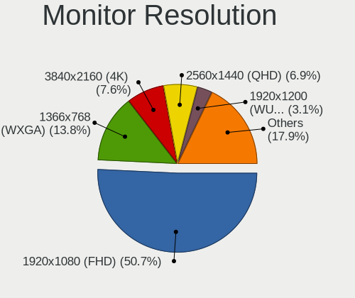

| Resolution         | Computers | Percent |
|--------------------|-----------|---------|
| 1920x1080 (FHD)    | 555       | 50.64%  |
| 1366x768 (WXGA)    | 155       | 14.14%  |
| 3840x2160 (4K)     | 89        | 8.12%   |
| 2560x1440 (QHD)    | 76        | 6.93%   |
| 1920x1200 (WUXGA)  | 31        | 2.83%   |
| 1600x900 (HD+)     | 28        | 2.55%   |
| 2560x1080          | 23        | 2.1%    |
| 1280x1024 (SXGA)   | 17        | 1.55%   |
| 1440x900 (WXGA+)   | 16        | 1.46%   |
| 3440x1440          | 12        | 1.09%   |
| 2880x1800          | 11        | 1%      |
| 2560x1600          | 11        | 1%      |
| 1360x768           | 11        | 1%      |
| 1680x1050 (WSXGA+) | 8         | 0.73%   |
| 3200x1800 (QHD+)   | 7         | 0.64%   |
| 3840x1080          | 5         | 0.46%   |
| 1280x800 (WXGA)    | 5         | 0.46%   |
| 3840x2400          | 4         | 0.36%   |
| Unknown            | 4         | 0.36%   |
| 1024x768 (XGA)     | 3         | 0.27%   |
| 2160x1440          | 2         | 0.18%   |
| 2160x1350          | 2         | 0.18%   |
| 2048x1152          | 2         | 0.18%   |
| 1920x540           | 2         | 0.18%   |
| 1920x1280          | 2         | 0.18%   |
| 7680x1440          | 1         | 0.09%   |
| 7120x1080          | 1         | 0.09%   |
| 3840x1600          | 1         | 0.09%   |
| 3840x1100          | 1         | 0.09%   |
| 3456x2160          | 1         | 0.09%   |
| 3240x2160          | 1         | 0.09%   |
| 3000x2000          | 1         | 0.09%   |
| 2736x1824          | 1         | 0.09%   |
| 2288x1287          | 1         | 0.09%   |
| 2256x1504          | 1         | 0.09%   |
| 1920x515           | 1         | 0.09%   |
| 1680x945           | 1         | 0.09%   |
| 1600x1200          | 1         | 0.09%   |
| 1440x2560          | 1         | 0.09%   |
| 1280x960           | 1         | 0.09%   |

Monitor Diagonal
----------------

Diagonal size in inches

| Inches  | Computers | Percent |
|---------|-----------|---------|
| 15      | 315       | 26.74%  |
| 13      | 137       | 11.63%  |
| 27      | 116       | 9.85%   |
| 24      | 105       | 8.91%   |
| 14      | 101       | 8.57%   |
| 23      | 82        | 6.96%   |
| 21      | 61        | 5.18%   |
| 17      | 37        | 3.14%   |
| 34      | 32        | 2.72%   |
| 18      | 25        | 2.12%   |
| 31      | 23        | 1.95%   |
| 19      | 20        | 1.7%    |
| 12      | 19        | 1.61%   |
| Unknown | 15        | 1.27%   |
| 32      | 9         | 0.76%   |
| 20      | 9         | 0.76%   |
| 72      | 8         | 0.68%   |
| 25      | 7         | 0.59%   |
| 22      | 7         | 0.59%   |
| 16      | 7         | 0.59%   |
| 11      | 7         | 0.59%   |
| 84      | 5         | 0.42%   |
| 48      | 3         | 0.25%   |
| 42      | 3         | 0.25%   |
| 40      | 3         | 0.25%   |
| 29      | 3         | 0.25%   |
| 28      | 3         | 0.25%   |
| 54      | 2         | 0.17%   |
| 49      | 2         | 0.17%   |
| 39      | 2         | 0.17%   |
| 33      | 2         | 0.17%   |
| 26      | 2         | 0.17%   |
| 74      | 1         | 0.08%   |
| 37      | 1         | 0.08%   |
| 36      | 1         | 0.08%   |
| 35      | 1         | 0.08%   |
| 30      | 1         | 0.08%   |
| 8       | 1         | 0.08%   |

Monitor Width
-------------

Physical width

| Width in mm | Computers | Percent |
|-------------|-----------|---------|
| 301-350     | 481       | 42.01%  |
| 501-600     | 276       | 24.1%   |
| 401-500     | 105       | 9.17%   |
| 201-300     | 93        | 8.12%   |
| 351-400     | 60        | 5.24%   |
| 701-800     | 43        | 3.76%   |
| 601-700     | 39        | 3.41%   |
| Unknown     | 15        | 1.31%   |
| 1501-2000   | 14        | 1.22%   |
| 801-900     | 7         | 0.61%   |
| 1001-1500   | 7         | 0.61%   |
| 901-1000    | 4         | 0.35%   |
| 101-200     | 1         | 0.09%   |

Aspect Ratio
------------

Proportional relationship between the width and the height

| Ratio   | Computers | Percent |
|---------|-----------|---------|
| 16/9    | 838       | 82.48%  |
| 16/10   | 89        | 8.76%   |
| 21/9    | 37        | 3.64%   |
| 5/4     | 17        | 1.67%   |
| 3/2     | 10        | 0.98%   |
| Unknown | 8         | 0.79%   |
| 4/3     | 7         | 0.69%   |
| 32/9    | 5         | 0.49%   |
| 6/5     | 2         | 0.2%    |
| 3.88    | 1         | 0.1%    |
| 3.40    | 1         | 0.1%    |
| 0.62    | 1         | 0.1%    |

Monitor Area
------------

Area in inch

| Area in inch | Computers | Percent |
|----------------|-----------|---------|
| 101-110        | 314       | 26.95%  |
| 201-250        | 194       | 16.65%  |
| 81-90          | 171       | 14.68%  |
| 301-350        | 117       | 10.04%  |
| 351-500        | 73        | 6.27%   |
| 71-80          | 67        | 5.75%   |
| 151-200        | 53        | 4.55%   |
| 251-300        | 39        | 3.35%   |
| 121-130        | 31        | 2.66%   |
| 141-150        | 22        | 1.89%   |
| More than 1000 | 17        | 1.46%   |
| 61-70          | 17        | 1.46%   |
| Unknown        | 15        | 1.29%   |
| 501-1000       | 14        | 1.2%    |
| 51-60          | 8         | 0.69%   |
| 131-140        | 5         | 0.43%   |
| 111-120        | 4         | 0.34%   |
| 1-40           | 2         | 0.17%   |
| 91-100         | 2         | 0.17%   |

Pixel Density
-------------

Pixels per inch

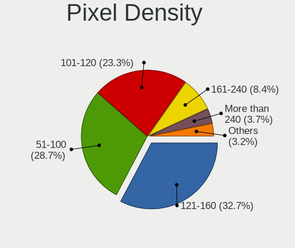

| Density       | Computers | Percent |
|---------------|-----------|---------|
| 121-160       | 371       | 32.74%  |
| 51-100        | 326       | 28.77%  |
| 101-120       | 268       | 23.65%  |
| 161-240       | 94        | 8.3%    |
| More than 240 | 44        | 3.88%   |
| 1-50          | 15        | 1.32%   |
| Unknown       | 15        | 1.32%   |

Multiple Monitors
-----------------

Total monitors connected

| Total | Computers | Percent |
|-------|-----------|---------|
| 1     | 720       | 71.22%  |
| 2     | 223       | 22.06%  |
| 0     | 43        | 4.25%   |
| 3     | 25        | 2.47%   |

Network
-------

Net Controller Vendor
---------------------

Controller vendors

| Vendor                            | Computers | Percent |
|-----------------------------------|-----------|---------|
| Intel                             | 600       | 40.87%  |
| Realtek Semiconductor             | 504       | 34.33%  |
| Qualcomm Atheros                  | 139       | 9.47%   |
| Broadcom                          | 57        | 3.88%   |
| Broadcom Limited                  | 19        | 1.29%   |
| TP-Link                           | 15        | 1.02%   |
| Ralink Technology                 | 15        | 1.02%   |
| Lenovo                            | 9         | 0.61%   |
| DisplayLink                       | 9         | 0.61%   |
| Aquantia                          | 9         | 0.61%   |
| Ralink                            | 8         | 0.54%   |
| Marvell Technology Group          | 7         | 0.48%   |
| Nvidia                            | 6         | 0.41%   |
| NetGear                           | 5         | 0.34%   |
| MEDIATEK                          | 5         | 0.34%   |
| Hewlett-Packard                   | 5         | 0.34%   |
| Huawei Technologies               | 4         | 0.27%   |
| Sierra Wireless                   | 3         | 0.2%    |
| Samsung Electronics               | 3         | 0.2%    |
| Qualcomm                          | 3         | 0.2%    |
| ICS Advent                        | 3         | 0.2%    |
| Apple                             | 3         | 0.2%    |
| Xiaomi                            | 2         | 0.14%   |
| Qualcomm Atheros Communications   | 2         | 0.14%   |
| Mellanox Technologies             | 2         | 0.14%   |
| Linksys                           | 2         | 0.14%   |
| Fibocom                           | 2         | 0.14%   |
| Ericsson Business Mobile Networks | 2         | 0.14%   |
| Dell                              | 2         | 0.14%   |
| D-Link System                     | 2         | 0.14%   |
| D-Link                            | 2         | 0.14%   |
| ASUSTek Computer                  | 2         | 0.14%   |
| ASIX Electronics                  | 2         | 0.14%   |
| Wilocity                          | 1         | 0.07%   |
| T & A Mobile Phones               | 1         | 0.07%   |
| OnePlus Technology (Shenzhen)     | 1         | 0.07%   |
| Oculus VR                         | 1         | 0.07%   |
| Motorola PCS                      | 1         | 0.07%   |
| MosChip Semiconductor             | 1         | 0.07%   |
| Microsoft                         | 1         | 0.07%   |
| MicroPython                       | 1         | 0.07%   |
| Microchip Technology              | 1         | 0.07%   |
| LG Electronics                    | 1         | 0.07%   |
| InterBiometrics                   | 1         | 0.07%   |
| IMC Networks                      | 1         | 0.07%   |
| Google                            | 1         | 0.07%   |
| Arduino SA                        | 1         | 0.07%   |
| Adafruit                          | 1         | 0.07%   |

Net Controller Model
--------------------

Controller models

| Model                                                             | Computers | Percent |
|-------------------------------------------------------------------|-----------|---------|
| Realtek RTL8111/8168/8411 PCI Express Gigabit Ethernet Controller | 346       | 19.85%  |
| Intel Wi-Fi 6 AX200                                               | 120       | 6.88%   |
| Intel Wireless 8265 / 8275                                        | 52        | 2.98%   |
| Intel I211 Gigabit Network Connection                             | 45        | 2.58%   |
| Realtek RTL810xE PCI Express Fast Ethernet controller             | 44        | 2.52%   |
| Realtek RTL8153 Gigabit Ethernet Adapter                          | 43        | 2.47%   |
| Qualcomm Atheros QCA9377 802.11ac Wireless Network Adapter        | 41        | 2.35%   |
| Intel Wi-Fi 6 AX201                                               | 35        | 2.01%   |
| Intel 82579LM Gigabit Network Connection (Lewisville)             | 33        | 1.89%   |
| Intel Wireless 8260                                               | 31        | 1.78%   |
| Realtek RTL8822CE 802.11ac PCIe Wireless Network Adapter          | 26        | 1.49%   |
| Realtek RTL8125 2.5GbE Controller                                 | 26        | 1.49%   |
| Intel Ethernet Connection (2) I219-V                              | 25        | 1.43%   |
| Intel Wireless 7260                                               | 24        | 1.38%   |
| Intel Comet Lake PCH-LP CNVi WiFi                                 | 23        | 1.32%   |
| Intel Wireless 7265                                               | 22        | 1.26%   |
| Intel Cannon Lake PCH CNVi WiFi                                   | 21        | 1.2%    |
| Qualcomm Atheros AR9485 Wireless Network Adapter                  | 20        | 1.15%   |
| Intel Dual Band Wireless-AC 3168NGW [Stone Peak]                  | 20        | 1.15%   |
| Intel Comet Lake PCH CNVi WiFi                                    | 19        | 1.09%   |
| Intel Cannon Point-LP CNVi [Wireless-AC]                          | 19        | 1.09%   |
| Intel Wireless-AC 9260                                            | 18        | 1.03%   |
| Qualcomm Atheros QCA6174 802.11ac Wireless Network Adapter        | 17        | 0.98%   |
| Realtek RTL8822BE 802.11a/b/g/n/ac WiFi adapter                   | 15        | 0.86%   |
| Intel Ice Lake-LP PCH CNVi WiFi                                   | 15        | 0.86%   |
| Realtek RTL8821CE 802.11ac PCIe Wireless Network Adapter          | 14        | 0.8%    |
| Intel Wireless 3165                                               | 13        | 0.75%   |
| Intel Ethernet Connection I217-LM                                 | 13        | 0.75%   |
| Intel Centrino Advanced-N 6205 [Taylor Peak]                      | 13        | 0.75%   |
| Qualcomm Atheros QCA9565 / AR9565 Wireless Network Adapter        | 11        | 0.63%   |
| Intel Ethernet Connection (4) I219-LM                             | 11        | 0.63%   |
| Broadcom BCM4313 802.11bgn Wireless Network Adapter               | 11        | 0.63%   |
| Intel Ethernet Connection (7) I219-V                              | 10        | 0.57%   |
| Intel Ethernet Connection (4) I219-V                              | 10        | 0.57%   |
| Intel Dual Band Wireless-AC 3165 Plus Bluetooth                   | 9         | 0.52%   |
| Intel Ethernet Connection (2) I219-LM                             | 8         | 0.46%   |
| Intel Ethernet Connection (2) I218-V                              | 8         | 0.46%   |
| Intel Ethernet Connection (10) I219-V                             | 8         | 0.46%   |
| Realtek RTL8723BE PCIe Wireless Network Adapter                   | 7         | 0.4%    |
| Intel Ethernet Controller I225-V                                  | 7         | 0.4%    |
| Intel Ethernet Connection (7) I219-LM                             | 7         | 0.4%    |
| Intel Ethernet Connection (3) I218-LM                             | 7         | 0.4%    |
| Ralink MT7601U Wireless Adapter                                   | 6         | 0.34%   |
| Qualcomm Atheros AR9462 Wireless Network Adapter                  | 6         | 0.34%   |
| Intel Wi-Fi 6 AX210/AX211/AX411 160MHz                            | 6         | 0.34%   |
| Intel Ethernet Connection I218-LM                                 | 6         | 0.34%   |
| Intel Ethernet Connection (6) I219-V                              | 6         | 0.34%   |
| Intel Ethernet Connection (6) I219-LM                             | 6         | 0.34%   |
| Intel 82574L Gigabit Network Connection                           | 6         | 0.34%   |
| Broadcom BCM4360 802.11ac Wireless Network Adapter                | 6         | 0.34%   |
| Aquantia AQC107 NBase-T/IEEE 802.3bz Ethernet Controller [AQtion] | 6         | 0.34%   |
| TP-Link UE300 10/100/1000 LAN (ethernet mode) [Realtek RTL8153]   | 5         | 0.29%   |
| Realtek RTL8723DE Wireless Network Adapter                        | 5         | 0.29%   |
| Realtek RTL8188EUS 802.11n Wireless Network Adapter               | 5         | 0.29%   |
| Realtek RTL8188CE 802.11b/g/n WiFi Adapter                        | 5         | 0.29%   |
| Realtek Killer E2600 Gigabit Ethernet Controller                  | 5         | 0.29%   |
| Qualcomm Atheros Killer E2500 Gigabit Ethernet Controller         | 5         | 0.29%   |
| Qualcomm Atheros Killer E2400 Gigabit Ethernet Controller         | 5         | 0.29%   |
| Qualcomm Atheros Killer E220x Gigabit Ethernet Controller         | 5         | 0.29%   |
| Qualcomm Atheros AR9287 Wireless Network Adapter (PCI-Express)    | 5         | 0.29%   |

Wireless Vendor
---------------

Wireless vendors

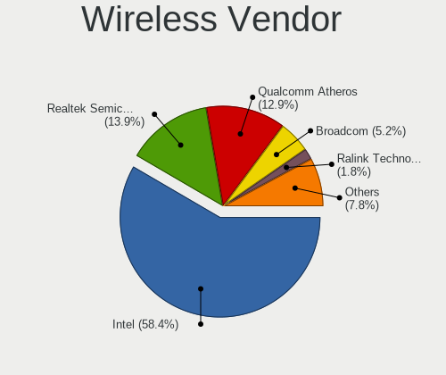

| Vendor                          | Computers | Percent |
|---------------------------------|-----------|---------|
| Intel                           | 503       | 60.24%  |
| Qualcomm Atheros                | 115       | 13.77%  |
| Realtek Semiconductor           | 105       | 12.57%  |
| Broadcom                        | 44        | 5.27%   |
| Ralink Technology               | 15        | 1.8%    |
| TP-Link                         | 9         | 1.08%   |
| Broadcom Limited                | 9         | 1.08%   |
| Ralink                          | 8         | 0.96%   |
| NetGear                         | 5         | 0.6%    |
| MEDIATEK                        | 4         | 0.48%   |
| Qualcomm Atheros Communications | 2         | 0.24%   |
| Qualcomm                        | 2         | 0.24%   |
| Marvell Technology Group        | 2         | 0.24%   |
| Fibocom                         | 2         | 0.24%   |
| D-Link System                   | 2         | 0.24%   |
| Wilocity                        | 1         | 0.12%   |
| Sierra Wireless                 | 1         | 0.12%   |
| Microsoft                       | 1         | 0.12%   |
| Linksys                         | 1         | 0.12%   |
| IMC Networks                    | 1         | 0.12%   |
| Hewlett-Packard                 | 1         | 0.12%   |
| Dell                            | 1         | 0.12%   |
| ASUSTek Computer                | 1         | 0.12%   |

Wireless Model
--------------

Wireless models

| Model                                                          | Computers | Percent |
|----------------------------------------------------------------|-----------|---------|
| Intel Wi-Fi 6 AX200                                            | 120       | 14.35%  |
| Intel Wireless 8265 / 8275                                     | 52        | 6.22%   |
| Qualcomm Atheros QCA9377 802.11ac Wireless Network Adapter     | 41        | 4.9%    |
| Intel Wi-Fi 6 AX201                                            | 35        | 4.19%   |
| Intel Wireless 8260                                            | 31        | 3.71%   |
| Realtek RTL8822CE 802.11ac PCIe Wireless Network Adapter       | 26        | 3.11%   |
| Intel Wireless 7260                                            | 24        | 2.87%   |
| Intel Comet Lake PCH-LP CNVi WiFi                              | 23        | 2.75%   |
| Intel Wireless 7265                                            | 22        | 2.63%   |
| Intel Cannon Lake PCH CNVi WiFi                                | 21        | 2.51%   |
| Qualcomm Atheros AR9485 Wireless Network Adapter               | 20        | 2.39%   |
| Intel Dual Band Wireless-AC 3168NGW [Stone Peak]               | 20        | 2.39%   |
| Intel Comet Lake PCH CNVi WiFi                                 | 19        | 2.27%   |
| Intel Cannon Point-LP CNVi [Wireless-AC]                       | 19        | 2.27%   |
| Intel Wireless-AC 9260                                         | 18        | 2.15%   |
| Qualcomm Atheros QCA6174 802.11ac Wireless Network Adapter     | 17        | 2.03%   |
| Realtek RTL8822BE 802.11a/b/g/n/ac WiFi adapter                | 15        | 1.79%   |
| Intel Ice Lake-LP PCH CNVi WiFi                                | 15        | 1.79%   |
| Realtek RTL8821CE 802.11ac PCIe Wireless Network Adapter       | 14        | 1.67%   |
| Intel Wireless 3165                                            | 13        | 1.56%   |
| Intel Centrino Advanced-N 6205 [Taylor Peak]                   | 13        | 1.56%   |
| Qualcomm Atheros QCA9565 / AR9565 Wireless Network Adapter     | 11        | 1.32%   |
| Broadcom BCM4313 802.11bgn Wireless Network Adapter            | 11        | 1.32%   |
| Intel Dual Band Wireless-AC 3165 Plus Bluetooth                | 9         | 1.08%   |
| Realtek RTL8723BE PCIe Wireless Network Adapter                | 7         | 0.84%   |
| Ralink MT7601U Wireless Adapter                                | 6         | 0.72%   |
| Qualcomm Atheros AR9462 Wireless Network Adapter               | 6         | 0.72%   |
| Intel Wi-Fi 6 AX210/AX211/AX411 160MHz                         | 6         | 0.72%   |
| Broadcom BCM4360 802.11ac Wireless Network Adapter             | 6         | 0.72%   |
| Realtek RTL8723DE Wireless Network Adapter                     | 5         | 0.6%    |
| Realtek RTL8188EUS 802.11n Wireless Network Adapter            | 5         | 0.6%    |
| Realtek RTL8188CE 802.11b/g/n WiFi Adapter                     | 5         | 0.6%    |
| Qualcomm Atheros AR9287 Wireless Network Adapter (PCI-Express) | 5         | 0.6%    |
| Qualcomm Atheros AR9285 Wireless Network Adapter (PCI-Express) | 5         | 0.6%    |
| Intel Wireless 3160                                            | 5         | 0.6%    |
| Intel Gemini Lake PCH CNVi WiFi                                | 5         | 0.6%    |
| Intel Centrino Wireless-N 1030 [Rainbow Peak]                  | 5         | 0.6%    |
| Intel Centrino Advanced-N 6200                                 | 5         | 0.6%    |
| Broadcom BCM43602 802.11ac Wireless LAN SoC                    | 5         | 0.6%    |
| Broadcom BCM43228 802.11a/b/g/n                                | 5         | 0.6%    |
| Broadcom BCM43142 802.11b/g/n                                  | 5         | 0.6%    |
| Ralink RT3290 Wireless 802.11n 1T/1R PCIe                      | 4         | 0.48%   |
| Qualcomm Atheros AR93xx Wireless Network Adapter               | 4         | 0.48%   |
| MEDIATEK Network controller                                    | 4         | 0.48%   |
| Intel Centrino Wireless-N 2230                                 | 4         | 0.48%   |
| Intel Centrino Ultimate-N 6300                                 | 4         | 0.48%   |
| Intel Centrino Advanced-N 6235                                 | 4         | 0.48%   |
| Realtek RTL88x2bu [AC1200 Techkey]                             | 3         | 0.36%   |
| Realtek RTL8188EE Wireless Network Adapter                     | 3         | 0.36%   |
| Realtek Realtek Network controller                             | 3         | 0.36%   |
| Ralink RT5370 Wireless Adapter                                 | 3         | 0.36%   |
| Qualcomm Atheros AR928X Wireless Network Adapter (PCI-Express) | 3         | 0.36%   |
| Broadcom Limited BCM4331 802.11a/b/g/n                         | 3         | 0.36%   |
| Broadcom BCM4352 802.11ac Wireless Network Adapter             | 3         | 0.36%   |
| Broadcom BCM4322 802.11a/b/g/n Wireless LAN Controller         | 3         | 0.36%   |
| TP-Link Archer T4U ver.3                                       | 2         | 0.24%   |
| TP-Link AC600 wireless Realtek RTL8811AU [Archer T2U Nano]     | 2         | 0.24%   |
| TP-Link 802.11ac NIC                                           | 2         | 0.24%   |
| Realtek RTL8812AE 802.11ac PCIe Wireless Network Adapter       | 2         | 0.24%   |
| Realtek RTL8811AU 802.11a/b/g/n/ac WLAN Adapter                | 2         | 0.24%   |

Ethernet Vendor
---------------

Ethernet vendors

| Vendor                        | Computers | Percent |
|-------------------------------|-----------|---------|
| Realtek Semiconductor         | 459       | 53.25%  |
| Intel                         | 261       | 30.28%  |
| Qualcomm Atheros              | 36        | 4.18%   |
| Broadcom                      | 20        | 2.32%   |
| Broadcom Limited              | 10        | 1.16%   |
| Lenovo                        | 9         | 1.04%   |
| DisplayLink                   | 9         | 1.04%   |
| Aquantia                      | 9         | 1.04%   |
| TP-Link                       | 6         | 0.7%    |
| Nvidia                        | 6         | 0.7%    |
| Marvell Technology Group      | 5         | 0.58%   |
| Samsung Electronics           | 3         | 0.35%   |
| ICS Advent                    | 3         | 0.35%   |
| Huawei Technologies           | 3         | 0.35%   |
| Apple                         | 3         | 0.35%   |
| Xiaomi                        | 2         | 0.23%   |
| Sierra Wireless               | 2         | 0.23%   |
| Mellanox Technologies         | 2         | 0.23%   |
| D-Link                        | 2         | 0.23%   |
| ASIX Electronics              | 2         | 0.23%   |
| Qualcomm                      | 1         | 0.12%   |
| OnePlus Technology (Shenzhen) | 1         | 0.12%   |
| Motorola PCS                  | 1         | 0.12%   |
| MosChip Semiconductor         | 1         | 0.12%   |
| MediaTek                      | 1         | 0.12%   |
| Linksys                       | 1         | 0.12%   |
| LG Electronics                | 1         | 0.12%   |
| Hewlett-Packard               | 1         | 0.12%   |
| Google                        | 1         | 0.12%   |
| ASUSTek Computer              | 1         | 0.12%   |

Ethernet Model
--------------

Ethernet models

| Model                                                                          | Computers | Percent |
|--------------------------------------------------------------------------------|-----------|---------|
| Realtek RTL8111/8168/8411 PCI Express Gigabit Ethernet Controller              | 346       | 38.75%  |
| Intel I211 Gigabit Network Connection                                          | 45        | 5.04%   |
| Realtek RTL810xE PCI Express Fast Ethernet controller                          | 44        | 4.93%   |
| Realtek RTL8153 Gigabit Ethernet Adapter                                       | 43        | 4.82%   |
| Intel 82579LM Gigabit Network Connection (Lewisville)                          | 33        | 3.7%    |
| Realtek RTL8125 2.5GbE Controller                                              | 26        | 2.91%   |
| Intel Ethernet Connection (2) I219-V                                           | 25        | 2.8%    |
| Intel Ethernet Connection I217-LM                                              | 13        | 1.46%   |
| Intel Ethernet Connection (4) I219-LM                                          | 11        | 1.23%   |
| Intel Ethernet Connection (7) I219-V                                           | 10        | 1.12%   |
| Intel Ethernet Connection (4) I219-V                                           | 10        | 1.12%   |
| Intel Ethernet Connection (2) I219-LM                                          | 8         | 0.9%    |
| Intel Ethernet Connection (2) I218-V                                           | 8         | 0.9%    |
| Intel Ethernet Connection (10) I219-V                                          | 8         | 0.9%    |
| Intel Ethernet Controller I225-V                                               | 7         | 0.78%   |
| Intel Ethernet Connection (7) I219-LM                                          | 7         | 0.78%   |
| Intel Ethernet Connection (3) I218-LM                                          | 7         | 0.78%   |
| Intel Ethernet Connection I218-LM                                              | 6         | 0.67%   |
| Intel Ethernet Connection (6) I219-V                                           | 6         | 0.67%   |
| Intel Ethernet Connection (6) I219-LM                                          | 6         | 0.67%   |
| Intel 82574L Gigabit Network Connection                                        | 6         | 0.67%   |
| Aquantia AQC107 NBase-T/IEEE 802.3bz Ethernet Controller [AQtion]              | 6         | 0.67%   |
| TP-Link UE300 10/100/1000 LAN (ethernet mode) [Realtek RTL8153]                | 5         | 0.56%   |
| Realtek Killer E2600 Gigabit Ethernet Controller                               | 5         | 0.56%   |
| Qualcomm Atheros Killer E2500 Gigabit Ethernet Controller                      | 5         | 0.56%   |
| Qualcomm Atheros Killer E2400 Gigabit Ethernet Controller                      | 5         | 0.56%   |
| Qualcomm Atheros Killer E220x Gigabit Ethernet Controller                      | 5         | 0.56%   |
| Intel I210 Gigabit Network Connection                                          | 5         | 0.56%   |
| Intel Ethernet Connection I217-V                                               | 5         | 0.56%   |
| Intel 82577LM Gigabit Network Connection                                       | 5         | 0.56%   |
| Intel 82567LM-3 Gigabit Network Connection                                     | 5         | 0.56%   |
| Broadcom NetXtreme BCM57766 Gigabit Ethernet PCIe                              | 5         | 0.56%   |
| Qualcomm Atheros QCA8171 Gigabit Ethernet                                      | 4         | 0.45%   |
| Qualcomm Atheros AR8161 Gigabit Ethernet                                       | 4         | 0.45%   |
| Qualcomm Atheros AR8152 v2.0 Fast Ethernet                                     | 4         | 0.45%   |
| Intel Ethernet Connection I219-V                                               | 4         | 0.45%   |
| Intel Ethernet Connection I219-LM                                              | 4         | 0.45%   |
| Intel 82571EB/82571GB Gigabit Ethernet Controller D0/D1 (copper applications)  | 4         | 0.45%   |
| DisplayLink Dell Universal Dock D6000                                          | 4         | 0.45%   |
| Broadcom NetXtreme BCM57765 Gigabit Ethernet PCIe                              | 4         | 0.45%   |
| Broadcom NetXtreme BCM5764M Gigabit Ethernet PCIe                              | 4         | 0.45%   |
| Broadcom Limited NetLink BCM57780 Gigabit Ethernet PCIe                        | 4         | 0.45%   |
| Realtek RTL8152 Fast Ethernet Adapter                                          | 3         | 0.34%   |
| Qualcomm Atheros AR8151 v2.0 Gigabit Ethernet                                  | 3         | 0.34%   |
| Lenovo ThinkPad TBT3 LAN                                                       | 3         | 0.34%   |
| Intel Ethernet Connection (12) I219-V                                          | 3         | 0.34%   |
| Intel 82579V Gigabit Network Connection                                        | 3         | 0.34%   |
| Intel 82571EB/82571GB Gigabit Ethernet Controller (Copper)                     | 3         | 0.34%   |
| DisplayLink USB3.0 5K Graphic Docking                                          | 3         | 0.34%   |
| Aquantia AQC111 NBase-T/IEEE 802.3bz Ethernet Controller [AQtion]              | 3         | 0.34%   |
| Xiaomi Mi/Redmi series (RNDIS)                                                 | 2         | 0.22%   |
| Sierra Wireless EM7345 4G LTE                                                  | 2         | 0.22%   |
| Samsung Galaxy series, misc. (tethering mode)                                  | 2         | 0.22%   |
| Realtek RTL8169 PCI Gigabit Ethernet Controller                                | 2         | 0.22%   |
| Realtek RTL-8100/8101L/8139 PCI Fast Ethernet Adapter                          | 2         | 0.22%   |
| Qualcomm Atheros QCA8172 Fast Ethernet                                         | 2         | 0.22%   |
| Nvidia MCP77 Ethernet                                                          | 2         | 0.22%   |
| Marvell Group Yukon Optima 88E8059 [PCIe Gigabit Ethernet Controller with AVB] | 2         | 0.22%   |
| Marvell Group 88E8053 PCI-E Gigabit Ethernet Controller                        | 2         | 0.22%   |
| Lenovo USB-C Dock Ethernet                                                     | 2         | 0.22%   |

Net Controller Kind
-------------------

Ethernet, WiFi or modem

| Kind     | Computers | Percent |
|----------|-----------|---------|
| WiFi     | 798       | 49.97%  |
| Ethernet | 785       | 49.15%  |
| Modem    | 13        | 0.81%   |
| Unknown  | 1         | 0.06%   |

Used Controller
---------------

Currently used network controller

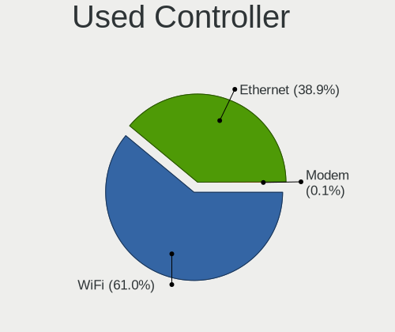

| Kind     | Computers | Percent |
|----------|-----------|---------|
| WiFi     | 711       | 53.22%  |
| Ethernet | 623       | 46.63%  |
| Modem    | 2         | 0.15%   |

NICs
----

Total network controllers on board

| Total | Computers | Percent |
|-------|-----------|---------|
| 2     | 531       | 52.94%  |
| 1     | 387       | 38.58%  |
| 3     | 39        | 3.89%   |
| 0     | 36        | 3.59%   |
| 4     | 5         | 0.5%    |
| 5     | 3         | 0.3%    |
| 9     | 1         | 0.1%    |
| 8     | 1         | 0.1%    |

IPv6
----

IPv6 vs IPv4

| Used | Computers | Percent |
|------|-----------|---------|
| No   | 766       | 76.29%  |
| Yes  | 238       | 23.71%  |

Bluetooth
---------

Bluetooth Vendor
----------------

Controller vendors

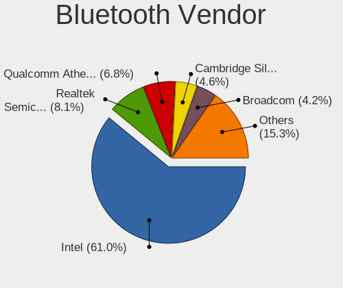

| Vendor                          | Computers | Percent |
|---------------------------------|-----------|---------|
| Intel                           | 442       | 61.9%   |
| Qualcomm Atheros Communications | 53        | 7.42%   |
| Realtek Semiconductor           | 52        | 7.28%   |
| Broadcom                        | 31        | 4.34%   |
| Lite-On Technology              | 27        | 3.78%   |
| IMC Networks                    | 26        | 3.64%   |
| Cambridge Silicon Radio         | 24        | 3.36%   |
| Apple                           | 22        | 3.08%   |
| ASUSTek Computer                | 10        | 1.4%    |
| Foxconn / Hon Hai               | 6         | 0.84%   |
| Dell                            | 6         | 0.84%   |
| Ralink                          | 4         | 0.56%   |
| Realtek                         | 3         | 0.42%   |
| Marvell Semiconductor           | 2         | 0.28%   |
| Hewlett-Packard                 | 2         | 0.28%   |
| Unknown                         | 1         | 0.14%   |
| Dynex                           | 1         | 0.14%   |
| D-Link System                   | 1         | 0.14%   |
| Askey Computer                  | 1         | 0.14%   |

Bluetooth Model
---------------

Controller models

| Model                                                                               | Computers | Percent |
|-------------------------------------------------------------------------------------|-----------|---------|
| Intel Bluetooth Device                                                              | 152       | 21.29%  |
| Intel AX200 Bluetooth                                                               | 111       | 15.55%  |
| Intel Bluetooth wireless interface                                                  | 71        | 9.94%   |
| Intel Bluetooth 9460/9560 Jefferson Peak (JfP)                                      | 57        | 7.98%   |
| Qualcomm Atheros  Bluetooth Device                                                  | 33        | 4.62%   |
| Realtek Bluetooth Radio                                                             | 24        | 3.36%   |
| Cambridge Silicon Radio Bluetooth Dongle (HCI mode)                                 | 24        | 3.36%   |
| Intel Wireless-AC 3168 Bluetooth                                                    | 20        | 2.8%    |
| Realtek  Bluetooth 4.2 Adapter                                                      | 19        | 2.66%   |
| Intel Wireless-AC 9260 Bluetooth Adapter                                            | 18        | 2.52%   |
| Apple Bluetooth Host Controller                                                     | 14        | 1.96%   |
| Lite-On Qualcomm Atheros QCA9377 Bluetooth                                          | 12        | 1.68%   |
| Broadcom BCM20702A0 Bluetooth 4.0                                                   | 10        | 1.4%    |
| IMC Networks Bluetooth Radio                                                        | 9         | 1.26%   |
| Realtek 802.11ac WLAN Adapter                                                       | 8         | 1.12%   |
| Qualcomm Atheros AR3012 Bluetooth 4.0                                               | 7         | 0.98%   |
| Intel Centrino Advanced-N 6230 Bluetooth adapter                                    | 7         | 0.98%   |
| Intel AX210 Bluetooth                                                               | 6         | 0.84%   |
| Apple Bluetooth USB Host Controller                                                 | 6         | 0.84%   |
| Lite-On Bluetooth Device                                                            | 5         | 0.7%    |
| Ralink RT3290 Bluetooth                                                             | 4         | 0.56%   |
| Qualcomm Atheros QCA61x4 Bluetooth 4.0                                              | 4         | 0.56%   |
| Qualcomm Atheros AR3011 Bluetooth                                                   | 4         | 0.56%   |
| Lite-On Atheros AR3012 Bluetooth                                                    | 4         | 0.56%   |
| IMC Networks Wireless_Device                                                        | 4         | 0.56%   |
| IMC Networks Bluetooth Device                                                       | 4         | 0.56%   |
| IMC Networks Atheros AR3012 Bluetooth 4.0 Adapter                                   | 4         | 0.56%   |
| Dell DW375 Bluetooth Module                                                         | 4         | 0.56%   |
| Broadcom BCM20702 Bluetooth 4.0 [ThinkPad]                                          | 4         | 0.56%   |
| Broadcom BCM2070 Bluetooth 2.1 + EDR                                                | 4         | 0.56%   |
| ASUS Broadcom BCM20702A0 Bluetooth                                                  | 4         | 0.56%   |
| Realtek Bluetooth Radio                                                             | 3         | 0.42%   |
| Qualcomm Atheros Bluetooth USB Host Controller                                      | 3         | 0.42%   |
| Lite-On Bluetooth Radio                                                             | 3         | 0.42%   |
| IMC Networks Bluetooth USB Host Controller                                          | 3         | 0.42%   |
| Foxconn / Hon Hai Bluetooth Device                                                  | 3         | 0.42%   |
| Broadcom HP Portable Bumble Bee                                                     | 3         | 0.42%   |
| Marvell Bluetooth and Wireless LAN Composite Device                                 | 2         | 0.28%   |
| Foxconn / Hon Hai BCM20702A0                                                        | 2         | 0.28%   |
| Broadcom BCM43142A0 Bluetooth 4.0                                                   | 2         | 0.28%   |
| Broadcom BCM20702A0                                                                 | 2         | 0.28%   |
| ASUS Bluetooth Radio                                                                | 2         | 0.28%   |
| Apple Built-in Bluetooth 2.0+EDR HCI                                                | 2         | 0.28%   |
| Unknown Bluetooth Device                                                            | 1         | 0.14%   |
| Realtek RTL8723B Bluetooth                                                          | 1         | 0.14%   |
| Qualcomm Atheros Dell Wireless 1802 Bluetooth 4.0 LE                                | 1         | 0.14%   |
| Qualcomm Atheros AR9462 Bluetooth                                                   | 1         | 0.14%   |
| Lite-On Qualcomm Atheros Bluetooth                                                  | 1         | 0.14%   |
| Lite-On Broadcom BCM43142A0 Bluetooth Device                                        | 1         | 0.14%   |
| Lite-On Atheros Bluetooth                                                           | 1         | 0.14%   |
| IMC Networks Bluetooth Module                                                       | 1         | 0.14%   |
| IMC Networks Bluetooth                                                              | 1         | 0.14%   |
| HP Broadcom 2070 Bluetooth Combo                                                    | 1         | 0.14%   |
| HP Bluetooth 2.0 Interface [Broadcom BCM2045]                                       | 1         | 0.14%   |
| Foxconn / Hon Hai Foxconn T77H114 BCM2070 [Single-Chip Bluetooth 2.1 + EDR Adapter] | 1         | 0.14%   |
| Dynex Bluetooth 4.0 Adapter [Broadcom, 1.12, BCM20702A0]                            | 1         | 0.14%   |
| Dell Wireless 360 Bluetooth                                                         | 1         | 0.14%   |
| Dell BCM20702A0                                                                     | 1         | 0.14%   |
| D-Link System DBT-122 Bluetooth                                                     | 1         | 0.14%   |
| Broadcom BCM43142A0 Bluetooth Device                                                | 1         | 0.14%   |

Sound
-----

Sound Vendor
------------

Sound card vendors

| Vendor                      | Computers | Percent |
|-----------------------------|-----------|---------|
| Intel                       | 684       | 48%     |
| AMD                         | 314       | 22.04%  |
| Nvidia                      | 246       | 17.26%  |
| C-Media Electronics         | 23        | 1.61%   |
| Logitech                    | 16        | 1.12%   |
| GN Netcom                   | 10        | 0.7%    |
| Lenovo                      | 9         | 0.63%   |
| Creative Technology         | 8         | 0.56%   |
| Blue Microphones            | 7         | 0.49%   |
| Plantronics                 | 6         | 0.42%   |
| Kingston Technology         | 6         | 0.42%   |
| RODE Microphones            | 5         | 0.35%   |
| Realtek Semiconductor       | 5         | 0.35%   |
| Focusrite-Novation          | 5         | 0.35%   |
| Creative Labs               | 5         | 0.35%   |
| SteelSeries ApS             | 4         | 0.28%   |
| Samson Technologies         | 4         | 0.28%   |
| Razer USA                   | 4         | 0.28%   |
| Generalplus Technology      | 4         | 0.28%   |
| Sennheiser Communications   | 3         | 0.21%   |
| Microsoft                   | 3         | 0.21%   |
| JMTek                       | 3         | 0.21%   |
| GYROCOM C&C                 | 3         | 0.21%   |
| Dell                        | 3         | 0.21%   |
| Corsair                     | 3         | 0.21%   |
| Texas Instruments           | 2         | 0.14%   |
| Tenx Technology             | 2         | 0.14%   |
| Sony                        | 2         | 0.14%   |
| Schiit Audio                | 2         | 0.14%   |
| Hewlett-Packard             | 2         | 0.14%   |
| Cambridge Silicon Radio     | 2         | 0.14%   |
| ASUSTek Computer            | 2         | 0.14%   |
| ZOOM                        | 1         | 0.07%   |
| Yamaha                      | 1         | 0.07%   |
| VIA Technologies            | 1         | 0.07%   |
| ULi Electronics             | 1         | 0.07%   |
| Trust                       | 1         | 0.07%   |
| Signalpath International    | 1         | 0.07%   |
| Shenzhen Riitek Technology  | 1         | 0.07%   |
| SAVITECH                    | 1         | 0.07%   |
| Quanta                      | 1         | 0.07%   |
| PreSonus Audio Electronics  | 1         | 0.07%   |
| Native Instruments          | 1         | 0.07%   |
| Meridian                    | 1         | 0.07%   |
| Medeli Electronics          | 1         | 0.07%   |
| JBL                         | 1         | 0.07%   |
| iCreate Technologies        | 1         | 0.07%   |
| Griffin Technology          | 1         | 0.07%   |
| Fujitsu                     | 1         | 0.07%   |
| FiiO Electronics Technology | 1         | 0.07%   |
| FIFINE Microphones          | 1         | 0.07%   |
| EGO SYStems                 | 1         | 0.07%   |
| Conexant Systems            | 1         | 0.07%   |
| CMX Systems                 | 1         | 0.07%   |
| Blackstorm Scou             | 1         | 0.07%   |
| BEHRINGER International     | 1         | 0.07%   |
| Audio-Technica              | 1         | 0.07%   |
| Astro Gaming                | 1         | 0.07%   |
| Apple                       | 1         | 0.07%   |
| Apogee Electronics          | 1         | 0.07%   |

Sound Model
-----------

Sound card models

| Model                                                                      | Computers | Percent |
|----------------------------------------------------------------------------|-----------|---------|
| AMD Family 17h (Models 10h-1fh) HD Audio Controller                        | 126       | 7.33%   |
| Intel Sunrise Point-LP HD Audio                                            | 120       | 6.98%   |
| AMD Renoir Radeon High Definition Audio Controller                         | 66        | 3.84%   |
| AMD Starship/Matisse HD Audio Controller                                   | 62        | 3.6%    |
| Intel Cannon Lake PCH cAVS                                                 | 55        | 3.2%    |
| Intel 6 Series/C200 Series Chipset Family High Definition Audio Controller | 55        | 3.2%    |
| AMD Raven/Raven2/Fenghuang HDMI/DP Audio Controller                        | 51        | 2.97%   |
| Intel 8 Series/C220 Series Chipset High Definition Audio Controller        | 46        | 2.67%   |
| Intel Tiger Lake-LP Smart Sound Technology Audio Controller                | 44        | 2.56%   |
| Intel 7 Series/C216 Chipset Family High Definition Audio Controller        | 41        | 2.38%   |
| Intel Xeon E3-1200 v3/4th Gen Core Processor HD Audio Controller           | 36        | 2.09%   |
| AMD Ellesmere HDMI Audio [Radeon RX 470/480 / 570/580/590]                 | 32        | 1.86%   |
| Intel Cannon Point-LP High Definition Audio Controller                     | 31        | 1.8%    |
| Intel Comet Lake PCH-LP cAVS                                               | 30        | 1.74%   |
| Intel 200 Series PCH HD Audio                                              | 30        | 1.74%   |
| Intel 100 Series/C230 Series Chipset Family HD Audio Controller            | 30        | 1.74%   |
| Nvidia GP107GL High Definition Audio Controller                            | 29        | 1.69%   |
| AMD Family 17h (Models 00h-0fh) HD Audio Controller                        | 29        | 1.69%   |
| Intel Wildcat Point-LP High Definition Audio Controller                    | 24        | 1.4%    |
| Intel Broadwell-U Audio Controller                                         | 24        | 1.4%    |
| Intel 5 Series/3400 Series Chipset High Definition Audio                   | 23        | 1.34%   |
| Intel Haswell-ULT HD Audio Controller                                      | 21        | 1.22%   |
| Intel 8 Series HD Audio Controller                                         | 21        | 1.22%   |
| AMD Navi 10 HDMI Audio                                                     | 21        | 1.22%   |
| Nvidia GP106 High Definition Audio Controller                              | 20        | 1.16%   |
| Intel Comet Lake PCH cAVS                                                  | 20        | 1.16%   |
| Nvidia TU116 High Definition Audio Controller                              | 19        | 1.1%    |
| Nvidia TU106 High Definition Audio Controller                              | 19        | 1.1%    |
| Intel Ice Lake-LP Smart Sound Technology Audio Controller                  | 19        | 1.1%    |
| AMD SBx00 Azalia (Intel HDA)                                               | 19        | 1.1%    |
| AMD FCH Azalia Controller                                                  | 19        | 1.1%    |
| Nvidia TU107 GeForce GTX 1650 High Definition Audio Controller             | 16        | 0.93%   |
| Nvidia GP104 High Definition Audio Controller                              | 14        | 0.81%   |
| AMD Baffin HDMI/DP Audio [Radeon RX 550 640SP / RX 560/560X]               | 14        | 0.81%   |
| Nvidia GK208 HDMI/DP Audio Controller                                      | 13        | 0.76%   |
| Intel 9 Series Chipset Family HD Audio Controller                          | 13        | 0.76%   |
| Nvidia GM107 High Definition Audio Controller [GeForce 940MX]              | 12        | 0.7%    |
| Intel Celeron/Pentium Silver Processor High Definition Audio               | 12        | 0.7%    |
| AMD Oland/Hainan/Cape Verde/Pitcairn HDMI Audio [Radeon HD 7000 Series]    | 12        | 0.7%    |
| Nvidia GF108 High Definition Audio Controller                              | 11        | 0.64%   |
| Intel CM238 HD Audio Controller                                            | 11        | 0.64%   |
| AMD Kabini HDMI/DP Audio                                                   | 11        | 0.64%   |
| Nvidia TU104 HD Audio Controller                                           | 10        | 0.58%   |
| Nvidia GA104 High Definition Audio Controller                              | 10        | 0.58%   |
| Nvidia GK107 HDMI Audio Controller                                         | 9         | 0.52%   |
| Nvidia High Definition Audio Controller                                    | 8         | 0.47%   |
| Nvidia Audio device                                                        | 8         | 0.47%   |
| Intel NM10/ICH7 Family High Definition Audio Controller                    | 8         | 0.47%   |
| Intel Comet Lake PCH-V Smart Sound Technology Audio Controller             | 8         | 0.47%   |
| AMD Family 15h (Models 60h-6fh) Audio Controller                           | 7         | 0.41%   |
| Nvidia GM204 High Definition Audio Controller                              | 6         | 0.35%   |
| Nvidia GF119 HDMI Audio Controller                                         | 6         | 0.35%   |
| C-Media Electronics USB Audio Device                                       | 6         | 0.35%   |
| Blue Microphones Yeti Stereo Microphone                                    | 6         | 0.35%   |
| Realtek Semiconductor USB Audio                                            | 5         | 0.29%   |
| Nvidia GM206 High Definition Audio Controller                              | 5         | 0.29%   |
| Intel 82801JI (ICH10 Family) HD Audio Controller                           | 5         | 0.29%   |
| Intel 82801JD/DO (ICH10 Family) HD Audio Controller                        | 5         | 0.29%   |
| Intel 82801I (ICH9 Family) HD Audio Controller                             | 5         | 0.29%   |
| C-Media Electronics Audio Adapter (Unitek Y-247A)                          | 5         | 0.29%   |

Memory
------

Memory Vendor
-------------

Memory module vendors

| Vendor              | Computers | Percent |
|---------------------|-----------|---------|
| Samsung Electronics | 114       | 20.47%  |
| SK Hynix            | 105       | 18.85%  |
| Micron Technology   | 63        | 11.31%  |
| Kingston            | 63        | 11.31%  |
| Unknown             | 47        | 8.44%   |
| Corsair             | 40        | 7.18%   |
| Crucial             | 28        | 5.03%   |
| G.Skill             | 24        | 4.31%   |
| A-DATA Technology   | 16        | 2.87%   |
| Elpida              | 8         | 1.44%   |
| Ramaxel Technology  | 7         | 1.26%   |
| GOODRAM             | 5         | 0.9%    |
| Unknown (ABCD)      | 4         | 0.72%   |
| Teikon              | 4         | 0.72%   |
| Team                | 4         | 0.72%   |
| Smart               | 4         | 0.72%   |
| Silicon Power       | 3         | 0.54%   |
| Nanya Technology    | 3         | 0.54%   |
| Avant               | 3         | 0.54%   |
| Patriot             | 2         | 0.36%   |
| Goldkey             | 2         | 0.36%   |
| Transcend           | 1         | 0.18%   |
| PNY                 | 1         | 0.18%   |
| OnBoard             | 1         | 0.18%   |
| KomputerBay         | 1         | 0.18%   |
| Kllisre             | 1         | 0.18%   |
| Golden Empire       | 1         | 0.18%   |
| Gold Key            | 1         | 0.18%   |
| 0898000080AD        | 1         | 0.18%   |

Memory Model
------------

Memory module models

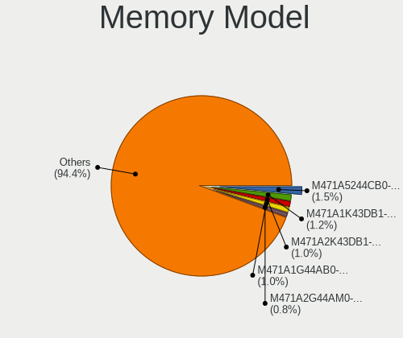

| Model                                                            | Computers | Percent |
|------------------------------------------------------------------|-----------|---------|
| Samsung RAM M471A5244CB0-CTD 4GB SODIMM DDR4 2667MT/s            | 7         | 1.18%   |
| Samsung RAM M471A2K43DB1-CTD 16GB SODIMM DDR4 2667MT/s           | 7         | 1.18%   |
| Samsung RAM M471A1K43DB1-CWE 8GB SODIMM DDR4 3200MT/s            | 7         | 1.18%   |
| Samsung RAM M471A1G44AB0-CWE 8GB SODIMM DDR4 3200MT/s            | 7         | 1.18%   |
| SK Hynix RAM HMA82GS6JJR8N-VK 16GB SODIMM DDR4 2667MT/s          | 6         | 1.01%   |
| Micron RAM 4ATF51264HZ-2G6E1 4GB SODIMM DDR4 2667MT/s            | 6         | 1.01%   |
| Unknown RAM Module 1GB SODIMM DDR3 1333MT/s                      | 5         | 0.84%   |
| Samsung RAM M471A2G44AM0-CWE 16GB SODIMM DDR4 3200MT/s           | 5         | 0.84%   |
| Samsung RAM M471A1G44AB0-CWE 8GB Row Of Chips DDR4 3200MT/s      | 5         | 0.84%   |
| SK Hynix RAM HMA81GS6DJR8N-XN 8GB SODIMM DDR4 3200MT/s           | 4         | 0.67%   |
| Samsung RAM M471A2K43DB1-CWE 16384MB SODIMM DDR4 3200MT/s        | 4         | 0.67%   |
| Samsung RAM K4UBE3D4AA-MGCL 8192MB Row Of Chips LPDDR4 4267MT/s  | 4         | 0.67%   |
| Micron RAM Module 8GB Chip LPDDR4                                | 4         | 0.67%   |
| Micron RAM 53E1G32D2NP-046 2GB Row Of Chips LPDDR4 4267MT/s      | 4         | 0.67%   |
| Micron RAM 4ATF1G64HZ-3G2E1 8192MB SODIMM DDR4 3200MT/s          | 4         | 0.67%   |
| Unknown RAM Module 2GB SODIMM DDR3 1600MT/s                      | 3         | 0.5%    |
| Unknown RAM Module 2GB DIMM 667MT/s                              | 3         | 0.5%    |
| Unknown (ABCD) RAM 123456789012345678 2GB SODIMM LPDDR4 2400MT/s | 3         | 0.5%    |
| SK Hynix RAM HMT451S6BFR8A-PB 4096MB SODIMM DDR3 1600MT/s        | 3         | 0.5%    |
| SK Hynix RAM HMT351S6EFR8C-PB 4096MB SODIMM DDR3 1600MT/s        | 3         | 0.5%    |
| SK Hynix RAM HMAB2GS6AMR6N-XN 16GB SODIMM DDR4 3200MT/s          | 3         | 0.5%    |
| SK Hynix RAM HMAA1GS6CMR6N-XN 8GB SODIMM DDR4 3200MT/s           | 3         | 0.5%    |
| SK Hynix RAM HMAA1GS6CMR6N-XN 8GB Row Of Chips DDR4 3200MT/s     | 3         | 0.5%    |
| SK Hynix RAM HMA82GS6AFR8N-UH 16GB SODIMM DDR4 2667MT/s          | 3         | 0.5%    |
| SK Hynix RAM HMA81GS6CJR8N-VK 8GB SODIMM DDR4 2667MT/s           | 3         | 0.5%    |
| SK Hynix RAM HMA81GS6AFR8N-UH 8GB SODIMM DDR4 2667MT/s           | 3         | 0.5%    |
| Samsung RAM Module 16GB SODIMM DDR4 2667MT/s                     | 3         | 0.5%    |
| Samsung RAM M471B5173QH0-YK0 4096MB SODIMM DDR3 1600MT/s         | 3         | 0.5%    |
| Samsung RAM M471A2G43AB2-CWE 16GB SODIMM DDR4 3200MT/s           | 3         | 0.5%    |
| Samsung RAM M471A1K43BB1-CRC 8GB SODIMM DDR4 2667MT/s            | 3         | 0.5%    |
| Micron RAM 8ATF1G64HZ-3G2J1 8GB SODIMM DDR4 3200MT/s             | 3         | 0.5%    |
| Micron RAM 4ATF51264HZ-3G2J1 4GB SODIMM DDR4 3200MT/s            | 3         | 0.5%    |
| Kingston RAM KHX2133C14/8G 8GB DIMM DDR4 2400MT/s                | 3         | 0.5%    |
| G.Skill RAM F4-3200C16-16GVK 16GB DIMM DDR4 3600MT/s             | 3         | 0.5%    |
| Corsair RAM CMK16GX4M2B3000C15 8GB DIMM DDR4 3466MT/s            | 3         | 0.5%    |
| Corsair RAM CMK16GX4M1E3200C16 16GB DIMM DDR4 3000MT/s           | 3         | 0.5%    |
| Unknown RAM Module 2GB DIMM DDR2 1067MT/s                        | 2         | 0.34%   |
| Team RAM TEAMGROUP-SD4-2666 32GB SODIMM DDR4 2667MT/s            | 2         | 0.34%   |
| SK Hynix RAM Module 4GB SODIMM DDR3 1600MT/s                     | 2         | 0.34%   |
| SK Hynix RAM Module 4GB SODIMM DDR3 1066MT/s                     | 2         | 0.34%   |
| SK Hynix RAM Module 2GB SODIMM DDR3 1066MT/s                     | 2         | 0.34%   |
| SK Hynix RAM Module 16GB SODIMM DDR4 3200MT/s                    | 2         | 0.34%   |
| SK Hynix RAM HMT41GS6BFR8A-PB 8GB SODIMM DDR3 1600MT/s           | 2         | 0.34%   |
| SK Hynix RAM HMT41GS6AFR8A-PB 8GB SODIMM DDR3 1600MT/s           | 2         | 0.34%   |
| SK Hynix RAM HMT351S6CFR8C-PB 4GB SODIMM DDR3 1600MT/s           | 2         | 0.34%   |
| SK Hynix RAM HMAA51S6AMR6N-UH 8GB SODIMM DDR4 2400MT/s           | 2         | 0.34%   |
| SK Hynix RAM HMA851S6JJR6N-VK 4GB SODIMM DDR4 2667MT/s           | 2         | 0.34%   |
| SK Hynix RAM HMA851S6AFR6N-UH 4GB SODIMM DDR4 2667MT/s           | 2         | 0.34%   |
| SK Hynix RAM HMA82GS6DJR8N-XN 16384MB SODIMM DDR4 3200MT/s       | 2         | 0.34%   |
| SK Hynix RAM HMA82GS6DJR8N-VK 16GB SODIMM DDR4 2667MT/s          | 2         | 0.34%   |
| SK Hynix RAM H9CCNNNCLGALAR-NVD 8GB Row Of Chips LPDDR3 2133MT/s | 2         | 0.34%   |
| SK Hynix RAM H5ANAG6NCMR-XNC 8GB Row Of Chips DDR4 3200MT/s      | 2         | 0.34%   |
| Samsung RAM Module 8GB SODIMM DDR4 2667MT/s                      | 2         | 0.34%   |
| Samsung RAM Module 8GB SODIMM DDR4 2133MT/s                      | 2         | 0.34%   |
| Samsung RAM M471B5273DH0-CH9 4096MB SODIMM DDR3 1334MT/s         | 2         | 0.34%   |
| Samsung RAM M471B5273CH0-CH9 4096MB SODIMM DDR3 1334MT/s         | 2         | 0.34%   |
| Samsung RAM M471B5173DB0-YK0 4GB SODIMM DDR3 1600MT/s            | 2         | 0.34%   |
| Samsung RAM M471B1G73EB0-YK0 8192MB SODIMM DDR3 1600MT/s         | 2         | 0.34%   |
| Samsung RAM M471A5244CB0-CWE 4096MB SODIMM DDR4 3200MT/s         | 2         | 0.34%   |
| Samsung RAM M471A5244CB0-CTD 4GB Row Of Chips DDR4 2667MT/s      | 2         | 0.34%   |

Memory Kind
-----------

Memory module kinds

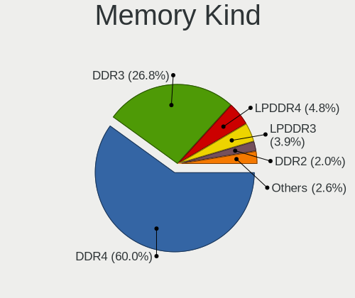

| Kind    | Computers | Percent |
|---------|-----------|---------|
| DDR4    | 280       | 58.58%  |
| DDR3    | 130       | 27.2%   |
| LPDDR4  | 28        | 5.86%   |
| LPDDR3  | 18        | 3.77%   |
| DDR2    | 9         | 1.88%   |
| Unknown | 9         | 1.88%   |
| SDRAM   | 2         | 0.42%   |
| DDR     | 2         | 0.42%   |

Memory Form Factor
------------------

Physical design of the memory module

| Name         | Computers | Percent |
|--------------|-----------|---------|
| SODIMM       | 282       | 58.75%  |
| DIMM         | 138       | 28.75%  |
| Row Of Chips | 49        | 10.21%  |
| Chip         | 10        | 2.08%   |
| RIMM         | 1         | 0.21%   |

Memory Size
-----------

Memory module size

| Size  | Computers | Percent |
|-------|-----------|---------|
| 8192  | 195       | 37.86%  |
| 4096  | 135       | 26.21%  |
| 16384 | 111       | 21.55%  |
| 2048  | 48        | 9.32%   |
| 32768 | 13        | 2.52%   |
| 1024  | 12        | 2.33%   |
| 512   | 1         | 0.19%   |

Memory Speed
------------

Memory module speed

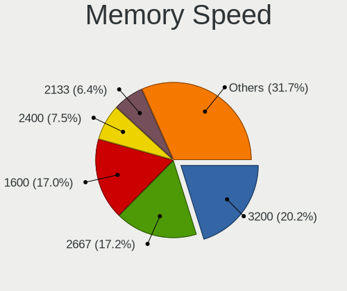

| Speed   | Computers | Percent |
|---------|-----------|---------|
| 3200    | 106       | 20.58%  |
| 2667    | 93        | 18.06%  |
| 1600    | 87        | 16.89%  |
| 2400    | 41        | 7.96%   |
| 2133    | 31        | 6.02%   |
| 1333    | 26        | 5.05%   |
| 3600    | 16        | 3.11%   |
| 4267    | 15        | 2.91%   |
| 1867    | 14        | 2.72%   |
| Unknown | 11        | 2.14%   |
| 1334    | 10        | 1.94%   |
| 1066    | 9         | 1.75%   |
| 3000    | 8         | 1.55%   |
| 667     | 8         | 1.55%   |
| 1067    | 7         | 1.36%   |
| 2800    | 5         | 0.97%   |
| 3466    | 3         | 0.58%   |
| 3400    | 3         | 0.58%   |
| 3800    | 2         | 0.39%   |
| 3533    | 2         | 0.39%   |
| 1866    | 2         | 0.39%   |
| 1800    | 2         | 0.39%   |
| 800     | 2         | 0.39%   |
| 333     | 2         | 0.39%   |
| 4266    | 1         | 0.19%   |
| 4199    | 1         | 0.19%   |
| 3733    | 1         | 0.19%   |
| 3666    | 1         | 0.19%   |
| 3266    | 1         | 0.19%   |
| 3100    | 1         | 0.19%   |
| 2933    | 1         | 0.19%   |
| 2666    | 1         | 0.19%   |
| 2134    | 1         | 0.19%   |
| 400     | 1         | 0.19%   |

Printers & scanners
-------------------

Printer Vendor
--------------

Printer device vendors

| Vendor              | Computers | Percent |
|---------------------|-----------|---------|
| Hewlett-Packard     | 10        | 43.48%  |
| Canon               | 4         | 17.39%  |
| Brother Industries  | 4         | 17.39%  |
| Seiko Epson         | 1         | 4.35%   |
| Samsung Electronics | 1         | 4.35%   |
| Ricoh               | 1         | 4.35%   |
| Prolific Technology | 1         | 4.35%   |
| Dymo-CoStar         | 1         | 4.35%   |

Printer Model
-------------

Printer device models

| Model                                        | Computers | Percent |
|----------------------------------------------|-----------|---------|
| HP OfficeJet 6950                            | 2         | 8.7%    |
| Seiko Epson ME 320/330 Series [Stylus SX125] | 1         | 4.35%   |
| Samsung M2070 Series                         | 1         | 4.35%   |
| Ricoh SP 212SUw                              | 1         | 4.35%   |
| Prolific PL2305 Parallel Port                | 1         | 4.35%   |
| HP Neverstop Laser 100x                      | 1         | 4.35%   |
| HP LaserJet P1006                            | 1         | 4.35%   |
| HP Ink Tank 310 series                       | 1         | 4.35%   |
| HP ENVY 5000 series                          | 1         | 4.35%   |
| HP DeskJet F4100 Printer series              | 1         | 4.35%   |
| HP Deskjet D2500 series                      | 1         | 4.35%   |
| HP DeskJet 4530 series                       | 1         | 4.35%   |
| HP DeskJet 2600 series                       | 1         | 4.35%   |
| Dymo-CoStar DYMO LabelWriter 4XL             | 1         | 4.35%   |
| Canon TR8500 series                          | 1         | 4.35%   |
| Canon PIXMA MP270 All-In-One Printer         | 1         | 4.35%   |
| Canon PIXMA MG3000 series                    | 1         | 4.35%   |
| Canon CanoScan LiDE 300                      | 1         | 4.35%   |
| Brother MFC-9330CDW                          | 1         | 4.35%   |
| Brother MFC-9325CW                           | 1         | 4.35%   |
| Brother HL-1430 Laser Printer                | 1         | 4.35%   |
| Brother DCP-7040                             | 1         | 4.35%   |

Scanner Vendor
--------------

Scanner device vendors

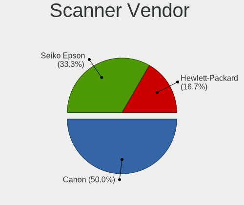

| Vendor      | Computers | Percent |
|-------------|-----------|---------|
| Canon       | 3         | 60%     |
| Seiko Epson | 2         | 40%     |

Scanner Model
-------------

Scanner device models

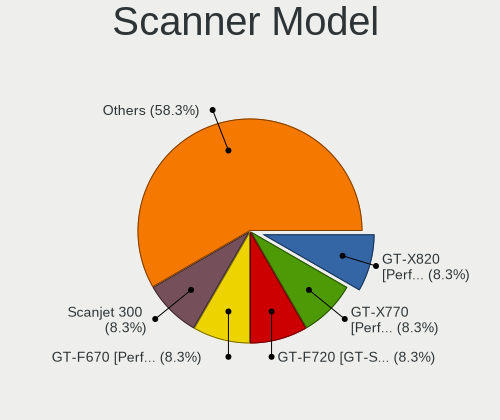

| Model                                                   | Computers | Percent |
|---------------------------------------------------------|-----------|---------|
| Seiko Epson GT-X820 [Perfection V600 Photo]             | 1         | 20%     |
| Seiko Epson GT-F720 [GT-S620/Perfection V30/V300 Photo] | 1         | 20%     |
| Canon CanoScan LiDE 70                                  | 1         | 20%     |
| Canon CanoScan LiDE 220                                 | 1         | 20%     |
| Canon CanoScan 4400F                                    | 1         | 20%     |

Camera
------

Camera Vendor
-------------

Camera device vendors

| Vendor                                 | Computers | Percent |
|----------------------------------------|-----------|---------|
| Chicony Electronics                    | 161       | 23.54%  |
| IMC Networks                           | 84        | 12.28%  |
| Microdia                               | 56        | 8.19%   |
| Logitech                               | 50        | 7.31%   |
| Acer                                   | 49        | 7.16%   |
| Realtek Semiconductor                  | 43        | 6.29%   |
| Sunplus Innovation Technology          | 33        | 4.82%   |
| Quanta                                 | 32        | 4.68%   |
| Cheng Uei Precision Industry (Foxlink) | 28        | 4.09%   |
| Syntek                                 | 24        | 3.51%   |
| Apple                                  | 19        | 2.78%   |
| Lite-On Technology                     | 15        | 2.19%   |
| Suyin                                  | 13        | 1.9%    |
| Alcor Micro                            | 8         | 1.17%   |
| Silicon Motion                         | 6         | 0.88%   |
| Microsoft                              | 6         | 0.88%   |
| Samsung Electronics                    | 5         | 0.73%   |
| Z-Star Microelectronics                | 4         | 0.58%   |
| webcam                                 | 4         | 0.58%   |
| Ricoh                                  | 3         | 0.44%   |
| Luxvisions Innotech Limited            | 3         | 0.44%   |
| Lenovo                                 | 3         | 0.44%   |
| Jieli Technology                       | 3         | 0.44%   |
| ALi                                    | 3         | 0.44%   |
| Razer USA                              | 2         | 0.29%   |
| Pixart Imaging                         | 2         | 0.29%   |
| KYE Systems (Mouse Systems)            | 2         | 0.29%   |
| Generalplus Technology                 | 2         | 0.29%   |
| AVerMedia Technologies                 | 2         | 0.29%   |
| ARC International                      | 2         | 0.29%   |
| YGTek                                  | 1         | 0.15%   |
| Y Media                                | 1         | 0.15%   |
| WaveRider Communications               | 1         | 0.15%   |
| Unknown                                | 1         | 0.15%   |
| Trust                                  | 1         | 0.15%   |
| Sony                                   | 1         | 0.15%   |
| OmniVision Technologies                | 1         | 0.15%   |
| LG Electronics                         | 1         | 0.15%   |
| INOGENI                                | 1         | 0.15%   |
| Importek                               | 1         | 0.15%   |
| Huawei Technologies                    | 1         | 0.15%   |
| Hewlett-Packard                        | 1         | 0.15%   |
| Google                                 | 1         | 0.15%   |
| DigiTech                               | 1         | 0.15%   |
| Creative Technology                    | 1         | 0.15%   |
| BUFFALO                                | 1         | 0.15%   |
| Alcorlink                              | 1         | 0.15%   |

Camera Model
------------

Camera device models

| Model                                                          | Computers | Percent |
|----------------------------------------------------------------|-----------|---------|
| Chicony Integrated Camera                                      | 53        | 7.55%   |
| IMC Networks Integrated Camera                                 | 37        | 5.27%   |
| Microdia Integrated_Webcam_HD                                  | 31        | 4.42%   |
| Realtek Integrated_Webcam_HD                                   | 21        | 2.99%   |
| IMC Networks USB2.0 HD UVC WebCam                              | 21        | 2.99%   |
| Syntek Integrated Camera                                       | 20        | 2.85%   |
| Acer Integrated Camera                                         | 17        | 2.42%   |
| Logitech Webcam C270                                           | 15        | 2.14%   |
| Logitech HD Pro Webcam C920                                    | 13        | 1.85%   |
| Chicony HD WebCam                                              | 13        | 1.85%   |
| Chicony Integrated Camera (1280x720@30)                        | 12        | 1.71%   |
| Sunplus Integrated_Webcam_HD                                   | 11        | 1.57%   |
| IMC Networks USB2.0 VGA UVC WebCam                             | 9         | 1.28%   |
| Apple iPhone 5/5C/5S/6/SE                                      | 9         | 1.28%   |
| Chicony HP TrueVision HD Camera                                | 8         | 1.14%   |
| Chicony HP HD Camera                                           | 8         | 1.14%   |
| Lite-On Integrated Camera                                      | 7         | 1%      |
| Quanta HP TrueVision HD Camera                                 | 6         | 0.85%   |
| Logitech HD Webcam C525                                        | 6         | 0.85%   |
| Chicony USB2.0 Camera                                          | 6         | 0.85%   |
| Apple FaceTime HD Camera (Built-in)                            | 6         | 0.85%   |
| Acer SunplusIT Integrated Camera                               | 6         | 0.85%   |
| Acer EasyCamera                                                | 6         | 0.85%   |
| Sunplus HD WebCam                                              | 5         | 0.71%   |
| Samsung Galaxy A5 (MTP)                                        | 5         | 0.71%   |
| Quanta HD Webcam                                               | 5         | 0.71%   |
| Lite-On HP HD Camera                                           | 5         | 0.71%   |
| Chicony USB2.0 HD UVC WebCam                                   | 5         | 0.71%   |
| Chicony HP Wide Vision HD Camera                               | 5         | 0.71%   |
| Chicony FJ Camera                                              | 5         | 0.71%   |
| Cheng Uei Precision Industry (Foxlink) Webcam                  | 5         | 0.71%   |
| Cheng Uei Precision Industry (Foxlink) HP HD Camera            | 5         | 0.71%   |
| Acer Lenovo EasyCamera                                         | 5         | 0.71%   |
| webcam webcam                                                  | 4         | 0.57%   |
| Quanta HP HD Camera                                            | 4         | 0.57%   |
| Quanta HD User Facing                                          | 4         | 0.57%   |
| Microdia Webcam Vitade AF                                      | 4         | 0.57%   |
| Microdia Integrated Webcam                                     | 4         | 0.57%   |
| Chicony HD User Facing                                         | 4         | 0.57%   |
| Apple Built-in iSight                                          | 4         | 0.57%   |
| Syntek EasyCamera                                              | 3         | 0.43%   |
| Suyin HP TrueVision HD Integrated Webcam                       | 3         | 0.43%   |
| Sunplus Laptop_Integrated_Webcam_FHD                           | 3         | 0.43%   |
| Realtek Lenovo EasyCamera                                      | 3         | 0.43%   |
| Realtek Integrated Webcam                                      | 3         | 0.43%   |
| Microdia USB 2.0 Camera                                        | 3         | 0.43%   |
| Logitech Webcam C930e                                          | 3         | 0.43%   |
| Logitech Webcam C925e                                          | 3         | 0.43%   |
| Logitech Webcam C310                                           | 3         | 0.43%   |
| Logitech StreamCam                                             | 3         | 0.43%   |
| Jieli USB PHY 2.0                                              | 3         | 0.43%   |
| IMC Networks USB Camera                                        | 3         | 0.43%   |
| Chicony USB2.0 VGA UVC WebCam                                  | 3         | 0.43%   |
| Chicony Lenovo Integrated Camera (0.3MP)                       | 3         | 0.43%   |
| Chicony HP IR Camera                                           | 3         | 0.43%   |
| Chicony HP 5MP Camera                                          | 3         | 0.43%   |
| Cheng Uei Precision Industry (Foxlink) HP TrueVision HD Camera | 3         | 0.43%   |
| ALi Gateway Webcam                                             | 3         | 0.43%   |
| Acer BisonCam, NB Pro                                          | 3         | 0.43%   |
| Suyin Integrated_Webcam_HD                                     | 2         | 0.28%   |

Security
--------

Fingerprint Vendor
------------------

Fingerprint sensor vendors

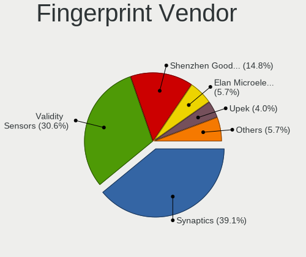

| Vendor                     | Computers | Percent |
|----------------------------|-----------|---------|
| Synaptics                  | 61        | 36.53%  |
| Validity Sensors           | 51        | 30.54%  |
| Shenzhen Goodix Technology | 31        | 18.56%  |
| LighTuning Technology      | 7         | 4.19%   |
| Elan Microelectronics      | 7         | 4.19%   |
| Upek                       | 6         | 3.59%   |
| AuthenTec                  | 3         | 1.8%    |
| STMicroelectronics         | 1         | 0.6%    |

Fingerprint Model
-----------------

Fingerprint sensor models

| Model                                                                      | Computers | Percent |
|----------------------------------------------------------------------------|-----------|---------|
| Synaptics Prometheus MIS Touch Fingerprint Reader                          | 23        | 13.77%  |
| Unknown                                                                    | 13        | 7.78%   |
| Shenzhen Goodix Fingerprint Reader                                         | 12        | 7.19%   |
| Validity Sensors VFS495 Fingerprint Reader                                 | 11        | 6.59%   |
| Shenzhen Goodix  FingerPrint Device                                        | 10        | 5.99%   |
| Validity Sensors VFS 5011 fingerprint sensor                               | 9         | 5.39%   |
| Shenzhen Goodix FingerPrint                                                | 9         | 5.39%   |
| Elan ELAN:Fingerprint                                                      | 7         | 4.19%   |
| Synaptics  WBDI                                                            | 6         | 3.59%   |
| LighTuning EgisTec Touch Fingerprint Sensor                                | 6         | 3.59%   |
| Validity Sensors VFS7500 Touch Fingerprint Sensor                          | 5         | 2.99%   |
| Validity Sensors Synaptics VFS7552 Touch Fingerprint Sensor with PurePrint | 5         | 2.99%   |
| Upek Biometric Touchchip/Touchstrip Fingerprint Sensor                     | 5         | 2.99%   |
| Synaptics  VFS7552 Touch Fingerprint Sensor with PurePrint                 | 5         | 2.99%   |
| Synaptics Metallica MIS Touch Fingerprint Reader                           | 5         | 2.99%   |
| Validity Sensors VFS5011 Fingerprint Reader                                | 4         | 2.4%    |
| Validity Sensors Synaptics VFS7552 Touch Fingerprint Sensor                | 4         | 2.4%    |
| Synaptics  FS7604 Touch Fingerprint Sensor with PurePrint                  | 4         | 2.4%    |
| Synaptics Metallica MOH Touch Fingerprint Reader                           | 4         | 2.4%    |
| Validity Sensors VFS Fingerprint sensor                                    | 3         | 1.8%    |
| Validity Sensors Fingerprint scanner                                       | 3         | 1.8%    |
| Validity Sensors Synaptics WBDI                                            | 2         | 1.2%    |
| Validity Sensors Swipe Fingerprint Sensor                                  | 2         | 1.2%    |
| Validity Sensors VFS471 Fingerprint Reader                                 | 1         | 0.6%    |
| Validity Sensors VFS451 Fingerprint Reader                                 | 1         | 0.6%    |
| Validity Sensors VFS301 Fingerprint Reader                                 | 1         | 0.6%    |
| Upek TCS5B Fingerprint sensor                                              | 1         | 0.6%    |
| Synaptics WBDI Device                                                      | 1         | 0.6%    |
| STMicroelectronics Fingerprint Reader                                      | 1         | 0.6%    |
| LighTuning ES603 Swipe Fingerprint Sensor                                  | 1         | 0.6%    |
| AuthenTec Fingerprint Sensor                                               | 1         | 0.6%    |
| AuthenTec AES2550 Fingerprint Sensor                                       | 1         | 0.6%    |
| AuthenTec AES2501 Fingerprint Sensor                                       | 1         | 0.6%    |

Chipcard Vendor
---------------

Chipcard module vendors

| Vendor                | Computers | Percent |
|-----------------------|-----------|---------|
| Broadcom              | 22        | 37.93%  |
| Alcor Micro           | 20        | 34.48%  |
| Lenovo                | 4         | 6.9%    |
| O2 Micro              | 3         | 5.17%   |
| Upek                  | 2         | 3.45%   |
| Realtek Semiconductor | 2         | 3.45%   |
| SCM Microsystems      | 1         | 1.72%   |
| Hewlett-Packard       | 1         | 1.72%   |
| Gemalto (was Gemplus) | 1         | 1.72%   |
| Chicony Electronics   | 1         | 1.72%   |
| Cherry                | 1         | 1.72%   |

Chipcard Model
--------------

Chipcard module models

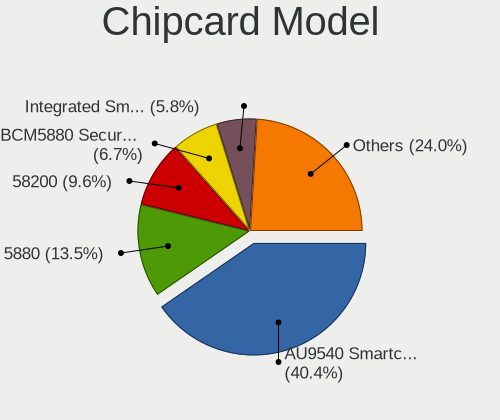

| Model                                                                        | Computers | Percent |
|------------------------------------------------------------------------------|-----------|---------|
| Alcor Micro AU9540 Smartcard Reader                                          | 20        | 34.48%  |
| Broadcom 58200                                                               | 7         | 12.07%  |
| Broadcom 5880                                                                | 6         | 10.34%  |
| Broadcom BCM5880 Secure Applications Processor                               | 5         | 8.62%   |
| Lenovo Integrated Smart Card Reader                                          | 4         | 6.9%    |
| Broadcom BCM5880 Secure Applications Processor with fingerprint swipe sensor | 4         | 6.9%    |
| O2 Micro OZ776 CCID Smartcard Reader                                         | 3         | 5.17%   |
| Upek TouchChip Fingerprint Coprocessor (WBF advanced mode)                   | 2         | 3.45%   |
| Realtek Semiconductor Smart Card Reader Interface                            | 2         | 3.45%   |
| SCM Microsystems CLOUD 2900 R Smart Card Reader                              | 1         | 1.72%   |
| Hewlett-Packard SC Keyboard - Apollo (Liteon)                                | 1         | 1.72%   |
| Gemalto (was Gemplus) Compact Smart Card Reader Writer                       | 1         | 1.72%   |
| Chicony Electronics HP Skylab USB Smartcard Keyboard                         | 1         | 1.72%   |
| Cherry SmartCard Reader Keyboard KC 1000 SC                                  | 1         | 1.72%   |

Unsupported
-----------

Unsupported Devices
-------------------

Total unsupported devices on board

| Total | Computers | Percent |
|-------|-----------|---------|
| 0     | 710       | 69.95%  |
| 1     | 275       | 27.09%  |
| 2     | 25        | 2.46%   |
| 3     | 4         | 0.39%   |
| 4     | 1         | 0.1%    |

Unsupported Device Types
------------------------

Types of unsupported devices

| Type                     | Computers | Percent |
|--------------------------|-----------|---------|
| Fingerprint reader       | 166       | 49.7%   |
| Graphics card            | 45        | 13.47%  |
| Multimedia controller    | 38        | 11.38%  |
| Net/wireless             | 37        | 11.08%  |
| Storage                  | 8         | 2.4%    |
| Chipcard                 | 8         | 2.4%    |
| Unassigned class         | 5         | 1.5%    |
| Communication controller | 5         | 1.5%    |
| Bluetooth                | 5         | 1.5%    |
| Sound                    | 3         | 0.9%    |
| Modem                    | 3         | 0.9%    |
| Card reader              | 3         | 0.9%    |
| Camera                   | 3         | 0.9%    |
| Network                  | 2         | 0.6%    |
| Net/ethernet             | 2         | 0.6%    |
| Dvb card                 | 1         | 0.3%    |

