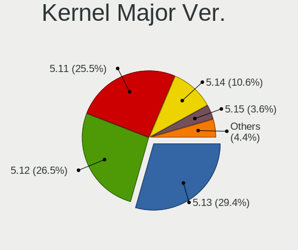
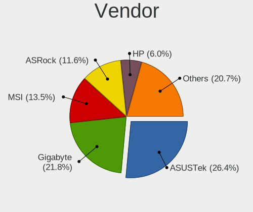
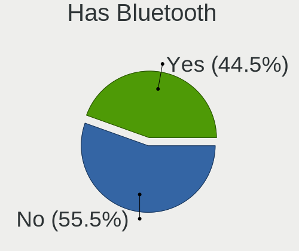
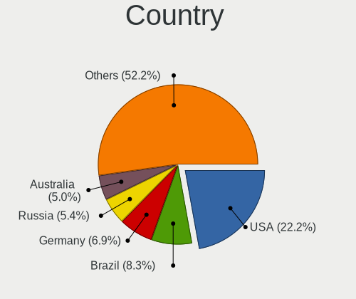
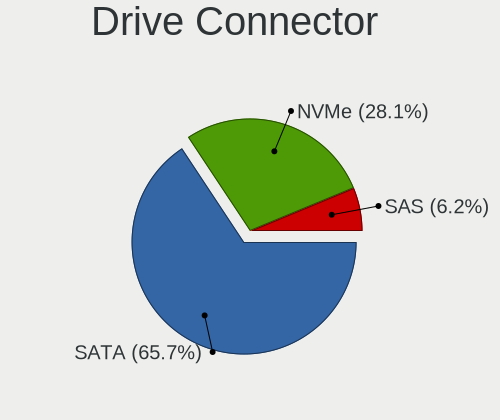
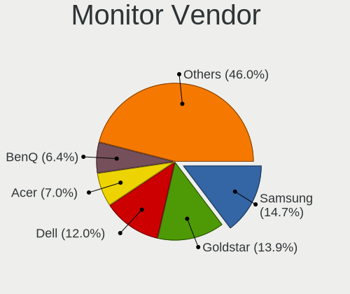
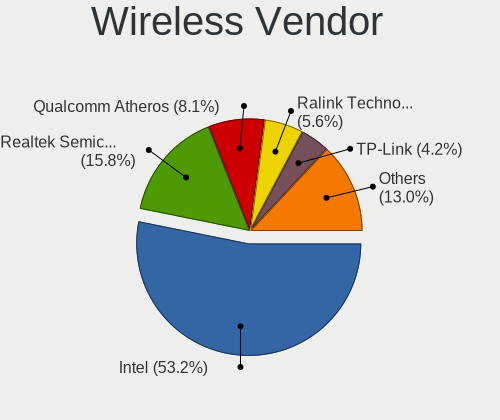
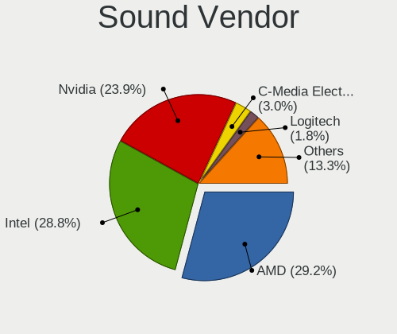
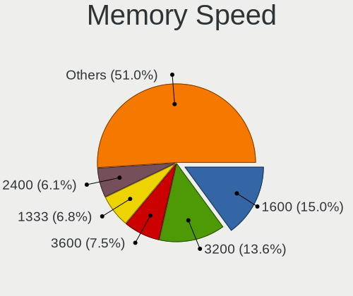
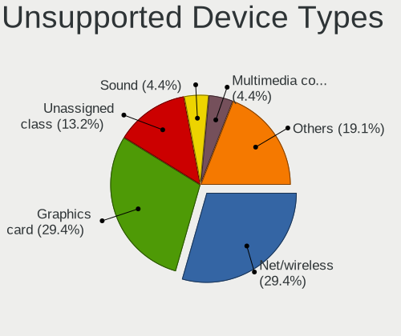

Fedora 34 - Tested Hardware & Statistics (Desktops)
---------------------------------------------------

A project to collect tested hardware configurations for Fedora 34 (Beta test).

Anyone can contribute to this report by the [hw-probe](https://github.com/linuxhw/hw-probe) tool:

    sudo -E hw-probe -all -upload

Please submit a probe of your configuration if it's not presented on the page or is rare.

Full-feature report is available here: https://linux-hardware.org/?view=trends&rel=fedora-34

Contents
--------

* [ Test Cases ](#test-cases)

* [ System ](#system)
  - [ Kernel                   ](#kernel)
  - [ Kernel Family            ](#kernel-family)
  - [ Kernel Major Ver.        ](#kernel-major-ver)
  - [ Arch                     ](#arch)
  - [ DE                       ](#de)
  - [ Display Server           ](#display-server)
  - [ Display Manager          ](#display-manager)
  - [ OS Lang                  ](#os-lang)
  - [ Boot Mode                ](#boot-mode)
  - [ Filesystem               ](#filesystem)
  - [ Part. scheme             ](#part-scheme)
  - [ Dual Boot with Linux/BSD ](#dual-boot-with-linuxbsd)
  - [ Dual Boot (Win)          ](#dual-boot-win)

* [ Board ](#board)
  - [ Vendor                   ](#vendor)
  - [ Model                    ](#model)
  - [ Model Family             ](#model-family)
  - [ MFG Year                 ](#mfg-year)
  - [ Form Factor              ](#form-factor)
  - [ Secure Boot              ](#secure-boot)
  - [ Coreboot                 ](#coreboot)
  - [ RAM Size                 ](#ram-size)
  - [ RAM Used                 ](#ram-used)
  - [ Total Drives             ](#total-drives)
  - [ Has CD-ROM               ](#has-cd-rom)
  - [ Has Ethernet             ](#has-ethernet)
  - [ Has WiFi                 ](#has-wifi)
  - [ Has Bluetooth            ](#has-bluetooth)

* [ Location ](#location)
  - [ Country                  ](#country)
  - [ City                     ](#city)

* [ Drives ](#drives)
  - [ Drive Vendor             ](#drive-vendor)
  - [ Drive Model              ](#drive-model)
  - [ HDD Vendor               ](#hdd-vendor)
  - [ SSD Vendor               ](#ssd-vendor)
  - [ Drive Kind               ](#drive-kind)
  - [ Drive Connector          ](#drive-connector)
  - [ Drive Size               ](#drive-size)
  - [ Space Total              ](#space-total)
  - [ Space Used               ](#space-used)
  - [ Malfunc. Drives          ](#malfunc-drives)
  - [ Malfunc. Drive Vendor    ](#malfunc-drive-vendor)
  - [ Malfunc. HDD Vendor      ](#malfunc-hdd-vendor)
  - [ Malfunc. Drive Kind      ](#malfunc-drive-kind)
  - [ Failed Drives            ](#failed-drives)
  - [ Failed Drive Vendor      ](#failed-drive-vendor)
  - [ Drive Status             ](#drive-status)

* [ Storage controller ](#storage-controller)
  - [ Storage Vendor           ](#storage-vendor)
  - [ Storage Model            ](#storage-model)
  - [ Storage Kind             ](#storage-kind)

* [ Processor ](#processor)
  - [ CPU Vendor               ](#cpu-vendor)
  - [ CPU Model                ](#cpu-model)
  - [ CPU Model Family         ](#cpu-model-family)
  - [ CPU Cores                ](#cpu-cores)
  - [ CPU Sockets              ](#cpu-sockets)
  - [ CPU Threads              ](#cpu-threads)
  - [ CPU Op-Modes             ](#cpu-op-modes)
  - [ CPU Microcode            ](#cpu-microcode)
  - [ CPU Microarch            ](#cpu-microarch)

* [ Graphics ](#graphics)
  - [ GPU Vendor               ](#gpu-vendor)
  - [ GPU Model                ](#gpu-model)
  - [ GPU Combo                ](#gpu-combo)
  - [ GPU Driver               ](#gpu-driver)
  - [ GPU Memory               ](#gpu-memory)

* [ Monitor ](#monitor)
  - [ Monitor Vendor           ](#monitor-vendor)
  - [ Monitor Model            ](#monitor-model)
  - [ Monitor Resolution       ](#monitor-resolution)
  - [ Monitor Diagonal         ](#monitor-diagonal)
  - [ Monitor Width            ](#monitor-width)
  - [ Aspect Ratio             ](#aspect-ratio)
  - [ Monitor Area             ](#monitor-area)
  - [ Pixel Density            ](#pixel-density)
  - [ Multiple Monitors        ](#multiple-monitors)

* [ Network ](#network)
  - [ Net Controller Vendor    ](#net-controller-vendor)
  - [ Net Controller Model     ](#net-controller-model)
  - [ Wireless Vendor          ](#wireless-vendor)
  - [ Wireless Model           ](#wireless-model)
  - [ Ethernet Vendor          ](#ethernet-vendor)
  - [ Ethernet Model           ](#ethernet-model)
  - [ Net Controller Kind      ](#net-controller-kind)
  - [ Used Controller          ](#used-controller)
  - [ NICs                     ](#nics)
  - [ IPv6                     ](#ipv6)

* [ Bluetooth ](#bluetooth)
  - [ Bluetooth Vendor         ](#bluetooth-vendor)
  - [ Bluetooth Model          ](#bluetooth-model)

* [ Sound ](#sound)
  - [ Sound Vendor             ](#sound-vendor)
  - [ Sound Model              ](#sound-model)

* [ Memory ](#memory)
  - [ Memory Vendor            ](#memory-vendor)
  - [ Memory Model             ](#memory-model)
  - [ Memory Kind              ](#memory-kind)
  - [ Memory Form Factor       ](#memory-form-factor)
  - [ Memory Size              ](#memory-size)
  - [ Memory Speed             ](#memory-speed)

* [ Printers & scanners ](#printers--scanners)
  - [ Printer Vendor           ](#printer-vendor)
  - [ Printer Model            ](#printer-model)
  - [ Scanner Vendor           ](#scanner-vendor)
  - [ Scanner Model            ](#scanner-model)

* [ Camera ](#camera)
  - [ Camera Vendor            ](#camera-vendor)
  - [ Camera Model             ](#camera-model)

* [ Security ](#security)
  - [ Fingerprint Vendor       ](#fingerprint-vendor)
  - [ Fingerprint Model        ](#fingerprint-model)
  - [ Chipcard Vendor          ](#chipcard-vendor)
  - [ Chipcard Model           ](#chipcard-model)

* [ Unsupported ](#unsupported)
  - [ Unsupported Devices      ](#unsupported-devices)
  - [ Unsupported Device Types ](#unsupported-device-types)

Test Cases
----------

| Vendor        | Model                       | Probe                                                      | Date         |
|---------------|-----------------------------|------------------------------------------------------------|--------------|
| HP            | 8056                        | [e64dab1375](https://linux-hardware.org/?probe=e64dab1375) | Aug 27, 2021 |
| ASUSTek       | TUF GAMING X570-PRO         | [a0ed3c6558](https://linux-hardware.org/?probe=a0ed3c6558) | Aug 27, 2021 |
| Gigabyte      | GA-880GM-UD2H               | [adde1df1d0](https://linux-hardware.org/?probe=adde1df1d0) | Aug 27, 2021 |
| Gigabyte      | B450 AORUS PRO WIFI-CF      | [63104dc43a](https://linux-hardware.org/?probe=63104dc43a) | Aug 26, 2021 |
| ASUSTek       | PRIME Z390-A                | [6e2699cc9e](https://linux-hardware.org/?probe=6e2699cc9e) | Aug 26, 2021 |
| Gigabyte      | B85M-D3V-A                  | [89dcb140f5](https://linux-hardware.org/?probe=89dcb140f5) | Aug 26, 2021 |
| ASUSTek       | ROG STRIX B550-I GAMING     | [d97a42e31e](https://linux-hardware.org/?probe=d97a42e31e) | Aug 26, 2021 |
| Gigabyte      | Z87X-D3H-CF                 | [b40ad47903](https://linux-hardware.org/?probe=b40ad47903) | Aug 25, 2021 |
| Gigabyte      | Z170-D3H-CF                 | [3e39cc51a8](https://linux-hardware.org/?probe=3e39cc51a8) | Aug 25, 2021 |
| ASUSTek       | ROG CROSSHAIR VIII IMPAC... | [74a9538d04](https://linux-hardware.org/?probe=74a9538d04) | Aug 25, 2021 |
| Gigabyte      | Z170-D3H-CF                 | [11d9254c35](https://linux-hardware.org/?probe=11d9254c35) | Aug 25, 2021 |
| Gigabyte      | X570 I AORUS PRO WIFI       | [778e5aa3ae](https://linux-hardware.org/?probe=778e5aa3ae) | Aug 25, 2021 |
| ASRock        | FM2A55M-VG3+                | [c2e1837665](https://linux-hardware.org/?probe=c2e1837665) | Aug 24, 2021 |
| Dell          | 0HH807                      | [fe3659d065](https://linux-hardware.org/?probe=fe3659d065) | Aug 24, 2021 |
| ASRock        | 980DE3/U3S3                 | [e8aadc0af0](https://linux-hardware.org/?probe=e8aadc0af0) | Aug 24, 2021 |
| Biostar       | A68I-450 DELUXE             | [3e0a375af7](https://linux-hardware.org/?probe=3e0a375af7) | Aug 23, 2021 |
| ASUSTek       | PRIME A320M-K               | [847e7f4c1a](https://linux-hardware.org/?probe=847e7f4c1a) | Aug 23, 2021 |
| MSI           | E3M WORKSTATION V5          | [fa6adf65a6](https://linux-hardware.org/?probe=fa6adf65a6) | Aug 23, 2021 |
| ASUSTek       | Z170 PRO GAMING             | [014af10464](https://linux-hardware.org/?probe=014af10464) | Aug 23, 2021 |
| HP            | 8056                        | [d604c95726](https://linux-hardware.org/?probe=d604c95726) | Aug 23, 2021 |
| Dell          | 0F3KHR A01                  | [b5bc473971](https://linux-hardware.org/?probe=b5bc473971) | Aug 23, 2021 |
| Gigabyte      | X570 I AORUS PRO WIFI       | [07d9074437](https://linux-hardware.org/?probe=07d9074437) | Aug 23, 2021 |
| Gigabyte      | Z170-D3H-CF                 | [7928c7e6e6](https://linux-hardware.org/?probe=7928c7e6e6) | Aug 23, 2021 |
| ASRock        | H170M Pro4                  | [0cd9bde7b4](https://linux-hardware.org/?probe=0cd9bde7b4) | Aug 23, 2021 |
| ASUSTek       | SABERTOOTH 990FX R2.0       | [f983e2baca](https://linux-hardware.org/?probe=f983e2baca) | Aug 22, 2021 |
| Gigabyte      | GA-880GM-UD2H               | [b2190e55e8](https://linux-hardware.org/?probe=b2190e55e8) | Aug 22, 2021 |
| ASUSTek       | Z77-A                       | [971dc3b5c7](https://linux-hardware.org/?probe=971dc3b5c7) | Aug 21, 2021 |
| ASUSTek       | ROG STRIX B550-F GAMING     | [edc2f605d1](https://linux-hardware.org/?probe=edc2f605d1) | Aug 21, 2021 |
| MSI           | X370 SLI PLUS               | [4a611b712a](https://linux-hardware.org/?probe=4a611b712a) | Aug 21, 2021 |
| HP            | 2AF7                        | [beb4167201](https://linux-hardware.org/?probe=beb4167201) | Aug 21, 2021 |
| ASUSTek       | AM1M-A                      | [433d420dd4](https://linux-hardware.org/?probe=433d420dd4) | Aug 20, 2021 |
| ASUSTek       | P6T                         | [d0495a4765](https://linux-hardware.org/?probe=d0495a4765) | Aug 20, 2021 |
| ASRock        | AD2700-ITX                  | [1d1d8a4620](https://linux-hardware.org/?probe=1d1d8a4620) | Aug 20, 2021 |
| ASRock        | B450 Steel Legend           | [8fdfffdbac](https://linux-hardware.org/?probe=8fdfffdbac) | Aug 20, 2021 |
| Gigabyte      | GA-MA785G-UD3H              | [4b37f6047e](https://linux-hardware.org/?probe=4b37f6047e) | Aug 20, 2021 |
| Gigabyte      | G41MT-D3                    | [e49dbd40b5](https://linux-hardware.org/?probe=e49dbd40b5) | Aug 20, 2021 |
| Gigabyte      | GA-880GM-UD2H               | [41874518ea](https://linux-hardware.org/?probe=41874518ea) | Aug 20, 2021 |
| Gigabyte      | GA-MA780G-UD3H              | [78feb5ae08](https://linux-hardware.org/?probe=78feb5ae08) | Aug 20, 2021 |
| BESSTAR Te... | HM80                        | [60fdee03d6](https://linux-hardware.org/?probe=60fdee03d6) | Aug 19, 2021 |
| HP            | 83E9                        | [21b492b0bf](https://linux-hardware.org/?probe=21b492b0bf) | Aug 19, 2021 |
| HP            | 83E9                        | [7cb2c3256a](https://linux-hardware.org/?probe=7cb2c3256a) | Aug 19, 2021 |
| MSI           | MAG X570 TOMAHAWK WIFI      | [3eb5c512ad](https://linux-hardware.org/?probe=3eb5c512ad) | Aug 19, 2021 |
| Gigabyte      | B250M-DS3H-CF               | [84153c2a8d](https://linux-hardware.org/?probe=84153c2a8d) | Aug 19, 2021 |
| Gigabyte      | B150M-D3H-CF                | [2aed19ac0a](https://linux-hardware.org/?probe=2aed19ac0a) | Aug 19, 2021 |
| Gigabyte      | GA-880GM-UD2H               | [5c3e90c735](https://linux-hardware.org/?probe=5c3e90c735) | Aug 19, 2021 |
| Gigabyte      | P55-USB3                    | [5e6a1d1926](https://linux-hardware.org/?probe=5e6a1d1926) | Aug 19, 2021 |
| HP            | 8056                        | [44b754f972](https://linux-hardware.org/?probe=44b754f972) | Aug 19, 2021 |
| ASUSTek       | AM1M-A                      | [c0653de55c](https://linux-hardware.org/?probe=c0653de55c) | Aug 18, 2021 |
| Gigabyte      | B450 AORUS PRO WIFI-CF      | [6eaf105bca](https://linux-hardware.org/?probe=6eaf105bca) | Aug 18, 2021 |
| HP            | 2AF7                        | [909c6f5c0a](https://linux-hardware.org/?probe=909c6f5c0a) | Aug 18, 2021 |
| ASRock        | X399 Taichi                 | [efead486a3](https://linux-hardware.org/?probe=efead486a3) | Aug 18, 2021 |
| HP            | 82F2 A01                    | [b6847d9605](https://linux-hardware.org/?probe=b6847d9605) | Aug 18, 2021 |
| ASUSTek       | ROG STRIX B450-F GAMING     | [33bfc09a3a](https://linux-hardware.org/?probe=33bfc09a3a) | Aug 17, 2021 |
| ASRock        | B460M-ITX/ac                | [2eb3e6f3f6](https://linux-hardware.org/?probe=2eb3e6f3f6) | Aug 17, 2021 |
| Gigabyte      | G41MT-S2P                   | [63a8a28fd9](https://linux-hardware.org/?probe=63a8a28fd9) | Aug 17, 2021 |
| HP            | 8056                        | [5607e09042](https://linux-hardware.org/?probe=5607e09042) | Aug 17, 2021 |
| Dell          | 0Y2YM6 A00                  | [4d3d87b641](https://linux-hardware.org/?probe=4d3d87b641) | Aug 17, 2021 |
| Gigabyte      | GA-880GM-UD2H               | [78a3158393](https://linux-hardware.org/?probe=78a3158393) | Aug 16, 2021 |
| MSI           | MPG Z390I GAMING EDGE AC    | [391c21db23](https://linux-hardware.org/?probe=391c21db23) | Aug 16, 2021 |
| HP            | 198E                        | [d1c56bffb1](https://linux-hardware.org/?probe=d1c56bffb1) | Aug 15, 2021 |
| Fujitsu       | D3120-A1 S26361-D3120-A1    | [86f9693894](https://linux-hardware.org/?probe=86f9693894) | Aug 15, 2021 |
| ASUSTek       | ROG STRIX B550-I GAMING     | [419995b0da](https://linux-hardware.org/?probe=419995b0da) | Aug 15, 2021 |
| ASUSTek       | TUF GAMING B550M-PLUS       | [f931b86af5](https://linux-hardware.org/?probe=f931b86af5) | Aug 15, 2021 |
| Lenovo        | Board                       | [cd8825c8d0](https://linux-hardware.org/?probe=cd8825c8d0) | Aug 15, 2021 |
| Gigabyte      | GA-MA785G-UD3H              | [d34022df3b](https://linux-hardware.org/?probe=d34022df3b) | Aug 15, 2021 |
| ASUSTek       | ROG STRIX X570-E GAMING     | [9bf7d4afd7](https://linux-hardware.org/?probe=9bf7d4afd7) | Aug 14, 2021 |
| ASUSTek       | A8R32-MVP Deluxe            | [5f49d58f42](https://linux-hardware.org/?probe=5f49d58f42) | Aug 14, 2021 |
| Dell          | 0NKW6Y A00                  | [7d0c7834be](https://linux-hardware.org/?probe=7d0c7834be) | Aug 14, 2021 |
| ASUSTek       | A8R32-MVP Deluxe            | [05bfca3339](https://linux-hardware.org/?probe=05bfca3339) | Aug 13, 2021 |
| Gigabyte      | B450 I AORUS PRO WIFI-CF    | [32bc94c4e2](https://linux-hardware.org/?probe=32bc94c4e2) | Aug 13, 2021 |
| Intel         | B75                         | [2bac7a8140](https://linux-hardware.org/?probe=2bac7a8140) | Aug 13, 2021 |
| Gigabyte      | Z390 D                      | [8bfd432fba](https://linux-hardware.org/?probe=8bfd432fba) | Aug 13, 2021 |
| ASUSTek       | TUF GAMING X570-PLUS        | [5e9853124d](https://linux-hardware.org/?probe=5e9853124d) | Aug 13, 2021 |
| Gigabyte      | G41MT-D3                    | [13558f63ab](https://linux-hardware.org/?probe=13558f63ab) | Aug 13, 2021 |
| ASUSTek       | A8R32-MVP Deluxe            | [0b46a87be6](https://linux-hardware.org/?probe=0b46a87be6) | Aug 13, 2021 |
| Dell          | 03NVJ6 A01                  | [ef0028e285](https://linux-hardware.org/?probe=ef0028e285) | Aug 12, 2021 |
| MSI           | X570-A PRO                  | [8cc7d05010](https://linux-hardware.org/?probe=8cc7d05010) | Aug 12, 2021 |
| Gigabyte      | B450 I AORUS PRO WIFI-CF    | [3ed6340d82](https://linux-hardware.org/?probe=3ed6340d82) | Aug 12, 2021 |
| ASRock        | FM2A88X-ITX+                | [5f70360eea](https://linux-hardware.org/?probe=5f70360eea) | Aug 12, 2021 |
| ASRock        | FM2A88X-ITX+                | [aeec0ec477](https://linux-hardware.org/?probe=aeec0ec477) | Aug 12, 2021 |
| Acer          | Aspire TC-705               | [bbf5c161d3](https://linux-hardware.org/?probe=bbf5c161d3) | Aug 12, 2021 |
| MSI           | MAG B550 TOMAHAWK           | [3fd838012c](https://linux-hardware.org/?probe=3fd838012c) | Aug 12, 2021 |
| Gigabyte      | GA-MA785G-UD3H              | [f1eabffafd](https://linux-hardware.org/?probe=f1eabffafd) | Aug 12, 2021 |
| HP            | 8056                        | [afe5072bf8](https://linux-hardware.org/?probe=afe5072bf8) | Aug 12, 2021 |
| Gigabyte      | B450 I AORUS PRO WIFI-CF    | [6808748401](https://linux-hardware.org/?probe=6808748401) | Aug 10, 2021 |
| Dell          | 0KWVT8 A02                  | [d8e685c049](https://linux-hardware.org/?probe=d8e685c049) | Aug 10, 2021 |
| MSI           | B75MA-E33                   | [8a1743cb75](https://linux-hardware.org/?probe=8a1743cb75) | Aug 10, 2021 |
| Gigabyte      | Z270-HD3P-CF                | [8ad0df4157](https://linux-hardware.org/?probe=8ad0df4157) | Aug 09, 2021 |
| ASRock        | AD2700-ITX                  | [fac88c2a70](https://linux-hardware.org/?probe=fac88c2a70) | Aug 09, 2021 |
| Biostar       | X370GTN                     | [eeff407867](https://linux-hardware.org/?probe=eeff407867) | Aug 08, 2021 |
| ASRock        | B550 Phantom Gaming 4/ac    | [ec3a3d05e5](https://linux-hardware.org/?probe=ec3a3d05e5) | Aug 08, 2021 |
| ASRock        | B550 Phantom Gaming 4/ac    | [795328301d](https://linux-hardware.org/?probe=795328301d) | Aug 08, 2021 |
| Gigabyte      | GA-MA780G-UD3H              | [a81ec533a8](https://linux-hardware.org/?probe=a81ec533a8) | Aug 08, 2021 |
| Gigabyte      | GA-MA785G-UD3H              | [1a68be3ffe](https://linux-hardware.org/?probe=1a68be3ffe) | Aug 08, 2021 |
| Gigabyte      | G41MT-D3                    | [feacdb6873](https://linux-hardware.org/?probe=feacdb6873) | Aug 08, 2021 |
| HP            | 1998                        | [38acf34efb](https://linux-hardware.org/?probe=38acf34efb) | Aug 08, 2021 |
| MSI           | MAG B560 TORPEDO            | [8e1e7782d9](https://linux-hardware.org/?probe=8e1e7782d9) | Aug 08, 2021 |
| MSI           | MAG B460M MORTAR WIFI       | [f51ff5d22f](https://linux-hardware.org/?probe=f51ff5d22f) | Aug 07, 2021 |
| MSI           | MAG B560 TORPEDO            | [4d2a5f5d27](https://linux-hardware.org/?probe=4d2a5f5d27) | Aug 07, 2021 |
| ASUSTek       | ROG STRIX Z590-F GAMING ... | [2f7d7bbb1d](https://linux-hardware.org/?probe=2f7d7bbb1d) | Aug 06, 2021 |
| Gigabyte      | Z170-D3H-CF                 | [6e05bc86aa](https://linux-hardware.org/?probe=6e05bc86aa) | Aug 06, 2021 |
| ASUSTek       | ROG CROSSHAIR VII HERO      | [4c87b2ff27](https://linux-hardware.org/?probe=4c87b2ff27) | Aug 06, 2021 |
| ASUSTek       | ROG STRIX X570-E GAMING     | [f74df24802](https://linux-hardware.org/?probe=f74df24802) | Aug 05, 2021 |
| ASUSTek       | Z170I PRO GAMING            | [2fbf46c559](https://linux-hardware.org/?probe=2fbf46c559) | Aug 05, 2021 |
| MSI           | B450-A PRO MAX              | [a096b9bb71](https://linux-hardware.org/?probe=a096b9bb71) | Aug 05, 2021 |
| MSI           | MAG B550 TOMAHAWK           | [2c843a3d35](https://linux-hardware.org/?probe=2c843a3d35) | Aug 04, 2021 |
| Gigabyte      | EP45-DS3L                   | [dfb3b0302c](https://linux-hardware.org/?probe=dfb3b0302c) | Aug 04, 2021 |
| ASRockRack    | X470D4U                     | [b3ae79f78f](https://linux-hardware.org/?probe=b3ae79f78f) | Aug 04, 2021 |
| ASRockRack    | X470D4U                     | [a124194272](https://linux-hardware.org/?probe=a124194272) | Aug 04, 2021 |
| ASUSTek       | PRIME X370-PRO              | [dce96ae07e](https://linux-hardware.org/?probe=dce96ae07e) | Aug 04, 2021 |
| ASUSTek       | PRIME X370-PRO              | [345ce8fb64](https://linux-hardware.org/?probe=345ce8fb64) | Aug 04, 2021 |
| HP            | 82F2 A01                    | [b6b124c434](https://linux-hardware.org/?probe=b6b124c434) | Aug 03, 2021 |
| MSI           | X470 GAMING PLUS MAX        | [f776a4eb93](https://linux-hardware.org/?probe=f776a4eb93) | Aug 03, 2021 |
| Gigabyte      | GA-MA780G-UD3H              | [ad5bc52a88](https://linux-hardware.org/?probe=ad5bc52a88) | Aug 03, 2021 |
| ASUSTek       | PRIME X470-PRO              | [39919aab55](https://linux-hardware.org/?probe=39919aab55) | Aug 02, 2021 |
| ASRock        | B450 Pro4                   | [47a05531da](https://linux-hardware.org/?probe=47a05531da) | Aug 02, 2021 |
| ASUSTek       | ROG CROSSHAIR VIII FORMU... | [454fecb7fb](https://linux-hardware.org/?probe=454fecb7fb) | Aug 01, 2021 |
| ASUSTek       | ROG STRIX B350-F GAMING     | [c18e0a53fc](https://linux-hardware.org/?probe=c18e0a53fc) | Aug 01, 2021 |
| ASRock        | B550 Phantom Gaming 4/ac    | [052a6762c4](https://linux-hardware.org/?probe=052a6762c4) | Jul 31, 2021 |
| ASRock        | X570 Phantom Gaming-ITX/... | [2b00e34271](https://linux-hardware.org/?probe=2b00e34271) | Jul 31, 2021 |
| Lenovo        | MAHOBAY NOK                 | [921bde522e](https://linux-hardware.org/?probe=921bde522e) | Jul 31, 2021 |
| MSI           | B450 TOMAHAWK MAX           | [b5a0d25d72](https://linux-hardware.org/?probe=b5a0d25d72) | Jul 30, 2021 |
| MSI           | B450 TOMAHAWK MAX           | [e842eefc11](https://linux-hardware.org/?probe=e842eefc11) | Jul 29, 2021 |
| Gigabyte      | F2A78M-HD2                  | [ae31c59ee8](https://linux-hardware.org/?probe=ae31c59ee8) | Jul 29, 2021 |
| ASUSTek       | ROG STRIX Z370-H GAMING     | [20e3d5c8af](https://linux-hardware.org/?probe=20e3d5c8af) | Jul 29, 2021 |
| Gigabyte      | GA-MA785G-UD3H              | [21bcfb6822](https://linux-hardware.org/?probe=21bcfb6822) | Jul 29, 2021 |
| ASUSTek       | PRIME Z390-A                | [c6239b2672](https://linux-hardware.org/?probe=c6239b2672) | Jul 28, 2021 |
| ASUSTek       | ROG STRIX X570-F GAMING     | [88d668c3ab](https://linux-hardware.org/?probe=88d668c3ab) | Jul 27, 2021 |
| ASUSTek       | M5A97 R2.0                  | [fe0953d7db](https://linux-hardware.org/?probe=fe0953d7db) | Jul 27, 2021 |
| ASRock        | X399 Professional Gaming    | [5e769c8137](https://linux-hardware.org/?probe=5e769c8137) | Jul 26, 2021 |
| Gigabyte      | H61N-USB3                   | [25961dfa1f](https://linux-hardware.org/?probe=25961dfa1f) | Jul 26, 2021 |
| Gigabyte      | Q87M-D2H                    | [4f26f93184](https://linux-hardware.org/?probe=4f26f93184) | Jul 26, 2021 |
| Gigabyte      | H97M-DS3P                   | [c5f1df2581](https://linux-hardware.org/?probe=c5f1df2581) | Jul 26, 2021 |
| HP            | 2AF7                        | [a24b46f292](https://linux-hardware.org/?probe=a24b46f292) | Jul 26, 2021 |
| ASUSTek       | ROG STRIX X570-E GAMING     | [925ddff018](https://linux-hardware.org/?probe=925ddff018) | Jul 25, 2021 |
| Gigabyte      | GA-MA780G-UD3H              | [f2c2beb7da](https://linux-hardware.org/?probe=f2c2beb7da) | Jul 24, 2021 |
| Lenovo        | MAHOBAY NOK                 | [00614fd705](https://linux-hardware.org/?probe=00614fd705) | Jul 23, 2021 |
| Unknown       | Unknown                     | [0bf537187a](https://linux-hardware.org/?probe=0bf537187a) | Jul 23, 2021 |
| Lenovo        | MAHOBAY NOK                 | [37924533d9](https://linux-hardware.org/?probe=37924533d9) | Jul 23, 2021 |
| Unknown       | Unknown                     | [8681aef84a](https://linux-hardware.org/?probe=8681aef84a) | Jul 23, 2021 |
| Acer          | WG43M                       | [9efd66b779](https://linux-hardware.org/?probe=9efd66b779) | Jul 22, 2021 |
| Dell          | 0W0CHX A01                  | [d4f3e21abc](https://linux-hardware.org/?probe=d4f3e21abc) | Jul 22, 2021 |
| Fujitsu       | D2991-A1 S26361-D2991-A1    | [0b87f80aa9](https://linux-hardware.org/?probe=0b87f80aa9) | Jul 22, 2021 |
| Fujitsu       | D2991-A1 S26361-D2991-A1    | [114ecaea11](https://linux-hardware.org/?probe=114ecaea11) | Jul 22, 2021 |
| Gigabyte      | GA-MA780G-UD3H              | [831024faec](https://linux-hardware.org/?probe=831024faec) | Jul 22, 2021 |
| Intel         | H81                         | [166b35fa7f](https://linux-hardware.org/?probe=166b35fa7f) | Jul 21, 2021 |
| ASRock        | 980DE3/U3S3                 | [437aef57fd](https://linux-hardware.org/?probe=437aef57fd) | Jul 21, 2021 |
| ASRock        | 980DE3/U3S3                 | [9ca97016e0](https://linux-hardware.org/?probe=9ca97016e0) | Jul 21, 2021 |
| Gigabyte      | G41M-Combo                  | [785c30284d](https://linux-hardware.org/?probe=785c30284d) | Jul 21, 2021 |
| Fujitsu       | D2991-A1 S26361-D2991-A1    | [4dd5b903b6](https://linux-hardware.org/?probe=4dd5b903b6) | Jul 21, 2021 |
| HP            | 83E1                        | [977631dbb5](https://linux-hardware.org/?probe=977631dbb5) | Jul 20, 2021 |
| ASUSTek       | B85M-G                      | [bddfad8365](https://linux-hardware.org/?probe=bddfad8365) | Jul 20, 2021 |
| ASUSTek       | B85M-G                      | [2dcaee58ab](https://linux-hardware.org/?probe=2dcaee58ab) | Jul 20, 2021 |
| Gigabyte      | B450 AORUS M                | [ebed27d481](https://linux-hardware.org/?probe=ebed27d481) | Jul 20, 2021 |
| Gigabyte      | H61N-USB3                   | [54677110b4](https://linux-hardware.org/?probe=54677110b4) | Jul 20, 2021 |
| ASUSTek       | P8B75-M                     | [ce3ef21b15](https://linux-hardware.org/?probe=ce3ef21b15) | Jul 19, 2021 |
| ASUSTek       | P8B75-M                     | [70e6e81263](https://linux-hardware.org/?probe=70e6e81263) | Jul 19, 2021 |
| Gigabyte      | EP45-DS3L                   | [3e9218d801](https://linux-hardware.org/?probe=3e9218d801) | Jul 19, 2021 |
| ASUSTek       | P5LD2                       | [9e97498649](https://linux-hardware.org/?probe=9e97498649) | Jul 19, 2021 |
| MSI           | Z390-A PRO                  | [811ff5b5d4](https://linux-hardware.org/?probe=811ff5b5d4) | Jul 19, 2021 |
| Gigabyte      | G41M-Combo                  | [5f182f7f80](https://linux-hardware.org/?probe=5f182f7f80) | Jul 18, 2021 |
| HP            | 3646h                       | [b4dd06e5ce](https://linux-hardware.org/?probe=b4dd06e5ce) | Jul 18, 2021 |
| Gigabyte      | B550 AORUS ELITE            | [d51165f3df](https://linux-hardware.org/?probe=d51165f3df) | Jul 17, 2021 |
| Gigabyte      | M61PME-S2P                  | [02dc77286f](https://linux-hardware.org/?probe=02dc77286f) | Jul 17, 2021 |
| Gigabyte      | X570 AORUS PRO WIFI         | [6f6f7c6f5b](https://linux-hardware.org/?probe=6f6f7c6f5b) | Jul 16, 2021 |
| Gigabyte      | X570 AORUS PRO WIFI         | [02c451c80b](https://linux-hardware.org/?probe=02c451c80b) | Jul 16, 2021 |
| Biostar       | X370GTN                     | [22114c765e](https://linux-hardware.org/?probe=22114c765e) | Jul 16, 2021 |
| Gigabyte      | GA-MA785G-UD3H              | [15a186d484](https://linux-hardware.org/?probe=15a186d484) | Jul 16, 2021 |
| Gigabyte      | B560M AORUS PRO AX          | [38067d7d6d](https://linux-hardware.org/?probe=38067d7d6d) | Jul 15, 2021 |
| HP            | 8056                        | [bff5c3bb8d](https://linux-hardware.org/?probe=bff5c3bb8d) | Jul 15, 2021 |
| ASRock        | 990FX Extreme3              | [0621ec449f](https://linux-hardware.org/?probe=0621ec449f) | Jul 15, 2021 |
| ASUSTek       | ROG STRIX X570-F GAMING     | [24a13881c1](https://linux-hardware.org/?probe=24a13881c1) | Jul 14, 2021 |
| ASRock        | A320M-HDV R4.0              | [663c98e1f6](https://linux-hardware.org/?probe=663c98e1f6) | Jul 13, 2021 |
| HP            | 872B                        | [319ce0e306](https://linux-hardware.org/?probe=319ce0e306) | Jul 13, 2021 |
| ASUSTek       | A8R32-MVP Deluxe            | [c7fad2195c](https://linux-hardware.org/?probe=c7fad2195c) | Jul 13, 2021 |
| ASRock        | A320M-HD                    | [d3700506ef](https://linux-hardware.org/?probe=d3700506ef) | Jul 13, 2021 |
| SYWZ          | S200 Series                 | [842ae5d4a3](https://linux-hardware.org/?probe=842ae5d4a3) | Jul 12, 2021 |
| Fujitsu       | D3120-A1 S26361-D3120-A1    | [6f04de798d](https://linux-hardware.org/?probe=6f04de798d) | Jul 12, 2021 |
| Dell          | 0C2KJT A00                  | [891d514a94](https://linux-hardware.org/?probe=891d514a94) | Jul 12, 2021 |
| EVGA          | 111-KS-E272                 | [a97173038d](https://linux-hardware.org/?probe=a97173038d) | Jul 12, 2021 |
| ASUSTek       | M5A78L-M PLUS/USB3          | [16799202de](https://linux-hardware.org/?probe=16799202de) | Jul 11, 2021 |
| Dell          | 0DF42J A00                  | [8a76db0ada](https://linux-hardware.org/?probe=8a76db0ada) | Jul 11, 2021 |
| ASUSTek       | EX-B250-V7                  | [32e09fdf66](https://linux-hardware.org/?probe=32e09fdf66) | Jul 11, 2021 |
| Gigabyte      | Z270-Gaming K3              | [731361283a](https://linux-hardware.org/?probe=731361283a) | Jul 10, 2021 |
| Gigabyte      | G41MT-D3                    | [9a275b8307](https://linux-hardware.org/?probe=9a275b8307) | Jul 10, 2021 |
| ASUSTek       | ROG STRIX X570-F GAMING     | [89ed1de959](https://linux-hardware.org/?probe=89ed1de959) | Jul 10, 2021 |
| Dell          | 0VRWRC A00                  | [3ec458e478](https://linux-hardware.org/?probe=3ec458e478) | Jul 10, 2021 |
| Gigabyte      | P31-ES3G                    | [09ec64fc0d](https://linux-hardware.org/?probe=09ec64fc0d) | Jul 10, 2021 |
| ASUSTek       | TUF GAMING B550M-PLUS       | [f008db5308](https://linux-hardware.org/?probe=f008db5308) | Jul 10, 2021 |
| Gigabyte      | X570 AORUS ELITE WIFI       | [e1049532a5](https://linux-hardware.org/?probe=e1049532a5) | Jul 09, 2021 |
| MSI           | MS-B1711                    | [ad46286aa7](https://linux-hardware.org/?probe=ad46286aa7) | Jul 09, 2021 |
| HP            | 1497                        | [eecafd7c6c](https://linux-hardware.org/?probe=eecafd7c6c) | Jul 09, 2021 |
| Gigabyte      | B450 AORUS ELITE            | [07e45f519d](https://linux-hardware.org/?probe=07e45f519d) | Jul 09, 2021 |
| MSI           | MPG X570 GAMING PLUS        | [413c28caa0](https://linux-hardware.org/?probe=413c28caa0) | Jul 08, 2021 |
| HP            | 8056                        | [c35a7e4e65](https://linux-hardware.org/?probe=c35a7e4e65) | Jul 08, 2021 |
| Gigabyte      | GA-890GPA-UD3H              | [785027f8f6](https://linux-hardware.org/?probe=785027f8f6) | Jul 08, 2021 |
| ASRock        | X399 Phantom Gaming 6       | [d93e096489](https://linux-hardware.org/?probe=d93e096489) | Jul 08, 2021 |
| Unknown       | DH61BR G32662-203           | [9314761de4](https://linux-hardware.org/?probe=9314761de4) | Jul 08, 2021 |
| Unknown       | DH61BR G32662-203           | [c658575abc](https://linux-hardware.org/?probe=c658575abc) | Jul 08, 2021 |
| ASUSTek       | TUF GAMING B550-PLUS        | [f0474e6193](https://linux-hardware.org/?probe=f0474e6193) | Jul 08, 2021 |
| MSI           | B450M MORTAR TITANIUM       | [25fdba4c4f](https://linux-hardware.org/?probe=25fdba4c4f) | Jul 08, 2021 |
| MSI           | MAG B550M MORTAR WIFI       | [47e2b55bb5](https://linux-hardware.org/?probe=47e2b55bb5) | Jul 07, 2021 |
| HP            | 8056                        | [f40b845088](https://linux-hardware.org/?probe=f40b845088) | Jul 07, 2021 |
| ASUSTek       | X99-A II                    | [d84c3b80a1](https://linux-hardware.org/?probe=d84c3b80a1) | Jul 07, 2021 |
| ASUSTek       | A8R32-MVP Deluxe            | [a7ffc7e0dd](https://linux-hardware.org/?probe=a7ffc7e0dd) | Jul 07, 2021 |
| Gigabyte      | H61N-USB3                   | [4533c4325a](https://linux-hardware.org/?probe=4533c4325a) | Jul 07, 2021 |
| Dell          | 0PC5F7 A02                  | [ea43204b3b](https://linux-hardware.org/?probe=ea43204b3b) | Jul 06, 2021 |
| ASUSTek       | Z170-A                      | [04b8667d2e](https://linux-hardware.org/?probe=04b8667d2e) | Jul 06, 2021 |
| Gigabyte      | H61N-USB3                   | [936f2b1169](https://linux-hardware.org/?probe=936f2b1169) | Jul 06, 2021 |
| ASRock        | AD2700-ITX                  | [9b868b0c9b](https://linux-hardware.org/?probe=9b868b0c9b) | Jul 06, 2021 |
| Lenovo        | 3716 SDK0R32862 WIN 3258... | [5758df25ec](https://linux-hardware.org/?probe=5758df25ec) | Jul 06, 2021 |
| ASUSTek       | PRIME A320M-K               | [a44525ea2d](https://linux-hardware.org/?probe=a44525ea2d) | Jul 05, 2021 |
| Gigabyte      | G41MT-D3                    | [faa3279fc6](https://linux-hardware.org/?probe=faa3279fc6) | Jul 05, 2021 |
| ASUSTek       | Z87-DELUXE                  | [3aa1e79866](https://linux-hardware.org/?probe=3aa1e79866) | Jul 05, 2021 |
| ASUSTek       | PRIME X470-PRO              | [6fdc284c1a](https://linux-hardware.org/?probe=6fdc284c1a) | Jul 05, 2021 |
| MSI           | B450M BAZOOKA V2            | [efe8014efa](https://linux-hardware.org/?probe=efe8014efa) | Jul 05, 2021 |
| Gigabyte      | H61N-USB3                   | [7fe084720d](https://linux-hardware.org/?probe=7fe084720d) | Jul 05, 2021 |
| ASUSTek       | PRIME X470-PRO              | [13f5ecaf06](https://linux-hardware.org/?probe=13f5ecaf06) | Jul 04, 2021 |
| Alienware     | 0N4R4N A00                  | [9219336156](https://linux-hardware.org/?probe=9219336156) | Jul 04, 2021 |
| ASUSTek       | A8R32-MVP Deluxe            | [9e7e50fd74](https://linux-hardware.org/?probe=9e7e50fd74) | Jul 04, 2021 |
| Gigabyte      | GA-990FXA-UD3               | [cb030b0e9f](https://linux-hardware.org/?probe=cb030b0e9f) | Jul 04, 2021 |
| Gigabyte      | H61N-USB3                   | [5b2d86e06f](https://linux-hardware.org/?probe=5b2d86e06f) | Jul 04, 2021 |
| MSI           | MPG X570 GAMING EDGE WIF... | [de1eb87e32](https://linux-hardware.org/?probe=de1eb87e32) | Jul 04, 2021 |
| HP            | 8056                        | [56f294962a](https://linux-hardware.org/?probe=56f294962a) | Jul 04, 2021 |
| ASUSTek       | ROG ZENITH EXTREME          | [e25c41c312](https://linux-hardware.org/?probe=e25c41c312) | Jul 03, 2021 |
| MSI           | MS-B9321                    | [93243d00da](https://linux-hardware.org/?probe=93243d00da) | Jul 03, 2021 |
| Google        | Panther                     | [043feff8fe](https://linux-hardware.org/?probe=043feff8fe) | Jul 03, 2021 |
| ASRock        | J3160DC-ITX                 | [cfd320c331](https://linux-hardware.org/?probe=cfd320c331) | Jul 03, 2021 |
| Chuwi         | LarkBox Pro                 | [0b050f9b1d](https://linux-hardware.org/?probe=0b050f9b1d) | Jul 03, 2021 |
| Gigabyte      | X470 AORUS ULTRA GAMING-... | [0e5e9b16b8](https://linux-hardware.org/?probe=0e5e9b16b8) | Jul 03, 2021 |
| MSI           | PRESTIGE X570 CREATION      | [f61ba12c20](https://linux-hardware.org/?probe=f61ba12c20) | Jul 03, 2021 |
| Lenovo        | 3716 SDK0R32862 WIN 3258... | [36c64a337b](https://linux-hardware.org/?probe=36c64a337b) | Jul 03, 2021 |
| MSI           | H110M PRO-VD                | [55cdedffc2](https://linux-hardware.org/?probe=55cdedffc2) | Jul 03, 2021 |
| ASUSTek       | TUF GAMING B550-PLUS        | [f3ef9d51b3](https://linux-hardware.org/?probe=f3ef9d51b3) | Jul 02, 2021 |
| MSI           | MS-B1711                    | [21ec3e7523](https://linux-hardware.org/?probe=21ec3e7523) | Jul 02, 2021 |
| AMD           | A320IPC VER:1.00            | [f165ce8a70](https://linux-hardware.org/?probe=f165ce8a70) | Jul 01, 2021 |
| HP            | 8056                        | [d10cd539f1](https://linux-hardware.org/?probe=d10cd539f1) | Jul 01, 2021 |
| MSI           | MAG B550M MORTAR WIFI       | [48bef18c1a](https://linux-hardware.org/?probe=48bef18c1a) | Jul 01, 2021 |
| Gigabyte      | G41MT-D3                    | [ed64b27c12](https://linux-hardware.org/?probe=ed64b27c12) | Jul 01, 2021 |
| Gigabyte      | H61N-USB3                   | [d6bf3eece4](https://linux-hardware.org/?probe=d6bf3eece4) | Jun 30, 2021 |
| ASUSTek       | P8H61-M LX R2.0             | [a37dd487ac](https://linux-hardware.org/?probe=a37dd487ac) | Jun 30, 2021 |
| ASUSTek       | P8H61-M LX R2.0             | [e6cda3b64b](https://linux-hardware.org/?probe=e6cda3b64b) | Jun 30, 2021 |
| Dell          | 08NPPY A00                  | [28dd0487c3](https://linux-hardware.org/?probe=28dd0487c3) | Jun 30, 2021 |
| ASRock        | A320M-HD                    | [ce332204a6](https://linux-hardware.org/?probe=ce332204a6) | Jun 30, 2021 |
| Gigabyte      | B450M DS3H-CF               | [891b06178e](https://linux-hardware.org/?probe=891b06178e) | Jun 29, 2021 |
| ASUSTek       | P8H61-M LX R2.0             | [a8268a0c9d](https://linux-hardware.org/?probe=a8268a0c9d) | Jun 29, 2021 |
| Lenovo        | Board                       | [1e1ba598d3](https://linux-hardware.org/?probe=1e1ba598d3) | Jun 29, 2021 |
| ASUSTek       | PRIME Z370-A                | [1185271556](https://linux-hardware.org/?probe=1185271556) | Jun 29, 2021 |
| ASUSTek       | PRIME Z370-A                | [0369ff2b06](https://linux-hardware.org/?probe=0369ff2b06) | Jun 29, 2021 |
| ASUSTek       | ROG STRIX X470-F GAMING     | [353a5052a1](https://linux-hardware.org/?probe=353a5052a1) | Jun 29, 2021 |
| Dell          | 06D7TR A00                  | [52e029b58e](https://linux-hardware.org/?probe=52e029b58e) | Jun 28, 2021 |
| SYWZ          | S200 Series                 | [a848b9e433](https://linux-hardware.org/?probe=a848b9e433) | Jun 28, 2021 |
| Positivo      | POS-MI945AA                 | [fd4be0982e](https://linux-hardware.org/?probe=fd4be0982e) | Jun 27, 2021 |
| ASUSTek       | P8H61-M LE/CSM              | [a6b799f108](https://linux-hardware.org/?probe=a6b799f108) | Jun 27, 2021 |
| ASUSTek       | TUF GAMING X570-PLUS        | [62c1b02c31](https://linux-hardware.org/?probe=62c1b02c31) | Jun 27, 2021 |
| HP            | 8436                        | [617d5e50fd](https://linux-hardware.org/?probe=617d5e50fd) | Jun 27, 2021 |
| MSI           | B450M MORTAR TITANIUM       | [f479cb95d4](https://linux-hardware.org/?probe=f479cb95d4) | Jun 26, 2021 |
| Dell          | 08NPPY A00                  | [3c33ace801](https://linux-hardware.org/?probe=3c33ace801) | Jun 26, 2021 |
| ASUSTek       | ROG STRIX X299-E GAMING ... | [c1e9364997](https://linux-hardware.org/?probe=c1e9364997) | Jun 26, 2021 |
| Gigabyte      | GA-MA785G-UD3H              | [533712977b](https://linux-hardware.org/?probe=533712977b) | Jun 26, 2021 |
| Unknown       | NF-MCP78                    | [39a0c32be8](https://linux-hardware.org/?probe=39a0c32be8) | Jun 26, 2021 |
| Gigabyte      | G41MT-D3                    | [03a472ae41](https://linux-hardware.org/?probe=03a472ae41) | Jun 26, 2021 |
| ASUSTek       | ROG STRIX X570-E GAMING     | [68cd01f446](https://linux-hardware.org/?probe=68cd01f446) | Jun 25, 2021 |
| HP            | 8056                        | [3cce894f08](https://linux-hardware.org/?probe=3cce894f08) | Jun 25, 2021 |
| ASUSTek       | PRIME B460M-A               | [95a80b91fd](https://linux-hardware.org/?probe=95a80b91fd) | Jun 25, 2021 |
| Gigabyte      | B150M-D3H-CF                | [02924c7c01](https://linux-hardware.org/?probe=02924c7c01) | Jun 25, 2021 |
| MSI           | B350M MORTAR ARCTIC         | [7f19e67108](https://linux-hardware.org/?probe=7f19e67108) | Jun 24, 2021 |
| Gigabyte      | H110M-H-CF                  | [f8a74fc57a](https://linux-hardware.org/?probe=f8a74fc57a) | Jun 24, 2021 |
| ASUSTek       | ROG CROSSHAIR VIII IMPAC... | [b5d17f5b99](https://linux-hardware.org/?probe=b5d17f5b99) | Jun 24, 2021 |
| ASRock        | A320M-HD                    | [121770a05e](https://linux-hardware.org/?probe=121770a05e) | Jun 23, 2021 |
| MSI           | Z97 GAMING 5                | [8edc5f4d03](https://linux-hardware.org/?probe=8edc5f4d03) | Jun 23, 2021 |
| ASRock        | B550M Steel Legend          | [e1346ace5c](https://linux-hardware.org/?probe=e1346ace5c) | Jun 23, 2021 |
| Gigabyte      | G41MT-D3                    | [c69a0b8125](https://linux-hardware.org/?probe=c69a0b8125) | Jun 23, 2021 |
| ASUSTek       | ROG STRIX X570-F GAMING     | [7a6f9e9890](https://linux-hardware.org/?probe=7a6f9e9890) | Jun 22, 2021 |
| ASRock        | H77 Pro4-M                  | [643c704c39](https://linux-hardware.org/?probe=643c704c39) | Jun 22, 2021 |
| Lenovo        | 3714 SDK0R32862 WIN 3258... | [b20ad5477a](https://linux-hardware.org/?probe=b20ad5477a) | Jun 22, 2021 |
| HP            | 198E                        | [b614ce2528](https://linux-hardware.org/?probe=b614ce2528) | Jun 22, 2021 |
| MSI           | MAG X570 TOMAHAWK WIFI      | [ca17e02509](https://linux-hardware.org/?probe=ca17e02509) | Jun 22, 2021 |
| Unknown       | NF-MCP78                    | [b9ad532089](https://linux-hardware.org/?probe=b9ad532089) | Jun 22, 2021 |
| ASRock        | H97M Pro4                   | [b57edde05d](https://linux-hardware.org/?probe=b57edde05d) | Jun 22, 2021 |
| HP            | ProLiant ML150 G5           | [dd931cb4e6](https://linux-hardware.org/?probe=dd931cb4e6) | Jun 21, 2021 |
| ASRock        | Z97 Extreme4                | [9974950d4a](https://linux-hardware.org/?probe=9974950d4a) | Jun 21, 2021 |
| MSI           | B450 TOMAHAWK               | [8513c961a4](https://linux-hardware.org/?probe=8513c961a4) | Jun 21, 2021 |
| ASUSTek       | ROG STRIX X570-F GAMING     | [4ac446c37b](https://linux-hardware.org/?probe=4ac446c37b) | Jun 21, 2021 |
| Gigabyte      | H77N-WIFI                   | [0c1eb0be4f](https://linux-hardware.org/?probe=0c1eb0be4f) | Jun 21, 2021 |
| ASUSTek       | P8H61-M LX R2.0             | [5af8c6f41c](https://linux-hardware.org/?probe=5af8c6f41c) | Jun 21, 2021 |
| ASUSTek       | PRIME B460M-A               | [5050b7baad](https://linux-hardware.org/?probe=5050b7baad) | Jun 21, 2021 |
| ASUSTek       | A8R32-MVP Deluxe            | [59fa18019a](https://linux-hardware.org/?probe=59fa18019a) | Jun 20, 2021 |
| ASUSTek       | PRIME A320M-E               | [edb0b62fe0](https://linux-hardware.org/?probe=edb0b62fe0) | Jun 19, 2021 |
| ASUSTek       | P8H61-M LX R2.0             | [e3e63b4e4c](https://linux-hardware.org/?probe=e3e63b4e4c) | Jun 19, 2021 |
| Gigabyte      | GA-MA785GT-UD3H             | [ed109bbeda](https://linux-hardware.org/?probe=ed109bbeda) | Jun 19, 2021 |
| Dell          | 0F8101                      | [a33d01212c](https://linux-hardware.org/?probe=a33d01212c) | Jun 19, 2021 |
| HP            | 8056                        | [f1b5c0d45e](https://linux-hardware.org/?probe=f1b5c0d45e) | Jun 18, 2021 |
| Gigabyte      | Z270-HD3P-CF                | [8e3aa30f32](https://linux-hardware.org/?probe=8e3aa30f32) | Jun 18, 2021 |
| ASRock        | H97 Killer                  | [acc4773b1b](https://linux-hardware.org/?probe=acc4773b1b) | Jun 18, 2021 |
| ASUSTek       | P8H61-M LX R2.0             | [ecdf88f402](https://linux-hardware.org/?probe=ecdf88f402) | Jun 18, 2021 |
| HP            | 81C5 MVB                    | [eb5550cdef](https://linux-hardware.org/?probe=eb5550cdef) | Jun 17, 2021 |
| ASUSTek       | P8H61-M LX R2.0             | [419ff5b1e5](https://linux-hardware.org/?probe=419ff5b1e5) | Jun 17, 2021 |
| Gigabyte      | H77N-WIFI                   | [c9cf129666](https://linux-hardware.org/?probe=c9cf129666) | Jun 17, 2021 |
| ASUSTek       | A8R32-MVP Deluxe            | [d17aa6436e](https://linux-hardware.org/?probe=d17aa6436e) | Jun 17, 2021 |
| Intel         | MIR1 RVP7                   | [b0a36a3845](https://linux-hardware.org/?probe=b0a36a3845) | Jun 17, 2021 |
| ASUSTek       | P5N73-CM                    | [5320c39497](https://linux-hardware.org/?probe=5320c39497) | Jun 16, 2021 |
| ASUSTek       | P5N73-CM                    | [096e520c57](https://linux-hardware.org/?probe=096e520c57) | Jun 16, 2021 |
| ASRock        | Z170 Extreme7+              | [180e2dcad0](https://linux-hardware.org/?probe=180e2dcad0) | Jun 16, 2021 |
| MSI           | MAG X570 TOMAHAWK WIFI      | [caee94b554](https://linux-hardware.org/?probe=caee94b554) | Jun 16, 2021 |
| Gigabyte      | GA-MA785G-UD3H              | [28f64a2715](https://linux-hardware.org/?probe=28f64a2715) | Jun 15, 2021 |
| Gigabyte      | G41MT-D3                    | [6d61e60824](https://linux-hardware.org/?probe=6d61e60824) | Jun 15, 2021 |
| Gigabyte      | G41MT-D3                    | [7e4f2022c8](https://linux-hardware.org/?probe=7e4f2022c8) | Jun 15, 2021 |
| Lenovo        | Board                       | [b30a75edb2](https://linux-hardware.org/?probe=b30a75edb2) | Jun 15, 2021 |
| Gigabyte      | H77N-WIFI                   | [8fa18de364](https://linux-hardware.org/?probe=8fa18de364) | Jun 15, 2021 |
| Gigabyte      | EP45-DS3L                   | [a1f4d070a3](https://linux-hardware.org/?probe=a1f4d070a3) | Jun 14, 2021 |
| Gigabyte      | AB350M-Gaming 3-CF          | [692dcceeee](https://linux-hardware.org/?probe=692dcceeee) | Jun 14, 2021 |
| Gigabyte      | AB350M-Gaming 3-CF          | [3b280580e0](https://linux-hardware.org/?probe=3b280580e0) | Jun 14, 2021 |
| Lenovo        | Board                       | [c89aa8ea82](https://linux-hardware.org/?probe=c89aa8ea82) | Jun 13, 2021 |
| ASRock        | B450M-HDV R4.0              | [b5b8d7a195](https://linux-hardware.org/?probe=b5b8d7a195) | Jun 13, 2021 |
| Intel         | SHARKBAY                    | [2b38485e94](https://linux-hardware.org/?probe=2b38485e94) | Jun 13, 2021 |
| Gigabyte      | Z170-D3H-CF                 | [c2803c157e](https://linux-hardware.org/?probe=c2803c157e) | Jun 13, 2021 |
| ASUSTek       | M2N-E SLI                   | [c1805791ab](https://linux-hardware.org/?probe=c1805791ab) | Jun 13, 2021 |
| ASUSTek       | ROG STRIX X570-F GAMING     | [3f74265d6d](https://linux-hardware.org/?probe=3f74265d6d) | Jun 12, 2021 |
| Gigabyte      | Z97MX-Gaming 5              | [2dcbc551cd](https://linux-hardware.org/?probe=2dcbc551cd) | Jun 12, 2021 |
| ASUSTek       | ROG CROSSHAIR VII HERO      | [0a78275a12](https://linux-hardware.org/?probe=0a78275a12) | Jun 12, 2021 |
| ASUSTek       | ROG STRIX X570-F GAMING     | [8081e6a752](https://linux-hardware.org/?probe=8081e6a752) | Jun 12, 2021 |
| ASUSTek       | P8H61-M LX R2.0             | [edcaa9a1be](https://linux-hardware.org/?probe=edcaa9a1be) | Jun 12, 2021 |
| ASUSTek       | STRIX Z270F GAMING          | [92f48178fc](https://linux-hardware.org/?probe=92f48178fc) | Jun 12, 2021 |
| Gigabyte      | Z170-D3H-CF                 | [94d4ada14e](https://linux-hardware.org/?probe=94d4ada14e) | Jun 11, 2021 |
| ASUSTek       | P8H61-M LX R2.0             | [7805e2e2a1](https://linux-hardware.org/?probe=7805e2e2a1) | Jun 11, 2021 |
| HP            | 3397                        | [e171bcda3f](https://linux-hardware.org/?probe=e171bcda3f) | Jun 11, 2021 |
| Gigabyte      | EP41-UD3L                   | [aa273ff14d](https://linux-hardware.org/?probe=aa273ff14d) | Jun 10, 2021 |
| ASRock        | B550 Phantom Gaming-ITX/... | [405b055ebd](https://linux-hardware.org/?probe=405b055ebd) | Jun 10, 2021 |
| Gigabyte      | GA-MA785G-UD3H              | [565cd46886](https://linux-hardware.org/?probe=565cd46886) | Jun 10, 2021 |
| ASUSTek       | TUF B365M-PLUS GAMING       | [ebca8fe85a](https://linux-hardware.org/?probe=ebca8fe85a) | Jun 09, 2021 |
| ASUSTek       | TUF B365M-PLUS GAMING       | [0023c36bb4](https://linux-hardware.org/?probe=0023c36bb4) | Jun 09, 2021 |
| Gigabyte      | Z270-HD3P-CF                | [85ad270405](https://linux-hardware.org/?probe=85ad270405) | Jun 09, 2021 |
| ASUSTek       | ROG CROSSHAIR VIII IMPAC... | [783d8a89bd](https://linux-hardware.org/?probe=783d8a89bd) | Jun 09, 2021 |
| Gigabyte      | G41MT-D3                    | [a1cfc1d335](https://linux-hardware.org/?probe=a1cfc1d335) | Jun 09, 2021 |
| ASRock        | A300M-STX                   | [d5fbd4c05d](https://linux-hardware.org/?probe=d5fbd4c05d) | Jun 08, 2021 |
| Gigabyte      | Z170-D3H-CF                 | [0604956adc](https://linux-hardware.org/?probe=0604956adc) | Jun 08, 2021 |
| MSI           | Z390-A PRO                  | [8d4983662d](https://linux-hardware.org/?probe=8d4983662d) | Jun 08, 2021 |
| HP            | 843C                        | [391865c5a2](https://linux-hardware.org/?probe=391865c5a2) | Jun 08, 2021 |
| Gigabyte      | B550 AORUS PRO AC           | [c493d4cdf9](https://linux-hardware.org/?probe=c493d4cdf9) | Jun 07, 2021 |
| ASUSTek       | ROG STRIX B450-F GAMING     | [2c66c12e1b](https://linux-hardware.org/?probe=2c66c12e1b) | Jun 07, 2021 |
| Gigabyte      | B550 AORUS PRO AC           | [13eaba8cd2](https://linux-hardware.org/?probe=13eaba8cd2) | Jun 07, 2021 |
| ASUSTek       | TUF GAMING B550M-PLUS       | [872d0ecc32](https://linux-hardware.org/?probe=872d0ecc32) | Jun 07, 2021 |
| Fujitsu       | D3120-A1 S26361-D3120-A1    | [521f3e1bde](https://linux-hardware.org/?probe=521f3e1bde) | Jun 07, 2021 |
| Gateway       | DX4860                      | [bd9a842eec](https://linux-hardware.org/?probe=bd9a842eec) | Jun 07, 2021 |
| Gateway       | DX4860                      | [a26d972766](https://linux-hardware.org/?probe=a26d972766) | Jun 07, 2021 |
| ASUSTek       | P8H61-M LX R2.0             | [d5b58807dd](https://linux-hardware.org/?probe=d5b58807dd) | Jun 07, 2021 |
| ASRock        | B560M Steel Legend          | [c87d28e8c0](https://linux-hardware.org/?probe=c87d28e8c0) | Jun 07, 2021 |
| ASRock        | H97M Pro4                   | [8ba65755ff](https://linux-hardware.org/?probe=8ba65755ff) | Jun 06, 2021 |
| ASUSTek       | ROG STRIX B450-F GAMING     | [7e68daad35](https://linux-hardware.org/?probe=7e68daad35) | Jun 06, 2021 |
| ASUSTek       | Z170-A                      | [ba3e1c4e32](https://linux-hardware.org/?probe=ba3e1c4e32) | Jun 05, 2021 |
| ASUSTek       | ROG CROSSHAIR VIII IMPAC... | [d94c194ba5](https://linux-hardware.org/?probe=d94c194ba5) | Jun 05, 2021 |
| Intel         | H61                         | [607d6e5e33](https://linux-hardware.org/?probe=607d6e5e33) | Jun 05, 2021 |
| Intel         | H61                         | [8ed3e75d2d](https://linux-hardware.org/?probe=8ed3e75d2d) | Jun 05, 2021 |
| HP            | 8768 A                      | [f239501901](https://linux-hardware.org/?probe=f239501901) | Jun 05, 2021 |
| MSI           | A78M-E35                    | [4d4959df32](https://linux-hardware.org/?probe=4d4959df32) | Jun 04, 2021 |
| MSI           | A78M-E35                    | [7dc4db6092](https://linux-hardware.org/?probe=7dc4db6092) | Jun 04, 2021 |
| ASRock        | AB350 Pro4                  | [557557b4eb](https://linux-hardware.org/?probe=557557b4eb) | Jun 04, 2021 |
| HP            | 0AECh D                     | [0a0a487efe](https://linux-hardware.org/?probe=0a0a487efe) | Jun 04, 2021 |
| ASUSTek       | ROG STRIX X570-F GAMING     | [4931426516](https://linux-hardware.org/?probe=4931426516) | Jun 03, 2021 |
| ASUSTek       | ROG STRIX X570-F GAMING     | [1cb5b38d5e](https://linux-hardware.org/?probe=1cb5b38d5e) | Jun 03, 2021 |
| ASUSTek       | Z170-A                      | [221e440b21](https://linux-hardware.org/?probe=221e440b21) | Jun 03, 2021 |
| ASUSTek       | PRIME H310M-D               | [5f98fdcb02](https://linux-hardware.org/?probe=5f98fdcb02) | Jun 03, 2021 |
| Gigabyte      | X570 I AORUS PRO WIFI       | [1c0016dc30](https://linux-hardware.org/?probe=1c0016dc30) | Jun 03, 2021 |
| ASUSTek       | A8R32-MVP Deluxe            | [0e54cb2214](https://linux-hardware.org/?probe=0e54cb2214) | Jun 03, 2021 |
| Gigabyte      | B250M-DS3H-CF               | [290d70d292](https://linux-hardware.org/?probe=290d70d292) | Jun 03, 2021 |
| Gigabyte      | H77N-WIFI                   | [ceb72d0ae7](https://linux-hardware.org/?probe=ceb72d0ae7) | Jun 03, 2021 |
| Gigabyte      | G41MT-D3                    | [9bae888d70](https://linux-hardware.org/?probe=9bae888d70) | Jun 03, 2021 |
| Lenovo        | Board                       | [4c17a95dc1](https://linux-hardware.org/?probe=4c17a95dc1) | Jun 03, 2021 |
| Dell          | 0427JK A00                  | [0cde3de43d](https://linux-hardware.org/?probe=0cde3de43d) | Jun 03, 2021 |
| ASUSTek       | Maximus VII HERO            | [dbfeab0bb4](https://linux-hardware.org/?probe=dbfeab0bb4) | Jun 02, 2021 |
| Fujitsu       | D3161-A1 S26361-D3161-A1    | [1a7c5aee0e](https://linux-hardware.org/?probe=1a7c5aee0e) | Jun 02, 2021 |
| ASUSTek       | M2N-E SLI                   | [203b62c458](https://linux-hardware.org/?probe=203b62c458) | Jun 02, 2021 |
| ASUSTek       | P8H61-M LX R2.0             | [ad37db1da8](https://linux-hardware.org/?probe=ad37db1da8) | Jun 01, 2021 |
| Gigabyte      | A320M-S2H-CF                | [f5dafbe2de](https://linux-hardware.org/?probe=f5dafbe2de) | Jun 01, 2021 |
| Gigabyte      | GA-MA785G-UD3H              | [f7ca87e974](https://linux-hardware.org/?probe=f7ca87e974) | Jun 01, 2021 |
| MSI           | B450 GAMING PRO CARBON A... | [b8d0e81636](https://linux-hardware.org/?probe=b8d0e81636) | Jun 01, 2021 |
| Gigabyte      | 990XA-UD3                   | [77fcb9cf4a](https://linux-hardware.org/?probe=77fcb9cf4a) | Jun 01, 2021 |
| Gigabyte      | Z97-HD3                     | [e0277e3530](https://linux-hardware.org/?probe=e0277e3530) | May 31, 2021 |
| Dell          | 0R849J A00                  | [7a75936b55](https://linux-hardware.org/?probe=7a75936b55) | May 31, 2021 |
| Dell          | 0GXM1W A01                  | [4daf9fdc0d](https://linux-hardware.org/?probe=4daf9fdc0d) | May 31, 2021 |
| ASUSTek       | PRIME B460M-A               | [5125306d59](https://linux-hardware.org/?probe=5125306d59) | May 31, 2021 |
| MSI           | X570-A PRO                  | [9b20a88d5e](https://linux-hardware.org/?probe=9b20a88d5e) | May 31, 2021 |
| ASUSTek       | ROG STRIX X570-E GAMING     | [65310866eb](https://linux-hardware.org/?probe=65310866eb) | May 31, 2021 |
| ASUSTek       | PRIME B450M-GAMING/BR       | [ff3d2367ee](https://linux-hardware.org/?probe=ff3d2367ee) | May 30, 2021 |
| HP            | 8056                        | [fc6d4c2e7d](https://linux-hardware.org/?probe=fc6d4c2e7d) | May 30, 2021 |
| Huanan        | X79 VAA1                    | [150afcb2d1](https://linux-hardware.org/?probe=150afcb2d1) | May 30, 2021 |
| ASRock        | FM2A55M-VG3+                | [d9065ac8d1](https://linux-hardware.org/?probe=d9065ac8d1) | May 30, 2021 |
| Dell          | 00V62H A01                  | [73da9f35d4](https://linux-hardware.org/?probe=73da9f35d4) | May 29, 2021 |
| ASUSTek       | A88X-PRO                    | [bdb612797a](https://linux-hardware.org/?probe=bdb612797a) | May 29, 2021 |
| Gigabyte      | H370N WIFI-CF               | [197e319075](https://linux-hardware.org/?probe=197e319075) | May 29, 2021 |
| Gigabyte      | X570 AORUS ELITE WIFI       | [06bb083e38](https://linux-hardware.org/?probe=06bb083e38) | May 29, 2021 |
| Gigabyte      | B360M D3H-CF                | [f23de0d726](https://linux-hardware.org/?probe=f23de0d726) | May 28, 2021 |
| Gigabyte      | H61M-S2PH                   | [e88de55691](https://linux-hardware.org/?probe=e88de55691) | May 28, 2021 |
| Dell          | 00V62H A01                  | [927f339e68](https://linux-hardware.org/?probe=927f339e68) | May 28, 2021 |
| ASRock        | B450M Pro4                  | [ccd56acb24](https://linux-hardware.org/?probe=ccd56acb24) | May 27, 2021 |
| Gigabyte      | Z170-Gaming K3-CF           | [5474165f7b](https://linux-hardware.org/?probe=5474165f7b) | May 27, 2021 |
| Unknown       | X79                         | [c6dcb137fb](https://linux-hardware.org/?probe=c6dcb137fb) | May 27, 2021 |
| ASRock        | X99 Extreme4                | [6feb0aec47](https://linux-hardware.org/?probe=6feb0aec47) | May 26, 2021 |
| Gigabyte      | Z170-Gaming K3-CF           | [172ab027e5](https://linux-hardware.org/?probe=172ab027e5) | May 26, 2021 |
| HP            | 21D0                        | [d6d7cbe7c5](https://linux-hardware.org/?probe=d6d7cbe7c5) | May 26, 2021 |
| HP            | 21D0                        | [68f25edcdd](https://linux-hardware.org/?probe=68f25edcdd) | May 26, 2021 |
| ASUSTek       | SABERTOOTH Z97 MARK 2       | [a6751fcc02](https://linux-hardware.org/?probe=a6751fcc02) | May 26, 2021 |
| ASRock        | A300M-STX                   | [4e5245a71d](https://linux-hardware.org/?probe=4e5245a71d) | May 25, 2021 |
| Gigabyte      | Z170-Gaming K3-CF           | [b07793f86c](https://linux-hardware.org/?probe=b07793f86c) | May 25, 2021 |
| Gigabyte      | Z97N-Gaming 5               | [b1b61b4aa6](https://linux-hardware.org/?probe=b1b61b4aa6) | May 25, 2021 |
| Intel         | H61                         | [5b5682ab2e](https://linux-hardware.org/?probe=5b5682ab2e) | May 25, 2021 |
| ASRock        | A300M-STX                   | [cecc5ad69e](https://linux-hardware.org/?probe=cecc5ad69e) | May 24, 2021 |
| ASUSTek       | PRIME Z370-A                | [cf4e1cb0d6](https://linux-hardware.org/?probe=cf4e1cb0d6) | May 24, 2021 |
| ASUSTek       | PRIME Z370-A                | [e65ad78e90](https://linux-hardware.org/?probe=e65ad78e90) | May 24, 2021 |
| HP            | 198E                        | [45fbf9c1d7](https://linux-hardware.org/?probe=45fbf9c1d7) | May 23, 2021 |
| Unknown       | Unknown                     | [ad90a50d8d](https://linux-hardware.org/?probe=ad90a50d8d) | May 22, 2021 |
| Unknown       | Unknown                     | [acaa4c3731](https://linux-hardware.org/?probe=acaa4c3731) | May 22, 2021 |
| ASUSTek       | M4A89GTD-PRO/USB3           | [d3762e2020](https://linux-hardware.org/?probe=d3762e2020) | May 21, 2021 |
| ASUSTek       | M4A89GTD-PRO/USB3           | [662203ff7f](https://linux-hardware.org/?probe=662203ff7f) | May 21, 2021 |
| ASRock        | E3C226D2I                   | [195f9748ad](https://linux-hardware.org/?probe=195f9748ad) | May 20, 2021 |
| Gigabyte      | Z170-D3H-CF                 | [a0188a80b1](https://linux-hardware.org/?probe=a0188a80b1) | May 20, 2021 |
| ASUSTek       | ROG STRIX B460-H GAMING     | [7911704f32](https://linux-hardware.org/?probe=7911704f32) | May 19, 2021 |
| Gigabyte      | Z390 M GAMING-CF            | [657fe689d6](https://linux-hardware.org/?probe=657fe689d6) | May 19, 2021 |
| ASUSTek       | Z97-A                       | [0767c99abb](https://linux-hardware.org/?probe=0767c99abb) | May 19, 2021 |
| Unknown       | X79                         | [718089029d](https://linux-hardware.org/?probe=718089029d) | May 18, 2021 |
| Acer          | Veriton X2640G V:1.0        | [6e95528aca](https://linux-hardware.org/?probe=6e95528aca) | May 18, 2021 |
| ASUSTek       | PRIME Z370-A II             | [5a5c05e953](https://linux-hardware.org/?probe=5a5c05e953) | May 18, 2021 |
| ASUSTek       | Z77-A                       | [5569c32840](https://linux-hardware.org/?probe=5569c32840) | May 18, 2021 |
| Gigabyte      | A320M-S2H-CF                | [64c121a751](https://linux-hardware.org/?probe=64c121a751) | May 18, 2021 |
| ASRock        | Z370 Professional Gaming... | [2c915c81d9](https://linux-hardware.org/?probe=2c915c81d9) | May 18, 2021 |
| Dell          | 077RRV A00                  | [c9ed9d5dfa](https://linux-hardware.org/?probe=c9ed9d5dfa) | May 17, 2021 |
| ASRock        | Z270 Pro4                   | [ba92e877c3](https://linux-hardware.org/?probe=ba92e877c3) | May 17, 2021 |
| MSI           | H110I PRO AC                | [17722fe0bf](https://linux-hardware.org/?probe=17722fe0bf) | May 17, 2021 |
| Gigabyte      | Z370N WIFI-CF               | [ca8565e246](https://linux-hardware.org/?probe=ca8565e246) | May 17, 2021 |
| ASUSTek       | P8H61-M LX R2.0             | [43bbdc2153](https://linux-hardware.org/?probe=43bbdc2153) | May 16, 2021 |
| MSI           | X570-A PRO                  | [16c877dbfe](https://linux-hardware.org/?probe=16c877dbfe) | May 16, 2021 |
| ASUSTek       | P7P55 LX                    | [35257f4cf0](https://linux-hardware.org/?probe=35257f4cf0) | May 16, 2021 |
| Unknown       | NF-MCP78                    | [4af8e42b5a](https://linux-hardware.org/?probe=4af8e42b5a) | May 16, 2021 |
| ASRock        | FM2A55M-VG3+                | [41e6c088d2](https://linux-hardware.org/?probe=41e6c088d2) | May 16, 2021 |
| Fujitsu       | D3120-A1 S26361-D3120-A1    | [1d398072e8](https://linux-hardware.org/?probe=1d398072e8) | May 15, 2021 |
| Gigabyte      | Z390 AORUS ULTRA-CF         | [be75687645](https://linux-hardware.org/?probe=be75687645) | May 15, 2021 |
| ASUSTek       | ROG Maximus XI FORMULA      | [344858ad94](https://linux-hardware.org/?probe=344858ad94) | May 15, 2021 |
| Alienware     | 07HV66 A01                  | [016da6343d](https://linux-hardware.org/?probe=016da6343d) | May 15, 2021 |
| ASUSTek       | P8H61-M LX R2.0             | [c85191ea3e](https://linux-hardware.org/?probe=c85191ea3e) | May 15, 2021 |
| MSI           | B560M PRO-VDH WIFI          | [529fdcaf2a](https://linux-hardware.org/?probe=529fdcaf2a) | May 14, 2021 |
| Unknown       | NF-MCP78                    | [a419bff4a3](https://linux-hardware.org/?probe=a419bff4a3) | May 14, 2021 |
| ASRock        | X570 Creator                | [6ac8300ce8](https://linux-hardware.org/?probe=6ac8300ce8) | May 14, 2021 |
| ASUSTek       | M5A97                       | [3853338a60](https://linux-hardware.org/?probe=3853338a60) | May 14, 2021 |
| Acer          | Veriton X2640G V:1.0        | [924b420c67](https://linux-hardware.org/?probe=924b420c67) | May 13, 2021 |
| Dell          | 0HD5W2 A01                  | [3d9373090c](https://linux-hardware.org/?probe=3d9373090c) | May 13, 2021 |
| ASUSTek       | Benicia                     | [d8f52bab1c](https://linux-hardware.org/?probe=d8f52bab1c) | May 12, 2021 |
| ASUSTek       | Benicia                     | [a36fa0a3b4](https://linux-hardware.org/?probe=a36fa0a3b4) | May 12, 2021 |
| ASUSTek       | M5A78L-M LX/BR              | [22e9d3f5fd](https://linux-hardware.org/?probe=22e9d3f5fd) | May 12, 2021 |
| MSI           | B450 TOMAHAWK MAX           | [fab7d18783](https://linux-hardware.org/?probe=fab7d18783) | May 12, 2021 |
| ASRock        | FM2A55M-VG3+                | [370eb9dee4](https://linux-hardware.org/?probe=370eb9dee4) | May 12, 2021 |
| ASRock        | FM2A55M-VG3+                | [ada1c4a259](https://linux-hardware.org/?probe=ada1c4a259) | May 12, 2021 |
| MSI           | B350M GAMING PRO            | [565e8ea07c](https://linux-hardware.org/?probe=565e8ea07c) | May 12, 2021 |
| Gigabyte      | Z170-D3H-CF                 | [702de808b0](https://linux-hardware.org/?probe=702de808b0) | May 11, 2021 |
| Gigabyte      | A320M-S2H-CF                | [cff0fbf297](https://linux-hardware.org/?probe=cff0fbf297) | May 11, 2021 |
| MSI           | H170A GAMING PRO            | [a7c97c0108](https://linux-hardware.org/?probe=a7c97c0108) | May 10, 2021 |
| HP            | 1494                        | [26a35b5f46](https://linux-hardware.org/?probe=26a35b5f46) | May 10, 2021 |
| ASUSTek       | ROG STRIX X299-E GAMING ... | [a3a6a201cf](https://linux-hardware.org/?probe=a3a6a201cf) | May 10, 2021 |
| ASUSTek       | TUF GAMING X570-PLUS        | [816b6507ca](https://linux-hardware.org/?probe=816b6507ca) | May 09, 2021 |
| ASUSTek       | P8H61-M LX R2.0             | [16ae1580d3](https://linux-hardware.org/?probe=16ae1580d3) | May 09, 2021 |
| ASUSTek       | ProArt B550-CREATOR         | [6969c309d4](https://linux-hardware.org/?probe=6969c309d4) | May 09, 2021 |
| Gigabyte      | H310M H                     | [993800d632](https://linux-hardware.org/?probe=993800d632) | May 08, 2021 |
| Gigabyte      | H87-HD3                     | [ef87a640ab](https://linux-hardware.org/?probe=ef87a640ab) | May 08, 2021 |
| ASUSTek       | ROG STRIX X570-F GAMING     | [312ad18259](https://linux-hardware.org/?probe=312ad18259) | May 08, 2021 |
| Biostar       | H81MLC                      | [d8da680e51](https://linux-hardware.org/?probe=d8da680e51) | May 08, 2021 |
| MSI           | B450 TOMAHAWK MAX           | [d20858b78f](https://linux-hardware.org/?probe=d20858b78f) | May 08, 2021 |
| ASUSTek       | M5A78L-M LX3                | [d6af9c1156](https://linux-hardware.org/?probe=d6af9c1156) | May 07, 2021 |
| ASRock        | X570 Taichi                 | [a0c245e667](https://linux-hardware.org/?probe=a0c245e667) | May 07, 2021 |
| Fujitsu       | D3220-A1 S26361-D3220-A1    | [73fd34e4a9](https://linux-hardware.org/?probe=73fd34e4a9) | May 07, 2021 |
| Acer          | Veriton S2660G              | [31f3a2c202](https://linux-hardware.org/?probe=31f3a2c202) | May 07, 2021 |
| ASUSTek       | P8H61-M LX R2.0             | [bdd3604cd8](https://linux-hardware.org/?probe=bdd3604cd8) | May 07, 2021 |
| HP            | 1497                        | [bd5ee666bd](https://linux-hardware.org/?probe=bd5ee666bd) | May 07, 2021 |
| HP            | 1497                        | [e52c3c2489](https://linux-hardware.org/?probe=e52c3c2489) | May 06, 2021 |
| HP            | 1791                        | [ad7ad34a9d](https://linux-hardware.org/?probe=ad7ad34a9d) | May 06, 2021 |
| ASUSTek       | PRIME X570-P                | [a34826ba77](https://linux-hardware.org/?probe=a34826ba77) | May 06, 2021 |
| Lenovo        | Board                       | [239c4bf44d](https://linux-hardware.org/?probe=239c4bf44d) | May 06, 2021 |
| ASUSTek       | P8H61-M LE R2.0             | [b411cc602f](https://linux-hardware.org/?probe=b411cc602f) | May 06, 2021 |
| Gigabyte      | B75M-D3P                    | [ab4f7cc66d](https://linux-hardware.org/?probe=ab4f7cc66d) | May 06, 2021 |
| ASUSTek       | P5QL-E                      | [1aee0fab6e](https://linux-hardware.org/?probe=1aee0fab6e) | May 05, 2021 |
| MSI           | P55-GD80                    | [e9002ad1ad](https://linux-hardware.org/?probe=e9002ad1ad) | May 04, 2021 |
| ASUSTek       | STRIX Z270F GAMING          | [2f8ba8af70](https://linux-hardware.org/?probe=2f8ba8af70) | May 04, 2021 |
| ASUSTek       | ROG Maximus XI FORMULA      | [523fba1dd3](https://linux-hardware.org/?probe=523fba1dd3) | May 04, 2021 |
| ASRock        | H310CM-HDV/M.2              | [af0ec6cab7](https://linux-hardware.org/?probe=af0ec6cab7) | May 04, 2021 |
| MSI           | B350I PRO AC                | [db10576980](https://linux-hardware.org/?probe=db10576980) | May 04, 2021 |
| Gigabyte      | B150M-D3H-CF                | [3ab07ff020](https://linux-hardware.org/?probe=3ab07ff020) | May 03, 2021 |
| Gigabyte      | B450M DS3H WIFI-CF          | [fec58faf85](https://linux-hardware.org/?probe=fec58faf85) | May 03, 2021 |
| Gigabyte      | X470 AORUS GAMING 5 WIFI... | [74bff35fdd](https://linux-hardware.org/?probe=74bff35fdd) | May 02, 2021 |
| Gigabyte      | X470 AORUS GAMING 5 WIFI... | [3551a877a0](https://linux-hardware.org/?probe=3551a877a0) | May 02, 2021 |
| ASUSTek       | ROG STRIX B550-E GAMING     | [d0660819a7](https://linux-hardware.org/?probe=d0660819a7) | May 02, 2021 |
| HP            | 3029h                       | [f0912110eb](https://linux-hardware.org/?probe=f0912110eb) | May 02, 2021 |
| Gigabyte      | B450 AORUS M                | [fe7a0a48f9](https://linux-hardware.org/?probe=fe7a0a48f9) | May 02, 2021 |
| ASUSTek       | ROG STRIX Z370-I GAMING     | [1c48dea9a3](https://linux-hardware.org/?probe=1c48dea9a3) | May 02, 2021 |
| MSI           | P55-GD80                    | [2fc3e6dd6a](https://linux-hardware.org/?probe=2fc3e6dd6a) | May 01, 2021 |
| MSI           | P55-GD80                    | [a950a914fc](https://linux-hardware.org/?probe=a950a914fc) | May 01, 2021 |
| ASUSTek       | P8H61-M LX R2.0             | [e019fb0b7a](https://linux-hardware.org/?probe=e019fb0b7a) | May 01, 2021 |
| Biostar       | TB350-BTC                   | [905cd6f7b5](https://linux-hardware.org/?probe=905cd6f7b5) | May 01, 2021 |
| MSI           | MPG B550 GAMING CARBON W... | [ef811a6184](https://linux-hardware.org/?probe=ef811a6184) | May 01, 2021 |
| MSI           | B365M PRO-VDH               | [e0ff71901e](https://linux-hardware.org/?probe=e0ff71901e) | Apr 30, 2021 |
| ASRock        | H81M-HG4 R4.0               | [3fb3ca76ae](https://linux-hardware.org/?probe=3fb3ca76ae) | Apr 30, 2021 |
| Lenovo        | SDK0J40700 WIN              | [000925bf4b](https://linux-hardware.org/?probe=000925bf4b) | Apr 30, 2021 |
| ASUSTek       | PRIME A520M-K               | [9f2a73a4d2](https://linux-hardware.org/?probe=9f2a73a4d2) | Apr 30, 2021 |
| Gigabyte      | B450 AORUS M                | [179e39ba13](https://linux-hardware.org/?probe=179e39ba13) | Apr 30, 2021 |
| ASUSTek       | TUF GAMING X570-PLUS        | [916b016881](https://linux-hardware.org/?probe=916b016881) | Apr 30, 2021 |
| ASRock        | B450 Pro4                   | [e66999f076](https://linux-hardware.org/?probe=e66999f076) | Apr 30, 2021 |
| ASRock        | A320M-HDV R4.0              | [3bb19f53e9](https://linux-hardware.org/?probe=3bb19f53e9) | Apr 30, 2021 |
| HP            | 82F2 A01                    | [abecc29894](https://linux-hardware.org/?probe=abecc29894) | Apr 30, 2021 |
| HP            | 82F2 A01                    | [6c0f1f15f5](https://linux-hardware.org/?probe=6c0f1f15f5) | Apr 30, 2021 |
| ASUSTek       | ROG Maximus XI FORMULA      | [fcfd291a4f](https://linux-hardware.org/?probe=fcfd291a4f) | Apr 30, 2021 |
| ASUSTek       | ROG STRIX X570-E GAMING     | [fb11e4cdcc](https://linux-hardware.org/?probe=fb11e4cdcc) | Apr 29, 2021 |
| Gigabyte      | Z87-D3HP-CF                 | [a93721363c](https://linux-hardware.org/?probe=a93721363c) | Apr 29, 2021 |
| Gigabyte      | B450 AORUS ELITE V2         | [a09dab9f9b](https://linux-hardware.org/?probe=a09dab9f9b) | Apr 29, 2021 |
| Gigabyte      | X570 AORUS PRO WIFI         | [492d410d60](https://linux-hardware.org/?probe=492d410d60) | Apr 29, 2021 |
| ASUSTek       | P8H61-M LX R2.0             | [ac1ae66d11](https://linux-hardware.org/?probe=ac1ae66d11) | Apr 29, 2021 |
| MSI           | GF615M-P33                  | [4219571ca8](https://linux-hardware.org/?probe=4219571ca8) | Apr 29, 2021 |
| ASUSTek       | H110M-K                     | [f323b316a2](https://linux-hardware.org/?probe=f323b316a2) | Apr 29, 2021 |
| ASUSTek       | ROG Maximus XI FORMULA      | [2ff23ca44c](https://linux-hardware.org/?probe=2ff23ca44c) | Apr 28, 2021 |
| MSI           | B250 PC MATE                | [4feda9bc8e](https://linux-hardware.org/?probe=4feda9bc8e) | Apr 28, 2021 |
| Medion        | Cattle24 1M                 | [2273e237c4](https://linux-hardware.org/?probe=2273e237c4) | Apr 28, 2021 |
| ASUSTek       | ROG ZENITH EXTREME ALPHA    | [69827caaf1](https://linux-hardware.org/?probe=69827caaf1) | Apr 28, 2021 |
| ASUSTek       | ROG CROSSHAIR VIII IMPAC... | [97016e3ff3](https://linux-hardware.org/?probe=97016e3ff3) | Apr 27, 2021 |
| ASRock        | H81M-HG4 R4.0               | [4a7617821f](https://linux-hardware.org/?probe=4a7617821f) | Apr 25, 2021 |
| ASRock        | K10N78D                     | [9b0a7f242b](https://linux-hardware.org/?probe=9b0a7f242b) | Apr 24, 2021 |
| Gigabyte      | B150M-D3H-CF                | [573385087f](https://linux-hardware.org/?probe=573385087f) | Apr 24, 2021 |
| MSI           | Z370-A PRO                  | [470be454f6](https://linux-hardware.org/?probe=470be454f6) | Apr 23, 2021 |
| Gigabyte      | B150M-D3H-CF                | [4ea82584ae](https://linux-hardware.org/?probe=4ea82584ae) | Apr 23, 2021 |
| eMachines     | EMCP73VT-PM                 | [4e2eabe9ea](https://linux-hardware.org/?probe=4e2eabe9ea) | Apr 21, 2021 |
| MSI           | MEG Z390 GODLIKE            | [320bab5ee4](https://linux-hardware.org/?probe=320bab5ee4) | Apr 21, 2021 |
| Gigabyte      | B450M DS3H V2               | [7b5da54a3b](https://linux-hardware.org/?probe=7b5da54a3b) | Apr 20, 2021 |
| MSI           | B350M PRO-VDH               | [50704a4b1b](https://linux-hardware.org/?probe=50704a4b1b) | Apr 20, 2021 |
| MSI           | B450M MORTAR TITANIUM       | [3aa509bfc6](https://linux-hardware.org/?probe=3aa509bfc6) | Apr 19, 2021 |
| MSI           | B450 GAMING PRO CARBON A... | [4046940d3e](https://linux-hardware.org/?probe=4046940d3e) | Apr 19, 2021 |
| MSI           | B450 GAMING PRO CARBON A... | [41035d03ea](https://linux-hardware.org/?probe=41035d03ea) | Apr 19, 2021 |
| ASUSTek       | ROG STRIX B550-E GAMING     | [2fe3493737](https://linux-hardware.org/?probe=2fe3493737) | Apr 17, 2021 |
| Gigabyte      | Z170-D3H-CF                 | [0691d30eea](https://linux-hardware.org/?probe=0691d30eea) | Apr 16, 2021 |
| ASUSTek       | ROG STRIX X570-E GAMING     | [414dee060e](https://linux-hardware.org/?probe=414dee060e) | Apr 15, 2021 |
| Gigabyte      | Z170-D3H-CF                 | [099a3d1264](https://linux-hardware.org/?probe=099a3d1264) | Apr 15, 2021 |
| ASRock        | AB350 Pro4                  | [a0686a3f62](https://linux-hardware.org/?probe=a0686a3f62) | Apr 11, 2021 |
| ASRock        | AB350 Pro4                  | [7e77253d59](https://linux-hardware.org/?probe=7e77253d59) | Apr 11, 2021 |
| Fujitsu       | D3120-A1 S26361-D3120-A1    | [722e60e516](https://linux-hardware.org/?probe=722e60e516) | Apr 10, 2021 |
| ASUSTek       | TUF GAMING X570-PLUS        | [a4b4d5abd6](https://linux-hardware.org/?probe=a4b4d5abd6) | Apr 09, 2021 |
| ASUSTek       | ROG STRIX X470-I GAMING     | [0b127087c5](https://linux-hardware.org/?probe=0b127087c5) | Apr 09, 2021 |
| ASUSTek       | H110M-K                     | [b2c194ec6f](https://linux-hardware.org/?probe=b2c194ec6f) | Apr 09, 2021 |
| Lenovo        | Board                       | [d27988d8dd](https://linux-hardware.org/?probe=d27988d8dd) | Apr 09, 2021 |
| Gigabyte      | Z97N-WIFI                   | [6e9360be26](https://linux-hardware.org/?probe=6e9360be26) | Apr 09, 2021 |
| ASUSTek       | Maximus VII HERO            | [f1bdcd63e8](https://linux-hardware.org/?probe=f1bdcd63e8) | Apr 09, 2021 |
| Dell          | 0GWHMW A03                  | [a0ff0f4cf3](https://linux-hardware.org/?probe=a0ff0f4cf3) | Apr 08, 2021 |
| Gigabyte      | B450 AORUS PRO-CF           | [b3b901029c](https://linux-hardware.org/?probe=b3b901029c) | Apr 07, 2021 |
| Gigabyte      | B450 AORUS PRO-CF           | [2824275b63](https://linux-hardware.org/?probe=2824275b63) | Apr 07, 2021 |
| MSI           | B350M GAMING PRO            | [de5a14a4f3](https://linux-hardware.org/?probe=de5a14a4f3) | Apr 06, 2021 |
| ASUSTek       | Z87-DELUXE                  | [e4f7f8688b](https://linux-hardware.org/?probe=e4f7f8688b) | Apr 05, 2021 |
| Gigabyte      | H87-HD3                     | [a78f2d8699](https://linux-hardware.org/?probe=a78f2d8699) | Apr 05, 2021 |
| Gigabyte      | H310M H x.x                 | [ec750c2771](https://linux-hardware.org/?probe=ec750c2771) | Apr 05, 2021 |
| Unknown       | Unknown                     | [d38419f785](https://linux-hardware.org/?probe=d38419f785) | Apr 04, 2021 |
| Fujitsu       | D3120-A1 S26361-D3120-A1    | [42b83bbd08](https://linux-hardware.org/?probe=42b83bbd08) | Apr 03, 2021 |
| ASUSTek       | ROG Maximus XI FORMULA      | [9e4b82fb49](https://linux-hardware.org/?probe=9e4b82fb49) | Apr 02, 2021 |
| ASUSTek       | ROG STRIX X570-E GAMING     | [ea8316fe72](https://linux-hardware.org/?probe=ea8316fe72) | Apr 01, 2021 |
| Gigabyte      | A520M DS3H                  | [6977cb0073](https://linux-hardware.org/?probe=6977cb0073) | Mar 31, 2021 |
| ASUSTek       | ROG STRIX X570-E GAMING     | [e6a1ba54cc](https://linux-hardware.org/?probe=e6a1ba54cc) | Mar 30, 2021 |
| ASUSTek       | H61M-E                      | [fcc9dabb3d](https://linux-hardware.org/?probe=fcc9dabb3d) | Mar 30, 2021 |
| ASUSTek       | H61M-E                      | [ed7f2979b9](https://linux-hardware.org/?probe=ed7f2979b9) | Mar 30, 2021 |
| Alienware     | 0FRTKJ A00                  | [e31c5f36aa](https://linux-hardware.org/?probe=e31c5f36aa) | Mar 28, 2021 |
| MSI           | Z490-A PRO                  | [cf1b5653e8](https://linux-hardware.org/?probe=cf1b5653e8) | Mar 28, 2021 |
| ASRock        | B450 Gaming-ITX/ac          | [b41b0c2610](https://linux-hardware.org/?probe=b41b0c2610) | Mar 28, 2021 |
| Gigabyte      | H87-HD3                     | [0f0ff492d9](https://linux-hardware.org/?probe=0f0ff492d9) | Mar 27, 2021 |
| Gigabyte      | H87-HD3                     | [87cb9f98e5](https://linux-hardware.org/?probe=87cb9f98e5) | Mar 27, 2021 |
| ASUSTek       | ROG STRIX X570-E GAMING     | [0e12cc8e95](https://linux-hardware.org/?probe=0e12cc8e95) | Mar 25, 2021 |
| Gigabyte      | B550I AORUS PRO AX          | [a0f771669c](https://linux-hardware.org/?probe=a0f771669c) | Mar 24, 2021 |
| Gigabyte      | A320M-H-CF                  | [01c43fc8b4](https://linux-hardware.org/?probe=01c43fc8b4) | Mar 23, 2021 |
| MSI           | 760GM-P21                   | [91a13be8c4](https://linux-hardware.org/?probe=91a13be8c4) | Mar 17, 2021 |
| Gigabyte      | B450 I AORUS PRO WIFI-CF    | [6124e0aa83](https://linux-hardware.org/?probe=6124e0aa83) | Mar 17, 2021 |
| Gigabyte      | X570 AORUS MASTER           | [07cd9eac56](https://linux-hardware.org/?probe=07cd9eac56) | Mar 17, 2021 |
| Gigabyte      | Z490 VISION D               | [0ac71fbeba](https://linux-hardware.org/?probe=0ac71fbeba) | Feb 28, 2021 |
| Gigabyte      | B450M DS3H-CF               | [6b611bf344](https://linux-hardware.org/?probe=6b611bf344) | Feb 26, 2021 |
| ASUSTek       | PRIME B460-PLUS             | [fdc4baf022](https://linux-hardware.org/?probe=fdc4baf022) | Feb 23, 2021 |
| ECS           | MCP61M-M3                   | [445f06dbde](https://linux-hardware.org/?probe=445f06dbde) | Jan 29, 2021 |
| ASUSTek       | PRIME X570-PRO              | [e3a5631517](https://linux-hardware.org/?probe=e3a5631517) | Nov 15, 2020 |
| ASUSTek       | ROG STRIX X570-I GAMING     | [f695c35adf](https://linux-hardware.org/?probe=f695c35adf) | Oct 12, 2020 |
| Positivo      | POS-PARS760GCD              | [482e549764](https://linux-hardware.org/?probe=482e549764) | Sep 05, 2020 |

System
------

Kernel
------

Version of the Linux kernel

| Version                                              | Desktops | Percent |
|------------------------------------------------------|----------|---------|
| 5.12.13-300.fc34.x86_64                              | 32       | 7.69%   |
| 5.12.8-300.fc34.x86_64                               | 25       | 6.01%   |
| 5.11.16-300.fc34.x86_64                              | 23       | 5.53%   |
| 5.11.12-300.fc34.x86_64                              | 20       | 4.81%   |
| 5.13.12-200.fc34.x86_64                              | 17       | 4.09%   |
| 5.11.17-300.fc34.x86_64                              | 17       | 4.09%   |
| 5.13.6-200.fc34.x86_64                               | 16       | 3.85%   |
| 5.12.9-300.fc34.x86_64                               | 16       | 3.85%   |
| 5.12.7-300.fc34.x86_64                               | 16       | 3.85%   |
| 5.12.15-300.fc34.x86_64                              | 16       | 3.85%   |
| 5.12.12-300.fc34.x86_64                              | 16       | 3.85%   |
| 5.13.9-200.fc34.x86_64                               | 14       | 3.37%   |
| 5.13.8-200.fc34.x86_64                               | 14       | 3.37%   |
| 5.12.14-300.fc34.x86_64                              | 14       | 3.37%   |
| 5.11.19-300.fc34.x86_64                              | 14       | 3.37%   |
| 5.13.4-200.fc34.x86_64                               | 13       | 3.13%   |
| 5.11.20-300.fc34.x86_64                              | 13       | 3.13%   |
| 5.11.18-300.fc34.x86_64                              | 12       | 2.88%   |
| 5.11.11-300.fc34.x86_64                              | 12       | 2.88%   |
| 5.12.11-300.fc34.x86_64                              | 11       | 2.64%   |
| 5.13.10-200.fc34.x86_64                              | 9        | 2.16%   |
| 5.12.6-300.fc34.x86_64                               | 9        | 2.16%   |
| 5.13.7-200.fc34.x86_64                               | 7        | 1.68%   |
| 5.12.10-300.fc34.x86_64                              | 7        | 1.68%   |
| 5.11.3-300.fc34.x86_64                               | 5        | 1.2%    |
| 5.13.5-200.fc34.x86_64                               | 4        | 0.96%   |
| 5.11.15-300.fc34.x86_64                              | 4        | 0.96%   |
| 5.11.10-300.fc34.x86_64                              | 4        | 0.96%   |
| 5.12.17-300.fc34.x86_64                              | 3        | 0.72%   |
| 5.11.9-300.fc34.x86_64                               | 3        | 0.72%   |
| 5.11.14-300.fc34.x86_64                              | 3        | 0.72%   |
| 5.11.13-300.fc34.x86_64                              | 3        | 0.72%   |
| 5.13.1-300.fc34.x86_64                               | 2        | 0.48%   |
| 5.12.5-300.fc34.x86_64                               | 2        | 0.48%   |
| 5.11.8-300.fc34.x86_64                               | 2        | 0.48%   |
| 5.11.21-300.fc34.x86_64                              | 2        | 0.48%   |
| 5.11.0-156.fc34.x86_64                               | 2        | 0.48%   |
| 5.9.0-0.rc8.20201009git7575fdda569b.32.fc34.x86_64   | 1        | 0.24%   |
| 5.13.8-xm1cacule.0.fc34.x86_64                       | 1        | 0.24%   |
| 5.13.4-201.fsync.fc34.x86_64                         | 1        | 0.24%   |
| 5.13.0-xm1.1.fc34.x86_64                             | 1        | 0.24%   |
| 5.12.7-16-Yeoreum                                    | 1        | 0.24%   |
| 5.12.2-300.fc34.x86_64                               | 1        | 0.24%   |
| 5.12.11-200.fc33.x86_64                              | 1        | 0.24%   |
| 5.12.0-xanmod1_cacule.0.fc34                         | 1        | 0.24%   |
| 5.11.6-300.fc34.x86_64                               | 1        | 0.24%   |
| 5.11.2-300.fc34.x86_64                               | 1        | 0.24%   |
| 5.11.0-0.rc5.20210127git2ab38c17aac1.136.fc34.x86_64 | 1        | 0.24%   |
| 5.10.47-1.fc32.qubes.x86_64                          | 1        | 0.24%   |
| 5.10.21-200.fc33.x86_64                              | 1        | 0.24%   |
| 5.10.0-0.rc1.20201028gited8780e3f2ec.57.fc34.x86_64  | 1        | 0.24%   |

Kernel Family
-------------

Linux kernel without a distro release

| Version | Desktops | Percent |
|---------|----------|---------|
| 5.12.13 | 32       | 7.69%   |
| 5.12.8  | 25       | 6.01%   |
| 5.11.16 | 23       | 5.53%   |
| 5.11.12 | 20       | 4.81%   |
| 5.13.12 | 17       | 4.09%   |
| 5.12.7  | 17       | 4.09%   |
| 5.11.17 | 17       | 4.09%   |
| 5.13.6  | 16       | 3.85%   |
| 5.12.9  | 16       | 3.85%   |
| 5.12.15 | 16       | 3.85%   |
| 5.12.12 | 16       | 3.85%   |
| 5.13.8  | 15       | 3.61%   |
| 5.13.9  | 14       | 3.37%   |
| 5.13.4  | 14       | 3.37%   |
| 5.12.14 | 14       | 3.37%   |
| 5.11.19 | 14       | 3.37%   |
| 5.11.20 | 13       | 3.13%   |
| 5.12.11 | 12       | 2.88%   |
| 5.11.18 | 12       | 2.88%   |
| 5.11.11 | 12       | 2.88%   |
| 5.13.10 | 9        | 2.16%   |
| 5.12.6  | 9        | 2.16%   |
| 5.13.7  | 7        | 1.68%   |
| 5.12.10 | 7        | 1.68%   |
| 5.11.3  | 5        | 1.2%    |
| 5.13.5  | 4        | 0.96%   |
| 5.11.15 | 4        | 0.96%   |
| 5.11.10 | 4        | 0.96%   |
| 5.12.17 | 3        | 0.72%   |
| 5.11.9  | 3        | 0.72%   |
| 5.11.14 | 3        | 0.72%   |
| 5.11.13 | 3        | 0.72%   |
| 5.11.0  | 3        | 0.72%   |
| 5.13.1  | 2        | 0.48%   |
| 5.12.5  | 2        | 0.48%   |
| 5.11.8  | 2        | 0.48%   |
| 5.11.21 | 2        | 0.48%   |
| 5.9.0   | 1        | 0.24%   |
| 5.13.0  | 1        | 0.24%   |
| 5.12.2  | 1        | 0.24%   |
| 5.12.0  | 1        | 0.24%   |
| 5.11.6  | 1        | 0.24%   |
| 5.11.2  | 1        | 0.24%   |
| 5.10.47 | 1        | 0.24%   |
| 5.10.21 | 1        | 0.24%   |
| 5.10.0  | 1        | 0.24%   |

Kernel Major Ver.
-----------------

Linux kernel major version

| Version | Desktops | Percent |
|---------|----------|---------|
| 5.12    | 158      | 40.41%  |
| 5.11    | 133      | 34.02%  |
| 5.13    | 96       | 24.55%  |
| 5.10    | 3        | 0.77%   |
| 5.9     | 1        | 0.26%   |

Arch
----

OS architecture (x86_64, i586, etc.)

| Name   | Desktops | Percent |
|--------|----------|---------|
| x86_64 | 355      | 100%    |

DE
--

Desktop Environment

| Name          | Desktops | Percent |
|---------------|----------|---------|
| GNOME         | 265      | 73.61%  |
| KDE           | 25       | 6.94%   |
| KDE5          | 19       | 5.28%   |
| Unknown       | 14       | 3.89%   |
| Cinnamon      | 13       | 3.61%   |
| X-Cinnamon    | 7        | 1.94%   |
| MATE          | 7        | 1.94%   |
| XFCE          | 4        | 1.11%   |
| GNOME Classic | 2        | 0.56%   |
| openbox       | 1        | 0.28%   |
| NsCDE         | 1        | 0.28%   |
| LXDE          | 1        | 0.28%   |
| Deepin        | 1        | 0.28%   |

Display Server
--------------

X11 or Wayland

| Name    | Desktops | Percent |
|---------|----------|---------|
| Wayland | 200      | 53.76%  |
| X11     | 153      | 41.13%  |
| Tty     | 12       | 3.23%   |
| Unknown | 7        | 1.88%   |

Display Manager
---------------

SDDM, LightDM, etc.

| Name    | Desktops | Percent |
|---------|----------|---------|
| Unknown | 220      | 60.61%  |
| GDM     | 102      | 28.1%   |
| SDDM    | 17       | 4.68%   |
| TDM     | 14       | 3.86%   |
| LightDM | 10       | 2.75%   |

OS Lang
-------

Language

| Lang    | Desktops | Percent |
|---------|----------|---------|
| en_US   | 159      | 44.41%  |
| en_GB   | 31       | 8.66%   |
| pt_BR   | 23       | 6.42%   |
| ru_RU   | 20       | 5.59%   |
| de_DE   | 18       | 5.03%   |
| en_CA   | 17       | 4.75%   |
| en_AU   | 17       | 4.75%   |
| fr_FR   | 12       | 3.35%   |
| pl_PL   | 7        | 1.96%   |
| it_IT   | 5        | 1.4%    |
| ja_JP   | 4        | 1.12%   |
| es_ES   | 4        | 1.12%   |
| ru_UA   | 3        | 0.84%   |
| en_IN   | 3        | 0.84%   |
| cs_CZ   | 3        | 0.84%   |
| sk_SK   | 2        | 0.56%   |
| nl_NL   | 2        | 0.56%   |
| nl_BE   | 2        | 0.56%   |
| fr_CH   | 2        | 0.56%   |
| en_SG   | 2        | 0.56%   |
| en_NZ   | 2        | 0.56%   |
| C       | 2        | 0.56%   |
| Unknown | 2        | 0.56%   |
| zh_TW   | 1        | 0.28%   |
| uk_UA   | 1        | 0.28%   |
| ko_KR   | 1        | 0.28%   |
| hu_HU   | 1        | 0.28%   |
| fi_FI   | 1        | 0.28%   |
| es_UY   | 1        | 0.28%   |
| es_PA   | 1        | 0.28%   |
| es_EC   | 1        | 0.28%   |
| es_DO   | 1        | 0.28%   |
| es_CL   | 1        | 0.28%   |
| es_AR   | 1        | 0.28%   |
| en_ZA   | 1        | 0.28%   |
| en_IL   | 1        | 0.28%   |
| da_DK   | 1        | 0.28%   |
| ca_AD   | 1        | 0.28%   |
| ar_KW   | 1        | 0.28%   |

Boot Mode
---------

EFI or BIOS

| Mode | Desktops | Percent |
|------|----------|---------|
| EFI  | 232      | 65.17%  |
| BIOS | 124      | 34.83%  |

Filesystem
----------

Type of filesystem

| Type                | Desktops | Percent |
|---------------------|----------|---------|
| Btrfs               | 235      | 66.2%   |
| Ext4                | 97       | 27.32%  |
| Xfs                 | 20       | 5.63%   |
| Zfs                 | 2        | 0.56%   |
| Fuse.fuse-overlayfs | 1        | 0.28%   |

Part. scheme
------------

Scheme of partitioning

| Type    | Desktops | Percent |
|---------|----------|---------|
| Unknown | 219      | 60.5%   |
| GPT     | 110      | 30.39%  |
| MBR     | 33       | 9.12%   |

Dual Boot with Linux/BSD
------------------------

Hosting more than one Linux/BSD

| Dual boot | Desktops | Percent |
|-----------|----------|---------|
| No        | 318      | 88.58%  |
| Yes       | 41       | 11.42%  |

Dual Boot (Win)
---------------

Hosting Linux and Windows

| Dual boot | Desktops | Percent |
|-----------|----------|---------|
| No        | 280      | 78.21%  |
| Yes       | 78       | 21.79%  |

Board
-----

Vendor
------

Motherboard manufacturer

| Name                | Desktops | Percent |
|---------------------|----------|---------|
| ASUSTek Computer    | 96       | 27.04%  |
| Gigabyte Technology | 78       | 21.97%  |
| MSI                 | 48       | 13.52%  |
| ASRock              | 42       | 11.83%  |
| Hewlett-Packard     | 21       | 5.92%   |
| Dell                | 21       | 5.92%   |
| Lenovo              | 8        | 2.25%   |
| Intel               | 6        | 1.69%   |
| Unknown             | 6        | 1.69%   |
| Biostar             | 5        | 1.41%   |
| Fujitsu             | 4        | 1.13%   |
| Acer                | 4        | 1.13%   |
| Alienware           | 3        | 0.85%   |
| SYWZ                | 1        | 0.28%   |
| Positivo            | 1        | 0.28%   |
| Medion              | 1        | 0.28%   |
| Huanan              | 1        | 0.28%   |
| Google              | 1        | 0.28%   |
| Gateway             | 1        | 0.28%   |
| EVGA                | 1        | 0.28%   |
| eMachines           | 1        | 0.28%   |
| ECS                 | 1        | 0.28%   |
| Chuwi               | 1        | 0.28%   |
| BESSTAR Tech        | 1        | 0.28%   |
| ASRockRack          | 1        | 0.28%   |
| AMD                 | 1        | 0.28%   |

Model
-----

Motherboard model

| Name                                     | Desktops | Percent |
|------------------------------------------|----------|---------|
| ASUS All Series                          | 8        | 2.25%   |
| Unknown                                  | 6        | 1.69%   |
| MSI MS-7C37                              | 5        | 1.41%   |
| ASUS TUF GAMING X570-PLUS                | 4        | 1.13%   |
| MSI MS-7C84                              | 3        | 0.85%   |
| MSI MS-7C02                              | 3        | 0.85%   |
| Gigabyte B450 I AORUS PRO WIFI           | 3        | 0.85%   |
| ASUS TUF GAMING B550M-PLUS               | 3        | 0.85%   |
| ASUS ROG STRIX X570-E GAMING             | 3        | 0.85%   |
| ASUS ROG STRIX B450-F GAMING             | 3        | 0.85%   |
| MSI MS-7B98                              | 2        | 0.56%   |
| MSI MS-7B85                              | 2        | 0.56%   |
| MSI MS-7A38                              | 2        | 0.56%   |
| Intel H61                                | 2        | 0.56%   |
| HP Compaq 6200 Pro SFF PC                | 2        | 0.56%   |
| Gigabyte Z170-D3H                        | 2        | 0.56%   |
| Gigabyte X570 AORUS PRO WIFI             | 2        | 0.56%   |
| Gigabyte X570 AORUS ELITE WIFI           | 2        | 0.56%   |
| Gigabyte B450M DS3H                      | 2        | 0.56%   |
| Gigabyte B450 AORUS PRO WIFI             | 2        | 0.56%   |
| Gigabyte B250M-DS3H                      | 2        | 0.56%   |
| Gigabyte A320M-S2H                       | 2        | 0.56%   |
| Dell OptiPlex GX620                      | 2        | 0.56%   |
| Dell OptiPlex 9020                       | 2        | 0.56%   |
| Dell OptiPlex 7040                       | 2        | 0.56%   |
| Dell OptiPlex 3050                       | 2        | 0.56%   |
| Biostar X370GTN                          | 2        | 0.56%   |
| ASUS TUF GAMING B550-PLUS                | 2        | 0.56%   |
| ASUS ROG STRIX X570-F GAMING             | 2        | 0.56%   |
| ASUS ROG STRIX B550-I GAMING             | 2        | 0.56%   |
| ASUS ROG Maximus XI FORMULA              | 2        | 0.56%   |
| ASUS ROG CROSSHAIR VIII IMPACT           | 2        | 0.56%   |
| ASUS ROG CROSSHAIR VII HERO              | 2        | 0.56%   |
| ASUS PRIME Z390-A                        | 2        | 0.56%   |
| ASUS PRIME Z370-A                        | 2        | 0.56%   |
| ASUS PRIME B460M-A                       | 2        | 0.56%   |
| ASUS H110M-K                             | 2        | 0.56%   |
| ASRock B450 Pro4                         | 2        | 0.56%   |
| ASRock AB350 Pro4                        | 2        | 0.56%   |
| ASRock A320M-HDV R4.0                    | 2        | 0.56%   |
| SYWZ S200 Series                         | 1        | 0.28%   |
| Positivo POS-MI945AA                     | 1        | 0.28%   |
| MSI Z390 Gaming Trident X Plus (MS-B926) | 1        | 0.28%   |
| MSI MS-7D18                              | 1        | 0.28%   |
| MSI MS-7D15                              | 1        | 0.28%   |
| MSI MS-7C91                              | 1        | 0.28%   |
| MSI MS-7C90                              | 1        | 0.28%   |
| MSI MS-7C82                              | 1        | 0.28%   |
| MSI MS-7C75                              | 1        | 0.28%   |
| MSI MS-7C39                              | 1        | 0.28%   |
| MSI MS-7C36                              | 1        | 0.28%   |
| MSI MS-7B89                              | 1        | 0.28%   |
| MSI MS-7B86                              | 1        | 0.28%   |
| MSI MS-7B79                              | 1        | 0.28%   |
| MSI MS-7B48                              | 1        | 0.28%   |
| MSI MS-7B10                              | 1        | 0.28%   |
| MSI MS-7A72                              | 1        | 0.28%   |
| MSI MS-7A44                              | 1        | 0.28%   |
| MSI MS-7A40                              | 1        | 0.28%   |
| MSI MS-7A39                              | 1        | 0.28%   |

Model Family
------------

Motherboard model prefix

| Name                 | Desktops | Percent |
|----------------------|----------|---------|
| ASUS ROG             | 30       | 8.45%   |
| ASUS PRIME           | 16       | 4.51%   |
| Dell OptiPlex        | 14       | 3.94%   |
| ASUS TUF             | 11       | 3.1%    |
| Gigabyte B450        | 8        | 2.25%   |
| ASUS All             | 8        | 2.25%   |
| HP Compaq            | 6        | 1.69%   |
| Gigabyte X570        | 6        | 1.69%   |
| Unknown              | 6        | 1.69%   |
| MSI MS-7C37          | 5        | 1.41%   |
| Lenovo ThinkCentre   | 5        | 1.41%   |
| HP EliteDesk         | 5        | 1.41%   |
| Gigabyte B450M       | 4        | 1.13%   |
| Fujitsu ESPRIMO      | 4        | 1.13%   |
| ASRock B450          | 4        | 1.13%   |
| MSI MS-7C84          | 3        | 0.85%   |
| MSI MS-7C02          | 3        | 0.85%   |
| Gigabyte Z390        | 3        | 0.85%   |
| Dell XPS             | 3        | 0.85%   |
| ASUS P8H61-M         | 3        | 0.85%   |
| ASRock X570          | 3        | 0.85%   |
| ASRock X399          | 3        | 0.85%   |
| MSI MS-7B98          | 2        | 0.56%   |
| MSI MS-7B85          | 2        | 0.56%   |
| MSI MS-7A38          | 2        | 0.56%   |
| Intel H61            | 2        | 0.56%   |
| HP ProDesk           | 2        | 0.56%   |
| HP Pavilion          | 2        | 0.56%   |
| Gigabyte Z170-D3H    | 2        | 0.56%   |
| Gigabyte X470        | 2        | 0.56%   |
| Gigabyte H310M       | 2        | 0.56%   |
| Gigabyte B550        | 2        | 0.56%   |
| Gigabyte B250M-DS3H  | 2        | 0.56%   |
| Gigabyte A320M-S2H   | 2        | 0.56%   |
| Biostar X370GTN      | 2        | 0.56%   |
| ASUS M5A97           | 2        | 0.56%   |
| ASUS M5A78L-M        | 2        | 0.56%   |
| ASUS H110M-K         | 2        | 0.56%   |
| ASRock B550          | 2        | 0.56%   |
| ASRock AB350         | 2        | 0.56%   |
| ASRock A320M-HDV     | 2        | 0.56%   |
| Alienware Area-51    | 2        | 0.56%   |
| Acer Aspire          | 2        | 0.56%   |
| SYWZ S200            | 1        | 0.28%   |
| Positivo POS-MI945AA | 1        | 0.28%   |
| MSI Z390             | 1        | 0.28%   |
| MSI MS-7D18          | 1        | 0.28%   |
| MSI MS-7D15          | 1        | 0.28%   |
| MSI MS-7C91          | 1        | 0.28%   |
| MSI MS-7C90          | 1        | 0.28%   |
| MSI MS-7C82          | 1        | 0.28%   |
| MSI MS-7C75          | 1        | 0.28%   |
| MSI MS-7C39          | 1        | 0.28%   |
| MSI MS-7C36          | 1        | 0.28%   |
| MSI MS-7B89          | 1        | 0.28%   |
| MSI MS-7B86          | 1        | 0.28%   |
| MSI MS-7B79          | 1        | 0.28%   |
| MSI MS-7B48          | 1        | 0.28%   |
| MSI MS-7B10          | 1        | 0.28%   |
| MSI MS-7A72          | 1        | 0.28%   |

MFG Year
--------

Motherboard manufacture year

| Year    | Desktops | Percent |
|---------|----------|---------|
| 2020    | 65       | 18.31%  |
| 2021    | 60       | 16.9%   |
| 2019    | 58       | 16.34%  |
| 2018    | 37       | 10.42%  |
| 2016    | 20       | 5.63%   |
| 2015    | 17       | 4.79%   |
| 2010    | 17       | 4.79%   |
| 2013    | 16       | 4.51%   |
| 2014    | 13       | 3.66%   |
| 2012    | 13       | 3.66%   |
| 2009    | 11       | 3.1%    |
| 2017    | 10       | 2.82%   |
| 2011    | 9        | 2.54%   |
| 2008    | 4        | 1.13%   |
| 2006    | 2        | 0.56%   |
| 2007    | 1        | 0.28%   |
| 2005    | 1        | 0.28%   |
| Unknown | 1        | 0.28%   |

Form Factor
-----------

Physical design of the computer

| Name    | Desktops | Percent |
|---------|----------|---------|
| Desktop | 355      | 100%    |

Secure Boot
-----------

Enabled or disabled

| State    | Desktops | Percent |
|----------|----------|---------|
| Disabled | 342      | 95.26%  |
| Enabled  | 17       | 4.74%   |

Coreboot
--------

Have coreboot on board

| Used | Desktops | Percent |
|------|----------|---------|
| No   | 354      | 99.72%  |
| Yes  | 1        | 0.28%   |

RAM Size
--------

Total RAM memory

| Size in GB  | Desktops | Percent |
|-------------|----------|---------|
| 16.01-24.0  | 102      | 28.33%  |
| 32.01-64.0  | 88       | 24.44%  |
| 8.01-16.0   | 57       | 15.83%  |
| 4.01-8.0    | 44       | 12.22%  |
| 3.01-4.0    | 27       | 7.5%    |
| 64.01-256.0 | 24       | 6.67%   |
| 24.01-32.0  | 13       | 3.61%   |
| 2.01-3.0    | 3        | 0.83%   |
| 1.01-2.0    | 2        | 0.56%   |

RAM Used
--------

Used RAM memory

| Used GB    | Desktops | Percent |
|------------|----------|---------|
| 4.01-8.0   | 114      | 29.16%  |
| 2.01-3.0   | 88       | 22.51%  |
| 3.01-4.0   | 78       | 19.95%  |
| 1.01-2.0   | 65       | 16.62%  |
| 8.01-16.0  | 23       | 5.88%   |
| 0.51-1.0   | 11       | 2.81%   |
| 16.01-24.0 | 4        | 1.02%   |
| 0.01-0.5   | 4        | 1.02%   |
| 24.01-32.0 | 3        | 0.77%   |
| 32.01-64.0 | 1        | 0.26%   |

Total Drives
------------

Number of drives on board

| Drives | Desktops | Percent |
|--------|----------|---------|
| 2      | 101      | 27.75%  |
| 3      | 94       | 25.82%  |
| 1      | 85       | 23.35%  |
| 4      | 40       | 10.99%  |
| 5      | 20       | 5.49%   |
| 8      | 7        | 1.92%   |
| 6      | 7        | 1.92%   |
| 7      | 4        | 1.1%    |
| 0      | 3        | 0.82%   |
| 12     | 2        | 0.55%   |
| 9      | 1        | 0.27%   |

Has CD-ROM
----------

Has CD-ROM on board

| Presented | Desktops | Percent |
|-----------|----------|---------|
| No        | 225      | 62.85%  |
| Yes       | 133      | 37.15%  |

Has Ethernet
------------

Has Ethernet on board

| Presented | Desktops | Percent |
|-----------|----------|---------|
| Yes       | 348      | 98.03%  |
| No        | 7        | 1.97%   |

Has WiFi
--------

Has WiFi module

| Presented | Desktops | Percent |
|-----------|----------|---------|
| No        | 180      | 50.14%  |
| Yes       | 179      | 49.86%  |

Has Bluetooth
-------------

Has Bluetooth module

| Presented | Desktops | Percent |
|-----------|----------|---------|
| No        | 188      | 52.51%  |
| Yes       | 170      | 47.49%  |

Location
--------

Country
-------

Geographic location (country)

| Country            | Desktops | Percent |
|--------------------|----------|---------|
| USA                | 80       | 22.54%  |
| Brazil             | 28       | 7.89%   |
| Germany            | 27       | 7.61%   |
| Russia             | 20       | 5.63%   |
| Australia          | 20       | 5.63%   |
| Canada             | 19       | 5.35%   |
| UK                 | 14       | 3.94%   |
| France             | 13       | 3.66%   |
| Poland             | 10       | 2.82%   |
| Spain              | 9        | 2.54%   |
| Switzerland        | 8        | 2.25%   |
| Italy              | 8        | 2.25%   |
| India              | 8        | 2.25%   |
| Ukraine            | 7        | 1.97%   |
| Sweden             | 6        | 1.69%   |
| Belgium            | 6        | 1.69%   |
| Netherlands        | 5        | 1.41%   |
| Czechia            | 5        | 1.41%   |
| Japan              | 4        | 1.13%   |
| Belarus            | 4        | 1.13%   |
| Turkey             | 3        | 0.85%   |
| Slovakia           | 3        | 0.85%   |
| Norway             | 3        | 0.85%   |
| Finland            | 3        | 0.85%   |
| Chile              | 3        | 0.85%   |
| Romania            | 2        | 0.56%   |
| New Zealand        | 2        | 0.56%   |
| Malaysia           | 2        | 0.56%   |
| Hungary            | 2        | 0.56%   |
| Estonia            | 2        | 0.56%   |
| Argentina          | 2        | 0.56%   |
| Uruguay            | 1        | 0.28%   |
| UAE                | 1        | 0.28%   |
| Taiwan             | 1        | 0.28%   |
| South Korea        | 1        | 0.28%   |
| South Africa       | 1        | 0.28%   |
| Slovenia           | 1        | 0.28%   |
| Singapore          | 1        | 0.28%   |
| Serbia             | 1        | 0.28%   |
| Portugal           | 1        | 0.28%   |
| Panama             | 1        | 0.28%   |
| Pakistan           | 1        | 0.28%   |
| Mexico             | 1        | 0.28%   |
| Martinique         | 1        | 0.28%   |
| Luxembourg         | 1        | 0.28%   |
| Kuwait             | 1        | 0.28%   |
| Kenya              | 1        | 0.28%   |
| Iran               | 1        | 0.28%   |
| Indonesia          | 1        | 0.28%   |
| Greece             | 1        | 0.28%   |
| Egypt              | 1        | 0.28%   |
| Ecuador            | 1        | 0.28%   |
| Dominican Republic | 1        | 0.28%   |
| Denmark            | 1        | 0.28%   |
| Croatia            | 1        | 0.28%   |
| Costa Rica         | 1        | 0.28%   |
| China              | 1        | 0.28%   |
| Austria            | 1        | 0.28%   |

City
----

Geographic location (city)

| City               | Desktops | Percent |
|--------------------|----------|---------|
| Sydney             | 13       | 3.56%   |
| St Petersburg      | 7        | 1.92%   |
| Yekaterinburg      | 3        | 0.82%   |
| Ufa                | 3        | 0.82%   |
| Riverside          | 3        | 0.82%   |
| Pymble             | 3        | 0.82%   |
| Minsk              | 3        | 0.82%   |
| London             | 3        | 0.82%   |
| Kharkiv            | 3        | 0.82%   |
| Braslia          | 3        | 0.82%   |
| Berlin             | 3        | 0.82%   |
| Belo Horizonte     | 3        | 0.82%   |
| Zurich             | 2        | 0.55%   |
| Wroclaw            | 2        | 0.55%   |
| Vijayawada         | 2        | 0.55%   |
| Tallinn            | 2        | 0.55%   |
| Saint Paul         | 2        | 0.55%   |
| Porto Alegre       | 2        | 0.55%   |
| Pflugerville       | 2        | 0.55%   |
| Overland Park      | 2        | 0.55%   |
| Naples             | 2        | 0.55%   |
| Milan              | 2        | 0.55%   |
| Miami              | 2        | 0.55%   |
| Melbourne          | 2        | 0.55%   |
| Madrid             | 2        | 0.55%   |
| Lodz               | 2        | 0.55%   |
| Kota Kinabalu      | 2        | 0.55%   |
| Istanbul           | 2        | 0.55%   |
| Honolulu           | 2        | 0.55%   |
| Hemhofen           | 2        | 0.55%   |
| Fort Worth         | 2        | 0.55%   |
| Cologne            | 2        | 0.55%   |
| Chemnitz           | 2        | 0.55%   |
| Chatel-Saint-Denis | 2        | 0.55%   |
| Brussels           | 2        | 0.55%   |
| Bratislava         | 2        | 0.55%   |
| Zuidwolde          | 1        | 0.27%   |
| Zuccoli            | 1        | 0.27%   |
| Zhukovskiy         | 1        | 0.27%   |
| Zgorzelec          | 1        | 0.27%   |
| Zaporizhzhya       | 1        | 0.27%   |
| Zagreb             | 1        | 0.27%   |
| York               | 1        | 0.27%   |
| Yokohama           | 1        | 0.27%   |
| Yogyakarta         | 1        | 0.27%   |
| Woodstock          | 1        | 0.27%   |
| Woodbridge         | 1        | 0.27%   |
| Winona             | 1        | 0.27%   |
| Winnipeg           | 1        | 0.27%   |
| Wilhelmshaven      | 1        | 0.27%   |
| Wichita            | 1        | 0.27%   |
| West Henrietta     | 1        | 0.27%   |
| Welland            | 1        | 0.27%   |
| Watsonville        | 1        | 0.27%   |
| Waterville         | 1        | 0.27%   |
| Waterloo           | 1        | 0.27%   |
| Warsaw             | 1        | 0.27%   |
| Wallingford        | 1        | 0.27%   |
| Vougy              | 1        | 0.27%   |
| Voronezh           | 1        | 0.27%   |

Drives
------

Drive Vendor
------------

Hard drive vendors

| Vendor                    | Desktops | Drives | Percent |
|---------------------------|----------|--------|---------|
| Samsung Electronics       | 132      | 267    | 17.98%  |
| WDC                       | 122      | 186    | 16.62%  |
| Seagate                   | 118      | 202    | 16.08%  |
| Kingston                  | 47       | 57     | 6.4%    |
| Crucial                   | 44       | 63     | 5.99%   |
| Toshiba                   | 36       | 58     | 4.9%    |
| Sandisk                   | 35       | 39     | 4.77%   |
| Hitachi                   | 25       | 33     | 3.41%   |
| Intel                     | 22       | 31     | 3%      |
| Phison                    | 16       | 21     | 2.18%   |
| A-DATA Technology         | 11       | 14     | 1.5%    |
| Corsair                   | 9        | 11     | 1.23%   |
| Unknown                   | 8        | 10     | 1.09%   |
| Micron Technology         | 8        | 10     | 1.09%   |
| SK Hynix                  | 7        | 10     | 0.95%   |
| PNY                       | 6        | 8      | 0.82%   |
| OCZ                       | 6        | 11     | 0.82%   |
| Micron/Crucial Technology | 6        | 7      | 0.82%   |
| XPG                       | 5        | 6      | 0.68%   |
| SPCC                      | 4        | 4      | 0.54%   |
| Silicon Motion            | 4        | 4      | 0.54%   |
| Patriot                   | 4        | 4      | 0.54%   |
| MAXTOR                    | 4        | 5      | 0.54%   |
| HGST                      | 4        | 13     | 0.54%   |
| Team                      | 3        | 4      | 0.41%   |
| SABRENT                   | 3        | 3      | 0.41%   |
| Gigabyte Technology       | 3        | 4      | 0.41%   |
| Transcend                 | 2        | 2      | 0.27%   |
| Phison Electronics        | 2        | 2      | 0.27%   |
| LITEONIT                  | 2        | 2      | 0.27%   |
| KingSpec                  | 2        | 4      | 0.27%   |
| ASMT                      | 2        | 2      | 0.27%   |
| Apple                     | 2        | 2      | 0.27%   |
| Apacer                    | 2        | 3      | 0.27%   |
| USB 3.0                   | 1        | 1      | 0.14%   |
| Union Memory              | 1        | 1      | 0.14%   |
| Ugreen                    | 1        | 1      | 0.14%   |
| Synology                  | 1        | 1      | 0.14%   |
| SSK                       | 1        | 1      | 0.14%   |
| Smartbuy                  | 1        | 1      | 0.14%   |
| SMART                     | 1        | 1      | 0.14%   |
| Realtek Semiconductor     | 1        | 1      | 0.14%   |
| PLEXTOR                   | 1        | 2      | 0.14%   |
| PHD 3.0                   | 1        | 1      | 0.14%   |
| OWC                       | 1        | 1      | 0.14%   |
| Mushkin                   | 1        | 3      | 0.14%   |
| MG                        | 1        | 1      | 0.14%   |
| MaxDigital                | 1        | 1      | 0.14%   |
| LITEON                    | 1        | 1      | 0.14%   |
| Lexar                     | 1        | 1      | 0.14%   |
| KLEVV                     | 1        | 1      | 0.14%   |
| JMicron                   | 1        | 1      | 0.14%   |
| Intenso                   | 1        | 1      | 0.14%   |
| Inateck                   | 1        | 1      | 0.14%   |
| Hoodisk                   | 1        | 2      | 0.14%   |
| Hewlett-Packard           | 1        | 1      | 0.14%   |
| GOODRAM                   | 1        | 1      | 0.14%   |
| DREVO                     | 1        | 1      | 0.14%   |
| DOGFISH                   | 1        | 1      | 0.14%   |
| CT1000P1                  | 1        | 2      | 0.14%   |

Drive Model
-----------

Hard drive models

| Model                              | Desktops | Percent |
|------------------------------------|----------|---------|
| Samsung SSD 860 EVO 1TB            | 18       | 2%      |
| Seagate ST2000DM008-2FR102 2TB     | 13       | 1.44%   |
| Samsung SSD 860 EVO 500GB          | 12       | 1.33%   |
| Samsung NVMe SSD Drive 500GB       | 12       | 1.33%   |
| Samsung SSD 850 EVO 250GB          | 11       | 1.22%   |
| Samsung NVMe SSD Drive 250GB       | 11       | 1.22%   |
| Samsung NVMe SSD Drive 1TB         | 11       | 1.22%   |
| Seagate ST500DM002-1BD142 500GB    | 10       | 1.11%   |
| Samsung SSD 850 EVO 500GB          | 10       | 1.11%   |
| Seagate ST1000DM010-2EP102 1TB     | 9        | 1%      |
| Sandisk NVMe SSD Drive 500GB       | 9        | 1%      |
| Crucial CT500MX500SSD1 500GB       | 8        | 0.89%   |
| Toshiba DT01ACA100 1TB             | 7        | 0.78%   |
| Kingston SA400S37240G 240GB SSD    | 7        | 0.78%   |
| Kingston SA400S37120G 120GB SSD    | 7        | 0.78%   |
| WDC WD20EZRZ-00Z5HB0 2TB           | 6        | 0.67%   |
| Samsung SSD 840 EVO 250GB          | 6        | 0.67%   |
| Kingston SA400S37480G 480GB SSD    | 6        | 0.67%   |
| Toshiba DT01ACA200 2TB             | 5        | 0.55%   |
| Seagate ST1000DM003-1SB102 1TB     | 5        | 0.55%   |
| Seagate ST1000DM003-1ER162 1TB     | 5        | 0.55%   |
| Sandisk NVMe SSD Drive 1TB         | 5        | 0.55%   |
| Samsung SSD 970 EVO Plus 1TB       | 5        | 0.55%   |
| Samsung SSD 970 EVO 500GB          | 5        | 0.55%   |
| Samsung SSD 860 QVO 1TB            | 5        | 0.55%   |
| Phison NVMe SSD Drive 1024GB       | 5        | 0.55%   |
| Micron/Crucial NVMe SSD Drive 1TB  | 5        | 0.55%   |
| WDC WDS100T2B0C-00PXH0 1TB         | 4        | 0.44%   |
| WDC WD40EZRZ-00GXCB0 4TB           | 4        | 0.44%   |
| WDC WD10EZEX-08WN4A0 1TB           | 4        | 0.44%   |
| Unknown SD/MMC/MS PRO 64GB         | 4        | 0.44%   |
| Seagate ST4000DM004-2CV104 4TB     | 4        | 0.44%   |
| Seagate ST3500418AS 500GB          | 4        | 0.44%   |
| Seagate ST2000DM001-1ER164 2TB     | 4        | 0.44%   |
| Seagate ST1000LM024 HN-M101MBB 1TB | 4        | 0.44%   |
| Samsung SSD 970 EVO Plus 500GB     | 4        | 0.44%   |
| Samsung SSD 870 EVO 1TB            | 4        | 0.44%   |
| Kingston SV300S37A120G 120GB SSD   | 4        | 0.44%   |
| Hitachi HDS721010CLA332 1TB        | 4        | 0.44%   |
| Crucial CT240BX500SSD1 240GB       | 4        | 0.44%   |
| Crucial CT1000BX500SSD1 1TB        | 4        | 0.44%   |
| XPG NVMe SSD Drive 512GB           | 3        | 0.33%   |
| WDC WDS500G2B0B-00YS70 500GB SSD   | 3        | 0.33%   |
| WDC WD30EFRX-68EUZN0 3TB           | 3        | 0.33%   |
| WDC WD10EZEX-75WN4A0 1TB           | 3        | 0.33%   |
| WDC WD10EZEX-08M2NA0 1TB           | 3        | 0.33%   |
| Toshiba TR200 240GB SSD            | 3        | 0.33%   |
| Toshiba NVMe SSD Drive 512GB       | 3        | 0.33%   |
| Toshiba HDWD120 2TB                | 3        | 0.33%   |
| Toshiba HDWD110 1TB                | 3        | 0.33%   |
| Seagate ST3500413AS 500GB          | 3        | 0.33%   |
| Seagate ST3000DM008-2DM166 3TB     | 3        | 0.33%   |
| Seagate ST1000DM003-1CH162 1TB     | 3        | 0.33%   |
| Samsung SSD 870 EVO 250GB          | 3        | 0.33%   |
| Samsung SSD 840 EVO 120GB          | 3        | 0.33%   |
| Samsung SSD 750 EVO 250GB          | 3        | 0.33%   |
| Samsung NVMe SSD Drive 512GB       | 3        | 0.33%   |
| SABRENT Disk 1TB                   | 3        | 0.33%   |
| PNY CS900 240GB SSD                | 3        | 0.33%   |
| Phison NVMe SSD Drive 1TB          | 3        | 0.33%   |

HDD Vendor
----------

Hard disk drive vendors

| Vendor              | Desktops | Drives | Percent |
|---------------------|----------|--------|---------|
| Seagate             | 114      | 193    | 38.26%  |
| WDC                 | 101      | 151    | 33.89%  |
| Toshiba             | 26       | 43     | 8.72%   |
| Hitachi             | 25       | 33     | 8.39%   |
| Samsung Electronics | 17       | 25     | 5.7%    |
| HGST                | 4        | 13     | 1.34%   |
| Maxtor              | 3        | 3      | 1.01%   |
| ASMT                | 2        | 2      | 0.67%   |
| Synology            | 1        | 1      | 0.34%   |
| PHD 3.0             | 1        | 1      | 0.34%   |
| MaxDigital          | 1        | 1      | 0.34%   |
| Inateck             | 1        | 1      | 0.34%   |
| Hewlett-Packard     | 1        | 1      | 0.34%   |
| Apple               | 1        | 1      | 0.34%   |

SSD Vendor
----------

Solid state drive vendors

| Vendor              | Desktops | Drives | Percent |
|---------------------|----------|--------|---------|
| Samsung Electronics | 85       | 147    | 29.21%  |
| Crucial             | 39       | 57     | 13.4%   |
| Kingston            | 35       | 43     | 12.03%  |
| WDC                 | 19       | 23     | 6.53%   |
| SanDisk             | 19       | 20     | 6.53%   |
| A-DATA Technology   | 11       | 14     | 3.78%   |
| Intel               | 8        | 13     | 2.75%   |
| Toshiba             | 7        | 8      | 2.41%   |
| PNY                 | 6        | 7      | 2.06%   |
| OCZ                 | 6        | 11     | 2.06%   |
| Micron Technology   | 6        | 8      | 2.06%   |
| SK Hynix            | 4        | 4      | 1.37%   |
| Patriot             | 4        | 4      | 1.37%   |
| Team                | 3        | 4      | 1.03%   |
| SABRENT             | 3        | 3      | 1.03%   |
| Unknown             | 2        | 2      | 0.69%   |
| Transcend           | 2        | 2      | 0.69%   |
| SPCC                | 2        | 2      | 0.69%   |
| LITEONIT            | 2        | 2      | 0.69%   |
| KingSpec            | 2        | 4      | 0.69%   |
| Gigabyte Technology | 2        | 3      | 0.69%   |
| Corsair             | 2        | 2      | 0.69%   |
| Apacer              | 2        | 3      | 0.69%   |
| Smartbuy            | 1        | 1      | 0.34%   |
| SMART               | 1        | 1      | 0.34%   |
| Seagate             | 1        | 1      | 0.34%   |
| PLEXTOR             | 1        | 2      | 0.34%   |
| OWC                 | 1        | 1      | 0.34%   |
| Mushkin             | 1        | 3      | 0.34%   |
| MG                  | 1        | 1      | 0.34%   |
| Maxtor              | 1        | 2      | 0.34%   |
| LITEON              | 1        | 1      | 0.34%   |
| Lexar               | 1        | 1      | 0.34%   |
| KLEVV               | 1        | 1      | 0.34%   |
| JMicron             | 1        | 1      | 0.34%   |
| Intenso             | 1        | 1      | 0.34%   |
| Hoodisk             | 1        | 2      | 0.34%   |
| GOODRAM             | 1        | 1      | 0.34%   |
| DREVO               | 1        | 1      | 0.34%   |
| DOGFISH             | 1        | 1      | 0.34%   |
| CT1000P1            | 1        | 2      | 0.34%   |
| China               | 1        | 1      | 0.34%   |
| Apple               | 1        | 1      | 0.34%   |

Drive Kind
----------

HDD or SSD

| Kind    | Desktops | Drives | Percent |
|---------|----------|--------|---------|
| SSD     | 235      | 412    | 37.96%  |
| HDD     | 226      | 469    | 36.51%  |
| NVMe    | 146      | 237    | 23.59%  |
| Unknown | 11       | 16     | 1.78%   |
| MMC     | 1        | 1      | 0.16%   |

Drive Connector
---------------

SATA, SAS, NVMe, etc.

| Type | Desktops | Drives | Percent |
|------|----------|--------|---------|
| SATA | 323      | 853    | 64.09%  |
| NVMe | 146      | 237    | 28.97%  |
| SAS  | 34       | 44     | 6.75%   |
| MMC  | 1        | 1      | 0.2%    |

Drive Size
----------

Size of hard drive

| Size in TB | Desktops | Drives | Percent |
|------------|----------|--------|---------|
| 0.01-0.5   | 233      | 428    | 44.21%  |
| 0.51-1.0   | 163      | 256    | 30.93%  |
| 1.01-2.0   | 66       | 85     | 12.52%  |
| 3.01-4.0   | 24       | 38     | 4.55%   |
| 4.01-10.0  | 21       | 46     | 3.98%   |
| 2.01-3.0   | 16       | 18     | 3.04%   |
| 10.01-20.0 | 4        | 10     | 0.76%   |

Space Total
-----------

Amount of disk space available on the file system

| Size in GB     | Desktops | Percent |
|----------------|----------|---------|
| 501-1000       | 64       | 17.3%   |
| 251-500        | 60       | 16.22%  |
| More than 3000 | 56       | 15.14%  |
| 1001-2000      | 56       | 15.14%  |
| 101-250        | 53       | 14.32%  |
| 2001-3000      | 32       | 8.65%   |
| 1-20           | 21       | 5.68%   |
| Unknown        | 16       | 4.32%   |
| 51-100         | 7        | 1.89%   |
| 21-50          | 5        | 1.35%   |

Space Used
----------

Amount of used disk space

| Used GB        | Desktops | Percent |
|----------------|----------|---------|
| 1-20           | 75       | 19.79%  |
| 21-50          | 57       | 15.04%  |
| 101-250        | 52       | 13.72%  |
| 501-1000       | 48       | 12.66%  |
| 251-500        | 37       | 9.76%   |
| 51-100         | 37       | 9.76%   |
| 1001-2000      | 32       | 8.44%   |
| More than 3000 | 16       | 4.22%   |
| Unknown        | 16       | 4.22%   |
| 2001-3000      | 9        | 2.37%   |

Malfunc. Drives
---------------

Drive models with a malfunction

| Model                              | Desktops | Drives | Percent |
|------------------------------------|----------|--------|---------|
| Seagate ST500DM002-1BD142 500GB    | 3        | 15     | 9.09%   |
| Intel SSDSC2CT120A3 120GB          | 3        | 5      | 9.09%   |
| Toshiba DT01ACA200 2TB             | 2        | 4      | 6.06%   |
| WDC WD60EFAX-68SHWN0 6TB           | 1        | 1      | 3.03%   |
| WDC WD40PURZ-85AKKY0 4TB           | 1        | 1      | 3.03%   |
| WDC WD15EARS-00Z5B1 1TB            | 1        | 1      | 3.03%   |
| WDC WD1003FBYX-01Y7B1 1TB          | 1        | 1      | 3.03%   |
| Seagate ST4000DM000-1F2168 4TB     | 1        | 1      | 3.03%   |
| Seagate ST3500630AS 500GB          | 1        | 1      | 3.03%   |
| Seagate ST31000340NS 1TB           | 1        | 1      | 3.03%   |
| Seagate ST1000LM024 HN-M101MBB 1TB | 1        | 1      | 3.03%   |
| Seagate ST1000DX001-1CM162 1TB     | 1        | 1      | 3.03%   |
| Seagate ST1000DM010-2EP102 1TB     | 1        | 1      | 3.03%   |
| SanDisk SSD U100 64GB              | 1        | 1      | 3.03%   |
| SanDisk SSD PLUS 480GB             | 1        | 1      | 3.03%   |
| SanDisk SDSSDX240GG25 240GB        | 1        | 1      | 3.03%   |
| Samsung Electronics SP2514N 250GB  | 1        | 1      | 3.03%   |
| Samsung Electronics SP2004C 200GB  | 1        | 1      | 3.03%   |
| Samsung Electronics HM160HI 160GB  | 1        | 2      | 3.03%   |
| Samsung Electronics HD501LJ 500GB  | 1        | 4      | 3.03%   |
| Intel SSDSC2BW240A4 240GB          | 1        | 1      | 3.03%   |
| Intel SSDPEKKW128G7 128GB          | 1        | 1      | 3.03%   |
| Hitachi HTS725050A7E630 500GB      | 1        | 1      | 3.03%   |
| Hitachi HDS721050CLA362 500GB      | 1        | 1      | 3.03%   |
| Crucial CT275MX300SSD1 275GB       | 1        | 1      | 3.03%   |
| Crucial CT128MX100SSD1 128GB       | 1        | 1      | 3.03%   |
| A-DATA Technology SP900 256GB SSD  | 1        | 1      | 3.03%   |
| A-DATA Technology SP900 128GB SSD  | 1        | 2      | 3.03%   |

Malfunc. Drive Vendor
---------------------

Vendors of faulty drives

| Vendor              | Desktops | Drives | Percent |
|---------------------|----------|--------|---------|
| Seagate             | 9        | 21     | 27.27%  |
| Intel               | 5        | 7      | 15.15%  |
| WDC                 | 4        | 4      | 12.12%  |
| Samsung Electronics | 4        | 8      | 12.12%  |
| SanDisk             | 3        | 3      | 9.09%   |
| Toshiba             | 2        | 4      | 6.06%   |
| Hitachi             | 2        | 2      | 6.06%   |
| Crucial             | 2        | 2      | 6.06%   |
| A-DATA Technology   | 2        | 3      | 6.06%   |

Malfunc. HDD Vendor
-------------------

Vendors of faulty HDD drives

| Vendor              | Desktops | Drives | Percent |
|---------------------|----------|--------|---------|
| Seagate             | 9        | 21     | 42.86%  |
| WDC                 | 4        | 4      | 19.05%  |
| Samsung Electronics | 4        | 8      | 19.05%  |
| Toshiba             | 2        | 4      | 9.52%   |
| Hitachi             | 2        | 2      | 9.52%   |

Malfunc. Drive Kind
-------------------

Kinds of faulty drives

| Kind | Desktops | Drives | Percent |
|------|----------|--------|---------|
| HDD  | 20       | 39     | 62.5%   |
| SSD  | 11       | 14     | 34.38%  |
| NVMe | 1        | 1      | 3.13%   |

Failed Drives
-------------

Failed drive models

| Model                       | Desktops | Drives | Percent |
|-----------------------------|----------|--------|---------|
| Hitachi HDS721010DLE630 1TB | 1        | 2      | 100%    |

Failed Drive Vendor
-------------------

Failed drive vendors

| Vendor  | Desktops | Drives | Percent |
|---------|----------|--------|---------|
| Hitachi | 1        | 2      | 100%    |

Drive Status
------------

Number of failed and malfunc. drives

| Status   | Desktops | Drives | Percent |
|----------|----------|--------|---------|
| Detected | 229      | 687    | 57.25%  |
| Works    | 139      | 392    | 34.75%  |
| Malfunc  | 31       | 54     | 7.75%   |
| Failed   | 1        | 2      | 0.25%   |

Storage controller
------------------

Storage Vendor
--------------

Storage controller vendors

| Vendor                       | Desktops | Percent |
|------------------------------|----------|---------|
| Intel                        | 197      | 34.5%   |
| AMD                          | 153      | 26.8%   |
| Samsung Electronics          | 62       | 10.86%  |
| Phison Electronics           | 27       | 4.73%   |
| ASMedia Technology           | 26       | 4.55%   |
| Sandisk                      | 25       | 4.38%   |
| Kingston Technology Company  | 12       | 2.1%    |
| Micron/Crucial Technology    | 11       | 1.93%   |
| Nvidia                       | 8        | 1.4%    |
| JMicron Technology           | 7        | 1.23%   |
| ADATA Technology             | 6        | 1.05%   |
| Toshiba America Info Systems | 5        | 0.88%   |
| Marvell Technology Group     | 5        | 0.88%   |
| Silicon Motion               | 4        | 0.7%    |
| Broadcom / LSI               | 4        | 0.7%    |
| SK Hynix                     | 3        | 0.53%   |
| LSI Logic / Symbios Logic    | 3        | 0.53%   |
| Seagate Technology           | 2        | 0.35%   |
| Realtek Semiconductor        | 2        | 0.35%   |
| Micron Technology            | 2        | 0.35%   |
| VIA Technologies             | 1        | 0.18%   |
| Union Memory (Shenzhen)      | 1        | 0.18%   |
| ULi Electronics              | 1        | 0.18%   |
| Silicon Image                | 1        | 0.18%   |
| Lite-On IT Corp. / Plextor   | 1        | 0.18%   |
| Hewlett-Packard              | 1        | 0.18%   |
| Adaptec                      | 1        | 0.18%   |

Storage Model
-------------

Storage controller models

| Model                                                                                   | Desktops | Percent |
|-----------------------------------------------------------------------------------------|----------|---------|
| AMD FCH SATA Controller [AHCI mode]                                                     | 105      | 15.2%   |
| Samsung NVMe SSD Controller SM981/PM981/PM983                                           | 42       | 6.08%   |
| AMD 400 Series Chipset SATA Controller                                                  | 40       | 5.79%   |
| Intel 200 Series PCH SATA controller [AHCI mode]                                        | 26       | 3.76%   |
| ASMedia ASM1062 Serial ATA Controller                                                   | 26       | 3.76%   |
| Intel 8 Series/C220 Series Chipset Family 6-port SATA Controller 1 [AHCI mode]          | 22       | 3.18%   |
| AMD Starship/Matisse Chipset SATA Controller [AHCI mode]                                | 22       | 3.18%   |
| Intel Q170/Q150/B150/H170/H110/Z170/CM236 Chipset SATA Controller [AHCI Mode]           | 21       | 3.04%   |
| Intel SATA Controller [RAID mode]                                                       | 16       | 2.32%   |
| Intel 6 Series/C200 Series Chipset Family 6 port Desktop SATA AHCI Controller           | 15       | 2.17%   |
| Phison E12 NVMe Controller                                                              | 14       | 2.03%   |
| Intel Cannon Lake PCH SATA AHCI Controller                                              | 13       | 1.88%   |
| Phison E16 PCIe4 NVMe Controller                                                        | 12       | 1.74%   |
| Intel 9 Series Chipset Family SATA Controller [AHCI Mode]                               | 12       | 1.74%   |
| AMD SB7x0/SB8x0/SB9x0 IDE Controller                                                    | 12       | 1.74%   |
| AMD SB7x0/SB8x0/SB9x0 SATA Controller [AHCI mode]                                       | 11       | 1.59%   |
| Sandisk WD Blue SN550 NVMe SSD                                                          | 10       | 1.45%   |
| Intel NM10/ICH7 Family SATA Controller [IDE mode]                                       | 10       | 1.45%   |
| Intel 7 Series/C210 Series Chipset Family 6-port SATA Controller [AHCI mode]            | 10       | 1.45%   |
| AMD 300 Series Chipset SATA Controller                                                  | 10       | 1.45%   |
| Samsung NVMe SSD Controller SM961/PM961/SM963                                           | 9        | 1.3%    |
| AMD FCH SATA Controller D                                                               | 9        | 1.3%    |
| Sandisk WD Black 2018/SN750 / PC SN720 NVMe SSD                                         | 8        | 1.16%   |
| Samsung NVMe SSD Controller PM9A1/PM9A3/980PRO                                          | 8        | 1.16%   |
| Kingston Company A2000 NVMe SSD                                                         | 7        | 1.01%   |
| Intel SSD 660P Series                                                                   | 7        | 1.01%   |
| Intel 400 Series Chipset Family SATA AHCI Controller                                    | 7        | 1.01%   |
| AMD SB7x0/SB8x0/SB9x0 SATA Controller [IDE mode]                                        | 7        | 1.01%   |
| Micron/Crucial P1 NVMe PCIe SSD                                                         | 5        | 0.72%   |
| JMicron JMB363 SATA/IDE Controller                                                      | 5        | 0.72%   |
| Intel 500 Series Chipset Family SATA AHCI Controller                                    | 5        | 0.72%   |
| AMD X399 Series Chipset SATA Controller                                                 | 5        | 0.72%   |
| ADATA XPG SX8200 Pro PCIe Gen3x4 M.2 2280 Solid State Drive                             | 5        | 0.72%   |
| Samsung NVMe SSD Controller SM951/PM951                                                 | 4        | 0.58%   |
| Intel 82801G (ICH7 Family) IDE Controller                                               | 4        | 0.58%   |
| Intel 5 Series/3400 Series Chipset 4 port SATA IDE Controller                           | 4        | 0.58%   |
| AMD X370 Series Chipset SATA Controller                                                 | 4        | 0.58%   |
| AMD FCH IDE Controller                                                                  | 4        | 0.58%   |
| Silicon Motion SM2263EN/SM2263XT SSD Controller                                         | 3        | 0.43%   |
| Sandisk WD Black SN850                                                                  | 3        | 0.43%   |
| Sandisk WD Black SN750 / PC SN730 NVMe SSD                                              | 3        | 0.43%   |
| Nvidia MCP61 SATA Controller                                                            | 3        | 0.43%   |
| Nvidia MCP61 IDE                                                                        | 3        | 0.43%   |
| Micron/Crucial P2 NVMe PCIe SSD                                                         | 3        | 0.43%   |
| Marvell Group 88SE9215 PCIe 2.0 x1 4-port SATA 6 Gb/s Controller                        | 3        | 0.43%   |
| Kingston Company U-SNS8154P3 NVMe SSD                                                   | 3        | 0.43%   |
| Intel C610/X99 series chipset 6-Port SATA Controller [AHCI mode]                        | 3        | 0.43%   |
| Intel 82801JI (ICH10 Family) 4 port SATA IDE Controller #1                              | 3        | 0.43%   |
| Intel 82801JI (ICH10 Family) 2 port SATA IDE Controller #2                              | 3        | 0.43%   |
| Intel 82801JD/DO (ICH10 Family) SATA AHCI Controller                                    | 3        | 0.43%   |
| Intel 6 Series/C200 Series Chipset Family Desktop SATA Controller (IDE mode, ports 4-5) | 3        | 0.43%   |
| Intel 6 Series/C200 Series Chipset Family Desktop SATA Controller (IDE mode, ports 0-3) | 3        | 0.43%   |
| Intel 5 Series/3400 Series Chipset 2 port SATA IDE Controller                           | 3        | 0.43%   |
| Intel 4 Series Chipset PT IDER Controller                                               | 3        | 0.43%   |
| Toshiba America Info Systems XG6 NVMe SSD Controller                                    | 2        | 0.29%   |
| Toshiba America Info Systems XG4 NVMe SSD Controller                                    | 2        | 0.29%   |
| SK Hynix NVMe SSD Controller                                                            | 2        | 0.29%   |
| Phison NVMe Storage Controller                                                          | 2        | 0.29%   |
| Nvidia MCP73 IDE Controller                                                             | 2        | 0.29%   |
| Micron/Crucial Non-Volatile memory controller                                           | 2        | 0.29%   |

Storage Kind
------------

Kind of storage controller (IDE, SATA, NVMe, SAS, ...)

| Kind | Desktops | Percent |
|------|----------|---------|
| SATA | 308      | 57.46%  |
| NVMe | 146      | 27.24%  |
| IDE  | 53       | 9.89%   |
| RAID | 24       | 4.48%   |
| SCSI | 3        | 0.56%   |
| SAS  | 2        | 0.37%   |

Processor
---------

CPU Vendor
----------

Processor vendors

| Vendor | Desktops | Percent |
|--------|----------|---------|
| Intel  | 195      | 54.93%  |
| AMD    | 160      | 45.07%  |

CPU Model
---------

Processor models

| Model                                          | Desktops | Percent |
|------------------------------------------------|----------|---------|
| AMD Ryzen 5 3600 6-Core Processor              | 14       | 3.93%   |
| AMD Ryzen 9 3900X 12-Core Processor            | 11       | 3.09%   |
| AMD Ryzen 7 3700X 8-Core Processor             | 9        | 2.53%   |
| AMD Ryzen 5 5600X 6-Core Processor             | 9        | 2.53%   |
| AMD Ryzen 5 1600 Six-Core Processor            | 9        | 2.53%   |
| AMD Ryzen 5 3400G with Radeon Vega Graphics    | 7        | 1.97%   |
| Intel Core i7-4790K CPU @ 4.00GHz              | 6        | 1.69%   |
| Intel Core i7-4790 CPU @ 3.60GHz               | 6        | 1.69%   |
| Intel Core i5-8400 CPU @ 2.80GHz               | 6        | 1.69%   |
| AMD Ryzen 9 3950X 16-Core Processor            | 6        | 1.69%   |
| AMD Ryzen 7 5800X 8-Core Processor             | 6        | 1.69%   |
| AMD Ryzen 9 5900X 12-Core Processor            | 5        | 1.4%    |
| AMD Ryzen 5 2600X Six-Core Processor           | 5        | 1.4%    |
| AMD Ryzen 5 2600 Six-Core Processor            | 5        | 1.4%    |
| AMD Ryzen 5 2400G with Radeon Vega Graphics    | 5        | 1.4%    |
| Intel Core i9-9900K CPU @ 3.60GHz              | 4        | 1.12%   |
| Intel Core i7-6700K CPU @ 4.00GHz              | 4        | 1.12%   |
| Intel Core i7-6700 CPU @ 3.40GHz               | 4        | 1.12%   |
| Intel Core i5-7500 CPU @ 3.40GHz               | 4        | 1.12%   |
| Intel Core i5-6500 CPU @ 3.20GHz               | 4        | 1.12%   |
| Intel Core i3-2120 CPU @ 3.30GHz               | 4        | 1.12%   |
| AMD Ryzen 9 5950X 16-Core Processor            | 4        | 1.12%   |
| AMD Ryzen 7 2700X Eight-Core Processor         | 4        | 1.12%   |
| AMD Ryzen 3 2200G with Radeon Vega Graphics    | 4        | 1.12%   |
| Intel Core i7-8700 CPU @ 3.20GHz               | 3        | 0.84%   |
| Intel Core i7-10700K CPU @ 3.80GHz             | 3        | 0.84%   |
| Intel Core i5-7400 CPU @ 3.00GHz               | 3        | 0.84%   |
| Intel Core i5-4570 CPU @ 3.20GHz               | 3        | 0.84%   |
| Intel Core i5-3570 CPU @ 3.40GHz               | 3        | 0.84%   |
| Intel Core i5-2400 CPU @ 3.10GHz               | 3        | 0.84%   |
| Intel Core i3-3220 CPU @ 3.30GHz               | 3        | 0.84%   |
| Intel Core 2 Duo CPU E8400 @ 3.00GHz           | 3        | 0.84%   |
| Intel 11th Gen Core i5-11400 @ 2.60GHz         | 3        | 0.84%   |
| AMD FX-8350 Eight-Core Processor               | 3        | 0.84%   |
| Intel Xeon CPU E3-1245 v3 @ 3.40GHz            | 2        | 0.56%   |
| Intel Pentium Dual-Core CPU E5700 @ 3.00GHz    | 2        | 0.56%   |
| Intel Pentium Dual-Core CPU E5400 @ 2.70GHz    | 2        | 0.56%   |
| Intel Core i9-9900KF CPU @ 3.60GHz             | 2        | 0.56%   |
| Intel Core i7-9700K CPU @ 3.60GHz              | 2        | 0.56%   |
| Intel Core i7-9700 CPU @ 3.00GHz               | 2        | 0.56%   |
| Intel Core i7-8700K CPU @ 3.70GHz              | 2        | 0.56%   |
| Intel Core i7-7700K CPU @ 4.20GHz              | 2        | 0.56%   |
| Intel Core i7-7700 CPU @ 3.60GHz               | 2        | 0.56%   |
| Intel Core i7-6800K CPU @ 3.40GHz              | 2        | 0.56%   |
| Intel Core i7-4770 CPU @ 3.40GHz               | 2        | 0.56%   |
| Intel Core i7 CPU 920 @ 2.67GHz                | 2        | 0.56%   |
| Intel Core i5-9400F CPU @ 2.90GHz              | 2        | 0.56%   |
| Intel Core i5-7600K CPU @ 3.80GHz              | 2        | 0.56%   |
| Intel Core i5-6400 CPU @ 2.70GHz               | 2        | 0.56%   |
| Intel Core i5-4690K CPU @ 3.50GHz              | 2        | 0.56%   |
| Intel Core i5-4440 CPU @ 3.10GHz               | 2        | 0.56%   |
| Intel Core i5-3330 CPU @ 3.00GHz               | 2        | 0.56%   |
| Intel Core i5-10400F CPU @ 2.90GHz             | 2        | 0.56%   |
| Intel Core i3-8100 CPU @ 3.60GHz               | 2        | 0.56%   |
| Intel Core i3-4150 CPU @ 3.50GHz               | 2        | 0.56%   |
| Intel Celeron CPU G540 @ 2.50GHz               | 2        | 0.56%   |
| AMD Ryzen Threadripper 1950X 16-Core Processor | 2        | 0.56%   |
| AMD Ryzen Threadripper 1900X 8-Core Processor  | 2        | 0.56%   |
| AMD Ryzen 9 3900XT 12-Core Processor           | 2        | 0.56%   |
| AMD Ryzen 7 3800X 8-Core Processor             | 2        | 0.56%   |

CPU Model Family
----------------

Processor model prefix

| Model                   | Desktops | Percent |
|-------------------------|----------|---------|
| Intel Core i5           | 58       | 16.34%  |
| AMD Ryzen 5             | 56       | 15.77%  |
| Intel Core i7           | 55       | 15.49%  |
| AMD Ryzen 7             | 28       | 7.89%   |
| AMD Ryzen 9             | 27       | 7.61%   |
| Intel Core i3           | 20       | 5.63%   |
| Intel Xeon              | 18       | 5.07%   |
| AMD FX                  | 9        | 2.54%   |
| Intel Core i9           | 7        | 1.97%   |
| Intel Celeron           | 7        | 1.97%   |
| AMD Ryzen 3             | 7        | 1.97%   |
| Intel Core 2 Duo        | 6        | 1.69%   |
| Intel Pentium Dual-Core | 5        | 1.41%   |
| Intel Pentium           | 5        | 1.41%   |
| AMD Ryzen Threadripper  | 5        | 1.41%   |
| Other                   | 4        | 1.13%   |
| Intel Core 2 Quad       | 4        | 1.13%   |
| AMD A10                 | 4        | 1.13%   |
| AMD Phenom II X2        | 3        | 0.85%   |
| AMD Athlon 64 X2        | 3        | 0.85%   |
| Intel Pentium D         | 2        | 0.56%   |
| AMD Ryzen 5 PRO         | 2        | 0.56%   |
| AMD Phenom II X6        | 2        | 0.56%   |
| AMD Phenom II X4        | 2        | 0.56%   |
| AMD Athlon Dual Core    | 2        | 0.56%   |
| Intel Pentium Dual      | 1        | 0.28%   |
| Intel Pentium 4         | 1        | 0.28%   |
| Intel Core 2            | 1        | 0.28%   |
| Intel Atom              | 1        | 0.28%   |
| AMD Ryzen 7 PRO         | 1        | 0.28%   |
| AMD E2                  | 1        | 0.28%   |
| AMD E                   | 1        | 0.28%   |
| AMD Athlon X2           | 1        | 0.28%   |
| AMD Athlon II X4        | 1        | 0.28%   |
| AMD Athlon II X2        | 1        | 0.28%   |
| AMD Athlon              | 1        | 0.28%   |
| AMD A8                  | 1        | 0.28%   |
| AMD A6                  | 1        | 0.28%   |
| AMD A4                  | 1        | 0.28%   |

CPU Cores
---------

Number of processor cores

| Number | Desktops | Percent |
|--------|----------|---------|
| 4      | 131      | 36.8%   |
| 6      | 78       | 21.91%  |
| 2      | 59       | 16.57%  |
| 8      | 49       | 13.76%  |
| 12     | 20       | 5.62%   |
| 16     | 12       | 3.37%   |
| 1      | 3        | 0.84%   |
| 3      | 2        | 0.56%   |
| 24     | 1        | 0.28%   |
| 10     | 1        | 0.28%   |

CPU Sockets
-----------

Number of sockets

| Number | Desktops | Percent |
|--------|----------|---------|
| 1      | 351      | 98.87%  |
| 2      | 4        | 1.13%   |

CPU Threads
-----------

Threads per core (Hyper-Threading)

| Number | Desktops | Percent |
|--------|----------|---------|
| 2      | 233      | 65.27%  |
| 1      | 124      | 34.73%  |

CPU Op-Modes
------------

CPU Operation Modes (32-bit, 64-bit)

| Op mode        | Desktops | Percent |
|----------------|----------|---------|
| 32-bit, 64-bit | 355      | 100%    |

CPU Microcode
-------------

Microcode number

| Number     | Desktops | Percent |
|------------|----------|---------|
| 0x306c3    | 32       | 8.99%   |
| 0x08701021 | 31       | 8.71%   |
| Unknown    | 21       | 5.9%    |
| 0x506e3    | 19       | 5.34%   |
| 0x306a9    | 17       | 4.78%   |
| 0x0800820d | 17       | 4.78%   |
| 0x1067a    | 16       | 4.49%   |
| 0x0a201009 | 16       | 4.49%   |
| 0x906e9    | 15       | 4.21%   |
| 0x206a7    | 14       | 3.93%   |
| 0x906ea    | 13       | 3.65%   |
| 0x08701013 | 13       | 3.65%   |
| 0x906ed    | 9        | 2.53%   |
| 0x0a201016 | 8        | 2.25%   |
| 0xa0655    | 7        | 1.97%   |
| 0x08108109 | 7        | 1.97%   |
| 0x08101016 | 6        | 1.69%   |
| 0x08001138 | 5        | 1.4%    |
| 0x08001137 | 5        | 1.4%    |
| 0xa0671    | 4        | 1.12%   |
| 0xa0653    | 4        | 1.12%   |
| 0x906ec    | 4        | 1.12%   |
| 0x906eb    | 3        | 0.84%   |
| 0x106e5    | 3        | 0.84%   |
| 0x0810100b | 3        | 0.84%   |
| 0x06001119 | 3        | 0.84%   |
| 0xf47      | 2        | 0.56%   |
| 0x806ea    | 2        | 0.56%   |
| 0x50654    | 2        | 0.56%   |
| 0x406f1    | 2        | 0.56%   |
| 0x306f2    | 2        | 0.56%   |
| 0x106a5    | 2        | 0.56%   |
| 0x08600103 | 2        | 0.56%   |
| 0x08108102 | 2        | 0.56%   |
| 0x06003106 | 2        | 0.56%   |
| 0x06000822 | 2        | 0.56%   |
| 0x0600081c | 2        | 0.56%   |
| 0x06000817 | 2        | 0.56%   |
| 0x06000629 | 2        | 0.56%   |
| 0x010000c8 | 2        | 0.56%   |
| 0x00000000 | 2        | 0.56%   |
| 0xf43      | 1        | 0.28%   |
| 0x706a8    | 1        | 0.28%   |
| 0x706a1    | 1        | 0.28%   |
| 0x6fd      | 1        | 0.28%   |
| 0x6fb      | 1        | 0.28%   |
| 0x6f6      | 1        | 0.28%   |
| 0x50657    | 1        | 0.28%   |
| 0x406c4    | 1        | 0.28%   |
| 0x40651    | 1        | 0.28%   |
| 0x30661    | 1        | 0.28%   |
| 0x206d7    | 1        | 0.28%   |
| 0x20655    | 1        | 0.28%   |
| 0x106a4    | 1        | 0.28%   |
| 0x10676    | 1        | 0.28%   |
| 0x0a50000c | 1        | 0.28%   |
| 0x08600106 | 1        | 0.28%   |
| 0x08600104 | 1        | 0.28%   |
| 0x0800820b | 1        | 0.28%   |
| 0x08008206 | 1        | 0.28%   |

CPU Microarch
-------------

Microarchitecture

| Name          | Desktops | Percent |
|---------------|----------|---------|
| KabyLake      | 50       | 14.08%  |
| Zen 2         | 49       | 13.8%   |
| Haswell       | 38       | 10.7%   |
| Zen+          | 30       | 8.45%   |
| Zen 3         | 25       | 7.04%   |
| Zen           | 22       | 6.2%    |
| Skylake       | 22       | 6.2%    |
| IvyBridge     | 18       | 5.07%   |
| Penryn        | 17       | 4.79%   |
| SandyBridge   | 15       | 4.23%   |
| CometLake     | 12       | 3.38%   |
| Piledriver    | 10       | 2.82%   |
| K10           | 10       | 2.82%   |
| Nehalem       | 6        | 1.69%   |
| K8 Hammer     | 5        | 1.41%   |
| Icelake       | 4        | 1.13%   |
| NetBurst      | 3        | 0.85%   |
| Core          | 3        | 0.85%   |
| Steamroller   | 2        | 0.56%   |
| Goldmont plus | 2        | 0.56%   |
| Excavator     | 2        | 0.56%   |
| Bulldozer     | 2        | 0.56%   |
| Broadwell     | 2        | 0.56%   |
| Westmere      | 1        | 0.28%   |
| Silvermont    | 1        | 0.28%   |
| Puma          | 1        | 0.28%   |
| Jaguar        | 1        | 0.28%   |
| Bonnell       | 1        | 0.28%   |
| Bobcat        | 1        | 0.28%   |

Graphics
--------

GPU Vendor
----------

Vendors of graphics cards

| Vendor                     | Desktops | Percent |
|----------------------------|----------|---------|
| Nvidia                     | 160      | 41.03%  |
| AMD                        | 136      | 34.87%  |
| Intel                      | 92       | 23.59%  |
| Matrox Electronics Systems | 1        | 0.26%   |
| ASPEED Technology          | 1        | 0.26%   |

GPU Model
---------

Graphics card models

| Model                                                                       | Desktops | Percent |
|-----------------------------------------------------------------------------|----------|---------|
| AMD Ellesmere [Radeon RX 470/480/570/570X/580/580X/590]                     | 34       | 8.56%   |
| AMD Navi 10 [Radeon RX 5600 OEM/5600 XT / 5700/5700 XT]                     | 16       | 4.03%   |
| Intel Xeon E3-1200 v3/4th Gen Core Processor Integrated Graphics Controller | 15       | 3.78%   |
| Intel CometLake-S GT2 [UHD Graphics 630]                                    | 12       | 3.02%   |
| Nvidia GP107 [GeForce GTX 1050 Ti]                                          | 10       | 2.52%   |
| Nvidia GP106 [GeForce GTX 1060 6GB]                                         | 10       | 2.52%   |
| Nvidia GK208B [GeForce GT 710]                                              | 10       | 2.52%   |
| Intel Xeon E3-1200 v2/3rd Gen Core processor Graphics Controller            | 10       | 2.52%   |
| Intel HD Graphics 630                                                       | 9        | 2.27%   |
| Intel HD Graphics 530                                                       | 9        | 2.27%   |
| Intel 2nd Generation Core Processor Family Integrated Graphics Controller   | 9        | 2.27%   |
| AMD Raven Ridge [Radeon Vega Series / Radeon Vega Mobile Series]            | 9        | 2.27%   |
| AMD Picasso                                                                 | 9        | 2.27%   |
| Nvidia GP104 [GeForce GTX 1070]                                             | 7        | 1.76%   |
| Intel 4 Series Chipset Integrated Graphics Controller                       | 7        | 1.76%   |
| AMD Baffin [Radeon RX 550 640SP / RX 560/560X]                              | 6        | 1.51%   |
| Nvidia TU106 [GeForce RTX 2060 SUPER]                                       | 5        | 1.26%   |
| Nvidia GP108 [GeForce GT 1030]                                              | 5        | 1.26%   |
| Nvidia GP106 [GeForce GTX 1060 3GB]                                         | 5        | 1.26%   |
| Nvidia GP104 [GeForce GTX 1080]                                             | 5        | 1.26%   |
| Nvidia GA104 [GeForce RTX 3070]                                             | 5        | 1.26%   |
| Nvidia TU116 [GeForce GTX 1660]                                             | 4        | 1.01%   |
| Nvidia TU116 [GeForce GTX 1660 SUPER]                                       | 4        | 1.01%   |
| Nvidia TU106 [GeForce RTX 2070]                                             | 4        | 1.01%   |
| Nvidia TU104 [GeForce RTX 2080 SUPER]                                       | 4        | 1.01%   |
| Nvidia TU102 [GeForce RTX 2080 Ti Rev. A]                                   | 4        | 1.01%   |
| Nvidia GM204 [GeForce GTX 970]                                              | 4        | 1.01%   |
| Nvidia GM107 [GeForce GTX 750 Ti]                                           | 4        | 1.01%   |
| Nvidia GA106 [GeForce RTX 3060]                                             | 4        | 1.01%   |
| Intel CoffeeLake-S GT2 [UHD Graphics 630]                                   | 4        | 1.01%   |
| AMD Renoir                                                                  | 4        | 1.01%   |
| Nvidia TU117 [GeForce GTX 1650]                                             | 3        | 0.76%   |
| Nvidia GT218 [GeForce 210]                                                  | 3        | 0.76%   |
| Nvidia GP107 [GeForce GTX 1050]                                             | 3        | 0.76%   |
| Nvidia GP102 [GeForce GTX 1080 Ti]                                          | 3        | 0.76%   |
| Nvidia GM206 [GeForce GTX 960]                                              | 3        | 0.76%   |
| Nvidia GK208B [GeForce GT 730]                                              | 3        | 0.76%   |
| Nvidia GA104 [GeForce RTX 3060 Ti]                                          | 3        | 0.76%   |
| Intel 4th Generation Core Processor Family Integrated Graphics Controller   | 3        | 0.76%   |
| AMD Oland XT [Radeon HD 8670 / R5 340X OEM / R7 250/350/350X OEM]           | 3        | 0.76%   |
| AMD Lexa PRO [Radeon 540/540X/550/550X / RX 540X/550/550X]                  | 3        | 0.76%   |
| AMD Baffin [Radeon RX 460/560D / Pro 450/455/460/555/555X/560/560X]         | 3        | 0.76%   |
| Nvidia TU116 [GeForce GTX 1660 Ti]                                          | 2        | 0.5%    |
| Nvidia TU116 [GeForce GTX 1650 SUPER]                                       | 2        | 0.5%    |
| Nvidia TU106 [GeForce RTX 2060 Rev. A]                                      | 2        | 0.5%    |
| Nvidia TU104 [GeForce RTX 2070 SUPER]                                       | 2        | 0.5%    |
| Nvidia GP107GL [Quadro P1000]                                               | 2        | 0.5%    |
| Nvidia GM206 [GeForce GTX 950]                                              | 2        | 0.5%    |
| Nvidia GK104 [GeForce GTX 770]                                              | 2        | 0.5%    |
| Nvidia GF119 [GeForce GT 610]                                               | 2        | 0.5%    |
| Intel Xeon E3-1200 v3 Processor Integrated Graphics Controller              | 2        | 0.5%    |
| Intel UHD Graphics 620                                                      | 2        | 0.5%    |
| Intel RocketLake-S GT1 [UHD Graphics 730]                                   | 2        | 0.5%    |
| Intel GeminiLake [UHD Graphics 600]                                         | 2        | 0.5%    |
| AMD Vega 20 [Radeon VII]                                                    | 2        | 0.5%    |
| AMD Navi 21 [Radeon RX 6800/6800 XT / 6900 XT]                              | 2        | 0.5%    |
| AMD Cedar [Radeon HD 5000/6000/7350/8350 Series]                            | 2        | 0.5%    |
| AMD Caicos [Radeon HD 6450/7450/8450 / R5 230 OEM]                          | 2        | 0.5%    |
| AMD Caicos XT [Radeon HD 7470/8470 / R5 235/310 OEM]                        | 2        | 0.5%    |
| Nvidia TU106 [GeForce RTX 2070 Rev. A]                                      | 1        | 0.25%   |

GPU Combo
---------

Combinations of graphics cards

| Name           | Desktops | Percent |
|----------------|----------|---------|
| 1 x Nvidia     | 139      | 38.94%  |
| 1 x AMD        | 127      | 35.57%  |
| 1 x Intel      | 62       | 17.37%  |
| Intel + Nvidia | 13       | 3.64%   |
| 2 x Nvidia     | 5        | 1.4%    |
| AMD + Nvidia   | 4        | 1.12%   |
| 2 x AMD        | 2        | 0.56%   |
| Intel + AMD    | 2        | 0.56%   |
| Other          | 1        | 0.28%   |
| 1 x Matrox     | 1        | 0.28%   |
| 1 x ASPEED     | 1        | 0.28%   |

GPU Driver
----------

Free vs proprietary

| Driver      | Desktops | Percent |
|-------------|----------|---------|
| Free        | 264      | 73.33%  |
| Proprietary | 88       | 24.44%  |
| Unknown     | 8        | 2.22%   |

GPU Memory
----------

Total video memory

| Size in GB | Desktops | Percent |
|------------|----------|---------|
| Unknown    | 112      | 30.94%  |
| 7.01-8.0   | 60       | 16.57%  |
| 1.01-2.0   | 47       | 12.98%  |
| 3.01-4.0   | 44       | 12.15%  |
| 0.51-1.0   | 37       | 10.22%  |
| 5.01-6.0   | 21       | 5.8%    |
| 0.01-0.5   | 21       | 5.8%    |
| 8.01-16.0  | 14       | 3.87%   |
| 2.01-3.0   | 5        | 1.38%   |
| 16.01-24.0 | 1        | 0.28%   |

Monitor
-------

Monitor Vendor
--------------

Monitor vendors

| Vendor               | Desktops | Percent |
|----------------------|----------|---------|
| Goldstar             | 64       | 15.65%  |
| Samsung Electronics  | 62       | 15.16%  |
| Dell                 | 50       | 12.22%  |
| Acer                 | 28       | 6.85%   |
| BenQ                 | 26       | 6.36%   |
| AOC                  | 24       | 5.87%   |
| Philips              | 18       | 4.4%    |
| Iiyama               | 17       | 4.16%   |
| Hewlett-Packard      | 17       | 4.16%   |
| Ancor Communications | 15       | 3.67%   |
| ViewSonic            | 8        | 1.96%   |
| Lenovo               | 7        | 1.71%   |
| ASUSTek Computer     | 7        | 1.71%   |
| Sceptre Tech         | 6        | 1.47%   |
| MSI                  | 5        | 1.22%   |
| ___                  | 4        | 0.98%   |
| Vizio                | 4        | 0.98%   |
| Unknown              | 4        | 0.98%   |
| Sony                 | 3        | 0.73%   |
| NEC Computers        | 3        | 0.73%   |
| Vestel Elektronik    | 2        | 0.49%   |
| Mi                   | 2        | 0.49%   |
| HannStar             | 2        | 0.49%   |
| Zoran                | 1        | 0.24%   |
| Unknown (XXX)        | 1        | 0.24%   |
| Toshiba              | 1        | 0.24%   |
| RZR                  | 1        | 0.24%   |
| RIS                  | 1        | 0.24%   |
| Pixio                | 1        | 0.24%   |
| Packard Bell         | 1        | 0.24%   |
| OUT                  | 1        | 0.24%   |
| Onkyo                | 1        | 0.24%   |
| NEW                  | 1        | 0.24%   |
| Mitsubishi           | 1        | 0.24%   |
| Microstep            | 1        | 0.24%   |
| Medion Akoya         | 1        | 0.24%   |
| Medion               | 1        | 0.24%   |
| Marantz              | 1        | 0.24%   |
| LG Electronics       | 1        | 0.24%   |
| IPS                  | 1        | 0.24%   |
| Insignia             | 1        | 0.24%   |
| IBM                  | 1        | 0.24%   |
| HYO                  | 1        | 0.24%   |
| Huion                | 1        | 0.24%   |
| Hitachi              | 1        | 0.24%   |
| GKK                  | 1        | 0.24%   |
| Gigabyte Technology  | 1        | 0.24%   |
| Fujitsu Siemens      | 1        | 0.24%   |
| Envision Peripherals | 1        | 0.24%   |
| eMachines            | 1        | 0.24%   |
| Element              | 1        | 0.24%   |
| Eizo                 | 1        | 0.24%   |
| CHE                  | 1        | 0.24%   |
| Apple                | 1        | 0.24%   |

Monitor Model
-------------

Monitor models

| Model                                                                                 | Desktops | Percent |
|---------------------------------------------------------------------------------------|----------|---------|
| Goldstar LG ULTRAWIDE GSM59F1 1920x1080 580x240mm 24.7-inch                           | 6        | 1.34%   |
| Goldstar FULL HD GSM5B55 1920x1080 480x270mm 21.7-inch                                | 4        | 0.89%   |
| BenQ GL2460 BNQ78CE 1920x1080 531x299mm 24.0-inch                                     | 4        | 0.89%   |
| Sceptre Tech E248W-1920 SPT099D 1920x1080 443x249mm 20.0-inch                         | 3        | 0.67%   |
| Samsung Electronics S22F350 SAM0D1A 1920x1080 480x270mm 21.7-inch                     | 3        | 0.67%   |
| Samsung Electronics C27F390 SAM0D32 1920x1080 600x340mm 27.2-inch                     | 3        | 0.67%   |
| Goldstar W2442 GSM56D9 1680x1050 530x300mm 24.0-inch                                  | 3        | 0.67%   |
| Goldstar MP59G GSM5B35 1920x1080 480x270mm 21.7-inch                                  | 3        | 0.67%   |
| Goldstar LG FULL HD GSM5ABB 1920x1080 480x270mm 21.7-inch                             | 3        | 0.67%   |
| Goldstar 27GL850 GSM5B7F 2560x1440 597x336mm 27.0-inch                                | 3        | 0.67%   |
| AOC 2757M AOC2757 1920x1080 598x336mm 27.0-inch                                       | 3        | 0.67%   |
| ___ Monitor ranges (GTF): 48-62Hz V, 14-68kHz H, max dotclock 150MHz ___9000 1440x900 | 2        | 0.45%   |
| ___ LCDTV16 ___0101 1600x1200 1600x900mm 72.3-inch                                    | 2        | 0.45%   |
| Vestel Elektronik 50UHD_LCD_TV VES3700 3840x2160 1872x1053mm 84.6-inch                | 2        | 0.45%   |
| Unknown LCDTV16 0101 1920x1080 1600x900mm 72.3-inch                                   | 2        | 0.45%   |
| Sceptre Tech E275W-1920 SPT0ABF 1920x1080 443x249mm 20.0-inch                         | 2        | 0.45%   |
| Samsung Electronics S24R35x SAM100E 1920x1080 530x300mm 24.0-inch                     | 2        | 0.45%   |
| Samsung Electronics S24F350 SAM0D20 1920x1080 521x293mm 23.5-inch                     | 2        | 0.45%   |
| Samsung Electronics LCD Monitor SAM0A7A 1920x1080 1060x626mm 48.5-inch                | 2        | 0.45%   |
| Samsung Electronics C49RG9x SAM0F9C 3840x1080 1190x340mm 48.7-inch                    | 2        | 0.45%   |
| Samsung Electronics C49HG9x SAM0E5D 3840x1080 1200x340mm 49.1-inch                    | 2        | 0.45%   |
| Samsung Electronics C27HG7x SAM0E16 2560x1440 598x336mm 27.0-inch                     | 2        | 0.45%   |
| MSI G27C5 MSI3CA9 1920x1080 598x336mm 27.0-inch                                       | 2        | 0.45%   |
| Lenovo LEN LT1712p LEN13B7 1280x1024 338x270mm 17.0-inch                              | 2        | 0.45%   |
| Goldstar HDR WFHD GSM7715 2560x1080 798x334mm 34.1-inch                               | 2        | 0.45%   |
| Goldstar HDR 4K GSM7707 3840x2160 600x340mm 27.2-inch                                 | 2        | 0.45%   |
| Dell U2417H DEL40E8 1920x1080 527x296mm 23.8-inch                                     | 2        | 0.45%   |
| Dell S2716DG DELA0D1 2560x1440 598x336mm 27.0-inch                                    | 2        | 0.45%   |
| Dell P2319H DELD0D7 1920x1080 509x286mm 23.0-inch                                     | 2        | 0.45%   |
| Dell P1917S DELD091 1280x1024 375x300mm 18.9-inch                                     | 2        | 0.45%   |
| BenQ ZOWIE XL LCD BNQ7F31 1920x1080 531x298mm 24.0-inch                               | 2        | 0.45%   |
| BenQ GW2470 BNQ78E4 1920x1080 527x296mm 23.8-inch                                     | 2        | 0.45%   |
| BenQ EL2870U BNQ7949 3840x2160 621x341mm 27.9-inch                                    | 2        | 0.45%   |
| ASUSTek Computer VG27A AUS2722 2560x1440 597x336mm 27.0-inch                          | 2        | 0.45%   |
| AOC 2790 AOC2790 1920x1080 598x336mm 27.0-inch                                        | 2        | 0.45%   |
| AOC 24B1W AOC2401 1920x1080 521x293mm 23.5-inch                                       | 2        | 0.45%   |
| AOC 2460 AOC2460 1920x1080 531x299mm 24.0-inch                                        | 2        | 0.45%   |
| AOC 22B1W AOC2201 1920x1080 476x268mm 21.5-inch                                       | 2        | 0.45%   |
| Ancor Communications ASUS VS247 ACI249A 1920x1080 521x293mm 23.5-inch                 | 2        | 0.45%   |
| Acer G246HL ACR02FF 1920x1080 531x299mm 24.0-inch                                     | 2        | 0.45%   |
| Zoran ZORAN ZRN02E9 1280x720 440x250mm 19.9-inch                                      | 1        | 0.22%   |
| Vizio V405-H9 VIZ1039 3840x2160 870x480mm 39.1-inch                                   | 1        | 0.22%   |
| Vizio E241i-A1 VIZ1005 1920x1080 521x293mm 23.5-inch                                  | 1        | 0.22%   |
| Vizio E190VA VIZ0067 1360x768 410x230mm 18.5-inch                                     | 1        | 0.22%   |
| Vizio D43-C1 VIZ0098 1920x1080 940x529mm 42.5-inch                                    | 1        | 0.22%   |
| ViewSonic VX3276-UHD VSC5138 3840x2160 697x392mm 31.5-inch                            | 1        | 0.22%   |
| ViewSonic VX3211-4K VSCC336 3840x2160 698x393mm 31.5-inch                             | 1        | 0.22%   |
| ViewSonic VP2770 SERIES VSC832B 2560x1440 597x336mm 27.0-inch                         | 1        | 0.22%   |
| ViewSonic VP2365 SERIES VSC7C28 1920x1080 509x286mm 23.0-inch                         | 1        | 0.22%   |
| ViewSonic VA2265 SERIES VSCB330 1920x1080 476x268mm 21.5-inch                         | 1        | 0.22%   |
| ViewSonic VA2246 SERIES VSC6F2E 1920x1080 477x268mm 21.5-inch                         | 1        | 0.22%   |
| ViewSonic VA2226w-3 VSC2051 1680x1050 495x291mm 22.6-inch                             | 1        | 0.22%   |
| ViewSonic VA1938 Series VSC0626 1366x768 410x230mm 18.5-inch                          | 1        | 0.22%   |
| Unknown LCDTV16 9000 1360x768 1600x900mm 72.3-inch                                    | 1        | 0.22%   |
| Unknown LCD Monitor VTK FI24D 7680x1440                                               | 1        | 0.22%   |
| Unknown LCD Monitor VTK FI24D                                                         | 1        | 0.22%   |
| Unknown (XXX) KWIN 28 HDMI1 XXX2800 3840x2160 698x393mm 31.5-inch                     | 1        | 0.22%   |
| Toshiba TV TSB0109 1920x1080 1600x900mm 72.3-inch                                     | 1        | 0.22%   |
| Sony TV SNYAB03 1920x1080 1600x900mm 72.3-inch                                        | 1        | 0.22%   |
| Sony TV SNY7001 1920x1080 1600x900mm 72.3-inch                                        | 1        | 0.22%   |

Monitor Resolution
------------------

Monitor screen resolution

| Resolution         | Desktops | Percent |
|--------------------|----------|---------|
| 1920x1080 (FHD)    | 185      | 46.48%  |
| 2560x1440 (QHD)    | 53       | 13.32%  |
| 3840x2160 (4K)     | 48       | 12.06%  |
| 2560x1080          | 16       | 4.02%   |
| 1280x1024 (SXGA)   | 15       | 3.77%   |
| 1440x900 (WXGA+)   | 12       | 3.02%   |
| 1366x768 (WXGA)    | 12       | 3.02%   |
| 1920x1200 (WUXGA)  | 11       | 2.76%   |
| 3440x1440          | 7        | 1.76%   |
| 1680x1050 (WSXGA+) | 7        | 1.76%   |
| 1600x900 (HD+)     | 7        | 1.76%   |
| 3840x1080          | 5        | 1.26%   |
| 1360x768           | 5        | 1.26%   |
| Unknown            | 4        | 1.01%   |
| 2048x1152          | 2        | 0.5%    |
| 1024x768 (XGA)     | 2        | 0.5%    |
| 7680x1440          | 1        | 0.25%   |
| 7120x1080          | 1        | 0.25%   |
| 2560x1600          | 1        | 0.25%   |
| 2288x1287          | 1        | 0.25%   |
| 1600x1200          | 1        | 0.25%   |
| 1280x960           | 1        | 0.25%   |
| 1280x720 (HD)      | 1        | 0.25%   |

Monitor Diagonal
----------------

Diagonal size in inches

| Inches  | Desktops | Percent |
|---------|----------|---------|
| 27      | 83       | 20%     |
| 24      | 75       | 18.07%  |
| 23      | 49       | 11.81%  |
| 21      | 48       | 11.57%  |
| 34      | 22       | 5.3%    |
| 19      | 21       | 5.06%   |
| 31      | 19       | 4.58%   |
| 18      | 15       | 3.61%   |
| Unknown | 13       | 3.13%   |
| 72      | 9        | 2.17%   |
| 15      | 8        | 1.93%   |
| 20      | 7        | 1.69%   |
| 32      | 6        | 1.45%   |
| 22      | 6        | 1.45%   |
| 84      | 5        | 1.2%    |
| 48      | 4        | 0.96%   |
| 28      | 4        | 0.96%   |
| 25      | 4        | 0.96%   |
| 49      | 3        | 0.72%   |
| 17      | 3        | 0.72%   |
| 42      | 2        | 0.48%   |
| 26      | 2        | 0.48%   |
| 16      | 2        | 0.48%   |
| 54      | 1        | 0.24%   |
| 43      | 1        | 0.24%   |
| 40      | 1        | 0.24%   |
| 33      | 1        | 0.24%   |
| 30      | 1        | 0.24%   |

Monitor Width
-------------

Physical width

| Width in mm | Desktops | Percent |
|-------------|----------|---------|
| 501-600     | 185      | 47.31%  |
| 401-500     | 78       | 19.95%  |
| 601-700     | 30       | 7.67%   |
| 701-800     | 29       | 7.42%   |
| 351-400     | 19       | 4.86%   |
| 1501-2000   | 14       | 3.58%   |
| Unknown     | 13       | 3.32%   |
| 301-350     | 11       | 2.81%   |
| 1001-1500   | 8        | 2.05%   |
| 901-1000    | 3        | 0.77%   |
| 801-900     | 1        | 0.26%   |

Aspect Ratio
------------

Proportional relationship between the width and the height

| Ratio   | Desktops | Percent |
|---------|----------|---------|
| 16/9    | 274      | 75.48%  |
| 16/10   | 29       | 7.99%   |
| 21/9    | 23       | 6.34%   |
| 5/4     | 16       | 4.41%   |
| Unknown | 8        | 2.2%    |
| 4/3     | 6        | 1.65%   |
| 32/9    | 4        | 1.1%    |
| 6/5     | 2        | 0.55%   |
| 3/2     | 1        | 0.28%   |

Monitor Area
------------

Area in inch

| Area in inch | Desktops | Percent |
|----------------|----------|---------|
| 201-250        | 133      | 32.76%  |
| 301-350        | 84       | 20.69%  |
| 351-500        | 52       | 12.81%  |
| 151-200        | 49       | 12.07%  |
| 251-300        | 26       | 6.4%    |
| More than 1000 | 17       | 4.19%   |
| Unknown        | 13       | 3.2%    |
| 141-150        | 11       | 2.71%   |
| 501-1000       | 8        | 1.97%   |
| 101-110        | 6        | 1.48%   |
| 131-140        | 4        | 0.99%   |
| 91-100         | 2        | 0.49%   |
| 111-120        | 1        | 0.25%   |

Pixel Density
-------------

Pixels per inch

| Density | Desktops | Percent |
|---------|----------|---------|
| 51-100  | 222      | 57.66%  |
| 101-120 | 102      | 26.49%  |
| 121-160 | 27       | 7.01%   |
| Unknown | 13       | 3.38%   |
| 1-50    | 11       | 2.86%   |
| 161-240 | 10       | 2.6%    |

Multiple Monitors
-----------------

Total monitors connected

| Total | Desktops | Percent |
|-------|----------|---------|
| 1     | 247      | 68.99%  |
| 2     | 88       | 24.58%  |
| 0     | 13       | 3.63%   |
| 3     | 10       | 2.79%   |

Network
-------

Net Controller Vendor
---------------------

Controller vendors

| Vendor                          | Desktops | Percent |
|---------------------------------|----------|---------|
| Intel                           | 207      | 40.59%  |
| Realtek Semiconductor           | 198      | 38.82%  |
| Qualcomm Atheros                | 28       | 5.49%   |
| Ralink Technology               | 11       | 2.16%   |
| Broadcom                        | 11       | 2.16%   |
| Aquantia                        | 9        | 1.76%   |
| TP-Link                         | 6        | 1.18%   |
| Nvidia                          | 5        | 0.98%   |
| Ralink                          | 3        | 0.59%   |
| NetGear                         | 3        | 0.59%   |
| Huawei Technologies             | 3        | 0.59%   |
| Broadcom Limited                | 3        | 0.59%   |
| Xiaomi                          | 2        | 0.39%   |
| Marvell Technology Group        | 2        | 0.39%   |
| ICS Advent                      | 2        | 0.39%   |
| D-Link System                   | 2        | 0.39%   |
| Wilocity                        | 1        | 0.2%    |
| Qualcomm Atheros Communications | 1        | 0.2%    |
| Qualcomm                        | 1        | 0.2%    |
| Oculus VR                       | 1        | 0.2%    |
| Motorola PCS                    | 1        | 0.2%    |
| Microsoft                       | 1        | 0.2%    |
| Microchip Technology            | 1        | 0.2%    |
| Mellanox Technologies           | 1        | 0.2%    |
| Linksys                         | 1        | 0.2%    |
| IMC Networks                    | 1        | 0.2%    |
| D-Link                          | 1        | 0.2%    |
| ASUSTek Computer                | 1        | 0.2%    |
| Arduino SA                      | 1        | 0.2%    |
| Apple                           | 1        | 0.2%    |
| Adafruit                        | 1        | 0.2%    |

Net Controller Model
--------------------

Controller models

| Model                                                                         | Desktops | Percent |
|-------------------------------------------------------------------------------|----------|---------|
| Realtek RTL8111/8168/8411 PCI Express Gigabit Ethernet Controller             | 149      | 24.15%  |
| Intel Wi-Fi 6 AX200                                                           | 57       | 9.24%   |
| Intel I211 Gigabit Network Connection                                         | 49       | 7.94%   |
| Realtek RTL8125 2.5GbE Controller                                             | 27       | 4.38%   |
| Intel Ethernet Connection (2) I219-V                                          | 26       | 4.21%   |
| Intel Dual Band Wireless-AC 3168NGW [Stone Peak]                              | 18       | 2.92%   |
| Intel Wireless-AC 9260                                                        | 14       | 2.27%   |
| Intel Ethernet Controller I225-V                                              | 11       | 1.78%   |
| Intel 82579LM Gigabit Network Connection (Lewisville)                         | 11       | 1.78%   |
| Intel Ethernet Connection (7) I219-V                                          | 10       | 1.62%   |
| Realtek RTL810xE PCI Express Fast Ethernet controller                         | 8        | 1.3%    |
| Intel Ethernet Connection (2) I218-V                                          | 8        | 1.3%    |
| Realtek RTL8153 Gigabit Ethernet Adapter                                      | 7        | 1.13%   |
| Intel Wireless 8260                                                           | 7        | 1.13%   |
| Intel Wireless 7260                                                           | 7        | 1.13%   |
| Intel Ethernet Connection I217-LM                                             | 7        | 1.13%   |
| Aquantia AQC107 NBase-T/IEEE 802.3bz Ethernet Controller [AQtion]             | 6        | 0.97%   |
| Realtek 802.11ac NIC                                                          | 5        | 0.81%   |
| Qualcomm Atheros QCA6174 802.11ac Wireless Network Adapter                    | 5        | 0.81%   |
| Qualcomm Atheros Killer E220x Gigabit Ethernet Controller                     | 5        | 0.81%   |
| Intel Ethernet Connection I217-V                                              | 5        | 0.81%   |
| Intel Cannon Lake PCH CNVi WiFi                                               | 5        | 0.81%   |
| Intel 82574L Gigabit Network Connection                                       | 5        | 0.81%   |
| Intel 82567LM-3 Gigabit Network Connection                                    | 5        | 0.81%   |
| Realtek RTL8188EUS 802.11n Wireless Network Adapter                           | 4        | 0.65%   |
| Ralink MT7601U Wireless Adapter                                               | 4        | 0.65%   |
| Intel I210 Gigabit Network Connection                                         | 4        | 0.65%   |
| Intel Ethernet Connection (2) I219-LM                                         | 4        | 0.65%   |
| Intel 82571EB/82571GB Gigabit Ethernet Controller D0/D1 (copper applications) | 4        | 0.65%   |
| Realtek RTL8822BE 802.11a/b/g/n/ac WiFi adapter                               | 3        | 0.49%   |
| Realtek RTL-8100/8101L/8139 PCI Fast Ethernet Adapter                         | 3        | 0.49%   |
| Ralink RT5370 Wireless Adapter                                                | 3        | 0.49%   |
| Ralink MT7610U ("Archer T2U" 2.4G+5G WLAN Adapter                             | 3        | 0.49%   |
| Qualcomm Atheros Killer E2500 Gigabit Ethernet Controller                     | 3        | 0.49%   |
| Qualcomm Atheros Killer E2400 Gigabit Ethernet Controller                     | 3        | 0.49%   |
| Intel Ethernet Connection (12) I219-V                                         | 3        | 0.49%   |
| Intel 82576 Gigabit Network Connection                                        | 3        | 0.49%   |
| Broadcom BCM4352 802.11ac Wireless Network Adapter                            | 3        | 0.49%   |
| Aquantia AQC111 NBase-T/IEEE 802.3bz Ethernet Controller [AQtion]             | 3        | 0.49%   |
| Xiaomi Mi/Redmi series (RNDIS)                                                | 2        | 0.32%   |
| TP-Link Archer T4U ver.3                                                      | 2        | 0.32%   |
| Realtek RTL8821CE 802.11ac PCIe Wireless Network Adapter                      | 2        | 0.32%   |
| Realtek RTL8812AE 802.11ac PCIe Wireless Network Adapter                      | 2        | 0.32%   |
| Realtek RTL8192EE PCIe Wireless Network Adapter                               | 2        | 0.32%   |
| Realtek RTL8169 PCI Gigabit Ethernet Controller                               | 2        | 0.32%   |
| Qualcomm Atheros QCA8171 Gigabit Ethernet                                     | 2        | 0.32%   |
| Qualcomm Atheros AR9462 Wireless Network Adapter                              | 2        | 0.32%   |
| Qualcomm Atheros AR93xx Wireless Network Adapter                              | 2        | 0.32%   |
| Qualcomm Atheros AR9287 Wireless Network Adapter (PCI-Express)                | 2        | 0.32%   |
| Nvidia MCP77 Ethernet                                                         | 2        | 0.32%   |
| NetGear A6210                                                                 | 2        | 0.32%   |
| Marvell Group 88E8053 PCI-E Gigabit Ethernet Controller                       | 2        | 0.32%   |
| Intel Wireless 8265 / 8275                                                    | 2        | 0.32%   |
| Intel Comet Lake PCH CNVi WiFi                                                | 2        | 0.32%   |
| Intel 82579V Gigabit Network Connection                                       | 2        | 0.32%   |
| Intel 82571EB/82571GB Gigabit Ethernet Controller (Copper)                    | 2        | 0.32%   |
| Huawei MYA-U29                                                                | 2        | 0.32%   |
| Broadcom NetXtreme BCM5751 Gigabit Ethernet PCI Express                       | 2        | 0.32%   |
| Wilocity Wil6200 802.11ad Wireless Network Adapter                            | 1        | 0.16%   |
| TP-Link TL-WN722N v2/v3 [Realtek RTL8188EUS]                                  | 1        | 0.16%   |

Wireless Vendor
---------------

Wireless vendors

| Vendor                          | Desktops | Percent |
|---------------------------------|----------|---------|
| Intel                           | 119      | 61.03%  |
| Realtek Semiconductor           | 25       | 12.82%  |
| Qualcomm Atheros                | 15       | 7.69%   |
| Ralink Technology               | 11       | 5.64%   |
| TP-Link                         | 6        | 3.08%   |
| Broadcom                        | 5        | 2.56%   |
| Ralink                          | 3        | 1.54%   |
| NetGear                         | 3        | 1.54%   |
| Wilocity                        | 1        | 0.51%   |
| Qualcomm Atheros Communications | 1        | 0.51%   |
| Microsoft                       | 1        | 0.51%   |
| Linksys                         | 1        | 0.51%   |
| IMC Networks                    | 1        | 0.51%   |
| D-Link System                   | 1        | 0.51%   |
| Broadcom Limited                | 1        | 0.51%   |
| ASUSTek Computer                | 1        | 0.51%   |

Wireless Model
--------------

Wireless models

| Model                                                                  | Desktops | Percent |
|------------------------------------------------------------------------|----------|---------|
| Intel Wi-Fi 6 AX200                                                    | 57       | 29.23%  |
| Intel Dual Band Wireless-AC 3168NGW [Stone Peak]                       | 18       | 9.23%   |
| Intel Wireless-AC 9260                                                 | 14       | 7.18%   |
| Intel Wireless 8260                                                    | 7        | 3.59%   |
| Intel Wireless 7260                                                    | 7        | 3.59%   |
| Realtek 802.11ac NIC                                                   | 5        | 2.56%   |
| Qualcomm Atheros QCA6174 802.11ac Wireless Network Adapter             | 5        | 2.56%   |
| Intel Cannon Lake PCH CNVi WiFi                                        | 5        | 2.56%   |
| Realtek RTL8188EUS 802.11n Wireless Network Adapter                    | 4        | 2.05%   |
| Ralink MT7601U Wireless Adapter                                        | 4        | 2.05%   |
| Realtek RTL8822BE 802.11a/b/g/n/ac WiFi adapter                        | 3        | 1.54%   |
| Ralink RT5370 Wireless Adapter                                         | 3        | 1.54%   |
| Ralink MT7610U ("Archer T2U" 2.4G+5G WLAN Adapter                      | 3        | 1.54%   |
| Broadcom BCM4352 802.11ac Wireless Network Adapter                     | 3        | 1.54%   |
| TP-Link Archer T4U ver.3                                               | 2        | 1.03%   |
| Realtek RTL8821CE 802.11ac PCIe Wireless Network Adapter               | 2        | 1.03%   |
| Realtek RTL8812AE 802.11ac PCIe Wireless Network Adapter               | 2        | 1.03%   |
| Realtek RTL8192EE PCIe Wireless Network Adapter                        | 2        | 1.03%   |
| Qualcomm Atheros AR9462 Wireless Network Adapter                       | 2        | 1.03%   |
| Qualcomm Atheros AR93xx Wireless Network Adapter                       | 2        | 1.03%   |
| Qualcomm Atheros AR9287 Wireless Network Adapter (PCI-Express)         | 2        | 1.03%   |
| NetGear A6210                                                          | 2        | 1.03%   |
| Intel Wireless 8265 / 8275                                             | 2        | 1.03%   |
| Intel Comet Lake PCH CNVi WiFi                                         | 2        | 1.03%   |
| Wilocity Wil6200 802.11ad Wireless Network Adapter                     | 1        | 0.51%   |
| TP-Link TL-WN722N v2/v3 [Realtek RTL8188EUS]                           | 1        | 0.51%   |
| TP-Link TL WN823N RTL8192EU                                            | 1        | 0.51%   |
| TP-Link Archer T3U [Realtek RTL8812BU]                                 | 1        | 0.51%   |
| TP-Link AC600 wireless Realtek RTL8811AU [Archer T2U Nano]             | 1        | 0.51%   |
| Realtek RTL8821AE 802.11ac PCIe Wireless Network Adapter               | 1        | 0.51%   |
| Realtek RTL8814AU 802.11a/b/g/n/ac Wireless Adapter                    | 1        | 0.51%   |
| Realtek RTL8811AU 802.11a/b/g/n/ac WLAN Adapter                        | 1        | 0.51%   |
| Realtek RTL8192CU 802.11n WLAN Adapter                                 | 1        | 0.51%   |
| Realtek RTL8191SEvB Wireless LAN Controller                            | 1        | 0.51%   |
| Realtek RTL8190 802.11n PCI Wireless Network Adapter                   | 1        | 0.51%   |
| Realtek RTL8188EE Wireless Network Adapter                             | 1        | 0.51%   |
| Ralink RT2870/RT3070 Wireless Adapter                                  | 1        | 0.51%   |
| Ralink RT3090 Wireless 802.11n 1T/1R PCIe                              | 1        | 0.51%   |
| Ralink RT2760 Wireless 802.11n 1T/2R                                   | 1        | 0.51%   |
| Ralink RT2561/RT61 rev B 802.11g                                       | 1        | 0.51%   |
| Qualcomm Atheros QCA9565 / AR9565 Wireless Network Adapter             | 1        | 0.51%   |
| Qualcomm Atheros AR9271 802.11n                                        | 1        | 0.51%   |
| Qualcomm Atheros AR922X Wireless Network Adapter                       | 1        | 0.51%   |
| Qualcomm Atheros AR9227 Wireless Network Adapter                       | 1        | 0.51%   |
| Qualcomm Atheros AR5416 Wireless Network Adapter [AR5008 802.11(a)bgn] | 1        | 0.51%   |
| NetGear WN111(v2) RangeMax Next Wireless [Atheros AR9170+AR9101]       | 1        | 0.51%   |
| Microsoft XBOX ACC                                                     | 1        | 0.51%   |
| Linksys WUSB6300 802.11a/b/g/n/ac Wireless Adapter [Realtek RTL8812AU] | 1        | 0.51%   |
| Intel Wireless 7265                                                    | 1        | 0.51%   |
| Intel Wireless 3165                                                    | 1        | 0.51%   |
| Intel Wi-Fi 6 AX210/AX211/AX411 160MHz                                 | 1        | 0.51%   |
| Intel Ultimate N WiFi Link 5300                                        | 1        | 0.51%   |
| Intel Tiger Lake PCH CNVi WiFi                                         | 1        | 0.51%   |
| Intel Gemini Lake PCH CNVi WiFi                                        | 1        | 0.51%   |
| Intel Centrino Wireless-N 2230                                         | 1        | 0.51%   |
| IMC Networks AW-NU137 802.11bgn Wireless Module [Atheros AR9271]       | 1        | 0.51%   |
| D-Link System DWA-125 Wireless N 150 Adapter(rev.A2) [Ralink RT3070]   | 1        | 0.51%   |
| Broadcom Limited BCM4321 802.11a/b/g/n                                 | 1        | 0.51%   |
| Broadcom BCM4360 802.11ac Wireless Network Adapter                     | 1        | 0.51%   |
| Broadcom BCM43228 802.11a/b/g/n                                        | 1        | 0.51%   |

Ethernet Vendor
---------------

Ethernet vendors

| Vendor                   | Desktops | Percent |
|--------------------------|----------|---------|
| Realtek Semiconductor    | 187      | 47.58%  |
| Intel                    | 153      | 38.93%  |
| Qualcomm Atheros         | 17       | 4.33%   |
| Aquantia                 | 9        | 2.29%   |
| Broadcom                 | 6        | 1.53%   |
| Nvidia                   | 5        | 1.27%   |
| Xiaomi                   | 2        | 0.51%   |
| Marvell Technology Group | 2        | 0.51%   |
| ICS Advent               | 2        | 0.51%   |
| Huawei Technologies      | 2        | 0.51%   |
| Broadcom Limited         | 2        | 0.51%   |
| Qualcomm                 | 1        | 0.25%   |
| Motorola PCS             | 1        | 0.25%   |
| Mellanox Technologies    | 1        | 0.25%   |
| D-Link System            | 1        | 0.25%   |
| D-Link                   | 1        | 0.25%   |
| Apple                    | 1        | 0.25%   |

Ethernet Model
--------------

Ethernet models

| Model                                                                         | Desktops | Percent |
|-------------------------------------------------------------------------------|----------|---------|
| Realtek RTL8111/8168/8411 PCI Express Gigabit Ethernet Controller             | 149      | 35.73%  |
| Intel I211 Gigabit Network Connection                                         | 49       | 11.75%  |
| Realtek RTL8125 2.5GbE Controller                                             | 27       | 6.47%   |
| Intel Ethernet Connection (2) I219-V                                          | 26       | 6.24%   |
| Intel Ethernet Controller I225-V                                              | 11       | 2.64%   |
| Intel 82579LM Gigabit Network Connection (Lewisville)                         | 11       | 2.64%   |
| Intel Ethernet Connection (7) I219-V                                          | 10       | 2.4%    |
| Realtek RTL810xE PCI Express Fast Ethernet controller                         | 8        | 1.92%   |
| Intel Ethernet Connection (2) I218-V                                          | 8        | 1.92%   |
| Realtek RTL8153 Gigabit Ethernet Adapter                                      | 7        | 1.68%   |
| Intel Ethernet Connection I217-LM                                             | 7        | 1.68%   |
| Aquantia AQC107 NBase-T/IEEE 802.3bz Ethernet Controller [AQtion]             | 6        | 1.44%   |
| Qualcomm Atheros Killer E220x Gigabit Ethernet Controller                     | 5        | 1.2%    |
| Intel Ethernet Connection I217-V                                              | 5        | 1.2%    |
| Intel 82574L Gigabit Network Connection                                       | 5        | 1.2%    |
| Intel 82567LM-3 Gigabit Network Connection                                    | 5        | 1.2%    |
| Intel I210 Gigabit Network Connection                                         | 4        | 0.96%   |
| Intel Ethernet Connection (2) I219-LM                                         | 4        | 0.96%   |
| Intel 82571EB/82571GB Gigabit Ethernet Controller D0/D1 (copper applications) | 4        | 0.96%   |
| Realtek RTL-8100/8101L/8139 PCI Fast Ethernet Adapter                         | 3        | 0.72%   |
| Qualcomm Atheros Killer E2500 Gigabit Ethernet Controller                     | 3        | 0.72%   |
| Qualcomm Atheros Killer E2400 Gigabit Ethernet Controller                     | 3        | 0.72%   |
| Intel Ethernet Connection (12) I219-V                                         | 3        | 0.72%   |
| Intel 82576 Gigabit Network Connection                                        | 3        | 0.72%   |
| Aquantia AQC111 NBase-T/IEEE 802.3bz Ethernet Controller [AQtion]             | 3        | 0.72%   |
| Xiaomi Mi/Redmi series (RNDIS)                                                | 2        | 0.48%   |
| Realtek RTL8169 PCI Gigabit Ethernet Controller                               | 2        | 0.48%   |
| Qualcomm Atheros QCA8171 Gigabit Ethernet                                     | 2        | 0.48%   |
| Nvidia MCP77 Ethernet                                                         | 2        | 0.48%   |
| Marvell Group 88E8053 PCI-E Gigabit Ethernet Controller                       | 2        | 0.48%   |
| Intel 82579V Gigabit Network Connection                                       | 2        | 0.48%   |
| Intel 82571EB/82571GB Gigabit Ethernet Controller (Copper)                    | 2        | 0.48%   |
| Huawei MYA-U29                                                                | 2        | 0.48%   |
| Broadcom NetXtreme BCM5751 Gigabit Ethernet PCI Express                       | 2        | 0.48%   |
| Realtek Killer E2600 Gigabit Ethernet Controller                              | 1        | 0.24%   |
| Qualcomm Atheros AR8161 Gigabit Ethernet                                      | 1        | 0.24%   |
| Qualcomm Atheros AR8151 v2.0 Gigabit Ethernet                                 | 1        | 0.24%   |
| Qualcomm Atheros AR8151 v1.0 Gigabit Ethernet                                 | 1        | 0.24%   |
| Qualcomm Atheros AR8121/AR8113/AR8114 Gigabit or Fast Ethernet                | 1        | 0.24%   |
| Qualcomm Android                                                              | 1        | 0.24%   |
| Nvidia MCP73 Ethernet                                                         | 1        | 0.24%   |
| Nvidia MCP61 Ethernet                                                         | 1        | 0.24%   |
| Nvidia CK804 Ethernet Controller                                              | 1        | 0.24%   |
| Motorola PCS moto g(30)                                                       | 1        | 0.24%   |
| Mellanox MT27500 Family [ConnectX-3]                                          | 1        | 0.24%   |
| Marvell Group 88E8001 Gigabit Ethernet Controller                             | 1        | 0.24%   |
| Intel Ethernet Connection (7) I219-LM                                         | 1        | 0.24%   |
| Intel Ethernet Connection (11) I219-V                                         | 1        | 0.24%   |
| Intel Ethernet Connection (10) I219-V                                         | 1        | 0.24%   |
| Intel 82567V-2 Gigabit Network Connection                                     | 1        | 0.24%   |
| Intel 82567LF-2 Gigabit Network Connection                                    | 1        | 0.24%   |
| Intel 82546GB Gigabit Ethernet Controller                                     | 1        | 0.24%   |
| Intel 82546EB Gigabit Ethernet Controller (Copper)                            | 1        | 0.24%   |
| ICS Advent USB 10/100 LAN                                                     | 1        | 0.24%   |
| ICS Advent DM9601 Fast Ethernet Adapter                                       | 1        | 0.24%   |
| D-Link System RTL8139 Ethernet                                                | 1        | 0.24%   |
| D-Link DUB-1312 Gigabit Ethernet Adapter                                      | 1        | 0.24%   |
| Broadcom NetXtreme BCM5764M Gigabit Ethernet PCIe                             | 1        | 0.24%   |
| Broadcom NetXtreme BCM5719 Gigabit Ethernet PCIe                              | 1        | 0.24%   |
| Broadcom NetLink BCM57788 Gigabit Ethernet PCIe                               | 1        | 0.24%   |

Net Controller Kind
-------------------

Ethernet, WiFi or modem

| Kind     | Desktops | Percent |
|----------|----------|---------|
| Ethernet | 348      | 65.41%  |
| WiFi     | 179      | 33.65%  |
| Modem    | 5        | 0.94%   |

Used Controller
---------------

Currently used network controller

| Kind     | Desktops | Percent |
|----------|----------|---------|
| Ethernet | 321      | 69.33%  |
| WiFi     | 142      | 30.67%  |

NICs
----

Total network controllers on board

| Total | Desktops | Percent |
|-------|----------|---------|
| 1     | 171      | 47.63%  |
| 2     | 143      | 39.83%  |
| 3     | 33       | 9.19%   |
| 4     | 5        | 1.39%   |
| 5     | 3        | 0.84%   |
| 0     | 3        | 0.84%   |
| 9     | 1        | 0.28%   |

IPv6
----

IPv6 vs IPv4

| Used | Desktops | Percent |
|------|----------|---------|
| No   | 272      | 76.19%  |
| Yes  | 85       | 23.81%  |

Bluetooth
---------

Bluetooth Vendor
----------------

Controller vendors

| Vendor                          | Desktops | Percent |
|---------------------------------|----------|---------|
| Intel                           | 112      | 64.37%  |
| Cambridge Silicon Radio         | 23       | 13.22%  |
| Broadcom                        | 13       | 7.47%   |
| ASUSTek Computer                | 9        | 5.17%   |
| Realtek Semiconductor           | 6        | 3.45%   |
| Qualcomm Atheros Communications | 4        | 2.3%    |
| IMC Networks                    | 3        | 1.72%   |
| Lite-On Technology              | 1        | 0.57%   |
| Dynex                           | 1        | 0.57%   |
| D-Link System                   | 1        | 0.57%   |
| Apple                           | 1        | 0.57%   |

Bluetooth Model
---------------

Controller models

| Model                                                    | Desktops | Percent |
|----------------------------------------------------------|----------|---------|
| Intel AX200 Bluetooth                                    | 51       | 29.31%  |
| Cambridge Silicon Radio Bluetooth Dongle (HCI mode)      | 23       | 13.22%  |
| Intel Bluetooth Device                                   | 21       | 12.07%  |
| Intel Bluetooth wireless interface                       | 17       | 9.77%   |
| Intel Wireless-AC 9260 Bluetooth Adapter                 | 15       | 8.62%   |
| Broadcom BCM20702A0 Bluetooth 4.0                        | 11       | 6.32%   |
| Intel Bluetooth 9460/9560 Jefferson Peak (JfP)           | 6        | 3.45%   |
| Realtek Bluetooth Radio                                  | 4        | 2.3%    |
| ASUS Broadcom BCM20702A0 Bluetooth                       | 3        | 1.72%   |
| Realtek  Bluetooth 4.2 Adapter                           | 2        | 1.15%   |
| Qualcomm Atheros QCA61x4 Bluetooth 4.0                   | 2        | 1.15%   |
| ASUS Bluetooth Radio                                     | 2        | 1.15%   |
| Qualcomm Atheros  Bluetooth Device                       | 1        | 0.57%   |
| Qualcomm Atheros AR3011 Bluetooth                        | 1        | 0.57%   |
| Lite-On Bluetooth Device                                 | 1        | 0.57%   |
| Intel Centrino Bluetooth Wireless Transceiver            | 1        | 0.57%   |
| Intel AX210 Bluetooth                                    | 1        | 0.57%   |
| IMC Networks Bluetooth Radio                             | 1        | 0.57%   |
| IMC Networks Bluetooth Module                            | 1        | 0.57%   |
| IMC Networks Bluetooth Device                            | 1        | 0.57%   |
| Dynex Bluetooth 4.0 Adapter [Broadcom, 1.12, BCM20702A0] | 1        | 0.57%   |
| D-Link System DBT-122 Bluetooth                          | 1        | 0.57%   |
| Broadcom HP Portable Bumble Bee                          | 1        | 0.57%   |
| Broadcom BCM2045 Bluetooth                               | 1        | 0.57%   |
| ASUS Qualcomm Bluetooth 4.1                              | 1        | 0.57%   |
| ASUS Bluetooth Device                                    | 1        | 0.57%   |
| ASUS BCM20702A0                                          | 1        | 0.57%   |
| ASUS ASUS USB-BT500                                      | 1        | 0.57%   |
| Apple Bluetooth USB Host Controller                      | 1        | 0.57%   |

Sound
-----

Sound Vendor
------------

Sound card vendors

| Vendor                      | Desktops | Percent |
|-----------------------------|----------|---------|
| Intel                       | 188      | 29.06%  |
| AMD                         | 188      | 29.06%  |
| Nvidia                      | 157      | 24.27%  |
| C-Media Electronics         | 19       | 2.94%   |
| Logitech                    | 10       | 1.55%   |
| Creative Technology         | 8        | 1.24%   |
| Kingston Technology         | 5        | 0.77%   |
| Focusrite-Novation          | 5        | 0.77%   |
| Creative Labs               | 5        | 0.77%   |
| Blue Microphones            | 5        | 0.77%   |
| SteelSeries ApS             | 4        | 0.62%   |
| Razer USA                   | 4        | 0.62%   |
| Corsair                     | 4        | 0.62%   |
| Samson Technologies         | 3        | 0.46%   |
| RODE Microphones            | 3        | 0.46%   |
| GYROCOM C&C                 | 3        | 0.46%   |
| Generalplus Technology      | 3        | 0.46%   |
| Tenx Technology             | 2        | 0.31%   |
| Schiit Audio                | 2        | 0.31%   |
| Plantronics                 | 2        | 0.31%   |
| GN Netcom                   | 2        | 0.31%   |
| ASUSTek Computer            | 2        | 0.31%   |
| Yamaha                      | 1        | 0.15%   |
| VIA Technologies            | 1        | 0.15%   |
| ULi Electronics             | 1        | 0.15%   |
| Thermaltake                 | 1        | 0.15%   |
| Texas Instruments           | 1        | 0.15%   |
| Sony                        | 1        | 0.15%   |
| Shenzhen Riitek Technology  | 1        | 0.15%   |
| PreSonus Audio Electronics  | 1        | 0.15%   |
| Meridian                    | 1        | 0.15%   |
| Medeli Electronics          | 1        | 0.15%   |
| Lenovo                      | 1        | 0.15%   |
| JMTek                       | 1        | 0.15%   |
| JBL                         | 1        | 0.15%   |
| iPassion Technology         | 1        | 0.15%   |
| iCreate Technologies        | 1        | 0.15%   |
| Griffin Technology          | 1        | 0.15%   |
| FiiO Electronics Technology | 1        | 0.15%   |
| FIFINE Microphones          | 1        | 0.15%   |
| EGO SYStems                 | 1        | 0.15%   |
| Cambridge Silicon Radio     | 1        | 0.15%   |
| Blackstorm Scou             | 1        | 0.15%   |
| Astro Gaming                | 1        | 0.15%   |
| Apogee Electronics          | 1        | 0.15%   |

Sound Model
-----------

Sound card models

| Model                                                                             | Desktops | Percent |
|-----------------------------------------------------------------------------------|----------|---------|
| AMD Starship/Matisse HD Audio Controller                                          | 68       | 8.92%   |
| AMD Ellesmere HDMI Audio [Radeon RX 470/480 / 570/580/590]                        | 34       | 4.46%   |
| AMD Family 17h (Models 00h-0fh) HD Audio Controller                               | 31       | 4.07%   |
| Intel 200 Series PCH HD Audio                                                     | 30       | 3.94%   |
| AMD Family 17h (Models 10h-1fh) HD Audio Controller                               | 24       | 3.15%   |
| Intel 100 Series/C230 Series Chipset Family HD Audio Controller                   | 22       | 2.89%   |
| Intel 8 Series/C220 Series Chipset High Definition Audio Controller               | 20       | 2.62%   |
| Intel 6 Series/C200 Series Chipset Family High Definition Audio Controller        | 19       | 2.49%   |
| Intel Xeon E3-1200 v3/4th Gen Core Processor HD Audio Controller                  | 18       | 2.36%   |
| AMD Raven/Raven2/Fenghuang HDMI/DP Audio Controller                               | 18       | 2.36%   |
| Intel Cannon Lake PCH cAVS                                                        | 17       | 2.23%   |
| AMD Navi 10 HDMI Audio                                                            | 17       | 2.23%   |
| AMD SBx00 Azalia (Intel HDA)                                                      | 16       | 2.1%    |
| Nvidia GP107GL High Definition Audio Controller                                   | 15       | 1.97%   |
| Nvidia GP106 High Definition Audio Controller                                     | 15       | 1.97%   |
| Nvidia GK208 HDMI/DP Audio Controller                                             | 15       | 1.97%   |
| AMD Baffin HDMI/DP Audio [Radeon RX 550 640SP / RX 560/560X]                      | 14       | 1.84%   |
| Intel 9 Series Chipset Family HD Audio Controller                                 | 13       | 1.71%   |
| Intel 7 Series/C216 Chipset Family High Definition Audio Controller               | 13       | 1.71%   |
| Nvidia TU116 High Definition Audio Controller                                     | 12       | 1.57%   |
| Nvidia TU106 High Definition Audio Controller                                     | 12       | 1.57%   |
| Nvidia GP104 High Definition Audio Controller                                     | 12       | 1.57%   |
| Nvidia TU104 HD Audio Controller                                                  | 8        | 1.05%   |
| Nvidia GA104 High Definition Audio Controller                                     | 8        | 1.05%   |
| Intel NM10/ICH7 Family High Definition Audio Controller                           | 8        | 1.05%   |
| Intel Comet Lake PCH-V Smart Sound Technology Audio Controller                    | 8        | 1.05%   |
| AMD Oland/Hainan/Cape Verde/Pitcairn HDMI Audio [Radeon HD 7000 Series]           | 7        | 0.92%   |
| AMD FCH Azalia Controller                                                         | 7        | 0.92%   |
| Nvidia GM204 High Definition Audio Controller                                     | 6        | 0.79%   |
| Nvidia GM107 High Definition Audio Controller [GeForce 940MX]                     | 6        | 0.79%   |
| Intel 82801JI (ICH10 Family) HD Audio Controller                                  | 6        | 0.79%   |
| Nvidia High Definition Audio Controller                                           | 5        | 0.66%   |
| Nvidia GP108 High Definition Audio Controller                                     | 5        | 0.66%   |
| Nvidia GM206 High Definition Audio Controller                                     | 5        | 0.66%   |
| Intel 82801JD/DO (ICH10 Family) HD Audio Controller                               | 5        | 0.66%   |
| C-Media Electronics USB Audio Device                                              | 5        | 0.66%   |
| AMD Renoir Radeon High Definition Audio Controller                                | 5        | 0.66%   |
| Nvidia TU102 High Definition Audio Controller                                     | 4        | 0.52%   |
| Nvidia GP102 HDMI Audio Controller                                                | 4        | 0.52%   |
| Intel C610/X99 series chipset HD Audio Controller                                 | 4        | 0.52%   |
| Intel 5 Series/3400 Series Chipset High Definition Audio                          | 4        | 0.52%   |
| Blue Microphones Yeti Stereo Microphone                                           | 4        | 0.52%   |
| AMD Tobago HDMI Audio [Radeon R7 360 / R9 360 OEM]                                | 4        | 0.52%   |
| AMD Caicos HDMI Audio [Radeon HD 6450 / 7450/8450/8490 OEM / R5 230/235/235X OEM] | 4        | 0.52%   |
| Nvidia TU107 GeForce GTX 1650 High Definition Audio Controller                    | 3        | 0.39%   |
| Nvidia MCP61 High Definition Audio                                                | 3        | 0.39%   |
| Nvidia GK104 HDMI Audio Controller                                                | 3        | 0.39%   |
| Nvidia GF119 HDMI Audio Controller                                                | 3        | 0.39%   |
| Nvidia GF108 High Definition Audio Controller                                     | 3        | 0.39%   |
| Nvidia Audio device                                                               | 3        | 0.39%   |
| Intel Tiger Lake-H HD Audio Controller                                            | 3        | 0.39%   |
| Intel Audio device                                                                | 3        | 0.39%   |
| GYROCOM C&C Fiio E10                                                              | 3        | 0.39%   |
| Generalplus Technology USB Audio Device                                           | 3        | 0.39%   |
| Creative Labs Sound Core3D [Sound Blaster Recon3D / Z-Series]                     | 3        | 0.39%   |
| C-Media Electronics Blue Snowball                                                 | 3        | 0.39%   |
| AMD Navi 21 HDMI Audio [Radeon RX 6800/6800 XT / 6900 XT]                         | 3        | 0.39%   |
| AMD Cedar HDMI Audio [Radeon HD 5400/6300/7300 Series]                            | 3        | 0.39%   |
| Tenx Technology USB AUDIO                                                         | 2        | 0.26%   |
| SteelSeries ApS SteelSeries Arctis 7                                              | 2        | 0.26%   |

Memory
------

Memory Vendor
-------------

Memory module vendors

| Vendor              | Desktops | Percent |
|---------------------|----------|---------|
| Corsair             | 37       | 21.76%  |
| Kingston            | 33       | 19.41%  |
| G.Skill             | 25       | 14.71%  |
| Unknown             | 23       | 13.53%  |
| Samsung Electronics | 12       | 7.06%   |
| Crucial             | 11       | 6.47%   |
| SK Hynix            | 9        | 5.29%   |
| Micron Technology   | 8        | 4.71%   |
| GOODRAM             | 3        | 1.76%   |
| Patriot             | 2        | 1.18%   |
| Elpida              | 2        | 1.18%   |
| Unknown (ABCD)      | 1        | 0.59%   |
| Transcend           | 1        | 0.59%   |
| Teikon              | 1        | 0.59%   |
| Silicon Power       | 1        | 0.59%   |
| A-DATA Technology   | 1        | 0.59%   |

Memory Model
------------

Memory module models

| Model                                                        | Desktops | Percent |
|--------------------------------------------------------------|----------|---------|
| Unknown RAM Module 2GB DIMM 667MT/s                          | 3        | 1.6%    |
| Kingston RAM KHX2133C14/8G 8GB DIMM DDR4 2400MT/s            | 3        | 1.6%    |
| G.Skill RAM F4-3200C16-16GVK 16384MB DIMM DDR4 3600MT/s      | 3        | 1.6%    |
| Corsair RAM CMK16GX4M2B3000C15 8GB DIMM DDR4 3466MT/s        | 3        | 1.6%    |
| Corsair RAM CMK16GX4M1E3200C16 16GB DIMM DDR4 3000MT/s       | 3        | 1.6%    |
| Unknown RAM Module 2GB DIMM DDR2 1067MT/s                    | 2        | 1.06%   |
| SK Hynix RAM HMT451U6AFR8C-PB 4GB DIMM DDR3 1600MT/s         | 2        | 1.06%   |
| Samsung RAM M378B5173DB0-CK0 4GB DIMM DDR3 1600MT/s          | 2        | 1.06%   |
| Micron RAM 8JTF51264AZ-1G6E1 4GB DIMM DDR3 1600MT/s          | 2        | 1.06%   |
| Kingston RAM KHX2666C16/8G 8192MB DIMM DDR4 3200MT/s         | 2        | 1.06%   |
| Kingston RAM KHX2133C14D4/8G 8GB DIMM DDR4 2667MT/s          | 2        | 1.06%   |
| Kingston RAM KHX1600C10D3/8G 8GB DIMM DDR3 1867MT/s          | 2        | 1.06%   |
| G.Skill RAM F4-3600C19-16GVRB 16GB DIMM DDR4 3600MT/s        | 2        | 1.06%   |
| G.Skill RAM F4-3200C16-8GVKB 8192MB DIMM DDR4 3200MT/s       | 2        | 1.06%   |
| Corsair RAM CMW16GX4M2C3200C16 8GB DIMM DDR4 3266MT/s        | 2        | 1.06%   |
| Corsair RAM CMK8GX4M1A2400C16 8192MB DIMM DDR4 2800MT/s      | 2        | 1.06%   |
| Corsair RAM CMK32GX4M2B3200C16 16GB DIMM DDR4 3400MT/s       | 2        | 1.06%   |
| Corsair RAM CMK32GX4M2B3000C15 16384MB DIMM DDR4 3000MT/s    | 2        | 1.06%   |
| Corsair RAM CMK16GX4M2B3200C16 8192MB DIMM DDR4 3600MT/s     | 2        | 1.06%   |
| Corsair RAM CMK16GX4M2A2666C16 8GB DIMM DDR4 3200MT/s        | 2        | 1.06%   |
| Unknown RAM TL48G32S8KGRGB16 8GB DIMM DDR4 3200MT/s          | 1        | 0.53%   |
| Unknown RAM RXD4P12008GA 8GB DIMM DDR4 2400MT/s              | 1        | 0.53%   |
| Unknown RAM Module 8GB DIMM DDR3 1333MT/s                    | 1        | 0.53%   |
| Unknown RAM Module 8GB DIMM 1600MT/s                         | 1        | 0.53%   |
| Unknown RAM Module 512MB DIMM SDRAM                          | 1        | 0.53%   |
| Unknown RAM Module 4GB DIMM DDR3 1333MT/s                    | 1        | 0.53%   |
| Unknown RAM Module 4GB DIMM DDR3 1067MT/s                    | 1        | 0.53%   |
| Unknown RAM Module 4GB DIMM 400MT/s                          | 1        | 0.53%   |
| Unknown RAM Module 4GB DIMM 1333MT/s                         | 1        | 0.53%   |
| Unknown RAM Module 4GB DIMM                                  | 1        | 0.53%   |
| Unknown RAM Module 2GB SODIMM DDR3 1600MT/s                  | 1        | 0.53%   |
| Unknown RAM Module 2GB DIMM SDRAM                            | 1        | 0.53%   |
| Unknown RAM Module 2GB DIMM DDR3 1067MT/s                    | 1        | 0.53%   |
| Unknown RAM Module 2GB DIMM DDR2 667MT/s                     | 1        | 0.53%   |
| Unknown RAM Module 2GB DIMM DDR 1333MT/s                     | 1        | 0.53%   |
| Unknown RAM Module 2GB DIMM 800MT/s                          | 1        | 0.53%   |
| Unknown RAM Module 2GB DIMM 400MT/s                          | 1        | 0.53%   |
| Unknown RAM Module 2GB DIMM 1333MT/s                         | 1        | 0.53%   |
| Unknown RAM Module 1GB DIMM DDR2 333MT/s                     | 1        | 0.53%   |
| Unknown RAM Module 1GB DIMM DDR2 1066MT/s                    | 1        | 0.53%   |
| Unknown RAM Module 1GB DIMM DDR 333MT/s                      | 1        | 0.53%   |
| Unknown (ABCD) RAM 123456789012345678 4GB DIMM DDR4 2400MT/s | 1        | 0.53%   |
| Transcend RAM TS512MLK72V6N 4GB DIMM DDR3 1600MT/s           | 1        | 0.53%   |
| Teikon RAM TMT351U6EFR8C-PBHJ 4GB DIMM DDR3 1600MT/s         | 1        | 0.53%   |
| SK Hynix RAM Module 8GB SODIMM DDR4 2133MT/s                 | 1        | 0.53%   |
| SK Hynix RAM HMT451U7BFR8C-RD 4GB DIMM DDR3 1333MT/s         | 1        | 0.53%   |
| SK Hynix RAM HMT451U7AFR8C-PB 4GB DIMM DDR3 1600MT/s         | 1        | 0.53%   |
| SK Hynix RAM HMT351U6CFR8C-PB 4096MB DIMM DDR3 1800MT/s      | 1        | 0.53%   |
| SK Hynix RAM HMT325U7BFR8C-H9 2048MB DIMM DDR3 1333MT/s      | 1        | 0.53%   |
| SK Hynix RAM HMT125U7TFR8C-H9 2GB DIMM DDR3 1333MT/s         | 1        | 0.53%   |
| SK Hynix RAM HMAA1GU6CJR6N-XN 8GB DIMM DDR4 3200MT/s         | 1        | 0.53%   |
| SK Hynix RAM HMA851U6CJR6N-VK 4GB DIMM DDR4 2666MT/s         | 1        | 0.53%   |
| SK Hynix RAM HMA451R7MFR8N-TF 4GB RIMM 2133MT/s              | 1        | 0.53%   |
| Silicon Power RAM SP008GBLTU160N02 8GB DIMM DDR3 1600MT/s    | 1        | 0.53%   |
| Silicon Power RAM DCLT8GN128S 8GB DIMM DDR3 1600MT/s         | 1        | 0.53%   |
| Samsung RAM Module 16GB DIMM DDR4 3200MT/s                   | 1        | 0.53%   |
| Samsung RAM M471B5273CH0-CH9 4GB DIMM DDR3 1333MT/s          | 1        | 0.53%   |
| Samsung RAM M471A1K43CB1-CTD 8GB SODIMM DDR4 2667MT/s        | 1        | 0.53%   |
| Samsung RAM M393B2G70DB0 16GB DIMM DDR3 1866MT/s             | 1        | 0.53%   |
| Samsung RAM M378B5773TB0-CK0 2GB DIMM DDR3 1333MT/s          | 1        | 0.53%   |

Memory Kind
-----------

Memory module kinds

| Kind    | Desktops | Percent |
|---------|----------|---------|
| DDR4    | 94       | 62.25%  |
| DDR3    | 39       | 25.83%  |
| Unknown | 8        | 5.3%    |
| DDR2    | 6        | 3.97%   |
| DDR     | 2        | 1.32%   |
| SDRAM   | 1        | 0.66%   |
| LPDDR4  | 1        | 0.66%   |

Memory Form Factor
------------------

Physical design of the memory module

| Name   | Desktops | Percent |
|--------|----------|---------|
| DIMM   | 144      | 95.36%  |
| SODIMM | 6        | 3.97%   |
| RIMM   | 1        | 0.66%   |

Memory Size
-----------

Memory module size

| Size  | Desktops | Percent |
|-------|----------|---------|
| 8192  | 63       | 38.65%  |
| 16384 | 42       | 25.77%  |
| 4096  | 28       | 17.18%  |
| 2048  | 21       | 12.88%  |
| 32768 | 5        | 3.07%   |
| 1024  | 3        | 1.84%   |
| 512   | 1        | 0.61%   |

Memory Speed
------------

Memory module speed

| Speed   | Desktops | Percent |
|---------|----------|---------|
| 3200    | 28       | 16.57%  |
| 1600    | 26       | 15.38%  |
| 3600    | 17       | 10.06%  |
| 1333    | 13       | 7.69%   |
| 2400    | 10       | 5.92%   |
| 2133    | 9        | 5.33%   |
| 3000    | 8        | 4.73%   |
| 2667    | 8        | 4.73%   |
| 2800    | 6        | 3.55%   |
| 1067    | 5        | 2.96%   |
| 667     | 5        | 2.96%   |
| 3800    | 3        | 1.78%   |
| 3466    | 3        | 1.78%   |
| 3400    | 3        | 1.78%   |
| 1867    | 3        | 1.78%   |
| 3533    | 2        | 1.18%   |
| 3266    | 2        | 1.18%   |
| 1800    | 2        | 1.18%   |
| 1066    | 2        | 1.18%   |
| 333     | 2        | 1.18%   |
| Unknown | 2        | 1.18%   |
| 3866    | 1        | 0.59%   |
| 3733    | 1        | 0.59%   |
| 3666    | 1        | 0.59%   |
| 3100    | 1        | 0.59%   |
| 2933    | 1        | 0.59%   |
| 2666    | 1        | 0.59%   |
| 2134    | 1        | 0.59%   |
| 1866    | 1        | 0.59%   |
| 800     | 1        | 0.59%   |
| 400     | 1        | 0.59%   |

Printers & scanners
-------------------

Printer Vendor
--------------

Printer device vendors

| Vendor              | Desktops | Percent |
|---------------------|----------|---------|
| Hewlett-Packard     | 10       | 50%     |
| Brother Industries  | 4        | 20%     |
| Canon               | 2        | 10%     |
| Seiko Epson         | 1        | 5%      |
| Samsung Electronics | 1        | 5%      |
| Prolific Technology | 1        | 5%      |
| Dymo-CoStar         | 1        | 5%      |

Printer Model
-------------

Printer device models

| Model                                        | Desktops | Percent |
|----------------------------------------------|----------|---------|
| HP OfficeJet 6950                            | 2        | 10%     |
| Seiko Epson ME 320/330 Series [Stylus SX125] | 1        | 5%      |
| Samsung M2070 Series                         | 1        | 5%      |
| Prolific PL2305 Parallel Port                | 1        | 5%      |
| HP Neverstop Laser 100x                      | 1        | 5%      |
| HP LaserJet P1006                            | 1        | 5%      |
| HP Ink Tank 310 series                       | 1        | 5%      |
| HP ENVY 5000 series                          | 1        | 5%      |
| HP DeskJet F4100 Printer series              | 1        | 5%      |
| HP Deskjet D2500 series                      | 1        | 5%      |
| HP DeskJet 4530 series                       | 1        | 5%      |
| HP DeskJet 2600 series                       | 1        | 5%      |
| Dymo-CoStar DYMO LabelWriter 4XL             | 1        | 5%      |
| Canon PIXMA MP270 All-In-One Printer         | 1        | 5%      |
| Canon LiDE 300                               | 1        | 5%      |
| Brother MFC-9330CDW                          | 1        | 5%      |
| Brother MFC-9325CW                           | 1        | 5%      |
| Brother HL-1430 Laser Printer                | 1        | 5%      |
| Brother DCP-7040                             | 1        | 5%      |

Scanner Vendor
--------------

Scanner device vendors

| Vendor      | Desktops | Percent |
|-------------|----------|---------|
| Canon       | 3        | 60%     |
| Seiko Epson | 2        | 40%     |

Scanner Model
-------------

Scanner device models

| Model                                                   | Desktops | Percent |
|---------------------------------------------------------|----------|---------|
| Seiko Epson GT-X820 [Perfection V600 Photo]             | 1        | 20%     |
| Seiko Epson GT-F720 [GT-S620/Perfection V30/V300 Photo] | 1        | 20%     |
| Canon CanoScan LiDE 70                                  | 1        | 20%     |
| Canon CanoScan LiDE 220                                 | 1        | 20%     |
| Canon CanoScan 4400F                                    | 1        | 20%     |

Camera
------

Camera Vendor
-------------

Camera device vendors

| Vendor                        | Desktops | Percent |
|-------------------------------|----------|---------|
| Logitech                      | 42       | 44.21%  |
| Sunplus Innovation Technology | 5        | 5.26%   |
| Microsoft                     | 5        | 5.26%   |
| webcam                        | 4        | 4.21%   |
| Samsung Electronics           | 3        | 3.16%   |
| Realtek Semiconductor         | 3        | 3.16%   |
| Microdia                      | 3        | 3.16%   |
| Z-Star Microelectronics       | 2        | 2.11%   |
| Razer USA                     | 2        | 2.11%   |
| Jieli Technology              | 2        | 2.11%   |
| HD WEBCAM                     | 2        | 2.11%   |
| Generalplus Technology        | 2        | 2.11%   |
| AVerMedia Technologies        | 2        | 2.11%   |
| ARC International             | 2        | 2.11%   |
| Apple                         | 2        | 2.11%   |
| Alcor Micro                   | 2        | 2.11%   |
| Unknown                       | 1        | 1.05%   |
| Trust                         | 1        | 1.05%   |
| Sony                          | 1        | 1.05%   |
| OmniVision Technologies       | 1        | 1.05%   |
| LG Electronics                | 1        | 1.05%   |
| Lenovo                        | 1        | 1.05%   |
| KYE Systems (Mouse Systems)   | 1        | 1.05%   |
| INOGENI                       | 1        | 1.05%   |
| Hewlett-Packard               | 1        | 1.05%   |
| Creative Technology           | 1        | 1.05%   |
| BUFFALO                       | 1        | 1.05%   |
| Alcorlink                     | 1        | 1.05%   |

Camera Model
------------

Camera device models

| Model                                           | Desktops | Percent |
|-------------------------------------------------|----------|---------|
| Logitech Webcam C270                            | 14       | 14.14%  |
| Logitech HD Pro Webcam C920                     | 9        | 9.09%   |
| Logitech HD Webcam C525                         | 6        | 6.06%   |
| webcam webcam                                   | 4        | 4.04%   |
| Samsung Galaxy series, misc. (MTP mode)         | 3        | 3.03%   |
| Logitech Webcam C925e                           | 3        | 3.03%   |
| Logitech StreamCam                              | 3        | 3.03%   |
| Sunplus HD 720P webcam                          | 2        | 2.02%   |
| Realtek FULL HD 1080P Webcam                    | 2        | 2.02%   |
| Razer USA Razer Kiyo                            | 2        | 2.02%   |
| Microsoft LifeCam Cinema                        | 2        | 2.02%   |
| Microdia USB Camera                             | 2        | 2.02%   |
| Logitech Webcam C930e                           | 2        | 2.02%   |
| Jieli USB PHY 2.0                               | 2        | 2.02%   |
| HD WEBCAM NexiGo N660 FHD Webcam                | 2        | 2.02%   |
| Generalplus 808 Camera                          | 2        | 2.02%   |
| ARC International Camera                        | 2        | 2.02%   |
| Apple iPhone5/5C/5S/6                           | 2        | 2.02%   |
| Alcor Micro USB 2.0 PC Camera                   | 2        | 2.02%   |
| Z-Star Venus USB2.0 Camera                      | 1        | 1.01%   |
| Z-Star A4 TECH USB2.0 PC Camera J               | 1        | 1.01%   |
| Unknown HD 720P                                 | 1        | 1.01%   |
| Trust USB Camera                                | 1        | 1.01%   |
| Sunplus UHD Capture                             | 1        | 1.01%   |
| Sunplus ezcap U3 capture-04                     | 1        | 1.01%   |
| Sunplus EKACOM-K30                              | 1        | 1.01%   |
| Sony CEVCECM                                    | 1        | 1.01%   |
| Realtek AF FULL HD 1080P Webcam                 | 1        | 1.01%   |
| OmniVision Monitor Webcam                       | 1        | 1.01%   |
| Microsoft LifeCam VX-2000                       | 1        | 1.01%   |
| Microsoft LifeCam Studio                        | 1        | 1.01%   |
| Microsoft LifeCam HD-3000                       | 1        | 1.01%   |
| Microdia Integrated Camera                      | 1        | 1.01%   |
| Logitech Webcam C310                            | 1        | 1.01%   |
| Logitech Webcam C210                            | 1        | 1.01%   |
| Logitech Webcam C170                            | 1        | 1.01%   |
| Logitech Webcam C120                            | 1        | 1.01%   |
| Logitech QuickCam Pro for Notebooks             | 1        | 1.01%   |
| Logitech QuickCam Pro 9000                      | 1        | 1.01%   |
| Logitech C922 Pro Stream Webcam                 | 1        | 1.01%   |
| Logitech BRIO 4K Stream Edition                 | 1        | 1.01%   |
| LG VS996                                        | 1        | 1.01%   |
| Lenovo FHD Webcam                               | 1        | 1.01%   |
| KYE Systems (Mouse Systems) Genius WideCam F100 | 1        | 1.01%   |
| INOGENI 1C3E-INOGENI SDI2USB3                   | 1        | 1.01%   |
| HP HD-4110 Webcam                               | 1        | 1.01%   |
| Creative Live! Cam Sync 1080p                   | 1        | 1.01%   |
| BUFFALO USB 2.0 Camera                          | 1        | 1.01%   |
| BUFFALO BUFFALO BSWHD06M USB Camera             | 1        | 1.01%   |
| AVerMedia Live Streamer CAM 313                 | 1        | 1.01%   |
| AVerMedia Live Gamer Ultra-Video                | 1        | 1.01%   |
| Alcorlink USB 2.0 Camera                        | 1        | 1.01%   |

Security
--------

Fingerprint Vendor
------------------

Fingerprint sensor vendors

| Vendor                | Desktops | Percent |
|-----------------------|----------|---------|
| LighTuning Technology | 1        | 100%    |

Fingerprint Model
-----------------

Fingerprint sensor models

| Model                                       | Desktops | Percent |
|---------------------------------------------|----------|---------|
| LighTuning EgisTec Touch Fingerprint Sensor | 1        | 100%    |

Chipcard Vendor
---------------

Chipcard module vendors

| Vendor                | Desktops | Percent |
|-----------------------|----------|---------|
| Realtek Semiconductor | 2        | 50%     |
| OmniKey               | 1        | 25%     |
| Cherry                | 1        | 25%     |

Chipcard Model
--------------

Chipcard module models

| Model                                             | Desktops | Percent |
|---------------------------------------------------|----------|---------|
| Realtek Semiconductor Smart Card Reader Interface | 2        | 50%     |
| OmniKey CardMan 3021 / 3121                       | 1        | 25%     |
| Cherry SmartCard Reader Keyboard KC 1000 SC       | 1        | 25%     |

Unsupported
-----------

Unsupported Devices
-------------------

Total unsupported devices on board

| Total | Desktops | Percent |
|-------|----------|---------|
| 0     | 318      | 87.85%  |
| 1     | 42       | 11.6%   |
| 2     | 2        | 0.55%   |

Unsupported Device Types
------------------------

Types of unsupported devices

| Type                     | Desktops | Percent |
|--------------------------|----------|---------|
| Net/wireless             | 14       | 32.56%  |
| Graphics card            | 13       | 30.23%  |
| Unassigned class         | 5        | 11.63%  |
| Camera                   | 3        | 6.98%   |
| Sound                    | 1        | 2.33%   |
| Network                  | 1        | 2.33%   |
| Multimedia controller    | 1        | 2.33%   |
| Fingerprint reader       | 1        | 2.33%   |
| Dvb card                 | 1        | 2.33%   |
| Communication controller | 1        | 2.33%   |
| Card reader              | 1        | 2.33%   |
| Bluetooth                | 1        | 2.33%   |

