Fedora 34 - Tested Hardware & Statistics (Notebooks)
----------------------------------------------------

A project to collect tested hardware configurations for Fedora 34.

Anyone can contribute to this report by the [hw-probe](https://github.com/linuxhw/hw-probe) tool:

    sudo -E hw-probe -all -upload

Please submit a probe of your configuration if it's not presented on the page or is rare.

Full-feature report is available here: https://linux-hardware.org/?view=trends&rel=fedora-34

Contents
--------

* [ Test Cases ](#test-cases)

* [ System ](#system)
  - [ Kernel                   ](#kernel)
  - [ Kernel Family            ](#kernel-family)
  - [ Kernel Major Ver.        ](#kernel-major-ver)
  - [ Arch                     ](#arch)
  - [ DE                       ](#de)
  - [ Display Server           ](#display-server)
  - [ Display Manager          ](#display-manager)
  - [ OS Lang                  ](#os-lang)
  - [ Boot Mode                ](#boot-mode)
  - [ Filesystem               ](#filesystem)
  - [ Part. scheme             ](#part-scheme)
  - [ Dual Boot with Linux/BSD ](#dual-boot-with-linuxbsd)
  - [ Dual Boot (Win)          ](#dual-boot-win)

* [ Board ](#board)
  - [ Vendor                   ](#vendor)
  - [ Model                    ](#model)
  - [ Model Family             ](#model-family)
  - [ MFG Year                 ](#mfg-year)
  - [ Form Factor              ](#form-factor)
  - [ Secure Boot              ](#secure-boot)
  - [ Coreboot                 ](#coreboot)
  - [ RAM Size                 ](#ram-size)
  - [ RAM Used                 ](#ram-used)
  - [ Total Drives             ](#total-drives)
  - [ Has CD-ROM               ](#has-cd-rom)
  - [ Has Ethernet             ](#has-ethernet)
  - [ Has WiFi                 ](#has-wifi)
  - [ Has Bluetooth            ](#has-bluetooth)

* [ Location ](#location)
  - [ Country                  ](#country)
  - [ City                     ](#city)

* [ Drives ](#drives)
  - [ Drive Vendor             ](#drive-vendor)
  - [ Drive Model              ](#drive-model)
  - [ HDD Vendor               ](#hdd-vendor)
  - [ SSD Vendor               ](#ssd-vendor)
  - [ Drive Kind               ](#drive-kind)
  - [ Drive Connector          ](#drive-connector)
  - [ Drive Size               ](#drive-size)
  - [ Space Total              ](#space-total)
  - [ Space Used               ](#space-used)
  - [ Malfunc. Drives          ](#malfunc-drives)
  - [ Malfunc. Drive Vendor    ](#malfunc-drive-vendor)
  - [ Malfunc. HDD Vendor      ](#malfunc-hdd-vendor)
  - [ Malfunc. Drive Kind      ](#malfunc-drive-kind)
  - [ Failed Drives            ](#failed-drives)
  - [ Failed Drive Vendor      ](#failed-drive-vendor)
  - [ Drive Status             ](#drive-status)

* [ Storage controller ](#storage-controller)
  - [ Storage Vendor           ](#storage-vendor)
  - [ Storage Model            ](#storage-model)
  - [ Storage Kind             ](#storage-kind)

* [ Processor ](#processor)
  - [ CPU Vendor               ](#cpu-vendor)
  - [ CPU Model                ](#cpu-model)
  - [ CPU Model Family         ](#cpu-model-family)
  - [ CPU Cores                ](#cpu-cores)
  - [ CPU Sockets              ](#cpu-sockets)
  - [ CPU Threads              ](#cpu-threads)
  - [ CPU Op-Modes             ](#cpu-op-modes)
  - [ CPU Microcode            ](#cpu-microcode)
  - [ CPU Microarch            ](#cpu-microarch)

* [ Graphics ](#graphics)
  - [ GPU Vendor               ](#gpu-vendor)
  - [ GPU Model                ](#gpu-model)
  - [ GPU Combo                ](#gpu-combo)
  - [ GPU Driver               ](#gpu-driver)
  - [ GPU Memory               ](#gpu-memory)

* [ Monitor ](#monitor)
  - [ Monitor Vendor           ](#monitor-vendor)
  - [ Monitor Model            ](#monitor-model)
  - [ Monitor Resolution       ](#monitor-resolution)
  - [ Monitor Diagonal         ](#monitor-diagonal)
  - [ Monitor Width            ](#monitor-width)
  - [ Aspect Ratio             ](#aspect-ratio)
  - [ Monitor Area             ](#monitor-area)
  - [ Pixel Density            ](#pixel-density)
  - [ Multiple Monitors        ](#multiple-monitors)

* [ Network ](#network)
  - [ Net Controller Vendor    ](#net-controller-vendor)
  - [ Net Controller Model     ](#net-controller-model)
  - [ Wireless Vendor          ](#wireless-vendor)
  - [ Wireless Model           ](#wireless-model)
  - [ Ethernet Vendor          ](#ethernet-vendor)
  - [ Ethernet Model           ](#ethernet-model)
  - [ Net Controller Kind      ](#net-controller-kind)
  - [ Used Controller          ](#used-controller)
  - [ NICs                     ](#nics)
  - [ IPv6                     ](#ipv6)

* [ Bluetooth ](#bluetooth)
  - [ Bluetooth Vendor         ](#bluetooth-vendor)
  - [ Bluetooth Model          ](#bluetooth-model)

* [ Sound ](#sound)
  - [ Sound Vendor             ](#sound-vendor)
  - [ Sound Model              ](#sound-model)

* [ Memory ](#memory)
  - [ Memory Vendor            ](#memory-vendor)
  - [ Memory Model             ](#memory-model)
  - [ Memory Kind              ](#memory-kind)
  - [ Memory Form Factor       ](#memory-form-factor)
  - [ Memory Size              ](#memory-size)
  - [ Memory Speed             ](#memory-speed)

* [ Printers & scanners ](#printers--scanners)
  - [ Printer Vendor           ](#printer-vendor)
  - [ Printer Model            ](#printer-model)
  - [ Scanner Vendor           ](#scanner-vendor)
  - [ Scanner Model            ](#scanner-model)

* [ Camera ](#camera)
  - [ Camera Vendor            ](#camera-vendor)
  - [ Camera Model             ](#camera-model)

* [ Security ](#security)
  - [ Fingerprint Vendor       ](#fingerprint-vendor)
  - [ Fingerprint Model        ](#fingerprint-model)
  - [ Chipcard Vendor          ](#chipcard-vendor)
  - [ Chipcard Model           ](#chipcard-model)

* [ Unsupported ](#unsupported)
  - [ Unsupported Devices      ](#unsupported-devices)
  - [ Unsupported Device Types ](#unsupported-device-types)

Test Cases
----------

| Vendor        | Model                       | Probe                                                      | Date         |
|---------------|-----------------------------|------------------------------------------------------------|--------------|
| HP            | Laptop 15s-eq2xxx           | [2ba5ae42bb](https://linux-hardware.org/?probe=2ba5ae42bb) | Oct 31, 2021 |
| Lenovo        | ThinkPad P14s Gen 2a 21A... | [11cd74e647](https://linux-hardware.org/?probe=11cd74e647) | Oct 31, 2021 |
| Dell          | Latitude 5490               | [3d0fd285b6](https://linux-hardware.org/?probe=3d0fd285b6) | Oct 31, 2021 |
| ASUSTek       | VivoBook_ASUS Laptop X50... | [31b241368b](https://linux-hardware.org/?probe=31b241368b) | Oct 30, 2021 |
| HP            | ProBook 640 G2              | [d098305f2a](https://linux-hardware.org/?probe=d098305f2a) | Oct 30, 2021 |
| HP            | ProBook 640 G2              | [d99bdece1d](https://linux-hardware.org/?probe=d99bdece1d) | Oct 30, 2021 |
| Dell          | XPS 13 9370                 | [5a56854746](https://linux-hardware.org/?probe=5a56854746) | Oct 30, 2021 |
| Lenovo        | ThinkPad X240 20AMA1Y3UK    | [f802abef07](https://linux-hardware.org/?probe=f802abef07) | Oct 29, 2021 |
| Dell          | Vostro 5568                 | [8894639b19](https://linux-hardware.org/?probe=8894639b19) | Oct 29, 2021 |
| Standard      | Unknown                     | [6b45028e3e](https://linux-hardware.org/?probe=6b45028e3e) | Oct 29, 2021 |
| Standard      | Unknown                     | [1bf7e2da2f](https://linux-hardware.org/?probe=1bf7e2da2f) | Oct 28, 2021 |
| Dell          | Vostro 14-5480              | [5d323af087](https://linux-hardware.org/?probe=5d323af087) | Oct 28, 2021 |
| Lenovo        | G40-45 80E1                 | [0cdc6e9d84](https://linux-hardware.org/?probe=0cdc6e9d84) | Oct 28, 2021 |
| Lenovo        | ThinkPad T470s 20HGS3AX0... | [f82b6569d1](https://linux-hardware.org/?probe=f82b6569d1) | Oct 27, 2021 |
| Lenovo        | ThinkPad X220 4289A92       | [0a8e84dfad](https://linux-hardware.org/?probe=0a8e84dfad) | Oct 27, 2021 |
| HP            | OMEN by Laptop 15-ce0xx     | [d0ae421827](https://linux-hardware.org/?probe=d0ae421827) | Oct 27, 2021 |
| HP            | Pavilion Gaming Laptop 1... | [8512ee02bd](https://linux-hardware.org/?probe=8512ee02bd) | Oct 27, 2021 |
| Lenovo        | ThinkPad P1 Gen 3 20TJS0... | [94e0e3f047](https://linux-hardware.org/?probe=94e0e3f047) | Oct 27, 2021 |
| HP            | Pavilion dv6                | [976aa3e9e2](https://linux-hardware.org/?probe=976aa3e9e2) | Oct 26, 2021 |
| Lenovo        | ThinkPad P1 Gen 3 20TJS2... | [aea3645cbe](https://linux-hardware.org/?probe=aea3645cbe) | Oct 26, 2021 |
| Lenovo        | ThinkPad X1 Carbon Gen 9... | [740aaee24e](https://linux-hardware.org/?probe=740aaee24e) | Oct 26, 2021 |
| HP            | Laptop 15-db1xxx            | [c7be2ff77e](https://linux-hardware.org/?probe=c7be2ff77e) | Oct 26, 2021 |
| Sony          | VPCSA25GX                   | [be4db20b0e](https://linux-hardware.org/?probe=be4db20b0e) | Oct 25, 2021 |
| HP            | ENVY Laptop 17-ce1xxx       | [4453e2c056](https://linux-hardware.org/?probe=4453e2c056) | Oct 25, 2021 |
| Dell          | Inspiron N5110              | [df7b7986f5](https://linux-hardware.org/?probe=df7b7986f5) | Oct 25, 2021 |
| Dell          | Inspiron N5110              | [d9e192761c](https://linux-hardware.org/?probe=d9e192761c) | Oct 25, 2021 |
| Dell          | Inspiron M5010              | [5a8280a663](https://linux-hardware.org/?probe=5a8280a663) | Oct 25, 2021 |
| Dell          | Precision 5510              | [bc0bfcd534](https://linux-hardware.org/?probe=bc0bfcd534) | Oct 24, 2021 |
| Lenovo        | IdeaPad 330-15ARR 81D2      | [0c3651af28](https://linux-hardware.org/?probe=0c3651af28) | Oct 24, 2021 |
| Apple         | MacBookPro14,3              | [69a5d79a58](https://linux-hardware.org/?probe=69a5d79a58) | Oct 24, 2021 |
| Lenovo        | ThinkPad T410 2522PT3       | [98720c7a44](https://linux-hardware.org/?probe=98720c7a44) | Oct 24, 2021 |
| HP            | Laptop 15s-eq2xxx           | [4bc3faf49f](https://linux-hardware.org/?probe=4bc3faf49f) | Oct 24, 2021 |
| Apple         | MacBookPro13,1              | [6edc1fa05b](https://linux-hardware.org/?probe=6edc1fa05b) | Oct 24, 2021 |
| Lenovo        | IdeaPad 100-15IBY 80MJ      | [184b909fc0](https://linux-hardware.org/?probe=184b909fc0) | Oct 24, 2021 |
| Lenovo        | IdeaPad 100-15IBY 80MJ      | [a1b11244e3](https://linux-hardware.org/?probe=a1b11244e3) | Oct 24, 2021 |
| Lenovo        | G550 2958                   | [b9412e1ab2](https://linux-hardware.org/?probe=b9412e1ab2) | Oct 23, 2021 |
| HP            | 240 G4 Notebook PC          | [b4cd0bde35](https://linux-hardware.org/?probe=b4cd0bde35) | Oct 23, 2021 |
| ASUSTek       | X750JN                      | [c910a27f22](https://linux-hardware.org/?probe=c910a27f22) | Oct 23, 2021 |
| ASUSTek       | ASUS EXPERTBOOK P2451FA_... | [01ca7ca744](https://linux-hardware.org/?probe=01ca7ca744) | Oct 23, 2021 |
| ZOOSTORM      | 7200-9041A                  | [6fe3800dd3](https://linux-hardware.org/?probe=6fe3800dd3) | Oct 22, 2021 |
| Lenovo        | ThinkPad X1 Extreme 2nd ... | [3517455df5](https://linux-hardware.org/?probe=3517455df5) | Oct 22, 2021 |
| Lenovo        | G550 2958                   | [a0ff38d606](https://linux-hardware.org/?probe=a0ff38d606) | Oct 22, 2021 |
| Lenovo        | G50-30 80G0                 | [d89079f54b](https://linux-hardware.org/?probe=d89079f54b) | Oct 22, 2021 |
| Lenovo        | G50-30 80G0                 | [1db82d12bd](https://linux-hardware.org/?probe=1db82d12bd) | Oct 22, 2021 |
| HP            | Pavilion 15                 | [c7923a133f](https://linux-hardware.org/?probe=c7923a133f) | Oct 22, 2021 |
| HP            | Laptop 15s-eq2xxx           | [aa16d8147a](https://linux-hardware.org/?probe=aa16d8147a) | Oct 21, 2021 |
| System76      | Oryx Pro                    | [19e1d08a20](https://linux-hardware.org/?probe=19e1d08a20) | Oct 21, 2021 |
| Dell          | Inspiron 5555               | [c74d7ef85c](https://linux-hardware.org/?probe=c74d7ef85c) | Oct 21, 2021 |
| Dell          | Precision 5510              | [790847d272](https://linux-hardware.org/?probe=790847d272) | Oct 21, 2021 |
| HP            | ProBook 450 G7              | [a47cdaa2ba](https://linux-hardware.org/?probe=a47cdaa2ba) | Oct 20, 2021 |
| HP            | 250 G1                      | [1336112f11](https://linux-hardware.org/?probe=1336112f11) | Oct 20, 2021 |
| HP            | Pavilion Laptop 15-eh0xx... | [55f8110d0e](https://linux-hardware.org/?probe=55f8110d0e) | Oct 20, 2021 |
| Lenovo        | ThinkPad T480 20L6S7PE06    | [28857899a2](https://linux-hardware.org/?probe=28857899a2) | Oct 20, 2021 |
| Lenovo        | IdeaPad 5 15ARE05 81YQ      | [8a6e0ee275](https://linux-hardware.org/?probe=8a6e0ee275) | Oct 19, 2021 |
| HP            | EliteBook 8460p             | [5bb3c9bc8b](https://linux-hardware.org/?probe=5bb3c9bc8b) | Oct 19, 2021 |
| ASUSTek       | ROG Zephyrus G14 GA401QM... | [c11c89f0d4](https://linux-hardware.org/?probe=c11c89f0d4) | Oct 19, 2021 |
| Dell          | XPS 15 7590                 | [bd647ba525](https://linux-hardware.org/?probe=bd647ba525) | Oct 19, 2021 |
| HP            | Laptop 15-ef2xxx            | [4e6bceb431](https://linux-hardware.org/?probe=4e6bceb431) | Oct 18, 2021 |
| Notebook      | NH5x_NH7x_HHx_HJx_HKx       | [9135995c0d](https://linux-hardware.org/?probe=9135995c0d) | Oct 18, 2021 |
| Dell          | Inspiron 5423               | [f31078afd8](https://linux-hardware.org/?probe=f31078afd8) | Oct 18, 2021 |
| Unknown       | Unknown                     | [a6e5e7b6ef](https://linux-hardware.org/?probe=a6e5e7b6ef) | Oct 18, 2021 |
| Toshiba       | Satellite L750              | [f18e793687](https://linux-hardware.org/?probe=f18e793687) | Oct 17, 2021 |
| Apple         | MacBookPro11,2              | [3fd2fe08ce](https://linux-hardware.org/?probe=3fd2fe08ce) | Oct 17, 2021 |
| Toshiba       | Satellite L750              | [065ee91163](https://linux-hardware.org/?probe=065ee91163) | Oct 17, 2021 |
| Lenovo        | ThinkPad X1 Carbon 6th 2... | [d8df5c8003](https://linux-hardware.org/?probe=d8df5c8003) | Oct 17, 2021 |
| ASUSTek       | VivoBook_ASUSLaptop X513... | [383e24fcf5](https://linux-hardware.org/?probe=383e24fcf5) | Oct 17, 2021 |
| Lenovo        | G40-45 80E1                 | [61b1e7901a](https://linux-hardware.org/?probe=61b1e7901a) | Oct 17, 2021 |
| ASUSTek       | VivoBook_ASUS Laptop E21... | [b4c6139d09](https://linux-hardware.org/?probe=b4c6139d09) | Oct 17, 2021 |
| Samsung       | 370E4K                      | [e96252931e](https://linux-hardware.org/?probe=e96252931e) | Oct 17, 2021 |
| Lenovo        | IdeaPad 330S-15IKB 81F5     | [70e96b19b2](https://linux-hardware.org/?probe=70e96b19b2) | Oct 17, 2021 |
| HP            | Elite x2 1012 G1            | [89e5ab8846](https://linux-hardware.org/?probe=89e5ab8846) | Oct 17, 2021 |
| Razer         | Blade 15 Base Model (Ear... | [7995f5d9f8](https://linux-hardware.org/?probe=7995f5d9f8) | Oct 16, 2021 |
| Lenovo        | ThinkPad T490 20N2005VMX    | [2e44d637e3](https://linux-hardware.org/?probe=2e44d637e3) | Oct 16, 2021 |
| Dell          | Precision 5510              | [abde438309](https://linux-hardware.org/?probe=abde438309) | Oct 16, 2021 |
| ASUSTek       | ROG Zephyrus G14 GA401QM... | [adeb7e2546](https://linux-hardware.org/?probe=adeb7e2546) | Oct 16, 2021 |
| ASUSTek       | ROG Zephyrus G14 GA401QM... | [be5792fc80](https://linux-hardware.org/?probe=be5792fc80) | Oct 16, 2021 |
| LG Electro... | A550-C.BE55P1               | [cac46f39f4](https://linux-hardware.org/?probe=cac46f39f4) | Oct 16, 2021 |
| HP            | Elite x2 1012 G1            | [ef69897bb6](https://linux-hardware.org/?probe=ef69897bb6) | Oct 16, 2021 |
| Apple         | MacBookPro5,4               | [b69ea5af99](https://linux-hardware.org/?probe=b69ea5af99) | Oct 15, 2021 |
| Dell          | Inspiron 5555               | [235ea33a16](https://linux-hardware.org/?probe=235ea33a16) | Oct 15, 2021 |
| Lenovo        | ThinkPad T410 2522PT3       | [b2214c65d5](https://linux-hardware.org/?probe=b2214c65d5) | Oct 15, 2021 |
| HP            | ProBook 640 G1              | [b71d68ded9](https://linux-hardware.org/?probe=b71d68ded9) | Oct 15, 2021 |
| HP            | Laptop 15s-eq2xxx           | [c8bb97907a](https://linux-hardware.org/?probe=c8bb97907a) | Oct 14, 2021 |
| Toshiba       | Satellite C55-A-1NK         | [a67bc74bfd](https://linux-hardware.org/?probe=a67bc74bfd) | Oct 14, 2021 |
| Lenovo        | ThinkPad E490 20N9CTO1WW    | [69243ba50f](https://linux-hardware.org/?probe=69243ba50f) | Oct 14, 2021 |
| eMachines     | E520 V1.06                  | [97c667e3c0](https://linux-hardware.org/?probe=97c667e3c0) | Oct 14, 2021 |
| Dell          | Latitude 7490               | [790768846e](https://linux-hardware.org/?probe=790768846e) | Oct 14, 2021 |
| Lenovo        | ThinkPad T450 20BU000QLM    | [64b138b3d3](https://linux-hardware.org/?probe=64b138b3d3) | Oct 14, 2021 |
| Pine Micro... | Pine64 Pinebook Pro         | [10fb804abd](https://linux-hardware.org/?probe=10fb804abd) | Oct 13, 2021 |
| Dell          | G5 5500                     | [1fda01a947](https://linux-hardware.org/?probe=1fda01a947) | Oct 13, 2021 |
| Samsung       | 355V4C/355V4X/355V5C/355... | [4edbb1b2e6](https://linux-hardware.org/?probe=4edbb1b2e6) | Oct 13, 2021 |
| Lenovo        | ThinkPad P52 20MAS17200     | [c625f457a9](https://linux-hardware.org/?probe=c625f457a9) | Oct 13, 2021 |
| ASUSTek       | X555DA                      | [903dc4ef05](https://linux-hardware.org/?probe=903dc4ef05) | Oct 13, 2021 |
| Lenovo        | ThinkPad T410 2522PT3       | [45d7f1dfc1](https://linux-hardware.org/?probe=45d7f1dfc1) | Oct 13, 2021 |
| HP            | Pavilion Gaming Laptop 1... | [749aa3e960](https://linux-hardware.org/?probe=749aa3e960) | Oct 13, 2021 |
| ASUSTek       | K55VD                       | [cce3e9bd74](https://linux-hardware.org/?probe=cce3e9bd74) | Oct 12, 2021 |
| Dell          | Latitude E7270              | [425e5e3667](https://linux-hardware.org/?probe=425e5e3667) | Oct 12, 2021 |
| HP            | 240 G6 Notebook PC          | [87b00b0a80](https://linux-hardware.org/?probe=87b00b0a80) | Oct 12, 2021 |
| Lenovo        | ThinkPad T490 20N2000BPB    | [336bb92842](https://linux-hardware.org/?probe=336bb92842) | Oct 12, 2021 |
| Lenovo        | ThinkPad T490 20N2000BPB    | [83b2311bc4](https://linux-hardware.org/?probe=83b2311bc4) | Oct 12, 2021 |
| Lenovo        | ThinkPad T14s Gen 1 20UH... | [037a558c7d](https://linux-hardware.org/?probe=037a558c7d) | Oct 11, 2021 |
| Lenovo        | IdeaPad 100S-11IBY 80R2     | [90dd918da6](https://linux-hardware.org/?probe=90dd918da6) | Oct 11, 2021 |
| Lenovo        | IdeaPad 100S-11IBY 80R2     | [0562199997](https://linux-hardware.org/?probe=0562199997) | Oct 11, 2021 |
| Acer          | Nitro AN515-42              | [cdde4a1230](https://linux-hardware.org/?probe=cdde4a1230) | Oct 11, 2021 |
| Acer          | Predator G3-572             | [c774653cd2](https://linux-hardware.org/?probe=c774653cd2) | Oct 11, 2021 |
| Acer          | Predator G3-572             | [a0d3f7ab22](https://linux-hardware.org/?probe=a0d3f7ab22) | Oct 11, 2021 |
| ASUSTek       | K75VJ                       | [e460d65395](https://linux-hardware.org/?probe=e460d65395) | Oct 10, 2021 |
| Teclast       | F7 Plus                     | [6c92e67a11](https://linux-hardware.org/?probe=6c92e67a11) | Oct 10, 2021 |
| Lenovo        | V580c 20160                 | [4425b80e85](https://linux-hardware.org/?probe=4425b80e85) | Oct 10, 2021 |
| Lenovo        | G710 20252                  | [61b036977b](https://linux-hardware.org/?probe=61b036977b) | Oct 10, 2021 |
| Lenovo        | ThinkPad P14s Gen 1 20S4... | [1984f59bbe](https://linux-hardware.org/?probe=1984f59bbe) | Oct 10, 2021 |
| Dell          | Inspiron 5447               | [689944cbda](https://linux-hardware.org/?probe=689944cbda) | Oct 10, 2021 |
| Toshiba       | Satellite C855-12R          | [da9ecb71ea](https://linux-hardware.org/?probe=da9ecb71ea) | Oct 09, 2021 |
| Lenovo        | ThinkPad E14 20RA0020AU     | [f8efee6741](https://linux-hardware.org/?probe=f8efee6741) | Oct 09, 2021 |
| Dell          | XPS 13 9350                 | [003075ee67](https://linux-hardware.org/?probe=003075ee67) | Oct 09, 2021 |
| Dell          | XPS 13 9350                 | [5f85c0951b](https://linux-hardware.org/?probe=5f85c0951b) | Oct 09, 2021 |
| TUXEDO        | Polaris 15 AMD Gen1         | [a631c78255](https://linux-hardware.org/?probe=a631c78255) | Oct 09, 2021 |
| Dell          | Latitude E7470              | [2b63473d5b](https://linux-hardware.org/?probe=2b63473d5b) | Oct 08, 2021 |
| HP            | 250 G1                      | [59b18b163e](https://linux-hardware.org/?probe=59b18b163e) | Oct 08, 2021 |
| HP            | EliteBook 8470p             | [2a56d08aac](https://linux-hardware.org/?probe=2a56d08aac) | Oct 08, 2021 |
| Apple         | MacBook4,1                  | [157ad8cce8](https://linux-hardware.org/?probe=157ad8cce8) | Oct 07, 2021 |
| Apple         | MacBook4,1                  | [645d89bb66](https://linux-hardware.org/?probe=645d89bb66) | Oct 07, 2021 |
| Lenovo        | IdeaPad Gaming 3 15ACH6 ... | [c9743b06e8](https://linux-hardware.org/?probe=c9743b06e8) | Oct 07, 2021 |
| Dell          | Latitude E5430 non-vPro     | [470f30ff2e](https://linux-hardware.org/?probe=470f30ff2e) | Oct 07, 2021 |
| Lenovo        | ThinkPad T490s 20NX003NR... | [9ca00402e4](https://linux-hardware.org/?probe=9ca00402e4) | Oct 07, 2021 |
| Dell          | XPS 15 9500                 | [b1618af3e5](https://linux-hardware.org/?probe=b1618af3e5) | Oct 07, 2021 |
| Dell          | Latitude E6520              | [981a3487da](https://linux-hardware.org/?probe=981a3487da) | Oct 06, 2021 |
| Apple         | MacBook4,1                  | [59e95fddfc](https://linux-hardware.org/?probe=59e95fddfc) | Oct 06, 2021 |
| Apple         | MacBookPro11,3              | [f89146e255](https://linux-hardware.org/?probe=f89146e255) | Oct 06, 2021 |
| Apple         | MacBookPro11,3              | [c25cd8207a](https://linux-hardware.org/?probe=c25cd8207a) | Oct 06, 2021 |
| Dell          | XPS 13 9305                 | [4be3125675](https://linux-hardware.org/?probe=4be3125675) | Oct 06, 2021 |
| Dell          | XPS 15 9500                 | [cad5076bd0](https://linux-hardware.org/?probe=cad5076bd0) | Oct 06, 2021 |
| Dell          | XPS 15 9500                 | [a689b6a7d5](https://linux-hardware.org/?probe=a689b6a7d5) | Oct 06, 2021 |
| HP            | Pavilion Laptop 14-dv0xx... | [16a15c4fc3](https://linux-hardware.org/?probe=16a15c4fc3) | Oct 05, 2021 |
| Lenovo        | ThinkPad T490 20N3S37900    | [d863d4a930](https://linux-hardware.org/?probe=d863d4a930) | Oct 05, 2021 |
| ASUSTek       | ROG Strix G512LV_G512LV     | [9c8c59d923](https://linux-hardware.org/?probe=9c8c59d923) | Oct 05, 2021 |
| ASUSTek       | ROG Strix G512LV_G512LV     | [c4eb768046](https://linux-hardware.org/?probe=c4eb768046) | Oct 04, 2021 |
| Dell          | XPS 15 9510                 | [fb94b38f6d](https://linux-hardware.org/?probe=fb94b38f6d) | Oct 04, 2021 |
| HP            | ProBook 450 G5              | [49aa400f72](https://linux-hardware.org/?probe=49aa400f72) | Oct 04, 2021 |
| Dell          | Latitude 5480               | [91853b0452](https://linux-hardware.org/?probe=91853b0452) | Oct 04, 2021 |
| ASUSTek       | X750JN                      | [842a79b323](https://linux-hardware.org/?probe=842a79b323) | Oct 04, 2021 |
| Dell          | Precision M6800             | [b85ad62146](https://linux-hardware.org/?probe=b85ad62146) | Oct 03, 2021 |
| Dell          | Precision M6800             | [61a932607b](https://linux-hardware.org/?probe=61a932607b) | Oct 03, 2021 |
| Lenovo        | ThinkPad T410 2522PT3       | [7e7e4cf452](https://linux-hardware.org/?probe=7e7e4cf452) | Oct 03, 2021 |
| Dell          | Inspiron N5110              | [8ea6adfced](https://linux-hardware.org/?probe=8ea6adfced) | Oct 03, 2021 |
| Lenovo        | IdeaPad 330S-15IKB 81F5     | [618cbe489b](https://linux-hardware.org/?probe=618cbe489b) | Oct 03, 2021 |
| Lenovo        | IdeaPad S540-15IWL          | [34fe72eb86](https://linux-hardware.org/?probe=34fe72eb86) | Oct 02, 2021 |
| Lenovo        | ThinkPad P1 Gen 3 20TJS2... | [3047b3ec7c](https://linux-hardware.org/?probe=3047b3ec7c) | Oct 02, 2021 |
| HP            | ProBook 470 G5              | [fef4cfba03](https://linux-hardware.org/?probe=fef4cfba03) | Oct 02, 2021 |
| Lenovo        | IdeaPad 330S-15IKB D 81F... | [2432bc7806](https://linux-hardware.org/?probe=2432bc7806) | Oct 02, 2021 |
| Lenovo        | ThinkPad T470 20HES0FA02    | [b368193a4e](https://linux-hardware.org/?probe=b368193a4e) | Oct 02, 2021 |
| Dell          | XPS 13 7390                 | [76a1cfb6ee](https://linux-hardware.org/?probe=76a1cfb6ee) | Oct 02, 2021 |
| Acer          | Aspire E5-432               | [2d6ea0cb46](https://linux-hardware.org/?probe=2d6ea0cb46) | Oct 02, 2021 |
| Notebook      | NH5x_NH7xHP                 | [f6fd6bd3dc](https://linux-hardware.org/?probe=f6fd6bd3dc) | Oct 02, 2021 |
| Notebook      | NH5x_NH7xHP                 | [fbcd6bfe42](https://linux-hardware.org/?probe=fbcd6bfe42) | Oct 02, 2021 |
| Lenovo        | IdeaPad 530S-14ARR 81H1     | [c3f376b088](https://linux-hardware.org/?probe=c3f376b088) | Oct 01, 2021 |
| Dell          | Inspiron N5110              | [753db07902](https://linux-hardware.org/?probe=753db07902) | Oct 01, 2021 |
| Lenovo        | Legion 5 15ARH05 82B5       | [db6fd3f608](https://linux-hardware.org/?probe=db6fd3f608) | Oct 01, 2021 |
| ASUSTek       | ASUS TUF Dash F15 FX516P... | [e5838666c2](https://linux-hardware.org/?probe=e5838666c2) | Oct 01, 2021 |
| ASUSTek       | ASUS TUF Dash F15 FX516P... | [b69288527f](https://linux-hardware.org/?probe=b69288527f) | Oct 01, 2021 |
| Lenovo        | ThinkPad T460p 20FWS0A60... | [fbcd17f6bc](https://linux-hardware.org/?probe=fbcd17f6bc) | Oct 01, 2021 |
| ASUSTek       | N501JW                      | [0e37d3409d](https://linux-hardware.org/?probe=0e37d3409d) | Oct 01, 2021 |
| ASUSTek       | X750JN                      | [275b782439](https://linux-hardware.org/?probe=275b782439) | Oct 01, 2021 |
| Lenovo        | G50-80 80E5                 | [31df81c76d](https://linux-hardware.org/?probe=31df81c76d) | Sep 30, 2021 |
| Lenovo        | ThinkPad T440s 20ARS2V90... | [b64657dafd](https://linux-hardware.org/?probe=b64657dafd) | Sep 30, 2021 |
| Lenovo        | Legion 5 15ARH05 82B5       | [c80d899c5d](https://linux-hardware.org/?probe=c80d899c5d) | Sep 30, 2021 |
| Acer          | Aspire A515-44              | [bce4c19b2e](https://linux-hardware.org/?probe=bce4c19b2e) | Sep 30, 2021 |
| HP            | 250 G7 Notebook PC          | [20517ef47c](https://linux-hardware.org/?probe=20517ef47c) | Sep 30, 2021 |
| HP            | EliteBook Folio 1040 G3     | [30974235ea](https://linux-hardware.org/?probe=30974235ea) | Sep 29, 2021 |
| Lenovo        | ThinkPad T460p 20FWS0A60... | [33dd196096](https://linux-hardware.org/?probe=33dd196096) | Sep 29, 2021 |
| Lenovo        | ThinkPad T460p 20FWS0A60... | [27c1d71909](https://linux-hardware.org/?probe=27c1d71909) | Sep 29, 2021 |
| MSI           | GE75 Raider 10SFS           | [a7cf4e7fcf](https://linux-hardware.org/?probe=a7cf4e7fcf) | Sep 29, 2021 |
| Lenovo        | Y520-15IKBN 80WK            | [52fe5aa259](https://linux-hardware.org/?probe=52fe5aa259) | Sep 29, 2021 |
| Dell          | XPS 15 9510                 | [b184f7a668](https://linux-hardware.org/?probe=b184f7a668) | Sep 29, 2021 |
| Panasonic     | CFSV9-2                     | [05b8edc925](https://linux-hardware.org/?probe=05b8edc925) | Sep 29, 2021 |
| Lenovo        | B320-14IKB 81CC             | [a460edd4e8](https://linux-hardware.org/?probe=a460edd4e8) | Sep 29, 2021 |
| HP            | Elite x2 1012 G1            | [e19bf91522](https://linux-hardware.org/?probe=e19bf91522) | Sep 29, 2021 |
| Dell          | Latitude 7490               | [8baaa9f52d](https://linux-hardware.org/?probe=8baaa9f52d) | Sep 28, 2021 |
| HP            | ProBook 430 G4              | [fb90b5261c](https://linux-hardware.org/?probe=fb90b5261c) | Sep 28, 2021 |
| Lenovo        | IdeaPad 5 Pro 16ACH6 82L... | [37aeabe587](https://linux-hardware.org/?probe=37aeabe587) | Sep 27, 2021 |
| ASUSTek       | VivoBook_ASUSLaptop X512... | [a451fc441b](https://linux-hardware.org/?probe=a451fc441b) | Sep 27, 2021 |
| HP            | ProBook 430 G4              | [a582479ed0](https://linux-hardware.org/?probe=a582479ed0) | Sep 27, 2021 |
| ASUSTek       | VivoBook_ASUSLaptop X512... | [643c70dec0](https://linux-hardware.org/?probe=643c70dec0) | Sep 27, 2021 |
| ASUSTek       | VivoBook 15_ASUS Laptop ... | [0e614dfffe](https://linux-hardware.org/?probe=0e614dfffe) | Sep 27, 2021 |
| Timi          | Mi NoteBook Ultra           | [67a48fdc00](https://linux-hardware.org/?probe=67a48fdc00) | Sep 27, 2021 |
| Dell          | XPS 13 7390                 | [efcdec7783](https://linux-hardware.org/?probe=efcdec7783) | Sep 27, 2021 |
| PC Special... | N85_N87,HJ,HJ1,HK1          | [c5a7069c64](https://linux-hardware.org/?probe=c5a7069c64) | Sep 26, 2021 |
| HUAWEI        | NBLL-WXX9                   | [282b0f41f7](https://linux-hardware.org/?probe=282b0f41f7) | Sep 26, 2021 |
| Dell          | Inspiron 5759               | [f76ea2dbe1](https://linux-hardware.org/?probe=f76ea2dbe1) | Sep 26, 2021 |
| Dell          | Inspiron 5759               | [faafe60242](https://linux-hardware.org/?probe=faafe60242) | Sep 26, 2021 |
| ASUSTek       | ROG Zephyrus G15 GA503QM... | [edfae5b796](https://linux-hardware.org/?probe=edfae5b796) | Sep 25, 2021 |
| Lenovo        | G40-45 80E1                 | [9a5e6ea587](https://linux-hardware.org/?probe=9a5e6ea587) | Sep 25, 2021 |
| HP            | ProBook 6465b               | [dbff45c387](https://linux-hardware.org/?probe=dbff45c387) | Sep 25, 2021 |
| Apple         | MacBookPro16,2              | [f1c5cf0c43](https://linux-hardware.org/?probe=f1c5cf0c43) | Sep 25, 2021 |
| Dell          | XPS 13 7390                 | [38be162f41](https://linux-hardware.org/?probe=38be162f41) | Sep 24, 2021 |
| Lenovo        | Legion 5 15ACH6H 82JU       | [eae170c5e8](https://linux-hardware.org/?probe=eae170c5e8) | Sep 24, 2021 |
| Lenovo        | Legion 5 15ACH6H 82JU       | [c204434fe3](https://linux-hardware.org/?probe=c204434fe3) | Sep 24, 2021 |
| HP            | Notebook                    | [36fd24364d](https://linux-hardware.org/?probe=36fd24364d) | Sep 24, 2021 |
| Dell          | Latitude 3520               | [2fb41f5f08](https://linux-hardware.org/?probe=2fb41f5f08) | Sep 24, 2021 |
| Dell          | Latitude E6440              | [940e015781](https://linux-hardware.org/?probe=940e015781) | Sep 24, 2021 |
| HP            | OMEN by HP Laptop 17-an0... | [fa3f31f773](https://linux-hardware.org/?probe=fa3f31f773) | Sep 24, 2021 |
| Dell          | Latitude E6440              | [3b8c430d4d](https://linux-hardware.org/?probe=3b8c430d4d) | Sep 24, 2021 |
| HP            | Laptop 15s-eq2xxx           | [49a6459ecf](https://linux-hardware.org/?probe=49a6459ecf) | Sep 23, 2021 |
| Dell          | XPS 15 9560                 | [522cce92e6](https://linux-hardware.org/?probe=522cce92e6) | Sep 23, 2021 |
| Dell          | XPS 15 9560                 | [dd8e898086](https://linux-hardware.org/?probe=dd8e898086) | Sep 23, 2021 |
| Lenovo        | IdeaPad 5 14ALC05 82LM      | [f3704d3fee](https://linux-hardware.org/?probe=f3704d3fee) | Sep 23, 2021 |
| Lenovo        | ThinkPad W520 42763JU       | [efc15757fc](https://linux-hardware.org/?probe=efc15757fc) | Sep 23, 2021 |
| Lenovo        | G40-45 80E1                 | [aac09f49b8](https://linux-hardware.org/?probe=aac09f49b8) | Sep 23, 2021 |
| Dell          | Latitude 5480               | [b40498281b](https://linux-hardware.org/?probe=b40498281b) | Sep 23, 2021 |
| Lenovo        | G40-45 80E1                 | [5f88f081a7](https://linux-hardware.org/?probe=5f88f081a7) | Sep 23, 2021 |
| Framework     | Laptop                      | [0948fcfae4](https://linux-hardware.org/?probe=0948fcfae4) | Sep 22, 2021 |
| HP            | ProBook 650 G1              | [d7ccece3d4](https://linux-hardware.org/?probe=d7ccece3d4) | Sep 22, 2021 |
| HP            | ProBook 650 G1              | [466841a201](https://linux-hardware.org/?probe=466841a201) | Sep 22, 2021 |
| HP            | EliteBook 850 G5            | [b6a9870be5](https://linux-hardware.org/?probe=b6a9870be5) | Sep 22, 2021 |
| Notebook      | NH55RGQ                     | [a3dfc7df90](https://linux-hardware.org/?probe=a3dfc7df90) | Sep 22, 2021 |
| Apple         | MacBookPro7,1               | [451b48faab](https://linux-hardware.org/?probe=451b48faab) | Sep 22, 2021 |
| Dell          | XPS 15 9550                 | [6e9f3c8012](https://linux-hardware.org/?probe=6e9f3c8012) | Sep 22, 2021 |
| Dell          | Inspiron 5558               | [85436af47e](https://linux-hardware.org/?probe=85436af47e) | Sep 22, 2021 |
| Dell          | Latitude E6440              | [45f88af089](https://linux-hardware.org/?probe=45f88af089) | Sep 22, 2021 |
| Dell          | Latitude E6440              | [28a8dacd93](https://linux-hardware.org/?probe=28a8dacd93) | Sep 22, 2021 |
| Lenovo        | ThinkPad T530 2429GG3       | [afe7d6e9b3](https://linux-hardware.org/?probe=afe7d6e9b3) | Sep 21, 2021 |
| Dell          | XPS 13 7390                 | [797662a7af](https://linux-hardware.org/?probe=797662a7af) | Sep 21, 2021 |
| Lenovo        | ThinkPad E15 20RES6DF07     | [2f5045ab95](https://linux-hardware.org/?probe=2f5045ab95) | Sep 21, 2021 |
| Acer          | TravelMate P215-53          | [fd67b85b86](https://linux-hardware.org/?probe=fd67b85b86) | Sep 21, 2021 |
| Lenovo        | ThinkPad E15 Gen 3 20YG0... | [1a5fe3b0cf](https://linux-hardware.org/?probe=1a5fe3b0cf) | Sep 20, 2021 |
| Lenovo        | ThinkPad P1 Gen 2 20QTA0... | [9a59e3a4f1](https://linux-hardware.org/?probe=9a59e3a4f1) | Sep 20, 2021 |
| Lenovo        | IdeaPad S540-15IWL          | [39249e7f87](https://linux-hardware.org/?probe=39249e7f87) | Sep 20, 2021 |
| Lenovo        | ThinkPad E14 Gen 3 20Y7C... | [76f8dfd499](https://linux-hardware.org/?probe=76f8dfd499) | Sep 20, 2021 |
| Unknown       | Unknown                     | [2380a0486d](https://linux-hardware.org/?probe=2380a0486d) | Sep 20, 2021 |
| Lenovo        | ThinkPad X1 Carbon 7th 2... | [abeb038c57](https://linux-hardware.org/?probe=abeb038c57) | Sep 20, 2021 |
| Lenovo        | ThinkPad T460s 20FAS2J70... | [e902d6e1e3](https://linux-hardware.org/?probe=e902d6e1e3) | Sep 20, 2021 |
| Lenovo        | Legion 5 15ARH05 82B5       | [47dab5ec07](https://linux-hardware.org/?probe=47dab5ec07) | Sep 18, 2021 |
| Lenovo        | ThinkPad X1 Extreme 2nd ... | [2c7e4f944f](https://linux-hardware.org/?probe=2c7e4f944f) | Sep 18, 2021 |
| Lenovo        | IdeaPad 5 Pro 16ACH6 82L... | [a26722252e](https://linux-hardware.org/?probe=a26722252e) | Sep 18, 2021 |
| HUAWEI        | EUL-WX9                     | [4ab59b64df](https://linux-hardware.org/?probe=4ab59b64df) | Sep 18, 2021 |
| HP            | Laptop 15s-eq2xxx           | [84678f812f](https://linux-hardware.org/?probe=84678f812f) | Sep 18, 2021 |
| Dell          | Inspiron M5010              | [92906ddd8c](https://linux-hardware.org/?probe=92906ddd8c) | Sep 18, 2021 |
| Dell          | Inspiron M5010              | [4d956d439c](https://linux-hardware.org/?probe=4d956d439c) | Sep 18, 2021 |
| Lenovo        | IdeaPad Z510 20287          | [3656e9b0ae](https://linux-hardware.org/?probe=3656e9b0ae) | Sep 18, 2021 |
| Acer          | Aspire A515-54              | [e44f6e672e](https://linux-hardware.org/?probe=e44f6e672e) | Sep 18, 2021 |
| ASUSTek       | ASUS TUF Gaming A15 FA50... | [079bf76915](https://linux-hardware.org/?probe=079bf76915) | Sep 18, 2021 |
| Dell          | Inspiron 15-3567            | [44902b132d](https://linux-hardware.org/?probe=44902b132d) | Sep 18, 2021 |
| Lenovo        | ThinkPad T460s 20FAS2J70... | [e45c338f6b](https://linux-hardware.org/?probe=e45c338f6b) | Sep 17, 2021 |
| Timi          | RedmiBook 14                | [ff2803fc31](https://linux-hardware.org/?probe=ff2803fc31) | Sep 17, 2021 |
| Lenovo        | ThinkPad T410 2522PT3       | [9b7aa55eba](https://linux-hardware.org/?probe=9b7aa55eba) | Sep 17, 2021 |
| Google        | Delbin                      | [d41f57dfff](https://linux-hardware.org/?probe=d41f57dfff) | Sep 17, 2021 |
| Lenovo        | ThinkPad T15 Gen 2i 20W4... | [e5c9ce5469](https://linux-hardware.org/?probe=e5c9ce5469) | Sep 16, 2021 |
| Fujitsu       | LIFEBOOK U747               | [acd19e81c0](https://linux-hardware.org/?probe=acd19e81c0) | Sep 16, 2021 |
| HUAWEI        | MACH-WX9                    | [cfa4f26454](https://linux-hardware.org/?probe=cfa4f26454) | Sep 15, 2021 |
| Samsung       | 700Z3C/700Z5C               | [8307888e2a](https://linux-hardware.org/?probe=8307888e2a) | Sep 15, 2021 |
| HP            | Laptop 15-db1xxx            | [c085ff8d88](https://linux-hardware.org/?probe=c085ff8d88) | Sep 15, 2021 |
| HP            | Laptop 15-db1xxx            | [1298ec614b](https://linux-hardware.org/?probe=1298ec614b) | Sep 15, 2021 |
| Lenovo        | ThinkPad E490 20N80029GE    | [38c4c119db](https://linux-hardware.org/?probe=38c4c119db) | Sep 15, 2021 |
| HP            | ZBook Fury 15 G7 Mobile ... | [a92f9c3457](https://linux-hardware.org/?probe=a92f9c3457) | Sep 15, 2021 |
| Lenovo        | IdeaPad 5 14ARE05 81YM      | [38d5ca16e8](https://linux-hardware.org/?probe=38d5ca16e8) | Sep 15, 2021 |
| Dell          | Inspiron 5558               | [1cbcb7bda4](https://linux-hardware.org/?probe=1cbcb7bda4) | Sep 15, 2021 |
| HP            | EliteBook 820 G1            | [cf1e0581f3](https://linux-hardware.org/?probe=cf1e0581f3) | Sep 15, 2021 |
| Dell          | Inspiron 5577               | [c4204b06c6](https://linux-hardware.org/?probe=c4204b06c6) | Sep 15, 2021 |
| Lenovo        | G50-80 80E5                 | [c9abf46ddd](https://linux-hardware.org/?probe=c9abf46ddd) | Sep 14, 2021 |
| Lenovo        | G50-80 80E5                 | [badf707f13](https://linux-hardware.org/?probe=badf707f13) | Sep 14, 2021 |
| Lenovo        | IdeaPad S145-15IWL 81S9     | [785f6c0a11](https://linux-hardware.org/?probe=785f6c0a11) | Sep 14, 2021 |
| Dell          | XPS 17 9700                 | [a8fa12afdc](https://linux-hardware.org/?probe=a8fa12afdc) | Sep 14, 2021 |
| Lenovo        | Yoga Slim 7 Pro 14IHU5 8... | [0196b7df4b](https://linux-hardware.org/?probe=0196b7df4b) | Sep 14, 2021 |
| ASUSTek       | X556UR                      | [7441498212](https://linux-hardware.org/?probe=7441498212) | Sep 14, 2021 |
| Toshiba       | Satellite U940              | [8f227ccc77](https://linux-hardware.org/?probe=8f227ccc77) | Sep 14, 2021 |
| Lenovo        | ThinkPad E14 Gen 2 20TAA... | [ebcb7d7982](https://linux-hardware.org/?probe=ebcb7d7982) | Sep 14, 2021 |
| Samsung       | 355V4C/355V4X/355V5C/355... | [324d0c6e4d](https://linux-hardware.org/?probe=324d0c6e4d) | Sep 14, 2021 |
| Dell          | XPS 17 9700                 | [357f906ac7](https://linux-hardware.org/?probe=357f906ac7) | Sep 14, 2021 |
| Samsung       | 355V4C/355V4X/355V5C/355... | [5d7ab37245](https://linux-hardware.org/?probe=5d7ab37245) | Sep 13, 2021 |
| HP            | OMEN by HP Laptop 17-an0... | [bc67d877ef](https://linux-hardware.org/?probe=bc67d877ef) | Sep 13, 2021 |
| Dell          | Inspiron 5459               | [ef87caa5ba](https://linux-hardware.org/?probe=ef87caa5ba) | Sep 12, 2021 |
| HUAWEI        | NBLK-WAX9X                  | [bfe6584c68](https://linux-hardware.org/?probe=bfe6584c68) | Sep 12, 2021 |
| HP            | Pavilion dv7                | [2fd3b811f6](https://linux-hardware.org/?probe=2fd3b811f6) | Sep 12, 2021 |
| HP            | Laptop 15s-eq2xxx           | [d467d027ad](https://linux-hardware.org/?probe=d467d027ad) | Sep 12, 2021 |
| HUAWEI        | NBLK-WAX9X                  | [e82ca3db5b](https://linux-hardware.org/?probe=e82ca3db5b) | Sep 12, 2021 |
| HP            | Pavilion dv7                | [f58a2f5f40](https://linux-hardware.org/?probe=f58a2f5f40) | Sep 11, 2021 |
| Dell          | Inspiron 5459               | [feea6f3fec](https://linux-hardware.org/?probe=feea6f3fec) | Sep 11, 2021 |
| Lenovo        | IdeaPad 3 15ARE05 81W4      | [bc6963f758](https://linux-hardware.org/?probe=bc6963f758) | Sep 11, 2021 |
| HP            | Notebook                    | [2a564798fd](https://linux-hardware.org/?probe=2a564798fd) | Sep 11, 2021 |
| HP            | Pavilion Gaming Laptop 1... | [6f8b188411](https://linux-hardware.org/?probe=6f8b188411) | Sep 11, 2021 |
| HP            | Pavilion Gaming Laptop 1... | [0075f29194](https://linux-hardware.org/?probe=0075f29194) | Sep 11, 2021 |
| Metabox       | Alpha-X NH77DC              | [0b6122c2ce](https://linux-hardware.org/?probe=0b6122c2ce) | Sep 10, 2021 |
| Metabox       | Alpha-X NH77DC              | [98364c4883](https://linux-hardware.org/?probe=98364c4883) | Sep 10, 2021 |
| Lenovo        | V580c 20160                 | [773cd5b007](https://linux-hardware.org/?probe=773cd5b007) | Sep 10, 2021 |
| ASUSTek       | VivoBook_ASUSLaptop X512... | [58f978a554](https://linux-hardware.org/?probe=58f978a554) | Sep 10, 2021 |
| Lenovo        | IdeaPad S540-13IML 81XA     | [59ce224e2b](https://linux-hardware.org/?probe=59ce224e2b) | Sep 10, 2021 |
| Notebook      | PB50_70DFx,DDx              | [183b4447ac](https://linux-hardware.org/?probe=183b4447ac) | Sep 10, 2021 |
| HP            | Pavilion 15                 | [8231cbdcc6](https://linux-hardware.org/?probe=8231cbdcc6) | Sep 10, 2021 |
| Dell          | Precision 7550              | [42890f7542](https://linux-hardware.org/?probe=42890f7542) | Sep 10, 2021 |
| HP            | Pavilion 15                 | [f719e2f8e0](https://linux-hardware.org/?probe=f719e2f8e0) | Sep 10, 2021 |
| Dell          | XPS 13 9360                 | [0c899b57ce](https://linux-hardware.org/?probe=0c899b57ce) | Sep 10, 2021 |
| Dell          | Inspiron 14-3452            | [d76d54447a](https://linux-hardware.org/?probe=d76d54447a) | Sep 10, 2021 |
| HUAWEI        | WRTB-WXX9                   | [1570fd5033](https://linux-hardware.org/?probe=1570fd5033) | Sep 09, 2021 |
| Dell          | Precision 7550              | [a4a1a56132](https://linux-hardware.org/?probe=a4a1a56132) | Sep 09, 2021 |
| HP            | EliteBook 840 G7 Noteboo... | [570aa41791](https://linux-hardware.org/?probe=570aa41791) | Sep 09, 2021 |
| HP            | ZBook 17 G5                 | [92b0b6c126](https://linux-hardware.org/?probe=92b0b6c126) | Sep 09, 2021 |
| Lenovo        | ThinkPad T440s 20AQ006HU... | [b9aae4c16e](https://linux-hardware.org/?probe=b9aae4c16e) | Sep 09, 2021 |
| Acer          | Aspire A715-42G             | [41e7d9f66e](https://linux-hardware.org/?probe=41e7d9f66e) | Sep 09, 2021 |
| Intel         | A133L                       | [5958280b38](https://linux-hardware.org/?probe=5958280b38) | Sep 09, 2021 |
| ASUSTek       | ASUS TUF Gaming A15 FA50... | [15ed5db330](https://linux-hardware.org/?probe=15ed5db330) | Sep 09, 2021 |
| Google        | Delbin                      | [c5e8f37c1b](https://linux-hardware.org/?probe=c5e8f37c1b) | Sep 09, 2021 |
| Lenovo        | ThinkPad T550 20CKA00ECD    | [5b385a4866](https://linux-hardware.org/?probe=5b385a4866) | Sep 08, 2021 |
| MSI           | Bravo 15 B5DD               | [74bbee7dfb](https://linux-hardware.org/?probe=74bbee7dfb) | Sep 07, 2021 |
| Dell          | Inspiron 3521               | [1585af0565](https://linux-hardware.org/?probe=1585af0565) | Sep 07, 2021 |
| Lenovo        | Legion 5 15ARH05 82B5       | [b34fb7492d](https://linux-hardware.org/?probe=b34fb7492d) | Sep 07, 2021 |
| Acer          | Aspire 7738                 | [ab6b1bb415](https://linux-hardware.org/?probe=ab6b1bb415) | Sep 07, 2021 |
| Lenovo        | ThinkPad X250 20CMCTO1WW    | [409ed1f8a4](https://linux-hardware.org/?probe=409ed1f8a4) | Sep 06, 2021 |
| Apple         | MacBookPro7,1               | [2b6a35c2e2](https://linux-hardware.org/?probe=2b6a35c2e2) | Sep 06, 2021 |
| Lenovo        | IdeaPad 3 14ITL6 82H7       | [546843fe50](https://linux-hardware.org/?probe=546843fe50) | Sep 06, 2021 |
| Lenovo        | ThinkPad T440p 20AN006NU... | [498e35c473](https://linux-hardware.org/?probe=498e35c473) | Sep 06, 2021 |
| Dell          | Inspiron 5577               | [b60c660326](https://linux-hardware.org/?probe=b60c660326) | Sep 06, 2021 |
| Lenovo        | ThinkPad P50 20EQS64N1N     | [51637c3908](https://linux-hardware.org/?probe=51637c3908) | Sep 05, 2021 |
| Dell          | Inspiron N5110              | [a8f9c859be](https://linux-hardware.org/?probe=a8f9c859be) | Sep 05, 2021 |
| Dell          | Inspiron N5110              | [3c5b6aa997](https://linux-hardware.org/?probe=3c5b6aa997) | Sep 05, 2021 |
| HP            | Pavilion Gaming Laptop 1... | [38256f8942](https://linux-hardware.org/?probe=38256f8942) | Sep 05, 2021 |
| Lenovo        | ThinkPad X1 Carbon Gen 9... | [734b8a2cfa](https://linux-hardware.org/?probe=734b8a2cfa) | Sep 05, 2021 |
| Apple         | MacBookPro9,1               | [78f1531e54](https://linux-hardware.org/?probe=78f1531e54) | Sep 05, 2021 |
| Apple         | MacBookPro9,1               | [d306a73462](https://linux-hardware.org/?probe=d306a73462) | Sep 05, 2021 |
| PC Special... | N150CU                      | [2fd6f4b53c](https://linux-hardware.org/?probe=2fd6f4b53c) | Sep 05, 2021 |
| ASUSTek       | X555QA                      | [043083e9e8](https://linux-hardware.org/?probe=043083e9e8) | Sep 04, 2021 |
| Dell          | Inspiron 5558               | [04ee8db8eb](https://linux-hardware.org/?probe=04ee8db8eb) | Sep 04, 2021 |
| Hampoo        | Cherry Trail CR             | [c1a354c2e2](https://linux-hardware.org/?probe=c1a354c2e2) | Sep 03, 2021 |
| HP            | ZBook 15 G3                 | [975a9765d5](https://linux-hardware.org/?probe=975a9765d5) | Sep 03, 2021 |
| HP            | ZBook 15 G3                 | [b27580d3b3](https://linux-hardware.org/?probe=b27580d3b3) | Sep 03, 2021 |
| ASUSTek       | K53SV                       | [f617f97f20](https://linux-hardware.org/?probe=f617f97f20) | Sep 03, 2021 |
| Lenovo        | ThinkPad X230 23255E4       | [4115bc0195](https://linux-hardware.org/?probe=4115bc0195) | Sep 03, 2021 |
| HP            | Spectre Notebook            | [6a3406a77f](https://linux-hardware.org/?probe=6a3406a77f) | Sep 02, 2021 |
| HP            | Spectre Notebook            | [9966ff0b8f](https://linux-hardware.org/?probe=9966ff0b8f) | Sep 02, 2021 |
| Lenovo        | ThinkPad T490s 20NX003NR... | [972f2ce955](https://linux-hardware.org/?probe=972f2ce955) | Sep 02, 2021 |
| Dell          | Latitude E5420              | [7cbabbfdf3](https://linux-hardware.org/?probe=7cbabbfdf3) | Sep 02, 2021 |
| Dell          | Latitude 7400               | [a72ba74a3f](https://linux-hardware.org/?probe=a72ba74a3f) | Sep 02, 2021 |
| Dell          | Latitude 5580               | [2d949d7117](https://linux-hardware.org/?probe=2d949d7117) | Sep 02, 2021 |
| ASUSTek       | X456UQ                      | [6ce8e44ad3](https://linux-hardware.org/?probe=6ce8e44ad3) | Sep 02, 2021 |
| Positivo      | C41TB                       | [d100e19cde](https://linux-hardware.org/?probe=d100e19cde) | Sep 01, 2021 |
| Lenovo        | ThinkPad P14s Gen 1 20Y1... | [5e4bbca202](https://linux-hardware.org/?probe=5e4bbca202) | Sep 01, 2021 |
| Dell          | Latitude E7270              | [1bd5f17116](https://linux-hardware.org/?probe=1bd5f17116) | Sep 01, 2021 |
| Positivo      | C41TB                       | [e904092d0d](https://linux-hardware.org/?probe=e904092d0d) | Sep 01, 2021 |
| Dell          | XPS 13 9350                 | [6ce2d4fb15](https://linux-hardware.org/?probe=6ce2d4fb15) | Sep 01, 2021 |
| Lenovo        | ThinkPad T490 20N2S13B00    | [504e179093](https://linux-hardware.org/?probe=504e179093) | Aug 31, 2021 |
| Dell          | XPS 13 7390                 | [44eda17ebc](https://linux-hardware.org/?probe=44eda17ebc) | Aug 31, 2021 |
| Apple         | MacBookPro12,1              | [79010f7e30](https://linux-hardware.org/?probe=79010f7e30) | Aug 31, 2021 |
| Lenovo        | ThinkPad X1 Carbon 3rd 2... | [35c6eb0703](https://linux-hardware.org/?probe=35c6eb0703) | Aug 31, 2021 |
| ASUSTek       | ROG Flow X13 GV301QH_GV3... | [1f13431849](https://linux-hardware.org/?probe=1f13431849) | Aug 31, 2021 |
| Dell          | Latitude 7400               | [256ab697f4](https://linux-hardware.org/?probe=256ab697f4) | Aug 31, 2021 |
| Dell          | G5 5500                     | [50db6e93f1](https://linux-hardware.org/?probe=50db6e93f1) | Aug 31, 2021 |
| Lenovo        | ThinkPad X1 Carbon 4th 2... | [05321484a1](https://linux-hardware.org/?probe=05321484a1) | Aug 31, 2021 |
| Lenovo        | IdeaPad 5 15ITL05 82FG      | [e134361dc2](https://linux-hardware.org/?probe=e134361dc2) | Aug 31, 2021 |
| Lenovo        | B50-30 80ES                 | [3b8f234fa8](https://linux-hardware.org/?probe=3b8f234fa8) | Aug 31, 2021 |
| HP            | ProBook 440 G3              | [c4b5fdc75f](https://linux-hardware.org/?probe=c4b5fdc75f) | Aug 30, 2021 |
| HP            | Pavilion Power Laptop 15... | [e8370d3b93](https://linux-hardware.org/?probe=e8370d3b93) | Aug 30, 2021 |
| Lenovo        | ThinkPad X201 3680CG7       | [9565bae9c3](https://linux-hardware.org/?probe=9565bae9c3) | Aug 30, 2021 |
| Acer          | Aspire E5-573G              | [548bf9f816](https://linux-hardware.org/?probe=548bf9f816) | Aug 30, 2021 |
| HP            | Pavilion Laptop 15z-eh00... | [33233b370e](https://linux-hardware.org/?probe=33233b370e) | Aug 30, 2021 |
| MSI           | Modern 14 B4MW              | [75cbc94a98](https://linux-hardware.org/?probe=75cbc94a98) | Aug 30, 2021 |
| Acer          | Aspire F5-571G              | [d3d0e83199](https://linux-hardware.org/?probe=d3d0e83199) | Aug 30, 2021 |
| Lenovo        | Legion 5 15ARH05 82B5       | [6d630f76dc](https://linux-hardware.org/?probe=6d630f76dc) | Aug 30, 2021 |
| VINGA         | Iron S140                   | [8a48730847](https://linux-hardware.org/?probe=8a48730847) | Aug 29, 2021 |
| Lenovo        | ThinkPad T450 20BU000QLM    | [fce2351650](https://linux-hardware.org/?probe=fce2351650) | Aug 29, 2021 |
| Toshiba       | Satellite C845D             | [ac992ef3e5](https://linux-hardware.org/?probe=ac992ef3e5) | Aug 29, 2021 |
| Acer          | Nitro AN515-45              | [3d54bf05f1](https://linux-hardware.org/?probe=3d54bf05f1) | Aug 28, 2021 |
| Lenovo        | ThinkPad T450 20BU000QLM    | [d8daca96d1](https://linux-hardware.org/?probe=d8daca96d1) | Aug 28, 2021 |
| Lenovo        | IdeaPad 5 Pro 16ACH6 82L... | [ece0ff2fa3](https://linux-hardware.org/?probe=ece0ff2fa3) | Aug 28, 2021 |
| HP            | ProBook 450 G2              | [8228226f9b](https://linux-hardware.org/?probe=8228226f9b) | Aug 28, 2021 |
| HP            | Laptop 15-dw0xxx            | [53d712fdcb](https://linux-hardware.org/?probe=53d712fdcb) | Aug 28, 2021 |
| Dell          | XPS 17 9710                 | [d46f0b24a4](https://linux-hardware.org/?probe=d46f0b24a4) | Aug 28, 2021 |
| ASUSTek       | TUF Gaming FX505DT_FX505... | [7945f91910](https://linux-hardware.org/?probe=7945f91910) | Aug 28, 2021 |
| Fujitsu Si... | ESPRIMO Mobile U9200        | [39ae07c4d8](https://linux-hardware.org/?probe=39ae07c4d8) | Aug 27, 2021 |
| PC Special... | N85_N87,HJ,HJ1,HK1          | [877e0e98a4](https://linux-hardware.org/?probe=877e0e98a4) | Aug 27, 2021 |
| Acer          | Nitro AN515-45              | [1e4bb62683](https://linux-hardware.org/?probe=1e4bb62683) | Aug 27, 2021 |
| Dell          | Inspiron 5566               | [21f8762e74](https://linux-hardware.org/?probe=21f8762e74) | Aug 26, 2021 |
| Dell          | Inspiron 5566               | [42184613d7](https://linux-hardware.org/?probe=42184613d7) | Aug 26, 2021 |
| Acer          | Aspire 5516                 | [5c779547e8](https://linux-hardware.org/?probe=5c779547e8) | Aug 26, 2021 |
| Maibenben     | S431                        | [6950bbec9b](https://linux-hardware.org/?probe=6950bbec9b) | Aug 26, 2021 |
| HP            | Pavilion Power Laptop 15... | [a663972867](https://linux-hardware.org/?probe=a663972867) | Aug 26, 2021 |
| HP            | Pavilion Power Laptop 15... | [d29deaa58e](https://linux-hardware.org/?probe=d29deaa58e) | Aug 26, 2021 |
| System76      | Oryx Pro                    | [766916b305](https://linux-hardware.org/?probe=766916b305) | Aug 26, 2021 |
| HUAWEI        | NBLK-WAX9X                  | [2c4c7620cc](https://linux-hardware.org/?probe=2c4c7620cc) | Aug 26, 2021 |
| ASUSTek       | ROG Zephyrus G14 GA401QM... | [48121667a9](https://linux-hardware.org/?probe=48121667a9) | Aug 25, 2021 |
| ASUSTek       | X750JN                      | [dcd95a7374](https://linux-hardware.org/?probe=dcd95a7374) | Aug 25, 2021 |
| HP            | ProBook 455 G7              | [56da4a55e4](https://linux-hardware.org/?probe=56da4a55e4) | Aug 25, 2021 |
| Acer          | Aspire SW5-012              | [fe8aa54fcd](https://linux-hardware.org/?probe=fe8aa54fcd) | Aug 25, 2021 |
| HP            | Laptop 15s-fq2xxx           | [15552cf8da](https://linux-hardware.org/?probe=15552cf8da) | Aug 24, 2021 |
| Lenovo        | Legion 5 15ARH05H 82B1      | [1ab639abb8](https://linux-hardware.org/?probe=1ab639abb8) | Aug 24, 2021 |
| Lenovo        | ThinkPad X230 2325AN3       | [d6b5ef49af](https://linux-hardware.org/?probe=d6b5ef49af) | Aug 24, 2021 |
| Lenovo        | ThinkPad T470s 20HF0047U... | [900b0ce643](https://linux-hardware.org/?probe=900b0ce643) | Aug 24, 2021 |
| Dell          | Inspiron 5559               | [bb902b38e1](https://linux-hardware.org/?probe=bb902b38e1) | Aug 24, 2021 |
| ASUSTek       | VivoBook_ASUSLaptop X409... | [49aac2eefe](https://linux-hardware.org/?probe=49aac2eefe) | Aug 24, 2021 |
| Sony          | VPCEH16EN                   | [b74cb4b68e](https://linux-hardware.org/?probe=b74cb4b68e) | Aug 24, 2021 |
| HP            | EliteBook 820 G4            | [5d6a3388dc](https://linux-hardware.org/?probe=5d6a3388dc) | Aug 24, 2021 |
| HUAWEI        | MACH-WX9                    | [ffd49f5a01](https://linux-hardware.org/?probe=ffd49f5a01) | Aug 23, 2021 |
| Acer          | Swift SF314-52              | [25ce57f1be](https://linux-hardware.org/?probe=25ce57f1be) | Aug 23, 2021 |
| Acer          | Swift SF314-52              | [cef75c8a5a](https://linux-hardware.org/?probe=cef75c8a5a) | Aug 23, 2021 |
| Lenovo        | ThinkPad X1 Carbon 6th 2... | [42c87d7154](https://linux-hardware.org/?probe=42c87d7154) | Aug 23, 2021 |
| Lenovo        | ThinkPad X1 Carbon 6th 2... | [b773fc8716](https://linux-hardware.org/?probe=b773fc8716) | Aug 23, 2021 |
| Lenovo        | ThinkPad P1 Gen 2 20QUS1... | [e506f7ea95](https://linux-hardware.org/?probe=e506f7ea95) | Aug 23, 2021 |
| HP            | 14                          | [6d84790759](https://linux-hardware.org/?probe=6d84790759) | Aug 23, 2021 |
| HP            | ZBook 15 G6                 | [93ec0ceb52](https://linux-hardware.org/?probe=93ec0ceb52) | Aug 23, 2021 |
| Timi          | A35S                        | [d00b7954e8](https://linux-hardware.org/?probe=d00b7954e8) | Aug 23, 2021 |
| Positivo      | C14CR21                     | [c4ae2acc0b](https://linux-hardware.org/?probe=c4ae2acc0b) | Aug 23, 2021 |
| HP            | Laptop 15s-eq2xxx           | [7373f6a54d](https://linux-hardware.org/?probe=7373f6a54d) | Aug 22, 2021 |
| Lenovo        | ThinkPad P14s Gen 1 20Y1... | [3d417f197c](https://linux-hardware.org/?probe=3d417f197c) | Aug 22, 2021 |
| ASUSTek       | ASUS TUF Dash F15 FX516P... | [f534340eab](https://linux-hardware.org/?probe=f534340eab) | Aug 22, 2021 |
| ASUSTek       | ASUS TUF Dash F15 FX516P... | [4f6bd2a75e](https://linux-hardware.org/?probe=4f6bd2a75e) | Aug 22, 2021 |
| Lenovo        | IdeaPad FLEX-14API 81SS     | [b6390e7b7d](https://linux-hardware.org/?probe=b6390e7b7d) | Aug 22, 2021 |
| Lenovo        | ThinkPad T460s 20FAS7XT0... | [b2de2ea1ab](https://linux-hardware.org/?probe=b2de2ea1ab) | Aug 22, 2021 |
| Lenovo        | ThinkPad T460s 20FAS7XT0... | [9da6a33d24](https://linux-hardware.org/?probe=9da6a33d24) | Aug 22, 2021 |
| Dell          | XPS 17 9710                 | [2ec395c6ca](https://linux-hardware.org/?probe=2ec395c6ca) | Aug 22, 2021 |
| MSI           | GP62MVR 7RFX                | [64a52a91b1](https://linux-hardware.org/?probe=64a52a91b1) | Aug 22, 2021 |
| Acer          | Aspire ES1-572              | [07e3a21f1c](https://linux-hardware.org/?probe=07e3a21f1c) | Aug 22, 2021 |
| Lenovo        | ThinkPad X1 Extreme 2nd ... | [7f439ff799](https://linux-hardware.org/?probe=7f439ff799) | Aug 22, 2021 |
| Unknown       | Unknown                     | [987edc4158](https://linux-hardware.org/?probe=987edc4158) | Aug 21, 2021 |
| Sony          | SVT1122B2EW                 | [7ef0a9c54a](https://linux-hardware.org/?probe=7ef0a9c54a) | Aug 21, 2021 |
| Dell          | XPS 15 9550                 | [1215c27927](https://linux-hardware.org/?probe=1215c27927) | Aug 21, 2021 |
| Dell          | Inspiron 13-7359            | [555a25c577](https://linux-hardware.org/?probe=555a25c577) | Aug 21, 2021 |
| ASUSTek       | UX303UA                     | [6f88337886](https://linux-hardware.org/?probe=6f88337886) | Aug 21, 2021 |
| Sony          | SVS1511X9RB                 | [5ee85bc3a6](https://linux-hardware.org/?probe=5ee85bc3a6) | Aug 21, 2021 |
| Sony          | SVS1511X9RB                 | [77326cdac5](https://linux-hardware.org/?probe=77326cdac5) | Aug 21, 2021 |
| Dell          | Precision 5550              | [705dbe4068](https://linux-hardware.org/?probe=705dbe4068) | Aug 21, 2021 |
| Lenovo        | ThinkPad P1 Gen 2 20QUS1... | [112c79071e](https://linux-hardware.org/?probe=112c79071e) | Aug 21, 2021 |
| HP            | EliteBook 820 G4            | [d31c0fcaac](https://linux-hardware.org/?probe=d31c0fcaac) | Aug 21, 2021 |
| Dell          | Latitude 7400               | [61fd9efe24](https://linux-hardware.org/?probe=61fd9efe24) | Aug 21, 2021 |
| Dell          | XPS L702X                   | [32448925cb](https://linux-hardware.org/?probe=32448925cb) | Aug 20, 2021 |
| Acer          | Nitro AN515-45              | [6136df7463](https://linux-hardware.org/?probe=6136df7463) | Aug 20, 2021 |
| Dell          | XPS L702X                   | [93f7edad9b](https://linux-hardware.org/?probe=93f7edad9b) | Aug 20, 2021 |
| HP            | ProBook 450 G6              | [227d87ab66](https://linux-hardware.org/?probe=227d87ab66) | Aug 20, 2021 |
| Lenovo        | ThinkPad P43s 20RJS1C200    | [3dab4fd1db](https://linux-hardware.org/?probe=3dab4fd1db) | Aug 20, 2021 |
| AMI           | Cherry Trail CR             | [bf0f2ff4a0](https://linux-hardware.org/?probe=bf0f2ff4a0) | Aug 20, 2021 |
| Lenovo        | ThinkPad T580 20LAS5XS00    | [472494a25c](https://linux-hardware.org/?probe=472494a25c) | Aug 20, 2021 |
| Acer          | Nitro AN515-54              | [70e32af3f7](https://linux-hardware.org/?probe=70e32af3f7) | Aug 19, 2021 |
| Alienware     | 15 R4                       | [bd2c12701c](https://linux-hardware.org/?probe=bd2c12701c) | Aug 19, 2021 |
| Lenovo        | IdeaPad S145-14IIL 81W6     | [0d33aed04c](https://linux-hardware.org/?probe=0d33aed04c) | Aug 19, 2021 |
| HP            | EliteBook 840 G1            | [b9d5b6e9e9](https://linux-hardware.org/?probe=b9d5b6e9e9) | Aug 19, 2021 |
| Acer          | Nitro AN515-54              | [5019993be7](https://linux-hardware.org/?probe=5019993be7) | Aug 19, 2021 |
| Notebook      | N150CU                      | [8d2621da6a](https://linux-hardware.org/?probe=8d2621da6a) | Aug 19, 2021 |
| Dell          | XPS 15 9560                 | [07fc61d3ba](https://linux-hardware.org/?probe=07fc61d3ba) | Aug 19, 2021 |
| Lenovo        | ThinkPad W540 20BHS04T0P    | [24f73e707a](https://linux-hardware.org/?probe=24f73e707a) | Aug 18, 2021 |
| Apple         | MacBookPro11,1              | [7731a3a1da](https://linux-hardware.org/?probe=7731a3a1da) | Aug 18, 2021 |
| Apple         | MacBookPro11,1              | [64adb81ad2](https://linux-hardware.org/?probe=64adb81ad2) | Aug 18, 2021 |
| ASUSTek       | VivoBook_ASUSLaptop X409... | [a613776a9c](https://linux-hardware.org/?probe=a613776a9c) | Aug 18, 2021 |
| HP            | Pavilion dv7                | [7d6c08fc9e](https://linux-hardware.org/?probe=7d6c08fc9e) | Aug 17, 2021 |
| ASUSTek       | N56JN                       | [5c3c22a21d](https://linux-hardware.org/?probe=5c3c22a21d) | Aug 17, 2021 |
| ASUSTek       | N56JN                       | [affdbcbf08](https://linux-hardware.org/?probe=affdbcbf08) | Aug 17, 2021 |
| Lenovo        | ThinkPad P14s Gen 1 20Y1... | [28cd688d16](https://linux-hardware.org/?probe=28cd688d16) | Aug 17, 2021 |
| Acer          | S7-392                      | [1251d42538](https://linux-hardware.org/?probe=1251d42538) | Aug 17, 2021 |
| Lenovo        | ThinkPad E14 20RA001BUK     | [584785653a](https://linux-hardware.org/?probe=584785653a) | Aug 17, 2021 |
| HP            | EliteBook 840 G6            | [43ee57ed48](https://linux-hardware.org/?probe=43ee57ed48) | Aug 17, 2021 |
| Acer          | Aspire A515-46              | [ad8f403c6d](https://linux-hardware.org/?probe=ad8f403c6d) | Aug 17, 2021 |
| Dell          | Latitude E6510              | [b7071ddea1](https://linux-hardware.org/?probe=b7071ddea1) | Aug 17, 2021 |
| Lenovo        | ThinkPad X1 Carbon 7th 2... | [d64c2407ca](https://linux-hardware.org/?probe=d64c2407ca) | Aug 17, 2021 |
| HP            | 15 Notebook PC              | [86101835e0](https://linux-hardware.org/?probe=86101835e0) | Aug 17, 2021 |
| Lenovo        | IdeaPad 710S-13ISK 80SW     | [10cec0686e](https://linux-hardware.org/?probe=10cec0686e) | Aug 17, 2021 |
| HP            | ProBook 470 G5              | [2864cc0f2a](https://linux-hardware.org/?probe=2864cc0f2a) | Aug 15, 2021 |
| Dell          | Studio 1747                 | [ba0f2b7d03](https://linux-hardware.org/?probe=ba0f2b7d03) | Aug 15, 2021 |
| Lenovo        | ThinkPad T450 20BU000QLM    | [41e2825c3d](https://linux-hardware.org/?probe=41e2825c3d) | Aug 15, 2021 |
| Lenovo        | ThinkPad X1 Carbon 4th 2... | [8bf626f6b3](https://linux-hardware.org/?probe=8bf626f6b3) | Aug 15, 2021 |
| ASUSTek       | VivoBook 15_ASUS Laptop ... | [6909a1a841](https://linux-hardware.org/?probe=6909a1a841) | Aug 14, 2021 |
| HP            | Laptop 15s-eq2xxx           | [b8722b62ff](https://linux-hardware.org/?probe=b8722b62ff) | Aug 14, 2021 |
| Lenovo        | IdeaPad S145-15IWL 81S9     | [eda5da5e9d](https://linux-hardware.org/?probe=eda5da5e9d) | Aug 14, 2021 |
| Lenovo        | IdeaPad S145-15IWL 81S9     | [518309e6c8](https://linux-hardware.org/?probe=518309e6c8) | Aug 14, 2021 |
| HP            | Laptop 15s-eq2xxx           | [7df108445b](https://linux-hardware.org/?probe=7df108445b) | Aug 14, 2021 |
| Dell          | XPS 15 7590                 | [b656e3aec4](https://linux-hardware.org/?probe=b656e3aec4) | Aug 14, 2021 |
| HP            | ProBook 440 G3              | [e93a65b9cf](https://linux-hardware.org/?probe=e93a65b9cf) | Aug 14, 2021 |
| Framework     | Laptop                      | [bd868e3985](https://linux-hardware.org/?probe=bd868e3985) | Aug 14, 2021 |
| Chuwi         | GemiBook                    | [c7d0df9fbb](https://linux-hardware.org/?probe=c7d0df9fbb) | Aug 13, 2021 |
| HP            | Pavilion dv7                | [640a5fb2b3](https://linux-hardware.org/?probe=640a5fb2b3) | Aug 13, 2021 |
| Acer          | Aspire V3-772G              | [58d92680bb](https://linux-hardware.org/?probe=58d92680bb) | Aug 13, 2021 |
| Lenovo        | ThinkPad T14s Gen 1 20UH... | [4dc4a0efe0](https://linux-hardware.org/?probe=4dc4a0efe0) | Aug 13, 2021 |
| Lenovo        | ThinkPad T14s Gen 1 20UH... | [6e44d2998d](https://linux-hardware.org/?probe=6e44d2998d) | Aug 13, 2021 |
| Lenovo        | ThinkPad P14s Gen 2a 21A... | [10db213e5d](https://linux-hardware.org/?probe=10db213e5d) | Aug 13, 2021 |
| ASUSTek       | ROG Zephyrus G14 GA401QM... | [2aa119abf8](https://linux-hardware.org/?probe=2aa119abf8) | Aug 13, 2021 |
| ASUSTek       | ROG Zephyrus G14 GA401QM... | [f7dabed440](https://linux-hardware.org/?probe=f7dabed440) | Aug 13, 2021 |
| Lenovo        | IdeaPad L340-15IRH Gamin... | [6f0b883adb](https://linux-hardware.org/?probe=6f0b883adb) | Aug 13, 2021 |
| Lenovo        | IdeaPad L340-15IRH Gamin... | [5d036af9c0](https://linux-hardware.org/?probe=5d036af9c0) | Aug 13, 2021 |
| Lenovo        | B50-80 80EW                 | [f8af262ae5](https://linux-hardware.org/?probe=f8af262ae5) | Aug 13, 2021 |
| Acer          | Aspire E5-574               | [7fb046bc6a](https://linux-hardware.org/?probe=7fb046bc6a) | Aug 12, 2021 |
| Lenovo        | IdeaPad 720S-15IKB 81AC     | [adae4a7ada](https://linux-hardware.org/?probe=adae4a7ada) | Aug 12, 2021 |
| Dell          | XPS 15 7590                 | [185cff6125](https://linux-hardware.org/?probe=185cff6125) | Aug 12, 2021 |
| Razer         | Blade 15 Mid 2019-Base      | [7b708488a2](https://linux-hardware.org/?probe=7b708488a2) | Aug 12, 2021 |
| Alienware     | x17 R1                      | [447d4de752](https://linux-hardware.org/?probe=447d4de752) | Aug 12, 2021 |
| HP            | ProBook 450 G5              | [745332d76b](https://linux-hardware.org/?probe=745332d76b) | Aug 12, 2021 |
| HUAWEI        | NBLB-WAX9N                  | [34848a17dc](https://linux-hardware.org/?probe=34848a17dc) | Aug 12, 2021 |
| Lenovo        | ThinkBook 16p Gen 2 20YM    | [2e9babd6f4](https://linux-hardware.org/?probe=2e9babd6f4) | Aug 11, 2021 |
| HP            | Pavilion 15                 | [4e8387b8e9](https://linux-hardware.org/?probe=4e8387b8e9) | Aug 11, 2021 |
| Lenovo        | ThinkBook 14 G2 ITL 20VD    | [42368b3305](https://linux-hardware.org/?probe=42368b3305) | Aug 10, 2021 |
| HP            | Laptop 15-dw3xxx            | [7ee6c3801e](https://linux-hardware.org/?probe=7ee6c3801e) | Aug 10, 2021 |
| Lenovo        | ThinkBook 15 G2 ITL 20VE    | [02a92f8ff3](https://linux-hardware.org/?probe=02a92f8ff3) | Aug 10, 2021 |
| HP            | EliteBook 850 G5            | [b106b91bcb](https://linux-hardware.org/?probe=b106b91bcb) | Aug 10, 2021 |
| Dell          | Precision 5530              | [e1f4582882](https://linux-hardware.org/?probe=e1f4582882) | Aug 09, 2021 |
| Lenovo        | ThinkPad T14s Gen 1 20UJ... | [dc5848146e](https://linux-hardware.org/?probe=dc5848146e) | Aug 09, 2021 |
| Lenovo        | ThinkPad X250 20CMCTO1WW    | [c3b36c30d8](https://linux-hardware.org/?probe=c3b36c30d8) | Aug 09, 2021 |
| HP            | Laptop 15s-eq2xxx           | [b1cab0fd9c](https://linux-hardware.org/?probe=b1cab0fd9c) | Aug 09, 2021 |
| HP            | Pavilion dv7                | [a56935a751](https://linux-hardware.org/?probe=a56935a751) | Aug 09, 2021 |
| Notebook      | NH55RGQ                     | [985e447ff5](https://linux-hardware.org/?probe=985e447ff5) | Aug 09, 2021 |
| HP            | ProBook 6465b               | [8d7f457e6e](https://linux-hardware.org/?probe=8d7f457e6e) | Aug 09, 2021 |
| Sony          | VPCEH36EG                   | [ec709da453](https://linux-hardware.org/?probe=ec709da453) | Aug 09, 2021 |
| Lenovo        | ThinkPad T14 Gen 1 20UD0... | [fa2d2aa603](https://linux-hardware.org/?probe=fa2d2aa603) | Aug 09, 2021 |
| ASUSTek       | ZenBook 13 UX331FN_UX331... | [fe9a44853c](https://linux-hardware.org/?probe=fe9a44853c) | Aug 08, 2021 |
| Dell          | Inspiron 5502               | [955889f7c8](https://linux-hardware.org/?probe=955889f7c8) | Aug 08, 2021 |
| Lenovo        | ThinkPad E15 Gen 2 20T80... | [5a46a3aa4a](https://linux-hardware.org/?probe=5a46a3aa4a) | Aug 07, 2021 |
| Dell          | Inspiron 5558               | [7b24aa2b0c](https://linux-hardware.org/?probe=7b24aa2b0c) | Aug 07, 2021 |
| Lenovo        | G40-45 80E1                 | [322608eeb3](https://linux-hardware.org/?probe=322608eeb3) | Aug 07, 2021 |
| Lenovo        | G40-45 80E1                 | [2dd10ed83f](https://linux-hardware.org/?probe=2dd10ed83f) | Aug 07, 2021 |
| Toshiba       | TECRA Z50-A                 | [e04191385a](https://linux-hardware.org/?probe=e04191385a) | Aug 07, 2021 |
| Lenovo        | IdeaPad 5 14ALC05 82LM      | [20b75d980d](https://linux-hardware.org/?probe=20b75d980d) | Aug 06, 2021 |
| Dell          | Inspiron 5323               | [3600f5a7a8](https://linux-hardware.org/?probe=3600f5a7a8) | Aug 06, 2021 |
| Apple         | MacBookPro16,2              | [4c2763b512](https://linux-hardware.org/?probe=4c2763b512) | Aug 06, 2021 |
| Notebook      | Titanium B155 MAX           | [f1fd39abcd](https://linux-hardware.org/?probe=f1fd39abcd) | Aug 06, 2021 |
| Dell          | Inspiron 7572               | [a41678d0ce](https://linux-hardware.org/?probe=a41678d0ce) | Aug 06, 2021 |
| Toshiba       | TECRA Z50-A                 | [6a9e7d18fc](https://linux-hardware.org/?probe=6a9e7d18fc) | Aug 06, 2021 |
| Dell          | Inspiron 7572               | [aea38e48c7](https://linux-hardware.org/?probe=aea38e48c7) | Aug 06, 2021 |
| HP            | 15                          | [24c674140c](https://linux-hardware.org/?probe=24c674140c) | Aug 05, 2021 |
| Notebook      | Titanium B155 MAX           | [2311d7a604](https://linux-hardware.org/?probe=2311d7a604) | Aug 05, 2021 |
| Dell          | Latitude 7410               | [013122833c](https://linux-hardware.org/?probe=013122833c) | Aug 05, 2021 |
| Lenovo        | ThinkPad T14 Gen 1 20UDC... | [a5e93c2b7f](https://linux-hardware.org/?probe=a5e93c2b7f) | Aug 05, 2021 |
| ASUSTek       | VivoBook_ASUSLaptop X513... | [6fe693a80e](https://linux-hardware.org/?probe=6fe693a80e) | Aug 05, 2021 |
| HP            | ProBook 6465b               | [73822c2796](https://linux-hardware.org/?probe=73822c2796) | Aug 05, 2021 |
| ASUSTek       | VivoBook_ASUSLaptop X512... | [234f1782ff](https://linux-hardware.org/?probe=234f1782ff) | Aug 05, 2021 |
| Fujitsu       | LIFEBOOK A357               | [68af6cccad](https://linux-hardware.org/?probe=68af6cccad) | Aug 05, 2021 |
| Acer          | Aspire V5-122P              | [7c04b89c8a](https://linux-hardware.org/?probe=7c04b89c8a) | Aug 04, 2021 |
| HP            | Pavilion dv6                | [87b441ff00](https://linux-hardware.org/?probe=87b441ff00) | Aug 04, 2021 |
| Dell          | Inspiron 5370               | [40360bb1e3](https://linux-hardware.org/?probe=40360bb1e3) | Aug 04, 2021 |
| HP            | Laptop 15s-eq2xxx           | [e70f3ab4cd](https://linux-hardware.org/?probe=e70f3ab4cd) | Aug 04, 2021 |
| ASUSTek       | K75DE                       | [139840a80c](https://linux-hardware.org/?probe=139840a80c) | Aug 04, 2021 |
| Lenovo        | IdeaPad 5 15ARE05 81YQ      | [d4f12adb88](https://linux-hardware.org/?probe=d4f12adb88) | Aug 04, 2021 |
| HUAWEI        | HVY-WXX9                    | [b1d2bc3821](https://linux-hardware.org/?probe=b1d2bc3821) | Aug 03, 2021 |
| Lenovo        | ThinkPad E14 20RBCTO1WW     | [bed31de6b8](https://linux-hardware.org/?probe=bed31de6b8) | Aug 03, 2021 |
| Dell          | XPS 15 7590                 | [4d3a4d6db1](https://linux-hardware.org/?probe=4d3a4d6db1) | Aug 03, 2021 |
| Dell          | XPS 13 7390                 | [3f857761fa](https://linux-hardware.org/?probe=3f857761fa) | Aug 03, 2021 |
| Gigabyte      | AORUS 15G KB                | [323ac43e6d](https://linux-hardware.org/?probe=323ac43e6d) | Aug 03, 2021 |
| Gigabyte      | AORUS 15G KB                | [5e01ce0d4f](https://linux-hardware.org/?probe=5e01ce0d4f) | Aug 03, 2021 |
| ASUSTek       | ASUS TUF Gaming A17 FA70... | [847bf89546](https://linux-hardware.org/?probe=847bf89546) | Aug 02, 2021 |
| Lenovo        | ThinkPad E14 Gen 2 20TA0... | [6c6c327314](https://linux-hardware.org/?probe=6c6c327314) | Aug 02, 2021 |
| HP            | Pavilion Gaming Laptop 1... | [d09a20ffb6](https://linux-hardware.org/?probe=d09a20ffb6) | Aug 02, 2021 |
| Lenovo        | ThinkPad Edge E440 20C50... | [ba11bbceb8](https://linux-hardware.org/?probe=ba11bbceb8) | Aug 01, 2021 |
| HP            | Pavilion dv6                | [ba0a55bf85](https://linux-hardware.org/?probe=ba0a55bf85) | Aug 01, 2021 |
| Acer          | Aspire A515-54G             | [8431041495](https://linux-hardware.org/?probe=8431041495) | Aug 01, 2021 |
| Acer          | Aspire A515-54G             | [8218aa8198](https://linux-hardware.org/?probe=8218aa8198) | Aug 01, 2021 |
| ASUSTek       | ROG Strix G513QY_G513QY     | [0d6c963f0e](https://linux-hardware.org/?probe=0d6c963f0e) | Jul 31, 2021 |
| ASUSTek       | ROG Strix G513QY_G513QY     | [c0d8e5adf6](https://linux-hardware.org/?probe=c0d8e5adf6) | Jul 31, 2021 |
| ASUSTek       | VivoBook_ASUSLaptop X513... | [e88f8edeb9](https://linux-hardware.org/?probe=e88f8edeb9) | Jul 31, 2021 |
| ASUSTek       | VivoBook_ASUSLaptop X513... | [e5e3591da2](https://linux-hardware.org/?probe=e5e3591da2) | Jul 31, 2021 |
| HP            | Laptop 15-dw3xxx            | [4a5ead6209](https://linux-hardware.org/?probe=4a5ead6209) | Jul 31, 2021 |
| HONOR         | NBD-WXX9                    | [2b6a0f8576](https://linux-hardware.org/?probe=2b6a0f8576) | Jul 31, 2021 |
| Lenovo        | Legion Y7000P 81LD          | [b92fbcc1fd](https://linux-hardware.org/?probe=b92fbcc1fd) | Jul 31, 2021 |
| Lenovo        | IdeaPad S145-14IIL 81W6     | [07d66d0963](https://linux-hardware.org/?probe=07d66d0963) | Jul 30, 2021 |
| Timi          | A35S                        | [dfd89e45de](https://linux-hardware.org/?probe=dfd89e45de) | Jul 30, 2021 |
| Dell          | Inspiron 5323               | [52700f62dc](https://linux-hardware.org/?probe=52700f62dc) | Jul 30, 2021 |
| ASUSTek       | K46CM                       | [a627b4644e](https://linux-hardware.org/?probe=a627b4644e) | Jul 30, 2021 |
| Lenovo        | ThinkBook 13s G2 ARE 20W... | [23d664d987](https://linux-hardware.org/?probe=23d664d987) | Jul 30, 2021 |
| Lenovo        | ThinkBook 13s G2 ARE 20W... | [95a364c010](https://linux-hardware.org/?probe=95a364c010) | Jul 30, 2021 |
| ASUSTek       | K46CM                       | [ac14ce7f86](https://linux-hardware.org/?probe=ac14ce7f86) | Jul 30, 2021 |
| Lenovo        | ThinkBook 13s G2 ARE 20W... | [a95b853ed8](https://linux-hardware.org/?probe=a95b853ed8) | Jul 30, 2021 |
| Acer          | Aspire E5-576               | [11d9b03eca](https://linux-hardware.org/?probe=11d9b03eca) | Jul 29, 2021 |
| HP            | EliteBook 850 G6            | [6933a56e5a](https://linux-hardware.org/?probe=6933a56e5a) | Jul 29, 2021 |
| HP            | EliteBook 850 G6            | [c1c1ff83e5](https://linux-hardware.org/?probe=c1c1ff83e5) | Jul 29, 2021 |
| HP            | Pavilion 11 x360 PC         | [6e097e987f](https://linux-hardware.org/?probe=6e097e987f) | Jul 29, 2021 |
| HP            | Pavilion Laptop 14-dv0xx... | [8121463c28](https://linux-hardware.org/?probe=8121463c28) | Jul 29, 2021 |
| HP            | ProBook 445 G7              | [961bafd03a](https://linux-hardware.org/?probe=961bafd03a) | Jul 29, 2021 |
| ASUSTek       | ZenBook S UX391UA           | [edfea43d47](https://linux-hardware.org/?probe=edfea43d47) | Jul 28, 2021 |
| HP            | EliteBook 850 G6            | [5b6c57fdb2](https://linux-hardware.org/?probe=5b6c57fdb2) | Jul 28, 2021 |
| HP            | EliteBook 850 G6            | [d95d409e75](https://linux-hardware.org/?probe=d95d409e75) | Jul 28, 2021 |
| Lenovo        | Yoga 700-14ISK 80QD         | [cbbc9c0451](https://linux-hardware.org/?probe=cbbc9c0451) | Jul 28, 2021 |
| Dell          | Inspiron 3502               | [9216707eed](https://linux-hardware.org/?probe=9216707eed) | Jul 28, 2021 |
| Acer          | Aspire A517-51G             | [85dececf7f](https://linux-hardware.org/?probe=85dececf7f) | Jul 28, 2021 |
| Acer          | Aspire A517-51G             | [4d811eb752](https://linux-hardware.org/?probe=4d811eb752) | Jul 28, 2021 |
| Timi          | TM1707                      | [69ece09721](https://linux-hardware.org/?probe=69ece09721) | Jul 28, 2021 |
| Prestigio     | PSB141C03                   | [60fe58fa1b](https://linux-hardware.org/?probe=60fe58fa1b) | Jul 27, 2021 |
| Lenovo        | ThinkPad T590 20N5S72000    | [f82a0e5777](https://linux-hardware.org/?probe=f82a0e5777) | Jul 27, 2021 |
| Dell          | Vostro 14-3468              | [c222cecae0](https://linux-hardware.org/?probe=c222cecae0) | Jul 27, 2021 |
| Samsung       | 305V4A/305V5A/3415VA        | [79fbd86b2a](https://linux-hardware.org/?probe=79fbd86b2a) | Jul 26, 2021 |
| Dell          | Latitude 7400               | [0ad7b49f7a](https://linux-hardware.org/?probe=0ad7b49f7a) | Jul 26, 2021 |
| Fujitsu       | LIFEBOOK T901               | [a470eeaa37](https://linux-hardware.org/?probe=a470eeaa37) | Jul 26, 2021 |
| Samsung       | 305V4A/305V5A/3415VA        | [7df57c3e0c](https://linux-hardware.org/?probe=7df57c3e0c) | Jul 25, 2021 |
| Lenovo        | ThinkPad E15 Gen 2 20TD0... | [a085cda70b](https://linux-hardware.org/?probe=a085cda70b) | Jul 25, 2021 |
| Dell          | Inspiron N4030              | [3f20462c62](https://linux-hardware.org/?probe=3f20462c62) | Jul 25, 2021 |
| HP            | Laptop 15-db1xxx            | [97b8085def](https://linux-hardware.org/?probe=97b8085def) | Jul 25, 2021 |
| Acer          | Aspire A315-42G             | [bfb12f37c8](https://linux-hardware.org/?probe=bfb12f37c8) | Jul 25, 2021 |
| Dell          | Inspiron 5558               | [1cbc95eb56](https://linux-hardware.org/?probe=1cbc95eb56) | Jul 25, 2021 |
| Samsung       | 305V4A/305V5A/3415VA        | [95937e3a67](https://linux-hardware.org/?probe=95937e3a67) | Jul 25, 2021 |
| Acer          | Aspire V5-122P              | [5025f05f95](https://linux-hardware.org/?probe=5025f05f95) | Jul 25, 2021 |
| Apple         | MacBookPro9,2               | [7ebac3504c](https://linux-hardware.org/?probe=7ebac3504c) | Jul 25, 2021 |
| Lenovo        | G40-45 80E1                 | [f2f6ae3a0d](https://linux-hardware.org/?probe=f2f6ae3a0d) | Jul 24, 2021 |
| Lenovo        | G40-45 80E1                 | [fef67a0fc3](https://linux-hardware.org/?probe=fef67a0fc3) | Jul 24, 2021 |
| HP            | 250 G1                      | [61d592b754](https://linux-hardware.org/?probe=61d592b754) | Jul 24, 2021 |
| Lenovo        | Yoga Slim 7 Pro 14ACH5 8... | [4c1fea7f03](https://linux-hardware.org/?probe=4c1fea7f03) | Jul 23, 2021 |
| FUJITSU CL... | LIFEBOOK U7411              | [ad8fb39682](https://linux-hardware.org/?probe=ad8fb39682) | Jul 23, 2021 |
| Timi          | TM1701                      | [2d44d6cccb](https://linux-hardware.org/?probe=2d44d6cccb) | Jul 23, 2021 |
| Dell          | Vostro 15-3568              | [94aa730eda](https://linux-hardware.org/?probe=94aa730eda) | Jul 23, 2021 |
| Fujitsu       | LIFEBOOK T5010              | [1da124bb23](https://linux-hardware.org/?probe=1da124bb23) | Jul 23, 2021 |
| Lenovo        | Yoga Slim 7 15IIL05 82AA    | [5ca74a5c0a](https://linux-hardware.org/?probe=5ca74a5c0a) | Jul 22, 2021 |
| Lenovo        | ThinkPad E595 20NFCTO1WW    | [ed51414a9d](https://linux-hardware.org/?probe=ed51414a9d) | Jul 22, 2021 |
| Positivo      | C41TB                       | [fa578942bc](https://linux-hardware.org/?probe=fa578942bc) | Jul 22, 2021 |
| Acer          | Aspire V5-122P              | [b788dcfcdb](https://linux-hardware.org/?probe=b788dcfcdb) | Jul 22, 2021 |
| Acer          | Aspire V5-122P              | [76203cb8e7](https://linux-hardware.org/?probe=76203cb8e7) | Jul 22, 2021 |
| Lenovo        | ThinkPad X220 4289A92       | [c985a9874f](https://linux-hardware.org/?probe=c985a9874f) | Jul 22, 2021 |
| HP            | Laptop 15s-eq2xxx           | [3006193ccc](https://linux-hardware.org/?probe=3006193ccc) | Jul 22, 2021 |
| Lenovo        | ThinkPad X1 Carbon Gen 9... | [47b95dd012](https://linux-hardware.org/?probe=47b95dd012) | Jul 21, 2021 |
| Dell          | Inspiron 7572               | [0b2a96b6d7](https://linux-hardware.org/?probe=0b2a96b6d7) | Jul 21, 2021 |
| Google        | Kindred                     | [19b81352aa](https://linux-hardware.org/?probe=19b81352aa) | Jul 21, 2021 |
| HP            | Laptop 15s-eq2xxx           | [6ba7627daa](https://linux-hardware.org/?probe=6ba7627daa) | Jul 21, 2021 |
| Lenovo        | IdeaPad 710S-13ISK 80SW     | [977c0df343](https://linux-hardware.org/?probe=977c0df343) | Jul 21, 2021 |
| Lenovo        | ThinkPad L580 20LXS4K600    | [fc8ad7a780](https://linux-hardware.org/?probe=fc8ad7a780) | Jul 20, 2021 |
| HP            | Pavilion Gaming Laptop 1... | [87370c4ac2](https://linux-hardware.org/?probe=87370c4ac2) | Jul 20, 2021 |
| HP            | Pavilion Gaming Laptop 1... | [b5194fe4e7](https://linux-hardware.org/?probe=b5194fe4e7) | Jul 20, 2021 |
| Acer          | Aspire E5-573G              | [d0d9ea99c9](https://linux-hardware.org/?probe=d0d9ea99c9) | Jul 20, 2021 |
| HP            | Laptop 15-bw0xx             | [c8821b395f](https://linux-hardware.org/?probe=c8821b395f) | Jul 19, 2021 |
| Lenovo        | ThinkPad L14 Gen 1 20U50... | [33cd8cd38a](https://linux-hardware.org/?probe=33cd8cd38a) | Jul 19, 2021 |
| HP            | Laptop 15s-eq2xxx           | [23e7b76362](https://linux-hardware.org/?probe=23e7b76362) | Jul 19, 2021 |
| Lenovo        | IdeaPad S540-15IWL          | [8cee50ac90](https://linux-hardware.org/?probe=8cee50ac90) | Jul 19, 2021 |
| Dell          | Precision 5510              | [62987d66d1](https://linux-hardware.org/?probe=62987d66d1) | Jul 18, 2021 |
| Lenovo        | ThinkPad X1 Carbon 4th 2... | [e1d4b0e45d](https://linux-hardware.org/?probe=e1d4b0e45d) | Jul 18, 2021 |
| Lenovo        | ThinkPad L580 20LWZ3SMUS    | [0ec8152ed0](https://linux-hardware.org/?probe=0ec8152ed0) | Jul 18, 2021 |
| Unknown       | Unknown                     | [944b172397](https://linux-hardware.org/?probe=944b172397) | Jul 18, 2021 |
| ASUSTek       | ROG Zephyrus G15 GA503QS... | [140d166cbb](https://linux-hardware.org/?probe=140d166cbb) | Jul 18, 2021 |
| Dell          | Vostro 3300                 | [67e30e41e8](https://linux-hardware.org/?probe=67e30e41e8) | Jul 17, 2021 |
| Notebook      | L14xMU                      | [90d627350d](https://linux-hardware.org/?probe=90d627350d) | Jul 17, 2021 |
| Sony          | VPCEB3PGX                   | [d979c2edc1](https://linux-hardware.org/?probe=d979c2edc1) | Jul 17, 2021 |
| Apple         | MacBookPro11,3              | [8384c9bc8b](https://linux-hardware.org/?probe=8384c9bc8b) | Jul 17, 2021 |
| Purism        | Librem 15 v4                | [4d73479f35](https://linux-hardware.org/?probe=4d73479f35) | Jul 16, 2021 |
| Unknown       | Unknown                     | [1d1680d9c3](https://linux-hardware.org/?probe=1d1680d9c3) | Jul 16, 2021 |
| Lenovo        | IdeaPad C340-14API 81N6     | [0f518d6dd3](https://linux-hardware.org/?probe=0f518d6dd3) | Jul 16, 2021 |
| Lenovo        | IdeaPad C340-14API 81N6     | [3b38895b98](https://linux-hardware.org/?probe=3b38895b98) | Jul 16, 2021 |
| Toshiba       | Satellite L750              | [29781e432b](https://linux-hardware.org/?probe=29781e432b) | Jul 16, 2021 |
| MSI           | Modern 14 A10M              | [3ccfcf4bc7](https://linux-hardware.org/?probe=3ccfcf4bc7) | Jul 16, 2021 |
| Positivo      | CHT12CP                     | [f339240754](https://linux-hardware.org/?probe=f339240754) | Jul 15, 2021 |
| Medion        | E15301                      | [20b60d58c9](https://linux-hardware.org/?probe=20b60d58c9) | Jul 15, 2021 |
| HP            | ZBook 17 G5                 | [5292f36e16](https://linux-hardware.org/?probe=5292f36e16) | Jul 15, 2021 |
| HP            | ZBook 17 G5                 | [3367527048](https://linux-hardware.org/?probe=3367527048) | Jul 15, 2021 |
| HP            | Laptop 15s-eq2xxx           | [aec09069ed](https://linux-hardware.org/?probe=aec09069ed) | Jul 15, 2021 |
| Lenovo        | G500 20236                  | [23ba122f57](https://linux-hardware.org/?probe=23ba122f57) | Jul 15, 2021 |
| Toshiba       | Satellite P50-C             | [3b8ead252b](https://linux-hardware.org/?probe=3b8ead252b) | Jul 15, 2021 |
| Lenovo        | IdeaPad 15ARE05 81YQ        | [9edec18576](https://linux-hardware.org/?probe=9edec18576) | Jul 15, 2021 |
| HP            | Laptop 15s-eq2xxx           | [433f44e117](https://linux-hardware.org/?probe=433f44e117) | Jul 14, 2021 |
| Lenovo        | ThinkPad 25 20K70004US      | [444232e659](https://linux-hardware.org/?probe=444232e659) | Jul 14, 2021 |
| HP            | ProBook 470 G0              | [0ac8121d51](https://linux-hardware.org/?probe=0ac8121d51) | Jul 14, 2021 |
| Acer          | Aspire E5-573G              | [8294dc2b59](https://linux-hardware.org/?probe=8294dc2b59) | Jul 14, 2021 |
| Lenovo        | ThinkPad T590 20N4CTO1WW    | [bad5668fb0](https://linux-hardware.org/?probe=bad5668fb0) | Jul 13, 2021 |
| Lenovo        | V330-15IKB 81AX             | [70128f07ea](https://linux-hardware.org/?probe=70128f07ea) | Jul 13, 2021 |
| Razer         | Blade 15 Mid 2019-Base      | [197a44190e](https://linux-hardware.org/?probe=197a44190e) | Jul 13, 2021 |
| HP            | Pavilion Laptop 14-dv0xx... | [c632e51628](https://linux-hardware.org/?probe=c632e51628) | Jul 13, 2021 |
| FUJITSU CL... | LIFEBOOK U7411              | [9d1dfce344](https://linux-hardware.org/?probe=9d1dfce344) | Jul 13, 2021 |
| Lenovo        | ThinkPad L15 Gen 1 20U70... | [cb44035a70](https://linux-hardware.org/?probe=cb44035a70) | Jul 13, 2021 |
| Dell          | G7 7588                     | [899a0f9ae0](https://linux-hardware.org/?probe=899a0f9ae0) | Jul 12, 2021 |
| Lenovo        | ThinkPad T460s 20FAS0W90... | [d6812debb6](https://linux-hardware.org/?probe=d6812debb6) | Jul 12, 2021 |
| Dell          | Latitude 3570               | [de199e258b](https://linux-hardware.org/?probe=de199e258b) | Jul 12, 2021 |
| Lenovo        | ThinkPad T460s 20FAS0W90... | [e3d1b2dd96](https://linux-hardware.org/?probe=e3d1b2dd96) | Jul 12, 2021 |
| HP            | Pavilion Gaming Laptop 1... | [8f5ed33e46](https://linux-hardware.org/?probe=8f5ed33e46) | Jul 12, 2021 |
| HP            | ProBook 470 G5              | [3bca640897](https://linux-hardware.org/?probe=3bca640897) | Jul 12, 2021 |
| Linx          | VISION004                   | [52bb79b8a7](https://linux-hardware.org/?probe=52bb79b8a7) | Jul 12, 2021 |
| Lenovo        | ThinkPad L560 20F10029MC    | [a96e4cc1a5](https://linux-hardware.org/?probe=a96e4cc1a5) | Jul 12, 2021 |
| Lenovo        | ThinkPad P70 20ER0035MH     | [3b7269dbb9](https://linux-hardware.org/?probe=3b7269dbb9) | Jul 12, 2021 |
| MSI           | GF65 Thin 10UE              | [cfd00f1018](https://linux-hardware.org/?probe=cfd00f1018) | Jul 12, 2021 |
| Intel Clie... | LAPBC710                    | [49a2ccdeee](https://linux-hardware.org/?probe=49a2ccdeee) | Jul 12, 2021 |
| Lenovo        | ThinkPad E14 20RA001LMC     | [96f87991b2](https://linux-hardware.org/?probe=96f87991b2) | Jul 12, 2021 |
| HP            | Pavilion Laptop 14-dv0xx... | [3427802385](https://linux-hardware.org/?probe=3427802385) | Jul 12, 2021 |
| Dell          | XPS 17 9700                 | [592276c98f](https://linux-hardware.org/?probe=592276c98f) | Jul 12, 2021 |
| Acer          | Swift SF515-51T             | [f5ec156890](https://linux-hardware.org/?probe=f5ec156890) | Jul 12, 2021 |
| Lenovo        | IdeaPad 330-15IKB 81FD      | [cd32be6d20](https://linux-hardware.org/?probe=cd32be6d20) | Jul 12, 2021 |
| HP            | EliteBook 840 G6            | [14595ee84e](https://linux-hardware.org/?probe=14595ee84e) | Jul 12, 2021 |
| HP            | EliteBook 840 G6            | [c73776222b](https://linux-hardware.org/?probe=c73776222b) | Jul 11, 2021 |
| Lenovo        | IdeaPad S540-15IWL          | [4056165c35](https://linux-hardware.org/?probe=4056165c35) | Jul 11, 2021 |
| Lenovo        | ThinkPad W540 20BHS04B00    | [7601025893](https://linux-hardware.org/?probe=7601025893) | Jul 11, 2021 |
| HP            | Pavilion Laptop 14-dv0xx... | [d1c166c13e](https://linux-hardware.org/?probe=d1c166c13e) | Jul 11, 2021 |
| HP            | Laptop 15-da0xxx            | [cdc4222058](https://linux-hardware.org/?probe=cdc4222058) | Jul 11, 2021 |
| PC Special... | N85_N87,HJ,HJ1,HK1          | [515b7e11d1](https://linux-hardware.org/?probe=515b7e11d1) | Jul 11, 2021 |
| HASEE Comp... | Computer                    | [641cab4c92](https://linux-hardware.org/?probe=641cab4c92) | Jul 11, 2021 |
| ASUSTek       | X556UR                      | [477a92a37e](https://linux-hardware.org/?probe=477a92a37e) | Jul 11, 2021 |
| Dell          | Latitude E6420              | [fe42f53d85](https://linux-hardware.org/?probe=fe42f53d85) | Jul 11, 2021 |
| Acer          | Nitro AN515-54              | [61ea8363bc](https://linux-hardware.org/?probe=61ea8363bc) | Jul 10, 2021 |
| Dell          | XPS 13 9310                 | [223f91e471](https://linux-hardware.org/?probe=223f91e471) | Jul 10, 2021 |
| Timi          | TM1604                      | [496798e57c](https://linux-hardware.org/?probe=496798e57c) | Jul 10, 2021 |
| Lenovo        | IdeaPad 5 15ALC05 82LN      | [b411603809](https://linux-hardware.org/?probe=b411603809) | Jul 10, 2021 |
| Apple         | MacBookPro11,3              | [0394bf80be](https://linux-hardware.org/?probe=0394bf80be) | Jul 10, 2021 |
| Lenovo        | ThinkPad T490 20N3S94A00    | [2c4c458feb](https://linux-hardware.org/?probe=2c4c458feb) | Jul 10, 2021 |
| Lenovo        | IdeaPad 5 14ARE05 81YM      | [b059e3bcea](https://linux-hardware.org/?probe=b059e3bcea) | Jul 09, 2021 |
| Lenovo        | IdeaPad 5 14IIL05 81YH      | [b4240819e1](https://linux-hardware.org/?probe=b4240819e1) | Jul 09, 2021 |
| HP            | ENVY TS m7                  | [6d939a6434](https://linux-hardware.org/?probe=6d939a6434) | Jul 09, 2021 |
| Dell          | Latitude E6530              | [7df496ffb5](https://linux-hardware.org/?probe=7df496ffb5) | Jul 09, 2021 |
| Dell          | Latitude 7420               | [ebf2372c3b](https://linux-hardware.org/?probe=ebf2372c3b) | Jul 09, 2021 |
| Lenovo        | G500 20236                  | [4f880e87a0](https://linux-hardware.org/?probe=4f880e87a0) | Jul 09, 2021 |
| Lenovo        | ThinkPad T460s 20FAS0W90... | [b1ae6e7111](https://linux-hardware.org/?probe=b1ae6e7111) | Jul 09, 2021 |
| Dell          | Latitude D530               | [d48cd58890](https://linux-hardware.org/?probe=d48cd58890) | Jul 09, 2021 |
| ASUSTek       | X556UR                      | [4e555accb1](https://linux-hardware.org/?probe=4e555accb1) | Jul 08, 2021 |
| Dell          | Latitude E6540              | [1b488de7b9](https://linux-hardware.org/?probe=1b488de7b9) | Jul 08, 2021 |
| ASUSTek       | ASUS EXPERTBOOK P2451FB_... | [af389420e2](https://linux-hardware.org/?probe=af389420e2) | Jul 08, 2021 |
| Dell          | Precision M4600             | [388aad414f](https://linux-hardware.org/?probe=388aad414f) | Jul 08, 2021 |
| eMachines     | eME732                      | [50e1042533](https://linux-hardware.org/?probe=50e1042533) | Jul 08, 2021 |
| Lenovo        | ThinkPad T460s 20FAS0W90... | [bdcc6ae937](https://linux-hardware.org/?probe=bdcc6ae937) | Jul 08, 2021 |
| Lenovo        | ThinkPad X61 7676A12        | [3e43acf8af](https://linux-hardware.org/?probe=3e43acf8af) | Jul 08, 2021 |
| Lenovo        | ThinkPad T590 20N5S2NC1V    | [048e092d2f](https://linux-hardware.org/?probe=048e092d2f) | Jul 08, 2021 |
| Lenovo        | ThinkPad X61 7676A12        | [196e6c6ec4](https://linux-hardware.org/?probe=196e6c6ec4) | Jul 08, 2021 |
| Notebook      | NH55RGQ                     | [553b287a99](https://linux-hardware.org/?probe=553b287a99) | Jul 08, 2021 |
| Fujitsu       | LIFEBOOK U747               | [68be809f45](https://linux-hardware.org/?probe=68be809f45) | Jul 08, 2021 |
| Lenovo        | ThinkPad X1 Carbon 3rd 2... | [ba806c9513](https://linux-hardware.org/?probe=ba806c9513) | Jul 08, 2021 |
| Lenovo        | IdeaPad Slim 1-14AST-05 ... | [0f7853a74f](https://linux-hardware.org/?probe=0f7853a74f) | Jul 08, 2021 |
| ASUSTek       | VivoBook_ASUSLaptop X512... | [c325080602](https://linux-hardware.org/?probe=c325080602) | Jul 07, 2021 |
| Lenovo        | IdeaPad Gaming 3 15IMH05... | [cc542d5a92](https://linux-hardware.org/?probe=cc542d5a92) | Jul 07, 2021 |
| Dell          | Vostro 3460                 | [d24bfb0cba](https://linux-hardware.org/?probe=d24bfb0cba) | Jul 07, 2021 |
| HP            | Laptop 17-bs1xx             | [17baeef261](https://linux-hardware.org/?probe=17baeef261) | Jul 07, 2021 |
| Acer          | Aspire E5-574               | [72aa4529ca](https://linux-hardware.org/?probe=72aa4529ca) | Jul 07, 2021 |
| Acer          | Aspire E5-574               | [8360c2bcdc](https://linux-hardware.org/?probe=8360c2bcdc) | Jul 07, 2021 |
| Dell          | Latitude D530               | [21ad721b61](https://linux-hardware.org/?probe=21ad721b61) | Jul 07, 2021 |
| Dell          | Inspiron 5770               | [48d7ad6341](https://linux-hardware.org/?probe=48d7ad6341) | Jul 07, 2021 |
| Lenovo        | ThinkPad X250 20CLS4NUSA    | [2f6b8a2bd6](https://linux-hardware.org/?probe=2f6b8a2bd6) | Jul 07, 2021 |
| Lenovo        | ThinkPad X250 20CLS4NUSA    | [c36dd3d8e6](https://linux-hardware.org/?probe=c36dd3d8e6) | Jul 07, 2021 |
| HP            | ENVY Laptop 15-ep0xxx       | [ec0db39d7a](https://linux-hardware.org/?probe=ec0db39d7a) | Jul 07, 2021 |
| HP            | ENVY Laptop 15-ep0xxx       | [86fdf9dc69](https://linux-hardware.org/?probe=86fdf9dc69) | Jul 07, 2021 |
| Acer          | Aspire 5749                 | [7aa3ecf46d](https://linux-hardware.org/?probe=7aa3ecf46d) | Jul 07, 2021 |
| TUXEDO        | InfinityBook S 15 Gen6      | [0ae36379ae](https://linux-hardware.org/?probe=0ae36379ae) | Jul 07, 2021 |
| ASUSTek       | ASUS EXPERTBOOK P2451FB_... | [4831f1aed2](https://linux-hardware.org/?probe=4831f1aed2) | Jul 07, 2021 |
| ASUSTek       | X555LA                      | [8c44ea27c9](https://linux-hardware.org/?probe=8c44ea27c9) | Jul 06, 2021 |
| ASUSTek       | X555LA                      | [9974f7325e](https://linux-hardware.org/?probe=9974f7325e) | Jul 06, 2021 |
| Lenovo        | ThinkPad L14 Gen 1 20U50... | [429e94317f](https://linux-hardware.org/?probe=429e94317f) | Jul 06, 2021 |
| Dell          | Inspiron 13-7378            | [2006f747eb](https://linux-hardware.org/?probe=2006f747eb) | Jul 06, 2021 |
| HP            | EliteBook 2540p             | [5c9b345041](https://linux-hardware.org/?probe=5c9b345041) | Jul 06, 2021 |
| Lenovo        | IdeaPad S145-15IGM 81MX     | [47bac68af2](https://linux-hardware.org/?probe=47bac68af2) | Jul 06, 2021 |
| Lenovo        | ThinkPad E480 20KNS0E200    | [e031e80b6b](https://linux-hardware.org/?probe=e031e80b6b) | Jul 06, 2021 |
| Samsung       | 355V4C/355V4X/355V5C/355... | [85ee7fa5f1](https://linux-hardware.org/?probe=85ee7fa5f1) | Jul 05, 2021 |
| Lenovo        | ThinkPad X1 Extreme 2nd ... | [70c0bc44a2](https://linux-hardware.org/?probe=70c0bc44a2) | Jul 05, 2021 |
| Apple         | MacBookPro11,2              | [f5c0f2dd2d](https://linux-hardware.org/?probe=f5c0f2dd2d) | Jul 05, 2021 |
| Acer          | Swift SF314-52G             | [ad7dfb7bf6](https://linux-hardware.org/?probe=ad7dfb7bf6) | Jul 05, 2021 |
| Lenovo        | IdeaPad 710S-13ISK 80SW     | [3803784209](https://linux-hardware.org/?probe=3803784209) | Jul 05, 2021 |
| Dell          | G3 3579                     | [97c520db01](https://linux-hardware.org/?probe=97c520db01) | Jul 04, 2021 |
| Lenovo        | G50-30 80G0                 | [6f974e427e](https://linux-hardware.org/?probe=6f974e427e) | Jul 04, 2021 |
| Login Info... | LOG-QAL30                   | [3376c8f541](https://linux-hardware.org/?probe=3376c8f541) | Jul 04, 2021 |
| HP            | Laptop 15s-eq2xxx           | [be18b0347f](https://linux-hardware.org/?probe=be18b0347f) | Jul 04, 2021 |
| HP            | ProBook 6465b               | [dd03f5f10c](https://linux-hardware.org/?probe=dd03f5f10c) | Jul 04, 2021 |
| HP            | ProBook 6465b               | [27a6794579](https://linux-hardware.org/?probe=27a6794579) | Jul 04, 2021 |
| Lenovo        | ThinkPad T460s 20FAS0W90... | [e684bf151e](https://linux-hardware.org/?probe=e684bf151e) | Jul 03, 2021 |
| HP            | Laptop 15s-eq2xxx           | [8dd431f915](https://linux-hardware.org/?probe=8dd431f915) | Jul 03, 2021 |
| HUAWEI        | HLYL-WXX9                   | [5aa1cef5bb](https://linux-hardware.org/?probe=5aa1cef5bb) | Jul 03, 2021 |
| Apple         | MacBookPro11,5              | [713b8738d7](https://linux-hardware.org/?probe=713b8738d7) | Jul 03, 2021 |
| Lenovo        | ThinkPad P1 Gen 3 20TJS0... | [aa4b4e2c5e](https://linux-hardware.org/?probe=aa4b4e2c5e) | Jul 03, 2021 |
| HP            | Pavilion x2 Detachable P... | [d917cdea53](https://linux-hardware.org/?probe=d917cdea53) | Jul 02, 2021 |
| HP            | ENVY TS m7                  | [e4c275224b](https://linux-hardware.org/?probe=e4c275224b) | Jul 02, 2021 |
| Dell          | XPS 15 9500                 | [8f0d98b462](https://linux-hardware.org/?probe=8f0d98b462) | Jul 02, 2021 |
| Lenovo        | Yoga 2 Pro 20266            | [f29842baff](https://linux-hardware.org/?probe=f29842baff) | Jul 02, 2021 |
| Lenovo        | Yoga 2 Pro 20266            | [2c9eb028c4](https://linux-hardware.org/?probe=2c9eb028c4) | Jul 02, 2021 |
| ASUSTek       | ROG Zephyrus G14 GA401QM... | [51e1bb06dd](https://linux-hardware.org/?probe=51e1bb06dd) | Jul 02, 2021 |
| Lenovo        | ThinkPad X220 42914CG       | [4f886f5775](https://linux-hardware.org/?probe=4f886f5775) | Jul 02, 2021 |
| Unknown       | Unknown                     | [99c56b3bda](https://linux-hardware.org/?probe=99c56b3bda) | Jul 01, 2021 |
| Acer          | Aspire 5250                 | [4a9dcc3234](https://linux-hardware.org/?probe=4a9dcc3234) | Jul 01, 2021 |
| Dell          | XPS 13 9343                 | [04e26d7f9d](https://linux-hardware.org/?probe=04e26d7f9d) | Jul 01, 2021 |
| Acer          | Aspire A515-51              | [6ee9cba880](https://linux-hardware.org/?probe=6ee9cba880) | Jul 01, 2021 |
| Acer          | Aspire A515-51              | [c2eb051f8c](https://linux-hardware.org/?probe=c2eb051f8c) | Jul 01, 2021 |
| ASUSTek       | ZenBook UX431DA_UM431DA     | [6b924d8505](https://linux-hardware.org/?probe=6b924d8505) | Jul 01, 2021 |
| Dell          | Inspiron 3442               | [544a5040ad](https://linux-hardware.org/?probe=544a5040ad) | Jul 01, 2021 |
| Apple         | MacBookPro11,5              | [43d77edd56](https://linux-hardware.org/?probe=43d77edd56) | Jul 01, 2021 |
| Apple         | MacBookPro11,5              | [103c0edcbd](https://linux-hardware.org/?probe=103c0edcbd) | Jun 30, 2021 |
| Apple         | MacBookPro5,1               | [47dfbc7a00](https://linux-hardware.org/?probe=47dfbc7a00) | Jun 30, 2021 |
| Lenovo        | ThinkPad X1 Extreme 2nd ... | [d85a7c67f9](https://linux-hardware.org/?probe=d85a7c67f9) | Jun 30, 2021 |
| HUAWEI        | HLYL-WXX9                   | [132edccbe5](https://linux-hardware.org/?probe=132edccbe5) | Jun 30, 2021 |
| Dell          | Latitude E6320              | [dd93a97faf](https://linux-hardware.org/?probe=dd93a97faf) | Jun 29, 2021 |
| Dell          | G7 7588                     | [c053b00ac1](https://linux-hardware.org/?probe=c053b00ac1) | Jun 29, 2021 |
| Lenovo        | IdeaPad 330S-15IKB 81F5     | [6820c53176](https://linux-hardware.org/?probe=6820c53176) | Jun 29, 2021 |
| eMachines     | eME732                      | [81bbc7fe0f](https://linux-hardware.org/?probe=81bbc7fe0f) | Jun 29, 2021 |
| eMachines     | eME732                      | [1f334d1a64](https://linux-hardware.org/?probe=1f334d1a64) | Jun 29, 2021 |
| ASUSTek       | VivoBook_ASUS Laptop X51... | [67e302d5d5](https://linux-hardware.org/?probe=67e302d5d5) | Jun 29, 2021 |
| Dell          | Vostro 5590                 | [1cc0df9bfd](https://linux-hardware.org/?probe=1cc0df9bfd) | Jun 28, 2021 |
| Dell          | Vostro 5590                 | [0caade1304](https://linux-hardware.org/?probe=0caade1304) | Jun 28, 2021 |
| Lenovo        | ThinkPad T430 2349V4B       | [d6ef1b054b](https://linux-hardware.org/?probe=d6ef1b054b) | Jun 28, 2021 |
| Acer          | Nitro AN515-52              | [ea190d7d5b](https://linux-hardware.org/?probe=ea190d7d5b) | Jun 27, 2021 |
| Lenovo        | ThinkPad W530 2447AC4       | [42a4d32f82](https://linux-hardware.org/?probe=42a4d32f82) | Jun 27, 2021 |
| Lenovo        | ThinkPad T460p 20FXS1SX0... | [09705e74ac](https://linux-hardware.org/?probe=09705e74ac) | Jun 27, 2021 |
| Dell          | Latitude E6510              | [554b7b8739](https://linux-hardware.org/?probe=554b7b8739) | Jun 27, 2021 |
| HP            | Pro x2 612 G1 Tablet        | [4f8ff6b6a4](https://linux-hardware.org/?probe=4f8ff6b6a4) | Jun 26, 2021 |
| Positivo      | CHT14B                      | [4fd6be9b48](https://linux-hardware.org/?probe=4fd6be9b48) | Jun 26, 2021 |
| HP            | Pavilion dv6                | [44c09f0096](https://linux-hardware.org/?probe=44c09f0096) | Jun 26, 2021 |
| ASUSTek       | X510URR                     | [980f6dda35](https://linux-hardware.org/?probe=980f6dda35) | Jun 25, 2021 |
| ASUSTek       | ASUS TUF Gaming A17 FA70... | [a6c3875064](https://linux-hardware.org/?probe=a6c3875064) | Jun 25, 2021 |
| ASUSTek       | ASUS TUF Gaming A17 FA70... | [3fabc021d6](https://linux-hardware.org/?probe=3fabc021d6) | Jun 25, 2021 |
| Acer          | Aspire E1-572P              | [b6b916afd7](https://linux-hardware.org/?probe=b6b916afd7) | Jun 25, 2021 |
| ASUSTek       | N551JX                      | [3ef394cafb](https://linux-hardware.org/?probe=3ef394cafb) | Jun 24, 2021 |
| Dell          | Inspiron 3442               | [3b153ae2f9](https://linux-hardware.org/?probe=3b153ae2f9) | Jun 24, 2021 |
| Dell          | Inspiron 3442               | [988fc9a599](https://linux-hardware.org/?probe=988fc9a599) | Jun 24, 2021 |
| Apple         | MacBookPro7,1               | [3853510dae](https://linux-hardware.org/?probe=3853510dae) | Jun 24, 2021 |
| HP            | EliteBook 745 G5            | [5b2fd462f9](https://linux-hardware.org/?probe=5b2fd462f9) | Jun 24, 2021 |
| HP            | OMEN by HP Laptop 15-dc1... | [0a87a16629](https://linux-hardware.org/?probe=0a87a16629) | Jun 24, 2021 |
| HP            | OMEN by HP Laptop 15-dc1... | [f08002593f](https://linux-hardware.org/?probe=f08002593f) | Jun 24, 2021 |
| Lenovo        | ThinkPad E15 Gen 2 20T80... | [f008bcb38f](https://linux-hardware.org/?probe=f008bcb38f) | Jun 24, 2021 |
| Lenovo        | IdeaPad 520-15IKB 81BF      | [febe8388b9](https://linux-hardware.org/?probe=febe8388b9) | Jun 24, 2021 |
| Lenovo        | IdeaPad Yoga 13 20175       | [3e700499c7](https://linux-hardware.org/?probe=3e700499c7) | Jun 24, 2021 |
| Lenovo        | ThinkPad W540 20BHS04T0K    | [7f9142fffb](https://linux-hardware.org/?probe=7f9142fffb) | Jun 24, 2021 |
| ASUSTek       | N550JV                      | [1189ce0f29](https://linux-hardware.org/?probe=1189ce0f29) | Jun 23, 2021 |
| Acer          | Nitro AN515-52              | [63d7af3f6c](https://linux-hardware.org/?probe=63d7af3f6c) | Jun 23, 2021 |
| ASUSTek       | N550JV                      | [3d037467a7](https://linux-hardware.org/?probe=3d037467a7) | Jun 23, 2021 |
| HP            | Pavilion Laptop 15-eh0xx... | [2c6ef158c3](https://linux-hardware.org/?probe=2c6ef158c3) | Jun 23, 2021 |
| ASUSTek       | TUF GAMING FX504GD_FX80G... | [9d80703f35](https://linux-hardware.org/?probe=9d80703f35) | Jun 23, 2021 |
| Apple         | MacBookPro7,1               | [458921c45b](https://linux-hardware.org/?probe=458921c45b) | Jun 23, 2021 |
| ASUSTek       | VivoBook_ASUSLaptop X512... | [e563be02ff](https://linux-hardware.org/?probe=e563be02ff) | Jun 23, 2021 |
| Lenovo        | ThinkPad T580 20LAS3NJ0B    | [3e8ac913f5](https://linux-hardware.org/?probe=3e8ac913f5) | Jun 23, 2021 |
| Lenovo        | IdeaPad Yoga 13 20175       | [6dc73fd38c](https://linux-hardware.org/?probe=6dc73fd38c) | Jun 23, 2021 |
| ASUSTek       | VivoBook_ASUSLaptop X512... | [b9d01c99ff](https://linux-hardware.org/?probe=b9d01c99ff) | Jun 23, 2021 |
| Lenovo        | ThinkPad P1 Gen 2 20QUS1... | [30717e79a0](https://linux-hardware.org/?probe=30717e79a0) | Jun 22, 2021 |
| Acer          | Aspire 5742                 | [38f25268b8](https://linux-hardware.org/?probe=38f25268b8) | Jun 22, 2021 |
| Lenovo        | ThinkPad E595 20NF001PTX    | [6dbda9f5d3](https://linux-hardware.org/?probe=6dbda9f5d3) | Jun 22, 2021 |
| Dell          | Inspiron M5010              | [1776eab993](https://linux-hardware.org/?probe=1776eab993) | Jun 22, 2021 |
| Acer          | Nitro AN515-42              | [3fbcc9554f](https://linux-hardware.org/?probe=3fbcc9554f) | Jun 22, 2021 |
| Lenovo        | ThinkPad X1 Nano Gen 1 2... | [fecaaeafe2](https://linux-hardware.org/?probe=fecaaeafe2) | Jun 22, 2021 |
| HP            | ENVY TS m7                  | [8d0a64c8c1](https://linux-hardware.org/?probe=8d0a64c8c1) | Jun 22, 2021 |
| ASUSTek       | X450LA                      | [243cc91799](https://linux-hardware.org/?probe=243cc91799) | Jun 22, 2021 |
| Lenovo        | ThinkPad T410 2522PT3       | [4d638e6ba4](https://linux-hardware.org/?probe=4d638e6ba4) | Jun 21, 2021 |
| Lenovo        | ThinkPad T460s 20FAS0W90... | [d0164778ea](https://linux-hardware.org/?probe=d0164778ea) | Jun 21, 2021 |
| Lenovo        | ThinkPad P14s Gen 1 20Y1... | [7499a86ba1](https://linux-hardware.org/?probe=7499a86ba1) | Jun 21, 2021 |
| Lenovo        | ThinkPad E15 20RD0011MZ     | [df96074b07](https://linux-hardware.org/?probe=df96074b07) | Jun 21, 2021 |
| LG Electro... | 17Z90N-R.AAC8U1             | [09434b48cf](https://linux-hardware.org/?probe=09434b48cf) | Jun 21, 2021 |
| HP            | Pavilion Laptop 15-eg0xx... | [5b26e5e2c9](https://linux-hardware.org/?probe=5b26e5e2c9) | Jun 20, 2021 |
| Acer          | Aspire E5-475G              | [0d6df01751](https://linux-hardware.org/?probe=0d6df01751) | Jun 20, 2021 |
| Apple         | MacBookPro11,5              | [de8b613aef](https://linux-hardware.org/?probe=de8b613aef) | Jun 19, 2021 |
| Apple         | MacBookPro11,5              | [0cdcd68d1e](https://linux-hardware.org/?probe=0cdcd68d1e) | Jun 19, 2021 |
| HP            | 255 G4                      | [3a4a67761f](https://linux-hardware.org/?probe=3a4a67761f) | Jun 19, 2021 |
| ASUSTek       | ROG Zephyrus GX550LXS_GX... | [822acd5e9b](https://linux-hardware.org/?probe=822acd5e9b) | Jun 19, 2021 |
| Lenovo        | G500 20236                  | [55d0bea92e](https://linux-hardware.org/?probe=55d0bea92e) | Jun 19, 2021 |
| Acer          | Aspire E1-572               | [5d9f586d72](https://linux-hardware.org/?probe=5d9f586d72) | Jun 19, 2021 |
| Acer          | Predator G3-571             | [1e3a3e9e1b](https://linux-hardware.org/?probe=1e3a3e9e1b) | Jun 19, 2021 |
| HP            | Pavilion Gaming Laptop 1... | [3489fe1584](https://linux-hardware.org/?probe=3489fe1584) | Jun 18, 2021 |
| ASUSTek       | VivoBook_ASUS Laptop X50... | [0fe1eac567](https://linux-hardware.org/?probe=0fe1eac567) | Jun 18, 2021 |
| Lenovo        | ThinkPad X1 Carbon Gen 8... | [0cfbaaded5](https://linux-hardware.org/?probe=0cfbaaded5) | Jun 18, 2021 |
| Lenovo        | ThinkPad T480 20L6S29D07    | [5c87bcb1dc](https://linux-hardware.org/?probe=5c87bcb1dc) | Jun 18, 2021 |
| Dell          | Latitude 5310               | [a38b907625](https://linux-hardware.org/?probe=a38b907625) | Jun 18, 2021 |
| Lenovo        | ThinkPad E490 20N8CTO1WW    | [92d16a4d2d](https://linux-hardware.org/?probe=92d16a4d2d) | Jun 18, 2021 |
| Lenovo        | ThinkPad E15 20RD0011MZ     | [d7cfb8d16f](https://linux-hardware.org/?probe=d7cfb8d16f) | Jun 18, 2021 |
| Dell          | Inspiron 15 7000 Gaming     | [04fa70e3af](https://linux-hardware.org/?probe=04fa70e3af) | Jun 18, 2021 |
| HP            | Pro x2 612 G1 Tablet        | [05dbeca379](https://linux-hardware.org/?probe=05dbeca379) | Jun 17, 2021 |
| Dell          | Inspiron 3543               | [4a5c3ed30c](https://linux-hardware.org/?probe=4a5c3ed30c) | Jun 17, 2021 |
| ASUSTek       | VivoBook_ASUSLaptop X415... | [a078b826cc](https://linux-hardware.org/?probe=a078b826cc) | Jun 17, 2021 |
| HP            | Pro x2 612 G1 Tablet        | [f685842bb1](https://linux-hardware.org/?probe=f685842bb1) | Jun 16, 2021 |
| Lenovo        | IdeaPad 5 15ARE05 81YQ      | [e66e2f9e89](https://linux-hardware.org/?probe=e66e2f9e89) | Jun 16, 2021 |
| Lenovo        | ThinkPad X1 Carbon Gen 8... | [28d36f1b88](https://linux-hardware.org/?probe=28d36f1b88) | Jun 16, 2021 |
| TrekStor      | Notebook Slim S130          | [312670a9e8](https://linux-hardware.org/?probe=312670a9e8) | Jun 16, 2021 |
| TrekStor      | Notebook Slim S130          | [c5bd6200eb](https://linux-hardware.org/?probe=c5bd6200eb) | Jun 16, 2021 |
| Dell          | Precision 7530              | [3e5d3c4292](https://linux-hardware.org/?probe=3e5d3c4292) | Jun 15, 2021 |
| HP            | Notebook                    | [d8ac22f956](https://linux-hardware.org/?probe=d8ac22f956) | Jun 15, 2021 |
| SLIMBOOK      | PROX15-AMD                  | [790371eae7](https://linux-hardware.org/?probe=790371eae7) | Jun 15, 2021 |
| Positivo      | C41TB                       | [3824885cc3](https://linux-hardware.org/?probe=3824885cc3) | Jun 15, 2021 |
| Lenovo        | IdeaPad 5 15ALC05 82LN      | [6cf8aa4053](https://linux-hardware.org/?probe=6cf8aa4053) | Jun 15, 2021 |
| Lenovo        | IdeaPad 5 15ALC05 82LN      | [9145765cc5](https://linux-hardware.org/?probe=9145765cc5) | Jun 15, 2021 |
| ASUSTek       | VivoBook_ASUSLaptop X509... | [891f747f39](https://linux-hardware.org/?probe=891f747f39) | Jun 15, 2021 |
| ASUSTek       | TUF Gaming FX705DT_FX705... | [447e508593](https://linux-hardware.org/?probe=447e508593) | Jun 14, 2021 |
| Dell          | Latitude 5285               | [0fad55c520](https://linux-hardware.org/?probe=0fad55c520) | Jun 14, 2021 |
| Dell          | Latitude 5285               | [4d7dfa80fc](https://linux-hardware.org/?probe=4d7dfa80fc) | Jun 14, 2021 |
| Lenovo        | ThinkPad T14 Gen 1 20UDC... | [4ecc3eec8f](https://linux-hardware.org/?probe=4ecc3eec8f) | Jun 14, 2021 |
| Dell          | Inspiron 5548               | [11bea838aa](https://linux-hardware.org/?probe=11bea838aa) | Jun 14, 2021 |
| Lenovo        | ThinkPad W520 4282AB9       | [a5d7b02f3f](https://linux-hardware.org/?probe=a5d7b02f3f) | Jun 14, 2021 |
| ASUSTek       | TUF Gaming FX705DT_FX705... | [0c32c6e173](https://linux-hardware.org/?probe=0c32c6e173) | Jun 14, 2021 |
| Lenovo        | ThinkPad E15 20RD0011RT     | [c995062581](https://linux-hardware.org/?probe=c995062581) | Jun 14, 2021 |
| HP            | Pro x2 612 G1 Tablet        | [696a1c9564](https://linux-hardware.org/?probe=696a1c9564) | Jun 13, 2021 |
| Notebook      | NH5x_7xDPx                  | [0f4817a280](https://linux-hardware.org/?probe=0f4817a280) | Jun 13, 2021 |
| Acer          | Nitro AN515-42              | [f70d1d9749](https://linux-hardware.org/?probe=f70d1d9749) | Jun 13, 2021 |
| Notebook      | NH5x_7xDPx                  | [1ffaea82ea](https://linux-hardware.org/?probe=1ffaea82ea) | Jun 13, 2021 |
| HP            | Laptop 15-db1xxx            | [ab3536f2c6](https://linux-hardware.org/?probe=ab3536f2c6) | Jun 13, 2021 |
| Notebook      | PB50_70DFx,DDx              | [48d6b0c4de](https://linux-hardware.org/?probe=48d6b0c4de) | Jun 13, 2021 |
| Lenovo        | IdeaPad 530S-14ARR 81H1     | [86c9df0816](https://linux-hardware.org/?probe=86c9df0816) | Jun 12, 2021 |
| Samsung       | 700Z3C/700Z5C               | [01e22d19b3](https://linux-hardware.org/?probe=01e22d19b3) | Jun 12, 2021 |
| Dell          | Precision 5510              | [afb07c1b1a](https://linux-hardware.org/?probe=afb07c1b1a) | Jun 12, 2021 |
| Lenovo        | ThinkPad E480 20KN003YUS    | [33d07363b6](https://linux-hardware.org/?probe=33d07363b6) | Jun 12, 2021 |
| ASUSTek       | VivoBook_ASUSLaptop X509... | [3641fab1a0](https://linux-hardware.org/?probe=3641fab1a0) | Jun 12, 2021 |
| Lenovo        | IdeaPad S340-14API 81NB     | [b0ded1652a](https://linux-hardware.org/?probe=b0ded1652a) | Jun 12, 2021 |
| Dell          | Inspiron 5555               | [dd9bf62ea7](https://linux-hardware.org/?probe=dd9bf62ea7) | Jun 11, 2021 |
| HP            | Laptop 15-db1xxx            | [b012f183ba](https://linux-hardware.org/?probe=b012f183ba) | Jun 11, 2021 |
| Lenovo        | ThinkPad P14s Gen 1 20Y1... | [2d43d8a465](https://linux-hardware.org/?probe=2d43d8a465) | Jun 11, 2021 |
| ASUSTek       | VivoBook_ASUSLaptop X509... | [d4c54270ff](https://linux-hardware.org/?probe=d4c54270ff) | Jun 11, 2021 |
| ASUSTek       | VivoBook_ASUSLaptop X509... | [c346ece974](https://linux-hardware.org/?probe=c346ece974) | Jun 11, 2021 |
| Dell          | Inspiron 5548               | [9c821bc1eb](https://linux-hardware.org/?probe=9c821bc1eb) | Jun 11, 2021 |
| HUAWEI        | HLYL-WXX9                   | [cf5a4ceda4](https://linux-hardware.org/?probe=cf5a4ceda4) | Jun 10, 2021 |
| HUAWEI        | HLYL-WXX9                   | [43b8801add](https://linux-hardware.org/?probe=43b8801add) | Jun 10, 2021 |
| ASUSTek       | ROG Zephyrus G14 GA401QM... | [5221d99db7](https://linux-hardware.org/?probe=5221d99db7) | Jun 10, 2021 |
| HP            | Pavilion Notebook           | [c51cb3ca6a](https://linux-hardware.org/?probe=c51cb3ca6a) | Jun 10, 2021 |
| Dell          | Inspiron 15 7000 Gaming     | [241e4071cc](https://linux-hardware.org/?probe=241e4071cc) | Jun 10, 2021 |
| HP            | ZBook 17 G2                 | [05a2ecf3ec](https://linux-hardware.org/?probe=05a2ecf3ec) | Jun 09, 2021 |
| HP            | Laptop 15-db1xxx            | [d0192aebbf](https://linux-hardware.org/?probe=d0192aebbf) | Jun 09, 2021 |
| Acer          | Aspire 5742                 | [2cbf5797c7](https://linux-hardware.org/?probe=2cbf5797c7) | Jun 09, 2021 |
| Lenovo        | Yoga 300-11IBR 80M1         | [4134764afd](https://linux-hardware.org/?probe=4134764afd) | Jun 09, 2021 |
| Lenovo        | ThinkPad X1 Carbon Gen 9... | [91d8938c98](https://linux-hardware.org/?probe=91d8938c98) | Jun 09, 2021 |
| Acer          | Aspire 5742                 | [07bd5e87d7](https://linux-hardware.org/?probe=07bd5e87d7) | Jun 09, 2021 |
| HP            | ZBook Studio G3             | [02463072c4](https://linux-hardware.org/?probe=02463072c4) | Jun 08, 2021 |
| Lenovo        | ThinkPad E560 20EV003WUS    | [fc739d0d64](https://linux-hardware.org/?probe=fc739d0d64) | Jun 08, 2021 |
| Dell          | Inspiron 5548               | [2ac85efa40](https://linux-hardware.org/?probe=2ac85efa40) | Jun 08, 2021 |
| ASUSTek       | ZenBook UX431DA_UM431DA     | [efff65d826](https://linux-hardware.org/?probe=efff65d826) | Jun 08, 2021 |
| ASUSTek       | N550JV                      | [7973dc9123](https://linux-hardware.org/?probe=7973dc9123) | Jun 08, 2021 |
| Dell          | Inspiron 3583               | [ead95cf972](https://linux-hardware.org/?probe=ead95cf972) | Jun 08, 2021 |
| Acer          | Aspire E5-573G              | [74bfd5efb9](https://linux-hardware.org/?probe=74bfd5efb9) | Jun 08, 2021 |
| Lenovo        | ThinkPad T450s 20BWS1RG0... | [79d386a567](https://linux-hardware.org/?probe=79d386a567) | Jun 08, 2021 |
| HP            | Pavilion 15                 | [8c0f52c64d](https://linux-hardware.org/?probe=8c0f52c64d) | Jun 08, 2021 |
| HP            | OMEN by HP Laptop           | [8f4c9482d3](https://linux-hardware.org/?probe=8f4c9482d3) | Jun 07, 2021 |
| Pine Micro... | Pine64 Pinebook Pro         | [47a618e206](https://linux-hardware.org/?probe=47a618e206) | Jun 07, 2021 |
| HP            | ProBook 470 G5              | [517c800c42](https://linux-hardware.org/?probe=517c800c42) | Jun 07, 2021 |
| Lenovo        | ThinkPad X220 4290LT8       | [281446b9b1](https://linux-hardware.org/?probe=281446b9b1) | Jun 07, 2021 |
| Dell          | XPS 13 9300                 | [63f094943a](https://linux-hardware.org/?probe=63f094943a) | Jun 07, 2021 |
| ASUSTek       | TUF Gaming FX705DT_FX705... | [c98bcbf189](https://linux-hardware.org/?probe=c98bcbf189) | Jun 07, 2021 |
| HP            | ProBook 450 G5              | [3f5df2365c](https://linux-hardware.org/?probe=3f5df2365c) | Jun 07, 2021 |
| Dell          | Latitude 7370               | [ddfe1dc0a3](https://linux-hardware.org/?probe=ddfe1dc0a3) | Jun 07, 2021 |
| HP            | Pavilion 15                 | [010da56dde](https://linux-hardware.org/?probe=010da56dde) | Jun 06, 2021 |
| Acer          | Nitro AN517-52              | [c79b400454](https://linux-hardware.org/?probe=c79b400454) | Jun 06, 2021 |
| Dell          | XPS 13 7390                 | [4d157e0cce](https://linux-hardware.org/?probe=4d157e0cce) | Jun 06, 2021 |
| ASUSTek       | T100TA                      | [6bd42268f6](https://linux-hardware.org/?probe=6bd42268f6) | Jun 05, 2021 |
| Lenovo        | Yoga Slim 7 15ITL05 82AC    | [da76c3ea04](https://linux-hardware.org/?probe=da76c3ea04) | Jun 05, 2021 |
| HP            | Pavilion Gaming Laptop 1... | [25a53bf5a0](https://linux-hardware.org/?probe=25a53bf5a0) | Jun 05, 2021 |
| Apple         | MacBookPro9,2               | [4fb050f895](https://linux-hardware.org/?probe=4fb050f895) | Jun 05, 2021 |
| Dell          | Latitude E7440              | [32b9a694b3](https://linux-hardware.org/?probe=32b9a694b3) | Jun 04, 2021 |
| Lenovo        | IdeaPad Yoga 13 20175       | [43a9dc51d9](https://linux-hardware.org/?probe=43a9dc51d9) | Jun 04, 2021 |
| Lenovo        | IdeaPad Yoga 13 20175       | [4023b437d2](https://linux-hardware.org/?probe=4023b437d2) | Jun 04, 2021 |
| Lenovo        | ThinkPad T14 Gen 2i 20W1... | [b967eaa6db](https://linux-hardware.org/?probe=b967eaa6db) | Jun 03, 2021 |
| Lenovo        | ThinkPad P1 Gen 2 20QUS1... | [00119f7ba5](https://linux-hardware.org/?probe=00119f7ba5) | Jun 03, 2021 |
| Dell          | XPS 15 9500                 | [1cba119582](https://linux-hardware.org/?probe=1cba119582) | Jun 03, 2021 |
| Acer          | Swift SF315-52G             | [8ed81a9451](https://linux-hardware.org/?probe=8ed81a9451) | Jun 02, 2021 |
| Acer          | Swift SF315-52G             | [5d8e928b43](https://linux-hardware.org/?probe=5d8e928b43) | Jun 02, 2021 |
| ASUSTek       | N550JV                      | [475195dcd9](https://linux-hardware.org/?probe=475195dcd9) | Jun 01, 2021 |
| HP            | 240 G4 Notebook PC          | [e47851b0ed](https://linux-hardware.org/?probe=e47851b0ed) | Jun 01, 2021 |
| Lenovo        | Legion 5 15ARH05H 82B1      | [90afa2df5b](https://linux-hardware.org/?probe=90afa2df5b) | Jun 01, 2021 |
| Lenovo        | IdeaPad L340-15IRH Gamin... | [9c3ecf7ae2](https://linux-hardware.org/?probe=9c3ecf7ae2) | Jun 01, 2021 |
| Lenovo        | IdeaPad L340-15IRH Gamin... | [a6131ffc39](https://linux-hardware.org/?probe=a6131ffc39) | Jun 01, 2021 |
| Acer          | Swift SF314-56              | [1b59a580ea](https://linux-hardware.org/?probe=1b59a580ea) | Jun 01, 2021 |
| ASUSTek       | ROG Zephyrus G14 GA401II... | [add3cc76ee](https://linux-hardware.org/?probe=add3cc76ee) | Jun 01, 2021 |
| Samsung       | 350V5C/351V5C/3540VC/344... | [5441c2ab6f](https://linux-hardware.org/?probe=5441c2ab6f) | Jun 01, 2021 |
| HP            | 240 G4 Notebook PC          | [0a9b2c114f](https://linux-hardware.org/?probe=0a9b2c114f) | Jun 01, 2021 |
| HP            | Laptop 15-bs0xx             | [5e75af2ba4](https://linux-hardware.org/?probe=5e75af2ba4) | May 31, 2021 |
| ASUSTek       | VivoBook_ASUSLaptop X509... | [af8045a7b3](https://linux-hardware.org/?probe=af8045a7b3) | May 31, 2021 |
| HP            | Notebook                    | [7493540206](https://linux-hardware.org/?probe=7493540206) | May 31, 2021 |
| HP            | Notebook                    | [eaabc0c626](https://linux-hardware.org/?probe=eaabc0c626) | May 31, 2021 |
| Login Info... | LOG-QAL30                   | [4caf31da4e](https://linux-hardware.org/?probe=4caf31da4e) | May 31, 2021 |
| ASUSTek       | K54C                        | [389e1a52a6](https://linux-hardware.org/?probe=389e1a52a6) | May 31, 2021 |
| Timi          | RedmiBook 14 II             | [8700a7eaed](https://linux-hardware.org/?probe=8700a7eaed) | May 31, 2021 |
| HP            | EliteBook 745 G4            | [c401996108](https://linux-hardware.org/?probe=c401996108) | May 31, 2021 |
| Dell          | Latitude 7490               | [a92377cb2a](https://linux-hardware.org/?probe=a92377cb2a) | May 31, 2021 |
| ASUSTek       | TUF Gaming FX505DD_TUF50... | [d8a3297ab9](https://linux-hardware.org/?probe=d8a3297ab9) | May 30, 2021 |
| Lenovo        | ThinkPad X1 Nano Gen 1 2... | [80a31f37f4](https://linux-hardware.org/?probe=80a31f37f4) | May 30, 2021 |
| Lenovo        | ThinkPad X1 Extreme 2nd ... | [5002e43f11](https://linux-hardware.org/?probe=5002e43f11) | May 30, 2021 |
| Lenovo        | IdeaPad L340-15IRH Gamin... | [0449b14156](https://linux-hardware.org/?probe=0449b14156) | May 30, 2021 |
| ASUSTek       | X750JN                      | [1f075feb49](https://linux-hardware.org/?probe=1f075feb49) | May 30, 2021 |
| Lenovo        | IdeaPad L340-15IRH Gamin... | [00c5d17913](https://linux-hardware.org/?probe=00c5d17913) | May 30, 2021 |
| Dell          | XPS 15 9570                 | [31a6f21ccd](https://linux-hardware.org/?probe=31a6f21ccd) | May 29, 2021 |
| Dell          | Inspiron 3505               | [1b68ebc549](https://linux-hardware.org/?probe=1b68ebc549) | May 29, 2021 |
| MSI           | PX60 6QE                    | [eca3f4ce76](https://linux-hardware.org/?probe=eca3f4ce76) | May 29, 2021 |
| Samsung       | 700T                        | [374154a439](https://linux-hardware.org/?probe=374154a439) | May 29, 2021 |
| Lenovo        | ThinkPad X1 Carbon 4th 2... | [af407b12e2](https://linux-hardware.org/?probe=af407b12e2) | May 29, 2021 |
| Lenovo        | IdeaPad 720S-14IKB 81BD     | [35941050e8](https://linux-hardware.org/?probe=35941050e8) | May 29, 2021 |
| Dell          | XPS 13 9310                 | [7a13082af6](https://linux-hardware.org/?probe=7a13082af6) | May 29, 2021 |
| HUAWEI        | KPR-WX9                     | [9c73a8d7d6](https://linux-hardware.org/?probe=9c73a8d7d6) | May 29, 2021 |
| Lenovo        | ThinkPad E595 20NFCTO1WW    | [1268e75895](https://linux-hardware.org/?probe=1268e75895) | May 29, 2021 |
| Acer          | Nitro AN515-56              | [d468019e77](https://linux-hardware.org/?probe=d468019e77) | May 29, 2021 |
| A-DATA Tec... | XENIA159GENI72060           | [eee4dbbb99](https://linux-hardware.org/?probe=eee4dbbb99) | May 28, 2021 |
| ASUSTek       | TUF Gaming FX505DT_FX505... | [e8440f3a09](https://linux-hardware.org/?probe=e8440f3a09) | May 28, 2021 |
| Dell          | XPS 13 7390                 | [9e26259821](https://linux-hardware.org/?probe=9e26259821) | May 28, 2021 |
| Dell          | Inspiron 5391               | [6722a1c1a6](https://linux-hardware.org/?probe=6722a1c1a6) | May 28, 2021 |
| Dell          | Inspiron 5584               | [ebffa34fe2](https://linux-hardware.org/?probe=ebffa34fe2) | May 28, 2021 |
| Lenovo        | Legion 5 15IMH05H 82CF      | [7a7114baf9](https://linux-hardware.org/?probe=7a7114baf9) | May 28, 2021 |
| HP            | Pavilion 15                 | [379b83c4c6](https://linux-hardware.org/?probe=379b83c4c6) | May 27, 2021 |
| Dell          | Latitude 7490               | [879fc7a838](https://linux-hardware.org/?probe=879fc7a838) | May 27, 2021 |
| HP            | Laptop 17-bs1xx             | [582d387cec](https://linux-hardware.org/?probe=582d387cec) | May 27, 2021 |
| Lenovo        | ThinkPad T450 20BUS0WK03    | [6131e3c22a](https://linux-hardware.org/?probe=6131e3c22a) | May 27, 2021 |
| MSI           | GF63 Thin 9SC               | [95561ae2cf](https://linux-hardware.org/?probe=95561ae2cf) | May 27, 2021 |
| Dell          | Latitude 5480               | [8a2f2558ac](https://linux-hardware.org/?probe=8a2f2558ac) | May 27, 2021 |
| Dell          | Latitude 5480               | [faa9bc7f20](https://linux-hardware.org/?probe=faa9bc7f20) | May 27, 2021 |
| Apple         | MacBookPro11,3              | [07190ac752](https://linux-hardware.org/?probe=07190ac752) | May 27, 2021 |
| Acer          | Aspire F5-573G              | [7d0b344759](https://linux-hardware.org/?probe=7d0b344759) | May 27, 2021 |
| Acer          | Aspire F5-573G              | [bfb194b61c](https://linux-hardware.org/?probe=bfb194b61c) | May 27, 2021 |
| Dell          | Inspiron N5110              | [ff37a9c00d](https://linux-hardware.org/?probe=ff37a9c00d) | May 27, 2021 |
| System76      | Oryx Pro                    | [a3d9cae93e](https://linux-hardware.org/?probe=a3d9cae93e) | May 27, 2021 |
| HP            | Laptop 15-bs0xx             | [8e85b5f3cf](https://linux-hardware.org/?probe=8e85b5f3cf) | May 26, 2021 |
| ASUSTek       | VivoBook_ASUS Laptop X50... | [22f2fd6b39](https://linux-hardware.org/?probe=22f2fd6b39) | May 26, 2021 |
| Lenovo        | G510 20238                  | [7fb630f632](https://linux-hardware.org/?probe=7fb630f632) | May 26, 2021 |
| Lenovo        | ThinkPad E14 20RA001BUK     | [fb9abea0c5](https://linux-hardware.org/?probe=fb9abea0c5) | May 26, 2021 |
| HP            | EliteBook Folio 9470m       | [8c36612ff4](https://linux-hardware.org/?probe=8c36612ff4) | May 26, 2021 |
| Lenovo        | ThinkPad X1 Carbon 7th 2... | [fbf4582983](https://linux-hardware.org/?probe=fbf4582983) | May 25, 2021 |
| Lenovo        | ThinkPad E595 20NF001PTX    | [6cdaad9758](https://linux-hardware.org/?probe=6cdaad9758) | May 25, 2021 |
| Lenovo        | ThinkPad L14 Gen 1 20U50... | [2ffefbd96c](https://linux-hardware.org/?probe=2ffefbd96c) | May 25, 2021 |
| Acer          | Aspire A315-41G             | [8dab17c109](https://linux-hardware.org/?probe=8dab17c109) | May 25, 2021 |
| HP            | ZBook Studio G5             | [522583da69](https://linux-hardware.org/?probe=522583da69) | May 25, 2021 |
| A-DATA Tec... | XENIA159GENI72060           | [e4c4563465](https://linux-hardware.org/?probe=e4c4563465) | May 24, 2021 |
| Lenovo        | ThinkPad L15 Gen 1 20U30... | [980ef053d1](https://linux-hardware.org/?probe=980ef053d1) | May 24, 2021 |
| HP            | Laptop 15-bs0xx             | [be51fbb033](https://linux-hardware.org/?probe=be51fbb033) | May 24, 2021 |
| HP            | Laptop 15-bs0xx             | [8ffe17b548](https://linux-hardware.org/?probe=8ffe17b548) | May 24, 2021 |
| NEC Comput... | PC-VK25MXZCB                | [0a1b7b959f](https://linux-hardware.org/?probe=0a1b7b959f) | May 24, 2021 |
| Timi          | RedmiBook 16                | [6ec8bb7df6](https://linux-hardware.org/?probe=6ec8bb7df6) | May 24, 2021 |
| Apple         | MacBookPro11,3              | [4d0c48aa12](https://linux-hardware.org/?probe=4d0c48aa12) | May 24, 2021 |
| Apple         | MacBookPro11,3              | [07a4b88864](https://linux-hardware.org/?probe=07a4b88864) | May 24, 2021 |
| Lenovo        | IdeaPad 320-15ABR 80XS      | [55abc8169d](https://linux-hardware.org/?probe=55abc8169d) | May 24, 2021 |
| Dell          | Latitude 5480               | [bc9170f4cd](https://linux-hardware.org/?probe=bc9170f4cd) | May 23, 2021 |
| Lenovo        | Yoga 2 Pro 20266            | [93b4f5b14e](https://linux-hardware.org/?probe=93b4f5b14e) | May 22, 2021 |
| Lenovo        | IdeaPad 330S-15IKB 81F5     | [2198e565bf](https://linux-hardware.org/?probe=2198e565bf) | May 22, 2021 |
| Wortmann      | 1220692_1470187             | [8febf0d66c](https://linux-hardware.org/?probe=8febf0d66c) | May 22, 2021 |
| Notebook      | NH5x_7xDPx                  | [4a9dd7d6a1](https://linux-hardware.org/?probe=4a9dd7d6a1) | May 22, 2021 |
| HP            | Pavilion dv7                | [f04eba21ce](https://linux-hardware.org/?probe=f04eba21ce) | May 22, 2021 |
| Lenovo        | ThinkBook 13s G2 ITL 20V... | [f367112b19](https://linux-hardware.org/?probe=f367112b19) | May 22, 2021 |
| Lenovo        | ThinkPad E480 20KNS0E200    | [893f642cbb](https://linux-hardware.org/?probe=893f642cbb) | May 22, 2021 |
| Positivo      | CHT14B                      | [4aab647b4f](https://linux-hardware.org/?probe=4aab647b4f) | May 22, 2021 |
| Lenovo        | ThinkPad X1 Carbon 4th 2... | [d5ea76578b](https://linux-hardware.org/?probe=d5ea76578b) | May 22, 2021 |
| Lenovo        | ThinkPad X1 Carbon 4th 2... | [0ccd96a39e](https://linux-hardware.org/?probe=0ccd96a39e) | May 21, 2021 |
| Hampoo        | Cherry Trail CR Hampoo_r... | [6ca37bdf8b](https://linux-hardware.org/?probe=6ca37bdf8b) | May 21, 2021 |
| ASUSTek       | ROG Zephyrus G15 GA503QM... | [0ab74390ed](https://linux-hardware.org/?probe=0ab74390ed) | May 21, 2021 |
| Lenovo        | ThinkPad P1 Gen 2 20QUS1... | [0a4bf488d4](https://linux-hardware.org/?probe=0a4bf488d4) | May 21, 2021 |
| HP            | Notebook                    | [1ce5457d13](https://linux-hardware.org/?probe=1ce5457d13) | May 21, 2021 |
| HP            | Notebook                    | [42756549fb](https://linux-hardware.org/?probe=42756549fb) | May 21, 2021 |
| ASUSTek       | X540YA                      | [c7d85ee10a](https://linux-hardware.org/?probe=c7d85ee10a) | May 21, 2021 |
| HP            | Laptop 15-da0xxx            | [197cbc5a5d](https://linux-hardware.org/?probe=197cbc5a5d) | May 21, 2021 |
| Dell          | XPS 15 9500                 | [b17a5c4cd5](https://linux-hardware.org/?probe=b17a5c4cd5) | May 21, 2021 |
| HP            | Pavilion dv7                | [f908acc1ad](https://linux-hardware.org/?probe=f908acc1ad) | May 20, 2021 |
| Apple         | MacBookPro11,5              | [550a3398ee](https://linux-hardware.org/?probe=550a3398ee) | May 20, 2021 |
| HP            | EliteBook 845 G7 Noteboo... | [c0b08eec61](https://linux-hardware.org/?probe=c0b08eec61) | May 20, 2021 |
| Lenovo        | ThinkPad P50 20EN0013US     | [88a08a450d](https://linux-hardware.org/?probe=88a08a450d) | May 20, 2021 |
| ASUSTek       | TUF Gaming FX705DT_FX705... | [7f2f6d6fc2](https://linux-hardware.org/?probe=7f2f6d6fc2) | May 20, 2021 |
| ASUSTek       | GL502VMK                    | [0d9f5609e7](https://linux-hardware.org/?probe=0d9f5609e7) | May 20, 2021 |
| Dell          | XPS 15 9550                 | [3366809177](https://linux-hardware.org/?probe=3366809177) | May 19, 2021 |
| Lenovo        | ThinkPad T440p 20AWS2820... | [4ec9eaac2f](https://linux-hardware.org/?probe=4ec9eaac2f) | May 19, 2021 |
| ASUSTek       | TUF Gaming FX705DT_FX705... | [666ddeb09c](https://linux-hardware.org/?probe=666ddeb09c) | May 19, 2021 |
| Lenovo        | Yoga Slim 7 Pro 14ITL5 8... | [01af2920f0](https://linux-hardware.org/?probe=01af2920f0) | May 19, 2021 |
| Dell          | XPS 15 9500                 | [f2205716bb](https://linux-hardware.org/?probe=f2205716bb) | May 19, 2021 |
| Dell          | Inspiron 7737               | [ed5c16c955](https://linux-hardware.org/?probe=ed5c16c955) | May 19, 2021 |
| SLIMBOOK      | PROX15-AMD                  | [d80f4e83a0](https://linux-hardware.org/?probe=d80f4e83a0) | May 19, 2021 |
| ASUSTek       | ROG Zephyrus G14 GA401IV... | [883f67612b](https://linux-hardware.org/?probe=883f67612b) | May 19, 2021 |
| Lenovo        | ThinkPad E14 Gen 2 20TA0... | [c2267f8dd1](https://linux-hardware.org/?probe=c2267f8dd1) | May 19, 2021 |
| Acer          | Nitro AN515-42              | [507cb00cac](https://linux-hardware.org/?probe=507cb00cac) | May 19, 2021 |
| HP            | Pavilion Gaming Laptop 1... | [4a21e62a29](https://linux-hardware.org/?probe=4a21e62a29) | May 19, 2021 |
| HP            | Pavilion Gaming Laptop 1... | [039435162c](https://linux-hardware.org/?probe=039435162c) | May 19, 2021 |
| Dell          | Inspiron 3421               | [4c5ee61420](https://linux-hardware.org/?probe=4c5ee61420) | May 19, 2021 |
| ASUSTek       | X510URR                     | [51577f00b4](https://linux-hardware.org/?probe=51577f00b4) | May 18, 2021 |
| Lenovo        | Yoga Slim 7 14ITL05 82A3    | [abdc61ad94](https://linux-hardware.org/?probe=abdc61ad94) | May 18, 2021 |
| ASUSTek       | X510URR                     | [e373dac808](https://linux-hardware.org/?probe=e373dac808) | May 18, 2021 |
| HP            | Pavilion Gaming Laptop 1... | [56baaff907](https://linux-hardware.org/?probe=56baaff907) | May 18, 2021 |
| Samsung       | R580/R590                   | [41ca2c7546](https://linux-hardware.org/?probe=41ca2c7546) | May 18, 2021 |
| Acer          | Aspire A515-52              | [d2e4a69c16](https://linux-hardware.org/?probe=d2e4a69c16) | May 18, 2021 |
| Lenovo        | ThinkPad X250 20CLS1B803    | [ae357880c6](https://linux-hardware.org/?probe=ae357880c6) | May 18, 2021 |
| Dell          | Latitude 7400               | [660659882e](https://linux-hardware.org/?probe=660659882e) | May 17, 2021 |
| Dell          | Latitude 7400               | [4901f6b836](https://linux-hardware.org/?probe=4901f6b836) | May 17, 2021 |
| HP            | Pavilion Gaming Laptop 1... | [e32d9effa0](https://linux-hardware.org/?probe=e32d9effa0) | May 17, 2021 |
| Lenovo        | V130-15IKB 81HN             | [3630dfb215](https://linux-hardware.org/?probe=3630dfb215) | May 17, 2021 |
| ASUSTek       | ZenBook UX431DA_UM431DA     | [c98ee08146](https://linux-hardware.org/?probe=c98ee08146) | May 17, 2021 |
| ASUSTek       | ZenBook UX431DA_UM431DA     | [d8cec0c95b](https://linux-hardware.org/?probe=d8cec0c95b) | May 17, 2021 |
| Dell          | G5 5590                     | [18621bd612](https://linux-hardware.org/?probe=18621bd612) | May 17, 2021 |
| Dell          | G5 5590                     | [3f55c4844d](https://linux-hardware.org/?probe=3f55c4844d) | May 17, 2021 |
| Dell          | Precision 5540              | [91e4aff19e](https://linux-hardware.org/?probe=91e4aff19e) | May 17, 2021 |
| Dell          | XPS 13 9350                 | [42eddedfb8](https://linux-hardware.org/?probe=42eddedfb8) | May 17, 2021 |
| Lenovo        | ThinkPad T440p 20AW009YB... | [1dda6f002e](https://linux-hardware.org/?probe=1dda6f002e) | May 16, 2021 |
| Lenovo        | Yoga Slim 7 14ARE05 82A2    | [51c5d13230](https://linux-hardware.org/?probe=51c5d13230) | May 16, 2021 |
| Lenovo        | Yoga Slim 7 14ARE05 82A2    | [557f952ce8](https://linux-hardware.org/?probe=557f952ce8) | May 16, 2021 |
| Sony          | VPCS12C5E                   | [188765c8f8](https://linux-hardware.org/?probe=188765c8f8) | May 16, 2021 |
| Lenovo        | ThinkPad X1 Carbon 7th 2... | [a035be3ea2](https://linux-hardware.org/?probe=a035be3ea2) | May 16, 2021 |
| ASUSTek       | TUF Gaming FX505DY_FX505... | [1579b9c9d7](https://linux-hardware.org/?probe=1579b9c9d7) | May 16, 2021 |
| Lenovo        | Legion 5 Pro 16ACH6H 82J... | [15a742842f](https://linux-hardware.org/?probe=15a742842f) | May 16, 2021 |
| Apple         | MacBookPro14,1              | [620cd76f75](https://linux-hardware.org/?probe=620cd76f75) | May 15, 2021 |
| Lenovo        | IdeaPad 330S-15IKB GTX10... | [0f8a6b3dcf](https://linux-hardware.org/?probe=0f8a6b3dcf) | May 15, 2021 |
| HP            | 15 Notebook PC              | [310752864a](https://linux-hardware.org/?probe=310752864a) | May 15, 2021 |
| Dell          | Latitude 5480               | [2c7c1983ac](https://linux-hardware.org/?probe=2c7c1983ac) | May 15, 2021 |
| ASUSTek       | N56VZ                       | [16d1cff353](https://linux-hardware.org/?probe=16d1cff353) | May 14, 2021 |
| Acer          | Nitro AN515-42              | [ffe39a0c5a](https://linux-hardware.org/?probe=ffe39a0c5a) | May 14, 2021 |
| TUXEDO        | Pulse 15 Gen1               | [674a800477](https://linux-hardware.org/?probe=674a800477) | May 14, 2021 |
| HP            | EliteBook 850 G3            | [cb589a4d2c](https://linux-hardware.org/?probe=cb589a4d2c) | May 14, 2021 |
| HP            | EliteBook 850 G3            | [00a23f1149](https://linux-hardware.org/?probe=00a23f1149) | May 14, 2021 |
| Irbis         | TW94                        | [099d5c86c3](https://linux-hardware.org/?probe=099d5c86c3) | May 14, 2021 |
| HP            | EliteBook 850 G3            | [0885b824f7](https://linux-hardware.org/?probe=0885b824f7) | May 13, 2021 |
| HP            | EliteBook 850 G3            | [231212bfe0](https://linux-hardware.org/?probe=231212bfe0) | May 13, 2021 |
| Dell          | Latitude 7490               | [c533165389](https://linux-hardware.org/?probe=c533165389) | May 13, 2021 |
| Lenovo        | ThinkPad P1 Gen 2 20QUS1... | [91d1b5e802](https://linux-hardware.org/?probe=91d1b5e802) | May 13, 2021 |
| Lenovo        | ThinkPad T490s 20NYS04V0... | [18da93a841](https://linux-hardware.org/?probe=18da93a841) | May 12, 2021 |
| HP            | ProBook 4530s               | [3d5a77511e](https://linux-hardware.org/?probe=3d5a77511e) | May 12, 2021 |
| Dell          | Inspiron 5555               | [e0a49e12f1](https://linux-hardware.org/?probe=e0a49e12f1) | May 12, 2021 |
| Lenovo        | ThinkPad T460s 20FAS0W90... | [b526eddd71](https://linux-hardware.org/?probe=b526eddd71) | May 12, 2021 |
| ASUSTek       | UX330UAK                    | [0abe5082fe](https://linux-hardware.org/?probe=0abe5082fe) | May 12, 2021 |
| ASUSTek       | UX330UAK                    | [0f72a78d10](https://linux-hardware.org/?probe=0f72a78d10) | May 12, 2021 |
| Lenovo        | IdeaPad Slim 1-14AST-05 ... | [eeac0e0535](https://linux-hardware.org/?probe=eeac0e0535) | May 12, 2021 |
| Lenovo        | IdeaPad Slim 1-14AST-05 ... | [dc39103e2e](https://linux-hardware.org/?probe=dc39103e2e) | May 12, 2021 |
| Apple         | MacBookPro9,2               | [d2951f517e](https://linux-hardware.org/?probe=d2951f517e) | May 12, 2021 |
| Dell          | Inspiron N5010              | [c4c9a421b7](https://linux-hardware.org/?probe=c4c9a421b7) | May 12, 2021 |
| ASUSTek       | X555LB                      | [10b0865cab](https://linux-hardware.org/?probe=10b0865cab) | May 12, 2021 |
| Lenovo        | IdeaPad 330S-14IKB 81F4     | [744242646f](https://linux-hardware.org/?probe=744242646f) | May 12, 2021 |
| Lenovo        | IdeaPad 330S-14IKB 81F4     | [c5e4ff103f](https://linux-hardware.org/?probe=c5e4ff103f) | May 11, 2021 |
| HUAWEI        | BOHK-WAX9X                  | [ad9a7e706d](https://linux-hardware.org/?probe=ad9a7e706d) | May 11, 2021 |
| Lenovo        | ThinkPad P14s Gen 1 20S4... | [049f443199](https://linux-hardware.org/?probe=049f443199) | May 11, 2021 |
| Unknown       | Unknown                     | [6b7557c4d1](https://linux-hardware.org/?probe=6b7557c4d1) | May 11, 2021 |
| Dell          | Latitude E6320              | [3d76e2296e](https://linux-hardware.org/?probe=3d76e2296e) | May 11, 2021 |
| HP            | 15 Notebook PC              | [6afabfb5b3](https://linux-hardware.org/?probe=6afabfb5b3) | May 11, 2021 |
| Lenovo        | ThinkPad X230 2330A17       | [02280704ba](https://linux-hardware.org/?probe=02280704ba) | May 11, 2021 |
| HP            | 15 Notebook PC              | [1c1e7aeecf](https://linux-hardware.org/?probe=1c1e7aeecf) | May 11, 2021 |
| Lenovo        | IdeaPad Slim 1-14AST-05 ... | [fcc03f3447](https://linux-hardware.org/?probe=fcc03f3447) | May 11, 2021 |
| HUAWEI        | BOHK-WAX9X                  | [6410919f51](https://linux-hardware.org/?probe=6410919f51) | May 10, 2021 |
| Positivo      | Q4128C-S                    | [15db0dcbec](https://linux-hardware.org/?probe=15db0dcbec) | May 10, 2021 |
| Positivo B... | VJFE53F11X-XXXXXX           | [bb0d6e1883](https://linux-hardware.org/?probe=bb0d6e1883) | May 10, 2021 |
| AZW           | Z83-V                       | [6ca32efbd7](https://linux-hardware.org/?probe=6ca32efbd7) | May 10, 2021 |
| HP            | ProBook 470 G5              | [22781d64e0](https://linux-hardware.org/?probe=22781d64e0) | May 10, 2021 |
| HP            | ProBook 440 G8 Notebook ... | [b61a1c61d8](https://linux-hardware.org/?probe=b61a1c61d8) | May 10, 2021 |
| HP            | Pavilion Gaming Laptop 1... | [c9b4ee21fd](https://linux-hardware.org/?probe=c9b4ee21fd) | May 10, 2021 |
| Lenovo        | ThinkPad T460s 20FAS0W90... | [c4df22f011](https://linux-hardware.org/?probe=c4df22f011) | May 09, 2021 |
| ASUSTek       | VivoBook_ASUSLaptop X512... | [a1e5c2f4f5](https://linux-hardware.org/?probe=a1e5c2f4f5) | May 09, 2021 |
| HP            | ProBook 470 G5              | [f66084bbd9](https://linux-hardware.org/?probe=f66084bbd9) | May 09, 2021 |
| HP            | EliteBook 840 G6            | [08d59f23ab](https://linux-hardware.org/?probe=08d59f23ab) | May 09, 2021 |
| Lenovo        | ThinkPad P1 20MD001VUS      | [23c21ceedf](https://linux-hardware.org/?probe=23c21ceedf) | May 08, 2021 |
| Lenovo        | IdeaPad S130-11IGM 81J1     | [75431661e3](https://linux-hardware.org/?probe=75431661e3) | May 08, 2021 |
| HP            | Laptop 15s-du3xxx           | [25f309da06](https://linux-hardware.org/?probe=25f309da06) | May 08, 2021 |
| Lenovo        | ThinkPad E14 Gen 2 20T6S... | [dc95288d50](https://linux-hardware.org/?probe=dc95288d50) | May 08, 2021 |
| Lenovo        | ThinkPad P1 20MD001VUS      | [ec32719d86](https://linux-hardware.org/?probe=ec32719d86) | May 08, 2021 |
| Positivo      | C41TB                       | [060b2d882f](https://linux-hardware.org/?probe=060b2d882f) | May 08, 2021 |
| Dell          | Precision M4600             | [9f1f5b7ef7](https://linux-hardware.org/?probe=9f1f5b7ef7) | May 08, 2021 |
| Lenovo        | IdeaPad 310-14ISK 80UG      | [155ecefe3c](https://linux-hardware.org/?probe=155ecefe3c) | May 07, 2021 |
| Lenovo        | ThinkPad T460s 20FAS0W90... | [f34f4b2b22](https://linux-hardware.org/?probe=f34f4b2b22) | May 07, 2021 |
| Dell          | XPS 13 9310                 | [8d372d62b7](https://linux-hardware.org/?probe=8d372d62b7) | May 07, 2021 |
| Dell          | Latitude 5480               | [05ee730b0f](https://linux-hardware.org/?probe=05ee730b0f) | May 07, 2021 |
| Toshiba       | Satellite Click Mini L9W... | [b6204cb85d](https://linux-hardware.org/?probe=b6204cb85d) | May 07, 2021 |
| HP            | EliteBook 850 G3            | [85a71e335a](https://linux-hardware.org/?probe=85a71e335a) | May 06, 2021 |
| Lenovo        | ThinkPad P1 Gen 2 20QUS1... | [91b671b246](https://linux-hardware.org/?probe=91b671b246) | May 06, 2021 |
| Lenovo        | ThinkPad E15 Gen 2 20T80... | [d186bad578](https://linux-hardware.org/?probe=d186bad578) | May 06, 2021 |
| Lenovo        | ThinkPad E15 Gen 2 20T80... | [9036e74d34](https://linux-hardware.org/?probe=9036e74d34) | May 06, 2021 |
| Unknown       | Unknown                     | [50d2466e84](https://linux-hardware.org/?probe=50d2466e84) | May 06, 2021 |
| Dell          | Latitude 5520               | [3d5b6379e3](https://linux-hardware.org/?probe=3d5b6379e3) | May 06, 2021 |
| Unknown       | Unknown                     | [410d40ca5f](https://linux-hardware.org/?probe=410d40ca5f) | May 06, 2021 |
| Lenovo        | ThinkPad X1 Extreme 2nd ... | [06d44f569d](https://linux-hardware.org/?probe=06d44f569d) | May 06, 2021 |
| Acer          | Aspire E5-576               | [58d3bc658d](https://linux-hardware.org/?probe=58d3bc658d) | May 06, 2021 |
| Acer          | Aspire E5-576               | [ee72676e37](https://linux-hardware.org/?probe=ee72676e37) | May 05, 2021 |
| Dell          | Latitude 5480               | [08f77f376e](https://linux-hardware.org/?probe=08f77f376e) | May 05, 2021 |
| Samsung       | R520/R522/R620              | [bf28931c58](https://linux-hardware.org/?probe=bf28931c58) | May 05, 2021 |
| HP            | ProBook 6460b               | [939b480c49](https://linux-hardware.org/?probe=939b480c49) | May 05, 2021 |
| Apple         | MacBookPro11,1              | [ce9091f8ae](https://linux-hardware.org/?probe=ce9091f8ae) | May 05, 2021 |
| HP            | G42                         | [4a107897cf](https://linux-hardware.org/?probe=4a107897cf) | May 05, 2021 |
| Lenovo        | IdeaPad 320-15IKB 80XL      | [9e64212d9f](https://linux-hardware.org/?probe=9e64212d9f) | May 05, 2021 |
| Dell          | Latitude 7400               | [a32714d409](https://linux-hardware.org/?probe=a32714d409) | May 05, 2021 |
| ASUSTek       | ROG Strix G531GT_G531GT     | [05f84c951f](https://linux-hardware.org/?probe=05f84c951f) | May 05, 2021 |
| Dell          | Latitude 7400               | [eb8ca2d9d2](https://linux-hardware.org/?probe=eb8ca2d9d2) | May 05, 2021 |
| Lenovo        | ThinkPad T450s 20BWS0NS0... | [6c0c3b3ea0](https://linux-hardware.org/?probe=6c0c3b3ea0) | May 05, 2021 |
| Lenovo        | ThinkPad Edge E145 20BC0... | [035481a413](https://linux-hardware.org/?probe=035481a413) | May 05, 2021 |
| Lenovo        | ThinkPad Edge E535 32607... | [b8627e7f6d](https://linux-hardware.org/?probe=b8627e7f6d) | May 05, 2021 |
| Acer          | Aspire V3-574G              | [507422ce0b](https://linux-hardware.org/?probe=507422ce0b) | May 05, 2021 |
| Lenovo        | IdeaPad S145-15API 81UT     | [1fefa80fdd](https://linux-hardware.org/?probe=1fefa80fdd) | May 05, 2021 |
| MSI           | CX61 2PC                    | [e0f172fbd5](https://linux-hardware.org/?probe=e0f172fbd5) | May 05, 2021 |
| Lenovo        | IdeaPad Slim 1-14AST-05 ... | [1d8be54bc6](https://linux-hardware.org/?probe=1d8be54bc6) | May 04, 2021 |
| Fujitsu       | LIFEBOOK E780               | [79dc3442b5](https://linux-hardware.org/?probe=79dc3442b5) | May 04, 2021 |
| Lenovo        | ThinkPad X230 2325BP9       | [6d2bb231a4](https://linux-hardware.org/?probe=6d2bb231a4) | May 04, 2021 |
| Lenovo        | ThinkPad X230 2325BP9       | [1ea17840d1](https://linux-hardware.org/?probe=1ea17840d1) | May 04, 2021 |
| Lenovo        | ThinkPad P1 Gen 2 20QUS1... | [aa18447496](https://linux-hardware.org/?probe=aa18447496) | May 03, 2021 |
| Acer          | Nitro AN515-44              | [c118461e82](https://linux-hardware.org/?probe=c118461e82) | May 03, 2021 |
| Dell          | Latitude E5420              | [989dd7d36f](https://linux-hardware.org/?probe=989dd7d36f) | May 03, 2021 |
| HUAWEI        | EUL-WX9                     | [e59bd99fd2](https://linux-hardware.org/?probe=e59bd99fd2) | May 03, 2021 |
| ordissimo     | E17201                      | [ada3ab54e0](https://linux-hardware.org/?probe=ada3ab54e0) | May 03, 2021 |
| Lenovo        | ThinkPad T580 20LAS3NJ0R    | [11c98724d5](https://linux-hardware.org/?probe=11c98724d5) | May 03, 2021 |
| Lenovo        | ThinkPad T580 20LAS3NJ0R    | [6b88e1bda9](https://linux-hardware.org/?probe=6b88e1bda9) | May 03, 2021 |
| Dell          | Inspiron 3593               | [4ade35b9d9](https://linux-hardware.org/?probe=4ade35b9d9) | May 02, 2021 |
| MSI           | Bravo 15 A4DDR              | [649dbceeff](https://linux-hardware.org/?probe=649dbceeff) | May 02, 2021 |
| Dell          | XPS 15 9550                 | [30b952e127](https://linux-hardware.org/?probe=30b952e127) | May 02, 2021 |
| HP            | EliteBook 855 G7 Noteboo... | [1707ff6faf](https://linux-hardware.org/?probe=1707ff6faf) | May 02, 2021 |
| Samsung       | R520/R522/R620              | [95581f21a3](https://linux-hardware.org/?probe=95581f21a3) | May 01, 2021 |
| HP            | Pavilion dv7                | [98693d2a86](https://linux-hardware.org/?probe=98693d2a86) | May 01, 2021 |
| HP            | Pavilion dv7                | [bd65b55f0a](https://linux-hardware.org/?probe=bd65b55f0a) | May 01, 2021 |
| HP            | ProBook 4525s               | [809516ad9a](https://linux-hardware.org/?probe=809516ad9a) | May 01, 2021 |
| ASUSTek       | ASUS TUF Gaming A15 FA50... | [285dfaddb2](https://linux-hardware.org/?probe=285dfaddb2) | May 01, 2021 |
| Lenovo        | IdeaPad L340-15IRH Gamin... | [857022f167](https://linux-hardware.org/?probe=857022f167) | May 01, 2021 |
| Lenovo        | ThinkBook 13s-IML 20RR      | [a6afe0cc34](https://linux-hardware.org/?probe=a6afe0cc34) | May 01, 2021 |
| Lenovo        | ThinkBook 13s-IWL 20R9      | [0790e842a9](https://linux-hardware.org/?probe=0790e842a9) | May 01, 2021 |
| HP            | ProBook 430 G5              | [18081fbf4f](https://linux-hardware.org/?probe=18081fbf4f) | May 01, 2021 |
| Apple         | MacBookPro7,1               | [c00cb7a2c9](https://linux-hardware.org/?probe=c00cb7a2c9) | May 01, 2021 |
| Lenovo        | ThinkPad T460s 20FAS2BN0... | [8e3b1498da](https://linux-hardware.org/?probe=8e3b1498da) | Apr 30, 2021 |
| HP            | Laptop 15-db0xxx            | [0b1a312f87](https://linux-hardware.org/?probe=0b1a312f87) | Apr 30, 2021 |
| Dell          | XPS 13 7390                 | [2c97753280](https://linux-hardware.org/?probe=2c97753280) | Apr 30, 2021 |
| HP            | ProBook 470 G5              | [f37646891f](https://linux-hardware.org/?probe=f37646891f) | Apr 30, 2021 |
| HP            | ProBook 470 G5              | [b9dbe92598](https://linux-hardware.org/?probe=b9dbe92598) | Apr 30, 2021 |
| Acer          | Aspire F5-571G              | [5bb52c52af](https://linux-hardware.org/?probe=5bb52c52af) | Apr 30, 2021 |
| Notebook      | PB50_70DFx,DDx              | [e0484075af](https://linux-hardware.org/?probe=e0484075af) | Apr 30, 2021 |
| Dell          | Latitude 5480               | [a9a63b3679](https://linux-hardware.org/?probe=a9a63b3679) | Apr 30, 2021 |
| HP            | Pavilion Gaming Laptop 1... | [3401ccaf08](https://linux-hardware.org/?probe=3401ccaf08) | Apr 30, 2021 |
| Lenovo        | ThinkPad X1 Extreme 2nd ... | [be1fac0a5c](https://linux-hardware.org/?probe=be1fac0a5c) | Apr 29, 2021 |
| Dell          | Inspiron 13-5378            | [e36e444bac](https://linux-hardware.org/?probe=e36e444bac) | Apr 29, 2021 |
| Acer          | Aspire V5-571G              | [89cb767ad1](https://linux-hardware.org/?probe=89cb767ad1) | Apr 29, 2021 |
| HP            | EliteBook 840 G3            | [880e12969e](https://linux-hardware.org/?probe=880e12969e) | Apr 29, 2021 |
| Samsung       | 300E4A/300E5A/300E7A        | [b4ec0e1cfe](https://linux-hardware.org/?probe=b4ec0e1cfe) | Apr 29, 2021 |
| ASUSTek       | G74Sx                       | [73c1eaa647](https://linux-hardware.org/?probe=73c1eaa647) | Apr 29, 2021 |
| HP            | EliteBook 850 G5            | [3b2545921f](https://linux-hardware.org/?probe=3b2545921f) | Apr 29, 2021 |
| HP            | ProBook 4525s               | [78228915c0](https://linux-hardware.org/?probe=78228915c0) | Apr 28, 2021 |
| System76      | Oryx Pro                    | [8c925dbcbe](https://linux-hardware.org/?probe=8c925dbcbe) | Apr 28, 2021 |
| Dell          | XPS 15 7590                 | [b73eecf0c5](https://linux-hardware.org/?probe=b73eecf0c5) | Apr 28, 2021 |
| Lenovo        | ThinkPad T15 Gen 2i 20W4... | [190564ec8e](https://linux-hardware.org/?probe=190564ec8e) | Apr 28, 2021 |
| Lenovo        | ThinkPad T460p 20FXS1SX0... | [267f4b13f7](https://linux-hardware.org/?probe=267f4b13f7) | Apr 28, 2021 |
| Lenovo        | IdeaPad Slim 1-14AST-05 ... | [f603a8365a](https://linux-hardware.org/?probe=f603a8365a) | Apr 28, 2021 |
| HP            | EliteBook 845 G7 Noteboo... | [e259d34a4c](https://linux-hardware.org/?probe=e259d34a4c) | Apr 28, 2021 |
| Dell          | Inspiron 13-5378            | [9edeb6f6ad](https://linux-hardware.org/?probe=9edeb6f6ad) | Apr 28, 2021 |
| Lenovo        | ThinkPad X1 Carbon 2nd 2... | [2a73d602a7](https://linux-hardware.org/?probe=2a73d602a7) | Apr 28, 2021 |
| Lenovo        | ThinkPad T430 2347G2P       | [c1fa54ec47](https://linux-hardware.org/?probe=c1fa54ec47) | Apr 28, 2021 |
| Lenovo        | ThinkPad T460p 20FXS1SX0... | [9595aedbc6](https://linux-hardware.org/?probe=9595aedbc6) | Apr 28, 2021 |
| Fujitsu       | LIFEBOOK AH531/GFO          | [ad0dfb309f](https://linux-hardware.org/?probe=ad0dfb309f) | Apr 27, 2021 |
| ASUSTek       | ROG Flow X13 GV301QH_GV3... | [c1a5d52c30](https://linux-hardware.org/?probe=c1a5d52c30) | Apr 27, 2021 |
| Lenovo        | ThinkPad E495 20NECTO1WW    | [f67c550f8e](https://linux-hardware.org/?probe=f67c550f8e) | Apr 27, 2021 |
| Lenovo        | ThinkPad E495 20NECTO1WW    | [0876a200b7](https://linux-hardware.org/?probe=0876a200b7) | Apr 27, 2021 |
| Positivo      | C41TB                       | [1d746150af](https://linux-hardware.org/?probe=1d746150af) | Apr 26, 2021 |
| Chuwi         | CoreBook Pro                | [ca84914f1d](https://linux-hardware.org/?probe=ca84914f1d) | Apr 25, 2021 |
| Lenovo        | ThinkPad X1 Carbon Gen 9... | [e4b338aa1a](https://linux-hardware.org/?probe=e4b338aa1a) | Apr 25, 2021 |
| Positivo      | C41TB                       | [179c326307](https://linux-hardware.org/?probe=179c326307) | Apr 25, 2021 |
| HP            | 246 G7 Notebook PC          | [a1ab7115cf](https://linux-hardware.org/?probe=a1ab7115cf) | Apr 25, 2021 |
| Dell          | Latitude 5511               | [4884be79b4](https://linux-hardware.org/?probe=4884be79b4) | Apr 24, 2021 |
| Dell          | Latitude 5511               | [f9f9c1acaa](https://linux-hardware.org/?probe=f9f9c1acaa) | Apr 24, 2021 |
| Lenovo        | IdeaPad 330S-15IKB 81F5     | [140e992105](https://linux-hardware.org/?probe=140e992105) | Apr 24, 2021 |
| Lenovo        | IdeaPad 530S-14ARR 81H1     | [557ef5a2ae](https://linux-hardware.org/?probe=557ef5a2ae) | Apr 23, 2021 |
| Lenovo        | IdeaPad 530S-14ARR 81H1     | [1c206551a3](https://linux-hardware.org/?probe=1c206551a3) | Apr 22, 2021 |
| Lenovo        | IdeaPad 5 14ARE05 81YM      | [fa4b4edcec](https://linux-hardware.org/?probe=fa4b4edcec) | Apr 22, 2021 |
| Lenovo        | ThinkPad X1 Carbon Gen 9... | [926fa9f69a](https://linux-hardware.org/?probe=926fa9f69a) | Apr 21, 2021 |
| Lenovo        | IdeaPad S145-15IWL 81S9     | [c4f21a1871](https://linux-hardware.org/?probe=c4f21a1871) | Apr 21, 2021 |
| Lenovo        | IdeaPad S145-15IWL 81S9     | [ba7a3bd259](https://linux-hardware.org/?probe=ba7a3bd259) | Apr 21, 2021 |
| ASUSTek       | ZenBook UX481FAY_UX481FA    | [0ec748b06e](https://linux-hardware.org/?probe=0ec748b06e) | Apr 20, 2021 |
| ASUSTek       | ZenBook UX481FAY_UX481FA    | [79ae1f5b0c](https://linux-hardware.org/?probe=79ae1f5b0c) | Apr 20, 2021 |
| Acer          | Nitro AN515-42              | [1b6b0bfcef](https://linux-hardware.org/?probe=1b6b0bfcef) | Apr 20, 2021 |
| Acer          | Nitro AN515-42              | [94173730f8](https://linux-hardware.org/?probe=94173730f8) | Apr 20, 2021 |
| Dell          | Inspiron N5010              | [d54729d43d](https://linux-hardware.org/?probe=d54729d43d) | Apr 20, 2021 |
| Connect       | Tablet 9                    | [6d68fde5d8](https://linux-hardware.org/?probe=6d68fde5d8) | Apr 19, 2021 |
| HP            | Pavilion 15                 | [cb55fa7fcd](https://linux-hardware.org/?probe=cb55fa7fcd) | Apr 19, 2021 |
| MPMAN         | MPWIN8900CL                 | [3c21016b82](https://linux-hardware.org/?probe=3c21016b82) | Apr 19, 2021 |
| Dell          | Latitude 7410               | [d2a62b6afb](https://linux-hardware.org/?probe=d2a62b6afb) | Apr 19, 2021 |
| ASUSTek       | TUF Gaming FA506IU_FX506... | [9d9c3e89a5](https://linux-hardware.org/?probe=9d9c3e89a5) | Apr 19, 2021 |
| Insyde        | i71c                        | [ec749b6624](https://linux-hardware.org/?probe=ec749b6624) | Apr 18, 2021 |
| ASUSTek       | X550CA                      | [103cc770c2](https://linux-hardware.org/?probe=103cc770c2) | Apr 18, 2021 |
| HP            | ProBook 470 G5              | [1f0b5b042f](https://linux-hardware.org/?probe=1f0b5b042f) | Apr 18, 2021 |
| TrekStor      | SurfTab wintron 7.0 ST70... | [12af9205b0](https://linux-hardware.org/?probe=12af9205b0) | Apr 18, 2021 |
| HP            | Pavilion 11 x360 PC         | [8aab148f59](https://linux-hardware.org/?probe=8aab148f59) | Apr 17, 2021 |
| Teclast       | TbooK 11                    | [29537c9609](https://linux-hardware.org/?probe=29537c9609) | Apr 17, 2021 |
| ASUSTek       | TUF Gaming FA506IU_FX506... | [f35c55ba89](https://linux-hardware.org/?probe=f35c55ba89) | Apr 17, 2021 |
| HP            | ProBook 4525s               | [5fea2f9652](https://linux-hardware.org/?probe=5fea2f9652) | Apr 17, 2021 |
| Lenovo        | IdeaPad Z580                | [757a310b4a](https://linux-hardware.org/?probe=757a310b4a) | Apr 17, 2021 |
| Lenovo        | ThinkPad X230 2325BP9       | [dc8fb53f61](https://linux-hardware.org/?probe=dc8fb53f61) | Apr 17, 2021 |
| Lenovo        | V330-14ARR 81B1             | [d79109ba72](https://linux-hardware.org/?probe=d79109ba72) | Apr 16, 2021 |
| Acer          | Aspire A315-42              | [f8d626eea1](https://linux-hardware.org/?probe=f8d626eea1) | Apr 16, 2021 |
| Dell          | Latitude 5480               | [ff6578cc63](https://linux-hardware.org/?probe=ff6578cc63) | Apr 16, 2021 |
| Shenzhen P... | MOMO7W                      | [763921a4a1](https://linux-hardware.org/?probe=763921a4a1) | Apr 16, 2021 |
| Lenovo        | ThinkPad X230 2325BP9       | [6b2b705578](https://linux-hardware.org/?probe=6b2b705578) | Apr 16, 2021 |
| Dell          | XPS 15 7590                 | [b5dda74089](https://linux-hardware.org/?probe=b5dda74089) | Apr 14, 2021 |
| Lenovo        | IdeaPad Z580                | [3089a9a333](https://linux-hardware.org/?probe=3089a9a333) | Apr 14, 2021 |
| Dell          | Latitude E6520              | [0283ca3671](https://linux-hardware.org/?probe=0283ca3671) | Apr 13, 2021 |
| Acer          | Aspire A315-55G             | [907647d9a2](https://linux-hardware.org/?probe=907647d9a2) | Apr 13, 2021 |
| Dell          | XPS 13 9360                 | [4b5e9623a8](https://linux-hardware.org/?probe=4b5e9623a8) | Apr 13, 2021 |
| Sony          | VPCSC41FM                   | [b04963620c](https://linux-hardware.org/?probe=b04963620c) | Apr 13, 2021 |
| Lenovo        | Yoga Slim 7 14ARE05 82A2    | [8a8adf8790](https://linux-hardware.org/?probe=8a8adf8790) | Apr 12, 2021 |
| Dell          | Inspiron N5010              | [e809ca489d](https://linux-hardware.org/?probe=e809ca489d) | Apr 12, 2021 |
| Lenovo        | ThinkPad X270 20HMS27Q00    | [6a307c820d](https://linux-hardware.org/?probe=6a307c820d) | Apr 12, 2021 |
| HP            | ProBook 4525s               | [e6f339fbf7](https://linux-hardware.org/?probe=e6f339fbf7) | Apr 11, 2021 |
| Acer          | Swift SF314-55G             | [b9ec42b5ff](https://linux-hardware.org/?probe=b9ec42b5ff) | Apr 11, 2021 |
| Lenovo        | ThinkPad E14 20RACTO1WW     | [a1d56d3f37](https://linux-hardware.org/?probe=a1d56d3f37) | Apr 11, 2021 |
| Acer          | Nitro AN515-54              | [8cc623fb70](https://linux-hardware.org/?probe=8cc623fb70) | Apr 10, 2021 |
| ASUSTek       | ASUS TUF Dash F15 FX516P... | [5f52a14994](https://linux-hardware.org/?probe=5f52a14994) | Apr 10, 2021 |
| Lenovo        | ThinkPad E480 20KNS0MC00    | [92079ca9e3](https://linux-hardware.org/?probe=92079ca9e3) | Apr 10, 2021 |
| Lenovo        | ThinkPad X140e 20BL000BU... | [8f5d7459d2](https://linux-hardware.org/?probe=8f5d7459d2) | Apr 10, 2021 |
| Standard      | Unknown                     | [2e2b5648ce](https://linux-hardware.org/?probe=2e2b5648ce) | Apr 09, 2021 |
| Notebook      | N8xEJEK                     | [4794a1ad98](https://linux-hardware.org/?probe=4794a1ad98) | Apr 09, 2021 |
| Lenovo        | ThinkPad T440p 20AN0069U... | [006b564b4d](https://linux-hardware.org/?probe=006b564b4d) | Apr 09, 2021 |
| Acer          | Nitro AN515-44              | [c9dcfde4e1](https://linux-hardware.org/?probe=c9dcfde4e1) | Apr 09, 2021 |
| Lenovo        | V310-15IKB 80T3             | [6e1542aab7](https://linux-hardware.org/?probe=6e1542aab7) | Apr 09, 2021 |
| Lenovo        | ThinkPad T490 20N20009MC    | [4e38c1e886](https://linux-hardware.org/?probe=4e38c1e886) | Apr 09, 2021 |
| Lenovo        | ThinkPad T440p 20AWS2820... | [3440af3ade](https://linux-hardware.org/?probe=3440af3ade) | Apr 09, 2021 |
| Dell          | XPS 15 9500                 | [81aeaba043](https://linux-hardware.org/?probe=81aeaba043) | Apr 09, 2021 |
| Lenovo        | ThinkPad X1 Carbon Gen 9... | [4c2971804a](https://linux-hardware.org/?probe=4c2971804a) | Apr 09, 2021 |
| Lenovo        | IdeaPad 530S-14ARR 81H1     | [7730367108](https://linux-hardware.org/?probe=7730367108) | Apr 08, 2021 |
| Dell          | Inspiron 3581               | [8acf527693](https://linux-hardware.org/?probe=8acf527693) | Apr 08, 2021 |
| Lenovo        | G40-70 80GA                 | [ca5eaa8733](https://linux-hardware.org/?probe=ca5eaa8733) | Apr 08, 2021 |
| Lenovo        | ThinkPad T440p 20AWS2820... | [352aee7525](https://linux-hardware.org/?probe=352aee7525) | Apr 08, 2021 |
| ASUSTek       | X556URK                     | [0fe23f914d](https://linux-hardware.org/?probe=0fe23f914d) | Apr 06, 2021 |
| Dell          | XPS L502X                   | [fe680d21e1](https://linux-hardware.org/?probe=fe680d21e1) | Apr 06, 2021 |
| Lenovo        | ThinkPad T490 20N20009MC    | [c40cb2c60f](https://linux-hardware.org/?probe=c40cb2c60f) | Apr 06, 2021 |
| Dell          | Inspiron 5580               | [9f4333693a](https://linux-hardware.org/?probe=9f4333693a) | Apr 06, 2021 |
| Lenovo        | ThinkPad T450s 20BX0013G... | [66d90069a1](https://linux-hardware.org/?probe=66d90069a1) | Apr 06, 2021 |
| Lenovo        | ThinkPad T450s 20BX0013G... | [7441379cc7](https://linux-hardware.org/?probe=7441379cc7) | Apr 06, 2021 |
| Toshiba       | Satellite L50-C             | [1baa6a6817](https://linux-hardware.org/?probe=1baa6a6817) | Apr 06, 2021 |
| Dell          | XPS 13 9350                 | [07b527d603](https://linux-hardware.org/?probe=07b527d603) | Apr 05, 2021 |
| Dell          | XPS 13 9350                 | [914388c5c5](https://linux-hardware.org/?probe=914388c5c5) | Apr 05, 2021 |
| Lenovo        | ThinkPad X1 Extreme 20MG... | [1fe5a2530d](https://linux-hardware.org/?probe=1fe5a2530d) | Apr 05, 2021 |
| HP            | EliteBook 840 G3            | [ddfa056734](https://linux-hardware.org/?probe=ddfa056734) | Apr 05, 2021 |
| HP            | ProBook 650 G1              | [051017604f](https://linux-hardware.org/?probe=051017604f) | Apr 04, 2021 |
| HP            | Pavilion Laptop 15-cw1xx... | [f1c3f62a55](https://linux-hardware.org/?probe=f1c3f62a55) | Apr 04, 2021 |
| Acer          | Nitro AN515-54              | [b865e7ccff](https://linux-hardware.org/?probe=b865e7ccff) | Apr 04, 2021 |
| HP            | Elite x2 1012 G1            | [4957115cec](https://linux-hardware.org/?probe=4957115cec) | Apr 04, 2021 |
| MSI           | GS73VR 7RG                  | [394ae3b96f](https://linux-hardware.org/?probe=394ae3b96f) | Apr 04, 2021 |
| Dell          | XPS L502X                   | [134b59c95e](https://linux-hardware.org/?probe=134b59c95e) | Apr 03, 2021 |
| Dell          | XPS L502X                   | [4b1e34e9ed](https://linux-hardware.org/?probe=4b1e34e9ed) | Apr 03, 2021 |
| ASUSTek       | UX303UA                     | [fb33764025](https://linux-hardware.org/?probe=fb33764025) | Apr 03, 2021 |
| ASUSTek       | UX303UA                     | [9c8c52cca9](https://linux-hardware.org/?probe=9c8c52cca9) | Apr 03, 2021 |
| Gigabyte      | AERO 15-X9                  | [0984402bad](https://linux-hardware.org/?probe=0984402bad) | Apr 03, 2021 |
| Gigabyte      | AERO 15-X9                  | [eba80415c0](https://linux-hardware.org/?probe=eba80415c0) | Apr 03, 2021 |
| Dell          | Latitude 3570               | [e83eac31ce](https://linux-hardware.org/?probe=e83eac31ce) | Apr 02, 2021 |
| Lenovo        | IdeaPad Z580                | [5af64d1099](https://linux-hardware.org/?probe=5af64d1099) | Apr 02, 2021 |
| Lenovo        | IdeaPad Z580                | [7dc56a24a6](https://linux-hardware.org/?probe=7dc56a24a6) | Apr 02, 2021 |
| System76      | Oryx Pro                    | [a2d6163aef](https://linux-hardware.org/?probe=a2d6163aef) | Apr 02, 2021 |
| System76      | Oryx Pro                    | [3b33c626bd](https://linux-hardware.org/?probe=3b33c626bd) | Apr 02, 2021 |
| HP            | EliteBook 755 G2            | [12cd60c247](https://linux-hardware.org/?probe=12cd60c247) | Mar 31, 2021 |
| HUAWEI        | KPL-W0X                     | [af3acea363](https://linux-hardware.org/?probe=af3acea363) | Mar 31, 2021 |
| Lenovo        | ThinkPad X1 Extreme 2nd ... | [84cc759796](https://linux-hardware.org/?probe=84cc759796) | Mar 30, 2021 |
| Dell          | G5 5505                     | [466cbb0b8e](https://linux-hardware.org/?probe=466cbb0b8e) | Mar 30, 2021 |
| HP            | ProBook 4525s               | [390e030b1e](https://linux-hardware.org/?probe=390e030b1e) | Mar 29, 2021 |
| Toshiba       | TECRA Z40-A                 | [9b283640c6](https://linux-hardware.org/?probe=9b283640c6) | Mar 29, 2021 |
| HP            | EliteBook 840 G3            | [10b6c6cbc0](https://linux-hardware.org/?probe=10b6c6cbc0) | Mar 29, 2021 |
| HP            | EliteBook 840 G3            | [a0ef308b2c](https://linux-hardware.org/?probe=a0ef308b2c) | Mar 29, 2021 |
| Lenovo        | ThinkPad X1 Extreme 2nd ... | [6bf5c0b770](https://linux-hardware.org/?probe=6bf5c0b770) | Mar 27, 2021 |
| Dell          | Inspiron 5505               | [9b4af8147c](https://linux-hardware.org/?probe=9b4af8147c) | Mar 26, 2021 |
| Lenovo        | ThinkPad T480s 20L7001RP... | [1992bbf887](https://linux-hardware.org/?probe=1992bbf887) | Mar 24, 2021 |
| HP            | ProBook 4525s               | [e4df2fd0b0](https://linux-hardware.org/?probe=e4df2fd0b0) | Mar 24, 2021 |
| Dell          | XPS 13 9310                 | [684313d4d9](https://linux-hardware.org/?probe=684313d4d9) | Mar 24, 2021 |
| Lenovo        | ThinkPad T420 4236VD9       | [abaf5a9e37](https://linux-hardware.org/?probe=abaf5a9e37) | Mar 24, 2021 |
| ASUSTek       | UX305FA                     | [4a9ff479d0](https://linux-hardware.org/?probe=4a9ff479d0) | Mar 24, 2021 |
| HP            | Pavilion dm4                | [700de148a7](https://linux-hardware.org/?probe=700de148a7) | Mar 24, 2021 |
| Dell          | Precision 5520              | [f95b93d1ca](https://linux-hardware.org/?probe=f95b93d1ca) | Mar 23, 2021 |
| HP            | ZBook 15 G3                 | [4ab4d49018](https://linux-hardware.org/?probe=4ab4d49018) | Mar 17, 2021 |
| Lenovo        | ThinkPad X1 Extreme 2nd ... | [25c2dd2a64](https://linux-hardware.org/?probe=25c2dd2a64) | Mar 15, 2021 |
| Lenovo        | ThinkPad X1 Extreme 2nd ... | [1deb9edb46](https://linux-hardware.org/?probe=1deb9edb46) | Mar 14, 2021 |
| Toshiba       | Satellite S55t-B            | [cbabe52a7f](https://linux-hardware.org/?probe=cbabe52a7f) | Mar 10, 2021 |
| Lenovo        | G50-80 80E5                 | [4336742334](https://linux-hardware.org/?probe=4336742334) | Mar 04, 2021 |
| HP            | Laptop 15-da0xxx            | [86f60bbc44](https://linux-hardware.org/?probe=86f60bbc44) | Feb 23, 2021 |
| ASUSTek       | K53SC                       | [24fe67fa00](https://linux-hardware.org/?probe=24fe67fa00) | Jan 29, 2021 |
| Dell          | Inspiron 3521               | [ce19e3ee18](https://linux-hardware.org/?probe=ce19e3ee18) | Dec 24, 2020 |
| Lenovo        | ThinkPad X230 Tablet 343... | [e133316a3c](https://linux-hardware.org/?probe=e133316a3c) | Nov 28, 2020 |
| Lenovo        | ThinkPad X230 Tablet 343... | [f1c5e6588a](https://linux-hardware.org/?probe=f1c5e6588a) | Nov 23, 2020 |
| Lenovo        | ThinkPad X230 Tablet 343... | [a6e7ec5f07](https://linux-hardware.org/?probe=a6e7ec5f07) | Nov 22, 2020 |
| Lenovo        | ThinkPad X140e 20BLS0040... | [ec056bb102](https://linux-hardware.org/?probe=ec056bb102) | Nov 12, 2020 |
| Dell          | G5 5505                     | [5770e00a83](https://linux-hardware.org/?probe=5770e00a83) | Nov 11, 2020 |
| Lenovo        | ThinkPad X140e 20BLS0040... | [541347d1a0](https://linux-hardware.org/?probe=541347d1a0) | Nov 11, 2020 |
| HP            | Unknown                     | [734dd9e30e](https://linux-hardware.org/?probe=734dd9e30e) | Nov 08, 2020 |
| LG Electro... | 17Z90N-V.AA77G              | [eaeb99f180](https://linux-hardware.org/?probe=eaeb99f180) | Sep 06, 2020 |
| HP            | Notebook                    | [c5d0ec5edb](https://linux-hardware.org/?probe=c5d0ec5edb) | Aug 30, 2020 |

System
------

Kernel
------

Version of the Linux kernel

| Version                                                      | Notebooks | Percent |
|--------------------------------------------------------------|-----------|---------|
| 5.11.12-300.fc34.x86_64                                      | 68        | 6.97%   |
| 5.13.12-200.fc34.x86_64                                      | 56        | 5.74%   |
| 5.12.13-300.fc34.x86_64                                      | 39        | 4%      |
| 5.12.14-300.fc34.x86_64                                      | 35        | 3.59%   |
| 5.11.17-300.fc34.x86_64                                      | 34        | 3.49%   |
| 5.14.9-200.fc34.x86_64                                       | 30        | 3.08%   |
| 5.13.19-200.fc34.x86_64                                      | 30        | 3.08%   |
| 5.13.16-200.fc34.x86_64                                      | 29        | 2.97%   |
| 5.13.14-200.fc34.x86_64                                      | 28        | 2.87%   |
| 5.12.8-300.fc34.x86_64                                       | 28        | 2.87%   |
| 5.11.16-300.fc34.x86_64                                      | 28        | 2.87%   |
| 5.13.8-200.fc34.x86_64                                       | 26        | 2.67%   |
| 5.12.9-300.fc34.x86_64                                       | 26        | 2.67%   |
| 5.12.11-300.fc34.x86_64                                      | 26        | 2.67%   |
| 5.14.13-200.fc34.x86_64                                      | 24        | 2.46%   |
| 5.14.11-200.fc34.x86_64                                      | 24        | 2.46%   |
| 5.13.9-200.fc34.x86_64                                       | 24        | 2.46%   |
| 5.11.20-300.fc34.x86_64                                      | 24        | 2.46%   |
| 5.11.18-300.fc34.x86_64                                      | 24        | 2.46%   |
| 5.11.11-300.fc34.x86_64                                      | 24        | 2.46%   |
| 5.13.4-200.fc34.x86_64                                       | 23        | 2.36%   |
| 5.13.6-200.fc34.x86_64                                       | 21        | 2.15%   |
| 5.12.10-300.fc34.x86_64                                      | 20        | 2.05%   |
| 5.13.13-200.fc34.x86_64                                      | 19        | 1.95%   |
| 5.12.7-300.fc34.x86_64                                       | 19        | 1.95%   |
| 5.11.15-300.fc34.x86_64                                      | 19        | 1.95%   |
| 5.12.6-300.fc34.x86_64                                       | 18        | 1.85%   |
| 5.12.15-300.fc34.x86_64                                      | 18        | 1.85%   |
| 5.13.10-200.fc34.x86_64                                      | 17        | 1.74%   |
| 5.12.12-300.fc34.x86_64                                      | 17        | 1.74%   |
| 5.13.5-200.fc34.x86_64                                       | 13        | 1.33%   |
| 5.11.21-300.fc34.x86_64                                      | 12        | 1.23%   |
| 5.11.3-300.fc34.x86_64                                       | 10        | 1.03%   |
| 5.14.10-200.fc34.x86_64                                      | 9         | 0.92%   |
| 5.13.15-200.fc34.x86_64                                      | 9         | 0.92%   |
| 5.11.19-300.fc34.x86_64                                      | 8         | 0.82%   |
| 5.11.10-300.fc34.x86_64                                      | 8         | 0.82%   |
| 5.11.14-300.fc34.x86_64                                      | 7         | 0.72%   |
| 5.11.13-300.fc34.x86_64                                      | 7         | 0.72%   |
| 5.14.12-200.fc34.x86_64                                      | 6         | 0.62%   |
| 5.12.5-300.fc34.x86_64                                       | 6         | 0.62%   |
| 5.12.17-300.fc34.x86_64                                      | 5         | 0.51%   |
| 5.13.7-200.fc34.x86_64                                       | 4         | 0.41%   |
| 5.11.8-300.fc34.x86_64                                       | 4         | 0.41%   |
| 5.11.7-300.fc34.x86_64                                       | 3         | 0.31%   |
| 5.14.14-200.fc34.x86_64                                      | 2         | 0.21%   |
| 5.13.1-300.fc34.x86_64                                       | 2         | 0.21%   |
| 5.10.0-0.rc3.68.fc34.x86_64                                  | 2         | 0.21%   |
| 5.9.0-0.rc3.1.fc34.x86_64                                    | 1         | 0.1%    |
| 5.8.0-1.fc33.x86_64                                          | 1         | 0.1%    |
| 5.4.111                                                      | 1         | 0.1%    |
| 5.15.0-0.rc0.20210902git4ac6d90867a4.4.vanilla.1.fc34.x86_64 | 1         | 0.1%    |
| 5.14.9-300.rog.fc34.x86_64                                   | 1         | 0.1%    |
| 5.14.6-300.rog.fc34.x86_64                                   | 1         | 0.1%    |
| 5.14.5-300.fc34.x86_64                                       | 1         | 0.1%    |
| 5.14.3-300.fc34.x86_64                                       | 1         | 0.1%    |
| 5.14.0-0.rc7.54.vanilla.1.fc34.x86_64                        | 1         | 0.1%    |
| 5.14.0-0.rc7.54.rog.fc34.x86_64                              | 1         | 0.1%    |
| 5.14.0-0.rc3.20210728git7d549995d4e0.31.fc35.x86_64          | 1         | 0.1%    |
| 5.13.9-200.rog.fc34.x86_64                                   | 1         | 0.1%    |

Kernel Family
-------------

Linux kernel without a distro release

| Version | Notebooks | Percent |
|---------|-----------|---------|
| 5.11.12 | 68        | 6.97%   |
| 5.13.12 | 58        | 5.95%   |
| 5.12.13 | 40        | 4.1%    |
| 5.12.14 | 35        | 3.59%   |
| 5.11.17 | 34        | 3.49%   |
| 5.14.9  | 31        | 3.18%   |
| 5.13.19 | 30        | 3.08%   |
| 5.13.16 | 29        | 2.97%   |
| 5.12.8  | 29        | 2.97%   |
| 5.11.16 | 29        | 2.97%   |
| 5.13.14 | 28        | 2.87%   |
| 5.12.11 | 27        | 2.77%   |
| 5.13.8  | 26        | 2.67%   |
| 5.12.9  | 26        | 2.67%   |
| 5.13.9  | 25        | 2.56%   |
| 5.14.13 | 24        | 2.46%   |
| 5.14.11 | 24        | 2.46%   |
| 5.11.20 | 24        | 2.46%   |
| 5.11.18 | 24        | 2.46%   |
| 5.11.11 | 24        | 2.46%   |
| 5.13.4  | 23        | 2.36%   |
| 5.13.6  | 22        | 2.26%   |
| 5.12.10 | 22        | 2.26%   |
| 5.13.13 | 19        | 1.95%   |
| 5.12.7  | 19        | 1.95%   |
| 5.12.15 | 19        | 1.95%   |
| 5.11.15 | 19        | 1.95%   |
| 5.12.6  | 18        | 1.85%   |
| 5.13.10 | 17        | 1.74%   |
| 5.12.12 | 17        | 1.74%   |
| 5.13.5  | 13        | 1.33%   |
| 5.11.21 | 12        | 1.23%   |
| 5.11.3  | 10        | 1.03%   |
| 5.14.10 | 9         | 0.92%   |
| 5.13.15 | 9         | 0.92%   |
| 5.11.19 | 9         | 0.92%   |
| 5.11.10 | 8         | 0.82%   |
| 5.11.14 | 7         | 0.72%   |
| 5.11.13 | 7         | 0.72%   |
| 5.14.12 | 6         | 0.62%   |
| 5.12.5  | 6         | 0.62%   |
| 5.12.17 | 5         | 0.51%   |
| 5.10.0  | 5         | 0.51%   |
| 5.13.7  | 4         | 0.41%   |
| 5.11.8  | 4         | 0.41%   |
| 5.14.0  | 3         | 0.31%   |
| 5.13.1  | 3         | 0.31%   |
| 5.11.7  | 3         | 0.31%   |
| 5.14.14 | 2         | 0.21%   |
| 5.11.0  | 2         | 0.21%   |
| 5.9.0   | 1         | 0.1%    |
| 5.8.0   | 1         | 0.1%    |
| 5.4.111 | 1         | 0.1%    |
| 5.15.0  | 1         | 0.1%    |
| 5.14.6  | 1         | 0.1%    |
| 5.14.5  | 1         | 0.1%    |
| 5.14.3  | 1         | 0.1%    |
| 5.13.2  | 1         | 0.1%    |
| 5.13.11 | 1         | 0.1%    |
| 5.13.0  | 1         | 0.1%    |

Kernel Major Ver.
-----------------

Linux kernel major version

| Version | Notebooks | Percent |
|---------|-----------|---------|
| 5.13    | 287       | 31.03%  |
| 5.11    | 273       | 29.51%  |
| 5.12    | 251       | 27.14%  |
| 5.14    | 102       | 11.03%  |
| 5.10    | 6         | 0.65%   |
| 5.9     | 1         | 0.11%   |
| 5.8     | 1         | 0.11%   |
| 5.4     | 1         | 0.11%   |
| 5.15    | 1         | 0.11%   |
| 5.1     | 1         | 0.11%   |
| 4.14    | 1         | 0.11%   |

Arch
----

OS architecture (x86_64, i586, etc.)

| Name    | Notebooks | Percent |
|---------|-----------|---------|
| x86_64  | 837       | 99.64%  |
| aarch64 | 3         | 0.36%   |

DE
--

Desktop Environment

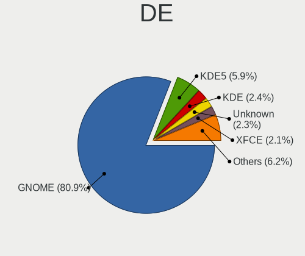

| Name          | Notebooks | Percent |
|---------------|-----------|---------|
| GNOME         | 699       | 82.33%  |
| KDE5          | 44        | 5.18%   |
| KDE           | 23        | 2.71%   |
| Unknown       | 21        | 2.47%   |
| X-Cinnamon    | 18        | 2.12%   |
| XFCE          | 13        | 1.53%   |
| MATE          | 9         | 1.06%   |
| Cinnamon      | 6         | 0.71%   |
| sway          | 3         | 0.35%   |
| LXQt          | 3         | 0.35%   |
| i3            | 2         | 0.24%   |
| GNOME Classic | 2         | 0.24%   |
| Deepin        | 2         | 0.24%   |
| Pantheon      | 1         | 0.12%   |
| openbox       | 1         | 0.12%   |
| LXDE          | 1         | 0.12%   |
| dwm           | 1         | 0.12%   |

Display Server
--------------

X11 or Wayland

| Name    | Notebooks | Percent |
|---------|-----------|---------|
| Wayland | 580       | 67.68%  |
| X11     | 256       | 29.87%  |
| Unknown | 14        | 1.63%   |
| Tty     | 7         | 0.82%   |

Display Manager
---------------

SDDM, LightDM, etc.

| Name    | Notebooks | Percent |
|---------|-----------|---------|
| Unknown | 454       | 53.22%  |
| GDM     | 329       | 38.57%  |
| SDDM    | 37        | 4.34%   |
| LightDM | 16        | 1.88%   |
| TDM     | 14        | 1.64%   |
| KDM     | 2         | 0.23%   |
| XDM     | 1         | 0.12%   |

OS Lang
-------

Language

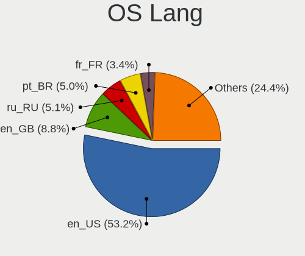

| Lang    | Notebooks | Percent |
|---------|-----------|---------|
| en_US   | 443       | 52.43%  |
| en_GB   | 76        | 8.99%   |
| ru_RU   | 46        | 5.44%   |
| pt_BR   | 46        | 5.44%   |
| fr_FR   | 30        | 3.55%   |
| de_DE   | 27        | 3.2%    |
| it_IT   | 17        | 2.01%   |
| es_ES   | 17        | 2.01%   |
| en_IN   | 17        | 2.01%   |
| es_MX   | 9         | 1.07%   |
| en_CA   | 9         | 1.07%   |
| pl_PL   | 7         | 0.83%   |
| en_AU   | 7         | 0.83%   |
| cs_CZ   | 7         | 0.83%   |
| es_CL   | 6         | 0.71%   |
| en_DK   | 6         | 0.71%   |
| pt_PT   | 5         | 0.59%   |
| tr_TR   | 4         | 0.47%   |
| ru_UA   | 4         | 0.47%   |
| hu_HU   | 4         | 0.47%   |
| fi_FI   | 4         | 0.47%   |
| es_CO   | 4         | 0.47%   |
| de_AT   | 4         | 0.47%   |
| nl_NL   | 3         | 0.36%   |
| en_NZ   | 3         | 0.36%   |
| en_IE   | 3         | 0.36%   |
| C       | 3         | 0.36%   |
| fr_CH   | 2         | 0.24%   |
| fr_BE   | 2         | 0.24%   |
| es_EC   | 2         | 0.24%   |
| es_AR   | 2         | 0.24%   |
| da_DK   | 2         | 0.24%   |
| zh_TW   | 1         | 0.12%   |
| zh_CN   | 1         | 0.12%   |
| uk_UA   | 1         | 0.12%   |
| sv_SE   | 1         | 0.12%   |
| sr_ME   | 1         | 0.12%   |
| ro_RO   | 1         | 0.12%   |
| nl_BE   | 1         | 0.12%   |
| nb_NO   | 1         | 0.12%   |
| ms_MY   | 1         | 0.12%   |
| ko_KR   | 1         | 0.12%   |
| ja_JP   | 1         | 0.12%   |
| hr_HR   | 1         | 0.12%   |
| fr_CA   | 1         | 0.12%   |
| es_VE   | 1         | 0.12%   |
| es_PE   | 1         | 0.12%   |
| es_NI   | 1         | 0.12%   |
| es_DO   | 1         | 0.12%   |
| en_ZA   | 1         | 0.12%   |
| en_SG   | 1         | 0.12%   |
| en_PH   | 1         | 0.12%   |
| el_GR   | 1         | 0.12%   |
| de_CH   | 1         | 0.12%   |
| ca_ES   | 1         | 0.12%   |
| Unknown | 1         | 0.12%   |

Boot Mode
---------

EFI or BIOS

| Mode | Notebooks | Percent |
|------|-----------|---------|
| EFI  | 671       | 79.5%   |
| BIOS | 173       | 20.5%   |

Filesystem
----------

Type of filesystem

| Type                | Notebooks | Percent |
|---------------------|-----------|---------|
| Btrfs               | 628       | 74.5%   |
| Ext4                | 191       | 22.66%  |
| Xfs                 | 19        | 2.25%   |
| Overlay             | 1         | 0.12%   |
| Fuse.fuse-overlayfs | 1         | 0.12%   |
| F2fs                | 1         | 0.12%   |
| Ext3                | 1         | 0.12%   |
| Unknown             | 1         | 0.12%   |

Part. scheme
------------

Scheme of partitioning

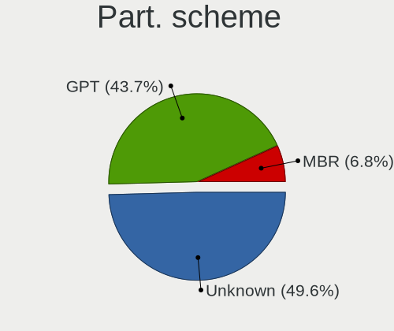

| Type    | Notebooks | Percent |
|---------|-----------|---------|
| Unknown | 449       | 52.76%  |
| GPT     | 343       | 40.31%  |
| MBR     | 59        | 6.93%   |

Dual Boot with Linux/BSD
------------------------

Hosting more than one Linux/BSD

| Dual boot | Notebooks | Percent |
|-----------|-----------|---------|
| No        | 775       | 91.82%  |
| Yes       | 69        | 8.18%   |

Dual Boot (Win)
---------------

Hosting Linux and Windows

| Dual boot | Notebooks | Percent |
|-----------|-----------|---------|
| No        | 707       | 83.67%  |
| Yes       | 138       | 16.33%  |

Board
-----

Vendor
------

Motherboard manufacturer

| Name                             | Notebooks | Percent |
|----------------------------------|-----------|---------|
| Lenovo                           | 253       | 30.12%  |
| Dell                             | 150       | 17.86%  |
| Hewlett-Packard                  | 123       | 14.64%  |
| ASUSTek Computer                 | 87        | 10.36%  |
| Acer                             | 52        | 6.19%   |
| Apple                            | 25        | 2.98%   |
| HUAWEI                           | 13        | 1.55%   |
| Toshiba                          | 12        | 1.43%   |
| MSI                              | 10        | 1.19%   |
| Timi                             | 9         | 1.07%   |
| Samsung Electronics              | 9         | 1.07%   |
| Notebook                         | 9         | 1.07%   |
| Unknown                          | 8         | 0.95%   |
| Sony                             | 7         | 0.83%   |
| Fujitsu                          | 6         | 0.71%   |
| Positivo                         | 5         | 0.6%    |
| TUXEDO                           | 3         | 0.36%   |
| System76                         | 3         | 0.36%   |
| LG Electronics                   | 3         | 0.36%   |
| eMachines                        | 3         | 0.36%   |
| TrekStor                         | 2         | 0.24%   |
| Teclast                          | 2         | 0.24%   |
| Standard                         | 2         | 0.24%   |
| SLIMBOOK                         | 2         | 0.24%   |
| Razer                            | 2         | 0.24%   |
| Pine Microsystems                | 2         | 0.24%   |
| PC Specialist                    | 2         | 0.24%   |
| Hampoo                           | 2         | 0.24%   |
| Framework                        | 2         | 0.24%   |
| Chuwi                            | 2         | 0.24%   |
| Alienware                        | 2         | 0.24%   |
| ZOOSTORM                         | 1         | 0.12%   |
| Wortmann AG                      | 1         | 0.12%   |
| VINGA                            | 1         | 0.12%   |
| Shenzhen PLOYER electronics      | 1         | 0.12%   |
| Purism                           | 1         | 0.12%   |
| Prestigio                        | 1         | 0.12%   |
| Panasonic                        | 1         | 0.12%   |
| ordissimo                        | 1         | 0.12%   |
| NEC Computers                    | 1         | 0.12%   |
| MPMAN                            | 1         | 0.12%   |
| Metabox                          | 1         | 0.12%   |
| Medion                           | 1         | 0.12%   |
| Maibenben                        | 1         | 0.12%   |
| Login Informatica                | 1         | 0.12%   |
| Linx                             | 1         | 0.12%   |
| Intel Client Systems             | 1         | 0.12%   |
| Intel                            | 1         | 0.12%   |
| Insyde                           | 1         | 0.12%   |
| HONOR                            | 1         | 0.12%   |
| HASEE Computer                   | 1         | 0.12%   |
| Google                           | 1         | 0.12%   |
| Gigabyte Technology              | 1         | 0.12%   |
| Fujitsu Siemens                  | 1         | 0.12%   |
| FUJITSU CLIENT COMPUTING LIMITED | 1         | 0.12%   |
| Connect                          | 1         | 0.12%   |
| AZW                              | 1         | 0.12%   |
| AMI                              | 1         | 0.12%   |
| A-DATA Technology                | 1         | 0.12%   |

Model
-----

Motherboard model

| Name                                                                                     | Notebooks | Percent |
|------------------------------------------------------------------------------------------|-----------|---------|
| Unknown                                                                                  | 11        | 1.31%   |
| ASUS ROG Zephyrus G14 GA401QM_GA401QM                                                    | 6         | 0.71%   |
| HP Pavilion 15                                                                           | 5         | 0.6%    |
| HP Notebook                                                                              | 5         | 0.6%    |
| Dell XPS 15 9500                                                                         | 5         | 0.6%    |
| Dell XPS 15 7590                                                                         | 5         | 0.6%    |
| Dell Latitude 7490                                                                       | 5         | 0.6%    |
| Lenovo ThinkPad X1 Carbon Gen 9 20XWCTO1WW                                               | 4         | 0.48%   |
| HP Pavilion dv7                                                                          | 4         | 0.48%   |
| Dell Latitude 5480                                                                       | 4         | 0.48%   |
| Apple MacBookPro11,5                                                                     | 4         | 0.48%   |
| Apple MacBookPro11,3                                                                     | 4         | 0.48%   |
| System76 Oryx Pro                                                                        | 3         | 0.36%   |
| Lenovo IdeaPad S145-15IWL 81S9                                                           | 3         | 0.36%   |
| Lenovo IdeaPad 5 15ARE05 81YQ                                                            | 3         | 0.36%   |
| HP ProBook 450 G5                                                                        | 3         | 0.36%   |
| HP Pavilion dv6                                                                          | 3         | 0.36%   |
| HP Laptop 15s-eq2xxx                                                                     | 3         | 0.36%   |
| HP Laptop 15-da0xxx                                                                      | 3         | 0.36%   |
| HP EliteBook 840 G6                                                                      | 3         | 0.36%   |
| HP Elite x2 1012 G1                                                                      | 3         | 0.36%   |
| Dell XPS 15 9550                                                                         | 3         | 0.36%   |
| Dell XPS 13 9350                                                                         | 3         | 0.36%   |
| Dell XPS 13 9310                                                                         | 3         | 0.36%   |
| Dell XPS 13 7390                                                                         | 3         | 0.36%   |
| Dell Latitude 7400                                                                       | 3         | 0.36%   |
| Dell Inspiron N5110                                                                      | 3         | 0.36%   |
| ASUS ZenBook UX431DA_UM431DA                                                             | 3         | 0.36%   |
| Acer Aspire E5-573G                                                                      | 3         | 0.36%   |
| Toshiba Satellite L750                                                                   | 2         | 0.24%   |
| Timi A35S                                                                                | 2         | 0.24%   |
| SLIMBOOK PROX15-AMD                                                                      | 2         | 0.24%   |
| Samsung 355V4C/355V4X/355V5C/355V5X/356V4C/356V4X/356V5C/356V5X/3445VC/3445VX/3545VC/354 | 2         | 0.24%   |
| Positivo CHT14B                                                                          | 2         | 0.24%   |
| Pine Microsystems Pine64 Pinebook Pro                                                    | 2         | 0.24%   |
| Lenovo Yoga Slim 7 14ARE05 82A2                                                          | 2         | 0.24%   |
| Lenovo Yoga 2 Pro 20266                                                                  | 2         | 0.24%   |
| Lenovo ThinkPad T14s Gen 1 20UHCTO1WW                                                    | 2         | 0.24%   |
| Lenovo ThinkPad T14 Gen 1 20UDCTO1WW                                                     | 2         | 0.24%   |
| Lenovo ThinkPad P14s Gen 1 20Y1CTO1WW                                                    | 2         | 0.24%   |
| Lenovo ThinkPad E595 20NFCTO1WW                                                          | 2         | 0.24%   |
| Lenovo Legion 5 15ARH05H 82B1                                                            | 2         | 0.24%   |
| Lenovo IdeaPad Yoga 13 20175                                                             | 2         | 0.24%   |
| Lenovo IdeaPad 530S-14ARR 81H1                                                           | 2         | 0.24%   |
| Lenovo IdeaPad 5 Pro 16ACH6 82L5                                                         | 2         | 0.24%   |
| Lenovo IdeaPad 5 15ALC05 82LN                                                            | 2         | 0.24%   |
| Lenovo IdeaPad 5 14ARE05 81YM                                                            | 2         | 0.24%   |
| Lenovo IdeaPad 330S-15IKB 81F5                                                           | 2         | 0.24%   |
| Lenovo G50-80 80E5                                                                       | 2         | 0.24%   |
| Lenovo G50-30 80G0                                                                       | 2         | 0.24%   |
| Lenovo G40-45 80E1                                                                       | 2         | 0.24%   |
| HUAWEI NBLK-WAX9X                                                                        | 2         | 0.24%   |
| HUAWEI EUL-WX9                                                                           | 2         | 0.24%   |
| HP ZBook 17 G5                                                                           | 2         | 0.24%   |
| HP ZBook 15 G3                                                                           | 2         | 0.24%   |
| HP ProBook 650 G1                                                                        | 2         | 0.24%   |
| HP Pro x2 612 G1 Tablet                                                                  | 2         | 0.24%   |
| HP Pavilion Laptop 15-eh0xxx                                                             | 2         | 0.24%   |
| HP Pavilion Gaming Laptop 15-dk0xxx                                                      | 2         | 0.24%   |
| HP Pavilion 11 x360 PC                                                                   | 2         | 0.24%   |

Model Family
------------

Motherboard model prefix

| Name                     | Notebooks | Percent |
|--------------------------|-----------|---------|
| Lenovo ThinkPad          | 154       | 18.33%  |
| Lenovo IdeaPad           | 53        | 6.31%   |
| Dell Inspiron            | 45        | 5.36%   |
| Dell Latitude            | 41        | 4.88%   |
| Dell XPS                 | 38        | 4.52%   |
| Acer Aspire              | 35        | 4.17%   |
| HP Pavilion              | 29        | 3.45%   |
| HP ProBook               | 22        | 2.62%   |
| HP EliteBook             | 19        | 2.26%   |
| HP Laptop                | 17        | 2.02%   |
| ASUS VivoBook            | 17        | 2.02%   |
| ASUS ROG                 | 16        | 1.9%    |
| Lenovo Yoga              | 12        | 1.43%   |
| Apple MacBookPro11       | 11        | 1.31%   |
| Unknown                  | 11        | 1.31%   |
| Toshiba Satellite        | 10        | 1.19%   |
| Dell Precision           | 10        | 1.19%   |
| ASUS ASUS                | 9         | 1.07%   |
| HP ZBook                 | 8         | 0.95%   |
| Lenovo ThinkBook         | 7         | 0.83%   |
| Lenovo Legion            | 7         | 0.83%   |
| Dell Vostro              | 7         | 0.83%   |
| ASUS TUF                 | 7         | 0.83%   |
| Acer Nitro               | 7         | 0.83%   |
| Fujitsu LIFEBOOK         | 6         | 0.71%   |
| ASUS ZenBook             | 6         | 0.71%   |
| Acer Swift               | 6         | 0.71%   |
| HP Notebook              | 5         | 0.6%    |
| Dell G5                  | 5         | 0.6%    |
| HP OMEN                  | 4         | 0.48%   |
| Timi RedmiBook           | 3         | 0.36%   |
| System76 Oryx            | 3         | 0.36%   |
| Notebook NH5x            | 3         | 0.36%   |
| HP ENVY                  | 3         | 0.36%   |
| HP Elite                 | 3         | 0.36%   |
| Toshiba TECRA            | 2         | 0.24%   |
| Timi A35S                | 2         | 0.24%   |
| SLIMBOOK PROX15-AMD      | 2         | 0.24%   |
| Samsung 355V4C           | 2         | 0.24%   |
| Razer Blade              | 2         | 0.24%   |
| Positivo CHT14B          | 2         | 0.24%   |
| Pine Microsystems Pine64 | 2         | 0.24%   |
| MSI Modern               | 2         | 0.24%   |
| MSI Bravo                | 2         | 0.24%   |
| Lenovo G50-80            | 2         | 0.24%   |
| Lenovo G50-30            | 2         | 0.24%   |
| Lenovo G40-45            | 2         | 0.24%   |
| HUAWEI NBLK-WAX9X        | 2         | 0.24%   |
| HUAWEI EUL-WX9           | 2         | 0.24%   |
| HP Pro                   | 2         | 0.24%   |
| HP 250                   | 2         | 0.24%   |
| HP 240                   | 2         | 0.24%   |
| Framework Laptop         | 2         | 0.24%   |
| eMachines eME732         | 2         | 0.24%   |
| Dell G7                  | 2         | 0.24%   |
| ASUS UX303UA             | 2         | 0.24%   |
| ASUS N550JV              | 2         | 0.24%   |
| Apple MacBookPro9        | 2         | 0.24%   |
| Apple MacBookPro7        | 2         | 0.24%   |
| Apple MacBookPro5        | 2         | 0.24%   |

MFG Year
--------

Motherboard manufacture year

| Year    | Notebooks | Percent |
|---------|-----------|---------|
| 2021    | 219       | 26.07%  |
| 2020    | 203       | 24.17%  |
| 2019    | 112       | 13.33%  |
| 2018    | 59        | 7.02%   |
| 2015    | 37        | 4.4%    |
| 2016    | 33        | 3.93%   |
| 2012    | 33        | 3.93%   |
| 2017    | 31        | 3.69%   |
| 2013    | 31        | 3.69%   |
| 2014    | 28        | 3.33%   |
| 2011    | 25        | 2.98%   |
| 2010    | 13        | 1.55%   |
| 2009    | 7         | 0.83%   |
| 2008    | 6         | 0.71%   |
| Unknown | 3         | 0.36%   |

Form Factor
-----------

Physical design of the computer

| Name     | Notebooks | Percent |
|----------|-----------|---------|
| Notebook | 840       | 100%    |

Secure Boot
-----------

Enabled or disabled

| State    | Notebooks | Percent |
|----------|-----------|---------|
| Disabled | 707       | 83.08%  |
| Enabled  | 144       | 16.92%  |

Coreboot
--------

Have coreboot on board

| Used | Notebooks | Percent |
|------|-----------|---------|
| No   | 836       | 99.52%  |
| Yes  | 4         | 0.48%   |

RAM Size
--------

Total RAM memory

| Size in GB  | Notebooks | Percent |
|-------------|-----------|---------|
| 4.01-8.0    | 260       | 30.7%   |
| 16.01-24.0  | 196       | 23.14%  |
| 8.01-16.0   | 164       | 19.36%  |
| 32.01-64.0  | 98        | 11.57%  |
| 3.01-4.0    | 73        | 8.62%   |
| 1.01-2.0    | 18        | 2.13%   |
| 24.01-32.0  | 17        | 2.01%   |
| 64.01-256.0 | 15        | 1.77%   |
| 0.51-1.0    | 5         | 0.59%   |
| 2.01-3.0    | 1         | 0.12%   |

RAM Used
--------

Used RAM memory

| Used GB    | Notebooks | Percent |
|------------|-----------|---------|
| 2.01-3.0   | 266       | 29.04%  |
| 4.01-8.0   | 236       | 25.76%  |
| 3.01-4.0   | 193       | 21.07%  |
| 1.01-2.0   | 135       | 14.74%  |
| 8.01-16.0  | 64        | 6.99%   |
| 0.51-1.0   | 17        | 1.86%   |
| 16.01-24.0 | 5         | 0.55%   |

Total Drives
------------

Number of drives on board

| Drives | Notebooks | Percent |
|--------|-----------|---------|
| 1      | 614       | 72.58%  |
| 2      | 196       | 23.17%  |
| 3      | 29        | 3.43%   |
| 0      | 3         | 0.35%   |
| 5      | 2         | 0.24%   |
| 6      | 1         | 0.12%   |
| 4      | 1         | 0.12%   |

Has CD-ROM
----------

Has CD-ROM on board

| Presented | Notebooks | Percent |
|-----------|-----------|---------|
| No        | 683       | 81.12%  |
| Yes       | 159       | 18.88%  |

Has Ethernet
------------

Has Ethernet on board

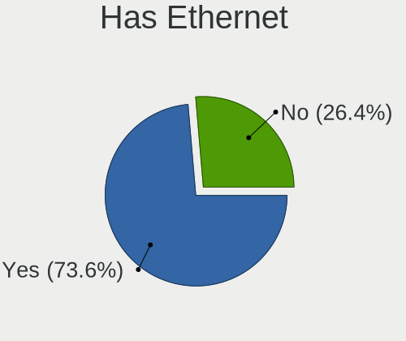

| Presented | Notebooks | Percent |
|-----------|-----------|---------|
| Yes       | 618       | 73.05%  |
| No        | 228       | 26.95%  |

Has WiFi
--------

Has WiFi module

| Presented | Notebooks | Percent |
|-----------|-----------|---------|
| Yes       | 813       | 96.67%  |
| No        | 28        | 3.33%   |

Has Bluetooth
-------------

Has Bluetooth module

| Presented | Notebooks | Percent |
|-----------|-----------|---------|
| Yes       | 703       | 83.1%   |
| No        | 143       | 16.9%   |

Location
--------

Country
-------

Geographic location (country)

| Country      | Notebooks | Percent |
|--------------|-----------|---------|
| USA          | 127       | 15.03%  |
| Brazil       | 67        | 7.93%   |
| Germany      | 52        | 6.15%   |
| Russia       | 49        | 5.8%    |
| India        | 43        | 5.09%   |
| France       | 41        | 4.85%   |
| Netherlands  | 35        | 4.14%   |
| UK           | 28        | 3.31%   |
| Italy        | 26        | 3.08%   |
| Spain        | 24        | 2.84%   |
| Canada       | 18        | 2.13%   |
| Ukraine      | 17        | 2.01%   |
| Czechia      | 17        | 2.01%   |
| Poland       | 16        | 1.89%   |
| Portugal     | 15        | 1.78%   |
| Turkey       | 13        | 1.54%   |
| Mexico       | 11        | 1.3%    |
| Sweden       | 10        | 1.18%   |
| Belgium      | 10        | 1.18%   |
| Austria      | 10        | 1.18%   |
| Argentina    | 10        | 1.18%   |
| Switzerland  | 9         | 1.07%   |
| Romania      | 9         | 1.07%   |
| Norway       | 9         | 1.07%   |
| Finland      | 9         | 1.07%   |
| Denmark      | 9         | 1.07%   |
| Chile        | 9         | 1.07%   |
| Iran         | 8         | 0.95%   |
| Colombia     | 8         | 0.95%   |
| Slovakia     | 7         | 0.83%   |
| Belarus      | 6         | 0.71%   |
| Australia    | 6         | 0.71%   |
| Indonesia    | 5         | 0.59%   |
| Hungary      | 5         | 0.59%   |
| China        | 5         | 0.59%   |
| Vietnam      | 4         | 0.47%   |
| South Africa | 4         | 0.47%   |
| Slovenia     | 4         | 0.47%   |
| New Zealand  | 4         | 0.47%   |
| Israel       | 4         | 0.47%   |
| Ireland      | 4         | 0.47%   |
| Greece       | 4         | 0.47%   |
| Estonia      | 4         | 0.47%   |
| Bulgaria     | 4         | 0.47%   |
| South Korea  | 3         | 0.36%   |
| Serbia       | 3         | 0.36%   |
| Moldova      | 3         | 0.36%   |
| Latvia       | 3         | 0.36%   |
| Egypt        | 3         | 0.36%   |
| Ecuador      | 3         | 0.36%   |
| Taiwan       | 2         | 0.24%   |
| Sri Lanka    | 2         | 0.24%   |
| Singapore    | 2         | 0.24%   |
| Philippines  | 2         | 0.24%   |
| Peru         | 2         | 0.24%   |
| Montenegro   | 2         | 0.24%   |
| Malaysia     | 2         | 0.24%   |
| Lithuania    | 2         | 0.24%   |
| Kyrgyzstan   | 2         | 0.24%   |
| Japan        | 2         | 0.24%   |

City
----

Geographic location (city)

| City           | Notebooks | Percent |
|----------------|-----------|---------|
| Moscow         | 21        | 2.4%    |
| Prague         | 10        | 1.14%   |
| Berlin         | 10        | 1.14%   |
| Madrid         | 9         | 1.03%   |
| Kyiv           | 9         | 1.03%   |
| Amsterdam      | 9         | 1.03%   |
| Paris          | 7         | 0.8%    |
| The Hague      | 6         | 0.69%   |
| London         | 6         | 0.69%   |
| Istanbul       | 6         | 0.69%   |
| Bengaluru      | 6         | 0.69%   |
| Tehran         | 5         | 0.57%   |
| Milan          | 5         | 0.57%   |
| Budapest       | 5         | 0.57%   |
| Yekaterinburg  | 4         | 0.46%   |
| Vienna         | 4         | 0.46%   |
| Tel Aviv       | 4         | 0.46%   |
| So Paulo     | 4         | 0.46%   |
| Minsk          | 4         | 0.46%   |
| Lisbon         | 4         | 0.46%   |
| Helsinki       | 4         | 0.46%   |
| Fortaleza      | 4         | 0.46%   |
| Buenos Aires   | 4         | 0.46%   |
| Bucharest      | 4         | 0.46%   |
| Apex           | 4         | 0.46%   |
| Tallinn        | 3         | 0.34%   |
| Santiago       | 3         | 0.34%   |
| Riga           | 3         | 0.34%   |
| Quito          | 3         | 0.34%   |
| Pune           | 3         | 0.34%   |
| Oslo           | 3         | 0.34%   |
| Nuremberg      | 3         | 0.34%   |
| Mumbai         | 3         | 0.34%   |
| Kolkata        | 3         | 0.34%   |
| Kharkiv        | 3         | 0.34%   |
| Feeding Hills  | 3         | 0.34%   |
| Dublin         | 3         | 0.34%   |
| D??sseldorf    | 3         | 0.34%   |
| Dallas         | 3         | 0.34%   |
| Chisinau       | 3         | 0.34%   |
| Brussels       | 3         | 0.34%   |
| Bratislava     | 3         | 0.34%   |
| Belo Horizonte | 3         | 0.34%   |
| Auckland       | 3         | 0.34%   |
| Athens         | 3         | 0.34%   |
| Almere Stad    | 3         | 0.34%   |
| Zurich         | 2         | 0.23%   |
| Zagreb         | 2         | 0.23%   |
| Wroclaw        | 2         | 0.23%   |
| Winnipeg       | 2         | 0.23%   |
| Washington     | 2         | 0.23%   |
| Varna          | 2         | 0.23%   |
| Uberlndia    | 2         | 0.23%   |
| Tyumen         | 2         | 0.23%   |
| Turin          | 2         | 0.23%   |
| Toulouse       | 2         | 0.23%   |
| Toronto        | 2         | 0.23%   |
| Sydney         | 2         | 0.23%   |
| Stuttgart      | 2         | 0.23%   |
| Strasbourg     | 2         | 0.23%   |

Drives
------

Drive Vendor
------------

Hard drive vendors

| Vendor                    | Notebooks | Drives | Percent |
|---------------------------|-----------|--------|---------|
| Samsung Electronics       | 236       | 325    | 22.43%  |
| WDC                       | 113       | 146    | 10.74%  |
| Toshiba                   | 84        | 101    | 7.98%   |
| Seagate                   | 78        | 96     | 7.41%   |
| SanDisk                   | 63        | 73     | 5.99%   |
| Unknown                   | 62        | 83     | 5.89%   |
| SK Hynix                  | 62        | 75     | 5.89%   |
| Kingston                  | 49        | 58     | 4.66%   |
| Intel                     | 43        | 62     | 4.09%   |
| Crucial                   | 31        | 39     | 2.95%   |
| Micron Technology         | 24        | 34     | 2.28%   |
| Apple                     | 17        | 21     | 1.62%   |
| HGST                      | 16        | 20     | 1.52%   |
| A-DATA Technology         | 15        | 16     | 1.43%   |
| KIOXIA                    | 11        | 15     | 1.05%   |
| Hitachi                   | 10        | 12     | 0.95%   |
| Silicon Motion            | 9         | 14     | 0.86%   |
| Transcend                 | 8         | 8      | 0.76%   |
| SPCC                      | 8         | 12     | 0.76%   |
| PNY                       | 8         | 10     | 0.76%   |
| LITEON                    | 6         | 6      | 0.57%   |
| Corsair                   | 6         | 8      | 0.57%   |
| XPG                       | 5         | 6      | 0.48%   |
| Realtek Semiconductor     | 5         | 6      | 0.48%   |
| LITEONIT                  | 5         | 5      | 0.48%   |
| Union Memory              | 4         | 4      | 0.38%   |
| Phison                    | 4         | 5      | 0.38%   |
| Lite-On                   | 4         | 4      | 0.38%   |
| China                     | 4         | 6      | 0.38%   |
| Union Memory (Shenzhen)   | 3         | 8      | 0.29%   |
| Solid State Storage       | 3         | 3      | 0.29%   |
| Patriot                   | 3         | 4      | 0.29%   |
| OCZ                       | 3         | 3      | 0.29%   |
| Micron/Crucial Technology | 3         | 3      | 0.29%   |
| Lenovo                    | 3         | 3      | 0.29%   |
| KingFast                  | 3         | 4      | 0.29%   |
| Intenso                   | 3         | 3      | 0.29%   |
| Team                      | 2         | 2      | 0.19%   |
| Lexar                     | 2         | 2      | 0.19%   |
| JMicron                   | 2         | 2      | 0.19%   |
| GOODRAM                   | 2         | 2      | 0.19%   |
| Gigabyte Technology       | 2         | 2      | 0.19%   |
| BIWIN                     | 2         | 2      | 0.19%   |
| Yangtze Memory            | 1         | 1      | 0.1%    |
| XrayDisk                  | 1         | 1      | 0.1%    |
| W800S                     | 1         | 1      | 0.1%    |
| USB3.0                    | 1         | 1      | 0.1%    |
| UNIC2                     | 1         | 1      | 0.1%    |
| TCSUNBOW                  | 1         | 1      | 0.1%    |
| Tanbassh                  | 1         | 1      | 0.1%    |
| Reeinno                   | 1         | 1      | 0.1%    |
| OCZ-ARC1                  | 1         | 1      | 0.1%    |
| NGFF                      | 1         | 2      | 0.1%    |
| Mushkin                   | 1         | 3      | 0.1%    |
| MTFDDAK1                  | 1         | 1      | 0.1%    |
| MAXTOR                    | 1         | 1      | 0.1%    |
| Leven                     | 1         | 1      | 0.1%    |
| KIOXIA-EXCERIA            | 1         | 1      | 0.1%    |
| Indilinx                  | 1         | 1      | 0.1%    |
| HUAWEI                    | 1         | 1      | 0.1%    |

Drive Model
-----------

Hard drive models

| Model                                  | Notebooks | Percent |
|----------------------------------------|-----------|---------|
| Samsung PM963 2.5" NVMe PCIe SSD 512GB | 29        | 2.58%   |
| Seagate ST1000LM035-1RK172 1TB         | 17        | 1.51%   |
| Samsung NVMe SSD Drive 256GB           | 17        | 1.51%   |
| Samsung SSD 860 EVO 500GB              | 15        | 1.33%   |
| Sandisk NVMe SSD Drive 512GB           | 14        | 1.25%   |
| Samsung NVMe SSD Drive 1TB             | 13        | 1.16%   |
| SK Hynix NVMe SSD Drive 512GB          | 12        | 1.07%   |
| Seagate ST1000LM024 HN-M101MBB 1TB     | 12        | 1.07%   |
| Toshiba NVMe SSD Drive 512GB           | 10        | 0.89%   |
| Samsung NVMe SSD Drive 1024GB          | 10        | 0.89%   |
| Kingston SA400S37240G 240GB SSD        | 9         | 0.8%    |
| Unknown MMC Card  32GB                 | 8         | 0.71%   |
| Samsung NVMe SSD Drive 500GB           | 8         | 0.71%   |
| Unknown SD/MMC/MS PRO 128GB            | 7         | 0.62%   |
| Unknown MMC Card  64GB                 | 7         | 0.62%   |
| Seagate ST1000LM049-2GH172 1TB         | 7         | 0.62%   |
| Sandisk NVMe SSD Drive 1024GB          | 7         | 0.62%   |
| Kingston SA400S37480G 480GB SSD        | 7         | 0.62%   |
| Intel NVMe SSD Drive 512GB             | 7         | 0.62%   |
| Toshiba MQ04ABF100 1TB                 | 6         | 0.53%   |
| Toshiba MQ01ABD100 1TB                 | 6         | 0.53%   |
| Seagate Expansion 1TB                  | 6         | 0.53%   |
| Sandisk NVMe SSD Drive 256GB           | 6         | 0.53%   |
| Samsung SSD 970 EVO Plus 1TB           | 6         | 0.53%   |
| Samsung SSD 970 EVO 1TB                | 6         | 0.53%   |
| Samsung SSD 850 EVO 500GB              | 6         | 0.53%   |
| Samsung SSD 850 EVO 250GB              | 6         | 0.53%   |
| Samsung MZVLB512HBJQ-000L7 512GB       | 6         | 0.53%   |
| Kingston SA400S37120G 120GB SSD        | 6         | 0.53%   |
| HGST HTS721010A9E630 1TB               | 6         | 0.53%   |
| WDC WDS240G2G0A-00JH30 240GB SSD       | 5         | 0.44%   |
| WDC WD10SPZX-21Z10T0 1TB               | 5         | 0.44%   |
| Unknown NCard  16GB                    | 5         | 0.44%   |
| Samsung SSD 860 EVO 250GB              | 5         | 0.44%   |
| Samsung SSD 860 EVO 1TB                | 5         | 0.44%   |
| Samsung MZVLB1T0HBLR-000L7 1TB         | 5         | 0.44%   |
| KIOXIA KBG40ZNV512G 512GB              | 5         | 0.44%   |
| HGST HTS541010A9E680 1TB               | 5         | 0.44%   |
| WDC WDS500G2B0A-00SM50 500GB SSD       | 4         | 0.36%   |
| WDC WDS240G2G0B-00EPW0 240GB SSD       | 4         | 0.36%   |
| Unknown MMC Card  128GB                | 4         | 0.36%   |
| Toshiba NVMe SSD Drive 256GB           | 4         | 0.36%   |
| Toshiba MQ01ABF050 500GB               | 4         | 0.36%   |
| SK Hynix HBG4e  32GB                   | 4         | 0.36%   |
| Seagate ST500LM021-1KJ152 500GB        | 4         | 0.36%   |
| Samsung SSD 980 PRO 1TB                | 4         | 0.36%   |
| Samsung SSD 970 EVO Plus 2TB           | 4         | 0.36%   |
| Samsung SM963 2.5" NVMe PCIe SSD 250GB | 4         | 0.36%   |
| Samsung NVMe SSD Drive 2TB             | 4         | 0.36%   |
| Samsung MZALQ512HALU-000L2 512GB       | 4         | 0.36%   |
| Intel SSDPEKKW256G7 256GB              | 4         | 0.36%   |
| Intel NVMe SSD Drive 1024GB            | 4         | 0.36%   |
| Crucial CT500MX500SSD1 500GB           | 4         | 0.36%   |
| Crucial CT240BX500SSD1 240GB           | 4         | 0.36%   |
| Crucial CT1000MX500SSD1 1TB            | 4         | 0.36%   |
| Apple SSD SM0512F 500GB                | 4         | 0.36%   |
| XPG NVMe SSD Drive 256GB               | 3         | 0.27%   |
| WDC WDS500G3X0C-00SJG0 500GB           | 3         | 0.27%   |
| WDC WD5000LPVX-22V0TT0 500GB           | 3         | 0.27%   |
| WDC WD5000LPCX-24C6HT0 500GB           | 3         | 0.27%   |

HDD Vendor
----------

Hard disk drive vendors

| Vendor              | Notebooks | Drives | Percent |
|---------------------|-----------|--------|---------|
| Seagate             | 75        | 92     | 37.31%  |
| WDC                 | 56        | 79     | 27.86%  |
| Toshiba             | 31        | 40     | 15.42%  |
| HGST                | 16        | 20     | 7.96%   |
| Hitachi             | 10        | 12     | 4.98%   |
| Unknown             | 8         | 8      | 3.98%   |
| USB3.0              | 1         | 1      | 0.5%    |
| Samsung Electronics | 1         | 1      | 0.5%    |
| JMicron             | 1         | 1      | 0.5%    |
| Fujitsu             | 1         | 1      | 0.5%    |
| Apple               | 1         | 1      | 0.5%    |

SSD Vendor
----------

Solid state drive vendors

| Vendor              | Notebooks | Drives | Percent |
|---------------------|-----------|--------|---------|
| Samsung Electronics | 96        | 122    | 26.74%  |
| Kingston            | 35        | 42     | 9.75%   |
| SanDisk             | 32        | 41     | 8.91%   |
| Crucial             | 27        | 34     | 7.52%   |
| WDC                 | 24        | 28     | 6.69%   |
| Intel               | 17        | 22     | 4.74%   |
| Toshiba             | 14        | 15     | 3.9%    |
| Apple               | 11        | 13     | 3.06%   |
| A-DATA Technology   | 11        | 11     | 3.06%   |
| Micron Technology   | 10        | 10     | 2.79%   |
| SK Hynix            | 8         | 9      | 2.23%   |
| PNY                 | 8         | 10     | 2.23%   |
| Transcend           | 6         | 6      | 1.67%   |
| SPCC                | 6         | 10     | 1.67%   |
| LITEONIT            | 5         | 5      | 1.39%   |
| LITEON              | 5         | 5      | 1.39%   |
| Corsair             | 5         | 5      | 1.39%   |
| China               | 4         | 6      | 1.11%   |
| Unknown             | 3         | 3      | 0.84%   |
| OCZ                 | 3         | 3      | 0.84%   |
| Intenso             | 3         | 3      | 0.84%   |
| Team                | 2         | 2      | 0.56%   |
| Patriot             | 2         | 2      | 0.56%   |
| Lexar               | 2         | 2      | 0.56%   |
| GOODRAM             | 2         | 2      | 0.56%   |
| W800S               | 1         | 1      | 0.28%   |
| Union Memory        | 1         | 1      | 0.28%   |
| UNIC2               | 1         | 1      | 0.28%   |
| TCSUNBOW            | 1         | 1      | 0.28%   |
| OCZ-ARC1            | 1         | 1      | 0.28%   |
| NGFF                | 1         | 2      | 0.28%   |
| Mushkin             | 1         | 3      | 0.28%   |
| MAXTOR              | 1         | 1      | 0.28%   |
| Leven               | 1         | 1      | 0.28%   |
| KIOXIA-EXCERIA      | 1         | 1      | 0.28%   |
| Indilinx            | 1         | 1      | 0.28%   |
| Gigabyte Technology | 1         | 1      | 0.28%   |
| GALAX               | 1         | 1      | 0.28%   |
| EMTEC               | 1         | 1      | 0.28%   |
| DOGFISH             | 1         | 1      | 0.28%   |
| BRAVEEAGLE          | 1         | 1      | 0.28%   |
| BIWIN               | 1         | 1      | 0.28%   |
| Apacer              | 1         | 1      | 0.28%   |

Drive Kind
----------

HDD or SSD

| Kind    | Notebooks | Drives | Percent |
|---------|-----------|--------|---------|
| NVMe    | 414       | 566    | 40.87%  |
| SSD     | 340       | 432    | 33.56%  |
| HDD     | 193       | 256    | 19.05%  |
| MMC     | 54        | 75     | 5.33%   |
| Unknown | 12        | 13     | 1.18%   |

Drive Connector
---------------

SATA, SAS, NVMe, etc.

| Type | Notebooks | Drives | Percent |
|------|-----------|--------|---------|
| SATA | 463       | 662    | 48.13%  |
| NVMe | 414       | 566    | 43.04%  |
| MMC  | 54        | 75     | 5.61%   |
| SAS  | 31        | 39     | 3.22%   |

Drive Size
----------

Size of hard drive

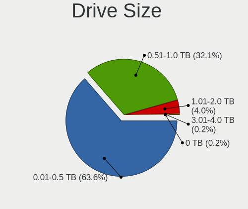

| Size in TB | Notebooks | Drives | Percent |
|------------|-----------|--------|---------|
| 0.01-0.5   | 332       | 438    | 64.34%  |
| 0.51-1.0   | 164       | 221    | 31.78%  |
| 1.01-2.0   | 18        | 27     | 3.49%   |
| 3.01-4.0   | 1         | 1      | 0.19%   |
| 0          | 1         | 1      | 0.19%   |

Space Total
-----------

Amount of disk space available on the file system

| Size in GB     | Notebooks | Percent |
|----------------|-----------|---------|
| 501-1000       | 192       | 22.33%  |
| 251-500        | 172       | 20%     |
| 101-250        | 125       | 14.53%  |
| 1-20           | 107       | 12.44%  |
| 1001-2000      | 95        | 11.05%  |
| Unknown        | 85        | 9.88%   |
| 51-100         | 38        | 4.42%   |
| 21-50          | 22        | 2.56%   |
| More than 3000 | 13        | 1.51%   |
| 2001-3000      | 11        | 1.28%   |

Space Used
----------

Amount of used disk space

| Used GB        | Notebooks | Percent |
|----------------|-----------|---------|
| 1-20           | 273       | 30.74%  |
| 21-50          | 145       | 16.33%  |
| 101-250        | 139       | 15.65%  |
| 51-100         | 95        | 10.7%   |
| 251-500        | 90        | 10.14%  |
| Unknown        | 85        | 9.57%   |
| 501-1000       | 50        | 5.63%   |
| 1001-2000      | 9         | 1.01%   |
| More than 3000 | 2         | 0.23%   |

Malfunc. Drives
---------------

Drive models with a malfunction

| Model                                               | Notebooks | Drives | Percent |
|-----------------------------------------------------|-----------|--------|---------|
| Seagate ST1000LM035-1RK172 1TB                      | 3         | 3      | 8.11%   |
| Crucial CT1050MX300SSD1 1TB                         | 2         | 4      | 5.41%   |
| WDC WD3200BPVT-75ZEST0 320GB                        | 1         | 1      | 2.7%    |
| WDC WD3200BPVT-24JJ5T0 320GB                        | 1         | 1      | 2.7%    |
| WDC WD10SPZX-24Z10 1TB                              | 1         | 1      | 2.7%    |
| WDC WD10JPVX-75JC3T0 1TB                            | 1         | 1      | 2.7%    |
| Union Memory UMIS RPJTJ128MED1MWX 128GB             | 1         | 1      | 2.7%    |
| Toshiba MQ01ABD100 1TB                              | 1         | 1      | 2.7%    |
| Toshiba MQ01ABD050V 500GB                           | 1         | 1      | 2.7%    |
| SPCC Solid State Disk 256GB                         | 1         | 1      | 2.7%    |
| SK Hynix HFS256G39TND-N210A 256GB SSD               | 1         | 1      | 2.7%    |
| Seagate ST500LM021-1KJ152 500GB                     | 1         | 1      | 2.7%    |
| Seagate ST1000LM049-2GH172 1TB                      | 1         | 2      | 2.7%    |
| Seagate ST1000LM024 HN-M101MBB 1TB                  | 1         | 1      | 2.7%    |
| SanDisk SSD PLUS 240GB                              | 1         | 1      | 2.7%    |
| SanDisk SD9SN8W-128G-1006 128GB SSD                 | 1         | 1      | 2.7%    |
| Samsung Electronics SSD 970 EVO 1TB                 | 1         | 1      | 2.7%    |
| Samsung Electronics SSD 860 EVO 250GB               | 1         | 1      | 2.7%    |
| Micron Technology MTFDDAK256MAY-1AH12ABHA 256GB SSD | 1         | 1      | 2.7%    |
| Micron Technology 1100_MTFDDAK256TBN 256GB SSD      | 1         | 1      | 2.7%    |
| LITEONIT LCS-128M6S-HP 128GB SSD                    | 1         | 1      | 2.7%    |
| LITEON LGH-512V2G-11 M.2 2280 512GB SSD             | 1         | 1      | 2.7%    |
| Kingston SUV400S37240G 240GB SSD                    | 1         | 1      | 2.7%    |
| Intel SSDSCKJF180A5L 180GB                          | 1         | 1      | 2.7%    |
| Intel SSDSC2KF480H6L 480GB                          | 1         | 1      | 2.7%    |
| Intel SSDSA2M080G2GC 80GB                           | 1         | 1      | 2.7%    |
| Hitachi HTS545032A7E380 320GB                       | 1         | 1      | 2.7%    |
| Hitachi HTS545025B9SA02 250GB                       | 1         | 1      | 2.7%    |
| Hitachi HTS543216L9A300 160GB                       | 1         | 1      | 2.7%    |
| HGST HTS725050A7E630 500GB                          | 1         | 1      | 2.7%    |
| HGST HTS545050A7E660 500GB                          | 1         | 1      | 2.7%    |
| Fujitsu MHY2120BH 120GB                             | 1         | 1      | 2.7%    |
| Crucial CT1000P1SSD8 1TB                            | 1         | 1      | 2.7%    |
| A-DATA Technology SX6000NP 128GB                    | 1         | 1      | 2.7%    |

Malfunc. Drive Vendor
---------------------

Vendors of faulty drives

| Vendor              | Notebooks | Drives | Percent |
|---------------------|-----------|--------|---------|
| Seagate             | 6         | 7      | 16.22%  |
| WDC                 | 4         | 4      | 10.81%  |
| Intel               | 3         | 3      | 8.11%   |
| Hitachi             | 3         | 3      | 8.11%   |
| Crucial             | 3         | 5      | 8.11%   |
| Toshiba             | 2         | 2      | 5.41%   |
| SanDisk             | 2         | 2      | 5.41%   |
| Samsung Electronics | 2         | 2      | 5.41%   |
| Micron Technology   | 2         | 2      | 5.41%   |
| HGST                | 2         | 2      | 5.41%   |
| Union Memory        | 1         | 1      | 2.7%    |
| SPCC                | 1         | 1      | 2.7%    |
| SK Hynix            | 1         | 1      | 2.7%    |
| LITEONIT            | 1         | 1      | 2.7%    |
| LITEON              | 1         | 1      | 2.7%    |
| Kingston            | 1         | 1      | 2.7%    |
| Fujitsu             | 1         | 1      | 2.7%    |
| A-DATA Technology   | 1         | 1      | 2.7%    |

Malfunc. HDD Vendor
-------------------

Vendors of faulty HDD drives

| Vendor  | Notebooks | Drives | Percent |
|---------|-----------|--------|---------|
| Seagate | 6         | 7      | 33.33%  |
| WDC     | 4         | 4      | 22.22%  |
| Hitachi | 3         | 3      | 16.67%  |
| Toshiba | 2         | 2      | 11.11%  |
| HGST    | 2         | 2      | 11.11%  |
| Fujitsu | 1         | 1      | 5.56%   |

Malfunc. Drive Kind
-------------------

Kinds of faulty drives

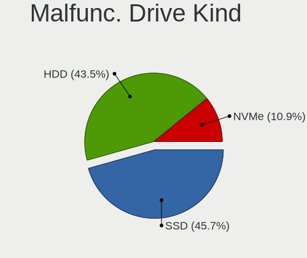

| Kind | Notebooks | Drives | Percent |
|------|-----------|--------|---------|
| HDD  | 18        | 19     | 48.65%  |
| SSD  | 15        | 17     | 40.54%  |
| NVMe | 4         | 4      | 10.81%  |

Failed Drives
-------------

Failed drive models

| Model                                | Notebooks | Drives | Percent |
|--------------------------------------|-----------|--------|---------|
| WDC PC SN520 SDAPMUW-512G-1001 512GB | 1         | 1      | 100%    |

Failed Drive Vendor
-------------------

Failed drive vendors

| Vendor | Notebooks | Drives | Percent |
|--------|-----------|--------|---------|
| WDC    | 1         | 1      | 100%    |

Drive Status
------------

Number of failed and malfunc. drives

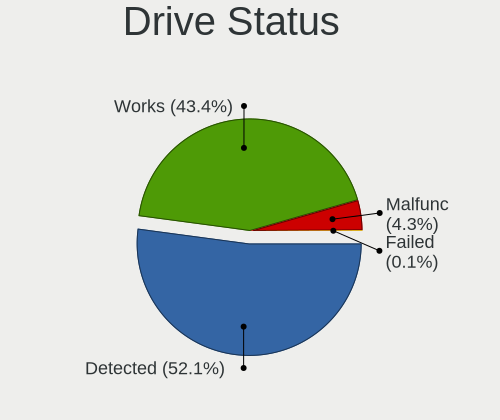

| Status   | Notebooks | Drives | Percent |
|----------|-----------|--------|---------|
| Detected | 502       | 773    | 54.74%  |
| Works    | 379       | 528    | 41.33%  |
| Malfunc  | 35        | 40     | 3.82%   |
| Failed   | 1         | 1      | 0.11%   |

Storage controller
------------------

Storage Vendor
--------------

Storage controller vendors

| Vendor                         | Notebooks | Percent |
|--------------------------------|-----------|---------|
| Intel                          | 515       | 49.81%  |
| Samsung Electronics            | 159       | 15.38%  |
| AMD                            | 100       | 9.67%   |
| Sandisk                        | 63        | 6.09%   |
| SK Hynix                       | 49        | 4.74%   |
| Toshiba America Info Systems   | 35        | 3.38%   |
| Micron Technology              | 15        | 1.45%   |
| Kingston Technology Company    | 14        | 1.35%   |
| KIOXIA                         | 13        | 1.26%   |
| Silicon Motion                 | 12        | 1.16%   |
| Union Memory (Shenzhen)        | 7         | 0.68%   |
| Phison Electronics             | 7         | 0.68%   |
| Micron/Crucial Technology      | 7         | 0.68%   |
| ADATA Technology               | 7         | 0.68%   |
| Realtek Semiconductor          | 5         | 0.48%   |
| Lite-On Technology             | 5         | 0.48%   |
| Nvidia                         | 4         | 0.39%   |
| Apple                          | 4         | 0.39%   |
| Solid State Storage Technology | 3         | 0.29%   |
| Seagate Technology             | 3         | 0.29%   |
| Lenovo                         | 3         | 0.29%   |
| Yangtze Memory Technologies    | 1         | 0.1%    |
| Unknown                        | 1         | 0.1%    |
| Shenzhen Longsys Electronics   | 1         | 0.1%    |
| Enmotus                        | 1         | 0.1%    |

Storage Model
-------------

Storage controller models

| Model                                                                            | Notebooks | Percent |
|----------------------------------------------------------------------------------|-----------|---------|
| AMD FCH SATA Controller [AHCI mode]                                              | 95        | 8.85%   |
| Intel Sunrise Point-LP SATA Controller [AHCI mode]                               | 94        | 8.76%   |
| Samsung NVMe SSD Controller SM981/PM981/PM983                                    | 93        | 8.67%   |
| Intel 82801 Mobile SATA Controller [RAID mode]                                   | 55        | 5.13%   |
| Intel 7 Series Chipset Family 6-port SATA Controller [AHCI mode]                 | 38        | 3.54%   |
| Intel 6 Series/C200 Series Chipset Family 6 port Mobile SATA AHCI Controller     | 37        | 3.45%   |
| Intel Wildcat Point-LP SATA Controller [AHCI Mode]                               | 32        | 2.98%   |
| Intel Cannon Lake Mobile PCH SATA AHCI Controller                                | 31        | 2.89%   |
| Samsung NVMe SSD Controller 980                                                  | 28        | 2.61%   |
| Intel 8 Series/C220 Series Chipset Family 6-port SATA Controller 1 [AHCI mode]   | 28        | 2.61%   |
| Sandisk WD Black SN750 / PC SN730 NVMe SSD                                       | 25        | 2.33%   |
| Intel 8 Series SATA Controller 1 [AHCI mode]                                     | 23        | 2.14%   |
| Intel Volume Management Device NVMe RAID Controller                              | 22        | 2.05%   |
| Intel HM170/QM170 Chipset SATA Controller [AHCI Mode]                            | 21        | 1.96%   |
| Intel Comet Lake SATA AHCI Controller                                            | 21        | 1.96%   |
| Toshiba America Info Systems XG6 NVMe SSD Controller                             | 18        | 1.68%   |
| SK Hynix Gold P31 SSD                                                            | 16        | 1.49%   |
| Micron Non-Volatile memory controller                                            | 15        | 1.4%    |
| Samsung NVMe SSD Controller SM961/PM961/SM963                                    | 13        | 1.21%   |
| KIOXIA Non-Volatile memory controller                                            | 13        | 1.21%   |
| Intel Cannon Point-LP SATA Controller [AHCI Mode]                                | 13        | 1.21%   |
| SK Hynix BC511                                                                   | 12        | 1.12%   |
| Sandisk WD Blue SN550 NVMe SSD                                                   | 12        | 1.12%   |
| Samsung NVMe SSD Controller PM9A1/PM9A3/980PRO                                   | 12        | 1.12%   |
| Intel 400 Series Chipset Family SATA AHCI Controller                             | 12        | 1.12%   |
| SK Hynix Non-Volatile memory controller                                          | 11        | 1.03%   |
| Silicon Motion SM2263EN/SM2263XT SSD Controller                                  | 11        | 1.03%   |
| Intel Tiger Lake-LP SATA Controller [AHCI mode]                                  | 11        | 1.03%   |
| Sandisk Non-Volatile memory controller                                           | 10        | 0.93%   |
| Intel SSD Pro 7600p/760p/E 6100p Series                                          | 10        | 0.93%   |
| Intel SSD 660P Series                                                            | 10        | 0.93%   |
| Intel Celeron/Pentium Silver Processor SATA Controller                           | 10        | 0.93%   |
| SK Hynix BC501 NVMe Solid State Drive                                            | 9         | 0.84%   |
| Intel Q170/Q150/B150/H170/H110/Z170/CM236 Chipset SATA Controller [AHCI Mode]    | 8         | 0.75%   |
| Intel 5 Series/3400 Series Chipset 6 port SATA AHCI Controller                   | 8         | 0.75%   |
| Intel 5 Series/3400 Series Chipset 4 port SATA AHCI Controller                   | 8         | 0.75%   |
| Union Memory (Shenzhen) Non-Volatile memory controller                           | 7         | 0.65%   |
| Intel Atom Processor E3800 Series SATA AHCI Controller                           | 7         | 0.65%   |
| ADATA XPG SX8200 Pro PCIe Gen3x4 M.2 2280 Solid State Drive                      | 7         | 0.65%   |
| Toshiba America Info Systems XG4 NVMe SSD Controller                             | 6         | 0.56%   |
| Toshiba America Info Systems BG3 NVMe SSD Controller                             | 6         | 0.56%   |
| Sandisk WD Blue SN500 / PC SN520 NVMe SSD                                        | 6         | 0.56%   |
| Samsung NVMe SSD Controller SM951/PM951                                          | 6         | 0.56%   |
| Samsung Apple PCIe SSD                                                           | 6         | 0.56%   |
| Intel 82801IBM/IEM (ICH9M/ICH9M-E) 4 port SATA Controller [AHCI mode]            | 6         | 0.56%   |
| Intel 82801HM/HEM (ICH8M/ICH8M-E) IDE Controller                                 | 6         | 0.56%   |
| Sandisk WD Black 2018/SN750 / PC SN720 NVMe SSD                                  | 5         | 0.47%   |
| Samsung Electronics SATA controller                                              | 5         | 0.47%   |
| Kingston Company A2000 NVMe SSD                                                  | 5         | 0.47%   |
| Intel Ice Lake-LP SATA Controller [AHCI mode]                                    | 5         | 0.47%   |
| Intel 82801HM/HEM (ICH8M/ICH8M-E) SATA Controller [AHCI mode]                    | 5         | 0.47%   |
| Sandisk PC SN520 NVMe SSD                                                        | 4         | 0.37%   |
| Phison E12 NVMe Controller                                                       | 4         | 0.37%   |
| Micron/Crucial P1 NVMe PCIe SSD                                                  | 4         | 0.37%   |
| Kingston Company Company Non-Volatile memory controller                          | 4         | 0.37%   |
| Intel Atom/Celeron/Pentium Processor x5-E8000/J3xxx/N3xxx Series SATA Controller | 4         | 0.37%   |
| Intel 5 Series/3400 Series Chipset 4 port SATA IDE Controller                    | 4         | 0.37%   |
| Toshiba America Info Systems Toshiba America Info Non-Volatile memory controller | 3         | 0.28%   |
| Solid State Storage Non-Volatile memory controller                               | 3         | 0.28%   |
| Seagate FireCuda 510 SSD                                                         | 3         | 0.28%   |

Storage Kind
------------

Kind of storage controller (IDE, SATA, NVMe, SAS, ...)

| Kind | Notebooks | Percent |
|------|-----------|---------|
| SATA | 545       | 52.15%  |
| NVMe | 412       | 39.43%  |
| RAID | 74        | 7.08%   |
| IDE  | 14        | 1.34%   |

Processor
---------

CPU Vendor
----------

Processor vendors

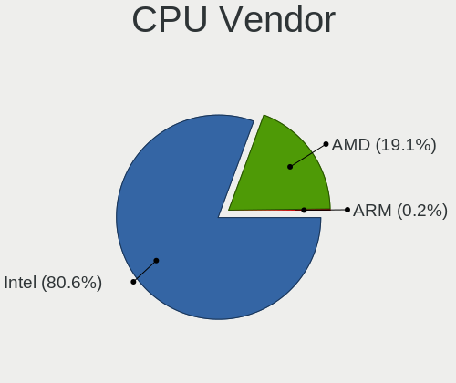

| Vendor   | Notebooks | Percent |
|----------|-----------|---------|
| Intel    | 670       | 79.76%  |
| AMD      | 167       | 19.88%  |
| ARM      | 2         | 0.24%   |
| QUALCOMM | 1         | 0.12%   |

CPU Model
---------

Processor models

| Model                                         | Notebooks | Percent |
|-----------------------------------------------|-----------|---------|
| Intel Core i5-8250U CPU @ 1.60GHz             | 24        | 2.86%   |
| Intel 11th Gen Core i7-1165G7 @ 2.80GHz       | 20        | 2.38%   |
| Intel Core i5-7200U CPU @ 2.50GHz             | 19        | 2.26%   |
| Intel Core i5-10210U CPU @ 1.60GHz            | 19        | 2.26%   |
| Intel Core i7-8550U CPU @ 1.80GHz             | 16        | 1.9%    |
| Intel Core i7-10510U CPU @ 1.80GHz            | 16        | 1.9%    |
| AMD Ryzen 5 3500U with Radeon Vega Mobile Gfx | 16        | 1.9%    |
| Intel Core i5-8265U CPU @ 1.60GHz             | 15        | 1.79%   |
| Intel Core i7-8750H CPU @ 2.20GHz             | 14        | 1.67%   |
| Intel Core i7-8565U CPU @ 1.80GHz             | 14        | 1.67%   |
| Intel Core i7-7700HQ CPU @ 2.80GHz            | 13        | 1.55%   |
| Intel Core i7-10750H CPU @ 2.60GHz            | 13        | 1.55%   |
| Intel Core i5-6200U CPU @ 2.30GHz             | 13        | 1.55%   |
| Intel Core i5-5200U CPU @ 2.20GHz             | 13        | 1.55%   |
| Intel 11th Gen Core i5-1135G7 @ 2.40GHz       | 12        | 1.43%   |
| AMD Ryzen 7 4800H with Radeon Graphics        | 12        | 1.43%   |
| Intel Core i7-9750H CPU @ 2.60GHz             | 11        | 1.31%   |
| Intel Core i7-8665U CPU @ 1.90GHz             | 11        | 1.31%   |
| AMD Ryzen 7 PRO 4750U with Radeon Graphics    | 11        | 1.31%   |
| AMD Ryzen 5 4500U with Radeon Graphics        | 11        | 1.31%   |
| Intel Core i7-6700HQ CPU @ 2.60GHz            | 10        | 1.19%   |
| AMD Ryzen 5 2500U with Radeon Vega Mobile Gfx | 10        | 1.19%   |
| Intel Core i7-6600U CPU @ 2.60GHz             | 9         | 1.07%   |
| Intel Core i7-8650U CPU @ 1.90GHz             | 8         | 0.95%   |
| Intel Core i7-7500U CPU @ 2.70GHz             | 8         | 0.95%   |
| Intel Core i7-5500U CPU @ 2.40GHz             | 8         | 0.95%   |
| Intel Core i5-1035G1 CPU @ 1.00GHz            | 8         | 0.95%   |
| AMD Ryzen 7 4700U with Radeon Graphics        | 8         | 0.95%   |
| Intel Core i7-6500U CPU @ 2.50GHz             | 7         | 0.83%   |
| Intel Core i5-5300U CPU @ 2.30GHz             | 7         | 0.83%   |
| Intel Core i5-3320M CPU @ 2.60GHz             | 7         | 0.83%   |
| Intel Core i5-2520M CPU @ 2.50GHz             | 7         | 0.83%   |
| Intel 11th Gen Core i7-1185G7 @ 3.00GHz       | 7         | 0.83%   |
| AMD Ryzen 9 5900HS with Radeon Graphics       | 7         | 0.83%   |
| AMD Ryzen 7 5800H with Radeon Graphics        | 7         | 0.83%   |
| Intel Core i7-2670QM CPU @ 2.20GHz            | 6         | 0.71%   |
| Intel Core i5-6300U CPU @ 2.40GHz             | 6         | 0.71%   |
| Intel Atom x5-Z8350 CPU @ 1.44GHz             | 6         | 0.71%   |
| Intel 11th Gen Core i7-11800H @ 2.30GHz       | 6         | 0.71%   |
| AMD Ryzen 7 3700U with Radeon Vega Mobile Gfx | 6         | 0.71%   |
| Intel Core i7-8850H CPU @ 2.60GHz             | 5         | 0.6%    |
| Intel Core i7-4600U CPU @ 2.10GHz             | 5         | 0.6%    |
| Intel Core i7-10875H CPU @ 2.30GHz            | 5         | 0.6%    |
| Intel Core i7-1065G7 CPU @ 1.30GHz            | 5         | 0.6%    |
| Intel Core i5-9300H CPU @ 2.40GHz             | 5         | 0.6%    |
| Intel Core i3-7020U CPU @ 2.30GHz             | 5         | 0.6%    |
| Intel Core i3-2350M CPU @ 2.30GHz             | 5         | 0.6%    |
| Intel Core i3-2310M CPU @ 2.10GHz             | 5         | 0.6%    |
| Intel Atom CPU Z3735G @ 1.33GHz               | 5         | 0.6%    |
| AMD Ryzen 5 4600H with Radeon Graphics        | 5         | 0.6%    |
| Intel Pentium Silver N5000 CPU @ 1.10GHz      | 4         | 0.48%   |
| Intel Core i7-4870HQ CPU @ 2.50GHz            | 4         | 0.48%   |
| Intel Core i7-4702MQ CPU @ 2.20GHz            | 4         | 0.48%   |
| Intel Core i7-3630QM CPU @ 2.40GHz            | 4         | 0.48%   |
| Intel Core i7-10850H CPU @ 2.70GHz            | 4         | 0.48%   |
| Intel Core i5-7300U CPU @ 2.60GHz             | 4         | 0.48%   |
| Intel Core i5-7300HQ CPU @ 2.50GHz            | 4         | 0.48%   |
| Intel Core i5-4300M CPU @ 2.60GHz             | 4         | 0.48%   |
| Intel Core i5-4200U CPU @ 1.60GHz             | 4         | 0.48%   |
| Intel Core i5-2410M CPU @ 2.30GHz             | 4         | 0.48%   |

CPU Model Family
----------------

Processor model prefix

| Model                   | Notebooks | Percent |
|-------------------------|-----------|---------|
| Intel Core i7           | 269       | 32.02%  |
| Intel Core i5           | 214       | 25.48%  |
| Other                   | 59        | 7.02%   |
| AMD Ryzen 5             | 54        | 6.43%   |
| Intel Core i3           | 46        | 5.48%   |
| AMD Ryzen 7             | 44        | 5.24%   |
| Intel Atom              | 21        | 2.5%    |
| Intel Celeron           | 16        | 1.9%    |
| AMD Ryzen 7 PRO         | 13        | 1.55%   |
| Intel Core 2 Duo        | 12        | 1.43%   |
| AMD Ryzen 9             | 12        | 1.43%   |
| Intel Pentium           | 10        | 1.19%   |
| Intel Core i9           | 10        | 1.19%   |
| AMD Ryzen 3             | 7         | 0.83%   |
| AMD A8                  | 6         | 0.71%   |
| AMD A10                 | 6         | 0.71%   |
| Intel Pentium Silver    | 5         | 0.6%    |
| AMD Ryzen 5 PRO         | 5         | 0.6%    |
| AMD A6                  | 4         | 0.48%   |
| AMD A4                  | 4         | 0.48%   |
| Intel Pentium Dual      | 2         | 0.24%   |
| Intel Core m7           | 2         | 0.24%   |
| Intel Core m3           | 2         | 0.24%   |
| AMD E                   | 2         | 0.24%   |
| AMD A12                 | 2         | 0.24%   |
| QUALCOMM AArch64        | 1         | 0.12%   |
| Intel Xeon              | 1         | 0.12%   |
| Intel Genuine           | 1         | 0.12%   |
| Intel Core m5           | 1         | 0.12%   |
| Intel Core M            | 1         | 0.12%   |
| Intel Celeron Dual-Core | 1         | 0.12%   |
| AMD Turion II           | 1         | 0.12%   |
| AMD Turion 64 X2 Mobile | 1         | 0.12%   |
| AMD PRO A10             | 1         | 0.12%   |
| AMD E2                  | 1         | 0.12%   |
| AMD E1                  | 1         | 0.12%   |
| AMD Athlon II           | 1         | 0.12%   |
| AMD Athlon              | 1         | 0.12%   |

CPU Cores
---------

Number of processor cores

| Number | Notebooks | Percent |
|--------|-----------|---------|
| 4      | 376       | 44.76%  |
| 2      | 297       | 35.36%  |
| 8      | 82        | 9.76%   |
| 6      | 82        | 9.76%   |
| 1      | 3         | 0.36%   |

CPU Sockets
-----------

Number of sockets

| Number | Notebooks | Percent |
|--------|-----------|---------|
| 1      | 838       | 99.76%  |
| 3      | 1         | 0.12%   |
| 2      | 1         | 0.12%   |

CPU Threads
-----------

Threads per core (Hyper-Threading)

| Number | Notebooks | Percent |
|--------|-----------|---------|
| 2      | 721       | 85.63%  |
| 1      | 121       | 14.37%  |

CPU Op-Modes
------------

CPU Operation Modes (32-bit, 64-bit)

| Op mode        | Notebooks | Percent |
|----------------|-----------|---------|
| 32-bit, 64-bit | 839       | 99.88%  |
| 64-bit         | 1         | 0.12%   |

CPU Microcode
-------------

Microcode number

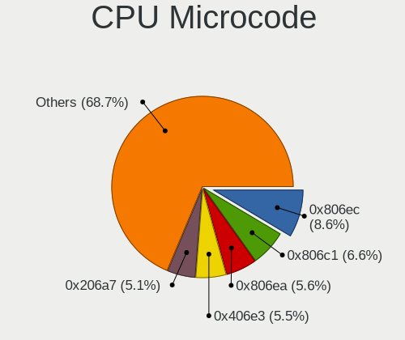

| Number     | Notebooks | Percent |
|------------|-----------|---------|
| 0x806ec    | 67        | 7.92%   |
| 0x806c1    | 50        | 5.91%   |
| 0x806ea    | 48        | 5.67%   |
| 0x406e3    | 47        | 5.56%   |
| 0x806e9    | 43        | 5.08%   |
| 0x206a7    | 43        | 5.08%   |
| 0x306a9    | 38        | 4.49%   |
| 0x906ea    | 36        | 4.26%   |
| Unknown    | 33        | 3.9%    |
| 0x306d4    | 31        | 3.66%   |
| 0xa0652    | 29        | 3.43%   |
| 0x306c3    | 29        | 3.43%   |
| 0x08600106 | 28        | 3.31%   |
| 0x40651    | 27        | 3.19%   |
| 0x0a50000c | 22        | 2.6%    |
| 0x906e9    | 18        | 2.13%   |
| 0x08108102 | 18        | 2.13%   |
| 0x30678    | 17        | 2.01%   |
| 0x20655    | 15        | 1.77%   |
| 0x08600104 | 15        | 1.77%   |
| 0x806eb    | 14        | 1.65%   |
| 0x706e5    | 14        | 1.65%   |
| 0x08108109 | 14        | 1.65%   |
| 0x506e3    | 12        | 1.42%   |
| 0x906ed    | 10        | 1.18%   |
| 0x08600103 | 10        | 1.18%   |
| 0x40661    | 9         | 1.06%   |
| 0x706a1    | 8         | 0.95%   |
| 0x406c4    | 8         | 0.95%   |
| 0x406c3    | 8         | 0.95%   |
| 0x1067a    | 7         | 0.83%   |
| 0x806d1    | 6         | 0.71%   |
| 0x08608102 | 5         | 0.59%   |
| 0x0810100b | 5         | 0.59%   |
| 0x07030105 | 5         | 0.59%   |
| 0x6fd      | 4         | 0.47%   |
| 0x0a50000b | 4         | 0.47%   |
| 0x08608103 | 4         | 0.47%   |
| 0x08101007 | 4         | 0.47%   |
| 0x106e5    | 3         | 0.35%   |
| 0x0600110f | 3         | 0.35%   |
| 0x706a8    | 2         | 0.24%   |
| 0x506c9    | 2         | 0.24%   |
| 0x20652    | 2         | 0.24%   |
| 0x10676    | 2         | 0.24%   |
| 0x08600102 | 2         | 0.24%   |
| 0x08101016 | 2         | 0.24%   |
| 0x0700010f | 2         | 0.24%   |
| 0x07000106 | 2         | 0.24%   |
| 0x0600611a | 2         | 0.24%   |
| 0x06006118 | 2         | 0.24%   |
| 0x010000c8 | 2         | 0.24%   |
| 0xa0660    | 1         | 0.12%   |
| 0x6fb      | 1         | 0.12%   |
| 0x6fa      | 1         | 0.12%   |
| 0x30673    | 1         | 0.12%   |
| 0x07030106 | 1         | 0.12%   |
| 0x06006705 | 1         | 0.12%   |
| 0x06006110 | 1         | 0.12%   |
| 0x06001116 | 1         | 0.12%   |

CPU Microarch
-------------

Microarchitecture

| Name          | Notebooks | Percent |
|---------------|-----------|---------|
| KabyLake      | 242       | 28.81%  |
| Haswell       | 66        | 7.86%   |
| Skylake       | 60        | 7.14%   |
| Zen 2         | 58        | 6.9%    |
| TigerLake     | 50        | 5.95%   |
| SandyBridge   | 45        | 5.36%   |
| IvyBridge     | 40        | 4.76%   |
| Silvermont    | 34        | 4.05%   |
| Zen+          | 33        | 3.93%   |
| Broadwell     | 33        | 3.93%   |
| CometLake     | 30        | 3.57%   |
| Zen 3         | 25        | 2.98%   |
| IceLake       | 22        | 2.62%   |
| Westmere      | 17        | 2.02%   |
| Unknown       | 12        | 1.43%   |
| Zen           | 11        | 1.31%   |
| Penryn        | 10        | 1.19%   |
| Goldmont plus | 10        | 1.19%   |
| Puma          | 7         | 0.83%   |
| Excavator     | 7         | 0.83%   |
| Core          | 6         | 0.71%   |
| Piledriver    | 4         | 0.48%   |
| Jaguar        | 4         | 0.48%   |
| Nehalem       | 3         | 0.36%   |
| K10 Llano     | 3         | 0.36%   |
| K10           | 2         | 0.24%   |
| Goldmont      | 2         | 0.24%   |
| Bobcat        | 2         | 0.24%   |
| Steamroller   | 1         | 0.12%   |
| K8 Hammer     | 1         | 0.12%   |

Graphics
--------

GPU Vendor
----------

Vendors of graphics cards

| Vendor | Notebooks | Percent |
|--------|-----------|---------|
| Intel  | 630       | 56.6%   |
| Nvidia | 269       | 24.17%  |
| AMD    | 214       | 19.23%  |

GPU Model
---------

Graphics card models

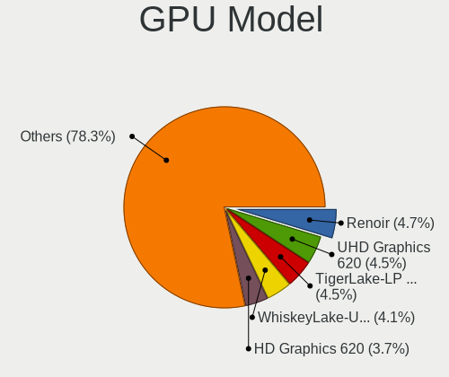

| Model                                                                                    | Notebooks | Percent |
|------------------------------------------------------------------------------------------|-----------|---------|
| AMD Renoir                                                                               | 58        | 5.1%    |
| Intel UHD Graphics 620                                                                   | 52        | 4.57%   |
| Intel TigerLake-LP GT2 [Iris Xe Graphics]                                                | 46        | 4.05%   |
| Intel WhiskeyLake-U GT2 [UHD Graphics 620]                                               | 42        | 3.69%   |
| Intel HD Graphics 620                                                                    | 41        | 3.61%   |
| Intel CoffeeLake-H GT2 [UHD Graphics 630]                                                | 41        | 3.61%   |
| Intel CometLake-U GT2 [UHD Graphics]                                                     | 40        | 3.52%   |
| Intel Skylake GT2 [HD Graphics 520]                                                      | 38        | 3.34%   |
| Intel 3rd Gen Core processor Graphics Controller                                         | 38        | 3.34%   |
| Intel 2nd Generation Core Processor Family Integrated Graphics Controller                | 37        | 3.25%   |
| AMD Picasso                                                                              | 33        | 2.9%    |
| Intel HD Graphics 5500                                                                   | 31        | 2.73%   |
| Intel 4th Gen Core Processor Integrated Graphics Controller                              | 30        | 2.64%   |
| Intel CometLake-H GT2 [UHD Graphics]                                                     | 27        | 2.37%   |
| Intel Haswell-ULT Integrated Graphics Controller                                         | 25        | 2.2%    |
| AMD Cezanne                                                                              | 24        | 2.11%   |
| Intel Atom Processor Z36xxx/Z37xxx Series Graphics & Display                             | 18        | 1.58%   |
| Intel HD Graphics 630                                                                    | 17        | 1.5%    |
| Nvidia TU117M [GeForce GTX 1650 Mobile / Max-Q]                                          | 16        | 1.41%   |
| Intel Atom/Celeron/Pentium Processor x5-E8000/J3xxx/N3xxx Integrated Graphics Controller | 16        | 1.41%   |
| Nvidia GA106M [GeForce RTX 3060 Mobile / Max-Q]                                          | 15        | 1.32%   |
| Intel Core Processor Integrated Graphics Controller                                      | 13        | 1.14%   |
| AMD Topaz XT [Radeon R7 M260/M265 / M340/M360 / M440/M445 / 530/535 / 620/625 Mobile]    | 13        | 1.14%   |
| Nvidia GP107M [GeForce GTX 1050 Mobile]                                                  | 12        | 1.06%   |
| Intel HD Graphics 530                                                                    | 12        | 1.06%   |
| Nvidia GP108M [GeForce MX150]                                                            | 11        | 0.97%   |
| AMD Raven Ridge [Radeon Vega Series / Radeon Vega Mobile Series]                         | 11        | 0.97%   |
| Nvidia GP107M [GeForce GTX 1050 Ti Mobile]                                               | 9         | 0.79%   |
| Intel Iris Plus Graphics G1 (Ice Lake)                                                   | 9         | 0.79%   |
| AMD Sun XT [Radeon HD 8670A/8670M/8690M / R5 M330 / M430 / Radeon 520 Mobile]            | 9         | 0.79%   |
| AMD Lucienne                                                                             | 9         | 0.79%   |
| Nvidia TU116M [GeForce GTX 1660 Ti Mobile]                                               | 8         | 0.7%    |
| Nvidia GM108M [GeForce MX110]                                                            | 8         | 0.7%    |
| Nvidia TU117M [GeForce GTX 1650 Ti Mobile]                                               | 7         | 0.62%   |
| Nvidia TU106M [GeForce RTX 2060 Mobile]                                                  | 7         | 0.62%   |
| Nvidia GP108M [GeForce MX250]                                                            | 7         | 0.62%   |
| Nvidia GP106M [GeForce GTX 1060 Mobile]                                                  | 7         | 0.62%   |
| Nvidia GM108M [GeForce 940M]                                                             | 7         | 0.62%   |
| Nvidia GM108M [GeForce 930MX]                                                            | 6         | 0.53%   |
| Intel TigerLake-H GT1 [UHD Graphics]                                                     | 6         | 0.53%   |
| Intel Mobile GM965/GL960 Integrated Graphics Controller (secondary)                      | 6         | 0.53%   |
| Intel Mobile GM965/GL960 Integrated Graphics Controller (primary)                        | 6         | 0.53%   |
| Nvidia GM107M [GeForce GTX 960M]                                                         | 5         | 0.44%   |
| Nvidia GM107GLM [Quadro M1000M]                                                          | 5         | 0.44%   |
| Intel Iris Plus Graphics G7                                                              | 5         | 0.44%   |
| Intel GeminiLake [UHD Graphics 605]                                                      | 5         | 0.44%   |
| Intel GeminiLake [UHD Graphics 600]                                                      | 5         | 0.44%   |
| AMD Wani [Radeon R5/R6/R7 Graphics]                                                      | 5         | 0.44%   |
| AMD Mullins [Radeon R4/R5 Graphics]                                                      | 5         | 0.44%   |
| AMD Lexa [Radeon 540X/550X/630 / RX 640 / E9171 MCM]                                     | 5         | 0.44%   |
| Nvidia TU117GLM [Quadro T1000 Mobile]                                                    | 4         | 0.35%   |
| Nvidia GP107M [GeForce GTX 1050 3 GB Max-Q]                                              | 4         | 0.35%   |
| Nvidia GM108M [GeForce 940MX]                                                            | 4         | 0.35%   |
| Nvidia GM108M [GeForce 840M]                                                             | 4         | 0.35%   |
| Nvidia GK107M [GeForce GT 750M Mac Edition]                                              | 4         | 0.35%   |
| Nvidia GF117M [GeForce 610M/710M/810M/820M / GT 620M/625M/630M/720M]                     | 4         | 0.35%   |
| Intel HD Graphics 515                                                                    | 4         | 0.35%   |
| AMD Venus XT [Radeon HD 8870M / R9 M270X/M370X]                                          | 4         | 0.35%   |
| Nvidia TU117M [GeForce MX450]                                                            | 3         | 0.26%   |
| Nvidia TU117M                                                                            | 3         | 0.26%   |

GPU Combo
---------

Combinations of graphics cards

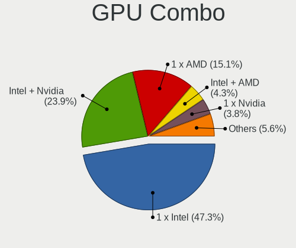

| Name           | Notebooks | Percent |
|----------------|-----------|---------|
| 1 x Intel      | 383       | 45.54%  |
| Intel + Nvidia | 208       | 24.73%  |
| 1 x AMD        | 131       | 15.58%  |
| Intel + AMD    | 37        | 4.4%    |
| 1 x Nvidia     | 32        | 3.8%    |
| AMD + Nvidia   | 29        | 3.45%   |
| 2 x AMD        | 17        | 2.02%   |
| Other          | 3         | 0.36%   |
| 2 x Nvidia     | 1         | 0.12%   |

GPU Driver
----------

Free vs proprietary

| Driver      | Notebooks | Percent |
|-------------|-----------|---------|
| Free        | 725       | 85.29%  |
| Proprietary | 119       | 14%     |
| Unknown     | 6         | 0.71%   |

GPU Memory
----------

Total video memory

| Size in GB | Notebooks | Percent |
|------------|-----------|---------|
| Unknown    | 496       | 57.94%  |
| 1.01-2.0   | 135       | 15.77%  |
| 0.01-0.5   | 103       | 12.03%  |
| 3.01-4.0   | 54        | 6.31%   |
| 0.51-1.0   | 42        | 4.91%   |
| 5.01-6.0   | 12        | 1.4%    |
| 7.01-8.0   | 8         | 0.93%   |
| 2.01-3.0   | 5         | 0.58%   |
| 8.01-16.0  | 1         | 0.12%   |

Monitor
-------

Monitor Vendor
--------------

Monitor vendors

| Vendor                  | Notebooks | Percent |
|-------------------------|-----------|---------|
| AU Optronics            | 175       | 16.59%  |
| LG Display              | 158       | 14.98%  |
| Chimei Innolux          | 148       | 14.03%  |
| BOE                     | 134       | 12.7%   |
| Samsung Electronics     | 82        | 7.77%   |
| Dell                    | 52        | 4.93%   |
| Sharp                   | 47        | 4.45%   |
| Goldstar                | 40        | 3.79%   |
| PANDA                   | 25        | 2.37%   |
| Apple                   | 25        | 2.37%   |
| Hewlett-Packard         | 21        | 1.99%   |
| Lenovo                  | 20        | 1.9%    |
| Philips                 | 14        | 1.33%   |
| CSO                     | 13        | 1.23%   |
| Acer                    | 13        | 1.23%   |
| BenQ                    | 12        | 1.14%   |
| Ancor Communications    | 11        | 1.04%   |
| Chi Mei Optoelectronics | 8         | 0.76%   |
| AOC                     | 8         | 0.76%   |
| TMX                     | 5         | 0.47%   |
| InfoVision              | 5         | 0.47%   |
| ASUSTek Computer        | 5         | 0.47%   |
| ViewSonic               | 3         | 0.28%   |
| Toshiba                 | 3         | 0.28%   |
| Sony                    | 3         | 0.28%   |
| Sceptre Tech            | 3         | 0.28%   |
| JDI                     | 3         | 0.28%   |
| Iiyama                  | 3         | 0.28%   |
| Insignia                | 2         | 0.19%   |
| eMachines               | 2         | 0.19%   |
| VOR                     | 1         | 0.09%   |
| SKY                     | 1         | 0.09%   |
| SGT                     | 1         | 0.09%   |
| QCM                     | 1         | 0.09%   |
| Pixio                   | 1         | 0.09%   |
| Panasonic               | 1         | 0.09%   |
| Orion                   | 1         | 0.09%   |
| OPT                     | 1         | 0.09%   |
| LG Philips              | 1         | 0.09%   |
| KTC                     | 1         | 0.09%   |
| GDH                     | 1         | 0.09%   |
| Fujitsu Siemens         | 1         | 0.09%   |

Monitor Model
-------------

Monitor models

| Model                                                                | Notebooks | Percent |
|----------------------------------------------------------------------|-----------|---------|
| Chimei Innolux LCD Monitor CMN15F5 1920x1080 344x193mm 15.5-inch     | 13        | 1.22%   |
| Chimei Innolux LCD Monitor CMN14D4 1920x1080 309x173mm 13.9-inch     | 12        | 1.12%   |
| AU Optronics LCD Monitor AUO21ED 1920x1080 344x194mm 15.5-inch       | 10        | 0.94%   |
| AU Optronics LCD Monitor AUO573D 1920x1080 309x174mm 14.0-inch       | 9         | 0.84%   |
| AU Optronics LCD Monitor AUO61ED 1920x1080 340x190mm 15.3-inch       | 7         | 0.65%   |
| Sharp LCD Monitor SHP14D1 1920x1200 336x210mm 15.6-inch              | 6         | 0.56%   |
| LG Display LCD Monitor LGD02DC 1366x768 344x194mm 15.5-inch          | 6         | 0.56%   |
| Lenovo LCD Monitor LEN40BA 1920x1080 344x194mm 15.5-inch             | 6         | 0.56%   |
| AU Optronics LCD Monitor AUO38ED 1920x1080 340x190mm 15.3-inch       | 6         | 0.56%   |
| Sharp LCD Monitor SHP1453 1920x1080 346x194mm 15.6-inch              | 5         | 0.47%   |
| Samsung Electronics LCD Monitor SEC5441 1366x768 344x194mm 15.5-inch | 5         | 0.47%   |
| LG Display LCD Monitor LGD062E 1920x1080 344x194mm 15.5-inch         | 5         | 0.47%   |
| LG Display LCD Monitor LGD05E5 1920x1080 344x194mm 15.5-inch         | 5         | 0.47%   |
| LG Display LCD Monitor LGD046F 1920x1080 344x194mm 15.5-inch         | 5         | 0.47%   |
| Dell U2412M DELA07A 1920x1200 518x324mm 24.1-inch                    | 5         | 0.47%   |
| Chimei Innolux LCD Monitor CMN15E7 1920x1080 344x193mm 15.5-inch     | 5         | 0.47%   |
| Chimei Innolux LCD Monitor CMN15E6 1366x768 344x193mm 15.5-inch      | 5         | 0.47%   |
| Chimei Innolux LCD Monitor CMN15D5 1920x1080 340x190mm 15.3-inch     | 5         | 0.47%   |
| AU Optronics LCD Monitor AUO403D 1920x1080 309x173mm 13.9-inch       | 5         | 0.47%   |
| TMX TL140BDXP01-0 TMX1400 2560x1440 310x174mm 14.0-inch              | 4         | 0.37%   |
| Sharp LCD Monitor SHP144A 3200x1800 294x165mm 13.3-inch              | 4         | 0.37%   |
| PANDA LCD Monitor NCP004D 1920x1080 344x194mm 15.5-inch              | 4         | 0.37%   |
| PANDA LCD Monitor NCP0035 1920x1080 309x174mm 14.0-inch              | 4         | 0.37%   |
| LG Display LCD Monitor LGD02D8 1366x768 277x156mm 12.5-inch          | 4         | 0.37%   |
| Goldstar HDR WFHD GSM7714 2560x1080 798x334mm 34.1-inch              | 4         | 0.37%   |
| Chimei Innolux LCD Monitor CMN15E8 1920x1080 344x193mm 15.5-inch     | 4         | 0.37%   |
| Chimei Innolux LCD Monitor CMN15DB 1366x768 344x193mm 15.5-inch      | 4         | 0.37%   |
| Chimei Innolux LCD Monitor CMN1521 1920x1080 344x193mm 15.5-inch     | 4         | 0.37%   |
| Chimei Innolux LCD Monitor CMN14D5 1920x1080 309x173mm 13.9-inch     | 4         | 0.37%   |
| Chimei Innolux LCD Monitor CMN14C3 1366x768 309x173mm 13.9-inch      | 4         | 0.37%   |
| BOE LCD Monitor BOE0877 1920x1080 309x173mm 13.9-inch                | 4         | 0.37%   |
| BOE LCD Monitor BOE0687 1920x1080 344x193mm 15.5-inch                | 4         | 0.37%   |
| AU Optronics LCD Monitor AUO71EC 1366x768 340x190mm 15.3-inch        | 4         | 0.37%   |
| AU Optronics LCD Monitor AUO683D 1920x1080 309x174mm 14.0-inch       | 4         | 0.37%   |
| AU Optronics LCD Monitor AUO26EC 1366x768 344x193mm 15.5-inch        | 4         | 0.37%   |
| AU Optronics LCD Monitor AUO22EC 1366x768 344x193mm 15.5-inch        | 4         | 0.37%   |
| AU Optronics LCD Monitor AUO106C 1366x768 277x156mm 12.5-inch        | 4         | 0.37%   |
| Apple Color LCD APPA02E 2880x1800 331x207mm 15.4-inch                | 4         | 0.37%   |
| Sharp LQ156M1JW01 SHP14C3 1920x1080 344x194mm 15.5-inch              | 3         | 0.28%   |
| Sharp LCD Monitor SHP14BA 1920x1080 344x194mm 15.5-inch              | 3         | 0.28%   |
| Samsung Electronics LCD Monitor SDC5441 1366x768 340x190mm 15.3-inch | 3         | 0.28%   |
| Samsung Electronics LCD Monitor SDC4141 1366x768 340x190mm 15.3-inch | 3         | 0.28%   |
| Samsung Electronics Color LCD SDCA029 2160x1440 252x168mm 11.9-inch  | 3         | 0.28%   |
| Philips PHL 276E8V PHLC18F 3840x2160 597x336mm 27.0-inch             | 3         | 0.28%   |
| PANDA LCD Monitor NCP0046 1920x1080 344x194mm 15.5-inch              | 3         | 0.28%   |
| PANDA LCD Monitor NCP002D 1920x1080 344x194mm 15.5-inch              | 3         | 0.28%   |
| LG Display LCD Monitor LGD062C 1920x1080 309x174mm 14.0-inch         | 3         | 0.28%   |
| LG Display LCD Monitor LGD05FA 1920x1080 309x174mm 14.0-inch         | 3         | 0.28%   |
| LG Display LCD Monitor LGD0599 1920x1080 309x174mm 14.0-inch         | 3         | 0.28%   |
| LG Display LCD Monitor LGD0521 1920x1080 309x174mm 14.0-inch         | 3         | 0.28%   |
| LG Display LCD Monitor LGD04A5 1920x1280 253x169mm 12.0-inch         | 3         | 0.28%   |
| LG Display LCD Monitor LGD045E 1366x768 309x174mm 14.0-inch          | 3         | 0.28%   |
| LG Display LCD Monitor LGD0323 1920x1080 345x194mm 15.6-inch         | 3         | 0.28%   |
| Goldstar LG ULTRAWIDE GSM59F1 1920x1080 580x240mm 24.7-inch          | 3         | 0.28%   |
| Goldstar FULL HD GSM5B55 1920x1080 480x270mm 21.7-inch               | 3         | 0.28%   |
| Dell P2419H DELD0DA 1920x1080 527x296mm 23.8-inch                    | 3         | 0.28%   |
| Dell P2319H DELD0D7 1920x1080 509x286mm 23.0-inch                    | 3         | 0.28%   |
| CSO LCD Monitor CSO1402 2880x1800 302x188mm 14.0-inch                | 3         | 0.28%   |
| Chimei Innolux P130ZDZ-EF1 CMN8201 2160x1440 275x183mm 13.0-inch     | 3         | 0.28%   |
| Chimei Innolux LCD Monitor CMN1738 1920x1080 381x214mm 17.2-inch     | 3         | 0.28%   |

Monitor Resolution
------------------

Monitor screen resolution

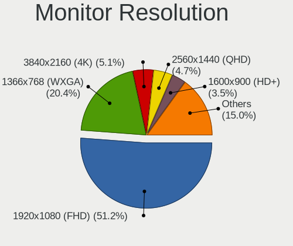

| Resolution         | Notebooks | Percent |
|--------------------|-----------|---------|
| 1920x1080 (FHD)    | 489       | 50.88%  |
| 1366x768 (WXGA)    | 200       | 20.81%  |
| 3840x2160 (4K)     | 51        | 5.31%   |
| 2560x1440 (QHD)    | 43        | 4.47%   |
| 1600x900 (HD+)     | 32        | 3.33%   |
| 1920x1200 (WUXGA)  | 27        | 2.81%   |
| 2560x1600          | 17        | 1.77%   |
| 2880x1800          | 15        | 1.56%   |
| 2560x1080          | 13        | 1.35%   |
| 1280x800 (WXGA)    | 10        | 1.04%   |
| 3440x1440          | 8         | 0.83%   |
| 3200x1800 (QHD+)   | 7         | 0.73%   |
| 1440x900 (WXGA+)   | 6         | 0.62%   |
| 1360x768           | 6         | 0.62%   |
| 1680x1050 (WSXGA+) | 5         | 0.52%   |
| 1920x1280          | 4         | 0.42%   |
| 3840x2400          | 3         | 0.31%   |
| 3000x2000          | 3         | 0.31%   |
| 2160x1440          | 3         | 0.31%   |
| 3456x2160          | 2         | 0.21%   |
| 2256x1504          | 2         | 0.21%   |
| 2160x1350          | 2         | 0.21%   |
| 1920x540           | 2         | 0.21%   |
| 1280x1024 (SXGA)   | 2         | 0.21%   |
| 1024x768 (XGA)     | 2         | 0.21%   |
| 3840x1600          | 1         | 0.1%    |
| 3840x1100          | 1         | 0.1%    |
| 3200x2000          | 1         | 0.1%    |
| 1920x515           | 1         | 0.1%    |
| 1680x945           | 1         | 0.1%    |
| 1600x1200          | 1         | 0.1%    |
| 1440x2560          | 1         | 0.1%    |

Monitor Diagonal
----------------

Diagonal size in inches

| Inches  | Notebooks | Percent |
|---------|-----------|---------|
| 15      | 419       | 39.83%  |
| 13      | 170       | 16.16%  |
| 14      | 131       | 12.45%  |
| 27      | 54        | 5.13%   |
| 17      | 49        | 4.66%   |
| 24      | 44        | 4.18%   |
| 23      | 40        | 3.8%    |
| 12      | 28        | 2.66%   |
| 21      | 20        | 1.9%    |
| 34      | 18        | 1.71%   |
| 31      | 11        | 1.05%   |
| 18      | 11        | 1.05%   |
| 11      | 9         | 0.86%   |
| 16      | 8         | 0.76%   |
| 25      | 5         | 0.48%   |
| 32      | 4         | 0.38%   |
| 29      | 4         | 0.38%   |
| 22      | 4         | 0.38%   |
| 20      | 3         | 0.29%   |
| 19      | 3         | 0.29%   |
| 54      | 2         | 0.19%   |
| 40      | 2         | 0.19%   |
| 39      | 2         | 0.19%   |
| 33      | 2         | 0.19%   |
| 74      | 1         | 0.1%    |
| 65      | 1         | 0.1%    |
| 47      | 1         | 0.1%    |
| 37      | 1         | 0.1%    |
| 36      | 1         | 0.1%    |
| 35      | 1         | 0.1%    |
| 28      | 1         | 0.1%    |
| 8       | 1         | 0.1%    |
| Unknown | 1         | 0.1%    |

Monitor Width
-------------

Physical width

| Width in mm | Notebooks | Percent |
|-------------|-----------|---------|
| 301-350     | 645       | 62.26%  |
| 501-600     | 125       | 12.07%  |
| 201-300     | 106       | 10.23%  |
| 351-400     | 59        | 5.69%   |
| 401-500     | 41        | 3.96%   |
| 701-800     | 25        | 2.41%   |
| 601-700     | 22        | 2.12%   |
| 801-900     | 6         | 0.58%   |
| 1001-1500   | 4         | 0.39%   |
| 1501-2000   | 1         | 0.1%    |
| 101-200     | 1         | 0.1%    |
| Unknown     | 1         | 0.1%    |

Aspect Ratio
------------

Proportional relationship between the width and the height

| Ratio | Notebooks | Percent |
|-------|-----------|---------|
| 16/9  | 752       | 84.88%  |
| 16/10 | 89        | 10.05%  |
| 21/9  | 22        | 2.48%   |
| 3/2   | 14        | 1.58%   |
| 4/3   | 3         | 0.34%   |
| 5/4   | 2         | 0.23%   |
| 32/9  | 1         | 0.11%   |
| 3.88  | 1         | 0.11%   |
| 3.40  | 1         | 0.11%   |
| 0.62  | 1         | 0.11%   |

Monitor Area
------------

Area in inch

| Area in inch | Notebooks | Percent |
|----------------|-----------|---------|
| 101-110        | 420       | 40.11%  |
| 81-90          | 236       | 22.54%  |
| 201-250        | 85        | 8.12%   |
| 71-80          | 63        | 6.02%   |
| 301-350        | 54        | 5.16%   |
| 121-130        | 45        | 4.3%    |
| 351-500        | 40        | 3.82%   |
| 61-70          | 27        | 2.58%   |
| 251-300        | 20        | 1.91%   |
| 141-150        | 12        | 1.15%   |
| 151-200        | 11        | 1.05%   |
| 51-60          | 10        | 0.96%   |
| 501-1000       | 7         | 0.67%   |
| 111-120        | 6         | 0.57%   |
| More than 1000 | 4         | 0.38%   |
| 1-40           | 2         | 0.19%   |
| 131-140        | 2         | 0.19%   |
| 91-100         | 2         | 0.19%   |
| Unknown        | 1         | 0.1%    |

Pixel Density
-------------

Pixels per inch

| Density       | Notebooks | Percent |
|---------------|-----------|---------|
| 121-160       | 477       | 46.72%  |
| 101-120       | 238       | 23.31%  |
| 51-100        | 156       | 15.28%  |
| 161-240       | 96        | 9.4%    |
| More than 240 | 46        | 4.51%   |
| 1-50          | 7         | 0.69%   |
| Unknown       | 1         | 0.1%    |

Multiple Monitors
-----------------

Total monitors connected

| Total | Notebooks | Percent |
|-------|-----------|---------|
| 1     | 619       | 72.31%  |
| 2     | 189       | 22.08%  |
| 3     | 31        | 3.62%   |
| 0     | 17        | 1.99%   |

Network
-------

Net Controller Vendor
---------------------

Controller vendors

| Vendor                            | Notebooks | Percent |
|-----------------------------------|-----------|---------|
| Intel                             | 517       | 40.42%  |
| Realtek Semiconductor             | 428       | 33.46%  |
| Qualcomm Atheros                  | 148       | 11.57%  |
| Broadcom                          | 57        | 4.46%   |
| Broadcom Limited                  | 17        | 1.33%   |
| TP-Link                           | 13        | 1.02%   |
| Lenovo                            | 13        | 1.02%   |
| MEDIATEK                          | 10        | 0.78%   |
| Hewlett-Packard                   | 8         | 0.63%   |
| Sierra Wireless                   | 7         | 0.55%   |
| DisplayLink                       | 7         | 0.55%   |
| Marvell Technology Group          | 6         | 0.47%   |
| Ralink Technology                 | 5         | 0.39%   |
| Ralink                            | 5         | 0.39%   |
| Samsung Electronics               | 3         | 0.23%   |
| Qualcomm                          | 3         | 0.23%   |
| Ericsson Business Mobile Networks | 3         | 0.23%   |
| Apple                             | 3         | 0.23%   |
| Nvidia                            | 2         | 0.16%   |
| NetGear                           | 2         | 0.16%   |
| Linksys                           | 2         | 0.16%   |
| Huawei Technologies               | 2         | 0.16%   |
| Fibocom                           | 2         | 0.16%   |
| Dell                              | 2         | 0.16%   |
| ASUSTek Computer                  | 2         | 0.16%   |
| ASIX Electronics                  | 2         | 0.16%   |
| T & A Mobile Phones               | 1         | 0.08%   |
| Quectel Wireless Solutions        | 1         | 0.08%   |
| Qualcomm Atheros Communications   | 1         | 0.08%   |
| Motorola PCS                      | 1         | 0.08%   |
| MicroPython                       | 1         | 0.08%   |
| LG Electronics                    | 1         | 0.08%   |
| JMicron Technology                | 1         | 0.08%   |
| Google                            | 1         | 0.08%   |
| D-Link System                     | 1         | 0.08%   |
| D-Link                            | 1         | 0.08%   |

Net Controller Model
--------------------

Controller models

| Model                                                             | Notebooks | Percent |
|-------------------------------------------------------------------|-----------|---------|
| Realtek RTL8111/8168/8411 PCI Express Gigabit Ethernet Controller | 281       | 18.33%  |
| Intel Wi-Fi 6 AX200                                               | 89        | 5.81%   |
| Realtek RTL810xE PCI Express Fast Ethernet controller             | 57        | 3.72%   |
| Intel Wireless 8265 / 8275                                        | 56        | 3.65%   |
| Realtek RTL8153 Gigabit Ethernet Adapter                          | 47        | 3.07%   |
| Qualcomm Atheros QCA9377 802.11ac Wireless Network Adapter        | 45        | 2.94%   |
| Intel Wi-Fi 6 AX201                                               | 38        | 2.48%   |
| Intel Wireless 8260                                               | 36        | 2.35%   |
| Intel Comet Lake PCH-LP CNVi WiFi                                 | 31        | 2.02%   |
| Intel Wireless 7265                                               | 29        | 1.89%   |
| Intel Wireless 7260                                               | 29        | 1.89%   |
| Intel Comet Lake PCH CNVi WiFi                                    | 29        | 1.89%   |
| Intel Cannon Point-LP CNVi [Wireless-AC]                          | 28        | 1.83%   |
| Qualcomm Atheros AR9485 Wireless Network Adapter                  | 25        | 1.63%   |
| Intel 82579LM Gigabit Network Connection (Lewisville)             | 25        | 1.63%   |
| Realtek RTL8822CE 802.11ac PCIe Wireless Network Adapter          | 24        | 1.57%   |
| Qualcomm Atheros QCA6174 802.11ac Wireless Network Adapter        | 20        | 1.3%    |
| Intel Ethernet Connection (4) I219-LM                             | 20        | 1.3%    |
| Qualcomm Atheros QCA9565 / AR9565 Wireless Network Adapter        | 19        | 1.24%   |
| Intel Centrino Advanced-N 6205 [Taylor Peak]                      | 18        | 1.17%   |
| Intel Cannon Lake PCH CNVi WiFi                                   | 18        | 1.17%   |
| Intel Wireless 3165                                               | 17        | 1.11%   |
| Realtek RTL8822BE 802.11a/b/g/n/ac WiFi adapter                   | 16        | 1.04%   |
| Realtek RTL8821CE 802.11ac PCIe Wireless Network Adapter          | 16        | 1.04%   |
| Realtek RTL8723BE PCIe Wireless Network Adapter                   | 14        | 0.91%   |
| Intel Ethernet Connection I219-LM                                 | 12        | 0.78%   |
| Broadcom BCM4313 802.11bgn Wireless Network Adapter               | 12        | 0.78%   |
| Intel Wireless 3160                                               | 11        | 0.72%   |
| Intel Ethernet Connection I218-LM                                 | 11        | 0.72%   |
| Intel Ice Lake-LP PCH CNVi WiFi                                   | 10        | 0.65%   |
| Intel Ethernet Connection I217-LM                                 | 10        | 0.65%   |
| Intel Ethernet Connection (4) I219-V                              | 10        | 0.65%   |
| MEDIATEK Network controller                                       | 9         | 0.59%   |
| Intel Ethernet Connection (6) I219-V                              | 9         | 0.59%   |
| Intel Ethernet Connection (6) I219-LM                             | 9         | 0.59%   |
| Broadcom BCM43142 802.11b/g/n                                     | 9         | 0.59%   |
| Qualcomm Atheros AR9285 Wireless Network Adapter (PCI-Express)    | 8         | 0.52%   |
| Intel Wi-Fi 6 AX210/AX211/AX411 160MHz                            | 8         | 0.52%   |
| Intel Ethernet Connection (7) I219-LM                             | 8         | 0.52%   |
| Intel Ethernet Connection (3) I218-LM                             | 8         | 0.52%   |
| Intel Ethernet Connection (10) I219-V                             | 8         | 0.52%   |
| Intel Dual Band Wireless-AC 3165 Plus Bluetooth                   | 8         | 0.52%   |
| Realtek RTL8852AE 802.11ax PCIe Wireless Network Adapter          | 7         | 0.46%   |
| Realtek RTL8723DE Wireless Network Adapter                        | 6         | 0.39%   |
| Realtek RTL8188CE 802.11b/g/n WiFi Adapter                        | 6         | 0.39%   |
| Qualcomm Atheros AR8152 v2.0 Fast Ethernet                        | 6         | 0.39%   |
| Intel Wireless-AC 9260                                            | 6         | 0.39%   |
| Intel Ethernet Connection (2) I219-LM                             | 6         | 0.39%   |
| Intel Centrino Wireless-N 1030 [Rainbow Peak]                     | 6         | 0.39%   |
| Intel Centrino Advanced-N 6235                                    | 6         | 0.39%   |
| Intel Centrino Advanced-N 6200                                    | 6         | 0.39%   |
| Intel 82577LM Gigabit Network Connection                          | 6         | 0.39%   |
| Broadcom BCM43602 802.11ac Wireless LAN SoC                       | 6         | 0.39%   |
| Broadcom BCM43228 802.11a/b/g/n                                   | 6         | 0.39%   |
| TP-Link UE300 10/100/1000 LAN (ethernet mode) [Realtek RTL8153]   | 5         | 0.33%   |
| Broadcom BCM4360 802.11ac Wireless Network Adapter                | 5         | 0.33%   |
| Sierra Wireless EM7345 4G LTE                                     | 4         | 0.26%   |
| Realtek RTL8723AE PCIe Wireless Network Adapter                   | 4         | 0.26%   |
| Realtek RTL8152 Fast Ethernet Adapter                             | 4         | 0.26%   |
| Ralink RT3290 Wireless 802.11n 1T/1R PCIe                         | 4         | 0.26%   |

Wireless Vendor
---------------

Wireless vendors

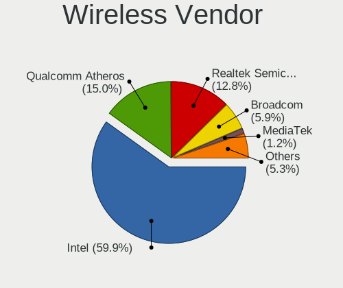

| Vendor                          | Notebooks | Percent |
|---------------------------------|-----------|---------|
| Intel                           | 505       | 59.27%  |
| Qualcomm Atheros                | 129       | 15.14%  |
| Realtek Semiconductor           | 110       | 12.91%  |
| Broadcom                        | 53        | 6.22%   |
| MEDIATEK                        | 9         | 1.06%   |
| Broadcom Limited                | 8         | 0.94%   |
| TP-Link                         | 7         | 0.82%   |
| Sierra Wireless                 | 7         | 0.82%   |
| Ralink Technology               | 5         | 0.59%   |
| Ralink                          | 5         | 0.59%   |
| Qualcomm                        | 2         | 0.23%   |
| NetGear                         | 2         | 0.23%   |
| Hewlett-Packard                 | 2         | 0.23%   |
| Fibocom                         | 2         | 0.23%   |
| Quectel Wireless Solutions      | 1         | 0.12%   |
| Qualcomm Atheros Communications | 1         | 0.12%   |
| Linksys                         | 1         | 0.12%   |
| Dell                            | 1         | 0.12%   |
| D-Link System                   | 1         | 0.12%   |
| ASUSTek Computer                | 1         | 0.12%   |

Wireless Model
--------------

Wireless models

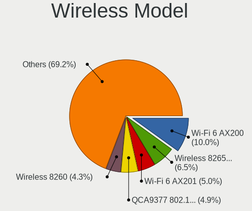

| Model                                                                   | Notebooks | Percent |
|-------------------------------------------------------------------------|-----------|---------|
| Intel Wi-Fi 6 AX200                                                     | 89        | 10.4%   |
| Intel Wireless 8265 / 8275                                              | 56        | 6.54%   |
| Qualcomm Atheros QCA9377 802.11ac Wireless Network Adapter              | 45        | 5.26%   |
| Intel Wi-Fi 6 AX201                                                     | 38        | 4.44%   |
| Intel Wireless 8260                                                     | 36        | 4.21%   |
| Intel Comet Lake PCH-LP CNVi WiFi                                       | 31        | 3.62%   |
| Intel Wireless 7265                                                     | 29        | 3.39%   |
| Intel Wireless 7260                                                     | 29        | 3.39%   |
| Intel Comet Lake PCH CNVi WiFi                                          | 29        | 3.39%   |
| Intel Cannon Point-LP CNVi [Wireless-AC]                                | 28        | 3.27%   |
| Qualcomm Atheros AR9485 Wireless Network Adapter                        | 25        | 2.92%   |
| Realtek RTL8822CE 802.11ac PCIe Wireless Network Adapter                | 24        | 2.8%    |
| Qualcomm Atheros QCA6174 802.11ac Wireless Network Adapter              | 20        | 2.34%   |
| Qualcomm Atheros QCA9565 / AR9565 Wireless Network Adapter              | 19        | 2.22%   |
| Intel Centrino Advanced-N 6205 [Taylor Peak]                            | 18        | 2.1%    |
| Intel Cannon Lake PCH CNVi WiFi                                         | 18        | 2.1%    |
| Intel Wireless 3165                                                     | 17        | 1.99%   |
| Realtek RTL8822BE 802.11a/b/g/n/ac WiFi adapter                         | 16        | 1.87%   |
| Realtek RTL8821CE 802.11ac PCIe Wireless Network Adapter                | 16        | 1.87%   |
| Realtek RTL8723BE PCIe Wireless Network Adapter                         | 14        | 1.64%   |
| Broadcom BCM4313 802.11bgn Wireless Network Adapter                     | 12        | 1.4%    |
| Intel Wireless 3160                                                     | 11        | 1.29%   |
| Intel Ice Lake-LP PCH CNVi WiFi                                         | 10        | 1.17%   |
| MEDIATEK Network controller                                             | 9         | 1.05%   |
| Broadcom BCM43142 802.11b/g/n                                           | 9         | 1.05%   |
| Qualcomm Atheros AR9285 Wireless Network Adapter (PCI-Express)          | 8         | 0.93%   |
| Intel Wi-Fi 6 AX210/AX211/AX411 160MHz                                  | 8         | 0.93%   |
| Intel Dual Band Wireless-AC 3165 Plus Bluetooth                         | 8         | 0.93%   |
| Realtek RTL8852AE 802.11ax PCIe Wireless Network Adapter                | 7         | 0.82%   |
| Realtek RTL8723DE Wireless Network Adapter                              | 6         | 0.7%    |
| Realtek RTL8188CE 802.11b/g/n WiFi Adapter                              | 6         | 0.7%    |
| Intel Wireless-AC 9260                                                  | 6         | 0.7%    |
| Intel Centrino Wireless-N 1030 [Rainbow Peak]                           | 6         | 0.7%    |
| Intel Centrino Advanced-N 6235                                          | 6         | 0.7%    |
| Intel Centrino Advanced-N 6200                                          | 6         | 0.7%    |
| Broadcom BCM43602 802.11ac Wireless LAN SoC                             | 6         | 0.7%    |
| Broadcom BCM43228 802.11a/b/g/n                                         | 6         | 0.7%    |
| Broadcom BCM4360 802.11ac Wireless Network Adapter                      | 5         | 0.58%   |
| Sierra Wireless EM7345 4G LTE                                           | 4         | 0.47%   |
| Realtek RTL8723AE PCIe Wireless Network Adapter                         | 4         | 0.47%   |
| Ralink RT3290 Wireless 802.11n 1T/1R PCIe                               | 4         | 0.47%   |
| Qualcomm Atheros AR9462 Wireless Network Adapter                        | 4         | 0.47%   |
| Intel Centrino Wireless-N 2230                                          | 4         | 0.47%   |
| Intel Centrino Ultimate-N 6300                                          | 4         | 0.47%   |
| Broadcom BCM4350 802.11ac Wireless Network Adapter                      | 4         | 0.47%   |
| Broadcom BCM4322 802.11a/b/g/n Wireless LAN Controller                  | 4         | 0.47%   |
| Realtek RTL8188EE Wireless Network Adapter                              | 3         | 0.35%   |
| Qualcomm Atheros AR9287 Wireless Network Adapter (PCI-Express)          | 3         | 0.35%   |
| Qualcomm Atheros AR242x / AR542x Wireless Network Adapter (PCI-Express) | 3         | 0.35%   |
| Intel Tiger Lake PCH CNVi WiFi                                          | 3         | 0.35%   |
| Intel Dual Band Wireless-AC 3168NGW [Stone Peak]                        | 3         | 0.35%   |
| Intel Centrino Wireless-N 1000 [Condor Peak]                            | 3         | 0.35%   |
| TP-Link Archer T3U [Realtek RTL8812BU]                                  | 2         | 0.23%   |
| TP-Link 802.11ac WLAN Adapter                                           | 2         | 0.23%   |
| Sierra Wireless EM7455                                                  | 2         | 0.23%   |
| Realtek RTL8723AU 802.11n WLAN Adapter                                  | 2         | 0.23%   |
| Realtek RTL8192CU 802.11n WLAN Adapter                                  | 2         | 0.23%   |
| Realtek RTL8188GU 802.11n WLAN Adapter (After Modeswitch)               | 2         | 0.23%   |
| Realtek RTL8188FTV 802.11b/g/n 1T1R 2.4G WLAN Adapter                   | 2         | 0.23%   |
| Realtek RTL8188EUS 802.11n Wireless Network Adapter                     | 2         | 0.23%   |

Ethernet Vendor
---------------

Ethernet vendors

| Vendor                   | Notebooks | Percent |
|--------------------------|-----------|---------|
| Realtek Semiconductor    | 388       | 58.97%  |
| Intel                    | 170       | 25.84%  |
| Qualcomm Atheros         | 29        | 4.41%   |
| Lenovo                   | 13        | 1.98%   |
| Broadcom Limited         | 9         | 1.37%   |
| Broadcom                 | 8         | 1.22%   |
| DisplayLink              | 7         | 1.06%   |
| TP-Link                  | 6         | 0.91%   |
| Marvell Technology Group | 6         | 0.91%   |
| Samsung Electronics      | 3         | 0.46%   |
| Hewlett-Packard          | 3         | 0.46%   |
| Apple                    | 3         | 0.46%   |
| Nvidia                   | 2         | 0.3%    |
| ASIX Electronics         | 2         | 0.3%    |
| Qualcomm                 | 1         | 0.15%   |
| MediaTek                 | 1         | 0.15%   |
| Linksys                  | 1         | 0.15%   |
| LG Electronics           | 1         | 0.15%   |
| JMicron Technology       | 1         | 0.15%   |
| Huawei Technologies      | 1         | 0.15%   |
| Google                   | 1         | 0.15%   |
| D-Link                   | 1         | 0.15%   |
| ASUSTek Computer         | 1         | 0.15%   |

Ethernet Model
--------------

Ethernet models

| Model                                                                          | Notebooks | Percent |
|--------------------------------------------------------------------------------|-----------|---------|
| Realtek RTL8111/8168/8411 PCI Express Gigabit Ethernet Controller              | 281       | 42.19%  |
| Realtek RTL810xE PCI Express Fast Ethernet controller                          | 57        | 8.56%   |
| Realtek RTL8153 Gigabit Ethernet Adapter                                       | 47        | 7.06%   |
| Intel 82579LM Gigabit Network Connection (Lewisville)                          | 25        | 3.75%   |
| Intel Ethernet Connection (4) I219-LM                                          | 20        | 3%      |
| Intel Ethernet Connection I219-LM                                              | 12        | 1.8%    |
| Intel Ethernet Connection I218-LM                                              | 11        | 1.65%   |
| Intel Ethernet Connection I217-LM                                              | 10        | 1.5%    |
| Intel Ethernet Connection (4) I219-V                                           | 10        | 1.5%    |
| Intel Ethernet Connection (6) I219-V                                           | 9         | 1.35%   |
| Intel Ethernet Connection (6) I219-LM                                          | 9         | 1.35%   |
| Intel Ethernet Connection (7) I219-LM                                          | 8         | 1.2%    |
| Intel Ethernet Connection (3) I218-LM                                          | 8         | 1.2%    |
| Intel Ethernet Connection (10) I219-V                                          | 8         | 1.2%    |
| Qualcomm Atheros AR8152 v2.0 Fast Ethernet                                     | 6         | 0.9%    |
| Intel Ethernet Connection (2) I219-LM                                          | 6         | 0.9%    |
| Intel 82577LM Gigabit Network Connection                                       | 6         | 0.9%    |
| TP-Link UE300 10/100/1000 LAN (ethernet mode) [Realtek RTL8153]                | 5         | 0.75%   |
| Realtek RTL8152 Fast Ethernet Adapter                                          | 4         | 0.6%    |
| Qualcomm Atheros QCA8172 Fast Ethernet                                         | 4         | 0.6%    |
| Qualcomm Atheros Killer E2500 Gigabit Ethernet Controller                      | 4         | 0.6%    |
| Qualcomm Atheros AR8161 Gigabit Ethernet                                       | 4         | 0.6%    |
| Lenovo ThinkPad TBT3 LAN                                                       | 4         | 0.6%    |
| Intel Ethernet Connection I219-V                                               | 4         | 0.6%    |
| Broadcom Limited NetLink BCM57780 Gigabit Ethernet PCIe                        | 4         | 0.6%    |
| Realtek Killer E2600 Gigabit Ethernet Controller                               | 3         | 0.45%   |
| Realtek Killer E2500 Gigabit Ethernet Controller                               | 3         | 0.45%   |
| Qualcomm Atheros Killer E2400 Gigabit Ethernet Controller                      | 3         | 0.45%   |
| Lenovo USB-C Dock Ethernet                                                     | 3         | 0.45%   |
| Lenovo ThinkPad TBT 3 Dock                                                     | 3         | 0.45%   |
| Intel Ethernet Connection I217-V                                               | 3         | 0.45%   |
| Intel Ethernet Connection (3) I218-V                                           | 3         | 0.45%   |
| Intel Ethernet Connection (13) I219-LM                                         | 3         | 0.45%   |
| DisplayLink USB-C Hybrid UHD Video Dock                                        | 3         | 0.45%   |
| DisplayLink Dell Universal Dock D6000                                          | 3         | 0.45%   |
| Samsung Galaxy series, misc. (tethering mode)                                  | 2         | 0.3%    |
| Qualcomm Atheros QCA8171 Gigabit Ethernet                                      | 2         | 0.3%    |
| Qualcomm Atheros AR8162 Fast Ethernet                                          | 2         | 0.3%    |
| Qualcomm Atheros AR8151 v2.0 Gigabit Ethernet                                  | 2         | 0.3%    |
| Nvidia MCP79 Ethernet                                                          | 2         | 0.3%    |
| Marvell Group Yukon Optima 88E8059 [PCIe Gigabit Ethernet Controller with AVB] | 2         | 0.3%    |
| Marvell Group 88E8058 PCI-E Gigabit Ethernet Controller                        | 2         | 0.3%    |
| Intel Ethernet Connection (7) I219-V                                           | 2         | 0.3%    |
| Intel Ethernet Connection (2) I219-V                                           | 2         | 0.3%    |
| Intel Ethernet Connection (13) I219-V                                          | 2         | 0.3%    |
| Intel Ethernet Connection (11) I219-LM                                         | 2         | 0.3%    |
| Intel Ethernet Connection (10) I219-LM                                         | 2         | 0.3%    |
| HP lt4120 Snapdragon X5 LTE                                                    | 2         | 0.3%    |
| Broadcom NetXtreme BCM57786 Gigabit Ethernet PCIe                              | 2         | 0.3%    |
| Broadcom NetXtreme BCM57765 Gigabit Ethernet PCIe                              | 2         | 0.3%    |
| Broadcom NetXtreme BCM5764M Gigabit Ethernet PCIe                              | 2         | 0.3%    |
| Broadcom Limited NetXtreme BCM5761 Gigabit Ethernet PCIe                       | 2         | 0.3%    |
| ASIX AX88179 Gigabit Ethernet                                                  | 2         | 0.3%    |
| Apple iBridge                                                                  | 2         | 0.3%    |
| TP-LINK USB 10/100 LAN                                                         | 1         | 0.15%   |
| Samsung GT-I9070 (network tethering, USB debugging enabled)                    | 1         | 0.15%   |
| Realtek Killer E3000 2.5GbE Controller                                         | 1         | 0.15%   |
| Qualcomm Mobile Router                                                         | 1         | 0.15%   |
| Qualcomm Atheros AR8132 Fast Ethernet                                          | 1         | 0.15%   |
| Qualcomm Atheros AR8131 Gigabit Ethernet                                       | 1         | 0.15%   |

Net Controller Kind
-------------------

Ethernet, WiFi or modem

| Kind     | Notebooks | Percent |
|----------|-----------|---------|
| WiFi     | 813       | 56.34%  |
| Ethernet | 619       | 42.9%   |
| Modem    | 10        | 0.69%   |
| Unknown  | 1         | 0.07%   |

Used Controller
---------------

Currently used network controller

| Kind     | Notebooks | Percent |
|----------|-----------|---------|
| WiFi     | 747       | 64.4%   |
| Ethernet | 411       | 35.43%  |
| Modem    | 2         | 0.17%   |

NICs
----

Total network controllers on board

| Total | Notebooks | Percent |
|-------|-----------|---------|
| 2     | 555       | 65.99%  |
| 1     | 251       | 29.85%  |
| 0     | 27        | 3.21%   |
| 3     | 8         | 0.95%   |

IPv6
----

IPv6 vs IPv4

| Used | Notebooks | Percent |
|------|-----------|---------|
| No   | 652       | 76.8%   |
| Yes  | 197       | 23.2%   |

Bluetooth
---------

Bluetooth Vendor
----------------

Controller vendors

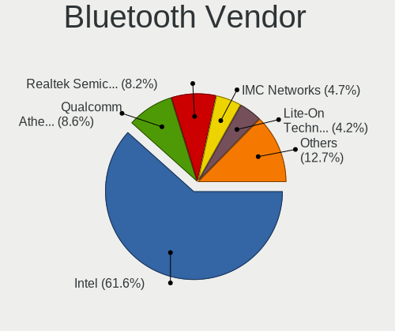

| Vendor                          | Notebooks | Percent |
|---------------------------------|-----------|---------|
| Intel                           | 431       | 60.7%   |
| Qualcomm Atheros Communications | 61        | 8.59%   |
| Realtek Semiconductor           | 58        | 8.17%   |
| IMC Networks                    | 35        | 4.93%   |
| Lite-On Technology              | 32        | 4.51%   |
| Broadcom                        | 31        | 4.37%   |
| Apple                           | 20        | 2.82%   |
| Foxconn / Hon Hai               | 8         | 1.13%   |
| Cambridge Silicon Radio         | 8         | 1.13%   |
| Realtek                         | 6         | 0.85%   |
| Dell                            | 6         | 0.85%   |
| Ralink                          | 4         | 0.56%   |
| Unknown                         | 2         | 0.28%   |
| Toshiba                         | 2         | 0.28%   |
| Hewlett-Packard                 | 2         | 0.28%   |
| Foxconn International           | 1         | 0.14%   |
| Chicony Electronics             | 1         | 0.14%   |
| ASUSTek Computer                | 1         | 0.14%   |
| Askey Computer                  | 1         | 0.14%   |

Bluetooth Model
---------------

Controller models

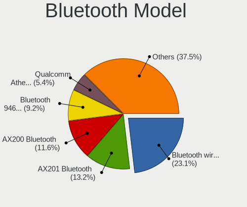

| Model                                                                               | Notebooks | Percent |
|-------------------------------------------------------------------------------------|-----------|---------|
| Intel Bluetooth Device                                                              | 94        | 13.24%  |
| Intel AX201 Bluetooth                                                               | 88        | 12.39%  |
| Intel AX200 Bluetooth                                                               | 86        | 12.11%  |
| Intel Bluetooth wireless interface                                                  | 85        | 11.97%  |
| Intel Bluetooth 9460/9560 Jefferson Peak (JfP)                                      | 62        | 8.73%   |
| Qualcomm Atheros  Bluetooth Device                                                  | 37        | 5.21%   |
| Realtek Bluetooth Radio                                                             | 33        | 4.65%   |
| Lite-On Bluetooth Device                                                            | 20        | 2.82%   |
| Realtek  Bluetooth 4.2 Adapter                                                      | 17        | 2.39%   |
| Apple Bluetooth Host Controller                                                     | 16        | 2.25%   |
| IMC Networks Bluetooth Radio                                                        | 13        | 1.83%   |
| Intel AX210 Bluetooth                                                               | 8         | 1.13%   |
| IMC Networks Wireless_Device                                                        | 8         | 1.13%   |
| Cambridge Silicon Radio Bluetooth Dongle (HCI mode)                                 | 8         | 1.13%   |
| Qualcomm Atheros AR3012 Bluetooth 4.0                                               | 7         | 0.99%   |
| Realtek Bluetooth Radio                                                             | 6         | 0.85%   |
| Qualcomm Atheros QCA61x4 Bluetooth 4.0                                              | 6         | 0.85%   |
| Qualcomm Atheros AR3011 Bluetooth                                                   | 6         | 0.85%   |
| Broadcom BCM20702 Bluetooth 4.0 [ThinkPad]                                          | 6         | 0.85%   |
| Realtek RTL8822BE Bluetooth 4.2 Adapter                                             | 5         | 0.7%    |
| Intel Wireless-AC 9260 Bluetooth Adapter                                            | 5         | 0.7%    |
| IMC Networks Atheros AR3012 Bluetooth 4.0 Adapter                                   | 5         | 0.7%    |
| Ralink RT3290 Bluetooth                                                             | 4         | 0.56%   |
| Lite-On Atheros AR3012 Bluetooth                                                    | 4         | 0.56%   |
| IMC Networks Bluetooth Device                                                       | 4         | 0.56%   |
| Dell DW375 Bluetooth Module                                                         | 4         | 0.56%   |
| Broadcom BCM2070 Bluetooth 2.1 + EDR                                                | 4         | 0.56%   |
| Realtek RTL8723B Bluetooth                                                          | 3         | 0.42%   |
| Qualcomm Atheros Bluetooth USB Host Controller                                      | 3         | 0.42%   |
| Lite-On Bluetooth Radio                                                             | 3         | 0.42%   |
| Intel Wireless-AC 3168 Bluetooth                                                    | 3         | 0.42%   |
| IMC Networks Bluetooth USB Host Controller                                          | 3         | 0.42%   |
| Foxconn / Hon Hai Bluetooth Device                                                  | 3         | 0.42%   |
| Broadcom HP Portable Bumble Bee                                                     | 3         | 0.42%   |
| Broadcom BCM43142A0 Bluetooth 4.0                                                   | 3         | 0.42%   |
| Broadcom BCM20702A0                                                                 | 3         | 0.42%   |
| Unknown Bluetooth Device                                                            | 2         | 0.28%   |
| Lite-On Qualcomm Atheros Bluetooth                                                  | 2         | 0.28%   |
| Lite-On Atheros Bluetooth                                                           | 2         | 0.28%   |
| IMC Networks Bluetooth                                                              | 2         | 0.28%   |
| Foxconn / Hon Hai Foxconn T77H114 BCM2070 [Single-Chip Bluetooth 2.1 + EDR Adapter] | 2         | 0.28%   |
| Foxconn / Hon Hai BCM20702A0                                                        | 2         | 0.28%   |
| Broadcom BCM43142 Bluetooth 4.0                                                     | 2         | 0.28%   |
| Broadcom BCM20703A1 Bluetooth 4.1 + LE                                              | 2         | 0.28%   |
| Broadcom BCM20702A0 Bluetooth 4.0                                                   | 2         | 0.28%   |
| Broadcom BCM2045A0                                                                  | 2         | 0.28%   |
| Apple Bluetooth USB Host Controller                                                 | 2         | 0.28%   |
| Apple Bluetooth HCI MacBookPro (HID mode)                                           | 2         | 0.28%   |
| Toshiba RT Bluetooth Radio                                                          | 1         | 0.14%   |
| Toshiba Bluetooth Radio                                                             | 1         | 0.14%   |
| Qualcomm Atheros Dell Wireless 1802 Bluetooth 4.0 LE                                | 1         | 0.14%   |
| Qualcomm Atheros AR9462 Bluetooth                                                   | 1         | 0.14%   |
| Lite-On Broadcom BCM43142A0 Bluetooth Device                                        | 1         | 0.14%   |
| HP Broadcom 2070 Bluetooth Combo                                                    | 1         | 0.14%   |
| HP Bluetooth 2.0 Interface [Broadcom BCM2045]                                       | 1         | 0.14%   |
| Foxconn International BCM43142A0 Bluetooth module                                   | 1         | 0.14%   |
| Foxconn / Hon Hai Wireless_Device                                                   | 1         | 0.14%   |
| Dell Wireless 360 Bluetooth                                                         | 1         | 0.14%   |
| Dell BCM20702A0 Bluetooth Module                                                    | 1         | 0.14%   |
| Chicony Bluetooth (RTL8723BE)                                                       | 1         | 0.14%   |

Sound
-----

Sound Vendor
------------

Sound card vendors

| Vendor                    | Notebooks | Percent |
|---------------------------|-----------|---------|
| Intel                     | 646       | 59.81%  |
| AMD                       | 180       | 16.67%  |
| Nvidia                    | 154       | 14.26%  |
| Lenovo                    | 12        | 1.11%   |
| GN Netcom                 | 9         | 0.83%   |
| C-Media Electronics       | 9         | 0.83%   |
| Logitech                  | 8         | 0.74%   |
| Realtek Semiconductor     | 6         | 0.56%   |
| Plantronics               | 5         | 0.46%   |
| JMTek                     | 4         | 0.37%   |
| Sennheiser Communications | 3         | 0.28%   |
| RODE Microphones          | 3         | 0.28%   |
| Microsoft                 | 3         | 0.28%   |
| Hewlett-Packard           | 3         | 0.28%   |
| Sony                      | 2         | 0.19%   |
| SAVITECH                  | 2         | 0.19%   |
| Kingston Technology       | 2         | 0.19%   |
| Dell                      | 2         | 0.19%   |
| Corsair                   | 2         | 0.19%   |
| Blue Microphones          | 2         | 0.19%   |
| Apple                     | 2         | 0.19%   |
| ZOOM                      | 1         | 0.09%   |
| XMOS                      | 1         | 0.09%   |
| Trust                     | 1         | 0.09%   |
| Texas Instruments         | 1         | 0.09%   |
| Tenx Technology           | 1         | 0.09%   |
| SteelSeries ApS           | 1         | 0.09%   |
| Signalpath International  | 1         | 0.09%   |
| Samson Technologies       | 1         | 0.09%   |
| ROCCAT                    | 1         | 0.09%   |
| Quanta                    | 1         | 0.09%   |
| Native Instruments        | 1         | 0.09%   |
| Generalplus Technology    | 1         | 0.09%   |
| Fujitsu                   | 1         | 0.09%   |
| Creative Technology       | 1         | 0.09%   |
| Conexant Systems          | 1         | 0.09%   |
| Conexant                  | 1         | 0.09%   |
| CMX Systems               | 1         | 0.09%   |
| Cambridge Silicon Radio   | 1         | 0.09%   |
| bestechnic                | 1         | 0.09%   |
| BEHRINGER International   | 1         | 0.09%   |
| Audio-Technica            | 1         | 0.09%   |

Sound Model
-----------

Sound card models

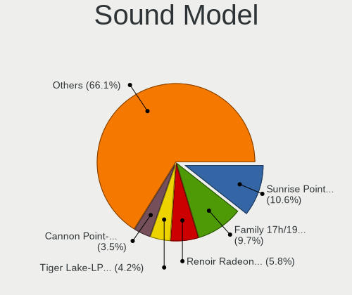

| Model                                                                                             | Notebooks | Percent |
|---------------------------------------------------------------------------------------------------|-----------|---------|
| Intel Sunrise Point-LP HD Audio                                                                   | 142       | 10.68%  |
| AMD Family 17h (Models 10h-1fh) HD Audio Controller                                               | 136       | 10.23%  |
| AMD Renoir Radeon High Definition Audio Controller                                                | 81        | 6.09%   |
| Intel Tiger Lake-LP Smart Sound Technology Audio Controller                                       | 50        | 3.76%   |
| Intel Cannon Lake PCH cAVS                                                                        | 46        | 3.46%   |
| Intel 7 Series/C216 Chipset Family High Definition Audio Controller                               | 43        | 3.23%   |
| Intel Cannon Point-LP High Definition Audio Controller                                            | 42        | 3.16%   |
| Intel 6 Series/C200 Series Chipset Family High Definition Audio Controller                        | 42        | 3.16%   |
| Intel Comet Lake PCH-LP cAVS                                                                      | 41        | 3.08%   |
| AMD Raven/Raven2/Fenghuang HDMI/DP Audio Controller                                               | 40        | 3.01%   |
| Intel 8 Series/C220 Series Chipset High Definition Audio Controller                               | 39        | 2.93%   |
| Intel Wildcat Point-LP High Definition Audio Controller                                           | 33        | 2.48%   |
| Intel Broadwell-U Audio Controller                                                                | 33        | 2.48%   |
| Intel Xeon E3-1200 v3/4th Gen Core Processor HD Audio Controller                                  | 30        | 2.26%   |
| Intel Comet Lake PCH cAVS                                                                         | 29        | 2.18%   |
| Intel Haswell-ULT HD Audio Controller                                                             | 27        | 2.03%   |
| Intel 8 Series HD Audio Controller                                                                | 27        | 2.03%   |
| Nvidia TU107 GeForce GTX 1650 High Definition Audio Controller                                    | 21        | 1.58%   |
| Nvidia GP107GL High Definition Audio Controller                                                   | 21        | 1.58%   |
| Intel 5 Series/3400 Series Chipset High Definition Audio                                          | 20        | 1.5%    |
| AMD FCH Azalia Controller                                                                         | 20        | 1.5%    |
| Intel CM238 HD Audio Controller                                                                   | 18        | 1.35%   |
| Nvidia Audio device                                                                               | 16        | 1.2%    |
| AMD Kabini HDMI/DP Audio                                                                          | 16        | 1.2%    |
| Nvidia TU106 High Definition Audio Controller                                                     | 14        | 1.05%   |
| Intel Ice Lake-LP Smart Sound Technology Audio Controller                                         | 14        | 1.05%   |
| Intel 100 Series/C230 Series Chipset Family HD Audio Controller                                   | 14        | 1.05%   |
| Nvidia GF108 High Definition Audio Controller                                                     | 12        | 0.9%    |
| Intel Celeron/Pentium Silver Processor High Definition Audio                                      | 10        | 0.75%   |
| Nvidia TU116 High Definition Audio Controller                                                     | 9         | 0.68%   |
| Nvidia GK107 HDMI Audio Controller                                                                | 9         | 0.68%   |
| Nvidia GP106 High Definition Audio Controller                                                     | 8         | 0.6%    |
| Nvidia GM107 High Definition Audio Controller [GeForce 940MX]                                     | 8         | 0.6%    |
| Lenovo ThinkPad Thunderbolt 3 Dock USB Audio                                                      | 7         | 0.53%   |
| Intel Atom Processor Z36xxx/Z37xxx Series High Definition Audio Controller                        | 7         | 0.53%   |
| AMD Family 15h (Models 60h-6fh) Audio Controller                                                  | 7         | 0.53%   |
| Realtek Semiconductor USB Audio                                                                   | 6         | 0.45%   |
| Intel Tiger Lake-H HD Audio Controller                                                            | 6         | 0.45%   |
| Intel Atom/Celeron/Pentium Processor x5-E8000/J3xxx/N3xxx Series High Definition Audio Controller | 6         | 0.45%   |
| Intel 82801I (ICH9 Family) HD Audio Controller                                                    | 6         | 0.45%   |
| Intel 82801H (ICH8 Family) HD Audio Controller                                                    | 6         | 0.45%   |
| C-Media Electronics Audio Adapter (Unitek Y-247A)                                                 | 6         | 0.45%   |
| AMD Oland/Hainan/Cape Verde/Pitcairn HDMI Audio [Radeon HD 7000 Series]                           | 6         | 0.45%   |
| Nvidia TU104 HD Audio Controller                                                                  | 5         | 0.38%   |
| Nvidia GP104 High Definition Audio Controller                                                     | 5         | 0.38%   |
| Nvidia GF119 HDMI Audio Controller                                                                | 5         | 0.38%   |
| Nvidia High Definition Audio Controller                                                           | 4         | 0.3%    |
| JMTek USB PnP Audio Device                                                                        | 4         | 0.3%    |
| Intel USB PnP Sound Device                                                                        | 4         | 0.3%    |
| AMD Trinity HDMI Audio Controller                                                                 | 4         | 0.3%    |
| AMD SBx00 Azalia (Intel HDA)                                                                      | 4         | 0.3%    |
| AMD Navi 10 HDMI Audio                                                                            | 4         | 0.3%    |
| Sennheiser Communications Headset [PC 8]                                                          | 3         | 0.23%   |
| RODE Microphones RODE NT-USB                                                                      | 3         | 0.23%   |
| Nvidia GA104 High Definition Audio Controller                                                     | 3         | 0.23%   |
| Microsoft LifeChat LX-3000 Headset                                                                | 3         | 0.23%   |
| Lenovo ThinkPad USB-C Dock Gen2 USB Audio                                                         | 3         | 0.23%   |
| Hewlett-Packard USB Audio                                                                         | 3         | 0.23%   |
| AMD Turks HDMI Audio [Radeon HD 6500/6600 / 6700M Series]                                         | 3         | 0.23%   |
| AMD RV710/730 HDMI Audio [Radeon HD 4000 series]                                                  | 3         | 0.23%   |

Memory
------

Memory Vendor
-------------

Memory module vendors

| Vendor              | Notebooks | Percent |
|---------------------|-----------|---------|
| Samsung Electronics | 148       | 27.56%  |
| SK Hynix            | 129       | 24.02%  |
| Micron Technology   | 67        | 12.48%  |
| Kingston            | 48        | 8.94%   |
| Unknown             | 31        | 5.77%   |
| Crucial             | 27        | 5.03%   |
| A-DATA Technology   | 16        | 2.98%   |
| Ramaxel Technology  | 11        | 2.05%   |
| Corsair             | 9         | 1.68%   |
| Elpida              | 8         | 1.49%   |
| Teikon              | 5         | 0.93%   |
| Smart               | 5         | 0.93%   |
| Unknown (ABCD)      | 4         | 0.74%   |
| Team                | 4         | 0.74%   |
| Nanya Technology    | 3         | 0.56%   |
| Kllisre             | 3         | 0.56%   |
| GOODRAM             | 3         | 0.56%   |
| Goldkey             | 3         | 0.56%   |
| Avant               | 3         | 0.56%   |
| Silicon Power       | 2         | 0.37%   |
| G.Skill             | 2         | 0.37%   |
| Transcend           | 1         | 0.19%   |
| OnBoard             | 1         | 0.19%   |
| KomputerBay         | 1         | 0.19%   |
| Golden Empire       | 1         | 0.19%   |
| Gold Key            | 1         | 0.19%   |
| Essencore           | 1         | 0.19%   |

Memory Model
------------

Memory module models

| Model                                                               | Notebooks | Percent |
|---------------------------------------------------------------------|-----------|---------|
| Samsung RAM M471A5244CB0-CTD 4GB SODIMM DDR4 3266MT/s               | 12        | 2.13%   |
| Samsung RAM M471A1K43DB1-CWE 8GB SODIMM DDR4 3200MT/s               | 12        | 2.13%   |
| Samsung RAM M471A1G44AB0-CWE 8GB SODIMM DDR4 3200MT/s               | 11        | 1.95%   |
| Samsung RAM M471A2K43DB1-CTD 16GB SODIMM DDR4 2667MT/s              | 9         | 1.6%    |
| SK Hynix RAM HMAB2GS6AMR6N-XN 16GB SODIMM DDR4 3200MT/s             | 7         | 1.24%   |
| Micron RAM 4ATF1G64HZ-3G2E1 8GB SODIMM DDR4 3200MT/s                | 7         | 1.24%   |
| SK Hynix RAM HMA82GS6JJR8N-VK 16GB SODIMM DDR4 2667MT/s             | 6         | 1.07%   |
| SK Hynix RAM HMA81GS6AFR8N-UH 8GB SODIMM DDR4 2667MT/s              | 6         | 1.07%   |
| Samsung RAM M471B5173QH0-YK0 4GB SODIMM DDR3 1600MT/s               | 6         | 1.07%   |
| Samsung RAM M471A2G44AM0-CWE 16GB SODIMM DDR4 3200MT/s              | 6         | 1.07%   |
| SK Hynix RAM HMA81GS6JJR8N-VK 8192MB SODIMM DDR4 2667MT/s           | 5         | 0.89%   |
| SK Hynix RAM HMA81GS6DJR8N-XN 8GB SODIMM DDR4 3200MT/s              | 5         | 0.89%   |
| Samsung RAM M471A2G44AM0-CTD 16GB SODIMM DDR4 2667MT/s              | 5         | 0.89%   |
| Samsung RAM M471A1G44AB0-CWE 8192MB Row Of Chips DDR4 3200MT/s      | 5         | 0.89%   |
| Micron RAM 4ATF51264HZ-2G6E1 4096MB SODIMM DDR4 2667MT/s            | 5         | 0.89%   |
| Unknown RAM Module 1GB SODIMM DDR3 1333MT/s                         | 4         | 0.71%   |
| Unknown (ABCD) RAM 123456789012345678 2048MB SODIMM DDR3 2400MT/s   | 4         | 0.71%   |
| SK Hynix RAM HMT451S6BFR8A-PB 4GB SODIMM DDR3 1600MT/s              | 4         | 0.71%   |
| SK Hynix RAM HMT41GS6BFR8A-PB 8192MB SODIMM DDR3 1600MT/s           | 4         | 0.71%   |
| Samsung RAM Module 16GB SODIMM DDR4 2667MT/s                        | 4         | 0.71%   |
| Samsung RAM M471B5273CH0-CH9 4096MB SODIMM DDR3 1334MT/s            | 4         | 0.71%   |
| Samsung RAM M471B5173DB0-YK0 4GB SODIMM DDR3 1600MT/s               | 4         | 0.71%   |
| Samsung RAM M471B1G73QH0-YK0 8GB SODIMM DDR3 2667MT/s               | 4         | 0.71%   |
| Samsung RAM M471A2K43DB1-CWE 16GB SODIMM DDR4 3200MT/s              | 4         | 0.71%   |
| Samsung RAM M471A1K43BB1-CTD 8192MB SODIMM DDR4 2667MT/s            | 4         | 0.71%   |
| Micron RAM 8ATF1G64HZ-3G2J1 8GB SODIMM DDR4 3200MT/s                | 4         | 0.71%   |
| Micron RAM 4ATF51264HZ-3G2J1 4GB Row Of Chips DDR4 3200MT/s         | 4         | 0.71%   |
| SK Hynix RAM HMT351S6EFR8C-PB 4096MB SODIMM DDR3 1600MT/s           | 3         | 0.53%   |
| SK Hynix RAM HMT351S6CFR8C-PB 4096MB SODIMM DDR3 1600MT/s           | 3         | 0.53%   |
| SK Hynix RAM HMAA2GS6AJR8N-XN 16GB SODIMM DDR4 3200MT/s             | 3         | 0.53%   |
| SK Hynix RAM HMA851S6CJR6N-XN 4GB SODIMM DDR4 3200MT/s              | 3         | 0.53%   |
| SK Hynix RAM HMA851S6CJR6N-VK 4GB SODIMM DDR4 2667MT/s              | 3         | 0.53%   |
| SK Hynix RAM HMA82GS6AFR8N-UH 16GB SODIMM DDR4 2667MT/s             | 3         | 0.53%   |
| SK Hynix RAM HMA81GS6CJR8N-VK 8GB SODIMM DDR4 2667MT/s              | 3         | 0.53%   |
| SK Hynix RAM H9CCNNNCLGALAR-NVD 8192MB Row Of Chips LPDDR3 2133MT/s | 3         | 0.53%   |
| Samsung RAM M471A5244CB0-CRC 4GB SODIMM DDR4 2667MT/s               | 3         | 0.53%   |
| Samsung RAM M471A5143EB0-CPB 4096MB SODIMM DDR4 2133MT/s            | 3         | 0.53%   |
| Samsung RAM M471A2K43CB1-CRC 16384MB SODIMM DDR4 2667MT/s           | 3         | 0.53%   |
| Samsung RAM M471A2G43AB2-CWE 16GB SODIMM DDR4 3200MT/s              | 3         | 0.53%   |
| Samsung RAM K4UBE3D4AA-MGCL 8192MB Row Of Chips LPDDR4 4267MT/s     | 3         | 0.53%   |
| Micron RAM 53E1G32D2NP-046 2048MB Row Of Chips LPDDR4 4267MT/s      | 3         | 0.53%   |
| Micron RAM 4ATF51264HZ-3G2J1 4GB SODIMM DDR4 3200MT/s               | 3         | 0.53%   |
| Micron RAM 4ATF51264HZ-2G3B1 4096MB SODIMM DDR4 2400MT/s            | 3         | 0.53%   |
| Kllisre RAM KRE-D3S1600M/8G 8GB SODIMM DDR3 1600MT/s                | 3         | 0.53%   |
| Kingston RAM 99U5428-018.A00LF 8192MB SODIMM DDR3 1600MT/s          | 3         | 0.53%   |
| Elpida RAM EBJ41UF8BCS0-DJ-F 4096MB SODIMM DDR3 1334MT/s            | 3         | 0.53%   |
| Crucial RAM CT16G4SFRA32A.M16FRS 16GB SODIMM DDR4 3200MT/s          | 3         | 0.53%   |
| Unknown RAM Module 8GB SODIMM DDR3 1600MT/s                         | 2         | 0.36%   |
| Unknown RAM Module 4GB SODIMM DDR3                                  | 2         | 0.36%   |
| Unknown RAM Module 2GB SODIMM DDR3 1333MT/s                         | 2         | 0.36%   |
| Teikon RAM TMA81GS6AFR8N-UHSC 8GB SODIMM DDR4 2400MT/s              | 2         | 0.36%   |
| Team RAM TEAMGROUP-SD4-2666 16384MB SODIMM DDR4 2667MT/s            | 2         | 0.36%   |
| SK Hynix RAM Module 8GB SODIMM DDR4 3200MT/s                        | 2         | 0.36%   |
| SK Hynix RAM Module 8GB SODIMM DDR3 1600MT/s                        | 2         | 0.36%   |
| SK Hynix RAM Module 4GB SODIMM DDR3 1600MT/s                        | 2         | 0.36%   |
| SK Hynix RAM Module 4GB SODIMM DDR3 1066MT/s                        | 2         | 0.36%   |
| SK Hynix RAM HMT425S6AFR6A-PB 2GB SODIMM DDR3 1600MT/s              | 2         | 0.36%   |
| SK Hynix RAM HMT41GS6AFR8A-PB 8GB SODIMM DDR3 1600MT/s              | 2         | 0.36%   |
| SK Hynix RAM HMT351S6EFR8A-PB 4096MB SODIMM DDR3 1600MT/s           | 2         | 0.36%   |
| SK Hynix RAM HMAA4GS6AJR8N-XN 32GB SODIMM DDR4 3200MT/s             | 2         | 0.36%   |

Memory Kind
-----------

Memory module kinds

| Kind    | Notebooks | Percent |
|---------|-----------|---------|
| DDR4    | 267       | 60.54%  |
| DDR3    | 122       | 27.66%  |
| LPDDR4  | 22        | 4.99%   |
| LPDDR3  | 21        | 4.76%   |
| DDR2    | 6         | 1.36%   |
| Unknown | 2         | 0.45%   |
| SDRAM   | 1         | 0.23%   |

Memory Form Factor
------------------

Physical design of the memory module

| Name         | Notebooks | Percent |
|--------------|-----------|---------|
| SODIMM       | 388       | 86.8%   |
| Row Of Chips | 46        | 10.29%  |
| Chip         | 8         | 1.79%   |
| DIMM         | 4         | 0.89%   |
| Unknown      | 1         | 0.22%   |

Memory Size
-----------

Memory module size

| Size  | Notebooks | Percent |
|-------|-----------|---------|
| 8192  | 191       | 39.87%  |
| 4096  | 139       | 29.02%  |
| 16384 | 97        | 20.25%  |
| 2048  | 30        | 6.26%   |
| 32768 | 14        | 2.92%   |
| 1024  | 8         | 1.67%   |

Memory Speed
------------

Memory module speed

| Speed   | Notebooks | Percent |
|---------|-----------|---------|
| 2667    | 118       | 24.69%  |
| 3200    | 112       | 23.43%  |
| 1600    | 87        | 18.2%   |
| 2400    | 39        | 8.16%   |
| 2133    | 32        | 6.69%   |
| 4267    | 14        | 2.93%   |
| 1334    | 14        | 2.93%   |
| 1333    | 14        | 2.93%   |
| 3266    | 12        | 2.51%   |
| 1867    | 11        | 2.3%    |
| 1066    | 6         | 1.26%   |
| 667     | 5         | 1.05%   |
| Unknown | 4         | 0.84%   |
| 1067    | 3         | 0.63%   |
| 800     | 2         | 0.42%   |
| 4266    | 1         | 0.21%   |
| 4199    | 1         | 0.21%   |
| 3733    | 1         | 0.21%   |
| 1866    | 1         | 0.21%   |
| 533     | 1         | 0.21%   |

Printers & scanners
-------------------

Printer Vendor
--------------

Printer device vendors

| Vendor | Notebooks | Percent |
|--------|-----------|---------|
| Canon  | 2         | 66.67%  |
| Ricoh  | 1         | 33.33%  |

Printer Model
-------------

Printer device models

| Model                     | Notebooks | Percent |
|---------------------------|-----------|---------|
| Ricoh SP 212SUw           | 1         | 33.33%  |
| Canon TR8500 series       | 1         | 33.33%  |
| Canon PIXMA MG3000 series | 1         | 33.33%  |

Scanner Vendor
--------------

Scanner device vendors

Zero info for selected period =(

Scanner Model
-------------

Scanner device models

Zero info for selected period =(

Camera
------

Camera Vendor
-------------

Camera device vendors

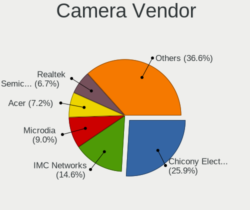

| Vendor                                 | Notebooks | Percent |
|----------------------------------------|-----------|---------|
| Chicony Electronics                    | 201       | 25.87%  |
| IMC Networks                           | 118       | 15.19%  |
| Microdia                               | 74        | 9.52%   |
| Acer                                   | 62        | 7.98%   |
| Realtek Semiconductor                  | 50        | 6.44%   |
| Sunplus Innovation Technology          | 46        | 5.92%   |
| Quanta                                 | 39        | 5.02%   |
| Cheng Uei Precision Industry (Foxlink) | 37        | 4.76%   |
| Lite-On Technology                     | 25        | 3.22%   |
| Syntek                                 | 21        | 2.7%    |
| Suyin                                  | 19        | 2.45%   |
| Apple                                  | 17        | 2.19%   |
| Logitech                               | 12        | 1.54%   |
| Alcor Micro                            | 10        | 1.29%   |
| Silicon Motion                         | 9         | 1.16%   |
| Ricoh                                  | 4         | 0.51%   |
| Luxvisions Innotech Limited            | 4         | 0.51%   |
| Z-Star Microelectronics                | 3         | 0.39%   |
| Microsoft                              | 3         | 0.39%   |
| ALi                                    | 3         | 0.39%   |
| WaveRider Communications               | 2         | 0.26%   |
| Samsung Electronics                    | 2         | 0.26%   |
| Pixart Imaging                         | 2         | 0.26%   |
| Lenovo                                 | 2         | 0.26%   |
| KYE Systems (Mouse Systems)            | 2         | 0.26%   |
| Y Media                                | 1         | 0.13%   |
| Xiaomi                                 | 1         | 0.13%   |
| Sonix Technology                       | 1         | 0.13%   |
| Jieli Technology                       | 1         | 0.13%   |
| Importek                               | 1         | 0.13%   |
| Gearway Electronics (Dong Guan)        | 1         | 0.13%   |
| Foxconn / Hon Hai                      | 1         | 0.13%   |
| DJKANA1RSF34LM                         | 1         | 0.13%   |
| DigiTech                               | 1         | 0.13%   |
| Denron                                 | 1         | 0.13%   |

Camera Model
------------

Camera device models

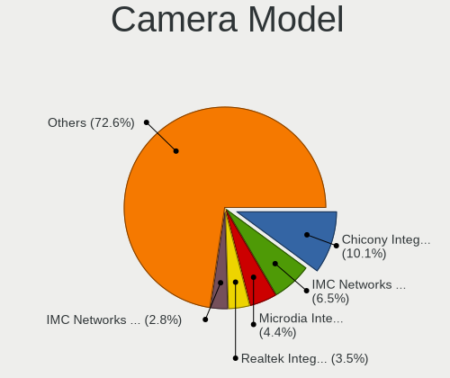

| Model                                                          | Notebooks | Percent |
|----------------------------------------------------------------|-----------|---------|
| Chicony Integrated Camera                                      | 77        | 9.8%    |
| IMC Networks Integrated Camera                                 | 51        | 6.49%   |
| Microdia Integrated_Webcam_HD                                  | 38        | 4.83%   |
| Realtek Integrated_Webcam_HD                                   | 25        | 3.18%   |
| IMC Networks USB2.0 HD UVC WebCam                              | 23        | 2.93%   |
| Sunplus Integrated_Webcam_HD                                   | 22        | 2.8%    |
| Acer Integrated Camera                                         | 21        | 2.67%   |
| Chicony HD Webcam                                              | 18        | 2.29%   |
| Syntek Integrated Camera                                       | 16        | 2.04%   |
| Lite-On Integrated Camera                                      | 14        | 1.78%   |
| IMC Networks USB2.0 VGA UVC WebCam                             | 14        | 1.78%   |
| Chicony Integrated Camera (1280x720@30)                        | 12        | 1.53%   |
| Cheng Uei Precision Industry (Foxlink) HP HD Camera            | 10        | 1.27%   |
| Chicony USB2.0 Camera                                          | 9         | 1.15%   |
| Apple iPhone 5/5C/5S/6/SE                                      | 9         | 1.15%   |
| Quanta HD User Facing                                          | 8         | 1.02%   |
| Chicony HP TrueVision HD Camera                                | 8         | 1.02%   |
| Quanta HP TrueVision HD Camera                                 | 7         | 0.89%   |
| Lite-On HP HD Camera                                           | 7         | 0.89%   |
| Chicony HP HD Camera                                           | 7         | 0.89%   |
| Quanta HD Webcam                                               | 6         | 0.76%   |
| Acer Lenovo EasyCamera                                         | 6         | 0.76%   |
| Suyin Integrated_Webcam_HD                                     | 5         | 0.64%   |
| Sunplus HD WebCam                                              | 5         | 0.64%   |
| Quanta HP HD Camera                                            | 5         | 0.64%   |
| Microdia Integrated Webcam                                     | 5         | 0.64%   |
| IMC Networks USB Camera                                        | 5         | 0.64%   |
| IMC Networks ov9734_azurewave_camera                           | 5         | 0.64%   |
| Chicony USB2.0 HD UVC WebCam                                   | 5         | 0.64%   |
| Chicony FJ Camera                                              | 5         | 0.64%   |
| Acer SunplusIT Integrated Camera                               | 5         | 0.64%   |
| Acer EasyCamera                                                | 5         | 0.64%   |
| Acer BisonCam, NB Pro                                          | 5         | 0.64%   |
| Suyin HP TrueVision HD Integrated Webcam                       | 4         | 0.51%   |
| Sunplus Laptop_Integrated_Webcam_FHD                           | 4         | 0.51%   |
| Realtek Integrated Webcam                                      | 4         | 0.51%   |
| Microdia Webcam Vitade AF                                      | 4         | 0.51%   |
| Microdia USB 2.0 Camera                                        | 4         | 0.51%   |
| Microdia Integrated Webcam HD                                  | 4         | 0.51%   |
| Logitech HD Pro Webcam C920                                    | 4         | 0.51%   |
| Chicony Lenovo Integrated Camera (0.3MP)                       | 4         | 0.51%   |
| Chicony HP HD Webcam                                           | 4         | 0.51%   |
| Chicony HD User Facing                                         | 4         | 0.51%   |
| Cheng Uei Precision Industry (Foxlink) HP TrueVision HD Camera | 4         | 0.51%   |
| Apple Built-in iSight                                          | 4         | 0.51%   |
| Alcor Micro USB 2.0 Camera                                     | 4         | 0.51%   |
| Acer BisonCam,NB Pro                                           | 4         | 0.51%   |
| Syntek EasyCamera                                              | 3         | 0.38%   |
| Realtek Lenovo EasyCamera                                      | 3         | 0.38%   |
| Quanta Laptop_Integrated_Webcam_2HDM                           | 3         | 0.38%   |
| Microdia Laptop_Integrated_Webcam_HD                           | 3         | 0.38%   |
| Luxvisions Innotech Limited HP HD Camera                       | 3         | 0.38%   |
| Lite-On HP Wide Vision HD Camera                               | 3         | 0.38%   |
| IMC Networks HP TrueVision HD Camera                           | 3         | 0.38%   |
| IMC Networks EasyCamera                                        | 3         | 0.38%   |
| Chicony VGA Webcam                                             | 3         | 0.38%   |
| Chicony USB2.0 VGA UVC WebCam                                  | 3         | 0.38%   |
| Chicony TOSHIBA Web Camera - HD                                | 3         | 0.38%   |
| Chicony Integrated HP HD Webcam                                | 3         | 0.38%   |
| Chicony HP Wide Vision HD Camera                               | 3         | 0.38%   |

Security
--------

Fingerprint Vendor
------------------

Fingerprint sensor vendors

| Vendor                     | Notebooks | Percent |
|----------------------------|-----------|---------|
| Synaptics                  | 74        | 34.42%  |
| Validity Sensors           | 73        | 33.95%  |
| Shenzhen Goodix Technology | 36        | 16.74%  |
| Upek                       | 9         | 4.19%   |
| Elan Microelectronics      | 9         | 4.19%   |
| LighTuning Technology      | 8         | 3.72%   |
| AuthenTec                  | 4         | 1.86%   |
| STMicroelectronics         | 1         | 0.47%   |
| Focal-systems.Corp         | 1         | 0.47%   |

Fingerprint Model
-----------------

Fingerprint sensor models

| Model                                                                      | Notebooks | Percent |
|----------------------------------------------------------------------------|-----------|---------|
| Synaptics Prometheus MIS Touch Fingerprint Reader                          | 35        | 16.28%  |
| Validity Sensors VFS495 Fingerprint Reader                                 | 23        | 10.7%   |
| Shenzhen Goodix  FingerPrint Device                                        | 17        | 7.91%   |
| Validity Sensors VFS 5011 fingerprint sensor                               | 14        | 6.51%   |
| Synaptics Metallica MIS Touch Fingerprint Reader                           | 10        | 4.65%   |
| Shenzhen Goodix FingerPrint                                                | 10        | 4.65%   |
| Validity Sensors VFS7500 Touch Fingerprint Sensor                          | 9         | 4.19%   |
| Shenzhen Goodix Fingerprint Reader                                         | 9         | 4.19%   |
| Elan ELAN:Fingerprint                                                      | 9         | 4.19%   |
| Upek Biometric Touchchip/Touchstrip Fingerprint Sensor                     | 8         | 3.72%   |
| Unknown                                                                    | 7         | 3.26%   |
| Synaptics  VFS7552 Touch Fingerprint Sensor with PurePrint                 | 6         | 2.79%   |
| LighTuning EgisTec Touch Fingerprint Sensor                                | 6         | 2.79%   |
| Validity Sensors VFS5011 Fingerprint Reader                                | 5         | 2.33%   |
| Validity Sensors Synaptics VFS7552 Touch Fingerprint Sensor with PurePrint | 5         | 2.33%   |
| Synaptics  FS7604 Touch Fingerprint Sensor with PurePrint                  | 5         | 2.33%   |
| Synaptics Metallica MOH Touch Fingerprint Reader                           | 5         | 2.33%   |
| Validity Sensors Synaptics WBDI                                            | 4         | 1.86%   |
| Synaptics  WBDI                                                            | 4         | 1.86%   |
| Validity Sensors VFS Fingerprint sensor                                    | 3         | 1.4%    |
| Validity Sensors Fingerprint scanner                                       | 3         | 1.4%    |
| Validity Sensors Swipe Fingerprint Sensor                                  | 2         | 0.93%   |
| Synaptics WBDI Device                                                      | 2         | 0.93%   |
| Validity Sensors VFS7552 Touch Fingerprint Sensor                          | 1         | 0.47%   |
| Validity Sensors VFS491                                                    | 1         | 0.47%   |
| Validity Sensors VFS471 Fingerprint Reader                                 | 1         | 0.47%   |
| Validity Sensors VFS451 Fingerprint Reader                                 | 1         | 0.47%   |
| Validity Sensors VFS301 Fingerprint Reader                                 | 1         | 0.47%   |
| Upek TCS5B Fingerprint sensor                                              | 1         | 0.47%   |
| STMicroelectronics Fingerprint Reader                                      | 1         | 0.47%   |
| LighTuning Fingerprint Reader                                              | 1         | 0.47%   |
| LighTuning ES603 Swipe Fingerprint Sensor                                  | 1         | 0.47%   |
| Focal-systems.Corp FT9201Fingerprint.                                      | 1         | 0.47%   |
| AuthenTec Fingerprint Sensor                                               | 1         | 0.47%   |
| AuthenTec AES2550 Fingerprint Sensor                                       | 1         | 0.47%   |
| AuthenTec AES2501 Fingerprint Sensor                                       | 1         | 0.47%   |
| AuthenTec AES1660 Fingerprint Sensor                                       | 1         | 0.47%   |

Chipcard Vendor
---------------

Chipcard module vendors

| Vendor                | Notebooks | Percent |
|-----------------------|-----------|---------|
| Broadcom              | 31        | 38.75%  |
| Alcor Micro           | 30        | 37.5%   |
| Upek                  | 5         | 6.25%   |
| Lenovo                | 5         | 6.25%   |
| O2 Micro              | 4         | 5%      |
| SCM Microsystems      | 1         | 1.25%   |
| OmniKey               | 1         | 1.25%   |
| Hewlett-Packard       | 1         | 1.25%   |
| Gemalto (was Gemplus) | 1         | 1.25%   |
| Chicony Electronics   | 1         | 1.25%   |

Chipcard Model
--------------

Chipcard module models

| Model                                                                        | Notebooks | Percent |
|------------------------------------------------------------------------------|-----------|---------|
| Alcor Micro AU9540 Smartcard Reader                                          | 30        | 37.5%   |
| Broadcom 5880                                                                | 12        | 15%     |
| Broadcom 58200                                                               | 9         | 11.25%  |
| Broadcom BCM5880 Secure Applications Processor                               | 6         | 7.5%    |
| Upek TouchChip Fingerprint Coprocessor (WBF advanced mode)                   | 5         | 6.25%   |
| Lenovo Integrated Smart Card Reader                                          | 5         | 6.25%   |
| O2 Micro OZ776 CCID Smartcard Reader                                         | 4         | 5%      |
| Broadcom BCM5880 Secure Applications Processor with fingerprint swipe sensor | 4         | 5%      |
| SCM Microsystems CLOUD 2900 R Smart Card Reader                              | 1         | 1.25%   |
| OmniKey CardMan 4321                                                         | 1         | 1.25%   |
| Hewlett-Packard SC Keyboard - Apollo (Liteon)                                | 1         | 1.25%   |
| Gemalto (was Gemplus) Compact Smart Card Reader Writer                       | 1         | 1.25%   |
| Chicony Electronics HP Skylab USB Smartcard Keyboard                         | 1         | 1.25%   |

Unsupported
-----------

Unsupported Devices
-------------------

Total unsupported devices on board

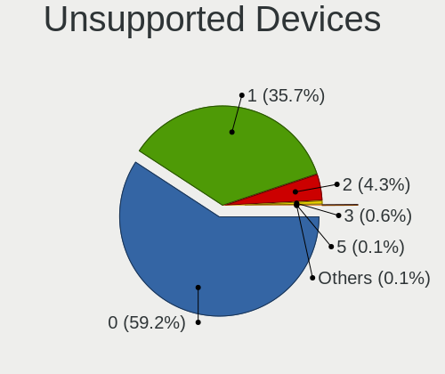

| Total | Notebooks | Percent |
|-------|-----------|---------|
| 0     | 521       | 60.79%  |
| 1     | 297       | 34.66%  |
| 2     | 33        | 3.85%   |
| 3     | 5         | 0.58%   |
| 4     | 1         | 0.12%   |

Unsupported Device Types
------------------------

Types of unsupported devices

| Type                     | Notebooks | Percent |
|--------------------------|-----------|---------|
| Fingerprint reader       | 213       | 56.8%   |
| Multimedia controller    | 44        | 11.73%  |
| Graphics card            | 37        | 9.87%   |
| Net/wireless             | 32        | 8.53%   |
| Chipcard                 | 12        | 3.2%    |
| Storage                  | 10        | 2.67%   |
| Camera                   | 5         | 1.33%   |
| Bluetooth                | 5         | 1.33%   |
| Communication controller | 4         | 1.07%   |
| Card reader              | 4         | 1.07%   |
| Net/ethernet             | 3         | 0.8%    |
| Modem                    | 3         | 0.8%    |
| Sound                    | 2         | 0.53%   |
| Network                  | 1         | 0.27%   |

