Fedora 34 - Tested Hardware & Statistics
----------------------------------------

A project to collect tested hardware configurations for Fedora 34.

Anyone can contribute to this report by the [hw-probe](https://github.com/linuxhw/hw-probe) tool:

    sudo -E hw-probe -all -upload

Please contribute! Especially if your hardware is rare.

This is a report for all computer types. See also reports for [desktops](/Dist/Fedora_34/Desktop/README.md) and [notebooks](/Dist/Fedora_34/Notebook/README.md).

Contents
--------

* [ Test Cases ](#test-cases)

* [ System ](#system)
  - [ Kernel                   ](#kernel)
  - [ Kernel Family            ](#kernel-family)
  - [ Kernel Major Ver.        ](#kernel-major-ver)
  - [ Arch                     ](#arch)
  - [ DE                       ](#de)
  - [ Display Server           ](#display-server)
  - [ Display Manager          ](#display-manager)
  - [ OS Lang                  ](#os-lang)
  - [ Boot Mode                ](#boot-mode)
  - [ Filesystem               ](#filesystem)
  - [ Part. scheme             ](#part-scheme)
  - [ Dual Boot with Linux/BSD ](#dual-boot-with-linuxbsd)
  - [ Dual Boot (Win)          ](#dual-boot-win)

* [ Board ](#board)
  - [ Vendor                   ](#vendor)
  - [ Model                    ](#model)
  - [ Model Family             ](#model-family)
  - [ MFG Year                 ](#mfg-year)
  - [ Form Factor              ](#form-factor)
  - [ Secure Boot              ](#secure-boot)
  - [ Coreboot                 ](#coreboot)
  - [ RAM Size                 ](#ram-size)
  - [ RAM Used                 ](#ram-used)
  - [ Total Drives             ](#total-drives)
  - [ Has CD-ROM               ](#has-cd-rom)
  - [ Has Ethernet             ](#has-ethernet)
  - [ Has WiFi                 ](#has-wifi)
  - [ Has Bluetooth            ](#has-bluetooth)

* [ Location ](#location)
  - [ Country                  ](#country)
  - [ City                     ](#city)

* [ Drives ](#drives)
  - [ Drive Vendor             ](#drive-vendor)
  - [ Drive Model              ](#drive-model)
  - [ HDD Vendor               ](#hdd-vendor)
  - [ SSD Vendor               ](#ssd-vendor)
  - [ Drive Kind               ](#drive-kind)
  - [ Drive Connector          ](#drive-connector)
  - [ Drive Size               ](#drive-size)
  - [ Space Total              ](#space-total)
  - [ Space Used               ](#space-used)
  - [ Malfunc. Drives          ](#malfunc-drives)
  - [ Malfunc. Drive Vendor    ](#malfunc-drive-vendor)
  - [ Malfunc. HDD Vendor      ](#malfunc-hdd-vendor)
  - [ Malfunc. Drive Kind      ](#malfunc-drive-kind)
  - [ Failed Drives            ](#failed-drives)
  - [ Failed Drive Vendor      ](#failed-drive-vendor)
  - [ Drive Status             ](#drive-status)

* [ Storage controller ](#storage-controller)
  - [ Storage Vendor           ](#storage-vendor)
  - [ Storage Model            ](#storage-model)
  - [ Storage Kind             ](#storage-kind)

* [ Processor ](#processor)
  - [ CPU Vendor               ](#cpu-vendor)
  - [ CPU Model                ](#cpu-model)
  - [ CPU Model Family         ](#cpu-model-family)
  - [ CPU Cores                ](#cpu-cores)
  - [ CPU Sockets              ](#cpu-sockets)
  - [ CPU Threads              ](#cpu-threads)
  - [ CPU Op-Modes             ](#cpu-op-modes)
  - [ CPU Microcode            ](#cpu-microcode)
  - [ CPU Microarch            ](#cpu-microarch)

* [ Graphics ](#graphics)
  - [ GPU Vendor               ](#gpu-vendor)
  - [ GPU Model                ](#gpu-model)
  - [ GPU Combo                ](#gpu-combo)
  - [ GPU Driver               ](#gpu-driver)
  - [ GPU Memory               ](#gpu-memory)

* [ Monitor ](#monitor)
  - [ Monitor Vendor           ](#monitor-vendor)
  - [ Monitor Model            ](#monitor-model)
  - [ Monitor Resolution       ](#monitor-resolution)
  - [ Monitor Diagonal         ](#monitor-diagonal)
  - [ Monitor Width            ](#monitor-width)
  - [ Aspect Ratio             ](#aspect-ratio)
  - [ Monitor Area             ](#monitor-area)
  - [ Pixel Density            ](#pixel-density)
  - [ Multiple Monitors        ](#multiple-monitors)

* [ Network ](#network)
  - [ Net Controller Vendor    ](#net-controller-vendor)
  - [ Net Controller Model     ](#net-controller-model)
  - [ Wireless Vendor          ](#wireless-vendor)
  - [ Wireless Model           ](#wireless-model)
  - [ Ethernet Vendor          ](#ethernet-vendor)
  - [ Ethernet Model           ](#ethernet-model)
  - [ Net Controller Kind      ](#net-controller-kind)
  - [ Used Controller          ](#used-controller)
  - [ NICs                     ](#nics)
  - [ IPv6                     ](#ipv6)

* [ Bluetooth ](#bluetooth)
  - [ Bluetooth Vendor         ](#bluetooth-vendor)
  - [ Bluetooth Model          ](#bluetooth-model)

* [ Sound ](#sound)
  - [ Sound Vendor             ](#sound-vendor)
  - [ Sound Model              ](#sound-model)

* [ Memory ](#memory)
  - [ Memory Vendor            ](#memory-vendor)
  - [ Memory Model             ](#memory-model)
  - [ Memory Kind              ](#memory-kind)
  - [ Memory Form Factor       ](#memory-form-factor)
  - [ Memory Size              ](#memory-size)
  - [ Memory Speed             ](#memory-speed)

* [ Printers & scanners ](#printers--scanners)
  - [ Printer Vendor           ](#printer-vendor)
  - [ Printer Model            ](#printer-model)
  - [ Scanner Vendor           ](#scanner-vendor)
  - [ Scanner Model            ](#scanner-model)

* [ Camera ](#camera)
  - [ Camera Vendor            ](#camera-vendor)
  - [ Camera Model             ](#camera-model)

* [ Security ](#security)
  - [ Fingerprint Vendor       ](#fingerprint-vendor)
  - [ Fingerprint Model        ](#fingerprint-model)
  - [ Chipcard Vendor          ](#chipcard-vendor)
  - [ Chipcard Model           ](#chipcard-model)

* [ Unsupported ](#unsupported)
  - [ Unsupported Devices      ](#unsupported-devices)
  - [ Unsupported Device Types ](#unsupported-device-types)

Test Cases
----------

Total: 2272

| Vendor        | Model                       | Form-Factor | Probe                                                      | Date         |
|---------------|-----------------------------|-------------|------------------------------------------------------------|--------------|
| Lenovo        | Yoga 2 13 20344             | Notebook    | [deb10be02b](https://linux-hardware.org/?probe=deb10be02b) | Nov 12, 2022 |
| Dell          | Latitude E6430              | Notebook    | [2b6012cc1d](https://linux-hardware.org/?probe=2b6012cc1d) | Nov 02, 2022 |
| HP            | EliteBook 850 G1            | Notebook    | [7bb0235bd2](https://linux-hardware.org/?probe=7bb0235bd2) | Oct 03, 2022 |
| ASUSTek       | A88X-PRO                    | Desktop     | [b88a699d58](https://linux-hardware.org/?probe=b88a699d58) | Sep 19, 2022 |
| ASUSTek       | P8H77-V LE                  | Desktop     | [7f6138d8ce](https://linux-hardware.org/?probe=7f6138d8ce) | Aug 17, 2022 |
| HP            | Pavilion TS 14              | Notebook    | [145fc8369f](https://linux-hardware.org/?probe=145fc8369f) | Aug 16, 2022 |
| Foxconn       | 2ABF                        | Desktop     | [cc835ea750](https://linux-hardware.org/?probe=cc835ea750) | Aug 13, 2022 |
| Lenovo        | ThinkPad E470 20H1006HRT    | Notebook    | [ff4adb2f7d](https://linux-hardware.org/?probe=ff4adb2f7d) | Jul 20, 2022 |
| Lenovo        | IdeaPad 3 15ITL05 81X8      | Notebook    | [74ed9232f8](https://linux-hardware.org/?probe=74ed9232f8) | Jul 07, 2022 |
| Apple         | Mac-F60DEB81FF30ACF6 Mac... | Desktop     | [a6fb0fd95c](https://linux-hardware.org/?probe=a6fb0fd95c) | Jul 03, 2022 |
| MSI           | Z97 GAMING 5                | Desktop     | [6a1978f197](https://linux-hardware.org/?probe=6a1978f197) | Jul 02, 2022 |
| Dell          | 0VRWRC A00                  | Desktop     | [373df03a96](https://linux-hardware.org/?probe=373df03a96) | Jun 24, 2022 |
| ASUSTek       | PRIME A320M-K               | Desktop     | [17e9f5a71f](https://linux-hardware.org/?probe=17e9f5a71f) | Jun 16, 2022 |
| Lenovo        | ThinkPad T460s 20FA003JM... | Notebook    | [417d162cab](https://linux-hardware.org/?probe=417d162cab) | Jun 09, 2022 |
| Lenovo        | ThinkPad T450 20BUS0HA0G    | Notebook    | [878cae499d](https://linux-hardware.org/?probe=878cae499d) | Jun 04, 2022 |
| Lenovo        | ThinkPad T450 20BUS0HA0G    | Notebook    | [0c53f7240c](https://linux-hardware.org/?probe=0c53f7240c) | Jun 03, 2022 |
| ASUSTek       | ROG STRIX X570-E GAMING     | Desktop     | [e474768a25](https://linux-hardware.org/?probe=e474768a25) | May 30, 2022 |
| Gigabyte      | GA-MA785G-UD3H              | Desktop     | [b810bd52cc](https://linux-hardware.org/?probe=b810bd52cc) | May 28, 2022 |
| Lenovo        | IdeaPad S145-15IWL 81S9     | Notebook    | [3ecc5b8b4c](https://linux-hardware.org/?probe=3ecc5b8b4c) | May 24, 2022 |
| Lenovo        | IdeaPad S145-15IWL 81S9     | Notebook    | [75d95076eb](https://linux-hardware.org/?probe=75d95076eb) | May 24, 2022 |
| Lenovo        | ThinkPad X1 Carbon 7th 2... | Notebook    | [32f7f3aa4b](https://linux-hardware.org/?probe=32f7f3aa4b) | May 24, 2022 |
| ASUSTek       | H170M-E D3                  | Desktop     | [279a2c9102](https://linux-hardware.org/?probe=279a2c9102) | May 22, 2022 |
| Dell          | Precision 7510              | Notebook    | [25f8c31c77](https://linux-hardware.org/?probe=25f8c31c77) | May 19, 2022 |
| Lenovo        | IdeaPad L340-15API 81LW     | Notebook    | [5a53456915](https://linux-hardware.org/?probe=5a53456915) | May 14, 2022 |
| MSI           | Creator TRX40               | Desktop     | [9ba6032977](https://linux-hardware.org/?probe=9ba6032977) | May 14, 2022 |
| Gigabyte      | AB350-Gaming 3-CF           | Desktop     | [6693954f79](https://linux-hardware.org/?probe=6693954f79) | May 07, 2022 |
| ASRock        | AD2700-ITX                  | Desktop     | [c44c5e8931](https://linux-hardware.org/?probe=c44c5e8931) | May 06, 2022 |
| Gigabyte      | GA-MA785G-UD3H              | Desktop     | [46adc67882](https://linux-hardware.org/?probe=46adc67882) | May 05, 2022 |
| Dell          | Inspiron 7577               | Notebook    | [e039fa0209](https://linux-hardware.org/?probe=e039fa0209) | May 01, 2022 |
| ASUSTek       | ZenBook UX431DA_UM431DA     | Notebook    | [f6cc5e2ad5](https://linux-hardware.org/?probe=f6cc5e2ad5) | May 01, 2022 |
| Dell          | Inspiron 7577               | Notebook    | [132a55cc40](https://linux-hardware.org/?probe=132a55cc40) | Apr 30, 2022 |
| Dell          | 0RN4PJ A00                  | Server      | [72d2aa925f](https://linux-hardware.org/?probe=72d2aa925f) | Apr 29, 2022 |
| PINE64        | Pinebook Pro                | Soc         | [65c9d1ca57](https://linux-hardware.org/?probe=65c9d1ca57) | Apr 29, 2022 |
| Dell          | XPS 13 9360                 | Notebook    | [5df7751e99](https://linux-hardware.org/?probe=5df7751e99) | Apr 29, 2022 |
| HP            | 15                          | Notebook    | [5d7a22faa6](https://linux-hardware.org/?probe=5d7a22faa6) | Apr 28, 2022 |
| Lenovo        | ThinkPad T15 Gen 1 20S60... | Notebook    | [482bb47b36](https://linux-hardware.org/?probe=482bb47b36) | Apr 26, 2022 |
| Lenovo        | Yoga Slim 7 Pro 14ACH5 8... | Notebook    | [9191742453](https://linux-hardware.org/?probe=9191742453) | Apr 26, 2022 |
| Lenovo        | SKYBAY SDK0J40705 WIN 34... | Desktop     | [30f8dbd98c](https://linux-hardware.org/?probe=30f8dbd98c) | Apr 22, 2022 |
| Lenovo        | SKYBAY SDK0J40705 WIN 34... | Desktop     | [179d1e1a0f](https://linux-hardware.org/?probe=179d1e1a0f) | Apr 22, 2022 |
| ASUSTek       | CROSSHAIR V FORMULA-Z       | Desktop     | [d2ba372696](https://linux-hardware.org/?probe=d2ba372696) | Apr 21, 2022 |
| ASUSTek       | CROSSHAIR V FORMULA-Z       | Desktop     | [753f5d4e22](https://linux-hardware.org/?probe=753f5d4e22) | Apr 21, 2022 |
| Gigabyte      | GA-MA785G-UD3H              | Desktop     | [1c54ba7a0c](https://linux-hardware.org/?probe=1c54ba7a0c) | Apr 21, 2022 |
| Dell          | Inspiron 3593               | Notebook    | [0e990c65f0](https://linux-hardware.org/?probe=0e990c65f0) | Apr 20, 2022 |
| Dell          | Inspiron 3593               | Notebook    | [f42bf105dc](https://linux-hardware.org/?probe=f42bf105dc) | Apr 20, 2022 |
| Lenovo        | ThinkPad X1 Carbon Gen 8... | Notebook    | [cd9d75f503](https://linux-hardware.org/?probe=cd9d75f503) | Apr 17, 2022 |
| Gigabyte      | GA-MA785G-UD3H              | Desktop     | [7c4882a4ef](https://linux-hardware.org/?probe=7c4882a4ef) | Apr 16, 2022 |
| ASUSTek       | ROG STRIX B550-I GAMING     | Desktop     | [69b4016133](https://linux-hardware.org/?probe=69b4016133) | Apr 15, 2022 |
| Lenovo        | ThinkPad T400 6474AH2       | Notebook    | [f5e7108c33](https://linux-hardware.org/?probe=f5e7108c33) | Apr 15, 2022 |
| Gigabyte      | Z590 VISION D               | Desktop     | [4bde7cc5cd](https://linux-hardware.org/?probe=4bde7cc5cd) | Apr 13, 2022 |
| Lenovo        | ThinkPad L15 Gen 1 20U8S... | Notebook    | [003d57b6a3](https://linux-hardware.org/?probe=003d57b6a3) | Apr 13, 2022 |
| Intel         | D945GCL AAD82064-200        | Desktop     | [c6d6c5a3df](https://linux-hardware.org/?probe=c6d6c5a3df) | Apr 13, 2022 |
| Dell          | 0RY007                      | Desktop     | [f4384d4c1e](https://linux-hardware.org/?probe=f4384d4c1e) | Apr 13, 2022 |
| MSI           | GX70 3BE                    | Notebook    | [995842e632](https://linux-hardware.org/?probe=995842e632) | Apr 13, 2022 |
| ASUSTek       | ROG CROSSHAIR VIII DARK ... | Desktop     | [71d793e054](https://linux-hardware.org/?probe=71d793e054) | Apr 13, 2022 |
| Lenovo        | MAHOBAY                     | Desktop     | [ad714d63bc](https://linux-hardware.org/?probe=ad714d63bc) | Apr 05, 2022 |
| ASUSTek       | P7P55D-E PRO                | Desktop     | [3e01b6fb25](https://linux-hardware.org/?probe=3e01b6fb25) | Apr 03, 2022 |
| Lenovo        | ThinkPad X390 20Q0002LMX    | Notebook    | [22aaabe433](https://linux-hardware.org/?probe=22aaabe433) | Apr 03, 2022 |
| Lenovo        | ThinkPad X380 Yoga 20LJS... | Convertible | [ccacc732b8](https://linux-hardware.org/?probe=ccacc732b8) | Apr 02, 2022 |
| Lenovo        | ThinkPad T440p 20AWA07B0... | Notebook    | [4e67f54e53](https://linux-hardware.org/?probe=4e67f54e53) | Mar 29, 2022 |
| Colorful T... | C.H110M-K D3 PLUS V20       | Desktop     | [191dfebc88](https://linux-hardware.org/?probe=191dfebc88) | Mar 23, 2022 |
| Gigabyte      | X470 AORUS ULTRA GAMING-... | Desktop     | [44ff6c5827](https://linux-hardware.org/?probe=44ff6c5827) | Mar 22, 2022 |
| Acer          | Veriton X2640G V:1.0        | Desktop     | [30bcf38da7](https://linux-hardware.org/?probe=30bcf38da7) | Mar 17, 2022 |
| HP            | ZBook Firefly 14 inch G8... | Notebook    | [207eca584c](https://linux-hardware.org/?probe=207eca584c) | Mar 17, 2022 |
| Lenovo        | ThinkPad T490 20N2S1CV00    | Notebook    | [b013642d11](https://linux-hardware.org/?probe=b013642d11) | Mar 12, 2022 |
| HP            | Pavilion dv6                | Notebook    | [5ee398dbbd](https://linux-hardware.org/?probe=5ee398dbbd) | Mar 10, 2022 |
| Acer          | TMP453-MG                   | Notebook    | [87bcae98bc](https://linux-hardware.org/?probe=87bcae98bc) | Mar 07, 2022 |
| Vulcan Ele... | Excursion XB                | Notebook    | [ed4256b15d](https://linux-hardware.org/?probe=ed4256b15d) | Mar 05, 2022 |
| Lenovo        | ThinkPad T490s 20NYS7K91... | Notebook    | [21b4f724b8](https://linux-hardware.org/?probe=21b4f724b8) | Mar 02, 2022 |
| Timi          | TM1612                      | Notebook    | [dc1c26b3a9](https://linux-hardware.org/?probe=dc1c26b3a9) | Mar 01, 2022 |
| ASUSTek       | ROG CROSSHAIR VII HERO      | Desktop     | [d09e650768](https://linux-hardware.org/?probe=d09e650768) | Feb 28, 2022 |
| Dell          | Latitude 5300               | Notebook    | [e5d00c6d74](https://linux-hardware.org/?probe=e5d00c6d74) | Feb 27, 2022 |
| Lenovo        | SHARKBAY NO DPK             | Desktop     | [9670ab829e](https://linux-hardware.org/?probe=9670ab829e) | Feb 26, 2022 |
| Vulcan Ele... | Excursion XB                | Notebook    | [22b96f4622](https://linux-hardware.org/?probe=22b96f4622) | Feb 25, 2022 |
| ASUSTek       | M4N68T-M-LE-V2              | Desktop     | [e639fc94c0](https://linux-hardware.org/?probe=e639fc94c0) | Feb 23, 2022 |
| Acer          | TMP453-MG                   | Notebook    | [4b25f5d025](https://linux-hardware.org/?probe=4b25f5d025) | Feb 19, 2022 |
| Lenovo        | ThinkCentre M58p 6234A1G    | Desktop     | [1cbf260df6](https://linux-hardware.org/?probe=1cbf260df6) | Feb 18, 2022 |
| Dell          | Latitude 7490               | Notebook    | [2620ebab43](https://linux-hardware.org/?probe=2620ebab43) | Feb 15, 2022 |
| Dell          | 0X501H A02                  | Desktop     | [3c59b77cb3](https://linux-hardware.org/?probe=3c59b77cb3) | Feb 15, 2022 |
| Samsung       | 355V4C/355V4X/355V5C/355... | Notebook    | [6edb773462](https://linux-hardware.org/?probe=6edb773462) | Feb 10, 2022 |
| Dell          | 04Y8V0 A02                  | Desktop     | [96679aaa7e](https://linux-hardware.org/?probe=96679aaa7e) | Feb 09, 2022 |
| Lenovo        | ThinkPad T410 2522Y15       | Notebook    | [66a496ba4c](https://linux-hardware.org/?probe=66a496ba4c) | Feb 09, 2022 |
| Supermicro    | X9DAi                       | Desktop     | [ea3cbb18b7](https://linux-hardware.org/?probe=ea3cbb18b7) | Feb 08, 2022 |
| Supermicro    | X9DAi                       | Desktop     | [f4ce79a016](https://linux-hardware.org/?probe=f4ce79a016) | Feb 08, 2022 |
| Acer          | TMP453-MG                   | Notebook    | [4e741a6acc](https://linux-hardware.org/?probe=4e741a6acc) | Feb 08, 2022 |
| HP            | ProBook 430 G5              | Notebook    | [88146657b7](https://linux-hardware.org/?probe=88146657b7) | Feb 06, 2022 |
| Dell          | XPS 15 9560                 | Notebook    | [fbfdb02fcc](https://linux-hardware.org/?probe=fbfdb02fcc) | Feb 02, 2022 |
| HP            | ProBook 4530s               | Notebook    | [4a1bfbe60f](https://linux-hardware.org/?probe=4a1bfbe60f) | Feb 01, 2022 |
| System76      | Gazelle                     | Notebook    | [4066e8f06a](https://linux-hardware.org/?probe=4066e8f06a) | Jan 24, 2022 |
| Lenovo        | ThinkPad E480 20KN003WUS    | Notebook    | [44e1189857](https://linux-hardware.org/?probe=44e1189857) | Jan 22, 2022 |
| Gigabyte      | D525TUD                     | Desktop     | [b3622bb011](https://linux-hardware.org/?probe=b3622bb011) | Jan 21, 2022 |
| Sony          | SVF15328CXB                 | Notebook    | [d55d8f394d](https://linux-hardware.org/?probe=d55d8f394d) | Jan 21, 2022 |
| Acer          | Aspire E5-471               | Notebook    | [a7c6bed4e1](https://linux-hardware.org/?probe=a7c6bed4e1) | Jan 21, 2022 |
| Gigabyte      | H77N-WIFI                   | Desktop     | [c4760a5fc7](https://linux-hardware.org/?probe=c4760a5fc7) | Jan 21, 2022 |
| Gigabyte      | Z370P D3-CF                 | Desktop     | [5dc59f682d](https://linux-hardware.org/?probe=5dc59f682d) | Jan 20, 2022 |
| Dell          | Latitude 7420               | Notebook    | [8cbb2600f9](https://linux-hardware.org/?probe=8cbb2600f9) | Jan 18, 2022 |
| Lenovo        | ThinkPad X1 Carbon Gen 9... | Notebook    | [84689bb51a](https://linux-hardware.org/?probe=84689bb51a) | Jan 17, 2022 |
| HP            | ProBook 450 G8 Notebook ... | Notebook    | [d9a33b7287](https://linux-hardware.org/?probe=d9a33b7287) | Jan 17, 2022 |
| Acer          | Aspire E5-471               | Notebook    | [bf81e9a289](https://linux-hardware.org/?probe=bf81e9a289) | Jan 17, 2022 |
| Framework     | Laptop                      | Notebook    | [a50fe83d60](https://linux-hardware.org/?probe=a50fe83d60) | Jan 17, 2022 |
| Lenovo        | ThinkPad T470s W10DG 20J... | Notebook    | [6bda3e5854](https://linux-hardware.org/?probe=6bda3e5854) | Jan 15, 2022 |
| HP            | OMEN by Laptop 15-dc0xxx    | Notebook    | [5ba5bfc822](https://linux-hardware.org/?probe=5ba5bfc822) | Jan 11, 2022 |
| ASRock        | AD2700-ITX                  | Desktop     | [5c082420d7](https://linux-hardware.org/?probe=5c082420d7) | Jan 11, 2022 |
| Dell          | Latitude E7440              | Notebook    | [3ca26c22cc](https://linux-hardware.org/?probe=3ca26c22cc) | Jan 10, 2022 |
| ASUSTek       | PRIME B350M-A               | Desktop     | [b51f64610b](https://linux-hardware.org/?probe=b51f64610b) | Jan 09, 2022 |
| Gigabyte      | F2A88XM-D3H                 | Desktop     | [8875c8251a](https://linux-hardware.org/?probe=8875c8251a) | Jan 08, 2022 |
| Gigabyte      | TRX40 AORUS XTREME          | Desktop     | [fa9ae6e044](https://linux-hardware.org/?probe=fa9ae6e044) | Jan 08, 2022 |
| Lenovo        | ThinkPad T420 4178CTO       | Notebook    | [60b4eb1768](https://linux-hardware.org/?probe=60b4eb1768) | Jan 06, 2022 |
| ASUSTek       | VivoBook_ASUSLaptop X421... | Notebook    | [e4526aa9d8](https://linux-hardware.org/?probe=e4526aa9d8) | Jan 05, 2022 |
| MSI           | B350 PC MATE                | Desktop     | [c5c108c138](https://linux-hardware.org/?probe=c5c108c138) | Jan 03, 2022 |
| Dell          | Latitude 7490               | Notebook    | [2d6469644a](https://linux-hardware.org/?probe=2d6469644a) | Jan 02, 2022 |
| Intel         | NUC5PPYB H76558-107         | Mini pc     | [3386b9a581](https://linux-hardware.org/?probe=3386b9a581) | Jan 02, 2022 |
| Intel         | NUC5PPYB H76558-107         | Mini pc     | [cbaf830807](https://linux-hardware.org/?probe=cbaf830807) | Jan 02, 2022 |
| Lenovo        | 1046 SDK0T08861 WIN 3305... | Desktop     | [93f4a40b03](https://linux-hardware.org/?probe=93f4a40b03) | Jan 01, 2022 |
| Acer          | Aspire E5-471               | Notebook    | [ad8cdd464b](https://linux-hardware.org/?probe=ad8cdd464b) | Jan 01, 2022 |
| HP            | ProBook 430 G2              | Notebook    | [d384dc0b2f](https://linux-hardware.org/?probe=d384dc0b2f) | Dec 29, 2021 |
| Apple         | MacBookPro9,2               | Notebook    | [18a966b290](https://linux-hardware.org/?probe=18a966b290) | Dec 29, 2021 |
| Dell          | Latitude 7490               | Notebook    | [4e350048ed](https://linux-hardware.org/?probe=4e350048ed) | Dec 27, 2021 |
| HP            | ENVY x360 Convertible 13... | Convertible | [980d46c560](https://linux-hardware.org/?probe=980d46c560) | Dec 27, 2021 |
| Lenovo        | ThinkPad P14s Gen 1 20S4... | Notebook    | [1724d0d357](https://linux-hardware.org/?probe=1724d0d357) | Dec 26, 2021 |
| Dell          | Inspiron M5010              | Notebook    | [e576e17ed7](https://linux-hardware.org/?probe=e576e17ed7) | Dec 26, 2021 |
| Gigabyte      | GA-MA780G-UD3H              | Desktop     | [ea153b6c44](https://linux-hardware.org/?probe=ea153b6c44) | Dec 25, 2021 |
| ASUSTek       | P8Z68-V LX                  | Desktop     | [7ac56b955a](https://linux-hardware.org/?probe=7ac56b955a) | Dec 23, 2021 |
| Gigabyte      | G41MT-D3                    | Desktop     | [703f2f070d](https://linux-hardware.org/?probe=703f2f070d) | Dec 23, 2021 |
| Lenovo        | ThinkPad X390 20Q0CTO1WW    | Notebook    | [4c7c98c256](https://linux-hardware.org/?probe=4c7c98c256) | Dec 23, 2021 |
| Lenovo        | ThinkPad E15 Gen 2 20TDS... | Notebook    | [d22c47d314](https://linux-hardware.org/?probe=d22c47d314) | Dec 23, 2021 |
| Dell          | 0GC080                      | Desktop     | [7ab7f1da0e](https://linux-hardware.org/?probe=7ab7f1da0e) | Dec 23, 2021 |
| Samsung       | DT1234567890 SAMSUNG_SW_... | Desktop     | [151434ab61](https://linux-hardware.org/?probe=151434ab61) | Dec 21, 2021 |
| Gigabyte      | B450 AORUS M                | Desktop     | [abc283a58a](https://linux-hardware.org/?probe=abc283a58a) | Dec 20, 2021 |
| HP            | 8056                        | Desktop     | [68992da248](https://linux-hardware.org/?probe=68992da248) | Dec 19, 2021 |
| ASUSTek       | ROG STRIX B350-F GAMING     | Desktop     | [8f47435f8d](https://linux-hardware.org/?probe=8f47435f8d) | Dec 17, 2021 |
| Gigabyte      | X570 AORUS MASTER           | Desktop     | [dc5f8e3963](https://linux-hardware.org/?probe=dc5f8e3963) | Dec 17, 2021 |
| HP            | Pavilion Laptop 15-cw1xx... | Notebook    | [ca0c96e24b](https://linux-hardware.org/?probe=ca0c96e24b) | Dec 15, 2021 |
| Positivo      | W942SW_SW1                  | Notebook    | [8022ee0ceb](https://linux-hardware.org/?probe=8022ee0ceb) | Dec 14, 2021 |
| Timi          | TM1612                      | Notebook    | [1179aed154](https://linux-hardware.org/?probe=1179aed154) | Dec 12, 2021 |
| Acer          | Predator PH517-61           | Notebook    | [47706c797f](https://linux-hardware.org/?probe=47706c797f) | Dec 09, 2021 |
| Lenovo        | ThinkPad X260 20F5S0V400    | Notebook    | [77c3ba8640](https://linux-hardware.org/?probe=77c3ba8640) | Dec 09, 2021 |
| Dell          | XPS 13 9310                 | Notebook    | [38cf5730b3](https://linux-hardware.org/?probe=38cf5730b3) | Dec 08, 2021 |
| Dell          | XPS 13 9310                 | Notebook    | [4501078e9a](https://linux-hardware.org/?probe=4501078e9a) | Dec 08, 2021 |
| HP            | 340 G5                      | Notebook    | [8ed2eec9b4](https://linux-hardware.org/?probe=8ed2eec9b4) | Dec 07, 2021 |
| Dell          | Precision 3560              | Notebook    | [87925c4bee](https://linux-hardware.org/?probe=87925c4bee) | Dec 06, 2021 |
| ASUSTek       | ROG Zephyrus G14 GA401QE... | Notebook    | [bedc5e41fc](https://linux-hardware.org/?probe=bedc5e41fc) | Dec 06, 2021 |
| Dell          | Latitude E6520              | Notebook    | [faf1be45ae](https://linux-hardware.org/?probe=faf1be45ae) | Dec 03, 2021 |
| ASUSTek       | P8Z68-V LX                  | Desktop     | [5991c3dff6](https://linux-hardware.org/?probe=5991c3dff6) | Dec 03, 2021 |
| Fujitsu       | D3521-A1 S26361-D3521-A1... | Server      | [cded98e996](https://linux-hardware.org/?probe=cded98e996) | Dec 02, 2021 |
| Dell          | Latitude E6520              | Notebook    | [16b69bfefc](https://linux-hardware.org/?probe=16b69bfefc) | Dec 01, 2021 |
| ASUSTek       | ROG STRIX X570-E GAMING     | Desktop     | [74dcac77ec](https://linux-hardware.org/?probe=74dcac77ec) | Dec 01, 2021 |
| ASUSTek       | ZenBook UX482EA_UX482EA     | Notebook    | [fbeac79b31](https://linux-hardware.org/?probe=fbeac79b31) | Nov 30, 2021 |
| Lenovo        | ThinkPad T480s 20L7CTO1W... | Notebook    | [cbe2a2a0a1](https://linux-hardware.org/?probe=cbe2a2a0a1) | Nov 30, 2021 |
| ASUSTek       | ROG CROSSHAIR VIII HERO     | Desktop     | [b586fa0595](https://linux-hardware.org/?probe=b586fa0595) | Nov 29, 2021 |
| Notebook      | PB50_70DFx,DDx              | Notebook    | [6bc0b3c34f](https://linux-hardware.org/?probe=6bc0b3c34f) | Nov 29, 2021 |
| HP            | ProBook 470 G5              | Notebook    | [28e824a86c](https://linux-hardware.org/?probe=28e824a86c) | Nov 28, 2021 |
| Gigabyte      | GA-MA780G-UD3H              | Desktop     | [b84bde4b26](https://linux-hardware.org/?probe=b84bde4b26) | Nov 28, 2021 |
| Lenovo        | IdeaPad Z510 20287          | Notebook    | [b4a83f65e8](https://linux-hardware.org/?probe=b4a83f65e8) | Nov 27, 2021 |
| HUAWEI        | BOD-WXX9                    | Notebook    | [c21782d496](https://linux-hardware.org/?probe=c21782d496) | Nov 27, 2021 |
| Dell          | Inspiron 7572               | Notebook    | [08c282da3a](https://linux-hardware.org/?probe=08c282da3a) | Nov 27, 2021 |
| MSI           | GF63 Thin 9SC               | Notebook    | [c3a2a79baa](https://linux-hardware.org/?probe=c3a2a79baa) | Nov 26, 2021 |
| Dell          | Latitude E6510              | Notebook    | [9f89e081fa](https://linux-hardware.org/?probe=9f89e081fa) | Nov 26, 2021 |
| ASUSTek       | B150M-A D3                  | Desktop     | [9f95a1d036](https://linux-hardware.org/?probe=9f95a1d036) | Nov 26, 2021 |
| Gigabyte      | 990FXA-UD3                  | Desktop     | [06acab97b2](https://linux-hardware.org/?probe=06acab97b2) | Nov 25, 2021 |
| Lenovo        | IdeaPad Z510 20287          | Notebook    | [9cffad20cd](https://linux-hardware.org/?probe=9cffad20cd) | Nov 25, 2021 |
| HP            | Compaq Presario CQ71        | Notebook    | [eded1a32cf](https://linux-hardware.org/?probe=eded1a32cf) | Nov 23, 2021 |
| Lenovo        | ThinkPad P1 Gen 2 20QT00... | Notebook    | [c224ffa45a](https://linux-hardware.org/?probe=c224ffa45a) | Nov 23, 2021 |
| Dell          | Inspiron 5406 2n1           | Convertible | [5412f75d12](https://linux-hardware.org/?probe=5412f75d12) | Nov 21, 2021 |
| Lenovo        | ThinkPad P1 Gen 3 20TJS2... | Notebook    | [6b2b37cfc2](https://linux-hardware.org/?probe=6b2b37cfc2) | Nov 20, 2021 |
| Lenovo        | ThinkPad T470 20HD000EMH    | Notebook    | [31902cc75f](https://linux-hardware.org/?probe=31902cc75f) | Nov 19, 2021 |
| ASUSTek       | Z97-PRO                     | Desktop     | [8cd0ce3c4a](https://linux-hardware.org/?probe=8cd0ce3c4a) | Nov 17, 2021 |
| ASUSTek       | Z97-PRO                     | Desktop     | [a2ae0961aa](https://linux-hardware.org/?probe=a2ae0961aa) | Nov 17, 2021 |
| ASUSTek       | B150M-A D3                  | Desktop     | [fe4ea79cb7](https://linux-hardware.org/?probe=fe4ea79cb7) | Nov 17, 2021 |
| Lenovo        | SHARKBAY NOK                | Desktop     | [2e7ed34d33](https://linux-hardware.org/?probe=2e7ed34d33) | Nov 16, 2021 |
| Lenovo        | ThinkPad T450 20BU000QLM    | Notebook    | [5df470b888](https://linux-hardware.org/?probe=5df470b888) | Nov 15, 2021 |
| ASUSTek       | P6T                         | Desktop     | [bc74d32e1c](https://linux-hardware.org/?probe=bc74d32e1c) | Nov 14, 2021 |
| Lenovo        | ThinkPad P1 Gen 2 20QT00... | Notebook    | [1976dd6a72](https://linux-hardware.org/?probe=1976dd6a72) | Nov 14, 2021 |
| Gigabyte      | F2A88XM-D3H                 | Desktop     | [43cad93f6f](https://linux-hardware.org/?probe=43cad93f6f) | Nov 13, 2021 |
| Lenovo        | ThinkPad P1 Gen 2 20QT00... | Notebook    | [039fb54354](https://linux-hardware.org/?probe=039fb54354) | Nov 12, 2021 |
| HP            | ENVY x360 Convertible 13... | Convertible | [5f21c28c3a](https://linux-hardware.org/?probe=5f21c28c3a) | Nov 12, 2021 |
| ASRock        | A520M Pro4                  | Desktop     | [d39fac3260](https://linux-hardware.org/?probe=d39fac3260) | Nov 12, 2021 |
| Lenovo        | ThinkPad E590 20NB0058MH    | Notebook    | [a3f8db8884](https://linux-hardware.org/?probe=a3f8db8884) | Nov 11, 2021 |
| ASRock        | 970 Extreme4                | Desktop     | [a39bc6cd00](https://linux-hardware.org/?probe=a39bc6cd00) | Nov 11, 2021 |
| Dell          | Inspiron 5577               | Notebook    | [94a5f0e2cd](https://linux-hardware.org/?probe=94a5f0e2cd) | Nov 11, 2021 |
| Lenovo        | ThinkPad T14 Gen 1 20S00... | Notebook    | [2aa779c174](https://linux-hardware.org/?probe=2aa779c174) | Nov 10, 2021 |
| ASRock        | X570 Taichi Razer Editio... | Desktop     | [982fbc9995](https://linux-hardware.org/?probe=982fbc9995) | Nov 10, 2021 |
| Dell          | Precision M3800             | Notebook    | [94e7e6104d](https://linux-hardware.org/?probe=94e7e6104d) | Nov 09, 2021 |
| Dell          | 0DF42J A00                  | Desktop     | [bea323f69b](https://linux-hardware.org/?probe=bea323f69b) | Nov 09, 2021 |
| Lenovo        | ThinkPad E15 20RD006BUS     | Notebook    | [7bfaa1b6a9](https://linux-hardware.org/?probe=7bfaa1b6a9) | Nov 09, 2021 |
| Lenovo        | ThinkPad E15 20RD006BUS     | Notebook    | [d0bedfe49d](https://linux-hardware.org/?probe=d0bedfe49d) | Nov 09, 2021 |
| Unknown       | NF-MCP78                    | Desktop     | [54e66411a9](https://linux-hardware.org/?probe=54e66411a9) | Nov 08, 2021 |
| Lenovo        | ThinkPad X1 Carbon 4th 2... | Notebook    | [536b4200f8](https://linux-hardware.org/?probe=536b4200f8) | Nov 07, 2021 |
| HUAWEI        | MACHC-WAX9                  | Notebook    | [668305103f](https://linux-hardware.org/?probe=668305103f) | Nov 06, 2021 |
| Positivo      | W942SW_SW1                  | Notebook    | [3a8406ec90](https://linux-hardware.org/?probe=3a8406ec90) | Nov 06, 2021 |
| Lenovo        | IdeaPad 320-15ISK 80XH      | Notebook    | [5e605d7e09](https://linux-hardware.org/?probe=5e605d7e09) | Nov 05, 2021 |
| Toshiba       | Satellite L305              | Notebook    | [de6e1d7b7a](https://linux-hardware.org/?probe=de6e1d7b7a) | Nov 04, 2021 |
| Toshiba       | Satellite L305              | Notebook    | [db75891a37](https://linux-hardware.org/?probe=db75891a37) | Nov 04, 2021 |
| MSI           | B450 TOMAHAWK MAX           | Desktop     | [cc9d9dad12](https://linux-hardware.org/?probe=cc9d9dad12) | Nov 04, 2021 |
| Lenovo        | ThinkPad T14 Gen 1 20S00... | Notebook    | [0242551427](https://linux-hardware.org/?probe=0242551427) | Nov 04, 2021 |
| Acer          | Aspire A514-54              | Notebook    | [8724bc9bbf](https://linux-hardware.org/?probe=8724bc9bbf) | Nov 04, 2021 |
| ASRock        | Z87 Extreme6                | Desktop     | [32b0b7b787](https://linux-hardware.org/?probe=32b0b7b787) | Nov 04, 2021 |
| ASRock        | Z390 Extreme4               | Desktop     | [2997c8b2a9](https://linux-hardware.org/?probe=2997c8b2a9) | Nov 03, 2021 |
| Pegatron      | EVE                         | Desktop     | [b3e2638017](https://linux-hardware.org/?probe=b3e2638017) | Nov 03, 2021 |
| Prestigio     | PSB141C03                   | Notebook    | [9d46c8f87c](https://linux-hardware.org/?probe=9d46c8f87c) | Nov 03, 2021 |
| ASUSTek       | ROG STRIX X570-E GAMING     | Desktop     | [bc49b41641](https://linux-hardware.org/?probe=bc49b41641) | Nov 03, 2021 |
| Dell          | Latitude E5440              | Notebook    | [8cc78d0e7a](https://linux-hardware.org/?probe=8cc78d0e7a) | Nov 03, 2021 |
| Dell          | Latitude 7490               | Notebook    | [0d88552a3f](https://linux-hardware.org/?probe=0d88552a3f) | Nov 03, 2021 |
| Gigabyte      | F2A88XM-D3H                 | Desktop     | [b20a9e2eb0](https://linux-hardware.org/?probe=b20a9e2eb0) | Nov 03, 2021 |
| Lenovo        | Yoga S940-14IWL 81Q7        | Notebook    | [293a751aaf](https://linux-hardware.org/?probe=293a751aaf) | Nov 02, 2021 |
| Standard      | Unknown                     | Notebook    | [3cccd4bf9f](https://linux-hardware.org/?probe=3cccd4bf9f) | Nov 02, 2021 |
| ASRock        | AD2700-ITX                  | Desktop     | [c963a16f9b](https://linux-hardware.org/?probe=c963a16f9b) | Nov 02, 2021 |
| Acer          | Aspire ES1-531              | Notebook    | [4958eac65a](https://linux-hardware.org/?probe=4958eac65a) | Nov 02, 2021 |
| HP            | ProBook 430 G5              | Notebook    | [a9a3523521](https://linux-hardware.org/?probe=a9a3523521) | Nov 01, 2021 |
| HP            | 250 G1                      | Notebook    | [87613ac669](https://linux-hardware.org/?probe=87613ac669) | Nov 01, 2021 |
| Itautec       | ST 4271 ST-4271 Padrao 0... | Desktop     | [14e8c3fcb9](https://linux-hardware.org/?probe=14e8c3fcb9) | Nov 01, 2021 |
| HP            | ZBook Firefly 14 G7 Mobi... | Notebook    | [d414f9ec2d](https://linux-hardware.org/?probe=d414f9ec2d) | Nov 01, 2021 |
| HP            | 21D0                        | Desktop     | [040c7efa45](https://linux-hardware.org/?probe=040c7efa45) | Nov 01, 2021 |
| ASRock        | X399 Taichi                 | Desktop     | [a26b02e6b0](https://linux-hardware.org/?probe=a26b02e6b0) | Nov 01, 2021 |
| Dell          | Latitude 5580               | Notebook    | [d8ac1567c1](https://linux-hardware.org/?probe=d8ac1567c1) | Nov 01, 2021 |
| Gigabyte      | GA-880GM-UD2H               | Desktop     | [f5b93984c3](https://linux-hardware.org/?probe=f5b93984c3) | Nov 01, 2021 |
| ASUSTek       | VivoBook_ASUSLaptop TP42... | Convertible | [7b6d224c85](https://linux-hardware.org/?probe=7b6d224c85) | Nov 01, 2021 |
| Intel         | H61                         | Desktop     | [6978cd209f](https://linux-hardware.org/?probe=6978cd209f) | Oct 31, 2021 |
| Gigabyte      | EP45-DS3L                   | Desktop     | [0233ae7054](https://linux-hardware.org/?probe=0233ae7054) | Oct 31, 2021 |
| HP            | Laptop 15s-eq2xxx           | Notebook    | [2ba5ae42bb](https://linux-hardware.org/?probe=2ba5ae42bb) | Oct 31, 2021 |
| Lenovo        | ThinkPad P14s Gen 2a 21A... | Notebook    | [11cd74e647](https://linux-hardware.org/?probe=11cd74e647) | Oct 31, 2021 |
| Dell          | Latitude 5490               | Notebook    | [3d0fd285b6](https://linux-hardware.org/?probe=3d0fd285b6) | Oct 31, 2021 |
| ASUSTek       | VivoBook_ASUS Laptop X50... | Notebook    | [31b241368b](https://linux-hardware.org/?probe=31b241368b) | Oct 30, 2021 |
| HP            | ProBook 640 G2              | Notebook    | [d098305f2a](https://linux-hardware.org/?probe=d098305f2a) | Oct 30, 2021 |
| HP            | ProBook 640 G2              | Notebook    | [d99bdece1d](https://linux-hardware.org/?probe=d99bdece1d) | Oct 30, 2021 |
| ASUSTek       | ROG Maximus XIII HERO       | Desktop     | [ff0bc6375e](https://linux-hardware.org/?probe=ff0bc6375e) | Oct 30, 2021 |
| ASUSTek       | A8R32-MVP Deluxe            | Desktop     | [1739e3b05d](https://linux-hardware.org/?probe=1739e3b05d) | Oct 30, 2021 |
| Dell          | XPS 13 9370                 | Notebook    | [5a56854746](https://linux-hardware.org/?probe=5a56854746) | Oct 30, 2021 |
| ASUSTek       | ROG Maximus XIII HERO       | Desktop     | [3e8d9f5687](https://linux-hardware.org/?probe=3e8d9f5687) | Oct 30, 2021 |
| Lenovo        | ThinkPad X240 20AMA1Y3UK    | Notebook    | [f802abef07](https://linux-hardware.org/?probe=f802abef07) | Oct 29, 2021 |
| Dell          | Vostro 5568                 | Notebook    | [8894639b19](https://linux-hardware.org/?probe=8894639b19) | Oct 29, 2021 |
| Standard      | Unknown                     | Notebook    | [1bf7e2da2f](https://linux-hardware.org/?probe=1bf7e2da2f) | Oct 28, 2021 |
| Dell          | Vostro 14-5480              | Notebook    | [5d323af087](https://linux-hardware.org/?probe=5d323af087) | Oct 28, 2021 |
| Lenovo        | ThinkPad Yoga 260 20FD00... | Convertible | [24d1bd52cc](https://linux-hardware.org/?probe=24d1bd52cc) | Oct 28, 2021 |
| Lenovo        | G40-45 80E1                 | Notebook    | [0cdc6e9d84](https://linux-hardware.org/?probe=0cdc6e9d84) | Oct 28, 2021 |
| Lenovo        | ThinkPad T470s 20HGS3AX0... | Notebook    | [f82b6569d1](https://linux-hardware.org/?probe=f82b6569d1) | Oct 27, 2021 |
| Lenovo        | ThinkPad X220 4289A92       | Notebook    | [0a8e84dfad](https://linux-hardware.org/?probe=0a8e84dfad) | Oct 27, 2021 |
| HP            | OMEN by Laptop 15-ce0xx     | Notebook    | [d0ae421827](https://linux-hardware.org/?probe=d0ae421827) | Oct 27, 2021 |
| HP            | Pavilion Gaming Laptop 1... | Notebook    | [8512ee02bd](https://linux-hardware.org/?probe=8512ee02bd) | Oct 27, 2021 |
| HP            | 339A                        | Desktop     | [28da82ff00](https://linux-hardware.org/?probe=28da82ff00) | Oct 27, 2021 |
| Lenovo        | ThinkPad P1 Gen 3 20TJS0... | Notebook    | [94e0e3f047](https://linux-hardware.org/?probe=94e0e3f047) | Oct 27, 2021 |
| MSI           | A320M GAMING PRO            | Desktop     | [599dfb26a8](https://linux-hardware.org/?probe=599dfb26a8) | Oct 26, 2021 |
| HP            | Pavilion dv6                | Notebook    | [976aa3e9e2](https://linux-hardware.org/?probe=976aa3e9e2) | Oct 26, 2021 |
| Lenovo        | ThinkPad P1 Gen 3 20TJS2... | Notebook    | [aea3645cbe](https://linux-hardware.org/?probe=aea3645cbe) | Oct 26, 2021 |
| Unknown       | NF-MCP78                    | Desktop     | [50a93243d2](https://linux-hardware.org/?probe=50a93243d2) | Oct 26, 2021 |
| ASUSTek       | P8H61-M LX3 PLUS R2.0       | Desktop     | [87abf841b5](https://linux-hardware.org/?probe=87abf841b5) | Oct 26, 2021 |
| Lenovo        | ThinkPad X1 Carbon Gen 9... | Notebook    | [740aaee24e](https://linux-hardware.org/?probe=740aaee24e) | Oct 26, 2021 |
| Dell          | 0GC080                      | Desktop     | [cb7602a2bd](https://linux-hardware.org/?probe=cb7602a2bd) | Oct 26, 2021 |
| HP            | Laptop 15-db1xxx            | Notebook    | [c7be2ff77e](https://linux-hardware.org/?probe=c7be2ff77e) | Oct 26, 2021 |
| Sony          | VPCSA25GX                   | Notebook    | [be4db20b0e](https://linux-hardware.org/?probe=be4db20b0e) | Oct 25, 2021 |
| HP            | ENVY Laptop 17-ce1xxx       | Notebook    | [4453e2c056](https://linux-hardware.org/?probe=4453e2c056) | Oct 25, 2021 |
| Dell          | Inspiron N5110              | Notebook    | [df7b7986f5](https://linux-hardware.org/?probe=df7b7986f5) | Oct 25, 2021 |
| Dell          | Inspiron N5110              | Notebook    | [d9e192761c](https://linux-hardware.org/?probe=d9e192761c) | Oct 25, 2021 |
| LattePanda    | Alpha                       | Desktop     | [93cea579ca](https://linux-hardware.org/?probe=93cea579ca) | Oct 25, 2021 |
| LattePanda    | Alpha                       | Desktop     | [3f81c1a08a](https://linux-hardware.org/?probe=3f81c1a08a) | Oct 25, 2021 |
| Gigabyte      | B450 AORUS M                | Desktop     | [93ec7f3964](https://linux-hardware.org/?probe=93ec7f3964) | Oct 24, 2021 |
| Dell          | Precision 5510              | Notebook    | [bc0bfcd534](https://linux-hardware.org/?probe=bc0bfcd534) | Oct 24, 2021 |
| Lenovo        | IdeaPad 330-15ARR 81D2      | Notebook    | [0c3651af28](https://linux-hardware.org/?probe=0c3651af28) | Oct 24, 2021 |
| Dell          | 01V648 A03                  | Server      | [24358fa4bd](https://linux-hardware.org/?probe=24358fa4bd) | Oct 24, 2021 |
| Apple         | MacBookPro14,3              | Notebook    | [69a5d79a58](https://linux-hardware.org/?probe=69a5d79a58) | Oct 24, 2021 |
| Lenovo        | ThinkPad T410 2522PT3       | Notebook    | [98720c7a44](https://linux-hardware.org/?probe=98720c7a44) | Oct 24, 2021 |
| HP            | Laptop 15s-eq2xxx           | Notebook    | [4bc3faf49f](https://linux-hardware.org/?probe=4bc3faf49f) | Oct 24, 2021 |
| Apple         | MacBookPro13,1              | Notebook    | [6edc1fa05b](https://linux-hardware.org/?probe=6edc1fa05b) | Oct 24, 2021 |
| Lenovo        | IdeaPad 100-15IBY 80MJ      | Notebook    | [184b909fc0](https://linux-hardware.org/?probe=184b909fc0) | Oct 24, 2021 |
| Lenovo        | IdeaPad 100-15IBY 80MJ      | Notebook    | [a1b11244e3](https://linux-hardware.org/?probe=a1b11244e3) | Oct 24, 2021 |
| Lenovo        | G550 2958                   | Notebook    | [b9412e1ab2](https://linux-hardware.org/?probe=b9412e1ab2) | Oct 23, 2021 |
| Lenovo        | Yoga 9 14ITL5 82BG          | Convertible | [0e913d2884](https://linux-hardware.org/?probe=0e913d2884) | Oct 23, 2021 |
| Gigabyte      | B450 AORUS ELITE V2         | Desktop     | [3d4bec1c75](https://linux-hardware.org/?probe=3d4bec1c75) | Oct 23, 2021 |
| HP            | 240 G4 Notebook PC          | Notebook    | [b4cd0bde35](https://linux-hardware.org/?probe=b4cd0bde35) | Oct 23, 2021 |
| Lenovo        | Yoga 7 14ITL5 82BH          | Convertible | [2b043d7a15](https://linux-hardware.org/?probe=2b043d7a15) | Oct 23, 2021 |
| ASUSTek       | X750JN                      | Notebook    | [c910a27f22](https://linux-hardware.org/?probe=c910a27f22) | Oct 23, 2021 |
| ASRock        | X570 Taichi                 | Desktop     | [4200d04ab2](https://linux-hardware.org/?probe=4200d04ab2) | Oct 23, 2021 |
| ASRock        | B450M-HDV R4.0              | Desktop     | [fb31c8d088](https://linux-hardware.org/?probe=fb31c8d088) | Oct 23, 2021 |
| ASUSTek       | ASUS EXPERTBOOK P2451FA_... | Notebook    | [01ca7ca744](https://linux-hardware.org/?probe=01ca7ca744) | Oct 23, 2021 |
| ZOOSTORM      | 7200-9041A                  | Notebook    | [6fe3800dd3](https://linux-hardware.org/?probe=6fe3800dd3) | Oct 22, 2021 |
| Lenovo        | ThinkPad X1 Extreme 2nd ... | Notebook    | [3517455df5](https://linux-hardware.org/?probe=3517455df5) | Oct 22, 2021 |
| Lenovo        | G550 2958                   | Notebook    | [a0ff38d606](https://linux-hardware.org/?probe=a0ff38d606) | Oct 22, 2021 |
| Lenovo        | G50-30 80G0                 | Notebook    | [d89079f54b](https://linux-hardware.org/?probe=d89079f54b) | Oct 22, 2021 |
| Lenovo        | G50-30 80G0                 | Notebook    | [1db82d12bd](https://linux-hardware.org/?probe=1db82d12bd) | Oct 22, 2021 |
| HP            | Pavilion 15                 | Notebook    | [c7923a133f](https://linux-hardware.org/?probe=c7923a133f) | Oct 22, 2021 |
| Gigabyte      | Z77-D3H                     | Desktop     | [0205ab4321](https://linux-hardware.org/?probe=0205ab4321) | Oct 21, 2021 |
| ASRock        | G41M-VS3                    | Desktop     | [267bee9221](https://linux-hardware.org/?probe=267bee9221) | Oct 21, 2021 |
| Gigabyte      | Z77-D3H                     | Desktop     | [c2d1fcd5bc](https://linux-hardware.org/?probe=c2d1fcd5bc) | Oct 21, 2021 |
| HP            | 2B36                        | Desktop     | [a2743184d7](https://linux-hardware.org/?probe=a2743184d7) | Oct 21, 2021 |
| System76      | Oryx Pro                    | Notebook    | [19e1d08a20](https://linux-hardware.org/?probe=19e1d08a20) | Oct 21, 2021 |
| Dell          | Inspiron 5555               | Notebook    | [c74d7ef85c](https://linux-hardware.org/?probe=c74d7ef85c) | Oct 21, 2021 |
| Gigabyte      | B450 AORUS ELITE V2         | Desktop     | [484ff1a750](https://linux-hardware.org/?probe=484ff1a750) | Oct 21, 2021 |
| Gigabyte      | H310M H x.x                 | Desktop     | [419e0c7eb2](https://linux-hardware.org/?probe=419e0c7eb2) | Oct 21, 2021 |
| ASUSTek       | P8Z68-V PRO GEN3            | Desktop     | [f11c125224](https://linux-hardware.org/?probe=f11c125224) | Oct 20, 2021 |
| Gigabyte      | H370M DS3H-CF               | Desktop     | [1c2a383c4f](https://linux-hardware.org/?probe=1c2a383c4f) | Oct 20, 2021 |
| Gigabyte      | AB350-Gaming-CF             | Desktop     | [2c6cfc5b5a](https://linux-hardware.org/?probe=2c6cfc5b5a) | Oct 20, 2021 |
| Intel         | S5000XVN                    | Server      | [715b40d8b6](https://linux-hardware.org/?probe=715b40d8b6) | Oct 20, 2021 |
| HP            | ProBook 450 G7              | Notebook    | [a47cdaa2ba](https://linux-hardware.org/?probe=a47cdaa2ba) | Oct 20, 2021 |
| HP            | Pavilion Laptop 15-eh0xx... | Notebook    | [55f8110d0e](https://linux-hardware.org/?probe=55f8110d0e) | Oct 20, 2021 |
| Lenovo        | ThinkPad T480 20L6S7PE06    | Notebook    | [28857899a2](https://linux-hardware.org/?probe=28857899a2) | Oct 20, 2021 |
| Dell          | 03KWTV A00                  | Desktop     | [d4f071950b](https://linux-hardware.org/?probe=d4f071950b) | Oct 19, 2021 |
| Lenovo        | IdeaPad 5 15ARE05 81YQ      | Notebook    | [8a6e0ee275](https://linux-hardware.org/?probe=8a6e0ee275) | Oct 19, 2021 |
| HP            | EliteBook 8460p             | Notebook    | [5bb3c9bc8b](https://linux-hardware.org/?probe=5bb3c9bc8b) | Oct 19, 2021 |
| ASUSTek       | ROG Zephyrus G14 GA401QM... | Notebook    | [c11c89f0d4](https://linux-hardware.org/?probe=c11c89f0d4) | Oct 19, 2021 |
| Dell          | XPS 15 7590                 | Notebook    | [bd647ba525](https://linux-hardware.org/?probe=bd647ba525) | Oct 19, 2021 |
| Gigabyte      | H310M H                     | Desktop     | [c8106b6a92](https://linux-hardware.org/?probe=c8106b6a92) | Oct 18, 2021 |
| HP            | Laptop 15-ef2xxx            | Notebook    | [4e6bceb431](https://linux-hardware.org/?probe=4e6bceb431) | Oct 18, 2021 |
| Lenovo        | ThinkCentre M58p 7220A72    | Desktop     | [1a170cd208](https://linux-hardware.org/?probe=1a170cd208) | Oct 18, 2021 |
| Notebook      | NH5x_NH7x_HHx_HJx_HKx       | Notebook    | [9135995c0d](https://linux-hardware.org/?probe=9135995c0d) | Oct 18, 2021 |
| ASRock        | AB350M-HDV                  | Desktop     | [eff4abf74e](https://linux-hardware.org/?probe=eff4abf74e) | Oct 18, 2021 |
| Dell          | Inspiron 5423               | Notebook    | [f31078afd8](https://linux-hardware.org/?probe=f31078afd8) | Oct 18, 2021 |
| Unknown       | Unknown                     | Notebook    | [a6e5e7b6ef](https://linux-hardware.org/?probe=a6e5e7b6ef) | Oct 18, 2021 |
| Toshiba       | Satellite L750              | Notebook    | [f18e793687](https://linux-hardware.org/?probe=f18e793687) | Oct 17, 2021 |
| Apple         | MacBookPro11,2              | Notebook    | [3fd2fe08ce](https://linux-hardware.org/?probe=3fd2fe08ce) | Oct 17, 2021 |
| Apple         | Mac-942B59F58194171B iMa... | All in one  | [d39f2875f9](https://linux-hardware.org/?probe=d39f2875f9) | Oct 17, 2021 |
| Toshiba       | Satellite L750              | Notebook    | [065ee91163](https://linux-hardware.org/?probe=065ee91163) | Oct 17, 2021 |
| Lenovo        | ThinkPad X1 Carbon 6th 2... | Notebook    | [d8df5c8003](https://linux-hardware.org/?probe=d8df5c8003) | Oct 17, 2021 |
| ASUSTek       | TUF Z270 MARK 2             | Desktop     | [37523e831d](https://linux-hardware.org/?probe=37523e831d) | Oct 17, 2021 |
| ASUSTek       | VivoBook_ASUSLaptop X513... | Notebook    | [383e24fcf5](https://linux-hardware.org/?probe=383e24fcf5) | Oct 17, 2021 |
| Lenovo        | G40-45 80E1                 | Notebook    | [61b1e7901a](https://linux-hardware.org/?probe=61b1e7901a) | Oct 17, 2021 |
| ASUSTek       | VivoBook_ASUS Laptop E21... | Notebook    | [b4c6139d09](https://linux-hardware.org/?probe=b4c6139d09) | Oct 17, 2021 |
| Samsung       | 370E4K                      | Notebook    | [e96252931e](https://linux-hardware.org/?probe=e96252931e) | Oct 17, 2021 |
| Lenovo        | IdeaPad 330S-15IKB 81F5     | Notebook    | [70e96b19b2](https://linux-hardware.org/?probe=70e96b19b2) | Oct 17, 2021 |
| HP            | Elite x2 1012 G1            | Notebook    | [89e5ab8846](https://linux-hardware.org/?probe=89e5ab8846) | Oct 17, 2021 |
| Razer         | Blade 15 Base Model (Ear... | Notebook    | [7995f5d9f8](https://linux-hardware.org/?probe=7995f5d9f8) | Oct 16, 2021 |
| Lenovo        | ThinkPad T490 20N2005VMX    | Notebook    | [2e44d637e3](https://linux-hardware.org/?probe=2e44d637e3) | Oct 16, 2021 |
| Dell          | Precision 5510              | Notebook    | [abde438309](https://linux-hardware.org/?probe=abde438309) | Oct 16, 2021 |
| ASUSTek       | ROG Zephyrus G14 GA401QM... | Notebook    | [adeb7e2546](https://linux-hardware.org/?probe=adeb7e2546) | Oct 16, 2021 |
| ASUSTek       | ROG Zephyrus G14 GA401QM... | Notebook    | [be5792fc80](https://linux-hardware.org/?probe=be5792fc80) | Oct 16, 2021 |
| LG Electro... | A550-C.BE55P1               | Notebook    | [cac46f39f4](https://linux-hardware.org/?probe=cac46f39f4) | Oct 16, 2021 |
| ASRock        | B550M Pro4                  | Desktop     | [ae854c2ff2](https://linux-hardware.org/?probe=ae854c2ff2) | Oct 16, 2021 |
| HP            | Elite x2 1012 G1            | Notebook    | [ef69897bb6](https://linux-hardware.org/?probe=ef69897bb6) | Oct 16, 2021 |
| Gigabyte      | B365M HD3                   | Desktop     | [26e0d9a3d9](https://linux-hardware.org/?probe=26e0d9a3d9) | Oct 16, 2021 |
| Dell          | XPS 13 9310 2-in-1          | Convertible | [626699038a](https://linux-hardware.org/?probe=626699038a) | Oct 15, 2021 |
| ASUSTek       | A8R32-MVP Deluxe            | Desktop     | [a034c42ddd](https://linux-hardware.org/?probe=a034c42ddd) | Oct 15, 2021 |
| Apple         | MacBookPro5,4               | Notebook    | [b69ea5af99](https://linux-hardware.org/?probe=b69ea5af99) | Oct 15, 2021 |
| Intel         | NUC5i3RYB H41000-506        | Mini pc     | [b949def00e](https://linux-hardware.org/?probe=b949def00e) | Oct 15, 2021 |
| Dell          | Inspiron 5555               | Notebook    | [235ea33a16](https://linux-hardware.org/?probe=235ea33a16) | Oct 15, 2021 |
| Lenovo        | ThinkPad T410 2522PT3       | Notebook    | [b2214c65d5](https://linux-hardware.org/?probe=b2214c65d5) | Oct 15, 2021 |
| HP            | ProBook 640 G1              | Notebook    | [b71d68ded9](https://linux-hardware.org/?probe=b71d68ded9) | Oct 15, 2021 |
| MSI           | B560M PRO-VDH               | Desktop     | [2a4135bc50](https://linux-hardware.org/?probe=2a4135bc50) | Oct 14, 2021 |
| HP            | EliteBook x360 830 G6       | Convertible | [a2f9ca954a](https://linux-hardware.org/?probe=a2f9ca954a) | Oct 14, 2021 |
| Toshiba       | Satellite C55-A-1NK         | Notebook    | [a67bc74bfd](https://linux-hardware.org/?probe=a67bc74bfd) | Oct 14, 2021 |
| Gigabyte      | H310M H x.x                 | Desktop     | [3fe7cdd0f9](https://linux-hardware.org/?probe=3fe7cdd0f9) | Oct 14, 2021 |
| Lenovo        | ThinkPad E490 20N9CTO1WW    | Notebook    | [69243ba50f](https://linux-hardware.org/?probe=69243ba50f) | Oct 14, 2021 |
| eMachines     | E520 V1.06                  | Notebook    | [97c667e3c0](https://linux-hardware.org/?probe=97c667e3c0) | Oct 14, 2021 |
| Gigabyte      | B450 AORUS ELITE            | Desktop     | [1d5dc0eb72](https://linux-hardware.org/?probe=1d5dc0eb72) | Oct 14, 2021 |
| Dell          | Latitude 7490               | Notebook    | [790768846e](https://linux-hardware.org/?probe=790768846e) | Oct 14, 2021 |
| ASRock        | 970A-G                      | Desktop     | [be8559f8a6](https://linux-hardware.org/?probe=be8559f8a6) | Oct 14, 2021 |
| Pine Micro... | Pine64 Pinebook Pro         | Notebook    | [10fb804abd](https://linux-hardware.org/?probe=10fb804abd) | Oct 13, 2021 |
| Dell          | G5 5500                     | Notebook    | [1fda01a947](https://linux-hardware.org/?probe=1fda01a947) | Oct 13, 2021 |
| MSI           | A320M BAZOOKA               | Desktop     | [acfde1543b](https://linux-hardware.org/?probe=acfde1543b) | Oct 13, 2021 |
| Lenovo        | ThinkPad P52 20MAS17200     | Notebook    | [c625f457a9](https://linux-hardware.org/?probe=c625f457a9) | Oct 13, 2021 |
| ASRock        | FM2A88X Extreme6+           | Desktop     | [11aa15d19c](https://linux-hardware.org/?probe=11aa15d19c) | Oct 13, 2021 |
| ASUSTek       | X555DA                      | Notebook    | [903dc4ef05](https://linux-hardware.org/?probe=903dc4ef05) | Oct 13, 2021 |
| HP            | Pavilion Gaming Laptop 1... | Notebook    | [749aa3e960](https://linux-hardware.org/?probe=749aa3e960) | Oct 13, 2021 |
| ASUSTek       | K55VD                       | Notebook    | [cce3e9bd74](https://linux-hardware.org/?probe=cce3e9bd74) | Oct 12, 2021 |
| Dell          | Latitude E7270              | Notebook    | [425e5e3667](https://linux-hardware.org/?probe=425e5e3667) | Oct 12, 2021 |
| Gigabyte      | G41MT-D3                    | Desktop     | [42387af777](https://linux-hardware.org/?probe=42387af777) | Oct 12, 2021 |
| ASUSTek       | M5A97 R2.0                  | Desktop     | [4342f43c87](https://linux-hardware.org/?probe=4342f43c87) | Oct 12, 2021 |
| HP            | 240 G6 Notebook PC          | Notebook    | [87b00b0a80](https://linux-hardware.org/?probe=87b00b0a80) | Oct 12, 2021 |
| Gigabyte      | GA-MA785G-UD3H              | Desktop     | [e3683dfc6a](https://linux-hardware.org/?probe=e3683dfc6a) | Oct 12, 2021 |
| ASUSTek       | ROG CROSSHAIR VIII HERO     | Desktop     | [fe78f0e87c](https://linux-hardware.org/?probe=fe78f0e87c) | Oct 12, 2021 |
| Lenovo        | ThinkPad T490 20N2000BPB    | Notebook    | [336bb92842](https://linux-hardware.org/?probe=336bb92842) | Oct 12, 2021 |
| Lenovo        | ThinkPad T490 20N2000BPB    | Notebook    | [83b2311bc4](https://linux-hardware.org/?probe=83b2311bc4) | Oct 12, 2021 |
| theobroma-... | puma_rk3399                 | Soc         | [16d3c3d359](https://linux-hardware.org/?probe=16d3c3d359) | Oct 11, 2021 |
| theobroma-... | puma_rk3399                 | Soc         | [64aa8d06f4](https://linux-hardware.org/?probe=64aa8d06f4) | Oct 11, 2021 |
| Gigabyte      | B450 I AORUS PRO WIFI-CF    | Desktop     | [4054b4ec35](https://linux-hardware.org/?probe=4054b4ec35) | Oct 11, 2021 |
| Lenovo        | ThinkPad T14s Gen 1 20UH... | Notebook    | [037a558c7d](https://linux-hardware.org/?probe=037a558c7d) | Oct 11, 2021 |
| Lenovo        | IdeaPad 100S-11IBY 80R2     | Notebook    | [90dd918da6](https://linux-hardware.org/?probe=90dd918da6) | Oct 11, 2021 |
| Lenovo        | IdeaPad 100S-11IBY 80R2     | Notebook    | [0562199997](https://linux-hardware.org/?probe=0562199997) | Oct 11, 2021 |
| Acer          | Nitro AN515-42              | Notebook    | [cdde4a1230](https://linux-hardware.org/?probe=cdde4a1230) | Oct 11, 2021 |
| Acer          | Predator G3-572             | Notebook    | [c774653cd2](https://linux-hardware.org/?probe=c774653cd2) | Oct 11, 2021 |
| Unknown       | Phitronics G41-M3           | Desktop     | [2b94f6fcca](https://linux-hardware.org/?probe=2b94f6fcca) | Oct 11, 2021 |
| Acer          | Predator G3-572             | Notebook    | [a0d3f7ab22](https://linux-hardware.org/?probe=a0d3f7ab22) | Oct 11, 2021 |
| Gigabyte      | B450 AORUS ELITE            | Desktop     | [d01c751c63](https://linux-hardware.org/?probe=d01c751c63) | Oct 11, 2021 |
| ASUSTek       | K75VJ                       | Notebook    | [e460d65395](https://linux-hardware.org/?probe=e460d65395) | Oct 10, 2021 |
| Fujitsu       | D3120-A1 S26361-D3120-A1    | Desktop     | [e2dff5f003](https://linux-hardware.org/?probe=e2dff5f003) | Oct 10, 2021 |
| Teclast       | F7 Plus                     | Notebook    | [6c92e67a11](https://linux-hardware.org/?probe=6c92e67a11) | Oct 10, 2021 |
| Lenovo        | V580c 20160                 | Notebook    | [4425b80e85](https://linux-hardware.org/?probe=4425b80e85) | Oct 10, 2021 |
| Lenovo        | G710 20252                  | Notebook    | [61b036977b](https://linux-hardware.org/?probe=61b036977b) | Oct 10, 2021 |
| Lenovo        | ThinkPad P14s Gen 1 20S4... | Notebook    | [1984f59bbe](https://linux-hardware.org/?probe=1984f59bbe) | Oct 10, 2021 |
| Dell          | Inspiron 5447               | Notebook    | [689944cbda](https://linux-hardware.org/?probe=689944cbda) | Oct 10, 2021 |
| ASRock        | FM2A88X Extreme6+           | Desktop     | [185b72ac58](https://linux-hardware.org/?probe=185b72ac58) | Oct 10, 2021 |
| ASRock        | FM2A88X Extreme6+           | Desktop     | [55df2f0eaf](https://linux-hardware.org/?probe=55df2f0eaf) | Oct 10, 2021 |
| ASUSTek       | B85M-G                      | Desktop     | [f15bc46048](https://linux-hardware.org/?probe=f15bc46048) | Oct 09, 2021 |
| ASUSTek       | B85M-G                      | Desktop     | [230c5862d7](https://linux-hardware.org/?probe=230c5862d7) | Oct 09, 2021 |
| MSI           | MPG B550I GAMING EDGE WI... | Desktop     | [719e7db7f5](https://linux-hardware.org/?probe=719e7db7f5) | Oct 09, 2021 |
| Toshiba       | Satellite C855-12R          | Notebook    | [da9ecb71ea](https://linux-hardware.org/?probe=da9ecb71ea) | Oct 09, 2021 |
| Lenovo        | ThinkPad E14 20RA0020AU     | Notebook    | [f8efee6741](https://linux-hardware.org/?probe=f8efee6741) | Oct 09, 2021 |
| Dell          | XPS 13 9350                 | Notebook    | [003075ee67](https://linux-hardware.org/?probe=003075ee67) | Oct 09, 2021 |
| Dell          | XPS 13 9350                 | Notebook    | [5f85c0951b](https://linux-hardware.org/?probe=5f85c0951b) | Oct 09, 2021 |
| TUXEDO        | Polaris 15 AMD Gen1         | Notebook    | [a631c78255](https://linux-hardware.org/?probe=a631c78255) | Oct 09, 2021 |
| Gigabyte      | X570 AORUS MASTER           | Desktop     | [a96f6b582d](https://linux-hardware.org/?probe=a96f6b582d) | Oct 09, 2021 |
| HP            | ENVY x360 Convertible 15... | Convertible | [5174e188c0](https://linux-hardware.org/?probe=5174e188c0) | Oct 09, 2021 |
| Dell          | Latitude E7470              | Notebook    | [2b63473d5b](https://linux-hardware.org/?probe=2b63473d5b) | Oct 08, 2021 |
| Huanan        | X99-TF V2.0                 | Desktop     | [21ead32720](https://linux-hardware.org/?probe=21ead32720) | Oct 08, 2021 |
| HP            | 8061                        | Desktop     | [404d0b4b19](https://linux-hardware.org/?probe=404d0b4b19) | Oct 08, 2021 |
| HP            | EliteBook 8470p             | Notebook    | [2a56d08aac](https://linux-hardware.org/?probe=2a56d08aac) | Oct 08, 2021 |
| Apple         | MacBook4,1                  | Notebook    | [157ad8cce8](https://linux-hardware.org/?probe=157ad8cce8) | Oct 07, 2021 |
| Apple         | MacBook4,1                  | Notebook    | [645d89bb66](https://linux-hardware.org/?probe=645d89bb66) | Oct 07, 2021 |
| Lenovo        | IdeaPad Gaming 3 15ACH6 ... | Notebook    | [c9743b06e8](https://linux-hardware.org/?probe=c9743b06e8) | Oct 07, 2021 |
| Unknown       | Unknown                     | Desktop     | [54642e6ee3](https://linux-hardware.org/?probe=54642e6ee3) | Oct 07, 2021 |
| Dell          | Latitude E5430 non-vPro     | Notebook    | [470f30ff2e](https://linux-hardware.org/?probe=470f30ff2e) | Oct 07, 2021 |
| Lenovo        | ThinkPad T490s 20NX003NR... | Notebook    | [9ca00402e4](https://linux-hardware.org/?probe=9ca00402e4) | Oct 07, 2021 |
| Dell          | XPS 15 9500                 | Notebook    | [b1618af3e5](https://linux-hardware.org/?probe=b1618af3e5) | Oct 07, 2021 |
| MSI           | MPG X570 GAMING PLUS        | Desktop     | [37b9009c4f](https://linux-hardware.org/?probe=37b9009c4f) | Oct 07, 2021 |
| Unknown       | Unknown                     | Desktop     | [3910c19edf](https://linux-hardware.org/?probe=3910c19edf) | Oct 07, 2021 |
| Lenovo        | IdeaPadFlex 5-1570 81CA     | Convertible | [a2717638be](https://linux-hardware.org/?probe=a2717638be) | Oct 06, 2021 |
| Dell          | Latitude E6520              | Notebook    | [981a3487da](https://linux-hardware.org/?probe=981a3487da) | Oct 06, 2021 |
| MSI           | Z270M MORTAR                | Desktop     | [65ae5e6153](https://linux-hardware.org/?probe=65ae5e6153) | Oct 06, 2021 |
| Apple         | MacBook4,1                  | Notebook    | [59e95fddfc](https://linux-hardware.org/?probe=59e95fddfc) | Oct 06, 2021 |
| Apple         | MacBookPro11,3              | Notebook    | [f89146e255](https://linux-hardware.org/?probe=f89146e255) | Oct 06, 2021 |
| Apple         | MacBookPro11,3              | Notebook    | [c25cd8207a](https://linux-hardware.org/?probe=c25cd8207a) | Oct 06, 2021 |
| MSI           | MS-9A45 0A                  | Desktop     | [04afb3d9fe](https://linux-hardware.org/?probe=04afb3d9fe) | Oct 06, 2021 |
| Dell          | XPS 13 9305                 | Notebook    | [4be3125675](https://linux-hardware.org/?probe=4be3125675) | Oct 06, 2021 |
| Acer          | Aspire XC-886 V:2.0         | Desktop     | [e9ee820848](https://linux-hardware.org/?probe=e9ee820848) | Oct 06, 2021 |
| Gigabyte      | B550I AORUS PRO AX          | Desktop     | [46552d08f3](https://linux-hardware.org/?probe=46552d08f3) | Oct 06, 2021 |
| MSI           | B450 TOMAHAWK MAX           | Desktop     | [1f29f9efba](https://linux-hardware.org/?probe=1f29f9efba) | Oct 06, 2021 |
| Dell          | XPS 15 9500                 | Notebook    | [cad5076bd0](https://linux-hardware.org/?probe=cad5076bd0) | Oct 06, 2021 |
| HP            | Pavilion Laptop 14-dv0xx... | Notebook    | [16a15c4fc3](https://linux-hardware.org/?probe=16a15c4fc3) | Oct 05, 2021 |
| HP            | 21D0                        | Desktop     | [ba6cce80cb](https://linux-hardware.org/?probe=ba6cce80cb) | Oct 05, 2021 |
| MSI           | MS-9A45 0A                  | Desktop     | [658cbe1d32](https://linux-hardware.org/?probe=658cbe1d32) | Oct 05, 2021 |
| Gigabyte      | B550I AORUS PRO AX          | Desktop     | [46a61c0976](https://linux-hardware.org/?probe=46a61c0976) | Oct 05, 2021 |
| Lenovo        | ThinkPad T490 20N3S37900    | Notebook    | [d863d4a930](https://linux-hardware.org/?probe=d863d4a930) | Oct 05, 2021 |
| ASUSTek       | ROG CROSSHAIR VII HERO      | Desktop     | [d720268b28](https://linux-hardware.org/?probe=d720268b28) | Oct 05, 2021 |
| ASUSTek       | ROG CROSSHAIR VII HERO      | Desktop     | [3be1453b82](https://linux-hardware.org/?probe=3be1453b82) | Oct 05, 2021 |
| ASUSTek       | ROG Strix G512LV_G512LV     | Notebook    | [9c8c59d923](https://linux-hardware.org/?probe=9c8c59d923) | Oct 05, 2021 |
| ASUSTek       | ROG Strix G512LV_G512LV     | Notebook    | [c4eb768046](https://linux-hardware.org/?probe=c4eb768046) | Oct 04, 2021 |
| MSI           | B450I GAMING PLUS AC        | Desktop     | [1ca6c5085e](https://linux-hardware.org/?probe=1ca6c5085e) | Oct 04, 2021 |
| ASRock        | G41M-VS3                    | Desktop     | [9c4f3417d4](https://linux-hardware.org/?probe=9c4f3417d4) | Oct 04, 2021 |
| ASRock        | G41M-VS3                    | Desktop     | [3e695d6744](https://linux-hardware.org/?probe=3e695d6744) | Oct 04, 2021 |
| Dell          | XPS 15 9510                 | Notebook    | [fb94b38f6d](https://linux-hardware.org/?probe=fb94b38f6d) | Oct 04, 2021 |
| HP            | ProBook 450 G5              | Notebook    | [49aa400f72](https://linux-hardware.org/?probe=49aa400f72) | Oct 04, 2021 |
| Dell          | Latitude 5480               | Notebook    | [91853b0452](https://linux-hardware.org/?probe=91853b0452) | Oct 04, 2021 |
| ASUSTek       | PRIME B250M-PLUS            | Desktop     | [f9ad2204b1](https://linux-hardware.org/?probe=f9ad2204b1) | Oct 03, 2021 |
| Dell          | Precision M6800             | Notebook    | [b85ad62146](https://linux-hardware.org/?probe=b85ad62146) | Oct 03, 2021 |
| Dell          | Precision M6800             | Notebook    | [61a932607b](https://linux-hardware.org/?probe=61a932607b) | Oct 03, 2021 |
| ASUSTek       | B85M-G                      | Desktop     | [cbd6e4f12a](https://linux-hardware.org/?probe=cbd6e4f12a) | Oct 03, 2021 |
| Gigabyte      | G41MT-D3                    | Desktop     | [5add233ca1](https://linux-hardware.org/?probe=5add233ca1) | Oct 03, 2021 |
| ASRock        | H97M Pro4                   | Desktop     | [4a45a79a05](https://linux-hardware.org/?probe=4a45a79a05) | Oct 03, 2021 |
| Dell          | Inspiron N5110              | Notebook    | [8ea6adfced](https://linux-hardware.org/?probe=8ea6adfced) | Oct 03, 2021 |
| Gigabyte      | GA-880GM-UD2H               | Desktop     | [58205ac600](https://linux-hardware.org/?probe=58205ac600) | Oct 03, 2021 |
| MSI           | Z270M MORTAR                | Desktop     | [8498a78a16](https://linux-hardware.org/?probe=8498a78a16) | Oct 03, 2021 |
| Lenovo        | IdeaPadFlex 5-1570 81CA     | Convertible | [7a29b0c9a1](https://linux-hardware.org/?probe=7a29b0c9a1) | Oct 03, 2021 |
| ASUSTek       | A68HM-PLUS                  | Desktop     | [00c624b592](https://linux-hardware.org/?probe=00c624b592) | Oct 03, 2021 |
| ASUSTek       | A68HM-PLUS                  | Desktop     | [09b4e39973](https://linux-hardware.org/?probe=09b4e39973) | Oct 03, 2021 |
| Gigabyte      | H510M H                     | Desktop     | [991a31ce5a](https://linux-hardware.org/?probe=991a31ce5a) | Oct 02, 2021 |
| MSI           | X570-A PRO                  | Desktop     | [96868e511e](https://linux-hardware.org/?probe=96868e511e) | Oct 02, 2021 |
| Lenovo        | IdeaPad S540-15IWL          | Notebook    | [34fe72eb86](https://linux-hardware.org/?probe=34fe72eb86) | Oct 02, 2021 |
| Lenovo        | ThinkPad P1 Gen 3 20TJS2... | Notebook    | [3047b3ec7c](https://linux-hardware.org/?probe=3047b3ec7c) | Oct 02, 2021 |
| HP            | ProBook 470 G5              | Notebook    | [fef4cfba03](https://linux-hardware.org/?probe=fef4cfba03) | Oct 02, 2021 |
| Lenovo        | IdeaPad 330S-15IKB D 81F... | Notebook    | [2432bc7806](https://linux-hardware.org/?probe=2432bc7806) | Oct 02, 2021 |
| Lenovo        | ThinkPad T470 20HES0FA02    | Notebook    | [b368193a4e](https://linux-hardware.org/?probe=b368193a4e) | Oct 02, 2021 |
| Dell          | XPS 13 7390                 | Notebook    | [76a1cfb6ee](https://linux-hardware.org/?probe=76a1cfb6ee) | Oct 02, 2021 |
| Acer          | Aspire E5-432               | Notebook    | [2d6ea0cb46](https://linux-hardware.org/?probe=2d6ea0cb46) | Oct 02, 2021 |
| Notebook      | NH5x_NH7xHP                 | Notebook    | [f6fd6bd3dc](https://linux-hardware.org/?probe=f6fd6bd3dc) | Oct 02, 2021 |
| Notebook      | NH5x_NH7xHP                 | Notebook    | [fbcd6bfe42](https://linux-hardware.org/?probe=fbcd6bfe42) | Oct 02, 2021 |
| ASRock        | H97M Pro4                   | Desktop     | [55a744f106](https://linux-hardware.org/?probe=55a744f106) | Oct 02, 2021 |
| Gigabyte      | X79-UP4                     | Desktop     | [349f8dbe53](https://linux-hardware.org/?probe=349f8dbe53) | Oct 01, 2021 |
| Lenovo        | IdeaPad 530S-14ARR 81H1     | Notebook    | [c3f376b088](https://linux-hardware.org/?probe=c3f376b088) | Oct 01, 2021 |
| Dell          | Inspiron N5110              | Notebook    | [753db07902](https://linux-hardware.org/?probe=753db07902) | Oct 01, 2021 |
| Gigabyte      | GA-MA780G-UD3H              | Desktop     | [f76f23b18b](https://linux-hardware.org/?probe=f76f23b18b) | Oct 01, 2021 |
| Lenovo        | Legion 5 15ARH05 82B5       | Notebook    | [db6fd3f608](https://linux-hardware.org/?probe=db6fd3f608) | Oct 01, 2021 |
| ASUSTek       | ASUS TUF Dash F15 FX516P... | Notebook    | [e5838666c2](https://linux-hardware.org/?probe=e5838666c2) | Oct 01, 2021 |
| ASUSTek       | ASUS TUF Dash F15 FX516P... | Notebook    | [b69288527f](https://linux-hardware.org/?probe=b69288527f) | Oct 01, 2021 |
| Lenovo        | ThinkPad T460p 20FWS0A60... | Notebook    | [fbcd17f6bc](https://linux-hardware.org/?probe=fbcd17f6bc) | Oct 01, 2021 |
| ASUSTek       | N501JW                      | Notebook    | [0e37d3409d](https://linux-hardware.org/?probe=0e37d3409d) | Oct 01, 2021 |
| Gigabyte      | B85M-D3H                    | Desktop     | [c264fff200](https://linux-hardware.org/?probe=c264fff200) | Oct 01, 2021 |
| Lenovo        | G50-80 80E5                 | Notebook    | [31df81c76d](https://linux-hardware.org/?probe=31df81c76d) | Sep 30, 2021 |
| Gigabyte      | A320M-S2H-CF                | Desktop     | [819ee8affd](https://linux-hardware.org/?probe=819ee8affd) | Sep 30, 2021 |
| Gigabyte      | A320M-S2H-CF                | Desktop     | [4328d7510a](https://linux-hardware.org/?probe=4328d7510a) | Sep 30, 2021 |
| Lenovo        | ThinkPad T440s 20ARS2V90... | Notebook    | [b64657dafd](https://linux-hardware.org/?probe=b64657dafd) | Sep 30, 2021 |
| MSI           | MEG X570 UNIFY              | Desktop     | [98852179e1](https://linux-hardware.org/?probe=98852179e1) | Sep 30, 2021 |
| Acer          | Aspire A515-44              | Notebook    | [bce4c19b2e](https://linux-hardware.org/?probe=bce4c19b2e) | Sep 30, 2021 |
| AYADEVICE     | AYA NEO 2021                | Tablet      | [e87776a955](https://linux-hardware.org/?probe=e87776a955) | Sep 30, 2021 |
| HP            | 250 G7 Notebook PC          | Notebook    | [20517ef47c](https://linux-hardware.org/?probe=20517ef47c) | Sep 30, 2021 |
| HP            | EliteBook Folio 1040 G3     | Notebook    | [30974235ea](https://linux-hardware.org/?probe=30974235ea) | Sep 29, 2021 |
| ASUSTek       | ROG CROSSHAIR VIII IMPAC... | Desktop     | [1e96ea621f](https://linux-hardware.org/?probe=1e96ea621f) | Sep 29, 2021 |
| ASUSTek       | P7H55-M LX                  | Desktop     | [a47ae6e7b0](https://linux-hardware.org/?probe=a47ae6e7b0) | Sep 29, 2021 |
| Lenovo        | ThinkPad T460p 20FWS0A60... | Notebook    | [27c1d71909](https://linux-hardware.org/?probe=27c1d71909) | Sep 29, 2021 |
| MSI           | GE75 Raider 10SFS           | Notebook    | [a7cf4e7fcf](https://linux-hardware.org/?probe=a7cf4e7fcf) | Sep 29, 2021 |
| Lenovo        | Y520-15IKBN 80WK            | Notebook    | [52fe5aa259](https://linux-hardware.org/?probe=52fe5aa259) | Sep 29, 2021 |
| Gigabyte      | GA-MA69GM-S2H               | Desktop     | [b1f14324be](https://linux-hardware.org/?probe=b1f14324be) | Sep 29, 2021 |
| Dell          | XPS 15 9510                 | Notebook    | [b184f7a668](https://linux-hardware.org/?probe=b184f7a668) | Sep 29, 2021 |
| Panasonic     | CFSV9-2                     | Notebook    | [05b8edc925](https://linux-hardware.org/?probe=05b8edc925) | Sep 29, 2021 |
| ASUSTek       | SABERTOOTH Z97 MARK 2       | Desktop     | [40295a8f09](https://linux-hardware.org/?probe=40295a8f09) | Sep 29, 2021 |
| Lenovo        | B320-14IKB 81CC             | Notebook    | [a460edd4e8](https://linux-hardware.org/?probe=a460edd4e8) | Sep 29, 2021 |
| HP            | Elite x2 1012 G1            | Notebook    | [e19bf91522](https://linux-hardware.org/?probe=e19bf91522) | Sep 29, 2021 |
| HP            | 1998                        | Desktop     | [bb31e60922](https://linux-hardware.org/?probe=bb31e60922) | Sep 28, 2021 |
| ASRock        | H170M Pro4                  | Desktop     | [062fe3bada](https://linux-hardware.org/?probe=062fe3bada) | Sep 28, 2021 |
| Dell          | Latitude 7490               | Notebook    | [8baaa9f52d](https://linux-hardware.org/?probe=8baaa9f52d) | Sep 28, 2021 |
| Lenovo        | Yoga 510-15ISK 80S8         | Convertible | [56e69db298](https://linux-hardware.org/?probe=56e69db298) | Sep 28, 2021 |
| HP            | ProBook 430 G4              | Notebook    | [fb90b5261c](https://linux-hardware.org/?probe=fb90b5261c) | Sep 28, 2021 |
| Foxconn       | 2ABF                        | Desktop     | [2acf5e4c6d](https://linux-hardware.org/?probe=2acf5e4c6d) | Sep 28, 2021 |
| Lenovo        | IdeaPad 5 Pro 16ACH6 82L... | Notebook    | [37aeabe587](https://linux-hardware.org/?probe=37aeabe587) | Sep 27, 2021 |
| ASUSTek       | VivoBook_ASUSLaptop X512... | Notebook    | [a451fc441b](https://linux-hardware.org/?probe=a451fc441b) | Sep 27, 2021 |
| HP            | ProBook 430 G4              | Notebook    | [a582479ed0](https://linux-hardware.org/?probe=a582479ed0) | Sep 27, 2021 |
| ASUSTek       | VivoBook_ASUSLaptop X512... | Notebook    | [643c70dec0](https://linux-hardware.org/?probe=643c70dec0) | Sep 27, 2021 |
| Lenovo        | 318E SDK0J40697 WIN 3305... | Desktop     | [9cd559605c](https://linux-hardware.org/?probe=9cd559605c) | Sep 27, 2021 |
| ASUSTek       | VivoBook 15_ASUS Laptop ... | Notebook    | [0e614dfffe](https://linux-hardware.org/?probe=0e614dfffe) | Sep 27, 2021 |
| Lenovo        | 318E SDK0J40697 WIN 3305... | Desktop     | [68f4ff7431](https://linux-hardware.org/?probe=68f4ff7431) | Sep 27, 2021 |
| HP            | 8053                        | Desktop     | [e74bf378e7](https://linux-hardware.org/?probe=e74bf378e7) | Sep 27, 2021 |
| Timi          | Mi NoteBook Ultra           | Notebook    | [67a48fdc00](https://linux-hardware.org/?probe=67a48fdc00) | Sep 27, 2021 |
| Dell          | XPS 13 7390                 | Notebook    | [efcdec7783](https://linux-hardware.org/?probe=efcdec7783) | Sep 27, 2021 |
| Microsoft     | Surface Pro 4               | Tablet      | [534a4fbede](https://linux-hardware.org/?probe=534a4fbede) | Sep 26, 2021 |
| ECS           | H61H2-CM                    | Desktop     | [4571e36b80](https://linux-hardware.org/?probe=4571e36b80) | Sep 26, 2021 |
| PC Special... | N85_N87,HJ,HJ1,HK1          | Notebook    | [c5a7069c64](https://linux-hardware.org/?probe=c5a7069c64) | Sep 26, 2021 |
| Gigabyte      | EP45-DS3L                   | Desktop     | [e8c44e9282](https://linux-hardware.org/?probe=e8c44e9282) | Sep 26, 2021 |
| ASUSTek       | H110M-CS/BR                 | Desktop     | [1c65589814](https://linux-hardware.org/?probe=1c65589814) | Sep 26, 2021 |
| HUAWEI        | NBLL-WXX9                   | Notebook    | [282b0f41f7](https://linux-hardware.org/?probe=282b0f41f7) | Sep 26, 2021 |
| Dell          | Inspiron 5759               | Notebook    | [f76ea2dbe1](https://linux-hardware.org/?probe=f76ea2dbe1) | Sep 26, 2021 |
| Dell          | Inspiron 5759               | Notebook    | [faafe60242](https://linux-hardware.org/?probe=faafe60242) | Sep 26, 2021 |
| ASUSTek       | ROG Zephyrus G15 GA503QM... | Notebook    | [edfae5b796](https://linux-hardware.org/?probe=edfae5b796) | Sep 25, 2021 |
| HP            | ProBook 6465b               | Notebook    | [dbff45c387](https://linux-hardware.org/?probe=dbff45c387) | Sep 25, 2021 |
| Gigabyte      | H81M-S2H                    | Desktop     | [4199c35f38](https://linux-hardware.org/?probe=4199c35f38) | Sep 25, 2021 |
| Apple         | MacBookPro16,2              | Notebook    | [f1c5cf0c43](https://linux-hardware.org/?probe=f1c5cf0c43) | Sep 25, 2021 |
| Fujitsu       | D3220-A1 S26361-D3220-A1    | Desktop     | [08d8affc67](https://linux-hardware.org/?probe=08d8affc67) | Sep 25, 2021 |
| MSI           | MAG B550M BAZOOKA           | Desktop     | [d06dd7e0ec](https://linux-hardware.org/?probe=d06dd7e0ec) | Sep 25, 2021 |
| ASUSTek       | GD30CI                      | Desktop     | [9782c6bff5](https://linux-hardware.org/?probe=9782c6bff5) | Sep 25, 2021 |
| HP            | ENVY x360 Convertible 15... | Convertible | [e3cd7dfeba](https://linux-hardware.org/?probe=e3cd7dfeba) | Sep 25, 2021 |
| Lenovo        | ThinkPad X1 Yoga 1st 20F... | Convertible | [cfe1719efb](https://linux-hardware.org/?probe=cfe1719efb) | Sep 25, 2021 |
| Huanan        | X79 INTEL (INTEL Xeon E5... | Desktop     | [aa7607a2b7](https://linux-hardware.org/?probe=aa7607a2b7) | Sep 24, 2021 |
| Huanan        | X79 INTEL (INTEL Xeon E5... | Desktop     | [6dad1e6449](https://linux-hardware.org/?probe=6dad1e6449) | Sep 24, 2021 |
| Lenovo        | ThinkPad Yoga 260 20FD00... | Convertible | [eccb23bda1](https://linux-hardware.org/?probe=eccb23bda1) | Sep 24, 2021 |
| Dell          | XPS 13 7390                 | Notebook    | [38be162f41](https://linux-hardware.org/?probe=38be162f41) | Sep 24, 2021 |
| Lenovo        | Legion 5 15ACH6H 82JU       | Notebook    | [eae170c5e8](https://linux-hardware.org/?probe=eae170c5e8) | Sep 24, 2021 |
| Lenovo        | Legion 5 15ACH6H 82JU       | Notebook    | [c204434fe3](https://linux-hardware.org/?probe=c204434fe3) | Sep 24, 2021 |
| HP            | Notebook                    | Notebook    | [36fd24364d](https://linux-hardware.org/?probe=36fd24364d) | Sep 24, 2021 |
| Dell          | Latitude 3520               | Notebook    | [2fb41f5f08](https://linux-hardware.org/?probe=2fb41f5f08) | Sep 24, 2021 |
| ASUSTek       | H81M-E R2.0                 | Desktop     | [18852b576b](https://linux-hardware.org/?probe=18852b576b) | Sep 24, 2021 |
| HP            | 0B4Ch D                     | Desktop     | [f56bf148bf](https://linux-hardware.org/?probe=f56bf148bf) | Sep 24, 2021 |
| Dell          | Latitude E6440              | Notebook    | [940e015781](https://linux-hardware.org/?probe=940e015781) | Sep 24, 2021 |
| HP            | OMEN by Laptop 17-an0xx     | Notebook    | [fa3f31f773](https://linux-hardware.org/?probe=fa3f31f773) | Sep 24, 2021 |
| Dell          | Latitude E6440              | Notebook    | [3b8c430d4d](https://linux-hardware.org/?probe=3b8c430d4d) | Sep 24, 2021 |
| ASRock        | Z390 Pro4                   | Desktop     | [7ab201b716](https://linux-hardware.org/?probe=7ab201b716) | Sep 24, 2021 |
| MSI           | X570-A PRO                  | Desktop     | [9813ead17b](https://linux-hardware.org/?probe=9813ead17b) | Sep 23, 2021 |
| HP            | Laptop 15s-eq2xxx           | Notebook    | [49a6459ecf](https://linux-hardware.org/?probe=49a6459ecf) | Sep 23, 2021 |
| Dell          | XPS 15 9560                 | Notebook    | [522cce92e6](https://linux-hardware.org/?probe=522cce92e6) | Sep 23, 2021 |
| Dell          | XPS 15 9560                 | Notebook    | [dd8e898086](https://linux-hardware.org/?probe=dd8e898086) | Sep 23, 2021 |
| MSI           | Z370-A PRO                  | Desktop     | [694fab3776](https://linux-hardware.org/?probe=694fab3776) | Sep 23, 2021 |
| ASUSTek       | PRIME B450M-A               | Desktop     | [c4a94c7628](https://linux-hardware.org/?probe=c4a94c7628) | Sep 23, 2021 |
| Lenovo        | IdeaPad 5 14ALC05 82LM      | Notebook    | [f3704d3fee](https://linux-hardware.org/?probe=f3704d3fee) | Sep 23, 2021 |
| Lenovo        | ThinkPad W520 42763JU       | Notebook    | [efc15757fc](https://linux-hardware.org/?probe=efc15757fc) | Sep 23, 2021 |
| Dell          | Latitude 5480               | Notebook    | [b40498281b](https://linux-hardware.org/?probe=b40498281b) | Sep 23, 2021 |
| ASUSTek       | P8H61-M LX                  | Desktop     | [7360f8d859](https://linux-hardware.org/?probe=7360f8d859) | Sep 23, 2021 |
| Framework     | Laptop                      | Notebook    | [0948fcfae4](https://linux-hardware.org/?probe=0948fcfae4) | Sep 22, 2021 |
| System76      | Thelio Mira thelio-mira-... | Desktop     | [f6580e7358](https://linux-hardware.org/?probe=f6580e7358) | Sep 22, 2021 |
| HP            | ProBook 650 G1              | Notebook    | [d7ccece3d4](https://linux-hardware.org/?probe=d7ccece3d4) | Sep 22, 2021 |
| HP            | ProBook 650 G1              | Notebook    | [466841a201](https://linux-hardware.org/?probe=466841a201) | Sep 22, 2021 |
| ASUSTek       | X99-S                       | Desktop     | [454c9e999e](https://linux-hardware.org/?probe=454c9e999e) | Sep 22, 2021 |
| HP            | EliteBook 850 G5            | Notebook    | [b6a9870be5](https://linux-hardware.org/?probe=b6a9870be5) | Sep 22, 2021 |
| Notebook      | NH55RGQ                     | Notebook    | [a3dfc7df90](https://linux-hardware.org/?probe=a3dfc7df90) | Sep 22, 2021 |
| Apple         | MacBookPro7,1               | Notebook    | [451b48faab](https://linux-hardware.org/?probe=451b48faab) | Sep 22, 2021 |
| Dell          | XPS 15 9550                 | Notebook    | [6e9f3c8012](https://linux-hardware.org/?probe=6e9f3c8012) | Sep 22, 2021 |
| Dell          | Inspiron 5558               | Notebook    | [85436af47e](https://linux-hardware.org/?probe=85436af47e) | Sep 22, 2021 |
| Dell          | 05XGC8 A01                  | Desktop     | [ea9f525cf5](https://linux-hardware.org/?probe=ea9f525cf5) | Sep 22, 2021 |
| Lenovo        | ThinkPad Yoga 260 20FD00... | Convertible | [85b5f14102](https://linux-hardware.org/?probe=85b5f14102) | Sep 22, 2021 |
| Dell          | Latitude E6440              | Notebook    | [45f88af089](https://linux-hardware.org/?probe=45f88af089) | Sep 22, 2021 |
| Dell          | Latitude E6440              | Notebook    | [28a8dacd93](https://linux-hardware.org/?probe=28a8dacd93) | Sep 22, 2021 |
| Dell          | 0GC080                      | Desktop     | [0297b84b90](https://linux-hardware.org/?probe=0297b84b90) | Sep 22, 2021 |
| Dell          | 0GC080                      | Desktop     | [d66102b7f1](https://linux-hardware.org/?probe=d66102b7f1) | Sep 22, 2021 |
| Lenovo        | ThinkPad T530 2429GG3       | Notebook    | [afe7d6e9b3](https://linux-hardware.org/?probe=afe7d6e9b3) | Sep 21, 2021 |
| Dell          | XPS 13 7390                 | Notebook    | [797662a7af](https://linux-hardware.org/?probe=797662a7af) | Sep 21, 2021 |
| Lenovo        | ThinkPad E15 20RES6DF07     | Notebook    | [2f5045ab95](https://linux-hardware.org/?probe=2f5045ab95) | Sep 21, 2021 |
| Acer          | TravelMate P215-53          | Notebook    | [fd67b85b86](https://linux-hardware.org/?probe=fd67b85b86) | Sep 21, 2021 |
| ASUSTek       | TUF Gaming B550-PLUS        | Desktop     | [50bccc87d3](https://linux-hardware.org/?probe=50bccc87d3) | Sep 21, 2021 |
| ASUSTek       | TUF Gaming B550-PLUS        | Desktop     | [9f131c2aec](https://linux-hardware.org/?probe=9f131c2aec) | Sep 21, 2021 |
| HP            | Pavilion x360 Convertibl... | Convertible | [12cd034896](https://linux-hardware.org/?probe=12cd034896) | Sep 21, 2021 |
| Lenovo        | ThinkPad E15 Gen 3 20YG0... | Notebook    | [1a5fe3b0cf](https://linux-hardware.org/?probe=1a5fe3b0cf) | Sep 20, 2021 |
| MSI           | E3M WORKSTATION V5          | Desktop     | [6924705831](https://linux-hardware.org/?probe=6924705831) | Sep 20, 2021 |
| Lenovo        | ThinkPad P1 Gen 2 20QTA0... | Notebook    | [9a59e3a4f1](https://linux-hardware.org/?probe=9a59e3a4f1) | Sep 20, 2021 |
| Lenovo        | ThinkPad E14 Gen 3 20Y7C... | Notebook    | [76f8dfd499](https://linux-hardware.org/?probe=76f8dfd499) | Sep 20, 2021 |
| Unknown       | Unknown                     | Notebook    | [2380a0486d](https://linux-hardware.org/?probe=2380a0486d) | Sep 20, 2021 |
| Lenovo        | ThinkPad X1 Carbon 7th 2... | Notebook    | [abeb038c57](https://linux-hardware.org/?probe=abeb038c57) | Sep 20, 2021 |
| Lenovo        | ThinkPad T460s 20FAS2J70... | Notebook    | [e902d6e1e3](https://linux-hardware.org/?probe=e902d6e1e3) | Sep 20, 2021 |
| ASUSTek       | PRIME X399-A                | Desktop     | [edd8b3c5b2](https://linux-hardware.org/?probe=edd8b3c5b2) | Sep 20, 2021 |
| HP            | Spectre x360 Convertible... | Convertible | [9ea3b3a8d4](https://linux-hardware.org/?probe=9ea3b3a8d4) | Sep 19, 2021 |
| Lenovo        | Yoga 7 14ITL5 82BH          | Convertible | [9748894c7e](https://linux-hardware.org/?probe=9748894c7e) | Sep 19, 2021 |
| Lenovo        | IdeaPadFlex 5 14ARE05 81... | Convertible | [d339553d59](https://linux-hardware.org/?probe=d339553d59) | Sep 19, 2021 |
| Gigabyte      | GA-MA785G-UD3H              | Desktop     | [a460a3a6fb](https://linux-hardware.org/?probe=a460a3a6fb) | Sep 19, 2021 |
| HP            | Pavilion x360 Convertibl... | Convertible | [d1ff30effc](https://linux-hardware.org/?probe=d1ff30effc) | Sep 19, 2021 |
| HP            | Pavilion x360 Convertibl... | Convertible | [932f0ed739](https://linux-hardware.org/?probe=932f0ed739) | Sep 19, 2021 |
| ASUSTek       | TP410UAR                    | Convertible | [06e7a51d6a](https://linux-hardware.org/?probe=06e7a51d6a) | Sep 19, 2021 |
| Lenovo        | Legion 5 15ARH05 82B5       | Notebook    | [47dab5ec07](https://linux-hardware.org/?probe=47dab5ec07) | Sep 18, 2021 |
| Lenovo        | ThinkPad X1 Extreme 2nd ... | Notebook    | [2c7e4f944f](https://linux-hardware.org/?probe=2c7e4f944f) | Sep 18, 2021 |
| Lenovo        | IdeaPad 5 Pro 16ACH6 82L... | Notebook    | [a26722252e](https://linux-hardware.org/?probe=a26722252e) | Sep 18, 2021 |
| HP            | 8055                        | Desktop     | [12a1144916](https://linux-hardware.org/?probe=12a1144916) | Sep 18, 2021 |
| HUAWEI        | EUL-WX9                     | Notebook    | [4ab59b64df](https://linux-hardware.org/?probe=4ab59b64df) | Sep 18, 2021 |
| HP            | 8055                        | Desktop     | [0404bcffca](https://linux-hardware.org/?probe=0404bcffca) | Sep 18, 2021 |
| HP            | Laptop 15s-eq2xxx           | Notebook    | [84678f812f](https://linux-hardware.org/?probe=84678f812f) | Sep 18, 2021 |
| Lenovo        | IdeaPad Z510 20287          | Notebook    | [3656e9b0ae](https://linux-hardware.org/?probe=3656e9b0ae) | Sep 18, 2021 |
| Acer          | Aspire A515-54              | Notebook    | [e44f6e672e](https://linux-hardware.org/?probe=e44f6e672e) | Sep 18, 2021 |
| ASUSTek       | ASUS TUF Gaming A15 FA50... | Notebook    | [079bf76915](https://linux-hardware.org/?probe=079bf76915) | Sep 18, 2021 |
| Dell          | Inspiron 15-3567            | Notebook    | [44902b132d](https://linux-hardware.org/?probe=44902b132d) | Sep 18, 2021 |
| Lenovo        | ThinkPad T460s 20FAS2J70... | Notebook    | [e45c338f6b](https://linux-hardware.org/?probe=e45c338f6b) | Sep 17, 2021 |
| Timi          | RedmiBook 14                | Notebook    | [ff2803fc31](https://linux-hardware.org/?probe=ff2803fc31) | Sep 17, 2021 |
| Lenovo        | IdeaPadFlex 5 14ARE05 81... | Convertible | [47fb03fde8](https://linux-hardware.org/?probe=47fb03fde8) | Sep 17, 2021 |
| Google        | Delbin                      | Notebook    | [d41f57dfff](https://linux-hardware.org/?probe=d41f57dfff) | Sep 17, 2021 |
| ASUSTek       | TUF Gaming B550-PLUS        | Desktop     | [ceba17a8cc](https://linux-hardware.org/?probe=ceba17a8cc) | Sep 16, 2021 |
| Lenovo        | ThinkPad T15 Gen 2i 20W4... | Notebook    | [e5c9ce5469](https://linux-hardware.org/?probe=e5c9ce5469) | Sep 16, 2021 |
| ASUSTek       | P8Z77-V LK                  | Desktop     | [203e58b1d1](https://linux-hardware.org/?probe=203e58b1d1) | Sep 16, 2021 |
| HP            | ENVY x360 Convertible 13... | Convertible | [fdcc98fb1d](https://linux-hardware.org/?probe=fdcc98fb1d) | Sep 16, 2021 |
| Fujitsu       | LIFEBOOK U747               | Notebook    | [acd19e81c0](https://linux-hardware.org/?probe=acd19e81c0) | Sep 16, 2021 |
| MSI           | B85-G43 GAMING              | Desktop     | [da6e58ed2a](https://linux-hardware.org/?probe=da6e58ed2a) | Sep 16, 2021 |
| Apple         | Mac-F4208DC8 PVT            | Desktop     | [ad193a0b9c](https://linux-hardware.org/?probe=ad193a0b9c) | Sep 16, 2021 |
| HUAWEI        | MACH-WX9                    | Notebook    | [cfa4f26454](https://linux-hardware.org/?probe=cfa4f26454) | Sep 15, 2021 |
| Samsung       | 700Z3C/700Z5C               | Notebook    | [8307888e2a](https://linux-hardware.org/?probe=8307888e2a) | Sep 15, 2021 |
| HP            | Laptop 15-db1xxx            | Notebook    | [c085ff8d88](https://linux-hardware.org/?probe=c085ff8d88) | Sep 15, 2021 |
| Samsung       | Galaxy TabPro S LTE         | Tablet      | [b5a56360d5](https://linux-hardware.org/?probe=b5a56360d5) | Sep 15, 2021 |
| Lenovo        | ThinkPad E490 20N80029GE    | Notebook    | [38c4c119db](https://linux-hardware.org/?probe=38c4c119db) | Sep 15, 2021 |
| HP            | ZBook Fury 15 G7 Mobile ... | Notebook    | [a92f9c3457](https://linux-hardware.org/?probe=a92f9c3457) | Sep 15, 2021 |
| Lenovo        | IdeaPad 5 14ARE05 81YM      | Notebook    | [38d5ca16e8](https://linux-hardware.org/?probe=38d5ca16e8) | Sep 15, 2021 |
| Dell          | Inspiron 5558               | Notebook    | [1cbcb7bda4](https://linux-hardware.org/?probe=1cbcb7bda4) | Sep 15, 2021 |
| HP            | EliteBook 820 G1            | Notebook    | [cf1e0581f3](https://linux-hardware.org/?probe=cf1e0581f3) | Sep 15, 2021 |
| ECS           | G41T-M7                     | Desktop     | [42e72694fc](https://linux-hardware.org/?probe=42e72694fc) | Sep 15, 2021 |
| Dell          | 0GC080                      | Desktop     | [e7be152af1](https://linux-hardware.org/?probe=e7be152af1) | Sep 15, 2021 |
| Dell          | Inspiron 5577               | Notebook    | [c4204b06c6](https://linux-hardware.org/?probe=c4204b06c6) | Sep 15, 2021 |
| EVGA          | 111-SS-E172                 | Desktop     | [b9c8f1f9e8](https://linux-hardware.org/?probe=b9c8f1f9e8) | Sep 15, 2021 |
| Lenovo        | G50-80 80E5                 | Notebook    | [badf707f13](https://linux-hardware.org/?probe=badf707f13) | Sep 14, 2021 |
| Lenovo        | IdeaPad S145-15IWL 81S9     | Notebook    | [785f6c0a11](https://linux-hardware.org/?probe=785f6c0a11) | Sep 14, 2021 |
| Dell          | XPS 17 9700                 | Notebook    | [a8fa12afdc](https://linux-hardware.org/?probe=a8fa12afdc) | Sep 14, 2021 |
| ASRock        | X570M Pro4                  | Desktop     | [297bbaf6a4](https://linux-hardware.org/?probe=297bbaf6a4) | Sep 14, 2021 |
| Lenovo        | Yoga Slim 7 Pro 14IHU5 8... | Notebook    | [0196b7df4b](https://linux-hardware.org/?probe=0196b7df4b) | Sep 14, 2021 |
| ASUSTek       | X556UR                      | Notebook    | [7441498212](https://linux-hardware.org/?probe=7441498212) | Sep 14, 2021 |
| Toshiba       | Satellite U940              | Notebook    | [8f227ccc77](https://linux-hardware.org/?probe=8f227ccc77) | Sep 14, 2021 |
| ASUSTek       | ROG STRIX B360-I GAMING     | Desktop     | [e0948f8a85](https://linux-hardware.org/?probe=e0948f8a85) | Sep 14, 2021 |
| Lenovo        | ThinkPad E14 Gen 2 20TAA... | Notebook    | [ebcb7d7982](https://linux-hardware.org/?probe=ebcb7d7982) | Sep 14, 2021 |
| ASUSTek       | ROG STRIX B360-I GAMING     | Desktop     | [981d2b7173](https://linux-hardware.org/?probe=981d2b7173) | Sep 14, 2021 |
| ASRock        | H170M Pro4                  | Desktop     | [59ab06bdda](https://linux-hardware.org/?probe=59ab06bdda) | Sep 14, 2021 |
| Apple         | Mac-4BC72D62AD45599E Mac... | Mini pc     | [0ab25d0365](https://linux-hardware.org/?probe=0ab25d0365) | Sep 14, 2021 |
| ASUSTek       | ROG STRIX B360-I GAMING     | Desktop     | [1fa62f847b](https://linux-hardware.org/?probe=1fa62f847b) | Sep 14, 2021 |
| Dell          | XPS 17 9700                 | Notebook    | [357f906ac7](https://linux-hardware.org/?probe=357f906ac7) | Sep 14, 2021 |
| Microsoft     | Surface Pro                 | Tablet      | [814c706a03](https://linux-hardware.org/?probe=814c706a03) | Sep 13, 2021 |
| Samsung       | 355V4C/355V4X/355V5C/355... | Notebook    | [5d7ab37245](https://linux-hardware.org/?probe=5d7ab37245) | Sep 13, 2021 |
| Intel         | NUC10i7FNB K61360-303       | Mini pc     | [28ce3a6f8d](https://linux-hardware.org/?probe=28ce3a6f8d) | Sep 13, 2021 |
| ASUSTek       | SABERTOOTH X79              | Desktop     | [79242cc1bb](https://linux-hardware.org/?probe=79242cc1bb) | Sep 13, 2021 |
| ASUSTek       | ROG STRIX Z370-H GAMING     | Desktop     | [66154dd009](https://linux-hardware.org/?probe=66154dd009) | Sep 13, 2021 |
| RCA           | W101AS23T2                  | Tablet      | [a9124eaa6f](https://linux-hardware.org/?probe=a9124eaa6f) | Sep 13, 2021 |
| ASUSTek       | ROG CROSSHAIR VIII IMPAC... | Desktop     | [0b058e8bd8](https://linux-hardware.org/?probe=0b058e8bd8) | Sep 13, 2021 |
| RCA           | W101AS23T2                  | Tablet      | [ef4214903a](https://linux-hardware.org/?probe=ef4214903a) | Sep 13, 2021 |
| HP            | OMEN by Laptop 17-an0xx     | Notebook    | [bc67d877ef](https://linux-hardware.org/?probe=bc67d877ef) | Sep 13, 2021 |
| Acer          | Aspire X3470                | Desktop     | [1a3f77423d](https://linux-hardware.org/?probe=1a3f77423d) | Sep 13, 2021 |
| Acer          | Aspire X3470                | Desktop     | [f53f569155](https://linux-hardware.org/?probe=f53f569155) | Sep 13, 2021 |
| Dell          | Inspiron 5459               | Notebook    | [ef87caa5ba](https://linux-hardware.org/?probe=ef87caa5ba) | Sep 12, 2021 |
| HUAWEI        | NBLK-WAX9X                  | Notebook    | [bfe6584c68](https://linux-hardware.org/?probe=bfe6584c68) | Sep 12, 2021 |
| HP            | Pavilion dv7                | Notebook    | [2fd3b811f6](https://linux-hardware.org/?probe=2fd3b811f6) | Sep 12, 2021 |
| HP            | 1587h                       | Desktop     | [5447d2e6c3](https://linux-hardware.org/?probe=5447d2e6c3) | Sep 12, 2021 |
| Lenovo        | IdeaPadFlex 5 14ARE05 81... | Convertible | [741dc92909](https://linux-hardware.org/?probe=741dc92909) | Sep 12, 2021 |
| RCA           | W101AS23T2                  | Tablet      | [03dbbf55f9](https://linux-hardware.org/?probe=03dbbf55f9) | Sep 12, 2021 |
| HUAWEI        | NBLK-WAX9X                  | Notebook    | [e82ca3db5b](https://linux-hardware.org/?probe=e82ca3db5b) | Sep 12, 2021 |
| Gigabyte      | B150M-D3H-CF                | Desktop     | [d13739db96](https://linux-hardware.org/?probe=d13739db96) | Sep 11, 2021 |
| Dell          | Inspiron 5459               | Notebook    | [feea6f3fec](https://linux-hardware.org/?probe=feea6f3fec) | Sep 11, 2021 |
| Dell          | 0F96C8 A00                  | All in one  | [6c5f2b8c6d](https://linux-hardware.org/?probe=6c5f2b8c6d) | Sep 11, 2021 |
| Lenovo        | IdeaPad 3 15ARE05 81W4      | Notebook    | [bc6963f758](https://linux-hardware.org/?probe=bc6963f758) | Sep 11, 2021 |
| HP            | Notebook                    | Notebook    | [2a564798fd](https://linux-hardware.org/?probe=2a564798fd) | Sep 11, 2021 |
| Intel         | DG41RQ AAE54511-201         | Desktop     | [14957a27ad](https://linux-hardware.org/?probe=14957a27ad) | Sep 11, 2021 |
| Intel         | DG41RQ AAE54511-201         | Desktop     | [f525bfb156](https://linux-hardware.org/?probe=f525bfb156) | Sep 11, 2021 |
| HP            | Pavilion Gaming Laptop 1... | Notebook    | [6f8b188411](https://linux-hardware.org/?probe=6f8b188411) | Sep 11, 2021 |
| HP            | Pavilion Gaming Laptop 1... | Notebook    | [0075f29194](https://linux-hardware.org/?probe=0075f29194) | Sep 11, 2021 |
| Metabox       | Alpha-X NH77DC              | Notebook    | [0b6122c2ce](https://linux-hardware.org/?probe=0b6122c2ce) | Sep 10, 2021 |
| Metabox       | Alpha-X NH77DC              | Notebook    | [98364c4883](https://linux-hardware.org/?probe=98364c4883) | Sep 10, 2021 |
| Lenovo        | V580c 20160                 | Notebook    | [773cd5b007](https://linux-hardware.org/?probe=773cd5b007) | Sep 10, 2021 |
| ASUSTek       | VivoBook_ASUSLaptop X512... | Notebook    | [58f978a554](https://linux-hardware.org/?probe=58f978a554) | Sep 10, 2021 |
| Lenovo        | IdeaPad S540-13IML 81XA     | Notebook    | [59ce224e2b](https://linux-hardware.org/?probe=59ce224e2b) | Sep 10, 2021 |
| Gigabyte      | B85M-D3V-A                  | Desktop     | [04e9d9ef11](https://linux-hardware.org/?probe=04e9d9ef11) | Sep 10, 2021 |
| MSI           | MPG X570 GAMING PLUS        | Desktop     | [bbfc6ac323](https://linux-hardware.org/?probe=bbfc6ac323) | Sep 10, 2021 |
| Notebook      | PB50_70DFx,DDx              | Notebook    | [183b4447ac](https://linux-hardware.org/?probe=183b4447ac) | Sep 10, 2021 |
| HP            | Pavilion 15                 | Notebook    | [8231cbdcc6](https://linux-hardware.org/?probe=8231cbdcc6) | Sep 10, 2021 |
| Dell          | Precision 7550              | Notebook    | [42890f7542](https://linux-hardware.org/?probe=42890f7542) | Sep 10, 2021 |
| ASUSTek       | ROG STRIX X570-E GAMING     | Desktop     | [74d478552c](https://linux-hardware.org/?probe=74d478552c) | Sep 10, 2021 |
| HP            | Pavilion 15                 | Notebook    | [f719e2f8e0](https://linux-hardware.org/?probe=f719e2f8e0) | Sep 10, 2021 |
| Gigabyte      | TRX40 AORUS MASTER          | Desktop     | [afb539ff26](https://linux-hardware.org/?probe=afb539ff26) | Sep 10, 2021 |
| Dell          | XPS 13 9360                 | Notebook    | [0c899b57ce](https://linux-hardware.org/?probe=0c899b57ce) | Sep 10, 2021 |
| Dell          | Inspiron 14-3452            | Notebook    | [d76d54447a](https://linux-hardware.org/?probe=d76d54447a) | Sep 10, 2021 |
| HUAWEI        | WRTB-WXX9                   | Notebook    | [1570fd5033](https://linux-hardware.org/?probe=1570fd5033) | Sep 09, 2021 |
| Dell          | Precision 7550              | Notebook    | [a4a1a56132](https://linux-hardware.org/?probe=a4a1a56132) | Sep 09, 2021 |
| ASUSTek       | AM1M-A                      | Desktop     | [ab6a989deb](https://linux-hardware.org/?probe=ab6a989deb) | Sep 09, 2021 |
| Gigabyte      | X99-Gaming 5                | Desktop     | [0a8ee7324e](https://linux-hardware.org/?probe=0a8ee7324e) | Sep 09, 2021 |
| ASUSTek       | SABERTOOTH X79              | Desktop     | [7f60ba417d](https://linux-hardware.org/?probe=7f60ba417d) | Sep 09, 2021 |
| Acer          | WG43M                       | Desktop     | [35c29a05ff](https://linux-hardware.org/?probe=35c29a05ff) | Sep 09, 2021 |
| HP            | EliteBook 840 G7 Noteboo... | Notebook    | [570aa41791](https://linux-hardware.org/?probe=570aa41791) | Sep 09, 2021 |
| HP            | ZBook 17 G5                 | Notebook    | [92b0b6c126](https://linux-hardware.org/?probe=92b0b6c126) | Sep 09, 2021 |
| Lenovo        | ThinkPad T440s 20AQ006HU... | Notebook    | [b9aae4c16e](https://linux-hardware.org/?probe=b9aae4c16e) | Sep 09, 2021 |
| Acer          | Aspire A715-42G             | Notebook    | [41e7d9f66e](https://linux-hardware.org/?probe=41e7d9f66e) | Sep 09, 2021 |
| ASRock        | Z390 Taichi                 | Desktop     | [8052fb9273](https://linux-hardware.org/?probe=8052fb9273) | Sep 09, 2021 |
| Intel         | A133L                       | Notebook    | [5958280b38](https://linux-hardware.org/?probe=5958280b38) | Sep 09, 2021 |
| ASUSTek       | ASUS TUF Gaming A15 FA50... | Notebook    | [15ed5db330](https://linux-hardware.org/?probe=15ed5db330) | Sep 09, 2021 |
| Google        | Delbin                      | Notebook    | [c5e8f37c1b](https://linux-hardware.org/?probe=c5e8f37c1b) | Sep 09, 2021 |
| Gigabyte      | GA-890GPA-UD3H              | Desktop     | [bd88876ddf](https://linux-hardware.org/?probe=bd88876ddf) | Sep 08, 2021 |
| Lenovo        | ThinkPad T550 20CKA00ECD    | Notebook    | [5b385a4866](https://linux-hardware.org/?probe=5b385a4866) | Sep 08, 2021 |
| Intel         | DG33BU AAD79951-407         | Desktop     | [69bbaa38d9](https://linux-hardware.org/?probe=69bbaa38d9) | Sep 08, 2021 |
| Lenovo        | Yoga 510-15ISK 80S8         | Convertible | [b5f8faae60](https://linux-hardware.org/?probe=b5f8faae60) | Sep 08, 2021 |
| MSI           | Bravo 15 B5DD               | Notebook    | [74bbee7dfb](https://linux-hardware.org/?probe=74bbee7dfb) | Sep 07, 2021 |
| Dell          | Inspiron 3521               | Notebook    | [1585af0565](https://linux-hardware.org/?probe=1585af0565) | Sep 07, 2021 |
| ASUSTek       | Z97-PRO GAMER               | Desktop     | [b6b99a61a3](https://linux-hardware.org/?probe=b6b99a61a3) | Sep 07, 2021 |
| ASUSTek       | Z97-PRO GAMER               | Desktop     | [e6b54f6ad3](https://linux-hardware.org/?probe=e6b54f6ad3) | Sep 07, 2021 |
| Lenovo        | Legion 5 15ARH05 82B5       | Notebook    | [b34fb7492d](https://linux-hardware.org/?probe=b34fb7492d) | Sep 07, 2021 |
| ASUSTek       | PRIME X470-PRO              | Desktop     | [feff42e39c](https://linux-hardware.org/?probe=feff42e39c) | Sep 07, 2021 |
| Acer          | Aspire 7738                 | Notebook    | [ab6b1bb415](https://linux-hardware.org/?probe=ab6b1bb415) | Sep 07, 2021 |
| Lenovo        | ThinkPad X250 20CMCTO1WW    | Notebook    | [409ed1f8a4](https://linux-hardware.org/?probe=409ed1f8a4) | Sep 06, 2021 |
| Apple         | MacBookPro7,1               | Notebook    | [2b6a35c2e2](https://linux-hardware.org/?probe=2b6a35c2e2) | Sep 06, 2021 |
| ASUSTek       | PRIME X470-PRO              | Desktop     | [dcd49ffb0e](https://linux-hardware.org/?probe=dcd49ffb0e) | Sep 06, 2021 |
| ASUSTek       | PRIME X470-PRO              | Desktop     | [8275c1d1e8](https://linux-hardware.org/?probe=8275c1d1e8) | Sep 06, 2021 |
| ASRock        | H170M Pro4                  | Desktop     | [a1ef6a3a8b](https://linux-hardware.org/?probe=a1ef6a3a8b) | Sep 06, 2021 |
| Lenovo        | IdeaPad 3 14ITL6 82H7       | Notebook    | [546843fe50](https://linux-hardware.org/?probe=546843fe50) | Sep 06, 2021 |
| HP            | 2AF7                        | Desktop     | [ea75e63661](https://linux-hardware.org/?probe=ea75e63661) | Sep 06, 2021 |
| Lenovo        | ThinkPad T440p 20AN006NU... | Notebook    | [498e35c473](https://linux-hardware.org/?probe=498e35c473) | Sep 06, 2021 |
| Dell          | Inspiron 5577               | Notebook    | [b60c660326](https://linux-hardware.org/?probe=b60c660326) | Sep 06, 2021 |
| ASUSTek       | G11CD-K                     | Desktop     | [c4364afff6](https://linux-hardware.org/?probe=c4364afff6) | Sep 05, 2021 |
| Lenovo        | ThinkPad P50 20EQS64N1N     | Notebook    | [51637c3908](https://linux-hardware.org/?probe=51637c3908) | Sep 05, 2021 |
| Dell          | Inspiron N5110              | Notebook    | [a8f9c859be](https://linux-hardware.org/?probe=a8f9c859be) | Sep 05, 2021 |
| Dell          | Inspiron N5110              | Notebook    | [3c5b6aa997](https://linux-hardware.org/?probe=3c5b6aa997) | Sep 05, 2021 |
| HP            | Pavilion Gaming Laptop 1... | Notebook    | [38256f8942](https://linux-hardware.org/?probe=38256f8942) | Sep 05, 2021 |
| Lenovo        | ThinkPad X1 Carbon Gen 9... | Notebook    | [734b8a2cfa](https://linux-hardware.org/?probe=734b8a2cfa) | Sep 05, 2021 |
| Gigabyte      | Z370N WIFI-CF               | Desktop     | [cc4ad372df](https://linux-hardware.org/?probe=cc4ad372df) | Sep 05, 2021 |
| Apple         | MacBookPro9,1               | Notebook    | [78f1531e54](https://linux-hardware.org/?probe=78f1531e54) | Sep 05, 2021 |
| Apple         | MacBookPro9,1               | Notebook    | [d306a73462](https://linux-hardware.org/?probe=d306a73462) | Sep 05, 2021 |
| PC Special... | N150CU                      | Notebook    | [2fd6f4b53c](https://linux-hardware.org/?probe=2fd6f4b53c) | Sep 05, 2021 |
| ASUSTek       | X555QA                      | Notebook    | [043083e9e8](https://linux-hardware.org/?probe=043083e9e8) | Sep 04, 2021 |
| Lenovo        | Yoga 6 13ALC6 82ND          | Convertible | [b1bb1e8325](https://linux-hardware.org/?probe=b1bb1e8325) | Sep 04, 2021 |
| Hampoo        | Cherry Trail CR             | Notebook    | [c1a354c2e2](https://linux-hardware.org/?probe=c1a354c2e2) | Sep 03, 2021 |
| HP            | 2B5E                        | Desktop     | [51682d8e81](https://linux-hardware.org/?probe=51682d8e81) | Sep 03, 2021 |
| HP            | 2B5E                        | Desktop     | [9fd111c3eb](https://linux-hardware.org/?probe=9fd111c3eb) | Sep 03, 2021 |
| HP            | ZBook 15 G3                 | Notebook    | [975a9765d5](https://linux-hardware.org/?probe=975a9765d5) | Sep 03, 2021 |
| HP            | ZBook 15 G3                 | Notebook    | [b27580d3b3](https://linux-hardware.org/?probe=b27580d3b3) | Sep 03, 2021 |
| ASUSTek       | K53SV                       | Notebook    | [f617f97f20](https://linux-hardware.org/?probe=f617f97f20) | Sep 03, 2021 |
| Lenovo        | ThinkPad X230 23255E4       | Notebook    | [4115bc0195](https://linux-hardware.org/?probe=4115bc0195) | Sep 03, 2021 |
| Dell          | Inspiron 7415 2-in-1        | Convertible | [ba2155b8b9](https://linux-hardware.org/?probe=ba2155b8b9) | Sep 03, 2021 |
| ASUSTek       | ROG STRIX Z370-H GAMING     | Desktop     | [c55d1ba8bf](https://linux-hardware.org/?probe=c55d1ba8bf) | Sep 03, 2021 |
| HP            | Spectre Notebook            | Notebook    | [6a3406a77f](https://linux-hardware.org/?probe=6a3406a77f) | Sep 02, 2021 |
| HP            | Spectre Notebook            | Notebook    | [9966ff0b8f](https://linux-hardware.org/?probe=9966ff0b8f) | Sep 02, 2021 |
| MSI           | MPG B550 GAMING EDGE WIF... | Desktop     | [43894b89a7](https://linux-hardware.org/?probe=43894b89a7) | Sep 02, 2021 |
| Lenovo        | ThinkPad T490s 20NX003NR... | Notebook    | [972f2ce955](https://linux-hardware.org/?probe=972f2ce955) | Sep 02, 2021 |
| Dell          | Latitude E5420              | Notebook    | [7cbabbfdf3](https://linux-hardware.org/?probe=7cbabbfdf3) | Sep 02, 2021 |
| Dell          | Latitude 7400               | Notebook    | [a72ba74a3f](https://linux-hardware.org/?probe=a72ba74a3f) | Sep 02, 2021 |
| Dell          | Latitude 5580               | Notebook    | [2d949d7117](https://linux-hardware.org/?probe=2d949d7117) | Sep 02, 2021 |
| ASRock        | B550 Phantom Gaming 4       | Desktop     | [167e800e3a](https://linux-hardware.org/?probe=167e800e3a) | Sep 02, 2021 |
| ASRock        | P55M Pro                    | Desktop     | [b6408718ee](https://linux-hardware.org/?probe=b6408718ee) | Sep 02, 2021 |
| ASUSTek       | X456UQ                      | Notebook    | [6ce8e44ad3](https://linux-hardware.org/?probe=6ce8e44ad3) | Sep 02, 2021 |
| ASUSTek       | TUF Gaming B550M-PLUS       | Desktop     | [724ad5d6a2](https://linux-hardware.org/?probe=724ad5d6a2) | Sep 02, 2021 |
| Positivo      | C41TB                       | Notebook    | [d100e19cde](https://linux-hardware.org/?probe=d100e19cde) | Sep 01, 2021 |
| Lenovo        | ThinkPad P14s Gen 1 20Y1... | Notebook    | [5e4bbca202](https://linux-hardware.org/?probe=5e4bbca202) | Sep 01, 2021 |
| ASRock        | X300M-STX                   | Desktop     | [79afad37d2](https://linux-hardware.org/?probe=79afad37d2) | Sep 01, 2021 |
| Gigabyte      | AB350M-DS3H V2-CF           | Desktop     | [d2f0fba8f9](https://linux-hardware.org/?probe=d2f0fba8f9) | Sep 01, 2021 |
| Dell          | Latitude E7270              | Notebook    | [1bd5f17116](https://linux-hardware.org/?probe=1bd5f17116) | Sep 01, 2021 |
| Gigabyte      | B250M-DS3H-CF               | Desktop     | [7bb30a79c1](https://linux-hardware.org/?probe=7bb30a79c1) | Sep 01, 2021 |
| Dell          | XPS 13 9350                 | Notebook    | [6ce2d4fb15](https://linux-hardware.org/?probe=6ce2d4fb15) | Sep 01, 2021 |
| Gigabyte      | B550M DS3H                  | Desktop     | [20389db1bd](https://linux-hardware.org/?probe=20389db1bd) | Aug 31, 2021 |
| Lenovo        | ThinkPad T490 20N2S13B00    | Notebook    | [504e179093](https://linux-hardware.org/?probe=504e179093) | Aug 31, 2021 |
| Dell          | XPS 13 7390                 | Notebook    | [44eda17ebc](https://linux-hardware.org/?probe=44eda17ebc) | Aug 31, 2021 |
| Apple         | MacBookPro12,1              | Notebook    | [79010f7e30](https://linux-hardware.org/?probe=79010f7e30) | Aug 31, 2021 |
| Lenovo        | ThinkPad X1 Carbon 3rd 2... | Notebook    | [35c6eb0703](https://linux-hardware.org/?probe=35c6eb0703) | Aug 31, 2021 |
| ASUSTek       | ROG Flow X13 GV301QH_GV3... | Notebook    | [1f13431849](https://linux-hardware.org/?probe=1f13431849) | Aug 31, 2021 |
| MSI           | MPG X570 GAMING PLUS        | Desktop     | [3ccd4032a1](https://linux-hardware.org/?probe=3ccd4032a1) | Aug 31, 2021 |
| Dell          | Latitude 7400               | Notebook    | [256ab697f4](https://linux-hardware.org/?probe=256ab697f4) | Aug 31, 2021 |
| Dell          | G5 5500                     | Notebook    | [50db6e93f1](https://linux-hardware.org/?probe=50db6e93f1) | Aug 31, 2021 |
| Lenovo        | ThinkPad X1 Carbon 4th 2... | Notebook    | [05321484a1](https://linux-hardware.org/?probe=05321484a1) | Aug 31, 2021 |
| Gigabyte      | B550 AORUS ELITE            | Desktop     | [e014d83782](https://linux-hardware.org/?probe=e014d83782) | Aug 31, 2021 |
| Lenovo        | IdeaPad 5 15ITL05 82FG      | Notebook    | [e134361dc2](https://linux-hardware.org/?probe=e134361dc2) | Aug 31, 2021 |
| Lenovo        | B50-30 80ES                 | Notebook    | [3b8f234fa8](https://linux-hardware.org/?probe=3b8f234fa8) | Aug 31, 2021 |
| ASUSTek       | P5Q-E                       | Desktop     | [997ce785b2](https://linux-hardware.org/?probe=997ce785b2) | Aug 31, 2021 |
| Gigabyte      | B150M-D3H-CF                | Desktop     | [6f0e81a6d9](https://linux-hardware.org/?probe=6f0e81a6d9) | Aug 31, 2021 |
| HP            | ProBook 440 G3              | Notebook    | [c4b5fdc75f](https://linux-hardware.org/?probe=c4b5fdc75f) | Aug 30, 2021 |
| Gigabyte      | F2A68HM-S1                  | Desktop     | [dcc0bda879](https://linux-hardware.org/?probe=dcc0bda879) | Aug 30, 2021 |
| HP            | Pavilion Power Laptop 15... | Notebook    | [e8370d3b93](https://linux-hardware.org/?probe=e8370d3b93) | Aug 30, 2021 |
| Lenovo        | ThinkPad X201 3680CG7       | Notebook    | [9565bae9c3](https://linux-hardware.org/?probe=9565bae9c3) | Aug 30, 2021 |
| Acer          | Aspire E5-573G              | Notebook    | [548bf9f816](https://linux-hardware.org/?probe=548bf9f816) | Aug 30, 2021 |
| HP            | Pavilion Laptop 15z-eh00... | Notebook    | [33233b370e](https://linux-hardware.org/?probe=33233b370e) | Aug 30, 2021 |
| MSI           | Modern 14 B4MW              | Notebook    | [75cbc94a98](https://linux-hardware.org/?probe=75cbc94a98) | Aug 30, 2021 |
| Acer          | Aspire F5-571G              | Notebook    | [d3d0e83199](https://linux-hardware.org/?probe=d3d0e83199) | Aug 30, 2021 |
| Lenovo        | Legion 5 15ARH05 82B5       | Notebook    | [6d630f76dc](https://linux-hardware.org/?probe=6d630f76dc) | Aug 30, 2021 |
| Gigabyte      | 970A-DS3P                   | Desktop     | [9a3be042e0](https://linux-hardware.org/?probe=9a3be042e0) | Aug 30, 2021 |
| VINGA         | Iron S140                   | Notebook    | [8a48730847](https://linux-hardware.org/?probe=8a48730847) | Aug 29, 2021 |
| ASUSTek       | VivoBook_ASUSLaptop TP42... | Convertible | [ff35c10221](https://linux-hardware.org/?probe=ff35c10221) | Aug 29, 2021 |
| HP            | 198E                        | Desktop     | [82d1a8a5a7](https://linux-hardware.org/?probe=82d1a8a5a7) | Aug 29, 2021 |
| Gigabyte      | 970A-DS3P                   | Desktop     | [e539faacf5](https://linux-hardware.org/?probe=e539faacf5) | Aug 29, 2021 |
| Toshiba       | Satellite C845D             | Notebook    | [ac992ef3e5](https://linux-hardware.org/?probe=ac992ef3e5) | Aug 29, 2021 |
| Acer          | Nitro AN515-45              | Notebook    | [3d54bf05f1](https://linux-hardware.org/?probe=3d54bf05f1) | Aug 28, 2021 |
| MSI           | MEG X570 UNIFY              | Desktop     | [cf5f33a843](https://linux-hardware.org/?probe=cf5f33a843) | Aug 28, 2021 |
| Lenovo        | IdeaPadFlex 5 14ARE05 81... | Convertible | [313b97b58c](https://linux-hardware.org/?probe=313b97b58c) | Aug 28, 2021 |
| ASUSTek       | A8R32-MVP Deluxe            | Desktop     | [5fd92a80fa](https://linux-hardware.org/?probe=5fd92a80fa) | Aug 28, 2021 |
| Lenovo        | ThinkPad X1 Yoga 4th 20S... | Convertible | [8f10e30326](https://linux-hardware.org/?probe=8f10e30326) | Aug 28, 2021 |
| Lenovo        | ThinkStation D20 415579G    | Desktop     | [ec9c58b54e](https://linux-hardware.org/?probe=ec9c58b54e) | Aug 28, 2021 |
| Gigabyte      | B450M DS3H-CF               | Desktop     | [4331eedde2](https://linux-hardware.org/?probe=4331eedde2) | Aug 28, 2021 |
| ASUSTek       | ROG STRIX B550-F GAMING     | Desktop     | [614ac09d36](https://linux-hardware.org/?probe=614ac09d36) | Aug 28, 2021 |
| Lenovo        | ThinkPad T450 20BU000QLM    | Notebook    | [d8daca96d1](https://linux-hardware.org/?probe=d8daca96d1) | Aug 28, 2021 |
| Lenovo        | IdeaPad 5 Pro 16ACH6 82L... | Notebook    | [ece0ff2fa3](https://linux-hardware.org/?probe=ece0ff2fa3) | Aug 28, 2021 |
| HP            | ProBook 450 G2              | Notebook    | [8228226f9b](https://linux-hardware.org/?probe=8228226f9b) | Aug 28, 2021 |
| HP            | Laptop 15-dw0xxx            | Notebook    | [53d712fdcb](https://linux-hardware.org/?probe=53d712fdcb) | Aug 28, 2021 |
| Dell          | XPS 17 9710                 | Notebook    | [d46f0b24a4](https://linux-hardware.org/?probe=d46f0b24a4) | Aug 28, 2021 |
| ASUSTek       | PRIME B450M-GAMING/BR       | Desktop     | [3c31559d95](https://linux-hardware.org/?probe=3c31559d95) | Aug 28, 2021 |
| ASUSTek       | TUF Gaming FX505DT_FX505... | Notebook    | [7945f91910](https://linux-hardware.org/?probe=7945f91910) | Aug 28, 2021 |
| MSI           | X570-A PRO                  | Desktop     | [830bfb129f](https://linux-hardware.org/?probe=830bfb129f) | Aug 27, 2021 |
| MSI           | MPG B550 GAMING CARBON W... | Desktop     | [f6049274c5](https://linux-hardware.org/?probe=f6049274c5) | Aug 27, 2021 |
| Fujitsu Si... | ESPRIMO Mobile U9200        | Notebook    | [39ae07c4d8](https://linux-hardware.org/?probe=39ae07c4d8) | Aug 27, 2021 |
| MSI           | X570-A PRO                  | Desktop     | [934d0576e0](https://linux-hardware.org/?probe=934d0576e0) | Aug 27, 2021 |
| Lenovo        | IdeaPadFlex 5 14ARE05 81... | Convertible | [9b218c7903](https://linux-hardware.org/?probe=9b218c7903) | Aug 27, 2021 |
| MSI           | A320M-A PRO M2              | Desktop     | [fda90307d4](https://linux-hardware.org/?probe=fda90307d4) | Aug 27, 2021 |
| Acer          | Nitro AN515-45              | Notebook    | [1e4bb62683](https://linux-hardware.org/?probe=1e4bb62683) | Aug 27, 2021 |
| ASUSTek       | P6T                         | Desktop     | [ad049817af](https://linux-hardware.org/?probe=ad049817af) | Aug 27, 2021 |
| Lenovo        | IdeaPadFlex 5 14ARE05 81... | Convertible | [7e3f5621ba](https://linux-hardware.org/?probe=7e3f5621ba) | Aug 27, 2021 |
| ASUSTek       | TUF Gaming X570-PRO         | Desktop     | [a0ed3c6558](https://linux-hardware.org/?probe=a0ed3c6558) | Aug 27, 2021 |
| Dell          | Inspiron 5566               | Notebook    | [21f8762e74](https://linux-hardware.org/?probe=21f8762e74) | Aug 26, 2021 |
| Gigabyte      | B450 AORUS PRO WIFI-CF      | Desktop     | [63104dc43a](https://linux-hardware.org/?probe=63104dc43a) | Aug 26, 2021 |
| Dell          | Inspiron 5566               | Notebook    | [42184613d7](https://linux-hardware.org/?probe=42184613d7) | Aug 26, 2021 |
| ASUSTek       | PRIME Z390-A                | Desktop     | [6e2699cc9e](https://linux-hardware.org/?probe=6e2699cc9e) | Aug 26, 2021 |
| Gigabyte      | B85M-D3V-A                  | Desktop     | [89dcb140f5](https://linux-hardware.org/?probe=89dcb140f5) | Aug 26, 2021 |
| Acer          | Aspire 5516                 | Notebook    | [5c779547e8](https://linux-hardware.org/?probe=5c779547e8) | Aug 26, 2021 |
| Maibenben     | S431                        | Notebook    | [6950bbec9b](https://linux-hardware.org/?probe=6950bbec9b) | Aug 26, 2021 |
| HP            | Pavilion Power Laptop 15... | Notebook    | [a663972867](https://linux-hardware.org/?probe=a663972867) | Aug 26, 2021 |
| HP            | Pavilion Power Laptop 15... | Notebook    | [d29deaa58e](https://linux-hardware.org/?probe=d29deaa58e) | Aug 26, 2021 |
| ASUSTek       | ROG STRIX B550-I GAMING     | Desktop     | [d97a42e31e](https://linux-hardware.org/?probe=d97a42e31e) | Aug 26, 2021 |
| System76      | Oryx Pro                    | Notebook    | [766916b305](https://linux-hardware.org/?probe=766916b305) | Aug 26, 2021 |
| HUAWEI        | NBLK-WAX9X                  | Notebook    | [2c4c7620cc](https://linux-hardware.org/?probe=2c4c7620cc) | Aug 26, 2021 |
| Gigabyte      | Z87X-D3H-CF                 | Desktop     | [b40ad47903](https://linux-hardware.org/?probe=b40ad47903) | Aug 25, 2021 |
| ASUSTek       | ROG Zephyrus G14 GA401QM... | Notebook    | [48121667a9](https://linux-hardware.org/?probe=48121667a9) | Aug 25, 2021 |
| Gigabyte      | Z170-D3H-CF                 | Desktop     | [3e39cc51a8](https://linux-hardware.org/?probe=3e39cc51a8) | Aug 25, 2021 |
| ASUSTek       | ROG CROSSHAIR VIII IMPAC... | Desktop     | [74a9538d04](https://linux-hardware.org/?probe=74a9538d04) | Aug 25, 2021 |
| Gigabyte      | Z170-D3H-CF                 | Desktop     | [11d9254c35](https://linux-hardware.org/?probe=11d9254c35) | Aug 25, 2021 |
| HP            | ProBook 455 G7              | Notebook    | [56da4a55e4](https://linux-hardware.org/?probe=56da4a55e4) | Aug 25, 2021 |
| Gigabyte      | X570 I AORUS PRO WIFI       | Desktop     | [778e5aa3ae](https://linux-hardware.org/?probe=778e5aa3ae) | Aug 25, 2021 |
| Acer          | Aspire SW5-012              | Notebook    | [fe8aa54fcd](https://linux-hardware.org/?probe=fe8aa54fcd) | Aug 25, 2021 |
| ASRock        | FM2A55M-VG3+                | Desktop     | [c2e1837665](https://linux-hardware.org/?probe=c2e1837665) | Aug 24, 2021 |
| HP            | Laptop 15s-fq2xxx           | Notebook    | [15552cf8da](https://linux-hardware.org/?probe=15552cf8da) | Aug 24, 2021 |
| Dell          | 0HH807                      | Desktop     | [fe3659d065](https://linux-hardware.org/?probe=fe3659d065) | Aug 24, 2021 |
| Lenovo        | Legion 5 15ARH05H 82B1      | Notebook    | [1ab639abb8](https://linux-hardware.org/?probe=1ab639abb8) | Aug 24, 2021 |
| Lenovo        | ThinkPad X230 2325AN3       | Notebook    | [d6b5ef49af](https://linux-hardware.org/?probe=d6b5ef49af) | Aug 24, 2021 |
| Lenovo        | ThinkPad T470s 20HF0047U... | Notebook    | [900b0ce643](https://linux-hardware.org/?probe=900b0ce643) | Aug 24, 2021 |
| ASRock        | 980DE3/U3S3                 | Desktop     | [e8aadc0af0](https://linux-hardware.org/?probe=e8aadc0af0) | Aug 24, 2021 |
| Dell          | Inspiron 5559               | Notebook    | [bb902b38e1](https://linux-hardware.org/?probe=bb902b38e1) | Aug 24, 2021 |
| ASUSTek       | VivoBook_ASUSLaptop X409... | Notebook    | [49aac2eefe](https://linux-hardware.org/?probe=49aac2eefe) | Aug 24, 2021 |
| Sony          | VPCEH16EN                   | Notebook    | [b74cb4b68e](https://linux-hardware.org/?probe=b74cb4b68e) | Aug 24, 2021 |
| HP            | EliteBook 820 G4            | Notebook    | [5d6a3388dc](https://linux-hardware.org/?probe=5d6a3388dc) | Aug 24, 2021 |
| HUAWEI        | MACH-WX9                    | Notebook    | [ffd49f5a01](https://linux-hardware.org/?probe=ffd49f5a01) | Aug 23, 2021 |
| Acer          | Swift SF314-52              | Notebook    | [25ce57f1be](https://linux-hardware.org/?probe=25ce57f1be) | Aug 23, 2021 |
| Acer          | Swift SF314-52              | Notebook    | [cef75c8a5a](https://linux-hardware.org/?probe=cef75c8a5a) | Aug 23, 2021 |
| Biostar       | A68I-450 DELUXE             | Desktop     | [3e0a375af7](https://linux-hardware.org/?probe=3e0a375af7) | Aug 23, 2021 |
| ASUSTek       | PRIME A320M-K               | Desktop     | [847e7f4c1a](https://linux-hardware.org/?probe=847e7f4c1a) | Aug 23, 2021 |
| Lenovo        | ThinkPad X1 Carbon 6th 2... | Notebook    | [42c87d7154](https://linux-hardware.org/?probe=42c87d7154) | Aug 23, 2021 |
| Supermicro    | X10DRi                      | Server      | [c04f902b93](https://linux-hardware.org/?probe=c04f902b93) | Aug 23, 2021 |
| Lenovo        | ThinkPad X1 Carbon 6th 2... | Notebook    | [b773fc8716](https://linux-hardware.org/?probe=b773fc8716) | Aug 23, 2021 |
| MSI           | E3M WORKSTATION V5          | Desktop     | [fa6adf65a6](https://linux-hardware.org/?probe=fa6adf65a6) | Aug 23, 2021 |
| ASUSTek       | Z170 PRO GAMING             | Desktop     | [014af10464](https://linux-hardware.org/?probe=014af10464) | Aug 23, 2021 |
| Dell          | 0F3KHR A01                  | Desktop     | [b5bc473971](https://linux-hardware.org/?probe=b5bc473971) | Aug 23, 2021 |
| Lenovo        | ThinkPad P1 Gen 2 20QUS1... | Notebook    | [e506f7ea95](https://linux-hardware.org/?probe=e506f7ea95) | Aug 23, 2021 |
| HP            | 14                          | Notebook    | [6d84790759](https://linux-hardware.org/?probe=6d84790759) | Aug 23, 2021 |
| Gigabyte      | X570 I AORUS PRO WIFI       | Desktop     | [07d9074437](https://linux-hardware.org/?probe=07d9074437) | Aug 23, 2021 |
| HP            | ZBook 15 G6                 | Notebook    | [93ec0ceb52](https://linux-hardware.org/?probe=93ec0ceb52) | Aug 23, 2021 |
| Timi          | A35S                        | Notebook    | [d00b7954e8](https://linux-hardware.org/?probe=d00b7954e8) | Aug 23, 2021 |
| Gigabyte      | Z170-D3H-CF                 | Desktop     | [7928c7e6e6](https://linux-hardware.org/?probe=7928c7e6e6) | Aug 23, 2021 |
| Lenovo        | Yoga 730-15IWL 81JS         | Convertible | [c682421190](https://linux-hardware.org/?probe=c682421190) | Aug 23, 2021 |
| Positivo      | C14CR21                     | Notebook    | [c4ae2acc0b](https://linux-hardware.org/?probe=c4ae2acc0b) | Aug 23, 2021 |
| ASRock        | H170M Pro4                  | Desktop     | [0cd9bde7b4](https://linux-hardware.org/?probe=0cd9bde7b4) | Aug 23, 2021 |
| Lenovo        | Yoga 730-15IWL 81JS         | Convertible | [1ba570a081](https://linux-hardware.org/?probe=1ba570a081) | Aug 22, 2021 |
| Lenovo        | ThinkPad P14s Gen 1 20Y1... | Notebook    | [3d417f197c](https://linux-hardware.org/?probe=3d417f197c) | Aug 22, 2021 |
| ASUSTek       | ASUS TUF Dash F15 FX516P... | Notebook    | [f534340eab](https://linux-hardware.org/?probe=f534340eab) | Aug 22, 2021 |
| ASUSTek       | ASUS TUF Dash F15 FX516P... | Notebook    | [4f6bd2a75e](https://linux-hardware.org/?probe=4f6bd2a75e) | Aug 22, 2021 |
| Lenovo        | IdeaPad Flex-14API 81SS     | Notebook    | [b6390e7b7d](https://linux-hardware.org/?probe=b6390e7b7d) | Aug 22, 2021 |
| Lenovo        | ThinkPad T460s 20FAS7XT0... | Notebook    | [b2de2ea1ab](https://linux-hardware.org/?probe=b2de2ea1ab) | Aug 22, 2021 |
| Lenovo        | ThinkPad T460s 20FAS7XT0... | Notebook    | [9da6a33d24](https://linux-hardware.org/?probe=9da6a33d24) | Aug 22, 2021 |
| Dell          | XPS 17 9710                 | Notebook    | [2ec395c6ca](https://linux-hardware.org/?probe=2ec395c6ca) | Aug 22, 2021 |
| ASUSTek       | SABERTOOTH 990FX R2.0       | Desktop     | [f983e2baca](https://linux-hardware.org/?probe=f983e2baca) | Aug 22, 2021 |
| MSI           | GP62MVR 7RFX                | Notebook    | [64a52a91b1](https://linux-hardware.org/?probe=64a52a91b1) | Aug 22, 2021 |
| Acer          | Aspire ES1-572              | Notebook    | [07e3a21f1c](https://linux-hardware.org/?probe=07e3a21f1c) | Aug 22, 2021 |
| Gigabyte      | GA-880GM-UD2H               | Desktop     | [b2190e55e8](https://linux-hardware.org/?probe=b2190e55e8) | Aug 22, 2021 |
| ASUSTek       | Z77-A                       | Desktop     | [971dc3b5c7](https://linux-hardware.org/?probe=971dc3b5c7) | Aug 21, 2021 |
| Unknown       | Unknown                     | Notebook    | [987edc4158](https://linux-hardware.org/?probe=987edc4158) | Aug 21, 2021 |
| Sony          | SVT1122B2EW                 | Notebook    | [7ef0a9c54a](https://linux-hardware.org/?probe=7ef0a9c54a) | Aug 21, 2021 |
| Lenovo        | Yoga 9 14ITL5 82BG          | Convertible | [a428352ddc](https://linux-hardware.org/?probe=a428352ddc) | Aug 21, 2021 |
| Dell          | XPS 15 9550                 | Notebook    | [1215c27927](https://linux-hardware.org/?probe=1215c27927) | Aug 21, 2021 |
| Dell          | Inspiron 13-7359            | Notebook    | [555a25c577](https://linux-hardware.org/?probe=555a25c577) | Aug 21, 2021 |
| ASUSTek       | ROG STRIX B550-F GAMING     | Desktop     | [edc2f605d1](https://linux-hardware.org/?probe=edc2f605d1) | Aug 21, 2021 |
| ASUSTek       | UX303UA                     | Notebook    | [6f88337886](https://linux-hardware.org/?probe=6f88337886) | Aug 21, 2021 |
| Sony          | SVS1511X9RB                 | Notebook    | [5ee85bc3a6](https://linux-hardware.org/?probe=5ee85bc3a6) | Aug 21, 2021 |
| Sony          | SVS1511X9RB                 | Notebook    | [77326cdac5](https://linux-hardware.org/?probe=77326cdac5) | Aug 21, 2021 |
| Dell          | Precision 5550              | Notebook    | [705dbe4068](https://linux-hardware.org/?probe=705dbe4068) | Aug 21, 2021 |
| MSI           | X370 SLI PLUS               | Desktop     | [4a611b712a](https://linux-hardware.org/?probe=4a611b712a) | Aug 21, 2021 |
| HP            | ENVY x360 Convertible 15... | Convertible | [cece1a32de](https://linux-hardware.org/?probe=cece1a32de) | Aug 21, 2021 |
| HP            | EliteBook 820 G4            | Notebook    | [d31c0fcaac](https://linux-hardware.org/?probe=d31c0fcaac) | Aug 21, 2021 |
| Dell          | Latitude 7400               | Notebook    | [61fd9efe24](https://linux-hardware.org/?probe=61fd9efe24) | Aug 21, 2021 |
| HP            | ENVY x360 Convertible 13... | Convertible | [c673203c6b](https://linux-hardware.org/?probe=c673203c6b) | Aug 20, 2021 |
| Dell          | System XPS L702X            | Notebook    | [32448925cb](https://linux-hardware.org/?probe=32448925cb) | Aug 20, 2021 |
| ASUSTek       | AM1M-A                      | Desktop     | [433d420dd4](https://linux-hardware.org/?probe=433d420dd4) | Aug 20, 2021 |
| Acer          | Nitro AN515-45              | Notebook    | [6136df7463](https://linux-hardware.org/?probe=6136df7463) | Aug 20, 2021 |
| Dell          | System XPS L702X            | Notebook    | [93f7edad9b](https://linux-hardware.org/?probe=93f7edad9b) | Aug 20, 2021 |
| ASUSTek       | P6T                         | Desktop     | [d0495a4765](https://linux-hardware.org/?probe=d0495a4765) | Aug 20, 2021 |
| HP            | ProBook 450 G6              | Notebook    | [227d87ab66](https://linux-hardware.org/?probe=227d87ab66) | Aug 20, 2021 |
| Chuwi         | UBook X                     | Tablet      | [5a15d9b82a](https://linux-hardware.org/?probe=5a15d9b82a) | Aug 20, 2021 |
| Lenovo        | ThinkPad P43s 20RJS1C200    | Notebook    | [3dab4fd1db](https://linux-hardware.org/?probe=3dab4fd1db) | Aug 20, 2021 |
| ASRock        | B450 Steel Legend           | Desktop     | [8fdfffdbac](https://linux-hardware.org/?probe=8fdfffdbac) | Aug 20, 2021 |
| Gigabyte      | G41MT-D3                    | Desktop     | [e49dbd40b5](https://linux-hardware.org/?probe=e49dbd40b5) | Aug 20, 2021 |
| Gigabyte      | GA-880GM-UD2H               | Desktop     | [41874518ea](https://linux-hardware.org/?probe=41874518ea) | Aug 20, 2021 |
| AMI           | Cherry Trail CR             | Notebook    | [bf0f2ff4a0](https://linux-hardware.org/?probe=bf0f2ff4a0) | Aug 20, 2021 |
| Gigabyte      | GA-MA780G-UD3H              | Desktop     | [78feb5ae08](https://linux-hardware.org/?probe=78feb5ae08) | Aug 20, 2021 |
| Lenovo        | ThinkPad T580 20LAS5XS00    | Notebook    | [472494a25c](https://linux-hardware.org/?probe=472494a25c) | Aug 20, 2021 |
| BESSTAR Te... | HM80                        | Desktop     | [60fdee03d6](https://linux-hardware.org/?probe=60fdee03d6) | Aug 19, 2021 |
| HP            | 83E9                        | Desktop     | [21b492b0bf](https://linux-hardware.org/?probe=21b492b0bf) | Aug 19, 2021 |
| HP            | 83E9                        | Desktop     | [7cb2c3256a](https://linux-hardware.org/?probe=7cb2c3256a) | Aug 19, 2021 |
| MSI           | MAG X570 TOMAHAWK WIFI      | Desktop     | [3eb5c512ad](https://linux-hardware.org/?probe=3eb5c512ad) | Aug 19, 2021 |
| Acer          | Nitro AN515-54              | Notebook    | [70e32af3f7](https://linux-hardware.org/?probe=70e32af3f7) | Aug 19, 2021 |
| Gigabyte      | B250M-DS3H-CF               | Desktop     | [84153c2a8d](https://linux-hardware.org/?probe=84153c2a8d) | Aug 19, 2021 |
| Alienware     | 15 R4                       | Notebook    | [bd2c12701c](https://linux-hardware.org/?probe=bd2c12701c) | Aug 19, 2021 |
| Lenovo        | IdeaPad S145-14IIL 81W6     | Notebook    | [0d33aed04c](https://linux-hardware.org/?probe=0d33aed04c) | Aug 19, 2021 |
| HP            | EliteBook 840 G1            | Notebook    | [b9d5b6e9e9](https://linux-hardware.org/?probe=b9d5b6e9e9) | Aug 19, 2021 |
| Acer          | Nitro AN515-54              | Notebook    | [5019993be7](https://linux-hardware.org/?probe=5019993be7) | Aug 19, 2021 |
| Gigabyte      | B150M-D3H-CF                | Desktop     | [2aed19ac0a](https://linux-hardware.org/?probe=2aed19ac0a) | Aug 19, 2021 |
| Gigabyte      | GA-880GM-UD2H               | Desktop     | [5c3e90c735](https://linux-hardware.org/?probe=5c3e90c735) | Aug 19, 2021 |
| Notebook      | N150CU                      | Notebook    | [8d2621da6a](https://linux-hardware.org/?probe=8d2621da6a) | Aug 19, 2021 |
| Dell          | XPS 15 9560                 | Notebook    | [07fc61d3ba](https://linux-hardware.org/?probe=07fc61d3ba) | Aug 19, 2021 |
| Lenovo        | Yoga C740-14IML 81TC        | Convertible | [d789709af4](https://linux-hardware.org/?probe=d789709af4) | Aug 19, 2021 |
| Gigabyte      | P55-USB3                    | Desktop     | [5e6a1d1926](https://linux-hardware.org/?probe=5e6a1d1926) | Aug 19, 2021 |
| Lenovo        | ThinkPad W540 20BHS04T0P    | Notebook    | [24f73e707a](https://linux-hardware.org/?probe=24f73e707a) | Aug 18, 2021 |
| ASUSTek       | AM1M-A                      | Desktop     | [c0653de55c](https://linux-hardware.org/?probe=c0653de55c) | Aug 18, 2021 |
| HP            | EliteBook x360 830 G5       | Convertible | [6c1ab8d85f](https://linux-hardware.org/?probe=6c1ab8d85f) | Aug 18, 2021 |
| Gigabyte      | B450 AORUS PRO WIFI-CF      | Desktop     | [6eaf105bca](https://linux-hardware.org/?probe=6eaf105bca) | Aug 18, 2021 |
| Apple         | MacBookPro11,1              | Notebook    | [7731a3a1da](https://linux-hardware.org/?probe=7731a3a1da) | Aug 18, 2021 |
| Apple         | MacBookPro11,1              | Notebook    | [64adb81ad2](https://linux-hardware.org/?probe=64adb81ad2) | Aug 18, 2021 |
| Chuwi         | Hi10 X                      | Tablet      | [2e4833ff3b](https://linux-hardware.org/?probe=2e4833ff3b) | Aug 18, 2021 |
| Chuwi         | Hi10 X                      | Tablet      | [366e1c4e64](https://linux-hardware.org/?probe=366e1c4e64) | Aug 18, 2021 |
| ASRock        | X399 Taichi                 | Desktop     | [efead486a3](https://linux-hardware.org/?probe=efead486a3) | Aug 18, 2021 |
| HP            | 82F2 A01                    | Desktop     | [b6847d9605](https://linux-hardware.org/?probe=b6847d9605) | Aug 18, 2021 |
| ASUSTek       | VivoBook_ASUSLaptop X409... | Notebook    | [a613776a9c](https://linux-hardware.org/?probe=a613776a9c) | Aug 18, 2021 |
| HP            | Pavilion dv7                | Notebook    | [7d6c08fc9e](https://linux-hardware.org/?probe=7d6c08fc9e) | Aug 17, 2021 |
| ASUSTek       | ROG STRIX B450-F GAMING     | Desktop     | [33bfc09a3a](https://linux-hardware.org/?probe=33bfc09a3a) | Aug 17, 2021 |
| ASUSTek       | N56JN                       | Notebook    | [5c3c22a21d](https://linux-hardware.org/?probe=5c3c22a21d) | Aug 17, 2021 |
| ASUSTek       | N56JN                       | Notebook    | [affdbcbf08](https://linux-hardware.org/?probe=affdbcbf08) | Aug 17, 2021 |
| ASRock        | B460M-ITX/ac                | Desktop     | [2eb3e6f3f6](https://linux-hardware.org/?probe=2eb3e6f3f6) | Aug 17, 2021 |
| Lenovo        | ThinkPad P14s Gen 1 20Y1... | Notebook    | [28cd688d16](https://linux-hardware.org/?probe=28cd688d16) | Aug 17, 2021 |
| Gigabyte      | G41MT-S2P                   | Desktop     | [63a8a28fd9](https://linux-hardware.org/?probe=63a8a28fd9) | Aug 17, 2021 |
| Acer          | S7-392                      | Notebook    | [1251d42538](https://linux-hardware.org/?probe=1251d42538) | Aug 17, 2021 |
| Lenovo        | ThinkPad E14 20RA001BUK     | Notebook    | [584785653a](https://linux-hardware.org/?probe=584785653a) | Aug 17, 2021 |
| HP            | EliteBook 840 G6            | Notebook    | [43ee57ed48](https://linux-hardware.org/?probe=43ee57ed48) | Aug 17, 2021 |
| Acer          | Aspire A515-46              | Notebook    | [ad8f403c6d](https://linux-hardware.org/?probe=ad8f403c6d) | Aug 17, 2021 |
| Dell          | Latitude E6510              | Notebook    | [b7071ddea1](https://linux-hardware.org/?probe=b7071ddea1) | Aug 17, 2021 |
| Dell          | 0Y2YM6 A00                  | Desktop     | [4d3d87b641](https://linux-hardware.org/?probe=4d3d87b641) | Aug 17, 2021 |
| Lenovo        | ThinkPad X1 Carbon 7th 2... | Notebook    | [d64c2407ca](https://linux-hardware.org/?probe=d64c2407ca) | Aug 17, 2021 |
| HP            | 15 Notebook PC              | Notebook    | [86101835e0](https://linux-hardware.org/?probe=86101835e0) | Aug 17, 2021 |
| Lenovo        | IdeaPad 710S-13ISK 80SW     | Notebook    | [10cec0686e](https://linux-hardware.org/?probe=10cec0686e) | Aug 17, 2021 |
| Gigabyte      | GA-880GM-UD2H               | Desktop     | [78a3158393](https://linux-hardware.org/?probe=78a3158393) | Aug 16, 2021 |
| Intel         | NUC7i5BNB J31144-305        | Mini pc     | [1c581950df](https://linux-hardware.org/?probe=1c581950df) | Aug 16, 2021 |
| MSI           | MPG Z390I GAMING EDGE AC    | Desktop     | [391c21db23](https://linux-hardware.org/?probe=391c21db23) | Aug 16, 2021 |
| Microsoft     | Surface Pro                 | Tablet      | [31c30e5c1f](https://linux-hardware.org/?probe=31c30e5c1f) | Aug 15, 2021 |
| ASUSTek       | ROG STRIX B550-I GAMING     | Desktop     | [419995b0da](https://linux-hardware.org/?probe=419995b0da) | Aug 15, 2021 |
| Dell          | Studio 1747                 | Notebook    | [ba0f2b7d03](https://linux-hardware.org/?probe=ba0f2b7d03) | Aug 15, 2021 |
| ASUSTek       | TUF Gaming B550M-PLUS       | Desktop     | [f931b86af5](https://linux-hardware.org/?probe=f931b86af5) | Aug 15, 2021 |
| Lenovo        | ThinkCentre M58p 7220A72    | Desktop     | [cd8825c8d0](https://linux-hardware.org/?probe=cd8825c8d0) | Aug 15, 2021 |
| Lenovo        | ThinkPad T450 20BU000QLM    | Notebook    | [41e2825c3d](https://linux-hardware.org/?probe=41e2825c3d) | Aug 15, 2021 |
| Lenovo        | ThinkPad X1 Carbon 4th 2... | Notebook    | [8bf626f6b3](https://linux-hardware.org/?probe=8bf626f6b3) | Aug 15, 2021 |
| ASUSTek       | VivoBook 15_ASUS Laptop ... | Notebook    | [6909a1a841](https://linux-hardware.org/?probe=6909a1a841) | Aug 14, 2021 |
| HP            | Laptop 15s-eq2xxx           | Notebook    | [b8722b62ff](https://linux-hardware.org/?probe=b8722b62ff) | Aug 14, 2021 |
| Lenovo        | IdeaPad S145-15IWL 81S9     | Notebook    | [eda5da5e9d](https://linux-hardware.org/?probe=eda5da5e9d) | Aug 14, 2021 |
| Lenovo        | IdeaPad S145-15IWL 81S9     | Notebook    | [518309e6c8](https://linux-hardware.org/?probe=518309e6c8) | Aug 14, 2021 |
| HP            | Laptop 15s-eq2xxx           | Notebook    | [7df108445b](https://linux-hardware.org/?probe=7df108445b) | Aug 14, 2021 |
| ASUSTek       | ROG STRIX X570-E GAMING     | Desktop     | [9bf7d4afd7](https://linux-hardware.org/?probe=9bf7d4afd7) | Aug 14, 2021 |
| Dell          | XPS 15 7590                 | Notebook    | [b656e3aec4](https://linux-hardware.org/?probe=b656e3aec4) | Aug 14, 2021 |
| HP            | ProBook 440 G3              | Notebook    | [e93a65b9cf](https://linux-hardware.org/?probe=e93a65b9cf) | Aug 14, 2021 |
| Framework     | Laptop                      | Notebook    | [bd868e3985](https://linux-hardware.org/?probe=bd868e3985) | Aug 14, 2021 |
| ASUSTek       | A8R32-MVP Deluxe            | Desktop     | [5f49d58f42](https://linux-hardware.org/?probe=5f49d58f42) | Aug 14, 2021 |
| Dell          | 0NKW6Y A00                  | Desktop     | [7d0c7834be](https://linux-hardware.org/?probe=7d0c7834be) | Aug 14, 2021 |
| Chuwi         | GemiBook                    | Notebook    | [c7d0df9fbb](https://linux-hardware.org/?probe=c7d0df9fbb) | Aug 13, 2021 |
| Apple         | Mac-00BE6ED71E35EB86 iMa... | All in one  | [4a9b684e95](https://linux-hardware.org/?probe=4a9b684e95) | Aug 13, 2021 |
| HP            | Pavilion dv7                | Notebook    | [640a5fb2b3](https://linux-hardware.org/?probe=640a5fb2b3) | Aug 13, 2021 |
| Gigabyte      | B450 I AORUS PRO WIFI-CF    | Desktop     | [32bc94c4e2](https://linux-hardware.org/?probe=32bc94c4e2) | Aug 13, 2021 |
| Intel         | B75                         | Desktop     | [2bac7a8140](https://linux-hardware.org/?probe=2bac7a8140) | Aug 13, 2021 |
| Apple         | Mac-4BC72D62AD45599E Mac... | Mini pc     | [07f3a8a2c9](https://linux-hardware.org/?probe=07f3a8a2c9) | Aug 13, 2021 |
| Gigabyte      | Z390 D                      | Desktop     | [8bfd432fba](https://linux-hardware.org/?probe=8bfd432fba) | Aug 13, 2021 |
| Acer          | Aspire V3-772G              | Notebook    | [58d92680bb](https://linux-hardware.org/?probe=58d92680bb) | Aug 13, 2021 |
| Lenovo        | ThinkPad T14s Gen 1 20UH... | Notebook    | [4dc4a0efe0](https://linux-hardware.org/?probe=4dc4a0efe0) | Aug 13, 2021 |
| Lenovo        | ThinkPad T14s Gen 1 20UH... | Notebook    | [6e44d2998d](https://linux-hardware.org/?probe=6e44d2998d) | Aug 13, 2021 |
| ASUSTek       | TUF Gaming X570-PLUS        | Desktop     | [5e9853124d](https://linux-hardware.org/?probe=5e9853124d) | Aug 13, 2021 |
| Lenovo        | ThinkPad P14s Gen 2a 21A... | Notebook    | [10db213e5d](https://linux-hardware.org/?probe=10db213e5d) | Aug 13, 2021 |
| ASUSTek       | ROG Zephyrus G14 GA401QM... | Notebook    | [2aa119abf8](https://linux-hardware.org/?probe=2aa119abf8) | Aug 13, 2021 |
| ASUSTek       | ROG Zephyrus G14 GA401QM... | Notebook    | [f7dabed440](https://linux-hardware.org/?probe=f7dabed440) | Aug 13, 2021 |
| Lenovo        | IdeaPad L340-15IRH Gamin... | Notebook    | [6f0b883adb](https://linux-hardware.org/?probe=6f0b883adb) | Aug 13, 2021 |
| Lenovo        | IdeaPad L340-15IRH Gamin... | Notebook    | [5d036af9c0](https://linux-hardware.org/?probe=5d036af9c0) | Aug 13, 2021 |
| ASUSTek       | A8R32-MVP Deluxe            | Desktop     | [0b46a87be6](https://linux-hardware.org/?probe=0b46a87be6) | Aug 13, 2021 |
| Lenovo        | B50-80 80EW                 | Notebook    | [f8af262ae5](https://linux-hardware.org/?probe=f8af262ae5) | Aug 13, 2021 |
| Lenovo        | IdeaPadFlex 5 14ARE05 81... | Convertible | [f4dd349090](https://linux-hardware.org/?probe=f4dd349090) | Aug 13, 2021 |
| Dell          | 03NVJ6 A01                  | Desktop     | [ef0028e285](https://linux-hardware.org/?probe=ef0028e285) | Aug 12, 2021 |
| MSI           | X570-A PRO                  | Desktop     | [8cc7d05010](https://linux-hardware.org/?probe=8cc7d05010) | Aug 12, 2021 |
| Acer          | Aspire E5-574               | Notebook    | [7fb046bc6a](https://linux-hardware.org/?probe=7fb046bc6a) | Aug 12, 2021 |
| Gigabyte      | B450 I AORUS PRO WIFI-CF    | Desktop     | [3ed6340d82](https://linux-hardware.org/?probe=3ed6340d82) | Aug 12, 2021 |
| Lenovo        | IdeaPad 720S-15IKB 81AC     | Notebook    | [adae4a7ada](https://linux-hardware.org/?probe=adae4a7ada) | Aug 12, 2021 |
| Dell          | XPS 15 7590                 | Notebook    | [185cff6125](https://linux-hardware.org/?probe=185cff6125) | Aug 12, 2021 |
| ASRock        | FM2A88X-ITX+                | Desktop     | [5f70360eea](https://linux-hardware.org/?probe=5f70360eea) | Aug 12, 2021 |
| Razer         | Blade 15 Mid 2019-Base      | Notebook    | [7b708488a2](https://linux-hardware.org/?probe=7b708488a2) | Aug 12, 2021 |
| ASRock        | FM2A88X-ITX+                | Desktop     | [aeec0ec477](https://linux-hardware.org/?probe=aeec0ec477) | Aug 12, 2021 |
| Acer          | Aspire TC-705               | Desktop     | [bbf5c161d3](https://linux-hardware.org/?probe=bbf5c161d3) | Aug 12, 2021 |
| MSI           | MAG B550 TOMAHAWK           | Desktop     | [3fd838012c](https://linux-hardware.org/?probe=3fd838012c) | Aug 12, 2021 |
| Alienware     | x17 R1                      | Notebook    | [447d4de752](https://linux-hardware.org/?probe=447d4de752) | Aug 12, 2021 |
| HP            | ProBook 450 G5              | Notebook    | [745332d76b](https://linux-hardware.org/?probe=745332d76b) | Aug 12, 2021 |
| HUAWEI        | NBLB-WAX9N                  | Notebook    | [34848a17dc](https://linux-hardware.org/?probe=34848a17dc) | Aug 12, 2021 |
| Lenovo        | ThinkBook 16p Gen 2 20YM    | Notebook    | [2e9babd6f4](https://linux-hardware.org/?probe=2e9babd6f4) | Aug 11, 2021 |
| HP            | Pavilion 15                 | Notebook    | [4e8387b8e9](https://linux-hardware.org/?probe=4e8387b8e9) | Aug 11, 2021 |
| Lenovo        | ThinkBook 14 G2 ITL 20VD    | Notebook    | [42368b3305](https://linux-hardware.org/?probe=42368b3305) | Aug 10, 2021 |
| Gigabyte      | B450 I AORUS PRO WIFI-CF    | Desktop     | [6808748401](https://linux-hardware.org/?probe=6808748401) | Aug 10, 2021 |
| HP            | Laptop 15-dw3xxx            | Notebook    | [7ee6c3801e](https://linux-hardware.org/?probe=7ee6c3801e) | Aug 10, 2021 |
| Lenovo        | ThinkBook 15 G2 ITL 20VE    | Notebook    | [02a92f8ff3](https://linux-hardware.org/?probe=02a92f8ff3) | Aug 10, 2021 |
| HP            | EliteBook 850 G5            | Notebook    | [b106b91bcb](https://linux-hardware.org/?probe=b106b91bcb) | Aug 10, 2021 |
| Dell          | 0KWVT8 A02                  | Desktop     | [d8e685c049](https://linux-hardware.org/?probe=d8e685c049) | Aug 10, 2021 |
| MSI           | B75MA-E33                   | Desktop     | [8a1743cb75](https://linux-hardware.org/?probe=8a1743cb75) | Aug 10, 2021 |
| Dell          | Precision 5530              | Notebook    | [e1f4582882](https://linux-hardware.org/?probe=e1f4582882) | Aug 09, 2021 |
| Lenovo        | ThinkPad T14s Gen 1 20UJ... | Notebook    | [dc5848146e](https://linux-hardware.org/?probe=dc5848146e) | Aug 09, 2021 |
| Lenovo        | ThinkPad X250 20CMCTO1WW    | Notebook    | [c3b36c30d8](https://linux-hardware.org/?probe=c3b36c30d8) | Aug 09, 2021 |
| Gigabyte      | Z270-HD3P-CF                | Desktop     | [8ad0df4157](https://linux-hardware.org/?probe=8ad0df4157) | Aug 09, 2021 |
| HP            | Pavilion dv7                | Notebook    | [a56935a751](https://linux-hardware.org/?probe=a56935a751) | Aug 09, 2021 |

...

See full list of test cases in the file [Test_Cases.md](</Dist/Fedora_34/All/Test_Cases.md>).

System
------

Kernel
------

Version of the Linux kernel

| Version                 | Computers | Percent |
|-------------------------|-----------|---------|
| 5.11.12-300.fc34.x86_64 | 118       | 6.46%   |
| 5.13.12-200.fc34.x86_64 | 96        | 5.25%   |
| 5.12.13-300.fc34.x86_64 | 78        | 4.27%   |
| 5.12.8-300.fc34.x86_64  | 58        | 3.17%   |
| 5.11.16-300.fc34.x86_64 | 56        | 3.07%   |
| 5.14.9-200.fc34.x86_64  | 55        | 3.01%   |
| 5.11.17-300.fc34.x86_64 | 55        | 3.01%   |
| 5.13.19-200.fc34.x86_64 | 51        | 2.79%   |
| 5.12.14-300.fc34.x86_64 | 50        | 2.74%   |
| 5.13.4-200.fc34.x86_64  | 48        | 2.63%   |
| 5.13.16-200.fc34.x86_64 | 48        | 2.63%   |
| 5.12.9-300.fc34.x86_64  | 46        | 2.52%   |
| 5.13.9-200.fc34.x86_64  | 43        | 2.35%   |
| 5.13.14-200.fc34.x86_64 | 43        | 2.35%   |
| 5.11.20-300.fc34.x86_64 | 39        | 2.13%   |
| 5.12.11-300.fc34.x86_64 | 38        | 2.08%   |
| 5.11.18-300.fc34.x86_64 | 38        | 2.08%   |
| 5.11.11-300.fc34.x86_64 | 38        | 2.08%   |
| 5.13.8-200.fc34.x86_64  | 37        | 2.03%   |
| 5.12.7-300.fc34.x86_64  | 37        | 2.03%   |
| 5.14.13-200.fc34.x86_64 | 36        | 1.97%   |
| 5.12.12-300.fc34.x86_64 | 36        | 1.97%   |
| 5.14.11-200.fc34.x86_64 | 35        | 1.92%   |
| 5.12.15-300.fc34.x86_64 | 35        | 1.92%   |
| 5.13.6-200.fc34.x86_64  | 34        | 1.86%   |
| 5.13.10-200.fc34.x86_64 | 32        | 1.75%   |
| 5.13.13-200.fc34.x86_64 | 31        | 1.7%    |
| 5.12.10-300.fc34.x86_64 | 28        | 1.53%   |
| 5.12.6-300.fc34.x86_64  | 27        | 1.48%   |
| 5.11.15-300.fc34.x86_64 | 25        | 1.37%   |
| 5.14.14-200.fc34.x86_64 | 22        | 1.2%    |
| 5.11.19-300.fc34.x86_64 | 21        | 1.15%   |
| 5.13.15-200.fc34.x86_64 | 20        | 1.09%   |
| 5.11.3-300.fc34.x86_64  | 18        | 0.99%   |
| 5.13.5-200.fc34.x86_64  | 17        | 0.93%   |
| 5.11.21-300.fc34.x86_64 | 15        | 0.82%   |
| 5.11.10-300.fc34.x86_64 | 14        | 0.77%   |
| 5.14.16-201.fc34.x86_64 | 12        | 0.66%   |
| 5.14.12-200.fc34.x86_64 | 12        | 0.66%   |
| 5.13.7-200.fc34.x86_64  | 12        | 0.66%   |

Kernel Family
-------------

Linux kernel without a distro release

| Version | Computers | Percent |
|---------|-----------|---------|
| 5.11.12 | 118       | 6.46%   |
| 5.13.12 | 98        | 5.36%   |
| 5.12.13 | 79        | 4.32%   |
| 5.12.8  | 59        | 3.23%   |
| 5.14.9  | 57        | 3.12%   |
| 5.11.16 | 57        | 3.12%   |
| 5.11.17 | 55        | 3.01%   |
| 5.13.19 | 53        | 2.9%    |
| 5.12.14 | 51        | 2.79%   |
| 5.13.4  | 49        | 2.68%   |
| 5.13.16 | 49        | 2.68%   |
| 5.12.9  | 46        | 2.52%   |
| 5.13.9  | 44        | 2.41%   |
| 5.13.14 | 44        | 2.41%   |
| 5.12.11 | 40        | 2.19%   |
| 5.11.20 | 39        | 2.13%   |
| 5.13.8  | 38        | 2.08%   |
| 5.12.7  | 38        | 2.08%   |
| 5.11.18 | 38        | 2.08%   |
| 5.11.11 | 38        | 2.08%   |
| 5.14.13 | 36        | 1.97%   |
| 5.12.15 | 36        | 1.97%   |
| 5.12.12 | 36        | 1.97%   |
| 5.14.11 | 35        | 1.92%   |
| 5.13.6  | 35        | 1.92%   |
| 5.13.10 | 32        | 1.75%   |
| 5.13.13 | 31        | 1.7%    |
| 5.12.10 | 30        | 1.64%   |
| 5.12.6  | 28        | 1.53%   |
| 5.11.15 | 25        | 1.37%   |
| 5.14.14 | 22        | 1.2%    |
| 5.11.19 | 22        | 1.2%    |
| 5.13.15 | 20        | 1.09%   |
| 5.11.21 | 20        | 1.09%   |
| 5.11.3  | 18        | 0.99%   |
| 5.13.5  | 17        | 0.93%   |
| 5.11.10 | 14        | 0.77%   |
| 5.14.16 | 12        | 0.66%   |
| 5.14.12 | 12        | 0.66%   |
| 5.13.7  | 12        | 0.66%   |

Kernel Major Ver.
-----------------

Linux kernel major version

| Version | Computers | Percent |
|---------|-----------|---------|
| 5.13    | 502       | 28.64%  |
| 5.11    | 478       | 27.27%  |
| 5.12    | 448       | 25.56%  |
| 5.14    | 205       | 11.69%  |
| 5.15    | 55        | 3.14%   |
| 5.16    | 28        | 1.6%    |
| 5.17    | 21        | 1.2%    |
| 5.10    | 9         | 0.51%   |
| 5.9     | 2         | 0.11%   |
| 5.4     | 2         | 0.11%   |
| 5.8     | 1         | 0.06%   |
| 5.1     | 1         | 0.06%   |
| 4.14    | 1         | 0.06%   |

Arch
----

OS architecture (x86_64, i586, etc.)

| Name    | Computers | Percent |
|---------|-----------|---------|
| x86_64  | 1571      | 99.18%  |
| aarch64 | 13        | 0.82%   |

DE
--

Desktop Environment

| Name          | Computers | Percent |
|---------------|-----------|---------|
| GNOME         | 1235      | 77.04%  |
| KDE5          | 110       | 6.86%   |
| Unknown       | 55        | 3.43%   |
| KDE           | 51        | 3.18%   |
| X-Cinnamon    | 34        | 2.12%   |
| XFCE          | 33        | 2.06%   |
| MATE          | 26        | 1.62%   |
| Cinnamon      | 26        | 1.62%   |
| GNOME Classic | 6         | 0.37%   |
| sway          | 4         | 0.25%   |
| Deepin        | 4         | 0.25%   |
| LXQt          | 3         | 0.19%   |
| LXDE          | 3         | 0.19%   |
| i3            | 3         | 0.19%   |
| openbox       | 2         | 0.12%   |
| awesome       | 2         | 0.12%   |
| qtile         | 1         | 0.06%   |
| Pantheon      | 1         | 0.06%   |
| NsCDE         | 1         | 0.06%   |
| KDE4          | 1         | 0.06%   |
| DWM           | 1         | 0.06%   |
| Budgie        | 1         | 0.06%   |

Display Server
--------------

X11 or Wayland

| Name    | Computers | Percent |
|---------|-----------|---------|
| Wayland | 991       | 60.98%  |
| X11     | 558       | 34.34%  |
| Tty     | 48        | 2.95%   |
| Unknown | 28        | 1.72%   |

Display Manager
---------------

SDDM, LightDM, etc.

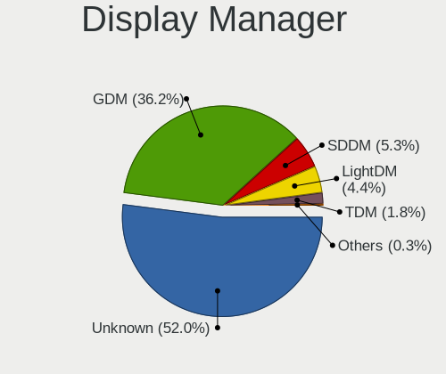

| Name    | Computers | Percent |
|---------|-----------|---------|
| Unknown | 842       | 52.14%  |
| GDM     | 584       | 36.16%  |
| SDDM    | 86        | 5.33%   |
| LightDM | 69        | 4.27%   |
| TDM     | 29        | 1.8%    |
| KDM     | 3         | 0.19%   |
| XDM     | 1         | 0.06%   |
| SLiM    | 1         | 0.06%   |

OS Lang
-------

Language

| Lang    | Computers | Percent |
|---------|-----------|---------|
| en_US   | 824       | 51.63%  |
| en_GB   | 134       | 8.4%    |
| pt_BR   | 80        | 5.01%   |
| ru_RU   | 74        | 4.64%   |
| fr_FR   | 58        | 3.63%   |
| de_DE   | 58        | 3.63%   |
| en_CA   | 35        | 2.19%   |
| en_AU   | 35        | 2.19%   |
| it_IT   | 27        | 1.69%   |
| es_ES   | 23        | 1.44%   |
| en_IN   | 23        | 1.44%   |
| pl_PL   | 22        | 1.38%   |
| es_MX   | 14        | 0.88%   |
| cs_CZ   | 13        | 0.81%   |
| ru_UA   | 9         | 0.56%   |
| es_CL   | 9         | 0.56%   |
| Unknown | 9         | 0.56%   |
| en_NZ   | 8         | 0.5%    |
| en_DK   | 8         | 0.5%    |
| ja_JP   | 7         | 0.44%   |
| nl_NL   | 6         | 0.38%   |
| nl_BE   | 6         | 0.38%   |
| fi_FI   | 6         | 0.38%   |
| es_CO   | 6         | 0.38%   |
| C       | 6         | 0.38%   |
| pt_PT   | 5         | 0.31%   |
| hu_HU   | 5         | 0.31%   |
| fr_CH   | 5         | 0.31%   |
| es_AR   | 5         | 0.31%   |
| en_IE   | 5         | 0.31%   |
| tr_TR   | 4         | 0.25%   |
| es_EC   | 4         | 0.25%   |
| en_ZA   | 4         | 0.25%   |
| en_SG   | 4         | 0.25%   |
| de_AT   | 4         | 0.25%   |
| zh_TW   | 3         | 0.19%   |
| zh_CN   | 3         | 0.19%   |
| da_DK   | 3         | 0.19%   |
| ca_ES   | 3         | 0.19%   |
| uk_UA   | 2         | 0.13%   |

Boot Mode
---------

EFI or BIOS

| Mode | Computers | Percent |
|------|-----------|---------|
| EFI  | 1200      | 75.24%  |
| BIOS | 395       | 24.76%  |

Filesystem
----------

Type of filesystem

| Type                | Computers | Percent |
|---------------------|-----------|---------|
| Btrfs               | 1099      | 69.16%  |
| Ext4                | 415       | 26.12%  |
| Xfs                 | 65        | 4.09%   |
| Zfs                 | 3         | 0.19%   |
| Fuse.fuse-overlayfs | 2         | 0.13%   |
| Ext3                | 2         | 0.13%   |
| Overlay             | 1         | 0.06%   |
| F2fs                | 1         | 0.06%   |
| Unknown             | 1         | 0.06%   |

Part. scheme
------------

Scheme of partitioning

| Type    | Computers | Percent |
|---------|-----------|---------|
| Unknown | 814       | 50.68%  |
| GPT     | 665       | 41.41%  |
| MBR     | 127       | 7.91%   |

Dual Boot with Linux/BSD
------------------------

Hosting more than one Linux/BSD

| Dual boot | Computers | Percent |
|-----------|-----------|---------|
| No        | 1403      | 87.8%   |
| Yes       | 195       | 12.2%   |

Dual Boot (Win)
---------------

Hosting Linux and Windows

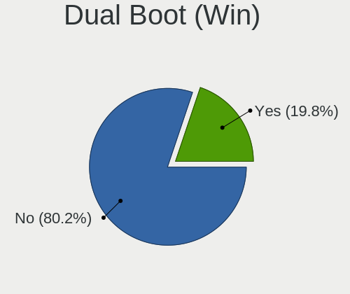

| Dual boot | Computers | Percent |
|-----------|-----------|---------|
| No        | 1279      | 80.24%  |
| Yes       | 315       | 19.76%  |

Board
-----

Vendor
------

Motherboard manufacturer

| Name                    | Computers | Percent |
|-------------------------|-----------|---------|
| Lenovo                  | 342       | 21.59%  |
| ASUSTek Computer        | 232       | 14.65%  |
| Dell                    | 206       | 13.01%  |
| Hewlett-Packard         | 199       | 12.56%  |
| Gigabyte Technology     | 114       | 7.2%    |
| MSI                     | 81        | 5.11%   |
| Acer                    | 66        | 4.17%   |
| ASRock                  | 60        | 3.79%   |
| Apple                   | 39        | 2.46%   |
| Intel                   | 21        | 1.33%   |
| Unknown                 | 17        | 1.07%   |
| HUAWEI                  | 15        | 0.95%   |
| Toshiba                 | 13        | 0.82%   |
| Fujitsu                 | 12        | 0.76%   |
| Samsung Electronics     | 11        | 0.69%   |
| Timi                    | 10        | 0.63%   |
| Notebook                | 9         | 0.57%   |
| Sony                    | 8         | 0.51%   |
| Positivo                | 8         | 0.51%   |
| Raspberry Pi Foundation | 6         | 0.38%   |
| System76                | 5         | 0.32%   |
| Chuwi                   | 5         | 0.32%   |
| Biostar                 | 5         | 0.32%   |
| Alienware               | 5         | 0.32%   |
| Microsoft               | 4         | 0.25%   |
| LG Electronics          | 4         | 0.25%   |
| eMachines               | 4         | 0.25%   |
| TUXEDO                  | 3         | 0.19%   |
| Supermicro              | 3         | 0.19%   |
| Pine Microsystems       | 3         | 0.19%   |
| Medion                  | 3         | 0.19%   |
| Huanan                  | 3         | 0.19%   |
| Framework               | 3         | 0.19%   |
| ECS                     | 3         | 0.19%   |
| Vulcan Electronics      | 2         | 0.13%   |
| TrekStor                | 2         | 0.13%   |
| theobroma-systems       | 2         | 0.13%   |
| Teclast                 | 2         | 0.13%   |
| Standard                | 2         | 0.13%   |
| SLIMBOOK                | 2         | 0.13%   |

Model
-----

Motherboard model

| Name                                       | Computers | Percent |
|--------------------------------------------|-----------|---------|
| Unknown                                    | 20        | 1.26%   |
| ASUS All Series                            | 13        | 0.82%   |
| MSI MS-7C37                                | 9         | 0.57%   |
| Lenovo IdeaPadFlex 5 14ARE05 81X2          | 7         | 0.44%   |
| Dell Latitude 7490                         | 7         | 0.44%   |
| RPi Raspberry Pi 4 Model B                 | 6         | 0.38%   |
| ASUS ROG Zephyrus G14 GA401QM_GA401QM      | 6         | 0.38%   |
| MSI MS-7C02                                | 5         | 0.32%   |
| HP Pavilion 15                             | 5         | 0.32%   |
| HP Notebook                                | 5         | 0.32%   |
| HP ENVY x360 Convertible 13-ay0xxx         | 5         | 0.32%   |
| Dell XPS 15 9500                           | 5         | 0.32%   |
| Dell XPS 15 7590                           | 5         | 0.32%   |
| Lenovo Yoga 9 14ITL5 82BG                  | 4         | 0.25%   |
| Lenovo ThinkPad X1 Carbon Gen 9 20XWCTO1WW | 4         | 0.25%   |
| Lenovo IdeaPad S145-15IWL 81S9             | 4         | 0.25%   |
| HP Pavilion dv7                            | 4         | 0.25%   |
| Gigabyte B450 I AORUS PRO WIFI             | 4         | 0.25%   |
| Dell XPS 13 9310                           | 4         | 0.25%   |
| Dell Latitude 5480                         | 4         | 0.25%   |
| ASUS ZenBook UX431DA_UM431DA               | 4         | 0.25%   |
| ASUS TUF Gaming X570-PLUS                  | 4         | 0.25%   |
| ASUS ROG CROSSHAIR VII HERO                | 4         | 0.25%   |
| Apple MacBookPro11,5                       | 4         | 0.25%   |
| Apple MacBookPro11,3                       | 4         | 0.25%   |
| System76 Oryx Pro                          | 3         | 0.19%   |
| MSI MS-7C84                                | 3         | 0.19%   |
| MSI MS-7A38                                | 3         | 0.19%   |
| Lenovo IdeaPad 5 15ARE05 81YQ              | 3         | 0.19%   |
| Intel H61                                  | 3         | 0.19%   |
| HP ProBook 450 G5                          | 3         | 0.19%   |
| HP Pavilion dv6                            | 3         | 0.19%   |
| HP Laptop 15s-eq2xxx                       | 3         | 0.19%   |
| HP Laptop 15-da0xxx                        | 3         | 0.19%   |
| HP EliteBook 840 G6                        | 3         | 0.19%   |
| HP Elite x2 1012 G1                        | 3         | 0.19%   |
| Gigabyte B450M DS3H                        | 3         | 0.19%   |
| Gigabyte B450 AORUS M                      | 3         | 0.19%   |
| Gigabyte A320M-S2H                         | 3         | 0.19%   |
| Framework Laptop                           | 3         | 0.19%   |

Model Family
------------

Motherboard model prefix

| Name               | Computers | Percent |
|--------------------|-----------|---------|
| Lenovo ThinkPad    | 191       | 12.06%  |
| Lenovo IdeaPad     | 57        | 3.6%    |
| ASUS ROG           | 55        | 3.47%   |
| Dell Inspiron      | 53        | 3.35%   |
| Dell Latitude      | 51        | 3.22%   |
| Dell XPS           | 45        | 2.84%   |
| Acer Aspire        | 43        | 2.71%   |
| HP Pavilion        | 35        | 2.21%   |
| Lenovo Yoga        | 34        | 2.15%   |
| HP ProBook         | 28        | 1.77%   |
| HP EliteBook       | 26        | 1.64%   |
| ASUS PRIME         | 24        | 1.52%   |
| Unknown            | 20        | 1.26%   |
| ASUS VivoBook      | 19        | 1.2%    |
| ASUS TUF           | 19        | 1.2%    |
| Dell OptiPlex      | 18        | 1.14%   |
| HP Laptop          | 17        | 1.07%   |
| HP ENVY            | 17        | 1.07%   |
| Dell Precision     | 15        | 0.95%   |
| Gigabyte B450      | 14        | 0.88%   |
| ASUS All           | 13        | 0.82%   |
| Toshiba Satellite  | 11        | 0.69%   |
| Lenovo ThinkCentre | 11        | 0.69%   |
| Apple MacBookPro11 | 11        | 0.69%   |
| HP ZBook           | 10        | 0.63%   |
| MSI MS-7C37        | 9         | 0.57%   |
| ASUS ZenBook       | 9         | 0.57%   |
| ASUS ASUS          | 9         | 0.57%   |
| Lenovo Legion      | 8         | 0.51%   |
| Lenovo IdeaPadFlex | 8         | 0.51%   |
| HP EliteDesk       | 8         | 0.51%   |
| HP Compaq          | 8         | 0.51%   |
| Dell Vostro        | 8         | 0.51%   |
| Lenovo ThinkBook   | 7         | 0.44%   |
| Gigabyte X570      | 7         | 0.44%   |
| Fujitsu LIFEBOOK   | 7         | 0.44%   |
| Acer Nitro         | 7         | 0.44%   |
| RPi Raspberry      | 6         | 0.38%   |
| Acer Swift         | 6         | 0.38%   |
| MSI MS-7C02        | 5         | 0.32%   |

MFG Year
--------

Motherboard manufacture year

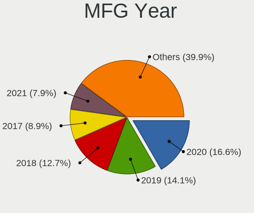

| Year    | Computers | Percent |
|---------|-----------|---------|
| 2020    | 266       | 16.79%  |
| 2019    | 226       | 14.27%  |
| 2018    | 200       | 12.63%  |
| 2017    | 140       | 8.84%   |
| 2021    | 124       | 7.83%   |
| 2015    | 100       | 6.31%   |
| 2016    | 98        | 6.19%   |
| 2014    | 84        | 5.3%    |
| 2013    | 81        | 5.11%   |
| 2012    | 78        | 4.92%   |
| 2011    | 67        | 4.23%   |
| 2010    | 43        | 2.71%   |
| 2008    | 31        | 1.96%   |
| 2009    | 26        | 1.64%   |
| 2007    | 7         | 0.44%   |
| Unknown | 6         | 0.38%   |
| 2006    | 5         | 0.32%   |
| 2005    | 2         | 0.13%   |

Form Factor
-----------

Physical design of the computer

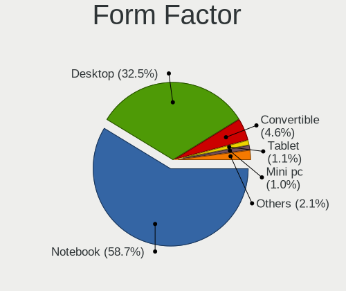

| Name           | Computers | Percent |
|----------------|-----------|---------|
| Notebook       | 926       | 58.46%  |
| Desktop        | 518       | 32.7%   |
| Convertible    | 74        | 4.67%   |
| Tablet         | 17        | 1.07%   |
| Mini pc        | 16        | 1.01%   |
| All in one     | 14        | 0.88%   |
| System on chip | 11        | 0.69%   |
| Server         | 8         | 0.51%   |

Secure Boot
-----------

Enabled or disabled

| State    | Computers | Percent |
|----------|-----------|---------|
| Disabled | 1373      | 85.81%  |
| Enabled  | 227       | 14.19%  |

Coreboot
--------

Have coreboot on board

| Used | Computers | Percent |
|------|-----------|---------|
| No   | 1579      | 99.68%  |
| Yes  | 5         | 0.32%   |

RAM Size
--------

Total RAM memory

| Size in GB  | Computers | Percent |
|-------------|-----------|---------|
| 16.01-24.0  | 416       | 26%     |
| 4.01-8.0    | 382       | 23.88%  |
| 8.01-16.0   | 299       | 18.69%  |
| 32.01-64.0  | 237       | 14.81%  |
| 3.01-4.0    | 130       | 8.13%   |
| 64.01-256.0 | 60        | 3.75%   |
| 24.01-32.0  | 36        | 2.25%   |
| 1.01-2.0    | 28        | 1.75%   |
| 0.51-1.0    | 7         | 0.44%   |
| 2.01-3.0    | 5         | 0.31%   |

RAM Used
--------

Used RAM memory

| Used GB    | Computers | Percent |
|------------|-----------|---------|
| 2.01-3.0   | 469       | 27.08%  |
| 4.01-8.0   | 466       | 26.91%  |
| 3.01-4.0   | 343       | 19.8%   |
| 1.01-2.0   | 262       | 15.13%  |
| 8.01-16.0  | 120       | 6.93%   |
| 0.51-1.0   | 41        | 2.37%   |
| 16.01-24.0 | 20        | 1.15%   |
| 32.01-64.0 | 4         | 0.23%   |
| 24.01-32.0 | 4         | 0.23%   |
| 0.01-0.5   | 3         | 0.17%   |

Total Drives
------------

Number of drives on board

| Drives | Computers | Percent |
|--------|-----------|---------|
| 1      | 920       | 57.36%  |
| 2      | 400       | 24.94%  |
| 3      | 155       | 9.66%   |
| 4      | 58        | 3.62%   |
| 5      | 28        | 1.75%   |
| 6      | 16        | 1%      |
| 8      | 9         | 0.56%   |
| 0      | 8         | 0.5%    |
| 7      | 5         | 0.31%   |
| 12     | 2         | 0.12%   |
| 9      | 2         | 0.12%   |
| 15     | 1         | 0.06%   |

Has CD-ROM
----------

Has CD-ROM on board

| Presented | Computers | Percent |
|-----------|-----------|---------|
| No        | 1210      | 76.05%  |
| Yes       | 381       | 23.95%  |

Has Ethernet
------------

Has Ethernet on board

| Presented | Computers | Percent |
|-----------|-----------|---------|
| Yes       | 1263      | 79.33%  |
| No        | 329       | 20.67%  |

Has WiFi
--------

Has WiFi module

| Presented | Computers | Percent |
|-----------|-----------|---------|
| Yes       | 1271      | 79.94%  |
| No        | 319       | 20.06%  |

Has Bluetooth
-------------

Has Bluetooth module

| Presented | Computers | Percent |
|-----------|-----------|---------|
| Yes       | 1112      | 69.81%  |
| No        | 481       | 30.19%  |

Location
--------

Country
-------

Geographic location (country)

| Country      | Computers | Percent |
|--------------|-----------|---------|
| USA          | 296       | 18.62%  |
| Brazil       | 119       | 7.48%   |
| Germany      | 105       | 6.6%    |
| Russia       | 85        | 5.35%   |
| France       | 74        | 4.65%   |
| UK           | 60        | 3.77%   |
| India        | 58        | 3.65%   |
| Netherlands  | 53        | 3.33%   |
| Canada       | 50        | 3.14%   |
| Italy        | 41        | 2.58%   |
| Spain        | 40        | 2.52%   |
| Poland       | 39        | 2.45%   |
| Australia    | 38        | 2.39%   |
| Czechia      | 35        | 2.2%    |
| Ukraine      | 25        | 1.57%   |
| Sweden       | 25        | 1.57%   |
| Belgium      | 21        | 1.32%   |
| Switzerland  | 20        | 1.26%   |
| Portugal     | 20        | 1.26%   |
| Mexico       | 19        | 1.19%   |
| Austria      | 18        | 1.13%   |
| Turkey       | 16        | 1.01%   |
| Denmark      | 16        | 1.01%   |
| Chile        | 16        | 1.01%   |
| Romania      | 15        | 0.94%   |
| Norway       | 14        | 0.88%   |
| Finland      | 14        | 0.88%   |
| Argentina    | 14        | 0.88%   |
| Slovakia     | 11        | 0.69%   |
| New Zealand  | 11        | 0.69%   |
| Colombia     | 10        | 0.63%   |
| Belarus      | 10        | 0.63%   |
| Japan        | 9         | 0.57%   |
| Iran         | 9         | 0.57%   |
| Hungary      | 9         | 0.57%   |
| South Africa | 8         | 0.5%    |
| Indonesia    | 8         | 0.5%    |
| Estonia      | 8         | 0.5%    |
| China        | 8         | 0.5%    |
| Israel       | 7         | 0.44%   |

City
----

Geographic location (city)

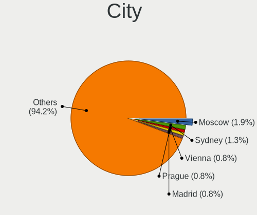

| City           | Computers | Percent |
|----------------|-----------|---------|
| Moscow         | 32        | 1.95%   |
| Sydney         | 21        | 1.28%   |
| Prague         | 14        | 0.85%   |
| Madrid         | 14        | 0.85%   |
| Berlin         | 14        | 0.85%   |
| Amsterdam      | 14        | 0.85%   |
| Vienna         | 13        | 0.79%   |
| Paris          | 13        | 0.79%   |
| St Petersburg  | 10        | 0.61%   |
| Kyiv           | 10        | 0.61%   |
| Denver         | 10        | 0.61%   |
| Brno           | 10        | 0.61%   |
| Toronto        | 9         | 0.55%   |
| Milan          | 9         | 0.55%   |
| Rio de Janeiro | 8         | 0.49%   |
| Minsk          | 8         | 0.49%   |
| Istanbul       | 8         | 0.49%   |
| Hamburg        | 8         | 0.49%   |
| Delft          | 8         | 0.49%   |
| Belo Horizonte | 8         | 0.49%   |
| Yekaterinburg  | 7         | 0.43%   |
| Tallinn        | 7         | 0.43%   |
| Sao Paulo      | 7         | 0.43%   |
| Bratislava     | 7         | 0.43%   |
| Bengaluru      | 7         | 0.43%   |
| Lisbon         | 6         | 0.37%   |
| Dallas         | 6         | 0.37%   |
| Cologne        | 6         | 0.37%   |
| Buenos Aires   | 6         | 0.37%   |
| Budapest       | 6         | 0.37%   |
| Brussels       | 6         | 0.37%   |
| Apex           | 6         | 0.37%   |
| Wroclaw        | 5         | 0.31%   |
| Warsaw         | 5         | 0.31%   |
| Tel Aviv       | 5         | 0.31%   |
| Tehran         | 5         | 0.31%   |
| Pune           | 5         | 0.31%   |
| Oslo           | 5         | 0.31%   |
| Melbourne      | 5         | 0.31%   |
| London         | 5         | 0.31%   |

Drives
------

Drive Vendor
------------

Hard drive vendors

| Vendor                    | Computers | Drives | Percent |
|---------------------------|-----------|--------|---------|
| Samsung Electronics       | 504       | 800    | 21.1%   |
| WDC                       | 319       | 464    | 13.35%  |
| Seagate                   | 276       | 414    | 11.55%  |
| Toshiba                   | 151       | 198    | 6.32%   |
| Kingston                  | 132       | 164    | 5.53%   |
| SanDisk                   | 120       | 136    | 5.02%   |
| Crucial                   | 98        | 134    | 4.1%    |
| Unknown                   | 93        | 121    | 3.89%   |
| SK hynix                  | 88        | 105    | 3.68%   |
| Intel                     | 79        | 114    | 3.31%   |
| Hitachi                   | 51        | 67     | 2.13%   |
| Micron Technology         | 40        | 54     | 1.67%   |
| A-DATA Technology         | 34        | 37     | 1.42%   |
| HGST                      | 30        | 42     | 1.26%   |
| Apple                     | 24        | 28     | 1%      |
| KIOXIA                    | 23        | 30     | 0.96%   |
| Phison                    | 22        | 28     | 0.92%   |
| Corsair                   | 20        | 28     | 0.84%   |
| SPCC                      | 16        | 21     | 0.67%   |
| Silicon Motion            | 14        | 19     | 0.59%   |
| PNY                       | 14        | 19     | 0.59%   |
| Transcend                 | 13        | 13     | 0.54%   |
| XPG                       | 11        | 13     | 0.46%   |
| LITEON                    | 11        | 12     | 0.46%   |
| Patriot                   | 10        | 11     | 0.42%   |
| OCZ                       | 10        | 15     | 0.42%   |
| Micron/Crucial Technology | 10        | 11     | 0.42%   |
| LITEONIT                  | 10        | 10     | 0.42%   |
| Gigabyte Technology       | 10        | 11     | 0.42%   |
| China                     | 10        | 12     | 0.42%   |
| Union Memory              | 8         | 11     | 0.33%   |
| Team                      | 6         | 7      | 0.25%   |
| Realtek Semiconductor     | 6         | 7      | 0.25%   |
| Hewlett-Packard           | 6         | 6      | 0.25%   |
| Maxtor                    | 5         | 6      | 0.21%   |
| Lite-On                   | 5         | 5      | 0.21%   |
| JMicron Technology        | 5         | 5      | 0.21%   |
| Goodram                   | 5         | 5      | 0.21%   |
| Union Memory (Shenzhen)   | 4         | 9      | 0.17%   |
| SABRENT                   | 4         | 4      | 0.17%   |

Drive Model
-----------

Hard drive models

| Model                                  | Computers | Percent |
|----------------------------------------|-----------|---------|
| Samsung NVMe SSD Drive 512GB           | 39        | 1.44%   |
| Samsung SSD 860 EVO 500GB              | 33        | 1.22%   |
| Samsung NVMe SSD Drive 500GB           | 31        | 1.14%   |
| Samsung NVMe SSD Drive 1TB             | 30        | 1.1%    |
| Samsung SSD 860 EVO 1TB                | 27        | 0.99%   |
| Kingston SA400S37240G 240GB SSD        | 27        | 0.99%   |
| Samsung SM963 2.5" NVMe PCIe SSD 256GB | 24        | 0.88%   |
| Seagate ST1000LM035-1RK172 1TB         | 22        | 0.81%   |
| Samsung SSD 850 EVO 250GB              | 20        | 0.74%   |
| Seagate ST1000LM024 HN-M101MBB 1TB     | 19        | 0.7%    |
| Samsung SSD 850 EVO 500GB              | 19        | 0.7%    |
| Seagate ST2000DM008-2FR102 2TB         | 18        | 0.66%   |
| Kingston SA400S37480G 480GB SSD        | 18        | 0.66%   |
| Samsung NVMe SSD Drive 1024GB          | 16        | 0.59%   |
| Seagate ST1000DM010-2EP102 1TB         | 15        | 0.55%   |
| SanDisk NVMe SSD Drive 512GB           | 15        | 0.55%   |
| Samsung SSD 970 EVO Plus 1TB           | 15        | 0.55%   |
| Samsung NVMe SSD Drive 250GB           | 15        | 0.55%   |
| Kingston SA400S37120G 120GB SSD        | 15        | 0.55%   |
| Crucial CT500MX500SSD1 500GB           | 15        | 0.55%   |
| Toshiba NVMe SSD Drive 512GB           | 13        | 0.48%   |
| SK hynix NVMe SSD Drive 512GB          | 13        | 0.48%   |
| Seagate ST500DM002-1BD142 500GB        | 13        | 0.48%   |
| SanDisk NVMe SSD Drive 500GB           | 13        | 0.48%   |
| Samsung SSD 860 EVO 250GB              | 13        | 0.48%   |
| Unknown SD/MMC/MS PRO 64GB             | 12        | 0.44%   |
| Toshiba DT01ACA100 1TB                 | 12        | 0.44%   |
| Samsung SSD 860 QVO 1TB                | 12        | 0.44%   |
| Intel NVMe SSD Drive 512GB             | 12        | 0.44%   |
| Unknown MMC Card  32GB                 | 11        | 0.41%   |
| Samsung SSD 980 PRO 1TB                | 11        | 0.41%   |
| Samsung SSD 970 EVO Plus 500GB         | 11        | 0.41%   |
| Samsung SSD 970 EVO 1TB                | 11        | 0.41%   |
| Samsung MZVLB512HBJQ-000L7 512GB       | 11        | 0.41%   |
| Crucial CT1000MX500SSD1 1TB            | 11        | 0.41%   |
| Seagate Expansion 4TB                  | 10        | 0.37%   |
| Samsung SSD 970 EVO 500GB              | 10        | 0.37%   |
| WDC WD20EZRZ-00Z5HB0 2TB               | 9         | 0.33%   |
| Toshiba MQ01ABD100 1TB                 | 9         | 0.33%   |
| Toshiba DT01ACA200 2TB                 | 9         | 0.33%   |

HDD Vendor
----------

Hard disk drive vendors

| Vendor              | Computers | Drives | Percent |
|---------------------|-----------|--------|---------|
| Seagate             | 267       | 399    | 38.36%  |
| WDC                 | 212       | 321    | 30.46%  |
| Toshiba             | 76        | 104    | 10.92%  |
| Hitachi             | 51        | 67     | 7.33%   |
| HGST                | 30        | 42     | 4.31%   |
| Samsung Electronics | 25        | 43     | 3.59%   |
| Unknown             | 12        | 13     | 1.72%   |
| Apple               | 5         | 5      | 0.72%   |
| Maxtor              | 3         | 3      | 0.43%   |
| MaxDigital          | 2         | 2      | 0.29%   |
| Hewlett-Packard     | 2         | 2      | 0.29%   |
| ASMT                | 2         | 2      | 0.29%   |
| USB3.0              | 1         | 1      | 0.14%   |
| USB 3.0             | 1         | 1      | 0.14%   |
| Synology            | 1         | 1      | 0.14%   |
| Phison              | 1         | 1      | 0.14%   |
| PHD 3.0             | 1         | 1      | 0.14%   |
| Magnetic Data       | 1         | 1      | 0.14%   |
| Inateck             | 1         | 1      | 0.14%   |
| Fujitsu             | 1         | 1      | 0.14%   |
| ASMT106x            | 1         | 1      | 0.14%   |

SSD Vendor
----------

Solid state drive vendors

| Vendor              | Computers | Drives | Percent |
|---------------------|-----------|--------|---------|
| Samsung Electronics | 233       | 350    | 27.32%  |
| Kingston            | 101       | 125    | 11.84%  |
| Crucial             | 86        | 120    | 10.08%  |
| SanDisk             | 67        | 77     | 7.85%   |
| WDC                 | 54        | 64     | 6.33%   |
| Intel               | 29        | 43     | 3.4%    |
| A-DATA Technology   | 27        | 29     | 3.17%   |
| Micron Technology   | 24        | 27     | 2.81%   |
| Toshiba             | 23        | 26     | 2.7%    |
| SK hynix            | 16        | 17     | 1.88%   |
| PNY                 | 14        | 18     | 1.64%   |
| Apple               | 14        | 16     | 1.64%   |
| SPCC                | 11        | 16     | 1.29%   |
| Transcend           | 10        | 10     | 1.17%   |
| OCZ                 | 10        | 15     | 1.17%   |
| LITEONIT            | 10        | 10     | 1.17%   |
| LITEON              | 10        | 11     | 1.17%   |
| China               | 10        | 12     | 1.17%   |
| Patriot             | 9         | 9      | 1.06%   |
| Corsair             | 8         | 9      | 0.94%   |
| Gigabyte Technology | 7         | 8      | 0.82%   |
| Team                | 6         | 7      | 0.7%    |
| Unknown             | 5         | 5      | 0.59%   |
| GOODRAM             | 5         | 5      | 0.59%   |
| Intenso             | 4         | 4      | 0.47%   |
| Mushkin             | 3         | 6      | 0.35%   |
| Lexar               | 3         | 3      | 0.35%   |
| KingSpec            | 3         | 6      | 0.35%   |
| JMicron Technology  | 3         | 3      | 0.35%   |
| Hewlett-Packard     | 3         | 3      | 0.35%   |
| Apacer              | 3         | 4      | 0.35%   |
| Seagate             | 2         | 2      | 0.23%   |
| Plextor             | 2         | 3      | 0.23%   |
| Maxtor              | 2         | 3      | 0.23%   |
| Dogfish             | 2         | 2      | 0.23%   |
| ASMT                | 2         | 3      | 0.23%   |
| WDC WDS2            | 1         | 1      | 0.12%   |
| W800S               | 1         | 1      | 0.12%   |
| Union Memory        | 1         | 1      | 0.12%   |
| UNIC2               | 1         | 1      | 0.12%   |

Drive Kind
----------

HDD or SSD

| Kind    | Computers | Drives | Percent |
|---------|-----------|--------|---------|
| SSD     | 744       | 1105   | 34.49%  |
| NVMe    | 742       | 1060   | 34.4%   |
| HDD     | 568       | 1012   | 26.33%  |
| MMC     | 80        | 106    | 3.71%   |
| Unknown | 23        | 27     | 1.07%   |

Drive Connector
---------------

SATA, SAS, NVMe, etc.

| Type | Computers | Drives | Percent |
|------|-----------|--------|---------|
| SATA | 1032      | 2043   | 53.31%  |
| NVMe | 738       | 1053   | 38.12%  |
| SAS  | 86        | 108    | 4.44%   |
| MMC  | 80        | 106    | 4.13%   |

Drive Size
----------

Size of hard drive

| Size in TB | Computers | Drives | Percent |
|------------|-----------|--------|---------|
| 0.01-0.5   | 744       | 1158   | 53.41%  |
| 0.51-1.0   | 422       | 608    | 30.29%  |
| 1.01-2.0   | 118       | 168    | 8.47%   |
| 3.01-4.0   | 48        | 74     | 3.45%   |
| 4.01-10.0  | 31        | 65     | 2.23%   |
| 2.01-3.0   | 23        | 30     | 1.65%   |
| 10.01-20.0 | 6         | 13     | 0.43%   |
| 0          | 1         | 1      | 0.07%   |

Space Total
-----------

Amount of disk space available on the file system

| Size in GB     | Computers | Percent |
|----------------|-----------|---------|
| 501-1000       | 335       | 20.59%  |
| 251-500        | 296       | 18.19%  |
| 101-250        | 237       | 14.57%  |
| 1001-2000      | 205       | 12.6%   |
| 1-20           | 178       | 10.94%  |
| Unknown        | 127       | 7.81%   |
| More than 3000 | 95        | 5.84%   |
| 2001-3000      | 63        | 3.87%   |
| 51-100         | 59        | 3.63%   |
| 21-50          | 32        | 1.97%   |

Space Used
----------

Amount of used disk space

| Used GB        | Computers | Percent |
|----------------|-----------|---------|
| 1-20           | 444       | 26.48%  |
| 101-250        | 253       | 15.09%  |
| 21-50          | 244       | 14.55%  |
| 51-100         | 181       | 10.79%  |
| 251-500        | 175       | 10.44%  |
| 501-1000       | 150       | 8.94%   |
| Unknown        | 127       | 7.57%   |
| 1001-2000      | 60        | 3.58%   |
| More than 3000 | 29        | 1.73%   |
| 2001-3000      | 14        | 0.83%   |

Malfunc. Drives
---------------

Drive models with a malfunction

| Model                                   | Computers | Drives | Percent |
|-----------------------------------------|-----------|--------|---------|
| Seagate ST500DM002-1BD142 500GB         | 4         | 9      | 3.36%   |
| Seagate ST1000LM035-1RK172 1TB          | 3         | 3      | 2.52%   |
| Intel SSDSC2CT120A3 120GB               | 3         | 8      | 2.52%   |
| WDC WD1003FBYX-01Y7B1 1TB               | 2         | 2      | 1.68%   |
| Toshiba DT01ACA200 2TB                  | 2         | 3      | 1.68%   |
| Seagate ST31000524AS 1TB                | 2         | 2      | 1.68%   |
| Seagate ST1000LM024 HN-M101MBB 1TB      | 2         | 2      | 1.68%   |
| SanDisk SDSSDX240GG25 240GB             | 2         | 2      | 1.68%   |
| Kingston SA400S37240G 240GB SSD         | 2         | 2      | 1.68%   |
| HGST HTS725050A7E630 500GB              | 2         | 3      | 1.68%   |
| HGST HTS545050A7E680 500GB              | 2         | 2      | 1.68%   |
| Crucial CT275MX300SSD1 275GB            | 2         | 2      | 1.68%   |
| Crucial CT1050MX300SSD1 1TB             | 2         | 3      | 1.68%   |
| WDC WD60EFAX-68SHWN0 6TB                | 1         | 1      | 0.84%   |
| WDC WD5000BEVT-22A0RT0 500GB            | 1         | 1      | 0.84%   |
| WDC WD40PURZ-85AKKY0 4TB                | 1         | 1      | 0.84%   |
| WDC WD3200BPVT-75ZEST0 320GB            | 1         | 1      | 0.84%   |
| WDC WD3200BPVT-24JJ5T0 320GB            | 1         | 1      | 0.84%   |
| WDC WD30EZRX-00AZ6B0 3TB                | 1         | 1      | 0.84%   |
| WDC WD20EFRX-68AX9N0 2TB                | 1         | 1      | 0.84%   |
| WDC WD1600AVVS-63L2B0 160GB             | 1         | 1      | 0.84%   |
| WDC WD15EARS-00Z5B1 1TB                 | 1         | 1      | 0.84%   |
| WDC WD10SPZX-24Z10 1TB                  | 1         | 1      | 0.84%   |
| WDC WD10JPVX-75JC3T0 1TB                | 1         | 1      | 0.84%   |
| WDC WD10JPVX-60JC3T0 1TB                | 1         | 1      | 0.84%   |
| WDC WD10EZEX-60WN4A1 1TB                | 1         | 1      | 0.84%   |
| WDC WD10EZEX-00WN4A0 1TB                | 1         | 1      | 0.84%   |
| WDC WD1002FAEX-00Y9A0 1TB               | 1         | 1      | 0.84%   |
| Union Memory UMIS RPJTJ128MED1MWX 128GB | 1         | 1      | 0.84%   |
| Toshiba MQ01ABD100 1TB                  | 1         | 1      | 0.84%   |
| Toshiba MQ01ABD050V 500GB               | 1         | 1      | 0.84%   |
| SPCC Solid State Disk 256GB             | 1         | 1      | 0.84%   |
| SK hynix SC401 SATA 512GB SSD           | 1         | 1      | 0.84%   |
| SK hynix PC401 NVMe 1TB                 | 1         | 1      | 0.84%   |
| SK hynix HFS256G39TND-N210A 256GB SSD   | 1         | 1      | 0.84%   |
| Seagate ST9250315AS 250GB               | 1         | 1      | 0.84%   |
| Seagate ST500LM021-1KJ152 500GB         | 1         | 1      | 0.84%   |
| Seagate ST500DM002-1SB10A 500GB         | 1         | 1      | 0.84%   |
| Seagate ST4000DM000-1F2168 4TB          | 1         | 1      | 0.84%   |
| Seagate ST3500630AS 500GB               | 1         | 1      | 0.84%   |

Malfunc. Drive Vendor
---------------------

Vendors of faulty drives

| Vendor              | Computers | Drives | Percent |
|---------------------|-----------|--------|---------|
| Seagate             | 24        | 31     | 20.34%  |
| WDC                 | 17        | 17     | 14.41%  |
| Samsung Electronics | 11        | 23     | 9.32%   |
| Hitachi             | 11        | 12     | 9.32%   |
| Intel               | 9         | 14     | 7.63%   |
| Crucial             | 8         | 9      | 6.78%   |
| SanDisk             | 6         | 6      | 5.08%   |
| Kingston            | 5         | 5      | 4.24%   |
| HGST                | 5         | 6      | 4.24%   |
| Toshiba             | 4         | 5      | 3.39%   |
| SK hynix            | 3         | 3      | 2.54%   |
| Micron Technology   | 3         | 3      | 2.54%   |
| LITEON              | 3         | 3      | 2.54%   |
| A-DATA Technology   | 3         | 3      | 2.54%   |
| Union Memory        | 1         | 1      | 0.85%   |
| SPCC                | 1         | 1      | 0.85%   |
| ORICO               | 1         | 1      | 0.85%   |
| LITEONIT            | 1         | 1      | 0.85%   |
| Hewlett-Packard     | 1         | 1      | 0.85%   |
| Fujitsu             | 1         | 1      | 0.85%   |

Malfunc. HDD Vendor
-------------------

Vendors of faulty HDD drives

| Vendor              | Computers | Drives | Percent |
|---------------------|-----------|--------|---------|
| Seagate             | 24        | 31     | 34.78%  |
| WDC                 | 17        | 17     | 24.64%  |
| Hitachi             | 11        | 12     | 15.94%  |
| Samsung Electronics | 6         | 18     | 8.7%    |
| HGST                | 5         | 6      | 7.25%   |
| Toshiba             | 4         | 5      | 5.8%    |
| Hewlett-Packard     | 1         | 1      | 1.45%   |
| Fujitsu             | 1         | 1      | 1.45%   |

Malfunc. Drive Kind
-------------------

Kinds of faulty drives

| Kind | Computers | Drives | Percent |
|------|-----------|--------|---------|
| HDD  | 66        | 91     | 57.39%  |
| SSD  | 41        | 47     | 35.65%  |
| NVMe | 8         | 8      | 6.96%   |

Failed Drives
-------------

Failed drive models

| Model                                | Computers | Drives | Percent |
|--------------------------------------|-----------|--------|---------|
| WDC PC SN520 SDAPMUW-512G-1001 512GB | 1         | 1      | 50%     |
| Hitachi HDS721010DLE630 1TB          | 1         | 4      | 50%     |

Failed Drive Vendor
-------------------

Failed drive vendors

| Vendor  | Computers | Drives | Percent |
|---------|-----------|--------|---------|
| WDC     | 1         | 1      | 50%     |
| Hitachi | 1         | 4      | 50%     |

Drive Status
------------

Number of failed and malfunc. drives

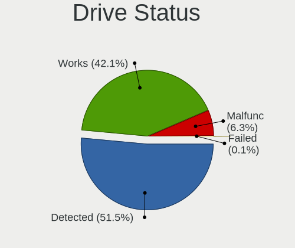

| Status   | Computers | Drives | Percent |
|----------|-----------|--------|---------|
| Detected | 905       | 1804   | 51.51%  |
| Works    | 738       | 1355   | 42%     |
| Malfunc  | 112       | 146    | 6.37%   |
| Failed   | 2         | 5      | 0.11%   |

Storage controller
------------------

Storage Vendor
--------------

Storage controller vendors

| Vendor                         | Computers | Percent |
|--------------------------------|-----------|---------|
| Intel                          | 920       | 43.42%  |
| AMD                            | 341       | 16.09%  |
| Samsung Electronics            | 309       | 14.58%  |
| SanDisk                        | 114       | 5.38%   |
| SK hynix                       | 66        | 3.11%   |
| Toshiba America Info Systems   | 53        | 2.5%    |
| Phison Electronics             | 40        | 1.89%   |
| ASMedia Technology             | 39        | 1.84%   |
| Kingston Technology Company    | 33        | 1.56%   |
| KIOXIA                         | 24        | 1.13%   |
| Micron/Crucial Technology      | 22        | 1.04%   |
| Silicon Motion                 | 18        | 0.85%   |
| Micron Technology              | 17        | 0.8%    |
| ADATA Technology               | 14        | 0.66%   |
| Union Memory (Shenzhen)        | 13        | 0.61%   |
| Nvidia                         | 13        | 0.61%   |
| Marvell Technology Group       | 13        | 0.61%   |
| JMicron Technology             | 12        | 0.57%   |
| Realtek Semiconductor          | 9         | 0.42%   |
| Seagate Technology             | 6         | 0.28%   |
| Broadcom / LSI                 | 6         | 0.28%   |
| Lite-On Technology             | 5         | 0.24%   |
| LSI Logic / Symbios Logic      | 4         | 0.19%   |
| Lenovo                         | 4         | 0.19%   |
| Apple                          | 4         | 0.19%   |
| Solid State Storage Technology | 3         | 0.14%   |
| Adaptec                        | 3         | 0.14%   |
| VIA Technologies               | 2         | 0.09%   |
| ULi Electronics                | 2         | 0.09%   |
| Silicon Image                  | 2         | 0.09%   |
| Hewlett-Packard                | 2         | 0.09%   |
| Yangtze Memory Technologies    | 1         | 0.05%   |
| Transcend                      | 1         | 0.05%   |
| Shenzhen Longsys Electronics   | 1         | 0.05%   |
| Lite-On IT Corp. / Plextor     | 1         | 0.05%   |
| HighPoint Technologies         | 1         | 0.05%   |
| Enmotus                        | 1         | 0.05%   |

Storage Model
-------------

Storage controller models

| Model                                                                          | Computers | Percent |
|--------------------------------------------------------------------------------|-----------|---------|
| AMD FCH SATA Controller [AHCI mode]                                            | 272       | 11.57%  |
| Samsung NVMe SSD Controller SM981/PM981/PM983                                  | 189       | 8.04%   |
| Intel Sunrise Point-LP SATA Controller [AHCI mode]                             | 121       | 5.15%   |
| Intel 8 Series/C220 Series Chipset Family 6-port SATA Controller 1 [AHCI mode] | 65        | 2.77%   |
| Intel 82801 Mobile SATA Controller [RAID mode]                                 | 62        | 2.64%   |
| AMD 400 Series Chipset SATA Controller                                         | 58        | 2.47%   |
| Intel Q170/Q150/B150/H170/H110/Z170/CM236 Chipset SATA Controller [AHCI Mode]  | 46        | 1.96%   |
| Intel 7 Series Chipset Family 6-port SATA Controller [AHCI mode]               | 42        | 1.79%   |
| Intel 6 Series/C200 Series Chipset Family 6 port Mobile SATA AHCI Controller   | 42        | 1.79%   |
| Samsung NVMe SSD Controller 980                                                | 38        | 1.62%   |
| ASMedia ASM1062 Serial ATA Controller                                          | 38        | 1.62%   |
| SanDisk WD Black SN750 / PC SN730 NVMe SSD                                     | 37        | 1.57%   |
| Intel 200 Series PCH SATA controller [AHCI mode]                               | 37        | 1.57%   |
| Samsung NVMe SSD Controller SM961/PM961/SM963                                  | 36        | 1.53%   |
| Intel Wildcat Point-LP SATA Controller [AHCI Mode]                             | 35        | 1.49%   |
| Intel Volume Management Device NVMe RAID Controller                            | 35        | 1.49%   |
| Intel Cannon Lake Mobile PCH SATA AHCI Controller                              | 33        | 1.4%    |
| Intel 8 Series SATA Controller 1 [AHCI mode]                                   | 31        | 1.32%   |
| AMD 500 Series Chipset SATA Controller                                         | 30        | 1.28%   |
| Samsung NVMe SSD Controller PM9A1/PM9A3/980PRO                                 | 29        | 1.23%   |
| SanDisk WD Blue SN550 NVMe SSD                                                 | 28        | 1.19%   |
| Intel Comet Lake SATA AHCI Controller                                          | 27        | 1.15%   |
| Intel SATA Controller [RAID mode]                                              | 25        | 1.06%   |
| KIOXIA NVMe SSD Controller BG4                                                 | 24        | 1.02%   |
| Intel 6 Series/C200 Series Chipset Family 6 port Desktop SATA AHCI Controller  | 24        | 1.02%   |
| Toshiba America Info Systems XG6 NVMe SSD Controller                           | 23        | 0.98%   |
| Intel HM170/QM170 Chipset SATA Controller [AHCI Mode]                          | 23        | 0.98%   |
| Phison E12 NVMe Controller                                                     | 22        | 0.94%   |
| Intel SSD 660P Series                                                          | 22        | 0.94%   |
| SK hynix Gold P31/PC711 NVMe Solid State Drive                                 | 21        | 0.89%   |
| Intel Cannon Lake PCH SATA AHCI Controller                                     | 20        | 0.85%   |
| Intel 400 Series Chipset Family SATA AHCI Controller                           | 20        | 0.85%   |
| AMD SB7x0/SB8x0/SB9x0 SATA Controller [AHCI mode]                              | 19        | 0.81%   |
| SanDisk WD Black 2018/SN750 / PC SN720 NVMe SSD                                | 18        | 0.77%   |
| Intel Celeron/Pentium Silver Processor SATA Controller                         | 17        | 0.72%   |
| AMD 300 Series Chipset SATA Controller                                         | 17        | 0.72%   |
| Micron Non-Volatile memory controller                                          | 16        | 0.68%   |
| Intel 9 Series Chipset Family SATA Controller [AHCI Mode]                      | 16        | 0.68%   |
| Silicon Motion SM2263EN/SM2263XT SSD Controller                                | 15        | 0.64%   |
| Phison E16 PCIe4 NVMe Controller                                               | 15        | 0.64%   |

Storage Kind
------------

Kind of storage controller (IDE, SATA, NVMe, SAS, ...)

| Kind | Computers | Percent |
|------|-----------|---------|
| SATA | 1102      | 52.98%  |
| NVMe | 737       | 35.43%  |
| RAID | 134       | 6.44%   |
| IDE  | 98        | 4.71%   |
| SCSI | 6         | 0.29%   |
| SAS  | 3         | 0.14%   |

Processor
---------

CPU Vendor
----------

Processor vendors

| Vendor   | Computers | Percent |
|----------|-----------|---------|
| Intel    | 1137      | 71.78%  |
| AMD      | 434       | 27.4%   |
| ARM      | 12        | 0.76%   |
| QUALCOMM | 1         | 0.06%   |

CPU Model
---------

Processor models

| Model                                         | Computers | Percent |
|-----------------------------------------------|-----------|---------|
| Intel Core i5-8250U CPU @ 1.60GHz             | 31        | 1.96%   |
| Intel 11th Gen Core i7-1165G7 @ 2.80GHz       | 26        | 1.64%   |
| Intel Core i7-10510U CPU @ 1.80GHz            | 23        | 1.45%   |
| Intel Core i5-7200U CPU @ 2.50GHz             | 23        | 1.45%   |
| Intel Core i5-10210U CPU @ 1.60GHz            | 22        | 1.39%   |
| Intel Core i7-8550U CPU @ 1.80GHz             | 21        | 1.32%   |
| AMD Ryzen 5 3600 6-Core Processor             | 21        | 1.32%   |
| Intel Core i5-8265U CPU @ 1.60GHz             | 20        | 1.26%   |
| Intel 11th Gen Core i5-1135G7 @ 2.40GHz       | 20        | 1.26%   |
| Intel Core i7-8565U CPU @ 1.80GHz             | 19        | 1.2%    |
| AMD Ryzen 5 4500U with Radeon Graphics        | 18        | 1.14%   |
| AMD Ryzen 5 3500U with Radeon Vega Mobile Gfx | 18        | 1.14%   |
| AMD Ryzen 7 4700U with Radeon Graphics        | 17        | 1.07%   |
| Intel Core i5-6200U CPU @ 2.30GHz             | 16        | 1.01%   |
| Intel Core i7-8750H CPU @ 2.20GHz             | 15        | 0.95%   |
| Intel Core i7-7700HQ CPU @ 2.80GHz            | 15        | 0.95%   |
| Intel Core i5-5200U CPU @ 2.20GHz             | 14        | 0.88%   |
| Intel 11th Gen Core i7-1185G7 @ 3.00GHz       | 14        | 0.88%   |
| AMD Ryzen 5 2500U with Radeon Vega Mobile Gfx | 14        | 0.88%   |
| Intel Core i7-9750H CPU @ 2.60GHz             | 13        | 0.82%   |
| Intel Core i7-8665U CPU @ 1.90GHz             | 13        | 0.82%   |
| Intel Core i7-10750H CPU @ 2.60GHz            | 13        | 0.82%   |
| AMD Ryzen 7 4800H with Radeon Graphics        | 13        | 0.82%   |
| Intel Core i7-6600U CPU @ 2.60GHz             | 12        | 0.76%   |
| ARM Processor                                 | 12        | 0.76%   |
| AMD Ryzen 9 3900X 12-Core Processor           | 12        | 0.76%   |
| AMD Ryzen 7 PRO 4750U with Radeon Graphics    | 12        | 0.76%   |
| AMD Ryzen 7 3700X 8-Core Processor            | 12        | 0.76%   |
| Intel Core i7-8650U CPU @ 1.90GHz             | 11        | 0.69%   |
| AMD Ryzen 5 1600 Six-Core Processor           | 11        | 0.69%   |
| Intel Core i7-7500U CPU @ 2.70GHz             | 10        | 0.63%   |
| Intel Core i7-6700HQ CPU @ 2.60GHz            | 10        | 0.63%   |
| Intel Core i7-1065G7 CPU @ 1.30GHz            | 10        | 0.63%   |
| Intel Core i5-7300U CPU @ 2.60GHz             | 10        | 0.63%   |
| Intel Atom x5-Z8350 CPU @ 1.44GHz             | 10        | 0.63%   |
| AMD Ryzen 5 5600X 6-Core Processor            | 10        | 0.63%   |
| Intel Core i5-2520M CPU @ 2.50GHz             | 9         | 0.57%   |
| Intel Core i5-1035G1 CPU @ 1.00GHz            | 9         | 0.57%   |
| AMD Ryzen 5 2600 Six-Core Processor           | 9         | 0.57%   |
| Intel Core i7-6500U CPU @ 2.50GHz             | 8         | 0.5%    |

CPU Model Family
----------------

Processor model prefix

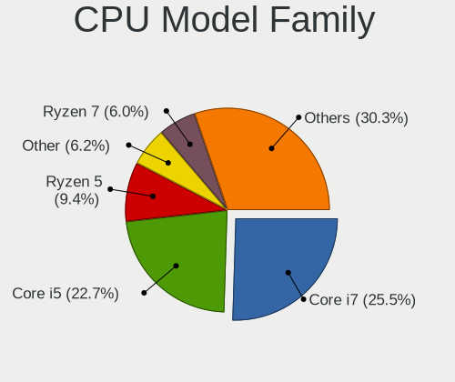

| Model                   | Computers | Percent |
|-------------------------|-----------|---------|
| Intel Core i7           | 404       | 25.51%  |
| Intel Core i5           | 360       | 22.73%  |
| AMD Ryzen 5             | 149       | 9.41%   |
| Other                   | 97        | 6.12%   |
| AMD Ryzen 7             | 95        | 6%      |
| Intel Core i3           | 86        | 5.43%   |
| AMD Ryzen 9             | 48        | 3.03%   |
| Intel Xeon              | 37        | 2.34%   |
| Intel Atom              | 32        | 2.02%   |
| Intel Celeron           | 27        | 1.7%    |
| Intel Core 2 Duo        | 23        | 1.45%   |
| AMD Ryzen 3             | 23        | 1.45%   |
| Intel Pentium           | 20        | 1.26%   |
| Intel Core i9           | 20        | 1.26%   |
| AMD Ryzen 7 PRO         | 17        | 1.07%   |
| AMD A10                 | 15        | 0.95%   |
| AMD FX                  | 13        | 0.82%   |
| AMD Ryzen Threadripper  | 11        | 0.69%   |
| AMD A8                  | 9         | 0.57%   |
| Intel Pentium Silver    | 8         | 0.51%   |
| Intel Core 2 Quad       | 8         | 0.51%   |
| Intel Pentium Dual-Core | 7         | 0.44%   |
| AMD Ryzen 5 PRO         | 7         | 0.44%   |
| AMD A6                  | 7         | 0.44%   |
| AMD A4                  | 5         | 0.32%   |
| Intel Pentium Dual      | 4         | 0.25%   |
| Intel Core m3           | 4         | 0.25%   |
| AMD Phenom II X2        | 4         | 0.25%   |
| AMD Athlon 64 X2        | 4         | 0.25%   |
| AMD E                   | 3         | 0.19%   |
| AMD Athlon Dual Core    | 3         | 0.19%   |
| AMD Athlon              | 3         | 0.19%   |
| Intel Pentium D         | 2         | 0.13%   |
| Intel Core m7           | 2         | 0.13%   |
| Intel Core m5           | 2         | 0.13%   |
| Intel Core 2            | 2         | 0.13%   |
| AMD Phenom II X6        | 2         | 0.13%   |
| AMD Phenom II X4        | 2         | 0.13%   |
| AMD E2                  | 2         | 0.13%   |
| AMD Athlon II X2        | 2         | 0.13%   |

CPU Cores
---------

Number of processor cores

| Number | Computers | Percent |
|--------|-----------|---------|
| 4      | 679       | 42.84%  |
| 2      | 452       | 28.52%  |
| 6      | 219       | 13.82%  |
| 8      | 169       | 10.66%  |
| 12     | 27        | 1.7%    |
| 16     | 20        | 1.26%   |
| 1      | 8         | 0.5%    |
| 32     | 4         | 0.25%   |
| 10     | 3         | 0.19%   |
| 3      | 3         | 0.19%   |
| 24     | 1         | 0.06%   |

CPU Sockets
-----------

Number of sockets

| Number | Computers | Percent |
|--------|-----------|---------|
| 1      | 1565      | 98.8%   |
| 2      | 18        | 1.14%   |
| 3      | 1         | 0.06%   |

CPU Threads
-----------

Threads per core (Hyper-Threading)

| Number | Computers | Percent |
|--------|-----------|---------|
| 2      | 1232      | 77.58%  |
| 1      | 356       | 22.42%  |

CPU Op-Modes
------------

CPU Operation Modes (32-bit, 64-bit)

| Op mode        | Computers | Percent |
|----------------|-----------|---------|
| 32-bit, 64-bit | 1583      | 99.94%  |
| 64-bit         | 1         | 0.06%   |

CPU Microcode
-------------

Microcode number

| Number     | Computers | Percent |
|------------|-----------|---------|
| Unknown    | 86        | 5.38%   |
| 0x806ec    | 85        | 5.32%   |
| 0x306c3    | 80        | 5.01%   |
| 0x806c1    | 73        | 4.57%   |
| 0x206a7    | 73        | 4.57%   |
| 0x306a9    | 68        | 4.26%   |
| 0x806ea    | 64        | 4.01%   |
| 0x906ea    | 62        | 3.88%   |
| 0x406e3    | 60        | 3.75%   |
| 0x806e9    | 59        | 3.69%   |
| 0x08701021 | 47        | 2.94%   |
| 0x906e9    | 46        | 2.88%   |
| 0x506e3    | 45        | 2.82%   |
| 0x08600106 | 39        | 2.44%   |
| 0x40651    | 35        | 2.19%   |
| 0x306d4    | 34        | 2.13%   |
| 0xa0652    | 32        | 2%      |
| 0x1067a    | 29        | 1.81%   |
| 0x0a50000c | 27        | 1.69%   |
| 0x906ed    | 25        | 1.56%   |
| 0x08108109 | 24        | 1.5%    |
| 0x08108102 | 24        | 1.5%    |
| 0x0800820d | 22        | 1.38%   |
| 0x30678    | 21        | 1.31%   |
| 0x0a201009 | 21        | 1.31%   |
| 0x08600104 | 21        | 1.31%   |
| 0x706e5    | 20        | 1.25%   |
| 0x20655    | 17        | 1.06%   |
| 0x806eb    | 16        | 1%      |
| 0x08701013 | 15        | 0.94%   |
| 0x08600103 | 13        | 0.81%   |
| 0x706a1    | 12        | 0.75%   |
| 0x406c4    | 12        | 0.75%   |
| 0x0810100b | 12        | 0.75%   |
| 0x406c3    | 11        | 0.69%   |
| 0x106e5    | 11        | 0.69%   |
| 0xa0655    | 10        | 0.63%   |
| 0x0a201016 | 10        | 0.63%   |
| 0x40661    | 9         | 0.56%   |
| 0x08101016 | 8         | 0.5%    |

CPU Microarch
-------------

Microarchitecture

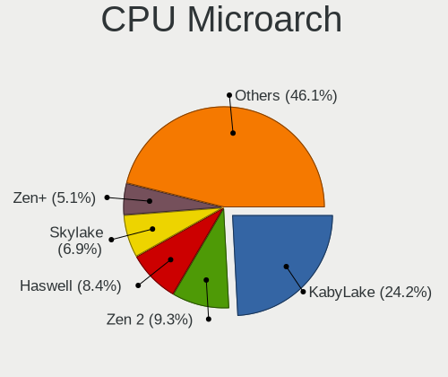

| Name          | Computers | Percent |
|---------------|-----------|---------|
| KabyLake      | 383       | 24.18%  |
| Zen 2         | 148       | 9.34%   |
| Haswell       | 134       | 8.46%   |
| Skylake       | 110       | 6.94%   |
| Zen+          | 80        | 5.05%   |
| SandyBridge   | 78        | 4.92%   |
| IvyBridge     | 75        | 4.73%   |
| TigerLake     | 73        | 4.61%   |
| Zen 3         | 62        | 3.91%   |
| CometLake     | 50        | 3.16%   |
| Zen           | 48        | 3.03%   |
| Silvermont    | 46        | 2.9%    |
| Penryn        | 38        | 2.4%    |
| Broadwell     | 38        | 2.4%    |
| IceLake       | 33        | 2.08%   |
| Unknown       | 27        | 1.7%    |
| Westmere      | 22        | 1.39%   |
| Piledriver    | 20        | 1.26%   |
| Nehalem       | 18        | 1.14%   |
| Goldmont plus | 18        | 1.14%   |
| K10           | 14        | 0.88%   |
| Core          | 13        | 0.82%   |
| Excavator     | 10        | 0.63%   |
| Steamroller   | 8         | 0.51%   |
| Puma          | 8         | 0.51%   |
| K8 Hammer     | 8         | 0.51%   |
| Jaguar        | 5         | 0.32%   |
| NetBurst      | 4         | 0.25%   |
| K10 Llano     | 4         | 0.25%   |
| Bobcat        | 3         | 0.19%   |
| Goldmont      | 2         | 0.13%   |
| Bulldozer     | 2         | 0.13%   |
| Bonnell       | 2         | 0.13%   |

Graphics
--------

GPU Vendor
----------

Vendors of graphics cards

| Vendor                     | Computers | Percent |
|----------------------------|-----------|---------|
| Intel                      | 922       | 47.82%  |
| Nvidia                     | 534       | 27.7%   |
| AMD                        | 467       | 24.22%  |
| ASPEED Technology          | 3         | 0.16%   |
| Matrox Electronics Systems | 1         | 0.05%   |
| ATI Technologies           | 1         | 0.05%   |

GPU Model
---------

Graphics card models

| Model                                                                                    | Computers | Percent |
|------------------------------------------------------------------------------------------|-----------|---------|
| AMD Renoir                                                                               | 82        | 4.18%   |
| Intel UHD Graphics 620                                                                   | 70        | 3.56%   |
| Intel TigerLake-LP GT2 [Iris Xe Graphics]                                                | 67        | 3.41%   |
| Intel HD Graphics 620                                                                    | 57        | 2.9%    |
| Intel 2nd Generation Core Processor Family Integrated Graphics Controller                | 57        | 2.9%    |
| Intel WhiskeyLake-U GT2 [UHD Graphics 620]                                               | 54        | 2.75%   |
| Intel CometLake-U GT2 [UHD Graphics]                                                     | 50        | 2.55%   |
| AMD Picasso/Raven 2 [Radeon Vega Series / Radeon Vega Mobile Series]                     | 48        | 2.44%   |
| Intel Skylake GT2 [HD Graphics 520]                                                      | 47        | 2.39%   |
| AMD Ellesmere [Radeon RX 470/480/570/570X/580/580X/590]                                  | 46        | 2.34%   |
| Intel CoffeeLake-H GT2 [UHD Graphics 630]                                                | 44        | 2.24%   |
| Intel 3rd Gen Core processor Graphics Controller                                         | 42        | 2.14%   |
| Intel HD Graphics 5500                                                                   | 34        | 1.73%   |
| Intel 4th Gen Core Processor Integrated Graphics Controller                              | 34        | 1.73%   |
| Intel Haswell-ULT Integrated Graphics Controller                                         | 33        | 1.68%   |
| Intel HD Graphics 630                                                                    | 32        | 1.63%   |
| Intel HD Graphics 530                                                                    | 30        | 1.53%   |
| Intel CometLake-H GT2 [UHD Graphics]                                                     | 30        | 1.53%   |
| AMD Cezanne [Radeon Vega Series / Radeon Vega Mobile Series]                             | 29        | 1.48%   |
| AMD Navi 10 [Radeon RX 5600 OEM/5600 XT / 5700/5700 XT]                                  | 26        | 1.32%   |
| AMD Raven Ridge [Radeon Vega Series / Radeon Vega Mobile Series]                         | 25        | 1.27%   |
| Intel Atom/Celeron/Pentium Processor x5-E8000/J3xxx/N3xxx Integrated Graphics Controller | 24        | 1.22%   |
| Intel Atom Processor Z36xxx/Z37xxx Series Graphics & Display                             | 22        | 1.12%   |
| Intel Xeon E3-1200 v3/4th Gen Core Processor Integrated Graphics Controller              | 21        | 1.07%   |
| Intel CoffeeLake-S GT2 [UHD Graphics 630]                                                | 21        | 1.07%   |
| Nvidia TU117M [GeForce GTX 1650 Mobile / Max-Q]                                          | 17        | 0.87%   |
| Nvidia GA106M [GeForce RTX 3060 Mobile / Max-Q]                                          | 15        | 0.76%   |
| AMD Topaz XT [Radeon R7 M260/M265 / M340/M360 / M440/M445 / 530/535 / 620/625 Mobile]    | 15        | 0.76%   |
| Nvidia GP107M [GeForce GTX 1050 Mobile]                                                  | 14        | 0.71%   |
| Intel Core Processor Integrated Graphics Controller                                      | 14        | 0.71%   |
| AMD Lucienne                                                                             | 14        | 0.71%   |
| Nvidia GP107 [GeForce GTX 1050 Ti]                                                       | 13        | 0.66%   |
| Nvidia GK208B [GeForce GT 710]                                                           | 13        | 0.66%   |
| Nvidia GP108M [GeForce MX150]                                                            | 12        | 0.61%   |
| Nvidia GP106 [GeForce GTX 1060 6GB]                                                      | 12        | 0.61%   |
| Nvidia GP104 [GeForce GTX 1070]                                                          | 12        | 0.61%   |
| Intel Iris Plus Graphics G7                                                              | 12        | 0.61%   |
| AMD Lexa PRO [Radeon 540/540X/550/550X / RX 540X/550/550X]                               | 11        | 0.56%   |
| Intel Xeon E3-1200 v2/3rd Gen Core processor Graphics Controller                         | 10        | 0.51%   |
| Intel Iris Plus Graphics G1 (Ice Lake)                                                   | 10        | 0.51%   |

GPU Combo
---------

Combinations of graphics cards

| Name           | Computers | Percent |
|----------------|-----------|---------|
| 1 x Intel      | 607       | 38.13%  |
| 1 x AMD        | 361       | 22.68%  |
| 1 x Nvidia     | 250       | 15.7%   |
| Intel + Nvidia | 245       | 15.39%  |
| Intel + AMD    | 45        | 2.83%   |
| AMD + Nvidia   | 35        | 2.2%    |
| 2 x AMD        | 24        | 1.51%   |
| Other          | 14        | 0.88%   |
| 2 x Nvidia     | 7         | 0.44%   |
| 1 x ASPEED     | 3         | 0.19%   |
| 1 x Matrox     | 1         | 0.06%   |

GPU Driver
----------

Free vs proprietary

| Driver      | Computers | Percent |
|-------------|-----------|---------|
| Free        | 1307      | 81.48%  |
| Proprietary | 262       | 16.33%  |
| Unknown     | 35        | 2.18%   |

GPU Memory
----------

Total video memory

| Size in GB | Computers | Percent |
|------------|-----------|---------|
| Unknown    | 830       | 51.33%  |
| 1.01-2.0   | 226       | 13.98%  |
| 0.01-0.5   | 163       | 10.08%  |
| 3.01-4.0   | 121       | 7.48%   |
| 0.51-1.0   | 110       | 6.8%    |
| 7.01-8.0   | 91        | 5.63%   |
| 5.01-6.0   | 40        | 2.47%   |
| 8.01-16.0  | 23        | 1.42%   |
| 2.01-3.0   | 12        | 0.74%   |
| 16.01-24.0 | 1         | 0.06%   |

Monitor
-------

Monitor Vendor
--------------

Monitor vendors

| Vendor                  | Computers | Percent |
|-------------------------|-----------|---------|
| AU Optronics            | 211       | 11.03%  |
| LG Display              | 190       | 9.93%   |
| Samsung Electronics     | 182       | 9.51%   |
| BOE                     | 175       | 9.15%   |
| Chimei Innolux          | 173       | 9.04%   |
| Dell                    | 144       | 7.53%   |
| Goldstar                | 140       | 7.32%   |
| Hewlett-Packard         | 60        | 3.14%   |
| Sharp                   | 57        | 2.98%   |
| Acer                    | 57        | 2.98%   |
| BenQ                    | 55        | 2.88%   |
| AOC                     | 44        | 2.3%    |
| Philips                 | 41        | 2.14%   |
| Ancor Communications    | 38        | 1.99%   |
| Lenovo                  | 37        | 1.93%   |
| Apple                   | 33        | 1.73%   |
| Iiyama                  | 28        | 1.46%   |
| PANDA                   | 26        | 1.36%   |
| ViewSonic               | 18        | 0.94%   |
| CSO                     | 16        | 0.84%   |
| ASUSTek Computer        | 16        | 0.84%   |
| Sony                    | 11        | 0.58%   |
| Chi Mei Optoelectronics | 11        | 0.58%   |
| Sceptre Tech            | 10        | 0.52%   |
| InfoVision              | 10        | 0.52%   |
| ___                     | 6         | 0.31%   |
| Unknown                 | 6         | 0.31%   |
| Toshiba                 | 6         | 0.31%   |
| TMX                     | 6         | 0.31%   |
| MSI                     | 6         | 0.31%   |
| NEC Computers           | 5         | 0.26%   |
| Insignia                | 5         | 0.26%   |
| Eizo                    | 5         | 0.26%   |
| Vizio                   | 4         | 0.21%   |
| eMachines               | 4         | 0.21%   |
| Vestel Elektronik       | 3         | 0.16%   |
| Pixio                   | 3         | 0.16%   |
| JDI                     | 3         | 0.16%   |
| Fujitsu Siemens         | 3         | 0.16%   |
| Unknown (XXX)           | 2         | 0.1%    |

Monitor Model
-------------

Monitor models

| Model                                                                 | Computers | Percent |
|-----------------------------------------------------------------------|-----------|---------|
| Chimei Innolux LCD Monitor CMN15F5 1920x1080 344x193mm 15.5-inch      | 13        | 0.65%   |
| Chimei Innolux LCD Monitor CMN14D4 1920x1080 309x173mm 13.9-inch      | 13        | 0.65%   |
| Goldstar ULTRAWIDE GSM59F1 2560x1080 798x334mm 34.1-inch              | 12        | 0.6%    |
| AU Optronics LCD Monitor AUO21ED 1920x1080 344x193mm 15.5-inch        | 10        | 0.5%    |
| Goldstar FULL HD GSM5B55 1920x1080 480x270mm 21.7-inch                | 9         | 0.45%   |
| AU Optronics LCD Monitor AUO573D 1920x1080 309x174mm 14.0-inch        | 9         | 0.45%   |
| Samsung Electronics S22F350 SAM0D1A 1920x1080 477x268mm 21.5-inch     | 7         | 0.35%   |
| Lenovo LCD Monitor LEN40BA 1920x1080 344x194mm 15.5-inch              | 7         | 0.35%   |
| Dell U2412M DELA07A 1920x1200 518x324mm 24.1-inch                     | 7         | 0.35%   |
| AU Optronics LCD Monitor AUO61ED 1920x1080 344x194mm 15.5-inch        | 7         | 0.35%   |
| Sharp LCD Monitor SHP14D1 1920x1200 336x210mm 15.6-inch               | 6         | 0.3%    |
| Samsung Electronics S24F350 SAM0D20 1920x1080 520x290mm 23.4-inch     | 6         | 0.3%    |
| LG Display LCD Monitor LGD05E5 1920x1080 340x190mm 15.3-inch          | 6         | 0.3%    |
| LG Display LCD Monitor LGD02DC 1366x768 344x194mm 15.5-inch           | 6         | 0.3%    |
| Goldstar FULL HD GSM5ABB 1920x1080 480x270mm 21.7-inch                | 6         | 0.3%    |
| Chimei Innolux LCD Monitor CMN15E8 1920x1080 344x193mm 15.5-inch      | 6         | 0.3%    |
| Chimei Innolux LCD Monitor CMN15E7 1920x1080 344x193mm 15.5-inch      | 6         | 0.3%    |
| AU Optronics LCD Monitor AUO38ED 1920x1080 344x193mm 15.5-inch        | 6         | 0.3%    |
| TMX TL140BDXP01-0 TMX1400 2560x1440 310x174mm 14.0-inch               | 5         | 0.25%   |
| Sharp LCD Monitor SHP1453 1920x1080 346x194mm 15.6-inch               | 5         | 0.25%   |
| Sharp LCD Monitor SHP144A 3200x1800 294x165mm 13.3-inch               | 5         | 0.25%   |
| Samsung Electronics LCD Monitor SEC5441 1366x768 344x194mm 15.5-inch  | 5         | 0.25%   |
| PANDA LCD Monitor NCP0035 1920x1080 309x174mm 14.0-inch               | 5         | 0.25%   |
| LG Display LCD Monitor LGD062E 1920x1080 344x194mm 15.5-inch          | 5         | 0.25%   |
| LG Display LCD Monitor LGD046F 1920x1080 344x194mm 15.5-inch          | 5         | 0.25%   |
| Goldstar IPS FULLHD GSM5AB8 1920x1080 480x270mm 21.7-inch             | 5         | 0.25%   |
| Goldstar HDR WFHD GSM7714 2560x1080 798x334mm 34.1-inch               | 5         | 0.25%   |
| Goldstar HDR 4K GSM7707 3840x2160 600x340mm 27.2-inch                 | 5         | 0.25%   |
| Goldstar HDR 4K GSM7706 3840x2160 600x340mm 27.2-inch                 | 5         | 0.25%   |
| Dell P2319H DELD0D7 1920x1080 509x286mm 23.0-inch                     | 5         | 0.25%   |
| Chimei Innolux LCD Monitor CMN15E6 1366x768 344x193mm 15.5-inch       | 5         | 0.25%   |
| Chimei Innolux LCD Monitor CMN15D5 1920x1080 344x193mm 15.5-inch      | 5         | 0.25%   |
| Chimei Innolux LCD Monitor CMN14C3 1366x768 309x173mm 13.9-inch       | 5         | 0.25%   |
| AU Optronics LCD Monitor AUO403D 1920x1080 309x173mm 13.9-inch        | 5         | 0.25%   |
| AOC 27V2G5 AOC2702 1920x1080 598x336mm 27.0-inch                      | 5         | 0.25%   |
| Sceptre Tech Sceptre E24 SPT099D 1920x1080 521x293mm 23.5-inch        | 4         | 0.2%    |
| Samsung Electronics U28E590 SAM0C4D 3840x2160 607x345mm 27.5-inch     | 4         | 0.2%    |
| Samsung Electronics LCD Monitor SDCA029 3840x2160 344x194mm 15.5-inch | 4         | 0.2%    |
| Philips PHL 276E8V PHLC18F 3840x2160 600x340mm 27.2-inch              | 4         | 0.2%    |
| Philips PHL 243V7 PHLC155 1920x1080 527x296mm 23.8-inch               | 4         | 0.2%    |

Monitor Resolution
------------------

Monitor screen resolution

| Resolution         | Computers | Percent |
|--------------------|-----------|---------|
| 1920x1080 (FHD)    | 895       | 50.71%  |
| 1366x768 (WXGA)    | 238       | 13.48%  |
| 3840x2160 (4K)     | 142       | 8.05%   |
| 2560x1440 (QHD)    | 123       | 6.97%   |
| 1920x1200 (WUXGA)  | 55        | 3.12%   |
| 1600x900 (HD+)     | 46        | 2.61%   |
| 2560x1080          | 34        | 1.93%   |
| 1280x1024 (SXGA)   | 27        | 1.53%   |
| 1440x900 (WXGA+)   | 24        | 1.36%   |
| 1680x1050 (WSXGA+) | 19        | 1.08%   |
| 3440x1440          | 18        | 1.02%   |
| 2560x1600          | 18        | 1.02%   |
| 1360x768           | 17        | 0.96%   |
| 2880x1800          | 16        | 0.91%   |
| 1280x800 (WXGA)    | 13        | 0.74%   |
| 3840x1080          | 9         | 0.51%   |
| 3200x1800 (QHD+)   | 9         | 0.51%   |
| 1024x768 (XGA)     | 6         | 0.34%   |
| Unknown            | 5         | 0.28%   |
| 3840x2400          | 4         | 0.23%   |
| 3000x2000          | 4         | 0.23%   |
| 2160x1440          | 4         | 0.23%   |
| 1920x540           | 4         | 0.23%   |
| 1920x1280          | 4         | 0.23%   |
| 2736x1824          | 3         | 0.17%   |
| 2256x1504          | 3         | 0.17%   |
| 2048x1152          | 3         | 0.17%   |
| 1600x1200          | 3         | 0.17%   |
| 3456x2160          | 2         | 0.11%   |
| 2160x1350          | 2         | 0.11%   |
| 1920x515           | 2         | 0.11%   |
| 1280x720 (HD)      | 2         | 0.11%   |
| 800x1280           | 1         | 0.06%   |
| 7680x1440          | 1         | 0.06%   |
| 7120x1080          | 1         | 0.06%   |
| 3840x1600          | 1         | 0.06%   |
| 3840x1100          | 1         | 0.06%   |
| 3240x2160          | 1         | 0.06%   |
| 3200x2000          | 1         | 0.06%   |
| 2800x1752          | 1         | 0.06%   |

Monitor Diagonal
----------------

Diagonal size in inches

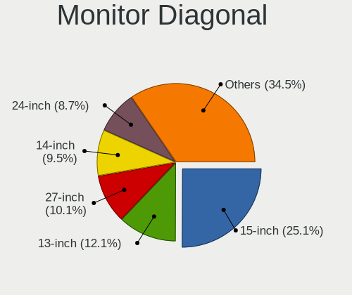

| Inches  | Computers | Percent |
|---------|-----------|---------|
| 15      | 476       | 24.95%  |
| 13      | 229       | 12%     |
| 27      | 203       | 10.64%  |
| 14      | 178       | 9.33%   |
| 24      | 169       | 8.86%   |
| 23      | 116       | 6.08%   |
| 21      | 106       | 5.56%   |
| 17      | 61        | 3.2%    |
| 34      | 47        | 2.46%   |
| 12      | 39        | 2.04%   |
| 19      | 38        | 1.99%   |
| 18      | 38        | 1.99%   |
| 31      | 35        | 1.83%   |
| Unknown | 21        | 1.1%    |
| 72      | 17        | 0.89%   |
| 22      | 15        | 0.79%   |
| 20      | 14        | 0.73%   |
| 25      | 13        | 0.68%   |
| 32      | 12        | 0.63%   |
| 16      | 9         | 0.47%   |
| 48      | 8         | 0.42%   |
| 11      | 8         | 0.42%   |
| 84      | 6         | 0.31%   |
| 54      | 6         | 0.31%   |
| 28      | 6         | 0.31%   |
| 40      | 4         | 0.21%   |
| 29      | 4         | 0.21%   |
| 39      | 3         | 0.16%   |
| 33      | 3         | 0.16%   |
| 26      | 3         | 0.16%   |
| 49      | 2         | 0.1%    |
| 42      | 2         | 0.1%    |
| 35      | 2         | 0.1%    |
| 74      | 1         | 0.05%   |
| 69      | 1         | 0.05%   |
| 66      | 1         | 0.05%   |
| 65      | 1         | 0.05%   |
| 64      | 1         | 0.05%   |
| 52      | 1         | 0.05%   |
| 50      | 1         | 0.05%   |

Monitor Width
-------------

Physical width

| Width in mm | Computers | Percent |
|-------------|-----------|---------|
| 301-350     | 774       | 41.7%   |
| 501-600     | 440       | 23.71%  |
| 401-500     | 182       | 9.81%   |
| 201-300     | 154       | 8.3%    |
| 351-400     | 92        | 4.96%   |
| 601-700     | 68        | 3.66%   |
| 701-800     | 62        | 3.34%   |
| 1501-2000   | 25        | 1.35%   |
| 1001-1500   | 22        | 1.19%   |
| Unknown     | 21        | 1.13%   |
| 801-900     | 11        | 0.59%   |
| 901-1000    | 4         | 0.22%   |
| 101-200     | 1         | 0.05%   |

Aspect Ratio
------------

Proportional relationship between the width and the height

| Ratio   | Computers | Percent |
|---------|-----------|---------|
| 16/9    | 1329      | 81.53%  |
| 16/10   | 156       | 9.57%   |
| 21/9    | 54        | 3.31%   |
| 5/4     | 27        | 1.66%   |
| 3/2     | 24        | 1.47%   |
| 4/3     | 12        | 0.74%   |
| Unknown | 10        | 0.61%   |
| 32/9    | 8         | 0.49%   |
| 6/5     | 3         | 0.18%   |
| 0.62    | 2         | 0.12%   |
| 3.88    | 1         | 0.06%   |
| 3.73    | 1         | 0.06%   |
| 3.40    | 1         | 0.06%   |
| 1.96    | 1         | 0.06%   |
| 0.45    | 1         | 0.06%   |

Monitor Area
------------

Area in inch

| Area in inch | Computers | Percent |
|----------------|-----------|---------|
| 101-110        | 473       | 25.04%  |
| 81-90          | 310       | 16.41%  |
| 201-250        | 310       | 16.41%  |
| 301-350        | 205       | 10.85%  |
| 351-500        | 108       | 5.72%   |
| 71-80          | 97        | 5.13%   |
| 151-200        | 85        | 4.5%    |
| 251-300        | 68        | 3.6%    |
| 121-130        | 52        | 2.75%   |
| More than 1000 | 37        | 1.96%   |
| 61-70          | 35        | 1.85%   |
| 141-150        | 34        | 1.8%    |
| 501-1000       | 23        | 1.22%   |
| Unknown        | 21        | 1.11%   |
| 51-60          | 9         | 0.48%   |
| 111-120        | 8         | 0.42%   |
| 131-140        | 7         | 0.37%   |
| 91-100         | 5         | 0.26%   |
| 1-40           | 2         | 0.11%   |

Pixel Density
-------------

Pixels per inch

| Density       | Computers | Percent |
|---------------|-----------|---------|
| 121-160       | 600       | 32.7%   |
| 51-100        | 528       | 28.77%  |
| 101-120       | 424       | 23.11%  |
| 161-240       | 158       | 8.61%   |
| More than 240 | 67        | 3.65%   |
| 1-50          | 37        | 2.02%   |
| Unknown       | 21        | 1.14%   |

Multiple Monitors
-----------------

Total monitors connected

| Total | Computers | Percent |
|-------|-----------|---------|
| 1     | 1138      | 70.55%  |
| 2     | 358       | 22.19%  |
| 0     | 60        | 3.72%   |
| 3     | 55        | 3.41%   |
| 4     | 2         | 0.12%   |

Network
-------

Net Controller Vendor
---------------------

Controller vendors

| Vendor                            | Computers | Percent |
|-----------------------------------|-----------|---------|
| Intel                             | 936       | 40.14%  |
| Realtek Semiconductor             | 809       | 34.69%  |
| Qualcomm Atheros                  | 213       | 9.13%   |
| Broadcom                          | 92        | 3.95%   |
| TP-Link                           | 26        | 1.11%   |
| Broadcom Limited                  | 25        | 1.07%   |
| Ralink Technology                 | 24        | 1.03%   |
| Lenovo                            | 17        | 0.73%   |
| MediaTek                          | 14        | 0.6%    |
| Marvell Technology Group          | 14        | 0.6%    |
| Aquantia                          | 12        | 0.51%   |
| Ralink                            | 11        | 0.47%   |
| DisplayLink                       | 11        | 0.47%   |
| Sierra Wireless                   | 9         | 0.39%   |
| Hewlett-Packard                   | 9         | 0.39%   |
| Nvidia                            | 8         | 0.34%   |
| NetGear                           | 7         | 0.3%    |
| Huawei Technologies               | 6         | 0.26%   |
| ASIX Electronics                  | 6         | 0.26%   |
| Qualcomm Atheros Communications   | 5         | 0.21%   |
| D-Link System                     | 5         | 0.21%   |
| ASUSTek Computer                  | 5         | 0.21%   |
| Apple                             | 5         | 0.21%   |
| Xiaomi                            | 4         | 0.17%   |
| Samsung Electronics               | 4         | 0.17%   |
| Qualcomm                          | 4         | 0.17%   |
| Linksys                           | 4         | 0.17%   |
| Ericsson Business Mobile Networks | 4         | 0.17%   |
| Dell                              | 4         | 0.17%   |
| Motorola PCS                      | 3         | 0.13%   |
| Microsoft                         | 3         | 0.13%   |
| ICS Advent                        | 3         | 0.13%   |
| Mellanox Technologies             | 2         | 0.09%   |
| InterBiometrics                   | 2         | 0.09%   |
| Google                            | 2         | 0.09%   |
| Fibocom                           | 2         | 0.09%   |
| D-Link                            | 2         | 0.09%   |
| Arduino SA                        | 2         | 0.09%   |
| ADMtek                            | 2         | 0.09%   |
| Wilocity                          | 1         | 0.04%   |

Net Controller Model
--------------------

Controller models

| Model                                                             | Computers | Percent |
|-------------------------------------------------------------------|-----------|---------|
| Realtek RTL8111/8168/8411 PCI Express Gigabit Ethernet Controller | 546       | 19.47%  |
| Intel Wi-Fi 6 AX200                                               | 180       | 6.42%   |
| Intel Wireless 8265 / 8275                                        | 80        | 2.85%   |
| Realtek RTL8153 Gigabit Ethernet Adapter                          | 72        | 2.57%   |
| Realtek RTL810xE PCI Express Fast Ethernet controller             | 72        | 2.57%   |
| Intel I211 Gigabit Network Connection                             | 69        | 2.46%   |
| Intel Wi-Fi 6 AX201                                               | 59        | 2.1%    |
| Intel Wireless 8260                                               | 56        | 2%      |
| Qualcomm Atheros QCA9377 802.11ac Wireless Network Adapter        | 51        | 1.82%   |
| Intel 82579LM Gigabit Network Connection (Lewisville)             | 46        | 1.64%   |
| Intel Comet Lake PCH-LP CNVi WiFi                                 | 43        | 1.53%   |
| Intel Wireless 7260                                               | 42        | 1.5%    |
| Realtek RTL8822CE 802.11ac PCIe Wireless Network Adapter          | 38        | 1.35%   |
| Realtek RTL8125 2.5GbE Controller                                 | 38        | 1.35%   |
| Intel Ethernet Connection (2) I219-V                              | 36        | 1.28%   |
| Intel Cannon Point-LP CNVi [Wireless-AC]                          | 35        | 1.25%   |
| Intel Wireless 7265                                               | 34        | 1.21%   |
| Intel Comet Lake PCH CNVi WiFi                                    | 34        | 1.21%   |
| Qualcomm Atheros QCA6174 802.11ac Wireless Network Adapter        | 33        | 1.18%   |
| Qualcomm Atheros AR9485 Wireless Network Adapter                  | 28        | 1%      |
| Intel Dual Band Wireless-AC 3168NGW [Stone Peak]                  | 28        | 1%      |
| Realtek RTL8822BE 802.11a/b/g/n/ac WiFi adapter                   | 27        | 0.96%   |
| Intel Wireless-AC 9260                                            | 26        | 0.93%   |
| Intel Cannon Lake PCH CNVi WiFi                                   | 26        | 0.93%   |
| Intel Ethernet Connection (4) I219-LM                             | 25        | 0.89%   |
| Realtek RTL8821CE 802.11ac PCIe Wireless Network Adapter          | 23        | 0.82%   |
| Qualcomm Atheros QCA9565 / AR9565 Wireless Network Adapter        | 22        | 0.78%   |
| Intel Ethernet Connection I217-LM                                 | 22        | 0.78%   |
| Intel Wireless 3165                                               | 20        | 0.71%   |
| Intel Centrino Advanced-N 6205 [Taylor Peak]                      | 19        | 0.68%   |
| Intel Ethernet Connection (10) I219-V                             | 17        | 0.61%   |
| Intel Ethernet Connection (7) I219-V                              | 16        | 0.57%   |
| Intel Ethernet Connection (4) I219-V                              | 16        | 0.57%   |
| Realtek RTL8723BE PCIe Wireless Network Adapter                   | 15        | 0.53%   |
| Intel Ice Lake-LP PCH CNVi WiFi                                   | 15        | 0.53%   |
| Intel Ethernet Connection I219-LM                                 | 15        | 0.53%   |
| Intel Ethernet Connection (2) I219-LM                             | 15        | 0.53%   |
| Intel Ethernet Connection I218-LM                                 | 14        | 0.5%    |
| Intel Ethernet Connection (6) I219-V                              | 14        | 0.5%    |
| Intel Ethernet Controller I225-V                                  | 13        | 0.46%   |

Wireless Vendor
---------------

Wireless vendors

| Vendor                          | Computers | Percent |
|---------------------------------|-----------|---------|
| Intel                           | 785       | 58.45%  |
| Realtek Semiconductor           | 185       | 13.78%  |
| Qualcomm Atheros                | 173       | 12.88%  |
| Broadcom                        | 70        | 5.21%   |
| Ralink Technology               | 24        | 1.79%   |
| TP-Link                         | 20        | 1.49%   |
| MediaTek                        | 13        | 0.97%   |
| Broadcom Limited                | 13        | 0.97%   |
| Ralink                          | 11        | 0.82%   |
| Sierra Wireless                 | 9         | 0.67%   |
| NetGear                         | 6         | 0.45%   |
| Qualcomm Atheros Communications | 5         | 0.37%   |
| Marvell Technology Group        | 4         | 0.3%    |
| ASUSTek Computer                | 4         | 0.3%    |
| Microsoft                       | 3         | 0.22%   |
| Linksys                         | 3         | 0.22%   |
| Dell                            | 3         | 0.22%   |
| Qualcomm                        | 2         | 0.15%   |
| Hewlett-Packard                 | 2         | 0.15%   |
| Fibocom                         | 2         | 0.15%   |
| D-Link System                   | 2         | 0.15%   |
| Xiaomi                          | 1         | 0.07%   |
| Wilocity                        | 1         | 0.07%   |
| Quectel Wireless Solutions      | 1         | 0.07%   |
| IMC Networks                    | 1         | 0.07%   |

Wireless Model
--------------

Wireless models

| Model                                                          | Computers | Percent |
|----------------------------------------------------------------|-----------|---------|
| Intel Wi-Fi 6 AX200                                            | 180       | 13.35%  |
| Intel Wireless 8265 / 8275                                     | 80        | 5.93%   |
| Intel Wi-Fi 6 AX201                                            | 59        | 4.38%   |
| Intel Wireless 8260                                            | 56        | 4.15%   |
| Qualcomm Atheros QCA9377 802.11ac Wireless Network Adapter     | 51        | 3.78%   |
| Intel Comet Lake PCH-LP CNVi WiFi                              | 43        | 3.19%   |
| Intel Wireless 7260                                            | 42        | 3.12%   |
| Realtek RTL8822CE 802.11ac PCIe Wireless Network Adapter       | 38        | 2.82%   |
| Intel Cannon Point-LP CNVi [Wireless-AC]                       | 35        | 2.6%    |
| Intel Wireless 7265                                            | 34        | 2.52%   |
| Intel Comet Lake PCH CNVi WiFi                                 | 34        | 2.52%   |
| Qualcomm Atheros QCA6174 802.11ac Wireless Network Adapter     | 33        | 2.45%   |
| Qualcomm Atheros AR9485 Wireless Network Adapter               | 28        | 2.08%   |
| Intel Dual Band Wireless-AC 3168NGW [Stone Peak]               | 28        | 2.08%   |
| Realtek RTL8822BE 802.11a/b/g/n/ac WiFi adapter                | 27        | 2%      |
| Intel Wireless-AC 9260                                         | 26        | 1.93%   |
| Intel Cannon Lake PCH CNVi WiFi                                | 26        | 1.93%   |
| Realtek RTL8821CE 802.11ac PCIe Wireless Network Adapter       | 23        | 1.71%   |
| Qualcomm Atheros QCA9565 / AR9565 Wireless Network Adapter     | 22        | 1.63%   |
| Intel Wireless 3165                                            | 20        | 1.48%   |
| Intel Centrino Advanced-N 6205 [Taylor Peak]                   | 19        | 1.41%   |
| Realtek RTL8723BE PCIe Wireless Network Adapter                | 15        | 1.11%   |
| Intel Ice Lake-LP PCH CNVi WiFi                                | 15        | 1.11%   |
| Broadcom BCM4313 802.11bgn Wireless Network Adapter            | 13        | 0.96%   |
| MediaTek MT7921 802.11ax PCI Express Wireless Network Adapter  | 12        | 0.89%   |
| Intel Wireless 3160                                            | 12        | 0.89%   |
| Intel Wi-Fi 6 AX210/AX211/AX411 160MHz                         | 12        | 0.89%   |
| Broadcom BCM4360 802.11ac Wireless Network Adapter             | 12        | 0.89%   |
| Qualcomm Atheros AR9285 Wireless Network Adapter (PCI-Express) | 10        | 0.74%   |
| Intel Dual Band Wireless-AC 3165 Plus Bluetooth                | 10        | 0.74%   |
| Broadcom BCM43142 802.11b/g/n                                  | 10        | 0.74%   |
| Realtek RTL8188EUS 802.11n Wireless Network Adapter            | 9         | 0.67%   |
| Realtek RTL8852AE 802.11ax PCIe Wireless Network Adapter       | 8         | 0.59%   |
| Qualcomm Atheros AR9462 Wireless Network Adapter               | 8         | 0.59%   |
| Realtek RTL88x2bu [AC1200 Techkey]                             | 7         | 0.52%   |
| Realtek RTL8723DE Wireless Network Adapter                     | 7         | 0.52%   |
| Realtek RTL8188CE 802.11b/g/n WiFi Adapter                     | 7         | 0.52%   |
| Ralink MT7601U Wireless Adapter                                | 7         | 0.52%   |
| Broadcom BCM43602 802.11ac Wireless LAN SoC                    | 7         | 0.52%   |
| Broadcom BCM43228 802.11a/b/g/n                                | 7         | 0.52%   |

Ethernet Vendor
---------------

Ethernet vendors

| Vendor                        | Computers | Percent |
|-------------------------------|-----------|---------|
| Realtek Semiconductor         | 728       | 52.56%  |
| Intel                         | 440       | 31.77%  |
| Qualcomm Atheros              | 56        | 4.04%   |
| Broadcom                      | 32        | 2.31%   |
| Lenovo                        | 17        | 1.23%   |
| Broadcom Limited              | 12        | 0.87%   |
| Aquantia                      | 12        | 0.87%   |
| DisplayLink                   | 11        | 0.79%   |
| Marvell Technology Group      | 10        | 0.72%   |
| Nvidia                        | 8         | 0.58%   |
| TP-Link                       | 6         | 0.43%   |
| ASIX Electronics              | 6         | 0.43%   |
| Apple                         | 5         | 0.36%   |
| Samsung Electronics           | 4         | 0.29%   |
| Huawei Technologies           | 4         | 0.29%   |
| Xiaomi                        | 3         | 0.22%   |
| ICS Advent                    | 3         | 0.22%   |
| Hewlett-Packard               | 3         | 0.22%   |
| D-Link System                 | 3         | 0.22%   |
| Qualcomm                      | 2         | 0.14%   |
| Motorola PCS                  | 2         | 0.14%   |
| Mellanox Technologies         | 2         | 0.14%   |
| Google                        | 2         | 0.14%   |
| D-Link                        | 2         | 0.14%   |
| ADMtek                        | 2         | 0.14%   |
| OPPO Electronics              | 1         | 0.07%   |
| OnePlus Technology (Shenzhen) | 1         | 0.07%   |
| NetGear                       | 1         | 0.07%   |
| MosChip Semiconductor         | 1         | 0.07%   |
| MediaTek                      | 1         | 0.07%   |
| Linksys                       | 1         | 0.07%   |
| LG Electronics                | 1         | 0.07%   |
| JMicron Technology            | 1         | 0.07%   |
| ASUSTek Computer              | 1         | 0.07%   |
| Accton Technology             | 1         | 0.07%   |

Ethernet Model
--------------

Ethernet models

| Model                                                             | Computers | Percent |
|-------------------------------------------------------------------|-----------|---------|
| Realtek RTL8111/8168/8411 PCI Express Gigabit Ethernet Controller | 546       | 38.08%  |
| Realtek RTL8153 Gigabit Ethernet Adapter                          | 72        | 5.02%   |
| Realtek RTL810xE PCI Express Fast Ethernet controller             | 72        | 5.02%   |
| Intel I211 Gigabit Network Connection                             | 69        | 4.81%   |
| Intel 82579LM Gigabit Network Connection (Lewisville)             | 46        | 3.21%   |
| Realtek RTL8125 2.5GbE Controller                                 | 38        | 2.65%   |
| Intel Ethernet Connection (2) I219-V                              | 36        | 2.51%   |
| Intel Ethernet Connection (4) I219-LM                             | 25        | 1.74%   |
| Intel Ethernet Connection I217-LM                                 | 22        | 1.53%   |
| Intel Ethernet Connection (10) I219-V                             | 17        | 1.19%   |
| Intel Ethernet Connection (7) I219-V                              | 16        | 1.12%   |
| Intel Ethernet Connection (4) I219-V                              | 16        | 1.12%   |
| Intel Ethernet Connection I219-LM                                 | 15        | 1.05%   |
| Intel Ethernet Connection (2) I219-LM                             | 15        | 1.05%   |
| Intel Ethernet Connection I218-LM                                 | 14        | 0.98%   |
| Intel Ethernet Connection (6) I219-V                              | 14        | 0.98%   |
| Intel Ethernet Controller I225-V                                  | 13        | 0.91%   |
| Intel Ethernet Connection (2) I218-V                              | 12        | 0.84%   |
| Intel Ethernet Connection I217-V                                  | 11        | 0.77%   |
| Intel Ethernet Connection (7) I219-LM                             | 11        | 0.77%   |
| Intel Ethernet Connection (6) I219-LM                             | 11        | 0.77%   |
| Intel Ethernet Connection (3) I218-LM                             | 9         | 0.63%   |
| Qualcomm Atheros Killer E2500 Gigabit Ethernet Controller         | 8         | 0.56%   |
| Qualcomm Atheros Killer E220x Gigabit Ethernet Controller         | 8         | 0.56%   |
| Intel 82574L Gigabit Network Connection                           | 8         | 0.56%   |
| Broadcom NetXtreme BCM57765 Gigabit Ethernet PCIe                 | 8         | 0.56%   |
| Aquantia AQC107 NBase-T/IEEE 802.3bz Ethernet Controller [AQtion] | 8         | 0.56%   |
| Qualcomm Atheros Killer E2400 Gigabit Ethernet Controller         | 7         | 0.49%   |
| Qualcomm Atheros AR8152 v2.0 Fast Ethernet                        | 7         | 0.49%   |
| Intel 82577LM Gigabit Network Connection                          | 7         | 0.49%   |
| Realtek RTL8152 Fast Ethernet Adapter                             | 6         | 0.42%   |
| Lenovo ThinkPad TBT 3 Dock                                        | 6         | 0.42%   |
| Intel I210 Gigabit Network Connection                             | 6         | 0.42%   |
| Intel Ethernet Connection I219-V                                  | 6         | 0.42%   |
| Intel 82567LM-3 Gigabit Network Connection                        | 6         | 0.42%   |
| ASIX AX88179 Gigabit Ethernet                                     | 6         | 0.42%   |
| TP-Link UE300 10/100/1000 LAN (ethernet mode) [Realtek RTL8153]   | 5         | 0.35%   |
| Qualcomm Atheros QCA8171 Gigabit Ethernet                         | 5         | 0.35%   |
| Qualcomm Atheros AR8161 Gigabit Ethernet                          | 5         | 0.35%   |
| Qualcomm Atheros AR8151 v2.0 Gigabit Ethernet                     | 5         | 0.35%   |

Net Controller Kind
-------------------

Ethernet, WiFi or modem

| Kind     | Computers | Percent |
|----------|-----------|---------|
| WiFi     | 1271      | 49.71%  |
| Ethernet | 1263      | 49.39%  |
| Modem    | 20        | 0.78%   |
| Unknown  | 3         | 0.12%   |

Used Controller
---------------

Currently used network controller

| Kind     | Computers | Percent |
|----------|-----------|---------|
| WiFi     | 998       | 60.89%  |
| Ethernet | 640       | 39.05%  |
| Modem    | 1         | 0.06%   |

NICs
----

Total network controllers on board

| Total | Computers | Percent |
|-------|-----------|---------|
| 2     | 857       | 53.93%  |
| 1     | 613       | 38.58%  |
| 3     | 58        | 3.65%   |
| 0     | 48        | 3.02%   |
| 4     | 7         | 0.44%   |
| 5     | 4         | 0.25%   |
| 9     | 1         | 0.06%   |
| 8     | 1         | 0.06%   |

IPv6
----

IPv6 vs IPv4

| Used | Computers | Percent |
|------|-----------|---------|
| No   | 1212      | 75.66%  |
| Yes  | 390       | 24.34%  |

Bluetooth
---------

Bluetooth Vendor
----------------

Controller vendors

| Vendor                          | Computers | Percent |
|---------------------------------|-----------|---------|
| Intel                           | 686       | 60.98%  |
| Realtek Semiconductor           | 90        | 8%      |
| Qualcomm Atheros Communications | 77        | 6.84%   |
| Cambridge Silicon Radio         | 52        | 4.62%   |
| Broadcom                        | 47        | 4.18%   |
| IMC Networks                    | 43        | 3.82%   |
| Lite-On Technology              | 35        | 3.11%   |
| Apple                           | 34        | 3.02%   |
| ASUSTek Computer                | 14        | 1.24%   |
| Foxconn / Hon Hai               | 12        | 1.07%   |
| Realtek                         | 6         | 0.53%   |
| Dell                            | 6         | 0.53%   |
| Ralink                          | 5         | 0.44%   |
| Marvell Semiconductor           | 4         | 0.36%   |
| Hewlett-Packard                 | 3         | 0.27%   |
| Unknown                         | 2         | 0.18%   |
| Toshiba                         | 2         | 0.18%   |
| MediaTek                        | 1         | 0.09%   |
| Foxconn International           | 1         | 0.09%   |
| Edimax Technology               | 1         | 0.09%   |
| Dynex                           | 1         | 0.09%   |
| D-Link System                   | 1         | 0.09%   |
| Chicony Electronics             | 1         | 0.09%   |
| Askey Computer                  | 1         | 0.09%   |

Bluetooth Model
---------------

Controller models

| Model                                               | Computers | Percent |
|-----------------------------------------------------|-----------|---------|
| Intel Bluetooth wireless interface                  | 223       | 19.82%  |
| Intel AX200 Bluetooth                               | 170       | 15.11%  |
| Intel AX201 Bluetooth                               | 125       | 11.11%  |
| Intel Bluetooth 9460/9560 Jefferson Peak (JfP)      | 84        | 7.47%   |
| Realtek Bluetooth Radio                             | 61        | 5.42%   |
| Cambridge Silicon Radio Bluetooth Dongle (HCI mode) | 52        | 4.62%   |
| Qualcomm Atheros  Bluetooth Device                  | 45        | 4%      |
| Intel Wireless-AC 3168 Bluetooth                    | 28        | 2.49%   |
| Realtek  Bluetooth 4.2 Adapter                      | 26        | 2.31%   |
| Intel Wireless-AC 9260 Bluetooth Adapter            | 25        | 2.22%   |
| Apple Bluetooth Host Controller                     | 19        | 1.69%   |
| IMC Networks Bluetooth Radio                        | 15        | 1.33%   |
| Broadcom BCM20702A0 Bluetooth 4.0                   | 15        | 1.33%   |
| Lite-On Qualcomm Atheros QCA9377 Bluetooth          | 14        | 1.24%   |
| Qualcomm Atheros QCA61x4 Bluetooth 4.0              | 12        | 1.07%   |
| Intel AX210 Bluetooth                               | 12        | 1.07%   |
| Intel Centrino Bluetooth Wireless Transceiver       | 11        | 0.98%   |
| Apple Bluetooth USB Host Controller                 | 10        | 0.89%   |
| IMC Networks Wireless_Device                        | 9         | 0.8%    |
| Qualcomm Atheros AR3011 Bluetooth                   | 8         | 0.71%   |
| Lite-On Bluetooth Device                            | 8         | 0.71%   |
| Intel Centrino Advanced-N 6230 Bluetooth adapter    | 8         | 0.71%   |
| IMC Networks Bluetooth Device                       | 8         | 0.71%   |
| Qualcomm Atheros AR3012 Bluetooth 4.0               | 7         | 0.62%   |
| Realtek Bluetooth Radio                             | 6         | 0.53%   |
| Broadcom BCM20702 Bluetooth 4.0 [ThinkPad]          | 6         | 0.53%   |
| Ralink RT3290 Bluetooth                             | 5         | 0.44%   |
| IMC Networks Atheros AR3012 Bluetooth 4.0 Adapter   | 5         | 0.44%   |
| Foxconn / Hon Hai Bluetooth Device                  | 5         | 0.44%   |
| ASUS Broadcom BCM20702A0 Bluetooth                  | 5         | 0.44%   |
| Marvell Bluetooth and Wireless LAN Composite        | 4         | 0.36%   |
| Lite-On Bluetooth Radio                             | 4         | 0.36%   |
| Lite-On Atheros AR3012 Bluetooth                    | 4         | 0.36%   |
| Dell DW375 Bluetooth Module                         | 4         | 0.36%   |
| Broadcom HP Portable Bumble Bee                     | 4         | 0.36%   |
| Broadcom BCM2070 Bluetooth 2.1 + EDR                | 4         | 0.36%   |
| ASUS Bluetooth Radio                                | 4         | 0.36%   |
| Realtek RTL8723B Bluetooth                          | 3         | 0.27%   |
| Qualcomm Atheros Bluetooth USB Host Controller      | 3         | 0.27%   |
| IMC Networks Bluetooth USB Host Controller          | 3         | 0.27%   |

Sound
-----

Sound Vendor
------------

Sound card vendors

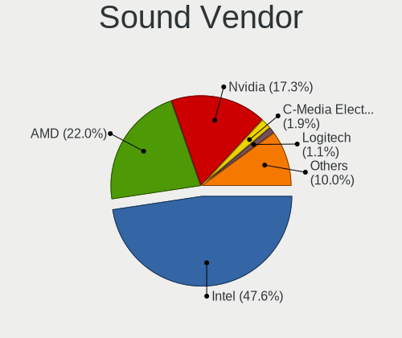

| Vendor                      | Computers | Percent |
|-----------------------------|-----------|---------|
| Intel                       | 1089      | 47.6%   |
| AMD                         | 504       | 22.03%  |
| Nvidia                      | 394       | 17.22%  |
| C-Media Electronics         | 44        | 1.92%   |
| Logitech                    | 26        | 1.14%   |
| Lenovo                      | 19        | 0.83%   |
| GN Netcom                   | 15        | 0.66%   |
| Creative Technology         | 12        | 0.52%   |
| Realtek Semiconductor       | 11        | 0.48%   |
| Plantronics                 | 10        | 0.44%   |
| Kingston Technology         | 10        | 0.44%   |
| Focusrite-Novation          | 9         | 0.39%   |
| Blue Microphones            | 9         | 0.39%   |
| Creative Labs               | 8         | 0.35%   |
| Corsair                     | 8         | 0.35%   |
| Generalplus Technology      | 7         | 0.31%   |
| SteelSeries ApS             | 6         | 0.26%   |
| RODE Microphones            | 6         | 0.26%   |
| JMTek                       | 6         | 0.26%   |
| Samson Technologies         | 5         | 0.22%   |
| Texas Instruments           | 4         | 0.17%   |
| Sony                        | 4         | 0.17%   |
| Razer USA                   | 4         | 0.17%   |
| GYROCOM C&C                 | 4         | 0.17%   |
| DSEA A/S                    | 4         | 0.17%   |
| Tenx Technology             | 3         | 0.13%   |
| SAVITECH                    | 3         | 0.13%   |
| Microsoft                   | 3         | 0.13%   |
| Hewlett-Packard             | 3         | 0.13%   |
| Dell                        | 3         | 0.13%   |
| Cambridge Silicon Radio     | 3         | 0.13%   |
| ASUSTek Computer            | 3         | 0.13%   |
| ULi Electronics             | 2         | 0.09%   |
| Schiit Audio                | 2         | 0.09%   |
| JBL                         | 2         | 0.09%   |
| Giga-Byte Technology        | 2         | 0.09%   |
| FiiO Electronics Technology | 2         | 0.09%   |
| EGO SYStems                 | 2         | 0.09%   |
| BEHRINGER International     | 2         | 0.09%   |
| Apple                       | 2         | 0.09%   |

Sound Model
-----------

Sound card models

| Model                                                                      | Computers | Percent |
|----------------------------------------------------------------------------|-----------|---------|
| AMD Family 17h/19h HD Audio Controller                                     | 204       | 7.41%   |
| Intel Sunrise Point-LP HD Audio                                            | 192       | 6.97%   |
| AMD Renoir Radeon High Definition Audio Controller                         | 116       | 4.21%   |
| AMD Starship/Matisse HD Audio Controller                                   | 95        | 3.45%   |
| Intel 6 Series/C200 Series Chipset Family High Definition Audio Controller | 80        | 2.91%   |
| Intel Cannon Lake PCH cAVS                                                 | 76        | 2.76%   |
| Intel 8 Series/C220 Series Chipset High Definition Audio Controller        | 74        | 2.69%   |
| Intel Tiger Lake-LP Smart Sound Technology Audio Controller                | 73        | 2.65%   |
| AMD Raven/Raven2/Fenghuang HDMI/DP Audio Controller                        | 69        | 2.51%   |
| Intel 7 Series/C216 Chipset Family High Definition Audio Controller        | 67        | 2.43%   |
| Intel Xeon E3-1200 v3/4th Gen Core Processor HD Audio Controller           | 57        | 2.07%   |
| Intel Cannon Point-LP High Definition Audio Controller                     | 54        | 1.96%   |
| Intel Comet Lake PCH-LP cAVS                                               | 53        | 1.93%   |
| Intel 100 Series/C230 Series Chipset Family HD Audio Controller            | 53        | 1.93%   |
| AMD Family 17h (Models 00h-0fh) HD Audio Controller                        | 49        | 1.78%   |
| AMD Ellesmere HDMI Audio [Radeon RX 470/480 / 570/580/590]                 | 48        | 1.74%   |
| Nvidia GP107GL High Definition Audio Controller                            | 44        | 1.6%    |
| Intel 200 Series PCH HD Audio                                              | 43        | 1.56%   |
| Intel Wildcat Point-LP High Definition Audio Controller                    | 36        | 1.31%   |
| Intel Broadwell-U Audio Controller                                         | 36        | 1.31%   |
| Intel Haswell-ULT HD Audio Controller                                      | 35        | 1.27%   |
| Intel 8 Series HD Audio Controller                                         | 35        | 1.27%   |
| AMD FCH Azalia Controller                                                  | 35        | 1.27%   |
| Intel Comet Lake PCH cAVS                                                  | 34        | 1.24%   |
| Intel 5 Series/3400 Series Chipset High Definition Audio                   | 31        | 1.13%   |
| Nvidia GP106 High Definition Audio Controller                              | 29        | 1.05%   |
| AMD Navi 10 HDMI Audio                                                     | 29        | 1.05%   |
| Nvidia TU106 High Definition Audio Controller                              | 27        | 0.98%   |
| Nvidia TU107 GeForce GTX 1650 High Definition Audio Controller             | 26        | 0.94%   |
| AMD SBx00 Azalia (Intel HDA)                                               | 26        | 0.94%   |
| Nvidia GP104 High Definition Audio Controller                              | 25        | 0.91%   |
| Nvidia TU116 High Definition Audio Controller                              | 24        | 0.87%   |
| AMD Baffin HDMI/DP Audio [Radeon RX 550 640SP / RX 560/560X]               | 24        | 0.87%   |
| AMD Oland/Hainan/Cape Verde/Pitcairn HDMI Audio [Radeon HD 7000 Series]    | 23        | 0.84%   |
| Nvidia GK208 HDMI/DP Audio Controller                                      | 22        | 0.8%    |
| Intel CM238 HD Audio Controller                                            | 22        | 0.8%    |
| Nvidia GA106 High Definition Audio Controller                              | 20        | 0.73%   |
| Intel Ice Lake-LP Smart Sound Technology Audio Controller                  | 20        | 0.73%   |
| Nvidia GM107 High Definition Audio Controller [GeForce 940MX]              | 19        | 0.69%   |
| Nvidia GF108 High Definition Audio Controller                              | 19        | 0.69%   |

Memory
------

Memory Vendor
-------------

Memory module vendors

| Vendor                       | Computers | Percent |
|------------------------------|-----------|---------|
| Samsung Electronics          | 217       | 21.88%  |
| SK hynix                     | 187       | 18.85%  |
| Kingston                     | 120       | 12.1%   |
| Micron Technology            | 106       | 10.69%  |
| Unknown                      | 73        | 7.36%   |
| Corsair                      | 64        | 6.45%   |
| Crucial                      | 56        | 5.65%   |
| G.Skill                      | 50        | 5.04%   |
| A-DATA Technology            | 20        | 2.02%   |
| Ramaxel Technology           | 17        | 1.71%   |
| Elpida                       | 14        | 1.41%   |
| GOODRAM                      | 8         | 0.81%   |
| Unknown (ABCD)               | 7         | 0.71%   |
| Teikon                       | 6         | 0.6%    |
| Team                         | 6         | 0.6%    |
| Smart                        | 6         | 0.6%    |
| Nanya Technology             | 4         | 0.4%    |
| Goldkey                      | 4         | 0.4%    |
| Silicon Power                | 3         | 0.3%    |
| Patriot                      | 3         | 0.3%    |
| Kllisre                      | 3         | 0.3%    |
| Avant                        | 3         | 0.3%    |
| Transcend                    | 2         | 0.2%    |
| GeIL                         | 2         | 0.2%    |
| V-Color                      | 1         | 0.1%    |
| Unknown (0xF7F7F7F7F7F7E300) | 1         | 0.1%    |
| Smart Brazil                 | 1         | 0.1%    |
| Rahonix                      | 1         | 0.1%    |
| pqi                          | 1         | 0.1%    |
| OnBoard                      | 1         | 0.1%    |
| KomputerBay                  | 1         | 0.1%    |
| Golden Empire                | 1         | 0.1%    |
| Gold Key                     | 1         | 0.1%    |
| Essencore                    | 1         | 0.1%    |
| Apacer                       | 1         | 0.1%    |

Memory Model
------------

Memory module models

| Model                                                            | Computers | Percent |
|------------------------------------------------------------------|-----------|---------|
| Samsung RAM M471A5244CB0-CTD 4GB SODIMM DDR4 3266MT/s            | 15        | 1.42%   |
| Samsung RAM M471A1K43DB1-CWE 8GB SODIMM DDR4 3200MT/s            | 13        | 1.23%   |
| Samsung RAM M471A2K43DB1-CTD 16GB SODIMM DDR4 2667MT/s           | 11        | 1.04%   |
| Samsung RAM M471A1G44AB0-CWE 8GB SODIMM DDR4 3200MT/s            | 11        | 1.04%   |
| Samsung RAM M471A2G44AM0-CWE 16GB SODIMM DDR4 3200MT/s           | 9         | 0.85%   |
| SK hynix RAM HMA82GS6JJR8N-VK 16GB SODIMM DDR4 2667MT/s          | 8         | 0.76%   |
| SK hynix RAM HMA81GS6AFR8N-UH 8GB SODIMM DDR4 2667MT/s           | 8         | 0.76%   |
| Samsung RAM M471A1G44AB0-CWE 8GB Row Of Chips DDR4 3200MT/s      | 8         | 0.76%   |
| SK hynix RAM HMAB2GS6AMR6N-XN 16GB SODIMM DDR4 3200MT/s          | 7         | 0.66%   |
| Samsung RAM M471B5173QH0-YK0 4GB SODIMM DDR3 1600MT/s            | 7         | 0.66%   |
| Micron RAM 4ATF1G64HZ-3G2E1 8GB SODIMM DDR4 3200MT/s             | 7         | 0.66%   |
| Unknown (ABCD) RAM 123456789012345678 2GB SODIMM LPDDR4 2400MT/s | 6         | 0.57%   |
| SK hynix RAM HMT41GS6BFR8A-PB 8GB SODIMM DDR3 1600MT/s           | 6         | 0.57%   |
| SK hynix RAM HMA81GS6DJR8N-XN 8GB SODIMM DDR4 3200MT/s           | 6         | 0.57%   |
| Samsung RAM M471A2G44AM0-CTD 16GB SODIMM DDR4 2667MT/s           | 6         | 0.57%   |
| Samsung RAM M471A1K43BB1-CTD 8GB SODIMM DDR4 2667MT/s            | 6         | 0.57%   |
| Micron RAM 53E1G32D2NP-046 2GB Row Of Chips LPDDR4 4267MT/s      | 6         | 0.57%   |
| Micron RAM 4ATF51264HZ-2G6E1 4GB SODIMM DDR4 2667MT/s            | 6         | 0.57%   |
| Unknown RAM Module 1GB SODIMM DDR3 1333MT/s                      | 5         | 0.47%   |
| SK hynix RAM HMT451S6BFR8A-PB 4GB SODIMM DDR3 1600MT/s           | 5         | 0.47%   |
| SK hynix RAM HMA851S6CJR6N-XN 4GB SODIMM DDR4 3200MT/s           | 5         | 0.47%   |
| SK hynix RAM HMA81GS6JJR8N-VK 8GB SODIMM DDR4 2667MT/s           | 5         | 0.47%   |
| Samsung RAM M471B5173DB0-YK0 4GB SODIMM DDR3 1600MT/s            | 5         | 0.47%   |
| Samsung RAM M471A2K43DB1-CWE 16GB SODIMM DDR4 3200MT/s           | 5         | 0.47%   |
| Micron RAM 8ATF1G64HZ-3G2J1 8GB SODIMM DDR4 3200MT/s             | 5         | 0.47%   |
| Micron RAM 4ATF51264HZ-3G2J1 4GB Row Of Chips DDR4 3200MT/s      | 5         | 0.47%   |
| SK hynix RAM HMT351S6CFR8C-PB 4GB SODIMM DDR3 1600MT/s           | 4         | 0.38%   |
| SK hynix RAM HMAA2GS6CJR8N-XN 16GB SODIMM DDR4 3200MT/s          | 4         | 0.38%   |
| SK hynix RAM HMAA1GS6CMR6N-XN 8GB Row Of Chips DDR4 3200MT/s     | 4         | 0.38%   |
| SK hynix RAM HMA851S6CJR6N-VK 4GB SODIMM DDR4 2667MT/s           | 4         | 0.38%   |
| Samsung RAM Module 16GB SODIMM DDR4 2667MT/s                     | 4         | 0.38%   |
| Samsung RAM M471B5273CH0-CH9 4GB SODIMM DDR3 1334MT/s            | 4         | 0.38%   |
| Samsung RAM M471B1G73QH0-YK0 8192MB SODIMM DDR3 1600MT/s         | 4         | 0.38%   |
| Samsung RAM M471A5244CB0-CWE 4GB SODIMM DDR4 3200MT/s            | 4         | 0.38%   |
| Samsung RAM M471A5244CB0-CRC 4GB SODIMM DDR4 2667MT/s            | 4         | 0.38%   |
| Samsung RAM M471A2K43CB1-CRC 16GB SODIMM DDR4 2667MT/s           | 4         | 0.38%   |
| Samsung RAM M471A1K43CB1-CTD 8GB SODIMM DDR4 2667MT/s            | 4         | 0.38%   |
| Samsung RAM M471A1K43BB1-CRC 8192MB SODIMM DDR4 2667MT/s         | 4         | 0.38%   |
| Samsung RAM K4UBE3D4AA-MGCL 8GB Row Of Chips LPDDR4 4267MT/s     | 4         | 0.38%   |
| Micron RAM Module 8GB Chip LPDDR4                                | 4         | 0.38%   |

Memory Kind
-----------

Memory module kinds

| Kind    | Computers | Percent |
|---------|-----------|---------|
| DDR4    | 508       | 60.12%  |
| DDR3    | 226       | 26.75%  |
| LPDDR4  | 40        | 4.73%   |
| LPDDR3  | 33        | 3.91%   |
| DDR2    | 17        | 2.01%   |
| Unknown | 12        | 1.42%   |
| SDRAM   | 5         | 0.59%   |
| DDR     | 4         | 0.47%   |

Memory Form Factor
------------------

Physical design of the memory module

| Name         | Computers | Percent |
|--------------|-----------|---------|
| SODIMM       | 497       | 58.4%   |
| DIMM         | 256       | 30.08%  |
| Row Of Chips | 81        | 9.52%   |
| Chip         | 15        | 1.76%   |
| RIMM         | 1         | 0.12%   |
| Unknown      | 1         | 0.12%   |

Memory Size
-----------

Memory module size

| Size  | Computers | Percent |
|-------|-----------|---------|
| 8192  | 380       | 41.58%  |
| 4096  | 224       | 24.51%  |
| 16384 | 191       | 20.9%   |
| 2048  | 75        | 8.21%   |
| 32768 | 28        | 3.06%   |
| 1024  | 15        | 1.64%   |
| 512   | 1         | 0.11%   |

Memory Speed
------------

Memory module speed

| Speed   | Computers | Percent |
|---------|-----------|---------|
| 3200    | 190       | 20.56%  |
| 2667    | 158       | 17.1%   |
| 1600    | 157       | 16.99%  |
| 2400    | 71        | 7.68%   |
| 2133    | 60        | 6.49%   |
| 1333    | 39        | 4.22%   |
| 3600    | 23        | 2.49%   |
| 1867    | 22        | 2.38%   |
| 4267    | 20        | 2.16%   |
| 1334    | 16        | 1.73%   |
| Unknown | 16        | 1.73%   |
| 3266    | 15        | 1.62%   |
| 3733    | 12        | 1.3%    |
| 667     | 12        | 1.3%    |
| 3400    | 11        | 1.19%   |
| 1067    | 10        | 1.08%   |
| 1066    | 10        | 1.08%   |
| 3000    | 8         | 0.87%   |
| 3466    | 7         | 0.76%   |
| 3800    | 6         | 0.65%   |
| 2800    | 6         | 0.65%   |
| 1866    | 6         | 0.65%   |
| 800     | 6         | 0.65%   |
| 3866    | 5         | 0.54%   |
| 2666    | 4         | 0.43%   |
| 8400    | 3         | 0.32%   |
| 2933    | 3         | 0.32%   |
| 1800    | 3         | 0.32%   |
| 333     | 3         | 0.32%   |
| 4800    | 2         | 0.22%   |
| 4266    | 2         | 0.22%   |
| 49926   | 1         | 0.11%   |
| 4199    | 1         | 0.11%   |
| 4000    | 1         | 0.11%   |
| 3666    | 1         | 0.11%   |
| 3533    | 1         | 0.11%   |
| 3467    | 1         | 0.11%   |
| 3334    | 1         | 0.11%   |
| 3100    | 1         | 0.11%   |
| 3066    | 1         | 0.11%   |

Printers & scanners
-------------------

Printer Vendor
--------------

Printer device vendors

| Vendor              | Computers | Percent |
|---------------------|-----------|---------|
| Hewlett-Packard     | 14        | 40%     |
| Brother Industries  | 7         | 20%     |
| Canon               | 4         | 11.43%  |
| Seiko Epson         | 2         | 5.71%   |
| Xerox               | 1         | 2.86%   |
| Star Micronics      | 1         | 2.86%   |
| Samsung Electronics | 1         | 2.86%   |
| Ricoh               | 1         | 2.86%   |
| Prolific Technology | 1         | 2.86%   |
| Dymo-CoStar         | 1         | 2.86%   |
| Dell                | 1         | 2.86%   |
| Boca Systems        | 1         | 2.86%   |

Printer Model
-------------

Printer device models

| Model                                        | Computers | Percent |
|----------------------------------------------|-----------|---------|
| HP OfficeJet 6950                            | 2         | 5.71%   |
| HP DeskJet 2620 All-in-One Printer           | 2         | 5.71%   |
| Xerox Phaser 3010                            | 1         | 2.86%   |
| Star Micronics TUP592 (STR_T-001)            | 1         | 2.86%   |
| Seiko Epson PX-045A Series                   | 1         | 2.86%   |
| Seiko Epson ME 320/330 Series [Stylus SX125] | 1         | 2.86%   |
| Samsung M2070 Series                         | 1         | 2.86%   |
| Ricoh SP 212SUw                              | 1         | 2.86%   |
| Prolific PL2305 Parallel Port                | 1         | 2.86%   |
| HP Officejet 4500 G510g-m                    | 1         | 2.86%   |
| HP Neverstop Laser 100x                      | 1         | 2.86%   |
| HP LaserJet Professional P 1102w             | 1         | 2.86%   |
| HP LaserJet P1006                            | 1         | 2.86%   |
| HP Ink Tank 310 series                       | 1         | 2.86%   |
| HP EWS UPD                                   | 1         | 2.86%   |
| HP ENVY 5000 series                          | 1         | 2.86%   |
| HP DeskJet F4100 Printer series              | 1         | 2.86%   |
| HP Deskjet D2500 series                      | 1         | 2.86%   |
| HP DeskJet 4530 series                       | 1         | 2.86%   |
| Dymo-CoStar DYMO LabelWriter 4XL             | 1         | 2.86%   |
| Dell B1160w Mono Laser Printer               | 1         | 2.86%   |
| Canon TR8500 series                          | 1         | 2.86%   |
| Canon PIXMA MP270 All-In-One Printer         | 1         | 2.86%   |
| Canon PIXMA MG3000 series                    | 1         | 2.86%   |
| Canon CanoScan LiDE 300                      | 1         | 2.86%   |
| Brother Printer                              | 1         | 2.86%   |
| Brother MFC-9330CDW                          | 1         | 2.86%   |
| Brother MFC-9325CW                           | 1         | 2.86%   |
| Brother HL-L2340D series                     | 1         | 2.86%   |
| Brother HL-1430 Laser Printer                | 1         | 2.86%   |
| Brother DCP-7040                             | 1         | 2.86%   |
| Brother DCP-7030                             | 1         | 2.86%   |
| Boca Systems FGL46 Thermal Printer           | 1         | 2.86%   |

Scanner Vendor
--------------

Scanner device vendors

| Vendor          | Computers | Percent |
|-----------------|-----------|---------|
| Canon           | 6         | 54.55%  |
| Seiko Epson     | 4         | 36.36%  |
| Hewlett-Packard | 1         | 9.09%   |

Scanner Model
-------------

Scanner device models

| Model                                                   | Computers | Percent |
|---------------------------------------------------------|-----------|---------|
| Seiko Epson GT-X820 [Perfection V600 Photo]             | 1         | 9.09%   |
| Seiko Epson GT-X770 [Perfection V500]                   | 1         | 9.09%   |
| Seiko Epson GT-F720 [GT-S620/Perfection V30/V300 Photo] | 1         | 9.09%   |
| Seiko Epson GT-F670 [Perfection V200 Photo]             | 1         | 9.09%   |
| HP ScanJet G4050                                        | 1         | 9.09%   |
| Canon CanoScan N1240U/LiDE 30                           | 1         | 9.09%   |
| Canon CanoScan LiDE 70                                  | 1         | 9.09%   |
| Canon CanoScan LIDE 25                                  | 1         | 9.09%   |
| Canon CanoScan LiDE 220                                 | 1         | 9.09%   |
| Canon CanoScan LiDE 210                                 | 1         | 9.09%   |
| Canon CanoScan 4400F                                    | 1         | 9.09%   |

Camera
------

Camera Vendor
-------------

Camera device vendors

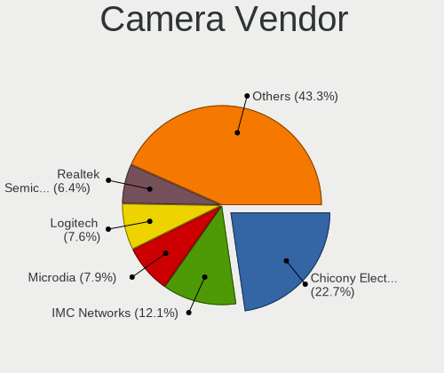

| Vendor                                 | Computers | Percent |
|----------------------------------------|-----------|---------|
| Chicony Electronics                    | 250       | 22.67%  |
| IMC Networks                           | 134       | 12.15%  |
| Microdia                               | 87        | 7.89%   |
| Logitech                               | 84        | 7.62%   |
| Acer                                   | 83        | 7.52%   |
| Realtek Semiconductor                  | 71        | 6.44%   |
| Sunplus Innovation Technology          | 61        | 5.53%   |
| Quanta                                 | 50        | 4.53%   |
| Cheng Uei Precision Industry (Foxlink) | 46        | 4.17%   |
| Syntek                                 | 32        | 2.9%    |
| Lite-On Technology                     | 31        | 2.81%   |
| Apple                                  | 28        | 2.54%   |
| Suyin                                  | 20        | 1.81%   |
| Microsoft                              | 13        | 1.18%   |
| Alcor Micro                            | 13        | 1.18%   |
| Samsung Electronics                    | 10        | 0.91%   |
| Silicon Motion                         | 9         | 0.82%   |
| Z-Star Microelectronics                | 5         | 0.45%   |
| Ricoh                                  | 4         | 0.36%   |
| Luxvisions Innotech Limited            | 4         | 0.36%   |
| Lenovo                                 | 4         | 0.36%   |
| Jieli Technology                       | 4         | 0.36%   |
| HD 2MP WEBCAM                          | 4         | 0.36%   |
| KYE Systems (Mouse Systems)            | 3         | 0.27%   |
| AVerMedia Technologies                 | 3         | 0.27%   |
| ARC International                      | 3         | 0.27%   |
| ALi                                    | 3         | 0.27%   |
| YGTek                                  | 2         | 0.18%   |
| WaveRider Communications               | 2         | 0.18%   |
| Unknown                                | 2         | 0.18%   |
| Trust                                  | 2         | 0.18%   |
| Sony                                   | 2         | 0.18%   |
| Razer USA                              | 2         | 0.18%   |
| Pixart Imaging                         | 2         | 0.18%   |
| Huawei Technologies                    | 2         | 0.18%   |
| Generalplus Technology                 | 2         | 0.18%   |
| DJJHFA1BIF5595                         | 2         | 0.18%   |
| Creative Technology                    | 2         | 0.18%   |
| Y Media                                | 1         | 0.09%   |
| Xiongmai                               | 1         | 0.09%   |

Camera Model
------------

Camera device models

| Model                                               | Computers | Percent |
|-----------------------------------------------------|-----------|---------|
| Chicony Integrated Camera                           | 94        | 8.36%   |
| IMC Networks Integrated Camera                      | 63        | 5.6%    |
| Microdia Integrated_Webcam_HD                       | 43        | 3.82%   |
| Realtek Integrated_Webcam_HD                        | 35        | 3.11%   |
| Acer Integrated Camera                              | 29        | 2.58%   |
| Syntek Integrated Camera                            | 27        | 2.4%    |
| Logitech Webcam C270                                | 25        | 2.22%   |
| IMC Networks USB2.0 HD UVC WebCam                   | 25        | 2.22%   |
| Sunplus Integrated_Webcam_HD                        | 24        | 2.13%   |
| Chicony HD WebCam                                   | 19        | 1.69%   |
| Logitech HD Pro Webcam C920                         | 17        | 1.51%   |
| Lite-On Integrated Camera                           | 15        | 1.33%   |
| Chicony Integrated Camera (1280x720@30)             | 15        | 1.33%   |
| IMC Networks USB2.0 VGA UVC WebCam                  | 14        | 1.24%   |
| Chicony HP HD Camera                                | 13        | 1.16%   |
| Apple iPhone5/5C/5S/6                               | 12        | 1.07%   |
| Samsung Galaxy A5 (MTP)                             | 10        | 0.89%   |
| Microdia USB 2.0 Camera                             | 10        | 0.89%   |
| Chicony USB2.0 Camera                               | 10        | 0.89%   |
| Quanta HD User Facing                               | 9         | 0.8%    |
| Chicony HP Wide Vision HD Camera                    | 9         | 0.8%    |
| Chicony HP Truevision HD camera                     | 9         | 0.8%    |
| Acer EasyCamera                                     | 9         | 0.8%    |
| Quanta HP TrueVision HD Camera                      | 8         | 0.71%   |
| Cheng Uei Precision Industry (Foxlink) Webcam       | 8         | 0.71%   |
| Apple FaceTime HD Camera (Built-in)                 | 8         | 0.71%   |
| Quanta HD Webcam                                    | 7         | 0.62%   |
| Microdia Webcam Vitade AF                           | 7         | 0.62%   |
| Logitech HD Webcam C525                             | 7         | 0.62%   |
| Acer SunplusIT Integrated Camera                    | 7         | 0.62%   |
| Acer Lenovo EasyCamera                              | 7         | 0.62%   |
| Quanta HP HD Camera                                 | 6         | 0.53%   |
| Microdia Integrated Webcam                          | 6         | 0.53%   |
| Cheng Uei Precision Industry (Foxlink) HP HD Camera | 6         | 0.53%   |
| Acer BisonCam, NB Pro                               | 6         | 0.53%   |
| Suyin Integrated_Webcam_HD                          | 5         | 0.44%   |
| Sunplus HD WebCam                                   | 5         | 0.44%   |
| Microsoft LifeCam Cinema                            | 5         | 0.44%   |
| Logitech Webcam C925e                               | 5         | 0.44%   |
| Logitech BRIO Ultra HD Webcam                       | 5         | 0.44%   |

Security
--------

Fingerprint Vendor
------------------

Fingerprint sensor vendors

| Vendor                     | Computers | Percent |
|----------------------------|-----------|---------|
| Synaptics                  | 115       | 39.12%  |
| Validity Sensors           | 90        | 30.61%  |
| Shenzhen Goodix Technology | 44        | 14.97%  |
| Elan Microelectronics      | 17        | 5.78%   |
| Upek                       | 11        | 3.74%   |
| LighTuning Technology      | 11        | 3.74%   |
| AuthenTec                  | 4         | 1.36%   |
| STMicroelectronics         | 1         | 0.34%   |
| Focal-systems.Corp         | 1         | 0.34%   |

Fingerprint Model
-----------------

Fingerprint sensor models

| Model                                                                      | Computers | Percent |
|----------------------------------------------------------------------------|-----------|---------|
| Synaptics Prometheus MIS Touch Fingerprint Reader                          | 46        | 15.65%  |
| Validity Sensors VFS495 Fingerprint Reader                                 | 25        | 8.5%    |
| Unknown                                                                    | 24        | 8.16%   |
| Shenzhen Goodix  FingerPrint Device                                        | 18        | 6.12%   |
| Validity Sensors VFS 5011 fingerprint sensor                               | 16        | 5.44%   |
| Shenzhen Goodix Fingerprint Reader                                         | 15        | 5.1%    |
| Validity Sensors VFS7500 Touch Fingerprint Sensor                          | 12        | 4.08%   |
| Elan ELAN:Fingerprint                                                      | 12        | 4.08%   |
| Synaptics Metallica MIS Touch Fingerprint Reader                           | 11        | 3.74%   |
| Shenzhen Goodix FingerPrint                                                | 11        | 3.74%   |
| Upek Biometric Touchchip/Touchstrip Fingerprint Sensor                     | 10        | 3.4%    |
| Synaptics  WBDI                                                            | 8         | 2.72%   |
| Synaptics  VFS7552 Touch Fingerprint Sensor with PurePrint                 | 8         | 2.72%   |
| Synaptics  FS7604 Touch Fingerprint Sensor with PurePrint                  | 8         | 2.72%   |
| Synaptics Metallica MOH Touch Fingerprint Reader                           | 8         | 2.72%   |
| Validity Sensors Synaptics WBDI                                            | 7         | 2.38%   |
| LighTuning EgisTec Touch Fingerprint Sensor                                | 7         | 2.38%   |
| Validity Sensors VFS5011 Fingerprint Reader                                | 6         | 2.04%   |
| Validity Sensors Synaptics VFS7552 Touch Fingerprint Sensor with PurePrint | 6         | 2.04%   |
| Elan ELAN:ARM-M4                                                           | 5         | 1.7%    |
| Validity Sensors Synaptics VFS7552 Touch Fingerprint Sensor                | 4         | 1.36%   |
| Validity Sensors VFS Fingerprint sensor                                    | 3         | 1.02%   |
| Validity Sensors Fingerprint scanner                                       | 3         | 1.02%   |
| LighTuning ES603 Swipe Fingerprint Sensor                                  | 3         | 1.02%   |
| Validity Sensors VFS471 Fingerprint Reader                                 | 2         | 0.68%   |
| Validity Sensors Swipe Fingerprint Sensor                                  | 2         | 0.68%   |
| Synaptics WBDI Device                                                      | 2         | 0.68%   |
| Validity Sensors VFS7552 Touch Fingerprint Sensor                          | 1         | 0.34%   |
| Validity Sensors VFS491                                                    | 1         | 0.34%   |
| Validity Sensors VFS451 Fingerprint Reader                                 | 1         | 0.34%   |
| Validity Sensors VFS301 Fingerprint Reader                                 | 1         | 0.34%   |
| Upek TCS5B Fingerprint sensor                                              | 1         | 0.34%   |
| STMicroelectronics Fingerprint Reader                                      | 1         | 0.34%   |
| LighTuning Fingerprint Reader                                              | 1         | 0.34%   |
| Focal-systems.Corp FT9201Fingerprint.                                      | 1         | 0.34%   |
| AuthenTec Fingerprint Sensor                                               | 1         | 0.34%   |
| AuthenTec AES2550 Fingerprint Sensor                                       | 1         | 0.34%   |
| AuthenTec AES2501 Fingerprint Sensor                                       | 1         | 0.34%   |
| AuthenTec AES1660 Fingerprint Sensor                                       | 1         | 0.34%   |

Chipcard Vendor
---------------

Chipcard module vendors

| Vendor                | Computers | Percent |
|-----------------------|-----------|---------|
| Alcor Micro           | 41        | 39.81%  |
| Broadcom              | 36        | 34.95%  |
| Lenovo                | 6         | 5.83%   |
| Upek                  | 5         | 4.85%   |
| O2 Micro              | 5         | 4.85%   |
| SCM Microsystems      | 2         | 1.94%   |
| Realtek Semiconductor | 2         | 1.94%   |
| OmniKey               | 2         | 1.94%   |
| Hewlett-Packard       | 1         | 0.97%   |
| Gemalto (was Gemplus) | 1         | 0.97%   |
| Chicony Electronics   | 1         | 0.97%   |
| Cherry                | 1         | 0.97%   |

Chipcard Model
--------------

Chipcard module models

| Model                                                                        | Computers | Percent |
|------------------------------------------------------------------------------|-----------|---------|
| Alcor Micro AU9540 Smartcard Reader                                          | 41        | 39.81%  |
| Broadcom 5880                                                                | 14        | 13.59%  |
| Broadcom 58200                                                               | 10        | 9.71%   |
| Broadcom BCM5880 Secure Applications Processor                               | 7         | 6.8%    |
| Lenovo Integrated Smart Card Reader                                          | 6         | 5.83%   |
| Upek TouchChip Fingerprint Coprocessor (WBF advanced mode)                   | 5         | 4.85%   |
| O2 Micro OZ776 CCID Smartcard Reader                                         | 5         | 4.85%   |
| Broadcom BCM5880 Secure Applications Processor with fingerprint swipe sensor | 5         | 4.85%   |
| Realtek Semiconductor Smart Card Reader Interface                            | 2         | 1.94%   |
| SCM Microsystems SCR331-LC1 / SCR3310 SmartCard Reader                       | 1         | 0.97%   |
| SCM Microsystems CLOUD 2900 R Smart Card Reader                              | 1         | 0.97%   |
| OmniKey CardMan 4321                                                         | 1         | 0.97%   |
| OmniKey CardMan 3021 / 3121                                                  | 1         | 0.97%   |
| Hewlett-Packard SC Keyboard - Apollo (Liteon)                                | 1         | 0.97%   |
| Gemalto (was Gemplus) Compact Smart Card Reader Writer                       | 1         | 0.97%   |
| Chicony Electronics HP Skylab USB Smartcard Keyboard                         | 1         | 0.97%   |
| Cherry SmartCard Reader Keyboard KC 1000 SC                                  | 1         | 0.97%   |

Unsupported
-----------

Unsupported Devices
-------------------

Total unsupported devices on board

| Total | Computers | Percent |
|-------|-----------|---------|
| 0     | 1104      | 68.36%  |
| 1     | 447       | 27.68%  |
| 2     | 55        | 3.41%   |
| 3     | 6         | 0.37%   |
| 4     | 2         | 0.12%   |
| 5     | 1         | 0.06%   |

Unsupported Device Types
------------------------

Types of unsupported devices

| Type                     | Computers | Percent |
|--------------------------|-----------|---------|
| Fingerprint reader       | 292       | 50.78%  |
| Graphics card            | 68        | 11.83%  |
| Net/wireless             | 61        | 10.61%  |
| Multimedia controller    | 59        | 10.26%  |
| Chipcard                 | 15        | 2.61%   |
| Camera                   | 14        | 2.43%   |
| Unassigned class         | 11        | 1.91%   |
| Storage                  | 11        | 1.91%   |
| Bluetooth                | 10        | 1.74%   |
| Communication controller | 9         | 1.57%   |
| Card reader              | 7         | 1.22%   |
| Sound                    | 6         | 1.04%   |
| Net/ethernet             | 4         | 0.7%    |
| Network                  | 3         | 0.52%   |
| Modem                    | 3         | 0.52%   |
| Storage/ata              | 1         | 0.17%   |
| Dvb card                 | 1         | 0.17%   |

