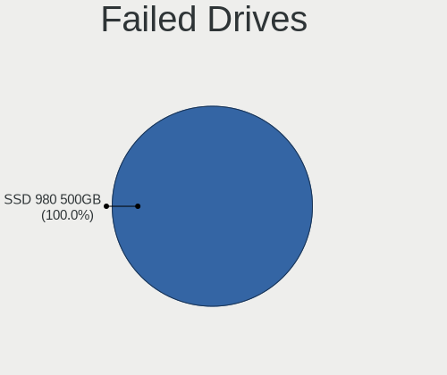
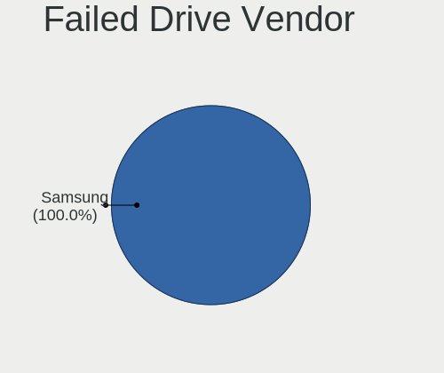
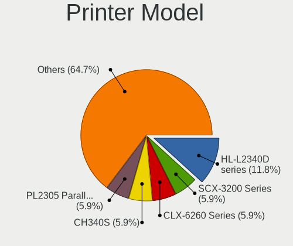
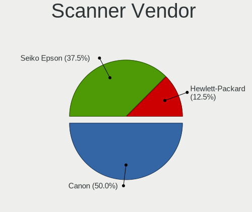
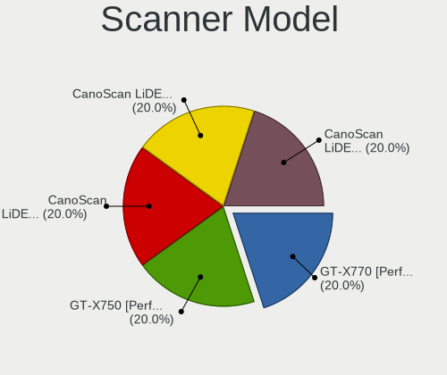

Fedora 35 - Tested Hardware & Statistics
----------------------------------------

A project to collect tested hardware configurations for Fedora 35.

Anyone can contribute to this report by the [hw-probe](https://github.com/linuxhw/hw-probe) tool:

    sudo -E hw-probe -all -upload

Please contribute! Especially if your hardware is rare.

This is a report for all computer types. See also reports for [desktops](/Dist/Fedora_35/Desktop/README.md) and [notebooks](/Dist/Fedora_35/Notebook/README.md).

Contents
--------

* [ Test Cases ](#test-cases)

* [ System ](#system)
  - [ Kernel                   ](#kernel)
  - [ Kernel Family            ](#kernel-family)
  - [ Kernel Major Ver.        ](#kernel-major-ver)
  - [ Arch                     ](#arch)
  - [ DE                       ](#de)
  - [ Display Server           ](#display-server)
  - [ Display Manager          ](#display-manager)
  - [ OS Lang                  ](#os-lang)
  - [ Boot Mode                ](#boot-mode)
  - [ Filesystem               ](#filesystem)
  - [ Part. scheme             ](#part-scheme)
  - [ Dual Boot with Linux/BSD ](#dual-boot-with-linuxbsd)
  - [ Dual Boot (Win)          ](#dual-boot-win)

* [ Board ](#board)
  - [ Vendor                   ](#vendor)
  - [ Model                    ](#model)
  - [ Model Family             ](#model-family)
  - [ MFG Year                 ](#mfg-year)
  - [ Form Factor              ](#form-factor)
  - [ Secure Boot              ](#secure-boot)
  - [ Coreboot                 ](#coreboot)
  - [ RAM Size                 ](#ram-size)
  - [ RAM Used                 ](#ram-used)
  - [ Total Drives             ](#total-drives)
  - [ Has CD-ROM               ](#has-cd-rom)
  - [ Has Ethernet             ](#has-ethernet)
  - [ Has WiFi                 ](#has-wifi)
  - [ Has Bluetooth            ](#has-bluetooth)

* [ Location ](#location)
  - [ Country                  ](#country)
  - [ City                     ](#city)

* [ Drives ](#drives)
  - [ Drive Vendor             ](#drive-vendor)
  - [ Drive Model              ](#drive-model)
  - [ HDD Vendor               ](#hdd-vendor)
  - [ SSD Vendor               ](#ssd-vendor)
  - [ Drive Kind               ](#drive-kind)
  - [ Drive Connector          ](#drive-connector)
  - [ Drive Size               ](#drive-size)
  - [ Space Total              ](#space-total)
  - [ Space Used               ](#space-used)
  - [ Malfunc. Drives          ](#malfunc-drives)
  - [ Malfunc. Drive Vendor    ](#malfunc-drive-vendor)
  - [ Malfunc. HDD Vendor      ](#malfunc-hdd-vendor)
  - [ Malfunc. Drive Kind      ](#malfunc-drive-kind)
  - [ Failed Drives            ](#failed-drives)
  - [ Failed Drive Vendor      ](#failed-drive-vendor)
  - [ Drive Status             ](#drive-status)

* [ Storage controller ](#storage-controller)
  - [ Storage Vendor           ](#storage-vendor)
  - [ Storage Model            ](#storage-model)
  - [ Storage Kind             ](#storage-kind)

* [ Processor ](#processor)
  - [ CPU Vendor               ](#cpu-vendor)
  - [ CPU Model                ](#cpu-model)
  - [ CPU Model Family         ](#cpu-model-family)
  - [ CPU Cores                ](#cpu-cores)
  - [ CPU Sockets              ](#cpu-sockets)
  - [ CPU Threads              ](#cpu-threads)
  - [ CPU Op-Modes             ](#cpu-op-modes)
  - [ CPU Microcode            ](#cpu-microcode)
  - [ CPU Microarch            ](#cpu-microarch)

* [ Graphics ](#graphics)
  - [ GPU Vendor               ](#gpu-vendor)
  - [ GPU Model                ](#gpu-model)
  - [ GPU Combo                ](#gpu-combo)
  - [ GPU Driver               ](#gpu-driver)
  - [ GPU Memory               ](#gpu-memory)

* [ Monitor ](#monitor)
  - [ Monitor Vendor           ](#monitor-vendor)
  - [ Monitor Model            ](#monitor-model)
  - [ Monitor Resolution       ](#monitor-resolution)
  - [ Monitor Diagonal         ](#monitor-diagonal)
  - [ Monitor Width            ](#monitor-width)
  - [ Aspect Ratio             ](#aspect-ratio)
  - [ Monitor Area             ](#monitor-area)
  - [ Pixel Density            ](#pixel-density)
  - [ Multiple Monitors        ](#multiple-monitors)

* [ Network ](#network)
  - [ Net Controller Vendor    ](#net-controller-vendor)
  - [ Net Controller Model     ](#net-controller-model)
  - [ Wireless Vendor          ](#wireless-vendor)
  - [ Wireless Model           ](#wireless-model)
  - [ Ethernet Vendor          ](#ethernet-vendor)
  - [ Ethernet Model           ](#ethernet-model)
  - [ Net Controller Kind      ](#net-controller-kind)
  - [ Used Controller          ](#used-controller)
  - [ NICs                     ](#nics)
  - [ IPv6                     ](#ipv6)

* [ Bluetooth ](#bluetooth)
  - [ Bluetooth Vendor         ](#bluetooth-vendor)
  - [ Bluetooth Model          ](#bluetooth-model)

* [ Sound ](#sound)
  - [ Sound Vendor             ](#sound-vendor)
  - [ Sound Model              ](#sound-model)

* [ Memory ](#memory)
  - [ Memory Vendor            ](#memory-vendor)
  - [ Memory Model             ](#memory-model)
  - [ Memory Kind              ](#memory-kind)
  - [ Memory Form Factor       ](#memory-form-factor)
  - [ Memory Size              ](#memory-size)
  - [ Memory Speed             ](#memory-speed)

* [ Printers & scanners ](#printers--scanners)
  - [ Printer Vendor           ](#printer-vendor)
  - [ Printer Model            ](#printer-model)
  - [ Scanner Vendor           ](#scanner-vendor)
  - [ Scanner Model            ](#scanner-model)

* [ Camera ](#camera)
  - [ Camera Vendor            ](#camera-vendor)
  - [ Camera Model             ](#camera-model)

* [ Security ](#security)
  - [ Fingerprint Vendor       ](#fingerprint-vendor)
  - [ Fingerprint Model        ](#fingerprint-model)
  - [ Chipcard Vendor          ](#chipcard-vendor)
  - [ Chipcard Model           ](#chipcard-model)

* [ Unsupported ](#unsupported)
  - [ Unsupported Devices      ](#unsupported-devices)
  - [ Unsupported Device Types ](#unsupported-device-types)

Test Cases
----------

Total: 2321

| Vendor        | Model                       | Form-Factor | Probe                                                      | Date         |
|---------------|-----------------------------|-------------|------------------------------------------------------------|--------------|
| ASRock        | FM2A88X Extreme6+           | Desktop     | [186495d063](https://linux-hardware.org/?probe=186495d063) | Oct 01, 2022 |
| MSI           | X99A RAIDER                 | Desktop     | [847283c85d](https://linux-hardware.org/?probe=847283c85d) | Oct 01, 2022 |
| MSI           | X99A RAIDER                 | Desktop     | [7b0b80d00c](https://linux-hardware.org/?probe=7b0b80d00c) | Sep 30, 2022 |
| ASRock        | FM2A88X Extreme6+           | Desktop     | [6553398b7d](https://linux-hardware.org/?probe=6553398b7d) | Sep 30, 2022 |
| ASRock        | FM2A88X Extreme6+           | Desktop     | [362c6b7436](https://linux-hardware.org/?probe=362c6b7436) | Sep 29, 2022 |
| MSI           | X99A RAIDER                 | Desktop     | [d4e346f990](https://linux-hardware.org/?probe=d4e346f990) | Sep 29, 2022 |
| Lenovo        | IdeaPad C340-14API 81N6     | Notebook    | [01cf3c6f99](https://linux-hardware.org/?probe=01cf3c6f99) | Sep 26, 2022 |
| Lenovo        | ThinkPad T420 4236C53       | Notebook    | [e0983b35fa](https://linux-hardware.org/?probe=e0983b35fa) | Sep 25, 2022 |
| ASRock        | FM2A88X Extreme6+           | Desktop     | [a4b47e7325](https://linux-hardware.org/?probe=a4b47e7325) | Sep 25, 2022 |
| MSI           | X99A RAIDER                 | Desktop     | [adb952e34b](https://linux-hardware.org/?probe=adb952e34b) | Sep 25, 2022 |
| ASRock        | FM2A88X Extreme6+           | Desktop     | [ab2e3b1767](https://linux-hardware.org/?probe=ab2e3b1767) | Sep 24, 2022 |
| MSI           | X99A RAIDER                 | Desktop     | [a89311b338](https://linux-hardware.org/?probe=a89311b338) | Sep 24, 2022 |
| ASRock        | FM2A88X Extreme6+           | Desktop     | [0f750af134](https://linux-hardware.org/?probe=0f750af134) | Sep 23, 2022 |
| MSI           | X99A RAIDER                 | Desktop     | [3e88be3301](https://linux-hardware.org/?probe=3e88be3301) | Sep 23, 2022 |
| ASRock        | FM2A88X Extreme6+           | Desktop     | [bfb470649a](https://linux-hardware.org/?probe=bfb470649a) | Sep 22, 2022 |
| MSI           | X99A RAIDER                 | Desktop     | [dd6c618f48](https://linux-hardware.org/?probe=dd6c618f48) | Sep 22, 2022 |
| HP            | Pavilion 17                 | Notebook    | [0f7eec1f7a](https://linux-hardware.org/?probe=0f7eec1f7a) | Sep 21, 2022 |
| ASRock        | FM2A88X Extreme6+           | Desktop     | [754dfba736](https://linux-hardware.org/?probe=754dfba736) | Sep 21, 2022 |
| MSI           | X99A RAIDER                 | Desktop     | [a0f2dedc00](https://linux-hardware.org/?probe=a0f2dedc00) | Sep 21, 2022 |
| ASRock        | FM2A88X Extreme6+           | Desktop     | [fa5f7f7245](https://linux-hardware.org/?probe=fa5f7f7245) | Sep 20, 2022 |
| MSI           | X99A RAIDER                 | Desktop     | [926189f2ee](https://linux-hardware.org/?probe=926189f2ee) | Sep 20, 2022 |
| HUAWEI        | WRT-WX9                     | Notebook    | [4c8883345d](https://linux-hardware.org/?probe=4c8883345d) | Sep 19, 2022 |
| ASRock        | FM2A88X Extreme6+           | Desktop     | [5233832be3](https://linux-hardware.org/?probe=5233832be3) | Sep 19, 2022 |
| MSI           | X99A RAIDER                 | Desktop     | [4fb85d59e0](https://linux-hardware.org/?probe=4fb85d59e0) | Sep 19, 2022 |
| ASUSTek       | TUF Gaming B660M-PLUS D4    | Desktop     | [b48eda0e37](https://linux-hardware.org/?probe=b48eda0e37) | Sep 18, 2022 |
| Lenovo        | G580 20150                  | Notebook    | [fe325d1046](https://linux-hardware.org/?probe=fe325d1046) | Sep 18, 2022 |
| MSI           | X99A RAIDER                 | Desktop     | [c352d61c4e](https://linux-hardware.org/?probe=c352d61c4e) | Sep 18, 2022 |
| ASRock        | FM2A88X Extreme6+           | Desktop     | [7161071790](https://linux-hardware.org/?probe=7161071790) | Sep 18, 2022 |
| ASUSTek       | TUF Gaming B660M-PLUS D4    | Desktop     | [e633838a51](https://linux-hardware.org/?probe=e633838a51) | Sep 15, 2022 |
| Lenovo        | ThinkPad X1 Nano Gen 1 2... | Notebook    | [930ee68921](https://linux-hardware.org/?probe=930ee68921) | Sep 14, 2022 |
| ASRock        | FM2A88X Extreme6+           | Desktop     | [37d6996290](https://linux-hardware.org/?probe=37d6996290) | Sep 14, 2022 |
| MSI           | X99A RAIDER                 | Desktop     | [d91d28cc52](https://linux-hardware.org/?probe=d91d28cc52) | Sep 14, 2022 |
| ASRock        | FM2A88X Extreme6+           | Desktop     | [a6e7414518](https://linux-hardware.org/?probe=a6e7414518) | Sep 13, 2022 |
| MSI           | X99A RAIDER                 | Desktop     | [f3fe87a412](https://linux-hardware.org/?probe=f3fe87a412) | Sep 13, 2022 |
| ASUSTek       | Z97-A                       | Desktop     | [b23a59ba48](https://linux-hardware.org/?probe=b23a59ba48) | Sep 12, 2022 |
| ASUSTek       | Z97-A                       | Desktop     | [294aa98426](https://linux-hardware.org/?probe=294aa98426) | Sep 12, 2022 |
| MSI           | X99A RAIDER                 | Desktop     | [73bc6cd9e3](https://linux-hardware.org/?probe=73bc6cd9e3) | Sep 11, 2022 |
| ASRock        | FM2A88X Extreme6+           | Desktop     | [d85067b0f0](https://linux-hardware.org/?probe=d85067b0f0) | Sep 11, 2022 |
| MSI           | X99A RAIDER                 | Desktop     | [3ce68aa737](https://linux-hardware.org/?probe=3ce68aa737) | Sep 10, 2022 |
| ASRock        | FM2A88X Extreme6+           | Desktop     | [20ee71a4d6](https://linux-hardware.org/?probe=20ee71a4d6) | Sep 10, 2022 |
| ASUSTek       | TUF Gaming B550-PLUS        | Desktop     | [174c263499](https://linux-hardware.org/?probe=174c263499) | Sep 08, 2022 |
| ASUSTek       | Z97-A                       | Desktop     | [46be1ea134](https://linux-hardware.org/?probe=46be1ea134) | Sep 08, 2022 |
| Biostar       | H310MHP                     | Desktop     | [6063bede72](https://linux-hardware.org/?probe=6063bede72) | Sep 07, 2022 |
| Lenovo        | 3111 NOK                    | Mini pc     | [778f8bb16e](https://linux-hardware.org/?probe=778f8bb16e) | Sep 06, 2022 |
| MSI           | X99A RAIDER                 | Desktop     | [ad0d0e6994](https://linux-hardware.org/?probe=ad0d0e6994) | Sep 06, 2022 |
| ASRock        | FM2A88X Extreme6+           | Desktop     | [dad765ca9e](https://linux-hardware.org/?probe=dad765ca9e) | Sep 06, 2022 |
| Notebook      | NJ5x_NJ7xLU                 | Notebook    | [1cadc455a1](https://linux-hardware.org/?probe=1cadc455a1) | Sep 05, 2022 |
| Lenovo        | 367D 31900003 STD           | Desktop     | [c145bac65a](https://linux-hardware.org/?probe=c145bac65a) | Sep 05, 2022 |
| MSI           | X99A RAIDER                 | Desktop     | [a84dbefc98](https://linux-hardware.org/?probe=a84dbefc98) | Sep 05, 2022 |
| ASRock        | FM2A88X Extreme6+           | Desktop     | [0df0bba932](https://linux-hardware.org/?probe=0df0bba932) | Sep 05, 2022 |
| ASUSTek       | TUF Gaming B550-PLUS        | Desktop     | [2cf13f4045](https://linux-hardware.org/?probe=2cf13f4045) | Sep 04, 2022 |
| Foxconn       | 2AB1                        | Desktop     | [3b7dae5f40](https://linux-hardware.org/?probe=3b7dae5f40) | Sep 04, 2022 |
| ASUSTek       | TUF Gaming B460M-PLUS       | Desktop     | [5dcc9cd8c8](https://linux-hardware.org/?probe=5dcc9cd8c8) | Sep 03, 2022 |
| HP            | Victus by Laptop 16-d0xx... | Notebook    | [5730a9015f](https://linux-hardware.org/?probe=5730a9015f) | Sep 02, 2022 |
| ASRock        | FM2A88X Extreme6+           | Desktop     | [446e2d292a](https://linux-hardware.org/?probe=446e2d292a) | Sep 02, 2022 |
| MSI           | X99A RAIDER                 | Desktop     | [6fa62e0277](https://linux-hardware.org/?probe=6fa62e0277) | Sep 02, 2022 |
| ASRock        | FM2A88X Extreme6+           | Desktop     | [689c3aa34d](https://linux-hardware.org/?probe=689c3aa34d) | Sep 01, 2022 |
| MSI           | X99A RAIDER                 | Desktop     | [5cf1e75ad4](https://linux-hardware.org/?probe=5cf1e75ad4) | Sep 01, 2022 |
| Lenovo        | ThinkPad X1 Yoga 2nd 20J... | Convertible | [b2456009ae](https://linux-hardware.org/?probe=b2456009ae) | Aug 31, 2022 |
| ASUSTek       | K401UQK                     | Notebook    | [4f026584d7](https://linux-hardware.org/?probe=4f026584d7) | Aug 31, 2022 |
| ASRock        | FM2A88X Extreme6+           | Desktop     | [df96c4acaf](https://linux-hardware.org/?probe=df96c4acaf) | Aug 31, 2022 |
| MSI           | X99A RAIDER                 | Desktop     | [56a6f41ffa](https://linux-hardware.org/?probe=56a6f41ffa) | Aug 31, 2022 |
| Acer          | TMP453-MG                   | Notebook    | [63efab9aef](https://linux-hardware.org/?probe=63efab9aef) | Aug 30, 2022 |
| MSI           | X99A RAIDER                 | Desktop     | [09b6390c84](https://linux-hardware.org/?probe=09b6390c84) | Aug 30, 2022 |
| ASRock        | FM2A88X Extreme6+           | Desktop     | [eba231b7db](https://linux-hardware.org/?probe=eba231b7db) | Aug 30, 2022 |
| MSI           | X99A RAIDER                 | Desktop     | [8b0ab8f988](https://linux-hardware.org/?probe=8b0ab8f988) | Aug 26, 2022 |
| ASRock        | FM2A88X Extreme6+           | Desktop     | [ff55a7dbf1](https://linux-hardware.org/?probe=ff55a7dbf1) | Aug 26, 2022 |
| HP            | ENVY 15                     | Notebook    | [db06c354d4](https://linux-hardware.org/?probe=db06c354d4) | Aug 26, 2022 |
| MSI           | X99A RAIDER                 | Desktop     | [ec4d28f5de](https://linux-hardware.org/?probe=ec4d28f5de) | Aug 25, 2022 |
| ASRock        | FM2A88X Extreme6+           | Desktop     | [f80abd07f3](https://linux-hardware.org/?probe=f80abd07f3) | Aug 25, 2022 |
| HUAWEI        | BOD-WXX9                    | Notebook    | [fd6ff49314](https://linux-hardware.org/?probe=fd6ff49314) | Aug 24, 2022 |
| ASUSTek       | Z97-A                       | Desktop     | [016c661430](https://linux-hardware.org/?probe=016c661430) | Aug 24, 2022 |
| Dell          | 0T1D10 A01                  | Desktop     | [39e79a7077](https://linux-hardware.org/?probe=39e79a7077) | Aug 23, 2022 |
| Toshiba       | Satellite C55-C             | Notebook    | [99faef3f00](https://linux-hardware.org/?probe=99faef3f00) | Aug 20, 2022 |
| Lenovo        | ThinkPad X230 2306CTO       | Notebook    | [1bde57f974](https://linux-hardware.org/?probe=1bde57f974) | Aug 18, 2022 |
| ASRock        | FM2A88X Extreme6+           | Desktop     | [3f83c9e402](https://linux-hardware.org/?probe=3f83c9e402) | Aug 16, 2022 |
| MSI           | X99A RAIDER                 | Desktop     | [f1a0029208](https://linux-hardware.org/?probe=f1a0029208) | Aug 16, 2022 |
| MSI           | X99A RAIDER                 | Desktop     | [91a402ab9e](https://linux-hardware.org/?probe=91a402ab9e) | Aug 15, 2022 |
| ASRock        | FM2A88X Extreme6+           | Desktop     | [1298facab1](https://linux-hardware.org/?probe=1298facab1) | Aug 15, 2022 |
| Itautec       | Infoway W7425               | Notebook    | [64b3153e8a](https://linux-hardware.org/?probe=64b3153e8a) | Aug 15, 2022 |
| Samsung       | 355V4C/355V4X/355V5C/355... | Notebook    | [03089b1469](https://linux-hardware.org/?probe=03089b1469) | Aug 13, 2022 |
| Dell          | Latitude 5511               | Notebook    | [69ebaebf95](https://linux-hardware.org/?probe=69ebaebf95) | Aug 11, 2022 |
| ASUSTek       | VivoBook_ASUSLaptop X512... | Notebook    | [5eec4d3ccf](https://linux-hardware.org/?probe=5eec4d3ccf) | Aug 10, 2022 |
| ASRock        | FM2A88X Extreme6+           | Desktop     | [91a2943c51](https://linux-hardware.org/?probe=91a2943c51) | Aug 09, 2022 |
| MSI           | X99A RAIDER                 | Desktop     | [0318e6b173](https://linux-hardware.org/?probe=0318e6b173) | Aug 09, 2022 |
| ASRock        | FM2A88X Extreme6+           | Desktop     | [244025d59e](https://linux-hardware.org/?probe=244025d59e) | Aug 08, 2022 |
| MSI           | X99A RAIDER                 | Desktop     | [2d55725824](https://linux-hardware.org/?probe=2d55725824) | Aug 08, 2022 |
| Gigabyte      | B450M DS3H-CF               | Desktop     | [258c7a2f71](https://linux-hardware.org/?probe=258c7a2f71) | Aug 06, 2022 |
| Toshiba       | Satellite C55-C             | Notebook    | [992b4f4910](https://linux-hardware.org/?probe=992b4f4910) | Aug 06, 2022 |
| MSI           | X99A RAIDER                 | Desktop     | [284fd5ef07](https://linux-hardware.org/?probe=284fd5ef07) | Aug 05, 2022 |
| ASRock        | FM2A88X Extreme6+           | Desktop     | [9320816ca5](https://linux-hardware.org/?probe=9320816ca5) | Aug 05, 2022 |
| MSI           | X99A RAIDER                 | Desktop     | [33c854adcd](https://linux-hardware.org/?probe=33c854adcd) | Aug 04, 2022 |
| ASRock        | FM2A88X Extreme6+           | Desktop     | [b224ef1b8d](https://linux-hardware.org/?probe=b224ef1b8d) | Aug 04, 2022 |
| HP            | Laptop 15-db0xxx            | Notebook    | [ec7e5864c2](https://linux-hardware.org/?probe=ec7e5864c2) | Aug 02, 2022 |
| Dell          | XPS 13 7390                 | Notebook    | [2aedd7bad4](https://linux-hardware.org/?probe=2aedd7bad4) | Aug 02, 2022 |
| MSI           | X99A RAIDER                 | Desktop     | [a56f943225](https://linux-hardware.org/?probe=a56f943225) | Aug 02, 2022 |
| ASRock        | FM2A88X Extreme6+           | Desktop     | [015ec264f5](https://linux-hardware.org/?probe=015ec264f5) | Aug 02, 2022 |
| MSI           | X99A RAIDER                 | Desktop     | [5fe6f7eb57](https://linux-hardware.org/?probe=5fe6f7eb57) | Aug 01, 2022 |
| ASRock        | FM2A88X Extreme6+           | Desktop     | [8ea1e0f22c](https://linux-hardware.org/?probe=8ea1e0f22c) | Aug 01, 2022 |
| MSI           | X99A RAIDER                 | Desktop     | [76a30e3042](https://linux-hardware.org/?probe=76a30e3042) | Jul 31, 2022 |
| ASRock        | FM2A88X Extreme6+           | Desktop     | [9dd9d17e79](https://linux-hardware.org/?probe=9dd9d17e79) | Jul 31, 2022 |
| Gateway       | DX4860                      | Desktop     | [279b6793e4](https://linux-hardware.org/?probe=279b6793e4) | Jul 30, 2022 |
| Gateway       | DX4860                      | Desktop     | [fec12bcbe9](https://linux-hardware.org/?probe=fec12bcbe9) | Jul 30, 2022 |
| MSI           | X99A RAIDER                 | Desktop     | [ebfa3daff5](https://linux-hardware.org/?probe=ebfa3daff5) | Jul 30, 2022 |
| ASRock        | FM2A88X Extreme6+           | Desktop     | [9a7de8cc64](https://linux-hardware.org/?probe=9a7de8cc64) | Jul 30, 2022 |
| Gigabyte      | H61M-DS2V                   | Desktop     | [e5744803f2](https://linux-hardware.org/?probe=e5744803f2) | Jul 29, 2022 |
| ASRock        | FM2A88X Extreme6+           | Desktop     | [c0ce536184](https://linux-hardware.org/?probe=c0ce536184) | Jul 29, 2022 |
| MSI           | X99A RAIDER                 | Desktop     | [d5034f5f52](https://linux-hardware.org/?probe=d5034f5f52) | Jul 29, 2022 |
| ASRock        | FM2A88X Extreme6+           | Desktop     | [a9c3256946](https://linux-hardware.org/?probe=a9c3256946) | Jul 28, 2022 |
| MSI           | X99A RAIDER                 | Desktop     | [db30ba1d0e](https://linux-hardware.org/?probe=db30ba1d0e) | Jul 28, 2022 |
| HP            | Pavilion Power Laptop 15... | Notebook    | [e4de7eb090](https://linux-hardware.org/?probe=e4de7eb090) | Jul 26, 2022 |
| ASRock        | FM2A88X Extreme6+           | Desktop     | [2632256ed7](https://linux-hardware.org/?probe=2632256ed7) | Jul 25, 2022 |
| MSI           | X99A RAIDER                 | Desktop     | [57beac41bc](https://linux-hardware.org/?probe=57beac41bc) | Jul 25, 2022 |
| HP            | Pavilion Power Laptop 15... | Notebook    | [5007f1aa43](https://linux-hardware.org/?probe=5007f1aa43) | Jul 24, 2022 |
| MSI           | 2A9C                        | Desktop     | [b0441c833d](https://linux-hardware.org/?probe=b0441c833d) | Jul 24, 2022 |
| MSI           | X99A RAIDER                 | Desktop     | [79d402e1ff](https://linux-hardware.org/?probe=79d402e1ff) | Jul 24, 2022 |
| ASRock        | FM2A88X Extreme6+           | Desktop     | [8bb191bc8f](https://linux-hardware.org/?probe=8bb191bc8f) | Jul 24, 2022 |
| MSI           | X99A RAIDER                 | Desktop     | [7a33ccf211](https://linux-hardware.org/?probe=7a33ccf211) | Jul 23, 2022 |
| ASRock        | FM2A88X Extreme6+           | Desktop     | [9c1f5f7a4e](https://linux-hardware.org/?probe=9c1f5f7a4e) | Jul 23, 2022 |
| Supermicro    | X11DPi-N                    | Server      | [38ae00936b](https://linux-hardware.org/?probe=38ae00936b) | Jul 22, 2022 |
| MSI           | X99A RAIDER                 | Desktop     | [347ff14d90](https://linux-hardware.org/?probe=347ff14d90) | Jul 22, 2022 |
| ASRock        | FM2A88X Extreme6+           | Desktop     | [d758abd21c](https://linux-hardware.org/?probe=d758abd21c) | Jul 22, 2022 |
| ASRock        | FM2A88X Extreme6+           | Desktop     | [b54cb1f930](https://linux-hardware.org/?probe=b54cb1f930) | Jul 21, 2022 |
| MSI           | X99A RAIDER                 | Desktop     | [a671047cb4](https://linux-hardware.org/?probe=a671047cb4) | Jul 21, 2022 |
| Lenovo        | ThinkPad L480 20LSCTO1WW    | Notebook    | [51dd660f49](https://linux-hardware.org/?probe=51dd660f49) | Jul 20, 2022 |
| Foxconn       | 2AB1                        | Desktop     | [c269d962ea](https://linux-hardware.org/?probe=c269d962ea) | Jul 20, 2022 |
| ASRock        | FM2A88X Extreme6+           | Desktop     | [8cae76caea](https://linux-hardware.org/?probe=8cae76caea) | Jul 20, 2022 |
| MSI           | X99A RAIDER                 | Desktop     | [05a5bc0fa8](https://linux-hardware.org/?probe=05a5bc0fa8) | Jul 20, 2022 |
| Acer          | TMP453-MG                   | Notebook    | [797f0ea7fe](https://linux-hardware.org/?probe=797f0ea7fe) | Jul 18, 2022 |
| HP            | 802E                        | Desktop     | [c86ddd647b](https://linux-hardware.org/?probe=c86ddd647b) | Jul 16, 2022 |
| Gigabyte      | B450M DS3H-CF               | Desktop     | [e9c788dfd2](https://linux-hardware.org/?probe=e9c788dfd2) | Jul 14, 2022 |
| Acer          | Nitro AN515-56              | Notebook    | [2418745195](https://linux-hardware.org/?probe=2418745195) | Jul 14, 2022 |
| Lenovo        | ThinkPad X230 2325SDE       | Notebook    | [a002ac843c](https://linux-hardware.org/?probe=a002ac843c) | Jul 12, 2022 |
| Lenovo        | ThinkPad X230 2325SDE       | Notebook    | [79ecbebabd](https://linux-hardware.org/?probe=79ecbebabd) | Jul 12, 2022 |
| MSI           | X99A RAIDER                 | Desktop     | [108d31db10](https://linux-hardware.org/?probe=108d31db10) | Jul 12, 2022 |
| ASRock        | FM2A88X Extreme6+           | Desktop     | [ce2e8f2a2a](https://linux-hardware.org/?probe=ce2e8f2a2a) | Jul 12, 2022 |
| MSI           | X99A RAIDER                 | Desktop     | [7ce0875267](https://linux-hardware.org/?probe=7ce0875267) | Jul 11, 2022 |
| ASRock        | FM2A88X Extreme6+           | Desktop     | [84f993f04d](https://linux-hardware.org/?probe=84f993f04d) | Jul 11, 2022 |
| Dell          | 0GDJXY A00                  | All in one  | [e4f7616dee](https://linux-hardware.org/?probe=e4f7616dee) | Jul 10, 2022 |
| Gigabyte      | X99-UD4-CF                  | Desktop     | [4245ef07db](https://linux-hardware.org/?probe=4245ef07db) | Jul 10, 2022 |
| Lenovo        | ThinkPad X280 20KES8D400    | Notebook    | [fdc339a6b0](https://linux-hardware.org/?probe=fdc339a6b0) | Jul 09, 2022 |
| Lenovo        | ThinkPad X280 20KES8D400    | Notebook    | [7d2b04b0ce](https://linux-hardware.org/?probe=7d2b04b0ce) | Jul 09, 2022 |
| Gigabyte      | X99-UD4-CF                  | Desktop     | [1dafd7beed](https://linux-hardware.org/?probe=1dafd7beed) | Jul 09, 2022 |
| Dell          | Latitude 5290 2-in-1        | Notebook    | [5ecc52d011](https://linux-hardware.org/?probe=5ecc52d011) | Jul 08, 2022 |
| Lenovo        | ThinkPad T14s Gen 1 20T0... | Notebook    | [fec0786471](https://linux-hardware.org/?probe=fec0786471) | Jul 06, 2022 |
| ASRock        | 990FX Killer                | Desktop     | [28b0984086](https://linux-hardware.org/?probe=28b0984086) | Jul 05, 2022 |
| Gigabyte      | H77N-WIFI                   | Desktop     | [e795477a20](https://linux-hardware.org/?probe=e795477a20) | Jul 05, 2022 |
| ASUSTek       | ROG Maximus Z690 HERO       | Desktop     | [a74834b383](https://linux-hardware.org/?probe=a74834b383) | Jul 04, 2022 |
| Intel         | DP55KG AAE47218-404         | Desktop     | [aaa7656f44](https://linux-hardware.org/?probe=aaa7656f44) | Jul 03, 2022 |
| ASRock        | FM2A88X Extreme6+           | Desktop     | [1bec4af414](https://linux-hardware.org/?probe=1bec4af414) | Jul 02, 2022 |
| MSI           | X99A RAIDER                 | Desktop     | [e6eeb4dfe6](https://linux-hardware.org/?probe=e6eeb4dfe6) | Jul 02, 2022 |
| MSI           | X99A RAIDER                 | Desktop     | [e1c3d1dfad](https://linux-hardware.org/?probe=e1c3d1dfad) | Jul 01, 2022 |
| ASRock        | FM2A88X Extreme6+           | Desktop     | [a658ebf5e9](https://linux-hardware.org/?probe=a658ebf5e9) | Jul 01, 2022 |
| Lenovo        | ThinkPad E15 Gen 2 20TDC... | Notebook    | [f29c4de6b4](https://linux-hardware.org/?probe=f29c4de6b4) | Jun 30, 2022 |
| Lenovo        | ThinkPad E15 Gen 2 20TDC... | Notebook    | [7ecd760977](https://linux-hardware.org/?probe=7ecd760977) | Jun 30, 2022 |
| Lenovo        | ThinkPad E15 Gen 2 20TDC... | Notebook    | [8428ba0120](https://linux-hardware.org/?probe=8428ba0120) | Jun 30, 2022 |
| ASRock        | FM2A88X Extreme6+           | Desktop     | [163a5c29e6](https://linux-hardware.org/?probe=163a5c29e6) | Jun 30, 2022 |
| MSI           | X99A RAIDER                 | Desktop     | [2da2ad735c](https://linux-hardware.org/?probe=2da2ad735c) | Jun 30, 2022 |
| MSI           | X99A RAIDER                 | Desktop     | [b197a0fd35](https://linux-hardware.org/?probe=b197a0fd35) | Jun 29, 2022 |
| ASRock        | FM2A88X Extreme6+           | Desktop     | [66b8ec6b28](https://linux-hardware.org/?probe=66b8ec6b28) | Jun 29, 2022 |
| Dell          | Inspiron 7558               | Notebook    | [d34cfa83d3](https://linux-hardware.org/?probe=d34cfa83d3) | Jun 26, 2022 |
| Lenovo        | IdeaPad L340-15IRH Gamin... | Notebook    | [3b84529124](https://linux-hardware.org/?probe=3b84529124) | Jun 24, 2022 |
| HP            | ProBook 4520s               | Notebook    | [eb9033a7c1](https://linux-hardware.org/?probe=eb9033a7c1) | Jun 24, 2022 |
| Dell          | 0M877N A01                  | Server      | [107b5509e6](https://linux-hardware.org/?probe=107b5509e6) | Jun 23, 2022 |
| Acer          | TMP453-MG                   | Notebook    | [e2790ebf7e](https://linux-hardware.org/?probe=e2790ebf7e) | Jun 23, 2022 |
| Acer          | TMP453-MG                   | Notebook    | [c99aceab3b](https://linux-hardware.org/?probe=c99aceab3b) | Jun 23, 2022 |
| Dell          | Inspiron 7577               | Notebook    | [673bd13d0a](https://linux-hardware.org/?probe=673bd13d0a) | Jun 23, 2022 |
| HP            | Notebook                    | Notebook    | [03c703cc7f](https://linux-hardware.org/?probe=03c703cc7f) | Jun 21, 2022 |
| ASRock        | Z690M-ITX/ax                | Desktop     | [cc8224a123](https://linux-hardware.org/?probe=cc8224a123) | Jun 21, 2022 |
| ASRock        | Z690M-ITX/ax                | Desktop     | [1d3eb4348d](https://linux-hardware.org/?probe=1d3eb4348d) | Jun 21, 2022 |
| ASRock        | Z690M-ITX/ax                | Desktop     | [35bec2520a](https://linux-hardware.org/?probe=35bec2520a) | Jun 21, 2022 |
| Microsoft     | Surface Laptop 3            | Tablet      | [18f31eae70](https://linux-hardware.org/?probe=18f31eae70) | Jun 21, 2022 |
| MSI           | 2A9C                        | Desktop     | [73dd2172d3](https://linux-hardware.org/?probe=73dd2172d3) | Jun 20, 2022 |
| HP            | ProBook 4520s               | Notebook    | [b34f97ddb3](https://linux-hardware.org/?probe=b34f97ddb3) | Jun 19, 2022 |
| ASUSTek       | ZenBook UX434DA_UM433DA     | Notebook    | [68ca5e600d](https://linux-hardware.org/?probe=68ca5e600d) | Jun 18, 2022 |
| ASRock        | FM2A88X Extreme6+           | Desktop     | [4801136187](https://linux-hardware.org/?probe=4801136187) | Jun 18, 2022 |
| MSI           | X99A RAIDER                 | Desktop     | [550772184f](https://linux-hardware.org/?probe=550772184f) | Jun 18, 2022 |
| HP            | ProBook 430 G5              | Notebook    | [1689773788](https://linux-hardware.org/?probe=1689773788) | Jun 18, 2022 |
| ASRock        | FM2A88X Extreme6+           | Desktop     | [680bf4c033](https://linux-hardware.org/?probe=680bf4c033) | Jun 17, 2022 |
| MSI           | X99A RAIDER                 | Desktop     | [184ad2670a](https://linux-hardware.org/?probe=184ad2670a) | Jun 17, 2022 |
| ASUSTek       | ROG CROSSHAIR VII HERO      | Desktop     | [9418d283c9](https://linux-hardware.org/?probe=9418d283c9) | Jun 15, 2022 |
| Lenovo        | ThinkPad X220 4286CTO       | Notebook    | [fd2fb2f646](https://linux-hardware.org/?probe=fd2fb2f646) | Jun 14, 2022 |
| MSI           | X99A RAIDER                 | Desktop     | [6b279160dc](https://linux-hardware.org/?probe=6b279160dc) | Jun 14, 2022 |
| ASRock        | FM2A88X Extreme6+           | Desktop     | [7990c32699](https://linux-hardware.org/?probe=7990c32699) | Jun 14, 2022 |
| ASRock        | B450M/ac R2.0               | Desktop     | [bc509480d2](https://linux-hardware.org/?probe=bc509480d2) | Jun 13, 2022 |
| MSI           | X99A RAIDER                 | Desktop     | [2f784679b0](https://linux-hardware.org/?probe=2f784679b0) | Jun 13, 2022 |
| ASRock        | FM2A88X Extreme6+           | Desktop     | [dcd3256961](https://linux-hardware.org/?probe=dcd3256961) | Jun 13, 2022 |
| Acer          | Aspire 5552                 | Notebook    | [909cdd1a0e](https://linux-hardware.org/?probe=909cdd1a0e) | Jun 12, 2022 |
| Microsoft     | Surface Book 3              | Tablet      | [26c417012f](https://linux-hardware.org/?probe=26c417012f) | Jun 12, 2022 |
| Lenovo        | ThinkPad L14 Gen 1 20U50... | Notebook    | [c637722355](https://linux-hardware.org/?probe=c637722355) | Jun 11, 2022 |
| Gigabyte      | H77N-WIFI                   | Desktop     | [23fa842567](https://linux-hardware.org/?probe=23fa842567) | Jun 11, 2022 |
| Gigabyte      | H77N-WIFI                   | Desktop     | [fd1478145b](https://linux-hardware.org/?probe=fd1478145b) | Jun 11, 2022 |
| Lenovo        | ThinkPad X1 Yoga Gen 6 2... | Convertible | [d9cffc5cc6](https://linux-hardware.org/?probe=d9cffc5cc6) | Jun 10, 2022 |
| Gigabyte      | GA-880GM-UD2H               | Desktop     | [267db233fa](https://linux-hardware.org/?probe=267db233fa) | Jun 10, 2022 |
| Unknown       | Unknown                     | Desktop     | [4a2f4f8cb1](https://linux-hardware.org/?probe=4a2f4f8cb1) | Jun 09, 2022 |
| ASUSTek       | Z170-A                      | Desktop     | [87fa4e032d](https://linux-hardware.org/?probe=87fa4e032d) | Jun 09, 2022 |
| ASUSTek       | Z170-A                      | Desktop     | [3531488e43](https://linux-hardware.org/?probe=3531488e43) | Jun 09, 2022 |
| Lenovo        | ThinkPad T410 2522PT3       | Notebook    | [75d6b8489b](https://linux-hardware.org/?probe=75d6b8489b) | Jun 08, 2022 |
| Gigabyte      | G41MT-D3                    | Desktop     | [2ac69cc327](https://linux-hardware.org/?probe=2ac69cc327) | Jun 08, 2022 |
| Gigabyte      | B450 GAMING X               | Desktop     | [34e884bb50](https://linux-hardware.org/?probe=34e884bb50) | Jun 08, 2022 |
| HP            | 872D                        | Desktop     | [c27f333c46](https://linux-hardware.org/?probe=c27f333c46) | Jun 08, 2022 |
| Lenovo        | IdeaPadFlex 5 14ARE05 81... | Convertible | [a068a18649](https://linux-hardware.org/?probe=a068a18649) | Jun 08, 2022 |
| ASRock        | AD2700-ITX                  | Desktop     | [9342f5c46b](https://linux-hardware.org/?probe=9342f5c46b) | Jun 08, 2022 |
| Gigabyte      | D525TUD                     | Desktop     | [fdba6d0041](https://linux-hardware.org/?probe=fdba6d0041) | Jun 08, 2022 |
| Gigabyte      | GA-MA785G-UD3H              | Desktop     | [bfa4e4ff74](https://linux-hardware.org/?probe=bfa4e4ff74) | Jun 07, 2022 |
| MSI           | X99A RAIDER                 | Desktop     | [34e068e6ad](https://linux-hardware.org/?probe=34e068e6ad) | Jun 07, 2022 |
| ASRock        | FM2A88X Extreme6+           | Desktop     | [5a835b2aa6](https://linux-hardware.org/?probe=5a835b2aa6) | Jun 07, 2022 |
| Apple         | MacBook4,1                  | Notebook    | [1608d3bbd6](https://linux-hardware.org/?probe=1608d3bbd6) | Jun 07, 2022 |
| ASUSTek       | M5A99FX PRO R2.0            | Desktop     | [4924d1fa99](https://linux-hardware.org/?probe=4924d1fa99) | Jun 06, 2022 |
| Dell          | Inspiron 14 5410 2-in-1     | Notebook    | [5ad950659b](https://linux-hardware.org/?probe=5ad950659b) | Jun 06, 2022 |
| MSI           | X99A RAIDER                 | Desktop     | [9dc558e0e2](https://linux-hardware.org/?probe=9dc558e0e2) | Jun 06, 2022 |
| ASRock        | FM2A88X Extreme6+           | Desktop     | [838e0b8e42](https://linux-hardware.org/?probe=838e0b8e42) | Jun 06, 2022 |
| Lenovo        | ThinkPad X1 Extreme 2nd ... | Notebook    | [13e2575e63](https://linux-hardware.org/?probe=13e2575e63) | Jun 05, 2022 |
| TUXEDO        | Polaris Intel Gen3 (TGL)    | Notebook    | [983f898115](https://linux-hardware.org/?probe=983f898115) | Jun 04, 2022 |
| ASRock        | B460 Phantom Gaming 4       | Desktop     | [3806254bc2](https://linux-hardware.org/?probe=3806254bc2) | Jun 03, 2022 |
| Lenovo        | G580 20150                  | Notebook    | [6cb0b47bb4](https://linux-hardware.org/?probe=6cb0b47bb4) | Jun 02, 2022 |
| ASRock        | FM2A88X Extreme6+           | Desktop     | [cb07ae6e24](https://linux-hardware.org/?probe=cb07ae6e24) | Jun 02, 2022 |
| MSI           | X99A RAIDER                 | Desktop     | [97428f0f4d](https://linux-hardware.org/?probe=97428f0f4d) | Jun 02, 2022 |
| HP            | 871A                        | Mini pc     | [5710666139](https://linux-hardware.org/?probe=5710666139) | Jun 01, 2022 |
| ASRock        | FM2A88X Extreme6+           | Desktop     | [dd51d706e3](https://linux-hardware.org/?probe=dd51d706e3) | Jun 01, 2022 |
| MSI           | X99A RAIDER                 | Desktop     | [0b16a52ca1](https://linux-hardware.org/?probe=0b16a52ca1) | Jun 01, 2022 |
| ASUSTek       | A8R32-MVP Deluxe            | Desktop     | [0faa61f3a9](https://linux-hardware.org/?probe=0faa61f3a9) | May 31, 2022 |
| ASUSTek       | A8R32-MVP Deluxe            | Desktop     | [9f5906337b](https://linux-hardware.org/?probe=9f5906337b) | May 31, 2022 |
| HP            | ProBook 450 G7              | Notebook    | [010b492184](https://linux-hardware.org/?probe=010b492184) | May 31, 2022 |
| Microsoft     | Surface Laptop 3            | Tablet      | [e7d02810c1](https://linux-hardware.org/?probe=e7d02810c1) | May 31, 2022 |
| Microsoft     | Surface Laptop 3            | Tablet      | [56929c3f8f](https://linux-hardware.org/?probe=56929c3f8f) | May 31, 2022 |
| MSI           | X99A RAIDER                 | Desktop     | [8794ca2ca9](https://linux-hardware.org/?probe=8794ca2ca9) | May 31, 2022 |
| ASRock        | FM2A88X Extreme6+           | Desktop     | [85a456dd94](https://linux-hardware.org/?probe=85a456dd94) | May 31, 2022 |
| ASRock        | FM2A88X Extreme6+           | Desktop     | [ff73ff1ea6](https://linux-hardware.org/?probe=ff73ff1ea6) | May 30, 2022 |
| MSI           | X99A RAIDER                 | Desktop     | [e6fc3ad487](https://linux-hardware.org/?probe=e6fc3ad487) | May 30, 2022 |
| MSI           | MEG X570 UNIFY              | Desktop     | [b86f47e828](https://linux-hardware.org/?probe=b86f47e828) | May 29, 2022 |
| Lenovo        | ThinkCentre M58p 7220A72    | Desktop     | [96cd8abf05](https://linux-hardware.org/?probe=96cd8abf05) | May 29, 2022 |
| MSI           | Delta 15 A5EFK              | Notebook    | [1679888c2c](https://linux-hardware.org/?probe=1679888c2c) | May 29, 2022 |
| ASRock        | FM2A88X Extreme6+           | Desktop     | [3487c76d47](https://linux-hardware.org/?probe=3487c76d47) | May 29, 2022 |
| MSI           | X99A RAIDER                 | Desktop     | [1783c56618](https://linux-hardware.org/?probe=1783c56618) | May 29, 2022 |
| ASRock        | FM2A88X Extreme6+           | Desktop     | [db4eade79e](https://linux-hardware.org/?probe=db4eade79e) | May 28, 2022 |
| MSI           | X99A RAIDER                 | Desktop     | [d83c99fb0e](https://linux-hardware.org/?probe=d83c99fb0e) | May 28, 2022 |
| Dell          | Latitude E7450              | Notebook    | [929e69f0ad](https://linux-hardware.org/?probe=929e69f0ad) | May 27, 2022 |
| MSI           | X99A RAIDER                 | Desktop     | [8226c07ba6](https://linux-hardware.org/?probe=8226c07ba6) | May 27, 2022 |
| Gigabyte      | H77N-WIFI                   | Desktop     | [ac41fb756c](https://linux-hardware.org/?probe=ac41fb756c) | May 26, 2022 |
| Dell          | Inspiron 5770               | Notebook    | [8bacf91a6b](https://linux-hardware.org/?probe=8bacf91a6b) | May 25, 2022 |
| Toshiba       | TECRA A50-C                 | Notebook    | [60a580cb3b](https://linux-hardware.org/?probe=60a580cb3b) | May 25, 2022 |
| ASUSTek       | STRIX Z270F GAMING          | Desktop     | [aea91adcbf](https://linux-hardware.org/?probe=aea91adcbf) | May 25, 2022 |
| ASUSTek       | STRIX Z270F GAMING          | Desktop     | [c2eb6bb974](https://linux-hardware.org/?probe=c2eb6bb974) | May 25, 2022 |
| Gigabyte      | G41MT-D3                    | Desktop     | [89927eb8f5](https://linux-hardware.org/?probe=89927eb8f5) | May 25, 2022 |
| Dell          | Vostro 3480                 | Notebook    | [7c5c6aa985](https://linux-hardware.org/?probe=7c5c6aa985) | May 24, 2022 |
| MSI           | GF63 Thin 9SC               | Notebook    | [a2a182a63e](https://linux-hardware.org/?probe=a2a182a63e) | May 23, 2022 |
| Notebook      | NL5xRU                      | Notebook    | [fa1c36e965](https://linux-hardware.org/?probe=fa1c36e965) | May 23, 2022 |
| Dell          | Precision M4400             | Notebook    | [681a684aa6](https://linux-hardware.org/?probe=681a684aa6) | May 23, 2022 |
| ASUSTek       | VivoBook_ASUSLaptop X521... | Notebook    | [f9f00f46cc](https://linux-hardware.org/?probe=f9f00f46cc) | May 22, 2022 |
| ASRock        | FM2A88X Extreme6+           | Desktop     | [19d23eb25f](https://linux-hardware.org/?probe=19d23eb25f) | May 22, 2022 |
| ASRock        | FM2A88X Extreme6+           | Desktop     | [f5ea71aeb2](https://linux-hardware.org/?probe=f5ea71aeb2) | May 21, 2022 |
| HP            | ProBook 470 G5              | Notebook    | [1557d1e15f](https://linux-hardware.org/?probe=1557d1e15f) | May 21, 2022 |
| HP            | 8053                        | Desktop     | [53c0148d64](https://linux-hardware.org/?probe=53c0148d64) | May 20, 2022 |
| ECS           | P67H2-A3                    | Desktop     | [2bc21b9c81](https://linux-hardware.org/?probe=2bc21b9c81) | May 20, 2022 |
| Dell          | Inspiron 5770               | Notebook    | [f87ba7a410](https://linux-hardware.org/?probe=f87ba7a410) | May 19, 2022 |
| HP            | ProBook 430 G5              | Notebook    | [be383d0db4](https://linux-hardware.org/?probe=be383d0db4) | May 19, 2022 |
| Lenovo        | ThinkPad X230 2306CTO       | Notebook    | [720ba0b788](https://linux-hardware.org/?probe=720ba0b788) | May 19, 2022 |
| MSI           | B450M PRO-VDH MAX           | Desktop     | [76c661d512](https://linux-hardware.org/?probe=76c661d512) | May 18, 2022 |
| Lenovo        | B570e HuronRiver Platfor... | Notebook    | [232b74e86b](https://linux-hardware.org/?probe=232b74e86b) | May 17, 2022 |
| Shuttle       | FZ87                        | Desktop     | [ce4198da70](https://linux-hardware.org/?probe=ce4198da70) | May 17, 2022 |
| Gigabyte      | MQLP7AP-00                  | Desktop     | [3c99b8d861](https://linux-hardware.org/?probe=3c99b8d861) | May 16, 2022 |
| Lenovo        | Legion Y530-15ICH 81FV      | Notebook    | [be93982cf0](https://linux-hardware.org/?probe=be93982cf0) | May 15, 2022 |
| Lenovo        | ThinkPad L540 20AUA27UFR    | Notebook    | [4a6dd68139](https://linux-hardware.org/?probe=4a6dd68139) | May 15, 2022 |
| Lenovo        | ThinkPad W520 4276CTO       | Notebook    | [28cbc6ab88](https://linux-hardware.org/?probe=28cbc6ab88) | May 15, 2022 |
| Lenovo        | ThinkPad W520 4276CTO       | Notebook    | [142c2d12f7](https://linux-hardware.org/?probe=142c2d12f7) | May 15, 2022 |
| Lenovo        | ThinkPad X220 4286C11       | Notebook    | [8fd4bc6a6d](https://linux-hardware.org/?probe=8fd4bc6a6d) | May 15, 2022 |
| Lenovo        | ThinkPad X220 4286C11       | Notebook    | [0906d694b9](https://linux-hardware.org/?probe=0906d694b9) | May 15, 2022 |
| AMI           | Aptio CRB                   | Mini pc     | [91730625e9](https://linux-hardware.org/?probe=91730625e9) | May 14, 2022 |
| ASRock        | X570 Phantom Gaming 4       | Desktop     | [d85be75174](https://linux-hardware.org/?probe=d85be75174) | May 14, 2022 |
| ASUSTek       | X205TAW                     | Notebook    | [57d9d59b56](https://linux-hardware.org/?probe=57d9d59b56) | May 13, 2022 |
| Gigabyte      | G41MT-D3                    | Desktop     | [78c64b498b](https://linux-hardware.org/?probe=78c64b498b) | May 13, 2022 |
| ASRock        | G41C-GS R2.0                | Desktop     | [9c3a386393](https://linux-hardware.org/?probe=9c3a386393) | May 13, 2022 |
| Lenovo        | ThinkPad X1 Yoga 4th 20Q... | Convertible | [3f20d2bc2b](https://linux-hardware.org/?probe=3f20d2bc2b) | May 12, 2022 |
| Lenovo        | ThinkPad X1 Carbon 7th 2... | Notebook    | [3ba9de57d1](https://linux-hardware.org/?probe=3ba9de57d1) | May 12, 2022 |
| Lenovo        | ThinkPad X1 Carbon 7th 2... | Notebook    | [96be9cb5e7](https://linux-hardware.org/?probe=96be9cb5e7) | May 12, 2022 |
| HUAWEI        | KLVL-WXXW                   | Notebook    | [367b6b7bcb](https://linux-hardware.org/?probe=367b6b7bcb) | May 12, 2022 |
| Acer          | Aspire A514-54              | Notebook    | [372742938a](https://linux-hardware.org/?probe=372742938a) | May 12, 2022 |
| Lenovo        | ThinkPad E595 20NFS05500    | Notebook    | [8656f72354](https://linux-hardware.org/?probe=8656f72354) | May 11, 2022 |
| Lenovo        | ThinkBook 15 G2 ITL 20VE    | Notebook    | [cbced4dcff](https://linux-hardware.org/?probe=cbced4dcff) | May 11, 2022 |
| Lenovo        | IdeaPad 5 15ITL05 82FG      | Notebook    | [73b4b6a015](https://linux-hardware.org/?probe=73b4b6a015) | May 11, 2022 |
| Lenovo        | Yoga 3 Pro-1370 80HE        | Notebook    | [3f587813b0](https://linux-hardware.org/?probe=3f587813b0) | May 11, 2022 |
| Gigabyte      | B450M DS3H-CF               | Desktop     | [41ee4b77ce](https://linux-hardware.org/?probe=41ee4b77ce) | May 10, 2022 |
| Lenovo        | Yoga 7 14ITL5 82BH          | Convertible | [4f87a5b748](https://linux-hardware.org/?probe=4f87a5b748) | May 10, 2022 |
| Gigabyte      | G1.Sniper B5-CF             | Desktop     | [eaa10a050b](https://linux-hardware.org/?probe=eaa10a050b) | May 10, 2022 |
| ASUSTek       | ROG STRIX B550-I GAMING     | Desktop     | [3e3acb2430](https://linux-hardware.org/?probe=3e3acb2430) | May 10, 2022 |
| HP            | Pavilion Laptop 15-eh0xx... | Notebook    | [3444835d49](https://linux-hardware.org/?probe=3444835d49) | May 10, 2022 |
| HP            | Laptop 14-ck0xxx            | Notebook    | [24b8860aaf](https://linux-hardware.org/?probe=24b8860aaf) | May 10, 2022 |
| Google        | Droid                       | Notebook    | [35d0a5a944](https://linux-hardware.org/?probe=35d0a5a944) | May 10, 2022 |
| ASUSTek       | TUF Gaming B450-PLUS II     | Desktop     | [e44c7da45a](https://linux-hardware.org/?probe=e44c7da45a) | May 09, 2022 |
| Dell          | XPS 13 9310                 | Notebook    | [d95a50c16a](https://linux-hardware.org/?probe=d95a50c16a) | May 09, 2022 |
| Ruckus Wir... | SCG-100                     | Desktop     | [781560aa15](https://linux-hardware.org/?probe=781560aa15) | May 09, 2022 |
| HP            | 212A                        | Desktop     | [acd660910f](https://linux-hardware.org/?probe=acd660910f) | May 09, 2022 |
| Positivo      | C41TB                       | Notebook    | [6ba90f69f3](https://linux-hardware.org/?probe=6ba90f69f3) | May 09, 2022 |
| HP            | ENVY x360 Convertible 15... | Convertible | [b7bb0f72a0](https://linux-hardware.org/?probe=b7bb0f72a0) | May 09, 2022 |
| ASUSTek       | ZenBook UX425JA_UX425JA     | Notebook    | [ba03e5bb90](https://linux-hardware.org/?probe=ba03e5bb90) | May 08, 2022 |
| ASUSTek       | ZenBook UX433FA_UX433FA     | Notebook    | [edefb39601](https://linux-hardware.org/?probe=edefb39601) | May 08, 2022 |
| ASRock        | FM2A88X-ITX+                | Desktop     | [c0fa8189f0](https://linux-hardware.org/?probe=c0fa8189f0) | May 08, 2022 |
| Lenovo        | ThinkPad T14s Gen 1 20T1... | Notebook    | [d5348dedec](https://linux-hardware.org/?probe=d5348dedec) | May 08, 2022 |
| Lenovo        | ThinkPad T14s Gen 1 20T1... | Notebook    | [ddded0e6c3](https://linux-hardware.org/?probe=ddded0e6c3) | May 08, 2022 |
| ASUSTek       | AM1M-A                      | Desktop     | [537def711a](https://linux-hardware.org/?probe=537def711a) | May 08, 2022 |
| MSI           | H55M-P33                    | Desktop     | [0f6b0dc134](https://linux-hardware.org/?probe=0f6b0dc134) | May 07, 2022 |
| ASRock        | 970M Pro3                   | Desktop     | [1983ed1d48](https://linux-hardware.org/?probe=1983ed1d48) | May 07, 2022 |
| MSI           | GE63 Raider RGB 8RE         | Notebook    | [34bd31c9f9](https://linux-hardware.org/?probe=34bd31c9f9) | May 07, 2022 |
| Lenovo        | Legion 5 15ACH6A 82NW       | Notebook    | [2effde38b7](https://linux-hardware.org/?probe=2effde38b7) | May 07, 2022 |
| ASUSTek       | ROG STRIX Z490-G GAMING     | Desktop     | [d4e02db7d2](https://linux-hardware.org/?probe=d4e02db7d2) | May 07, 2022 |
| Apple         | MacBookPro11,1              | Notebook    | [08cbb5e9f7](https://linux-hardware.org/?probe=08cbb5e9f7) | May 07, 2022 |
| Lenovo        | G565 20071                  | Notebook    | [ef5983ea64](https://linux-hardware.org/?probe=ef5983ea64) | May 07, 2022 |
| Gigabyte      | X570 I AORUS PRO WIFI       | Desktop     | [35cfe55dac](https://linux-hardware.org/?probe=35cfe55dac) | May 07, 2022 |
| Toshiba       | TECRA R840                  | Notebook    | [38ff1a3344](https://linux-hardware.org/?probe=38ff1a3344) | May 07, 2022 |
| Lenovo        | Yoga 720-15IKB              | Convertible | [badcc44923](https://linux-hardware.org/?probe=badcc44923) | May 07, 2022 |
| Dell          | Precision 5510              | Notebook    | [749eb5ff32](https://linux-hardware.org/?probe=749eb5ff32) | May 07, 2022 |
| ASUSTek       | P5N7A-VM                    | Desktop     | [44d168e79c](https://linux-hardware.org/?probe=44d168e79c) | May 07, 2022 |
| ASUSTek       | PRIME B660-PLUS D4          | Desktop     | [7e14e0a766](https://linux-hardware.org/?probe=7e14e0a766) | May 07, 2022 |
| ASUSTek       | PRIME B660-PLUS D4          | Desktop     | [047f75af38](https://linux-hardware.org/?probe=047f75af38) | May 07, 2022 |
| HP            | OMEN Laptop 15-en0xxx       | Notebook    | [38f5d37dcc](https://linux-hardware.org/?probe=38f5d37dcc) | May 07, 2022 |
| Google        | Droid                       | Notebook    | [422252faa5](https://linux-hardware.org/?probe=422252faa5) | May 07, 2022 |
| ASUSTek       | X205TAW                     | Notebook    | [577c71e530](https://linux-hardware.org/?probe=577c71e530) | May 06, 2022 |
| Fujitsu       | CELSIUS H720                | Notebook    | [7c41d6fd4d](https://linux-hardware.org/?probe=7c41d6fd4d) | May 06, 2022 |
| Gigabyte      | B550 AORUS PRO AC           | Desktop     | [5a08eb1919](https://linux-hardware.org/?probe=5a08eb1919) | May 06, 2022 |
| Lenovo        | ThinkPad P14s Gen 2a 21A... | Notebook    | [f3e4a840e8](https://linux-hardware.org/?probe=f3e4a840e8) | May 06, 2022 |
| Dell          | Precision M4700             | Notebook    | [81cc8ba45c](https://linux-hardware.org/?probe=81cc8ba45c) | May 06, 2022 |
| MSI           | GF63 Thin 10SCSR            | Notebook    | [ad8ee15b6d](https://linux-hardware.org/?probe=ad8ee15b6d) | May 06, 2022 |
| Dell          | Latitude 5420               | Notebook    | [dbe0cffc08](https://linux-hardware.org/?probe=dbe0cffc08) | May 06, 2022 |
| HP            | ZBook 17 G5                 | Notebook    | [5190bc7cf3](https://linux-hardware.org/?probe=5190bc7cf3) | May 06, 2022 |
| Lenovo        | IdeaPad 3 15ITL05 81X8      | Notebook    | [0ca81980a3](https://linux-hardware.org/?probe=0ca81980a3) | May 06, 2022 |
| Lenovo        | IdeaPad 100-15IBD 80QQ      | Notebook    | [8c1fedaa4b](https://linux-hardware.org/?probe=8c1fedaa4b) | May 06, 2022 |
| Dell          | Vostro 15 5510              | Notebook    | [e2b06a4a28](https://linux-hardware.org/?probe=e2b06a4a28) | May 05, 2022 |
| Apple         | MacBookPro6,2               | Notebook    | [7e44142aac](https://linux-hardware.org/?probe=7e44142aac) | May 05, 2022 |
| Apple         | MacBookPro6,2               | Notebook    | [8e99db77e1](https://linux-hardware.org/?probe=8e99db77e1) | May 05, 2022 |
| MSI           | B450 GAMING PRO CARBON A... | Desktop     | [0021b7ff7f](https://linux-hardware.org/?probe=0021b7ff7f) | May 05, 2022 |
| Dell          | XPS 13 9310                 | Notebook    | [fcfb95470e](https://linux-hardware.org/?probe=fcfb95470e) | May 05, 2022 |
| Lenovo        | IdeaPad Gaming 3 15ACH6 ... | Notebook    | [c34e9b0da7](https://linux-hardware.org/?probe=c34e9b0da7) | May 05, 2022 |
| Schenker      | XMG_APEX15_XAP15E20         | Notebook    | [428f653301](https://linux-hardware.org/?probe=428f653301) | May 05, 2022 |
| Timi          | Redmi G                     | Notebook    | [a2738a4d6e](https://linux-hardware.org/?probe=a2738a4d6e) | May 05, 2022 |
| ASUSTek       | X550CC                      | Notebook    | [8306d5b694](https://linux-hardware.org/?probe=8306d5b694) | May 05, 2022 |
| Teclast       | F7 Plus                     | Notebook    | [6aedd4e799](https://linux-hardware.org/?probe=6aedd4e799) | May 05, 2022 |
| ASUSTek       | PRIME X370-PRO              | Desktop     | [b0a2114a0f](https://linux-hardware.org/?probe=b0a2114a0f) | May 05, 2022 |
| ASUSTek       | PRIME B450-PLUS             | Desktop     | [60d50d3190](https://linux-hardware.org/?probe=60d50d3190) | May 05, 2022 |
| ASUSTek       | PRIME B450-PLUS             | Desktop     | [fa5e301933](https://linux-hardware.org/?probe=fa5e301933) | May 05, 2022 |
| Lenovo        | G50-70 20351                | Notebook    | [53f05e9b8c](https://linux-hardware.org/?probe=53f05e9b8c) | May 05, 2022 |
| HP            | Laptop 14-fq0xxx            | Notebook    | [29abb73f0b](https://linux-hardware.org/?probe=29abb73f0b) | May 05, 2022 |
| Lenovo        | ThinkPad T490 20N20009RI    | Notebook    | [5cdef8caad](https://linux-hardware.org/?probe=5cdef8caad) | May 04, 2022 |
| HP            | 635                         | Notebook    | [66305e8923](https://linux-hardware.org/?probe=66305e8923) | May 04, 2022 |
| ASUSTek       | Rampage III Extreme         | Desktop     | [30ff3d44b0](https://linux-hardware.org/?probe=30ff3d44b0) | May 04, 2022 |
| Gigabyte      | G41MT-S2P                   | Desktop     | [c3ae8f35f9](https://linux-hardware.org/?probe=c3ae8f35f9) | May 04, 2022 |
| Lenovo        | 3130 NOK                    | Mini pc     | [6e3858143b](https://linux-hardware.org/?probe=6e3858143b) | May 04, 2022 |
| Lenovo        | 3130 NOK                    | Mini pc     | [d1fb23854f](https://linux-hardware.org/?probe=d1fb23854f) | May 04, 2022 |
| Lenovo        | ThinkPad P14s Gen 2a 21A... | Notebook    | [155ac0a54c](https://linux-hardware.org/?probe=155ac0a54c) | May 04, 2022 |
| ASUSTek       | Z170-E                      | Desktop     | [99d850c205](https://linux-hardware.org/?probe=99d850c205) | May 04, 2022 |
| Razer         | Blade 14 (2022) - RZ09-0... | Notebook    | [cf2375fae1](https://linux-hardware.org/?probe=cf2375fae1) | May 04, 2022 |
| Alienware     | m15 R4                      | Notebook    | [3b09d65e13](https://linux-hardware.org/?probe=3b09d65e13) | May 04, 2022 |
| ASUSTek       | VM65N-K                     | Desktop     | [9df63c1d99](https://linux-hardware.org/?probe=9df63c1d99) | May 04, 2022 |
| Lenovo        | ThinkPad T480s 20L8S2N70... | Notebook    | [9da4b1ddc5](https://linux-hardware.org/?probe=9da4b1ddc5) | May 03, 2022 |
| Gigabyte      | X570 I AORUS PRO WIFI       | Desktop     | [1d475f29ce](https://linux-hardware.org/?probe=1d475f29ce) | May 03, 2022 |
| ASUSTek       | ROG STRIX X570-F GAMING     | Desktop     | [7d9a2b425f](https://linux-hardware.org/?probe=7d9a2b425f) | May 03, 2022 |
| Gigabyte      | X570 I AORUS PRO WIFI       | Desktop     | [9fa64d179d](https://linux-hardware.org/?probe=9fa64d179d) | May 03, 2022 |
| Gigabyte      | X570 I AORUS PRO WIFI       | Desktop     | [a134998640](https://linux-hardware.org/?probe=a134998640) | May 03, 2022 |
| MSI           | H97 GAMING 3                | Desktop     | [c3694433d0](https://linux-hardware.org/?probe=c3694433d0) | May 03, 2022 |
| Dell          | 0YNVJG A01                  | Desktop     | [7a6aa0c236](https://linux-hardware.org/?probe=7a6aa0c236) | May 03, 2022 |
| Chuwi         | Hi10 Go                     | Notebook    | [33ea61404a](https://linux-hardware.org/?probe=33ea61404a) | May 03, 2022 |
| ASUSTek       | X550CC                      | Notebook    | [e4918450ce](https://linux-hardware.org/?probe=e4918450ce) | May 03, 2022 |
| Lenovo        | IdeaPad 320S-14IKB 81BN     | Notebook    | [5c929eea1c](https://linux-hardware.org/?probe=5c929eea1c) | May 03, 2022 |
| Toshiba       | Satellite U940              | Notebook    | [3d6bd2511e](https://linux-hardware.org/?probe=3d6bd2511e) | May 03, 2022 |
| Acer          | Aspire A315-56              | Notebook    | [4321ddf926](https://linux-hardware.org/?probe=4321ddf926) | May 03, 2022 |
| HP            | Pavilion Gaming Laptop 1... | Notebook    | [3be0a0d66d](https://linux-hardware.org/?probe=3be0a0d66d) | May 03, 2022 |
| Alienware     | m15 R4                      | Notebook    | [1f5f3048d6](https://linux-hardware.org/?probe=1f5f3048d6) | May 03, 2022 |
| Lenovo        | ThinkPad X240 20AMS1S800    | Notebook    | [a00b8586b6](https://linux-hardware.org/?probe=a00b8586b6) | May 03, 2022 |
| HP            | Spectre x360 Convertible... | Convertible | [d30c5337d6](https://linux-hardware.org/?probe=d30c5337d6) | May 02, 2022 |
| Apple         | Mac-27ADBB7B4CEE8E61 iMa... | All in one  | [046b01cae8](https://linux-hardware.org/?probe=046b01cae8) | May 02, 2022 |
| HP            | Laptop 14s-dq1xxx           | Notebook    | [713358f855](https://linux-hardware.org/?probe=713358f855) | May 02, 2022 |
| HP            | ZBook Firefly 15 G7 Mobi... | Notebook    | [90d0e8adb2](https://linux-hardware.org/?probe=90d0e8adb2) | May 02, 2022 |
| JINGSHA       | Unknown                     | Desktop     | [94dd890d71](https://linux-hardware.org/?probe=94dd890d71) | May 02, 2022 |
| Lenovo        | Yoga 730-15IKB 81CU         | Convertible | [2b35f16b31](https://linux-hardware.org/?probe=2b35f16b31) | May 02, 2022 |
| Lenovo        | 3181 SDK0J40697 WIN 3305... | Mini pc     | [a717bd6ceb](https://linux-hardware.org/?probe=a717bd6ceb) | May 02, 2022 |
| ASUSTek       | TUF Gaming X570-PRO         | Desktop     | [b7709ed1c5](https://linux-hardware.org/?probe=b7709ed1c5) | May 02, 2022 |
| ASRock        | X399 Taichi                 | Desktop     | [510cfcefd5](https://linux-hardware.org/?probe=510cfcefd5) | May 02, 2022 |
| ASUSTek       | PRIME B450M-A               | Desktop     | [fac138a25c](https://linux-hardware.org/?probe=fac138a25c) | May 02, 2022 |
| HP            | Pavilion 15                 | Notebook    | [d6bd192469](https://linux-hardware.org/?probe=d6bd192469) | May 01, 2022 |
| HP            | Pavilion 15                 | Notebook    | [ec8a9ceb87](https://linux-hardware.org/?probe=ec8a9ceb87) | May 01, 2022 |
| ASUSTek       | ROG Strix G512LW_G512LW     | Notebook    | [73396d4b0b](https://linux-hardware.org/?probe=73396d4b0b) | May 01, 2022 |
| HP            | 8459                        | Desktop     | [21d5d92fda](https://linux-hardware.org/?probe=21d5d92fda) | May 01, 2022 |
| Acer          | Swift SF314-55G             | Notebook    | [1935c949a2](https://linux-hardware.org/?probe=1935c949a2) | May 01, 2022 |
| Lenovo        | IdeaPadFlex 6-14IKB 81EM    | Convertible | [dfc204b1b4](https://linux-hardware.org/?probe=dfc204b1b4) | May 01, 2022 |
| Lenovo        | IdeaPadFlex 6-14IKB 81EM    | Convertible | [a822b5b8e7](https://linux-hardware.org/?probe=a822b5b8e7) | May 01, 2022 |
| Dell          | Inspiron 15-3567            | Notebook    | [589f58c857](https://linux-hardware.org/?probe=589f58c857) | Apr 30, 2022 |
| Lenovo        | ThinkPad X1 Tablet Gen 3... | Tablet      | [76ee3be416](https://linux-hardware.org/?probe=76ee3be416) | Apr 30, 2022 |
| Gigabyte      | H97-Gaming 3                | Desktop     | [150f5a4bd0](https://linux-hardware.org/?probe=150f5a4bd0) | Apr 30, 2022 |
| Lenovo        | ThinkPad P1 Gen 2 20QUS1... | Notebook    | [2065a3c2f3](https://linux-hardware.org/?probe=2065a3c2f3) | Apr 30, 2022 |
| ASUSTek       | A55M-E                      | Desktop     | [eed78fb5ab](https://linux-hardware.org/?probe=eed78fb5ab) | Apr 30, 2022 |
| Intel         | NUC9VXQNB K47179-403        | Mini pc     | [c99c3cdac6](https://linux-hardware.org/?probe=c99c3cdac6) | Apr 30, 2022 |
| JINGSHA       | Unknown                     | Desktop     | [e1b9c4eab0](https://linux-hardware.org/?probe=e1b9c4eab0) | Apr 30, 2022 |
| Acer          | Aspire A514-54              | Notebook    | [70efbbb6c7](https://linux-hardware.org/?probe=70efbbb6c7) | Apr 30, 2022 |
| HP            | Pavilion Gaming Laptop 1... | Notebook    | [67d1865b69](https://linux-hardware.org/?probe=67d1865b69) | Apr 30, 2022 |
| HP            | Pavilion Gaming Laptop 1... | Notebook    | [57a8a5bfcd](https://linux-hardware.org/?probe=57a8a5bfcd) | Apr 30, 2022 |
| Lenovo        | ThinkPad S3-S440 20AY00B... | Notebook    | [1ecbcb6b83](https://linux-hardware.org/?probe=1ecbcb6b83) | Apr 29, 2022 |
| Lenovo        | ThinkPad P14s Gen 2a 21A... | Notebook    | [9f5c24d3e8](https://linux-hardware.org/?probe=9f5c24d3e8) | Apr 29, 2022 |
| Lenovo        | ThinkPad S3-S440 20AY00B... | Notebook    | [474e572043](https://linux-hardware.org/?probe=474e572043) | Apr 29, 2022 |
| Lenovo        | ThinkPad P14s Gen 2a 21A... | Notebook    | [da73d0b77d](https://linux-hardware.org/?probe=da73d0b77d) | Apr 29, 2022 |
| Dell          | XPS 13 7390                 | Notebook    | [aadc641825](https://linux-hardware.org/?probe=aadc641825) | Apr 29, 2022 |
| Dell          | Inspiron N5110              | Notebook    | [fb1248d6be](https://linux-hardware.org/?probe=fb1248d6be) | Apr 29, 2022 |
| Acer          | Aspire A515-56              | Notebook    | [a10b79694f](https://linux-hardware.org/?probe=a10b79694f) | Apr 29, 2022 |
| HP            | ENVY x360 Convertible 13... | Convertible | [ad8bbf54e3](https://linux-hardware.org/?probe=ad8bbf54e3) | Apr 29, 2022 |
| MSI           | Katana GF76 11SC            | Notebook    | [15dcec28fc](https://linux-hardware.org/?probe=15dcec28fc) | Apr 29, 2022 |
| Lenovo        | ThinkPad X390 20Q1SCDR00    | Notebook    | [41a3cac1f4](https://linux-hardware.org/?probe=41a3cac1f4) | Apr 29, 2022 |
| Microsoft     | Surface Pro 3               | Tablet      | [6c498d2ce5](https://linux-hardware.org/?probe=6c498d2ce5) | Apr 29, 2022 |
| Lenovo        | ThinkPad X1 Tablet Gen 2... | Tablet      | [bdb2f1c4ad](https://linux-hardware.org/?probe=bdb2f1c4ad) | Apr 29, 2022 |
| Unknown       | X133                        | Notebook    | [b90d940d9e](https://linux-hardware.org/?probe=b90d940d9e) | Apr 29, 2022 |
| ASUSTek       | PRIME X470-PRO              | Desktop     | [8c1bf73769](https://linux-hardware.org/?probe=8c1bf73769) | Apr 28, 2022 |
| Gigabyte      | B450 AORUS M                | Desktop     | [de4ae72708](https://linux-hardware.org/?probe=de4ae72708) | Apr 28, 2022 |
| Lenovo        | 312D SDK0J40697 WIN 3305... | Mini pc     | [7cd94887fe](https://linux-hardware.org/?probe=7cd94887fe) | Apr 28, 2022 |
| HP            | 871A                        | Mini pc     | [2072675717](https://linux-hardware.org/?probe=2072675717) | Apr 28, 2022 |
| Lenovo        | ThinkPad T495 20NJ0012GM    | Notebook    | [81f7a796be](https://linux-hardware.org/?probe=81f7a796be) | Apr 28, 2022 |
| Dell          | Latitude 5310               | Notebook    | [b4e7215e3b](https://linux-hardware.org/?probe=b4e7215e3b) | Apr 28, 2022 |
| HP            | 255 G6 Notebook PC          | Notebook    | [d52cf822df](https://linux-hardware.org/?probe=d52cf822df) | Apr 28, 2022 |
| Lenovo        | ThinkPad P14s Gen 1 20Y1... | Notebook    | [6f26e0d7bd](https://linux-hardware.org/?probe=6f26e0d7bd) | Apr 28, 2022 |
| Dell          | XPS 13 9370                 | Notebook    | [349f8f5d64](https://linux-hardware.org/?probe=349f8f5d64) | Apr 27, 2022 |
| HP            | 829A                        | Mini pc     | [316fd2fd12](https://linux-hardware.org/?probe=316fd2fd12) | Apr 27, 2022 |
| System76      | Pangolin                    | Notebook    | [d326fc9a39](https://linux-hardware.org/?probe=d326fc9a39) | Apr 27, 2022 |
| MSI           | B450M PRO-VDH MAX           | Desktop     | [185c64fa0d](https://linux-hardware.org/?probe=185c64fa0d) | Apr 27, 2022 |
| Gigabyte      | X570 I AORUS PRO WIFI       | Desktop     | [11a6c8f173](https://linux-hardware.org/?probe=11a6c8f173) | Apr 27, 2022 |
| Lenovo        | IdeaPad Y470 0855           | Notebook    | [ee26833b58](https://linux-hardware.org/?probe=ee26833b58) | Apr 27, 2022 |
| MSI           | MPG X570 GAMING PLUS        | Desktop     | [80792ef9d7](https://linux-hardware.org/?probe=80792ef9d7) | Apr 27, 2022 |
| Samsung       | RV411/RV511/E3511/S3511/... | Notebook    | [f3c9dd19da](https://linux-hardware.org/?probe=f3c9dd19da) | Apr 26, 2022 |
| HP            | Notebook                    | Notebook    | [ec93418371](https://linux-hardware.org/?probe=ec93418371) | Apr 26, 2022 |
| Lenovo        | ThinkPad T14s Gen 1 20UJ... | Notebook    | [2b7f66b701](https://linux-hardware.org/?probe=2b7f66b701) | Apr 26, 2022 |
| Lenovo        | Z50-70 20354                | Notebook    | [44714b01ff](https://linux-hardware.org/?probe=44714b01ff) | Apr 26, 2022 |
| Lenovo        | Z50-70 20354                | Notebook    | [75188b99b5](https://linux-hardware.org/?probe=75188b99b5) | Apr 26, 2022 |
| ASUSTek       | ROG Strix G733QR_G733QR     | Notebook    | [e4c1fa069d](https://linux-hardware.org/?probe=e4c1fa069d) | Apr 26, 2022 |
| Lenovo        | 3106 SDK0J40705 WIN 3425... | Desktop     | [93c883ef59](https://linux-hardware.org/?probe=93c883ef59) | Apr 26, 2022 |
| Lenovo        | ThinkPad X13 Yoga Gen 2 ... | Convertible | [184c256d66](https://linux-hardware.org/?probe=184c256d66) | Apr 26, 2022 |
| Unknown       | 1.0                         | Desktop     | [7c17b2186e](https://linux-hardware.org/?probe=7c17b2186e) | Apr 26, 2022 |
| Biostar       | G31M+                       | Desktop     | [b756b9bc9f](https://linux-hardware.org/?probe=b756b9bc9f) | Apr 26, 2022 |
| Gigabyte      | H77N-WIFI                   | Desktop     | [205ae74d07](https://linux-hardware.org/?probe=205ae74d07) | Apr 26, 2022 |
| HP            | Pavilion Notebook           | Notebook    | [6a34230d87](https://linux-hardware.org/?probe=6a34230d87) | Apr 26, 2022 |
| Apple         | MacBookPro11,1              | Notebook    | [a8626eb701](https://linux-hardware.org/?probe=a8626eb701) | Apr 26, 2022 |
| ASUSTek       | ROG STRIX B550-F GAMING     | Desktop     | [35975b7d55](https://linux-hardware.org/?probe=35975b7d55) | Apr 25, 2022 |
| ASUSTek       | T101HA                      | Tablet      | [23747b18ed](https://linux-hardware.org/?probe=23747b18ed) | Apr 25, 2022 |
| ASUSTek       | PRIME B350-PLUS             | Desktop     | [b24ac490a1](https://linux-hardware.org/?probe=b24ac490a1) | Apr 25, 2022 |
| HP            | ProBook 455R G6             | Notebook    | [3118a03e9b](https://linux-hardware.org/?probe=3118a03e9b) | Apr 25, 2022 |
| HP            | 212B                        | Desktop     | [f202f01728](https://linux-hardware.org/?probe=f202f01728) | Apr 25, 2022 |
| Google        | Bobba                       | Notebook    | [008afa9913](https://linux-hardware.org/?probe=008afa9913) | Apr 25, 2022 |
| Apple         | MacBookPro9,2               | Notebook    | [003f1099c2](https://linux-hardware.org/?probe=003f1099c2) | Apr 25, 2022 |
| Dell          | Inspiron 5567               | Notebook    | [9da2289998](https://linux-hardware.org/?probe=9da2289998) | Apr 24, 2022 |
| Gigabyte      | B550 AORUS PRO AC           | Desktop     | [c0af99fa7e](https://linux-hardware.org/?probe=c0af99fa7e) | Apr 24, 2022 |
| Lenovo        | SDK0E50510 WIN              | Desktop     | [de010dfc55](https://linux-hardware.org/?probe=de010dfc55) | Apr 24, 2022 |
| ASUSTek       | ASUS TUF Gaming F15 FX50... | Notebook    | [1d1c33575f](https://linux-hardware.org/?probe=1d1c33575f) | Apr 24, 2022 |
| MSI           | B250M PRO-VDH               | Desktop     | [a1ff9cf092](https://linux-hardware.org/?probe=a1ff9cf092) | Apr 24, 2022 |
| Lenovo        | ThinkPad X1 Extreme 2nd ... | Notebook    | [85cc720515](https://linux-hardware.org/?probe=85cc720515) | Apr 24, 2022 |
| HP            | 821D                        | Desktop     | [6a70c646a5](https://linux-hardware.org/?probe=6a70c646a5) | Apr 24, 2022 |
| Lenovo        | Yoga S740-14IIL 81RS        | Notebook    | [ac10947315](https://linux-hardware.org/?probe=ac10947315) | Apr 24, 2022 |
| HP            | EliteBook 850 G6            | Notebook    | [438ad440d0](https://linux-hardware.org/?probe=438ad440d0) | Apr 24, 2022 |
| Lenovo        | ThinkCentre M58p 7220A72    | Desktop     | [e686789a94](https://linux-hardware.org/?probe=e686789a94) | Apr 24, 2022 |
| MSI           | MAG B550 TOMAHAWK           | Desktop     | [3f1d42f10f](https://linux-hardware.org/?probe=3f1d42f10f) | Apr 24, 2022 |
| ASUSTek       | X750JN                      | Notebook    | [343a4c47a6](https://linux-hardware.org/?probe=343a4c47a6) | Apr 24, 2022 |
| ASUSTek       | ZenBook UX325EA_UX325EA     | Notebook    | [36f385210f](https://linux-hardware.org/?probe=36f385210f) | Apr 23, 2022 |
| Dell          | 04GJJT A00                  | Desktop     | [73fe079eb6](https://linux-hardware.org/?probe=73fe079eb6) | Apr 23, 2022 |
| Lenovo        | ThinkPad T450s 20BWS3FX0... | Notebook    | [00d3556f08](https://linux-hardware.org/?probe=00d3556f08) | Apr 23, 2022 |
| Acer          | Swift SF514-51              | Notebook    | [d6c47a5367](https://linux-hardware.org/?probe=d6c47a5367) | Apr 23, 2022 |
| HP            | EliteBook 8570w             | Notebook    | [0a4b339d0f](https://linux-hardware.org/?probe=0a4b339d0f) | Apr 23, 2022 |
| ASUSTek       | ROG STRIX B450-F GAMING ... | Desktop     | [2bcb31328e](https://linux-hardware.org/?probe=2bcb31328e) | Apr 23, 2022 |
| Framework     | Laptop                      | Notebook    | [dbc00cbd42](https://linux-hardware.org/?probe=dbc00cbd42) | Apr 23, 2022 |
| Acer          | TravelMate P215-41-G2       | Notebook    | [dcfad64d9d](https://linux-hardware.org/?probe=dcfad64d9d) | Apr 23, 2022 |
| HP            | 8053                        | Desktop     | [f214dbdf74](https://linux-hardware.org/?probe=f214dbdf74) | Apr 23, 2022 |
| Lenovo        | ThinkBook 15p Gen 2 21B1    | Notebook    | [ce0b6939ac](https://linux-hardware.org/?probe=ce0b6939ac) | Apr 22, 2022 |
| Google        | Bobba                       | Notebook    | [5ad66cbf53](https://linux-hardware.org/?probe=5ad66cbf53) | Apr 22, 2022 |
| HP            | 8768 A                      | Desktop     | [a939560d30](https://linux-hardware.org/?probe=a939560d30) | Apr 22, 2022 |
| Lenovo        | ThinkPad 10 2nd 20E30013... | Tablet      | [0e7e04c683](https://linux-hardware.org/?probe=0e7e04c683) | Apr 22, 2022 |
| AMI           | Cherry Trail Tablet         | Desktop     | [a2179e3116](https://linux-hardware.org/?probe=a2179e3116) | Apr 22, 2022 |
| Lenovo        | Yoga 9 14ITL5 82BG          | Convertible | [208e83a199](https://linux-hardware.org/?probe=208e83a199) | Apr 22, 2022 |
| Gateway       | SX2185                      | Desktop     | [d22bb794a1](https://linux-hardware.org/?probe=d22bb794a1) | Apr 22, 2022 |
| Lenovo        | ThinkPad T490 20N20009RI    | Notebook    | [3f5a56d826](https://linux-hardware.org/?probe=3f5a56d826) | Apr 22, 2022 |
| Dell          | 06NWYK A00                  | Desktop     | [e67d861aba](https://linux-hardware.org/?probe=e67d861aba) | Apr 22, 2022 |
| Sony          | VPCEB3PGX                   | Notebook    | [1771623608](https://linux-hardware.org/?probe=1771623608) | Apr 22, 2022 |
| Gigabyte      | B550 AORUS ELITE AX V2      | Desktop     | [bb2195b690](https://linux-hardware.org/?probe=bb2195b690) | Apr 21, 2022 |
| Gigabyte      | B550 AORUS ELITE AX V2      | Desktop     | [074f40a67b](https://linux-hardware.org/?probe=074f40a67b) | Apr 21, 2022 |
| Timi          | TM1701                      | Notebook    | [dba97f1875](https://linux-hardware.org/?probe=dba97f1875) | Apr 21, 2022 |
| Gigabyte      | GA-78LMT-USB3               | Desktop     | [8034b9ae8c](https://linux-hardware.org/?probe=8034b9ae8c) | Apr 21, 2022 |
| HP            | ZBook 15 G3                 | Notebook    | [664867989b](https://linux-hardware.org/?probe=664867989b) | Apr 21, 2022 |
| Dell          | 04GJJT A00                  | Desktop     | [5f2f4d715e](https://linux-hardware.org/?probe=5f2f4d715e) | Apr 21, 2022 |
| ASUSTek       | Z170-P                      | Desktop     | [aa004d1627](https://linux-hardware.org/?probe=aa004d1627) | Apr 21, 2022 |
| Gigabyte      | AERO 15XV8                  | Notebook    | [d52bc41f4c](https://linux-hardware.org/?probe=d52bc41f4c) | Apr 21, 2022 |
| ASUSTek       | TUF Gaming X570-PLUS        | Desktop     | [93a5ff0ad9](https://linux-hardware.org/?probe=93a5ff0ad9) | Apr 21, 2022 |
| HP            | Pavilion Gaming Laptop 1... | Notebook    | [4e2119abc8](https://linux-hardware.org/?probe=4e2119abc8) | Apr 21, 2022 |
| HP            | Pavilion Gaming Laptop 1... | Notebook    | [d43a69ef63](https://linux-hardware.org/?probe=d43a69ef63) | Apr 21, 2022 |
| MSI           | Z170A GAMING M3             | Desktop     | [84f6645ca5](https://linux-hardware.org/?probe=84f6645ca5) | Apr 20, 2022 |
| HUAWEI        | KLVL-WXXW                   | Notebook    | [aa8173a46a](https://linux-hardware.org/?probe=aa8173a46a) | Apr 20, 2022 |
| ASUSTek       | TUF Gaming X570-PLUS        | Desktop     | [4daf24b44d](https://linux-hardware.org/?probe=4daf24b44d) | Apr 20, 2022 |
| Dell          | XPS 13 9350                 | Notebook    | [ed27d7c06d](https://linux-hardware.org/?probe=ed27d7c06d) | Apr 20, 2022 |
| Dell          | Inspiron 7577               | Notebook    | [6843f2bcfe](https://linux-hardware.org/?probe=6843f2bcfe) | Apr 20, 2022 |
| Foxconn       | 2AB1                        | Desktop     | [f32b27ae86](https://linux-hardware.org/?probe=f32b27ae86) | Apr 20, 2022 |
| HP            | ElitePad 1000 G2            | Notebook    | [05daf3f64b](https://linux-hardware.org/?probe=05daf3f64b) | Apr 20, 2022 |
| ASUSTek       | A8R32-MVP Deluxe            | Desktop     | [7969fc986b](https://linux-hardware.org/?probe=7969fc986b) | Apr 20, 2022 |
| MSI           | B550-A PRO                  | Desktop     | [3af8357ab9](https://linux-hardware.org/?probe=3af8357ab9) | Apr 20, 2022 |
| HP            | Laptop 15s-eq2xxx           | Notebook    | [18a941a40d](https://linux-hardware.org/?probe=18a941a40d) | Apr 19, 2022 |
| Lenovo        | 3098 NOK                    | Desktop     | [a9126e3886](https://linux-hardware.org/?probe=a9126e3886) | Apr 19, 2022 |
| Lenovo        | Z50-70 20354                | Notebook    | [a7fcc96eb5](https://linux-hardware.org/?probe=a7fcc96eb5) | Apr 19, 2022 |
| Intel         | NUC11PABi5 K90634-304       | Mini pc     | [d359794b2f](https://linux-hardware.org/?probe=d359794b2f) | Apr 19, 2022 |
| Lenovo        | 312A SDK0J40697 WIN 3305... | Desktop     | [0e53d4286d](https://linux-hardware.org/?probe=0e53d4286d) | Apr 19, 2022 |
| Dell          | XPS 13 9310                 | Notebook    | [0f924d06d6](https://linux-hardware.org/?probe=0f924d06d6) | Apr 19, 2022 |
| Razer         | Blade 15 (2022) - RZ09-0... | Notebook    | [4fe85803b7](https://linux-hardware.org/?probe=4fe85803b7) | Apr 19, 2022 |
| Lenovo        | ThinkPad E14 20RA002UBM     | Notebook    | [a888d6756a](https://linux-hardware.org/?probe=a888d6756a) | Apr 19, 2022 |
| HP            | Spectre x360 Convertible... | Convertible | [cb11a3f634](https://linux-hardware.org/?probe=cb11a3f634) | Apr 19, 2022 |
| HP            | Laptop 15-dw0xxx            | Notebook    | [7f35172610](https://linux-hardware.org/?probe=7f35172610) | Apr 19, 2022 |
| Razer         | Blade 15 (2022) - RZ09-0... | Notebook    | [fa995794ba](https://linux-hardware.org/?probe=fa995794ba) | Apr 18, 2022 |
| Lenovo        | SHARKBAY SDK0E50512 STD     | Desktop     | [14fa81fab9](https://linux-hardware.org/?probe=14fa81fab9) | Apr 18, 2022 |
| Apple         | MacBookPro9,2               | Notebook    | [812afb255a](https://linux-hardware.org/?probe=812afb255a) | Apr 18, 2022 |
| Acer          | Swift SF114-34              | Notebook    | [068741773e](https://linux-hardware.org/?probe=068741773e) | Apr 18, 2022 |
| ASUSTek       | G551JW                      | Notebook    | [b0d7f099f5](https://linux-hardware.org/?probe=b0d7f099f5) | Apr 18, 2022 |
| ASUSTek       | WS C422 SAGE/10G            | Desktop     | [27db6c7db6](https://linux-hardware.org/?probe=27db6c7db6) | Apr 18, 2022 |
| Timi          | TM1604                      | Notebook    | [2c182df836](https://linux-hardware.org/?probe=2c182df836) | Apr 18, 2022 |
| HP            | ENVY x360 Convertible 13... | Convertible | [95744e46d1](https://linux-hardware.org/?probe=95744e46d1) | Apr 18, 2022 |
| ASUSTek       | ZenBook UX425EA_UX425EA     | Notebook    | [2369e789c7](https://linux-hardware.org/?probe=2369e789c7) | Apr 18, 2022 |
| TUXEDO        | Polaris Intel Gen3 (TGL)    | Notebook    | [08f9942632](https://linux-hardware.org/?probe=08f9942632) | Apr 18, 2022 |
| Dell          | Latitude E5520              | Notebook    | [1b428165cf](https://linux-hardware.org/?probe=1b428165cf) | Apr 18, 2022 |
| Lenovo        | ThinkPad T480s 20L8S2N70... | Notebook    | [db5f56be25](https://linux-hardware.org/?probe=db5f56be25) | Apr 18, 2022 |
| HP            | ElitePad 1000 G2            | Notebook    | [f7888cc252](https://linux-hardware.org/?probe=f7888cc252) | Apr 18, 2022 |
| HP            | Spectre Notebook            | Notebook    | [42d4ceac84](https://linux-hardware.org/?probe=42d4ceac84) | Apr 18, 2022 |
| ECS           | H310H5-M2                   | Desktop     | [653fae2086](https://linux-hardware.org/?probe=653fae2086) | Apr 18, 2022 |
| ASRock        | Z87 Extreme6                | Desktop     | [d7e24821ee](https://linux-hardware.org/?probe=d7e24821ee) | Apr 18, 2022 |
| ASUSTek       | ROG STRIX B450-F GAMING     | Desktop     | [cc4a1b8b6f](https://linux-hardware.org/?probe=cc4a1b8b6f) | Apr 17, 2022 |
| Intel         | DH61BE AAG14062-206         | Desktop     | [4816f51374](https://linux-hardware.org/?probe=4816f51374) | Apr 17, 2022 |
| HP            | Pavilion Laptop 15-cc6xx    | Notebook    | [42836ca452](https://linux-hardware.org/?probe=42836ca452) | Apr 17, 2022 |
| Chuwi         | HeroBook Air                | Notebook    | [647f782e9f](https://linux-hardware.org/?probe=647f782e9f) | Apr 17, 2022 |
| Lenovo        | MAHOBAY Win8 Pro DPK TPG    | Desktop     | [4dbd302f8c](https://linux-hardware.org/?probe=4dbd302f8c) | Apr 17, 2022 |
| Lenovo        | Yoga 720-15IKB              | Convertible | [42b7bd7f75](https://linux-hardware.org/?probe=42b7bd7f75) | Apr 16, 2022 |
| Lenovo        | ThinkPad L412 0585AV3       | Notebook    | [382836d952](https://linux-hardware.org/?probe=382836d952) | Apr 16, 2022 |
| Positivo      | H14BU08                     | Notebook    | [43d44df3d2](https://linux-hardware.org/?probe=43d44df3d2) | Apr 16, 2022 |
| Alienware     | Area-51m R2                 | Notebook    | [e6a7b0ef42](https://linux-hardware.org/?probe=e6a7b0ef42) | Apr 16, 2022 |
| Dell          | Inspiron 5458               | Notebook    | [5f7dafa5b9](https://linux-hardware.org/?probe=5f7dafa5b9) | Apr 16, 2022 |
| Lenovo        | ThinkPad T490 20N3S19L00    | Notebook    | [5812cc4868](https://linux-hardware.org/?probe=5812cc4868) | Apr 16, 2022 |
| Dell          | XPS 13 9350                 | Notebook    | [d0e37d8bc1](https://linux-hardware.org/?probe=d0e37d8bc1) | Apr 16, 2022 |
| HP            | EliteBook x360 1030 G2      | Convertible | [69fdb71a72](https://linux-hardware.org/?probe=69fdb71a72) | Apr 16, 2022 |
| Dell          | 0DN075                      | Desktop     | [05bd1b50f1](https://linux-hardware.org/?probe=05bd1b50f1) | Apr 16, 2022 |
| Acer          | ConceptD CC314-72           | Convertible | [07f3c16543](https://linux-hardware.org/?probe=07f3c16543) | Apr 16, 2022 |
| Gigabyte      | X99-UD4-CF                  | Desktop     | [0ce9091731](https://linux-hardware.org/?probe=0ce9091731) | Apr 16, 2022 |
| Dell          | Inspiron 15 7000 Gaming     | Notebook    | [b07e7e9974](https://linux-hardware.org/?probe=b07e7e9974) | Apr 16, 2022 |
| HP            | Pavilion Gaming Laptop 1... | Notebook    | [6454c55f08](https://linux-hardware.org/?probe=6454c55f08) | Apr 16, 2022 |
| HP            | Pavilion dv6500             | Notebook    | [064748981e](https://linux-hardware.org/?probe=064748981e) | Apr 15, 2022 |
| HP            | Pavilion dv6500             | Notebook    | [48350ccc67](https://linux-hardware.org/?probe=48350ccc67) | Apr 15, 2022 |
| Google        | Squawks                     | Notebook    | [a6dc68bba1](https://linux-hardware.org/?probe=a6dc68bba1) | Apr 15, 2022 |
| Unknown       | HX90                        | Desktop     | [a9b1d5a579](https://linux-hardware.org/?probe=a9b1d5a579) | Apr 15, 2022 |
| ASRock        | H110M-DGS R3.0              | Desktop     | [aa36281de8](https://linux-hardware.org/?probe=aa36281de8) | Apr 15, 2022 |
| Notebook      | NH55RGQ                     | Notebook    | [a5b036d6a3](https://linux-hardware.org/?probe=a5b036d6a3) | Apr 15, 2022 |
| Lenovo        | ThinkPad E570 20H5CTO1WW    | Notebook    | [c43bc1fcba](https://linux-hardware.org/?probe=c43bc1fcba) | Apr 15, 2022 |
| Notebook      | NH5x_NH7x_HHx_HJx_HKx       | Notebook    | [c14702d147](https://linux-hardware.org/?probe=c14702d147) | Apr 15, 2022 |
| Toshiba       | Satellite P755              | Notebook    | [fc39ac9f46](https://linux-hardware.org/?probe=fc39ac9f46) | Apr 15, 2022 |
| Lenovo        | IdeaPad Flex-14API 81SS     | Notebook    | [e9969def2d](https://linux-hardware.org/?probe=e9969def2d) | Apr 15, 2022 |
| Biostar       | G31M+                       | Desktop     | [bbc349a405](https://linux-hardware.org/?probe=bbc349a405) | Apr 15, 2022 |
| ASUSTek       | A55M-E                      | Desktop     | [76a80df275](https://linux-hardware.org/?probe=76a80df275) | Apr 15, 2022 |
| ASUSTek       | ROG CROSSHAIR VIII HERO     | Desktop     | [edca3eae97](https://linux-hardware.org/?probe=edca3eae97) | Apr 15, 2022 |
| ASUSTek       | A55M-E                      | Desktop     | [74b8687993](https://linux-hardware.org/?probe=74b8687993) | Apr 15, 2022 |
| Acer          | Aspire A515-51              | Notebook    | [dcae73146f](https://linux-hardware.org/?probe=dcae73146f) | Apr 15, 2022 |
| Lenovo        | IdeaPad S145-15API 81V7     | Notebook    | [0646755403](https://linux-hardware.org/?probe=0646755403) | Apr 15, 2022 |
| Getac         | S410                        | Notebook    | [a0ec8cd50e](https://linux-hardware.org/?probe=a0ec8cd50e) | Apr 14, 2022 |
| Lenovo        | Legion 5 Pro 16ACH6H 82J... | Notebook    | [832620cf67](https://linux-hardware.org/?probe=832620cf67) | Apr 14, 2022 |
| Dell          | 0WMJ54 A01                  | Desktop     | [d113301081](https://linux-hardware.org/?probe=d113301081) | Apr 14, 2022 |
| Framework     | Laptop                      | Notebook    | [a5950266d1](https://linux-hardware.org/?probe=a5950266d1) | Apr 14, 2022 |
| Fujitsu       | D3513-A1 S26361-D3513-A1    | Desktop     | [72b9c04a51](https://linux-hardware.org/?probe=72b9c04a51) | Apr 14, 2022 |
| Lenovo        | ThinkPad T470p 20J7S0000... | Notebook    | [50325a2b5c](https://linux-hardware.org/?probe=50325a2b5c) | Apr 14, 2022 |
| Lenovo        | ThinkPad T14 Gen 1 20S00... | Notebook    | [cc1fade012](https://linux-hardware.org/?probe=cc1fade012) | Apr 14, 2022 |
| Framework     | Laptop                      | Notebook    | [8734154fb6](https://linux-hardware.org/?probe=8734154fb6) | Apr 14, 2022 |
| HP            | ENVY x360 Convertible 13... | Convertible | [5bdba5a921](https://linux-hardware.org/?probe=5bdba5a921) | Apr 14, 2022 |
| BESSTAR Te... | HM80                        | Desktop     | [80b368187a](https://linux-hardware.org/?probe=80b368187a) | Apr 14, 2022 |
| MSI           | B250M MORTAR                | Desktop     | [8bf9715804](https://linux-hardware.org/?probe=8bf9715804) | Apr 14, 2022 |
| ASUSTek       | ROG Strix G713QC_G713QC     | Notebook    | [c54b458c01](https://linux-hardware.org/?probe=c54b458c01) | Apr 14, 2022 |
| Lenovo        | 3098 NOK                    | Desktop     | [45b5664eb1](https://linux-hardware.org/?probe=45b5664eb1) | Apr 14, 2022 |
| Lenovo        | G500 20236                  | Notebook    | [2decdc1731](https://linux-hardware.org/?probe=2decdc1731) | Apr 14, 2022 |
| Apple         | MacBookPro11,3              | Notebook    | [b2fdf48a7f](https://linux-hardware.org/?probe=b2fdf48a7f) | Apr 14, 2022 |
| Lenovo        | ThinkPad P52 20MAS17228     | Notebook    | [dac73320e9](https://linux-hardware.org/?probe=dac73320e9) | Apr 14, 2022 |
| ASUSTek       | ROG STRIX X570-E GAMING     | Desktop     | [f28318e17b](https://linux-hardware.org/?probe=f28318e17b) | Apr 14, 2022 |
| Dell          | XPS 13 9360                 | Notebook    | [021cd80ac4](https://linux-hardware.org/?probe=021cd80ac4) | Apr 14, 2022 |
| Foxconn       | 2AB1                        | Desktop     | [0276364302](https://linux-hardware.org/?probe=0276364302) | Apr 14, 2022 |
| Gigabyte      | GA-MA780G-UD3H              | Desktop     | [43aa5ccd47](https://linux-hardware.org/?probe=43aa5ccd47) | Apr 14, 2022 |
| Dell          | Latitude E6230              | Notebook    | [19e2fe3c97](https://linux-hardware.org/?probe=19e2fe3c97) | Apr 14, 2022 |
| ASUSTek       | Crosshair V Formula         | Desktop     | [3b66db6997](https://linux-hardware.org/?probe=3b66db6997) | Apr 14, 2022 |
| Lenovo        | ThinkPad W541 20EFCTO1WW    | Notebook    | [84815ec94e](https://linux-hardware.org/?probe=84815ec94e) | Apr 14, 2022 |
| Gigabyte      | A320M-S2H-CF                | Desktop     | [a5c9b7fc78](https://linux-hardware.org/?probe=a5c9b7fc78) | Apr 14, 2022 |
| ASUSTek       | X79-DELUXE                  | Desktop     | [77d75fd5b2](https://linux-hardware.org/?probe=77d75fd5b2) | Apr 14, 2022 |
| Dell          | Inspiron 5415               | Notebook    | [89de41a490](https://linux-hardware.org/?probe=89de41a490) | Apr 14, 2022 |
| ASUSTek       | ROG STRIX X570-I GAMING     | Desktop     | [7e080e5205](https://linux-hardware.org/?probe=7e080e5205) | Apr 14, 2022 |
| MSI           | MEG B550 UNIFY              | Desktop     | [8ebb61ef39](https://linux-hardware.org/?probe=8ebb61ef39) | Apr 14, 2022 |
| Lenovo        | ThinkPad P53 20QNS00Y00     | Notebook    | [5ef7e630fa](https://linux-hardware.org/?probe=5ef7e630fa) | Apr 14, 2022 |
| MSI           | MPG X570 GAMING EDGE WIF... | Desktop     | [cf0c239670](https://linux-hardware.org/?probe=cf0c239670) | Apr 13, 2022 |
| ASUSTek       | ROG STRIX B450-F GAMING     | Desktop     | [9af096ef7f](https://linux-hardware.org/?probe=9af096ef7f) | Apr 13, 2022 |
| ASUSTek       | ASUS EXPERTBOOK B1500CEA... | Notebook    | [7e6cb72711](https://linux-hardware.org/?probe=7e6cb72711) | Apr 13, 2022 |
| Dell          | XPS 13 9370                 | Notebook    | [20ed59527a](https://linux-hardware.org/?probe=20ed59527a) | Apr 13, 2022 |
| ASUSTek       | M5A97 R2.0                  | Desktop     | [0dddcf5626](https://linux-hardware.org/?probe=0dddcf5626) | Apr 13, 2022 |
| Acer          | Aspire A715-74G             | Notebook    | [9f5a2049e3](https://linux-hardware.org/?probe=9f5a2049e3) | Apr 13, 2022 |
| ASUSTek       | ASUS TUF Gaming A15 FA50... | Notebook    | [f365986dfc](https://linux-hardware.org/?probe=f365986dfc) | Apr 13, 2022 |
| Dell          | XPS 13 9360                 | Notebook    | [20f315a2e7](https://linux-hardware.org/?probe=20f315a2e7) | Apr 13, 2022 |
| Dell          | XPS 13 7390                 | Notebook    | [dcca838772](https://linux-hardware.org/?probe=dcca838772) | Apr 13, 2022 |
| Lenovo        | IdeaPad 5 Pro 14ACN6 82L... | Notebook    | [bc22c713a7](https://linux-hardware.org/?probe=bc22c713a7) | Apr 13, 2022 |
| Lenovo        | ThinkPad X1 Extreme Gen ... | Notebook    | [332355ddfa](https://linux-hardware.org/?probe=332355ddfa) | Apr 13, 2022 |
| ASUSTek       | ASUS TUF Gaming A15 FA50... | Notebook    | [53ba287837](https://linux-hardware.org/?probe=53ba287837) | Apr 13, 2022 |
| MSI           | MPG X570 GAMING PLUS        | Desktop     | [6ac57575d9](https://linux-hardware.org/?probe=6ac57575d9) | Apr 13, 2022 |
| System76      | Thelio Mira thelio-mira-... | Desktop     | [70b154b039](https://linux-hardware.org/?probe=70b154b039) | Apr 13, 2022 |
| Lenovo        | ThinkPad T15g Gen 2i 20Y... | Notebook    | [6dc94a82ab](https://linux-hardware.org/?probe=6dc94a82ab) | Apr 13, 2022 |
| ASUSTek       | H97-PLUS                    | Desktop     | [234fd15d56](https://linux-hardware.org/?probe=234fd15d56) | Apr 13, 2022 |
| ASUSTek       | ROG STRIX X570-F GAMING     | Desktop     | [18a9612e64](https://linux-hardware.org/?probe=18a9612e64) | Apr 13, 2022 |
| HP            | 829A                        | Mini pc     | [82d14c37b5](https://linux-hardware.org/?probe=82d14c37b5) | Apr 13, 2022 |
| MSI           | Z390-A PRO                  | Desktop     | [bfec30bf8d](https://linux-hardware.org/?probe=bfec30bf8d) | Apr 13, 2022 |
| Dell          | Inspiron 5570               | Notebook    | [ba6f51707b](https://linux-hardware.org/?probe=ba6f51707b) | Apr 13, 2022 |
| Framework     | Laptop                      | Notebook    | [6de996aa1e](https://linux-hardware.org/?probe=6de996aa1e) | Apr 13, 2022 |
| ASRock        | X570 Phantom Gaming 4       | Desktop     | [dc6799506a](https://linux-hardware.org/?probe=dc6799506a) | Apr 13, 2022 |
| Lenovo        | Legion Y730-15ICH 81HD      | Notebook    | [9ad8e2f080](https://linux-hardware.org/?probe=9ad8e2f080) | Apr 13, 2022 |
| Lenovo        | ThinkBook 15 G2 ITL 20VE    | Notebook    | [0c40d42b4a](https://linux-hardware.org/?probe=0c40d42b4a) | Apr 13, 2022 |
| Lenovo        | ThinkPad T490 20N2005VMX    | Notebook    | [d9f1aff70a](https://linux-hardware.org/?probe=d9f1aff70a) | Apr 13, 2022 |
| ASUSTek       | X75VCP                      | Notebook    | [21e0b65e1b](https://linux-hardware.org/?probe=21e0b65e1b) | Apr 13, 2022 |
| Acer          | Nitro AN517-41              | Notebook    | [b10d1a135d](https://linux-hardware.org/?probe=b10d1a135d) | Apr 13, 2022 |
| System76      | Thelio Mira thelio-mira-... | Desktop     | [46ce27bfa6](https://linux-hardware.org/?probe=46ce27bfa6) | Apr 13, 2022 |
| HP            | 805D                        | Desktop     | [56634964fb](https://linux-hardware.org/?probe=56634964fb) | Apr 13, 2022 |
| Dell          | Vostro 5470                 | Notebook    | [e79417a89e](https://linux-hardware.org/?probe=e79417a89e) | Apr 13, 2022 |
| Dell          | 0C1GJ7 A00                  | All in one  | [8dd3b0dfb9](https://linux-hardware.org/?probe=8dd3b0dfb9) | Apr 13, 2022 |
| Dell          | XPS 13 9380                 | Notebook    | [3385b17dd8](https://linux-hardware.org/?probe=3385b17dd8) | Apr 13, 2022 |
| Dell          | Latitude E6530              | Notebook    | [597013072b](https://linux-hardware.org/?probe=597013072b) | Apr 12, 2022 |
| HP            | 255 G6 Notebook PC          | Notebook    | [0d300b2fc3](https://linux-hardware.org/?probe=0d300b2fc3) | Apr 12, 2022 |
| HP            | EliteBook 2540p             | Notebook    | [a06e300bfd](https://linux-hardware.org/?probe=a06e300bfd) | Apr 12, 2022 |
| MSI           | B450M PRO-VDH MAX           | Desktop     | [3656e85663](https://linux-hardware.org/?probe=3656e85663) | Apr 12, 2022 |
| Gigabyte      | X570 I AORUS PRO WIFI       | Desktop     | [52828f419f](https://linux-hardware.org/?probe=52828f419f) | Apr 12, 2022 |
| ASUSTek       | VivoBook_ASUSLaptop M350... | Notebook    | [29c02b0294](https://linux-hardware.org/?probe=29c02b0294) | Apr 12, 2022 |
| HP            | 255 G6 Notebook PC          | Notebook    | [4d7659bd74](https://linux-hardware.org/?probe=4d7659bd74) | Apr 12, 2022 |
| Lenovo        | IdeaPadFlex 5 14ARE05 81... | Convertible | [eccb5e26fc](https://linux-hardware.org/?probe=eccb5e26fc) | Apr 12, 2022 |
| ASUSTek       | PRIME B550-PLUS             | Desktop     | [be0d616e99](https://linux-hardware.org/?probe=be0d616e99) | Apr 12, 2022 |
| Foxconn       | 2AB1                        | Desktop     | [e43f2609cc](https://linux-hardware.org/?probe=e43f2609cc) | Apr 12, 2022 |
| Lenovo        | ThinkCentre M91P 7034A2U    | Desktop     | [a5b9a57a64](https://linux-hardware.org/?probe=a5b9a57a64) | Apr 12, 2022 |
| ASUSTek       | X550CC                      | Notebook    | [0809202e65](https://linux-hardware.org/?probe=0809202e65) | Apr 12, 2022 |
| ASUSTek       | X550CC                      | Notebook    | [a3f3072035](https://linux-hardware.org/?probe=a3f3072035) | Apr 12, 2022 |
| Gigabyte      | X99-UD4-CF                  | Desktop     | [70644a292c](https://linux-hardware.org/?probe=70644a292c) | Apr 12, 2022 |
| Gigabyte      | X99-UD4-CF                  | Desktop     | [d08d83ac3a](https://linux-hardware.org/?probe=d08d83ac3a) | Apr 12, 2022 |
| MSI           | G31TM-P21                   | Desktop     | [8879fa758a](https://linux-hardware.org/?probe=8879fa758a) | Apr 11, 2022 |
| ASRock        | EP2C602-4L/D16              | Desktop     | [938b601307](https://linux-hardware.org/?probe=938b601307) | Apr 11, 2022 |
| Lenovo        | ThinkPad L13 Yoga 20R500... | Convertible | [683c394458](https://linux-hardware.org/?probe=683c394458) | Apr 11, 2022 |
| ASUSTek       | TUF Gaming B560-PLUS WIF... | Desktop     | [222189213d](https://linux-hardware.org/?probe=222189213d) | Apr 11, 2022 |
| ASUSTek       | ROG CROSSHAIR VIII DARK ... | Desktop     | [285b194f70](https://linux-hardware.org/?probe=285b194f70) | Apr 11, 2022 |
| HP            | ProBook 455 G7              | Notebook    | [153f53dadd](https://linux-hardware.org/?probe=153f53dadd) | Apr 11, 2022 |
| Lenovo        | ThinkBook 15 G2 ITL 20VE    | Notebook    | [2ce1788c33](https://linux-hardware.org/?probe=2ce1788c33) | Apr 11, 2022 |
| HP            | ProBook 455 G7              | Notebook    | [edebd20c8e](https://linux-hardware.org/?probe=edebd20c8e) | Apr 11, 2022 |
| Acer          | Aspire E5-571               | Notebook    | [b6c1c28521](https://linux-hardware.org/?probe=b6c1c28521) | Apr 11, 2022 |
| Apple         | MacBookPro4,1               | Notebook    | [40dd641006](https://linux-hardware.org/?probe=40dd641006) | Apr 10, 2022 |
| Apple         | MacBookPro4,1               | Notebook    | [2e80786e39](https://linux-hardware.org/?probe=2e80786e39) | Apr 10, 2022 |
| HP            | Pavilion 15                 | Notebook    | [f69f54968e](https://linux-hardware.org/?probe=f69f54968e) | Apr 10, 2022 |
| ASRock        | B560M Steel Legend          | Desktop     | [90a9483531](https://linux-hardware.org/?probe=90a9483531) | Apr 10, 2022 |
| Dell          | 0DN075                      | Desktop     | [043e18273e](https://linux-hardware.org/?probe=043e18273e) | Apr 10, 2022 |
| Dell          | 0DN075                      | Desktop     | [759d8d5556](https://linux-hardware.org/?probe=759d8d5556) | Apr 10, 2022 |
| HP            | EliteBook 8570w             | Notebook    | [9d7c1a88d6](https://linux-hardware.org/?probe=9d7c1a88d6) | Apr 10, 2022 |
| ASUSTek       | X405UQ                      | Notebook    | [4b63447e77](https://linux-hardware.org/?probe=4b63447e77) | Apr 10, 2022 |
| MSI           | MAG Z690 TOMAHAWK WIFI D... | Desktop     | [1638359c7b](https://linux-hardware.org/?probe=1638359c7b) | Apr 10, 2022 |
| ASRock        | Z270 Professional Gaming... | Desktop     | [9129317f19](https://linux-hardware.org/?probe=9129317f19) | Apr 10, 2022 |
| Dell          | Latitude 7480               | Notebook    | [b235ce5f92](https://linux-hardware.org/?probe=b235ce5f92) | Apr 10, 2022 |
| Lenovo        | Yoga 720-13IKB 81C3         | Convertible | [82db7996ff](https://linux-hardware.org/?probe=82db7996ff) | Apr 09, 2022 |
| ASUSTek       | X750JN                      | Notebook    | [703a4e77a3](https://linux-hardware.org/?probe=703a4e77a3) | Apr 09, 2022 |
| Lenovo        | ThinkPad 13 2nd Gen 20J1... | Notebook    | [f8c3b429a2](https://linux-hardware.org/?probe=f8c3b429a2) | Apr 09, 2022 |
| Dell          | Latitude 7275               | Notebook    | [fe36710853](https://linux-hardware.org/?probe=fe36710853) | Apr 09, 2022 |
| Alienware     | 0J560M A00                  | Desktop     | [a0b422480a](https://linux-hardware.org/?probe=a0b422480a) | Apr 09, 2022 |
| Dell          | Latitude 7275               | Notebook    | [e6bc45d8d9](https://linux-hardware.org/?probe=e6bc45d8d9) | Apr 09, 2022 |
| Microsoft     | Surface Pro                 | Tablet      | [487adfbcb9](https://linux-hardware.org/?probe=487adfbcb9) | Apr 09, 2022 |
| Dell          | Inspiron 5458               | Notebook    | [7b3a49ec3c](https://linux-hardware.org/?probe=7b3a49ec3c) | Apr 09, 2022 |
| ASUSTek       | AM1M-A                      | Desktop     | [1a910e93c5](https://linux-hardware.org/?probe=1a910e93c5) | Apr 09, 2022 |
| ASUSTek       | AM1M-A                      | Desktop     | [2d350f40d2](https://linux-hardware.org/?probe=2d350f40d2) | Apr 09, 2022 |
| Lenovo        | ThinkPad S1 Yoga 20CDCTO... | Notebook    | [eebc86ccbe](https://linux-hardware.org/?probe=eebc86ccbe) | Apr 09, 2022 |
| ASRock        | FM2A75 Pro4                 | Desktop     | [e6281eef7f](https://linux-hardware.org/?probe=e6281eef7f) | Apr 09, 2022 |
| Dell          | Inspiron 15-3567            | Notebook    | [3ffa339c32](https://linux-hardware.org/?probe=3ffa339c32) | Apr 09, 2022 |
| Acer          | Aspire E1-531               | Notebook    | [9dbe75c090](https://linux-hardware.org/?probe=9dbe75c090) | Apr 09, 2022 |
| Lenovo        | ThinkBook 15p Gen 2 21B1    | Notebook    | [e76eb71b7f](https://linux-hardware.org/?probe=e76eb71b7f) | Apr 09, 2022 |
| Lenovo        | ThinkPad T440 20B7A1P700    | Notebook    | [919af587bb](https://linux-hardware.org/?probe=919af587bb) | Apr 09, 2022 |
| Lenovo        | ThinkPad T440 20B7A1P700    | Notebook    | [3b16991947](https://linux-hardware.org/?probe=3b16991947) | Apr 08, 2022 |
| Gigabyte      | X570 AORUS ELITE            | Desktop     | [fe293471a7](https://linux-hardware.org/?probe=fe293471a7) | Apr 08, 2022 |
| Dell          | XPS 13 7390                 | Notebook    | [03940a7514](https://linux-hardware.org/?probe=03940a7514) | Apr 08, 2022 |
| MSI           | MPG X570 GAMING PRO CARB... | Desktop     | [d42f8f3535](https://linux-hardware.org/?probe=d42f8f3535) | Apr 08, 2022 |
| Acer          | Aspire A315-31              | Notebook    | [afd87f36b2](https://linux-hardware.org/?probe=afd87f36b2) | Apr 08, 2022 |
| Gigabyte      | TRX40 AORUS MASTER          | Desktop     | [cdf784520e](https://linux-hardware.org/?probe=cdf784520e) | Apr 08, 2022 |
| MSI           | MPG X570 GAMING EDGE WIF... | Desktop     | [7438fcdda2](https://linux-hardware.org/?probe=7438fcdda2) | Apr 08, 2022 |
| Gigabyte      | F2A88XM-D3H                 | Desktop     | [7305c4d766](https://linux-hardware.org/?probe=7305c4d766) | Apr 08, 2022 |
| ASUSTek       | B85M-G                      | Desktop     | [f812d0803f](https://linux-hardware.org/?probe=f812d0803f) | Apr 08, 2022 |
| Lenovo        | SHARKBAY SDK0E50510 PRO ... | Desktop     | [10458d0000](https://linux-hardware.org/?probe=10458d0000) | Apr 08, 2022 |
| ASRock        | FM2A88X Extreme6+           | Desktop     | [6eb6b5ebaf](https://linux-hardware.org/?probe=6eb6b5ebaf) | Apr 08, 2022 |
| ASUSTek       | N551JB                      | Notebook    | [edbf102771](https://linux-hardware.org/?probe=edbf102771) | Apr 08, 2022 |
| HP            | ProBook 445 G7 Notebook ... | Notebook    | [0d15f8a702](https://linux-hardware.org/?probe=0d15f8a702) | Apr 07, 2022 |
| Dell          | Latitude E6530              | Notebook    | [a99419647f](https://linux-hardware.org/?probe=a99419647f) | Apr 07, 2022 |
| Lenovo        | ThinkBook 14 G2 ARE 20VF    | Notebook    | [4a53e94722](https://linux-hardware.org/?probe=4a53e94722) | Apr 07, 2022 |
| Apple         | MacBookPro10,1              | Notebook    | [b53427c0f4](https://linux-hardware.org/?probe=b53427c0f4) | Apr 07, 2022 |
| ASUSTek       | N551JB                      | Notebook    | [e1f0b15197](https://linux-hardware.org/?probe=e1f0b15197) | Apr 07, 2022 |
| HP            | EliteBook x360 1030 G8 N... | Convertible | [ef1693c88f](https://linux-hardware.org/?probe=ef1693c88f) | Apr 07, 2022 |
| ASUSTek       | GL553VW                     | Notebook    | [779c7e3858](https://linux-hardware.org/?probe=779c7e3858) | Apr 07, 2022 |
| Framework     | Laptop                      | Notebook    | [bd5ea938e7](https://linux-hardware.org/?probe=bd5ea938e7) | Apr 07, 2022 |
| Lenovo        | ThinkPad Edge E540 20C60... | Notebook    | [158e261517](https://linux-hardware.org/?probe=158e261517) | Apr 07, 2022 |
| Apple         | MacBookPro8,1               | Notebook    | [6cd80e7357](https://linux-hardware.org/?probe=6cd80e7357) | Apr 07, 2022 |
| Lenovo        | ThinkPad T490 20N2005VMX    | Notebook    | [1c62a4c421](https://linux-hardware.org/?probe=1c62a4c421) | Apr 07, 2022 |
| Gigabyte      | F2A88XM-D3H                 | Desktop     | [e50ab269b2](https://linux-hardware.org/?probe=e50ab269b2) | Apr 06, 2022 |
| Dell          | Latitude 3520               | Notebook    | [1ec7dedd4c](https://linux-hardware.org/?probe=1ec7dedd4c) | Apr 06, 2022 |
| Dell          | Precision 7550              | Notebook    | [89df3f1bfd](https://linux-hardware.org/?probe=89df3f1bfd) | Apr 06, 2022 |
| Intel         | Shark Bay Client platfor... | Notebook    | [8b1a97afe3](https://linux-hardware.org/?probe=8b1a97afe3) | Apr 06, 2022 |
| ASUSTek       | ROG STRIX B550-I GAMING     | Desktop     | [56244d6def](https://linux-hardware.org/?probe=56244d6def) | Apr 06, 2022 |
| Lenovo        | ThinkPad P1 Gen 3 20TJS5... | Notebook    | [a668b151a3](https://linux-hardware.org/?probe=a668b151a3) | Apr 06, 2022 |
| Gigabyte      | F2A88XM-D3H                 | Desktop     | [05e3166f60](https://linux-hardware.org/?probe=05e3166f60) | Apr 06, 2022 |
| ASUSTek       | PRIME B450M-GAMING/BR       | Notebook    | [a6c37e7ee4](https://linux-hardware.org/?probe=a6c37e7ee4) | Apr 06, 2022 |
| Dell          | G3 3579                     | Notebook    | [9994b24cef](https://linux-hardware.org/?probe=9994b24cef) | Apr 06, 2022 |
| Lenovo        | ThinkPad X1 Carbon Gen 9... | Notebook    | [718b671125](https://linux-hardware.org/?probe=718b671125) | Apr 06, 2022 |
| ASRock        | X570 Phantom Gaming 4 Wi... | Desktop     | [e20e2247c0](https://linux-hardware.org/?probe=e20e2247c0) | Apr 06, 2022 |
| Lenovo        | ThinkBook 15p Gen 2 21B1    | Notebook    | [dbb3f589ad](https://linux-hardware.org/?probe=dbb3f589ad) | Apr 06, 2022 |
| Acer          | Nitro AN517-41              | Notebook    | [b7cc683cc7](https://linux-hardware.org/?probe=b7cc683cc7) | Apr 05, 2022 |
| ASRock        | B450 Gaming-ITX/ac          | Desktop     | [b1050b51ec](https://linux-hardware.org/?probe=b1050b51ec) | Apr 05, 2022 |
| Lenovo        | 3135 SDK0J40697 WIN 3305... | Mini pc     | [13aafa70b2](https://linux-hardware.org/?probe=13aafa70b2) | Apr 05, 2022 |
| ASRock        | B450 Pro4                   | Desktop     | [65e855a6a5](https://linux-hardware.org/?probe=65e855a6a5) | Apr 05, 2022 |
| Dell          | XPS 13 9305                 | Notebook    | [0e254bc578](https://linux-hardware.org/?probe=0e254bc578) | Apr 05, 2022 |
| Microsoft     | Surface Pro 7               | Tablet      | [a4e35bec86](https://linux-hardware.org/?probe=a4e35bec86) | Apr 05, 2022 |
| Dell          | XPS 13 9370                 | Notebook    | [a2dd193a18](https://linux-hardware.org/?probe=a2dd193a18) | Apr 05, 2022 |
| Acer          | Aspire A315-31              | Notebook    | [219ae7c834](https://linux-hardware.org/?probe=219ae7c834) | Apr 05, 2022 |
| HP            | 1494                        | Desktop     | [5d81c1dd3c](https://linux-hardware.org/?probe=5d81c1dd3c) | Apr 05, 2022 |
| Lenovo        | ThinkPad P1 Gen 3 20TJS2... | Notebook    | [00da75f071](https://linux-hardware.org/?probe=00da75f071) | Apr 05, 2022 |
| ASUSTek       | ROG STRIX Z590-I GAMING ... | Desktop     | [770088302a](https://linux-hardware.org/?probe=770088302a) | Apr 05, 2022 |
| Intel         | NUC8i7HVB J68196-502        | Mini pc     | [8b13f1e4ca](https://linux-hardware.org/?probe=8b13f1e4ca) | Apr 05, 2022 |
| TUXEDO        | Pulse 15 Gen1               | Notebook    | [18e1fc86be](https://linux-hardware.org/?probe=18e1fc86be) | Apr 05, 2022 |
| ASUSTek       | ROG Strix G512LV_G512LV     | Notebook    | [9cbf0f3aad](https://linux-hardware.org/?probe=9cbf0f3aad) | Apr 04, 2022 |
| ASUSTek       | ROG Zephyrus G14 GA402RJ... | Notebook    | [5c28fb1391](https://linux-hardware.org/?probe=5c28fb1391) | Apr 04, 2022 |
| Lenovo        | ThinkPad X1 Carbon 5th 2... | Notebook    | [92130ffb61](https://linux-hardware.org/?probe=92130ffb61) | Apr 04, 2022 |
| Dell          | XPS 15 9570                 | Notebook    | [05569f49ca](https://linux-hardware.org/?probe=05569f49ca) | Apr 04, 2022 |
| Lenovo        | ThinkPad T495 20NJ000XIX    | Notebook    | [bdd5a36f62](https://linux-hardware.org/?probe=bdd5a36f62) | Apr 04, 2022 |
| Apple         | MacBookPro15,1              | Notebook    | [1c4423ca19](https://linux-hardware.org/?probe=1c4423ca19) | Apr 04, 2022 |
| HP            | ElitePad 1000 G2            | Notebook    | [d479e2ae4a](https://linux-hardware.org/?probe=d479e2ae4a) | Apr 04, 2022 |
| ASUSTek       | UX301LAA                    | Notebook    | [1c631fdb63](https://linux-hardware.org/?probe=1c631fdb63) | Apr 04, 2022 |
| ASUSTek       | X550LC                      | Notebook    | [30ed5cb046](https://linux-hardware.org/?probe=30ed5cb046) | Apr 03, 2022 |
| Sony          | VPCEB4L1E                   | Notebook    | [358783a077](https://linux-hardware.org/?probe=358783a077) | Apr 03, 2022 |
| ASUSTek       | A55BM-K                     | Desktop     | [c0832d15d0](https://linux-hardware.org/?probe=c0832d15d0) | Apr 03, 2022 |
| ASRock        | C2750D4I                    | Desktop     | [b328ff82c5](https://linux-hardware.org/?probe=b328ff82c5) | Apr 03, 2022 |
| ASUSTek       | ZenBook UX363EA_UX371EA     | Convertible | [ec65d243a5](https://linux-hardware.org/?probe=ec65d243a5) | Apr 03, 2022 |
| HP            | OMEN Laptop 15-en1xxx       | Notebook    | [3e8d03d8d6](https://linux-hardware.org/?probe=3e8d03d8d6) | Apr 03, 2022 |
| Dell          | Latitude 5520               | Notebook    | [0fc592dd2c](https://linux-hardware.org/?probe=0fc592dd2c) | Apr 03, 2022 |
| Lenovo        | Yoga 6 13ALC6 82ND          | Convertible | [67b9d43387](https://linux-hardware.org/?probe=67b9d43387) | Apr 03, 2022 |
| HP            | EliteBook 8770w             | Notebook    | [e826deade2](https://linux-hardware.org/?probe=e826deade2) | Apr 03, 2022 |
| Framework     | Laptop                      | Notebook    | [a0e35b1871](https://linux-hardware.org/?probe=a0e35b1871) | Apr 03, 2022 |
| Lenovo        | ThinkPad X250 20CLS2B000    | Notebook    | [869407eb01](https://linux-hardware.org/?probe=869407eb01) | Apr 03, 2022 |
| ASUSTek       | ROG STRIX B450-E GAMING     | Desktop     | [a5c5028fde](https://linux-hardware.org/?probe=a5c5028fde) | Apr 03, 2022 |
| ASUSTek       | ROG STRIX B450-E GAMING     | Desktop     | [d978436f5f](https://linux-hardware.org/?probe=d978436f5f) | Apr 03, 2022 |
| Dell          | Precision 5530              | Notebook    | [96b22b6124](https://linux-hardware.org/?probe=96b22b6124) | Apr 03, 2022 |
| MSI           | H81M-E34                    | Desktop     | [fad24f9efc](https://linux-hardware.org/?probe=fad24f9efc) | Apr 03, 2022 |
| Dell          | Inspiron 5548               | Notebook    | [d187a0de09](https://linux-hardware.org/?probe=d187a0de09) | Apr 03, 2022 |
| Lenovo        | ThinkPad T470s W10DG 20J... | Notebook    | [6154972f18](https://linux-hardware.org/?probe=6154972f18) | Apr 03, 2022 |
| Samsung       | 270E5J/2570EJ               | Notebook    | [2911dea3f0](https://linux-hardware.org/?probe=2911dea3f0) | Apr 02, 2022 |
| HP            | EliteBook Folio 9480m       | Notebook    | [a83be65e4f](https://linux-hardware.org/?probe=a83be65e4f) | Apr 02, 2022 |
| HP            | ProBook 650 G1              | Notebook    | [f13dbb1e06](https://linux-hardware.org/?probe=f13dbb1e06) | Apr 02, 2022 |
| Acer          | Swift SF114-34              | Notebook    | [5dcb0a1847](https://linux-hardware.org/?probe=5dcb0a1847) | Apr 02, 2022 |
| HP            | 871A                        | Mini pc     | [b71bc66f21](https://linux-hardware.org/?probe=b71bc66f21) | Apr 02, 2022 |
| Dell          | 0X2MKR A00                  | All in one  | [446d4b4c59](https://linux-hardware.org/?probe=446d4b4c59) | Apr 02, 2022 |
| Lenovo        | ThinkCentre M91p 7033HS8    | Desktop     | [0fab8669e0](https://linux-hardware.org/?probe=0fab8669e0) | Apr 02, 2022 |
| MSI           | Z97 GAMING 5                | Desktop     | [8bd2b269ff](https://linux-hardware.org/?probe=8bd2b269ff) | Apr 02, 2022 |
| Dell          | Latitude 5500               | Notebook    | [798c0e5fa4](https://linux-hardware.org/?probe=798c0e5fa4) | Apr 02, 2022 |
| HP            | EliteBook Folio 9480m       | Notebook    | [5bb1b6ca04](https://linux-hardware.org/?probe=5bb1b6ca04) | Apr 02, 2022 |
| MSI           | GF63 Thin 9SCXR             | Notebook    | [3bc3694efb](https://linux-hardware.org/?probe=3bc3694efb) | Apr 02, 2022 |
| Timi          | TM1612                      | Notebook    | [7eb83bb23a](https://linux-hardware.org/?probe=7eb83bb23a) | Apr 02, 2022 |
| Gigabyte      | B550I AORUS PRO AX          | Desktop     | [1de292a85c](https://linux-hardware.org/?probe=1de292a85c) | Apr 02, 2022 |
| Lenovo        | IdeaPadFlex 5 14ARE05 81... | Convertible | [8af8994f80](https://linux-hardware.org/?probe=8af8994f80) | Apr 02, 2022 |
| ASUSTek       | TUF Gaming FX505GE_FX505... | Notebook    | [3c89c6c9d8](https://linux-hardware.org/?probe=3c89c6c9d8) | Apr 02, 2022 |
| ASUSTek       | ROG STRIX X470-F GAMING     | Desktop     | [3bcc5c9790](https://linux-hardware.org/?probe=3bcc5c9790) | Apr 02, 2022 |
| ASUSTek       | X750JN                      | Notebook    | [11153fc9f1](https://linux-hardware.org/?probe=11153fc9f1) | Apr 02, 2022 |
| Acer          | Aspire TC-895 V:1.0         | Desktop     | [6b2cbca4b2](https://linux-hardware.org/?probe=6b2cbca4b2) | Apr 02, 2022 |
| HP            | Pavilion Laptop 15-eh0xx... | Notebook    | [055b15c7a9](https://linux-hardware.org/?probe=055b15c7a9) | Apr 02, 2022 |
| ASRock        | X399 Taichi                 | Desktop     | [4696339b4e](https://linux-hardware.org/?probe=4696339b4e) | Apr 02, 2022 |
| ASUSTek       | ROG Zephyrus G15 GA503RM... | Notebook    | [8ae9fd4940](https://linux-hardware.org/?probe=8ae9fd4940) | Apr 02, 2022 |
| Apple         | Mac-942B5BF58194151B        | All in one  | [f30982f3ac](https://linux-hardware.org/?probe=f30982f3ac) | Apr 01, 2022 |
| Lenovo        | Legion Y530-15ICH 81FV      | Notebook    | [29b8b7110c](https://linux-hardware.org/?probe=29b8b7110c) | Apr 01, 2022 |
| Intel         | NUC6i7KYB H90766-402        | Mini pc     | [03812d6355](https://linux-hardware.org/?probe=03812d6355) | Apr 01, 2022 |
| Gigabyte      | P65Q                        | Notebook    | [c0e5b4550a](https://linux-hardware.org/?probe=c0e5b4550a) | Apr 01, 2022 |
| PC Special... | PC5x_7xHP_HR_HS             | Notebook    | [82ec2ff5f6](https://linux-hardware.org/?probe=82ec2ff5f6) | Apr 01, 2022 |
| PC Special... | PC5x_7xHP_HR_HS             | Notebook    | [7aefa77b4b](https://linux-hardware.org/?probe=7aefa77b4b) | Apr 01, 2022 |
| Lenovo        | IdeaPad 510S-13IKB 80V0     | Notebook    | [97505bf353](https://linux-hardware.org/?probe=97505bf353) | Apr 01, 2022 |
| MSI           | Z590-A PRO                  | Desktop     | [cafa6713f0](https://linux-hardware.org/?probe=cafa6713f0) | Apr 01, 2022 |
| Lenovo        | G500 20236                  | Notebook    | [9ebbf23e28](https://linux-hardware.org/?probe=9ebbf23e28) | Apr 01, 2022 |
| Lenovo        | G500 20236                  | Notebook    | [95d2d82ede](https://linux-hardware.org/?probe=95d2d82ede) | Apr 01, 2022 |
| Dell          | Inspiron 14 5410            | Notebook    | [3acec795a6](https://linux-hardware.org/?probe=3acec795a6) | Apr 01, 2022 |
| Dell          | Inspiron N5110              | Notebook    | [d18cd45522](https://linux-hardware.org/?probe=d18cd45522) | Apr 01, 2022 |
| Dell          | Inspiron N5110              | Notebook    | [ec162ebae4](https://linux-hardware.org/?probe=ec162ebae4) | Apr 01, 2022 |
| Gigabyte      | B460M D3H                   | Desktop     | [7c159eefd8](https://linux-hardware.org/?probe=7c159eefd8) | Apr 01, 2022 |
| GPU Compan... | GWTN141-4                   | Notebook    | [81e7639a72](https://linux-hardware.org/?probe=81e7639a72) | Apr 01, 2022 |
| ASUSTek       | B85M-E                      | Desktop     | [b81a77ca49](https://linux-hardware.org/?probe=b81a77ca49) | Apr 01, 2022 |
| HP            | ElitePad 1000 G2            | Notebook    | [b6da5f9629](https://linux-hardware.org/?probe=b6da5f9629) | Apr 01, 2022 |
| Samsung       | RC420/RC520/RC720           | Notebook    | [5a576e8488](https://linux-hardware.org/?probe=5a576e8488) | Apr 01, 2022 |
| Dell          | Inspiron 5548               | Notebook    | [06b3aacb51](https://linux-hardware.org/?probe=06b3aacb51) | Apr 01, 2022 |
| Lenovo        | ThinkPad Edge E531 6885D... | Notebook    | [913c396bde](https://linux-hardware.org/?probe=913c396bde) | Apr 01, 2022 |
| Lenovo        | ThinkPad Edge E531 6885D... | Notebook    | [6774f9f9c8](https://linux-hardware.org/?probe=6774f9f9c8) | Apr 01, 2022 |
| AZW           | GTR V01                     | Mini pc     | [17eda00f3d](https://linux-hardware.org/?probe=17eda00f3d) | Apr 01, 2022 |
| Lenovo        | 3111 SDK0J40697 WIN 3305... | Mini pc     | [cb4611f386](https://linux-hardware.org/?probe=cb4611f386) | Apr 01, 2022 |
| AZW           | GTR V01                     | Mini pc     | [d4691ddfac](https://linux-hardware.org/?probe=d4691ddfac) | Apr 01, 2022 |
| HP            | Laptop 17z-ca300            | Notebook    | [726d1e7b0f](https://linux-hardware.org/?probe=726d1e7b0f) | Mar 31, 2022 |
| MSI           | B85-G43 GAMING              | Desktop     | [70574c396b](https://linux-hardware.org/?probe=70574c396b) | Mar 31, 2022 |
| Lenovo        | Yoga 9 14ITL5 82BG          | Convertible | [99276b473e](https://linux-hardware.org/?probe=99276b473e) | Mar 31, 2022 |
| TUXEDO        | Polaris Intel Gen3 (TGL)    | Notebook    | [c01344bd43](https://linux-hardware.org/?probe=c01344bd43) | Mar 31, 2022 |
| ASUSTek       | TUF Gaming B550-PLUS        | Desktop     | [b08e7d8589](https://linux-hardware.org/?probe=b08e7d8589) | Mar 31, 2022 |
| Lenovo        | IdeaPad Gaming 3 15IMH05... | Notebook    | [4ad9fe021c](https://linux-hardware.org/?probe=4ad9fe021c) | Mar 31, 2022 |
| HP            | Pavilion Notebook           | Notebook    | [a18360bae8](https://linux-hardware.org/?probe=a18360bae8) | Mar 31, 2022 |
| ASRock        | H510M-HVS R2.0              | Desktop     | [a4ad860e3d](https://linux-hardware.org/?probe=a4ad860e3d) | Mar 31, 2022 |
| MSI           | X570-A PRO                  | Desktop     | [0813d4bc9e](https://linux-hardware.org/?probe=0813d4bc9e) | Mar 31, 2022 |
| MSI           | X570-A PRO                  | Desktop     | [defac75126](https://linux-hardware.org/?probe=defac75126) | Mar 31, 2022 |
| HP            | Pavilion Aero Laptop 13-... | Notebook    | [6ab27f6f88](https://linux-hardware.org/?probe=6ab27f6f88) | Mar 31, 2022 |
| ASUSTek       | M5A97 EVO                   | Desktop     | [96cd3f3a03](https://linux-hardware.org/?probe=96cd3f3a03) | Mar 31, 2022 |
| ASUSTek       | ROG STRIX B550-XE GAMING... | Desktop     | [a9cf0523c2](https://linux-hardware.org/?probe=a9cf0523c2) | Mar 31, 2022 |
| Samsung       | RC420/RC520/RC720           | Notebook    | [83800436e5](https://linux-hardware.org/?probe=83800436e5) | Mar 31, 2022 |
| Sony          | SVF14213CLB                 | Notebook    | [b87a95ae1a](https://linux-hardware.org/?probe=b87a95ae1a) | Mar 31, 2022 |
| Sony          | SVF14213CLB                 | Notebook    | [fecf079b63](https://linux-hardware.org/?probe=fecf079b63) | Mar 31, 2022 |
| Dell          | Inspiron 7391 2n1           | Convertible | [4ba34b9b1f](https://linux-hardware.org/?probe=4ba34b9b1f) | Mar 31, 2022 |
| Lenovo        | IdeaPad Slim 1-14AST-05 ... | Notebook    | [43e45df9f5](https://linux-hardware.org/?probe=43e45df9f5) | Mar 30, 2022 |
| Gigabyte      | M68MT-S2P                   | Desktop     | [c2daebfd60](https://linux-hardware.org/?probe=c2daebfd60) | Mar 30, 2022 |
| Toshiba       | TECRA Z50-A                 | Notebook    | [cd333e5720](https://linux-hardware.org/?probe=cd333e5720) | Mar 30, 2022 |
| ASUSTek       | PRIME X470-PRO              | Desktop     | [3cd8bdb60c](https://linux-hardware.org/?probe=3cd8bdb60c) | Mar 30, 2022 |
| Dell          | XPS 13 7390                 | Notebook    | [db3d70e53a](https://linux-hardware.org/?probe=db3d70e53a) | Mar 30, 2022 |
| HP            | EliteBook 840 G3            | Notebook    | [3a64f14cc4](https://linux-hardware.org/?probe=3a64f14cc4) | Mar 30, 2022 |
| Gigabyte      | X99-UD4-CF                  | Desktop     | [e6075f51f5](https://linux-hardware.org/?probe=e6075f51f5) | Mar 30, 2022 |
| HONOR         | NBD-WXX9                    | Notebook    | [dd51589f73](https://linux-hardware.org/?probe=dd51589f73) | Mar 30, 2022 |
| HP            | ProBook 450 G8 Notebook ... | Notebook    | [0f18e7b54b](https://linux-hardware.org/?probe=0f18e7b54b) | Mar 30, 2022 |
| Gigabyte      | F2A88XM-D3H                 | Desktop     | [2491111c9d](https://linux-hardware.org/?probe=2491111c9d) | Mar 30, 2022 |
| HP            | Pavilion 17                 | Notebook    | [f815e79449](https://linux-hardware.org/?probe=f815e79449) | Mar 30, 2022 |
| Lenovo        | Legion 5 Pro 16ACH6H 82J... | Notebook    | [fd1759c341](https://linux-hardware.org/?probe=fd1759c341) | Mar 29, 2022 |
| Lenovo        | ThinkBook 15 G2 ITL 20VE    | Notebook    | [670f83f6bb](https://linux-hardware.org/?probe=670f83f6bb) | Mar 29, 2022 |
| Lenovo        | V330-15IKB 81AX             | Notebook    | [8a881c75f4](https://linux-hardware.org/?probe=8a881c75f4) | Mar 29, 2022 |
| HP            | OMEN by Laptop              | Notebook    | [88b64a12df](https://linux-hardware.org/?probe=88b64a12df) | Mar 29, 2022 |
| Apple         | Mac-942B5BF58194151B        | All in one  | [535acf7c14](https://linux-hardware.org/?probe=535acf7c14) | Mar 29, 2022 |
| Hampoo        | C1W6_AP123C_6GB Reserved    | Notebook    | [ff622b910d](https://linux-hardware.org/?probe=ff622b910d) | Mar 29, 2022 |
| Lenovo        | ThinkPad X1 Carbon Gen 9... | Notebook    | [5e0763131c](https://linux-hardware.org/?probe=5e0763131c) | Mar 28, 2022 |
| Dell          | Vostro 3580                 | Notebook    | [0ec442c0be](https://linux-hardware.org/?probe=0ec442c0be) | Mar 28, 2022 |
| Lenovo        | ThinkPad X1 Yoga 2nd 20J... | Convertible | [18a5e10a64](https://linux-hardware.org/?probe=18a5e10a64) | Mar 28, 2022 |
| HP            | 82A2                        | Desktop     | [5736762c06](https://linux-hardware.org/?probe=5736762c06) | Mar 28, 2022 |
| Lenovo        | ThinkPad X1 Carbon 6th 2... | Notebook    | [c1384b9063](https://linux-hardware.org/?probe=c1384b9063) | Mar 28, 2022 |
| ASUSTek       | VivoBook_ASUSLaptop X512... | Notebook    | [92bbba70b0](https://linux-hardware.org/?probe=92bbba70b0) | Mar 28, 2022 |
| ASUSTek       | VivoBook_ASUSLaptop X512... | Notebook    | [981757ce36](https://linux-hardware.org/?probe=981757ce36) | Mar 28, 2022 |
| MSI           | Delta 15 A5EFK              | Notebook    | [9c5efbe2a7](https://linux-hardware.org/?probe=9c5efbe2a7) | Mar 28, 2022 |
| ASUSTek       | P8Z68-V GEN3                | Desktop     | [e4c1632bc2](https://linux-hardware.org/?probe=e4c1632bc2) | Mar 28, 2022 |
| HP            | Pavilion Notebook           | Notebook    | [ac807c9324](https://linux-hardware.org/?probe=ac807c9324) | Mar 27, 2022 |
| ASUSTek       | P5Q-PRO                     | Desktop     | [c5d26f3dc7](https://linux-hardware.org/?probe=c5d26f3dc7) | Mar 27, 2022 |
| ASUSTek       | P5Q-PRO                     | Desktop     | [53da8c0cdf](https://linux-hardware.org/?probe=53da8c0cdf) | Mar 27, 2022 |
| Dell          | Inspiron 3505               | Notebook    | [c472ae03f6](https://linux-hardware.org/?probe=c472ae03f6) | Mar 27, 2022 |
| Gigabyte      | B450 AORUS M                | Desktop     | [51c0f63296](https://linux-hardware.org/?probe=51c0f63296) | Mar 27, 2022 |
| AAEON         | IMBA-H110A V1.0             | Desktop     | [9c0577803f](https://linux-hardware.org/?probe=9c0577803f) | Mar 27, 2022 |
| HP            | ProBook 470 G5              | Notebook    | [b8969bf34b](https://linux-hardware.org/?probe=b8969bf34b) | Mar 27, 2022 |
| AAEON         | IMBA-H110A V1.0             | Desktop     | [a296d4597c](https://linux-hardware.org/?probe=a296d4597c) | Mar 27, 2022 |
| HP            | EliteBook 850 G6            | Notebook    | [084d60ff3b](https://linux-hardware.org/?probe=084d60ff3b) | Mar 27, 2022 |
| Gigabyte      | G1.Sniper B5-CF             | Desktop     | [e04592bee1](https://linux-hardware.org/?probe=e04592bee1) | Mar 27, 2022 |
| Dell          | 0M6C7G A00                  | Desktop     | [d214df0c57](https://linux-hardware.org/?probe=d214df0c57) | Mar 27, 2022 |
| ASUSTek       | ROG STRIX B550-I GAMING     | Desktop     | [8252c302e2](https://linux-hardware.org/?probe=8252c302e2) | Mar 27, 2022 |
| Fujitsu Si... | ESPRIMO Mobile V5555        | Notebook    | [b557a2005c](https://linux-hardware.org/?probe=b557a2005c) | Mar 27, 2022 |
| ASUSTek       | TUF Gaming FX505DT_FX505... | Notebook    | [64606b8247](https://linux-hardware.org/?probe=64606b8247) | Mar 26, 2022 |
| Fujitsu       | LIFEBOOK E746               | Notebook    | [dc5e0a376b](https://linux-hardware.org/?probe=dc5e0a376b) | Mar 26, 2022 |
| ASUSTek       | ROG Maximus XI HERO         | Desktop     | [ce82ab584b](https://linux-hardware.org/?probe=ce82ab584b) | Mar 26, 2022 |
| ASUSTek       | PRIME Z490-A                | Desktop     | [91b7f328b1](https://linux-hardware.org/?probe=91b7f328b1) | Mar 26, 2022 |
| ASUSTek       | PRIME Z490-A                | Desktop     | [48ce1c3bd8](https://linux-hardware.org/?probe=48ce1c3bd8) | Mar 26, 2022 |
| MSI           | X470 GAMING PLUS MAX        | Desktop     | [029e0a790e](https://linux-hardware.org/?probe=029e0a790e) | Mar 26, 2022 |
| Lenovo        | Yoga 7 14ITL5 82BH          | Convertible | [c4b697295e](https://linux-hardware.org/?probe=c4b697295e) | Mar 26, 2022 |
| ASUSTek       | TUF Gaming FX505DT_FX505... | Notebook    | [25ad4e35b9](https://linux-hardware.org/?probe=25ad4e35b9) | Mar 26, 2022 |
| HP            | Pavilion Gaming Laptop 1... | Notebook    | [d5e927b59e](https://linux-hardware.org/?probe=d5e927b59e) | Mar 26, 2022 |
| Acer          | Aspire E5-575G              | Notebook    | [b47822d246](https://linux-hardware.org/?probe=b47822d246) | Mar 26, 2022 |
| ASUSTek       | N550JK                      | Notebook    | [a3ecefa43f](https://linux-hardware.org/?probe=a3ecefa43f) | Mar 26, 2022 |
| ASUSTek       | STRIX B250F GAMING          | Desktop     | [c8acfed97a](https://linux-hardware.org/?probe=c8acfed97a) | Mar 26, 2022 |
| HP            | ElitePad 1000 G2            | Notebook    | [5861c8e75a](https://linux-hardware.org/?probe=5861c8e75a) | Mar 26, 2022 |
| Acer          | Aspire E5-573G              | Notebook    | [b78f0137ba](https://linux-hardware.org/?probe=b78f0137ba) | Mar 26, 2022 |
| ASUSTek       | TUF Gaming B560M-PLUS WI... | Desktop     | [a68ce8edaf](https://linux-hardware.org/?probe=a68ce8edaf) | Mar 26, 2022 |
| ASUSTek       | P8H61-MX USB3               | Desktop     | [949d5ffcf5](https://linux-hardware.org/?probe=949d5ffcf5) | Mar 26, 2022 |
| MSI           | MPG B550I GAMING EDGE WI... | Desktop     | [90299bc344](https://linux-hardware.org/?probe=90299bc344) | Mar 26, 2022 |
| Alienware     | m15 R6                      | Notebook    | [5505410995](https://linux-hardware.org/?probe=5505410995) | Mar 25, 2022 |
| ASUSTek       | ROG STRIX B360-F GAMING     | Desktop     | [6190e57794](https://linux-hardware.org/?probe=6190e57794) | Mar 25, 2022 |
| HP            | Laptop 15s-eq0xxx           | Notebook    | [22d9e9ead2](https://linux-hardware.org/?probe=22d9e9ead2) | Mar 25, 2022 |
| Lenovo        | ThinkPad X250 20CLS09Y19    | Notebook    | [2602549f95](https://linux-hardware.org/?probe=2602549f95) | Mar 25, 2022 |
| ASUSTek       | ROG Zephyrus G15 GA503QM... | Notebook    | [1d0229f697](https://linux-hardware.org/?probe=1d0229f697) | Mar 25, 2022 |
| Acer          | Nitro AN515-44              | Notebook    | [1ab1216e5b](https://linux-hardware.org/?probe=1ab1216e5b) | Mar 25, 2022 |
| Dell          | Vostro 5402                 | Notebook    | [b47655a721](https://linux-hardware.org/?probe=b47655a721) | Mar 25, 2022 |
| Sony          | VGN-FW180D                  | Notebook    | [9bbcb3d0ac](https://linux-hardware.org/?probe=9bbcb3d0ac) | Mar 25, 2022 |
| Gigabyte      | B85M-D3V-A                  | Desktop     | [49853bb240](https://linux-hardware.org/?probe=49853bb240) | Mar 25, 2022 |
| Lenovo        | ThinkPad X1 Carbon 7th 2... | Notebook    | [10c6384de8](https://linux-hardware.org/?probe=10c6384de8) | Mar 25, 2022 |
| Lenovo        | ThinkPad Edge E540 20C60... | Notebook    | [a05a647662](https://linux-hardware.org/?probe=a05a647662) | Mar 25, 2022 |
| HUAWEI        | BOHK-WAX9X                  | Notebook    | [da358bbf5c](https://linux-hardware.org/?probe=da358bbf5c) | Mar 25, 2022 |
| MSI           | Stealth GS66 12UHS          | Notebook    | [4a6b3d619c](https://linux-hardware.org/?probe=4a6b3d619c) | Mar 25, 2022 |
| MSI           | Stealth GS66 12UHS          | Notebook    | [7d1fa138d0](https://linux-hardware.org/?probe=7d1fa138d0) | Mar 25, 2022 |
| HP            | Pavilion 11 x360 PC         | Notebook    | [975bcd1031](https://linux-hardware.org/?probe=975bcd1031) | Mar 25, 2022 |
| Dell          | Inspiron 3542               | Notebook    | [870e407665](https://linux-hardware.org/?probe=870e407665) | Mar 25, 2022 |
| Lenovo        | G50-45 80E3                 | Notebook    | [8dbd85ced8](https://linux-hardware.org/?probe=8dbd85ced8) | Mar 25, 2022 |
| ASRock        | G41M-VS3                    | Desktop     | [34ccbe7db2](https://linux-hardware.org/?probe=34ccbe7db2) | Mar 25, 2022 |
| Dell          | XPS 15 9500                 | Notebook    | [911fd95d9f](https://linux-hardware.org/?probe=911fd95d9f) | Mar 25, 2022 |
| Lenovo        | 312A SDK0J40697 WIN 3305... | Desktop     | [2424807acb](https://linux-hardware.org/?probe=2424807acb) | Mar 24, 2022 |
| Apple         | Mac-942B59F58194171B iMa... | All in one  | [552956f271](https://linux-hardware.org/?probe=552956f271) | Mar 24, 2022 |
| Lenovo        | 312A SDK0J40697 WIN 3305... | Desktop     | [d6d6620190](https://linux-hardware.org/?probe=d6d6620190) | Mar 24, 2022 |
| Dell          | Inspiron 5567               | Notebook    | [7c80283af3](https://linux-hardware.org/?probe=7c80283af3) | Mar 24, 2022 |
| BESSTAR Te... | UM700                       | Desktop     | [b1ff998755](https://linux-hardware.org/?probe=b1ff998755) | Mar 24, 2022 |
| MSI           | MPG Z390 GAMING EDGE AC     | Desktop     | [25d5cba9dc](https://linux-hardware.org/?probe=25d5cba9dc) | Mar 24, 2022 |
| Gigabyte      | B450M DS3H-CF               | Desktop     | [c10b664e4e](https://linux-hardware.org/?probe=c10b664e4e) | Mar 24, 2022 |
| Intel         | DH61BE AAG14062-206         | Desktop     | [08a352b1d2](https://linux-hardware.org/?probe=08a352b1d2) | Mar 24, 2022 |
| Acer          | Aspire A515-43              | Notebook    | [52bc15cdf9](https://linux-hardware.org/?probe=52bc15cdf9) | Mar 24, 2022 |
| ASUSTek       | ROG STRIX X570-I GAMING     | Desktop     | [6136cfa920](https://linux-hardware.org/?probe=6136cfa920) | Mar 24, 2022 |
| System76      | Gazelle                     | Notebook    | [5a83198dd6](https://linux-hardware.org/?probe=5a83198dd6) | Mar 24, 2022 |
| Dell          | 08NG84 A01                  | All in one  | [8e2101ed83](https://linux-hardware.org/?probe=8e2101ed83) | Mar 24, 2022 |
| HP            | Laptop 15-db0xxx            | Notebook    | [ef1af7bbae](https://linux-hardware.org/?probe=ef1af7bbae) | Mar 23, 2022 |
| Dell          | XPS 13 9310 2-in-1          | Convertible | [337b027d96](https://linux-hardware.org/?probe=337b027d96) | Mar 23, 2022 |
| Dell          | 08HPGT A01                  | Desktop     | [440e4d8b48](https://linux-hardware.org/?probe=440e4d8b48) | Mar 23, 2022 |
| Dell          | XPS 13 9305                 | Notebook    | [1fb70f4b83](https://linux-hardware.org/?probe=1fb70f4b83) | Mar 23, 2022 |
| HUAWEI        | BOHK-WAX9X                  | Notebook    | [55730a4af8](https://linux-hardware.org/?probe=55730a4af8) | Mar 23, 2022 |
| HP            | Pavilion Aero Laptop 13-... | Notebook    | [3f4f125a64](https://linux-hardware.org/?probe=3f4f125a64) | Mar 23, 2022 |
| Dell          | Vostro 5402                 | Notebook    | [64718709d1](https://linux-hardware.org/?probe=64718709d1) | Mar 23, 2022 |
| Dell          | Vostro 5402                 | Notebook    | [f123e292b9](https://linux-hardware.org/?probe=f123e292b9) | Mar 23, 2022 |
| ASUSTek       | X75VCP                      | Notebook    | [54e978fcca](https://linux-hardware.org/?probe=54e978fcca) | Mar 23, 2022 |
| ASUSTek       | ROG CROSSHAIR VII HERO      | Desktop     | [86c831ce79](https://linux-hardware.org/?probe=86c831ce79) | Mar 23, 2022 |
| Gigabyte      | G1.Sniper Z97               | Desktop     | [3024cce066](https://linux-hardware.org/?probe=3024cce066) | Mar 23, 2022 |
| Lenovo        | IdeaPad 710S-13ISK 80SW     | Notebook    | [6285900fd7](https://linux-hardware.org/?probe=6285900fd7) | Mar 22, 2022 |
| Lenovo        | ThinkPad L14 Gen 1 20U1S... | Notebook    | [f140780c32](https://linux-hardware.org/?probe=f140780c32) | Mar 22, 2022 |
| Lenovo        | ThinkPad X1 Yoga 1st 20F... | Convertible | [6fc4d08da4](https://linux-hardware.org/?probe=6fc4d08da4) | Mar 22, 2022 |
| Acer          | Aspire A515-43              | Notebook    | [6934e641a4](https://linux-hardware.org/?probe=6934e641a4) | Mar 22, 2022 |
| Gigabyte      | B450 AORUS ELITE            | Desktop     | [188fb139c3](https://linux-hardware.org/?probe=188fb139c3) | Mar 21, 2022 |
| ABIT          | IP35-E                      | Desktop     | [9d6e95572e](https://linux-hardware.org/?probe=9d6e95572e) | Mar 21, 2022 |
| ABIT          | IP35-E                      | Desktop     | [3d93ef42c9](https://linux-hardware.org/?probe=3d93ef42c9) | Mar 21, 2022 |
| Apple         | Mac-942B59F58194171B iMa... | All in one  | [a1a39d622b](https://linux-hardware.org/?probe=a1a39d622b) | Mar 21, 2022 |
| MSI           | A320M BAZOOKA               | Desktop     | [0c12287476](https://linux-hardware.org/?probe=0c12287476) | Mar 21, 2022 |
| Dell          | Latitude 5520               | Notebook    | [a8e30b61c6](https://linux-hardware.org/?probe=a8e30b61c6) | Mar 21, 2022 |
| Dell          | Latitude 5520               | Notebook    | [02b408b5f6](https://linux-hardware.org/?probe=02b408b5f6) | Mar 21, 2022 |
| MACHINIST     | X99-G7 V1.0                 | Desktop     | [70a784f09c](https://linux-hardware.org/?probe=70a784f09c) | Mar 21, 2022 |
| Lenovo        | 3111 NOK                    | Mini pc     | [fe298dc766](https://linux-hardware.org/?probe=fe298dc766) | Mar 21, 2022 |
| ASUSTek       | P8P67                       | Desktop     | [c294e20164](https://linux-hardware.org/?probe=c294e20164) | Mar 21, 2022 |
| ASUSTek       | P8P67                       | Desktop     | [5b9b7903ad](https://linux-hardware.org/?probe=5b9b7903ad) | Mar 21, 2022 |
| ASRock        | Z270 Extreme4               | Desktop     | [0f3a8eb166](https://linux-hardware.org/?probe=0f3a8eb166) | Mar 21, 2022 |
| MSI           | MPG B550I GAMING EDGE WI... | Desktop     | [279bb03666](https://linux-hardware.org/?probe=279bb03666) | Mar 21, 2022 |
| Lenovo        | ThinkPad X1 Carbon 4th 2... | Notebook    | [f4e2b38106](https://linux-hardware.org/?probe=f4e2b38106) | Mar 20, 2022 |
| ASUSTek       | PRIME Z370-P                | Desktop     | [a5937e694a](https://linux-hardware.org/?probe=a5937e694a) | Mar 20, 2022 |
| Razer         | Blade Stealth               | Notebook    | [6b524f20d4](https://linux-hardware.org/?probe=6b524f20d4) | Mar 20, 2022 |
| Dell          | Inspiron 15 5501            | Notebook    | [1865c91af0](https://linux-hardware.org/?probe=1865c91af0) | Mar 20, 2022 |
| Lenovo        | ThinkPad X270 20HMS6AT00    | Notebook    | [40767d2545](https://linux-hardware.org/?probe=40767d2545) | Mar 20, 2022 |
| HP            | Laptop 14-dk0xxx            | Notebook    | [bde47f2d75](https://linux-hardware.org/?probe=bde47f2d75) | Mar 20, 2022 |
| Gigabyte      | X99-UD4-CF                  | Desktop     | [cdbd9842e1](https://linux-hardware.org/?probe=cdbd9842e1) | Mar 20, 2022 |
| HP            | Pavilion Aero Laptop 13-... | Notebook    | [8793c924fe](https://linux-hardware.org/?probe=8793c924fe) | Mar 19, 2022 |
| HP            | ZBook Firefly 15 inch G8... | Notebook    | [674a4429c2](https://linux-hardware.org/?probe=674a4429c2) | Mar 19, 2022 |
| MSI           | B550-A PRO                  | Desktop     | [2f713e8db8](https://linux-hardware.org/?probe=2f713e8db8) | Mar 19, 2022 |
| MACHINIST     | X99-G7 V1.0                 | Desktop     | [ebc42c3206](https://linux-hardware.org/?probe=ebc42c3206) | Mar 19, 2022 |
| ASUSTek       | K46CM                       | Notebook    | [8366f92538](https://linux-hardware.org/?probe=8366f92538) | Mar 19, 2022 |
| ASUSTek       | K46CM                       | Notebook    | [8f96005683](https://linux-hardware.org/?probe=8f96005683) | Mar 19, 2022 |
| HP            | EliteBook 8470p             | Notebook    | [3c40b29b63](https://linux-hardware.org/?probe=3c40b29b63) | Mar 19, 2022 |
| Lenovo        | Legion 5 15ARH05H 82B1      | Notebook    | [5eb63254f8](https://linux-hardware.org/?probe=5eb63254f8) | Mar 19, 2022 |
| ASUSTek       | ZenBook UX363EA_UX363EA     | Convertible | [baae82b163](https://linux-hardware.org/?probe=baae82b163) | Mar 19, 2022 |
| Lenovo        | Legion 5 15ARH05H 82B1      | Notebook    | [5864c55419](https://linux-hardware.org/?probe=5864c55419) | Mar 19, 2022 |
| MSI           | B550-A PRO                  | Desktop     | [b4a188ad90](https://linux-hardware.org/?probe=b4a188ad90) | Mar 19, 2022 |
| Dell          | Inspiron 5502               | Notebook    | [ce6b8e3716](https://linux-hardware.org/?probe=ce6b8e3716) | Mar 19, 2022 |
| HP            | 84EF 01100                  | All in one  | [be542cf367](https://linux-hardware.org/?probe=be542cf367) | Mar 19, 2022 |
| Digibras      | NH4CU03                     | Notebook    | [7970a8e8d2](https://linux-hardware.org/?probe=7970a8e8d2) | Mar 19, 2022 |
| Gigabyte      | GB-BRR7H-4800               | Desktop     | [5415b5f876](https://linux-hardware.org/?probe=5415b5f876) | Mar 18, 2022 |
| eMachines     | E725 V1.03                  | Notebook    | [12ea923e2b](https://linux-hardware.org/?probe=12ea923e2b) | Mar 18, 2022 |
| Acer          | Aspire A317-51G             | Notebook    | [f2a7cadaff](https://linux-hardware.org/?probe=f2a7cadaff) | Mar 18, 2022 |
| Toshiba       | Satellite C855-12R          | Notebook    | [96554352c8](https://linux-hardware.org/?probe=96554352c8) | Mar 18, 2022 |
| Lenovo        | ThinkPad P53 20QN000HGE     | Notebook    | [db71f4d011](https://linux-hardware.org/?probe=db71f4d011) | Mar 18, 2022 |
| ASUSTek       | ROG STRIX B550-F GAMING     | Desktop     | [dc3b3ab391](https://linux-hardware.org/?probe=dc3b3ab391) | Mar 18, 2022 |
| Lenovo        | ThinkPad P14s Gen 1 20Y1... | Notebook    | [c869642fe9](https://linux-hardware.org/?probe=c869642fe9) | Mar 18, 2022 |
| Gigabyte      | Z68MA-D2H-B3                | Desktop     | [6f4835e78d](https://linux-hardware.org/?probe=6f4835e78d) | Mar 18, 2022 |
| Dell          | Latitude E6420              | Notebook    | [e97e686e5e](https://linux-hardware.org/?probe=e97e686e5e) | Mar 17, 2022 |
| HP            | EliteBook 8460p             | Notebook    | [7bc2963830](https://linux-hardware.org/?probe=7bc2963830) | Mar 17, 2022 |
| ASUSTek       | ROG CROSSHAIR VII HERO      | Desktop     | [b928348a02](https://linux-hardware.org/?probe=b928348a02) | Mar 17, 2022 |
| Lenovo        | G40-80 80JE                 | Notebook    | [c41639222f](https://linux-hardware.org/?probe=c41639222f) | Mar 17, 2022 |
| ASRock        | B550 Steel Legend           | Desktop     | [c6b6cc1f1d](https://linux-hardware.org/?probe=c6b6cc1f1d) | Mar 17, 2022 |
| Dell          | Inspiron 5502               | Notebook    | [b5aeb18001](https://linux-hardware.org/?probe=b5aeb18001) | Mar 17, 2022 |
| Lenovo        | IdeaPad Gaming 3 15IHU6 ... | Notebook    | [6a5b5cd15e](https://linux-hardware.org/?probe=6a5b5cd15e) | Mar 17, 2022 |
| Dell          | XPS 15 9550                 | Notebook    | [f7eb058e61](https://linux-hardware.org/?probe=f7eb058e61) | Mar 17, 2022 |
| Lenovo        | G50-70 20351                | Notebook    | [16ced37ed8](https://linux-hardware.org/?probe=16ced37ed8) | Mar 17, 2022 |
| Lenovo        | ThinkPad X220 428767U       | Notebook    | [380351014b](https://linux-hardware.org/?probe=380351014b) | Mar 16, 2022 |
| ASUSTek       | ROG CROSSHAIR VIII IMPAC... | Desktop     | [a3444ce232](https://linux-hardware.org/?probe=a3444ce232) | Mar 16, 2022 |
| Gigabyte      | H61M-USB3V                  | Desktop     | [d5afbde22c](https://linux-hardware.org/?probe=d5afbde22c) | Mar 16, 2022 |
| HP            | 826A A01                    | All in one  | [e7df5fb705](https://linux-hardware.org/?probe=e7df5fb705) | Mar 16, 2022 |
| Lenovo        | IdeaPad 320S-14IKB 81BN     | Notebook    | [fa74626a55](https://linux-hardware.org/?probe=fa74626a55) | Mar 16, 2022 |
| ASUSTek       | ROG Maximus Z690 FORMULA    | Desktop     | [b0d9828f83](https://linux-hardware.org/?probe=b0d9828f83) | Mar 16, 2022 |
| Lenovo        | ThinkPad E15 Gen 2 20T8S... | Notebook    | [1ac160aea7](https://linux-hardware.org/?probe=1ac160aea7) | Mar 15, 2022 |
| ASUSTek       | PRIME B450M-A               | Desktop     | [75a7099e71](https://linux-hardware.org/?probe=75a7099e71) | Mar 15, 2022 |
| HP            | ENVY TS m6 Sleekbook        | Notebook    | [66bda745cd](https://linux-hardware.org/?probe=66bda745cd) | Mar 15, 2022 |
| Dell          | 0GDJXY A00                  | All in one  | [dc4e443fca](https://linux-hardware.org/?probe=dc4e443fca) | Mar 15, 2022 |
| Dell          | Vostro 5402                 | Notebook    | [62038e09e8](https://linux-hardware.org/?probe=62038e09e8) | Mar 15, 2022 |
| Dell          | Vostro 5402                 | Notebook    | [cbebb0b476](https://linux-hardware.org/?probe=cbebb0b476) | Mar 15, 2022 |
| MSI           | GE75 Raider 10SE            | Notebook    | [affad66907](https://linux-hardware.org/?probe=affad66907) | Mar 14, 2022 |
| Acer          | Calpella                    | Notebook    | [038e7b15ee](https://linux-hardware.org/?probe=038e7b15ee) | Mar 14, 2022 |
| MSI           | GE75 Raider 10SE            | Notebook    | [79744a34f1](https://linux-hardware.org/?probe=79744a34f1) | Mar 14, 2022 |
| Lenovo        | IdeaPad 330-14AST 81D5      | Notebook    | [c334e9a1f6](https://linux-hardware.org/?probe=c334e9a1f6) | Mar 14, 2022 |
| HP            | ProBook 6465b               | Notebook    | [95ecc6cdbd](https://linux-hardware.org/?probe=95ecc6cdbd) | Mar 14, 2022 |
| Lenovo        | Yoga 730-13IWL 81JR         | Convertible | [00edfc8f9b](https://linux-hardware.org/?probe=00edfc8f9b) | Mar 14, 2022 |
| Apple         | MacBookPro9,2               | Notebook    | [b400e8a455](https://linux-hardware.org/?probe=b400e8a455) | Mar 14, 2022 |
| Apple         | MacBook7,1                  | Notebook    | [5cdaea7c5a](https://linux-hardware.org/?probe=5cdaea7c5a) | Mar 14, 2022 |
| ASRock        | H470M-HDV                   | Desktop     | [72a6f7ef1b](https://linux-hardware.org/?probe=72a6f7ef1b) | Mar 13, 2022 |
| Dell          | Vostro 1014                 | Notebook    | [8df761ef60](https://linux-hardware.org/?probe=8df761ef60) | Mar 13, 2022 |
| Apple         | MacBookPro16,1              | Notebook    | [9cce5830b5](https://linux-hardware.org/?probe=9cce5830b5) | Mar 13, 2022 |
| Positivo      | N1250                       | Notebook    | [e0ac8b69f1](https://linux-hardware.org/?probe=e0ac8b69f1) | Mar 13, 2022 |
| Lenovo        | IdeaPad 520-15IKB 81BF      | Notebook    | [739b74effe](https://linux-hardware.org/?probe=739b74effe) | Mar 13, 2022 |
| Lenovo        | IdeaPad 710S-13IKB 80VQ     | Notebook    | [3dc49dc5f3](https://linux-hardware.org/?probe=3dc49dc5f3) | Mar 13, 2022 |
| Dell          | 08HPGT A02                  | Desktop     | [79211f85fd](https://linux-hardware.org/?probe=79211f85fd) | Mar 13, 2022 |
| MSI           | B85M-E45 2015-08-19         | Desktop     | [90f5d4247e](https://linux-hardware.org/?probe=90f5d4247e) | Mar 13, 2022 |
| Intel         | NUC7i3DNB J57625-513        | Mini pc     | [d23d5b7f32](https://linux-hardware.org/?probe=d23d5b7f32) | Mar 13, 2022 |
| Dell          | Latitude 7285               | Notebook    | [87e555f958](https://linux-hardware.org/?probe=87e555f958) | Mar 13, 2022 |
| Gigabyte      | X570 AORUS MASTER           | Desktop     | [d5d90a423a](https://linux-hardware.org/?probe=d5d90a423a) | Mar 13, 2022 |
| HP            | Pavilion Gaming Laptop 1... | Notebook    | [6e9075eebf](https://linux-hardware.org/?probe=6e9075eebf) | Mar 13, 2022 |
| Dell          | Latitude 5511               | Notebook    | [ec15afa8e7](https://linux-hardware.org/?probe=ec15afa8e7) | Mar 12, 2022 |
| Dell          | Precision 5540              | Notebook    | [99b2435d7a](https://linux-hardware.org/?probe=99b2435d7a) | Mar 12, 2022 |
| MSI           | 2A9C                        | Desktop     | [99c139f47b](https://linux-hardware.org/?probe=99c139f47b) | Mar 12, 2022 |
| MSI           | X570-A PRO                  | Desktop     | [2bb86501da](https://linux-hardware.org/?probe=2bb86501da) | Mar 12, 2022 |
| ASUSTek       | P8Z77-V LK                  | Desktop     | [21c958ad5f](https://linux-hardware.org/?probe=21c958ad5f) | Mar 12, 2022 |
| Lenovo        | G780 20138                  | Notebook    | [276b115350](https://linux-hardware.org/?probe=276b115350) | Mar 12, 2022 |
| Apple         | Mac-942B59F58194171B iMa... | All in one  | [98fd2cf2c6](https://linux-hardware.org/?probe=98fd2cf2c6) | Mar 12, 2022 |
| HP            | 8767 A                      | Desktop     | [6eca88e86f](https://linux-hardware.org/?probe=6eca88e86f) | Mar 12, 2022 |
| Lenovo        | Yoga Slim 7 Pro 14ACH5 8... | Notebook    | [f2a82ddf3b](https://linux-hardware.org/?probe=f2a82ddf3b) | Mar 11, 2022 |
| Acer          | Aspire 5250                 | Notebook    | [a3f9e83752](https://linux-hardware.org/?probe=a3f9e83752) | Mar 11, 2022 |
| Dell          | Latitude 7480               | Notebook    | [bb03e5e22e](https://linux-hardware.org/?probe=bb03e5e22e) | Mar 11, 2022 |
| HUAWEI        | BOD-WXX9                    | Notebook    | [cbfe261386](https://linux-hardware.org/?probe=cbfe261386) | Mar 11, 2022 |
| HP            | Notebook                    | Notebook    | [de3091d5d4](https://linux-hardware.org/?probe=de3091d5d4) | Mar 11, 2022 |
| Apple         | MacBookPro10,1              | Notebook    | [2a4e580bd6](https://linux-hardware.org/?probe=2a4e580bd6) | Mar 11, 2022 |
| MSI           | B450 GAMING PRO CARBON A... | Desktop     | [889e5fe7a3](https://linux-hardware.org/?probe=889e5fe7a3) | Mar 11, 2022 |

...

See full list of test cases in the file [Test_Cases.md](</Dist/Fedora_35/All/Test_Cases.md>).

System
------

Kernel
------

Version of the Linux kernel

| Version                 | Computers | Percent |
|-------------------------|-----------|---------|
| 5.16.18-200.fc35.x86_64 | 162       | 8.83%   |
| 5.14.10-300.fc35.x86_64 | 126       | 6.87%   |
| 5.15.6-200.fc35.x86_64  | 78        | 4.25%   |
| 5.16.16-200.fc35.x86_64 | 74        | 4.03%   |
| 5.17.4-200.fc35.x86_64  | 71        | 3.87%   |
| 5.14.16-301.fc35.x86_64 | 68        | 3.71%   |
| 5.16.12-200.fc35.x86_64 | 63        | 3.44%   |
| 5.15.12-200.fc35.x86_64 | 62        | 3.38%   |
| 5.14.18-300.fc35.x86_64 | 62        | 3.38%   |
| 5.16.9-200.fc35.x86_64  | 57        | 3.11%   |
| 5.15.16-200.fc35.x86_64 | 49        | 2.67%   |
| 5.16.20-200.fc35.x86_64 | 48        | 2.62%   |
| 5.14.17-301.fc35.x86_64 | 48        | 2.62%   |
| 5.17.5-200.fc35.x86_64  | 46        | 2.51%   |
| 5.16.19-200.fc35.x86_64 | 41        | 2.24%   |
| 5.16.11-200.fc35.x86_64 | 41        | 2.24%   |
| 5.14.14-300.fc35.x86_64 | 37        | 2.02%   |
| 5.15.11-200.fc35.x86_64 | 35        | 1.91%   |
| 5.16.5-200.fc35.x86_64  | 34        | 1.85%   |
| 5.15.14-200.fc35.x86_64 | 32        | 1.74%   |
| 5.15.13-200.fc35.x86_64 | 31        | 1.69%   |
| 5.15.18-200.fc35.x86_64 | 30        | 1.64%   |
| 5.15.10-200.fc35.x86_64 | 29        | 1.58%   |
| 5.14.15-300.fc35.x86_64 | 29        | 1.58%   |
| 5.16.15-201.fc35.x86_64 | 28        | 1.53%   |
| 5.15.8-200.fc35.x86_64  | 28        | 1.53%   |
| 5.16.8-200.fc35.x86_64  | 25        | 1.36%   |
| 5.15.5-200.fc35.x86_64  | 21        | 1.15%   |
| 5.15.4-201.fc35.x86_64  | 21        | 1.15%   |
| 5.16.14-200.fc35.x86_64 | 19        | 1.04%   |
| 5.16.7-200.fc35.x86_64  | 17        | 0.93%   |
| 5.15.7-200.fc35.x86_64  | 17        | 0.93%   |
| 5.15.17-200.fc35.x86_64 | 16        | 0.87%   |
| 5.15.15-200.fc35.x86_64 | 15        | 0.82%   |
| 5.14.9-300.fc35.x86_64  | 15        | 0.82%   |
| 5.14.0-60.fc35.x86_64   | 10        | 0.55%   |
| 5.17.11-200.fc35.x86_64 | 9         | 0.49%   |
| 5.16.13-200.fc35.x86_64 | 9         | 0.49%   |
| 5.17.6-200.fc35.x86_64  | 8         | 0.44%   |
| 5.16.10-200.fc35.x86_64 | 8         | 0.44%   |

Kernel Family
-------------

Linux kernel without a distro release

| Version | Computers | Percent |
|---------|-----------|---------|
| 5.16.18 | 164       | 8.96%   |
| 5.14.10 | 126       | 6.89%   |
| 5.15.6  | 82        | 4.48%   |
| 5.16.16 | 76        | 4.15%   |
| 5.17.4  | 73        | 3.99%   |
| 5.14.16 | 69        | 3.77%   |
| 5.16.12 | 66        | 3.61%   |
| 5.14.18 | 63        | 3.44%   |
| 5.15.12 | 62        | 3.39%   |
| 5.16.9  | 57        | 3.11%   |
| 5.17.5  | 50        | 2.73%   |
| 5.16.20 | 49        | 2.68%   |
| 5.15.16 | 49        | 2.68%   |
| 5.14.17 | 48        | 2.62%   |
| 5.16.11 | 42        | 2.3%    |
| 5.16.19 | 41        | 2.24%   |
| 5.14.14 | 38        | 2.08%   |
| 5.15.11 | 36        | 1.97%   |
| 5.16.5  | 34        | 1.86%   |
| 5.15.14 | 33        | 1.8%    |
| 5.15.13 | 33        | 1.8%    |
| 5.15.8  | 30        | 1.64%   |
| 5.15.18 | 30        | 1.64%   |
| 5.14.15 | 30        | 1.64%   |
| 5.15.10 | 29        | 1.58%   |
| 5.16.15 | 28        | 1.53%   |
| 5.16.8  | 26        | 1.42%   |
| 5.15.5  | 23        | 1.26%   |
| 5.15.4  | 23        | 1.26%   |
| 5.14.0  | 20        | 1.09%   |
| 5.16.14 | 19        | 1.04%   |
| 5.16.7  | 17        | 0.93%   |
| 5.15.7  | 17        | 0.93%   |
| 5.15.17 | 16        | 0.87%   |
| 5.15.15 | 16        | 0.87%   |
| 5.14.9  | 16        | 0.87%   |
| 5.16.13 | 10        | 0.55%   |
| 5.16.10 | 10        | 0.55%   |
| 5.17.11 | 9         | 0.49%   |
| 5.16.17 | 9         | 0.49%   |

Kernel Major Ver.
-----------------

Linux kernel major version

| Version | Computers | Percent |
|---------|-----------|---------|
| 5.16    | 626       | 35.51%  |
| 5.15    | 465       | 26.38%  |
| 5.14    | 430       | 24.39%  |
| 5.17    | 169       | 9.59%   |
| 5.18    | 31        | 1.76%   |
| 5.19    | 12        | 0.68%   |
| 5.13    | 9         | 0.51%   |
| 5.12    | 8         | 0.45%   |
| 5.11    | 4         | 0.23%   |
| 5.10    | 4         | 0.23%   |
| 5.8     | 2         | 0.11%   |
| 5.9     | 1         | 0.06%   |
| 5.6     | 1         | 0.06%   |
| 5.4     | 1         | 0.06%   |

Arch
----

OS architecture (x86_64, i586, etc.)

| Name    | Computers | Percent |
|---------|-----------|---------|
| x86_64  | 1616      | 99.88%  |
| aarch64 | 2         | 0.12%   |

DE
--

Desktop Environment

| Name            | Computers | Percent |
|-----------------|-----------|---------|
| GNOME           | 1225      | 74.74%  |
| KDE5            | 181       | 11.04%  |
| Unknown         | 67        | 4.09%   |
| X-Cinnamon      | 32        | 1.95%   |
| XFCE            | 31        | 1.89%   |
| Cinnamon        | 29        | 1.77%   |
| MATE            | 24        | 1.46%   |
| GNOME Classic   | 11        | 0.67%   |
| KDE             | 9         | 0.55%   |
| i3              | 9         | 0.55%   |
| LXDE            | 5         | 0.31%   |
| sway            | 4         | 0.24%   |
| LXQt            | 3         | 0.18%   |
| Pantheon        | 2         | 0.12%   |
| openbox         | 2         | 0.12%   |
| fluxbox         | 2         | 0.12%   |
| GNOME Flashback | 1         | 0.06%   |
| DWM             | 1         | 0.06%   |
| bspwm           | 1         | 0.06%   |

Display Server
--------------

X11 or Wayland

| Name    | Computers | Percent |
|---------|-----------|---------|
| Wayland | 1014      | 61.12%  |
| X11     | 573       | 34.54%  |
| Tty     | 36        | 2.17%   |
| Unknown | 34        | 2.05%   |
| Web     | 2         | 0.12%   |

Display Manager
---------------

SDDM, LightDM, etc.

| Name    | Computers | Percent |
|---------|-----------|---------|
| Unknown | 820       | 50.18%  |
| GDM     | 582       | 35.62%  |
| LightDM | 121       | 7.41%   |
| SDDM    | 106       | 6.49%   |
| LXDM    | 3         | 0.18%   |
| XDM     | 1         | 0.06%   |
| TDM     | 1         | 0.06%   |

OS Lang
-------

Language

| Lang    | Computers | Percent |
|---------|-----------|---------|
| en_US   | 873       | 53.62%  |
| en_GB   | 125       | 7.68%   |
| ru_RU   | 76        | 4.67%   |
| pt_BR   | 73        | 4.48%   |
| de_DE   | 57        | 3.5%    |
| fr_FR   | 51        | 3.13%   |
| en_AU   | 39        | 2.4%    |
| it_IT   | 37        | 2.27%   |
| en_CA   | 33        | 2.03%   |
| es_ES   | 26        | 1.6%    |
| pl_PL   | 25        | 1.54%   |
| es_MX   | 14        | 0.86%   |
| cs_CZ   | 12        | 0.74%   |
| es_CL   | 11        | 0.68%   |
| nl_NL   | 9         | 0.55%   |
| nl_BE   | 9         | 0.55%   |
| C       | 9         | 0.55%   |
| tr_TR   | 8         | 0.49%   |
| es_CO   | 8         | 0.49%   |
| en_IN   | 8         | 0.49%   |
| zh_CN   | 7         | 0.43%   |
| Unknown | 7         | 0.43%   |
| sv_SE   | 6         | 0.37%   |
| fr_CA   | 6         | 0.37%   |
| en_IE   | 6         | 0.37%   |
| de_AT   | 6         | 0.37%   |
| fr_CH   | 5         | 0.31%   |
| en_NZ   | 5         | 0.31%   |
| en_IL   | 5         | 0.31%   |
| hu_HU   | 4         | 0.25%   |
| fi_FI   | 4         | 0.25%   |
| es_AR   | 4         | 0.25%   |
| en_DK   | 4         | 0.25%   |
| ca_ES   | 4         | 0.25%   |
| uk_UA   | 3         | 0.18%   |
| ru_UA   | 3         | 0.18%   |
| ro_RO   | 3         | 0.18%   |
| pt_PT   | 3         | 0.18%   |
| nb_NO   | 3         | 0.18%   |
| fr_BE   | 3         | 0.18%   |

Boot Mode
---------

EFI or BIOS

| Mode | Computers | Percent |
|------|-----------|---------|
| EFI  | 1291      | 78.91%  |
| BIOS | 345       | 21.09%  |

Filesystem
----------

Type of filesystem

| Type    | Computers | Percent |
|---------|-----------|---------|
| Btrfs   | 1179      | 72.46%  |
| Ext4    | 384       | 23.6%   |
| Xfs     | 55        | 3.38%   |
| Overlay | 7         | 0.43%   |
| Ext3    | 1         | 0.06%   |
| Unknown | 1         | 0.06%   |

Part. scheme
------------

Scheme of partitioning

| Type    | Computers | Percent |
|---------|-----------|---------|
| Unknown | 818       | 49.97%  |
| GPT     | 718       | 43.86%  |
| MBR     | 101       | 6.17%   |

Dual Boot with Linux/BSD
------------------------

Hosting more than one Linux/BSD

| Dual boot | Computers | Percent |
|-----------|-----------|---------|
| No        | 1432      | 87.64%  |
| Yes       | 202       | 12.36%  |

Dual Boot (Win)
---------------

Hosting Linux and Windows

| Dual boot | Computers | Percent |
|-----------|-----------|---------|
| No        | 1323      | 80.92%  |
| Yes       | 312       | 19.08%  |

Board
-----

Vendor
------

Motherboard manufacturer

| Name                   | Computers | Percent |
|------------------------|-----------|---------|
| Lenovo                 | 344       | 21.26%  |
| ASUSTek Computer       | 241       | 14.89%  |
| Dell                   | 214       | 13.23%  |
| Hewlett-Packard        | 194       | 11.99%  |
| Gigabyte Technology    | 113       | 6.98%   |
| MSI                    | 107       | 6.61%   |
| Acer                   | 72        | 4.45%   |
| Apple                  | 50        | 3.09%   |
| ASRock                 | 40        | 2.47%   |
| HUAWEI                 | 23        | 1.42%   |
| Intel                  | 20        | 1.24%   |
| Toshiba                | 14        | 0.87%   |
| Notebook               | 12        | 0.74%   |
| Fujitsu                | 11        | 0.68%   |
| Samsung Electronics    | 10        | 0.62%   |
| Framework              | 10        | 0.62%   |
| Sony                   | 9         | 0.56%   |
| Microsoft              | 8         | 0.49%   |
| Google                 | 8         | 0.49%   |
| System76               | 7         | 0.43%   |
| Positivo               | 6         | 0.37%   |
| Razer                  | 5         | 0.31%   |
| ECS                    | 5         | 0.31%   |
| Alienware              | 5         | 0.31%   |
| Unknown                | 5         | 0.31%   |
| TUXEDO                 | 4         | 0.25%   |
| Timi                   | 4         | 0.25%   |
| BESSTAR Tech           | 4         | 0.25%   |
| Supermicro             | 3         | 0.19%   |
| Biostar                | 3         | 0.19%   |
| AZW                    | 3         | 0.19%   |
| Avell High Performance | 3         | 0.19%   |
| AMI                    | 3         | 0.19%   |
| XFX                    | 2         | 0.12%   |
| PC Specialist          | 2         | 0.12%   |
| Panasonic              | 2         | 0.12%   |
| Medion                 | 2         | 0.12%   |
| JINGSHA                | 2         | 0.12%   |
| HONOR                  | 2         | 0.12%   |
| Hampoo                 | 2         | 0.12%   |

Model
-----

Motherboard model

| Name                              | Computers | Percent |
|-----------------------------------|-----------|---------|
| ASUS All Series                   | 12        | 0.74%   |
| Framework Laptop                  | 10        | 0.62%   |
| Unknown                           | 8         | 0.49%   |
| MSI MS-7C37                       | 7         | 0.43%   |
| HP Notebook                       | 7         | 0.43%   |
| Lenovo IdeaPadFlex 5 14ARE05 81X2 | 6         | 0.37%   |
| Dell XPS 13 9310                  | 6         | 0.37%   |
| Dell XPS 13 7390                  | 6         | 0.37%   |
| MSI MS-7C56                       | 5         | 0.31%   |
| Lenovo ThinkBook 15 G2 ITL 20VE   | 5         | 0.31%   |
| HUAWEI KLVL-WXX9                  | 5         | 0.31%   |
| HP Pavilion Notebook              | 5         | 0.31%   |
| Gigabyte B450M DS3H               | 5         | 0.31%   |
| ASUS ROG STRIX B550-I GAMING      | 5         | 0.31%   |
| ASUS ROG STRIX B450-F GAMING      | 5         | 0.31%   |
| ASUS ROG CROSSHAIR VII HERO       | 5         | 0.31%   |
| MSI MS-7B93                       | 4         | 0.25%   |
| Gigabyte X570 I AORUS PRO WIFI    | 4         | 0.25%   |
| Gigabyte B450 AORUS M             | 4         | 0.25%   |
| Dell XPS 13 9370                  | 4         | 0.25%   |
| Dell XPS 13 9305                  | 4         | 0.25%   |
| Dell Precision 5510               | 4         | 0.25%   |
| Dell Latitude E7440               | 4         | 0.25%   |
| ASUS ROG STRIX B550-F GAMING      | 4         | 0.25%   |
| Apple MacBookPro9,2               | 4         | 0.25%   |
| MSI MS-7D25                       | 3         | 0.19%   |
| MSI MS-7C91                       | 3         | 0.19%   |
| MSI MS-7C84                       | 3         | 0.19%   |
| MSI MS-7B89                       | 3         | 0.19%   |
| MSI MS-7B86                       | 3         | 0.19%   |
| MSI MS-7B79                       | 3         | 0.19%   |
| MSI MS-7A38                       | 3         | 0.19%   |
| MSI Delta 15 A5EFK                | 3         | 0.19%   |
| Lenovo Legion Y530-15ICH 81FV     | 3         | 0.19%   |
| Lenovo IdeaPad S145-15API 81V7    | 3         | 0.19%   |
| Lenovo IdeaPad 530S-14IKB 81EU    | 3         | 0.19%   |
| Lenovo IdeaPad 3 14ALC6 82KT      | 3         | 0.19%   |
| HUAWEI KLVL-WXXW                  | 3         | 0.19%   |
| HUAWEI HVY-WXX9                   | 3         | 0.19%   |
| HP ProBook 430 G5                 | 3         | 0.19%   |

Model Family
------------

Motherboard model prefix

| Name               | Computers | Percent |
|--------------------|-----------|---------|
| Lenovo ThinkPad    | 174       | 10.75%  |
| ASUS ROG           | 68        | 4.2%    |
| Lenovo IdeaPad     | 61        | 3.77%   |
| Dell Inspiron      | 54        | 3.34%   |
| Dell Latitude      | 50        | 3.09%   |
| Dell XPS           | 47        | 2.9%    |
| HP Pavilion        | 40        | 2.47%   |
| Acer Aspire        | 39        | 2.41%   |
| ASUS PRIME         | 30        | 1.85%   |
| HP ProBook         | 24        | 1.48%   |
| HP EliteBook       | 24        | 1.48%   |
| Lenovo ThinkCentre | 22        | 1.36%   |
| Dell OptiPlex      | 22        | 1.36%   |
| Dell Precision     | 21        | 1.3%    |
| HP Laptop          | 18        | 1.11%   |
| ASUS TUF           | 18        | 1.11%   |
| HP ENVY            | 17        | 1.05%   |
| Lenovo Yoga        | 16        | 0.99%   |
| ASUS VivoBook      | 15        | 0.93%   |
| Lenovo Legion      | 14        | 0.87%   |
| Lenovo ThinkBook   | 13        | 0.8%    |
| Lenovo IdeaPadFlex | 12        | 0.74%   |
| Gigabyte X570      | 12        | 0.74%   |
| ASUS All           | 12        | 0.74%   |
| Acer Swift         | 12        | 0.74%   |
| HP ZBook           | 11        | 0.68%   |
| Dell Vostro        | 11        | 0.68%   |
| ASUS ZenBook       | 11        | 0.68%   |
| Acer Nitro         | 11        | 0.68%   |
| Toshiba Satellite  | 10        | 0.62%   |
| Framework Laptop   | 10        | 0.62%   |
| ASUS ASUS          | 10        | 0.62%   |
| Microsoft Surface  | 8         | 0.49%   |
| Unknown            | 8         | 0.49%   |
| MSI MS-7C37        | 7         | 0.43%   |
| HP Notebook        | 7         | 0.43%   |
| HP EliteDesk       | 7         | 0.43%   |
| Gigabyte B450      | 7         | 0.43%   |
| Apple MacBookPro11 | 7         | 0.43%   |
| HP Compaq          | 6         | 0.37%   |

MFG Year
--------

Motherboard manufacture year

| Year | Computers | Percent |
|------|-----------|---------|
| 2020 | 289       | 17.86%  |
| 2021 | 234       | 14.46%  |
| 2019 | 210       | 12.98%  |
| 2018 | 176       | 10.88%  |
| 2017 | 121       | 7.48%   |
| 2013 | 97        | 6%      |
| 2014 | 87        | 5.38%   |
| 2016 | 85        | 5.25%   |
| 2015 | 75        | 4.64%   |
| 2011 | 75        | 4.64%   |
| 2012 | 69        | 4.26%   |
| 2010 | 40        | 2.47%   |
| 2008 | 22        | 1.36%   |
| 2009 | 21        | 1.3%    |
| 2022 | 8         | 0.49%   |
| 2007 | 6         | 0.37%   |
| 2006 | 3         | 0.19%   |

Form Factor
-----------

Physical design of the computer

| Name           | Computers | Percent |
|----------------|-----------|---------|
| Notebook       | 949       | 58.65%  |
| Desktop        | 520       | 32.14%  |
| Convertible    | 71        | 4.39%   |
| Mini pc        | 32        | 1.98%   |
| All in one     | 21        | 1.3%    |
| Tablet         | 17        | 1.05%   |
| Server         | 7         | 0.43%   |
| System on chip | 1         | 0.06%   |

Secure Boot
-----------

Enabled or disabled

| State    | Computers | Percent |
|----------|-----------|---------|
| Disabled | 1374      | 84.29%  |
| Enabled  | 256       | 15.71%  |

Coreboot
--------

Have coreboot on board

| Used | Computers | Percent |
|------|-----------|---------|
| No   | 1606      | 99.26%  |
| Yes  | 12        | 0.74%   |

RAM Size
--------

Total RAM memory

| Size in GB      | Computers | Percent |
|-----------------|-----------|---------|
| 16.01-24.0      | 416       | 25.58%  |
| 4.01-8.0        | 388       | 23.86%  |
| 8.01-16.0       | 293       | 18.02%  |
| 32.01-64.0      | 251       | 15.44%  |
| 3.01-4.0        | 148       | 9.1%    |
| 64.01-256.0     | 74        | 4.55%   |
| 24.01-32.0      | 31        | 1.91%   |
| 1.01-2.0        | 15        | 0.92%   |
| 2.01-3.0        | 9         | 0.55%   |
| More than 256.0 | 1         | 0.06%   |

RAM Used
--------

Used RAM memory

| Used GB     | Computers | Percent |
|-------------|-----------|---------|
| 4.01-8.0    | 498       | 28.3%   |
| 2.01-3.0    | 478       | 27.16%  |
| 3.01-4.0    | 349       | 19.83%  |
| 1.01-2.0    | 228       | 12.95%  |
| 8.01-16.0   | 152       | 8.64%   |
| 0.51-1.0    | 21        | 1.19%   |
| 16.01-24.0  | 17        | 0.97%   |
| 24.01-32.0  | 9         | 0.51%   |
| 32.01-64.0  | 5         | 0.28%   |
| 0.01-0.5    | 2         | 0.11%   |
| 64.01-256.0 | 1         | 0.06%   |

Total Drives
------------

Number of drives on board

| Drives | Computers | Percent |
|--------|-----------|---------|
| 1      | 934       | 56.85%  |
| 2      | 433       | 26.35%  |
| 3      | 135       | 8.22%   |
| 4      | 58        | 3.53%   |
| 5      | 37        | 2.25%   |
| 6      | 21        | 1.28%   |
| 7      | 12        | 0.73%   |
| 0      | 6         | 0.37%   |
| 8      | 3         | 0.18%   |
| 9      | 2         | 0.12%   |
| 14     | 1         | 0.06%   |
| 10     | 1         | 0.06%   |

Has CD-ROM
----------

Has CD-ROM on board

| Presented | Computers | Percent |
|-----------|-----------|---------|
| No        | 1267      | 77.97%  |
| Yes       | 358       | 22.03%  |

Has Ethernet
------------

Has Ethernet on board

| Presented | Computers | Percent |
|-----------|-----------|---------|
| Yes       | 1302      | 79.98%  |
| No        | 326       | 20.02%  |

Has WiFi
--------

Has WiFi module

| Presented | Computers | Percent |
|-----------|-----------|---------|
| Yes       | 1321      | 81.64%  |
| No        | 297       | 18.36%  |

Has Bluetooth
-------------

Has Bluetooth module

| Presented | Computers | Percent |
|-----------|-----------|---------|
| Yes       | 1183      | 72.44%  |
| No        | 450       | 27.56%  |

Location
--------

Country
-------

Geographic location (country)

| Country      | Computers | Percent |
|--------------|-----------|---------|
| USA          | 312       | 19.22%  |
| Russia       | 109       | 6.72%   |
| Brazil       | 107       | 6.59%   |
| Germany      | 102       | 6.28%   |
| Canada       | 68        | 4.19%   |
| Italy        | 65        | 4%      |
| France       | 63        | 3.88%   |
| UK           | 55        | 3.39%   |
| Spain        | 47        | 2.9%    |
| Poland       | 42        | 2.59%   |
| Australia    | 42        | 2.59%   |
| India        | 39        | 2.4%    |
| Netherlands  | 38        | 2.34%   |
| Austria      | 33        | 2.03%   |
| Sweden       | 27        | 1.66%   |
| Czechia      | 26        | 1.6%    |
| Mexico       | 25        | 1.54%   |
| Belgium      | 25        | 1.54%   |
| Turkey       | 21        | 1.29%   |
| Switzerland  | 20        | 1.23%   |
| Norway       | 20        | 1.23%   |
| Ukraine      | 18        | 1.11%   |
| Romania      | 18        | 1.11%   |
| Indonesia    | 16        | 0.99%   |
| Hungary      | 15        | 0.92%   |
| Chile        | 15        | 0.92%   |
| Greece       | 13        | 0.8%    |
| Belarus      | 12        | 0.74%   |
| Israel       | 10        | 0.62%   |
| Colombia     | 10        | 0.62%   |
| Portugal     | 9         | 0.55%   |
| China        | 9         | 0.55%   |
| Argentina    | 9         | 0.55%   |
| Finland      | 8         | 0.49%   |
| Denmark      | 8         | 0.49%   |
| South Africa | 7         | 0.43%   |
| Saudi Arabia | 7         | 0.43%   |
| New Zealand  | 7         | 0.43%   |
| Japan        | 7         | 0.43%   |
| Bulgaria     | 7         | 0.43%   |

City
----

Geographic location (city)

| City              | Computers | Percent |
|-------------------|-----------|---------|
| Moscow            | 38        | 2.27%   |
| Vienna            | 19        | 1.14%   |
| Sydney            | 18        | 1.08%   |
| Milan             | 16        | 0.96%   |
| Sao Paulo         | 15        | 0.9%    |
| Berlin            | 15        | 0.9%    |
| Istanbul          | 14        | 0.84%   |
| Warsaw            | 12        | 0.72%   |
| St Petersburg     | 12        | 0.72%   |
| Athens            | 10        | 0.6%    |
| Madrid            | 9         | 0.54%   |
| Yekaterinburg     | 8         | 0.48%   |
| Rome              | 8         | 0.48%   |
| Paris             | 8         | 0.48%   |
| Oslo              | 8         | 0.48%   |
| Munich            | 8         | 0.48%   |
| Montreal          | 8         | 0.48%   |
| Melbourne         | 8         | 0.48%   |
| Amsterdam         | 8         | 0.48%   |
| Vancouver         | 7         | 0.42%   |
| Seattle           | 7         | 0.42%   |
| Santiago          | 7         | 0.42%   |
| Prague            | 7         | 0.42%   |
| Minsk             | 7         | 0.42%   |
| Kyiv              | 7         | 0.42%   |
| Brisbane          | 7         | 0.42%   |
| Zurich            | 6         | 0.36%   |
| Rio de Janeiro    | 6         | 0.36%   |
| Los Angeles       | 6         | 0.36%   |
| Launceston        | 6         | 0.36%   |
| Krakow            | 6         | 0.36%   |
| Jakarta           | 6         | 0.36%   |
| Budapest          | 6         | 0.36%   |
| Bucharest         | 6         | 0.36%   |
| Belo Horizonte    | 6         | 0.36%   |
| Antwerp           | 6         | 0.36%   |
| Wörgl            | 5         | 0.3%    |
| Mexico City       | 5         | 0.3%    |
| Hamburg           | 5         | 0.3%    |
| Frankfurt am Main | 5         | 0.3%    |

Drives
------

Drive Vendor
------------

Hard drive vendors

| Vendor                    | Computers | Drives | Percent |
|---------------------------|-----------|--------|---------|
| Samsung Electronics       | 500       | 763    | 20.54%  |
| WDC                       | 331       | 509    | 13.6%   |
| Seagate                   | 273       | 433    | 11.22%  |
| SanDisk                   | 142       | 172    | 5.83%   |
| Toshiba                   | 140       | 160    | 5.75%   |
| Kingston                  | 133       | 159    | 5.46%   |
| Crucial                   | 106       | 129    | 4.35%   |
| SK hynix                  | 99        | 119    | 4.07%   |
| Unknown                   | 93        | 114    | 3.82%   |
| Intel                     | 88        | 116    | 3.62%   |
| Micron Technology         | 46        | 56     | 1.89%   |
| A-DATA Technology         | 40        | 48     | 1.64%   |
| KIOXIA                    | 38        | 50     | 1.56%   |
| Phison                    | 36        | 47     | 1.48%   |
| Hitachi                   | 30        | 39     | 1.23%   |
| Apple                     | 23        | 26     | 0.94%   |
| HGST                      | 22        | 30     | 0.9%    |
| Silicon Motion            | 16        | 18     | 0.66%   |
| Transcend                 | 14        | 17     | 0.58%   |
| SPCC                      | 14        | 18     | 0.58%   |
| XPG                       | 13        | 19     | 0.53%   |
| LITEON                    | 13        | 14     | 0.53%   |
| Corsair                   | 13        | 14     | 0.53%   |
| Patriot                   | 12        | 16     | 0.49%   |
| China                     | 10        | 11     | 0.41%   |
| PNY                       | 9         | 11     | 0.37%   |
| Hewlett-Packard           | 8         | 7      | 0.33%   |
| Unknown                   | 8         | 9      | 0.33%   |
| Lexar                     | 7         | 9      | 0.29%   |
| UMIS                      | 6         | 10     | 0.25%   |
| Realtek Semiconductor     | 6         | 8      | 0.25%   |
| Plextor                   | 6         | 7      | 0.25%   |
| Micron/Crucial Technology | 6         | 7      | 0.25%   |
| GOODRAM                   | 6         | 6      | 0.25%   |
| Team                      | 5         | 9      | 0.21%   |
| Maxtor                    | 5         | 5      | 0.21%   |
| JMicron Technology        | 5         | 8      | 0.21%   |
| ADATA Technology          | 5         | 5      | 0.21%   |
| SSK                       | 4         | 4      | 0.16%   |
| SABRENT                   | 4         | 4      | 0.16%   |

Drive Model
-----------

Hard drive models

| Model                              | Computers | Percent |
|------------------------------------|-----------|---------|
| Samsung NVMe SSD Drive 500GB       | 44        | 1.6%    |
| Samsung NVMe SSD Drive 512GB       | 34        | 1.23%   |
| Samsung NVMe SSD Drive 1TB         | 30        | 1.09%   |
| Kingston SA400S37240G 240GB SSD    | 27        | 0.98%   |
| Samsung SSD 860 EVO 500GB          | 25        | 0.91%   |
| Samsung NVMe SSD Drive 256GB       | 23        | 0.84%   |
| Kingston SA400S37480G 480GB SSD    | 23        | 0.84%   |
| SK hynix NVMe SSD Drive 512GB      | 21        | 0.76%   |
| SanDisk NVMe SSD Drive 1TB         | 21        | 0.76%   |
| Samsung SSD 860 EVO 1TB            | 21        | 0.76%   |
| Seagate ST1000LM035-1RK172 1TB     | 19        | 0.69%   |
| Samsung SSD 850 EVO 250GB          | 19        | 0.69%   |
| Crucial CT1000MX500SSD1 1TB        | 19        | 0.69%   |
| Seagate ST2000DM008-2FR102 2TB     | 18        | 0.65%   |
| SanDisk NVMe SSD Drive 512GB       | 18        | 0.65%   |
| Samsung SSD 970 EVO Plus 500GB     | 18        | 0.65%   |
| Samsung SSD 850 EVO 500GB          | 18        | 0.65%   |
| Samsung SSD 970 EVO Plus 1TB       | 17        | 0.62%   |
| Crucial CT500MX500SSD1 500GB       | 17        | 0.62%   |
| SanDisk NVMe SSD Drive 500GB       | 16        | 0.58%   |
| Unknown MMC Card  32GB             | 15        | 0.54%   |
| Seagate ST1000DM010-2EP102 1TB     | 15        | 0.54%   |
| SanDisk NVMe SSD Drive 256GB       | 15        | 0.54%   |
| Intel NVMe SSD Drive 512GB         | 14        | 0.51%   |
| Unknown MMC Card  64GB             | 13        | 0.47%   |
| Seagate ST500DM002-1BD142 500GB    | 13        | 0.47%   |
| WDC WDS500G2B0A-00SM50 500GB SSD   | 12        | 0.44%   |
| SK hynix NVMe SSD Drive 256GB      | 12        | 0.44%   |
| Seagate ST1000LM024 HN-M101MBB 1TB | 12        | 0.44%   |
| Samsung NVMe SSD Drive 2TB         | 12        | 0.44%   |
| Samsung NVMe SSD Drive 250GB       | 12        | 0.44%   |
| Samsung NVMe SSD Drive 1024GB      | 12        | 0.44%   |
| Seagate ST4000DM004-2CV104 4TB     | 11        | 0.4%    |
| Samsung SSD 860 EVO 250GB          | 11        | 0.4%    |
| KIOXIA NVMe SSD Drive 512GB        | 11        | 0.4%    |
| Kingston SA400S37120G 120GB SSD    | 11        | 0.4%    |
| Unknown MMC Card  128GB            | 10        | 0.36%   |
| Toshiba NVMe SSD Drive 512GB       | 10        | 0.36%   |
| Toshiba MQ01ABD100 1TB             | 10        | 0.36%   |
| HGST HTS721010A9E630 1TB           | 10        | 0.36%   |

HDD Vendor
----------

Hard disk drive vendors

| Vendor              | Computers | Drives | Percent |
|---------------------|-----------|--------|---------|
| Seagate             | 265       | 419    | 41.15%  |
| WDC                 | 218       | 358    | 33.85%  |
| Toshiba             | 77        | 89     | 11.96%  |
| Hitachi             | 30        | 39     | 4.66%   |
| HGST                | 22        | 30     | 3.42%   |
| Samsung Electronics | 12        | 16     | 1.86%   |
| Unknown             | 5         | 5      | 0.78%   |
| Maxtor              | 5         | 5      | 0.78%   |
| Apple               | 3         | 3      | 0.47%   |
| USB 3.0             | 1         | 2      | 0.16%   |
| MaxDigital          | 1         | 1      | 0.16%   |
| LaCie               | 1         | 2      | 0.16%   |
| JMicron Technology  | 1         | 3      | 0.16%   |
| Hewlett-Packard     | 1         | 1      | 0.16%   |
| Fujitsu             | 1         | 1      | 0.16%   |
| ASMT                | 1         | 1      | 0.16%   |

SSD Vendor
----------

Solid state drive vendors

| Vendor              | Computers | Drives | Percent |
|---------------------|-----------|--------|---------|
| Samsung Electronics | 205       | 308    | 25.92%  |
| Kingston            | 102       | 120    | 12.9%   |
| Crucial             | 93        | 114    | 11.76%  |
| SanDisk             | 57        | 72     | 7.21%   |
| WDC                 | 55        | 70     | 6.95%   |
| Intel               | 31        | 39     | 3.92%   |
| A-DATA Technology   | 30        | 37     | 3.79%   |
| Apple               | 16        | 16     | 2.02%   |
| Micron Technology   | 15        | 18     | 1.9%    |
| Toshiba             | 13        | 16     | 1.64%   |
| Transcend           | 11        | 14     | 1.39%   |
| SPCC                | 11        | 14     | 1.39%   |
| Patriot             | 11        | 14     | 1.39%   |
| SK hynix            | 10        | 12     | 1.26%   |
| LITEON              | 10        | 11     | 1.26%   |
| China               | 10        | 11     | 1.26%   |
| PNY                 | 9         | 11     | 1.14%   |
| Hewlett-Packard     | 5         | 5      | 0.63%   |
| GOODRAM             | 5         | 5      | 0.63%   |
| Corsair             | 5         | 6      | 0.63%   |
| Unknown             | 4         | 4      | 0.51%   |
| Plextor             | 4         | 5      | 0.51%   |
| OCZ                 | 4         | 4      | 0.51%   |
| Mushkin             | 4         | 4      | 0.51%   |
| LITEONIT            | 4         | 4      | 0.51%   |
| Lexar               | 4         | 5      | 0.51%   |
| KingSpec            | 4         | 4      | 0.51%   |
| Apacer              | 4         | 5      | 0.51%   |
| Unknown             | 4         | 4      | 0.51%   |
| Team                | 3         | 7      | 0.38%   |
| Netac               | 3         | 3      | 0.38%   |
| Intenso             | 3         | 6      | 0.38%   |
| Gigabyte Technology | 3         | 4      | 0.38%   |
| Verbatim            | 2         | 2      | 0.25%   |
| Ramsta              | 2         | 3      | 0.25%   |
| FORESEE             | 2         | 2      | 0.25%   |
| BIWIN               | 2         | 2      | 0.25%   |
| ASMT                | 2         | 2      | 0.25%   |
| Zozt                | 1         | 1      | 0.13%   |
| Zheino              | 1         | 1      | 0.13%   |

Drive Kind
----------

HDD or SSD

| Kind    | Computers | Drives | Percent |
|---------|-----------|--------|---------|
| NVMe    | 850       | 1179   | 38.31%  |
| SSD     | 690       | 1016   | 31.1%   |
| HDD     | 562       | 975    | 25.33%  |
| MMC     | 82        | 106    | 3.7%    |
| Unknown | 35        | 42     | 1.58%   |

Drive Connector
---------------

SATA, SAS, NVMe, etc.

| Type | Computers | Drives | Percent |
|------|-----------|--------|---------|
| SATA | 957       | 1935   | 48.53%  |
| NVMe | 848       | 1171   | 43%     |
| SAS  | 85        | 106    | 4.31%   |
| MMC  | 82        | 106    | 4.16%   |

Drive Size
----------

Size of hard drive

| Size in TB | Computers | Drives | Percent |
|------------|-----------|--------|---------|
| 0.01-0.5   | 711       | 1035   | 53.06%  |
| 0.51-1.0   | 399       | 563    | 29.78%  |
| 1.01-2.0   | 117       | 171    | 8.73%   |
| 3.01-4.0   | 51        | 78     | 3.81%   |
| 2.01-3.0   | 28        | 65     | 2.09%   |
| 4.01-10.0  | 26        | 65     | 1.94%   |
| 10.01-20.0 | 8         | 14     | 0.6%    |

Space Total
-----------

Amount of disk space available on the file system

| Size in GB     | Computers | Percent |
|----------------|-----------|---------|
| 501-1000       | 331       | 20.07%  |
| 251-500        | 307       | 18.62%  |
| 1001-2000      | 229       | 13.89%  |
| 101-250        | 224       | 13.58%  |
| 1-20           | 198       | 12.01%  |
| More than 3000 | 114       | 6.91%   |
| Unknown        | 114       | 6.91%   |
| 51-100         | 57        | 3.46%   |
| 2001-3000      | 55        | 3.34%   |
| 21-50          | 20        | 1.21%   |

Space Used
----------

Amount of used disk space

| Used GB        | Computers | Percent |
|----------------|-----------|---------|
| 1-20           | 470       | 27.5%   |
| 21-50          | 265       | 15.51%  |
| 101-250        | 248       | 14.51%  |
| 251-500        | 179       | 10.47%  |
| 51-100         | 175       | 10.24%  |
| 501-1000       | 126       | 7.37%   |
| Unknown        | 114       | 6.67%   |
| 1001-2000      | 76        | 4.45%   |
| More than 3000 | 33        | 1.93%   |
| 2001-3000      | 23        | 1.35%   |

Malfunc. Drives
---------------

Drive models with a malfunction

| Model                                   | Computers | Drives | Percent |
|-----------------------------------------|-----------|--------|---------|
| Seagate ST500DM002-1BD142 500GB         | 5         | 12     | 4.24%   |
| Seagate ST3500418AS 500GB               | 3         | 5      | 2.54%   |
| Samsung Electronics SSD 870 EVO 500GB   | 3         | 3      | 2.54%   |
| Seagate ST9500325AS 500GB               | 2         | 4      | 1.69%   |
| Seagate ST500LT012-1DG142 500GB         | 2         | 2      | 1.69%   |
| Seagate ST2000DM001-1CH164 2TB          | 2         | 2      | 1.69%   |
| Seagate ST1000LM024 HN-M101MBB 1TB      | 2         | 4      | 1.69%   |
| Intel SSDSC2CT120A3 120GB               | 2         | 4      | 1.69%   |
| HGST HTS721010A9E630 1TB                | 2         | 2      | 1.69%   |
| WDC WDS240G2G0B-00EPW0 240GB SSD        | 1         | 1      | 0.85%   |
| WDC WD5000LPLX-60ZNTT1 500GB            | 1         | 1      | 0.85%   |
| WDC WD5000AAKS-00UU3A0 500GB            | 1         | 1      | 0.85%   |
| WDC WD40PURZ-85TTDY0 4TB                | 1         | 1      | 0.85%   |
| WDC WD3200BEVT-24A23T0 320GB            | 1         | 1      | 0.85%   |
| WDC WD30EZRX-00MMMB0 3TB                | 1         | 1      | 0.85%   |
| WDC WD30EFRX-68AX9N0 3TB                | 1         | 1      | 0.85%   |
| WDC WD2500AAKX-753CA1 250GB             | 1         | 1      | 0.85%   |
| WDC WD1600BEVT-24A23T0 160GB            | 1         | 1      | 0.85%   |
| WDC WD1600BEVS-60RST0 160GB             | 1         | 1      | 0.85%   |
| WDC WD1600AAJS-00Z4A0 160GB             | 1         | 1      | 0.85%   |
| WDC WD15EARS-00S0XB0 1TB                | 1         | 1      | 0.85%   |
| WDC WD10EZEX-08WN4A0 1TB                | 1         | 1      | 0.85%   |
| WDC WD10EFRX-68JCSN0 1TB                | 1         | 1      | 0.85%   |
| WDC WD10EALX-009BA0 1TB                 | 1         | 1      | 0.85%   |
| WDC WD10EADS-65P6B0 1TB                 | 1         | 1      | 0.85%   |
| WDC WD1003FBYX-01Y7B1 1TB               | 1         | 1      | 0.85%   |
| WDC WD1002FAEX-00Z3A0 1TB               | 1         | 1      | 0.85%   |
| Toshiba MQ01ABD100 1TB                  | 1         | 1      | 0.85%   |
| Toshiba MQ01ABD075 752GB                | 1         | 1      | 0.85%   |
| Toshiba MQ01ABD050V 500GB               | 1         | 1      | 0.85%   |
| Toshiba MQ01ABD050 500GB                | 1         | 1      | 0.85%   |
| Toshiba MK6476GSX 640GB                 | 1         | 1      | 0.85%   |
| Toshiba KSG60ZMV256G M.2 2280 256GB SSD | 1         | 1      | 0.85%   |
| Toshiba DT01ACA100 1TB                  | 1         | 1      | 0.85%   |
| Teclast 360GB A850 SSD                  | 1         | 1      | 0.85%   |
| Team T2535T480G 480GB SSD               | 1         | 4      | 0.85%   |
| SK hynix SC308 SATA 256GB SSD           | 1         | 1      | 0.85%   |
| SK hynix HFS128G39TND-N210A 128GB SSD   | 1         | 1      | 0.85%   |
| Seagate ST9750420AS 752GB               | 1         | 1      | 0.85%   |
| Seagate ST95005620AS 500GB              | 1         | 1      | 0.85%   |

Malfunc. Drive Vendor
---------------------

Vendors of faulty drives

| Vendor              | Computers | Drives | Percent |
|---------------------|-----------|--------|---------|
| Seagate             | 36        | 61     | 31.03%  |
| WDC                 | 18        | 18     | 15.52%  |
| Samsung Electronics | 12        | 15     | 10.34%  |
| Toshiba             | 7         | 7      | 6.03%   |
| Intel               | 7         | 10     | 6.03%   |
| Hitachi             | 7         | 8      | 6.03%   |
| Crucial             | 6         | 6      | 5.17%   |
| SanDisk             | 3         | 3      | 2.59%   |
| HGST                | 3         | 3      | 2.59%   |
| A-DATA Technology   | 3         | 3      | 2.59%   |
| SK hynix            | 2         | 2      | 1.72%   |
| Micron Technology   | 2         | 3      | 1.72%   |
| LITEON              | 2         | 2      | 1.72%   |
| Kingston            | 2         | 2      | 1.72%   |
| Teclast             | 1         | 1      | 0.86%   |
| Team                | 1         | 4      | 0.86%   |
| PNY                 | 1         | 1      | 0.86%   |
| Plextor             | 1         | 1      | 0.86%   |
| Maxtor              | 1         | 1      | 0.86%   |
| Corsair             | 1         | 1      | 0.86%   |

Malfunc. HDD Vendor
-------------------

Vendors of faulty HDD drives

| Vendor              | Computers | Drives | Percent |
|---------------------|-----------|--------|---------|
| Seagate             | 36        | 61     | 50%     |
| WDC                 | 17        | 17     | 23.61%  |
| Hitachi             | 7         | 8      | 9.72%   |
| Toshiba             | 6         | 6      | 8.33%   |
| HGST                | 3         | 3      | 4.17%   |
| Samsung Electronics | 2         | 5      | 2.78%   |
| Maxtor              | 1         | 1      | 1.39%   |

Malfunc. Drive Kind
-------------------

Kinds of faulty drives

| Kind | Computers | Drives | Percent |
|------|-----------|--------|---------|
| HDD  | 69        | 101    | 61.06%  |
| SSD  | 37        | 44     | 32.74%  |
| NVMe | 7         | 7      | 6.19%   |

Failed Drives
-------------

Failed drive models

| Model                             | Computers | Drives | Percent |
|-----------------------------------|-----------|--------|---------|
| Samsung Electronics SSD 980 500GB | 1         | 1      | 100%    |

Failed Drive Vendor
-------------------

Failed drive vendors

| Vendor              | Computers | Drives | Percent |
|---------------------|-----------|--------|---------|
| Samsung Electronics | 1         | 1      | 100%    |

Drive Status
------------

Number of failed and malfunc. drives

| Status   | Computers | Drives | Percent |
|----------|-----------|--------|---------|
| Detected | 894       | 1797   | 50.25%  |
| Works    | 772       | 1368   | 43.4%   |
| Malfunc  | 112       | 152    | 6.3%    |
| Failed   | 1         | 1      | 0.06%   |

Storage controller
------------------

Storage Vendor
--------------

Storage controller vendors

| Vendor                           | Computers | Percent |
|----------------------------------|-----------|---------|
| Intel                            | 905       | 40.53%  |
| AMD                              | 361       | 16.17%  |
| Samsung Electronics              | 329       | 14.73%  |
| SanDisk                          | 147       | 6.58%   |
| SK hynix                         | 87        | 3.9%    |
| Toshiba America Info Systems     | 52        | 2.33%   |
| Phison Electronics               | 44        | 1.97%   |
| KIOXIA                           | 37        | 1.66%   |
| Kingston Technology Company      | 36        | 1.61%   |
| ASMedia Technology               | 34        | 1.52%   |
| Micron Technology                | 32        | 1.43%   |
| Silicon Motion                   | 23        | 1.03%   |
| Marvell Technology Group         | 23        | 1.03%   |
| ADATA Technology                 | 23        | 1.03%   |
| Micron/Crucial Technology        | 19        | 0.85%   |
| Nvidia                           | 14        | 0.63%   |
| JMicron Technology               | 13        | 0.58%   |
| Union Memory (Shenzhen)          | 8         | 0.36%   |
| Realtek Semiconductor            | 8         | 0.36%   |
| Lite-On Technology               | 5         | 0.22%   |
| Solid State Storage Technology   | 4         | 0.18%   |
| Apple                            | 4         | 0.18%   |
| Silicon Image                    | 3         | 0.13%   |
| LSI Logic / Symbios Logic        | 3         | 0.13%   |
| Broadcom / LSI                   | 3         | 0.13%   |
| Yangtze Memory Technologies      | 2         | 0.09%   |
| Seagate Technology               | 2         | 0.09%   |
| MAXIO Technology (Hangzhou)      | 2         | 0.09%   |
| Lenovo                           | 2         | 0.09%   |
| VIA Technologies                 | 1         | 0.04%   |
| ULi Electronics                  | 1         | 0.04%   |
| Transcend                        | 1         | 0.04%   |
| Silicon Integrated Systems [SiS] | 1         | 0.04%   |
| Hewlett-Packard                  | 1         | 0.04%   |
| Dell                             | 1         | 0.04%   |
| Beijing Starblaze Technology     | 1         | 0.04%   |
| Adaptec                          | 1         | 0.04%   |

Storage Model
-------------

Storage controller models

| Model                                                                          | Computers | Percent |
|--------------------------------------------------------------------------------|-----------|---------|
| AMD FCH SATA Controller [AHCI mode]                                            | 276       | 11.21%  |
| Samsung NVMe SSD Controller SM981/PM981/PM983                                  | 180       | 7.31%   |
| Intel Sunrise Point-LP SATA Controller [AHCI mode]                             | 110       | 4.47%   |
| Samsung NVMe SSD Controller 980                                                | 69        | 2.8%    |
| Intel 8 Series/C220 Series Chipset Family 6-port SATA Controller 1 [AHCI mode] | 62        | 2.52%   |
| AMD 400 Series Chipset SATA Controller                                         | 61        | 2.48%   |
| Intel Volume Management Device NVMe RAID Controller                            | 60        | 2.44%   |
| Intel 7 Series Chipset Family 6-port SATA Controller [AHCI mode]               | 58        | 2.36%   |
| SanDisk WD Black SN750 / PC SN730 NVMe SSD                                     | 47        | 1.91%   |
| Samsung NVMe SSD Controller PM9A1/PM9A3/980PRO                                 | 43        | 1.75%   |
| AMD 500 Series Chipset SATA Controller                                         | 42        | 1.71%   |
| SK hynix Gold P31 SSD                                                          | 37        | 1.5%    |
| KIOXIA NVMe SSD Controller BG4                                                 | 36        | 1.46%   |
| Intel 8 Series SATA Controller 1 [AHCI mode]                                   | 36        | 1.46%   |
| SanDisk WD Blue SN550 NVMe SSD                                                 | 35        | 1.42%   |
| Intel 82801 Mobile SATA Controller [RAID mode]                                 | 35        | 1.42%   |
| Samsung NVMe SSD Controller SM961/PM961/SM963                                  | 33        | 1.34%   |
| Intel Cannon Lake PCH SATA AHCI Controller                                     | 33        | 1.34%   |
| Intel 6 Series/C200 Series Chipset Family 6 port Mobile SATA AHCI Controller   | 33        | 1.34%   |
| Micron Non-Volatile memory controller                                          | 32        | 1.3%    |
| Intel Cannon Lake Mobile PCH SATA AHCI Controller                              | 32        | 1.3%    |
| Intel 200 Series PCH SATA controller [AHCI mode]                               | 31        | 1.26%   |
| ASMedia ASM1062 Serial ATA Controller                                          | 31        | 1.26%   |
| Intel Q170/Q150/B150/H170/H110/Z170/CM236 Chipset SATA Controller [AHCI Mode]  | 30        | 1.22%   |
| Intel 6 Series/C200 Series Chipset Family 6 port Desktop SATA AHCI Controller  | 28        | 1.14%   |
| Intel Wildcat Point-LP SATA Controller [AHCI Mode]                             | 26        | 1.06%   |
| Intel Tiger Lake-LP SATA Controller                                            | 26        | 1.06%   |
| Intel SSD 660P Series                                                          | 26        | 1.06%   |
| Intel Comet Lake SATA AHCI Controller                                          | 25        | 1.02%   |
| SanDisk Non-Volatile memory controller                                         | 23        | 0.93%   |
| Toshiba America Info Systems XG6 NVMe SSD Controller                           | 22        | 0.89%   |
| Phison E12 NVMe Controller                                                     | 22        | 0.89%   |
| Intel SATA Controller [RAID mode]                                              | 22        | 0.89%   |
| SK hynix Non-Volatile memory controller                                        | 21        | 0.85%   |
| AMD SB7x0/SB8x0/SB9x0 SATA Controller [AHCI mode]                              | 18        | 0.73%   |
| Intel HM170/QM170 Chipset SATA Controller [AHCI Mode]                          | 17        | 0.69%   |
| ADATA XPG SX8200 Pro PCIe Gen3x4 M.2 2280 Solid State Drive                    | 16        | 0.65%   |
| SanDisk WD Black 2018/SN750 / PC SN720 NVMe SSD                                | 15        | 0.61%   |
| Intel Non-Volatile memory controller                                           | 15        | 0.61%   |
| Intel Celeron/Pentium Silver Processor SATA Controller                         | 15        | 0.61%   |

Storage Kind
------------

Kind of storage controller (IDE, SATA, NVMe, SAS, ...)

| Kind | Computers | Percent |
|------|-----------|---------|
| SATA | 1125      | 51.25%  |
| NVMe | 846       | 38.54%  |
| RAID | 132       | 6.01%   |
| IDE  | 81        | 3.69%   |
| SAS  | 10        | 0.46%   |
| SCSI | 1         | 0.05%   |

Processor
---------

CPU Vendor
----------

Processor vendors

| Vendor | Computers | Percent |
|--------|-----------|---------|
| Intel  | 1145      | 70.77%  |
| AMD    | 471       | 29.11%  |
| ARM    | 2         | 0.12%   |

CPU Model
---------

Processor models

| Model                                         | Computers | Percent |
|-----------------------------------------------|-----------|---------|
| Intel 11th Gen Core i7-1165G7 @ 2.80GHz       | 43        | 2.66%   |
| Intel 11th Gen Core i5-1135G7 @ 2.40GHz       | 43        | 2.66%   |
| Intel Core i7-8550U CPU @ 1.80GHz             | 30        | 1.85%   |
| Intel Core i5-8250U CPU @ 1.60GHz             | 23        | 1.42%   |
| Intel Core i5-8265U CPU @ 1.60GHz             | 20        | 1.24%   |
| AMD Ryzen 7 3700X 8-Core Processor            | 20        | 1.24%   |
| Intel Core i7-10510U CPU @ 1.80GHz            | 19        | 1.17%   |
| Intel Core i7-8565U CPU @ 1.80GHz             | 18        | 1.11%   |
| Intel Core i7-7500U CPU @ 2.70GHz             | 17        | 1.05%   |
| AMD Ryzen 7 4800H with Radeon Graphics        | 17        | 1.05%   |
| AMD Ryzen 7 4700U with Radeon Graphics        | 16        | 0.99%   |
| AMD Ryzen 5 4500U with Radeon Graphics        | 16        | 0.99%   |
| Intel Core i7-10750H CPU @ 2.60GHz            | 15        | 0.93%   |
| AMD Ryzen 5 5500U with Radeon Graphics        | 15        | 0.93%   |
| AMD Ryzen 5 3500U with Radeon Vega Mobile Gfx | 15        | 0.93%   |
| Intel Core i5-7200U CPU @ 2.50GHz             | 13        | 0.8%    |
| Intel Core i5-10210U CPU @ 1.60GHz            | 13        | 0.8%    |
| Intel Core i7-8750H CPU @ 2.20GHz             | 12        | 0.74%   |
| Intel Core i7-7700HQ CPU @ 2.80GHz            | 12        | 0.74%   |
| AMD Ryzen 9 5900X 12-Core Processor           | 12        | 0.74%   |
| Intel Core i5-6200U CPU @ 2.30GHz             | 11        | 0.68%   |
| Intel 11th Gen Core i7-1185G7 @ 3.00GHz       | 11        | 0.68%   |
| AMD Ryzen 9 5950X 16-Core Processor           | 11        | 0.68%   |
| AMD Ryzen 9 5900HX with Radeon Graphics       | 11        | 0.68%   |
| AMD Ryzen 7 5800H with Radeon Graphics        | 11        | 0.68%   |
| AMD Ryzen 7 5700U with Radeon Graphics        | 11        | 0.68%   |
| AMD Ryzen 5 3600 6-Core Processor             | 11        | 0.68%   |
| Intel Core i7-9750H CPU @ 2.60GHz             | 10        | 0.62%   |
| Intel Core i7-8700 CPU @ 3.20GHz              | 10        | 0.62%   |
| AMD Ryzen 7 2700X Eight-Core Processor        | 10        | 0.62%   |
| Intel Core i7-8650U CPU @ 1.90GHz             | 9         | 0.56%   |
| Intel Core i7-3770 CPU @ 3.40GHz              | 9         | 0.56%   |
| Intel Core i7-1065G7 CPU @ 1.30GHz            | 9         | 0.56%   |
| AMD Ryzen 9 3900X 12-Core Processor           | 9         | 0.56%   |
| AMD Ryzen 7 5800X 8-Core Processor            | 9         | 0.56%   |
| AMD Ryzen 5 5600X 6-Core Processor            | 9         | 0.56%   |
| AMD Ryzen 5 1600 Six-Core Processor           | 9         | 0.56%   |
| Intel Core i9-9900K CPU @ 3.60GHz             | 8         | 0.49%   |
| Intel Core i7-8665U CPU @ 1.90GHz             | 8         | 0.49%   |
| Intel Core i7-6700HQ CPU @ 2.60GHz            | 8         | 0.49%   |

CPU Model Family
----------------

Processor model prefix

| Model                   | Computers | Percent |
|-------------------------|-----------|---------|
| Intel Core i7           | 376       | 23.24%  |
| Intel Core i5           | 330       | 20.4%   |
| Other                   | 154       | 9.52%   |
| AMD Ryzen 5             | 140       | 8.65%   |
| AMD Ryzen 7             | 135       | 8.34%   |
| Intel Core i3           | 99        | 6.12%   |
| AMD Ryzen 9             | 56        | 3.46%   |
| Intel Xeon              | 37        | 2.29%   |
| Intel Celeron           | 33        | 2.04%   |
| Intel Core 2 Duo        | 29        | 1.79%   |
| Intel Core i9           | 25        | 1.55%   |
| AMD Ryzen 3             | 22        | 1.36%   |
| Intel Atom              | 21        | 1.3%    |
| Intel Pentium           | 18        | 1.11%   |
| AMD Ryzen 7 PRO         | 12        | 0.74%   |
| AMD FX                  | 12        | 0.74%   |
| AMD A4                  | 10        | 0.62%   |
| AMD A10                 | 10        | 0.62%   |
| AMD Athlon              | 8         | 0.49%   |
| AMD A6                  | 8         | 0.49%   |
| AMD Ryzen Threadripper  | 7         | 0.43%   |
| AMD Ryzen 5 PRO         | 7         | 0.43%   |
| AMD A8                  | 7         | 0.43%   |
| Intel Pentium Silver    | 6         | 0.37%   |
| Intel Pentium Dual-Core | 5         | 0.31%   |
| Intel Core 2 Quad       | 4         | 0.25%   |
| AMD Athlon X4           | 4         | 0.25%   |
| AMD Ryzen 3 PRO         | 3         | 0.19%   |
| AMD Phenom              | 3         | 0.19%   |
| AMD E                   | 3         | 0.19%   |
| AMD Athlon II X2        | 3         | 0.19%   |
| Intel Pentium Dual      | 2         | 0.12%   |
| Intel Core m3           | 2         | 0.12%   |
| AMD Phenom II X4        | 2         | 0.12%   |
| AMD Phenom II X2        | 2         | 0.12%   |
| AMD Phenom II           | 2         | 0.12%   |
| AMD E2                  | 2         | 0.12%   |
| AMD Athlon 64 X2        | 2         | 0.12%   |
| Intel Xeon Silver       | 1         | 0.06%   |
| Intel Pentium Gold      | 1         | 0.06%   |

CPU Cores
---------

Number of processor cores

| Number  | Computers | Percent |
|---------|-----------|---------|
| 4       | 672       | 41.53%  |
| 2       | 439       | 27.13%  |
| 6       | 214       | 13.23%  |
| 8       | 200       | 12.36%  |
| 12      | 31        | 1.92%   |
| 16      | 23        | 1.42%   |
| 10      | 12        | 0.74%   |
| 1       | 9         | 0.56%   |
| 24      | 6         | 0.37%   |
| 3       | 6         | 0.37%   |
| 14      | 3         | 0.19%   |
| 40      | 1         | 0.06%   |
| 32      | 1         | 0.06%   |
| Unknown | 1         | 0.06%   |

CPU Sockets
-----------

Number of sockets

| Number  | Computers | Percent |
|---------|-----------|---------|
| 1       | 1608      | 99.38%  |
| 2       | 8         | 0.49%   |
| 4       | 1         | 0.06%   |
| Unknown | 1         | 0.06%   |

CPU Threads
-----------

Threads per core (Hyper-Threading)

| Number  | Computers | Percent |
|---------|-----------|---------|
| 2       | 1279      | 79%     |
| 1       | 339       | 20.94%  |
| Unknown | 1         | 0.06%   |

CPU Op-Modes
------------

CPU Operation Modes (32-bit, 64-bit)

| Op mode        | Computers | Percent |
|----------------|-----------|---------|
| 32-bit, 64-bit | 1617      | 99.94%  |
| 64-bit         | 1         | 0.06%   |

CPU Microcode
-------------

Microcode number

| Number     | Computers | Percent |
|------------|-----------|---------|
| 0x806c1    | 105       | 6.44%   |
| Unknown    | 92        | 5.64%   |
| 0x806ec    | 78        | 4.78%   |
| 0x306a9    | 78        | 4.78%   |
| 0x306c3    | 76        | 4.66%   |
| 0x806ea    | 67        | 4.11%   |
| 0x206a7    | 65        | 3.99%   |
| 0x806e9    | 54        | 3.31%   |
| 0x906ea    | 53        | 3.25%   |
| 0x0a50000c | 49        | 3%      |
| 0x08701021 | 47        | 2.88%   |
| 0x406e3    | 42        | 2.58%   |
| 0x40651    | 41        | 2.51%   |
| 0x08600106 | 40        | 2.45%   |
| 0xa0652    | 38        | 2.33%   |
| 0x506e3    | 38        | 2.33%   |
| 0x906e9    | 32        | 1.96%   |
| 0x08108109 | 31        | 1.9%    |
| 0x306d4    | 29        | 1.78%   |
| 0x906ed    | 27        | 1.66%   |
| 0x1067a    | 24        | 1.47%   |
| 0x706e5    | 21        | 1.29%   |
| 0x08600104 | 20        | 1.23%   |
| 0x0a201016 | 18        | 1.1%    |
| 0x08608103 | 18        | 1.1%    |
| 0x0a201009 | 16        | 0.98%   |
| 0x0800820d | 16        | 0.98%   |
| 0x06001119 | 16        | 0.98%   |
| 0x08108102 | 15        | 0.92%   |
| 0x20655    | 14        | 0.86%   |
| 0x806eb    | 13        | 0.8%    |
| 0x506c9    | 13        | 0.8%    |
| 0x08001138 | 13        | 0.8%    |
| 0x90672    | 12        | 0.74%   |
| 0x706a8    | 12        | 0.74%   |
| 0x08701013 | 12        | 0.74%   |
| 0x0810100b | 12        | 0.74%   |
| 0x406c4    | 11        | 0.67%   |
| 0x30678    | 10        | 0.61%   |
| 0x10676    | 10        | 0.61%   |

CPU Microarch
-------------

Microarchitecture

| Name             | Computers | Percent |
|------------------|-----------|---------|
| KabyLake         | 350       | 21.62%  |
| Zen 2            | 140       | 8.65%   |
| Haswell          | 134       | 8.28%   |
| TigerLake        | 118       | 7.29%   |
| Zen 3            | 98        | 6.05%   |
| Skylake          | 92        | 5.68%   |
| IvyBridge        | 86        | 5.31%   |
| Zen+             | 78        | 4.82%   |
| SandyBridge      | 76        | 4.69%   |
| CometLake        | 62        | 3.83%   |
| Zen              | 43        | 2.66%   |
| IceLake          | 36        | 2.22%   |
| Unknown          | 36        | 2.22%   |
| Penryn           | 35        | 2.16%   |
| Broadwell        | 33        | 2.04%   |
| Silvermont       | 27        | 1.67%   |
| Piledriver       | 26        | 1.61%   |
| Westmere         | 23        | 1.42%   |
| Goldmont plus    | 17        | 1.05%   |
| K10              | 15        | 0.93%   |
| Alderlake Hybrid | 15        | 0.93%   |
| Goldmont         | 14        | 0.86%   |
| Core             | 11        | 0.68%   |
| Puma             | 8         | 0.49%   |
| Nehalem          | 8         | 0.49%   |
| Excavator        | 8         | 0.49%   |
| Steamroller      | 6         | 0.37%   |
| Jaguar           | 6         | 0.37%   |
| Bobcat           | 4         | 0.25%   |
| Tremont          | 3         | 0.19%   |
| K10 Llano        | 3         | 0.19%   |
| Bulldozer        | 3         | 0.19%   |
| Bonnell          | 3         | 0.19%   |
| K8 Hammer        | 2         | 0.12%   |

Graphics
--------

GPU Vendor
----------

Vendors of graphics cards

| Vendor                           | Computers | Percent |
|----------------------------------|-----------|---------|
| Intel                            | 949       | 48.34%  |
| Nvidia                           | 527       | 26.85%  |
| AMD                              | 480       | 24.45%  |
| Matrox Electronics Systems       | 3         | 0.15%   |
| ASPEED Technology                | 3         | 0.15%   |
| Silicon Integrated Systems [SiS] | 1         | 0.05%   |

GPU Model
---------

Graphics card models

| Model                                                                                    | Computers | Percent |
|------------------------------------------------------------------------------------------|-----------|---------|
| Intel TigerLake-LP GT2 [Iris Xe Graphics]                                                | 109       | 5.47%   |
| AMD Renoir                                                                               | 74        | 3.72%   |
| Intel UHD Graphics 620                                                                   | 68        | 3.42%   |
| Intel 3rd Gen Core processor Graphics Controller                                         | 54        | 2.71%   |
| AMD Cezanne                                                                              | 53        | 2.66%   |
| Intel WhiskeyLake-U GT2 [UHD Graphics 620]                                               | 50        | 2.51%   |
| Intel 2nd Generation Core Processor Family Integrated Graphics Controller                | 49        | 2.46%   |
| AMD Picasso/Raven 2 [Radeon Vega Series / Radeon Vega Mobile Series]                     | 48        | 2.41%   |
| Intel HD Graphics 620                                                                    | 46        | 2.31%   |
| AMD Ellesmere [Radeon RX 470/480/570/570X/580/580X/590]                                  | 46        | 2.31%   |
| Intel CoffeeLake-H GT2 [UHD Graphics 630]                                                | 44        | 2.21%   |
| Intel Haswell-ULT Integrated Graphics Controller                                         | 43        | 2.16%   |
| Intel CometLake-U GT2 [UHD Graphics]                                                     | 42        | 2.11%   |
| Intel CometLake-H GT2 [UHD Graphics]                                                     | 37        | 1.86%   |
| Intel Skylake GT2 [HD Graphics 520]                                                      | 36        | 1.81%   |
| Intel HD Graphics 530                                                                    | 31        | 1.56%   |
| Intel Xeon E3-1200 v3/4th Gen Core Processor Integrated Graphics Controller              | 28        | 1.41%   |
| AMD Lucienne                                                                             | 28        | 1.41%   |
| Intel HD Graphics 630                                                                    | 26        | 1.31%   |
| Intel HD Graphics 5500                                                                   | 25        | 1.26%   |
| Intel 4th Gen Core Processor Integrated Graphics Controller                              | 22        | 1.1%    |
| Intel CoffeeLake-S GT2 [UHD Graphics 630]                                                | 20        | 1%      |
| AMD Navi 10 [Radeon RX 5600 OEM/5600 XT / 5700/5700 XT]                                  | 19        | 0.95%   |
| AMD Raven Ridge [Radeon Vega Series / Radeon Vega Mobile Series]                         | 18        | 0.9%    |
| Nvidia GA106M [GeForce RTX 3060 Mobile / Max-Q]                                          | 17        | 0.85%   |
| Nvidia GP107 [GeForce GTX 1050 Ti]                                                       | 15        | 0.75%   |
| Nvidia GP106 [GeForce GTX 1060 6GB]                                                      | 15        | 0.75%   |
| Nvidia GK208B [GeForce GT 710]                                                           | 15        | 0.75%   |
| Intel Atom/Celeron/Pentium Processor x5-E8000/J3xxx/N3xxx Integrated Graphics Controller | 15        | 0.75%   |
| Nvidia TU117M [GeForce GTX 1650 Mobile / Max-Q]                                          | 13        | 0.65%   |
| Intel GeminiLake [UHD Graphics 600]                                                      | 13        | 0.65%   |
| Nvidia TU116M [GeForce GTX 1660 Ti Mobile]                                               | 12        | 0.6%    |
| Nvidia GP107M [GeForce GTX 1050 Ti Mobile]                                               | 12        | 0.6%    |
| Intel Core Processor Integrated Graphics Controller                                      | 12        | 0.6%    |
| Nvidia TU117M [GeForce GTX 1650 Ti Mobile]                                               | 11        | 0.55%   |
| Nvidia GF117M [GeForce 610M/710M/810M/820M / GT 620M/625M/630M/720M]                     | 11        | 0.55%   |
| Intel Iris Plus Graphics G1 (Ice Lake)                                                   | 11        | 0.55%   |
| Intel CometLake-S GT2 [UHD Graphics 630]                                                 | 11        | 0.55%   |
| Intel Atom Processor Z36xxx/Z37xxx Series Graphics & Display                             | 11        | 0.55%   |
| AMD Topaz XT [Radeon R7 M260/M265 / M340/M360 / M440/M445 / 530/535 / 620/625 Mobile]    | 11        | 0.55%   |

GPU Combo
---------

Combinations of graphics cards

| Name               | Computers | Percent |
|--------------------|-----------|---------|
| 1 x Intel          | 640       | 39.48%  |
| 1 x AMD            | 391       | 24.12%  |
| Intel + Nvidia     | 245       | 15.11%  |
| 1 x Nvidia         | 242       | 14.93%  |
| AMD + Nvidia       | 34        | 2.1%    |
| Intel + AMD        | 31        | 1.91%   |
| 2 x AMD            | 22        | 1.36%   |
| Other              | 5         | 0.31%   |
| 1 x ASPEED         | 3         | 0.19%   |
| 2 x Nvidia         | 2         | 0.12%   |
| 1 x Matrox         | 2         | 0.12%   |
| 1 x SiS            | 1         | 0.06%   |
| Nvidia + Matrox    | 1         | 0.06%   |
| Intel + 2 x Nvidia | 1         | 0.06%   |
| Intel + 2 x AMD    | 1         | 0.06%   |

GPU Driver
----------

Free vs proprietary

| Driver      | Computers | Percent |
|-------------|-----------|---------|
| Free        | 1322      | 80.96%  |
| Proprietary | 284       | 17.39%  |
| Unknown     | 27        | 1.65%   |

GPU Memory
----------

Total video memory

| Size in GB | Computers | Percent |
|------------|-----------|---------|
| Unknown    | 910       | 55.52%  |
| 1.01-2.0   | 190       | 11.59%  |
| 0.01-0.5   | 186       | 11.35%  |
| 3.01-4.0   | 107       | 6.53%   |
| 0.51-1.0   | 88        | 5.37%   |
| 7.01-8.0   | 87        | 5.31%   |
| 8.01-16.0  | 36        | 2.2%    |
| 5.01-6.0   | 27        | 1.65%   |
| 2.01-3.0   | 8         | 0.49%   |

Monitor
-------

Monitor Vendor
--------------

Monitor vendors

| Vendor                  | Computers | Percent |
|-------------------------|-----------|---------|
| AU Optronics            | 214       | 11.03%  |
| Samsung Electronics     | 203       | 10.46%  |
| Chimei Innolux          | 185       | 9.53%   |
| BOE                     | 185       | 9.53%   |
| LG Display              | 164       | 8.45%   |
| Dell                    | 155       | 7.99%   |
| Goldstar                | 107       | 5.51%   |
| Sharp                   | 69        | 3.55%   |
| Acer                    | 64        | 3.3%    |
| Hewlett-Packard         | 59        | 3.04%   |
| AOC                     | 53        | 2.73%   |
| Lenovo                  | 48        | 2.47%   |
| Apple                   | 46        | 2.37%   |
| BenQ                    | 45        | 2.32%   |
| Philips                 | 42        | 2.16%   |
| Ancor Communications    | 38        | 1.96%   |
| ViewSonic               | 25        | 1.29%   |
| InfoVision              | 22        | 1.13%   |
| Iiyama                  | 21        | 1.08%   |
| PANDA                   | 19        | 0.98%   |
| ASUSTek Computer        | 19        | 0.98%   |
| CSO                     | 16        | 0.82%   |
| Chi Mei Optoelectronics | 11        | 0.57%   |
| Eizo                    | 9         | 0.46%   |
| MSI                     | 8         | 0.41%   |
| Vizio                   | 6         | 0.31%   |
| TMX                     | 6         | 0.31%   |
| Panasonic               | 6         | 0.31%   |
| HannStar                | 6         | 0.31%   |
| Sony                    | 5         | 0.26%   |
| Gigabyte Technology     | 5         | 0.26%   |
| Unknown                 | 4         | 0.21%   |
| Sceptre Tech            | 4         | 0.21%   |
| Insignia                | 4         | 0.21%   |
| ONN                     | 3         | 0.15%   |
| NEC Computers           | 3         | 0.15%   |
| InnoLux Display         | 3         | 0.15%   |
| Fujitsu Siemens         | 3         | 0.15%   |
| ___                     | 2         | 0.1%    |
| Unknown (XXX)           | 2         | 0.1%    |

Monitor Model
-------------

Monitor models

| Model                                                                 | Computers | Percent |
|-----------------------------------------------------------------------|-----------|---------|
| Chimei Innolux LCD Monitor CMN14D4 1920x1080 309x173mm 13.9-inch      | 18        | 0.9%    |
| Goldstar FULL HD GSM5B55 1920x1080 480x270mm 21.7-inch                | 12        | 0.6%    |
| BOE LCD Monitor BOE095F 2256x1504 285x190mm 13.5-inch                 | 10        | 0.5%    |
| Goldstar HDR 4K GSM7707 3840x2160 600x340mm 27.2-inch                 | 9         | 0.45%   |
| Samsung Electronics C24F390 SAM0D2C 1920x1080 521x293mm 23.5-inch     | 8         | 0.4%    |
| Dell P2419H DELD0DA 1920x1080 527x296mm 23.8-inch                     | 8         | 0.4%    |
| Chimei Innolux LCD Monitor CMN15E7 1920x1080 344x193mm 15.5-inch      | 8         | 0.4%    |
| AU Optronics LCD Monitor AUO403D 1920x1080 309x174mm 14.0-inch        | 8         | 0.4%    |
| Sharp LCD Monitor SHP1453 1920x1080 346x194mm 15.6-inch               | 7         | 0.35%   |
| LG Display LCD Monitor LGD05E5 1920x1080 344x194mm 15.5-inch          | 7         | 0.35%   |
| Chimei Innolux LCD Monitor CMN1521 1920x1080 344x193mm 15.5-inch      | 7         | 0.35%   |
| Chimei Innolux LCD Monitor CMN14D5 1920x1080 309x173mm 13.9-inch      | 7         | 0.35%   |
| BOE LCD Monitor BOE0893 2160x1440 296x197mm 14.0-inch                 | 7         | 0.35%   |
| AU Optronics LCD Monitor AUO5B2D 1920x1080 293x162mm 13.2-inch        | 7         | 0.35%   |
| AU Optronics LCD Monitor AUO21ED 1920x1080 344x193mm 15.5-inch        | 7         | 0.35%   |
| Samsung Electronics C27F390 SAM0D32 1920x1080 600x340mm 27.2-inch     | 6         | 0.3%    |
| Goldstar ULTRAWIDE GSM59F1 2560x1080 673x284mm 28.8-inch              | 6         | 0.3%    |
| Chimei Innolux LCD Monitor CMN15F5 1920x1080 344x193mm 15.5-inch      | 6         | 0.3%    |
| AU Optronics LCD Monitor AUO61ED 1920x1080 344x194mm 15.5-inch        | 6         | 0.3%    |
| AU Optronics LCD Monitor AUO38ED 1920x1080 344x193mm 15.5-inch        | 6         | 0.3%    |
| AOC 27G2G3 AOC2702 1920x1080 598x336mm 27.0-inch                      | 6         | 0.3%    |
| PANDA LCD Monitor NCP004D 1920x1080 344x194mm 15.5-inch               | 5         | 0.25%   |
| LG Display LCD Monitor LGD046F 1920x1080 345x194mm 15.6-inch          | 5         | 0.25%   |
| LG Display LCD Monitor LGD046D 1920x1080 309x174mm 14.0-inch          | 5         | 0.25%   |
| Dell P2419H DELD0D9 1920x1080 527x296mm 23.8-inch                     | 5         | 0.25%   |
| BOE LCD Monitor BOE0877 1920x1080 309x173mm 13.9-inch                 | 5         | 0.25%   |
| BOE LCD Monitor BOE0853 1920x1080 344x194mm 15.5-inch                 | 5         | 0.25%   |
| BOE LCD Monitor BOE0812 1920x1080 344x194mm 15.5-inch                 | 5         | 0.25%   |
| BOE LCD Monitor BOE06A4 1366x768 344x194mm 15.5-inch                  | 5         | 0.25%   |
| AU Optronics LCD Monitor AUO573D 1920x1080 309x174mm 14.0-inch        | 5         | 0.25%   |
| AU Optronics LCD Monitor AUO21EC 1366x768 344x193mm 15.5-inch         | 5         | 0.25%   |
| AOC 2470W AOC2470 1920x1080 521x293mm 23.5-inch                       | 5         | 0.25%   |
| TMX TL140BDXP01-0 TMX1400 2560x1440 310x174mm 14.0-inch               | 4         | 0.2%    |
| Sharp LQ156M1JW03 SHP155D 1920x1080 344x194mm 15.5-inch               | 4         | 0.2%    |
| Sharp LCD Monitor SHP14F9 1920x1200 288x180mm 13.4-inch               | 4         | 0.2%    |
| Sharp LCD Monitor SHP14AD 3840x2160 294x165mm 13.3-inch               | 4         | 0.2%    |
| Sharp LCD Monitor SHP148B 3840x2160 294x165mm 13.3-inch               | 4         | 0.2%    |
| Samsung Electronics U28E590 SAM0C4D 3840x2160 607x345mm 27.5-inch     | 4         | 0.2%    |
| Samsung Electronics LCD Monitor SDC324C 1920x1080 344x194mm 15.5-inch | 4         | 0.2%    |
| LG Display LCD Monitor LGD0563 1920x1080 344x194mm 15.5-inch          | 4         | 0.2%    |

Monitor Resolution
------------------

Monitor screen resolution

| Resolution         | Computers | Percent |
|--------------------|-----------|---------|
| 1920x1080 (FHD)    | 919       | 50.83%  |
| 1366x768 (WXGA)    | 219       | 12.11%  |
| 3840x2160 (4K)     | 162       | 8.96%   |
| 2560x1440 (QHD)    | 150       | 8.3%    |
| 1920x1200 (WUXGA)  | 55        | 3.04%   |
| 1600x900 (HD+)     | 40        | 2.21%   |
| 1440x900 (WXGA+)   | 28        | 1.55%   |
| 1680x1050 (WSXGA+) | 27        | 1.49%   |
| 1280x1024 (SXGA)   | 27        | 1.49%   |
| 3440x1440          | 26        | 1.44%   |
| 2560x1080          | 18        | 1%      |
| 2560x1600          | 17        | 0.94%   |
| 1280x800 (WXGA)    | 16        | 0.88%   |
| 2880x1800          | 14        | 0.77%   |
| 2160x1440          | 11        | 0.61%   |
| 2256x1504          | 10        | 0.55%   |
| 3840x2400          | 9         | 0.5%    |
| 1360x768           | 6         | 0.33%   |
| 3840x1080          | 5         | 0.28%   |
| 3200x1800 (QHD+)   | 5         | 0.28%   |
| Unknown            | 5         | 0.28%   |
| 2736x1824          | 4         | 0.22%   |
| 1600x1200          | 4         | 0.22%   |
| 3000x2000          | 3         | 0.17%   |
| 2240x1400          | 3         | 0.17%   |
| 3840x1600          | 2         | 0.11%   |
| 3200x2000          | 2         | 0.11%   |
| 3072x1920          | 2         | 0.11%   |
| 2880x1920          | 2         | 0.11%   |
| 2160x1350          | 2         | 0.11%   |
| 1920x540           | 2         | 0.11%   |
| 1920x1280          | 2         | 0.11%   |
| 1280x720 (HD)      | 2         | 0.11%   |
| 6784x2160          | 1         | 0.06%   |
| 4480x1200          | 1         | 0.06%   |
| 4480x1080          | 1         | 0.06%   |
| 3840x2560          | 1         | 0.06%   |
| 2400x1600          | 1         | 0.06%   |
| 1800x1200          | 1         | 0.06%   |
| 1280x960           | 1         | 0.06%   |

Monitor Diagonal
----------------

Diagonal size in inches

| Inches  | Computers | Percent |
|---------|-----------|---------|
| 15      | 439       | 22.49%  |
| 13      | 264       | 13.52%  |
| 27      | 223       | 11.42%  |
| 14      | 178       | 9.12%   |
| 24      | 176       | 9.02%   |
| 21      | 116       | 5.94%   |
| 23      | 115       | 5.89%   |
| 17      | 59        | 3.02%   |
| 31      | 48        | 2.46%   |
| 34      | 42        | 2.15%   |
| 12      | 42        | 2.15%   |
| 19      | 29        | 1.49%   |
| 18      | 26        | 1.33%   |
| 22      | 21        | 1.08%   |
| 20      | 19        | 0.97%   |
| 11      | 17        | 0.87%   |
| Unknown | 17        | 0.87%   |
| 16      | 15        | 0.77%   |
| 84      | 11        | 0.56%   |
| 54      | 9         | 0.46%   |
| 40      | 9         | 0.46%   |
| 25      | 9         | 0.46%   |
| 26      | 8         | 0.41%   |
| 42      | 7         | 0.36%   |
| 32      | 7         | 0.36%   |
| 72      | 6         | 0.31%   |
| 28      | 6         | 0.31%   |
| 48      | 5         | 0.26%   |
| 29      | 4         | 0.2%    |
| 49      | 3         | 0.15%   |
| 37      | 3         | 0.15%   |
| 35      | 3         | 0.15%   |
| 10      | 3         | 0.15%   |
| 74      | 2         | 0.1%    |
| 65      | 2         | 0.1%    |
| 47      | 2         | 0.1%    |
| 30      | 2         | 0.1%    |
| 55      | 1         | 0.05%   |
| 52      | 1         | 0.05%   |
| 46      | 1         | 0.05%   |

Monitor Width
-------------

Physical width

| Width in mm | Computers | Percent |
|-------------|-----------|---------|
| 301-350     | 751       | 39.16%  |
| 501-600     | 474       | 24.71%  |
| 201-300     | 208       | 10.84%  |
| 401-500     | 189       | 9.85%   |
| 601-700     | 83        | 4.33%   |
| 351-400     | 80        | 4.17%   |
| 701-800     | 49        | 2.55%   |
| 1001-1500   | 24        | 1.25%   |
| 1501-2000   | 19        | 0.99%   |
| Unknown     | 17        | 0.89%   |
| 801-900     | 16        | 0.83%   |
| 901-1000    | 8         | 0.42%   |

Aspect Ratio
------------

Proportional relationship between the width and the height

| Ratio   | Computers | Percent |
|---------|-----------|---------|
| 16/9    | 1351      | 80.8%   |
| 16/10   | 186       | 11.12%  |
| 21/9    | 46        | 2.75%   |
| 3/2     | 36        | 2.15%   |
| 5/4     | 28        | 1.67%   |
| Unknown | 10        | 0.6%    |
| 4/3     | 7         | 0.42%   |
| 32/9    | 6         | 0.36%   |
| 6/5     | 2         | 0.12%   |

Monitor Area
------------

Area in inch²

| Area in inch² | Computers | Percent |
|----------------|-----------|---------|
| 101-110        | 443       | 22.81%  |
| 201-250        | 333       | 17.15%  |
| 81-90          | 326       | 16.79%  |
| 301-350        | 228       | 11.74%  |
| 71-80          | 124       | 6.39%   |
| 351-500        | 110       | 5.66%   |
| 151-200        | 85        | 4.38%   |
| 251-300        | 64        | 3.3%    |
| 121-130        | 49        | 2.52%   |
| 61-70          | 36        | 1.85%   |
| More than 1000 | 34        | 1.75%   |
| 141-150        | 31        | 1.6%    |
| 501-1000       | 30        | 1.54%   |
| 51-60          | 17        | 0.88%   |
| Unknown        | 17        | 0.88%   |
| 111-120        | 10        | 0.51%   |
| 41-50          | 3         | 0.15%   |
| 131-140        | 2         | 0.1%    |

Pixel Density
-------------

Pixels per inch

| Density       | Computers | Percent |
|---------------|-----------|---------|
| 121-160       | 608       | 32.53%  |
| 51-100        | 542       | 29%     |
| 101-120       | 411       | 21.99%  |
| 161-240       | 199       | 10.65%  |
| More than 240 | 68        | 3.64%   |
| 1-50          | 24        | 1.28%   |
| Unknown       | 17        | 0.91%   |

Multiple Monitors
-----------------

Total monitors connected

| Total | Computers | Percent |
|-------|-----------|---------|
| 1     | 1206      | 73.4%   |
| 2     | 346       | 21.06%  |
| 3     | 45        | 2.74%   |
| 0     | 44        | 2.68%   |
| 4     | 2         | 0.12%   |

Network
-------

Net Controller Vendor
---------------------

Controller vendors

| Vendor                            | Computers | Percent |
|-----------------------------------|-----------|---------|
| Intel                             | 942       | 39.2%   |
| Realtek Semiconductor             | 826       | 34.37%  |
| Qualcomm Atheros                  | 206       | 8.57%   |
| Broadcom                          | 95        | 3.95%   |
| MediaTek                          | 43        | 1.79%   |
| TP-Link                           | 28        | 1.17%   |
| Broadcom Limited                  | 21        | 0.87%   |
| Lenovo                            | 20        | 0.83%   |
| Ralink Technology                 | 18        | 0.75%   |
| Ralink                            | 15        | 0.62%   |
| Marvell Technology Group          | 15        | 0.62%   |
| ASIX Electronics                  | 13        | 0.54%   |
| Nvidia                            | 11        | 0.46%   |
| DisplayLink                       | 11        | 0.46%   |
| Sierra Wireless                   | 10        | 0.42%   |
| Dell                              | 10        | 0.42%   |
| Xiaomi                            | 9         | 0.37%   |
| Aquantia                          | 9         | 0.37%   |
| Qualcomm                          | 8         | 0.33%   |
| ASUSTek Computer                  | 8         | 0.33%   |
| Microsoft                         | 7         | 0.29%   |
| D-Link                            | 6         | 0.25%   |
| NetGear                           | 5         | 0.21%   |
| Linksys                           | 5         | 0.21%   |
| Samsung Electronics               | 4         | 0.17%   |
| Huawei Technologies               | 4         | 0.17%   |
| Google                            | 4         | 0.17%   |
| Belkin Components                 | 4         | 0.17%   |
| Hewlett-Packard                   | 3         | 0.12%   |
| Ericsson Business Mobile Networks | 3         | 0.12%   |
| AVM                               | 3         | 0.12%   |
| Wilocity                          | 2         | 0.08%   |
| Qualcomm Atheros Communications   | 2         | 0.08%   |
| OPPO Electronics                  | 2         | 0.08%   |
| OpenMoko                          | 2         | 0.08%   |
| MosChip Semiconductor             | 2         | 0.08%   |
| InterBiometrics                   | 2         | 0.08%   |
| ICS Advent                        | 2         | 0.08%   |
| HMD Global                        | 2         | 0.08%   |
| FIBOCOM                           | 2         | 0.08%   |

Net Controller Model
--------------------

Controller models

| Model                                                             | Computers | Percent |
|-------------------------------------------------------------------|-----------|---------|
| Realtek RTL8111/8168/8411 PCI Express Gigabit Ethernet Controller | 536       | 18.66%  |
| Intel Wi-Fi 6 AX200                                               | 163       | 5.68%   |
| Intel Wi-Fi 6 AX201                                               | 88        | 3.06%   |
| Realtek RTL8153 Gigabit Ethernet Adapter                          | 84        | 2.92%   |
| Intel Wireless 8265 / 8275                                        | 72        | 2.51%   |
| Realtek RTL810xE PCI Express Fast Ethernet controller             | 67        | 2.33%   |
| Intel I211 Gigabit Network Connection                             | 66        | 2.3%    |
| Intel 82579LM Gigabit Network Connection (Lewisville)             | 51        | 1.78%   |
| Realtek RTL8125 2.5GbE Controller                                 | 48        | 1.67%   |
| Qualcomm Atheros QCA6174 802.11ac Wireless Network Adapter        | 45        | 1.57%   |
| Realtek RTL8822CE 802.11ac PCIe Wireless Network Adapter          | 44        | 1.53%   |
| Intel Wireless 8260                                               | 43        | 1.5%    |
| Qualcomm Atheros QCA9377 802.11ac Wireless Network Adapter        | 38        | 1.32%   |
| Intel Wireless 7260                                               | 38        | 1.32%   |
| Intel Cannon Point-LP CNVi [Wireless-AC]                          | 37        | 1.29%   |
| Intel Comet Lake PCH CNVi WiFi                                    | 36        | 1.25%   |
| Intel Comet Lake PCH-LP CNVi WiFi                                 | 35        | 1.22%   |
| Intel Ethernet Controller I225-V                                  | 32        | 1.11%   |
| Realtek RTL8821CE 802.11ac PCIe Wireless Network Adapter          | 31        | 1.08%   |
| Qualcomm Atheros QCA9565 / AR9565 Wireless Network Adapter        | 30        | 1.04%   |
| Intel Wi-Fi 6 AX210/AX211/AX411 160MHz                            | 30        | 1.04%   |
| MediaTek MT7921 802.11ax PCI Express Wireless Network Adapter     | 28        | 0.97%   |
| Intel Cannon Lake PCH CNVi WiFi                                   | 28        | 0.97%   |
| Intel Wireless 7265                                               | 27        | 0.94%   |
| Intel Wireless 3165                                               | 26        | 0.91%   |
| Intel Dual Band Wireless-AC 3168NGW [Stone Peak]                  | 26        | 0.91%   |
| Intel Wireless-AC 9260                                            | 25        | 0.87%   |
| Realtek RTL8822BE 802.11a/b/g/n/ac WiFi adapter                   | 24        | 0.84%   |
| Intel Ethernet Connection (7) I219-V                              | 24        | 0.84%   |
| Intel Ethernet Connection (2) I219-V                              | 24        | 0.84%   |
| Qualcomm Atheros AR9485 Wireless Network Adapter                  | 19        | 0.66%   |
| Intel Ethernet Connection (4) I219-LM                             | 19        | 0.66%   |
| Intel Ethernet Connection (6) I219-V                              | 18        | 0.63%   |
| Intel Ethernet Connection (2) I219-LM                             | 18        | 0.63%   |
| Intel Centrino Advanced-N 6205 [Taylor Peak]                      | 18        | 0.63%   |
| Intel Ethernet Connection (7) I219-LM                             | 16        | 0.56%   |
| Intel Ice Lake-LP PCH CNVi WiFi                                   | 15        | 0.52%   |
| Intel Ethernet Connection I217-LM                                 | 15        | 0.52%   |
| Qualcomm Atheros AR9285 Wireless Network Adapter (PCI-Express)    | 14        | 0.49%   |
| Intel Ethernet Connection I219-LM                                 | 14        | 0.49%   |

Wireless Vendor
---------------

Wireless vendors

| Vendor                            | Computers | Percent |
|-----------------------------------|-----------|---------|
| Intel                             | 787       | 56.17%  |
| Realtek Semiconductor             | 184       | 13.13%  |
| Qualcomm Atheros                  | 170       | 12.13%  |
| Broadcom                          | 72        | 5.14%   |
| MediaTek                          | 41        | 2.93%   |
| TP-Link                           | 26        | 1.86%   |
| Ralink Technology                 | 18        | 1.28%   |
| Broadcom Limited                  | 16        | 1.14%   |
| Ralink                            | 15        | 1.07%   |
| Sierra Wireless                   | 10        | 0.71%   |
| Microsoft                         | 7         | 0.5%    |
| Dell                              | 7         | 0.5%    |
| ASUSTek Computer                  | 7         | 0.5%    |
| Qualcomm                          | 6         | 0.43%   |
| NetGear                           | 5         | 0.36%   |
| D-Link                            | 5         | 0.36%   |
| Marvell Technology Group          | 4         | 0.29%   |
| Linksys                           | 4         | 0.29%   |
| Belkin Components                 | 4         | 0.29%   |
| AVM                               | 3         | 0.21%   |
| Wilocity                          | 2         | 0.14%   |
| Qualcomm Atheros Communications   | 2         | 0.14%   |
| FIBOCOM                           | 2         | 0.14%   |
| Edimax Technology                 | 2         | 0.14%   |
| Hewlett-Packard                   | 1         | 0.07%   |
| Ericsson Business Mobile Networks | 1         | 0.07%   |

Wireless Model
--------------

Wireless models

| Model                                                          | Computers | Percent |
|----------------------------------------------------------------|-----------|---------|
| Intel Wi-Fi 6 AX200                                            | 163       | 11.58%  |
| Intel Wi-Fi 6 AX201                                            | 88        | 6.25%   |
| Intel Wireless 8265 / 8275                                     | 72        | 5.11%   |
| Qualcomm Atheros QCA6174 802.11ac Wireless Network Adapter     | 45        | 3.2%    |
| Realtek RTL8822CE 802.11ac PCIe Wireless Network Adapter       | 44        | 3.13%   |
| Intel Wireless 8260                                            | 43        | 3.05%   |
| Qualcomm Atheros QCA9377 802.11ac Wireless Network Adapter     | 38        | 2.7%    |
| Intel Wireless 7260                                            | 38        | 2.7%    |
| Intel Cannon Point-LP CNVi [Wireless-AC]                       | 37        | 2.63%   |
| Intel Comet Lake PCH CNVi WiFi                                 | 36        | 2.56%   |
| Intel Comet Lake PCH-LP CNVi WiFi                              | 35        | 2.49%   |
| Realtek RTL8821CE 802.11ac PCIe Wireless Network Adapter       | 31        | 2.2%    |
| Qualcomm Atheros QCA9565 / AR9565 Wireless Network Adapter     | 30        | 2.13%   |
| Intel Wi-Fi 6 AX210/AX211/AX411 160MHz                         | 30        | 2.13%   |
| MediaTek MT7921 802.11ax PCI Express Wireless Network Adapter  | 28        | 1.99%   |
| Intel Cannon Lake PCH CNVi WiFi                                | 28        | 1.99%   |
| Intel Wireless 7265                                            | 27        | 1.92%   |
| Intel Wireless 3165                                            | 26        | 1.85%   |
| Intel Dual Band Wireless-AC 3168NGW [Stone Peak]               | 26        | 1.85%   |
| Intel Wireless-AC 9260                                         | 25        | 1.78%   |
| Realtek RTL8822BE 802.11a/b/g/n/ac WiFi adapter                | 24        | 1.7%    |
| Qualcomm Atheros AR9485 Wireless Network Adapter               | 19        | 1.35%   |
| Intel Centrino Advanced-N 6205 [Taylor Peak]                   | 18        | 1.28%   |
| Intel Ice Lake-LP PCH CNVi WiFi                                | 15        | 1.07%   |
| Qualcomm Atheros AR9285 Wireless Network Adapter (PCI-Express) | 14        | 0.99%   |
| Realtek RTL8852AE 802.11ax PCIe Wireless Network Adapter       | 13        | 0.92%   |
| Intel Dual Band Wireless-AC 3165 Plus Bluetooth                | 13        | 0.92%   |
| Realtek RTL8723BE PCIe Wireless Network Adapter                | 12        | 0.85%   |
| Realtek 802.11ac NIC                                           | 12        | 0.85%   |
| Broadcom BCM4313 802.11bgn Wireless Network Adapter            | 12        | 0.85%   |
| Ralink RT3290 Wireless 802.11n 1T/1R PCIe                      | 11        | 0.78%   |
| TP-Link TL-WN823N v2/v3 [Realtek RTL8192EU]                    | 9         | 0.64%   |
| Qualcomm Atheros AR93xx Wireless Network Adapter               | 9         | 0.64%   |
| Intel Tiger Lake PCH CNVi WiFi                                 | 9         | 0.64%   |
| Broadcom BCM4360 802.11ac Wireless Network Adapter             | 8         | 0.57%   |
| Broadcom BCM4331 802.11a/b/g/n                                 | 8         | 0.57%   |
| Broadcom BCM43142 802.11b/g/n                                  | 8         | 0.57%   |
| Realtek RTL8188EUS 802.11n Wireless Network Adapter            | 7         | 0.5%    |
| Realtek RTL8188EE Wireless Network Adapter                     | 7         | 0.5%    |
| Ralink RT5370 Wireless Adapter                                 | 7         | 0.5%    |

Ethernet Vendor
---------------

Ethernet vendors

| Vendor                           | Computers | Percent |
|----------------------------------|-----------|---------|
| Realtek Semiconductor            | 734       | 52.58%  |
| Intel                            | 446       | 31.95%  |
| Qualcomm Atheros                 | 50        | 3.58%   |
| Broadcom                         | 37        | 2.65%   |
| Lenovo                           | 20        | 1.43%   |
| ASIX Electronics                 | 13        | 0.93%   |
| Nvidia                           | 11        | 0.79%   |
| Marvell Technology Group         | 11        | 0.79%   |
| DisplayLink                      | 11        | 0.79%   |
| Xiaomi                           | 9         | 0.64%   |
| Aquantia                         | 9         | 0.64%   |
| Broadcom Limited                 | 5         | 0.36%   |
| Samsung Electronics              | 4         | 0.29%   |
| Google                           | 4         | 0.29%   |
| TP-Link                          | 2         | 0.14%   |
| Qualcomm                         | 2         | 0.14%   |
| OPPO Electronics                 | 2         | 0.14%   |
| MosChip Semiconductor            | 2         | 0.14%   |
| MediaTek                         | 2         | 0.14%   |
| ICS Advent                       | 2         | 0.14%   |
| Huawei Technologies              | 2         | 0.14%   |
| HMD Global                       | 2         | 0.14%   |
| Cypress Semiconductor            | 2         | 0.14%   |
| Apple                            | 2         | 0.14%   |
| Xilinx                           | 1         | 0.07%   |
| Unknown                          | 1         | 0.07%   |
| Spreadtrum Communications        | 1         | 0.07%   |
| Silicon Integrated Systems [SiS] | 1         | 0.07%   |
| OpenMoko                         | 1         | 0.07%   |
| NetXen Incorporated              | 1         | 0.07%   |
| Motorola PCS                     | 1         | 0.07%   |
| Mellanox Technologies            | 1         | 0.07%   |
| Linksys                          | 1         | 0.07%   |
| JMicron Technology               | 1         | 0.07%   |
| D-Link                           | 1         | 0.07%   |
| ASUSTek Computer                 | 1         | 0.07%   |

Ethernet Model
--------------

Ethernet models

| Model                                                             | Computers | Percent |
|-------------------------------------------------------------------|-----------|---------|
| Realtek RTL8111/8168/8411 PCI Express Gigabit Ethernet Controller | 536       | 37.07%  |
| Realtek RTL8153 Gigabit Ethernet Adapter                          | 84        | 5.81%   |
| Realtek RTL810xE PCI Express Fast Ethernet controller             | 67        | 4.63%   |
| Intel I211 Gigabit Network Connection                             | 66        | 4.56%   |
| Intel 82579LM Gigabit Network Connection (Lewisville)             | 51        | 3.53%   |
| Realtek RTL8125 2.5GbE Controller                                 | 48        | 3.32%   |
| Intel Ethernet Controller I225-V                                  | 32        | 2.21%   |
| Intel Ethernet Connection (7) I219-V                              | 24        | 1.66%   |
| Intel Ethernet Connection (2) I219-V                              | 24        | 1.66%   |
| Intel Ethernet Connection (4) I219-LM                             | 19        | 1.31%   |
| Intel Ethernet Connection (6) I219-V                              | 18        | 1.24%   |
| Intel Ethernet Connection (2) I219-LM                             | 18        | 1.24%   |
| Intel Ethernet Connection (7) I219-LM                             | 16        | 1.11%   |
| Intel Ethernet Connection I217-LM                                 | 15        | 1.04%   |
| Intel Ethernet Connection I219-LM                                 | 14        | 0.97%   |
| Intel Ethernet Connection (4) I219-V                              | 13        | 0.9%    |
| Broadcom NetXtreme BCM57765 Gigabit Ethernet PCIe                 | 13        | 0.9%    |
| ASIX AX88179 Gigabit Ethernet                                     | 13        | 0.9%    |
| Lenovo ThinkPad TBT 3 Dock                                        | 12        | 0.83%   |
| Intel Ethernet Connection I218-LM                                 | 11        | 0.76%   |
| Realtek Killer E2600 Gigabit Ethernet Controller                  | 10        | 0.69%   |
| Intel Ethernet Connection (10) I219-V                             | 10        | 0.69%   |
| Qualcomm Atheros Killer E220x Gigabit Ethernet Controller         | 9         | 0.62%   |
| Intel Ethernet Connection (6) I219-LM                             | 9         | 0.62%   |
| Intel 82574L Gigabit Network Connection                           | 9         | 0.62%   |
| Intel Ethernet Connection I219-V                                  | 8         | 0.55%   |
| Intel 82579V Gigabit Network Connection                           | 8         | 0.55%   |
| Realtek RTL8152 Fast Ethernet Adapter                             | 7         | 0.48%   |
| Qualcomm Atheros Killer E2500 Gigabit Ethernet Controller         | 7         | 0.48%   |
| Qualcomm Atheros AR8161 Gigabit Ethernet                          | 7         | 0.48%   |
| Intel Ethernet Connection I217-V                                  | 7         | 0.48%   |
| Intel Ethernet Connection (13) I219-V                             | 7         | 0.48%   |
| Intel Ethernet Connection (11) I219-LM                            | 7         | 0.48%   |
| Xiaomi Mi/Redmi series (RNDIS)                                    | 6         | 0.41%   |
| Intel I210 Gigabit Network Connection                             | 6         | 0.41%   |
| Intel Ethernet Connection (2) I218-V                              | 6         | 0.41%   |
| Intel Ethernet Connection (10) I219-LM                            | 6         | 0.41%   |
| Broadcom NetXtreme BCM5764M Gigabit Ethernet PCIe                 | 6         | 0.41%   |
| Qualcomm Atheros QCA8171 Gigabit Ethernet                         | 5         | 0.35%   |
| Qualcomm Atheros AR8162 Fast Ethernet                             | 5         | 0.35%   |

Net Controller Kind
-------------------

Ethernet, WiFi or modem

| Kind     | Computers | Percent |
|----------|-----------|---------|
| WiFi     | 1321      | 50.08%  |
| Ethernet | 1300      | 49.28%  |
| Modem    | 15        | 0.57%   |
| Unknown  | 2         | 0.08%   |

Used Controller
---------------

Currently used network controller

| Kind     | Computers | Percent |
|----------|-----------|---------|
| WiFi     | 1062      | 61.96%  |
| Ethernet | 652       | 38.04%  |

NICs
----

Total network controllers on board

| Total | Computers | Percent |
|-------|-----------|---------|
| 2     | 855       | 52.75%  |
| 1     | 675       | 41.64%  |
| 3     | 51        | 3.15%   |
| 0     | 27        | 1.67%   |
| 4     | 7         | 0.43%   |
| 6     | 3         | 0.19%   |
| 5     | 3         | 0.19%   |

IPv6
----

IPv6 vs IPv4

| Used | Computers | Percent |
|------|-----------|---------|
| No   | 1227      | 75.05%  |
| Yes  | 408       | 24.95%  |

Bluetooth
---------

Bluetooth Vendor
----------------

Controller vendors

| Vendor                          | Computers | Percent |
|---------------------------------|-----------|---------|
| Intel                           | 696       | 58.05%  |
| Realtek Semiconductor           | 109       | 9.09%   |
| Qualcomm Atheros Communications | 76        | 6.34%   |
| Cambridge Silicon Radio         | 55        | 4.59%   |
| Apple                           | 45        | 3.75%   |
| Lite-On Technology              | 37        | 3.09%   |
| Broadcom                        | 37        | 3.09%   |
| IMC Networks                    | 34        | 2.84%   |
| Foxconn / Hon Hai               | 32        | 2.67%   |
| ASUSTek Computer                | 24        | 2%      |
| Realtek                         | 15        | 1.25%   |
| Ralink                          | 11        | 0.92%   |
| Dell                            | 6         | 0.5%    |
| MediaTek                        | 4         | 0.33%   |
| Marvell Semiconductor           | 4         | 0.33%   |
| TP-Link                         | 3         | 0.25%   |
| Hewlett-Packard                 | 3         | 0.25%   |
| Foxconn International           | 2         | 0.17%   |
| Belkin Components               | 2         | 0.17%   |
| Toshiba                         | 1         | 0.08%   |
| Kensington                      | 1         | 0.08%   |
| Edimax Technology               | 1         | 0.08%   |
| Alps Electric                   | 1         | 0.08%   |

Bluetooth Model
---------------

Controller models

| Model                                               | Computers | Percent |
|-----------------------------------------------------|-----------|---------|
| Intel Bluetooth wireless interface                  | 195       | 16.26%  |
| Intel AX201 Bluetooth                               | 161       | 13.43%  |
| Intel AX200 Bluetooth                               | 158       | 13.18%  |
| Intel Bluetooth 9460/9560 Jefferson Peak (JfP)      | 87        | 7.26%   |
| Realtek Bluetooth Radio                             | 71        | 5.92%   |
| Cambridge Silicon Radio Bluetooth Dongle (HCI mode) | 55        | 4.59%   |
| Qualcomm Atheros  Bluetooth Device                  | 40        | 3.34%   |
| Intel AX210 Bluetooth                               | 28        | 2.34%   |
| Intel Wireless-AC 3168 Bluetooth                    | 26        | 2.17%   |
| Realtek  Bluetooth 4.2 Adapter                      | 24        | 2%      |
| Intel Wireless-AC 9260 Bluetooth Adapter            | 24        | 2%      |
| Apple Bluetooth Host Controller                     | 23        | 1.92%   |
| Realtek Bluetooth Radio                             | 15        | 1.25%   |
| IMC Networks Wireless_Device                        | 15        | 1.25%   |
| Qualcomm Atheros QCA61x4 Bluetooth 4.0              | 13        | 1.08%   |
| Foxconn / Hon Hai Bluetooth Device                  | 13        | 1.08%   |
| Ralink RT3290 Bluetooth                             | 11        | 0.92%   |
| Lite-On Qualcomm Atheros QCA9377 Bluetooth          | 11        | 0.92%   |
| Apple Bluetooth USB Host Controller                 | 11        | 0.92%   |
| Realtek RTL8822BE Bluetooth 4.2 Adapter             | 10        | 0.83%   |
| Qualcomm Atheros AR3012 Bluetooth 4.0               | 10        | 0.83%   |
| Lite-On Bluetooth Device                            | 10        | 0.83%   |
| Intel Centrino Bluetooth Wireless Transceiver       | 10        | 0.83%   |
| Broadcom BCM20702A0 Bluetooth 4.0                   | 10        | 0.83%   |
| Foxconn / Hon Hai Wireless_Device                   | 9         | 0.75%   |
| Apple Built-in Bluetooth 2.0+EDR HCI                | 9         | 0.75%   |
| Qualcomm Atheros AR3011 Bluetooth                   | 8         | 0.67%   |
| IMC Networks Bluetooth Radio                        | 7         | 0.58%   |
| Lite-On Wireless_Device                             | 6         | 0.5%    |
| ASUS Bluetooth Radio                                | 6         | 0.5%    |
| Lite-On Atheros AR3012 Bluetooth                    | 5         | 0.42%   |
| IMC Networks Atheros AR3012 Bluetooth 4.0 Adapter   | 5         | 0.42%   |
| ASUS Broadcom BCM20702A0 Bluetooth                  | 5         | 0.42%   |
| ASUS ASUS USB-BT500                                 | 5         | 0.42%   |
| Realtek RTL8723B Bluetooth                          | 4         | 0.33%   |
| MediaTek Wireless_Device                            | 4         | 0.33%   |
| Intel Bluetooth Device                              | 4         | 0.33%   |
| IMC Networks Bluetooth Device                       | 4         | 0.33%   |
| Dell BCM20702A0 Bluetooth Module                    | 4         | 0.33%   |
| Broadcom HP Portable Bumble Bee                     | 4         | 0.33%   |

Sound
-----

Sound Vendor
------------

Sound card vendors

| Vendor                     | Computers | Percent |
|----------------------------|-----------|---------|
| Intel                      | 1096      | 45.31%  |
| AMD                        | 537       | 22.2%   |
| Nvidia                     | 389       | 16.08%  |
| C-Media Electronics        | 44        | 1.82%   |
| Realtek Semiconductor      | 22        | 0.91%   |
| Logitech                   | 22        | 0.91%   |
| GN Netcom                  | 22        | 0.91%   |
| Lenovo                     | 20        | 0.83%   |
| SteelSeries ApS            | 16        | 0.66%   |
| Creative Labs              | 15        | 0.62%   |
| Plantronics                | 14        | 0.58%   |
| JMTek                      | 14        | 0.58%   |
| Texas Instruments          | 12        | 0.5%    |
| Kingston Technology        | 12        | 0.5%    |
| Razer USA                  | 11        | 0.45%   |
| Focusrite-Novation         | 11        | 0.45%   |
| Corsair                    | 11        | 0.45%   |
| Generalplus Technology     | 8         | 0.33%   |
| Creative Technology        | 8         | 0.33%   |
| Sony                       | 6         | 0.25%   |
| Blue Microphones           | 6         | 0.25%   |
| Tenx Technology            | 5         | 0.21%   |
| RODE Microphones           | 5         | 0.21%   |
| Hewlett-Packard            | 5         | 0.21%   |
| Sennheiser Communications  | 4         | 0.17%   |
| Samson Technologies        | 4         | 0.17%   |
| ASUSTek Computer           | 4         | 0.17%   |
| Apple                      | 4         | 0.17%   |
| XMOS                       | 3         | 0.12%   |
| SAVITECH                   | 3         | 0.12%   |
| PreSonus Audio Electronics | 3         | 0.12%   |
| GYROCOM C&C                | 3         | 0.12%   |
| Giga-Byte Technology       | 3         | 0.12%   |
| Dell                       | 3         | 0.12%   |
| CMX Systems                | 3         | 0.12%   |
| Cambridge Silicon Radio    | 3         | 0.12%   |
| Audio-Technica             | 3         | 0.12%   |
| Apogee Electronics         | 3         | 0.12%   |
| Yamaha                     | 2         | 0.08%   |
| Unknown                    | 2         | 0.08%   |

Sound Model
-----------

Sound card models

| Model                                                                      | Computers | Percent |
|----------------------------------------------------------------------------|-----------|---------|
| AMD Family 17h/19h HD Audio Controller                                     | 224       | 7.72%   |
| Intel Sunrise Point-LP HD Audio                                            | 170       | 5.86%   |
| AMD Renoir Radeon High Definition Audio Controller                         | 140       | 4.83%   |
| Intel Tiger Lake-LP Smart Sound Technology Audio Controller                | 118       | 4.07%   |
| AMD Starship/Matisse HD Audio Controller                                   | 101       | 3.48%   |
| Intel Cannon Lake PCH cAVS                                                 | 82        | 2.83%   |
| Intel 7 Series/C216 Chipset Family High Definition Audio Controller        | 80        | 2.76%   |
| Intel 8 Series/C220 Series Chipset High Definition Audio Controller        | 70        | 2.41%   |
| Intel 6 Series/C200 Series Chipset Family High Definition Audio Controller | 70        | 2.41%   |
| AMD Raven/Raven2/Fenghuang HDMI/DP Audio Controller                        | 63        | 2.17%   |
| Intel Cannon Point-LP High Definition Audio Controller                     | 53        | 1.83%   |
| Intel Xeon E3-1200 v3/4th Gen Core Processor HD Audio Controller           | 51        | 1.76%   |
| Intel Comet Lake PCH cAVS                                                  | 51        | 1.76%   |
| AMD Family 17h (Models 00h-0fh) HD Audio Controller                        | 49        | 1.69%   |
| Nvidia GP107GL High Definition Audio Controller                            | 48        | 1.65%   |
| AMD Ellesmere HDMI Audio [Radeon RX 470/480 / 570/580/590]                 | 46        | 1.59%   |
| Intel Comet Lake PCH-LP cAVS                                               | 45        | 1.55%   |
| Intel Haswell-ULT HD Audio Controller                                      | 44        | 1.52%   |
| Intel 8 Series HD Audio Controller                                         | 44        | 1.52%   |
| Intel 100 Series/C230 Series Chipset Family HD Audio Controller            | 43        | 1.48%   |
| AMD FCH Azalia Controller                                                  | 40        | 1.38%   |
| AMD Navi 21/23 HDMI/DP Audio Controller                                    | 36        | 1.24%   |
| Nvidia TU107 GeForce GTX 1650 High Definition Audio Controller             | 34        | 1.17%   |
| Intel 200 Series PCH HD Audio                                              | 32        | 1.1%    |
| Intel Broadwell-U Audio Controller                                         | 30        | 1.03%   |
| Intel Wildcat Point-LP High Definition Audio Controller                    | 28        | 0.97%   |
| Nvidia TU106 High Definition Audio Controller                              | 27        | 0.93%   |
| AMD SBx00 Azalia (Intel HDA)                                               | 26        | 0.9%    |
| AMD Navi 10 HDMI Audio                                                     | 25        | 0.86%   |
| Nvidia GP106 High Definition Audio Controller                              | 24        | 0.83%   |
| Nvidia GK208 HDMI/DP Audio Controller                                      | 23        | 0.79%   |
| Intel Ice Lake-LP Smart Sound Technology Audio Controller                  | 21        | 0.72%   |
| Intel 5 Series/3400 Series Chipset High Definition Audio                   | 21        | 0.72%   |
| Nvidia TU116 High Definition Audio Controller                              | 20        | 0.69%   |
| AMD Baffin HDMI/DP Audio [Radeon RX 550 640SP / RX 560/560X]               | 20        | 0.69%   |
| Realtek Semiconductor USB Audio                                            | 19        | 0.65%   |
| Nvidia GA106 High Definition Audio Controller                              | 19        | 0.65%   |
| Nvidia GK107 HDMI Audio Controller                                         | 18        | 0.62%   |
| Nvidia TU104 HD Audio Controller                                           | 17        | 0.59%   |
| Nvidia GP104 High Definition Audio Controller                              | 17        | 0.59%   |

Memory
------

Memory Vendor
-------------

Memory module vendors

| Vendor              | Computers | Percent |
|---------------------|-----------|---------|
| Samsung Electronics | 242       | 24.08%  |
| SK hynix            | 167       | 16.62%  |
| Micron Technology   | 122       | 12.14%  |
| Kingston            | 110       | 10.95%  |
| Crucial             | 81        | 8.06%   |
| Unknown             | 67        | 6.67%   |
| Corsair             | 61        | 6.07%   |
| G.Skill             | 39        | 3.88%   |
| A-DATA Technology   | 18        | 1.79%   |
| Ramaxel Technology  | 15        | 1.49%   |
| Team                | 13        | 1.29%   |
| Elpida              | 9         | 0.9%    |
| Unknown (ABCD)      | 6         | 0.6%    |
| Smart               | 6         | 0.6%    |
| Unknown             | 6         | 0.6%    |
| Transcend           | 4         | 0.4%    |
| Goodram             | 4         | 0.4%    |
| Smart Brazil        | 3         | 0.3%    |
| Patriot             | 3         | 0.3%    |
| Nanya Technology    | 3         | 0.3%    |
| Avant               | 3         | 0.3%    |
| Timetec             | 2         | 0.2%    |
| Goldkey             | 2         | 0.2%    |
| AMD                 | 2         | 0.2%    |
| V-GeN               | 1         | 0.1%    |
| Unknown (AB)        | 1         | 0.1%    |
| Unknown (0x7301)    | 1         | 0.1%    |
| Toshiba             | 1         | 0.1%    |
| RZX                 | 1         | 0.1%    |
| Qumo                | 1         | 0.1%    |
| Qimonda             | 1         | 0.1%    |
| PUSKILL             | 1         | 0.1%    |
| PLEXHD              | 1         | 0.1%    |
| Patriot Memory      | 1         | 0.1%    |
| OLOY                | 1         | 0.1%    |
| OCZ                 | 1         | 0.1%    |
| Miron               | 1         | 0.1%    |
| fef5                | 1         | 0.1%    |
| CSX                 | 1         | 0.1%    |
| ASint Technology    | 1         | 0.1%    |

Memory Model
------------

Memory module models

| Model                                                            | Computers | Percent |
|------------------------------------------------------------------|-----------|---------|
| Samsung RAM M471A5244CB0-CTD 4GB SODIMM DDR4 3266MT/s            | 13        | 1.21%   |
| Samsung RAM M471A1K43DB1-CWE 8192MB SODIMM DDR4 3200MT/s         | 13        | 1.21%   |
| Samsung RAM M471A1G44AB0-CWE 8GB SODIMM DDR4 3200MT/s            | 13        | 1.21%   |
| Samsung RAM M471A1G44AB0-CWE 8GB Row Of Chips DDR4 3200MT/s      | 10        | 0.93%   |
| Micron RAM 4ATF1G64HZ-3G2E1 8192MB SODIMM DDR4 3200MT/s          | 10        | 0.93%   |
| SK hynix RAM H9CCNNNCLGALAR-NVD 8GB Row Of Chips LPDDR3 2133MT/s | 9         | 0.84%   |
| SK hynix RAM HMT41GS6BFR8A-PB 8GB SODIMM DDR3 1600MT/s           | 8         | 0.75%   |
| SK hynix RAM HMA81GS6AFR8N-UH 8192MB SODIMM DDR4 2667MT/s        | 8         | 0.75%   |
| Samsung RAM M471A1K43CB1-CTD 8GB SODIMM DDR4 2667MT/s            | 7         | 0.65%   |
| Micron RAM 4ATF51264HZ-3G2J1 4GB Row Of Chips DDR4 3200MT/s      | 7         | 0.65%   |
| Corsair RAM CMK16GX4M2B3000C15 8GB DIMM DDR4 3200MT/s            | 7         | 0.65%   |
| Unknown RAM Module 2GB Row Of Chips LPDDR4 4267MT/s              | 6         | 0.56%   |
| SK hynix RAM HMAA1GS6CJR6N-XN 8GB SODIMM DDR4 3200MT/s           | 6         | 0.56%   |
| SK hynix RAM HMA81GS6JJR8N-VK 8GB SODIMM DDR4 2667MT/s           | 6         | 0.56%   |
| SK hynix RAM HMA81GS6DJR8N-XN 8GB SODIMM DDR4 3200MT/s           | 6         | 0.56%   |
| Samsung RAM M471B5173DB0-YK0 4GB SODIMM DDR3 1600MT/s            | 6         | 0.56%   |
| Samsung RAM M471B1G73QH0-YK0 8192MB SODIMM DDR3 1600MT/s         | 6         | 0.56%   |
| Samsung RAM M471A2G44AM0-CWE 16GB SODIMM DDR4 3200MT/s           | 6         | 0.56%   |
| Samsung RAM M471A1K43EB1-CWE 8GB SODIMM DDR4 3200MT/s            | 6         | 0.56%   |
| Samsung RAM M471A1K43DB1-CTD 8GB SODIMM DDR4 2667MT/s            | 6         | 0.56%   |
| Micron RAM 53E1G32D2NP-046 2GB Row Of Chips LPDDR4 4267MT/s      | 6         | 0.56%   |
| Micron RAM 4ATF1G64HZ-3G2E2 8GB SODIMM DDR4 3200MT/s             | 6         | 0.56%   |
| Micron RAM 4ATF1G64HZ-3G2E1 8GB Row Of Chips DDR4 3200MT/s       | 6         | 0.56%   |
| Unknown                                                          | 6         | 0.56%   |
| Unknown RAM Module 4GB DIMM DDR3 1333MT/s                        | 5         | 0.47%   |
| SK hynix RAM HMA81GS6CJR8N-VK 8192MB SODIMM DDR4 2667MT/s        | 5         | 0.47%   |
| Samsung RAM M471B5273DH0-CH9 4GB SODIMM DDR3 1334MT/s            | 5         | 0.47%   |
| Samsung RAM M471B5173QH0-YK0 4GB SODIMM DDR3 1600MT/s            | 5         | 0.47%   |
| Samsung RAM M471B1G73DB0-YK0 8GB SODIMM DDR3 1600MT/s            | 5         | 0.47%   |
| Samsung RAM M471A5244CB0-CWE 4GB SODIMM DDR4 3200MT/s            | 5         | 0.47%   |
| Samsung RAM M471A5244CB0-CWE 4GB Row Of Chips DDR4 3200MT/s      | 5         | 0.47%   |
| Samsung RAM M471A5244CB0-CRC 4GB SODIMM DDR4 2667MT/s            | 5         | 0.47%   |
| Samsung RAM M471A4G43MB1-CTD 32GB SODIMM DDR4 2667MT/s           | 5         | 0.47%   |
| Samsung RAM M471A2G43AB2-CWE 16GB SODIMM DDR4 3200MT/s           | 5         | 0.47%   |
| Micron RAM 8ATF1G64HZ-3G2J1 8GB SODIMM DDR4 3200MT/s             | 5         | 0.47%   |
| Micron RAM 8ATF1G64HZ-2G6E1 8GB SODIMM DDR4 2667MT/s             | 5         | 0.47%   |
| Kingston RAM KHX3200C16D4/8GX 8GB DIMM DDR4 3600MT/s             | 5         | 0.47%   |
| Corsair RAM CMK32GX4M2D3600C18 16GB DIMM DDR4 3600MT/s           | 5         | 0.47%   |
| Unknown (ABCD) RAM 123456789012345678 1GB SODIMM LPDDR4 2400MT/s | 4         | 0.37%   |
| SK hynix RAM Module 8GB Row Of Chips LPDDR3 2133MT/s             | 4         | 0.37%   |

Memory Kind
-----------

Memory module kinds

| Kind    | Computers | Percent |
|---------|-----------|---------|
| DDR4    | 504       | 58%     |
| DDR3    | 219       | 25.2%   |
| LPDDR4  | 52        | 5.98%   |
| LPDDR3  | 50        | 5.75%   |
| Unknown | 18        | 2.07%   |
| DDR2    | 15        | 1.73%   |
| SDRAM   | 6         | 0.69%   |
| DDR5    | 3         | 0.35%   |
| DDR     | 2         | 0.23%   |

Memory Form Factor
------------------

Physical design of the memory module

| Name         | Computers | Percent |
|--------------|-----------|---------|
| SODIMM       | 494       | 56.2%   |
| DIMM         | 256       | 29.12%  |
| Row Of Chips | 119       | 13.54%  |
| Chip         | 7         | 0.8%    |
| Unknown      | 2         | 0.23%   |
| FB-DIMM      | 1         | 0.11%   |

Memory Size
-----------

Memory module size

| Size  | Computers | Percent |
|-------|-----------|---------|
| 8192  | 395       | 42.56%  |
| 4096  | 235       | 25.32%  |
| 16384 | 172       | 18.53%  |
| 2048  | 73        | 7.87%   |
| 32768 | 41        | 4.42%   |
| 1024  | 12        | 1.29%   |

Memory Speed
------------

Memory module speed

| Speed   | Computers | Percent |
|---------|-----------|---------|
| 3200    | 208       | 22.39%  |
| 2667    | 151       | 16.25%  |
| 1600    | 149       | 16.04%  |
| 2400    | 64        | 6.89%   |
| 2133    | 59        | 6.35%   |
| 1333    | 43        | 4.63%   |
| 3600    | 38        | 4.09%   |
| 4267    | 31        | 3.34%   |
| 1867    | 26        | 2.8%    |
| 3266    | 15        | 1.61%   |
| 1067    | 14        | 1.51%   |
| 3466    | 13        | 1.4%    |
| 1334    | 13        | 1.4%    |
| 1066    | 11        | 1.18%   |
| 800     | 10        | 1.08%   |
| 3733    | 9         | 0.97%   |
| 2933    | 8         | 0.86%   |
| 667     | 8         | 0.86%   |
| 4800    | 6         | 0.65%   |
| 4266    | 5         | 0.54%   |
| 3400    | 5         | 0.54%   |
| 3000    | 5         | 0.54%   |
| 2666    | 5         | 0.54%   |
| 4199    | 4         | 0.43%   |
| 8400    | 3         | 0.32%   |
| 3800    | 3         | 0.32%   |
| 1866    | 3         | 0.32%   |
| 3666    | 2         | 0.22%   |
| 3500    | 2         | 0.22%   |
| 2800    | 2         | 0.22%   |
| 400     | 2         | 0.22%   |
| Unknown | 2         | 0.22%   |
| 4040    | 1         | 0.11%   |
| 4000    | 1         | 0.11%   |
| 3866    | 1         | 0.11%   |
| 3067    | 1         | 0.11%   |
| 2802    | 1         | 0.11%   |
| 2187    | 1         | 0.11%   |
| 1024    | 1         | 0.11%   |
| 975     | 1         | 0.11%   |

Printers & scanners
-------------------

Printer Vendor
--------------

Printer device vendors

| Vendor              | Computers | Percent |
|---------------------|-----------|---------|
| Hewlett-Packard     | 9         | 29.03%  |
| Brother Industries  | 8         | 25.81%  |
| Canon               | 5         | 16.13%  |
| Samsung Electronics | 3         | 9.68%   |
| Prolific Technology | 2         | 6.45%   |
| Kyocera             | 2         | 6.45%   |
| Seiko Epson         | 1         | 3.23%   |
| QinHeng Electronics | 1         | 3.23%   |

Printer Model
-------------

Printer device models

| Model                           | Computers | Percent |
|---------------------------------|-----------|---------|
| Brother HL-L2340D series        | 3         | 9.68%   |
| Prolific PL2305 Parallel Port   | 2         | 6.45%   |
| HP DeskJet 2130 series          | 2         | 6.45%   |
| Canon TR4500 series             | 2         | 6.45%   |
| Seiko Epson WF-2510 Series      | 1         | 3.23%   |
| Samsung SCX-3200 Series         | 1         | 3.23%   |
| Samsung M2070 Series            | 1         | 3.23%   |
| Samsung CLX-6260 Series         | 1         | 3.23%   |
| QinHeng CH340S                  | 1         | 3.23%   |
| Kyocera TASKalfa 250ci          | 1         | 3.23%   |
| Kyocera ECOSYS M5521cdw         | 1         | 3.23%   |
| HP Officejet 6600               | 1         | 3.23%   |
| HP LaserJet CM1415fnw           | 1         | 3.23%   |
| HP LaserJet 400 colorMFP M475dw | 1         | 3.23%   |
| HP LaserJet 1018                | 1         | 3.23%   |
| HP DeskJet F300 series          | 1         | 3.23%   |
| HP DeskJet F2492 All-in-One     | 1         | 3.23%   |
| HP DeskJet 3700 series          | 1         | 3.23%   |
| Canon TR8500 series             | 1         | 3.23%   |
| Canon MF4010 series             | 1         | 3.23%   |
| Canon G3010 series              | 1         | 3.23%   |
| Brother Printer                 | 1         | 3.23%   |
| Brother MFC-J485DW              | 1         | 3.23%   |
| Brother HL-L2360D series        | 1         | 3.23%   |
| Brother HL-2030 Laser Printer   | 1         | 3.23%   |
| Brother HL-1440 Laser Printer   | 1         | 3.23%   |

Scanner Vendor
--------------

Scanner device vendors

| Vendor          | Computers | Percent |
|-----------------|-----------|---------|
| Canon           | 4         | 50%     |
| Seiko Epson     | 3         | 37.5%   |
| Hewlett-Packard | 1         | 12.5%   |

Scanner Model
-------------

Scanner device models

| Model                                       | Computers | Percent |
|---------------------------------------------|-----------|---------|
| Seiko Epson GT-X770 [Perfection V500]       | 2         | 25%     |
| Canon CanoScan LiDE 220                     | 2         | 25%     |
| Seiko Epson GT-X750 [Perfection 4490 Photo] | 1         | 12.5%   |
| HP ScanJet 5590                             | 1         | 12.5%   |
| Canon CanoScan LiDE 210                     | 1         | 12.5%   |
| Canon CanoScan LiDE 120                     | 1         | 12.5%   |

Camera
------

Camera Vendor
-------------

Camera device vendors

| Vendor                                 | Computers | Percent |
|----------------------------------------|-----------|---------|
| Chicony Electronics                    | 235       | 20.49%  |
| IMC Networks                           | 115       | 10.03%  |
| Logitech                               | 101       | 8.81%   |
| Acer                                   | 95        | 8.28%   |
| Realtek Semiconductor                  | 94        | 8.2%    |
| Microdia                               | 93        | 8.11%   |
| Quanta                                 | 64        | 5.58%   |
| Sunplus Innovation Technology          | 53        | 4.62%   |
| Cheng Uei Precision Industry (Foxlink) | 43        | 3.75%   |
| Apple                                  | 37        | 3.23%   |
| Syntek                                 | 32        | 2.79%   |
| Lite-On Technology                     | 28        | 2.44%   |
| Luxvisions Innotech Limited            | 18        | 1.57%   |
| Suyin                                  | 15        | 1.31%   |
| Microsoft                              | 15        | 1.31%   |
| Samsung Electronics                    | 10        | 0.87%   |
| Silicon Motion                         | 9         | 0.78%   |
| Alcor Micro                            | 8         | 0.7%    |
| Generalplus Technology                 | 7         | 0.61%   |
| Lenovo                                 | 6         | 0.52%   |
| Sonix Technology                       | 5         | 0.44%   |
| ARC International                      | 5         | 0.44%   |
| Ricoh                                  | 4         | 0.35%   |
| MacroSilicon                           | 4         | 0.35%   |
| Tobii Technology AB                    | 3         | 0.26%   |
| Primax Electronics                     | 3         | 0.26%   |
| Jieli Technology                       | 3         | 0.26%   |
| icSpring                               | 3         | 0.26%   |
| Cubeternet                             | 3         | 0.26%   |
| Creative Technology                    | 3         | 0.26%   |
| Z-Star Microelectronics                | 2         | 0.17%   |
| Trust                                  | 2         | 0.17%   |
| KYE Systems (Mouse Systems)            | 2         | 0.17%   |
| Importek                               | 2         | 0.17%   |
| Genesys Logic                          | 2         | 0.17%   |
| A4Tech                                 | 2         | 0.17%   |
| WaveRider Communications               | 1         | 0.09%   |
| Unknown                                | 1         | 0.09%   |
| SunplusIT                              | 1         | 0.09%   |
| Razer USA                              | 1         | 0.09%   |

Camera Model
------------

Camera device models

| Model                                   | Computers | Percent |
|-----------------------------------------|-----------|---------|
| Chicony integrated camera               | 79        | 6.82%   |
| Microdia Integrated_Webcam_HD           | 54        | 4.66%   |
| IMC Networks Integrated Camera          | 52        | 4.49%   |
| Acer Integrated Camera                  | 36        | 3.11%   |
| Realtek Integrated_Webcam_HD            | 35        | 3.02%   |
| Syntek Integrated Camera                | 26        | 2.24%   |
| Sunplus Integrated_Webcam_HD            | 24        | 2.07%   |
| Logitech Webcam C270                    | 24        | 2.07%   |
| Logitech HD Pro Webcam C920             | 23        | 1.98%   |
| IMC Networks USB2.0 HD UVC WebCam       | 23        | 1.98%   |
| Quanta HD User Facing                   | 22        | 1.9%    |
| Chicony HD Webcam                       | 20        | 1.73%   |
| Chicony Integrated Camera (1280x720@30) | 12        | 1.04%   |
| Apple Built-in iSight                   | 12        | 1.04%   |
| Quanta HP TrueVision HD Camera          | 11        | 0.95%   |
| Logitech C922 Pro Stream Webcam         | 11        | 0.95%   |
| Lite-On HP HD Camera                    | 11        | 0.95%   |
| Apple FaceTime HD Camera (Built-in)     | 11        | 0.95%   |
| Samsung Galaxy A5 (MTP)                 | 10        | 0.86%   |
| Chicony HP Wide Vision HD Camera        | 10        | 0.86%   |
| Chicony HP HD Camera                    | 10        | 0.86%   |
| Chicony HD User Facing                  | 9         | 0.78%   |
| Acer SunplusIT Integrated Camera        | 9         | 0.78%   |
| Acer HD Webcam                          | 9         | 0.78%   |
| Microdia Integrated Webcam              | 8         | 0.69%   |
| Lite-On Integrated Camera               | 8         | 0.69%   |
| IMC Networks USB2.0 VGA UVC WebCam      | 8         | 0.69%   |
| IMC Networks HD Camera                  | 8         | 0.69%   |
| Chicony USB2.0 Camera                   | 8         | 0.69%   |
| Acer Lenovo EasyCamera                  | 8         | 0.69%   |
| Acer BisonCam,NB Pro                    | 8         | 0.69%   |
| Realtek Integrated Webcam               | 7         | 0.6%    |
| Generalplus GENERAL WEBCAM              | 7         | 0.6%    |
| Sunplus HK 1080P K20Pro                 | 6         | 0.52%   |
| Realtek USB Camera                      | 6         | 0.52%   |
| Realtek Laptop Camera                   | 6         | 0.52%   |
| Realtek Integrated Webcam HD            | 6         | 0.52%   |
| Quanta HP HD Camera                     | 6         | 0.52%   |
| Microsoft LifeCam HD-3000               | 6         | 0.52%   |
| Microdia Webcam Vitade AF               | 6         | 0.52%   |

Security
--------

Fingerprint Vendor
------------------

Fingerprint sensor vendors

| Vendor                     | Computers | Percent |
|----------------------------|-----------|---------|
| Synaptics                  | 114       | 42.86%  |
| Validity Sensors           | 63        | 23.68%  |
| Shenzhen Goodix Technology | 54        | 20.3%   |
| Elan Microelectronics      | 13        | 4.89%   |
| Upek                       | 9         | 3.38%   |
| LighTuning Technology      | 8         | 3.01%   |
| AuthenTec                  | 4         | 1.5%    |
| Samsung Electronics        | 1         | 0.38%   |

Fingerprint Model
-----------------

Fingerprint sensor models

| Model                                                                      | Computers | Percent |
|----------------------------------------------------------------------------|-----------|---------|
| Synaptics Prometheus MIS Touch Fingerprint Reader                          | 53        | 19.92%  |
| Shenzhen Goodix  Fingerprint Device                                        | 31        | 11.65%  |
| Unknown                                                                    | 27        | 10.15%  |
| Validity Sensors VFS495 Fingerprint Reader                                 | 17        | 6.39%   |
| Shenzhen Goodix FingerPrint                                                | 12        | 4.51%   |
| Shenzhen Goodix Fingerprint Reader                                         | 11        | 4.14%   |
| Validity Sensors VFS 5011 fingerprint sensor                               | 9         | 3.38%   |
| Validity Sensors Synaptics WBDI                                            | 9         | 3.38%   |
| Upek Biometric Touchchip/Touchstrip Fingerprint Sensor                     | 9         | 3.38%   |
| Synaptics  WBDI                                                            | 8         | 3.01%   |
| Synaptics Metallica MOH Touch Fingerprint Reader                           | 8         | 3.01%   |
| Elan ELAN:Fingerprint                                                      | 8         | 3.01%   |
| Validity Sensors VFS5011 Fingerprint Reader                                | 6         | 2.26%   |
| Validity Sensors Synaptics VFS7552 Touch Fingerprint Sensor with PurePrint | 6         | 2.26%   |
| Synaptics  FS7604 Touch Fingerprint Sensor with PurePrint                  | 6         | 2.26%   |
| Synaptics Metallica MIS Touch Fingerprint Reader                           | 6         | 2.26%   |
| Validity Sensors VFS491                                                    | 5         | 1.88%   |
| Elan ELAN:ARM-M4                                                           | 5         | 1.88%   |
| Synaptics  VFS7552 Touch Fingerprint Sensor with PurePrint                 | 4         | 1.5%    |
| LighTuning EgisTec Touch Fingerprint Sensor                                | 4         | 1.5%    |
| Validity Sensors VFS7500 Touch Fingerprint Sensor                          | 3         | 1.13%   |
| Validity Sensors Synaptics VFS7552 Touch Fingerprint Sensor                | 2         | 0.75%   |
| Validity Sensors Fingerprint scanner                                       | 2         | 0.75%   |
| LighTuning Fingerprint Sensor                                              | 2         | 0.75%   |
| LighTuning ES603 Swipe Fingerprint Sensor                                  | 2         | 0.75%   |
| AuthenTec Fingerprint Sensor                                               | 2         | 0.75%   |
| Validity Sensors VFS7552 Touch Fingerprint Sensor                          | 1         | 0.38%   |
| Validity Sensors VFS471 Fingerprint Reader                                 | 1         | 0.38%   |
| Validity Sensors VFS451 Fingerprint Reader                                 | 1         | 0.38%   |
| Validity Sensors Swipe Fingerprint Sensor                                  | 1         | 0.38%   |
| Synaptics WBDI Device                                                      | 1         | 0.38%   |
| Synaptics  WBDI Fingerprint Reader - USB 052                               | 1         | 0.38%   |
| Samsung Fingerprint Device                                                 | 1         | 0.38%   |
| AuthenTec AES2810                                                          | 1         | 0.38%   |
| AuthenTec AES2501 Fingerprint Sensor                                       | 1         | 0.38%   |

Chipcard Vendor
---------------

Chipcard module vendors

| Vendor                            | Computers | Percent |
|-----------------------------------|-----------|---------|
| Alcor Micro                       | 41        | 45.56%  |
| Broadcom                          | 31        | 34.44%  |
| Lenovo                            | 4         | 4.44%   |
| Yubico.com                        | 3         | 3.33%   |
| Upek                              | 3         | 3.33%   |
| O2 Micro                          | 2         | 2.22%   |
| VASCO Data Security International | 1         | 1.11%   |
| OmniKey                           | 1         | 1.11%   |
| Hewlett-Packard                   | 1         | 1.11%   |
| Gemalto (was Gemplus)             | 1         | 1.11%   |
| Clay Logic                        | 1         | 1.11%   |
| Aladdin Knowledge Systems         | 1         | 1.11%   |

Chipcard Model
--------------

Chipcard module models

| Model                                                                        | Computers | Percent |
|------------------------------------------------------------------------------|-----------|---------|
| Alcor Micro AU9540 Smartcard Reader                                          | 41        | 45.56%  |
| Broadcom 58200                                                               | 11        | 12.22%  |
| Broadcom 5880                                                                | 8         | 8.89%   |
| Broadcom BCM5880 Secure Applications Processor                               | 7         | 7.78%   |
| Broadcom BCM5880 Secure Applications Processor with fingerprint swipe sensor | 5         | 5.56%   |
| Lenovo Integrated Smart Card Reader                                          | 4         | 4.44%   |
| Upek TouchChip Fingerprint Coprocessor (WBF advanced mode)                   | 3         | 3.33%   |
| Yubico.com Yubikey 4/5 U2F+CCID                                              | 2         | 2.22%   |
| O2 Micro OZ776 CCID Smartcard Reader                                         | 2         | 2.22%   |
| Yubico.com Yubikey 4/5 CCID                                                  | 1         | 1.11%   |
| VASCO Data Security International DIGIPASS 870                               | 1         | 1.11%   |
| OmniKey CardMan 1021                                                         | 1         | 1.11%   |
| Hewlett-Packard SC Keyboard - Apollo (Liteon)                                | 1         | 1.11%   |
| Gemalto (was Gemplus) Compact Smart Card Reader Writer                       | 1         | 1.11%   |
| Clay Logic Nitrokey Pro                                                      | 1         | 1.11%   |
| Aladdin Knowledge Systems Token JC                                           | 1         | 1.11%   |

Unsupported
-----------

Unsupported Devices
-------------------

Total unsupported devices on board

| Total | Computers | Percent |
|-------|-----------|---------|
| 0     | 1120      | 68%     |
| 1     | 428       | 25.99%  |
| 2     | 82        | 4.98%   |
| 3     | 12        | 0.73%   |
| 4     | 3         | 0.18%   |
| 5     | 2         | 0.12%   |

Unsupported Device Types
------------------------

Types of unsupported devices

| Type                     | Computers | Percent |
|--------------------------|-----------|---------|
| Fingerprint reader       | 259       | 41.44%  |
| Graphics card            | 133       | 21.28%  |
| Multimedia controller    | 63        | 10.08%  |
| Net/wireless             | 61        | 9.76%   |
| Camera                   | 28        | 4.48%   |
| Bluetooth                | 17        | 2.72%   |
| Chipcard                 | 14        | 2.24%   |
| Unassigned class         | 11        | 1.76%   |
| Communication controller | 11        | 1.76%   |
| Card reader              | 7         | 1.12%   |
| Storage                  | 5         | 0.8%    |
| Sound                    | 4         | 0.64%   |
| Network                  | 3         | 0.48%   |
| Net/ethernet             | 3         | 0.48%   |
| Modem                    | 3         | 0.48%   |
| Storage/raid             | 1         | 0.16%   |
| Storage/ata              | 1         | 0.16%   |
| Firewire controller      | 1         | 0.16%   |

