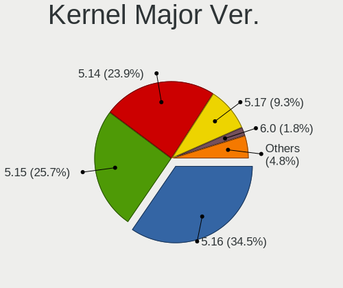
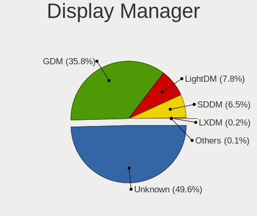
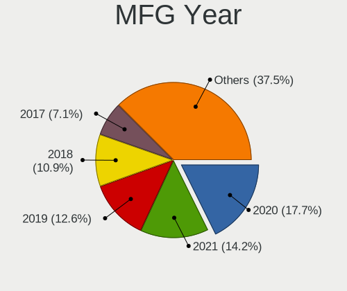
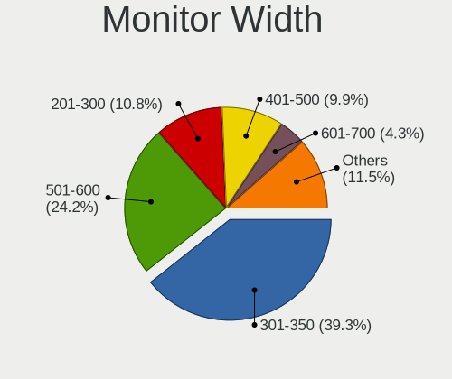
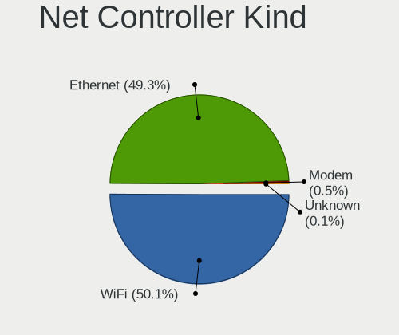
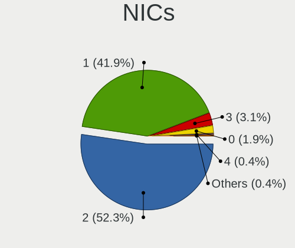
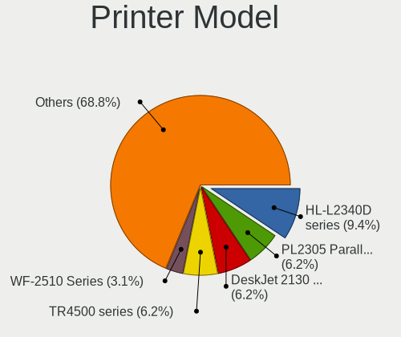
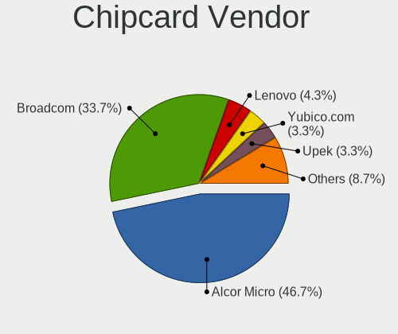
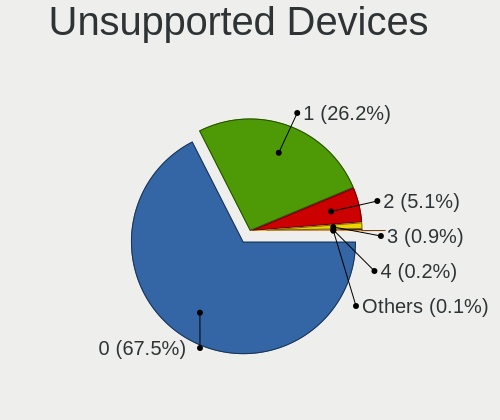

Fedora 35 - Tested Hardware & Statistics
----------------------------------------

A project to collect tested hardware configurations for Fedora 35.

Anyone can contribute to this report by the [hw-probe](https://github.com/linuxhw/hw-probe) tool:

    sudo -E hw-probe -all -upload

Please contribute! Especially if your hardware is rare.

This is a report for all computer types. See also reports for [desktops](/Dist/Fedora_35/Desktop/README.md) and [notebooks](/Dist/Fedora_35/Notebook/README.md).

Contents
--------

* [ Test Cases ](#test-cases)

* [ System ](#system)
  - [ Kernel                   ](#kernel)
  - [ Kernel Family            ](#kernel-family)
  - [ Kernel Major Ver.        ](#kernel-major-ver)
  - [ Arch                     ](#arch)
  - [ DE                       ](#de)
  - [ Display Server           ](#display-server)
  - [ Display Manager          ](#display-manager)
  - [ OS Lang                  ](#os-lang)
  - [ Boot Mode                ](#boot-mode)
  - [ Filesystem               ](#filesystem)
  - [ Part. scheme             ](#part-scheme)
  - [ Dual Boot with Linux/BSD ](#dual-boot-with-linuxbsd)
  - [ Dual Boot (Win)          ](#dual-boot-win)

* [ Board ](#board)
  - [ Vendor                   ](#vendor)
  - [ Model                    ](#model)
  - [ Model Family             ](#model-family)
  - [ MFG Year                 ](#mfg-year)
  - [ Form Factor              ](#form-factor)
  - [ Secure Boot              ](#secure-boot)
  - [ Coreboot                 ](#coreboot)
  - [ RAM Size                 ](#ram-size)
  - [ RAM Used                 ](#ram-used)
  - [ Total Drives             ](#total-drives)
  - [ Has CD-ROM               ](#has-cd-rom)
  - [ Has Ethernet             ](#has-ethernet)
  - [ Has WiFi                 ](#has-wifi)
  - [ Has Bluetooth            ](#has-bluetooth)

* [ Location ](#location)
  - [ Country                  ](#country)
  - [ City                     ](#city)

* [ Drives ](#drives)
  - [ Drive Vendor             ](#drive-vendor)
  - [ Drive Model              ](#drive-model)
  - [ HDD Vendor               ](#hdd-vendor)
  - [ SSD Vendor               ](#ssd-vendor)
  - [ Drive Kind               ](#drive-kind)
  - [ Drive Connector          ](#drive-connector)
  - [ Drive Size               ](#drive-size)
  - [ Space Total              ](#space-total)
  - [ Space Used               ](#space-used)
  - [ Malfunc. Drives          ](#malfunc-drives)
  - [ Malfunc. Drive Vendor    ](#malfunc-drive-vendor)
  - [ Malfunc. HDD Vendor      ](#malfunc-hdd-vendor)
  - [ Malfunc. Drive Kind      ](#malfunc-drive-kind)
  - [ Failed Drives            ](#failed-drives)
  - [ Failed Drive Vendor      ](#failed-drive-vendor)
  - [ Drive Status             ](#drive-status)

* [ Storage controller ](#storage-controller)
  - [ Storage Vendor           ](#storage-vendor)
  - [ Storage Model            ](#storage-model)
  - [ Storage Kind             ](#storage-kind)

* [ Processor ](#processor)
  - [ CPU Vendor               ](#cpu-vendor)
  - [ CPU Model                ](#cpu-model)
  - [ CPU Model Family         ](#cpu-model-family)
  - [ CPU Cores                ](#cpu-cores)
  - [ CPU Sockets              ](#cpu-sockets)
  - [ CPU Threads              ](#cpu-threads)
  - [ CPU Op-Modes             ](#cpu-op-modes)
  - [ CPU Microcode            ](#cpu-microcode)
  - [ CPU Microarch            ](#cpu-microarch)

* [ Graphics ](#graphics)
  - [ GPU Vendor               ](#gpu-vendor)
  - [ GPU Model                ](#gpu-model)
  - [ GPU Combo                ](#gpu-combo)
  - [ GPU Driver               ](#gpu-driver)
  - [ GPU Memory               ](#gpu-memory)

* [ Monitor ](#monitor)
  - [ Monitor Vendor           ](#monitor-vendor)
  - [ Monitor Model            ](#monitor-model)
  - [ Monitor Resolution       ](#monitor-resolution)
  - [ Monitor Diagonal         ](#monitor-diagonal)
  - [ Monitor Width            ](#monitor-width)
  - [ Aspect Ratio             ](#aspect-ratio)
  - [ Monitor Area             ](#monitor-area)
  - [ Pixel Density            ](#pixel-density)
  - [ Multiple Monitors        ](#multiple-monitors)

* [ Network ](#network)
  - [ Net Controller Vendor    ](#net-controller-vendor)
  - [ Net Controller Model     ](#net-controller-model)
  - [ Wireless Vendor          ](#wireless-vendor)
  - [ Wireless Model           ](#wireless-model)
  - [ Ethernet Vendor          ](#ethernet-vendor)
  - [ Ethernet Model           ](#ethernet-model)
  - [ Net Controller Kind      ](#net-controller-kind)
  - [ Used Controller          ](#used-controller)
  - [ NICs                     ](#nics)
  - [ IPv6                     ](#ipv6)

* [ Bluetooth ](#bluetooth)
  - [ Bluetooth Vendor         ](#bluetooth-vendor)
  - [ Bluetooth Model          ](#bluetooth-model)

* [ Sound ](#sound)
  - [ Sound Vendor             ](#sound-vendor)
  - [ Sound Model              ](#sound-model)

* [ Memory ](#memory)
  - [ Memory Vendor            ](#memory-vendor)
  - [ Memory Model             ](#memory-model)
  - [ Memory Kind              ](#memory-kind)
  - [ Memory Form Factor       ](#memory-form-factor)
  - [ Memory Size              ](#memory-size)
  - [ Memory Speed             ](#memory-speed)

* [ Printers & scanners ](#printers--scanners)
  - [ Printer Vendor           ](#printer-vendor)
  - [ Printer Model            ](#printer-model)
  - [ Scanner Vendor           ](#scanner-vendor)
  - [ Scanner Model            ](#scanner-model)

* [ Camera ](#camera)
  - [ Camera Vendor            ](#camera-vendor)
  - [ Camera Model             ](#camera-model)

* [ Security ](#security)
  - [ Fingerprint Vendor       ](#fingerprint-vendor)
  - [ Fingerprint Model        ](#fingerprint-model)
  - [ Chipcard Vendor          ](#chipcard-vendor)
  - [ Chipcard Model           ](#chipcard-model)

* [ Unsupported ](#unsupported)
  - [ Unsupported Devices      ](#unsupported-devices)
  - [ Unsupported Device Types ](#unsupported-device-types)

Test Cases
----------

Total: 2224

| Vendor        | Model                       | Form-Factor | Probe                                                      | Date         |
|---------------|-----------------------------|-------------|------------------------------------------------------------|--------------|
| MSI           | X99A RAIDER                 | Desktop     | [5fe6f7eb57](https://linux-hardware.org/?probe=5fe6f7eb57) | Aug 01, 2022 |
| ASRock        | FM2A88X Extreme6+           | Desktop     | [8ea1e0f22c](https://linux-hardware.org/?probe=8ea1e0f22c) | Aug 01, 2022 |
| MSI           | X99A RAIDER                 | Desktop     | [76a30e3042](https://linux-hardware.org/?probe=76a30e3042) | Jul 31, 2022 |
| ASRock        | FM2A88X Extreme6+           | Desktop     | [9dd9d17e79](https://linux-hardware.org/?probe=9dd9d17e79) | Jul 31, 2022 |
| Gateway       | DX4860                      | Desktop     | [279b6793e4](https://linux-hardware.org/?probe=279b6793e4) | Jul 30, 2022 |
| Gateway       | DX4860                      | Desktop     | [fec12bcbe9](https://linux-hardware.org/?probe=fec12bcbe9) | Jul 30, 2022 |
| MSI           | X99A RAIDER                 | Desktop     | [ebfa3daff5](https://linux-hardware.org/?probe=ebfa3daff5) | Jul 30, 2022 |
| ASRock        | FM2A88X Extreme6+           | Desktop     | [9a7de8cc64](https://linux-hardware.org/?probe=9a7de8cc64) | Jul 30, 2022 |
| Gigabyte      | H61M-DS2V                   | Desktop     | [e5744803f2](https://linux-hardware.org/?probe=e5744803f2) | Jul 29, 2022 |
| ASRock        | FM2A88X Extreme6+           | Desktop     | [c0ce536184](https://linux-hardware.org/?probe=c0ce536184) | Jul 29, 2022 |
| MSI           | X99A RAIDER                 | Desktop     | [d5034f5f52](https://linux-hardware.org/?probe=d5034f5f52) | Jul 29, 2022 |
| ASRock        | FM2A88X Extreme6+           | Desktop     | [a9c3256946](https://linux-hardware.org/?probe=a9c3256946) | Jul 28, 2022 |
| MSI           | X99A RAIDER                 | Desktop     | [db30ba1d0e](https://linux-hardware.org/?probe=db30ba1d0e) | Jul 28, 2022 |
| HP            | Pavilion Power Laptop 15... | Notebook    | [e4de7eb090](https://linux-hardware.org/?probe=e4de7eb090) | Jul 26, 2022 |
| ASRock        | FM2A88X Extreme6+           | Desktop     | [2632256ed7](https://linux-hardware.org/?probe=2632256ed7) | Jul 25, 2022 |
| MSI           | X99A RAIDER                 | Desktop     | [57beac41bc](https://linux-hardware.org/?probe=57beac41bc) | Jul 25, 2022 |
| HP            | Pavilion Power Laptop 15... | Notebook    | [5007f1aa43](https://linux-hardware.org/?probe=5007f1aa43) | Jul 24, 2022 |
| MSI           | 2A9C                        | Desktop     | [b0441c833d](https://linux-hardware.org/?probe=b0441c833d) | Jul 24, 2022 |
| MSI           | X99A RAIDER                 | Desktop     | [79d402e1ff](https://linux-hardware.org/?probe=79d402e1ff) | Jul 24, 2022 |
| ASRock        | FM2A88X Extreme6+           | Desktop     | [8bb191bc8f](https://linux-hardware.org/?probe=8bb191bc8f) | Jul 24, 2022 |
| MSI           | X99A RAIDER                 | Desktop     | [7a33ccf211](https://linux-hardware.org/?probe=7a33ccf211) | Jul 23, 2022 |
| ASRock        | FM2A88X Extreme6+           | Desktop     | [9c1f5f7a4e](https://linux-hardware.org/?probe=9c1f5f7a4e) | Jul 23, 2022 |
| Supermicro    | X11DPi-N                    | Server      | [38ae00936b](https://linux-hardware.org/?probe=38ae00936b) | Jul 22, 2022 |
| MSI           | X99A RAIDER                 | Desktop     | [347ff14d90](https://linux-hardware.org/?probe=347ff14d90) | Jul 22, 2022 |
| ASRock        | FM2A88X Extreme6+           | Desktop     | [d758abd21c](https://linux-hardware.org/?probe=d758abd21c) | Jul 22, 2022 |
| ASRock        | FM2A88X Extreme6+           | Desktop     | [b54cb1f930](https://linux-hardware.org/?probe=b54cb1f930) | Jul 21, 2022 |
| MSI           | X99A RAIDER                 | Desktop     | [a671047cb4](https://linux-hardware.org/?probe=a671047cb4) | Jul 21, 2022 |
| Lenovo        | ThinkPad L480 20LSCTO1WW    | Notebook    | [51dd660f49](https://linux-hardware.org/?probe=51dd660f49) | Jul 20, 2022 |
| Foxconn       | 2AB1                        | Desktop     | [c269d962ea](https://linux-hardware.org/?probe=c269d962ea) | Jul 20, 2022 |
| ASRock        | FM2A88X Extreme6+           | Desktop     | [8cae76caea](https://linux-hardware.org/?probe=8cae76caea) | Jul 20, 2022 |
| MSI           | X99A RAIDER                 | Desktop     | [05a5bc0fa8](https://linux-hardware.org/?probe=05a5bc0fa8) | Jul 20, 2022 |
| Acer          | TMP453-MG                   | Notebook    | [797f0ea7fe](https://linux-hardware.org/?probe=797f0ea7fe) | Jul 18, 2022 |
| HP            | 802E                        | Desktop     | [c86ddd647b](https://linux-hardware.org/?probe=c86ddd647b) | Jul 16, 2022 |
| Gigabyte      | B450M DS3H-CF               | Desktop     | [e9c788dfd2](https://linux-hardware.org/?probe=e9c788dfd2) | Jul 14, 2022 |
| Acer          | Nitro AN515-56              | Notebook    | [2418745195](https://linux-hardware.org/?probe=2418745195) | Jul 14, 2022 |
| Lenovo        | ThinkPad X230 2325SDE       | Notebook    | [a002ac843c](https://linux-hardware.org/?probe=a002ac843c) | Jul 12, 2022 |
| Lenovo        | ThinkPad X230 2325SDE       | Notebook    | [79ecbebabd](https://linux-hardware.org/?probe=79ecbebabd) | Jul 12, 2022 |
| MSI           | X99A RAIDER                 | Desktop     | [108d31db10](https://linux-hardware.org/?probe=108d31db10) | Jul 12, 2022 |
| ASRock        | FM2A88X Extreme6+           | Desktop     | [ce2e8f2a2a](https://linux-hardware.org/?probe=ce2e8f2a2a) | Jul 12, 2022 |
| MSI           | X99A RAIDER                 | Desktop     | [7ce0875267](https://linux-hardware.org/?probe=7ce0875267) | Jul 11, 2022 |
| ASRock        | FM2A88X Extreme6+           | Desktop     | [84f993f04d](https://linux-hardware.org/?probe=84f993f04d) | Jul 11, 2022 |
| Dell          | 0GDJXY A00                  | All in one  | [e4f7616dee](https://linux-hardware.org/?probe=e4f7616dee) | Jul 10, 2022 |
| Gigabyte      | X99-UD4-CF                  | Desktop     | [4245ef07db](https://linux-hardware.org/?probe=4245ef07db) | Jul 10, 2022 |
| Lenovo        | ThinkPad X280 20KES8D400    | Notebook    | [fdc339a6b0](https://linux-hardware.org/?probe=fdc339a6b0) | Jul 09, 2022 |
| Lenovo        | ThinkPad X280 20KES8D400    | Notebook    | [7d2b04b0ce](https://linux-hardware.org/?probe=7d2b04b0ce) | Jul 09, 2022 |
| Gigabyte      | X99-UD4-CF                  | Desktop     | [1dafd7beed](https://linux-hardware.org/?probe=1dafd7beed) | Jul 09, 2022 |
| Dell          | Latitude 5290 2-in-1        | Notebook    | [5ecc52d011](https://linux-hardware.org/?probe=5ecc52d011) | Jul 08, 2022 |
| Lenovo        | ThinkPad T14s Gen 1 20T0... | Notebook    | [fec0786471](https://linux-hardware.org/?probe=fec0786471) | Jul 06, 2022 |
| ASRock        | 990FX Killer                | Desktop     | [28b0984086](https://linux-hardware.org/?probe=28b0984086) | Jul 05, 2022 |
| Gigabyte      | H77N-WIFI                   | Desktop     | [e795477a20](https://linux-hardware.org/?probe=e795477a20) | Jul 05, 2022 |
| ASUSTek       | ROG Maximus Z690 HERO       | Desktop     | [a74834b383](https://linux-hardware.org/?probe=a74834b383) | Jul 04, 2022 |
| Intel         | DP55KG AAE47218-404         | Desktop     | [aaa7656f44](https://linux-hardware.org/?probe=aaa7656f44) | Jul 03, 2022 |
| ASRock        | FM2A88X Extreme6+           | Desktop     | [1bec4af414](https://linux-hardware.org/?probe=1bec4af414) | Jul 02, 2022 |
| MSI           | X99A RAIDER                 | Desktop     | [e6eeb4dfe6](https://linux-hardware.org/?probe=e6eeb4dfe6) | Jul 02, 2022 |
| MSI           | X99A RAIDER                 | Desktop     | [e1c3d1dfad](https://linux-hardware.org/?probe=e1c3d1dfad) | Jul 01, 2022 |
| ASRock        | FM2A88X Extreme6+           | Desktop     | [a658ebf5e9](https://linux-hardware.org/?probe=a658ebf5e9) | Jul 01, 2022 |
| Lenovo        | ThinkPad E15 Gen 2 20TDC... | Notebook    | [f29c4de6b4](https://linux-hardware.org/?probe=f29c4de6b4) | Jun 30, 2022 |
| Lenovo        | ThinkPad E15 Gen 2 20TDC... | Notebook    | [7ecd760977](https://linux-hardware.org/?probe=7ecd760977) | Jun 30, 2022 |
| Lenovo        | ThinkPad E15 Gen 2 20TDC... | Notebook    | [8428ba0120](https://linux-hardware.org/?probe=8428ba0120) | Jun 30, 2022 |
| ASRock        | FM2A88X Extreme6+           | Desktop     | [163a5c29e6](https://linux-hardware.org/?probe=163a5c29e6) | Jun 30, 2022 |
| MSI           | X99A RAIDER                 | Desktop     | [2da2ad735c](https://linux-hardware.org/?probe=2da2ad735c) | Jun 30, 2022 |
| MSI           | X99A RAIDER                 | Desktop     | [b197a0fd35](https://linux-hardware.org/?probe=b197a0fd35) | Jun 29, 2022 |
| ASRock        | FM2A88X Extreme6+           | Desktop     | [66b8ec6b28](https://linux-hardware.org/?probe=66b8ec6b28) | Jun 29, 2022 |
| Dell          | Inspiron 7558               | Notebook    | [d34cfa83d3](https://linux-hardware.org/?probe=d34cfa83d3) | Jun 26, 2022 |
| Lenovo        | IdeaPad L340-15IRH Gamin... | Notebook    | [3b84529124](https://linux-hardware.org/?probe=3b84529124) | Jun 24, 2022 |
| HP            | ProBook 4520s               | Notebook    | [eb9033a7c1](https://linux-hardware.org/?probe=eb9033a7c1) | Jun 24, 2022 |
| Dell          | 0M877N A01                  | Server      | [107b5509e6](https://linux-hardware.org/?probe=107b5509e6) | Jun 23, 2022 |
| Acer          | TMP453-MG                   | Notebook    | [e2790ebf7e](https://linux-hardware.org/?probe=e2790ebf7e) | Jun 23, 2022 |
| Acer          | TMP453-MG                   | Notebook    | [c99aceab3b](https://linux-hardware.org/?probe=c99aceab3b) | Jun 23, 2022 |
| Dell          | Inspiron 7577               | Notebook    | [673bd13d0a](https://linux-hardware.org/?probe=673bd13d0a) | Jun 23, 2022 |
| HP            | Notebook                    | Notebook    | [03c703cc7f](https://linux-hardware.org/?probe=03c703cc7f) | Jun 21, 2022 |
| ASRock        | Z690M-ITX/ax                | Desktop     | [cc8224a123](https://linux-hardware.org/?probe=cc8224a123) | Jun 21, 2022 |
| ASRock        | Z690M-ITX/ax                | Desktop     | [1d3eb4348d](https://linux-hardware.org/?probe=1d3eb4348d) | Jun 21, 2022 |
| ASRock        | Z690M-ITX/ax                | Desktop     | [35bec2520a](https://linux-hardware.org/?probe=35bec2520a) | Jun 21, 2022 |
| Microsoft     | Surface Laptop 3            | Tablet      | [18f31eae70](https://linux-hardware.org/?probe=18f31eae70) | Jun 21, 2022 |
| MSI           | 2A9C                        | Desktop     | [73dd2172d3](https://linux-hardware.org/?probe=73dd2172d3) | Jun 20, 2022 |
| HP            | ProBook 4520s               | Notebook    | [b34f97ddb3](https://linux-hardware.org/?probe=b34f97ddb3) | Jun 19, 2022 |
| ASUSTek       | ZenBook UX434DA_UM433DA     | Notebook    | [68ca5e600d](https://linux-hardware.org/?probe=68ca5e600d) | Jun 18, 2022 |
| ASRock        | FM2A88X Extreme6+           | Desktop     | [4801136187](https://linux-hardware.org/?probe=4801136187) | Jun 18, 2022 |
| MSI           | X99A RAIDER                 | Desktop     | [550772184f](https://linux-hardware.org/?probe=550772184f) | Jun 18, 2022 |
| HP            | ProBook 430 G5              | Notebook    | [1689773788](https://linux-hardware.org/?probe=1689773788) | Jun 18, 2022 |
| ASRock        | FM2A88X Extreme6+           | Desktop     | [680bf4c033](https://linux-hardware.org/?probe=680bf4c033) | Jun 17, 2022 |
| MSI           | X99A RAIDER                 | Desktop     | [184ad2670a](https://linux-hardware.org/?probe=184ad2670a) | Jun 17, 2022 |
| ASUSTek       | ROG CROSSHAIR VII HERO      | Desktop     | [9418d283c9](https://linux-hardware.org/?probe=9418d283c9) | Jun 15, 2022 |
| Lenovo        | ThinkPad X220 4286CTO       | Notebook    | [fd2fb2f646](https://linux-hardware.org/?probe=fd2fb2f646) | Jun 14, 2022 |
| MSI           | X99A RAIDER                 | Desktop     | [6b279160dc](https://linux-hardware.org/?probe=6b279160dc) | Jun 14, 2022 |
| ASRock        | FM2A88X Extreme6+           | Desktop     | [7990c32699](https://linux-hardware.org/?probe=7990c32699) | Jun 14, 2022 |
| ASRock        | B450M/ac R2.0               | Desktop     | [bc509480d2](https://linux-hardware.org/?probe=bc509480d2) | Jun 13, 2022 |
| MSI           | X99A RAIDER                 | Desktop     | [2f784679b0](https://linux-hardware.org/?probe=2f784679b0) | Jun 13, 2022 |
| ASRock        | FM2A88X Extreme6+           | Desktop     | [dcd3256961](https://linux-hardware.org/?probe=dcd3256961) | Jun 13, 2022 |
| Acer          | Aspire 5552                 | Notebook    | [909cdd1a0e](https://linux-hardware.org/?probe=909cdd1a0e) | Jun 12, 2022 |
| Microsoft     | Surface Book 3              | Tablet      | [26c417012f](https://linux-hardware.org/?probe=26c417012f) | Jun 12, 2022 |
| Lenovo        | ThinkPad L14 Gen 1 20U50... | Notebook    | [c637722355](https://linux-hardware.org/?probe=c637722355) | Jun 11, 2022 |
| Gigabyte      | H77N-WIFI                   | Desktop     | [23fa842567](https://linux-hardware.org/?probe=23fa842567) | Jun 11, 2022 |
| Gigabyte      | H77N-WIFI                   | Desktop     | [fd1478145b](https://linux-hardware.org/?probe=fd1478145b) | Jun 11, 2022 |
| Lenovo        | ThinkPad X1 Yoga Gen 6 2... | Convertible | [d9cffc5cc6](https://linux-hardware.org/?probe=d9cffc5cc6) | Jun 10, 2022 |
| Gigabyte      | GA-880GM-UD2H               | Desktop     | [267db233fa](https://linux-hardware.org/?probe=267db233fa) | Jun 10, 2022 |
| Unknown       | Unknown                     | Desktop     | [4a2f4f8cb1](https://linux-hardware.org/?probe=4a2f4f8cb1) | Jun 09, 2022 |
| ASUSTek       | Z170-A                      | Desktop     | [87fa4e032d](https://linux-hardware.org/?probe=87fa4e032d) | Jun 09, 2022 |
| ASUSTek       | Z170-A                      | Desktop     | [3531488e43](https://linux-hardware.org/?probe=3531488e43) | Jun 09, 2022 |
| Lenovo        | ThinkPad T410 2522PT3       | Notebook    | [75d6b8489b](https://linux-hardware.org/?probe=75d6b8489b) | Jun 08, 2022 |
| Gigabyte      | G41MT-D3                    | Desktop     | [2ac69cc327](https://linux-hardware.org/?probe=2ac69cc327) | Jun 08, 2022 |
| Gigabyte      | B450 GAMING X               | Desktop     | [34e884bb50](https://linux-hardware.org/?probe=34e884bb50) | Jun 08, 2022 |
| HP            | 872D                        | Desktop     | [c27f333c46](https://linux-hardware.org/?probe=c27f333c46) | Jun 08, 2022 |
| Lenovo        | IdeaPadFlex 5 14ARE05 81... | Convertible | [a068a18649](https://linux-hardware.org/?probe=a068a18649) | Jun 08, 2022 |
| ASRock        | AD2700-ITX                  | Desktop     | [9342f5c46b](https://linux-hardware.org/?probe=9342f5c46b) | Jun 08, 2022 |
| Gigabyte      | D525TUD                     | Desktop     | [fdba6d0041](https://linux-hardware.org/?probe=fdba6d0041) | Jun 08, 2022 |
| Gigabyte      | GA-MA785G-UD3H              | Desktop     | [bfa4e4ff74](https://linux-hardware.org/?probe=bfa4e4ff74) | Jun 07, 2022 |
| MSI           | X99A RAIDER                 | Desktop     | [34e068e6ad](https://linux-hardware.org/?probe=34e068e6ad) | Jun 07, 2022 |
| ASRock        | FM2A88X Extreme6+           | Desktop     | [5a835b2aa6](https://linux-hardware.org/?probe=5a835b2aa6) | Jun 07, 2022 |
| Apple         | MacBook4,1                  | Notebook    | [1608d3bbd6](https://linux-hardware.org/?probe=1608d3bbd6) | Jun 07, 2022 |
| ASUSTek       | M5A99FX PRO R2.0            | Desktop     | [4924d1fa99](https://linux-hardware.org/?probe=4924d1fa99) | Jun 06, 2022 |
| Dell          | Inspiron 14 5410 2-in-1     | Notebook    | [5ad950659b](https://linux-hardware.org/?probe=5ad950659b) | Jun 06, 2022 |
| MSI           | X99A RAIDER                 | Desktop     | [9dc558e0e2](https://linux-hardware.org/?probe=9dc558e0e2) | Jun 06, 2022 |
| ASRock        | FM2A88X Extreme6+           | Desktop     | [838e0b8e42](https://linux-hardware.org/?probe=838e0b8e42) | Jun 06, 2022 |
| Lenovo        | ThinkPad X1 Extreme 2nd ... | Notebook    | [13e2575e63](https://linux-hardware.org/?probe=13e2575e63) | Jun 05, 2022 |
| TUXEDO        | Polaris Intel Gen3 (TGL)    | Notebook    | [983f898115](https://linux-hardware.org/?probe=983f898115) | Jun 04, 2022 |
| ASRock        | B460 Phantom Gaming 4       | Desktop     | [3806254bc2](https://linux-hardware.org/?probe=3806254bc2) | Jun 03, 2022 |
| Lenovo        | G580 20150                  | Notebook    | [6cb0b47bb4](https://linux-hardware.org/?probe=6cb0b47bb4) | Jun 02, 2022 |
| ASRock        | FM2A88X Extreme6+           | Desktop     | [cb07ae6e24](https://linux-hardware.org/?probe=cb07ae6e24) | Jun 02, 2022 |
| MSI           | X99A RAIDER                 | Desktop     | [97428f0f4d](https://linux-hardware.org/?probe=97428f0f4d) | Jun 02, 2022 |
| HP            | 871A                        | Mini pc     | [5710666139](https://linux-hardware.org/?probe=5710666139) | Jun 01, 2022 |
| ASRock        | FM2A88X Extreme6+           | Desktop     | [dd51d706e3](https://linux-hardware.org/?probe=dd51d706e3) | Jun 01, 2022 |
| MSI           | X99A RAIDER                 | Desktop     | [0b16a52ca1](https://linux-hardware.org/?probe=0b16a52ca1) | Jun 01, 2022 |
| ASUSTek       | A8R32-MVP Deluxe            | Desktop     | [0faa61f3a9](https://linux-hardware.org/?probe=0faa61f3a9) | May 31, 2022 |
| ASUSTek       | A8R32-MVP Deluxe            | Desktop     | [9f5906337b](https://linux-hardware.org/?probe=9f5906337b) | May 31, 2022 |
| HP            | ProBook 450 G7              | Notebook    | [010b492184](https://linux-hardware.org/?probe=010b492184) | May 31, 2022 |
| Microsoft     | Surface Laptop 3            | Tablet      | [e7d02810c1](https://linux-hardware.org/?probe=e7d02810c1) | May 31, 2022 |
| Microsoft     | Surface Laptop 3            | Tablet      | [56929c3f8f](https://linux-hardware.org/?probe=56929c3f8f) | May 31, 2022 |
| MSI           | X99A RAIDER                 | Desktop     | [8794ca2ca9](https://linux-hardware.org/?probe=8794ca2ca9) | May 31, 2022 |
| ASRock        | FM2A88X Extreme6+           | Desktop     | [85a456dd94](https://linux-hardware.org/?probe=85a456dd94) | May 31, 2022 |
| ASRock        | FM2A88X Extreme6+           | Desktop     | [ff73ff1ea6](https://linux-hardware.org/?probe=ff73ff1ea6) | May 30, 2022 |
| MSI           | X99A RAIDER                 | Desktop     | [e6fc3ad487](https://linux-hardware.org/?probe=e6fc3ad487) | May 30, 2022 |
| MSI           | MEG X570 UNIFY              | Desktop     | [b86f47e828](https://linux-hardware.org/?probe=b86f47e828) | May 29, 2022 |
| Lenovo        | ThinkCentre M58p 7220A72    | Desktop     | [96cd8abf05](https://linux-hardware.org/?probe=96cd8abf05) | May 29, 2022 |
| MSI           | Delta 15 A5EFK              | Notebook    | [1679888c2c](https://linux-hardware.org/?probe=1679888c2c) | May 29, 2022 |
| ASRock        | FM2A88X Extreme6+           | Desktop     | [3487c76d47](https://linux-hardware.org/?probe=3487c76d47) | May 29, 2022 |
| MSI           | X99A RAIDER                 | Desktop     | [1783c56618](https://linux-hardware.org/?probe=1783c56618) | May 29, 2022 |
| ASRock        | FM2A88X Extreme6+           | Desktop     | [db4eade79e](https://linux-hardware.org/?probe=db4eade79e) | May 28, 2022 |
| MSI           | X99A RAIDER                 | Desktop     | [d83c99fb0e](https://linux-hardware.org/?probe=d83c99fb0e) | May 28, 2022 |
| Dell          | Latitude E7450              | Notebook    | [929e69f0ad](https://linux-hardware.org/?probe=929e69f0ad) | May 27, 2022 |
| MSI           | X99A RAIDER                 | Desktop     | [8226c07ba6](https://linux-hardware.org/?probe=8226c07ba6) | May 27, 2022 |
| Gigabyte      | H77N-WIFI                   | Desktop     | [ac41fb756c](https://linux-hardware.org/?probe=ac41fb756c) | May 26, 2022 |
| Dell          | Inspiron 5770               | Notebook    | [8bacf91a6b](https://linux-hardware.org/?probe=8bacf91a6b) | May 25, 2022 |
| Toshiba       | TECRA A50-C                 | Notebook    | [60a580cb3b](https://linux-hardware.org/?probe=60a580cb3b) | May 25, 2022 |
| ASUSTek       | STRIX Z270F GAMING          | Desktop     | [aea91adcbf](https://linux-hardware.org/?probe=aea91adcbf) | May 25, 2022 |
| ASUSTek       | STRIX Z270F GAMING          | Desktop     | [c2eb6bb974](https://linux-hardware.org/?probe=c2eb6bb974) | May 25, 2022 |
| Gigabyte      | G41MT-D3                    | Desktop     | [89927eb8f5](https://linux-hardware.org/?probe=89927eb8f5) | May 25, 2022 |
| Dell          | Vostro 3480                 | Notebook    | [7c5c6aa985](https://linux-hardware.org/?probe=7c5c6aa985) | May 24, 2022 |
| MSI           | GF63 Thin 9SC               | Notebook    | [a2a182a63e](https://linux-hardware.org/?probe=a2a182a63e) | May 23, 2022 |
| Notebook      | NL5xRU                      | Notebook    | [fa1c36e965](https://linux-hardware.org/?probe=fa1c36e965) | May 23, 2022 |
| Dell          | Precision M4400             | Notebook    | [681a684aa6](https://linux-hardware.org/?probe=681a684aa6) | May 23, 2022 |
| ASUSTek       | VivoBook_ASUSLaptop X521... | Notebook    | [f9f00f46cc](https://linux-hardware.org/?probe=f9f00f46cc) | May 22, 2022 |
| ASRock        | FM2A88X Extreme6+           | Desktop     | [19d23eb25f](https://linux-hardware.org/?probe=19d23eb25f) | May 22, 2022 |
| ASRock        | FM2A88X Extreme6+           | Desktop     | [f5ea71aeb2](https://linux-hardware.org/?probe=f5ea71aeb2) | May 21, 2022 |
| HP            | ProBook 470 G5              | Notebook    | [1557d1e15f](https://linux-hardware.org/?probe=1557d1e15f) | May 21, 2022 |
| HP            | 8053                        | Desktop     | [53c0148d64](https://linux-hardware.org/?probe=53c0148d64) | May 20, 2022 |
| ECS           | P67H2-A3                    | Desktop     | [2bc21b9c81](https://linux-hardware.org/?probe=2bc21b9c81) | May 20, 2022 |
| Dell          | Inspiron 5770               | Notebook    | [f87ba7a410](https://linux-hardware.org/?probe=f87ba7a410) | May 19, 2022 |
| HP            | ProBook 430 G5              | Notebook    | [be383d0db4](https://linux-hardware.org/?probe=be383d0db4) | May 19, 2022 |
| Lenovo        | ThinkPad X230 2306CTO       | Notebook    | [720ba0b788](https://linux-hardware.org/?probe=720ba0b788) | May 19, 2022 |
| MSI           | B450M PRO-VDH MAX           | Desktop     | [76c661d512](https://linux-hardware.org/?probe=76c661d512) | May 18, 2022 |
| Lenovo        | B570e HuronRiver Platfor... | Notebook    | [232b74e86b](https://linux-hardware.org/?probe=232b74e86b) | May 17, 2022 |
| Shuttle       | FZ87                        | Desktop     | [ce4198da70](https://linux-hardware.org/?probe=ce4198da70) | May 17, 2022 |
| Gigabyte      | MQLP7AP-00                  | Desktop     | [3c99b8d861](https://linux-hardware.org/?probe=3c99b8d861) | May 16, 2022 |
| Lenovo        | Legion Y530-15ICH 81FV      | Notebook    | [be93982cf0](https://linux-hardware.org/?probe=be93982cf0) | May 15, 2022 |
| Lenovo        | ThinkPad L540 20AUA27UFR    | Notebook    | [4a6dd68139](https://linux-hardware.org/?probe=4a6dd68139) | May 15, 2022 |
| Lenovo        | ThinkPad W520 4276CTO       | Notebook    | [28cbc6ab88](https://linux-hardware.org/?probe=28cbc6ab88) | May 15, 2022 |
| Lenovo        | ThinkPad W520 4276CTO       | Notebook    | [142c2d12f7](https://linux-hardware.org/?probe=142c2d12f7) | May 15, 2022 |
| Lenovo        | ThinkPad X220 4286C11       | Notebook    | [8fd4bc6a6d](https://linux-hardware.org/?probe=8fd4bc6a6d) | May 15, 2022 |
| Lenovo        | ThinkPad X220 4286C11       | Notebook    | [0906d694b9](https://linux-hardware.org/?probe=0906d694b9) | May 15, 2022 |
| AMI           | Aptio CRB                   | Mini pc     | [91730625e9](https://linux-hardware.org/?probe=91730625e9) | May 14, 2022 |
| ASRock        | X570 Phantom Gaming 4       | Desktop     | [d85be75174](https://linux-hardware.org/?probe=d85be75174) | May 14, 2022 |
| ASUSTek       | X205TAW                     | Notebook    | [57d9d59b56](https://linux-hardware.org/?probe=57d9d59b56) | May 13, 2022 |
| Gigabyte      | G41MT-D3                    | Desktop     | [78c64b498b](https://linux-hardware.org/?probe=78c64b498b) | May 13, 2022 |
| ASRock        | G41C-GS R2.0                | Desktop     | [9c3a386393](https://linux-hardware.org/?probe=9c3a386393) | May 13, 2022 |
| Lenovo        | ThinkPad X1 Yoga 4th 20Q... | Convertible | [3f20d2bc2b](https://linux-hardware.org/?probe=3f20d2bc2b) | May 12, 2022 |
| Lenovo        | ThinkPad X1 Carbon 7th 2... | Notebook    | [3ba9de57d1](https://linux-hardware.org/?probe=3ba9de57d1) | May 12, 2022 |
| Lenovo        | ThinkPad X1 Carbon 7th 2... | Notebook    | [96be9cb5e7](https://linux-hardware.org/?probe=96be9cb5e7) | May 12, 2022 |
| HUAWEI        | KLVL-WXXW                   | Notebook    | [367b6b7bcb](https://linux-hardware.org/?probe=367b6b7bcb) | May 12, 2022 |
| Acer          | Aspire A514-54              | Notebook    | [372742938a](https://linux-hardware.org/?probe=372742938a) | May 12, 2022 |
| Lenovo        | ThinkPad E595 20NFS05500    | Notebook    | [8656f72354](https://linux-hardware.org/?probe=8656f72354) | May 11, 2022 |
| Lenovo        | ThinkBook 15 G2 ITL 20VE    | Notebook    | [cbced4dcff](https://linux-hardware.org/?probe=cbced4dcff) | May 11, 2022 |
| Lenovo        | IdeaPad 5 15ITL05 82FG      | Notebook    | [73b4b6a015](https://linux-hardware.org/?probe=73b4b6a015) | May 11, 2022 |
| Lenovo        | Yoga 3 Pro-1370 80HE        | Notebook    | [3f587813b0](https://linux-hardware.org/?probe=3f587813b0) | May 11, 2022 |
| Gigabyte      | B450M DS3H-CF               | Desktop     | [41ee4b77ce](https://linux-hardware.org/?probe=41ee4b77ce) | May 10, 2022 |
| Lenovo        | Yoga 7 14ITL5 82BH          | Convertible | [4f87a5b748](https://linux-hardware.org/?probe=4f87a5b748) | May 10, 2022 |
| Gigabyte      | G1.Sniper B5-CF             | Desktop     | [eaa10a050b](https://linux-hardware.org/?probe=eaa10a050b) | May 10, 2022 |
| ASUSTek       | ROG STRIX B550-I GAMING     | Desktop     | [3e3acb2430](https://linux-hardware.org/?probe=3e3acb2430) | May 10, 2022 |
| HP            | Pavilion Laptop 15-eh0xx... | Notebook    | [3444835d49](https://linux-hardware.org/?probe=3444835d49) | May 10, 2022 |
| HP            | Laptop 14-ck0xxx            | Notebook    | [24b8860aaf](https://linux-hardware.org/?probe=24b8860aaf) | May 10, 2022 |
| Google        | Droid                       | Notebook    | [35d0a5a944](https://linux-hardware.org/?probe=35d0a5a944) | May 10, 2022 |
| ASUSTek       | TUF Gaming B450-PLUS II     | Desktop     | [e44c7da45a](https://linux-hardware.org/?probe=e44c7da45a) | May 09, 2022 |
| Dell          | XPS 13 9310                 | Notebook    | [d95a50c16a](https://linux-hardware.org/?probe=d95a50c16a) | May 09, 2022 |
| Ruckus Wir... | SCG-100                     | Desktop     | [781560aa15](https://linux-hardware.org/?probe=781560aa15) | May 09, 2022 |
| HP            | 212A                        | Desktop     | [acd660910f](https://linux-hardware.org/?probe=acd660910f) | May 09, 2022 |
| Positivo      | C41TB                       | Notebook    | [6ba90f69f3](https://linux-hardware.org/?probe=6ba90f69f3) | May 09, 2022 |
| HP            | ENVY x360 Convertible 15... | Convertible | [b7bb0f72a0](https://linux-hardware.org/?probe=b7bb0f72a0) | May 09, 2022 |
| ASUSTek       | ZenBook UX425JA_UX425JA     | Notebook    | [ba03e5bb90](https://linux-hardware.org/?probe=ba03e5bb90) | May 08, 2022 |
| ASUSTek       | ZenBook UX433FA_UX433FA     | Notebook    | [edefb39601](https://linux-hardware.org/?probe=edefb39601) | May 08, 2022 |
| ASRock        | FM2A88X-ITX+                | Desktop     | [c0fa8189f0](https://linux-hardware.org/?probe=c0fa8189f0) | May 08, 2022 |
| Lenovo        | ThinkPad T14s Gen 1 20T1... | Notebook    | [d5348dedec](https://linux-hardware.org/?probe=d5348dedec) | May 08, 2022 |
| Lenovo        | ThinkPad T14s Gen 1 20T1... | Notebook    | [ddded0e6c3](https://linux-hardware.org/?probe=ddded0e6c3) | May 08, 2022 |
| ASUSTek       | AM1M-A                      | Desktop     | [537def711a](https://linux-hardware.org/?probe=537def711a) | May 08, 2022 |
| MSI           | H55M-P33                    | Desktop     | [0f6b0dc134](https://linux-hardware.org/?probe=0f6b0dc134) | May 07, 2022 |
| ASRock        | 970M Pro3                   | Desktop     | [1983ed1d48](https://linux-hardware.org/?probe=1983ed1d48) | May 07, 2022 |
| MSI           | GE63 Raider RGB 8RE         | Notebook    | [34bd31c9f9](https://linux-hardware.org/?probe=34bd31c9f9) | May 07, 2022 |
| Lenovo        | Legion 5 15ACH6A 82NW       | Notebook    | [2effde38b7](https://linux-hardware.org/?probe=2effde38b7) | May 07, 2022 |
| ASUSTek       | ROG STRIX Z490-G GAMING     | Desktop     | [d4e02db7d2](https://linux-hardware.org/?probe=d4e02db7d2) | May 07, 2022 |
| Apple         | MacBookPro11,1              | Notebook    | [08cbb5e9f7](https://linux-hardware.org/?probe=08cbb5e9f7) | May 07, 2022 |
| Lenovo        | G565 20071                  | Notebook    | [ef5983ea64](https://linux-hardware.org/?probe=ef5983ea64) | May 07, 2022 |
| Gigabyte      | X570 I AORUS PRO WIFI       | Desktop     | [35cfe55dac](https://linux-hardware.org/?probe=35cfe55dac) | May 07, 2022 |
| Toshiba       | TECRA R840                  | Notebook    | [38ff1a3344](https://linux-hardware.org/?probe=38ff1a3344) | May 07, 2022 |
| Lenovo        | Yoga 720-15IKB              | Convertible | [badcc44923](https://linux-hardware.org/?probe=badcc44923) | May 07, 2022 |
| Dell          | Precision 5510              | Notebook    | [749eb5ff32](https://linux-hardware.org/?probe=749eb5ff32) | May 07, 2022 |
| ASUSTek       | P5N7A-VM                    | Desktop     | [44d168e79c](https://linux-hardware.org/?probe=44d168e79c) | May 07, 2022 |
| ASUSTek       | PRIME B660-PLUS D4          | Desktop     | [7e14e0a766](https://linux-hardware.org/?probe=7e14e0a766) | May 07, 2022 |
| ASUSTek       | PRIME B660-PLUS D4          | Desktop     | [047f75af38](https://linux-hardware.org/?probe=047f75af38) | May 07, 2022 |
| HP            | OMEN Laptop 15-en0xxx       | Notebook    | [38f5d37dcc](https://linux-hardware.org/?probe=38f5d37dcc) | May 07, 2022 |
| Google        | Droid                       | Notebook    | [422252faa5](https://linux-hardware.org/?probe=422252faa5) | May 07, 2022 |
| ASUSTek       | X205TAW                     | Notebook    | [577c71e530](https://linux-hardware.org/?probe=577c71e530) | May 06, 2022 |
| Fujitsu       | CELSIUS H720                | Notebook    | [7c41d6fd4d](https://linux-hardware.org/?probe=7c41d6fd4d) | May 06, 2022 |
| Gigabyte      | B550 AORUS PRO AC           | Desktop     | [5a08eb1919](https://linux-hardware.org/?probe=5a08eb1919) | May 06, 2022 |
| Lenovo        | ThinkPad P14s Gen 2a 21A... | Notebook    | [f3e4a840e8](https://linux-hardware.org/?probe=f3e4a840e8) | May 06, 2022 |
| Dell          | Precision M4700             | Notebook    | [81cc8ba45c](https://linux-hardware.org/?probe=81cc8ba45c) | May 06, 2022 |
| MSI           | GF63 Thin 10SCSR            | Notebook    | [ad8ee15b6d](https://linux-hardware.org/?probe=ad8ee15b6d) | May 06, 2022 |
| Dell          | Latitude 5420               | Notebook    | [dbe0cffc08](https://linux-hardware.org/?probe=dbe0cffc08) | May 06, 2022 |
| HP            | ZBook 17 G5                 | Notebook    | [5190bc7cf3](https://linux-hardware.org/?probe=5190bc7cf3) | May 06, 2022 |
| Lenovo        | IdeaPad 3 15ITL05 81X8      | Notebook    | [0ca81980a3](https://linux-hardware.org/?probe=0ca81980a3) | May 06, 2022 |
| Lenovo        | IdeaPad 100-15IBD 80QQ      | Notebook    | [8c1fedaa4b](https://linux-hardware.org/?probe=8c1fedaa4b) | May 06, 2022 |
| Dell          | Vostro 15 5510              | Notebook    | [e2b06a4a28](https://linux-hardware.org/?probe=e2b06a4a28) | May 05, 2022 |
| Apple         | MacBookPro6,2               | Notebook    | [7e44142aac](https://linux-hardware.org/?probe=7e44142aac) | May 05, 2022 |
| Apple         | MacBookPro6,2               | Notebook    | [8e99db77e1](https://linux-hardware.org/?probe=8e99db77e1) | May 05, 2022 |
| MSI           | B450 GAMING PRO CARBON A... | Desktop     | [0021b7ff7f](https://linux-hardware.org/?probe=0021b7ff7f) | May 05, 2022 |
| Dell          | XPS 13 9310                 | Notebook    | [fcfb95470e](https://linux-hardware.org/?probe=fcfb95470e) | May 05, 2022 |
| Lenovo        | IdeaPad Gaming 3 15ACH6 ... | Notebook    | [c34e9b0da7](https://linux-hardware.org/?probe=c34e9b0da7) | May 05, 2022 |
| Schenker      | XMG_APEX15_XAP15E20         | Notebook    | [428f653301](https://linux-hardware.org/?probe=428f653301) | May 05, 2022 |
| Timi          | Redmi G                     | Notebook    | [a2738a4d6e](https://linux-hardware.org/?probe=a2738a4d6e) | May 05, 2022 |
| ASUSTek       | X550CC                      | Notebook    | [8306d5b694](https://linux-hardware.org/?probe=8306d5b694) | May 05, 2022 |
| Teclast       | F7 Plus                     | Notebook    | [6aedd4e799](https://linux-hardware.org/?probe=6aedd4e799) | May 05, 2022 |
| ASUSTek       | PRIME X370-PRO              | Desktop     | [b0a2114a0f](https://linux-hardware.org/?probe=b0a2114a0f) | May 05, 2022 |
| ASUSTek       | PRIME B450-PLUS             | Desktop     | [60d50d3190](https://linux-hardware.org/?probe=60d50d3190) | May 05, 2022 |
| ASUSTek       | PRIME B450-PLUS             | Desktop     | [fa5e301933](https://linux-hardware.org/?probe=fa5e301933) | May 05, 2022 |
| Lenovo        | G50-70 20351                | Notebook    | [53f05e9b8c](https://linux-hardware.org/?probe=53f05e9b8c) | May 05, 2022 |
| HP            | Laptop 14-fq0xxx            | Notebook    | [29abb73f0b](https://linux-hardware.org/?probe=29abb73f0b) | May 05, 2022 |
| Lenovo        | ThinkPad T490 20N20009RI    | Notebook    | [5cdef8caad](https://linux-hardware.org/?probe=5cdef8caad) | May 04, 2022 |
| HP            | 635                         | Notebook    | [66305e8923](https://linux-hardware.org/?probe=66305e8923) | May 04, 2022 |
| ASUSTek       | Rampage III Extreme         | Desktop     | [30ff3d44b0](https://linux-hardware.org/?probe=30ff3d44b0) | May 04, 2022 |
| Gigabyte      | G41MT-S2P                   | Desktop     | [c3ae8f35f9](https://linux-hardware.org/?probe=c3ae8f35f9) | May 04, 2022 |
| Lenovo        | 3130 NOK                    | Mini pc     | [6e3858143b](https://linux-hardware.org/?probe=6e3858143b) | May 04, 2022 |
| Lenovo        | 3130 NOK                    | Mini pc     | [d1fb23854f](https://linux-hardware.org/?probe=d1fb23854f) | May 04, 2022 |
| Lenovo        | ThinkPad P14s Gen 2a 21A... | Notebook    | [155ac0a54c](https://linux-hardware.org/?probe=155ac0a54c) | May 04, 2022 |
| ASUSTek       | Z170-E                      | Desktop     | [99d850c205](https://linux-hardware.org/?probe=99d850c205) | May 04, 2022 |
| Razer         | Blade 14 (2022) - RZ09-0... | Notebook    | [cf2375fae1](https://linux-hardware.org/?probe=cf2375fae1) | May 04, 2022 |
| Alienware     | m15 R4                      | Notebook    | [3b09d65e13](https://linux-hardware.org/?probe=3b09d65e13) | May 04, 2022 |
| ASUSTek       | VM65N-K                     | Desktop     | [9df63c1d99](https://linux-hardware.org/?probe=9df63c1d99) | May 04, 2022 |
| Lenovo        | ThinkPad T480s 20L8S2N70... | Notebook    | [9da4b1ddc5](https://linux-hardware.org/?probe=9da4b1ddc5) | May 03, 2022 |
| Gigabyte      | X570 I AORUS PRO WIFI       | Desktop     | [1d475f29ce](https://linux-hardware.org/?probe=1d475f29ce) | May 03, 2022 |
| ASUSTek       | ROG STRIX X570-F GAMING     | Desktop     | [7d9a2b425f](https://linux-hardware.org/?probe=7d9a2b425f) | May 03, 2022 |
| Gigabyte      | X570 I AORUS PRO WIFI       | Desktop     | [9fa64d179d](https://linux-hardware.org/?probe=9fa64d179d) | May 03, 2022 |
| Gigabyte      | X570 I AORUS PRO WIFI       | Desktop     | [a134998640](https://linux-hardware.org/?probe=a134998640) | May 03, 2022 |
| MSI           | H97 GAMING 3                | Desktop     | [c3694433d0](https://linux-hardware.org/?probe=c3694433d0) | May 03, 2022 |
| Dell          | 0YNVJG A01                  | Desktop     | [7a6aa0c236](https://linux-hardware.org/?probe=7a6aa0c236) | May 03, 2022 |
| Chuwi         | Hi10 Go                     | Notebook    | [33ea61404a](https://linux-hardware.org/?probe=33ea61404a) | May 03, 2022 |
| ASUSTek       | X550CC                      | Notebook    | [e4918450ce](https://linux-hardware.org/?probe=e4918450ce) | May 03, 2022 |
| Lenovo        | IdeaPad 320S-14IKB 81BN     | Notebook    | [5c929eea1c](https://linux-hardware.org/?probe=5c929eea1c) | May 03, 2022 |
| Toshiba       | Satellite U940              | Notebook    | [3d6bd2511e](https://linux-hardware.org/?probe=3d6bd2511e) | May 03, 2022 |
| Acer          | Aspire A315-56              | Notebook    | [4321ddf926](https://linux-hardware.org/?probe=4321ddf926) | May 03, 2022 |
| HP            | Pavilion Gaming Laptop 1... | Notebook    | [3be0a0d66d](https://linux-hardware.org/?probe=3be0a0d66d) | May 03, 2022 |
| Alienware     | m15 R4                      | Notebook    | [1f5f3048d6](https://linux-hardware.org/?probe=1f5f3048d6) | May 03, 2022 |
| Lenovo        | ThinkPad X240 20AMS1S800    | Notebook    | [a00b8586b6](https://linux-hardware.org/?probe=a00b8586b6) | May 03, 2022 |
| HP            | Spectre x360 Convertible... | Convertible | [d30c5337d6](https://linux-hardware.org/?probe=d30c5337d6) | May 02, 2022 |
| Apple         | Mac-27ADBB7B4CEE8E61 iMa... | All in one  | [046b01cae8](https://linux-hardware.org/?probe=046b01cae8) | May 02, 2022 |
| HP            | Laptop 14s-dq1xxx           | Notebook    | [713358f855](https://linux-hardware.org/?probe=713358f855) | May 02, 2022 |
| HP            | ZBook Firefly 15 G7 Mobi... | Notebook    | [90d0e8adb2](https://linux-hardware.org/?probe=90d0e8adb2) | May 02, 2022 |
| JINGSHA       | Unknown                     | Desktop     | [94dd890d71](https://linux-hardware.org/?probe=94dd890d71) | May 02, 2022 |
| Lenovo        | Yoga 730-15IKB 81CU         | Convertible | [2b35f16b31](https://linux-hardware.org/?probe=2b35f16b31) | May 02, 2022 |
| Lenovo        | 3181 SDK0J40697 WIN 3305... | Mini pc     | [a717bd6ceb](https://linux-hardware.org/?probe=a717bd6ceb) | May 02, 2022 |
| ASUSTek       | TUF Gaming X570-PRO         | Desktop     | [b7709ed1c5](https://linux-hardware.org/?probe=b7709ed1c5) | May 02, 2022 |
| ASRock        | X399 Taichi                 | Desktop     | [510cfcefd5](https://linux-hardware.org/?probe=510cfcefd5) | May 02, 2022 |
| ASUSTek       | PRIME B450M-A               | Desktop     | [fac138a25c](https://linux-hardware.org/?probe=fac138a25c) | May 02, 2022 |
| HP            | Pavilion 15                 | Notebook    | [d6bd192469](https://linux-hardware.org/?probe=d6bd192469) | May 01, 2022 |
| HP            | Pavilion 15                 | Notebook    | [ec8a9ceb87](https://linux-hardware.org/?probe=ec8a9ceb87) | May 01, 2022 |
| ASUSTek       | ROG Strix G512LW_G512LW     | Notebook    | [73396d4b0b](https://linux-hardware.org/?probe=73396d4b0b) | May 01, 2022 |
| HP            | 8459                        | Desktop     | [21d5d92fda](https://linux-hardware.org/?probe=21d5d92fda) | May 01, 2022 |
| Acer          | Swift SF314-55G             | Notebook    | [1935c949a2](https://linux-hardware.org/?probe=1935c949a2) | May 01, 2022 |
| Lenovo        | IdeaPadFlex 6-14IKB 81EM    | Convertible | [dfc204b1b4](https://linux-hardware.org/?probe=dfc204b1b4) | May 01, 2022 |
| Lenovo        | IdeaPadFlex 6-14IKB 81EM    | Convertible | [a822b5b8e7](https://linux-hardware.org/?probe=a822b5b8e7) | May 01, 2022 |
| Dell          | Inspiron 15-3567            | Notebook    | [589f58c857](https://linux-hardware.org/?probe=589f58c857) | Apr 30, 2022 |
| Lenovo        | ThinkPad X1 Tablet Gen 3... | Tablet      | [76ee3be416](https://linux-hardware.org/?probe=76ee3be416) | Apr 30, 2022 |
| Gigabyte      | H97-Gaming 3                | Desktop     | [150f5a4bd0](https://linux-hardware.org/?probe=150f5a4bd0) | Apr 30, 2022 |
| Lenovo        | ThinkPad P1 Gen 2 20QUS1... | Notebook    | [2065a3c2f3](https://linux-hardware.org/?probe=2065a3c2f3) | Apr 30, 2022 |
| ASUSTek       | A55M-E                      | Desktop     | [eed78fb5ab](https://linux-hardware.org/?probe=eed78fb5ab) | Apr 30, 2022 |
| Intel         | NUC9VXQNB K47179-403        | Mini pc     | [c99c3cdac6](https://linux-hardware.org/?probe=c99c3cdac6) | Apr 30, 2022 |
| JINGSHA       | Unknown                     | Desktop     | [e1b9c4eab0](https://linux-hardware.org/?probe=e1b9c4eab0) | Apr 30, 2022 |
| Acer          | Aspire A514-54              | Notebook    | [70efbbb6c7](https://linux-hardware.org/?probe=70efbbb6c7) | Apr 30, 2022 |
| HP            | Pavilion Gaming Laptop 1... | Notebook    | [67d1865b69](https://linux-hardware.org/?probe=67d1865b69) | Apr 30, 2022 |
| HP            | Pavilion Gaming Laptop 1... | Notebook    | [57a8a5bfcd](https://linux-hardware.org/?probe=57a8a5bfcd) | Apr 30, 2022 |
| Lenovo        | ThinkPad S3-S440 20AY00B... | Notebook    | [1ecbcb6b83](https://linux-hardware.org/?probe=1ecbcb6b83) | Apr 29, 2022 |
| Lenovo        | ThinkPad P14s Gen 2a 21A... | Notebook    | [9f5c24d3e8](https://linux-hardware.org/?probe=9f5c24d3e8) | Apr 29, 2022 |
| Lenovo        | ThinkPad S3-S440 20AY00B... | Notebook    | [474e572043](https://linux-hardware.org/?probe=474e572043) | Apr 29, 2022 |
| Lenovo        | ThinkPad P14s Gen 2a 21A... | Notebook    | [da73d0b77d](https://linux-hardware.org/?probe=da73d0b77d) | Apr 29, 2022 |
| Dell          | XPS 13 7390                 | Notebook    | [aadc641825](https://linux-hardware.org/?probe=aadc641825) | Apr 29, 2022 |
| Dell          | Inspiron N5110              | Notebook    | [fb1248d6be](https://linux-hardware.org/?probe=fb1248d6be) | Apr 29, 2022 |
| Acer          | Aspire A515-56              | Notebook    | [a10b79694f](https://linux-hardware.org/?probe=a10b79694f) | Apr 29, 2022 |
| HP            | ENVY x360 Convertible 13... | Convertible | [ad8bbf54e3](https://linux-hardware.org/?probe=ad8bbf54e3) | Apr 29, 2022 |
| MSI           | Katana GF76 11SC            | Notebook    | [15dcec28fc](https://linux-hardware.org/?probe=15dcec28fc) | Apr 29, 2022 |
| Lenovo        | ThinkPad X390 20Q1SCDR00    | Notebook    | [41a3cac1f4](https://linux-hardware.org/?probe=41a3cac1f4) | Apr 29, 2022 |
| Microsoft     | Surface Pro 3               | Tablet      | [6c498d2ce5](https://linux-hardware.org/?probe=6c498d2ce5) | Apr 29, 2022 |
| Lenovo        | ThinkPad X1 Tablet Gen 2... | Tablet      | [bdb2f1c4ad](https://linux-hardware.org/?probe=bdb2f1c4ad) | Apr 29, 2022 |
| Unknown       | X133                        | Notebook    | [b90d940d9e](https://linux-hardware.org/?probe=b90d940d9e) | Apr 29, 2022 |
| ASUSTek       | PRIME X470-PRO              | Desktop     | [8c1bf73769](https://linux-hardware.org/?probe=8c1bf73769) | Apr 28, 2022 |
| Gigabyte      | B450 AORUS M                | Desktop     | [de4ae72708](https://linux-hardware.org/?probe=de4ae72708) | Apr 28, 2022 |
| Lenovo        | 312D SDK0J40697 WIN 3305... | Mini pc     | [7cd94887fe](https://linux-hardware.org/?probe=7cd94887fe) | Apr 28, 2022 |
| HP            | 871A                        | Mini pc     | [2072675717](https://linux-hardware.org/?probe=2072675717) | Apr 28, 2022 |
| Lenovo        | ThinkPad T495 20NJ0012GM    | Notebook    | [81f7a796be](https://linux-hardware.org/?probe=81f7a796be) | Apr 28, 2022 |
| Dell          | Latitude 5310               | Notebook    | [b4e7215e3b](https://linux-hardware.org/?probe=b4e7215e3b) | Apr 28, 2022 |
| HP            | 255 G6 Notebook PC          | Notebook    | [d52cf822df](https://linux-hardware.org/?probe=d52cf822df) | Apr 28, 2022 |
| Lenovo        | ThinkPad P14s Gen 1 20Y1... | Notebook    | [6f26e0d7bd](https://linux-hardware.org/?probe=6f26e0d7bd) | Apr 28, 2022 |
| Dell          | XPS 13 9370                 | Notebook    | [349f8f5d64](https://linux-hardware.org/?probe=349f8f5d64) | Apr 27, 2022 |
| HP            | 829A                        | Mini pc     | [316fd2fd12](https://linux-hardware.org/?probe=316fd2fd12) | Apr 27, 2022 |
| System76      | Pangolin                    | Notebook    | [d326fc9a39](https://linux-hardware.org/?probe=d326fc9a39) | Apr 27, 2022 |
| MSI           | B450M PRO-VDH MAX           | Desktop     | [185c64fa0d](https://linux-hardware.org/?probe=185c64fa0d) | Apr 27, 2022 |
| Gigabyte      | X570 I AORUS PRO WIFI       | Desktop     | [11a6c8f173](https://linux-hardware.org/?probe=11a6c8f173) | Apr 27, 2022 |
| Lenovo        | IdeaPad Y470 0855           | Notebook    | [ee26833b58](https://linux-hardware.org/?probe=ee26833b58) | Apr 27, 2022 |
| MSI           | MPG X570 GAMING PLUS        | Desktop     | [80792ef9d7](https://linux-hardware.org/?probe=80792ef9d7) | Apr 27, 2022 |
| Samsung       | RV411/RV511/E3511/S3511/... | Notebook    | [f3c9dd19da](https://linux-hardware.org/?probe=f3c9dd19da) | Apr 26, 2022 |
| HP            | Notebook                    | Notebook    | [ec93418371](https://linux-hardware.org/?probe=ec93418371) | Apr 26, 2022 |
| Lenovo        | ThinkPad T14s Gen 1 20UJ... | Notebook    | [2b7f66b701](https://linux-hardware.org/?probe=2b7f66b701) | Apr 26, 2022 |
| Lenovo        | Z50-70 20354                | Notebook    | [44714b01ff](https://linux-hardware.org/?probe=44714b01ff) | Apr 26, 2022 |
| Lenovo        | Z50-70 20354                | Notebook    | [75188b99b5](https://linux-hardware.org/?probe=75188b99b5) | Apr 26, 2022 |
| ASUSTek       | ROG Strix G733QR_G733QR     | Notebook    | [e4c1fa069d](https://linux-hardware.org/?probe=e4c1fa069d) | Apr 26, 2022 |
| Lenovo        | 3106 SDK0J40705 WIN 3425... | Desktop     | [93c883ef59](https://linux-hardware.org/?probe=93c883ef59) | Apr 26, 2022 |
| Lenovo        | ThinkPad X13 Yoga Gen 2 ... | Convertible | [184c256d66](https://linux-hardware.org/?probe=184c256d66) | Apr 26, 2022 |
| Unknown       | 1.0                         | Desktop     | [7c17b2186e](https://linux-hardware.org/?probe=7c17b2186e) | Apr 26, 2022 |
| Biostar       | G31M+                       | Desktop     | [b756b9bc9f](https://linux-hardware.org/?probe=b756b9bc9f) | Apr 26, 2022 |
| Gigabyte      | H77N-WIFI                   | Desktop     | [205ae74d07](https://linux-hardware.org/?probe=205ae74d07) | Apr 26, 2022 |
| HP            | Pavilion Notebook           | Notebook    | [6a34230d87](https://linux-hardware.org/?probe=6a34230d87) | Apr 26, 2022 |
| Apple         | MacBookPro11,1              | Notebook    | [a8626eb701](https://linux-hardware.org/?probe=a8626eb701) | Apr 26, 2022 |
| ASUSTek       | ROG STRIX B550-F GAMING     | Desktop     | [35975b7d55](https://linux-hardware.org/?probe=35975b7d55) | Apr 25, 2022 |
| ASUSTek       | T101HA                      | Tablet      | [23747b18ed](https://linux-hardware.org/?probe=23747b18ed) | Apr 25, 2022 |
| ASUSTek       | PRIME B350-PLUS             | Desktop     | [b24ac490a1](https://linux-hardware.org/?probe=b24ac490a1) | Apr 25, 2022 |
| HP            | ProBook 455R G6             | Notebook    | [3118a03e9b](https://linux-hardware.org/?probe=3118a03e9b) | Apr 25, 2022 |
| HP            | 212B                        | Desktop     | [f202f01728](https://linux-hardware.org/?probe=f202f01728) | Apr 25, 2022 |
| Google        | Bobba                       | Notebook    | [008afa9913](https://linux-hardware.org/?probe=008afa9913) | Apr 25, 2022 |
| Apple         | MacBookPro9,2               | Notebook    | [003f1099c2](https://linux-hardware.org/?probe=003f1099c2) | Apr 25, 2022 |
| Dell          | Inspiron 5567               | Notebook    | [9da2289998](https://linux-hardware.org/?probe=9da2289998) | Apr 24, 2022 |
| Gigabyte      | B550 AORUS PRO AC           | Desktop     | [c0af99fa7e](https://linux-hardware.org/?probe=c0af99fa7e) | Apr 24, 2022 |
| Lenovo        | SDK0E50510 WIN              | Desktop     | [de010dfc55](https://linux-hardware.org/?probe=de010dfc55) | Apr 24, 2022 |
| ASUSTek       | ASUS TUF Gaming F15 FX50... | Notebook    | [1d1c33575f](https://linux-hardware.org/?probe=1d1c33575f) | Apr 24, 2022 |
| MSI           | B250M PRO-VDH               | Desktop     | [a1ff9cf092](https://linux-hardware.org/?probe=a1ff9cf092) | Apr 24, 2022 |
| Lenovo        | ThinkPad X1 Extreme 2nd ... | Notebook    | [85cc720515](https://linux-hardware.org/?probe=85cc720515) | Apr 24, 2022 |
| HP            | 821D                        | Desktop     | [6a70c646a5](https://linux-hardware.org/?probe=6a70c646a5) | Apr 24, 2022 |
| Lenovo        | Yoga S740-14IIL 81RS        | Notebook    | [ac10947315](https://linux-hardware.org/?probe=ac10947315) | Apr 24, 2022 |
| HP            | EliteBook 850 G6            | Notebook    | [438ad440d0](https://linux-hardware.org/?probe=438ad440d0) | Apr 24, 2022 |
| Lenovo        | ThinkCentre M58p 7220A72    | Desktop     | [e686789a94](https://linux-hardware.org/?probe=e686789a94) | Apr 24, 2022 |
| MSI           | MAG B550 TOMAHAWK           | Desktop     | [3f1d42f10f](https://linux-hardware.org/?probe=3f1d42f10f) | Apr 24, 2022 |
| ASUSTek       | X750JN                      | Notebook    | [343a4c47a6](https://linux-hardware.org/?probe=343a4c47a6) | Apr 24, 2022 |
| ASUSTek       | ZenBook UX325EA_UX325EA     | Notebook    | [36f385210f](https://linux-hardware.org/?probe=36f385210f) | Apr 23, 2022 |
| Dell          | 04GJJT A00                  | Desktop     | [73fe079eb6](https://linux-hardware.org/?probe=73fe079eb6) | Apr 23, 2022 |
| Lenovo        | ThinkPad T450s 20BWS3FX0... | Notebook    | [00d3556f08](https://linux-hardware.org/?probe=00d3556f08) | Apr 23, 2022 |
| Acer          | Swift SF514-51              | Notebook    | [d6c47a5367](https://linux-hardware.org/?probe=d6c47a5367) | Apr 23, 2022 |
| HP            | EliteBook 8570w             | Notebook    | [0a4b339d0f](https://linux-hardware.org/?probe=0a4b339d0f) | Apr 23, 2022 |
| ASUSTek       | ROG STRIX B450-F GAMING ... | Desktop     | [2bcb31328e](https://linux-hardware.org/?probe=2bcb31328e) | Apr 23, 2022 |
| Framework     | Laptop                      | Notebook    | [dbc00cbd42](https://linux-hardware.org/?probe=dbc00cbd42) | Apr 23, 2022 |
| Acer          | TravelMate P215-41-G2       | Notebook    | [dcfad64d9d](https://linux-hardware.org/?probe=dcfad64d9d) | Apr 23, 2022 |
| HP            | 8053                        | Desktop     | [f214dbdf74](https://linux-hardware.org/?probe=f214dbdf74) | Apr 23, 2022 |
| Lenovo        | ThinkBook 15p Gen 2 21B1    | Notebook    | [ce0b6939ac](https://linux-hardware.org/?probe=ce0b6939ac) | Apr 22, 2022 |
| Google        | Bobba                       | Notebook    | [5ad66cbf53](https://linux-hardware.org/?probe=5ad66cbf53) | Apr 22, 2022 |
| HP            | 8768 A                      | Desktop     | [a939560d30](https://linux-hardware.org/?probe=a939560d30) | Apr 22, 2022 |
| Lenovo        | ThinkPad 10 2nd 20E30013... | Tablet      | [0e7e04c683](https://linux-hardware.org/?probe=0e7e04c683) | Apr 22, 2022 |
| AMI           | Cherry Trail Tablet         | Desktop     | [a2179e3116](https://linux-hardware.org/?probe=a2179e3116) | Apr 22, 2022 |
| Lenovo        | Yoga 9 14ITL5 82BG          | Convertible | [208e83a199](https://linux-hardware.org/?probe=208e83a199) | Apr 22, 2022 |
| Gateway       | SX2185                      | Desktop     | [d22bb794a1](https://linux-hardware.org/?probe=d22bb794a1) | Apr 22, 2022 |
| Lenovo        | ThinkPad T490 20N20009RI    | Notebook    | [3f5a56d826](https://linux-hardware.org/?probe=3f5a56d826) | Apr 22, 2022 |
| Dell          | 06NWYK A00                  | Desktop     | [e67d861aba](https://linux-hardware.org/?probe=e67d861aba) | Apr 22, 2022 |
| Sony          | VPCEB3PGX                   | Notebook    | [1771623608](https://linux-hardware.org/?probe=1771623608) | Apr 22, 2022 |
| Gigabyte      | B550 AORUS ELITE AX V2      | Desktop     | [bb2195b690](https://linux-hardware.org/?probe=bb2195b690) | Apr 21, 2022 |
| Gigabyte      | B550 AORUS ELITE AX V2      | Desktop     | [074f40a67b](https://linux-hardware.org/?probe=074f40a67b) | Apr 21, 2022 |
| Timi          | TM1701                      | Notebook    | [dba97f1875](https://linux-hardware.org/?probe=dba97f1875) | Apr 21, 2022 |
| Gigabyte      | GA-78LMT-USB3               | Desktop     | [8034b9ae8c](https://linux-hardware.org/?probe=8034b9ae8c) | Apr 21, 2022 |
| HP            | ZBook 15 G3                 | Notebook    | [664867989b](https://linux-hardware.org/?probe=664867989b) | Apr 21, 2022 |
| Dell          | 04GJJT A00                  | Desktop     | [5f2f4d715e](https://linux-hardware.org/?probe=5f2f4d715e) | Apr 21, 2022 |
| ASUSTek       | Z170-P                      | Desktop     | [aa004d1627](https://linux-hardware.org/?probe=aa004d1627) | Apr 21, 2022 |
| Gigabyte      | AERO 15XV8                  | Notebook    | [d52bc41f4c](https://linux-hardware.org/?probe=d52bc41f4c) | Apr 21, 2022 |
| ASUSTek       | TUF Gaming X570-PLUS        | Desktop     | [93a5ff0ad9](https://linux-hardware.org/?probe=93a5ff0ad9) | Apr 21, 2022 |
| HP            | Pavilion Gaming Laptop 1... | Notebook    | [4e2119abc8](https://linux-hardware.org/?probe=4e2119abc8) | Apr 21, 2022 |
| HP            | Pavilion Gaming Laptop 1... | Notebook    | [d43a69ef63](https://linux-hardware.org/?probe=d43a69ef63) | Apr 21, 2022 |
| MSI           | Z170A GAMING M3             | Desktop     | [84f6645ca5](https://linux-hardware.org/?probe=84f6645ca5) | Apr 20, 2022 |
| HUAWEI        | KLVL-WXXW                   | Notebook    | [aa8173a46a](https://linux-hardware.org/?probe=aa8173a46a) | Apr 20, 2022 |
| ASUSTek       | TUF Gaming X570-PLUS        | Desktop     | [4daf24b44d](https://linux-hardware.org/?probe=4daf24b44d) | Apr 20, 2022 |
| Dell          | XPS 13 9350                 | Notebook    | [ed27d7c06d](https://linux-hardware.org/?probe=ed27d7c06d) | Apr 20, 2022 |
| Dell          | Inspiron 7577               | Notebook    | [6843f2bcfe](https://linux-hardware.org/?probe=6843f2bcfe) | Apr 20, 2022 |
| Foxconn       | 2AB1                        | Desktop     | [f32b27ae86](https://linux-hardware.org/?probe=f32b27ae86) | Apr 20, 2022 |
| HP            | ElitePad 1000 G2            | Notebook    | [05daf3f64b](https://linux-hardware.org/?probe=05daf3f64b) | Apr 20, 2022 |
| ASUSTek       | A8R32-MVP Deluxe            | Desktop     | [7969fc986b](https://linux-hardware.org/?probe=7969fc986b) | Apr 20, 2022 |
| MSI           | B550-A PRO                  | Desktop     | [3af8357ab9](https://linux-hardware.org/?probe=3af8357ab9) | Apr 20, 2022 |
| HP            | Laptop 15s-eq2xxx           | Notebook    | [18a941a40d](https://linux-hardware.org/?probe=18a941a40d) | Apr 19, 2022 |
| Lenovo        | 3098 NOK                    | Desktop     | [a9126e3886](https://linux-hardware.org/?probe=a9126e3886) | Apr 19, 2022 |
| Lenovo        | Z50-70 20354                | Notebook    | [a7fcc96eb5](https://linux-hardware.org/?probe=a7fcc96eb5) | Apr 19, 2022 |
| Intel         | NUC11PABi5 K90634-304       | Mini pc     | [d359794b2f](https://linux-hardware.org/?probe=d359794b2f) | Apr 19, 2022 |
| Lenovo        | 312A SDK0J40697 WIN 3305... | Desktop     | [0e53d4286d](https://linux-hardware.org/?probe=0e53d4286d) | Apr 19, 2022 |
| Dell          | XPS 13 9310                 | Notebook    | [0f924d06d6](https://linux-hardware.org/?probe=0f924d06d6) | Apr 19, 2022 |
| Razer         | Blade 15 (2022) - RZ09-0... | Notebook    | [4fe85803b7](https://linux-hardware.org/?probe=4fe85803b7) | Apr 19, 2022 |
| Lenovo        | ThinkPad E14 20RA002UBM     | Notebook    | [a888d6756a](https://linux-hardware.org/?probe=a888d6756a) | Apr 19, 2022 |
| HP            | Spectre x360 Convertible... | Convertible | [cb11a3f634](https://linux-hardware.org/?probe=cb11a3f634) | Apr 19, 2022 |
| HP            | Laptop 15-dw0xxx            | Notebook    | [7f35172610](https://linux-hardware.org/?probe=7f35172610) | Apr 19, 2022 |
| Razer         | Blade 15 (2022) - RZ09-0... | Notebook    | [fa995794ba](https://linux-hardware.org/?probe=fa995794ba) | Apr 18, 2022 |
| Lenovo        | SHARKBAY SDK0E50512 STD     | Desktop     | [14fa81fab9](https://linux-hardware.org/?probe=14fa81fab9) | Apr 18, 2022 |
| Apple         | MacBookPro9,2               | Notebook    | [812afb255a](https://linux-hardware.org/?probe=812afb255a) | Apr 18, 2022 |
| Acer          | Swift SF114-34              | Notebook    | [068741773e](https://linux-hardware.org/?probe=068741773e) | Apr 18, 2022 |
| ASUSTek       | G551JW                      | Notebook    | [b0d7f099f5](https://linux-hardware.org/?probe=b0d7f099f5) | Apr 18, 2022 |
| ASUSTek       | WS C422 SAGE/10G            | Desktop     | [27db6c7db6](https://linux-hardware.org/?probe=27db6c7db6) | Apr 18, 2022 |
| Timi          | TM1604                      | Notebook    | [2c182df836](https://linux-hardware.org/?probe=2c182df836) | Apr 18, 2022 |
| HP            | ENVY x360 Convertible 13... | Convertible | [95744e46d1](https://linux-hardware.org/?probe=95744e46d1) | Apr 18, 2022 |
| ASUSTek       | ZenBook UX425EA_UX425EA     | Notebook    | [2369e789c7](https://linux-hardware.org/?probe=2369e789c7) | Apr 18, 2022 |
| TUXEDO        | Polaris Intel Gen3 (TGL)    | Notebook    | [08f9942632](https://linux-hardware.org/?probe=08f9942632) | Apr 18, 2022 |
| Dell          | Latitude E5520              | Notebook    | [1b428165cf](https://linux-hardware.org/?probe=1b428165cf) | Apr 18, 2022 |
| Lenovo        | ThinkPad T480s 20L8S2N70... | Notebook    | [db5f56be25](https://linux-hardware.org/?probe=db5f56be25) | Apr 18, 2022 |
| HP            | ElitePad 1000 G2            | Notebook    | [f7888cc252](https://linux-hardware.org/?probe=f7888cc252) | Apr 18, 2022 |
| HP            | Spectre Notebook            | Notebook    | [42d4ceac84](https://linux-hardware.org/?probe=42d4ceac84) | Apr 18, 2022 |
| ECS           | H310H5-M2                   | Desktop     | [653fae2086](https://linux-hardware.org/?probe=653fae2086) | Apr 18, 2022 |
| ASRock        | Z87 Extreme6                | Desktop     | [d7e24821ee](https://linux-hardware.org/?probe=d7e24821ee) | Apr 18, 2022 |
| ASUSTek       | ROG STRIX B450-F GAMING     | Desktop     | [cc4a1b8b6f](https://linux-hardware.org/?probe=cc4a1b8b6f) | Apr 17, 2022 |
| Intel         | DH61BE AAG14062-206         | Desktop     | [4816f51374](https://linux-hardware.org/?probe=4816f51374) | Apr 17, 2022 |
| HP            | Pavilion Laptop 15-cc6xx    | Notebook    | [42836ca452](https://linux-hardware.org/?probe=42836ca452) | Apr 17, 2022 |
| Chuwi         | HeroBook Air                | Notebook    | [647f782e9f](https://linux-hardware.org/?probe=647f782e9f) | Apr 17, 2022 |
| Lenovo        | MAHOBAY Win8 Pro DPK TPG    | Desktop     | [4dbd302f8c](https://linux-hardware.org/?probe=4dbd302f8c) | Apr 17, 2022 |
| Lenovo        | Yoga 720-15IKB              | Convertible | [42b7bd7f75](https://linux-hardware.org/?probe=42b7bd7f75) | Apr 16, 2022 |
| Lenovo        | ThinkPad L412 0585AV3       | Notebook    | [382836d952](https://linux-hardware.org/?probe=382836d952) | Apr 16, 2022 |
| Positivo      | H14BU08                     | Notebook    | [43d44df3d2](https://linux-hardware.org/?probe=43d44df3d2) | Apr 16, 2022 |
| Alienware     | Area-51m R2                 | Notebook    | [e6a7b0ef42](https://linux-hardware.org/?probe=e6a7b0ef42) | Apr 16, 2022 |
| Dell          | Inspiron 5458               | Notebook    | [5f7dafa5b9](https://linux-hardware.org/?probe=5f7dafa5b9) | Apr 16, 2022 |
| Lenovo        | ThinkPad T490 20N3S19L00    | Notebook    | [5812cc4868](https://linux-hardware.org/?probe=5812cc4868) | Apr 16, 2022 |
| Dell          | XPS 13 9350                 | Notebook    | [d0e37d8bc1](https://linux-hardware.org/?probe=d0e37d8bc1) | Apr 16, 2022 |
| HP            | EliteBook x360 1030 G2      | Convertible | [69fdb71a72](https://linux-hardware.org/?probe=69fdb71a72) | Apr 16, 2022 |
| Dell          | 0DN075                      | Desktop     | [05bd1b50f1](https://linux-hardware.org/?probe=05bd1b50f1) | Apr 16, 2022 |
| Acer          | ConceptD CC314-72           | Convertible | [07f3c16543](https://linux-hardware.org/?probe=07f3c16543) | Apr 16, 2022 |
| Gigabyte      | X99-UD4-CF                  | Desktop     | [0ce9091731](https://linux-hardware.org/?probe=0ce9091731) | Apr 16, 2022 |
| Dell          | Inspiron 15 7000 Gaming     | Notebook    | [b07e7e9974](https://linux-hardware.org/?probe=b07e7e9974) | Apr 16, 2022 |
| HP            | Pavilion Gaming Laptop 1... | Notebook    | [6454c55f08](https://linux-hardware.org/?probe=6454c55f08) | Apr 16, 2022 |
| HP            | Pavilion dv6500             | Notebook    | [064748981e](https://linux-hardware.org/?probe=064748981e) | Apr 15, 2022 |
| HP            | Pavilion dv6500             | Notebook    | [48350ccc67](https://linux-hardware.org/?probe=48350ccc67) | Apr 15, 2022 |
| Google        | Squawks                     | Notebook    | [a6dc68bba1](https://linux-hardware.org/?probe=a6dc68bba1) | Apr 15, 2022 |
| Unknown       | HX90                        | Desktop     | [a9b1d5a579](https://linux-hardware.org/?probe=a9b1d5a579) | Apr 15, 2022 |
| ASRock        | H110M-DGS R3.0              | Desktop     | [aa36281de8](https://linux-hardware.org/?probe=aa36281de8) | Apr 15, 2022 |
| Notebook      | NH55RGQ                     | Notebook    | [a5b036d6a3](https://linux-hardware.org/?probe=a5b036d6a3) | Apr 15, 2022 |
| Lenovo        | ThinkPad E570 20H5CTO1WW    | Notebook    | [c43bc1fcba](https://linux-hardware.org/?probe=c43bc1fcba) | Apr 15, 2022 |
| Notebook      | NH5x_NH7x_HHx_HJx_HKx       | Notebook    | [c14702d147](https://linux-hardware.org/?probe=c14702d147) | Apr 15, 2022 |
| Toshiba       | Satellite P755              | Notebook    | [fc39ac9f46](https://linux-hardware.org/?probe=fc39ac9f46) | Apr 15, 2022 |
| Lenovo        | IdeaPad Flex-14API 81SS     | Notebook    | [e9969def2d](https://linux-hardware.org/?probe=e9969def2d) | Apr 15, 2022 |
| Biostar       | G31M+                       | Desktop     | [bbc349a405](https://linux-hardware.org/?probe=bbc349a405) | Apr 15, 2022 |
| ASUSTek       | A55M-E                      | Desktop     | [76a80df275](https://linux-hardware.org/?probe=76a80df275) | Apr 15, 2022 |
| ASUSTek       | ROG CROSSHAIR VIII HERO     | Desktop     | [edca3eae97](https://linux-hardware.org/?probe=edca3eae97) | Apr 15, 2022 |
| ASUSTek       | A55M-E                      | Desktop     | [74b8687993](https://linux-hardware.org/?probe=74b8687993) | Apr 15, 2022 |
| Acer          | Aspire A515-51              | Notebook    | [dcae73146f](https://linux-hardware.org/?probe=dcae73146f) | Apr 15, 2022 |
| Lenovo        | IdeaPad S145-15API 81V7     | Notebook    | [0646755403](https://linux-hardware.org/?probe=0646755403) | Apr 15, 2022 |
| Getac         | S410                        | Notebook    | [a0ec8cd50e](https://linux-hardware.org/?probe=a0ec8cd50e) | Apr 14, 2022 |
| Lenovo        | Legion 5 Pro 16ACH6H 82J... | Notebook    | [832620cf67](https://linux-hardware.org/?probe=832620cf67) | Apr 14, 2022 |
| Dell          | 0WMJ54 A01                  | Desktop     | [d113301081](https://linux-hardware.org/?probe=d113301081) | Apr 14, 2022 |
| Framework     | Laptop                      | Notebook    | [a5950266d1](https://linux-hardware.org/?probe=a5950266d1) | Apr 14, 2022 |
| Fujitsu       | D3513-A1 S26361-D3513-A1    | Desktop     | [72b9c04a51](https://linux-hardware.org/?probe=72b9c04a51) | Apr 14, 2022 |
| Lenovo        | ThinkPad T470p 20J7S0000... | Notebook    | [50325a2b5c](https://linux-hardware.org/?probe=50325a2b5c) | Apr 14, 2022 |
| Lenovo        | ThinkPad T14 Gen 1 20S00... | Notebook    | [cc1fade012](https://linux-hardware.org/?probe=cc1fade012) | Apr 14, 2022 |
| Framework     | Laptop                      | Notebook    | [8734154fb6](https://linux-hardware.org/?probe=8734154fb6) | Apr 14, 2022 |
| HP            | ENVY x360 Convertible 13... | Convertible | [5bdba5a921](https://linux-hardware.org/?probe=5bdba5a921) | Apr 14, 2022 |
| BESSTAR Te... | HM80                        | Desktop     | [80b368187a](https://linux-hardware.org/?probe=80b368187a) | Apr 14, 2022 |
| MSI           | B250M MORTAR                | Desktop     | [8bf9715804](https://linux-hardware.org/?probe=8bf9715804) | Apr 14, 2022 |
| ASUSTek       | ROG Strix G713QC_G713QC     | Notebook    | [c54b458c01](https://linux-hardware.org/?probe=c54b458c01) | Apr 14, 2022 |
| Lenovo        | 3098 NOK                    | Desktop     | [45b5664eb1](https://linux-hardware.org/?probe=45b5664eb1) | Apr 14, 2022 |
| Lenovo        | G500 20236                  | Notebook    | [2decdc1731](https://linux-hardware.org/?probe=2decdc1731) | Apr 14, 2022 |
| Apple         | MacBookPro11,3              | Notebook    | [b2fdf48a7f](https://linux-hardware.org/?probe=b2fdf48a7f) | Apr 14, 2022 |
| Lenovo        | ThinkPad P52 20MAS17228     | Notebook    | [dac73320e9](https://linux-hardware.org/?probe=dac73320e9) | Apr 14, 2022 |
| ASUSTek       | ROG STRIX X570-E GAMING     | Desktop     | [f28318e17b](https://linux-hardware.org/?probe=f28318e17b) | Apr 14, 2022 |
| Dell          | XPS 13 9360                 | Notebook    | [021cd80ac4](https://linux-hardware.org/?probe=021cd80ac4) | Apr 14, 2022 |
| Foxconn       | 2AB1                        | Desktop     | [0276364302](https://linux-hardware.org/?probe=0276364302) | Apr 14, 2022 |
| Gigabyte      | GA-MA780G-UD3H              | Desktop     | [43aa5ccd47](https://linux-hardware.org/?probe=43aa5ccd47) | Apr 14, 2022 |
| Dell          | Latitude E6230              | Notebook    | [19e2fe3c97](https://linux-hardware.org/?probe=19e2fe3c97) | Apr 14, 2022 |
| ASUSTek       | Crosshair V Formula         | Desktop     | [3b66db6997](https://linux-hardware.org/?probe=3b66db6997) | Apr 14, 2022 |
| Lenovo        | ThinkPad W541 20EFCTO1WW    | Notebook    | [84815ec94e](https://linux-hardware.org/?probe=84815ec94e) | Apr 14, 2022 |
| Gigabyte      | A320M-S2H-CF                | Desktop     | [a5c9b7fc78](https://linux-hardware.org/?probe=a5c9b7fc78) | Apr 14, 2022 |
| ASUSTek       | X79-DELUXE                  | Desktop     | [77d75fd5b2](https://linux-hardware.org/?probe=77d75fd5b2) | Apr 14, 2022 |
| Dell          | Inspiron 5415               | Notebook    | [89de41a490](https://linux-hardware.org/?probe=89de41a490) | Apr 14, 2022 |
| ASUSTek       | ROG STRIX X570-I GAMING     | Desktop     | [7e080e5205](https://linux-hardware.org/?probe=7e080e5205) | Apr 14, 2022 |
| MSI           | MEG B550 UNIFY              | Desktop     | [8ebb61ef39](https://linux-hardware.org/?probe=8ebb61ef39) | Apr 14, 2022 |
| Lenovo        | ThinkPad P53 20QNS00Y00     | Notebook    | [5ef7e630fa](https://linux-hardware.org/?probe=5ef7e630fa) | Apr 14, 2022 |
| MSI           | MPG X570 GAMING EDGE WIF... | Desktop     | [cf0c239670](https://linux-hardware.org/?probe=cf0c239670) | Apr 13, 2022 |
| ASUSTek       | ROG STRIX B450-F GAMING     | Desktop     | [9af096ef7f](https://linux-hardware.org/?probe=9af096ef7f) | Apr 13, 2022 |
| ASUSTek       | ASUS EXPERTBOOK B1500CEA... | Notebook    | [7e6cb72711](https://linux-hardware.org/?probe=7e6cb72711) | Apr 13, 2022 |
| Dell          | XPS 13 9370                 | Notebook    | [20ed59527a](https://linux-hardware.org/?probe=20ed59527a) | Apr 13, 2022 |
| ASUSTek       | M5A97 R2.0                  | Desktop     | [0dddcf5626](https://linux-hardware.org/?probe=0dddcf5626) | Apr 13, 2022 |
| Acer          | Aspire A715-74G             | Notebook    | [9f5a2049e3](https://linux-hardware.org/?probe=9f5a2049e3) | Apr 13, 2022 |
| ASUSTek       | ASUS TUF Gaming A15 FA50... | Notebook    | [f365986dfc](https://linux-hardware.org/?probe=f365986dfc) | Apr 13, 2022 |
| Dell          | XPS 13 9360                 | Notebook    | [20f315a2e7](https://linux-hardware.org/?probe=20f315a2e7) | Apr 13, 2022 |
| Dell          | XPS 13 7390                 | Notebook    | [dcca838772](https://linux-hardware.org/?probe=dcca838772) | Apr 13, 2022 |
| Lenovo        | IdeaPad 5 Pro 14ACN6 82L... | Notebook    | [bc22c713a7](https://linux-hardware.org/?probe=bc22c713a7) | Apr 13, 2022 |
| Lenovo        | ThinkPad X1 Extreme Gen ... | Notebook    | [332355ddfa](https://linux-hardware.org/?probe=332355ddfa) | Apr 13, 2022 |
| ASUSTek       | ASUS TUF Gaming A15 FA50... | Notebook    | [53ba287837](https://linux-hardware.org/?probe=53ba287837) | Apr 13, 2022 |
| MSI           | MPG X570 GAMING PLUS        | Desktop     | [6ac57575d9](https://linux-hardware.org/?probe=6ac57575d9) | Apr 13, 2022 |
| System76      | Thelio Mira thelio-mira-... | Desktop     | [70b154b039](https://linux-hardware.org/?probe=70b154b039) | Apr 13, 2022 |
| Lenovo        | ThinkPad T15g Gen 2i 20Y... | Notebook    | [6dc94a82ab](https://linux-hardware.org/?probe=6dc94a82ab) | Apr 13, 2022 |
| ASUSTek       | H97-PLUS                    | Desktop     | [234fd15d56](https://linux-hardware.org/?probe=234fd15d56) | Apr 13, 2022 |
| ASUSTek       | ROG STRIX X570-F GAMING     | Desktop     | [18a9612e64](https://linux-hardware.org/?probe=18a9612e64) | Apr 13, 2022 |
| HP            | 829A                        | Mini pc     | [82d14c37b5](https://linux-hardware.org/?probe=82d14c37b5) | Apr 13, 2022 |
| MSI           | Z390-A PRO                  | Desktop     | [bfec30bf8d](https://linux-hardware.org/?probe=bfec30bf8d) | Apr 13, 2022 |
| Dell          | Inspiron 5570               | Notebook    | [ba6f51707b](https://linux-hardware.org/?probe=ba6f51707b) | Apr 13, 2022 |
| Framework     | Laptop                      | Notebook    | [6de996aa1e](https://linux-hardware.org/?probe=6de996aa1e) | Apr 13, 2022 |
| ASRock        | X570 Phantom Gaming 4       | Desktop     | [dc6799506a](https://linux-hardware.org/?probe=dc6799506a) | Apr 13, 2022 |
| Lenovo        | Legion Y730-15ICH 81HD      | Notebook    | [9ad8e2f080](https://linux-hardware.org/?probe=9ad8e2f080) | Apr 13, 2022 |
| Lenovo        | ThinkBook 15 G2 ITL 20VE    | Notebook    | [0c40d42b4a](https://linux-hardware.org/?probe=0c40d42b4a) | Apr 13, 2022 |
| Lenovo        | ThinkPad T490 20N2005VMX    | Notebook    | [d9f1aff70a](https://linux-hardware.org/?probe=d9f1aff70a) | Apr 13, 2022 |
| ASUSTek       | X75VCP                      | Notebook    | [21e0b65e1b](https://linux-hardware.org/?probe=21e0b65e1b) | Apr 13, 2022 |
| Acer          | Nitro AN517-41              | Notebook    | [b10d1a135d](https://linux-hardware.org/?probe=b10d1a135d) | Apr 13, 2022 |
| System76      | Thelio Mira thelio-mira-... | Desktop     | [46ce27bfa6](https://linux-hardware.org/?probe=46ce27bfa6) | Apr 13, 2022 |
| HP            | 805D                        | Desktop     | [56634964fb](https://linux-hardware.org/?probe=56634964fb) | Apr 13, 2022 |
| Dell          | Vostro 5470                 | Notebook    | [e79417a89e](https://linux-hardware.org/?probe=e79417a89e) | Apr 13, 2022 |
| Dell          | 0C1GJ7 A00                  | All in one  | [8dd3b0dfb9](https://linux-hardware.org/?probe=8dd3b0dfb9) | Apr 13, 2022 |
| Dell          | XPS 13 9380                 | Notebook    | [3385b17dd8](https://linux-hardware.org/?probe=3385b17dd8) | Apr 13, 2022 |
| Dell          | Latitude E6530              | Notebook    | [597013072b](https://linux-hardware.org/?probe=597013072b) | Apr 12, 2022 |
| HP            | 255 G6 Notebook PC          | Notebook    | [0d300b2fc3](https://linux-hardware.org/?probe=0d300b2fc3) | Apr 12, 2022 |
| HP            | EliteBook 2540p             | Notebook    | [a06e300bfd](https://linux-hardware.org/?probe=a06e300bfd) | Apr 12, 2022 |
| MSI           | B450M PRO-VDH MAX           | Desktop     | [3656e85663](https://linux-hardware.org/?probe=3656e85663) | Apr 12, 2022 |
| Gigabyte      | X570 I AORUS PRO WIFI       | Desktop     | [52828f419f](https://linux-hardware.org/?probe=52828f419f) | Apr 12, 2022 |
| ASUSTek       | VivoBook_ASUSLaptop M350... | Notebook    | [29c02b0294](https://linux-hardware.org/?probe=29c02b0294) | Apr 12, 2022 |
| HP            | 255 G6 Notebook PC          | Notebook    | [4d7659bd74](https://linux-hardware.org/?probe=4d7659bd74) | Apr 12, 2022 |
| Lenovo        | IdeaPadFlex 5 14ARE05 81... | Convertible | [eccb5e26fc](https://linux-hardware.org/?probe=eccb5e26fc) | Apr 12, 2022 |
| ASUSTek       | PRIME B550-PLUS             | Desktop     | [be0d616e99](https://linux-hardware.org/?probe=be0d616e99) | Apr 12, 2022 |
| Foxconn       | 2AB1                        | Desktop     | [e43f2609cc](https://linux-hardware.org/?probe=e43f2609cc) | Apr 12, 2022 |
| Lenovo        | ThinkCentre M91P 7034A2U    | Desktop     | [a5b9a57a64](https://linux-hardware.org/?probe=a5b9a57a64) | Apr 12, 2022 |
| ASUSTek       | X550CC                      | Notebook    | [0809202e65](https://linux-hardware.org/?probe=0809202e65) | Apr 12, 2022 |
| ASUSTek       | X550CC                      | Notebook    | [a3f3072035](https://linux-hardware.org/?probe=a3f3072035) | Apr 12, 2022 |
| Gigabyte      | X99-UD4-CF                  | Desktop     | [70644a292c](https://linux-hardware.org/?probe=70644a292c) | Apr 12, 2022 |
| Gigabyte      | X99-UD4-CF                  | Desktop     | [d08d83ac3a](https://linux-hardware.org/?probe=d08d83ac3a) | Apr 12, 2022 |
| MSI           | G31TM-P21                   | Desktop     | [8879fa758a](https://linux-hardware.org/?probe=8879fa758a) | Apr 11, 2022 |
| ASRock        | EP2C602-4L/D16              | Desktop     | [938b601307](https://linux-hardware.org/?probe=938b601307) | Apr 11, 2022 |
| Lenovo        | ThinkPad L13 Yoga 20R500... | Convertible | [683c394458](https://linux-hardware.org/?probe=683c394458) | Apr 11, 2022 |
| ASUSTek       | TUF Gaming B560-PLUS WIF... | Desktop     | [222189213d](https://linux-hardware.org/?probe=222189213d) | Apr 11, 2022 |
| ASUSTek       | ROG CROSSHAIR VIII DARK ... | Desktop     | [285b194f70](https://linux-hardware.org/?probe=285b194f70) | Apr 11, 2022 |
| HP            | ProBook 455 G7              | Notebook    | [153f53dadd](https://linux-hardware.org/?probe=153f53dadd) | Apr 11, 2022 |
| Lenovo        | ThinkBook 15 G2 ITL 20VE    | Notebook    | [2ce1788c33](https://linux-hardware.org/?probe=2ce1788c33) | Apr 11, 2022 |
| HP            | ProBook 455 G7              | Notebook    | [edebd20c8e](https://linux-hardware.org/?probe=edebd20c8e) | Apr 11, 2022 |
| Acer          | Aspire E5-571               | Notebook    | [b6c1c28521](https://linux-hardware.org/?probe=b6c1c28521) | Apr 11, 2022 |
| Apple         | MacBookPro4,1               | Notebook    | [40dd641006](https://linux-hardware.org/?probe=40dd641006) | Apr 10, 2022 |
| Apple         | MacBookPro4,1               | Notebook    | [2e80786e39](https://linux-hardware.org/?probe=2e80786e39) | Apr 10, 2022 |
| HP            | Pavilion 15                 | Notebook    | [f69f54968e](https://linux-hardware.org/?probe=f69f54968e) | Apr 10, 2022 |
| ASRock        | B560M Steel Legend          | Desktop     | [90a9483531](https://linux-hardware.org/?probe=90a9483531) | Apr 10, 2022 |
| Dell          | 0DN075                      | Desktop     | [043e18273e](https://linux-hardware.org/?probe=043e18273e) | Apr 10, 2022 |
| Dell          | 0DN075                      | Desktop     | [759d8d5556](https://linux-hardware.org/?probe=759d8d5556) | Apr 10, 2022 |
| HP            | EliteBook 8570w             | Notebook    | [9d7c1a88d6](https://linux-hardware.org/?probe=9d7c1a88d6) | Apr 10, 2022 |
| ASUSTek       | X405UQ                      | Notebook    | [4b63447e77](https://linux-hardware.org/?probe=4b63447e77) | Apr 10, 2022 |
| MSI           | MAG Z690 TOMAHAWK WIFI D... | Desktop     | [1638359c7b](https://linux-hardware.org/?probe=1638359c7b) | Apr 10, 2022 |
| ASRock        | Z270 Professional Gaming... | Desktop     | [9129317f19](https://linux-hardware.org/?probe=9129317f19) | Apr 10, 2022 |
| Dell          | Latitude 7480               | Notebook    | [b235ce5f92](https://linux-hardware.org/?probe=b235ce5f92) | Apr 10, 2022 |
| Lenovo        | Yoga 720-13IKB 81C3         | Convertible | [82db7996ff](https://linux-hardware.org/?probe=82db7996ff) | Apr 09, 2022 |
| ASUSTek       | X750JN                      | Notebook    | [703a4e77a3](https://linux-hardware.org/?probe=703a4e77a3) | Apr 09, 2022 |
| Lenovo        | ThinkPad 13 2nd Gen 20J1... | Notebook    | [f8c3b429a2](https://linux-hardware.org/?probe=f8c3b429a2) | Apr 09, 2022 |
| Dell          | Latitude 7275               | Notebook    | [fe36710853](https://linux-hardware.org/?probe=fe36710853) | Apr 09, 2022 |
| Alienware     | 0J560M A00                  | Desktop     | [a0b422480a](https://linux-hardware.org/?probe=a0b422480a) | Apr 09, 2022 |
| Dell          | Latitude 7275               | Notebook    | [e6bc45d8d9](https://linux-hardware.org/?probe=e6bc45d8d9) | Apr 09, 2022 |
| Microsoft     | Surface Pro                 | Tablet      | [487adfbcb9](https://linux-hardware.org/?probe=487adfbcb9) | Apr 09, 2022 |
| Dell          | Inspiron 5458               | Notebook    | [7b3a49ec3c](https://linux-hardware.org/?probe=7b3a49ec3c) | Apr 09, 2022 |
| ASUSTek       | AM1M-A                      | Desktop     | [1a910e93c5](https://linux-hardware.org/?probe=1a910e93c5) | Apr 09, 2022 |
| ASUSTek       | AM1M-A                      | Desktop     | [2d350f40d2](https://linux-hardware.org/?probe=2d350f40d2) | Apr 09, 2022 |
| Lenovo        | ThinkPad S1 Yoga 20CDCTO... | Notebook    | [eebc86ccbe](https://linux-hardware.org/?probe=eebc86ccbe) | Apr 09, 2022 |
| ASRock        | FM2A75 Pro4                 | Desktop     | [e6281eef7f](https://linux-hardware.org/?probe=e6281eef7f) | Apr 09, 2022 |
| Dell          | Inspiron 15-3567            | Notebook    | [3ffa339c32](https://linux-hardware.org/?probe=3ffa339c32) | Apr 09, 2022 |
| Acer          | Aspire E1-531               | Notebook    | [9dbe75c090](https://linux-hardware.org/?probe=9dbe75c090) | Apr 09, 2022 |
| Lenovo        | ThinkBook 15p Gen 2 21B1    | Notebook    | [e76eb71b7f](https://linux-hardware.org/?probe=e76eb71b7f) | Apr 09, 2022 |
| Lenovo        | ThinkPad T440 20B7A1P700    | Notebook    | [919af587bb](https://linux-hardware.org/?probe=919af587bb) | Apr 09, 2022 |
| Lenovo        | ThinkPad T440 20B7A1P700    | Notebook    | [3b16991947](https://linux-hardware.org/?probe=3b16991947) | Apr 08, 2022 |
| Gigabyte      | X570 AORUS ELITE            | Desktop     | [fe293471a7](https://linux-hardware.org/?probe=fe293471a7) | Apr 08, 2022 |
| Dell          | XPS 13 7390                 | Notebook    | [03940a7514](https://linux-hardware.org/?probe=03940a7514) | Apr 08, 2022 |
| MSI           | MPG X570 GAMING PRO CARB... | Desktop     | [d42f8f3535](https://linux-hardware.org/?probe=d42f8f3535) | Apr 08, 2022 |
| Acer          | Aspire A315-31              | Notebook    | [afd87f36b2](https://linux-hardware.org/?probe=afd87f36b2) | Apr 08, 2022 |
| Gigabyte      | TRX40 AORUS MASTER          | Desktop     | [cdf784520e](https://linux-hardware.org/?probe=cdf784520e) | Apr 08, 2022 |
| MSI           | MPG X570 GAMING EDGE WIF... | Desktop     | [7438fcdda2](https://linux-hardware.org/?probe=7438fcdda2) | Apr 08, 2022 |
| Gigabyte      | F2A88XM-D3H                 | Desktop     | [7305c4d766](https://linux-hardware.org/?probe=7305c4d766) | Apr 08, 2022 |
| ASUSTek       | B85M-G                      | Desktop     | [f812d0803f](https://linux-hardware.org/?probe=f812d0803f) | Apr 08, 2022 |
| Lenovo        | SHARKBAY SDK0E50510 PRO ... | Desktop     | [10458d0000](https://linux-hardware.org/?probe=10458d0000) | Apr 08, 2022 |
| ASRock        | FM2A88X Extreme6+           | Desktop     | [6eb6b5ebaf](https://linux-hardware.org/?probe=6eb6b5ebaf) | Apr 08, 2022 |
| ASUSTek       | N551JB                      | Notebook    | [edbf102771](https://linux-hardware.org/?probe=edbf102771) | Apr 08, 2022 |
| HP            | ProBook 445 G7 Notebook ... | Notebook    | [0d15f8a702](https://linux-hardware.org/?probe=0d15f8a702) | Apr 07, 2022 |
| Dell          | Latitude E6530              | Notebook    | [a99419647f](https://linux-hardware.org/?probe=a99419647f) | Apr 07, 2022 |
| Lenovo        | ThinkBook 14 G2 ARE 20VF    | Notebook    | [4a53e94722](https://linux-hardware.org/?probe=4a53e94722) | Apr 07, 2022 |
| Apple         | MacBookPro10,1              | Notebook    | [b53427c0f4](https://linux-hardware.org/?probe=b53427c0f4) | Apr 07, 2022 |
| ASUSTek       | N551JB                      | Notebook    | [e1f0b15197](https://linux-hardware.org/?probe=e1f0b15197) | Apr 07, 2022 |
| HP            | EliteBook x360 1030 G8 N... | Convertible | [ef1693c88f](https://linux-hardware.org/?probe=ef1693c88f) | Apr 07, 2022 |
| ASUSTek       | GL553VW                     | Notebook    | [779c7e3858](https://linux-hardware.org/?probe=779c7e3858) | Apr 07, 2022 |
| Framework     | Laptop                      | Notebook    | [bd5ea938e7](https://linux-hardware.org/?probe=bd5ea938e7) | Apr 07, 2022 |
| Lenovo        | ThinkPad Edge E540 20C60... | Notebook    | [158e261517](https://linux-hardware.org/?probe=158e261517) | Apr 07, 2022 |
| Apple         | MacBookPro8,1               | Notebook    | [6cd80e7357](https://linux-hardware.org/?probe=6cd80e7357) | Apr 07, 2022 |
| Lenovo        | ThinkPad T490 20N2005VMX    | Notebook    | [1c62a4c421](https://linux-hardware.org/?probe=1c62a4c421) | Apr 07, 2022 |
| Gigabyte      | F2A88XM-D3H                 | Desktop     | [e50ab269b2](https://linux-hardware.org/?probe=e50ab269b2) | Apr 06, 2022 |
| Dell          | Latitude 3520               | Notebook    | [1ec7dedd4c](https://linux-hardware.org/?probe=1ec7dedd4c) | Apr 06, 2022 |
| Dell          | Precision 7550              | Notebook    | [89df3f1bfd](https://linux-hardware.org/?probe=89df3f1bfd) | Apr 06, 2022 |
| Intel         | Shark Bay Client platfor... | Notebook    | [8b1a97afe3](https://linux-hardware.org/?probe=8b1a97afe3) | Apr 06, 2022 |
| ASUSTek       | ROG STRIX B550-I GAMING     | Desktop     | [56244d6def](https://linux-hardware.org/?probe=56244d6def) | Apr 06, 2022 |
| Lenovo        | ThinkPad P1 Gen 3 20TJS5... | Notebook    | [a668b151a3](https://linux-hardware.org/?probe=a668b151a3) | Apr 06, 2022 |
| Gigabyte      | F2A88XM-D3H                 | Desktop     | [05e3166f60](https://linux-hardware.org/?probe=05e3166f60) | Apr 06, 2022 |
| ASUSTek       | PRIME B450M-GAMING/BR       | Notebook    | [a6c37e7ee4](https://linux-hardware.org/?probe=a6c37e7ee4) | Apr 06, 2022 |
| Dell          | G3 3579                     | Notebook    | [9994b24cef](https://linux-hardware.org/?probe=9994b24cef) | Apr 06, 2022 |
| Lenovo        | ThinkPad X1 Carbon Gen 9... | Notebook    | [718b671125](https://linux-hardware.org/?probe=718b671125) | Apr 06, 2022 |
| ASRock        | X570 Phantom Gaming 4 Wi... | Desktop     | [e20e2247c0](https://linux-hardware.org/?probe=e20e2247c0) | Apr 06, 2022 |
| Lenovo        | ThinkBook 15p Gen 2 21B1    | Notebook    | [dbb3f589ad](https://linux-hardware.org/?probe=dbb3f589ad) | Apr 06, 2022 |
| Acer          | Nitro AN517-41              | Notebook    | [b7cc683cc7](https://linux-hardware.org/?probe=b7cc683cc7) | Apr 05, 2022 |
| ASRock        | B450 Gaming-ITX/ac          | Desktop     | [b1050b51ec](https://linux-hardware.org/?probe=b1050b51ec) | Apr 05, 2022 |
| Lenovo        | 3135 SDK0J40697 WIN 3305... | Mini pc     | [13aafa70b2](https://linux-hardware.org/?probe=13aafa70b2) | Apr 05, 2022 |
| ASRock        | B450 Pro4                   | Desktop     | [65e855a6a5](https://linux-hardware.org/?probe=65e855a6a5) | Apr 05, 2022 |
| Dell          | XPS 13 9305                 | Notebook    | [0e254bc578](https://linux-hardware.org/?probe=0e254bc578) | Apr 05, 2022 |
| Microsoft     | Surface Pro 7               | Tablet      | [a4e35bec86](https://linux-hardware.org/?probe=a4e35bec86) | Apr 05, 2022 |
| Dell          | XPS 13 9370                 | Notebook    | [a2dd193a18](https://linux-hardware.org/?probe=a2dd193a18) | Apr 05, 2022 |
| Acer          | Aspire A315-31              | Notebook    | [219ae7c834](https://linux-hardware.org/?probe=219ae7c834) | Apr 05, 2022 |
| HP            | 1494                        | Desktop     | [5d81c1dd3c](https://linux-hardware.org/?probe=5d81c1dd3c) | Apr 05, 2022 |
| Lenovo        | ThinkPad P1 Gen 3 20TJS2... | Notebook    | [00da75f071](https://linux-hardware.org/?probe=00da75f071) | Apr 05, 2022 |
| ASUSTek       | ROG STRIX Z590-I GAMING ... | Desktop     | [770088302a](https://linux-hardware.org/?probe=770088302a) | Apr 05, 2022 |
| Intel         | NUC8i7HVB J68196-502        | Mini pc     | [8b13f1e4ca](https://linux-hardware.org/?probe=8b13f1e4ca) | Apr 05, 2022 |
| TUXEDO        | Pulse 15 Gen1               | Notebook    | [18e1fc86be](https://linux-hardware.org/?probe=18e1fc86be) | Apr 05, 2022 |
| ASUSTek       | ROG Strix G512LV_G512LV     | Notebook    | [9cbf0f3aad](https://linux-hardware.org/?probe=9cbf0f3aad) | Apr 04, 2022 |
| ASUSTek       | ROG Zephyrus G14 GA402RJ... | Notebook    | [5c28fb1391](https://linux-hardware.org/?probe=5c28fb1391) | Apr 04, 2022 |
| Lenovo        | ThinkPad X1 Carbon 5th 2... | Notebook    | [92130ffb61](https://linux-hardware.org/?probe=92130ffb61) | Apr 04, 2022 |
| Dell          | XPS 15 9570                 | Notebook    | [05569f49ca](https://linux-hardware.org/?probe=05569f49ca) | Apr 04, 2022 |
| Lenovo        | ThinkPad T495 20NJ000XIX    | Notebook    | [bdd5a36f62](https://linux-hardware.org/?probe=bdd5a36f62) | Apr 04, 2022 |
| Apple         | MacBookPro15,1              | Notebook    | [1c4423ca19](https://linux-hardware.org/?probe=1c4423ca19) | Apr 04, 2022 |
| HP            | ElitePad 1000 G2            | Notebook    | [d479e2ae4a](https://linux-hardware.org/?probe=d479e2ae4a) | Apr 04, 2022 |
| ASUSTek       | UX301LAA                    | Notebook    | [1c631fdb63](https://linux-hardware.org/?probe=1c631fdb63) | Apr 04, 2022 |
| ASUSTek       | X550LC                      | Notebook    | [30ed5cb046](https://linux-hardware.org/?probe=30ed5cb046) | Apr 03, 2022 |
| Sony          | VPCEB4L1E                   | Notebook    | [358783a077](https://linux-hardware.org/?probe=358783a077) | Apr 03, 2022 |
| ASUSTek       | A55BM-K                     | Desktop     | [c0832d15d0](https://linux-hardware.org/?probe=c0832d15d0) | Apr 03, 2022 |
| ASRock        | C2750D4I                    | Desktop     | [b328ff82c5](https://linux-hardware.org/?probe=b328ff82c5) | Apr 03, 2022 |
| ASUSTek       | ZenBook UX363EA_UX371EA     | Convertible | [ec65d243a5](https://linux-hardware.org/?probe=ec65d243a5) | Apr 03, 2022 |
| HP            | OMEN Laptop 15-en1xxx       | Notebook    | [3e8d03d8d6](https://linux-hardware.org/?probe=3e8d03d8d6) | Apr 03, 2022 |
| Dell          | Latitude 5520               | Notebook    | [0fc592dd2c](https://linux-hardware.org/?probe=0fc592dd2c) | Apr 03, 2022 |
| Lenovo        | Yoga 6 13ALC6 82ND          | Convertible | [67b9d43387](https://linux-hardware.org/?probe=67b9d43387) | Apr 03, 2022 |
| HP            | EliteBook 8770w             | Notebook    | [e826deade2](https://linux-hardware.org/?probe=e826deade2) | Apr 03, 2022 |
| Framework     | Laptop                      | Notebook    | [a0e35b1871](https://linux-hardware.org/?probe=a0e35b1871) | Apr 03, 2022 |
| Lenovo        | ThinkPad X250 20CLS2B000    | Notebook    | [869407eb01](https://linux-hardware.org/?probe=869407eb01) | Apr 03, 2022 |
| ASUSTek       | ROG STRIX B450-E GAMING     | Desktop     | [a5c5028fde](https://linux-hardware.org/?probe=a5c5028fde) | Apr 03, 2022 |
| ASUSTek       | ROG STRIX B450-E GAMING     | Desktop     | [d978436f5f](https://linux-hardware.org/?probe=d978436f5f) | Apr 03, 2022 |
| Dell          | Precision 5530              | Notebook    | [96b22b6124](https://linux-hardware.org/?probe=96b22b6124) | Apr 03, 2022 |
| MSI           | H81M-E34                    | Desktop     | [fad24f9efc](https://linux-hardware.org/?probe=fad24f9efc) | Apr 03, 2022 |
| Dell          | Inspiron 5548               | Notebook    | [d187a0de09](https://linux-hardware.org/?probe=d187a0de09) | Apr 03, 2022 |
| Lenovo        | ThinkPad T470s W10DG 20J... | Notebook    | [6154972f18](https://linux-hardware.org/?probe=6154972f18) | Apr 03, 2022 |
| Samsung       | 270E5J/2570EJ               | Notebook    | [2911dea3f0](https://linux-hardware.org/?probe=2911dea3f0) | Apr 02, 2022 |
| HP            | EliteBook Folio 9480m       | Notebook    | [a83be65e4f](https://linux-hardware.org/?probe=a83be65e4f) | Apr 02, 2022 |
| HP            | ProBook 650 G1              | Notebook    | [f13dbb1e06](https://linux-hardware.org/?probe=f13dbb1e06) | Apr 02, 2022 |
| Acer          | Swift SF114-34              | Notebook    | [5dcb0a1847](https://linux-hardware.org/?probe=5dcb0a1847) | Apr 02, 2022 |
| HP            | 871A                        | Mini pc     | [b71bc66f21](https://linux-hardware.org/?probe=b71bc66f21) | Apr 02, 2022 |
| Dell          | 0X2MKR A00                  | All in one  | [446d4b4c59](https://linux-hardware.org/?probe=446d4b4c59) | Apr 02, 2022 |
| Lenovo        | ThinkCentre M91p 7033HS8    | Desktop     | [0fab8669e0](https://linux-hardware.org/?probe=0fab8669e0) | Apr 02, 2022 |
| MSI           | Z97 GAMING 5                | Desktop     | [8bd2b269ff](https://linux-hardware.org/?probe=8bd2b269ff) | Apr 02, 2022 |
| Dell          | Latitude 5500               | Notebook    | [798c0e5fa4](https://linux-hardware.org/?probe=798c0e5fa4) | Apr 02, 2022 |
| HP            | EliteBook Folio 9480m       | Notebook    | [5bb1b6ca04](https://linux-hardware.org/?probe=5bb1b6ca04) | Apr 02, 2022 |
| MSI           | GF63 Thin 9SCXR             | Notebook    | [3bc3694efb](https://linux-hardware.org/?probe=3bc3694efb) | Apr 02, 2022 |
| Timi          | TM1612                      | Notebook    | [7eb83bb23a](https://linux-hardware.org/?probe=7eb83bb23a) | Apr 02, 2022 |
| Gigabyte      | B550I AORUS PRO AX          | Desktop     | [1de292a85c](https://linux-hardware.org/?probe=1de292a85c) | Apr 02, 2022 |
| Lenovo        | IdeaPadFlex 5 14ARE05 81... | Convertible | [8af8994f80](https://linux-hardware.org/?probe=8af8994f80) | Apr 02, 2022 |
| ASUSTek       | TUF Gaming FX505GE_FX505... | Notebook    | [3c89c6c9d8](https://linux-hardware.org/?probe=3c89c6c9d8) | Apr 02, 2022 |
| ASUSTek       | ROG STRIX X470-F GAMING     | Desktop     | [3bcc5c9790](https://linux-hardware.org/?probe=3bcc5c9790) | Apr 02, 2022 |
| ASUSTek       | X750JN                      | Notebook    | [11153fc9f1](https://linux-hardware.org/?probe=11153fc9f1) | Apr 02, 2022 |
| Acer          | Aspire TC-895 V:1.0         | Desktop     | [6b2cbca4b2](https://linux-hardware.org/?probe=6b2cbca4b2) | Apr 02, 2022 |
| HP            | Pavilion Laptop 15-eh0xx... | Notebook    | [055b15c7a9](https://linux-hardware.org/?probe=055b15c7a9) | Apr 02, 2022 |
| ASRock        | X399 Taichi                 | Desktop     | [4696339b4e](https://linux-hardware.org/?probe=4696339b4e) | Apr 02, 2022 |
| ASUSTek       | ROG Zephyrus G15 GA503RM... | Notebook    | [8ae9fd4940](https://linux-hardware.org/?probe=8ae9fd4940) | Apr 02, 2022 |
| Apple         | Mac-942B5BF58194151B        | All in one  | [f30982f3ac](https://linux-hardware.org/?probe=f30982f3ac) | Apr 01, 2022 |
| Lenovo        | Legion Y530-15ICH 81FV      | Notebook    | [29b8b7110c](https://linux-hardware.org/?probe=29b8b7110c) | Apr 01, 2022 |
| Intel         | NUC6i7KYB H90766-402        | Mini pc     | [03812d6355](https://linux-hardware.org/?probe=03812d6355) | Apr 01, 2022 |
| Gigabyte      | P65Q                        | Notebook    | [c0e5b4550a](https://linux-hardware.org/?probe=c0e5b4550a) | Apr 01, 2022 |
| PC Special... | PC5x_7xHP_HR_HS             | Notebook    | [82ec2ff5f6](https://linux-hardware.org/?probe=82ec2ff5f6) | Apr 01, 2022 |
| PC Special... | PC5x_7xHP_HR_HS             | Notebook    | [7aefa77b4b](https://linux-hardware.org/?probe=7aefa77b4b) | Apr 01, 2022 |
| Lenovo        | IdeaPad 510S-13IKB 80V0     | Notebook    | [97505bf353](https://linux-hardware.org/?probe=97505bf353) | Apr 01, 2022 |
| MSI           | Z590-A PRO                  | Desktop     | [cafa6713f0](https://linux-hardware.org/?probe=cafa6713f0) | Apr 01, 2022 |
| Lenovo        | G500 20236                  | Notebook    | [9ebbf23e28](https://linux-hardware.org/?probe=9ebbf23e28) | Apr 01, 2022 |
| Lenovo        | G500 20236                  | Notebook    | [95d2d82ede](https://linux-hardware.org/?probe=95d2d82ede) | Apr 01, 2022 |
| Dell          | Inspiron 14 5410            | Notebook    | [3acec795a6](https://linux-hardware.org/?probe=3acec795a6) | Apr 01, 2022 |
| Dell          | Inspiron N5110              | Notebook    | [d18cd45522](https://linux-hardware.org/?probe=d18cd45522) | Apr 01, 2022 |
| Dell          | Inspiron N5110              | Notebook    | [ec162ebae4](https://linux-hardware.org/?probe=ec162ebae4) | Apr 01, 2022 |
| Gigabyte      | B460M D3H                   | Desktop     | [7c159eefd8](https://linux-hardware.org/?probe=7c159eefd8) | Apr 01, 2022 |
| GPU Compan... | GWTN141-4                   | Notebook    | [81e7639a72](https://linux-hardware.org/?probe=81e7639a72) | Apr 01, 2022 |
| ASUSTek       | B85M-E                      | Desktop     | [b81a77ca49](https://linux-hardware.org/?probe=b81a77ca49) | Apr 01, 2022 |
| HP            | ElitePad 1000 G2            | Notebook    | [b6da5f9629](https://linux-hardware.org/?probe=b6da5f9629) | Apr 01, 2022 |
| Samsung       | RC420/RC520/RC720           | Notebook    | [5a576e8488](https://linux-hardware.org/?probe=5a576e8488) | Apr 01, 2022 |
| Dell          | Inspiron 5548               | Notebook    | [06b3aacb51](https://linux-hardware.org/?probe=06b3aacb51) | Apr 01, 2022 |
| Lenovo        | ThinkPad Edge E531 6885D... | Notebook    | [913c396bde](https://linux-hardware.org/?probe=913c396bde) | Apr 01, 2022 |
| Lenovo        | ThinkPad Edge E531 6885D... | Notebook    | [6774f9f9c8](https://linux-hardware.org/?probe=6774f9f9c8) | Apr 01, 2022 |
| AZW           | GTR V01                     | Mini pc     | [17eda00f3d](https://linux-hardware.org/?probe=17eda00f3d) | Apr 01, 2022 |
| Lenovo        | 3111 SDK0J40697 WIN 3305... | Mini pc     | [cb4611f386](https://linux-hardware.org/?probe=cb4611f386) | Apr 01, 2022 |
| AZW           | GTR V01                     | Mini pc     | [d4691ddfac](https://linux-hardware.org/?probe=d4691ddfac) | Apr 01, 2022 |
| HP            | Laptop 17z-ca300            | Notebook    | [726d1e7b0f](https://linux-hardware.org/?probe=726d1e7b0f) | Mar 31, 2022 |
| MSI           | B85-G43 GAMING              | Desktop     | [70574c396b](https://linux-hardware.org/?probe=70574c396b) | Mar 31, 2022 |
| Lenovo        | Yoga 9 14ITL5 82BG          | Convertible | [99276b473e](https://linux-hardware.org/?probe=99276b473e) | Mar 31, 2022 |
| TUXEDO        | Polaris Intel Gen3 (TGL)    | Notebook    | [c01344bd43](https://linux-hardware.org/?probe=c01344bd43) | Mar 31, 2022 |
| ASUSTek       | TUF Gaming B550-PLUS        | Desktop     | [b08e7d8589](https://linux-hardware.org/?probe=b08e7d8589) | Mar 31, 2022 |
| Lenovo        | IdeaPad Gaming 3 15IMH05... | Notebook    | [4ad9fe021c](https://linux-hardware.org/?probe=4ad9fe021c) | Mar 31, 2022 |
| HP            | Pavilion Notebook           | Notebook    | [a18360bae8](https://linux-hardware.org/?probe=a18360bae8) | Mar 31, 2022 |
| ASRock        | H510M-HVS R2.0              | Desktop     | [a4ad860e3d](https://linux-hardware.org/?probe=a4ad860e3d) | Mar 31, 2022 |
| MSI           | X570-A PRO                  | Desktop     | [0813d4bc9e](https://linux-hardware.org/?probe=0813d4bc9e) | Mar 31, 2022 |
| MSI           | X570-A PRO                  | Desktop     | [defac75126](https://linux-hardware.org/?probe=defac75126) | Mar 31, 2022 |
| HP            | Pavilion Aero Laptop 13-... | Notebook    | [6ab27f6f88](https://linux-hardware.org/?probe=6ab27f6f88) | Mar 31, 2022 |
| ASUSTek       | M5A97 EVO                   | Desktop     | [96cd3f3a03](https://linux-hardware.org/?probe=96cd3f3a03) | Mar 31, 2022 |
| ASUSTek       | ROG STRIX B550-XE GAMING... | Desktop     | [a9cf0523c2](https://linux-hardware.org/?probe=a9cf0523c2) | Mar 31, 2022 |
| Samsung       | RC420/RC520/RC720           | Notebook    | [83800436e5](https://linux-hardware.org/?probe=83800436e5) | Mar 31, 2022 |
| Sony          | SVF14213CLB                 | Notebook    | [b87a95ae1a](https://linux-hardware.org/?probe=b87a95ae1a) | Mar 31, 2022 |
| Sony          | SVF14213CLB                 | Notebook    | [fecf079b63](https://linux-hardware.org/?probe=fecf079b63) | Mar 31, 2022 |
| Dell          | Inspiron 7391 2n1           | Convertible | [4ba34b9b1f](https://linux-hardware.org/?probe=4ba34b9b1f) | Mar 31, 2022 |
| Lenovo        | IdeaPad Slim 1-14AST-05 ... | Notebook    | [43e45df9f5](https://linux-hardware.org/?probe=43e45df9f5) | Mar 30, 2022 |
| Gigabyte      | M68MT-S2P                   | Desktop     | [c2daebfd60](https://linux-hardware.org/?probe=c2daebfd60) | Mar 30, 2022 |
| Toshiba       | TECRA Z50-A                 | Notebook    | [cd333e5720](https://linux-hardware.org/?probe=cd333e5720) | Mar 30, 2022 |
| ASUSTek       | PRIME X470-PRO              | Desktop     | [3cd8bdb60c](https://linux-hardware.org/?probe=3cd8bdb60c) | Mar 30, 2022 |
| Dell          | XPS 13 7390                 | Notebook    | [db3d70e53a](https://linux-hardware.org/?probe=db3d70e53a) | Mar 30, 2022 |
| HP            | EliteBook 840 G3            | Notebook    | [3a64f14cc4](https://linux-hardware.org/?probe=3a64f14cc4) | Mar 30, 2022 |
| Gigabyte      | X99-UD4-CF                  | Desktop     | [e6075f51f5](https://linux-hardware.org/?probe=e6075f51f5) | Mar 30, 2022 |
| HONOR         | NBD-WXX9                    | Notebook    | [dd51589f73](https://linux-hardware.org/?probe=dd51589f73) | Mar 30, 2022 |
| HP            | ProBook 450 G8 Notebook ... | Notebook    | [0f18e7b54b](https://linux-hardware.org/?probe=0f18e7b54b) | Mar 30, 2022 |
| Gigabyte      | F2A88XM-D3H                 | Desktop     | [2491111c9d](https://linux-hardware.org/?probe=2491111c9d) | Mar 30, 2022 |
| HP            | Pavilion 17                 | Notebook    | [f815e79449](https://linux-hardware.org/?probe=f815e79449) | Mar 30, 2022 |
| Lenovo        | Legion 5 Pro 16ACH6H 82J... | Notebook    | [fd1759c341](https://linux-hardware.org/?probe=fd1759c341) | Mar 29, 2022 |
| Lenovo        | ThinkBook 15 G2 ITL 20VE    | Notebook    | [670f83f6bb](https://linux-hardware.org/?probe=670f83f6bb) | Mar 29, 2022 |
| Lenovo        | V330-15IKB 81AX             | Notebook    | [8a881c75f4](https://linux-hardware.org/?probe=8a881c75f4) | Mar 29, 2022 |
| HP            | OMEN by Laptop              | Notebook    | [88b64a12df](https://linux-hardware.org/?probe=88b64a12df) | Mar 29, 2022 |
| Apple         | Mac-942B5BF58194151B        | All in one  | [535acf7c14](https://linux-hardware.org/?probe=535acf7c14) | Mar 29, 2022 |
| Hampoo        | C1W6_AP123C_6GB Reserved    | Notebook    | [ff622b910d](https://linux-hardware.org/?probe=ff622b910d) | Mar 29, 2022 |
| Lenovo        | ThinkPad X1 Carbon Gen 9... | Notebook    | [5e0763131c](https://linux-hardware.org/?probe=5e0763131c) | Mar 28, 2022 |
| Dell          | Vostro 3580                 | Notebook    | [0ec442c0be](https://linux-hardware.org/?probe=0ec442c0be) | Mar 28, 2022 |
| Lenovo        | ThinkPad X1 Yoga 2nd 20J... | Convertible | [18a5e10a64](https://linux-hardware.org/?probe=18a5e10a64) | Mar 28, 2022 |
| HP            | 82A2                        | Desktop     | [5736762c06](https://linux-hardware.org/?probe=5736762c06) | Mar 28, 2022 |
| Lenovo        | ThinkPad X1 Carbon 6th 2... | Notebook    | [c1384b9063](https://linux-hardware.org/?probe=c1384b9063) | Mar 28, 2022 |
| ASUSTek       | VivoBook_ASUSLaptop X512... | Notebook    | [92bbba70b0](https://linux-hardware.org/?probe=92bbba70b0) | Mar 28, 2022 |
| ASUSTek       | VivoBook_ASUSLaptop X512... | Notebook    | [981757ce36](https://linux-hardware.org/?probe=981757ce36) | Mar 28, 2022 |
| MSI           | Delta 15 A5EFK              | Notebook    | [9c5efbe2a7](https://linux-hardware.org/?probe=9c5efbe2a7) | Mar 28, 2022 |
| ASUSTek       | P8Z68-V GEN3                | Desktop     | [e4c1632bc2](https://linux-hardware.org/?probe=e4c1632bc2) | Mar 28, 2022 |
| HP            | Pavilion Notebook           | Notebook    | [ac807c9324](https://linux-hardware.org/?probe=ac807c9324) | Mar 27, 2022 |
| ASUSTek       | P5Q-PRO                     | Desktop     | [c5d26f3dc7](https://linux-hardware.org/?probe=c5d26f3dc7) | Mar 27, 2022 |
| ASUSTek       | P5Q-PRO                     | Desktop     | [53da8c0cdf](https://linux-hardware.org/?probe=53da8c0cdf) | Mar 27, 2022 |
| Dell          | Inspiron 3505               | Notebook    | [c472ae03f6](https://linux-hardware.org/?probe=c472ae03f6) | Mar 27, 2022 |
| Gigabyte      | B450 AORUS M                | Desktop     | [51c0f63296](https://linux-hardware.org/?probe=51c0f63296) | Mar 27, 2022 |
| AAEON         | IMBA-H110A V1.0             | Desktop     | [9c0577803f](https://linux-hardware.org/?probe=9c0577803f) | Mar 27, 2022 |
| HP            | ProBook 470 G5              | Notebook    | [b8969bf34b](https://linux-hardware.org/?probe=b8969bf34b) | Mar 27, 2022 |
| AAEON         | IMBA-H110A V1.0             | Desktop     | [a296d4597c](https://linux-hardware.org/?probe=a296d4597c) | Mar 27, 2022 |
| HP            | EliteBook 850 G6            | Notebook    | [084d60ff3b](https://linux-hardware.org/?probe=084d60ff3b) | Mar 27, 2022 |
| Gigabyte      | G1.Sniper B5-CF             | Desktop     | [e04592bee1](https://linux-hardware.org/?probe=e04592bee1) | Mar 27, 2022 |
| Dell          | 0M6C7G A00                  | Desktop     | [d214df0c57](https://linux-hardware.org/?probe=d214df0c57) | Mar 27, 2022 |
| ASUSTek       | ROG STRIX B550-I GAMING     | Desktop     | [8252c302e2](https://linux-hardware.org/?probe=8252c302e2) | Mar 27, 2022 |
| Fujitsu Si... | ESPRIMO Mobile V5555        | Notebook    | [b557a2005c](https://linux-hardware.org/?probe=b557a2005c) | Mar 27, 2022 |
| ASUSTek       | TUF Gaming FX505DT_FX505... | Notebook    | [64606b8247](https://linux-hardware.org/?probe=64606b8247) | Mar 26, 2022 |
| Fujitsu       | LIFEBOOK E746               | Notebook    | [dc5e0a376b](https://linux-hardware.org/?probe=dc5e0a376b) | Mar 26, 2022 |
| ASUSTek       | ROG Maximus XI HERO         | Desktop     | [ce82ab584b](https://linux-hardware.org/?probe=ce82ab584b) | Mar 26, 2022 |
| ASUSTek       | PRIME Z490-A                | Desktop     | [91b7f328b1](https://linux-hardware.org/?probe=91b7f328b1) | Mar 26, 2022 |
| ASUSTek       | PRIME Z490-A                | Desktop     | [48ce1c3bd8](https://linux-hardware.org/?probe=48ce1c3bd8) | Mar 26, 2022 |
| MSI           | X470 GAMING PLUS MAX        | Desktop     | [029e0a790e](https://linux-hardware.org/?probe=029e0a790e) | Mar 26, 2022 |
| Lenovo        | Yoga 7 14ITL5 82BH          | Convertible | [c4b697295e](https://linux-hardware.org/?probe=c4b697295e) | Mar 26, 2022 |
| ASUSTek       | TUF Gaming FX505DT_FX505... | Notebook    | [25ad4e35b9](https://linux-hardware.org/?probe=25ad4e35b9) | Mar 26, 2022 |
| HP            | Pavilion Gaming Laptop 1... | Notebook    | [d5e927b59e](https://linux-hardware.org/?probe=d5e927b59e) | Mar 26, 2022 |
| Acer          | Aspire E5-575G              | Notebook    | [b47822d246](https://linux-hardware.org/?probe=b47822d246) | Mar 26, 2022 |
| ASUSTek       | N550JK                      | Notebook    | [a3ecefa43f](https://linux-hardware.org/?probe=a3ecefa43f) | Mar 26, 2022 |
| ASUSTek       | STRIX B250F GAMING          | Desktop     | [c8acfed97a](https://linux-hardware.org/?probe=c8acfed97a) | Mar 26, 2022 |
| HP            | ElitePad 1000 G2            | Notebook    | [5861c8e75a](https://linux-hardware.org/?probe=5861c8e75a) | Mar 26, 2022 |
| Acer          | Aspire E5-573G              | Notebook    | [b78f0137ba](https://linux-hardware.org/?probe=b78f0137ba) | Mar 26, 2022 |
| ASUSTek       | TUF Gaming B560M-PLUS WI... | Desktop     | [a68ce8edaf](https://linux-hardware.org/?probe=a68ce8edaf) | Mar 26, 2022 |
| ASUSTek       | P8H61-MX USB3               | Desktop     | [949d5ffcf5](https://linux-hardware.org/?probe=949d5ffcf5) | Mar 26, 2022 |
| MSI           | MPG B550I GAMING EDGE WI... | Desktop     | [90299bc344](https://linux-hardware.org/?probe=90299bc344) | Mar 26, 2022 |
| Alienware     | m15 R6                      | Notebook    | [5505410995](https://linux-hardware.org/?probe=5505410995) | Mar 25, 2022 |
| ASUSTek       | ROG STRIX B360-F GAMING     | Desktop     | [6190e57794](https://linux-hardware.org/?probe=6190e57794) | Mar 25, 2022 |
| HP            | Laptop 15s-eq0xxx           | Notebook    | [22d9e9ead2](https://linux-hardware.org/?probe=22d9e9ead2) | Mar 25, 2022 |
| Lenovo        | ThinkPad X250 20CLS09Y19    | Notebook    | [2602549f95](https://linux-hardware.org/?probe=2602549f95) | Mar 25, 2022 |
| ASUSTek       | ROG Zephyrus G15 GA503QM... | Notebook    | [1d0229f697](https://linux-hardware.org/?probe=1d0229f697) | Mar 25, 2022 |
| Acer          | Nitro AN515-44              | Notebook    | [1ab1216e5b](https://linux-hardware.org/?probe=1ab1216e5b) | Mar 25, 2022 |
| Dell          | Vostro 5402                 | Notebook    | [b47655a721](https://linux-hardware.org/?probe=b47655a721) | Mar 25, 2022 |
| Sony          | VGN-FW180D                  | Notebook    | [9bbcb3d0ac](https://linux-hardware.org/?probe=9bbcb3d0ac) | Mar 25, 2022 |
| Gigabyte      | B85M-D3V-A                  | Desktop     | [49853bb240](https://linux-hardware.org/?probe=49853bb240) | Mar 25, 2022 |
| Lenovo        | ThinkPad X1 Carbon 7th 2... | Notebook    | [10c6384de8](https://linux-hardware.org/?probe=10c6384de8) | Mar 25, 2022 |
| Lenovo        | ThinkPad Edge E540 20C60... | Notebook    | [a05a647662](https://linux-hardware.org/?probe=a05a647662) | Mar 25, 2022 |
| HUAWEI        | BOHK-WAX9X                  | Notebook    | [da358bbf5c](https://linux-hardware.org/?probe=da358bbf5c) | Mar 25, 2022 |
| MSI           | Stealth GS66 12UHS          | Notebook    | [4a6b3d619c](https://linux-hardware.org/?probe=4a6b3d619c) | Mar 25, 2022 |
| MSI           | Stealth GS66 12UHS          | Notebook    | [7d1fa138d0](https://linux-hardware.org/?probe=7d1fa138d0) | Mar 25, 2022 |
| HP            | Pavilion 11 x360 PC         | Notebook    | [975bcd1031](https://linux-hardware.org/?probe=975bcd1031) | Mar 25, 2022 |
| Dell          | Inspiron 3542               | Notebook    | [870e407665](https://linux-hardware.org/?probe=870e407665) | Mar 25, 2022 |
| Lenovo        | G50-45 80E3                 | Notebook    | [8dbd85ced8](https://linux-hardware.org/?probe=8dbd85ced8) | Mar 25, 2022 |
| ASRock        | G41M-VS3                    | Desktop     | [34ccbe7db2](https://linux-hardware.org/?probe=34ccbe7db2) | Mar 25, 2022 |
| Dell          | XPS 15 9500                 | Notebook    | [911fd95d9f](https://linux-hardware.org/?probe=911fd95d9f) | Mar 25, 2022 |
| Lenovo        | 312A SDK0J40697 WIN 3305... | Desktop     | [2424807acb](https://linux-hardware.org/?probe=2424807acb) | Mar 24, 2022 |
| Apple         | Mac-942B59F58194171B iMa... | All in one  | [552956f271](https://linux-hardware.org/?probe=552956f271) | Mar 24, 2022 |
| Lenovo        | 312A SDK0J40697 WIN 3305... | Desktop     | [d6d6620190](https://linux-hardware.org/?probe=d6d6620190) | Mar 24, 2022 |
| Dell          | Inspiron 5567               | Notebook    | [7c80283af3](https://linux-hardware.org/?probe=7c80283af3) | Mar 24, 2022 |
| BESSTAR Te... | UM700                       | Desktop     | [b1ff998755](https://linux-hardware.org/?probe=b1ff998755) | Mar 24, 2022 |
| MSI           | MPG Z390 GAMING EDGE AC     | Desktop     | [25d5cba9dc](https://linux-hardware.org/?probe=25d5cba9dc) | Mar 24, 2022 |
| Gigabyte      | B450M DS3H-CF               | Desktop     | [c10b664e4e](https://linux-hardware.org/?probe=c10b664e4e) | Mar 24, 2022 |
| Intel         | DH61BE AAG14062-206         | Desktop     | [08a352b1d2](https://linux-hardware.org/?probe=08a352b1d2) | Mar 24, 2022 |
| Acer          | Aspire A515-43              | Notebook    | [52bc15cdf9](https://linux-hardware.org/?probe=52bc15cdf9) | Mar 24, 2022 |
| ASUSTek       | ROG STRIX X570-I GAMING     | Desktop     | [6136cfa920](https://linux-hardware.org/?probe=6136cfa920) | Mar 24, 2022 |
| System76      | Gazelle                     | Notebook    | [5a83198dd6](https://linux-hardware.org/?probe=5a83198dd6) | Mar 24, 2022 |
| Dell          | 08NG84 A01                  | All in one  | [8e2101ed83](https://linux-hardware.org/?probe=8e2101ed83) | Mar 24, 2022 |
| HP            | Laptop 15-db0xxx            | Notebook    | [ef1af7bbae](https://linux-hardware.org/?probe=ef1af7bbae) | Mar 23, 2022 |
| Dell          | XPS 13 9310 2-in-1          | Convertible | [337b027d96](https://linux-hardware.org/?probe=337b027d96) | Mar 23, 2022 |
| Dell          | 08HPGT A01                  | Desktop     | [440e4d8b48](https://linux-hardware.org/?probe=440e4d8b48) | Mar 23, 2022 |
| Dell          | XPS 13 9305                 | Notebook    | [1fb70f4b83](https://linux-hardware.org/?probe=1fb70f4b83) | Mar 23, 2022 |
| HUAWEI        | BOHK-WAX9X                  | Notebook    | [55730a4af8](https://linux-hardware.org/?probe=55730a4af8) | Mar 23, 2022 |
| HP            | Pavilion Aero Laptop 13-... | Notebook    | [3f4f125a64](https://linux-hardware.org/?probe=3f4f125a64) | Mar 23, 2022 |
| Dell          | Vostro 5402                 | Notebook    | [64718709d1](https://linux-hardware.org/?probe=64718709d1) | Mar 23, 2022 |
| Dell          | Vostro 5402                 | Notebook    | [f123e292b9](https://linux-hardware.org/?probe=f123e292b9) | Mar 23, 2022 |
| ASUSTek       | X75VCP                      | Notebook    | [54e978fcca](https://linux-hardware.org/?probe=54e978fcca) | Mar 23, 2022 |
| ASUSTek       | ROG CROSSHAIR VII HERO      | Desktop     | [86c831ce79](https://linux-hardware.org/?probe=86c831ce79) | Mar 23, 2022 |
| Gigabyte      | G1.Sniper Z97               | Desktop     | [3024cce066](https://linux-hardware.org/?probe=3024cce066) | Mar 23, 2022 |
| Lenovo        | IdeaPad 710S-13ISK 80SW     | Notebook    | [6285900fd7](https://linux-hardware.org/?probe=6285900fd7) | Mar 22, 2022 |
| Lenovo        | ThinkPad L14 Gen 1 20U1S... | Notebook    | [f140780c32](https://linux-hardware.org/?probe=f140780c32) | Mar 22, 2022 |
| Lenovo        | ThinkPad X1 Yoga 1st 20F... | Convertible | [6fc4d08da4](https://linux-hardware.org/?probe=6fc4d08da4) | Mar 22, 2022 |
| Acer          | Aspire A515-43              | Notebook    | [6934e641a4](https://linux-hardware.org/?probe=6934e641a4) | Mar 22, 2022 |
| Gigabyte      | B450 AORUS ELITE            | Desktop     | [188fb139c3](https://linux-hardware.org/?probe=188fb139c3) | Mar 21, 2022 |
| ABIT          | IP35-E                      | Desktop     | [9d6e95572e](https://linux-hardware.org/?probe=9d6e95572e) | Mar 21, 2022 |
| ABIT          | IP35-E                      | Desktop     | [3d93ef42c9](https://linux-hardware.org/?probe=3d93ef42c9) | Mar 21, 2022 |
| Apple         | Mac-942B59F58194171B iMa... | All in one  | [a1a39d622b](https://linux-hardware.org/?probe=a1a39d622b) | Mar 21, 2022 |
| MSI           | A320M BAZOOKA               | Desktop     | [0c12287476](https://linux-hardware.org/?probe=0c12287476) | Mar 21, 2022 |
| Dell          | Latitude 5520               | Notebook    | [a8e30b61c6](https://linux-hardware.org/?probe=a8e30b61c6) | Mar 21, 2022 |
| Dell          | Latitude 5520               | Notebook    | [02b408b5f6](https://linux-hardware.org/?probe=02b408b5f6) | Mar 21, 2022 |
| MACHINIST     | X99-G7 V1.0                 | Desktop     | [70a784f09c](https://linux-hardware.org/?probe=70a784f09c) | Mar 21, 2022 |
| Lenovo        | 3111 NOK                    | Mini pc     | [fe298dc766](https://linux-hardware.org/?probe=fe298dc766) | Mar 21, 2022 |
| ASUSTek       | P8P67                       | Desktop     | [c294e20164](https://linux-hardware.org/?probe=c294e20164) | Mar 21, 2022 |
| ASUSTek       | P8P67                       | Desktop     | [5b9b7903ad](https://linux-hardware.org/?probe=5b9b7903ad) | Mar 21, 2022 |
| ASRock        | Z270 Extreme4               | Desktop     | [0f3a8eb166](https://linux-hardware.org/?probe=0f3a8eb166) | Mar 21, 2022 |
| MSI           | MPG B550I GAMING EDGE WI... | Desktop     | [279bb03666](https://linux-hardware.org/?probe=279bb03666) | Mar 21, 2022 |
| Lenovo        | ThinkPad X1 Carbon 4th 2... | Notebook    | [f4e2b38106](https://linux-hardware.org/?probe=f4e2b38106) | Mar 20, 2022 |
| ASUSTek       | PRIME Z370-P                | Desktop     | [a5937e694a](https://linux-hardware.org/?probe=a5937e694a) | Mar 20, 2022 |
| Razer         | Blade Stealth               | Notebook    | [6b524f20d4](https://linux-hardware.org/?probe=6b524f20d4) | Mar 20, 2022 |
| Dell          | Inspiron 15 5501            | Notebook    | [1865c91af0](https://linux-hardware.org/?probe=1865c91af0) | Mar 20, 2022 |
| Lenovo        | ThinkPad X270 20HMS6AT00    | Notebook    | [40767d2545](https://linux-hardware.org/?probe=40767d2545) | Mar 20, 2022 |
| HP            | Laptop 14-dk0xxx            | Notebook    | [bde47f2d75](https://linux-hardware.org/?probe=bde47f2d75) | Mar 20, 2022 |
| Gigabyte      | X99-UD4-CF                  | Desktop     | [cdbd9842e1](https://linux-hardware.org/?probe=cdbd9842e1) | Mar 20, 2022 |
| HP            | Pavilion Aero Laptop 13-... | Notebook    | [8793c924fe](https://linux-hardware.org/?probe=8793c924fe) | Mar 19, 2022 |
| HP            | ZBook Firefly 15 inch G8... | Notebook    | [674a4429c2](https://linux-hardware.org/?probe=674a4429c2) | Mar 19, 2022 |
| MSI           | B550-A PRO                  | Desktop     | [2f713e8db8](https://linux-hardware.org/?probe=2f713e8db8) | Mar 19, 2022 |
| MACHINIST     | X99-G7 V1.0                 | Desktop     | [ebc42c3206](https://linux-hardware.org/?probe=ebc42c3206) | Mar 19, 2022 |
| ASUSTek       | K46CM                       | Notebook    | [8366f92538](https://linux-hardware.org/?probe=8366f92538) | Mar 19, 2022 |
| ASUSTek       | K46CM                       | Notebook    | [8f96005683](https://linux-hardware.org/?probe=8f96005683) | Mar 19, 2022 |
| HP            | EliteBook 8470p             | Notebook    | [3c40b29b63](https://linux-hardware.org/?probe=3c40b29b63) | Mar 19, 2022 |
| Lenovo        | Legion 5 15ARH05H 82B1      | Notebook    | [5eb63254f8](https://linux-hardware.org/?probe=5eb63254f8) | Mar 19, 2022 |
| ASUSTek       | ZenBook UX363EA_UX363EA     | Convertible | [baae82b163](https://linux-hardware.org/?probe=baae82b163) | Mar 19, 2022 |
| Lenovo        | Legion 5 15ARH05H 82B1      | Notebook    | [5864c55419](https://linux-hardware.org/?probe=5864c55419) | Mar 19, 2022 |
| MSI           | B550-A PRO                  | Desktop     | [b4a188ad90](https://linux-hardware.org/?probe=b4a188ad90) | Mar 19, 2022 |
| Dell          | Inspiron 5502               | Notebook    | [ce6b8e3716](https://linux-hardware.org/?probe=ce6b8e3716) | Mar 19, 2022 |
| HP            | 84EF 01100                  | All in one  | [be542cf367](https://linux-hardware.org/?probe=be542cf367) | Mar 19, 2022 |
| Digibras      | NH4CU03                     | Notebook    | [7970a8e8d2](https://linux-hardware.org/?probe=7970a8e8d2) | Mar 19, 2022 |
| Gigabyte      | GB-BRR7H-4800               | Desktop     | [5415b5f876](https://linux-hardware.org/?probe=5415b5f876) | Mar 18, 2022 |
| eMachines     | E725 V1.03                  | Notebook    | [12ea923e2b](https://linux-hardware.org/?probe=12ea923e2b) | Mar 18, 2022 |
| Acer          | Aspire A317-51G             | Notebook    | [f2a7cadaff](https://linux-hardware.org/?probe=f2a7cadaff) | Mar 18, 2022 |
| Toshiba       | Satellite C855-12R          | Notebook    | [96554352c8](https://linux-hardware.org/?probe=96554352c8) | Mar 18, 2022 |
| Lenovo        | ThinkPad P53 20QN000HGE     | Notebook    | [db71f4d011](https://linux-hardware.org/?probe=db71f4d011) | Mar 18, 2022 |
| ASUSTek       | ROG STRIX B550-F GAMING     | Desktop     | [dc3b3ab391](https://linux-hardware.org/?probe=dc3b3ab391) | Mar 18, 2022 |
| Lenovo        | ThinkPad P14s Gen 1 20Y1... | Notebook    | [c869642fe9](https://linux-hardware.org/?probe=c869642fe9) | Mar 18, 2022 |
| Gigabyte      | Z68MA-D2H-B3                | Desktop     | [6f4835e78d](https://linux-hardware.org/?probe=6f4835e78d) | Mar 18, 2022 |
| Dell          | Latitude E6420              | Notebook    | [e97e686e5e](https://linux-hardware.org/?probe=e97e686e5e) | Mar 17, 2022 |
| HP            | EliteBook 8460p             | Notebook    | [7bc2963830](https://linux-hardware.org/?probe=7bc2963830) | Mar 17, 2022 |
| ASUSTek       | ROG CROSSHAIR VII HERO      | Desktop     | [b928348a02](https://linux-hardware.org/?probe=b928348a02) | Mar 17, 2022 |
| Lenovo        | G40-80 80JE                 | Notebook    | [c41639222f](https://linux-hardware.org/?probe=c41639222f) | Mar 17, 2022 |
| ASRock        | B550 Steel Legend           | Desktop     | [c6b6cc1f1d](https://linux-hardware.org/?probe=c6b6cc1f1d) | Mar 17, 2022 |
| Dell          | Inspiron 5502               | Notebook    | [b5aeb18001](https://linux-hardware.org/?probe=b5aeb18001) | Mar 17, 2022 |
| Lenovo        | IdeaPad Gaming 3 15IHU6 ... | Notebook    | [6a5b5cd15e](https://linux-hardware.org/?probe=6a5b5cd15e) | Mar 17, 2022 |
| Dell          | XPS 15 9550                 | Notebook    | [f7eb058e61](https://linux-hardware.org/?probe=f7eb058e61) | Mar 17, 2022 |
| Lenovo        | G50-70 20351                | Notebook    | [16ced37ed8](https://linux-hardware.org/?probe=16ced37ed8) | Mar 17, 2022 |
| Lenovo        | ThinkPad X220 428767U       | Notebook    | [380351014b](https://linux-hardware.org/?probe=380351014b) | Mar 16, 2022 |
| ASUSTek       | ROG CROSSHAIR VIII IMPAC... | Desktop     | [a3444ce232](https://linux-hardware.org/?probe=a3444ce232) | Mar 16, 2022 |
| Gigabyte      | H61M-USB3V                  | Desktop     | [d5afbde22c](https://linux-hardware.org/?probe=d5afbde22c) | Mar 16, 2022 |
| HP            | 826A A01                    | All in one  | [e7df5fb705](https://linux-hardware.org/?probe=e7df5fb705) | Mar 16, 2022 |
| Lenovo        | IdeaPad 320S-14IKB 81BN     | Notebook    | [fa74626a55](https://linux-hardware.org/?probe=fa74626a55) | Mar 16, 2022 |
| ASUSTek       | ROG Maximus Z690 FORMULA    | Desktop     | [b0d9828f83](https://linux-hardware.org/?probe=b0d9828f83) | Mar 16, 2022 |
| Lenovo        | ThinkPad E15 Gen 2 20T8S... | Notebook    | [1ac160aea7](https://linux-hardware.org/?probe=1ac160aea7) | Mar 15, 2022 |
| ASUSTek       | PRIME B450M-A               | Desktop     | [75a7099e71](https://linux-hardware.org/?probe=75a7099e71) | Mar 15, 2022 |
| HP            | ENVY TS m6 Sleekbook        | Notebook    | [66bda745cd](https://linux-hardware.org/?probe=66bda745cd) | Mar 15, 2022 |
| Dell          | 0GDJXY A00                  | All in one  | [dc4e443fca](https://linux-hardware.org/?probe=dc4e443fca) | Mar 15, 2022 |
| Dell          | Vostro 5402                 | Notebook    | [62038e09e8](https://linux-hardware.org/?probe=62038e09e8) | Mar 15, 2022 |
| Dell          | Vostro 5402                 | Notebook    | [cbebb0b476](https://linux-hardware.org/?probe=cbebb0b476) | Mar 15, 2022 |
| MSI           | GE75 Raider 10SE            | Notebook    | [affad66907](https://linux-hardware.org/?probe=affad66907) | Mar 14, 2022 |
| Acer          | Calpella                    | Notebook    | [038e7b15ee](https://linux-hardware.org/?probe=038e7b15ee) | Mar 14, 2022 |
| MSI           | GE75 Raider 10SE            | Notebook    | [79744a34f1](https://linux-hardware.org/?probe=79744a34f1) | Mar 14, 2022 |
| Lenovo        | IdeaPad 330-14AST 81D5      | Notebook    | [c334e9a1f6](https://linux-hardware.org/?probe=c334e9a1f6) | Mar 14, 2022 |
| HP            | ProBook 6465b               | Notebook    | [95ecc6cdbd](https://linux-hardware.org/?probe=95ecc6cdbd) | Mar 14, 2022 |
| Lenovo        | Yoga 730-13IWL 81JR         | Convertible | [00edfc8f9b](https://linux-hardware.org/?probe=00edfc8f9b) | Mar 14, 2022 |
| Apple         | MacBookPro9,2               | Notebook    | [b400e8a455](https://linux-hardware.org/?probe=b400e8a455) | Mar 14, 2022 |
| Apple         | MacBook7,1                  | Notebook    | [5cdaea7c5a](https://linux-hardware.org/?probe=5cdaea7c5a) | Mar 14, 2022 |
| ASRock        | H470M-HDV                   | Desktop     | [72a6f7ef1b](https://linux-hardware.org/?probe=72a6f7ef1b) | Mar 13, 2022 |
| Dell          | Vostro 1014                 | Notebook    | [8df761ef60](https://linux-hardware.org/?probe=8df761ef60) | Mar 13, 2022 |
| Apple         | MacBookPro16,1              | Notebook    | [9cce5830b5](https://linux-hardware.org/?probe=9cce5830b5) | Mar 13, 2022 |
| Positivo      | N1250                       | Notebook    | [e0ac8b69f1](https://linux-hardware.org/?probe=e0ac8b69f1) | Mar 13, 2022 |
| Lenovo        | IdeaPad 520-15IKB 81BF      | Notebook    | [739b74effe](https://linux-hardware.org/?probe=739b74effe) | Mar 13, 2022 |
| Lenovo        | IdeaPad 710S-13IKB 80VQ     | Notebook    | [3dc49dc5f3](https://linux-hardware.org/?probe=3dc49dc5f3) | Mar 13, 2022 |
| Dell          | 08HPGT A02                  | Desktop     | [79211f85fd](https://linux-hardware.org/?probe=79211f85fd) | Mar 13, 2022 |
| MSI           | B85M-E45 2015-08-19         | Desktop     | [90f5d4247e](https://linux-hardware.org/?probe=90f5d4247e) | Mar 13, 2022 |
| Intel         | NUC7i3DNB J57625-513        | Mini pc     | [d23d5b7f32](https://linux-hardware.org/?probe=d23d5b7f32) | Mar 13, 2022 |
| Dell          | Latitude 7285               | Notebook    | [87e555f958](https://linux-hardware.org/?probe=87e555f958) | Mar 13, 2022 |
| Gigabyte      | X570 AORUS MASTER           | Desktop     | [d5d90a423a](https://linux-hardware.org/?probe=d5d90a423a) | Mar 13, 2022 |
| HP            | Pavilion Gaming Laptop 1... | Notebook    | [6e9075eebf](https://linux-hardware.org/?probe=6e9075eebf) | Mar 13, 2022 |
| Dell          | Latitude 5511               | Notebook    | [ec15afa8e7](https://linux-hardware.org/?probe=ec15afa8e7) | Mar 12, 2022 |
| Dell          | Precision 5540              | Notebook    | [99b2435d7a](https://linux-hardware.org/?probe=99b2435d7a) | Mar 12, 2022 |
| MSI           | 2A9C                        | Desktop     | [99c139f47b](https://linux-hardware.org/?probe=99c139f47b) | Mar 12, 2022 |
| MSI           | X570-A PRO                  | Desktop     | [2bb86501da](https://linux-hardware.org/?probe=2bb86501da) | Mar 12, 2022 |
| ASUSTek       | P8Z77-V LK                  | Desktop     | [21c958ad5f](https://linux-hardware.org/?probe=21c958ad5f) | Mar 12, 2022 |
| Lenovo        | G780 20138                  | Notebook    | [276b115350](https://linux-hardware.org/?probe=276b115350) | Mar 12, 2022 |
| Apple         | Mac-942B59F58194171B iMa... | All in one  | [98fd2cf2c6](https://linux-hardware.org/?probe=98fd2cf2c6) | Mar 12, 2022 |
| HP            | 8767 A                      | Desktop     | [6eca88e86f](https://linux-hardware.org/?probe=6eca88e86f) | Mar 12, 2022 |
| Lenovo        | Yoga Slim 7 Pro 14ACH5 8... | Notebook    | [f2a82ddf3b](https://linux-hardware.org/?probe=f2a82ddf3b) | Mar 11, 2022 |
| Acer          | Aspire 5250                 | Notebook    | [a3f9e83752](https://linux-hardware.org/?probe=a3f9e83752) | Mar 11, 2022 |
| Dell          | Latitude 7480               | Notebook    | [bb03e5e22e](https://linux-hardware.org/?probe=bb03e5e22e) | Mar 11, 2022 |
| HUAWEI        | BOD-WXX9                    | Notebook    | [cbfe261386](https://linux-hardware.org/?probe=cbfe261386) | Mar 11, 2022 |
| HP            | Notebook                    | Notebook    | [de3091d5d4](https://linux-hardware.org/?probe=de3091d5d4) | Mar 11, 2022 |
| Apple         | MacBookPro10,1              | Notebook    | [2a4e580bd6](https://linux-hardware.org/?probe=2a4e580bd6) | Mar 11, 2022 |
| MSI           | B450 GAMING PRO CARBON A... | Desktop     | [889e5fe7a3](https://linux-hardware.org/?probe=889e5fe7a3) | Mar 11, 2022 |
| Dell          | G5 5505                     | Notebook    | [286d140bd5](https://linux-hardware.org/?probe=286d140bd5) | Mar 10, 2022 |
| HP            | Stream Laptop 14-ax0XX      | Notebook    | [f4a2cbf25a](https://linux-hardware.org/?probe=f4a2cbf25a) | Mar 10, 2022 |
| ASUSTek       | PRIME Z390-A                | Desktop     | [dc38e0d85a](https://linux-hardware.org/?probe=dc38e0d85a) | Mar 10, 2022 |
| HP            | ZBook 14u G4                | Notebook    | [cc637b12de](https://linux-hardware.org/?probe=cc637b12de) | Mar 10, 2022 |
| Acer          | Swift SF314-42              | Notebook    | [68e933e6a3](https://linux-hardware.org/?probe=68e933e6a3) | Mar 10, 2022 |
| MSI           | MPG X570 GAMING PRO CARB... | Desktop     | [4d16610cf3](https://linux-hardware.org/?probe=4d16610cf3) | Mar 10, 2022 |
| Acer          | Aspire C22-760              | All in one  | [8952d0f7d8](https://linux-hardware.org/?probe=8952d0f7d8) | Mar 10, 2022 |
| Apple         | MacBookPro13,2              | Notebook    | [f1f2a94be9](https://linux-hardware.org/?probe=f1f2a94be9) | Mar 10, 2022 |
| Apple         | MacBookPro13,2              | Notebook    | [fc015f45ba](https://linux-hardware.org/?probe=fc015f45ba) | Mar 10, 2022 |
| Gigabyte      | X570 I AORUS PRO WIFI       | Desktop     | [c4d9b11074](https://linux-hardware.org/?probe=c4d9b11074) | Mar 10, 2022 |
| HP            | EliteBook 850 G5            | Notebook    | [ab88a095ac](https://linux-hardware.org/?probe=ab88a095ac) | Mar 10, 2022 |
| Dell          | Inspiron 15 7000 Gaming     | Notebook    | [849f4141ce](https://linux-hardware.org/?probe=849f4141ce) | Mar 09, 2022 |
| Dell          | Inspiron 15 7000 Gaming     | Notebook    | [49503537f5](https://linux-hardware.org/?probe=49503537f5) | Mar 09, 2022 |
| MSI           | 2A9C                        | Desktop     | [2f6380807c](https://linux-hardware.org/?probe=2f6380807c) | Mar 09, 2022 |
| Positivo      | CHT12CP                     | Notebook    | [fa7f40245b](https://linux-hardware.org/?probe=fa7f40245b) | Mar 09, 2022 |
| MSI           | 2A9C                        | Desktop     | [4702507c0f](https://linux-hardware.org/?probe=4702507c0f) | Mar 09, 2022 |
| Acer          | Aspire 4750                 | Notebook    | [0659469dbe](https://linux-hardware.org/?probe=0659469dbe) | Mar 09, 2022 |
| Lenovo        | ThinkPad L390 Yoga 20NT0... | Convertible | [1935867fe2](https://linux-hardware.org/?probe=1935867fe2) | Mar 09, 2022 |
| ASUSTek       | ROG Zephyrus G14 GA401IH... | Notebook    | [4378396a20](https://linux-hardware.org/?probe=4378396a20) | Mar 08, 2022 |
| HP            | Pavilion g4                 | Notebook    | [3ff8cf8ed0](https://linux-hardware.org/?probe=3ff8cf8ed0) | Mar 08, 2022 |
| Medion        | E3222                       | Convertible | [064457ad59](https://linux-hardware.org/?probe=064457ad59) | Mar 08, 2022 |
| Medion        | E3222                       | Convertible | [287046ff17](https://linux-hardware.org/?probe=287046ff17) | Mar 08, 2022 |
| Gigabyte      | H410M H                     | Desktop     | [13a9aa4fb3](https://linux-hardware.org/?probe=13a9aa4fb3) | Mar 08, 2022 |
| Gigabyte      | X570 AORUS MASTER           | Desktop     | [c935c59d99](https://linux-hardware.org/?probe=c935c59d99) | Mar 08, 2022 |
| ASUSTek       | ROG Zephyrus G14 GA401IH... | Notebook    | [02b4ade19f](https://linux-hardware.org/?probe=02b4ade19f) | Mar 08, 2022 |
| Gigabyte      | Z68XP-UD3                   | Desktop     | [5fb0149650](https://linux-hardware.org/?probe=5fb0149650) | Mar 08, 2022 |
| Acer          | Aspire A114-32              | Notebook    | [1260b41068](https://linux-hardware.org/?probe=1260b41068) | Mar 08, 2022 |
| ASUSTek       | PRIME X370-A                | Desktop     | [cec3d7b058](https://linux-hardware.org/?probe=cec3d7b058) | Mar 08, 2022 |
| HP            | Pavilion Gaming Laptop 1... | Notebook    | [96833919d2](https://linux-hardware.org/?probe=96833919d2) | Mar 08, 2022 |
| Dell          | Inspiron 5458               | Notebook    | [16f5e2d856](https://linux-hardware.org/?probe=16f5e2d856) | Mar 08, 2022 |
| Apple         | MacBookPro11,4              | Notebook    | [f3eb9f941a](https://linux-hardware.org/?probe=f3eb9f941a) | Mar 08, 2022 |
| ASUSTek       | UX31E                       | Notebook    | [2b8b852d07](https://linux-hardware.org/?probe=2b8b852d07) | Mar 07, 2022 |
| ASUSTek       | M5A78L-M LX3                | Desktop     | [ae9c8e47e2](https://linux-hardware.org/?probe=ae9c8e47e2) | Mar 07, 2022 |
| HP            | Laptop 15s-eq2xxx           | Notebook    | [aebf1eb00c](https://linux-hardware.org/?probe=aebf1eb00c) | Mar 07, 2022 |
| Gigabyte      | AB350-Gaming 3-CF           | Desktop     | [f0a65362c5](https://linux-hardware.org/?probe=f0a65362c5) | Mar 07, 2022 |
| ASUSTek       | X550LC                      | Notebook    | [267fa2ca76](https://linux-hardware.org/?probe=267fa2ca76) | Mar 06, 2022 |
| Lenovo        | G40-80 80JE                 | Notebook    | [2bf4890b1b](https://linux-hardware.org/?probe=2bf4890b1b) | Mar 06, 2022 |
| Lenovo        | IdeaPad 5 Pro 14ACN6 82L... | Notebook    | [e14e313311](https://linux-hardware.org/?probe=e14e313311) | Mar 06, 2022 |
| Lenovo        | V14-ADA 82C6                | Notebook    | [856cb873fc](https://linux-hardware.org/?probe=856cb873fc) | Mar 06, 2022 |
| ASUSTek       | ROG CROSSHAIR VII HERO      | Desktop     | [a544689bd5](https://linux-hardware.org/?probe=a544689bd5) | Mar 06, 2022 |
| HUAWEI        | HVY-WXX9                    | Notebook    | [fc4d2904c3](https://linux-hardware.org/?probe=fc4d2904c3) | Mar 06, 2022 |
| HPE           | ProLiant MicroServer Gen... | Server      | [f7739e263e](https://linux-hardware.org/?probe=f7739e263e) | Mar 06, 2022 |
| Lenovo        | IdeaPadFlex 5 14ALC05 82... | Convertible | [4498ec2620](https://linux-hardware.org/?probe=4498ec2620) | Mar 06, 2022 |
| Dell          | 0KWVT8 A03                  | Desktop     | [e29f709958](https://linux-hardware.org/?probe=e29f709958) | Mar 05, 2022 |
| MSI           | X470 GAMING PLUS MAX        | Desktop     | [91bb2e28fe](https://linux-hardware.org/?probe=91bb2e28fe) | Mar 05, 2022 |
| Acer          | Aspire E1-522               | Notebook    | [1d4f09c200](https://linux-hardware.org/?probe=1d4f09c200) | Mar 05, 2022 |
| ASUSTek       | G551JK                      | Notebook    | [a9f394c585](https://linux-hardware.org/?probe=a9f394c585) | Mar 05, 2022 |
| Dell          | Latitude 7490               | Notebook    | [64f0d004ce](https://linux-hardware.org/?probe=64f0d004ce) | Mar 05, 2022 |
| Dell          | Latitude E5470              | Notebook    | [1ef8a55ede](https://linux-hardware.org/?probe=1ef8a55ede) | Mar 05, 2022 |
| Dell          | 0WR7PY A00                  | Desktop     | [19895058a5](https://linux-hardware.org/?probe=19895058a5) | Mar 05, 2022 |
| ASUSTek       | ROG STRIX B550-F GAMING     | Desktop     | [55d8863b7b](https://linux-hardware.org/?probe=55d8863b7b) | Mar 05, 2022 |
| HP            | EliteBook 850 G5            | Notebook    | [bf630f003c](https://linux-hardware.org/?probe=bf630f003c) | Mar 04, 2022 |
| HP            | ProBook 430 G5              | Notebook    | [9b130dbcb5](https://linux-hardware.org/?probe=9b130dbcb5) | Mar 04, 2022 |
| HP            | Pavilion Laptop 14-ce0xx... | Notebook    | [134d1cf65b](https://linux-hardware.org/?probe=134d1cf65b) | Mar 03, 2022 |
| Dell          | 01TN68 A01                  | Desktop     | [f57cafd9b1](https://linux-hardware.org/?probe=f57cafd9b1) | Mar 03, 2022 |
| Dell          | 01TN68 A01                  | Desktop     | [a93c073676](https://linux-hardware.org/?probe=a93c073676) | Mar 03, 2022 |
| Medion        | Akoya P6638                 | Notebook    | [102c7910e5](https://linux-hardware.org/?probe=102c7910e5) | Mar 03, 2022 |
| HP            | Laptop 14s-dk0xxx           | Notebook    | [c5bf02a4d7](https://linux-hardware.org/?probe=c5bf02a4d7) | Mar 03, 2022 |
| Gigabyte      | Z170-D3H-CF                 | Desktop     | [d2e96e523e](https://linux-hardware.org/?probe=d2e96e523e) | Mar 03, 2022 |
| Lenovo        | ThinkPad P53 20QN0011IV     | Notebook    | [48c1285eec](https://linux-hardware.org/?probe=48c1285eec) | Mar 02, 2022 |
| Acer          | Veriton X6620G v1.0         | Desktop     | [01922bdee0](https://linux-hardware.org/?probe=01922bdee0) | Mar 02, 2022 |
| Lenovo        | IdeaPad S145-15IIL 82DJ     | Notebook    | [35507d8b67](https://linux-hardware.org/?probe=35507d8b67) | Mar 02, 2022 |
| Medion        | E3222                       | Convertible | [ee2111791a](https://linux-hardware.org/?probe=ee2111791a) | Mar 02, 2022 |
| HP            | ProBook 650 G1              | Notebook    | [89e589ec6b](https://linux-hardware.org/?probe=89e589ec6b) | Mar 02, 2022 |
| Dell          | Latitude 5411               | Notebook    | [c6e4b5cf11](https://linux-hardware.org/?probe=c6e4b5cf11) | Mar 02, 2022 |
| ASUSTek       | PRIME B450M-A               | Desktop     | [eb61ea7985](https://linux-hardware.org/?probe=eb61ea7985) | Mar 02, 2022 |
| Lenovo        | G40-80 80JE                 | Notebook    | [476396ef7c](https://linux-hardware.org/?probe=476396ef7c) | Mar 02, 2022 |
| Lenovo        | ThinkPad P53 20QN0011IV     | Notebook    | [f1d191a15c](https://linux-hardware.org/?probe=f1d191a15c) | Mar 02, 2022 |
| Lenovo        | ThinkPad P53 20QN0011IV     | Notebook    | [46656cb5cc](https://linux-hardware.org/?probe=46656cb5cc) | Mar 02, 2022 |
| System76      | Oryx Pro                    | Notebook    | [7c9f5c83cf](https://linux-hardware.org/?probe=7c9f5c83cf) | Mar 01, 2022 |
| ASUSTek       | ROG STRIX B550-I GAMING     | Desktop     | [7af526bbb7](https://linux-hardware.org/?probe=7af526bbb7) | Mar 01, 2022 |
| HP            | 212B                        | Desktop     | [c183489268](https://linux-hardware.org/?probe=c183489268) | Mar 01, 2022 |
| Dell          | 0M5DCD A00                  | Desktop     | [884adfefd3](https://linux-hardware.org/?probe=884adfefd3) | Mar 01, 2022 |
| Lenovo        | IdeaPad Z510 20287          | Notebook    | [f61c04b0a8](https://linux-hardware.org/?probe=f61c04b0a8) | Mar 01, 2022 |
| Dell          | Latitude 7285               | Notebook    | [8d3fe46d72](https://linux-hardware.org/?probe=8d3fe46d72) | Mar 01, 2022 |
| ASRock        | FM2A88X Extreme6+           | Desktop     | [9d178352ca](https://linux-hardware.org/?probe=9d178352ca) | Mar 01, 2022 |
| HP            | EliteBook 840 G3            | Notebook    | [9ffc6b43ec](https://linux-hardware.org/?probe=9ffc6b43ec) | Feb 28, 2022 |
| Acer          | Aspire E1-522               | Notebook    | [4245cd910a](https://linux-hardware.org/?probe=4245cd910a) | Feb 28, 2022 |
| Lenovo        | SHARKBAY SDK0E50512 STD     | Desktop     | [8a51a8730b](https://linux-hardware.org/?probe=8a51a8730b) | Feb 28, 2022 |
| HP            | Notebook                    | Notebook    | [c8cd62d913](https://linux-hardware.org/?probe=c8cd62d913) | Feb 28, 2022 |
| Lenovo        | IdeaPad 100-15IBD 80QQ      | Notebook    | [02ea37a7a8](https://linux-hardware.org/?probe=02ea37a7a8) | Feb 28, 2022 |
| Lenovo        | IdeaPad Slim 1-14AST-05 ... | Notebook    | [fa94978a0b](https://linux-hardware.org/?probe=fa94978a0b) | Feb 28, 2022 |
| Apple         | MacBookAir7,2               | Notebook    | [e2bc04b6f4](https://linux-hardware.org/?probe=e2bc04b6f4) | Feb 27, 2022 |
| Apple         | MacBookAir7,2               | Notebook    | [592d42e16c](https://linux-hardware.org/?probe=592d42e16c) | Feb 27, 2022 |
| ASUSTek       | ROG CROSSHAIR VII HERO      | Desktop     | [78cc2173d9](https://linux-hardware.org/?probe=78cc2173d9) | Feb 27, 2022 |
| Lenovo        | G70-70 80HW007LNX           | Notebook    | [a0ba78ccea](https://linux-hardware.org/?probe=a0ba78ccea) | Feb 27, 2022 |
| HP            | ProBook 640 G2              | Notebook    | [75cdf384b5](https://linux-hardware.org/?probe=75cdf384b5) | Feb 27, 2022 |
| HP            | Pavilion Notebook           | Notebook    | [57bb50b654](https://linux-hardware.org/?probe=57bb50b654) | Feb 27, 2022 |
| Lenovo        | IdeaPad 3 14IML05 81WA      | Notebook    | [0a92c063a1](https://linux-hardware.org/?probe=0a92c063a1) | Feb 27, 2022 |
| Samsung       | 550P5C/550P7C               | Notebook    | [24861666e2](https://linux-hardware.org/?probe=24861666e2) | Feb 27, 2022 |
| Lenovo        | IdeaPad S540-14IML Touch... | Notebook    | [22bb5f0b44](https://linux-hardware.org/?probe=22bb5f0b44) | Feb 27, 2022 |
| Gigabyte      | Z170-D3H-CF                 | Desktop     | [7ce556e43a](https://linux-hardware.org/?probe=7ce556e43a) | Feb 26, 2022 |
| ASUSTek       | ROG CROSSHAIR VIII HERO     | Desktop     | [9cdd0eea43](https://linux-hardware.org/?probe=9cdd0eea43) | Feb 26, 2022 |
| HUAWEI        | KLVL-WXX9                   | Notebook    | [efd62e1ed7](https://linux-hardware.org/?probe=efd62e1ed7) | Feb 26, 2022 |
| Dell          | 0VNGWR A01                  | All in one  | [399d367f06](https://linux-hardware.org/?probe=399d367f06) | Feb 26, 2022 |
| Dell          | XPS 13 9305                 | Notebook    | [36aacb1723](https://linux-hardware.org/?probe=36aacb1723) | Feb 26, 2022 |
| HP            | Pavilion g4                 | Notebook    | [0e40990ec2](https://linux-hardware.org/?probe=0e40990ec2) | Feb 26, 2022 |
| HP            | Pavilion 15                 | Notebook    | [463d26d75c](https://linux-hardware.org/?probe=463d26d75c) | Feb 26, 2022 |
| ASUSTek       | TUF Gaming X570-PLUS        | Desktop     | [03f2fa46f2](https://linux-hardware.org/?probe=03f2fa46f2) | Feb 26, 2022 |
| HP            | Pavilion 17                 | Notebook    | [d4a3fb2dfc](https://linux-hardware.org/?probe=d4a3fb2dfc) | Feb 26, 2022 |
| AZW           | GTR V01                     | Mini pc     | [39d215e49d](https://linux-hardware.org/?probe=39d215e49d) | Feb 25, 2022 |
| Lenovo        | Yoga Slim 7 14ARE05 82A2    | Notebook    | [02ac351573](https://linux-hardware.org/?probe=02ac351573) | Feb 25, 2022 |
| MSI           | MAG X570 TOMAHAWK WIFI      | Desktop     | [f0692aebbe](https://linux-hardware.org/?probe=f0692aebbe) | Feb 25, 2022 |
| ASUSTek       | H97M-E                      | Desktop     | [d8dec986e8](https://linux-hardware.org/?probe=d8dec986e8) | Feb 25, 2022 |
| Acer          | Aspire E5-471               | Notebook    | [194baf83e9](https://linux-hardware.org/?probe=194baf83e9) | Feb 25, 2022 |
| Dell          | Latitude 3350               | Notebook    | [093650ba06](https://linux-hardware.org/?probe=093650ba06) | Feb 25, 2022 |
| ASUSTek       | H97M-E                      | Desktop     | [7b58208c52](https://linux-hardware.org/?probe=7b58208c52) | Feb 25, 2022 |
| Lenovo        | IdeaPadFlex 5 15ALC05 82... | Convertible | [800ecfe818](https://linux-hardware.org/?probe=800ecfe818) | Feb 24, 2022 |
| Lenovo        | Legion 5 15ARH05 82B5       | Notebook    | [6b0f448d7b](https://linux-hardware.org/?probe=6b0f448d7b) | Feb 24, 2022 |
| MSI           | B350 TOMAHAWK               | Desktop     | [e1ddcb9f9a](https://linux-hardware.org/?probe=e1ddcb9f9a) | Feb 24, 2022 |
| Gigabyte      | B450 AORUS M                | Desktop     | [b94d0c6e20](https://linux-hardware.org/?probe=b94d0c6e20) | Feb 24, 2022 |
| ASUSTek       | ZenBook UX425UA_UM425UA     | Notebook    | [13b7868e73](https://linux-hardware.org/?probe=13b7868e73) | Feb 24, 2022 |
| Dell          | Inspiron 5567               | Notebook    | [0e9130cffe](https://linux-hardware.org/?probe=0e9130cffe) | Feb 24, 2022 |
| Google        | Snappy                      | Notebook    | [cf0b11bd65](https://linux-hardware.org/?probe=cf0b11bd65) | Feb 24, 2022 |
| Lenovo        | IdeaPad 3 14ITL6 82H7       | Notebook    | [15df5df598](https://linux-hardware.org/?probe=15df5df598) | Feb 24, 2022 |
| ASUSTek       | X553MA                      | Notebook    | [020df21e37](https://linux-hardware.org/?probe=020df21e37) | Feb 23, 2022 |
| Sony          | VPCEH3S6E                   | Notebook    | [334451b6e7](https://linux-hardware.org/?probe=334451b6e7) | Feb 23, 2022 |
| Lenovo        | IdeaPad 3 15IML05 U 81WB    | Notebook    | [73c7d63295](https://linux-hardware.org/?probe=73c7d63295) | Feb 23, 2022 |
| Google        | Edgar                       | Notebook    | [46f5948f03](https://linux-hardware.org/?probe=46f5948f03) | Feb 23, 2022 |
| ASUSTek       | VivoBook_ASUSLaptop X421... | Notebook    | [f09566c9ee](https://linux-hardware.org/?probe=f09566c9ee) | Feb 23, 2022 |
| Samsung       | 750XDA                      | Notebook    | [ad6823c08e](https://linux-hardware.org/?probe=ad6823c08e) | Feb 23, 2022 |
| Lenovo        | ThinkPad T495 20NJ0004US    | Notebook    | [d8002e9eae](https://linux-hardware.org/?probe=d8002e9eae) | Feb 23, 2022 |
| MSI           | GE63VR 7RF                  | Notebook    | [68e1d81309](https://linux-hardware.org/?probe=68e1d81309) | Feb 23, 2022 |
| Apple         | MacBookPro12,1              | Notebook    | [677ffe54b5](https://linux-hardware.org/?probe=677ffe54b5) | Feb 23, 2022 |
| MSI           | B550-A PRO                  | Desktop     | [9d3f01a706](https://linux-hardware.org/?probe=9d3f01a706) | Feb 23, 2022 |
| MSI           | PRO Z690-A WIFI DDR4        | Desktop     | [228e9e9d0c](https://linux-hardware.org/?probe=228e9e9d0c) | Feb 23, 2022 |
| Microsoft     | Surface Pro                 | Tablet      | [1a4f0d32ab](https://linux-hardware.org/?probe=1a4f0d32ab) | Feb 22, 2022 |
| Lenovo        | 30D2 NOK                    | Desktop     | [108296cf9b](https://linux-hardware.org/?probe=108296cf9b) | Feb 22, 2022 |
| MSI           | MAG X570 TOMAHAWK WIFI      | Desktop     | [d32c812d2b](https://linux-hardware.org/?probe=d32c812d2b) | Feb 22, 2022 |
| Gigabyte      | X470 AORUS ULTRA GAMING-... | Desktop     | [0d69aa634e](https://linux-hardware.org/?probe=0d69aa634e) | Feb 22, 2022 |
| Dell          | Inspiron 7577               | Notebook    | [660240eb93](https://linux-hardware.org/?probe=660240eb93) | Feb 22, 2022 |
| ASRock        | B450M Pro4                  | Desktop     | [5825d4fcaf](https://linux-hardware.org/?probe=5825d4fcaf) | Feb 22, 2022 |
| HP            | ProBook 430 G5              | Notebook    | [b9cb7cad60](https://linux-hardware.org/?probe=b9cb7cad60) | Feb 22, 2022 |
| Lenovo        | IdeaPad 5 Pro 14ACN6 82L... | Notebook    | [ee3ef301c2](https://linux-hardware.org/?probe=ee3ef301c2) | Feb 22, 2022 |
| ASRock        | FM2A88X Extreme6+           | Desktop     | [67deab7343](https://linux-hardware.org/?probe=67deab7343) | Feb 22, 2022 |
| Jumper        | EZbook                      | Notebook    | [9cded25245](https://linux-hardware.org/?probe=9cded25245) | Feb 22, 2022 |
| ASUSTek       | P5QL                        | Desktop     | [2714d59901](https://linux-hardware.org/?probe=2714d59901) | Feb 22, 2022 |
| Lenovo        | V14-ADA 82C6                | Notebook    | [94c0f0f3a3](https://linux-hardware.org/?probe=94c0f0f3a3) | Feb 22, 2022 |
| Gigabyte      | Z690 UD DDR4                | Desktop     | [6c4ff21b02](https://linux-hardware.org/?probe=6c4ff21b02) | Feb 21, 2022 |
| ASUSTek       | ROG STRIX B550-F GAMING     | Desktop     | [c8223731dc](https://linux-hardware.org/?probe=c8223731dc) | Feb 21, 2022 |
| Panasonic     | CFSV9-1                     | Notebook    | [fa3b39bca1](https://linux-hardware.org/?probe=fa3b39bca1) | Feb 21, 2022 |
| HP            | Notebook                    | Notebook    | [d8dd214532](https://linux-hardware.org/?probe=d8dd214532) | Feb 21, 2022 |
| Lenovo        | MIIX 320-10ICR 80XF         | Tablet      | [debfe75b31](https://linux-hardware.org/?probe=debfe75b31) | Feb 21, 2022 |
| ASUSTek       | ROG ZENITH EXTREME          | Desktop     | [ebca133032](https://linux-hardware.org/?probe=ebca133032) | Feb 21, 2022 |
| HP            | Laptop 14z-dk100            | Notebook    | [65130b9760](https://linux-hardware.org/?probe=65130b9760) | Feb 21, 2022 |
| eMachines     | E725 V1.03                  | Notebook    | [0f12be73fa](https://linux-hardware.org/?probe=0f12be73fa) | Feb 21, 2022 |
| Acer          | Swift SFX14-41G             | Notebook    | [5eb9d81462](https://linux-hardware.org/?probe=5eb9d81462) | Feb 20, 2022 |
| Gigabyte      | A320M-S2H-CF                | Desktop     | [558ef9e9d4](https://linux-hardware.org/?probe=558ef9e9d4) | Feb 20, 2022 |
| Acer          | Aspire A515-54G             | Notebook    | [388a17923c](https://linux-hardware.org/?probe=388a17923c) | Feb 20, 2022 |
| HP            | ENVY x360 Convertible 15... | Convertible | [ad584de4c3](https://linux-hardware.org/?probe=ad584de4c3) | Feb 20, 2022 |
| ASUSTek       | G551JK                      | Notebook    | [93e40c8fbc](https://linux-hardware.org/?probe=93e40c8fbc) | Feb 20, 2022 |
| Gigabyte      | Z170-D3H-CF                 | Desktop     | [34e4b434b4](https://linux-hardware.org/?probe=34e4b434b4) | Feb 20, 2022 |
| Apple         | MacBookPro14,1              | Notebook    | [229a11c203](https://linux-hardware.org/?probe=229a11c203) | Feb 20, 2022 |
| Google        | Eve                         | Convertible | [5baf085bb9](https://linux-hardware.org/?probe=5baf085bb9) | Feb 20, 2022 |
| Acer          | Aspire 5250                 | Notebook    | [65c44b63d6](https://linux-hardware.org/?probe=65c44b63d6) | Feb 20, 2022 |
| Acer          | Aspire 5250                 | Notebook    | [d8c4226f82](https://linux-hardware.org/?probe=d8c4226f82) | Feb 20, 2022 |
| Apple         | MacBookPro14,1              | Notebook    | [2a934577d6](https://linux-hardware.org/?probe=2a934577d6) | Feb 20, 2022 |
| HP            | Notebook                    | Notebook    | [b2bc5693f7](https://linux-hardware.org/?probe=b2bc5693f7) | Feb 20, 2022 |
| Apple         | MacBookAir5,2               | Notebook    | [dc8f1e8a38](https://linux-hardware.org/?probe=dc8f1e8a38) | Feb 20, 2022 |
| Acer          | Aspire E1-532G              | Notebook    | [2ec2b8bf53](https://linux-hardware.org/?probe=2ec2b8bf53) | Feb 20, 2022 |
| Acer          | Aspire A515-54G             | Notebook    | [5d973743c8](https://linux-hardware.org/?probe=5d973743c8) | Feb 19, 2022 |
| Acer          | Nitro AN515-44              | Notebook    | [c73dc0aa9f](https://linux-hardware.org/?probe=c73dc0aa9f) | Feb 19, 2022 |
| TUXEDO        | InfinityBook Pro 14 Gen6    | Notebook    | [1ad67d12e0](https://linux-hardware.org/?probe=1ad67d12e0) | Feb 19, 2022 |
| Positivo      | CHT14B                      | Notebook    | [c2f39e4414](https://linux-hardware.org/?probe=c2f39e4414) | Feb 19, 2022 |
| Positivo      | CHT14B                      | Notebook    | [674256dc2a](https://linux-hardware.org/?probe=674256dc2a) | Feb 19, 2022 |
| ASUSTek       | PRIME Z690-P D4             | Desktop     | [eccaa1c72e](https://linux-hardware.org/?probe=eccaa1c72e) | Feb 19, 2022 |
| Gateway       | DX4860                      | Desktop     | [d28784e189](https://linux-hardware.org/?probe=d28784e189) | Feb 19, 2022 |
| Gigabyte      | GA-MA780G-UD3H              | Desktop     | [3d816cc71a](https://linux-hardware.org/?probe=3d816cc71a) | Feb 19, 2022 |
| HP            | ZBook 17 G4                 | Notebook    | [0ac02f47be](https://linux-hardware.org/?probe=0ac02f47be) | Feb 19, 2022 |
| Lenovo        | ThinkPad L13 Gen 2 20VJS... | Notebook    | [f988c3bfdc](https://linux-hardware.org/?probe=f988c3bfdc) | Feb 18, 2022 |
| Acer          | Aspire E5-575G              | Notebook    | [4cbc6b81bf](https://linux-hardware.org/?probe=4cbc6b81bf) | Feb 18, 2022 |
| ASUSTek       | ROG STRIX B450-F GAMING     | Desktop     | [b2c662bad6](https://linux-hardware.org/?probe=b2c662bad6) | Feb 18, 2022 |
| Avell High... | B.ON                        | Notebook    | [3b3e1a7730](https://linux-hardware.org/?probe=3b3e1a7730) | Feb 18, 2022 |
| Dell          | Latitude E6330              | Notebook    | [4d2f890592](https://linux-hardware.org/?probe=4d2f890592) | Feb 17, 2022 |
| HP            | Dratini                     | Notebook    | [bb3f3445ee](https://linux-hardware.org/?probe=bb3f3445ee) | Feb 17, 2022 |
| Gigabyte      | F2A68HM-S1                  | Desktop     | [83e6228c44](https://linux-hardware.org/?probe=83e6228c44) | Feb 17, 2022 |
| MSI           | A520M-A PRO                 | Desktop     | [dbe8ddd097](https://linux-hardware.org/?probe=dbe8ddd097) | Feb 17, 2022 |
| ASUSTek       | ROG Maximus Z690 FORMULA    | Desktop     | [f2d47f2d8b](https://linux-hardware.org/?probe=f2d47f2d8b) | Feb 17, 2022 |
| Lenovo        | ThinkPad T450 20BUS0VH08    | Notebook    | [c896752de0](https://linux-hardware.org/?probe=c896752de0) | Feb 17, 2022 |
| Inspire Te... | Trio Windows OD 1.0         | Notebook    | [a0f755c28a](https://linux-hardware.org/?probe=a0f755c28a) | Feb 17, 2022 |
| Avell High... | B.ON                        | Notebook    | [26b25d67d6](https://linux-hardware.org/?probe=26b25d67d6) | Feb 17, 2022 |
| ASUSTek       | ROG STRIX Z370-G GAMING     | Desktop     | [a74d65bfe6](https://linux-hardware.org/?probe=a74d65bfe6) | Feb 16, 2022 |
| HP            | 82A2                        | Desktop     | [5efad9b732](https://linux-hardware.org/?probe=5efad9b732) | Feb 16, 2022 |
| Acer          | Predator G9-793             | Notebook    | [45ec93214f](https://linux-hardware.org/?probe=45ec93214f) | Feb 16, 2022 |
| MSI           | B450-A PRO MAX              | Desktop     | [538072f18d](https://linux-hardware.org/?probe=538072f18d) | Feb 16, 2022 |
| Samsung       | 900X3C/900X3D/900X3E/900... | Notebook    | [c81bbf6c93](https://linux-hardware.org/?probe=c81bbf6c93) | Feb 16, 2022 |
| Lenovo        | IdeaPad S145-15API 81V7     | Notebook    | [e03bf2b8a8](https://linux-hardware.org/?probe=e03bf2b8a8) | Feb 16, 2022 |
| System76      | Lemur Pro                   | Notebook    | [3a7527d1e3](https://linux-hardware.org/?probe=3a7527d1e3) | Feb 16, 2022 |
| ASUSTek       | ROG STRIX B450-F GAMING     | Desktop     | [e3eee22fef](https://linux-hardware.org/?probe=e3eee22fef) | Feb 16, 2022 |
| Dell          | 08HPGT A02                  | Desktop     | [a6c76eb5f6](https://linux-hardware.org/?probe=a6c76eb5f6) | Feb 15, 2022 |
| Dell          | 08HPGT A02                  | Desktop     | [6d024608a5](https://linux-hardware.org/?probe=6d024608a5) | Feb 15, 2022 |
| HP            | Pavilion x2 Detachable      | Tablet      | [16b7c17050](https://linux-hardware.org/?probe=16b7c17050) | Feb 15, 2022 |
| ASUSTek       | T200TAC                     | Notebook    | [87db259935](https://linux-hardware.org/?probe=87db259935) | Feb 15, 2022 |
| HP            | Pavilion x2 Detachable      | Tablet      | [e4220e0244](https://linux-hardware.org/?probe=e4220e0244) | Feb 15, 2022 |
| Lenovo        | ThinkPad X200T 7449G6G      | Notebook    | [9a9f646438](https://linux-hardware.org/?probe=9a9f646438) | Feb 15, 2022 |
| MSI           | B450M MORTAR MAX            | Desktop     | [68f6b7dd88](https://linux-hardware.org/?probe=68f6b7dd88) | Feb 15, 2022 |
| ASUSTek       | ROG CROSSHAIR VII HERO      | Desktop     | [890fea8813](https://linux-hardware.org/?probe=890fea8813) | Feb 15, 2022 |
| HUAWEI        | KLVL-WXX9                   | Notebook    | [881b6c0f83](https://linux-hardware.org/?probe=881b6c0f83) | Feb 15, 2022 |
| Dell          | 0YM158 A00                  | Server      | [c022b50299](https://linux-hardware.org/?probe=c022b50299) | Feb 14, 2022 |
| ASUSTek       | X550WE                      | Notebook    | [beed529fc3](https://linux-hardware.org/?probe=beed529fc3) | Feb 14, 2022 |
| Lenovo        | IdeaPadFlex 5 14ARE05 81... | Convertible | [b1de32eb02](https://linux-hardware.org/?probe=b1de32eb02) | Feb 14, 2022 |
| Lenovo        | ThinkPad E14 Gen 2 20T60... | Notebook    | [f199e025e3](https://linux-hardware.org/?probe=f199e025e3) | Feb 14, 2022 |
| Dell          | XPS 15 9550                 | Notebook    | [701eeea0ed](https://linux-hardware.org/?probe=701eeea0ed) | Feb 14, 2022 |
| Lenovo        | ThinkPad P15 Gen 1 20SUS... | Notebook    | [32022a8232](https://linux-hardware.org/?probe=32022a8232) | Feb 14, 2022 |
| Lenovo        | ThinkPad P15 Gen 1 20SUS... | Notebook    | [372c231b58](https://linux-hardware.org/?probe=372c231b58) | Feb 14, 2022 |
| RCA           | W101AS23T2                  | Tablet      | [23fbc9a6ee](https://linux-hardware.org/?probe=23fbc9a6ee) | Feb 14, 2022 |
| ASUSTek       | ROG Maximus Z690 FORMULA    | Desktop     | [a82c9b223f](https://linux-hardware.org/?probe=a82c9b223f) | Feb 14, 2022 |
| Lenovo        | ThinkPad X1 Carbon 6th 2... | Notebook    | [a8c5477e60](https://linux-hardware.org/?probe=a8c5477e60) | Feb 13, 2022 |
| Lenovo        | ThinkPad Edge E531 68851... | Notebook    | [e82c11b42e](https://linux-hardware.org/?probe=e82c11b42e) | Feb 13, 2022 |
| ECS           | A58F2P-M4                   | Desktop     | [bae5185ab0](https://linux-hardware.org/?probe=bae5185ab0) | Feb 13, 2022 |
| Acer          | Aspire A514-54              | Notebook    | [1f5dd04a09](https://linux-hardware.org/?probe=1f5dd04a09) | Feb 13, 2022 |
| Apple         | MacBookPro12,1              | Notebook    | [aeec085062](https://linux-hardware.org/?probe=aeec085062) | Feb 13, 2022 |
| PC Special... | NH5xAx                      | Notebook    | [5e0b855dbf](https://linux-hardware.org/?probe=5e0b855dbf) | Feb 13, 2022 |
| Gigabyte      | B450M DS3H-CF               | Desktop     | [84005ca8f9](https://linux-hardware.org/?probe=84005ca8f9) | Feb 12, 2022 |
| Apple         | MacBookAir7,2               | Notebook    | [91fa01f5a6](https://linux-hardware.org/?probe=91fa01f5a6) | Feb 12, 2022 |
| Apple         | MacBookAir7,2               | Notebook    | [dc1249f2a1](https://linux-hardware.org/?probe=dc1249f2a1) | Feb 12, 2022 |
| HP            | ProBook 635 Aero G8 Note... | Notebook    | [42674c38b2](https://linux-hardware.org/?probe=42674c38b2) | Feb 12, 2022 |
| ASUSTek       | VivoBook_ASUSLaptop X409... | Notebook    | [46d98c991e](https://linux-hardware.org/?probe=46d98c991e) | Feb 12, 2022 |
| Biostar       | AM1ML                       | Desktop     | [54e50bd790](https://linux-hardware.org/?probe=54e50bd790) | Feb 12, 2022 |
| Biostar       | AM1ML                       | Desktop     | [e933dbc718](https://linux-hardware.org/?probe=e933dbc718) | Feb 12, 2022 |
| ASUSTek       | Maximus VIII HERO           | Desktop     | [359fac7afc](https://linux-hardware.org/?probe=359fac7afc) | Feb 12, 2022 |
| Acer          | Aspire A515-54G             | Notebook    | [f8e7f688a6](https://linux-hardware.org/?probe=f8e7f688a6) | Feb 11, 2022 |
| Intel         | NUC11TNBi7 M11895-402       | Mini pc     | [23fce48df7](https://linux-hardware.org/?probe=23fce48df7) | Feb 11, 2022 |
| HP            | ProBook 450 G5              | Notebook    | [4c500fd383](https://linux-hardware.org/?probe=4c500fd383) | Feb 11, 2022 |
| Microsoft     | Surface Go                  | Tablet      | [9a8cc4cbd7](https://linux-hardware.org/?probe=9a8cc4cbd7) | Feb 11, 2022 |
| HP            | ProBook 635 Aero G8 Note... | Notebook    | [2cfb1f14b9](https://linux-hardware.org/?probe=2cfb1f14b9) | Feb 10, 2022 |
| ASUSTek       | ASUS TUF Gaming F15 FX50... | Notebook    | [b2d14e7f15](https://linux-hardware.org/?probe=b2d14e7f15) | Feb 10, 2022 |
| ASUSTek       | ASUS TUF Gaming F15 FX50... | Notebook    | [2661cf0743](https://linux-hardware.org/?probe=2661cf0743) | Feb 10, 2022 |
| Gigabyte      | B550 GAMING X V2            | Desktop     | [60ee5faa6c](https://linux-hardware.org/?probe=60ee5faa6c) | Feb 10, 2022 |
| Gigabyte      | G41MT-D3                    | Desktop     | [ac4b2855c6](https://linux-hardware.org/?probe=ac4b2855c6) | Feb 10, 2022 |
| ASUSTek       | STRIX B250F GAMING          | Desktop     | [1b903af2df](https://linux-hardware.org/?probe=1b903af2df) | Feb 10, 2022 |
| RCA           | W101AS23T2                  | Tablet      | [c61d480ba0](https://linux-hardware.org/?probe=c61d480ba0) | Feb 09, 2022 |
| Acer          | Nitro AN515-42              | Notebook    | [4906efe7f4](https://linux-hardware.org/?probe=4906efe7f4) | Feb 09, 2022 |
| HONOR         | NBD-WXX9                    | Notebook    | [83ab33660d](https://linux-hardware.org/?probe=83ab33660d) | Feb 09, 2022 |
| HONOR         | NBD-WXX9                    | Notebook    | [52bec77385](https://linux-hardware.org/?probe=52bec77385) | Feb 09, 2022 |
| Acer          | Nitro AN515-42              | Notebook    | [52d6fa9b66](https://linux-hardware.org/?probe=52d6fa9b66) | Feb 09, 2022 |
| ASUSTek       | A8R32-MVP Deluxe            | Desktop     | [87d3fd2916](https://linux-hardware.org/?probe=87d3fd2916) | Feb 09, 2022 |
| HP            | EliteBook 840 G6            | Notebook    | [dae40dba1f](https://linux-hardware.org/?probe=dae40dba1f) | Feb 09, 2022 |
| ASRock        | Z87 Pro3                    | Desktop     | [dea0b07f08](https://linux-hardware.org/?probe=dea0b07f08) | Feb 08, 2022 |
| Lenovo        | IdeaPad S340-14IWL 81N7     | Notebook    | [b7e0365760](https://linux-hardware.org/?probe=b7e0365760) | Feb 08, 2022 |
| ASUSTek       | X75VC                       | Notebook    | [55fda8de04](https://linux-hardware.org/?probe=55fda8de04) | Feb 08, 2022 |
| ASUSTek       | TUF Gaming Z690-PLUS WIF... | Desktop     | [ab81e91207](https://linux-hardware.org/?probe=ab81e91207) | Feb 08, 2022 |
| ASUSTek       | PRIME B450M-K               | Desktop     | [24a7621237](https://linux-hardware.org/?probe=24a7621237) | Feb 08, 2022 |
| Lenovo        | ThinkPad E595 20NF001PTX    | Notebook    | [b4cfe297d4](https://linux-hardware.org/?probe=b4cfe297d4) | Feb 08, 2022 |
| Lenovo        | ThinkPad X230 23257R2       | Notebook    | [4fa07e0a61](https://linux-hardware.org/?probe=4fa07e0a61) | Feb 08, 2022 |
| Lenovo        | ThinkPad X1 Extreme 2nd ... | Notebook    | [b400a64d30](https://linux-hardware.org/?probe=b400a64d30) | Feb 07, 2022 |
| Acer          | Aspire E5-575               | Notebook    | [cb02bc65cc](https://linux-hardware.org/?probe=cb02bc65cc) | Feb 07, 2022 |
| Gigabyte      | EP45-DS3L                   | Desktop     | [7966e303e6](https://linux-hardware.org/?probe=7966e303e6) | Feb 07, 2022 |
| ASRock        | X570 Taichi                 | Desktop     | [e7b3bb2161](https://linux-hardware.org/?probe=e7b3bb2161) | Feb 07, 2022 |
| ASRock        | X570 Taichi                 | Desktop     | [97a6c42f5f](https://linux-hardware.org/?probe=97a6c42f5f) | Feb 07, 2022 |
| HP            | Pavilion dv6                | Notebook    | [0ba10bc3bb](https://linux-hardware.org/?probe=0ba10bc3bb) | Feb 07, 2022 |
| Lenovo        | Unknown                     | Notebook    | [8f315e1abe](https://linux-hardware.org/?probe=8f315e1abe) | Feb 07, 2022 |
| Lenovo        | Unknown                     | Notebook    | [bf281646d9](https://linux-hardware.org/?probe=bf281646d9) | Feb 07, 2022 |
| Lenovo        | IdeaPad 5 Pro 14ACN6 82L... | Notebook    | [5b6802c8e3](https://linux-hardware.org/?probe=5b6802c8e3) | Feb 07, 2022 |
| Lenovo        | Legion 5 15ARH05 82B5       | Notebook    | [61e4b1c45e](https://linux-hardware.org/?probe=61e4b1c45e) | Feb 06, 2022 |
| Gigabyte      | H310M M.2 x.x               | Desktop     | [824af874a4](https://linux-hardware.org/?probe=824af874a4) | Feb 06, 2022 |
| Lenovo        | G70-70 80HW007LNX           | Notebook    | [79e8d4895c](https://linux-hardware.org/?probe=79e8d4895c) | Feb 06, 2022 |
| Lenovo        | Ducati 5 82ES               | Notebook    | [3364f4de6b](https://linux-hardware.org/?probe=3364f4de6b) | Feb 06, 2022 |
| HP            | Compaq 6730s                | Notebook    | [8d1fa47bb0](https://linux-hardware.org/?probe=8d1fa47bb0) | Feb 06, 2022 |
| ASRock        | B560M Steel Legend          | Desktop     | [e2a7b380d8](https://linux-hardware.org/?probe=e2a7b380d8) | Feb 06, 2022 |
| HUAWEI        | NBLK-WAX9X                  | Notebook    | [73db0d90e9](https://linux-hardware.org/?probe=73db0d90e9) | Feb 06, 2022 |
| MSI           | B450-A PRO MAX              | Desktop     | [830c0232b6](https://linux-hardware.org/?probe=830c0232b6) | Feb 06, 2022 |
| MSI           | Z77A-GD65 GAMING            | Desktop     | [8d2cf11a20](https://linux-hardware.org/?probe=8d2cf11a20) | Feb 06, 2022 |
| AMI           | Aptio CRB                   | Mini pc     | [97911feaef](https://linux-hardware.org/?probe=97911feaef) | Feb 06, 2022 |
| Dell          | 0200DY A00                  | Desktop     | [5714dfdd29](https://linux-hardware.org/?probe=5714dfdd29) | Feb 06, 2022 |
| Intel         | NUC11PABi7 K90104-302       | Mini pc     | [2b0f2f8139](https://linux-hardware.org/?probe=2b0f2f8139) | Feb 06, 2022 |
| ASUSTek       | GL702VSK                    | Notebook    | [d3eb319919](https://linux-hardware.org/?probe=d3eb319919) | Feb 06, 2022 |
| Gigabyte      | Z170-D3H-CF                 | Desktop     | [d7796dd19f](https://linux-hardware.org/?probe=d7796dd19f) | Feb 05, 2022 |
| Supermicro    | X9DRW                       | Desktop     | [432d4db3ea](https://linux-hardware.org/?probe=432d4db3ea) | Feb 05, 2022 |
| Dell          | Inspiron 5537               | Notebook    | [79e02b1ade](https://linux-hardware.org/?probe=79e02b1ade) | Feb 05, 2022 |
| Lenovo        | ThinkPad X395 20NLCTO1WW    | Notebook    | [ce23fdbead](https://linux-hardware.org/?probe=ce23fdbead) | Feb 05, 2022 |
| ASUSTek       | ROG CROSSHAIR VIII IMPAC... | Desktop     | [63a70836f3](https://linux-hardware.org/?probe=63a70836f3) | Feb 05, 2022 |
| Gigabyte      | D525TUD                     | Desktop     | [08962dc9f9](https://linux-hardware.org/?probe=08962dc9f9) | Feb 05, 2022 |
| ASUSTek       | TUF B450-PLUS GAMING        | Desktop     | [cd81e5ce82](https://linux-hardware.org/?probe=cd81e5ce82) | Feb 05, 2022 |
| Intel         | NUC11PABi7 K90104-302       | Mini pc     | [6f0d26a803](https://linux-hardware.org/?probe=6f0d26a803) | Feb 05, 2022 |
| Lenovo        | ThinkPad E14 Gen 2 20TAS... | Notebook    | [d457ee5311](https://linux-hardware.org/?probe=d457ee5311) | Feb 05, 2022 |
| HP            | ProBook 450 G3              | Notebook    | [7b28e44b0e](https://linux-hardware.org/?probe=7b28e44b0e) | Feb 05, 2022 |
| HUAWEI        | NBM-WXX9                    | Notebook    | [5256293dec](https://linux-hardware.org/?probe=5256293dec) | Feb 05, 2022 |
| Framework     | Laptop                      | Notebook    | [64e6669cbc](https://linux-hardware.org/?probe=64e6669cbc) | Feb 04, 2022 |
| Dell          | Inspiron 5521               | Notebook    | [8d4968c10a](https://linux-hardware.org/?probe=8d4968c10a) | Feb 04, 2022 |
| Gigabyte      | GA-990FXA-UD3               | Desktop     | [cab5335d99](https://linux-hardware.org/?probe=cab5335d99) | Feb 04, 2022 |
| ASUSTek       | M5A97 R2.0                  | Desktop     | [548f756c0e](https://linux-hardware.org/?probe=548f756c0e) | Feb 04, 2022 |
| Acer          | Aspire A515-43              | Notebook    | [6bc39a1855](https://linux-hardware.org/?probe=6bc39a1855) | Feb 04, 2022 |
| Toshiba       | Satellite C645              | Notebook    | [d552c9b132](https://linux-hardware.org/?probe=d552c9b132) | Feb 04, 2022 |
| Gigabyte      | 970A-DS3P                   | Desktop     | [e799f33b3f](https://linux-hardware.org/?probe=e799f33b3f) | Feb 04, 2022 |
| HUAWEI        | KLVL-WXX9                   | Notebook    | [ca238c69a5](https://linux-hardware.org/?probe=ca238c69a5) | Feb 04, 2022 |
| ASUSTek       | PRIME B250M-A               | Desktop     | [9a45aba28e](https://linux-hardware.org/?probe=9a45aba28e) | Feb 03, 2022 |
| ASUSTek       | ROG Zephyrus G14 GA401QM... | Notebook    | [862367b523](https://linux-hardware.org/?probe=862367b523) | Feb 03, 2022 |
| Lenovo        | ThinkCentre M58p 7220A72    | Desktop     | [4df88dcf23](https://linux-hardware.org/?probe=4df88dcf23) | Feb 03, 2022 |
| Lenovo        | IdeaPad S540-14API 81NH     | Notebook    | [e32abec202](https://linux-hardware.org/?probe=e32abec202) | Feb 03, 2022 |
| Gigabyte      | 970A-DS3P                   | Desktop     | [9da6b947f5](https://linux-hardware.org/?probe=9da6b947f5) | Feb 03, 2022 |
| Dell          | XPS 13 9310                 | Notebook    | [40c74584ee](https://linux-hardware.org/?probe=40c74584ee) | Feb 03, 2022 |
| Lenovo        | Legion 5 15IMH05H 81Y6      | Notebook    | [d9cc5f0548](https://linux-hardware.org/?probe=d9cc5f0548) | Feb 03, 2022 |
| Dell          | Latitude E6230              | Notebook    | [05d9080c0c](https://linux-hardware.org/?probe=05d9080c0c) | Feb 03, 2022 |
| Gigabyte      | D525TUD                     | Desktop     | [83678f76fc](https://linux-hardware.org/?probe=83678f76fc) | Feb 03, 2022 |
| ASUSTek       | ROG STRIX B550-I GAMING     | Desktop     | [104c871438](https://linux-hardware.org/?probe=104c871438) | Feb 03, 2022 |
| Gigabyte      | GB-BRR7H-4800               | Desktop     | [dca1097e4a](https://linux-hardware.org/?probe=dca1097e4a) | Feb 02, 2022 |
| Dell          | 0X4H68 A00                  | Desktop     | [3ecad8d7e4](https://linux-hardware.org/?probe=3ecad8d7e4) | Feb 02, 2022 |
| HP            | Pavilion Laptop 15-eh0xx... | Notebook    | [2cb72b3867](https://linux-hardware.org/?probe=2cb72b3867) | Feb 02, 2022 |
| HP            | EliteBook 830 G8 Noteboo... | Notebook    | [f111410eeb](https://linux-hardware.org/?probe=f111410eeb) | Feb 02, 2022 |
| Gigabyte      | Z270-HD3P-CF                | Desktop     | [813bec5fe7](https://linux-hardware.org/?probe=813bec5fe7) | Feb 02, 2022 |
| ASUSTek       | PRIME Z270-P                | Desktop     | [26a4917db5](https://linux-hardware.org/?probe=26a4917db5) | Feb 02, 2022 |
| ASUSTek       | ROG CROSSHAIR VIII HERO     | Desktop     | [7ea870fff3](https://linux-hardware.org/?probe=7ea870fff3) | Feb 02, 2022 |
| Dell          | XPS 13 7390                 | Notebook    | [978273c0aa](https://linux-hardware.org/?probe=978273c0aa) | Feb 02, 2022 |
| Sony          | SVD1121Q2EB                 | Notebook    | [8e484b15d2](https://linux-hardware.org/?probe=8e484b15d2) | Feb 02, 2022 |
| ASRock        | A320M-HD R4.0               | Desktop     | [f2dfa50076](https://linux-hardware.org/?probe=f2dfa50076) | Feb 02, 2022 |
| ASUSTek       | P8Z77-V LK                  | Desktop     | [a6321e237c](https://linux-hardware.org/?probe=a6321e237c) | Feb 01, 2022 |
| HP            | ProBook 6465b               | Notebook    | [aca95b9f2d](https://linux-hardware.org/?probe=aca95b9f2d) | Feb 01, 2022 |
| Dell          | Vostro 3500                 | Notebook    | [c9cae610a6](https://linux-hardware.org/?probe=c9cae610a6) | Feb 01, 2022 |
| PC Special... | NH5xAx                      | Notebook    | [6c8a746762](https://linux-hardware.org/?probe=6c8a746762) | Feb 01, 2022 |
| Samsung       | RV409/RV509/RV709           | Notebook    | [535f5504f0](https://linux-hardware.org/?probe=535f5504f0) | Feb 01, 2022 |
| ASUSTek       | PRIME B360M-A               | Desktop     | [c60e8a85c4](https://linux-hardware.org/?probe=c60e8a85c4) | Feb 01, 2022 |
| Gigabyte      | B450 AORUS M                | Desktop     | [fb9c5fac50](https://linux-hardware.org/?probe=fb9c5fac50) | Feb 01, 2022 |
| Fujitsu       | D3600-A1 S26361-D3600-A1    | Desktop     | [9ba4b1306f](https://linux-hardware.org/?probe=9ba4b1306f) | Jan 31, 2022 |
| Dell          | Precision 5530              | Notebook    | [3bb85a7897](https://linux-hardware.org/?probe=3bb85a7897) | Jan 31, 2022 |
| ASUSTek       | VivoBook Flip 14_ASUS Fl... | Convertible | [fc5490ffca](https://linux-hardware.org/?probe=fc5490ffca) | Jan 31, 2022 |
| Lenovo        | ThinkBook 13s-IML 20RR      | Notebook    | [b7796bb104](https://linux-hardware.org/?probe=b7796bb104) | Jan 31, 2022 |
| Lenovo        | IdeaPad 5 Pro 14ITL6 82L... | Notebook    | [8efcb72970](https://linux-hardware.org/?probe=8efcb72970) | Jan 31, 2022 |
| ASUSTek       | H97M-E                      | Desktop     | [d8cbfade46](https://linux-hardware.org/?probe=d8cbfade46) | Jan 31, 2022 |
| Lenovo        | Yoga S940-14IWL 81Q7        | Notebook    | [316ea97198](https://linux-hardware.org/?probe=316ea97198) | Jan 31, 2022 |
| Lenovo        | Yoga S940-14IWL 81Q7        | Notebook    | [940c2e990d](https://linux-hardware.org/?probe=940c2e990d) | Jan 31, 2022 |
| MSI           | X99A GAMING PRO CARBON      | Desktop     | [49bd28cbf5](https://linux-hardware.org/?probe=49bd28cbf5) | Jan 31, 2022 |
| Lenovo        | IdeaPadFlex 6-14IKB 81EM    | Convertible | [337397846d](https://linux-hardware.org/?probe=337397846d) | Jan 31, 2022 |
| Lenovo        | IdeaPad Z500 20202          | Notebook    | [ebe757d792](https://linux-hardware.org/?probe=ebe757d792) | Jan 30, 2022 |
| Dell          | Latitude 7490               | Notebook    | [d3a6ac321f](https://linux-hardware.org/?probe=d3a6ac321f) | Jan 30, 2022 |
| Lenovo        | ThinkPad T490 20N2000LFR    | Notebook    | [0c7293a8ec](https://linux-hardware.org/?probe=0c7293a8ec) | Jan 30, 2022 |
| Lenovo        | ThinkPad T420 4180F65       | Notebook    | [23a97a1da0](https://linux-hardware.org/?probe=23a97a1da0) | Jan 30, 2022 |
| Apple         | MacBookPro14,1              | Notebook    | [88eae6cdfb](https://linux-hardware.org/?probe=88eae6cdfb) | Jan 30, 2022 |
| Apple         | MacBookPro14,1              | Notebook    | [d8040d8fc4](https://linux-hardware.org/?probe=d8040d8fc4) | Jan 30, 2022 |
| HP            | Pavilion Gaming Laptop 1... | Notebook    | [c1494af863](https://linux-hardware.org/?probe=c1494af863) | Jan 30, 2022 |
| Lenovo        | ThinkPad T490 20N20009RT    | Notebook    | [538c4fb88c](https://linux-hardware.org/?probe=538c4fb88c) | Jan 30, 2022 |
| ASUSTek       | TUF Gaming X570-PLUS_BR     | Desktop     | [dc652a6ac4](https://linux-hardware.org/?probe=dc652a6ac4) | Jan 30, 2022 |
| Lenovo        | ThinkPad E570 20H500B4MH    | Notebook    | [209156e57d](https://linux-hardware.org/?probe=209156e57d) | Jan 29, 2022 |
| Lenovo        | ThinkPad E570 20H500B4MH    | Notebook    | [2f9a17c907](https://linux-hardware.org/?probe=2f9a17c907) | Jan 29, 2022 |
| Lenovo        | IdeaPad 3 14ALC6 82KT       | Notebook    | [e06431af49](https://linux-hardware.org/?probe=e06431af49) | Jan 29, 2022 |
| Apple         | MacBookAir6,2               | Notebook    | [2440be23b6](https://linux-hardware.org/?probe=2440be23b6) | Jan 29, 2022 |
| HP            | ZBook 17 G2                 | Notebook    | [4210faf0d2](https://linux-hardware.org/?probe=4210faf0d2) | Jan 29, 2022 |
| Lenovo        | IdeaPad L340-15IRH Gamin... | Notebook    | [4a98af8b6c](https://linux-hardware.org/?probe=4a98af8b6c) | Jan 29, 2022 |
| Lenovo        | IdeaPad 100-14IBD 80RK      | Notebook    | [e6af97e09c](https://linux-hardware.org/?probe=e6af97e09c) | Jan 29, 2022 |
| Dell          | 0X4H68 A00                  | Desktop     | [0e6a0c4725](https://linux-hardware.org/?probe=0e6a0c4725) | Jan 29, 2022 |
| HP            | ProLiant DL580 G7           | Server      | [fe6b8cb2e4](https://linux-hardware.org/?probe=fe6b8cb2e4) | Jan 29, 2022 |
| Dell          | Latitude 5511               | Notebook    | [94f621a74b](https://linux-hardware.org/?probe=94f621a74b) | Jan 29, 2022 |
| Lenovo        | ThinkPad X240 20AMA2AN00    | Notebook    | [3d321c7afd](https://linux-hardware.org/?probe=3d321c7afd) | Jan 28, 2022 |
| Lenovo        | ThinkPad X240 20AMA2AN00    | Notebook    | [dd9909e9f4](https://linux-hardware.org/?probe=dd9909e9f4) | Jan 28, 2022 |
| Lenovo        | ThinkBook 15 G2 ITL 20VE    | Notebook    | [c573633ba7](https://linux-hardware.org/?probe=c573633ba7) | Jan 28, 2022 |
| Lenovo        | ThinkPad E14 Gen 3 20Y70... | Notebook    | [bab2021d07](https://linux-hardware.org/?probe=bab2021d07) | Jan 28, 2022 |
| ASUSTek       | TUF Gaming B550M-PLUS       | Desktop     | [83cdfa61a4](https://linux-hardware.org/?probe=83cdfa61a4) | Jan 28, 2022 |
| ASUSTek       | X510UNR                     | Notebook    | [64f7ad2ba1](https://linux-hardware.org/?probe=64f7ad2ba1) | Jan 27, 2022 |
| Toshiba       | Satellite C660              | Notebook    | [8609aaadb3](https://linux-hardware.org/?probe=8609aaadb3) | Jan 27, 2022 |
| Apple         | MacBookPro9,2               | Notebook    | [d112bf0361](https://linux-hardware.org/?probe=d112bf0361) | Jan 27, 2022 |
| Mediacom      | GTZS                        | Notebook    | [10a0d977b0](https://linux-hardware.org/?probe=10a0d977b0) | Jan 27, 2022 |
| Gigabyte      | Z270-HD3P-CF                | Desktop     | [e422d19fb3](https://linux-hardware.org/?probe=e422d19fb3) | Jan 27, 2022 |
| PCWare        | IPMH110G                    | Desktop     | [82ee6777f1](https://linux-hardware.org/?probe=82ee6777f1) | Jan 26, 2022 |
| HP            | Pavilion Gaming Laptop 1... | Notebook    | [f7633506c3](https://linux-hardware.org/?probe=f7633506c3) | Jan 26, 2022 |
| Gigabyte      | F2A68HM-DS2                 | Desktop     | [267ee0e693](https://linux-hardware.org/?probe=267ee0e693) | Jan 26, 2022 |
| Gigabyte      | AB350-Gaming 3-CF           | Desktop     | [a72f036b05](https://linux-hardware.org/?probe=a72f036b05) | Jan 26, 2022 |
| Lenovo        | IdeaPad 5 15ALC05 82LN      | Notebook    | [b930fcaa84](https://linux-hardware.org/?probe=b930fcaa84) | Jan 26, 2022 |
| Dell          | XPS 13 7390                 | Notebook    | [95d6e59e28](https://linux-hardware.org/?probe=95d6e59e28) | Jan 26, 2022 |
| HP            | Spectre x360 Convertible... | Convertible | [3a25d57a74](https://linux-hardware.org/?probe=3a25d57a74) | Jan 26, 2022 |
| HP            | Spectre x360 Convertible... | Convertible | [dc01d09a1d](https://linux-hardware.org/?probe=dc01d09a1d) | Jan 26, 2022 |
| ASUSTek       | ROG Zephyrus G14 GA401IV... | Notebook    | [738074142b](https://linux-hardware.org/?probe=738074142b) | Jan 26, 2022 |
| Gigabyte      | P55A-UD7                    | Desktop     | [084f158a19](https://linux-hardware.org/?probe=084f158a19) | Jan 26, 2022 |
| Lenovo        | ThinkPad T470s W10DG 20J... | Notebook    | [1bd39d2b68](https://linux-hardware.org/?probe=1bd39d2b68) | Jan 26, 2022 |
| Intel         | S1200RP G62251-405          | Server      | [7023226f81](https://linux-hardware.org/?probe=7023226f81) | Jan 26, 2022 |
| MSI           | Z270M MORTAR                | Desktop     | [2493fd0195](https://linux-hardware.org/?probe=2493fd0195) | Jan 26, 2022 |
| Intel         | S1200RP G62251-405          | Server      | [d3e6916421](https://linux-hardware.org/?probe=d3e6916421) | Jan 26, 2022 |
| Lenovo        | ThinkPad T470s W10DG 20J... | Notebook    | [9613005856](https://linux-hardware.org/?probe=9613005856) | Jan 26, 2022 |
| MSI           | CR61 2M/CX61 2OC/CX61 2O... | Notebook    | [36a39bf7eb](https://linux-hardware.org/?probe=36a39bf7eb) | Jan 26, 2022 |
| MSI           | CR61 2M/CX61 2OC/CX61 2O... | Notebook    | [9d12ae4f9a](https://linux-hardware.org/?probe=9d12ae4f9a) | Jan 26, 2022 |
| Acer          | Nitro AN515-52              | Notebook    | [e9f06efa7a](https://linux-hardware.org/?probe=e9f06efa7a) | Jan 26, 2022 |
| Lenovo        | IdeaPad L340-15IRH Gamin... | Notebook    | [041c78217d](https://linux-hardware.org/?probe=041c78217d) | Jan 26, 2022 |
| Dell          | Precision 5510              | Notebook    | [511eeac9a0](https://linux-hardware.org/?probe=511eeac9a0) | Jan 25, 2022 |
| Dell          | Latitude E7470              | Notebook    | [c47b0efb73](https://linux-hardware.org/?probe=c47b0efb73) | Jan 25, 2022 |
| HUAWEI        | KLVL-WXX9                   | Notebook    | [5846d2031f](https://linux-hardware.org/?probe=5846d2031f) | Jan 25, 2022 |
| ASUSTek       | PRIME B250M-A               | Desktop     | [875671a912](https://linux-hardware.org/?probe=875671a912) | Jan 25, 2022 |
| HP            | Pavilion Laptop 15-eh0xx... | Notebook    | [c7fbcbcd07](https://linux-hardware.org/?probe=c7fbcbcd07) | Jan 25, 2022 |
| ASUSTek       | ZenBook UX363EA_UX371EA     | Convertible | [6593d27252](https://linux-hardware.org/?probe=6593d27252) | Jan 24, 2022 |
| ASUSTek       | ZenBook UX363EA_UX371EA     | Convertible | [b5899e206a](https://linux-hardware.org/?probe=b5899e206a) | Jan 24, 2022 |
| ASUSTek       | Z170 PRO GAMING             | Desktop     | [ec67e898bd](https://linux-hardware.org/?probe=ec67e898bd) | Jan 24, 2022 |
| ASUSTek       | ASUS TUF Gaming A15 FA50... | Notebook    | [f36cdb65e7](https://linux-hardware.org/?probe=f36cdb65e7) | Jan 24, 2022 |
| Dell          | XPS 13 9310 2-in-1          | Convertible | [1fabe2847b](https://linux-hardware.org/?probe=1fabe2847b) | Jan 24, 2022 |
| Lenovo        | ThinkBook 15 G2 ITL 20VE    | Notebook    | [e9c2ec480a](https://linux-hardware.org/?probe=e9c2ec480a) | Jan 24, 2022 |
| Fujitsu       | LIFEBOOK U9311X             | Convertible | [9918c37b0c](https://linux-hardware.org/?probe=9918c37b0c) | Jan 24, 2022 |
| HP            | 1497                        | Desktop     | [7761e5755c](https://linux-hardware.org/?probe=7761e5755c) | Jan 24, 2022 |
| MSI           | MEG Z390 GODLIKE            | Desktop     | [dd33a742c9](https://linux-hardware.org/?probe=dd33a742c9) | Jan 24, 2022 |
| Gigabyte      | H110M-H-CF                  | Desktop     | [f8afc9746e](https://linux-hardware.org/?probe=f8afc9746e) | Jan 24, 2022 |
| MSI           | MAG X570 TOMAHAWK WIFI      | Desktop     | [3ceffb0902](https://linux-hardware.org/?probe=3ceffb0902) | Jan 24, 2022 |
| MSI           | B450M MORTAR MAX            | Desktop     | [619b081f40](https://linux-hardware.org/?probe=619b081f40) | Jan 23, 2022 |
| MSI           | B450 GAMING PRO CARBON A... | Desktop     | [79e2d3dc48](https://linux-hardware.org/?probe=79e2d3dc48) | Jan 23, 2022 |
| MSI           | B450 GAMING PRO CARBON A... | Desktop     | [937ad3940c](https://linux-hardware.org/?probe=937ad3940c) | Jan 23, 2022 |
| Acer          | Nitro AN515-45              | Notebook    | [34568da477](https://linux-hardware.org/?probe=34568da477) | Jan 23, 2022 |
| ASUSTek       | ROG Strix G513IC_G513IC     | Notebook    | [d6ea0ad749](https://linux-hardware.org/?probe=d6ea0ad749) | Jan 23, 2022 |
| MSI           | B450 GAMING PRO CARBON A... | Desktop     | [1bea66eb77](https://linux-hardware.org/?probe=1bea66eb77) | Jan 23, 2022 |
| SCHNEIDER     | SCL141CTP                   | Notebook    | [ff14e3fa97](https://linux-hardware.org/?probe=ff14e3fa97) | Jan 23, 2022 |
| Gigabyte      | GA-880GM-UD2H               | Desktop     | [38c5a8b4f6](https://linux-hardware.org/?probe=38c5a8b4f6) | Jan 23, 2022 |
| Lenovo        | 3172 SDK0T08861 WIN 3305... | Mini pc     | [fa29a65816](https://linux-hardware.org/?probe=fa29a65816) | Jan 23, 2022 |
| Lenovo        | 3172 SDK0T08861 WIN 3305... | Mini pc     | [c5dbd167d2](https://linux-hardware.org/?probe=c5dbd167d2) | Jan 23, 2022 |
| Apple         | Mac-F4238CC8 PVT            | All in one  | [18ce23e783](https://linux-hardware.org/?probe=18ce23e783) | Jan 23, 2022 |
| HP            | ProBook 470 G5              | Notebook    | [6610c7d6e1](https://linux-hardware.org/?probe=6610c7d6e1) | Jan 22, 2022 |
| Dell          | Inspiron N5110              | Notebook    | [3253470667](https://linux-hardware.org/?probe=3253470667) | Jan 22, 2022 |
| Acer          | TravelMate Spin B311R-31    | Convertible | [61aa24c314](https://linux-hardware.org/?probe=61aa24c314) | Jan 22, 2022 |
| Lenovo        | Legion Y530-15ICH 81FV      | Notebook    | [427ce82d40](https://linux-hardware.org/?probe=427ce82d40) | Jan 22, 2022 |
| Acer          | Aspire ES1-111M             | Notebook    | [02368f5bb1](https://linux-hardware.org/?probe=02368f5bb1) | Jan 22, 2022 |
| Gigabyte      | H77N-WIFI                   | Desktop     | [b006be0c8b](https://linux-hardware.org/?probe=b006be0c8b) | Jan 22, 2022 |
| Gigabyte      | D525TUD                     | Desktop     | [db0a0adc46](https://linux-hardware.org/?probe=db0a0adc46) | Jan 22, 2022 |
| Gigabyte      | GB-BRR7H-4800               | Desktop     | [992e0c224c](https://linux-hardware.org/?probe=992e0c224c) | Jan 22, 2022 |
| HP            | ENVY Laptop 15-ep0xxx       | Notebook    | [2c0f007811](https://linux-hardware.org/?probe=2c0f007811) | Jan 22, 2022 |
| HP            | EliteBook 840 G3            | Notebook    | [4ef203e4a1](https://linux-hardware.org/?probe=4ef203e4a1) | Jan 22, 2022 |
| Lenovo        | ThinkBook 15 G3 ACL 21A4    | Notebook    | [636e98e6e5](https://linux-hardware.org/?probe=636e98e6e5) | Jan 21, 2022 |
| ASRock        | B550 Phantom Gaming 4/ac    | Desktop     | [ada27693c4](https://linux-hardware.org/?probe=ada27693c4) | Jan 21, 2022 |
| Lenovo        | IdeaPadFlex 5-1570 81CA     | Convertible | [cbc42a2c14](https://linux-hardware.org/?probe=cbc42a2c14) | Jan 21, 2022 |
| MSI           | H310M PRO-VH                | Desktop     | [68c71dac17](https://linux-hardware.org/?probe=68c71dac17) | Jan 21, 2022 |
| Dell          | XPS 13 9350                 | Notebook    | [485c5e0968](https://linux-hardware.org/?probe=485c5e0968) | Jan 21, 2022 |
| Dell          | Latitude E6530              | Notebook    | [bf71e70abb](https://linux-hardware.org/?probe=bf71e70abb) | Jan 21, 2022 |
| Dell          | Inspiron 7591               | Notebook    | [2f1c294587](https://linux-hardware.org/?probe=2f1c294587) | Jan 21, 2022 |
| Lenovo        | IdeaPad 530S-14IKB 81EU     | Notebook    | [c63c055197](https://linux-hardware.org/?probe=c63c055197) | Jan 21, 2022 |
| Gigabyte      | H97-D3H-CF                  | Desktop     | [8e39cc0d01](https://linux-hardware.org/?probe=8e39cc0d01) | Jan 21, 2022 |
| HP            | Laptop 15s-fq2xxx           | Notebook    | [172a8a48ad](https://linux-hardware.org/?probe=172a8a48ad) | Jan 21, 2022 |
| BESSTAR Te... | HM50                        | Desktop     | [ddc2e44fcc](https://linux-hardware.org/?probe=ddc2e44fcc) | Jan 21, 2022 |
| HP            | ProLiant DL580 G7           | Server      | [8c817d64a7](https://linux-hardware.org/?probe=8c817d64a7) | Jan 21, 2022 |
| MSI           | PRO Z690-A WIFI DDR4        | Desktop     | [1b1004081a](https://linux-hardware.org/?probe=1b1004081a) | Jan 21, 2022 |
| Gigabyte      | H81M-S2H                    | Desktop     | [5a010a60d7](https://linux-hardware.org/?probe=5a010a60d7) | Jan 20, 2022 |
| Acer          | Aspire A315-41G             | Notebook    | [03a8c77758](https://linux-hardware.org/?probe=03a8c77758) | Jan 20, 2022 |
| Acer          | Aspire A315-41G             | Notebook    | [df698a1427](https://linux-hardware.org/?probe=df698a1427) | Jan 20, 2022 |
| Lenovo        | B490 37722QP                | Notebook    | [6b32b6b8ef](https://linux-hardware.org/?probe=6b32b6b8ef) | Jan 20, 2022 |
| Gigabyte      | Z390 AORUS MASTER-CF        | Desktop     | [04926d5643](https://linux-hardware.org/?probe=04926d5643) | Jan 20, 2022 |
| ASUSTek       | ROG Maximus XI FORMULA      | Desktop     | [af3563e3e7](https://linux-hardware.org/?probe=af3563e3e7) | Jan 20, 2022 |
| HP            | Compaq 6710b (RM405UT#AB... | Notebook    | [0ae4377d83](https://linux-hardware.org/?probe=0ae4377d83) | Jan 19, 2022 |
| Acer          | Aspire E5-573G              | Notebook    | [30829ce42e](https://linux-hardware.org/?probe=30829ce42e) | Jan 19, 2022 |
| HP            | Compaq 6710b (RM405UT#AB... | Notebook    | [1a128aada0](https://linux-hardware.org/?probe=1a128aada0) | Jan 19, 2022 |
| Gigabyte      | B450 AORUS M                | Desktop     | [a846ee2ac3](https://linux-hardware.org/?probe=a846ee2ac3) | Jan 19, 2022 |
| MSI           | B450-A PRO MAX              | Desktop     | [72415f94c8](https://linux-hardware.org/?probe=72415f94c8) | Jan 19, 2022 |
| Positivo      | H14BU08                     | Notebook    | [8fb0d7e730](https://linux-hardware.org/?probe=8fb0d7e730) | Jan 19, 2022 |
| ASUSTek       | ROG STRIX B350-F GAMING     | Desktop     | [87c1802929](https://linux-hardware.org/?probe=87c1802929) | Jan 19, 2022 |
| Acer          | Swift SF314-42              | Notebook    | [a2e70fe7b1](https://linux-hardware.org/?probe=a2e70fe7b1) | Jan 19, 2022 |
| HP            | Pavilion Notebook           | Notebook    | [533f74b810](https://linux-hardware.org/?probe=533f74b810) | Jan 19, 2022 |
| ASUSTek       | ROG Zephyrus M15 GU502LW... | Notebook    | [2407b5f5bb](https://linux-hardware.org/?probe=2407b5f5bb) | Jan 19, 2022 |
| Dell          | Latitude E6530              | Notebook    | [8559d4a5b0](https://linux-hardware.org/?probe=8559d4a5b0) | Jan 19, 2022 |
| MSI           | X470 GAMING PLUS MAX        | Desktop     | [ca82eeb3d3](https://linux-hardware.org/?probe=ca82eeb3d3) | Jan 19, 2022 |
| MSI           | H310M PRO-VH                | Desktop     | [844791ed3e](https://linux-hardware.org/?probe=844791ed3e) | Jan 19, 2022 |
| Dell          | 0PP150 A00                  | Desktop     | [851a920599](https://linux-hardware.org/?probe=851a920599) | Jan 19, 2022 |
| ASUSTek       | ROG STRIX X570-F GAMING     | Desktop     | [c4103d5c5a](https://linux-hardware.org/?probe=c4103d5c5a) | Jan 19, 2022 |
| Lenovo        | B490 37722QP                | Notebook    | [3113fb2078](https://linux-hardware.org/?probe=3113fb2078) | Jan 18, 2022 |
| Fujitsu       | D3227-A1 S26361-D3227-A1    | Desktop     | [3dd363739d](https://linux-hardware.org/?probe=3dd363739d) | Jan 18, 2022 |
| Lenovo        | SHARKBAY SDK0E50510 PRO     | Desktop     | [01e009ebd0](https://linux-hardware.org/?probe=01e009ebd0) | Jan 18, 2022 |
| ASUSTek       | Maximus IV GENE-Z           | Desktop     | [e4489c39b8](https://linux-hardware.org/?probe=e4489c39b8) | Jan 18, 2022 |
| Gigabyte      | Z590 AORUS MASTER           | Desktop     | [db8f93ad4a](https://linux-hardware.org/?probe=db8f93ad4a) | Jan 18, 2022 |
| Lenovo        | ThinkPad X240 20AMS1S800    | Notebook    | [a168ef0aa5](https://linux-hardware.org/?probe=a168ef0aa5) | Jan 18, 2022 |
| Apple         | Mac-F4238CC8 PVT            | All in one  | [fc51156352](https://linux-hardware.org/?probe=fc51156352) | Jan 18, 2022 |
| Lenovo        | ThinkPad X1 Yoga 4th 20S... | Convertible | [70537beab1](https://linux-hardware.org/?probe=70537beab1) | Jan 17, 2022 |
| MSI           | B550M PRO-VDH WIFI          | Desktop     | [7451fd2f02](https://linux-hardware.org/?probe=7451fd2f02) | Jan 17, 2022 |
| Acer          | Predator PH315-51           | Notebook    | [d6edc6139f](https://linux-hardware.org/?probe=d6edc6139f) | Jan 17, 2022 |
| Jumper        | EZbook                      | Notebook    | [6c949f1929](https://linux-hardware.org/?probe=6c949f1929) | Jan 17, 2022 |
| HP            | ProBook 650 G1              | Notebook    | [8d78cc6770](https://linux-hardware.org/?probe=8d78cc6770) | Jan 16, 2022 |
| Lenovo        | ThinkPad X61s 7666WCQ       | Notebook    | [7e1d764ca8](https://linux-hardware.org/?probe=7e1d764ca8) | Jan 16, 2022 |
| HP            | 1494                        | Desktop     | [c03b887753](https://linux-hardware.org/?probe=c03b887753) | Jan 16, 2022 |
| ASUSTek       | PRIME B250-PLUS             | Desktop     | [6a024b63f0](https://linux-hardware.org/?probe=6a024b63f0) | Jan 16, 2022 |
| ASUSTek       | ROG CROSSHAIR VII HERO      | Desktop     | [01f17fdaa9](https://linux-hardware.org/?probe=01f17fdaa9) | Jan 16, 2022 |
| Gigabyte      | B550 AORUS PRO AC           | Desktop     | [ef86d029ff](https://linux-hardware.org/?probe=ef86d029ff) | Jan 16, 2022 |
| Notebook      | NS50MU                      | Notebook    | [8527a3e637](https://linux-hardware.org/?probe=8527a3e637) | Jan 16, 2022 |
| Lenovo        | ThinkPad T410 2522PT3       | Notebook    | [a61f1b9d56](https://linux-hardware.org/?probe=a61f1b9d56) | Jan 16, 2022 |
| Acer          | Veriton X6620G v1.0         | Desktop     | [8ef5b3632a](https://linux-hardware.org/?probe=8ef5b3632a) | Jan 16, 2022 |
| HP            | Pavilion 11 x360 PC         | Notebook    | [750744f996](https://linux-hardware.org/?probe=750744f996) | Jan 16, 2022 |
| Dell          | 09M8Y8 A01                  | Desktop     | [d5bd08abac](https://linux-hardware.org/?probe=d5bd08abac) | Jan 16, 2022 |
| Acer          | Swift SF114-34              | Notebook    | [2098bc3881](https://linux-hardware.org/?probe=2098bc3881) | Jan 16, 2022 |
| HP            | ProBook 650 G1              | Notebook    | [829a2b8221](https://linux-hardware.org/?probe=829a2b8221) | Jan 15, 2022 |
| Gigabyte      | B250M-D3H-CF                | Desktop     | [339d7aa470](https://linux-hardware.org/?probe=339d7aa470) | Jan 15, 2022 |
| ASUSTek       | PRIME X299-DELUXE           | Desktop     | [6903f0230f](https://linux-hardware.org/?probe=6903f0230f) | Jan 15, 2022 |
| ASUSTek       | PRIME X299-DELUXE           | Desktop     | [c458fb3c47](https://linux-hardware.org/?probe=c458fb3c47) | Jan 15, 2022 |
| ASUSTek       | Q87M-E                      | Desktop     | [30309c0416](https://linux-hardware.org/?probe=30309c0416) | Jan 15, 2022 |
| Lenovo        | ThinkPad E490 20N8CTO1WW    | Notebook    | [779202413e](https://linux-hardware.org/?probe=779202413e) | Jan 15, 2022 |
| Dell          | 0NDYHG A01                  | Desktop     | [cc3a8808e7](https://linux-hardware.org/?probe=cc3a8808e7) | Jan 15, 2022 |
| Dell          | Latitude 5480               | Notebook    | [6e363cb43c](https://linux-hardware.org/?probe=6e363cb43c) | Jan 15, 2022 |
| HP            | 15                          | Notebook    | [65d1bd3651](https://linux-hardware.org/?probe=65d1bd3651) | Jan 15, 2022 |
| Intel         | NUC6i5SYB H81131-503        | Mini pc     | [2c877954ab](https://linux-hardware.org/?probe=2c877954ab) | Jan 15, 2022 |
| ASUSTek       | VivoBook_ASUS Laptop E21... | Notebook    | [350fb6b638](https://linux-hardware.org/?probe=350fb6b638) | Jan 14, 2022 |
| Gigabyte      | Z390 AORUS MASTER-CF        | Desktop     | [4151d78b0a](https://linux-hardware.org/?probe=4151d78b0a) | Jan 14, 2022 |
| Gigabyte      | Z390 AORUS MASTER-CF        | Desktop     | [322291a7b1](https://linux-hardware.org/?probe=322291a7b1) | Jan 14, 2022 |
| Dell          | XPS 13 9310                 | Notebook    | [f695de13bf](https://linux-hardware.org/?probe=f695de13bf) | Jan 14, 2022 |
| MSI           | B450-A PRO MAX              | Desktop     | [7bf06ab6f0](https://linux-hardware.org/?probe=7bf06ab6f0) | Jan 14, 2022 |
| Gigabyte      | Z490 AORUS MASTER           | Desktop     | [7de1f8971f](https://linux-hardware.org/?probe=7de1f8971f) | Jan 14, 2022 |
| ASUSTek       | Maximus IV GENE-Z           | Desktop     | [e1d5a4a319](https://linux-hardware.org/?probe=e1d5a4a319) | Jan 14, 2022 |
| Lenovo        | IdeaPadFlex 5 14ARE05 81... | Convertible | [0f49e3c67f](https://linux-hardware.org/?probe=0f49e3c67f) | Jan 14, 2022 |
| Dell          | Inspiron M5010              | Notebook    | [21dddfe6a8](https://linux-hardware.org/?probe=21dddfe6a8) | Jan 14, 2022 |
| Apple         | MacBookPro11,3              | Notebook    | [0fbef723d5](https://linux-hardware.org/?probe=0fbef723d5) | Jan 14, 2022 |
| ASUSTek       | TUF B365M-PLUS GAMING       | Desktop     | [bef980429e](https://linux-hardware.org/?probe=bef980429e) | Jan 14, 2022 |
| HP            | Pavilion Gaming Laptop 1... | Notebook    | [b2ac4f1622](https://linux-hardware.org/?probe=b2ac4f1622) | Jan 13, 2022 |
| Intel         | NUC6i5SYB H81131-503        | Mini pc     | [dfe91144b0](https://linux-hardware.org/?probe=dfe91144b0) | Jan 13, 2022 |
| Intel         | NUC6i5SYB H81131-503        | Mini pc     | [247f2934b0](https://linux-hardware.org/?probe=247f2934b0) | Jan 13, 2022 |
| ASUSTek       | VivoBook_ASUS Laptop E21... | Notebook    | [ee8a872afd](https://linux-hardware.org/?probe=ee8a872afd) | Jan 13, 2022 |
| Lenovo        | ThinkPad T440p 20AWS2CH0... | Notebook    | [7f440733c2](https://linux-hardware.org/?probe=7f440733c2) | Jan 13, 2022 |
| Apple         | MacBook6,1                  | Notebook    | [e9f23e9f5f](https://linux-hardware.org/?probe=e9f23e9f5f) | Jan 13, 2022 |
| Apple         | MacBook6,1                  | Notebook    | [85d81f357a](https://linux-hardware.org/?probe=85d81f357a) | Jan 13, 2022 |
| Lenovo        | Yoga 7 14ITL5 82BH          | Convertible | [9404914df6](https://linux-hardware.org/?probe=9404914df6) | Jan 13, 2022 |
| Lenovo        | ThinkPad T430u 3351CTO      | Notebook    | [41f9777fcf](https://linux-hardware.org/?probe=41f9777fcf) | Jan 13, 2022 |
| Gigabyte      | F2A68HM-H                   | Desktop     | [f8b504601e](https://linux-hardware.org/?probe=f8b504601e) | Jan 13, 2022 |
| MSI           | MAG B550M MORTAR            | Desktop     | [c7567b5c29](https://linux-hardware.org/?probe=c7567b5c29) | Jan 13, 2022 |
| Lenovo        | ThinkPad T14 Gen 2i 20W0... | Notebook    | [45d63385d2](https://linux-hardware.org/?probe=45d63385d2) | Jan 12, 2022 |
| HP            | ZBook Fury 15 G7 Mobile ... | Notebook    | [9fa645342b](https://linux-hardware.org/?probe=9fa645342b) | Jan 12, 2022 |
| Lenovo        | ThinkPad E15 20RD0015PG     | Notebook    | [008fd40914](https://linux-hardware.org/?probe=008fd40914) | Jan 11, 2022 |
| Dell          | XPS 13 7390                 | Notebook    | [10dea3ac81](https://linux-hardware.org/?probe=10dea3ac81) | Jan 11, 2022 |
| Lenovo        | IdeaPad Y470 20090          | Notebook    | [29ff376953](https://linux-hardware.org/?probe=29ff376953) | Jan 11, 2022 |
| Lenovo        | IdeaPad S540-15IWL          | Notebook    | [34bf588c0b](https://linux-hardware.org/?probe=34bf588c0b) | Jan 11, 2022 |
| Gigabyte      | GA-A55M-DS2                 | Desktop     | [f05cc95e99](https://linux-hardware.org/?probe=f05cc95e99) | Jan 11, 2022 |
| Dell          | Venue 10 Pro 5055           | Notebook    | [22d084e747](https://linux-hardware.org/?probe=22d084e747) | Jan 11, 2022 |
| HP            | EliteBook 820 G1            | Notebook    | [37dd78dd6e](https://linux-hardware.org/?probe=37dd78dd6e) | Jan 11, 2022 |
| Lenovo        | ThinkPad T530 239265U       | Notebook    | [5aba32fde1](https://linux-hardware.org/?probe=5aba32fde1) | Jan 11, 2022 |
| ASRock        | B360M IB-R1                 | Desktop     | [afb5a134ce](https://linux-hardware.org/?probe=afb5a134ce) | Jan 11, 2022 |
| Samsung       | 930QAA                      | Convertible | [56758d8bfb](https://linux-hardware.org/?probe=56758d8bfb) | Jan 10, 2022 |
| Samsung       | 930QAA                      | Convertible | [206f508be5](https://linux-hardware.org/?probe=206f508be5) | Jan 10, 2022 |
| Toshiba       | Satellite L855              | Notebook    | [5668d7e463](https://linux-hardware.org/?probe=5668d7e463) | Jan 10, 2022 |
| Toshiba       | Satellite L855              | Notebook    | [f14ba2d184](https://linux-hardware.org/?probe=f14ba2d184) | Jan 10, 2022 |
| ASUSTek       | Pro WS X570-ACE             | Desktop     | [63db2e4ecc](https://linux-hardware.org/?probe=63db2e4ecc) | Jan 10, 2022 |
| ASRock        | B450 Pro4                   | Desktop     | [3b3b0c2855](https://linux-hardware.org/?probe=3b3b0c2855) | Jan 10, 2022 |
| ASUSTek       | Pro WS X570-ACE             | Desktop     | [132d4e0b47](https://linux-hardware.org/?probe=132d4e0b47) | Jan 10, 2022 |
| Lenovo        | ThinkPad T460s 20FAS1NF0... | Notebook    | [b6b9155c53](https://linux-hardware.org/?probe=b6b9155c53) | Jan 10, 2022 |
| Lenovo        | 312A SDK0J40697 WIN 3305... | Desktop     | [5d7aaea168](https://linux-hardware.org/?probe=5d7aaea168) | Jan 10, 2022 |
| Lenovo        | ThinkPad X1 Carbon 5th 2... | Notebook    | [72db511d09](https://linux-hardware.org/?probe=72db511d09) | Jan 10, 2022 |
| ASUSTek       | H81-GAMER                   | Desktop     | [e123597c40](https://linux-hardware.org/?probe=e123597c40) | Jan 09, 2022 |
| Gigabyte      | F2A88XM-D3H                 | Desktop     | [02fe041d02](https://linux-hardware.org/?probe=02fe041d02) | Jan 09, 2022 |
| Lenovo        | IdeaPad 330-15IKB 81FD      | Notebook    | [6b6c84515a](https://linux-hardware.org/?probe=6b6c84515a) | Jan 09, 2022 |
| Lenovo        | ThinkPad X260 20F5S0W22B    | Notebook    | [b9812a839e](https://linux-hardware.org/?probe=b9812a839e) | Jan 09, 2022 |
| MSI           | B350M MORTAR ARCTIC         | Desktop     | [8d51630dcf](https://linux-hardware.org/?probe=8d51630dcf) | Jan 09, 2022 |
| ONN           | 100002435                   | Tablet      | [aa4e678faa](https://linux-hardware.org/?probe=aa4e678faa) | Jan 08, 2022 |
| Toshiba       | Satellite C55-A-1NU         | Notebook    | [208f411c99](https://linux-hardware.org/?probe=208f411c99) | Jan 08, 2022 |
| Lenovo        | ThinkPad L14 Gen 1 20U50... | Notebook    | [dc436bb38c](https://linux-hardware.org/?probe=dc436bb38c) | Jan 08, 2022 |
| Lenovo        | 369A SDK0F82993 WIN         | Desktop     | [e1141045bf](https://linux-hardware.org/?probe=e1141045bf) | Jan 08, 2022 |
| Dell          | XPS 13 9310                 | Notebook    | [e0dfa537f4](https://linux-hardware.org/?probe=e0dfa537f4) | Jan 08, 2022 |
| Gigabyte      | X570S AERO G                | Desktop     | [fc3f2a485a](https://linux-hardware.org/?probe=fc3f2a485a) | Jan 08, 2022 |
| Dell          | 04Y8V0 A02                  | Desktop     | [fa29ca9b4b](https://linux-hardware.org/?probe=fa29ca9b4b) | Jan 08, 2022 |
| Dell          | 04Y8V0 A02                  | Desktop     | [2564a1e4de](https://linux-hardware.org/?probe=2564a1e4de) | Jan 08, 2022 |
| ASUSTek       | Maximus IX CODE             | Desktop     | [32c7db26bd](https://linux-hardware.org/?probe=32c7db26bd) | Jan 08, 2022 |
| Notebook      | P15SM                       | Notebook    | [3b7c794008](https://linux-hardware.org/?probe=3b7c794008) | Jan 08, 2022 |
| ONN           | 100002435                   | Tablet      | [3587fa7a04](https://linux-hardware.org/?probe=3587fa7a04) | Jan 08, 2022 |
| Dell          | Precision 3551              | Notebook    | [73d2d759ba](https://linux-hardware.org/?probe=73d2d759ba) | Jan 07, 2022 |
| Dell          | XPS 13 9310                 | Notebook    | [aa1ce4d9ca](https://linux-hardware.org/?probe=aa1ce4d9ca) | Jan 07, 2022 |
| Dell          | Precision 5510              | Notebook    | [7a763a42bb](https://linux-hardware.org/?probe=7a763a42bb) | Jan 07, 2022 |
| Toshiba       | Satellite L755              | Notebook    | [df6cc34c45](https://linux-hardware.org/?probe=df6cc34c45) | Jan 07, 2022 |
| Razer         | Book 13 - RZ09-0357         | Notebook    | [148a68191d](https://linux-hardware.org/?probe=148a68191d) | Jan 06, 2022 |
| Gigabyte      | B75M-D3V                    | Desktop     | [faa71fac97](https://linux-hardware.org/?probe=faa71fac97) | Jan 06, 2022 |
| ASUSTek       | PRIME B360M-A               | Desktop     | [3b6e3858d5](https://linux-hardware.org/?probe=3b6e3858d5) | Jan 06, 2022 |
| ASUSTek       | Z77-A                       | Desktop     | [627b0162be](https://linux-hardware.org/?probe=627b0162be) | Jan 06, 2022 |
| Apple         | MacBookPro14,1              | Notebook    | [a37ac164fb](https://linux-hardware.org/?probe=a37ac164fb) | Jan 06, 2022 |
| Apple         | MacBookPro14,1              | Notebook    | [51930e8d89](https://linux-hardware.org/?probe=51930e8d89) | Jan 06, 2022 |
| HUAWEI        | MACHD-WXX9                  | Notebook    | [6c5e2e7851](https://linux-hardware.org/?probe=6c5e2e7851) | Jan 06, 2022 |
| Lenovo        | ThinkPad L14 Gen 1 20U50... | Notebook    | [cafe68988e](https://linux-hardware.org/?probe=cafe68988e) | Jan 06, 2022 |
| TrekStor      | Primetab T13B               | Tablet      | [47bf32530f](https://linux-hardware.org/?probe=47bf32530f) | Jan 06, 2022 |
| HP            | OMEN by Laptop 15-dc1xxx    | Notebook    | [8d8227634a](https://linux-hardware.org/?probe=8d8227634a) | Jan 06, 2022 |
| Panasonic     | CF-195FYCALM                | Notebook    | [19ad0002e5](https://linux-hardware.org/?probe=19ad0002e5) | Jan 06, 2022 |
| Gigabyte      | B450 AORUS M                | Desktop     | [9ebb75d7a4](https://linux-hardware.org/?probe=9ebb75d7a4) | Jan 06, 2022 |
| HP            | Laptop 15s-eq2xxx           | Notebook    | [527c2f975b](https://linux-hardware.org/?probe=527c2f975b) | Jan 05, 2022 |
| Samsung       | 550XDA                      | Notebook    | [1bdf544285](https://linux-hardware.org/?probe=1bdf544285) | Jan 05, 2022 |
| Lenovo        | ThinkPad T490 20N3S2NJ00    | Notebook    | [e9170a81fe](https://linux-hardware.org/?probe=e9170a81fe) | Jan 05, 2022 |
| Dell          | Latitude E6520              | Notebook    | [f9c32b0bee](https://linux-hardware.org/?probe=f9c32b0bee) | Jan 05, 2022 |
| Dell          | Latitude E7440              | Notebook    | [c8811522dd](https://linux-hardware.org/?probe=c8811522dd) | Jan 05, 2022 |
| XFX           | nForce 780i 3-Way SLI 1     | Desktop     | [b56f576ff8](https://linux-hardware.org/?probe=b56f576ff8) | Jan 05, 2022 |
| ASUSTek       | ASUS EXPERTBOOK B3302CEA... | Notebook    | [270443c029](https://linux-hardware.org/?probe=270443c029) | Jan 05, 2022 |
| Sony          | VPCEB3PGX                   | Notebook    | [b97121f86e](https://linux-hardware.org/?probe=b97121f86e) | Jan 05, 2022 |
| Sony          | VPCEB3PGX                   | Notebook    | [9fa953475a](https://linux-hardware.org/?probe=9fa953475a) | Jan 05, 2022 |
| HP            | ProBook 450 G1              | Notebook    | [3a0d2d3754](https://linux-hardware.org/?probe=3a0d2d3754) | Jan 05, 2022 |
| HP            | ENVY x360 Convertible 13... | Convertible | [4be68e5286](https://linux-hardware.org/?probe=4be68e5286) | Jan 05, 2022 |
| HP            | ProBook 450 G1              | Notebook    | [4516e6113b](https://linux-hardware.org/?probe=4516e6113b) | Jan 05, 2022 |
| Lenovo        | ThinkBook 14 G3 ACL 21A2    | Notebook    | [8d492fa1d4](https://linux-hardware.org/?probe=8d492fa1d4) | Jan 05, 2022 |
| ASUSTek       | ASUS TUF Dash F15 FX516P... | Notebook    | [56a85d54e4](https://linux-hardware.org/?probe=56a85d54e4) | Jan 04, 2022 |
| Dell          | Latitude E5550              | Notebook    | [8956b15ec8](https://linux-hardware.org/?probe=8956b15ec8) | Jan 04, 2022 |
| Acer          | Swift SF114-34              | Notebook    | [3d15bf4d48](https://linux-hardware.org/?probe=3d15bf4d48) | Jan 04, 2022 |
| Intel         | NUC8BEB J72688-307          | Mini pc     | [a5ce28f08f](https://linux-hardware.org/?probe=a5ce28f08f) | Jan 04, 2022 |
| Intel         | NUC10i7FNB K61360-306       | Mini pc     | [2befa53304](https://linux-hardware.org/?probe=2befa53304) | Jan 04, 2022 |
| Acer          | Extensa 2540                | Notebook    | [c3587d4c57](https://linux-hardware.org/?probe=c3587d4c57) | Jan 04, 2022 |
| Positivo      | VJF155F11UAR                | Notebook    | [9ac42b2131](https://linux-hardware.org/?probe=9ac42b2131) | Jan 04, 2022 |
| Acer          | Extensa 2540                | Notebook    | [0a39d6fe8c](https://linux-hardware.org/?probe=0a39d6fe8c) | Jan 04, 2022 |
| Positivo      | VJF155F11UAR                | Notebook    | [e8bc9392ff](https://linux-hardware.org/?probe=e8bc9392ff) | Jan 04, 2022 |
| Dell          | Latitude 3470               | Notebook    | [9e4742c283](https://linux-hardware.org/?probe=9e4742c283) | Jan 04, 2022 |
| Dell          | Inspiron 7591               | Notebook    | [4044cf11d2](https://linux-hardware.org/?probe=4044cf11d2) | Jan 04, 2022 |
| Dell          | Inspiron 5402               | Notebook    | [3cae008c9d](https://linux-hardware.org/?probe=3cae008c9d) | Jan 04, 2022 |
| Lenovo        | Yoga 2 Pro 20266            | Notebook    | [d5e7352413](https://linux-hardware.org/?probe=d5e7352413) | Jan 04, 2022 |
| ASUSTek       | ROG CROSSHAIR VIII HERO     | Desktop     | [75db843d7d](https://linux-hardware.org/?probe=75db843d7d) | Jan 04, 2022 |
| Lenovo        | ThinkBook 15 G2 ITL 20VE    | Notebook    | [7f5e49e07a](https://linux-hardware.org/?probe=7f5e49e07a) | Jan 04, 2022 |
| ASRock        | H110M-HDV R3.0              | Desktop     | [90fe76c900](https://linux-hardware.org/?probe=90fe76c900) | Jan 03, 2022 |
| HP            | 1495                        | Desktop     | [6298747a55](https://linux-hardware.org/?probe=6298747a55) | Jan 03, 2022 |
| Lenovo        | IdeaPad 3 14ALC6 82KT       | Notebook    | [8cd52a2f8f](https://linux-hardware.org/?probe=8cd52a2f8f) | Jan 03, 2022 |
| ASUSTek       | ZenBook UX425EA_UX425EA     | Notebook    | [3953d7ae46](https://linux-hardware.org/?probe=3953d7ae46) | Jan 03, 2022 |
| Intel         | NUC6i7KYB H90766-410        | Mini pc     | [dc32208597](https://linux-hardware.org/?probe=dc32208597) | Jan 03, 2022 |
| Dell          | XPS 15 7590                 | Notebook    | [b661a2cdf0](https://linux-hardware.org/?probe=b661a2cdf0) | Jan 03, 2022 |
| ASRock        | H81M-HG4 R4.0               | Desktop     | [282277fa58](https://linux-hardware.org/?probe=282277fa58) | Jan 02, 2022 |
| MSI           | Z97S SLI Krait Edition      | Desktop     | [abff969a99](https://linux-hardware.org/?probe=abff969a99) | Jan 02, 2022 |
| ASUSTek       | PRIME H310M-E R2.0/BR       | Desktop     | [b4049969e7](https://linux-hardware.org/?probe=b4049969e7) | Jan 02, 2022 |
| ASUSTek       | PRIME H310M-E R2.0/BR       | Desktop     | [c5e569b5c7](https://linux-hardware.org/?probe=c5e569b5c7) | Jan 02, 2022 |
| ASRock        | B360M IB-R1                 | Desktop     | [f300f71e62](https://linux-hardware.org/?probe=f300f71e62) | Jan 02, 2022 |
| ASUSTek       | X542URR                     | Notebook    | [8af11eb0f1](https://linux-hardware.org/?probe=8af11eb0f1) | Jan 02, 2022 |
| Lenovo        | IdeaPad 3 15IIL05 81WE      | Notebook    | [0692c6e121](https://linux-hardware.org/?probe=0692c6e121) | Jan 02, 2022 |
| Gigabyte      | EP45-DS3L                   | Desktop     | [5d9026b1c0](https://linux-hardware.org/?probe=5d9026b1c0) | Jan 01, 2022 |
| HP            | Laptop 15s-eq2xxx           | Notebook    | [3bfe8cb49e](https://linux-hardware.org/?probe=3bfe8cb49e) | Jan 01, 2022 |
| Gigabyte      | G41MT-D3                    | Desktop     | [9c2f65c964](https://linux-hardware.org/?probe=9c2f65c964) | Jan 01, 2022 |
| Dell          | 0T7D40 A01                  | Desktop     | [4fce685dae](https://linux-hardware.org/?probe=4fce685dae) | Jan 01, 2022 |
| Dell          | 0T7D40 A01                  | Desktop     | [4ce7ea3bb0](https://linux-hardware.org/?probe=4ce7ea3bb0) | Dec 31, 2021 |
| Dell          | Latitude E5570              | Notebook    | [34af93663b](https://linux-hardware.org/?probe=34af93663b) | Dec 31, 2021 |
| Intel         | SKYBAY                      | Desktop     | [043f80cded](https://linux-hardware.org/?probe=043f80cded) | Dec 31, 2021 |
| Google        | Coral                       | Notebook    | [23a0352176](https://linux-hardware.org/?probe=23a0352176) | Dec 31, 2021 |
| ASUSTek       | TP300LD                     | Notebook    | [13e63153f1](https://linux-hardware.org/?probe=13e63153f1) | Dec 31, 2021 |
| Apple         | Mac-F2268DC8                | All in one  | [6a91ead443](https://linux-hardware.org/?probe=6a91ead443) | Dec 31, 2021 |
| Dell          | XPS 13 9380                 | Notebook    | [cd66e486be](https://linux-hardware.org/?probe=cd66e486be) | Dec 31, 2021 |
| Apple         | MacBookPro8,2               | Notebook    | [298d5a0323](https://linux-hardware.org/?probe=298d5a0323) | Dec 31, 2021 |
| HP            | Pavilion Gaming Laptop 1... | Notebook    | [9d60e196d4](https://linux-hardware.org/?probe=9d60e196d4) | Dec 31, 2021 |
| ASUSTek       | PRIME B450M-A               | Desktop     | [58cb628601](https://linux-hardware.org/?probe=58cb628601) | Dec 31, 2021 |
| Lenovo        | ThinkPad T460 20FMS1R01K    | Notebook    | [c6dbec8e70](https://linux-hardware.org/?probe=c6dbec8e70) | Dec 31, 2021 |
| Lenovo        | ThinkPad P1 Gen 3 20TJS5... | Notebook    | [c1eeaec01b](https://linux-hardware.org/?probe=c1eeaec01b) | Dec 30, 2021 |
| Google        | Chell                       | Notebook    | [9a2a4a03ed](https://linux-hardware.org/?probe=9a2a4a03ed) | Dec 30, 2021 |
| Lenovo        | ThinkPad T490 20N3S6VU00    | Notebook    | [afb7fa66f5](https://linux-hardware.org/?probe=afb7fa66f5) | Dec 30, 2021 |
| Lenovo        | IdeaPad 5 14ARE05 81YM      | Notebook    | [bfd79da0e0](https://linux-hardware.org/?probe=bfd79da0e0) | Dec 30, 2021 |
| Gigabyte      | F2A88XM-DS2P                | Desktop     | [75eea6ae2f](https://linux-hardware.org/?probe=75eea6ae2f) | Dec 30, 2021 |
| ASUSTek       | TUF B365M-PLUS GAMING       | Desktop     | [00f3b181b3](https://linux-hardware.org/?probe=00f3b181b3) | Dec 30, 2021 |
| Dell          | Inspiron 3521               | Notebook    | [af800e1071](https://linux-hardware.org/?probe=af800e1071) | Dec 29, 2021 |
| HP            | EliteBook 840 G7 Noteboo... | Notebook    | [4dfe6a5b8c](https://linux-hardware.org/?probe=4dfe6a5b8c) | Dec 29, 2021 |
| Dell          | Inspiron 7559               | Notebook    | [12ba9454e7](https://linux-hardware.org/?probe=12ba9454e7) | Dec 29, 2021 |
| MSI           | X370 GAMING PLUS            | Desktop     | [49f7093e8c](https://linux-hardware.org/?probe=49f7093e8c) | Dec 29, 2021 |
| Lenovo        | ThinkPad X1 Nano Gen 1 2... | Notebook    | [c539559392](https://linux-hardware.org/?probe=c539559392) | Dec 29, 2021 |
| Lenovo        | ThinkPad T520 4243B96       | Notebook    | [9ba0058839](https://linux-hardware.org/?probe=9ba0058839) | Dec 29, 2021 |
| Lenovo        | ThinkPad T520 4243B96       | Notebook    | [dbcf70aced](https://linux-hardware.org/?probe=dbcf70aced) | Dec 29, 2021 |
| ASUSTek       | ROG CROSSHAIR VIII HERO     | Desktop     | [47edce55a4](https://linux-hardware.org/?probe=47edce55a4) | Dec 29, 2021 |
| HP            | EliteBook x360 1030 G2      | Convertible | [5cbf982807](https://linux-hardware.org/?probe=5cbf982807) | Dec 29, 2021 |
| ASUSTek       | TUF B365M-PLUS GAMING       | Desktop     | [e3297eb51f](https://linux-hardware.org/?probe=e3297eb51f) | Dec 29, 2021 |
| Gigabyte      | TRX40 AORUS XTREME          | Desktop     | [cbf9ee4a86](https://linux-hardware.org/?probe=cbf9ee4a86) | Dec 28, 2021 |
| Lenovo        | ThinkPad P15s Gen 1 20T4... | Notebook    | [41b463b6c4](https://linux-hardware.org/?probe=41b463b6c4) | Dec 28, 2021 |
| Hampoo        | C3W6_AP108_4GB Reserved     | Notebook    | [433a512192](https://linux-hardware.org/?probe=433a512192) | Dec 28, 2021 |
| Lenovo        | ThinkPad E480 20KN001QPB    | Notebook    | [0615d7a112](https://linux-hardware.org/?probe=0615d7a112) | Dec 28, 2021 |
| MSI           | H81M-E33                    | Desktop     | [a7e25b05e2](https://linux-hardware.org/?probe=a7e25b05e2) | Dec 27, 2021 |
| Lenovo        | ThinkPad T550 20CKA00ECD    | Notebook    | [bea75ed7d5](https://linux-hardware.org/?probe=bea75ed7d5) | Dec 27, 2021 |
| Lenovo        | IdeaPad 320-15ISK 80XH      | Notebook    | [cc15a65a54](https://linux-hardware.org/?probe=cc15a65a54) | Dec 27, 2021 |
| Toshiba       | Satellite L12-C-104         | Notebook    | [fae8f8e1f9](https://linux-hardware.org/?probe=fae8f8e1f9) | Dec 27, 2021 |
| HUAWEI        | HVY-WXX9                    | Notebook    | [23460afe38](https://linux-hardware.org/?probe=23460afe38) | Dec 27, 2021 |
| Lenovo        | ThinkPad X1 Carbon 6th 2... | Notebook    | [23db048750](https://linux-hardware.org/?probe=23db048750) | Dec 27, 2021 |
| HP            | Laptop 15s-eq0xxx           | Notebook    | [f255947b6f](https://linux-hardware.org/?probe=f255947b6f) | Dec 27, 2021 |
| Dell          | XPS 13 7390                 | Notebook    | [572bbe8d7b](https://linux-hardware.org/?probe=572bbe8d7b) | Dec 27, 2021 |
| Lenovo        | ThinkBook 15-IIL 20SM       | Notebook    | [86651ee07a](https://linux-hardware.org/?probe=86651ee07a) | Dec 26, 2021 |
| Lenovo        | Ducati 5 82ES               | Notebook    | [61dd257cc7](https://linux-hardware.org/?probe=61dd257cc7) | Dec 26, 2021 |
| XFX           | nForce 780i 3-Way SLI 1     | Desktop     | [36da2e6d4e](https://linux-hardware.org/?probe=36da2e6d4e) | Dec 26, 2021 |
| Lenovo        | IdeaPad Flex-14API 81SS     | Notebook    | [56c0a83ab8](https://linux-hardware.org/?probe=56c0a83ab8) | Dec 26, 2021 |
| MSI           | Alpha 15 B5EEK              | Notebook    | [e076af5bf8](https://linux-hardware.org/?probe=e076af5bf8) | Dec 26, 2021 |
| HP            | 2000                        | Notebook    | [e3408eb743](https://linux-hardware.org/?probe=e3408eb743) | Dec 26, 2021 |
| HUAWEI        | NBLK-WAX9X                  | Notebook    | [1e8ce2ec6d](https://linux-hardware.org/?probe=1e8ce2ec6d) | Dec 25, 2021 |
| Dell          | Inspiron 5558               | Notebook    | [58e49e7f72](https://linux-hardware.org/?probe=58e49e7f72) | Dec 25, 2021 |
| Dell          | Latitude 7410               | Notebook    | [71a96bfc8f](https://linux-hardware.org/?probe=71a96bfc8f) | Dec 25, 2021 |
| Lenovo        | IdeaPad Flex-14API 81SS     | Notebook    | [6fe369b6b7](https://linux-hardware.org/?probe=6fe369b6b7) | Dec 25, 2021 |
| ASUSTek       | M2N-E                       | Desktop     | [3a08145f4b](https://linux-hardware.org/?probe=3a08145f4b) | Dec 24, 2021 |
| Cube          | i18-L                       | Notebook    | [6770cf2a44](https://linux-hardware.org/?probe=6770cf2a44) | Dec 24, 2021 |
| ASUSTek       | ROG Maximus XI HERO         | Desktop     | [ca0f62a716](https://linux-hardware.org/?probe=ca0f62a716) | Dec 24, 2021 |
| Lenovo        | V470 439627U                | Notebook    | [7c44d560dc](https://linux-hardware.org/?probe=7c44d560dc) | Dec 24, 2021 |
| MSI           | MEG Z390 GODLIKE            | Desktop     | [f1e535b5ba](https://linux-hardware.org/?probe=f1e535b5ba) | Dec 24, 2021 |
| HP            | EliteBook 2570p             | Notebook    | [a02655b4b8](https://linux-hardware.org/?probe=a02655b4b8) | Dec 24, 2021 |
| HP            | EliteBook 2570p             | Notebook    | [6e08796257](https://linux-hardware.org/?probe=6e08796257) | Dec 24, 2021 |
| Lenovo        | IdeaPad 530S-14IKB 81EU     | Notebook    | [44dd4eee41](https://linux-hardware.org/?probe=44dd4eee41) | Dec 24, 2021 |
| HP            | Laptop 14-dk1xxx            | Notebook    | [ab7902b875](https://linux-hardware.org/?probe=ab7902b875) | Dec 24, 2021 |
| Lenovo        | CRESCENTBAY 31900058 WIN... | All in one  | [91ee24853b](https://linux-hardware.org/?probe=91ee24853b) | Dec 23, 2021 |
| LDLC          | Mercure MH                  | Notebook    | [ff094fa4f3](https://linux-hardware.org/?probe=ff094fa4f3) | Dec 23, 2021 |
| Lenovo        | ThinkPad X250 20CLS2B000    | Notebook    | [abba53c091](https://linux-hardware.org/?probe=abba53c091) | Dec 23, 2021 |
| Lenovo        | ThinkPad E14 Gen 3 20Y70... | Notebook    | [1962ddfdb4](https://linux-hardware.org/?probe=1962ddfdb4) | Dec 23, 2021 |
| Gigabyte      | Z390 M-CF                   | Desktop     | [6efc5bede0](https://linux-hardware.org/?probe=6efc5bede0) | Dec 23, 2021 |
| ASUSTek       | TUF B365M-PLUS GAMING       | Desktop     | [4cd052492e](https://linux-hardware.org/?probe=4cd052492e) | Dec 23, 2021 |
| ASUSTek       | ASUS TUF Gaming A17 FA70... | Notebook    | [d6d85114b6](https://linux-hardware.org/?probe=d6d85114b6) | Dec 23, 2021 |
| HP            | 250 G1                      | Notebook    | [da8e31b740](https://linux-hardware.org/?probe=da8e31b740) | Dec 23, 2021 |
| MSI           | A320M PRO-VH PLUS           | Desktop     | [27379a7599](https://linux-hardware.org/?probe=27379a7599) | Dec 22, 2021 |
| Dell          | Inspiron 5447               | Notebook    | [83331a9c7c](https://linux-hardware.org/?probe=83331a9c7c) | Dec 22, 2021 |
| MSI           | PRO Z690-A WIFI DDR4        | Desktop     | [51a7e08e9a](https://linux-hardware.org/?probe=51a7e08e9a) | Dec 22, 2021 |
| Acer          | Aspire A315-41              | Notebook    | [85da21d9e9](https://linux-hardware.org/?probe=85da21d9e9) | Dec 22, 2021 |
| MSI           | X470 GAMING M7 AC           | Desktop     | [9b2acc6ea1](https://linux-hardware.org/?probe=9b2acc6ea1) | Dec 22, 2021 |
| Apple         | MacBookPro11,3              | Notebook    | [1975ee2fc0](https://linux-hardware.org/?probe=1975ee2fc0) | Dec 22, 2021 |
| Lenovo        | ThinkPad X270 W10DG 20K5... | Notebook    | [df0d434539](https://linux-hardware.org/?probe=df0d434539) | Dec 22, 2021 |
| Apple         | MacBookPro7,1               | Notebook    | [5994dbd498](https://linux-hardware.org/?probe=5994dbd498) | Dec 21, 2021 |
| Lenovo        | ThinkPad X270 W10DG 20K5... | Notebook    | [9724b1359d](https://linux-hardware.org/?probe=9724b1359d) | Dec 21, 2021 |
| Notebook      | NH5x_NH7xHP                 | Notebook    | [0408aca941](https://linux-hardware.org/?probe=0408aca941) | Dec 21, 2021 |
| Apple         | Mac-8ED6AF5B48C039E1 Mac... | Mini pc     | [5f27936a88](https://linux-hardware.org/?probe=5f27936a88) | Dec 21, 2021 |
| Apple         | MacBookPro14,1              | Notebook    | [e82554da93](https://linux-hardware.org/?probe=e82554da93) | Dec 21, 2021 |
| Gigabyte      | B450 AORUS ELITE            | Desktop     | [dd197ecb62](https://linux-hardware.org/?probe=dd197ecb62) | Dec 21, 2021 |
| ASUSTek       | P5G41-M                     | Desktop     | [09352ecc24](https://linux-hardware.org/?probe=09352ecc24) | Dec 21, 2021 |
| Lenovo        | IdeaPad 5 Pro 16ACH6 82L... | Notebook    | [7fc27f5255](https://linux-hardware.org/?probe=7fc27f5255) | Dec 21, 2021 |
| Apple         | MacBookPro7,1               | Notebook    | [5f47284626](https://linux-hardware.org/?probe=5f47284626) | Dec 21, 2021 |
| ASUSTek       | ROG CROSSHAIR VIII IMPAC... | Desktop     | [03abaff4ae](https://linux-hardware.org/?probe=03abaff4ae) | Dec 21, 2021 |
| Apple         | MacBookPro14,1              | Notebook    | [022cabd3f2](https://linux-hardware.org/?probe=022cabd3f2) | Dec 21, 2021 |
| Intel         | NUC8BEB J72692-309          | Mini pc     | [42d4ee98ce](https://linux-hardware.org/?probe=42d4ee98ce) | Dec 21, 2021 |
| Dell          | 0YJPT1 A00                  | Desktop     | [a92e152a7c](https://linux-hardware.org/?probe=a92e152a7c) | Dec 20, 2021 |
| HP            | Pavilion 15                 | Notebook    | [7248fa574f](https://linux-hardware.org/?probe=7248fa574f) | Dec 20, 2021 |
| ASRock        | X399 Taichi                 | Desktop     | [16e27617b9](https://linux-hardware.org/?probe=16e27617b9) | Dec 20, 2021 |
| Notebook      | N24_25JU                    | Notebook    | [8ac7d4890e](https://linux-hardware.org/?probe=8ac7d4890e) | Dec 20, 2021 |
| Gigabyte      | H61M-USB3V                  | Desktop     | [d05d2fe462](https://linux-hardware.org/?probe=d05d2fe462) | Dec 20, 2021 |
| ASUSTek       | PRIME H270-PLUS             | Desktop     | [9c1cf57d74](https://linux-hardware.org/?probe=9c1cf57d74) | Dec 20, 2021 |
| Dell          | 0C522T A03                  | Desktop     | [58f36b9637](https://linux-hardware.org/?probe=58f36b9637) | Dec 20, 2021 |
| Lenovo        | ThinkPad T14s Gen 2i 20W... | Notebook    | [ddb3571ec6](https://linux-hardware.org/?probe=ddb3571ec6) | Dec 20, 2021 |
| Dell          | 0YXT71 A03                  | Desktop     | [0a48d9579b](https://linux-hardware.org/?probe=0a48d9579b) | Dec 19, 2021 |
| MSI           | X370 SLI PLUS               | Desktop     | [adb27f9347](https://linux-hardware.org/?probe=adb27f9347) | Dec 19, 2021 |
| HUAWEI        | HVY-WXX9                    | Notebook    | [d335e16395](https://linux-hardware.org/?probe=d335e16395) | Dec 19, 2021 |
| Lenovo        | 312A SDK0J40697 WIN 3305... | Desktop     | [e2ce1d7284](https://linux-hardware.org/?probe=e2ce1d7284) | Dec 19, 2021 |
| Samsung       | RV410/RV510/S3510/E3510     | Notebook    | [9c38b95aa0](https://linux-hardware.org/?probe=9c38b95aa0) | Dec 19, 2021 |
| Lenovo        | IdeaPad 510-15ISK 80SR      | Notebook    | [e380536aac](https://linux-hardware.org/?probe=e380536aac) | Dec 19, 2021 |
| Lenovo        | ThinkPad P14s Gen 1 20Y1... | Notebook    | [87399b5e8b](https://linux-hardware.org/?probe=87399b5e8b) | Dec 19, 2021 |
| Intel         | NUC6i7KYB H90766-410        | Mini pc     | [c5f8ba42bd](https://linux-hardware.org/?probe=c5f8ba42bd) | Dec 19, 2021 |
| HUAWEI        | NBLB-WAX9N                  | Notebook    | [ffd979b53f](https://linux-hardware.org/?probe=ffd979b53f) | Dec 19, 2021 |
| HUAWEI        | HVY-WXX9                    | Notebook    | [85e3feaeba](https://linux-hardware.org/?probe=85e3feaeba) | Dec 19, 2021 |
| Dell          | XPS 13 7390 2-in-1          | Convertible | [25c7dd18f2](https://linux-hardware.org/?probe=25c7dd18f2) | Dec 19, 2021 |
| MSI           | MAG B550 TOMAHAWK           | Desktop     | [6653477f61](https://linux-hardware.org/?probe=6653477f61) | Dec 18, 2021 |
| JINGSHA       | Unknown                     | Desktop     | [13da82798c](https://linux-hardware.org/?probe=13da82798c) | Dec 18, 2021 |
| Gigabyte      | H370 HD3-CF                 | Desktop     | [2497b24eda](https://linux-hardware.org/?probe=2497b24eda) | Dec 18, 2021 |
| Lenovo        | ThinkPad E580 20KS001EMX    | Notebook    | [366aae1cd6](https://linux-hardware.org/?probe=366aae1cd6) | Dec 18, 2021 |
| Acer          | Nitro AN515-53              | Notebook    | [a9affc8e28](https://linux-hardware.org/?probe=a9affc8e28) | Dec 18, 2021 |
| Dell          | Precision 5540              | Notebook    | [14a6857b99](https://linux-hardware.org/?probe=14a6857b99) | Dec 18, 2021 |
| Gigabyte      | F2A88XM-DS2P                | Desktop     | [c18ddabc8d](https://linux-hardware.org/?probe=c18ddabc8d) | Dec 18, 2021 |
| ASUSTek       | P5G41-M                     | Desktop     | [c073d4a4e9](https://linux-hardware.org/?probe=c073d4a4e9) | Dec 17, 2021 |
| Lenovo        | ThinkPad P1 Gen 3 20TJS5... | Notebook    | [cda7a2c35c](https://linux-hardware.org/?probe=cda7a2c35c) | Dec 17, 2021 |
| Lenovo        | ThinkPad T14s Gen 1 20T1... | Notebook    | [6bf6c57117](https://linux-hardware.org/?probe=6bf6c57117) | Dec 17, 2021 |
| HP            | ENVY Pro 4-b000 Ultraboo... | Notebook    | [1bac69aa61](https://linux-hardware.org/?probe=1bac69aa61) | Dec 17, 2021 |
| Lenovo        | ThinkPad E14 Gen 3 20Y70... | Notebook    | [e985e04d6d](https://linux-hardware.org/?probe=e985e04d6d) | Dec 17, 2021 |
| Lenovo        | Yoga S740-14IIL 81RS        | Notebook    | [6deb57beb2](https://linux-hardware.org/?probe=6deb57beb2) | Dec 17, 2021 |
| Dell          | XPS 15 9500                 | Notebook    | [98e451612c](https://linux-hardware.org/?probe=98e451612c) | Dec 17, 2021 |
| ASUSTek       | ROG STRIX Z690-G GAMING ... | Desktop     | [b86150c4bd](https://linux-hardware.org/?probe=b86150c4bd) | Dec 16, 2021 |
| ASUSTek       | ROG STRIX Z690-G GAMING ... | Desktop     | [923f77a787](https://linux-hardware.org/?probe=923f77a787) | Dec 16, 2021 |
| AVITA         | NS14A1US                    | Notebook    | [e20bf09217](https://linux-hardware.org/?probe=e20bf09217) | Dec 16, 2021 |
| Dell          | XPS 17 9700                 | Notebook    | [aba6548652](https://linux-hardware.org/?probe=aba6548652) | Dec 16, 2021 |
| HP            | 805D                        | Desktop     | [dfdc70512c](https://linux-hardware.org/?probe=dfdc70512c) | Dec 16, 2021 |
| Lenovo        | IdeaPad 3 15ALC6 82KU       | Notebook    | [30a4a58c5d](https://linux-hardware.org/?probe=30a4a58c5d) | Dec 16, 2021 |
| Dell          | XPS 15 9500                 | Notebook    | [4d52a02213](https://linux-hardware.org/?probe=4d52a02213) | Dec 16, 2021 |
| Dell          | XPS 17 9700                 | Notebook    | [ff779fe08f](https://linux-hardware.org/?probe=ff779fe08f) | Dec 16, 2021 |
| MSI           | GL63 9SC                    | Notebook    | [ed637c5d15](https://linux-hardware.org/?probe=ed637c5d15) | Dec 16, 2021 |
| Lenovo        | ThinkPad X1 Extreme 2nd ... | Notebook    | [0fc861a848](https://linux-hardware.org/?probe=0fc861a848) | Dec 16, 2021 |
| ASUSTek       | ASUS TUF Dash F15 FX516P... | Notebook    | [39491139d5](https://linux-hardware.org/?probe=39491139d5) | Dec 15, 2021 |
| ASUSTek       | ASUS TUF Dash F15 FX516P... | Notebook    | [615d071a26](https://linux-hardware.org/?probe=615d071a26) | Dec 15, 2021 |
| HP            | Pavilion dv7                | Notebook    | [0e0f0e3c23](https://linux-hardware.org/?probe=0e0f0e3c23) | Dec 15, 2021 |
| Dell          | Latitude 5500               | Notebook    | [5b9479065e](https://linux-hardware.org/?probe=5b9479065e) | Dec 15, 2021 |
| Lenovo        | ThinkPad E14 20RA007TUE     | Notebook    | [3edd54970c](https://linux-hardware.org/?probe=3edd54970c) | Dec 15, 2021 |
| ASUSTek       | K43U                        | Notebook    | [d7df2cd94e](https://linux-hardware.org/?probe=d7df2cd94e) | Dec 15, 2021 |
| ASUSTek       | Z97-PRO GAMER               | Desktop     | [45a411c9fe](https://linux-hardware.org/?probe=45a411c9fe) | Dec 15, 2021 |
| Gigabyte      | TRX40 AORUS MASTER          | Desktop     | [5915e986de](https://linux-hardware.org/?probe=5915e986de) | Dec 15, 2021 |
| MSI           | MPG B550 GAMING EDGE WIF... | Desktop     | [60a7206b05](https://linux-hardware.org/?probe=60a7206b05) | Dec 15, 2021 |
| Acer          | Swift SF314-43              | Notebook    | [2cabe8184b](https://linux-hardware.org/?probe=2cabe8184b) | Dec 15, 2021 |
| ASUSTek       | ROG STRIX X570-F GAMING     | Desktop     | [660ce7fc74](https://linux-hardware.org/?probe=660ce7fc74) | Dec 15, 2021 |
| Dell          | 0RY007                      | Desktop     | [f3cb490147](https://linux-hardware.org/?probe=f3cb490147) | Dec 14, 2021 |
| Lenovo        | 3111 NOK                    | Mini pc     | [b599c84248](https://linux-hardware.org/?probe=b599c84248) | Dec 14, 2021 |
| Gigabyte      | Z270P-D3-CF                 | Desktop     | [b2dc7c9e05](https://linux-hardware.org/?probe=b2dc7c9e05) | Dec 14, 2021 |
| HP            | ENVY Pro 4-b000 Ultraboo... | Notebook    | [20259384ac](https://linux-hardware.org/?probe=20259384ac) | Dec 14, 2021 |
| Lenovo        | ThinkPad X1 Carbon 5th 2... | Notebook    | [4290797f32](https://linux-hardware.org/?probe=4290797f32) | Dec 14, 2021 |
| Lenovo        | ThinkPad X1 Carbon 5th 2... | Notebook    | [fb79be9e00](https://linux-hardware.org/?probe=fb79be9e00) | Dec 14, 2021 |
| Lenovo        | Yoga 9 14ITL5 82BG          | Convertible | [1ffa9927c7](https://linux-hardware.org/?probe=1ffa9927c7) | Dec 14, 2021 |
| Lenovo        | Yoga 9 14ITL5 82BG          | Convertible | [a1c2190f8d](https://linux-hardware.org/?probe=a1c2190f8d) | Dec 14, 2021 |
| Dell          | Inspiron 15 5510            | Notebook    | [dd29feeb10](https://linux-hardware.org/?probe=dd29feeb10) | Dec 14, 2021 |
| Dell          | Latitude 7300               | Notebook    | [23f38f8a7d](https://linux-hardware.org/?probe=23f38f8a7d) | Dec 14, 2021 |
| Acer          | Aspire A515-55              | Notebook    | [8d121836c9](https://linux-hardware.org/?probe=8d121836c9) | Dec 14, 2021 |
| HP            | 2B2B                        | Desktop     | [bf929a4359](https://linux-hardware.org/?probe=bf929a4359) | Dec 14, 2021 |
| Dell          | Latitude 7490               | Notebook    | [ae8a45bc5a](https://linux-hardware.org/?probe=ae8a45bc5a) | Dec 14, 2021 |
| ASUSTek       | Z97-PRO GAMER               | Desktop     | [53523a4ea7](https://linux-hardware.org/?probe=53523a4ea7) | Dec 14, 2021 |
| Dell          | Inspiron 16 7610            | Notebook    | [e0d697a356](https://linux-hardware.org/?probe=e0d697a356) | Dec 14, 2021 |
| Acer          | Swift SF314-43              | Notebook    | [fd53be96e6](https://linux-hardware.org/?probe=fd53be96e6) | Dec 13, 2021 |
| Schenker      | XMG_APEX15_XAP15E20         | Notebook    | [fcd36c9b82](https://linux-hardware.org/?probe=fcd36c9b82) | Dec 13, 2021 |
| Dell          | Vostro 5402                 | Notebook    | [2074bdb7a5](https://linux-hardware.org/?probe=2074bdb7a5) | Dec 13, 2021 |
| MSI           | Modern 14 B5M               | Notebook    | [5274b5a06c](https://linux-hardware.org/?probe=5274b5a06c) | Dec 13, 2021 |
| MSI           | MPG B550 GAMING PLUS        | Desktop     | [3030fcf474](https://linux-hardware.org/?probe=3030fcf474) | Dec 13, 2021 |
| Avell High... | A70 LIV                     | Notebook    | [3930fc87b1](https://linux-hardware.org/?probe=3930fc87b1) | Dec 12, 2021 |
| Acer          | Aspire A315-31              | Notebook    | [24c8e29d95](https://linux-hardware.org/?probe=24c8e29d95) | Dec 12, 2021 |
| Dell          | Latitude 7290               | Notebook    | [8a2ecfe430](https://linux-hardware.org/?probe=8a2ecfe430) | Dec 12, 2021 |
| Lenovo        | IdeaPad S340-14API 81NB     | Notebook    | [1846fa72b5](https://linux-hardware.org/?probe=1846fa72b5) | Dec 12, 2021 |
| Gigabyte      | Z170-D3H-CF                 | Desktop     | [3616fc5b0e](https://linux-hardware.org/?probe=3616fc5b0e) | Dec 12, 2021 |
| Gigabyte      | B560M DS3H V2               | Desktop     | [169e6793c2](https://linux-hardware.org/?probe=169e6793c2) | Dec 12, 2021 |
| ASUSTek       | ROG CROSSHAIR VII HERO      | Desktop     | [021525201e](https://linux-hardware.org/?probe=021525201e) | Dec 12, 2021 |
| MSI           | MAG B550 TOMAHAWK           | Desktop     | [bd4a0c5d2f](https://linux-hardware.org/?probe=bd4a0c5d2f) | Dec 12, 2021 |
| Lenovo        | ThinkPad T440p 20AWS1H60... | Notebook    | [ffb1c97626](https://linux-hardware.org/?probe=ffb1c97626) | Dec 12, 2021 |
| ASUSTek       | P6T                         | Desktop     | [b789a1151e](https://linux-hardware.org/?probe=b789a1151e) | Dec 11, 2021 |
| Dell          | Inspiron 5515               | Notebook    | [901f720089](https://linux-hardware.org/?probe=901f720089) | Dec 11, 2021 |
| Dell          | Inspiron 5515               | Notebook    | [7c0553b250](https://linux-hardware.org/?probe=7c0553b250) | Dec 11, 2021 |
| Lenovo        | ThinkPad T14 Gen 1 20UD0... | Notebook    | [54058ac7e2](https://linux-hardware.org/?probe=54058ac7e2) | Dec 11, 2021 |
| HP            | Pavilion Power Laptop 15... | Notebook    | [6d5c35bf9f](https://linux-hardware.org/?probe=6d5c35bf9f) | Dec 11, 2021 |
| Lenovo        | IdeaPad 3 14ITL6 82H7       | Notebook    | [584be17bec](https://linux-hardware.org/?probe=584be17bec) | Dec 11, 2021 |
| Lenovo        | ThinkPad X1 Extreme Gen ... | Notebook    | [4fba952635](https://linux-hardware.org/?probe=4fba952635) | Dec 11, 2021 |
| HP            | ZBook 15 G2                 | Notebook    | [d7faa88624](https://linux-hardware.org/?probe=d7faa88624) | Dec 11, 2021 |
| Dell          | Latitude 7300               | Notebook    | [2bb3c232b6](https://linux-hardware.org/?probe=2bb3c232b6) | Dec 11, 2021 |
| ASUSTek       | ROG Zephyrus G14 GA401QM... | Notebook    | [3030cb05b9](https://linux-hardware.org/?probe=3030cb05b9) | Dec 11, 2021 |
| Fujitsu       | LIFEBOOK U7411              | Notebook    | [65bc5c1c5b](https://linux-hardware.org/?probe=65bc5c1c5b) | Dec 11, 2021 |
| Dell          | Inspiron 13 5310            | Notebook    | [7a721d2c05](https://linux-hardware.org/?probe=7a721d2c05) | Dec 10, 2021 |
| Gigabyte      | X570 AORUS PRO              | Desktop     | [8ae1043ce6](https://linux-hardware.org/?probe=8ae1043ce6) | Dec 10, 2021 |
| Dell          | Vostro 3400                 | Notebook    | [bcb885e52b](https://linux-hardware.org/?probe=bcb885e52b) | Dec 10, 2021 |
| ASUSTek       | VivoBook_ASUSLaptop X435... | Notebook    | [4fe4d7393e](https://linux-hardware.org/?probe=4fe4d7393e) | Dec 10, 2021 |
| Gigabyte      | 990FXA-UD3                  | Desktop     | [b76ef07c59](https://linux-hardware.org/?probe=b76ef07c59) | Dec 10, 2021 |
| Acer          | Swift SFX14-41G             | Notebook    | [a81ed5c974](https://linux-hardware.org/?probe=a81ed5c974) | Dec 10, 2021 |
| Lenovo        | ThinkPad L14 Gen 2 20X10... | Notebook    | [181607bac3](https://linux-hardware.org/?probe=181607bac3) | Dec 10, 2021 |
| Lenovo        | ThinkPad L14 Gen 2 20X10... | Notebook    | [c1de54b513](https://linux-hardware.org/?probe=c1de54b513) | Dec 10, 2021 |
| HP            | OMEN Laptop 15-en0xxx       | Notebook    | [4ba265c070](https://linux-hardware.org/?probe=4ba265c070) | Dec 10, 2021 |
| Lenovo        | G570 20079                  | Notebook    | [439a97ec9b](https://linux-hardware.org/?probe=439a97ec9b) | Dec 09, 2021 |
| Lenovo        | ThinkPad E14 Gen 3 20Y7C... | Notebook    | [195283a93a](https://linux-hardware.org/?probe=195283a93a) | Dec 09, 2021 |
| ASUSTek       | ROG STRIX X470-I GAMING     | Desktop     | [bf533d0378](https://linux-hardware.org/?probe=bf533d0378) | Dec 09, 2021 |
| Dell          | XPS 13 9305                 | Notebook    | [60e57ae6dd](https://linux-hardware.org/?probe=60e57ae6dd) | Dec 09, 2021 |
| Gigabyte      | Z690 UD DDR4                | Desktop     | [d0070c39c4](https://linux-hardware.org/?probe=d0070c39c4) | Dec 09, 2021 |
| Gigabyte      | Z77-D3H                     | Desktop     | [c486c9645b](https://linux-hardware.org/?probe=c486c9645b) | Dec 09, 2021 |
| Lenovo        | IdeaPadFlex 5 14ITL05 82... | Convertible | [1881f48bd1](https://linux-hardware.org/?probe=1881f48bd1) | Dec 09, 2021 |
| Lenovo        | ThinkPad P1 Gen 3 20TJS0... | Notebook    | [73645a62d6](https://linux-hardware.org/?probe=73645a62d6) | Dec 09, 2021 |
| Dell          | 040DDP A01                  | Desktop     | [b8e92a4957](https://linux-hardware.org/?probe=b8e92a4957) | Dec 09, 2021 |
| Lenovo        | 3151 SDK0J40697 WIN 3305... | Mini pc     | [f7ca8d84ca](https://linux-hardware.org/?probe=f7ca8d84ca) | Dec 08, 2021 |
| ASUSTek       | P6T                         | Desktop     | [d04f9d16a8](https://linux-hardware.org/?probe=d04f9d16a8) | Dec 08, 2021 |
| Intel         | NUC11PABi5 K90634-304       | Mini pc     | [80630ad3ed](https://linux-hardware.org/?probe=80630ad3ed) | Dec 08, 2021 |
| TUXEDO        | InfinityBook S 15 Gen6      | Notebook    | [3880c485fb](https://linux-hardware.org/?probe=3880c485fb) | Dec 08, 2021 |
| Apple         | MacBookPro12,1              | Notebook    | [fcfdb2cedc](https://linux-hardware.org/?probe=fcfdb2cedc) | Dec 08, 2021 |
| Raspberry ... | Raspberry Pi 4 Model B R... | Soc         | [a85a563642](https://linux-hardware.org/?probe=a85a563642) | Dec 08, 2021 |
| ASUSTek       | ROG CROSSHAIR VIII HERO     | Desktop     | [82926e68a4](https://linux-hardware.org/?probe=82926e68a4) | Dec 08, 2021 |
| Supermicro    | X9DRi-LN4+/X9DR3-LN4+       | Desktop     | [bd8742e075](https://linux-hardware.org/?probe=bd8742e075) | Dec 08, 2021 |
| Lenovo        | Yoga 7 14ITL5 82BH          | Convertible | [78b37822bc](https://linux-hardware.org/?probe=78b37822bc) | Dec 08, 2021 |
| Sony          | SVE1711Z1RB                 | Notebook    | [adb25167ea](https://linux-hardware.org/?probe=adb25167ea) | Dec 07, 2021 |
| Apple         | Mac-F221BEC8                | Desktop     | [809152313d](https://linux-hardware.org/?probe=809152313d) | Dec 07, 2021 |
| ASUSTek       | SABERTOOTH X79              | Desktop     | [58c6a86730](https://linux-hardware.org/?probe=58c6a86730) | Dec 07, 2021 |
| Gigabyte      | Z97P-D3                     | Desktop     | [abc89c9b78](https://linux-hardware.org/?probe=abc89c9b78) | Dec 07, 2021 |
| Lenovo        | ThinkPad T14s Gen 1 20T1... | Notebook    | [ad406a6f63](https://linux-hardware.org/?probe=ad406a6f63) | Dec 07, 2021 |
| Schenker      | XMG_APEX15_XAP15E20         | Notebook    | [801df46937](https://linux-hardware.org/?probe=801df46937) | Dec 07, 2021 |
| Lenovo        | ThinkPad X13 Yoga Gen 2 ... | Convertible | [775bafdec8](https://linux-hardware.org/?probe=775bafdec8) | Dec 07, 2021 |
| HP            | 15 Notebook PC              | Notebook    | [0523a58e8a](https://linux-hardware.org/?probe=0523a58e8a) | Dec 07, 2021 |
| Lenovo        | ThinkPad X230 23255E4       | Notebook    | [3f2487b1a6](https://linux-hardware.org/?probe=3f2487b1a6) | Dec 07, 2021 |
| Lenovo        | G570 20079                  | Notebook    | [a6722f2ff3](https://linux-hardware.org/?probe=a6722f2ff3) | Dec 07, 2021 |
| Sony          | SVE1713S1RW                 | Notebook    | [41775b7503](https://linux-hardware.org/?probe=41775b7503) | Dec 07, 2021 |
| Lenovo        | ThinkPad T490s 20NX000DR... | Notebook    | [b5a282abf6](https://linux-hardware.org/?probe=b5a282abf6) | Dec 06, 2021 |
| XFX           | MI-A78S-8209 Ver1.1         | Desktop     | [5393b5ad7a](https://linux-hardware.org/?probe=5393b5ad7a) | Dec 06, 2021 |
| Apple         | MacBookPro9,2               | Notebook    | [4fc7bc5515](https://linux-hardware.org/?probe=4fc7bc5515) | Dec 06, 2021 |
| Lenovo        | ThinkBook 16p Gen 2 20YM    | Notebook    | [42fe75c227](https://linux-hardware.org/?probe=42fe75c227) | Dec 06, 2021 |
| ASUSTek       | TUF Gaming B550-PLUS        | Desktop     | [9e878d83a3](https://linux-hardware.org/?probe=9e878d83a3) | Dec 06, 2021 |
| ASUSTek       | ROG Zephyrus G15 GA503QM... | Notebook    | [0dc0958719](https://linux-hardware.org/?probe=0dc0958719) | Dec 06, 2021 |
| ASUSTek       | TUF Gaming B550-PLUS        | Desktop     | [0a06cba7c5](https://linux-hardware.org/?probe=0a06cba7c5) | Dec 06, 2021 |
| ASUSTek       | ROG Zephyrus G14 GA401QM... | Notebook    | [e18de7567f](https://linux-hardware.org/?probe=e18de7567f) | Dec 06, 2021 |
| Lenovo        | 3642 SDK0J40700 WIN 3258... | Desktop     | [82cd98ea5a](https://linux-hardware.org/?probe=82cd98ea5a) | Dec 06, 2021 |
| Lenovo        | 3642 SDK0J40700 WIN 3258... | Desktop     | [07f484651e](https://linux-hardware.org/?probe=07f484651e) | Dec 06, 2021 |
| HP            | ENVY x360 Convertible 13... | Convertible | [05538278b6](https://linux-hardware.org/?probe=05538278b6) | Dec 06, 2021 |
| Lenovo        | ThinkPad T460p 20FXS0550... | Notebook    | [40640fd92f](https://linux-hardware.org/?probe=40640fd92f) | Dec 06, 2021 |
| Framework     | Laptop                      | Notebook    | [64dc54fbc6](https://linux-hardware.org/?probe=64dc54fbc6) | Dec 06, 2021 |
| Dell          | Inspiron 5406 2n1           | Convertible | [9e6cd42a9f](https://linux-hardware.org/?probe=9e6cd42a9f) | Dec 05, 2021 |
| Dell          | Inspiron 7586               | Convertible | [53604c12d1](https://linux-hardware.org/?probe=53604c12d1) | Dec 05, 2021 |
| Acer          | Nitro AN515-45              | Notebook    | [8641f9b078](https://linux-hardware.org/?probe=8641f9b078) | Dec 05, 2021 |
| Gigabyte      | B450 AORUS M                | Desktop     | [18ae64d44d](https://linux-hardware.org/?probe=18ae64d44d) | Dec 05, 2021 |
| Lenovo        | ThinkPad W520 42763JF       | Notebook    | [50d1714228](https://linux-hardware.org/?probe=50d1714228) | Dec 05, 2021 |
| ASUSTek       | TUF B365M-PLUS GAMING       | Desktop     | [b296e2a320](https://linux-hardware.org/?probe=b296e2a320) | Dec 05, 2021 |
| Fujitsu Si... | ESPRIMO Mobile V6535        | Notebook    | [e2d660554f](https://linux-hardware.org/?probe=e2d660554f) | Dec 05, 2021 |
| Dell          | Inspiron 5405               | Notebook    | [91806303e6](https://linux-hardware.org/?probe=91806303e6) | Dec 05, 2021 |
| Dell          | 0M859N A00                  | Desktop     | [f254ee88c6](https://linux-hardware.org/?probe=f254ee88c6) | Dec 05, 2021 |
| Dell          | Latitude E6530              | Notebook    | [de5ad42b2f](https://linux-hardware.org/?probe=de5ad42b2f) | Dec 04, 2021 |
| Lenovo        | ThinkPad L14 Gen 1 20U50... | Notebook    | [c91db7e021](https://linux-hardware.org/?probe=c91db7e021) | Dec 04, 2021 |
| Lenovo        | ThinkPad T490s 20NX000DR... | Notebook    | [15e8e28073](https://linux-hardware.org/?probe=15e8e28073) | Dec 04, 2021 |
| Acer          | Aspire E5-571G              | Notebook    | [b006a547c8](https://linux-hardware.org/?probe=b006a547c8) | Dec 04, 2021 |
| MSI           | Z87M GAMING                 | Desktop     | [4ef67e0560](https://linux-hardware.org/?probe=4ef67e0560) | Dec 04, 2021 |
| ASUSTek       | Z87-A                       | Desktop     | [e7d4963834](https://linux-hardware.org/?probe=e7d4963834) | Dec 04, 2021 |
| HP            | ProBook 470 G5              | Notebook    | [1cfd3aadd8](https://linux-hardware.org/?probe=1cfd3aadd8) | Dec 04, 2021 |
| Lenovo        | ThinkPad E480 20KNS0E200    | Notebook    | [be3c6c3e84](https://linux-hardware.org/?probe=be3c6c3e84) | Dec 04, 2021 |
| ASUSTek       | ROG Zephyrus G14 GA401QM... | Notebook    | [826435e568](https://linux-hardware.org/?probe=826435e568) | Dec 04, 2021 |
| Lenovo        | ThinkPad W520 42763JF       | Notebook    | [23d42021b2](https://linux-hardware.org/?probe=23d42021b2) | Dec 04, 2021 |
| XFX           | MI-A78S-8209 Ver1.1         | Desktop     | [ce556a2535](https://linux-hardware.org/?probe=ce556a2535) | Dec 04, 2021 |
| Dell          | 0J3C2F A00                  | Desktop     | [bfead2c865](https://linux-hardware.org/?probe=bfead2c865) | Dec 04, 2021 |
| ASUSTek       | TUF Gaming B550-PLUS        | Desktop     | [511a349d7f](https://linux-hardware.org/?probe=511a349d7f) | Dec 03, 2021 |
| Lenovo        | ThinkPad T14 Gen 1 20UD0... | Notebook    | [f90f047538](https://linux-hardware.org/?probe=f90f047538) | Dec 03, 2021 |
| Gigabyte      | Z390 I AORUS PRO WIFI-CF    | Desktop     | [fd20b7fc56](https://linux-hardware.org/?probe=fd20b7fc56) | Dec 03, 2021 |
| Dell          | 06D7TR A00                  | Desktop     | [8c6244cb77](https://linux-hardware.org/?probe=8c6244cb77) | Dec 03, 2021 |
| Toshiba       | Satellite C70-A-K2W         | Notebook    | [8e46f67032](https://linux-hardware.org/?probe=8e46f67032) | Dec 03, 2021 |
| Lenovo        | ThinkPad X230 23257R2       | Notebook    | [775ec45ab8](https://linux-hardware.org/?probe=775ec45ab8) | Dec 03, 2021 |
| Lenovo        | ThinkPad X230 23257R2       | Notebook    | [b783f0a79d](https://linux-hardware.org/?probe=b783f0a79d) | Dec 03, 2021 |
| Gigabyte      | AERO 15 KB                  | Notebook    | [a7d3041cd2](https://linux-hardware.org/?probe=a7d3041cd2) | Dec 03, 2021 |
| MSI           | MEG Z390 GODLIKE            | Desktop     | [ca1727f54a](https://linux-hardware.org/?probe=ca1727f54a) | Dec 02, 2021 |
| Gateway       | SX2185                      | Desktop     | [70e907b207](https://linux-hardware.org/?probe=70e907b207) | Dec 02, 2021 |
| HP            | EliteBook x360 830 G5       | Convertible | [33ef9926a3](https://linux-hardware.org/?probe=33ef9926a3) | Dec 02, 2021 |
| Dell          | 040DDP A01                  | Desktop     | [b108ae97c2](https://linux-hardware.org/?probe=b108ae97c2) | Dec 02, 2021 |
| MSI           | X370 XPOWER GAMING TITAN... | Desktop     | [56bd9b515c](https://linux-hardware.org/?probe=56bd9b515c) | Dec 02, 2021 |
| Lenovo        | V15-ADA 82C7                | Notebook    | [5ade9a0569](https://linux-hardware.org/?probe=5ade9a0569) | Dec 02, 2021 |
| ASUSTek       | H81M-C                      | Desktop     | [ffecd77f3a](https://linux-hardware.org/?probe=ffecd77f3a) | Dec 02, 2021 |
| Lenovo        | IdeaPadFlex 5 14ARE05 81... | Convertible | [142cab14c6](https://linux-hardware.org/?probe=142cab14c6) | Dec 02, 2021 |
| MSI           | B550M PRO-VDH WIFI          | Desktop     | [508352ad4a](https://linux-hardware.org/?probe=508352ad4a) | Dec 02, 2021 |
| Lenovo        | ThinkPad L390 20NSS43600    | Notebook    | [e9aae12812](https://linux-hardware.org/?probe=e9aae12812) | Dec 02, 2021 |
| Lenovo        | IdeaPadFlex 5 14ARE05 81... | Convertible | [0b2751c5c1](https://linux-hardware.org/?probe=0b2751c5c1) | Dec 02, 2021 |
| Acer          | Nitro AN515-55              | Notebook    | [d5c6c6edee](https://linux-hardware.org/?probe=d5c6c6edee) | Dec 01, 2021 |
| Gigabyte      | B85M-D3V-A                  | Desktop     | [7304efa5d7](https://linux-hardware.org/?probe=7304efa5d7) | Dec 01, 2021 |
| HP            | Laptop 15s-fq2xxx           | Notebook    | [94b9d8b093](https://linux-hardware.org/?probe=94b9d8b093) | Dec 01, 2021 |
| HP            | ProBook 470 G5              | Notebook    | [240ca54dfb](https://linux-hardware.org/?probe=240ca54dfb) | Dec 01, 2021 |
| HP            | 2B2E A01                    | All in one  | [6f6101b39b](https://linux-hardware.org/?probe=6f6101b39b) | Dec 01, 2021 |
| ASUSTek       | ROG Strix G513QY_G513QY     | Notebook    | [8cebf41624](https://linux-hardware.org/?probe=8cebf41624) | Dec 01, 2021 |
| HP            | Laptop 15s-eq1xxx           | Notebook    | [9b11575394](https://linux-hardware.org/?probe=9b11575394) | Dec 01, 2021 |
| Lenovo        | Yoga 510-14IKB 80VB         | Convertible | [24800d20ac](https://linux-hardware.org/?probe=24800d20ac) | Dec 01, 2021 |
| HP            | ProBook 470 G5              | Notebook    | [610709bb66](https://linux-hardware.org/?probe=610709bb66) | Nov 30, 2021 |
| Acer          | Aspire E5-571G              | Notebook    | [f940ae414d](https://linux-hardware.org/?probe=f940ae414d) | Nov 30, 2021 |
| Dell          | Inspiron 7460               | Notebook    | [0a6feb58e7](https://linux-hardware.org/?probe=0a6feb58e7) | Nov 30, 2021 |
| Huanan        | X99-F8 V2.0                 | Desktop     | [1b4de261b3](https://linux-hardware.org/?probe=1b4de261b3) | Nov 30, 2021 |
| Lenovo        | ThinkPad T14 Gen 1 20UD0... | Notebook    | [b2d55bd445](https://linux-hardware.org/?probe=b2d55bd445) | Nov 30, 2021 |
| Lenovo        | ThinkPad P1 Gen 2 20QUS1... | Notebook    | [23ae32af07](https://linux-hardware.org/?probe=23ae32af07) | Nov 30, 2021 |
| Lenovo        | ThinkPad P1 Gen 2 20QUS1... | Notebook    | [074ec973ae](https://linux-hardware.org/?probe=074ec973ae) | Nov 30, 2021 |
| Apple         | Mac-F221BEC8                | Desktop     | [2ceb61c052](https://linux-hardware.org/?probe=2ceb61c052) | Nov 30, 2021 |
| Lenovo        | ThinkPad P1 Gen 3 20TJS5... | Notebook    | [80bbba47f6](https://linux-hardware.org/?probe=80bbba47f6) | Nov 29, 2021 |
| Acer          | Aspire E5-571G              | Notebook    | [95cb3fe8b3](https://linux-hardware.org/?probe=95cb3fe8b3) | Nov 29, 2021 |
| Acer          | Predator G9-793             | Notebook    | [b9dc27ddac](https://linux-hardware.org/?probe=b9dc27ddac) | Nov 29, 2021 |
| Dell          | G5 5590                     | Notebook    | [e569e56450](https://linux-hardware.org/?probe=e569e56450) | Nov 29, 2021 |
| Acer          | Swift SF113-31              | Notebook    | [f1e3d8c722](https://linux-hardware.org/?probe=f1e3d8c722) | Nov 29, 2021 |
| Apple         | Mac-8ED6AF5B48C039E1 Mac... | Mini pc     | [a91b7dd31b](https://linux-hardware.org/?probe=a91b7dd31b) | Nov 29, 2021 |
| Gigabyte      | EX58-UD3R                   | Desktop     | [8ece12c9e6](https://linux-hardware.org/?probe=8ece12c9e6) | Nov 28, 2021 |
| Notebook      | NB50TL                      | Notebook    | [15a716161c](https://linux-hardware.org/?probe=15a716161c) | Nov 28, 2021 |
| ECS           | H61H2-CM                    | Desktop     | [525be50825](https://linux-hardware.org/?probe=525be50825) | Nov 28, 2021 |
| Dell          | Inspiron 5558               | Notebook    | [b003366a2c](https://linux-hardware.org/?probe=b003366a2c) | Nov 28, 2021 |
| Notebook      | NH5x_NH7x_HHx_HJx_HKx       | Notebook    | [8e5c4cc27b](https://linux-hardware.org/?probe=8e5c4cc27b) | Nov 28, 2021 |
| Apple         | MacBookPro7,1               | Notebook    | [6a4ed949e9](https://linux-hardware.org/?probe=6a4ed949e9) | Nov 28, 2021 |
| Lenovo        | IdeaPad S145-15IWL 81MV     | Notebook    | [0852350348](https://linux-hardware.org/?probe=0852350348) | Nov 28, 2021 |
| Dell          | Latitude 7420               | Notebook    | [7a96812e39](https://linux-hardware.org/?probe=7a96812e39) | Nov 28, 2021 |
| Gigabyte      | H170-Gaming 3               | Desktop     | [e83680db56](https://linux-hardware.org/?probe=e83680db56) | Nov 28, 2021 |
| Gigabyte      | X570 AORUS MASTER           | Desktop     | [d813ffb878](https://linux-hardware.org/?probe=d813ffb878) | Nov 28, 2021 |
| Lenovo        | G40-45 80E1                 | Notebook    | [b3cdb202fc](https://linux-hardware.org/?probe=b3cdb202fc) | Nov 28, 2021 |
| HP            | Laptop 15s-fq2xxx           | Notebook    | [d559f82ee3](https://linux-hardware.org/?probe=d559f82ee3) | Nov 28, 2021 |
| Dell          | XPS 13 7390                 | Notebook    | [783b49e383](https://linux-hardware.org/?probe=783b49e383) | Nov 28, 2021 |
| Gigabyte      | AB350M-DS3H V2-CF           | Desktop     | [5d5d624d8c](https://linux-hardware.org/?probe=5d5d624d8c) | Nov 27, 2021 |
| Lenovo        | ThinkPad T400 6474B84       | Notebook    | [67f32be00d](https://linux-hardware.org/?probe=67f32be00d) | Nov 27, 2021 |
| MSI           | B450-A PRO MAX              | Desktop     | [d949cb9963](https://linux-hardware.org/?probe=d949cb9963) | Nov 27, 2021 |
| Dell          | 06D7TR A00                  | Desktop     | [d980b32136](https://linux-hardware.org/?probe=d980b32136) | Nov 27, 2021 |
| Lenovo        | ThinkPad E480 20KNS0E200    | Notebook    | [968f938b4e](https://linux-hardware.org/?probe=968f938b4e) | Nov 27, 2021 |
| Lenovo        | IdeaPad 320S-14IKB 81BN     | Notebook    | [08612b7f88](https://linux-hardware.org/?probe=08612b7f88) | Nov 27, 2021 |
| ASRock        | H81M-HG4 R4.0               | Desktop     | [c23e7e890b](https://linux-hardware.org/?probe=c23e7e890b) | Nov 27, 2021 |
| ASUSTek       | M4A77T/USB3                 | Desktop     | [e23dea02cf](https://linux-hardware.org/?probe=e23dea02cf) | Nov 26, 2021 |
| Gigabyte      | AB350M-Gaming 3-CF          | Desktop     | [1e4799819e](https://linux-hardware.org/?probe=1e4799819e) | Nov 26, 2021 |
| Gigabyte      | B550 AORUS ELITE            | Desktop     | [faf9c22988](https://linux-hardware.org/?probe=faf9c22988) | Nov 26, 2021 |
| Lenovo        | ThinkPad E15 20RD003JRT     | Notebook    | [ef8336f76a](https://linux-hardware.org/?probe=ef8336f76a) | Nov 26, 2021 |
| Dell          | Precision 5550              | Notebook    | [41caa6a4a0](https://linux-hardware.org/?probe=41caa6a4a0) | Nov 26, 2021 |
| Lenovo        | ThinkPad X1 Carbon Gen 9... | Notebook    | [6056117cca](https://linux-hardware.org/?probe=6056117cca) | Nov 26, 2021 |
| ASUSTek       | K54C                        | Notebook    | [2604de426e](https://linux-hardware.org/?probe=2604de426e) | Nov 26, 2021 |
| Acer          | AP714-51T                   | Notebook    | [3fe9bcf889](https://linux-hardware.org/?probe=3fe9bcf889) | Nov 26, 2021 |
| Acer          | AP714-51T                   | Notebook    | [406001fc85](https://linux-hardware.org/?probe=406001fc85) | Nov 26, 2021 |
| Lenovo        | IdeaPad 320-15ISK 80XH      | Notebook    | [c207f61d91](https://linux-hardware.org/?probe=c207f61d91) | Nov 26, 2021 |
| Lenovo        | IdeaPad 320-15ISK 80XH      | Notebook    | [96c90ad6c9](https://linux-hardware.org/?probe=96c90ad6c9) | Nov 26, 2021 |
| Lenovo        | IdeaPad 320-15ISK 80XH      | Notebook    | [039dbf659a](https://linux-hardware.org/?probe=039dbf659a) | Nov 26, 2021 |
| Lenovo        | ThinkBook 15-IML 20RW       | Notebook    | [a000027ce6](https://linux-hardware.org/?probe=a000027ce6) | Nov 26, 2021 |
| Lenovo        | ThinkPad P1 Gen 2 20QT00... | Notebook    | [b9c1906f2b](https://linux-hardware.org/?probe=b9c1906f2b) | Nov 26, 2021 |
| Lenovo        | IdeaPad 3 15IGL05 81WQ      | Notebook    | [366fe373c9](https://linux-hardware.org/?probe=366fe373c9) | Nov 25, 2021 |
| HUAWEI        | KLVL-WXXW                   | Notebook    | [beff046f56](https://linux-hardware.org/?probe=beff046f56) | Nov 25, 2021 |
| ASUSTek       | Maximus IV GENE-Z           | Desktop     | [89729fef47](https://linux-hardware.org/?probe=89729fef47) | Nov 25, 2021 |
| Microsoft     | Surface Pro 3               | Tablet      | [395718db33](https://linux-hardware.org/?probe=395718db33) | Nov 25, 2021 |
| HUAWEI        | KLVL-WXXW                   | Notebook    | [2a96a2a7af](https://linux-hardware.org/?probe=2a96a2a7af) | Nov 25, 2021 |
| Apple         | Mac-F221BEC8                | Desktop     | [f4f5c37779](https://linux-hardware.org/?probe=f4f5c37779) | Nov 25, 2021 |
| Gigabyte      | Z690 UD DDR4                | Desktop     | [b6ffc90d4e](https://linux-hardware.org/?probe=b6ffc90d4e) | Nov 25, 2021 |
| Sony          | VPCF131FM                   | Notebook    | [f0ba5e0db2](https://linux-hardware.org/?probe=f0ba5e0db2) | Nov 25, 2021 |
| HUAWEI        | KLVL-WXX9                   | Notebook    | [3352efa5cd](https://linux-hardware.org/?probe=3352efa5cd) | Nov 25, 2021 |
| Dell          | Latitude E5470              | Notebook    | [1e35555998](https://linux-hardware.org/?probe=1e35555998) | Nov 24, 2021 |
| HP            | 3561                        | All in one  | [5ff1d7a72e](https://linux-hardware.org/?probe=5ff1d7a72e) | Nov 24, 2021 |
| Dell          | XPS 13 9300                 | Notebook    | [a91462bd5a](https://linux-hardware.org/?probe=a91462bd5a) | Nov 24, 2021 |
| HP            | EliteBook 735 G5            | Notebook    | [d80b574cb4](https://linux-hardware.org/?probe=d80b574cb4) | Nov 24, 2021 |
| MSI           | B550-A PRO                  | Desktop     | [b90083da69](https://linux-hardware.org/?probe=b90083da69) | Nov 24, 2021 |
| Apple         | Mac-F221BEC8                | Desktop     | [e606757d4a](https://linux-hardware.org/?probe=e606757d4a) | Nov 24, 2021 |
| Gigabyte      | B550 AORUS PRO              | Desktop     | [35801f40df](https://linux-hardware.org/?probe=35801f40df) | Nov 24, 2021 |
| MSI           | A55M-E33                    | Desktop     | [e6616870b6](https://linux-hardware.org/?probe=e6616870b6) | Nov 24, 2021 |
| ASUSTek       | VivoBook_ASUSLaptop X512... | Notebook    | [b6bfa4b827](https://linux-hardware.org/?probe=b6bfa4b827) | Nov 24, 2021 |
| HP            | 1906                        | Desktop     | [8ec5c16fc7](https://linux-hardware.org/?probe=8ec5c16fc7) | Nov 24, 2021 |
| HP            | 83E1                        | Desktop     | [7598ac7e6c](https://linux-hardware.org/?probe=7598ac7e6c) | Nov 23, 2021 |
| Lenovo        | ThinkPad X1 Extreme 2nd ... | Notebook    | [44bf6f6d6f](https://linux-hardware.org/?probe=44bf6f6d6f) | Nov 23, 2021 |
| ASUSTek       | Maximus IV GENE-Z           | Desktop     | [dab6e17223](https://linux-hardware.org/?probe=dab6e17223) | Nov 23, 2021 |
| Lenovo        | 3731 SDK0J40697 WIN 3305... | Desktop     | [c50601fb76](https://linux-hardware.org/?probe=c50601fb76) | Nov 23, 2021 |
| Lenovo        | ThinkPad X1 Carbon 7th 2... | Notebook    | [3c3fbf498a](https://linux-hardware.org/?probe=3c3fbf498a) | Nov 23, 2021 |
| HP            | ENVY Laptop 14-eb0xxx       | Notebook    | [5be975dd37](https://linux-hardware.org/?probe=5be975dd37) | Nov 23, 2021 |
| HP            | 0B4Ch D                     | Desktop     | [0c3c7c6bb3](https://linux-hardware.org/?probe=0c3c7c6bb3) | Nov 23, 2021 |
| Lenovo        | B40-70 80F30006BR           | Notebook    | [d29d6c2f61](https://linux-hardware.org/?probe=d29d6c2f61) | Nov 23, 2021 |
| Lenovo        | B40-70 80F30006BR           | Notebook    | [6e361a8715](https://linux-hardware.org/?probe=6e361a8715) | Nov 23, 2021 |
| HP            | 1906                        | Desktop     | [90499fe34d](https://linux-hardware.org/?probe=90499fe34d) | Nov 23, 2021 |
| Gigabyte      | X570 AORUS ELITE            | Desktop     | [91a66a7648](https://linux-hardware.org/?probe=91a66a7648) | Nov 22, 2021 |
| Gigabyte      | GA-MA790X-UD4               | Desktop     | [0a19a35ac4](https://linux-hardware.org/?probe=0a19a35ac4) | Nov 22, 2021 |
| Acer          | Nitro AN515-54              | Notebook    | [b58b567113](https://linux-hardware.org/?probe=b58b567113) | Nov 22, 2021 |
| ASRock        | G41M-VS3                    | Desktop     | [35277b1155](https://linux-hardware.org/?probe=35277b1155) | Nov 22, 2021 |
| Apple         | MacBookPro11,4              | Notebook    | [7b9225653f](https://linux-hardware.org/?probe=7b9225653f) | Nov 22, 2021 |
| HP            | ENVY Laptop 14-eb0xxx       | Notebook    | [365b3888e6](https://linux-hardware.org/?probe=365b3888e6) | Nov 22, 2021 |
| Lenovo        | 3746 No DPK                 | All in one  | [44d15ef318](https://linux-hardware.org/?probe=44d15ef318) | Nov 22, 2021 |
| Fujitsu       | LIFEBOOK U747               | Notebook    | [ece0600e5d](https://linux-hardware.org/?probe=ece0600e5d) | Nov 22, 2021 |
| Apple         | MacBookPro7,1               | Notebook    | [c686d7d85c](https://linux-hardware.org/?probe=c686d7d85c) | Nov 22, 2021 |
| Pegatron      | 2AD5                        | Desktop     | [8fc4f44be5](https://linux-hardware.org/?probe=8fc4f44be5) | Nov 22, 2021 |
| Gigabyte      | F2A85XM-D3H                 | Desktop     | [1c41d8c34c](https://linux-hardware.org/?probe=1c41d8c34c) | Nov 22, 2021 |
| Lenovo        | IdeaPad 3 17IIL05 81WF      | Notebook    | [f13b0fb2b9](https://linux-hardware.org/?probe=f13b0fb2b9) | Nov 22, 2021 |
| Lenovo        | ThinkPad T400 6474B84       | Notebook    | [f779165258](https://linux-hardware.org/?probe=f779165258) | Nov 21, 2021 |
| Dell          | Latitude E5570              | Notebook    | [8cf8db7a89](https://linux-hardware.org/?probe=8cf8db7a89) | Nov 21, 2021 |
| Google        | Relm                        | Notebook    | [92e569bf1e](https://linux-hardware.org/?probe=92e569bf1e) | Nov 21, 2021 |
| ASRock        | X570 Phantom Gaming 4       | Desktop     | [683697e6ee](https://linux-hardware.org/?probe=683697e6ee) | Nov 21, 2021 |
| MSI           | B450M-A PRO MAX             | Desktop     | [92375d0ecc](https://linux-hardware.org/?probe=92375d0ecc) | Nov 21, 2021 |
| Dell          | 0M859N A00                  | Desktop     | [2fa52f3236](https://linux-hardware.org/?probe=2fa52f3236) | Nov 21, 2021 |
| Gigabyte      | B450M DS3H-CF               | Desktop     | [faec9a8f8b](https://linux-hardware.org/?probe=faec9a8f8b) | Nov 21, 2021 |
| HP            | Pavilion 17                 | Notebook    | [2d69072cdf](https://linux-hardware.org/?probe=2d69072cdf) | Nov 20, 2021 |
| HP            | 3048h                       | Desktop     | [e38eb769b5](https://linux-hardware.org/?probe=e38eb769b5) | Nov 20, 2021 |
| Dell          | Latitude 5490               | Notebook    | [cbe23836bf](https://linux-hardware.org/?probe=cbe23836bf) | Nov 20, 2021 |
| Dell          | Latitude E7440              | Notebook    | [a4581f0839](https://linux-hardware.org/?probe=a4581f0839) | Nov 20, 2021 |
| ASUSTek       | M5A78L-M/USB3               | Desktop     | [44d1a95b0b](https://linux-hardware.org/?probe=44d1a95b0b) | Nov 20, 2021 |
| Lenovo        | ThinkPad L15 Gen 2 20X4S... | Notebook    | [8dfec492a4](https://linux-hardware.org/?probe=8dfec492a4) | Nov 19, 2021 |
| Lenovo        | ThinkPad L15 Gen 2 20X4S... | Notebook    | [78341a1a16](https://linux-hardware.org/?probe=78341a1a16) | Nov 19, 2021 |
| ASUSTek       | VivoBook_ASUS Laptop E51... | Notebook    | [31cebd4e96](https://linux-hardware.org/?probe=31cebd4e96) | Nov 19, 2021 |
| ASUSTek       | VivoBook_ASUS Laptop E51... | Notebook    | [0be43eb710](https://linux-hardware.org/?probe=0be43eb710) | Nov 19, 2021 |
| Acer          | Swift SF514-51              | Notebook    | [07e73dc8ab](https://linux-hardware.org/?probe=07e73dc8ab) | Nov 19, 2021 |
| ASUSTek       | A68HM-K                     | Desktop     | [8bf7660808](https://linux-hardware.org/?probe=8bf7660808) | Nov 19, 2021 |
| Lenovo        | ThinkPad X1 Extreme 20MF... | Notebook    | [a524ba65b5](https://linux-hardware.org/?probe=a524ba65b5) | Nov 19, 2021 |
| Lenovo        | ThinkPad X1 Extreme 20MF... | Notebook    | [7e7b7d381e](https://linux-hardware.org/?probe=7e7b7d381e) | Nov 19, 2021 |
| ASUSTek       | H87-PRO                     | Desktop     | [02b2e4cb00](https://linux-hardware.org/?probe=02b2e4cb00) | Nov 19, 2021 |
| Dell          | Inspiron 3593               | Notebook    | [0e670dc090](https://linux-hardware.org/?probe=0e670dc090) | Nov 19, 2021 |
| ASUSTek       | H87-PRO                     | Desktop     | [181c56512d](https://linux-hardware.org/?probe=181c56512d) | Nov 19, 2021 |
| Lenovo        | Legion 5 Pro 16ACH6H 82J... | Notebook    | [d7a5775f61](https://linux-hardware.org/?probe=d7a5775f61) | Nov 19, 2021 |
| Dell          | 0YNVJG A01                  | Desktop     | [00f5cc73fe](https://linux-hardware.org/?probe=00f5cc73fe) | Nov 19, 2021 |
| Lenovo        | ThinkPad P14s Gen 1 20Y1... | Notebook    | [01a15306b9](https://linux-hardware.org/?probe=01a15306b9) | Nov 19, 2021 |
| Lenovo        | ThinkPad X13 Gen 1 20UF0... | Notebook    | [709cd419bc](https://linux-hardware.org/?probe=709cd419bc) | Nov 19, 2021 |
| ASUSTek       | X750JN                      | Notebook    | [bb6f44b058](https://linux-hardware.org/?probe=bb6f44b058) | Nov 19, 2021 |
| Pegatron      | 2AD5                        | Desktop     | [839b5c24aa](https://linux-hardware.org/?probe=839b5c24aa) | Nov 19, 2021 |
| Lenovo        | IdeaPadFlex 5 14ARE05 81... | Convertible | [12f769ed4c](https://linux-hardware.org/?probe=12f769ed4c) | Nov 19, 2021 |
| Lenovo        | ThinkPad X1 Carbon 6th 2... | Notebook    | [f5a721bf24](https://linux-hardware.org/?probe=f5a721bf24) | Nov 19, 2021 |
| Dell          | Precision 5510              | Notebook    | [1d46cced08](https://linux-hardware.org/?probe=1d46cced08) | Nov 19, 2021 |
| Lenovo        | ThinkPad X13 Yoga Gen 2 ... | Convertible | [70ee93daac](https://linux-hardware.org/?probe=70ee93daac) | Nov 19, 2021 |
| HP            | Laptop 14s-fq0xxx           | Notebook    | [f9b7bdfef8](https://linux-hardware.org/?probe=f9b7bdfef8) | Nov 19, 2021 |
| MSI           | B450 TOMAHAWK               | Desktop     | [6a1607ab9d](https://linux-hardware.org/?probe=6a1607ab9d) | Nov 18, 2021 |
| Dell          | Inspiron 7572               | Notebook    | [0953d49db6](https://linux-hardware.org/?probe=0953d49db6) | Nov 18, 2021 |
| Lenovo        | ThinkPad X1 Nano Gen 1 2... | Notebook    | [dc150f9fba](https://linux-hardware.org/?probe=dc150f9fba) | Nov 18, 2021 |
| MSI           | MPG X570 GAMING PRO CARB... | Desktop     | [c8a6893780](https://linux-hardware.org/?probe=c8a6893780) | Nov 18, 2021 |
| MSI           | A320M-A PRO MAX             | Desktop     | [d9f71fda8f](https://linux-hardware.org/?probe=d9f71fda8f) | Nov 18, 2021 |
| Dell          | 0C27VV A01                  | Desktop     | [34aff3ab72](https://linux-hardware.org/?probe=34aff3ab72) | Nov 18, 2021 |
| Gigabyte      | B450M DS3H-CF               | Desktop     | [f35f04cabd](https://linux-hardware.org/?probe=f35f04cabd) | Nov 18, 2021 |
| ASUSTek       | ROG CROSSHAIR VI HERO       | Desktop     | [50535d277c](https://linux-hardware.org/?probe=50535d277c) | Nov 18, 2021 |
| HP            | EliteBook 840 G3            | Notebook    | [9e8fd0520d](https://linux-hardware.org/?probe=9e8fd0520d) | Nov 18, 2021 |
| ASUSTek       | PRIME B360M-K               | Desktop     | [3b2165faa8](https://linux-hardware.org/?probe=3b2165faa8) | Nov 18, 2021 |
| Gigabyte      | B550M DS3H                  | Desktop     | [93c3ab9ed1](https://linux-hardware.org/?probe=93c3ab9ed1) | Nov 18, 2021 |
| Lenovo        | Legion R9000P2021H 82JQ     | Notebook    | [7734a8d28c](https://linux-hardware.org/?probe=7734a8d28c) | Nov 18, 2021 |
| HP            | Pavilion Notebook           | Notebook    | [01f7a4c33d](https://linux-hardware.org/?probe=01f7a4c33d) | Nov 18, 2021 |
| Gigabyte      | H97M-D3H                    | Desktop     | [f6dc8337e7](https://linux-hardware.org/?probe=f6dc8337e7) | Nov 18, 2021 |
| Acer          | Swift SF314-42              | Notebook    | [05020e1e61](https://linux-hardware.org/?probe=05020e1e61) | Nov 18, 2021 |
| Microsoft     | Surface Pro                 | Tablet      | [5f40fb240a](https://linux-hardware.org/?probe=5f40fb240a) | Nov 17, 2021 |
| Lenovo        | ThinkPad X1 Carbon Gen 9... | Notebook    | [427ee1a6de](https://linux-hardware.org/?probe=427ee1a6de) | Nov 17, 2021 |
| Login Info... | LOG-QAL30                   | Notebook    | [585419cd38](https://linux-hardware.org/?probe=585419cd38) | Nov 17, 2021 |
| MSI           | Z77A-G43                    | Desktop     | [04db0a2350](https://linux-hardware.org/?probe=04db0a2350) | Nov 17, 2021 |
| Login Info... | LOG-QAL30                   | Notebook    | [9dff5423c9](https://linux-hardware.org/?probe=9dff5423c9) | Nov 17, 2021 |
| Dell          | Latitude E7270              | Notebook    | [70a4c30534](https://linux-hardware.org/?probe=70a4c30534) | Nov 17, 2021 |
| ASRock        | X470 Master SLI             | Desktop     | [c48f95d233](https://linux-hardware.org/?probe=c48f95d233) | Nov 17, 2021 |
| HP            | ZBook Fury 15 G7 Mobile ... | Notebook    | [6196137046](https://linux-hardware.org/?probe=6196137046) | Nov 17, 2021 |
| Gigabyte      | H370M DS3H-CF               | Desktop     | [c69f79e654](https://linux-hardware.org/?probe=c69f79e654) | Nov 17, 2021 |
| HP            | Pavilion 15                 | Notebook    | [d6caf6dd12](https://linux-hardware.org/?probe=d6caf6dd12) | Nov 17, 2021 |
| HP            | Pavilion 15                 | Notebook    | [581a56e963](https://linux-hardware.org/?probe=581a56e963) | Nov 17, 2021 |
| ASUSTek       | ROG CROSSHAIR VIII IMPAC... | Desktop     | [ddfb1c2b1a](https://linux-hardware.org/?probe=ddfb1c2b1a) | Nov 17, 2021 |
| Dell          | 0GY6Y8 A02                  | Desktop     | [61734716ea](https://linux-hardware.org/?probe=61734716ea) | Nov 16, 2021 |
| HP            | ENVY Laptop 15t-ep000       | Notebook    | [02c2ed5954](https://linux-hardware.org/?probe=02c2ed5954) | Nov 16, 2021 |
| HP            | Laptop 15s-eq2xxx           | Notebook    | [ec73e73572](https://linux-hardware.org/?probe=ec73e73572) | Nov 16, 2021 |
| Razer         | Blade 15 Advanced Model ... | Notebook    | [c4763ca2a5](https://linux-hardware.org/?probe=c4763ca2a5) | Nov 16, 2021 |
| Acer          | Swift SF314-43              | Notebook    | [db85b885ae](https://linux-hardware.org/?probe=db85b885ae) | Nov 16, 2021 |
| Lenovo        | ThinkPad E14 Gen 3 20Y70... | Notebook    | [6b1f5ce8b7](https://linux-hardware.org/?probe=6b1f5ce8b7) | Nov 16, 2021 |
| ASUSTek       | S551LN                      | Notebook    | [53b3fced16](https://linux-hardware.org/?probe=53b3fced16) | Nov 16, 2021 |
| Toshiba       | Satellite C855-12R          | Notebook    | [ccf125eb47](https://linux-hardware.org/?probe=ccf125eb47) | Nov 16, 2021 |
| ASUSTek       | ROG STRIX B450-F GAMING     | Desktop     | [9404dfb1fe](https://linux-hardware.org/?probe=9404dfb1fe) | Nov 16, 2021 |
| MSI           | Modern 15 A11M              | Notebook    | [6398858488](https://linux-hardware.org/?probe=6398858488) | Nov 16, 2021 |
| Notebook      | NH55RGQ                     | Notebook    | [b3cb30c28d](https://linux-hardware.org/?probe=b3cb30c28d) | Nov 16, 2021 |
| Gigabyte      | X570 AORUS MASTER           | Desktop     | [3412d5cf0b](https://linux-hardware.org/?probe=3412d5cf0b) | Nov 16, 2021 |
| Gigabyte      | X570 AORUS MASTER           | Desktop     | [bdd9599f2f](https://linux-hardware.org/?probe=bdd9599f2f) | Nov 16, 2021 |
| Razer         | Blade 15 Advanced Model ... | Notebook    | [1119a0805e](https://linux-hardware.org/?probe=1119a0805e) | Nov 16, 2021 |
| Acer          | Aspire E1-572               | Notebook    | [dbaa27643e](https://linux-hardware.org/?probe=dbaa27643e) | Nov 16, 2021 |
| Acer          | Aspire E1-572               | Notebook    | [aad4a92e0e](https://linux-hardware.org/?probe=aad4a92e0e) | Nov 16, 2021 |
| Apple         | MacBookPro6,2               | Notebook    | [75e80e1ea8](https://linux-hardware.org/?probe=75e80e1ea8) | Nov 15, 2021 |
| ASUSTek       | ROG Strix G513QY_G513QY     | Notebook    | [06f896ff98](https://linux-hardware.org/?probe=06f896ff98) | Nov 15, 2021 |
| HP            | EliteBook x360 1030 G2      | Convertible | [b4ebd974c1](https://linux-hardware.org/?probe=b4ebd974c1) | Nov 15, 2021 |
| ASUSTek       | M2N-E                       | Desktop     | [8da42387a5](https://linux-hardware.org/?probe=8da42387a5) | Nov 15, 2021 |
| Gigabyte      | B560M DS3H                  | Desktop     | [97ed26b846](https://linux-hardware.org/?probe=97ed26b846) | Nov 15, 2021 |
| Fujitsu       | D3034-A1 S26361-D3034-A1... | Server      | [8cf8f98a53](https://linux-hardware.org/?probe=8cf8f98a53) | Nov 15, 2021 |
| Acer          | Aspire A715-71G             | Notebook    | [dd0bfcd823](https://linux-hardware.org/?probe=dd0bfcd823) | Nov 15, 2021 |
| Apple         | Mac-F2268DC8                | All in one  | [9ef2a8f6d7](https://linux-hardware.org/?probe=9ef2a8f6d7) | Nov 15, 2021 |
| ASRock        | B450 Pro4                   | Desktop     | [098387cb9c](https://linux-hardware.org/?probe=098387cb9c) | Nov 15, 2021 |
| Lenovo        | IdeaPad 3 17IIL05 81WF      | Notebook    | [ea6139e86c](https://linux-hardware.org/?probe=ea6139e86c) | Nov 15, 2021 |
| Lenovo        | IdeaPad 3 17IIL05 81WF      | Notebook    | [90e882710c](https://linux-hardware.org/?probe=90e882710c) | Nov 15, 2021 |
| Lenovo        | IdeaPad S540-15IWL          | Notebook    | [516e448510](https://linux-hardware.org/?probe=516e448510) | Nov 14, 2021 |
| MSI           | Modern 15 A11M              | Notebook    | [8b02ecc2b6](https://linux-hardware.org/?probe=8b02ecc2b6) | Nov 14, 2021 |
| SiComputer    | Nauta 01W PRO               | Notebook    | [70b84217bd](https://linux-hardware.org/?probe=70b84217bd) | Nov 14, 2021 |
| Dell          | Precision 3541              | Notebook    | [a21fd45ac3](https://linux-hardware.org/?probe=a21fd45ac3) | Nov 14, 2021 |
| ASUSTek       | ZenBook UX433FA_UX433FA     | Notebook    | [54bb479f64](https://linux-hardware.org/?probe=54bb479f64) | Nov 14, 2021 |
| SiComputer    | Nauta 01W PRO               | Notebook    | [d88aea84ef](https://linux-hardware.org/?probe=d88aea84ef) | Nov 14, 2021 |
| Lenovo        | ThinkPad X1 Carbon 7th 2... | Notebook    | [48f29ffe3a](https://linux-hardware.org/?probe=48f29ffe3a) | Nov 14, 2021 |
| Apple         | MacBookPro6,2               | Notebook    | [a778aba19c](https://linux-hardware.org/?probe=a778aba19c) | Nov 14, 2021 |
| Dell          | Vostro 3460                 | Notebook    | [3a6a636384](https://linux-hardware.org/?probe=3a6a636384) | Nov 14, 2021 |
| Apple         | Mac-8ED6AF5B48C039E1 Mac... | Mini pc     | [2bca77430e](https://linux-hardware.org/?probe=2bca77430e) | Nov 14, 2021 |
| Dell          | Latitude 5511               | Notebook    | [dc7c10f4e2](https://linux-hardware.org/?probe=dc7c10f4e2) | Nov 13, 2021 |
| Dell          | Latitude 5511               | Notebook    | [b0ca679bc5](https://linux-hardware.org/?probe=b0ca679bc5) | Nov 13, 2021 |
| HP            | ProBook 430 G1              | Notebook    | [68633b9bf5](https://linux-hardware.org/?probe=68633b9bf5) | Nov 13, 2021 |
| HP            | ENVY x360 Convertible 13... | Convertible | [2142069a51](https://linux-hardware.org/?probe=2142069a51) | Nov 13, 2021 |
| Gigabyte      | GA-78LMT-USB3               | Desktop     | [bc6a3771aa](https://linux-hardware.org/?probe=bc6a3771aa) | Nov 13, 2021 |
| MSI           | Delta 15 A5EFK              | Notebook    | [bc348014b5](https://linux-hardware.org/?probe=bc348014b5) | Nov 13, 2021 |
| Lenovo        | IdeaPad MIIX 700-12ISK 8... | Notebook    | [3cfeff5a7f](https://linux-hardware.org/?probe=3cfeff5a7f) | Nov 13, 2021 |
| Lenovo        | ThinkPad T490 20N2CTO1WW    | Notebook    | [9e8eab1073](https://linux-hardware.org/?probe=9e8eab1073) | Nov 13, 2021 |
| Lenovo        | Legion R7000P2021H 82JU     | Notebook    | [19ffbfb846](https://linux-hardware.org/?probe=19ffbfb846) | Nov 13, 2021 |
| ASUSTek       | M3A78-EM                    | Desktop     | [e1cc8b1ee3](https://linux-hardware.org/?probe=e1cc8b1ee3) | Nov 13, 2021 |
| Dell          | Inspiron 14-3467            | Notebook    | [ebe54808c2](https://linux-hardware.org/?probe=ebe54808c2) | Nov 13, 2021 |
| Apple         | MacBookPro10,2              | Notebook    | [5cbec68d6e](https://linux-hardware.org/?probe=5cbec68d6e) | Nov 13, 2021 |
| Positivo      | V142N_4G                    | Notebook    | [6afdf02b96](https://linux-hardware.org/?probe=6afdf02b96) | Nov 13, 2021 |
| ASUSTek       | H61M-CS                     | Desktop     | [22858e9ab9](https://linux-hardware.org/?probe=22858e9ab9) | Nov 13, 2021 |
| Acer          | Swift SFX14-41G             | Notebook    | [04e988d138](https://linux-hardware.org/?probe=04e988d138) | Nov 13, 2021 |
| Apple         | Mac-F221BEC8                | Desktop     | [5991ba5f44](https://linux-hardware.org/?probe=5991ba5f44) | Nov 12, 2021 |
| HP            | Pavilion Aero Laptop 13-... | Notebook    | [3a33eaa4c0](https://linux-hardware.org/?probe=3a33eaa4c0) | Nov 12, 2021 |
| Samsung       | RV411/RV511/E3511/S3511/... | Notebook    | [3bbda8b194](https://linux-hardware.org/?probe=3bbda8b194) | Nov 12, 2021 |
| ASUSTek       | VivoBook 15_ASUS Laptop ... | Notebook    | [fa348e4f87](https://linux-hardware.org/?probe=fa348e4f87) | Nov 12, 2021 |
| Dell          | Precision 5510              | Notebook    | [80bbc48bce](https://linux-hardware.org/?probe=80bbc48bce) | Nov 12, 2021 |
| ASUSTek       | TUF B450M-PLUS GAMING       | Desktop     | [e85856bbef](https://linux-hardware.org/?probe=e85856bbef) | Nov 12, 2021 |
| Lenovo        | IdeaPad 5 Pro 16IHU6 82L... | Notebook    | [a7998fa53a](https://linux-hardware.org/?probe=a7998fa53a) | Nov 11, 2021 |
| AMI           | Intel                       | Convertible | [670ce3c062](https://linux-hardware.org/?probe=670ce3c062) | Nov 11, 2021 |
| System76      | Oryx Pro                    | Notebook    | [77cf902290](https://linux-hardware.org/?probe=77cf902290) | Nov 11, 2021 |
| Apple         | MacBookPro9,2               | Notebook    | [61afe68685](https://linux-hardware.org/?probe=61afe68685) | Nov 11, 2021 |
| Dell          | Latitude E7440              | Notebook    | [e907f0bbf1](https://linux-hardware.org/?probe=e907f0bbf1) | Nov 11, 2021 |
| ASUSTek       | X202EV                      | Notebook    | [ff0732f245](https://linux-hardware.org/?probe=ff0732f245) | Nov 11, 2021 |
| Dell          | 0DXJD9 A00                  | Desktop     | [e9abfeb7a2](https://linux-hardware.org/?probe=e9abfeb7a2) | Nov 11, 2021 |
| HP            | EliteBook 850 G5            | Notebook    | [7df8bf1476](https://linux-hardware.org/?probe=7df8bf1476) | Nov 11, 2021 |
| HP            | EliteBook 850 G5            | Notebook    | [1def8c2d0b](https://linux-hardware.org/?probe=1def8c2d0b) | Nov 11, 2021 |
| Apple         | MacBookAir6,1               | Notebook    | [588c351d40](https://linux-hardware.org/?probe=588c351d40) | Nov 10, 2021 |
| Lenovo        | ThinkPad X1 Carbon 2nd 2... | Notebook    | [ac9d7f968f](https://linux-hardware.org/?probe=ac9d7f968f) | Nov 10, 2021 |
| ASUSTek       | VivoBook S15 X510UF         | Notebook    | [fc4d285e0a](https://linux-hardware.org/?probe=fc4d285e0a) | Nov 10, 2021 |
| Acer          | Nitro AN515-55              | Notebook    | [d4f75f503d](https://linux-hardware.org/?probe=d4f75f503d) | Nov 10, 2021 |
| ASUSTek       | T102HA                      | Notebook    | [d648620b1a](https://linux-hardware.org/?probe=d648620b1a) | Nov 10, 2021 |
| LG Electro... | 14Z90P-G.AR53A              | Notebook    | [a1fb8771db](https://linux-hardware.org/?probe=a1fb8771db) | Nov 10, 2021 |
| HP            | ProBook 430 G1              | Notebook    | [99ece77400](https://linux-hardware.org/?probe=99ece77400) | Nov 10, 2021 |
| HUAWEI        | KPL-W0X                     | Notebook    | [807e59f1e3](https://linux-hardware.org/?probe=807e59f1e3) | Nov 10, 2021 |
| Intel         | D33217GKE G69901-205        | Desktop     | [a922d5f3fc](https://linux-hardware.org/?probe=a922d5f3fc) | Nov 10, 2021 |
| Lenovo        | ThinkPad X1 Carbon Gen 8... | Notebook    | [5a2fa34576](https://linux-hardware.org/?probe=5a2fa34576) | Nov 10, 2021 |
| ZOTAC         | ZBOX-CA621NANO              | Mini pc     | [e540507afc](https://linux-hardware.org/?probe=e540507afc) | Nov 10, 2021 |
| MSI           | Z390-A PRO                  | Desktop     | [ca1489298b](https://linux-hardware.org/?probe=ca1489298b) | Nov 10, 2021 |
| HP            | Laptop 15s-fq2xxx           | Notebook    | [c8fb558bb7](https://linux-hardware.org/?probe=c8fb558bb7) | Nov 09, 2021 |
| Lenovo        | ThinkPad X260 20F5S0E000    | Notebook    | [2321968d02](https://linux-hardware.org/?probe=2321968d02) | Nov 09, 2021 |
| Gigabyte      | X570 UD                     | Desktop     | [c5ae0c1fca](https://linux-hardware.org/?probe=c5ae0c1fca) | Nov 09, 2021 |
| Lenovo        | ThinkPad E14 Gen 3 20Y7C... | Notebook    | [81605538eb](https://linux-hardware.org/?probe=81605538eb) | Nov 09, 2021 |
| MSI           | GL62M 7RDX                  | Notebook    | [3538358a06](https://linux-hardware.org/?probe=3538358a06) | Nov 09, 2021 |
| Gigabyte      | Z390 I AORUS PRO WIFI-CF    | Desktop     | [189e19c60d](https://linux-hardware.org/?probe=189e19c60d) | Nov 09, 2021 |
| Dell          | 040DDP A01                  | Desktop     | [3587a95d63](https://linux-hardware.org/?probe=3587a95d63) | Nov 09, 2021 |
| HUAWEI        | HLYL-WXX9                   | Notebook    | [1c63b3b4ce](https://linux-hardware.org/?probe=1c63b3b4ce) | Nov 09, 2021 |
| Intel         | D33217GKE G69901-205        | Desktop     | [dd1ddaf74f](https://linux-hardware.org/?probe=dd1ddaf74f) | Nov 09, 2021 |
| Dell          | 0HD5W2 A00                  | Desktop     | [09cae8a245](https://linux-hardware.org/?probe=09cae8a245) | Nov 09, 2021 |
| HP            | OMEN Laptop 15-ek0xxx       | Notebook    | [cb4e2271c0](https://linux-hardware.org/?probe=cb4e2271c0) | Nov 09, 2021 |
| Toshiba       | NB255                       | Notebook    | [3c30b0d7ad](https://linux-hardware.org/?probe=3c30b0d7ad) | Nov 09, 2021 |
| HP            | 2215                        | Desktop     | [4e65fa6078](https://linux-hardware.org/?probe=4e65fa6078) | Nov 09, 2021 |
| HP            | ENVY x360 Convertible 13... | Convertible | [d4a2a86c38](https://linux-hardware.org/?probe=d4a2a86c38) | Nov 09, 2021 |
| HP            | Notebook                    | Notebook    | [e254c5c947](https://linux-hardware.org/?probe=e254c5c947) | Nov 08, 2021 |
| HP            | ENVY Laptop 17-ce1xxx       | Notebook    | [5f5424fe84](https://linux-hardware.org/?probe=5f5424fe84) | Nov 08, 2021 |
| Gigabyte      | H97M-D3H                    | Desktop     | [74b5acd6cd](https://linux-hardware.org/?probe=74b5acd6cd) | Nov 08, 2021 |
| ASRock        | A300M-STX                   | Desktop     | [a7510caa6d](https://linux-hardware.org/?probe=a7510caa6d) | Nov 08, 2021 |
| ASRock        | A300M-STX                   | Desktop     | [2eebb6842a](https://linux-hardware.org/?probe=2eebb6842a) | Nov 08, 2021 |
| Seco          | C40 C                       | Desktop     | [27bff03d0c](https://linux-hardware.org/?probe=27bff03d0c) | Nov 08, 2021 |
| MSI           | X570-A PRO                  | Desktop     | [0e47ec7819](https://linux-hardware.org/?probe=0e47ec7819) | Nov 08, 2021 |
| Lenovo        | ThinkPad E590 20NB005GMH    | Notebook    | [146b572cd0](https://linux-hardware.org/?probe=146b572cd0) | Nov 08, 2021 |
| Lenovo        | IdeaPad Z510 20287          | Notebook    | [0812e26e5a](https://linux-hardware.org/?probe=0812e26e5a) | Nov 08, 2021 |
| HP            | ProBook x360 435 G8 Note... | Convertible | [65e1d14e1c](https://linux-hardware.org/?probe=65e1d14e1c) | Nov 08, 2021 |
| Dell          | XPS 13 9360                 | Notebook    | [8988b7e735](https://linux-hardware.org/?probe=8988b7e735) | Nov 08, 2021 |
| Lenovo        | ThinkPad T460s 20F9CTO1W... | Notebook    | [b996ce8823](https://linux-hardware.org/?probe=b996ce8823) | Nov 07, 2021 |
| Acer          | Aspire Z3-615               | All in one  | [fa3d223e18](https://linux-hardware.org/?probe=fa3d223e18) | Nov 07, 2021 |
| Lenovo        | Ducati 5 82ES               | Notebook    | [6269149643](https://linux-hardware.org/?probe=6269149643) | Nov 07, 2021 |
| Dell          | XPS 13 9310 2-in-1          | Convertible | [6a2354e970](https://linux-hardware.org/?probe=6a2354e970) | Nov 07, 2021 |
| ASUSTek       | PRIME B550M-A               | Desktop     | [ef16e3ad0f](https://linux-hardware.org/?probe=ef16e3ad0f) | Nov 07, 2021 |
| Gigabyte      | EP45-DS3L                   | Desktop     | [3533adc65b](https://linux-hardware.org/?probe=3533adc65b) | Nov 07, 2021 |
| Dell          | 0C522T A03                  | Desktop     | [43d8e3d9d8](https://linux-hardware.org/?probe=43d8e3d9d8) | Nov 07, 2021 |
| HP            | Pavilion Laptop 15-ck0xx    | Notebook    | [b4d29007be](https://linux-hardware.org/?probe=b4d29007be) | Nov 07, 2021 |
| ABIT          | AX78                        | Desktop     | [3d56ae3738](https://linux-hardware.org/?probe=3d56ae3738) | Nov 06, 2021 |
| Dell          | Latitude E7440              | Notebook    | [b2560457a5](https://linux-hardware.org/?probe=b2560457a5) | Nov 06, 2021 |
| HP            | Pavilion Gaming Laptop 1... | Notebook    | [af116b7c35](https://linux-hardware.org/?probe=af116b7c35) | Nov 06, 2021 |
| Lenovo        | ThinkPad X1 Carbon 6th 2... | Notebook    | [ced169a0b1](https://linux-hardware.org/?probe=ced169a0b1) | Nov 06, 2021 |
| Lenovo        | 3151 SDK0J40697 WIN 3305... | Mini pc     | [34a03f8adf](https://linux-hardware.org/?probe=34a03f8adf) | Nov 06, 2021 |
| Apple         | MacBookPro6,2               | Notebook    | [bde89fd503](https://linux-hardware.org/?probe=bde89fd503) | Nov 06, 2021 |
| MSI           | MEG X570 UNIFY              | Desktop     | [37685b5198](https://linux-hardware.org/?probe=37685b5198) | Nov 06, 2021 |
| ASUSTek       | ROG STRIX B450-F GAMING     | Desktop     | [6cce11439f](https://linux-hardware.org/?probe=6cce11439f) | Nov 06, 2021 |
| HP            | ProBook 455 G1              | Notebook    | [44a11d66ac](https://linux-hardware.org/?probe=44a11d66ac) | Nov 06, 2021 |
| HP            | 250 G1                      | Notebook    | [1c52b861c7](https://linux-hardware.org/?probe=1c52b861c7) | Nov 06, 2021 |
| Lenovo        | ThinkPad E14 20RA001XIX     | Notebook    | [98d8c0fbdb](https://linux-hardware.org/?probe=98d8c0fbdb) | Nov 06, 2021 |
| Lenovo        | ThinkPad X1 Carbon Gen 8... | Notebook    | [bb1201e75c](https://linux-hardware.org/?probe=bb1201e75c) | Nov 06, 2021 |
| HP            | EliteBook 2570p             | Notebook    | [dc62969834](https://linux-hardware.org/?probe=dc62969834) | Nov 05, 2021 |
| Notebook      | W65_W67RZ                   | Notebook    | [153b2a920d](https://linux-hardware.org/?probe=153b2a920d) | Nov 05, 2021 |
| ASUSTek       | M5A97                       | Desktop     | [f8ce8bca36](https://linux-hardware.org/?probe=f8ce8bca36) | Nov 05, 2021 |
| MSI           | Z97M-G43                    | Desktop     | [7b0e15a051](https://linux-hardware.org/?probe=7b0e15a051) | Nov 05, 2021 |
| HONOR         | NBD-WXX9                    | Notebook    | [1030fbbff6](https://linux-hardware.org/?probe=1030fbbff6) | Nov 05, 2021 |
| ASUSTek       | Z170 PRO GAMING             | Desktop     | [ad6e327cf5](https://linux-hardware.org/?probe=ad6e327cf5) | Nov 05, 2021 |
| Lenovo        | Yoga 9 14ITL5 82BG          | Convertible | [32aedc2d5b](https://linux-hardware.org/?probe=32aedc2d5b) | Nov 05, 2021 |
| Unknown       | Unknown                     | Notebook    | [c78a5c81b2](https://linux-hardware.org/?probe=c78a5c81b2) | Nov 05, 2021 |
| ASUSTek       | TP410UAR                    | Convertible | [a4d5174826](https://linux-hardware.org/?probe=a4d5174826) | Nov 05, 2021 |
| HP            | ZBook 14u G5                | Notebook    | [ec192642ba](https://linux-hardware.org/?probe=ec192642ba) | Nov 05, 2021 |
| ASUSTek       | ROG Strix G513QY_G513QY     | Notebook    | [8e06f2617d](https://linux-hardware.org/?probe=8e06f2617d) | Nov 05, 2021 |
| ASUSTek       | ROG Strix G513QY_G513QY     | Notebook    | [1a2dda8941](https://linux-hardware.org/?probe=1a2dda8941) | Nov 05, 2021 |
| Intel         | NUC8BEB J72693-308          | Mini pc     | [ed53f501e6](https://linux-hardware.org/?probe=ed53f501e6) | Nov 05, 2021 |
| HP            | Laptop 15s-eq2xxx           | Notebook    | [04d4fca603](https://linux-hardware.org/?probe=04d4fca603) | Nov 04, 2021 |
| ASRock        | G41M-VS3                    | Desktop     | [bf54c2ee53](https://linux-hardware.org/?probe=bf54c2ee53) | Nov 04, 2021 |
| Gigabyte      | H97M-D3H                    | Desktop     | [fa84d0d544](https://linux-hardware.org/?probe=fa84d0d544) | Nov 04, 2021 |
| ASUSTek       | PRIME Z370-P                | Desktop     | [50301dd3e3](https://linux-hardware.org/?probe=50301dd3e3) | Nov 04, 2021 |
| Gigabyte      | B150M-D3H-CF                | Desktop     | [f5ef935897](https://linux-hardware.org/?probe=f5ef935897) | Nov 04, 2021 |
| HP            | ProBook 430 G5              | Notebook    | [f29c3d7003](https://linux-hardware.org/?probe=f29c3d7003) | Nov 04, 2021 |
| HP            | ProBook 430 G5              | Notebook    | [a795236afd](https://linux-hardware.org/?probe=a795236afd) | Nov 04, 2021 |
| Lenovo        | IdeaPad 5 15ARE05 81YQ      | Notebook    | [cd291857e2](https://linux-hardware.org/?probe=cd291857e2) | Nov 04, 2021 |
| Gigabyte      | H61M-S2V-B3                 | Desktop     | [5baf0ce3af](https://linux-hardware.org/?probe=5baf0ce3af) | Nov 04, 2021 |
| Lenovo        | ThinkPad T460 20FNCTO1WW    | Notebook    | [6ee78bd50a](https://linux-hardware.org/?probe=6ee78bd50a) | Nov 04, 2021 |
| Lenovo        | ThinkPad X270 20HN0013UK    | Notebook    | [8454cff91f](https://linux-hardware.org/?probe=8454cff91f) | Nov 04, 2021 |
| Dell          | Studio 1537                 | Notebook    | [d040c159b8](https://linux-hardware.org/?probe=d040c159b8) | Nov 04, 2021 |
| Lenovo        | MAHOBAY Win8 Pro DPK TPG    | Desktop     | [14c9dda4cd](https://linux-hardware.org/?probe=14c9dda4cd) | Nov 04, 2021 |
| MSI           | B450M MORTAR                | Desktop     | [00a97d0eba](https://linux-hardware.org/?probe=00a97d0eba) | Nov 03, 2021 |
| HP            | ProBook 430 G3              | Notebook    | [1d421060d7](https://linux-hardware.org/?probe=1d421060d7) | Nov 03, 2021 |
| Lenovo        | Yoga 7 14ITL5 82BH          | Convertible | [4478f8c509](https://linux-hardware.org/?probe=4478f8c509) | Nov 03, 2021 |
| Dell          | Precision 5510              | Notebook    | [eb702ce1e6](https://linux-hardware.org/?probe=eb702ce1e6) | Nov 03, 2021 |
| Dell          | 0F96C8 A00                  | All in one  | [fe22676441](https://linux-hardware.org/?probe=fe22676441) | Nov 03, 2021 |
| Dell          | Inspiron 5502               | Notebook    | [c68c3a5c3b](https://linux-hardware.org/?probe=c68c3a5c3b) | Nov 03, 2021 |
| Lenovo        | ThinkPad E15 20RD0011GE     | Notebook    | [10bd49d9c0](https://linux-hardware.org/?probe=10bd49d9c0) | Nov 03, 2021 |
| Dell          | Latitude 5590               | Notebook    | [5bc1ed5978](https://linux-hardware.org/?probe=5bc1ed5978) | Nov 03, 2021 |
| HP            | ENVY x360 Convertible 15... | Convertible | [0297ef158a](https://linux-hardware.org/?probe=0297ef158a) | Nov 03, 2021 |
| Dell          | 0YNVJG A01                  | Desktop     | [0243b19a08](https://linux-hardware.org/?probe=0243b19a08) | Nov 03, 2021 |
| Dell          | 0YNVJG A01                  | Desktop     | [f7d58b572d](https://linux-hardware.org/?probe=f7d58b572d) | Nov 03, 2021 |
| Lenovo        | ThinkPad T420 4236DK9       | Notebook    | [84e39e6c94](https://linux-hardware.org/?probe=84e39e6c94) | Nov 03, 2021 |
| System76      | Pangolin                    | Notebook    | [1eb0a48a30](https://linux-hardware.org/?probe=1eb0a48a30) | Nov 03, 2021 |
| ASUSTek       | P8Z77-V                     | Desktop     | [c7a18968cf](https://linux-hardware.org/?probe=c7a18968cf) | Nov 03, 2021 |
| ASUSTek       | Z87M-PLUS                   | Desktop     | [c26ea680eb](https://linux-hardware.org/?probe=c26ea680eb) | Nov 03, 2021 |
| MSI           | MAG B550M MORTAR            | Desktop     | [10a45363fe](https://linux-hardware.org/?probe=10a45363fe) | Nov 03, 2021 |
| HP            | Laptop 14-dq2xxx            | Notebook    | [f30e20e67b](https://linux-hardware.org/?probe=f30e20e67b) | Nov 03, 2021 |
| ASRock        | G41M-VS3                    | Desktop     | [2ee1cbdc82](https://linux-hardware.org/?probe=2ee1cbdc82) | Nov 03, 2021 |
| Dell          | XPS 15 9570                 | Notebook    | [8e3c5b2ef0](https://linux-hardware.org/?probe=8e3c5b2ef0) | Nov 03, 2021 |
| Lenovo        | ThinkPad X395 20NL0005US    | Notebook    | [b65f4d5ba3](https://linux-hardware.org/?probe=b65f4d5ba3) | Nov 03, 2021 |
| Lenovo        | ThinkPad E14 20RA0020AU     | Notebook    | [8c19662b7e](https://linux-hardware.org/?probe=8c19662b7e) | Nov 03, 2021 |
| Toshiba       | TECRA Z50-A                 | Notebook    | [4aae9bdc03](https://linux-hardware.org/?probe=4aae9bdc03) | Nov 03, 2021 |
| MSI           | B365M PRO-VH                | Desktop     | [c2976ad59c](https://linux-hardware.org/?probe=c2976ad59c) | Nov 03, 2021 |
| Dell          | XPS 13 9370                 | Notebook    | [458d3682a5](https://linux-hardware.org/?probe=458d3682a5) | Nov 03, 2021 |
| MSI           | B450 GAMING PRO CARBON A... | Desktop     | [c8716ec9a6](https://linux-hardware.org/?probe=c8716ec9a6) | Nov 03, 2021 |
| Lenovo        | ThinkPad T480s 20L70026U... | Notebook    | [7205a2ab55](https://linux-hardware.org/?probe=7205a2ab55) | Nov 03, 2021 |
| HUAWEI        | BOHK-WAX9X                  | Notebook    | [54b32173dd](https://linux-hardware.org/?probe=54b32173dd) | Nov 03, 2021 |
| Dell          | XPS 13 7390                 | Notebook    | [40df244ae9](https://linux-hardware.org/?probe=40df244ae9) | Nov 02, 2021 |
| MSI           | MPG X570 GAMING PRO CARB... | Desktop     | [93de1508cb](https://linux-hardware.org/?probe=93de1508cb) | Oct 31, 2021 |
| HP            | ENVY x360 Convertible 13... | Convertible | [28b152bb19](https://linux-hardware.org/?probe=28b152bb19) | Oct 30, 2021 |
| Lenovo        | ThinkPad T480s 20L70026U... | Notebook    | [eeb181f50b](https://linux-hardware.org/?probe=eeb181f50b) | Oct 30, 2021 |
| HUAWEI        | NBLK-WAX9X                  | Notebook    | [1310b8abf4](https://linux-hardware.org/?probe=1310b8abf4) | Oct 30, 2021 |
| Framework     | Laptop                      | Notebook    | [04db6c2222](https://linux-hardware.org/?probe=04db6c2222) | Oct 29, 2021 |
| Dell          | XPS 13 9310 2-in-1          | Convertible | [5b10037da5](https://linux-hardware.org/?probe=5b10037da5) | Oct 29, 2021 |
| Acer          | Aspire F5-573G              | Notebook    | [1be6c8dc87](https://linux-hardware.org/?probe=1be6c8dc87) | Oct 29, 2021 |
| Lenovo        | ThinkPad T490 20N3S6VU00    | Notebook    | [f8024b89d4](https://linux-hardware.org/?probe=f8024b89d4) | Oct 28, 2021 |
| Lenovo        | ThinkPad L15 Gen 1 20U70... | Notebook    | [e9a8fb1275](https://linux-hardware.org/?probe=e9a8fb1275) | Oct 27, 2021 |
| BESSTAR Te... | X400                        | Notebook    | [9cfc0bb300](https://linux-hardware.org/?probe=9cfc0bb300) | Oct 27, 2021 |
| HP            | ENVY x360 Convertible 15... | Convertible | [5f67b298ab](https://linux-hardware.org/?probe=5f67b298ab) | Oct 27, 2021 |
| Lenovo        | 1046 SDK0T08861 WIN 3305... | Desktop     | [136c409f1a](https://linux-hardware.org/?probe=136c409f1a) | Oct 27, 2021 |
| Lenovo        | 1046 SDK0T08861 WIN 3305... | Desktop     | [ae8daa788a](https://linux-hardware.org/?probe=ae8daa788a) | Oct 27, 2021 |
| MSI           | B550-A PRO                  | Desktop     | [91c5853577](https://linux-hardware.org/?probe=91c5853577) | Oct 25, 2021 |
| Positivo B... | VJFE53F11X-XXXXXX           | Notebook    | [d3720f9145](https://linux-hardware.org/?probe=d3720f9145) | Oct 25, 2021 |
| Alienware     | Area-51m R2                 | Notebook    | [c3f94d8599](https://linux-hardware.org/?probe=c3f94d8599) | Oct 24, 2021 |
| Fujitsu       | D3120-A1 S26361-D3120-A1    | Desktop     | [fac95138dc](https://linux-hardware.org/?probe=fac95138dc) | Oct 23, 2021 |
| HP            | ProBook 470 G5              | Notebook    | [725627d16b](https://linux-hardware.org/?probe=725627d16b) | Oct 23, 2021 |
| HP            | EliteBook 8560w             | Notebook    | [98bd384a42](https://linux-hardware.org/?probe=98bd384a42) | Oct 23, 2021 |
| Lenovo        | ThinkPad T480 20L5000BMX    | Notebook    | [91fc910cf6](https://linux-hardware.org/?probe=91fc910cf6) | Oct 23, 2021 |
| HP            | Pavilion Gaming Laptop 1... | Notebook    | [1c91bc1deb](https://linux-hardware.org/?probe=1c91bc1deb) | Oct 23, 2021 |
| HP            | EliteBook x360 830 G5       | Convertible | [9383081522](https://linux-hardware.org/?probe=9383081522) | Oct 22, 2021 |
| Lenovo        | ThinkPad T480 20L5000BMX    | Notebook    | [21b13fb067](https://linux-hardware.org/?probe=21b13fb067) | Oct 21, 2021 |
| Lenovo        | ThinkPad T490 20N3S6VU00    | Notebook    | [a99866abc1](https://linux-hardware.org/?probe=a99866abc1) | Oct 21, 2021 |
| Foxconn       | H81MXV FAB A                | Desktop     | [b030daf542](https://linux-hardware.org/?probe=b030daf542) | Oct 20, 2021 |
| Acer          | Swift SF114-32              | Notebook    | [faa49a332b](https://linux-hardware.org/?probe=faa49a332b) | Oct 20, 2021 |
| ASUSTek       | PRIME B460M-A               | Desktop     | [6db5e9be6b](https://linux-hardware.org/?probe=6db5e9be6b) | Oct 19, 2021 |
| HP            | EliteBook 820 G1            | Notebook    | [278ec34902](https://linux-hardware.org/?probe=278ec34902) | Oct 19, 2021 |
| Lenovo        | ThinkPad T460 20FMS1R01K    | Notebook    | [4dbc231901](https://linux-hardware.org/?probe=4dbc231901) | Oct 18, 2021 |
| ASUSTek       | ROG STRIX B560-G GAMING ... | Desktop     | [746401b748](https://linux-hardware.org/?probe=746401b748) | Oct 18, 2021 |
| Intel         | NUC6CAYB J23203-409         | Mini pc     | [b1c4af0594](https://linux-hardware.org/?probe=b1c4af0594) | Oct 17, 2021 |
| GPU Compan... | GWTN156-1                   | Notebook    | [3cb0b09b48](https://linux-hardware.org/?probe=3cb0b09b48) | Oct 17, 2021 |
| HP            | Laptop 14-df0xxx            | Notebook    | [ac488ba246](https://linux-hardware.org/?probe=ac488ba246) | Oct 16, 2021 |
| HP            | Pavilion Gaming Laptop 1... | Notebook    | [362e1d3b99](https://linux-hardware.org/?probe=362e1d3b99) | Oct 15, 2021 |
| MSI           | B350 PC MATE                | Desktop     | [bc716e921b](https://linux-hardware.org/?probe=bc716e921b) | Oct 15, 2021 |
| Dell          | 0WMJ54 A01                  | Desktop     | [01ce3b252c](https://linux-hardware.org/?probe=01ce3b252c) | Oct 14, 2021 |
| Dell          | Precision 5550              | Notebook    | [15a0f61f84](https://linux-hardware.org/?probe=15a0f61f84) | Oct 14, 2021 |
| Pine Micro... | Pine64 Pinebook Pro         | Notebook    | [bf8abdfb09](https://linux-hardware.org/?probe=bf8abdfb09) | Oct 14, 2021 |
| Pine Micro... | Pine64 Pinebook Pro         | Notebook    | [3a844f7153](https://linux-hardware.org/?probe=3a844f7153) | Oct 14, 2021 |
| ASUSTek       | PRIME B550M-A               | Desktop     | [2ff2eb607a](https://linux-hardware.org/?probe=2ff2eb607a) | Oct 14, 2021 |
| Lenovo        | ThinkPad L390 Yoga 20NTC... | Convertible | [b9971b685a](https://linux-hardware.org/?probe=b9971b685a) | Oct 12, 2021 |
| Lenovo        | Legion 5 15ARH05H 82B1      | Notebook    | [4bb5ac9410](https://linux-hardware.org/?probe=4bb5ac9410) | Oct 12, 2021 |
| ASUSTek       | PRIME A320I-K               | Desktop     | [eee2a960f5](https://linux-hardware.org/?probe=eee2a960f5) | Oct 11, 2021 |
| HP            | OMEN Laptop 15-ek0xxx       | Notebook    | [d4acf59f3b](https://linux-hardware.org/?probe=d4acf59f3b) | Oct 11, 2021 |
| Lenovo        | IdeaPad S145-15API 81V7     | Notebook    | [5b4efb9e18](https://linux-hardware.org/?probe=5b4efb9e18) | Oct 10, 2021 |
| ASUSTek       | PRIME B350-PLUS             | Desktop     | [7b26df9bc4](https://linux-hardware.org/?probe=7b26df9bc4) | Oct 10, 2021 |
| Lenovo        | Yoga S740-14IIL 81RS        | Notebook    | [fd09df16d9](https://linux-hardware.org/?probe=fd09df16d9) | Oct 10, 2021 |
| Gigabyte      | X570 AORUS ULTRA            | Desktop     | [f850c51db9](https://linux-hardware.org/?probe=f850c51db9) | Oct 10, 2021 |
| ASUSTek       | ROG Maximus XI FORMULA      | Desktop     | [cfbe862160](https://linux-hardware.org/?probe=cfbe862160) | Oct 10, 2021 |
| Fujitsu       | D3220-A1 S26361-D3220-A1    | Desktop     | [a9ceb4591e](https://linux-hardware.org/?probe=a9ceb4591e) | Oct 09, 2021 |
| Fujitsu       | D3220-A1 S26361-D3220-A1    | Desktop     | [7c210a60ab](https://linux-hardware.org/?probe=7c210a60ab) | Oct 09, 2021 |
| HP            | ProBook 450 G3              | Notebook    | [2eeb05ff03](https://linux-hardware.org/?probe=2eeb05ff03) | Oct 09, 2021 |
| Gigabyte      | H61N-USB3                   | Desktop     | [43ded3a853](https://linux-hardware.org/?probe=43ded3a853) | Oct 09, 2021 |
| HP            | ENVY Laptop 15t-ep000       | Notebook    | [f9b69ffa3d](https://linux-hardware.org/?probe=f9b69ffa3d) | Oct 08, 2021 |
| Dell          | Inspiron 5505               | Notebook    | [d136f5d8f7](https://linux-hardware.org/?probe=d136f5d8f7) | Oct 08, 2021 |
| ASUSTek       | ROG STRIX B550-F GAMING     | Desktop     | [b3d0295208](https://linux-hardware.org/?probe=b3d0295208) | Oct 08, 2021 |
| Lenovo        | ThinkPad X1 Carbon 7th 2... | Notebook    | [26c62915e0](https://linux-hardware.org/?probe=26c62915e0) | Oct 07, 2021 |
| Gigabyte      | H61N-USB3                   | Desktop     | [75d34f09c4](https://linux-hardware.org/?probe=75d34f09c4) | Oct 06, 2021 |
| ASUSTek       | VivoBook S15 X530UA         | Notebook    | [146866c629](https://linux-hardware.org/?probe=146866c629) | Oct 06, 2021 |
| MSI           | B550-A PRO                  | Desktop     | [17a03c217e](https://linux-hardware.org/?probe=17a03c217e) | Oct 04, 2021 |
| Lenovo        | ThinkPad L390 20NUS01W00    | Convertible | [880201a9eb](https://linux-hardware.org/?probe=880201a9eb) | Oct 04, 2021 |
| Apple         | MacBookPro5,5               | Notebook    | [db435ab99c](https://linux-hardware.org/?probe=db435ab99c) | Oct 03, 2021 |
| Lenovo        | G580 20150                  | Notebook    | [08adba2c54](https://linux-hardware.org/?probe=08adba2c54) | Oct 02, 2021 |
| HUAWEI        | EUL-WX9                     | Notebook    | [dfc5c12fbf](https://linux-hardware.org/?probe=dfc5c12fbf) | Oct 01, 2021 |
| Lenovo        | G580 20150                  | Notebook    | [1dbb7762f6](https://linux-hardware.org/?probe=1dbb7762f6) | Oct 01, 2021 |
| HP            | EliteBook 840 G5            | Notebook    | [e64aeb5fa4](https://linux-hardware.org/?probe=e64aeb5fa4) | Oct 01, 2021 |
| Lenovo        | IdeaPad 3 14ALC6 82KT       | Notebook    | [17c2d08e41](https://linux-hardware.org/?probe=17c2d08e41) | Oct 01, 2021 |
| HP            | EliteBook 840 G5            | Notebook    | [28bfae31ee](https://linux-hardware.org/?probe=28bfae31ee) | Oct 01, 2021 |
| Dell          | Studio 1537                 | Notebook    | [aae900457c](https://linux-hardware.org/?probe=aae900457c) | Oct 01, 2021 |
| Gigabyte      | Z170-D3H-CF                 | Desktop     | [b6f5c877d4](https://linux-hardware.org/?probe=b6f5c877d4) | Sep 29, 2021 |
| Framework     | Laptop                      | Notebook    | [95576917c8](https://linux-hardware.org/?probe=95576917c8) | Sep 29, 2021 |
| Notebook      | N2x0WU                      | Notebook    | [410a2dab96](https://linux-hardware.org/?probe=410a2dab96) | Sep 28, 2021 |
| Gigabyte      | H81M-S2H                    | Desktop     | [b8c27bd56c](https://linux-hardware.org/?probe=b8c27bd56c) | Sep 28, 2021 |
| Lenovo        | IdeaPad C340-14API 81N6     | Notebook    | [82e0f76133](https://linux-hardware.org/?probe=82e0f76133) | Sep 25, 2021 |
| ASRock        | B450M-HDV R4.0              | Desktop     | [2f771e8271](https://linux-hardware.org/?probe=2f771e8271) | Sep 24, 2021 |
| Lenovo        | ThinkPad E480 20KNS0MC00    | Notebook    | [ba847bc0c4](https://linux-hardware.org/?probe=ba847bc0c4) | Sep 23, 2021 |
| ASUSTek       | TUF Gaming B550M-PLUS       | Desktop     | [e75373a634](https://linux-hardware.org/?probe=e75373a634) | Sep 23, 2021 |
| HP            | Spectre x360 Convertible... | Convertible | [0b68c3f5c3](https://linux-hardware.org/?probe=0b68c3f5c3) | Sep 20, 2021 |
| Apple         | MacBook6,1                  | Notebook    | [4fbbe3d05b](https://linux-hardware.org/?probe=4fbbe3d05b) | Sep 19, 2021 |
| HP            | G42                         | Notebook    | [0e9914c9cc](https://linux-hardware.org/?probe=0e9914c9cc) | Sep 18, 2021 |
| HP            | ZBook 15u G5                | Notebook    | [a5331a4d5e](https://linux-hardware.org/?probe=a5331a4d5e) | Sep 15, 2021 |
| Dell          | XPS 17 9700                 | Notebook    | [ebac1c499f](https://linux-hardware.org/?probe=ebac1c499f) | Sep 15, 2021 |
| ASUSTek       | ROG STRIX B360-I GAMING     | Desktop     | [3875512e39](https://linux-hardware.org/?probe=3875512e39) | Sep 14, 2021 |
| ASUSTek       | ROG STRIX B360-I GAMING     | Desktop     | [4fb9ed180b](https://linux-hardware.org/?probe=4fb9ed180b) | Sep 14, 2021 |
| ASUSTek       | G71V                        | Notebook    | [7904b934a4](https://linux-hardware.org/?probe=7904b934a4) | Sep 09, 2021 |
| Dell          | XPS 13 9310 2-in-1          | Convertible | [2766de5f8a](https://linux-hardware.org/?probe=2766de5f8a) | Sep 08, 2021 |
| Lenovo        | ThinkPad X1 Carbon Gen 8... | Notebook    | [2b21ef140a](https://linux-hardware.org/?probe=2b21ef140a) | Sep 05, 2021 |
| Lenovo        | ThinkPad P51s 20HBCTO1WW    | Notebook    | [e2f22f9f40](https://linux-hardware.org/?probe=e2f22f9f40) | Aug 27, 2021 |
| Dell          | Latitude E5470              | Notebook    | [ac04ecb1e5](https://linux-hardware.org/?probe=ac04ecb1e5) | Aug 22, 2021 |
| Dell          | 0WMJ54 A01                  | Desktop     | [a94ad8a323](https://linux-hardware.org/?probe=a94ad8a323) | Aug 22, 2021 |
| AZW           | GK mini                     | Mini pc     | [995cc09b8d](https://linux-hardware.org/?probe=995cc09b8d) | Aug 22, 2021 |
| AZW           | GK mini                     | Mini pc     | [2024a6712e](https://linux-hardware.org/?probe=2024a6712e) | Aug 22, 2021 |
| Dell          | XPS 15 9550                 | Notebook    | [0a28b37020](https://linux-hardware.org/?probe=0a28b37020) | Aug 15, 2021 |
| Acer          | Aspire A315-42              | Notebook    | [4a54197130](https://linux-hardware.org/?probe=4a54197130) | Aug 15, 2021 |
| Acer          | Aspire ES1-572              | Notebook    | [06ddc49173](https://linux-hardware.org/?probe=06ddc49173) | Aug 13, 2021 |
| Dell          | XPS 15 9570                 | Notebook    | [f20e1ba8fe](https://linux-hardware.org/?probe=f20e1ba8fe) | Aug 13, 2021 |
| Dell          | XPS 13 9380                 | Notebook    | [1c3776f221](https://linux-hardware.org/?probe=1c3776f221) | Aug 13, 2021 |
| Lenovo        | IdeaPad 530S-14IKB 81EU     | Notebook    | [ab00a7e359](https://linux-hardware.org/?probe=ab00a7e359) | Aug 13, 2021 |
| HP            | 8055                        | Desktop     | [29f5b9a7ab](https://linux-hardware.org/?probe=29f5b9a7ab) | Aug 12, 2021 |
| Dell          | 0KC9NP A01                  | Desktop     | [142e0703fb](https://linux-hardware.org/?probe=142e0703fb) | Aug 12, 2021 |
| Notebook      | P377SM-A                    | Notebook    | [be5397dd67](https://linux-hardware.org/?probe=be5397dd67) | Aug 05, 2021 |
| HUAWEI        | KLVL-WXX9                   | Notebook    | [d677af1f50](https://linux-hardware.org/?probe=d677af1f50) | Aug 02, 2021 |
| ASUSTek       | Maximus V FORMULA           | Desktop     | [466ef3bd27](https://linux-hardware.org/?probe=466ef3bd27) | Jul 29, 2021 |
| HUAWEI        | KLVL-WXX9                   | Notebook    | [66c25f9637](https://linux-hardware.org/?probe=66c25f9637) | Jul 10, 2021 |
| Dell          | 0KC9NP A01                  | Desktop     | [6687380bd7](https://linux-hardware.org/?probe=6687380bd7) | Jun 18, 2021 |
| Gigabyte      | F2A88XN-WIFI                | Desktop     | [c22e6d8669](https://linux-hardware.org/?probe=c22e6d8669) | May 25, 2021 |
| ASUSTek       | Maximus V FORMULA           | Desktop     | [3e15dd7136](https://linux-hardware.org/?probe=3e15dd7136) | May 19, 2021 |
| Notebook      | P377SM-A                    | Notebook    | [bf37a519fa](https://linux-hardware.org/?probe=bf37a519fa) | May 17, 2021 |
| Notebook      | P377SM-A                    | Notebook    | [0834d4df8b](https://linux-hardware.org/?probe=0834d4df8b) | May 16, 2021 |
| Microsoft     | Surface Pro                 | Tablet      | [7a294509de](https://linux-hardware.org/?probe=7a294509de) | May 15, 2021 |
| Microsoft     | Surface Pro                 | Tablet      | [4238374bcc](https://linux-hardware.org/?probe=4238374bcc) | Apr 26, 2021 |
| HP            | Pavilion x360 Convertibl... | Convertible | [89892d4957](https://linux-hardware.org/?probe=89892d4957) | Apr 18, 2021 |
| HP            | Pavilion x360 Convertibl... | Convertible | [97c124c8a3](https://linux-hardware.org/?probe=97c124c8a3) | Apr 18, 2021 |
| ECS           | MCP61M-M3                   | Desktop     | [2e5b21af19](https://linux-hardware.org/?probe=2e5b21af19) | Apr 17, 2021 |
| ASUSTek       | PRIME X570-PRO              | Desktop     | [3f7cbcea74](https://linux-hardware.org/?probe=3f7cbcea74) | Apr 14, 2021 |
| Lenovo        | ThinkPad W541 20EF000UMN    | Notebook    | [f366b44668](https://linux-hardware.org/?probe=f366b44668) | Apr 11, 2021 |
| HP            | Pavilion x360 Convertibl... | Convertible | [c0901f4607](https://linux-hardware.org/?probe=c0901f4607) | Mar 29, 2021 |
| HUAWEI        | BOHK-WAX9X                  | Notebook    | [31475604b7](https://linux-hardware.org/?probe=31475604b7) | Mar 12, 2021 |
| HUAWEI        | BOHK-WAX9X                  | Notebook    | [4b33f82ac0](https://linux-hardware.org/?probe=4b33f82ac0) | Mar 06, 2021 |

...

See full list of test cases in the file [Test_Cases.md](</Dist/Fedora_35/All/Test_Cases.md>).

System
------

Kernel
------

Version of the Linux kernel

| Version                      | Computers | Percent |
|------------------------------|-----------|---------|
| 5.16.18-200.fc35.x86_64      | 162       | 8.99%   |
| 5.14.10-300.fc35.x86_64      | 126       | 6.99%   |
| 5.15.6-200.fc35.x86_64       | 78        | 4.33%   |
| 5.16.16-200.fc35.x86_64      | 73        | 4.05%   |
| 5.17.4-200.fc35.x86_64       | 71        | 3.94%   |
| 5.14.16-301.fc35.x86_64      | 68        | 3.77%   |
| 5.16.12-200.fc35.x86_64      | 63        | 3.49%   |
| 5.15.12-200.fc35.x86_64      | 62        | 3.44%   |
| 5.14.18-300.fc35.x86_64      | 62        | 3.44%   |
| 5.16.9-200.fc35.x86_64       | 57        | 3.16%   |
| 5.15.16-200.fc35.x86_64      | 49        | 2.72%   |
| 5.16.20-200.fc35.x86_64      | 48        | 2.66%   |
| 5.14.17-301.fc35.x86_64      | 48        | 2.66%   |
| 5.17.5-200.fc35.x86_64       | 46        | 2.55%   |
| 5.16.19-200.fc35.x86_64      | 41        | 2.27%   |
| 5.16.11-200.fc35.x86_64      | 40        | 2.22%   |
| 5.14.14-300.fc35.x86_64      | 37        | 2.05%   |
| 5.15.11-200.fc35.x86_64      | 35        | 1.94%   |
| 5.16.5-200.fc35.x86_64       | 33        | 1.83%   |
| 5.15.14-200.fc35.x86_64      | 32        | 1.77%   |
| 5.15.13-200.fc35.x86_64      | 31        | 1.72%   |
| 5.15.18-200.fc35.x86_64      | 30        | 1.66%   |
| 5.15.10-200.fc35.x86_64      | 29        | 1.61%   |
| 5.14.15-300.fc35.x86_64      | 29        | 1.61%   |
| 5.15.8-200.fc35.x86_64       | 28        | 1.55%   |
| 5.16.15-201.fc35.x86_64      | 27        | 1.5%    |
| 5.16.8-200.fc35.x86_64       | 25        | 1.39%   |
| 5.15.5-200.fc35.x86_64       | 21        | 1.16%   |
| 5.15.4-201.fc35.x86_64       | 21        | 1.16%   |
| 5.16.14-200.fc35.x86_64      | 19        | 1.05%   |
| 5.16.7-200.fc35.x86_64       | 17        | 0.94%   |
| 5.15.7-200.fc35.x86_64       | 17        | 0.94%   |
| 5.15.17-200.fc35.x86_64      | 16        | 0.89%   |
| 5.15.15-200.fc35.x86_64      | 15        | 0.83%   |
| 5.14.9-300.fc35.x86_64       | 15        | 0.83%   |
| 5.14.0-60.fc35.x86_64        | 10        | 0.55%   |
| 5.17.11-200.fc35.x86_64      | 9         | 0.5%    |
| 5.16.13-200.fc35.x86_64      | 9         | 0.5%    |
| 5.17.6-200.fc35.x86_64       | 8         | 0.44%   |
| 5.16.10-200.fc35.x86_64      | 8         | 0.44%   |
| 5.17.7-200.fc35.x86_64       | 7         | 0.39%   |
| 5.17.12-200.fc35.x86_64      | 7         | 0.39%   |
| 5.16.17-200.fc35.x86_64      | 7         | 0.39%   |
| 5.14.11-300.fc35.x86_64      | 7         | 0.39%   |
| 5.14.0-0.rc5.42.fc35.x86_64  | 5         | 0.28%   |
| 5.18.5-100.fc35.x86_64       | 4         | 0.22%   |
| 5.17.9-200.fc35.x86_64       | 4         | 0.22%   |
| 5.17.8-200.fc35.x86_64       | 4         | 0.22%   |
| 5.14.7-300.fc35.x86_64       | 4         | 0.22%   |
| 5.18.11-100.fc35.x86_64      | 3         | 0.17%   |
| 5.18.10-100.fc35.x86_64      | 3         | 0.17%   |
| 5.16.2-200.fc35.x86_64       | 3         | 0.17%   |
| 5.14.6-300.fc35.x86_64       | 3         | 0.17%   |
| 5.14.12-300.fc35.x86_64      | 3         | 0.17%   |
| 5.14.0-0.rc6.46.fc35.x86_64  | 3         | 0.17%   |
| 5.18.9-100.fc35.x86_64       | 2         | 0.11%   |
| 5.18.4-101.fc35.x86_64       | 2         | 0.11%   |
| 5.18.13-100.fc35.x86_64      | 2         | 0.11%   |
| 5.17.5-xm1.0.fc35.x86_64     | 2         | 0.11%   |
| 5.17.5-301.fsync.fc35.x86_64 | 2         | 0.11%   |

Kernel Family
-------------

Linux kernel without a distro release

| Version | Computers | Percent |
|---------|-----------|---------|
| 5.16.18 | 164       | 9.12%   |
| 5.14.10 | 126       | 7%      |
| 5.15.6  | 82        | 4.56%   |
| 5.16.16 | 75        | 4.17%   |
| 5.17.4  | 73        | 4.06%   |
| 5.14.16 | 69        | 3.84%   |
| 5.16.12 | 66        | 3.67%   |
| 5.14.18 | 63        | 3.5%    |
| 5.15.12 | 62        | 3.45%   |
| 5.16.9  | 57        | 3.17%   |
| 5.17.5  | 50        | 2.78%   |
| 5.16.20 | 49        | 2.72%   |
| 5.15.16 | 49        | 2.72%   |
| 5.14.17 | 48        | 2.67%   |
| 5.16.19 | 41        | 2.28%   |
| 5.16.11 | 41        | 2.28%   |
| 5.14.14 | 38        | 2.11%   |
| 5.15.11 | 36        | 2%      |
| 5.16.5  | 33        | 1.83%   |
| 5.15.14 | 33        | 1.83%   |
| 5.15.13 | 33        | 1.83%   |
| 5.15.8  | 30        | 1.67%   |
| 5.15.18 | 30        | 1.67%   |
| 5.14.15 | 30        | 1.67%   |
| 5.15.10 | 29        | 1.61%   |
| 5.16.15 | 27        | 1.5%    |
| 5.16.8  | 26        | 1.45%   |
| 5.15.5  | 23        | 1.28%   |
| 5.15.4  | 23        | 1.28%   |
| 5.14.0  | 20        | 1.11%   |
| 5.16.14 | 19        | 1.06%   |
| 5.16.7  | 17        | 0.94%   |
| 5.15.7  | 17        | 0.94%   |
| 5.15.17 | 16        | 0.89%   |
| 5.15.15 | 16        | 0.89%   |
| 5.14.9  | 16        | 0.89%   |
| 5.16.13 | 10        | 0.56%   |
| 5.16.10 | 10        | 0.56%   |
| 5.17.11 | 9         | 0.5%    |
| 5.16.17 | 9         | 0.5%    |
| 5.17.6  | 8         | 0.44%   |
| 5.17.12 | 8         | 0.44%   |
| 5.17.7  | 7         | 0.39%   |
| 5.14.11 | 7         | 0.39%   |
| 5.12.0  | 7         | 0.39%   |
| 5.16.0  | 5         | 0.28%   |
| 5.18.5  | 4         | 0.22%   |
| 5.17.9  | 4         | 0.22%   |
| 5.17.8  | 4         | 0.22%   |
| 5.16.2  | 4         | 0.22%   |
| 5.14.7  | 4         | 0.22%   |
| 5.13.0  | 4         | 0.22%   |
| 5.18.4  | 3         | 0.17%   |
| 5.18.11 | 3         | 0.17%   |
| 5.18.10 | 3         | 0.17%   |
| 5.15.0  | 3         | 0.17%   |
| 5.14.6  | 3         | 0.17%   |
| 5.14.12 | 3         | 0.17%   |
| 5.18.9  | 2         | 0.11%   |
| 5.18.13 | 2         | 0.11%   |

Kernel Major Ver.
-----------------

Linux kernel major version

| Version | Computers | Percent |
|---------|-----------|---------|
| 5.16    | 622       | 35.87%  |
| 5.15    | 465       | 26.82%  |
| 5.14    | 430       | 24.8%   |
| 5.17    | 167       | 9.63%   |
| 5.18    | 20        | 1.15%   |
| 5.13    | 9         | 0.52%   |
| 5.12    | 8         | 0.46%   |
| 5.11    | 4         | 0.23%   |
| 5.10    | 4         | 0.23%   |
| 5.8     | 2         | 0.12%   |
| 5.9     | 1         | 0.06%   |
| 5.6     | 1         | 0.06%   |
| 5.4     | 1         | 0.06%   |

Arch
----

OS architecture (x86_64, i586, etc.)

| Name    | Computers | Percent |
|---------|-----------|---------|
| x86_64  | 1596      | 99.87%  |
| aarch64 | 2         | 0.13%   |

DE
--

Desktop Environment

| Name            | Computers | Percent |
|-----------------|-----------|---------|
| GNOME           | 1214      | 74.98%  |
| KDE5            | 177       | 10.93%  |
| Unknown         | 67        | 4.14%   |
| X-Cinnamon      | 30        | 1.85%   |
| XFCE            | 29        | 1.79%   |
| Cinnamon        | 29        | 1.79%   |
| MATE            | 23        | 1.42%   |
| GNOME Classic   | 11        | 0.68%   |
| KDE             | 9         | 0.56%   |
| i3              | 9         | 0.56%   |
| LXDE            | 5         | 0.31%   |
| sway            | 4         | 0.25%   |
| LXQt            | 3         | 0.19%   |
| Pantheon        | 2         | 0.12%   |
| openbox         | 2         | 0.12%   |
| fluxbox         | 2         | 0.12%   |
| GNOME Flashback | 1         | 0.06%   |
| DWM             | 1         | 0.06%   |
| bspwm           | 1         | 0.06%   |

Display Server
--------------

X11 or Wayland

| Name    | Computers | Percent |
|---------|-----------|---------|
| Wayland | 1005      | 61.32%  |
| X11     | 563       | 34.35%  |
| Tty     | 35        | 2.14%   |
| Unknown | 34        | 2.07%   |
| Web     | 2         | 0.12%   |

Display Manager
---------------

SDDM, LightDM, etc.

| Name    | Computers | Percent |
|---------|-----------|---------|
| Unknown | 811       | 50.25%  |
| GDM     | 577       | 35.75%  |
| LightDM | 116       | 7.19%   |
| SDDM    | 105       | 6.51%   |
| LXDM    | 3         | 0.19%   |
| XDM     | 1         | 0.06%   |
| TDM     | 1         | 0.06%   |

OS Lang
-------

Language

| Lang       | Computers | Percent |
|------------|-----------|---------|
| en_US      | 862       | 53.61%  |
| en_GB      | 124       | 7.71%   |
| ru_RU      | 75        | 4.66%   |
| pt_BR      | 72        | 4.48%   |
| de_DE      | 56        | 3.48%   |
| fr_FR      | 51        | 3.17%   |
| en_AU      | 39        | 2.43%   |
| it_IT      | 34        | 2.11%   |
| en_CA      | 33        | 2.05%   |
| es_ES      | 26        | 1.62%   |
| pl_PL      | 25        | 1.55%   |
| es_MX      | 14        | 0.87%   |
| cs_CZ      | 12        | 0.75%   |
| es_CL      | 10        | 0.62%   |
| nl_NL      | 9         | 0.56%   |
| nl_BE      | 9         | 0.56%   |
| C          | 9         | 0.56%   |
| tr_TR      | 8         | 0.5%    |
| en_IN      | 8         | 0.5%    |
| zh_CN      | 7         | 0.44%   |
| es_CO      | 7         | 0.44%   |
| Unknown    | 7         | 0.44%   |
| sv_SE      | 6         | 0.37%   |
| fr_CA      | 6         | 0.37%   |
| en_IE      | 6         | 0.37%   |
| de_AT      | 6         | 0.37%   |
| fr_CH      | 5         | 0.31%   |
| en_NZ      | 5         | 0.31%   |
| en_IL      | 5         | 0.31%   |
| hu_HU      | 4         | 0.25%   |
| fi_FI      | 4         | 0.25%   |
| es_AR      | 4         | 0.25%   |
| en_DK      | 4         | 0.25%   |
| ca_ES      | 4         | 0.25%   |
| uk_UA      | 3         | 0.19%   |
| ru_UA      | 3         | 0.19%   |
| ro_RO      | 3         | 0.19%   |
| pt_PT      | 3         | 0.19%   |
| nb_NO      | 3         | 0.19%   |
| fr_BE      | 3         | 0.19%   |
| en_ZA      | 3         | 0.19%   |
| de_CH      | 3         | 0.19%   |
| sk_SK      | 2         | 0.12%   |
| es_VE      | 2         | 0.12%   |
| es_NI      | 2         | 0.12%   |
| es_GT      | 2         | 0.12%   |
| en_DE      | 2         | 0.12%   |
| da_DK      | 2         | 0.12%   |
| ar_SA      | 2         | 0.12%   |
| szl_PL     | 1         | 0.06%   |
| sr_RS      | 1         | 0.06%   |
| pa_IN      | 1         | 0.06%   |
| lt_LT      | 1         | 0.06%   |
| ja_JP      | 1         | 0.06%   |
| id_ID      | 1         | 0.06%   |
| ga_IE      | 1         | 0.06%   |
| es_PE      | 1         | 0.06%   |
| es_EC      | 1         | 0.06%   |
| en_US.UTF8 | 1         | 0.06%   |
| en_SG      | 1         | 0.06%   |

Boot Mode
---------

EFI or BIOS

| Mode | Computers | Percent |
|------|-----------|---------|
| EFI  | 1276      | 79.11%  |
| BIOS | 337       | 20.89%  |

Filesystem
----------

Type of filesystem

| Type    | Computers | Percent |
|---------|-----------|---------|
| Btrfs   | 1165      | 72.5%   |
| Ext4    | 378       | 23.52%  |
| Xfs     | 55        | 3.42%   |
| Overlay | 7         | 0.44%   |
| Ext3    | 1         | 0.06%   |
| Unknown | 1         | 0.06%   |

Part. scheme
------------

Scheme of partitioning

| Type    | Computers | Percent |
|---------|-----------|---------|
| Unknown | 809       | 50.03%  |
| GPT     | 709       | 43.85%  |
| MBR     | 99        | 6.12%   |

Dual Boot with Linux/BSD
------------------------

Hosting more than one Linux/BSD

| Dual boot | Computers | Percent |
|-----------|-----------|---------|
| No        | 1413      | 87.55%  |
| Yes       | 201       | 12.45%  |

Dual Boot (Win)
---------------

Hosting Linux and Windows

| Dual boot | Computers | Percent |
|-----------|-----------|---------|
| No        | 1309      | 81.05%  |
| Yes       | 306       | 18.95%  |

Board
-----

Vendor
------

Motherboard manufacturer

| Name                    | Computers | Percent |
|-------------------------|-----------|---------|
| Lenovo                  | 340       | 21.28%  |
| ASUSTek Computer        | 236       | 14.77%  |
| Dell                    | 212       | 13.27%  |
| Hewlett-Packard         | 191       | 11.95%  |
| Gigabyte Technology     | 113       | 7.07%   |
| MSI                     | 107       | 6.7%    |
| Acer                    | 72        | 4.51%   |
| Apple                   | 50        | 3.13%   |
| ASRock                  | 40        | 2.5%    |
| HUAWEI                  | 22        | 1.38%   |
| Intel                   | 20        | 1.25%   |
| Toshiba                 | 13        | 0.81%   |
| Notebook                | 11        | 0.69%   |
| Fujitsu                 | 11        | 0.69%   |
| Framework               | 10        | 0.63%   |
| Sony                    | 9         | 0.56%   |
| Samsung Electronics     | 9         | 0.56%   |
| Microsoft               | 8         | 0.5%    |
| Google                  | 8         | 0.5%    |
| System76                | 7         | 0.44%   |
| Positivo                | 6         | 0.38%   |
| Razer                   | 5         | 0.31%   |
| ECS                     | 5         | 0.31%   |
| Alienware               | 5         | 0.31%   |
| Unknown                 | 5         | 0.31%   |
| TUXEDO                  | 4         | 0.25%   |
| Timi                    | 4         | 0.25%   |
| BESSTAR Tech            | 4         | 0.25%   |
| Supermicro              | 3         | 0.19%   |
| AZW                     | 3         | 0.19%   |
| Avell High Performance  | 3         | 0.19%   |
| AMI                     | 3         | 0.19%   |
| XFX                     | 2         | 0.13%   |
| PC Specialist           | 2         | 0.13%   |
| Panasonic               | 2         | 0.13%   |
| Medion                  | 2         | 0.13%   |
| JINGSHA                 | 2         | 0.13%   |
| HONOR                   | 2         | 0.13%   |
| Hampoo                  | 2         | 0.13%   |
| GPU Company             | 2         | 0.13%   |
| Gateway                 | 2         | 0.13%   |
| Fujitsu Siemens         | 2         | 0.13%   |
| Foxconn                 | 2         | 0.13%   |
| Chuwi                   | 2         | 0.13%   |
| Biostar                 | 2         | 0.13%   |
| ABIT                    | 2         | 0.13%   |
| ZOTAC                   | 1         | 0.06%   |
| TrekStor                | 1         | 0.06%   |
| Teclast                 | 1         | 0.06%   |
| SiComputer              | 1         | 0.06%   |
| Shuttle                 | 1         | 0.06%   |
| Seco                    | 1         | 0.06%   |
| SCHNEIDER               | 1         | 0.06%   |
| Schenker                | 1         | 0.06%   |
| Ruckus Wireless         | 1         | 0.06%   |
| RCA                     | 1         | 0.06%   |
| Raspberry Pi Foundation | 1         | 0.06%   |
| Positivo Bahia - VAIO   | 1         | 0.06%   |
| Pine Microsystems       | 1         | 0.06%   |
| Pegatron                | 1         | 0.06%   |

Model
-----

Motherboard model

| Name                               | Computers | Percent |
|------------------------------------|-----------|---------|
| ASUS All Series                    | 11        | 0.69%   |
| Framework Laptop                   | 10        | 0.63%   |
| Unknown                            | 8         | 0.5%    |
| MSI MS-7C37                        | 7         | 0.44%   |
| HP Notebook                        | 7         | 0.44%   |
| Lenovo IdeaPadFlex 5 14ARE05 81X2  | 6         | 0.38%   |
| Dell XPS 13 9310                   | 6         | 0.38%   |
| MSI MS-7C56                        | 5         | 0.31%   |
| Lenovo ThinkBook 15 G2 ITL 20VE    | 5         | 0.31%   |
| HUAWEI KLVL-WXX9                   | 5         | 0.31%   |
| HP Pavilion Notebook               | 5         | 0.31%   |
| Gigabyte B450M DS3H                | 5         | 0.31%   |
| Dell XPS 13 7390                   | 5         | 0.31%   |
| ASUS ROG STRIX B550-I GAMING       | 5         | 0.31%   |
| ASUS ROG STRIX B450-F GAMING       | 5         | 0.31%   |
| ASUS ROG CROSSHAIR VII HERO        | 5         | 0.31%   |
| MSI MS-7B93                        | 4         | 0.25%   |
| Gigabyte X570 I AORUS PRO WIFI     | 4         | 0.25%   |
| Gigabyte B450 AORUS M              | 4         | 0.25%   |
| Dell XPS 13 9370                   | 4         | 0.25%   |
| Dell XPS 13 9305                   | 4         | 0.25%   |
| Dell Precision 5510                | 4         | 0.25%   |
| Dell Latitude E7440                | 4         | 0.25%   |
| ASUS ROG STRIX B550-F GAMING       | 4         | 0.25%   |
| Apple MacBookPro9,2                | 4         | 0.25%   |
| MSI MS-7D25                        | 3         | 0.19%   |
| MSI MS-7C91                        | 3         | 0.19%   |
| MSI MS-7C84                        | 3         | 0.19%   |
| MSI MS-7B89                        | 3         | 0.19%   |
| MSI MS-7B86                        | 3         | 0.19%   |
| MSI MS-7B79                        | 3         | 0.19%   |
| MSI MS-7A38                        | 3         | 0.19%   |
| MSI Delta 15 A5EFK                 | 3         | 0.19%   |
| Lenovo Legion Y530-15ICH 81FV      | 3         | 0.19%   |
| Lenovo IdeaPad S145-15API 81V7     | 3         | 0.19%   |
| Lenovo IdeaPad 530S-14IKB 81EU     | 3         | 0.19%   |
| Lenovo IdeaPad 3 14ALC6 82KT       | 3         | 0.19%   |
| HUAWEI KLVL-WXXW                   | 3         | 0.19%   |
| HUAWEI HVY-WXX9                    | 3         | 0.19%   |
| HP ProBook 430 G5                  | 3         | 0.19%   |
| HP Pavilion Laptop 15-eh0xxx       | 3         | 0.19%   |
| HP Pavilion Aero Laptop 13-be0xxx  | 3         | 0.19%   |
| HP Pavilion 15                     | 3         | 0.19%   |
| HP ENVY x360 Convertible 13-ay0xxx | 3         | 0.19%   |
| HP EliteBook 840 G3                | 3         | 0.19%   |
| Gigabyte X570 AORUS MASTER         | 3         | 0.19%   |
| Gigabyte B550 AORUS PRO AC         | 3         | 0.19%   |
| Dell XPS 17 9700                   | 3         | 0.19%   |
| Dell XPS 15 9570                   | 3         | 0.19%   |
| Dell XPS 15 9550                   | 3         | 0.19%   |
| Dell XPS 13 9380                   | 3         | 0.19%   |
| Dell XPS 13 9360                   | 3         | 0.19%   |
| Dell Precision T3600               | 3         | 0.19%   |
| Dell OptiPlex 7010                 | 3         | 0.19%   |
| Dell OptiPlex 3020                 | 3         | 0.19%   |
| Dell Latitude E6530                | 3         | 0.19%   |
| Dell Latitude 7490                 | 3         | 0.19%   |
| Dell Inspiron N5110                | 3         | 0.19%   |
| Dell Inspiron 5567                 | 3         | 0.19%   |
| Dell Inspiron 5458                 | 3         | 0.19%   |

Model Family
------------

Motherboard model prefix

| Name               | Computers | Percent |
|--------------------|-----------|---------|
| Lenovo ThinkPad    | 172       | 10.76%  |
| ASUS ROG           | 68        | 4.26%   |
| Lenovo IdeaPad     | 60        | 3.75%   |
| Dell Inspiron      | 54        | 3.38%   |
| Dell Latitude      | 50        | 3.13%   |
| Dell XPS           | 46        | 2.88%   |
| HP Pavilion        | 39        | 2.44%   |
| Acer Aspire        | 39        | 2.44%   |
| ASUS PRIME         | 30        | 1.88%   |
| HP ProBook         | 24        | 1.5%    |
| HP EliteBook       | 24        | 1.5%    |
| Lenovo ThinkCentre | 22        | 1.38%   |
| Dell OptiPlex      | 22        | 1.38%   |
| Dell Precision     | 21        | 1.31%   |
| HP Laptop          | 18        | 1.13%   |
| Lenovo Yoga        | 16        | 1%      |
| HP ENVY            | 16        | 1%      |
| ASUS TUF           | 16        | 1%      |
| Lenovo Legion      | 14        | 0.88%   |
| ASUS VivoBook      | 14        | 0.88%   |
| Lenovo ThinkBook   | 13        | 0.81%   |
| Lenovo IdeaPadFlex | 12        | 0.75%   |
| Gigabyte X570      | 12        | 0.75%   |
| Acer Swift         | 12        | 0.75%   |
| HP ZBook           | 11        | 0.69%   |
| ASUS ZenBook       | 11        | 0.69%   |
| ASUS All           | 11        | 0.69%   |
| Acer Nitro         | 11        | 0.69%   |
| Framework Laptop   | 10        | 0.63%   |
| Dell Vostro        | 10        | 0.63%   |
| ASUS ASUS          | 10        | 0.63%   |
| Toshiba Satellite  | 9         | 0.56%   |
| Microsoft Surface  | 8         | 0.5%    |
| Unknown            | 8         | 0.5%    |
| MSI MS-7C37        | 7         | 0.44%   |
| HP Notebook        | 7         | 0.44%   |
| HP EliteDesk       | 7         | 0.44%   |
| Gigabyte B450      | 7         | 0.44%   |
| Apple MacBookPro11 | 7         | 0.44%   |
| HP Compaq          | 6         | 0.38%   |
| Gigabyte B550      | 6         | 0.38%   |
| MSI MS-7C56        | 5         | 0.31%   |
| HUAWEI KLVL-WXX9   | 5         | 0.31%   |
| HP Spectre         | 5         | 0.31%   |
| HP ProDesk         | 5         | 0.31%   |
| HP OMEN            | 5         | 0.31%   |
| Gigabyte Z390      | 5         | 0.31%   |
| Gigabyte B450M     | 5         | 0.31%   |
| Apple iMac12       | 5         | 0.31%   |
| Razer Blade        | 4         | 0.25%   |
| MSI MS-7B93        | 4         | 0.25%   |
| Fujitsu LIFEBOOK   | 4         | 0.25%   |
| Dell G5            | 4         | 0.25%   |
| ASUS Maximus       | 4         | 0.25%   |
| ASRock X570        | 4         | 0.25%   |
| ASRock B450        | 4         | 0.25%   |
| Apple MacBookPro9  | 4         | 0.25%   |
| Toshiba TECRA      | 3         | 0.19%   |
| MSI MS-7D25        | 3         | 0.19%   |
| MSI MS-7C91        | 3         | 0.19%   |

MFG Year
--------

Motherboard manufacture year

| Year | Computers | Percent |
|------|-----------|---------|
| 2020 | 286       | 17.9%   |
| 2021 | 233       | 14.58%  |
| 2019 | 207       | 12.95%  |
| 2018 | 175       | 10.95%  |
| 2017 | 119       | 7.45%   |
| 2013 | 94        | 5.88%   |
| 2014 | 86        | 5.38%   |
| 2016 | 85        | 5.32%   |
| 2015 | 73        | 4.57%   |
| 2011 | 73        | 4.57%   |
| 2012 | 68        | 4.26%   |
| 2010 | 39        | 2.44%   |
| 2008 | 22        | 1.38%   |
| 2009 | 21        | 1.31%   |
| 2022 | 8         | 0.5%    |
| 2007 | 6         | 0.38%   |
| 2006 | 3         | 0.19%   |

Form Factor
-----------

Physical design of the computer

| Name           | Computers | Percent |
|----------------|-----------|---------|
| Notebook       | 936       | 58.57%  |
| Desktop        | 514       | 32.17%  |
| Convertible    | 70        | 4.38%   |
| Mini pc        | 32        | 2%      |
| All in one     | 21        | 1.31%   |
| Tablet         | 17        | 1.06%   |
| Server         | 7         | 0.44%   |
| System on chip | 1         | 0.06%   |

Secure Boot
-----------

Enabled or disabled

| State    | Computers | Percent |
|----------|-----------|---------|
| Disabled | 1357      | 84.29%  |
| Enabled  | 253       | 15.71%  |

Coreboot
--------

Have coreboot on board

| Used | Computers | Percent |
|------|-----------|---------|
| No   | 1586      | 99.25%  |
| Yes  | 12        | 0.75%   |

RAM Size
--------

Total RAM memory

| Size in GB      | Computers | Percent |
|-----------------|-----------|---------|
| 16.01-24.0      | 414       | 25.79%  |
| 4.01-8.0        | 381       | 23.74%  |
| 8.01-16.0       | 285       | 17.76%  |
| 32.01-64.0      | 249       | 15.51%  |
| 3.01-4.0        | 146       | 9.1%    |
| 64.01-256.0     | 74        | 4.61%   |
| 24.01-32.0      | 31        | 1.93%   |
| 1.01-2.0        | 15        | 0.93%   |
| 2.01-3.0        | 9         | 0.56%   |
| More than 256.0 | 1         | 0.06%   |

RAM Used
--------

Used RAM memory

| Used GB     | Computers | Percent |
|-------------|-----------|---------|
| 4.01-8.0    | 492       | 28.34%  |
| 2.01-3.0    | 470       | 27.07%  |
| 3.01-4.0    | 347       | 19.99%  |
| 1.01-2.0    | 224       | 12.9%   |
| 8.01-16.0   | 148       | 8.53%   |
| 0.51-1.0    | 21        | 1.21%   |
| 16.01-24.0  | 17        | 0.98%   |
| 24.01-32.0  | 9         | 0.52%   |
| 32.01-64.0  | 5         | 0.29%   |
| 0.01-0.5    | 2         | 0.12%   |
| 64.01-256.0 | 1         | 0.06%   |

Total Drives
------------

Number of drives on board

| Drives | Computers | Percent |
|--------|-----------|---------|
| 1      | 921       | 56.85%  |
| 2      | 427       | 26.36%  |
| 3      | 134       | 8.27%   |
| 4      | 58        | 3.58%   |
| 5      | 36        | 2.22%   |
| 6      | 19        | 1.17%   |
| 7      | 12        | 0.74%   |
| 0      | 6         | 0.37%   |
| 8      | 3         | 0.19%   |
| 9      | 2         | 0.12%   |
| 14     | 1         | 0.06%   |
| 10     | 1         | 0.06%   |

Has CD-ROM
----------

Has CD-ROM on board

| Presented | Computers | Percent |
|-----------|-----------|---------|
| No        | 1253      | 78.17%  |
| Yes       | 350       | 21.83%  |

Has Ethernet
------------

Has Ethernet on board

| Presented | Computers | Percent |
|-----------|-----------|---------|
| Yes       | 1285      | 79.91%  |
| No        | 323       | 20.09%  |

Has WiFi
--------

Has WiFi module

| Presented | Computers | Percent |
|-----------|-----------|---------|
| Yes       | 1303      | 81.54%  |
| No        | 295       | 18.46%  |

Has Bluetooth
-------------

Has Bluetooth module

| Presented | Computers | Percent |
|-----------|-----------|---------|
| Yes       | 1167      | 72.39%  |
| No        | 445       | 27.61%  |

Location
--------

Country
-------

Geographic location (country)

| Country      | Computers | Percent |
|--------------|-----------|---------|
| USA          | 311       | 19.4%   |
| Russia       | 108       | 6.74%   |
| Brazil       | 106       | 6.61%   |
| Germany      | 100       | 6.24%   |
| Canada       | 66        | 4.12%   |
| France       | 63        | 3.93%   |
| Italy        | 61        | 3.81%   |
| UK           | 55        | 3.43%   |
| Spain        | 47        | 2.93%   |
| Australia    | 42        | 2.62%   |
| Poland       | 41        | 2.56%   |
| India        | 39        | 2.43%   |
| Netherlands  | 37        | 2.31%   |
| Austria      | 32        | 2%      |
| Sweden       | 27        | 1.68%   |
| Czechia      | 26        | 1.62%   |
| Belgium      | 25        | 1.56%   |
| Mexico       | 24        | 1.5%    |
| Turkey       | 21        | 1.31%   |
| Switzerland  | 20        | 1.25%   |
| Norway       | 20        | 1.25%   |
| Ukraine      | 18        | 1.12%   |
| Romania      | 17        | 1.06%   |
| Indonesia    | 16        | 1%      |
| Hungary      | 15        | 0.94%   |
| Chile        | 14        | 0.87%   |
| Greece       | 13        | 0.81%   |
| Belarus      | 12        | 0.75%   |
| Israel       | 10        | 0.62%   |
| Portugal     | 9         | 0.56%   |
| Colombia     | 9         | 0.56%   |
| China        | 9         | 0.56%   |
| Argentina    | 9         | 0.56%   |
| Finland      | 8         | 0.5%    |
| Denmark      | 8         | 0.5%    |
| South Africa | 7         | 0.44%   |
| Saudi Arabia | 7         | 0.44%   |
| New Zealand  | 7         | 0.44%   |
| Japan        | 7         | 0.44%   |
| Bulgaria     | 7         | 0.44%   |
| Hong Kong    | 6         | 0.37%   |
| Philippines  | 5         | 0.31%   |
| Ireland      | 5         | 0.31%   |
| Iran         | 5         | 0.31%   |
| Estonia      | 5         | 0.31%   |
| Egypt        | 5         | 0.31%   |
| Croatia      | 5         | 0.31%   |
| Venezuela    | 4         | 0.25%   |
| Thailand     | 4         | 0.25%   |
| Georgia      | 4         | 0.25%   |
| Taiwan       | 3         | 0.19%   |
| Slovenia     | 3         | 0.19%   |
| Slovakia     | 3         | 0.19%   |
| Serbia       | 3         | 0.19%   |
| Myanmar      | 3         | 0.19%   |
| Latvia       | 3         | 0.19%   |
| Kenya        | 3         | 0.19%   |
| Kazakhstan   | 3         | 0.19%   |
| Cyprus       | 3         | 0.19%   |
| Armenia      | 3         | 0.19%   |

City
----

Geographic location (city)

| City              | Computers | Percent |
|-------------------|-----------|---------|
| Moscow            | 37        | 2.24%   |
| Vienna            | 18        | 1.09%   |
| Sydney            | 18        | 1.09%   |
| Milan             | 16        | 0.97%   |
| Sao Paulo         | 15        | 0.91%   |
| Berlin            | 15        | 0.91%   |
| Istanbul          | 14        | 0.85%   |
| Warsaw            | 12        | 0.73%   |
| St Petersburg     | 12        | 0.73%   |
| Athens            | 10        | 0.61%   |
| Madrid            | 9         | 0.55%   |
| Yekaterinburg     | 8         | 0.48%   |
| Rome              | 8         | 0.48%   |
| Paris             | 8         | 0.48%   |
| Oslo              | 8         | 0.48%   |
| Munich            | 8         | 0.48%   |
| Montreal          | 8         | 0.48%   |
| Melbourne         | 8         | 0.48%   |
| Amsterdam         | 8         | 0.48%   |
| Vancouver         | 7         | 0.42%   |
| Seattle           | 7         | 0.42%   |
| Prague            | 7         | 0.42%   |
| Minsk             | 7         | 0.42%   |
| Kyiv              | 7         | 0.42%   |
| Brisbane          | 7         | 0.42%   |
| Zurich            | 6         | 0.36%   |
| Santiago          | 6         | 0.36%   |
| Rio de Janeiro    | 6         | 0.36%   |
| Los Angeles       | 6         | 0.36%   |
| Launceston        | 6         | 0.36%   |
| Krakow            | 6         | 0.36%   |
| Jakarta           | 6         | 0.36%   |
| Budapest          | 6         | 0.36%   |
| Bucharest         | 6         | 0.36%   |
| Belo Horizonte    | 6         | 0.36%   |
| Antwerp           | 6         | 0.36%   |
| Wrgl            | 5         | 0.3%    |
| Mexico City       | 5         | 0.3%    |
| Hamburg           | 5         | 0.3%    |
| Fortaleza         | 5         | 0.3%    |
| Coimbatore        | 5         | 0.3%    |
| Calgary           | 5         | 0.3%    |
| Barcelona         | 5         | 0.3%    |
| Auckland          | 5         | 0.3%    |
| Zagreb            | 4         | 0.24%   |
| Ufa               | 4         | 0.24%   |
| The Hague         | 4         | 0.24%   |
| Strasbourg        | 4         | 0.24%   |
| Stockholm         | 4         | 0.24%   |
| Southampton       | 4         | 0.24%   |
| Sofia             | 4         | 0.24%   |
| Rotterdam         | 4         | 0.24%   |
| Portland          | 4         | 0.24%   |
| Perth             | 4         | 0.24%   |
| Novosibirsk       | 4         | 0.24%   |
| Mumbai            | 4         | 0.24%   |
| Minneapolis       | 4         | 0.24%   |
| Lyon              | 4         | 0.24%   |
| London            | 4         | 0.24%   |
| K'alak'i T'bilisi | 4         | 0.24%   |

Drives
------

Drive Vendor
------------

Hard drive vendors

| Vendor                         | Computers | Drives | Percent |
|--------------------------------|-----------|--------|---------|
| Samsung Electronics            | 493       | 749    | 20.52%  |
| WDC                            | 328       | 497    | 13.66%  |
| Seagate                        | 267       | 419    | 11.12%  |
| SanDisk                        | 142       | 170    | 5.91%   |
| Toshiba                        | 138       | 157    | 5.75%   |
| Kingston                       | 131       | 157    | 5.45%   |
| Crucial                        | 104       | 125    | 4.33%   |
| SK hynix                       | 97        | 116    | 4.04%   |
| Unknown                        | 92        | 112    | 3.83%   |
| Intel                          | 88        | 116    | 3.66%   |
| Micron Technology              | 45        | 55     | 1.87%   |
| A-DATA Technology              | 39        | 47     | 1.62%   |
| KIOXIA                         | 38        | 50     | 1.58%   |
| Phison                         | 35        | 46     | 1.46%   |
| Hitachi                        | 30        | 39     | 1.25%   |
| Apple                          | 23        | 26     | 0.96%   |
| HGST                           | 21        | 28     | 0.87%   |
| Silicon Motion                 | 16        | 18     | 0.67%   |
| Transcend                      | 14        | 16     | 0.58%   |
| SPCC                           | 14        | 18     | 0.58%   |
| XPG                            | 13        | 19     | 0.54%   |
| LITEON                         | 13        | 14     | 0.54%   |
| Corsair                        | 13        | 14     | 0.54%   |
| Patriot                        | 12        | 16     | 0.5%    |
| PNY                            | 9         | 11     | 0.37%   |
| China                          | 9         | 10     | 0.37%   |
| Hewlett-Packard                | 8         | 7      | 0.33%   |
| Unknown                        | 8         | 9      | 0.33%   |
| Lexar                          | 7         | 9      | 0.29%   |
| UMIS                           | 6         | 10     | 0.25%   |
| Realtek Semiconductor          | 6         | 8      | 0.25%   |
| Plextor                        | 6         | 7      | 0.25%   |
| Micron/Crucial Technology      | 6         | 7      | 0.25%   |
| GOODRAM                        | 6         | 6      | 0.25%   |
| Team                           | 5         | 9      | 0.21%   |
| Maxtor                         | 5         | 5      | 0.21%   |
| ADATA Technology               | 5         | 5      | 0.21%   |
| SSK                            | 4         | 4      | 0.17%   |
| SABRENT                        | 4         | 4      | 0.17%   |
| OCZ                            | 4         | 4      | 0.17%   |
| Mushkin                        | 4         | 4      | 0.17%   |
| LITEONIT                       | 4         | 4      | 0.17%   |
| KingSpec                       | 4         | 4      | 0.17%   |
| JMicron Technology             | 4         | 7      | 0.17%   |
| Apacer                         | 4         | 5      | 0.17%   |
| Union Memory (Shenzhen)        | 3         | 3      | 0.12%   |
| Solid State Storage Technology | 3         | 4      | 0.12%   |
| Intenso                        | 3         | 6      | 0.12%   |
| Gigabyte Technology            | 3         | 4      | 0.12%   |
| ASMT                           | 3         | 3      | 0.12%   |
| YMTC                           | 2         | 2      | 0.08%   |
| Verbatim                       | 2         | 2      | 0.08%   |
| Ramsta                         | 2         | 3      | 0.08%   |
| Netac                          | 2         | 2      | 0.08%   |
| MAXIO Technology (Hangzhou)    | 2         | 2      | 0.08%   |
| Lenovo                         | 2         | 2      | 0.08%   |
| LDLC                           | 2         | 4      | 0.08%   |
| HPE                            | 2         | 3      | 0.08%   |
| FORESEE                        | 2         | 2      | 0.08%   |
| BIWIN                          | 2         | 2      | 0.08%   |

Drive Model
-----------

Hard drive models

| Model                              | Computers | Percent |
|------------------------------------|-----------|---------|
| Samsung NVMe SSD Drive 500GB       | 44        | 1.62%   |
| Samsung NVMe SSD Drive 512GB       | 34        | 1.25%   |
| Samsung NVMe SSD Drive 1TB         | 30        | 1.1%    |
| Kingston SA400S37240G 240GB SSD    | 26        | 0.96%   |
| Samsung SSD 860 EVO 500GB          | 24        | 0.88%   |
| Kingston SA400S37480G 480GB SSD    | 23        | 0.85%   |
| Samsung NVMe SSD Drive 256GB       | 22        | 0.81%   |
| SK hynix NVMe SSD Drive 512GB      | 21        | 0.77%   |
| SanDisk NVMe SSD Drive 1TB         | 21        | 0.77%   |
| Samsung SSD 860 EVO 1TB            | 20        | 0.74%   |
| Samsung SSD 850 EVO 250GB          | 19        | 0.7%    |
| Seagate ST2000DM008-2FR102 2TB     | 18        | 0.66%   |
| Seagate ST1000LM035-1RK172 1TB     | 18        | 0.66%   |
| SanDisk NVMe SSD Drive 512GB       | 18        | 0.66%   |
| Samsung SSD 850 EVO 500GB          | 18        | 0.66%   |
| Crucial CT1000MX500SSD1 1TB        | 18        | 0.66%   |
| Samsung SSD 970 EVO Plus 500GB     | 17        | 0.63%   |
| Crucial CT500MX500SSD1 500GB       | 17        | 0.63%   |
| SanDisk NVMe SSD Drive 500GB       | 16        | 0.59%   |
| Samsung SSD 970 EVO Plus 1TB       | 16        | 0.59%   |
| Unknown MMC Card  32GB             | 15        | 0.55%   |
| Seagate ST1000DM010-2EP102 1TB     | 15        | 0.55%   |
| SanDisk NVMe SSD Drive 256GB       | 15        | 0.55%   |
| Intel NVMe SSD Drive 512GB         | 14        | 0.51%   |
| Unknown MMC Card  64GB             | 13        | 0.48%   |
| WDC WDS500G2B0A-00SM50 500GB SSD   | 12        | 0.44%   |
| SK hynix NVMe SSD Drive 256GB      | 12        | 0.44%   |
| Seagate ST500DM002-1BD142 500GB    | 12        | 0.44%   |
| Samsung NVMe SSD Drive 2TB         | 12        | 0.44%   |
| Samsung NVMe SSD Drive 250GB       | 12        | 0.44%   |
| Samsung NVMe SSD Drive 1024GB      | 12        | 0.44%   |
| Seagate ST4000DM004-2CV104 4TB     | 11        | 0.4%    |
| Samsung SSD 860 EVO 250GB          | 11        | 0.4%    |
| KIOXIA NVMe SSD Drive 512GB        | 11        | 0.4%    |
| Unknown MMC Card  128GB            | 10        | 0.37%   |
| Toshiba NVMe SSD Drive 512GB       | 10        | 0.37%   |
| Toshiba MQ01ABD100 1TB             | 10        | 0.37%   |
| Seagate ST1000LM024 HN-M101MBB 1TB | 10        | 0.37%   |
| Kingston SA400S37120G 120GB SSD    | 10        | 0.37%   |
| HGST HTS721010A9E630 1TB           | 10        | 0.37%   |
| Samsung SSD 980 1TB                | 9         | 0.33%   |
| Samsung SSD 870 EVO 500GB          | 9         | 0.33%   |
| Samsung SSD 870 EVO 1TB            | 9         | 0.33%   |
| KIOXIA NVMe SSD Drive 256GB        | 9         | 0.33%   |
| Kingston SV300S37A120G 120GB SSD   | 9         | 0.33%   |
| Crucial CT240BX500SSD1 240GB       | 9         | 0.33%   |
| WDC WDS100T2B0A-00SM50 1TB SSD     | 8         | 0.29%   |
| Toshiba MQ04ABF100 1TB             | 8         | 0.29%   |
| Seagate ST500LT012-1DG142 500GB    | 8         | 0.29%   |
| Seagate ST3500418AS 500GB          | 8         | 0.29%   |
| Seagate ST1000DM003-1ER162 1TB     | 8         | 0.29%   |
| Seagate ST1000DM003-1CH162 1TB     | 8         | 0.29%   |
| Samsung SSD 970 EVO 1TB            | 8         | 0.29%   |
| Unknown                            | 8         | 0.29%   |
| WDC WDS240G2G0B-00EPW0 240GB SSD   | 7         | 0.26%   |
| Toshiba NVMe SSD Drive 256GB       | 7         | 0.26%   |
| SK hynix NVMe SSD Drive 1024GB     | 7         | 0.26%   |
| Seagate Expansion 1TB              | 7         | 0.26%   |
| SanDisk SSD PLUS 240GB             | 7         | 0.26%   |
| SanDisk NVMe SSD Drive 1024GB      | 7         | 0.26%   |

HDD Vendor
----------

Hard disk drive vendors

| Vendor              | Computers | Drives | Percent |
|---------------------|-----------|--------|---------|
| Seagate             | 259       | 405    | 40.79%  |
| WDC                 | 215       | 348    | 33.86%  |
| Toshiba             | 75        | 86     | 11.81%  |
| Hitachi             | 30        | 39     | 4.72%   |
| HGST                | 21        | 28     | 3.31%   |
| Samsung Electronics | 12        | 16     | 1.89%   |
| Unknown             | 5         | 5      | 0.79%   |
| Maxtor              | 5         | 5      | 0.79%   |
| SABRENT             | 3         | 3      | 0.47%   |
| Apple               | 3         | 3      | 0.47%   |
| USB 3.0             | 1         | 2      | 0.16%   |
| MaxDigital          | 1         | 1      | 0.16%   |
| LaCie               | 1         | 2      | 0.16%   |
| JMicron Technology  | 1         | 3      | 0.16%   |
| Hewlett-Packard     | 1         | 1      | 0.16%   |
| Fujitsu             | 1         | 1      | 0.16%   |
| ASMT                | 1         | 1      | 0.16%   |

SSD Vendor
----------

Solid state drive vendors

| Vendor              | Computers | Drives | Percent |
|---------------------|-----------|--------|---------|
| Samsung Electronics | 201       | 302    | 25.8%   |
| Kingston            | 100       | 118    | 12.84%  |
| Crucial             | 91        | 110    | 11.68%  |
| SanDisk             | 57        | 71     | 7.32%   |
| WDC                 | 55        | 68     | 7.06%   |
| Intel               | 31        | 39     | 3.98%   |
| A-DATA Technology   | 29        | 36     | 3.72%   |
| Apple               | 16        | 16     | 2.05%   |
| Micron Technology   | 15        | 18     | 1.93%   |
| Toshiba             | 13        | 16     | 1.67%   |
| Transcend           | 11        | 13     | 1.41%   |
| SPCC                | 11        | 14     | 1.41%   |
| Patriot             | 11        | 14     | 1.41%   |
| SK hynix            | 10        | 12     | 1.28%   |
| LITEON              | 10        | 11     | 1.28%   |
| PNY                 | 9         | 11     | 1.16%   |
| China               | 9         | 10     | 1.16%   |
| Hewlett-Packard     | 5         | 5      | 0.64%   |
| GOODRAM             | 5         | 5      | 0.64%   |
| Corsair             | 5         | 6      | 0.64%   |
| Unknown             | 4         | 4      | 0.51%   |
| Plextor             | 4         | 5      | 0.51%   |
| OCZ                 | 4         | 4      | 0.51%   |
| Mushkin             | 4         | 4      | 0.51%   |
| LITEONIT            | 4         | 4      | 0.51%   |
| Lexar               | 4         | 5      | 0.51%   |
| KingSpec            | 4         | 4      | 0.51%   |
| Apacer              | 4         | 5      | 0.51%   |
| Team                | 3         | 7      | 0.39%   |
| Intenso             | 3         | 6      | 0.39%   |
| Gigabyte Technology | 3         | 4      | 0.39%   |
| Unknown             | 3         | 3      | 0.39%   |
| Verbatim            | 2         | 2      | 0.26%   |
| Ramsta              | 2         | 3      | 0.26%   |
| Netac               | 2         | 2      | 0.26%   |
| FORESEE             | 2         | 2      | 0.26%   |
| BIWIN               | 2         | 2      | 0.26%   |
| ASMT                | 2         | 2      | 0.26%   |
| Zozt                | 1         | 1      | 0.13%   |
| XPG                 | 1         | 2      | 0.13%   |
| WDC WDS             | 1         | 1      | 0.13%   |
| Vaseky              | 1         | 1      | 0.13%   |
| TO Exter            | 1         | 1      | 0.13%   |
| Teclast             | 1         | 1      | 0.13%   |
| TCSUNBOW            | 1         | 1      | 0.13%   |
| T-FORCE             | 1         | 1      | 0.13%   |
| SUNEAST             | 1         | 1      | 0.13%   |
| StoreJet            | 1         | 1      | 0.13%   |
| Seagate             | 1         | 2      | 0.13%   |
| SABRENT             | 1         | 1      | 0.13%   |
| Pioneer             | 1         | 1      | 0.13%   |
| OWC                 | 1         | 1      | 0.13%   |
| OCZ-VERTEX          | 1         | 1      | 0.13%   |
| MX                  | 1         | 1      | 0.13%   |
| LS600               | 1         | 1      | 0.13%   |
| KUIJIA              | 1         | 1      | 0.13%   |
| KingDian            | 1         | 1      | 0.13%   |
| HUSKY               | 1         | 1      | 0.13%   |
| HS-SSD-C100         | 1         | 1      | 0.13%   |
| HPE                 | 1         | 2      | 0.13%   |

Drive Kind
----------

HDD or SSD

| Kind    | Computers | Drives | Percent |
|---------|-----------|--------|---------|
| NVMe    | 841       | 1160   | 38.35%  |
| SSD     | 680       | 996    | 31.01%  |
| HDD     | 554       | 949    | 25.26%  |
| MMC     | 82        | 106    | 3.74%   |
| Unknown | 36        | 42     | 1.64%   |

Drive Connector
---------------

SATA, SAS, NVMe, etc.

| Type | Computers | Drives | Percent |
|------|-----------|--------|---------|
| SATA | 941       | 1888   | 48.38%  |
| NVMe | 840       | 1157   | 43.19%  |
| SAS  | 82        | 102    | 4.22%   |
| MMC  | 82        | 106    | 4.22%   |

Drive Size
----------

Size of hard drive

| Size in TB | Computers | Drives | Percent |
|------------|-----------|--------|---------|
| 0.01-0.5   | 702       | 1020   | 53.34%  |
| 0.51-1.0   | 390       | 551    | 29.64%  |
| 1.01-2.0   | 110       | 159    | 8.36%   |
| 3.01-4.0   | 54        | 81     | 4.1%    |
| 2.01-3.0   | 28        | 61     | 2.13%   |
| 4.01-10.0  | 24        | 59     | 1.82%   |
| 10.01-20.0 | 8         | 14     | 0.61%   |

Space Total
-----------

Amount of disk space available on the file system

| Size in GB     | Computers | Percent |
|----------------|-----------|---------|
| 501-1000       | 328       | 20.17%  |
| 251-500        | 301       | 18.51%  |
| 1001-2000      | 223       | 13.71%  |
| 101-250        | 222       | 13.65%  |
| 1-20           | 196       | 12.05%  |
| More than 3000 | 113       | 6.95%   |
| Unknown        | 113       | 6.95%   |
| 51-100         | 57        | 3.51%   |
| 2001-3000      | 53        | 3.26%   |
| 21-50          | 20        | 1.23%   |

Space Used
----------

Amount of used disk space

| Used GB        | Computers | Percent |
|----------------|-----------|---------|
| 1-20           | 466       | 27.67%  |
| 21-50          | 263       | 15.62%  |
| 101-250        | 243       | 14.43%  |
| 251-500        | 175       | 10.39%  |
| 51-100         | 168       | 9.98%   |
| 501-1000       | 126       | 7.48%   |
| Unknown        | 113       | 6.71%   |
| 1001-2000      | 74        | 4.39%   |
| More than 3000 | 33        | 1.96%   |
| 2001-3000      | 23        | 1.37%   |

Malfunc. Drives
---------------

Drive models with a malfunction

| Model                                   | Computers | Drives | Percent |
|-----------------------------------------|-----------|--------|---------|
| Seagate ST500DM002-1BD142 500GB         | 5         | 12     | 4.27%   |
| Seagate ST3500418AS 500GB               | 3         | 5      | 2.56%   |
| Samsung Electronics SSD 870 EVO 500GB   | 3         | 3      | 2.56%   |
| Seagate ST9500325AS 500GB               | 2         | 3      | 1.71%   |
| Seagate ST500LT012-1DG142 500GB         | 2         | 2      | 1.71%   |
| Seagate ST2000DM001-1CH164 2TB          | 2         | 2      | 1.71%   |
| Seagate ST1000LM024 HN-M101MBB 1TB      | 2         | 4      | 1.71%   |
| Intel SSDSC2CT120A3 120GB               | 2         | 4      | 1.71%   |
| HGST HTS721010A9E630 1TB                | 2         | 2      | 1.71%   |
| WDC WDS240G2G0B-00EPW0 240GB SSD        | 1         | 1      | 0.85%   |
| WDC WD5000LPLX-60ZNTT1 500GB            | 1         | 1      | 0.85%   |
| WDC WD5000AAKS-00UU3A0 500GB            | 1         | 1      | 0.85%   |
| WDC WD3200BEVT-24A23T0 320GB            | 1         | 1      | 0.85%   |
| WDC WD30EZRX-00MMMB0 3TB                | 1         | 1      | 0.85%   |
| WDC WD30EFRX-68AX9N0 3TB                | 1         | 1      | 0.85%   |
| WDC WD2500AAKX-753CA1 250GB             | 1         | 1      | 0.85%   |
| WDC WD1600BEVT-24A23T0 160GB            | 1         | 1      | 0.85%   |
| WDC WD1600BEVS-60RST0 160GB             | 1         | 1      | 0.85%   |
| WDC WD1600AAJS-00Z4A0 160GB             | 1         | 1      | 0.85%   |
| WDC WD15EARS-00S0XB0 1TB                | 1         | 1      | 0.85%   |
| WDC WD10EZEX-08WN4A0 1TB                | 1         | 1      | 0.85%   |
| WDC WD10EFRX-68JCSN0 1TB                | 1         | 1      | 0.85%   |
| WDC WD10EALX-009BA0 1TB                 | 1         | 1      | 0.85%   |
| WDC WD10EADS-65P6B0 1TB                 | 1         | 1      | 0.85%   |
| WDC WD1003FBYX-01Y7B1 752GB             | 1         | 1      | 0.85%   |
| WDC WD1002FAEX-00Z3A0 1TB               | 1         | 1      | 0.85%   |
| Toshiba MQ01ABD100 1TB                  | 1         | 1      | 0.85%   |
| Toshiba MQ01ABD075 752GB                | 1         | 1      | 0.85%   |
| Toshiba MQ01ABD050V 500GB               | 1         | 1      | 0.85%   |
| Toshiba MQ01ABD050 500GB                | 1         | 1      | 0.85%   |
| Toshiba MK6476GSX 640GB                 | 1         | 1      | 0.85%   |
| Toshiba KSG60ZMV256G M.2 2280 256GB SSD | 1         | 1      | 0.85%   |
| Toshiba DT01ACA100 1TB                  | 1         | 1      | 0.85%   |
| Teclast 360GB A850 SSD                  | 1         | 1      | 0.85%   |
| Team T2535T480G 480GB SSD               | 1         | 4      | 0.85%   |
| SK hynix SC308 SATA 256GB SSD           | 1         | 1      | 0.85%   |
| SK hynix HFS128G39TND-N210A 128GB SSD   | 1         | 1      | 0.85%   |
| Seagate ST9750420AS 752GB               | 1         | 1      | 0.85%   |
| Seagate ST95005620AS 500GB              | 1         | 1      | 0.85%   |
| Seagate ST9320325AS 320GB               | 1         | 1      | 0.85%   |
| Seagate ST500LM012 HN-M500MBB 500GB     | 1         | 1      | 0.85%   |
| Seagate ST500LM000-1EJ162-SSHD 500GB    | 1         | 1      | 0.85%   |
| Seagate ST500DM009-2F110A 500GB         | 1         | 1      | 0.85%   |
| Seagate ST3500630AS 500GB               | 1         | 1      | 0.85%   |
| Seagate ST3200822A 200GB                | 1         | 1      | 0.85%   |
| Seagate ST31500341AS 1TB                | 1         | 1      | 0.85%   |
| Seagate ST31000528AS 1TB                | 1         | 1      | 0.85%   |
| Seagate ST31000524AS 1TB                | 1         | 1      | 0.85%   |
| Seagate ST31000340NS 1TB                | 1         | 3      | 0.85%   |
| Seagate ST3000DM001-1ER166 3TB          | 1         | 1      | 0.85%   |
| Seagate ST3000DM001-1CH166 3TB          | 1         | 7      | 0.85%   |
| Seagate ST250DM000-1BD141 250GB         | 1         | 1      | 0.85%   |
| Seagate ST2000DM008-2FR102 2TB          | 1         | 1      | 0.85%   |
| Seagate ST2000DL003-9VT166 2TB          | 1         | 1      | 0.85%   |
| Seagate ST1500DM003-9YN16G 1TB          | 1         | 1      | 0.85%   |
| Seagate ST1000LM035-1RK172 1TB          | 1         | 1      | 0.85%   |
| Seagate ST1000DX001-1CM162 1TB          | 1         | 1      | 0.85%   |
| Seagate ST1000DM010-2EP102 1TB          | 1         | 1      | 0.85%   |
| Seagate ST1000DM003-1ER162 1TB          | 1         | 1      | 0.85%   |
| SanDisk SSD PLUS 240GB                  | 1         | 1      | 0.85%   |

Malfunc. Drive Vendor
---------------------

Vendors of faulty drives

| Vendor              | Computers | Drives | Percent |
|---------------------|-----------|--------|---------|
| Seagate             | 36        | 58     | 31.3%   |
| WDC                 | 17        | 17     | 14.78%  |
| Samsung Electronics | 12        | 15     | 10.43%  |
| Toshiba             | 7         | 7      | 6.09%   |
| Intel               | 7         | 10     | 6.09%   |
| Hitachi             | 7         | 8      | 6.09%   |
| Crucial             | 6         | 6      | 5.22%   |
| SanDisk             | 3         | 3      | 2.61%   |
| HGST                | 3         | 3      | 2.61%   |
| A-DATA Technology   | 3         | 3      | 2.61%   |
| SK hynix            | 2         | 2      | 1.74%   |
| Micron Technology   | 2         | 3      | 1.74%   |
| LITEON              | 2         | 2      | 1.74%   |
| Kingston            | 2         | 2      | 1.74%   |
| Teclast             | 1         | 1      | 0.87%   |
| Team                | 1         | 4      | 0.87%   |
| PNY                 | 1         | 1      | 0.87%   |
| Plextor             | 1         | 1      | 0.87%   |
| Maxtor              | 1         | 1      | 0.87%   |
| Corsair             | 1         | 1      | 0.87%   |

Malfunc. HDD Vendor
-------------------

Vendors of faulty HDD drives

| Vendor              | Computers | Drives | Percent |
|---------------------|-----------|--------|---------|
| Seagate             | 36        | 58     | 50.7%   |
| WDC                 | 16        | 16     | 22.54%  |
| Hitachi             | 7         | 8      | 9.86%   |
| Toshiba             | 6         | 6      | 8.45%   |
| HGST                | 3         | 3      | 4.23%   |
| Samsung Electronics | 2         | 5      | 2.82%   |
| Maxtor              | 1         | 1      | 1.41%   |

Malfunc. Drive Kind
-------------------

Kinds of faulty drives

| Kind | Computers | Drives | Percent |
|------|-----------|--------|---------|
| HDD  | 68        | 97     | 60.71%  |
| SSD  | 37        | 44     | 33.04%  |
| NVMe | 7         | 7      | 6.25%   |

Failed Drives
-------------

Failed drive models

| Model                             | Computers | Drives | Percent |
|-----------------------------------|-----------|--------|---------|
| Samsung Electronics SSD 980 500GB | 1         | 1      | 100%    |

Failed Drive Vendor
-------------------

Failed drive vendors

| Vendor              | Computers | Drives | Percent |
|---------------------|-----------|--------|---------|
| Samsung Electronics | 1         | 1      | 100%    |

Drive Status
------------

Number of failed and malfunc. drives

| Status   | Computers | Drives | Percent |
|----------|-----------|--------|---------|
| Detected | 884       | 1765   | 50.31%  |
| Works    | 761       | 1339   | 43.31%  |
| Malfunc  | 111       | 148    | 6.32%   |
| Failed   | 1         | 1      | 0.06%   |

Storage controller
------------------

Storage Vendor
--------------

Storage controller vendors

| Vendor                           | Computers | Percent |
|----------------------------------|-----------|---------|
| Intel                            | 891       | 40.33%  |
| AMD                              | 359       | 16.25%  |
| Samsung Electronics              | 325       | 14.71%  |
| SanDisk                          | 147       | 6.65%   |
| SK hynix                         | 85        | 3.85%   |
| Toshiba America Info Systems     | 52        | 2.35%   |
| Phison Electronics               | 43        | 1.95%   |
| KIOXIA                           | 37        | 1.67%   |
| Kingston Technology Company      | 36        | 1.63%   |
| ASMedia Technology               | 34        | 1.54%   |
| Micron Technology                | 31        | 1.4%    |
| Silicon Motion                   | 23        | 1.04%   |
| Marvell Technology Group         | 23        | 1.04%   |
| ADATA Technology                 | 23        | 1.04%   |
| Micron/Crucial Technology        | 19        | 0.86%   |
| Nvidia                           | 14        | 0.63%   |
| JMicron Technology               | 13        | 0.59%   |
| Union Memory (Shenzhen)          | 8         | 0.36%   |
| Realtek Semiconductor            | 8         | 0.36%   |
| Lite-On Technology               | 5         | 0.23%   |
| Solid State Storage Technology   | 4         | 0.18%   |
| Apple                            | 4         | 0.18%   |
| Silicon Image                    | 3         | 0.14%   |
| LSI Logic / Symbios Logic        | 3         | 0.14%   |
| Broadcom / LSI                   | 3         | 0.14%   |
| Yangtze Memory Technologies      | 2         | 0.09%   |
| Seagate Technology               | 2         | 0.09%   |
| MAXIO Technology (Hangzhou)      | 2         | 0.09%   |
| Lenovo                           | 2         | 0.09%   |
| VIA Technologies                 | 1         | 0.05%   |
| Unknown                          | 1         | 0.05%   |
| ULi Electronics                  | 1         | 0.05%   |
| Silicon Integrated Systems [SiS] | 1         | 0.05%   |
| Hewlett-Packard                  | 1         | 0.05%   |
| Dell                             | 1         | 0.05%   |
| Beijing Starblaze Technology     | 1         | 0.05%   |
| Adaptec                          | 1         | 0.05%   |

Storage Model
-------------

Storage controller models

| Model                                                                            | Computers | Percent |
|----------------------------------------------------------------------------------|-----------|---------|
| AMD FCH SATA Controller [AHCI mode]                                              | 275       | 11.29%  |
| Samsung NVMe SSD Controller SM981/PM981/PM983                                    | 176       | 7.22%   |
| Intel Sunrise Point-LP SATA Controller [AHCI mode]                               | 109       | 4.47%   |
| Samsung NVMe SSD Controller 980                                                  | 69        | 2.83%   |
| AMD 400 Series Chipset SATA Controller                                           | 61        | 2.5%    |
| Intel Volume Management Device NVMe RAID Controller                              | 59        | 2.42%   |
| Intel 8 Series/C220 Series Chipset Family 6-port SATA Controller 1 [AHCI mode]   | 59        | 2.42%   |
| Intel 7 Series Chipset Family 6-port SATA Controller [AHCI mode]                 | 58        | 2.38%   |
| SanDisk WD Black SN750 / PC SN730 NVMe SSD                                       | 47        | 1.93%   |
| Samsung NVMe SSD Controller PM9A1/PM9A3/980PRO                                   | 43        | 1.77%   |
| AMD 500 Series Chipset SATA Controller                                           | 41        | 1.68%   |
| SK hynix Gold P31 SSD                                                            | 37        | 1.52%   |
| KIOXIA NVMe SSD Controller BG4                                                   | 36        | 1.48%   |
| SanDisk WD Blue SN550 NVMe SSD                                                   | 35        | 1.44%   |
| Intel 8 Series SATA Controller 1 [AHCI mode]                                     | 35        | 1.44%   |
| Intel 82801 Mobile SATA Controller [RAID mode]                                   | 34        | 1.4%    |
| Samsung NVMe SSD Controller SM961/PM961/SM963                                    | 33        | 1.35%   |
| Intel Cannon Lake PCH SATA AHCI Controller                                       | 33        | 1.35%   |
| Intel 6 Series/C200 Series Chipset Family 6 port Mobile SATA AHCI Controller     | 33        | 1.35%   |
| Intel Cannon Lake Mobile PCH SATA AHCI Controller                                | 32        | 1.31%   |
| Micron Non-Volatile memory controller                                            | 31        | 1.27%   |
| ASMedia ASM1062 Serial ATA Controller                                            | 31        | 1.27%   |
| Intel Q170/Q150/B150/H170/H110/Z170/CM236 Chipset SATA Controller [AHCI Mode]    | 30        | 1.23%   |
| Intel 200 Series PCH SATA controller [AHCI mode]                                 | 30        | 1.23%   |
| Intel 6 Series/C200 Series Chipset Family 6 port Desktop SATA AHCI Controller    | 28        | 1.15%   |
| Intel Tiger Lake-LP SATA Controller                                              | 26        | 1.07%   |
| Intel SSD 660P Series                                                            | 26        | 1.07%   |
| Intel Wildcat Point-LP SATA Controller [AHCI Mode]                               | 25        | 1.03%   |
| Intel Comet Lake SATA AHCI Controller                                            | 25        | 1.03%   |
| SanDisk Non-Volatile memory controller                                           | 23        | 0.94%   |
| Toshiba America Info Systems XG6 NVMe SSD Controller                             | 22        | 0.9%    |
| Intel SATA Controller [RAID mode]                                                | 22        | 0.9%    |
| Phison E12 NVMe Controller                                                       | 21        | 0.86%   |
| SK hynix Non-Volatile memory controller                                          | 19        | 0.78%   |
| AMD SB7x0/SB8x0/SB9x0 SATA Controller [AHCI mode]                                | 18        | 0.74%   |
| Intel HM170/QM170 Chipset SATA Controller [AHCI Mode]                            | 17        | 0.7%    |
| ADATA XPG SX8200 Pro PCIe Gen3x4 M.2 2280 Solid State Drive                      | 16        | 0.66%   |
| SanDisk WD Black 2018/SN750 / PC SN720 NVMe SSD                                  | 15        | 0.62%   |
| Intel Non-Volatile memory controller                                             | 15        | 0.62%   |
| Intel Celeron/Pentium Silver Processor SATA Controller                           | 15        | 0.62%   |
| Intel 7 Series/C210 Series Chipset Family 6-port SATA Controller [AHCI mode]     | 15        | 0.62%   |
| Intel 500 Series Chipset Family SATA AHCI Controller                             | 15        | 0.62%   |
| Silicon Motion SM2263EN/SM2263XT SSD Controller                                  | 14        | 0.57%   |
| Intel 400 Series Chipset Family SATA AHCI Controller                             | 14        | 0.57%   |
| AMD SB7x0/SB8x0/SB9x0 IDE Controller                                             | 14        | 0.57%   |
| SanDisk WD PC SN810 / Black SN850 NVMe SSD                                       | 13        | 0.53%   |
| Intel Alder Lake-S PCH SATA Controller [AHCI Mode]                               | 13        | 0.53%   |
| Intel 9 Series Chipset Family SATA Controller [AHCI Mode]                        | 13        | 0.53%   |
| Toshiba America Info Systems Toshiba America Info Non-Volatile memory controller | 12        | 0.49%   |
| Intel Celeron N3350/Pentium N4200/Atom E3900 Series SATA AHCI Controller         | 12        | 0.49%   |
| Intel Cannon Point-LP SATA Controller [AHCI Mode]                                | 12        | 0.49%   |
| Phison PS5013 E13 NVMe Controller                                                | 11        | 0.45%   |
| Kingston Company A2000 NVMe SSD                                                  | 11        | 0.45%   |
| Intel 82801IBM/IEM (ICH9M/ICH9M-E) 4 port SATA Controller [AHCI mode]            | 11        | 0.45%   |
| Intel 5 Series/3400 Series Chipset 4 port SATA AHCI Controller                   | 11        | 0.45%   |
| AMD FCH IDE Controller                                                           | 11        | 0.45%   |
| Toshiba America Info Systems BG3 NVMe SSD Controller                             | 10        | 0.41%   |
| SK hynix BC511                                                                   | 10        | 0.41%   |
| SanDisk WD Blue SN500 / PC SN520 NVMe SSD                                        | 10        | 0.41%   |
| Phison E16 PCIe4 NVMe Controller                                                 | 10        | 0.41%   |

Storage Kind
------------

Kind of storage controller (IDE, SATA, NVMe, SAS, ...)

| Kind | Computers | Percent |
|------|-----------|---------|
| SATA | 1112      | 51.2%   |
| NVMe | 838       | 38.58%  |
| RAID | 130       | 5.99%   |
| IDE  | 81        | 3.73%   |
| SAS  | 10        | 0.46%   |
| SCSI | 1         | 0.05%   |

Processor
---------

CPU Vendor
----------

Processor vendors

| Vendor | Computers | Percent |
|--------|-----------|---------|
| Intel  | 1128      | 70.59%  |
| AMD    | 468       | 29.29%  |
| ARM    | 2         | 0.13%   |

CPU Model
---------

Processor models

| Model                                         | Computers | Percent |
|-----------------------------------------------|-----------|---------|
| Intel 11th Gen Core i7-1165G7 @ 2.80GHz       | 43        | 2.69%   |
| Intel 11th Gen Core i5-1135G7 @ 2.40GHz       | 43        | 2.69%   |
| Intel Core i7-8550U CPU @ 1.80GHz             | 30        | 1.88%   |
| Intel Core i5-8250U CPU @ 1.60GHz             | 23        | 1.44%   |
| Intel Core i5-8265U CPU @ 1.60GHz             | 20        | 1.25%   |
| AMD Ryzen 7 3700X 8-Core Processor            | 19        | 1.19%   |
| Intel Core i7-10510U CPU @ 1.80GHz            | 18        | 1.13%   |
| AMD Ryzen 7 4800H with Radeon Graphics        | 17        | 1.06%   |
| Intel Core i7-8565U CPU @ 1.80GHz             | 16        | 1%      |
| Intel Core i7-7500U CPU @ 2.70GHz             | 16        | 1%      |
| AMD Ryzen 7 4700U with Radeon Graphics        | 16        | 1%      |
| AMD Ryzen 5 4500U with Radeon Graphics        | 16        | 1%      |
| Intel Core i7-10750H CPU @ 2.60GHz            | 15        | 0.94%   |
| AMD Ryzen 5 5500U with Radeon Graphics        | 15        | 0.94%   |
| AMD Ryzen 5 3500U with Radeon Vega Mobile Gfx | 14        | 0.88%   |
| Intel Core i5-10210U CPU @ 1.60GHz            | 13        | 0.81%   |
| Intel Core i7-8750H CPU @ 2.20GHz             | 12        | 0.75%   |
| Intel Core i7-7700HQ CPU @ 2.80GHz            | 12        | 0.75%   |
| Intel Core i5-7200U CPU @ 2.50GHz             | 12        | 0.75%   |
| AMD Ryzen 9 5900X 12-Core Processor           | 12        | 0.75%   |
| Intel Core i5-6200U CPU @ 2.30GHz             | 11        | 0.69%   |
| Intel 11th Gen Core i7-1185G7 @ 3.00GHz       | 11        | 0.69%   |
| AMD Ryzen 9 5950X 16-Core Processor           | 11        | 0.69%   |
| AMD Ryzen 9 5900HX with Radeon Graphics       | 11        | 0.69%   |
| AMD Ryzen 7 5800H with Radeon Graphics        | 11        | 0.69%   |
| AMD Ryzen 7 5700U with Radeon Graphics        | 11        | 0.69%   |
| AMD Ryzen 5 3600 6-Core Processor             | 11        | 0.69%   |
| Intel Core i7-9750H CPU @ 2.60GHz             | 10        | 0.63%   |
| Intel Core i7-8700 CPU @ 3.20GHz              | 10        | 0.63%   |
| AMD Ryzen 7 2700X Eight-Core Processor        | 10        | 0.63%   |
| Intel Core i7-8650U CPU @ 1.90GHz             | 9         | 0.56%   |
| Intel Core i7-3770 CPU @ 3.40GHz              | 9         | 0.56%   |
| AMD Ryzen 9 3900X 12-Core Processor           | 9         | 0.56%   |
| AMD Ryzen 7 5800X 8-Core Processor            | 9         | 0.56%   |
| AMD Ryzen 5 5600X 6-Core Processor            | 9         | 0.56%   |
| AMD Ryzen 5 1600 Six-Core Processor           | 9         | 0.56%   |
| Intel Core i9-9900K CPU @ 3.60GHz             | 8         | 0.5%    |
| Intel Core i7-8665U CPU @ 1.90GHz             | 8         | 0.5%    |
| Intel Core i7-6700HQ CPU @ 2.60GHz            | 8         | 0.5%    |
| Intel Core i7-10850H CPU @ 2.70GHz            | 8         | 0.5%    |
| Intel Core i7-1065G7 CPU @ 1.30GHz            | 8         | 0.5%    |
| Intel Core i5-6300U CPU @ 2.40GHz             | 8         | 0.5%    |
| AMD Ryzen 5 4600H with Radeon Graphics        | 8         | 0.5%    |
| AMD Ryzen 5 3600X 6-Core Processor            | 8         | 0.5%    |
| Intel Core i7-4510U CPU @ 2.00GHz             | 7         | 0.44%   |
| Intel Core i5-2400 CPU @ 3.10GHz              | 7         | 0.44%   |
| Intel Core i5-1035G1 CPU @ 1.00GHz            | 7         | 0.44%   |
| Intel Core i5-10300H CPU @ 2.50GHz            | 7         | 0.44%   |
| Intel Core i3-5005U CPU @ 2.00GHz             | 7         | 0.44%   |
| Intel Atom x5-Z8350 CPU @ 1.44GHz             | 7         | 0.44%   |
| AMD Ryzen 7 PRO 4750U with Radeon Graphics    | 7         | 0.44%   |
| AMD Ryzen 7 5700G with Radeon Graphics        | 7         | 0.44%   |
| AMD Ryzen 5 2500U with Radeon Vega Mobile Gfx | 7         | 0.44%   |
| Intel Core i7-7600U CPU @ 2.80GHz             | 6         | 0.38%   |
| Intel Core i7-6700 CPU @ 3.40GHz              | 6         | 0.38%   |
| Intel Core i7-6600U CPU @ 2.60GHz             | 6         | 0.38%   |
| Intel Core i7-6500U CPU @ 2.50GHz             | 6         | 0.38%   |
| Intel Core i7-4790 CPU @ 3.60GHz              | 6         | 0.38%   |
| Intel Core i7-4600U CPU @ 2.10GHz             | 6         | 0.38%   |
| Intel Core i7-2670QM CPU @ 2.20GHz            | 6         | 0.38%   |

CPU Model Family
----------------

Processor model prefix

| Model                   | Computers | Percent |
|-------------------------|-----------|---------|
| Intel Core i7           | 369       | 23.09%  |
| Intel Core i5           | 324       | 20.28%  |
| Other                   | 153       | 9.57%   |
| AMD Ryzen 5             | 139       | 8.7%    |
| AMD Ryzen 7             | 134       | 8.39%   |
| Intel Core i3           | 96        | 6.01%   |
| AMD Ryzen 9             | 56        | 3.5%    |
| Intel Xeon              | 37        | 2.32%   |
| Intel Celeron           | 33        | 2.07%   |
| Intel Core 2 Duo        | 29        | 1.81%   |
| Intel Core i9           | 25        | 1.56%   |
| AMD Ryzen 3             | 22        | 1.38%   |
| Intel Atom              | 21        | 1.31%   |
| Intel Pentium           | 18        | 1.13%   |
| AMD Ryzen 7 PRO         | 12        | 0.75%   |
| AMD FX                  | 12        | 0.75%   |
| AMD A4                  | 10        | 0.63%   |
| AMD A10                 | 9         | 0.56%   |
| AMD Athlon              | 8         | 0.5%    |
| AMD A6                  | 8         | 0.5%    |
| AMD Ryzen Threadripper  | 7         | 0.44%   |
| AMD Ryzen 5 PRO         | 7         | 0.44%   |
| AMD A8                  | 7         | 0.44%   |
| Intel Pentium Silver    | 6         | 0.38%   |
| Intel Pentium Dual-Core | 5         | 0.31%   |
| Intel Core 2 Quad       | 4         | 0.25%   |
| AMD Athlon X4           | 4         | 0.25%   |
| AMD Ryzen 3 PRO         | 3         | 0.19%   |
| AMD Phenom              | 3         | 0.19%   |
| AMD E                   | 3         | 0.19%   |
| AMD Athlon II X2        | 3         | 0.19%   |
| Intel Pentium Dual      | 2         | 0.13%   |
| Intel Core m3           | 2         | 0.13%   |
| AMD Phenom II X4        | 2         | 0.13%   |
| AMD Phenom II X2        | 2         | 0.13%   |
| AMD Phenom II           | 2         | 0.13%   |
| AMD E2                  | 2         | 0.13%   |
| AMD Athlon 64 X2        | 2         | 0.13%   |
| Intel Xeon Silver       | 1         | 0.06%   |
| Intel Pentium Gold      | 1         | 0.06%   |
| Intel Genuine           | 1         | 0.06%   |
| Intel Core m7           | 1         | 0.06%   |
| Intel Core m5           | 1         | 0.06%   |
| Intel Core M            | 1         | 0.06%   |
| Intel Core 2 Extreme    | 1         | 0.06%   |
| Intel Core 2            | 1         | 0.06%   |
| AMD Ryzen Embedded      | 1         | 0.06%   |
| AMD PRO A10             | 1         | 0.06%   |
| AMD Phenom II X6        | 1         | 0.06%   |
| AMD Opteron             | 1         | 0.06%   |
| AMD E1                  | 1         | 0.06%   |
| AMD C-60                | 1         | 0.06%   |
| AMD Athlon X2           | 1         | 0.06%   |
| AMD Athlon II X4        | 1         | 0.06%   |
| AMD Athlon II           | 1         | 0.06%   |

CPU Cores
---------

Number of processor cores

| Number  | Computers | Percent |
|---------|-----------|---------|
| 4       | 663       | 41.49%  |
| 2       | 431       | 26.97%  |
| 6       | 213       | 13.33%  |
| 8       | 198       | 12.39%  |
| 12      | 31        | 1.94%   |
| 16      | 23        | 1.44%   |
| 10      | 12        | 0.75%   |
| 1       | 9         | 0.56%   |
| 24      | 6         | 0.38%   |
| 3       | 6         | 0.38%   |
| 14      | 3         | 0.19%   |
| 40      | 1         | 0.06%   |
| 32      | 1         | 0.06%   |
| Unknown | 1         | 0.06%   |

CPU Sockets
-----------

Number of sockets

| Number  | Computers | Percent |
|---------|-----------|---------|
| 1       | 1588      | 99.37%  |
| 2       | 8         | 0.5%    |
| 4       | 1         | 0.06%   |
| Unknown | 1         | 0.06%   |

CPU Threads
-----------

Threads per core (Hyper-Threading)

| Number  | Computers | Percent |
|---------|-----------|---------|
| 2       | 1261      | 78.86%  |
| 1       | 337       | 21.08%  |
| Unknown | 1         | 0.06%   |

CPU Op-Modes
------------

CPU Operation Modes (32-bit, 64-bit)

| Op mode        | Computers | Percent |
|----------------|-----------|---------|
| 32-bit, 64-bit | 1597      | 99.94%  |
| 64-bit         | 1         | 0.06%   |

CPU Microcode
-------------

Microcode number

| Number     | Computers | Percent |
|------------|-----------|---------|
| 0x806c1    | 105       | 6.52%   |
| Unknown    | 90        | 5.59%   |
| 0x306a9    | 78        | 4.84%   |
| 0x806ec    | 76        | 4.72%   |
| 0x306c3    | 73        | 4.53%   |
| 0x806ea    | 67        | 4.16%   |
| 0x206a7    | 64        | 3.98%   |
| 0x906ea    | 52        | 3.23%   |
| 0x806e9    | 52        | 3.23%   |
| 0x0a50000c | 49        | 3.04%   |
| 0x08701021 | 46        | 2.86%   |
| 0x406e3    | 42        | 2.61%   |
| 0x40651    | 40        | 2.48%   |
| 0x08600106 | 40        | 2.48%   |
| 0xa0652    | 38        | 2.36%   |
| 0x506e3    | 38        | 2.36%   |
| 0x906e9    | 32        | 1.99%   |
| 0x08108109 | 30        | 1.86%   |
| 0x306d4    | 28        | 1.74%   |
| 0x906ed    | 27        | 1.68%   |
| 0x1067a    | 24        | 1.49%   |
| 0x706e5    | 20        | 1.24%   |
| 0x08600104 | 20        | 1.24%   |
| 0x0a201016 | 18        | 1.12%   |
| 0x08608103 | 18        | 1.12%   |
| 0x0a201009 | 16        | 0.99%   |
| 0x0800820d | 16        | 0.99%   |
| 0x06001119 | 16        | 0.99%   |
| 0x08108102 | 15        | 0.93%   |
| 0x506c9    | 13        | 0.81%   |
| 0x20655    | 13        | 0.81%   |
| 0x08001138 | 13        | 0.81%   |
| 0x90672    | 12        | 0.75%   |
| 0x806eb    | 12        | 0.75%   |
| 0x706a8    | 12        | 0.75%   |
| 0x08701013 | 12        | 0.75%   |
| 0x0810100b | 12        | 0.75%   |
| 0x406c4    | 11        | 0.68%   |
| 0x30678    | 10        | 0.62%   |
| 0x10676    | 10        | 0.62%   |
| 0xa0655    | 9         | 0.56%   |
| 0x08608102 | 9         | 0.56%   |
| 0xa0653    | 8         | 0.5%    |
| 0x806d1    | 8         | 0.5%    |
| 0x08101016 | 8         | 0.5%    |
| 0x0800820b | 8         | 0.5%    |
| 0x206d7    | 7         | 0.43%   |
| 0x08600103 | 7         | 0.43%   |
| 0x08001137 | 7         | 0.43%   |
| 0xa0671    | 6         | 0.37%   |
| 0x906ec    | 6         | 0.37%   |
| 0x306f2    | 6         | 0.37%   |
| 0x706a1    | 5         | 0.31%   |
| 0x6fd      | 5         | 0.31%   |
| 0x40661    | 5         | 0.31%   |
| 0x20652    | 5         | 0.31%   |
| 0x106a5    | 5         | 0.31%   |
| 0x0a50000b | 5         | 0.31%   |
| 0x08008206 | 5         | 0.31%   |
| 0x07030105 | 5         | 0.31%   |

CPU Microarch
-------------

Microarchitecture

| Name             | Computers | Percent |
|------------------|-----------|---------|
| KabyLake         | 344       | 21.51%  |
| Zen 2            | 139       | 8.69%   |
| Haswell          | 129       | 8.07%   |
| TigerLake        | 118       | 7.38%   |
| Zen 3            | 98        | 6.13%   |
| Skylake          | 92        | 5.75%   |
| IvyBridge        | 86        | 5.38%   |
| Zen+             | 77        | 4.82%   |
| SandyBridge      | 75        | 4.69%   |
| CometLake        | 61        | 3.81%   |
| Zen              | 43        | 2.69%   |
| Unknown          | 36        | 2.25%   |
| Penryn           | 35        | 2.19%   |
| IceLake          | 34        | 2.13%   |
| Broadwell        | 32        | 2%      |
| Silvermont       | 27        | 1.69%   |
| Piledriver       | 25        | 1.56%   |
| Westmere         | 22        | 1.38%   |
| Goldmont plus    | 17        | 1.06%   |
| K10              | 15        | 0.94%   |
| Alderlake Hybrid | 15        | 0.94%   |
| Goldmont         | 14        | 0.88%   |
| Core             | 11        | 0.69%   |
| Puma             | 8         | 0.5%    |
| Nehalem          | 8         | 0.5%    |
| Excavator        | 8         | 0.5%    |
| Steamroller      | 6         | 0.38%   |
| Jaguar           | 6         | 0.38%   |
| Bobcat           | 4         | 0.25%   |
| Tremont          | 3         | 0.19%   |
| K10 Llano        | 3         | 0.19%   |
| Bulldozer        | 3         | 0.19%   |
| Bonnell          | 3         | 0.19%   |
| K8 Hammer        | 2         | 0.13%   |

Graphics
--------

GPU Vendor
----------

Vendors of graphics cards

| Vendor                           | Computers | Percent |
|----------------------------------|-----------|---------|
| Intel                            | 935       | 48.27%  |
| Nvidia                           | 519       | 26.79%  |
| AMD                              | 476       | 24.57%  |
| Matrox Electronics Systems       | 3         | 0.15%   |
| ASPEED Technology                | 3         | 0.15%   |
| Silicon Integrated Systems [SiS] | 1         | 0.05%   |

GPU Model
---------

Graphics card models

| Model                                                                                    | Computers | Percent |
|------------------------------------------------------------------------------------------|-----------|---------|
| Intel TigerLake-LP GT2 [Iris Xe Graphics]                                                | 109       | 5.55%   |
| AMD Renoir                                                                               | 74        | 3.77%   |
| Intel UHD Graphics 620                                                                   | 68        | 3.46%   |
| Intel 3rd Gen Core processor Graphics Controller                                         | 54        | 2.75%   |
| AMD Cezanne                                                                              | 53        | 2.7%    |
| Intel WhiskeyLake-U GT2 [UHD Graphics 620]                                               | 48        | 2.44%   |
| Intel 2nd Generation Core Processor Family Integrated Graphics Controller                | 48        | 2.44%   |
| AMD Picasso/Raven 2 [Radeon Vega Series / Radeon Vega Mobile Series]                     | 47        | 2.39%   |
| AMD Ellesmere [Radeon RX 470/480/570/570X/580/580X/590]                                  | 46        | 2.34%   |
| Intel HD Graphics 620                                                                    | 44        | 2.24%   |
| Intel CoffeeLake-H GT2 [UHD Graphics 630]                                                | 44        | 2.24%   |
| Intel Haswell-ULT Integrated Graphics Controller                                         | 42        | 2.14%   |
| Intel CometLake-U GT2 [UHD Graphics]                                                     | 41        | 2.09%   |
| Intel CometLake-H GT2 [UHD Graphics]                                                     | 37        | 1.88%   |
| Intel Skylake GT2 [HD Graphics 520]                                                      | 36        | 1.83%   |
| Intel HD Graphics 530                                                                    | 31        | 1.58%   |
| AMD Lucienne                                                                             | 28        | 1.43%   |
| Intel Xeon E3-1200 v3/4th Gen Core Processor Integrated Graphics Controller              | 26        | 1.32%   |
| Intel HD Graphics 630                                                                    | 26        | 1.32%   |
| Intel HD Graphics 5500                                                                   | 24        | 1.22%   |
| Intel 4th Gen Core Processor Integrated Graphics Controller                              | 21        | 1.07%   |
| Intel CoffeeLake-S GT2 [UHD Graphics 630]                                                | 20        | 1.02%   |
| AMD Navi 10 [Radeon RX 5600 OEM/5600 XT / 5700/5700 XT]                                  | 19        | 0.97%   |
| AMD Raven Ridge [Radeon Vega Series / Radeon Vega Mobile Series]                         | 18        | 0.92%   |
| Nvidia GA106M [GeForce RTX 3060 Mobile / Max-Q]                                          | 17        | 0.87%   |
| Nvidia GP107 [GeForce GTX 1050 Ti]                                                       | 15        | 0.76%   |
| Nvidia GP106 [GeForce GTX 1060 6GB]                                                      | 15        | 0.76%   |
| Intel Atom/Celeron/Pentium Processor x5-E8000/J3xxx/N3xxx Integrated Graphics Controller | 15        | 0.76%   |
| Nvidia GK208B [GeForce GT 710]                                                           | 14        | 0.71%   |
| Nvidia TU117M [GeForce GTX 1650 Mobile / Max-Q]                                          | 13        | 0.66%   |
| Intel GeminiLake [UHD Graphics 600]                                                      | 13        | 0.66%   |
| Nvidia TU116M [GeForce GTX 1660 Ti Mobile]                                               | 12        | 0.61%   |
| Nvidia GP107M [GeForce GTX 1050 Ti Mobile]                                               | 12        | 0.61%   |
| Nvidia TU117M [GeForce GTX 1650 Ti Mobile]                                               | 11        | 0.56%   |
| Nvidia GF117M [GeForce 610M/710M/810M/820M / GT 620M/625M/630M/720M]                     | 11        | 0.56%   |
| Intel Iris Plus Graphics G1 (Ice Lake)                                                   | 11        | 0.56%   |
| Intel Core Processor Integrated Graphics Controller                                      | 11        | 0.56%   |
| Intel CometLake-S GT2 [UHD Graphics 630]                                                 | 11        | 0.56%   |
| Intel Atom Processor Z36xxx/Z37xxx Series Graphics & Display                             | 11        | 0.56%   |
| AMD Topaz XT [Radeon R7 M260/M265 / M340/M360 / M440/M445 / 530/535 / 620/625 Mobile]    | 11        | 0.56%   |
| AMD Navi 21 [Radeon RX 6800/6800 XT / 6900 XT]                                           | 11        | 0.56%   |
| Nvidia TU117M                                                                            | 10        | 0.51%   |
| AMD Navi 23 [Radeon RX 6600/6600 XT/6600M]                                               | 10        | 0.51%   |
| Nvidia GP108M [GeForce MX250]                                                            | 9         | 0.46%   |
| Nvidia GP107M [GeForce GTX 1050 Mobile]                                                  | 9         | 0.46%   |
| Intel HD Graphics 500                                                                    | 9         | 0.46%   |
| AMD Navi 22 [Radeon RX 6700/6700 XT/6750 XT / 6800M]                                     | 9         | 0.46%   |
| Nvidia GP108M [GeForce MX150]                                                            | 8         | 0.41%   |
| Nvidia GP102 [GeForce GTX 1080 Ti]                                                       | 8         | 0.41%   |
| Nvidia GM108M [GeForce 940MX]                                                            | 8         | 0.41%   |
| Intel TigerLake-H GT1 [UHD Graphics]                                                     | 8         | 0.41%   |
| Intel Iris Plus Graphics G7                                                              | 8         | 0.41%   |
| Intel 4 Series Chipset Integrated Graphics Controller                                    | 8         | 0.41%   |
| AMD Baffin [Radeon RX 460/560D / Pro 450/455/460/555/555X/560/560X]                      | 8         | 0.41%   |
| Nvidia TU106M [GeForce RTX 2060 Mobile]                                                  | 7         | 0.36%   |
| Nvidia TU106 [GeForce RTX 2060 Rev. A]                                                   | 7         | 0.36%   |
| Nvidia GM206 [GeForce GTX 960]                                                           | 7         | 0.36%   |
| Nvidia GM107 [GeForce GTX 750 Ti]                                                        | 7         | 0.36%   |
| Intel Xeon E3-1200 v2/3rd Gen Core processor Graphics Controller                         | 7         | 0.36%   |
| Intel Tiger Lake UHD Graphics                                                            | 7         | 0.36%   |

GPU Combo
---------

Combinations of graphics cards

| Name               | Computers | Percent |
|--------------------|-----------|---------|
| 1 x Intel          | 632       | 39.5%   |
| 1 x AMD            | 388       | 24.25%  |
| 1 x Nvidia         | 239       | 14.94%  |
| Intel + Nvidia     | 239       | 14.94%  |
| AMD + Nvidia       | 34        | 2.13%   |
| Intel + AMD        | 31        | 1.94%   |
| 2 x AMD            | 21        | 1.31%   |
| Other              | 5         | 0.31%   |
| 1 x ASPEED         | 3         | 0.19%   |
| 2 x Nvidia         | 2         | 0.13%   |
| 1 x Matrox         | 2         | 0.13%   |
| 1 x SiS            | 1         | 0.06%   |
| Nvidia + Matrox    | 1         | 0.06%   |
| Intel + 2 x Nvidia | 1         | 0.06%   |
| Intel + 2 x AMD    | 1         | 0.06%   |

GPU Driver
----------

Free vs proprietary

| Driver      | Computers | Percent |
|-------------|-----------|---------|
| Free        | 1305      | 80.96%  |
| Proprietary | 280       | 17.37%  |
| Unknown     | 27        | 1.67%   |

GPU Memory
----------

Total video memory

| Size in GB | Computers | Percent |
|------------|-----------|---------|
| Unknown    | 900       | 55.66%  |
| 1.01-2.0   | 186       | 11.5%   |
| 0.01-0.5   | 184       | 11.38%  |
| 3.01-4.0   | 105       | 6.49%   |
| 7.01-8.0   | 86        | 5.32%   |
| 0.51-1.0   | 85        | 5.26%   |
| 8.01-16.0  | 36        | 2.23%   |
| 5.01-6.0   | 27        | 1.67%   |
| 2.01-3.0   | 8         | 0.49%   |

Monitor
-------

Monitor Vendor
--------------

Monitor vendors

| Vendor                  | Computers | Percent |
|-------------------------|-----------|---------|
| AU Optronics            | 209       | 10.91%  |
| Samsung Electronics     | 200       | 10.44%  |
| Chimei Innolux          | 184       | 9.6%    |
| BOE                     | 183       | 9.55%   |
| LG Display              | 162       | 8.46%   |
| Dell                    | 153       | 7.99%   |
| Goldstar                | 105       | 5.48%   |
| Sharp                   | 69        | 3.6%    |
| Acer                    | 62        | 3.24%   |
| Hewlett-Packard         | 59        | 3.08%   |
| AOC                     | 53        | 2.77%   |
| Lenovo                  | 48        | 2.51%   |
| Apple                   | 46        | 2.4%    |
| Philips                 | 42        | 2.19%   |
| BenQ                    | 42        | 2.19%   |
| Ancor Communications    | 38        | 1.98%   |
| ViewSonic               | 25        | 1.3%    |
| InfoVision              | 21        | 1.1%    |
| Iiyama                  | 21        | 1.1%    |
| ASUSTek Computer        | 19        | 0.99%   |
| PANDA                   | 18        | 0.94%   |
| CSO                     | 16        | 0.84%   |
| Chi Mei Optoelectronics | 11        | 0.57%   |
| MSI                     | 8         | 0.42%   |
| Eizo                    | 8         | 0.42%   |
| Vizio                   | 6         | 0.31%   |
| TMX                     | 6         | 0.31%   |
| Panasonic               | 6         | 0.31%   |
| HannStar                | 6         | 0.31%   |
| Sony                    | 5         | 0.26%   |
| Gigabyte Technology     | 5         | 0.26%   |
| Unknown                 | 4         | 0.21%   |
| Sceptre Tech            | 4         | 0.21%   |
| Insignia                | 4         | 0.21%   |
| ONN                     | 3         | 0.16%   |
| NEC Computers           | 3         | 0.16%   |
| InnoLux Display         | 3         | 0.16%   |
| Fujitsu Siemens         | 3         | 0.16%   |
| ___                     | 2         | 0.1%    |
| Unknown (XXX)           | 2         | 0.1%    |
| Toshiba                 | 2         | 0.1%    |
| TCL                     | 2         | 0.1%    |
| Mi                      | 2         | 0.1%    |
| LG Electronics          | 2         | 0.1%    |
| JRY                     | 2         | 0.1%    |
| Hitachi                 | 2         | 0.1%    |
| DENON                   | 2         | 0.1%    |
| Daewoo                  | 2         | 0.1%    |
| Arnos Instruments       | 2         | 0.1%    |
| AGO                     | 2         | 0.1%    |
| YUK                     | 1         | 0.05%   |
| Westinghouse            | 1         | 0.05%   |
| Valve                   | 1         | 0.05%   |
| UGD                     | 1         | 0.05%   |
| Tianma XM               | 1         | 0.05%   |
| TCT                     | 1         | 0.05%   |
| Targa Visionary         | 1         | 0.05%   |
| SHX                     | 1         | 0.05%   |
| RTK                     | 1         | 0.05%   |
| PRISM+                  | 1         | 0.05%   |

Monitor Model
-------------

Monitor models

| Model                                                                    | Computers | Percent |
|--------------------------------------------------------------------------|-----------|---------|
| Chimei Innolux LCD Monitor CMN14D4 1920x1080 309x173mm 13.9-inch         | 18        | 0.91%   |
| Goldstar FULL HD GSM5B55 1920x1080 480x270mm 21.7-inch                   | 12        | 0.61%   |
| BOE LCD Monitor BOE095F 2256x1504 285x190mm 13.5-inch                    | 10        | 0.51%   |
| Goldstar HDR 4K GSM7707 3840x2160 600x340mm 27.2-inch                    | 9         | 0.46%   |
| Samsung Electronics C24F390 SAM0D2C 1920x1080 521x293mm 23.5-inch        | 8         | 0.41%   |
| Dell P2419H DELD0DA 1920x1080 527x296mm 23.8-inch                        | 8         | 0.41%   |
| Chimei Innolux LCD Monitor CMN15E7 1920x1080 344x193mm 15.5-inch         | 8         | 0.41%   |
| AU Optronics LCD Monitor AUO403D 1920x1080 309x174mm 14.0-inch           | 8         | 0.41%   |
| Sharp LCD Monitor SHP1453 1920x1080 346x194mm 15.6-inch                  | 7         | 0.35%   |
| LG Display LCD Monitor LGD05E5 1920x1080 344x194mm 15.5-inch             | 7         | 0.35%   |
| Chimei Innolux LCD Monitor CMN1521 1920x1080 344x193mm 15.5-inch         | 7         | 0.35%   |
| Chimei Innolux LCD Monitor CMN14D5 1920x1080 309x173mm 13.9-inch         | 7         | 0.35%   |
| BOE LCD Monitor BOE0893 2160x1440 296x197mm 14.0-inch                    | 7         | 0.35%   |
| AU Optronics LCD Monitor AUO21ED 1920x1080 344x194mm 15.5-inch           | 7         | 0.35%   |
| Samsung Electronics C27F390 SAM0D32 1920x1080 598x336mm 27.0-inch        | 6         | 0.3%    |
| Goldstar ULTRAWIDE GSM59F1 2560x1080 673x284mm 28.8-inch                 | 6         | 0.3%    |
| Chimei Innolux LCD Monitor CMN15F5 1920x1080 344x193mm 15.5-inch         | 6         | 0.3%    |
| AU Optronics LCD Monitor AUO61ED 1920x1080 344x193mm 15.5-inch           | 6         | 0.3%    |
| AU Optronics LCD Monitor AUO5B2D 1920x1080 293x162mm 13.2-inch           | 6         | 0.3%    |
| AU Optronics LCD Monitor AUO38ED 1920x1080 344x193mm 15.5-inch           | 6         | 0.3%    |
| AOC 27G2G4 AOC2702 1920x1080 598x336mm 27.0-inch                         | 6         | 0.3%    |
| PANDA LCD Monitor NCP004D 1920x1080 344x194mm 15.5-inch                  | 5         | 0.25%   |
| LG Display LCD Monitor LGD046F 1920x1080 345x194mm 15.6-inch             | 5         | 0.25%   |
| LG Display LCD Monitor LGD046D 1920x1080 309x174mm 14.0-inch             | 5         | 0.25%   |
| Dell P2419H DELD0D9 1920x1080 530x300mm 24.0-inch                        | 5         | 0.25%   |
| BOE LCD Monitor BOE0877 1920x1080 309x173mm 13.9-inch                    | 5         | 0.25%   |
| BOE LCD Monitor BOE0853 1920x1080 344x194mm 15.5-inch                    | 5         | 0.25%   |
| BOE LCD Monitor BOE0812 1920x1080 344x194mm 15.5-inch                    | 5         | 0.25%   |
| BOE LCD Monitor BOE06A4 1366x768 344x194mm 15.5-inch                     | 5         | 0.25%   |
| AU Optronics LCD Monitor AUO573D 1920x1080 309x174mm 14.0-inch           | 5         | 0.25%   |
| AOC 2470W AOC2470 1920x1080 521x293mm 23.5-inch                          | 5         | 0.25%   |
| TMX TL140BDXP01-0 TMX1400 2560x1440 310x174mm 14.0-inch                  | 4         | 0.2%    |
| Sharp LQ156M1JW03 SHP155D 1920x1080 344x194mm 15.5-inch                  | 4         | 0.2%    |
| Sharp LCD Monitor SHP14F9 1920x1200 288x180mm 13.4-inch                  | 4         | 0.2%    |
| Sharp LCD Monitor SHP14AD 3840x2160 294x165mm 13.3-inch                  | 4         | 0.2%    |
| Sharp LCD Monitor SHP148B 3840x2160 294x165mm 13.3-inch                  | 4         | 0.2%    |
| Samsung Electronics U28E590 SAM0C4D 3840x2160 607x345mm 27.5-inch        | 4         | 0.2%    |
| Samsung Electronics LCD Monitor SDC324C 1920x1080 344x194mm 15.5-inch    | 4         | 0.2%    |
| LG Display LCD Monitor LGD0563 1920x1080 344x194mm 15.5-inch             | 4         | 0.2%    |
| LG Display LCD Monitor LGD02DC 1366x768 344x194mm 15.5-inch              | 4         | 0.2%    |
| Hewlett-Packard 24f HPN3545 1920x1080 527x296mm 23.8-inch                | 4         | 0.2%    |
| Goldstar ULTRAWIDE GSM76F9 2560x1080 531x298mm 24.0-inch                 | 4         | 0.2%    |
| Goldstar ULTRAGEAR GSM5B7F 2560x1440 597x336mm 27.0-inch                 | 4         | 0.2%    |
| Goldstar HDR 4K GSM7706 3840x2160 600x340mm 27.2-inch                    | 4         | 0.2%    |
| Dell U2412M DELA079 1920x1200 518x324mm 24.1-inch                        | 4         | 0.2%    |
| Chimei Innolux LCD Monitor CMN15DB 1366x768 344x193mm 15.5-inch          | 4         | 0.2%    |
| Chimei Innolux LCD Monitor CMN15C4 1920x1080 344x193mm 15.5-inch         | 4         | 0.2%    |
| Chimei Innolux LCD Monitor CMN1515 1920x1080 344x193mm 15.5-inch         | 4         | 0.2%    |
| Chimei Innolux LCD Monitor CMN14D6 1366x768 309x173mm 13.9-inch          | 4         | 0.2%    |
| Chimei Innolux LCD Monitor CMN14C0 1920x1080 308x173mm 13.9-inch         | 4         | 0.2%    |
| Chimei Innolux LCD Monitor CMN140A 1920x1080 309x173mm 13.9-inch         | 4         | 0.2%    |
| Chimei Innolux LCD Monitor CMN1406 1920x1080 309x173mm 13.9-inch         | 4         | 0.2%    |
| Chi Mei Optoelectronics LCD Monitor CMO15A7 1366x768 344x193mm 15.5-inch | 4         | 0.2%    |
| BOE LCD Monitor BOE08D7 1920x1080 309x174mm 14.0-inch                    | 4         | 0.2%    |
| BOE LCD Monitor BOE07DB 1920x1080 309x174mm 14.0-inch                    | 4         | 0.2%    |
| BOE LCD Monitor BOE07C9 1920x1080 309x173mm 13.9-inch                    | 4         | 0.2%    |
| BenQ GW2480 BNQ78E7 1920x1080 527x296mm 23.8-inch                        | 4         | 0.2%    |
| BenQ GL2460 BNQ78CE 1920x1080 531x299mm 24.0-inch                        | 4         | 0.2%    |
| AU Optronics LCD Monitor AUOAF90 1920x1080 344x193mm 15.5-inch           | 4         | 0.2%    |
| AU Optronics LCD Monitor AUO423D 1920x1080 309x173mm 13.9-inch           | 4         | 0.2%    |

Monitor Resolution
------------------

Monitor screen resolution

| Resolution         | Computers | Percent |
|--------------------|-----------|---------|
| 1920x1080 (FHD)    | 907       | 50.81%  |
| 1366x768 (WXGA)    | 215       | 12.04%  |
| 3840x2160 (4K)     | 157       | 8.8%    |
| 2560x1440 (QHD)    | 149       | 8.35%   |
| 1920x1200 (WUXGA)  | 55        | 3.08%   |
| 1600x900 (HD+)     | 40        | 2.24%   |
| 1440x900 (WXGA+)   | 28        | 1.57%   |
| 1680x1050 (WSXGA+) | 27        | 1.51%   |
| 3440x1440          | 26        | 1.46%   |
| 1280x1024 (SXGA)   | 26        | 1.46%   |
| 2560x1080          | 18        | 1.01%   |
| 2560x1600          | 17        | 0.95%   |
| 1280x800 (WXGA)    | 16        | 0.9%    |
| 2880x1800          | 14        | 0.78%   |
| 2160x1440          | 11        | 0.62%   |
| 2256x1504          | 10        | 0.56%   |
| 3840x2400          | 9         | 0.5%    |
| 1360x768           | 6         | 0.34%   |
| 3840x1080          | 5         | 0.28%   |
| 3200x1800 (QHD+)   | 5         | 0.28%   |
| Unknown            | 5         | 0.28%   |
| 2736x1824          | 4         | 0.22%   |
| 1600x1200          | 4         | 0.22%   |
| 3000x2000          | 3         | 0.17%   |
| 2240x1400          | 3         | 0.17%   |
| 3840x1600          | 2         | 0.11%   |
| 3200x2000          | 2         | 0.11%   |
| 3072x1920          | 2         | 0.11%   |
| 2880x1920          | 2         | 0.11%   |
| 2160x1350          | 2         | 0.11%   |
| 1920x540           | 2         | 0.11%   |
| 1920x1280          | 2         | 0.11%   |
| 1280x720 (HD)      | 2         | 0.11%   |
| 6784x2160          | 1         | 0.06%   |
| 4480x1200          | 1         | 0.06%   |
| 4480x1080          | 1         | 0.06%   |
| 3840x2560          | 1         | 0.06%   |
| 2400x1600          | 1         | 0.06%   |
| 1800x1200          | 1         | 0.06%   |
| 1280x960           | 1         | 0.06%   |
| 1024x768 (XGA)     | 1         | 0.06%   |
| 1024x600           | 1         | 0.06%   |

Monitor Diagonal
----------------

Diagonal size in inches

| Inches  | Computers | Percent |
|---------|-----------|---------|
| 15      | 435       | 22.59%  |
| 13      | 260       | 13.5%   |
| 27      | 219       | 11.37%  |
| 14      | 176       | 9.14%   |
| 24      | 170       | 8.83%   |
| 23      | 116       | 6.02%   |
| 21      | 116       | 6.02%   |
| 17      | 57        | 2.96%   |
| 31      | 47        | 2.44%   |
| 34      | 42        | 2.18%   |
| 12      | 42        | 2.18%   |
| 19      | 28        | 1.45%   |
| 18      | 26        | 1.35%   |
| 22      | 21        | 1.09%   |
| 20      | 19        | 0.99%   |
| 11      | 17        | 0.88%   |
| Unknown | 16        | 0.83%   |
| 16      | 14        | 0.73%   |
| 84      | 11        | 0.57%   |
| 54      | 9         | 0.47%   |
| 40      | 9         | 0.47%   |
| 25      | 9         | 0.47%   |
| 42      | 7         | 0.36%   |
| 32      | 7         | 0.36%   |
| 26      | 7         | 0.36%   |
| 72      | 6         | 0.31%   |
| 28      | 6         | 0.31%   |
| 48      | 5         | 0.26%   |
| 29      | 4         | 0.21%   |
| 49      | 3         | 0.16%   |
| 37      | 3         | 0.16%   |
| 35      | 3         | 0.16%   |
| 10      | 3         | 0.16%   |
| 74      | 2         | 0.1%    |
| 65      | 2         | 0.1%    |
| 47      | 2         | 0.1%    |
| 30      | 2         | 0.1%    |
| 55      | 1         | 0.05%   |
| 52      | 1         | 0.05%   |
| 46      | 1         | 0.05%   |
| 43      | 1         | 0.05%   |
| 33      | 1         | 0.05%   |

Monitor Width
-------------

Physical width

| Width in mm | Computers | Percent |
|-------------|-----------|---------|
| 301-350     | 742       | 39.22%  |
| 501-600     | 465       | 24.58%  |
| 201-300     | 207       | 10.94%  |
| 401-500     | 189       | 9.99%   |
| 601-700     | 81        | 4.28%   |
| 351-400     | 76        | 4.02%   |
| 701-800     | 49        | 2.59%   |
| 1001-1500   | 24        | 1.27%   |
| 1501-2000   | 19        | 1%      |
| 801-900     | 16        | 0.85%   |
| Unknown     | 16        | 0.85%   |
| 901-1000    | 8         | 0.42%   |

Aspect Ratio
------------

Proportional relationship between the width and the height

| Ratio   | Computers | Percent |
|---------|-----------|---------|
| 16/9    | 1332      | 80.73%  |
| 16/10   | 185       | 11.21%  |
| 21/9    | 46        | 2.79%   |
| 3/2     | 36        | 2.18%   |
| 5/4     | 27        | 1.64%   |
| Unknown | 9         | 0.55%   |
| 4/3     | 7         | 0.42%   |
| 32/9    | 6         | 0.36%   |
| 6/5     | 2         | 0.12%   |

Monitor Area
------------

Area in inch

| Area in inch | Computers | Percent |
|----------------|-----------|---------|
| 101-110        | 438       | 22.86%  |
| 201-250        | 329       | 17.17%  |
| 81-90          | 321       | 16.75%  |
| 301-350        | 224       | 11.69%  |
| 71-80          | 123       | 6.42%   |
| 351-500        | 109       | 5.69%   |
| 151-200        | 83        | 4.33%   |
| 251-300        | 63        | 3.29%   |
| 121-130        | 47        | 2.45%   |
| 61-70          | 36        | 1.88%   |
| More than 1000 | 34        | 1.77%   |
| 141-150        | 31        | 1.62%   |
| 501-1000       | 30        | 1.57%   |
| 51-60          | 17        | 0.89%   |
| Unknown        | 16        | 0.84%   |
| 111-120        | 10        | 0.52%   |
| 41-50          | 3         | 0.16%   |
| 131-140        | 2         | 0.1%    |

Pixel Density
-------------

Pixels per inch

| Density       | Computers | Percent |
|---------------|-----------|---------|
| 121-160       | 601       | 32.61%  |
| 51-100        | 532       | 28.87%  |
| 101-120       | 406       | 22.03%  |
| 161-240       | 197       | 10.69%  |
| More than 240 | 67        | 3.64%   |
| 1-50          | 24        | 1.3%    |
| Unknown       | 16        | 0.87%   |

Multiple Monitors
-----------------

Total monitors connected

| Total | Computers | Percent |
|-------|-----------|---------|
| 1     | 1191      | 73.43%  |
| 2     | 341       | 21.02%  |
| 3     | 45        | 2.77%   |
| 0     | 43        | 2.65%   |
| 4     | 2         | 0.12%   |

Network
-------

Net Controller Vendor
---------------------

Controller vendors

| Vendor                            | Computers | Percent |
|-----------------------------------|-----------|---------|
| Intel                             | 930       | 39.21%  |
| Realtek Semiconductor             | 813       | 34.27%  |
| Qualcomm Atheros                  | 203       | 8.56%   |
| Broadcom                          | 93        | 3.92%   |
| MediaTek                          | 43        | 1.81%   |
| TP-Link                           | 28        | 1.18%   |
| Broadcom Limited                  | 21        | 0.89%   |
| Lenovo                            | 20        | 0.84%   |
| Ralink Technology                 | 18        | 0.76%   |
| Ralink                            | 15        | 0.63%   |
| Marvell Technology Group          | 15        | 0.63%   |
| ASIX Electronics                  | 13        | 0.55%   |
| Nvidia                            | 11        | 0.46%   |
| DisplayLink                       | 11        | 0.46%   |
| Sierra Wireless                   | 10        | 0.42%   |
| Dell                              | 10        | 0.42%   |
| Xiaomi                            | 9         | 0.38%   |
| Aquantia                          | 9         | 0.38%   |
| Qualcomm                          | 8         | 0.34%   |
| ASUSTek Computer                  | 8         | 0.34%   |
| Microsoft                         | 7         | 0.3%    |
| D-Link                            | 6         | 0.25%   |
| NetGear                           | 5         | 0.21%   |
| Linksys                           | 5         | 0.21%   |
| Samsung Electronics               | 4         | 0.17%   |
| Huawei Technologies               | 4         | 0.17%   |
| Google                            | 4         | 0.17%   |
| Belkin Components                 | 4         | 0.17%   |
| Hewlett-Packard                   | 3         | 0.13%   |
| Ericsson Business Mobile Networks | 3         | 0.13%   |
| AVM                               | 3         | 0.13%   |
| Wilocity                          | 2         | 0.08%   |
| Qualcomm Atheros Communications   | 2         | 0.08%   |
| OPPO Electronics                  | 2         | 0.08%   |
| OpenMoko                          | 2         | 0.08%   |
| MosChip Semiconductor             | 2         | 0.08%   |
| InterBiometrics                   | 2         | 0.08%   |
| ICS Advent                        | 2         | 0.08%   |
| HMD Global                        | 2         | 0.08%   |
| Fibocom                           | 2         | 0.08%   |
| Edimax Technology                 | 2         | 0.08%   |
| Cypress Semiconductor             | 2         | 0.08%   |
| Apple                             | 2         | 0.08%   |
| Xilinx                            | 1         | 0.04%   |
| Winbond Electronics               | 1         | 0.04%   |
| Unknown                           | 1         | 0.04%   |
| U-Blox                            | 1         | 0.04%   |
| Spreadtrum Communications         | 1         | 0.04%   |
| Silicon Integrated Systems [SiS]  | 1         | 0.04%   |
| Sigma Designs                     | 1         | 0.04%   |
| Shenzhen Goodix Technology        | 1         | 0.04%   |
| RetroFreak PCB                    | 1         | 0.04%   |
| NetXen Incorporated               | 1         | 0.04%   |
| Motorola PCS                      | 1         | 0.04%   |
| Mellanox Technologies             | 1         | 0.04%   |

Net Controller Model
--------------------

Controller models

| Model                                                             | Computers | Percent |
|-------------------------------------------------------------------|-----------|---------|
| Realtek RTL8111/8168/8411 PCI Express Gigabit Ethernet Controller | 528       | 18.61%  |
| Intel Wi-Fi 6 AX200                                               | 159       | 5.6%    |
| Intel Wi-Fi 6 AX201                                               | 88        | 3.1%    |
| Realtek RTL8153 Gigabit Ethernet Adapter                          | 83        | 2.93%   |
| Intel Wireless 8265 / 8275                                        | 71        | 2.5%    |
| Intel I211 Gigabit Network Connection                             | 66        | 2.33%   |
| Realtek RTL810xE PCI Express Fast Ethernet controller             | 65        | 2.29%   |
| Intel 82579LM Gigabit Network Connection (Lewisville)             | 50        | 1.76%   |
| Realtek RTL8125 2.5GbE Controller                                 | 47        | 1.66%   |
| Qualcomm Atheros QCA6174 802.11ac Wireless Network Adapter        | 45        | 1.59%   |
| Realtek RTL8822CE 802.11ac PCIe Wireless Network Adapter          | 44        | 1.55%   |
| Intel Wireless 8260                                               | 42        | 1.48%   |
| Qualcomm Atheros QCA9377 802.11ac Wireless Network Adapter        | 37        | 1.3%    |
| Intel Wireless 7260                                               | 37        | 1.3%    |
| Intel Comet Lake PCH CNVi WiFi                                    | 36        | 1.27%   |
| Intel Comet Lake PCH-LP CNVi WiFi                                 | 35        | 1.23%   |
| Intel Cannon Point-LP CNVi [Wireless-AC]                          | 35        | 1.23%   |
| Intel Ethernet Controller I225-V                                  | 32        | 1.13%   |
| Realtek RTL8821CE 802.11ac PCIe Wireless Network Adapter          | 31        | 1.09%   |
| Qualcomm Atheros QCA9565 / AR9565 Wireless Network Adapter        | 30        | 1.06%   |
| Intel Wi-Fi 6 AX210/AX211/AX411 160MHz                            | 30        | 1.06%   |
| MediaTek MT7921 802.11ax PCI Express Wireless Network Adapter     | 28        | 0.99%   |
| Intel Cannon Lake PCH CNVi WiFi                                   | 28        | 0.99%   |
| Intel Wireless 7265                                               | 27        | 0.95%   |
| Intel Wireless 3165                                               | 26        | 0.92%   |
| Intel Dual Band Wireless-AC 3168NGW [Stone Peak]                  | 26        | 0.92%   |
| Intel Wireless-AC 9260                                            | 25        | 0.88%   |
| Realtek RTL8822BE 802.11a/b/g/n/ac WiFi adapter                   | 24        | 0.85%   |
| Intel Ethernet Connection (7) I219-V                              | 24        | 0.85%   |
| Intel Ethernet Connection (2) I219-V                              | 24        | 0.85%   |
| Intel Ethernet Connection (4) I219-LM                             | 19        | 0.67%   |
| Qualcomm Atheros AR9485 Wireless Network Adapter                  | 18        | 0.63%   |
| Intel Ethernet Connection (6) I219-V                              | 18        | 0.63%   |
| Intel Ethernet Connection (2) I219-LM                             | 18        | 0.63%   |
| Intel Centrino Advanced-N 6205 [Taylor Peak]                      | 17        | 0.6%    |
| Intel Ethernet Connection (7) I219-LM                             | 16        | 0.56%   |
| Intel Ice Lake-LP PCH CNVi WiFi                                   | 15        | 0.53%   |
| Intel Ethernet Connection I217-LM                                 | 15        | 0.53%   |
| Qualcomm Atheros AR9285 Wireless Network Adapter (PCI-Express)    | 14        | 0.49%   |
| Intel Ethernet Connection I219-LM                                 | 14        | 0.49%   |
| Realtek RTL8852AE 802.11ax PCIe Wireless Network Adapter          | 13        | 0.46%   |
| Intel Dual Band Wireless-AC 3165 Plus Bluetooth                   | 13        | 0.46%   |
| Broadcom NetXtreme BCM57765 Gigabit Ethernet PCIe                 | 13        | 0.46%   |
| ASIX AX88179 Gigabit Ethernet                                     | 13        | 0.46%   |
| Realtek RTL8723BE PCIe Wireless Network Adapter                   | 12        | 0.42%   |
| Lenovo ThinkPad TBT 3 Dock                                        | 12        | 0.42%   |
| Intel Ethernet Connection (4) I219-V                              | 12        | 0.42%   |
| Broadcom BCM4313 802.11bgn Wireless Network Adapter               | 12        | 0.42%   |
| Ralink RT3290 Wireless 802.11n 1T/1R PCIe                         | 11        | 0.39%   |
| Intel Ethernet Connection I218-LM                                 | 11        | 0.39%   |
| Realtek Killer E2600 Gigabit Ethernet Controller                  | 10        | 0.35%   |
| Intel Ethernet Connection (10) I219-V                             | 10        | 0.35%   |
| TP-Link TL-WN823N v2/v3 [Realtek RTL8192EU]                       | 9         | 0.32%   |
| Realtek 802.11ac NIC                                              | 9         | 0.32%   |
| Qualcomm Atheros Killer E220x Gigabit Ethernet Controller         | 9         | 0.32%   |
| Qualcomm Atheros AR93xx Wireless Network Adapter                  | 9         | 0.32%   |
| Intel Ethernet Connection (6) I219-LM                             | 9         | 0.32%   |
| Intel 82574L Gigabit Network Connection                           | 9         | 0.32%   |
| TP-Link 802.11ac NIC                                              | 8         | 0.28%   |
| Intel Tiger Lake PCH CNVi WiFi                                    | 8         | 0.28%   |

Wireless Vendor
---------------

Wireless vendors

| Vendor                          | Computers | Percent |
|---------------------------------|-----------|---------|
| Intel                           | 776       | 56.15%  |
| Realtek Semiconductor           | 182       | 13.17%  |
| Qualcomm Atheros                | 167       | 12.08%  |
| Broadcom                        | 70        | 5.07%   |
| MediaTek                        | 41        | 2.97%   |
| TP-Link                         | 26        | 1.88%   |
| Ralink Technology               | 18        | 1.3%    |
| Broadcom Limited                | 16        | 1.16%   |
| Ralink                          | 15        | 1.09%   |
| Sierra Wireless                 | 10        | 0.72%   |
| Microsoft                       | 7         | 0.51%   |
| Dell                            | 7         | 0.51%   |
| ASUSTek Computer                | 7         | 0.51%   |
| Qualcomm                        | 6         | 0.43%   |
| NetGear                         | 5         | 0.36%   |
| D-Link                          | 5         | 0.36%   |
| Marvell Technology Group        | 4         | 0.29%   |
| Linksys                         | 4         | 0.29%   |
| Belkin Components               | 4         | 0.29%   |
| AVM                             | 3         | 0.22%   |
| Wilocity                        | 2         | 0.14%   |
| Qualcomm Atheros Communications | 2         | 0.14%   |
| Fibocom                         | 2         | 0.14%   |
| Edimax Technology               | 2         | 0.14%   |
| Hewlett-Packard                 | 1         | 0.07%   |

Wireless Model
--------------

Wireless models

| Model                                                          | Computers | Percent |
|----------------------------------------------------------------|-----------|---------|
| Intel Wi-Fi 6 AX200                                            | 159       | 11.45%  |
| Intel Wi-Fi 6 AX201                                            | 88        | 6.34%   |
| Intel Wireless 8265 / 8275                                     | 71        | 5.11%   |
| Qualcomm Atheros QCA6174 802.11ac Wireless Network Adapter     | 45        | 3.24%   |
| Realtek RTL8822CE 802.11ac PCIe Wireless Network Adapter       | 44        | 3.17%   |
| Intel Wireless 8260                                            | 42        | 3.02%   |
| Qualcomm Atheros QCA9377 802.11ac Wireless Network Adapter     | 37        | 2.66%   |
| Intel Wireless 7260                                            | 37        | 2.66%   |
| Intel Comet Lake PCH CNVi WiFi                                 | 36        | 2.59%   |
| Intel Comet Lake PCH-LP CNVi WiFi                              | 35        | 2.52%   |
| Intel Cannon Point-LP CNVi [Wireless-AC]                       | 35        | 2.52%   |
| Realtek RTL8821CE 802.11ac PCIe Wireless Network Adapter       | 31        | 2.23%   |
| Qualcomm Atheros QCA9565 / AR9565 Wireless Network Adapter     | 30        | 2.16%   |
| Intel Wi-Fi 6 AX210/AX211/AX411 160MHz                         | 30        | 2.16%   |
| MediaTek MT7921 802.11ax PCI Express Wireless Network Adapter  | 28        | 2.02%   |
| Intel Cannon Lake PCH CNVi WiFi                                | 28        | 2.02%   |
| Intel Wireless 7265                                            | 27        | 1.94%   |
| Intel Wireless 3165                                            | 26        | 1.87%   |
| Intel Dual Band Wireless-AC 3168NGW [Stone Peak]               | 26        | 1.87%   |
| Intel Wireless-AC 9260                                         | 25        | 1.8%    |
| Realtek RTL8822BE 802.11a/b/g/n/ac WiFi adapter                | 24        | 1.73%   |
| Qualcomm Atheros AR9485 Wireless Network Adapter               | 18        | 1.3%    |
| Intel Centrino Advanced-N 6205 [Taylor Peak]                   | 17        | 1.22%   |
| Intel Ice Lake-LP PCH CNVi WiFi                                | 15        | 1.08%   |
| Qualcomm Atheros AR9285 Wireless Network Adapter (PCI-Express) | 14        | 1.01%   |
| Realtek RTL8852AE 802.11ax PCIe Wireless Network Adapter       | 13        | 0.94%   |
| Intel Dual Band Wireless-AC 3165 Plus Bluetooth                | 13        | 0.94%   |
| Realtek RTL8723BE PCIe Wireless Network Adapter                | 12        | 0.86%   |
| Broadcom BCM4313 802.11bgn Wireless Network Adapter            | 12        | 0.86%   |
| Ralink RT3290 Wireless 802.11n 1T/1R PCIe                      | 11        | 0.79%   |
| TP-Link TL-WN823N v2/v3 [Realtek RTL8192EU]                    | 9         | 0.65%   |
| Realtek 802.11ac NIC                                           | 9         | 0.65%   |
| Qualcomm Atheros AR93xx Wireless Network Adapter               | 9         | 0.65%   |
| TP-Link 802.11ac NIC                                           | 8         | 0.58%   |
| Intel Tiger Lake PCH CNVi WiFi                                 | 8         | 0.58%   |
| Broadcom BCM4360 802.11ac Wireless Network Adapter             | 8         | 0.58%   |
| Broadcom BCM4331 802.11a/b/g/n                                 | 8         | 0.58%   |
| Realtek RTL8188EUS 802.11n Wireless Network Adapter            | 7         | 0.5%    |
| Ralink RT5370 Wireless Adapter                                 | 7         | 0.5%    |
| Intel Centrino Wireless-N 1000 [Condor Peak]                   | 7         | 0.5%    |
| Intel Centrino Ultimate-N 6300                                 | 7         | 0.5%    |
| Intel Alder Lake-S PCH CNVi WiFi                               | 7         | 0.5%    |
| Broadcom BCM43224 802.11a/b/g/n                                | 7         | 0.5%    |
| Realtek RTL8188EE Wireless Network Adapter                     | 6         | 0.43%   |
| Qualcomm QCA6390 Wireless Network Adapter                      | 6         | 0.43%   |
| Qualcomm Atheros AR9462 Wireless Network Adapter               | 6         | 0.43%   |
| Broadcom Limited BCM4360 802.11ac Wireless Network Adapter     | 6         | 0.43%   |
| Broadcom BCM43228 802.11a/b/g/n                                | 6         | 0.43%   |
| Broadcom BCM43142 802.11b/g/n                                  | 6         | 0.43%   |
| Realtek RTL8192EE PCIe Wireless Network Adapter                | 5         | 0.36%   |
| Qualcomm Atheros AR9287 Wireless Network Adapter (PCI-Express) | 5         | 0.36%   |
| Intel Wireless 3160                                            | 5         | 0.36%   |
| Intel Gemini Lake PCH CNVi WiFi                                | 5         | 0.36%   |
| Intel Centrino Wireless-N 2230                                 | 5         | 0.36%   |
| Dell DW5811e Snapdragon X7 LTE                           | 5         | 0.36%   |
| Realtek RTL8192EU 802.11b/g/n WLAN Adapter                     | 4         | 0.29%   |
| MediaTek MT7921K (RZ608) Wi-Fi 6E 80MHz                        | 4         | 0.29%   |
| MediaTek MT7612U 802.11a/b/g/n/ac Wireless Adapter             | 4         | 0.29%   |
| Marvell Group 88W8897 [AVASTAR] 802.11ac Wireless              | 4         | 0.29%   |
| Broadcom BCM43602 802.11ac Wireless LAN SoC                    | 4         | 0.29%   |

Ethernet Vendor
---------------

Ethernet vendors

| Vendor                           | Computers | Percent |
|----------------------------------|-----------|---------|
| Realtek Semiconductor            | 722       | 52.36%  |
| Intel                            | 442       | 32.05%  |
| Qualcomm Atheros                 | 50        | 3.63%   |
| Broadcom                         | 37        | 2.68%   |
| Lenovo                           | 20        | 1.45%   |
| ASIX Electronics                 | 13        | 0.94%   |
| Nvidia                           | 11        | 0.8%    |
| Marvell Technology Group         | 11        | 0.8%    |
| DisplayLink                      | 11        | 0.8%    |
| Xiaomi                           | 9         | 0.65%   |
| Aquantia                         | 9         | 0.65%   |
| Broadcom Limited                 | 5         | 0.36%   |
| Samsung Electronics              | 4         | 0.29%   |
| Google                           | 4         | 0.29%   |
| TP-Link                          | 2         | 0.15%   |
| Qualcomm                         | 2         | 0.15%   |
| OPPO Electronics                 | 2         | 0.15%   |
| MosChip Semiconductor            | 2         | 0.15%   |
| MediaTek                         | 2         | 0.15%   |
| ICS Advent                       | 2         | 0.15%   |
| Huawei Technologies              | 2         | 0.15%   |
| HMD Global                       | 2         | 0.15%   |
| Cypress Semiconductor            | 2         | 0.15%   |
| Apple                            | 2         | 0.15%   |
| Xilinx                           | 1         | 0.07%   |
| Unknown                          | 1         | 0.07%   |
| Spreadtrum Communications        | 1         | 0.07%   |
| Silicon Integrated Systems [SiS] | 1         | 0.07%   |
| OpenMoko                         | 1         | 0.07%   |
| NetXen Incorporated              | 1         | 0.07%   |
| Motorola PCS                     | 1         | 0.07%   |
| Mellanox Technologies            | 1         | 0.07%   |
| Linksys                          | 1         | 0.07%   |
| D-Link                           | 1         | 0.07%   |
| ASUSTek Computer                 | 1         | 0.07%   |

Ethernet Model
--------------

Ethernet models

| Model                                                             | Computers | Percent |
|-------------------------------------------------------------------|-----------|---------|
| Realtek RTL8111/8168/8411 PCI Express Gigabit Ethernet Controller | 528       | 36.95%  |
| Realtek RTL8153 Gigabit Ethernet Adapter                          | 83        | 5.81%   |
| Intel I211 Gigabit Network Connection                             | 66        | 4.62%   |
| Realtek RTL810xE PCI Express Fast Ethernet controller             | 65        | 4.55%   |
| Intel 82579LM Gigabit Network Connection (Lewisville)             | 50        | 3.5%    |
| Realtek RTL8125 2.5GbE Controller                                 | 47        | 3.29%   |
| Intel Ethernet Controller I225-V                                  | 32        | 2.24%   |
| Intel Ethernet Connection (7) I219-V                              | 24        | 1.68%   |
| Intel Ethernet Connection (2) I219-V                              | 24        | 1.68%   |
| Intel Ethernet Connection (4) I219-LM                             | 19        | 1.33%   |
| Intel Ethernet Connection (6) I219-V                              | 18        | 1.26%   |
| Intel Ethernet Connection (2) I219-LM                             | 18        | 1.26%   |
| Intel Ethernet Connection (7) I219-LM                             | 16        | 1.12%   |
| Intel Ethernet Connection I217-LM                                 | 15        | 1.05%   |
| Intel Ethernet Connection I219-LM                                 | 14        | 0.98%   |
| Broadcom NetXtreme BCM57765 Gigabit Ethernet PCIe                 | 13        | 0.91%   |
| ASIX AX88179 Gigabit Ethernet                                     | 13        | 0.91%   |
| Lenovo ThinkPad TBT 3 Dock                                        | 12        | 0.84%   |
| Intel Ethernet Connection (4) I219-V                              | 12        | 0.84%   |
| Intel Ethernet Connection I218-LM                                 | 11        | 0.77%   |
| Realtek Killer E2600 Gigabit Ethernet Controller                  | 10        | 0.7%    |
| Intel Ethernet Connection (10) I219-V                             | 10        | 0.7%    |
| Qualcomm Atheros Killer E220x Gigabit Ethernet Controller         | 9         | 0.63%   |
| Intel Ethernet Connection (6) I219-LM                             | 9         | 0.63%   |
| Intel 82574L Gigabit Network Connection                           | 9         | 0.63%   |
| Intel Ethernet Connection I219-V                                  | 8         | 0.56%   |
| Intel 82579V Gigabit Network Connection                           | 8         | 0.56%   |
| Realtek RTL8152 Fast Ethernet Adapter                             | 7         | 0.49%   |
| Qualcomm Atheros Killer E2500 Gigabit Ethernet Controller         | 7         | 0.49%   |
| Qualcomm Atheros AR8161 Gigabit Ethernet                          | 7         | 0.49%   |
| Intel Ethernet Connection I217-V                                  | 7         | 0.49%   |
| Intel Ethernet Connection (13) I219-V                             | 7         | 0.49%   |
| Intel Ethernet Connection (11) I219-LM                            | 7         | 0.49%   |
| Xiaomi Mi/Redmi series (RNDIS)                                    | 6         | 0.42%   |
| Intel I210 Gigabit Network Connection                             | 6         | 0.42%   |
| Intel Ethernet Connection (10) I219-LM                            | 6         | 0.42%   |
| Broadcom NetXtreme BCM5764M Gigabit Ethernet PCIe                 | 6         | 0.42%   |
| Qualcomm Atheros QCA8171 Gigabit Ethernet                         | 5         | 0.35%   |
| Qualcomm Atheros AR8162 Fast Ethernet                             | 5         | 0.35%   |
| Nvidia MCP79 Ethernet                                             | 5         | 0.35%   |
| Intel Ethernet Connection (3) I218-LM                             | 5         | 0.35%   |
| Intel Ethernet Connection (2) I218-V                              | 5         | 0.35%   |
| Intel Ethernet Connection (13) I219-LM                            | 5         | 0.35%   |
| DisplayLink Dell Universal Dock D6000                             | 5         | 0.35%   |
| Broadcom NetXtreme BCM57786 Gigabit Ethernet PCIe                 | 5         | 0.35%   |
| Samsung Galaxy series, misc. (tethering mode)                     | 4         | 0.28%   |
| Intel I350 Gigabit Network Connection                             | 4         | 0.28%   |
| Intel 82567LM-3 Gigabit Network Connection                        | 4         | 0.28%   |
| Aquantia AQC111 NBase-T/IEEE 802.3bz Ethernet Controller [AQtion] | 4         | 0.28%   |
| Xiaomi Mi/Redmi series (RNDIS + ADB)                              | 3         | 0.21%   |
| Realtek RTL-8100/8101L/8139 PCI Fast Ethernet Adapter             | 3         | 0.21%   |
| Realtek Killer E3000 2.5GbE Controller                            | 3         | 0.21%   |
| Realtek Killer E2500 Gigabit Ethernet Controller                  | 3         | 0.21%   |
| Qualcomm Atheros QCA8172 Fast Ethernet                            | 3         | 0.21%   |
| Qualcomm Atheros AR8152 v2.0 Fast Ethernet                        | 3         | 0.21%   |
| Qualcomm Atheros AR8151 v2.0 Gigabit Ethernet                     | 3         | 0.21%   |
| Lenovo USB-C Dock Ethernet                                        | 3         | 0.21%   |
| Intel Ethernet Connection (2) I218-LM                             | 3         | 0.21%   |
| Intel 82571EB/82571GB Gigabit Ethernet Controller (Copper)        | 3         | 0.21%   |
| Intel 82567LM Gigabit Network Connection                          | 3         | 0.21%   |

Net Controller Kind
-------------------

Ethernet, WiFi or modem

| Kind     | Computers | Percent |
|----------|-----------|---------|
| WiFi     | 1303      | 50.04%  |
| Ethernet | 1283      | 49.27%  |
| Modem    | 16        | 0.61%   |
| Unknown  | 2         | 0.08%   |

Used Controller
---------------

Currently used network controller

| Kind     | Computers | Percent |
|----------|-----------|---------|
| WiFi     | 1050      | 62.02%  |
| Ethernet | 643       | 37.98%  |

NICs
----

Total network controllers on board

| Total | Computers | Percent |
|-------|-----------|---------|
| 2     | 841       | 52.53%  |
| 1     | 669       | 41.79%  |
| 3     | 51        | 3.19%   |
| 0     | 27        | 1.69%   |
| 4     | 7         | 0.44%   |
| 6     | 3         | 0.19%   |
| 5     | 3         | 0.19%   |

IPv6
----

IPv6 vs IPv4

| Used | Computers | Percent |
|------|-----------|---------|
| No   | 1209      | 74.95%  |
| Yes  | 404       | 25.05%  |

Bluetooth
---------

Bluetooth Vendor
----------------

Controller vendors

| Vendor                          | Computers | Percent |
|---------------------------------|-----------|---------|
| Intel                           | 687       | 58.07%  |
| Realtek Semiconductor           | 109       | 9.21%   |
| Qualcomm Atheros Communications | 74        | 6.26%   |
| Cambridge Silicon Radio         | 54        | 4.56%   |
| Apple                           | 45        | 3.8%    |
| Lite-On Technology              | 37        | 3.13%   |
| Broadcom                        | 35        | 2.96%   |
| IMC Networks                    | 34        | 2.87%   |
| Foxconn / Hon Hai               | 31        | 2.62%   |
| ASUSTek Computer                | 24        | 2.03%   |
| Realtek                         | 15        | 1.27%   |
| Ralink                          | 11        | 0.93%   |
| Dell                            | 6         | 0.51%   |
| MediaTek                        | 4         | 0.34%   |
| Marvell Semiconductor           | 4         | 0.34%   |
| TP-Link                         | 3         | 0.25%   |
| Hewlett-Packard                 | 3         | 0.25%   |
| Foxconn International           | 2         | 0.17%   |
| Belkin Components               | 2         | 0.17%   |
| Kensington                      | 1         | 0.08%   |
| Edimax Technology               | 1         | 0.08%   |
| Alps Electric                   | 1         | 0.08%   |

Bluetooth Model
---------------

Controller models

| Model                                               | Computers | Percent |
|-----------------------------------------------------|-----------|---------|
| Intel Bluetooth wireless interface                  | 193       | 16.31%  |
| Intel AX201 Bluetooth                               | 160       | 13.52%  |
| Intel AX200 Bluetooth                               | 154       | 13.02%  |
| Intel Bluetooth 9460/9560 Jefferson Peak (JfP)      | 85        | 7.19%   |
| Realtek Bluetooth Radio                             | 70        | 5.92%   |
| Cambridge Silicon Radio Bluetooth Dongle (HCI mode) | 54        | 4.56%   |
| Qualcomm Atheros  Bluetooth Device                  | 52        | 4.4%    |
| Intel Bluetooth Device                              | 31        | 2.62%   |
| Intel AX210 Bluetooth                               | 28        | 2.37%   |
| Intel Wireless-AC 3168 Bluetooth                    | 26        | 2.2%    |
| Realtek  Bluetooth 4.2 Adapter                      | 24        | 2.03%   |
| Apple Bluetooth Host Controller                     | 23        | 1.94%   |
| Realtek Bluetooth Radio                             | 15        | 1.27%   |
| IMC Networks Wireless_Device                        | 15        | 1.27%   |
| Foxconn / Hon Hai Bluetooth Device                  | 13        | 1.1%    |
| Ralink RT3290 Bluetooth                             | 11        | 0.93%   |
| Lite-On Qualcomm Atheros QCA9377 Bluetooth          | 11        | 0.93%   |
| Apple Bluetooth USB Host Controller                 | 11        | 0.93%   |
| Realtek RTL8822BE Bluetooth 4.2 Adapter             | 10        | 0.85%   |
| Lite-On Bluetooth Device                            | 10        | 0.85%   |
| Intel Centrino Bluetooth Wireless Transceiver       | 10        | 0.85%   |
| Qualcomm Atheros AR3012 Bluetooth 4.0               | 9         | 0.76%   |
| Foxconn / Hon Hai Wireless_Device                   | 9         | 0.76%   |
| Broadcom BCM20702A0 Bluetooth 4.0                   | 9         | 0.76%   |
| Apple Built-in Bluetooth 2.0+EDR HCI                | 9         | 0.76%   |
| Qualcomm Atheros AR3011 Bluetooth                   | 8         | 0.68%   |
| IMC Networks Bluetooth Radio                        | 7         | 0.59%   |
| Lite-On Wireless_Device                             | 6         | 0.51%   |
| ASUS Bluetooth Radio                                | 6         | 0.51%   |
| Lite-On Atheros AR3012 Bluetooth                    | 5         | 0.42%   |
| IMC Networks Atheros AR3012 Bluetooth 4.0 Adapter   | 5         | 0.42%   |
| ASUS Broadcom BCM20702A0 Bluetooth                  | 5         | 0.42%   |
| ASUS ASUS USB-BT500                                 | 5         | 0.42%   |
| Realtek RTL8723B Bluetooth                          | 4         | 0.34%   |
| MediaTek Wireless_Device                            | 4         | 0.34%   |
| IMC Networks Bluetooth Device                       | 4         | 0.34%   |
| Dell BCM20702A0 Bluetooth Module                    | 4         | 0.34%   |
| Broadcom HP Portable Bumble Bee                     | 4         | 0.34%   |
| Broadcom BCM2070 Bluetooth 2.1 + EDR                | 4         | 0.34%   |
| Broadcom BCM2045B (BDC-2.1)                         | 4         | 0.34%   |
| TP-Link TP-hink UB500 Adapter                       | 3         | 0.25%   |
| Qualcomm Atheros Bluetooth USB Host Controller      | 3         | 0.25%   |
| Broadcom HP Portable SoftSailing                    | 3         | 0.25%   |
| Broadcom BCM20702 Bluetooth 4.0 [ThinkPad]          | 3         | 0.25%   |
| Marvell Bluetooth and Wireless LAN Composite Device | 2         | 0.17%   |
| Marvell Bluetooth and Wireless LAN Composite        | 2         | 0.17%   |
| Lite-On Broadcom BCM43142A0 Bluetooth Device        | 2         | 0.17%   |
| HP Broadcom 2070 Bluetooth Combo                    | 2         | 0.17%   |
| Foxconn International BCM43142A0 Bluetooth module   | 2         | 0.17%   |
| Foxconn / Hon Hai BT                                | 2         | 0.17%   |
| Foxconn / Hon Hai Broadcom Bluetooth 2.1 Device     | 2         | 0.17%   |
| Broadcom BCM2070 Bluetooth Device                   | 2         | 0.17%   |
| ASUS Bluetooth Device                               | 2         | 0.17%   |
| ASUS Bluetooth Adapter                              | 2         | 0.17%   |
| ASUS BCM20702A0                                     | 2         | 0.17%   |
| Realtek RTL8821A Bluetooth                          | 1         | 0.08%   |
| Qualcomm Atheros AR9462 Bluetooth                   | 1         | 0.08%   |
| Qualcomm Atheros AR3012 Bluetooth                   | 1         | 0.08%   |
| Lite-On Qualcomm Atheros Bluetooth                  | 1         | 0.08%   |
| Lite-On Bluetooth Radio                             | 1         | 0.08%   |

Sound
-----

Sound Vendor
------------

Sound card vendors

| Vendor                               | Computers | Percent |
|--------------------------------------|-----------|---------|
| Intel                                | 1079      | 45.2%   |
| AMD                                  | 533       | 22.33%  |
| Nvidia                               | 385       | 16.13%  |
| C-Media Electronics                  | 43        | 1.8%    |
| Logitech                             | 22        | 0.92%   |
| Realtek Semiconductor                | 21        | 0.88%   |
| GN Netcom                            | 21        | 0.88%   |
| Lenovo                               | 20        | 0.84%   |
| SteelSeries ApS                      | 16        | 0.67%   |
| Creative Labs                        | 15        | 0.63%   |
| Plantronics                          | 14        | 0.59%   |
| JMTek                                | 14        | 0.59%   |
| Texas Instruments                    | 12        | 0.5%    |
| Kingston Technology                  | 12        | 0.5%    |
| Razer USA                            | 11        | 0.46%   |
| Focusrite-Novation                   | 11        | 0.46%   |
| Corsair                              | 10        | 0.42%   |
| Generalplus Technology               | 8         | 0.34%   |
| Creative Technology                  | 8         | 0.34%   |
| Sony                                 | 6         | 0.25%   |
| Sennheiser Communications            | 6         | 0.25%   |
| Blue Microphones                     | 6         | 0.25%   |
| Tenx Technology                      | 5         | 0.21%   |
| RODE Microphones                     | 5         | 0.21%   |
| Hewlett-Packard                      | 5         | 0.21%   |
| Samson Technologies                  | 4         | 0.17%   |
| ASUSTek Computer                     | 4         | 0.17%   |
| Apple                                | 4         | 0.17%   |
| XMOS                                 | 3         | 0.13%   |
| SAVITECH                             | 3         | 0.13%   |
| PreSonus Audio Electronics           | 3         | 0.13%   |
| GYROCOM C&C                          | 3         | 0.13%   |
| Giga-Byte Technology                 | 3         | 0.13%   |
| Dell                                 | 3         | 0.13%   |
| Cambridge Silicon Radio              | 3         | 0.13%   |
| C&T                                  | 3         | 0.13%   |
| Audio-Technica                       | 3         | 0.13%   |
| Apogee Electronics                   | 3         | 0.13%   |
| Yamaha                               | 2         | 0.08%   |
| Unknown                              | 2         | 0.08%   |
| OLKB                                 | 2         | 0.08%   |
| Fujitsu                              | 2         | 0.08%   |
| FIFINE Microphones                   | 2         | 0.08%   |
| Cooler Master                        | 2         | 0.08%   |
| BY EDIFIER                           | 2         | 0.08%   |
| Barco Display Systems                | 2         | 0.08%   |
| Arturia                              | 2         | 0.08%   |
| ZOOM                                 | 1         | 0.04%   |
| Valve Software                       | 1         | 0.04%   |
| ULi Electronics                      | 1         | 0.04%   |
| Thesycon Systemsoftware & Consulting | 1         | 0.04%   |
| Thermaltake                          | 1         | 0.04%   |
| Silicon Integrated Systems [SiS]     | 1         | 0.04%   |
| ShareWave                            | 1         | 0.04%   |
| Schiit Audio                         | 1         | 0.04%   |
| Roland                               | 1         | 0.04%   |
| RME                                  | 1         | 0.04%   |
| Quanta                               | 1         | 0.04%   |
| ONN                                  | 1         | 0.04%   |
| Native Instruments                   | 1         | 0.04%   |

Sound Model
-----------

Sound card models

| Model                                                                      | Computers | Percent |
|----------------------------------------------------------------------------|-----------|---------|
| AMD Family 17h/19h HD Audio Controller                                     | 223       | 7.8%    |
| Intel Sunrise Point-LP HD Audio                                            | 168       | 5.87%   |
| AMD Renoir Radeon High Definition Audio Controller                         | 140       | 4.9%    |
| Intel Tiger Lake-LP Smart Sound Technology Audio Controller                | 118       | 4.13%   |
| AMD Starship/Matisse HD Audio Controller                                   | 100       | 3.5%    |
| Intel Cannon Lake PCH cAVS                                                 | 82        | 2.87%   |
| Intel 7 Series/C216 Chipset Family High Definition Audio Controller        | 80        | 2.8%    |
| Intel 6 Series/C200 Series Chipset Family High Definition Audio Controller | 69        | 2.41%   |
| Intel 8 Series/C220 Series Chipset High Definition Audio Controller        | 67        | 2.34%   |
| AMD Raven/Raven2/Fenghuang HDMI/DP Audio Controller                        | 62        | 2.17%   |
| Intel Comet Lake PCH cAVS                                                  | 51        | 1.78%   |
| Intel Cannon Point-LP High Definition Audio Controller                     | 51        | 1.78%   |
| AMD Family 17h (Models 00h-0fh) HD Audio Controller                        | 49        | 1.71%   |
| Nvidia GP107GL High Definition Audio Controller                            | 48        | 1.68%   |
| Intel Xeon E3-1200 v3/4th Gen Core Processor HD Audio Controller           | 48        | 1.68%   |
| AMD Ellesmere HDMI Audio [Radeon RX 470/480 / 570/580/590]                 | 46        | 1.61%   |
| Intel Comet Lake PCH-LP cAVS                                               | 44        | 1.54%   |
| Intel Haswell-ULT HD Audio Controller                                      | 43        | 1.5%    |
| Intel 8 Series HD Audio Controller                                         | 43        | 1.5%    |
| Intel 100 Series/C230 Series Chipset Family HD Audio Controller            | 43        | 1.5%    |
| AMD FCH Azalia Controller                                                  | 39        | 1.36%   |
| AMD Navi 21/23 HDMI/DP Audio Controller                                    | 36        | 1.26%   |
| Nvidia TU107 GeForce GTX 1650 High Definition Audio Controller             | 33        | 1.15%   |
| Intel 200 Series PCH HD Audio                                              | 31        | 1.08%   |
| Intel Broadwell-U Audio Controller                                         | 29        | 1.01%   |
| Nvidia TU106 High Definition Audio Controller                              | 27        | 0.94%   |
| Intel Wildcat Point-LP High Definition Audio Controller                    | 27        | 0.94%   |
| AMD SBx00 Azalia (Intel HDA)                                               | 26        | 0.91%   |
| Nvidia GP106 High Definition Audio Controller                              | 24        | 0.84%   |
| AMD Navi 10 HDMI Audio                                                     | 24        | 0.84%   |
| Nvidia GK208 HDMI/DP Audio Controller                                      | 22        | 0.77%   |
| Nvidia TU116 High Definition Audio Controller                              | 20        | 0.7%    |
| Intel Ice Lake-LP Smart Sound Technology Audio Controller                  | 20        | 0.7%    |
| Intel 5 Series/3400 Series Chipset High Definition Audio                   | 20        | 0.7%    |
| AMD Baffin HDMI/DP Audio [Radeon RX 550 640SP / RX 560/560X]               | 20        | 0.7%    |
| Nvidia GA106 High Definition Audio Controller                              | 19        | 0.66%   |
| Realtek Semiconductor USB Audio                                            | 18        | 0.63%   |
| Nvidia GK107 HDMI Audio Controller                                         | 18        | 0.63%   |
| Nvidia TU104 HD Audio Controller                                           | 17        | 0.59%   |
| Nvidia GP104 High Definition Audio Controller                              | 17        | 0.59%   |
| Intel Celeron/Pentium Silver Processor High Definition Audio               | 17        | 0.59%   |
| AMD Kabini HDMI/DP Audio                                                   | 17        | 0.59%   |
| Intel Tiger Lake-H HD Audio Controller                                     | 16        | 0.56%   |
| Nvidia GM107 High Definition Audio Controller [GeForce 940MX]              | 15        | 0.52%   |
| Nvidia GF108 High Definition Audio Controller                              | 15        | 0.52%   |
| Nvidia GA104 High Definition Audio Controller                              | 14        | 0.49%   |
| Intel CM238 HD Audio Controller                                            | 14        | 0.49%   |
| Intel Celeron N3350/Pentium N4200/Atom E3900 Series Audio Cluster          | 13        | 0.45%   |
| Intel 9 Series Chipset Family HD Audio Controller                          | 13        | 0.45%   |
| Intel 82801I (ICH9 Family) HD Audio Controller                             | 13        | 0.45%   |
| Lenovo ThinkPad Thunderbolt 3 Dock USB Audio                               | 12        | 0.42%   |
| Intel Alder Lake-S HD Audio Controller                                     | 12        | 0.42%   |
| AMD Oland/Hainan/Cape Verde/Pitcairn HDMI Audio [Radeon HD 7000 Series]    | 12        | 0.42%   |
| Intel NM10/ICH7 Family High Definition Audio Controller                    | 11        | 0.38%   |
| C-Media Electronics Audio Adapter (Unitek Y-247A)                          | 11        | 0.38%   |
| AMD Turks HDMI Audio [Radeon HD 6500/6600 / 6700M Series]                  | 11        | 0.38%   |
| Nvidia GM206 High Definition Audio Controller                              | 9         | 0.31%   |
| Nvidia GA102 High Definition Audio Controller                              | 9         | 0.31%   |
| JMTek USB PnP Audio Device                                                 | 9         | 0.31%   |
| Intel 82801JI (ICH10 Family) HD Audio Controller                           | 9         | 0.31%   |

Memory
------

Memory Vendor
-------------

Memory module vendors

| Vendor              | Computers | Percent |
|---------------------|-----------|---------|
| Samsung Electronics | 239       | 24.09%  |
| SK hynix            | 163       | 16.43%  |
| Micron Technology   | 122       | 12.3%   |
| Kingston            | 105       | 10.58%  |
| Crucial             | 81        | 8.17%   |
| Unknown             | 67        | 6.75%   |
| Corsair             | 61        | 6.15%   |
| G.Skill             | 39        | 3.93%   |
| A-DATA Technology   | 17        | 1.71%   |
| Ramaxel Technology  | 15        | 1.51%   |
| Team                | 13        | 1.31%   |
| Elpida              | 9         | 0.91%   |
| Unknown (ABCD)      | 6         | 0.6%    |
| Smart               | 6         | 0.6%    |
| Unknown             | 6         | 0.6%    |
| Transcend           | 4         | 0.4%    |
| Goodram             | 4         | 0.4%    |
| Smart Brazil        | 3         | 0.3%    |
| Patriot             | 3         | 0.3%    |
| Nanya Technology    | 3         | 0.3%    |
| Avant               | 3         | 0.3%    |
| Timetec             | 2         | 0.2%    |
| Goldkey             | 2         | 0.2%    |
| AMD                 | 2         | 0.2%    |
| V-GeN               | 1         | 0.1%    |
| Unknown (AB)        | 1         | 0.1%    |
| Unknown (0x7301)    | 1         | 0.1%    |
| Toshiba             | 1         | 0.1%    |
| RZX                 | 1         | 0.1%    |
| Qumo                | 1         | 0.1%    |
| Qimonda             | 1         | 0.1%    |
| PUSKILL             | 1         | 0.1%    |
| PLEXHD              | 1         | 0.1%    |
| Patriot Memory      | 1         | 0.1%    |
| OLOY                | 1         | 0.1%    |
| OCZ                 | 1         | 0.1%    |
| Miron               | 1         | 0.1%    |
| fef5                | 1         | 0.1%    |
| CSX                 | 1         | 0.1%    |
| ASint Technology    | 1         | 0.1%    |
| Apacer              | 1         | 0.1%    |

Memory Model
------------

Memory module models

| Model                                                               | Computers | Percent |
|---------------------------------------------------------------------|-----------|---------|
| Samsung RAM M471A5244CB0-CTD 4096MB SODIMM DDR4 3266MT/s            | 13        | 1.23%   |
| Samsung RAM M471A1K43DB1-CWE 8GB SODIMM DDR4 3200MT/s               | 13        | 1.23%   |
| Samsung RAM M471A1G44AB0-CWE 8192MB SODIMM DDR4 3200MT/s            | 13        | 1.23%   |
| Samsung RAM M471A1G44AB0-CWE 8GB Row Of Chips DDR4 3200MT/s         | 10        | 0.95%   |
| Micron RAM 4ATF1G64HZ-3G2E1 8GB SODIMM DDR4 3200MT/s                | 10        | 0.95%   |
| SK hynix RAM HMT41GS6BFR8A-PB 8GB SODIMM DDR3 1600MT/s              | 9         | 0.85%   |
| SK hynix RAM HMA81GS6AFR8N-UH 8GB SODIMM DDR4 2667MT/s              | 8         | 0.76%   |
| SK hynix RAM H9CCNNNCLGALAR-NVD 8192MB Row Of Chips LPDDR3 2133MT/s | 8         | 0.76%   |
| SK hynix RAM HMA81GS6JJR8N-VK 8GB SODIMM DDR4 2667MT/s              | 7         | 0.66%   |
| Samsung RAM M471A1K43CB1-CTD 8GB SODIMM DDR4 2667MT/s               | 7         | 0.66%   |
| Micron RAM 4ATF51264HZ-3G2J1 4GB Row Of Chips DDR4 3200MT/s         | 7         | 0.66%   |
| Corsair RAM CMK16GX4M2B3000C15 8GB DIMM DDR4 3000MT/s               | 7         | 0.66%   |
| Unknown RAM Module 2GB Row Of Chips LPDDR4 4267MT/s                 | 6         | 0.57%   |
| SK hynix RAM HMAA1GS6CJR6N-XN 8GB SODIMM DDR4 3200MT/s              | 6         | 0.57%   |
| SK hynix RAM HMA81GS6DJR8N-XN 8GB SODIMM DDR4 3200MT/s              | 6         | 0.57%   |
| Samsung RAM M471B5173DB0-YK0 4GB SODIMM DDR3 1600MT/s               | 6         | 0.57%   |
| Samsung RAM M471B1G73QH0-YK0 8GB SODIMM DDR3 1600MT/s               | 6         | 0.57%   |
| Samsung RAM M471A2G44AM0-CWE 16GB SODIMM DDR4 3200MT/s              | 6         | 0.57%   |
| Samsung RAM M471A1K43DB1-CTD 8192MB SODIMM DDR4 2667MT/s            | 6         | 0.57%   |
| Micron RAM 53E1G32D2NP-046 2GB Row Of Chips LPDDR4 4267MT/s         | 6         | 0.57%   |
| Micron RAM 4ATF1G64HZ-3G2E2 8GB SODIMM DDR4 3200MT/s                | 6         | 0.57%   |
| Micron RAM 4ATF1G64HZ-3G2E1 8GB Row Of Chips DDR4 3200MT/s          | 6         | 0.57%   |
| Unknown                                                             | 6         | 0.57%   |
| Unknown RAM Module 4GB DIMM DDR3 1333MT/s                           | 5         | 0.47%   |
| SK hynix RAM HMA81GS6CJR8N-VK 8GB SODIMM DDR4 2667MT/s              | 5         | 0.47%   |
| Samsung RAM M471B5273DH0-CH9 4GB SODIMM DDR3 1334MT/s               | 5         | 0.47%   |
| Samsung RAM M471B5173QH0-YK0 4GB SODIMM DDR3 1600MT/s               | 5         | 0.47%   |
| Samsung RAM M471B1G73DB0-YK0 8GB SODIMM DDR3 1600MT/s               | 5         | 0.47%   |
| Samsung RAM M471A5244CB0-CWE 4GB SODIMM DDR4 3200MT/s               | 5         | 0.47%   |
| Samsung RAM M471A5244CB0-CWE 4096MB Row Of Chips DDR4 3200MT/s      | 5         | 0.47%   |
| Samsung RAM M471A5244CB0-CRC 4GB SODIMM DDR4 2667MT/s               | 5         | 0.47%   |
| Samsung RAM M471A4G43MB1-CTD 32GB SODIMM DDR4 2667MT/s              | 5         | 0.47%   |
| Samsung RAM M471A2G43AB2-CWE 16GB SODIMM DDR4 3200MT/s              | 5         | 0.47%   |
| Samsung RAM M471A1K43EB1-CWE 8192MB SODIMM DDR4 3200MT/s            | 5         | 0.47%   |
| Micron RAM 8ATF1G64HZ-3G2J1 8GB SODIMM DDR4 3200MT/s                | 5         | 0.47%   |
| Micron RAM 8ATF1G64HZ-2G6E1 8GB SODIMM DDR4 2667MT/s                | 5         | 0.47%   |
| Corsair RAM CMK32GX4M2D3600C18 16GB DIMM DDR4 3600MT/s              | 5         | 0.47%   |
| Unknown (ABCD) RAM 123456789012345678 4GB SODIMM LPDDR4 2400MT/s    | 4         | 0.38%   |
| SK hynix RAM Module 8GB Row Of Chips LPDDR3 2133MT/s                | 4         | 0.38%   |
| SK hynix RAM HMAA4GS6AJR8N-XN 32GB SODIMM DDR4 3200MT/s             | 4         | 0.38%   |
| SK hynix RAM HMA851S6CJR6N-VK 4GB Row Of Chips DDR4 2667MT/s        | 4         | 0.38%   |
| Samsung RAM Module 8GB SODIMM DDR4 3200MT/s                         | 4         | 0.38%   |
| Samsung RAM M471B5773CHS-CH9 2GB SODIMM DDR3 4199MT/s               | 4         | 0.38%   |
| Samsung RAM M471B1G73EB0-YK0 8GB SODIMM DDR3 1600MT/s               | 4         | 0.38%   |
| Samsung RAM M471A2K43DB1-CWE 16GB SODIMM DDR4 3200MT/s              | 4         | 0.38%   |
| Samsung RAM M471A1K43BB1-CTD 8192MB SODIMM DDR4 2667MT/s            | 4         | 0.38%   |
| Micron RAM 4ATF51264HZ-3G2J1 4GB SODIMM DDR4 3200MT/s               | 4         | 0.38%   |
| Micron RAM 16ATF2G64HZ-2G6E1 16GB SODIMM DDR4 2667MT/s              | 4         | 0.38%   |
| Kingston RAM KHX3200C16D4/8GX 8GB DIMM DDR4 3600MT/s                | 4         | 0.38%   |
| Kingston RAM 99U5428-018.A00LF 8GB SODIMM DDR3 1600MT/s             | 4         | 0.38%   |
| G.Skill RAM F4-3000C16-8GISB 8GB DIMM DDR4 3200MT/s                 | 4         | 0.38%   |
| Crucial RAM CT51264BF160BJ.C8F 4096MB SODIMM DDR3 1600MT/s          | 4         | 0.38%   |
| Crucial RAM CT16G4SFRA32A.M16FRS 16GB SODIMM DDR4 3200MT/s          | 4         | 0.38%   |
| Corsair RAM CMK32GX4M2B3200C16 16GB DIMM DDR4 3400MT/s              | 4         | 0.38%   |
| Corsair RAM CMK16GX4M2B3200C16 8GB DIMM DDR4 3600MT/s               | 4         | 0.38%   |
| SK hynix RAM Module 8GB SODIMM DDR3 1600MT/s                        | 3         | 0.28%   |
| SK hynix RAM Module 4GB SODIMM DDR3 1600MT/s                        | 3         | 0.28%   |
| SK hynix RAM HMT451U6AFR8C-PB 4GB DIMM DDR3 1600MT/s                | 3         | 0.28%   |
| SK hynix RAM HMT451S6BFR8A-PB 4GB SODIMM DDR3 1600MT/s              | 3         | 0.28%   |
| SK hynix RAM HMAA2GS6CJR8N-XN 16GB SODIMM DDR4 3200MT/s             | 3         | 0.28%   |

Memory Kind
-----------

Memory module kinds

| Kind    | Computers | Percent |
|---------|-----------|---------|
| DDR4    | 498       | 58.11%  |
| DDR3    | 215       | 25.09%  |
| LPDDR4  | 51        | 5.95%   |
| LPDDR3  | 49        | 5.72%   |
| Unknown | 21        | 2.45%   |
| DDR2    | 15        | 1.75%   |
| SDRAM   | 6         | 0.7%    |
| DDR     | 2         | 0.23%   |

Memory Form Factor
------------------

Physical design of the memory module

| Name         | Computers | Percent |
|--------------|-----------|---------|
| SODIMM       | 488       | 56.22%  |
| DIMM         | 252       | 29.03%  |
| Row Of Chips | 118       | 13.59%  |
| Chip         | 7         | 0.81%   |
| Unknown      | 2         | 0.23%   |
| FB-DIMM      | 1         | 0.12%   |

Memory Size
-----------

Memory module size

| Size  | Computers | Percent |
|-------|-----------|---------|
| 8192  | 387       | 42.25%  |
| 4096  | 236       | 25.76%  |
| 16384 | 167       | 18.23%  |
| 2048  | 73        | 7.97%   |
| 32768 | 41        | 4.48%   |
| 1024  | 12        | 1.31%   |

Memory Speed
------------

Memory module speed

| Speed   | Computers | Percent |
|---------|-----------|---------|
| 3200    | 207       | 22.6%   |
| 2667    | 149       | 16.27%  |
| 1600    | 146       | 15.94%  |
| 2400    | 63        | 6.88%   |
| 2133    | 58        | 6.33%   |
| 1333    | 42        | 4.59%   |
| 3600    | 36        | 3.93%   |
| 4267    | 31        | 3.38%   |
| 1867    | 26        | 2.84%   |
| 3466    | 15        | 1.64%   |
| 3266    | 15        | 1.64%   |
| 1067    | 14        | 1.53%   |
| 1334    | 13        | 1.42%   |
| 1066    | 11        | 1.2%    |
| 800     | 10        | 1.09%   |
| 3733    | 9         | 0.98%   |
| 2933    | 8         | 0.87%   |
| 667     | 8         | 0.87%   |
| 4800    | 6         | 0.66%   |
| 4266    | 5         | 0.55%   |
| 3000    | 5         | 0.55%   |
| 2666    | 5         | 0.55%   |
| 4199    | 4         | 0.44%   |
| 3400    | 4         | 0.44%   |
| 8400    | 3         | 0.33%   |
| 3800    | 3         | 0.33%   |
| 1866    | 3         | 0.33%   |
| 3500    | 2         | 0.22%   |
| 2800    | 2         | 0.22%   |
| 400     | 2         | 0.22%   |
| Unknown | 2         | 0.22%   |
| 4000    | 1         | 0.11%   |
| 3866    | 1         | 0.11%   |
| 3067    | 1         | 0.11%   |
| 2802    | 1         | 0.11%   |
| 2134    | 1         | 0.11%   |
| 1024    | 1         | 0.11%   |
| 975     | 1         | 0.11%   |
| 533     | 1         | 0.11%   |
| 333     | 1         | 0.11%   |

Printers & scanners
-------------------

Printer Vendor
--------------

Printer device vendors

| Vendor              | Computers | Percent |
|---------------------|-----------|---------|
| Hewlett-Packard     | 9         | 29.03%  |
| Brother Industries  | 8         | 25.81%  |
| Canon               | 5         | 16.13%  |
| Samsung Electronics | 3         | 9.68%   |
| Prolific Technology | 2         | 6.45%   |
| Kyocera             | 2         | 6.45%   |
| Seiko Epson         | 1         | 3.23%   |
| QinHeng Electronics | 1         | 3.23%   |

Printer Model
-------------

Printer device models

| Model                           | Computers | Percent |
|---------------------------------|-----------|---------|
| Brother HL-L2340D series        | 3         | 9.68%   |
| Prolific PL2305 Parallel Port   | 2         | 6.45%   |
| HP DeskJet 2130 series          | 2         | 6.45%   |
| Canon TR4500 series             | 2         | 6.45%   |
| Seiko Epson WF-2510 Series      | 1         | 3.23%   |
| Samsung SCX-3200 Series         | 1         | 3.23%   |
| Samsung M2070 Series            | 1         | 3.23%   |
| Samsung CLX-6260 Series         | 1         | 3.23%   |
| QinHeng CH340S                  | 1         | 3.23%   |
| Kyocera TASKalfa 250ci          | 1         | 3.23%   |
| Kyocera ECOSYS M5521cdw         | 1         | 3.23%   |
| HP Officejet 6600               | 1         | 3.23%   |
| HP LaserJet CM1415fnw           | 1         | 3.23%   |
| HP LaserJet 400 colorMFP M475dw | 1         | 3.23%   |
| HP LaserJet 1018                | 1         | 3.23%   |
| HP DeskJet F300 series          | 1         | 3.23%   |
| HP DeskJet F2492 All-in-One     | 1         | 3.23%   |
| HP DeskJet 3700 series          | 1         | 3.23%   |
| Canon TR8500 series             | 1         | 3.23%   |
| Canon MF4010 series             | 1         | 3.23%   |
| Canon G3010 series              | 1         | 3.23%   |
| Brother Printer                 | 1         | 3.23%   |
| Brother MFC-J485DW              | 1         | 3.23%   |
| Brother HL-L2360D series        | 1         | 3.23%   |
| Brother HL-2030 Laser Printer   | 1         | 3.23%   |
| Brother HL-1440 Laser Printer   | 1         | 3.23%   |

Scanner Vendor
--------------

Scanner device vendors

| Vendor          | Computers | Percent |
|-----------------|-----------|---------|
| Canon           | 4         | 50%     |
| Seiko Epson     | 3         | 37.5%   |
| Hewlett-Packard | 1         | 12.5%   |

Scanner Model
-------------

Scanner device models

| Model                                       | Computers | Percent |
|---------------------------------------------|-----------|---------|
| Seiko Epson GT-X770 [Perfection V500]       | 2         | 25%     |
| Canon CanoScan LiDE 220                     | 2         | 25%     |
| Seiko Epson GT-X750 [Perfection 4490 Photo] | 1         | 12.5%   |
| HP ScanJet 5590                             | 1         | 12.5%   |
| Canon CanoScan LiDE 210                     | 1         | 12.5%   |
| Canon CanoScan LiDE 120                     | 1         | 12.5%   |

Camera
------

Camera Vendor
-------------

Camera device vendors

| Vendor                                 | Computers | Percent |
|----------------------------------------|-----------|---------|
| Chicony Electronics                    | 230       | 20.28%  |
| IMC Networks                           | 112       | 9.88%   |
| Logitech                               | 100       | 8.82%   |
| Acer                                   | 95        | 8.38%   |
| Realtek Semiconductor                  | 93        | 8.2%    |
| Microdia                               | 92        | 8.11%   |
| Quanta                                 | 64        | 5.64%   |
| Sunplus Innovation Technology          | 53        | 4.67%   |
| Cheng Uei Precision Industry (Foxlink) | 42        | 3.7%    |
| Apple                                  | 37        | 3.26%   |
| Syntek                                 | 32        | 2.82%   |
| Lite-On Technology                     | 28        | 2.47%   |
| Luxvisions Innotech Limited            | 18        | 1.59%   |
| Suyin                                  | 15        | 1.32%   |
| Microsoft                              | 15        | 1.32%   |
| Samsung Electronics                    | 10        | 0.88%   |
| Silicon Motion                         | 8         | 0.71%   |
| Alcor Micro                            | 8         | 0.71%   |
| Generalplus Technology                 | 7         | 0.62%   |
| Lenovo                                 | 6         | 0.53%   |
| Sonix Technology                       | 5         | 0.44%   |
| ARC International                      | 5         | 0.44%   |
| Ricoh                                  | 4         | 0.35%   |
| MacroSilicon                           | 4         | 0.35%   |
| Tobii Technology AB                    | 3         | 0.26%   |
| Primax Electronics                     | 3         | 0.26%   |
| Jieli Technology                       | 3         | 0.26%   |
| icSpring                               | 3         | 0.26%   |
| Cubeternet                             | 3         | 0.26%   |
| Creative Technology                    | 3         | 0.26%   |
| Z-Star Microelectronics                | 2         | 0.18%   |
| Trust                                  | 2         | 0.18%   |
| KYE Systems (Mouse Systems)            | 2         | 0.18%   |
| Importek                               | 2         | 0.18%   |
| Genesys Logic                          | 2         | 0.18%   |
| A4Tech                                 | 2         | 0.18%   |
| WaveRider Communications               | 1         | 0.09%   |
| Unknown                                | 1         | 0.09%   |
| SunplusIT                              | 1         | 0.09%   |
| Razer USA                              | 1         | 0.09%   |
| Pixart Imaging                         | 1         | 0.09%   |
| Omnivision                             | 1         | 0.09%   |
| Nokia Mobile Phones                    | 1         | 0.09%   |
| Micro Star International               | 1         | 0.09%   |
| Linux Foundation                       | 1         | 0.09%   |
| LG Electronics                         | 1         | 0.09%   |
| Hewlett-Packard                        | 1         | 0.09%   |
| Guillemot                              | 1         | 0.09%   |
| Google                                 | 1         | 0.09%   |
| Foxconn / Hon Hai                      | 1         | 0.09%   |
| DigiTech                               | 1         | 0.09%   |
| Audio-Technica                         | 1         | 0.09%   |
| Arkmicro Technologies                  | 1         | 0.09%   |
| ANYKA                                  | 1         | 0.09%   |
| Anker                                  | 1         | 0.09%   |
| ALi                                    | 1         | 0.09%   |
| 2M UVC CAMERA                          | 1         | 0.09%   |

Camera Model
------------

Camera device models

| Model                                                           | Computers | Percent |
|-----------------------------------------------------------------|-----------|---------|
| Chicony Integrated Camera                                       | 78        | 6.81%   |
| Microdia Integrated_Webcam_HD                                   | 52        | 4.54%   |
| IMC Networks Integrated Camera                                  | 51        | 4.45%   |
| Acer Integrated Camera                                          | 36        | 3.14%   |
| Realtek Integrated_Webcam_HD                                    | 35        | 3.05%   |
| Sunplus Integrated_Webcam_HD                                    | 30        | 2.62%   |
| Syntek Integrated Camera                                        | 26        | 2.27%   |
| Logitech Webcam C270                                            | 24        | 2.09%   |
| Quanta HD User Facing                                           | 22        | 1.92%   |
| Logitech HD Pro Webcam C920                                     | 22        | 1.92%   |
| IMC Networks USB2.0 HD UVC WebCam                               | 22        | 1.92%   |
| Chicony HD Webcam                                               | 21        | 1.83%   |
| Lite-On HP HD Camera                                            | 12        | 1.05%   |
| Chicony Integrated Camera (1280x720@30)                         | 12        | 1.05%   |
| Apple Built-in iSight                                           | 12        | 1.05%   |
| Quanta HP TrueVision HD Camera                                  | 11        | 0.96%   |
| Logitech C922 Pro Stream Webcam                                 | 11        | 0.96%   |
| Apple FaceTime HD Camera (Built-in)                             | 11        | 0.96%   |
| Samsung Galaxy A5 (MTP)                                         | 10        | 0.87%   |
| Chicony HP HD Camera                                            | 10        | 0.87%   |
| Chicony HP Wide Vision HD Camera                                | 9         | 0.79%   |
| Chicony HD User Facing                                          | 9         | 0.79%   |
| Acer SunplusIT Integrated Camera                                | 9         | 0.79%   |
| Acer HD Webcam                                                  | 9         | 0.79%   |
| Microdia Integrated Webcam                                      | 8         | 0.7%    |
| Lite-On Integrated Camera                                       | 8         | 0.7%    |
| IMC Networks USB2.0 VGA UVC WebCam                              | 8         | 0.7%    |
| IMC Networks HD Camera                                          | 8         | 0.7%    |
| Acer Lenovo EasyCamera                                          | 8         | 0.7%    |
| Acer BisonCam,NB Pro                                            | 8         | 0.7%    |
| Realtek Integrated Webcam                                       | 7         | 0.61%   |
| Generalplus WEB CAM                                             | 7         | 0.61%   |
| Chicony USB2.0 Camera                                           | 7         | 0.61%   |
| Realtek USB Camera                                              | 6         | 0.52%   |
| Realtek Laptop Camera                                           | 6         | 0.52%   |
| Realtek Integrated Webcam HD                                    | 6         | 0.52%   |
| Quanta HP HD Camera                                             | 6         | 0.52%   |
| Microsoft LifeCam HD-3000                                       | 6         | 0.52%   |
| Microdia Amcrest AWC2198 USB Webcam                             | 6         | 0.52%   |
| IMC Networks ov9734_azurewave_camera                            | 6         | 0.52%   |
| Cheng Uei Precision Industry (Foxlink) HP Wide Vision HD Camera | 6         | 0.52%   |
| Cheng Uei Precision Industry (Foxlink) HD Camera                | 6         | 0.52%   |
| Apple iPhone 5/5C/5S/6/SE                                       | 6         | 0.52%   |
| Apple FaceTime HD Camera                                        | 6         | 0.52%   |
| Acer EasyCamera                                                 | 6         | 0.52%   |
| Sunplus HD WebCam                                               | 5         | 0.44%   |
| Realtek Integrated Camera                                       | 5         | 0.44%   |
| Quanta HP Wide Vision HD Camera                                 | 5         | 0.44%   |
| Luxvisions Innotech Limited Integrated Camera                   | 5         | 0.44%   |
| Luxvisions Innotech Limited HP TrueVision HD Camera             | 5         | 0.44%   |
| Lite-On HP Wide Vision HD Camera                                | 5         | 0.44%   |
| Chicony USB2.0 HD UVC WebCam                                    | 5         | 0.44%   |
| Chicony USB 2.0 Camera                                          | 5         | 0.44%   |
| Chicony ThinkPad T490 Webcam                                    | 5         | 0.44%   |
| Chicony Lenovo Integrated Camera (0.3MP)                        | 5         | 0.44%   |
| Chicony HP TrueVision HD                                        | 5         | 0.44%   |
| Chicony EasyCamera                                              | 5         | 0.44%   |
| Cheng Uei Precision Industry (Foxlink) Webcam                   | 5         | 0.44%   |
| ARC International Camera                                        | 5         | 0.44%   |
| Alcor Micro USB 2.0 PC cam                                      | 5         | 0.44%   |

Security
--------

Fingerprint Vendor
------------------

Fingerprint sensor vendors

| Vendor                     | Computers | Percent |
|----------------------------|-----------|---------|
| Synaptics                  | 114       | 43.35%  |
| Validity Sensors           | 62        | 23.57%  |
| Shenzhen Goodix Technology | 53        | 20.15%  |
| Elan Microelectronics      | 13        | 4.94%   |
| Upek                       | 8         | 3.04%   |
| LighTuning Technology      | 8         | 3.04%   |
| AuthenTec                  | 4         | 1.52%   |
| Samsung Electronics        | 1         | 0.38%   |

Fingerprint Model
-----------------

Fingerprint sensor models

| Model                                                                      | Computers | Percent |
|----------------------------------------------------------------------------|-----------|---------|
| Synaptics Prometheus MIS Touch Fingerprint Reader                          | 53        | 20.15%  |
| Shenzhen Goodix  Fingerprint Device                                        | 31        | 11.79%  |
| Unknown                                                                    | 27        | 10.27%  |
| Validity Sensors VFS495 Fingerprint Reader                                 | 17        | 6.46%   |
| Shenzhen Goodix FingerPrint                                                | 12        | 4.56%   |
| Shenzhen Goodix Fingerprint Reader                                         | 10        | 3.8%    |
| Validity Sensors VFS 5011 fingerprint sensor                               | 9         | 3.42%   |
| Validity Sensors Synaptics WBDI                                            | 8         | 3.04%   |
| Upek Biometric Touchchip/Touchstrip Fingerprint Sensor                     | 8         | 3.04%   |
| Synaptics  WBDI                                                            | 8         | 3.04%   |
| Synaptics Metallica MOH Touch Fingerprint Reader                           | 8         | 3.04%   |
| Elan ELAN:Fingerprint                                                      | 8         | 3.04%   |
| Validity Sensors VFS5011 Fingerprint Reader                                | 6         | 2.28%   |
| Validity Sensors Synaptics VFS7552 Touch Fingerprint Sensor with PurePrint | 6         | 2.28%   |
| Synaptics  FS7604 Touch Fingerprint Sensor with PurePrint                  | 6         | 2.28%   |
| Synaptics Metallica MIS Touch Fingerprint Reader                           | 6         | 2.28%   |
| Validity Sensors VFS491                                                    | 5         | 1.9%    |
| Elan ELAN:ARM-M4                                                           | 5         | 1.9%    |
| Synaptics  VFS7552 Touch Fingerprint Sensor with PurePrint                 | 4         | 1.52%   |
| LighTuning EgisTec Touch Fingerprint Sensor                                | 4         | 1.52%   |
| Validity Sensors VFS7500 Touch Fingerprint Sensor                          | 3         | 1.14%   |
| Validity Sensors Synaptics VFS7552 Touch Fingerprint Sensor                | 2         | 0.76%   |
| Validity Sensors Fingerprint scanner                                       | 2         | 0.76%   |
| LighTuning Fingerprint Sensor                                              | 2         | 0.76%   |
| LighTuning ES603 Swipe Fingerprint Sensor                                  | 2         | 0.76%   |
| AuthenTec Fingerprint Sensor                                               | 2         | 0.76%   |
| Validity Sensors VFS7552 Touch Fingerprint Sensor                          | 1         | 0.38%   |
| Validity Sensors VFS471 Fingerprint Reader                                 | 1         | 0.38%   |
| Validity Sensors VFS451 Fingerprint Reader                                 | 1         | 0.38%   |
| Validity Sensors Swipe Fingerprint Sensor                                  | 1         | 0.38%   |
| Synaptics WBDI Device                                                      | 1         | 0.38%   |
| Synaptics  WBDI Fingerprint Reader - USB 052                               | 1         | 0.38%   |
| Samsung Fingerprint Device                                                 | 1         | 0.38%   |
| AuthenTec AES2810                                                          | 1         | 0.38%   |
| AuthenTec AES2501 Fingerprint Sensor                                       | 1         | 0.38%   |

Chipcard Vendor
---------------

Chipcard module vendors

| Vendor                            | Computers | Percent |
|-----------------------------------|-----------|---------|
| Alcor Micro                       | 41        | 45.56%  |
| Broadcom                          | 31        | 34.44%  |
| Lenovo                            | 4         | 4.44%   |
| Yubico.com                        | 3         | 3.33%   |
| Upek                              | 3         | 3.33%   |
| O2 Micro                          | 2         | 2.22%   |
| VASCO Data Security International | 1         | 1.11%   |
| OmniKey                           | 1         | 1.11%   |
| Hewlett-Packard                   | 1         | 1.11%   |
| Gemalto (was Gemplus)             | 1         | 1.11%   |
| Clay Logic                        | 1         | 1.11%   |
| Aladdin Knowledge Systems         | 1         | 1.11%   |

Chipcard Model
--------------

Chipcard module models

| Model                                                                        | Computers | Percent |
|------------------------------------------------------------------------------|-----------|---------|
| Alcor Micro AU9540 Smartcard Reader                                          | 41        | 45.56%  |
| Broadcom 58200                                                               | 11        | 12.22%  |
| Broadcom 5880                                                                | 8         | 8.89%   |
| Broadcom BCM5880 Secure Applications Processor                               | 7         | 7.78%   |
| Broadcom BCM5880 Secure Applications Processor with fingerprint swipe sensor | 5         | 5.56%   |
| Lenovo Integrated Smart Card Reader                                          | 4         | 4.44%   |
| Upek TouchChip Fingerprint Coprocessor (WBF advanced mode)                   | 3         | 3.33%   |
| Yubico.com Yubikey 4/5 U2F+CCID                                              | 2         | 2.22%   |
| O2 Micro OZ776 CCID Smartcard Reader                                         | 2         | 2.22%   |
| Yubico.com Yubikey 4/5 CCID                                                  | 1         | 1.11%   |
| VASCO Data Security International DIGIPASS 870                               | 1         | 1.11%   |
| OmniKey CardMan 1021                                                         | 1         | 1.11%   |
| Hewlett-Packard SC Keyboard - Apollo (Liteon)                                | 1         | 1.11%   |
| Gemalto (was Gemplus) Compact Smart Card Reader Writer                       | 1         | 1.11%   |
| Clay Logic Nitrokey Pro                                                      | 1         | 1.11%   |
| Aladdin Knowledge Systems Token JC                                           | 1         | 1.11%   |

Unsupported
-----------

Unsupported Devices
-------------------

Total unsupported devices on board

| Total | Computers | Percent |
|-------|-----------|---------|
| 0     | 1104      | 67.9%   |
| 1     | 424       | 26.08%  |
| 2     | 81        | 4.98%   |
| 3     | 12        | 0.74%   |
| 4     | 3         | 0.18%   |
| 5     | 2         | 0.12%   |

Unsupported Device Types
------------------------

Types of unsupported devices

| Type                     | Computers | Percent |
|--------------------------|-----------|---------|
| Fingerprint reader       | 256       | 41.29%  |
| Graphics card            | 131       | 21.13%  |
| Multimedia controller    | 63        | 10.16%  |
| Net/wireless             | 61        | 9.84%   |
| Camera                   | 28        | 4.52%   |
| Bluetooth                | 17        | 2.74%   |
| Chipcard                 | 14        | 2.26%   |
| Unassigned class         | 11        | 1.77%   |
| Communication controller | 11        | 1.77%   |
| Card reader              | 7         | 1.13%   |
| Storage                  | 5         | 0.81%   |
| Sound                    | 4         | 0.65%   |
| Network                  | 3         | 0.48%   |
| Net/ethernet             | 3         | 0.48%   |
| Modem                    | 3         | 0.48%   |
| Storage/raid             | 1         | 0.16%   |
| Storage/ata              | 1         | 0.16%   |
| Firewire controller      | 1         | 0.16%   |

