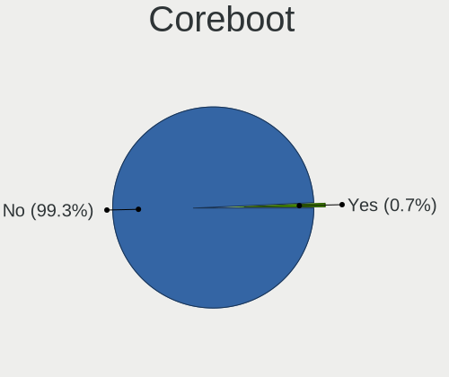
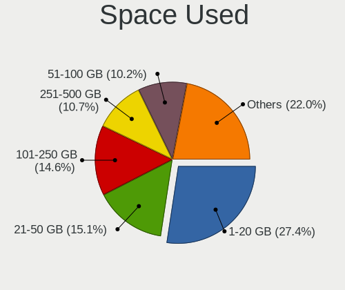
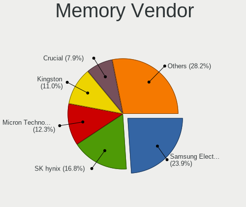
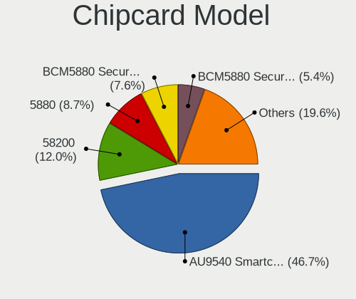

Fedora 35 - Tested Hardware & Statistics
----------------------------------------

A project to collect tested hardware configurations for Fedora 35.

Anyone can contribute to this report by the [hw-probe](https://github.com/linuxhw/hw-probe) tool:

    sudo -E hw-probe -all -upload

Please submit a probe of your configuration if it's not presented on the page or is rare.

This is a report for all computer types. See also reports for [desktops](/Dist/Fedora_35/Desktop/README.md) and [notebooks](/Dist/Fedora_35/Notebook/README.md).

Full-feature report is available here: https://linux-hardware.org/?view=trends

Contents
--------

* [ Test Cases ](#test-cases)

* [ System ](#system)
  - [ Kernel                   ](#kernel)
  - [ Kernel Family            ](#kernel-family)
  - [ Kernel Major Ver.        ](#kernel-major-ver)
  - [ Arch                     ](#arch)
  - [ DE                       ](#de)
  - [ Display Server           ](#display-server)
  - [ Display Manager          ](#display-manager)
  - [ OS Lang                  ](#os-lang)
  - [ Boot Mode                ](#boot-mode)
  - [ Filesystem               ](#filesystem)
  - [ Part. scheme             ](#part-scheme)
  - [ Dual Boot with Linux/BSD ](#dual-boot-with-linuxbsd)
  - [ Dual Boot (Win)          ](#dual-boot-win)

* [ Board ](#board)
  - [ Vendor                   ](#vendor)
  - [ Model                    ](#model)
  - [ Model Family             ](#model-family)
  - [ MFG Year                 ](#mfg-year)
  - [ Form Factor              ](#form-factor)
  - [ Secure Boot              ](#secure-boot)
  - [ Coreboot                 ](#coreboot)
  - [ RAM Size                 ](#ram-size)
  - [ RAM Used                 ](#ram-used)
  - [ Total Drives             ](#total-drives)
  - [ Has CD-ROM               ](#has-cd-rom)
  - [ Has Ethernet             ](#has-ethernet)
  - [ Has WiFi                 ](#has-wifi)
  - [ Has Bluetooth            ](#has-bluetooth)

* [ Location ](#location)
  - [ Country                  ](#country)
  - [ City                     ](#city)

* [ Drives ](#drives)
  - [ Drive Vendor             ](#drive-vendor)
  - [ Drive Model              ](#drive-model)
  - [ HDD Vendor               ](#hdd-vendor)
  - [ SSD Vendor               ](#ssd-vendor)
  - [ Drive Kind               ](#drive-kind)
  - [ Drive Connector          ](#drive-connector)
  - [ Drive Size               ](#drive-size)
  - [ Space Total              ](#space-total)
  - [ Space Used               ](#space-used)
  - [ Malfunc. Drives          ](#malfunc-drives)
  - [ Malfunc. Drive Vendor    ](#malfunc-drive-vendor)
  - [ Malfunc. HDD Vendor      ](#malfunc-hdd-vendor)
  - [ Malfunc. Drive Kind      ](#malfunc-drive-kind)
  - [ Failed Drives            ](#failed-drives)
  - [ Failed Drive Vendor      ](#failed-drive-vendor)
  - [ Drive Status             ](#drive-status)

* [ Storage controller ](#storage-controller)
  - [ Storage Vendor           ](#storage-vendor)
  - [ Storage Model            ](#storage-model)
  - [ Storage Kind             ](#storage-kind)

* [ Processor ](#processor)
  - [ CPU Vendor               ](#cpu-vendor)
  - [ CPU Model                ](#cpu-model)
  - [ CPU Model Family         ](#cpu-model-family)
  - [ CPU Cores                ](#cpu-cores)
  - [ CPU Sockets              ](#cpu-sockets)
  - [ CPU Threads              ](#cpu-threads)
  - [ CPU Op-Modes             ](#cpu-op-modes)
  - [ CPU Microcode            ](#cpu-microcode)
  - [ CPU Microarch            ](#cpu-microarch)

* [ Graphics ](#graphics)
  - [ GPU Vendor               ](#gpu-vendor)
  - [ GPU Model                ](#gpu-model)
  - [ GPU Combo                ](#gpu-combo)
  - [ GPU Driver               ](#gpu-driver)
  - [ GPU Memory               ](#gpu-memory)

* [ Monitor ](#monitor)
  - [ Monitor Vendor           ](#monitor-vendor)
  - [ Monitor Model            ](#monitor-model)
  - [ Monitor Resolution       ](#monitor-resolution)
  - [ Monitor Diagonal         ](#monitor-diagonal)
  - [ Monitor Width            ](#monitor-width)
  - [ Aspect Ratio             ](#aspect-ratio)
  - [ Monitor Area             ](#monitor-area)
  - [ Pixel Density            ](#pixel-density)
  - [ Multiple Monitors        ](#multiple-monitors)

* [ Network ](#network)
  - [ Net Controller Vendor    ](#net-controller-vendor)
  - [ Net Controller Model     ](#net-controller-model)
  - [ Wireless Vendor          ](#wireless-vendor)
  - [ Wireless Model           ](#wireless-model)
  - [ Ethernet Vendor          ](#ethernet-vendor)
  - [ Ethernet Model           ](#ethernet-model)
  - [ Net Controller Kind      ](#net-controller-kind)
  - [ Used Controller          ](#used-controller)
  - [ NICs                     ](#nics)
  - [ IPv6                     ](#ipv6)

* [ Bluetooth ](#bluetooth)
  - [ Bluetooth Vendor         ](#bluetooth-vendor)
  - [ Bluetooth Model          ](#bluetooth-model)

* [ Sound ](#sound)
  - [ Sound Vendor             ](#sound-vendor)
  - [ Sound Model              ](#sound-model)

* [ Memory ](#memory)
  - [ Memory Vendor            ](#memory-vendor)
  - [ Memory Model             ](#memory-model)
  - [ Memory Kind              ](#memory-kind)
  - [ Memory Form Factor       ](#memory-form-factor)
  - [ Memory Size              ](#memory-size)
  - [ Memory Speed             ](#memory-speed)

* [ Printers & scanners ](#printers--scanners)
  - [ Printer Vendor           ](#printer-vendor)
  - [ Printer Model            ](#printer-model)
  - [ Scanner Vendor           ](#scanner-vendor)
  - [ Scanner Model            ](#scanner-model)

* [ Camera ](#camera)
  - [ Camera Vendor            ](#camera-vendor)
  - [ Camera Model             ](#camera-model)

* [ Security ](#security)
  - [ Fingerprint Vendor       ](#fingerprint-vendor)
  - [ Fingerprint Model        ](#fingerprint-model)
  - [ Chipcard Vendor          ](#chipcard-vendor)
  - [ Chipcard Model           ](#chipcard-model)

* [ Unsupported ](#unsupported)
  - [ Unsupported Devices      ](#unsupported-devices)
  - [ Unsupported Device Types ](#unsupported-device-types)

Test Cases
----------

| Vendor        | Model                       | Form-Factor | Probe                                                      | Date         |
|---------------|-----------------------------|-------------|------------------------------------------------------------|--------------|
| Dell          | 06D7TR A00                  | Desktop     | [8c6244cb77](https://linux-hardware.org/?probe=8c6244cb77) | Dec 03, 2021 |
| Toshiba       | Satellite C70-A-K2W         | Notebook    | [8e46f67032](https://linux-hardware.org/?probe=8e46f67032) | Dec 03, 2021 |
| Lenovo        | ThinkPad X230 23257R2       | Notebook    | [775ec45ab8](https://linux-hardware.org/?probe=775ec45ab8) | Dec 03, 2021 |
| Lenovo        | ThinkPad X230 23257R2       | Notebook    | [b783f0a79d](https://linux-hardware.org/?probe=b783f0a79d) | Dec 03, 2021 |
| Gigabyte      | AERO 15 KB                  | Notebook    | [a7d3041cd2](https://linux-hardware.org/?probe=a7d3041cd2) | Dec 03, 2021 |
| HP            | Laptop 15s-eq2xxx           | Notebook    | [f53047cd0d](https://linux-hardware.org/?probe=f53047cd0d) | Dec 02, 2021 |
| MSI           | MEG Z390 GODLIKE            | Desktop     | [ca1727f54a](https://linux-hardware.org/?probe=ca1727f54a) | Dec 02, 2021 |
| Gateway       | SX2185                      | Desktop     | [70e907b207](https://linux-hardware.org/?probe=70e907b207) | Dec 02, 2021 |
| HP            | EliteBook x360 830 G5       | Convertible | [33ef9926a3](https://linux-hardware.org/?probe=33ef9926a3) | Dec 02, 2021 |
| Dell          | 040DDP A01                  | Desktop     | [b108ae97c2](https://linux-hardware.org/?probe=b108ae97c2) | Dec 02, 2021 |
| Notebook      | NH55RGQ                     | Notebook    | [4189e1f255](https://linux-hardware.org/?probe=4189e1f255) | Dec 02, 2021 |
| MSI           | X370 XPOWER GAMING TITAN... | Desktop     | [56bd9b515c](https://linux-hardware.org/?probe=56bd9b515c) | Dec 02, 2021 |
| Lenovo        | V15-ADA 82C7                | Notebook    | [5ade9a0569](https://linux-hardware.org/?probe=5ade9a0569) | Dec 02, 2021 |
| ASUSTek       | H81M-C                      | Desktop     | [ffecd77f3a](https://linux-hardware.org/?probe=ffecd77f3a) | Dec 02, 2021 |
| Lenovo        | IdeaPadFlex 5 14ARE05 81... | Convertible | [142cab14c6](https://linux-hardware.org/?probe=142cab14c6) | Dec 02, 2021 |
| MSI           | B550M PRO-VDH WIFI          | Desktop     | [508352ad4a](https://linux-hardware.org/?probe=508352ad4a) | Dec 02, 2021 |
| Lenovo        | ThinkPad L390 20NSS43600    | Notebook    | [e9aae12812](https://linux-hardware.org/?probe=e9aae12812) | Dec 02, 2021 |
| Lenovo        | IdeaPadFlex 5 14ARE05 81... | Convertible | [0b2751c5c1](https://linux-hardware.org/?probe=0b2751c5c1) | Dec 02, 2021 |
| Acer          | Nitro AN515-55              | Notebook    | [d5c6c6edee](https://linux-hardware.org/?probe=d5c6c6edee) | Dec 01, 2021 |
| Gigabyte      | B85M-D3V-A                  | Desktop     | [7304efa5d7](https://linux-hardware.org/?probe=7304efa5d7) | Dec 01, 2021 |
| HP            | Laptop 15s-fq2xxx           | Notebook    | [94b9d8b093](https://linux-hardware.org/?probe=94b9d8b093) | Dec 01, 2021 |
| HP            | ProBook 470 G5              | Notebook    | [240ca54dfb](https://linux-hardware.org/?probe=240ca54dfb) | Dec 01, 2021 |
| HP            | 2B2E A01                    | All in one  | [6f6101b39b](https://linux-hardware.org/?probe=6f6101b39b) | Dec 01, 2021 |
| ASUSTek       | ROG Strix G513QY_G513QY     | Notebook    | [8cebf41624](https://linux-hardware.org/?probe=8cebf41624) | Dec 01, 2021 |
| HP            | Laptop 15s-eq1xxx           | Notebook    | [9b11575394](https://linux-hardware.org/?probe=9b11575394) | Dec 01, 2021 |
| Lenovo        | Yoga 510-14IKB 80VB         | Convertible | [24800d20ac](https://linux-hardware.org/?probe=24800d20ac) | Dec 01, 2021 |
| HP            | ProBook 470 G5              | Notebook    | [610709bb66](https://linux-hardware.org/?probe=610709bb66) | Nov 30, 2021 |
| Acer          | Aspire E5-571G              | Notebook    | [f940ae414d](https://linux-hardware.org/?probe=f940ae414d) | Nov 30, 2021 |
| Dell          | Inspiron 7460               | Notebook    | [0a6feb58e7](https://linux-hardware.org/?probe=0a6feb58e7) | Nov 30, 2021 |
| Huanan        | X99-F8 V2.0                 | Desktop     | [1b4de261b3](https://linux-hardware.org/?probe=1b4de261b3) | Nov 30, 2021 |
| Gigabyte      | Z690 UD DDR4                | Desktop     | [7ad53e55ba](https://linux-hardware.org/?probe=7ad53e55ba) | Nov 30, 2021 |
| Lenovo        | ThinkPad T14 Gen 1 20UD0... | Notebook    | [b2d55bd445](https://linux-hardware.org/?probe=b2d55bd445) | Nov 30, 2021 |
| Lenovo        | ThinkPad P1 Gen 2 20QUS1... | Notebook    | [23ae32af07](https://linux-hardware.org/?probe=23ae32af07) | Nov 30, 2021 |
| Lenovo        | ThinkPad P1 Gen 2 20QUS1... | Notebook    | [074ec973ae](https://linux-hardware.org/?probe=074ec973ae) | Nov 30, 2021 |
| Apple         | Mac-F221BEC8                | Desktop     | [2ceb61c052](https://linux-hardware.org/?probe=2ceb61c052) | Nov 30, 2021 |
| Lenovo        | ThinkPad P1 Gen 3 20TJS5... | Notebook    | [80bbba47f6](https://linux-hardware.org/?probe=80bbba47f6) | Nov 29, 2021 |
| Acer          | Aspire E5-571G              | Notebook    | [95cb3fe8b3](https://linux-hardware.org/?probe=95cb3fe8b3) | Nov 29, 2021 |
| Acer          | Predator G9-793             | Notebook    | [b9dc27ddac](https://linux-hardware.org/?probe=b9dc27ddac) | Nov 29, 2021 |
| Dell          | G5 5590                     | Notebook    | [e569e56450](https://linux-hardware.org/?probe=e569e56450) | Nov 29, 2021 |
| HP            | Laptop 15s-fq2xxx           | Notebook    | [959af2b8dd](https://linux-hardware.org/?probe=959af2b8dd) | Nov 29, 2021 |
| Acer          | Swift SF113-31              | Notebook    | [f1e3d8c722](https://linux-hardware.org/?probe=f1e3d8c722) | Nov 29, 2021 |
| Apple         | Mac-8ED6AF5B48C039E1 Mac... | Mini pc     | [a91b7dd31b](https://linux-hardware.org/?probe=a91b7dd31b) | Nov 29, 2021 |
| Gigabyte      | EX58-UD3R                   | Desktop     | [8ece12c9e6](https://linux-hardware.org/?probe=8ece12c9e6) | Nov 28, 2021 |
| Notebook      | NB50TL                      | Notebook    | [15a716161c](https://linux-hardware.org/?probe=15a716161c) | Nov 28, 2021 |
| HP            | ProBook 470 G5              | Notebook    | [b75e21b247](https://linux-hardware.org/?probe=b75e21b247) | Nov 28, 2021 |
| ECS           | H61H2-CM                    | Desktop     | [525be50825](https://linux-hardware.org/?probe=525be50825) | Nov 28, 2021 |
| Dell          | Inspiron 5558               | Notebook    | [b003366a2c](https://linux-hardware.org/?probe=b003366a2c) | Nov 28, 2021 |
| Notebook      | NH5x_NH7x_HHx_HJx_HKx       | Notebook    | [8e5c4cc27b](https://linux-hardware.org/?probe=8e5c4cc27b) | Nov 28, 2021 |
| Apple         | MacBookPro7,1               | Notebook    | [6a4ed949e9](https://linux-hardware.org/?probe=6a4ed949e9) | Nov 28, 2021 |
| Lenovo        | IdeaPad S145-15IWL 81MV     | Notebook    | [0852350348](https://linux-hardware.org/?probe=0852350348) | Nov 28, 2021 |
| Dell          | Latitude 7420               | Notebook    | [7a96812e39](https://linux-hardware.org/?probe=7a96812e39) | Nov 28, 2021 |
| Gigabyte      | H170-Gaming 3               | Desktop     | [e83680db56](https://linux-hardware.org/?probe=e83680db56) | Nov 28, 2021 |
| HP            | Pavilion Aero Laptop 13-... | Notebook    | [eabdd46893](https://linux-hardware.org/?probe=eabdd46893) | Nov 28, 2021 |
| Gigabyte      | X570 AORUS MASTER           | Desktop     | [d813ffb878](https://linux-hardware.org/?probe=d813ffb878) | Nov 28, 2021 |
| Lenovo        | G40-45 80E1                 | Notebook    | [b3cdb202fc](https://linux-hardware.org/?probe=b3cdb202fc) | Nov 28, 2021 |
| HP            | Laptop 15s-fq2xxx           | Notebook    | [d559f82ee3](https://linux-hardware.org/?probe=d559f82ee3) | Nov 28, 2021 |
| Dell          | XPS 13 7390                 | Notebook    | [783b49e383](https://linux-hardware.org/?probe=783b49e383) | Nov 28, 2021 |
| Gigabyte      | AB350M-DS3H V2-CF           | Desktop     | [5d5d624d8c](https://linux-hardware.org/?probe=5d5d624d8c) | Nov 27, 2021 |
| Lenovo        | ThinkPad T400 6474B84       | Notebook    | [67f32be00d](https://linux-hardware.org/?probe=67f32be00d) | Nov 27, 2021 |
| MSI           | B450-A PRO MAX              | Desktop     | [d949cb9963](https://linux-hardware.org/?probe=d949cb9963) | Nov 27, 2021 |
| Dell          | 06D7TR A00                  | Desktop     | [d980b32136](https://linux-hardware.org/?probe=d980b32136) | Nov 27, 2021 |
| Lenovo        | ThinkPad E480 20KNS0E200    | Notebook    | [968f938b4e](https://linux-hardware.org/?probe=968f938b4e) | Nov 27, 2021 |
| Lenovo        | IdeaPad 320S-14IKB 81BN     | Notebook    | [08612b7f88](https://linux-hardware.org/?probe=08612b7f88) | Nov 27, 2021 |
| ASRock        | H81M-HG4 R4.0               | Desktop     | [c23e7e890b](https://linux-hardware.org/?probe=c23e7e890b) | Nov 27, 2021 |
| ASUSTek       | M4A77T/USB3                 | Desktop     | [e23dea02cf](https://linux-hardware.org/?probe=e23dea02cf) | Nov 26, 2021 |
| Gigabyte      | AB350M-Gaming 3-CF          | Desktop     | [1e4799819e](https://linux-hardware.org/?probe=1e4799819e) | Nov 26, 2021 |
| Gigabyte      | B550 AORUS ELITE            | Desktop     | [faf9c22988](https://linux-hardware.org/?probe=faf9c22988) | Nov 26, 2021 |
| Lenovo        | ThinkPad E15 20RD003JRT     | Notebook    | [ef8336f76a](https://linux-hardware.org/?probe=ef8336f76a) | Nov 26, 2021 |
| Dell          | Precision 5550              | Notebook    | [41caa6a4a0](https://linux-hardware.org/?probe=41caa6a4a0) | Nov 26, 2021 |
| Lenovo        | ThinkPad X1 Carbon Gen 9... | Notebook    | [6056117cca](https://linux-hardware.org/?probe=6056117cca) | Nov 26, 2021 |
| ASUSTek       | K54C                        | Notebook    | [2604de426e](https://linux-hardware.org/?probe=2604de426e) | Nov 26, 2021 |
| Acer          | AP714-51T                   | Notebook    | [3fe9bcf889](https://linux-hardware.org/?probe=3fe9bcf889) | Nov 26, 2021 |
| Acer          | AP714-51T                   | Notebook    | [406001fc85](https://linux-hardware.org/?probe=406001fc85) | Nov 26, 2021 |
| Lenovo        | IdeaPad 320-15ISK 80XH      | Notebook    | [c207f61d91](https://linux-hardware.org/?probe=c207f61d91) | Nov 26, 2021 |
| Lenovo        | IdeaPad 320-15ISK 80XH      | Notebook    | [96c90ad6c9](https://linux-hardware.org/?probe=96c90ad6c9) | Nov 26, 2021 |
| Lenovo        | IdeaPad 320-15ISK 80XH      | Notebook    | [039dbf659a](https://linux-hardware.org/?probe=039dbf659a) | Nov 26, 2021 |
| Lenovo        | ThinkBook 15-IML 20RW       | Notebook    | [a000027ce6](https://linux-hardware.org/?probe=a000027ce6) | Nov 26, 2021 |
| Lenovo        | ThinkPad P1 Gen 2 20QT00... | Notebook    | [b9c1906f2b](https://linux-hardware.org/?probe=b9c1906f2b) | Nov 26, 2021 |
| Lenovo        | IdeaPad 3 15IGL05 81WQ      | Notebook    | [366fe373c9](https://linux-hardware.org/?probe=366fe373c9) | Nov 25, 2021 |
| HUAWEI        | KLVL-WXXW                   | Notebook    | [beff046f56](https://linux-hardware.org/?probe=beff046f56) | Nov 25, 2021 |
| ASUSTek       | Maximus IV GENE-Z           | Desktop     | [89729fef47](https://linux-hardware.org/?probe=89729fef47) | Nov 25, 2021 |
| Microsoft     | Surface Pro 3               | Tablet      | [395718db33](https://linux-hardware.org/?probe=395718db33) | Nov 25, 2021 |
| HUAWEI        | KLVL-WXXW                   | Notebook    | [2a96a2a7af](https://linux-hardware.org/?probe=2a96a2a7af) | Nov 25, 2021 |
| Apple         | Mac-F221BEC8                | Desktop     | [f4f5c37779](https://linux-hardware.org/?probe=f4f5c37779) | Nov 25, 2021 |
| Gigabyte      | Z690 UD DDR4                | Desktop     | [b6ffc90d4e](https://linux-hardware.org/?probe=b6ffc90d4e) | Nov 25, 2021 |
| Sony          | VPCF131FM                   | Notebook    | [f0ba5e0db2](https://linux-hardware.org/?probe=f0ba5e0db2) | Nov 25, 2021 |
| HUAWEI        | KLVL-WXX9                   | Notebook    | [3352efa5cd](https://linux-hardware.org/?probe=3352efa5cd) | Nov 25, 2021 |
| Dell          | Latitude E5470              | Notebook    | [1e35555998](https://linux-hardware.org/?probe=1e35555998) | Nov 24, 2021 |
| HP            | 3561                        | All in one  | [5ff1d7a72e](https://linux-hardware.org/?probe=5ff1d7a72e) | Nov 24, 2021 |
| Dell          | XPS 13 9300                 | Notebook    | [a91462bd5a](https://linux-hardware.org/?probe=a91462bd5a) | Nov 24, 2021 |
| HP            | EliteBook 735 G5            | Notebook    | [d80b574cb4](https://linux-hardware.org/?probe=d80b574cb4) | Nov 24, 2021 |
| MSI           | B550-A PRO                  | Desktop     | [b90083da69](https://linux-hardware.org/?probe=b90083da69) | Nov 24, 2021 |
| Apple         | Mac-F221BEC8                | Desktop     | [e606757d4a](https://linux-hardware.org/?probe=e606757d4a) | Nov 24, 2021 |
| Dell          | 0C522T A03                  | Desktop     | [96fec5d214](https://linux-hardware.org/?probe=96fec5d214) | Nov 24, 2021 |
| Gigabyte      | B550 AORUS PRO              | Desktop     | [35801f40df](https://linux-hardware.org/?probe=35801f40df) | Nov 24, 2021 |
| Dell          | 0C522T A03                  | Desktop     | [79ee4911cb](https://linux-hardware.org/?probe=79ee4911cb) | Nov 24, 2021 |
| MSI           | A55M-E33                    | Desktop     | [e6616870b6](https://linux-hardware.org/?probe=e6616870b6) | Nov 24, 2021 |
| ASUSTek       | VivoBook_ASUSLaptop X512... | Notebook    | [b6bfa4b827](https://linux-hardware.org/?probe=b6bfa4b827) | Nov 24, 2021 |
| HP            | 1906                        | Desktop     | [8ec5c16fc7](https://linux-hardware.org/?probe=8ec5c16fc7) | Nov 24, 2021 |
| HP            | 83E1                        | Desktop     | [7598ac7e6c](https://linux-hardware.org/?probe=7598ac7e6c) | Nov 23, 2021 |
| Lenovo        | ThinkPad X1 Extreme 2nd ... | Notebook    | [44bf6f6d6f](https://linux-hardware.org/?probe=44bf6f6d6f) | Nov 23, 2021 |
| ASUSTek       | Maximus IV GENE-Z           | Desktop     | [dab6e17223](https://linux-hardware.org/?probe=dab6e17223) | Nov 23, 2021 |
| Lenovo        | 3731 SDK0J40697 WIN 3305... | Desktop     | [c50601fb76](https://linux-hardware.org/?probe=c50601fb76) | Nov 23, 2021 |
| Lenovo        | ThinkPad X1 Carbon 7th 2... | Notebook    | [3c3fbf498a](https://linux-hardware.org/?probe=3c3fbf498a) | Nov 23, 2021 |
| HP            | ENVY Laptop 14-eb0xxx       | Notebook    | [5be975dd37](https://linux-hardware.org/?probe=5be975dd37) | Nov 23, 2021 |
| HP            | 0B4Ch D                     | Desktop     | [0c3c7c6bb3](https://linux-hardware.org/?probe=0c3c7c6bb3) | Nov 23, 2021 |
| Lenovo        | B40-70 80F30006BR           | Notebook    | [d29d6c2f61](https://linux-hardware.org/?probe=d29d6c2f61) | Nov 23, 2021 |
| Lenovo        | B40-70 80F30006BR           | Notebook    | [6e361a8715](https://linux-hardware.org/?probe=6e361a8715) | Nov 23, 2021 |
| HP            | 1906                        | Desktop     | [90499fe34d](https://linux-hardware.org/?probe=90499fe34d) | Nov 23, 2021 |
| Gigabyte      | X570 AORUS ELITE            | Desktop     | [91a66a7648](https://linux-hardware.org/?probe=91a66a7648) | Nov 22, 2021 |
| Gigabyte      | GA-MA790X-UD4               | Desktop     | [0a19a35ac4](https://linux-hardware.org/?probe=0a19a35ac4) | Nov 22, 2021 |
| Acer          | Nitro AN515-54              | Notebook    | [b58b567113](https://linux-hardware.org/?probe=b58b567113) | Nov 22, 2021 |
| ASRock        | G41M-VS3                    | Desktop     | [35277b1155](https://linux-hardware.org/?probe=35277b1155) | Nov 22, 2021 |
| Apple         | MacBookPro11,4              | Notebook    | [7b9225653f](https://linux-hardware.org/?probe=7b9225653f) | Nov 22, 2021 |
| HP            | ENVY Laptop 14-eb0xxx       | Notebook    | [365b3888e6](https://linux-hardware.org/?probe=365b3888e6) | Nov 22, 2021 |
| Lenovo        | 3746 No DPK                 | All in one  | [44d15ef318](https://linux-hardware.org/?probe=44d15ef318) | Nov 22, 2021 |
| Fujitsu       | LIFEBOOK U747               | Notebook    | [ece0600e5d](https://linux-hardware.org/?probe=ece0600e5d) | Nov 22, 2021 |
| Apple         | MacBookPro7,1               | Notebook    | [c686d7d85c](https://linux-hardware.org/?probe=c686d7d85c) | Nov 22, 2021 |
| Pegatron      | 2AD5                        | Desktop     | [8fc4f44be5](https://linux-hardware.org/?probe=8fc4f44be5) | Nov 22, 2021 |
| Gigabyte      | F2A85XM-D3H                 | Desktop     | [1c41d8c34c](https://linux-hardware.org/?probe=1c41d8c34c) | Nov 22, 2021 |
| Lenovo        | IdeaPad 3 17IIL05 81WF      | Notebook    | [f13b0fb2b9](https://linux-hardware.org/?probe=f13b0fb2b9) | Nov 22, 2021 |
| HP            | Laptop 15s-eq2xxx           | Notebook    | [a20fe0f647](https://linux-hardware.org/?probe=a20fe0f647) | Nov 21, 2021 |
| Lenovo        | ThinkPad T400 6474B84       | Notebook    | [f779165258](https://linux-hardware.org/?probe=f779165258) | Nov 21, 2021 |
| Dell          | Latitude E5570              | Notebook    | [8cf8db7a89](https://linux-hardware.org/?probe=8cf8db7a89) | Nov 21, 2021 |
| Dell          | XPS 13 9310 2-in-1          | Convertible | [8cc8502887](https://linux-hardware.org/?probe=8cc8502887) | Nov 21, 2021 |
| Google        | Relm                        | Notebook    | [92e569bf1e](https://linux-hardware.org/?probe=92e569bf1e) | Nov 21, 2021 |
| ASRock        | X570 Phantom Gaming 4       | Desktop     | [683697e6ee](https://linux-hardware.org/?probe=683697e6ee) | Nov 21, 2021 |
| MSI           | B450M-A PRO MAX             | Desktop     | [92375d0ecc](https://linux-hardware.org/?probe=92375d0ecc) | Nov 21, 2021 |
| Dell          | 0M859N A00                  | Desktop     | [2fa52f3236](https://linux-hardware.org/?probe=2fa52f3236) | Nov 21, 2021 |
| Gigabyte      | B450M DS3H-CF               | Desktop     | [faec9a8f8b](https://linux-hardware.org/?probe=faec9a8f8b) | Nov 21, 2021 |
| HP            | Pavilion 17                 | Notebook    | [2d69072cdf](https://linux-hardware.org/?probe=2d69072cdf) | Nov 20, 2021 |
| HP            | 3048h                       | Desktop     | [e38eb769b5](https://linux-hardware.org/?probe=e38eb769b5) | Nov 20, 2021 |
| Dell          | Latitude 5490               | Notebook    | [cbe23836bf](https://linux-hardware.org/?probe=cbe23836bf) | Nov 20, 2021 |
| Dell          | Latitude E7440              | Notebook    | [a4581f0839](https://linux-hardware.org/?probe=a4581f0839) | Nov 20, 2021 |
| ASUSTek       | M5A78L-M/USB3               | Desktop     | [44d1a95b0b](https://linux-hardware.org/?probe=44d1a95b0b) | Nov 20, 2021 |
| Lenovo        | ThinkPad L15 Gen 2 20X4S... | Notebook    | [8dfec492a4](https://linux-hardware.org/?probe=8dfec492a4) | Nov 19, 2021 |
| Lenovo        | ThinkPad L15 Gen 2 20X4S... | Notebook    | [78341a1a16](https://linux-hardware.org/?probe=78341a1a16) | Nov 19, 2021 |
| ASUSTek       | VivoBook_ASUS Laptop E51... | Notebook    | [31cebd4e96](https://linux-hardware.org/?probe=31cebd4e96) | Nov 19, 2021 |
| ASUSTek       | VivoBook_ASUS Laptop E51... | Notebook    | [0be43eb710](https://linux-hardware.org/?probe=0be43eb710) | Nov 19, 2021 |
| MSI           | B450 GAMING PRO CARBON A... | Desktop     | [3b34362c42](https://linux-hardware.org/?probe=3b34362c42) | Nov 19, 2021 |
| Acer          | Swift SF514-51              | Notebook    | [07e73dc8ab](https://linux-hardware.org/?probe=07e73dc8ab) | Nov 19, 2021 |
| ASUSTek       | A68HM-K                     | Desktop     | [8bf7660808](https://linux-hardware.org/?probe=8bf7660808) | Nov 19, 2021 |
| Lenovo        | ThinkPad X1 Extreme 20MF... | Notebook    | [a524ba65b5](https://linux-hardware.org/?probe=a524ba65b5) | Nov 19, 2021 |
| Lenovo        | ThinkPad X1 Extreme 20MF... | Notebook    | [7e7b7d381e](https://linux-hardware.org/?probe=7e7b7d381e) | Nov 19, 2021 |
| HP            | Pavilion Aero Laptop 13-... | Notebook    | [d0aea280e7](https://linux-hardware.org/?probe=d0aea280e7) | Nov 19, 2021 |
| ASUSTek       | H87-PRO                     | Desktop     | [02b2e4cb00](https://linux-hardware.org/?probe=02b2e4cb00) | Nov 19, 2021 |
| Dell          | Inspiron 3593               | Notebook    | [0e670dc090](https://linux-hardware.org/?probe=0e670dc090) | Nov 19, 2021 |
| ASUSTek       | H87-PRO                     | Desktop     | [181c56512d](https://linux-hardware.org/?probe=181c56512d) | Nov 19, 2021 |
| Lenovo        | Legion 5 Pro 16ACH6H 82J... | Notebook    | [d7a5775f61](https://linux-hardware.org/?probe=d7a5775f61) | Nov 19, 2021 |
| Notebook      | NH55RGQ                     | Notebook    | [d111fd1549](https://linux-hardware.org/?probe=d111fd1549) | Nov 19, 2021 |
| Dell          | 0YNVJG A01                  | Desktop     | [00f5cc73fe](https://linux-hardware.org/?probe=00f5cc73fe) | Nov 19, 2021 |
| Dell          | 0YNVJG A01                  | Desktop     | [fbedd3af33](https://linux-hardware.org/?probe=fbedd3af33) | Nov 19, 2021 |
| Lenovo        | ThinkPad P14s Gen 1 20Y1... | Notebook    | [01a15306b9](https://linux-hardware.org/?probe=01a15306b9) | Nov 19, 2021 |
| Lenovo        | ThinkPad X13 Gen 1 20UF0... | Notebook    | [709cd419bc](https://linux-hardware.org/?probe=709cd419bc) | Nov 19, 2021 |
| ASUSTek       | X750JN                      | Notebook    | [bb6f44b058](https://linux-hardware.org/?probe=bb6f44b058) | Nov 19, 2021 |
| Pegatron      | 2AD5                        | Desktop     | [839b5c24aa](https://linux-hardware.org/?probe=839b5c24aa) | Nov 19, 2021 |
| Lenovo        | IdeaPadFlex 5 14ARE05 81... | Convertible | [12f769ed4c](https://linux-hardware.org/?probe=12f769ed4c) | Nov 19, 2021 |
| Lenovo        | ThinkPad X1 Carbon 6th 2... | Notebook    | [f5a721bf24](https://linux-hardware.org/?probe=f5a721bf24) | Nov 19, 2021 |
| Dell          | Precision 5510              | Notebook    | [1d46cced08](https://linux-hardware.org/?probe=1d46cced08) | Nov 19, 2021 |
| Lenovo        | ThinkPad X13 Yoga Gen 2 ... | Convertible | [70ee93daac](https://linux-hardware.org/?probe=70ee93daac) | Nov 19, 2021 |
| HP            | Laptop 14s-fq0xxx           | Notebook    | [f9b7bdfef8](https://linux-hardware.org/?probe=f9b7bdfef8) | Nov 19, 2021 |
| MSI           | B450 TOMAHAWK               | Desktop     | [6a1607ab9d](https://linux-hardware.org/?probe=6a1607ab9d) | Nov 18, 2021 |
| Dell          | Inspiron 7572               | Notebook    | [0953d49db6](https://linux-hardware.org/?probe=0953d49db6) | Nov 18, 2021 |
| Lenovo        | ThinkPad X1 Nano Gen 1 2... | Notebook    | [dc150f9fba](https://linux-hardware.org/?probe=dc150f9fba) | Nov 18, 2021 |
| MSI           | MPG X570 GAMING PRO CARB... | Desktop     | [c8a6893780](https://linux-hardware.org/?probe=c8a6893780) | Nov 18, 2021 |
| MSI           | A320M-A PRO MAX             | Desktop     | [d9f71fda8f](https://linux-hardware.org/?probe=d9f71fda8f) | Nov 18, 2021 |
| Dell          | 0C27VV A01                  | Desktop     | [34aff3ab72](https://linux-hardware.org/?probe=34aff3ab72) | Nov 18, 2021 |
| Gigabyte      | B450M DS3H-CF               | Desktop     | [f35f04cabd](https://linux-hardware.org/?probe=f35f04cabd) | Nov 18, 2021 |
| ASUSTek       | ROG CROSSHAIR VI HERO       | Desktop     | [50535d277c](https://linux-hardware.org/?probe=50535d277c) | Nov 18, 2021 |
| HP            | EliteBook 840 G3            | Notebook    | [9e8fd0520d](https://linux-hardware.org/?probe=9e8fd0520d) | Nov 18, 2021 |
| ASUSTek       | PRIME B360M-K               | Desktop     | [3b2165faa8](https://linux-hardware.org/?probe=3b2165faa8) | Nov 18, 2021 |
| Gigabyte      | B550M DS3H                  | Desktop     | [93c3ab9ed1](https://linux-hardware.org/?probe=93c3ab9ed1) | Nov 18, 2021 |
| Lenovo        | Legion R9000P2021H 82JQ     | Notebook    | [7734a8d28c](https://linux-hardware.org/?probe=7734a8d28c) | Nov 18, 2021 |
| Acer          | Swift SF314-43              | Notebook    | [46c44d537a](https://linux-hardware.org/?probe=46c44d537a) | Nov 18, 2021 |
| HP            | Pavilion Notebook           | Notebook    | [01f7a4c33d](https://linux-hardware.org/?probe=01f7a4c33d) | Nov 18, 2021 |
| Gigabyte      | H97M-D3H                    | Desktop     | [f6dc8337e7](https://linux-hardware.org/?probe=f6dc8337e7) | Nov 18, 2021 |
| Acer          | Swift SF314-42              | Notebook    | [05020e1e61](https://linux-hardware.org/?probe=05020e1e61) | Nov 18, 2021 |
| Microsoft     | Surface Pro                 | Tablet      | [5f40fb240a](https://linux-hardware.org/?probe=5f40fb240a) | Nov 17, 2021 |
| Toshiba       | Satellite C855-12R          | Notebook    | [dbde83db50](https://linux-hardware.org/?probe=dbde83db50) | Nov 17, 2021 |
| Lenovo        | ThinkPad X1 Carbon Gen 9... | Notebook    | [427ee1a6de](https://linux-hardware.org/?probe=427ee1a6de) | Nov 17, 2021 |
| Login Info... | LOG-QAL30                   | Notebook    | [585419cd38](https://linux-hardware.org/?probe=585419cd38) | Nov 17, 2021 |
| MSI           | Z77A-G43                    | Desktop     | [04db0a2350](https://linux-hardware.org/?probe=04db0a2350) | Nov 17, 2021 |
| Login Info... | LOG-QAL30                   | Notebook    | [9dff5423c9](https://linux-hardware.org/?probe=9dff5423c9) | Nov 17, 2021 |
| Dell          | Latitude E7270              | Notebook    | [70a4c30534](https://linux-hardware.org/?probe=70a4c30534) | Nov 17, 2021 |
| ASRock        | X470 Master SLI             | Desktop     | [c48f95d233](https://linux-hardware.org/?probe=c48f95d233) | Nov 17, 2021 |
| HP            | ZBook Fury 15 G7 Mobile ... | Notebook    | [6196137046](https://linux-hardware.org/?probe=6196137046) | Nov 17, 2021 |
| Gigabyte      | H370M DS3H-CF               | Desktop     | [c69f79e654](https://linux-hardware.org/?probe=c69f79e654) | Nov 17, 2021 |
| HP            | Pavilion 15                 | Notebook    | [d6caf6dd12](https://linux-hardware.org/?probe=d6caf6dd12) | Nov 17, 2021 |
| Toshiba       | Satellite C855-12R          | Notebook    | [eefe2dc8be](https://linux-hardware.org/?probe=eefe2dc8be) | Nov 17, 2021 |
| HP            | Pavilion 15                 | Notebook    | [581a56e963](https://linux-hardware.org/?probe=581a56e963) | Nov 17, 2021 |
| ASUSTek       | ROG CROSSHAIR VIII IMPAC... | Desktop     | [ddfb1c2b1a](https://linux-hardware.org/?probe=ddfb1c2b1a) | Nov 17, 2021 |
| Dell          | 0GY6Y8 A02                  | Desktop     | [61734716ea](https://linux-hardware.org/?probe=61734716ea) | Nov 16, 2021 |
| HP            | ENVY Laptop 15t-ep000       | Notebook    | [02c2ed5954](https://linux-hardware.org/?probe=02c2ed5954) | Nov 16, 2021 |
| HP            | Laptop 15s-eq2xxx           | Notebook    | [ec73e73572](https://linux-hardware.org/?probe=ec73e73572) | Nov 16, 2021 |
| Razer         | Blade 15 Advanced Model ... | Notebook    | [c4763ca2a5](https://linux-hardware.org/?probe=c4763ca2a5) | Nov 16, 2021 |
| Acer          | Swift SF314-43              | Notebook    | [db85b885ae](https://linux-hardware.org/?probe=db85b885ae) | Nov 16, 2021 |
| Lenovo        | ThinkPad E14 Gen 3 20Y70... | Notebook    | [6b1f5ce8b7](https://linux-hardware.org/?probe=6b1f5ce8b7) | Nov 16, 2021 |
| ASUSTek       | S551LN                      | Notebook    | [53b3fced16](https://linux-hardware.org/?probe=53b3fced16) | Nov 16, 2021 |
| Toshiba       | Satellite C855-12R          | Notebook    | [ccf125eb47](https://linux-hardware.org/?probe=ccf125eb47) | Nov 16, 2021 |
| ASUSTek       | ROG STRIX B450-F GAMING     | Desktop     | [9404dfb1fe](https://linux-hardware.org/?probe=9404dfb1fe) | Nov 16, 2021 |
| MSI           | Modern 15 A11M              | Notebook    | [6398858488](https://linux-hardware.org/?probe=6398858488) | Nov 16, 2021 |
| Notebook      | NH55RGQ                     | Notebook    | [b3cb30c28d](https://linux-hardware.org/?probe=b3cb30c28d) | Nov 16, 2021 |
| Gigabyte      | X570 AORUS MASTER           | Desktop     | [3412d5cf0b](https://linux-hardware.org/?probe=3412d5cf0b) | Nov 16, 2021 |
| Gigabyte      | X570 AORUS MASTER           | Desktop     | [bdd9599f2f](https://linux-hardware.org/?probe=bdd9599f2f) | Nov 16, 2021 |
| Razer         | Blade 15 Advanced Model ... | Notebook    | [1119a0805e](https://linux-hardware.org/?probe=1119a0805e) | Nov 16, 2021 |
| Acer          | Aspire E1-572               | Notebook    | [dbaa27643e](https://linux-hardware.org/?probe=dbaa27643e) | Nov 16, 2021 |
| Acer          | Aspire E1-572               | Notebook    | [aad4a92e0e](https://linux-hardware.org/?probe=aad4a92e0e) | Nov 16, 2021 |
| Apple         | MacBookPro6,2               | Notebook    | [75e80e1ea8](https://linux-hardware.org/?probe=75e80e1ea8) | Nov 15, 2021 |
| ASUSTek       | ROG Strix G513QY_G513QY     | Notebook    | [06f896ff98](https://linux-hardware.org/?probe=06f896ff98) | Nov 15, 2021 |
| HP            | EliteBook x360 1030 G2      | Convertible | [b4ebd974c1](https://linux-hardware.org/?probe=b4ebd974c1) | Nov 15, 2021 |
| ASUSTek       | M2N-E                       | Desktop     | [8da42387a5](https://linux-hardware.org/?probe=8da42387a5) | Nov 15, 2021 |
| Gigabyte      | B560M DS3H                  | Desktop     | [97ed26b846](https://linux-hardware.org/?probe=97ed26b846) | Nov 15, 2021 |
| Fujitsu       | D3034-A1 S26361-D3034-A1... | Server      | [8cf8f98a53](https://linux-hardware.org/?probe=8cf8f98a53) | Nov 15, 2021 |
| Acer          | Aspire A715-71G             | Notebook    | [dd0bfcd823](https://linux-hardware.org/?probe=dd0bfcd823) | Nov 15, 2021 |
| Apple         | Mac-F2268DC8                | All in one  | [9ef2a8f6d7](https://linux-hardware.org/?probe=9ef2a8f6d7) | Nov 15, 2021 |
| ASRock        | B450 Pro4                   | Desktop     | [098387cb9c](https://linux-hardware.org/?probe=098387cb9c) | Nov 15, 2021 |
| Lenovo        | IdeaPad 3 17IIL05 81WF      | Notebook    | [ea6139e86c](https://linux-hardware.org/?probe=ea6139e86c) | Nov 15, 2021 |
| Lenovo        | IdeaPad 3 17IIL05 81WF      | Notebook    | [90e882710c](https://linux-hardware.org/?probe=90e882710c) | Nov 15, 2021 |
| Lenovo        | IdeaPad S540-15IWL          | Notebook    | [516e448510](https://linux-hardware.org/?probe=516e448510) | Nov 14, 2021 |
| MSI           | Modern 15 A11M              | Notebook    | [8b02ecc2b6](https://linux-hardware.org/?probe=8b02ecc2b6) | Nov 14, 2021 |
| SiComputer    | Nauta 01W PRO               | Notebook    | [70b84217bd](https://linux-hardware.org/?probe=70b84217bd) | Nov 14, 2021 |
| Dell          | Precision 3541              | Notebook    | [a21fd45ac3](https://linux-hardware.org/?probe=a21fd45ac3) | Nov 14, 2021 |
| ASUSTek       | ZenBook UX433FA_UX433FA     | Notebook    | [54bb479f64](https://linux-hardware.org/?probe=54bb479f64) | Nov 14, 2021 |
| SiComputer    | Nauta 01W PRO               | Notebook    | [d88aea84ef](https://linux-hardware.org/?probe=d88aea84ef) | Nov 14, 2021 |
| Lenovo        | ThinkPad X1 Carbon 7th 2... | Notebook    | [48f29ffe3a](https://linux-hardware.org/?probe=48f29ffe3a) | Nov 14, 2021 |
| Apple         | MacBookPro6,2               | Notebook    | [a778aba19c](https://linux-hardware.org/?probe=a778aba19c) | Nov 14, 2021 |
| Dell          | Vostro 3460                 | Notebook    | [3a6a636384](https://linux-hardware.org/?probe=3a6a636384) | Nov 14, 2021 |
| Apple         | Mac-8ED6AF5B48C039E1 Mac... | Mini pc     | [2bca77430e](https://linux-hardware.org/?probe=2bca77430e) | Nov 14, 2021 |
| Dell          | Latitude 5511               | Notebook    | [dc7c10f4e2](https://linux-hardware.org/?probe=dc7c10f4e2) | Nov 13, 2021 |
| Dell          | Latitude 5511               | Notebook    | [b0ca679bc5](https://linux-hardware.org/?probe=b0ca679bc5) | Nov 13, 2021 |
| HP            | ProBook 430 G1              | Notebook    | [68633b9bf5](https://linux-hardware.org/?probe=68633b9bf5) | Nov 13, 2021 |
| HP            | ENVY x360 Convertible 13... | Convertible | [2142069a51](https://linux-hardware.org/?probe=2142069a51) | Nov 13, 2021 |
| Gigabyte      | GA-78LMT-USB3               | Desktop     | [bc6a3771aa](https://linux-hardware.org/?probe=bc6a3771aa) | Nov 13, 2021 |
| MSI           | Delta 15 A5EFK              | Notebook    | [bc348014b5](https://linux-hardware.org/?probe=bc348014b5) | Nov 13, 2021 |
| Lenovo        | IdeaPad MIIX 700-12ISK 8... | Notebook    | [3cfeff5a7f](https://linux-hardware.org/?probe=3cfeff5a7f) | Nov 13, 2021 |
| Lenovo        | ThinkPad T490 20N2CTO1WW    | Notebook    | [9e8eab1073](https://linux-hardware.org/?probe=9e8eab1073) | Nov 13, 2021 |
| Lenovo        | Legion R7000P2021H 82JU     | Notebook    | [19ffbfb846](https://linux-hardware.org/?probe=19ffbfb846) | Nov 13, 2021 |
| ASUSTek       | M3A78-EM                    | Desktop     | [e1cc8b1ee3](https://linux-hardware.org/?probe=e1cc8b1ee3) | Nov 13, 2021 |
| Dell          | Inspiron 14-3467            | Notebook    | [ebe54808c2](https://linux-hardware.org/?probe=ebe54808c2) | Nov 13, 2021 |
| HP            | ENVY x360 Convertible 13... | Convertible | [40de24f0e5](https://linux-hardware.org/?probe=40de24f0e5) | Nov 13, 2021 |
| Apple         | MacBookPro10,2              | Notebook    | [5cbec68d6e](https://linux-hardware.org/?probe=5cbec68d6e) | Nov 13, 2021 |
| Positivo      | V142N_4G                    | Notebook    | [6afdf02b96](https://linux-hardware.org/?probe=6afdf02b96) | Nov 13, 2021 |
| ASUSTek       | H61M-CS                     | Desktop     | [22858e9ab9](https://linux-hardware.org/?probe=22858e9ab9) | Nov 13, 2021 |
| Acer          | Swift SFX14-41G             | Notebook    | [04e988d138](https://linux-hardware.org/?probe=04e988d138) | Nov 13, 2021 |
| HP            | Pavilion Aero Laptop 13-... | Notebook    | [85929a9a18](https://linux-hardware.org/?probe=85929a9a18) | Nov 12, 2021 |
| Apple         | Mac-F221BEC8                | Desktop     | [5991ba5f44](https://linux-hardware.org/?probe=5991ba5f44) | Nov 12, 2021 |
| HP            | Pavilion Aero Laptop 13-... | Notebook    | [3a33eaa4c0](https://linux-hardware.org/?probe=3a33eaa4c0) | Nov 12, 2021 |
| Samsung       | RV411/RV511/E3511/S3511/... | Notebook    | [3bbda8b194](https://linux-hardware.org/?probe=3bbda8b194) | Nov 12, 2021 |
| ASUSTek       | VivoBook 15_ASUS Laptop ... | Notebook    | [fa348e4f87](https://linux-hardware.org/?probe=fa348e4f87) | Nov 12, 2021 |
| Dell          | Precision 5510              | Notebook    | [80bbc48bce](https://linux-hardware.org/?probe=80bbc48bce) | Nov 12, 2021 |
| ASUSTek       | TUF B450M-PLUS GAMING       | Desktop     | [e85856bbef](https://linux-hardware.org/?probe=e85856bbef) | Nov 12, 2021 |
| Lenovo        | IdeaPad 5 Pro 16IHU6 82L... | Notebook    | [a7998fa53a](https://linux-hardware.org/?probe=a7998fa53a) | Nov 11, 2021 |
| AMI           | Intel                       | Convertible | [670ce3c062](https://linux-hardware.org/?probe=670ce3c062) | Nov 11, 2021 |
| System76      | Oryx Pro                    | Notebook    | [77cf902290](https://linux-hardware.org/?probe=77cf902290) | Nov 11, 2021 |
| Apple         | MacBookPro9,2               | Notebook    | [61afe68685](https://linux-hardware.org/?probe=61afe68685) | Nov 11, 2021 |
| Dell          | Latitude E7440              | Notebook    | [e907f0bbf1](https://linux-hardware.org/?probe=e907f0bbf1) | Nov 11, 2021 |
| ASUSTek       | X202EV                      | Notebook    | [ff0732f245](https://linux-hardware.org/?probe=ff0732f245) | Nov 11, 2021 |
| Dell          | 0DXJD9 A00                  | Desktop     | [e9abfeb7a2](https://linux-hardware.org/?probe=e9abfeb7a2) | Nov 11, 2021 |
| HP            | EliteBook 850 G5            | Notebook    | [7df8bf1476](https://linux-hardware.org/?probe=7df8bf1476) | Nov 11, 2021 |
| HP            | EliteBook 850 G5            | Notebook    | [1def8c2d0b](https://linux-hardware.org/?probe=1def8c2d0b) | Nov 11, 2021 |
| Dell          | XPS 13 7390                 | Notebook    | [f5ceaaf6fe](https://linux-hardware.org/?probe=f5ceaaf6fe) | Nov 11, 2021 |
| Apple         | MacBookAir6,1               | Notebook    | [588c351d40](https://linux-hardware.org/?probe=588c351d40) | Nov 10, 2021 |
| Lenovo        | ThinkPad X1 Carbon 2nd 2... | Notebook    | [ac9d7f968f](https://linux-hardware.org/?probe=ac9d7f968f) | Nov 10, 2021 |
| ASUSTek       | VivoBook S15 X510UF         | Notebook    | [fc4d285e0a](https://linux-hardware.org/?probe=fc4d285e0a) | Nov 10, 2021 |
| Acer          | Nitro AN515-55              | Notebook    | [d4f75f503d](https://linux-hardware.org/?probe=d4f75f503d) | Nov 10, 2021 |
| ASUSTek       | T102HA                      | Notebook    | [d648620b1a](https://linux-hardware.org/?probe=d648620b1a) | Nov 10, 2021 |
| LG Electro... | 14Z90P-G.AR53A              | Notebook    | [a1fb8771db](https://linux-hardware.org/?probe=a1fb8771db) | Nov 10, 2021 |
| HP            | ProBook 430 G1              | Notebook    | [99ece77400](https://linux-hardware.org/?probe=99ece77400) | Nov 10, 2021 |
| HUAWEI        | KPL-W0X                     | Notebook    | [807e59f1e3](https://linux-hardware.org/?probe=807e59f1e3) | Nov 10, 2021 |
| Intel         | D33217GKE G69901-205        | Desktop     | [a922d5f3fc](https://linux-hardware.org/?probe=a922d5f3fc) | Nov 10, 2021 |
| Lenovo        | ThinkPad X1 Carbon Gen 8... | Notebook    | [5a2fa34576](https://linux-hardware.org/?probe=5a2fa34576) | Nov 10, 2021 |
| ZOTAC         | ZBOX-CA621NANO              | Mini pc     | [e540507afc](https://linux-hardware.org/?probe=e540507afc) | Nov 10, 2021 |
| MSI           | Z390-A PRO                  | Desktop     | [ca1489298b](https://linux-hardware.org/?probe=ca1489298b) | Nov 10, 2021 |
| HP            | Laptop 15s-fq2xxx           | Notebook    | [c8fb558bb7](https://linux-hardware.org/?probe=c8fb558bb7) | Nov 09, 2021 |
| Lenovo        | ThinkPad X260 20F5S0E000    | Notebook    | [2321968d02](https://linux-hardware.org/?probe=2321968d02) | Nov 09, 2021 |
| Gigabyte      | X570 UD                     | Desktop     | [c5ae0c1fca](https://linux-hardware.org/?probe=c5ae0c1fca) | Nov 09, 2021 |
| Lenovo        | ThinkPad E14 Gen 3 20Y7C... | Notebook    | [81605538eb](https://linux-hardware.org/?probe=81605538eb) | Nov 09, 2021 |
| MSI           | GL62M 7RDX                  | Notebook    | [3538358a06](https://linux-hardware.org/?probe=3538358a06) | Nov 09, 2021 |
| Gigabyte      | Z390 I AORUS PRO WIFI-CF    | Desktop     | [189e19c60d](https://linux-hardware.org/?probe=189e19c60d) | Nov 09, 2021 |
| Dell          | 040DDP A01                  | Desktop     | [3587a95d63](https://linux-hardware.org/?probe=3587a95d63) | Nov 09, 2021 |
| HUAWEI        | HLYL-WXX9                   | Notebook    | [1c63b3b4ce](https://linux-hardware.org/?probe=1c63b3b4ce) | Nov 09, 2021 |
| Intel         | D33217GKE G69901-205        | Desktop     | [dd1ddaf74f](https://linux-hardware.org/?probe=dd1ddaf74f) | Nov 09, 2021 |
| Dell          | 0HD5W2 A00                  | Desktop     | [09cae8a245](https://linux-hardware.org/?probe=09cae8a245) | Nov 09, 2021 |
| HP            | OMEN Laptop 15-ek0xxx       | Notebook    | [cb4e2271c0](https://linux-hardware.org/?probe=cb4e2271c0) | Nov 09, 2021 |
| Toshiba       | NB255                       | Notebook    | [3c30b0d7ad](https://linux-hardware.org/?probe=3c30b0d7ad) | Nov 09, 2021 |
| HP            | 2215                        | Desktop     | [4e65fa6078](https://linux-hardware.org/?probe=4e65fa6078) | Nov 09, 2021 |
| HP            | ENVY x360 Convertible 13... | Convertible | [d4a2a86c38](https://linux-hardware.org/?probe=d4a2a86c38) | Nov 09, 2021 |
| Gigabyte      | EP45-DS3L                   | Desktop     | [fdbec54288](https://linux-hardware.org/?probe=fdbec54288) | Nov 08, 2021 |
| HP            | Notebook                    | Notebook    | [e254c5c947](https://linux-hardware.org/?probe=e254c5c947) | Nov 08, 2021 |
| HP            | ENVY Laptop 17-ce1xxx       | Notebook    | [5f5424fe84](https://linux-hardware.org/?probe=5f5424fe84) | Nov 08, 2021 |
| Gigabyte      | H97M-D3H                    | Desktop     | [74b5acd6cd](https://linux-hardware.org/?probe=74b5acd6cd) | Nov 08, 2021 |
| ASRock        | A300M-STX                   | Desktop     | [a7510caa6d](https://linux-hardware.org/?probe=a7510caa6d) | Nov 08, 2021 |
| ASRock        | A300M-STX                   | Desktop     | [2eebb6842a](https://linux-hardware.org/?probe=2eebb6842a) | Nov 08, 2021 |
| Seco          | C40 C                       | Desktop     | [27bff03d0c](https://linux-hardware.org/?probe=27bff03d0c) | Nov 08, 2021 |
| MSI           | X570-A PRO                  | Desktop     | [0e47ec7819](https://linux-hardware.org/?probe=0e47ec7819) | Nov 08, 2021 |
| Lenovo        | ThinkPad E590 20NB005GMH    | Notebook    | [146b572cd0](https://linux-hardware.org/?probe=146b572cd0) | Nov 08, 2021 |
| Lenovo        | IdeaPad Z510 20287          | Notebook    | [0812e26e5a](https://linux-hardware.org/?probe=0812e26e5a) | Nov 08, 2021 |
| HP            | ProBook x360 435 G8 Note... | Convertible | [65e1d14e1c](https://linux-hardware.org/?probe=65e1d14e1c) | Nov 08, 2021 |
| Dell          | XPS 13 9360                 | Notebook    | [8988b7e735](https://linux-hardware.org/?probe=8988b7e735) | Nov 08, 2021 |
| Lenovo        | ThinkPad T460s 20F9CTO1W... | Notebook    | [b996ce8823](https://linux-hardware.org/?probe=b996ce8823) | Nov 07, 2021 |
| Acer          | Aspire Z3-615               | All in one  | [fa3d223e18](https://linux-hardware.org/?probe=fa3d223e18) | Nov 07, 2021 |
| Lenovo        | Ducati 5 82ES               | Notebook    | [6269149643](https://linux-hardware.org/?probe=6269149643) | Nov 07, 2021 |
| Dell          | XPS 13 9310 2-in-1          | Convertible | [6a2354e970](https://linux-hardware.org/?probe=6a2354e970) | Nov 07, 2021 |
| ASUSTek       | PRIME B550M-A               | Desktop     | [ef16e3ad0f](https://linux-hardware.org/?probe=ef16e3ad0f) | Nov 07, 2021 |
| Gigabyte      | EP45-DS3L                   | Desktop     | [3533adc65b](https://linux-hardware.org/?probe=3533adc65b) | Nov 07, 2021 |
| Dell          | 0C522T A03                  | Desktop     | [43d8e3d9d8](https://linux-hardware.org/?probe=43d8e3d9d8) | Nov 07, 2021 |
| HP            | Pavilion Laptop 15-ck0xx    | Notebook    | [b4d29007be](https://linux-hardware.org/?probe=b4d29007be) | Nov 07, 2021 |
| ABIT          | AX78                        | Desktop     | [3d56ae3738](https://linux-hardware.org/?probe=3d56ae3738) | Nov 06, 2021 |
| Dell          | Latitude E7440              | Notebook    | [b2560457a5](https://linux-hardware.org/?probe=b2560457a5) | Nov 06, 2021 |
| HP            | Pavilion Gaming Laptop 1... | Notebook    | [af116b7c35](https://linux-hardware.org/?probe=af116b7c35) | Nov 06, 2021 |
| Lenovo        | ThinkPad X1 Carbon 6th 2... | Notebook    | [ced169a0b1](https://linux-hardware.org/?probe=ced169a0b1) | Nov 06, 2021 |
| Lenovo        | 3151 SDK0J40697 WIN 3305... | Mini pc     | [34a03f8adf](https://linux-hardware.org/?probe=34a03f8adf) | Nov 06, 2021 |
| Apple         | MacBookPro6,2               | Notebook    | [bde89fd503](https://linux-hardware.org/?probe=bde89fd503) | Nov 06, 2021 |
| MSI           | MEG X570 UNIFY              | Desktop     | [37685b5198](https://linux-hardware.org/?probe=37685b5198) | Nov 06, 2021 |
| ASUSTek       | ROG STRIX B450-F GAMING     | Desktop     | [6cce11439f](https://linux-hardware.org/?probe=6cce11439f) | Nov 06, 2021 |
| HP            | ProBook 455 G1              | Notebook    | [44a11d66ac](https://linux-hardware.org/?probe=44a11d66ac) | Nov 06, 2021 |
| HP            | 250 G1                      | Notebook    | [1c52b861c7](https://linux-hardware.org/?probe=1c52b861c7) | Nov 06, 2021 |
| Lenovo        | ThinkPad E14 20RA001XIX     | Notebook    | [98d8c0fbdb](https://linux-hardware.org/?probe=98d8c0fbdb) | Nov 06, 2021 |
| Lenovo        | ThinkPad X1 Carbon Gen 8... | Notebook    | [bb1201e75c](https://linux-hardware.org/?probe=bb1201e75c) | Nov 06, 2021 |
| HP            | EliteBook 2570p             | Notebook    | [dc62969834](https://linux-hardware.org/?probe=dc62969834) | Nov 05, 2021 |
| Notebook      | W65_W67RZ                   | Notebook    | [153b2a920d](https://linux-hardware.org/?probe=153b2a920d) | Nov 05, 2021 |
| ASUSTek       | M5A97                       | Desktop     | [f8ce8bca36](https://linux-hardware.org/?probe=f8ce8bca36) | Nov 05, 2021 |
| MSI           | Z97M-G43                    | Desktop     | [7b0e15a051](https://linux-hardware.org/?probe=7b0e15a051) | Nov 05, 2021 |
| HONOR         | NBD-WXX9                    | Notebook    | [1030fbbff6](https://linux-hardware.org/?probe=1030fbbff6) | Nov 05, 2021 |
| ASUSTek       | Z170 PRO GAMING             | Desktop     | [ad6e327cf5](https://linux-hardware.org/?probe=ad6e327cf5) | Nov 05, 2021 |
| Lenovo        | Yoga 9 14ITL5 82BG          | Convertible | [32aedc2d5b](https://linux-hardware.org/?probe=32aedc2d5b) | Nov 05, 2021 |
| Unknown       | Unknown                     | Notebook    | [c78a5c81b2](https://linux-hardware.org/?probe=c78a5c81b2) | Nov 05, 2021 |
| ASUSTek       | TP410UAR                    | Convertible | [a4d5174826](https://linux-hardware.org/?probe=a4d5174826) | Nov 05, 2021 |
| HP            | ZBook 14u G5                | Notebook    | [ec192642ba](https://linux-hardware.org/?probe=ec192642ba) | Nov 05, 2021 |
| ASUSTek       | ROG Strix G513QY_G513QY     | Notebook    | [8e06f2617d](https://linux-hardware.org/?probe=8e06f2617d) | Nov 05, 2021 |
| ASUSTek       | ROG Strix G513QY_G513QY     | Notebook    | [1a2dda8941](https://linux-hardware.org/?probe=1a2dda8941) | Nov 05, 2021 |
| Intel         | NUC8BEB J72693-308          | Mini pc     | [ed53f501e6](https://linux-hardware.org/?probe=ed53f501e6) | Nov 05, 2021 |
| HP            | Laptop 15s-eq2xxx           | Notebook    | [04d4fca603](https://linux-hardware.org/?probe=04d4fca603) | Nov 04, 2021 |
| ASRock        | G41M-VS3                    | Desktop     | [bf54c2ee53](https://linux-hardware.org/?probe=bf54c2ee53) | Nov 04, 2021 |
| Gigabyte      | H97M-D3H                    | Desktop     | [fa84d0d544](https://linux-hardware.org/?probe=fa84d0d544) | Nov 04, 2021 |
| ASUSTek       | PRIME Z370-P                | Desktop     | [50301dd3e3](https://linux-hardware.org/?probe=50301dd3e3) | Nov 04, 2021 |
| Gigabyte      | B150M-D3H-CF                | Desktop     | [f5ef935897](https://linux-hardware.org/?probe=f5ef935897) | Nov 04, 2021 |
| HP            | ProBook 430 G5              | Notebook    | [f29c3d7003](https://linux-hardware.org/?probe=f29c3d7003) | Nov 04, 2021 |
| HP            | ProBook 430 G5              | Notebook    | [a795236afd](https://linux-hardware.org/?probe=a795236afd) | Nov 04, 2021 |
| Lenovo        | IdeaPad 5 15ARE05 81YQ      | Notebook    | [cd291857e2](https://linux-hardware.org/?probe=cd291857e2) | Nov 04, 2021 |
| Gigabyte      | H61M-S2V-B3                 | Desktop     | [5baf0ce3af](https://linux-hardware.org/?probe=5baf0ce3af) | Nov 04, 2021 |
| Lenovo        | ThinkPad T460 20FNCTO1WW    | Notebook    | [6ee78bd50a](https://linux-hardware.org/?probe=6ee78bd50a) | Nov 04, 2021 |
| Lenovo        | ThinkPad X270 20HN0013UK    | Notebook    | [8454cff91f](https://linux-hardware.org/?probe=8454cff91f) | Nov 04, 2021 |
| Dell          | Studio 1537                 | Notebook    | [d040c159b8](https://linux-hardware.org/?probe=d040c159b8) | Nov 04, 2021 |
| Lenovo        | MAHOBAY Win8 Pro DPK TPG    | Desktop     | [14c9dda4cd](https://linux-hardware.org/?probe=14c9dda4cd) | Nov 04, 2021 |
| MSI           | B450M MORTAR                | Desktop     | [00a97d0eba](https://linux-hardware.org/?probe=00a97d0eba) | Nov 03, 2021 |
| HP            | ProBook 430 G3              | Notebook    | [1d421060d7](https://linux-hardware.org/?probe=1d421060d7) | Nov 03, 2021 |
| Lenovo        | Yoga 7 14ITL5 82BH          | Convertible | [4478f8c509](https://linux-hardware.org/?probe=4478f8c509) | Nov 03, 2021 |
| Dell          | Precision 5510              | Notebook    | [eb702ce1e6](https://linux-hardware.org/?probe=eb702ce1e6) | Nov 03, 2021 |
| HP            | EliteBook x360 830 G5       | Convertible | [dedf8fbd8c](https://linux-hardware.org/?probe=dedf8fbd8c) | Nov 03, 2021 |
| Dell          | 0F96C8 A00                  | All in one  | [fe22676441](https://linux-hardware.org/?probe=fe22676441) | Nov 03, 2021 |
| Dell          | Inspiron 5502               | Notebook    | [c68c3a5c3b](https://linux-hardware.org/?probe=c68c3a5c3b) | Nov 03, 2021 |
| Lenovo        | ThinkPad E15 20RD0011GE     | Notebook    | [10bd49d9c0](https://linux-hardware.org/?probe=10bd49d9c0) | Nov 03, 2021 |
| Dell          | Latitude 5590               | Notebook    | [5bc1ed5978](https://linux-hardware.org/?probe=5bc1ed5978) | Nov 03, 2021 |
| HP            | ENVY x360 Convertible 15... | Convertible | [0297ef158a](https://linux-hardware.org/?probe=0297ef158a) | Nov 03, 2021 |
| Dell          | 0YNVJG A01                  | Desktop     | [0243b19a08](https://linux-hardware.org/?probe=0243b19a08) | Nov 03, 2021 |
| Dell          | 0YNVJG A01                  | Desktop     | [f7d58b572d](https://linux-hardware.org/?probe=f7d58b572d) | Nov 03, 2021 |
| Lenovo        | ThinkPad T420 4236DK9       | Notebook    | [84e39e6c94](https://linux-hardware.org/?probe=84e39e6c94) | Nov 03, 2021 |
| System76      | Pangolin                    | Notebook    | [1eb0a48a30](https://linux-hardware.org/?probe=1eb0a48a30) | Nov 03, 2021 |
| ASUSTek       | P8Z77-V                     | Desktop     | [c7a18968cf](https://linux-hardware.org/?probe=c7a18968cf) | Nov 03, 2021 |
| ASUSTek       | Z87M-PLUS                   | Desktop     | [c26ea680eb](https://linux-hardware.org/?probe=c26ea680eb) | Nov 03, 2021 |
| Gigabyte      | Z170-D3H-CF                 | Desktop     | [3acf5c243f](https://linux-hardware.org/?probe=3acf5c243f) | Nov 03, 2021 |
| MSI           | MAG B550M MORTAR            | Desktop     | [10a45363fe](https://linux-hardware.org/?probe=10a45363fe) | Nov 03, 2021 |
| HP            | Laptop 14-dq2xxx            | Notebook    | [f30e20e67b](https://linux-hardware.org/?probe=f30e20e67b) | Nov 03, 2021 |
| ASRock        | G41M-VS3                    | Desktop     | [2ee1cbdc82](https://linux-hardware.org/?probe=2ee1cbdc82) | Nov 03, 2021 |
| Dell          | XPS 15 9570                 | Notebook    | [8e3c5b2ef0](https://linux-hardware.org/?probe=8e3c5b2ef0) | Nov 03, 2021 |
| Lenovo        | ThinkPad X395 20NL0005US    | Notebook    | [b65f4d5ba3](https://linux-hardware.org/?probe=b65f4d5ba3) | Nov 03, 2021 |
| Lenovo        | ThinkPad E14 20RA0020AU     | Notebook    | [8c19662b7e](https://linux-hardware.org/?probe=8c19662b7e) | Nov 03, 2021 |
| Toshiba       | TECRA Z50-A                 | Notebook    | [4aae9bdc03](https://linux-hardware.org/?probe=4aae9bdc03) | Nov 03, 2021 |
| MSI           | B365M PRO-VH                | Desktop     | [c2976ad59c](https://linux-hardware.org/?probe=c2976ad59c) | Nov 03, 2021 |
| Dell          | XPS 13 9370                 | Notebook    | [458d3682a5](https://linux-hardware.org/?probe=458d3682a5) | Nov 03, 2021 |
| MSI           | B450 GAMING PRO CARBON A... | Desktop     | [c8716ec9a6](https://linux-hardware.org/?probe=c8716ec9a6) | Nov 03, 2021 |
| Lenovo        | ThinkPad T480s 20L70026U... | Notebook    | [7205a2ab55](https://linux-hardware.org/?probe=7205a2ab55) | Nov 03, 2021 |
| HUAWEI        | BOHK-WAX9X                  | Notebook    | [54b32173dd](https://linux-hardware.org/?probe=54b32173dd) | Nov 03, 2021 |
| Dell          | XPS 13 7390                 | Notebook    | [40df244ae9](https://linux-hardware.org/?probe=40df244ae9) | Nov 02, 2021 |
| MSI           | MPG X570 GAMING PRO CARB... | Desktop     | [93de1508cb](https://linux-hardware.org/?probe=93de1508cb) | Oct 31, 2021 |
| HP            | ENVY x360 Convertible 13... | Convertible | [28b152bb19](https://linux-hardware.org/?probe=28b152bb19) | Oct 30, 2021 |
| Lenovo        | ThinkPad T480s 20L70026U... | Notebook    | [eeb181f50b](https://linux-hardware.org/?probe=eeb181f50b) | Oct 30, 2021 |
| HUAWEI        | NBLK-WAX9X                  | Notebook    | [1310b8abf4](https://linux-hardware.org/?probe=1310b8abf4) | Oct 30, 2021 |
| Framework     | Laptop                      | Notebook    | [04db6c2222](https://linux-hardware.org/?probe=04db6c2222) | Oct 29, 2021 |
| Dell          | XPS 13 9310 2-in-1          | Convertible | [5b10037da5](https://linux-hardware.org/?probe=5b10037da5) | Oct 29, 2021 |
| Acer          | Aspire F5-573G              | Notebook    | [1be6c8dc87](https://linux-hardware.org/?probe=1be6c8dc87) | Oct 29, 2021 |
| Lenovo        | ThinkPad T490 20N3S6VU00    | Notebook    | [f8024b89d4](https://linux-hardware.org/?probe=f8024b89d4) | Oct 28, 2021 |
| Lenovo        | ThinkPad L15 Gen 1 20U70... | Notebook    | [e9a8fb1275](https://linux-hardware.org/?probe=e9a8fb1275) | Oct 27, 2021 |
| BESSTAR Te... | X400                        | Notebook    | [9cfc0bb300](https://linux-hardware.org/?probe=9cfc0bb300) | Oct 27, 2021 |
| HP            | ENVY x360 Convertible 15... | Convertible | [5f67b298ab](https://linux-hardware.org/?probe=5f67b298ab) | Oct 27, 2021 |
| Lenovo        | 1046 SDK0T08861 WIN 3305... | Desktop     | [136c409f1a](https://linux-hardware.org/?probe=136c409f1a) | Oct 27, 2021 |
| Lenovo        | 1046 SDK0T08861 WIN 3305... | Desktop     | [ae8daa788a](https://linux-hardware.org/?probe=ae8daa788a) | Oct 27, 2021 |
| MSI           | B550-A PRO                  | Desktop     | [91c5853577](https://linux-hardware.org/?probe=91c5853577) | Oct 25, 2021 |
| Positivo B... | VJFE53F11X-XXXXXX           | Notebook    | [d3720f9145](https://linux-hardware.org/?probe=d3720f9145) | Oct 25, 2021 |
| Alienware     | Area-51m R2                 | Notebook    | [c3f94d8599](https://linux-hardware.org/?probe=c3f94d8599) | Oct 24, 2021 |
| Fujitsu       | D3120-A1 S26361-D3120-A1    | Desktop     | [fac95138dc](https://linux-hardware.org/?probe=fac95138dc) | Oct 23, 2021 |
| HP            | ProBook 470 G5              | Notebook    | [725627d16b](https://linux-hardware.org/?probe=725627d16b) | Oct 23, 2021 |
| HP            | EliteBook 8560w             | Notebook    | [98bd384a42](https://linux-hardware.org/?probe=98bd384a42) | Oct 23, 2021 |
| Lenovo        | ThinkPad T480 20L5000BMX    | Notebook    | [91fc910cf6](https://linux-hardware.org/?probe=91fc910cf6) | Oct 23, 2021 |
| HP            | Pavilion Gaming Laptop 1... | Notebook    | [1c91bc1deb](https://linux-hardware.org/?probe=1c91bc1deb) | Oct 23, 2021 |
| HP            | EliteBook x360 830 G5       | Convertible | [9383081522](https://linux-hardware.org/?probe=9383081522) | Oct 22, 2021 |
| Lenovo        | ThinkPad T480 20L5000BMX    | Notebook    | [21b13fb067](https://linux-hardware.org/?probe=21b13fb067) | Oct 21, 2021 |
| Lenovo        | ThinkPad T490 20N3S6VU00    | Notebook    | [9932dd3c21](https://linux-hardware.org/?probe=9932dd3c21) | Oct 21, 2021 |
| Lenovo        | ThinkPad T490 20N3S6VU00    | Notebook    | [a99866abc1](https://linux-hardware.org/?probe=a99866abc1) | Oct 21, 2021 |
| Foxconn       | H81MXV FAB A                | Desktop     | [b030daf542](https://linux-hardware.org/?probe=b030daf542) | Oct 20, 2021 |
| Acer          | Swift SF114-32              | Notebook    | [faa49a332b](https://linux-hardware.org/?probe=faa49a332b) | Oct 20, 2021 |
| ASUSTek       | PRIME B460M-A               | Desktop     | [6db5e9be6b](https://linux-hardware.org/?probe=6db5e9be6b) | Oct 19, 2021 |
| HP            | EliteBook 820 G1            | Notebook    | [278ec34902](https://linux-hardware.org/?probe=278ec34902) | Oct 19, 2021 |
| Lenovo        | ThinkPad T460 20FMS1R01K    | Notebook    | [4dbc231901](https://linux-hardware.org/?probe=4dbc231901) | Oct 18, 2021 |
| ASUSTek       | ROG STRIX B560-G GAMING ... | Desktop     | [746401b748](https://linux-hardware.org/?probe=746401b748) | Oct 18, 2021 |
| Intel         | NUC6CAYB J23203-409         | Mini pc     | [b1c4af0594](https://linux-hardware.org/?probe=b1c4af0594) | Oct 17, 2021 |
| GPU Compan... | GWTN156-1                   | Notebook    | [3cb0b09b48](https://linux-hardware.org/?probe=3cb0b09b48) | Oct 17, 2021 |
| HP            | Laptop 14-df0xxx            | Notebook    | [ac488ba246](https://linux-hardware.org/?probe=ac488ba246) | Oct 16, 2021 |
| HP            | Pavilion Gaming Laptop 1... | Notebook    | [362e1d3b99](https://linux-hardware.org/?probe=362e1d3b99) | Oct 15, 2021 |
| MSI           | B350 PC MATE                | Desktop     | [bc716e921b](https://linux-hardware.org/?probe=bc716e921b) | Oct 15, 2021 |
| Dell          | 0WMJ54 A01                  | Desktop     | [01ce3b252c](https://linux-hardware.org/?probe=01ce3b252c) | Oct 14, 2021 |
| Dell          | Precision 5550              | Notebook    | [15a0f61f84](https://linux-hardware.org/?probe=15a0f61f84) | Oct 14, 2021 |
| Unknown       | Unknown Product             | Soc         | [bf8abdfb09](https://linux-hardware.org/?probe=bf8abdfb09) | Oct 14, 2021 |
| Unknown       | Unknown Product             | Soc         | [3a844f7153](https://linux-hardware.org/?probe=3a844f7153) | Oct 14, 2021 |
| ASUSTek       | PRIME B550M-A               | Desktop     | [2ff2eb607a](https://linux-hardware.org/?probe=2ff2eb607a) | Oct 14, 2021 |
| Lenovo        | ThinkPad L390 Yoga 20NTC... | Convertible | [b9971b685a](https://linux-hardware.org/?probe=b9971b685a) | Oct 12, 2021 |
| Lenovo        | Legion 5 15ARH05H 82B1      | Notebook    | [4bb5ac9410](https://linux-hardware.org/?probe=4bb5ac9410) | Oct 12, 2021 |
| ASUSTek       | PRIME A320I-K               | Desktop     | [eee2a960f5](https://linux-hardware.org/?probe=eee2a960f5) | Oct 11, 2021 |
| HP            | OMEN Laptop 15-ek0xxx       | Notebook    | [d4acf59f3b](https://linux-hardware.org/?probe=d4acf59f3b) | Oct 11, 2021 |
| Lenovo        | IdeaPad S145-15API 81V7     | Notebook    | [5b4efb9e18](https://linux-hardware.org/?probe=5b4efb9e18) | Oct 10, 2021 |
| ASUSTek       | PRIME B350-PLUS             | Desktop     | [7b26df9bc4](https://linux-hardware.org/?probe=7b26df9bc4) | Oct 10, 2021 |
| Lenovo        | Yoga S740-14IIL 81RS        | Notebook    | [fd09df16d9](https://linux-hardware.org/?probe=fd09df16d9) | Oct 10, 2021 |
| Gigabyte      | X570 AORUS ULTRA            | Desktop     | [f850c51db9](https://linux-hardware.org/?probe=f850c51db9) | Oct 10, 2021 |
| ASUSTek       | ROG Maximus XI FORMULA      | Desktop     | [cfbe862160](https://linux-hardware.org/?probe=cfbe862160) | Oct 10, 2021 |
| Fujitsu       | D3220-A1 S26361-D3220-A1    | Desktop     | [a9ceb4591e](https://linux-hardware.org/?probe=a9ceb4591e) | Oct 09, 2021 |
| Fujitsu       | D3220-A1 S26361-D3220-A1    | Desktop     | [7c210a60ab](https://linux-hardware.org/?probe=7c210a60ab) | Oct 09, 2021 |
| HP            | ProBook 450 G3              | Notebook    | [2eeb05ff03](https://linux-hardware.org/?probe=2eeb05ff03) | Oct 09, 2021 |
| Gigabyte      | H61N-USB3                   | Desktop     | [43ded3a853](https://linux-hardware.org/?probe=43ded3a853) | Oct 09, 2021 |
| HP            | ENVY Laptop 15t-ep000       | Notebook    | [f9b69ffa3d](https://linux-hardware.org/?probe=f9b69ffa3d) | Oct 08, 2021 |
| Dell          | Inspiron 5505               | Notebook    | [d136f5d8f7](https://linux-hardware.org/?probe=d136f5d8f7) | Oct 08, 2021 |
| ASUSTek       | ROG STRIX B550-F GAMING     | Desktop     | [b3d0295208](https://linux-hardware.org/?probe=b3d0295208) | Oct 08, 2021 |
| Lenovo        | ThinkPad X1 Carbon 7th 2... | Notebook    | [26c62915e0](https://linux-hardware.org/?probe=26c62915e0) | Oct 07, 2021 |
| Gigabyte      | H61N-USB3                   | Desktop     | [75d34f09c4](https://linux-hardware.org/?probe=75d34f09c4) | Oct 06, 2021 |
| ASUSTek       | VivoBook S15 X530UA         | Notebook    | [146866c629](https://linux-hardware.org/?probe=146866c629) | Oct 06, 2021 |
| MSI           | B550-A PRO                  | Desktop     | [17a03c217e](https://linux-hardware.org/?probe=17a03c217e) | Oct 04, 2021 |
| Lenovo        | ThinkPad L390 20NUS01W00    | Convertible | [880201a9eb](https://linux-hardware.org/?probe=880201a9eb) | Oct 04, 2021 |
| Apple         | MacBookPro5,5               | Notebook    | [db435ab99c](https://linux-hardware.org/?probe=db435ab99c) | Oct 03, 2021 |
| Lenovo        | G580 20150                  | Notebook    | [08adba2c54](https://linux-hardware.org/?probe=08adba2c54) | Oct 02, 2021 |
| HUAWEI        | EUL-WX9                     | Notebook    | [dfc5c12fbf](https://linux-hardware.org/?probe=dfc5c12fbf) | Oct 01, 2021 |
| Lenovo        | G580 20150                  | Notebook    | [1dbb7762f6](https://linux-hardware.org/?probe=1dbb7762f6) | Oct 01, 2021 |
| HP            | EliteBook 840 G5            | Notebook    | [e64aeb5fa4](https://linux-hardware.org/?probe=e64aeb5fa4) | Oct 01, 2021 |
| Lenovo        | IdeaPad 3 14ALC6 82KT       | Notebook    | [17c2d08e41](https://linux-hardware.org/?probe=17c2d08e41) | Oct 01, 2021 |
| HP            | EliteBook 840 G5            | Notebook    | [28bfae31ee](https://linux-hardware.org/?probe=28bfae31ee) | Oct 01, 2021 |
| Dell          | Studio 1537                 | Notebook    | [aae900457c](https://linux-hardware.org/?probe=aae900457c) | Oct 01, 2021 |
| Gigabyte      | Z170-D3H-CF                 | Desktop     | [103d2198a4](https://linux-hardware.org/?probe=103d2198a4) | Sep 30, 2021 |
| Gigabyte      | Z170-D3H-CF                 | Desktop     | [b6f5c877d4](https://linux-hardware.org/?probe=b6f5c877d4) | Sep 29, 2021 |
| Framework     | Laptop                      | Notebook    | [95576917c8](https://linux-hardware.org/?probe=95576917c8) | Sep 29, 2021 |
| Notebook      | N2x0WU                      | Notebook    | [410a2dab96](https://linux-hardware.org/?probe=410a2dab96) | Sep 28, 2021 |
| Gigabyte      | H81M-S2H                    | Desktop     | [b8c27bd56c](https://linux-hardware.org/?probe=b8c27bd56c) | Sep 28, 2021 |
| Lenovo        | IdeaPad C340-14API 81N6     | Notebook    | [82e0f76133](https://linux-hardware.org/?probe=82e0f76133) | Sep 25, 2021 |
| ASRock        | B450M-HDV R4.0              | Desktop     | [2f771e8271](https://linux-hardware.org/?probe=2f771e8271) | Sep 24, 2021 |
| Lenovo        | ThinkPad E480 20KNS0MC00    | Notebook    | [ba847bc0c4](https://linux-hardware.org/?probe=ba847bc0c4) | Sep 23, 2021 |
| ASUSTek       | TUF GAMING B550M-PLUS       | Desktop     | [e75373a634](https://linux-hardware.org/?probe=e75373a634) | Sep 23, 2021 |
| HP            | Spectre x360 Convertible... | Convertible | [0b68c3f5c3](https://linux-hardware.org/?probe=0b68c3f5c3) | Sep 20, 2021 |
| Apple         | MacBook6,1                  | Notebook    | [4fbbe3d05b](https://linux-hardware.org/?probe=4fbbe3d05b) | Sep 19, 2021 |
| HP            | G42                         | Notebook    | [0e9914c9cc](https://linux-hardware.org/?probe=0e9914c9cc) | Sep 18, 2021 |
| HP            | ZBook 15u G5                | Notebook    | [a5331a4d5e](https://linux-hardware.org/?probe=a5331a4d5e) | Sep 15, 2021 |
| Dell          | XPS 17 9700                 | Notebook    | [ebac1c499f](https://linux-hardware.org/?probe=ebac1c499f) | Sep 15, 2021 |
| ASUSTek       | ROG STRIX B360-I GAMING     | Desktop     | [3875512e39](https://linux-hardware.org/?probe=3875512e39) | Sep 14, 2021 |
| ASUSTek       | ROG STRIX B360-I GAMING     | Desktop     | [4fb9ed180b](https://linux-hardware.org/?probe=4fb9ed180b) | Sep 14, 2021 |
| ASUSTek       | G71V                        | Notebook    | [7904b934a4](https://linux-hardware.org/?probe=7904b934a4) | Sep 09, 2021 |
| Dell          | XPS 13 9310 2-in-1          | Convertible | [2766de5f8a](https://linux-hardware.org/?probe=2766de5f8a) | Sep 08, 2021 |
| Lenovo        | ThinkPad X1 Carbon Gen 8... | Notebook    | [2b21ef140a](https://linux-hardware.org/?probe=2b21ef140a) | Sep 05, 2021 |
| Lenovo        | ThinkPad P51s 20HBCTO1WW    | Notebook    | [e2f22f9f40](https://linux-hardware.org/?probe=e2f22f9f40) | Aug 27, 2021 |
| Dell          | 0WMJ54 A01                  | Desktop     | [3231b34d4d](https://linux-hardware.org/?probe=3231b34d4d) | Aug 24, 2021 |
| Dell          | Latitude E5470              | Notebook    | [ac04ecb1e5](https://linux-hardware.org/?probe=ac04ecb1e5) | Aug 22, 2021 |
| Dell          | 0WMJ54 A01                  | Desktop     | [a94ad8a323](https://linux-hardware.org/?probe=a94ad8a323) | Aug 22, 2021 |
| AZW           | GK mini                     | Mini pc     | [995cc09b8d](https://linux-hardware.org/?probe=995cc09b8d) | Aug 22, 2021 |
| AZW           | GK mini                     | Mini pc     | [2024a6712e](https://linux-hardware.org/?probe=2024a6712e) | Aug 22, 2021 |
| Dell          | XPS 15 9550                 | Notebook    | [0a28b37020](https://linux-hardware.org/?probe=0a28b37020) | Aug 15, 2021 |
| Acer          | Aspire A315-42              | Notebook    | [4a54197130](https://linux-hardware.org/?probe=4a54197130) | Aug 15, 2021 |
| Acer          | Aspire ES1-572              | Notebook    | [06ddc49173](https://linux-hardware.org/?probe=06ddc49173) | Aug 13, 2021 |
| Dell          | XPS 15 9570                 | Notebook    | [f20e1ba8fe](https://linux-hardware.org/?probe=f20e1ba8fe) | Aug 13, 2021 |
| Dell          | XPS 13 9380                 | Notebook    | [1c3776f221](https://linux-hardware.org/?probe=1c3776f221) | Aug 13, 2021 |
| Lenovo        | IdeaPad 530S-14IKB 81EU     | Notebook    | [ab00a7e359](https://linux-hardware.org/?probe=ab00a7e359) | Aug 13, 2021 |
| HP            | 8055                        | Desktop     | [29f5b9a7ab](https://linux-hardware.org/?probe=29f5b9a7ab) | Aug 12, 2021 |
| Dell          | 0KC9NP A01                  | Desktop     | [142e0703fb](https://linux-hardware.org/?probe=142e0703fb) | Aug 12, 2021 |
| Dell          | 0KC9NP A01                  | Desktop     | [f48bc9ac9d](https://linux-hardware.org/?probe=f48bc9ac9d) | Aug 07, 2021 |
| Notebook      | P377SM-A                    | Notebook    | [be5397dd67](https://linux-hardware.org/?probe=be5397dd67) | Aug 05, 2021 |
| HUAWEI        | KLVL-WXX9                   | Notebook    | [d677af1f50](https://linux-hardware.org/?probe=d677af1f50) | Aug 02, 2021 |
| ASUSTek       | Maximus V FORMULA           | Desktop     | [466ef3bd27](https://linux-hardware.org/?probe=466ef3bd27) | Jul 29, 2021 |
| Dell          | 0KC9NP A01                  | Desktop     | [7dcd16d3fd](https://linux-hardware.org/?probe=7dcd16d3fd) | Jul 14, 2021 |
| Dell          | 0KC9NP A01                  | Desktop     | [eedd464065](https://linux-hardware.org/?probe=eedd464065) | Jul 14, 2021 |
| HUAWEI        | KLVL-WXX9                   | Notebook    | [66c25f9637](https://linux-hardware.org/?probe=66c25f9637) | Jul 10, 2021 |
| Dell          | 0KC9NP A01                  | Desktop     | [8d1e68aad0](https://linux-hardware.org/?probe=8d1e68aad0) | Jul 07, 2021 |
| Dell          | 0KC9NP A01                  | Desktop     | [852a8a103d](https://linux-hardware.org/?probe=852a8a103d) | Jul 04, 2021 |
| Dell          | 0KC9NP A01                  | Desktop     | [3a0ca9b90c](https://linux-hardware.org/?probe=3a0ca9b90c) | Jul 01, 2021 |
| Dell          | 0KC9NP A01                  | Desktop     | [3ed1ee1f81](https://linux-hardware.org/?probe=3ed1ee1f81) | Jun 25, 2021 |
| Dell          | 0KC9NP A01                  | Desktop     | [f611d9ec88](https://linux-hardware.org/?probe=f611d9ec88) | Jun 23, 2021 |
| ASUSTek       | Maximus V FORMULA           | Desktop     | [95ba18d5da](https://linux-hardware.org/?probe=95ba18d5da) | Jun 23, 2021 |
| Dell          | 0KC9NP A01                  | Desktop     | [511e8019e0](https://linux-hardware.org/?probe=511e8019e0) | Jun 19, 2021 |
| Dell          | 0KC9NP A01                  | Desktop     | [6687380bd7](https://linux-hardware.org/?probe=6687380bd7) | Jun 18, 2021 |
| Gigabyte      | F2A88XN-WIFI                | Desktop     | [c22e6d8669](https://linux-hardware.org/?probe=c22e6d8669) | May 25, 2021 |
| ASUSTek       | Maximus V FORMULA           | Desktop     | [3e15dd7136](https://linux-hardware.org/?probe=3e15dd7136) | May 19, 2021 |
| Notebook      | P377SM-A                    | Notebook    | [bf37a519fa](https://linux-hardware.org/?probe=bf37a519fa) | May 17, 2021 |
| Notebook      | P377SM-A                    | Notebook    | [0834d4df8b](https://linux-hardware.org/?probe=0834d4df8b) | May 16, 2021 |
| Microsoft     | Surface Pro                 | Tablet      | [7a294509de](https://linux-hardware.org/?probe=7a294509de) | May 15, 2021 |
| Microsoft     | Surface Pro                 | Tablet      | [4238374bcc](https://linux-hardware.org/?probe=4238374bcc) | Apr 26, 2021 |
| HP            | Pavilion x360 Convertibl... | Convertible | [89892d4957](https://linux-hardware.org/?probe=89892d4957) | Apr 18, 2021 |
| HP            | Pavilion x360 Convertibl... | Convertible | [97c124c8a3](https://linux-hardware.org/?probe=97c124c8a3) | Apr 18, 2021 |
| ECS           | MCP61M-M3                   | Desktop     | [2e5b21af19](https://linux-hardware.org/?probe=2e5b21af19) | Apr 17, 2021 |
| ASUSTek       | PRIME X570-PRO              | Desktop     | [3f7cbcea74](https://linux-hardware.org/?probe=3f7cbcea74) | Apr 14, 2021 |
| Lenovo        | ThinkPad W541 20EF000UMN    | Notebook    | [f366b44668](https://linux-hardware.org/?probe=f366b44668) | Apr 11, 2021 |
| HP            | Pavilion x360 Convertibl... | Convertible | [c0901f4607](https://linux-hardware.org/?probe=c0901f4607) | Mar 29, 2021 |
| HUAWEI        | BOHK-WAX9X                  | Notebook    | [31475604b7](https://linux-hardware.org/?probe=31475604b7) | Mar 12, 2021 |
| HUAWEI        | BOHK-WAX9X                  | Notebook    | [151d163eb9](https://linux-hardware.org/?probe=151d163eb9) | Mar 12, 2021 |
| HUAWEI        | BOHK-WAX9X                  | Notebook    | [4b33f82ac0](https://linux-hardware.org/?probe=4b33f82ac0) | Mar 06, 2021 |

System
------

Kernel
------

Version of the Linux kernel

| Version                                                       | Computers | Percent |
|---------------------------------------------------------------|-----------|---------|
| 5.14.16-301.fc35.x86_64                                       | 67        | 16.46%  |
| 5.14.18-300.fc35.x86_64                                       | 57        | 14%     |
| 5.14.17-301.fc35.x86_64                                       | 45        | 11.06%  |
| 5.14.14-300.fc35.x86_64                                       | 39        | 9.58%   |
| 5.14.10-300.fc35.x86_64                                       | 36        | 8.85%   |
| 5.14.15-300.fc35.x86_64                                       | 29        | 7.13%   |
| 5.15.5-200.fc35.x86_64                                        | 18        | 4.42%   |
| 5.15.4-201.fc35.x86_64                                        | 16        | 3.93%   |
| 5.14.9-300.fc35.x86_64                                        | 15        | 3.69%   |
| 5.14.0-60.fc35.x86_64                                         | 10        | 2.46%   |
| 5.14.11-300.fc35.x86_64                                       | 6         | 1.47%   |
| 5.14.0-0.rc5.42.fc35.x86_64                                   | 5         | 1.23%   |
| 5.14.7-300.fc35.x86_64                                        | 4         | 0.98%   |
| 5.14.6-300.fc35.x86_64                                        | 3         | 0.74%   |
| 5.14.12-300.fc35.x86_64                                       | 3         | 0.74%   |
| 5.14.0-0.rc6.46.fc35.x86_64                                   | 3         | 0.74%   |
| 5.14.5-300.fc35.x86_64                                        | 2         | 0.49%   |
| 5.14.3-300.fc35.x86_64                                        | 2         | 0.49%   |
| 5.14.1-300.fc35.x86_64                                        | 2         | 0.49%   |
| 5.12.0-0.rc7.189.fc35.x86_64                                  | 2         | 0.49%   |
| 5.16.0-0.rc2.18.vanilla.1.fc35.x86_64                         | 1         | 0.25%   |
| 5.16.0-0.rc1.20211115git8ab774587903.14.vanilla.1.fc35.x86_64 | 1         | 0.25%   |
| 5.15.6-200.fc35.x86_64                                        | 1         | 0.25%   |
| 5.15.5-xm1tt.0.fc35.x86_64                                    | 1         | 0.25%   |
| 5.15.4-xm1.0.fc35.x86_64                                      | 1         | 0.25%   |
| 5.15.4-200.fc35.x86_64                                        | 1         | 0.25%   |
| 5.15.2_tkg_bmq                                                | 1         | 0.25%   |
| 5.15.2-225.vanilla.1.fc35.x86_64                              | 1         | 0.25%   |
| 5.15.0-60.fc36.x86_64                                         | 1         | 0.25%   |
| 5.15.0-500.chinfo.fc35.x86_64                                 | 1         | 0.25%   |
| 5.15.0-0.rc7.20211028git1fc596a56b33.56.vanilla.1.fc35.x86_64 | 1         | 0.25%   |
| 5.14.9-300.fc35.aarch64                                       | 1         | 0.25%   |
| 5.14.8-xm1cacule.0.fc35.x86_64                                | 1         | 0.25%   |
| 5.14.8-lqx1.0.fc35.x86_64                                     | 1         | 0.25%   |
| 5.14.20-300.fc35.x86_64                                       | 1         | 0.25%   |
| 5.14.16-201.fc34.x86_64                                       | 1         | 0.25%   |
| 5.14.15-300.rog.fc35.x86_64                                   | 1         | 0.25%   |
| 5.14.13_MY                                                    | 1         | 0.25%   |
| 5.14.0-0.rc4.20210804gitd5ad8ec3cfb5.36.fc35.x86_64           | 1         | 0.25%   |
| 5.14.0-0.rc3.20210728git4010a528219e.32.fc35.x86_64           | 1         | 0.25%   |
| 5.14.0-0.rc0.20210701gitdbe69e433722.6.fc35.x86_64            | 1         | 0.25%   |
| 5.13.9-200.fc34.x86_64                                        | 1         | 0.25%   |
| 5.13.7-200.fc34.x86_64                                        | 1         | 0.25%   |
| 5.13.4-200.fc34.x86_64                                        | 1         | 0.25%   |
| 5.13.19-200.fc35.x86_64                                       | 1         | 0.25%   |
| 5.13.19-200.fc34.x86_64                                       | 1         | 0.25%   |
| 5.13.0-58.fc35.x86_64                                         | 1         | 0.25%   |
| 5.13.0-0.rc7.20210623git0c18f29aae7c.53.fc35.x86_64           | 1         | 0.25%   |
| 5.13.0-0.rc6.45.fc35.x86_64                                   | 1         | 0.25%   |
| 5.13.0-0.rc2.20210521git79a106fc6585.22.fc35.x86_64           | 1         | 0.25%   |
| 5.13.0-0.rc2.19.fc35.x86_64                                   | 1         | 0.25%   |
| 5.13.0-0.rc1.20210513gitc06a2ba62fc4.15.fc35.x86_64           | 1         | 0.25%   |
| 5.13.0-0.rc1.13.fc35.x86_64                                   | 1         | 0.25%   |
| 5.12.8-300.fc34.x86_64                                        | 1         | 0.25%   |
| 5.12.0-0.rc8.20210423git7af08140979a.193.fc35.x86_64          | 1         | 0.25%   |
| 5.12.0-0.rc8.191.fc35.x86_64                                  | 1         | 0.25%   |
| 5.12.0-0.rc7.20210416git7e25f40eab52.191.fc35.x86_64          | 1         | 0.25%   |
| 5.12.0-0.rc6.20210408git454859c552da.186.fc35.x86_64          | 1         | 0.25%   |
| 5.12.0-0.rc4.20210326gitdb24726bfefa.178.fc35.x86_64          | 1         | 0.25%   |
| 5.12.0-0.rc1.162.fc35.x86_64                                  | 1         | 0.25%   |

Kernel Family
-------------

Linux kernel without a distro release

| Version | Computers | Percent |
|---------|-----------|---------|
| 5.14.16 | 68        | 16.92%  |
| 5.14.18 | 57        | 14.18%  |
| 5.14.17 | 45        | 11.19%  |
| 5.14.14 | 39        | 9.7%    |
| 5.14.10 | 36        | 8.96%   |
| 5.14.15 | 30        | 7.46%   |
| 5.14.0  | 20        | 4.98%   |
| 5.15.5  | 19        | 4.73%   |
| 5.15.4  | 18        | 4.48%   |
| 5.14.9  | 16        | 3.98%   |
| 5.12.0  | 7         | 1.74%   |
| 5.14.11 | 6         | 1.49%   |
| 5.14.7  | 4         | 1%      |
| 5.13.0  | 4         | 1%      |
| 5.15.0  | 3         | 0.75%   |
| 5.14.6  | 3         | 0.75%   |
| 5.14.12 | 3         | 0.75%   |
| 5.16.0  | 2         | 0.5%    |
| 5.15.2  | 2         | 0.5%    |
| 5.14.8  | 2         | 0.5%    |
| 5.14.5  | 2         | 0.5%    |
| 5.14.3  | 2         | 0.5%    |
| 5.14.1  | 2         | 0.5%    |
| 5.13.19 | 2         | 0.5%    |
| 5.15.6  | 1         | 0.25%   |
| 5.14.20 | 1         | 0.25%   |
| 5.14.13 | 1         | 0.25%   |
| 5.13.9  | 1         | 0.25%   |
| 5.13.7  | 1         | 0.25%   |
| 5.13.4  | 1         | 0.25%   |
| 5.12.8  | 1         | 0.25%   |
| 5.11.18 | 1         | 0.25%   |
| 5.11.12 | 1         | 0.25%   |
| 5.10.23 | 1         | 0.25%   |

Kernel Major Ver.
-----------------

Linux kernel major version

| Version | Computers | Percent |
|---------|-----------|---------|
| 5.14    | 327       | 83.85%  |
| 5.15    | 41        | 10.51%  |
| 5.13    | 9         | 2.31%   |
| 5.12    | 8         | 2.05%   |
| 5.16    | 2         | 0.51%   |
| 5.11    | 2         | 0.51%   |
| 5.10    | 1         | 0.26%   |

Arch
----

OS architecture (x86_64, i586, etc.)

| Name    | Computers | Percent |
|---------|-----------|---------|
| x86_64  | 382       | 99.74%  |
| aarch64 | 1         | 0.26%   |

DE
--

Desktop Environment

| Name       | Computers | Percent |
|------------|-----------|---------|
| GNOME      | 290       | 74.74%  |
| KDE5       | 33        | 8.51%   |
| Unknown    | 22        | 5.67%   |
| MATE       | 12        | 3.09%   |
| X-Cinnamon | 10        | 2.58%   |
| XFCE       | 5         | 1.29%   |
| KDE        | 5         | 1.29%   |
| Cinnamon   | 5         | 1.29%   |
| sway       | 2         | 0.52%   |
| LXDE       | 1         | 0.26%   |
| i3         | 1         | 0.26%   |
| fluxbox    | 1         | 0.26%   |
| DWM        | 1         | 0.26%   |

Display Server
--------------

X11 or Wayland

| Name    | Computers | Percent |
|---------|-----------|---------|
| Wayland | 256       | 66.15%  |
| X11     | 114       | 29.46%  |
| Unknown | 9         | 2.33%   |
| Tty     | 8         | 2.07%   |

Display Manager
---------------

SDDM, LightDM, etc.

| Name    | Computers | Percent |
|---------|-----------|---------|
| Unknown | 194       | 50.39%  |
| GDM     | 143       | 37.14%  |
| LightDM | 27        | 7.01%   |
| SDDM    | 19        | 4.94%   |
| XDM     | 1         | 0.26%   |
| TDM     | 1         | 0.26%   |

OS Lang
-------

Language

| Lang       | Computers | Percent |
|------------|-----------|---------|
| en_US      | 192       | 49.87%  |
| en_GB      | 32        | 8.31%   |
| ru_RU      | 26        | 6.75%   |
| pt_BR      | 20        | 5.19%   |
| de_DE      | 14        | 3.64%   |
| it_IT      | 12        | 3.12%   |
| fr_FR      | 12        | 3.12%   |
| en_CA      | 10        | 2.6%    |
| es_ES      | 7         | 1.82%   |
| pl_PL      | 6         | 1.56%   |
| nl_BE      | 4         | 1.04%   |
| en_AU      | 4         | 1.04%   |
| sv_SE      | 3         | 0.78%   |
| nl_NL      | 3         | 0.78%   |
| es_CL      | 3         | 0.78%   |
| en_NZ      | 3         | 0.78%   |
| en_IN      | 3         | 0.78%   |
| nb_NO      | 2         | 0.52%   |
| es_MX      | 2         | 0.52%   |
| en_IL      | 2         | 0.52%   |
| cs_CZ      | 2         | 0.52%   |
| C          | 2         | 0.52%   |
| Unknown    | 2         | 0.52%   |
| zh_CN      | 1         | 0.26%   |
| uk_UA      | 1         | 0.26%   |
| ru_UA      | 1         | 0.26%   |
| pt_PT      | 1         | 0.26%   |
| pa_IN      | 1         | 0.26%   |
| hu_HU      | 1         | 0.26%   |
| ga_IE      | 1         | 0.26%   |
| fr_CH      | 1         | 0.26%   |
| fr_CA      | 1         | 0.26%   |
| fi_FI      | 1         | 0.26%   |
| es_VE      | 1         | 0.26%   |
| es_GT      | 1         | 0.26%   |
| es_CO      | 1         | 0.26%   |
| es_AR      | 1         | 0.26%   |
| en_US.UTF8 | 1         | 0.26%   |
| de_CH      | 1         | 0.26%   |
| da_DK      | 1         | 0.26%   |
| ca_ES      | 1         | 0.26%   |
| ar_SA      | 1         | 0.26%   |

Boot Mode
---------

EFI or BIOS

| Mode | Computers | Percent |
|------|-----------|---------|
| EFI  | 311       | 80.99%  |
| BIOS | 73        | 19.01%  |

Filesystem
----------

Type of filesystem

| Type    | Computers | Percent |
|---------|-----------|---------|
| Btrfs   | 282       | 73.25%  |
| Ext4    | 92        | 23.9%   |
| Xfs     | 8         | 2.08%   |
| Overlay | 1         | 0.26%   |
| Ext3    | 1         | 0.26%   |
| Unknown | 1         | 0.26%   |

Part. scheme
------------

Scheme of partitioning

| Type    | Computers | Percent |
|---------|-----------|---------|
| Unknown | 185       | 48.05%  |
| GPT     | 174       | 45.19%  |
| MBR     | 26        | 6.75%   |

Dual Boot with Linux/BSD
------------------------

Hosting more than one Linux/BSD

| Dual boot | Computers | Percent |
|-----------|-----------|---------|
| No        | 339       | 87.82%  |
| Yes       | 47        | 12.18%  |

Dual Boot (Win)
---------------

Hosting Linux and Windows

| Dual boot | Computers | Percent |
|-----------|-----------|---------|
| No        | 315       | 81.82%  |
| Yes       | 70        | 18.18%  |

Board
-----

Vendor
------

Motherboard manufacturer

| Name                  | Computers | Percent |
|-----------------------|-----------|---------|
| Lenovo                | 81        | 21.15%  |
| Hewlett-Packard       | 57        | 14.88%  |
| Dell                  | 47        | 12.27%  |
| ASUSTek Computer      | 46        | 12.01%  |
| Gigabyte Technology   | 31        | 8.09%   |
| MSI                   | 25        | 6.53%   |
| Acer                  | 18        | 4.7%    |
| Apple                 | 14        | 3.66%   |
| HUAWEI                | 8         | 2.09%   |
| ASRock                | 7         | 1.83%   |
| Notebook              | 6         | 1.57%   |
| Toshiba               | 4         | 1.04%   |
| Fujitsu               | 4         | 1.04%   |
| Intel                 | 3         | 0.78%   |
| System76              | 2         | 0.52%   |
| Microsoft             | 2         | 0.52%   |
| Framework             | 2         | 0.52%   |
| ECS                   | 2         | 0.52%   |
| Unknown               | 2         | 0.52%   |
| ZOTAC                 | 1         | 0.26%   |
| Sony                  | 1         | 0.26%   |
| SiComputer            | 1         | 0.26%   |
| Seco                  | 1         | 0.26%   |
| Samsung Electronics   | 1         | 0.26%   |
| Razer                 | 1         | 0.26%   |
| Positivo Bahia - VAIO | 1         | 0.26%   |
| Positivo              | 1         | 0.26%   |
| Pegatron              | 1         | 0.26%   |
| Login Informatica     | 1         | 0.26%   |
| LG Electronics        | 1         | 0.26%   |
| Huanan                | 1         | 0.26%   |
| HONOR                 | 1         | 0.26%   |
| GPU Company           | 1         | 0.26%   |
| Google                | 1         | 0.26%   |
| Gateway               | 1         | 0.26%   |
| Foxconn               | 1         | 0.26%   |
| BESSTAR Tech          | 1         | 0.26%   |
| AZW                   | 1         | 0.26%   |
| AMI                   | 1         | 0.26%   |
| Alienware             | 1         | 0.26%   |
| ABIT                  | 1         | 0.26%   |

Model
-----

Motherboard model

| Name                                                  | Computers | Percent |
|-------------------------------------------------------|-----------|---------|
| Dell Latitude E7440                                   | 3         | 0.78%   |
| ASUS ROG Strix G513QY_G513QY                          | 3         | 0.78%   |
| ASUS All Series                                       | 3         | 0.78%   |
| MSI MS-7C56                                           | 2         | 0.52%   |
| MSI MS-7C52                                           | 2         | 0.52%   |
| MSI MS-7B93                                           | 2         | 0.52%   |
| Lenovo ThinkPad X1 Carbon Gen 8 20U9CTO1WW            | 2         | 0.52%   |
| Lenovo IdeaPadFlex 5 14ARE05 81X2                     | 2         | 0.52%   |
| HUAWEI KLVL-WXX9                                      | 2         | 0.52%   |
| HP ProBook 470 G5                                     | 2         | 0.52%   |
| HP Laptop 15s-fq2xxx                                  | 2         | 0.52%   |
| HP ENVY x360 Convertible 13-ay0xxx                    | 2         | 0.52%   |
| Gigabyte X570 AORUS MASTER                            | 2         | 0.52%   |
| Gigabyte H97M-D3H                                     | 2         | 0.52%   |
| Gigabyte B450M DS3H                                   | 2         | 0.52%   |
| Framework Laptop                                      | 2         | 0.52%   |
| Dell XPS 15 9570                                      | 2         | 0.52%   |
| Dell XPS 13 9310 2-in-1                               | 2         | 0.52%   |
| Dell Precision 5510                                   | 2         | 0.52%   |
| Dell OptiPlex 3020                                    | 2         | 0.52%   |
| Dell Latitude E5470                                   | 2         | 0.52%   |
| Apple MacPro5,1                                       | 2         | 0.52%   |
| Apple Macmini5,1                                      | 2         | 0.52%   |
| Apple MacBookPro6,2                                   | 2         | 0.52%   |
| Acer Nitro AN515-55                                   | 2         | 0.52%   |
| Unknown                                               | 2         | 0.52%   |
| ZOTAC B410                                            | 1         | 0.26%   |
| Toshiba TECRA Z50-A                                   | 1         | 0.26%   |
| Toshiba Satellite C855-12R                            | 1         | 0.26%   |
| Toshiba Satellite C70-A-K2W                           | 1         | 0.26%   |
| Toshiba NB255                                         | 1         | 0.26%   |
| System76 Pangolin                                     | 1         | 0.26%   |
| System76 Oryx Pro                                     | 1         | 0.26%   |
| Sony VPCF131FM                                        | 1         | 0.26%   |
| SiComputer Nauta 01W PRO                              | 1         | 0.26%   |
| Seco C40                                              | 1         | 0.26%   |
| Samsung RV411/RV511/E3511/S3511/RV711/E3411           | 1         | 0.26%   |
| Razer Blade 15 Advanced Model (Early 2020) - RZ09-033 | 1         | 0.26%   |
| Positivo V142N_4G                                     | 1         | 0.26%   |
| Positivo Bahia - VAIO VJFE53F11X-XXXXXX               | 1         | 0.26%   |
| Pegatron h9-1350                                      | 1         | 0.26%   |
| Notebook W65_W67RZ                                    | 1         | 0.26%   |
| Notebook P377SM-A                                     | 1         | 0.26%   |
| Notebook NH5x_NH7x_HHx_HJx_HKx                        | 1         | 0.26%   |
| Notebook NH55RGQ                                      | 1         | 0.26%   |
| Notebook NB50TL                                       | 1         | 0.26%   |
| Notebook N2x0WU                                       | 1         | 0.26%   |
| MSI MS-7C95                                           | 1         | 0.26%   |
| MSI MS-7C94                                           | 1         | 0.26%   |
| MSI MS-7C37                                           | 1         | 0.26%   |
| MSI MS-7C35                                           | 1         | 0.26%   |
| MSI MS-7C31                                           | 1         | 0.26%   |
| MSI MS-7C02                                           | 1         | 0.26%   |
| MSI MS-7B98                                           | 1         | 0.26%   |
| MSI MS-7B89                                           | 1         | 0.26%   |
| MSI MS-7B86                                           | 1         | 0.26%   |
| MSI MS-7B85                                           | 1         | 0.26%   |
| MSI MS-7B10                                           | 1         | 0.26%   |
| MSI MS-7A34                                           | 1         | 0.26%   |
| MSI MS-7A31                                           | 1         | 0.26%   |

Model Family
------------

Motherboard model prefix

| Name                                    | Computers | Percent |
|-----------------------------------------|-----------|---------|
| Lenovo ThinkPad                         | 48        | 12.53%  |
| Lenovo IdeaPad                          | 12        | 3.13%   |
| Dell XPS                                | 11        | 2.87%   |
| Dell Latitude                           | 11        | 2.87%   |
| Dell OptiPlex                           | 10        | 2.61%   |
| ASUS ROG                                | 10        | 2.61%   |
| HP Pavilion                             | 9         | 2.35%   |
| HP EliteBook                            | 9         | 2.35%   |
| HP ProBook                              | 8         | 2.09%   |
| HP ENVY                                 | 8         | 2.09%   |
| HP Laptop                               | 7         | 1.83%   |
| Dell Inspiron                           | 7         | 1.83%   |
| ASUS PRIME                              | 7         | 1.83%   |
| Acer Aspire                             | 7         | 1.83%   |
| Acer Swift                              | 6         | 1.57%   |
| Gigabyte X570                           | 5         | 1.31%   |
| ASUS VivoBook                           | 5         | 1.31%   |
| Lenovo Yoga                             | 4         | 1.04%   |
| Lenovo Legion                           | 4         | 1.04%   |
| Dell Precision                          | 4         | 1.04%   |
| HP ZBook                                | 3         | 0.78%   |
| HP EliteDesk                            | 3         | 0.78%   |
| ASUS All                                | 3         | 0.78%   |
| Acer Nitro                              | 3         | 0.78%   |
| Toshiba Satellite                       | 2         | 0.52%   |
| MSI MS-7C56                             | 2         | 0.52%   |
| MSI MS-7C52                             | 2         | 0.52%   |
| MSI MS-7B93                             | 2         | 0.52%   |
| Microsoft Surface                       | 2         | 0.52%   |
| Lenovo ThinkCentre                      | 2         | 0.52%   |
| Lenovo IdeaPadFlex                      | 2         | 0.52%   |
| HUAWEI KLVL-WXX9                        | 2         | 0.52%   |
| Gigabyte H97M-D3H                       | 2         | 0.52%   |
| Gigabyte B550                           | 2         | 0.52%   |
| Gigabyte B450M                          | 2         | 0.52%   |
| Fujitsu ESPRIMO                         | 2         | 0.52%   |
| Framework Laptop                        | 2         | 0.52%   |
| Dell G5                                 | 2         | 0.52%   |
| ASUS TUF                                | 2         | 0.52%   |
| ASUS Maximus                            | 2         | 0.52%   |
| Apple MacPro5                           | 2         | 0.52%   |
| Apple Macmini5                          | 2         | 0.52%   |
| Apple MacBookPro6                       | 2         | 0.52%   |
| Unknown                                 | 2         | 0.52%   |
| ZOTAC B410                              | 1         | 0.26%   |
| Toshiba TECRA                           | 1         | 0.26%   |
| Toshiba NB255                           | 1         | 0.26%   |
| System76 Pangolin                       | 1         | 0.26%   |
| System76 Oryx                           | 1         | 0.26%   |
| Sony VPCF131FM                          | 1         | 0.26%   |
| SiComputer Nauta                        | 1         | 0.26%   |
| Seco C40                                | 1         | 0.26%   |
| Samsung RV411                           | 1         | 0.26%   |
| Razer Blade                             | 1         | 0.26%   |
| Positivo V142N                          | 1         | 0.26%   |
| Positivo Bahia - VAIO VJFE53F11X-XXXXXX | 1         | 0.26%   |
| Pegatron h9-1350                        | 1         | 0.26%   |
| Notebook W65                            | 1         | 0.26%   |
| Notebook P377SM-A                       | 1         | 0.26%   |
| Notebook NH5x                           | 1         | 0.26%   |

MFG Year
--------

Motherboard manufacture year

| Year | Computers | Percent |
|------|-----------|---------|
| 2021 | 135       | 35.25%  |
| 2020 | 71        | 18.54%  |
| 2019 | 55        | 14.36%  |
| 2018 | 31        | 8.09%   |
| 2014 | 18        | 4.7%    |
| 2013 | 15        | 3.92%   |
| 2016 | 11        | 2.87%   |
| 2017 | 9         | 2.35%   |
| 2015 | 9         | 2.35%   |
| 2011 | 8         | 2.09%   |
| 2012 | 7         | 1.83%   |
| 2010 | 5         | 1.31%   |
| 2009 | 5         | 1.31%   |
| 2008 | 4         | 1.04%   |

Form Factor
-----------

Physical design of the computer

| Name           | Computers | Percent |
|----------------|-----------|---------|
| Notebook       | 222       | 57.96%  |
| Desktop        | 121       | 31.59%  |
| Convertible    | 23        | 6.01%   |
| Mini pc        | 7         | 1.83%   |
| All in one     | 6         | 1.57%   |
| Tablet         | 2         | 0.52%   |
| System on chip | 1         | 0.26%   |
| Server         | 1         | 0.26%   |

Secure Boot
-----------

Enabled or disabled

| State    | Computers | Percent |
|----------|-----------|---------|
| Disabled | 317       | 81.91%  |
| Enabled  | 70        | 18.09%  |

Coreboot
--------

Have coreboot on board

| Used | Computers | Percent |
|------|-----------|---------|
| No   | 382       | 99.74%  |
| Yes  | 1         | 0.26%   |

RAM Size
--------

Total RAM memory

| Size in GB  | Computers | Percent |
|-------------|-----------|---------|
| 4.01-8.0    | 102       | 26.56%  |
| 16.01-24.0  | 93        | 24.22%  |
| 8.01-16.0   | 78        | 20.31%  |
| 32.01-64.0  | 60        | 15.63%  |
| 3.01-4.0    | 34        | 8.85%   |
| 64.01-256.0 | 8         | 2.08%   |
| 24.01-32.0  | 5         | 1.3%    |
| 1.01-2.0    | 3         | 0.78%   |
| 2.01-3.0    | 1         | 0.26%   |

RAM Used
--------

Used RAM memory

| Used GB    | Computers | Percent |
|------------|-----------|---------|
| 2.01-3.0   | 113       | 28.18%  |
| 4.01-8.0   | 104       | 25.94%  |
| 3.01-4.0   | 89        | 22.19%  |
| 1.01-2.0   | 59        | 14.71%  |
| 8.01-16.0  | 24        | 5.99%   |
| 0.51-1.0   | 6         | 1.5%    |
| 24.01-32.0 | 3         | 0.75%   |
| 16.01-24.0 | 2         | 0.5%    |
| 0.01-0.5   | 1         | 0.25%   |

Total Drives
------------

Number of drives on board

| Drives | Computers | Percent |
|--------|-----------|---------|
| 1      | 237       | 61.72%  |
| 2      | 88        | 22.92%  |
| 3      | 34        | 8.85%   |
| 5      | 9         | 2.34%   |
| 6      | 5         | 1.3%    |
| 4      | 5         | 1.3%    |
| 0      | 3         | 0.78%   |
| 7      | 2         | 0.52%   |
| 9      | 1         | 0.26%   |

Has CD-ROM
----------

Has CD-ROM on board

| Presented | Computers | Percent |
|-----------|-----------|---------|
| No        | 289       | 75.46%  |
| Yes       | 94        | 24.54%  |

Has Ethernet
------------

Has Ethernet on board

| Presented | Computers | Percent |
|-----------|-----------|---------|
| Yes       | 304       | 78.96%  |
| No        | 81        | 21.04%  |

Has WiFi
--------

Has WiFi module

| Presented | Computers | Percent |
|-----------|-----------|---------|
| Yes       | 313       | 81.72%  |
| No        | 70        | 18.28%  |

Has Bluetooth
-------------

Has Bluetooth module

| Presented | Computers | Percent |
|-----------|-----------|---------|
| Yes       | 282       | 73.44%  |
| No        | 102       | 26.56%  |

Location
--------

Country
-------

Geographic location (country)

| Country               | Computers | Percent |
|-----------------------|-----------|---------|
| USA                   | 63        | 16.41%  |
| Russia                | 27        | 7.03%   |
| Brazil                | 26        | 6.77%   |
| Germany               | 22        | 5.73%   |
| Italy                 | 20        | 5.21%   |
| Canada                | 20        | 5.21%   |
| France                | 14        | 3.65%   |
| Spain                 | 13        | 3.39%   |
| Netherlands           | 13        | 3.39%   |
| UK                    | 12        | 3.13%   |
| India                 | 9         | 2.34%   |
| Poland                | 8         | 2.08%   |
| Norway                | 8         | 2.08%   |
| Belarus               | 8         | 2.08%   |
| Belgium               | 7         | 1.82%   |
| Switzerland           | 6         | 1.56%   |
| Sweden                | 6         | 1.56%   |
| Austria               | 6         | 1.56%   |
| Indonesia             | 5         | 1.3%    |
| Chile                 | 5         | 1.3%    |
| Australia             | 5         | 1.3%    |
| Romania               | 4         | 1.04%   |
| Mexico                | 4         | 1.04%   |
| Hungary               | 4         | 1.04%   |
| Greece                | 4         | 1.04%   |
| Czechia               | 4         | 1.04%   |
| Ukraine               | 3         | 0.78%   |
| Turkey                | 3         | 0.78%   |
| Portugal              | 3         | 0.78%   |
| New Zealand           | 3         | 0.78%   |
| Israel                | 3         | 0.78%   |
| Finland               | 3         | 0.78%   |
| Estonia               | 3         | 0.78%   |
| Denmark               | 3         | 0.78%   |
| China                 | 3         | 0.78%   |
| Venezuela             | 2         | 0.52%   |
| South Africa          | 2         | 0.52%   |
| Kazakhstan            | 2         | 0.52%   |
| Iran                  | 2         | 0.52%   |
| Hong Kong             | 2         | 0.52%   |
| Cyprus                | 2         | 0.52%   |
| Colombia              | 2         | 0.52%   |
| Yemen                 | 1         | 0.26%   |
| Trinidad and Tobago   | 1         | 0.26%   |
| Slovenia              | 1         | 0.26%   |
| Slovakia              | 1         | 0.26%   |
| Singapore             | 1         | 0.26%   |
| Serbia                | 1         | 0.26%   |
| Saudi Arabia          | 1         | 0.26%   |
| Philippines           | 1         | 0.26%   |
| Palestinian Territory | 1         | 0.26%   |
| Palestine             | 1         | 0.26%   |
| Morocco               | 1         | 0.26%   |
| Lithuania             | 1         | 0.26%   |
| Latvia                | 1         | 0.26%   |
| Japan                 | 1         | 0.26%   |
| Ireland               | 1         | 0.26%   |
| Guatemala             | 1         | 0.26%   |
| Georgia               | 1         | 0.26%   |
| Azerbaijan            | 1         | 0.26%   |

City
----

Geographic location (city)

| City               | Computers | Percent |
|--------------------|-----------|---------|
| Moscow             | 11        | 2.8%    |
| Minsk              | 6         | 1.53%   |
| Vienna             | 5         | 1.27%   |
| S??o Paulo         | 5         | 1.27%   |
| Berlin             | 5         | 1.27%   |
| Montreal           | 4         | 1.02%   |
| Milan              | 4         | 1.02%   |
| Weinsberg          | 3         | 0.76%   |
| Ufa                | 3         | 0.76%   |
| St Petersburg      | 3         | 0.76%   |
| Seattle            | 3         | 0.76%   |
| Rome               | 3         | 0.76%   |
| Mangawhai          | 3         | 0.76%   |
| Madrid             | 3         | 0.76%   |
| Jakarta            | 3         | 0.76%   |
| Istanbul           | 3         | 0.76%   |
| Helsinki           | 3         | 0.76%   |
| East Longmeadow    | 3         | 0.76%   |
| Atlanta            | 3         | 0.76%   |
| Athens             | 3         | 0.76%   |
| Amsterdam          | 3         | 0.76%   |
| Zurich             | 2         | 0.51%   |
| Yakima             | 2         | 0.51%   |
| Winterthur         | 2         | 0.51%   |
| Warsaw             | 2         | 0.51%   |
| Timi?oara         | 2         | 0.51%   |
| Tartu              | 2         | 0.51%   |
| Shenzhen           | 2         | 0.51%   |
| Salt Lake City     | 2         | 0.51%   |
| Royse              | 2         | 0.51%   |
| Rotterdam          | 2         | 0.51%   |
| Rio de Janeiro     | 2         | 0.51%   |
| Raleigh            | 2         | 0.51%   |
| Prague             | 2         | 0.51%   |
| Perth              | 2         | 0.51%   |
| Paris              | 2         | 0.51%   |
| Noyelles-sous-Lens | 2         | 0.51%   |
| Novosibirsk        | 2         | 0.51%   |
| Nova Russas        | 2         | 0.51%   |
| Munich             | 2         | 0.51%   |
| Melbourne          | 2         | 0.51%   |
| Madison            | 2         | 0.51%   |
| Los Angeles        | 2         | 0.51%   |
| London             | 2         | 0.51%   |
| Lawrenceville      | 2         | 0.51%   |
| Laurel             | 2         | 0.51%   |
| Kyiv               | 2         | 0.51%   |
| Jambes             | 2         | 0.51%   |
| Hamburg            | 2         | 0.51%   |
| Haifa              | 2         | 0.51%   |
| Epsom              | 2         | 0.51%   |
| Cavallino-Treporti | 2         | 0.51%   |
| Caracas            | 2         | 0.51%   |
| Brampton           | 2         | 0.51%   |
| Bolzano            | 2         | 0.51%   |
| Bengaluru          | 2         | 0.51%   |
| Bainbridge Island  | 2         | 0.51%   |
| Antwerp            | 2         | 0.51%   |
| Ames               | 2         | 0.51%   |
| Almaty             | 2         | 0.51%   |

Drives
------

Drive Vendor
------------

Hard drive vendors

| Vendor                      | Computers | Drives | Percent |
|-----------------------------|-----------|--------|---------|
| Samsung Electronics         | 115       | 169    | 20.76%  |
| WDC                         | 72        | 93     | 13%     |
| Seagate                     | 66        | 91     | 11.91%  |
| Sandisk                     | 35        | 39     | 6.32%   |
| Toshiba                     | 31        | 35     | 5.6%    |
| SK Hynix                    | 29        | 34     | 5.23%   |
| Kingston                    | 27        | 29     | 4.87%   |
| Crucial                     | 24        | 26     | 4.33%   |
| Unknown                     | 20        | 22     | 3.61%   |
| Micron Technology           | 15        | 15     | 2.71%   |
| Intel                       | 13        | 15     | 2.35%   |
| KIOXIA                      | 11        | 15     | 1.99%   |
| A-DATA Technology           | 7         | 7      | 1.26%   |
| Silicon Motion              | 6         | 6      | 1.08%   |
| LITEON                      | 6         | 6      | 1.08%   |
| HGST                        | 6         | 6      | 1.08%   |
| SPCC                        | 5         | 6      | 0.9%    |
| Phison                      | 5         | 6      | 0.9%    |
| Patriot                     | 5         | 5      | 0.9%    |
| XPG                         | 4         | 6      | 0.72%   |
| Hitachi                     | 4         | 4      | 0.72%   |
| Corsair                     | 4         | 4      | 0.72%   |
| Hewlett-Packard             | 3         | 3      | 0.54%   |
| Apple                       | 3         | 3      | 0.54%   |
| Realtek Semiconductor       | 2         | 2      | 0.36%   |
| PNY                         | 2         | 3      | 0.36%   |
| PLEXTOR                     | 2         | 2      | 0.36%   |
| Mushkin                     | 2         | 2      | 0.36%   |
| MAXIO Technology (Hangzhou) | 2         | 2      | 0.36%   |
| Lexar                       | 2         | 2      | 0.36%   |
| WDC WDS                     | 1         | 1      | 0.18%   |
| USB3.1                      | 1         | 1      | 0.18%   |
| USB 3.0                     | 1         | 2      | 0.18%   |
| UMIS                        | 1         | 1      | 0.18%   |
| Transcend                   | 1         | 1      | 0.18%   |
| TO Exter                    | 1         | 1      | 0.18%   |
| TCSUNBOW                    | 1         | 1      | 0.18%   |
| T-FORCE                     | 1         | 1      | 0.18%   |
| SUNEAST                     | 1         | 1      | 0.18%   |
| SSSTC                       | 1         | 1      | 0.18%   |
| SP B75P                     | 1         | 1      | 0.18%   |
| SABRENT                     | 1         | 1      | 0.18%   |
| Micron/Crucial Technology   | 1         | 1      | 0.18%   |
| Mass                        | 1         | 1      | 0.18%   |
| LS600                       | 1         | 1      | 0.18%   |
| LITEONIT                    | 1         | 1      | 0.18%   |
| LDLC                        | 1         | 1      | 0.18%   |
| Intenso                     | 1         | 2      | 0.18%   |
| HPE                         | 1         | 1      | 0.18%   |
| GOODRAM                     | 1         | 1      | 0.18%   |
| FORESEE                     | 1         | 1      | 0.18%   |
| China                       | 1         | 1      | 0.18%   |
| ASMT                        | 1         | 1      | 0.18%   |
| AMicro                      | 1         | 1      | 0.18%   |
| ADATA Technology            | 1         | 1      | 0.18%   |
| Unknown                     | 1         | 1      | 0.18%   |

Drive Model
-----------

Hard drive models

| Model                                  | Computers | Percent |
|----------------------------------------|-----------|---------|
| Samsung NVMe SSD Drive 500GB           | 11        | 1.76%   |
| Samsung NVMe SSD Drive 512GB           | 9         | 1.44%   |
| Seagate ST2000DM008-2FR102 2TB         | 7         | 1.12%   |
| SK Hynix NVMe SSD Drive 512GB          | 6         | 0.96%   |
| Kingston SA400S37240G 240GB SSD        | 6         | 0.96%   |
| Seagate ST500DM002-1BD142 500GB        | 5         | 0.8%    |
| Sandisk NVMe SSD Drive 512GB           | 5         | 0.8%    |
| Samsung SSD 970 EVO Plus 500GB         | 5         | 0.8%    |
| Samsung SSD 860 EVO 500GB              | 5         | 0.8%    |
| Samsung NVMe SSD Drive 2TB             | 5         | 0.8%    |
| Samsung NVMe SSD Drive 256GB           | 5         | 0.8%    |
| Kingston SA400S37480G 480GB SSD        | 5         | 0.8%    |
| WDC WDS500G2B0A-00SM50 500GB SSD       | 4         | 0.64%   |
| WDC WDS100T2B0A-00SM50 1TB SSD         | 4         | 0.64%   |
| SK Hynix NVMe SSD Drive 256GB          | 4         | 0.64%   |
| Seagate ST1000DM010-2EP102 1TB         | 4         | 0.64%   |
| Seagate ST1000DM003-1ER162 1TB         | 4         | 0.64%   |
| Sandisk NVMe SSD Drive 500GB           | 4         | 0.64%   |
| Sandisk NVMe SSD Drive 256GB           | 4         | 0.64%   |
| Samsung SSD 980 PRO 500GB              | 4         | 0.64%   |
| Samsung SSD 860 EVO 250GB              | 4         | 0.64%   |
| Samsung SM963 2.5" NVMe PCIe SSD 250GB | 4         | 0.64%   |
| WDC WD5000AADS-00S9B0 500GB            | 3         | 0.48%   |
| WDC PC SN730 SDBQNTY-256G-1001 256GB   | 3         | 0.48%   |
| Unknown MMC Card  32GB                 | 3         | 0.48%   |
| Unknown MMC Card  128GB                | 3         | 0.48%   |
| Toshiba NVMe SSD Drive 512GB           | 3         | 0.48%   |
| Seagate ST31000528AS 1TB               | 3         | 0.48%   |
| Seagate ST1000LM024 HN-M101MBB 1TB     | 3         | 0.48%   |
| Seagate ST1000LM014-1EJ164 1TB         | 3         | 0.48%   |
| Samsung SSD 970 EVO 250GB              | 3         | 0.48%   |
| Samsung SSD 860 EVO 1TB                | 3         | 0.48%   |
| Samsung SSD 850 PRO 512GB              | 3         | 0.48%   |
| KIOXIA NVMe SSD Drive 512GB            | 3         | 0.48%   |
| Kingston SA400S37120G 120GB SSD        | 3         | 0.48%   |
| Intel NVMe SSD Drive 512GB             | 3         | 0.48%   |
| HGST HTS721010A9E630 1TB               | 3         | 0.48%   |
| Crucial CT500MX500SSD1 500GB           | 3         | 0.48%   |
| Crucial CT1050MX300SSD1 1TB            | 3         | 0.48%   |
| Crucial CT1000MX500SSD1 1TB            | 3         | 0.48%   |
| WDC WDS500G2B0B-00YS70 500GB SSD       | 2         | 0.32%   |
| WDC WDS240G2G0A-00JH30 240GB SSD       | 2         | 0.32%   |
| WDC WDS100T1X0E-00AFY0 1TB             | 2         | 0.32%   |
| WDC WD5000LPLX-08ZNTT0 500GB           | 2         | 0.32%   |
| WDC WD40EZRZ-00WN9B0 4TB               | 2         | 0.32%   |
| WDC WD16 00BEVT-60ZCT 160GB            | 2         | 0.32%   |
| Unknown USB DISK 3.2 1TB               | 2         | 0.32%   |
| Unknown SD/MMC/MS PRO 394GB            | 2         | 0.32%   |
| Toshiba MQ04ABF100 1TB                 | 2         | 0.32%   |
| Toshiba MQ01ABD050 500GB               | 2         | 0.32%   |
| Toshiba MK5061GSYN 500GB               | 2         | 0.32%   |
| Toshiba KXG6AZNV256G 256GB             | 2         | 0.32%   |
| Toshiba HDWD120 2TB                    | 2         | 0.32%   |
| Toshiba DT01ACA050 500GB               | 2         | 0.32%   |
| SPCC M.2 PCIe SSD 256GB                | 2         | 0.32%   |
| SK Hynix SHGP31-1000GM-2 1TB           | 2         | 0.32%   |
| Silicon Motion NVMe SSD Drive 2TB      | 2         | 0.32%   |
| Silicon Motion NVMe SSD Drive 256GB    | 2         | 0.32%   |
| Seagate ST8000DM004-2CX188 8TB         | 2         | 0.32%   |
| Seagate ST4000DM005-2DP166 4TB         | 2         | 0.32%   |

HDD Vendor
----------

Hard disk drive vendors

| Vendor              | Computers | Drives | Percent |
|---------------------|-----------|--------|---------|
| Seagate             | 66        | 91     | 45.52%  |
| WDC                 | 44        | 56     | 30.34%  |
| Toshiba             | 17        | 19     | 11.72%  |
| HGST                | 6         | 6      | 4.14%   |
| Samsung Electronics | 4         | 5      | 2.76%   |
| Hitachi             | 4         | 4      | 2.76%   |
| Unknown             | 2         | 2      | 1.38%   |
| USB 3.0             | 1         | 2      | 0.69%   |
| TO Exter            | 1         | 1      | 0.69%   |

SSD Vendor
----------

Solid state drive vendors

| Vendor              | Computers | Drives | Percent |
|---------------------|-----------|--------|---------|
| Samsung Electronics | 50        | 74     | 27.17%  |
| Kingston            | 22        | 24     | 11.96%  |
| Crucial             | 20        | 22     | 10.87%  |
| SanDisk             | 17        | 19     | 9.24%   |
| WDC                 | 16        | 19     | 8.7%    |
| Patriot             | 5         | 5      | 2.72%   |
| A-DATA Technology   | 5         | 5      | 2.72%   |
| Unknown             | 4         | 4      | 2.17%   |
| Micron Technology   | 4         | 4      | 2.17%   |
| LITEON              | 4         | 4      | 2.17%   |
| SK Hynix            | 3         | 3      | 1.63%   |
| Hewlett-Packard     | 3         | 3      | 1.63%   |
| Apple               | 3         | 3      | 1.63%   |
| Toshiba             | 2         | 2      | 1.09%   |
| SPCC                | 2         | 3      | 1.09%   |
| PNY                 | 2         | 3      | 1.09%   |
| PLEXTOR             | 2         | 2      | 1.09%   |
| Mushkin             | 2         | 2      | 1.09%   |
| Lexar               | 2         | 2      | 1.09%   |
| Intel               | 2         | 2      | 1.09%   |
| XPG                 | 1         | 2      | 0.54%   |
| WDC WDS             | 1         | 1      | 0.54%   |
| TCSUNBOW            | 1         | 1      | 0.54%   |
| T-FORCE             | 1         | 1      | 0.54%   |
| SUNEAST             | 1         | 1      | 0.54%   |
| SABRENT             | 1         | 1      | 0.54%   |
| LS600               | 1         | 1      | 0.54%   |
| LITEONIT            | 1         | 1      | 0.54%   |
| Intenso             | 1         | 2      | 0.54%   |
| GOODRAM             | 1         | 1      | 0.54%   |
| FORESEE             | 1         | 1      | 0.54%   |
| Corsair             | 1         | 1      | 0.54%   |
| China               | 1         | 1      | 0.54%   |
| ASMT                | 1         | 1      | 0.54%   |

Drive Kind
----------

HDD or SSD

| Kind    | Computers | Drives | Percent |
|---------|-----------|--------|---------|
| NVMe    | 204       | 256    | 40.48%  |
| SSD     | 156       | 221    | 30.95%  |
| HDD     | 124       | 186    | 24.6%   |
| MMC     | 12        | 14     | 2.38%   |
| Unknown | 8         | 9      | 1.59%   |

Drive Connector
---------------

SATA, SAS, NVMe, etc.

| Type | Computers | Drives | Percent |
|------|-----------|--------|---------|
| SATA | 222       | 389    | 48.26%  |
| NVMe | 204       | 256    | 44.35%  |
| SAS  | 22        | 27     | 4.78%   |
| MMC  | 12        | 14     | 2.61%   |

Drive Size
----------

Size of hard drive

| Size in TB | Computers | Drives | Percent |
|------------|-----------|--------|---------|
| 0.01-0.5   | 162       | 214    | 53.11%  |
| 0.51-1.0   | 90        | 123    | 29.51%  |
| 1.01-2.0   | 31        | 37     | 10.16%  |
| 3.01-4.0   | 11        | 13     | 3.61%   |
| 4.01-10.0  | 7         | 10     | 2.3%    |
| 2.01-3.0   | 4         | 10     | 1.31%   |

Space Total
-----------

Amount of disk space available on the file system

| Size in GB     | Computers | Percent |
|----------------|-----------|---------|
| 501-1000       | 78        | 20.16%  |
| 101-250        | 67        | 17.31%  |
| 251-500        | 63        | 16.28%  |
| 1-20           | 55        | 14.21%  |
| 1001-2000      | 42        | 10.85%  |
| Unknown        | 27        | 6.98%   |
| More than 3000 | 25        | 6.46%   |
| 2001-3000      | 15        | 3.88%   |
| 51-100         | 10        | 2.58%   |
| 21-50          | 5         | 1.29%   |

Space Used
----------

Amount of used disk space

| Used GB        | Computers | Percent |
|----------------|-----------|---------|
| 1-20           | 119       | 30.75%  |
| 21-50          | 57        | 14.73%  |
| 101-250        | 47        | 12.14%  |
| 51-100         | 40        | 10.34%  |
| 251-500        | 36        | 9.3%    |
| 501-1000       | 29        | 7.49%   |
| Unknown        | 27        | 6.98%   |
| 1001-2000      | 17        | 4.39%   |
| More than 3000 | 9         | 2.33%   |
| 2001-3000      | 6         | 1.55%   |

Malfunc. Drives
---------------

Drive models with a malfunction

| Model                                               | Computers | Drives | Percent |
|-----------------------------------------------------|-----------|--------|---------|
| Seagate ST500DM002-1BD142 500GB                     | 4         | 5      | 13.33%  |
| Seagate ST1000LM024 HN-M101MBB 1TB                  | 2         | 2      | 6.67%   |
| WDC WD30EZRX-00MMMB0 3TB                            | 1         | 1      | 3.33%   |
| WDC WD1600BEVT-24A23T0 160GB                        | 1         | 1      | 3.33%   |
| WDC WD10EFRX-68JCSN0 1TB                            | 1         | 1      | 3.33%   |
| Seagate ST500LM012 HN-M500MBB 500GB                 | 1         | 1      | 3.33%   |
| Seagate ST500LM000-1EJ162-SSHD 500GB                | 1         | 1      | 3.33%   |
| Seagate ST3500630AS 500GB                           | 1         | 1      | 3.33%   |
| Seagate ST3200822A 200GB                            | 1         | 1      | 3.33%   |
| Seagate ST31000528AS 1TB                            | 1         | 1      | 3.33%   |
| Seagate ST2000DL003-9VT166 2TB                      | 1         | 1      | 3.33%   |
| Seagate ST1000DM003-1ER162 1TB                      | 1         | 1      | 3.33%   |
| SanDisk SD7SB3Q128G1001 128GB SSD                   | 1         | 1      | 3.33%   |
| Samsung Electronics SSD 970 EVO 250GB               | 1         | 1      | 3.33%   |
| Samsung Electronics HD103UJ 1TB                     | 1         | 1      | 3.33%   |
| Micron Technology MTFDDAK256MAY-1AH12ABHA 256GB SSD | 1         | 1      | 3.33%   |
| LITEON CV8-8E128-HP 128GB SSD                       | 1         | 1      | 3.33%   |
| Kingston SV300S37A240G 240GB SSD                    | 1         | 1      | 3.33%   |
| Kingston SV300S37A120G 120GB SSD                    | 1         | 1      | 3.33%   |
| Hitachi HTS545025B9SA02 250GB                       | 1         | 1      | 3.33%   |
| HGST HTS721010A9E630 1TB                            | 1         | 1      | 3.33%   |
| HGST HTS545050A7E680 500GB                          | 1         | 1      | 3.33%   |
| Crucial CT128MX100SSD1 128GB                        | 1         | 1      | 3.33%   |
| Crucial CT1050MX300SSD1 1TB                         | 1         | 1      | 3.33%   |
| Crucial CT1000P1SSD8 1TB                            | 1         | 1      | 3.33%   |
| A-DATA Technology SX8100NP 1TB                      | 1         | 1      | 3.33%   |

Malfunc. Drive Vendor
---------------------

Vendors of faulty drives

| Vendor              | Computers | Drives | Percent |
|---------------------|-----------|--------|---------|
| Seagate             | 13        | 14     | 43.33%  |
| WDC                 | 3         | 3      | 10%     |
| Crucial             | 3         | 3      | 10%     |
| Samsung Electronics | 2         | 2      | 6.67%   |
| Kingston            | 2         | 2      | 6.67%   |
| HGST                | 2         | 2      | 6.67%   |
| SanDisk             | 1         | 1      | 3.33%   |
| Micron Technology   | 1         | 1      | 3.33%   |
| LITEON              | 1         | 1      | 3.33%   |
| Hitachi             | 1         | 1      | 3.33%   |
| A-DATA Technology   | 1         | 1      | 3.33%   |

Malfunc. HDD Vendor
-------------------

Vendors of faulty HDD drives

| Vendor              | Computers | Drives | Percent |
|---------------------|-----------|--------|---------|
| Seagate             | 13        | 14     | 65%     |
| WDC                 | 3         | 3      | 15%     |
| HGST                | 2         | 2      | 10%     |
| Samsung Electronics | 1         | 1      | 5%      |
| Hitachi             | 1         | 1      | 5%      |

Malfunc. Drive Kind
-------------------

Kinds of faulty drives

| Kind | Computers | Drives | Percent |
|------|-----------|--------|---------|
| HDD  | 18        | 21     | 64.29%  |
| SSD  | 7         | 7      | 25%     |
| NVMe | 3         | 3      | 10.71%  |

Failed Drives
-------------

Failed drive models

| Model                             | Computers | Drives | Percent |
|-----------------------------------|-----------|--------|---------|
| Samsung Electronics SSD 980 500GB | 1         | 1      | 100%    |

Failed Drive Vendor
-------------------

Failed drive vendors

| Vendor              | Computers | Drives | Percent |
|---------------------|-----------|--------|---------|
| Samsung Electronics | 1         | 1      | 100%    |

Drive Status
------------

Number of failed and malfunc. drives

| Status   | Computers | Drives | Percent |
|----------|-----------|--------|---------|
| Detected | 203       | 368    | 48.1%   |
| Works    | 190       | 286    | 45.02%  |
| Malfunc  | 28        | 31     | 6.64%   |
| Failed   | 1         | 1      | 0.24%   |

Storage controller
------------------

Storage Vendor
--------------

Storage controller vendors

| Vendor                         | Computers | Percent |
|--------------------------------|-----------|---------|
| Intel                          | 205       | 39.58%  |
| AMD                            | 88        | 16.99%  |
| Samsung Electronics            | 71        | 13.71%  |
| Sandisk                        | 33        | 6.37%   |
| SK Hynix                       | 26        | 5.02%   |
| Toshiba America Info Systems   | 15        | 2.9%    |
| Micron Technology              | 11        | 2.12%   |
| KIOXIA                         | 9         | 1.74%   |
| Phison Electronics             | 8         | 1.54%   |
| Silicon Motion                 | 7         | 1.35%   |
| ASMedia Technology             | 7         | 1.35%   |
| Nvidia                         | 6         | 1.16%   |
| Micron/Crucial Technology      | 5         | 0.97%   |
| Kingston Technology Company    | 5         | 0.97%   |
| Realtek Semiconductor          | 4         | 0.77%   |
| JMicron Technology             | 4         | 0.77%   |
| ADATA Technology               | 4         | 0.77%   |
| MAXIO Technology (Hangzhou)    | 2         | 0.39%   |
| Lite-On Technology             | 2         | 0.39%   |
| Union Memory (Shenzhen)        | 1         | 0.19%   |
| Solid State Storage Technology | 1         | 0.19%   |
| Silicon Image                  | 1         | 0.19%   |
| Marvell Technology Group       | 1         | 0.19%   |
| LSI Logic / Symbios Logic      | 1         | 0.19%   |
| Broadcom / LSI                 | 1         | 0.19%   |

Storage Model
-------------

Storage controller models

| Model                                                                            | Computers | Percent |
|----------------------------------------------------------------------------------|-----------|---------|
| AMD FCH SATA Controller [AHCI mode]                                              | 70        | 12.41%  |
| Samsung NVMe SSD Controller SM981/PM981/PM983                                    | 45        | 7.98%   |
| Intel Sunrise Point-LP SATA Controller [AHCI mode]                               | 33        | 5.85%   |
| Intel 82801 Mobile SATA Controller [RAID mode]                                   | 15        | 2.66%   |
| Sandisk WD Black SN750 / PC SN730 NVMe SSD                                       | 14        | 2.48%   |
| Intel 8 Series/C220 Series Chipset Family 6-port SATA Controller 1 [AHCI mode]   | 14        | 2.48%   |
| Samsung NVMe SSD Controller PM9A1/PM9A3/980PRO                                   | 12        | 2.13%   |
| Intel 7 Series Chipset Family 6-port SATA Controller [AHCI mode]                 | 12        | 2.13%   |
| AMD 400 Series Chipset SATA Controller                                           | 12        | 2.13%   |
| Micron Non-Volatile memory controller                                            | 11        | 1.95%   |
| Samsung NVMe SSD Controller 980                                                  | 10        | 1.77%   |
| Intel Cannon Lake PCH SATA AHCI Controller                                       | 10        | 1.77%   |
| Intel 8 Series SATA Controller 1 [AHCI mode]                                     | 10        | 1.77%   |
| AMD Starship/Matisse Chipset SATA Controller [AHCI mode]                         | 10        | 1.77%   |
| SK Hynix Gold P31 SSD                                                            | 9         | 1.6%    |
| KIOXIA Non-Volatile memory controller                                            | 9         | 1.6%    |
| Intel Q170/Q150/B150/H170/H110/Z170/CM236 Chipset SATA Controller [AHCI Mode]    | 9         | 1.6%    |
| Intel Cannon Lake Mobile PCH SATA AHCI Controller                                | 9         | 1.6%    |
| Intel 6 Series/C200 Series Chipset Family 6 port Desktop SATA AHCI Controller    | 9         | 1.6%    |
| Toshiba America Info Systems XG6 NVMe SSD Controller                             | 8         | 1.42%   |
| Intel Volume Management Device NVMe RAID Controller                              | 8         | 1.42%   |
| Sandisk WD Blue SN550 NVMe SSD                                                   | 7         | 1.24%   |
| Intel SSD 660P Series                                                            | 7         | 1.24%   |
| SK Hynix Non-Volatile memory controller                                          | 6         | 1.06%   |
| Intel Celeron/Pentium Silver Processor SATA Controller                           | 6         | 1.06%   |
| ASMedia ASM1062 Serial ATA Controller                                            | 6         | 1.06%   |
| SK Hynix BC511                                                                   | 5         | 0.89%   |
| Sandisk WD PC SN810 / Black SN850 NVMe SSD                                       | 5         | 0.89%   |
| Intel SATA Controller [RAID mode]                                                | 5         | 0.89%   |
| Intel 7 Series/C210 Series Chipset Family 6-port SATA Controller [AHCI mode]     | 5         | 0.89%   |
| Intel 6 Series/C200 Series Chipset Family 6 port Mobile SATA AHCI Controller     | 5         | 0.89%   |
| AMD SB7x0/SB8x0/SB9x0 SATA Controller [IDE mode]                                 | 5         | 0.89%   |
| AMD SB7x0/SB8x0/SB9x0 IDE Controller                                             | 5         | 0.89%   |
| Toshiba America Info Systems Toshiba America Info Non-Volatile memory controller | 4         | 0.71%   |
| Silicon Motion SM2262/SM2262EN SSD Controller                                    | 4         | 0.71%   |
| Sandisk WD Black 2018/SN750 / PC SN720 NVMe SSD                                  | 4         | 0.71%   |
| Samsung NVMe SSD Controller SM961/PM961/SM963                                    | 4         | 0.71%   |
| Intel Ice Lake-LP SATA Controller [AHCI mode]                                    | 4         | 0.71%   |
| Intel HM170/QM170 Chipset SATA Controller [AHCI Mode]                            | 4         | 0.71%   |
| Intel Comet Lake SATA AHCI Controller                                            | 4         | 0.71%   |
| Intel 5 Series/3400 Series Chipset 4 port SATA AHCI Controller                   | 4         | 0.71%   |
| AMD 300 Series Chipset SATA Controller                                           | 4         | 0.71%   |
| SK Hynix PC401 NVMe Solid State Drive 256GB                                      | 3         | 0.53%   |
| SK Hynix BC501 NVMe Solid State Drive                                            | 3         | 0.53%   |
| Silicon Motion SM2263EN/SM2263XT SSD Controller                                  | 3         | 0.53%   |
| Phison E16 PCIe4 NVMe Controller                                                 | 3         | 0.53%   |
| Phison E12 NVMe Controller                                                       | 3         | 0.53%   |
| Nvidia MCP79 AHCI Controller                                                     | 3         | 0.53%   |
| Intel 9 Series Chipset Family SATA Controller [AHCI Mode]                        | 3         | 0.53%   |
| Intel 82801JI (ICH10 Family) SATA AHCI Controller                                | 3         | 0.53%   |
| Intel 82801IBM/IEM (ICH9M/ICH9M-E) 4 port SATA Controller [AHCI mode]            | 3         | 0.53%   |
| ADATA XPG SX8200 Pro PCIe Gen3x4 M.2 2280 Solid State Drive                      | 3         | 0.53%   |
| Toshiba America Info Systems BG3 NVMe SSD Controller                             | 2         | 0.35%   |
| Sandisk Non-Volatile memory controller                                           | 2         | 0.35%   |
| Realtek RTS5763DL NVMe SSD Controller                                            | 2         | 0.35%   |
| Realtek Realtek Non-Volatile memory controller                                   | 2         | 0.35%   |
| Phison PS5013 E13 NVMe Controller                                                | 2         | 0.35%   |
| Micron/Crucial P2 NVMe PCIe SSD                                                  | 2         | 0.35%   |
| Micron/Crucial P1 NVMe PCIe SSD                                                  | 2         | 0.35%   |
| MAXIO (Hangzhou) NVMe SSD Controller MAP1001                                     | 2         | 0.35%   |

Storage Kind
------------

Kind of storage controller (IDE, SATA, NVMe, SAS, ...)

| Kind | Computers | Percent |
|------|-----------|---------|
| SATA | 259       | 50.59%  |
| NVMe | 202       | 39.45%  |
| RAID | 31        | 6.05%   |
| IDE  | 18        | 3.52%   |
| SAS  | 1         | 0.2%    |
| SCSI | 1         | 0.2%    |

Processor
---------

CPU Vendor
----------

Processor vendors

| Vendor | Computers | Percent |
|--------|-----------|---------|
| Intel  | 264       | 68.93%  |
| AMD    | 118       | 30.81%  |
| ARM    | 1         | 0.26%   |

CPU Model
---------

Processor models

| Model                                         | Computers | Percent |
|-----------------------------------------------|-----------|---------|
| Intel 11th Gen Core i5-1135G7 @ 2.40GHz       | 12        | 3.13%   |
| Intel Core i7-8550U CPU @ 1.80GHz             | 11        | 2.87%   |
| Intel Core i5-8250U CPU @ 1.60GHz             | 10        | 2.61%   |
| Intel Core i5-8265U CPU @ 1.60GHz             | 6         | 1.57%   |
| Intel Core i7-7500U CPU @ 2.70GHz             | 5         | 1.31%   |
| Intel Core i7-6700HQ CPU @ 2.60GHz            | 5         | 1.31%   |
| Intel Core i7-3770 CPU @ 3.40GHz              | 5         | 1.31%   |
| Intel Core i7-10750H CPU @ 2.60GHz            | 5         | 1.31%   |
| Intel 11th Gen Core i7-1165G7 @ 2.80GHz       | 5         | 1.31%   |
| AMD Ryzen 7 4700U with Radeon Graphics        | 5         | 1.31%   |
| Intel Core i7-9750H CPU @ 2.60GHz             | 4         | 1.04%   |
| Intel Core i7-8700 CPU @ 3.20GHz              | 4         | 1.04%   |
| Intel Core i7-8565U CPU @ 1.80GHz             | 4         | 1.04%   |
| Intel Core i7-4600U CPU @ 2.10GHz             | 4         | 1.04%   |
| Intel Core i7-10510U CPU @ 1.80GHz            | 4         | 1.04%   |
| Intel Core i5-7200U CPU @ 2.50GHz             | 4         | 1.04%   |
| Intel Core i5-6200U CPU @ 2.30GHz             | 4         | 1.04%   |
| Intel Core i5-1035G1 CPU @ 1.00GHz            | 4         | 1.04%   |
| Intel Core i5-10210U CPU @ 1.60GHz            | 4         | 1.04%   |
| AMD Ryzen 9 5900HX with Radeon Graphics       | 4         | 1.04%   |
| AMD Ryzen 5 5500U with Radeon Graphics        | 4         | 1.04%   |
| AMD Ryzen 5 4500U with Radeon Graphics        | 4         | 1.04%   |
| AMD Ryzen 5 3600 6-Core Processor             | 4         | 1.04%   |
| AMD Ryzen 5 3500U with Radeon Vega Mobile Gfx | 4         | 1.04%   |
| Intel Core i7-8750H CPU @ 2.20GHz             | 3         | 0.78%   |
| Intel Core i7-8665U CPU @ 1.90GHz             | 3         | 0.78%   |
| Intel Core i7-8650U CPU @ 1.90GHz             | 3         | 0.78%   |
| Intel Core i7-3520M CPU @ 2.90GHz             | 3         | 0.78%   |
| Intel Core i7-10850H CPU @ 2.70GHz            | 3         | 0.78%   |
| Intel Core i5-4200U CPU @ 1.60GHz             | 3         | 0.78%   |
| AMD Ryzen 9 5950X 16-Core Processor           | 3         | 0.78%   |
| AMD Ryzen 7 PRO 4750U with Radeon Graphics    | 3         | 0.78%   |
| AMD Ryzen 7 5800H with Radeon Graphics        | 3         | 0.78%   |
| AMD Ryzen 7 5700U with Radeon Graphics        | 3         | 0.78%   |
| AMD Ryzen 7 3700X 8-Core Processor            | 3         | 0.78%   |
| AMD Ryzen 7 2700X Eight-Core Processor        | 3         | 0.78%   |
| AMD Ryzen 5 5600X 6-Core Processor            | 3         | 0.78%   |
| AMD Ryzen 5 3600X 6-Core Processor            | 3         | 0.78%   |
| AMD Ryzen 5 2500U with Radeon Vega Mobile Gfx | 3         | 0.78%   |
| AMD Ryzen 3 2200G with Radeon Vega Graphics   | 3         | 0.78%   |
| Intel Xeon CPU X5680 @ 3.33GHz                | 2         | 0.52%   |
| Intel Pentium Silver N5030 CPU @ 1.10GHz      | 2         | 0.52%   |
| Intel Core i7-9850H CPU @ 2.60GHz             | 2         | 0.52%   |
| Intel Core i7-9700 CPU @ 3.00GHz              | 2         | 0.52%   |
| Intel Core i7-7600U CPU @ 2.80GHz             | 2         | 0.52%   |
| Intel Core i7-6500U CPU @ 2.50GHz             | 2         | 0.52%   |
| Intel Core i7-4790 CPU @ 3.60GHz              | 2         | 0.52%   |
| Intel Core i7-3770K CPU @ 3.50GHz             | 2         | 0.52%   |
| Intel Core i7-1065G7 CPU @ 1.30GHz            | 2         | 0.52%   |
| Intel Core i5-8300H CPU @ 2.30GHz             | 2         | 0.52%   |
| Intel Core i5-6500 CPU @ 3.20GHz              | 2         | 0.52%   |
| Intel Core i5-6440HQ CPU @ 2.60GHz            | 2         | 0.52%   |
| Intel Core i5-6300U CPU @ 2.40GHz             | 2         | 0.52%   |
| Intel Core i5-4590 CPU @ 3.30GHz              | 2         | 0.52%   |
| Intel Core i5-4310U CPU @ 2.00GHz             | 2         | 0.52%   |
| Intel Core i5-2415M CPU @ 2.30GHz             | 2         | 0.52%   |
| Intel Core i5-10300H CPU @ 2.50GHz            | 2         | 0.52%   |
| Intel Core i3-8130U CPU @ 2.20GHz             | 2         | 0.52%   |
| Intel Core i3-8100 CPU @ 3.60GHz              | 2         | 0.52%   |
| Intel Core i3-6006U CPU @ 2.00GHz             | 2         | 0.52%   |

CPU Model Family
----------------

Processor model prefix

| Model                   | Computers | Percent |
|-------------------------|-----------|---------|
| Intel Core i7           | 100       | 26.11%  |
| Intel Core i5           | 74        | 19.32%  |
| AMD Ryzen 5             | 36        | 9.4%    |
| AMD Ryzen 7             | 29        | 7.57%   |
| Other                   | 27        | 7.05%   |
| Intel Core i3           | 24        | 6.27%   |
| AMD Ryzen 9             | 12        | 3.13%   |
| Intel Core 2 Duo        | 10        | 2.61%   |
| Intel Xeon              | 8         | 2.09%   |
| AMD Ryzen 3             | 8         | 2.09%   |
| Intel Celeron           | 7         | 1.83%   |
| Intel Pentium           | 5         | 1.31%   |
| Intel Core i9           | 4         | 1.04%   |
| AMD Ryzen 7 PRO         | 4         | 1.04%   |
| AMD A10                 | 4         | 1.04%   |
| Intel Pentium Silver    | 3         | 0.78%   |
| Intel Atom              | 3         | 0.78%   |
| AMD Ryzen 5 PRO         | 3         | 0.78%   |
| AMD Phenom              | 3         | 0.78%   |
| AMD FX                  | 3         | 0.78%   |
| AMD A8                  | 3         | 0.78%   |
| AMD Athlon II X2        | 2         | 0.52%   |
| AMD A4                  | 2         | 0.52%   |
| Intel Pentium Dual-Core | 1         | 0.26%   |
| AMD Ryzen Threadripper  | 1         | 0.26%   |
| AMD Ryzen Embedded      | 1         | 0.26%   |
| AMD PRO A10             | 1         | 0.26%   |
| AMD Phenom II X6        | 1         | 0.26%   |
| AMD E1                  | 1         | 0.26%   |
| AMD Athlon X4           | 1         | 0.26%   |
| AMD Athlon              | 1         | 0.26%   |
| AMD A6                  | 1         | 0.26%   |

CPU Cores
---------

Number of processor cores

| Number | Computers | Percent |
|--------|-----------|---------|
| 4      | 166       | 43.34%  |
| 2      | 101       | 26.37%  |
| 6      | 56        | 14.62%  |
| 8      | 43        | 11.23%  |
| 16     | 5         | 1.31%   |
| 12     | 5         | 1.31%   |
| 1      | 3         | 0.78%   |
| 10     | 2         | 0.52%   |
| 3      | 2         | 0.52%   |

CPU Sockets
-----------

Number of sockets

| Number | Computers | Percent |
|--------|-----------|---------|
| 1      | 383       | 100%    |

CPU Threads
-----------

Threads per core (Hyper-Threading)

| Number | Computers | Percent |
|--------|-----------|---------|
| 2      | 300       | 78.33%  |
| 1      | 83        | 21.67%  |

CPU Op-Modes
------------

CPU Operation Modes (32-bit, 64-bit)

| Op mode        | Computers | Percent |
|----------------|-----------|---------|
| 32-bit, 64-bit | 382       | 99.74%  |
| 64-bit         | 1         | 0.26%   |

CPU Microcode
-------------

Microcode number

| Number     | Computers | Percent |
|------------|-----------|---------|
| 0x806ea    | 25        | 6.49%   |
| 0x806ec    | 22        | 5.71%   |
| 0x806c1    | 22        | 5.71%   |
| Unknown    | 22        | 5.71%   |
| 0x306c3    | 17        | 4.42%   |
| 0x306a9    | 17        | 4.42%   |
| 0x906ea    | 16        | 4.16%   |
| 0x40651    | 13        | 3.38%   |
| 0x806e9    | 12        | 3.12%   |
| 0x206a7    | 12        | 3.12%   |
| 0x08600106 | 12        | 3.12%   |
| 0xa0652    | 11        | 2.86%   |
| 0x506e3    | 10        | 2.6%    |
| 0x406e3    | 10        | 2.6%    |
| 0x0a50000c | 10        | 2.6%    |
| 0x08701021 | 10        | 2.6%    |
| 0x1067a    | 8         | 2.08%   |
| 0x906ed    | 7         | 1.82%   |
| 0x706e5    | 7         | 1.82%   |
| 0x08108109 | 6         | 1.56%   |
| 0x0800820d | 6         | 1.56%   |
| 0x706a8    | 5         | 1.3%    |
| 0x08600104 | 5         | 1.3%    |
| 0x06001119 | 5         | 1.3%    |
| 0x20655    | 4         | 1.04%   |
| 0x0a201009 | 4         | 1.04%   |
| 0x08608103 | 4         | 1.04%   |
| 0x08608102 | 4         | 1.04%   |
| 0x08101016 | 4         | 1.04%   |
| 0x0810100b | 4         | 1.04%   |
| 0x10676    | 3         | 0.78%   |
| 0x0a201016 | 3         | 0.78%   |
| 0x08701013 | 3         | 0.78%   |
| 0x08108102 | 3         | 0.78%   |
| 0x08001138 | 3         | 0.78%   |
| 0x06003106 | 3         | 0.78%   |
| 0xa0655    | 2         | 0.52%   |
| 0x906eb    | 2         | 0.52%   |
| 0x906e9    | 2         | 0.52%   |
| 0x806eb    | 2         | 0.52%   |
| 0x506c9    | 2         | 0.52%   |
| 0x406c4    | 2         | 0.52%   |
| 0x306d4    | 2         | 0.52%   |
| 0x206c2    | 2         | 0.52%   |
| 0x106a5    | 2         | 0.52%   |
| 0x0a50000b | 2         | 0.52%   |
| 0x08600102 | 2         | 0.52%   |
| 0x08008206 | 2         | 0.52%   |
| 0x07030105 | 2         | 0.52%   |
| 0x0600611a | 2         | 0.52%   |
| 0x010000b6 | 2         | 0.52%   |
| 0xa0671    | 1         | 0.26%   |
| 0x906ec    | 1         | 0.26%   |
| 0x90672    | 1         | 0.26%   |
| 0x806d1    | 1         | 0.26%   |
| 0x706a1    | 1         | 0.26%   |
| 0x406c3    | 1         | 0.26%   |
| 0x40671    | 1         | 0.26%   |
| 0x40661    | 1         | 0.26%   |
| 0x306f2    | 1         | 0.26%   |

CPU Microarch
-------------

Microarchitecture

| Name             | Computers | Percent |
|------------------|-----------|---------|
| KabyLake         | 93        | 24.28%  |
| Haswell          | 34        | 8.88%   |
| Zen 2            | 33        | 8.62%   |
| Skylake          | 24        | 6.27%   |
| Zen 3            | 22        | 5.74%   |
| TigerLake        | 22        | 5.74%   |
| Zen+             | 19        | 4.96%   |
| IvyBridge        | 19        | 4.96%   |
| Zen              | 14        | 3.66%   |
| SandyBridge      | 13        | 3.39%   |
| CometLake        | 13        | 3.39%   |
| Penryn           | 11        | 2.87%   |
| IceLake          | 9         | 2.35%   |
| Unknown          | 9         | 2.35%   |
| Westmere         | 8         | 2.09%   |
| Piledriver       | 6         | 1.57%   |
| K10              | 6         | 1.57%   |
| Goldmont plus    | 6         | 1.57%   |
| Steamroller      | 3         | 0.78%   |
| Silvermont       | 3         | 0.78%   |
| Broadwell        | 3         | 0.78%   |
| Puma             | 2         | 0.52%   |
| Nehalem          | 2         | 0.52%   |
| Goldmont         | 2         | 0.52%   |
| Excavator        | 2         | 0.52%   |
| Bulldozer        | 2         | 0.52%   |
| Jaguar           | 1         | 0.26%   |
| Bonnell          | 1         | 0.26%   |
| Alderlake Hybrid | 1         | 0.26%   |

Graphics
--------

GPU Vendor
----------

Vendors of graphics cards

| Vendor                     | Computers | Percent |
|----------------------------|-----------|---------|
| Intel                      | 224       | 49.02%  |
| Nvidia                     | 119       | 26.04%  |
| AMD                        | 113       | 24.73%  |
| Matrox Electronics Systems | 1         | 0.22%   |

GPU Model
---------

Graphics card models

| Model                                                                                    | Computers | Percent |
|------------------------------------------------------------------------------------------|-----------|---------|
| Intel UHD Graphics 620                                                                   | 26        | 5.58%   |
| Intel TigerLake-LP GT2 [Iris Xe Graphics]                                                | 20        | 4.29%   |
| AMD Renoir                                                                               | 18        | 3.86%   |
| Intel WhiskeyLake-U GT2 [UHD Graphics 620]                                               | 15        | 3.22%   |
| Intel CoffeeLake-H GT2 [UHD Graphics 630]                                                | 14        | 3%      |
| Intel HD Graphics 620                                                                    | 12        | 2.58%   |
| Intel Haswell-ULT Integrated Graphics Controller                                         | 12        | 2.58%   |
| Intel HD Graphics 530                                                                    | 11        | 2.36%   |
| AMD Picasso/Raven 2 [Radeon Vega Series / Radeon Vega Mobile Series]                     | 11        | 2.36%   |
| AMD Cezanne                                                                              | 11        | 2.36%   |
| Intel Skylake GT2 [HD Graphics 520]                                                      | 10        | 2.15%   |
| Intel CometLake-U GT2 [UHD Graphics]                                                     | 10        | 2.15%   |
| Intel CometLake-H GT2 [UHD Graphics]                                                     | 10        | 2.15%   |
| Intel 3rd Gen Core processor Graphics Controller                                         | 10        | 2.15%   |
| AMD Ellesmere [Radeon RX 470/480/570/570X/580/580X/590]                                  | 10        | 2.15%   |
| AMD Raven Ridge [Radeon Vega Series / Radeon Vega Mobile Series]                         | 9         | 1.93%   |
| AMD Lucienne                                                                             | 8         | 1.72%   |
| Intel CoffeeLake-S GT2 [UHD Graphics 630]                                                | 7         | 1.5%    |
| Intel 2nd Generation Core Processor Family Integrated Graphics Controller                | 7         | 1.5%    |
| Intel Xeon E3-1200 v3/4th Gen Core Processor Integrated Graphics Controller              | 6         | 1.29%   |
| Nvidia TU116M [GeForce GTX 1660 Ti Mobile]                                               | 5         | 1.07%   |
| Nvidia GP108M [GeForce MX250]                                                            | 5         | 1.07%   |
| Nvidia GP107M [GeForce GTX 1050 Ti Mobile]                                               | 5         | 1.07%   |
| Nvidia GK208B [GeForce GT 710]                                                           | 5         | 1.07%   |
| Intel Iris Plus Graphics G1 (Ice Lake)                                                   | 5         | 1.07%   |
| Nvidia TU106 [GeForce RTX 2060 Rev. A]                                                   | 4         | 0.86%   |
| Intel Core Processor Integrated Graphics Controller                                      | 4         | 0.86%   |
| AMD Navi 22 [Radeon RX 6700/6700 XT / 6800M]                                             | 4         | 0.86%   |
| AMD Navi 10 [Radeon RX 5600 OEM/5600 XT / 5700/5700 XT]                                  | 4         | 0.86%   |
| Nvidia TU117M [GeForce GTX 1650 Ti Mobile]                                               | 3         | 0.64%   |
| Nvidia GP108M [GeForce MX150]                                                            | 3         | 0.64%   |
| Nvidia GM108M [GeForce 840M]                                                             | 3         | 0.64%   |
| Nvidia GM107 [GeForce GTX 750 Ti]                                                        | 3         | 0.64%   |
| Intel IvyBridge GT2 [HD Graphics 4000]                                                   | 3         | 0.64%   |
| Intel GeminiLake [UHD Graphics 605]                                                      | 3         | 0.64%   |
| Intel GeminiLake [UHD Graphics 600]                                                      | 3         | 0.64%   |
| Intel Atom/Celeron/Pentium Processor x5-E8000/J3xxx/N3xxx Integrated Graphics Controller | 3         | 0.64%   |
| Intel 4th Generation Core Processor Family Integrated Graphics Controller                | 3         | 0.64%   |
| Intel 4 Series Chipset Integrated Graphics Controller                                    | 3         | 0.64%   |
| AMD Vega 10 XL/XT [Radeon RX Vega 56/64]                                                 | 3         | 0.64%   |
| AMD Topaz XT [Radeon R7 M260/M265 / M340/M360 / M440/M445 / 530/535 / 620/625 Mobile]    | 3         | 0.64%   |
| AMD Baffin [Radeon RX 550 640SP / RX 560/560X]                                           | 3         | 0.64%   |
| Nvidia TU117M [GeForce GTX 1650 Mobile / Max-Q]                                          | 2         | 0.43%   |
| Nvidia TU117GLM [Quadro T1000 Mobile]                                                    | 2         | 0.43%   |
| Nvidia TU117 [GeForce GTX 1650]                                                          | 2         | 0.43%   |
| Nvidia TU106M [GeForce RTX 2060 Mobile]                                                  | 2         | 0.43%   |
| Nvidia TU104M [GeForce RTX 2080 SUPER Mobile / Max-Q]                                    | 2         | 0.43%   |
| Nvidia GT216M [GeForce GT 330M]                                                          | 2         | 0.43%   |
| Nvidia GP107M [GeForce GTX 1050 Mobile]                                                  | 2         | 0.43%   |
| Nvidia GP107 [GeForce GTX 1050 Ti]                                                       | 2         | 0.43%   |
| Nvidia GP106 [GeForce GTX 1060 6GB]                                                      | 2         | 0.43%   |
| Nvidia GP104M [GeForce GTX 1070 Mobile]                                                  | 2         | 0.43%   |
| Nvidia GP104 [GeForce GTX 1080]                                                          | 2         | 0.43%   |
| Nvidia GM108M [GeForce MX110]                                                            | 2         | 0.43%   |
| Nvidia GM108M [GeForce 940MX]                                                            | 2         | 0.43%   |
| Nvidia GM108M [GeForce 930MX]                                                            | 2         | 0.43%   |
| Nvidia GM107GLM [Quadro M1000M]                                                          | 2         | 0.43%   |
| Nvidia GK208B [GeForce GT 730]                                                           | 2         | 0.43%   |
| Nvidia GK104 [GeForce GTX 760]                                                           | 2         | 0.43%   |
| Nvidia GF108 [GeForce GT 630]                                                            | 2         | 0.43%   |

GPU Combo
---------

Combinations of graphics cards

| Name           | Computers | Percent |
|----------------|-----------|---------|
| 1 x Intel      | 153       | 39.95%  |
| 1 x AMD        | 95        | 24.8%   |
| Intel + Nvidia | 58        | 15.14%  |
| 1 x Nvidia     | 57        | 14.88%  |
| 2 x AMD        | 9         | 2.35%   |
| Intel + AMD    | 5         | 1.31%   |
| AMD + Nvidia   | 4         | 1.04%   |
| Other          | 1         | 0.26%   |
| 1 x Matrox     | 1         | 0.26%   |

GPU Driver
----------

Free vs proprietary

| Driver      | Computers | Percent |
|-------------|-----------|---------|
| Free        | 320       | 83.12%  |
| Proprietary | 62        | 16.1%   |
| Unknown     | 3         | 0.78%   |

GPU Memory
----------

Total video memory

| Size in GB | Computers | Percent |
|------------|-----------|---------|
| Unknown    | 214       | 55.3%   |
| 0.01-0.5   | 42        | 10.85%  |
| 1.01-2.0   | 41        | 10.59%  |
| 0.51-1.0   | 29        | 7.49%   |
| 3.01-4.0   | 26        | 6.72%   |
| 7.01-8.0   | 17        | 4.39%   |
| 5.01-6.0   | 9         | 2.33%   |
| 8.01-16.0  | 9         | 2.33%   |

Monitor
-------

Monitor Vendor
--------------

Monitor vendors

| Vendor                  | Computers | Percent |
|-------------------------|-----------|---------|
| AU Optronics            | 61        | 13.53%  |
| BOE                     | 53        | 11.75%  |
| LG Display              | 40        | 8.87%   |
| Chimei Innolux          | 40        | 8.87%   |
| Samsung Electronics     | 37        | 8.2%    |
| Dell                    | 36        | 7.98%   |
| Goldstar                | 24        | 5.32%   |
| Hewlett-Packard         | 21        | 4.66%   |
| AOC                     | 16        | 3.55%   |
| Sharp                   | 13        | 2.88%   |
| Philips                 | 12        | 2.66%   |
| Lenovo                  | 11        | 2.44%   |
| Apple                   | 11        | 2.44%   |
| Acer                    | 10        | 2.22%   |
| InfoVision              | 8         | 1.77%   |
| BenQ                    | 8         | 1.77%   |
| ViewSonic               | 6         | 1.33%   |
| Ancor Communications    | 6         | 1.33%   |
| Iiyama                  | 5         | 1.11%   |
| CSO                     | 5         | 1.11%   |
| PANDA                   | 4         | 0.89%   |
| Eizo                    | 3         | 0.67%   |
| TMX                     | 2         | 0.44%   |
| ASUSTek Computer        | 2         | 0.44%   |
| Westinghouse            | 1         | 0.22%   |
| Unknown (XXX)           | 1         | 0.22%   |
| TCL                     | 1         | 0.22%   |
| Sony                    | 1         | 0.22%   |
| Sceptre Tech            | 1         | 0.22%   |
| Plain Tree Systems      | 1         | 0.22%   |
| Panasonic               | 1         | 0.22%   |
| Packard Bell            | 1         | 0.22%   |
| NEC Computers           | 1         | 0.22%   |
| MSI                     | 1         | 0.22%   |
| JDI                     | 1         | 0.22%   |
| HannStar                | 1         | 0.22%   |
| Gigabyte Technology     | 1         | 0.22%   |
| Chi Mei Optoelectronics | 1         | 0.22%   |
| CHE                     | 1         | 0.22%   |
| Belinea                 | 1         | 0.22%   |
| Arnos Instruments       | 1         | 0.22%   |

Monitor Model
-------------

Monitor models

| Model                                                                | Computers | Percent |
|----------------------------------------------------------------------|-----------|---------|
| Samsung Electronics C24F390 SAM0D2C 1920x1080 520x290mm 23.4-inch    | 4         | 0.87%   |
| Goldstar FULL HD GSM5B55 1920x1080 480x270mm 21.7-inch               | 4         | 0.87%   |
| Chimei Innolux LCD Monitor CMN14D4 1920x1080 309x173mm 13.9-inch     | 4         | 0.87%   |
| Sharp LCD Monitor SHP1453 1920x1080 346x194mm 15.6-inch              | 3         | 0.65%   |
| Hewlett-Packard 24f HPN3545 1920x1080 527x296mm 23.8-inch            | 3         | 0.65%   |
| Chimei Innolux LCD Monitor CMN14B1 1920x1080 308x173mm 13.9-inch     | 3         | 0.65%   |
| BOE LCD Monitor BOE08D7 1920x1080 309x174mm 14.0-inch                | 3         | 0.65%   |
| BOE LCD Monitor BOE0893 2160x1440 296x197mm 14.0-inch                | 3         | 0.65%   |
| BOE LCD Monitor BOE0853 1920x1080 344x194mm 15.5-inch                | 3         | 0.65%   |
| BOE LCD Monitor BOE0812 1920x1080 344x194mm 15.5-inch                | 3         | 0.65%   |
| TMX TL156MDMP01-0 TMX1560 3200x2000 336x210mm 15.6-inch              | 2         | 0.43%   |
| Sharp LCD Monitor SHP14F7 1920x1200 288x180mm 13.4-inch              | 2         | 0.43%   |
| Samsung Electronics S22C350 SAM0A32 1920x1080 477x268mm 21.5-inch    | 2         | 0.43%   |
| Samsung Electronics C32F391 SAM0D35 1920x1080 698x393mm 31.5-inch    | 2         | 0.43%   |
| Philips PHL 243S7 PHL090F 1920x1080 527x296mm 23.8-inch              | 2         | 0.43%   |
| LG Display LCD Monitor LGD05F2 1920x1080 344x194mm 15.5-inch         | 2         | 0.43%   |
| InfoVision LCD Monitor IVO057C 1366x768 310x170mm 13.9-inch          | 2         | 0.43%   |
| Goldstar IPS235 GSM587E 1920x1080 510x290mm 23.1-inch                | 2         | 0.43%   |
| Dell U2515H DELD06F 2560x1440 553x311mm 25.0-inch                    | 2         | 0.43%   |
| Dell U2417H DEL40E8 1920x1080 527x296mm 23.8-inch                    | 2         | 0.43%   |
| Dell 2407WFP DELA017 1680x1050 520x330mm 24.2-inch                   | 2         | 0.43%   |
| Chimei Innolux LCD Monitor CMN15F5 1920x1080 344x193mm 15.5-inch     | 2         | 0.43%   |
| Chimei Innolux LCD Monitor CMN15E8 1920x1080 344x193mm 15.5-inch     | 2         | 0.43%   |
| Chimei Innolux LCD Monitor CMN15C3 1920x1080 340x190mm 15.3-inch     | 2         | 0.43%   |
| Chimei Innolux LCD Monitor CMN1526 1920x1080 344x193mm 15.5-inch     | 2         | 0.43%   |
| Chimei Innolux LCD Monitor CMN14D5 1920x1080 309x173mm 13.9-inch     | 2         | 0.43%   |
| BOE LCD Monitor BOE095F 2256x1504 285x190mm 13.5-inch                | 2         | 0.43%   |
| BOE LCD Monitor BOE0877 1920x1080 309x173mm 13.9-inch                | 2         | 0.43%   |
| BOE LCD Monitor BOE07DB 1920x1080 309x174mm 14.0-inch                | 2         | 0.43%   |
| AU Optronics LCD Monitor AUOD291 1920x1200 301x188mm 14.0-inch       | 2         | 0.43%   |
| AU Optronics LCD Monitor AUO61ED 1920x1080 340x190mm 15.3-inch       | 2         | 0.43%   |
| AU Optronics LCD Monitor AUO5B2D 1920x1080 293x162mm 13.2-inch       | 2         | 0.43%   |
| AU Optronics LCD Monitor AUO5A2D 1920x1080 293x165mm 13.2-inch       | 2         | 0.43%   |
| AU Optronics LCD Monitor AUO573D 1920x1080 309x174mm 14.0-inch       | 2         | 0.43%   |
| AU Optronics LCD Monitor AUO423D 1920x1080 309x173mm 13.9-inch       | 2         | 0.43%   |
| AU Optronics LCD Monitor AUO403D 1920x1080 309x173mm 13.9-inch       | 2         | 0.43%   |
| AU Optronics LCD Monitor AUO2036 2560x1440 309x174mm 14.0-inch       | 2         | 0.43%   |
| AU Optronics LCD Monitor AUO133D 1920x1080 309x173mm 13.9-inch       | 2         | 0.43%   |
| AU Optronics LCD Monitor AUO113D 1920x1080 309x173mm 13.9-inch       | 2         | 0.43%   |
| AU Optronics LCD Monitor AUO109D 1920x1080 381x214mm 17.2-inch       | 2         | 0.43%   |
| Apple LCD Monitor APP9CA3 1440x900 330x210mm 15.4-inch               | 2         | 0.43%   |
| AOC U34G2G4R3 AOC3402 3440x1440 797x334mm 34.0-inch                  | 2         | 0.43%   |
| AOC 2470W AOC2470 1920x1080 521x293mm 23.5-inch                      | 2         | 0.43%   |
| Westinghouse EU24H1G1 WDT1D42 1366x768 1150x650mm 52.0-inch          | 1         | 0.22%   |
| ViewSonic VX2268wm VSC0E23 1680x1050 474x296mm 22.0-inch             | 1         | 0.22%   |
| ViewSonic VX2250 SERIES VSCCB25 1920x1080 477x268mm 21.5-inch        | 1         | 0.22%   |
| ViewSonic VG2719-2K VSC1935 2560x1440 597x336mm 27.0-inch            | 1         | 0.22%   |
| ViewSonic VA2419 Series VSC7B32 1920x1080 527x296mm 23.8-inch        | 1         | 0.22%   |
| ViewSonic VA1938 Series VSC0626 1366x768 410x230mm 18.5-inch         | 1         | 0.22%   |
| ViewSonic VA1926wSERIES VSC5920 1440x900 410x256mm 19.0-inch         | 1         | 0.22%   |
| Unknown (XXX) Beyond TV XXX2851 3840x2160 1209x680mm 54.6-inch       | 1         | 0.22%   |
| TCL SMART TV TCL6586 3840x2160 1209x680mm 54.6-inch                  | 1         | 0.22%   |
| Sony Nvidia Defaul t Flat Panel SNY06FA 1600x900 360x200mm 16.2-inch | 1         | 0.22%   |
| Sharp LQ156M1JW03 SHP155D 1920x1080 344x194mm 15.5-inch              | 1         | 0.22%   |
| Sharp LCD Monitor SHP14D7 1920x1200 366x229mm 17.0-inch              | 1         | 0.22%   |
| Sharp LCD Monitor SHP14D1 1920x1200 336x210mm 15.6-inch              | 1         | 0.22%   |
| Sharp LCD Monitor SHP14CC 3840x2400 288x180mm 13.4-inch              | 1         | 0.22%   |
| Sharp LCD Monitor SHP149A 1920x1080 344x194mm 15.5-inch              | 1         | 0.22%   |
| Sharp LCD Monitor SHP148D 3840x2160 344x194mm 15.5-inch              | 1         | 0.22%   |
| Sharp LCD Monitor SHP148B 3840x2160 294x165mm 13.3-inch              | 1         | 0.22%   |

Monitor Resolution
------------------

Monitor screen resolution

| Resolution         | Computers | Percent |
|--------------------|-----------|---------|
| 1920x1080 (FHD)    | 232       | 55.24%  |
| 1366x768 (WXGA)    | 40        | 9.52%   |
| 2560x1440 (QHD)    | 37        | 8.81%   |
| 3840x2160 (4K)     | 28        | 6.67%   |
| 1920x1200 (WUXGA)  | 20        | 4.76%   |
| 1600x900 (HD+)     | 10        | 2.38%   |
| 1440x900 (WXGA+)   | 8         | 1.9%    |
| 1280x1024 (SXGA)   | 8         | 1.9%    |
| 1680x1050 (WSXGA+) | 6         | 1.43%   |
| 3440x1440          | 5         | 1.19%   |
| 2560x1600          | 5         | 1.19%   |
| 2160x1440          | 4         | 0.95%   |
| 1280x800 (WXGA)    | 4         | 0.95%   |
| 3200x2000          | 2         | 0.48%   |
| 2560x1080          | 2         | 0.48%   |
| 2256x1504          | 2         | 0.48%   |
| 3840x2400          | 1         | 0.24%   |
| 3840x1080          | 1         | 0.24%   |
| 3000x2000          | 1         | 0.24%   |
| 2880x1800          | 1         | 0.24%   |
| 2736x1824          | 1         | 0.24%   |
| 2160x1350          | 1         | 0.24%   |
| 1024x600           | 1         | 0.24%   |

Monitor Diagonal
----------------

Diagonal size in inches

| Inches | Computers | Percent |
|--------|-----------|---------|
| 15     | 98        | 21.83%  |
| 13     | 65        | 14.48%  |
| 14     | 50        | 11.14%  |
| 27     | 39        | 8.69%   |
| 24     | 37        | 8.24%   |
| 21     | 34        | 7.57%   |
| 23     | 29        | 6.46%   |
| 17     | 22        | 4.9%    |
| 31     | 8         | 1.78%   |
| 19     | 8         | 1.78%   |
| 12     | 8         | 1.78%   |
| 34     | 7         | 1.56%   |
| 22     | 6         | 1.34%   |
| 25     | 5         | 1.11%   |
| 20     | 5         | 1.11%   |
| 18     | 5         | 1.11%   |
| 16     | 4         | 0.89%   |
| 54     | 3         | 0.67%   |
| 11     | 3         | 0.67%   |
| 47     | 2         | 0.45%   |
| 26     | 2         | 0.45%   |
| 84     | 1         | 0.22%   |
| 52     | 1         | 0.22%   |
| 49     | 1         | 0.22%   |
| 43     | 1         | 0.22%   |
| 42     | 1         | 0.22%   |
| 40     | 1         | 0.22%   |
| 32     | 1         | 0.22%   |
| 30     | 1         | 0.22%   |
| 10     | 1         | 0.22%   |

Monitor Width
-------------

Physical width

| Width in mm | Computers | Percent |
|-------------|-----------|---------|
| 301-350     | 183       | 41.5%   |
| 501-600     | 102       | 23.13%  |
| 401-500     | 55        | 12.47%  |
| 201-300     | 49        | 11.11%  |
| 351-400     | 22        | 4.99%   |
| 601-700     | 11        | 2.49%   |
| 701-800     | 8         | 1.81%   |
| 1001-1500   | 7         | 1.59%   |
| 901-1000    | 2         | 0.45%   |
| 801-900     | 1         | 0.23%   |
| 1501-2000   | 1         | 0.23%   |

Aspect Ratio
------------

Proportional relationship between the width and the height

| Ratio | Computers | Percent |
|-------|-----------|---------|
| 16/9  | 317       | 81.07%  |
| 16/10 | 50        | 12.79%  |
| 5/4   | 8         | 2.05%   |
| 3/2   | 7         | 1.79%   |
| 21/9  | 7         | 1.79%   |
| 6/5   | 1         | 0.26%   |
| 32/9  | 1         | 0.26%   |

Monitor Area
------------

Area in inch

| Area in inch | Computers | Percent |
|----------------|-----------|---------|
| 101-110        | 99        | 22.2%   |
| 81-90          | 85        | 19.06%  |
| 201-250        | 81        | 18.16%  |
| 301-350        | 41        | 9.19%   |
| 71-80          | 32        | 7.17%   |
| 151-200        | 24        | 5.38%   |
| 121-130        | 17        | 3.81%   |
| 351-500        | 16        | 3.59%   |
| 251-300        | 16        | 3.59%   |
| 141-150        | 10        | 2.24%   |
| 61-70          | 7         | 1.57%   |
| 501-1000       | 6         | 1.35%   |
| More than 1000 | 5         | 1.12%   |
| 51-60          | 3         | 0.67%   |
| 111-120        | 3         | 0.67%   |
| 41-50          | 1         | 0.22%   |

Pixel Density
-------------

Pixels per inch

| Density       | Computers | Percent |
|---------------|-----------|---------|
| 121-160       | 157       | 36.34%  |
| 51-100        | 115       | 26.62%  |
| 101-120       | 93        | 21.53%  |
| 161-240       | 51        | 11.81%  |
| More than 240 | 12        | 2.78%   |
| 1-50          | 4         | 0.93%   |

Multiple Monitors
-----------------

Total monitors connected

| Total | Computers | Percent |
|-------|-----------|---------|
| 1     | 294       | 76.36%  |
| 2     | 72        | 18.7%   |
| 3     | 11        | 2.86%   |
| 0     | 7         | 1.82%   |
| 4     | 1         | 0.26%   |

Network
-------

Net Controller Vendor
---------------------

Controller vendors

| Vendor                          | Computers | Percent |
|---------------------------------|-----------|---------|
| Intel                           | 217       | 39.1%   |
| Realtek Semiconductor           | 201       | 36.22%  |
| Qualcomm Atheros                | 43        | 7.75%   |
| Broadcom                        | 20        | 3.6%    |
| Ralink Technology               | 9         | 1.62%   |
| MediaTek                        | 8         | 1.44%   |
| TP-Link                         | 7         | 1.26%   |
| Nvidia                          | 5         | 0.9%    |
| Lenovo                          | 5         | 0.9%    |
| Ralink                          | 4         | 0.72%   |
| DisplayLink                     | 4         | 0.72%   |
| Sierra Wireless                 | 3         | 0.54%   |
| Marvell Technology Group        | 3         | 0.54%   |
| D-Link                          | 3         | 0.54%   |
| Qualcomm Atheros Communications | 2         | 0.36%   |
| NetGear                         | 2         | 0.36%   |
| Dell                            | 2         | 0.36%   |
| Broadcom Limited                | 2         | 0.36%   |
| ASIX Electronics                | 2         | 0.36%   |
| Aquantia                        | 2         | 0.36%   |
| MosChip Semiconductor           | 1         | 0.18%   |
| Linksys                         | 1         | 0.18%   |
| ICS Advent                      | 1         | 0.18%   |
| Huawei Technologies             | 1         | 0.18%   |
| HMD Global                      | 1         | 0.18%   |
| Hewlett-Packard                 | 1         | 0.18%   |
| Google                          | 1         | 0.18%   |
| Fibocom                         | 1         | 0.18%   |
| Edimax Technology               | 1         | 0.18%   |
| Belkin Components               | 1         | 0.18%   |
| AVM                             | 1         | 0.18%   |

Net Controller Model
--------------------

Controller models

| Model                                                             | Computers | Percent |
|-------------------------------------------------------------------|-----------|---------|
| Realtek RTL8111/8168/8411 PCI Express Gigabit Ethernet Controller | 135       | 20.3%   |
| Intel Wi-Fi 6 AX200                                               | 39        | 5.86%   |
| Intel Wireless 8265 / 8275                                        | 21        | 3.16%   |
| Realtek RTL8153 Gigabit Ethernet Adapter                          | 20        | 3.01%   |
| Realtek RTL8822CE 802.11ac PCIe Wireless Network Adapter          | 16        | 2.41%   |
| Intel Wi-Fi 6 AX201                                               | 16        | 2.41%   |
| Qualcomm Atheros QCA6174 802.11ac Wireless Network Adapter        | 14        | 2.11%   |
| Intel I211 Gigabit Network Connection                             | 13        | 1.95%   |
| Intel Cannon Point-LP CNVi [Wireless-AC]                          | 12        | 1.8%    |
| Intel Wireless 8260                                               | 11        | 1.65%   |
| Intel Comet Lake PCH CNVi WiFi                                    | 11        | 1.65%   |
| Realtek RTL810xE PCI Express Fast Ethernet controller             | 9         | 1.35%   |
| Qualcomm Atheros QCA9565 / AR9565 Wireless Network Adapter        | 9         | 1.35%   |
| Intel Wireless 7260                                               | 9         | 1.35%   |
| Intel Comet Lake PCH-LP CNVi WiFi                                 | 9         | 1.35%   |
| Realtek RTL8125 2.5GbE Controller                                 | 8         | 1.2%    |
| Intel Dual Band Wireless-AC 3168NGW [Stone Peak]                  | 8         | 1.2%    |
| Intel 82579LM Gigabit Network Connection (Lewisville)             | 8         | 1.2%    |
| Realtek RTL8822BE 802.11a/b/g/n/ac WiFi adapter                   | 7         | 1.05%   |
| Realtek RTL8821CE 802.11ac PCIe Wireless Network Adapter          | 7         | 1.05%   |
| Intel Wireless-AC 9260                                            | 7         | 1.05%   |
| Intel Cannon Lake PCH CNVi WiFi                                   | 7         | 1.05%   |
| Qualcomm Atheros QCA9377 802.11ac Wireless Network Adapter        | 6         | 0.9%    |
| Intel Wireless 3165                                               | 6         | 0.9%    |
| Intel Wi-Fi 6 AX210/AX211/AX411 160MHz                            | 6         | 0.9%    |
| Intel Ice Lake-LP PCH CNVi WiFi                                   | 6         | 0.9%    |
| Intel Ethernet Connection I218-LM                                 | 6         | 0.9%    |
| Intel Ethernet Connection (7) I219-V                              | 6         | 0.9%    |
| Intel Ethernet Connection (7) I219-LM                             | 6         | 0.9%    |
| Intel Ethernet Connection (4) I219-V                              | 6         | 0.9%    |
| Intel 82574L Gigabit Network Connection                           | 6         | 0.9%    |
| Realtek RTL8852AE 802.11ax PCIe Wireless Network Adapter          | 5         | 0.75%   |
| MEDIATEK Network controller                                       | 5         | 0.75%   |
| Intel Ethernet Connection (6) I219-V                              | 5         | 0.75%   |
| Intel Ethernet Connection (4) I219-LM                             | 5         | 0.75%   |
| Qualcomm Atheros AR9485 Wireless Network Adapter                  | 4         | 0.6%    |
| Intel Wireless 7265                                               | 4         | 0.6%    |
| Intel Ethernet Connection I219-LM                                 | 4         | 0.6%    |
| Intel Ethernet Connection (6) I219-LM                             | 4         | 0.6%    |
| Intel 82579V Gigabit Network Connection                           | 4         | 0.6%    |
| Broadcom NetXtreme BCM5764M Gigabit Ethernet PCIe                 | 4         | 0.6%    |
| TP-Link TL WN823N RTL8192EU                                       | 3         | 0.45%   |
| Realtek Killer E2600 Gigabit Ethernet Controller                  | 3         | 0.45%   |
| Ralink RT5370 Wireless Adapter                                    | 3         | 0.45%   |
| Ralink RT3290 Wireless 802.11n 1T/1R PCIe                         | 3         | 0.45%   |
| Qualcomm Atheros AR8162 Fast Ethernet                             | 3         | 0.45%   |
| Nvidia MCP79 Ethernet                                             | 3         | 0.45%   |
| Lenovo ThinkPad TBT 3 Dock                                        | 3         | 0.45%   |
| Intel Ethernet Connection I219-V                                  | 3         | 0.45%   |
| Intel Ethernet Connection I217-LM                                 | 3         | 0.45%   |
| Intel Ethernet Connection (2) I219-V                              | 3         | 0.45%   |
| Intel Ethernet Connection (2) I219-LM                             | 3         | 0.45%   |
| Broadcom NetXtreme BCM57765 Gigabit Ethernet PCIe                 | 3         | 0.45%   |
| Broadcom BCM4331 802.11a/b/g/n                                    | 3         | 0.45%   |
| Broadcom BCM43228 802.11a/b/g/n                                   | 3         | 0.45%   |
| Broadcom BCM43224 802.11a/b/g/n                                   | 3         | 0.45%   |
| TP-Link 802.11ac NIC                                              | 2         | 0.3%    |
| Realtek RTL8723BE PCIe Wireless Network Adapter                   | 2         | 0.3%    |
| Realtek RTL8152 Fast Ethernet Adapter                             | 2         | 0.3%    |
| Realtek Killer E2500 Gigabit Ethernet Controller                  | 2         | 0.3%    |

Wireless Vendor
---------------

Wireless vendors

| Vendor                          | Computers | Percent |
|---------------------------------|-----------|---------|
| Intel                           | 188       | 56.29%  |
| Realtek Semiconductor           | 46        | 13.77%  |
| Qualcomm Atheros                | 37        | 11.08%  |
| Broadcom                        | 14        | 4.19%   |
| Ralink Technology               | 9         | 2.69%   |
| MEDIATEK                        | 8         | 2.4%    |
| TP-Link                         | 6         | 1.8%    |
| Ralink                          | 4         | 1.2%    |
| Sierra Wireless                 | 3         | 0.9%    |
| D-Link                          | 3         | 0.9%    |
| Qualcomm Atheros Communications | 2         | 0.6%    |
| NetGear                         | 2         | 0.6%    |
| Marvell Technology Group        | 2         | 0.6%    |
| Dell                            | 2         | 0.6%    |
| Broadcom Limited                | 2         | 0.6%    |
| Linksys                         | 1         | 0.3%    |
| Hewlett-Packard                 | 1         | 0.3%    |
| Fibocom                         | 1         | 0.3%    |
| Edimax Technology               | 1         | 0.3%    |
| Belkin Components               | 1         | 0.3%    |
| AVM                             | 1         | 0.3%    |

Wireless Model
--------------

Wireless models

| Model                                                          | Computers | Percent |
|----------------------------------------------------------------|-----------|---------|
| Intel Wi-Fi 6 AX200                                            | 39        | 11.64%  |
| Intel Wireless 8265 / 8275                                     | 21        | 6.27%   |
| Realtek RTL8822CE 802.11ac PCIe Wireless Network Adapter       | 16        | 4.78%   |
| Intel Wi-Fi 6 AX201                                            | 16        | 4.78%   |
| Qualcomm Atheros QCA6174 802.11ac Wireless Network Adapter     | 14        | 4.18%   |
| Intel Cannon Point-LP CNVi [Wireless-AC]                       | 12        | 3.58%   |
| Intel Wireless 8260                                            | 11        | 3.28%   |
| Intel Comet Lake PCH CNVi WiFi                                 | 11        | 3.28%   |
| Qualcomm Atheros QCA9565 / AR9565 Wireless Network Adapter     | 9         | 2.69%   |
| Intel Wireless 7260                                            | 9         | 2.69%   |
| Intel Comet Lake PCH-LP CNVi WiFi                              | 9         | 2.69%   |
| Intel Dual Band Wireless-AC 3168NGW [Stone Peak]               | 8         | 2.39%   |
| Realtek RTL8822BE 802.11a/b/g/n/ac WiFi adapter                | 7         | 2.09%   |
| Realtek RTL8821CE 802.11ac PCIe Wireless Network Adapter       | 7         | 2.09%   |
| Intel Wireless-AC 9260                                         | 7         | 2.09%   |
| Intel Cannon Lake PCH CNVi WiFi                                | 7         | 2.09%   |
| Qualcomm Atheros QCA9377 802.11ac Wireless Network Adapter     | 6         | 1.79%   |
| Intel Wireless 3165                                            | 6         | 1.79%   |
| Intel Wi-Fi 6 AX210/AX211/AX411 160MHz                         | 6         | 1.79%   |
| Intel Ice Lake-LP PCH CNVi WiFi                                | 6         | 1.79%   |
| Realtek RTL8852AE 802.11ax PCIe Wireless Network Adapter       | 5         | 1.49%   |
| MEDIATEK Network controller                                    | 5         | 1.49%   |
| Qualcomm Atheros AR9485 Wireless Network Adapter               | 4         | 1.19%   |
| Intel Wireless 7265                                            | 4         | 1.19%   |
| TP-Link TL WN823N RTL8192EU                                    | 3         | 0.9%    |
| Ralink RT5370 Wireless Adapter                                 | 3         | 0.9%    |
| Ralink RT3290 Wireless 802.11n 1T/1R PCIe                      | 3         | 0.9%    |
| Broadcom BCM4331 802.11a/b/g/n                                 | 3         | 0.9%    |
| Broadcom BCM43228 802.11a/b/g/n                                | 3         | 0.9%    |
| Broadcom BCM43224 802.11a/b/g/n                                | 3         | 0.9%    |
| TP-Link 802.11ac NIC                                           | 2         | 0.6%    |
| Realtek RTL8723BE PCIe Wireless Network Adapter                | 2         | 0.6%    |
| Realtek 802.11ac NIC                                           | 2         | 0.6%    |
| Ralink RT5372 Wireless Adapter                                 | 2         | 0.6%    |
| Ralink RT2870/RT3070 Wireless Adapter                          | 2         | 0.6%    |
| Qualcomm Atheros AR9285 Wireless Network Adapter (PCI-Express) | 2         | 0.6%    |
| MediaTek MT7612U 802.11a/b/g/n/ac Wireless Adapter             | 2         | 0.6%    |
| Marvell Group 88W8897 [AVASTAR] 802.11ac Wireless              | 2         | 0.6%    |
| Intel Gemini Lake PCH CNVi WiFi                                | 2         | 0.6%    |
| Intel Dual Band Wireless-AC 3165 Plus Bluetooth                | 2         | 0.6%    |
| Intel Centrino Advanced-N 6205 [Taylor Peak]                   | 2         | 0.6%    |
| Dell DW5811e Snapdragon????? X7 LTE                           | 2         | 0.6%    |
| D-Link 11ac adapter                                            | 2         | 0.6%    |
| Broadcom BCM4352 802.11ac Wireless Network Adapter             | 2         | 0.6%    |
| Broadcom BCM4322 802.11a/b/g/n Wireless LAN Controller         | 2         | 0.6%    |
| TP-Link TL-WN722N v2/v3 [Realtek RTL8188EUS]                   | 1         | 0.3%    |
| Sierra Wireless EM7455                                         | 1         | 0.3%    |
| Sierra Wireless EM7345 4G LTE                                  | 1         | 0.3%    |
| Sierra Wireless EM7305                                         | 1         | 0.3%    |
| Realtek RTL88x2bu [AC1200 Techkey]                             | 1         | 0.3%    |
| Realtek RTL8723DE Wireless Network Adapter                     | 1         | 0.3%    |
| Realtek RTL8723AE PCIe Wireless Network Adapter                | 1         | 0.3%    |
| Realtek RTL8192EU 802.11b/g/n WLAN Adapter                     | 1         | 0.3%    |
| Realtek RTL8192EE PCIe Wireless Network Adapter                | 1         | 0.3%    |
| Realtek RTL8192CU 802.11n WLAN Adapter                         | 1         | 0.3%    |
| Realtek RTL8191SU 802.11n WLAN Adapter                         | 1         | 0.3%    |
| Realtek RTL8191SEvA Wireless LAN Controller                    | 1         | 0.3%    |
| Ralink RT2501/RT2573 Wireless Adapter                          | 1         | 0.3%    |
| Ralink MT7601U Wireless Adapter                                | 1         | 0.3%    |
| Ralink RT5390 Wireless 802.11n 1T/1R PCIe                      | 1         | 0.3%    |

Ethernet Vendor
---------------

Ethernet vendors

| Vendor                   | Computers | Percent |
|--------------------------|-----------|---------|
| Realtek Semiconductor    | 175       | 54.86%  |
| Intel                    | 97        | 30.41%  |
| Broadcom                 | 12        | 3.76%   |
| Qualcomm Atheros         | 11        | 3.45%   |
| Nvidia                   | 5         | 1.57%   |
| Lenovo                   | 5         | 1.57%   |
| DisplayLink              | 4         | 1.25%   |
| ASIX Electronics         | 2         | 0.63%   |
| Aquantia                 | 2         | 0.63%   |
| TP-Link                  | 1         | 0.31%   |
| MosChip Semiconductor    | 1         | 0.31%   |
| Marvell Technology Group | 1         | 0.31%   |
| ICS Advent               | 1         | 0.31%   |
| Huawei Technologies      | 1         | 0.31%   |
| HMD Global               | 1         | 0.31%   |

Ethernet Model
--------------

Ethernet models

| Model                                                                         | Computers | Percent |
|-------------------------------------------------------------------------------|-----------|---------|
| Realtek RTL8111/8168/8411 PCI Express Gigabit Ethernet Controller             | 135       | 41.16%  |
| Realtek RTL8153 Gigabit Ethernet Adapter                                      | 20        | 6.1%    |
| Intel I211 Gigabit Network Connection                                         | 13        | 3.96%   |
| Realtek RTL810xE PCI Express Fast Ethernet controller                         | 9         | 2.74%   |
| Realtek RTL8125 2.5GbE Controller                                             | 8         | 2.44%   |
| Intel 82579LM Gigabit Network Connection (Lewisville)                         | 8         | 2.44%   |
| Intel Ethernet Connection I218-LM                                             | 6         | 1.83%   |
| Intel Ethernet Connection (7) I219-V                                          | 6         | 1.83%   |
| Intel Ethernet Connection (7) I219-LM                                         | 6         | 1.83%   |
| Intel Ethernet Connection (4) I219-V                                          | 6         | 1.83%   |
| Intel 82574L Gigabit Network Connection                                       | 6         | 1.83%   |
| Intel Ethernet Connection (6) I219-V                                          | 5         | 1.52%   |
| Intel Ethernet Connection (4) I219-LM                                         | 5         | 1.52%   |
| Intel Ethernet Connection I219-LM                                             | 4         | 1.22%   |
| Intel Ethernet Connection (6) I219-LM                                         | 4         | 1.22%   |
| Intel 82579V Gigabit Network Connection                                       | 4         | 1.22%   |
| Broadcom NetXtreme BCM5764M Gigabit Ethernet PCIe                             | 4         | 1.22%   |
| Realtek Killer E2600 Gigabit Ethernet Controller                              | 3         | 0.91%   |
| Qualcomm Atheros AR8162 Fast Ethernet                                         | 3         | 0.91%   |
| Nvidia MCP79 Ethernet                                                         | 3         | 0.91%   |
| Lenovo ThinkPad TBT 3 Dock                                                    | 3         | 0.91%   |
| Intel Ethernet Connection I219-V                                              | 3         | 0.91%   |
| Intel Ethernet Connection I217-LM                                             | 3         | 0.91%   |
| Intel Ethernet Connection (2) I219-V                                          | 3         | 0.91%   |
| Intel Ethernet Connection (2) I219-LM                                         | 3         | 0.91%   |
| Broadcom NetXtreme BCM57765 Gigabit Ethernet PCIe                             | 3         | 0.91%   |
| Realtek RTL8152 Fast Ethernet Adapter                                         | 2         | 0.61%   |
| Realtek Killer E2500 Gigabit Ethernet Controller                              | 2         | 0.61%   |
| Qualcomm Atheros AR8161 Gigabit Ethernet                                      | 2         | 0.61%   |
| Intel Ethernet Controller I225-V                                              | 2         | 0.61%   |
| Intel Ethernet Connection (10) I219-V                                         | 2         | 0.61%   |
| Intel Ethernet Connection (10) I219-LM                                        | 2         | 0.61%   |
| Intel 82567LM-3 Gigabit Network Connection                                    | 2         | 0.61%   |
| DisplayLink Dell Universal Dock D6000                                         | 2         | 0.61%   |
| Broadcom NetXtreme BCM57786 Gigabit Ethernet PCIe                             | 2         | 0.61%   |
| ASIX AX88179 Gigabit Ethernet                                                 | 2         | 0.61%   |
| TP-Link USB 10/100 LAN                                                        | 1         | 0.3%    |
| Realtek RTL8169 PCI Gigabit Ethernet Controller                               | 1         | 0.3%    |
| Realtek Killer E3000 2.5GbE Controller                                        | 1         | 0.3%    |
| Qualcomm Atheros QCA8171 Gigabit Ethernet                                     | 1         | 0.3%    |
| Qualcomm Atheros Killer E2500 Gigabit Ethernet Controller                     | 1         | 0.3%    |
| Qualcomm Atheros Killer E2400 Gigabit Ethernet Controller                     | 1         | 0.3%    |
| Qualcomm Atheros Killer E220x Gigabit Ethernet Controller                     | 1         | 0.3%    |
| Qualcomm Atheros AR8152 v2.0 Fast Ethernet                                    | 1         | 0.3%    |
| Qualcomm Atheros AR8151 v2.0 Gigabit Ethernet                                 | 1         | 0.3%    |
| Nvidia MCP61 Ethernet                                                         | 1         | 0.3%    |
| Nvidia MCP55 Ethernet                                                         | 1         | 0.3%    |
| MosChip MCS7830 10/100 Mbps Ethernet adapter                                  | 1         | 0.3%    |
| Marvell Group 88E8057 PCI-E Gigabit Ethernet Controller                       | 1         | 0.3%    |
| Lenovo USB-C Dock Ethernet                                                    | 1         | 0.3%    |
| Lenovo RTL8153 Gigabit Ethernet [ThinkPad OneLink Pro Dock]                   | 1         | 0.3%    |
| Intel WiMAX Connection 2400m                                                  | 1         | 0.3%    |
| Intel Ethernet Connection (13) I219-V                                         | 1         | 0.3%    |
| Intel Ethernet Connection (11) I219-LM                                        | 1         | 0.3%    |
| Intel 82578DM Gigabit Network Connection                                      | 1         | 0.3%    |
| Intel 82571EB/82571GB Gigabit Ethernet Controller D0/D1 (copper applications) | 1         | 0.3%    |
| Intel 82571EB/82571GB Gigabit Ethernet Controller (Copper)                    | 1         | 0.3%    |
| Intel 82567LM Gigabit Network Connection                                      | 1         | 0.3%    |
| ICS Advent DM9601 Fast Ethernet Adapter                                       | 1         | 0.3%    |
| Huawei E353/E3131                                                             | 1         | 0.3%    |

Net Controller Kind
-------------------

Ethernet, WiFi or modem

| Kind     | Computers | Percent |
|----------|-----------|---------|
| WiFi     | 313       | 50.57%  |
| Ethernet | 304       | 49.11%  |
| Unknown  | 2         | 0.32%   |

Used Controller
---------------

Currently used network controller

| Kind     | Computers | Percent |
|----------|-----------|---------|
| WiFi     | 278       | 54.94%  |
| Ethernet | 228       | 45.06%  |

NICs
----

Total network controllers on board

| Total | Computers | Percent |
|-------|-----------|---------|
| 2     | 188       | 49.09%  |
| 1     | 177       | 46.21%  |
| 3     | 11        | 2.87%   |
| 0     | 5         | 1.31%   |
| 5     | 1         | 0.26%   |
| 4     | 1         | 0.26%   |

IPv6
----

IPv6 vs IPv4

| Used | Computers | Percent |
|------|-----------|---------|
| No   | 296       | 77.08%  |
| Yes  | 88        | 22.92%  |

Bluetooth
---------

Bluetooth Vendor
----------------

Controller vendors

| Vendor                          | Computers | Percent |
|---------------------------------|-----------|---------|
| Intel                           | 166       | 58.04%  |
| Realtek Semiconductor           | 32        | 11.19%  |
| Cambridge Silicon Radio         | 17        | 5.94%   |
| Qualcomm Atheros Communications | 16        | 5.59%   |
| Apple                           | 14        | 4.9%    |
| Lite-On Technology              | 10        | 3.5%    |
| Realtek                         | 6         | 2.1%    |
| IMC Networks                    | 6         | 2.1%    |
| Foxconn / Hon Hai               | 5         | 1.75%   |
| Broadcom                        | 4         | 1.4%    |
| ASUSTek Computer                | 4         | 1.4%    |
| Ralink                          | 3         | 1.05%   |
| Marvell Semiconductor           | 2         | 0.7%    |
| Dell                            | 1         | 0.35%   |

Bluetooth Model
---------------

Controller models

| Model                                               | Computers | Percent |
|-----------------------------------------------------|-----------|---------|
| Intel Bluetooth wireless interface                  | 47        | 16.43%  |
| Intel Bluetooth Device                              | 37        | 12.94%  |
| Intel AX200 Bluetooth                               | 36        | 12.59%  |
| Intel Bluetooth 9460/9560 Jefferson Peak (JfP)      | 23        | 8.04%   |
| Realtek Bluetooth Radio                             | 20        | 6.99%   |
| Cambridge Silicon Radio Bluetooth Dongle (HCI mode) | 17        | 5.94%   |
| Qualcomm Atheros  Bluetooth Device                  | 9         | 3.15%   |
| Apple Bluetooth Host Controller                     | 9         | 3.15%   |
| Intel Wireless-AC 3168 Bluetooth                    | 8         | 2.8%    |
| Realtek  Bluetooth 4.2 Adapter                      | 7         | 2.45%   |
| Intel Wireless-AC 9260 Bluetooth Adapter            | 7         | 2.45%   |
| Realtek Bluetooth Radio                             | 6         | 2.1%    |
| Intel AX210 Bluetooth                               | 6         | 2.1%    |
| Qualcomm Atheros QCA61x4 Bluetooth 4.0              | 4         | 1.4%    |
| Realtek RTL8822BE Bluetooth 4.2 Adapter             | 3         | 1.05%   |
| Ralink RT3290 Bluetooth                             | 3         | 1.05%   |
| Lite-On Bluetooth Device                            | 3         | 1.05%   |
| Lite-On Atheros AR3012 Bluetooth                    | 3         | 1.05%   |
| Foxconn / Hon Hai Bluetooth Device                  | 3         | 1.05%   |
| Apple Built-in Bluetooth 2.0+EDR HCI                | 3         | 1.05%   |
| Marvell Bluetooth and Wireless LAN Composite Device | 2         | 0.7%    |
| Lite-On Wireless_Device                             | 2         | 0.7%    |
| Intel Centrino Advanced-N 6230 Bluetooth adapter    | 2         | 0.7%    |
| IMC Networks Wireless_Device                        | 2         | 0.7%    |
| IMC Networks Bluetooth Radio                        | 2         | 0.7%    |
| Broadcom HP Portable Bumble Bee                     | 2         | 0.7%    |
| Apple Bluetooth USB Host Controller                 | 2         | 0.7%    |
| Realtek RTL8723B Bluetooth                          | 1         | 0.35%   |
| Realtek 802.11n WLAN Adapter                        | 1         | 0.35%   |
| Qualcomm Atheros Bluetooth USB Host Controller      | 1         | 0.35%   |
| Qualcomm Atheros AR3012 Bluetooth 4.0               | 1         | 0.35%   |
| Qualcomm Atheros AR3012 Bluetooth                   | 1         | 0.35%   |
| Lite-On Qualcomm Atheros QCA9377 Bluetooth          | 1         | 0.35%   |
| Lite-On Qualcomm Atheros Bluetooth                  | 1         | 0.35%   |
| IMC Networks Bluetooth Device                       | 1         | 0.35%   |
| IMC Networks Atheros AR3012 Bluetooth 4.0 Adapter   | 1         | 0.35%   |
| Foxconn / Hon Hai Wireless_Device                   | 1         | 0.35%   |
| Foxconn / Hon Hai BT                                | 1         | 0.35%   |
| Dell Wireless 370 Bluetooth Mini-card               | 1         | 0.35%   |
| Broadcom BCM20702A0 Bluetooth 4.0                   | 1         | 0.35%   |
| Broadcom BCM2045 Bluetooth                          | 1         | 0.35%   |
| ASUS Qualcomm Bluetooth 4.1                         | 1         | 0.35%   |
| ASUS BT-253 Bluetooth Adapter                       | 1         | 0.35%   |
| ASUS Broadcom BCM20702A0 Bluetooth                  | 1         | 0.35%   |
| ASUS BCM20702A0                                     | 1         | 0.35%   |

Sound
-----

Sound Vendor
------------

Sound card vendors

| Vendor                    | Computers | Percent |
|---------------------------|-----------|---------|
| Intel                     | 254       | 47.12%  |
| AMD                       | 127       | 23.56%  |
| Nvidia                    | 81        | 15.03%  |
| C-Media Electronics       | 13        | 2.41%   |
| Realtek Semiconductor     | 5         | 0.93%   |
| Lenovo                    | 5         | 0.93%   |
| Plantronics               | 4         | 0.74%   |
| Creative Labs             | 4         | 0.74%   |
| Razer USA                 | 3         | 0.56%   |
| CMX Systems               | 3         | 0.56%   |
| Texas Instruments         | 2         | 0.37%   |
| SteelSeries ApS           | 2         | 0.37%   |
| Sennheiser Communications | 2         | 0.37%   |
| Kingston Technology       | 2         | 0.37%   |
| JMTek                     | 2         | 0.37%   |
| GN Netcom                 | 2         | 0.37%   |
| Generalplus Technology    | 2         | 0.37%   |
| Dell                      | 2         | 0.37%   |
| Blue Microphones          | 2         | 0.37%   |
| Apple                     | 2         | 0.37%   |
| Unknown                   | 1         | 0.19%   |
| Tenx Technology           | 1         | 0.19%   |
| Sony                      | 1         | 0.19%   |
| SAVITECH                  | 1         | 0.19%   |
| Samson Technologies       | 1         | 0.19%   |
| Micronas                  | 1         | 0.19%   |
| Logitech                  | 1         | 0.19%   |
| Hewlett-Packard           | 1         | 0.19%   |
| GYROCOM C&C               | 1         | 0.19%   |
| Goldvish                  | 1         | 0.19%   |
| Fujitsu                   | 1         | 0.19%   |
| Focusrite-Novation        | 1         | 0.19%   |
| FIFINE Microphones        | 1         | 0.19%   |
| Elite Silicon             | 1         | 0.19%   |
| DigiTech                  | 1         | 0.19%   |
| Creative Technology       | 1         | 0.19%   |
| Corsair                   | 1         | 0.19%   |
| Cooler Master             | 1         | 0.19%   |
| Conexant Systems          | 1         | 0.19%   |
| AKAI Professional M.I.    | 1         | 0.19%   |

Sound Model
-----------

Sound card models

| Model                                                                      | Computers | Percent |
|----------------------------------------------------------------------------|-----------|---------|
| AMD Family 17h (Models 10h-1fh) HD Audio Controller                        | 59        | 8.9%    |
| Intel Sunrise Point-LP HD Audio                                            | 49        | 7.39%   |
| AMD Renoir Radeon High Definition Audio Controller                         | 35        | 5.28%   |
| Intel Cannon Lake PCH cAVS                                                 | 25        | 3.77%   |
| Intel Tiger Lake-LP Smart Sound Technology Audio Controller                | 22        | 3.32%   |
| AMD Starship/Matisse HD Audio Controller                                   | 21        | 3.17%   |
| AMD Raven/Raven2/Fenghuang HDMI/DP Audio Controller                        | 19        | 2.87%   |
| Intel 7 Series/C216 Chipset Family High Definition Audio Controller        | 17        | 2.56%   |
| Intel Cannon Point-LP High Definition Audio Controller                     | 16        | 2.41%   |
| Intel 8 Series/C220 Series Chipset High Definition Audio Controller        | 16        | 2.41%   |
| Intel 6 Series/C200 Series Chipset Family High Definition Audio Controller | 14        | 2.11%   |
| Intel Haswell-ULT HD Audio Controller                                      | 13        | 1.96%   |
| Intel 8 Series HD Audio Controller                                         | 13        | 1.96%   |
| Intel 100 Series/C230 Series Chipset Family HD Audio Controller            | 13        | 1.96%   |
| Intel Comet Lake PCH cAVS                                                  | 12        | 1.81%   |
| AMD Family 17h (Models 00h-0fh) HD Audio Controller                        | 12        | 1.81%   |
| AMD FCH Azalia Controller                                                  | 11        | 1.66%   |
| Intel Xeon E3-1200 v3/4th Gen Core Processor HD Audio Controller           | 10        | 1.51%   |
| Intel Comet Lake PCH-LP cAVS                                               | 10        | 1.51%   |
| AMD Ellesmere HDMI Audio [Radeon RX 470/480 / 570/580/590]                 | 10        | 1.51%   |
| Nvidia GP107GL High Definition Audio Controller                            | 9         | 1.36%   |
| AMD Navi 21 HDMI Audio [Radeon RX 6800/6800 XT / 6900 XT]                  | 9         | 1.36%   |
| Nvidia GK208 HDMI/DP Audio Controller                                      | 8         | 1.21%   |
| Nvidia TU107 GeForce GTX 1650 High Definition Audio Controller             | 7         | 1.06%   |
| Nvidia TU106 High Definition Audio Controller                              | 7         | 1.06%   |
| Intel Ice Lake-LP Smart Sound Technology Audio Controller                  | 7         | 1.06%   |
| AMD SBx00 Azalia (Intel HDA)                                               | 7         | 1.06%   |
| Intel Celeron/Pentium Silver Processor High Definition Audio               | 6         | 0.9%    |
| Intel 5 Series/3400 Series Chipset High Definition Audio                   | 6         | 0.9%    |
| Realtek Semiconductor USB Audio                                            | 5         | 0.75%   |
| Nvidia TU116 High Definition Audio Controller                              | 5         | 0.75%   |
| Nvidia Audio device                                                        | 5         | 0.75%   |
| Intel 82801JI (ICH10 Family) HD Audio Controller                           | 5         | 0.75%   |
| AMD Trinity HDMI Audio Controller                                          | 5         | 0.75%   |
| AMD Navi 10 HDMI Audio                                                     | 5         | 0.75%   |
| AMD Kabini HDMI/DP Audio                                                   | 5         | 0.75%   |
| AMD Baffin HDMI/DP Audio [Radeon RX 550 640SP / RX 560/560X]               | 5         | 0.75%   |
| Nvidia TU104 HD Audio Controller                                           | 4         | 0.6%    |
| Nvidia GP104 High Definition Audio Controller                              | 4         | 0.6%    |
| Nvidia GM107 High Definition Audio Controller [GeForce 940MX]              | 4         | 0.6%    |
| Nvidia GF108 High Definition Audio Controller                              | 4         | 0.6%    |
| Nvidia MCP79 High Definition Audio                                         | 3         | 0.45%   |
| Nvidia GP106 High Definition Audio Controller                              | 3         | 0.45%   |
| Nvidia GK104 HDMI Audio Controller                                         | 3         | 0.45%   |
| Nvidia GA102 High Definition Audio Controller                              | 3         | 0.45%   |
| Lenovo ThinkPad Thunderbolt 3 Dock USB Audio                               | 3         | 0.45%   |
| Intel Broadwell-U Audio Controller                                         | 3         | 0.45%   |
| Intel 9 Series Chipset Family HD Audio Controller                          | 3         | 0.45%   |
| Intel 82801I (ICH9 Family) HD Audio Controller                             | 3         | 0.45%   |
| CMX Systems USB PnP Audio Device                                           | 3         | 0.45%   |
| AMD Vega 10 HDMI Audio [Radeon Vega 56/64]                                 | 3         | 0.45%   |
| AMD Turks HDMI Audio [Radeon HD 6500/6600 / 6700M Series]                  | 3         | 0.45%   |
| AMD Oland/Hainan/Cape Verde/Pitcairn HDMI Audio [Radeon HD 7000 Series]    | 3         | 0.45%   |
| SteelSeries ApS SteelSeries Arctis 7                                       | 2         | 0.3%    |
| Razer USA Gaming Headset [Kraken USB]                                      | 2         | 0.3%    |
| Nvidia High Definition Audio Controller                                    | 2         | 0.3%    |
| Nvidia GT216 HDMI Audio Controller                                         | 2         | 0.3%    |
| Intel USB PnP Sound Device                                                 | 2         | 0.3%    |
| Intel Tiger Lake-H HD Audio Controller                                     | 2         | 0.3%    |
| Intel NM10/ICH7 Family High Definition Audio Controller                    | 2         | 0.3%    |

Memory
------

Memory Vendor
-------------

Memory module vendors

| Vendor              | Computers | Percent |
|---------------------|-----------|---------|
| Samsung Electronics | 63        | 26.58%  |
| SK Hynix            | 46        | 19.41%  |
| Micron Technology   | 29        | 12.24%  |
| Kingston            | 26        | 10.97%  |
| Crucial             | 25        | 10.55%  |
| Corsair             | 14        | 5.91%   |
| Unknown             | 12        | 5.06%   |
| G.Skill             | 4         | 1.69%   |
| Ramaxel Technology  | 2         | 0.84%   |
| Patriot             | 2         | 0.84%   |
| Avant               | 2         | 0.84%   |
| A-DATA Technology   | 2         | 0.84%   |
| V-GeN               | 1         | 0.42%   |
| Unknown (ABCD)      | 1         | 0.42%   |
| Team                | 1         | 0.42%   |
| SMART Brazil        | 1         | 0.42%   |
| PLEXHD              | 1         | 0.42%   |
| OCZ                 | 1         | 0.42%   |
| GOODRAM             | 1         | 0.42%   |
| Goldkey             | 1         | 0.42%   |
| Elpida              | 1         | 0.42%   |
| Apacer              | 1         | 0.42%   |

Memory Model
------------

Memory module models

| Model                                                          | Computers | Percent |
|----------------------------------------------------------------|-----------|---------|
| Samsung RAM M471A5244CB0-CTD 4GB SODIMM DDR4 3266MT/s          | 4         | 1.59%   |
| Samsung RAM M471A1G44AB0-CWE 8192MB SODIMM DDR4 3200MT/s       | 4         | 1.59%   |
| Micron RAM 4ATF1G64HZ-3G2E2 8192MB SODIMM DDR4 3200MT/s        | 4         | 1.59%   |
| SK Hynix RAM HMA81GS6JJR8N-VK 8GB SODIMM DDR4 2667MT/s         | 3         | 1.19%   |
| Samsung RAM M471A1K43DB1-CTD 8GB SODIMM DDR4 2667MT/s          | 3         | 1.19%   |
| Corsair RAM CMK32GX4M2B3200C16 16GB DIMM DDR4 3400MT/s         | 3         | 1.19%   |
| Corsair RAM CMK16GX4M2B3000C15 8GB DIMM DDR4 3466MT/s          | 3         | 1.19%   |
| Unknown RAM Module 2GB DIMM 800MT/s                            | 2         | 0.79%   |
| SK Hynix RAM Module 8GB Row Of Chips LPDDR3 2133MT/s           | 2         | 0.79%   |
| SK Hynix RAM Module 4GB SODIMM DDR3 1600MT/s                   | 2         | 0.79%   |
| SK Hynix RAM Module 4GB DIMM DDR3 1066MT/s                     | 2         | 0.79%   |
| SK Hynix RAM HMA81GS6DJR8N-XN 8GB SODIMM DDR4 3200MT/s         | 2         | 0.79%   |
| SK Hynix RAM HMA81GS6CJR8N-VK 8192MB SODIMM DDR4 2667MT/s      | 2         | 0.79%   |
| SK Hynix RAM HMA81GS6AFR8N-UH 8192MB SODIMM DDR4 2667MT/s      | 2         | 0.79%   |
| SK Hynix RAM HMA41GS6AFR8N-TF 8192MB SODIMM DDR4 2667MT/s      | 2         | 0.79%   |
| Samsung RAM Module 8GB SODIMM DDR4 2133MT/s                    | 2         | 0.79%   |
| Samsung RAM Module 8GB Row Of Chips LPDDR3 2133MT/s            | 2         | 0.79%   |
| Samsung RAM M471B5273DH0-CH9 4096MB SODIMM DDR3 1334MT/s       | 2         | 0.79%   |
| Samsung RAM M471B5173EB0-YK0 4096MB SODIMM DDR3 1600MT/s       | 2         | 0.79%   |
| Samsung RAM M471B5173DB0-YK0 4GB SODIMM DDR3 1600MT/s          | 2         | 0.79%   |
| Samsung RAM M471B1G73QH0-YK0 8192MB SODIMM DDR3 2667MT/s       | 2         | 0.79%   |
| Samsung RAM M471A5244CB0-CWE 4GB SODIMM DDR4 3200MT/s          | 2         | 0.79%   |
| Samsung RAM M471A5244CB0-CRC 4GB SODIMM DDR4 2667MT/s          | 2         | 0.79%   |
| Samsung RAM M471A2K43DB1-CWE 16GB SODIMM DDR4 3200MT/s         | 2         | 0.79%   |
| Samsung RAM M471A1K43EB1-CWE 8192MB SODIMM DDR4 3200MT/s       | 2         | 0.79%   |
| Samsung RAM M471A1K43CB1-CRC 8GB SODIMM DDR4 2667MT/s          | 2         | 0.79%   |
| Samsung RAM M471A1G44AB0-CWE 8192MB Row Of Chips DDR4 3200MT/s | 2         | 0.79%   |
| Samsung RAM M378A2K43CB1-CTD 16GB DIMM DDR4 2667MT/s           | 2         | 0.79%   |
| Samsung RAM K4E6E304EC-EGCG 4GB Row Of Chips LPDDR3 2133MT/s   | 2         | 0.79%   |
| Micron RAM 53E1G32D2NP-046 2GB Row Of Chips LPDDR4 4267MT/s    | 2         | 0.79%   |
| Micron RAM 4ATF51264HZ-3G2J1 4GB SODIMM DDR4 3200MT/s          | 2         | 0.79%   |
| Micron RAM 4ATF51264HZ-3G2J1 4GB Row Of Chips DDR4 3200MT/s    | 2         | 0.79%   |
| Micron RAM 4ATF1G64HZ-3G2E1 8GB SODIMM DDR4 3200MT/s           | 2         | 0.79%   |
| Kingston RAM Module 4GB DIMM DDR3 1066MT/s                     | 2         | 0.79%   |
| Kingston RAM KHX1600C9D3/4GX 4096MB DIMM DDR3 2400MT/s         | 2         | 0.79%   |
| Crucial RAM Module 8GB SODIMM DDR3 1600MT/s                    | 2         | 0.79%   |
| Crucial RAM Module 4GB SODIMM DDR3 1067MT/s                    | 2         | 0.79%   |
| Crucial RAM CT16G4SFRA32A.M16FRS 16384MB SODIMM DDR4 3200MT/s  | 2         | 0.79%   |
| Crucial RAM CT16G4SFD824A.C16FE 16GB SODIMM DDR4 2400MT/s      | 2         | 0.79%   |
| V-GeN RAM D4H8GL32A8TS 8GB DIMM DDR4 3200MT/s                  | 1         | 0.4%    |
| Unknown RAM Module 8GB Row Of Chips LPDDR4 4267MT/s            | 1         | 0.4%    |
| Unknown RAM Module 8GB DIMM 1600MT/s                           | 1         | 0.4%    |
| Unknown RAM Module 4GB SODIMM 1066MT/s                         | 1         | 0.4%    |
| Unknown RAM Module 4GB DIMM DDR3 1600MT/s                      | 1         | 0.4%    |
| Unknown RAM Module 4GB DIMM DDR3 1067MT/s                      | 1         | 0.4%    |
| Unknown RAM Module 4GB DIMM 800MT/s                            | 1         | 0.4%    |
| Unknown RAM Module 4GB DIMM 1333MT/s                           | 1         | 0.4%    |
| Unknown RAM Module 4GB Chip DDR4 2133MT/s                      | 1         | 0.4%    |
| Unknown RAM Module 2GB SODIMM DDR2 667MT/s                     | 1         | 0.4%    |
| Unknown RAM Module 2GB Row Of Chips LPDDR4 4267MT/s            | 1         | 0.4%    |
| Unknown (ABCD) RAM 123456789012345678 2GB SODIMM DDR4 2400MT/s | 1         | 0.4%    |
| Team RAM TEAMGROUP-UD4-4000 8GB DIMM DDR4 3200MT/s             | 1         | 0.4%    |
| SMART Brazil RAM SMS4TDC3C0K0446SCG 4GB SODIMM DDR4 2667MT/s   | 1         | 0.4%    |
| SK Hynix RAM Module 8GB SODIMM DDR4 2400MT/s                   | 1         | 0.4%    |
| SK Hynix RAM Module 4GB SODIMM DDR3 1066MT/s                   | 1         | 0.4%    |
| SK Hynix RAM Module 32GB SODIMM DDR4 2667MT/s                  | 1         | 0.4%    |
| SK Hynix RAM HMT451U6BFR8A-PB 4096MB DIMM DDR3 1600MT/s        | 1         | 0.4%    |
| SK Hynix RAM HMT451U6AFR8C-PB 4GB DIMM DDR3 1600MT/s           | 1         | 0.4%    |
| SK Hynix RAM HMT41GS6BFR8A-PB 8GB SODIMM DDR3 1600MT/s         | 1         | 0.4%    |
| SK Hynix RAM HMT351S6CFR8C-H9 4096MB SODIMM DDR3 1333MT/s      | 1         | 0.4%    |

Memory Kind
-----------

Memory module kinds

| Kind    | Computers | Percent |
|---------|-----------|---------|
| DDR4    | 123       | 58.57%  |
| DDR3    | 52        | 24.76%  |
| LPDDR4  | 14        | 6.67%   |
| LPDDR3  | 11        | 5.24%   |
| Unknown | 6         | 2.86%   |
| DDR2    | 3         | 1.43%   |
| SDRAM   | 1         | 0.48%   |

Memory Form Factor
------------------

Physical design of the memory module

| Name         | Computers | Percent |
|--------------|-----------|---------|
| SODIMM       | 117       | 54.67%  |
| DIMM         | 61        | 28.5%   |
| Row Of Chips | 32        | 14.95%  |
| Chip         | 3         | 1.4%    |
| Unknown      | 1         | 0.47%   |

Memory Size
-----------

Memory module size

| Size  | Computers | Percent |
|-------|-----------|---------|
| 8192  | 102       | 46.15%  |
| 4096  | 69        | 31.22%  |
| 16384 | 36        | 16.29%  |
| 2048  | 11        | 4.98%   |
| 32768 | 3         | 1.36%   |

Memory Speed
------------

Memory module speed

| Speed | Computers | Percent |
|-------|-----------|---------|
| 3200  | 45        | 20.09%  |
| 2667  | 41        | 18.3%   |
| 1600  | 34        | 15.18%  |
| 2400  | 19        | 8.48%   |
| 2133  | 16        | 7.14%   |
| 1333  | 9         | 4.02%   |
| 4267  | 8         | 3.57%   |
| 1067  | 6         | 2.68%   |
| 3266  | 5         | 2.23%   |
| 3600  | 4         | 1.79%   |
| 3400  | 4         | 1.79%   |
| 2933  | 4         | 1.79%   |
| 1066  | 4         | 1.79%   |
| 800   | 4         | 1.79%   |
| 3466  | 3         | 1.34%   |
| 2666  | 3         | 1.34%   |
| 4266  | 2         | 0.89%   |
| 3733  | 2         | 0.89%   |
| 3000  | 2         | 0.89%   |
| 1867  | 2         | 0.89%   |
| 1334  | 2         | 0.89%   |
| 4199  | 1         | 0.45%   |
| 2800  | 1         | 0.45%   |
| 1866  | 1         | 0.45%   |
| 1024  | 1         | 0.45%   |
| 667   | 1         | 0.45%   |

Printers & scanners
-------------------

Printer Vendor
--------------

Printer device vendors

| Vendor              | Computers | Percent |
|---------------------|-----------|---------|
| Samsung Electronics | 2         | 33.33%  |
| Brother Industries  | 2         | 33.33%  |
| Hewlett-Packard     | 1         | 16.67%  |
| Canon               | 1         | 16.67%  |

Printer Model
-------------

Printer device models

| Model                    | Computers | Percent |
|--------------------------|-----------|---------|
| Samsung SCX-3200 Series  | 1         | 16.67%  |
| Samsung CLX-6260 Series  | 1         | 16.67%  |
| HP LaserJet CM1415fnw    | 1         | 16.67%  |
| Canon TR4500 series      | 1         | 16.67%  |
| Brother HL-L2360D series | 1         | 16.67%  |
| Brother HL-L2340D series | 1         | 16.67%  |

Scanner Vendor
--------------

Scanner device vendors

| Vendor | Computers | Percent |
|--------|-----------|---------|
| Canon  | 2         | 100%    |

Scanner Model
-------------

Scanner device models

| Model                   | Computers | Percent |
|-------------------------|-----------|---------|
| Canon CanoScan LiDE 220 | 1         | 50%     |
| Canon CanoScan LiDE 120 | 1         | 50%     |

Camera
------

Camera Vendor
-------------

Camera device vendors

| Vendor                                 | Computers | Percent |
|----------------------------------------|-----------|---------|
| Chicony Electronics                    | 63        | 22.26%  |
| Logitech                               | 29        | 10.25%  |
| IMC Networks                           | 29        | 10.25%  |
| Acer                                   | 26        | 9.19%   |
| Quanta                                 | 22        | 7.77%   |
| Realtek Semiconductor                  | 19        | 6.71%   |
| Microdia                               | 17        | 6.01%   |
| Sunplus Innovation Technology          | 11        | 3.89%   |
| Syntek                                 | 9         | 3.18%   |
| Apple                                  | 9         | 3.18%   |
| Lite-On Technology                     | 8         | 2.83%   |
| Luxvisions Innotech Limited            | 6         | 2.12%   |
| Cheng Uei Precision Industry (Foxlink) | 6         | 2.12%   |
| Suyin                                  | 4         | 1.41%   |
| Microsoft                              | 4         | 1.41%   |
| Z-Star Microelectronics                | 2         | 0.71%   |
| Silicon Motion                         | 2         | 0.71%   |
| Samsung Electronics                    | 2         | 0.71%   |
| Ricoh                                  | 2         | 0.71%   |
| Generalplus Technology                 | 2         | 0.71%   |
| DLEQNA14PF8SVW                         | 2         | 0.71%   |
| Tobii Technology AB                    | 1         | 0.35%   |
| Razer USA                              | 1         | 0.35%   |
| Micro Star International               | 1         | 0.35%   |
| LG Electronics                         | 1         | 0.35%   |
| Lenovo                                 | 1         | 0.35%   |
| KYE Systems (Mouse Systems)            | 1         | 0.35%   |
| Hewlett-Packard                        | 1         | 0.35%   |
| Cubeternet                             | 1         | 0.35%   |
| Alcor Micro                            | 1         | 0.35%   |

Camera Model
------------

Camera device models

| Model                                                | Computers | Percent |
|------------------------------------------------------|-----------|---------|
| Chicony Integrated Camera                            | 18        | 6.23%   |
| Acer Integrated Camera                               | 16        | 5.54%   |
| IMC Networks Integrated Camera                       | 13        | 4.5%    |
| Realtek Integrated_Webcam_HD                         | 10        | 3.46%   |
| Microdia Integrated_Webcam_HD                        | 10        | 3.46%   |
| Syntek Integrated Camera                             | 7         | 2.42%   |
| Quanta HD User Facing                                | 7         | 2.42%   |
| Logitech Webcam C270                                 | 6         | 2.08%   |
| Logitech HD Pro Webcam C920                          | 6         | 2.08%   |
| Apple Built-in iSight                                | 6         | 2.08%   |
| Sunplus Integrated_Webcam_HD                         | 5         | 1.73%   |
| Quanta HP TrueVision HD Camera                       | 5         | 1.73%   |
| Chicony Integrated Camera (1280x720@30)              | 5         | 1.73%   |
| Chicony HP HD Camera                                 | 5         | 1.73%   |
| Chicony HD WebCam                                    | 5         | 1.73%   |
| Quanta HP Wide Vision HD Camera                      | 4         | 1.38%   |
| Microdia Integrated Webcam                           | 4         | 1.38%   |
| Logitech C922 Pro Stream Webcam                      | 4         | 1.38%   |
| Lite-On HP HD Camera                                 | 4         | 1.38%   |
| IMC Networks USB2.0 VGA UVC WebCam                   | 4         | 1.38%   |
| Chicony HP Wide Vision HD Camera                     | 4         | 1.38%   |
| IMC Networks HD Camera                               | 3         | 1.04%   |
| Chicony USB2.0 HD UVC WebCam                         | 3         | 1.04%   |
| Cheng Uei Precision Industry (Foxlink) HP HD Camera  | 3         | 1.04%   |
| Acer BisonCam, NB Pro                                | 3         | 1.04%   |
| Syntek EasyCamera                                    | 2         | 0.69%   |
| Sunplus FHD Camera Microphone                        | 2         | 0.69%   |
| Samsung Galaxy A5 (MTP)                              | 2         | 0.69%   |
| Realtek USB Camera                                   | 2         | 0.69%   |
| Realtek HD WebCam                                    | 2         | 0.69%   |
| Quanta HP HD Camera                                  | 2         | 0.69%   |
| Microsoft LifeCam Cinema                             | 2         | 0.69%   |
| Microdia HP Integrated Webcam                        | 2         | 0.69%   |
| Luxvisions Innotech Limited Integrated Camera        | 2         | 0.69%   |
| Luxvisions Innotech Limited HP Wide Vision HD Camera | 2         | 0.69%   |
| Logitech Webcam C930e                                | 2         | 0.69%   |
| Logitech StreamCam                                   | 2         | 0.69%   |
| Logitech QuickCam Pro 9000                           | 2         | 0.69%   |
| Logitech HD Webcam C525                              | 2         | 0.69%   |
| Lite-On Integrated Camera                            | 2         | 0.69%   |
| IMC Networks USB2.0 HD UVC WebCam                    | 2         | 0.69%   |
| IMC Networks ov9734_azurewave_camera                 | 2         | 0.69%   |
| Generalplus GENERAL WEBCAM                           | 2         | 0.69%   |
| DLEQNA14PF8SVW HP TrueVision HD Camera               | 2         | 0.69%   |
| Chicony USB2.0 Camera                                | 2         | 0.69%   |
| Chicony USB 2.0 Camera                               | 2         | 0.69%   |
| Chicony HP Truevision HD                             | 2         | 0.69%   |
| Chicony HP HD Webcam                                 | 2         | 0.69%   |
| Acer Integrated IR Camera                            | 2         | 0.69%   |
| Acer HD Webcam                                       | 2         | 0.69%   |
| Acer BisonCam,NB Pro                                 | 2         | 0.69%   |
| Z-Star Venus USB2.0 Camera                           | 1         | 0.35%   |
| Z-Star Sirius USB 2.0 Camera                         | 1         | 0.35%   |
| Tobii AB EyeChip                                     | 1         | 0.35%   |
| Suyin Integrated_Webcam_HD                           | 1         | 0.35%   |
| Suyin HP Webcam-101                                  | 1         | 0.35%   |
| Suyin HP TrueVision HD Integrated Webcam             | 1         | 0.35%   |
| Suyin HP Truevision HD                               | 1         | 0.35%   |
| Sunplus Integrated_Webcam_FHD                        | 1         | 0.35%   |
| Sunplus HP Truevision Full HD                        | 1         | 0.35%   |

Security
--------

Fingerprint Vendor
------------------

Fingerprint sensor vendors

| Vendor                     | Computers | Percent |
|----------------------------|-----------|---------|
| Synaptics                  | 34        | 44.16%  |
| Validity Sensors           | 22        | 28.57%  |
| Shenzhen Goodix Technology | 15        | 19.48%  |
| LighTuning Technology      | 3         | 3.9%    |
| Elan Microelectronics      | 3         | 3.9%    |

Fingerprint Model
-----------------

Fingerprint sensor models

| Model                                                                      | Computers | Percent |
|----------------------------------------------------------------------------|-----------|---------|
| Synaptics Prometheus MIS Touch Fingerprint Reader                          | 16        | 20.78%  |
| Shenzhen Goodix  FingerPrint Device                                        | 10        | 12.99%  |
| Validity Sensors VFS495 Fingerprint Reader                                 | 7         | 9.09%   |
| Unknown                                                                    | 7         | 9.09%   |
| Synaptics Metallica MOH Touch Fingerprint Reader                           | 5         | 6.49%   |
| Validity Sensors Synaptics VFS7552 Touch Fingerprint Sensor with PurePrint | 4         | 5.19%   |
| Validity Sensors VFS 5011 fingerprint sensor                               | 3         | 3.9%    |
| Synaptics Metallica MIS Touch Fingerprint Reader                           | 3         | 3.9%    |
| Shenzhen Goodix Fingerprint Reader                                         | 3         | 3.9%    |
| Elan ELAN:Fingerprint                                                      | 3         | 3.9%    |
| Validity Sensors VFS5011 Fingerprint Reader                                | 2         | 2.6%    |
| Validity Sensors Synaptics WBDI                                            | 2         | 2.6%    |
| Shenzhen Goodix FingerPrint                                                | 2         | 2.6%    |
| LighTuning EgisTec Touch Fingerprint Sensor                                | 2         | 2.6%    |
| Validity Sensors VFS7500 Touch Fingerprint Sensor                          | 1         | 1.3%    |
| Validity Sensors VFS491                                                    | 1         | 1.3%    |
| Validity Sensors Synaptics VFS7552 Touch Fingerprint Sensor                | 1         | 1.3%    |
| Validity Sensors Swipe Fingerprint Sensor                                  | 1         | 1.3%    |
| Synaptics WBDI Device                                                      | 1         | 1.3%    |
| Synaptics  VFS7552 Touch Fingerprint Sensor with PurePrint                 | 1         | 1.3%    |
| Synaptics  FS7604 Touch Fingerprint Sensor with PurePrint                  | 1         | 1.3%    |
| LighTuning ES603 Swipe Fingerprint Sensor                                  | 1         | 1.3%    |

Chipcard Vendor
---------------

Chipcard module vendors

| Vendor      | Computers | Percent |
|-------------|-----------|---------|
| Alcor Micro | 9         | 50%     |
| Broadcom    | 8         | 44.44%  |
| O2 Micro    | 1         | 5.56%   |

Chipcard Model
--------------

Chipcard module models

| Model                                          | Computers | Percent |
|------------------------------------------------|-----------|---------|
| Alcor Micro AU9540 Smartcard Reader            | 9         | 50%     |
| Broadcom 5880                                  | 4         | 22.22%  |
| Broadcom BCM5880 Secure Applications Processor | 2         | 11.11%  |
| Broadcom 58200                                 | 2         | 11.11%  |
| O2 Micro OZ776 CCID Smartcard Reader           | 1         | 5.56%   |

Unsupported
-----------

Unsupported Devices
-------------------

Total unsupported devices on board

| Total | Computers | Percent |
|-------|-----------|---------|
| 0     | 258       | 67.19%  |
| 1     | 107       | 27.86%  |
| 2     | 16        | 4.17%   |
| 3     | 3         | 0.78%   |

Unsupported Device Types
------------------------

Types of unsupported devices

| Type                     | Computers | Percent |
|--------------------------|-----------|---------|
| Fingerprint reader       | 76        | 52.41%  |
| Graphics card            | 23        | 15.86%  |
| Net/wireless             | 15        | 10.34%  |
| Multimedia controller    | 12        | 8.28%   |
| Chipcard                 | 4         | 2.76%   |
| Camera                   | 4         | 2.76%   |
| Bluetooth                | 4         | 2.76%   |
| Communication controller | 2         | 1.38%   |
| Card reader              | 2         | 1.38%   |
| Unassigned class         | 1         | 0.69%   |
| Sound                    | 1         | 0.69%   |
| Net/ethernet             | 1         | 0.69%   |

