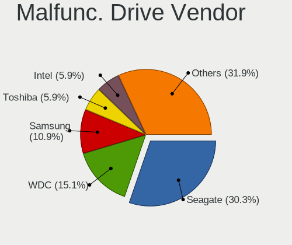
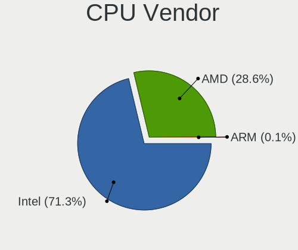
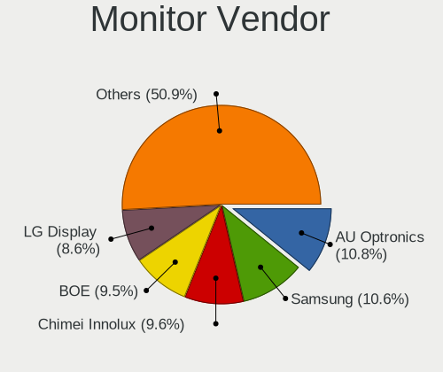
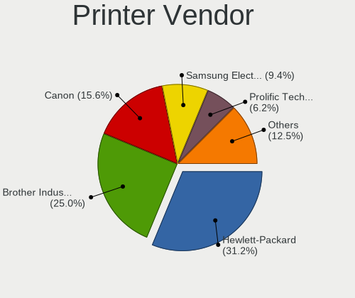

Fedora 35 - Tested Hardware & Statistics
----------------------------------------

A project to collect tested hardware configurations for Fedora 35.

Anyone can contribute to this report by the [hw-probe](https://github.com/linuxhw/hw-probe) tool:

    sudo -E hw-probe -all -upload

Please submit a probe of your configuration if it's not presented on the page or is rare.

This is a report for all computer types. See also reports for [desktops](/Dist/Fedora_35/Desktop/README.md) and [notebooks](/Dist/Fedora_35/Notebook/README.md).

Full-feature report is available here: https://linux-hardware.org/?view=trends&rel=fedora-35

Contents
--------

* [ Test Cases ](#test-cases)

* [ System ](#system)
  - [ Kernel                   ](#kernel)
  - [ Kernel Family            ](#kernel-family)
  - [ Kernel Major Ver.        ](#kernel-major-ver)
  - [ Arch                     ](#arch)
  - [ DE                       ](#de)
  - [ Display Server           ](#display-server)
  - [ Display Manager          ](#display-manager)
  - [ OS Lang                  ](#os-lang)
  - [ Boot Mode                ](#boot-mode)
  - [ Filesystem               ](#filesystem)
  - [ Part. scheme             ](#part-scheme)
  - [ Dual Boot with Linux/BSD ](#dual-boot-with-linuxbsd)
  - [ Dual Boot (Win)          ](#dual-boot-win)

* [ Board ](#board)
  - [ Vendor                   ](#vendor)
  - [ Model                    ](#model)
  - [ Model Family             ](#model-family)
  - [ MFG Year                 ](#mfg-year)
  - [ Form Factor              ](#form-factor)
  - [ Secure Boot              ](#secure-boot)
  - [ Coreboot                 ](#coreboot)
  - [ RAM Size                 ](#ram-size)
  - [ RAM Used                 ](#ram-used)
  - [ Total Drives             ](#total-drives)
  - [ Has CD-ROM               ](#has-cd-rom)
  - [ Has Ethernet             ](#has-ethernet)
  - [ Has WiFi                 ](#has-wifi)
  - [ Has Bluetooth            ](#has-bluetooth)

* [ Location ](#location)
  - [ Country                  ](#country)
  - [ City                     ](#city)

* [ Drives ](#drives)
  - [ Drive Vendor             ](#drive-vendor)
  - [ Drive Model              ](#drive-model)
  - [ HDD Vendor               ](#hdd-vendor)
  - [ SSD Vendor               ](#ssd-vendor)
  - [ Drive Kind               ](#drive-kind)
  - [ Drive Connector          ](#drive-connector)
  - [ Drive Size               ](#drive-size)
  - [ Space Total              ](#space-total)
  - [ Space Used               ](#space-used)
  - [ Malfunc. Drives          ](#malfunc-drives)
  - [ Malfunc. Drive Vendor    ](#malfunc-drive-vendor)
  - [ Malfunc. HDD Vendor      ](#malfunc-hdd-vendor)
  - [ Malfunc. Drive Kind      ](#malfunc-drive-kind)
  - [ Failed Drives            ](#failed-drives)
  - [ Failed Drive Vendor      ](#failed-drive-vendor)
  - [ Drive Status             ](#drive-status)

* [ Storage controller ](#storage-controller)
  - [ Storage Vendor           ](#storage-vendor)
  - [ Storage Model            ](#storage-model)
  - [ Storage Kind             ](#storage-kind)

* [ Processor ](#processor)
  - [ CPU Vendor               ](#cpu-vendor)
  - [ CPU Model                ](#cpu-model)
  - [ CPU Model Family         ](#cpu-model-family)
  - [ CPU Cores                ](#cpu-cores)
  - [ CPU Sockets              ](#cpu-sockets)
  - [ CPU Threads              ](#cpu-threads)
  - [ CPU Op-Modes             ](#cpu-op-modes)
  - [ CPU Microcode            ](#cpu-microcode)
  - [ CPU Microarch            ](#cpu-microarch)

* [ Graphics ](#graphics)
  - [ GPU Vendor               ](#gpu-vendor)
  - [ GPU Model                ](#gpu-model)
  - [ GPU Combo                ](#gpu-combo)
  - [ GPU Driver               ](#gpu-driver)
  - [ GPU Memory               ](#gpu-memory)

* [ Monitor ](#monitor)
  - [ Monitor Vendor           ](#monitor-vendor)
  - [ Monitor Model            ](#monitor-model)
  - [ Monitor Resolution       ](#monitor-resolution)
  - [ Monitor Diagonal         ](#monitor-diagonal)
  - [ Monitor Width            ](#monitor-width)
  - [ Aspect Ratio             ](#aspect-ratio)
  - [ Monitor Area             ](#monitor-area)
  - [ Pixel Density            ](#pixel-density)
  - [ Multiple Monitors        ](#multiple-monitors)

* [ Network ](#network)
  - [ Net Controller Vendor    ](#net-controller-vendor)
  - [ Net Controller Model     ](#net-controller-model)
  - [ Wireless Vendor          ](#wireless-vendor)
  - [ Wireless Model           ](#wireless-model)
  - [ Ethernet Vendor          ](#ethernet-vendor)
  - [ Ethernet Model           ](#ethernet-model)
  - [ Net Controller Kind      ](#net-controller-kind)
  - [ Used Controller          ](#used-controller)
  - [ NICs                     ](#nics)
  - [ IPv6                     ](#ipv6)

* [ Bluetooth ](#bluetooth)
  - [ Bluetooth Vendor         ](#bluetooth-vendor)
  - [ Bluetooth Model          ](#bluetooth-model)

* [ Sound ](#sound)
  - [ Sound Vendor             ](#sound-vendor)
  - [ Sound Model              ](#sound-model)

* [ Memory ](#memory)
  - [ Memory Vendor            ](#memory-vendor)
  - [ Memory Model             ](#memory-model)
  - [ Memory Kind              ](#memory-kind)
  - [ Memory Form Factor       ](#memory-form-factor)
  - [ Memory Size              ](#memory-size)
  - [ Memory Speed             ](#memory-speed)

* [ Printers & scanners ](#printers--scanners)
  - [ Printer Vendor           ](#printer-vendor)
  - [ Printer Model            ](#printer-model)
  - [ Scanner Vendor           ](#scanner-vendor)
  - [ Scanner Model            ](#scanner-model)

* [ Camera ](#camera)
  - [ Camera Vendor            ](#camera-vendor)
  - [ Camera Model             ](#camera-model)

* [ Security ](#security)
  - [ Fingerprint Vendor       ](#fingerprint-vendor)
  - [ Fingerprint Model        ](#fingerprint-model)
  - [ Chipcard Vendor          ](#chipcard-vendor)
  - [ Chipcard Model           ](#chipcard-model)

* [ Unsupported ](#unsupported)
  - [ Unsupported Devices      ](#unsupported-devices)
  - [ Unsupported Device Types ](#unsupported-device-types)

Test Cases
----------

| Vendor        | Model                       | Form-Factor | Probe                                                      | Date         |
|---------------|-----------------------------|-------------|------------------------------------------------------------|--------------|
| MSI           | MPG X570 GAMING PRO CARB... | Desktop     | [93de1508cb](https://linux-hardware.org/?probe=93de1508cb) | Oct 31, 2021 |
| HP            | ENVY x360 Convertible 13... | Convertible | [28b152bb19](https://linux-hardware.org/?probe=28b152bb19) | Oct 30, 2021 |
| Lenovo        | ThinkPad T480s 20L70026U... | Notebook    | [eeb181f50b](https://linux-hardware.org/?probe=eeb181f50b) | Oct 30, 2021 |
| HUAWEI        | NBLK-WAX9X                  | Notebook    | [1310b8abf4](https://linux-hardware.org/?probe=1310b8abf4) | Oct 30, 2021 |
| Framework     | Laptop                      | Notebook    | [04db6c2222](https://linux-hardware.org/?probe=04db6c2222) | Oct 29, 2021 |
| Dell          | XPS 13 9310 2-in-1          | Convertible | [5b10037da5](https://linux-hardware.org/?probe=5b10037da5) | Oct 29, 2021 |
| Acer          | Aspire F5-573G              | Notebook    | [1be6c8dc87](https://linux-hardware.org/?probe=1be6c8dc87) | Oct 29, 2021 |
| Lenovo        | ThinkPad T490 20N3S6VU00    | Notebook    | [f8024b89d4](https://linux-hardware.org/?probe=f8024b89d4) | Oct 28, 2021 |
| Lenovo        | ThinkPad L15 Gen 1 20U70... | Notebook    | [e9a8fb1275](https://linux-hardware.org/?probe=e9a8fb1275) | Oct 27, 2021 |
| BESSTAR Te... | X400                        | Notebook    | [9cfc0bb300](https://linux-hardware.org/?probe=9cfc0bb300) | Oct 27, 2021 |
| HP            | ENVY x360 Convertible 15... | Convertible | [5f67b298ab](https://linux-hardware.org/?probe=5f67b298ab) | Oct 27, 2021 |
| Lenovo        | 1046 SDK0T08861 WIN 3305... | Desktop     | [136c409f1a](https://linux-hardware.org/?probe=136c409f1a) | Oct 27, 2021 |
| Lenovo        | 1046 SDK0T08861 WIN 3305... | Desktop     | [ae8daa788a](https://linux-hardware.org/?probe=ae8daa788a) | Oct 27, 2021 |
| MSI           | B550-A PRO                  | Desktop     | [91c5853577](https://linux-hardware.org/?probe=91c5853577) | Oct 25, 2021 |
| Positivo B... | VJFE53F11X-XXXXXX           | Notebook    | [d3720f9145](https://linux-hardware.org/?probe=d3720f9145) | Oct 25, 2021 |
| Alienware     | Area-51m R2                 | Notebook    | [c3f94d8599](https://linux-hardware.org/?probe=c3f94d8599) | Oct 24, 2021 |
| Fujitsu       | D3120-A1 S26361-D3120-A1    | Desktop     | [fac95138dc](https://linux-hardware.org/?probe=fac95138dc) | Oct 23, 2021 |
| HP            | ProBook 470 G5              | Notebook    | [725627d16b](https://linux-hardware.org/?probe=725627d16b) | Oct 23, 2021 |
| HP            | EliteBook 8560w             | Notebook    | [98bd384a42](https://linux-hardware.org/?probe=98bd384a42) | Oct 23, 2021 |
| Lenovo        | ThinkPad T480 20L5000BMX    | Notebook    | [91fc910cf6](https://linux-hardware.org/?probe=91fc910cf6) | Oct 23, 2021 |
| HP            | Pavilion Gaming Laptop 1... | Notebook    | [1c91bc1deb](https://linux-hardware.org/?probe=1c91bc1deb) | Oct 23, 2021 |
| HP            | EliteBook x360 830 G5       | Convertible | [9383081522](https://linux-hardware.org/?probe=9383081522) | Oct 22, 2021 |
| Lenovo        | ThinkPad T480 20L5000BMX    | Notebook    | [21b13fb067](https://linux-hardware.org/?probe=21b13fb067) | Oct 21, 2021 |
| Lenovo        | ThinkPad T490 20N3S6VU00    | Notebook    | [9932dd3c21](https://linux-hardware.org/?probe=9932dd3c21) | Oct 21, 2021 |
| Lenovo        | ThinkPad T490 20N3S6VU00    | Notebook    | [a99866abc1](https://linux-hardware.org/?probe=a99866abc1) | Oct 21, 2021 |
| Foxconn       | H81MXV FAB A                | Desktop     | [b030daf542](https://linux-hardware.org/?probe=b030daf542) | Oct 20, 2021 |
| Acer          | Swift SF114-32              | Notebook    | [faa49a332b](https://linux-hardware.org/?probe=faa49a332b) | Oct 20, 2021 |
| ASUSTek       | PRIME B460M-A               | Desktop     | [6db5e9be6b](https://linux-hardware.org/?probe=6db5e9be6b) | Oct 19, 2021 |
| HP            | EliteBook 820 G1            | Notebook    | [278ec34902](https://linux-hardware.org/?probe=278ec34902) | Oct 19, 2021 |
| Lenovo        | ThinkPad T460 20FMS1R01K    | Notebook    | [4dbc231901](https://linux-hardware.org/?probe=4dbc231901) | Oct 18, 2021 |
| ASUSTek       | ROG STRIX B560-G GAMING ... | Desktop     | [746401b748](https://linux-hardware.org/?probe=746401b748) | Oct 18, 2021 |
| Intel         | NUC6CAYB J23203-409         | Mini pc     | [b1c4af0594](https://linux-hardware.org/?probe=b1c4af0594) | Oct 17, 2021 |
| GPU Compan... | GWTN156-1                   | Notebook    | [3cb0b09b48](https://linux-hardware.org/?probe=3cb0b09b48) | Oct 17, 2021 |
| HP            | Laptop 14-df0xxx            | Notebook    | [ac488ba246](https://linux-hardware.org/?probe=ac488ba246) | Oct 16, 2021 |
| HP            | Pavilion Gaming Laptop 1... | Notebook    | [362e1d3b99](https://linux-hardware.org/?probe=362e1d3b99) | Oct 15, 2021 |
| MSI           | B350 PC MATE                | Desktop     | [bc716e921b](https://linux-hardware.org/?probe=bc716e921b) | Oct 15, 2021 |
| Dell          | 0WMJ54 A01                  | Desktop     | [01ce3b252c](https://linux-hardware.org/?probe=01ce3b252c) | Oct 14, 2021 |
| Dell          | Precision 5550              | Notebook    | [15a0f61f84](https://linux-hardware.org/?probe=15a0f61f84) | Oct 14, 2021 |
| Unknown       | Unknown Product             | Soc         | [bf8abdfb09](https://linux-hardware.org/?probe=bf8abdfb09) | Oct 14, 2021 |
| Unknown       | Unknown Product             | Soc         | [3a844f7153](https://linux-hardware.org/?probe=3a844f7153) | Oct 14, 2021 |
| ASUSTek       | PRIME B550M-A               | Desktop     | [2ff2eb607a](https://linux-hardware.org/?probe=2ff2eb607a) | Oct 14, 2021 |
| Lenovo        | ThinkPad L390 Yoga 20NTC... | Convertible | [b9971b685a](https://linux-hardware.org/?probe=b9971b685a) | Oct 12, 2021 |
| Lenovo        | Legion 5 15ARH05H 82B1      | Notebook    | [4bb5ac9410](https://linux-hardware.org/?probe=4bb5ac9410) | Oct 12, 2021 |
| ASUSTek       | PRIME A320I-K               | Desktop     | [eee2a960f5](https://linux-hardware.org/?probe=eee2a960f5) | Oct 11, 2021 |
| HP            | OMEN Laptop 15-ek0xxx       | Notebook    | [d4acf59f3b](https://linux-hardware.org/?probe=d4acf59f3b) | Oct 11, 2021 |
| Lenovo        | IdeaPad S145-15API 81V7     | Notebook    | [5b4efb9e18](https://linux-hardware.org/?probe=5b4efb9e18) | Oct 10, 2021 |
| ASUSTek       | PRIME B350-PLUS             | Desktop     | [7b26df9bc4](https://linux-hardware.org/?probe=7b26df9bc4) | Oct 10, 2021 |
| Lenovo        | Yoga S740-14IIL 81RS        | Notebook    | [fd09df16d9](https://linux-hardware.org/?probe=fd09df16d9) | Oct 10, 2021 |
| Gigabyte      | X570 AORUS ULTRA            | Desktop     | [f850c51db9](https://linux-hardware.org/?probe=f850c51db9) | Oct 10, 2021 |
| ASUSTek       | ROG Maximus XI FORMULA      | Desktop     | [cfbe862160](https://linux-hardware.org/?probe=cfbe862160) | Oct 10, 2021 |
| Fujitsu       | D3220-A1 S26361-D3220-A1    | Desktop     | [a9ceb4591e](https://linux-hardware.org/?probe=a9ceb4591e) | Oct 09, 2021 |
| Fujitsu       | D3220-A1 S26361-D3220-A1    | Desktop     | [7c210a60ab](https://linux-hardware.org/?probe=7c210a60ab) | Oct 09, 2021 |
| HP            | ProBook 450 G3              | Notebook    | [2eeb05ff03](https://linux-hardware.org/?probe=2eeb05ff03) | Oct 09, 2021 |
| Gigabyte      | H61N-USB3                   | Desktop     | [43ded3a853](https://linux-hardware.org/?probe=43ded3a853) | Oct 09, 2021 |
| HP            | ENVY Laptop 15t-ep000       | Notebook    | [f9b69ffa3d](https://linux-hardware.org/?probe=f9b69ffa3d) | Oct 08, 2021 |
| Dell          | Inspiron 5505               | Notebook    | [d136f5d8f7](https://linux-hardware.org/?probe=d136f5d8f7) | Oct 08, 2021 |
| ASUSTek       | ROG STRIX B550-F GAMING     | Desktop     | [b3d0295208](https://linux-hardware.org/?probe=b3d0295208) | Oct 08, 2021 |
| Lenovo        | ThinkPad X1 Carbon 7th 2... | Notebook    | [26c62915e0](https://linux-hardware.org/?probe=26c62915e0) | Oct 07, 2021 |
| Gigabyte      | H61N-USB3                   | Desktop     | [75d34f09c4](https://linux-hardware.org/?probe=75d34f09c4) | Oct 06, 2021 |
| ASUSTek       | VivoBook S15 X530UA         | Notebook    | [146866c629](https://linux-hardware.org/?probe=146866c629) | Oct 06, 2021 |
| MSI           | B550-A PRO                  | Desktop     | [17a03c217e](https://linux-hardware.org/?probe=17a03c217e) | Oct 04, 2021 |
| Lenovo        | ThinkPad L390 20NUS01W00    | Convertible | [880201a9eb](https://linux-hardware.org/?probe=880201a9eb) | Oct 04, 2021 |
| Apple         | MacBookPro5,5               | Notebook    | [db435ab99c](https://linux-hardware.org/?probe=db435ab99c) | Oct 03, 2021 |
| Lenovo        | G580 20150                  | Notebook    | [08adba2c54](https://linux-hardware.org/?probe=08adba2c54) | Oct 02, 2021 |
| HUAWEI        | EUL-WX9                     | Notebook    | [dfc5c12fbf](https://linux-hardware.org/?probe=dfc5c12fbf) | Oct 01, 2021 |
| Lenovo        | G580 20150                  | Notebook    | [1dbb7762f6](https://linux-hardware.org/?probe=1dbb7762f6) | Oct 01, 2021 |
| HP            | EliteBook 840 G5            | Notebook    | [e64aeb5fa4](https://linux-hardware.org/?probe=e64aeb5fa4) | Oct 01, 2021 |
| Lenovo        | IdeaPad 3 14ALC6 82KT       | Notebook    | [17c2d08e41](https://linux-hardware.org/?probe=17c2d08e41) | Oct 01, 2021 |
| HP            | EliteBook 840 G5            | Notebook    | [28bfae31ee](https://linux-hardware.org/?probe=28bfae31ee) | Oct 01, 2021 |
| Dell          | Studio 1537                 | Notebook    | [aae900457c](https://linux-hardware.org/?probe=aae900457c) | Oct 01, 2021 |
| Gigabyte      | Z170-D3H-CF                 | Desktop     | [103d2198a4](https://linux-hardware.org/?probe=103d2198a4) | Sep 30, 2021 |
| Gigabyte      | Z170-D3H-CF                 | Desktop     | [b6f5c877d4](https://linux-hardware.org/?probe=b6f5c877d4) | Sep 29, 2021 |
| Framework     | Laptop                      | Notebook    | [95576917c8](https://linux-hardware.org/?probe=95576917c8) | Sep 29, 2021 |
| Notebook      | N2x0WU                      | Notebook    | [410a2dab96](https://linux-hardware.org/?probe=410a2dab96) | Sep 28, 2021 |
| Gigabyte      | H81M-S2H                    | Desktop     | [b8c27bd56c](https://linux-hardware.org/?probe=b8c27bd56c) | Sep 28, 2021 |
| Lenovo        | IdeaPad C340-14API 81N6     | Notebook    | [82e0f76133](https://linux-hardware.org/?probe=82e0f76133) | Sep 25, 2021 |
| ASRock        | B450M-HDV R4.0              | Desktop     | [2f771e8271](https://linux-hardware.org/?probe=2f771e8271) | Sep 24, 2021 |
| Lenovo        | ThinkPad E480 20KNS0MC00    | Notebook    | [ba847bc0c4](https://linux-hardware.org/?probe=ba847bc0c4) | Sep 23, 2021 |
| ASUSTek       | TUF GAMING B550M-PLUS       | Desktop     | [e75373a634](https://linux-hardware.org/?probe=e75373a634) | Sep 23, 2021 |
| HP            | Spectre x360 Convertible... | Convertible | [0b68c3f5c3](https://linux-hardware.org/?probe=0b68c3f5c3) | Sep 20, 2021 |
| Apple         | MacBook6,1                  | Notebook    | [4fbbe3d05b](https://linux-hardware.org/?probe=4fbbe3d05b) | Sep 19, 2021 |
| HP            | G42                         | Notebook    | [0e9914c9cc](https://linux-hardware.org/?probe=0e9914c9cc) | Sep 18, 2021 |
| HP            | ZBook 15u G5                | Notebook    | [a5331a4d5e](https://linux-hardware.org/?probe=a5331a4d5e) | Sep 15, 2021 |
| Dell          | XPS 17 9700                 | Notebook    | [ebac1c499f](https://linux-hardware.org/?probe=ebac1c499f) | Sep 15, 2021 |
| ASUSTek       | ROG STRIX B360-I GAMING     | Desktop     | [3875512e39](https://linux-hardware.org/?probe=3875512e39) | Sep 14, 2021 |
| ASUSTek       | ROG STRIX B360-I GAMING     | Desktop     | [4fb9ed180b](https://linux-hardware.org/?probe=4fb9ed180b) | Sep 14, 2021 |
| ASUSTek       | G71V                        | Notebook    | [7904b934a4](https://linux-hardware.org/?probe=7904b934a4) | Sep 09, 2021 |
| Dell          | XPS 13 9310 2-in-1          | Convertible | [2766de5f8a](https://linux-hardware.org/?probe=2766de5f8a) | Sep 08, 2021 |
| Lenovo        | ThinkPad X1 Carbon Gen 8... | Notebook    | [2b21ef140a](https://linux-hardware.org/?probe=2b21ef140a) | Sep 05, 2021 |
| Lenovo        | ThinkPad P51s 20HBCTO1WW    | Notebook    | [e2f22f9f40](https://linux-hardware.org/?probe=e2f22f9f40) | Aug 27, 2021 |
| Dell          | 0WMJ54 A01                  | Desktop     | [3231b34d4d](https://linux-hardware.org/?probe=3231b34d4d) | Aug 24, 2021 |
| Dell          | Latitude E5470              | Notebook    | [ac04ecb1e5](https://linux-hardware.org/?probe=ac04ecb1e5) | Aug 22, 2021 |
| Dell          | 0WMJ54 A01                  | Desktop     | [a94ad8a323](https://linux-hardware.org/?probe=a94ad8a323) | Aug 22, 2021 |
| AZW           | GK mini                     | Mini pc     | [995cc09b8d](https://linux-hardware.org/?probe=995cc09b8d) | Aug 22, 2021 |
| AZW           | GK mini                     | Mini pc     | [2024a6712e](https://linux-hardware.org/?probe=2024a6712e) | Aug 22, 2021 |
| Dell          | XPS 15 9550                 | Notebook    | [0a28b37020](https://linux-hardware.org/?probe=0a28b37020) | Aug 15, 2021 |
| Acer          | Aspire A315-42              | Notebook    | [4a54197130](https://linux-hardware.org/?probe=4a54197130) | Aug 15, 2021 |
| Acer          | Aspire ES1-572              | Notebook    | [06ddc49173](https://linux-hardware.org/?probe=06ddc49173) | Aug 13, 2021 |
| Dell          | XPS 15 9570                 | Notebook    | [f20e1ba8fe](https://linux-hardware.org/?probe=f20e1ba8fe) | Aug 13, 2021 |
| Dell          | XPS 13 9380                 | Notebook    | [1c3776f221](https://linux-hardware.org/?probe=1c3776f221) | Aug 13, 2021 |
| Lenovo        | IdeaPad 530S-14IKB 81EU     | Notebook    | [ab00a7e359](https://linux-hardware.org/?probe=ab00a7e359) | Aug 13, 2021 |
| HP            | 8055                        | Desktop     | [29f5b9a7ab](https://linux-hardware.org/?probe=29f5b9a7ab) | Aug 12, 2021 |
| Dell          | 0KC9NP A01                  | Desktop     | [142e0703fb](https://linux-hardware.org/?probe=142e0703fb) | Aug 12, 2021 |
| Dell          | 0KC9NP A01                  | Desktop     | [f48bc9ac9d](https://linux-hardware.org/?probe=f48bc9ac9d) | Aug 07, 2021 |
| Notebook      | P377SM-A                    | Notebook    | [be5397dd67](https://linux-hardware.org/?probe=be5397dd67) | Aug 05, 2021 |
| HUAWEI        | KLVL-WXX9                   | Notebook    | [d677af1f50](https://linux-hardware.org/?probe=d677af1f50) | Aug 02, 2021 |
| ASUSTek       | Maximus V FORMULA           | Desktop     | [466ef3bd27](https://linux-hardware.org/?probe=466ef3bd27) | Jul 29, 2021 |
| Dell          | 0KC9NP A01                  | Desktop     | [7dcd16d3fd](https://linux-hardware.org/?probe=7dcd16d3fd) | Jul 14, 2021 |
| Dell          | 0KC9NP A01                  | Desktop     | [eedd464065](https://linux-hardware.org/?probe=eedd464065) | Jul 14, 2021 |
| HUAWEI        | KLVL-WXX9                   | Notebook    | [66c25f9637](https://linux-hardware.org/?probe=66c25f9637) | Jul 10, 2021 |
| Dell          | 0KC9NP A01                  | Desktop     | [8d1e68aad0](https://linux-hardware.org/?probe=8d1e68aad0) | Jul 07, 2021 |
| Dell          | 0KC9NP A01                  | Desktop     | [852a8a103d](https://linux-hardware.org/?probe=852a8a103d) | Jul 04, 2021 |
| Dell          | 0KC9NP A01                  | Desktop     | [3a0ca9b90c](https://linux-hardware.org/?probe=3a0ca9b90c) | Jul 01, 2021 |
| Dell          | 0KC9NP A01                  | Desktop     | [3ed1ee1f81](https://linux-hardware.org/?probe=3ed1ee1f81) | Jun 25, 2021 |
| Dell          | 0KC9NP A01                  | Desktop     | [f611d9ec88](https://linux-hardware.org/?probe=f611d9ec88) | Jun 23, 2021 |
| ASUSTek       | Maximus V FORMULA           | Desktop     | [95ba18d5da](https://linux-hardware.org/?probe=95ba18d5da) | Jun 23, 2021 |
| Dell          | 0KC9NP A01                  | Desktop     | [511e8019e0](https://linux-hardware.org/?probe=511e8019e0) | Jun 19, 2021 |
| Dell          | 0KC9NP A01                  | Desktop     | [6687380bd7](https://linux-hardware.org/?probe=6687380bd7) | Jun 18, 2021 |
| Gigabyte      | F2A88XN-WIFI                | Desktop     | [c22e6d8669](https://linux-hardware.org/?probe=c22e6d8669) | May 25, 2021 |
| ASUSTek       | Maximus V FORMULA           | Desktop     | [3e15dd7136](https://linux-hardware.org/?probe=3e15dd7136) | May 19, 2021 |
| Notebook      | P377SM-A                    | Notebook    | [bf37a519fa](https://linux-hardware.org/?probe=bf37a519fa) | May 17, 2021 |
| Notebook      | P377SM-A                    | Notebook    | [0834d4df8b](https://linux-hardware.org/?probe=0834d4df8b) | May 16, 2021 |
| Microsoft     | Surface Pro                 | Tablet      | [7a294509de](https://linux-hardware.org/?probe=7a294509de) | May 15, 2021 |
| Microsoft     | Surface Pro                 | Tablet      | [4238374bcc](https://linux-hardware.org/?probe=4238374bcc) | Apr 26, 2021 |
| HP            | Pavilion x360 Convertibl... | Convertible | [89892d4957](https://linux-hardware.org/?probe=89892d4957) | Apr 18, 2021 |
| HP            | Pavilion x360 Convertibl... | Convertible | [97c124c8a3](https://linux-hardware.org/?probe=97c124c8a3) | Apr 18, 2021 |
| ECS           | MCP61M-M3                   | Desktop     | [2e5b21af19](https://linux-hardware.org/?probe=2e5b21af19) | Apr 17, 2021 |
| ASUSTek       | PRIME X570-PRO              | Desktop     | [3f7cbcea74](https://linux-hardware.org/?probe=3f7cbcea74) | Apr 14, 2021 |
| Lenovo        | ThinkPad W541 20EF000UMN    | Notebook    | [f366b44668](https://linux-hardware.org/?probe=f366b44668) | Apr 11, 2021 |
| HP            | Pavilion x360 Convertibl... | Convertible | [c0901f4607](https://linux-hardware.org/?probe=c0901f4607) | Mar 29, 2021 |
| HUAWEI        | BOHK-WAX9X                  | Notebook    | [31475604b7](https://linux-hardware.org/?probe=31475604b7) | Mar 12, 2021 |
| HUAWEI        | BOHK-WAX9X                  | Notebook    | [151d163eb9](https://linux-hardware.org/?probe=151d163eb9) | Mar 12, 2021 |
| HUAWEI        | BOHK-WAX9X                  | Notebook    | [4b33f82ac0](https://linux-hardware.org/?probe=4b33f82ac0) | Mar 06, 2021 |

System
------

Kernel
------

Version of the Linux kernel

| Version                                                       | Computers | Percent |
|---------------------------------------------------------------|-----------|---------|
| 5.14.10-300.fc35.x86_64                                       | 18        | 17.14%  |
| 5.14.9-300.fc35.x86_64                                        | 15        | 14.29%  |
| 5.14.0-60.fc35.x86_64                                         | 10        | 9.52%   |
| 5.14.11-300.fc35.x86_64                                       | 6         | 5.71%   |
| 5.14.0-0.rc5.42.fc35.x86_64                                   | 5         | 4.76%   |
| 5.14.7-300.fc35.x86_64                                        | 4         | 3.81%   |
| 5.14.6-300.fc35.x86_64                                        | 3         | 2.86%   |
| 5.14.14-300.fc35.x86_64                                       | 3         | 2.86%   |
| 5.14.12-300.fc35.x86_64                                       | 3         | 2.86%   |
| 5.14.0-0.rc6.46.fc35.x86_64                                   | 3         | 2.86%   |
| 5.14.3-300.fc35.x86_64                                        | 2         | 1.9%    |
| 5.14.1-300.fc35.x86_64                                        | 2         | 1.9%    |
| 5.12.0-0.rc7.189.fc35.x86_64                                  | 2         | 1.9%    |
| 5.15.0-0.rc7.20211028git1fc596a56b33.56.vanilla.1.fc35.x86_64 | 1         | 0.95%   |
| 5.14.9-300.fc35.aarch64                                       | 1         | 0.95%   |
| 5.14.8-xm1cacule.0.fc35.x86_64                                | 1         | 0.95%   |
| 5.14.8-lqx1.0.fc35.x86_64                                     | 1         | 0.95%   |
| 5.14.5-300.fc35.x86_64                                        | 1         | 0.95%   |
| 5.14.15-300.fc35.x86_64                                       | 1         | 0.95%   |
| 5.14.13_MY                                                    | 1         | 0.95%   |
| 5.14.0-0.rc4.20210804gitd5ad8ec3cfb5.36.fc35.x86_64           | 1         | 0.95%   |
| 5.14.0-0.rc3.20210728git4010a528219e.32.fc35.x86_64           | 1         | 0.95%   |
| 5.14.0-0.rc0.20210701gitdbe69e433722.6.fc35.x86_64            | 1         | 0.95%   |
| 5.13.9-200.fc34.x86_64                                        | 1         | 0.95%   |
| 5.13.7-200.fc34.x86_64                                        | 1         | 0.95%   |
| 5.13.4-200.fc34.x86_64                                        | 1         | 0.95%   |
| 5.13.0-58.fc35.x86_64                                         | 1         | 0.95%   |
| 5.13.0-0.rc7.20210623git0c18f29aae7c.53.fc35.x86_64           | 1         | 0.95%   |
| 5.13.0-0.rc6.45.fc35.x86_64                                   | 1         | 0.95%   |
| 5.13.0-0.rc2.20210521git79a106fc6585.22.fc35.x86_64           | 1         | 0.95%   |
| 5.13.0-0.rc2.19.fc35.x86_64                                   | 1         | 0.95%   |
| 5.13.0-0.rc1.20210513gitc06a2ba62fc4.15.fc35.x86_64           | 1         | 0.95%   |
| 5.13.0-0.rc1.13.fc35.x86_64                                   | 1         | 0.95%   |
| 5.12.8-300.fc34.x86_64                                        | 1         | 0.95%   |
| 5.12.0-0.rc8.20210423git7af08140979a.193.fc35.x86_64          | 1         | 0.95%   |
| 5.12.0-0.rc8.191.fc35.x86_64                                  | 1         | 0.95%   |
| 5.12.0-0.rc7.20210416git7e25f40eab52.191.fc35.x86_64          | 1         | 0.95%   |
| 5.12.0-0.rc6.20210408git454859c552da.186.fc35.x86_64          | 1         | 0.95%   |
| 5.12.0-0.rc4.20210326gitdb24726bfefa.178.fc35.x86_64          | 1         | 0.95%   |
| 5.12.0-0.rc1.162.fc35.x86_64                                  | 1         | 0.95%   |
| 5.11.18-300.fc34.x86_64                                       | 1         | 0.95%   |
| 5.10.23-200.fc35.x86_64                                       | 1         | 0.95%   |

Kernel Family
-------------

Linux kernel without a distro release

| Version | Computers | Percent |
|---------|-----------|---------|
| 5.14.0  | 20        | 20%     |
| 5.14.10 | 18        | 18%     |
| 5.14.9  | 16        | 16%     |
| 5.12.0  | 7         | 7%      |
| 5.14.11 | 6         | 6%      |
| 5.14.7  | 4         | 4%      |
| 5.13.0  | 4         | 4%      |
| 5.14.6  | 3         | 3%      |
| 5.14.14 | 3         | 3%      |
| 5.14.12 | 3         | 3%      |
| 5.14.8  | 2         | 2%      |
| 5.14.3  | 2         | 2%      |
| 5.14.1  | 2         | 2%      |
| 5.15.0  | 1         | 1%      |
| 5.14.5  | 1         | 1%      |
| 5.14.15 | 1         | 1%      |
| 5.14.13 | 1         | 1%      |
| 5.13.9  | 1         | 1%      |
| 5.13.7  | 1         | 1%      |
| 5.13.4  | 1         | 1%      |
| 5.12.8  | 1         | 1%      |
| 5.11.18 | 1         | 1%      |
| 5.10.23 | 1         | 1%      |

Kernel Major Ver.
-----------------

Linux kernel major version

| Version | Computers | Percent |
|---------|-----------|---------|
| 5.14    | 82        | 82%     |
| 5.12    | 8         | 8%      |
| 5.13    | 7         | 7%      |
| 5.15    | 1         | 1%      |
| 5.11    | 1         | 1%      |
| 5.10    | 1         | 1%      |

Arch
----

OS architecture (x86_64, i586, etc.)

| Name    | Computers | Percent |
|---------|-----------|---------|
| x86_64  | 98        | 98.99%  |
| aarch64 | 1         | 1.01%   |

DE
--

Desktop Environment

| Name     | Computers | Percent |
|----------|-----------|---------|
| GNOME    | 73        | 73%     |
| KDE5     | 8         | 8%      |
| Unknown  | 8         | 8%      |
| KDE      | 5         | 5%      |
| MATE     | 3         | 3%      |
| XFCE     | 1         | 1%      |
| DWM      | 1         | 1%      |
| Cinnamon | 1         | 1%      |

Display Server
--------------

X11 or Wayland

| Name    | Computers | Percent |
|---------|-----------|---------|
| Wayland | 69        | 69.7%   |
| X11     | 22        | 22.22%  |
| Unknown | 5         | 5.05%   |
| Tty     | 3         | 3.03%   |

Display Manager
---------------

SDDM, LightDM, etc.

| Name    | Computers | Percent |
|---------|-----------|---------|
| Unknown | 56        | 56.57%  |
| GDM     | 32        | 32.32%  |
| SDDM    | 6         | 6.06%   |
| LightDM | 4         | 4.04%   |
| TDM     | 1         | 1.01%   |

OS Lang
-------

Language

| Lang  | Computers | Percent |
|-------|-----------|---------|
| en_US | 58        | 58%     |
| en_GB | 6         | 6%      |
| ru_RU | 5         | 5%      |
| pt_BR | 5         | 5%      |
| pl_PL | 4         | 4%      |
| en_CA | 3         | 3%      |
| nl_BE | 2         | 2%      |
| es_ES | 2         | 2%      |
| en_IL | 2         | 2%      |
| de_DE | 2         | 2%      |
| uk_UA | 1         | 1%      |
| sv_SE | 1         | 1%      |
| pa_IN | 1         | 1%      |
| nl_NL | 1         | 1%      |
| it_IT | 1         | 1%      |
| hu_HU | 1         | 1%      |
| ga_IE | 1         | 1%      |
| fr_FR | 1         | 1%      |
| fr_CH | 1         | 1%      |
| fr_CA | 1         | 1%      |
| es_CL | 1         | 1%      |

Boot Mode
---------

EFI or BIOS

| Mode | Computers | Percent |
|------|-----------|---------|
| EFI  | 83        | 83.84%  |
| BIOS | 16        | 16.16%  |

Filesystem
----------

Type of filesystem

| Type  | Computers | Percent |
|-------|-----------|---------|
| Btrfs | 67        | 67%     |
| Ext4  | 29        | 29%     |
| Xfs   | 4         | 4%      |

Part. scheme
------------

Scheme of partitioning

| Type    | Computers | Percent |
|---------|-----------|---------|
| Unknown | 48        | 48%     |
| GPT     | 47        | 47%     |
| MBR     | 5         | 5%      |

Dual Boot with Linux/BSD
------------------------

Hosting more than one Linux/BSD

| Dual boot | Computers | Percent |
|-----------|-----------|---------|
| No        | 83        | 82.18%  |
| Yes       | 18        | 17.82%  |

Dual Boot (Win)
---------------

Hosting Linux and Windows

| Dual boot | Computers | Percent |
|-----------|-----------|---------|
| No        | 85        | 84.16%  |
| Yes       | 16        | 15.84%  |

Board
-----

Vendor
------

Motherboard manufacturer

| Name                  | Computers | Percent |
|-----------------------|-----------|---------|
| Lenovo                | 20        | 20.2%   |
| Hewlett-Packard       | 19        | 19.19%  |
| ASUSTek Computer      | 13        | 13.13%  |
| Dell                  | 12        | 12.12%  |
| Gigabyte Technology   | 5         | 5.05%   |
| HUAWEI                | 4         | 4.04%   |
| Acer                  | 4         | 4.04%   |
| MSI                   | 3         | 3.03%   |
| Notebook              | 2         | 2.02%   |
| Fujitsu               | 2         | 2.02%   |
| Framework             | 2         | 2.02%   |
| Apple                 | 2         | 2.02%   |
| Positivo Bahia - VAIO | 1         | 1.01%   |
| Microsoft             | 1         | 1.01%   |
| Intel                 | 1         | 1.01%   |
| GPU Company           | 1         | 1.01%   |
| Foxconn               | 1         | 1.01%   |
| ECS                   | 1         | 1.01%   |
| BESSTAR Tech          | 1         | 1.01%   |
| AZW                   | 1         | 1.01%   |
| ASRock                | 1         | 1.01%   |
| Alienware             | 1         | 1.01%   |
| Unknown               | 1         | 1.01%   |

Model
-----

Motherboard model

| Name                                       | Computers | Percent |
|--------------------------------------------|-----------|---------|
| Framework Laptop                           | 2         | 2.02%   |
| Dell XPS 13 9310 2-in-1                    | 2         | 2.02%   |
| Positivo Bahia - VAIO VJFE53F11X-XXXXXX    | 1         | 1.01%   |
| Notebook P377SM-A                          | 1         | 1.01%   |
| Notebook N2x0WU                            | 1         | 1.01%   |
| MSI MS-7C56                                | 1         | 1.01%   |
| MSI MS-7B93                                | 1         | 1.01%   |
| MSI MS-7A34                                | 1         | 1.01%   |
| Microsoft Surface Pro                      | 1         | 1.01%   |
| Lenovo Yoga S740-14IIL 81RS                | 1         | 1.01%   |
| Lenovo ThinkStation P620 30E0CTO1WW        | 1         | 1.01%   |
| Lenovo ThinkPad X1 Carbon Gen 8 20U9CTO1WW | 1         | 1.01%   |
| Lenovo ThinkPad X1 Carbon 7th 20QD001FZA   | 1         | 1.01%   |
| Lenovo ThinkPad W541 20EF000UMN            | 1         | 1.01%   |
| Lenovo ThinkPad T490 20N3S6VU00            | 1         | 1.01%   |
| Lenovo ThinkPad T480s 20L70026US           | 1         | 1.01%   |
| Lenovo ThinkPad T480 20L5000BMX            | 1         | 1.01%   |
| Lenovo ThinkPad T460 20FMS1R01K            | 1         | 1.01%   |
| Lenovo ThinkPad P51s 20HBCTO1WW            | 1         | 1.01%   |
| Lenovo ThinkPad L390 Yoga 20NTCTO1WW       | 1         | 1.01%   |
| Lenovo ThinkPad L390 20NUS01W00            | 1         | 1.01%   |
| Lenovo ThinkPad L15 Gen 1 20U70002GE       | 1         | 1.01%   |
| Lenovo ThinkPad E480 20KNS0MC00            | 1         | 1.01%   |
| Lenovo Legion 5 15ARH05H 82B1              | 1         | 1.01%   |
| Lenovo IdeaPad S145-15API 81V7             | 1         | 1.01%   |
| Lenovo IdeaPad C340-14API 81N6             | 1         | 1.01%   |
| Lenovo IdeaPad 530S-14IKB 81EU             | 1         | 1.01%   |
| Lenovo IdeaPad 3 14ALC6 82KT               | 1         | 1.01%   |
| Lenovo G580 20150                          | 1         | 1.01%   |
| Intel NUC6CAYH                             | 1         | 1.01%   |
| HUAWEI NBLK-WAX9X                          | 1         | 1.01%   |
| HUAWEI KLVL-WXX9                           | 1         | 1.01%   |
| HUAWEI EUL-WX9                             | 1         | 1.01%   |
| HUAWEI BOHK-WAX9X                          | 1         | 1.01%   |
| HP ZBook 15u G5                            | 1         | 1.01%   |
| HP Spectre x360 Convertible 13             | 1         | 1.01%   |
| HP ProBook 470 G5                          | 1         | 1.01%   |
| HP ProBook 450 G3                          | 1         | 1.01%   |
| HP Pavilion x360 Convertible 15-cr0xxx     | 1         | 1.01%   |
| HP Pavilion x360 Convertible 14-dh0xxx     | 1         | 1.01%   |
| HP Pavilion Gaming Laptop 15-ec0xxx        | 1         | 1.01%   |
| HP Pavilion Gaming Laptop 15-cx0xxx        | 1         | 1.01%   |
| HP OMEN Laptop 15-ek0xxx                   | 1         | 1.01%   |
| HP Laptop 14-df0xxx                        | 1         | 1.01%   |
| HP G42                                     | 1         | 1.01%   |
| HP ENVY x360 Convertible 15-ee0xxx         | 1         | 1.01%   |
| HP ENVY x360 Convertible 13-ay0xxx         | 1         | 1.01%   |
| HP ENVY Laptop 15t-ep000                   | 1         | 1.01%   |
| HP EliteDesk 800 G2 DM 35W                 | 1         | 1.01%   |
| HP EliteBook x360 830 G5                   | 1         | 1.01%   |
| HP EliteBook 8560w                         | 1         | 1.01%   |
| HP EliteBook 840 G5                        | 1         | 1.01%   |
| HP EliteBook 820 G1                        | 1         | 1.01%   |
| GPU Company GWTN156-1                      | 1         | 1.01%   |
| Gigabyte Z170-D3H                          | 1         | 1.01%   |
| Gigabyte X570 AORUS ULTRA                  | 1         | 1.01%   |
| Gigabyte H81M-S2H                          | 1         | 1.01%   |
| Gigabyte H61N-USB3                         | 1         | 1.01%   |
| Gigabyte F2A88XN-WIFI                      | 1         | 1.01%   |
| Fujitsu ESPRIMO P520                       | 1         | 1.01%   |

Model Family
------------

Motherboard model prefix

| Name                                    | Computers | Percent |
|-----------------------------------------|-----------|---------|
| Lenovo ThinkPad                         | 12        | 12.12%  |
| Dell XPS                                | 6         | 6.06%   |
| ASUS PRIME                              | 5         | 5.05%   |
| Lenovo IdeaPad                          | 4         | 4.04%   |
| HP Pavilion                             | 4         | 4.04%   |
| HP EliteBook                            | 4         | 4.04%   |
| ASUS ROG                                | 4         | 4.04%   |
| HP ENVY                                 | 3         | 3.03%   |
| Acer Aspire                             | 3         | 3.03%   |
| HP ProBook                              | 2         | 2.02%   |
| Fujitsu ESPRIMO                         | 2         | 2.02%   |
| Framework Laptop                        | 2         | 2.02%   |
| Dell OptiPlex                           | 2         | 2.02%   |
| Positivo Bahia - VAIO VJFE53F11X-XXXXXX | 1         | 1.01%   |
| Notebook P377SM-A                       | 1         | 1.01%   |
| Notebook N2x0WU                         | 1         | 1.01%   |
| MSI MS-7C56                             | 1         | 1.01%   |
| MSI MS-7B93                             | 1         | 1.01%   |
| MSI MS-7A34                             | 1         | 1.01%   |
| Microsoft Surface                       | 1         | 1.01%   |
| Lenovo Yoga                             | 1         | 1.01%   |
| Lenovo ThinkStation                     | 1         | 1.01%   |
| Lenovo Legion                           | 1         | 1.01%   |
| Lenovo G580                             | 1         | 1.01%   |
| Intel NUC6CAYH                          | 1         | 1.01%   |
| HUAWEI NBLK-WAX9X                       | 1         | 1.01%   |
| HUAWEI KLVL-WXX9                        | 1         | 1.01%   |
| HUAWEI EUL-WX9                          | 1         | 1.01%   |
| HUAWEI BOHK-WAX9X                       | 1         | 1.01%   |
| HP ZBook                                | 1         | 1.01%   |
| HP Spectre                              | 1         | 1.01%   |
| HP OMEN                                 | 1         | 1.01%   |
| HP Laptop                               | 1         | 1.01%   |
| HP G42                                  | 1         | 1.01%   |
| HP EliteDesk                            | 1         | 1.01%   |
| GPU Company GWTN156-1                   | 1         | 1.01%   |
| Gigabyte Z170-D3H                       | 1         | 1.01%   |
| Gigabyte X570                           | 1         | 1.01%   |
| Gigabyte H81M-S2H                       | 1         | 1.01%   |
| Gigabyte H61N-USB3                      | 1         | 1.01%   |
| Gigabyte F2A88XN-WIFI                   | 1         | 1.01%   |
| Foxconn H81MXV                          | 1         | 1.01%   |
| ECS MCP61M-M3                           | 1         | 1.01%   |
| Dell Studio                             | 1         | 1.01%   |
| Dell Precision                          | 1         | 1.01%   |
| Dell Latitude                           | 1         | 1.01%   |
| Dell Inspiron                           | 1         | 1.01%   |
| BESSTAR Tech X400                       | 1         | 1.01%   |
| AZW GK                                  | 1         | 1.01%   |
| ASUS VivoBook                           | 1         | 1.01%   |
| ASUS TUF                                | 1         | 1.01%   |
| ASUS Maximus                            | 1         | 1.01%   |
| ASUS G71V                               | 1         | 1.01%   |
| ASRock B450M-HDV                        | 1         | 1.01%   |
| Apple MacBookPro5                       | 1         | 1.01%   |
| Apple MacBook6                          | 1         | 1.01%   |
| Alienware Area-51m                      | 1         | 1.01%   |
| Acer Swift                              | 1         | 1.01%   |
| Unknown                                 | 1         | 1.01%   |

MFG Year
--------

Motherboard manufacture year

| Year | Computers | Percent |
|------|-----------|---------|
| 2021 | 32        | 32.32%  |
| 2020 | 28        | 28.28%  |
| 2019 | 13        | 13.13%  |
| 2018 | 8         | 8.08%   |
| 2015 | 4         | 4.04%   |
| 2013 | 4         | 4.04%   |
| 2017 | 2         | 2.02%   |
| 2016 | 2         | 2.02%   |
| 2011 | 2         | 2.02%   |
| 2014 | 1         | 1.01%   |
| 2010 | 1         | 1.01%   |
| 2009 | 1         | 1.01%   |
| 2008 | 1         | 1.01%   |

Form Factor
-----------

Physical design of the computer

| Name           | Computers | Percent |
|----------------|-----------|---------|
| Notebook       | 57        | 57.58%  |
| Desktop        | 28        | 28.28%  |
| Convertible    | 10        | 10.1%   |
| Mini pc        | 2         | 2.02%   |
| System on chip | 1         | 1.01%   |
| Tablet         | 1         | 1.01%   |

Secure Boot
-----------

Enabled or disabled

| State    | Computers | Percent |
|----------|-----------|---------|
| Disabled | 79        | 79%     |
| Enabled  | 21        | 21%     |

Coreboot
--------

Have coreboot on board

| Used | Computers | Percent |
|------|-----------|---------|
| No   | 99        | 100%    |

RAM Size
--------

Total RAM memory

| Size in GB  | Computers | Percent |
|-------------|-----------|---------|
| 4.01-8.0    | 30        | 30%     |
| 16.01-24.0  | 25        | 25%     |
| 8.01-16.0   | 19        | 19%     |
| 32.01-64.0  | 17        | 17%     |
| 3.01-4.0    | 8         | 8%      |
| 64.01-256.0 | 1         | 1%      |

RAM Used
--------

Used RAM memory

| Used GB    | Computers | Percent |
|------------|-----------|---------|
| 2.01-3.0   | 35        | 33.65%  |
| 4.01-8.0   | 24        | 23.08%  |
| 3.01-4.0   | 22        | 21.15%  |
| 1.01-2.0   | 16        | 15.38%  |
| 8.01-16.0  | 4         | 3.85%   |
| 24.01-32.0 | 1         | 0.96%   |
| 0.51-1.0   | 1         | 0.96%   |
| 0.01-0.5   | 1         | 0.96%   |

Total Drives
------------

Number of drives on board

| Drives | Computers | Percent |
|--------|-----------|---------|
| 1      | 62        | 62.63%  |
| 2      | 25        | 25.25%  |
| 3      | 6         | 6.06%   |
| 5      | 3         | 3.03%   |
| 7      | 2         | 2.02%   |
| 4      | 1         | 1.01%   |

Has CD-ROM
----------

Has CD-ROM on board

| Presented | Computers | Percent |
|-----------|-----------|---------|
| No        | 81        | 81.82%  |
| Yes       | 18        | 18.18%  |

Has Ethernet
------------

Has Ethernet on board

| Presented | Computers | Percent |
|-----------|-----------|---------|
| Yes       | 73        | 73.74%  |
| No        | 26        | 26.26%  |

Has WiFi
--------

Has WiFi module

| Presented | Computers | Percent |
|-----------|-----------|---------|
| Yes       | 86        | 86.87%  |
| No        | 13        | 13.13%  |

Has Bluetooth
-------------

Has Bluetooth module

| Presented | Computers | Percent |
|-----------|-----------|---------|
| Yes       | 75        | 75.76%  |
| No        | 24        | 24.24%  |

Location
--------

Country
-------

Geographic location (country)

| Country               | Computers | Percent |
|-----------------------|-----------|---------|
| USA                   | 22        | 22.22%  |
| Brazil                | 9         | 9.09%   |
| Canada                | 7         | 7.07%   |
| Russia                | 5         | 5.05%   |
| Germany               | 5         | 5.05%   |
| Poland                | 4         | 4.04%   |
| Norway                | 4         | 4.04%   |
| Netherlands           | 4         | 4.04%   |
| Switzerland           | 3         | 3.03%   |
| Spain                 | 3         | 3.03%   |
| Israel                | 3         | 3.03%   |
| Austria               | 3         | 3.03%   |
| UK                    | 2         | 2.02%   |
| Turkey                | 2         | 2.02%   |
| Sweden                | 2         | 2.02%   |
| Belgium               | 2         | 2.02%   |
| Belarus               | 2         | 2.02%   |
| Ukraine               | 1         | 1.01%   |
| South Africa          | 1         | 1.01%   |
| Serbia                | 1         | 1.01%   |
| Palestinian Territory | 1         | 1.01%   |
| Japan                 | 1         | 1.01%   |
| Italy                 | 1         | 1.01%   |
| Ireland               | 1         | 1.01%   |
| Indonesia             | 1         | 1.01%   |
| India                 | 1         | 1.01%   |
| Hungary               | 1         | 1.01%   |
| Hong Kong             | 1         | 1.01%   |
| France                | 1         | 1.01%   |
| Finland               | 1         | 1.01%   |
| Denmark               | 1         | 1.01%   |
| Czechia               | 1         | 1.01%   |
| Chile                 | 1         | 1.01%   |
| Azerbaijan            | 1         | 1.01%   |

City
----

Geographic location (city)

| City                | Computers | Percent |
|---------------------|-----------|---------|
| Vienna              | 3         | 2.97%   |
| Montreal            | 3         | 2.97%   |
| Zurich              | 2         | 1.98%   |
| Yakima              | 2         | 1.98%   |
| Seattle             | 2         | 1.98%   |
| S??o Paulo          | 2         | 1.98%   |
| Royse               | 2         | 1.98%   |
| Moscow              | 2         | 1.98%   |
| Minsk               | 2         | 1.98%   |
| Laurel              | 2         | 1.98%   |
| Jambes              | 2         | 1.98%   |
| Istanbul            | 2         | 1.98%   |
| Haifa               | 2         | 1.98%   |
| Atlanta             | 2         | 1.98%   |
| Ames                | 2         | 1.98%   |
| Yuma                | 1         | 0.99%   |
| Yekaterinburg       | 1         | 0.99%   |
| Wroclaw             | 1         | 0.99%   |
| Whittier            | 1         | 0.99%   |
| Wateringen          | 1         | 0.99%   |
| Warsaw              | 1         | 0.99%   |
| Veresegyhaz         | 1         | 0.99%   |
| Vancouver           | 1         | 0.99%   |
| Stokke              | 1         | 0.99%   |
| St Petersburg       | 1         | 0.99%   |
| Somerville          | 1         | 0.99%   |
| Salt Lake City      | 1         | 0.99%   |
| Ramallah            | 1         | 0.99%   |
| Raesfeld            | 1         | 0.99%   |
| Pretoria            | 1         | 0.99%   |
| Porto Ferreira      | 1         | 0.99%   |
| Porto Alegre        | 1         | 0.99%   |
| Pleasanton          | 1         | 0.99%   |
| Pflugerville        | 1         | 0.99%   |
| Peta?? Tiqwa       | 1         | 0.99%   |
| Passo Fundo         | 1         | 0.99%   |
| Owatonna            | 1         | 0.99%   |
| Osaka               | 1         | 0.99%   |
| O?wi?cim          | 1         | 0.99%   |
| Novosibirsk         | 1         | 0.99%   |
| Newton              | 1         | 0.99%   |
| Newcastle upon Tyne | 1         | 0.99%   |
| Milan               | 1         | 0.99%   |
| Miami               | 1         | 0.99%   |
| M?lnlycke          | 1         | 0.99%   |
| Marseille           | 1         | 0.99%   |
| Madrid              | 1         | 0.99%   |
| London              | 1         | 0.99%   |
| Leverkusen          | 1         | 0.99%   |
| Lausanne            | 1         | 0.99%   |
| Las Vegas           | 1         | 0.99%   |
| Lake Elsinore       | 1         | 0.99%   |
| La Florida          | 1         | 0.99%   |
| Kwu Tung            | 1         | 0.99%   |
| Kitchener           | 1         | 0.99%   |
| Kamloops            | 1         | 0.99%   |
| Kamen?-Kashirskiy | 1         | 0.99%   |
| Jindrichuv Hradec   | 1         | 0.99%   |
| Jakarta             | 1         | 0.99%   |
| Ja?n               | 1         | 0.99%   |

Drives
------

Drive Vendor
------------

Hard drive vendors

| Vendor                | Computers | Drives | Percent |
|-----------------------|-----------|--------|---------|
| Samsung Electronics   | 36        | 59     | 24.83%  |
| WDC                   | 19        | 24     | 13.1%   |
| Seagate               | 11        | 17     | 7.59%   |
| Sandisk               | 11        | 12     | 7.59%   |
| Toshiba               | 9         | 9      | 6.21%   |
| SK Hynix              | 8         | 10     | 5.52%   |
| Kingston              | 8         | 8      | 5.52%   |
| Crucial               | 8         | 8      | 5.52%   |
| Unknown               | 7         | 7      | 4.83%   |
| KIOXIA                | 4         | 4      | 2.76%   |
| Micron Technology     | 3         | 3      | 2.07%   |
| Silicon Motion        | 2         | 2      | 1.38%   |
| LITEON                | 2         | 2      | 1.38%   |
| Intel                 | 2         | 2      | 1.38%   |
| USB3.1                | 1         | 1      | 0.69%   |
| SUNEAST               | 1         | 1      | 0.69%   |
| SABRENT               | 1         | 1      | 0.69%   |
| Realtek Semiconductor | 1         | 1      | 0.69%   |
| PNY                   | 1         | 1      | 0.69%   |
| Phison                | 1         | 1      | 0.69%   |
| Patriot               | 1         | 1      | 0.69%   |
| Mushkin               | 1         | 1      | 0.69%   |
| LS600                 | 1         | 1      | 0.69%   |
| HPE                   | 1         | 1      | 0.69%   |
| Hitachi               | 1         | 1      | 0.69%   |
| HGST                  | 1         | 1      | 0.69%   |
| FORESEE               | 1         | 1      | 0.69%   |
| China                 | 1         | 1      | 0.69%   |
| ASMT                  | 1         | 1      | 0.69%   |

Drive Model
-----------

Hard drive models

| Model                                     | Computers | Percent |
|-------------------------------------------|-----------|---------|
| WDC WDS100T2B0A-00SM50 1TB SSD            | 3         | 1.89%   |
| SK Hynix NVMe SSD Drive 256GB             | 3         | 1.89%   |
| Samsung SSD 970 EVO Plus 500GB            | 3         | 1.89%   |
| Samsung PM963 2.5" NVMe PCIe SSD 512GB    | 3         | 1.89%   |
| Samsung NVMe SSD Drive 2TB                | 3         | 1.89%   |
| Samsung NVMe SSD Drive 256GB              | 3         | 1.89%   |
| Kingston SA400S37480G 480GB SSD           | 3         | 1.89%   |
| WDC WD5000LPLX-08ZNTT0 500GB              | 2         | 1.26%   |
| Unknown USB DISK 3.2 250GB                | 2         | 1.26%   |
| Toshiba NVMe SSD Drive 512GB              | 2         | 1.26%   |
| SK Hynix SHGP31-1000GM-2 1TB              | 2         | 1.26%   |
| Seagate ST500DM002-1BD142 500GB           | 2         | 1.26%   |
| Sandisk NVMe SSD Drive 256GB              | 2         | 1.26%   |
| Samsung SSD 970 EVO 500GB                 | 2         | 1.26%   |
| Samsung SSD 860 EVO 500GB                 | 2         | 1.26%   |
| Samsung SSD 860 EVO 250GB                 | 2         | 1.26%   |
| Samsung SSD 860 EVO 1TB                   | 2         | 1.26%   |
| Kingston SA400S37240G 240GB SSD           | 2         | 1.26%   |
| WDC WDS500G2B0C 500GB                     | 1         | 0.63%   |
| WDC WDS500G2B0B-00YS70 500GB SSD          | 1         | 0.63%   |
| WDC WDS500G2B0A-00SM50 500GB SSD          | 1         | 0.63%   |
| WDC WDS250G2B0B 250GB SSD                 | 1         | 0.63%   |
| WDC WDS240G2G0B-00EPW0 240GB SSD          | 1         | 0.63%   |
| WDC WDS240G2G0A-00JH30 240GB SSD          | 1         | 0.63%   |
| WDC WDS200T2B0A-00SM50 2TB SSD            | 1         | 0.63%   |
| WDC WDS100T1B0A-00H9H0 1TB SSD            | 1         | 0.63%   |
| WDC WD80EFZX-68UW8N0 8TB                  | 1         | 0.63%   |
| WDC WD5000AAKX-07U6AA0 500GB              | 1         | 0.63%   |
| WDC WD30EZRX-00MMMB0 3TB                  | 1         | 0.63%   |
| WDC WD20EZRZ-00Z5HB0 2TB                  | 1         | 0.63%   |
| WDC WD10SPZX-21Z10T0 1TB                  | 1         | 0.63%   |
| WDC PC SN730 SDBQNTY-256G-1001 256GB      | 1         | 0.63%   |
| WDC PC SN730 SDBPNTY-512G-1027 512GB      | 1         | 0.63%   |
| WDC PC SN730 SDBPNTY-256G-1027 256GB      | 1         | 0.63%   |
| USB3.1 NVME&SATA 1TB                      | 1         | 0.63%   |
| Unknown SSD0240S00 240GB                  | 1         | 0.63%   |
| Unknown SD256  249GB                      | 1         | 0.63%   |
| Unknown SD128  128GB                      | 1         | 0.63%   |
| Unknown MMC Card  500GB                   | 1         | 0.63%   |
| Unknown M.2 SSD 256GB                     | 1         | 0.63%   |
| Toshiba MQ01ABD100 1TB                    | 1         | 0.63%   |
| Toshiba MQ01ABD050 500GB                  | 1         | 0.63%   |
| Toshiba MK5065GSXF 500GB                  | 1         | 0.63%   |
| Toshiba MG05ACA800E 8TB                   | 1         | 0.63%   |
| Toshiba KXG60ZNV256G NVMe 256GB           | 1         | 0.63%   |
| Toshiba KXG50ZNV512G NVMe 512GB           | 1         | 0.63%   |
| Toshiba DT01ACA050 500GB                  | 1         | 0.63%   |
| SUNEAST SSD SE800 256GB                   | 1         | 0.63%   |
| SK Hynix SKHynix_HFS512GD9TNI-L2A0B 512GB | 1         | 0.63%   |
| SK Hynix NVMe SSD Drive 512GB             | 1         | 0.63%   |
| SK Hynix NVMe SSD Drive 1TB               | 1         | 0.63%   |
| SK Hynix HFM256GDJTNG-8310A 256GB         | 1         | 0.63%   |
| SK Hynix BC501 HFM256GDJTNG-8310A 256GB   | 1         | 0.63%   |
| Silicon Motion NVMe SSD Drive 2TB         | 1         | 0.63%   |
| Silicon Motion NVMe SSD Drive 256GB       | 1         | 0.63%   |
| Seagate ST9500325AS 500GB                 | 1         | 0.63%   |
| Seagate ST8000AS0002-1NA17Z 8TB           | 1         | 0.63%   |
| Seagate ST6000DM003-2CY186 6TB            | 1         | 0.63%   |
| Seagate ST3500630AS 500GB                 | 1         | 0.63%   |
| Seagate ST3160812AS 160GB                 | 1         | 0.63%   |

HDD Vendor
----------

Hard disk drive vendors

| Vendor              | Computers | Drives | Percent |
|---------------------|-----------|--------|---------|
| Seagate             | 11        | 17     | 42.31%  |
| WDC                 | 7         | 9      | 26.92%  |
| Toshiba             | 5         | 5      | 19.23%  |
| Samsung Electronics | 1         | 2      | 3.85%   |
| Hitachi             | 1         | 1      | 3.85%   |
| HGST                | 1         | 1      | 3.85%   |

SSD Vendor
----------

Solid state drive vendors

| Vendor              | Computers | Drives | Percent |
|---------------------|-----------|--------|---------|
| Samsung Electronics | 14        | 29     | 25%     |
| WDC                 | 9         | 10     | 16.07%  |
| Crucial             | 7         | 7      | 12.5%   |
| SanDisk             | 6         | 7      | 10.71%  |
| Kingston            | 6         | 6      | 10.71%  |
| Unknown             | 2         | 2      | 3.57%   |
| Micron Technology   | 2         | 2      | 3.57%   |
| SUNEAST             | 1         | 1      | 1.79%   |
| SABRENT             | 1         | 1      | 1.79%   |
| PNY                 | 1         | 1      | 1.79%   |
| Patriot             | 1         | 1      | 1.79%   |
| Mushkin             | 1         | 1      | 1.79%   |
| LS600               | 1         | 1      | 1.79%   |
| LITEON              | 1         | 1      | 1.79%   |
| FORESEE             | 1         | 1      | 1.79%   |
| China               | 1         | 1      | 1.79%   |
| ASMT                | 1         | 1      | 1.79%   |

Drive Kind
----------

HDD or SSD

| Kind    | Computers | Drives | Percent |
|---------|-----------|--------|---------|
| NVMe    | 56        | 67     | 44.09%  |
| SSD     | 42        | 73     | 33.07%  |
| HDD     | 23        | 35     | 18.11%  |
| MMC     | 3         | 3      | 2.36%   |
| Unknown | 3         | 4      | 2.36%   |

Drive Connector
---------------

SATA, SAS, NVMe, etc.

| Type | Computers | Drives | Percent |
|------|-----------|--------|---------|
| NVMe | 56        | 67     | 47.86%  |
| SATA | 52        | 105    | 44.44%  |
| SAS  | 6         | 7      | 5.13%   |
| MMC  | 3         | 3      | 2.56%   |

Drive Size
----------

Size of hard drive

| Size in TB | Computers | Drives | Percent |
|------------|-----------|--------|---------|
| 0.01-0.5   | 40        | 55     | 57.14%  |
| 0.51-1.0   | 19        | 33     | 27.14%  |
| 1.01-2.0   | 6         | 9      | 8.57%   |
| 4.01-10.0  | 3         | 4      | 4.29%   |
| 3.01-4.0   | 1         | 1      | 1.43%   |
| 2.01-3.0   | 1         | 6      | 1.43%   |

Space Total
-----------

Amount of disk space available on the file system

| Size in GB     | Computers | Percent |
|----------------|-----------|---------|
| 101-250        | 21        | 20.79%  |
| 251-500        | 19        | 18.81%  |
| 1-20           | 15        | 14.85%  |
| 501-1000       | 12        | 11.88%  |
| Unknown        | 9         | 8.91%   |
| 2001-3000      | 7         | 6.93%   |
| 1001-2000      | 6         | 5.94%   |
| More than 3000 | 5         | 4.95%   |
| 51-100         | 4         | 3.96%   |
| 21-50          | 3         | 2.97%   |

Space Used
----------

Amount of used disk space

| Used GB        | Computers | Percent |
|----------------|-----------|---------|
| 1-20           | 33        | 33%     |
| 21-50          | 18        | 18%     |
| 101-250        | 9         | 9%      |
| Unknown        | 9         | 9%      |
| 251-500        | 8         | 8%      |
| 51-100         | 8         | 8%      |
| 1001-2000      | 6         | 6%      |
| 501-1000       | 6         | 6%      |
| 2001-3000      | 2         | 2%      |
| More than 3000 | 1         | 1%      |

Malfunc. Drives
---------------

Drive models with a malfunction

| Model                                               | Computers | Drives | Percent |
|-----------------------------------------------------|-----------|--------|---------|
| Seagate ST500DM002-1BD142 500GB                     | 2         | 2      | 18.18%  |
| WDC WD30EZRX-00MMMB0 3TB                            | 1         | 1      | 9.09%   |
| Seagate ST3500630AS 500GB                           | 1         | 1      | 9.09%   |
| Seagate ST2000DL003-9VT166 2TB                      | 1         | 1      | 9.09%   |
| Samsung Electronics HD103UJ 1TB                     | 1         | 1      | 9.09%   |
| Micron Technology MTFDDAK256MAY-1AH12ABHA 256GB SSD | 1         | 1      | 9.09%   |
| LITEON CV8-8E128-HP 128GB SSD                       | 1         | 1      | 9.09%   |
| Hitachi HTS545025B9SA02 250GB                       | 1         | 1      | 9.09%   |
| HGST HTS721010A9E630 1TB                            | 1         | 1      | 9.09%   |
| Crucial CT128MX100SSD1 128GB                        | 1         | 1      | 9.09%   |

Malfunc. Drive Vendor
---------------------

Vendors of faulty drives

| Vendor              | Computers | Drives | Percent |
|---------------------|-----------|--------|---------|
| Seagate             | 4         | 4      | 36.36%  |
| WDC                 | 1         | 1      | 9.09%   |
| Samsung Electronics | 1         | 1      | 9.09%   |
| Micron Technology   | 1         | 1      | 9.09%   |
| LITEON              | 1         | 1      | 9.09%   |
| Hitachi             | 1         | 1      | 9.09%   |
| HGST                | 1         | 1      | 9.09%   |
| Crucial             | 1         | 1      | 9.09%   |

Malfunc. HDD Vendor
-------------------

Vendors of faulty HDD drives

| Vendor              | Computers | Drives | Percent |
|---------------------|-----------|--------|---------|
| Seagate             | 4         | 4      | 50%     |
| WDC                 | 1         | 1      | 12.5%   |
| Samsung Electronics | 1         | 1      | 12.5%   |
| Hitachi             | 1         | 1      | 12.5%   |
| HGST                | 1         | 1      | 12.5%   |

Malfunc. Drive Kind
-------------------

Kinds of faulty drives

| Kind | Computers | Drives | Percent |
|------|-----------|--------|---------|
| HDD  | 6         | 8      | 66.67%  |
| SSD  | 3         | 3      | 33.33%  |

Failed Drives
-------------

Failed drive models

Zero info for selected period =(

Failed Drive Vendor
-------------------

Failed drive vendors

Zero info for selected period =(

Drive Status
------------

Number of failed and malfunc. drives

| Status   | Computers | Drives | Percent |
|----------|-----------|--------|---------|
| Detected | 55        | 102    | 49.11%  |
| Works    | 48        | 69     | 42.86%  |
| Malfunc  | 9         | 11     | 8.04%   |

Storage controller
------------------

Storage Vendor
--------------

Storage controller vendors

| Vendor                       | Computers | Percent |
|------------------------------|-----------|---------|
| Intel                        | 50        | 37.88%  |
| Samsung Electronics          | 23        | 17.42%  |
| AMD                          | 19        | 14.39%  |
| SK Hynix                     | 8         | 6.06%   |
| Sandisk                      | 8         | 6.06%   |
| Toshiba America Info Systems | 5         | 3.79%   |
| Nvidia                       | 3         | 2.27%   |
| KIOXIA                       | 3         | 2.27%   |
| ASMedia Technology           | 3         | 2.27%   |
| Silicon Motion               | 2         | 1.52%   |
| Kingston Technology Company  | 2         | 1.52%   |
| Realtek Semiconductor        | 1         | 0.76%   |
| Phison Electronics           | 1         | 0.76%   |
| Micron/Crucial Technology    | 1         | 0.76%   |
| Micron Technology            | 1         | 0.76%   |
| Marvell Technology Group     | 1         | 0.76%   |
| Lite-On Technology           | 1         | 0.76%   |

Storage Model
-------------

Storage controller models

| Model                                                                            | Computers | Percent |
|----------------------------------------------------------------------------------|-----------|---------|
| Samsung NVMe SSD Controller SM981/PM981/PM983                                    | 17        | 12.23%  |
| AMD FCH SATA Controller [AHCI mode]                                              | 15        | 10.79%  |
| Intel Sunrise Point-LP SATA Controller [AHCI mode]                               | 11        | 7.91%   |
| Sandisk WD Black SN750 / PC SN730 NVMe SSD                                       | 6         | 4.32%   |
| Intel 82801 Mobile SATA Controller [RAID mode]                                   | 5         | 3.6%    |
| Intel 8 Series/C220 Series Chipset Family 6-port SATA Controller 1 [AHCI mode]   | 5         | 3.6%    |
| Toshiba America Info Systems XG6 NVMe SSD Controller                             | 4         | 2.88%   |
| AMD Starship/Matisse Chipset SATA Controller [AHCI mode]                         | 4         | 2.88%   |
| SK Hynix Non-Volatile memory controller                                          | 3         | 2.16%   |
| Samsung NVMe SSD Controller PM9A1/PM9A3/980PRO                                   | 3         | 2.16%   |
| KIOXIA Non-Volatile memory controller                                            | 3         | 2.16%   |
| Intel Q170/Q150/B150/H170/H110/Z170/CM236 Chipset SATA Controller [AHCI Mode]    | 3         | 2.16%   |
| SK Hynix Gold P31 SSD                                                            | 2         | 1.44%   |
| SK Hynix BC501 NVMe Solid State Drive                                            | 2         | 1.44%   |
| Samsung NVMe SSD Controller 980                                                  | 2         | 1.44%   |
| Nvidia MCP79 AHCI Controller                                                     | 2         | 1.44%   |
| Intel SSD 660P Series                                                            | 2         | 1.44%   |
| Intel Ice Lake-LP SATA Controller [AHCI mode]                                    | 2         | 1.44%   |
| Intel Celeron/Pentium Silver Processor SATA Controller                           | 2         | 1.44%   |
| Intel Cannon Lake PCH SATA AHCI Controller                                       | 2         | 1.44%   |
| Intel Cannon Lake Mobile PCH SATA AHCI Controller                                | 2         | 1.44%   |
| Intel 82801IBM/IEM (ICH9M/ICH9M-E) 4 port SATA Controller [AHCI mode]            | 2         | 1.44%   |
| Intel 6 Series/C200 Series Chipset Family 6 port Desktop SATA AHCI Controller    | 2         | 1.44%   |
| ASMedia ASM1062 Serial ATA Controller                                            | 2         | 1.44%   |
| AMD 300 Series Chipset SATA Controller                                           | 2         | 1.44%   |
| Toshiba America Info Systems Toshiba America Info Non-Volatile memory controller | 1         | 0.72%   |
| SK Hynix BC511                                                                   | 1         | 0.72%   |
| Silicon Motion SM2263EN/SM2263XT SSD Controller                                  | 1         | 0.72%   |
| Silicon Motion SM2262/SM2262EN SSD Controller                                    | 1         | 0.72%   |
| Sandisk WD Blue SN550 NVMe SSD                                                   | 1         | 0.72%   |
| Sandisk WD Black SN850                                                           | 1         | 0.72%   |
| Samsung NVMe SSD Controller SM961/PM961/SM963                                    | 1         | 0.72%   |
| Samsung Electronics Non-Volatile memory controller                               | 1         | 0.72%   |
| Realtek Realtek Non-Volatile memory controller                                   | 1         | 0.72%   |
| Phison E16 PCIe4 NVMe Controller                                                 | 1         | 0.72%   |
| Nvidia MCP61 SATA Controller                                                     | 1         | 0.72%   |
| Nvidia MCP61 IDE                                                                 | 1         | 0.72%   |
| Micron/Crucial P2 NVMe PCIe SSD                                                  | 1         | 0.72%   |
| Micron Non-Volatile memory controller                                            | 1         | 0.72%   |
| Marvell Group 88SE9215 PCIe 2.0 x1 4-port SATA 6 Gb/s Controller                 | 1         | 0.72%   |
| Lite-On Lite-On Non-Volatile memory controller                                   | 1         | 0.72%   |
| Kingston Company U-SNS8154P3 NVMe SSD                                            | 1         | 0.72%   |
| Kingston Company A2000 NVMe SSD                                                  | 1         | 0.72%   |
| Intel Wildcat Point-LP SATA Controller [AHCI Mode]                               | 1         | 0.72%   |
| Intel Volume Management Device NVMe RAID Controller                              | 1         | 0.72%   |
| Intel HM170/QM170 Chipset SATA Controller [AHCI Mode]                            | 1         | 0.72%   |
| Intel Celeron N3350/Pentium N4200/Atom E3900 Series SATA AHCI Controller         | 1         | 0.72%   |
| Intel 8 Series/C220 Series Chipset Family 4-port SATA Controller 1 [IDE mode]    | 1         | 0.72%   |
| Intel 8 Series/C220 Series Chipset Family 2-port SATA Controller 2 [IDE mode]    | 1         | 0.72%   |
| Intel 8 Series SATA Controller 1 [AHCI mode]                                     | 1         | 0.72%   |
| Intel 7 Series/C210 Series Chipset Family 6-port SATA Controller [AHCI mode]     | 1         | 0.72%   |
| Intel 7 Series Chipset Family 6-port SATA Controller [AHCI mode]                 | 1         | 0.72%   |
| Intel 6 Series/C200 Series Chipset Family 6 port Mobile SATA AHCI Controller     | 1         | 0.72%   |
| Intel 500 Series Chipset Family SATA AHCI Controller                             | 1         | 0.72%   |
| Intel 5 Series/3400 Series Chipset 4 port SATA AHCI Controller                   | 1         | 0.72%   |
| Intel 400 Series Chipset Family SATA AHCI Controller                             | 1         | 0.72%   |
| ASMedia SATA controller                                                          | 1         | 0.72%   |
| AMD FCH SATA Controller D                                                        | 1         | 0.72%   |
| AMD 400 Series Chipset SATA Controller                                           | 1         | 0.72%   |

Storage Kind
------------

Kind of storage controller (IDE, SATA, NVMe, SAS, ...)

| Kind | Computers | Percent |
|------|-----------|---------|
| SATA | 62        | 49.21%  |
| NVMe | 56        | 44.44%  |
| RAID | 6         | 4.76%   |
| IDE  | 2         | 1.59%   |

Processor
---------

CPU Vendor
----------

Processor vendors

| Vendor | Computers | Percent |
|--------|-----------|---------|
| Intel  | 70        | 70.71%  |
| AMD    | 28        | 28.28%  |
| ARM    | 1         | 1.01%   |

CPU Model
---------

Processor models

| Model                                         | Computers | Percent |
|-----------------------------------------------|-----------|---------|
| Intel Core i5-8250U CPU @ 1.60GHz             | 5         | 5.05%   |
| Intel Core i7-10750H CPU @ 2.60GHz            | 4         | 4.04%   |
| Intel Core i7-8550U CPU @ 1.80GHz             | 3         | 3.03%   |
| Intel 11th Gen Core i5-1135G7 @ 2.40GHz       | 3         | 3.03%   |
| AMD Ryzen 5 3500U with Radeon Vega Mobile Gfx | 3         | 3.03%   |
| Intel Core i7-8650U CPU @ 1.90GHz             | 2         | 2.02%   |
| Intel Core i7-8565U CPU @ 1.80GHz             | 2         | 2.02%   |
| Intel Core i5-8265U CPU @ 1.60GHz             | 2         | 2.02%   |
| Intel Core i5-1035G1 CPU @ 1.00GHz            | 2         | 2.02%   |
| Intel Core i3-8130U CPU @ 2.20GHz             | 2         | 2.02%   |
| AMD Ryzen 7 4700U with Radeon Graphics        | 2         | 2.02%   |
| AMD Ryzen 5 4500U with Radeon Graphics        | 2         | 2.02%   |
| Intel Pentium Silver N5030 CPU @ 1.10GHz      | 1         | 1.01%   |
| Intel Core i9-9900K CPU @ 3.60GHz             | 1         | 1.01%   |
| Intel Core i9-10900K CPU @ 3.70GHz            | 1         | 1.01%   |
| Intel Core i7-8750H CPU @ 2.20GHz             | 1         | 1.01%   |
| Intel Core i7-8700 CPU @ 3.20GHz              | 1         | 1.01%   |
| Intel Core i7-8665U CPU @ 1.90GHz             | 1         | 1.01%   |
| Intel Core i7-7500U CPU @ 2.70GHz             | 1         | 1.01%   |
| Intel Core i7-6700HQ CPU @ 2.60GHz            | 1         | 1.01%   |
| Intel Core i7-6500U CPU @ 2.50GHz             | 1         | 1.01%   |
| Intel Core i7-4910MQ CPU @ 2.90GHz            | 1         | 1.01%   |
| Intel Core i7-4810MQ CPU @ 2.80GHz            | 1         | 1.01%   |
| Intel Core i7-4790 CPU @ 3.60GHz              | 1         | 1.01%   |
| Intel Core i7-3770K CPU @ 3.50GHz             | 1         | 1.01%   |
| Intel Core i7-2670QM CPU @ 2.20GHz            | 1         | 1.01%   |
| Intel Core i7-1065G7 CPU @ 1.30GHz            | 1         | 1.01%   |
| Intel Core i7-10610U CPU @ 1.80GHz            | 1         | 1.01%   |
| Intel Core i5-8300H CPU @ 2.30GHz             | 1         | 1.01%   |
| Intel Core i5-7300U CPU @ 2.60GHz             | 1         | 1.01%   |
| Intel Core i5-7200U CPU @ 2.50GHz             | 1         | 1.01%   |
| Intel Core i5-6500T CPU @ 2.50GHz             | 1         | 1.01%   |
| Intel Core i5-6500 CPU @ 3.20GHz              | 1         | 1.01%   |
| Intel Core i5-6440HQ CPU @ 2.60GHz            | 1         | 1.01%   |
| Intel Core i5-6300U CPU @ 2.40GHz             | 1         | 1.01%   |
| Intel Core i5-5200U CPU @ 2.20GHz             | 1         | 1.01%   |
| Intel Core i5-4590S CPU @ 3.00GHz             | 1         | 1.01%   |
| Intel Core i5-4590 CPU @ 3.30GHz              | 1         | 1.01%   |
| Intel Core i5-4570 CPU @ 3.20GHz              | 1         | 1.01%   |
| Intel Core i5-4460 CPU @ 3.20GHz              | 1         | 1.01%   |
| Intel Core i5-4310U CPU @ 2.00GHz             | 1         | 1.01%   |
| Intel Core i5-3330 CPU @ 3.00GHz              | 1         | 1.01%   |
| Intel Core i5-10600K CPU @ 4.10GHz            | 1         | 1.01%   |
| Intel Core i5-10210U CPU @ 1.60GHz            | 1         | 1.01%   |
| Intel Core i3-8145U CPU @ 2.10GHz             | 1         | 1.01%   |
| Intel Core i3-6006U CPU @ 2.00GHz             | 1         | 1.01%   |
| Intel Core i3-3120M CPU @ 2.50GHz             | 1         | 1.01%   |
| Intel Core i3 CPU M 350 @ 2.27GHz             | 1         | 1.01%   |
| Intel Core 2 Duo CPU T9600 @ 2.80GHz          | 1         | 1.01%   |
| Intel Core 2 Duo CPU T9400 @ 2.53GHz          | 1         | 1.01%   |
| Intel Core 2 Duo CPU P8700 @ 2.53GHz          | 1         | 1.01%   |
| Intel Core 2 Duo CPU P7550 @ 2.26GHz          | 1         | 1.01%   |
| Intel Celeron J4125 CPU @ 2.00GHz             | 1         | 1.01%   |
| Intel Celeron CPU J3455 @ 1.50GHz             | 1         | 1.01%   |
| Intel Celeron CPU G540 @ 2.50GHz              | 1         | 1.01%   |
| Intel 11th Gen Core i7-1165G7 @ 2.80GHz       | 1         | 1.01%   |
| Intel 11th Gen Core i5-11400 @ 2.60GHz        | 1         | 1.01%   |
| ARM Processor                                 | 1         | 1.01%   |
| AMD Ryzen Threadripper PRO 3945WX 12-Cores    | 1         | 1.01%   |
| AMD Ryzen 9 5900X 12-Core Processor           | 1         | 1.01%   |

CPU Model Family
----------------

Processor model prefix

| Model                  | Computers | Percent |
|------------------------|-----------|---------|
| Intel Core i5          | 25        | 25.25%  |
| Intel Core i7          | 24        | 24.24%  |
| AMD Ryzen 5            | 13        | 13.13%  |
| AMD Ryzen 7            | 7         | 7.07%   |
| Other                  | 6         | 6.06%   |
| Intel Core i3          | 6         | 6.06%   |
| Intel Core 2 Duo       | 4         | 4.04%   |
| Intel Celeron          | 3         | 3.03%   |
| Intel Core i9          | 2         | 2.02%   |
| AMD Ryzen 9            | 2         | 2.02%   |
| Intel Pentium Silver   | 1         | 1.01%   |
| AMD Ryzen Threadripper | 1         | 1.01%   |
| AMD Ryzen 7 PRO        | 1         | 1.01%   |
| AMD Ryzen 3            | 1         | 1.01%   |
| AMD Athlon II X2       | 1         | 1.01%   |
| AMD Athlon             | 1         | 1.01%   |
| AMD A10                | 1         | 1.01%   |

CPU Cores
---------

Number of processor cores

| Number | Computers | Percent |
|--------|-----------|---------|
| 4      | 47        | 47.47%  |
| 2      | 23        | 23.23%  |
| 6      | 18        | 18.18%  |
| 8      | 7         | 7.07%   |
| 12     | 3         | 3.03%   |
| 10     | 1         | 1.01%   |

CPU Sockets
-----------

Number of sockets

| Number | Computers | Percent |
|--------|-----------|---------|
| 1      | 99        | 100%    |

CPU Threads
-----------

Threads per core (Hyper-Threading)

| Number | Computers | Percent |
|--------|-----------|---------|
| 2      | 76        | 76.77%  |
| 1      | 23        | 23.23%  |

CPU Op-Modes
------------

CPU Operation Modes (32-bit, 64-bit)

| Op mode        | Computers | Percent |
|----------------|-----------|---------|
| 32-bit, 64-bit | 98        | 98.99%  |
| 64-bit         | 1         | 1.01%   |

CPU Microcode
-------------

Microcode number

| Number     | Computers | Percent |
|------------|-----------|---------|
| 0x806ea    | 12        | 12.12%  |
| 0x806ec    | 7         | 7.07%   |
| Unknown    | 7         | 7.07%   |
| 0x306c3    | 6         | 6.06%   |
| 0xa0652    | 4         | 4.04%   |
| 0x806c1    | 4         | 4.04%   |
| 0x506e3    | 4         | 4.04%   |
| 0x08701021 | 4         | 4.04%   |
| 0x08600106 | 4         | 4.04%   |
| 0x08108109 | 4         | 4.04%   |
| 0x906ea    | 3         | 3.03%   |
| 0x806e9    | 3         | 3.03%   |
| 0x706e5    | 3         | 3.03%   |
| 0x306a9    | 3         | 3.03%   |
| 0x08600104 | 3         | 3.03%   |
| 0xa0655    | 2         | 2.02%   |
| 0x706a8    | 2         | 2.02%   |
| 0x406e3    | 2         | 2.02%   |
| 0x206a7    | 2         | 2.02%   |
| 0x1067a    | 2         | 2.02%   |
| 0x10676    | 2         | 2.02%   |
| 0x0a201009 | 2         | 2.02%   |
| 0xa0671    | 1         | 1.01%   |
| 0x806eb    | 1         | 1.01%   |
| 0x506c9    | 1         | 1.01%   |
| 0x40651    | 1         | 1.01%   |
| 0x306d4    | 1         | 1.01%   |
| 0x0a50000c | 1         | 1.01%   |
| 0x08608103 | 1         | 1.01%   |
| 0x0830104d | 1         | 1.01%   |
| 0x08108102 | 1         | 1.01%   |
| 0x08101016 | 1         | 1.01%   |
| 0x08008206 | 1         | 1.01%   |
| 0x08001138 | 1         | 1.01%   |
| 0x06003106 | 1         | 1.01%   |
| 0x010000b6 | 1         | 1.01%   |

CPU Microarch
-------------

Microarchitecture

| Name          | Computers | Percent |
|---------------|-----------|---------|
| KabyLake      | 27        | 27.27%  |
| Zen 2         | 12        | 12.12%  |
| Haswell       | 8         | 8.08%   |
| Zen+          | 7         | 7.07%   |
| Skylake       | 7         | 7.07%   |
| CometLake     | 6         | 6.06%   |
| Zen 3         | 4         | 4.04%   |
| TigerLake     | 4         | 4.04%   |
| Penryn        | 4         | 4.04%   |
| IceLake       | 4         | 4.04%   |
| IvyBridge     | 3         | 3.03%   |
| Zen           | 2         | 2.02%   |
| SandyBridge   | 2         | 2.02%   |
| Goldmont plus | 2         | 2.02%   |
| Unknown       | 2         | 2.02%   |
| Westmere      | 1         | 1.01%   |
| Steamroller   | 1         | 1.01%   |
| K10           | 1         | 1.01%   |
| Goldmont      | 1         | 1.01%   |
| Broadwell     | 1         | 1.01%   |

Graphics
--------

GPU Vendor
----------

Vendors of graphics cards

| Vendor | Computers | Percent |
|--------|-----------|---------|
| Intel  | 59        | 49.58%  |
| AMD    | 31        | 26.05%  |
| Nvidia | 29        | 24.37%  |

GPU Model
---------

Graphics card models

| Model                                                                                 | Computers | Percent |
|---------------------------------------------------------------------------------------|-----------|---------|
| Intel UHD Graphics 620                                                                | 12        | 10.08%  |
| AMD Renoir                                                                            | 7         | 5.88%   |
| Intel WhiskeyLake-U GT2 [UHD Graphics 620]                                            | 6         | 5.04%   |
| AMD Picasso                                                                           | 6         | 5.04%   |
| Intel TigerLake-LP GT2 [Iris Xe Graphics]                                             | 4         | 3.36%   |
| Intel CometLake-H GT2 [UHD Graphics]                                                  | 4         | 3.36%   |
| Nvidia TU116M [GeForce GTX 1660 Ti Mobile]                                            | 3         | 2.52%   |
| Intel Skylake GT2 [HD Graphics 520]                                                   | 3         | 2.52%   |
| Intel HD Graphics 620                                                                 | 3         | 2.52%   |
| Intel HD Graphics 530                                                                 | 3         | 2.52%   |
| Nvidia GP107M [GeForce GTX 1050 Ti Mobile]                                            | 2         | 1.68%   |
| Nvidia C79 [GeForce 9400M]                                                            | 2         | 1.68%   |
| Intel Xeon E3-1200 v3/4th Gen Core Processor Integrated Graphics Controller           | 2         | 1.68%   |
| Intel Xeon E3-1200 v2/3rd Gen Core processor Graphics Controller                      | 2         | 1.68%   |
| Intel Iris Plus Graphics G1 (Ice Lake)                                                | 2         | 1.68%   |
| Intel CometLake-U GT2 [UHD Graphics]                                                  | 2         | 1.68%   |
| Intel CoffeeLake-H GT2 [UHD Graphics 630]                                             | 2         | 1.68%   |
| AMD Lexa PRO [Radeon 540/540X/550/550X / RX 540X/550/550X]                            | 2         | 1.68%   |
| AMD Ellesmere [Radeon RX 470/480/570/570X/580/580X/590]                               | 2         | 1.68%   |
| AMD Cezanne                                                                           | 2         | 1.68%   |
| Nvidia TU117M [GeForce GTX 1650 Ti Mobile]                                            | 1         | 0.84%   |
| Nvidia TU117GLM [Quadro T1000 Mobile]                                                 | 1         | 0.84%   |
| Nvidia TU117 [GeForce GTX 1650]                                                       | 1         | 0.84%   |
| Nvidia TU106M [GeForce RTX 2060 Mobile]                                               | 1         | 0.84%   |
| Nvidia TU106 [GeForce RTX 2070 Rev. A]                                                | 1         | 0.84%   |
| Nvidia TU104M [GeForce RTX 2080 SUPER Mobile / Max-Q]                                 | 1         | 0.84%   |
| Nvidia GP108M [GeForce MX250]                                                         | 1         | 0.84%   |
| Nvidia GP108M [GeForce MX150]                                                         | 1         | 0.84%   |
| Nvidia GP107GL [Quadro P400]                                                          | 1         | 0.84%   |
| Nvidia GP107 [GeForce GTX 1050 3GB]                                                   | 1         | 0.84%   |
| Nvidia GP106 [GeForce GTX 1060 6GB]                                                   | 1         | 0.84%   |
| Nvidia GP104M [GeForce GTX 1070 Mobile]                                               | 1         | 0.84%   |
| Nvidia GM108M [GeForce 930MX]                                                         | 1         | 0.84%   |
| Nvidia GM108GLM [Quadro M520 Mobile]                                                  | 1         | 0.84%   |
| Nvidia GM107M [GeForce GTX 960M]                                                      | 1         | 0.84%   |
| Nvidia GM107 [GeForce 940MX]                                                          | 1         | 0.84%   |
| Nvidia GK106GLM [Quadro K2100M]                                                       | 1         | 0.84%   |
| Nvidia GK104 [GeForce GTX 670]                                                        | 1         | 0.84%   |
| Nvidia GF108 [GeForce GT 630]                                                         | 1         | 0.84%   |
| Nvidia GF106 [GeForce GTS 450]                                                        | 1         | 0.84%   |
| Nvidia GA102 [GeForce RTX 3090]                                                       | 1         | 0.84%   |
| Nvidia G96M [GeForce 9700M GT]                                                        | 1         | 0.84%   |
| Intel RocketLake-S GT1 [UHD Graphics 730]                                             | 1         | 0.84%   |
| Intel Mobile 4 Series Chipset Integrated Graphics Controller                          | 1         | 0.84%   |
| Intel Iris Plus Graphics G7                                                           | 1         | 0.84%   |
| Intel HD Graphics 5500                                                                | 1         | 0.84%   |
| Intel HD Graphics 500                                                                 | 1         | 0.84%   |
| Intel Haswell-ULT Integrated Graphics Controller                                      | 1         | 0.84%   |
| Intel GeminiLake [UHD Graphics 605]                                                   | 1         | 0.84%   |
| Intel GeminiLake [UHD Graphics 600]                                                   | 1         | 0.84%   |
| Intel Core Processor Integrated Graphics Controller                                   | 1         | 0.84%   |
| Intel CometLake-S GT2 [UHD Graphics 630]                                              | 1         | 0.84%   |
| Intel CoffeeLake-S GT2 [UHD Graphics 630]                                             | 1         | 0.84%   |
| Intel 4th Gen Core Processor Integrated Graphics Controller                           | 1         | 0.84%   |
| Intel 3rd Gen Core processor Graphics Controller                                      | 1         | 0.84%   |
| Intel 2nd Generation Core Processor Family Integrated Graphics Controller             | 1         | 0.84%   |
| AMD Whistler [Radeon HD 6730M/6770M/7690M XT]                                         | 1         | 0.84%   |
| AMD Vega 10 XL/XT [Radeon RX Vega 56/64]                                              | 1         | 0.84%   |
| AMD Turks PRO [Radeon HD 6570/7570/8550 / R5 230]                                     | 1         | 0.84%   |
| AMD Topaz XT [Radeon R7 M260/M265 / M340/M360 / M440/M445 / 530/535 / 620/625 Mobile] | 1         | 0.84%   |

GPU Combo
---------

Combinations of graphics cards

| Name           | Computers | Percent |
|----------------|-----------|---------|
| 1 x Intel      | 40        | 40.4%   |
| 1 x AMD        | 26        | 26.26%  |
| 1 x Nvidia     | 14        | 14.14%  |
| Intel + Nvidia | 13        | 13.13%  |
| Intel + AMD    | 3         | 3.03%   |
| AMD + Nvidia   | 2         | 2.02%   |
| Other          | 1         | 1.01%   |

GPU Driver
----------

Free vs proprietary

| Driver      | Computers | Percent |
|-------------|-----------|---------|
| Free        | 83        | 83%     |
| Proprietary | 14        | 14%     |
| Unknown     | 3         | 3%      |

GPU Memory
----------

Total video memory

| Size in GB | Computers | Percent |
|------------|-----------|---------|
| Unknown    | 57        | 56.44%  |
| 1.01-2.0   | 14        | 13.86%  |
| 0.01-0.5   | 12        | 11.88%  |
| 3.01-4.0   | 5         | 4.95%   |
| 0.51-1.0   | 5         | 4.95%   |
| 7.01-8.0   | 4         | 3.96%   |
| 5.01-6.0   | 2         | 1.98%   |
| 8.01-16.0  | 2         | 1.98%   |

Monitor
-------

Monitor Vendor
--------------

Monitor vendors

| Vendor                  | Computers | Percent |
|-------------------------|-----------|---------|
| AU Optronics            | 15        | 13.39%  |
| BOE                     | 13        | 11.61%  |
| LG Display              | 12        | 10.71%  |
| Chimei Innolux          | 12        | 10.71%  |
| Dell                    | 8         | 7.14%   |
| Samsung Electronics     | 7         | 6.25%   |
| Goldstar                | 7         | 6.25%   |
| Sharp                   | 6         | 5.36%   |
| Hewlett-Packard         | 6         | 5.36%   |
| AOC                     | 4         | 3.57%   |
| Philips                 | 3         | 2.68%   |
| PANDA                   | 2         | 1.79%   |
| InfoVision              | 2         | 1.79%   |
| Eizo                    | 2         | 1.79%   |
| BenQ                    | 2         | 1.79%   |
| Apple                   | 2         | 1.79%   |
| Ancor Communications    | 2         | 1.79%   |
| ViewSonic               | 1         | 0.89%   |
| Lenovo                  | 1         | 0.89%   |
| JDI                     | 1         | 0.89%   |
| Iiyama                  | 1         | 0.89%   |
| HannStar                | 1         | 0.89%   |
| Chi Mei Optoelectronics | 1         | 0.89%   |
| Acer                    | 1         | 0.89%   |

Monitor Model
-------------

Monitor models

| Model                                                                  | Computers | Percent |
|------------------------------------------------------------------------|-----------|---------|
| Chimei Innolux LCD Monitor CMN14D4 1920x1080 309x173mm 13.9-inch       | 3         | 2.61%   |
| Sharp LCD Monitor SHP14F7 1920x1200 288x180mm 13.4-inch                | 2         | 1.74%   |
| BOE LCD Monitor BOE095F 2256x1504 285x190mm 13.5-inch                  | 2         | 1.74%   |
| BOE LCD Monitor BOE0812 1920x1080 344x194mm 15.5-inch                  | 2         | 1.74%   |
| ViewSonic VA1938 Series VSC0626 1366x768 410x230mm 18.5-inch           | 1         | 0.87%   |
| Sharp LCD Monitor SHP14D7 1920x1200 366x229mm 17.0-inch                | 1         | 0.87%   |
| Sharp LCD Monitor SHP14D1 1920x1200 336x210mm 15.6-inch                | 1         | 0.87%   |
| Sharp LCD Monitor SHP148D 3840x2160 344x194mm 15.5-inch                | 1         | 0.87%   |
| Sharp LCD Monitor SHP1453 1920x1080 346x194mm 15.6-inch                | 1         | 0.87%   |
| Samsung Electronics SyncMaster SAM041D 1920x1200 459x296mm 21.5-inch   | 1         | 0.87%   |
| Samsung Electronics SyncMaster SAM036F 1440x900 428x255mm 19.6-inch    | 1         | 0.87%   |
| Samsung Electronics S24F350 SAM0D20 1920x1080 521x293mm 23.5-inch      | 1         | 0.87%   |
| Samsung Electronics LF27T450F SAM7099 1920x1080 597x336mm 27.0-inch    | 1         | 0.87%   |
| Samsung Electronics LCD Monitor SEC5441 1366x768 344x194mm 15.5-inch   | 1         | 0.87%   |
| Samsung Electronics LCD Monitor SAM0D3A 3840x2160 1020x570mm 46.0-inch | 1         | 0.87%   |
| Samsung Electronics C49HG9x SAM0E5D 3840x1080 1200x340mm 49.1-inch     | 1         | 0.87%   |
| Samsung Electronics C27F390 SAM0D32 1920x1080 600x340mm 27.2-inch      | 1         | 0.87%   |
| Philips PHL 322E1 PHLC20F 1920x1080 698x393mm 31.5-inch                | 1         | 0.87%   |
| Philips PHL 243S7 PHL090F 1920x1080 527x296mm 23.8-inch                | 1         | 0.87%   |
| Philips LCD Monitor PHL0001 1920x1080 710x400mm 32.1-inch              | 1         | 0.87%   |
| PANDA LCD Monitor NCP0040 1920x1080 344x194mm 15.5-inch                | 1         | 0.87%   |
| PANDA LCD Monitor NCP002D 1920x1080 344x194mm 15.5-inch                | 1         | 0.87%   |
| LG Display LCD Monitor LGD069C 1920x1080 309x174mm 14.0-inch           | 1         | 0.87%   |
| LG Display LCD Monitor LGD060F 1920x1080 309x174mm 14.0-inch           | 1         | 0.87%   |
| LG Display LCD Monitor LGD05FE 1920x1080 344x194mm 15.5-inch           | 1         | 0.87%   |
| LG Display LCD Monitor LGD05F2 1920x1080 344x194mm 15.5-inch           | 1         | 0.87%   |
| LG Display LCD Monitor LGD05EE 2560x1440 309x174mm 14.0-inch           | 1         | 0.87%   |
| LG Display LCD Monitor LGD056E 1920x1080 344x194mm 15.5-inch           | 1         | 0.87%   |
| LG Display LCD Monitor LGD0555 2736x1824 260x173mm 12.3-inch           | 1         | 0.87%   |
| LG Display LCD Monitor LGD0505 1366x768 344x194mm 15.5-inch            | 1         | 0.87%   |
| LG Display LCD Monitor LGD0446 1920x1080 309x174mm 14.0-inch           | 1         | 0.87%   |
| LG Display LCD Monitor LGD02C5 1920x1080 380x210mm 17.1-inch           | 1         | 0.87%   |
| LG Display LCD Monitor LGD02B2 1366x768 310x174mm 14.0-inch            | 1         | 0.87%   |
| LG Display LCD Monitor LGD0259 1920x1080 350x190mm 15.7-inch           | 1         | 0.87%   |
| Lenovo D24-20 LEN66AE 1920x1080 527x296mm 23.8-inch                    | 1         | 0.87%   |
| JDI LCD Monitor JDI364C 3000x2000 274x183mm 13.0-inch                  | 1         | 0.87%   |
| InfoVision LCD Monitor IVO057F 1920x1080 309x174mm 14.0-inch           | 1         | 0.87%   |
| InfoVision LCD Monitor IVO0536 1920x1080 294x165mm 13.3-inch           | 1         | 0.87%   |
| Iiyama PL2409HD IVM560C 1920x1080 521x293mm 23.5-inch                  | 1         | 0.87%   |
| Hewlett-Packard ZR2740w HWP2957 2560x1440 597x336mm 27.0-inch          | 1         | 0.87%   |
| Hewlett-Packard ZR24w HWP2869 1920x1200 518x324mm 24.1-inch            | 1         | 0.87%   |
| Hewlett-Packard E273 HPN3471 1920x1080 598x336mm 27.0-inch             | 1         | 0.87%   |
| Hewlett-Packard E271i HWP3106 1920x1080 600x340mm 27.2-inch            | 1         | 0.87%   |
| Hewlett-Packard E223 HPN345B 1920x1080 476x268mm 21.5-inch             | 1         | 0.87%   |
| Hewlett-Packard 24f HPN3545 1920x1080 527x296mm 23.8-inch              | 1         | 0.87%   |
| HannStar HX191D HSD0DC6 1280x1024 376x301mm 19.0-inch                  | 1         | 0.87%   |
| Goldstar W2442 GSM56D9 1680x1050 530x300mm 24.0-inch                   | 1         | 0.87%   |
| Goldstar MP59G GSM5B35 1920x1080 480x270mm 21.7-inch                   | 1         | 0.87%   |
| Goldstar M2280A GSM57EC 1920x1080 476x268mm 21.5-inch                  | 1         | 0.87%   |
| Goldstar LG FULL HD GSM5ABB 1920x1080 480x270mm 21.7-inch              | 1         | 0.87%   |
| Goldstar IPS FULLHD GSM5AB8 1920x1080 480x270mm 21.7-inch              | 1         | 0.87%   |
| Goldstar FULL HD GSM5B55 1920x1080 480x270mm 21.7-inch                 | 1         | 0.87%   |
| Goldstar 31MU97 GSM76E7 3840x2160 600x340mm 27.2-inch                  | 1         | 0.87%   |
| Goldstar 31MU97 GSM76E6 3840x2160 696x367mm 31.0-inch                  | 1         | 0.87%   |
| Eizo EV3285 ENC2979 3840x2160 698x393mm 31.5-inch                      | 1         | 0.87%   |
| Eizo EV2450 ENC2530 1920x1080 528x297mm 23.9-inch                      | 1         | 0.87%   |
| Dell U2719DX DEL41A1 2560x1440 597x336mm 27.0-inch                     | 1         | 0.87%   |
| Dell U2412M DELA079 1920x1200 518x324mm 24.1-inch                      | 1         | 0.87%   |
| Dell P2720DC DELD0FC 2560x1440 597x336mm 27.0-inch                     | 1         | 0.87%   |
| Dell P2314H DEL4099 1920x1080 510x290mm 23.1-inch                      | 1         | 0.87%   |

Monitor Resolution
------------------

Monitor screen resolution

| Resolution        | Computers | Percent |
|-------------------|-----------|---------|
| 1920x1080 (FHD)   | 61        | 59.8%   |
| 3840x2160 (4K)    | 8         | 7.84%   |
| 1920x1200 (WUXGA) | 8         | 7.84%   |
| 1366x768 (WXGA)   | 8         | 7.84%   |
| 2560x1440 (QHD)   | 7         | 6.86%   |
| 2256x1504         | 2         | 1.96%   |
| 1280x800 (WXGA)   | 2         | 1.96%   |
| 3840x1080         | 1         | 0.98%   |
| 3000x2000         | 1         | 0.98%   |
| 2736x1824         | 1         | 0.98%   |
| 2160x1440         | 1         | 0.98%   |
| 1440x900 (WXGA+)  | 1         | 0.98%   |
| 1280x1024 (SXGA)  | 1         | 0.98%   |

Monitor Diagonal
----------------

Diagonal size in inches

| Inches | Computers | Percent |
|--------|-----------|---------|
| 15     | 27        | 23.68%  |
| 13     | 21        | 18.42%  |
| 27     | 12        | 10.53%  |
| 14     | 11        | 9.65%   |
| 21     | 10        | 8.77%   |
| 24     | 6         | 5.26%   |
| 23     | 6         | 5.26%   |
| 17     | 5         | 4.39%   |
| 31     | 3         | 2.63%   |
| 12     | 3         | 2.63%   |
| 25     | 2         | 1.75%   |
| 19     | 2         | 1.75%   |
| 84     | 1         | 0.88%   |
| 49     | 1         | 0.88%   |
| 40     | 1         | 0.88%   |
| 32     | 1         | 0.88%   |
| 22     | 1         | 0.88%   |
| 18     | 1         | 0.88%   |

Monitor Width
-------------

Physical width

| Width in mm | Computers | Percent |
|-------------|-----------|---------|
| 301-350     | 45        | 40.18%  |
| 501-600     | 23        | 20.54%  |
| 201-300     | 16        | 14.29%  |
| 401-500     | 13        | 11.61%  |
| 351-400     | 7         | 6.25%   |
| 601-700     | 4         | 3.57%   |
| 801-900     | 1         | 0.89%   |
| 701-800     | 1         | 0.89%   |
| 1501-2000   | 1         | 0.89%   |
| 1001-1500   | 1         | 0.89%   |

Aspect Ratio
------------

Proportional relationship between the width and the height

| Ratio | Computers | Percent |
|-------|-----------|---------|
| 16/9  | 78        | 82.11%  |
| 16/10 | 10        | 10.53%  |
| 3/2   | 5         | 5.26%   |
| 5/4   | 1         | 1.05%   |
| 32/9  | 1         | 1.05%   |

Monitor Area
------------

Area in inch

| Area in inch | Computers | Percent |
|----------------|-----------|---------|
| 101-110        | 27        | 24.32%  |
| 81-90          | 22        | 19.82%  |
| 201-250        | 17        | 15.32%  |
| 301-350        | 12        | 10.81%  |
| 71-80          | 11        | 9.91%   |
| 121-130        | 5         | 4.5%    |
| 251-300        | 4         | 3.6%    |
| 151-200        | 4         | 3.6%    |
| 351-500        | 3         | 2.7%    |
| 61-70          | 2         | 1.8%    |
| 501-1000       | 2         | 1.8%    |
| More than 1000 | 1         | 0.9%    |
| 141-150        | 1         | 0.9%    |

Pixel Density
-------------

Pixels per inch

| Density       | Computers | Percent |
|---------------|-----------|---------|
| 121-160       | 46        | 42.2%   |
| 51-100        | 25        | 22.94%  |
| 101-120       | 20        | 18.35%  |
| 161-240       | 15        | 13.76%  |
| More than 240 | 3         | 2.75%   |

Multiple Monitors
-----------------

Total monitors connected

| Total | Computers | Percent |
|-------|-----------|---------|
| 1     | 75        | 75%     |
| 2     | 17        | 17%     |
| 3     | 4         | 4%      |
| 0     | 4         | 4%      |

Network
-------

Net Controller Vendor
---------------------

Controller vendors

| Vendor                   | Computers | Percent |
|--------------------------|-----------|---------|
| Intel                    | 64        | 45.07%  |
| Realtek Semiconductor    | 51        | 35.92%  |
| Qualcomm Atheros         | 6         | 4.23%   |
| Broadcom                 | 5         | 3.52%   |
| Nvidia                   | 3         | 2.11%   |
| Ralink Technology        | 2         | 1.41%   |
| Aquantia                 | 2         | 1.41%   |
| TP-Link                  | 1         | 0.7%    |
| Sierra Wireless          | 1         | 0.7%    |
| Realtek                  | 1         | 0.7%    |
| MediaTek                 | 1         | 0.7%    |
| Marvell Technology Group | 1         | 0.7%    |
| Linksys                  | 1         | 0.7%    |
| Hewlett-Packard          | 1         | 0.7%    |
| Fibocom                  | 1         | 0.7%    |
| ASIX Electronics         | 1         | 0.7%    |

Net Controller Model
--------------------

Controller models

| Model                                                             | Computers | Percent |
|-------------------------------------------------------------------|-----------|---------|
| Realtek RTL8111/8168/8411 PCI Express Gigabit Ethernet Controller | 32        | 18.82%  |
| Intel Wi-Fi 6 AX200                                               | 11        | 6.47%   |
| Realtek RTL8153 Gigabit Ethernet Adapter                          | 9         | 5.29%   |
| Intel Wireless 8265 / 8275                                        | 8         | 4.71%   |
| Realtek RTL8822CE 802.11ac PCIe Wireless Network Adapter          | 6         | 3.53%   |
| Realtek RTL8822BE 802.11a/b/g/n/ac WiFi adapter                   | 5         | 2.94%   |
| Intel Comet Lake PCH CNVi WiFi                                    | 5         | 2.94%   |
| Intel Wireless 7260                                               | 4         | 2.35%   |
| Intel Cannon Point-LP CNVi [Wireless-AC]                          | 4         | 2.35%   |
| Intel Ice Lake-LP PCH CNVi WiFi                                   | 3         | 1.76%   |
| Intel I211 Gigabit Network Connection                             | 3         | 1.76%   |
| Intel Ethernet Connection (6) I219-V                              | 3         | 1.76%   |
| Intel Cannon Lake PCH CNVi WiFi                                   | 3         | 1.76%   |
| Ralink RT5370 Wireless Adapter                                    | 2         | 1.18%   |
| Qualcomm Atheros QCA9565 / AR9565 Wireless Network Adapter        | 2         | 1.18%   |
| Qualcomm Atheros QCA9377 802.11ac Wireless Network Adapter        | 2         | 1.18%   |
| Nvidia MCP79 Ethernet                                             | 2         | 1.18%   |
| Intel Wireless-AC 9260                                            | 2         | 1.18%   |
| Intel Wireless 8260                                               | 2         | 1.18%   |
| Intel Wireless 3165                                               | 2         | 1.18%   |
| Intel Wi-Fi 6 AX210/AX211/AX411 160MHz                            | 2         | 1.18%   |
| Intel Wi-Fi 6 AX201                                               | 2         | 1.18%   |
| Intel Ethernet Controller I225-V                                  | 2         | 1.18%   |
| Intel Ethernet Connection I217-LM                                 | 2         | 1.18%   |
| Intel Ethernet Connection (7) I219-V                              | 2         | 1.18%   |
| Intel Ethernet Connection (4) I219-V                              | 2         | 1.18%   |
| Intel Ethernet Connection (4) I219-LM                             | 2         | 1.18%   |
| Intel Ethernet Connection (2) I219-LM                             | 2         | 1.18%   |
| Intel Dual Band Wireless-AC 3168NGW [Stone Peak]                  | 2         | 1.18%   |
| Intel Comet Lake PCH-LP CNVi WiFi                                 | 2         | 1.18%   |
| TP-Link 802.11ac NIC                                              | 1         | 0.59%   |
| Sierra Wireless EM7455                                            | 1         | 0.59%   |
| Realtek RTL88x2bu [AC1200 Techkey]                                | 1         | 0.59%   |
| Realtek RTL8821CE 802.11ac PCIe Wireless Network Adapter          | 1         | 0.59%   |
| Realtek RTL8191SEvA Wireless LAN Controller                       | 1         | 0.59%   |
| Realtek RTL8125 2.5GbE Controller                                 | 1         | 0.59%   |
| Realtek RTL810xE PCI Express Fast Ethernet controller             | 1         | 0.59%   |
| Realtek Killer E3000 2.5GbE Controller                            | 1         | 0.59%   |
| Realtek 802.11n NIC                                               | 1         | 0.59%   |
| Qualcomm Atheros QCA6174 802.11ac Wireless Network Adapter        | 1         | 0.59%   |
| Qualcomm Atheros AR9285 Wireless Network Adapter (PCI-Express)    | 1         | 0.59%   |
| Qualcomm Atheros AR8162 Fast Ethernet                             | 1         | 0.59%   |
| Nvidia MCP61 Ethernet                                             | 1         | 0.59%   |
| MediaTek MT7612U 802.11a/b/g/n/ac Wireless Adapter                | 1         | 0.59%   |
| Marvell Group 88W8897 [AVASTAR] 802.11ac Wireless                 | 1         | 0.59%   |
| Linksys WUSB6100M 802.11a/b/g/n/ac Wireless Adapter               | 1         | 0.59%   |
| Intel Wireless 7265                                               | 1         | 0.59%   |
| Intel WiFi Link 5100                                              | 1         | 0.59%   |
| Intel Tiger Lake PCH CNVi WiFi                                    | 1         | 0.59%   |
| Intel Gemini Lake PCH CNVi WiFi                                   | 1         | 0.59%   |
| Intel Ethernet Connection I219-LM                                 | 1         | 0.59%   |
| Intel Ethernet Connection I218-LM                                 | 1         | 0.59%   |
| Intel Ethernet Connection (6) I219-LM                             | 1         | 0.59%   |
| Intel Ethernet Connection (2) I219-V                              | 1         | 0.59%   |
| Intel Ethernet Connection (10) I219-LM                            | 1         | 0.59%   |
| Intel Centrino Wireless-N 1030 [Rainbow Peak]                     | 1         | 0.59%   |
| Intel Centrino Ultimate-N 6300                                    | 1         | 0.59%   |
| Intel 82579V Gigabit Network Connection                           | 1         | 0.59%   |
| Intel 82579LM Gigabit Network Connection (Lewisville)             | 1         | 0.59%   |
| Intel 82574L Gigabit Network Connection                           | 1         | 0.59%   |

Wireless Vendor
---------------

Wireless vendors

| Vendor                   | Computers | Percent |
|--------------------------|-----------|---------|
| Intel                    | 58        | 63.74%  |
| Realtek Semiconductor    | 14        | 15.38%  |
| Qualcomm Atheros         | 6         | 6.59%   |
| Broadcom                 | 3         | 3.3%    |
| Ralink Technology        | 2         | 2.2%    |
| TP-Link                  | 1         | 1.1%    |
| Sierra Wireless          | 1         | 1.1%    |
| Realtek                  | 1         | 1.1%    |
| MediaTek                 | 1         | 1.1%    |
| Marvell Technology Group | 1         | 1.1%    |
| Linksys                  | 1         | 1.1%    |
| Hewlett-Packard          | 1         | 1.1%    |
| Fibocom                  | 1         | 1.1%    |

Wireless Model
--------------

Wireless models

| Model                                                          | Computers | Percent |
|----------------------------------------------------------------|-----------|---------|
| Intel Wi-Fi 6 AX200                                            | 11        | 12.09%  |
| Intel Wireless 8265 / 8275                                     | 8         | 8.79%   |
| Realtek RTL8822CE 802.11ac PCIe Wireless Network Adapter       | 6         | 6.59%   |
| Realtek RTL8822BE 802.11a/b/g/n/ac WiFi adapter                | 5         | 5.49%   |
| Intel Comet Lake PCH CNVi WiFi                                 | 5         | 5.49%   |
| Intel Wireless 7260                                            | 4         | 4.4%    |
| Intel Cannon Point-LP CNVi [Wireless-AC]                       | 4         | 4.4%    |
| Intel Ice Lake-LP PCH CNVi WiFi                                | 3         | 3.3%    |
| Intel Cannon Lake PCH CNVi WiFi                                | 3         | 3.3%    |
| Ralink RT5370 Wireless Adapter                                 | 2         | 2.2%    |
| Qualcomm Atheros QCA9565 / AR9565 Wireless Network Adapter     | 2         | 2.2%    |
| Qualcomm Atheros QCA9377 802.11ac Wireless Network Adapter     | 2         | 2.2%    |
| Intel Wireless-AC 9260                                         | 2         | 2.2%    |
| Intel Wireless 8260                                            | 2         | 2.2%    |
| Intel Wireless 3165                                            | 2         | 2.2%    |
| Intel Wi-Fi 6 AX210/AX211/AX411 160MHz                         | 2         | 2.2%    |
| Intel Wi-Fi 6 AX201                                            | 2         | 2.2%    |
| Intel Dual Band Wireless-AC 3168NGW [Stone Peak]               | 2         | 2.2%    |
| Intel Comet Lake PCH-LP CNVi WiFi                              | 2         | 2.2%    |
| TP-Link 802.11ac NIC                                           | 1         | 1.1%    |
| Sierra Wireless EM7455                                         | 1         | 1.1%    |
| Realtek RTL88x2bu [AC1200 Techkey]                             | 1         | 1.1%    |
| Realtek RTL8821CE 802.11ac PCIe Wireless Network Adapter       | 1         | 1.1%    |
| Realtek RTL8191SEvA Wireless LAN Controller                    | 1         | 1.1%    |
| Realtek 802.11n NIC                                            | 1         | 1.1%    |
| Qualcomm Atheros QCA6174 802.11ac Wireless Network Adapter     | 1         | 1.1%    |
| Qualcomm Atheros AR9285 Wireless Network Adapter (PCI-Express) | 1         | 1.1%    |
| MediaTek MT7612U 802.11a/b/g/n/ac Wireless Adapter             | 1         | 1.1%    |
| Marvell Group 88W8897 [AVASTAR] 802.11ac Wireless              | 1         | 1.1%    |
| Linksys WUSB6100M 802.11a/b/g/n/ac Wireless Adapter            | 1         | 1.1%    |
| Intel Wireless 7265                                            | 1         | 1.1%    |
| Intel WiFi Link 5100                                           | 1         | 1.1%    |
| Intel Tiger Lake PCH CNVi WiFi                                 | 1         | 1.1%    |
| Intel Gemini Lake PCH CNVi WiFi                                | 1         | 1.1%    |
| Intel Centrino Wireless-N 1030 [Rainbow Peak]                  | 1         | 1.1%    |
| Intel Centrino Ultimate-N 6300                                 | 1         | 1.1%    |
| HP lt4112 Gobi 4G Module Network Device                        | 1         | 1.1%    |
| Fibocom L830-EB-00 LTE WWAN Modem                              | 1         | 1.1%    |
| Broadcom BCM43228 802.11a/b/g/n                                | 1         | 1.1%    |
| Broadcom BCM43224 802.11a/b/g/n                                | 1         | 1.1%    |
| Broadcom BCM4322 802.11a/b/g/n Wireless LAN Controller         | 1         | 1.1%    |

Ethernet Vendor
---------------

Ethernet vendors

| Vendor                | Computers | Percent |
|-----------------------|-----------|---------|
| Realtek Semiconductor | 42        | 54.55%  |
| Intel                 | 26        | 33.77%  |
| Nvidia                | 3         | 3.9%    |
| Broadcom              | 2         | 2.6%    |
| Aquantia              | 2         | 2.6%    |
| Qualcomm Atheros      | 1         | 1.3%    |
| ASIX Electronics      | 1         | 1.3%    |

Ethernet Model
--------------

Ethernet models

| Model                                                             | Computers | Percent |
|-------------------------------------------------------------------|-----------|---------|
| Realtek RTL8111/8168/8411 PCI Express Gigabit Ethernet Controller | 32        | 40.51%  |
| Realtek RTL8153 Gigabit Ethernet Adapter                          | 9         | 11.39%  |
| Intel I211 Gigabit Network Connection                             | 3         | 3.8%    |
| Intel Ethernet Connection (6) I219-V                              | 3         | 3.8%    |
| Nvidia MCP79 Ethernet                                             | 2         | 2.53%   |
| Intel Ethernet Controller I225-V                                  | 2         | 2.53%   |
| Intel Ethernet Connection I217-LM                                 | 2         | 2.53%   |
| Intel Ethernet Connection (7) I219-V                              | 2         | 2.53%   |
| Intel Ethernet Connection (4) I219-V                              | 2         | 2.53%   |
| Intel Ethernet Connection (4) I219-LM                             | 2         | 2.53%   |
| Intel Ethernet Connection (2) I219-LM                             | 2         | 2.53%   |
| Realtek RTL8125 2.5GbE Controller                                 | 1         | 1.27%   |
| Realtek RTL810xE PCI Express Fast Ethernet controller             | 1         | 1.27%   |
| Realtek Killer E3000 2.5GbE Controller                            | 1         | 1.27%   |
| Qualcomm Atheros AR8162 Fast Ethernet                             | 1         | 1.27%   |
| Nvidia MCP61 Ethernet                                             | 1         | 1.27%   |
| Intel Ethernet Connection I219-LM                                 | 1         | 1.27%   |
| Intel Ethernet Connection I218-LM                                 | 1         | 1.27%   |
| Intel Ethernet Connection (6) I219-LM                             | 1         | 1.27%   |
| Intel Ethernet Connection (2) I219-V                              | 1         | 1.27%   |
| Intel Ethernet Connection (10) I219-LM                            | 1         | 1.27%   |
| Intel 82579V Gigabit Network Connection                           | 1         | 1.27%   |
| Intel 82579LM Gigabit Network Connection (Lewisville)             | 1         | 1.27%   |
| Intel 82574L Gigabit Network Connection                           | 1         | 1.27%   |
| Broadcom NetXtreme BCM57762 Gigabit Ethernet PCIe                 | 1         | 1.27%   |
| Broadcom NetLink BCM5784M Gigabit Ethernet PCIe                   | 1         | 1.27%   |
| ASIX AX88179 Gigabit Ethernet                                     | 1         | 1.27%   |
| Aquantia AQC111 NBase-T/IEEE 802.3bz Ethernet Controller [AQtion] | 1         | 1.27%   |
| Aquantia AQC107 NBase-T/IEEE 802.3bz Ethernet Controller [AQtion] | 1         | 1.27%   |

Net Controller Kind
-------------------

Ethernet, WiFi or modem

| Kind     | Computers | Percent |
|----------|-----------|---------|
| WiFi     | 86        | 54.09%  |
| Ethernet | 73        | 45.91%  |

Used Controller
---------------

Currently used network controller

| Kind     | Computers | Percent |
|----------|-----------|---------|
| WiFi     | 74        | 54.41%  |
| Ethernet | 62        | 45.59%  |

NICs
----

Total network controllers on board

| Total | Computers | Percent |
|-------|-----------|---------|
| 2     | 48        | 48.48%  |
| 1     | 46        | 46.46%  |
| 3     | 3         | 3.03%   |
| 0     | 2         | 2.02%   |

IPv6
----

IPv6 vs IPv4

| Used | Computers | Percent |
|------|-----------|---------|
| No   | 74        | 74.75%  |
| Yes  | 25        | 25.25%  |

Bluetooth
---------

Bluetooth Vendor
----------------

Controller vendors

| Vendor                          | Computers | Percent |
|---------------------------------|-----------|---------|
| Intel                           | 52        | 68.42%  |
| Realtek Semiconductor           | 10        | 13.16%  |
| Realtek                         | 3         | 3.95%   |
| Lite-On Technology              | 2         | 2.63%   |
| Foxconn / Hon Hai               | 2         | 2.63%   |
| ASUSTek Computer                | 2         | 2.63%   |
| Apple                           | 2         | 2.63%   |
| Qualcomm Atheros Communications | 1         | 1.32%   |
| Marvell Semiconductor           | 1         | 1.32%   |
| Cambridge Silicon Radio         | 1         | 1.32%   |

Bluetooth Model
---------------

Controller models

| Model                                               | Computers | Percent |
|-----------------------------------------------------|-----------|---------|
| Intel AX201 Bluetooth                               | 11        | 14.47%  |
| Intel AX200 Bluetooth                               | 11        | 14.47%  |
| Intel Bluetooth Device                              | 10        | 13.16%  |
| Intel Bluetooth 9460/9560 Jefferson Peak (JfP)      | 9         | 11.84%  |
| Intel Bluetooth wireless interface                  | 5         | 6.58%   |
| Realtek Bluetooth Radio                             | 4         | 5.26%   |
| Realtek RTL8822BE Bluetooth 4.2 Adapter             | 3         | 3.95%   |
| Realtek  Bluetooth 4.2 Adapter                      | 3         | 3.95%   |
| Realtek Bluetooth Radio                             | 3         | 3.95%   |
| Intel Wireless-AC 9260 Bluetooth Adapter            | 2         | 2.63%   |
| Intel Wireless-AC 3168 Bluetooth                    | 2         | 2.63%   |
| Intel AX210 Bluetooth                               | 2         | 2.63%   |
| Foxconn / Hon Hai Bluetooth Device                  | 2         | 2.63%   |
| Apple Bluetooth Host Controller                     | 2         | 2.63%   |
| Qualcomm Atheros  Bluetooth Device                  | 1         | 1.32%   |
| Marvell Bluetooth and Wireless LAN Composite        | 1         | 1.32%   |
| Lite-On Qualcomm Atheros Bluetooth                  | 1         | 1.32%   |
| Lite-On Bluetooth Device                            | 1         | 1.32%   |
| Cambridge Silicon Radio Bluetooth Dongle (HCI mode) | 1         | 1.32%   |
| ASUS BT-253 Bluetooth Adapter                       | 1         | 1.32%   |
| ASUS BCM20702A0                                     | 1         | 1.32%   |

Sound
-----

Sound Vendor
------------

Sound card vendors

| Vendor                | Computers | Percent |
|-----------------------|-----------|---------|
| Intel                 | 66        | 46.15%  |
| AMD                   | 31        | 21.68%  |
| Nvidia                | 21        | 14.69%  |
| C-Media Electronics   | 6         | 4.2%    |
| Realtek Semiconductor | 3         | 2.1%    |
| SteelSeries ApS       | 2         | 1.4%    |
| Creative Labs         | 2         | 1.4%    |
| CMX Systems           | 2         | 1.4%    |
| Unknown               | 1         | 0.7%    |
| Texas Instruments     | 1         | 0.7%    |
| Sony                  | 1         | 0.7%    |
| Razer USA             | 1         | 0.7%    |
| Micronas              | 1         | 0.7%    |
| Lenovo                | 1         | 0.7%    |
| Kingston Technology   | 1         | 0.7%    |
| Hewlett-Packard       | 1         | 0.7%    |
| Dell                  | 1         | 0.7%    |
| Conexant Systems      | 1         | 0.7%    |

Sound Model
-----------

Sound card models

| Model                                                                      | Computers | Percent |
|----------------------------------------------------------------------------|-----------|---------|
| Intel Sunrise Point-LP HD Audio                                            | 18        | 10.65%  |
| AMD Family 17h (Models 10h-1fh) HD Audio Controller                        | 17        | 10.06%  |
| AMD Renoir Radeon High Definition Audio Controller                         | 9         | 5.33%   |
| Intel Cannon Point-LP High Definition Audio Controller                     | 6         | 3.55%   |
| AMD Starship/Matisse HD Audio Controller                                   | 6         | 3.55%   |
| AMD Raven/Raven2/Fenghuang HDMI/DP Audio Controller                        | 6         | 3.55%   |
| Intel Comet Lake PCH cAVS                                                  | 5         | 2.96%   |
| Intel 8 Series/C220 Series Chipset High Definition Audio Controller        | 5         | 2.96%   |
| Intel Tiger Lake-LP Smart Sound Technology Audio Controller                | 4         | 2.37%   |
| Intel Cannon Lake PCH cAVS                                                 | 4         | 2.37%   |
| Intel 100 Series/C230 Series Chipset Family HD Audio Controller            | 4         | 2.37%   |
| Realtek Semiconductor USB Audio                                            | 3         | 1.78%   |
| Nvidia TU116 High Definition Audio Controller                              | 3         | 1.78%   |
| Nvidia GP107GL High Definition Audio Controller                            | 3         | 1.78%   |
| Intel Xeon E3-1200 v3/4th Gen Core Processor HD Audio Controller           | 3         | 1.78%   |
| Intel Ice Lake-LP Smart Sound Technology Audio Controller                  | 3         | 1.78%   |
| Intel 6 Series/C200 Series Chipset Family High Definition Audio Controller | 3         | 1.78%   |
| SteelSeries ApS SteelSeries Arctis 7                                       | 2         | 1.18%   |
| Nvidia TU106 High Definition Audio Controller                              | 2         | 1.18%   |
| Nvidia MCP79 High Definition Audio                                         | 2         | 1.18%   |
| Intel Comet Lake PCH-LP cAVS                                               | 2         | 1.18%   |
| Intel Celeron/Pentium Silver Processor High Definition Audio               | 2         | 1.18%   |
| Intel 82801I (ICH9 Family) HD Audio Controller                             | 2         | 1.18%   |
| Intel 7 Series/C216 Chipset Family High Definition Audio Controller        | 2         | 1.18%   |
| CMX Systems USB PnP Audio Device                                           | 2         | 1.18%   |
| AMD Turks HDMI Audio [Radeon HD 6500/6600 / 6700M Series]                  | 2         | 1.18%   |
| AMD Navi 10 HDMI Audio                                                     | 2         | 1.18%   |
| AMD Family 17h (Models 00h-0fh) HD Audio Controller                        | 2         | 1.18%   |
| AMD Ellesmere HDMI Audio [Radeon RX 470/480 / 570/580/590]                 | 2         | 1.18%   |
| AMD Baffin HDMI/DP Audio [Radeon RX 550 640SP / RX 560/560X]               | 2         | 1.18%   |
| Unknown Realtek USB Audio Rear                                             | 1         | 0.59%   |
| Unknown Realtek USB Audio Front                                            | 1         | 0.59%   |
| Texas Instruments PCM2900 Audio Codec                                      | 1         | 0.59%   |
| Sony DualShock 4 [CUH-ZCT2x]                                               | 1         | 0.59%   |
| Razer USA Kraken 7.1 V2                                                    | 1         | 0.59%   |
| Nvidia TU107 GeForce GTX 1650 High Definition Audio Controller             | 1         | 0.59%   |
| Nvidia TU104 HD Audio Controller                                           | 1         | 0.59%   |
| Nvidia MCP61 High Definition Audio                                         | 1         | 0.59%   |
| Nvidia GP106 High Definition Audio Controller                              | 1         | 0.59%   |
| Nvidia GP104 High Definition Audio Controller                              | 1         | 0.59%   |
| Nvidia GM107 High Definition Audio Controller [GeForce 940MX]              | 1         | 0.59%   |
| Nvidia GK106 HDMI Audio Controller                                         | 1         | 0.59%   |
| Nvidia GK104 HDMI Audio Controller                                         | 1         | 0.59%   |
| Nvidia GF108 High Definition Audio Controller                              | 1         | 0.59%   |
| Nvidia GF106 High Definition Audio Controller                              | 1         | 0.59%   |
| Nvidia GA102 High Definition Audio Controller                              | 1         | 0.59%   |
| Micronas BLUE USB Audio 2.0                                                | 1         | 0.59%   |
| Lenovo ThinkPad Dock USB Audio                                             | 1         | 0.59%   |
| Kingston Technology HyperX 7.1 Audio                                       | 1         | 0.59%   |
| Intel Tiger Lake-H HD Audio Controller                                     | 1         | 0.59%   |
| Intel Haswell-ULT HD Audio Controller                                      | 1         | 0.59%   |
| Intel Comet Lake PCH-V Smart Sound Technology Audio Controller             | 1         | 0.59%   |
| Intel Celeron N3350/Pentium N4200/Atom E3900 Series Audio Cluster          | 1         | 0.59%   |
| Intel Broadwell-U Audio Controller                                         | 1         | 0.59%   |
| Intel 8 Series HD Audio Controller                                         | 1         | 0.59%   |
| Intel 5 Series/3400 Series Chipset High Definition Audio                   | 1         | 0.59%   |
| Hewlett-Packard USB Audio                                                  | 1         | 0.59%   |
| Dell AC511 USB SoundBar                                                    | 1         | 0.59%   |
| Creative Labs Sound Core3D [Sound Blaster Recon3D / Z-Series]              | 1         | 0.59%   |
| Creative Labs EMU10k1 [Sound Blaster Live! Series]                         | 1         | 0.59%   |

Memory
------

Memory Vendor
-------------

Memory module vendors

| Vendor              | Computers | Percent |
|---------------------|-----------|---------|
| SK Hynix            | 13        | 22.03%  |
| Samsung Electronics | 12        | 20.34%  |
| Crucial             | 9         | 15.25%  |
| Micron Technology   | 8         | 13.56%  |
| Corsair             | 5         | 8.47%   |
| Unknown             | 3         | 5.08%   |
| Kingston            | 3         | 5.08%   |
| G.Skill             | 2         | 3.39%   |
| Avant               | 2         | 3.39%   |
| SMART Brazil        | 1         | 1.69%   |
| A-DATA Technology   | 1         | 1.69%   |

Memory Model
------------

Memory module models

| Model                                                               | Computers | Percent |
|---------------------------------------------------------------------|-----------|---------|
| SK Hynix RAM HMA81GS6CJR8N-VK 8GB SODIMM DDR4 2667MT/s              | 2         | 3.23%   |
| SK Hynix RAM HMA81GS6AFR8N-UH 8GB SODIMM DDR4 2667MT/s              | 2         | 3.23%   |
| Micron RAM 4ATF1G64HZ-3G2E2 8GB SODIMM DDR4 3200MT/s                | 2         | 3.23%   |
| Unknown RAM Module 4GB SODIMM 1066MT/s                              | 1         | 1.61%   |
| Unknown RAM Module 4GB DIMM DDR3 1067MT/s                           | 1         | 1.61%   |
| Unknown RAM Module 2GB Row Of Chips LPDDR4 4267MT/s                 | 1         | 1.61%   |
| SMART Brazil RAM SMS4TDC3C0K0446SCG 4GB SODIMM DDR4 2667MT/s        | 1         | 1.61%   |
| SK Hynix RAM Module 8GB SODIMM DDR4 2400MT/s                        | 1         | 1.61%   |
| SK Hynix RAM HMT451U6AFR8C-PB 4096MB DIMM DDR3 1600MT/s             | 1         | 1.61%   |
| SK Hynix RAM HMA851S6CJR6N-VK 4GB Row Of Chips DDR4 2667MT/s        | 1         | 1.61%   |
| SK Hynix RAM HMA851S6AFR6N-UH 4GB SODIMM DDR4 2667MT/s              | 1         | 1.61%   |
| SK Hynix RAM HMA82GS6AFR8N-UH 16GB SODIMM DDR4 2667MT/s             | 1         | 1.61%   |
| SK Hynix RAM HMA81GS6JJR8N-VK 8192MB SODIMM DDR4 2667MT/s           | 1         | 1.61%   |
| SK Hynix RAM HMA81GS6CJR8N-XN 8GB SODIMM DDR4 3200MT/s              | 1         | 1.61%   |
| SK Hynix RAM H9CCNNNBLTALAR-NTD 4GB Row Of Chips LPDDR3 1600MT/s    | 1         | 1.61%   |
| SK Hynix RAM H9CCNNNBJTALAR-NUD 4096MB Row Of Chips LPDDR3 1867MT/s | 1         | 1.61%   |
| Samsung RAM Module 8GB SODIMM DDR4 2133MT/s                         | 1         | 1.61%   |
| Samsung RAM M471B1G73QH0-YK0 8GB SODIMM DDR3 2667MT/s               | 1         | 1.61%   |
| Samsung RAM M471A5244CB0-CTD 4GB SODIMM DDR4 3266MT/s               | 1         | 1.61%   |
| Samsung RAM M471A5244CB0-CTD 4GB Row Of Chips DDR4 2667MT/s         | 1         | 1.61%   |
| Samsung RAM M471A1K43DB1-CWE 8GB SODIMM DDR4 3200MT/s               | 1         | 1.61%   |
| Samsung RAM M471A1K43CB1-CTD 8GB SODIMM DDR4 2667MT/s               | 1         | 1.61%   |
| Samsung RAM M471A1K43CB1-CRC 8GB SODIMM DDR4 2667MT/s               | 1         | 1.61%   |
| Samsung RAM M471A1G44AB0-CWE 8GB SODIMM DDR4 3200MT/s               | 1         | 1.61%   |
| Samsung RAM M471A1G44AB0-CTD 8GB Row Of Chips DDR4 2667MT/s         | 1         | 1.61%   |
| Samsung RAM M378B1G73QH0-CK0 8192MB DIMM DDR3 1600MT/s              | 1         | 1.61%   |
| Samsung RAM K4UBE3D4AA-M 8GB Row Of Chips LPDDR4 3733MT/s           | 1         | 1.61%   |
| Samsung RAM K4E6E304EC-EGCG 4GB Row Of Chips LPDDR3 2133MT/s        | 1         | 1.61%   |
| Micron RAM Module 4GB SODIMM DDR3 1067MT/s                          | 1         | 1.61%   |
| Micron RAM Module 16GB SODIMM DDR4 2400MT/s                         | 1         | 1.61%   |
| Micron RAM 8KTF51264AZ-1G6E1 4GB DIMM DDR3 1600MT/s                 | 1         | 1.61%   |
| Micron RAM 4ATF51264HZ-3G2J1 4GB SODIMM DDR4 3200MT/s               | 1         | 1.61%   |
| Micron RAM 4ATF51264HZ-3G2J1 4GB Row Of Chips DDR4 3200MT/s         | 1         | 1.61%   |
| Micron RAM 16KTF1G64HZ-1G9P1 8GB SODIMM DDR3 1867MT/s               | 1         | 1.61%   |
| Micron RAM 16ATF2G64AZ-2G1B1 16GB DIMM DDR4 2133MT/s                | 1         | 1.61%   |
| Kingston RAM KWTHG4-HYD 16GB SODIMM DDR4 3200MT/s                   | 1         | 1.61%   |
| Kingston RAM KHX3600C17D4/8GX 8GB DIMM DDR4 3600MT/s                | 1         | 1.61%   |
| Kingston RAM 9905428-417.A00LF 8GB SODIMM DDR3 1600MT/s             | 1         | 1.61%   |
| G.Skill RAM F4-3600C19-8GVRB 8192MB DIMM DDR4 2933MT/s              | 1         | 1.61%   |
| G.Skill RAM F4-3000C16-8GISB 8GB DIMM DDR4 3200MT/s                 | 1         | 1.61%   |
| Crucial RAM CT8G4SFS824A.C8FBR1 8GB SODIMM DDR4 2400MT/s            | 1         | 1.61%   |
| Crucial RAM CT8G4SFRA32A.C16FG 8GB SODIMM DDR4 3200MT/s             | 1         | 1.61%   |
| Crucial RAM CT8G4DFS824A.M8FE 8192MB DIMM DDR4 2933MT/s             | 1         | 1.61%   |
| Crucial RAM CT8G4DFS824A.C8FE 8GB DIMM DDR4 3000MT/s                | 1         | 1.61%   |
| Crucial RAM CT8G4DFRA32A.M4FE 8GB DIMM DDR4 3200MT/s                | 1         | 1.61%   |
| Crucial RAM CT51264BF160BJ.M8F 4GB SODIMM DDR3 1600MT/s             | 1         | 1.61%   |
| Crucial RAM CT16G4SFRA32A.M16FRS 16GB SODIMM DDR4 3200MT/s          | 1         | 1.61%   |
| Crucial RAM CT16G4SFD8266.C16FD1 16384MB SODIMM DDR4 2667MT/s       | 1         | 1.61%   |
| Crucial RAM BLS16G4D32AESB.M16FE 16GB DIMM DDR4 3400MT/s            | 1         | 1.61%   |
| Crucial RAM BL8G30C15U4B.M8FE 8GB DIMM DDR4 3000MT/s                | 1         | 1.61%   |
| Corsair RAM VS2GB1333D4 2048MB DIMM DDR3 1600MT/s                   | 1         | 1.61%   |
| Corsair RAM VS2GB1333D3 2048MB DIMM DDR3 1333MT/s                   | 1         | 1.61%   |
| Corsair RAM Module 4GB SODIMM DDR3 1067MT/s                         | 1         | 1.61%   |
| Corsair RAM CMZ32GX3M4X1866C10 8GB DIMM DDR3 1333MT/s               | 1         | 1.61%   |
| Corsair RAM CMK16GX4M2D3600C16 8GB DIMM DDR4 3600MT/s               | 1         | 1.61%   |
| Corsair RAM CMK16GX4M2A2666C16 8GB DIMM DDR4 3200MT/s               | 1         | 1.61%   |
| Avant RAM J642GU42J7240N2 16GB SODIMM DDR4 2400MT/s                 | 1         | 1.61%   |
| Avant RAM J642GU42J5213N2 16GB SODIMM DDR4 2133MT/s                 | 1         | 1.61%   |
| A-DATA RAM AM1P24HC4U1-BBGS 4096MB SODIMM DDR4 2400MT/s             | 1         | 1.61%   |

Memory Kind
-----------

Memory module kinds

| Kind    | Computers | Percent |
|---------|-----------|---------|
| DDR4    | 37        | 67.27%  |
| DDR3    | 11        | 20%     |
| LPDDR4  | 3         | 5.45%   |
| LPDDR3  | 3         | 5.45%   |
| Unknown | 1         | 1.82%   |

Memory Form Factor
------------------

Physical design of the memory module

| Name         | Computers | Percent |
|--------------|-----------|---------|
| SODIMM       | 31        | 55.36%  |
| DIMM         | 16        | 28.57%  |
| Row Of Chips | 9         | 16.07%  |

Memory Size
-----------

Memory module size

| Size  | Computers | Percent |
|-------|-----------|---------|
| 8192  | 28        | 50%     |
| 4096  | 18        | 32.14%  |
| 16384 | 8         | 14.29%  |
| 2048  | 2         | 3.57%   |

Memory Speed
------------

Memory module speed

| Speed | Computers | Percent |
|-------|-----------|---------|
| 2667  | 15        | 25%     |
| 3200  | 11        | 18.33%  |
| 1600  | 7         | 11.67%  |
| 2400  | 5         | 8.33%   |
| 2133  | 4         | 6.67%   |
| 1067  | 3         | 5%      |
| 3600  | 2         | 3.33%   |
| 3000  | 2         | 3.33%   |
| 2933  | 2         | 3.33%   |
| 1867  | 2         | 3.33%   |
| 1333  | 2         | 3.33%   |
| 4267  | 1         | 1.67%   |
| 3733  | 1         | 1.67%   |
| 3400  | 1         | 1.67%   |
| 3266  | 1         | 1.67%   |
| 1066  | 1         | 1.67%   |

Printers & scanners
-------------------

Printer Vendor
--------------

Printer device vendors

| Vendor              | Computers | Percent |
|---------------------|-----------|---------|
| Samsung Electronics | 2         | 100%    |

Printer Model
-------------

Printer device models

| Model                   | Computers | Percent |
|-------------------------|-----------|---------|
| Samsung SCX-3200 Series | 1         | 50%     |
| Samsung CLX-6260 Series | 1         | 50%     |

Scanner Vendor
--------------

Scanner device vendors

Zero info for selected period =(

Scanner Model
-------------

Scanner device models

Zero info for selected period =(

Camera
------

Camera Vendor
-------------

Camera device vendors

| Vendor                        | Computers | Percent |
|-------------------------------|-----------|---------|
| Chicony Electronics           | 16        | 20.51%  |
| IMC Networks                  | 11        | 14.1%   |
| Logitech                      | 9         | 11.54%  |
| Microdia                      | 7         | 8.97%   |
| Realtek Semiconductor         | 6         | 7.69%   |
| Quanta                        | 5         | 6.41%   |
| Lite-On Technology            | 5         | 6.41%   |
| Acer                          | 4         | 5.13%   |
| Sunplus Innovation Technology | 2         | 2.56%   |
| Samsung Electronics           | 2         | 2.56%   |
| Apple                         | 2         | 2.56%   |
| Z-Star Microelectronics       | 1         | 1.28%   |
| Tobii Technology AB           | 1         | 1.28%   |
| Syntek                        | 1         | 1.28%   |
| Suyin                         | 1         | 1.28%   |
| Ricoh                         | 1         | 1.28%   |
| Razer USA                     | 1         | 1.28%   |
| Microsoft                     | 1         | 1.28%   |
| LG Electronics                | 1         | 1.28%   |
| DJKANA1RSF34LM                | 1         | 1.28%   |

Camera Model
------------

Camera device models

| Model                                   | Computers | Percent |
|-----------------------------------------|-----------|---------|
| Microdia Integrated_Webcam_HD           | 6         | 7.5%    |
| IMC Networks Integrated Camera          | 6         | 7.5%    |
| Chicony Integrated Camera               | 4         | 5%      |
| Logitech HD Pro Webcam C920             | 3         | 3.75%   |
| Lite-On HP HD Camera                    | 3         | 3.75%   |
| IMC Networks ov9734_azurewave_camera    | 3         | 3.75%   |
| Samsung Galaxy A5 (MTP)                 | 2         | 2.5%    |
| Realtek USB Camera                      | 2         | 2.5%    |
| Realtek Integrated_Webcam_HD            | 2         | 2.5%    |
| Quanta HP Wide Vision HD Camera         | 2         | 2.5%    |
| Quanta HP TrueVision HD Camera          | 2         | 2.5%    |
| Logitech Webcam C270                    | 2         | 2.5%    |
| Logitech C922 Pro Stream Webcam         | 2         | 2.5%    |
| Chicony Integrated Camera (1280x720@30) | 2         | 2.5%    |
| Chicony HP Wide Vision HD Camera        | 2         | 2.5%    |
| Chicony HP HD Camera                    | 2         | 2.5%    |
| Apple Built-in iSight                   | 2         | 2.5%    |
| Acer Integrated Camera                  | 2         | 2.5%    |
| Z-Star Venus USB2.0 Camera              | 1         | 1.25%   |
| Tobii AB EyeChip                        | 1         | 1.25%   |
| Syntek Integrated Camera                | 1         | 1.25%   |
| Suyin HP Webcam-101                     | 1         | 1.25%   |
| Sunplus Integrated_Webcam_HD            | 1         | 1.25%   |
| Sunplus HP Truevision Full HD           | 1         | 1.25%   |
| Ricoh Integrated Webcam                 | 1         | 1.25%   |
| Realtek Laptop Camera                   | 1         | 1.25%   |
| Realtek HD WebCam                       | 1         | 1.25%   |
| Razer USA Razer Kiyo Pro                | 1         | 1.25%   |
| Quanta VGA WebCam                       | 1         | 1.25%   |
| Microsoft LifeCam Cinema                | 1         | 1.25%   |
| Microdia HP Integrated Webcam           | 1         | 1.25%   |
| Logitech QuickCam Pro 9000              | 1         | 1.25%   |
| Logitech HD Webcam C615                 | 1         | 1.25%   |
| Lite-On Integrated Camera               | 1         | 1.25%   |
| Lite-On HP Wide Vision HD Camera        | 1         | 1.25%   |
| LG AN-VC500 Camera                      | 1         | 1.25%   |
| IMC Networks USB2.0 HD UVC WebCam       | 1         | 1.25%   |
| IMC Networks USB camera                 | 1         | 1.25%   |
| DJKANA1RSF34LM HP Wide Vision HD Camera | 1         | 1.25%   |
| Chicony VGA Webcam                      | 1         | 1.25%   |
| Chicony USB2.0 2M WebCam                | 1         | 1.25%   |
| Chicony USB 5M WebCam                   | 1         | 1.25%   |
| Chicony Lenovo EasyCamera               | 1         | 1.25%   |
| Chicony HP HD Webcam                    | 1         | 1.25%   |
| Chicony HD WebCam                       | 1         | 1.25%   |
| Chicony CNF7246                         | 1         | 1.25%   |
| Acer SunplusIT Integrated Camera        | 1         | 1.25%   |
| Acer Integrated IR Camera               | 1         | 1.25%   |
| Acer BisonCam, NB Pro                   | 1         | 1.25%   |

Security
--------

Fingerprint Vendor
------------------

Fingerprint sensor vendors

| Vendor                     | Computers | Percent |
|----------------------------|-----------|---------|
| Synaptics                  | 11        | 47.83%  |
| Validity Sensors           | 6         | 26.09%  |
| Shenzhen Goodix Technology | 4         | 17.39%  |
| LighTuning Technology      | 2         | 8.7%    |

Fingerprint Model
-----------------

Fingerprint sensor models

| Model                                                                      | Computers | Percent |
|----------------------------------------------------------------------------|-----------|---------|
| Synaptics Prometheus MIS Touch Fingerprint Reader                          | 3         | 13.04%  |
| Synaptics Metallica MOH Touch Fingerprint Reader                           | 3         | 13.04%  |
| Shenzhen Goodix  Fingerprint Device                                        | 3         | 13.04%  |
| Unknown                                                                    | 3         | 13.04%  |
| Validity Sensors VFS495 Fingerprint Reader                                 | 2         | 8.7%    |
| Validity Sensors VFS 5011 fingerprint sensor                               | 2         | 8.7%    |
| Validity Sensors Synaptics WBDI                                            | 1         | 4.35%   |
| Validity Sensors Synaptics VFS7552 Touch Fingerprint Sensor with PurePrint | 1         | 4.35%   |
| Synaptics  VFS7552 Touch Fingerprint Sensor with PurePrint                 | 1         | 4.35%   |
| Synaptics Metallica MIS Touch Fingerprint Reader                           | 1         | 4.35%   |
| Shenzhen Goodix FingerPrint                                                | 1         | 4.35%   |
| LighTuning ES603 Swipe Fingerprint Sensor                                  | 1         | 4.35%   |
| LighTuning EgisTec Touch Fingerprint Sensor                                | 1         | 4.35%   |

Chipcard Vendor
---------------

Chipcard module vendors

| Vendor      | Computers | Percent |
|-------------|-----------|---------|
| Alcor Micro | 2         | 66.67%  |
| Broadcom    | 1         | 33.33%  |

Chipcard Model
--------------

Chipcard module models

| Model                               | Computers | Percent |
|-------------------------------------|-----------|---------|
| Alcor Micro AU9540 Smartcard Reader | 2         | 66.67%  |
| Broadcom 5880                       | 1         | 33.33%  |

Unsupported
-----------

Unsupported Devices
-------------------

Total unsupported devices on board

| Total | Computers | Percent |
|-------|-----------|---------|
| 0     | 69        | 69.7%   |
| 1     | 24        | 24.24%  |
| 2     | 5         | 5.05%   |
| 3     | 1         | 1.01%   |

Unsupported Device Types
------------------------

Types of unsupported devices

| Type                  | Computers | Percent |
|-----------------------|-----------|---------|
| Fingerprint reader    | 23        | 62.16%  |
| Graphics card         | 7         | 18.92%  |
| Net/wireless          | 3         | 8.11%   |
| Multimedia controller | 2         | 5.41%   |
| Sound                 | 1         | 2.7%    |
| Card reader           | 1         | 2.7%    |

