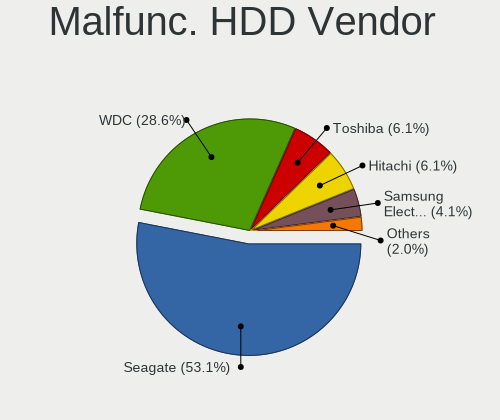
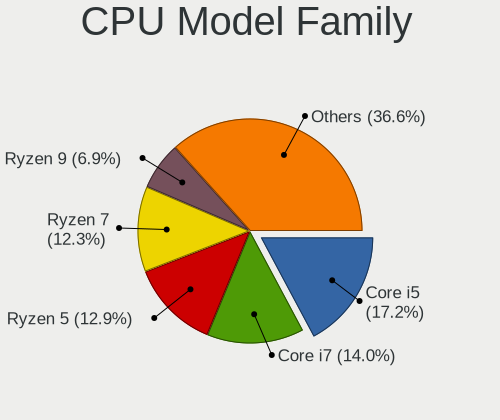
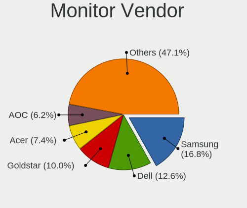
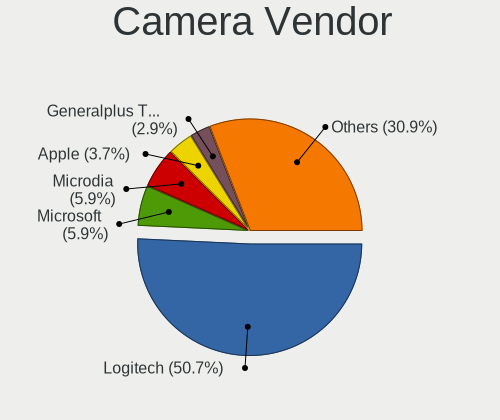

Fedora 35 - Tested Hardware & Statistics (Desktops)
---------------------------------------------------

A project to collect tested hardware configurations for Fedora 35.

Anyone can contribute to this report by the [hw-probe](https://github.com/linuxhw/hw-probe) tool:

    sudo -E hw-probe -all -upload

Please contribute! Especially if your hardware is rare.

Contents
--------

* [ Test Cases ](#test-cases)

* [ System ](#system)
  - [ Kernel                   ](#kernel)
  - [ Kernel Family            ](#kernel-family)
  - [ Kernel Major Ver.        ](#kernel-major-ver)
  - [ Arch                     ](#arch)
  - [ DE                       ](#de)
  - [ Display Server           ](#display-server)
  - [ Display Manager          ](#display-manager)
  - [ OS Lang                  ](#os-lang)
  - [ Boot Mode                ](#boot-mode)
  - [ Filesystem               ](#filesystem)
  - [ Part. scheme             ](#part-scheme)
  - [ Dual Boot with Linux/BSD ](#dual-boot-with-linuxbsd)
  - [ Dual Boot (Win)          ](#dual-boot-win)

* [ Board ](#board)
  - [ Vendor                   ](#vendor)
  - [ Model                    ](#model)
  - [ Model Family             ](#model-family)
  - [ MFG Year                 ](#mfg-year)
  - [ Form Factor              ](#form-factor)
  - [ Secure Boot              ](#secure-boot)
  - [ Coreboot                 ](#coreboot)
  - [ RAM Size                 ](#ram-size)
  - [ RAM Used                 ](#ram-used)
  - [ Total Drives             ](#total-drives)
  - [ Has CD-ROM               ](#has-cd-rom)
  - [ Has Ethernet             ](#has-ethernet)
  - [ Has WiFi                 ](#has-wifi)
  - [ Has Bluetooth            ](#has-bluetooth)

* [ Location ](#location)
  - [ Country                  ](#country)
  - [ City                     ](#city)

* [ Drives ](#drives)
  - [ Drive Vendor             ](#drive-vendor)
  - [ Drive Model              ](#drive-model)
  - [ HDD Vendor               ](#hdd-vendor)
  - [ SSD Vendor               ](#ssd-vendor)
  - [ Drive Kind               ](#drive-kind)
  - [ Drive Connector          ](#drive-connector)
  - [ Drive Size               ](#drive-size)
  - [ Space Total              ](#space-total)
  - [ Space Used               ](#space-used)
  - [ Malfunc. Drives          ](#malfunc-drives)
  - [ Malfunc. Drive Vendor    ](#malfunc-drive-vendor)
  - [ Malfunc. HDD Vendor      ](#malfunc-hdd-vendor)
  - [ Malfunc. Drive Kind      ](#malfunc-drive-kind)
  - [ Failed Drives            ](#failed-drives)
  - [ Failed Drive Vendor      ](#failed-drive-vendor)
  - [ Drive Status             ](#drive-status)

* [ Storage controller ](#storage-controller)
  - [ Storage Vendor           ](#storage-vendor)
  - [ Storage Model            ](#storage-model)
  - [ Storage Kind             ](#storage-kind)

* [ Processor ](#processor)
  - [ CPU Vendor               ](#cpu-vendor)
  - [ CPU Model                ](#cpu-model)
  - [ CPU Model Family         ](#cpu-model-family)
  - [ CPU Cores                ](#cpu-cores)
  - [ CPU Sockets              ](#cpu-sockets)
  - [ CPU Threads              ](#cpu-threads)
  - [ CPU Op-Modes             ](#cpu-op-modes)
  - [ CPU Microcode            ](#cpu-microcode)
  - [ CPU Microarch            ](#cpu-microarch)

* [ Graphics ](#graphics)
  - [ GPU Vendor               ](#gpu-vendor)
  - [ GPU Model                ](#gpu-model)
  - [ GPU Combo                ](#gpu-combo)
  - [ GPU Driver               ](#gpu-driver)
  - [ GPU Memory               ](#gpu-memory)

* [ Monitor ](#monitor)
  - [ Monitor Vendor           ](#monitor-vendor)
  - [ Monitor Model            ](#monitor-model)
  - [ Monitor Resolution       ](#monitor-resolution)
  - [ Monitor Diagonal         ](#monitor-diagonal)
  - [ Monitor Width            ](#monitor-width)
  - [ Aspect Ratio             ](#aspect-ratio)
  - [ Monitor Area             ](#monitor-area)
  - [ Pixel Density            ](#pixel-density)
  - [ Multiple Monitors        ](#multiple-monitors)

* [ Network ](#network)
  - [ Net Controller Vendor    ](#net-controller-vendor)
  - [ Net Controller Model     ](#net-controller-model)
  - [ Wireless Vendor          ](#wireless-vendor)
  - [ Wireless Model           ](#wireless-model)
  - [ Ethernet Vendor          ](#ethernet-vendor)
  - [ Ethernet Model           ](#ethernet-model)
  - [ Net Controller Kind      ](#net-controller-kind)
  - [ Used Controller          ](#used-controller)
  - [ NICs                     ](#nics)
  - [ IPv6                     ](#ipv6)

* [ Bluetooth ](#bluetooth)
  - [ Bluetooth Vendor         ](#bluetooth-vendor)
  - [ Bluetooth Model          ](#bluetooth-model)

* [ Sound ](#sound)
  - [ Sound Vendor             ](#sound-vendor)
  - [ Sound Model              ](#sound-model)

* [ Memory ](#memory)
  - [ Memory Vendor            ](#memory-vendor)
  - [ Memory Model             ](#memory-model)
  - [ Memory Kind              ](#memory-kind)
  - [ Memory Form Factor       ](#memory-form-factor)
  - [ Memory Size              ](#memory-size)
  - [ Memory Speed             ](#memory-speed)

* [ Printers & scanners ](#printers--scanners)
  - [ Printer Vendor           ](#printer-vendor)
  - [ Printer Model            ](#printer-model)
  - [ Scanner Vendor           ](#scanner-vendor)
  - [ Scanner Model            ](#scanner-model)

* [ Camera ](#camera)
  - [ Camera Vendor            ](#camera-vendor)
  - [ Camera Model             ](#camera-model)

* [ Security ](#security)
  - [ Fingerprint Vendor       ](#fingerprint-vendor)
  - [ Fingerprint Model        ](#fingerprint-model)
  - [ Chipcard Vendor          ](#chipcard-vendor)
  - [ Chipcard Model           ](#chipcard-model)

* [ Unsupported ](#unsupported)
  - [ Unsupported Devices      ](#unsupported-devices)
  - [ Unsupported Device Types ](#unsupported-device-types)

Test Cases
----------

Total: 817

| Vendor        | Model                       | Probe                                                      | Date         |
|---------------|-----------------------------|------------------------------------------------------------|--------------|
| ASUSTek       | ROG STRIX X570-E GAMING     | [86bf890d23](https://linux-hardware.org/?probe=86bf890d23) | Nov 02, 2022 |
| MSI           | X99A RAIDER                 | [36eda457da](https://linux-hardware.org/?probe=36eda457da) | Nov 02, 2022 |
| ASRock        | FM2A88X Extreme6+           | [4e260473ba](https://linux-hardware.org/?probe=4e260473ba) | Nov 02, 2022 |
| MSI           | X99A RAIDER                 | [2f3428a435](https://linux-hardware.org/?probe=2f3428a435) | Nov 01, 2022 |
| ASRock        | FM2A88X Extreme6+           | [cf7b016772](https://linux-hardware.org/?probe=cf7b016772) | Nov 01, 2022 |
| MSI           | X99A RAIDER                 | [2f41c9eaa5](https://linux-hardware.org/?probe=2f41c9eaa5) | Oct 31, 2022 |
| ASRock        | FM2A88X Extreme6+           | [5bd92395da](https://linux-hardware.org/?probe=5bd92395da) | Oct 31, 2022 |
| ASRock        | FM2A88X Extreme6+           | [c8392f24d9](https://linux-hardware.org/?probe=c8392f24d9) | Oct 30, 2022 |
| MSI           | X99A RAIDER                 | [7ddd09eeec](https://linux-hardware.org/?probe=7ddd09eeec) | Oct 30, 2022 |
| MSI           | X99A RAIDER                 | [782207dfcf](https://linux-hardware.org/?probe=782207dfcf) | Oct 29, 2022 |
| ASRock        | FM2A88X Extreme6+           | [75b050a9f0](https://linux-hardware.org/?probe=75b050a9f0) | Oct 29, 2022 |
| ASRock        | FM2A88X Extreme6+           | [bd9367f2b7](https://linux-hardware.org/?probe=bd9367f2b7) | Oct 27, 2022 |
| ASRock        | FM2A88X Extreme6+           | [317d318d85](https://linux-hardware.org/?probe=317d318d85) | Oct 26, 2022 |
| Acer          | Veriton M2631 V:1.0         | [1d5e3aa9f0](https://linux-hardware.org/?probe=1d5e3aa9f0) | Oct 25, 2022 |
| ASRock        | P45TS                       | [484f63b830](https://linux-hardware.org/?probe=484f63b830) | Oct 24, 2022 |
| ASRock        | FM2A88X Extreme6+           | [da8a11aac5](https://linux-hardware.org/?probe=da8a11aac5) | Oct 19, 2022 |
| ASRock        | FM2A88X Extreme6+           | [d53b4edda1](https://linux-hardware.org/?probe=d53b4edda1) | Oct 18, 2022 |
| ASRock        | FM2A88X Extreme6+           | [e618e79bd5](https://linux-hardware.org/?probe=e618e79bd5) | Oct 17, 2022 |
| ASRock        | FM2A88X Extreme6+           | [2412a53d05](https://linux-hardware.org/?probe=2412a53d05) | Oct 12, 2022 |
| ASRock        | FM2A88X Extreme6+           | [60037612c1](https://linux-hardware.org/?probe=60037612c1) | Oct 11, 2022 |
| ASUSTek       | TUF Gaming B550M-PLUS       | [8694ed82a6](https://linux-hardware.org/?probe=8694ed82a6) | Oct 09, 2022 |
| ASRock        | FM2A88X Extreme6+           | [6a5822719f](https://linux-hardware.org/?probe=6a5822719f) | Oct 06, 2022 |
| ASRock        | FM2A88X Extreme6+           | [51c401fd4e](https://linux-hardware.org/?probe=51c401fd4e) | Oct 05, 2022 |
| ASRock        | FM2A88X Extreme6+           | [a0d36f3810](https://linux-hardware.org/?probe=a0d36f3810) | Oct 02, 2022 |
| ASRock        | FM2A88X Extreme6+           | [186495d063](https://linux-hardware.org/?probe=186495d063) | Oct 01, 2022 |
| ASRock        | FM2A88X Extreme6+           | [6553398b7d](https://linux-hardware.org/?probe=6553398b7d) | Sep 30, 2022 |
| ASRock        | FM2A88X Extreme6+           | [362c6b7436](https://linux-hardware.org/?probe=362c6b7436) | Sep 29, 2022 |
| ASRock        | FM2A88X Extreme6+           | [a4b47e7325](https://linux-hardware.org/?probe=a4b47e7325) | Sep 25, 2022 |
| ASRock        | FM2A88X Extreme6+           | [ab2e3b1767](https://linux-hardware.org/?probe=ab2e3b1767) | Sep 24, 2022 |
| ASRock        | FM2A88X Extreme6+           | [0f750af134](https://linux-hardware.org/?probe=0f750af134) | Sep 23, 2022 |
| ASRock        | FM2A88X Extreme6+           | [bfb470649a](https://linux-hardware.org/?probe=bfb470649a) | Sep 22, 2022 |
| ASRock        | FM2A88X Extreme6+           | [754dfba736](https://linux-hardware.org/?probe=754dfba736) | Sep 21, 2022 |
| ASRock        | FM2A88X Extreme6+           | [fa5f7f7245](https://linux-hardware.org/?probe=fa5f7f7245) | Sep 20, 2022 |
| ASRock        | FM2A88X Extreme6+           | [5233832be3](https://linux-hardware.org/?probe=5233832be3) | Sep 19, 2022 |
| ASUSTek       | TUF Gaming B660M-PLUS D4    | [b48eda0e37](https://linux-hardware.org/?probe=b48eda0e37) | Sep 18, 2022 |
| ASRock        | FM2A88X Extreme6+           | [7161071790](https://linux-hardware.org/?probe=7161071790) | Sep 18, 2022 |
| ASUSTek       | TUF Gaming B660M-PLUS D4    | [e633838a51](https://linux-hardware.org/?probe=e633838a51) | Sep 15, 2022 |
| ASRock        | FM2A88X Extreme6+           | [37d6996290](https://linux-hardware.org/?probe=37d6996290) | Sep 14, 2022 |
| ASRock        | FM2A88X Extreme6+           | [a6e7414518](https://linux-hardware.org/?probe=a6e7414518) | Sep 13, 2022 |
| ASUSTek       | Z97-A                       | [b23a59ba48](https://linux-hardware.org/?probe=b23a59ba48) | Sep 12, 2022 |
| ASRock        | FM2A88X Extreme6+           | [d85067b0f0](https://linux-hardware.org/?probe=d85067b0f0) | Sep 11, 2022 |
| ASRock        | FM2A88X Extreme6+           | [20ee71a4d6](https://linux-hardware.org/?probe=20ee71a4d6) | Sep 10, 2022 |
| ASUSTek       | TUF Gaming B550-PLUS        | [174c263499](https://linux-hardware.org/?probe=174c263499) | Sep 08, 2022 |
| ASUSTek       | Z97-A                       | [46be1ea134](https://linux-hardware.org/?probe=46be1ea134) | Sep 08, 2022 |
| Biostar       | H310MHP                     | [6063bede72](https://linux-hardware.org/?probe=6063bede72) | Sep 07, 2022 |
| ASRock        | FM2A88X Extreme6+           | [dad765ca9e](https://linux-hardware.org/?probe=dad765ca9e) | Sep 06, 2022 |
| Lenovo        | 367D 31900003 STD           | [c145bac65a](https://linux-hardware.org/?probe=c145bac65a) | Sep 05, 2022 |
| ASRock        | FM2A88X Extreme6+           | [0df0bba932](https://linux-hardware.org/?probe=0df0bba932) | Sep 05, 2022 |
| ASUSTek       | TUF Gaming B550-PLUS        | [2cf13f4045](https://linux-hardware.org/?probe=2cf13f4045) | Sep 04, 2022 |
| Foxconn       | 2AB1                        | [3b7dae5f40](https://linux-hardware.org/?probe=3b7dae5f40) | Sep 04, 2022 |
| ASUSTek       | TUF Gaming B460M-PLUS       | [5dcc9cd8c8](https://linux-hardware.org/?probe=5dcc9cd8c8) | Sep 03, 2022 |
| ASRock        | FM2A88X Extreme6+           | [446e2d292a](https://linux-hardware.org/?probe=446e2d292a) | Sep 02, 2022 |
| ASRock        | FM2A88X Extreme6+           | [689c3aa34d](https://linux-hardware.org/?probe=689c3aa34d) | Sep 01, 2022 |
| ASRock        | FM2A88X Extreme6+           | [df96c4acaf](https://linux-hardware.org/?probe=df96c4acaf) | Aug 31, 2022 |
| ASRock        | FM2A88X Extreme6+           | [eba231b7db](https://linux-hardware.org/?probe=eba231b7db) | Aug 30, 2022 |
| ASRock        | FM2A88X Extreme6+           | [ff55a7dbf1](https://linux-hardware.org/?probe=ff55a7dbf1) | Aug 26, 2022 |
| ASRock        | FM2A88X Extreme6+           | [f80abd07f3](https://linux-hardware.org/?probe=f80abd07f3) | Aug 25, 2022 |
| ASUSTek       | Z97-A                       | [016c661430](https://linux-hardware.org/?probe=016c661430) | Aug 24, 2022 |
| Dell          | 0T1D10 A01                  | [39e79a7077](https://linux-hardware.org/?probe=39e79a7077) | Aug 23, 2022 |
| ASRock        | FM2A88X Extreme6+           | [3f83c9e402](https://linux-hardware.org/?probe=3f83c9e402) | Aug 16, 2022 |
| ASRock        | FM2A88X Extreme6+           | [1298facab1](https://linux-hardware.org/?probe=1298facab1) | Aug 15, 2022 |
| ASRock        | FM2A88X Extreme6+           | [91a2943c51](https://linux-hardware.org/?probe=91a2943c51) | Aug 09, 2022 |
| ASRock        | FM2A88X Extreme6+           | [244025d59e](https://linux-hardware.org/?probe=244025d59e) | Aug 08, 2022 |
| Gigabyte      | B450M DS3H-CF               | [258c7a2f71](https://linux-hardware.org/?probe=258c7a2f71) | Aug 06, 2022 |
| ASRock        | FM2A88X Extreme6+           | [9320816ca5](https://linux-hardware.org/?probe=9320816ca5) | Aug 05, 2022 |
| ASRock        | FM2A88X Extreme6+           | [b224ef1b8d](https://linux-hardware.org/?probe=b224ef1b8d) | Aug 04, 2022 |
| ASRock        | FM2A88X Extreme6+           | [015ec264f5](https://linux-hardware.org/?probe=015ec264f5) | Aug 02, 2022 |
| ASRock        | FM2A88X Extreme6+           | [8ea1e0f22c](https://linux-hardware.org/?probe=8ea1e0f22c) | Aug 01, 2022 |
| ASRock        | FM2A88X Extreme6+           | [9dd9d17e79](https://linux-hardware.org/?probe=9dd9d17e79) | Jul 31, 2022 |
| Gateway       | DX4860                      | [279b6793e4](https://linux-hardware.org/?probe=279b6793e4) | Jul 30, 2022 |
| Gateway       | DX4860                      | [fec12bcbe9](https://linux-hardware.org/?probe=fec12bcbe9) | Jul 30, 2022 |
| ASRock        | FM2A88X Extreme6+           | [9a7de8cc64](https://linux-hardware.org/?probe=9a7de8cc64) | Jul 30, 2022 |
| Gigabyte      | H61M-DS2V                   | [e5744803f2](https://linux-hardware.org/?probe=e5744803f2) | Jul 29, 2022 |
| ASRock        | FM2A88X Extreme6+           | [c0ce536184](https://linux-hardware.org/?probe=c0ce536184) | Jul 29, 2022 |
| ASRock        | FM2A88X Extreme6+           | [a9c3256946](https://linux-hardware.org/?probe=a9c3256946) | Jul 28, 2022 |
| ASRock        | FM2A88X Extreme6+           | [2632256ed7](https://linux-hardware.org/?probe=2632256ed7) | Jul 25, 2022 |
| MSI           | 2A9C                        | [b0441c833d](https://linux-hardware.org/?probe=b0441c833d) | Jul 24, 2022 |
| ASRock        | FM2A88X Extreme6+           | [8bb191bc8f](https://linux-hardware.org/?probe=8bb191bc8f) | Jul 24, 2022 |
| ASRock        | FM2A88X Extreme6+           | [9c1f5f7a4e](https://linux-hardware.org/?probe=9c1f5f7a4e) | Jul 23, 2022 |
| ASRock        | FM2A88X Extreme6+           | [d758abd21c](https://linux-hardware.org/?probe=d758abd21c) | Jul 22, 2022 |
| ASRock        | FM2A88X Extreme6+           | [b54cb1f930](https://linux-hardware.org/?probe=b54cb1f930) | Jul 21, 2022 |
| Foxconn       | 2AB1                        | [c269d962ea](https://linux-hardware.org/?probe=c269d962ea) | Jul 20, 2022 |
| ASRock        | FM2A88X Extreme6+           | [8cae76caea](https://linux-hardware.org/?probe=8cae76caea) | Jul 20, 2022 |
| HP            | 802E                        | [c86ddd647b](https://linux-hardware.org/?probe=c86ddd647b) | Jul 16, 2022 |
| Gigabyte      | B450M DS3H-CF               | [e9c788dfd2](https://linux-hardware.org/?probe=e9c788dfd2) | Jul 14, 2022 |
| ASRock        | FM2A88X Extreme6+           | [ce2e8f2a2a](https://linux-hardware.org/?probe=ce2e8f2a2a) | Jul 12, 2022 |
| ASRock        | FM2A88X Extreme6+           | [84f993f04d](https://linux-hardware.org/?probe=84f993f04d) | Jul 11, 2022 |
| Gigabyte      | X99-UD4-CF                  | [4245ef07db](https://linux-hardware.org/?probe=4245ef07db) | Jul 10, 2022 |
| Gigabyte      | X99-UD4-CF                  | [1dafd7beed](https://linux-hardware.org/?probe=1dafd7beed) | Jul 09, 2022 |
| ASRock        | 990FX Killer                | [28b0984086](https://linux-hardware.org/?probe=28b0984086) | Jul 05, 2022 |
| Gigabyte      | H77N-WIFI                   | [e795477a20](https://linux-hardware.org/?probe=e795477a20) | Jul 05, 2022 |
| ASUSTek       | ROG Maximus Z690 HERO       | [a74834b383](https://linux-hardware.org/?probe=a74834b383) | Jul 04, 2022 |
| Intel         | DP55KG AAE47218-404         | [aaa7656f44](https://linux-hardware.org/?probe=aaa7656f44) | Jul 03, 2022 |
| ASRock        | FM2A88X Extreme6+           | [1bec4af414](https://linux-hardware.org/?probe=1bec4af414) | Jul 02, 2022 |
| ASRock        | FM2A88X Extreme6+           | [a658ebf5e9](https://linux-hardware.org/?probe=a658ebf5e9) | Jul 01, 2022 |
| ASRock        | FM2A88X Extreme6+           | [163a5c29e6](https://linux-hardware.org/?probe=163a5c29e6) | Jun 30, 2022 |
| ASRock        | FM2A88X Extreme6+           | [66b8ec6b28](https://linux-hardware.org/?probe=66b8ec6b28) | Jun 29, 2022 |
| ASRock        | Z690M-ITX/ax                | [cc8224a123](https://linux-hardware.org/?probe=cc8224a123) | Jun 21, 2022 |
| ASRock        | Z690M-ITX/ax                | [1d3eb4348d](https://linux-hardware.org/?probe=1d3eb4348d) | Jun 21, 2022 |
| ASRock        | Z690M-ITX/ax                | [35bec2520a](https://linux-hardware.org/?probe=35bec2520a) | Jun 21, 2022 |
| MSI           | 2A9C                        | [73dd2172d3](https://linux-hardware.org/?probe=73dd2172d3) | Jun 20, 2022 |
| ASRock        | FM2A88X Extreme6+           | [4801136187](https://linux-hardware.org/?probe=4801136187) | Jun 18, 2022 |
| MSI           | X99A RAIDER                 | [550772184f](https://linux-hardware.org/?probe=550772184f) | Jun 18, 2022 |
| ASRock        | FM2A88X Extreme6+           | [680bf4c033](https://linux-hardware.org/?probe=680bf4c033) | Jun 17, 2022 |
| ASUSTek       | ROG CROSSHAIR VII HERO      | [9418d283c9](https://linux-hardware.org/?probe=9418d283c9) | Jun 15, 2022 |
| ASRock        | FM2A88X Extreme6+           | [7990c32699](https://linux-hardware.org/?probe=7990c32699) | Jun 14, 2022 |
| ASRock        | B450M/ac R2.0               | [bc509480d2](https://linux-hardware.org/?probe=bc509480d2) | Jun 13, 2022 |
| ASRock        | FM2A88X Extreme6+           | [dcd3256961](https://linux-hardware.org/?probe=dcd3256961) | Jun 13, 2022 |
| Gigabyte      | H77N-WIFI                   | [23fa842567](https://linux-hardware.org/?probe=23fa842567) | Jun 11, 2022 |
| Gigabyte      | H77N-WIFI                   | [fd1478145b](https://linux-hardware.org/?probe=fd1478145b) | Jun 11, 2022 |
| Gigabyte      | GA-880GM-UD2H               | [267db233fa](https://linux-hardware.org/?probe=267db233fa) | Jun 10, 2022 |
| Unknown       | Unknown                     | [4a2f4f8cb1](https://linux-hardware.org/?probe=4a2f4f8cb1) | Jun 09, 2022 |
| ASUSTek       | Z170-A                      | [87fa4e032d](https://linux-hardware.org/?probe=87fa4e032d) | Jun 09, 2022 |
| ASUSTek       | Z170-A                      | [3531488e43](https://linux-hardware.org/?probe=3531488e43) | Jun 09, 2022 |
| Gigabyte      | G41MT-D3                    | [2ac69cc327](https://linux-hardware.org/?probe=2ac69cc327) | Jun 08, 2022 |
| Gigabyte      | B450 GAMING X               | [34e884bb50](https://linux-hardware.org/?probe=34e884bb50) | Jun 08, 2022 |
| HP            | 872D                        | [c27f333c46](https://linux-hardware.org/?probe=c27f333c46) | Jun 08, 2022 |
| ASRock        | AD2700-ITX                  | [9342f5c46b](https://linux-hardware.org/?probe=9342f5c46b) | Jun 08, 2022 |
| Gigabyte      | D525TUD                     | [fdba6d0041](https://linux-hardware.org/?probe=fdba6d0041) | Jun 08, 2022 |
| Gigabyte      | GA-MA785G-UD3H              | [bfa4e4ff74](https://linux-hardware.org/?probe=bfa4e4ff74) | Jun 07, 2022 |
| ASRock        | FM2A88X Extreme6+           | [5a835b2aa6](https://linux-hardware.org/?probe=5a835b2aa6) | Jun 07, 2022 |
| ASUSTek       | M5A99FX PRO R2.0            | [4924d1fa99](https://linux-hardware.org/?probe=4924d1fa99) | Jun 06, 2022 |
| ASRock        | FM2A88X Extreme6+           | [838e0b8e42](https://linux-hardware.org/?probe=838e0b8e42) | Jun 06, 2022 |
| ASRock        | B460 Phantom Gaming 4       | [3806254bc2](https://linux-hardware.org/?probe=3806254bc2) | Jun 03, 2022 |
| ASRock        | FM2A88X Extreme6+           | [cb07ae6e24](https://linux-hardware.org/?probe=cb07ae6e24) | Jun 02, 2022 |
| ASRock        | FM2A88X Extreme6+           | [dd51d706e3](https://linux-hardware.org/?probe=dd51d706e3) | Jun 01, 2022 |
| ASUSTek       | A8R32-MVP Deluxe            | [0faa61f3a9](https://linux-hardware.org/?probe=0faa61f3a9) | May 31, 2022 |
| ASUSTek       | A8R32-MVP Deluxe            | [9f5906337b](https://linux-hardware.org/?probe=9f5906337b) | May 31, 2022 |
| ASRock        | FM2A88X Extreme6+           | [85a456dd94](https://linux-hardware.org/?probe=85a456dd94) | May 31, 2022 |
| ASRock        | FM2A88X Extreme6+           | [ff73ff1ea6](https://linux-hardware.org/?probe=ff73ff1ea6) | May 30, 2022 |
| MSI           | MEG X570 UNIFY              | [b86f47e828](https://linux-hardware.org/?probe=b86f47e828) | May 29, 2022 |
| Lenovo        | ThinkCentre M58p 7220A72    | [96cd8abf05](https://linux-hardware.org/?probe=96cd8abf05) | May 29, 2022 |
| ASRock        | FM2A88X Extreme6+           | [3487c76d47](https://linux-hardware.org/?probe=3487c76d47) | May 29, 2022 |
| ASRock        | FM2A88X Extreme6+           | [db4eade79e](https://linux-hardware.org/?probe=db4eade79e) | May 28, 2022 |
| MSI           | X99A RAIDER                 | [8226c07ba6](https://linux-hardware.org/?probe=8226c07ba6) | May 27, 2022 |
| Gigabyte      | H77N-WIFI                   | [ac41fb756c](https://linux-hardware.org/?probe=ac41fb756c) | May 26, 2022 |
| ASUSTek       | STRIX Z270F GAMING          | [aea91adcbf](https://linux-hardware.org/?probe=aea91adcbf) | May 25, 2022 |
| ASUSTek       | STRIX Z270F GAMING          | [c2eb6bb974](https://linux-hardware.org/?probe=c2eb6bb974) | May 25, 2022 |
| Gigabyte      | G41MT-D3                    | [89927eb8f5](https://linux-hardware.org/?probe=89927eb8f5) | May 25, 2022 |
| ASRock        | FM2A88X Extreme6+           | [19d23eb25f](https://linux-hardware.org/?probe=19d23eb25f) | May 22, 2022 |
| ASRock        | FM2A88X Extreme6+           | [f5ea71aeb2](https://linux-hardware.org/?probe=f5ea71aeb2) | May 21, 2022 |
| HP            | 8053                        | [53c0148d64](https://linux-hardware.org/?probe=53c0148d64) | May 20, 2022 |
| ECS           | P67H2-A3                    | [2bc21b9c81](https://linux-hardware.org/?probe=2bc21b9c81) | May 20, 2022 |
| MSI           | B450M PRO-VDH MAX           | [76c661d512](https://linux-hardware.org/?probe=76c661d512) | May 18, 2022 |
| Shuttle       | FZ87                        | [ce4198da70](https://linux-hardware.org/?probe=ce4198da70) | May 17, 2022 |
| Gigabyte      | MQLP7AP-00                  | [3c99b8d861](https://linux-hardware.org/?probe=3c99b8d861) | May 16, 2022 |
| ASRock        | X570 Phantom Gaming 4       | [d85be75174](https://linux-hardware.org/?probe=d85be75174) | May 14, 2022 |
| Gigabyte      | G41MT-D3                    | [78c64b498b](https://linux-hardware.org/?probe=78c64b498b) | May 13, 2022 |
| ASRock        | G41C-GS R2.0                | [9c3a386393](https://linux-hardware.org/?probe=9c3a386393) | May 13, 2022 |
| Gigabyte      | B450M DS3H-CF               | [41ee4b77ce](https://linux-hardware.org/?probe=41ee4b77ce) | May 10, 2022 |
| Gigabyte      | G1.Sniper B5-CF             | [eaa10a050b](https://linux-hardware.org/?probe=eaa10a050b) | May 10, 2022 |
| ASUSTek       | ROG STRIX B550-I GAMING     | [3e3acb2430](https://linux-hardware.org/?probe=3e3acb2430) | May 10, 2022 |
| ASUSTek       | TUF Gaming B450-PLUS II     | [e44c7da45a](https://linux-hardware.org/?probe=e44c7da45a) | May 09, 2022 |
| Ruckus Wir... | SCG-100                     | [781560aa15](https://linux-hardware.org/?probe=781560aa15) | May 09, 2022 |
| HP            | 212A                        | [acd660910f](https://linux-hardware.org/?probe=acd660910f) | May 09, 2022 |
| ASRock        | FM2A88X-ITX+                | [c0fa8189f0](https://linux-hardware.org/?probe=c0fa8189f0) | May 08, 2022 |
| ASUSTek       | AM1M-A                      | [537def711a](https://linux-hardware.org/?probe=537def711a) | May 08, 2022 |
| MSI           | H55M-P33                    | [0f6b0dc134](https://linux-hardware.org/?probe=0f6b0dc134) | May 07, 2022 |
| ASRock        | 970M Pro3                   | [1983ed1d48](https://linux-hardware.org/?probe=1983ed1d48) | May 07, 2022 |
| ASUSTek       | ROG STRIX Z490-G GAMING     | [d4e02db7d2](https://linux-hardware.org/?probe=d4e02db7d2) | May 07, 2022 |
| Gigabyte      | X570 I AORUS PRO WIFI       | [35cfe55dac](https://linux-hardware.org/?probe=35cfe55dac) | May 07, 2022 |
| ASUSTek       | P5N7A-VM                    | [44d168e79c](https://linux-hardware.org/?probe=44d168e79c) | May 07, 2022 |
| ASUSTek       | PRIME B660-PLUS D4          | [7e14e0a766](https://linux-hardware.org/?probe=7e14e0a766) | May 07, 2022 |
| ASUSTek       | PRIME B660-PLUS D4          | [047f75af38](https://linux-hardware.org/?probe=047f75af38) | May 07, 2022 |
| Gigabyte      | B550 AORUS PRO AC           | [5a08eb1919](https://linux-hardware.org/?probe=5a08eb1919) | May 06, 2022 |
| MSI           | B450 GAMING PRO CARBON A... | [0021b7ff7f](https://linux-hardware.org/?probe=0021b7ff7f) | May 05, 2022 |
| ASUSTek       | PRIME X370-PRO              | [b0a2114a0f](https://linux-hardware.org/?probe=b0a2114a0f) | May 05, 2022 |
| ASUSTek       | PRIME B450-PLUS             | [60d50d3190](https://linux-hardware.org/?probe=60d50d3190) | May 05, 2022 |
| ASUSTek       | PRIME B450-PLUS             | [fa5e301933](https://linux-hardware.org/?probe=fa5e301933) | May 05, 2022 |
| ASUSTek       | Rampage III Extreme         | [30ff3d44b0](https://linux-hardware.org/?probe=30ff3d44b0) | May 04, 2022 |
| Gigabyte      | G41MT-S2P                   | [c3ae8f35f9](https://linux-hardware.org/?probe=c3ae8f35f9) | May 04, 2022 |
| ASUSTek       | Z170-E                      | [99d850c205](https://linux-hardware.org/?probe=99d850c205) | May 04, 2022 |
| ASUSTek       | VM65N-K                     | [9df63c1d99](https://linux-hardware.org/?probe=9df63c1d99) | May 04, 2022 |
| Gigabyte      | X570 I AORUS PRO WIFI       | [1d475f29ce](https://linux-hardware.org/?probe=1d475f29ce) | May 03, 2022 |
| ASUSTek       | ROG STRIX X570-F GAMING     | [7d9a2b425f](https://linux-hardware.org/?probe=7d9a2b425f) | May 03, 2022 |
| Gigabyte      | X570 I AORUS PRO WIFI       | [9fa64d179d](https://linux-hardware.org/?probe=9fa64d179d) | May 03, 2022 |
| Gigabyte      | X570 I AORUS PRO WIFI       | [a134998640](https://linux-hardware.org/?probe=a134998640) | May 03, 2022 |
| MSI           | H97 GAMING 3                | [c3694433d0](https://linux-hardware.org/?probe=c3694433d0) | May 03, 2022 |
| Dell          | 0YNVJG A01                  | [7a6aa0c236](https://linux-hardware.org/?probe=7a6aa0c236) | May 03, 2022 |
| JINGSHA       | Unknown                     | [94dd890d71](https://linux-hardware.org/?probe=94dd890d71) | May 02, 2022 |
| ASUSTek       | TUF Gaming X570-PRO         | [b7709ed1c5](https://linux-hardware.org/?probe=b7709ed1c5) | May 02, 2022 |
| ASRock        | X399 Taichi                 | [510cfcefd5](https://linux-hardware.org/?probe=510cfcefd5) | May 02, 2022 |
| ASUSTek       | PRIME B450M-A               | [fac138a25c](https://linux-hardware.org/?probe=fac138a25c) | May 02, 2022 |
| HP            | 8459                        | [21d5d92fda](https://linux-hardware.org/?probe=21d5d92fda) | May 01, 2022 |
| Gigabyte      | H97-Gaming 3                | [150f5a4bd0](https://linux-hardware.org/?probe=150f5a4bd0) | Apr 30, 2022 |
| ASUSTek       | A55M-E                      | [eed78fb5ab](https://linux-hardware.org/?probe=eed78fb5ab) | Apr 30, 2022 |
| JINGSHA       | Unknown                     | [e1b9c4eab0](https://linux-hardware.org/?probe=e1b9c4eab0) | Apr 30, 2022 |
| ASUSTek       | PRIME X470-PRO              | [8c1bf73769](https://linux-hardware.org/?probe=8c1bf73769) | Apr 28, 2022 |
| Gigabyte      | B450 AORUS M                | [de4ae72708](https://linux-hardware.org/?probe=de4ae72708) | Apr 28, 2022 |
| MSI           | B450M PRO-VDH MAX           | [185c64fa0d](https://linux-hardware.org/?probe=185c64fa0d) | Apr 27, 2022 |
| Gigabyte      | X570 I AORUS PRO WIFI       | [11a6c8f173](https://linux-hardware.org/?probe=11a6c8f173) | Apr 27, 2022 |
| MSI           | MPG X570 GAMING PLUS        | [80792ef9d7](https://linux-hardware.org/?probe=80792ef9d7) | Apr 27, 2022 |
| Lenovo        | 3106 SDK0J40705 WIN 3425... | [93c883ef59](https://linux-hardware.org/?probe=93c883ef59) | Apr 26, 2022 |
| Unknown       | 1.0                         | [7c17b2186e](https://linux-hardware.org/?probe=7c17b2186e) | Apr 26, 2022 |
| Biostar       | G31M+                       | [b756b9bc9f](https://linux-hardware.org/?probe=b756b9bc9f) | Apr 26, 2022 |
| Gigabyte      | H77N-WIFI                   | [205ae74d07](https://linux-hardware.org/?probe=205ae74d07) | Apr 26, 2022 |
| ASUSTek       | ROG STRIX B550-F GAMING     | [35975b7d55](https://linux-hardware.org/?probe=35975b7d55) | Apr 25, 2022 |
| ASUSTek       | PRIME B350-PLUS             | [b24ac490a1](https://linux-hardware.org/?probe=b24ac490a1) | Apr 25, 2022 |
| HP            | 212B                        | [f202f01728](https://linux-hardware.org/?probe=f202f01728) | Apr 25, 2022 |
| Gigabyte      | B550 AORUS PRO AC           | [c0af99fa7e](https://linux-hardware.org/?probe=c0af99fa7e) | Apr 24, 2022 |
| Lenovo        | SDK0E50510 WIN              | [de010dfc55](https://linux-hardware.org/?probe=de010dfc55) | Apr 24, 2022 |
| MSI           | B250M PRO-VDH               | [a1ff9cf092](https://linux-hardware.org/?probe=a1ff9cf092) | Apr 24, 2022 |
| HP            | 821D                        | [6a70c646a5](https://linux-hardware.org/?probe=6a70c646a5) | Apr 24, 2022 |
| Lenovo        | ThinkCentre M58p 7220A72    | [e686789a94](https://linux-hardware.org/?probe=e686789a94) | Apr 24, 2022 |
| MSI           | MAG B550 TOMAHAWK           | [3f1d42f10f](https://linux-hardware.org/?probe=3f1d42f10f) | Apr 24, 2022 |
| Dell          | 04GJJT A00                  | [73fe079eb6](https://linux-hardware.org/?probe=73fe079eb6) | Apr 23, 2022 |
| ASUSTek       | ROG STRIX B450-F GAMING ... | [2bcb31328e](https://linux-hardware.org/?probe=2bcb31328e) | Apr 23, 2022 |
| HP            | 8053                        | [f214dbdf74](https://linux-hardware.org/?probe=f214dbdf74) | Apr 23, 2022 |
| HP            | 8768 A                      | [a939560d30](https://linux-hardware.org/?probe=a939560d30) | Apr 22, 2022 |
| AMI           | Cherry Trail Tablet         | [a2179e3116](https://linux-hardware.org/?probe=a2179e3116) | Apr 22, 2022 |
| Gateway       | SX2185                      | [d22bb794a1](https://linux-hardware.org/?probe=d22bb794a1) | Apr 22, 2022 |
| Dell          | 06NWYK A00                  | [e67d861aba](https://linux-hardware.org/?probe=e67d861aba) | Apr 22, 2022 |
| Gigabyte      | B550 AORUS ELITE AX V2      | [bb2195b690](https://linux-hardware.org/?probe=bb2195b690) | Apr 21, 2022 |
| Gigabyte      | B550 AORUS ELITE AX V2      | [074f40a67b](https://linux-hardware.org/?probe=074f40a67b) | Apr 21, 2022 |
| Gigabyte      | GA-78LMT-USB3               | [8034b9ae8c](https://linux-hardware.org/?probe=8034b9ae8c) | Apr 21, 2022 |
| Dell          | 04GJJT A00                  | [5f2f4d715e](https://linux-hardware.org/?probe=5f2f4d715e) | Apr 21, 2022 |
| ASUSTek       | Z170-P                      | [aa004d1627](https://linux-hardware.org/?probe=aa004d1627) | Apr 21, 2022 |
| ASUSTek       | TUF Gaming X570-PLUS        | [93a5ff0ad9](https://linux-hardware.org/?probe=93a5ff0ad9) | Apr 21, 2022 |
| MSI           | Z170A GAMING M3             | [84f6645ca5](https://linux-hardware.org/?probe=84f6645ca5) | Apr 20, 2022 |
| ASUSTek       | TUF Gaming X570-PLUS        | [4daf24b44d](https://linux-hardware.org/?probe=4daf24b44d) | Apr 20, 2022 |
| Foxconn       | 2AB1                        | [f32b27ae86](https://linux-hardware.org/?probe=f32b27ae86) | Apr 20, 2022 |
| ASUSTek       | A8R32-MVP Deluxe            | [7969fc986b](https://linux-hardware.org/?probe=7969fc986b) | Apr 20, 2022 |
| MSI           | B550-A PRO                  | [3af8357ab9](https://linux-hardware.org/?probe=3af8357ab9) | Apr 20, 2022 |
| Lenovo        | 3098 NOK                    | [a9126e3886](https://linux-hardware.org/?probe=a9126e3886) | Apr 19, 2022 |
| Lenovo        | 312A SDK0J40697 WIN 3305... | [0e53d4286d](https://linux-hardware.org/?probe=0e53d4286d) | Apr 19, 2022 |
| Lenovo        | SHARKBAY SDK0E50512 STD     | [14fa81fab9](https://linux-hardware.org/?probe=14fa81fab9) | Apr 18, 2022 |
| ASUSTek       | WS C422 SAGE/10G            | [27db6c7db6](https://linux-hardware.org/?probe=27db6c7db6) | Apr 18, 2022 |
| ECS           | H310H5-M2                   | [653fae2086](https://linux-hardware.org/?probe=653fae2086) | Apr 18, 2022 |
| ASRock        | Z87 Extreme6                | [d7e24821ee](https://linux-hardware.org/?probe=d7e24821ee) | Apr 18, 2022 |
| ASUSTek       | ROG STRIX B450-F GAMING     | [cc4a1b8b6f](https://linux-hardware.org/?probe=cc4a1b8b6f) | Apr 17, 2022 |
| Intel         | DH61BE AAG14062-206         | [4816f51374](https://linux-hardware.org/?probe=4816f51374) | Apr 17, 2022 |
| Lenovo        | MAHOBAY Win8 Pro DPK TPG    | [4dbd302f8c](https://linux-hardware.org/?probe=4dbd302f8c) | Apr 17, 2022 |
| Dell          | 0DN075                      | [05bd1b50f1](https://linux-hardware.org/?probe=05bd1b50f1) | Apr 16, 2022 |
| Gigabyte      | X99-UD4-CF                  | [0ce9091731](https://linux-hardware.org/?probe=0ce9091731) | Apr 16, 2022 |
| Unknown       | HX90                        | [a9b1d5a579](https://linux-hardware.org/?probe=a9b1d5a579) | Apr 15, 2022 |
| ASRock        | H110M-DGS R3.0              | [aa36281de8](https://linux-hardware.org/?probe=aa36281de8) | Apr 15, 2022 |
| Biostar       | G31M+                       | [bbc349a405](https://linux-hardware.org/?probe=bbc349a405) | Apr 15, 2022 |
| ASUSTek       | A55M-E                      | [76a80df275](https://linux-hardware.org/?probe=76a80df275) | Apr 15, 2022 |
| ASUSTek       | ROG CROSSHAIR VIII HERO     | [edca3eae97](https://linux-hardware.org/?probe=edca3eae97) | Apr 15, 2022 |
| ASUSTek       | A55M-E                      | [74b8687993](https://linux-hardware.org/?probe=74b8687993) | Apr 15, 2022 |
| Dell          | 0WMJ54 A01                  | [d113301081](https://linux-hardware.org/?probe=d113301081) | Apr 14, 2022 |
| Fujitsu       | D3513-A1 S26361-D3513-A1    | [72b9c04a51](https://linux-hardware.org/?probe=72b9c04a51) | Apr 14, 2022 |
| BESSTAR Te... | HM80                        | [80b368187a](https://linux-hardware.org/?probe=80b368187a) | Apr 14, 2022 |
| MSI           | B250M MORTAR                | [8bf9715804](https://linux-hardware.org/?probe=8bf9715804) | Apr 14, 2022 |
| Lenovo        | 3098 NOK                    | [45b5664eb1](https://linux-hardware.org/?probe=45b5664eb1) | Apr 14, 2022 |
| ASUSTek       | ROG STRIX X570-E GAMING     | [f28318e17b](https://linux-hardware.org/?probe=f28318e17b) | Apr 14, 2022 |
| Foxconn       | 2AB1                        | [0276364302](https://linux-hardware.org/?probe=0276364302) | Apr 14, 2022 |
| Gigabyte      | GA-MA780G-UD3H              | [43aa5ccd47](https://linux-hardware.org/?probe=43aa5ccd47) | Apr 14, 2022 |
| ASUSTek       | Crosshair V Formula         | [3b66db6997](https://linux-hardware.org/?probe=3b66db6997) | Apr 14, 2022 |
| Gigabyte      | A320M-S2H-CF                | [a5c9b7fc78](https://linux-hardware.org/?probe=a5c9b7fc78) | Apr 14, 2022 |
| ASUSTek       | X79-DELUXE                  | [77d75fd5b2](https://linux-hardware.org/?probe=77d75fd5b2) | Apr 14, 2022 |
| ASUSTek       | ROG STRIX X570-I GAMING     | [7e080e5205](https://linux-hardware.org/?probe=7e080e5205) | Apr 14, 2022 |
| MSI           | MEG B550 UNIFY              | [8ebb61ef39](https://linux-hardware.org/?probe=8ebb61ef39) | Apr 14, 2022 |
| MSI           | MPG X570 GAMING EDGE WIF... | [cf0c239670](https://linux-hardware.org/?probe=cf0c239670) | Apr 13, 2022 |
| ASUSTek       | ROG STRIX B450-F GAMING     | [9af096ef7f](https://linux-hardware.org/?probe=9af096ef7f) | Apr 13, 2022 |
| ASUSTek       | M5A97 R2.0                  | [0dddcf5626](https://linux-hardware.org/?probe=0dddcf5626) | Apr 13, 2022 |
| MSI           | MPG X570 GAMING PLUS        | [6ac57575d9](https://linux-hardware.org/?probe=6ac57575d9) | Apr 13, 2022 |
| System76      | Thelio Mira thelio-mira-... | [70b154b039](https://linux-hardware.org/?probe=70b154b039) | Apr 13, 2022 |
| ASUSTek       | H97-PLUS                    | [234fd15d56](https://linux-hardware.org/?probe=234fd15d56) | Apr 13, 2022 |
| ASUSTek       | ROG STRIX X570-F GAMING     | [18a9612e64](https://linux-hardware.org/?probe=18a9612e64) | Apr 13, 2022 |
| MSI           | Z390-A PRO                  | [bfec30bf8d](https://linux-hardware.org/?probe=bfec30bf8d) | Apr 13, 2022 |
| ASRock        | X570 Phantom Gaming 4       | [dc6799506a](https://linux-hardware.org/?probe=dc6799506a) | Apr 13, 2022 |
| System76      | Thelio Mira thelio-mira-... | [46ce27bfa6](https://linux-hardware.org/?probe=46ce27bfa6) | Apr 13, 2022 |
| HP            | 805D                        | [56634964fb](https://linux-hardware.org/?probe=56634964fb) | Apr 13, 2022 |
| MSI           | B450M PRO-VDH MAX           | [3656e85663](https://linux-hardware.org/?probe=3656e85663) | Apr 12, 2022 |
| Gigabyte      | X570 I AORUS PRO WIFI       | [52828f419f](https://linux-hardware.org/?probe=52828f419f) | Apr 12, 2022 |
| ASUSTek       | PRIME B550-PLUS             | [be0d616e99](https://linux-hardware.org/?probe=be0d616e99) | Apr 12, 2022 |
| Foxconn       | 2AB1                        | [e43f2609cc](https://linux-hardware.org/?probe=e43f2609cc) | Apr 12, 2022 |
| Lenovo        | ThinkCentre M91P 7034A2U    | [a5b9a57a64](https://linux-hardware.org/?probe=a5b9a57a64) | Apr 12, 2022 |
| Gigabyte      | X99-UD4-CF                  | [70644a292c](https://linux-hardware.org/?probe=70644a292c) | Apr 12, 2022 |
| Gigabyte      | X99-UD4-CF                  | [d08d83ac3a](https://linux-hardware.org/?probe=d08d83ac3a) | Apr 12, 2022 |
| MSI           | G31TM-P21                   | [8879fa758a](https://linux-hardware.org/?probe=8879fa758a) | Apr 11, 2022 |
| ASRock        | EP2C602-4L/D16              | [938b601307](https://linux-hardware.org/?probe=938b601307) | Apr 11, 2022 |
| ASUSTek       | TUF Gaming B560-PLUS WIF... | [222189213d](https://linux-hardware.org/?probe=222189213d) | Apr 11, 2022 |
| ASUSTek       | ROG CROSSHAIR VIII DARK ... | [285b194f70](https://linux-hardware.org/?probe=285b194f70) | Apr 11, 2022 |
| ASRock        | B560M Steel Legend          | [90a9483531](https://linux-hardware.org/?probe=90a9483531) | Apr 10, 2022 |
| Dell          | 0DN075                      | [043e18273e](https://linux-hardware.org/?probe=043e18273e) | Apr 10, 2022 |
| Dell          | 0DN075                      | [250db280d3](https://linux-hardware.org/?probe=250db280d3) | Apr 10, 2022 |
| Dell          | 0DN075                      | [759d8d5556](https://linux-hardware.org/?probe=759d8d5556) | Apr 10, 2022 |
| MSI           | MAG Z690 TOMAHAWK WIFI D... | [1638359c7b](https://linux-hardware.org/?probe=1638359c7b) | Apr 10, 2022 |
| ASRock        | Z270 Professional Gaming... | [9129317f19](https://linux-hardware.org/?probe=9129317f19) | Apr 10, 2022 |
| Alienware     | 0J560M A00                  | [a0b422480a](https://linux-hardware.org/?probe=a0b422480a) | Apr 09, 2022 |
| ASUSTek       | AM1M-A                      | [1a910e93c5](https://linux-hardware.org/?probe=1a910e93c5) | Apr 09, 2022 |
| ASUSTek       | AM1M-A                      | [2d350f40d2](https://linux-hardware.org/?probe=2d350f40d2) | Apr 09, 2022 |
| ASRock        | FM2A75 Pro4                 | [e6281eef7f](https://linux-hardware.org/?probe=e6281eef7f) | Apr 09, 2022 |
| Gigabyte      | X570 AORUS ELITE            | [fe293471a7](https://linux-hardware.org/?probe=fe293471a7) | Apr 08, 2022 |
| MSI           | MPG X570 GAMING PRO CARB... | [d42f8f3535](https://linux-hardware.org/?probe=d42f8f3535) | Apr 08, 2022 |
| Gigabyte      | TRX40 AORUS MASTER          | [cdf784520e](https://linux-hardware.org/?probe=cdf784520e) | Apr 08, 2022 |
| MSI           | MPG X570 GAMING EDGE WIF... | [7438fcdda2](https://linux-hardware.org/?probe=7438fcdda2) | Apr 08, 2022 |
| Gigabyte      | F2A88XM-D3H                 | [7305c4d766](https://linux-hardware.org/?probe=7305c4d766) | Apr 08, 2022 |
| ASUSTek       | B85M-G                      | [f812d0803f](https://linux-hardware.org/?probe=f812d0803f) | Apr 08, 2022 |
| Lenovo        | SHARKBAY SDK0E50510 PRO ... | [10458d0000](https://linux-hardware.org/?probe=10458d0000) | Apr 08, 2022 |
| ASRock        | FM2A88X Extreme6+           | [6eb6b5ebaf](https://linux-hardware.org/?probe=6eb6b5ebaf) | Apr 08, 2022 |
| Gigabyte      | F2A88XM-D3H                 | [e50ab269b2](https://linux-hardware.org/?probe=e50ab269b2) | Apr 06, 2022 |
| ASUSTek       | ROG STRIX B550-I GAMING     | [56244d6def](https://linux-hardware.org/?probe=56244d6def) | Apr 06, 2022 |
| Gigabyte      | F2A88XM-D3H                 | [05e3166f60](https://linux-hardware.org/?probe=05e3166f60) | Apr 06, 2022 |
| ASRock        | X570 Phantom Gaming 4 Wi... | [e20e2247c0](https://linux-hardware.org/?probe=e20e2247c0) | Apr 06, 2022 |
| ASRock        | B450 Gaming-ITX/ac          | [b1050b51ec](https://linux-hardware.org/?probe=b1050b51ec) | Apr 05, 2022 |
| ASRock        | B450 Pro4                   | [65e855a6a5](https://linux-hardware.org/?probe=65e855a6a5) | Apr 05, 2022 |
| HP            | 1494                        | [5d81c1dd3c](https://linux-hardware.org/?probe=5d81c1dd3c) | Apr 05, 2022 |
| ASUSTek       | ROG STRIX Z590-I GAMING ... | [770088302a](https://linux-hardware.org/?probe=770088302a) | Apr 05, 2022 |
| ASUSTek       | A55BM-K                     | [c0832d15d0](https://linux-hardware.org/?probe=c0832d15d0) | Apr 03, 2022 |
| ASRock        | C2750D4I                    | [b328ff82c5](https://linux-hardware.org/?probe=b328ff82c5) | Apr 03, 2022 |
| ASUSTek       | ROG STRIX B450-E GAMING     | [a5c5028fde](https://linux-hardware.org/?probe=a5c5028fde) | Apr 03, 2022 |
| ASUSTek       | ROG STRIX B450-E GAMING     | [d978436f5f](https://linux-hardware.org/?probe=d978436f5f) | Apr 03, 2022 |
| MSI           | H81M-E34                    | [fad24f9efc](https://linux-hardware.org/?probe=fad24f9efc) | Apr 03, 2022 |
| Lenovo        | ThinkCentre M91p 7033HS8    | [0fab8669e0](https://linux-hardware.org/?probe=0fab8669e0) | Apr 02, 2022 |
| MSI           | Z97 GAMING 5                | [8bd2b269ff](https://linux-hardware.org/?probe=8bd2b269ff) | Apr 02, 2022 |
| Gigabyte      | B550I AORUS PRO AX          | [1de292a85c](https://linux-hardware.org/?probe=1de292a85c) | Apr 02, 2022 |
| ASUSTek       | ROG STRIX X470-F GAMING     | [3bcc5c9790](https://linux-hardware.org/?probe=3bcc5c9790) | Apr 02, 2022 |
| Acer          | Aspire TC-895 V:1.0         | [6b2cbca4b2](https://linux-hardware.org/?probe=6b2cbca4b2) | Apr 02, 2022 |
| ASRock        | X399 Taichi                 | [4696339b4e](https://linux-hardware.org/?probe=4696339b4e) | Apr 02, 2022 |
| MSI           | Z590-A PRO                  | [cafa6713f0](https://linux-hardware.org/?probe=cafa6713f0) | Apr 01, 2022 |
| Gigabyte      | B460M D3H                   | [7c159eefd8](https://linux-hardware.org/?probe=7c159eefd8) | Apr 01, 2022 |
| ASUSTek       | B85M-E                      | [b81a77ca49](https://linux-hardware.org/?probe=b81a77ca49) | Apr 01, 2022 |
| MSI           | B85-G43 GAMING              | [70574c396b](https://linux-hardware.org/?probe=70574c396b) | Mar 31, 2022 |
| ASUSTek       | TUF Gaming B550-PLUS        | [b08e7d8589](https://linux-hardware.org/?probe=b08e7d8589) | Mar 31, 2022 |
| ASRock        | H510M-HVS R2.0              | [a4ad860e3d](https://linux-hardware.org/?probe=a4ad860e3d) | Mar 31, 2022 |
| MSI           | X570-A PRO                  | [0813d4bc9e](https://linux-hardware.org/?probe=0813d4bc9e) | Mar 31, 2022 |
| MSI           | X570-A PRO                  | [defac75126](https://linux-hardware.org/?probe=defac75126) | Mar 31, 2022 |
| ASUSTek       | M5A97 EVO                   | [96cd3f3a03](https://linux-hardware.org/?probe=96cd3f3a03) | Mar 31, 2022 |
| ASUSTek       | ROG STRIX B550-XE GAMING... | [a9cf0523c2](https://linux-hardware.org/?probe=a9cf0523c2) | Mar 31, 2022 |
| Gigabyte      | M68MT-S2P                   | [c2daebfd60](https://linux-hardware.org/?probe=c2daebfd60) | Mar 30, 2022 |
| ASUSTek       | PRIME X470-PRO              | [3cd8bdb60c](https://linux-hardware.org/?probe=3cd8bdb60c) | Mar 30, 2022 |
| Gigabyte      | X99-UD4-CF                  | [e6075f51f5](https://linux-hardware.org/?probe=e6075f51f5) | Mar 30, 2022 |
| Gigabyte      | F2A88XM-D3H                 | [2491111c9d](https://linux-hardware.org/?probe=2491111c9d) | Mar 30, 2022 |
| HP            | 82A2                        | [5736762c06](https://linux-hardware.org/?probe=5736762c06) | Mar 28, 2022 |
| ASUSTek       | P8Z68-V GEN3                | [e4c1632bc2](https://linux-hardware.org/?probe=e4c1632bc2) | Mar 28, 2022 |
| ASUSTek       | P5Q-PRO                     | [c5d26f3dc7](https://linux-hardware.org/?probe=c5d26f3dc7) | Mar 27, 2022 |
| ASUSTek       | P5Q-PRO                     | [53da8c0cdf](https://linux-hardware.org/?probe=53da8c0cdf) | Mar 27, 2022 |
| Gigabyte      | B450 AORUS M                | [51c0f63296](https://linux-hardware.org/?probe=51c0f63296) | Mar 27, 2022 |
| AAEON         | IMBA-H110A V1.0             | [9c0577803f](https://linux-hardware.org/?probe=9c0577803f) | Mar 27, 2022 |
| AAEON         | IMBA-H110A V1.0             | [a296d4597c](https://linux-hardware.org/?probe=a296d4597c) | Mar 27, 2022 |
| Gigabyte      | G1.Sniper B5-CF             | [e04592bee1](https://linux-hardware.org/?probe=e04592bee1) | Mar 27, 2022 |
| Dell          | 0M6C7G A00                  | [d214df0c57](https://linux-hardware.org/?probe=d214df0c57) | Mar 27, 2022 |
| ASUSTek       | ROG STRIX B550-I GAMING     | [8252c302e2](https://linux-hardware.org/?probe=8252c302e2) | Mar 27, 2022 |
| ASUSTek       | ROG Maximus XI HERO         | [ce82ab584b](https://linux-hardware.org/?probe=ce82ab584b) | Mar 26, 2022 |
| ASUSTek       | PRIME Z490-A                | [91b7f328b1](https://linux-hardware.org/?probe=91b7f328b1) | Mar 26, 2022 |
| ASUSTek       | PRIME Z490-A                | [48ce1c3bd8](https://linux-hardware.org/?probe=48ce1c3bd8) | Mar 26, 2022 |
| MSI           | X470 GAMING PLUS MAX        | [029e0a790e](https://linux-hardware.org/?probe=029e0a790e) | Mar 26, 2022 |
| ASUSTek       | STRIX B250F GAMING          | [c8acfed97a](https://linux-hardware.org/?probe=c8acfed97a) | Mar 26, 2022 |
| ASUSTek       | TUF Gaming B560M-PLUS WI... | [a68ce8edaf](https://linux-hardware.org/?probe=a68ce8edaf) | Mar 26, 2022 |
| ASUSTek       | P8H61-MX USB3               | [949d5ffcf5](https://linux-hardware.org/?probe=949d5ffcf5) | Mar 26, 2022 |
| MSI           | MPG B550I GAMING EDGE WI... | [90299bc344](https://linux-hardware.org/?probe=90299bc344) | Mar 26, 2022 |
| ASUSTek       | ROG STRIX B360-F GAMING     | [6190e57794](https://linux-hardware.org/?probe=6190e57794) | Mar 25, 2022 |
| Gigabyte      | B85M-D3V-A                  | [49853bb240](https://linux-hardware.org/?probe=49853bb240) | Mar 25, 2022 |
| ASRock        | G41M-VS3                    | [34ccbe7db2](https://linux-hardware.org/?probe=34ccbe7db2) | Mar 25, 2022 |
| Lenovo        | 312A SDK0J40697 WIN 3305... | [2424807acb](https://linux-hardware.org/?probe=2424807acb) | Mar 24, 2022 |
| Lenovo        | 312A SDK0J40697 WIN 3305... | [d6d6620190](https://linux-hardware.org/?probe=d6d6620190) | Mar 24, 2022 |
| BESSTAR Te... | UM700                       | [b1ff998755](https://linux-hardware.org/?probe=b1ff998755) | Mar 24, 2022 |
| MSI           | MPG Z390 GAMING EDGE AC     | [25d5cba9dc](https://linux-hardware.org/?probe=25d5cba9dc) | Mar 24, 2022 |
| Gigabyte      | B450M DS3H-CF               | [c10b664e4e](https://linux-hardware.org/?probe=c10b664e4e) | Mar 24, 2022 |
| Intel         | DH61BE AAG14062-206         | [08a352b1d2](https://linux-hardware.org/?probe=08a352b1d2) | Mar 24, 2022 |
| ASUSTek       | ROG STRIX X570-I GAMING     | [6136cfa920](https://linux-hardware.org/?probe=6136cfa920) | Mar 24, 2022 |
| Dell          | 08HPGT A01                  | [440e4d8b48](https://linux-hardware.org/?probe=440e4d8b48) | Mar 23, 2022 |
| ASUSTek       | ROG CROSSHAIR VII HERO      | [86c831ce79](https://linux-hardware.org/?probe=86c831ce79) | Mar 23, 2022 |
| Gigabyte      | G1.Sniper Z97               | [3024cce066](https://linux-hardware.org/?probe=3024cce066) | Mar 23, 2022 |
| Gigabyte      | B450 AORUS ELITE            | [188fb139c3](https://linux-hardware.org/?probe=188fb139c3) | Mar 21, 2022 |
| ABIT          | IP35-E                      | [9d6e95572e](https://linux-hardware.org/?probe=9d6e95572e) | Mar 21, 2022 |
| ABIT          | IP35-E                      | [3d93ef42c9](https://linux-hardware.org/?probe=3d93ef42c9) | Mar 21, 2022 |
| MSI           | A320M BAZOOKA               | [0c12287476](https://linux-hardware.org/?probe=0c12287476) | Mar 21, 2022 |
| MACHINIST     | X99-G7 V1.0                 | [70a784f09c](https://linux-hardware.org/?probe=70a784f09c) | Mar 21, 2022 |
| ASUSTek       | P8P67                       | [c294e20164](https://linux-hardware.org/?probe=c294e20164) | Mar 21, 2022 |
| ASUSTek       | P8P67                       | [5b9b7903ad](https://linux-hardware.org/?probe=5b9b7903ad) | Mar 21, 2022 |
| ASRock        | Z270 Extreme4               | [0f3a8eb166](https://linux-hardware.org/?probe=0f3a8eb166) | Mar 21, 2022 |
| MSI           | MPG B550I GAMING EDGE WI... | [279bb03666](https://linux-hardware.org/?probe=279bb03666) | Mar 21, 2022 |
| ASUSTek       | PRIME Z370-P                | [a5937e694a](https://linux-hardware.org/?probe=a5937e694a) | Mar 20, 2022 |
| Gigabyte      | X99-UD4-CF                  | [cdbd9842e1](https://linux-hardware.org/?probe=cdbd9842e1) | Mar 20, 2022 |
| MSI           | B550-A PRO                  | [2f713e8db8](https://linux-hardware.org/?probe=2f713e8db8) | Mar 19, 2022 |
| MACHINIST     | X99-G7 V1.0                 | [ebc42c3206](https://linux-hardware.org/?probe=ebc42c3206) | Mar 19, 2022 |
| MSI           | B550-A PRO                  | [b4a188ad90](https://linux-hardware.org/?probe=b4a188ad90) | Mar 19, 2022 |
| Gigabyte      | GB-BRR7H-4800               | [5415b5f876](https://linux-hardware.org/?probe=5415b5f876) | Mar 18, 2022 |
| ASUSTek       | ROG STRIX B550-F GAMING     | [dc3b3ab391](https://linux-hardware.org/?probe=dc3b3ab391) | Mar 18, 2022 |
| Gigabyte      | Z68MA-D2H-B3                | [6f4835e78d](https://linux-hardware.org/?probe=6f4835e78d) | Mar 18, 2022 |
| ASUSTek       | ROG CROSSHAIR VII HERO      | [b928348a02](https://linux-hardware.org/?probe=b928348a02) | Mar 17, 2022 |
| ASRock        | B550 Steel Legend           | [c6b6cc1f1d](https://linux-hardware.org/?probe=c6b6cc1f1d) | Mar 17, 2022 |
| ASUSTek       | ROG CROSSHAIR VIII IMPAC... | [a3444ce232](https://linux-hardware.org/?probe=a3444ce232) | Mar 16, 2022 |
| Gigabyte      | H61M-USB3V                  | [d5afbde22c](https://linux-hardware.org/?probe=d5afbde22c) | Mar 16, 2022 |
| ASUSTek       | ROG Maximus Z690 FORMULA    | [b0d9828f83](https://linux-hardware.org/?probe=b0d9828f83) | Mar 16, 2022 |
| ASUSTek       | PRIME B450M-A               | [75a7099e71](https://linux-hardware.org/?probe=75a7099e71) | Mar 15, 2022 |
| ASRock        | H470M-HDV                   | [72a6f7ef1b](https://linux-hardware.org/?probe=72a6f7ef1b) | Mar 13, 2022 |
| Dell          | 08HPGT A02                  | [79211f85fd](https://linux-hardware.org/?probe=79211f85fd) | Mar 13, 2022 |
| MSI           | B85M-E45 2015-08-19         | [90f5d4247e](https://linux-hardware.org/?probe=90f5d4247e) | Mar 13, 2022 |
| Gigabyte      | X570 AORUS MASTER           | [d5d90a423a](https://linux-hardware.org/?probe=d5d90a423a) | Mar 13, 2022 |
| MSI           | 2A9C                        | [99c139f47b](https://linux-hardware.org/?probe=99c139f47b) | Mar 12, 2022 |
| MSI           | X570-A PRO                  | [2bb86501da](https://linux-hardware.org/?probe=2bb86501da) | Mar 12, 2022 |
| ASUSTek       | P8Z77-V LK                  | [21c958ad5f](https://linux-hardware.org/?probe=21c958ad5f) | Mar 12, 2022 |
| HP            | 8767 A                      | [6eca88e86f](https://linux-hardware.org/?probe=6eca88e86f) | Mar 12, 2022 |
| MSI           | B450 GAMING PRO CARBON A... | [889e5fe7a3](https://linux-hardware.org/?probe=889e5fe7a3) | Mar 11, 2022 |
| ASUSTek       | PRIME Z390-A                | [dc38e0d85a](https://linux-hardware.org/?probe=dc38e0d85a) | Mar 10, 2022 |
| MSI           | MPG X570 GAMING PRO CARB... | [4d16610cf3](https://linux-hardware.org/?probe=4d16610cf3) | Mar 10, 2022 |
| Gigabyte      | X570 I AORUS PRO WIFI       | [c4d9b11074](https://linux-hardware.org/?probe=c4d9b11074) | Mar 10, 2022 |
| MSI           | 2A9C                        | [2f6380807c](https://linux-hardware.org/?probe=2f6380807c) | Mar 09, 2022 |
| MSI           | 2A9C                        | [4702507c0f](https://linux-hardware.org/?probe=4702507c0f) | Mar 09, 2022 |
| Gigabyte      | H410M H                     | [13a9aa4fb3](https://linux-hardware.org/?probe=13a9aa4fb3) | Mar 08, 2022 |
| Gigabyte      | X570 AORUS MASTER           | [c935c59d99](https://linux-hardware.org/?probe=c935c59d99) | Mar 08, 2022 |
| Gigabyte      | Z68XP-UD3                   | [5fb0149650](https://linux-hardware.org/?probe=5fb0149650) | Mar 08, 2022 |
| ASUSTek       | PRIME X370-A                | [cec3d7b058](https://linux-hardware.org/?probe=cec3d7b058) | Mar 08, 2022 |
| ASUSTek       | M5A78L-M LX3                | [ae9c8e47e2](https://linux-hardware.org/?probe=ae9c8e47e2) | Mar 07, 2022 |
| Gigabyte      | AB350-Gaming 3-CF           | [f0a65362c5](https://linux-hardware.org/?probe=f0a65362c5) | Mar 07, 2022 |
| ASUSTek       | ROG CROSSHAIR VII HERO      | [a544689bd5](https://linux-hardware.org/?probe=a544689bd5) | Mar 06, 2022 |
| Dell          | 0KWVT8 A03                  | [e29f709958](https://linux-hardware.org/?probe=e29f709958) | Mar 05, 2022 |
| MSI           | X470 GAMING PLUS MAX        | [91bb2e28fe](https://linux-hardware.org/?probe=91bb2e28fe) | Mar 05, 2022 |
| Dell          | 0WR7PY A00                  | [19895058a5](https://linux-hardware.org/?probe=19895058a5) | Mar 05, 2022 |
| ASUSTek       | ROG STRIX B550-F GAMING     | [55d8863b7b](https://linux-hardware.org/?probe=55d8863b7b) | Mar 05, 2022 |
| Dell          | 01TN68 A01                  | [f57cafd9b1](https://linux-hardware.org/?probe=f57cafd9b1) | Mar 03, 2022 |
| Dell          | 01TN68 A01                  | [a93c073676](https://linux-hardware.org/?probe=a93c073676) | Mar 03, 2022 |
| Gigabyte      | Z170-D3H-CF                 | [d2e96e523e](https://linux-hardware.org/?probe=d2e96e523e) | Mar 03, 2022 |
| Acer          | Veriton X6620G v1.0         | [01922bdee0](https://linux-hardware.org/?probe=01922bdee0) | Mar 02, 2022 |
| ASUSTek       | PRIME B450M-A               | [eb61ea7985](https://linux-hardware.org/?probe=eb61ea7985) | Mar 02, 2022 |
| ASUSTek       | ROG STRIX B550-I GAMING     | [7af526bbb7](https://linux-hardware.org/?probe=7af526bbb7) | Mar 01, 2022 |
| HP            | 212B                        | [c183489268](https://linux-hardware.org/?probe=c183489268) | Mar 01, 2022 |
| Dell          | 0M5DCD A00                  | [884adfefd3](https://linux-hardware.org/?probe=884adfefd3) | Mar 01, 2022 |
| ASRock        | FM2A88X Extreme6+           | [9d178352ca](https://linux-hardware.org/?probe=9d178352ca) | Mar 01, 2022 |
| Lenovo        | SHARKBAY SDK0E50512 STD     | [8a51a8730b](https://linux-hardware.org/?probe=8a51a8730b) | Feb 28, 2022 |
| ASUSTek       | ROG CROSSHAIR VII HERO      | [78cc2173d9](https://linux-hardware.org/?probe=78cc2173d9) | Feb 27, 2022 |
| Gigabyte      | Z170-D3H-CF                 | [7ce556e43a](https://linux-hardware.org/?probe=7ce556e43a) | Feb 26, 2022 |
| ASUSTek       | ROG CROSSHAIR VIII HERO     | [9cdd0eea43](https://linux-hardware.org/?probe=9cdd0eea43) | Feb 26, 2022 |
| ASUSTek       | TUF Gaming X570-PLUS        | [03f2fa46f2](https://linux-hardware.org/?probe=03f2fa46f2) | Feb 26, 2022 |
| MSI           | MAG X570 TOMAHAWK WIFI      | [f0692aebbe](https://linux-hardware.org/?probe=f0692aebbe) | Feb 25, 2022 |
| ASUSTek       | H97M-E                      | [d8dec986e8](https://linux-hardware.org/?probe=d8dec986e8) | Feb 25, 2022 |
| ASUSTek       | H97M-E                      | [7b58208c52](https://linux-hardware.org/?probe=7b58208c52) | Feb 25, 2022 |
| MSI           | B350 TOMAHAWK               | [e1ddcb9f9a](https://linux-hardware.org/?probe=e1ddcb9f9a) | Feb 24, 2022 |
| Gigabyte      | B450 AORUS M                | [b94d0c6e20](https://linux-hardware.org/?probe=b94d0c6e20) | Feb 24, 2022 |
| MSI           | B550-A PRO                  | [9d3f01a706](https://linux-hardware.org/?probe=9d3f01a706) | Feb 23, 2022 |
| MSI           | PRO Z690-A WIFI DDR4        | [228e9e9d0c](https://linux-hardware.org/?probe=228e9e9d0c) | Feb 23, 2022 |
| Lenovo        | 30D2 NOK                    | [108296cf9b](https://linux-hardware.org/?probe=108296cf9b) | Feb 22, 2022 |
| MSI           | MAG X570 TOMAHAWK WIFI      | [d32c812d2b](https://linux-hardware.org/?probe=d32c812d2b) | Feb 22, 2022 |
| Gigabyte      | X470 AORUS ULTRA GAMING-... | [0d69aa634e](https://linux-hardware.org/?probe=0d69aa634e) | Feb 22, 2022 |
| ASRock        | B450M Pro4                  | [5825d4fcaf](https://linux-hardware.org/?probe=5825d4fcaf) | Feb 22, 2022 |
| ASRock        | FM2A88X Extreme6+           | [67deab7343](https://linux-hardware.org/?probe=67deab7343) | Feb 22, 2022 |
| ASUSTek       | P5QL                        | [2714d59901](https://linux-hardware.org/?probe=2714d59901) | Feb 22, 2022 |
| Gigabyte      | Z690 UD DDR4                | [6c4ff21b02](https://linux-hardware.org/?probe=6c4ff21b02) | Feb 21, 2022 |
| ASUSTek       | ROG STRIX B550-F GAMING     | [c8223731dc](https://linux-hardware.org/?probe=c8223731dc) | Feb 21, 2022 |
| ASUSTek       | ROG ZENITH EXTREME          | [ebca133032](https://linux-hardware.org/?probe=ebca133032) | Feb 21, 2022 |
| Gigabyte      | A320M-S2H-CF                | [558ef9e9d4](https://linux-hardware.org/?probe=558ef9e9d4) | Feb 20, 2022 |
| Gigabyte      | Z170-D3H-CF                 | [34e4b434b4](https://linux-hardware.org/?probe=34e4b434b4) | Feb 20, 2022 |
| ASUSTek       | PRIME Z690-P D4             | [eccaa1c72e](https://linux-hardware.org/?probe=eccaa1c72e) | Feb 19, 2022 |
| Gateway       | DX4860                      | [d28784e189](https://linux-hardware.org/?probe=d28784e189) | Feb 19, 2022 |
| Gigabyte      | GA-MA780G-UD3H              | [3d816cc71a](https://linux-hardware.org/?probe=3d816cc71a) | Feb 19, 2022 |
| ASUSTek       | ROG STRIX B450-F GAMING     | [b2c662bad6](https://linux-hardware.org/?probe=b2c662bad6) | Feb 18, 2022 |
| Gigabyte      | F2A68HM-S1                  | [83e6228c44](https://linux-hardware.org/?probe=83e6228c44) | Feb 17, 2022 |
| MSI           | A520M-A PRO                 | [dbe8ddd097](https://linux-hardware.org/?probe=dbe8ddd097) | Feb 17, 2022 |
| ASUSTek       | ROG Maximus Z690 FORMULA    | [f2d47f2d8b](https://linux-hardware.org/?probe=f2d47f2d8b) | Feb 17, 2022 |
| ASUSTek       | ROG STRIX Z370-G GAMING     | [a74d65bfe6](https://linux-hardware.org/?probe=a74d65bfe6) | Feb 16, 2022 |
| HP            | 82A2                        | [5efad9b732](https://linux-hardware.org/?probe=5efad9b732) | Feb 16, 2022 |
| MSI           | B450-A PRO MAX              | [538072f18d](https://linux-hardware.org/?probe=538072f18d) | Feb 16, 2022 |
| ASUSTek       | ROG STRIX B450-F GAMING     | [e3eee22fef](https://linux-hardware.org/?probe=e3eee22fef) | Feb 16, 2022 |
| Dell          | 08HPGT A02                  | [a6c76eb5f6](https://linux-hardware.org/?probe=a6c76eb5f6) | Feb 15, 2022 |
| Dell          | 08HPGT A02                  | [6d024608a5](https://linux-hardware.org/?probe=6d024608a5) | Feb 15, 2022 |
| MSI           | B450M MORTAR MAX            | [68f6b7dd88](https://linux-hardware.org/?probe=68f6b7dd88) | Feb 15, 2022 |
| ASUSTek       | ROG CROSSHAIR VII HERO      | [890fea8813](https://linux-hardware.org/?probe=890fea8813) | Feb 15, 2022 |
| ASUSTek       | ROG Maximus Z690 FORMULA    | [a82c9b223f](https://linux-hardware.org/?probe=a82c9b223f) | Feb 14, 2022 |
| ECS           | A58F2P-M4                   | [bae5185ab0](https://linux-hardware.org/?probe=bae5185ab0) | Feb 13, 2022 |
| Gigabyte      | B450M DS3H-CF               | [84005ca8f9](https://linux-hardware.org/?probe=84005ca8f9) | Feb 12, 2022 |
| Biostar       | AM1ML                       | [54e50bd790](https://linux-hardware.org/?probe=54e50bd790) | Feb 12, 2022 |
| Biostar       | AM1ML                       | [e933dbc718](https://linux-hardware.org/?probe=e933dbc718) | Feb 12, 2022 |
| ASUSTek       | Maximus VIII HERO           | [359fac7afc](https://linux-hardware.org/?probe=359fac7afc) | Feb 12, 2022 |
| Gigabyte      | B550 GAMING X V2            | [60ee5faa6c](https://linux-hardware.org/?probe=60ee5faa6c) | Feb 10, 2022 |
| Gigabyte      | G41MT-D3                    | [ac4b2855c6](https://linux-hardware.org/?probe=ac4b2855c6) | Feb 10, 2022 |
| ASUSTek       | STRIX B250F GAMING          | [1b903af2df](https://linux-hardware.org/?probe=1b903af2df) | Feb 10, 2022 |
| ASUSTek       | A8R32-MVP Deluxe            | [87d3fd2916](https://linux-hardware.org/?probe=87d3fd2916) | Feb 09, 2022 |
| ASRock        | Z87 Pro3                    | [dea0b07f08](https://linux-hardware.org/?probe=dea0b07f08) | Feb 08, 2022 |
| ASUSTek       | TUF Gaming Z690-PLUS WIF... | [ab81e91207](https://linux-hardware.org/?probe=ab81e91207) | Feb 08, 2022 |
| ASUSTek       | PRIME B450M-K               | [24a7621237](https://linux-hardware.org/?probe=24a7621237) | Feb 08, 2022 |
| Gigabyte      | EP45-DS3L                   | [7966e303e6](https://linux-hardware.org/?probe=7966e303e6) | Feb 07, 2022 |
| ASRock        | X570 Taichi                 | [e7b3bb2161](https://linux-hardware.org/?probe=e7b3bb2161) | Feb 07, 2022 |
| ASRock        | X570 Taichi                 | [97a6c42f5f](https://linux-hardware.org/?probe=97a6c42f5f) | Feb 07, 2022 |
| Gigabyte      | H310M M.2 x.x               | [824af874a4](https://linux-hardware.org/?probe=824af874a4) | Feb 06, 2022 |
| ASRock        | B560M Steel Legend          | [e2a7b380d8](https://linux-hardware.org/?probe=e2a7b380d8) | Feb 06, 2022 |
| MSI           | B450-A PRO MAX              | [830c0232b6](https://linux-hardware.org/?probe=830c0232b6) | Feb 06, 2022 |
| MSI           | Z77A-GD65 GAMING            | [8d2cf11a20](https://linux-hardware.org/?probe=8d2cf11a20) | Feb 06, 2022 |
| Dell          | 0200DY A00                  | [5714dfdd29](https://linux-hardware.org/?probe=5714dfdd29) | Feb 06, 2022 |
| Gigabyte      | Z170-D3H-CF                 | [d7796dd19f](https://linux-hardware.org/?probe=d7796dd19f) | Feb 05, 2022 |
| Supermicro    | X9DRW                       | [432d4db3ea](https://linux-hardware.org/?probe=432d4db3ea) | Feb 05, 2022 |
| ASUSTek       | ROG CROSSHAIR VIII IMPAC... | [63a70836f3](https://linux-hardware.org/?probe=63a70836f3) | Feb 05, 2022 |
| Gigabyte      | D525TUD                     | [08962dc9f9](https://linux-hardware.org/?probe=08962dc9f9) | Feb 05, 2022 |
| ASUSTek       | TUF B450-PLUS GAMING        | [cd81e5ce82](https://linux-hardware.org/?probe=cd81e5ce82) | Feb 05, 2022 |
| Gigabyte      | GA-990FXA-UD3               | [cab5335d99](https://linux-hardware.org/?probe=cab5335d99) | Feb 04, 2022 |
| ASUSTek       | M5A97 R2.0                  | [548f756c0e](https://linux-hardware.org/?probe=548f756c0e) | Feb 04, 2022 |
| Gigabyte      | 970A-DS3P                   | [e799f33b3f](https://linux-hardware.org/?probe=e799f33b3f) | Feb 04, 2022 |
| ASUSTek       | PRIME B250M-A               | [9a45aba28e](https://linux-hardware.org/?probe=9a45aba28e) | Feb 03, 2022 |
| Lenovo        | ThinkCentre M58p 7220A72    | [4df88dcf23](https://linux-hardware.org/?probe=4df88dcf23) | Feb 03, 2022 |
| Gigabyte      | 970A-DS3P                   | [9da6b947f5](https://linux-hardware.org/?probe=9da6b947f5) | Feb 03, 2022 |
| Gigabyte      | D525TUD                     | [83678f76fc](https://linux-hardware.org/?probe=83678f76fc) | Feb 03, 2022 |
| ASUSTek       | ROG STRIX B550-I GAMING     | [104c871438](https://linux-hardware.org/?probe=104c871438) | Feb 03, 2022 |
| Gigabyte      | GB-BRR7H-4800               | [dca1097e4a](https://linux-hardware.org/?probe=dca1097e4a) | Feb 02, 2022 |
| Dell          | 0X4H68 A00                  | [3ecad8d7e4](https://linux-hardware.org/?probe=3ecad8d7e4) | Feb 02, 2022 |
| Gigabyte      | Z270-HD3P-CF                | [813bec5fe7](https://linux-hardware.org/?probe=813bec5fe7) | Feb 02, 2022 |
| ASUSTek       | PRIME Z270-P                | [26a4917db5](https://linux-hardware.org/?probe=26a4917db5) | Feb 02, 2022 |
| ASUSTek       | ROG CROSSHAIR VIII HERO     | [7ea870fff3](https://linux-hardware.org/?probe=7ea870fff3) | Feb 02, 2022 |
| ASRock        | A320M-HD R4.0               | [f2dfa50076](https://linux-hardware.org/?probe=f2dfa50076) | Feb 02, 2022 |
| ASUSTek       | P8Z77-V LK                  | [a6321e237c](https://linux-hardware.org/?probe=a6321e237c) | Feb 01, 2022 |
| ASUSTek       | PRIME B360M-A               | [c60e8a85c4](https://linux-hardware.org/?probe=c60e8a85c4) | Feb 01, 2022 |
| Gigabyte      | B450 AORUS M                | [fb9c5fac50](https://linux-hardware.org/?probe=fb9c5fac50) | Feb 01, 2022 |
| Fujitsu       | D3600-A1 S26361-D3600-A1    | [9ba4b1306f](https://linux-hardware.org/?probe=9ba4b1306f) | Jan 31, 2022 |
| ASUSTek       | H97M-E                      | [d8cbfade46](https://linux-hardware.org/?probe=d8cbfade46) | Jan 31, 2022 |
| MSI           | X99A GAMING PRO CARBON      | [49bd28cbf5](https://linux-hardware.org/?probe=49bd28cbf5) | Jan 31, 2022 |
| ASUSTek       | TUF Gaming X570-PLUS_BR     | [dc652a6ac4](https://linux-hardware.org/?probe=dc652a6ac4) | Jan 30, 2022 |
| Dell          | 0X4H68 A00                  | [0e6a0c4725](https://linux-hardware.org/?probe=0e6a0c4725) | Jan 29, 2022 |
| ASUSTek       | TUF Gaming B550M-PLUS       | [83cdfa61a4](https://linux-hardware.org/?probe=83cdfa61a4) | Jan 28, 2022 |
| Gigabyte      | Z270-HD3P-CF                | [e422d19fb3](https://linux-hardware.org/?probe=e422d19fb3) | Jan 27, 2022 |
| PCWare        | IPMH110G                    | [82ee6777f1](https://linux-hardware.org/?probe=82ee6777f1) | Jan 26, 2022 |
| Gigabyte      | F2A68HM-DS2                 | [267ee0e693](https://linux-hardware.org/?probe=267ee0e693) | Jan 26, 2022 |
| Gigabyte      | AB350-Gaming 3-CF           | [a72f036b05](https://linux-hardware.org/?probe=a72f036b05) | Jan 26, 2022 |
| Gigabyte      | P55A-UD7                    | [084f158a19](https://linux-hardware.org/?probe=084f158a19) | Jan 26, 2022 |
| MSI           | Z270M MORTAR                | [2493fd0195](https://linux-hardware.org/?probe=2493fd0195) | Jan 26, 2022 |
| ASUSTek       | PRIME B250M-A               | [875671a912](https://linux-hardware.org/?probe=875671a912) | Jan 25, 2022 |
| ASUSTek       | Z170 PRO GAMING             | [ec67e898bd](https://linux-hardware.org/?probe=ec67e898bd) | Jan 24, 2022 |
| HP            | 1497                        | [7761e5755c](https://linux-hardware.org/?probe=7761e5755c) | Jan 24, 2022 |
| MSI           | MEG Z390 GODLIKE            | [dd33a742c9](https://linux-hardware.org/?probe=dd33a742c9) | Jan 24, 2022 |
| Gigabyte      | H110M-H-CF                  | [f8afc9746e](https://linux-hardware.org/?probe=f8afc9746e) | Jan 24, 2022 |
| MSI           | MAG X570 TOMAHAWK WIFI      | [3ceffb0902](https://linux-hardware.org/?probe=3ceffb0902) | Jan 24, 2022 |
| MSI           | B450M MORTAR MAX            | [619b081f40](https://linux-hardware.org/?probe=619b081f40) | Jan 23, 2022 |
| MSI           | B450 GAMING PRO CARBON A... | [79e2d3dc48](https://linux-hardware.org/?probe=79e2d3dc48) | Jan 23, 2022 |
| MSI           | B450 GAMING PRO CARBON A... | [937ad3940c](https://linux-hardware.org/?probe=937ad3940c) | Jan 23, 2022 |
| MSI           | B450 GAMING PRO CARBON A... | [1bea66eb77](https://linux-hardware.org/?probe=1bea66eb77) | Jan 23, 2022 |
| Gigabyte      | GA-880GM-UD2H               | [38c5a8b4f6](https://linux-hardware.org/?probe=38c5a8b4f6) | Jan 23, 2022 |
| Gigabyte      | H77N-WIFI                   | [b006be0c8b](https://linux-hardware.org/?probe=b006be0c8b) | Jan 22, 2022 |
| Gigabyte      | D525TUD                     | [db0a0adc46](https://linux-hardware.org/?probe=db0a0adc46) | Jan 22, 2022 |
| Gigabyte      | GB-BRR7H-4800               | [992e0c224c](https://linux-hardware.org/?probe=992e0c224c) | Jan 22, 2022 |
| ASRock        | B550 Phantom Gaming 4/ac    | [ada27693c4](https://linux-hardware.org/?probe=ada27693c4) | Jan 21, 2022 |
| MSI           | H310M PRO-VH                | [68c71dac17](https://linux-hardware.org/?probe=68c71dac17) | Jan 21, 2022 |
| Gigabyte      | H97-D3H-CF                  | [8e39cc0d01](https://linux-hardware.org/?probe=8e39cc0d01) | Jan 21, 2022 |
| BESSTAR Te... | HM50                        | [ddc2e44fcc](https://linux-hardware.org/?probe=ddc2e44fcc) | Jan 21, 2022 |
| MSI           | PRO Z690-A WIFI DDR4        | [1b1004081a](https://linux-hardware.org/?probe=1b1004081a) | Jan 21, 2022 |
| Gigabyte      | H81M-S2H                    | [5a010a60d7](https://linux-hardware.org/?probe=5a010a60d7) | Jan 20, 2022 |
| Gigabyte      | Z390 AORUS MASTER-CF        | [04926d5643](https://linux-hardware.org/?probe=04926d5643) | Jan 20, 2022 |
| ASUSTek       | ROG Maximus XI FORMULA      | [af3563e3e7](https://linux-hardware.org/?probe=af3563e3e7) | Jan 20, 2022 |
| Gigabyte      | B450 AORUS M                | [a846ee2ac3](https://linux-hardware.org/?probe=a846ee2ac3) | Jan 19, 2022 |
| MSI           | B450-A PRO MAX              | [72415f94c8](https://linux-hardware.org/?probe=72415f94c8) | Jan 19, 2022 |
| ASUSTek       | ROG STRIX B350-F GAMING     | [87c1802929](https://linux-hardware.org/?probe=87c1802929) | Jan 19, 2022 |
| MSI           | X470 GAMING PLUS MAX        | [ca82eeb3d3](https://linux-hardware.org/?probe=ca82eeb3d3) | Jan 19, 2022 |
| MSI           | H310M PRO-VH                | [844791ed3e](https://linux-hardware.org/?probe=844791ed3e) | Jan 19, 2022 |
| Dell          | 0PP150 A00                  | [851a920599](https://linux-hardware.org/?probe=851a920599) | Jan 19, 2022 |
| ASUSTek       | ROG STRIX X570-F GAMING     | [c4103d5c5a](https://linux-hardware.org/?probe=c4103d5c5a) | Jan 19, 2022 |
| Fujitsu       | D3227-A1 S26361-D3227-A1    | [3dd363739d](https://linux-hardware.org/?probe=3dd363739d) | Jan 18, 2022 |
| Lenovo        | SHARKBAY SDK0E50510 PRO     | [01e009ebd0](https://linux-hardware.org/?probe=01e009ebd0) | Jan 18, 2022 |
| ASUSTek       | Maximus IV GENE-Z           | [e4489c39b8](https://linux-hardware.org/?probe=e4489c39b8) | Jan 18, 2022 |
| Gigabyte      | Z590 AORUS MASTER           | [db8f93ad4a](https://linux-hardware.org/?probe=db8f93ad4a) | Jan 18, 2022 |
| MSI           | B550M PRO-VDH WIFI          | [7451fd2f02](https://linux-hardware.org/?probe=7451fd2f02) | Jan 17, 2022 |
| HP            | 1494                        | [c03b887753](https://linux-hardware.org/?probe=c03b887753) | Jan 16, 2022 |
| ASUSTek       | PRIME B250-PLUS             | [6a024b63f0](https://linux-hardware.org/?probe=6a024b63f0) | Jan 16, 2022 |
| ASUSTek       | ROG CROSSHAIR VII HERO      | [01f17fdaa9](https://linux-hardware.org/?probe=01f17fdaa9) | Jan 16, 2022 |
| Gigabyte      | B550 AORUS PRO AC           | [ef86d029ff](https://linux-hardware.org/?probe=ef86d029ff) | Jan 16, 2022 |
| Acer          | Veriton X6620G v1.0         | [8ef5b3632a](https://linux-hardware.org/?probe=8ef5b3632a) | Jan 16, 2022 |
| Dell          | 09M8Y8 A01                  | [d5bd08abac](https://linux-hardware.org/?probe=d5bd08abac) | Jan 16, 2022 |
| Gigabyte      | B250M-D3H-CF                | [339d7aa470](https://linux-hardware.org/?probe=339d7aa470) | Jan 15, 2022 |
| ASUSTek       | PRIME X299-DELUXE           | [6903f0230f](https://linux-hardware.org/?probe=6903f0230f) | Jan 15, 2022 |
| ASUSTek       | PRIME X299-DELUXE           | [c458fb3c47](https://linux-hardware.org/?probe=c458fb3c47) | Jan 15, 2022 |
| ASUSTek       | Q87M-E                      | [30309c0416](https://linux-hardware.org/?probe=30309c0416) | Jan 15, 2022 |
| Dell          | 0NDYHG A01                  | [cc3a8808e7](https://linux-hardware.org/?probe=cc3a8808e7) | Jan 15, 2022 |
| Gigabyte      | Z390 AORUS MASTER-CF        | [4151d78b0a](https://linux-hardware.org/?probe=4151d78b0a) | Jan 14, 2022 |
| Gigabyte      | Z390 AORUS MASTER-CF        | [322291a7b1](https://linux-hardware.org/?probe=322291a7b1) | Jan 14, 2022 |
| MSI           | B450-A PRO MAX              | [7bf06ab6f0](https://linux-hardware.org/?probe=7bf06ab6f0) | Jan 14, 2022 |
| Gigabyte      | Z490 AORUS MASTER           | [7de1f8971f](https://linux-hardware.org/?probe=7de1f8971f) | Jan 14, 2022 |
| ASUSTek       | Maximus IV GENE-Z           | [e1d5a4a319](https://linux-hardware.org/?probe=e1d5a4a319) | Jan 14, 2022 |
| ASUSTek       | TUF B365M-PLUS GAMING       | [bef980429e](https://linux-hardware.org/?probe=bef980429e) | Jan 14, 2022 |
| Gigabyte      | F2A68HM-H                   | [f8b504601e](https://linux-hardware.org/?probe=f8b504601e) | Jan 13, 2022 |
| MSI           | MAG B550M MORTAR            | [c7567b5c29](https://linux-hardware.org/?probe=c7567b5c29) | Jan 13, 2022 |
| Gigabyte      | GA-A55M-DS2                 | [f05cc95e99](https://linux-hardware.org/?probe=f05cc95e99) | Jan 11, 2022 |
| ASRock        | B360M IB-R1                 | [afb5a134ce](https://linux-hardware.org/?probe=afb5a134ce) | Jan 11, 2022 |
| ASUSTek       | Pro WS X570-ACE             | [63db2e4ecc](https://linux-hardware.org/?probe=63db2e4ecc) | Jan 10, 2022 |
| ASRock        | B450 Pro4                   | [3b3b0c2855](https://linux-hardware.org/?probe=3b3b0c2855) | Jan 10, 2022 |
| ASUSTek       | Pro WS X570-ACE             | [132d4e0b47](https://linux-hardware.org/?probe=132d4e0b47) | Jan 10, 2022 |
| Lenovo        | 312A SDK0J40697 WIN 3305... | [5d7aaea168](https://linux-hardware.org/?probe=5d7aaea168) | Jan 10, 2022 |
| ASUSTek       | H81-GAMER                   | [e123597c40](https://linux-hardware.org/?probe=e123597c40) | Jan 09, 2022 |
| Gigabyte      | F2A88XM-D3H                 | [02fe041d02](https://linux-hardware.org/?probe=02fe041d02) | Jan 09, 2022 |
| MSI           | B350M MORTAR ARCTIC         | [8d51630dcf](https://linux-hardware.org/?probe=8d51630dcf) | Jan 09, 2022 |
| Lenovo        | 369A SDK0F82993 WIN         | [e1141045bf](https://linux-hardware.org/?probe=e1141045bf) | Jan 08, 2022 |
| Gigabyte      | X570S AERO G                | [fc3f2a485a](https://linux-hardware.org/?probe=fc3f2a485a) | Jan 08, 2022 |
| Dell          | 04Y8V0 A02                  | [fa29ca9b4b](https://linux-hardware.org/?probe=fa29ca9b4b) | Jan 08, 2022 |
| Dell          | 04Y8V0 A02                  | [2564a1e4de](https://linux-hardware.org/?probe=2564a1e4de) | Jan 08, 2022 |
| ASUSTek       | Maximus IX CODE             | [32c7db26bd](https://linux-hardware.org/?probe=32c7db26bd) | Jan 08, 2022 |
| Gigabyte      | B75M-D3V                    | [faa71fac97](https://linux-hardware.org/?probe=faa71fac97) | Jan 06, 2022 |
| ASUSTek       | PRIME B360M-A               | [3b6e3858d5](https://linux-hardware.org/?probe=3b6e3858d5) | Jan 06, 2022 |
| ASUSTek       | Z77-A                       | [627b0162be](https://linux-hardware.org/?probe=627b0162be) | Jan 06, 2022 |
| Gigabyte      | B450 AORUS M                | [9ebb75d7a4](https://linux-hardware.org/?probe=9ebb75d7a4) | Jan 06, 2022 |
| XFX           | nForce 780i 3-Way SLI 1     | [b56f576ff8](https://linux-hardware.org/?probe=b56f576ff8) | Jan 05, 2022 |
| ASUSTek       | ROG CROSSHAIR VIII HERO     | [75db843d7d](https://linux-hardware.org/?probe=75db843d7d) | Jan 04, 2022 |
| ASRock        | H110M-HDV R3.0              | [90fe76c900](https://linux-hardware.org/?probe=90fe76c900) | Jan 03, 2022 |
| HP            | 1495                        | [6298747a55](https://linux-hardware.org/?probe=6298747a55) | Jan 03, 2022 |
| ASRock        | H81M-HG4 R4.0               | [282277fa58](https://linux-hardware.org/?probe=282277fa58) | Jan 02, 2022 |
| MSI           | Z97S SLI Krait Edition      | [abff969a99](https://linux-hardware.org/?probe=abff969a99) | Jan 02, 2022 |
| ASUSTek       | PRIME H310M-E R2.0/BR       | [b4049969e7](https://linux-hardware.org/?probe=b4049969e7) | Jan 02, 2022 |
| ASUSTek       | PRIME H310M-E R2.0/BR       | [c5e569b5c7](https://linux-hardware.org/?probe=c5e569b5c7) | Jan 02, 2022 |
| ASRock        | B360M IB-R1                 | [f300f71e62](https://linux-hardware.org/?probe=f300f71e62) | Jan 02, 2022 |
| Gigabyte      | EP45-DS3L                   | [5d9026b1c0](https://linux-hardware.org/?probe=5d9026b1c0) | Jan 01, 2022 |
| Gigabyte      | G41MT-D3                    | [9c2f65c964](https://linux-hardware.org/?probe=9c2f65c964) | Jan 01, 2022 |
| Dell          | 0T7D40 A01                  | [4fce685dae](https://linux-hardware.org/?probe=4fce685dae) | Jan 01, 2022 |
| Dell          | 0T7D40 A01                  | [4ce7ea3bb0](https://linux-hardware.org/?probe=4ce7ea3bb0) | Dec 31, 2021 |
| Intel         | SKYBAY                      | [043f80cded](https://linux-hardware.org/?probe=043f80cded) | Dec 31, 2021 |
| ASUSTek       | PRIME B450M-A               | [58cb628601](https://linux-hardware.org/?probe=58cb628601) | Dec 31, 2021 |
| Gigabyte      | F2A88XM-DS2P                | [75eea6ae2f](https://linux-hardware.org/?probe=75eea6ae2f) | Dec 30, 2021 |
| ASUSTek       | TUF B365M-PLUS GAMING       | [00f3b181b3](https://linux-hardware.org/?probe=00f3b181b3) | Dec 30, 2021 |
| MSI           | X370 GAMING PLUS            | [49f7093e8c](https://linux-hardware.org/?probe=49f7093e8c) | Dec 29, 2021 |
| ASUSTek       | ROG CROSSHAIR VIII HERO     | [47edce55a4](https://linux-hardware.org/?probe=47edce55a4) | Dec 29, 2021 |
| ASUSTek       | TUF B365M-PLUS GAMING       | [e3297eb51f](https://linux-hardware.org/?probe=e3297eb51f) | Dec 29, 2021 |
| Gigabyte      | TRX40 AORUS XTREME          | [cbf9ee4a86](https://linux-hardware.org/?probe=cbf9ee4a86) | Dec 28, 2021 |
| MSI           | H81M-E33                    | [a7e25b05e2](https://linux-hardware.org/?probe=a7e25b05e2) | Dec 27, 2021 |
| XFX           | nForce 780i 3-Way SLI 1     | [36da2e6d4e](https://linux-hardware.org/?probe=36da2e6d4e) | Dec 26, 2021 |
| ASUSTek       | M2N-E                       | [3a08145f4b](https://linux-hardware.org/?probe=3a08145f4b) | Dec 24, 2021 |
| ASUSTek       | ROG Maximus XI HERO         | [ca0f62a716](https://linux-hardware.org/?probe=ca0f62a716) | Dec 24, 2021 |
| MSI           | MEG Z390 GODLIKE            | [f1e535b5ba](https://linux-hardware.org/?probe=f1e535b5ba) | Dec 24, 2021 |
| Gigabyte      | Z390 M-CF                   | [6efc5bede0](https://linux-hardware.org/?probe=6efc5bede0) | Dec 23, 2021 |
| ASUSTek       | TUF B365M-PLUS GAMING       | [4cd052492e](https://linux-hardware.org/?probe=4cd052492e) | Dec 23, 2021 |
| MSI           | A320M PRO-VH PLUS           | [27379a7599](https://linux-hardware.org/?probe=27379a7599) | Dec 22, 2021 |
| MSI           | PRO Z690-A WIFI DDR4        | [51a7e08e9a](https://linux-hardware.org/?probe=51a7e08e9a) | Dec 22, 2021 |
| MSI           | X470 GAMING M7 AC           | [9b2acc6ea1](https://linux-hardware.org/?probe=9b2acc6ea1) | Dec 22, 2021 |
| Gigabyte      | B450 AORUS ELITE            | [dd197ecb62](https://linux-hardware.org/?probe=dd197ecb62) | Dec 21, 2021 |
| ASUSTek       | P5G41-M                     | [09352ecc24](https://linux-hardware.org/?probe=09352ecc24) | Dec 21, 2021 |
| ASUSTek       | ROG CROSSHAIR VIII IMPAC... | [03abaff4ae](https://linux-hardware.org/?probe=03abaff4ae) | Dec 21, 2021 |
| Dell          | 0YJPT1 A00                  | [a92e152a7c](https://linux-hardware.org/?probe=a92e152a7c) | Dec 20, 2021 |
| ASRock        | X399 Taichi                 | [16e27617b9](https://linux-hardware.org/?probe=16e27617b9) | Dec 20, 2021 |
| Gigabyte      | H61M-USB3V                  | [d05d2fe462](https://linux-hardware.org/?probe=d05d2fe462) | Dec 20, 2021 |
| ASUSTek       | PRIME H270-PLUS             | [9c1cf57d74](https://linux-hardware.org/?probe=9c1cf57d74) | Dec 20, 2021 |
| Dell          | 0C522T A03                  | [58f36b9637](https://linux-hardware.org/?probe=58f36b9637) | Dec 20, 2021 |
| Dell          | 0YXT71 A03                  | [0a48d9579b](https://linux-hardware.org/?probe=0a48d9579b) | Dec 19, 2021 |
| MSI           | X370 SLI PLUS               | [adb27f9347](https://linux-hardware.org/?probe=adb27f9347) | Dec 19, 2021 |
| Lenovo        | 312A SDK0J40697 WIN 3305... | [e2ce1d7284](https://linux-hardware.org/?probe=e2ce1d7284) | Dec 19, 2021 |
| MSI           | MAG B550 TOMAHAWK           | [6653477f61](https://linux-hardware.org/?probe=6653477f61) | Dec 18, 2021 |
| JINGSHA       | Unknown                     | [13da82798c](https://linux-hardware.org/?probe=13da82798c) | Dec 18, 2021 |
| Gigabyte      | H370 HD3-CF                 | [2497b24eda](https://linux-hardware.org/?probe=2497b24eda) | Dec 18, 2021 |
| Gigabyte      | F2A88XM-DS2P                | [c18ddabc8d](https://linux-hardware.org/?probe=c18ddabc8d) | Dec 18, 2021 |
| ASUSTek       | P5G41-M                     | [c073d4a4e9](https://linux-hardware.org/?probe=c073d4a4e9) | Dec 17, 2021 |
| ASUSTek       | ROG STRIX Z690-G GAMING ... | [b86150c4bd](https://linux-hardware.org/?probe=b86150c4bd) | Dec 16, 2021 |
| ASUSTek       | ROG STRIX Z690-G GAMING ... | [923f77a787](https://linux-hardware.org/?probe=923f77a787) | Dec 16, 2021 |
| HP            | 805D                        | [dfdc70512c](https://linux-hardware.org/?probe=dfdc70512c) | Dec 16, 2021 |
| ASUSTek       | Z97-PRO GAMER               | [45a411c9fe](https://linux-hardware.org/?probe=45a411c9fe) | Dec 15, 2021 |
| Gigabyte      | TRX40 AORUS MASTER          | [5915e986de](https://linux-hardware.org/?probe=5915e986de) | Dec 15, 2021 |
| MSI           | MPG B550 GAMING EDGE WIF... | [60a7206b05](https://linux-hardware.org/?probe=60a7206b05) | Dec 15, 2021 |
| ASUSTek       | ROG STRIX X570-F GAMING     | [660ce7fc74](https://linux-hardware.org/?probe=660ce7fc74) | Dec 15, 2021 |
| Dell          | 0RY007                      | [f3cb490147](https://linux-hardware.org/?probe=f3cb490147) | Dec 14, 2021 |
| Gigabyte      | Z270P-D3-CF                 | [b2dc7c9e05](https://linux-hardware.org/?probe=b2dc7c9e05) | Dec 14, 2021 |
| HP            | 2B2B                        | [bf929a4359](https://linux-hardware.org/?probe=bf929a4359) | Dec 14, 2021 |
| ASUSTek       | Z97-PRO GAMER               | [53523a4ea7](https://linux-hardware.org/?probe=53523a4ea7) | Dec 14, 2021 |
| MSI           | MPG B550 GAMING PLUS        | [3030fcf474](https://linux-hardware.org/?probe=3030fcf474) | Dec 13, 2021 |
| Gigabyte      | Z170-D3H-CF                 | [3616fc5b0e](https://linux-hardware.org/?probe=3616fc5b0e) | Dec 12, 2021 |
| Gigabyte      | B560M DS3H V2               | [169e6793c2](https://linux-hardware.org/?probe=169e6793c2) | Dec 12, 2021 |
| ASUSTek       | ROG CROSSHAIR VII HERO      | [021525201e](https://linux-hardware.org/?probe=021525201e) | Dec 12, 2021 |
| MSI           | MAG B550 TOMAHAWK           | [bd4a0c5d2f](https://linux-hardware.org/?probe=bd4a0c5d2f) | Dec 12, 2021 |
| ASUSTek       | P6T                         | [b789a1151e](https://linux-hardware.org/?probe=b789a1151e) | Dec 11, 2021 |
| Gigabyte      | X570 AORUS PRO              | [8ae1043ce6](https://linux-hardware.org/?probe=8ae1043ce6) | Dec 10, 2021 |
| Gigabyte      | 990FXA-UD3                  | [b76ef07c59](https://linux-hardware.org/?probe=b76ef07c59) | Dec 10, 2021 |
| ASUSTek       | ROG STRIX X470-I GAMING     | [bf533d0378](https://linux-hardware.org/?probe=bf533d0378) | Dec 09, 2021 |
| Gigabyte      | Z690 UD DDR4                | [d0070c39c4](https://linux-hardware.org/?probe=d0070c39c4) | Dec 09, 2021 |
| Gigabyte      | Z77-D3H                     | [c486c9645b](https://linux-hardware.org/?probe=c486c9645b) | Dec 09, 2021 |
| Dell          | 040DDP A01                  | [b8e92a4957](https://linux-hardware.org/?probe=b8e92a4957) | Dec 09, 2021 |
| ASUSTek       | P6T                         | [d04f9d16a8](https://linux-hardware.org/?probe=d04f9d16a8) | Dec 08, 2021 |
| ASUSTek       | ROG CROSSHAIR VIII HERO     | [82926e68a4](https://linux-hardware.org/?probe=82926e68a4) | Dec 08, 2021 |
| Supermicro    | X9DRi-LN4+/X9DR3-LN4+       | [bd8742e075](https://linux-hardware.org/?probe=bd8742e075) | Dec 08, 2021 |
| Apple         | Mac-F221BEC8                | [809152313d](https://linux-hardware.org/?probe=809152313d) | Dec 07, 2021 |
| ASUSTek       | SABERTOOTH X79              | [58c6a86730](https://linux-hardware.org/?probe=58c6a86730) | Dec 07, 2021 |
| Gigabyte      | Z97P-D3                     | [abc89c9b78](https://linux-hardware.org/?probe=abc89c9b78) | Dec 07, 2021 |
| XFX           | MI-A78S-8209 Ver1.1         | [5393b5ad7a](https://linux-hardware.org/?probe=5393b5ad7a) | Dec 06, 2021 |
| ASUSTek       | TUF Gaming B550-PLUS        | [9e878d83a3](https://linux-hardware.org/?probe=9e878d83a3) | Dec 06, 2021 |
| ASUSTek       | TUF Gaming B550-PLUS        | [0a06cba7c5](https://linux-hardware.org/?probe=0a06cba7c5) | Dec 06, 2021 |
| Lenovo        | 3642 SDK0J40700 WIN 3258... | [82cd98ea5a](https://linux-hardware.org/?probe=82cd98ea5a) | Dec 06, 2021 |
| Lenovo        | 3642 SDK0J40700 WIN 3258... | [07f484651e](https://linux-hardware.org/?probe=07f484651e) | Dec 06, 2021 |
| Gigabyte      | B450 AORUS M                | [18ae64d44d](https://linux-hardware.org/?probe=18ae64d44d) | Dec 05, 2021 |
| ASUSTek       | TUF B365M-PLUS GAMING       | [b296e2a320](https://linux-hardware.org/?probe=b296e2a320) | Dec 05, 2021 |
| Dell          | 0M859N A00                  | [f254ee88c6](https://linux-hardware.org/?probe=f254ee88c6) | Dec 05, 2021 |
| MSI           | Z87M GAMING                 | [4ef67e0560](https://linux-hardware.org/?probe=4ef67e0560) | Dec 04, 2021 |
| ASUSTek       | Z87-A                       | [e7d4963834](https://linux-hardware.org/?probe=e7d4963834) | Dec 04, 2021 |
| XFX           | MI-A78S-8209 Ver1.1         | [ce556a2535](https://linux-hardware.org/?probe=ce556a2535) | Dec 04, 2021 |
| Dell          | 0J3C2F A00                  | [bfead2c865](https://linux-hardware.org/?probe=bfead2c865) | Dec 04, 2021 |
| ASUSTek       | TUF Gaming B550-PLUS        | [511a349d7f](https://linux-hardware.org/?probe=511a349d7f) | Dec 03, 2021 |
| Gigabyte      | Z390 I AORUS PRO WIFI-CF    | [fd20b7fc56](https://linux-hardware.org/?probe=fd20b7fc56) | Dec 03, 2021 |
| Dell          | 06D7TR A00                  | [8c6244cb77](https://linux-hardware.org/?probe=8c6244cb77) | Dec 03, 2021 |
| MSI           | MEG Z390 GODLIKE            | [ca1727f54a](https://linux-hardware.org/?probe=ca1727f54a) | Dec 02, 2021 |
| Gateway       | SX2185                      | [70e907b207](https://linux-hardware.org/?probe=70e907b207) | Dec 02, 2021 |
| Dell          | 040DDP A01                  | [b108ae97c2](https://linux-hardware.org/?probe=b108ae97c2) | Dec 02, 2021 |
| MSI           | X370 XPOWER GAMING TITAN... | [56bd9b515c](https://linux-hardware.org/?probe=56bd9b515c) | Dec 02, 2021 |
| ASUSTek       | H81M-C                      | [ffecd77f3a](https://linux-hardware.org/?probe=ffecd77f3a) | Dec 02, 2021 |
| MSI           | B550M PRO-VDH WIFI          | [508352ad4a](https://linux-hardware.org/?probe=508352ad4a) | Dec 02, 2021 |
| Gigabyte      | B85M-D3V-A                  | [7304efa5d7](https://linux-hardware.org/?probe=7304efa5d7) | Dec 01, 2021 |
| Huanan        | X99-F8 V2.0                 | [1b4de261b3](https://linux-hardware.org/?probe=1b4de261b3) | Nov 30, 2021 |
| Apple         | Mac-F221BEC8                | [2ceb61c052](https://linux-hardware.org/?probe=2ceb61c052) | Nov 30, 2021 |
| Gigabyte      | EX58-UD3R                   | [8ece12c9e6](https://linux-hardware.org/?probe=8ece12c9e6) | Nov 28, 2021 |
| ECS           | H61H2-CM                    | [525be50825](https://linux-hardware.org/?probe=525be50825) | Nov 28, 2021 |
| Gigabyte      | H170-Gaming 3               | [e83680db56](https://linux-hardware.org/?probe=e83680db56) | Nov 28, 2021 |
| Gigabyte      | X570 AORUS MASTER           | [d813ffb878](https://linux-hardware.org/?probe=d813ffb878) | Nov 28, 2021 |
| Gigabyte      | AB350M-DS3H V2-CF           | [5d5d624d8c](https://linux-hardware.org/?probe=5d5d624d8c) | Nov 27, 2021 |
| MSI           | B450-A PRO MAX              | [d949cb9963](https://linux-hardware.org/?probe=d949cb9963) | Nov 27, 2021 |
| Dell          | 06D7TR A00                  | [d980b32136](https://linux-hardware.org/?probe=d980b32136) | Nov 27, 2021 |
| ASRock        | H81M-HG4 R4.0               | [c23e7e890b](https://linux-hardware.org/?probe=c23e7e890b) | Nov 27, 2021 |
| ASUSTek       | M4A77T/USB3                 | [e23dea02cf](https://linux-hardware.org/?probe=e23dea02cf) | Nov 26, 2021 |
| Gigabyte      | AB350M-Gaming 3-CF          | [1e4799819e](https://linux-hardware.org/?probe=1e4799819e) | Nov 26, 2021 |
| Gigabyte      | B550 AORUS ELITE            | [faf9c22988](https://linux-hardware.org/?probe=faf9c22988) | Nov 26, 2021 |
| ASUSTek       | Maximus IV GENE-Z           | [89729fef47](https://linux-hardware.org/?probe=89729fef47) | Nov 25, 2021 |
| Apple         | Mac-F221BEC8                | [f4f5c37779](https://linux-hardware.org/?probe=f4f5c37779) | Nov 25, 2021 |
| Gigabyte      | Z690 UD DDR4                | [b6ffc90d4e](https://linux-hardware.org/?probe=b6ffc90d4e) | Nov 25, 2021 |
| MSI           | B550-A PRO                  | [b90083da69](https://linux-hardware.org/?probe=b90083da69) | Nov 24, 2021 |
| Apple         | Mac-F221BEC8                | [e606757d4a](https://linux-hardware.org/?probe=e606757d4a) | Nov 24, 2021 |
| Gigabyte      | B550 AORUS PRO              | [35801f40df](https://linux-hardware.org/?probe=35801f40df) | Nov 24, 2021 |
| MSI           | A55M-E33                    | [e6616870b6](https://linux-hardware.org/?probe=e6616870b6) | Nov 24, 2021 |
| HP            | 1906                        | [8ec5c16fc7](https://linux-hardware.org/?probe=8ec5c16fc7) | Nov 24, 2021 |
| HP            | 83E1                        | [7598ac7e6c](https://linux-hardware.org/?probe=7598ac7e6c) | Nov 23, 2021 |
| ASUSTek       | Maximus IV GENE-Z           | [dab6e17223](https://linux-hardware.org/?probe=dab6e17223) | Nov 23, 2021 |
| Lenovo        | 3731 SDK0J40697 WIN 3305... | [c50601fb76](https://linux-hardware.org/?probe=c50601fb76) | Nov 23, 2021 |
| HP            | 0B4Ch D                     | [0c3c7c6bb3](https://linux-hardware.org/?probe=0c3c7c6bb3) | Nov 23, 2021 |
| HP            | 1906                        | [90499fe34d](https://linux-hardware.org/?probe=90499fe34d) | Nov 23, 2021 |
| Gigabyte      | X570 AORUS ELITE            | [91a66a7648](https://linux-hardware.org/?probe=91a66a7648) | Nov 22, 2021 |
| Gigabyte      | GA-MA790X-UD4               | [0a19a35ac4](https://linux-hardware.org/?probe=0a19a35ac4) | Nov 22, 2021 |
| ASRock        | G41M-VS3                    | [35277b1155](https://linux-hardware.org/?probe=35277b1155) | Nov 22, 2021 |
| Pegatron      | 2AD5                        | [8fc4f44be5](https://linux-hardware.org/?probe=8fc4f44be5) | Nov 22, 2021 |
| Gigabyte      | F2A85XM-D3H                 | [1c41d8c34c](https://linux-hardware.org/?probe=1c41d8c34c) | Nov 22, 2021 |
| ASRock        | X570 Phantom Gaming 4       | [683697e6ee](https://linux-hardware.org/?probe=683697e6ee) | Nov 21, 2021 |
| MSI           | B450M-A PRO MAX             | [92375d0ecc](https://linux-hardware.org/?probe=92375d0ecc) | Nov 21, 2021 |
| Dell          | 0M859N A00                  | [2fa52f3236](https://linux-hardware.org/?probe=2fa52f3236) | Nov 21, 2021 |
| Gigabyte      | B450M DS3H-CF               | [faec9a8f8b](https://linux-hardware.org/?probe=faec9a8f8b) | Nov 21, 2021 |
| HP            | 3048h                       | [e38eb769b5](https://linux-hardware.org/?probe=e38eb769b5) | Nov 20, 2021 |
| ASUSTek       | M5A78L-M/USB3               | [44d1a95b0b](https://linux-hardware.org/?probe=44d1a95b0b) | Nov 20, 2021 |
| ASUSTek       | A68HM-K                     | [8bf7660808](https://linux-hardware.org/?probe=8bf7660808) | Nov 19, 2021 |
| ASUSTek       | H87-PRO                     | [02b2e4cb00](https://linux-hardware.org/?probe=02b2e4cb00) | Nov 19, 2021 |
| ASUSTek       | H87-PRO                     | [181c56512d](https://linux-hardware.org/?probe=181c56512d) | Nov 19, 2021 |
| Dell          | 0YNVJG A01                  | [00f5cc73fe](https://linux-hardware.org/?probe=00f5cc73fe) | Nov 19, 2021 |
| Pegatron      | 2AD5                        | [839b5c24aa](https://linux-hardware.org/?probe=839b5c24aa) | Nov 19, 2021 |
| MSI           | B450 TOMAHAWK               | [6a1607ab9d](https://linux-hardware.org/?probe=6a1607ab9d) | Nov 18, 2021 |
| MSI           | MPG X570 GAMING PRO CARB... | [c8a6893780](https://linux-hardware.org/?probe=c8a6893780) | Nov 18, 2021 |
| MSI           | A320M-A PRO MAX             | [d9f71fda8f](https://linux-hardware.org/?probe=d9f71fda8f) | Nov 18, 2021 |
| Dell          | 0C27VV A01                  | [34aff3ab72](https://linux-hardware.org/?probe=34aff3ab72) | Nov 18, 2021 |
| Gigabyte      | B450M DS3H-CF               | [f35f04cabd](https://linux-hardware.org/?probe=f35f04cabd) | Nov 18, 2021 |
| ASUSTek       | ROG CROSSHAIR VI HERO       | [50535d277c](https://linux-hardware.org/?probe=50535d277c) | Nov 18, 2021 |
| ASUSTek       | PRIME B360M-K               | [3b2165faa8](https://linux-hardware.org/?probe=3b2165faa8) | Nov 18, 2021 |
| Gigabyte      | B550M DS3H                  | [93c3ab9ed1](https://linux-hardware.org/?probe=93c3ab9ed1) | Nov 18, 2021 |
| Gigabyte      | H97M-D3H                    | [f6dc8337e7](https://linux-hardware.org/?probe=f6dc8337e7) | Nov 18, 2021 |
| MSI           | Z77A-G43                    | [04db0a2350](https://linux-hardware.org/?probe=04db0a2350) | Nov 17, 2021 |
| ASRock        | X470 Master SLI             | [c48f95d233](https://linux-hardware.org/?probe=c48f95d233) | Nov 17, 2021 |
| Gigabyte      | H370M DS3H-CF               | [c69f79e654](https://linux-hardware.org/?probe=c69f79e654) | Nov 17, 2021 |
| ASUSTek       | ROG CROSSHAIR VIII IMPAC... | [ddfb1c2b1a](https://linux-hardware.org/?probe=ddfb1c2b1a) | Nov 17, 2021 |
| Dell          | 0GY6Y8 A02                  | [61734716ea](https://linux-hardware.org/?probe=61734716ea) | Nov 16, 2021 |
| ASUSTek       | ROG STRIX B450-F GAMING     | [9404dfb1fe](https://linux-hardware.org/?probe=9404dfb1fe) | Nov 16, 2021 |
| Gigabyte      | X570 AORUS MASTER           | [3412d5cf0b](https://linux-hardware.org/?probe=3412d5cf0b) | Nov 16, 2021 |
| Gigabyte      | X570 AORUS MASTER           | [bdd9599f2f](https://linux-hardware.org/?probe=bdd9599f2f) | Nov 16, 2021 |
| ASUSTek       | M2N-E                       | [8da42387a5](https://linux-hardware.org/?probe=8da42387a5) | Nov 15, 2021 |
| Gigabyte      | B560M DS3H                  | [97ed26b846](https://linux-hardware.org/?probe=97ed26b846) | Nov 15, 2021 |
| ASRock        | B450 Pro4                   | [098387cb9c](https://linux-hardware.org/?probe=098387cb9c) | Nov 15, 2021 |
| Gigabyte      | GA-78LMT-USB3               | [bc6a3771aa](https://linux-hardware.org/?probe=bc6a3771aa) | Nov 13, 2021 |
| ASUSTek       | M3A78-EM                    | [e1cc8b1ee3](https://linux-hardware.org/?probe=e1cc8b1ee3) | Nov 13, 2021 |
| ASUSTek       | H61M-CS                     | [22858e9ab9](https://linux-hardware.org/?probe=22858e9ab9) | Nov 13, 2021 |
| Apple         | Mac-F221BEC8                | [5991ba5f44](https://linux-hardware.org/?probe=5991ba5f44) | Nov 12, 2021 |
| ASUSTek       | TUF B450M-PLUS GAMING       | [e85856bbef](https://linux-hardware.org/?probe=e85856bbef) | Nov 12, 2021 |
| Dell          | 0DXJD9 A00                  | [e9abfeb7a2](https://linux-hardware.org/?probe=e9abfeb7a2) | Nov 11, 2021 |
| Intel         | D33217GKE G69901-205        | [a922d5f3fc](https://linux-hardware.org/?probe=a922d5f3fc) | Nov 10, 2021 |
| MSI           | Z390-A PRO                  | [ca1489298b](https://linux-hardware.org/?probe=ca1489298b) | Nov 10, 2021 |
| Gigabyte      | X570 UD                     | [c5ae0c1fca](https://linux-hardware.org/?probe=c5ae0c1fca) | Nov 09, 2021 |
| Gigabyte      | Z390 I AORUS PRO WIFI-CF    | [189e19c60d](https://linux-hardware.org/?probe=189e19c60d) | Nov 09, 2021 |
| Dell          | 040DDP A01                  | [3587a95d63](https://linux-hardware.org/?probe=3587a95d63) | Nov 09, 2021 |
| Intel         | D33217GKE G69901-205        | [dd1ddaf74f](https://linux-hardware.org/?probe=dd1ddaf74f) | Nov 09, 2021 |
| Dell          | 0HD5W2 A00                  | [09cae8a245](https://linux-hardware.org/?probe=09cae8a245) | Nov 09, 2021 |
| HP            | 2215                        | [4e65fa6078](https://linux-hardware.org/?probe=4e65fa6078) | Nov 09, 2021 |
| Gigabyte      | H97M-D3H                    | [74b5acd6cd](https://linux-hardware.org/?probe=74b5acd6cd) | Nov 08, 2021 |
| ASRock        | A300M-STX                   | [a7510caa6d](https://linux-hardware.org/?probe=a7510caa6d) | Nov 08, 2021 |
| ASRock        | A300M-STX                   | [2eebb6842a](https://linux-hardware.org/?probe=2eebb6842a) | Nov 08, 2021 |
| Seco          | C40 C                       | [27bff03d0c](https://linux-hardware.org/?probe=27bff03d0c) | Nov 08, 2021 |
| MSI           | X570-A PRO                  | [0e47ec7819](https://linux-hardware.org/?probe=0e47ec7819) | Nov 08, 2021 |
| ASUSTek       | PRIME B550M-A               | [ef16e3ad0f](https://linux-hardware.org/?probe=ef16e3ad0f) | Nov 07, 2021 |
| Gigabyte      | EP45-DS3L                   | [3533adc65b](https://linux-hardware.org/?probe=3533adc65b) | Nov 07, 2021 |
| Dell          | 0C522T A03                  | [43d8e3d9d8](https://linux-hardware.org/?probe=43d8e3d9d8) | Nov 07, 2021 |
| ABIT          | AX78                        | [3d56ae3738](https://linux-hardware.org/?probe=3d56ae3738) | Nov 06, 2021 |
| MSI           | MEG X570 UNIFY              | [37685b5198](https://linux-hardware.org/?probe=37685b5198) | Nov 06, 2021 |
| ASUSTek       | ROG STRIX B450-F GAMING     | [6cce11439f](https://linux-hardware.org/?probe=6cce11439f) | Nov 06, 2021 |
| ASUSTek       | M5A97                       | [f8ce8bca36](https://linux-hardware.org/?probe=f8ce8bca36) | Nov 05, 2021 |
| MSI           | Z97M-G43                    | [7b0e15a051](https://linux-hardware.org/?probe=7b0e15a051) | Nov 05, 2021 |
| ASUSTek       | Z170 PRO GAMING             | [ad6e327cf5](https://linux-hardware.org/?probe=ad6e327cf5) | Nov 05, 2021 |
| ASRock        | G41M-VS3                    | [bf54c2ee53](https://linux-hardware.org/?probe=bf54c2ee53) | Nov 04, 2021 |
| Gigabyte      | H97M-D3H                    | [fa84d0d544](https://linux-hardware.org/?probe=fa84d0d544) | Nov 04, 2021 |
| ASUSTek       | PRIME Z370-P                | [50301dd3e3](https://linux-hardware.org/?probe=50301dd3e3) | Nov 04, 2021 |
| Gigabyte      | B150M-D3H-CF                | [f5ef935897](https://linux-hardware.org/?probe=f5ef935897) | Nov 04, 2021 |
| Gigabyte      | H61M-S2V-B3                 | [5baf0ce3af](https://linux-hardware.org/?probe=5baf0ce3af) | Nov 04, 2021 |
| Lenovo        | MAHOBAY Win8 Pro DPK TPG    | [14c9dda4cd](https://linux-hardware.org/?probe=14c9dda4cd) | Nov 04, 2021 |
| MSI           | B450M MORTAR                | [00a97d0eba](https://linux-hardware.org/?probe=00a97d0eba) | Nov 03, 2021 |
| Dell          | 0YNVJG A01                  | [0243b19a08](https://linux-hardware.org/?probe=0243b19a08) | Nov 03, 2021 |
| Dell          | 0YNVJG A01                  | [f7d58b572d](https://linux-hardware.org/?probe=f7d58b572d) | Nov 03, 2021 |
| ASUSTek       | P8Z77-V                     | [c7a18968cf](https://linux-hardware.org/?probe=c7a18968cf) | Nov 03, 2021 |
| ASUSTek       | Z87M-PLUS                   | [c26ea680eb](https://linux-hardware.org/?probe=c26ea680eb) | Nov 03, 2021 |
| MSI           | MAG B550M MORTAR            | [10a45363fe](https://linux-hardware.org/?probe=10a45363fe) | Nov 03, 2021 |
| ASRock        | G41M-VS3                    | [2ee1cbdc82](https://linux-hardware.org/?probe=2ee1cbdc82) | Nov 03, 2021 |
| MSI           | B365M PRO-VH                | [c2976ad59c](https://linux-hardware.org/?probe=c2976ad59c) | Nov 03, 2021 |
| MSI           | B450 GAMING PRO CARBON A... | [c8716ec9a6](https://linux-hardware.org/?probe=c8716ec9a6) | Nov 03, 2021 |
| MSI           | MPG X570 GAMING PRO CARB... | [93de1508cb](https://linux-hardware.org/?probe=93de1508cb) | Oct 31, 2021 |
| Lenovo        | 1046 SDK0T08861 WIN 3305... | [136c409f1a](https://linux-hardware.org/?probe=136c409f1a) | Oct 27, 2021 |
| Lenovo        | 1046 SDK0T08861 WIN 3305... | [ae8daa788a](https://linux-hardware.org/?probe=ae8daa788a) | Oct 27, 2021 |
| MSI           | B550-A PRO                  | [91c5853577](https://linux-hardware.org/?probe=91c5853577) | Oct 25, 2021 |
| Fujitsu       | D3120-A1 S26361-D3120-A1    | [fac95138dc](https://linux-hardware.org/?probe=fac95138dc) | Oct 23, 2021 |
| Foxconn       | H81MXV FAB A                | [b030daf542](https://linux-hardware.org/?probe=b030daf542) | Oct 20, 2021 |
| ASUSTek       | PRIME B460M-A               | [6db5e9be6b](https://linux-hardware.org/?probe=6db5e9be6b) | Oct 19, 2021 |
| ASUSTek       | ROG STRIX B560-G GAMING ... | [746401b748](https://linux-hardware.org/?probe=746401b748) | Oct 18, 2021 |
| MSI           | B350 PC MATE                | [bc716e921b](https://linux-hardware.org/?probe=bc716e921b) | Oct 15, 2021 |
| Dell          | 0WMJ54 A01                  | [01ce3b252c](https://linux-hardware.org/?probe=01ce3b252c) | Oct 14, 2021 |
| ASUSTek       | PRIME B550M-A               | [2ff2eb607a](https://linux-hardware.org/?probe=2ff2eb607a) | Oct 14, 2021 |
| ASUSTek       | PRIME A320I-K               | [eee2a960f5](https://linux-hardware.org/?probe=eee2a960f5) | Oct 11, 2021 |
| ASUSTek       | PRIME B350-PLUS             | [7b26df9bc4](https://linux-hardware.org/?probe=7b26df9bc4) | Oct 10, 2021 |
| Gigabyte      | X570 AORUS ULTRA            | [f850c51db9](https://linux-hardware.org/?probe=f850c51db9) | Oct 10, 2021 |
| ASUSTek       | ROG Maximus XI FORMULA      | [cfbe862160](https://linux-hardware.org/?probe=cfbe862160) | Oct 10, 2021 |
| Fujitsu       | D3220-A1 S26361-D3220-A1    | [a9ceb4591e](https://linux-hardware.org/?probe=a9ceb4591e) | Oct 09, 2021 |
| Fujitsu       | D3220-A1 S26361-D3220-A1    | [7c210a60ab](https://linux-hardware.org/?probe=7c210a60ab) | Oct 09, 2021 |
| Gigabyte      | H61N-USB3                   | [43ded3a853](https://linux-hardware.org/?probe=43ded3a853) | Oct 09, 2021 |
| ASUSTek       | ROG STRIX B550-F GAMING     | [b3d0295208](https://linux-hardware.org/?probe=b3d0295208) | Oct 08, 2021 |
| Gigabyte      | H61N-USB3                   | [75d34f09c4](https://linux-hardware.org/?probe=75d34f09c4) | Oct 06, 2021 |
| MSI           | B550-A PRO                  | [17a03c217e](https://linux-hardware.org/?probe=17a03c217e) | Oct 04, 2021 |
| Gigabyte      | Z170-D3H-CF                 | [b6f5c877d4](https://linux-hardware.org/?probe=b6f5c877d4) | Sep 29, 2021 |
| Gigabyte      | H81M-S2H                    | [b8c27bd56c](https://linux-hardware.org/?probe=b8c27bd56c) | Sep 28, 2021 |
| ASRock        | B450M-HDV R4.0              | [2f771e8271](https://linux-hardware.org/?probe=2f771e8271) | Sep 24, 2021 |
| ASUSTek       | TUF Gaming B550M-PLUS       | [e75373a634](https://linux-hardware.org/?probe=e75373a634) | Sep 23, 2021 |
| ASUSTek       | ROG STRIX B360-I GAMING     | [3875512e39](https://linux-hardware.org/?probe=3875512e39) | Sep 14, 2021 |
| ASUSTek       | ROG STRIX B360-I GAMING     | [4fb9ed180b](https://linux-hardware.org/?probe=4fb9ed180b) | Sep 14, 2021 |
| Dell          | 0WMJ54 A01                  | [a94ad8a323](https://linux-hardware.org/?probe=a94ad8a323) | Aug 22, 2021 |
| HP            | 8055                        | [29f5b9a7ab](https://linux-hardware.org/?probe=29f5b9a7ab) | Aug 12, 2021 |
| Dell          | 0KC9NP A01                  | [142e0703fb](https://linux-hardware.org/?probe=142e0703fb) | Aug 12, 2021 |
| ASUSTek       | Maximus V FORMULA           | [466ef3bd27](https://linux-hardware.org/?probe=466ef3bd27) | Jul 29, 2021 |
| Dell          | 0KC9NP A01                  | [6687380bd7](https://linux-hardware.org/?probe=6687380bd7) | Jun 18, 2021 |
| Gigabyte      | F2A88XN-WIFI                | [c22e6d8669](https://linux-hardware.org/?probe=c22e6d8669) | May 25, 2021 |
| ASUSTek       | Maximus V FORMULA           | [3e15dd7136](https://linux-hardware.org/?probe=3e15dd7136) | May 19, 2021 |
| ECS           | MCP61M-M3                   | [2e5b21af19](https://linux-hardware.org/?probe=2e5b21af19) | Apr 17, 2021 |
| ASUSTek       | PRIME X570-PRO              | [3f7cbcea74](https://linux-hardware.org/?probe=3f7cbcea74) | Apr 14, 2021 |

...

See full list of test cases in the file [Test_Cases.md](</Dist/Fedora_35/Desktop/Test_Cases.md>).

System
------

Kernel
------

Version of the Linux kernel

| Version                 | Desktops | Percent |
|-------------------------|----------|---------|
| 5.16.18-200.fc35.x86_64 | 57       | 9.41%   |
| 5.14.10-300.fc35.x86_64 | 36       | 5.94%   |
| 5.15.6-200.fc35.x86_64  | 29       | 4.79%   |
| 5.16.16-200.fc35.x86_64 | 25       | 4.13%   |
| 5.17.4-200.fc35.x86_64  | 22       | 3.63%   |
| 5.16.9-200.fc35.x86_64  | 22       | 3.63%   |
| 5.15.12-200.fc35.x86_64 | 21       | 3.47%   |
| 5.16.12-200.fc35.x86_64 | 20       | 3.3%    |
| 5.14.18-300.fc35.x86_64 | 20       | 3.3%    |
| 5.16.20-200.fc35.x86_64 | 19       | 3.14%   |
| 5.15.16-200.fc35.x86_64 | 17       | 2.81%   |
| 5.14.17-301.fc35.x86_64 | 17       | 2.81%   |
| 5.14.16-301.fc35.x86_64 | 17       | 2.81%   |
| 5.16.19-200.fc35.x86_64 | 14       | 2.31%   |
| 5.15.18-200.fc35.x86_64 | 14       | 2.31%   |
| 5.15.14-200.fc35.x86_64 | 14       | 2.31%   |
| 5.17.5-200.fc35.x86_64  | 13       | 2.15%   |
| 5.16.5-200.fc35.x86_64  | 13       | 2.15%   |
| 5.16.11-200.fc35.x86_64 | 13       | 2.15%   |
| 5.14.14-300.fc35.x86_64 | 13       | 2.15%   |
| 5.16.15-201.fc35.x86_64 | 12       | 1.98%   |
| 5.15.8-200.fc35.x86_64  | 11       | 1.82%   |
| 5.14.15-300.fc35.x86_64 | 11       | 1.82%   |
| 5.15.13-200.fc35.x86_64 | 10       | 1.65%   |
| 5.15.11-200.fc35.x86_64 | 9        | 1.49%   |
| 5.16.8-200.fc35.x86_64  | 8        | 1.32%   |
| 5.15.15-200.fc35.x86_64 | 7        | 1.16%   |
| 5.15.10-200.fc35.x86_64 | 7        | 1.16%   |
| 5.16.7-200.fc35.x86_64  | 6        | 0.99%   |
| 5.15.5-200.fc35.x86_64  | 6        | 0.99%   |
| 5.15.17-200.fc35.x86_64 | 6        | 0.99%   |
| 5.15.4-201.fc35.x86_64  | 5        | 0.83%   |
| 5.14.9-300.fc35.x86_64  | 5        | 0.83%   |
| 5.19.6-100.fc35.x86_64  | 4        | 0.66%   |
| 5.17.12-200.fc35.x86_64 | 4        | 0.66%   |
| 5.17.11-200.fc35.x86_64 | 4        | 0.66%   |
| 5.16.14-200.fc35.x86_64 | 4        | 0.66%   |
| 5.16.13-200.fc35.x86_64 | 4        | 0.66%   |
| 5.15.7-200.fc35.x86_64  | 4        | 0.66%   |
| 5.17.7-200.fc35.x86_64  | 3        | 0.5%    |

Kernel Family
-------------

Linux kernel without a distro release

| Version | Desktops | Percent |
|---------|----------|---------|
| 5.16.18 | 59       | 9.77%   |
| 5.14.10 | 36       | 5.96%   |
| 5.15.6  | 29       | 4.8%    |
| 5.16.16 | 25       | 4.14%   |
| 5.17.4  | 23       | 3.81%   |
| 5.16.9  | 22       | 3.64%   |
| 5.15.12 | 21       | 3.48%   |
| 5.14.18 | 21       | 3.48%   |
| 5.16.12 | 20       | 3.31%   |
| 5.16.20 | 19       | 3.15%   |
| 5.15.16 | 17       | 2.81%   |
| 5.14.17 | 17       | 2.81%   |
| 5.14.16 | 17       | 2.81%   |
| 5.16.19 | 14       | 2.32%   |
| 5.16.11 | 14       | 2.32%   |
| 5.15.18 | 14       | 2.32%   |
| 5.15.14 | 14       | 2.32%   |
| 5.17.5  | 13       | 2.15%   |
| 5.16.5  | 13       | 2.15%   |
| 5.14.14 | 13       | 2.15%   |
| 5.16.15 | 12       | 1.99%   |
| 5.15.8  | 11       | 1.82%   |
| 5.14.15 | 11       | 1.82%   |
| 5.15.13 | 10       | 1.66%   |
| 5.15.11 | 9        | 1.49%   |
| 5.16.8  | 8        | 1.32%   |
| 5.15.5  | 7        | 1.16%   |
| 5.15.15 | 7        | 1.16%   |
| 5.15.10 | 7        | 1.16%   |
| 5.16.7  | 6        | 0.99%   |
| 5.15.4  | 6        | 0.99%   |
| 5.15.17 | 6        | 0.99%   |
| 5.14.9  | 5        | 0.83%   |
| 5.19.6  | 4        | 0.66%   |
| 5.17.12 | 4        | 0.66%   |
| 5.17.11 | 4        | 0.66%   |
| 5.16.14 | 4        | 0.66%   |
| 5.16.13 | 4        | 0.66%   |
| 5.15.7  | 4        | 0.66%   |
| 5.14.0  | 4        | 0.66%   |

Kernel Major Ver.
-----------------

Linux kernel major version

| Version | Desktops | Percent |
|---------|----------|---------|
| 5.16    | 209      | 36.6%   |
| 5.15    | 153      | 26.8%   |
| 5.14    | 130      | 22.77%  |
| 5.17    | 51       | 8.93%   |
| 5.19    | 9        | 1.58%   |
| 5.18    | 9        | 1.58%   |
| 5.13    | 4        | 0.7%    |
| 5.8     | 2        | 0.35%   |
| 5.12    | 2        | 0.35%   |
| 5.11    | 1        | 0.18%   |
| 5.10    | 1        | 0.18%   |

Arch
----

OS architecture (x86_64, i586, etc.)

| Name   | Desktops | Percent |
|--------|----------|---------|
| x86_64 | 524      | 100%    |

DE
--

Desktop Environment

| Name          | Desktops | Percent |
|---------------|----------|---------|
| GNOME         | 381      | 72.02%  |
| KDE5          | 64       | 12.1%   |
| Unknown       | 29       | 5.48%   |
| X-Cinnamon    | 14       | 2.65%   |
| XFCE          | 13       | 2.46%   |
| MATE          | 9        | 1.7%    |
| Cinnamon      | 9        | 1.7%    |
| KDE           | 5        | 0.95%   |
| GNOME Classic | 3        | 0.57%   |
| openbox       | 1        | 0.19%   |
| LXDE          | 1        | 0.19%   |

Display Server
--------------

X11 or Wayland

| Name    | Desktops | Percent |
|---------|----------|---------|
| Wayland | 273      | 50.28%  |
| X11     | 233      | 42.91%  |
| Tty     | 21       | 3.87%   |
| Unknown | 15       | 2.76%   |
| Web     | 1        | 0.18%   |

Display Manager
---------------

SDDM, LightDM, etc.

| Name    | Desktops | Percent |
|---------|----------|---------|
| Unknown | 292      | 55.2%   |
| GDM     | 156      | 29.49%  |
| LightDM | 45       | 8.51%   |
| SDDM    | 36       | 6.81%   |

OS Lang
-------

Language

| Lang       | Desktops | Percent |
|------------|----------|---------|
| en_US      | 254      | 48.11%  |
| en_GB      | 35       | 6.63%   |
| ru_RU      | 30       | 5.68%   |
| pt_BR      | 24       | 4.55%   |
| de_DE      | 22       | 4.17%   |
| fr_FR      | 21       | 3.98%   |
| en_AU      | 20       | 3.79%   |
| it_IT      | 12       | 2.27%   |
| en_CA      | 12       | 2.27%   |
| es_ES      | 11       | 2.08%   |
| pl_PL      | 10       | 1.89%   |
| nl_BE      | 6        | 1.14%   |
| es_MX      | 6        | 1.14%   |
| cs_CZ      | 6        | 1.14%   |
| es_CO      | 5        | 0.95%   |
| en_IE      | 5        | 0.95%   |
| fr_CH      | 3        | 0.57%   |
| C          | 3        | 0.57%   |
| Unknown    | 3        | 0.57%   |
| tr_TR      | 2        | 0.38%   |
| sv_SE      | 2        | 0.38%   |
| ru_UA      | 2        | 0.38%   |
| nl_NL      | 2        | 0.38%   |
| hu_HU      | 2        | 0.38%   |
| fr_BE      | 2        | 0.38%   |
| fi_FI      | 2        | 0.38%   |
| es_CL      | 2        | 0.38%   |
| en_NZ      | 2        | 0.38%   |
| de_AT      | 2        | 0.38%   |
| ar_SA      | 2        | 0.38%   |
| zh_CN      | 1        | 0.19%   |
| sr_RS      | 1        | 0.19%   |
| ro_RO      | 1        | 0.19%   |
| pt_PT      | 1        | 0.19%   |
| pa_IN      | 1        | 0.19%   |
| nb_NO      | 1        | 0.19%   |
| ja_JP      | 1        | 0.19%   |
| id_ID      | 1        | 0.19%   |
| es_VE      | 1        | 0.19%   |
| en_US.UTF8 | 1        | 0.19%   |

Boot Mode
---------

EFI or BIOS

| Mode | Desktops | Percent |
|------|----------|---------|
| EFI  | 355      | 67.11%  |
| BIOS | 174      | 32.89%  |

Filesystem
----------

Type of filesystem

| Type    | Desktops | Percent |
|---------|----------|---------|
| Btrfs   | 357      | 67.61%  |
| Ext4    | 141      | 26.7%   |
| Xfs     | 26       | 4.92%   |
| Overlay | 3        | 0.57%   |
| Ext3    | 1        | 0.19%   |

Part. scheme
------------

Scheme of partitioning

| Type    | Desktops | Percent |
|---------|----------|---------|
| Unknown | 285      | 53.67%  |
| GPT     | 201      | 37.85%  |
| MBR     | 45       | 8.47%   |

Dual Boot with Linux/BSD
------------------------

Hosting more than one Linux/BSD

| Dual boot | Desktops | Percent |
|-----------|----------|---------|
| No        | 441      | 83.68%  |
| Yes       | 86       | 16.32%  |

Dual Boot (Win)
---------------

Hosting Linux and Windows

| Dual boot | Desktops | Percent |
|-----------|----------|---------|
| No        | 415      | 77.86%  |
| Yes       | 118      | 22.14%  |

Board
-----

Vendor
------

Motherboard manufacturer

| Name                | Desktops | Percent |
|---------------------|----------|---------|
| ASUSTek Computer    | 154      | 29.39%  |
| Gigabyte Technology | 110      | 20.99%  |
| MSI                 | 89       | 16.98%  |
| ASRock              | 41       | 7.82%   |
| Dell                | 34       | 6.49%   |
| Hewlett-Packard     | 25       | 4.77%   |
| Lenovo              | 20       | 3.82%   |
| Fujitsu             | 5        | 0.95%   |
| ECS                 | 5        | 0.95%   |
| Intel               | 4        | 0.76%   |
| Biostar             | 3        | 0.57%   |
| BESSTAR Tech        | 3        | 0.57%   |
| Unknown             | 3        | 0.57%   |
| XFX                 | 2        | 0.38%   |
| System76            | 2        | 0.38%   |
| Supermicro          | 2        | 0.38%   |
| JINGSHA             | 2        | 0.38%   |
| Gateway             | 2        | 0.38%   |
| Foxconn             | 2        | 0.38%   |
| Apple               | 2        | 0.38%   |
| Acer                | 2        | 0.38%   |
| ABIT                | 2        | 0.38%   |
| Shuttle             | 1        | 0.19%   |
| Seco                | 1        | 0.19%   |
| Ruckus Wireless     | 1        | 0.19%   |
| Pegatron            | 1        | 0.19%   |
| PCWare              | 1        | 0.19%   |
| MACHINIST           | 1        | 0.19%   |
| Huanan              | 1        | 0.19%   |
| AMI                 | 1        | 0.19%   |
| Alienware           | 1        | 0.19%   |
| AAEON               | 1        | 0.19%   |

Model
-----

Motherboard model

| Name                           | Desktops | Percent |
|--------------------------------|----------|---------|
| ASUS All Series                | 12       | 2.29%   |
| MSI MS-7C37                    | 7        | 1.34%   |
| MSI MS-7C56                    | 5        | 0.95%   |
| Gigabyte B450M DS3H            | 5        | 0.95%   |
| ASUS ROG STRIX B550-I GAMING   | 5        | 0.95%   |
| ASUS ROG STRIX B450-F GAMING   | 5        | 0.95%   |
| ASUS ROG CROSSHAIR VII HERO    | 5        | 0.95%   |
| Unknown                        | 5        | 0.95%   |
| MSI MS-7B93                    | 4        | 0.76%   |
| Gigabyte X570 I AORUS PRO WIFI | 4        | 0.76%   |
| Gigabyte B450 AORUS M          | 4        | 0.76%   |
| ASUS ROG STRIX B550-F GAMING   | 4        | 0.76%   |
| MSI MS-7D25                    | 3        | 0.57%   |
| MSI MS-7C91                    | 3        | 0.57%   |
| MSI MS-7C84                    | 3        | 0.57%   |
| MSI MS-7B89                    | 3        | 0.57%   |
| MSI MS-7B86                    | 3        | 0.57%   |
| MSI MS-7B79                    | 3        | 0.57%   |
| MSI MS-7A38                    | 3        | 0.57%   |
| Gigabyte X570 AORUS MASTER     | 3        | 0.57%   |
| Gigabyte B550 AORUS PRO AC     | 3        | 0.57%   |
| Dell Precision T3600           | 3        | 0.57%   |
| Dell OptiPlex 7010             | 3        | 0.57%   |
| Dell OptiPlex 3020             | 3        | 0.57%   |
| ASUS TUF Gaming B550M-PLUS     | 3        | 0.57%   |
| ASUS TUF Gaming B550-PLUS      | 3        | 0.57%   |
| ASUS ROG STRIX X570-F GAMING   | 3        | 0.57%   |
| ASRock B450 Pro4               | 3        | 0.57%   |
| System76 Thelio Mira           | 2        | 0.38%   |
| MSI MS-7C95                    | 2        | 0.38%   |
| MSI MS-7C94                    | 2        | 0.38%   |
| MSI MS-7C52                    | 2        | 0.38%   |
| MSI MS-7C35                    | 2        | 0.38%   |
| MSI MS-7B98                    | 2        | 0.38%   |
| MSI MS-7B85                    | 2        | 0.38%   |
| MSI MS-7B10                    | 2        | 0.38%   |
| MSI MS-7A69                    | 2        | 0.38%   |
| MSI MS-7A34                    | 2        | 0.38%   |
| MSI MS-7A33                    | 2        | 0.38%   |
| MSI MS-7817                    | 2        | 0.38%   |

Model Family
------------

Motherboard model prefix

| Name               | Desktops | Percent |
|--------------------|----------|---------|
| ASUS ROG           | 51       | 9.73%   |
| ASUS PRIME         | 29       | 5.53%   |
| Dell OptiPlex      | 18       | 3.44%   |
| ASUS TUF           | 17       | 3.24%   |
| Lenovo ThinkCentre | 15       | 2.86%   |
| Gigabyte X570      | 12       | 2.29%   |
| ASUS All           | 12       | 2.29%   |
| Dell Precision     | 8        | 1.53%   |
| MSI MS-7C37        | 7        | 1.34%   |
| Gigabyte B450      | 7        | 1.34%   |
| Gigabyte B550      | 6        | 1.15%   |
| MSI MS-7C56        | 5        | 0.95%   |
| HP EliteDesk       | 5        | 0.95%   |
| Gigabyte Z390      | 5        | 0.95%   |
| Gigabyte B450M     | 5        | 0.95%   |
| Unknown            | 5        | 0.95%   |
| MSI MS-7B93        | 4        | 0.76%   |
| HP ProDesk         | 4        | 0.76%   |
| HP Compaq          | 4        | 0.76%   |
| ASUS Maximus       | 4        | 0.76%   |
| ASRock X570        | 4        | 0.76%   |
| ASRock B450        | 4        | 0.76%   |
| MSI MS-7D25        | 3        | 0.57%   |
| MSI MS-7C91        | 3        | 0.57%   |
| MSI MS-7C84        | 3        | 0.57%   |
| MSI MS-7B89        | 3        | 0.57%   |
| MSI MS-7B86        | 3        | 0.57%   |
| MSI MS-7B79        | 3        | 0.57%   |
| MSI MS-7A38        | 3        | 0.57%   |
| Gigabyte TRX40     | 3        | 0.57%   |
| Fujitsu ESPRIMO    | 3        | 0.57%   |
| Dell XPS           | 3        | 0.57%   |
| ASUS M5A97         | 3        | 0.57%   |
| System76 Thelio    | 2        | 0.38%   |
| MSI MS-7C95        | 2        | 0.38%   |
| MSI MS-7C94        | 2        | 0.38%   |
| MSI MS-7C52        | 2        | 0.38%   |
| MSI MS-7C35        | 2        | 0.38%   |
| MSI MS-7B98        | 2        | 0.38%   |
| MSI MS-7B85        | 2        | 0.38%   |

MFG Year
--------

Motherboard manufacture year

| Year | Desktops | Percent |
|------|----------|---------|
| 2020 | 76       | 14.5%   |
| 2019 | 70       | 13.36%  |
| 2018 | 65       | 12.4%   |
| 2021 | 50       | 9.54%   |
| 2014 | 44       | 8.4%    |
| 2017 | 38       | 7.25%   |
| 2013 | 38       | 7.25%   |
| 2012 | 26       | 4.96%   |
| 2016 | 24       | 4.58%   |
| 2011 | 24       | 4.58%   |
| 2015 | 22       | 4.2%    |
| 2010 | 19       | 3.63%   |
| 2009 | 11       | 2.1%    |
| 2008 | 11       | 2.1%    |
| 2006 | 3        | 0.57%   |
| 2007 | 2        | 0.38%   |
| 2022 | 1        | 0.19%   |

Form Factor
-----------

Physical design of the computer

| Name    | Desktops | Percent |
|---------|----------|---------|
| Desktop | 524      | 100%    |

Secure Boot
-----------

Enabled or disabled

| State    | Desktops | Percent |
|----------|----------|---------|
| Disabled | 493      | 93.73%  |
| Enabled  | 33       | 6.27%   |

Coreboot
--------

Have coreboot on board

| Used | Desktops | Percent |
|------|----------|---------|
| No   | 524      | 100%    |

RAM Size
--------

Total RAM memory

| Size in GB  | Desktops | Percent |
|-------------|----------|---------|
| 16.01-24.0  | 153      | 28.98%  |
| 32.01-64.0  | 133      | 25.19%  |
| 8.01-16.0   | 79       | 14.96%  |
| 4.01-8.0    | 53       | 10.04%  |
| 64.01-256.0 | 53       | 10.04%  |
| 3.01-4.0    | 34       | 6.44%   |
| 24.01-32.0  | 18       | 3.41%   |
| 2.01-3.0    | 4        | 0.76%   |
| 1.01-2.0    | 1        | 0.19%   |

RAM Used
--------

Used RAM memory

| Used GB     | Desktops | Percent |
|-------------|----------|---------|
| 4.01-8.0    | 172      | 29.6%   |
| 2.01-3.0    | 144      | 24.78%  |
| 3.01-4.0    | 103      | 17.73%  |
| 1.01-2.0    | 69       | 11.88%  |
| 8.01-16.0   | 59       | 10.15%  |
| 0.51-1.0    | 14       | 2.41%   |
| 16.01-24.0  | 10       | 1.72%   |
| 24.01-32.0  | 7        | 1.2%    |
| 32.01-64.0  | 1        | 0.17%   |
| 64.01-256.0 | 1        | 0.17%   |
| 0.01-0.5    | 1        | 0.17%   |

Total Drives
------------

Number of drives on board

| Drives | Desktops | Percent |
|--------|----------|---------|
| 2      | 169      | 31.47%  |
| 1      | 135      | 25.14%  |
| 3      | 107      | 19.93%  |
| 4      | 54       | 10.06%  |
| 5      | 34       | 6.33%   |
| 6      | 20       | 3.72%   |
| 7      | 12       | 2.23%   |
| 8      | 3        | 0.56%   |
| 9      | 2        | 0.37%   |
| 14     | 1        | 0.19%   |

Has CD-ROM
----------

Has CD-ROM on board

| Presented | Desktops | Percent |
|-----------|----------|---------|
| No        | 362      | 68.69%  |
| Yes       | 165      | 31.31%  |

Has Ethernet
------------

Has Ethernet on board

| Presented | Desktops | Percent |
|-----------|----------|---------|
| Yes       | 524      | 99.81%  |
| No        | 1        | 0.19%   |

Has WiFi
--------

Has WiFi module

| Presented | Desktops | Percent |
|-----------|----------|---------|
| No        | 268      | 51.15%  |
| Yes       | 256      | 48.85%  |

Has Bluetooth
-------------

Has Bluetooth module

| Presented | Desktops | Percent |
|-----------|----------|---------|
| No        | 280      | 53.03%  |
| Yes       | 248      | 46.97%  |

Location
--------

Country
-------

Geographic location (country)

| Country      | Desktops | Percent |
|--------------|----------|---------|
| USA          | 118      | 22.48%  |
| Germany      | 37       | 7.05%   |
| Russia       | 33       | 6.29%   |
| France       | 28       | 5.33%   |
| Brazil       | 28       | 5.33%   |
| Australia    | 23       | 4.38%   |
| Canada       | 21       | 4%      |
| UK           | 18       | 3.43%   |
| Spain        | 18       | 3.43%   |
| Poland       | 17       | 3.24%   |
| Italy        | 17       | 3.24%   |
| Belgium      | 12       | 2.29%   |
| Mexico       | 10       | 1.9%    |
| Czechia      | 10       | 1.9%    |
| Switzerland  | 8        | 1.52%   |
| Netherlands  | 8        | 1.52%   |
| Austria      | 8        | 1.52%   |
| Ukraine      | 7        | 1.33%   |
| Norway       | 7        | 1.33%   |
| Sweden       | 6        | 1.14%   |
| Romania      | 6        | 1.14%   |
| India        | 6        | 1.14%   |
| Turkey       | 5        | 0.95%   |
| Colombia     | 5        | 0.95%   |
| Indonesia    | 4        | 0.76%   |
| Hungary      | 4        | 0.76%   |
| Hong Kong    | 4        | 0.76%   |
| Greece       | 4        | 0.76%   |
| Belarus      | 4        | 0.76%   |
| Ireland      | 3        | 0.57%   |
| Chile        | 3        | 0.57%   |
| Slovenia     | 2        | 0.38%   |
| Saudi Arabia | 2        | 0.38%   |
| New Zealand  | 2        | 0.38%   |
| Latvia       | 2        | 0.38%   |
| Kyrgyzstan   | 2        | 0.38%   |
| Israel       | 2        | 0.38%   |
| Finland      | 2        | 0.38%   |
| Egypt        | 2        | 0.38%   |
| Denmark      | 2        | 0.38%   |

City
----

Geographic location (city)

| City              | Desktops | Percent |
|-------------------|----------|---------|
| Sydney            | 10       | 1.84%   |
| Moscow            | 9        | 1.65%   |
| Berlin            | 8        | 1.47%   |
| Vienna            | 5        | 0.92%   |
| Madrid            | 5        | 0.92%   |
| Launceston        | 5        | 0.92%   |
| Melbourne         | 4        | 0.74%   |
| Brisbane          | 4        | 0.74%   |
| Athens            | 4        | 0.74%   |
| Yekaterinburg     | 3        | 0.55%   |
| Warsaw            | 3        | 0.55%   |
| Seattle           | 3        | 0.55%   |
| Paris             | 3        | 0.55%   |
| Minsk             | 3        | 0.55%   |
| Milan             | 3        | 0.55%   |
| Los Angeles       | 3        | 0.55%   |
| Krakow            | 3        | 0.55%   |
| Amsterdam         | 3        | 0.55%   |
| Zurich            | 2        | 0.37%   |
| Yverdon-les-Bains | 2        | 0.37%   |
| Weinsberg         | 2        | 0.37%   |
| Vancouver         | 2        | 0.37%   |
| Ufa               | 2        | 0.37%   |
| Toronto           | 2        | 0.37%   |
| The Hague         | 2        | 0.37%   |
| St Petersburg     | 2        | 0.37%   |
| Springfield       | 2        | 0.37%   |
| Sautron           | 2        | 0.37%   |
| Sao Paulo         | 2        | 0.37%   |
| Santiago          | 2        | 0.37%   |
| Saint Paul        | 2        | 0.37%   |
| Rome              | 2        | 0.37%   |
| Rio de Janeiro    | 2        | 0.37%   |
| Riga              | 2        | 0.37%   |
| Raleigh           | 2        | 0.37%   |
| Pompano Beach     | 2        | 0.37%   |
| Pittsburgh        | 2        | 0.37%   |
| Phoenix           | 2        | 0.37%   |
| Pennsville        | 2        | 0.37%   |
| New Haven         | 2        | 0.37%   |

Drives
------

Drive Vendor
------------

Hard drive vendors

| Vendor                      | Desktops | Drives | Percent |
|-----------------------------|----------|--------|---------|
| Samsung Electronics         | 212      | 368    | 19.85%  |
| WDC                         | 190      | 354    | 17.79%  |
| Seagate                     | 173      | 310    | 16.2%   |
| Kingston                    | 72       | 92     | 6.74%   |
| Crucial                     | 62       | 82     | 5.81%   |
| SanDisk                     | 53       | 67     | 4.96%   |
| Toshiba                     | 49       | 65     | 4.59%   |
| Intel                       | 25       | 34     | 2.34%   |
| Phison                      | 24       | 34     | 2.25%   |
| A-DATA Technology           | 24       | 30     | 2.25%   |
| Hitachi                     | 22       | 31     | 2.06%   |
| SPCC                        | 13       | 18     | 1.22%   |
| Unknown                     | 9        | 13     | 0.84%   |
| Corsair                     | 9        | 11     | 0.84%   |
| Silicon Motion              | 8        | 10     | 0.75%   |
| Patriot                     | 8        | 11     | 0.75%   |
| XPG                         | 7        | 11     | 0.66%   |
| PNY                         | 6        | 7      | 0.56%   |
| Micron/Crucial Technology   | 6        | 7      | 0.56%   |
| HGST                        | 6        | 12     | 0.56%   |
| SK hynix                    | 5        | 6      | 0.47%   |
| Maxtor                      | 5        | 5      | 0.47%   |
| SABRENT                     | 4        | 4      | 0.37%   |
| Realtek Semiconductor       | 4        | 5      | 0.37%   |
| OCZ                         | 4        | 4      | 0.37%   |
| Micron Technology           | 4        | 5      | 0.37%   |
| Hewlett-Packard             | 4        | 4      | 0.37%   |
| GOODRAM                     | 4        | 4      | 0.37%   |
| China                       | 4        | 5      | 0.37%   |
| SSK                         | 3        | 3      | 0.28%   |
| Lexar                       | 3        | 4      | 0.28%   |
| KingSpec                    | 3        | 3      | 0.28%   |
| Intenso                     | 3        | 6      | 0.28%   |
| Apacer                      | 3        | 4      | 0.28%   |
| Verbatim                    | 2        | 2      | 0.19%   |
| MAXIO Technology (Hangzhou) | 2        | 2      | 0.19%   |
| KIOXIA                      | 2        | 3      | 0.19%   |
| Unknown                     | 2        | 2      | 0.19%   |
| Zheino                      | 1        | 1      | 0.09%   |
| USB 3.0                     | 1        | 2      | 0.09%   |

Drive Model
-----------

Hard drive models

| Model                            | Desktops | Percent |
|----------------------------------|----------|---------|
| Samsung NVMe SSD Drive 500GB     | 30       | 2.28%   |
| Samsung SSD 860 EVO 500GB        | 19       | 1.44%   |
| Seagate ST2000DM008-2FR102 2TB   | 18       | 1.37%   |
| Samsung NVMe SSD Drive 1TB       | 17       | 1.29%   |
| Kingston SA400S37240G 240GB SSD  | 17       | 1.29%   |
| Samsung SSD 860 EVO 1TB          | 16       | 1.22%   |
| Seagate ST500DM002-1BD142 500GB  | 14       | 1.06%   |
| Seagate ST1000DM010-2EP102 1TB   | 14       | 1.06%   |
| Samsung SSD 850 EVO 500GB        | 13       | 0.99%   |
| Samsung SSD 850 EVO 250GB        | 13       | 0.99%   |
| Crucial CT1000MX500SSD1 1TB      | 12       | 0.91%   |
| Seagate ST4000DM004-2CV104 4TB   | 11       | 0.84%   |
| SanDisk NVMe SSD Drive 1TB       | 11       | 0.84%   |
| Samsung SSD 970 EVO Plus 500GB   | 11       | 0.84%   |
| Kingston SA400S37480G 480GB SSD  | 10       | 0.76%   |
| WDC WDS500G2B0A-00SM50 500GB SSD | 9        | 0.68%   |
| Samsung SSD 970 EVO Plus 1TB     | 9        | 0.68%   |
| Crucial CT500MX500SSD1 500GB     | 9        | 0.68%   |
| Seagate ST3500418AS 500GB        | 8        | 0.61%   |
| Seagate ST1000DM003-1CH162 1TB   | 8        | 0.61%   |
| SanDisk NVMe SSD Drive 500GB     | 8        | 0.61%   |
| Samsung NVMe SSD Drive 250GB     | 8        | 0.61%   |
| Kingston SV300S37A120G 120GB SSD | 8        | 0.61%   |
| Toshiba HDWD110 1TB              | 7        | 0.53%   |
| Seagate ST1000DM003-1ER162 1TB   | 7        | 0.53%   |
| Samsung SSD 870 EVO 1TB          | 7        | 0.53%   |
| Samsung SSD 860 EVO 250GB        | 7        | 0.53%   |
| Samsung NVMe SSD Drive 2TB       | 7        | 0.53%   |
| WDC WDS100T2B0A-00SM50 1TB SSD   | 6        | 0.46%   |
| Toshiba DT01ACA050 500GB         | 6        | 0.46%   |
| Seagate ST4000DM005-2DP166 4TB   | 6        | 0.46%   |
| Seagate ST2000DM001-1CH164 2TB   | 6        | 0.46%   |
| Samsung SSD 870 EVO 500GB        | 6        | 0.46%   |
| Kingston SA400S37120G 120GB SSD  | 6        | 0.46%   |
| WDC WDS240G2G0B-00EPW0 240GB SSD | 5        | 0.38%   |
| WDC WDS240G2G0A-00JH30 240GB SSD | 5        | 0.38%   |
| WDC WD40EZRZ-00GXCB0 4TB         | 5        | 0.38%   |
| WDC WD30EFRX-68EUZN0 3TB         | 5        | 0.38%   |
| WDC WD10EZEX-60WN4A0 1TB         | 5        | 0.38%   |
| WDC WD10EZEX-08WN4A0 1TB         | 5        | 0.38%   |

HDD Vendor
----------

Hard disk drive vendors

| Vendor              | Desktops | Drives | Percent |
|---------------------|----------|--------|---------|
| Seagate             | 167      | 298    | 40.73%  |
| WDC                 | 151      | 287    | 36.83%  |
| Toshiba             | 40       | 51     | 9.76%   |
| Hitachi             | 22       | 31     | 5.37%   |
| Samsung Electronics | 11       | 15     | 2.68%   |
| HGST                | 6        | 12     | 1.46%   |
| Maxtor              | 5        | 5      | 1.22%   |
| SABRENT             | 3        | 3      | 0.73%   |
| USB 3.0             | 1        | 2      | 0.24%   |
| MaxDigital          | 1        | 1      | 0.24%   |
| Hewlett-Packard     | 1        | 1      | 0.24%   |
| Fujitsu             | 1        | 1      | 0.24%   |
| ASMT                | 1        | 1      | 0.24%   |

SSD Vendor
----------

Solid state drive vendors

| Vendor              | Desktops | Drives | Percent |
|---------------------|----------|--------|---------|
| Samsung Electronics | 120      | 193    | 28.71%  |
| Kingston            | 60       | 73     | 14.35%  |
| Crucial             | 53       | 71     | 12.68%  |
| WDC                 | 36       | 46     | 8.61%   |
| SanDisk             | 29       | 34     | 6.94%   |
| A-DATA Technology   | 19       | 24     | 4.55%   |
| Intel               | 11       | 15     | 2.63%   |
| SPCC                | 10       | 14     | 2.39%   |
| Toshiba             | 7        | 9      | 1.67%   |
| Patriot             | 7        | 9      | 1.67%   |
| PNY                 | 6        | 7      | 1.44%   |
| OCZ                 | 4        | 4      | 0.96%   |
| GOODRAM             | 4        | 4      | 0.96%   |
| Corsair             | 4        | 6      | 0.96%   |
| China               | 4        | 5      | 0.96%   |
| Micron Technology   | 3        | 3      | 0.72%   |
| KingSpec            | 3        | 3      | 0.72%   |
| Intenso             | 3        | 6      | 0.72%   |
| Apacer              | 3        | 4      | 0.72%   |
| Verbatim            | 2        | 2      | 0.48%   |
| Lexar               | 2        | 2      | 0.48%   |
| Hewlett-Packard     | 2        | 2      | 0.48%   |
| Zheino              | 1        | 1      | 0.24%   |
| XPG                 | 1        | 2      | 0.24%   |
| Unknown             | 1        | 1      | 0.24%   |
| Transcend           | 1        | 1      | 0.24%   |
| Team                | 1        | 4      | 0.24%   |
| T-FORCE             | 1        | 1      | 0.24%   |
| SUNEAST             | 1        | 1      | 0.24%   |
| SK hynix            | 1        | 2      | 0.24%   |
| Seagate             | 1        | 2      | 0.24%   |
| SABRENT             | 1        | 1      | 0.24%   |
| Plextor             | 1        | 1      | 0.24%   |
| Pioneer             | 1        | 1      | 0.24%   |
| OWC                 | 1        | 1      | 0.24%   |
| OCZ-VERTEX          | 1        | 1      | 0.24%   |
| Mushkin             | 1        | 1      | 0.24%   |
| LS600               | 1        | 1      | 0.24%   |
| LITEONIT            | 1        | 1      | 0.24%   |
| LITEON              | 1        | 2      | 0.24%   |

Drive Kind
----------

HDD or SSD

| Kind    | Desktops | Drives | Percent |
|---------|----------|--------|---------|
| SSD     | 337      | 571    | 36.63%  |
| HDD     | 334      | 708    | 36.3%   |
| NVMe    | 227      | 367    | 24.67%  |
| Unknown | 17       | 24     | 1.85%   |
| MMC     | 5        | 6      | 0.54%   |

Drive Connector
---------------

SATA, SAS, NVMe, etc.

| Type | Desktops | Drives | Percent |
|------|----------|--------|---------|
| SATA | 452      | 1262   | 63.13%  |
| NVMe | 226      | 366    | 31.56%  |
| SAS  | 33       | 42     | 4.61%   |
| MMC  | 5        | 6      | 0.7%    |

Drive Size
----------

Size of hard drive

| Size in TB | Desktops | Drives | Percent |
|------------|----------|--------|---------|
| 0.01-0.5   | 338      | 583    | 44.59%  |
| 0.51-1.0   | 218      | 348    | 28.76%  |
| 1.01-2.0   | 93       | 137    | 12.27%  |
| 3.01-4.0   | 52       | 80     | 6.86%   |
| 2.01-3.0   | 27       | 65     | 3.56%   |
| 4.01-10.0  | 23       | 53     | 3.03%   |
| 10.01-20.0 | 7        | 13     | 0.92%   |

Space Total
-----------

Amount of disk space available on the file system

| Size in GB     | Desktops | Percent |
|----------------|----------|---------|
| 1001-2000      | 114      | 21.03%  |
| 501-1000       | 104      | 19.19%  |
| More than 3000 | 88       | 16.24%  |
| 251-500        | 82       | 15.13%  |
| 101-250        | 53       | 9.78%   |
| 2001-3000      | 40       | 7.38%   |
| 1-20           | 30       | 5.54%   |
| Unknown        | 16       | 2.95%   |
| 51-100         | 12       | 2.21%   |
| 21-50          | 3        | 0.55%   |

Space Used
----------

Amount of used disk space

| Used GB        | Desktops | Percent |
|----------------|----------|---------|
| 1-20           | 100      | 17.64%  |
| 251-500        | 81       | 14.29%  |
| 101-250        | 71       | 12.52%  |
| 501-1000       | 70       | 12.35%  |
| 21-50          | 67       | 11.82%  |
| 51-100         | 59       | 10.41%  |
| 1001-2000      | 52       | 9.17%   |
| More than 3000 | 28       | 4.94%   |
| 2001-3000      | 23       | 4.06%   |
| Unknown        | 16       | 2.82%   |

Malfunc. Drives
---------------

Drive models with a malfunction

| Model                                 | Desktops | Drives | Percent |
|---------------------------------------|----------|--------|---------|
| Seagate ST500DM002-1BD142 500GB       | 5        | 12     | 6.67%   |
| Seagate ST3500418AS 500GB             | 3        | 5      | 4%      |
| Seagate ST2000DM001-1CH164 2TB        | 2        | 2      | 2.67%   |
| Samsung Electronics SSD 870 EVO 500GB | 2        | 2      | 2.67%   |
| Intel SSDSC2CT120A3 120GB             | 2        | 4      | 2.67%   |
| WDC WDS240G2G0B-00EPW0 240GB SSD      | 1        | 1      | 1.33%   |
| WDC WD5000AAKS-00UU3A0 500GB          | 1        | 1      | 1.33%   |
| WDC WD40PURZ-85TTDY0 4TB              | 1        | 1      | 1.33%   |
| WDC WD3200BEVT-24A23T0 320GB          | 1        | 1      | 1.33%   |
| WDC WD30EZRX-00MMMB0 3TB              | 1        | 1      | 1.33%   |
| WDC WD30EFRX-68AX9N0 3TB              | 1        | 1      | 1.33%   |
| WDC WD2500AAKX-753CA1 250GB           | 1        | 1      | 1.33%   |
| WDC WD1600AAJS-00Z4A0 160GB           | 1        | 1      | 1.33%   |
| WDC WD15EARS-00S0XB0 1TB              | 1        | 1      | 1.33%   |
| WDC WD10EZEX-08WN4A0 1TB              | 1        | 1      | 1.33%   |
| WDC WD10EFRX-68JCSN0 1TB              | 1        | 1      | 1.33%   |
| WDC WD10EALX-009BA0 1TB               | 1        | 1      | 1.33%   |
| WDC WD10EADS-65P6B0 1TB               | 1        | 1      | 1.33%   |
| WDC WD1003FBYX-01Y7B1 1TB             | 1        | 1      | 1.33%   |
| WDC WD1002FAEX-00Z3A0 1TB             | 1        | 1      | 1.33%   |
| Toshiba MQ01ABD050 500GB              | 1        | 1      | 1.33%   |
| Toshiba MK6476GSX 640GB               | 1        | 1      | 1.33%   |
| Toshiba DT01ACA100 1TB                | 1        | 1      | 1.33%   |
| Team T2535T480G 480GB SSD             | 1        | 4      | 1.33%   |
| Seagate ST9750420AS 752GB             | 1        | 1      | 1.33%   |
| Seagate ST9500325AS 500GB             | 1        | 1      | 1.33%   |
| Seagate ST500LM012 HN-M500MBB 500GB   | 1        | 1      | 1.33%   |
| Seagate ST500LM000-1EJ162-SSHD 500GB  | 1        | 1      | 1.33%   |
| Seagate ST500DM009-2F110A 500GB       | 1        | 1      | 1.33%   |
| Seagate ST3500630AS 500GB             | 1        | 1      | 1.33%   |
| Seagate ST3200822A 200GB              | 1        | 1      | 1.33%   |
| Seagate ST31500341AS 1TB              | 1        | 1      | 1.33%   |
| Seagate ST31000528AS 1TB              | 1        | 1      | 1.33%   |
| Seagate ST31000524AS 1TB              | 1        | 1      | 1.33%   |
| Seagate ST3000DM001-1ER166 3TB        | 1        | 1      | 1.33%   |
| Seagate ST3000DM001-1CH166 3TB        | 1        | 10     | 1.33%   |
| Seagate ST2000DM008-2FR102 2TB        | 1        | 1      | 1.33%   |
| Seagate ST2000DL003-9VT166 2TB        | 1        | 1      | 1.33%   |
| Seagate ST1500DM003-9YN16G 1TB        | 1        | 1      | 1.33%   |
| Seagate ST1000DX001-1CM162 1TB        | 1        | 1      | 1.33%   |

Malfunc. Drive Vendor
---------------------

Vendors of faulty drives

| Vendor              | Desktops | Drives | Percent |
|---------------------|----------|--------|---------|
| Seagate             | 26       | 46     | 35.62%  |
| WDC                 | 15       | 15     | 20.55%  |
| Samsung Electronics | 8        | 11     | 10.96%  |
| Toshiba             | 3        | 3      | 4.11%   |
| Intel               | 3        | 5      | 4.11%   |
| Hitachi             | 3        | 4      | 4.11%   |
| Crucial             | 3        | 3      | 4.11%   |
| SanDisk             | 2        | 2      | 2.74%   |
| Kingston            | 2        | 2      | 2.74%   |
| Corsair             | 2        | 2      | 2.74%   |
| A-DATA Technology   | 2        | 2      | 2.74%   |
| Team                | 1        | 4      | 1.37%   |
| PNY                 | 1        | 1      | 1.37%   |
| Micron Technology   | 1        | 1      | 1.37%   |
| Maxtor              | 1        | 1      | 1.37%   |

Malfunc. HDD Vendor
-------------------

Vendors of faulty HDD drives

| Vendor              | Desktops | Drives | Percent |
|---------------------|----------|--------|---------|
| Seagate             | 26       | 46     | 53.06%  |
| WDC                 | 14       | 14     | 28.57%  |
| Toshiba             | 3        | 3      | 6.12%   |
| Hitachi             | 3        | 4      | 6.12%   |
| Samsung Electronics | 2        | 5      | 4.08%   |
| Maxtor              | 1        | 1      | 2.04%   |

Malfunc. Drive Kind
-------------------

Kinds of faulty drives

| Kind | Desktops | Drives | Percent |
|------|----------|--------|---------|
| HDD  | 46       | 73     | 65.71%  |
| SSD  | 19       | 24     | 27.14%  |
| NVMe | 5        | 5      | 7.14%   |

Failed Drives
-------------

Failed drive models

Zero info for selected period =(

Failed Drive Vendor
-------------------

Failed drive vendors

Zero info for selected period =(

Drive Status
------------

Number of failed and malfunc. drives

| Status   | Desktops | Drives | Percent |
|----------|----------|--------|---------|
| Detected | 296      | 912    | 48.93%  |
| Works    | 240      | 662    | 39.67%  |
| Malfunc  | 69       | 102    | 11.4%   |

Storage controller
------------------

Storage Vendor
--------------

Storage controller vendors

| Vendor                         | Desktops | Percent |
|--------------------------------|----------|---------|
| Intel                          | 285      | 33.29%  |
| AMD                            | 236      | 27.57%  |
| Samsung Electronics            | 111      | 12.97%  |
| SanDisk                        | 39       | 4.56%   |
| ASMedia Technology             | 34       | 3.97%   |
| Phison Electronics             | 30       | 3.5%    |
| Marvell Technology Group       | 19       | 2.22%   |
| Kingston Technology Company    | 17       | 1.99%   |
| Micron/Crucial Technology      | 15       | 1.75%   |
| JMicron Technology             | 12       | 1.4%    |
| ADATA Technology               | 10       | 1.17%   |
| Silicon Motion                 | 9        | 1.05%   |
| Nvidia                         | 7        | 0.82%   |
| Realtek Semiconductor          | 5        | 0.58%   |
| SK hynix                       | 4        | 0.47%   |
| Toshiba America Info Systems   | 3        | 0.35%   |
| Silicon Image                  | 3        | 0.35%   |
| KIOXIA                         | 3        | 0.35%   |
| Seagate Technology             | 2        | 0.23%   |
| Micron Technology              | 2        | 0.23%   |
| MAXIO Technology (Hangzhou)    | 2        | 0.23%   |
| LSI Logic / Symbios Logic      | 2        | 0.23%   |
| Broadcom / LSI                 | 2        | 0.23%   |
| VIA Technologies               | 1        | 0.12%   |
| ULi Electronics                | 1        | 0.12%   |
| Solid State Storage Technology | 1        | 0.12%   |
| Adaptec                        | 1        | 0.12%   |

Storage Model
-------------

Storage controller models

| Model                                                                          | Desktops | Percent |
|--------------------------------------------------------------------------------|----------|---------|
| AMD FCH SATA Controller [AHCI mode]                                            | 157      | 15.41%  |
| Samsung NVMe SSD Controller SM981/PM981/PM983                                  | 71       | 6.97%   |
| AMD 400 Series Chipset SATA Controller                                         | 58       | 5.69%   |
| AMD 500 Series Chipset SATA Controller                                         | 43       | 4.22%   |
| Intel 8 Series/C220 Series Chipset Family 6-port SATA Controller 1 [AHCI mode] | 36       | 3.53%   |
| ASMedia ASM1062 Serial ATA Controller                                          | 31       | 3.04%   |
| Intel Cannon Lake PCH SATA AHCI Controller                                     | 30       | 2.94%   |
| Intel 200 Series PCH SATA controller [AHCI mode]                               | 27       | 2.65%   |
| Intel Q170/Q150/B150/H170/H110/Z170/CM236 Chipset SATA Controller [AHCI Mode]  | 23       | 2.26%   |
| Intel 6 Series/C200 Series Chipset Family 6 port Desktop SATA AHCI Controller  | 22       | 2.16%   |
| Samsung NVMe SSD Controller PM9A1/PM9A3/980PRO                                 | 18       | 1.77%   |
| Phison E12 NVMe Controller                                                     | 18       | 1.77%   |
| Intel SATA Controller [RAID mode]                                              | 17       | 1.67%   |
| Samsung NVMe SSD Controller 980                                                | 14       | 1.37%   |
| Intel 9 Series Chipset Family SATA Controller [AHCI Mode]                      | 14       | 1.37%   |
| Intel 7 Series/C210 Series Chipset Family 6-port SATA Controller [AHCI mode]   | 14       | 1.37%   |
| Samsung NVMe SSD Controller SM961/PM961/SM963                                  | 13       | 1.28%   |
| Intel Alder Lake-S PCH SATA Controller [AHCI Mode]                             | 13       | 1.28%   |
| AMD SB7x0/SB8x0/SB9x0 SATA Controller [AHCI mode]                              | 12       | 1.18%   |
| AMD SB7x0/SB8x0/SB9x0 IDE Controller                                           | 12       | 1.18%   |
| SanDisk WD Black SN750 / PC SN730 NVMe SSD                                     | 11       | 1.08%   |
| SanDisk WD Blue SN550 NVMe SSD                                                 | 10       | 0.98%   |
| Phison E16 PCIe4 NVMe Controller                                               | 10       | 0.98%   |
| Intel C600/X79 series chipset 6-Port SATA AHCI Controller                      | 10       | 0.98%   |
| AMD 300 Series Chipset SATA Controller                                         | 10       | 0.98%   |
| ADATA XPG SX8200 Pro PCIe Gen3x4 M.2 2280 Solid State Drive                    | 10       | 0.98%   |
| Intel 500 Series Chipset Family SATA AHCI Controller                           | 9        | 0.88%   |
| AMD FCH IDE Controller                                                         | 9        | 0.88%   |
| SanDisk WD Black 2018/SN750 / PC SN720 NVMe SSD                                | 8        | 0.79%   |
| Kingston Company A2000 NVMe SSD                                                | 8        | 0.79%   |
| Intel NM10/ICH7 Family SATA Controller [IDE mode]                              | 8        | 0.79%   |
| AMD SB7x0/SB8x0/SB9x0 SATA Controller [IDE mode]                               | 8        | 0.79%   |
| SanDisk WD PC SN810 / Black SN850 NVMe SSD                                     | 7        | 0.69%   |
| Micron/Crucial P2 NVMe PCIe SSD                                                | 7        | 0.69%   |
| Intel SSD 660P Series                                                          | 7        | 0.69%   |
| Intel 82801G (ICH7 Family) IDE Controller                                      | 7        | 0.69%   |
| AMD FCH SATA Controller D                                                      | 7        | 0.69%   |
| Marvell Group 88SE9215 PCIe 2.0 x1 4-port SATA 6 Gb/s Controller               | 6        | 0.59%   |
| JMicron JMB363 SATA/IDE Controller                                             | 6        | 0.59%   |
| Intel Volume Management Device NVMe RAID Controller                            | 6        | 0.59%   |

Storage Kind
------------

Kind of storage controller (IDE, SATA, NVMe, SAS, ...)

| Kind | Desktops | Percent |
|------|----------|---------|
| SATA | 479      | 59.36%  |
| NVMe | 226      | 28%     |
| IDE  | 61       | 7.56%   |
| RAID | 31       | 3.84%   |
| SAS  | 10       | 1.24%   |

Processor
---------

CPU Vendor
----------

Processor vendors

| Vendor | Desktops | Percent |
|--------|----------|---------|
| Intel  | 281      | 53.63%  |
| AMD    | 243      | 46.37%  |

CPU Model
---------

Processor models

| Model                                       | Desktops | Percent |
|---------------------------------------------|----------|---------|
| AMD Ryzen 7 3700X 8-Core Processor          | 20       | 3.82%   |
| AMD Ryzen 9 5900X 12-Core Processor         | 12       | 2.29%   |
| AMD Ryzen 9 5950X 16-Core Processor         | 11       | 2.1%    |
| AMD Ryzen 5 3600 6-Core Processor           | 11       | 2.1%    |
| AMD Ryzen 7 5800X 8-Core Processor          | 10       | 1.91%   |
| AMD Ryzen 7 2700X Eight-Core Processor      | 10       | 1.91%   |
| Intel Core i7-8700 CPU @ 3.20GHz            | 9        | 1.72%   |
| Intel Core i7-3770 CPU @ 3.40GHz            | 9        | 1.72%   |
| AMD Ryzen 9 3900X 12-Core Processor         | 9        | 1.72%   |
| AMD Ryzen 5 5600X 6-Core Processor          | 9        | 1.72%   |
| AMD Ryzen 5 1600 Six-Core Processor         | 9        | 1.72%   |
| Intel Core i9-9900K CPU @ 3.60GHz           | 8        | 1.53%   |
| AMD Ryzen 7 5700G with Radeon Graphics      | 8        | 1.53%   |
| AMD Ryzen 5 3600X 6-Core Processor          | 8        | 1.53%   |
| Intel Core i7-4790 CPU @ 3.60GHz            | 7        | 1.34%   |
| Intel Core i7-6700 CPU @ 3.40GHz            | 6        | 1.15%   |
| Intel Core i5-4460 CPU @ 3.20GHz            | 6        | 1.15%   |
| Intel Core i5-2400 CPU @ 3.10GHz            | 6        | 1.15%   |
| AMD Ryzen 5 5600G with Radeon Graphics      | 6        | 1.15%   |
| AMD Ryzen 5 2600X Six-Core Processor        | 6        | 1.15%   |
| AMD Ryzen 3 2200G with Radeon Vega Graphics | 6        | 1.15%   |
| Intel Core i5-6500 CPU @ 3.20GHz            | 5        | 0.95%   |
| AMD Ryzen 5 2600 Six-Core Processor         | 5        | 0.95%   |
| Intel Core i3-6100 CPU @ 3.70GHz            | 4        | 0.76%   |
| Intel Core 2 Duo CPU E8400 @ 3.00GHz        | 4        | 0.76%   |
| Intel 12th Gen Core i9-12900K               | 4        | 0.76%   |
| Intel 12th Gen Core i5-12600K               | 4        | 0.76%   |
| Intel 11th Gen Core i5-11400 @ 2.60GHz      | 4        | 0.76%   |
| AMD Ryzen 7 2700 Eight-Core Processor       | 4        | 0.76%   |
| Intel Core i7-7700K CPU @ 4.20GHz           | 3        | 0.57%   |
| Intel Core i7-6700K CPU @ 4.00GHz           | 3        | 0.57%   |
| Intel Core i7-4790K CPU @ 4.00GHz           | 3        | 0.57%   |
| Intel Core i7-4770 CPU @ 3.40GHz            | 3        | 0.57%   |
| Intel Core i7-3770K CPU @ 3.50GHz           | 3        | 0.57%   |
| Intel Core i7-2600 CPU @ 3.40GHz            | 3        | 0.57%   |
| Intel Core i5-9600K CPU @ 3.70GHz           | 3        | 0.57%   |
| Intel Core i5-9400F CPU @ 2.90GHz           | 3        | 0.57%   |
| Intel Core i5-8400 CPU @ 2.80GHz            | 3        | 0.57%   |
| Intel Core i5-7600K CPU @ 3.80GHz           | 3        | 0.57%   |
| Intel Core i5-7500 CPU @ 3.40GHz            | 3        | 0.57%   |

CPU Model Family
----------------

Processor model prefix

| Model                   | Desktops | Percent |
|-------------------------|----------|---------|
| Intel Core i5           | 89       | 16.98%  |
| Intel Core i7           | 72       | 13.74%  |
| AMD Ryzen 5             | 68       | 12.98%  |
| AMD Ryzen 7             | 65       | 12.4%   |
| AMD Ryzen 9             | 37       | 7.06%   |
| Intel Xeon              | 30       | 5.73%   |
| Intel Core i3           | 25       | 4.77%   |
| Other                   | 20       | 3.82%   |
| Intel Core i9           | 13       | 2.48%   |
| AMD FX                  | 12       | 2.29%   |
| Intel Core 2 Duo        | 10       | 1.91%   |
| AMD Ryzen 3             | 10       | 1.91%   |
| AMD Ryzen Threadripper  | 7        | 1.34%   |
| AMD A4                  | 6        | 1.15%   |
| Intel Pentium           | 5        | 0.95%   |
| AMD A10                 | 5        | 0.95%   |
| Intel Core 2 Quad       | 4        | 0.76%   |
| Intel Atom              | 4        | 0.76%   |
| AMD Athlon X4           | 4        | 0.76%   |
| AMD Athlon              | 4        | 0.76%   |
| Intel Pentium Dual-Core | 3        | 0.57%   |
| Intel Celeron           | 3        | 0.57%   |
| AMD Phenom              | 3        | 0.57%   |
| AMD Athlon II X2        | 3        | 0.57%   |
| AMD A8                  | 3        | 0.57%   |
| AMD A6                  | 3        | 0.57%   |
| AMD Phenom II X4        | 2        | 0.38%   |
| AMD Phenom II X2        | 2        | 0.38%   |
| AMD Athlon 64 X2        | 2        | 0.38%   |
| Intel Pentium Gold      | 1        | 0.19%   |
| Intel Core 2 Extreme    | 1        | 0.19%   |
| Intel Core 2            | 1        | 0.19%   |
| AMD Ryzen Embedded      | 1        | 0.19%   |
| AMD Ryzen 7 PRO         | 1        | 0.19%   |
| AMD Ryzen 5 PRO         | 1        | 0.19%   |
| AMD Ryzen 3 PRO         | 1        | 0.19%   |
| AMD Phenom II X6        | 1        | 0.19%   |
| AMD Athlon X2           | 1        | 0.19%   |
| AMD Athlon II X4        | 1        | 0.19%   |

CPU Cores
---------

Number of processor cores

| Number | Desktops | Percent |
|--------|----------|---------|
| 4      | 182      | 34.73%  |
| 6      | 104      | 19.85%  |
| 8      | 88       | 16.79%  |
| 2      | 72       | 13.74%  |
| 12     | 29       | 5.53%   |
| 16     | 23       | 4.39%   |
| 10     | 9        | 1.72%   |
| 1      | 6        | 1.15%   |
| 24     | 5        | 0.95%   |
| 3      | 4        | 0.76%   |
| 32     | 1        | 0.19%   |
| 14     | 1        | 0.19%   |

CPU Sockets
-----------

Number of sockets

| Number | Desktops | Percent |
|--------|----------|---------|
| 1      | 518      | 98.85%  |
| 2      | 6        | 1.15%   |

CPU Threads
-----------

Threads per core (Hyper-Threading)

| Number | Desktops | Percent |
|--------|----------|---------|
| 2      | 367      | 69.9%   |
| 1      | 158      | 30.1%   |

CPU Op-Modes
------------

CPU Operation Modes (32-bit, 64-bit)

| Op mode        | Desktops | Percent |
|----------------|----------|---------|
| 32-bit, 64-bit | 524      | 100%    |

CPU Microcode
-------------

Microcode number

| Number     | Desktops | Percent |
|------------|----------|---------|
| 0x306c3    | 49       | 9.28%   |
| 0x08701021 | 47       | 8.9%    |
| Unknown    | 30       | 5.68%   |
| 0x506e3    | 22       | 4.17%   |
| 0x306a9    | 20       | 3.79%   |
| 0x206a7    | 20       | 3.79%   |
| 0x906ea    | 19       | 3.6%    |
| 0x0a201016 | 18       | 3.41%   |
| 0x0a201009 | 17       | 3.22%   |
| 0x0800820d | 16       | 3.03%   |
| 0x906e9    | 15       | 2.84%   |
| 0x08001138 | 13       | 2.46%   |
| 0x906ed    | 12       | 2.27%   |
| 0x90672    | 12       | 2.27%   |
| 0x0a50000c | 12       | 2.27%   |
| 0x1067a    | 11       | 2.08%   |
| 0x06001119 | 11       | 2.08%   |
| 0x08701013 | 9        | 1.7%    |
| 0xa0653    | 8        | 1.52%   |
| 0x0800820b | 8        | 1.52%   |
| 0x206d7    | 7        | 1.33%   |
| 0x08108109 | 7        | 1.33%   |
| 0x08001137 | 7        | 1.33%   |
| 0xa0671    | 6        | 1.14%   |
| 0xa0655    | 6        | 1.14%   |
| 0x906ec    | 6        | 1.14%   |
| 0x306f2    | 6        | 1.14%   |
| 0x10676    | 6        | 1.14%   |
| 0x08101016 | 6        | 1.14%   |
| 0x106a5    | 5        | 0.95%   |
| 0x08008206 | 5        | 0.95%   |
| 0x06003106 | 5        | 0.95%   |
| 0x0810100b | 4        | 0.76%   |
| 0x406f1    | 3        | 0.57%   |
| 0x306e4    | 3        | 0.57%   |
| 0x106e5    | 3        | 0.57%   |
| 0x0a50000b | 3        | 0.57%   |
| 0x06000822 | 3        | 0.57%   |
| 0x010000b6 | 3        | 0.57%   |
| 0x00000000 | 3        | 0.57%   |

CPU Microarch
-------------

Microarchitecture

| Name             | Desktops | Percent |
|------------------|----------|---------|
| Zen 2            | 67       | 12.76%  |
| KabyLake         | 61       | 11.62%  |
| Zen 3            | 58       | 11.05%  |
| Haswell          | 57       | 10.86%  |
| Zen+             | 37       | 7.05%   |
| Zen              | 31       | 5.9%    |
| SandyBridge      | 29       | 5.52%   |
| Skylake          | 27       | 5.14%   |
| IvyBridge        | 26       | 4.95%   |
| Piledriver       | 20       | 3.81%   |
| Penryn           | 18       | 3.43%   |
| CometLake        | 14       | 2.67%   |
| Alderlake Hybrid | 13       | 2.48%   |
| K10              | 12       | 2.29%   |
| Nehalem          | 8        | 1.52%   |
| Steamroller      | 6        | 1.14%   |
| Icelake          | 6        | 1.14%   |
| Westmere         | 5        | 0.95%   |
| Broadwell        | 5        | 0.95%   |
| Core             | 4        | 0.76%   |
| Silvermont       | 3        | 0.57%   |
| Jaguar           | 3        | 0.57%   |
| Bulldozer        | 3        | 0.57%   |
| K8 Hammer        | 2        | 0.38%   |
| Goldmont         | 2        | 0.38%   |
| Excavator        | 2        | 0.38%   |
| Bonnell          | 2        | 0.38%   |
| Unknown          | 2        | 0.38%   |
| Puma             | 1        | 0.19%   |
| K10 Llano        | 1        | 0.19%   |

Graphics
--------

GPU Vendor
----------

Vendors of graphics cards

| Vendor                     | Desktops | Percent |
|----------------------------|----------|---------|
| Nvidia                     | 223      | 39.12%  |
| AMD                        | 206      | 36.14%  |
| Intel                      | 138      | 24.21%  |
| ASPEED Technology          | 2        | 0.35%   |
| Matrox Electronics Systems | 1        | 0.18%   |

GPU Model
---------

Graphics card models

| Model                                                                       | Desktops | Percent |
|-----------------------------------------------------------------------------|----------|---------|
| AMD Ellesmere [Radeon RX 470/480/570/570X/580/580X/590]                     | 46       | 7.96%   |
| Intel Xeon E3-1200 v3/4th Gen Core Processor Integrated Graphics Controller | 26       | 4.5%    |
| AMD Navi 10 [Radeon RX 5600 OEM/5600 XT / 5700/5700 XT]                     | 18       | 3.11%   |
| Intel HD Graphics 530                                                       | 17       | 2.94%   |
| Intel CoffeeLake-S GT2 [UHD Graphics 630]                                   | 17       | 2.94%   |
| Nvidia GK208B [GeForce GT 710]                                              | 16       | 2.77%   |
| AMD Cezanne                                                                 | 16       | 2.77%   |
| Nvidia GP107 [GeForce GTX 1050 Ti]                                          | 14       | 2.42%   |
| Nvidia GP106 [GeForce GTX 1060 6GB]                                         | 14       | 2.42%   |
| Intel 2nd Generation Core Processor Family Integrated Graphics Controller   | 12       | 2.08%   |
| AMD Navi 21 [Radeon RX 6800/6800 XT / 6900 XT]                              | 11       | 1.9%    |
| Intel HD Graphics 630                                                       | 8        | 1.38%   |
| Intel 4 Series Chipset Integrated Graphics Controller                       | 8        | 1.38%   |
| AMD Navi 23 [Radeon RX 6600/6600 XT/6600M]                                  | 8        | 1.38%   |
| Nvidia TU106 [GeForce RTX 2060 Rev. A]                                      | 7        | 1.21%   |
| Nvidia GP102 [GeForce GTX 1080 Ti]                                          | 7        | 1.21%   |
| Nvidia GM206 [GeForce GTX 960]                                              | 7        | 1.21%   |
| Nvidia GM107 [GeForce GTX 750 Ti]                                           | 7        | 1.21%   |
| Intel CometLake-S GT2 [UHD Graphics 630]                                    | 7        | 1.21%   |
| Intel AlderLake-S GT1                                                       | 7        | 1.21%   |
| AMD Raven Ridge [Radeon Vega Series / Radeon Vega Mobile Series]            | 7        | 1.21%   |
| AMD Baffin [Radeon RX 550 640SP / RX 560/560X]                              | 7        | 1.21%   |
| Nvidia TU104 [GeForce RTX 2080 SUPER]                                       | 6        | 1.04%   |
| Nvidia GP108 [GeForce GT 1030]                                              | 6        | 1.04%   |
| Intel Xeon E3-1200 v2/3rd Gen Core processor Graphics Controller            | 6        | 1.04%   |
| AMD Vega 10 XL/XT [Radeon RX Vega 56/64]                                    | 6        | 1.04%   |
| AMD Picasso/Raven 2 [Radeon Vega Series / Radeon Vega Mobile Series]        | 6        | 1.04%   |
| AMD Baffin [Radeon RX 460/560D / Pro 450/455/460/555/555X/560/560X]         | 6        | 1.04%   |
| Nvidia TU102 [GeForce RTX 2080 Ti Rev. A]                                   | 5        | 0.87%   |
| Nvidia GP107 [GeForce GTX 1050]                                             | 5        | 0.87%   |
| Nvidia GP104 [GeForce GTX 1080]                                             | 5        | 0.87%   |
| Intel IvyBridge GT2 [HD Graphics 4000]                                      | 5        | 0.87%   |
| AMD Renoir                                                                  | 5        | 0.87%   |
| AMD Lexa PRO [Radeon 540/540X/550/550X / RX 540X/550/550X]                  | 5        | 0.87%   |
| Nvidia TU117 [GeForce GTX 1650]                                             | 4        | 0.69%   |
| Nvidia TU106 [GeForce RTX 2070]                                             | 4        | 0.69%   |
| Nvidia GP106 [GeForce GTX 1060 3GB]                                         | 4        | 0.69%   |
| Nvidia GM204 [GeForce GTX 970]                                              | 4        | 0.69%   |
| Nvidia GK107 [GeForce GTX 650]                                              | 4        | 0.69%   |
| Intel RocketLake-S GT1 [UHD Graphics 730]                                   | 4        | 0.69%   |

GPU Combo
---------

Combinations of graphics cards

| Name               | Desktops | Percent |
|--------------------|----------|---------|
| 1 x Nvidia         | 201      | 38.14%  |
| 1 x AMD            | 196      | 37.19%  |
| 1 x Intel          | 98       | 18.6%   |
| Intel + Nvidia     | 15       | 2.85%   |
| 2 x AMD            | 5        | 0.95%   |
| 2 x Nvidia         | 2        | 0.38%   |
| Intel + AMD        | 2        | 0.38%   |
| 1 x ASPEED         | 2        | 0.38%   |
| AMD + Nvidia       | 2        | 0.38%   |
| Other              | 1        | 0.19%   |
| Nvidia + Matrox    | 1        | 0.19%   |
| Intel + 2 x Nvidia | 1        | 0.19%   |
| Intel + 2 x AMD    | 1        | 0.19%   |

GPU Driver
----------

Free vs proprietary

| Driver      | Desktops | Percent |
|-------------|----------|---------|
| Free        | 387      | 72.88%  |
| Proprietary | 130      | 24.48%  |
| Unknown     | 14       | 2.64%   |

GPU Memory
----------

Total video memory

| Size in GB | Desktops | Percent |
|------------|----------|---------|
| Unknown    | 203      | 38.09%  |
| 7.01-8.0   | 73       | 13.7%   |
| 1.01-2.0   | 64       | 12.01%  |
| 3.01-4.0   | 57       | 10.69%  |
| 0.51-1.0   | 44       | 8.26%   |
| 0.01-0.5   | 40       | 7.5%    |
| 8.01-16.0  | 29       | 5.44%   |
| 5.01-6.0   | 18       | 3.38%   |
| 2.01-3.0   | 5        | 0.94%   |

Monitor
-------

Monitor Vendor
--------------

Monitor vendors

| Vendor               | Desktops | Percent |
|----------------------|----------|---------|
| Samsung Electronics  | 105      | 17.05%  |
| Dell                 | 74       | 12.01%  |
| Goldstar             | 72       | 11.69%  |
| Acer                 | 45       | 7.31%   |
| AOC                  | 38       | 6.17%   |
| Hewlett-Packard      | 37       | 6.01%   |
| Ancor Communications | 32       | 5.19%   |
| BenQ                 | 30       | 4.87%   |
| Philips              | 26       | 4.22%   |
| ViewSonic            | 22       | 3.57%   |
| Lenovo               | 16       | 2.6%    |
| Iiyama               | 16       | 2.6%    |
| ASUSTek Computer     | 14       | 2.27%   |
| Eizo                 | 7        | 1.14%   |
| HannStar             | 6        | 0.97%   |
| MSI                  | 5        | 0.81%   |
| Vizio                | 4        | 0.65%   |
| Unknown              | 4        | 0.65%   |
| Insignia             | 4        | 0.65%   |
| Sony                 | 3        | 0.49%   |
| Sceptre Tech         | 3        | 0.49%   |
| Panasonic            | 3        | 0.49%   |
| NEC Computers        | 3        | 0.49%   |
| Fujitsu Siemens      | 3        | 0.49%   |
| ___                  | 2        | 0.32%   |
| TCL                  | 2        | 0.32%   |
| Sharp                | 2        | 0.32%   |
| ONN                  | 2        | 0.32%   |
| Mi                   | 2        | 0.32%   |
| LG Electronics       | 2        | 0.32%   |
| Gigabyte Technology  | 2        | 0.32%   |
| DENON                | 2        | 0.32%   |
| Daewoo               | 2        | 0.32%   |
| Arnos Instruments    | 2        | 0.32%   |
| YUK                  | 1        | 0.16%   |
| Westinghouse         | 1        | 0.16%   |
| Valve                | 1        | 0.16%   |
| Unknown (XXX)        | 1        | 0.16%   |
| UGD                  | 1        | 0.16%   |
| Toshiba              | 1        | 0.16%   |

Monitor Model
-------------

Monitor models

| Model                                                                  | Desktops | Percent |
|------------------------------------------------------------------------|----------|---------|
| Goldstar LG HDR 4K GSM7707 3840x2160 600x340mm 27.2-inch               | 7        | 1.08%   |
| Goldstar FULL HD GSM5B55 1920x1080 480x270mm 21.7-inch                 | 5        | 0.77%   |
| Samsung Electronics C27F390 SAM0D32 1920x1080 598x336mm 27.0-inch      | 4        | 0.61%   |
| Samsung Electronics C24F390 SAM0D2C 1920x1080 520x290mm 23.4-inch      | 4        | 0.61%   |
| Goldstar 27GL850 GSM5B7F 2560x1440 597x336mm 27.0-inch                 | 4        | 0.61%   |
| AOC 2470W AOC2470 1920x1080 521x293mm 23.5-inch                        | 4        | 0.61%   |
| Samsung Electronics U28E590 SAM0C4D 3840x2160 607x345mm 27.5-inch      | 3        | 0.46%   |
| Samsung Electronics LCD Monitor SAM0A7A 1920x1080 1060x626mm 48.5-inch | 3        | 0.46%   |
| Samsung Electronics C32F391 SAM0D35 1920x1080 698x393mm 31.5-inch      | 3        | 0.46%   |
| Goldstar Ultra HD GSM5B09 3840x2160 600x340mm 27.2-inch                | 3        | 0.46%   |
| Goldstar HDR 4K GSM7750 3840x2160 697x392mm 31.5-inch                  | 3        | 0.46%   |
| Dell U2515H DELD06F 2560x1440 553x311mm 25.0-inch                      | 3        | 0.46%   |
| Dell U2417H DEL40E8 1920x1080 527x296mm 23.8-inch                      | 3        | 0.46%   |
| Dell P2415Q DELA0BE 3840x2160 527x296mm 23.8-inch                      | 3        | 0.46%   |
| BenQ GW2480 BNQ78E7 1920x1080 527x296mm 23.8-inch                      | 3        | 0.46%   |
| BenQ GL2460 BNQ78CE 1920x1080 531x299mm 24.0-inch                      | 3        | 0.46%   |
| AOC 24G1WG3 AOC2401 1920x1080 521x293mm 23.5-inch                      | 3        | 0.46%   |
| Ancor Communications VS248 ACI2498 1920x1080 531x299mm 24.0-inch       | 3        | 0.46%   |
| Ancor Communications ASUS VE278 ACI27F6 1920x1080 598x336mm 27.0-inch  | 3        | 0.46%   |
| Acer XF270HU ACR0549 2560x1440 597x336mm 27.0-inch                     | 3        | 0.46%   |
| Vizio D32x-D1 VIZ1005 1920x1080 698x392mm 31.5-inch                    | 2        | 0.31%   |
| ViewSonic XG2401 SERIES VSCBB31 1920x1080 531x299mm 24.0-inch          | 2        | 0.31%   |
| Samsung Electronics U32J59x SAM0F35 3840x2160 700x390mm 31.5-inch      | 2        | 0.31%   |
| Samsung Electronics U28D590 SAM0B80 3840x2160 607x345mm 27.5-inch      | 2        | 0.31%   |
| Samsung Electronics SyncMaster SAM036F 1440x900 428x255mm 19.6-inch    | 2        | 0.31%   |
| Samsung Electronics SyncMaster SAM027F 1680x1050 474x296mm 22.0-inch   | 2        | 0.31%   |
| Samsung Electronics SMB1930N SAM0632 1366x768 410x230mm 18.5-inch      | 2        | 0.31%   |
| Samsung Electronics S24F350 SAM0D20 1920x1080 521x293mm 23.5-inch      | 2        | 0.31%   |
| Samsung Electronics S24D390 SAM0B65 1920x1080 521x293mm 23.5-inch      | 2        | 0.31%   |
| Samsung Electronics S24D332 SAM0F5E 1920x1080 531x299mm 24.0-inch      | 2        | 0.31%   |
| Samsung Electronics S24D300 SAM0B43 1920x1080 531x299mm 24.0-inch      | 2        | 0.31%   |
| Samsung Electronics S22C350 SAM0A32 1920x1080 477x268mm 21.5-inch      | 2        | 0.31%   |
| Samsung Electronics LU28R55 SAM1018 3840x2160 632x360mm 28.6-inch      | 2        | 0.31%   |
| Samsung Electronics LF24T35 SAM707D 1920x1080 528x297mm 23.9-inch      | 2        | 0.31%   |
| Samsung Electronics LCD Monitor SAM0B60 1920x1080 887x500mm 40.1-inch  | 2        | 0.31%   |
| Samsung Electronics LCD Monitor SAM07C5 1920x1080 1020x570mm 46.0-inch | 2        | 0.31%   |
| Samsung Electronics C49HG9x SAM0E5D 3840x1080 1196x336mm 48.9-inch     | 2        | 0.31%   |
| Samsung Electronics C27HG7x SAM0E16 2560x1440 600x340mm 27.2-inch      | 2        | 0.31%   |
| Philips PHL 276E8V PHLC18F 3840x2160 597x336mm 27.0-inch               | 2        | 0.31%   |
| Philips PHL 243V5 PHLC0D1 1920x1080 520x290mm 23.4-inch                | 2        | 0.31%   |

Monitor Resolution
------------------

Monitor screen resolution

| Resolution         | Desktops | Percent |
|--------------------|----------|---------|
| 1920x1080 (FHD)    | 279      | 47.05%  |
| 2560x1440 (QHD)    | 82       | 13.83%  |
| 3840x2160 (4K)     | 76       | 12.82%  |
| 1280x1024 (SXGA)   | 23       | 3.88%   |
| 1920x1200 (WUXGA)  | 20       | 3.37%   |
| 1680x1050 (WSXGA+) | 20       | 3.37%   |
| 1366x768 (WXGA)    | 18       | 3.04%   |
| 3440x1440          | 16       | 2.7%    |
| 1440x900 (WXGA+)   | 12       | 2.02%   |
| 1600x900 (HD+)     | 10       | 1.69%   |
| 2560x1080          | 8        | 1.35%   |
| 1360x768           | 5        | 0.84%   |
| 2560x1600          | 4        | 0.67%   |
| 1600x1200          | 4        | 0.67%   |
| Unknown            | 4        | 0.67%   |
| 3840x1080          | 3        | 0.51%   |
| 1920x540           | 2        | 0.34%   |
| 6784x2160          | 1        | 0.17%   |
| 4480x1200          | 1        | 0.17%   |
| 4480x1080          | 1        | 0.17%   |
| 3840x1600          | 1        | 0.17%   |
| 1280x960           | 1        | 0.17%   |
| 1280x720 (HD)      | 1        | 0.17%   |
| 1024x768 (XGA)     | 1        | 0.17%   |

Monitor Diagonal
----------------

Diagonal size in inches

| Inches  | Desktops | Percent |
|---------|----------|---------|
| 27      | 139      | 22.35%  |
| 24      | 111      | 17.85%  |
| 21      | 78       | 12.54%  |
| 23      | 67       | 10.77%  |
| 31      | 37       | 5.95%   |
| 34      | 24       | 3.86%   |
| 19      | 22       | 3.54%   |
| 18      | 19       | 3.05%   |
| 22      | 18       | 2.89%   |
| Unknown | 12       | 1.93%   |
| 20      | 11       | 1.77%   |
| 17      | 10       | 1.61%   |
| 54      | 7        | 1.13%   |
| 25      | 7        | 1.13%   |
| 72      | 6        | 0.96%   |
| 84      | 5        | 0.8%    |
| 42      | 5        | 0.8%    |
| 32      | 5        | 0.8%    |
| 15      | 5        | 0.8%    |
| 48      | 4        | 0.64%   |
| 28      | 4        | 0.64%   |
| 65      | 3        | 0.48%   |
| 40      | 3        | 0.48%   |
| 26      | 3        | 0.48%   |
| 49      | 2        | 0.32%   |
| 47      | 2        | 0.32%   |
| 37      | 2        | 0.32%   |
| 30      | 2        | 0.32%   |
| 29      | 2        | 0.32%   |
| 74      | 1        | 0.16%   |
| 52      | 1        | 0.16%   |
| 46      | 1        | 0.16%   |
| 35      | 1        | 0.16%   |
| 16      | 1        | 0.16%   |
| 13      | 1        | 0.16%   |
| 12      | 1        | 0.16%   |

Monitor Width
-------------

Physical width

| Width in mm | Desktops | Percent |
|-------------|----------|---------|
| 501-600     | 288      | 48.32%  |
| 401-500     | 130      | 21.81%  |
| 601-700     | 59       | 9.9%    |
| 701-800     | 29       | 4.87%   |
| 1001-1500   | 20       | 3.36%   |
| 351-400     | 19       | 3.19%   |
| 301-350     | 14       | 2.35%   |
| 1501-2000   | 12       | 2.01%   |
| Unknown     | 12       | 2.01%   |
| 801-900     | 6        | 1.01%   |
| 901-1000    | 5        | 0.84%   |
| 201-300     | 2        | 0.34%   |

Aspect Ratio
------------

Proportional relationship between the width and the height

| Ratio   | Desktops | Percent |
|---------|----------|---------|
| 16/9    | 421      | 76.27%  |
| 16/10   | 62       | 11.23%  |
| 5/4     | 24       | 4.35%   |
| 21/9    | 24       | 4.35%   |
| Unknown | 8        | 1.45%   |
| 4/3     | 6        | 1.09%   |
| 32/9    | 4        | 0.72%   |
| 6/5     | 2        | 0.36%   |
| 3/2     | 1        | 0.18%   |

Monitor Area
------------

Area in inch

| Area in inch | Desktops | Percent |
|----------------|----------|---------|
| 201-250        | 204      | 33.39%  |
| 301-350        | 140      | 22.91%  |
| 351-500        | 73       | 11.95%  |
| 151-200        | 63       | 10.31%  |
| 251-300        | 41       | 6.71%   |
| 141-150        | 26       | 4.26%   |
| More than 1000 | 25       | 4.09%   |
| 501-1000       | 18       | 2.95%   |
| Unknown        | 12       | 1.96%   |
| 101-110        | 5        | 0.82%   |
| 71-80          | 2        | 0.33%   |
| 131-140        | 1        | 0.16%   |
| 121-130        | 1        | 0.16%   |

Pixel Density
-------------

Pixels per inch

| Density | Desktops | Percent |
|---------|----------|---------|
| 51-100  | 328      | 57.24%  |
| 101-120 | 154      | 26.88%  |
| 121-160 | 36       | 6.28%   |
| 161-240 | 22       | 3.84%   |
| 1-50    | 21       | 3.66%   |
| Unknown | 12       | 2.09%   |

Multiple Monitors
-----------------

Total monitors connected

| Total | Desktops | Percent |
|-------|----------|---------|
| 1     | 380      | 71.56%  |
| 2     | 123      | 23.16%  |
| 0     | 17       | 3.2%    |
| 3     | 10       | 1.88%   |
| 4     | 1        | 0.19%   |

Network
-------

Net Controller Vendor
---------------------

Controller vendors

| Vendor                          | Desktops | Percent |
|---------------------------------|----------|---------|
| Realtek Semiconductor           | 298      | 39.79%  |
| Intel                           | 284      | 37.92%  |
| Qualcomm Atheros                | 38       | 5.07%   |
| TP-Link                         | 19       | 2.54%   |
| Ralink Technology               | 14       | 1.87%   |
| Broadcom                        | 14       | 1.87%   |
| Aquantia                        | 9        | 1.2%    |
| Nvidia                          | 6        | 0.8%    |
| Microsoft                       | 6        | 0.8%    |
| ASUSTek Computer                | 5        | 0.67%   |
| Belkin Components               | 4        | 0.53%   |
| Xiaomi                          | 3        | 0.4%    |
| Samsung Electronics             | 3        | 0.4%    |
| Ralink                          | 3        | 0.4%    |
| NetGear                         | 3        | 0.4%    |
| Marvell Technology Group        | 3        | 0.4%    |
| Google                          | 3        | 0.4%    |
| D-Link                          | 3        | 0.4%    |
| AVM                             | 3        | 0.4%    |
| Wilocity                        | 2        | 0.27%   |
| OpenMoko                        | 2        | 0.27%   |
| Linksys                         | 2        | 0.27%   |
| InterBiometrics                 | 2        | 0.27%   |
| ICS Advent                      | 2        | 0.27%   |
| Edimax Technology               | 2        | 0.27%   |
| Xilinx                          | 1        | 0.13%   |
| Winbond Electronics             | 1        | 0.13%   |
| Unknown                         | 1        | 0.13%   |
| U-Blox                          | 1        | 0.13%   |
| Sigma Designs                   | 1        | 0.13%   |
| RetroFreak PCB                  | 1        | 0.13%   |
| Qualcomm Atheros Communications | 1        | 0.13%   |
| Qualcomm                        | 1        | 0.13%   |
| Mellanox Technologies           | 1        | 0.13%   |
| MediaTek                        | 1        | 0.13%   |
| Huawei Technologies             | 1        | 0.13%   |
| HMD Global                      | 1        | 0.13%   |
| DisplayLink                     | 1        | 0.13%   |
| Broadcom Limited                | 1        | 0.13%   |
| ASIX Electronics                | 1        | 0.13%   |

Net Controller Model
--------------------

Controller models

| Model                                                             | Desktops | Percent |
|-------------------------------------------------------------------|----------|---------|
| Realtek RTL8111/8168/8411 PCI Express Gigabit Ethernet Controller | 227      | 25.42%  |
| Intel Wi-Fi 6 AX200                                               | 74       | 8.29%   |
| Intel I211 Gigabit Network Connection                             | 67       | 7.5%    |
| Realtek RTL8125 2.5GbE Controller                                 | 45       | 5.04%   |
| Intel Ethernet Controller I225-V                                  | 29       | 3.25%   |
| Intel Ethernet Connection (2) I219-V                              | 22       | 2.46%   |
| Intel Ethernet Connection (7) I219-V                              | 21       | 2.35%   |
| Intel 82579LM Gigabit Network Connection (Lewisville)             | 17       | 1.9%    |
| Intel Dual Band Wireless-AC 3168NGW [Stone Peak]                  | 16       | 1.79%   |
| Realtek RTL8153 Gigabit Ethernet Adapter                          | 10       | 1.12%   |
| Intel Wireless-AC 9260                                            | 10       | 1.12%   |
| Intel Wi-Fi 6 AX210/AX211/AX411 160MHz                            | 10       | 1.12%   |
| Intel Cannon Lake PCH CNVi WiFi                                   | 10       | 1.12%   |
| Qualcomm Atheros Killer E220x Gigabit Ethernet Controller         | 9        | 1.01%   |
| Intel Ethernet Connection (2) I219-LM                             | 9        | 1.01%   |
| TP-Link TL-WN823N v2/v3 [Realtek RTL8192EU]                       | 8        | 0.9%    |
| Intel Ethernet Connection I217-LM                                 | 8        | 0.9%    |
| Intel 82579V Gigabit Network Connection                           | 8        | 0.9%    |
| Intel 82574L Gigabit Network Connection                           | 8        | 0.9%    |
| Intel Alder Lake-S PCH CNVi WiFi                                  | 7        | 0.78%   |
| Realtek RTL8188EUS 802.11n Wireless Network Adapter               | 6        | 0.67%   |
| Intel Ethernet Connection (2) I218-V                              | 6        | 0.67%   |
| Realtek RTL8822BE 802.11a/b/g/n/ac WiFi adapter                   | 5        | 0.56%   |
| Realtek RTL8821CE 802.11ac PCIe Wireless Network Adapter          | 5        | 0.56%   |
| Ralink RT5370 Wireless Adapter                                    | 5        | 0.56%   |
| Realtek RTL8192EE PCIe Wireless Network Adapter                   | 4        | 0.45%   |
| Realtek RTL810xE PCI Express Fast Ethernet controller             | 4        | 0.45%   |
| Qualcomm Atheros QCA6174 802.11ac Wireless Network Adapter        | 4        | 0.45%   |
| Qualcomm Atheros AR93xx Wireless Network Adapter                  | 4        | 0.45%   |
| Intel Wireless 8260                                               | 4        | 0.45%   |
| Intel I350 Gigabit Network Connection                             | 4        | 0.45%   |
| Intel Ethernet Connection I217-V                                  | 4        | 0.45%   |
| Intel 82567LM-3 Gigabit Network Connection                        | 4        | 0.45%   |
| Broadcom BCM4360 802.11ac Wireless Network Adapter                | 4        | 0.45%   |
| Broadcom BCM4352 802.11ac Wireless Network Adapter                | 4        | 0.45%   |
| Aquantia AQC111 NBase-T/IEEE 802.3bz Ethernet Controller [AQtion] | 4        | 0.45%   |
| TP-Link TL-WN722N v2/v3 [Realtek RTL8188EUS]                      | 3        | 0.34%   |
| TP-Link 802.11ac NIC                                              | 3        | 0.34%   |
| Samsung Galaxy series, misc. (tethering mode)                     | 3        | 0.34%   |
| Realtek RTL8192EU 802.11b/g/n WLAN Adapter                        | 3        | 0.34%   |

Wireless Vendor
---------------

Wireless vendors

| Vendor                          | Desktops | Percent |
|---------------------------------|----------|---------|
| Intel                           | 149      | 53.21%  |
| Realtek Semiconductor           | 36       | 12.86%  |
| TP-Link                         | 19       | 6.79%   |
| Qualcomm Atheros                | 18       | 6.43%   |
| Ralink Technology               | 14       | 5%      |
| Broadcom                        | 10       | 3.57%   |
| Microsoft                       | 6        | 2.14%   |
| Belkin Components               | 4        | 1.43%   |
| ASUSTek Computer                | 4        | 1.43%   |
| Ralink                          | 3        | 1.07%   |
| NetGear                         | 3        | 1.07%   |
| D-Link                          | 3        | 1.07%   |
| AVM                             | 3        | 1.07%   |
| Wilocity                        | 2        | 0.71%   |
| Linksys                         | 2        | 0.71%   |
| Edimax Technology               | 2        | 0.71%   |
| Qualcomm Atheros Communications | 1        | 0.36%   |
| MediaTek                        | 1        | 0.36%   |

Wireless Model
--------------

Wireless models

| Model                                                          | Desktops | Percent |
|----------------------------------------------------------------|----------|---------|
| Intel Wi-Fi 6 AX200                                            | 74       | 26.06%  |
| Intel Dual Band Wireless-AC 3168NGW [Stone Peak]               | 16       | 5.63%   |
| Intel Wireless-AC 9260                                         | 10       | 3.52%   |
| Intel Wi-Fi 6 AX210/AX211/AX411 160MHz                         | 10       | 3.52%   |
| Intel Cannon Lake PCH CNVi WiFi                                | 10       | 3.52%   |
| TP-Link TL-WN823N v2/v3 [Realtek RTL8192EU]                    | 8        | 2.82%   |
| Intel Alder Lake-S PCH CNVi WiFi                               | 7        | 2.46%   |
| Realtek RTL8188EUS 802.11n Wireless Network Adapter            | 6        | 2.11%   |
| Realtek RTL8822BE 802.11a/b/g/n/ac WiFi adapter                | 5        | 1.76%   |
| Realtek RTL8821CE 802.11ac PCIe Wireless Network Adapter       | 5        | 1.76%   |
| Ralink RT5370 Wireless Adapter                                 | 5        | 1.76%   |
| Realtek RTL8192EE PCIe Wireless Network Adapter                | 4        | 1.41%   |
| Qualcomm Atheros QCA6174 802.11ac Wireless Network Adapter     | 4        | 1.41%   |
| Qualcomm Atheros AR93xx Wireless Network Adapter               | 4        | 1.41%   |
| Intel Wireless 8260                                            | 4        | 1.41%   |
| Broadcom BCM4360 802.11ac Wireless Network Adapter             | 4        | 1.41%   |
| Broadcom BCM4352 802.11ac Wireless Network Adapter             | 4        | 1.41%   |
| TP-Link TL-WN722N v2/v3 [Realtek RTL8188EUS]                   | 3        | 1.06%   |
| TP-Link 802.11ac NIC                                           | 3        | 1.06%   |
| Realtek RTL8192EU 802.11b/g/n WLAN Adapter                     | 3        | 1.06%   |
| Realtek RTL8192CU 802.11n WLAN Adapter                         | 3        | 1.06%   |
| Realtek 802.11ac NIC                                           | 3        | 1.06%   |
| Ralink RT5372 Wireless Adapter                                 | 3        | 1.06%   |
| Qualcomm Atheros AR9287 Wireless Network Adapter (PCI-Express) | 3        | 1.06%   |
| Microsoft XBOX ACC                                             | 3        | 1.06%   |
| Intel Tiger Lake PCH CNVi WiFi                                 | 3        | 1.06%   |
| Wilocity Wil6200 802.11ad Wireless Network Adapter             | 2        | 0.7%    |
| TP-Link 802.11ac WLAN Adapter                                  | 2        | 0.7%    |
| Ralink RT2501/RT2573 Wireless Adapter                          | 2        | 0.7%    |
| Ralink MT7601U Wireless Adapter                                | 2        | 0.7%    |
| Qualcomm Atheros QCA9377 802.11ac Wireless Network Adapter     | 2        | 0.7%    |
| Qualcomm Atheros AR9485 Wireless Network Adapter               | 2        | 0.7%    |
| Qualcomm Atheros AR9462 Wireless Network Adapter               | 2        | 0.7%    |
| Microsoft Wireless XBox Controller Dongle                      | 2        | 0.7%    |
| Intel Wireless 7265                                            | 2        | 0.7%    |
| Intel Wireless 7260                                            | 2        | 0.7%    |
| Intel Wireless 3165                                            | 2        | 0.7%    |
| Intel Wireless 3160                                            | 2        | 0.7%    |
| Intel Centrino Wireless-N 2230                                 | 2        | 0.7%    |
| Broadcom BCM43228 802.11a/b/g/n                                | 2        | 0.7%    |

Ethernet Vendor
---------------

Ethernet vendors

| Vendor                   | Desktops | Percent |
|--------------------------|----------|---------|
| Realtek Semiconductor    | 281      | 49.21%  |
| Intel                    | 223      | 39.05%  |
| Qualcomm Atheros         | 22       | 3.85%   |
| Aquantia                 | 9        | 1.58%   |
| Nvidia                   | 6        | 1.05%   |
| Broadcom                 | 4        | 0.7%    |
| Xiaomi                   | 3        | 0.53%   |
| Samsung Electronics      | 3        | 0.53%   |
| Marvell Technology Group | 3        | 0.53%   |
| Google                   | 3        | 0.53%   |
| ICS Advent               | 2        | 0.35%   |
| Xilinx                   | 1        | 0.18%   |
| Unknown                  | 1        | 0.18%   |
| Qualcomm                 | 1        | 0.18%   |
| OpenMoko                 | 1        | 0.18%   |
| Mellanox Technologies    | 1        | 0.18%   |
| Huawei Technologies      | 1        | 0.18%   |
| HMD Global               | 1        | 0.18%   |
| DisplayLink              | 1        | 0.18%   |
| Broadcom Limited         | 1        | 0.18%   |
| ASUSTek Computer         | 1        | 0.18%   |
| ASIX Electronics         | 1        | 0.18%   |
| Apple                    | 1        | 0.18%   |

Ethernet Model
--------------

Ethernet models

| Model                                                                         | Desktops | Percent |
|-------------------------------------------------------------------------------|----------|---------|
| Realtek RTL8111/8168/8411 PCI Express Gigabit Ethernet Controller             | 227      | 37.77%  |
| Intel I211 Gigabit Network Connection                                         | 67       | 11.15%  |
| Realtek RTL8125 2.5GbE Controller                                             | 45       | 7.49%   |
| Intel Ethernet Controller I225-V                                              | 29       | 4.83%   |
| Intel Ethernet Connection (2) I219-V                                          | 22       | 3.66%   |
| Intel Ethernet Connection (7) I219-V                                          | 21       | 3.49%   |
| Intel 82579LM Gigabit Network Connection (Lewisville)                         | 17       | 2.83%   |
| Realtek RTL8153 Gigabit Ethernet Adapter                                      | 10       | 1.66%   |
| Qualcomm Atheros Killer E220x Gigabit Ethernet Controller                     | 9        | 1.5%    |
| Intel Ethernet Connection (2) I219-LM                                         | 9        | 1.5%    |
| Intel Ethernet Connection I217-LM                                             | 8        | 1.33%   |
| Intel 82579V Gigabit Network Connection                                       | 8        | 1.33%   |
| Intel 82574L Gigabit Network Connection                                       | 8        | 1.33%   |
| Intel Ethernet Connection (2) I218-V                                          | 6        | 1%      |
| Realtek RTL810xE PCI Express Fast Ethernet controller                         | 4        | 0.67%   |
| Intel I350 Gigabit Network Connection                                         | 4        | 0.67%   |
| Intel Ethernet Connection I217-V                                              | 4        | 0.67%   |
| Intel 82567LM-3 Gigabit Network Connection                                    | 4        | 0.67%   |
| Aquantia AQC111 NBase-T/IEEE 802.3bz Ethernet Controller [AQtion]             | 4        | 0.67%   |
| Samsung Galaxy series, misc. (tethering mode)                                 | 3        | 0.5%    |
| Realtek RTL-8100/8101L/8139 PCI Fast Ethernet Adapter                         | 3        | 0.5%    |
| Qualcomm Atheros QCA8171 Gigabit Ethernet                                     | 3        | 0.5%    |
| Qualcomm Atheros Killer E2500 Gigabit Ethernet Controller                     | 3        | 0.5%    |
| Intel I210 Gigabit Network Connection                                         | 3        | 0.5%    |
| Intel Ethernet Connection (7) I219-LM                                         | 3        | 0.5%    |
| Intel Ethernet Connection (2) I218-LM                                         | 3        | 0.5%    |
| Intel 82571EB/82571GB Gigabit Ethernet Controller (Copper)                    | 3        | 0.5%    |
| Aquantia AQC107 NBase-T/IEEE 802.3bz Ethernet Controller [AQtion]             | 3        | 0.5%    |
| Xiaomi Mi/Redmi series (RNDIS)                                                | 2        | 0.33%   |
| Realtek RTL8169 PCI Gigabit Ethernet Controller                               | 2        | 0.33%   |
| Qualcomm Atheros AR8161 Gigabit Ethernet                                      | 2        | 0.33%   |
| Qualcomm Atheros AR8121/AR8113/AR8114 Gigabit or Fast Ethernet                | 2        | 0.33%   |
| Nvidia MCP61 Ethernet                                                         | 2        | 0.33%   |
| Nvidia MCP55 Ethernet                                                         | 2        | 0.33%   |
| Marvell Group 88E8056 PCI-E Gigabit Ethernet Controller                       | 2        | 0.33%   |
| Intel Ethernet Controller X550                                                | 2        | 0.33%   |
| Intel Ethernet Connection (14) I219-LM                                        | 2        | 0.33%   |
| Intel Ethernet Connection (12) I219-V                                         | 2        | 0.33%   |
| Intel 82599ES 10-Gigabit SFI/SFP+ Network Connection                          | 2        | 0.33%   |
| Intel 82571EB/82571GB Gigabit Ethernet Controller D0/D1 (copper applications) | 2        | 0.33%   |

Net Controller Kind
-------------------

Ethernet, WiFi or modem

| Kind     | Desktops | Percent |
|----------|----------|---------|
| Ethernet | 523      | 66.54%  |
| WiFi     | 256      | 32.57%  |
| Modem    | 6        | 0.76%   |
| Unknown  | 1        | 0.13%   |

Used Controller
---------------

Currently used network controller

| Kind     | Desktops | Percent |
|----------|----------|---------|
| Ethernet | 420      | 75.54%  |
| WiFi     | 136      | 24.46%  |

NICs
----

Total network controllers on board

| Total | Desktops | Percent |
|-------|----------|---------|
| 1     | 286      | 54.27%  |
| 2     | 190      | 36.05%  |
| 3     | 35       | 6.64%   |
| 4     | 6        | 1.14%   |
| 0     | 4        | 0.76%   |
| 6     | 3        | 0.57%   |
| 5     | 3        | 0.57%   |

IPv6
----

IPv6 vs IPv4

| Used | Desktops | Percent |
|------|----------|---------|
| No   | 382      | 72.62%  |
| Yes  | 144      | 27.38%  |

Bluetooth
---------

Bluetooth Vendor
----------------

Controller vendors

| Vendor                          | Desktops | Percent |
|---------------------------------|----------|---------|
| Intel                           | 143      | 55.86%  |
| Cambridge Silicon Radio         | 48       | 18.75%  |
| ASUSTek Computer                | 20       | 7.81%   |
| Realtek Semiconductor           | 12       | 4.69%   |
| Broadcom                        | 12       | 4.69%   |
| Qualcomm Atheros Communications | 7        | 2.73%   |
| Apple                           | 4        | 1.56%   |
| TP-Link                         | 3        | 1.17%   |
| Belkin Components               | 2        | 0.78%   |
| Lite-On Technology              | 1        | 0.39%   |
| Kensington                      | 1        | 0.39%   |
| IMC Networks                    | 1        | 0.39%   |
| Edimax Technology               | 1        | 0.39%   |
| Dell                            | 1        | 0.39%   |

Bluetooth Model
---------------

Controller models

| Model                                                 | Desktops | Percent |
|-------------------------------------------------------|----------|---------|
| Intel AX200 Bluetooth                                 | 71       | 27.73%  |
| Cambridge Silicon Radio Bluetooth Dongle (HCI mode)   | 48       | 18.75%  |
| Intel Wireless-AC 3168 Bluetooth                      | 16       | 6.25%   |
| Intel Bluetooth wireless interface                    | 13       | 5.08%   |
| Realtek Bluetooth Radio                               | 10       | 3.91%   |
| Intel Wireless-AC 9260 Bluetooth Adapter              | 10       | 3.91%   |
| Intel Bluetooth 9460/9560 Jefferson Peak (JfP)        | 10       | 3.91%   |
| Intel AX210 Bluetooth                                 | 10       | 3.91%   |
| Intel AX201 Bluetooth                                 | 8        | 3.13%   |
| Broadcom BCM20702A0 Bluetooth 4.0                     | 8        | 3.13%   |
| ASUS Bluetooth Radio                                  | 6        | 2.34%   |
| ASUS Broadcom BCM20702A0 Bluetooth                    | 4        | 1.56%   |
| TP-Link TPuLink UB500 Adapter                         | 3        | 1.17%   |
| ASUS ASUS USB-BT500                                   | 3        | 1.17%   |
| Realtek  Bluetooth 4.2 Adapter                        | 2        | 0.78%   |
| Qualcomm Atheros  Bluetooth Device                    | 2        | 0.78%   |
| Qualcomm Atheros AR3011 Bluetooth                     | 2        | 0.78%   |
| Intel Centrino Bluetooth Wireless Transceiver         | 2        | 0.78%   |
| Intel Bluetooth Device                                | 2        | 0.78%   |
| ASUS Bluetooth Device                                 | 2        | 0.78%   |
| ASUS Bluetooth Adapter                                | 2        | 0.78%   |
| ASUS BCM20702A0                                       | 2        | 0.78%   |
| Apple Built-in Bluetooth 2.0+EDR HCI                  | 2        | 0.78%   |
| Apple Bluetooth USB Host Controller                   | 2        | 0.78%   |
| Qualcomm Atheros QCA61x4 Bluetooth 4.0                | 1        | 0.39%   |
| Qualcomm Atheros Bluetooth USB Host Controller        | 1        | 0.39%   |
| Qualcomm Atheros AR3012 Bluetooth 4.0                 | 1        | 0.39%   |
| Lite-On Bluetooth Device                              | 1        | 0.39%   |
| Kensington Bluetooth EDR Dongle                       | 1        | 0.39%   |
| Intel Centrino Advanced-N 6230 Bluetooth adapter      | 1        | 0.39%   |
| IMC Networks Bluetooth Device                         | 1        | 0.39%   |
| Edimax Bluetooth Adapter                              | 1        | 0.39%   |
| Dell Wireless 365 Bluetooth                           | 1        | 0.39%   |
| Broadcom HP Portable Bumble Bee                       | 1        | 0.39%   |
| Broadcom BCM920702 Bluetooth 4.0 Zero Touch Dongle    | 1        | 0.39%   |
| Broadcom BCM92046DG-CL1ROM Bluetooth 2.1 Adapter      | 1        | 0.39%   |
| Broadcom BCM2045 Bluetooth                            | 1        | 0.39%   |
| Belkin Components F8T065BF Mini Bluetooth 4.0 Adapter | 1        | 0.39%   |
| Belkin Components F8T012 Bluetooth Adapter            | 1        | 0.39%   |
| ASUS Qualcomm Bluetooth 4.1                           | 1        | 0.39%   |

Sound
-----

Sound Vendor
------------

Sound card vendors

| Vendor                               | Desktops | Percent |
|--------------------------------------|----------|---------|
| AMD                                  | 289      | 28.96%  |
| Intel                                | 265      | 26.55%  |
| Nvidia                               | 212      | 21.24%  |
| C-Media Electronics                  | 27       | 2.71%   |
| Logitech                             | 15       | 1.5%    |
| Creative Labs                        | 14       | 1.4%    |
| SteelSeries ApS                      | 10       | 1%      |
| JMTek                                | 10       | 1%      |
| Texas Instruments                    | 9        | 0.9%    |
| Focusrite-Novation                   | 9        | 0.9%    |
| Corsair                              | 9        | 0.9%    |
| Plantronics                          | 8        | 0.8%    |
| Kingston Technology                  | 8        | 0.8%    |
| Razer USA                            | 7        | 0.7%    |
| GN Netcom                            | 6        | 0.6%    |
| Blue Microphones                     | 5        | 0.5%    |
| Tenx Technology                      | 4        | 0.4%    |
| Sony                                 | 4        | 0.4%    |
| Realtek Semiconductor                | 4        | 0.4%    |
| Generalplus Technology               | 4        | 0.4%    |
| Creative Technology                  | 4        | 0.4%    |
| ASUSTek Computer                     | 4        | 0.4%    |
| Sennheiser Communications            | 3        | 0.3%    |
| Samson Technologies                  | 3        | 0.3%    |
| RODE Microphones                     | 3        | 0.3%    |
| Giga-Byte Technology                 | 3        | 0.3%    |
| Apogee Electronics                   | 3        | 0.3%    |
| Yamaha                               | 2        | 0.2%    |
| Unknown                              | 2        | 0.2%    |
| SAVITECH                             | 2        | 0.2%    |
| GYROCOM C&C                          | 2        | 0.2%    |
| Drop                                 | 2        | 0.2%    |
| Cambridge Silicon Radio              | 2        | 0.2%    |
| Audio-Technica                       | 2        | 0.2%    |
| Apple                                | 2        | 0.2%    |
| XMOS                                 | 1        | 0.1%    |
| Valve Software                       | 1        | 0.1%    |
| ULi Electronics                      | 1        | 0.1%    |
| Thesycon Systemsoftware & Consulting | 1        | 0.1%    |
| Thermaltake                          | 1        | 0.1%    |

Sound Model
-----------

Sound card models

| Model                                                                      | Desktops | Percent |
|----------------------------------------------------------------------------|----------|---------|
| AMD Starship/Matisse HD Audio Controller                                   | 99       | 8.38%   |
| AMD Family 17h (Models 00h-0fh) HD Audio Controller                        | 49       | 4.15%   |
| AMD Ellesmere HDMI Audio [Radeon RX 470/480 / 570/580/590]                 | 46       | 3.9%    |
| AMD Family 17h/19h HD Audio Controller                                     | 39       | 3.3%    |
| Intel 8 Series/C220 Series Chipset High Definition Audio Controller        | 38       | 3.22%   |
| Intel Cannon Lake PCH cAVS                                                 | 32       | 2.71%   |
| Intel Xeon E3-1200 v3/4th Gen Core Processor HD Audio Controller           | 28       | 2.37%   |
| Nvidia GP107GL High Definition Audio Controller                            | 27       | 2.29%   |
| Intel 6 Series/C200 Series Chipset Family High Definition Audio Controller | 27       | 2.29%   |
| Intel 200 Series PCH HD Audio                                              | 27       | 2.29%   |
| AMD Navi 21/23 HDMI/DP Audio Controller                                    | 27       | 2.29%   |
| Intel 100 Series/C230 Series Chipset Family HD Audio Controller            | 24       | 2.03%   |
| AMD Navi 10 HDMI Audio                                                     | 23       | 1.95%   |
| AMD Renoir Radeon High Definition Audio Controller                         | 21       | 1.78%   |
| AMD FCH Azalia Controller                                                  | 21       | 1.78%   |
| AMD SBx00 Azalia (Intel HDA)                                               | 20       | 1.69%   |
| Nvidia GP106 High Definition Audio Controller                              | 19       | 1.61%   |
| Nvidia GK208 HDMI/DP Audio Controller                                      | 19       | 1.61%   |
| AMD Baffin HDMI/DP Audio [Radeon RX 550 640SP / RX 560/560X]               | 19       | 1.61%   |
| Intel 7 Series/C216 Chipset Family High Definition Audio Controller        | 17       | 1.44%   |
| Nvidia TU106 High Definition Audio Controller                              | 14       | 1.19%   |
| Intel 9 Series Chipset Family HD Audio Controller                          | 14       | 1.19%   |
| AMD Raven/Raven2/Fenghuang HDMI/DP Audio Controller                        | 13       | 1.1%    |
| Nvidia TU104 HD Audio Controller                                           | 12       | 1.02%   |
| Nvidia GM107 High Definition Audio Controller [GeForce 940MX]              | 12       | 1.02%   |
| Intel Alder Lake-S HD Audio Controller                                     | 12       | 1.02%   |
| AMD Oland/Hainan/Cape Verde/Pitcairn HDMI Audio [Radeon HD 7000 Series]    | 11       | 0.93%   |
| Intel NM10/ICH7 Family High Definition Audio Controller                    | 10       | 0.85%   |
| Intel 82801JI (ICH10 Family) HD Audio Controller                           | 10       | 0.85%   |
| Nvidia GM206 High Definition Audio Controller                              | 9        | 0.76%   |
| Nvidia GA102 High Definition Audio Controller                              | 9        | 0.76%   |
| Nvidia GP104 High Definition Audio Controller                              | 8        | 0.68%   |
| Nvidia GK107 HDMI Audio Controller                                         | 8        | 0.68%   |
| Intel C610/X99 series chipset HD Audio Controller                          | 8        | 0.68%   |
| Nvidia TU116 High Definition Audio Controller                              | 7        | 0.59%   |
| Nvidia GP102 HDMI Audio Controller                                         | 7        | 0.59%   |
| Nvidia GA104 High Definition Audio Controller                              | 7        | 0.59%   |
| Intel Tiger Lake-H HD Audio Controller                                     | 7        | 0.59%   |
| Intel C600/X79 series chipset High Definition Audio Controller             | 7        | 0.59%   |
| Nvidia TU102 High Definition Audio Controller                              | 6        | 0.51%   |

Memory
------

Memory Vendor
-------------

Memory module vendors

| Vendor              | Desktops | Percent |
|---------------------|----------|---------|
| Kingston            | 55       | 18.64%  |
| Corsair             | 53       | 17.97%  |
| G.Skill             | 36       | 12.2%   |
| Unknown             | 34       | 11.53%  |
| Crucial             | 34       | 11.53%  |
| Samsung Electronics | 22       | 7.46%   |
| SK hynix            | 21       | 7.12%   |
| Team                | 8        | 2.71%   |
| Micron Technology   | 6        | 2.03%   |
| A-DATA Technology   | 4        | 1.36%   |
| Unknown             | 4        | 1.36%   |
| Ramaxel Technology  | 2        | 0.68%   |
| Patriot             | 2        | 0.68%   |
| Goodram             | 2        | 0.68%   |
| V-GeN               | 1        | 0.34%   |
| Unknown (ABCD)      | 1        | 0.34%   |
| Unknown (AB)        | 1        | 0.34%   |
| Toshiba             | 1        | 0.34%   |
| Timetec             | 1        | 0.34%   |
| Qumo                | 1        | 0.34%   |
| PLEXHD              | 1        | 0.34%   |
| Patriot Memory      | 1        | 0.34%   |
| OLOY                | 1        | 0.34%   |
| OCZ                 | 1        | 0.34%   |
| Apacer              | 1        | 0.34%   |
| AMD                 | 1        | 0.34%   |

Memory Model
------------

Memory module models

| Model                                                      | Desktops | Percent |
|------------------------------------------------------------|----------|---------|
| Corsair RAM CMK16GX4M2B3000C15 8GB DIMM DDR4 3200MT/s      | 7        | 2.19%   |
| Unknown RAM Module 4GB DIMM DDR3 1333MT/s                  | 5        | 1.57%   |
| Kingston RAM KHX3200C16D4/8GX 8GB DIMM DDR4 3600MT/s       | 5        | 1.57%   |
| Corsair RAM CMK32GX4M2D3600C18 16GB DIMM DDR4 3600MT/s     | 5        | 1.57%   |
| G.Skill RAM F4-3000C16-8GISB 8GB DIMM DDR4 3200MT/s        | 4        | 1.25%   |
| Corsair RAM CMK32GX4M2B3200C16 16GB DIMM DDR4 3400MT/s     | 4        | 1.25%   |
| Corsair RAM CMK16GX4M2B3200C16 8192MB DIMM DDR4 3600MT/s   | 4        | 1.25%   |
| Unknown                                                    | 4        | 1.25%   |
| SK hynix RAM HMT451U6AFR8C-PB 4GB DIMM DDR3 1600MT/s       | 3        | 0.94%   |
| Kingston RAM KHX2666C16/8G 8GB DIMM DDR4 3466MT/s          | 3        | 0.94%   |
| Kingston RAM KF3600C16D4/16GX 16GB DIMM DDR4 3600MT/s      | 3        | 0.94%   |
| G.Skill RAM F4-3200C16-8GVKB 8GB DIMM DDR4 3866MT/s        | 3        | 0.94%   |
| Unknown RAM Module 8GB DIMM 1600MT/s                       | 2        | 0.63%   |
| Unknown RAM Module 4GB DIMM DDR3 1600MT/s                  | 2        | 0.63%   |
| Unknown RAM Module 4GB DIMM 800MT/s                        | 2        | 0.63%   |
| Unknown RAM Module 2GB DIMM DDR2 800MT/s                   | 2        | 0.63%   |
| Unknown RAM Module 2GB DIMM 800MT/s                        | 2        | 0.63%   |
| Unknown RAM 3600 C18 Series 16GB DIMM DDR4 2933MT/s        | 2        | 0.63%   |
| SK hynix RAM Module 4GB DIMM DDR3 1333MT/s                 | 2        | 0.63%   |
| SK hynix RAM Module 4GB DIMM DDR3 1066MT/s                 | 2        | 0.63%   |
| Samsung RAM Module 4GB DIMM DDR4 2133MT/s                  | 2        | 0.63%   |
| Samsung RAM M378A2K43CB1-CTD 16GB DIMM DDR4 2667MT/s       | 2        | 0.63%   |
| Samsung RAM M378A1K43CB2-CRC 8192MB DIMM DDR4 3500MT/s     | 2        | 0.63%   |
| Kingston RAM Module 4GB DIMM DDR3 1066MT/s                 | 2        | 0.63%   |
| Kingston RAM KHX3600C17D4/8GX 8GB DIMM DDR4 3600MT/s       | 2        | 0.63%   |
| Kingston RAM KHX3200C16D4/16GX 16GB DIMM DDR4 3600MT/s     | 2        | 0.63%   |
| Kingston RAM KHX2133C14D4/4G 4GB DIMM DDR4 2933MT/s        | 2        | 0.63%   |
| Kingston RAM KHX1600C9D3/4GX 4GB DIMM DDR3 2400MT/s        | 2        | 0.63%   |
| Kingston RAM KHX1600C10D3/8G 8GB DIMM DDR3 1600MT/s        | 2        | 0.63%   |
| Kingston RAM CBD32D4S2S8ME-16 16384MB SODIMM DDR4 3200MT/s | 2        | 0.63%   |
| Kingston RAM 99U5471-054.A00LF 8GB DIMM DDR3 1600MT/s      | 2        | 0.63%   |
| G.Skill RAM F4-3600C16-16GTZNC 16GB DIMM DDR4 3600MT/s     | 2        | 0.63%   |
| G.Skill RAM F4-3200C16-16GIS 16GB DIMM DDR4 3600MT/s       | 2        | 0.63%   |
| G.Skill RAM F4-3200C14-16GVK 16GB DIMM DDR4 3200MT/s       | 2        | 0.63%   |
| Crucial RAM BLS8G3D1609DS1S00. 8GB DIMM DDR3 1600MT/s      | 2        | 0.63%   |
| Crucial RAM BLS4G3D1609DS1S00. 4GB DIMM DDR3 1600MT/s      | 2        | 0.63%   |
| Crucial RAM BLS16G4D32AESB.M16FE 16GB DIMM DDR4 3600MT/s   | 2        | 0.63%   |
| Crucial RAM BL8G32C16U4B.8FE 8GB DIMM DDR4 3666MT/s        | 2        | 0.63%   |
| Corsair RAM CMX4GX3M2A1600C9 2048MB DIMM DDR3 1600MT/s     | 2        | 0.63%   |
| Corsair RAM CMW16GX4M2C3200C16 8GB DIMM DDR4 3266MT/s      | 2        | 0.63%   |

Memory Kind
-----------

Memory module kinds

| Kind    | Desktops | Percent |
|---------|----------|---------|
| DDR4    | 164      | 62.12%  |
| DDR3    | 72       | 27.27%  |
| Unknown | 16       | 6.06%   |
| DDR2    | 5        | 1.89%   |
| SDRAM   | 3        | 1.14%   |
| DDR     | 2        | 0.76%   |
| LPDDR4  | 1        | 0.38%   |
| LPDDR3  | 1        | 0.38%   |

Memory Form Factor
------------------

Physical design of the memory module

| Name   | Desktops | Percent |
|--------|----------|---------|
| DIMM   | 249      | 95.04%  |
| SODIMM | 13       | 4.96%   |

Memory Size
-----------

Memory module size

| Size  | Desktops | Percent |
|-------|----------|---------|
| 8192  | 111      | 39.78%  |
| 16384 | 68       | 24.37%  |
| 4096  | 52       | 18.64%  |
| 2048  | 27       | 9.68%   |
| 32768 | 18       | 6.45%   |
| 1024  | 3        | 1.08%   |

Memory Speed
------------

Memory module speed

| Speed   | Desktops | Percent |
|---------|----------|---------|
| 1600    | 44       | 15.33%  |
| 3200    | 41       | 14.29%  |
| 3600    | 38       | 13.24%  |
| 1333    | 26       | 9.06%   |
| 2400    | 19       | 6.62%   |
| 2667    | 17       | 5.92%   |
| 2133    | 13       | 4.53%   |
| 3466    | 10       | 3.48%   |
| 800     | 7        | 2.44%   |
| 3400    | 6        | 2.09%   |
| 1867    | 6        | 2.09%   |
| 3000    | 5        | 1.74%   |
| 2933    | 5        | 1.74%   |
| 2666    | 5        | 1.74%   |
| 3866    | 4        | 1.39%   |
| 3800    | 4        | 1.39%   |
| 3733    | 4        | 1.39%   |
| 1066    | 4        | 1.39%   |
| 4800    | 3        | 1.05%   |
| 1067    | 3        | 1.05%   |
| 3666    | 2        | 0.7%    |
| 3500    | 2        | 0.7%    |
| 3266    | 2        | 0.7%    |
| 2800    | 2        | 0.7%    |
| 1866    | 2        | 0.7%    |
| 400     | 2        | 0.7%    |
| Unknown | 2        | 0.7%    |
| 4040    | 1        | 0.35%   |
| 4000    | 1        | 0.35%   |
| 3067    | 1        | 0.35%   |
| 2802    | 1        | 0.35%   |
| 2187    | 1        | 0.35%   |
| 1024    | 1        | 0.35%   |
| 667     | 1        | 0.35%   |
| 533     | 1        | 0.35%   |
| 333     | 1        | 0.35%   |

Printers & scanners
-------------------

Printer Vendor
--------------

Printer device vendors

| Vendor              | Desktops | Percent |
|---------------------|----------|---------|
| Hewlett-Packard     | 8        | 30.77%  |
| Brother Industries  | 8        | 30.77%  |
| Canon               | 4        | 15.38%  |
| Kyocera             | 2        | 7.69%   |
| Seiko Epson         | 1        | 3.85%   |
| Samsung Electronics | 1        | 3.85%   |
| QinHeng Electronics | 1        | 3.85%   |
| Prolific Technology | 1        | 3.85%   |

Printer Model
-------------

Printer device models

| Model                         | Desktops | Percent |
|-------------------------------|----------|---------|
| Brother HL-L2340D series      | 3        | 11.54%  |
| HP DeskJet 2130 series        | 2        | 7.69%   |
| Canon TR4500 series           | 2        | 7.69%   |
| Seiko Epson WF-2510 Series    | 1        | 3.85%   |
| Samsung M2070 Series          | 1        | 3.85%   |
| QinHeng CH340S                | 1        | 3.85%   |
| Prolific PL2305 Parallel Port | 1        | 3.85%   |
| Kyocera TASKalfa 250ci        | 1        | 3.85%   |
| Kyocera ECOSYS M5521cdw       | 1        | 3.85%   |
| HP Officejet 6600             | 1        | 3.85%   |
| HP LaserJet CM1415fnw         | 1        | 3.85%   |
| HP DeskJet F300 series        | 1        | 3.85%   |
| HP DeskJet F2492 All-in-One   | 1        | 3.85%   |
| HP DeskJet 5650c              | 1        | 3.85%   |
| HP DeskJet 3700 series        | 1        | 3.85%   |
| Canon MF4010 series           | 1        | 3.85%   |
| Canon G3010 series            | 1        | 3.85%   |
| Brother Printer               | 1        | 3.85%   |
| Brother MFC-J485DW            | 1        | 3.85%   |
| Brother HL-L2360D series      | 1        | 3.85%   |
| Brother HL-2030 Laser Printer | 1        | 3.85%   |
| Brother HL-1440 Laser Printer | 1        | 3.85%   |

Scanner Vendor
--------------

Scanner device vendors

| Vendor          | Desktops | Percent |
|-----------------|----------|---------|
| Seiko Epson     | 3        | 42.86%  |
| Canon           | 3        | 42.86%  |
| Hewlett-Packard | 1        | 14.29%  |

Scanner Model
-------------

Scanner device models

| Model                                       | Desktops | Percent |
|---------------------------------------------|----------|---------|
| Seiko Epson GT-X770 [Perfection V500]       | 2        | 28.57%  |
| Seiko Epson GT-X750 [Perfection 4490 Photo] | 1        | 14.29%  |
| HP ScanJet 5590                             | 1        | 14.29%  |
| Canon CanoScan LiDE 220                     | 1        | 14.29%  |
| Canon CanoScan LiDE 210                     | 1        | 14.29%  |
| Canon CanoScan LiDE 120                     | 1        | 14.29%  |

Camera
------

Camera Vendor
-------------

Camera device vendors

| Vendor                                 | Desktops | Percent |
|----------------------------------------|----------|---------|
| Logitech                               | 68       | 50.75%  |
| Microsoft                              | 8        | 5.97%   |
| Microdia                               | 7        | 5.22%   |
| Apple                                  | 5        | 3.73%   |
| Generalplus Technology                 | 4        | 2.99%   |
| Sunplus Innovation Technology          | 3        | 2.24%   |
| Jieli Technology                       | 3        | 2.24%   |
| Cubeternet                             | 3        | 2.24%   |
| Z-Star Microelectronics                | 2        | 1.49%   |
| Trust                                  | 2        | 1.49%   |
| Samsung Electronics                    | 2        | 1.49%   |
| Lenovo                                 | 2        | 1.49%   |
| KYE Systems (Mouse Systems)            | 2        | 1.49%   |
| Genesys Logic                          | 2        | 1.49%   |
| Creative Technology                    | 2        | 1.49%   |
| A4Tech                                 | 2        | 1.49%   |
| Unknown                                | 1        | 0.75%   |
| Tobii Technology AB                    | 1        | 0.75%   |
| Sonix Technology                       | 1        | 0.75%   |
| Quanta                                 | 1        | 0.75%   |
| Nokia Mobile Phones                    | 1        | 0.75%   |
| Micro Star International               | 1        | 0.75%   |
| MacroSilicon                           | 1        | 0.75%   |
| Linux Foundation                       | 1        | 0.75%   |
| LG Electronics                         | 1        | 0.75%   |
| Hewlett-Packard                        | 1        | 0.75%   |
| Guillemot                              | 1        | 0.75%   |
| Google                                 | 1        | 0.75%   |
| Cheng Uei Precision Industry (Foxlink) | 1        | 0.75%   |
| Arkmicro Technologies                  | 1        | 0.75%   |
| ARC International                      | 1        | 0.75%   |
| Anker                                  | 1        | 0.75%   |
| Acer                                   | 1        | 0.75%   |

Camera Model
------------

Camera device models

| Model                                         | Desktops | Percent |
|-----------------------------------------------|----------|---------|
| Logitech HD Pro Webcam C920                   | 16       | 11.94%  |
| Logitech Webcam C270                          | 14       | 10.45%  |
| Logitech HD Webcam C525                       | 5        | 3.73%   |
| Microsoft LifeCam HD-3000                     | 4        | 2.99%   |
| Microdia Webcam Vitade AF                     | 4        | 2.99%   |
| Logitech StreamCam                            | 4        | 2.99%   |
| Logitech C922 Pro Stream Webcam               | 4        | 2.99%   |
| Generalplus GENERAL WEBCAM                    | 4        | 2.99%   |
| Apple iPhone 5/5C/5S/6/SE                     | 4        | 2.99%   |
| Logitech Webcam Pro 9000                      | 3        | 2.24%   |
| Logitech HD Webcam C615                       | 3        | 2.24%   |
| Logitech C920 PRO HD Webcam                   | 3        | 2.24%   |
| Jieli USB PHY 2.0                             | 3        | 2.24%   |
| Samsung Galaxy series, misc. (MTP mode)       | 2        | 1.49%   |
| Microsoft LifeCam Cinema                      | 2        | 1.49%   |
| Logitech Webcam C310                          | 2        | 1.49%   |
| Logitech Webcam C170                          | 2        | 1.49%   |
| Logitech QuickCam Pro 9000                    | 2        | 1.49%   |
| Logitech BRIO Ultra HD Webcam                 | 2        | 1.49%   |
| Genesys Logic Camera                          | 2        | 1.49%   |
| Creative Live! Cam Sync HD [VF0770]           | 2        | 1.49%   |
| Z-Star Venus USB2.0 Camera                    | 1        | 0.75%   |
| Z-Star Sirius USB 2.0 Camera                  | 1        | 0.75%   |
| Unknown HD camera                             | 1        | 0.75%   |
| Trust USB Camera                              | 1        | 0.75%   |
| Trust Full HD Webcam                          | 1        | 0.75%   |
| Tobii AB EyeChip                              | 1        | 0.75%   |
| Sunplus HD 720P webcam                        | 1        | 0.75%   |
| Sunplus ezcap U3 capture-04                   | 1        | 0.75%   |
| Sunplus Aukey-PC-LM1E Camera                  | 1        | 0.75%   |
| Sonix USB Camera                              | 1        | 0.75%   |
| Quanta HD Camera                              | 1        | 0.75%   |
| Nokia Mobile Phones Lumia 620/920             | 1        | 0.75%   |
| Microsoft Xbox NUI Camera                     | 1        | 0.75%   |
| Microsoft LifeCam VX-5000                     | 1        | 0.75%   |
| Microdia USB Live camera                      | 1        | 0.75%   |
| Microdia USB 2.0 Camera                       | 1        | 0.75%   |
| Microdia CyberTrack H6                        | 1        | 0.75%   |
| Micro Star International MSI USB Device       | 1        | 0.75%   |
| MacroSilicon MS210x Video Grabber [EasierCAP] | 1        | 0.75%   |

Security
--------

Fingerprint Vendor
------------------

Fingerprint sensor vendors

Zero info for selected period =(

Fingerprint Model
-----------------

Fingerprint sensor models

Zero info for selected period =(

Chipcard Vendor
---------------

Chipcard module vendors

| Vendor                            | Desktops | Percent |
|-----------------------------------|----------|---------|
| Yubico.com                        | 3        | 60%     |
| VASCO Data Security International | 1        | 20%     |
| Clay Logic                        | 1        | 20%     |

Chipcard Model
--------------

Chipcard module models

| Model                                          | Desktops | Percent |
|------------------------------------------------|----------|---------|
| Yubico.com Yubikey 4/5 U2F+CCID                | 2        | 40%     |
| Yubico.com Yubikey 4/5 CCID                    | 1        | 20%     |
| VASCO Data Security International DIGIPASS 870 | 1        | 20%     |
| Clay Logic Nitrokey Pro                        | 1        | 20%     |

Unsupported
-----------

Unsupported Devices
-------------------

Total unsupported devices on board

| Total | Desktops | Percent |
|-------|----------|---------|
| 0     | 469      | 87.83%  |
| 1     | 56       | 10.49%  |
| 2     | 7        | 1.31%   |
| 5     | 1        | 0.19%   |
| 3     | 1        | 0.19%   |

Unsupported Device Types
------------------------

Types of unsupported devices

| Type                     | Desktops | Percent |
|--------------------------|----------|---------|
| Graphics card            | 21       | 30%     |
| Net/wireless             | 18       | 25.71%  |
| Unassigned class         | 9        | 12.86%  |
| Communication controller | 7        | 10%     |
| Camera                   | 5        | 7.14%   |
| Sound                    | 3        | 4.29%   |
| Modem                    | 3        | 4.29%   |
| Storage/raid             | 1        | 1.43%   |
| Storage/ata              | 1        | 1.43%   |
| Firewire controller      | 1        | 1.43%   |
| Bluetooth                | 1        | 1.43%   |

