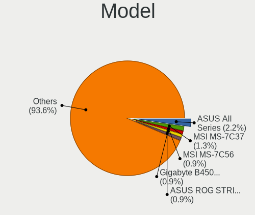
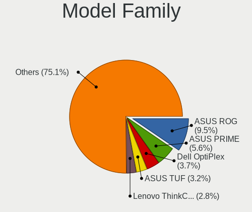
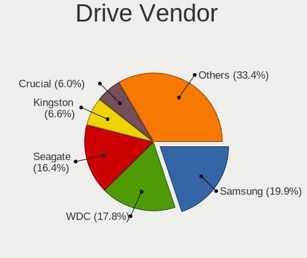
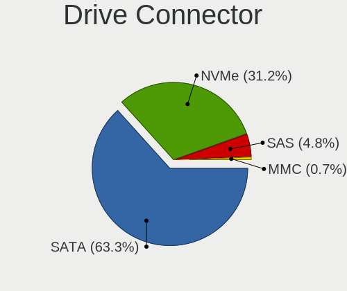
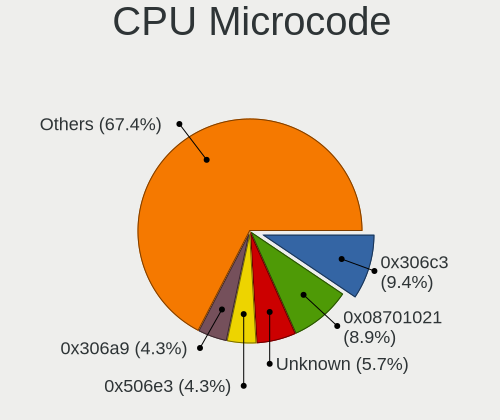
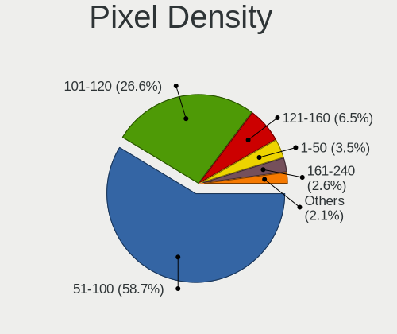
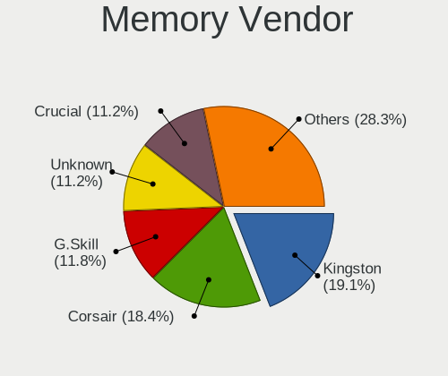
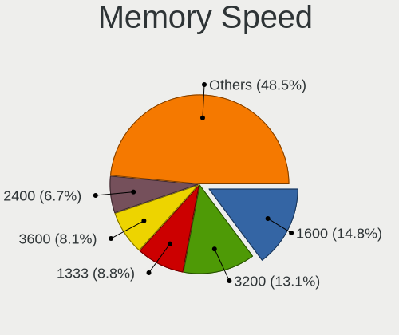

Fedora 35 - Tested Hardware & Statistics (Desktops)
---------------------------------------------------

A project to collect tested hardware configurations for Fedora 35.

Anyone can contribute to this report by the [hw-probe](https://github.com/linuxhw/hw-probe) tool:

    sudo -E hw-probe -all -upload

Please submit a probe of your configuration if it's not presented on the page or is rare.

Full-feature report is available here: https://linux-hardware.org/?view=trends&rel=fedora-35

Contents
--------

* [ Test Cases ](#test-cases)

* [ System ](#system)
  - [ Kernel                   ](#kernel)
  - [ Kernel Family            ](#kernel-family)
  - [ Kernel Major Ver.        ](#kernel-major-ver)
  - [ Arch                     ](#arch)
  - [ DE                       ](#de)
  - [ Display Server           ](#display-server)
  - [ Display Manager          ](#display-manager)
  - [ OS Lang                  ](#os-lang)
  - [ Boot Mode                ](#boot-mode)
  - [ Filesystem               ](#filesystem)
  - [ Part. scheme             ](#part-scheme)
  - [ Dual Boot with Linux/BSD ](#dual-boot-with-linuxbsd)
  - [ Dual Boot (Win)          ](#dual-boot-win)

* [ Board ](#board)
  - [ Vendor                   ](#vendor)
  - [ Model                    ](#model)
  - [ Model Family             ](#model-family)
  - [ MFG Year                 ](#mfg-year)
  - [ Form Factor              ](#form-factor)
  - [ Secure Boot              ](#secure-boot)
  - [ Coreboot                 ](#coreboot)
  - [ RAM Size                 ](#ram-size)
  - [ RAM Used                 ](#ram-used)
  - [ Total Drives             ](#total-drives)
  - [ Has CD-ROM               ](#has-cd-rom)
  - [ Has Ethernet             ](#has-ethernet)
  - [ Has WiFi                 ](#has-wifi)
  - [ Has Bluetooth            ](#has-bluetooth)

* [ Location ](#location)
  - [ Country                  ](#country)
  - [ City                     ](#city)

* [ Drives ](#drives)
  - [ Drive Vendor             ](#drive-vendor)
  - [ Drive Model              ](#drive-model)
  - [ HDD Vendor               ](#hdd-vendor)
  - [ SSD Vendor               ](#ssd-vendor)
  - [ Drive Kind               ](#drive-kind)
  - [ Drive Connector          ](#drive-connector)
  - [ Drive Size               ](#drive-size)
  - [ Space Total              ](#space-total)
  - [ Space Used               ](#space-used)
  - [ Malfunc. Drives          ](#malfunc-drives)
  - [ Malfunc. Drive Vendor    ](#malfunc-drive-vendor)
  - [ Malfunc. HDD Vendor      ](#malfunc-hdd-vendor)
  - [ Malfunc. Drive Kind      ](#malfunc-drive-kind)
  - [ Failed Drives            ](#failed-drives)
  - [ Failed Drive Vendor      ](#failed-drive-vendor)
  - [ Drive Status             ](#drive-status)

* [ Storage controller ](#storage-controller)
  - [ Storage Vendor           ](#storage-vendor)
  - [ Storage Model            ](#storage-model)
  - [ Storage Kind             ](#storage-kind)

* [ Processor ](#processor)
  - [ CPU Vendor               ](#cpu-vendor)
  - [ CPU Model                ](#cpu-model)
  - [ CPU Model Family         ](#cpu-model-family)
  - [ CPU Cores                ](#cpu-cores)
  - [ CPU Sockets              ](#cpu-sockets)
  - [ CPU Threads              ](#cpu-threads)
  - [ CPU Op-Modes             ](#cpu-op-modes)
  - [ CPU Microcode            ](#cpu-microcode)
  - [ CPU Microarch            ](#cpu-microarch)

* [ Graphics ](#graphics)
  - [ GPU Vendor               ](#gpu-vendor)
  - [ GPU Model                ](#gpu-model)
  - [ GPU Combo                ](#gpu-combo)
  - [ GPU Driver               ](#gpu-driver)
  - [ GPU Memory               ](#gpu-memory)

* [ Monitor ](#monitor)
  - [ Monitor Vendor           ](#monitor-vendor)
  - [ Monitor Model            ](#monitor-model)
  - [ Monitor Resolution       ](#monitor-resolution)
  - [ Monitor Diagonal         ](#monitor-diagonal)
  - [ Monitor Width            ](#monitor-width)
  - [ Aspect Ratio             ](#aspect-ratio)
  - [ Monitor Area             ](#monitor-area)
  - [ Pixel Density            ](#pixel-density)
  - [ Multiple Monitors        ](#multiple-monitors)

* [ Network ](#network)
  - [ Net Controller Vendor    ](#net-controller-vendor)
  - [ Net Controller Model     ](#net-controller-model)
  - [ Wireless Vendor          ](#wireless-vendor)
  - [ Wireless Model           ](#wireless-model)
  - [ Ethernet Vendor          ](#ethernet-vendor)
  - [ Ethernet Model           ](#ethernet-model)
  - [ Net Controller Kind      ](#net-controller-kind)
  - [ Used Controller          ](#used-controller)
  - [ NICs                     ](#nics)
  - [ IPv6                     ](#ipv6)

* [ Bluetooth ](#bluetooth)
  - [ Bluetooth Vendor         ](#bluetooth-vendor)
  - [ Bluetooth Model          ](#bluetooth-model)

* [ Sound ](#sound)
  - [ Sound Vendor             ](#sound-vendor)
  - [ Sound Model              ](#sound-model)

* [ Memory ](#memory)
  - [ Memory Vendor            ](#memory-vendor)
  - [ Memory Model             ](#memory-model)
  - [ Memory Kind              ](#memory-kind)
  - [ Memory Form Factor       ](#memory-form-factor)
  - [ Memory Size              ](#memory-size)
  - [ Memory Speed             ](#memory-speed)

* [ Printers & scanners ](#printers--scanners)
  - [ Printer Vendor           ](#printer-vendor)
  - [ Printer Model            ](#printer-model)
  - [ Scanner Vendor           ](#scanner-vendor)
  - [ Scanner Model            ](#scanner-model)

* [ Camera ](#camera)
  - [ Camera Vendor            ](#camera-vendor)
  - [ Camera Model             ](#camera-model)

* [ Security ](#security)
  - [ Fingerprint Vendor       ](#fingerprint-vendor)
  - [ Fingerprint Model        ](#fingerprint-model)
  - [ Chipcard Vendor          ](#chipcard-vendor)
  - [ Chipcard Model           ](#chipcard-model)

* [ Unsupported ](#unsupported)
  - [ Unsupported Devices      ](#unsupported-devices)
  - [ Unsupported Device Types ](#unsupported-device-types)

Test Cases
----------

| Vendor   | Model                       | Probe                                                      | Date         |
|----------|-----------------------------|------------------------------------------------------------|--------------|
| MSI      | MPG X570 GAMING PRO CARB... | [93de1508cb](https://linux-hardware.org/?probe=93de1508cb) | Oct 31, 2021 |
| Lenovo   | 1046 SDK0T08861 WIN 3305... | [136c409f1a](https://linux-hardware.org/?probe=136c409f1a) | Oct 27, 2021 |
| Lenovo   | 1046 SDK0T08861 WIN 3305... | [ae8daa788a](https://linux-hardware.org/?probe=ae8daa788a) | Oct 27, 2021 |
| MSI      | B550-A PRO                  | [91c5853577](https://linux-hardware.org/?probe=91c5853577) | Oct 25, 2021 |
| Fujitsu  | D3120-A1 S26361-D3120-A1    | [fac95138dc](https://linux-hardware.org/?probe=fac95138dc) | Oct 23, 2021 |
| Foxconn  | H81MXV FAB A                | [b030daf542](https://linux-hardware.org/?probe=b030daf542) | Oct 20, 2021 |
| ASUSTek  | PRIME B460M-A               | [6db5e9be6b](https://linux-hardware.org/?probe=6db5e9be6b) | Oct 19, 2021 |
| ASUSTek  | ROG STRIX B560-G GAMING ... | [746401b748](https://linux-hardware.org/?probe=746401b748) | Oct 18, 2021 |
| MSI      | B350 PC MATE                | [bc716e921b](https://linux-hardware.org/?probe=bc716e921b) | Oct 15, 2021 |
| Dell     | 0WMJ54 A01                  | [01ce3b252c](https://linux-hardware.org/?probe=01ce3b252c) | Oct 14, 2021 |
| ASUSTek  | PRIME B550M-A               | [2ff2eb607a](https://linux-hardware.org/?probe=2ff2eb607a) | Oct 14, 2021 |
| ASUSTek  | PRIME A320I-K               | [eee2a960f5](https://linux-hardware.org/?probe=eee2a960f5) | Oct 11, 2021 |
| ASUSTek  | PRIME B350-PLUS             | [7b26df9bc4](https://linux-hardware.org/?probe=7b26df9bc4) | Oct 10, 2021 |
| Gigabyte | X570 AORUS ULTRA            | [f850c51db9](https://linux-hardware.org/?probe=f850c51db9) | Oct 10, 2021 |
| ASUSTek  | ROG Maximus XI FORMULA      | [cfbe862160](https://linux-hardware.org/?probe=cfbe862160) | Oct 10, 2021 |
| Fujitsu  | D3220-A1 S26361-D3220-A1    | [a9ceb4591e](https://linux-hardware.org/?probe=a9ceb4591e) | Oct 09, 2021 |
| Fujitsu  | D3220-A1 S26361-D3220-A1    | [7c210a60ab](https://linux-hardware.org/?probe=7c210a60ab) | Oct 09, 2021 |
| Gigabyte | H61N-USB3                   | [43ded3a853](https://linux-hardware.org/?probe=43ded3a853) | Oct 09, 2021 |
| ASUSTek  | ROG STRIX B550-F GAMING     | [b3d0295208](https://linux-hardware.org/?probe=b3d0295208) | Oct 08, 2021 |
| Gigabyte | H61N-USB3                   | [75d34f09c4](https://linux-hardware.org/?probe=75d34f09c4) | Oct 06, 2021 |
| MSI      | B550-A PRO                  | [17a03c217e](https://linux-hardware.org/?probe=17a03c217e) | Oct 04, 2021 |
| Gigabyte | Z170-D3H-CF                 | [103d2198a4](https://linux-hardware.org/?probe=103d2198a4) | Sep 30, 2021 |
| Gigabyte | Z170-D3H-CF                 | [b6f5c877d4](https://linux-hardware.org/?probe=b6f5c877d4) | Sep 29, 2021 |
| Gigabyte | H81M-S2H                    | [b8c27bd56c](https://linux-hardware.org/?probe=b8c27bd56c) | Sep 28, 2021 |
| ASRock   | B450M-HDV R4.0              | [2f771e8271](https://linux-hardware.org/?probe=2f771e8271) | Sep 24, 2021 |
| ASUSTek  | TUF GAMING B550M-PLUS       | [e75373a634](https://linux-hardware.org/?probe=e75373a634) | Sep 23, 2021 |
| ASUSTek  | ROG STRIX B360-I GAMING     | [3875512e39](https://linux-hardware.org/?probe=3875512e39) | Sep 14, 2021 |
| ASUSTek  | ROG STRIX B360-I GAMING     | [4fb9ed180b](https://linux-hardware.org/?probe=4fb9ed180b) | Sep 14, 2021 |
| Dell     | 0WMJ54 A01                  | [3231b34d4d](https://linux-hardware.org/?probe=3231b34d4d) | Aug 24, 2021 |
| Dell     | 0WMJ54 A01                  | [a94ad8a323](https://linux-hardware.org/?probe=a94ad8a323) | Aug 22, 2021 |
| HP       | 8055                        | [29f5b9a7ab](https://linux-hardware.org/?probe=29f5b9a7ab) | Aug 12, 2021 |
| Dell     | 0KC9NP A01                  | [142e0703fb](https://linux-hardware.org/?probe=142e0703fb) | Aug 12, 2021 |
| Dell     | 0KC9NP A01                  | [f48bc9ac9d](https://linux-hardware.org/?probe=f48bc9ac9d) | Aug 07, 2021 |
| ASUSTek  | Maximus V FORMULA           | [466ef3bd27](https://linux-hardware.org/?probe=466ef3bd27) | Jul 29, 2021 |
| Dell     | 0KC9NP A01                  | [7dcd16d3fd](https://linux-hardware.org/?probe=7dcd16d3fd) | Jul 14, 2021 |
| Dell     | 0KC9NP A01                  | [eedd464065](https://linux-hardware.org/?probe=eedd464065) | Jul 14, 2021 |
| Dell     | 0KC9NP A01                  | [8d1e68aad0](https://linux-hardware.org/?probe=8d1e68aad0) | Jul 07, 2021 |
| Dell     | 0KC9NP A01                  | [852a8a103d](https://linux-hardware.org/?probe=852a8a103d) | Jul 04, 2021 |
| Dell     | 0KC9NP A01                  | [3a0ca9b90c](https://linux-hardware.org/?probe=3a0ca9b90c) | Jul 01, 2021 |
| Dell     | 0KC9NP A01                  | [3ed1ee1f81](https://linux-hardware.org/?probe=3ed1ee1f81) | Jun 25, 2021 |
| Dell     | 0KC9NP A01                  | [f611d9ec88](https://linux-hardware.org/?probe=f611d9ec88) | Jun 23, 2021 |
| ASUSTek  | Maximus V FORMULA           | [95ba18d5da](https://linux-hardware.org/?probe=95ba18d5da) | Jun 23, 2021 |
| Dell     | 0KC9NP A01                  | [511e8019e0](https://linux-hardware.org/?probe=511e8019e0) | Jun 19, 2021 |
| Dell     | 0KC9NP A01                  | [6687380bd7](https://linux-hardware.org/?probe=6687380bd7) | Jun 18, 2021 |
| Gigabyte | F2A88XN-WIFI                | [c22e6d8669](https://linux-hardware.org/?probe=c22e6d8669) | May 25, 2021 |
| ASUSTek  | Maximus V FORMULA           | [3e15dd7136](https://linux-hardware.org/?probe=3e15dd7136) | May 19, 2021 |
| ECS      | MCP61M-M3                   | [2e5b21af19](https://linux-hardware.org/?probe=2e5b21af19) | Apr 17, 2021 |
| ASUSTek  | PRIME X570-PRO              | [3f7cbcea74](https://linux-hardware.org/?probe=3f7cbcea74) | Apr 14, 2021 |

System
------

Kernel
------

Version of the Linux kernel

| Version                                                       | Desktops | Percent |
|---------------------------------------------------------------|----------|---------|
| 5.14.10-300.fc35.x86_64                                       | 6        | 19.35%  |
| 5.14.9-300.fc35.x86_64                                        | 5        | 16.13%  |
| 5.14.0-60.fc35.x86_64                                         | 3        | 9.68%   |
| 5.12.0-0.rc7.189.fc35.x86_64                                  | 2        | 6.45%   |
| 5.15.0-0.rc7.20211028git1fc596a56b33.56.vanilla.1.fc35.x86_64 | 1        | 3.23%   |
| 5.14.8-lqx1.0.fc35.x86_64                                     | 1        | 3.23%   |
| 5.14.7-300.fc35.x86_64                                        | 1        | 3.23%   |
| 5.14.6-300.fc35.x86_64                                        | 1        | 3.23%   |
| 5.14.14-300.fc35.x86_64                                       | 1        | 3.23%   |
| 5.14.13_MY                                                    | 1        | 3.23%   |
| 5.14.1-300.fc35.x86_64                                        | 1        | 3.23%   |
| 5.14.0-0.rc6.46.fc35.x86_64                                   | 1        | 3.23%   |
| 5.13.7-200.fc34.x86_64                                        | 1        | 3.23%   |
| 5.13.0-58.fc35.x86_64                                         | 1        | 3.23%   |
| 5.13.0-0.rc7.20210623git0c18f29aae7c.53.fc35.x86_64           | 1        | 3.23%   |
| 5.13.0-0.rc6.45.fc35.x86_64                                   | 1        | 3.23%   |
| 5.13.0-0.rc2.20210521git79a106fc6585.22.fc35.x86_64           | 1        | 3.23%   |
| 5.13.0-0.rc2.19.fc35.x86_64                                   | 1        | 3.23%   |
| 5.13.0-0.rc1.13.fc35.x86_64                                   | 1        | 3.23%   |

Kernel Family
-------------

Linux kernel without a distro release

| Version | Desktops | Percent |
|---------|----------|---------|
| 5.14.10 | 6        | 21.43%  |
| 5.14.9  | 5        | 17.86%  |
| 5.14.0  | 4        | 14.29%  |
| 5.13.0  | 3        | 10.71%  |
| 5.12.0  | 2        | 7.14%   |
| 5.15.0  | 1        | 3.57%   |
| 5.14.8  | 1        | 3.57%   |
| 5.14.7  | 1        | 3.57%   |
| 5.14.6  | 1        | 3.57%   |
| 5.14.14 | 1        | 3.57%   |
| 5.14.13 | 1        | 3.57%   |
| 5.14.1  | 1        | 3.57%   |
| 5.13.7  | 1        | 3.57%   |

Kernel Major Ver.
-----------------

Linux kernel major version

| Version | Desktops | Percent |
|---------|----------|---------|
| 5.14    | 21       | 75%     |
| 5.13    | 4        | 14.29%  |
| 5.12    | 2        | 7.14%   |
| 5.15    | 1        | 3.57%   |

Arch
----

OS architecture (x86_64, i586, etc.)

| Name   | Desktops | Percent |
|--------|----------|---------|
| x86_64 | 28       | 100%    |

DE
--

Desktop Environment

| Name    | Desktops | Percent |
|---------|----------|---------|
| GNOME   | 16       | 57.14%  |
| KDE5    | 4        | 14.29%  |
| Unknown | 4        | 14.29%  |
| KDE     | 2        | 7.14%   |
| XFCE    | 1        | 3.57%   |
| MATE    | 1        | 3.57%   |

Display Server
--------------

X11 or Wayland

| Name    | Desktops | Percent |
|---------|----------|---------|
| Wayland | 14       | 50%     |
| X11     | 10       | 35.71%  |
| Tty     | 2        | 7.14%   |
| Unknown | 2        | 7.14%   |

Display Manager
---------------

SDDM, LightDM, etc.

| Name    | Desktops | Percent |
|---------|----------|---------|
| Unknown | 17       | 60.71%  |
| GDM     | 7        | 25%     |
| SDDM    | 3        | 10.71%  |
| LightDM | 1        | 3.57%   |

OS Lang
-------

Language

| Lang  | Desktops | Percent |
|-------|----------|---------|
| en_US | 15       | 53.57%  |
| en_CA | 2        | 7.14%   |
| ru_RU | 1        | 3.57%   |
| pt_BR | 1        | 3.57%   |
| pl_PL | 1        | 3.57%   |
| pa_IN | 1        | 3.57%   |
| nl_BE | 1        | 3.57%   |
| hu_HU | 1        | 3.57%   |
| fr_CH | 1        | 3.57%   |
| es_CL | 1        | 3.57%   |
| en_IL | 1        | 3.57%   |
| en_GB | 1        | 3.57%   |
| de_DE | 1        | 3.57%   |

Boot Mode
---------

EFI or BIOS

| Mode | Desktops | Percent |
|------|----------|---------|
| EFI  | 21       | 75%     |
| BIOS | 7        | 25%     |

Filesystem
----------

Type of filesystem

| Type  | Desktops | Percent |
|-------|----------|---------|
| Btrfs | 20       | 71.43%  |
| Ext4  | 7        | 25%     |
| Xfs   | 1        | 3.57%   |

Part. scheme
------------

Scheme of partitioning

| Type    | Desktops | Percent |
|---------|----------|---------|
| GPT     | 13       | 44.83%  |
| Unknown | 13       | 44.83%  |
| MBR     | 3        | 10.34%  |

Dual Boot with Linux/BSD
------------------------

Hosting more than one Linux/BSD

| Dual boot | Desktops | Percent |
|-----------|----------|---------|
| No        | 24       | 82.76%  |
| Yes       | 5        | 17.24%  |

Dual Boot (Win)
---------------

Hosting Linux and Windows

| Dual boot | Desktops | Percent |
|-----------|----------|---------|
| No        | 24       | 82.76%  |
| Yes       | 5        | 17.24%  |

Board
-----

Vendor
------

Motherboard manufacturer

| Name                | Desktops | Percent |
|---------------------|----------|---------|
| ASUSTek Computer    | 11       | 39.29%  |
| Gigabyte Technology | 5        | 17.86%  |
| MSI                 | 3        | 10.71%  |
| Fujitsu             | 2        | 7.14%   |
| Dell                | 2        | 7.14%   |
| Lenovo              | 1        | 3.57%   |
| Hewlett-Packard     | 1        | 3.57%   |
| Foxconn             | 1        | 3.57%   |
| ECS                 | 1        | 3.57%   |
| ASRock              | 1        | 3.57%   |

Model
-----

Motherboard model

| Name                                | Desktops | Percent |
|-------------------------------------|----------|---------|
| MSI MS-7C56                         | 1        | 3.57%   |
| MSI MS-7B93                         | 1        | 3.57%   |
| MSI MS-7A34                         | 1        | 3.57%   |
| Lenovo ThinkStation P620 30E0CTO1WW | 1        | 3.57%   |
| HP EliteDesk 800 G2 DM 35W          | 1        | 3.57%   |
| Gigabyte Z170-D3H                   | 1        | 3.57%   |
| Gigabyte X570 AORUS ULTRA           | 1        | 3.57%   |
| Gigabyte H81M-S2H                   | 1        | 3.57%   |
| Gigabyte H61N-USB3                  | 1        | 3.57%   |
| Gigabyte F2A88XN-WIFI               | 1        | 3.57%   |
| Fujitsu ESPRIMO P520                | 1        | 3.57%   |
| Fujitsu ESPRIMO P410                | 1        | 3.57%   |
| Foxconn H81MXV                      | 1        | 3.57%   |
| ECS MCP61M-M3                       | 1        | 3.57%   |
| Dell OptiPlex 9020                  | 1        | 3.57%   |
| Dell OptiPlex 3020                  | 1        | 3.57%   |
| ASUS TUF GAMING B550M-PLUS          | 1        | 3.57%   |
| ASUS ROG STRIX B560-G GAMING WIFI   | 1        | 3.57%   |
| ASUS ROG STRIX B550-F GAMING        | 1        | 3.57%   |
| ASUS ROG STRIX B360-I GAMING        | 1        | 3.57%   |
| ASUS ROG Maximus XI FORMULA         | 1        | 3.57%   |
| ASUS PRIME X570-PRO                 | 1        | 3.57%   |
| ASUS PRIME B550M-A                  | 1        | 3.57%   |
| ASUS PRIME B460M-A                  | 1        | 3.57%   |
| ASUS PRIME B350-PLUS                | 1        | 3.57%   |
| ASUS PRIME A320I-K                  | 1        | 3.57%   |
| ASUS Maximus V FORMULA              | 1        | 3.57%   |
| ASRock B450M-HDV R4.0               | 1        | 3.57%   |

Model Family
------------

Motherboard model prefix

| Name                  | Desktops | Percent |
|-----------------------|----------|---------|
| ASUS PRIME            | 5        | 17.86%  |
| ASUS ROG              | 4        | 14.29%  |
| Fujitsu ESPRIMO       | 2        | 7.14%   |
| Dell OptiPlex         | 2        | 7.14%   |
| MSI MS-7C56           | 1        | 3.57%   |
| MSI MS-7B93           | 1        | 3.57%   |
| MSI MS-7A34           | 1        | 3.57%   |
| Lenovo ThinkStation   | 1        | 3.57%   |
| HP EliteDesk          | 1        | 3.57%   |
| Gigabyte Z170-D3H     | 1        | 3.57%   |
| Gigabyte X570         | 1        | 3.57%   |
| Gigabyte H81M-S2H     | 1        | 3.57%   |
| Gigabyte H61N-USB3    | 1        | 3.57%   |
| Gigabyte F2A88XN-WIFI | 1        | 3.57%   |
| Foxconn H81MXV        | 1        | 3.57%   |
| ECS MCP61M-M3         | 1        | 3.57%   |
| ASUS TUF              | 1        | 3.57%   |
| ASUS Maximus          | 1        | 3.57%   |
| ASRock B450M-HDV      | 1        | 3.57%   |

MFG Year
--------

Motherboard manufacture year

| Year | Desktops | Percent |
|------|----------|---------|
| 2021 | 8        | 28.57%  |
| 2020 | 5        | 17.86%  |
| 2018 | 5        | 17.86%  |
| 2015 | 3        | 10.71%  |
| 2013 | 3        | 10.71%  |
| 2019 | 2        | 7.14%   |
| 2014 | 1        | 3.57%   |
| 2010 | 1        | 3.57%   |

Form Factor
-----------

Physical design of the computer

| Name    | Desktops | Percent |
|---------|----------|---------|
| Desktop | 28       | 100%    |

Secure Boot
-----------

Enabled or disabled

| State    | Desktops | Percent |
|----------|----------|---------|
| Disabled | 25       | 89.29%  |
| Enabled  | 3        | 10.71%  |

Coreboot
--------

Have coreboot on board

| Used | Desktops | Percent |
|------|----------|---------|
| No   | 28       | 100%    |

RAM Size
--------

Total RAM memory

| Size in GB  | Desktops | Percent |
|-------------|----------|---------|
| 16.01-24.0  | 11       | 39.29%  |
| 32.01-64.0  | 7        | 25%     |
| 8.01-16.0   | 5        | 17.86%  |
| 4.01-8.0    | 3        | 10.71%  |
| 3.01-4.0    | 1        | 3.57%   |
| 64.01-256.0 | 1        | 3.57%   |

RAM Used
--------

Used RAM memory

| Used GB    | Desktops | Percent |
|------------|----------|---------|
| 2.01-3.0   | 14       | 45.16%  |
| 1.01-2.0   | 5        | 16.13%  |
| 4.01-8.0   | 4        | 12.9%   |
| 3.01-4.0   | 4        | 12.9%   |
| 24.01-32.0 | 1        | 3.23%   |
| 8.01-16.0  | 1        | 3.23%   |
| 0.51-1.0   | 1        | 3.23%   |
| 0.01-0.5   | 1        | 3.23%   |

Total Drives
------------

Number of drives on board

| Drives | Desktops | Percent |
|--------|----------|---------|
| 1      | 10       | 35.71%  |
| 2      | 9        | 32.14%  |
| 3      | 4        | 14.29%  |
| 7      | 2        | 7.14%   |
| 5      | 2        | 7.14%   |
| 4      | 1        | 3.57%   |

Has CD-ROM
----------

Has CD-ROM on board

| Presented | Desktops | Percent |
|-----------|----------|---------|
| No        | 17       | 60.71%  |
| Yes       | 11       | 39.29%  |

Has Ethernet
------------

Has Ethernet on board

| Presented | Desktops | Percent |
|-----------|----------|---------|
| Yes       | 28       | 100%    |

Has WiFi
--------

Has WiFi module

| Presented | Desktops | Percent |
|-----------|----------|---------|
| Yes       | 15       | 53.57%  |
| No        | 13       | 46.43%  |

Has Bluetooth
-------------

Has Bluetooth module

| Presented | Desktops | Percent |
|-----------|----------|---------|
| No        | 16       | 57.14%  |
| Yes       | 12       | 42.86%  |

Location
--------

Country
-------

Geographic location (country)

| Country     | Desktops | Percent |
|-------------|----------|---------|
| USA         | 5        | 17.86%  |
| Germany     | 4        | 14.29%  |
| Canada      | 3        | 10.71%  |
| Switzerland | 2        | 7.14%   |
| Israel      | 2        | 7.14%   |
| Brazil      | 2        | 7.14%   |
| Turkey      | 1        | 3.57%   |
| Spain       | 1        | 3.57%   |
| Poland      | 1        | 3.57%   |
| Norway      | 1        | 3.57%   |
| Hungary     | 1        | 3.57%   |
| Hong Kong   | 1        | 3.57%   |
| Chile       | 1        | 3.57%   |
| Belgium     | 1        | 3.57%   |
| Belarus     | 1        | 3.57%   |
| Austria     | 1        | 3.57%   |

City
----

Geographic location (city)

| City          | Desktops | Percent |
|---------------|----------|---------|
| Zurich        | 1        | 3.57%   |
| Vienna        | 1        | 3.57%   |
| Veresegyhaz   | 1        | 3.57%   |
| Vancouver     | 1        | 3.57%   |
| Somerville    | 1        | 3.57%   |
| Pflugerville  | 1        | 3.57%   |
| Peta??– Tiqwa | 1        | 3.57%   |
| Owatonna      | 1        | 3.57%   |
| O?›wi?™cim    | 1        | 3.57%   |
| Minsk         | 1        | 3.57%   |
| Leverkusen    | 1        | 3.57%   |
| Lausanne      | 1        | 3.57%   |
| Laurel        | 1        | 3.57%   |
| La Florida    | 1        | 3.57%   |
| Kwu Tung      | 1        | 3.57%   |
| Kitchener     | 1        | 3.57%   |
| Kamloops      | 1        | 3.57%   |
| Jambes        | 1        | 3.57%   |
| Ja?©n         | 1        | 3.57%   |
| Istanbul      | 1        | 3.57%   |
| Hohn          | 1        | 3.57%   |
| Hamburg       | 1        | 3.57%   |
| Haifa         | 1        | 3.57%   |
| Guarapuava    | 1        | 3.57%   |
| Goi??nia      | 1        | 3.57%   |
| Bo            | 1        | 3.57%   |
| Berlin        | 1        | 3.57%   |
| Atlanta       | 1        | 3.57%   |

Drives
------

Drive Vendor
------------

Hard drive vendors

| Vendor                | Desktops | Drives | Percent |
|-----------------------|----------|--------|---------|
| Samsung Electronics   | 16       | 29     | 29.09%  |
| WDC                   | 9        | 13     | 16.36%  |
| Seagate               | 8        | 14     | 14.55%  |
| Crucial               | 6        | 6      | 10.91%  |
| Kingston              | 4        | 4      | 7.27%   |
| Toshiba               | 3        | 3      | 5.45%   |
| Sandisk               | 2        | 2      | 3.64%   |
| SUNEAST               | 1        | 1      | 1.82%   |
| Silicon Motion        | 1        | 1      | 1.82%   |
| SABRENT               | 1        | 1      | 1.82%   |
| Realtek Semiconductor | 1        | 1      | 1.82%   |
| Phison                | 1        | 1      | 1.82%   |
| Mushkin               | 1        | 1      | 1.82%   |
| LS600                 | 1        | 1      | 1.82%   |

Drive Model
-----------

Hard drive models

| Model                             | Desktops | Percent |
|-----------------------------------|----------|---------|
| WDC WDS100T2B0A-00SM50 1TB SSD    | 2        | 3.08%   |
| Seagate ST500DM002-1BD142 500GB   | 2        | 3.08%   |
| Samsung SSD 970 EVO Plus 500GB    | 2        | 3.08%   |
| Samsung SSD 860 EVO 500GB         | 2        | 3.08%   |
| Samsung SSD 860 EVO 1TB           | 2        | 3.08%   |
| Kingston SA400S37480G 480GB SSD   | 2        | 3.08%   |
| WDC WDS500G2B0A-00SM50 500GB SSD  | 1        | 1.54%   |
| WDC WDS250G2B0B 250GB SSD         | 1        | 1.54%   |
| WDC WDS240G2G0A-00JH30 240GB SSD  | 1        | 1.54%   |
| WDC WDS200T2B0A-00SM50 2TB SSD    | 1        | 1.54%   |
| WDC WDS100T1B0A-00H9H0 1TB SSD    | 1        | 1.54%   |
| WDC WD80EFZX-68UW8N0 8TB          | 1        | 1.54%   |
| WDC WD5000AAKX-07U6AA0 500GB      | 1        | 1.54%   |
| WDC WD30EZRX-00MMMB0 3TB          | 1        | 1.54%   |
| WDC WD20EZRZ-00Z5HB0 2TB          | 1        | 1.54%   |
| Toshiba MQ01ABD050 500GB          | 1        | 1.54%   |
| Toshiba MG05ACA800E 8TB           | 1        | 1.54%   |
| Toshiba DT01ACA050 500GB          | 1        | 1.54%   |
| SUNEAST SSD SE800 256GB           | 1        | 1.54%   |
| Silicon Motion NVMe SSD Drive 2TB | 1        | 1.54%   |
| Seagate ST8000AS0002-1NA17Z 8TB   | 1        | 1.54%   |
| Seagate ST6000DM003-2CY186 6TB    | 1        | 1.54%   |
| Seagate ST3500630AS 500GB         | 1        | 1.54%   |
| Seagate ST3160812AS 160GB         | 1        | 1.54%   |
| Seagate ST3000DM001-1CH166 3TB    | 1        | 1.54%   |
| Seagate ST240HM000-1G515 240GB    | 1        | 1.54%   |
| Seagate ST2000DM008-2FR102 2TB    | 1        | 1.54%   |
| Seagate ST2000DL003-9VT166 2TB    | 1        | 1.54%   |
| SanDisk SDSSDP064G 64GB           | 1        | 1.54%   |
| Sandisk NVMe SSD Drive 1024GB     | 1        | 1.54%   |
| Samsung SSD 980 500GB             | 1        | 1.54%   |
| Samsung SSD 970 EVO Plus 1TB      | 1        | 1.54%   |
| Samsung SSD 970 EVO 500GB         | 1        | 1.54%   |
| Samsung SSD 870 QVO 1TB           | 1        | 1.54%   |
| Samsung SSD 870 1TB               | 1        | 1.54%   |
| Samsung SSD 860 EVO M.2 1TB       | 1        | 1.54%   |
| Samsung SSD 860 EVO 4TB           | 1        | 1.54%   |
| Samsung SSD 860 EVO 250GB         | 1        | 1.54%   |
| Samsung SSD 850 EVO 500GB         | 1        | 1.54%   |
| Samsung SSD 840 EVO 250GB         | 1        | 1.54%   |
| Samsung Portable SSD T5 1TB       | 1        | 1.54%   |
| Samsung NVMe SSD Drive 500GB      | 1        | 1.54%   |
| Samsung NVMe SSD Drive 2TB        | 1        | 1.54%   |
| Samsung NVMe SSD Drive 1TB        | 1        | 1.54%   |
| Samsung HD753LJ 752GB             | 1        | 1.54%   |
| Samsung HD103UJ 1TB               | 1        | 1.54%   |
| SABRENT ASM1153E 512GB            | 1        | 1.54%   |
| Realtek NVMe SSD Drive 256GB      | 1        | 1.54%   |
| Phison NVMe SSD Drive 2TB         | 1        | 1.54%   |
| Mushkin MKNSSDRE1TB               | 1        | 1.54%   |
| LS600 SSD 480GB                   | 1        | 1.54%   |
| Kingston SUV400S 240GB SSD        | 1        | 1.54%   |
| Kingston SA2000M81000G 1TB        | 1        | 1.54%   |
| Crucial CT275MX300SSD4 275GB      | 1        | 1.54%   |
| Crucial CT2000MX500SSD1 2TB       | 1        | 1.54%   |
| Crucial CT128MX100SSD1 128GB      | 1        | 1.54%   |
| Crucial CT1024MX200SSD1 1TB       | 1        | 1.54%   |
| Crucial CT1000P2SSD8 1TB          | 1        | 1.54%   |
| Crucial CT1000MX500SSD1 1TB       | 1        | 1.54%   |

HDD Vendor
----------

Hard disk drive vendors

| Vendor              | Desktops | Drives | Percent |
|---------------------|----------|--------|---------|
| Seagate             | 8        | 14     | 50%     |
| WDC                 | 4        | 6      | 25%     |
| Toshiba             | 3        | 3      | 18.75%  |
| Samsung Electronics | 1        | 2      | 6.25%   |

SSD Vendor
----------

Solid state drive vendors

| Vendor              | Desktops | Drives | Percent |
|---------------------|----------|--------|---------|
| Samsung Electronics | 10       | 18     | 34.48%  |
| WDC                 | 6        | 7      | 20.69%  |
| Crucial             | 5        | 5      | 17.24%  |
| Kingston            | 3        | 3      | 10.34%  |
| SUNEAST             | 1        | 1      | 3.45%   |
| SanDisk             | 1        | 1      | 3.45%   |
| SABRENT             | 1        | 1      | 3.45%   |
| Mushkin             | 1        | 1      | 3.45%   |
| LS600               | 1        | 1      | 3.45%   |

Drive Kind
----------

HDD or SSD

| Kind | Desktops | Drives | Percent |
|------|----------|--------|---------|
| SSD  | 19       | 38     | 43.18%  |
| HDD  | 13       | 25     | 29.55%  |
| NVMe | 12       | 15     | 27.27%  |

Drive Connector
---------------

SATA, SAS, NVMe, etc.

| Type | Desktops | Drives | Percent |
|------|----------|--------|---------|
| SATA | 23       | 61     | 62.16%  |
| NVMe | 12       | 15     | 32.43%  |
| SAS  | 2        | 2      | 5.41%   |

Drive Size
----------

Size of hard drive

| Size in TB | Desktops | Drives | Percent |
|------------|----------|--------|---------|
| 0.01-0.5   | 17       | 29     | 45.95%  |
| 0.51-1.0   | 10       | 18     | 27.03%  |
| 1.01-2.0   | 5        | 5      | 13.51%  |
| 4.01-10.0  | 3        | 4      | 8.11%   |
| 3.01-4.0   | 1        | 1      | 2.7%    |
| 2.01-3.0   | 1        | 6      | 2.7%    |

Space Total
-----------

Amount of disk space available on the file system

| Size in GB     | Desktops | Percent |
|----------------|----------|---------|
| 101-250        | 8        | 27.59%  |
| 2001-3000      | 6        | 20.69%  |
| 501-1000       | 4        | 13.79%  |
| 251-500        | 3        | 10.34%  |
| 1001-2000      | 3        | 10.34%  |
| More than 3000 | 2        | 6.9%    |
| 1-20           | 2        | 6.9%    |
| 51-100         | 1        | 3.45%   |

Space Used
----------

Amount of used disk space

| Used GB        | Desktops | Percent |
|----------------|----------|---------|
| 1-20           | 8        | 27.59%  |
| 1001-2000      | 5        | 17.24%  |
| 21-50          | 4        | 13.79%  |
| 501-1000       | 4        | 13.79%  |
| 251-500        | 3        | 10.34%  |
| 101-250        | 2        | 6.9%    |
| More than 3000 | 1        | 3.45%   |
| 2001-3000      | 1        | 3.45%   |
| 51-100         | 1        | 3.45%   |

Malfunc. Drives
---------------

Drive models with a malfunction

| Model                           | Desktops | Drives | Percent |
|---------------------------------|----------|--------|---------|
| Seagate ST500DM002-1BD142 500GB | 2        | 2      | 28.57%  |
| WDC WD30EZRX-00MMMB0 3TB        | 1        | 1      | 14.29%  |
| Seagate ST3500630AS 500GB       | 1        | 1      | 14.29%  |
| Seagate ST2000DL003-9VT166 2TB  | 1        | 1      | 14.29%  |
| Samsung Electronics HD103UJ 1TB | 1        | 1      | 14.29%  |
| Crucial CT128MX100SSD1 128GB    | 1        | 1      | 14.29%  |

Malfunc. Drive Vendor
---------------------

Vendors of faulty drives

| Vendor              | Desktops | Drives | Percent |
|---------------------|----------|--------|---------|
| Seagate             | 4        | 4      | 57.14%  |
| WDC                 | 1        | 1      | 14.29%  |
| Samsung Electronics | 1        | 1      | 14.29%  |
| Crucial             | 1        | 1      | 14.29%  |

Malfunc. HDD Vendor
-------------------

Vendors of faulty HDD drives

| Vendor              | Desktops | Drives | Percent |
|---------------------|----------|--------|---------|
| Seagate             | 4        | 4      | 66.67%  |
| WDC                 | 1        | 1      | 16.67%  |
| Samsung Electronics | 1        | 1      | 16.67%  |

Malfunc. Drive Kind
-------------------

Kinds of faulty drives

| Kind | Desktops | Drives | Percent |
|------|----------|--------|---------|
| HDD  | 4        | 6      | 80%     |
| SSD  | 1        | 1      | 20%     |

Failed Drives
-------------

Failed drive models

Zero info for selected period =(

Failed Drive Vendor
-------------------

Failed drive vendors

Zero info for selected period =(

Drive Status
------------

Number of failed and malfunc. drives

| Status   | Desktops | Drives | Percent |
|----------|----------|--------|---------|
| Detected | 14       | 43     | 42.42%  |
| Works    | 14       | 28     | 42.42%  |
| Malfunc  | 5        | 7      | 15.15%  |

Storage controller
------------------

Storage Vendor
--------------

Storage controller vendors

| Vendor                      | Desktops | Percent |
|-----------------------------|----------|---------|
| Intel                       | 14       | 31.11%  |
| AMD                         | 13       | 28.89%  |
| Samsung Electronics         | 7        | 15.56%  |
| ASMedia Technology          | 3        | 6.67%   |
| Silicon Motion              | 1        | 2.22%   |
| Sandisk                     | 1        | 2.22%   |
| Realtek Semiconductor       | 1        | 2.22%   |
| Phison Electronics          | 1        | 2.22%   |
| Nvidia                      | 1        | 2.22%   |
| Micron/Crucial Technology   | 1        | 2.22%   |
| Marvell Technology Group    | 1        | 2.22%   |
| Kingston Technology Company | 1        | 2.22%   |

Storage Model
-------------

Storage controller models

| Model                                                                          | Desktops | Percent |
|--------------------------------------------------------------------------------|----------|---------|
| AMD FCH SATA Controller [AHCI mode]                                            | 9        | 17.65%  |
| Samsung NVMe SSD Controller SM981/PM981/PM983                                  | 6        | 11.76%  |
| Intel 8 Series/C220 Series Chipset Family 6-port SATA Controller 1 [AHCI mode] | 4        | 7.84%   |
| AMD Starship/Matisse Chipset SATA Controller [AHCI mode]                       | 4        | 7.84%   |
| Intel Q170/Q150/B150/H170/H110/Z170/CM236 Chipset SATA Controller [AHCI Mode]  | 2        | 3.92%   |
| Intel Cannon Lake PCH SATA AHCI Controller                                     | 2        | 3.92%   |
| Intel 6 Series/C200 Series Chipset Family 6 port Desktop SATA AHCI Controller  | 2        | 3.92%   |
| ASMedia ASM1062 Serial ATA Controller                                          | 2        | 3.92%   |
| AMD 300 Series Chipset SATA Controller                                         | 2        | 3.92%   |
| Silicon Motion SM2262/SM2262EN SSD Controller                                  | 1        | 1.96%   |
| Sandisk WD Black SN750 / PC SN730 NVMe SSD                                     | 1        | 1.96%   |
| Samsung NVMe SSD Controller 980                                                | 1        | 1.96%   |
| Realtek Realtek Non-Volatile memory controller                                 | 1        | 1.96%   |
| Phison E16 PCIe4 NVMe Controller                                               | 1        | 1.96%   |
| Nvidia MCP61 SATA Controller                                                   | 1        | 1.96%   |
| Nvidia MCP61 IDE                                                               | 1        | 1.96%   |
| Micron/Crucial P2 NVMe PCIe SSD                                                | 1        | 1.96%   |
| Marvell Group 88SE9215 PCIe 2.0 x1 4-port SATA 6 Gb/s Controller               | 1        | 1.96%   |
| Kingston Company A2000 NVMe SSD                                                | 1        | 1.96%   |
| Intel 8 Series/C220 Series Chipset Family 4-port SATA Controller 1 [IDE mode]  | 1        | 1.96%   |
| Intel 8 Series/C220 Series Chipset Family 2-port SATA Controller 2 [IDE mode]  | 1        | 1.96%   |
| Intel 7 Series/C210 Series Chipset Family 6-port SATA Controller [AHCI mode]   | 1        | 1.96%   |
| Intel 500 Series Chipset Family SATA AHCI Controller                           | 1        | 1.96%   |
| Intel 400 Series Chipset Family SATA AHCI Controller                           | 1        | 1.96%   |
| ASMedia SATA controller                                                        | 1        | 1.96%   |
| AMD FCH SATA Controller D                                                      | 1        | 1.96%   |
| AMD 400 Series Chipset SATA Controller                                         | 1        | 1.96%   |

Storage Kind
------------

Kind of storage controller (IDE, SATA, NVMe, SAS, ...)

| Kind | Desktops | Percent |
|------|----------|---------|
| SATA | 26       | 65%     |
| NVMe | 12       | 30%     |
| IDE  | 2        | 5%      |

Processor
---------

CPU Vendor
----------

Processor vendors

| Vendor | Desktops | Percent |
|--------|----------|---------|
| Intel  | 14       | 50%     |
| AMD    | 14       | 50%     |

CPU Model
---------

Processor models

| Model                                           | Desktops | Percent |
|-------------------------------------------------|----------|---------|
| Intel Core i9-9900K CPU @ 3.60GHz               | 1        | 3.57%   |
| Intel Core i7-8700 CPU @ 3.20GHz                | 1        | 3.57%   |
| Intel Core i7-4790 CPU @ 3.60GHz                | 1        | 3.57%   |
| Intel Core i7-3770K CPU @ 3.50GHz               | 1        | 3.57%   |
| Intel Core i5-6500T CPU @ 2.50GHz               | 1        | 3.57%   |
| Intel Core i5-6500 CPU @ 3.20GHz                | 1        | 3.57%   |
| Intel Core i5-4590S CPU @ 3.00GHz               | 1        | 3.57%   |
| Intel Core i5-4590 CPU @ 3.30GHz                | 1        | 3.57%   |
| Intel Core i5-4570 CPU @ 3.20GHz                | 1        | 3.57%   |
| Intel Core i5-4460 CPU @ 3.20GHz                | 1        | 3.57%   |
| Intel Core i5-3330 CPU @ 3.00GHz                | 1        | 3.57%   |
| Intel Core i5-10600K CPU @ 4.10GHz              | 1        | 3.57%   |
| Intel Celeron CPU G540 @ 2.50GHz                | 1        | 3.57%   |
| Intel 11th Gen Core i5-11400 @ 2.60GHz          | 1        | 3.57%   |
| AMD Ryzen Threadripper PRO 3945WX 12-Cores      | 1        | 3.57%   |
| AMD Ryzen 9 5900X 12-Core Processor             | 1        | 3.57%   |
| AMD Ryzen 9 3900X 12-Core Processor             | 1        | 3.57%   |
| AMD Ryzen 7 5700G with Radeon Graphics          | 1        | 3.57%   |
| AMD Ryzen 7 3700X 8-Core Processor              | 1        | 3.57%   |
| AMD Ryzen 5 5600X 6-Core Processor              | 1        | 3.57%   |
| AMD Ryzen 5 5600G with Radeon Graphics          | 1        | 3.57%   |
| AMD Ryzen 5 3600X 6-Core Processor              | 1        | 3.57%   |
| AMD Ryzen 5 3600 6-Core Processor               | 1        | 3.57%   |
| AMD Ryzen 5 2600 Six-Core Processor             | 1        | 3.57%   |
| AMD Ryzen 5 1600 Six-Core Processor             | 1        | 3.57%   |
| AMD Athlon II X2 250 Processor                  | 1        | 3.57%   |
| AMD Athlon 200GE with Radeon Vega Graphics      | 1        | 3.57%   |
| AMD A10-7850K Radeon R7, 12 Compute Cores 4C+8G | 1        | 3.57%   |

CPU Model Family
----------------

Processor model prefix

| Model                  | Desktops | Percent |
|------------------------|----------|---------|
| Intel Core i5          | 8        | 28.57%  |
| AMD Ryzen 5            | 6        | 21.43%  |
| Intel Core i7          | 3        | 10.71%  |
| AMD Ryzen 9            | 2        | 7.14%   |
| AMD Ryzen 7            | 2        | 7.14%   |
| Other                  | 1        | 3.57%   |
| Intel Core i9          | 1        | 3.57%   |
| Intel Celeron          | 1        | 3.57%   |
| AMD Ryzen Threadripper | 1        | 3.57%   |
| AMD Athlon II X2       | 1        | 3.57%   |
| AMD Athlon             | 1        | 3.57%   |
| AMD A10                | 1        | 3.57%   |

CPU Cores
---------

Number of processor cores

| Number | Desktops | Percent |
|--------|----------|---------|
| 6      | 9        | 32.14%  |
| 4      | 9        | 32.14%  |
| 2      | 4        | 14.29%  |
| 12     | 3        | 10.71%  |
| 8      | 3        | 10.71%  |

CPU Sockets
-----------

Number of sockets

| Number | Desktops | Percent |
|--------|----------|---------|
| 1      | 28       | 100%    |

CPU Threads
-----------

Threads per core (Hyper-Threading)

| Number | Desktops | Percent |
|--------|----------|---------|
| 2      | 19       | 67.86%  |
| 1      | 9        | 32.14%  |

CPU Op-Modes
------------

CPU Operation Modes (32-bit, 64-bit)

| Op mode        | Desktops | Percent |
|----------------|----------|---------|
| 32-bit, 64-bit | 28       | 100%    |

CPU Microcode
-------------

Microcode number

| Number     | Desktops | Percent |
|------------|----------|---------|
| 0x306c3    | 4        | 14.29%  |
| 0x08701021 | 4        | 14.29%  |
| Unknown    | 3        | 10.71%  |
| 0x506e3    | 2        | 7.14%   |
| 0x306a9    | 2        | 7.14%   |
| 0x0a201009 | 2        | 7.14%   |
| 0xa0671    | 1        | 3.57%   |
| 0xa0655    | 1        | 3.57%   |
| 0x906ea    | 1        | 3.57%   |
| 0x206a7    | 1        | 3.57%   |
| 0x0a50000c | 1        | 3.57%   |
| 0x0830104d | 1        | 3.57%   |
| 0x08101016 | 1        | 3.57%   |
| 0x08008206 | 1        | 3.57%   |
| 0x08001138 | 1        | 3.57%   |
| 0x06003106 | 1        | 3.57%   |
| 0x010000b6 | 1        | 3.57%   |

CPU Microarch
-------------

Microarchitecture

| Name        | Desktops | Percent |
|-------------|----------|---------|
| Zen 2       | 5        | 17.86%  |
| Haswell     | 5        | 17.86%  |
| Zen 3       | 4        | 14.29%  |
| Zen         | 2        | 7.14%   |
| Skylake     | 2        | 7.14%   |
| KabyLake    | 2        | 7.14%   |
| IvyBridge   | 2        | 7.14%   |
| Zen+        | 1        | 3.57%   |
| Steamroller | 1        | 3.57%   |
| SandyBridge | 1        | 3.57%   |
| K10         | 1        | 3.57%   |
| Icelake     | 1        | 3.57%   |
| CometLake   | 1        | 3.57%   |

Graphics
--------

GPU Vendor
----------

Vendors of graphics cards

| Vendor | Desktops | Percent |
|--------|----------|---------|
| AMD    | 13       | 43.33%  |
| Nvidia | 9        | 30%     |
| Intel  | 8        | 26.67%  |

GPU Model
---------

Graphics card models

| Model                                                                       | Desktops | Percent |
|-----------------------------------------------------------------------------|----------|---------|
| Intel Xeon E3-1200 v3/4th Gen Core Processor Integrated Graphics Controller | 2        | 6.67%   |
| Intel Xeon E3-1200 v2/3rd Gen Core processor Graphics Controller            | 2        | 6.67%   |
| AMD Ellesmere [Radeon RX 470/480/570/570X/580/580X/590]                     | 2        | 6.67%   |
| AMD Cezanne                                                                 | 2        | 6.67%   |
| Nvidia TU117 [GeForce GTX 1650]                                             | 1        | 3.33%   |
| Nvidia TU106 [GeForce RTX 2070 Rev. A]                                      | 1        | 3.33%   |
| Nvidia GP107GL [Quadro P400]                                                | 1        | 3.33%   |
| Nvidia GP107 [GeForce GTX 1050 3GB]                                         | 1        | 3.33%   |
| Nvidia GP106 [GeForce GTX 1060 6GB]                                         | 1        | 3.33%   |
| Nvidia GK104 [GeForce GTX 670]                                              | 1        | 3.33%   |
| Nvidia GF108 [GeForce GT 630]                                               | 1        | 3.33%   |
| Nvidia GF106 [GeForce GTS 450]                                              | 1        | 3.33%   |
| Nvidia GA102 [GeForce RTX 3090]                                             | 1        | 3.33%   |
| Intel RocketLake-S GT1 [UHD Graphics 730]                                   | 1        | 3.33%   |
| Intel HD Graphics 530                                                       | 1        | 3.33%   |
| Intel CoffeeLake-S GT2 [UHD Graphics 630]                                   | 1        | 3.33%   |
| Intel 2nd Generation Core Processor Family Integrated Graphics Controller   | 1        | 3.33%   |
| AMD Vega 10 XL/XT [Radeon RX Vega 56/64]                                    | 1        | 3.33%   |
| AMD Turks PRO [Radeon HD 6570/7570/8550 / R5 230]                           | 1        | 3.33%   |
| AMD Raven Ridge [Radeon Vega Series / Radeon Vega Mobile Series]            | 1        | 3.33%   |
| AMD Navi 21 [Radeon RX 6800/6800 XT / 6900 XT]                              | 1        | 3.33%   |
| AMD Navi 10 [Radeon RX 5600 OEM/5600 XT / 5700/5700 XT]                     | 1        | 3.33%   |
| AMD Navi 10 [Radeon Pro W5700]                                              | 1        | 3.33%   |
| AMD Lexa PRO [Radeon 540/540X/550/550X / RX 540X/550/550X]                  | 1        | 3.33%   |
| AMD Kaveri [Radeon R7 Graphics]                                             | 1        | 3.33%   |
| AMD Baffin [Radeon RX 550 640SP / RX 560/560X]                              | 1        | 3.33%   |

GPU Combo
---------

Combinations of graphics cards

| Name       | Desktops | Percent |
|------------|----------|---------|
| 1 x AMD    | 13       | 46.43%  |
| 1 x Nvidia | 9        | 32.14%  |
| 1 x Intel  | 6        | 21.43%  |

GPU Driver
----------

Free vs proprietary

| Driver      | Desktops | Percent |
|-------------|----------|---------|
| Free        | 20       | 71.43%  |
| Proprietary | 6        | 21.43%  |
| Unknown     | 2        | 7.14%   |

GPU Memory
----------

Total video memory

| Size in GB | Desktops | Percent |
|------------|----------|---------|
| Unknown    | 13       | 44.83%  |
| 1.01-2.0   | 4        | 13.79%  |
| 3.01-4.0   | 3        | 10.34%  |
| 7.01-8.0   | 2        | 6.9%    |
| 5.01-6.0   | 2        | 6.9%    |
| 8.01-16.0  | 2        | 6.9%    |
| 0.51-1.0   | 2        | 6.9%    |
| 0.01-0.5   | 1        | 3.45%   |

Monitor
-------

Monitor Vendor
--------------

Monitor vendors

| Vendor               | Desktops | Percent |
|----------------------|----------|---------|
| Samsung Electronics  | 4        | 16%     |
| Goldstar             | 4        | 16%     |
| Hewlett-Packard      | 3        | 12%     |
| AOC                  | 3        | 12%     |
| Eizo                 | 2        | 8%      |
| Dell                 | 2        | 8%      |
| ViewSonic            | 1        | 4%      |
| Philips              | 1        | 4%      |
| Lenovo               | 1        | 4%      |
| Iiyama               | 1        | 4%      |
| HannStar             | 1        | 4%      |
| Ancor Communications | 1        | 4%      |
| Acer                 | 1        | 4%      |

Monitor Model
-------------

Monitor models

| Model                                                                  | Desktops | Percent |
|------------------------------------------------------------------------|----------|---------|
| ViewSonic VA1938 Series VSC0626 1366x768 410x230mm 18.5-inch           | 1        | 3.85%   |
| Samsung Electronics SyncMaster SAM041D 1920x1200 459x296mm 21.5-inch   | 1        | 3.85%   |
| Samsung Electronics SyncMaster SAM036F 1440x900 428x255mm 19.6-inch    | 1        | 3.85%   |
| Samsung Electronics LF27T450F SAM7099 1920x1080 597x336mm 27.0-inch    | 1        | 3.85%   |
| Samsung Electronics C49HG9x SAM0E5D 3840x1080 1200x340mm 49.1-inch     | 1        | 3.85%   |
| Samsung Electronics C27F390 SAM0D32 1920x1080 600x340mm 27.2-inch      | 1        | 3.85%   |
| Philips PHL 243S7 PHL090F 1920x1080 527x296mm 23.8-inch                | 1        | 3.85%   |
| Lenovo D24-20 LEN66AE 1920x1080 527x296mm 23.8-inch                    | 1        | 3.85%   |
| Iiyama PL2409HD IVM560C 1920x1080 521x293mm 23.5-inch                  | 1        | 3.85%   |
| Hewlett-Packard ZR2740w HWP2957 2560x1440 597x336mm 27.0-inch          | 1        | 3.85%   |
| Hewlett-Packard ZR24w HWP2869 1920x1200 518x324mm 24.1-inch            | 1        | 3.85%   |
| Hewlett-Packard 24f HPN3545 1920x1080 527x296mm 23.8-inch              | 1        | 3.85%   |
| HannStar HX191D HSD0DC6 1280x1024 376x301mm 19.0-inch                  | 1        | 3.85%   |
| Goldstar W2442 GSM56D9 1680x1050 530x300mm 24.0-inch                   | 1        | 3.85%   |
| Goldstar MP59G GSM5B35 1920x1080 480x270mm 21.7-inch                   | 1        | 3.85%   |
| Goldstar M2280A GSM57EC 1920x1080 476x268mm 21.5-inch                  | 1        | 3.85%   |
| Goldstar FULL HD GSM5B55 1920x1080 480x270mm 21.7-inch                 | 1        | 3.85%   |
| Eizo EV3285 ENC2979 3840x2160 698x393mm 31.5-inch                      | 1        | 3.85%   |
| Eizo EV2450 ENC2530 1920x1080 528x297mm 23.9-inch                      | 1        | 3.85%   |
| Dell U2719DX DEL41A1 2560x1440 597x336mm 27.0-inch                     | 1        | 3.85%   |
| Dell AW2518HF DELA102 1920x1080 544x303mm 24.5-inch                    | 1        | 3.85%   |
| AOC LE22H037 AOC2207 1920x1080 480x270mm 21.7-inch                     | 1        | 3.85%   |
| AOC AG273QS3R4 AOC2730 2560x1440 597x336mm 27.0-inch                   | 1        | 3.85%   |
| AOC 2220W AOC2220 1920x1080 477x268mm 21.5-inch                        | 1        | 3.85%   |
| Ancor Communications ASUS VW266H ACI26A4 1920x1200 550x340mm 25.5-inch | 1        | 3.85%   |
| Acer B326HUL ACR03F0 2560x1440 708x399mm 32.0-inch                     | 1        | 3.85%   |

Monitor Resolution
------------------

Monitor screen resolution

| Resolution        | Desktops | Percent |
|-------------------|----------|---------|
| 1920x1080 (FHD)   | 12       | 48%     |
| 2560x1440 (QHD)   | 4        | 16%     |
| 1920x1200 (WUXGA) | 3        | 12%     |
| 3840x2160 (4K)    | 2        | 8%      |
| 3840x1080         | 1        | 4%      |
| 1440x900 (WXGA+)  | 1        | 4%      |
| 1366x768 (WXGA)   | 1        | 4%      |
| 1280x1024 (SXGA)  | 1        | 4%      |

Monitor Diagonal
----------------

Diagonal size in inches

| Inches | Desktops | Percent |
|--------|----------|---------|
| 27     | 6        | 23.08%  |
| 24     | 4        | 15.38%  |
| 21     | 4        | 15.38%  |
| 23     | 3        | 11.54%  |
| 25     | 2        | 7.69%   |
| 19     | 2        | 7.69%   |
| 49     | 1        | 3.85%   |
| 32     | 1        | 3.85%   |
| 31     | 1        | 3.85%   |
| 22     | 1        | 3.85%   |
| 18     | 1        | 3.85%   |

Monitor Width
-------------

Physical width

| Width in mm | Desktops | Percent |
|-------------|----------|---------|
| 501-600     | 14       | 56%     |
| 401-500     | 7        | 28%     |
| 701-800     | 1        | 4%      |
| 601-700     | 1        | 4%      |
| 351-400     | 1        | 4%      |
| 1001-1500   | 1        | 4%      |

Aspect Ratio
------------

Proportional relationship between the width and the height

| Ratio | Desktops | Percent |
|-------|----------|---------|
| 16/9  | 19       | 79.17%  |
| 16/10 | 3        | 12.5%   |
| 5/4   | 1        | 4.17%   |
| 32/9  | 1        | 4.17%   |

Monitor Area
------------

Area in inch²

| Area in inch² | Desktops | Percent |
|----------------|----------|---------|
| 201-250        | 8        | 33.33%  |
| 301-350        | 6        | 25%     |
| 151-200        | 4        | 16.67%  |
| 251-300        | 3        | 12.5%   |
| 351-500        | 1        | 4.17%   |
| 141-150        | 1        | 4.17%   |
| 501-1000       | 1        | 4.17%   |

Pixel Density
-------------

Pixels per inch

| Density | Desktops | Percent |
|---------|----------|---------|
| 51-100  | 14       | 60.87%  |
| 101-120 | 8        | 34.78%  |
| 121-160 | 1        | 4.35%   |

Multiple Monitors
-----------------

Total monitors connected

| Total | Desktops | Percent |
|-------|----------|---------|
| 1     | 21       | 75%     |
| 2     | 4        | 14.29%  |
| 0     | 3        | 10.71%  |

Network
-------

Net Controller Vendor
---------------------

Controller vendors

| Vendor                | Desktops | Percent |
|-----------------------|----------|---------|
| Intel                 | 17       | 44.74%  |
| Realtek Semiconductor | 14       | 36.84%  |
| Ralink Technology     | 2        | 5.26%   |
| Aquantia              | 2        | 5.26%   |
| Realtek               | 1        | 2.63%   |
| Nvidia                | 1        | 2.63%   |
| Broadcom              | 1        | 2.63%   |

Net Controller Model
--------------------

Controller models

| Model                                                             | Desktops | Percent |
|-------------------------------------------------------------------|----------|---------|
| Realtek RTL8111/8168/8411 PCI Express Gigabit Ethernet Controller | 13       | 28.26%  |
| Intel Wi-Fi 6 AX200                                               | 7        | 15.22%  |
| Intel I211 Gigabit Network Connection                             | 3        | 6.52%   |
| Ralink RT5370 Wireless Adapter                                    | 2        | 4.35%   |
| Intel Ethernet Controller I225-V                                  | 2        | 4.35%   |
| Intel Ethernet Connection (7) I219-V                              | 2        | 4.35%   |
| Intel Cannon Lake PCH CNVi WiFi                                   | 2        | 4.35%   |
| Realtek RTL88x2bu [AC1200 Techkey]                                | 1        | 2.17%   |
| Realtek RTL8153 Gigabit Ethernet Adapter                          | 1        | 2.17%   |
| Realtek RTL8125 2.5GbE Controller                                 | 1        | 2.17%   |
| Realtek 802.11n NIC                                               | 1        | 2.17%   |
| Nvidia MCP61 Ethernet                                             | 1        | 2.17%   |
| Intel Tiger Lake PCH CNVi WiFi                                    | 1        | 2.17%   |
| Intel Ethernet Connection I217-LM                                 | 1        | 2.17%   |
| Intel Ethernet Connection (2) I219-V                              | 1        | 2.17%   |
| Intel Ethernet Connection (2) I219-LM                             | 1        | 2.17%   |
| Intel Centrino Wireless-N 1030 [Rainbow Peak]                     | 1        | 2.17%   |
| Intel 82579V Gigabit Network Connection                           | 1        | 2.17%   |
| Intel 82574L Gigabit Network Connection                           | 1        | 2.17%   |
| Broadcom BCM43228 802.11a/b/g/n                                   | 1        | 2.17%   |
| Aquantia AQC111 NBase-T/IEEE 802.3bz Ethernet Controller [AQtion] | 1        | 2.17%   |
| Aquantia AQC107 NBase-T/IEEE 802.3bz Ethernet Controller [AQtion] | 1        | 2.17%   |

Wireless Vendor
---------------

Wireless vendors

| Vendor                | Desktops | Percent |
|-----------------------|----------|---------|
| Intel                 | 11       | 68.75%  |
| Ralink Technology     | 2        | 12.5%   |
| Realtek Semiconductor | 1        | 6.25%   |
| Realtek               | 1        | 6.25%   |
| Broadcom              | 1        | 6.25%   |

Wireless Model
--------------

Wireless models

| Model                                         | Desktops | Percent |
|-----------------------------------------------|----------|---------|
| Intel Wi-Fi 6 AX200                           | 7        | 43.75%  |
| Ralink RT5370 Wireless Adapter                | 2        | 12.5%   |
| Intel Cannon Lake PCH CNVi WiFi               | 2        | 12.5%   |
| Realtek RTL88x2bu [AC1200 Techkey]            | 1        | 6.25%   |
| Realtek 802.11n NIC                           | 1        | 6.25%   |
| Intel Tiger Lake PCH CNVi WiFi                | 1        | 6.25%   |
| Intel Centrino Wireless-N 1030 [Rainbow Peak] | 1        | 6.25%   |
| Broadcom BCM43228 802.11a/b/g/n               | 1        | 6.25%   |

Ethernet Vendor
---------------

Ethernet vendors

| Vendor                | Desktops | Percent |
|-----------------------|----------|---------|
| Realtek Semiconductor | 14       | 48.28%  |
| Intel                 | 12       | 41.38%  |
| Aquantia              | 2        | 6.9%    |
| Nvidia                | 1        | 3.45%   |

Ethernet Model
--------------

Ethernet models

| Model                                                             | Desktops | Percent |
|-------------------------------------------------------------------|----------|---------|
| Realtek RTL8111/8168/8411 PCI Express Gigabit Ethernet Controller | 13       | 43.33%  |
| Intel I211 Gigabit Network Connection                             | 3        | 10%     |
| Intel Ethernet Controller I225-V                                  | 2        | 6.67%   |
| Intel Ethernet Connection (7) I219-V                              | 2        | 6.67%   |
| Realtek RTL8153 Gigabit Ethernet Adapter                          | 1        | 3.33%   |
| Realtek RTL8125 2.5GbE Controller                                 | 1        | 3.33%   |
| Nvidia MCP61 Ethernet                                             | 1        | 3.33%   |
| Intel Ethernet Connection I217-LM                                 | 1        | 3.33%   |
| Intel Ethernet Connection (2) I219-V                              | 1        | 3.33%   |
| Intel Ethernet Connection (2) I219-LM                             | 1        | 3.33%   |
| Intel 82579V Gigabit Network Connection                           | 1        | 3.33%   |
| Intel 82574L Gigabit Network Connection                           | 1        | 3.33%   |
| Aquantia AQC111 NBase-T/IEEE 802.3bz Ethernet Controller [AQtion] | 1        | 3.33%   |
| Aquantia AQC107 NBase-T/IEEE 802.3bz Ethernet Controller [AQtion] | 1        | 3.33%   |

Net Controller Kind
-------------------

Ethernet, WiFi or modem

| Kind     | Desktops | Percent |
|----------|----------|---------|
| Ethernet | 28       | 65.12%  |
| WiFi     | 15       | 34.88%  |

Used Controller
---------------

Currently used network controller

| Kind     | Desktops | Percent |
|----------|----------|---------|
| Ethernet | 27       | 71.05%  |
| WiFi     | 11       | 28.95%  |

NICs
----

Total network controllers on board

| Total | Desktops | Percent |
|-------|----------|---------|
| 1     | 16       | 57.14%  |
| 2     | 11       | 39.29%  |
| 3     | 1        | 3.57%   |

IPv6
----

IPv6 vs IPv4

| Used | Desktops | Percent |
|------|----------|---------|
| No   | 18       | 64.29%  |
| Yes  | 10       | 35.71%  |

Bluetooth
---------

Bluetooth Vendor
----------------

Controller vendors

| Vendor                  | Desktops | Percent |
|-------------------------|----------|---------|
| Intel                   | 11       | 84.62%  |
| Cambridge Silicon Radio | 1        | 7.69%   |
| ASUSTek Computer        | 1        | 7.69%   |

Bluetooth Model
---------------

Controller models

| Model                                               | Desktops | Percent |
|-----------------------------------------------------|----------|---------|
| Intel AX200 Bluetooth                               | 7        | 53.85%  |
| Intel Bluetooth 9460/9560 Jefferson Peak (JfP)      | 2        | 15.38%  |
| Intel Bluetooth Device                              | 1        | 7.69%   |
| Intel AX201 Bluetooth                               | 1        | 7.69%   |
| Cambridge Silicon Radio Bluetooth Dongle (HCI mode) | 1        | 7.69%   |
| ASUS BCM20702A0                                     | 1        | 7.69%   |

Sound
-----

Sound Vendor
------------

Sound card vendors

| Vendor              | Desktops | Percent |
|---------------------|----------|---------|
| AMD                 | 16       | 33.33%  |
| Intel               | 12       | 25%     |
| Nvidia              | 10       | 20.83%  |
| C-Media Electronics | 4        | 8.33%   |
| Creative Labs       | 2        | 4.17%   |
| Unknown             | 1        | 2.08%   |
| Texas Instruments   | 1        | 2.08%   |
| SteelSeries ApS     | 1        | 2.08%   |
| Razer USA           | 1        | 2.08%   |

Sound Model
-----------

Sound card models

| Model                                                                      | Desktops | Percent |
|----------------------------------------------------------------------------|----------|---------|
| AMD Starship/Matisse HD Audio Controller                                   | 6        | 10%     |
| Intel 8 Series/C220 Series Chipset High Definition Audio Controller        | 3        | 5%      |
| AMD Family 17h (Models 10h-1fh) HD Audio Controller                        | 3        | 5%      |
| Nvidia GP107GL High Definition Audio Controller                            | 2        | 3.33%   |
| Intel Xeon E3-1200 v3/4th Gen Core Processor HD Audio Controller           | 2        | 3.33%   |
| Intel Cannon Lake PCH cAVS                                                 | 2        | 3.33%   |
| Intel 6 Series/C200 Series Chipset Family High Definition Audio Controller | 2        | 3.33%   |
| Intel 100 Series/C230 Series Chipset Family HD Audio Controller            | 2        | 3.33%   |
| AMD Renoir Radeon High Definition Audio Controller                         | 2        | 3.33%   |
| AMD Navi 10 HDMI Audio                                                     | 2        | 3.33%   |
| AMD Family 17h (Models 00h-0fh) HD Audio Controller                        | 2        | 3.33%   |
| AMD Ellesmere HDMI Audio [Radeon RX 470/480 / 570/580/590]                 | 2        | 3.33%   |
| AMD Baffin HDMI/DP Audio [Radeon RX 550 640SP / RX 560/560X]               | 2        | 3.33%   |
| Unknown Realtek USB Audio Rear                                             | 1        | 1.67%   |
| Unknown Realtek USB Audio Front                                            | 1        | 1.67%   |
| Texas Instruments PCM2900 Audio Codec                                      | 1        | 1.67%   |
| SteelSeries ApS SteelSeries Arctis 7                                       | 1        | 1.67%   |
| Razer USA Kraken 7.1 V2                                                    | 1        | 1.67%   |
| Nvidia TU107 GeForce GTX 1650 High Definition Audio Controller             | 1        | 1.67%   |
| Nvidia TU106 High Definition Audio Controller                              | 1        | 1.67%   |
| Nvidia MCP61 High Definition Audio                                         | 1        | 1.67%   |
| Nvidia GP106 High Definition Audio Controller                              | 1        | 1.67%   |
| Nvidia GK104 HDMI Audio Controller                                         | 1        | 1.67%   |
| Nvidia GF108 High Definition Audio Controller                              | 1        | 1.67%   |
| Nvidia GF106 High Definition Audio Controller                              | 1        | 1.67%   |
| Nvidia GA102 High Definition Audio Controller                              | 1        | 1.67%   |
| Intel Tiger Lake-H HD Audio Controller                                     | 1        | 1.67%   |
| Intel Comet Lake PCH-V Smart Sound Technology Audio Controller             | 1        | 1.67%   |
| Intel 7 Series/C216 Chipset Family High Definition Audio Controller        | 1        | 1.67%   |
| Creative Labs Sound Core3D [Sound Blaster Recon3D / Z-Series]              | 1        | 1.67%   |
| Creative Labs EMU10k1 [Sound Blaster Live! Series]                         | 1        | 1.67%   |
| C-Media Electronics USB Audio Device                                       | 1        | 1.67%   |
| C-Media Electronics CM106 Like Sound Device                                | 1        | 1.67%   |
| C-Media Electronics Audio Adapter                                          | 1        | 1.67%   |
| C-Media Electronics 7.1ch Surround Audio Device                            | 1        | 1.67%   |
| AMD Vega 10 HDMI Audio [Radeon Vega 56/64]                                 | 1        | 1.67%   |
| AMD Turks HDMI Audio [Radeon HD 6500/6600 / 6700M Series]                  | 1        | 1.67%   |
| AMD Raven/Raven2/Fenghuang HDMI/DP Audio Controller                        | 1        | 1.67%   |
| AMD Navi 21 HDMI Audio [Radeon RX 6800/6800 XT / 6900 XT]                  | 1        | 1.67%   |
| AMD Kaveri HDMI/DP Audio Controller                                        | 1        | 1.67%   |
| AMD FCH Azalia Controller                                                  | 1        | 1.67%   |

Memory
------

Memory Vendor
-------------

Memory module vendors

| Vendor              | Desktops | Percent |
|---------------------|----------|---------|
| Crucial             | 5        | 27.78%  |
| Corsair             | 4        | 22.22%  |
| Samsung Electronics | 2        | 11.11%  |
| Micron Technology   | 2        | 11.11%  |
| G.Skill             | 2        | 11.11%  |
| Unknown             | 1        | 5.56%   |
| SK Hynix            | 1        | 5.56%   |
| Kingston            | 1        | 5.56%   |

Memory Model
------------

Memory module models

| Model                                                    | Desktops | Percent |
|----------------------------------------------------------|----------|---------|
| Unknown RAM Module 4GB DIMM DDR3 1067MT/s                | 1        | 5%      |
| SK Hynix RAM HMT451U6AFR8C-PB 4096MB DIMM DDR3 1600MT/s  | 1        | 5%      |
| Samsung RAM Module 8GB SODIMM DDR4 2133MT/s              | 1        | 5%      |
| Samsung RAM M378B1G73QH0-CK0 8192MB DIMM DDR3 1600MT/s   | 1        | 5%      |
| Micron RAM 8KTF51264AZ-1G6E1 4GB DIMM DDR3 1600MT/s      | 1        | 5%      |
| Micron RAM 16ATF2G64AZ-2G1B1 16GB DIMM DDR4 2133MT/s     | 1        | 5%      |
| Kingston RAM KHX3600C17D4/8GX 8GB DIMM DDR4 3600MT/s     | 1        | 5%      |
| G.Skill RAM F4-3600C19-8GVRB 8192MB DIMM DDR4 2933MT/s   | 1        | 5%      |
| G.Skill RAM F4-3000C16-8GISB 8GB DIMM DDR4 3200MT/s      | 1        | 5%      |
| Crucial RAM CT8G4SFS824A.C8FBR1 8GB SODIMM DDR4 2400MT/s | 1        | 5%      |
| Crucial RAM CT8G4DFS824A.M8FE 8192MB DIMM DDR4 2933MT/s  | 1        | 5%      |
| Crucial RAM CT8G4DFS824A.C8FE 8GB DIMM DDR4 3000MT/s     | 1        | 5%      |
| Crucial RAM CT8G4DFRA32A.M4FE 8GB DIMM DDR4 3200MT/s     | 1        | 5%      |
| Crucial RAM BLS16G4D32AESB.M16FE 16GB DIMM DDR4 3400MT/s | 1        | 5%      |
| Crucial RAM BL8G30C15U4B.M8FE 8GB DIMM DDR4 3000MT/s     | 1        | 5%      |
| Corsair RAM VS2GB1333D4 2048MB DIMM DDR3 1600MT/s        | 1        | 5%      |
| Corsair RAM VS2GB1333D3 2048MB DIMM DDR3 1333MT/s        | 1        | 5%      |
| Corsair RAM CMZ32GX3M4X1866C10 8GB DIMM DDR3 1333MT/s    | 1        | 5%      |
| Corsair RAM CMK16GX4M2D3600C16 8GB DIMM DDR4 3600MT/s    | 1        | 5%      |
| Corsair RAM CMK16GX4M2A2666C16 8GB DIMM DDR4 3200MT/s    | 1        | 5%      |

Memory Kind
-----------

Memory module kinds

| Kind | Desktops | Percent |
|------|----------|---------|
| DDR4 | 11       | 64.71%  |
| DDR3 | 6        | 35.29%  |

Memory Form Factor
------------------

Physical design of the memory module

| Name   | Desktops | Percent |
|--------|----------|---------|
| DIMM   | 16       | 94.12%  |
| SODIMM | 1        | 5.88%   |

Memory Size
-----------

Memory module size

| Size  | Desktops | Percent |
|-------|----------|---------|
| 8192  | 11       | 61.11%  |
| 4096  | 4        | 22.22%  |
| 16384 | 2        | 11.11%  |
| 2048  | 1        | 5.56%   |

Memory Speed
------------

Memory module speed

| Speed | Desktops | Percent |
|-------|----------|---------|
| 1600  | 4        | 20%     |
| 3200  | 3        | 15%     |
| 3600  | 2        | 10%     |
| 3000  | 2        | 10%     |
| 2933  | 2        | 10%     |
| 2133  | 2        | 10%     |
| 1333  | 2        | 10%     |
| 3400  | 1        | 5%      |
| 2400  | 1        | 5%      |
| 1067  | 1        | 5%      |

Printers & scanners
-------------------

Printer Vendor
--------------

Printer device vendors

Zero info for selected period =(

Printer Model
-------------

Printer device models

Zero info for selected period =(

Scanner Vendor
--------------

Scanner device vendors

Zero info for selected period =(

Scanner Model
-------------

Scanner device models

Zero info for selected period =(

Camera
------

Camera Vendor
-------------

Camera device vendors

| Vendor                  | Desktops | Percent |
|-------------------------|----------|---------|
| Logitech                | 5        | 71.43%  |
| Z-Star Microelectronics | 1        | 14.29%  |
| LG Electronics          | 1        | 14.29%  |

Camera Model
------------

Camera device models

| Model                       | Desktops | Percent |
|-----------------------------|----------|---------|
| Logitech Webcam C270        | 2        | 28.57%  |
| Z-Star Venus USB2.0 Camera  | 1        | 14.29%  |
| Logitech QuickCam Pro 9000  | 1        | 14.29%  |
| Logitech HD Webcam C615     | 1        | 14.29%  |
| Logitech HD Pro Webcam C920 | 1        | 14.29%  |
| LG AN-VC500 Camera          | 1        | 14.29%  |

Security
--------

Fingerprint Vendor
------------------

Fingerprint sensor vendors

Zero info for selected period =(

Fingerprint Model
-----------------

Fingerprint sensor models

Zero info for selected period =(

Chipcard Vendor
---------------

Chipcard module vendors

Zero info for selected period =(

Chipcard Model
--------------

Chipcard module models

Zero info for selected period =(

Unsupported
-----------

Unsupported Devices
-------------------

Total unsupported devices on board

| Total | Desktops | Percent |
|-------|----------|---------|
| 0     | 25       | 89.29%  |
| 1     | 3        | 10.71%  |

Unsupported Device Types
------------------------

Types of unsupported devices

| Type          | Desktops | Percent |
|---------------|----------|---------|
| Graphics card | 2        | 66.67%  |
| Sound         | 1        | 33.33%  |

