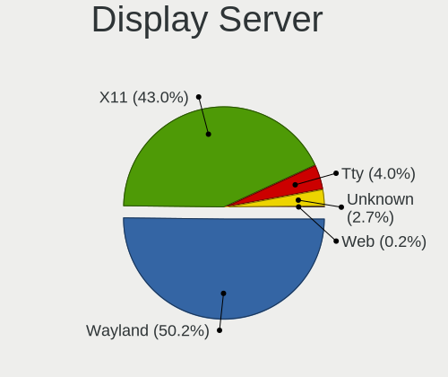
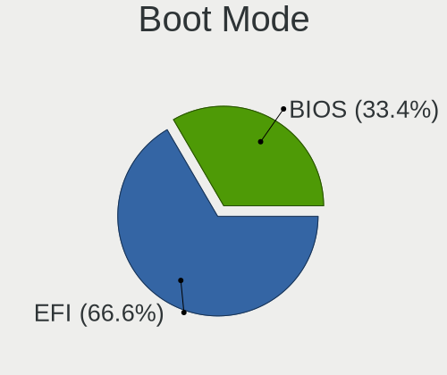
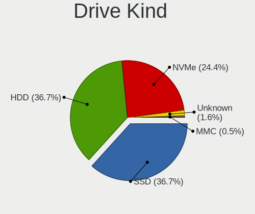
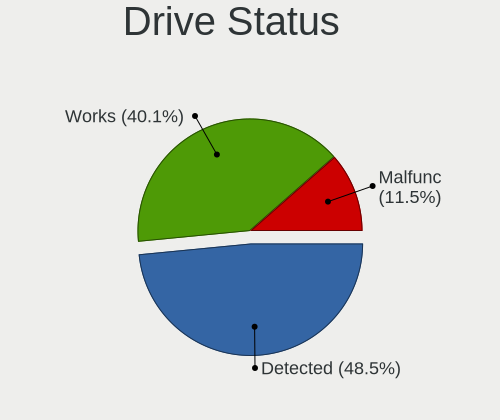
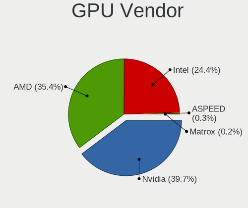
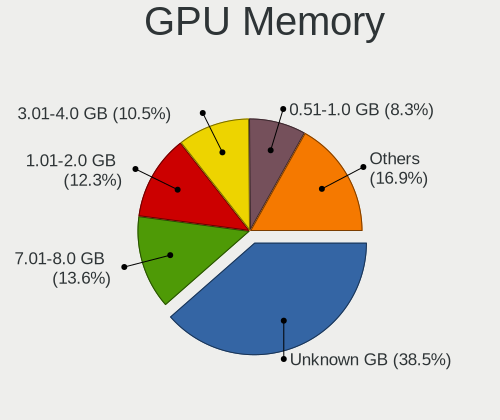
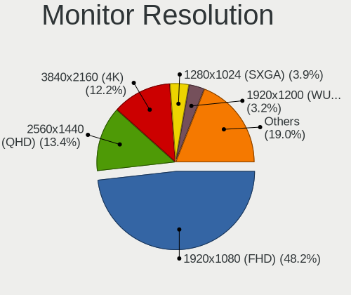
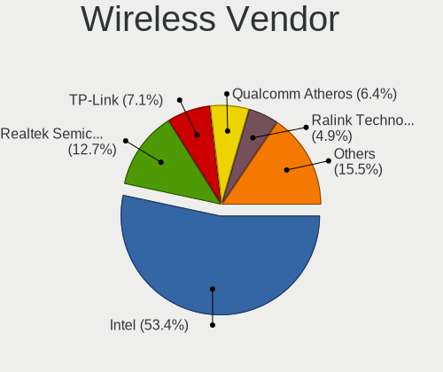
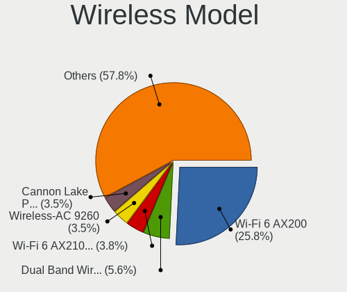
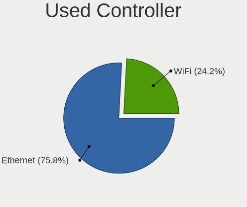

Fedora 35 - Tested Hardware & Statistics (Desktops)
---------------------------------------------------

A project to collect tested hardware configurations for Fedora 35.

Anyone can contribute to this report by the [hw-probe](https://github.com/linuxhw/hw-probe) tool:

    sudo -E hw-probe -all -upload

Please submit a probe of your configuration if it's not presented on the page or is rare.

Full-feature report is available here: https://linux-hardware.org/?view=trends

Contents
--------

* [ Test Cases ](#test-cases)

* [ System ](#system)
  - [ Kernel                   ](#kernel)
  - [ Kernel Family            ](#kernel-family)
  - [ Kernel Major Ver.        ](#kernel-major-ver)
  - [ Arch                     ](#arch)
  - [ DE                       ](#de)
  - [ Display Server           ](#display-server)
  - [ Display Manager          ](#display-manager)
  - [ OS Lang                  ](#os-lang)
  - [ Boot Mode                ](#boot-mode)
  - [ Filesystem               ](#filesystem)
  - [ Part. scheme             ](#part-scheme)
  - [ Dual Boot with Linux/BSD ](#dual-boot-with-linuxbsd)
  - [ Dual Boot (Win)          ](#dual-boot-win)

* [ Board ](#board)
  - [ Vendor                   ](#vendor)
  - [ Model                    ](#model)
  - [ Model Family             ](#model-family)
  - [ MFG Year                 ](#mfg-year)
  - [ Form Factor              ](#form-factor)
  - [ Secure Boot              ](#secure-boot)
  - [ Coreboot                 ](#coreboot)
  - [ RAM Size                 ](#ram-size)
  - [ RAM Used                 ](#ram-used)
  - [ Total Drives             ](#total-drives)
  - [ Has CD-ROM               ](#has-cd-rom)
  - [ Has Ethernet             ](#has-ethernet)
  - [ Has WiFi                 ](#has-wifi)
  - [ Has Bluetooth            ](#has-bluetooth)

* [ Location ](#location)
  - [ Country                  ](#country)
  - [ City                     ](#city)

* [ Drives ](#drives)
  - [ Drive Vendor             ](#drive-vendor)
  - [ Drive Model              ](#drive-model)
  - [ HDD Vendor               ](#hdd-vendor)
  - [ SSD Vendor               ](#ssd-vendor)
  - [ Drive Kind               ](#drive-kind)
  - [ Drive Connector          ](#drive-connector)
  - [ Drive Size               ](#drive-size)
  - [ Space Total              ](#space-total)
  - [ Space Used               ](#space-used)
  - [ Malfunc. Drives          ](#malfunc-drives)
  - [ Malfunc. Drive Vendor    ](#malfunc-drive-vendor)
  - [ Malfunc. HDD Vendor      ](#malfunc-hdd-vendor)
  - [ Malfunc. Drive Kind      ](#malfunc-drive-kind)
  - [ Failed Drives            ](#failed-drives)
  - [ Failed Drive Vendor      ](#failed-drive-vendor)
  - [ Drive Status             ](#drive-status)

* [ Storage controller ](#storage-controller)
  - [ Storage Vendor           ](#storage-vendor)
  - [ Storage Model            ](#storage-model)
  - [ Storage Kind             ](#storage-kind)

* [ Processor ](#processor)
  - [ CPU Vendor               ](#cpu-vendor)
  - [ CPU Model                ](#cpu-model)
  - [ CPU Model Family         ](#cpu-model-family)
  - [ CPU Cores                ](#cpu-cores)
  - [ CPU Sockets              ](#cpu-sockets)
  - [ CPU Threads              ](#cpu-threads)
  - [ CPU Op-Modes             ](#cpu-op-modes)
  - [ CPU Microcode            ](#cpu-microcode)
  - [ CPU Microarch            ](#cpu-microarch)

* [ Graphics ](#graphics)
  - [ GPU Vendor               ](#gpu-vendor)
  - [ GPU Model                ](#gpu-model)
  - [ GPU Combo                ](#gpu-combo)
  - [ GPU Driver               ](#gpu-driver)
  - [ GPU Memory               ](#gpu-memory)

* [ Monitor ](#monitor)
  - [ Monitor Vendor           ](#monitor-vendor)
  - [ Monitor Model            ](#monitor-model)
  - [ Monitor Resolution       ](#monitor-resolution)
  - [ Monitor Diagonal         ](#monitor-diagonal)
  - [ Monitor Width            ](#monitor-width)
  - [ Aspect Ratio             ](#aspect-ratio)
  - [ Monitor Area             ](#monitor-area)
  - [ Pixel Density            ](#pixel-density)
  - [ Multiple Monitors        ](#multiple-monitors)

* [ Network ](#network)
  - [ Net Controller Vendor    ](#net-controller-vendor)
  - [ Net Controller Model     ](#net-controller-model)
  - [ Wireless Vendor          ](#wireless-vendor)
  - [ Wireless Model           ](#wireless-model)
  - [ Ethernet Vendor          ](#ethernet-vendor)
  - [ Ethernet Model           ](#ethernet-model)
  - [ Net Controller Kind      ](#net-controller-kind)
  - [ Used Controller          ](#used-controller)
  - [ NICs                     ](#nics)
  - [ IPv6                     ](#ipv6)

* [ Bluetooth ](#bluetooth)
  - [ Bluetooth Vendor         ](#bluetooth-vendor)
  - [ Bluetooth Model          ](#bluetooth-model)

* [ Sound ](#sound)
  - [ Sound Vendor             ](#sound-vendor)
  - [ Sound Model              ](#sound-model)

* [ Memory ](#memory)
  - [ Memory Vendor            ](#memory-vendor)
  - [ Memory Model             ](#memory-model)
  - [ Memory Kind              ](#memory-kind)
  - [ Memory Form Factor       ](#memory-form-factor)
  - [ Memory Size              ](#memory-size)
  - [ Memory Speed             ](#memory-speed)

* [ Printers & scanners ](#printers--scanners)
  - [ Printer Vendor           ](#printer-vendor)
  - [ Printer Model            ](#printer-model)
  - [ Scanner Vendor           ](#scanner-vendor)
  - [ Scanner Model            ](#scanner-model)

* [ Camera ](#camera)
  - [ Camera Vendor            ](#camera-vendor)
  - [ Camera Model             ](#camera-model)

* [ Security ](#security)
  - [ Fingerprint Vendor       ](#fingerprint-vendor)
  - [ Fingerprint Model        ](#fingerprint-model)
  - [ Chipcard Vendor          ](#chipcard-vendor)
  - [ Chipcard Model           ](#chipcard-model)

* [ Unsupported ](#unsupported)
  - [ Unsupported Devices      ](#unsupported-devices)
  - [ Unsupported Device Types ](#unsupported-device-types)

Test Cases
----------

| Vendor   | Model                       | Probe                                                      | Date         |
|----------|-----------------------------|------------------------------------------------------------|--------------|
| Dell     | 06D7TR A00                  | [8c6244cb77](https://linux-hardware.org/?probe=8c6244cb77) | Dec 03, 2021 |
| MSI      | MEG Z390 GODLIKE            | [ca1727f54a](https://linux-hardware.org/?probe=ca1727f54a) | Dec 02, 2021 |
| Gateway  | SX2185                      | [70e907b207](https://linux-hardware.org/?probe=70e907b207) | Dec 02, 2021 |
| Dell     | 040DDP A01                  | [b108ae97c2](https://linux-hardware.org/?probe=b108ae97c2) | Dec 02, 2021 |
| MSI      | X370 XPOWER GAMING TITAN... | [56bd9b515c](https://linux-hardware.org/?probe=56bd9b515c) | Dec 02, 2021 |
| ASUSTek  | H81M-C                      | [ffecd77f3a](https://linux-hardware.org/?probe=ffecd77f3a) | Dec 02, 2021 |
| MSI      | B550M PRO-VDH WIFI          | [508352ad4a](https://linux-hardware.org/?probe=508352ad4a) | Dec 02, 2021 |
| Gigabyte | B85M-D3V-A                  | [7304efa5d7](https://linux-hardware.org/?probe=7304efa5d7) | Dec 01, 2021 |
| Huanan   | X99-F8 V2.0                 | [1b4de261b3](https://linux-hardware.org/?probe=1b4de261b3) | Nov 30, 2021 |
| Gigabyte | Z690 UD DDR4                | [7ad53e55ba](https://linux-hardware.org/?probe=7ad53e55ba) | Nov 30, 2021 |
| Apple    | Mac-F221BEC8                | [2ceb61c052](https://linux-hardware.org/?probe=2ceb61c052) | Nov 30, 2021 |
| Gigabyte | EX58-UD3R                   | [8ece12c9e6](https://linux-hardware.org/?probe=8ece12c9e6) | Nov 28, 2021 |
| ECS      | H61H2-CM                    | [525be50825](https://linux-hardware.org/?probe=525be50825) | Nov 28, 2021 |
| Gigabyte | H170-Gaming 3               | [e83680db56](https://linux-hardware.org/?probe=e83680db56) | Nov 28, 2021 |
| Gigabyte | X570 AORUS MASTER           | [d813ffb878](https://linux-hardware.org/?probe=d813ffb878) | Nov 28, 2021 |
| Gigabyte | AB350M-DS3H V2-CF           | [5d5d624d8c](https://linux-hardware.org/?probe=5d5d624d8c) | Nov 27, 2021 |
| MSI      | B450-A PRO MAX              | [d949cb9963](https://linux-hardware.org/?probe=d949cb9963) | Nov 27, 2021 |
| Dell     | 06D7TR A00                  | [d980b32136](https://linux-hardware.org/?probe=d980b32136) | Nov 27, 2021 |
| ASRock   | H81M-HG4 R4.0               | [c23e7e890b](https://linux-hardware.org/?probe=c23e7e890b) | Nov 27, 2021 |
| ASUSTek  | M4A77T/USB3                 | [e23dea02cf](https://linux-hardware.org/?probe=e23dea02cf) | Nov 26, 2021 |
| Gigabyte | AB350M-Gaming 3-CF          | [1e4799819e](https://linux-hardware.org/?probe=1e4799819e) | Nov 26, 2021 |
| Gigabyte | B550 AORUS ELITE            | [faf9c22988](https://linux-hardware.org/?probe=faf9c22988) | Nov 26, 2021 |
| ASUSTek  | Maximus IV GENE-Z           | [89729fef47](https://linux-hardware.org/?probe=89729fef47) | Nov 25, 2021 |
| Apple    | Mac-F221BEC8                | [f4f5c37779](https://linux-hardware.org/?probe=f4f5c37779) | Nov 25, 2021 |
| Gigabyte | Z690 UD DDR4                | [b6ffc90d4e](https://linux-hardware.org/?probe=b6ffc90d4e) | Nov 25, 2021 |
| MSI      | B550-A PRO                  | [b90083da69](https://linux-hardware.org/?probe=b90083da69) | Nov 24, 2021 |
| Apple    | Mac-F221BEC8                | [e606757d4a](https://linux-hardware.org/?probe=e606757d4a) | Nov 24, 2021 |
| Dell     | 0C522T A03                  | [96fec5d214](https://linux-hardware.org/?probe=96fec5d214) | Nov 24, 2021 |
| Gigabyte | B550 AORUS PRO              | [35801f40df](https://linux-hardware.org/?probe=35801f40df) | Nov 24, 2021 |
| Dell     | 0C522T A03                  | [79ee4911cb](https://linux-hardware.org/?probe=79ee4911cb) | Nov 24, 2021 |
| MSI      | A55M-E33                    | [e6616870b6](https://linux-hardware.org/?probe=e6616870b6) | Nov 24, 2021 |
| HP       | 1906                        | [8ec5c16fc7](https://linux-hardware.org/?probe=8ec5c16fc7) | Nov 24, 2021 |
| HP       | 83E1                        | [7598ac7e6c](https://linux-hardware.org/?probe=7598ac7e6c) | Nov 23, 2021 |
| ASUSTek  | Maximus IV GENE-Z           | [dab6e17223](https://linux-hardware.org/?probe=dab6e17223) | Nov 23, 2021 |
| Lenovo   | 3731 SDK0J40697 WIN 3305... | [c50601fb76](https://linux-hardware.org/?probe=c50601fb76) | Nov 23, 2021 |
| HP       | 0B4Ch D                     | [0c3c7c6bb3](https://linux-hardware.org/?probe=0c3c7c6bb3) | Nov 23, 2021 |
| HP       | 1906                        | [90499fe34d](https://linux-hardware.org/?probe=90499fe34d) | Nov 23, 2021 |
| Gigabyte | X570 AORUS ELITE            | [91a66a7648](https://linux-hardware.org/?probe=91a66a7648) | Nov 22, 2021 |
| Gigabyte | GA-MA790X-UD4               | [0a19a35ac4](https://linux-hardware.org/?probe=0a19a35ac4) | Nov 22, 2021 |
| ASRock   | G41M-VS3                    | [35277b1155](https://linux-hardware.org/?probe=35277b1155) | Nov 22, 2021 |
| Pegatron | 2AD5                        | [8fc4f44be5](https://linux-hardware.org/?probe=8fc4f44be5) | Nov 22, 2021 |
| Gigabyte | F2A85XM-D3H                 | [1c41d8c34c](https://linux-hardware.org/?probe=1c41d8c34c) | Nov 22, 2021 |
| ASRock   | X570 Phantom Gaming 4       | [683697e6ee](https://linux-hardware.org/?probe=683697e6ee) | Nov 21, 2021 |
| MSI      | B450M-A PRO MAX             | [92375d0ecc](https://linux-hardware.org/?probe=92375d0ecc) | Nov 21, 2021 |
| Dell     | 0M859N A00                  | [2fa52f3236](https://linux-hardware.org/?probe=2fa52f3236) | Nov 21, 2021 |
| Gigabyte | B450M DS3H-CF               | [faec9a8f8b](https://linux-hardware.org/?probe=faec9a8f8b) | Nov 21, 2021 |
| HP       | 3048h                       | [e38eb769b5](https://linux-hardware.org/?probe=e38eb769b5) | Nov 20, 2021 |
| ASUSTek  | M5A78L-M/USB3               | [44d1a95b0b](https://linux-hardware.org/?probe=44d1a95b0b) | Nov 20, 2021 |
| MSI      | B450 GAMING PRO CARBON A... | [3b34362c42](https://linux-hardware.org/?probe=3b34362c42) | Nov 19, 2021 |
| ASUSTek  | A68HM-K                     | [8bf7660808](https://linux-hardware.org/?probe=8bf7660808) | Nov 19, 2021 |
| ASUSTek  | H87-PRO                     | [02b2e4cb00](https://linux-hardware.org/?probe=02b2e4cb00) | Nov 19, 2021 |
| ASUSTek  | H87-PRO                     | [181c56512d](https://linux-hardware.org/?probe=181c56512d) | Nov 19, 2021 |
| Dell     | 0YNVJG A01                  | [00f5cc73fe](https://linux-hardware.org/?probe=00f5cc73fe) | Nov 19, 2021 |
| Dell     | 0YNVJG A01                  | [fbedd3af33](https://linux-hardware.org/?probe=fbedd3af33) | Nov 19, 2021 |
| Pegatron | 2AD5                        | [839b5c24aa](https://linux-hardware.org/?probe=839b5c24aa) | Nov 19, 2021 |
| MSI      | B450 TOMAHAWK               | [6a1607ab9d](https://linux-hardware.org/?probe=6a1607ab9d) | Nov 18, 2021 |
| MSI      | MPG X570 GAMING PRO CARB... | [c8a6893780](https://linux-hardware.org/?probe=c8a6893780) | Nov 18, 2021 |
| MSI      | A320M-A PRO MAX             | [d9f71fda8f](https://linux-hardware.org/?probe=d9f71fda8f) | Nov 18, 2021 |
| Dell     | 0C27VV A01                  | [34aff3ab72](https://linux-hardware.org/?probe=34aff3ab72) | Nov 18, 2021 |
| Gigabyte | B450M DS3H-CF               | [f35f04cabd](https://linux-hardware.org/?probe=f35f04cabd) | Nov 18, 2021 |
| ASUSTek  | ROG CROSSHAIR VI HERO       | [50535d277c](https://linux-hardware.org/?probe=50535d277c) | Nov 18, 2021 |
| ASUSTek  | PRIME B360M-K               | [3b2165faa8](https://linux-hardware.org/?probe=3b2165faa8) | Nov 18, 2021 |
| Gigabyte | B550M DS3H                  | [93c3ab9ed1](https://linux-hardware.org/?probe=93c3ab9ed1) | Nov 18, 2021 |
| Gigabyte | H97M-D3H                    | [f6dc8337e7](https://linux-hardware.org/?probe=f6dc8337e7) | Nov 18, 2021 |
| MSI      | Z77A-G43                    | [04db0a2350](https://linux-hardware.org/?probe=04db0a2350) | Nov 17, 2021 |
| ASRock   | X470 Master SLI             | [c48f95d233](https://linux-hardware.org/?probe=c48f95d233) | Nov 17, 2021 |
| Gigabyte | H370M DS3H-CF               | [c69f79e654](https://linux-hardware.org/?probe=c69f79e654) | Nov 17, 2021 |
| ASUSTek  | ROG CROSSHAIR VIII IMPAC... | [ddfb1c2b1a](https://linux-hardware.org/?probe=ddfb1c2b1a) | Nov 17, 2021 |
| Dell     | 0GY6Y8 A02                  | [61734716ea](https://linux-hardware.org/?probe=61734716ea) | Nov 16, 2021 |
| ASUSTek  | ROG STRIX B450-F GAMING     | [9404dfb1fe](https://linux-hardware.org/?probe=9404dfb1fe) | Nov 16, 2021 |
| Gigabyte | X570 AORUS MASTER           | [3412d5cf0b](https://linux-hardware.org/?probe=3412d5cf0b) | Nov 16, 2021 |
| Gigabyte | X570 AORUS MASTER           | [bdd9599f2f](https://linux-hardware.org/?probe=bdd9599f2f) | Nov 16, 2021 |
| ASUSTek  | M2N-E                       | [8da42387a5](https://linux-hardware.org/?probe=8da42387a5) | Nov 15, 2021 |
| Gigabyte | B560M DS3H                  | [97ed26b846](https://linux-hardware.org/?probe=97ed26b846) | Nov 15, 2021 |
| ASRock   | B450 Pro4                   | [098387cb9c](https://linux-hardware.org/?probe=098387cb9c) | Nov 15, 2021 |
| Gigabyte | GA-78LMT-USB3               | [bc6a3771aa](https://linux-hardware.org/?probe=bc6a3771aa) | Nov 13, 2021 |
| ASUSTek  | M3A78-EM                    | [e1cc8b1ee3](https://linux-hardware.org/?probe=e1cc8b1ee3) | Nov 13, 2021 |
| ASUSTek  | H61M-CS                     | [22858e9ab9](https://linux-hardware.org/?probe=22858e9ab9) | Nov 13, 2021 |
| Apple    | Mac-F221BEC8                | [5991ba5f44](https://linux-hardware.org/?probe=5991ba5f44) | Nov 12, 2021 |
| ASUSTek  | TUF B450M-PLUS GAMING       | [e85856bbef](https://linux-hardware.org/?probe=e85856bbef) | Nov 12, 2021 |
| Dell     | 0DXJD9 A00                  | [e9abfeb7a2](https://linux-hardware.org/?probe=e9abfeb7a2) | Nov 11, 2021 |
| Intel    | D33217GKE G69901-205        | [a922d5f3fc](https://linux-hardware.org/?probe=a922d5f3fc) | Nov 10, 2021 |
| MSI      | Z390-A PRO                  | [ca1489298b](https://linux-hardware.org/?probe=ca1489298b) | Nov 10, 2021 |
| Gigabyte | X570 UD                     | [c5ae0c1fca](https://linux-hardware.org/?probe=c5ae0c1fca) | Nov 09, 2021 |
| Gigabyte | Z390 I AORUS PRO WIFI-CF    | [189e19c60d](https://linux-hardware.org/?probe=189e19c60d) | Nov 09, 2021 |
| Dell     | 040DDP A01                  | [3587a95d63](https://linux-hardware.org/?probe=3587a95d63) | Nov 09, 2021 |
| Intel    | D33217GKE G69901-205        | [dd1ddaf74f](https://linux-hardware.org/?probe=dd1ddaf74f) | Nov 09, 2021 |
| Dell     | 0HD5W2 A00                  | [09cae8a245](https://linux-hardware.org/?probe=09cae8a245) | Nov 09, 2021 |
| HP       | 2215                        | [4e65fa6078](https://linux-hardware.org/?probe=4e65fa6078) | Nov 09, 2021 |
| Gigabyte | EP45-DS3L                   | [fdbec54288](https://linux-hardware.org/?probe=fdbec54288) | Nov 08, 2021 |
| Gigabyte | H97M-D3H                    | [74b5acd6cd](https://linux-hardware.org/?probe=74b5acd6cd) | Nov 08, 2021 |
| ASRock   | A300M-STX                   | [a7510caa6d](https://linux-hardware.org/?probe=a7510caa6d) | Nov 08, 2021 |
| ASRock   | A300M-STX                   | [2eebb6842a](https://linux-hardware.org/?probe=2eebb6842a) | Nov 08, 2021 |
| Seco     | C40 C                       | [27bff03d0c](https://linux-hardware.org/?probe=27bff03d0c) | Nov 08, 2021 |
| MSI      | X570-A PRO                  | [0e47ec7819](https://linux-hardware.org/?probe=0e47ec7819) | Nov 08, 2021 |
| ASUSTek  | PRIME B550M-A               | [ef16e3ad0f](https://linux-hardware.org/?probe=ef16e3ad0f) | Nov 07, 2021 |
| Gigabyte | EP45-DS3L                   | [3533adc65b](https://linux-hardware.org/?probe=3533adc65b) | Nov 07, 2021 |
| Dell     | 0C522T A03                  | [43d8e3d9d8](https://linux-hardware.org/?probe=43d8e3d9d8) | Nov 07, 2021 |
| ABIT     | AX78                        | [3d56ae3738](https://linux-hardware.org/?probe=3d56ae3738) | Nov 06, 2021 |
| MSI      | MEG X570 UNIFY              | [37685b5198](https://linux-hardware.org/?probe=37685b5198) | Nov 06, 2021 |
| ASUSTek  | ROG STRIX B450-F GAMING     | [6cce11439f](https://linux-hardware.org/?probe=6cce11439f) | Nov 06, 2021 |
| ASUSTek  | M5A97                       | [f8ce8bca36](https://linux-hardware.org/?probe=f8ce8bca36) | Nov 05, 2021 |
| MSI      | Z97M-G43                    | [7b0e15a051](https://linux-hardware.org/?probe=7b0e15a051) | Nov 05, 2021 |
| ASUSTek  | Z170 PRO GAMING             | [ad6e327cf5](https://linux-hardware.org/?probe=ad6e327cf5) | Nov 05, 2021 |
| ASRock   | G41M-VS3                    | [bf54c2ee53](https://linux-hardware.org/?probe=bf54c2ee53) | Nov 04, 2021 |
| Gigabyte | H97M-D3H                    | [fa84d0d544](https://linux-hardware.org/?probe=fa84d0d544) | Nov 04, 2021 |
| ASUSTek  | PRIME Z370-P                | [50301dd3e3](https://linux-hardware.org/?probe=50301dd3e3) | Nov 04, 2021 |
| Gigabyte | B150M-D3H-CF                | [f5ef935897](https://linux-hardware.org/?probe=f5ef935897) | Nov 04, 2021 |
| Gigabyte | H61M-S2V-B3                 | [5baf0ce3af](https://linux-hardware.org/?probe=5baf0ce3af) | Nov 04, 2021 |
| Lenovo   | MAHOBAY Win8 Pro DPK TPG    | [14c9dda4cd](https://linux-hardware.org/?probe=14c9dda4cd) | Nov 04, 2021 |
| MSI      | B450M MORTAR                | [00a97d0eba](https://linux-hardware.org/?probe=00a97d0eba) | Nov 03, 2021 |
| Dell     | 0YNVJG A01                  | [0243b19a08](https://linux-hardware.org/?probe=0243b19a08) | Nov 03, 2021 |
| Dell     | 0YNVJG A01                  | [f7d58b572d](https://linux-hardware.org/?probe=f7d58b572d) | Nov 03, 2021 |
| ASUSTek  | P8Z77-V                     | [c7a18968cf](https://linux-hardware.org/?probe=c7a18968cf) | Nov 03, 2021 |
| ASUSTek  | Z87M-PLUS                   | [c26ea680eb](https://linux-hardware.org/?probe=c26ea680eb) | Nov 03, 2021 |
| Gigabyte | Z170-D3H-CF                 | [3acf5c243f](https://linux-hardware.org/?probe=3acf5c243f) | Nov 03, 2021 |
| MSI      | MAG B550M MORTAR            | [10a45363fe](https://linux-hardware.org/?probe=10a45363fe) | Nov 03, 2021 |
| ASRock   | G41M-VS3                    | [2ee1cbdc82](https://linux-hardware.org/?probe=2ee1cbdc82) | Nov 03, 2021 |
| MSI      | B365M PRO-VH                | [c2976ad59c](https://linux-hardware.org/?probe=c2976ad59c) | Nov 03, 2021 |
| MSI      | B450 GAMING PRO CARBON A... | [c8716ec9a6](https://linux-hardware.org/?probe=c8716ec9a6) | Nov 03, 2021 |
| MSI      | MPG X570 GAMING PRO CARB... | [93de1508cb](https://linux-hardware.org/?probe=93de1508cb) | Oct 31, 2021 |
| Lenovo   | 1046 SDK0T08861 WIN 3305... | [136c409f1a](https://linux-hardware.org/?probe=136c409f1a) | Oct 27, 2021 |
| Lenovo   | 1046 SDK0T08861 WIN 3305... | [ae8daa788a](https://linux-hardware.org/?probe=ae8daa788a) | Oct 27, 2021 |
| MSI      | B550-A PRO                  | [91c5853577](https://linux-hardware.org/?probe=91c5853577) | Oct 25, 2021 |
| Fujitsu  | D3120-A1 S26361-D3120-A1    | [fac95138dc](https://linux-hardware.org/?probe=fac95138dc) | Oct 23, 2021 |
| Foxconn  | H81MXV FAB A                | [b030daf542](https://linux-hardware.org/?probe=b030daf542) | Oct 20, 2021 |
| ASUSTek  | PRIME B460M-A               | [6db5e9be6b](https://linux-hardware.org/?probe=6db5e9be6b) | Oct 19, 2021 |
| ASUSTek  | ROG STRIX B560-G GAMING ... | [746401b748](https://linux-hardware.org/?probe=746401b748) | Oct 18, 2021 |
| MSI      | B350 PC MATE                | [bc716e921b](https://linux-hardware.org/?probe=bc716e921b) | Oct 15, 2021 |
| Dell     | 0WMJ54 A01                  | [01ce3b252c](https://linux-hardware.org/?probe=01ce3b252c) | Oct 14, 2021 |
| ASUSTek  | PRIME B550M-A               | [2ff2eb607a](https://linux-hardware.org/?probe=2ff2eb607a) | Oct 14, 2021 |
| ASUSTek  | PRIME A320I-K               | [eee2a960f5](https://linux-hardware.org/?probe=eee2a960f5) | Oct 11, 2021 |
| ASUSTek  | PRIME B350-PLUS             | [7b26df9bc4](https://linux-hardware.org/?probe=7b26df9bc4) | Oct 10, 2021 |
| Gigabyte | X570 AORUS ULTRA            | [f850c51db9](https://linux-hardware.org/?probe=f850c51db9) | Oct 10, 2021 |
| ASUSTek  | ROG Maximus XI FORMULA      | [cfbe862160](https://linux-hardware.org/?probe=cfbe862160) | Oct 10, 2021 |
| Fujitsu  | D3220-A1 S26361-D3220-A1    | [a9ceb4591e](https://linux-hardware.org/?probe=a9ceb4591e) | Oct 09, 2021 |
| Fujitsu  | D3220-A1 S26361-D3220-A1    | [7c210a60ab](https://linux-hardware.org/?probe=7c210a60ab) | Oct 09, 2021 |
| Gigabyte | H61N-USB3                   | [43ded3a853](https://linux-hardware.org/?probe=43ded3a853) | Oct 09, 2021 |
| ASUSTek  | ROG STRIX B550-F GAMING     | [b3d0295208](https://linux-hardware.org/?probe=b3d0295208) | Oct 08, 2021 |
| Gigabyte | H61N-USB3                   | [75d34f09c4](https://linux-hardware.org/?probe=75d34f09c4) | Oct 06, 2021 |
| MSI      | B550-A PRO                  | [17a03c217e](https://linux-hardware.org/?probe=17a03c217e) | Oct 04, 2021 |
| Gigabyte | Z170-D3H-CF                 | [103d2198a4](https://linux-hardware.org/?probe=103d2198a4) | Sep 30, 2021 |
| Gigabyte | Z170-D3H-CF                 | [b6f5c877d4](https://linux-hardware.org/?probe=b6f5c877d4) | Sep 29, 2021 |
| Gigabyte | H81M-S2H                    | [b8c27bd56c](https://linux-hardware.org/?probe=b8c27bd56c) | Sep 28, 2021 |
| ASRock   | B450M-HDV R4.0              | [2f771e8271](https://linux-hardware.org/?probe=2f771e8271) | Sep 24, 2021 |
| ASUSTek  | TUF GAMING B550M-PLUS       | [e75373a634](https://linux-hardware.org/?probe=e75373a634) | Sep 23, 2021 |
| ASUSTek  | ROG STRIX B360-I GAMING     | [3875512e39](https://linux-hardware.org/?probe=3875512e39) | Sep 14, 2021 |
| ASUSTek  | ROG STRIX B360-I GAMING     | [4fb9ed180b](https://linux-hardware.org/?probe=4fb9ed180b) | Sep 14, 2021 |
| Dell     | 0WMJ54 A01                  | [3231b34d4d](https://linux-hardware.org/?probe=3231b34d4d) | Aug 24, 2021 |
| Dell     | 0WMJ54 A01                  | [a94ad8a323](https://linux-hardware.org/?probe=a94ad8a323) | Aug 22, 2021 |
| HP       | 8055                        | [29f5b9a7ab](https://linux-hardware.org/?probe=29f5b9a7ab) | Aug 12, 2021 |
| Dell     | 0KC9NP A01                  | [142e0703fb](https://linux-hardware.org/?probe=142e0703fb) | Aug 12, 2021 |
| Dell     | 0KC9NP A01                  | [f48bc9ac9d](https://linux-hardware.org/?probe=f48bc9ac9d) | Aug 07, 2021 |
| ASUSTek  | Maximus V FORMULA           | [466ef3bd27](https://linux-hardware.org/?probe=466ef3bd27) | Jul 29, 2021 |
| Dell     | 0KC9NP A01                  | [7dcd16d3fd](https://linux-hardware.org/?probe=7dcd16d3fd) | Jul 14, 2021 |
| Dell     | 0KC9NP A01                  | [eedd464065](https://linux-hardware.org/?probe=eedd464065) | Jul 14, 2021 |
| Dell     | 0KC9NP A01                  | [8d1e68aad0](https://linux-hardware.org/?probe=8d1e68aad0) | Jul 07, 2021 |
| Dell     | 0KC9NP A01                  | [852a8a103d](https://linux-hardware.org/?probe=852a8a103d) | Jul 04, 2021 |
| Dell     | 0KC9NP A01                  | [3a0ca9b90c](https://linux-hardware.org/?probe=3a0ca9b90c) | Jul 01, 2021 |
| Dell     | 0KC9NP A01                  | [3ed1ee1f81](https://linux-hardware.org/?probe=3ed1ee1f81) | Jun 25, 2021 |
| Dell     | 0KC9NP A01                  | [f611d9ec88](https://linux-hardware.org/?probe=f611d9ec88) | Jun 23, 2021 |
| ASUSTek  | Maximus V FORMULA           | [95ba18d5da](https://linux-hardware.org/?probe=95ba18d5da) | Jun 23, 2021 |
| Dell     | 0KC9NP A01                  | [511e8019e0](https://linux-hardware.org/?probe=511e8019e0) | Jun 19, 2021 |
| Dell     | 0KC9NP A01                  | [6687380bd7](https://linux-hardware.org/?probe=6687380bd7) | Jun 18, 2021 |
| Gigabyte | F2A88XN-WIFI                | [c22e6d8669](https://linux-hardware.org/?probe=c22e6d8669) | May 25, 2021 |
| ASUSTek  | Maximus V FORMULA           | [3e15dd7136](https://linux-hardware.org/?probe=3e15dd7136) | May 19, 2021 |
| ECS      | MCP61M-M3                   | [2e5b21af19](https://linux-hardware.org/?probe=2e5b21af19) | Apr 17, 2021 |
| ASUSTek  | PRIME X570-PRO              | [3f7cbcea74](https://linux-hardware.org/?probe=3f7cbcea74) | Apr 14, 2021 |

System
------

Kernel
------

Version of the Linux kernel

| Version                                                       | Desktops | Percent |
|---------------------------------------------------------------|----------|---------|
| 5.14.18-300.fc35.x86_64                                       | 20       | 15.63%  |
| 5.14.16-301.fc35.x86_64                                       | 17       | 13.28%  |
| 5.14.17-301.fc35.x86_64                                       | 15       | 11.72%  |
| 5.14.14-300.fc35.x86_64                                       | 14       | 10.94%  |
| 5.14.15-300.fc35.x86_64                                       | 11       | 8.59%   |
| 5.14.10-300.fc35.x86_64                                       | 10       | 7.81%   |
| 5.15.5-200.fc35.x86_64                                        | 5        | 3.91%   |
| 5.14.9-300.fc35.x86_64                                        | 5        | 3.91%   |
| 5.15.4-201.fc35.x86_64                                        | 4        | 3.13%   |
| 5.14.0-60.fc35.x86_64                                         | 3        | 2.34%   |
| 5.12.0-0.rc7.189.fc35.x86_64                                  | 2        | 1.56%   |
| 5.16.0-0.rc2.18.vanilla.1.fc35.x86_64                         | 1        | 0.78%   |
| 5.16.0-0.rc1.20211115git8ab774587903.14.vanilla.1.fc35.x86_64 | 1        | 0.78%   |
| 5.15.6-200.fc35.x86_64                                        | 1        | 0.78%   |
| 5.15.5-xm1tt.0.fc35.x86_64                                    | 1        | 0.78%   |
| 5.15.4-xm1.0.fc35.x86_64                                      | 1        | 0.78%   |
| 5.15.2_tkg_bmq                                                | 1        | 0.78%   |
| 5.15.0-500.chinfo.fc35.x86_64                                 | 1        | 0.78%   |
| 5.15.0-0.rc7.20211028git1fc596a56b33.56.vanilla.1.fc35.x86_64 | 1        | 0.78%   |
| 5.14.8-lqx1.0.fc35.x86_64                                     | 1        | 0.78%   |
| 5.14.7-300.fc35.x86_64                                        | 1        | 0.78%   |
| 5.14.6-300.fc35.x86_64                                        | 1        | 0.78%   |
| 5.14.20-300.fc35.x86_64                                       | 1        | 0.78%   |
| 5.14.13_MY                                                    | 1        | 0.78%   |
| 5.14.1-300.fc35.x86_64                                        | 1        | 0.78%   |
| 5.14.0-0.rc6.46.fc35.x86_64                                   | 1        | 0.78%   |
| 5.13.7-200.fc34.x86_64                                        | 1        | 0.78%   |
| 5.13.0-58.fc35.x86_64                                         | 1        | 0.78%   |
| 5.13.0-0.rc7.20210623git0c18f29aae7c.53.fc35.x86_64           | 1        | 0.78%   |
| 5.13.0-0.rc6.45.fc35.x86_64                                   | 1        | 0.78%   |
| 5.13.0-0.rc2.20210521git79a106fc6585.22.fc35.x86_64           | 1        | 0.78%   |
| 5.13.0-0.rc2.19.fc35.x86_64                                   | 1        | 0.78%   |
| 5.13.0-0.rc1.13.fc35.x86_64                                   | 1        | 0.78%   |

Kernel Family
-------------

Linux kernel without a distro release

| Version | Desktops | Percent |
|---------|----------|---------|
| 5.14.18 | 20       | 16%     |
| 5.14.16 | 17       | 13.6%   |
| 5.14.17 | 15       | 12%     |
| 5.14.14 | 14       | 11.2%   |
| 5.14.15 | 11       | 8.8%    |
| 5.14.10 | 10       | 8%      |
| 5.15.5  | 6        | 4.8%    |
| 5.15.4  | 5        | 4%      |
| 5.14.9  | 5        | 4%      |
| 5.14.0  | 4        | 3.2%    |
| 5.13.0  | 3        | 2.4%    |
| 5.16.0  | 2        | 1.6%    |
| 5.15.0  | 2        | 1.6%    |
| 5.12.0  | 2        | 1.6%    |
| 5.15.6  | 1        | 0.8%    |
| 5.15.2  | 1        | 0.8%    |
| 5.14.8  | 1        | 0.8%    |
| 5.14.7  | 1        | 0.8%    |
| 5.14.6  | 1        | 0.8%    |
| 5.14.20 | 1        | 0.8%    |
| 5.14.13 | 1        | 0.8%    |
| 5.14.1  | 1        | 0.8%    |
| 5.13.7  | 1        | 0.8%    |

Kernel Major Ver.
-----------------

Linux kernel major version

| Version | Desktops | Percent |
|---------|----------|---------|
| 5.14    | 100      | 81.97%  |
| 5.15    | 14       | 11.48%  |
| 5.13    | 4        | 3.28%   |
| 5.16    | 2        | 1.64%   |
| 5.12    | 2        | 1.64%   |

Arch
----

OS architecture (x86_64, i586, etc.)

| Name   | Desktops | Percent |
|--------|----------|---------|
| x86_64 | 121      | 100%    |

DE
--

Desktop Environment

| Name       | Desktops | Percent |
|------------|----------|---------|
| GNOME      | 89       | 72.95%  |
| KDE5       | 12       | 9.84%   |
| Unknown    | 8        | 6.56%   |
| MATE       | 4        | 3.28%   |
| XFCE       | 3        | 2.46%   |
| X-Cinnamon | 3        | 2.46%   |
| KDE        | 2        | 1.64%   |
| LXDE       | 1        | 0.82%   |

Display Server
--------------

X11 or Wayland

| Name    | Desktops | Percent |
|---------|----------|---------|
| Wayland | 66       | 54.1%   |
| X11     | 51       | 41.8%   |
| Unknown | 3        | 2.46%   |
| Tty     | 2        | 1.64%   |

Display Manager
---------------

SDDM, LightDM, etc.

| Name    | Desktops | Percent |
|---------|----------|---------|
| Unknown | 66       | 54.55%  |
| GDM     | 38       | 31.4%   |
| LightDM | 10       | 8.26%   |
| SDDM    | 7        | 5.79%   |

OS Lang
-------

Language

| Lang       | Desktops | Percent |
|------------|----------|---------|
| en_US      | 57       | 47.11%  |
| ru_RU      | 9        | 7.44%   |
| de_DE      | 8        | 6.61%   |
| pt_BR      | 7        | 5.79%   |
| en_GB      | 6        | 4.96%   |
| fr_FR      | 4        | 3.31%   |
| en_CA      | 4        | 3.31%   |
| es_ES      | 3        | 2.48%   |
| it_IT      | 2        | 1.65%   |
| es_MX      | 2        | 1.65%   |
| es_CL      | 2        | 1.65%   |
| en_AU      | 2        | 1.65%   |
| pl_PL      | 1        | 0.83%   |
| pa_IN      | 1        | 0.83%   |
| nl_BE      | 1        | 0.83%   |
| hu_HU      | 1        | 0.83%   |
| fr_CH      | 1        | 0.83%   |
| es_VE      | 1        | 0.83%   |
| es_CO      | 1        | 0.83%   |
| en_US.UTF8 | 1        | 0.83%   |
| en_NZ      | 1        | 0.83%   |
| en_IN      | 1        | 0.83%   |
| en_IL      | 1        | 0.83%   |
| de_CH      | 1        | 0.83%   |
| ca_ES      | 1        | 0.83%   |
| ar_SA      | 1        | 0.83%   |
| Unknown    | 1        | 0.83%   |

Boot Mode
---------

EFI or BIOS

| Mode | Desktops | Percent |
|------|----------|---------|
| EFI  | 80       | 66.12%  |
| BIOS | 41       | 33.88%  |

Filesystem
----------

Type of filesystem

| Type  | Desktops | Percent |
|-------|----------|---------|
| Btrfs | 82       | 67.77%  |
| Ext4  | 37       | 30.58%  |
| Xfs   | 1        | 0.83%   |
| Ext3  | 1        | 0.83%   |

Part. scheme
------------

Scheme of partitioning

| Type    | Desktops | Percent |
|---------|----------|---------|
| Unknown | 61       | 50%     |
| GPT     | 47       | 38.52%  |
| MBR     | 14       | 11.48%  |

Dual Boot with Linux/BSD
------------------------

Hosting more than one Linux/BSD

| Dual boot | Desktops | Percent |
|-----------|----------|---------|
| No        | 106      | 86.89%  |
| Yes       | 16       | 13.11%  |

Dual Boot (Win)
---------------

Hosting Linux and Windows

| Dual boot | Desktops | Percent |
|-----------|----------|---------|
| No        | 97       | 79.51%  |
| Yes       | 25       | 20.49%  |

Board
-----

Vendor
------

Motherboard manufacturer

| Name                | Desktops | Percent |
|---------------------|----------|---------|
| Gigabyte Technology | 30       | 24.79%  |
| ASUSTek Computer    | 30       | 24.79%  |
| MSI                 | 22       | 18.18%  |
| Dell                | 10       | 8.26%   |
| ASRock              | 7        | 5.79%   |
| Hewlett-Packard     | 6        | 4.96%   |
| Lenovo              | 3        | 2.48%   |
| Fujitsu             | 2        | 1.65%   |
| ECS                 | 2        | 1.65%   |
| Apple               | 2        | 1.65%   |
| Seco                | 1        | 0.83%   |
| Pegatron            | 1        | 0.83%   |
| Intel               | 1        | 0.83%   |
| Huanan              | 1        | 0.83%   |
| Gateway             | 1        | 0.83%   |
| Foxconn             | 1        | 0.83%   |
| ABIT                | 1        | 0.83%   |

Model
-----

Motherboard model

| Name                                | Desktops | Percent |
|-------------------------------------|----------|---------|
| ASUS All Series                     | 3        | 2.48%   |
| MSI MS-7C56                         | 2        | 1.65%   |
| MSI MS-7C52                         | 2        | 1.65%   |
| MSI MS-7B93                         | 2        | 1.65%   |
| Gigabyte X570 AORUS MASTER          | 2        | 1.65%   |
| Gigabyte H97M-D3H                   | 2        | 1.65%   |
| Gigabyte B450M DS3H                 | 2        | 1.65%   |
| Dell OptiPlex 3020                  | 2        | 1.65%   |
| Apple MacPro5,1                     | 2        | 1.65%   |
| Seco C40                            | 1        | 0.83%   |
| Pegatron h9-1350                    | 1        | 0.83%   |
| MSI MS-7C95                         | 1        | 0.83%   |
| MSI MS-7C94                         | 1        | 0.83%   |
| MSI MS-7C37                         | 1        | 0.83%   |
| MSI MS-7C35                         | 1        | 0.83%   |
| MSI MS-7C31                         | 1        | 0.83%   |
| MSI MS-7C02                         | 1        | 0.83%   |
| MSI MS-7B98                         | 1        | 0.83%   |
| MSI MS-7B89                         | 1        | 0.83%   |
| MSI MS-7B86                         | 1        | 0.83%   |
| MSI MS-7B85                         | 1        | 0.83%   |
| MSI MS-7B10                         | 1        | 0.83%   |
| MSI MS-7A34                         | 1        | 0.83%   |
| MSI MS-7A31                         | 1        | 0.83%   |
| MSI MS-7924                         | 1        | 0.83%   |
| MSI MS-7758                         | 1        | 0.83%   |
| MSI MS-7721                         | 1        | 0.83%   |
| Lenovo V55t-15ARE 11KG0004CK        | 1        | 0.83%   |
| Lenovo ThinkStation P620 30E0CTO1WW | 1        | 0.83%   |
| Lenovo ThinkCentre M72z 3543A9G     | 1        | 0.83%   |
| Intel D33217GKE G69901-205          | 1        | 0.83%   |
| Huanan X99-F8                       | 1        | 0.83%   |
| HP Z400 Workstation                 | 1        | 0.83%   |
| HP Z230 SFF Workstation             | 1        | 0.83%   |
| HP EliteDesk 800 G4 SFF             | 1        | 0.83%   |
| HP EliteDesk 800 G2 DM 35W          | 1        | 0.83%   |
| HP EliteDesk 705 G1 SFF             | 1        | 0.83%   |
| HP Compaq 6000 Pro SFF PC           | 1        | 0.83%   |
| Gigabyte Z690 UD DDR4               | 1        | 0.83%   |
| Gigabyte Z390 I AORUS PRO WIFI      | 1        | 0.83%   |
| Gigabyte Z170-D3H                   | 1        | 0.83%   |
| Gigabyte X570 UD                    | 1        | 0.83%   |
| Gigabyte X570 AORUS ULTRA           | 1        | 0.83%   |
| Gigabyte X570 AORUS ELITE           | 1        | 0.83%   |
| Gigabyte H81M-S2H                   | 1        | 0.83%   |
| Gigabyte H61N-USB3                  | 1        | 0.83%   |
| Gigabyte H61M-S2V-B3                | 1        | 0.83%   |
| Gigabyte H370M-DS3H                 | 1        | 0.83%   |
| Gigabyte H170-Gaming 3              | 1        | 0.83%   |
| Gigabyte GA-MA790X-UD4              | 1        | 0.83%   |
| Gigabyte GA-78LMT-USB3              | 1        | 0.83%   |
| Gigabyte F2A88XN-WIFI               | 1        | 0.83%   |
| Gigabyte F2A85XM-D3H                | 1        | 0.83%   |
| Gigabyte EX58-UD3R                  | 1        | 0.83%   |
| Gigabyte EP45-DS3L                  | 1        | 0.83%   |
| Gigabyte B85M-D3V-A                 | 1        | 0.83%   |
| Gigabyte B550M DS3H                 | 1        | 0.83%   |
| Gigabyte B550 AORUS PRO             | 1        | 0.83%   |
| Gigabyte B550 AORUS ELITE           | 1        | 0.83%   |
| Gigabyte B150M-D3H                  | 1        | 0.83%   |

Model Family
------------

Motherboard model prefix

| Name                   | Desktops | Percent |
|------------------------|----------|---------|
| Dell OptiPlex          | 9        | 7.44%   |
| ASUS ROG               | 7        | 5.79%   |
| ASUS PRIME             | 7        | 5.79%   |
| Gigabyte X570          | 5        | 4.13%   |
| HP EliteDesk           | 3        | 2.48%   |
| ASUS All               | 3        | 2.48%   |
| MSI MS-7C56            | 2        | 1.65%   |
| MSI MS-7C52            | 2        | 1.65%   |
| MSI MS-7B93            | 2        | 1.65%   |
| Gigabyte H97M-D3H      | 2        | 1.65%   |
| Gigabyte B550          | 2        | 1.65%   |
| Gigabyte B450M         | 2        | 1.65%   |
| Fujitsu ESPRIMO        | 2        | 1.65%   |
| ASUS TUF               | 2        | 1.65%   |
| ASUS Maximus           | 2        | 1.65%   |
| Apple MacPro5          | 2        | 1.65%   |
| Seco C40               | 1        | 0.83%   |
| Pegatron h9-1350       | 1        | 0.83%   |
| MSI MS-7C95            | 1        | 0.83%   |
| MSI MS-7C94            | 1        | 0.83%   |
| MSI MS-7C37            | 1        | 0.83%   |
| MSI MS-7C35            | 1        | 0.83%   |
| MSI MS-7C31            | 1        | 0.83%   |
| MSI MS-7C02            | 1        | 0.83%   |
| MSI MS-7B98            | 1        | 0.83%   |
| MSI MS-7B89            | 1        | 0.83%   |
| MSI MS-7B86            | 1        | 0.83%   |
| MSI MS-7B85            | 1        | 0.83%   |
| MSI MS-7B10            | 1        | 0.83%   |
| MSI MS-7A34            | 1        | 0.83%   |
| MSI MS-7A31            | 1        | 0.83%   |
| MSI MS-7924            | 1        | 0.83%   |
| MSI MS-7758            | 1        | 0.83%   |
| MSI MS-7721            | 1        | 0.83%   |
| Lenovo V55t-15ARE      | 1        | 0.83%   |
| Lenovo ThinkStation    | 1        | 0.83%   |
| Lenovo ThinkCentre     | 1        | 0.83%   |
| Intel D33217GKE        | 1        | 0.83%   |
| Huanan X99-F8          | 1        | 0.83%   |
| HP Z400                | 1        | 0.83%   |
| HP Z230                | 1        | 0.83%   |
| HP Compaq              | 1        | 0.83%   |
| Gigabyte Z690          | 1        | 0.83%   |
| Gigabyte Z390          | 1        | 0.83%   |
| Gigabyte Z170-D3H      | 1        | 0.83%   |
| Gigabyte H81M-S2H      | 1        | 0.83%   |
| Gigabyte H61N-USB3     | 1        | 0.83%   |
| Gigabyte H61M-S2V-B3   | 1        | 0.83%   |
| Gigabyte H370M-DS3H    | 1        | 0.83%   |
| Gigabyte H170-Gaming   | 1        | 0.83%   |
| Gigabyte GA-MA790X-UD4 | 1        | 0.83%   |
| Gigabyte GA-78LMT-USB3 | 1        | 0.83%   |
| Gigabyte F2A88XN-WIFI  | 1        | 0.83%   |
| Gigabyte F2A85XM-D3H   | 1        | 0.83%   |
| Gigabyte EX58-UD3R     | 1        | 0.83%   |
| Gigabyte EP45-DS3L     | 1        | 0.83%   |
| Gigabyte B85M-D3V-A    | 1        | 0.83%   |
| Gigabyte B550M         | 1        | 0.83%   |
| Gigabyte B150M-D3H     | 1        | 0.83%   |
| Gigabyte AB350M-Gaming | 1        | 0.83%   |

MFG Year
--------

Motherboard manufacture year

| Year | Desktops | Percent |
|------|----------|---------|
| 2021 | 27       | 22.31%  |
| 2019 | 19       | 15.7%   |
| 2020 | 15       | 12.4%   |
| 2018 | 15       | 12.4%   |
| 2014 | 9        | 7.44%   |
| 2013 | 9        | 7.44%   |
| 2016 | 6        | 4.96%   |
| 2015 | 5        | 4.13%   |
| 2012 | 5        | 4.13%   |
| 2010 | 3        | 2.48%   |
| 2009 | 3        | 2.48%   |
| 2008 | 3        | 2.48%   |
| 2011 | 2        | 1.65%   |

Form Factor
-----------

Physical design of the computer

| Name    | Desktops | Percent |
|---------|----------|---------|
| Desktop | 121      | 100%    |

Secure Boot
-----------

Enabled or disabled

| State    | Desktops | Percent |
|----------|----------|---------|
| Disabled | 112      | 92.56%  |
| Enabled  | 9        | 7.44%   |

Coreboot
--------

Have coreboot on board

| Used | Desktops | Percent |
|------|----------|---------|
| No   | 121      | 100%    |

RAM Size
--------

Total RAM memory

| Size in GB  | Desktops | Percent |
|-------------|----------|---------|
| 16.01-24.0  | 34       | 28.1%   |
| 32.01-64.0  | 31       | 25.62%  |
| 8.01-16.0   | 24       | 19.83%  |
| 4.01-8.0    | 13       | 10.74%  |
| 3.01-4.0    | 9        | 7.44%   |
| 64.01-256.0 | 7        | 5.79%   |
| 24.01-32.0  | 1        | 0.83%   |
| 2.01-3.0    | 1        | 0.83%   |
| 1.01-2.0    | 1        | 0.83%   |

RAM Used
--------

Used RAM memory

| Used GB    | Desktops | Percent |
|------------|----------|---------|
| 2.01-3.0   | 38       | 30.4%   |
| 4.01-8.0   | 35       | 28%     |
| 1.01-2.0   | 19       | 15.2%   |
| 3.01-4.0   | 16       | 12.8%   |
| 8.01-16.0  | 8        | 6.4%    |
| 0.51-1.0   | 4        | 3.2%    |
| 24.01-32.0 | 2        | 1.6%    |
| 16.01-24.0 | 2        | 1.6%    |
| 0.01-0.5   | 1        | 0.8%    |

Total Drives
------------

Number of drives on board

| Drives | Desktops | Percent |
|--------|----------|---------|
| 1      | 40       | 33.06%  |
| 2      | 35       | 28.93%  |
| 3      | 28       | 23.14%  |
| 5      | 7        | 5.79%   |
| 6      | 4        | 3.31%   |
| 4      | 4        | 3.31%   |
| 7      | 2        | 1.65%   |
| 9      | 1        | 0.83%   |

Has CD-ROM
----------

Has CD-ROM on board

| Presented | Desktops | Percent |
|-----------|----------|---------|
| No        | 68       | 56.2%   |
| Yes       | 53       | 43.8%   |

Has Ethernet
------------

Has Ethernet on board

| Presented | Desktops | Percent |
|-----------|----------|---------|
| Yes       | 120      | 99.17%  |
| No        | 1        | 0.83%   |

Has WiFi
--------

Has WiFi module

| Presented | Desktops | Percent |
|-----------|----------|---------|
| No        | 65       | 53.72%  |
| Yes       | 56       | 46.28%  |

Has Bluetooth
-------------

Has Bluetooth module

| Presented | Desktops | Percent |
|-----------|----------|---------|
| No        | 68       | 56.2%   |
| Yes       | 53       | 43.8%   |

Location
--------

Country
-------

Geographic location (country)

| Country      | Desktops | Percent |
|--------------|----------|---------|
| USA          | 20       | 16.53%  |
| Germany      | 12       | 9.92%   |
| Brazil       | 9        | 7.44%   |
| Russia       | 8        | 6.61%   |
| Canada       | 8        | 6.61%   |
| Spain        | 6        | 4.96%   |
| Switzerland  | 4        | 3.31%   |
| France       | 4        | 3.31%   |
| UK           | 3        | 2.48%   |
| Romania      | 3        | 2.48%   |
| Mexico       | 3        | 2.48%   |
| Italy        | 3        | 2.48%   |
| India        | 3        | 2.48%   |
| Chile        | 3        | 2.48%   |
| Belgium      | 3        | 2.48%   |
| Belarus      | 3        | 2.48%   |
| Poland       | 2        | 1.65%   |
| Israel       | 2        | 1.65%   |
| Hong Kong    | 2        | 1.65%   |
| Australia    | 2        | 1.65%   |
| Yemen        | 1        | 0.83%   |
| Venezuela    | 1        | 0.83%   |
| Ukraine      | 1        | 0.83%   |
| Turkey       | 1        | 0.83%   |
| Slovakia     | 1        | 0.83%   |
| Saudi Arabia | 1        | 0.83%   |
| Norway       | 1        | 0.83%   |
| New Zealand  | 1        | 0.83%   |
| Netherlands  | 1        | 0.83%   |
| Kazakhstan   | 1        | 0.83%   |
| Indonesia    | 1        | 0.83%   |
| Hungary      | 1        | 0.83%   |
| Greece       | 1        | 0.83%   |
| Estonia      | 1        | 0.83%   |
| Czechia      | 1        | 0.83%   |
| Cyprus       | 1        | 0.83%   |
| Colombia     | 1        | 0.83%   |
| Austria      | 1        | 0.83%   |

City
----

Geographic location (city)

| City                        | Desktops | Percent |
|-----------------------------|----------|---------|
| Moscow                      | 3        | 2.42%   |
| Minsk                       | 3        | 2.42%   |
| Berlin                      | 3        | 2.42%   |
| Weinsberg                   | 2        | 1.61%   |
| Ufa                         | 2        | 1.61%   |
| Timi?™oara                  | 2        | 1.61%   |
| S??o Paulo                  | 2        | 1.61%   |
| Los Angeles                 | 2        | 1.61%   |
| Bainbridge Island           | 2        | 1.61%   |
| Zurich                      | 1        | 0.81%   |
| Zapopan                     | 1        | 0.81%   |
| Winterthur                  | 1        | 0.81%   |
| Westerronfeld               | 1        | 0.81%   |
| Waynesville                 | 1        | 0.81%   |
| Voronezh                    | 1        | 0.81%   |
| Vienna                      | 1        | 0.81%   |
| Verrieres-le-Buisson        | 1        | 0.81%   |
| Veresegyhaz                 | 1        | 0.81%   |
| Vancouver                   | 1        | 0.81%   |
| Ulan-Ude                    | 1        | 0.81%   |
| Udine                       | 1        | 0.81%   |
| Tung Chung                  | 1        | 0.81%   |
| Trois-Rivi??res             | 1        | 0.81%   |
| Tlajomulco de Zuniga        | 1        | 0.81%   |
| Tartu                       | 1        | 0.81%   |
| Tampa                       | 1        | 0.81%   |
| Stuttgart                   | 1        | 0.81%   |
| Somerville                  | 1        | 0.81%   |
| Serra                       | 1        | 0.81%   |
| Seattle                     | 1        | 0.81%   |
| Saskatoon                   | 1        | 0.81%   |
| Sanaa                       | 1        | 0.81%   |
| San Sebasti??n de los Reyes | 1        | 0.81%   |
| Romont                      | 1        | 0.81%   |
| Rome                        | 1        | 0.81%   |
| Regina                      | 1        | 0.81%   |
| Raleigh                     | 1        | 0.81%   |
| Providencia                 | 1        | 0.81%   |
| Prospect Park               | 1        | 0.81%   |
| Ponferrada                  | 1        | 0.81%   |
| Pflugerville                | 1        | 0.81%   |
| Peta??– Tiqwa               | 1        | 0.81%   |
| Perth                       | 1        | 0.81%   |
| Owatonna                    | 1        | 0.81%   |
| Orange                      | 1        | 0.81%   |
| Oberhausen                  | 1        | 0.81%   |
| O?›wi?™cim                  | 1        | 0.81%   |
| Nunoa                       | 1        | 0.81%   |
| Nowa Sarzyna                | 1        | 0.81%   |
| Novosibirsk                 | 1        | 0.81%   |
| Nicosia                     | 1        | 0.81%   |
| Midvale                     | 1        | 0.81%   |
| Mesa                        | 1        | 0.81%   |
| Melbourne                   | 1        | 0.81%   |
| Medina                      | 1        | 0.81%   |
| Medell?­n                   | 1        | 0.81%   |
| Martigues                   | 1        | 0.81%   |
| Mangawhai                   | 1        | 0.81%   |
| Mainz                       | 1        | 0.81%   |
| Madrid                      | 1        | 0.81%   |

Drives
------

Drive Vendor
------------

Hard drive vendors

| Vendor                      | Desktops | Drives | Percent |
|-----------------------------|----------|--------|---------|
| Seagate                     | 46       | 69     | 20%     |
| Samsung Electronics         | 45       | 73     | 19.57%  |
| WDC                         | 37       | 57     | 16.09%  |
| Kingston                    | 16       | 18     | 6.96%   |
| Crucial                     | 15       | 15     | 6.52%   |
| SanDisk                     | 11       | 11     | 4.78%   |
| Toshiba                     | 9        | 13     | 3.91%   |
| A-DATA Technology           | 6        | 6      | 2.61%   |
| SPCC                        | 5        | 6      | 2.17%   |
| Silicon Motion              | 4        | 4      | 1.74%   |
| XPG                         | 3        | 5      | 1.3%    |
| Patriot                     | 3        | 3      | 1.3%    |
| Intel                       | 3        | 3      | 1.3%    |
| Hitachi                     | 3        | 3      | 1.3%    |
| Unknown                     | 2        | 2      | 0.87%   |
| Realtek Semiconductor       | 2        | 2      | 0.87%   |
| Phison                      | 2        | 3      | 0.87%   |
| MAXIO Technology (Hangzhou) | 2        | 2      | 0.87%   |
| Corsair                     | 2        | 2      | 0.87%   |
| USB 3.0                     | 1        | 2      | 0.43%   |
| T-FORCE                     | 1        | 1      | 0.43%   |
| SUNEAST                     | 1        | 1      | 0.43%   |
| SABRENT                     | 1        | 1      | 0.43%   |
| PNY                         | 1        | 1      | 0.43%   |
| PLEXTOR                     | 1        | 1      | 0.43%   |
| Mushkin                     | 1        | 1      | 0.43%   |
| Micron/Crucial Technology   | 1        | 1      | 0.43%   |
| LS600                       | 1        | 1      | 0.43%   |
| Lexar                       | 1        | 1      | 0.43%   |
| Intenso                     | 1        | 2      | 0.43%   |
| Hewlett-Packard             | 1        | 1      | 0.43%   |
| GOODRAM                     | 1        | 1      | 0.43%   |
| Unknown                     | 1        | 1      | 0.43%   |

Drive Model
-----------

Hard drive models

| Model                                  | Desktops | Percent |
|----------------------------------------|----------|---------|
| Seagate ST2000DM008-2FR102 2TB         | 7        | 2.47%   |
| Samsung NVMe SSD Drive 500GB           | 6        | 2.12%   |
| Seagate ST500DM002-1BD142 500GB        | 5        | 1.77%   |
| Seagate ST1000DM010-2EP102 1TB         | 4        | 1.41%   |
| Samsung SSD 970 EVO Plus 500GB         | 4        | 1.41%   |
| Samsung SSD 860 EVO 500GB              | 4        | 1.41%   |
| WDC WDS500G2B0A-00SM50 500GB SSD       | 3        | 1.06%   |
| WDC WD5000AADS-00S9B0 500GB            | 3        | 1.06%   |
| Seagate ST31000528AS 1TB               | 3        | 1.06%   |
| Seagate ST1000DM003-1ER162 1TB         | 3        | 1.06%   |
| Sandisk NVMe SSD Drive 500GB           | 3        | 1.06%   |
| Samsung SSD 970 EVO 250GB              | 3        | 1.06%   |
| Samsung SM963 2.5" NVMe PCIe SSD 250GB | 3        | 1.06%   |
| Kingston SA400S37480G 480GB SSD        | 3        | 1.06%   |
| Kingston SA400S37240G 240GB SSD        | 3        | 1.06%   |
| WDC WDS240G2G0A-00JH30 240GB SSD       | 2        | 0.71%   |
| WDC WDS100T2B0A-00SM50 1TB SSD         | 2        | 0.71%   |
| WDC WDS100T1X0E-00AFY0 1TB             | 2        | 0.71%   |
| WDC WD40EZRZ-00WN9B0 4TB               | 2        | 0.71%   |
| Toshiba HDWD120 2TB                    | 2        | 0.71%   |
| Toshiba DT01ACA050 500GB               | 2        | 0.71%   |
| SPCC M.2 PCIe SSD 256GB                | 2        | 0.71%   |
| Silicon Motion NVMe SSD Drive 2TB      | 2        | 0.71%   |
| Seagate ST8000DM004-2CX188 8TB         | 2        | 0.71%   |
| Seagate ST4000DM005-2DP166 4TB         | 2        | 0.71%   |
| Seagate ST4000DM004-2CV104 4TB         | 2        | 0.71%   |
| Seagate ST3500630AS 500GB              | 2        | 0.71%   |
| Seagate ST3500418AS 500GB              | 2        | 0.71%   |
| Seagate ST2000DL003-9VT166 2TB         | 2        | 0.71%   |
| Sandisk NVMe SSD Drive 1TB             | 2        | 0.71%   |
| Samsung SSD 860 EVO 1TB                | 2        | 0.71%   |
| Samsung SSD 850 PRO 256GB              | 2        | 0.71%   |
| Samsung SSD 850 EVO 500GB              | 2        | 0.71%   |
| Samsung SSD 850 EVO 250GB              | 2        | 0.71%   |
| Samsung SSD 850 EVO 1TB                | 2        | 0.71%   |
| Samsung NVMe SSD Drive 2TB             | 2        | 0.71%   |
| Samsung HD103UJ 1TB                    | 2        | 0.71%   |
| Phison NVMe SSD Drive 2TB              | 2        | 0.71%   |
| MAXIO (Hangzhou) NVMe SSD Drive 256GB  | 2        | 0.71%   |
| Kingston SV300S37A120G 120GB SSD       | 2        | 0.71%   |
| Crucial CT500MX500SSD1 500GB           | 2        | 0.71%   |
| Crucial CT1000MX500SSD1 1TB            | 2        | 0.71%   |
| A-DATA SU655 120GB SSD                 | 2        | 0.71%   |
| XPG SX950U 960GB                       | 1        | 0.35%   |
| XPG NVMe SSD Drive 1024GB              | 1        | 0.35%   |
| XPG GAMMIX S11 Pro 1TB                 | 1        | 0.35%   |
| WDC WDS500G2B0A 500GB SSD              | 1        | 0.35%   |
| WDC WDS480G2G0A-00JH30 480GB SSD       | 1        | 0.35%   |
| WDC WDS250G2B0B 250GB SSD              | 1        | 0.35%   |
| WDC WDS200T2B0A-00SM50 2TB SSD         | 1        | 0.35%   |
| WDC WDS100T2B0C-00PXH0 1TB             | 1        | 0.35%   |
| WDC WDS100T1B0A-00H9H0 1TB SSD         | 1        | 0.35%   |
| WDC WD80EFZX-68UW8N0 8TB               | 1        | 0.35%   |
| WDC WD800JD-60LSA5 80GB                | 1        | 0.35%   |
| WDC WD6400AAKS-65Z7B0 640GB            | 1        | 0.35%   |
| WDC WD6400AAKS-65A7B2 640GB            | 1        | 0.35%   |
| WDC WD5001FZWX-00ZHUA0 5TB             | 1        | 0.35%   |
| WDC WD5000AAVS-00ZTB0 500GB            | 1        | 0.35%   |
| WDC WD5000AAKX-07U6AA0 500GB           | 1        | 0.35%   |
| WDC WD5000AAKX-001CA0 500GB            | 1        | 0.35%   |

HDD Vendor
----------

Hard disk drive vendors

| Vendor              | Desktops | Drives | Percent |
|---------------------|----------|--------|---------|
| Seagate             | 46       | 69     | 51.11%  |
| WDC                 | 29       | 41     | 32.22%  |
| Toshiba             | 8        | 10     | 8.89%   |
| Samsung Electronics | 3        | 4      | 3.33%   |
| Hitachi             | 3        | 3      | 3.33%   |
| USB 3.0             | 1        | 2      | 1.11%   |

SSD Vendor
----------

Solid state drive vendors

| Vendor              | Desktops | Drives | Percent |
|---------------------|----------|--------|---------|
| Samsung Electronics | 27       | 42     | 29.03%  |
| Kingston            | 14       | 16     | 15.05%  |
| Crucial             | 12       | 12     | 12.9%   |
| WDC                 | 10       | 13     | 10.75%  |
| A-DATA Technology   | 5        | 5      | 5.38%   |
| SanDisk             | 4        | 4      | 4.3%    |
| Patriot             | 3        | 3      | 3.23%   |
| SPCC                | 2        | 3      | 2.15%   |
| XPG                 | 1        | 2      | 1.08%   |
| Unknown             | 1        | 1      | 1.08%   |
| Toshiba             | 1        | 1      | 1.08%   |
| T-FORCE             | 1        | 1      | 1.08%   |
| SUNEAST             | 1        | 1      | 1.08%   |
| SABRENT             | 1        | 1      | 1.08%   |
| PNY                 | 1        | 1      | 1.08%   |
| PLEXTOR             | 1        | 1      | 1.08%   |
| Mushkin             | 1        | 1      | 1.08%   |
| LS600               | 1        | 1      | 1.08%   |
| Lexar               | 1        | 1      | 1.08%   |
| Intenso             | 1        | 2      | 1.08%   |
| Intel               | 1        | 1      | 1.08%   |
| Hewlett-Packard     | 1        | 1      | 1.08%   |
| GOODRAM             | 1        | 1      | 1.08%   |
| Corsair             | 1        | 1      | 1.08%   |

Drive Kind
----------

HDD or SSD

| Kind    | Desktops | Drives | Percent |
|---------|----------|--------|---------|
| HDD     | 73       | 129    | 37.44%  |
| SSD     | 71       | 116    | 36.41%  |
| NVMe    | 49       | 66     | 25.13%  |
| MMC     | 1        | 1      | 0.51%   |
| Unknown | 1        | 1      | 0.51%   |

Drive Connector
---------------

SATA, SAS, NVMe, etc.

| Type | Desktops | Drives | Percent |
|------|----------|--------|---------|
| SATA | 106      | 239    | 65.43%  |
| NVMe | 49       | 66     | 30.25%  |
| SAS  | 6        | 7      | 3.7%    |
| MMC  | 1        | 1      | 0.62%   |

Drive Size
----------

Size of hard drive

| Size in TB | Desktops | Drives | Percent |
|------------|----------|--------|---------|
| 0.01-0.5   | 77       | 117    | 45.29%  |
| 0.51-1.0   | 47       | 69     | 27.65%  |
| 1.01-2.0   | 25       | 27     | 14.71%  |
| 3.01-4.0   | 10       | 12     | 5.88%   |
| 4.01-10.0  | 7        | 10     | 4.12%   |
| 2.01-3.0   | 4        | 10     | 2.35%   |

Space Total
-----------

Amount of disk space available on the file system

| Size in GB     | Desktops | Percent |
|----------------|----------|---------|
| 501-1000       | 30       | 24.59%  |
| 101-250        | 21       | 17.21%  |
| More than 3000 | 20       | 16.39%  |
| 1001-2000      | 19       | 15.57%  |
| 251-500        | 14       | 11.48%  |
| 2001-3000      | 11       | 9.02%   |
| 1-20           | 4        | 3.28%   |
| Unknown        | 2        | 1.64%   |
| 51-100         | 1        | 0.82%   |

Space Used
----------

Amount of used disk space

| Used GB        | Desktops | Percent |
|----------------|----------|---------|
| 1-20           | 22       | 18.03%  |
| 21-50          | 15       | 12.3%   |
| 501-1000       | 15       | 12.3%   |
| 101-250        | 14       | 11.48%  |
| 1001-2000      | 14       | 11.48%  |
| 51-100         | 14       | 11.48%  |
| 251-500        | 12       | 9.84%   |
| More than 3000 | 9        | 7.38%   |
| 2001-3000      | 5        | 4.1%    |
| Unknown        | 2        | 1.64%   |

Malfunc. Drives
---------------

Drive models with a malfunction

| Model                                 | Desktops | Drives | Percent |
|---------------------------------------|----------|--------|---------|
| Seagate ST500DM002-1BD142 500GB       | 4        | 5      | 21.05%  |
| WDC WD30EZRX-00MMMB0 3TB              | 1        | 1      | 5.26%   |
| WDC WD10EFRX-68JCSN0 1TB              | 1        | 1      | 5.26%   |
| Seagate ST500LM012 HN-M500MBB 500GB   | 1        | 1      | 5.26%   |
| Seagate ST500LM000-1EJ162-SSHD 500GB  | 1        | 1      | 5.26%   |
| Seagate ST3500630AS 500GB             | 1        | 1      | 5.26%   |
| Seagate ST3200822A 200GB              | 1        | 1      | 5.26%   |
| Seagate ST31000528AS 1TB              | 1        | 1      | 5.26%   |
| Seagate ST2000DL003-9VT166 2TB        | 1        | 1      | 5.26%   |
| Seagate ST1000DM003-1ER162 1TB        | 1        | 1      | 5.26%   |
| Samsung Electronics SSD 970 EVO 250GB | 1        | 1      | 5.26%   |
| Samsung Electronics HD103UJ 1TB       | 1        | 1      | 5.26%   |
| Kingston SV300S37A240G 240GB SSD      | 1        | 1      | 5.26%   |
| Kingston SV300S37A120G 120GB SSD      | 1        | 1      | 5.26%   |
| Crucial CT128MX100SSD1 128GB          | 1        | 1      | 5.26%   |
| A-DATA Technology SX8100NP 1TB        | 1        | 1      | 5.26%   |

Malfunc. Drive Vendor
---------------------

Vendors of faulty drives

| Vendor              | Desktops | Drives | Percent |
|---------------------|----------|--------|---------|
| Seagate             | 11       | 12     | 57.89%  |
| WDC                 | 2        | 2      | 10.53%  |
| Samsung Electronics | 2        | 2      | 10.53%  |
| Kingston            | 2        | 2      | 10.53%  |
| Crucial             | 1        | 1      | 5.26%   |
| A-DATA Technology   | 1        | 1      | 5.26%   |

Malfunc. HDD Vendor
-------------------

Vendors of faulty HDD drives

| Vendor              | Desktops | Drives | Percent |
|---------------------|----------|--------|---------|
| Seagate             | 11       | 12     | 78.57%  |
| WDC                 | 2        | 2      | 14.29%  |
| Samsung Electronics | 1        | 1      | 7.14%   |

Malfunc. Drive Kind
-------------------

Kinds of faulty drives

| Kind | Desktops | Drives | Percent |
|------|----------|--------|---------|
| HDD  | 12       | 15     | 70.59%  |
| SSD  | 3        | 3      | 17.65%  |
| NVMe | 2        | 2      | 11.76%  |

Failed Drives
-------------

Failed drive models

Zero info for selected period =(

Failed Drive Vendor
-------------------

Failed drive vendors

Zero info for selected period =(

Drive Status
------------

Number of failed and malfunc. drives

| Status   | Desktops | Drives | Percent |
|----------|----------|--------|---------|
| Detected | 64       | 166    | 45.39%  |
| Works    | 60       | 127    | 42.55%  |
| Malfunc  | 17       | 20     | 12.06%  |

Storage controller
------------------

Storage Vendor
--------------

Storage controller vendors

| Vendor                       | Desktops | Percent |
|------------------------------|----------|---------|
| Intel                        | 60       | 31.91%  |
| AMD                          | 59       | 31.38%  |
| Samsung Electronics          | 21       | 11.17%  |
| Sandisk                      | 9        | 4.79%   |
| ASMedia Technology           | 7        | 3.72%   |
| Silicon Motion               | 4        | 2.13%   |
| Phison Electronics           | 4        | 2.13%   |
| Micron/Crucial Technology    | 4        | 2.13%   |
| JMicron Technology           | 4        | 2.13%   |
| Realtek Semiconductor        | 3        | 1.6%    |
| Nvidia                       | 2        | 1.06%   |
| MAXIO Technology (Hangzhou)  | 2        | 1.06%   |
| Kingston Technology Company  | 2        | 1.06%   |
| ADATA Technology             | 2        | 1.06%   |
| Toshiba America Info Systems | 1        | 0.53%   |
| Silicon Image                | 1        | 0.53%   |
| Marvell Technology Group     | 1        | 0.53%   |
| LSI Logic / Symbios Logic    | 1        | 0.53%   |
| KIOXIA                       | 1        | 0.53%   |

Storage Model
-------------

Storage controller models

| Model                                                                            | Desktops | Percent |
|----------------------------------------------------------------------------------|----------|---------|
| AMD FCH SATA Controller [AHCI mode]                                              | 42       | 18.58%  |
| Samsung NVMe SSD Controller SM981/PM981/PM983                                    | 16       | 7.08%   |
| AMD 400 Series Chipset SATA Controller                                           | 12       | 5.31%   |
| Intel 8 Series/C220 Series Chipset Family 6-port SATA Controller 1 [AHCI mode]   | 10       | 4.42%   |
| AMD Starship/Matisse Chipset SATA Controller [AHCI mode]                         | 10       | 4.42%   |
| Intel Cannon Lake PCH SATA AHCI Controller                                       | 9        | 3.98%   |
| Intel 6 Series/C200 Series Chipset Family 6 port Desktop SATA AHCI Controller    | 8        | 3.54%   |
| Intel Q170/Q150/B150/H170/H110/Z170/CM236 Chipset SATA Controller [AHCI Mode]    | 6        | 2.65%   |
| ASMedia ASM1062 Serial ATA Controller                                            | 6        | 2.65%   |
| Intel 7 Series/C210 Series Chipset Family 6-port SATA Controller [AHCI mode]     | 5        | 2.21%   |
| AMD SB7x0/SB8x0/SB9x0 SATA Controller [IDE mode]                                 | 5        | 2.21%   |
| AMD SB7x0/SB8x0/SB9x0 IDE Controller                                             | 5        | 2.21%   |
| Sandisk WD PC SN810 / Black SN850 NVMe SSD                                       | 4        | 1.77%   |
| AMD 300 Series Chipset SATA Controller                                           | 4        | 1.77%   |
| Silicon Motion SM2262/SM2262EN SSD Controller                                    | 3        | 1.33%   |
| Sandisk WD Blue SN550 NVMe SSD                                                   | 3        | 1.33%   |
| Samsung NVMe SSD Controller PM9A1/PM9A3/980PRO                                   | 3        | 1.33%   |
| Phison E16 PCIe4 NVMe Controller                                                 | 3        | 1.33%   |
| Intel SATA Controller [RAID mode]                                                | 3        | 1.33%   |
| Intel 9 Series Chipset Family SATA Controller [AHCI Mode]                        | 3        | 1.33%   |
| Intel 82801JI (ICH10 Family) SATA AHCI Controller                                | 3        | 1.33%   |
| Sandisk WD Black 2018/SN750 / PC SN720 NVMe SSD                                  | 2        | 0.88%   |
| Samsung NVMe SSD Controller SM961/PM961/SM963                                    | 2        | 0.88%   |
| Realtek RTS5763DL NVMe SSD Controller                                            | 2        | 0.88%   |
| Micron/Crucial P2 NVMe PCIe SSD                                                  | 2        | 0.88%   |
| MAXIO (Hangzhou) NVMe SSD Controller MAP1001                                     | 2        | 0.88%   |
| JMicron JMB363 SATA/IDE Controller                                               | 2        | 0.88%   |
| Intel SSD 660P Series                                                            | 2        | 0.88%   |
| Intel 82801JD/DO (ICH10 Family) SATA AHCI Controller                             | 2        | 0.88%   |
| Intel 8 Series/C220 Series Chipset Family 4-port SATA Controller 1 [IDE mode]    | 2        | 0.88%   |
| Intel 8 Series/C220 Series Chipset Family 2-port SATA Controller 2 [IDE mode]    | 2        | 0.88%   |
| Intel 200 Series PCH SATA controller [AHCI mode]                                 | 2        | 0.88%   |
| AMD X370 Series Chipset SATA Controller                                          | 2        | 0.88%   |
| AMD FCH SATA Controller D                                                        | 2        | 0.88%   |
| ADATA XPG SX8200 Pro PCIe Gen3x4 M.2 2280 Solid State Drive                      | 2        | 0.88%   |
| Toshiba America Info Systems Toshiba America Info Non-Volatile memory controller | 1        | 0.44%   |
| Silicon Motion SM2263EN/SM2263XT SSD Controller                                  | 1        | 0.44%   |
| Silicon Image SiI 3132 Serial ATA Raid II Controller                             | 1        | 0.44%   |
| Sandisk WD Black SN750 / PC SN730 NVMe SSD                                       | 1        | 0.44%   |
| Samsung NVMe SSD Controller 980                                                  | 1        | 0.44%   |
| Realtek Realtek Non-Volatile memory controller                                   | 1        | 0.44%   |
| Phison E12 NVMe Controller                                                       | 1        | 0.44%   |
| Nvidia MCP61 SATA Controller                                                     | 1        | 0.44%   |
| Nvidia MCP61 IDE                                                                 | 1        | 0.44%   |
| Nvidia MCP55 SATA Controller                                                     | 1        | 0.44%   |
| Nvidia MCP55 IDE                                                                 | 1        | 0.44%   |
| Micron/Crucial P1 NVMe PCIe SSD                                                  | 1        | 0.44%   |
| Micron/Crucial Non-Volatile memory controller                                    | 1        | 0.44%   |
| Marvell Group 88SE9215 PCIe 2.0 x1 4-port SATA 6 Gb/s Controller                 | 1        | 0.44%   |
| LSI Logic / Symbios Logic SAS2008 PCI-Express Fusion-MPT SAS-2 [Falcon]          | 1        | 0.44%   |
| KIOXIA Non-Volatile memory controller                                            | 1        | 0.44%   |
| Kingston Company SNVS2000G [NV1 NVMe PCIe SSD 2TB]                               | 1        | 0.44%   |
| Kingston Company A2000 NVMe SSD                                                  | 1        | 0.44%   |
| JMicron JMB368 IDE controller                                                    | 1        | 0.44%   |
| JMicron JMB362 SATA Controller                                                   | 1        | 0.44%   |
| Intel NM10/ICH7 Family SATA Controller [IDE mode]                                | 1        | 0.44%   |
| Intel C610/X99 series chipset sSATA Controller [AHCI mode]                       | 1        | 0.44%   |
| Intel 82801JI (ICH10 Family) 4 port SATA IDE Controller #1                       | 1        | 0.44%   |
| Intel 82801JI (ICH10 Family) 2 port SATA IDE Controller #2                       | 1        | 0.44%   |
| Intel 82801G (ICH7 Family) IDE Controller                                        | 1        | 0.44%   |

Storage Kind
------------

Kind of storage controller (IDE, SATA, NVMe, SAS, ...)

| Kind | Desktops | Percent |
|------|----------|---------|
| SATA | 112      | 61.54%  |
| NVMe | 49       | 26.92%  |
| IDE  | 16       | 8.79%   |
| RAID | 4        | 2.2%    |
| SAS  | 1        | 0.55%   |

Processor
---------

CPU Vendor
----------

Processor vendors

| Vendor | Desktops | Percent |
|--------|----------|---------|
| AMD    | 61       | 50.41%  |
| Intel  | 60       | 49.59%  |

CPU Model
---------

Processor models

| Model                                       | Desktops | Percent |
|---------------------------------------------|----------|---------|
| Intel Core i7-3770 CPU @ 3.40GHz            | 5        | 4.13%   |
| Intel Core i7-8700 CPU @ 3.20GHz            | 4        | 3.31%   |
| AMD Ryzen 5 3600 6-Core Processor           | 4        | 3.31%   |
| AMD Ryzen 9 5950X 16-Core Processor         | 3        | 2.48%   |
| AMD Ryzen 7 3700X 8-Core Processor          | 3        | 2.48%   |
| AMD Ryzen 7 2700X Eight-Core Processor      | 3        | 2.48%   |
| AMD Ryzen 5 5600X 6-Core Processor          | 3        | 2.48%   |
| AMD Ryzen 5 3600X 6-Core Processor          | 3        | 2.48%   |
| AMD Ryzen 3 2200G with Radeon Vega Graphics | 3        | 2.48%   |
| Intel Xeon CPU X5680 @ 3.33GHz              | 2        | 1.65%   |
| Intel Core i7-9700 CPU @ 3.00GHz            | 2        | 1.65%   |
| Intel Core i7-4790 CPU @ 3.60GHz            | 2        | 1.65%   |
| Intel Core i7-3770K CPU @ 3.50GHz           | 2        | 1.65%   |
| Intel Core i5-6500 CPU @ 3.20GHz            | 2        | 1.65%   |
| Intel Core i5-4590 CPU @ 3.30GHz            | 2        | 1.65%   |
| Intel Core 2 Duo CPU E8400 @ 3.00GHz        | 2        | 1.65%   |
| AMD Ryzen 9 5900X 12-Core Processor         | 2        | 1.65%   |
| AMD Ryzen 9 3900X 12-Core Processor         | 2        | 1.65%   |
| AMD Ryzen 7 2700 Eight-Core Processor       | 2        | 1.65%   |
| AMD Ryzen 5 5600G with Radeon Graphics      | 2        | 1.65%   |
| AMD Ryzen 5 2600 Six-Core Processor         | 2        | 1.65%   |
| AMD Athlon II X2 250 Processor              | 2        | 1.65%   |
| Intel Xeon CPU W3565 @ 3.20GHz              | 1        | 0.83%   |
| Intel Xeon CPU E5-2660 v3 @ 2.60GHz         | 1        | 0.83%   |
| Intel Xeon CPU E31230 @ 3.20GHz             | 1        | 0.83%   |
| Intel Xeon CPU E3-1226 v3 @ 3.30GHz         | 1        | 0.83%   |
| Intel Pentium Dual-Core CPU E5200 @ 2.50GHz | 1        | 0.83%   |
| Intel Pentium CPU G645 @ 2.90GHz            | 1        | 0.83%   |
| Intel Pentium CPU G3220 @ 3.00GHz           | 1        | 0.83%   |
| Intel Core i9-9900T CPU @ 2.10GHz           | 1        | 0.83%   |
| Intel Core i9-9900KS CPU @ 4.00GHz          | 1        | 0.83%   |
| Intel Core i9-9900K CPU @ 3.60GHz           | 1        | 0.83%   |
| Intel Core i7-9700F CPU @ 3.00GHz           | 1        | 0.83%   |
| Intel Core i7-6700K CPU @ 4.00GHz           | 1        | 0.83%   |
| Intel Core i7-4790K CPU @ 4.00GHz           | 1        | 0.83%   |
| Intel Core i7-4770 CPU @ 3.40GHz            | 1        | 0.83%   |
| Intel Core i7 CPU 920 @ 2.67GHz             | 1        | 0.83%   |
| Intel Core i5-8600K CPU @ 3.60GHz           | 1        | 0.83%   |
| Intel Core i5-6600 CPU @ 3.30GHz            | 1        | 0.83%   |
| Intel Core i5-6500T CPU @ 2.50GHz           | 1        | 0.83%   |
| Intel Core i5-5675C CPU @ 3.10GHz           | 1        | 0.83%   |
| Intel Core i5-4670 CPU @ 3.40GHz            | 1        | 0.83%   |
| Intel Core i5-4590S CPU @ 3.00GHz           | 1        | 0.83%   |
| Intel Core i5-4570 CPU @ 3.20GHz            | 1        | 0.83%   |
| Intel Core i5-4460 CPU @ 3.20GHz            | 1        | 0.83%   |
| Intel Core i5-3470 CPU @ 3.20GHz            | 1        | 0.83%   |
| Intel Core i5-3330 CPU @ 3.00GHz            | 1        | 0.83%   |
| Intel Core i5-2500 CPU @ 3.30GHz            | 1        | 0.83%   |
| Intel Core i5-10600K CPU @ 4.10GHz          | 1        | 0.83%   |
| Intel Core i5 CPU 650 @ 3.20GHz             | 1        | 0.83%   |
| Intel Core i3-8100 CPU @ 3.60GHz            | 1        | 0.83%   |
| Intel Core i3-6100 CPU @ 3.70GHz            | 1        | 0.83%   |
| Intel Core i3-4160 CPU @ 3.60GHz            | 1        | 0.83%   |
| Intel Core i3-4130 CPU @ 3.40GHz            | 1        | 0.83%   |
| Intel Core i3-3217U CPU @ 1.80GHz           | 1        | 0.83%   |
| Intel Core 2 Duo CPU E7400 @ 2.80GHz        | 1        | 0.83%   |
| Intel Celeron CPU G540 @ 2.50GHz            | 1        | 0.83%   |
| Intel 12th Gen Core i9-12900K               | 1        | 0.83%   |
| Intel 11th Gen Core i5-11400 @ 2.60GHz      | 1        | 0.83%   |
| AMD Ryzen Threadripper PRO 3945WX 12-Cores  | 1        | 0.83%   |

CPU Model Family
----------------

Processor model prefix

| Model                   | Desktops | Percent |
|-------------------------|----------|---------|
| Intel Core i7           | 20       | 16.53%  |
| AMD Ryzen 5             | 18       | 14.88%  |
| Intel Core i5           | 17       | 14.05%  |
| AMD Ryzen 7             | 12       | 9.92%   |
| AMD Ryzen 9             | 8        | 6.61%   |
| Intel Xeon              | 6        | 4.96%   |
| Intel Core i3           | 5        | 4.13%   |
| AMD Ryzen 3             | 4        | 3.31%   |
| Intel Core i9           | 3        | 2.48%   |
| Intel Core 2 Duo        | 3        | 2.48%   |
| AMD Phenom              | 3        | 2.48%   |
| AMD FX                  | 3        | 2.48%   |
| AMD A10                 | 3        | 2.48%   |
| Other                   | 2        | 1.65%   |
| Intel Pentium           | 2        | 1.65%   |
| AMD Athlon II X2        | 2        | 1.65%   |
| Intel Pentium Dual-Core | 1        | 0.83%   |
| Intel Celeron           | 1        | 0.83%   |
| AMD Ryzen Threadripper  | 1        | 0.83%   |
| AMD Ryzen Embedded      | 1        | 0.83%   |
| AMD Phenom II X6        | 1        | 0.83%   |
| AMD Athlon X4           | 1        | 0.83%   |
| AMD Athlon              | 1        | 0.83%   |
| AMD A8                  | 1        | 0.83%   |
| AMD A6                  | 1        | 0.83%   |
| AMD A4                  | 1        | 0.83%   |

CPU Cores
---------

Number of processor cores

| Number | Desktops | Percent |
|--------|----------|---------|
| 4      | 42       | 34.71%  |
| 6      | 27       | 22.31%  |
| 2      | 20       | 16.53%  |
| 8      | 18       | 14.88%  |
| 16     | 5        | 4.13%   |
| 12     | 5        | 4.13%   |
| 3      | 2        | 1.65%   |
| 10     | 1        | 0.83%   |
| 1      | 1        | 0.83%   |

CPU Sockets
-----------

Number of sockets

| Number | Desktops | Percent |
|--------|----------|---------|
| 1      | 121      | 100%    |

CPU Threads
-----------

Threads per core (Hyper-Threading)

| Number | Desktops | Percent |
|--------|----------|---------|
| 2      | 83       | 68.6%   |
| 1      | 38       | 31.4%   |

CPU Op-Modes
------------

CPU Operation Modes (32-bit, 64-bit)

| Op mode        | Desktops | Percent |
|----------------|----------|---------|
| 32-bit, 64-bit | 121      | 100%    |

CPU Microcode
-------------

Microcode number

| Number     | Desktops | Percent |
|------------|----------|---------|
| 0x306c3    | 12       | 9.92%   |
| 0x08701021 | 10       | 8.26%   |
| 0x306a9    | 9        | 7.44%   |
| Unknown    | 9        | 7.44%   |
| 0x0800820d | 6        | 4.96%   |
| 0x906ea    | 5        | 4.13%   |
| 0x506e3    | 5        | 4.13%   |
| 0x906ed    | 4        | 3.31%   |
| 0x206a7    | 4        | 3.31%   |
| 0x0a201009 | 4        | 3.31%   |
| 0x1067a    | 3        | 2.48%   |
| 0x0a201016 | 3        | 2.48%   |
| 0x08701013 | 3        | 2.48%   |
| 0x08101016 | 3        | 2.48%   |
| 0x08001138 | 3        | 2.48%   |
| 0x06003106 | 3        | 2.48%   |
| 0x206c2    | 2        | 1.65%   |
| 0x106a5    | 2        | 1.65%   |
| 0x0810100b | 2        | 1.65%   |
| 0x08008206 | 2        | 1.65%   |
| 0x06001119 | 2        | 1.65%   |
| 0x010000b6 | 2        | 1.65%   |
| 0xa0671    | 1        | 0.83%   |
| 0xa0655    | 1        | 0.83%   |
| 0x906ec    | 1        | 0.83%   |
| 0x906eb    | 1        | 0.83%   |
| 0x90672    | 1        | 0.83%   |
| 0x40671    | 1        | 0.83%   |
| 0x306f2    | 1        | 0.83%   |
| 0x20655    | 1        | 0.83%   |
| 0x10676    | 1        | 0.83%   |
| 0x0a50000c | 1        | 0.83%   |
| 0x0a50000b | 1        | 0.83%   |
| 0x08600104 | 1        | 0.83%   |
| 0x0830104d | 1        | 0.83%   |
| 0x08101013 | 1        | 0.83%   |
| 0x0800820b | 1        | 0.83%   |
| 0x07000106 | 1        | 0.83%   |
| 0x0600611a | 1        | 0.83%   |
| 0x06000629 | 1        | 0.83%   |
| 0x06000623 | 1        | 0.83%   |
| 0x010000bf | 1        | 0.83%   |
| 0x01000095 | 1        | 0.83%   |
| 0x01000083 | 1        | 0.83%   |
| 0x01000065 | 1        | 0.83%   |

CPU Microarch
-------------

Microarchitecture

| Name             | Desktops | Percent |
|------------------|----------|---------|
| Zen 2            | 15       | 12.4%   |
| Haswell          | 15       | 12.4%   |
| Zen 3            | 12       | 9.92%   |
| KabyLake         | 12       | 9.92%   |
| IvyBridge        | 10       | 8.26%   |
| Zen+             | 9        | 7.44%   |
| Zen              | 9        | 7.44%   |
| Skylake          | 6        | 4.96%   |
| K10              | 6        | 4.96%   |
| SandyBridge      | 4        | 3.31%   |
| Penryn           | 4        | 3.31%   |
| Westmere         | 3        | 2.48%   |
| Steamroller      | 3        | 2.48%   |
| Piledriver       | 3        | 2.48%   |
| Nehalem          | 2        | 1.65%   |
| Bulldozer        | 2        | 1.65%   |
| Jaguar           | 1        | 0.83%   |
| Icelake          | 1        | 0.83%   |
| Excavator        | 1        | 0.83%   |
| CometLake        | 1        | 0.83%   |
| Broadwell        | 1        | 0.83%   |
| Alderlake Hybrid | 1        | 0.83%   |

Graphics
--------

GPU Vendor
----------

Vendors of graphics cards

| Vendor | Desktops | Percent |
|--------|----------|---------|
| AMD    | 50       | 38.76%  |
| Nvidia | 46       | 35.66%  |
| Intel  | 33       | 25.58%  |

GPU Model
---------

Graphics card models

| Model                                                                       | Desktops | Percent |
|-----------------------------------------------------------------------------|----------|---------|
| AMD Ellesmere [Radeon RX 470/480/570/570X/580/580X/590]                     | 10       | 7.63%   |
| Intel CoffeeLake-S GT2 [UHD Graphics 630]                                   | 6        | 4.58%   |
| Nvidia GK208B [GeForce GT 710]                                              | 5        | 3.82%   |
| Intel Xeon E3-1200 v3/4th Gen Core Processor Integrated Graphics Controller | 5        | 3.82%   |
| Intel HD Graphics 530                                                       | 5        | 3.82%   |
| AMD Raven Ridge [Radeon Vega Series / Radeon Vega Mobile Series]            | 5        | 3.82%   |
| Nvidia TU106 [GeForce RTX 2060 Rev. A]                                      | 4        | 3.05%   |
| AMD Navi 10 [Radeon RX 5600 OEM/5600 XT / 5700/5700 XT]                     | 4        | 3.05%   |
| Nvidia GM107 [GeForce GTX 750 Ti]                                           | 3        | 2.29%   |
| Intel IvyBridge GT2 [HD Graphics 4000]                                      | 3        | 2.29%   |
| Intel 4 Series Chipset Integrated Graphics Controller                       | 3        | 2.29%   |
| AMD Vega 10 XL/XT [Radeon RX Vega 56/64]                                    | 3        | 2.29%   |
| AMD Cezanne                                                                 | 3        | 2.29%   |
| AMD Baffin [Radeon RX 550 640SP / RX 560/560X]                              | 3        | 2.29%   |
| Nvidia TU117 [GeForce GTX 1650]                                             | 2        | 1.53%   |
| Nvidia GP107 [GeForce GTX 1050 Ti]                                          | 2        | 1.53%   |
| Nvidia GP106 [GeForce GTX 1060 6GB]                                         | 2        | 1.53%   |
| Nvidia GP104 [GeForce GTX 1080]                                             | 2        | 1.53%   |
| Nvidia GK208B [GeForce GT 730]                                              | 2        | 1.53%   |
| Nvidia GK104 [GeForce GTX 760]                                              | 2        | 1.53%   |
| Nvidia GF108 [GeForce GT 630]                                               | 2        | 1.53%   |
| Nvidia G96C [GeForce 9500 GT]                                               | 2        | 1.53%   |
| Intel Xeon E3-1200 v2/3rd Gen Core processor Graphics Controller            | 2        | 1.53%   |
| Intel 4th Generation Core Processor Family Integrated Graphics Controller   | 2        | 1.53%   |
| Intel 2nd Generation Core Processor Family Integrated Graphics Controller   | 2        | 1.53%   |
| AMD Navi 23 [Radeon RX 6600/6600 XT/6600M]                                  | 2        | 1.53%   |
| AMD Navi 21 [Radeon RX 6800/6800 XT / 6900 XT]                              | 2        | 1.53%   |
| AMD Kaveri [Radeon R7 Graphics]                                             | 2        | 1.53%   |
| AMD Cape Verde XT [Radeon HD 7770/8760 / R7 250X]                           | 2        | 1.53%   |
| Nvidia TU106 [GeForce RTX 2070 Rev. A]                                      | 1        | 0.76%   |
| Nvidia TU104 [GeForce RTX 2080 Rev. A]                                      | 1        | 0.76%   |
| Nvidia TU104 [GeForce RTX 2070 SUPER]                                       | 1        | 0.76%   |
| Nvidia GT218 [GeForce 8400 GS Rev. 3]                                       | 1        | 0.76%   |
| Nvidia GP108 [GeForce GT 1030]                                              | 1        | 0.76%   |
| Nvidia GP107GL [Quadro P400]                                                | 1        | 0.76%   |
| Nvidia GP107 [GeForce GTX 1050]                                             | 1        | 0.76%   |
| Nvidia GP107 [GeForce GTX 1050 3GB]                                         | 1        | 0.76%   |
| Nvidia GM206 [GeForce GTX 960]                                              | 1        | 0.76%   |
| Nvidia GM204 [GeForce GTX 970]                                              | 1        | 0.76%   |
| Nvidia GK104 [GeForce GTX 670]                                              | 1        | 0.76%   |
| Nvidia GF106 [GeForce GTS 450]                                              | 1        | 0.76%   |
| Nvidia GA106 [GeForce RTX 3060 Lite Hash Rate]                              | 1        | 0.76%   |
| Nvidia GA102 [GeForce RTX 3090]                                             | 1        | 0.76%   |
| Nvidia GA102 [GeForce RTX 3080 Ti]                                          | 1        | 0.76%   |
| Nvidia GA102 [GeForce RTX 3080 Lite Hash Rate]                              | 1        | 0.76%   |
| Nvidia G94GL [Quadro FX 1800]                                               | 1        | 0.76%   |
| Nvidia G92 [GeForce 9800 GT]                                                | 1        | 0.76%   |
| Intel Xeon E3-1200 v3 Processor Integrated Graphics Controller              | 1        | 0.76%   |
| Intel RocketLake-S GT1 [UHD Graphics 730]                                   | 1        | 0.76%   |
| Intel Iris Pro Graphics 6200                                                | 1        | 0.76%   |
| Intel AlderLake-S GT1                                                       | 1        | 0.76%   |
| Intel 3rd Gen Core processor Graphics Controller                            | 1        | 0.76%   |
| AMD Wani [Radeon R5/R6/R7 Graphics]                                         | 1        | 0.76%   |
| AMD Vega 20 [Radeon VII]                                                    | 1        | 0.76%   |
| AMD Turks PRO [Radeon HD 6570/7570/8550 / R5 230]                           | 1        | 0.76%   |
| AMD Trinity [Radeon HD 7660D]                                               | 1        | 0.76%   |
| AMD Trinity 2 [Radeon HD 7480D]                                             | 1        | 0.76%   |
| AMD RV710 [Radeon HD 4550]                                                  | 1        | 0.76%   |
| AMD RS780L [Radeon 3000]                                                    | 1        | 0.76%   |
| AMD Redwood LE [Radeon HD 5550/5570/5630/6390/6490/7570]                    | 1        | 0.76%   |

GPU Combo
---------

Combinations of graphics cards

| Name           | Desktops | Percent |
|----------------|----------|---------|
| 1 x AMD        | 48       | 39.67%  |
| 1 x Nvidia     | 45       | 37.19%  |
| 1 x Intel      | 25       | 20.66%  |
| 2 x AMD        | 2        | 1.65%   |
| Intel + Nvidia | 1        | 0.83%   |

GPU Driver
----------

Free vs proprietary

| Driver      | Desktops | Percent |
|-------------|----------|---------|
| Free        | 91       | 75.21%  |
| Proprietary | 28       | 23.14%  |
| Unknown     | 2        | 1.65%   |

GPU Memory
----------

Total video memory

| Size in GB | Desktops | Percent |
|------------|----------|---------|
| Unknown    | 43       | 35.25%  |
| 1.01-2.0   | 18       | 14.75%  |
| 7.01-8.0   | 15       | 12.3%   |
| 3.01-4.0   | 14       | 11.48%  |
| 0.51-1.0   | 14       | 11.48%  |
| 0.01-0.5   | 7        | 5.74%   |
| 5.01-6.0   | 6        | 4.92%   |
| 8.01-16.0  | 5        | 4.1%    |

Monitor
-------

Monitor Vendor
--------------

Monitor vendors

| Vendor               | Desktops | Percent |
|----------------------|----------|---------|
| Samsung Electronics  | 23       | 16.91%  |
| Dell                 | 18       | 13.24%  |
| Goldstar             | 17       | 12.5%   |
| Hewlett-Packard      | 13       | 9.56%   |
| AOC                  | 13       | 9.56%   |
| Acer                 | 7        | 5.15%   |
| Philips              | 6        | 4.41%   |
| ViewSonic            | 5        | 3.68%   |
| Ancor Communications | 5        | 3.68%   |
| Lenovo               | 4        | 2.94%   |
| BenQ                 | 4        | 2.94%   |
| Iiyama               | 3        | 2.21%   |
| Eizo                 | 3        | 2.21%   |
| Westinghouse         | 1        | 0.74%   |
| Unknown (XXX)        | 1        | 0.74%   |
| TCL                  | 1        | 0.74%   |
| Sceptre Tech         | 1        | 0.74%   |
| Plain Tree Systems   | 1        | 0.74%   |
| Packard Bell         | 1        | 0.74%   |
| NEC Computers        | 1        | 0.74%   |
| MSI                  | 1        | 0.74%   |
| HannStar             | 1        | 0.74%   |
| Gigabyte Technology  | 1        | 0.74%   |
| CHE                  | 1        | 0.74%   |
| Belinea              | 1        | 0.74%   |
| ASUSTek Computer     | 1        | 0.74%   |
| Arnos Instruments    | 1        | 0.74%   |
| Apple                | 1        | 0.74%   |

Monitor Model
-------------

Monitor models

| Model                                                                  | Desktops | Percent |
|------------------------------------------------------------------------|----------|---------|
| Goldstar FULL HD GSM5B55 1920x1080 480x270mm 21.7-inch                 | 3        | 2.11%   |
| Samsung Electronics S22C350 SAM0A32 1920x1080 477x268mm 21.5-inch      | 2        | 1.41%   |
| Samsung Electronics C32F391 SAM0D35 1920x1080 698x393mm 31.5-inch      | 2        | 1.41%   |
| Samsung Electronics C24F390 SAM0D2C 1920x1080 520x290mm 23.4-inch      | 2        | 1.41%   |
| Hewlett-Packard 24f HPN3545 1920x1080 527x296mm 23.8-inch              | 2        | 1.41%   |
| Dell U2515H DELD06F 2560x1440 553x311mm 25.0-inch                      | 2        | 1.41%   |
| Dell U2417H DEL40E8 1920x1080 527x296mm 23.8-inch                      | 2        | 1.41%   |
| AOC U34G2G4R3 AOC3402 3440x1440 797x334mm 34.0-inch                    | 2        | 1.41%   |
| Westinghouse EU24H1G1 WDT1D42 1366x768 1150x650mm 52.0-inch            | 1        | 0.7%    |
| ViewSonic VX2268wm VSC0E23 1680x1050 474x296mm 22.0-inch               | 1        | 0.7%    |
| ViewSonic VX2250 SERIES VSCCB25 1920x1080 477x268mm 21.5-inch          | 1        | 0.7%    |
| ViewSonic VA2419 Series VSC7B32 1920x1080 527x296mm 23.8-inch          | 1        | 0.7%    |
| ViewSonic VA1938 Series VSC0626 1366x768 410x230mm 18.5-inch           | 1        | 0.7%    |
| ViewSonic VA1926wSERIES VSC5920 1440x900 410x256mm 19.0-inch           | 1        | 0.7%    |
| Unknown (XXX) Beyond TV XXX2851 3840x2160 1209x680mm 54.6-inch         | 1        | 0.7%    |
| TCL SMART TV TCL6586 3840x2160 1209x680mm 54.6-inch                    | 1        | 0.7%    |
| Sceptre Tech E248W-1920 SPT099D 1920x1080 443x249mm 20.0-inch          | 1        | 0.7%    |
| Samsung Electronics U32J59x SAM0F35 3840x2160 697x392mm 31.5-inch      | 1        | 0.7%    |
| Samsung Electronics U28D590 SAM0B81 3840x2160 608x345mm 27.5-inch      | 1        | 0.7%    |
| Samsung Electronics T27B300 SAM0933 1920x1080 598x336mm 27.0-inch      | 1        | 0.7%    |
| Samsung Electronics SyncMaster SAM060C 1920x1080 510x290mm 23.1-inch   | 1        | 0.7%    |
| Samsung Electronics SyncMaster SAM041D 1920x1200 459x296mm 21.5-inch   | 1        | 0.7%    |
| Samsung Electronics SyncMaster SAM03E4 1680x1050 474x296mm 22.0-inch   | 1        | 0.7%    |
| Samsung Electronics SyncMaster SAM036F 1440x900 428x255mm 19.6-inch    | 1        | 0.7%    |
| Samsung Electronics SyncMaster SAM027F 1680x1050 474x296mm 22.0-inch   | 1        | 0.7%    |
| Samsung Electronics SyncMaster SAM020D 1280x1024 338x270mm 17.0-inch   | 1        | 0.7%    |
| Samsung Electronics SyncMaster SAM01B8 1280x1024 338x270mm 17.0-inch   | 1        | 0.7%    |
| Samsung Electronics SMB1930N SAM0632 1366x768 410x230mm 18.5-inch      | 1        | 0.7%    |
| Samsung Electronics S24D332 SAM0F5E 1920x1080 531x299mm 24.0-inch      | 1        | 0.7%    |
| Samsung Electronics LF27T450F SAM7099 1920x1080 597x336mm 27.0-inch    | 1        | 0.7%    |
| Samsung Electronics LF24T35 SAM707D 1920x1080 528x297mm 23.9-inch      | 1        | 0.7%    |
| Samsung Electronics LCD Monitor SAM0C39 1920x1080 1050x590mm 47.4-inch | 1        | 0.7%    |
| Samsung Electronics LCD Monitor SAM0B60 1920x1080 1060x590mm 47.8-inch | 1        | 0.7%    |
| Samsung Electronics C49HG9x SAM0E5D 3840x1080 1200x340mm 49.1-inch     | 1        | 0.7%    |
| Samsung Electronics C27HG7x SAM0E16 2560x1440 598x336mm 27.0-inch      | 1        | 0.7%    |
| Samsung Electronics C27FG7x SAM0E41 1920x1080 598x337mm 27.0-inch      | 1        | 0.7%    |
| Samsung Electronics C27F390 SAM0D32 1920x1080 600x340mm 27.2-inch      | 1        | 0.7%    |
| Plain Tree Systems Monitor PTS0770 1440x900 410x256mm 19.0-inch        | 1        | 0.7%    |
| Philips PHL 272E1GJ PHLC245 1920x1080 598x336mm 27.0-inch              | 1        | 0.7%    |
| Philips PHL 246V5 PHLC0C5 1920x1080 530x300mm 24.0-inch                | 1        | 0.7%    |
| Philips PHL 243S7 PHL090F 1920x1080 527x296mm 23.8-inch                | 1        | 0.7%    |
| Philips PHL 242V8 PHLC219 1920x1080 527x296mm 23.8-inch                | 1        | 0.7%    |
| Philips PHL 223V7 PHLC154 1920x1080 476x268mm 21.5-inch                | 1        | 0.7%    |
| Philips 230E PHLC02B 1920x1080 510x287mm 23.0-inch                     | 1        | 0.7%    |
| Packard Bell Viseo193DX PKB0375 1366x768 410x230mm 18.5-inch           | 1        | 0.7%    |
| NEC Computers LCD1760NX NEC6604 1280x1024 338x270mm 17.0-inch          | 1        | 0.7%    |
| MSI STREAMING MSI4456 1920x1080 598x336mm 27.0-inch                    | 1        | 0.7%    |
| Lenovo LT1952p Wide LEN0990 1440x900 408x255mm 18.9-inch               | 1        | 0.7%    |
| Lenovo LEN T24i-20 LEN61F7 1920x1080 527x296mm 23.8-inch               | 1        | 0.7%    |
| Lenovo H61 LEN520B 1600x900 410x230mm 18.5-inch                        | 1        | 0.7%    |
| Lenovo D24-20 LEN66AE 1920x1080 527x296mm 23.8-inch                    | 1        | 0.7%    |
| Iiyama PL4840 IVM1065 1920x1080 1054x593mm 47.6-inch                   | 1        | 0.7%    |
| Iiyama PL2792Q IVM6637 2560x1440 597x336mm 27.0-inch                   | 1        | 0.7%    |
| Iiyama PL2409HD IVM560C 1920x1080 521x293mm 23.5-inch                  | 1        | 0.7%    |
| Hewlett-Packard ZR2740w HWP2957 2560x1440 597x336mm 27.0-inch          | 1        | 0.7%    |
| Hewlett-Packard ZR24w HWP2869 1920x1200 518x324mm 24.1-inch            | 1        | 0.7%    |
| Hewlett-Packard Z27i HWP3097 2560x1440 597x336mm 27.0-inch             | 1        | 0.7%    |
| Hewlett-Packard LA2405x HWP301E 1920x1200 518x324mm 24.1-inch          | 1        | 0.7%    |
| Hewlett-Packard LA2405 HWP284C 1920x1200 518x324mm 24.1-inch           | 1        | 0.7%    |
| Hewlett-Packard f1905 HWP264F 1280x1024 340x270mm 17.1-inch            | 1        | 0.7%    |

Monitor Resolution
------------------

Monitor screen resolution

| Resolution         | Desktops | Percent |
|--------------------|----------|---------|
| 1920x1080 (FHD)    | 62       | 48.82%  |
| 2560x1440 (QHD)    | 15       | 11.81%  |
| 3840x2160 (4K)     | 12       | 9.45%   |
| 1920x1200 (WUXGA)  | 7        | 5.51%   |
| 1280x1024 (SXGA)   | 7        | 5.51%   |
| 1680x1050 (WSXGA+) | 5        | 3.94%   |
| 1600x900 (HD+)     | 4        | 3.15%   |
| 1440x900 (WXGA+)   | 4        | 3.15%   |
| 1366x768 (WXGA)    | 4        | 3.15%   |
| 3440x1440          | 3        | 2.36%   |
| 2560x1080          | 2        | 1.57%   |
| 3840x1080          | 1        | 0.79%   |
| 2560x1600          | 1        | 0.79%   |

Monitor Diagonal
----------------

Diagonal size in inches

| Inches | Desktops | Percent |
|--------|----------|---------|
| 24     | 26       | 19.4%   |
| 27     | 23       | 17.16%  |
| 21     | 21       | 15.67%  |
| 23     | 17       | 12.69%  |
| 19     | 6        | 4.48%   |
| 34     | 5        | 3.73%   |
| 22     | 5        | 3.73%   |
| 17     | 5        | 3.73%   |
| 31     | 4        | 2.99%   |
| 25     | 4        | 2.99%   |
| 20     | 4        | 2.99%   |
| 18     | 4        | 2.99%   |
| 54     | 3        | 2.24%   |
| 47     | 2        | 1.49%   |
| 52     | 1        | 0.75%   |
| 49     | 1        | 0.75%   |
| 42     | 1        | 0.75%   |
| 32     | 1        | 0.75%   |
| 30     | 1        | 0.75%   |

Monitor Width
-------------

Physical width

| Width in mm | Desktops | Percent |
|-------------|----------|---------|
| 501-600     | 62       | 48.44%  |
| 401-500     | 38       | 29.69%  |
| 1001-1500   | 7        | 5.47%   |
| 701-800     | 6        | 4.69%   |
| 601-700     | 6        | 4.69%   |
| 301-350     | 5        | 3.91%   |
| 351-400     | 3        | 2.34%   |
| 901-1000    | 1        | 0.78%   |

Aspect Ratio
------------

Proportional relationship between the width and the height

| Ratio | Desktops | Percent |
|-------|----------|---------|
| 16/9  | 90       | 74.38%  |
| 16/10 | 17       | 14.05%  |
| 5/4   | 7        | 5.79%   |
| 21/9  | 5        | 4.13%   |
| 6/5   | 1        | 0.83%   |
| 32/9  | 1        | 0.83%   |

Monitor Area
------------

Area in inch²

| Area in inch² | Desktops | Percent |
|----------------|----------|---------|
| 201-250        | 51       | 38.93%  |
| 301-350        | 23       | 17.56%  |
| 151-200        | 19       | 14.5%   |
| 251-300        | 11       | 8.4%    |
| 351-500        | 10       | 7.63%   |
| 141-150        | 9        | 6.87%   |
| More than 1000 | 4        | 3.05%   |
| 501-1000       | 4        | 3.05%   |

Pixel Density
-------------

Pixels per inch

| Density | Desktops | Percent |
|---------|----------|---------|
| 51-100  | 79       | 62.2%   |
| 101-120 | 37       | 29.13%  |
| 1-50    | 4        | 3.15%   |
| 121-160 | 4        | 3.15%   |
| 161-240 | 3        | 2.36%   |

Multiple Monitors
-----------------

Total monitors connected

| Total | Desktops | Percent |
|-------|----------|---------|
| 1     | 87       | 71.9%   |
| 2     | 24       | 19.83%  |
| 0     | 6        | 4.96%   |
| 3     | 3        | 2.48%   |
| 4     | 1        | 0.83%   |

Network
-------

Net Controller Vendor
---------------------

Controller vendors

| Vendor                          | Desktops | Percent |
|---------------------------------|----------|---------|
| Realtek Semiconductor           | 73       | 43.2%   |
| Intel                           | 57       | 33.73%  |
| Qualcomm Atheros                | 8        | 4.73%   |
| Ralink Technology               | 7        | 4.14%   |
| Broadcom                        | 6        | 3.55%   |
| TP-Link                         | 4        | 2.37%   |
| Nvidia                          | 2        | 1.18%   |
| Aquantia                        | 2        | 1.18%   |
| Qualcomm Atheros Communications | 1        | 0.59%   |
| NetGear                         | 1        | 0.59%   |
| ICS Advent                      | 1        | 0.59%   |
| Huawei Technologies             | 1        | 0.59%   |
| HMD Global                      | 1        | 0.59%   |
| Google                          | 1        | 0.59%   |
| Edimax Technology               | 1        | 0.59%   |
| D-Link                          | 1        | 0.59%   |
| Belkin Components               | 1        | 0.59%   |
| AVM                             | 1        | 0.59%   |

Net Controller Model
--------------------

Controller models

| Model                                                                         | Desktops | Percent |
|-------------------------------------------------------------------------------|----------|---------|
| Realtek RTL8111/8168/8411 PCI Express Gigabit Ethernet Controller             | 62       | 32.12%  |
| Intel Wi-Fi 6 AX200                                                           | 17       | 8.81%   |
| Intel I211 Gigabit Network Connection                                         | 13       | 6.74%   |
| Realtek RTL8125 2.5GbE Controller                                             | 8        | 4.15%   |
| Intel Ethernet Connection (7) I219-V                                          | 5        | 2.59%   |
| Intel 82574L Gigabit Network Connection                                       | 5        | 2.59%   |
| Intel 82579V Gigabit Network Connection                                       | 4        | 2.07%   |
| TP-Link TL WN823N RTL8192EU                                                   | 3        | 1.55%   |
| Intel Ethernet Connection (2) I219-V                                          | 3        | 1.55%   |
| Intel Dual Band Wireless-AC 3168NGW [Stone Peak]                              | 3        | 1.55%   |
| Intel Cannon Lake PCH CNVi WiFi                                               | 3        | 1.55%   |
| Realtek RTL8153 Gigabit Ethernet Adapter                                      | 2        | 1.04%   |
| Ralink RT5372 Wireless Adapter                                                | 2        | 1.04%   |
| Ralink RT5370 Wireless Adapter                                                | 2        | 1.04%   |
| Qualcomm Atheros QCA6174 802.11ac Wireless Network Adapter                    | 2        | 1.04%   |
| Intel Wireless-AC 9260                                                        | 2        | 1.04%   |
| Intel Ethernet Controller I225-V                                              | 2        | 1.04%   |
| Intel Ethernet Connection I217-LM                                             | 2        | 1.04%   |
| Intel Ethernet Connection (7) I219-LM                                         | 2        | 1.04%   |
| Intel 82579LM Gigabit Network Connection (Lewisville)                         | 2        | 1.04%   |
| Intel 82567LM-3 Gigabit Network Connection                                    | 2        | 1.04%   |
| Broadcom BCM4352 802.11ac Wireless Network Adapter                            | 2        | 1.04%   |
| Broadcom BCM43228 802.11a/b/g/n                                               | 2        | 1.04%   |
| TP-Link TL-WN722N v2/v3 [Realtek RTL8188EUS]                                  | 1        | 0.52%   |
| Realtek RTL88x2bu [AC1200 Techkey]                                            | 1        | 0.52%   |
| Realtek RTL8192EE PCIe Wireless Network Adapter                               | 1        | 0.52%   |
| Realtek RTL8192CU 802.11n WLAN Adapter                                        | 1        | 0.52%   |
| Realtek RTL8191SU 802.11n WLAN Adapter                                        | 1        | 0.52%   |
| Realtek RTL8169 PCI Gigabit Ethernet Controller                               | 1        | 0.52%   |
| Realtek RTL-8129                                                              | 1        | 0.52%   |
| Realtek Killer E2500 Gigabit Ethernet Controller                              | 1        | 0.52%   |
| Realtek 802.11ac NIC                                                          | 1        | 0.52%   |
| Ralink RT2870/RT3070 Wireless Adapter                                         | 1        | 0.52%   |
| Ralink RT2501/RT2573 Wireless Adapter                                         | 1        | 0.52%   |
| Ralink MT7601U Wireless Adapter                                               | 1        | 0.52%   |
| Qualcomm Atheros QCA9377 802.11ac Wireless Network Adapter                    | 1        | 0.52%   |
| Qualcomm Atheros Killer E2500 Gigabit Ethernet Controller                     | 1        | 0.52%   |
| Qualcomm Atheros Killer E220x Gigabit Ethernet Controller                     | 1        | 0.52%   |
| Qualcomm Atheros AR5523                                                       | 1        | 0.52%   |
| Qualcomm Atheros AR9462 Wireless Network Adapter                              | 1        | 0.52%   |
| Qualcomm Atheros AR8161 Gigabit Ethernet                                      | 1        | 0.52%   |
| Qualcomm Atheros AR8152 v2.0 Fast Ethernet                                    | 1        | 0.52%   |
| Nvidia MCP61 Ethernet                                                         | 1        | 0.52%   |
| Nvidia MCP55 Ethernet                                                         | 1        | 0.52%   |
| NetGear WNDA3100v1 802.11abgn [Atheros AR9170+AR9104]                         | 1        | 0.52%   |
| Intel Wireless 8260                                                           | 1        | 0.52%   |
| Intel Wi-Fi 6 AX210/AX211/AX411 160MHz                                        | 1        | 0.52%   |
| Intel Tiger Lake PCH CNVi WiFi                                                | 1        | 0.52%   |
| Intel Ethernet Connection (2) I219-LM                                         | 1        | 0.52%   |
| Intel Centrino Wireless-N 2230                                                | 1        | 0.52%   |
| Intel Centrino Wireless-N 1030 [Rainbow Peak]                                 | 1        | 0.52%   |
| Intel 82578DM Gigabit Network Connection                                      | 1        | 0.52%   |
| Intel 82571EB/82571GB Gigabit Ethernet Controller D0/D1 (copper applications) | 1        | 0.52%   |
| Intel 82571EB/82571GB Gigabit Ethernet Controller (Copper)                    | 1        | 0.52%   |
| ICS Advent DM9601 Fast Ethernet Adapter                                       | 1        | 0.52%   |
| Huawei E353/E3131                                                             | 1        | 0.52%   |
| HMD Global SDM439-QRD _SN:37CAD191                                            | 1        | 0.52%   |
| Google Nexus 4/5/7/10 (debug + tether)                                        | 1        | 0.52%   |
| Edimax EW-7612UAn V2 802.11n Wireless Adapter [Realtek RTL8192CU]             | 1        | 0.52%   |
| D-Link 11ac adapter                                                           | 1        | 0.52%   |

Wireless Vendor
---------------

Wireless vendors

| Vendor                          | Desktops | Percent |
|---------------------------------|----------|---------|
| Intel                           | 30       | 50.85%  |
| Ralink Technology               | 7        | 11.86%  |
| TP-Link                         | 4        | 6.78%   |
| Realtek Semiconductor           | 4        | 6.78%   |
| Qualcomm Atheros                | 4        | 6.78%   |
| Broadcom                        | 4        | 6.78%   |
| Qualcomm Atheros Communications | 1        | 1.69%   |
| NetGear                         | 1        | 1.69%   |
| Edimax Technology               | 1        | 1.69%   |
| D-Link                          | 1        | 1.69%   |
| Belkin Components               | 1        | 1.69%   |
| AVM                             | 1        | 1.69%   |

Wireless Model
--------------

Wireless models

| Model                                                                                   | Desktops | Percent |
|-----------------------------------------------------------------------------------------|----------|---------|
| Intel Wi-Fi 6 AX200                                                                     | 17       | 28.33%  |
| TP-Link TL WN823N RTL8192EU                                                             | 3        | 5%      |
| Intel Dual Band Wireless-AC 3168NGW [Stone Peak]                                        | 3        | 5%      |
| Intel Cannon Lake PCH CNVi WiFi                                                         | 3        | 5%      |
| Ralink RT5372 Wireless Adapter                                                          | 2        | 3.33%   |
| Ralink RT5370 Wireless Adapter                                                          | 2        | 3.33%   |
| Qualcomm Atheros QCA6174 802.11ac Wireless Network Adapter                              | 2        | 3.33%   |
| Intel Wireless-AC 9260                                                                  | 2        | 3.33%   |
| Broadcom BCM4352 802.11ac Wireless Network Adapter                                      | 2        | 3.33%   |
| Broadcom BCM43228 802.11a/b/g/n                                                         | 2        | 3.33%   |
| TP-Link TL-WN722N v2/v3 [Realtek RTL8188EUS]                                            | 1        | 1.67%   |
| Realtek RTL88x2bu [AC1200 Techkey]                                                      | 1        | 1.67%   |
| Realtek RTL8192EE PCIe Wireless Network Adapter                                         | 1        | 1.67%   |
| Realtek RTL8192CU 802.11n WLAN Adapter                                                  | 1        | 1.67%   |
| Realtek RTL8191SU 802.11n WLAN Adapter                                                  | 1        | 1.67%   |
| Realtek 802.11ac NIC                                                                    | 1        | 1.67%   |
| Ralink RT2870/RT3070 Wireless Adapter                                                   | 1        | 1.67%   |
| Ralink RT2501/RT2573 Wireless Adapter                                                   | 1        | 1.67%   |
| Ralink MT7601U Wireless Adapter                                                         | 1        | 1.67%   |
| Qualcomm Atheros QCA9377 802.11ac Wireless Network Adapter                              | 1        | 1.67%   |
| Qualcomm Atheros AR5523                                                                 | 1        | 1.67%   |
| Qualcomm Atheros AR9462 Wireless Network Adapter                                        | 1        | 1.67%   |
| NetGear WNDA3100v1 802.11abgn [Atheros AR9170+AR9104]                                   | 1        | 1.67%   |
| Intel Wireless 8260                                                                     | 1        | 1.67%   |
| Intel Wi-Fi 6 AX210/AX211/AX411 160MHz                                                  | 1        | 1.67%   |
| Intel Tiger Lake PCH CNVi WiFi                                                          | 1        | 1.67%   |
| Intel Centrino Wireless-N 2230                                                          | 1        | 1.67%   |
| Intel Centrino Wireless-N 1030 [Rainbow Peak]                                           | 1        | 1.67%   |
| Edimax EW-7612UAn V2 802.11n Wireless Adapter [Realtek RTL8192CU]                       | 1        | 1.67%   |
| D-Link 11ac adapter                                                                     | 1        | 1.67%   |
| Belkin Components F7D2102 802.11n N300 Micro Wireless Adapter v3000 [Realtek RTL8192CU] | 1        | 1.67%   |
| AVM FRITZ!WLAN AC 860                                                                   | 1        | 1.67%   |

Ethernet Vendor
---------------

Ethernet vendors

| Vendor                | Desktops | Percent |
|-----------------------|----------|---------|
| Realtek Semiconductor | 71       | 56.35%  |
| Intel                 | 42       | 33.33%  |
| Qualcomm Atheros      | 4        | 3.17%   |
| Nvidia                | 2        | 1.59%   |
| Broadcom              | 2        | 1.59%   |
| Aquantia              | 2        | 1.59%   |
| ICS Advent            | 1        | 0.79%   |
| Huawei Technologies   | 1        | 0.79%   |
| HMD Global            | 1        | 0.79%   |

Ethernet Model
--------------

Ethernet models

| Model                                                                         | Desktops | Percent |
|-------------------------------------------------------------------------------|----------|---------|
| Realtek RTL8111/8168/8411 PCI Express Gigabit Ethernet Controller             | 62       | 47.33%  |
| Intel I211 Gigabit Network Connection                                         | 13       | 9.92%   |
| Realtek RTL8125 2.5GbE Controller                                             | 8        | 6.11%   |
| Intel Ethernet Connection (7) I219-V                                          | 5        | 3.82%   |
| Intel 82574L Gigabit Network Connection                                       | 5        | 3.82%   |
| Intel 82579V Gigabit Network Connection                                       | 4        | 3.05%   |
| Intel Ethernet Connection (2) I219-V                                          | 3        | 2.29%   |
| Realtek RTL8153 Gigabit Ethernet Adapter                                      | 2        | 1.53%   |
| Intel Ethernet Controller I225-V                                              | 2        | 1.53%   |
| Intel Ethernet Connection I217-LM                                             | 2        | 1.53%   |
| Intel Ethernet Connection (7) I219-LM                                         | 2        | 1.53%   |
| Intel 82579LM Gigabit Network Connection (Lewisville)                         | 2        | 1.53%   |
| Intel 82567LM-3 Gigabit Network Connection                                    | 2        | 1.53%   |
| Realtek RTL8169 PCI Gigabit Ethernet Controller                               | 1        | 0.76%   |
| Realtek Killer E2500 Gigabit Ethernet Controller                              | 1        | 0.76%   |
| Qualcomm Atheros Killer E2500 Gigabit Ethernet Controller                     | 1        | 0.76%   |
| Qualcomm Atheros Killer E220x Gigabit Ethernet Controller                     | 1        | 0.76%   |
| Qualcomm Atheros AR8161 Gigabit Ethernet                                      | 1        | 0.76%   |
| Qualcomm Atheros AR8152 v2.0 Fast Ethernet                                    | 1        | 0.76%   |
| Nvidia MCP61 Ethernet                                                         | 1        | 0.76%   |
| Nvidia MCP55 Ethernet                                                         | 1        | 0.76%   |
| Intel Ethernet Connection (2) I219-LM                                         | 1        | 0.76%   |
| Intel 82578DM Gigabit Network Connection                                      | 1        | 0.76%   |
| Intel 82571EB/82571GB Gigabit Ethernet Controller D0/D1 (copper applications) | 1        | 0.76%   |
| Intel 82571EB/82571GB Gigabit Ethernet Controller (Copper)                    | 1        | 0.76%   |
| ICS Advent DM9601 Fast Ethernet Adapter                                       | 1        | 0.76%   |
| Huawei E353/E3131                                                             | 1        | 0.76%   |
| HMD Global SDM439-QRD _SN:37CAD191                                            | 1        | 0.76%   |
| Broadcom NetXtreme BCM5764M Gigabit Ethernet PCIe                             | 1        | 0.76%   |
| Broadcom NetXtreme BCM5762 Gigabit Ethernet PCIe                              | 1        | 0.76%   |
| Aquantia AQC111 NBase-T/IEEE 802.3bz Ethernet Controller [AQtion]             | 1        | 0.76%   |
| Aquantia AQC107 NBase-T/IEEE 802.3bz Ethernet Controller [AQtion]             | 1        | 0.76%   |

Net Controller Kind
-------------------

Ethernet, WiFi or modem

| Kind     | Desktops | Percent |
|----------|----------|---------|
| Ethernet | 120      | 67.42%  |
| WiFi     | 56       | 31.46%  |
| Unknown  | 2        | 1.12%   |

Used Controller
---------------

Currently used network controller

| Kind     | Desktops | Percent |
|----------|----------|---------|
| Ethernet | 110      | 71.9%   |
| WiFi     | 43       | 28.1%   |

NICs
----

Total network controllers on board

| Total | Desktops | Percent |
|-------|----------|---------|
| 1     | 78       | 64.46%  |
| 2     | 34       | 28.1%   |
| 3     | 6        | 4.96%   |
| 5     | 1        | 0.83%   |
| 4     | 1        | 0.83%   |
| 0     | 1        | 0.83%   |

IPv6
----

IPv6 vs IPv4

| Used | Desktops | Percent |
|------|----------|---------|
| No   | 89       | 73.55%  |
| Yes  | 32       | 26.45%  |

Bluetooth
---------

Bluetooth Vendor
----------------

Controller vendors

| Vendor                          | Desktops | Percent |
|---------------------------------|----------|---------|
| Intel                           | 30       | 54.55%  |
| Cambridge Silicon Radio         | 14       | 25.45%  |
| Broadcom                        | 3        | 5.45%   |
| Qualcomm Atheros Communications | 2        | 3.64%   |
| ASUSTek Computer                | 2        | 3.64%   |
| Apple                           | 2        | 3.64%   |
| Realtek Semiconductor           | 1        | 1.82%   |
| Lite-On Technology              | 1        | 1.82%   |

Bluetooth Model
---------------

Controller models

| Model                                               | Desktops | Percent |
|-----------------------------------------------------|----------|---------|
| Intel AX200 Bluetooth                               | 17       | 30.91%  |
| Cambridge Silicon Radio Bluetooth Dongle (HCI mode) | 14       | 25.45%  |
| Intel Wireless-AC 3168 Bluetooth                    | 3        | 5.45%   |
| Intel Bluetooth 9460/9560 Jefferson Peak (JfP)      | 3        | 5.45%   |
| Intel Wireless-AC 9260 Bluetooth Adapter            | 2        | 3.64%   |
| Intel Bluetooth Device                              | 2        | 3.64%   |
| Apple Built-in Bluetooth 2.0+EDR HCI                | 2        | 3.64%   |
| Realtek Bluetooth Radio                             | 1        | 1.82%   |
| Qualcomm Atheros  Bluetooth Device                  | 1        | 1.82%   |
| Qualcomm Atheros QCA61x4 Bluetooth 4.0              | 1        | 1.82%   |
| Lite-On Bluetooth Device                            | 1        | 1.82%   |
| Intel Centrino Advanced-N 6230 Bluetooth adapter    | 1        | 1.82%   |
| Intel Bluetooth wireless interface                  | 1        | 1.82%   |
| Intel AX210 Bluetooth                               | 1        | 1.82%   |
| Broadcom HP Portable Bumble Bee                     | 1        | 1.82%   |
| Broadcom BCM20702A0 Bluetooth 4.0                   | 1        | 1.82%   |
| Broadcom BCM2045 Bluetooth                          | 1        | 1.82%   |
| ASUS Qualcomm Bluetooth 4.1                         | 1        | 1.82%   |
| ASUS BCM20702A0                                     | 1        | 1.82%   |

Sound
-----

Sound Vendor
------------

Sound card vendors

| Vendor                    | Desktops | Percent |
|---------------------------|----------|---------|
| AMD                       | 67       | 32.37%  |
| Intel                     | 57       | 27.54%  |
| Nvidia                    | 43       | 20.77%  |
| C-Media Electronics       | 6        | 2.9%    |
| Creative Labs             | 4        | 1.93%   |
| Plantronics               | 3        | 1.45%   |
| Texas Instruments         | 2        | 0.97%   |
| Razer USA                 | 2        | 0.97%   |
| JMTek                     | 2        | 0.97%   |
| Blue Microphones          | 2        | 0.97%   |
| Apple                     | 2        | 0.97%   |
| Unknown                   | 1        | 0.48%   |
| Tenx Technology           | 1        | 0.48%   |
| SteelSeries ApS           | 1        | 0.48%   |
| Sennheiser Communications | 1        | 0.48%   |
| SAVITECH                  | 1        | 0.48%   |
| Samson Technologies       | 1        | 0.48%   |
| Kingston Technology       | 1        | 0.48%   |
| GYROCOM C&C               | 1        | 0.48%   |
| Goldvish                  | 1        | 0.48%   |
| Generalplus Technology    | 1        | 0.48%   |
| Focusrite-Novation        | 1        | 0.48%   |
| Elite Silicon             | 1        | 0.48%   |
| DigiTech                  | 1        | 0.48%   |
| Dell                      | 1        | 0.48%   |
| Corsair                   | 1        | 0.48%   |
| Cooler Master             | 1        | 0.48%   |
| AKAI Professional M.I.    | 1        | 0.48%   |

Sound Model
-----------

Sound card models

| Model                                                                      | Desktops | Percent |
|----------------------------------------------------------------------------|----------|---------|
| AMD Starship/Matisse HD Audio Controller                                   | 21       | 8.11%   |
| AMD Family 17h (Models 00h-0fh) HD Audio Controller                        | 12       | 4.63%   |
| Intel Cannon Lake PCH cAVS                                                 | 10       | 3.86%   |
| Intel 8 Series/C220 Series Chipset High Definition Audio Controller        | 10       | 3.86%   |
| AMD Family 17h (Models 10h-1fh) HD Audio Controller                        | 10       | 3.86%   |
| AMD Ellesmere HDMI Audio [Radeon RX 470/480 / 570/580/590]                 | 10       | 3.86%   |
| Intel 6 Series/C200 Series Chipset Family High Definition Audio Controller | 8        | 3.09%   |
| Nvidia GK208 HDMI/DP Audio Controller                                      | 7        | 2.7%    |
| Intel Xeon E3-1200 v3/4th Gen Core Processor HD Audio Controller           | 7        | 2.7%    |
| AMD SBx00 Azalia (Intel HDA)                                               | 7        | 2.7%    |
| Intel 7 Series/C216 Chipset Family High Definition Audio Controller        | 6        | 2.32%   |
| Intel 100 Series/C230 Series Chipset Family HD Audio Controller            | 6        | 2.32%   |
| AMD FCH Azalia Controller                                                  | 6        | 2.32%   |
| Nvidia TU106 High Definition Audio Controller                              | 5        | 1.93%   |
| Nvidia GP107GL High Definition Audio Controller                            | 5        | 1.93%   |
| Intel 82801JI (ICH10 Family) HD Audio Controller                           | 5        | 1.93%   |
| AMD Raven/Raven2/Fenghuang HDMI/DP Audio Controller                        | 5        | 1.93%   |
| AMD Navi 21 HDMI Audio [Radeon RX 6800/6800 XT / 6900 XT]                  | 5        | 1.93%   |
| AMD Navi 10 HDMI Audio                                                     | 5        | 1.93%   |
| AMD Baffin HDMI/DP Audio [Radeon RX 550 640SP / RX 560/560X]               | 5        | 1.93%   |
| Nvidia GM107 High Definition Audio Controller [GeForce 940MX]              | 3        | 1.16%   |
| Nvidia GK104 HDMI Audio Controller                                         | 3        | 1.16%   |
| Nvidia GA102 High Definition Audio Controller                              | 3        | 1.16%   |
| Intel 9 Series Chipset Family HD Audio Controller                          | 3        | 1.16%   |
| AMD Vega 10 HDMI Audio [Radeon Vega 56/64]                                 | 3        | 1.16%   |
| AMD Renoir Radeon High Definition Audio Controller                         | 3        | 1.16%   |
| AMD Oland/Hainan/Cape Verde/Pitcairn HDMI Audio [Radeon HD 7000 Series]    | 3        | 1.16%   |
| Nvidia TU107 GeForce GTX 1650 High Definition Audio Controller             | 2        | 0.77%   |
| Nvidia TU104 HD Audio Controller                                           | 2        | 0.77%   |
| Nvidia GP106 High Definition Audio Controller                              | 2        | 0.77%   |
| Nvidia GP104 High Definition Audio Controller                              | 2        | 0.77%   |
| Nvidia GF108 High Definition Audio Controller                              | 2        | 0.77%   |
| Intel USB PnP Sound Device                                                 | 2        | 0.77%   |
| Intel 82801JD/DO (ICH10 Family) HD Audio Controller                        | 2        | 0.77%   |
| Creative Labs Sound Core3D [Sound Blaster Recon3D / Z-Series]              | 2        | 0.77%   |
| C-Media Electronics USB Audio Device                                       | 2        | 0.77%   |
| AMD Trinity HDMI Audio Controller                                          | 2        | 0.77%   |
| AMD Kaveri HDMI/DP Audio Controller                                        | 2        | 0.77%   |
| AMD Kabini HDMI/DP Audio                                                   | 2        | 0.77%   |
| Unknown Realtek USB Audio Rear                                             | 1        | 0.39%   |
| Unknown Realtek USB Audio Front                                            | 1        | 0.39%   |
| Texas Instruments PCM2903B Audio CODEC                                     | 1        | 0.39%   |
| Texas Instruments PCM2900 Audio Codec                                      | 1        | 0.39%   |
| Tenx Technology USB AUDIO                                                  | 1        | 0.39%   |
| SteelSeries ApS SteelSeries Arctis 7                                       | 1        | 0.39%   |
| Sennheiser Communications BTD-800                                          | 1        | 0.39%   |
| SAVITECH SA9023 USB Audio                                                  | 1        | 0.39%   |
| Samson Technologies C01U Pro condenser microphone                          | 1        | 0.39%   |
| Razer USA Kraken 7.1 V2                                                    | 1        | 0.39%   |
| Razer USA Gaming Headset [Kraken USB]                                      | 1        | 0.39%   |
| Plantronics Savi 8200 Office Series                                        | 1        | 0.39%   |
| Plantronics C725                                                           | 1        | 0.39%   |
| Plantronics Blackwire 3210 Series                                          | 1        | 0.39%   |
| Nvidia MCP61 High Definition Audio                                         | 1        | 0.39%   |
| Nvidia MCP55 High Definition Audio                                         | 1        | 0.39%   |
| Nvidia High Definition Audio Controller                                    | 1        | 0.39%   |
| Nvidia GP108 High Definition Audio Controller                              | 1        | 0.39%   |
| Nvidia GM206 High Definition Audio Controller                              | 1        | 0.39%   |
| Nvidia GM204 High Definition Audio Controller                              | 1        | 0.39%   |
| Nvidia GF106 High Definition Audio Controller                              | 1        | 0.39%   |

Memory
------

Memory Vendor
-------------

Memory module vendors

| Vendor              | Desktops | Percent |
|---------------------|----------|---------|
| Kingston            | 17       | 22.97%  |
| Corsair             | 13       | 17.57%  |
| Crucial             | 9        | 12.16%  |
| Unknown             | 7        | 9.46%   |
| SK Hynix            | 6        | 8.11%   |
| Samsung Electronics | 6        | 8.11%   |
| G.Skill             | 4        | 5.41%   |
| Micron Technology   | 3        | 4.05%   |
| Patriot             | 2        | 2.7%    |
| V-GeN               | 1        | 1.35%   |
| Team                | 1        | 1.35%   |
| PLEXHD              | 1        | 1.35%   |
| OCZ                 | 1        | 1.35%   |
| GOODRAM             | 1        | 1.35%   |
| Apacer              | 1        | 1.35%   |
| A-DATA Technology   | 1        | 1.35%   |

Memory Model
------------

Memory module models

| Model                                                    | Desktops | Percent |
|----------------------------------------------------------|----------|---------|
| Corsair RAM CMK32GX4M2B3200C16 16GB DIMM DDR4 3400MT/s   | 3        | 3.7%    |
| Corsair RAM CMK16GX4M2B3000C15 8GB DIMM DDR4 3466MT/s    | 3        | 3.7%    |
| Unknown RAM Module 2GB DIMM 800MT/s                      | 2        | 2.47%   |
| SK Hynix RAM Module 4GB DIMM DDR3 1066MT/s               | 2        | 2.47%   |
| Samsung RAM M378A2K43CB1-CTD 16GB DIMM DDR4 2667MT/s     | 2        | 2.47%   |
| Kingston RAM Module 4GB DIMM DDR3 1066MT/s               | 2        | 2.47%   |
| Kingston RAM KHX1600C9D3/4GX 4096MB DIMM DDR3 2400MT/s   | 2        | 2.47%   |
| V-GeN RAM D4H8GL32A8TS 8GB DIMM DDR4 3200MT/s            | 1        | 1.23%   |
| Unknown RAM Module 8GB DIMM 1600MT/s                     | 1        | 1.23%   |
| Unknown RAM Module 4GB DIMM DDR3 1600MT/s                | 1        | 1.23%   |
| Unknown RAM Module 4GB DIMM DDR3 1067MT/s                | 1        | 1.23%   |
| Unknown RAM Module 4GB DIMM 800MT/s                      | 1        | 1.23%   |
| Unknown RAM Module 4GB DIMM 1333MT/s                     | 1        | 1.23%   |
| Team RAM TEAMGROUP-UD4-4000 8GB DIMM DDR4 3200MT/s       | 1        | 1.23%   |
| SK Hynix RAM HMT451U6BFR8A-PB 4096MB DIMM DDR3 1600MT/s  | 1        | 1.23%   |
| SK Hynix RAM HMT451U6AFR8C-PB 4GB DIMM DDR3 1600MT/s     | 1        | 1.23%   |
| SK Hynix RAM HMP125U6EFR8C-S6 2GB DIMM DDR2 800MT/s      | 1        | 1.23%   |
| SK Hynix RAM HMA81GU6JJR8N-VK 8GB DIMM DDR4 2666MT/s     | 1        | 1.23%   |
| Samsung RAM Module 8GB SODIMM DDR4 2133MT/s              | 1        | 1.23%   |
| Samsung RAM M471B5273CH0-CK0 4GB SODIMM DDR3 1600MT/s    | 1        | 1.23%   |
| Samsung RAM M378B5173QH0-CK0 4GB DIMM DDR3 1866MT/s      | 1        | 1.23%   |
| Samsung RAM M378B1G73QH0-CK0 8GB DIMM DDR3 1600MT/s      | 1        | 1.23%   |
| Samsung RAM M378A2G43AB3-CWE 16GB DIMM DDR4 3200MT/s     | 1        | 1.23%   |
| PLEXHD RAM Module 8GB DIMM DDR3 1333MT/s                 | 1        | 1.23%   |
| Patriot RAM PSD34G13332 ...... 4096MB DIMM DDR3 1333MT/s | 1        | 1.23%   |
| Patriot RAM 3200 C16 Series 8GB DIMM DDR4 3200MT/s       | 1        | 1.23%   |
| OCZ RAM OCZ2P8002G 2GB DIMM DDR2 1024MT/s                | 1        | 1.23%   |
| Micron RAM 8KTF51264AZ-1G6E1 4GB DIMM DDR3 1600MT/s      | 1        | 1.23%   |
| Micron RAM 16HTF25664AZ-800H1 2GB DIMM DDR2 800MT/s      | 1        | 1.23%   |
| Micron RAM 16ATF2G64AZ-2G1B1 16GB DIMM DDR4 2133MT/s     | 1        | 1.23%   |
| Kingston RAM KHX3600C17D4/8GX 8GB DIMM DDR4 3600MT/s     | 1        | 1.23%   |
| Kingston RAM KHX3200C16D4/16GX 16GB DIMM DDR4 3600MT/s   | 1        | 1.23%   |
| Kingston RAM KHX2666C16D4/16GX 16GB DIMM DDR4 2667MT/s   | 1        | 1.23%   |
| Kingston RAM KHX2666C16/8G 8192MB DIMM DDR4 3200MT/s     | 1        | 1.23%   |
| Kingston RAM KHX2400C15/8G 8GB DIMM DDR4 2933MT/s        | 1        | 1.23%   |
| Kingston RAM KHX2133C14D4/4G 4GB DIMM DDR4 2933MT/s      | 1        | 1.23%   |
| Kingston RAM KHX1600C10D3/8GX 8GB DIMM DDR3 1600MT/s     | 1        | 1.23%   |
| Kingston RAM KF3200C16D4/16GX 16GB DIMM DDR4 3200MT/s    | 1        | 1.23%   |
| Kingston RAM 99U5584-005.A00LF 4096MB DIMM DDR3 1600MT/s | 1        | 1.23%   |
| Kingston RAM 99U5474-028.A00LF 4GB DIMM DDR3 1600MT/s    | 1        | 1.23%   |
| Kingston RAM 99U5471-056.A00LF 8GB DIMM DDR3 1600MT/s    | 1        | 1.23%   |
| Kingston RAM 99U5471-036.A00LF 4GB DIMM DDR3 1600MT/s    | 1        | 1.23%   |
| Kingston RAM 99P5474-050.A00LF 4096MB DIMM DDR3 1333MT/s | 1        | 1.23%   |
| Kingston RAM 9905584-015.A00LF 4GB DIMM DDR3 1600MT/s    | 1        | 1.23%   |
| Kingston RAM 9905428-193.A00LF 8GB SODIMM DDR3 1600MT/s  | 1        | 1.23%   |
| GOODRAM RAM GR1600D364L11S/4G 4GB DIMM DDR3 1600MT/s     | 1        | 1.23%   |
| G.Skill RAM F4-3600C19-8GVRB 8GB DIMM DDR4 2933MT/s      | 1        | 1.23%   |
| G.Skill RAM F4-3000C16-8GISB 8GB DIMM DDR4 3200MT/s      | 1        | 1.23%   |
| G.Skill RAM F4-2666C15-8GVR 8GB DIMM DDR4 2800MT/s       | 1        | 1.23%   |
| G.Skill RAM F3-12800CL10-8GBXL 8GB DIMM DDR3 1600MT/s    | 1        | 1.23%   |
| Crucial RAM CT8G4SFS824A.C8FBR1 8GB SODIMM DDR4 2400MT/s | 1        | 1.23%   |
| Crucial RAM CT8G4DFS824A.M8FE 8192MB DIMM DDR4 2933MT/s  | 1        | 1.23%   |
| Crucial RAM CT8G4DFS824A.C8FE 8GB DIMM DDR4 3000MT/s     | 1        | 1.23%   |
| Crucial RAM CT8G4DFRA32A.M4FE 8GB DIMM DDR4 3200MT/s     | 1        | 1.23%   |
| Crucial RAM CT51264BA160BJ.M8F 4GB DIMM DDR3 1600MT/s    | 1        | 1.23%   |
| Crucial RAM CT102464BA160B.C16 8GB DIMM DDR3 1600MT/s    | 1        | 1.23%   |
| Crucial RAM CB16GU2666.C8ET 16GB DIMM DDR4 2666MT/s      | 1        | 1.23%   |
| Crucial RAM BLS8G4D32AESTK.M8FE1 8GB DIMM DDR4 2400MT/s  | 1        | 1.23%   |
| Crucial RAM BLS16G4D32AESB.M16FE 16GB DIMM DDR4 3400MT/s | 1        | 1.23%   |
| Crucial RAM BL8G30C15U4B.M8FE 8GB DIMM DDR4 3000MT/s     | 1        | 1.23%   |

Memory Kind
-----------

Memory module kinds

| Kind    | Desktops | Percent |
|---------|----------|---------|
| DDR4    | 33       | 52.38%  |
| DDR3    | 23       | 36.51%  |
| Unknown | 5        | 7.94%   |
| DDR2    | 2        | 3.17%   |

Memory Form Factor
------------------

Physical design of the memory module

| Name   | Desktops | Percent |
|--------|----------|---------|
| DIMM   | 60       | 95.24%  |
| SODIMM | 3        | 4.76%   |

Memory Size
-----------

Memory module size

| Size  | Desktops | Percent |
|-------|----------|---------|
| 8192  | 28       | 43.08%  |
| 4096  | 19       | 29.23%  |
| 16384 | 12       | 18.46%  |
| 2048  | 5        | 7.69%   |
| 32768 | 1        | 1.54%   |

Memory Speed
------------

Memory module speed

| Speed | Desktops | Percent |
|-------|----------|---------|
| 1600  | 15       | 20.83%  |
| 3200  | 9        | 12.5%   |
| 1333  | 6        | 8.33%   |
| 2400  | 5        | 6.94%   |
| 3600  | 4        | 5.56%   |
| 3400  | 4        | 5.56%   |
| 2933  | 4        | 5.56%   |
| 800   | 4        | 5.56%   |
| 3466  | 3        | 4.17%   |
| 2667  | 3        | 4.17%   |
| 2666  | 3        | 4.17%   |
| 2133  | 3        | 4.17%   |
| 3000  | 2        | 2.78%   |
| 1066  | 2        | 2.78%   |
| 3266  | 1        | 1.39%   |
| 2800  | 1        | 1.39%   |
| 1866  | 1        | 1.39%   |
| 1067  | 1        | 1.39%   |
| 1024  | 1        | 1.39%   |

Printers & scanners
-------------------

Printer Vendor
--------------

Printer device vendors

| Vendor             | Desktops | Percent |
|--------------------|----------|---------|
| Brother Industries | 2        | 50%     |
| Hewlett-Packard    | 1        | 25%     |
| Canon              | 1        | 25%     |

Printer Model
-------------

Printer device models

| Model                    | Desktops | Percent |
|--------------------------|----------|---------|
| HP LaserJet CM1415fnw    | 1        | 25%     |
| Canon TR4500 series      | 1        | 25%     |
| Brother HL-L2360D series | 1        | 25%     |
| Brother HL-L2340D series | 1        | 25%     |

Scanner Vendor
--------------

Scanner device vendors

| Vendor | Desktops | Percent |
|--------|----------|---------|
| Canon  | 2        | 100%    |

Scanner Model
-------------

Scanner device models

| Model                   | Desktops | Percent |
|-------------------------|----------|---------|
| Canon CanoScan LiDE 220 | 1        | 50%     |
| Canon CanoScan LiDE 120 | 1        | 50%     |

Camera
------

Camera Vendor
-------------

Camera device vendors

| Vendor                      | Desktops | Percent |
|-----------------------------|----------|---------|
| Logitech                    | 20       | 60.61%  |
| Z-Star Microelectronics     | 2        | 6.06%   |
| Microsoft                   | 2        | 6.06%   |
| Microdia                    | 1        | 3.03%   |
| Micro Star International    | 1        | 3.03%   |
| LG Electronics              | 1        | 3.03%   |
| Lenovo                      | 1        | 3.03%   |
| KYE Systems (Mouse Systems) | 1        | 3.03%   |
| Hewlett-Packard             | 1        | 3.03%   |
| Generalplus Technology      | 1        | 3.03%   |
| Cubeternet                  | 1        | 3.03%   |
| Apple                       | 1        | 3.03%   |

Camera Model
------------

Camera device models

| Model                                                               | Desktops | Percent |
|---------------------------------------------------------------------|----------|---------|
| Logitech Webcam C270                                                | 4        | 12.12%  |
| Logitech HD Pro Webcam C920                                         | 3        | 9.09%   |
| Logitech StreamCam                                                  | 2        | 6.06%   |
| Logitech QuickCam Pro 9000                                          | 2        | 6.06%   |
| Logitech HD Webcam C525                                             | 2        | 6.06%   |
| Z-Star Venus USB2.0 Camera                                          | 1        | 3.03%   |
| Z-Star Sirius USB 2.0 Camera                                        | 1        | 3.03%   |
| Microsoft Xbox NUI Camera                                           | 1        | 3.03%   |
| Microsoft LifeCam Cinema                                            | 1        | 3.03%   |
| Microdia Webcam Vitade AF                                           | 1        | 3.03%   |
| Micro Star International MSI USB Device                             | 1        | 3.03%   |
| Logitech Webcam C930e                                               | 1        | 3.03%   |
| Logitech QuickCam Ultra Vision                                      | 1        | 3.03%   |
| Logitech QuickCam Communicate Deluxe                                | 1        | 3.03%   |
| Logitech HD Webcam C615                                             | 1        | 3.03%   |
| Logitech HD Webcam C510                                             | 1        | 3.03%   |
| Logitech C922 Pro Stream Webcam                                     | 1        | 3.03%   |
| Logitech BRIO Ultra HD Webcam                                       | 1        | 3.03%   |
| LG AN-VC500 Camera                                                  | 1        | 3.03%   |
| Lenovo 500 RGB Camera                                               | 1        | 3.03%   |
| KYE Systems (Mouse Systems) FaceCam 1000X                           | 1        | 3.03%   |
| HP Webcam 1300                                                      | 1        | 3.03%   |
| Generalplus GENERAL WEBCAM                                          | 1        | 3.03%   |
| Cubeternet EtronTech CMOS based eSP570 WebCam [Onyx Titanium TC101] | 1        | 3.03%   |
| Apple iSight in LED Cinema Display                                  | 1        | 3.03%   |

Security
--------

Fingerprint Vendor
------------------

Fingerprint sensor vendors

Zero info for selected period =(

Fingerprint Model
-----------------

Fingerprint sensor models

Zero info for selected period =(

Chipcard Vendor
---------------

Chipcard module vendors

Zero info for selected period =(

Chipcard Model
--------------

Chipcard module models

Zero info for selected period =(

Unsupported
-----------

Unsupported Devices
-------------------

Total unsupported devices on board

| Total | Desktops | Percent |
|-------|----------|---------|
| 0     | 110      | 90.91%  |
| 1     | 11       | 9.09%   |

Unsupported Device Types
------------------------

Types of unsupported devices

| Type                     | Desktops | Percent |
|--------------------------|----------|---------|
| Graphics card            | 3        | 33.33%  |
| Net/wireless             | 2        | 22.22%  |
| Unassigned class         | 1        | 11.11%  |
| Sound                    | 1        | 11.11%  |
| Communication controller | 1        | 11.11%  |
| Camera                   | 1        | 11.11%  |

