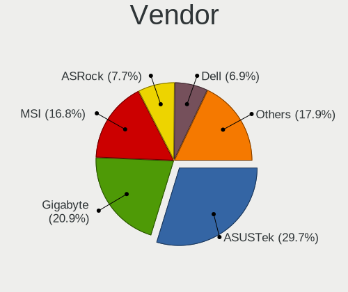
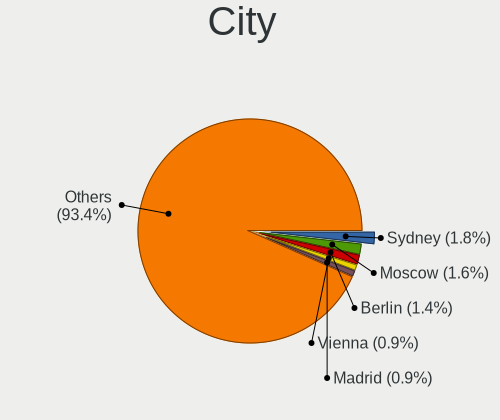
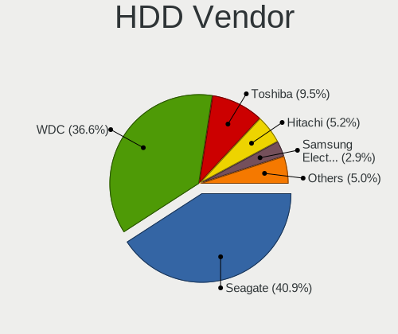
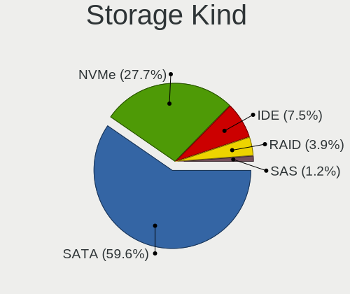
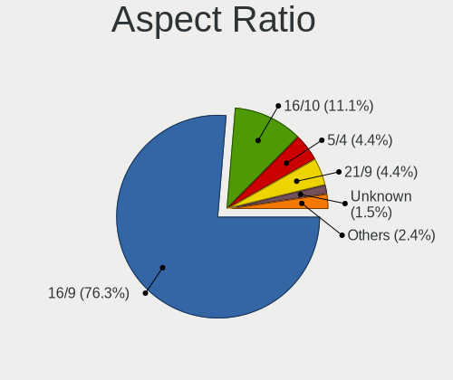
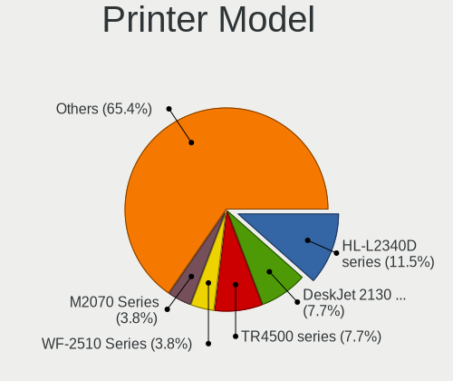

Fedora 35 - Tested Hardware & Statistics (Desktops)
---------------------------------------------------

A project to collect tested hardware configurations for Fedora 35.

Anyone can contribute to this report by the [hw-probe](https://github.com/linuxhw/hw-probe) tool:

    sudo -E hw-probe -all -upload

Please submit a probe of your configuration if it's not presented on the page or is rare.

Full-feature report is available here: https://linux-hardware.org/?view=trends

Contents
--------

* [ Test Cases ](#test-cases)

* [ System ](#system)
  - [ Kernel                   ](#kernel)
  - [ Kernel Family            ](#kernel-family)
  - [ Kernel Major Ver.        ](#kernel-major-ver)
  - [ Arch                     ](#arch)
  - [ DE                       ](#de)
  - [ Display Server           ](#display-server)
  - [ Display Manager          ](#display-manager)
  - [ OS Lang                  ](#os-lang)
  - [ Boot Mode                ](#boot-mode)
  - [ Filesystem               ](#filesystem)
  - [ Part. scheme             ](#part-scheme)
  - [ Dual Boot with Linux/BSD ](#dual-boot-with-linuxbsd)
  - [ Dual Boot (Win)          ](#dual-boot-win)

* [ Board ](#board)
  - [ Vendor                   ](#vendor)
  - [ Model                    ](#model)
  - [ Model Family             ](#model-family)
  - [ MFG Year                 ](#mfg-year)
  - [ Form Factor              ](#form-factor)
  - [ Secure Boot              ](#secure-boot)
  - [ Coreboot                 ](#coreboot)
  - [ RAM Size                 ](#ram-size)
  - [ RAM Used                 ](#ram-used)
  - [ Total Drives             ](#total-drives)
  - [ Has CD-ROM               ](#has-cd-rom)
  - [ Has Ethernet             ](#has-ethernet)
  - [ Has WiFi                 ](#has-wifi)
  - [ Has Bluetooth            ](#has-bluetooth)

* [ Location ](#location)
  - [ Country                  ](#country)
  - [ City                     ](#city)

* [ Drives ](#drives)
  - [ Drive Vendor             ](#drive-vendor)
  - [ Drive Model              ](#drive-model)
  - [ HDD Vendor               ](#hdd-vendor)
  - [ SSD Vendor               ](#ssd-vendor)
  - [ Drive Kind               ](#drive-kind)
  - [ Drive Connector          ](#drive-connector)
  - [ Drive Size               ](#drive-size)
  - [ Space Total              ](#space-total)
  - [ Space Used               ](#space-used)
  - [ Malfunc. Drives          ](#malfunc-drives)
  - [ Malfunc. Drive Vendor    ](#malfunc-drive-vendor)
  - [ Malfunc. HDD Vendor      ](#malfunc-hdd-vendor)
  - [ Malfunc. Drive Kind      ](#malfunc-drive-kind)
  - [ Failed Drives            ](#failed-drives)
  - [ Failed Drive Vendor      ](#failed-drive-vendor)
  - [ Drive Status             ](#drive-status)

* [ Storage controller ](#storage-controller)
  - [ Storage Vendor           ](#storage-vendor)
  - [ Storage Model            ](#storage-model)
  - [ Storage Kind             ](#storage-kind)

* [ Processor ](#processor)
  - [ CPU Vendor               ](#cpu-vendor)
  - [ CPU Model                ](#cpu-model)
  - [ CPU Model Family         ](#cpu-model-family)
  - [ CPU Cores                ](#cpu-cores)
  - [ CPU Sockets              ](#cpu-sockets)
  - [ CPU Threads              ](#cpu-threads)
  - [ CPU Op-Modes             ](#cpu-op-modes)
  - [ CPU Microcode            ](#cpu-microcode)
  - [ CPU Microarch            ](#cpu-microarch)

* [ Graphics ](#graphics)
  - [ GPU Vendor               ](#gpu-vendor)
  - [ GPU Model                ](#gpu-model)
  - [ GPU Combo                ](#gpu-combo)
  - [ GPU Driver               ](#gpu-driver)
  - [ GPU Memory               ](#gpu-memory)

* [ Monitor ](#monitor)
  - [ Monitor Vendor           ](#monitor-vendor)
  - [ Monitor Model            ](#monitor-model)
  - [ Monitor Resolution       ](#monitor-resolution)
  - [ Monitor Diagonal         ](#monitor-diagonal)
  - [ Monitor Width            ](#monitor-width)
  - [ Aspect Ratio             ](#aspect-ratio)
  - [ Monitor Area             ](#monitor-area)
  - [ Pixel Density            ](#pixel-density)
  - [ Multiple Monitors        ](#multiple-monitors)

* [ Network ](#network)
  - [ Net Controller Vendor    ](#net-controller-vendor)
  - [ Net Controller Model     ](#net-controller-model)
  - [ Wireless Vendor          ](#wireless-vendor)
  - [ Wireless Model           ](#wireless-model)
  - [ Ethernet Vendor          ](#ethernet-vendor)
  - [ Ethernet Model           ](#ethernet-model)
  - [ Net Controller Kind      ](#net-controller-kind)
  - [ Used Controller          ](#used-controller)
  - [ NICs                     ](#nics)
  - [ IPv6                     ](#ipv6)

* [ Bluetooth ](#bluetooth)
  - [ Bluetooth Vendor         ](#bluetooth-vendor)
  - [ Bluetooth Model          ](#bluetooth-model)

* [ Sound ](#sound)
  - [ Sound Vendor             ](#sound-vendor)
  - [ Sound Model              ](#sound-model)

* [ Memory ](#memory)
  - [ Memory Vendor            ](#memory-vendor)
  - [ Memory Model             ](#memory-model)
  - [ Memory Kind              ](#memory-kind)
  - [ Memory Form Factor       ](#memory-form-factor)
  - [ Memory Size              ](#memory-size)
  - [ Memory Speed             ](#memory-speed)

* [ Printers & scanners ](#printers--scanners)
  - [ Printer Vendor           ](#printer-vendor)
  - [ Printer Model            ](#printer-model)
  - [ Scanner Vendor           ](#scanner-vendor)
  - [ Scanner Model            ](#scanner-model)

* [ Camera ](#camera)
  - [ Camera Vendor            ](#camera-vendor)
  - [ Camera Model             ](#camera-model)

* [ Security ](#security)
  - [ Fingerprint Vendor       ](#fingerprint-vendor)
  - [ Fingerprint Model        ](#fingerprint-model)
  - [ Chipcard Vendor          ](#chipcard-vendor)
  - [ Chipcard Model           ](#chipcard-model)

* [ Unsupported ](#unsupported)
  - [ Unsupported Devices      ](#unsupported-devices)
  - [ Unsupported Device Types ](#unsupported-device-types)

Test Cases
----------

| Vendor        | Model                       | Probe                                                      | Date         |
|---------------|-----------------------------|------------------------------------------------------------|--------------|
| ASUSTek       | PRIME B360M-A               | [c60e8a85c4](https://linux-hardware.org/?probe=c60e8a85c4) | Feb 01, 2022 |
| Gigabyte      | B450 AORUS M                | [fb9c5fac50](https://linux-hardware.org/?probe=fb9c5fac50) | Feb 01, 2022 |
| Fujitsu       | D3600-A1 S26361-D3600-A1    | [9ba4b1306f](https://linux-hardware.org/?probe=9ba4b1306f) | Jan 31, 2022 |
| ASUSTek       | H97M-E                      | [d8cbfade46](https://linux-hardware.org/?probe=d8cbfade46) | Jan 31, 2022 |
| MSI           | X99A GAMING PRO CARBON      | [49bd28cbf5](https://linux-hardware.org/?probe=49bd28cbf5) | Jan 31, 2022 |
| ASUSTek       | TUF GAMING X570-PLUS_BR     | [dc652a6ac4](https://linux-hardware.org/?probe=dc652a6ac4) | Jan 30, 2022 |
| Dell          | 0X4H68 A00                  | [0e6a0c4725](https://linux-hardware.org/?probe=0e6a0c4725) | Jan 29, 2022 |
| ASUSTek       | TUF GAMING B550M-PLUS       | [83cdfa61a4](https://linux-hardware.org/?probe=83cdfa61a4) | Jan 28, 2022 |
| Gigabyte      | GB-BRR7H-4800               | [ed43351639](https://linux-hardware.org/?probe=ed43351639) | Jan 27, 2022 |
| Gigabyte      | Z270-HD3P-CF                | [e422d19fb3](https://linux-hardware.org/?probe=e422d19fb3) | Jan 27, 2022 |
| Gigabyte      | B85M-D3V-A                  | [2d778a328d](https://linux-hardware.org/?probe=2d778a328d) | Jan 27, 2022 |
| PCWare        | IPMH110G                    | [82ee6777f1](https://linux-hardware.org/?probe=82ee6777f1) | Jan 26, 2022 |
| Gigabyte      | F2A68HM-DS2                 | [267ee0e693](https://linux-hardware.org/?probe=267ee0e693) | Jan 26, 2022 |
| Gigabyte      | AB350-Gaming 3-CF           | [a72f036b05](https://linux-hardware.org/?probe=a72f036b05) | Jan 26, 2022 |
| Gigabyte      | P55A-UD7                    | [084f158a19](https://linux-hardware.org/?probe=084f158a19) | Jan 26, 2022 |
| MSI           | Z270M MORTAR                | [2493fd0195](https://linux-hardware.org/?probe=2493fd0195) | Jan 26, 2022 |
| ASUSTek       | PRIME B250M-A               | [875671a912](https://linux-hardware.org/?probe=875671a912) | Jan 25, 2022 |
| ASUSTek       | Z170 PRO GAMING             | [ec67e898bd](https://linux-hardware.org/?probe=ec67e898bd) | Jan 24, 2022 |
| Gigabyte      | B85M-D3V-A                  | [b812fc3ed2](https://linux-hardware.org/?probe=b812fc3ed2) | Jan 24, 2022 |
| HP            | 1497                        | [7761e5755c](https://linux-hardware.org/?probe=7761e5755c) | Jan 24, 2022 |
| MSI           | MEG Z390 GODLIKE            | [dd33a742c9](https://linux-hardware.org/?probe=dd33a742c9) | Jan 24, 2022 |
| Gigabyte      | H110M-H-CF                  | [f8afc9746e](https://linux-hardware.org/?probe=f8afc9746e) | Jan 24, 2022 |
| MSI           | MAG X570 TOMAHAWK WIFI      | [3ceffb0902](https://linux-hardware.org/?probe=3ceffb0902) | Jan 24, 2022 |
| MSI           | B450M MORTAR MAX            | [619b081f40](https://linux-hardware.org/?probe=619b081f40) | Jan 23, 2022 |
| MSI           | B450 GAMING PRO CARBON A... | [79e2d3dc48](https://linux-hardware.org/?probe=79e2d3dc48) | Jan 23, 2022 |
| MSI           | B450 GAMING PRO CARBON A... | [937ad3940c](https://linux-hardware.org/?probe=937ad3940c) | Jan 23, 2022 |
| Gigabyte      | EP45-DS3L                   | [10b9d78b55](https://linux-hardware.org/?probe=10b9d78b55) | Jan 23, 2022 |
| MSI           | B450 GAMING PRO CARBON A... | [1bea66eb77](https://linux-hardware.org/?probe=1bea66eb77) | Jan 23, 2022 |
| Gigabyte      | GA-880GM-UD2H               | [38c5a8b4f6](https://linux-hardware.org/?probe=38c5a8b4f6) | Jan 23, 2022 |
| Gigabyte      | H77N-WIFI                   | [b006be0c8b](https://linux-hardware.org/?probe=b006be0c8b) | Jan 22, 2022 |
| Gigabyte      | D525TUD                     | [db0a0adc46](https://linux-hardware.org/?probe=db0a0adc46) | Jan 22, 2022 |
| Gigabyte      | GB-BRR7H-4800               | [992e0c224c](https://linux-hardware.org/?probe=992e0c224c) | Jan 22, 2022 |
| ASRock        | B550 Phantom Gaming 4/ac    | [ada27693c4](https://linux-hardware.org/?probe=ada27693c4) | Jan 21, 2022 |
| MSI           | H310M PRO-VH                | [68c71dac17](https://linux-hardware.org/?probe=68c71dac17) | Jan 21, 2022 |
| Gigabyte      | H97-D3H-CF                  | [8e39cc0d01](https://linux-hardware.org/?probe=8e39cc0d01) | Jan 21, 2022 |
| BESSTAR Te... | HM50                        | [ddc2e44fcc](https://linux-hardware.org/?probe=ddc2e44fcc) | Jan 21, 2022 |
| MSI           | PRO Z690-A WIFI DDR4        | [1b1004081a](https://linux-hardware.org/?probe=1b1004081a) | Jan 21, 2022 |
| Gigabyte      | H81M-S2H                    | [5a010a60d7](https://linux-hardware.org/?probe=5a010a60d7) | Jan 20, 2022 |
| Gigabyte      | Z390 AORUS MASTER-CF        | [04926d5643](https://linux-hardware.org/?probe=04926d5643) | Jan 20, 2022 |
| ASUSTek       | ROG Maximus XI FORMULA      | [af3563e3e7](https://linux-hardware.org/?probe=af3563e3e7) | Jan 20, 2022 |
| Gigabyte      | B450 AORUS M                | [a846ee2ac3](https://linux-hardware.org/?probe=a846ee2ac3) | Jan 19, 2022 |
| MSI           | B450-A PRO MAX              | [72415f94c8](https://linux-hardware.org/?probe=72415f94c8) | Jan 19, 2022 |
| ASUSTek       | ROG STRIX B350-F GAMING     | [87c1802929](https://linux-hardware.org/?probe=87c1802929) | Jan 19, 2022 |
| MSI           | B450-A PRO MAX              | [ab286ab82d](https://linux-hardware.org/?probe=ab286ab82d) | Jan 19, 2022 |
| MSI           | X470 GAMING PLUS MAX        | [ca82eeb3d3](https://linux-hardware.org/?probe=ca82eeb3d3) | Jan 19, 2022 |
| MSI           | H310M PRO-VH                | [844791ed3e](https://linux-hardware.org/?probe=844791ed3e) | Jan 19, 2022 |
| Dell          | 0PP150 A00                  | [851a920599](https://linux-hardware.org/?probe=851a920599) | Jan 19, 2022 |
| ASUSTek       | ROG STRIX X570-F GAMING     | [c4103d5c5a](https://linux-hardware.org/?probe=c4103d5c5a) | Jan 19, 2022 |
| Fujitsu       | D3227-A1 S26361-D3227-A1    | [3dd363739d](https://linux-hardware.org/?probe=3dd363739d) | Jan 18, 2022 |
| Lenovo        | SHARKBAY SDK0E50510 PRO     | [01e009ebd0](https://linux-hardware.org/?probe=01e009ebd0) | Jan 18, 2022 |
| ASUSTek       | Maximus IV GENE-Z           | [e4489c39b8](https://linux-hardware.org/?probe=e4489c39b8) | Jan 18, 2022 |
| Gigabyte      | Z590 AORUS MASTER           | [db8f93ad4a](https://linux-hardware.org/?probe=db8f93ad4a) | Jan 18, 2022 |
| MSI           | B550M PRO-VDH WIFI          | [7451fd2f02](https://linux-hardware.org/?probe=7451fd2f02) | Jan 17, 2022 |
| HP            | 1494                        | [c03b887753](https://linux-hardware.org/?probe=c03b887753) | Jan 16, 2022 |
| ASUSTek       | PRIME B250-PLUS             | [6a024b63f0](https://linux-hardware.org/?probe=6a024b63f0) | Jan 16, 2022 |
| ASUSTek       | ROG CROSSHAIR VII HERO      | [01f17fdaa9](https://linux-hardware.org/?probe=01f17fdaa9) | Jan 16, 2022 |
| Gigabyte      | B550 AORUS PRO AC           | [ef86d029ff](https://linux-hardware.org/?probe=ef86d029ff) | Jan 16, 2022 |
| Acer          | Veriton X6620G v1.0         | [8ef5b3632a](https://linux-hardware.org/?probe=8ef5b3632a) | Jan 16, 2022 |
| Dell          | 09M8Y8 A01                  | [d5bd08abac](https://linux-hardware.org/?probe=d5bd08abac) | Jan 16, 2022 |
| Gigabyte      | B250M-D3H-CF                | [339d7aa470](https://linux-hardware.org/?probe=339d7aa470) | Jan 15, 2022 |
| ASUSTek       | PRIME X299-DELUXE           | [6903f0230f](https://linux-hardware.org/?probe=6903f0230f) | Jan 15, 2022 |
| ASUSTek       | PRIME X299-DELUXE           | [c458fb3c47](https://linux-hardware.org/?probe=c458fb3c47) | Jan 15, 2022 |
| ASUSTek       | Q87M-E                      | [30309c0416](https://linux-hardware.org/?probe=30309c0416) | Jan 15, 2022 |
| Dell          | 0NDYHG A01                  | [cc3a8808e7](https://linux-hardware.org/?probe=cc3a8808e7) | Jan 15, 2022 |
| Gigabyte      | Z390 AORUS MASTER-CF        | [4151d78b0a](https://linux-hardware.org/?probe=4151d78b0a) | Jan 14, 2022 |
| Gigabyte      | Z390 AORUS MASTER-CF        | [322291a7b1](https://linux-hardware.org/?probe=322291a7b1) | Jan 14, 2022 |
| MSI           | B450-A PRO MAX              | [7bf06ab6f0](https://linux-hardware.org/?probe=7bf06ab6f0) | Jan 14, 2022 |
| Gigabyte      | Z490 AORUS MASTER           | [7de1f8971f](https://linux-hardware.org/?probe=7de1f8971f) | Jan 14, 2022 |
| ASUSTek       | Maximus IV GENE-Z           | [e1d5a4a319](https://linux-hardware.org/?probe=e1d5a4a319) | Jan 14, 2022 |
| ASUSTek       | TUF B365M-PLUS GAMING       | [bef980429e](https://linux-hardware.org/?probe=bef980429e) | Jan 14, 2022 |
| Gigabyte      | F2A68HM-H                   | [f8b504601e](https://linux-hardware.org/?probe=f8b504601e) | Jan 13, 2022 |
| MSI           | MAG B550M MORTAR            | [c7567b5c29](https://linux-hardware.org/?probe=c7567b5c29) | Jan 13, 2022 |
| Gigabyte      | EP45-DS3L                   | [538e62155e](https://linux-hardware.org/?probe=538e62155e) | Jan 11, 2022 |
| Gigabyte      | GA-A55M-DS2                 | [f05cc95e99](https://linux-hardware.org/?probe=f05cc95e99) | Jan 11, 2022 |
| ASRock        | B360M IB-R1                 | [afb5a134ce](https://linux-hardware.org/?probe=afb5a134ce) | Jan 11, 2022 |
| ASUSTek       | Pro WS X570-ACE             | [63db2e4ecc](https://linux-hardware.org/?probe=63db2e4ecc) | Jan 10, 2022 |
| ASRock        | B450 Pro4                   | [3b3b0c2855](https://linux-hardware.org/?probe=3b3b0c2855) | Jan 10, 2022 |
| ASUSTek       | Pro WS X570-ACE             | [132d4e0b47](https://linux-hardware.org/?probe=132d4e0b47) | Jan 10, 2022 |
| Lenovo        | 312A SDK0J40697 WIN 3305... | [5d7aaea168](https://linux-hardware.org/?probe=5d7aaea168) | Jan 10, 2022 |
| ASUSTek       | H81-GAMER                   | [e123597c40](https://linux-hardware.org/?probe=e123597c40) | Jan 09, 2022 |
| Gigabyte      | F2A88XM-D3H                 | [02fe041d02](https://linux-hardware.org/?probe=02fe041d02) | Jan 09, 2022 |
| MSI           | B350M MORTAR ARCTIC         | [8d51630dcf](https://linux-hardware.org/?probe=8d51630dcf) | Jan 09, 2022 |
| Lenovo        | 369A SDK0F82993 WIN         | [e1141045bf](https://linux-hardware.org/?probe=e1141045bf) | Jan 08, 2022 |
| Gigabyte      | X570S AERO G                | [fc3f2a485a](https://linux-hardware.org/?probe=fc3f2a485a) | Jan 08, 2022 |
| Dell          | 04Y8V0 A02                  | [fa29ca9b4b](https://linux-hardware.org/?probe=fa29ca9b4b) | Jan 08, 2022 |
| Dell          | 04Y8V0 A02                  | [2564a1e4de](https://linux-hardware.org/?probe=2564a1e4de) | Jan 08, 2022 |
| ASUSTek       | Maximus IX CODE             | [32c7db26bd](https://linux-hardware.org/?probe=32c7db26bd) | Jan 08, 2022 |
| Gigabyte      | B75M-D3V                    | [faa71fac97](https://linux-hardware.org/?probe=faa71fac97) | Jan 06, 2022 |
| ASUSTek       | PRIME B360M-A               | [3b6e3858d5](https://linux-hardware.org/?probe=3b6e3858d5) | Jan 06, 2022 |
| ASUSTek       | Z77-A                       | [627b0162be](https://linux-hardware.org/?probe=627b0162be) | Jan 06, 2022 |
| Gigabyte      | B450 AORUS M                | [9ebb75d7a4](https://linux-hardware.org/?probe=9ebb75d7a4) | Jan 06, 2022 |
| Gigabyte      | EP45-DS3L                   | [9a5e27cab0](https://linux-hardware.org/?probe=9a5e27cab0) | Jan 05, 2022 |
| XFX           | nForce 780i 3-Way SLI 1     | [b56f576ff8](https://linux-hardware.org/?probe=b56f576ff8) | Jan 05, 2022 |
| ASUSTek       | ROG CROSSHAIR VIII HERO     | [75db843d7d](https://linux-hardware.org/?probe=75db843d7d) | Jan 04, 2022 |
| ASRock        | H110M-HDV R3.0              | [90fe76c900](https://linux-hardware.org/?probe=90fe76c900) | Jan 03, 2022 |
| HP            | 1495                        | [6298747a55](https://linux-hardware.org/?probe=6298747a55) | Jan 03, 2022 |
| ASRock        | H81M-HG4 R4.0               | [282277fa58](https://linux-hardware.org/?probe=282277fa58) | Jan 02, 2022 |
| MSI           | Z97S SLI Krait Edition      | [abff969a99](https://linux-hardware.org/?probe=abff969a99) | Jan 02, 2022 |
| ASUSTek       | PRIME H310M-E R2.0/BR       | [b4049969e7](https://linux-hardware.org/?probe=b4049969e7) | Jan 02, 2022 |
| ASUSTek       | PRIME H310M-E R2.0/BR       | [c5e569b5c7](https://linux-hardware.org/?probe=c5e569b5c7) | Jan 02, 2022 |
| ASRock        | B360M IB-R1                 | [f300f71e62](https://linux-hardware.org/?probe=f300f71e62) | Jan 02, 2022 |
| Gigabyte      | EP45-DS3L                   | [5d9026b1c0](https://linux-hardware.org/?probe=5d9026b1c0) | Jan 01, 2022 |
| Gigabyte      | G41MT-D3                    | [9c2f65c964](https://linux-hardware.org/?probe=9c2f65c964) | Jan 01, 2022 |
| Dell          | 0T7D40 A01                  | [4fce685dae](https://linux-hardware.org/?probe=4fce685dae) | Jan 01, 2022 |
| Dell          | 0T7D40 A01                  | [4ce7ea3bb0](https://linux-hardware.org/?probe=4ce7ea3bb0) | Dec 31, 2021 |
| Intel         | SKYBAY                      | [043f80cded](https://linux-hardware.org/?probe=043f80cded) | Dec 31, 2021 |
| ASUSTek       | PRIME B450M-A               | [58cb628601](https://linux-hardware.org/?probe=58cb628601) | Dec 31, 2021 |
| Gigabyte      | F2A88XM-DS2P                | [75eea6ae2f](https://linux-hardware.org/?probe=75eea6ae2f) | Dec 30, 2021 |
| ASUSTek       | TUF B365M-PLUS GAMING       | [00f3b181b3](https://linux-hardware.org/?probe=00f3b181b3) | Dec 30, 2021 |
| MSI           | X370 GAMING PLUS            | [49f7093e8c](https://linux-hardware.org/?probe=49f7093e8c) | Dec 29, 2021 |
| ASUSTek       | ROG CROSSHAIR VIII HERO     | [47edce55a4](https://linux-hardware.org/?probe=47edce55a4) | Dec 29, 2021 |
| ASUSTek       | TUF B365M-PLUS GAMING       | [e3297eb51f](https://linux-hardware.org/?probe=e3297eb51f) | Dec 29, 2021 |
| Gigabyte      | TRX40 AORUS XTREME          | [cbf9ee4a86](https://linux-hardware.org/?probe=cbf9ee4a86) | Dec 28, 2021 |
| MSI           | H81M-E33                    | [a7e25b05e2](https://linux-hardware.org/?probe=a7e25b05e2) | Dec 27, 2021 |
| XFX           | nForce 780i 3-Way SLI 1     | [36da2e6d4e](https://linux-hardware.org/?probe=36da2e6d4e) | Dec 26, 2021 |
| ASUSTek       | M2N-E                       | [3a08145f4b](https://linux-hardware.org/?probe=3a08145f4b) | Dec 24, 2021 |
| ASUSTek       | ROG Maximus XI HERO         | [ca0f62a716](https://linux-hardware.org/?probe=ca0f62a716) | Dec 24, 2021 |
| MSI           | MEG Z390 GODLIKE            | [f1e535b5ba](https://linux-hardware.org/?probe=f1e535b5ba) | Dec 24, 2021 |
| Gigabyte      | Z390 M-CF                   | [6efc5bede0](https://linux-hardware.org/?probe=6efc5bede0) | Dec 23, 2021 |
| ASUSTek       | TUF B365M-PLUS GAMING       | [4cd052492e](https://linux-hardware.org/?probe=4cd052492e) | Dec 23, 2021 |
| MSI           | A320M PRO-VH PLUS           | [27379a7599](https://linux-hardware.org/?probe=27379a7599) | Dec 22, 2021 |
| MSI           | PRO Z690-A WIFI DDR4        | [51a7e08e9a](https://linux-hardware.org/?probe=51a7e08e9a) | Dec 22, 2021 |
| MSI           | X470 GAMING M7 AC           | [9b2acc6ea1](https://linux-hardware.org/?probe=9b2acc6ea1) | Dec 22, 2021 |
| Gigabyte      | B450 AORUS ELITE            | [dd197ecb62](https://linux-hardware.org/?probe=dd197ecb62) | Dec 21, 2021 |
| ASUSTek       | P5G41-M                     | [09352ecc24](https://linux-hardware.org/?probe=09352ecc24) | Dec 21, 2021 |
| ASUSTek       | ROG CROSSHAIR VIII IMPAC... | [03abaff4ae](https://linux-hardware.org/?probe=03abaff4ae) | Dec 21, 2021 |
| Gigabyte      | EP45-DS3L                   | [e0f736fe3b](https://linux-hardware.org/?probe=e0f736fe3b) | Dec 20, 2021 |
| Dell          | 0YJPT1 A00                  | [a92e152a7c](https://linux-hardware.org/?probe=a92e152a7c) | Dec 20, 2021 |
| ASRock        | X399 Taichi                 | [16e27617b9](https://linux-hardware.org/?probe=16e27617b9) | Dec 20, 2021 |
| Gigabyte      | H61M-USB3V                  | [d05d2fe462](https://linux-hardware.org/?probe=d05d2fe462) | Dec 20, 2021 |
| ASUSTek       | PRIME H270-PLUS             | [9c1cf57d74](https://linux-hardware.org/?probe=9c1cf57d74) | Dec 20, 2021 |
| Dell          | 0C522T A03                  | [58f36b9637](https://linux-hardware.org/?probe=58f36b9637) | Dec 20, 2021 |
| Dell          | 0YXT71 A03                  | [0a48d9579b](https://linux-hardware.org/?probe=0a48d9579b) | Dec 19, 2021 |
| MSI           | X370 SLI PLUS               | [adb27f9347](https://linux-hardware.org/?probe=adb27f9347) | Dec 19, 2021 |
| Lenovo        | 312A SDK0J40697 WIN 3305... | [e2ce1d7284](https://linux-hardware.org/?probe=e2ce1d7284) | Dec 19, 2021 |
| MSI           | MAG B550 TOMAHAWK           | [6653477f61](https://linux-hardware.org/?probe=6653477f61) | Dec 18, 2021 |
| JINGSHA       | Unknown                     | [13da82798c](https://linux-hardware.org/?probe=13da82798c) | Dec 18, 2021 |
| Gigabyte      | H370 HD3-CF                 | [2497b24eda](https://linux-hardware.org/?probe=2497b24eda) | Dec 18, 2021 |
| Gigabyte      | F2A88XM-DS2P                | [c18ddabc8d](https://linux-hardware.org/?probe=c18ddabc8d) | Dec 18, 2021 |
| ASUSTek       | P5G41-M                     | [c073d4a4e9](https://linux-hardware.org/?probe=c073d4a4e9) | Dec 17, 2021 |
| ASUSTek       | ROG STRIX Z690-G GAMING ... | [b86150c4bd](https://linux-hardware.org/?probe=b86150c4bd) | Dec 16, 2021 |
| ASUSTek       | ROG STRIX Z690-G GAMING ... | [923f77a787](https://linux-hardware.org/?probe=923f77a787) | Dec 16, 2021 |
| HP            | 805D                        | [dfdc70512c](https://linux-hardware.org/?probe=dfdc70512c) | Dec 16, 2021 |
| ASUSTek       | Z97-PRO GAMER               | [45a411c9fe](https://linux-hardware.org/?probe=45a411c9fe) | Dec 15, 2021 |
| Gigabyte      | TRX40 AORUS MASTER          | [5915e986de](https://linux-hardware.org/?probe=5915e986de) | Dec 15, 2021 |
| MSI           | MPG B550 GAMING EDGE WIF... | [60a7206b05](https://linux-hardware.org/?probe=60a7206b05) | Dec 15, 2021 |
| ASUSTek       | ROG STRIX X570-F GAMING     | [660ce7fc74](https://linux-hardware.org/?probe=660ce7fc74) | Dec 15, 2021 |
| Dell          | 0RY007                      | [f3cb490147](https://linux-hardware.org/?probe=f3cb490147) | Dec 14, 2021 |
| Gigabyte      | Z270P-D3-CF                 | [b2dc7c9e05](https://linux-hardware.org/?probe=b2dc7c9e05) | Dec 14, 2021 |
| HP            | 2B2B                        | [bf929a4359](https://linux-hardware.org/?probe=bf929a4359) | Dec 14, 2021 |
| ASUSTek       | Z97-PRO GAMER               | [53523a4ea7](https://linux-hardware.org/?probe=53523a4ea7) | Dec 14, 2021 |
| MSI           | MPG B550 GAMING PLUS        | [3030fcf474](https://linux-hardware.org/?probe=3030fcf474) | Dec 13, 2021 |
| Gigabyte      | Z170-D3H-CF                 | [3616fc5b0e](https://linux-hardware.org/?probe=3616fc5b0e) | Dec 12, 2021 |
| Gigabyte      | B560M DS3H V2               | [169e6793c2](https://linux-hardware.org/?probe=169e6793c2) | Dec 12, 2021 |
| ASUSTek       | ROG CROSSHAIR VII HERO      | [021525201e](https://linux-hardware.org/?probe=021525201e) | Dec 12, 2021 |
| MSI           | MAG B550 TOMAHAWK           | [bd4a0c5d2f](https://linux-hardware.org/?probe=bd4a0c5d2f) | Dec 12, 2021 |
| ASUSTek       | P6T                         | [b789a1151e](https://linux-hardware.org/?probe=b789a1151e) | Dec 11, 2021 |
| Gigabyte      | X570 AORUS PRO              | [8ae1043ce6](https://linux-hardware.org/?probe=8ae1043ce6) | Dec 10, 2021 |
| Gigabyte      | 990FXA-UD3                  | [b76ef07c59](https://linux-hardware.org/?probe=b76ef07c59) | Dec 10, 2021 |
| ASUSTek       | P6T                         | [71ce922273](https://linux-hardware.org/?probe=71ce922273) | Dec 09, 2021 |
| ASUSTek       | ROG STRIX X470-I GAMING     | [bf533d0378](https://linux-hardware.org/?probe=bf533d0378) | Dec 09, 2021 |
| Gigabyte      | Z690 UD DDR4                | [d0070c39c4](https://linux-hardware.org/?probe=d0070c39c4) | Dec 09, 2021 |
| Gigabyte      | Z77-D3H                     | [c486c9645b](https://linux-hardware.org/?probe=c486c9645b) | Dec 09, 2021 |
| Dell          | 040DDP A01                  | [b8e92a4957](https://linux-hardware.org/?probe=b8e92a4957) | Dec 09, 2021 |
| ASUSTek       | P6T                         | [d04f9d16a8](https://linux-hardware.org/?probe=d04f9d16a8) | Dec 08, 2021 |
| ASUSTek       | ROG CROSSHAIR VIII HERO     | [82926e68a4](https://linux-hardware.org/?probe=82926e68a4) | Dec 08, 2021 |
| Supermicro    | X9DRi-LN4+/X9DR3-LN4+       | [bd8742e075](https://linux-hardware.org/?probe=bd8742e075) | Dec 08, 2021 |
| Apple         | Mac-F221BEC8                | [809152313d](https://linux-hardware.org/?probe=809152313d) | Dec 07, 2021 |
| ASUSTek       | SABERTOOTH X79              | [58c6a86730](https://linux-hardware.org/?probe=58c6a86730) | Dec 07, 2021 |
| Gigabyte      | Z97P-D3                     | [abc89c9b78](https://linux-hardware.org/?probe=abc89c9b78) | Dec 07, 2021 |
| XFX           | MI-A78S-8209 Ver1.1         | [5393b5ad7a](https://linux-hardware.org/?probe=5393b5ad7a) | Dec 06, 2021 |
| ASUSTek       | TUF GAMING B550-PLUS        | [9e878d83a3](https://linux-hardware.org/?probe=9e878d83a3) | Dec 06, 2021 |
| ASUSTek       | TUF GAMING B550-PLUS        | [0a06cba7c5](https://linux-hardware.org/?probe=0a06cba7c5) | Dec 06, 2021 |
| Lenovo        | 3642 SDK0J40700 WIN 3258... | [82cd98ea5a](https://linux-hardware.org/?probe=82cd98ea5a) | Dec 06, 2021 |
| Lenovo        | 3642 SDK0J40700 WIN 3258... | [07f484651e](https://linux-hardware.org/?probe=07f484651e) | Dec 06, 2021 |
| Gigabyte      | B450 AORUS M                | [18ae64d44d](https://linux-hardware.org/?probe=18ae64d44d) | Dec 05, 2021 |
| ASUSTek       | TUF B365M-PLUS GAMING       | [b296e2a320](https://linux-hardware.org/?probe=b296e2a320) | Dec 05, 2021 |
| Dell          | 0M859N A00                  | [f254ee88c6](https://linux-hardware.org/?probe=f254ee88c6) | Dec 05, 2021 |
| MSI           | Z87M GAMING                 | [4ef67e0560](https://linux-hardware.org/?probe=4ef67e0560) | Dec 04, 2021 |
| ASUSTek       | Z87-A                       | [e7d4963834](https://linux-hardware.org/?probe=e7d4963834) | Dec 04, 2021 |
| XFX           | MI-A78S-8209 Ver1.1         | [ce556a2535](https://linux-hardware.org/?probe=ce556a2535) | Dec 04, 2021 |
| Dell          | 0J3C2F A00                  | [bfead2c865](https://linux-hardware.org/?probe=bfead2c865) | Dec 04, 2021 |
| ASUSTek       | TUF GAMING B550-PLUS        | [511a349d7f](https://linux-hardware.org/?probe=511a349d7f) | Dec 03, 2021 |
| Gigabyte      | Z390 I AORUS PRO WIFI-CF    | [fd20b7fc56](https://linux-hardware.org/?probe=fd20b7fc56) | Dec 03, 2021 |
| Dell          | 06D7TR A00                  | [8c6244cb77](https://linux-hardware.org/?probe=8c6244cb77) | Dec 03, 2021 |
| MSI           | MEG Z390 GODLIKE            | [ca1727f54a](https://linux-hardware.org/?probe=ca1727f54a) | Dec 02, 2021 |
| Gateway       | SX2185                      | [70e907b207](https://linux-hardware.org/?probe=70e907b207) | Dec 02, 2021 |
| Dell          | 040DDP A01                  | [b108ae97c2](https://linux-hardware.org/?probe=b108ae97c2) | Dec 02, 2021 |
| MSI           | X370 XPOWER GAMING TITAN... | [56bd9b515c](https://linux-hardware.org/?probe=56bd9b515c) | Dec 02, 2021 |
| ASUSTek       | H81M-C                      | [ffecd77f3a](https://linux-hardware.org/?probe=ffecd77f3a) | Dec 02, 2021 |
| MSI           | B550M PRO-VDH WIFI          | [508352ad4a](https://linux-hardware.org/?probe=508352ad4a) | Dec 02, 2021 |
| Gigabyte      | B85M-D3V-A                  | [7304efa5d7](https://linux-hardware.org/?probe=7304efa5d7) | Dec 01, 2021 |
| Huanan        | X99-F8 V2.0                 | [1b4de261b3](https://linux-hardware.org/?probe=1b4de261b3) | Nov 30, 2021 |
| Gigabyte      | Z690 UD DDR4                | [7ad53e55ba](https://linux-hardware.org/?probe=7ad53e55ba) | Nov 30, 2021 |
| Apple         | Mac-F221BEC8                | [2ceb61c052](https://linux-hardware.org/?probe=2ceb61c052) | Nov 30, 2021 |
| Gigabyte      | EX58-UD3R                   | [8ece12c9e6](https://linux-hardware.org/?probe=8ece12c9e6) | Nov 28, 2021 |
| ECS           | H61H2-CM                    | [525be50825](https://linux-hardware.org/?probe=525be50825) | Nov 28, 2021 |
| Gigabyte      | H170-Gaming 3               | [e83680db56](https://linux-hardware.org/?probe=e83680db56) | Nov 28, 2021 |
| Gigabyte      | X570 AORUS MASTER           | [d813ffb878](https://linux-hardware.org/?probe=d813ffb878) | Nov 28, 2021 |
| Gigabyte      | AB350M-DS3H V2-CF           | [5d5d624d8c](https://linux-hardware.org/?probe=5d5d624d8c) | Nov 27, 2021 |
| MSI           | B450-A PRO MAX              | [d949cb9963](https://linux-hardware.org/?probe=d949cb9963) | Nov 27, 2021 |
| Dell          | 06D7TR A00                  | [d980b32136](https://linux-hardware.org/?probe=d980b32136) | Nov 27, 2021 |
| ASRock        | H81M-HG4 R4.0               | [c23e7e890b](https://linux-hardware.org/?probe=c23e7e890b) | Nov 27, 2021 |
| ASUSTek       | M4A77T/USB3                 | [e23dea02cf](https://linux-hardware.org/?probe=e23dea02cf) | Nov 26, 2021 |
| Gigabyte      | AB350M-Gaming 3-CF          | [1e4799819e](https://linux-hardware.org/?probe=1e4799819e) | Nov 26, 2021 |
| Gigabyte      | B550 AORUS ELITE            | [faf9c22988](https://linux-hardware.org/?probe=faf9c22988) | Nov 26, 2021 |
| ASUSTek       | Maximus IV GENE-Z           | [89729fef47](https://linux-hardware.org/?probe=89729fef47) | Nov 25, 2021 |
| Apple         | Mac-F221BEC8                | [f4f5c37779](https://linux-hardware.org/?probe=f4f5c37779) | Nov 25, 2021 |
| Gigabyte      | Z690 UD DDR4                | [b6ffc90d4e](https://linux-hardware.org/?probe=b6ffc90d4e) | Nov 25, 2021 |
| MSI           | B550-A PRO                  | [b90083da69](https://linux-hardware.org/?probe=b90083da69) | Nov 24, 2021 |
| Apple         | Mac-F221BEC8                | [e606757d4a](https://linux-hardware.org/?probe=e606757d4a) | Nov 24, 2021 |
| Dell          | 0C522T A03                  | [96fec5d214](https://linux-hardware.org/?probe=96fec5d214) | Nov 24, 2021 |
| Gigabyte      | B550 AORUS PRO              | [35801f40df](https://linux-hardware.org/?probe=35801f40df) | Nov 24, 2021 |
| Dell          | 0C522T A03                  | [79ee4911cb](https://linux-hardware.org/?probe=79ee4911cb) | Nov 24, 2021 |
| MSI           | A55M-E33                    | [e6616870b6](https://linux-hardware.org/?probe=e6616870b6) | Nov 24, 2021 |
| HP            | 1906                        | [8ec5c16fc7](https://linux-hardware.org/?probe=8ec5c16fc7) | Nov 24, 2021 |
| HP            | 83E1                        | [7598ac7e6c](https://linux-hardware.org/?probe=7598ac7e6c) | Nov 23, 2021 |
| ASUSTek       | Maximus IV GENE-Z           | [dab6e17223](https://linux-hardware.org/?probe=dab6e17223) | Nov 23, 2021 |
| Lenovo        | 3731 SDK0J40697 WIN 3305... | [c50601fb76](https://linux-hardware.org/?probe=c50601fb76) | Nov 23, 2021 |
| HP            | 0B4Ch D                     | [0c3c7c6bb3](https://linux-hardware.org/?probe=0c3c7c6bb3) | Nov 23, 2021 |
| HP            | 1906                        | [90499fe34d](https://linux-hardware.org/?probe=90499fe34d) | Nov 23, 2021 |
| Gigabyte      | X570 AORUS ELITE            | [91a66a7648](https://linux-hardware.org/?probe=91a66a7648) | Nov 22, 2021 |
| Gigabyte      | GA-MA790X-UD4               | [0a19a35ac4](https://linux-hardware.org/?probe=0a19a35ac4) | Nov 22, 2021 |
| ASRock        | G41M-VS3                    | [35277b1155](https://linux-hardware.org/?probe=35277b1155) | Nov 22, 2021 |
| Pegatron      | 2AD5                        | [8fc4f44be5](https://linux-hardware.org/?probe=8fc4f44be5) | Nov 22, 2021 |
| Gigabyte      | F2A85XM-D3H                 | [1c41d8c34c](https://linux-hardware.org/?probe=1c41d8c34c) | Nov 22, 2021 |
| ASRock        | X570 Phantom Gaming 4       | [683697e6ee](https://linux-hardware.org/?probe=683697e6ee) | Nov 21, 2021 |
| MSI           | B450M-A PRO MAX             | [92375d0ecc](https://linux-hardware.org/?probe=92375d0ecc) | Nov 21, 2021 |
| Dell          | 0M859N A00                  | [2fa52f3236](https://linux-hardware.org/?probe=2fa52f3236) | Nov 21, 2021 |
| Gigabyte      | B450M DS3H-CF               | [faec9a8f8b](https://linux-hardware.org/?probe=faec9a8f8b) | Nov 21, 2021 |
| HP            | 3048h                       | [e38eb769b5](https://linux-hardware.org/?probe=e38eb769b5) | Nov 20, 2021 |
| ASUSTek       | M5A78L-M/USB3               | [44d1a95b0b](https://linux-hardware.org/?probe=44d1a95b0b) | Nov 20, 2021 |
| MSI           | B450 GAMING PRO CARBON A... | [3b34362c42](https://linux-hardware.org/?probe=3b34362c42) | Nov 19, 2021 |
| ASUSTek       | A68HM-K                     | [8bf7660808](https://linux-hardware.org/?probe=8bf7660808) | Nov 19, 2021 |
| ASUSTek       | H87-PRO                     | [02b2e4cb00](https://linux-hardware.org/?probe=02b2e4cb00) | Nov 19, 2021 |
| ASUSTek       | H87-PRO                     | [181c56512d](https://linux-hardware.org/?probe=181c56512d) | Nov 19, 2021 |
| Dell          | 0YNVJG A01                  | [00f5cc73fe](https://linux-hardware.org/?probe=00f5cc73fe) | Nov 19, 2021 |
| Dell          | 0YNVJG A01                  | [fbedd3af33](https://linux-hardware.org/?probe=fbedd3af33) | Nov 19, 2021 |
| Pegatron      | 2AD5                        | [839b5c24aa](https://linux-hardware.org/?probe=839b5c24aa) | Nov 19, 2021 |
| MSI           | B450 TOMAHAWK               | [6a1607ab9d](https://linux-hardware.org/?probe=6a1607ab9d) | Nov 18, 2021 |
| MSI           | MPG X570 GAMING PRO CARB... | [c8a6893780](https://linux-hardware.org/?probe=c8a6893780) | Nov 18, 2021 |
| MSI           | A320M-A PRO MAX             | [d9f71fda8f](https://linux-hardware.org/?probe=d9f71fda8f) | Nov 18, 2021 |
| Dell          | 0C27VV A01                  | [34aff3ab72](https://linux-hardware.org/?probe=34aff3ab72) | Nov 18, 2021 |
| Gigabyte      | B450M DS3H-CF               | [f35f04cabd](https://linux-hardware.org/?probe=f35f04cabd) | Nov 18, 2021 |
| ASUSTek       | ROG CROSSHAIR VI HERO       | [50535d277c](https://linux-hardware.org/?probe=50535d277c) | Nov 18, 2021 |
| ASUSTek       | PRIME B360M-K               | [3b2165faa8](https://linux-hardware.org/?probe=3b2165faa8) | Nov 18, 2021 |
| Gigabyte      | B550M DS3H                  | [93c3ab9ed1](https://linux-hardware.org/?probe=93c3ab9ed1) | Nov 18, 2021 |
| Gigabyte      | H97M-D3H                    | [f6dc8337e7](https://linux-hardware.org/?probe=f6dc8337e7) | Nov 18, 2021 |
| MSI           | Z77A-G43                    | [04db0a2350](https://linux-hardware.org/?probe=04db0a2350) | Nov 17, 2021 |
| ASRock        | X470 Master SLI             | [c48f95d233](https://linux-hardware.org/?probe=c48f95d233) | Nov 17, 2021 |
| Gigabyte      | H370M DS3H-CF               | [c69f79e654](https://linux-hardware.org/?probe=c69f79e654) | Nov 17, 2021 |
| ASUSTek       | ROG CROSSHAIR VIII IMPAC... | [ddfb1c2b1a](https://linux-hardware.org/?probe=ddfb1c2b1a) | Nov 17, 2021 |
| Dell          | 0GY6Y8 A02                  | [61734716ea](https://linux-hardware.org/?probe=61734716ea) | Nov 16, 2021 |
| ASUSTek       | ROG STRIX B450-F GAMING     | [9404dfb1fe](https://linux-hardware.org/?probe=9404dfb1fe) | Nov 16, 2021 |
| Gigabyte      | X570 AORUS MASTER           | [3412d5cf0b](https://linux-hardware.org/?probe=3412d5cf0b) | Nov 16, 2021 |
| Gigabyte      | X570 AORUS MASTER           | [bdd9599f2f](https://linux-hardware.org/?probe=bdd9599f2f) | Nov 16, 2021 |
| ASUSTek       | M2N-E                       | [8da42387a5](https://linux-hardware.org/?probe=8da42387a5) | Nov 15, 2021 |
| Gigabyte      | B560M DS3H                  | [97ed26b846](https://linux-hardware.org/?probe=97ed26b846) | Nov 15, 2021 |
| ASRock        | B450 Pro4                   | [098387cb9c](https://linux-hardware.org/?probe=098387cb9c) | Nov 15, 2021 |
| Gigabyte      | GA-78LMT-USB3               | [bc6a3771aa](https://linux-hardware.org/?probe=bc6a3771aa) | Nov 13, 2021 |
| ASUSTek       | M3A78-EM                    | [e1cc8b1ee3](https://linux-hardware.org/?probe=e1cc8b1ee3) | Nov 13, 2021 |
| ASUSTek       | H61M-CS                     | [22858e9ab9](https://linux-hardware.org/?probe=22858e9ab9) | Nov 13, 2021 |
| Apple         | Mac-F221BEC8                | [5991ba5f44](https://linux-hardware.org/?probe=5991ba5f44) | Nov 12, 2021 |
| ASUSTek       | TUF B450M-PLUS GAMING       | [e85856bbef](https://linux-hardware.org/?probe=e85856bbef) | Nov 12, 2021 |
| Dell          | 0DXJD9 A00                  | [e9abfeb7a2](https://linux-hardware.org/?probe=e9abfeb7a2) | Nov 11, 2021 |
| Intel         | D33217GKE G69901-205        | [a922d5f3fc](https://linux-hardware.org/?probe=a922d5f3fc) | Nov 10, 2021 |
| MSI           | Z390-A PRO                  | [ca1489298b](https://linux-hardware.org/?probe=ca1489298b) | Nov 10, 2021 |
| Gigabyte      | X570 UD                     | [c5ae0c1fca](https://linux-hardware.org/?probe=c5ae0c1fca) | Nov 09, 2021 |
| Gigabyte      | Z390 I AORUS PRO WIFI-CF    | [189e19c60d](https://linux-hardware.org/?probe=189e19c60d) | Nov 09, 2021 |
| Dell          | 040DDP A01                  | [3587a95d63](https://linux-hardware.org/?probe=3587a95d63) | Nov 09, 2021 |
| Intel         | D33217GKE G69901-205        | [dd1ddaf74f](https://linux-hardware.org/?probe=dd1ddaf74f) | Nov 09, 2021 |
| Dell          | 0HD5W2 A00                  | [09cae8a245](https://linux-hardware.org/?probe=09cae8a245) | Nov 09, 2021 |
| HP            | 2215                        | [4e65fa6078](https://linux-hardware.org/?probe=4e65fa6078) | Nov 09, 2021 |
| Gigabyte      | EP45-DS3L                   | [fdbec54288](https://linux-hardware.org/?probe=fdbec54288) | Nov 08, 2021 |
| Gigabyte      | H97M-D3H                    | [74b5acd6cd](https://linux-hardware.org/?probe=74b5acd6cd) | Nov 08, 2021 |
| ASRock        | A300M-STX                   | [a7510caa6d](https://linux-hardware.org/?probe=a7510caa6d) | Nov 08, 2021 |
| ASRock        | A300M-STX                   | [2eebb6842a](https://linux-hardware.org/?probe=2eebb6842a) | Nov 08, 2021 |
| Seco          | C40 C                       | [27bff03d0c](https://linux-hardware.org/?probe=27bff03d0c) | Nov 08, 2021 |
| MSI           | X570-A PRO                  | [0e47ec7819](https://linux-hardware.org/?probe=0e47ec7819) | Nov 08, 2021 |
| ASUSTek       | PRIME B550M-A               | [ef16e3ad0f](https://linux-hardware.org/?probe=ef16e3ad0f) | Nov 07, 2021 |
| Gigabyte      | EP45-DS3L                   | [3533adc65b](https://linux-hardware.org/?probe=3533adc65b) | Nov 07, 2021 |
| Dell          | 0C522T A03                  | [43d8e3d9d8](https://linux-hardware.org/?probe=43d8e3d9d8) | Nov 07, 2021 |
| ABIT          | AX78                        | [3d56ae3738](https://linux-hardware.org/?probe=3d56ae3738) | Nov 06, 2021 |
| MSI           | MEG X570 UNIFY              | [37685b5198](https://linux-hardware.org/?probe=37685b5198) | Nov 06, 2021 |
| ASUSTek       | ROG STRIX B450-F GAMING     | [6cce11439f](https://linux-hardware.org/?probe=6cce11439f) | Nov 06, 2021 |
| ASUSTek       | M5A97                       | [f8ce8bca36](https://linux-hardware.org/?probe=f8ce8bca36) | Nov 05, 2021 |
| MSI           | Z97M-G43                    | [7b0e15a051](https://linux-hardware.org/?probe=7b0e15a051) | Nov 05, 2021 |
| ASUSTek       | Z170 PRO GAMING             | [ad6e327cf5](https://linux-hardware.org/?probe=ad6e327cf5) | Nov 05, 2021 |
| ASRock        | G41M-VS3                    | [bf54c2ee53](https://linux-hardware.org/?probe=bf54c2ee53) | Nov 04, 2021 |
| Gigabyte      | H97M-D3H                    | [fa84d0d544](https://linux-hardware.org/?probe=fa84d0d544) | Nov 04, 2021 |
| ASUSTek       | PRIME Z370-P                | [50301dd3e3](https://linux-hardware.org/?probe=50301dd3e3) | Nov 04, 2021 |
| Gigabyte      | B150M-D3H-CF                | [f5ef935897](https://linux-hardware.org/?probe=f5ef935897) | Nov 04, 2021 |
| Gigabyte      | H61M-S2V-B3                 | [5baf0ce3af](https://linux-hardware.org/?probe=5baf0ce3af) | Nov 04, 2021 |
| Lenovo        | MAHOBAY Win8 Pro DPK TPG    | [14c9dda4cd](https://linux-hardware.org/?probe=14c9dda4cd) | Nov 04, 2021 |
| MSI           | B450M MORTAR                | [00a97d0eba](https://linux-hardware.org/?probe=00a97d0eba) | Nov 03, 2021 |
| Dell          | 0YNVJG A01                  | [0243b19a08](https://linux-hardware.org/?probe=0243b19a08) | Nov 03, 2021 |
| Dell          | 0YNVJG A01                  | [f7d58b572d](https://linux-hardware.org/?probe=f7d58b572d) | Nov 03, 2021 |
| ASUSTek       | P8Z77-V                     | [c7a18968cf](https://linux-hardware.org/?probe=c7a18968cf) | Nov 03, 2021 |
| ASUSTek       | Z87M-PLUS                   | [c26ea680eb](https://linux-hardware.org/?probe=c26ea680eb) | Nov 03, 2021 |
| Gigabyte      | Z170-D3H-CF                 | [3acf5c243f](https://linux-hardware.org/?probe=3acf5c243f) | Nov 03, 2021 |
| MSI           | MAG B550M MORTAR            | [10a45363fe](https://linux-hardware.org/?probe=10a45363fe) | Nov 03, 2021 |
| ASRock        | G41M-VS3                    | [2ee1cbdc82](https://linux-hardware.org/?probe=2ee1cbdc82) | Nov 03, 2021 |
| MSI           | B365M PRO-VH                | [c2976ad59c](https://linux-hardware.org/?probe=c2976ad59c) | Nov 03, 2021 |
| MSI           | B450 GAMING PRO CARBON A... | [c8716ec9a6](https://linux-hardware.org/?probe=c8716ec9a6) | Nov 03, 2021 |
| MSI           | MPG X570 GAMING PRO CARB... | [93de1508cb](https://linux-hardware.org/?probe=93de1508cb) | Oct 31, 2021 |
| Lenovo        | 1046 SDK0T08861 WIN 3305... | [136c409f1a](https://linux-hardware.org/?probe=136c409f1a) | Oct 27, 2021 |
| Lenovo        | 1046 SDK0T08861 WIN 3305... | [ae8daa788a](https://linux-hardware.org/?probe=ae8daa788a) | Oct 27, 2021 |
| MSI           | B550-A PRO                  | [91c5853577](https://linux-hardware.org/?probe=91c5853577) | Oct 25, 2021 |
| Fujitsu       | D3120-A1 S26361-D3120-A1    | [fac95138dc](https://linux-hardware.org/?probe=fac95138dc) | Oct 23, 2021 |
| Foxconn       | H81MXV FAB A                | [b030daf542](https://linux-hardware.org/?probe=b030daf542) | Oct 20, 2021 |
| ASUSTek       | PRIME B460M-A               | [6db5e9be6b](https://linux-hardware.org/?probe=6db5e9be6b) | Oct 19, 2021 |
| ASUSTek       | ROG STRIX B560-G GAMING ... | [746401b748](https://linux-hardware.org/?probe=746401b748) | Oct 18, 2021 |
| MSI           | B350 PC MATE                | [bc716e921b](https://linux-hardware.org/?probe=bc716e921b) | Oct 15, 2021 |
| Dell          | 0WMJ54 A01                  | [01ce3b252c](https://linux-hardware.org/?probe=01ce3b252c) | Oct 14, 2021 |
| ASUSTek       | PRIME B550M-A               | [2ff2eb607a](https://linux-hardware.org/?probe=2ff2eb607a) | Oct 14, 2021 |
| ASUSTek       | PRIME A320I-K               | [eee2a960f5](https://linux-hardware.org/?probe=eee2a960f5) | Oct 11, 2021 |
| ASUSTek       | PRIME B350-PLUS             | [7b26df9bc4](https://linux-hardware.org/?probe=7b26df9bc4) | Oct 10, 2021 |
| Gigabyte      | X570 AORUS ULTRA            | [f850c51db9](https://linux-hardware.org/?probe=f850c51db9) | Oct 10, 2021 |
| ASUSTek       | ROG Maximus XI FORMULA      | [cfbe862160](https://linux-hardware.org/?probe=cfbe862160) | Oct 10, 2021 |
| Fujitsu       | D3220-A1 S26361-D3220-A1    | [a9ceb4591e](https://linux-hardware.org/?probe=a9ceb4591e) | Oct 09, 2021 |
| Fujitsu       | D3220-A1 S26361-D3220-A1    | [7c210a60ab](https://linux-hardware.org/?probe=7c210a60ab) | Oct 09, 2021 |
| Gigabyte      | H61N-USB3                   | [43ded3a853](https://linux-hardware.org/?probe=43ded3a853) | Oct 09, 2021 |
| ASUSTek       | ROG STRIX B550-F GAMING     | [b3d0295208](https://linux-hardware.org/?probe=b3d0295208) | Oct 08, 2021 |
| Gigabyte      | H61N-USB3                   | [75d34f09c4](https://linux-hardware.org/?probe=75d34f09c4) | Oct 06, 2021 |
| MSI           | B550-A PRO                  | [17a03c217e](https://linux-hardware.org/?probe=17a03c217e) | Oct 04, 2021 |
| Gigabyte      | Z170-D3H-CF                 | [103d2198a4](https://linux-hardware.org/?probe=103d2198a4) | Sep 30, 2021 |
| Gigabyte      | Z170-D3H-CF                 | [b6f5c877d4](https://linux-hardware.org/?probe=b6f5c877d4) | Sep 29, 2021 |
| Gigabyte      | H81M-S2H                    | [b8c27bd56c](https://linux-hardware.org/?probe=b8c27bd56c) | Sep 28, 2021 |
| ASRock        | B450M-HDV R4.0              | [2f771e8271](https://linux-hardware.org/?probe=2f771e8271) | Sep 24, 2021 |
| ASUSTek       | TUF GAMING B550M-PLUS       | [e75373a634](https://linux-hardware.org/?probe=e75373a634) | Sep 23, 2021 |
| ASUSTek       | ROG STRIX B360-I GAMING     | [3875512e39](https://linux-hardware.org/?probe=3875512e39) | Sep 14, 2021 |
| ASUSTek       | ROG STRIX B360-I GAMING     | [4fb9ed180b](https://linux-hardware.org/?probe=4fb9ed180b) | Sep 14, 2021 |
| Dell          | 0WMJ54 A01                  | [3231b34d4d](https://linux-hardware.org/?probe=3231b34d4d) | Aug 24, 2021 |
| Dell          | 0WMJ54 A01                  | [a94ad8a323](https://linux-hardware.org/?probe=a94ad8a323) | Aug 22, 2021 |
| HP            | 8055                        | [29f5b9a7ab](https://linux-hardware.org/?probe=29f5b9a7ab) | Aug 12, 2021 |
| Dell          | 0KC9NP A01                  | [142e0703fb](https://linux-hardware.org/?probe=142e0703fb) | Aug 12, 2021 |
| Dell          | 0KC9NP A01                  | [f48bc9ac9d](https://linux-hardware.org/?probe=f48bc9ac9d) | Aug 07, 2021 |
| ASUSTek       | Maximus V FORMULA           | [466ef3bd27](https://linux-hardware.org/?probe=466ef3bd27) | Jul 29, 2021 |
| Dell          | 0KC9NP A01                  | [7dcd16d3fd](https://linux-hardware.org/?probe=7dcd16d3fd) | Jul 14, 2021 |
| Dell          | 0KC9NP A01                  | [eedd464065](https://linux-hardware.org/?probe=eedd464065) | Jul 14, 2021 |
| Dell          | 0KC9NP A01                  | [8d1e68aad0](https://linux-hardware.org/?probe=8d1e68aad0) | Jul 07, 2021 |
| Dell          | 0KC9NP A01                  | [852a8a103d](https://linux-hardware.org/?probe=852a8a103d) | Jul 04, 2021 |
| Dell          | 0KC9NP A01                  | [3a0ca9b90c](https://linux-hardware.org/?probe=3a0ca9b90c) | Jul 01, 2021 |
| Dell          | 0KC9NP A01                  | [3ed1ee1f81](https://linux-hardware.org/?probe=3ed1ee1f81) | Jun 25, 2021 |
| Dell          | 0KC9NP A01                  | [f611d9ec88](https://linux-hardware.org/?probe=f611d9ec88) | Jun 23, 2021 |
| ASUSTek       | Maximus V FORMULA           | [95ba18d5da](https://linux-hardware.org/?probe=95ba18d5da) | Jun 23, 2021 |
| Dell          | 0KC9NP A01                  | [511e8019e0](https://linux-hardware.org/?probe=511e8019e0) | Jun 19, 2021 |
| Dell          | 0KC9NP A01                  | [6687380bd7](https://linux-hardware.org/?probe=6687380bd7) | Jun 18, 2021 |
| Gigabyte      | F2A88XN-WIFI                | [c22e6d8669](https://linux-hardware.org/?probe=c22e6d8669) | May 25, 2021 |
| ASUSTek       | Maximus V FORMULA           | [3e15dd7136](https://linux-hardware.org/?probe=3e15dd7136) | May 19, 2021 |
| ECS           | MCP61M-M3                   | [2e5b21af19](https://linux-hardware.org/?probe=2e5b21af19) | Apr 17, 2021 |
| ASUSTek       | PRIME X570-PRO              | [3f7cbcea74](https://linux-hardware.org/?probe=3f7cbcea74) | Apr 14, 2021 |

System
------

Kernel
------

Version of the Linux kernel

| Version                                                       | Desktops | Percent |
|---------------------------------------------------------------|----------|---------|
| 5.15.6-200.fc35.x86_64                                        | 29       | 10.47%  |
| 5.15.12-200.fc35.x86_64                                       | 20       | 7.22%   |
| 5.14.18-300.fc35.x86_64                                       | 20       | 7.22%   |
| 5.14.10-300.fc35.x86_64                                       | 20       | 7.22%   |
| 5.14.17-301.fc35.x86_64                                       | 17       | 6.14%   |
| 5.14.16-301.fc35.x86_64                                       | 17       | 6.14%   |
| 5.15.16-200.fc35.x86_64                                       | 14       | 5.05%   |
| 5.14.14-300.fc35.x86_64                                       | 14       | 5.05%   |
| 5.15.14-200.fc35.x86_64                                       | 13       | 4.69%   |
| 5.15.8-200.fc35.x86_64                                        | 12       | 4.33%   |
| 5.14.15-300.fc35.x86_64                                       | 11       | 3.97%   |
| 5.15.13-200.fc35.x86_64                                       | 10       | 3.61%   |
| 5.15.11-200.fc35.x86_64                                       | 9        | 3.25%   |
| 5.15.15-200.fc35.x86_64                                       | 7        | 2.53%   |
| 5.15.10-200.fc35.x86_64                                       | 6        | 2.17%   |
| 5.15.5-200.fc35.x86_64                                        | 5        | 1.81%   |
| 5.15.4-201.fc35.x86_64                                        | 5        | 1.81%   |
| 5.14.9-300.fc35.x86_64                                        | 5        | 1.81%   |
| 5.15.7-200.fc35.x86_64                                        | 4        | 1.44%   |
| 5.15.17-200.fc35.x86_64                                       | 4        | 1.44%   |
| 5.14.0-60.fc35.x86_64                                         | 3        | 1.08%   |
| 5.14.20-300.fc35.x86_64                                       | 2        | 0.72%   |
| 5.12.0-0.rc7.189.fc35.x86_64                                  | 2        | 0.72%   |
| 5.8.15-301.fc33.x86_64                                        | 1        | 0.36%   |
| 5.16.4-200.fc35.x86_64                                        | 1        | 0.36%   |
| 5.16.2-225.vanilla.1.fc35.x86_64                              | 1        | 0.36%   |
| 5.16.2-200.fc35.x86_64                                        | 1        | 0.36%   |
| 5.16.0-0.rc6.41.vanilla.1.fc35.x86_64                         | 1        | 0.36%   |
| 5.16.0-0.rc2.18.vanilla.1.fc35.x86_64                         | 1        | 0.36%   |
| 5.16.0-0.rc1.20211115git8ab774587903.14.vanilla.1.fc35.x86_64 | 1        | 0.36%   |
| 5.15.5-xm1tt.0.fc35.x86_64                                    | 1        | 0.36%   |
| 5.15.4-xm1.0.fc35.x86_64                                      | 1        | 0.36%   |
| 5.15.2_tkg_bmq                                                | 1        | 0.36%   |
| 5.15.0-500.chinfo.fc35.x86_64                                 | 1        | 0.36%   |
| 5.15.0-0.rc7.20211028git1fc596a56b33.56.vanilla.1.fc35.x86_64 | 1        | 0.36%   |
| 5.14.8-lqx1.0.fc35.x86_64                                     | 1        | 0.36%   |
| 5.14.7-300.fc35.x86_64                                        | 1        | 0.36%   |
| 5.14.6-300.fc35.x86_64                                        | 1        | 0.36%   |
| 5.14.18-301.fsync.fc35.x86_64                                 | 1        | 0.36%   |
| 5.14.13_MY                                                    | 1        | 0.36%   |
| 5.14.1-300.fc35.x86_64                                        | 1        | 0.36%   |
| 5.14.0-0.rc6.46.fc35.x86_64                                   | 1        | 0.36%   |
| 5.13.7-200.fc34.x86_64                                        | 1        | 0.36%   |
| 5.13.0-58.fc35.x86_64                                         | 1        | 0.36%   |
| 5.13.0-0.rc7.20210623git0c18f29aae7c.53.fc35.x86_64           | 1        | 0.36%   |
| 5.13.0-0.rc6.45.fc35.x86_64                                   | 1        | 0.36%   |
| 5.13.0-0.rc2.20210521git79a106fc6585.22.fc35.x86_64           | 1        | 0.36%   |
| 5.13.0-0.rc2.19.fc35.x86_64                                   | 1        | 0.36%   |
| 5.13.0-0.rc1.13.fc35.x86_64                                   | 1        | 0.36%   |
| 5.11.13-300.fc34.x86_64                                       | 1        | 0.36%   |
| 5.10.15-200.fc33.x86_64                                       | 1        | 0.36%   |

Kernel Family
-------------

Linux kernel without a distro release

| Version | Desktops | Percent |
|---------|----------|---------|
| 5.15.6  | 29       | 10.62%  |
| 5.14.18 | 21       | 7.69%   |
| 5.15.12 | 20       | 7.33%   |
| 5.14.10 | 20       | 7.33%   |
| 5.14.17 | 17       | 6.23%   |
| 5.14.16 | 17       | 6.23%   |
| 5.15.16 | 14       | 5.13%   |
| 5.14.14 | 14       | 5.13%   |
| 5.15.14 | 13       | 4.76%   |
| 5.15.8  | 12       | 4.4%    |
| 5.14.15 | 11       | 4.03%   |
| 5.15.13 | 10       | 3.66%   |
| 5.15.11 | 9        | 3.3%    |
| 5.15.15 | 7        | 2.56%   |
| 5.15.5  | 6        | 2.2%    |
| 5.15.4  | 6        | 2.2%    |
| 5.15.10 | 6        | 2.2%    |
| 5.14.9  | 5        | 1.83%   |
| 5.15.7  | 4        | 1.47%   |
| 5.15.17 | 4        | 1.47%   |
| 5.14.0  | 4        | 1.47%   |
| 5.13.0  | 3        | 1.1%    |
| 5.16.2  | 2        | 0.73%   |
| 5.16.0  | 2        | 0.73%   |
| 5.15.0  | 2        | 0.73%   |
| 5.14.20 | 2        | 0.73%   |
| 5.12.0  | 2        | 0.73%   |
| 5.8.15  | 1        | 0.37%   |
| 5.16.4  | 1        | 0.37%   |
| 5.15.2  | 1        | 0.37%   |
| 5.14.8  | 1        | 0.37%   |
| 5.14.7  | 1        | 0.37%   |
| 5.14.6  | 1        | 0.37%   |
| 5.14.13 | 1        | 0.37%   |
| 5.14.1  | 1        | 0.37%   |
| 5.13.7  | 1        | 0.37%   |
| 5.11.13 | 1        | 0.37%   |
| 5.10.15 | 1        | 0.37%   |

Kernel Major Ver.
-----------------

Linux kernel major version

| Version | Desktops | Percent |
|---------|----------|---------|
| 5.15    | 134      | 51.15%  |
| 5.14    | 114      | 43.51%  |
| 5.16    | 5        | 1.91%   |
| 5.13    | 4        | 1.53%   |
| 5.12    | 2        | 0.76%   |
| 5.8     | 1        | 0.38%   |
| 5.11    | 1        | 0.38%   |
| 5.10    | 1        | 0.38%   |

Arch
----

OS architecture (x86_64, i586, etc.)

| Name   | Desktops | Percent |
|--------|----------|---------|
| x86_64 | 250      | 100%    |

DE
--

Desktop Environment

| Name          | Desktops | Percent |
|---------------|----------|---------|
| GNOME         | 183      | 72.62%  |
| KDE5          | 29       | 11.51%  |
| Unknown       | 15       | 5.95%   |
| X-Cinnamon    | 7        | 2.78%   |
| MATE          | 5        | 1.98%   |
| Cinnamon      | 4        | 1.59%   |
| XFCE          | 3        | 1.19%   |
| KDE           | 3        | 1.19%   |
| GNOME Classic | 2        | 0.79%   |
| LXDE          | 1        | 0.4%    |

Display Server
--------------

X11 or Wayland

| Name    | Desktops | Percent |
|---------|----------|---------|
| Wayland | 133      | 52.36%  |
| X11     | 102      | 40.16%  |
| Tty     | 11       | 4.33%   |
| Unknown | 8        | 3.15%   |

Display Manager
---------------

SDDM, LightDM, etc.

| Name    | Desktops | Percent |
|---------|----------|---------|
| Unknown | 137      | 54.8%   |
| GDM     | 77       | 30.8%   |
| SDDM    | 18       | 7.2%    |
| LightDM | 18       | 7.2%    |

OS Lang
-------

Language

| Lang       | Desktops | Percent |
|------------|----------|---------|
| en_US      | 114      | 45.6%   |
| ru_RU      | 16       | 6.4%    |
| en_GB      | 13       | 5.2%    |
| de_DE      | 13       | 5.2%    |
| pt_BR      | 12       | 4.8%    |
| fr_FR      | 9        | 3.6%    |
| es_ES      | 8        | 3.2%    |
| en_AU      | 8        | 3.2%    |
| pl_PL      | 7        | 2.8%    |
| en_CA      | 5        | 2%      |
| es_CO      | 4        | 1.6%    |
| it_IT      | 3        | 1.2%    |
| es_MX      | 3        | 1.2%    |
| cs_CZ      | 3        | 1.2%    |
| ru_UA      | 2        | 0.8%    |
| nl_BE      | 2        | 0.8%    |
| fr_CH      | 2        | 0.8%    |
| es_CL      | 2        | 0.8%    |
| en_NZ      | 2        | 0.8%    |
| en_IE      | 2        | 0.8%    |
| Unknown    | 2        | 0.8%    |
| tr_TR      | 1        | 0.4%    |
| sv_SE      | 1        | 0.4%    |
| sr_RS      | 1        | 0.4%    |
| pt_PT      | 1        | 0.4%    |
| pa_IN      | 1        | 0.4%    |
| nl_NL      | 1        | 0.4%    |
| ja_JP      | 1        | 0.4%    |
| hu_HU      | 1        | 0.4%    |
| es_VE      | 1        | 0.4%    |
| en_US.UTF8 | 1        | 0.4%    |
| en_IN      | 1        | 0.4%    |
| en_IL      | 1        | 0.4%    |
| el_GR      | 1        | 0.4%    |
| de_CH      | 1        | 0.4%    |
| de_AT      | 1        | 0.4%    |
| ca_ES      | 1        | 0.4%    |
| C          | 1        | 0.4%    |
| ar_SA      | 1        | 0.4%    |

Boot Mode
---------

EFI or BIOS

| Mode | Desktops | Percent |
|------|----------|---------|
| EFI  | 163      | 64.68%  |
| BIOS | 89       | 35.32%  |

Filesystem
----------

Type of filesystem

| Type    | Desktops | Percent |
|---------|----------|---------|
| Btrfs   | 167      | 66.01%  |
| Ext4    | 72       | 28.46%  |
| Xfs     | 12       | 4.74%   |
| Overlay | 1        | 0.4%    |
| Ext3    | 1        | 0.4%    |

Part. scheme
------------

Scheme of partitioning

| Type    | Desktops | Percent |
|---------|----------|---------|
| Unknown | 134      | 53.17%  |
| GPT     | 94       | 37.3%   |
| MBR     | 24       | 9.52%   |

Dual Boot with Linux/BSD
------------------------

Hosting more than one Linux/BSD

| Dual boot | Desktops | Percent |
|-----------|----------|---------|
| No        | 215      | 85.66%  |
| Yes       | 36       | 14.34%  |

Dual Boot (Win)
---------------

Hosting Linux and Windows

| Dual boot | Desktops | Percent |
|-----------|----------|---------|
| No        | 193      | 75.69%  |
| Yes       | 62       | 24.31%  |

Board
-----

Vendor
------

Motherboard manufacturer

| Name                | Desktops | Percent |
|---------------------|----------|---------|
| Gigabyte Technology | 68       | 27.2%   |
| ASUSTek Computer    | 62       | 24.8%   |
| MSI                 | 46       | 18.4%   |
| Dell                | 20       | 8%      |
| ASRock              | 12       | 4.8%    |
| Hewlett-Packard     | 11       | 4.4%    |
| Lenovo              | 8        | 3.2%    |
| Fujitsu             | 4        | 1.6%    |
| XFX                 | 2        | 0.8%    |
| Intel               | 2        | 0.8%    |
| ECS                 | 2        | 0.8%    |
| Apple               | 2        | 0.8%    |
| Supermicro          | 1        | 0.4%    |
| Seco                | 1        | 0.4%    |
| Pegatron            | 1        | 0.4%    |
| PCWare              | 1        | 0.4%    |
| JINGSHA             | 1        | 0.4%    |
| Huanan              | 1        | 0.4%    |
| Gateway             | 1        | 0.4%    |
| Foxconn             | 1        | 0.4%    |
| BESSTAR Tech        | 1        | 0.4%    |
| Acer                | 1        | 0.4%    |
| ABIT                | 1        | 0.4%    |

Model
-----

Motherboard model

| Name                                | Desktops | Percent |
|-------------------------------------|----------|---------|
| ASUS All Series                     | 7        | 2.8%    |
| MSI MS-7C56                         | 3        | 1.2%    |
| MSI MS-7D25                         | 2        | 0.8%    |
| MSI MS-7C95                         | 2        | 0.8%    |
| MSI MS-7C94                         | 2        | 0.8%    |
| MSI MS-7C91                         | 2        | 0.8%    |
| MSI MS-7C52                         | 2        | 0.8%    |
| MSI MS-7B93                         | 2        | 0.8%    |
| MSI MS-7B89                         | 2        | 0.8%    |
| MSI MS-7B86                         | 2        | 0.8%    |
| MSI MS-7B85                         | 2        | 0.8%    |
| MSI MS-7B10                         | 2        | 0.8%    |
| MSI MS-7A33                         | 2        | 0.8%    |
| Gigabyte Z390 I AORUS PRO WIFI      | 2        | 0.8%    |
| Gigabyte Z390 AORUS MASTER          | 2        | 0.8%    |
| Gigabyte X570 AORUS MASTER          | 2        | 0.8%    |
| Gigabyte H97M-D3H                   | 2        | 0.8%    |
| Gigabyte B450M DS3H                 | 2        | 0.8%    |
| Gigabyte B450 AORUS M               | 2        | 0.8%    |
| Dell OptiPlex 7010                  | 2        | 0.8%    |
| Dell OptiPlex 3020                  | 2        | 0.8%    |
| ASUS Z170 PRO GAMING                | 2        | 0.8%    |
| ASUS TUF GAMING B550M-PLUS          | 2        | 0.8%    |
| ASUS TUF GAMING B550-PLUS           | 2        | 0.8%    |
| ASUS ROG Maximus XI FORMULA         | 2        | 0.8%    |
| ASUS ROG CROSSHAIR VII HERO         | 2        | 0.8%    |
| ASRock B450 Pro4                    | 2        | 0.8%    |
| Apple MacPro5,1                     | 2        | 0.8%    |
| XFX nForce 780i 3-Way SLI           | 1        | 0.4%    |
| XFX MI-A78S-8209 Ver1.1             | 1        | 0.4%    |
| Supermicro PIO-617R-TLN4F+-ST031    | 1        | 0.4%    |
| Seco C40                            | 1        | 0.4%    |
| Pegatron h9-1350                    | 1        | 0.4%    |
| PCWare IPMH110G                     | 1        | 0.4%    |
| MSI MS-7C84                         | 1        | 0.4%    |
| MSI MS-7C37                         | 1        | 0.4%    |
| MSI MS-7C35                         | 1        | 0.4%    |
| MSI MS-7C31                         | 1        | 0.4%    |
| MSI MS-7C02                         | 1        | 0.4%    |
| MSI MS-7B98                         | 1        | 0.4%    |
| MSI MS-7B79                         | 1        | 0.4%    |
| MSI MS-7B77                         | 1        | 0.4%    |
| MSI MS-7B33                         | 1        | 0.4%    |
| MSI MS-7B07                         | 1        | 0.4%    |
| MSI MS-7A69                         | 1        | 0.4%    |
| MSI MS-7A37                         | 1        | 0.4%    |
| MSI MS-7A34                         | 1        | 0.4%    |
| MSI MS-7A31                         | 1        | 0.4%    |
| MSI MS-7A20                         | 1        | 0.4%    |
| MSI MS-7924                         | 1        | 0.4%    |
| MSI MS-7922                         | 1        | 0.4%    |
| MSI MS-7866                         | 1        | 0.4%    |
| MSI MS-7817                         | 1        | 0.4%    |
| MSI MS-7758                         | 1        | 0.4%    |
| MSI MS-7721                         | 1        | 0.4%    |
| Lenovo V55t-15ARE 11KG0004CK        | 1        | 0.4%    |
| Lenovo ThinkStation P620 30E0CTO1WW | 1        | 0.4%    |
| Lenovo ThinkCentre M93p 10AAS1AG00  | 1        | 0.4%    |
| Lenovo ThinkCentre M72z 3543A9G     | 1        | 0.4%    |
| Lenovo ThinkCentre M720s 10ST006UGE | 1        | 0.4%    |

Model Family
------------

Motherboard model prefix

| Name                             | Desktops | Percent |
|----------------------------------|----------|---------|
| ASUS ROG                         | 15       | 6%      |
| Dell OptiPlex                    | 14       | 5.6%    |
| ASUS PRIME                       | 14       | 5.6%    |
| ASUS TUF                         | 7        | 2.8%    |
| ASUS All                         | 7        | 2.8%    |
| Gigabyte X570                    | 6        | 2.4%    |
| Gigabyte Z390                    | 5        | 2%      |
| Lenovo ThinkCentre               | 4        | 1.6%    |
| MSI MS-7C56                      | 3        | 1.2%    |
| HP EliteDesk                     | 3        | 1.2%    |
| HP Compaq                        | 3        | 1.2%    |
| Gigabyte B550                    | 3        | 1.2%    |
| Gigabyte B450                    | 3        | 1.2%    |
| Fujitsu ESPRIMO                  | 3        | 1.2%    |
| ASUS Maximus                     | 3        | 1.2%    |
| MSI MS-7D25                      | 2        | 0.8%    |
| MSI MS-7C95                      | 2        | 0.8%    |
| MSI MS-7C94                      | 2        | 0.8%    |
| MSI MS-7C91                      | 2        | 0.8%    |
| MSI MS-7C52                      | 2        | 0.8%    |
| MSI MS-7B93                      | 2        | 0.8%    |
| MSI MS-7B89                      | 2        | 0.8%    |
| MSI MS-7B86                      | 2        | 0.8%    |
| MSI MS-7B85                      | 2        | 0.8%    |
| MSI MS-7B10                      | 2        | 0.8%    |
| MSI MS-7A33                      | 2        | 0.8%    |
| Gigabyte TRX40                   | 2        | 0.8%    |
| Gigabyte H97M-D3H                | 2        | 0.8%    |
| Gigabyte B450M                   | 2        | 0.8%    |
| Dell XPS                         | 2        | 0.8%    |
| Dell Precision                   | 2        | 0.8%    |
| ASUS Z170                        | 2        | 0.8%    |
| ASRock B450                      | 2        | 0.8%    |
| Apple MacPro5                    | 2        | 0.8%    |
| XFX nForce                       | 1        | 0.4%    |
| XFX MI-A78S-8209                 | 1        | 0.4%    |
| Supermicro PIO-617R-TLN4F+-ST031 | 1        | 0.4%    |
| Seco C40                         | 1        | 0.4%    |
| Pegatron h9-1350                 | 1        | 0.4%    |
| PCWare IPMH110G                  | 1        | 0.4%    |
| MSI MS-7C84                      | 1        | 0.4%    |
| MSI MS-7C37                      | 1        | 0.4%    |
| MSI MS-7C35                      | 1        | 0.4%    |
| MSI MS-7C31                      | 1        | 0.4%    |
| MSI MS-7C02                      | 1        | 0.4%    |
| MSI MS-7B98                      | 1        | 0.4%    |
| MSI MS-7B79                      | 1        | 0.4%    |
| MSI MS-7B77                      | 1        | 0.4%    |
| MSI MS-7B33                      | 1        | 0.4%    |
| MSI MS-7B07                      | 1        | 0.4%    |
| MSI MS-7A69                      | 1        | 0.4%    |
| MSI MS-7A37                      | 1        | 0.4%    |
| MSI MS-7A34                      | 1        | 0.4%    |
| MSI MS-7A31                      | 1        | 0.4%    |
| MSI MS-7A20                      | 1        | 0.4%    |
| MSI MS-7924                      | 1        | 0.4%    |
| MSI MS-7922                      | 1        | 0.4%    |
| MSI MS-7866                      | 1        | 0.4%    |
| MSI MS-7817                      | 1        | 0.4%    |
| MSI MS-7758                      | 1        | 0.4%    |

MFG Year
--------

Motherboard manufacture year

| Year | Desktops | Percent |
|------|----------|---------|
| 2019 | 34       | 13.6%   |
| 2020 | 33       | 13.2%   |
| 2018 | 33       | 13.2%   |
| 2014 | 22       | 8.8%    |
| 2021 | 21       | 8.4%    |
| 2017 | 19       | 7.6%    |
| 2013 | 19       | 7.6%    |
| 2012 | 13       | 5.2%    |
| 2015 | 12       | 4.8%    |
| 2016 | 11       | 4.4%    |
| 2010 | 10       | 4%      |
| 2011 | 9        | 3.6%    |
| 2009 | 7        | 2.8%    |
| 2008 | 5        | 2%      |
| 2007 | 1        | 0.4%    |
| 2006 | 1        | 0.4%    |

Form Factor
-----------

Physical design of the computer

| Name    | Desktops | Percent |
|---------|----------|---------|
| Desktop | 250      | 100%    |

Secure Boot
-----------

Enabled or disabled

| State    | Desktops | Percent |
|----------|----------|---------|
| Disabled | 234      | 93.6%   |
| Enabled  | 16       | 6.4%    |

Coreboot
--------

Have coreboot on board

| Used | Desktops | Percent |
|------|----------|---------|
| No   | 250      | 100%    |

RAM Size
--------

Total RAM memory

| Size in GB  | Desktops | Percent |
|-------------|----------|---------|
| 16.01-24.0  | 80       | 31.87%  |
| 32.01-64.0  | 60       | 23.9%   |
| 8.01-16.0   | 39       | 15.54%  |
| 4.01-8.0    | 28       | 11.16%  |
| 64.01-256.0 | 20       | 7.97%   |
| 3.01-4.0    | 16       | 6.37%   |
| 24.01-32.0  | 5        | 1.99%   |
| 2.01-3.0    | 2        | 0.8%    |
| 1.01-2.0    | 1        | 0.4%    |

RAM Used
--------

Used RAM memory

| Used GB    | Desktops | Percent |
|------------|----------|---------|
| 2.01-3.0   | 81       | 30.22%  |
| 4.01-8.0   | 72       | 26.87%  |
| 3.01-4.0   | 41       | 15.3%   |
| 1.01-2.0   | 40       | 14.93%  |
| 8.01-16.0  | 21       | 7.84%   |
| 0.51-1.0   | 5        | 1.87%   |
| 16.01-24.0 | 4        | 1.49%   |
| 24.01-32.0 | 3        | 1.12%   |
| 0.01-0.5   | 1        | 0.37%   |

Total Drives
------------

Number of drives on board

| Drives | Desktops | Percent |
|--------|----------|---------|
| 2      | 73       | 28.97%  |
| 1      | 70       | 27.78%  |
| 3      | 57       | 22.62%  |
| 5      | 18       | 7.14%   |
| 4      | 18       | 7.14%   |
| 6      | 10       | 3.97%   |
| 7      | 4        | 1.59%   |
| 14     | 1        | 0.4%    |
| 9      | 1        | 0.4%    |

Has CD-ROM
----------

Has CD-ROM on board

| Presented | Desktops | Percent |
|-----------|----------|---------|
| No        | 166      | 66.14%  |
| Yes       | 85       | 33.86%  |

Has Ethernet
------------

Has Ethernet on board

| Presented | Desktops | Percent |
|-----------|----------|---------|
| Yes       | 249      | 99.2%   |
| No        | 2        | 0.8%    |

Has WiFi
--------

Has WiFi module

| Presented | Desktops | Percent |
|-----------|----------|---------|
| No        | 130      | 52%     |
| Yes       | 120      | 48%     |

Has Bluetooth
-------------

Has Bluetooth module

| Presented | Desktops | Percent |
|-----------|----------|---------|
| No        | 141      | 56.18%  |
| Yes       | 110      | 43.82%  |

Location
--------

Country
-------

Geographic location (country)

| Country      | Desktops | Percent |
|--------------|----------|---------|
| USA          | 52       | 20.72%  |
| Germany      | 18       | 7.17%   |
| Russia       | 15       | 5.98%   |
| Brazil       | 14       | 5.58%   |
| UK           | 11       | 4.38%   |
| Spain        | 11       | 4.38%   |
| France       | 11       | 4.38%   |
| Poland       | 10       | 3.98%   |
| Canada       | 10       | 3.98%   |
| Australia    | 10       | 3.98%   |
| India        | 6        | 2.39%   |
| Czechia      | 6        | 2.39%   |
| Ukraine      | 5        | 1.99%   |
| Switzerland  | 5        | 1.99%   |
| Romania      | 5        | 1.99%   |
| Netherlands  | 5        | 1.99%   |
| Mexico       | 4        | 1.59%   |
| Italy        | 4        | 1.59%   |
| Colombia     | 4        | 1.59%   |
| Belgium      | 4        | 1.59%   |
| Turkey       | 3        | 1.2%    |
| Hong Kong    | 3        | 1.2%    |
| Greece       | 3        | 1.2%    |
| Chile        | 3        | 1.2%    |
| Belarus      | 3        | 1.2%    |
| Austria      | 3        | 1.2%    |
| Sweden       | 2        | 0.8%    |
| Norway       | 2        | 0.8%    |
| Israel       | 2        | 0.8%    |
| Ireland      | 2        | 0.8%    |
| Yemen        | 1        | 0.4%    |
| Venezuela    | 1        | 0.4%    |
| Thailand     | 1        | 0.4%    |
| Slovakia     | 1        | 0.4%    |
| Saudi Arabia | 1        | 0.4%    |
| New Zealand  | 1        | 0.4%    |
| Kyrgyzstan   | 1        | 0.4%    |
| Kazakhstan   | 1        | 0.4%    |
| Japan        | 1        | 0.4%    |
| Indonesia    | 1        | 0.4%    |
| Hungary      | 1        | 0.4%    |
| Estonia      | 1        | 0.4%    |
| Cyprus       | 1        | 0.4%    |
| Bolivia      | 1        | 0.4%    |
| Argentina    | 1        | 0.4%    |

City
----

Geographic location (city)

| City                 | Desktops | Percent |
|----------------------|----------|---------|
| Sydney               | 5        | 1.96%   |
| Moscow               | 5        | 1.96%   |
| Berlin               | 4        | 1.57%   |
| Vienna               | 3        | 1.18%   |
| Minsk                | 3        | 1.18%   |
| Madrid               | 3        | 1.18%   |
| Weinsberg            | 2        | 0.78%   |
| Warsaw               | 2        | 0.78%   |
| Villavicencio        | 2        | 0.78%   |
| Ufa                  | 2        | 0.78%   |
| Timi?oara           | 2        | 0.78%   |
| S??o Paulo           | 2        | 0.78%   |
| Raleigh              | 2        | 0.78%   |
| Los Angeles          | 2        | 0.78%   |
| Kyiv                 | 2        | 0.78%   |
| Krakow               | 2        | 0.78%   |
| Istanbul             | 2        | 0.78%   |
| Brisbane             | 2        | 0.78%   |
| Bainbridge Island    | 2        | 0.78%   |
| Athens               | 2        | 0.78%   |
| Amsterdam            | 2        | 0.78%   |
| Zurich               | 1        | 0.39%   |
| Zl?n                | 1        | 0.39%   |
| Zgorzelec            | 1        | 0.39%   |
| Zeven                | 1        | 0.39%   |
| Zaporizhzhya         | 1        | 0.39%   |
| Zapopan              | 1        | 0.39%   |
| Yekaterinburg        | 1        | 0.39%   |
| Winterthur           | 1        | 0.39%   |
| Winchester           | 1        | 0.39%   |
| Wilmington           | 1        | 0.39%   |
| Willowbrook          | 1        | 0.39%   |
| Westerronfeld        | 1        | 0.39%   |
| Waynesville          | 1        | 0.39%   |
| Wateringen           | 1        | 0.39%   |
| Voronezh             | 1        | 0.39%   |
| Volgograd            | 1        | 0.39%   |
| Vinnytsia            | 1        | 0.39%   |
| Verrieres-le-Buisson | 1        | 0.39%   |
| Veresegyhaz          | 1        | 0.39%   |
| Vancouver            | 1        | 0.39%   |
| Valkenswaard         | 1        | 0.39%   |
| Valencia             | 1        | 0.39%   |
| Vaellingby           | 1        | 0.39%   |
| Ulan-Ude             | 1        | 0.39%   |
| Udine                | 1        | 0.39%   |
| Tung Chung           | 1        | 0.39%   |
| Trois-Rivi??res      | 1        | 0.39%   |
| Toulouse             | 1        | 0.39%   |
| Tlajomulco de Zuniga | 1        | 0.39%   |
| Tikhoretsk           | 1        | 0.39%   |
| Temple               | 1        | 0.39%   |
| Tartu                | 1        | 0.39%   |
| Tampa                | 1        | 0.39%   |
| Sunderland           | 1        | 0.39%   |
| Stuttgart            | 1        | 0.39%   |
| Stavanger            | 1        | 0.39%   |
| St Petersburg        | 1        | 0.39%   |
| St Louis             | 1        | 0.39%   |
| Somerville           | 1        | 0.39%   |

Drives
------

Drive Vendor
------------

Hard drive vendors

| Vendor                      | Desktops | Drives | Percent |
|-----------------------------|----------|--------|---------|
| Samsung Electronics         | 96       | 164    | 19.01%  |
| Seagate                     | 91       | 143    | 18.02%  |
| WDC                         | 88       | 142    | 17.43%  |
| Crucial                     | 34       | 38     | 6.73%   |
| Kingston                    | 33       | 39     | 6.53%   |
| Sandisk                     | 24       | 26     | 4.75%   |
| Toshiba                     | 19       | 27     | 3.76%   |
| A-DATA Technology           | 13       | 16     | 2.57%   |
| Hitachi                     | 11       | 12     | 2.18%   |
| Phison                      | 10       | 16     | 1.98%   |
| Intel                       | 8        | 9      | 1.58%   |
| SPCC                        | 7        | 9      | 1.39%   |
| Patriot                     | 7        | 9      | 1.39%   |
| Unknown                     | 5        | 6      | 0.99%   |
| Silicon Motion              | 5        | 5      | 0.99%   |
| XPG                         | 4        | 6      | 0.79%   |
| GOODRAM                     | 4        | 4      | 0.79%   |
| Micron/Crucial Technology   | 3        | 3      | 0.59%   |
| Lexar                       | 3        | 4      | 0.59%   |
| HGST                        | 3        | 4      | 0.59%   |
| Hewlett-Packard             | 3        | 3      | 0.59%   |
| Corsair                     | 3        | 3      | 0.59%   |
| Verbatim                    | 2        | 2      | 0.4%    |
| SK Hynix                    | 2        | 2      | 0.4%    |
| SABRENT                     | 2        | 2      | 0.4%    |
| Realtek Semiconductor       | 2        | 2      | 0.4%    |
| MAXIO Technology (Hangzhou) | 2        | 2      | 0.4%    |
| China                       | 2        | 3      | 0.4%    |
| Apacer                      | 2        | 3      | 0.4%    |
| USB 3.0                     | 1        | 2      | 0.2%    |
| T-FORCE                     | 1        | 1      | 0.2%    |
| SUNEAST                     | 1        | 1      | 0.2%    |
| PNY                         | 1        | 1      | 0.2%    |
| PLEXTOR                     | 1        | 1      | 0.2%    |
| OWC                         | 1        | 1      | 0.2%    |
| Mushkin                     | 1        | 1      | 0.2%    |
| Micron Technology           | 1        | 1      | 0.2%    |
| MAXTOR                      | 1        | 1      | 0.2%    |
| LS600                       | 1        | 1      | 0.2%    |
| LDLC                        | 1        | 1      | 0.2%    |
| KIOXIA                      | 1        | 1      | 0.2%    |
| KingSpec                    | 1        | 1      | 0.2%    |
| Intenso                     | 1        | 4      | 0.2%    |
| Dahua                       | 1        | 1      | 0.2%    |
| BIWIN                       | 1        | 1      | 0.2%    |
| Unknown                     | 1        | 1      | 0.2%    |

Drive Model
-----------

Hard drive models

| Model                            | Desktops | Percent |
|----------------------------------|----------|---------|
| Samsung NVMe SSD Drive 500GB     | 18       | 2.94%   |
| Samsung SSD 860 EVO 500GB        | 12       | 1.96%   |
| Seagate ST2000DM008-2FR102 2TB   | 11       | 1.8%    |
| Seagate ST1000DM010-2EP102 1TB   | 8        | 1.31%   |
| Kingston SA400S37480G 480GB SSD  | 8        | 1.31%   |
| Seagate ST500DM002-1BD142 500GB  | 6        | 0.98%   |
| Seagate ST3500418AS 500GB        | 6        | 0.98%   |
| Samsung SSD 850 EVO 500GB        | 6        | 0.98%   |
| WDC WDS500G2B0A-00SM50 500GB SSD | 5        | 0.82%   |
| Seagate ST1000DM003-1ER162 1TB   | 5        | 0.82%   |
| Seagate ST1000DM003-1CH162 1TB   | 5        | 0.82%   |
| Samsung SSD 970 EVO Plus 500GB   | 5        | 0.82%   |
| Samsung NVMe SSD Drive 250GB     | 5        | 0.82%   |
| Samsung NVMe SSD Drive 1TB       | 5        | 0.82%   |
| Kingston SA400S37240G 240GB SSD  | 5        | 0.82%   |
| Crucial CT500MX500SSD1 500GB     | 5        | 0.82%   |
| WDC WD10EZEX-08WN4A0 1TB         | 4        | 0.65%   |
| WDC WD1002FAEX-00Z3A0 1TB        | 4        | 0.65%   |
| Seagate ST4000DM004-2CV104 4TB   | 4        | 0.65%   |
| Samsung SSD 970 EVO 250GB        | 4        | 0.65%   |
| Samsung SSD 860 EVO 1TB          | 4        | 0.65%   |
| Samsung SSD 850 EVO 250GB        | 4        | 0.65%   |
| Samsung NVMe SSD Drive 2TB       | 4        | 0.65%   |
| Kingston SV300S37A120G 120GB SSD | 4        | 0.65%   |
| Crucial CT1000MX500SSD1 1TB      | 4        | 0.65%   |
| WDC WDS240G2G0A-00JH30 240GB SSD | 3        | 0.49%   |
| WDC WDS100T3X0C-00SJG0 1TB       | 3        | 0.49%   |
| WDC WDS100T2B0A-00SM50 1TB SSD   | 3        | 0.49%   |
| WDC WD5000AADS-00S9B0 500GB      | 3        | 0.49%   |
| WDC WD30EFRX-68EUZN0 3TB         | 3        | 0.49%   |
| WDC WD10EZEX-00WN4A0 1TB         | 3        | 0.49%   |
| Toshiba HDWD110 1TB              | 3        | 0.49%   |
| Seagate ST8000DM004-2CX188 8TB   | 3        | 0.49%   |
| Seagate ST31000528AS 1TB         | 3        | 0.49%   |
| Seagate ST3000DM008-2DM166 3TB   | 3        | 0.49%   |
| SanDisk SSD PLUS 240GB           | 3        | 0.49%   |
| Sandisk NVMe SSD Drive 500GB     | 3        | 0.49%   |
| Samsung SSD 970 EVO Plus 2TB     | 3        | 0.49%   |
| Samsung SSD 870 EVO 1TB          | 3        | 0.49%   |
| Samsung HD103UJ 1TB              | 3        | 0.49%   |
| Phison NVMe SSD Drive 2TB        | 3        | 0.49%   |
| Kingston SKC2500M81000G 1TB      | 3        | 0.49%   |
| Crucial CT480BX500SSD1 480GB     | 3        | 0.49%   |
| XPG GAMMIX S11 Pro 2TB           | 2        | 0.33%   |
| WDC WDS240G2G0B-00EPW0 240GB SSD | 2        | 0.33%   |
| WDC WDS100T1X0E-00AFY0 1TB       | 2        | 0.33%   |
| WDC WD6400AAKS-65A7B2 640GB      | 2        | 0.33%   |
| WDC WD5000AAKS-00UU3A0 500GB     | 2        | 0.33%   |
| WDC WD40EZRZ-00WN9B0 4TB         | 2        | 0.33%   |
| WDC WD40EZRZ-00GXCB0 4TB         | 2        | 0.33%   |
| WDC WD2500AAKX-753CA1 250GB      | 2        | 0.33%   |
| WDC WD20EZRX-00D8PB0 2TB         | 2        | 0.33%   |
| WDC WD20EFRX-68EUZN0 2TB         | 2        | 0.33%   |
| WDC WD20EARS-00MVWB0 2TB         | 2        | 0.33%   |
| WDC WD10EZRX-00D8PB0 1TB         | 2        | 0.33%   |
| WDC WD10EZEX-08M2NA0 1TB         | 2        | 0.33%   |
| WDC WD10EFRX-68JCSN0 1TB         | 2        | 0.33%   |
| WDC WD10EADS-00M2B0 1TB          | 2        | 0.33%   |
| Verbatim Vi550 S3 SSD 512GB      | 2        | 0.33%   |
| Unknown MMC Card  32GB           | 2        | 0.33%   |

HDD Vendor
----------

Hard disk drive vendors

| Vendor              | Desktops | Drives | Percent |
|---------------------|----------|--------|---------|
| Seagate             | 86       | 137    | 44.1%   |
| WDC                 | 70       | 111    | 35.9%   |
| Toshiba             | 16       | 22     | 8.21%   |
| Hitachi             | 11       | 12     | 5.64%   |
| Samsung Electronics | 6        | 7      | 3.08%   |
| HGST                | 3        | 4      | 1.54%   |
| USB 3.0             | 1        | 2      | 0.51%   |
| MAXTOR              | 1        | 1      | 0.51%   |
| Hewlett-Packard     | 1        | 1      | 0.51%   |

SSD Vendor
----------

Solid state drive vendors

| Vendor              | Desktops | Drives | Percent |
|---------------------|----------|--------|---------|
| Samsung Electronics | 55       | 90     | 27.23%  |
| Crucial             | 29       | 32     | 14.36%  |
| Kingston            | 24       | 29     | 11.88%  |
| WDC                 | 19       | 23     | 9.41%   |
| SanDisk             | 15       | 16     | 7.43%   |
| A-DATA Technology   | 10       | 13     | 4.95%   |
| Patriot             | 7        | 9      | 3.47%   |
| Intel               | 6        | 6      | 2.97%   |
| SPCC                | 4        | 5      | 1.98%   |
| GOODRAM             | 4        | 4      | 1.98%   |
| Verbatim            | 2        | 2      | 0.99%   |
| Toshiba             | 2        | 2      | 0.99%   |
| SABRENT             | 2        | 2      | 0.99%   |
| Lexar               | 2        | 2      | 0.99%   |
| China               | 2        | 3      | 0.99%   |
| Apacer              | 2        | 3      | 0.99%   |
| XPG                 | 1        | 2      | 0.5%    |
| Unknown             | 1        | 1      | 0.5%    |
| T-FORCE             | 1        | 1      | 0.5%    |
| SUNEAST             | 1        | 1      | 0.5%    |
| Seagate             | 1        | 2      | 0.5%    |
| PNY                 | 1        | 1      | 0.5%    |
| PLEXTOR             | 1        | 1      | 0.5%    |
| OWC                 | 1        | 1      | 0.5%    |
| Mushkin             | 1        | 1      | 0.5%    |
| Micron Technology   | 1        | 1      | 0.5%    |
| LS600               | 1        | 1      | 0.5%    |
| KingSpec            | 1        | 1      | 0.5%    |
| Intenso             | 1        | 4      | 0.5%    |
| Hewlett-Packard     | 1        | 1      | 0.5%    |
| Dahua               | 1        | 1      | 0.5%    |
| Corsair             | 1        | 1      | 0.5%    |
| BIWIN               | 1        | 1      | 0.5%    |

Drive Kind
----------

HDD or SSD

| Kind    | Desktops | Drives | Percent |
|---------|----------|--------|---------|
| SSD     | 158      | 263    | 37%     |
| HDD     | 156      | 297    | 36.53%  |
| NVMe    | 102      | 152    | 23.89%  |
| Unknown | 8        | 10     | 1.87%   |
| MMC     | 3        | 3      | 0.7%    |

Drive Connector
---------------

SATA, SAS, NVMe, etc.

| Type | Desktops | Drives | Percent |
|------|----------|--------|---------|
| SATA | 216      | 551    | 64.09%  |
| NVMe | 102      | 152    | 30.27%  |
| SAS  | 16       | 19     | 4.75%   |
| MMC  | 3        | 3      | 0.89%   |

Drive Size
----------

Size of hard drive

| Size in TB | Desktops | Drives | Percent |
|------------|----------|--------|---------|
| 0.01-0.5   | 161      | 261    | 44.23%  |
| 0.51-1.0   | 109      | 165    | 29.95%  |
| 1.01-2.0   | 45       | 54     | 12.36%  |
| 3.01-4.0   | 19       | 24     | 5.22%   |
| 4.01-10.0  | 14       | 21     | 3.85%   |
| 2.01-3.0   | 13       | 30     | 3.57%   |
| 10.01-20.0 | 3        | 5      | 0.82%   |

Space Total
-----------

Amount of disk space available on the file system

| Size in GB     | Desktops | Percent |
|----------------|----------|---------|
| 1001-2000      | 50       | 19.61%  |
| 501-1000       | 49       | 19.22%  |
| 251-500        | 35       | 13.73%  |
| More than 3000 | 34       | 13.33%  |
| 101-250        | 33       | 12.94%  |
| 2001-3000      | 24       | 9.41%   |
| 1-20           | 16       | 6.27%   |
| Unknown        | 7        | 2.75%   |
| 51-100         | 6        | 2.35%   |
| 21-50          | 1        | 0.39%   |

Space Used
----------

Amount of used disk space

| Used GB        | Desktops | Percent |
|----------------|----------|---------|
| 1-20           | 56       | 21.62%  |
| 501-1000       | 35       | 13.51%  |
| 251-500        | 32       | 12.36%  |
| 21-50          | 32       | 12.36%  |
| 51-100         | 26       | 10.04%  |
| 1001-2000      | 25       | 9.65%   |
| 101-250        | 24       | 9.27%   |
| More than 3000 | 13       | 5.02%   |
| 2001-3000      | 9        | 3.47%   |
| Unknown        | 7        | 2.7%    |

Malfunc. Drives
---------------

Drive models with a malfunction

| Model                                               | Desktops | Drives | Percent |
|-----------------------------------------------------|----------|--------|---------|
| Seagate ST500DM002-1BD142 500GB                     | 4        | 6      | 10.53%  |
| Seagate ST3500418AS 500GB                           | 3        | 3      | 7.89%   |
| WDC WDS240G2G0B-00EPW0 240GB SSD                    | 1        | 1      | 2.63%   |
| WDC WD5000AAKS-00UU3A0 500GB                        | 1        | 1      | 2.63%   |
| WDC WD30EZRX-00MMMB0 3TB                            | 1        | 1      | 2.63%   |
| WDC WD2500AAKX-753CA1 250GB                         | 1        | 1      | 2.63%   |
| WDC WD15EARS-00S0XB0 1TB                            | 1        | 1      | 2.63%   |
| WDC WD10EZEX-08WN4A0 1TB                            | 1        | 1      | 2.63%   |
| WDC WD10EFRX-68JCSN0 1TB                            | 1        | 1      | 2.63%   |
| WDC WD10EALX-009BA0 1TB                             | 1        | 1      | 2.63%   |
| WDC WD1003FBYX-01Y7B1 1TB                           | 1        | 1      | 2.63%   |
| WDC WD1002FAEX-00Z3A0 1TB                           | 1        | 1      | 2.63%   |
| Seagate ST500LM012 HN-M500MBB 500GB                 | 1        | 1      | 2.63%   |
| Seagate ST500LM000-1EJ162-SSHD 500GB                | 1        | 1      | 2.63%   |
| Seagate ST3500630AS 500GB                           | 1        | 1      | 2.63%   |
| Seagate ST3200822A 200GB                            | 1        | 1      | 2.63%   |
| Seagate ST31000528AS 1TB                            | 1        | 1      | 2.63%   |
| Seagate ST31000524AS 1TB                            | 1        | 1      | 2.63%   |
| Seagate ST3000DM001-1ER166 3TB                      | 1        | 1      | 2.63%   |
| Seagate ST2000DM001-1CH164 2TB                      | 1        | 1      | 2.63%   |
| Seagate ST2000DL003-9VT166 2TB                      | 1        | 1      | 2.63%   |
| Seagate ST1000DM010-2EP102 1TB                      | 1        | 1      | 2.63%   |
| Seagate ST1000DM003-1ER162 1TB                      | 1        | 1      | 2.63%   |
| SanDisk SD6PP4M-256G-1006 256GB SSD                 | 1        | 1      | 2.63%   |
| Samsung Electronics SSD 970 EVO 250GB               | 1        | 1      | 2.63%   |
| Samsung Electronics HD103UJ 1TB                     | 1        | 1      | 2.63%   |
| Micron Technology MTFDDAK128MAY-1AH1ZABHA 128GB SSD | 1        | 1      | 2.63%   |
| Kingston SV300S37A240G 240GB SSD                    | 1        | 1      | 2.63%   |
| Kingston SV300S37A120G 120GB SSD                    | 1        | 1      | 2.63%   |
| Intel SSDSC2CT120A3 120GB                           | 1        | 1      | 2.63%   |
| Crucial CT240M500SSD1 240GB                         | 1        | 1      | 2.63%   |
| Crucial CT128MX100SSD1 128GB                        | 1        | 1      | 2.63%   |
| A-DATA Technology SX8100NP 1TB                      | 1        | 1      | 2.63%   |

Malfunc. Drive Vendor
---------------------

Vendors of faulty drives

| Vendor              | Desktops | Drives | Percent |
|---------------------|----------|--------|---------|
| Seagate             | 18       | 20     | 47.37%  |
| WDC                 | 10       | 10     | 26.32%  |
| Samsung Electronics | 2        | 2      | 5.26%   |
| Kingston            | 2        | 2      | 5.26%   |
| Crucial             | 2        | 2      | 5.26%   |
| SanDisk             | 1        | 1      | 2.63%   |
| Micron Technology   | 1        | 1      | 2.63%   |
| Intel               | 1        | 1      | 2.63%   |
| A-DATA Technology   | 1        | 1      | 2.63%   |

Malfunc. HDD Vendor
-------------------

Vendors of faulty HDD drives

| Vendor              | Desktops | Drives | Percent |
|---------------------|----------|--------|---------|
| Seagate             | 18       | 20     | 64.29%  |
| WDC                 | 9        | 9      | 32.14%  |
| Samsung Electronics | 1        | 1      | 3.57%   |

Malfunc. Drive Kind
-------------------

Kinds of faulty drives

| Kind | Desktops | Drives | Percent |
|------|----------|--------|---------|
| HDD  | 25       | 30     | 71.43%  |
| SSD  | 8        | 8      | 22.86%  |
| NVMe | 2        | 2      | 5.71%   |

Failed Drives
-------------

Failed drive models

Zero info for selected period =(

Failed Drive Vendor
-------------------

Failed drive vendors

Zero info for selected period =(

Drive Status
------------

Number of failed and malfunc. drives

| Status   | Desktops | Drives | Percent |
|----------|----------|--------|---------|
| Detected | 140      | 401    | 47.78%  |
| Works    | 118      | 284    | 40.27%  |
| Malfunc  | 35       | 40     | 11.95%  |

Storage controller
------------------

Storage Vendor
--------------

Storage controller vendors

| Vendor                       | Desktops | Percent |
|------------------------------|----------|---------|
| Intel                        | 138      | 35.2%   |
| AMD                          | 107      | 27.3%   |
| Samsung Electronics          | 47       | 11.99%  |
| Sandisk                      | 16       | 4.08%   |
| Phison Electronics           | 13       | 3.32%   |
| ASMedia Technology           | 11       | 2.81%   |
| Kingston Technology Company  | 9        | 2.3%    |
| Micron/Crucial Technology    | 7        | 1.79%   |
| Silicon Motion               | 6        | 1.53%   |
| Marvell Technology Group     | 6        | 1.53%   |
| JMicron Technology           | 6        | 1.53%   |
| Nvidia                       | 5        | 1.28%   |
| ADATA Technology             | 5        | 1.28%   |
| Realtek Semiconductor        | 3        | 0.77%   |
| Toshiba America Info Systems | 2        | 0.51%   |
| SK Hynix                     | 2        | 0.51%   |
| MAXIO Technology (Hangzhou)  | 2        | 0.51%   |
| LSI Logic / Symbios Logic    | 2        | 0.51%   |
| KIOXIA                       | 2        | 0.51%   |
| Silicon Image                | 1        | 0.26%   |
| Micron Technology            | 1        | 0.26%   |
| Adaptec                      | 1        | 0.26%   |

Storage Model
-------------

Storage controller models

| Model                                                                                   | Desktops | Percent |
|-----------------------------------------------------------------------------------------|----------|---------|
| AMD FCH SATA Controller [AHCI mode]                                                     | 72       | 15.55%  |
| Samsung NVMe SSD Controller SM981/PM981/PM983                                           | 35       | 7.56%   |
| AMD 400 Series Chipset SATA Controller                                                  | 25       | 5.4%    |
| Intel Cannon Lake PCH SATA AHCI Controller                                              | 22       | 4.75%   |
| AMD Starship/Matisse Chipset SATA Controller [AHCI mode]                                | 20       | 4.32%   |
| Intel 8 Series/C220 Series Chipset Family 6-port SATA Controller 1 [AHCI mode]          | 18       | 3.89%   |
| Intel Q170/Q150/B150/H170/H110/Z170/CM236 Chipset SATA Controller [AHCI Mode]           | 13       | 2.81%   |
| Intel 200 Series PCH SATA controller [AHCI mode]                                        | 13       | 2.81%   |
| Intel 7 Series/C210 Series Chipset Family 6-port SATA Controller [AHCI mode]            | 11       | 2.38%   |
| Intel 6 Series/C200 Series Chipset Family 6 port Desktop SATA AHCI Controller           | 11       | 2.38%   |
| ASMedia ASM1062 Serial ATA Controller                                                   | 10       | 2.16%   |
| Phison E12 NVMe Controller                                                              | 8        | 1.73%   |
| Intel 9 Series Chipset Family SATA Controller [AHCI Mode]                               | 8        | 1.73%   |
| Samsung NVMe SSD Controller PM9A1/PM9A3/980PRO                                          | 7        | 1.51%   |
| Intel SATA Controller [RAID mode]                                                       | 7        | 1.51%   |
| AMD 300 Series Chipset SATA Controller                                                  | 7        | 1.51%   |
| Sandisk WD Black SN750 / PC SN730 NVMe SSD                                              | 6        | 1.3%    |
| AMD SB7x0/SB8x0/SB9x0 IDE Controller                                                    | 6        | 1.3%    |
| Silicon Motion SM2262/SM2262EN SSD Controller                                           | 5        | 1.08%   |
| AMD SB7x0/SB8x0/SB9x0 SATA Controller [IDE mode]                                        | 5        | 1.08%   |
| ADATA XPG SX8200 Pro PCIe Gen3x4 M.2 2280 Solid State Drive                             | 5        | 1.08%   |
| Sandisk WD PC SN810 / Black SN850 NVMe SSD                                              | 4        | 0.86%   |
| Samsung NVMe SSD Controller 980                                                         | 4        | 0.86%   |
| Phison E16 PCIe4 NVMe Controller                                                        | 4        | 0.86%   |
| Micron/Crucial P2 NVMe PCIe SSD                                                         | 4        | 0.86%   |
| JMicron JMB363 SATA/IDE Controller                                                      | 4        | 0.86%   |
| Intel Alder Lake-S PCH SATA Controller [AHCI Mode]                                      | 4        | 0.86%   |
| Intel 500 Series Chipset Family SATA AHCI Controller                                    | 4        | 0.86%   |
| AMD X370 Series Chipset SATA Controller                                                 | 4        | 0.86%   |
| AMD FCH IDE Controller                                                                  | 4        | 0.86%   |
| Sandisk WD Blue SN550 NVMe SSD                                                          | 3        | 0.65%   |
| Sandisk WD Black 2018/SN750 / PC SN720 NVMe SSD                                         | 3        | 0.65%   |
| Samsung NVMe SSD Controller SM961/PM961/SM963                                           | 3        | 0.65%   |
| Marvell Group 88SE9215 PCIe 2.0 x1 4-port SATA 6 Gb/s Controller                        | 3        | 0.65%   |
| Kingston Company KC2000 NVMe SSD                                                        | 3        | 0.65%   |
| Kingston Company A2000 NVMe SSD                                                         | 3        | 0.65%   |
| Intel NM10/ICH7 Family SATA Controller [IDE mode]                                       | 3        | 0.65%   |
| Intel C600/X79 series chipset 6-Port SATA AHCI Controller                               | 3        | 0.65%   |
| Intel 82801JI (ICH10 Family) SATA AHCI Controller                                       | 3        | 0.65%   |
| AMD SB7x0/SB8x0/SB9x0 SATA Controller [AHCI mode]                                       | 3        | 0.65%   |
| AMD FCH SATA Controller D                                                               | 3        | 0.65%   |
| Toshiba America Info Systems Toshiba America Info Non-Volatile memory controller        | 2        | 0.43%   |
| Realtek RTS5763DL NVMe SSD Controller                                                   | 2        | 0.43%   |
| Nvidia MCP55 SATA Controller                                                            | 2        | 0.43%   |
| Nvidia MCP55 IDE                                                                        | 2        | 0.43%   |
| MAXIO (Hangzhou) NVMe SSD Controller MAP1001                                            | 2        | 0.43%   |
| LSI Logic / Symbios Logic SAS2008 PCI-Express Fusion-MPT SAS-2 [Falcon]                 | 2        | 0.43%   |
| KIOXIA Non-Volatile memory controller                                                   | 2        | 0.43%   |
| Intel SSD 660P Series                                                                   | 2        | 0.43%   |
| Intel C610/X99 series chipset sSATA Controller [AHCI mode]                              | 2        | 0.43%   |
| Intel C610/X99 series chipset 6-Port SATA Controller [AHCI mode]                        | 2        | 0.43%   |
| Intel 82801JI (ICH10 Family) 4 port SATA IDE Controller #1                              | 2        | 0.43%   |
| Intel 82801JI (ICH10 Family) 2 port SATA IDE Controller #2                              | 2        | 0.43%   |
| Intel 82801JD/DO (ICH10 Family) SATA AHCI Controller                                    | 2        | 0.43%   |
| Intel 82801G (ICH7 Family) IDE Controller                                               | 2        | 0.43%   |
| Intel 8 Series/C220 Series Chipset Family 4-port SATA Controller 1 [IDE mode]           | 2        | 0.43%   |
| Intel 8 Series/C220 Series Chipset Family 2-port SATA Controller 2 [IDE mode]           | 2        | 0.43%   |
| Intel 6 Series/C200 Series Chipset Family Desktop SATA Controller (IDE mode, ports 4-5) | 2        | 0.43%   |
| Intel 6 Series/C200 Series Chipset Family Desktop SATA Controller (IDE mode, ports 0-3) | 2        | 0.43%   |
| SK Hynix Non-Volatile memory controller                                                 | 1        | 0.22%   |

Storage Kind
------------

Kind of storage controller (IDE, SATA, NVMe, SAS, ...)

| Kind | Desktops | Percent |
|------|----------|---------|
| SATA | 229      | 60.9%   |
| NVMe | 102      | 27.13%  |
| IDE  | 32       | 8.51%   |
| RAID | 10       | 2.66%   |
| SAS  | 3        | 0.8%    |

Processor
---------

CPU Vendor
----------

Processor vendors

| Vendor | Desktops | Percent |
|--------|----------|---------|
| Intel  | 140      | 56%     |
| AMD    | 110      | 44%     |

CPU Model
---------

Processor models

| Model                                       | Desktops | Percent |
|---------------------------------------------|----------|---------|
| AMD Ryzen 7 3700X 8-Core Processor          | 9        | 3.6%    |
| Intel Core i7-8700 CPU @ 3.20GHz            | 7        | 2.8%    |
| Intel Core i7-3770 CPU @ 3.40GHz            | 7        | 2.8%    |
| AMD Ryzen 5 5600X 6-Core Processor          | 7        | 2.8%    |
| Intel Core i9-9900K CPU @ 3.60GHz           | 6        | 2.4%    |
| AMD Ryzen 5 3600 6-Core Processor           | 6        | 2.4%    |
| AMD Ryzen 9 5900X 12-Core Processor         | 5        | 2%      |
| AMD Ryzen 7 2700X Eight-Core Processor      | 5        | 2%      |
| AMD Ryzen 9 5950X 16-Core Processor         | 4        | 1.6%    |
| AMD Ryzen 7 5800X 8-Core Processor          | 4        | 1.6%    |
| AMD Ryzen 5 3600X 6-Core Processor          | 4        | 1.6%    |
| AMD Ryzen 5 2600X Six-Core Processor        | 4        | 1.6%    |
| AMD Ryzen 3 2200G with Radeon Vega Graphics | 4        | 1.6%    |
| Intel Core i7-4790 CPU @ 3.60GHz            | 3        | 1.2%    |
| Intel Core i5-7400 CPU @ 3.00GHz            | 3        | 1.2%    |
| Intel Core i5-6500 CPU @ 3.20GHz            | 3        | 1.2%    |
| Intel Core i5-2400 CPU @ 3.10GHz            | 3        | 1.2%    |
| Intel Core i3-6100 CPU @ 3.70GHz            | 3        | 1.2%    |
| Intel 12th Gen Core i5-12600K               | 3        | 1.2%    |
| AMD Ryzen 7 2700 Eight-Core Processor       | 3        | 1.2%    |
| AMD Ryzen 5 5600G with Radeon Graphics      | 3        | 1.2%    |
| Intel Xeon CPU X5680 @ 3.33GHz              | 2        | 0.8%    |
| Intel Core i7-9700F CPU @ 3.00GHz           | 2        | 0.8%    |
| Intel Core i7-9700 CPU @ 3.00GHz            | 2        | 0.8%    |
| Intel Core i7-4790K CPU @ 4.00GHz           | 2        | 0.8%    |
| Intel Core i7-4770 CPU @ 3.40GHz            | 2        | 0.8%    |
| Intel Core i7-3770K CPU @ 3.50GHz           | 2        | 0.8%    |
| Intel Core i7 CPU 920 @ 2.67GHz             | 2        | 0.8%    |
| Intel Core i5-9400F CPU @ 2.90GHz           | 2        | 0.8%    |
| Intel Core i5-9400 CPU @ 2.90GHz            | 2        | 0.8%    |
| Intel Core i5-8400 CPU @ 2.80GHz            | 2        | 0.8%    |
| Intel Core i5-4590 CPU @ 3.30GHz            | 2        | 0.8%    |
| Intel Core i5-4460 CPU @ 3.20GHz            | 2        | 0.8%    |
| Intel Core i5-3470 CPU @ 3.20GHz            | 2        | 0.8%    |
| Intel Core i5-3330 CPU @ 3.00GHz            | 2        | 0.8%    |
| Intel Core 2 Duo CPU E8400 @ 3.00GHz        | 2        | 0.8%    |
| Intel Core 2 Duo CPU E7400 @ 2.80GHz        | 2        | 0.8%    |
| AMD Ryzen 9 3900X 12-Core Processor         | 2        | 0.8%    |
| AMD Ryzen 7 5700G with Radeon Graphics      | 2        | 0.8%    |
| AMD Ryzen 5 2600 Six-Core Processor         | 2        | 0.8%    |
| AMD Ryzen 5 2400G with Radeon Vega Graphics | 2        | 0.8%    |
| AMD Ryzen 5 1600 Six-Core Processor         | 2        | 0.8%    |
| AMD Ryzen 3 1200 Quad-Core Processor        | 2        | 0.8%    |
| AMD Athlon II X2 250 Processor              | 2        | 0.8%    |
| Intel Xeon CPU W3565 @ 3.20GHz              | 1        | 0.4%    |
| Intel Xeon CPU E5-2697 v2 @ 2.70GHz         | 1        | 0.4%    |
| Intel Xeon CPU E5-2673 v3 @ 2.40GHz         | 1        | 0.4%    |
| Intel Xeon CPU E5-2660 v3 @ 2.60GHz         | 1        | 0.4%    |
| Intel Xeon CPU E5-1620 v2 @ 3.70GHz         | 1        | 0.4%    |
| Intel Xeon CPU E31230 @ 3.20GHz             | 1        | 0.4%    |
| Intel Xeon CPU E3-1246 v3 @ 3.50GHz         | 1        | 0.4%    |
| Intel Xeon CPU E3-1231 v3 @ 3.40GHz         | 1        | 0.4%    |
| Intel Xeon CPU E3-1226 v3 @ 3.30GHz         | 1        | 0.4%    |
| Intel Pentium Gold G5400 CPU @ 3.70GHz      | 1        | 0.4%    |
| Intel Pentium Dual-Core CPU E5200 @ 2.50GHz | 1        | 0.4%    |
| Intel Pentium CPU G645 @ 2.90GHz            | 1        | 0.4%    |
| Intel Pentium CPU G4600 @ 3.60GHz           | 1        | 0.4%    |
| Intel Pentium CPU G3250 @ 3.20GHz           | 1        | 0.4%    |
| Intel Pentium CPU G3220 @ 3.00GHz           | 1        | 0.4%    |
| Intel Core i9-9900T CPU @ 2.10GHz           | 1        | 0.4%    |

CPU Model Family
----------------

Processor model prefix

| Model                   | Desktops | Percent |
|-------------------------|----------|---------|
| Intel Core i5           | 47       | 18.8%   |
| Intel Core i7           | 38       | 15.2%   |
| AMD Ryzen 5             | 34       | 13.6%   |
| AMD Ryzen 7             | 27       | 10.8%   |
| AMD Ryzen 9             | 12       | 4.8%    |
| Intel Xeon              | 11       | 4.4%    |
| Intel Core i3           | 11       | 4.4%    |
| Intel Core i9           | 10       | 4%      |
| Other                   | 7        | 2.8%    |
| AMD Ryzen 3             | 6        | 2.4%    |
| Intel Core 2 Duo        | 5        | 2%      |
| Intel Pentium           | 4        | 1.6%    |
| AMD Ryzen Threadripper  | 4        | 1.6%    |
| AMD FX                  | 4        | 1.6%    |
| AMD A10                 | 4        | 1.6%    |
| AMD Phenom              | 3        | 1.2%    |
| AMD A4                  | 3        | 1.2%    |
| Intel Core 2 Quad       | 2        | 0.8%    |
| AMD Athlon X4           | 2        | 0.8%    |
| AMD Athlon II X2        | 2        | 0.8%    |
| AMD A8                  | 2        | 0.8%    |
| AMD A6                  | 2        | 0.8%    |
| Intel Pentium Gold      | 1        | 0.4%    |
| Intel Pentium Dual-Core | 1        | 0.4%    |
| Intel Core 2 Extreme    | 1        | 0.4%    |
| Intel Celeron           | 1        | 0.4%    |
| Intel Atom              | 1        | 0.4%    |
| AMD Ryzen Embedded      | 1        | 0.4%    |
| AMD Phenom II X6        | 1        | 0.4%    |
| AMD Phenom II X2        | 1        | 0.4%    |
| AMD Athlon 64 X2        | 1        | 0.4%    |
| AMD Athlon              | 1        | 0.4%    |

CPU Cores
---------

Number of processor cores

| Number | Desktops | Percent |
|--------|----------|---------|
| 4      | 87       | 34.8%   |
| 6      | 56       | 22.4%   |
| 8      | 40       | 16%     |
| 2      | 38       | 15.2%   |
| 12     | 8        | 3.2%    |
| 16     | 7        | 2.8%    |
| 10     | 6        | 2.4%    |
| 24     | 3        | 1.2%    |
| 3      | 2        | 0.8%    |
| 1      | 2        | 0.8%    |
| 32     | 1        | 0.4%    |

CPU Sockets
-----------

Number of sockets

| Number | Desktops | Percent |
|--------|----------|---------|
| 1      | 248      | 99.2%   |
| 2      | 2        | 0.8%    |

CPU Threads
-----------

Threads per core (Hyper-Threading)

| Number | Desktops | Percent |
|--------|----------|---------|
| 2      | 169      | 67.6%   |
| 1      | 81       | 32.4%   |

CPU Op-Modes
------------

CPU Operation Modes (32-bit, 64-bit)

| Op mode        | Desktops | Percent |
|----------------|----------|---------|
| 32-bit, 64-bit | 250      | 100%    |

CPU Microcode
-------------

Microcode number

| Number     | Desktops | Percent |
|------------|----------|---------|
| 0x306c3    | 26       | 10.36%  |
| Unknown    | 22       | 8.76%   |
| 0x08701021 | 19       | 7.57%   |
| 0x306a9    | 14       | 5.58%   |
| 0x906ea    | 13       | 5.18%   |
| 0x506e3    | 12       | 4.78%   |
| 0x0a201016 | 10       | 3.98%   |
| 0x0800820d | 9        | 3.59%   |
| 0x906ed    | 8        | 3.19%   |
| 0x206a7    | 7        | 2.79%   |
| 0x0a201009 | 6        | 2.39%   |
| 0x906ec    | 5        | 1.99%   |
| 0x906e9    | 5        | 1.99%   |
| 0x1067a    | 5        | 1.99%   |
| 0x06003106 | 5        | 1.99%   |
| 0x90672    | 4        | 1.59%   |
| 0x08701013 | 4        | 1.59%   |
| 0x08101016 | 4        | 1.59%   |
| 0x08001138 | 4        | 1.59%   |
| 0x306f2    | 3        | 1.2%    |
| 0x106a5    | 3        | 1.2%    |
| 0x0a50000c | 3        | 1.2%    |
| 0x0810100b | 3        | 1.2%    |
| 0x0800820b | 3        | 1.2%    |
| 0x08008206 | 3        | 1.2%    |
| 0x08001137 | 3        | 1.2%    |
| 0x06001119 | 3        | 1.2%    |
| 0x010000b6 | 3        | 1.2%    |
| 0xa0671    | 2        | 0.8%    |
| 0xa0655    | 2        | 0.8%    |
| 0xa0653    | 2        | 0.8%    |
| 0x306e4    | 2        | 0.8%    |
| 0x206c2    | 2        | 0.8%    |
| 0x10676    | 2        | 0.8%    |
| 0x906eb    | 1        | 0.4%    |
| 0x806e9    | 1        | 0.4%    |
| 0x6fb      | 1        | 0.4%    |
| 0x40671    | 1        | 0.4%    |
| 0x20655    | 1        | 0.4%    |
| 0x106e5    | 1        | 0.4%    |
| 0x106ca    | 1        | 0.4%    |
| 0x10677    | 1        | 0.4%    |
| 0x0a50000b | 1        | 0.4%    |
| 0x0a201204 | 1        | 0.4%    |
| 0x0a201006 | 1        | 0.4%    |
| 0x08600106 | 1        | 0.4%    |
| 0x08600104 | 1        | 0.4%    |
| 0x08600103 | 1        | 0.4%    |
| 0x0830104d | 1        | 0.4%    |
| 0x08301025 | 1        | 0.4%    |
| 0x08101013 | 1        | 0.4%    |
| 0x0800820c | 1        | 0.4%    |
| 0x07030105 | 1        | 0.4%    |
| 0x07000106 | 1        | 0.4%    |
| 0x0600611a | 1        | 0.4%    |
| 0x06003104 | 1        | 0.4%    |
| 0x06000822 | 1        | 0.4%    |
| 0x06000629 | 1        | 0.4%    |
| 0x06000623 | 1        | 0.4%    |
| 0x03000027 | 1        | 0.4%    |

CPU Microarch
-------------

Microarchitecture

| Name             | Desktops | Percent |
|------------------|----------|---------|
| KabyLake         | 38       | 15.2%   |
| Haswell          | 30       | 12%     |
| Zen 2            | 29       | 11.6%   |
| Zen 3            | 25       | 10%     |
| IvyBridge        | 18       | 7.2%    |
| Zen+             | 16       | 6.4%    |
| Zen              | 15       | 6%      |
| Skylake          | 14       | 5.6%    |
| SandyBridge      | 11       | 4.4%    |
| Penryn           | 8        | 3.2%    |
| K10              | 7        | 2.8%    |
| Steamroller      | 6        | 2.4%    |
| Piledriver       | 5        | 2%      |
| Nehalem          | 4        | 1.6%    |
| CometLake        | 4        | 1.6%    |
| Alderlake Hybrid | 4        | 1.6%    |
| Westmere         | 3        | 1.2%    |
| Icelake          | 2        | 0.8%    |
| Bulldozer        | 2        | 0.8%    |
| Puma             | 1        | 0.4%    |
| K8 Hammer        | 1        | 0.4%    |
| K10 Llano        | 1        | 0.4%    |
| Jaguar           | 1        | 0.4%    |
| Excavator        | 1        | 0.4%    |
| Core             | 1        | 0.4%    |
| Broadwell        | 1        | 0.4%    |
| Bonnell          | 1        | 0.4%    |
| Unknown          | 1        | 0.4%    |

Graphics
--------

GPU Vendor
----------

Vendors of graphics cards

| Vendor            | Desktops | Percent |
|-------------------|----------|---------|
| Nvidia            | 99       | 37.08%  |
| AMD               | 92       | 34.46%  |
| Intel             | 75       | 28.09%  |
| ASPEED Technology | 1        | 0.37%   |

GPU Model
---------

Graphics card models

| Model                                                                       | Desktops | Percent |
|-----------------------------------------------------------------------------|----------|---------|
| AMD Ellesmere [Radeon RX 470/480/570/570X/580/580X/590]                     | 16       | 5.86%   |
| Intel CoffeeLake-S GT2 [UHD Graphics 630]                                   | 13       | 4.76%   |
| AMD Navi 10 [Radeon RX 5600 OEM/5600 XT / 5700/5700 XT]                     | 12       | 4.4%    |
| Intel Xeon E3-1200 v3/4th Gen Core Processor Integrated Graphics Controller | 11       | 4.03%   |
| Nvidia GK208B [GeForce GT 710]                                              | 10       | 3.66%   |
| Intel HD Graphics 530                                                       | 10       | 3.66%   |
| Intel 2nd Generation Core Processor Family Integrated Graphics Controller   | 7        | 2.56%   |
| Nvidia TU106 [GeForce RTX 2060 Rev. A]                                      | 6        | 2.2%    |
| Nvidia GP107 [GeForce GTX 1050 Ti]                                          | 6        | 2.2%    |
| Nvidia GP106 [GeForce GTX 1060 6GB]                                         | 6        | 2.2%    |
| AMD Raven Ridge [Radeon Vega Series / Radeon Vega Mobile Series]            | 6        | 2.2%    |
| Intel 4 Series Chipset Integrated Graphics Controller                       | 5        | 1.83%   |
| AMD Navi 23 [Radeon RX 6600/6600 XT/6600M]                                  | 5        | 1.83%   |
| AMD Navi 21 [Radeon RX 6800/6800 XT / 6900 XT]                              | 5        | 1.83%   |
| AMD Cezanne                                                                 | 5        | 1.83%   |
| Nvidia GP108 [GeForce GT 1030]                                              | 4        | 1.47%   |
| Nvidia GM107 [GeForce GTX 750 Ti]                                           | 4        | 1.47%   |
| Intel Xeon E3-1200 v2/3rd Gen Core processor Graphics Controller            | 4        | 1.47%   |
| Intel HD Graphics 630                                                       | 4        | 1.47%   |
| AMD Vega 10 XL/XT [Radeon RX Vega 56/64]                                    | 4        | 1.47%   |
| AMD Baffin [Radeon RX 550 640SP / RX 560/560X]                              | 4        | 1.47%   |
| Nvidia TU116 [GeForce GTX 1660 SUPER]                                       | 3        | 1.1%    |
| Nvidia GP107 [GeForce GTX 1050]                                             | 3        | 1.1%    |
| Intel IvyBridge GT2 [HD Graphics 4000]                                      | 3        | 1.1%    |
| Intel CometLake-S GT2 [UHD Graphics 630]                                    | 3        | 1.1%    |
| Intel AlderLake-S GT1                                                       | 3        | 1.1%    |
| AMD Kaveri [Radeon R7 Graphics]                                             | 3        | 1.1%    |
| Nvidia TU117 [GeForce GTX 1650]                                             | 2        | 0.73%   |
| Nvidia TU106 [GeForce RTX 2070]                                             | 2        | 0.73%   |
| Nvidia TU104 [GeForce RTX 2080 SUPER]                                       | 2        | 0.73%   |
| Nvidia TU102 [GeForce RTX 2080 Ti Rev. A]                                   | 2        | 0.73%   |
| Nvidia GP107GL [Quadro P1000]                                               | 2        | 0.73%   |
| Nvidia GP104 [GeForce GTX 1080]                                             | 2        | 0.73%   |
| Nvidia GP102 [GeForce GTX 1080 Ti]                                          | 2        | 0.73%   |
| Nvidia GM206 [GeForce GTX 960]                                              | 2        | 0.73%   |
| Nvidia GM204 [GeForce GTX 970]                                              | 2        | 0.73%   |
| Nvidia GK208B [GeForce GT 730]                                              | 2        | 0.73%   |
| Nvidia GK104 [GeForce GTX 760]                                              | 2        | 0.73%   |
| Nvidia GF108 [GeForce GT 630]                                               | 2        | 0.73%   |
| Nvidia GA106 [GeForce RTX 3060 Lite Hash Rate]                              | 2        | 0.73%   |
| Nvidia G96C [GeForce 9500 GT]                                               | 2        | 0.73%   |
| Nvidia G92 [GeForce 9800 GT]                                                | 2        | 0.73%   |
| Intel Xeon E3-1200 v3 Processor Integrated Graphics Controller              | 2        | 0.73%   |
| Intel RocketLake-S GT1 [UHD Graphics 750]                                   | 2        | 0.73%   |
| Intel 4th Generation Core Processor Family Integrated Graphics Controller   | 2        | 0.73%   |
| AMD Tobago PRO [Radeon R7 360 / R9 360 OEM]                                 | 2        | 0.73%   |
| AMD Renoir                                                                  | 2        | 0.73%   |
| AMD Lexa PRO [Radeon 540/540X/550/550X / RX 540X/550/550X]                  | 2        | 0.73%   |
| AMD Cedar [Radeon HD 5000/6000/7350/8350 Series]                            | 2        | 0.73%   |
| AMD Cape Verde XT [Radeon HD 7770/8760 / R7 250X]                           | 2        | 0.73%   |
| Nvidia TU116 [GeForce GTX 1660]                                             | 1        | 0.37%   |
| Nvidia TU116 [GeForce GTX 1660 Ti]                                          | 1        | 0.37%   |
| Nvidia TU116 [GeForce GTX 1650 SUPER]                                       | 1        | 0.37%   |
| Nvidia TU106 [GeForce RTX 2070 Rev. A]                                      | 1        | 0.37%   |
| Nvidia TU104 [GeForce RTX 2080 Rev. A]                                      | 1        | 0.37%   |
| Nvidia TU104 [GeForce RTX 2070 SUPER]                                       | 1        | 0.37%   |
| Nvidia TU104 [GeForce RTX 2060]                                             | 1        | 0.37%   |
| Nvidia GT218 [GeForce 8400 GS Rev. 3]                                       | 1        | 0.37%   |
| Nvidia GT200b [GeForce GTX 285]                                             | 1        | 0.37%   |
| Nvidia GP107GL [Quadro P400]                                                | 1        | 0.37%   |

GPU Combo
---------

Combinations of graphics cards

| Name            | Desktops | Percent |
|-----------------|----------|---------|
| 1 x Nvidia      | 92       | 36.8%   |
| 1 x AMD         | 87       | 34.8%   |
| 1 x Intel       | 57       | 22.8%   |
| Intel + Nvidia  | 6        | 2.4%    |
| 2 x AMD         | 4        | 1.6%    |
| Other           | 1        | 0.4%    |
| 2 x Nvidia      | 1        | 0.4%    |
| Intel + 2 x AMD | 1        | 0.4%    |
| 1 x ASPEED      | 1        | 0.4%    |

GPU Driver
----------

Free vs proprietary

| Driver      | Desktops | Percent |
|-------------|----------|---------|
| Free        | 183      | 73.2%   |
| Proprietary | 61       | 24.4%   |
| Unknown     | 6        | 2.4%    |

GPU Memory
----------

Total video memory

| Size in GB | Desktops | Percent |
|------------|----------|---------|
| Unknown    | 108      | 42.86%  |
| 1.01-2.0   | 33       | 13.1%   |
| 7.01-8.0   | 32       | 12.7%   |
| 3.01-4.0   | 21       | 8.33%   |
| 0.51-1.0   | 21       | 8.33%   |
| 0.01-0.5   | 15       | 5.95%   |
| 5.01-6.0   | 12       | 4.76%   |
| 8.01-16.0  | 10       | 3.97%   |

Monitor
-------

Monitor Vendor
--------------

Monitor vendors

| Vendor               | Desktops | Percent |
|----------------------|----------|---------|
| Samsung Electronics  | 43       | 15.36%  |
| Dell                 | 35       | 12.5%   |
| Goldstar             | 32       | 11.43%  |
| Acer                 | 21       | 7.5%    |
| Hewlett-Packard      | 20       | 7.14%   |
| AOC                  | 18       | 6.43%   |
| ViewSonic            | 13       | 4.64%   |
| Philips              | 12       | 4.29%   |
| Ancor Communications | 12       | 4.29%   |
| BenQ                 | 10       | 3.57%   |
| Iiyama               | 8        | 2.86%   |
| Lenovo               | 7        | 2.5%    |
| ASUSTek Computer     | 6        | 2.14%   |
| Eizo                 | 5        | 1.79%   |
| HannStar             | 4        | 1.43%   |
| MSI                  | 3        | 1.07%   |
| Fujitsu Siemens      | 3        | 1.07%   |
| ___                  | 2        | 0.71%   |
| Unknown              | 2        | 0.71%   |
| Panasonic            | 2        | 0.71%   |
| Westinghouse         | 1        | 0.36%   |
| Valve                | 1        | 0.36%   |
| Unknown (XXX)        | 1        | 0.36%   |
| Toshiba              | 1        | 0.36%   |
| TCL                  | 1        | 0.36%   |
| Sony                 | 1        | 0.36%   |
| SHX                  | 1        | 0.36%   |
| Sceptre Tech         | 1        | 0.36%   |
| PRISM+               | 1        | 0.36%   |
| Plain Tree Systems   | 1        | 0.36%   |
| Pixio                | 1        | 0.36%   |
| Packard Bell         | 1        | 0.36%   |
| ONN                  | 1        | 0.36%   |
| NEC Computers        | 1        | 0.36%   |
| Mi                   | 1        | 0.36%   |
| Insignia             | 1        | 0.36%   |
| Haier                | 1        | 0.36%   |
| Gigabyte Technology  | 1        | 0.36%   |
| CHE                  | 1        | 0.36%   |
| Belinea              | 1        | 0.36%   |
| Arnos Instruments    | 1        | 0.36%   |
| Apple                | 1        | 0.36%   |

Monitor Model
-------------

Monitor models

| Model                                                                | Desktops | Percent |
|----------------------------------------------------------------------|----------|---------|
| Goldstar HDR 4K GSM7707 3840x2160 600x340mm 27.2-inch                | 4        | 1.35%   |
| Samsung Electronics C24F390 SAM0D2C 1920x1080 521x293mm 23.5-inch    | 3        | 1.01%   |
| Goldstar LG FULL HD GSM5B55 1920x1080 480x270mm 21.7-inch            | 3        | 1.01%   |
| Samsung Electronics S22C350 SAM0A32 1920x1080 477x268mm 21.5-inch    | 2        | 0.67%   |
| Samsung Electronics C32F391 SAM0D35 1920x1080 698x393mm 31.5-inch    | 2        | 0.67%   |
| Samsung Electronics C27F390 SAM0D32 1920x1080 598x336mm 27.0-inch    | 2        | 0.67%   |
| Iiyama PL2282H IVM5632 1920x1080 476x268mm 21.5-inch                 | 2        | 0.67%   |
| Hewlett-Packard 24f HPN3545 1920x1080 527x296mm 23.8-inch            | 2        | 0.67%   |
| Goldstar ULTRAWIDE GSM76E4 3440x1440 800x335mm 34.1-inch             | 2        | 0.67%   |
| Goldstar 23MP55 GSM5A23 1920x1080 510x290mm 23.1-inch                | 2        | 0.67%   |
| Dell U2515H DELD06F 2560x1440 553x311mm 25.0-inch                    | 2        | 0.67%   |
| Dell U2417H DEL40E8 1920x1080 527x296mm 23.8-inch                    | 2        | 0.67%   |
| ASUSTek Computer VG245 AUS24A1 1920x1080 531x299mm 24.0-inch         | 2        | 0.67%   |
| AOC U34G2G1 AOC3402 3440x1440 797x334mm 34.0-inch                    | 2        | 0.67%   |
| Acer VG240Y ACR0673 1920x1080 527x296mm 23.8-inch                    | 2        | 0.67%   |
| ___ LCDTV16 ___9000 1360x768                                         | 1        | 0.34%   |
| ___ LCDTV16 ___0101 1360x768                                         | 1        | 0.34%   |
| Westinghouse EU24H1G1 WDT1D42 1366x768 1150x650mm 52.0-inch          | 1        | 0.34%   |
| ViewSonic XG2401 SERIES VSCBB31 1920x1080 531x299mm 24.0-inch        | 1        | 0.34%   |
| ViewSonic VX3258 SERIES VSCDE35 2560x1440 697x392mm 31.5-inch        | 1        | 0.34%   |
| ViewSonic VX2739wm VSC3F24 1920x1080 598x336mm 27.0-inch             | 1        | 0.34%   |
| ViewSonic VX2336 SERIES VSC402A 1920x1080 510x290mm 23.1-inch        | 1        | 0.34%   |
| ViewSonic VX2276 Series VSC2F32 1920x1080 476x268mm 21.5-inch        | 1        | 0.34%   |
| ViewSonic VX2268wm VSC0E23 1680x1050 474x296mm 22.0-inch             | 1        | 0.34%   |
| ViewSonic VX2260WM VSCFC21 1920x1080 477x268mm 21.5-inch             | 1        | 0.34%   |
| ViewSonic VX2250 SERIES VSCCB25 1920x1080 477x268mm 21.5-inch        | 1        | 0.34%   |
| ViewSonic VX2025wm VSCE51D 1680x1050 433x271mm 20.1-inch             | 1        | 0.34%   |
| ViewSonic VA2419 Series VSC7B32 1920x1080 527x296mm 23.8-inch        | 1        | 0.34%   |
| ViewSonic VA1938 Series VSC0626 1366x768 410x230mm 18.5-inch         | 1        | 0.34%   |
| ViewSonic VA1926wSERIES VSC5920 1440x900 410x256mm 19.0-inch         | 1        | 0.34%   |
| ViewSonic NX1932w VSC6020 1440x900 410x230mm 18.5-inch               | 1        | 0.34%   |
| Valve Index HMD VLV91A8                                              | 1        | 0.34%   |
| Unknown LCDTV16 9000 1360x768 1600x900mm 72.3-inch                   | 1        | 0.34%   |
| Unknown LCDTV16 0101 1920x1080 1600x900mm 72.3-inch                  | 1        | 0.34%   |
| Unknown (XXX) Beyond TV XXX2851 3840x2160 1209x680mm 54.6-inch       | 1        | 0.34%   |
| Toshiba TV TSB0212 1920x1080                                         | 1        | 0.34%   |
| TCL SMART TV TCL6586 3840x2160 1209x680mm 54.6-inch                  | 1        | 0.34%   |
| Sony TV SNY4502 1920x1080 1600x900mm 72.3-inch                       | 1        | 0.34%   |
| SHX SHX SHX0030 1920x1080 708x398mm 32.0-inch                        | 1        | 0.34%   |
| Sceptre Tech Sceptre E24 SPT099D 1920x1080 521x293mm 23.5-inch       | 1        | 0.34%   |
| Samsung Electronics U32J59x SAM0F35 3840x2160 697x392mm 31.5-inch    | 1        | 0.34%   |
| Samsung Electronics U32H75x SAM0E02 3840x2160 697x392mm 31.5-inch    | 1        | 0.34%   |
| Samsung Electronics U28E590 SAM0C4D 3840x2160 607x345mm 27.5-inch    | 1        | 0.34%   |
| Samsung Electronics U28D590 SAM0B81 3840x2160 608x345mm 27.5-inch    | 1        | 0.34%   |
| Samsung Electronics T27B300 SAM0933 1920x1080 598x336mm 27.0-inch    | 1        | 0.34%   |
| Samsung Electronics SyncMaster SAM060C 1920x1080 510x290mm 23.1-inch | 1        | 0.34%   |
| Samsung Electronics SyncMaster SAM04DD 1920x1080 477x268mm 21.5-inch | 1        | 0.34%   |
| Samsung Electronics SyncMaster SAM041D 1920x1200 459x296mm 21.5-inch | 1        | 0.34%   |
| Samsung Electronics SyncMaster SAM03E4 1680x1050 474x296mm 22.0-inch | 1        | 0.34%   |
| Samsung Electronics SyncMaster SAM036F 1440x900 428x255mm 19.6-inch  | 1        | 0.34%   |
| Samsung Electronics SyncMaster SAM02E3 1440x900 367x229mm 17.0-inch  | 1        | 0.34%   |
| Samsung Electronics SyncMaster SAM0286 1280x720 372x209mm 16.8-inch  | 1        | 0.34%   |
| Samsung Electronics SyncMaster SAM027F 1680x1050 474x296mm 22.0-inch | 1        | 0.34%   |
| Samsung Electronics SyncMaster SAM020D 1280x1024 338x270mm 17.0-inch | 1        | 0.34%   |
| Samsung Electronics SyncMaster SAM01D0 1600x1200 432x324mm 21.3-inch | 1        | 0.34%   |
| Samsung Electronics SyncMaster SAM01B8 1280x1024 338x270mm 17.0-inch | 1        | 0.34%   |
| Samsung Electronics SMBX2440 SAM068B 1920x1080 530x300mm 24.0-inch   | 1        | 0.34%   |
| Samsung Electronics SMB1930N SAM0632 1366x768 410x230mm 18.5-inch    | 1        | 0.34%   |
| Samsung Electronics SA300/SA350 SAM078B 1600x900 443x249mm 20.0-inch | 1        | 0.34%   |
| Samsung Electronics S34J55x SAM0F70 3440x1440 797x333mm 34.0-inch    | 1        | 0.34%   |

Monitor Resolution
------------------

Monitor screen resolution

| Resolution         | Desktops | Percent |
|--------------------|----------|---------|
| 1920x1080 (FHD)    | 135      | 49.82%  |
| 2560x1440 (QHD)    | 32       | 11.81%  |
| 3840x2160 (4K)     | 31       | 11.44%  |
| 1920x1200 (WUXGA)  | 11       | 4.06%   |
| 1280x1024 (SXGA)   | 11       | 4.06%   |
| 1680x1050 (WSXGA+) | 9        | 3.32%   |
| 3440x1440          | 8        | 2.95%   |
| 1600x900 (HD+)     | 8        | 2.95%   |
| 1440x900 (WXGA+)   | 7        | 2.58%   |
| 1366x768 (WXGA)    | 5        | 1.85%   |
| 2560x1080          | 4        | 1.48%   |
| 3840x1080          | 2        | 0.74%   |
| 1360x768           | 2        | 0.74%   |
| 3840x1600          | 1        | 0.37%   |
| 2560x1600          | 1        | 0.37%   |
| 1600x1200          | 1        | 0.37%   |
| 1280x960           | 1        | 0.37%   |
| 1280x720 (HD)      | 1        | 0.37%   |
| Unknown            | 1        | 0.37%   |

Monitor Diagonal
----------------

Diagonal size in inches

| Inches  | Desktops | Percent |
|---------|----------|---------|
| 27      | 56       | 19.72%  |
| 24      | 54       | 19.01%  |
| 21      | 42       | 14.79%  |
| 23      | 32       | 11.27%  |
| 31      | 14       | 4.93%   |
| 34      | 13       | 4.58%   |
| 20      | 9        | 3.17%   |
| 19      | 9        | 3.17%   |
| 22      | 8        | 2.82%   |
| 17      | 8        | 2.82%   |
| 18      | 6        | 2.11%   |
| 25      | 5        | 1.76%   |
| 72      | 4        | 1.41%   |
| 54      | 3        | 1.06%   |
| 42      | 3        | 1.06%   |
| 32      | 3        | 1.06%   |
| 84      | 2        | 0.7%    |
| 48      | 2        | 0.7%    |
| 47      | 2        | 0.7%    |
| Unknown | 2        | 0.7%    |
| 52      | 1        | 0.35%   |
| 49      | 1        | 0.35%   |
| 37      | 1        | 0.35%   |
| 30      | 1        | 0.35%   |
| 28      | 1        | 0.35%   |
| 26      | 1        | 0.35%   |
| 16      | 1        | 0.35%   |

Monitor Width
-------------

Physical width

| Width in mm | Desktops | Percent |
|-------------|----------|---------|
| 501-600     | 133      | 48.54%  |
| 401-500     | 69       | 25.18%  |
| 601-700     | 20       | 7.3%    |
| 701-800     | 16       | 5.84%   |
| 1001-1500   | 9        | 3.28%   |
| 351-400     | 8        | 2.92%   |
| 301-350     | 7        | 2.55%   |
| 1501-2000   | 6        | 2.19%   |
| 901-1000    | 3        | 1.09%   |
| Unknown     | 2        | 0.73%   |
| 801-900     | 1        | 0.36%   |

Aspect Ratio
------------

Proportional relationship between the width and the height

| Ratio   | Desktops | Percent |
|---------|----------|---------|
| 16/9    | 192      | 75.59%  |
| 16/10   | 31       | 12.2%   |
| 21/9    | 13       | 5.12%   |
| 5/4     | 12       | 4.72%   |
| 4/3     | 2        | 0.79%   |
| 32/9    | 2        | 0.79%   |
| 6/5     | 1        | 0.39%   |
| Unknown | 1        | 0.39%   |

Monitor Area
------------

Area in inch

| Area in inch | Desktops | Percent |
|----------------|----------|---------|
| 201-250        | 99       | 35.48%  |
| 301-350        | 56       | 20.07%  |
| 151-200        | 33       | 11.83%  |
| 351-500        | 31       | 11.11%  |
| 251-300        | 23       | 8.24%   |
| 141-150        | 13       | 4.66%   |
| More than 1000 | 11       | 3.94%   |
| 501-1000       | 9        | 3.23%   |
| Unknown        | 2        | 0.72%   |
| 131-140        | 1        | 0.36%   |
| 121-130        | 1        | 0.36%   |

Pixel Density
-------------

Pixels per inch

| Density | Desktops | Percent |
|---------|----------|---------|
| 51-100  | 155      | 58.27%  |
| 101-120 | 76       | 28.57%  |
| 121-160 | 14       | 5.26%   |
| 161-240 | 10       | 3.76%   |
| 1-50    | 9        | 3.38%   |
| Unknown | 2        | 0.75%   |

Multiple Monitors
-----------------

Total monitors connected

| Total | Desktops | Percent |
|-------|----------|---------|
| 1     | 177      | 70.52%  |
| 2     | 57       | 22.71%  |
| 0     | 12       | 4.78%   |
| 3     | 4        | 1.59%   |
| 4     | 1        | 0.4%    |

Network
-------

Net Controller Vendor
---------------------

Controller vendors

| Vendor                          | Desktops | Percent |
|---------------------------------|----------|---------|
| Realtek Semiconductor           | 145      | 40.85%  |
| Intel                           | 129      | 36.34%  |
| Qualcomm Atheros                | 17       | 4.79%   |
| Ralink Technology               | 12       | 3.38%   |
| TP-Link                         | 11       | 3.1%    |
| Broadcom                        | 8        | 2.25%   |
| Aquantia                        | 5        | 1.41%   |
| Nvidia                          | 4        | 1.13%   |
| Google                          | 3        | 0.85%   |
| NetGear                         | 2        | 0.56%   |
| Edimax Technology               | 2        | 0.56%   |
| Belkin Components               | 2        | 0.56%   |
| ASUSTek Computer                | 2        | 0.56%   |
| Xiaomi                          | 1        | 0.28%   |
| Wilocity                        | 1        | 0.28%   |
| Samsung Electronics             | 1        | 0.28%   |
| Qualcomm Atheros Communications | 1        | 0.28%   |
| Microsoft                       | 1        | 0.28%   |
| Mellanox Technologies           | 1        | 0.28%   |
| Marvell Technology Group        | 1        | 0.28%   |
| Linksys                         | 1        | 0.28%   |
| ICS Advent                      | 1        | 0.28%   |
| Huawei Technologies             | 1        | 0.28%   |
| HMD Global                      | 1        | 0.28%   |
| D-Link                          | 1        | 0.28%   |
| AVM                             | 1        | 0.28%   |

Net Controller Model
--------------------

Controller models

| Model                                                             | Desktops | Percent |
|-------------------------------------------------------------------|----------|---------|
| Realtek RTL8111/8168/8411 PCI Express Gigabit Ethernet Controller | 118      | 28.71%  |
| Intel Wi-Fi 6 AX200                                               | 29       | 7.06%   |
| Intel I211 Gigabit Network Connection                             | 24       | 5.84%   |
| Realtek RTL8125 2.5GbE Controller                                 | 17       | 4.14%   |
| Intel Ethernet Connection (7) I219-V                              | 15       | 3.65%   |
| Intel Ethernet Connection (2) I219-V                              | 11       | 2.68%   |
| Intel Cannon Lake PCH CNVi WiFi                                   | 9        | 2.19%   |
| Intel 82579LM Gigabit Network Connection (Lewisville)             | 9        | 2.19%   |
| Intel Ethernet Controller I225-V                                  | 8        | 1.95%   |
| Intel Dual Band Wireless-AC 3168NGW [Stone Peak]                  | 8        | 1.95%   |
| TP-Link TL-WN823N v2/v3 [Realtek RTL8192EU]                       | 5        | 1.22%   |
| Intel Ethernet Connection I217-LM                                 | 5        | 1.22%   |
| Intel 82579V Gigabit Network Connection                           | 5        | 1.22%   |
| Intel 82574L Gigabit Network Connection                           | 5        | 1.22%   |
| Realtek RTL8192EE PCIe Wireless Network Adapter                   | 4        | 0.97%   |
| Ralink RT5370 Wireless Adapter                                    | 4        | 0.97%   |
| Intel Wireless-AC 9260                                            | 4        | 0.97%   |
| TP-Link 802.11ac NIC                                              | 3        | 0.73%   |
| Realtek RTL8153 Gigabit Ethernet Adapter                          | 3        | 0.73%   |
| Realtek 802.11ac NIC                                              | 3        | 0.73%   |
| Ralink RT5372 Wireless Adapter                                    | 3        | 0.73%   |
| Qualcomm Atheros QCA6174 802.11ac Wireless Network Adapter        | 3        | 0.73%   |
| Qualcomm Atheros Killer E2500 Gigabit Ethernet Controller         | 3        | 0.73%   |
| Intel Wireless 8260                                               | 3        | 0.73%   |
| Intel Ethernet Connection (2) I219-LM                             | 3        | 0.73%   |
| Intel Ethernet Connection (2) I218-V                              | 3        | 0.73%   |
| Intel Alder Lake-S PCH CNVi WiFi                                  | 3        | 0.73%   |
| Broadcom BCM4352 802.11ac Wireless Network Adapter                | 3        | 0.73%   |
| Aquantia AQC111 NBase-T/IEEE 802.3bz Ethernet Controller [AQtion] | 3        | 0.73%   |
| TP-Link TL-WN722N v2/v3 [Realtek RTL8188EUS]                      | 2        | 0.49%   |
| Realtek RTL8822BE 802.11a/b/g/n/ac WiFi adapter                   | 2        | 0.49%   |
| Realtek RTL8821CE 802.11ac PCIe Wireless Network Adapter          | 2        | 0.49%   |
| Realtek RTL8188EUS 802.11n Wireless Network Adapter               | 2        | 0.49%   |
| Ralink MT7601U Wireless Adapter                                   | 2        | 0.49%   |
| Qualcomm Atheros Killer E220x Gigabit Ethernet Controller         | 2        | 0.49%   |
| Qualcomm Atheros AR8161 Gigabit Ethernet                          | 2        | 0.49%   |
| Nvidia MCP55 Ethernet                                             | 2        | 0.49%   |
| Intel Wi-Fi 6 AX210/AX211/AX411 160MHz                            | 2        | 0.49%   |
| Intel Ethernet Connection (7) I219-LM                             | 2        | 0.49%   |
| Intel Ethernet Connection (14) I219-LM                            | 2        | 0.49%   |
| Intel Centrino Wireless-N 2230                                    | 2        | 0.49%   |
| Intel 82567LM-3 Gigabit Network Connection                        | 2        | 0.49%   |
| Google Nexus/Pixel Device (tether+ debug)                         | 2        | 0.49%   |
| Broadcom BCM43228 802.11a/b/g/n                                   | 2        | 0.49%   |
| Aquantia AQC107 NBase-T/IEEE 802.3bz Ethernet Controller [AQtion] | 2        | 0.49%   |
| Xiaomi Mi/Redmi series (RNDIS)                                    | 1        | 0.24%   |
| Wilocity Wil6200 802.11ad Wireless Network Adapter                | 1        | 0.24%   |
| TP-Link Archer T2U PLUS [RTL8821AU]                               | 1        | 0.24%   |
| Samsung Galaxy series, misc. (tethering mode)                     | 1        | 0.24%   |
| Realtek USB 10/100/1G/2.5G LAN                                    | 1        | 0.24%   |
| Realtek RTL88x2bu [AC1200 Techkey]                                | 1        | 0.24%   |
| Realtek RTL8812AE 802.11ac PCIe Wireless Network Adapter          | 1        | 0.24%   |
| Realtek RTL8723BE PCIe Wireless Network Adapter                   | 1        | 0.24%   |
| Realtek RTL8192EU 802.11b/g/n WLAN Adapter                        | 1        | 0.24%   |
| Realtek RTL8192CU 802.11n WLAN Adapter                            | 1        | 0.24%   |
| Realtek RTL8191SU 802.11n WLAN Adapter                            | 1        | 0.24%   |
| Realtek RTL8169 PCI Gigabit Ethernet Controller                   | 1        | 0.24%   |
| Realtek RTL810xE PCI Express Fast Ethernet controller             | 1        | 0.24%   |
| Realtek RTL-8129                                                  | 1        | 0.24%   |
| Realtek Killer E2500 Gigabit Ethernet Controller                  | 1        | 0.24%   |

Wireless Vendor
---------------

Wireless vendors

| Vendor                          | Desktops | Percent |
|---------------------------------|----------|---------|
| Intel                           | 66       | 49.25%  |
| Realtek Semiconductor           | 18       | 13.43%  |
| Ralink Technology               | 12       | 8.96%   |
| TP-Link                         | 11       | 8.21%   |
| Qualcomm Atheros                | 8        | 5.97%   |
| Broadcom                        | 6        | 4.48%   |
| NetGear                         | 2        | 1.49%   |
| Edimax Technology               | 2        | 1.49%   |
| Belkin Components               | 2        | 1.49%   |
| Wilocity                        | 1        | 0.75%   |
| Qualcomm Atheros Communications | 1        | 0.75%   |
| Microsoft                       | 1        | 0.75%   |
| Linksys                         | 1        | 0.75%   |
| D-Link                          | 1        | 0.75%   |
| AVM                             | 1        | 0.75%   |
| ASUSTek Computer                | 1        | 0.75%   |

Wireless Model
--------------

Wireless models

| Model                                                                                   | Desktops | Percent |
|-----------------------------------------------------------------------------------------|----------|---------|
| Intel Wi-Fi 6 AX200                                                                     | 29       | 21.48%  |
| Intel Cannon Lake PCH CNVi WiFi                                                         | 9        | 6.67%   |
| Intel Dual Band Wireless-AC 3168NGW [Stone Peak]                                        | 8        | 5.93%   |
| TP-Link TL-WN823N v2/v3 [Realtek RTL8192EU]                                             | 5        | 3.7%    |
| Realtek RTL8192EE PCIe Wireless Network Adapter                                         | 4        | 2.96%   |
| Ralink RT5370 Wireless Adapter                                                          | 4        | 2.96%   |
| Intel Wireless-AC 9260                                                                  | 4        | 2.96%   |
| TP-Link 802.11ac NIC                                                                    | 3        | 2.22%   |
| Realtek 802.11ac NIC                                                                    | 3        | 2.22%   |
| Ralink RT5372 Wireless Adapter                                                          | 3        | 2.22%   |
| Qualcomm Atheros QCA6174 802.11ac Wireless Network Adapter                              | 3        | 2.22%   |
| Intel Wireless 8260                                                                     | 3        | 2.22%   |
| Intel Alder Lake-S PCH CNVi WiFi                                                        | 3        | 2.22%   |
| Broadcom BCM4352 802.11ac Wireless Network Adapter                                      | 3        | 2.22%   |
| TP-Link TL-WN722N v2/v3 [Realtek RTL8188EUS]                                            | 2        | 1.48%   |
| Realtek RTL8822BE 802.11a/b/g/n/ac WiFi adapter                                         | 2        | 1.48%   |
| Realtek RTL8821CE 802.11ac PCIe Wireless Network Adapter                                | 2        | 1.48%   |
| Realtek RTL8188EUS 802.11n Wireless Network Adapter                                     | 2        | 1.48%   |
| Ralink MT7601U Wireless Adapter                                                         | 2        | 1.48%   |
| Intel Wi-Fi 6 AX210/AX211/AX411 160MHz                                                  | 2        | 1.48%   |
| Intel Centrino Wireless-N 2230                                                          | 2        | 1.48%   |
| Broadcom BCM43228 802.11a/b/g/n                                                         | 2        | 1.48%   |
| Wilocity Wil6200 802.11ad Wireless Network Adapter                                      | 1        | 0.74%   |
| TP-Link Archer T2U PLUS [RTL8821AU]                                                     | 1        | 0.74%   |
| Realtek RTL88x2bu [AC1200 Techkey]                                                      | 1        | 0.74%   |
| Realtek RTL8812AE 802.11ac PCIe Wireless Network Adapter                                | 1        | 0.74%   |
| Realtek RTL8723BE PCIe Wireless Network Adapter                                         | 1        | 0.74%   |
| Realtek RTL8192EU 802.11b/g/n WLAN Adapter                                              | 1        | 0.74%   |
| Realtek RTL8192CU 802.11n WLAN Adapter                                                  | 1        | 0.74%   |
| Realtek RTL8191SU 802.11n WLAN Adapter                                                  | 1        | 0.74%   |
| Ralink RT2870/RT3070 Wireless Adapter                                                   | 1        | 0.74%   |
| Ralink RT2501/RT2573 Wireless Adapter                                                   | 1        | 0.74%   |
| Ralink MT7610U ("Archer T2U" 2.4G+5G WLAN Adapter                                       | 1        | 0.74%   |
| Qualcomm Atheros QCA9377 802.11ac Wireless Network Adapter                              | 1        | 0.74%   |
| Qualcomm Atheros AR5523                                                                 | 1        | 0.74%   |
| Qualcomm Atheros AR9485 Wireless Network Adapter                                        | 1        | 0.74%   |
| Qualcomm Atheros AR9462 Wireless Network Adapter                                        | 1        | 0.74%   |
| Qualcomm Atheros AR93xx Wireless Network Adapter                                        | 1        | 0.74%   |
| Qualcomm Atheros AR9287 Wireless Network Adapter (PCI-Express)                          | 1        | 0.74%   |
| NetGear WNDA3100v1 802.11abgn [Atheros AR9170+AR9104]                                   | 1        | 0.74%   |
| NetGear WN111(v2) RangeMax Next Wireless [Atheros AR9170+AR9101]                        | 1        | 0.74%   |
| Microsoft XBOX ACC                                                                      | 1        | 0.74%   |
| Linksys WUSB6300 802.11a/b/g/n/ac Wireless Adapter [Realtek RTL8812AU]                  | 1        | 0.74%   |
| Intel Wireless 8265 / 8275                                                              | 1        | 0.74%   |
| Intel Wireless 7260                                                                     | 1        | 0.74%   |
| Intel Wireless 3165                                                                     | 1        | 0.74%   |
| Intel Tiger Lake PCH CNVi WiFi                                                          | 1        | 0.74%   |
| Intel Comet Lake PCH CNVi WiFi                                                          | 1        | 0.74%   |
| Intel Centrino Wireless-N 1030 [Rainbow Peak]                                           | 1        | 0.74%   |
| Edimax EW-7811Un 802.11n Wireless Adapter [Realtek RTL8188CUS]                          | 1        | 0.74%   |
| Edimax 802.11n WLAN Adapter                                                             | 1        | 0.74%   |
| D-Link 11ac adapter                                                                     | 1        | 0.74%   |
| Broadcom BCM4360 802.11ac Wireless Network Adapter                                      | 1        | 0.74%   |
| Belkin Components F7D2102 802.11n N300 Micro Wireless Adapter v3000 [Realtek RTL8192CU] | 1        | 0.74%   |
| Belkin Components F5D8053 N Wireless USB Adapter v3000 [Ralink RT2870]                  | 1        | 0.74%   |
| AVM FRITZ!WLAN AC 860                                                                   | 1        | 0.74%   |
| ASUS AC51 802.11a/b/g/n/ac Wireless Adapter [Mediatek MT7610U]                          | 1        | 0.74%   |

Ethernet Vendor
---------------

Ethernet vendors

| Vendor                   | Desktops | Percent |
|--------------------------|----------|---------|
| Realtek Semiconductor    | 136      | 51.71%  |
| Intel                    | 98       | 37.26%  |
| Qualcomm Atheros         | 9        | 3.42%   |
| Aquantia                 | 5        | 1.9%    |
| Nvidia                   | 4        | 1.52%   |
| Broadcom                 | 2        | 0.76%   |
| Xiaomi                   | 1        | 0.38%   |
| Samsung Electronics      | 1        | 0.38%   |
| Mellanox Technologies    | 1        | 0.38%   |
| Marvell Technology Group | 1        | 0.38%   |
| ICS Advent               | 1        | 0.38%   |
| Huawei Technologies      | 1        | 0.38%   |
| HMD Global               | 1        | 0.38%   |
| Google                   | 1        | 0.38%   |
| ASUSTek Computer         | 1        | 0.38%   |

Ethernet Model
--------------

Ethernet models

| Model                                                                         | Desktops | Percent |
|-------------------------------------------------------------------------------|----------|---------|
| Realtek RTL8111/8168/8411 PCI Express Gigabit Ethernet Controller             | 118      | 43.22%  |
| Intel I211 Gigabit Network Connection                                         | 24       | 8.79%   |
| Realtek RTL8125 2.5GbE Controller                                             | 17       | 6.23%   |
| Intel Ethernet Connection (7) I219-V                                          | 15       | 5.49%   |
| Intel Ethernet Connection (2) I219-V                                          | 11       | 4.03%   |
| Intel 82579LM Gigabit Network Connection (Lewisville)                         | 9        | 3.3%    |
| Intel Ethernet Controller I225-V                                              | 8        | 2.93%   |
| Intel Ethernet Connection I217-LM                                             | 5        | 1.83%   |
| Intel 82579V Gigabit Network Connection                                       | 5        | 1.83%   |
| Intel 82574L Gigabit Network Connection                                       | 5        | 1.83%   |
| Realtek RTL8153 Gigabit Ethernet Adapter                                      | 3        | 1.1%    |
| Qualcomm Atheros Killer E2500 Gigabit Ethernet Controller                     | 3        | 1.1%    |
| Intel Ethernet Connection (2) I219-LM                                         | 3        | 1.1%    |
| Intel Ethernet Connection (2) I218-V                                          | 3        | 1.1%    |
| Aquantia AQC111 NBase-T/IEEE 802.3bz Ethernet Controller [AQtion]             | 3        | 1.1%    |
| Qualcomm Atheros Killer E220x Gigabit Ethernet Controller                     | 2        | 0.73%   |
| Qualcomm Atheros AR8161 Gigabit Ethernet                                      | 2        | 0.73%   |
| Nvidia MCP55 Ethernet                                                         | 2        | 0.73%   |
| Intel Ethernet Connection (7) I219-LM                                         | 2        | 0.73%   |
| Intel Ethernet Connection (14) I219-LM                                        | 2        | 0.73%   |
| Intel 82567LM-3 Gigabit Network Connection                                    | 2        | 0.73%   |
| Aquantia AQC107 NBase-T/IEEE 802.3bz Ethernet Controller [AQtion]             | 2        | 0.73%   |
| Xiaomi Mi/Redmi series (RNDIS)                                                | 1        | 0.37%   |
| Samsung Galaxy series, misc. (tethering mode)                                 | 1        | 0.37%   |
| Realtek USB 10/100/1G/2.5G LAN                                                | 1        | 0.37%   |
| Realtek RTL8169 PCI Gigabit Ethernet Controller                               | 1        | 0.37%   |
| Realtek RTL810xE PCI Express Fast Ethernet controller                         | 1        | 0.37%   |
| Realtek Killer E2500 Gigabit Ethernet Controller                              | 1        | 0.37%   |
| Qualcomm Atheros AR8152 v2.0 Fast Ethernet                                    | 1        | 0.37%   |
| Qualcomm Atheros AR8121/AR8113/AR8114 Gigabit or Fast Ethernet                | 1        | 0.37%   |
| Nvidia MCP61 Ethernet                                                         | 1        | 0.37%   |
| Nvidia MCP51 Ethernet Controller                                              | 1        | 0.37%   |
| Mellanox MT27500 Family [ConnectX-3]                                          | 1        | 0.37%   |
| Marvell Group 88E8056 PCI-E Gigabit Ethernet Controller                       | 1        | 0.37%   |
| Intel I350 Gigabit Network Connection                                         | 1        | 0.37%   |
| Intel Ethernet Controller 10G X550T                                           | 1        | 0.37%   |
| Intel Ethernet Connection I217-V                                              | 1        | 0.37%   |
| Intel 82578DM Gigabit Network Connection                                      | 1        | 0.37%   |
| Intel 82572EI Gigabit Ethernet Controller (Copper)                            | 1        | 0.37%   |
| Intel 82571EB/82571GB Gigabit Ethernet Controller D0/D1 (copper applications) | 1        | 0.37%   |
| Intel 82571EB/82571GB Gigabit Ethernet Controller (Copper)                    | 1        | 0.37%   |
| Intel 82562V-2 10/100 Network Connection                                      | 1        | 0.37%   |
| ICS Advent DM9601 Fast Ethernet Adapter                                       | 1        | 0.37%   |
| Huawei E353/E3131                                                             | 1        | 0.37%   |
| HMD Global Nokia 2.4                                                          | 1        | 0.37%   |
| Google Nexus/Pixel Device (tether)                                            | 1        | 0.37%   |
| Broadcom NetXtreme BCM5764M Gigabit Ethernet PCIe                             | 1        | 0.37%   |
| Broadcom NetXtreme BCM5762 Gigabit Ethernet PCIe                              | 1        | 0.37%   |
| ASUS USB 10/100/1G/2.5G LAN                                                   | 1        | 0.37%   |

Net Controller Kind
-------------------

Ethernet, WiFi or modem

| Kind     | Desktops | Percent |
|----------|----------|---------|
| Ethernet | 248      | 66.85%  |
| WiFi     | 120      | 32.35%  |
| Modem    | 2        | 0.54%   |
| Unknown  | 1        | 0.27%   |

Used Controller
---------------

Currently used network controller

| Kind     | Desktops | Percent |
|----------|----------|---------|
| Ethernet | 230      | 71.65%  |
| WiFi     | 91       | 28.35%  |

NICs
----

Total network controllers on board

| Total | Desktops | Percent |
|-------|----------|---------|
| 1     | 149      | 59.36%  |
| 2     | 81       | 32.27%  |
| 3     | 15       | 5.98%   |
| 4     | 3        | 1.2%    |
| 0     | 2        | 0.8%    |
| 5     | 1        | 0.4%    |

IPv6
----

IPv6 vs IPv4

| Used | Desktops | Percent |
|------|----------|---------|
| No   | 184      | 73.31%  |
| Yes  | 67       | 26.69%  |

Bluetooth
---------

Bluetooth Vendor
----------------

Controller vendors

| Vendor                          | Desktops | Percent |
|---------------------------------|----------|---------|
| Intel                           | 64       | 56.14%  |
| Cambridge Silicon Radio         | 22       | 19.3%   |
| ASUSTek Computer                | 8        | 7.02%   |
| Broadcom                        | 6        | 5.26%   |
| Realtek Semiconductor           | 4        | 3.51%   |
| Qualcomm Atheros Communications | 3        | 2.63%   |
| Apple                           | 3        | 2.63%   |
| TP-Link                         | 2        | 1.75%   |
| Lite-On Technology              | 1        | 0.88%   |
| Belkin Components               | 1        | 0.88%   |

Bluetooth Model
---------------

Controller models

| Model                                               | Desktops | Percent |
|-----------------------------------------------------|----------|---------|
| Intel Bluetooth Device                              | 35       | 30.7%   |
| Cambridge Silicon Radio Bluetooth Dongle (HCI mode) | 22       | 19.3%   |
| Intel Bluetooth 9460/9560 Jefferson Peak (JfP)      | 9        | 7.89%   |
| Intel Wireless-AC 3168 Bluetooth                    | 8        | 7.02%   |
| Realtek Bluetooth Radio                             | 4        | 3.51%   |
| Intel Wireless-AC 9260 Bluetooth Adapter            | 4        | 3.51%   |
| Broadcom BCM20702A0 Bluetooth 4.0                   | 4        | 3.51%   |
| Intel Bluetooth wireless interface                  | 3        | 2.63%   |
| ASUS Bluetooth Radio                                | 3        | 2.63%   |
| TP-Link UB500 Adapter                               | 2        | 1.75%   |
| Intel Centrino Bluetooth Wireless Transceiver       | 2        | 1.75%   |
| Intel AX210 Bluetooth                               | 2        | 1.75%   |
| Apple Built-in Bluetooth 2.0+EDR HCI                | 2        | 1.75%   |
| Qualcomm Atheros  Bluetooth Device                  | 1        | 0.88%   |
| Qualcomm Atheros QCA61x4 Bluetooth 4.0              | 1        | 0.88%   |
| Qualcomm Atheros Bluetooth USB Host Controller      | 1        | 0.88%   |
| Lite-On Bluetooth Device                            | 1        | 0.88%   |
| Intel Centrino Advanced-N 6230 Bluetooth adapter    | 1        | 0.88%   |
| Broadcom HP Portable Bumble Bee                     | 1        | 0.88%   |
| Broadcom BCM2045 Bluetooth                          | 1        | 0.88%   |
| Belkin Components F8T012 Bluetooth Adapter          | 1        | 0.88%   |
| ASUS Qualcomm Bluetooth 4.1                         | 1        | 0.88%   |
| ASUS Broadcom BCM20702A0 Bluetooth                  | 1        | 0.88%   |
| ASUS Bluetooth Device                               | 1        | 0.88%   |
| ASUS BCM20702A0                                     | 1        | 0.88%   |
| ASUS ASUS USB-BT500                                 | 1        | 0.88%   |
| Apple Bluetooth USB Host Controller                 | 1        | 0.88%   |

Sound
-----

Sound Vendor
------------

Sound card vendors

| Vendor                      | Desktops | Percent |
|-----------------------------|----------|---------|
| Intel                       | 134      | 29.26%  |
| AMD                         | 127      | 27.73%  |
| Nvidia                      | 95       | 20.74%  |
| C-Media Electronics         | 10       | 2.18%   |
| Creative Labs               | 7        | 1.53%   |
| Plantronics                 | 5        | 1.09%   |
| GN Netcom                   | 5        | 1.09%   |
| Texas Instruments           | 4        | 0.87%   |
| Razer USA                   | 4        | 0.87%   |
| Kingston Technology         | 4        | 0.87%   |
| JMTek                       | 4        | 0.87%   |
| Focusrite-Novation          | 4        | 0.87%   |
| SAVITECH                    | 3        | 0.66%   |
| Unknown                     | 2        | 0.44%   |
| Tenx Technology             | 2        | 0.44%   |
| SteelSeries ApS             | 2        | 0.44%   |
| Sennheiser Communications   | 2        | 0.44%   |
| RODE Microphones            | 2        | 0.44%   |
| Logitech                    | 2        | 0.44%   |
| GYROCOM C&C                 | 2        | 0.44%   |
| Giga-Byte Technology        | 2        | 0.44%   |
| Creative Technology         | 2        | 0.44%   |
| Corsair                     | 2        | 0.44%   |
| Blue Microphones            | 2        | 0.44%   |
| Audio-Technica              | 2        | 0.44%   |
| Apple                       | 2        | 0.44%   |
| Unknown                     | 2        | 0.44%   |
| Valve Software              | 1        | 0.22%   |
| Samson Technologies         | 1        | 0.22%   |
| Roland                      | 1        | 0.22%   |
| RME                         | 1        | 0.22%   |
| Quanta                      | 1        | 0.22%   |
| OLKB                        | 1        | 0.22%   |
| Microsoft                   | 1        | 0.22%   |
| Mark of the Unicorn         | 1        | 0.22%   |
| Lenovo                      | 1        | 0.22%   |
| Goldvish                    | 1        | 0.22%   |
| Generalplus Technology      | 1        | 0.22%   |
| FiiO Electronics Technology | 1        | 0.22%   |
| Elite Silicon               | 1        | 0.22%   |
| DigiTech                    | 1        | 0.22%   |
| Digidesign                  | 1        | 0.22%   |
| Dell                        | 1        | 0.22%   |
| Cooler Master               | 1        | 0.22%   |
| Cambridge Silicon Radio     | 1        | 0.22%   |
| Best Buy                    | 1        | 0.22%   |
| Barco Display Systems       | 1        | 0.22%   |
| ASUSTek Computer            | 1        | 0.22%   |
| Arturia                     | 1        | 0.22%   |
| Apogee Electronics          | 1        | 0.22%   |
| AKAI Professional M.I.      | 1        | 0.22%   |

Sound Model
-----------

Sound card models

| Model                                                                      | Desktops | Percent |
|----------------------------------------------------------------------------|----------|---------|
| AMD Starship/Matisse HD Audio Controller                                   | 44       | 8.1%    |
| Intel Cannon Lake PCH cAVS                                                 | 25       | 4.6%    |
| AMD Family 17h (Models 00h-0fh) HD Audio Controller                        | 22       | 4.05%   |
| Intel 8 Series/C220 Series Chipset High Definition Audio Controller        | 19       | 3.5%    |
| AMD Ellesmere HDMI Audio [Radeon RX 470/480 / 570/580/590]                 | 16       | 2.95%   |
| AMD Family 17h (Models 10h-1fh) HD Audio Controller                        | 15       | 2.76%   |
| AMD Navi 10 HDMI Audio                                                     | 14       | 2.58%   |
| Nvidia GP107GL High Definition Audio Controller                            | 13       | 2.39%   |
| Intel 7 Series/C216 Chipset Family High Definition Audio Controller        | 13       | 2.39%   |
| Intel 6 Series/C200 Series Chipset Family High Definition Audio Controller | 13       | 2.39%   |
| AMD Navi 21 HDMI Audio [Radeon RX 6800/6800 XT / 6900 XT]                  | 13       | 2.39%   |
| Nvidia GK208 HDMI/DP Audio Controller                                      | 12       | 2.21%   |
| Intel Xeon E3-1200 v3/4th Gen Core Processor HD Audio Controller           | 12       | 2.21%   |
| Intel 200 Series PCH HD Audio                                              | 12       | 2.21%   |
| Intel 100 Series/C230 Series Chipset Family HD Audio Controller            | 12       | 2.21%   |
| AMD FCH Azalia Controller                                                  | 11       | 2.03%   |
| AMD SBx00 Azalia (Intel HDA)                                               | 9        | 1.66%   |
| Nvidia TU106 High Definition Audio Controller                              | 8        | 1.47%   |
| Intel 9 Series Chipset Family HD Audio Controller                          | 8        | 1.47%   |
| Nvidia GP106 High Definition Audio Controller                              | 7        | 1.29%   |
| AMD Renoir Radeon High Definition Audio Controller                         | 7        | 1.29%   |
| AMD Oland/Hainan/Cape Verde/Pitcairn HDMI Audio [Radeon HD 7000 Series]    | 7        | 1.29%   |
| AMD Baffin HDMI/DP Audio [Radeon RX 550 640SP / RX 560/560X]               | 7        | 1.29%   |
| Nvidia TU116 High Definition Audio Controller                              | 6        | 1.1%    |
| Nvidia GM107 High Definition Audio Controller [GeForce 940MX]              | 6        | 1.1%    |
| Intel 82801JI (ICH10 Family) HD Audio Controller                           | 6        | 1.1%    |
| AMD Raven/Raven2/Fenghuang HDMI/DP Audio Controller                        | 6        | 1.1%    |
| Nvidia TU104 HD Audio Controller                                           | 5        | 0.92%   |
| Nvidia GP108 High Definition Audio Controller                              | 4        | 0.74%   |
| Intel NM10/ICH7 Family High Definition Audio Controller                    | 4        | 0.74%   |
| Creative Labs Sound Core3D [Sound Blaster Recon3D / Z-Series]              | 4        | 0.74%   |
| C-Media Electronics USB Audio Device                                       | 4        | 0.74%   |
| AMD Vega 10 HDMI Audio [Radeon Vega 56/64]                                 | 4        | 0.74%   |
| Nvidia GP104 High Definition Audio Controller                              | 3        | 0.55%   |
| Nvidia GM206 High Definition Audio Controller                              | 3        | 0.55%   |
| Nvidia GM204 High Definition Audio Controller                              | 3        | 0.55%   |
| Nvidia GK104 HDMI Audio Controller                                         | 3        | 0.55%   |
| Nvidia GF108 High Definition Audio Controller                              | 3        | 0.55%   |
| Nvidia GA102 High Definition Audio Controller                              | 3        | 0.55%   |
| JMTek USB PnP Audio Device                                                 | 3        | 0.55%   |
| Intel Tiger Lake-H HD Audio Controller                                     | 3        | 0.55%   |
| Intel C610/X99 series chipset HD Audio Controller                          | 3        | 0.55%   |
| Intel Alder Lake-S HD Audio Controller                                     | 3        | 0.55%   |
| AMD Trinity HDMI Audio Controller                                          | 3        | 0.55%   |
| AMD Kabini HDMI/DP Audio                                                   | 3        | 0.55%   |
| Texas Instruments PCM2902 Audio Codec                                      | 2        | 0.37%   |
| Tenx Technology USB AUDIO                                                  | 2        | 0.37%   |
| Nvidia TU107 GeForce GTX 1650 High Definition Audio Controller             | 2        | 0.37%   |
| Nvidia TU102 High Definition Audio Controller                              | 2        | 0.37%   |
| Nvidia MCP55 High Definition Audio                                         | 2        | 0.37%   |
| Nvidia GP102 HDMI Audio Controller                                         | 2        | 0.37%   |
| Nvidia GK107 HDMI Audio Controller                                         | 2        | 0.37%   |
| Nvidia Audio device                                                        | 2        | 0.37%   |
| Intel USB PnP Sound Device                                                 | 2        | 0.37%   |
| Intel C600/X79 series chipset High Definition Audio Controller             | 2        | 0.37%   |
| Intel Audio device                                                         | 2        | 0.37%   |
| Intel 82801JD/DO (ICH10 Family) HD Audio Controller                        | 2        | 0.37%   |
| Intel 5 Series/3400 Series Chipset High Definition Audio                   | 2        | 0.37%   |
| GN Netcom Jabra SPEAK 510                                                  | 2        | 0.37%   |
| GN Netcom Jabra Link 370                                                   | 2        | 0.37%   |

Memory
------

Memory Vendor
-------------

Memory module vendors

| Vendor              | Desktops | Percent |
|---------------------|----------|---------|
| Kingston            | 34       | 24.11%  |
| Corsair             | 28       | 19.86%  |
| Crucial             | 18       | 12.77%  |
| Unknown             | 16       | 11.35%  |
| SK Hynix            | 10       | 7.09%   |
| G.Skill             | 10       | 7.09%   |
| Samsung Electronics | 9        | 6.38%   |
| Micron Technology   | 4        | 2.84%   |
| Team                | 2        | 1.42%   |
| Patriot             | 2        | 1.42%   |
| V-GeN               | 1        | 0.71%   |
| TIMETEC             | 1        | 0.71%   |
| Ramaxel Technology  | 1        | 0.71%   |
| PLEXHD              | 1        | 0.71%   |
| OCZ                 | 1        | 0.71%   |
| GOODRAM             | 1        | 0.71%   |
| Apacer              | 1        | 0.71%   |
| A-DATA Technology   | 1        | 0.71%   |

Memory Model
------------

Memory module models

| Model                                                     | Desktops | Percent |
|-----------------------------------------------------------|----------|---------|
| Kingston RAM KHX3200C16D4/8GX 8192MB DIMM DDR4 3533MT/s   | 3        | 1.96%   |
| Kingston RAM KHX2666C16/8G 8GB DIMM DDR4 3200MT/s         | 3        | 1.96%   |
| Corsair RAM CMK32GX4M2B3200C16 16384MB DIMM DDR4 3400MT/s | 3        | 1.96%   |
| Corsair RAM CMK16GX4M2B3200C16 8GB DIMM DDR4 3600MT/s     | 3        | 1.96%   |
| Corsair RAM CMK16GX4M2B3000C15 8192MB DIMM DDR4 2400MT/s  | 3        | 1.96%   |
| Unknown RAM Module 8GB DIMM 1600MT/s                      | 2        | 1.31%   |
| Unknown RAM Module 4GB DIMM DDR3 1333MT/s                 | 2        | 1.31%   |
| Unknown RAM Module 4GB DIMM 800MT/s                       | 2        | 1.31%   |
| Unknown RAM Module 2GB DIMM 800MT/s                       | 2        | 1.31%   |
| SK Hynix RAM Module 4GB DIMM DDR3 1066MT/s                | 2        | 1.31%   |
| Samsung RAM M378A2K43CB1-CTD 16GB DIMM DDR4 2667MT/s      | 2        | 1.31%   |
| Kingston RAM Module 4GB DIMM DDR3 1066MT/s                | 2        | 1.31%   |
| Kingston RAM KHX3200C16D4/16GX 16GB DIMM DDR4 3600MT/s    | 2        | 1.31%   |
| Kingston RAM KHX1600C9D3/4GX 4096MB DIMM DDR3 2400MT/s    | 2        | 1.31%   |
| Kingston RAM KF3600C16D4/16GX 16GB DIMM DDR4 3600MT/s     | 2        | 1.31%   |
| Crucial RAM BLS16G4D32AESB.M16FE 16GB DIMM DDR4 3400MT/s  | 2        | 1.31%   |
| Corsair RAM CMW16GX4M2C3000C15 8GB DIMM DDR4 3200MT/s     | 2        | 1.31%   |
| Corsair RAM CML16GX3M2A1600C9 8GB DIMM DDR3 2133MT/s      | 2        | 1.31%   |
| Corsair RAM CMK32GX4M2D3600C18 16GB DIMM DDR4 3600MT/s    | 2        | 1.31%   |
| V-GeN RAM D4H8GL32A8TS 8GB DIMM DDR4 3200MT/s             | 1        | 0.65%   |
| Unknown RAM Module 4GB DIMM DDR3 1600MT/s                 | 1        | 0.65%   |
| Unknown RAM Module 4GB DIMM DDR3 1067MT/s                 | 1        | 0.65%   |
| Unknown RAM Module 4GB DIMM 400MT/s                       | 1        | 0.65%   |
| Unknown RAM Module 4GB DIMM 1333MT/s                      | 1        | 0.65%   |
| Unknown RAM Module 2GB DIMM DDR2 800MT/s                  | 1        | 0.65%   |
| Unknown RAM Module 2GB DIMM 400MT/s                       | 1        | 0.65%   |
| Unknown RAM Module 2GB DIMM 1333MT/s                      | 1        | 0.65%   |
| Unknown RAM Module 1GB DIMM DDR2 800MT/s                  | 1        | 0.65%   |
| Unknown RAM Module 16GB SODIMM DDR4 2667MT/s              | 1        | 0.65%   |
| Unknown RAM 3600 C17 Series 8GB DIMM DDR4 3200MT/s        | 1        | 0.65%   |
| TIMETEC RAM UD4-3600 32GB DIMM DDR4 3600MT/s              | 1        | 0.65%   |
| Timetec RAM 36NU1R8-8G 8GB DIMM DDR4 3600MT/s             | 1        | 0.65%   |
| Team RAM TEAMGROUP-UD4-4000 8GB DIMM DDR4 3200MT/s        | 1        | 0.65%   |
| Team RAM TEAMGROUP-UD4-3200 8GB DIMM DDR4 3200MT/s        | 1        | 0.65%   |
| SK Hynix RAM HMT451U6BFR8A-PB 4096MB DIMM DDR3 1600MT/s   | 1        | 0.65%   |
| SK Hynix RAM HMT451U6AFR8C-PB 4096MB DIMM DDR3 1600MT/s   | 1        | 0.65%   |
| SK Hynix RAM HMT351U6CFR8C-H9 4GB DIMM DDR3 1600MT/s      | 1        | 0.65%   |
| SK Hynix RAM HMP125U6EFR8C-S6 2048MB DIMM DDR2 800MT/s    | 1        | 0.65%   |
| SK Hynix RAM HMA81GU6JJR8N-VK 8GB DIMM DDR4 2666MT/s      | 1        | 0.65%   |
| SK Hynix RAM HMA81GU6CJR8N-VK 8GB DIMM DDR4 2667MT/s      | 1        | 0.65%   |
| SK Hynix RAM HMA451U6AFR8N-TF 4096MB DIMM DDR4 2133MT/s   | 1        | 0.65%   |
| SK Hynix RAM HMA41GR7MFR4N-TF 8GB DIMM DDR4 2667MT/s      | 1        | 0.65%   |
| Samsung RAM Module 8GB SODIMM DDR4 2133MT/s               | 1        | 0.65%   |
| Samsung RAM Module 4GB DIMM DDR4 2133MT/s                 | 1        | 0.65%   |
| Samsung RAM M471B5273CH0-CK0 4GB SODIMM DDR3 1600MT/s     | 1        | 0.65%   |
| Samsung RAM M378B5173QH0-CK0 4GB DIMM DDR3 1866MT/s       | 1        | 0.65%   |
| Samsung RAM M378B1G73QH0-CK0 8GB DIMM DDR3 1600MT/s       | 1        | 0.65%   |
| Samsung RAM M378B1G73EB0-CK0 8GB DIMM DDR3 1600MT/s       | 1        | 0.65%   |
| Samsung RAM M378A2G43MX3-CWE 16GB DIMM DDR4 3200MT/s      | 1        | 0.65%   |
| Samsung RAM M378A2G43AB3-CWE 16384MB DIMM DDR4 3200MT/s   | 1        | 0.65%   |
| Ramaxel RAM RMR5030MN68F9F1600 4GB DIMM DDR3 1600MT/s     | 1        | 0.65%   |
| PLEXHD RAM Module 8GB DIMM DDR3 1333MT/s                  | 1        | 0.65%   |
| Patriot RAM PSD34G13332 ...... 4GB DIMM DDR3 1333MT/s     | 1        | 0.65%   |
| Patriot RAM 3200 C16 Series 16GB DIMM DDR4 3200MT/s       | 1        | 0.65%   |
| OCZ RAM OCZ2P8002G 2GB DIMM DDR2 1024MT/s                 | 1        | 0.65%   |
| Micron RAM 8KTF51264AZ-1G6E1 4096MB DIMM DDR3 1600MT/s    | 1        | 0.65%   |
| Micron RAM 16HTF25664AZ-800H1 2048MB DIMM DDR2 800MT/s    | 1        | 0.65%   |
| Micron RAM 16ATF4G64AZ-3G2E1 32GB DIMM DDR4 3200MT/s      | 1        | 0.65%   |
| Micron RAM 16ATF2G64AZ-2G1B1 16GB DIMM DDR4 2133MT/s      | 1        | 0.65%   |
| Kingston RAM KHX3600C17D4/8GX 8GB DIMM DDR4 3600MT/s      | 1        | 0.65%   |

Memory Kind
-----------

Memory module kinds

| Kind    | Desktops | Percent |
|---------|----------|---------|
| DDR4    | 78       | 61.9%   |
| DDR3    | 35       | 27.78%  |
| Unknown | 10       | 7.94%   |
| DDR2    | 3        | 2.38%   |

Memory Form Factor
------------------

Physical design of the memory module

| Name   | Desktops | Percent |
|--------|----------|---------|
| DIMM   | 121      | 96.03%  |
| SODIMM | 5        | 3.97%   |

Memory Size
-----------

Memory module size

| Size  | Desktops | Percent |
|-------|----------|---------|
| 8192  | 57       | 43.51%  |
| 16384 | 29       | 22.14%  |
| 4096  | 28       | 21.37%  |
| 2048  | 11       | 8.4%    |
| 32768 | 5        | 3.82%   |
| 1024  | 1        | 0.76%   |

Memory Speed
------------

Memory module speed

| Speed | Desktops | Percent |
|-------|----------|---------|
| 1600  | 24       | 17.27%  |
| 3200  | 22       | 15.83%  |
| 3600  | 15       | 10.79%  |
| 1333  | 11       | 7.91%   |
| 2667  | 9        | 6.47%   |
| 2400  | 8        | 5.76%   |
| 2133  | 6        | 4.32%   |
| 800   | 6        | 4.32%   |
| 3400  | 5        | 3.6%    |
| 2933  | 5        | 3.6%    |
| 2666  | 4        | 2.88%   |
| 3533  | 3        | 2.16%   |
| 3466  | 3        | 2.16%   |
| 3000  | 2        | 1.44%   |
| 2800  | 2        | 1.44%   |
| 1066  | 2        | 1.44%   |
| 400   | 2        | 1.44%   |
| 4800  | 1        | 0.72%   |
| 3733  | 1        | 0.72%   |
| 3266  | 1        | 0.72%   |
| 2802  | 1        | 0.72%   |
| 2187  | 1        | 0.72%   |
| 2134  | 1        | 0.72%   |
| 1867  | 1        | 0.72%   |
| 1866  | 1        | 0.72%   |
| 1067  | 1        | 0.72%   |
| 1024  | 1        | 0.72%   |

Printers & scanners
-------------------

Printer Vendor
--------------

Printer device vendors

| Vendor             | Desktops | Percent |
|--------------------|----------|---------|
| Brother Industries | 5        | 55.56%  |
| Canon              | 2        | 22.22%  |
| Kyocera            | 1        | 11.11%  |
| Hewlett-Packard    | 1        | 11.11%  |

Printer Model
-------------

Printer device models

| Model                         | Desktops | Percent |
|-------------------------------|----------|---------|
| Brother HL-L2340D series      | 2        | 22.22%  |
| Kyocera ECOSYS M5521cdw       | 1        | 11.11%  |
| HP LaserJet CM1415fnw         | 1        | 11.11%  |
| Canon TR4500 series           | 1        | 11.11%  |
| Canon MF4010 series           | 1        | 11.11%  |
| Brother Printer               | 1        | 11.11%  |
| Brother HL-L2360D series      | 1        | 11.11%  |
| Brother HL-1440 Laser Printer | 1        | 11.11%  |

Scanner Vendor
--------------

Scanner device vendors

| Vendor      | Desktops | Percent |
|-------------|----------|---------|
| Canon       | 3        | 60%     |
| Seiko Epson | 2        | 40%     |

Scanner Model
-------------

Scanner device models

| Model                                       | Desktops | Percent |
|---------------------------------------------|----------|---------|
| Seiko Epson GT-X770 [Perfection V500]       | 1        | 20%     |
| Seiko Epson GT-X750 [Perfection 4490 Photo] | 1        | 20%     |
| Canon CanoScan LiDE 220                     | 1        | 20%     |
| Canon CanoScan LiDE 210                     | 1        | 20%     |
| Canon CanoScan LiDE 120                     | 1        | 20%     |

Camera
------

Camera Vendor
-------------

Camera device vendors

| Vendor                                 | Desktops | Percent |
|----------------------------------------|----------|---------|
| Logitech                               | 31       | 52.54%  |
| Microsoft                              | 3        | 5.08%   |
| Apple                                  | 3        | 5.08%   |
| Z-Star Microelectronics                | 2        | 3.39%   |
| Sunplus Innovation Technology          | 2        | 3.39%   |
| Lenovo                                 | 2        | 3.39%   |
| KYE Systems (Mouse Systems)            | 2        | 3.39%   |
| Generalplus Technology                 | 2        | 3.39%   |
| Trust                                  | 1        | 1.69%   |
| Samsung Electronics                    | 1        | 1.69%   |
| Quanta                                 | 1        | 1.69%   |
| Microdia                               | 1        | 1.69%   |
| Micro Star International               | 1        | 1.69%   |
| LG Electronics                         | 1        | 1.69%   |
| Jieli Technology                       | 1        | 1.69%   |
| Hewlett-Packard                        | 1        | 1.69%   |
| Guillemot                              | 1        | 1.69%   |
| Cubeternet                             | 1        | 1.69%   |
| Creative Technology                    | 1        | 1.69%   |
| Cheng Uei Precision Industry (Foxlink) | 1        | 1.69%   |

Camera Model
------------

Camera device models

| Model                                                                | Desktops | Percent |
|----------------------------------------------------------------------|----------|---------|
| Logitech Webcam C270                                                 | 7        | 11.86%  |
| Logitech HD Pro Webcam C920                                          | 7        | 11.86%  |
| Logitech HD Webcam C615                                              | 3        | 5.08%   |
| Logitech StreamCam                                                   | 2        | 3.39%   |
| Logitech QuickCam Pro 9000                                           | 2        | 3.39%   |
| Logitech HD Webcam C525                                              | 2        | 3.39%   |
| Generalplus GENERAL WEBCAM                                           | 2        | 3.39%   |
| Apple iPhone 5/5C/5S/6/SE                                            | 2        | 3.39%   |
| Z-Star Venus USB2.0 Camera                                           | 1        | 1.69%   |
| Z-Star Sirius USB 2.0 Camera                                         | 1        | 1.69%   |
| Trust USB Camera                                                     | 1        | 1.69%   |
| Sunplus HD 720P webcam                                               | 1        | 1.69%   |
| Sunplus ezcap U3 capture-04                                          | 1        | 1.69%   |
| Samsung Galaxy A5 (MTP)                                              | 1        | 1.69%   |
| Quanta HD Camera                                                     | 1        | 1.69%   |
| Microsoft Xbox NUI Camera                                            | 1        | 1.69%   |
| Microsoft LifeCam HD-3000                                            | 1        | 1.69%   |
| Microsoft LifeCam Cinema                                             | 1        | 1.69%   |
| Microdia Webcam Vitade AF                                            | 1        | 1.69%   |
| Micro Star International MSI USB Device                              | 1        | 1.69%   |
| Logitech Webcam C930e                                                | 1        | 1.69%   |
| Logitech Webcam C310                                                 | 1        | 1.69%   |
| Logitech QuickCam Ultra Vision                                       | 1        | 1.69%   |
| Logitech QuickCam Communicate Deluxe                                 | 1        | 1.69%   |
| Logitech HD Webcam C510                                              | 1        | 1.69%   |
| Logitech C922 Pro Stream Webcam                                      | 1        | 1.69%   |
| Logitech C920 PRO HD Webcam                                          | 1        | 1.69%   |
| Logitech BRIO                                                        | 1        | 1.69%   |
| LG AN-VC500 Camera                                                   | 1        | 1.69%   |
| Lenovo FULL HD 1080P Webcam                                          | 1        | 1.69%   |
| Lenovo 500 RGB Camera                                                | 1        | 1.69%   |
| KYE Systems (Mouse Systems) Genius iSlim 330                         | 1        | 1.69%   |
| KYE Systems (Mouse Systems) FaceCam 1000X                            | 1        | 1.69%   |
| Jieli USB PHY 2.0                                                    | 1        | 1.69%   |
| HP Webcam 1300                                                       | 1        | 1.69%   |
| Guillemot Hercules Dualpix Exchange                                  | 1        | 1.69%   |
| Cubeternet EtronTech CMOS based eSP570 WebCam [Onyx Titanium TC101]  | 1        | 1.69%   |
| Creative Live! Cam Sync HD [VF0770]                                  | 1        | 1.69%   |
| Cheng Uei Precision Industry (Foxlink) HP High Definition 1MP Webcam | 1        | 1.69%   |
| Apple iSight in LED Cinema Display                                   | 1        | 1.69%   |

Security
--------

Fingerprint Vendor
------------------

Fingerprint sensor vendors

Zero info for selected period =(

Fingerprint Model
-----------------

Fingerprint sensor models

Zero info for selected period =(

Chipcard Vendor
---------------

Chipcard module vendors

Zero info for selected period =(

Chipcard Model
--------------

Chipcard module models

Zero info for selected period =(

Unsupported
-----------

Unsupported Devices
-------------------

Total unsupported devices on board

| Total | Desktops | Percent |
|-------|----------|---------|
| 0     | 228      | 89.76%  |
| 1     | 24       | 9.45%   |
| 5     | 1        | 0.39%   |
| 2     | 1        | 0.39%   |

Unsupported Device Types
------------------------

Types of unsupported devices

| Type                     | Desktops | Percent |
|--------------------------|----------|---------|
| Graphics card            | 8        | 28.57%  |
| Net/wireless             | 7        | 25%     |
| Communication controller | 4        | 14.29%  |
| Unassigned class         | 3        | 10.71%  |
| Camera                   | 3        | 10.71%  |
| Sound                    | 2        | 7.14%   |
| Firewire controller      | 1        | 3.57%   |

