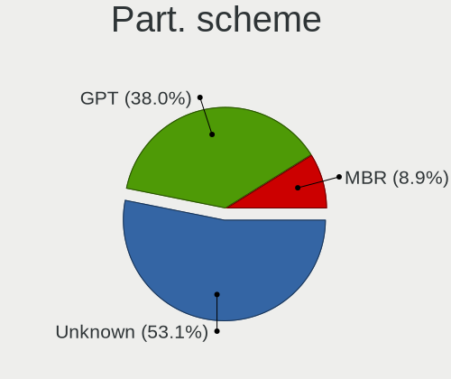
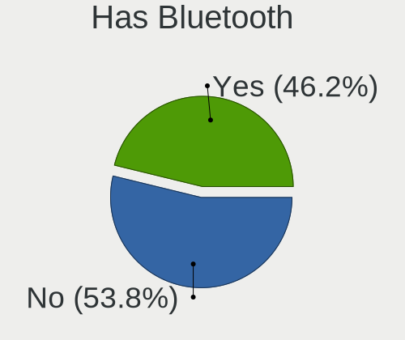
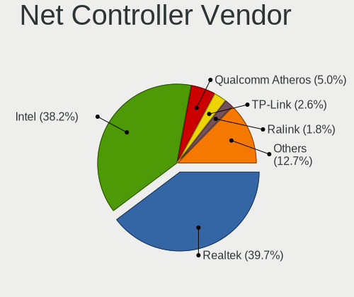
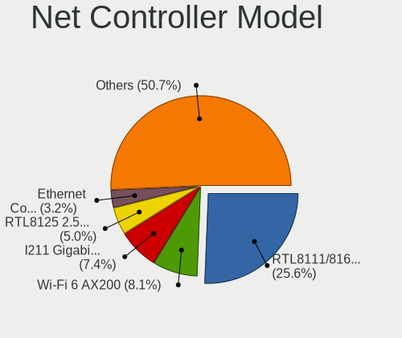

Fedora 35 - Tested Hardware & Statistics (Desktops)
---------------------------------------------------

A project to collect tested hardware configurations for Fedora 35.

Anyone can contribute to this report by the [hw-probe](https://github.com/linuxhw/hw-probe) tool:

    sudo -E hw-probe -all -upload

Please submit a probe of your configuration if it's not presented on the page or is rare.

Full-feature report is available here: https://linux-hardware.org/?view=trends&rel=fedora-35

Contents
--------

* [ Test Cases ](#test-cases)

* [ System ](#system)
  - [ Kernel                   ](#kernel)
  - [ Kernel Family            ](#kernel-family)
  - [ Kernel Major Ver.        ](#kernel-major-ver)
  - [ Arch                     ](#arch)
  - [ DE                       ](#de)
  - [ Display Server           ](#display-server)
  - [ Display Manager          ](#display-manager)
  - [ OS Lang                  ](#os-lang)
  - [ Boot Mode                ](#boot-mode)
  - [ Filesystem               ](#filesystem)
  - [ Part. scheme             ](#part-scheme)
  - [ Dual Boot with Linux/BSD ](#dual-boot-with-linuxbsd)
  - [ Dual Boot (Win)          ](#dual-boot-win)

* [ Board ](#board)
  - [ Vendor                   ](#vendor)
  - [ Model                    ](#model)
  - [ Model Family             ](#model-family)
  - [ MFG Year                 ](#mfg-year)
  - [ Form Factor              ](#form-factor)
  - [ Secure Boot              ](#secure-boot)
  - [ Coreboot                 ](#coreboot)
  - [ RAM Size                 ](#ram-size)
  - [ RAM Used                 ](#ram-used)
  - [ Total Drives             ](#total-drives)
  - [ Has CD-ROM               ](#has-cd-rom)
  - [ Has Ethernet             ](#has-ethernet)
  - [ Has WiFi                 ](#has-wifi)
  - [ Has Bluetooth            ](#has-bluetooth)

* [ Location ](#location)
  - [ Country                  ](#country)
  - [ City                     ](#city)

* [ Drives ](#drives)
  - [ Drive Vendor             ](#drive-vendor)
  - [ Drive Model              ](#drive-model)
  - [ HDD Vendor               ](#hdd-vendor)
  - [ SSD Vendor               ](#ssd-vendor)
  - [ Drive Kind               ](#drive-kind)
  - [ Drive Connector          ](#drive-connector)
  - [ Drive Size               ](#drive-size)
  - [ Space Total              ](#space-total)
  - [ Space Used               ](#space-used)
  - [ Malfunc. Drives          ](#malfunc-drives)
  - [ Malfunc. Drive Vendor    ](#malfunc-drive-vendor)
  - [ Malfunc. HDD Vendor      ](#malfunc-hdd-vendor)
  - [ Malfunc. Drive Kind      ](#malfunc-drive-kind)
  - [ Failed Drives            ](#failed-drives)
  - [ Failed Drive Vendor      ](#failed-drive-vendor)
  - [ Drive Status             ](#drive-status)

* [ Storage controller ](#storage-controller)
  - [ Storage Vendor           ](#storage-vendor)
  - [ Storage Model            ](#storage-model)
  - [ Storage Kind             ](#storage-kind)

* [ Processor ](#processor)
  - [ CPU Vendor               ](#cpu-vendor)
  - [ CPU Model                ](#cpu-model)
  - [ CPU Model Family         ](#cpu-model-family)
  - [ CPU Cores                ](#cpu-cores)
  - [ CPU Sockets              ](#cpu-sockets)
  - [ CPU Threads              ](#cpu-threads)
  - [ CPU Op-Modes             ](#cpu-op-modes)
  - [ CPU Microcode            ](#cpu-microcode)
  - [ CPU Microarch            ](#cpu-microarch)

* [ Graphics ](#graphics)
  - [ GPU Vendor               ](#gpu-vendor)
  - [ GPU Model                ](#gpu-model)
  - [ GPU Combo                ](#gpu-combo)
  - [ GPU Driver               ](#gpu-driver)
  - [ GPU Memory               ](#gpu-memory)

* [ Monitor ](#monitor)
  - [ Monitor Vendor           ](#monitor-vendor)
  - [ Monitor Model            ](#monitor-model)
  - [ Monitor Resolution       ](#monitor-resolution)
  - [ Monitor Diagonal         ](#monitor-diagonal)
  - [ Monitor Width            ](#monitor-width)
  - [ Aspect Ratio             ](#aspect-ratio)
  - [ Monitor Area             ](#monitor-area)
  - [ Pixel Density            ](#pixel-density)
  - [ Multiple Monitors        ](#multiple-monitors)

* [ Network ](#network)
  - [ Net Controller Vendor    ](#net-controller-vendor)
  - [ Net Controller Model     ](#net-controller-model)
  - [ Wireless Vendor          ](#wireless-vendor)
  - [ Wireless Model           ](#wireless-model)
  - [ Ethernet Vendor          ](#ethernet-vendor)
  - [ Ethernet Model           ](#ethernet-model)
  - [ Net Controller Kind      ](#net-controller-kind)
  - [ Used Controller          ](#used-controller)
  - [ NICs                     ](#nics)
  - [ IPv6                     ](#ipv6)

* [ Bluetooth ](#bluetooth)
  - [ Bluetooth Vendor         ](#bluetooth-vendor)
  - [ Bluetooth Model          ](#bluetooth-model)

* [ Sound ](#sound)
  - [ Sound Vendor             ](#sound-vendor)
  - [ Sound Model              ](#sound-model)

* [ Memory ](#memory)
  - [ Memory Vendor            ](#memory-vendor)
  - [ Memory Model             ](#memory-model)
  - [ Memory Kind              ](#memory-kind)
  - [ Memory Form Factor       ](#memory-form-factor)
  - [ Memory Size              ](#memory-size)
  - [ Memory Speed             ](#memory-speed)

* [ Printers & scanners ](#printers--scanners)
  - [ Printer Vendor           ](#printer-vendor)
  - [ Printer Model            ](#printer-model)
  - [ Scanner Vendor           ](#scanner-vendor)
  - [ Scanner Model            ](#scanner-model)

* [ Camera ](#camera)
  - [ Camera Vendor            ](#camera-vendor)
  - [ Camera Model             ](#camera-model)

* [ Security ](#security)
  - [ Fingerprint Vendor       ](#fingerprint-vendor)
  - [ Fingerprint Model        ](#fingerprint-model)
  - [ Chipcard Vendor          ](#chipcard-vendor)
  - [ Chipcard Model           ](#chipcard-model)

* [ Unsupported ](#unsupported)
  - [ Unsupported Devices      ](#unsupported-devices)
  - [ Unsupported Device Types ](#unsupported-device-types)

Test Cases
----------

| Vendor   | Model                   | Probe                                                      | Date         |
|----------|-------------------------|------------------------------------------------------------|--------------|
| ASUSTek  | ROG STRIX B360-I GAMING | [3875512e39](https://linux-hardware.org/?probe=3875512e39) | Sep 14, 2021 |
| ASUSTek  | ROG STRIX B360-I GAMING | [4fb9ed180b](https://linux-hardware.org/?probe=4fb9ed180b) | Sep 14, 2021 |
| Dell     | 0WMJ54 A01              | [3231b34d4d](https://linux-hardware.org/?probe=3231b34d4d) | Aug 24, 2021 |
| Dell     | 0WMJ54 A01              | [a94ad8a323](https://linux-hardware.org/?probe=a94ad8a323) | Aug 22, 2021 |
| HP       | 8055                    | [29f5b9a7ab](https://linux-hardware.org/?probe=29f5b9a7ab) | Aug 12, 2021 |
| Dell     | 0KC9NP A01              | [142e0703fb](https://linux-hardware.org/?probe=142e0703fb) | Aug 12, 2021 |
| Dell     | 0KC9NP A01              | [f48bc9ac9d](https://linux-hardware.org/?probe=f48bc9ac9d) | Aug 07, 2021 |
| ASUSTek  | Maximus V FORMULA       | [466ef3bd27](https://linux-hardware.org/?probe=466ef3bd27) | Jul 29, 2021 |
| Dell     | 0KC9NP A01              | [7dcd16d3fd](https://linux-hardware.org/?probe=7dcd16d3fd) | Jul 14, 2021 |
| Dell     | 0KC9NP A01              | [eedd464065](https://linux-hardware.org/?probe=eedd464065) | Jul 14, 2021 |
| Dell     | 0KC9NP A01              | [8d1e68aad0](https://linux-hardware.org/?probe=8d1e68aad0) | Jul 07, 2021 |
| Dell     | 0KC9NP A01              | [852a8a103d](https://linux-hardware.org/?probe=852a8a103d) | Jul 04, 2021 |
| Dell     | 0KC9NP A01              | [3a0ca9b90c](https://linux-hardware.org/?probe=3a0ca9b90c) | Jul 01, 2021 |
| Dell     | 0KC9NP A01              | [3ed1ee1f81](https://linux-hardware.org/?probe=3ed1ee1f81) | Jun 25, 2021 |
| Dell     | 0KC9NP A01              | [f611d9ec88](https://linux-hardware.org/?probe=f611d9ec88) | Jun 23, 2021 |
| ASUSTek  | Maximus V FORMULA       | [95ba18d5da](https://linux-hardware.org/?probe=95ba18d5da) | Jun 23, 2021 |
| Dell     | 0KC9NP A01              | [511e8019e0](https://linux-hardware.org/?probe=511e8019e0) | Jun 19, 2021 |
| Dell     | 0KC9NP A01              | [6687380bd7](https://linux-hardware.org/?probe=6687380bd7) | Jun 18, 2021 |
| Gigabyte | F2A88XN-WIFI            | [c22e6d8669](https://linux-hardware.org/?probe=c22e6d8669) | May 25, 2021 |
| ASUSTek  | Maximus V FORMULA       | [3e15dd7136](https://linux-hardware.org/?probe=3e15dd7136) | May 19, 2021 |
| ECS      | MCP61M-M3               | [2e5b21af19](https://linux-hardware.org/?probe=2e5b21af19) | Apr 17, 2021 |
| ASUSTek  | PRIME X570-PRO          | [3f7cbcea74](https://linux-hardware.org/?probe=3f7cbcea74) | Apr 14, 2021 |

System
------

Kernel
------

Version of the Linux kernel

| Version                                             | Desktops | Percent |
|-----------------------------------------------------|----------|---------|
| 5.12.0-0.rc7.189.fc35.x86_64                        | 2        | 18.18%  |
| 5.14.1-300.fc35.x86_64                              | 1        | 9.09%   |
| 5.14.0-0.rc6.46.fc35.x86_64                         | 1        | 9.09%   |
| 5.13.7-200.fc34.x86_64                              | 1        | 9.09%   |
| 5.13.0-58.fc35.x86_64                               | 1        | 9.09%   |
| 5.13.0-0.rc7.20210623git0c18f29aae7c.53.fc35.x86_64 | 1        | 9.09%   |
| 5.13.0-0.rc6.45.fc35.x86_64                         | 1        | 9.09%   |
| 5.13.0-0.rc2.20210521git79a106fc6585.22.fc35.x86_64 | 1        | 9.09%   |
| 5.13.0-0.rc2.19.fc35.x86_64                         | 1        | 9.09%   |
| 5.13.0-0.rc1.13.fc35.x86_64                         | 1        | 9.09%   |

Kernel Family
-------------

Linux kernel without a distro release

| Version | Desktops | Percent |
|---------|----------|---------|
| 5.13.0  | 3        | 37.5%   |
| 5.12.0  | 2        | 25%     |
| 5.14.1  | 1        | 12.5%   |
| 5.14.0  | 1        | 12.5%   |
| 5.13.7  | 1        | 12.5%   |

Kernel Major Ver.
-----------------

Linux kernel major version

| Version | Desktops | Percent |
|---------|----------|---------|
| 5.13    | 4        | 50%     |
| 5.14    | 2        | 25%     |
| 5.12    | 2        | 25%     |

Arch
----

OS architecture (x86_64, i586, etc.)

| Name   | Desktops | Percent |
|--------|----------|---------|
| x86_64 | 8        | 100%    |

DE
--

Desktop Environment

| Name    | Desktops | Percent |
|---------|----------|---------|
| GNOME   | 4        | 50%     |
| KDE     | 2        | 25%     |
| MATE    | 1        | 12.5%   |
| Unknown | 1        | 12.5%   |

Display Server
--------------

X11 or Wayland

| Name    | Desktops | Percent |
|---------|----------|---------|
| Wayland | 5        | 62.5%   |
| Tty     | 2        | 25%     |
| X11     | 1        | 12.5%   |

Display Manager
---------------

SDDM, LightDM, etc.

| Name    | Desktops | Percent |
|---------|----------|---------|
| Unknown | 4        | 50%     |
| GDM     | 3        | 37.5%   |
| LightDM | 1        | 12.5%   |

OS Lang
-------

Language

| Lang  | Desktops | Percent |
|-------|----------|---------|
| en_US | 5        | 62.5%   |
| es_CL | 1        | 12.5%   |
| en_GB | 1        | 12.5%   |
| en_CA | 1        | 12.5%   |

Boot Mode
---------

EFI or BIOS

| Mode | Desktops | Percent |
|------|----------|---------|
| EFI  | 7        | 87.5%   |
| BIOS | 1        | 12.5%   |

Filesystem
----------

Type of filesystem

| Type  | Desktops | Percent |
|-------|----------|---------|
| Btrfs | 4        | 50%     |
| Ext4  | 3        | 37.5%   |
| Xfs   | 1        | 12.5%   |

Part. scheme
------------

Scheme of partitioning

| Type    | Desktops | Percent |
|---------|----------|---------|
| GPT     | 5        | 55.56%  |
| Unknown | 3        | 33.33%  |
| MBR     | 1        | 11.11%  |

Dual Boot with Linux/BSD
------------------------

Hosting more than one Linux/BSD

| Dual boot | Desktops | Percent |
|-----------|----------|---------|
| No        | 6        | 66.67%  |
| Yes       | 3        | 33.33%  |

Dual Boot (Win)
---------------

Hosting Linux and Windows

| Dual boot | Desktops | Percent |
|-----------|----------|---------|
| No        | 6        | 66.67%  |
| Yes       | 3        | 33.33%  |

Board
-----

Vendor
------

Motherboard manufacturer

| Name                | Desktops | Percent |
|---------------------|----------|---------|
| ASUSTek Computer    | 3        | 37.5%   |
| Dell                | 2        | 25%     |
| Hewlett-Packard     | 1        | 12.5%   |
| Gigabyte Technology | 1        | 12.5%   |
| ECS                 | 1        | 12.5%   |

Model
-----

Motherboard model

| Name                         | Desktops | Percent |
|------------------------------|----------|---------|
| HP EliteDesk 800 G2 DM 35W   | 1        | 12.5%   |
| Gigabyte F2A88XN-WIFI        | 1        | 12.5%   |
| ECS MCP61M-M3                | 1        | 12.5%   |
| Dell OptiPlex 9020           | 1        | 12.5%   |
| Dell OptiPlex 3020           | 1        | 12.5%   |
| ASUS ROG STRIX B360-I GAMING | 1        | 12.5%   |
| ASUS PRIME X570-PRO          | 1        | 12.5%   |
| ASUS Maximus V FORMULA       | 1        | 12.5%   |

Model Family
------------

Motherboard model prefix

| Name                  | Desktops | Percent |
|-----------------------|----------|---------|
| Dell OptiPlex         | 2        | 25%     |
| HP EliteDesk          | 1        | 12.5%   |
| Gigabyte F2A88XN-WIFI | 1        | 12.5%   |
| ECS MCP61M-M3         | 1        | 12.5%   |
| ASUS ROG              | 1        | 12.5%   |
| ASUS PRIME            | 1        | 12.5%   |
| ASUS Maximus          | 1        | 12.5%   |

MFG Year
--------

Motherboard manufacture year

| Year | Desktops | Percent |
|------|----------|---------|
| 2018 | 2        | 25%     |
| 2015 | 2        | 25%     |
| 2020 | 1        | 12.5%   |
| 2019 | 1        | 12.5%   |
| 2013 | 1        | 12.5%   |
| 2010 | 1        | 12.5%   |

Form Factor
-----------

Physical design of the computer

| Name    | Desktops | Percent |
|---------|----------|---------|
| Desktop | 8        | 100%    |

Secure Boot
-----------

Enabled or disabled

| State    | Desktops | Percent |
|----------|----------|---------|
| Disabled | 7        | 87.5%   |
| Enabled  | 1        | 12.5%   |

Coreboot
--------

Have coreboot on board

| Used | Desktops | Percent |
|------|----------|---------|
| No   | 8        | 100%    |

RAM Size
--------

Total RAM memory

| Size in GB | Desktops | Percent |
|------------|----------|---------|
| 16.01-24.0 | 3        | 37.5%   |
| 8.01-16.0  | 2        | 25%     |
| 4.01-8.0   | 1        | 12.5%   |
| 32.01-64.0 | 1        | 12.5%   |
| 3.01-4.0   | 1        | 12.5%   |

RAM Used
--------

Used RAM memory

| Used GB  | Desktops | Percent |
|----------|----------|---------|
| 2.01-3.0 | 3        | 30%     |
| 3.01-4.0 | 2        | 20%     |
| 1.01-2.0 | 2        | 20%     |
| 4.01-8.0 | 1        | 10%     |
| 0.51-1.0 | 1        | 10%     |
| 0.01-0.5 | 1        | 10%     |

Total Drives
------------

Number of drives on board

| Drives | Desktops | Percent |
|--------|----------|---------|
| 1      | 4        | 50%     |
| 2      | 3        | 37.5%   |
| 4      | 1        | 12.5%   |

Has CD-ROM
----------

Has CD-ROM on board

| Presented | Desktops | Percent |
|-----------|----------|---------|
| No        | 5        | 62.5%   |
| Yes       | 3        | 37.5%   |

Has Ethernet
------------

Has Ethernet on board

| Presented | Desktops | Percent |
|-----------|----------|---------|
| Yes       | 8        | 100%    |

Has WiFi
--------

Has WiFi module

| Presented | Desktops | Percent |
|-----------|----------|---------|
| Yes       | 5        | 62.5%   |
| No        | 3        | 37.5%   |

Has Bluetooth
-------------

Has Bluetooth module

| Presented | Desktops | Percent |
|-----------|----------|---------|
| No        | 5        | 62.5%   |
| Yes       | 3        | 37.5%   |

Location
--------

Country
-------

Geographic location (country)

| Country     | Desktops | Percent |
|-------------|----------|---------|
| USA         | 3        | 37.5%   |
| Turkey      | 1        | 12.5%   |
| Switzerland | 1        | 12.5%   |
| Hong Kong   | 1        | 12.5%   |
| Chile       | 1        | 12.5%   |
| Canada      | 1        | 12.5%   |

City
----

Geographic location (city)

| City       | Desktops | Percent |
|------------|----------|---------|
| Zurich     | 1        | 12.5%   |
| Vancouver  | 1        | 12.5%   |
| Owatonna   | 1        | 12.5%   |
| Laurel     | 1        | 12.5%   |
| La Florida | 1        | 12.5%   |
| Kwu Tung   | 1        | 12.5%   |
| Istanbul   | 1        | 12.5%   |
| Atlanta    | 1        | 12.5%   |

Drives
------

Drive Vendor
------------

Hard drive vendors

| Vendor              | Desktops | Drives | Percent |
|---------------------|----------|--------|---------|
| Samsung Electronics | 5        | 9      | 41.67%  |
| WDC                 | 2        | 4      | 16.67%  |
| Seagate             | 2        | 7      | 16.67%  |
| Toshiba             | 1        | 1      | 8.33%   |
| SUNEAST             | 1        | 1      | 8.33%   |
| SABRENT             | 1        | 1      | 8.33%   |

Drive Model
-----------

Hard drive models

| Model                            | Desktops | Percent |
|----------------------------------|----------|---------|
| WDC WDS240G2G0A-00JH30 240GB SSD | 1        | 7.69%   |
| WDC WD30EZRX-00MMMB0 3TB         | 1        | 7.69%   |
| Toshiba MG05ACA800E 8TB          | 1        | 7.69%   |
| SUNEAST SSD SE800 256GB          | 1        | 7.69%   |
| Seagate ST3500630AS 500GB        | 1        | 7.69%   |
| Seagate ST3000DM001-1CH166 3TB   | 1        | 7.69%   |
| Seagate ST2000DM008-2FR102 2TB   | 1        | 7.69%   |
| Samsung SSD 970 EVO 500GB        | 1        | 7.69%   |
| Samsung SSD 860 EVO 250GB        | 1        | 7.69%   |
| Samsung SSD 860 EVO 1TB          | 1        | 7.69%   |
| Samsung SSD 840 EVO 250GB        | 1        | 7.69%   |
| Samsung NVMe SSD Drive 500GB     | 1        | 7.69%   |
| SABRENT ASM1153E 512GB           | 1        | 7.69%   |

HDD Vendor
----------

Hard disk drive vendors

| Vendor  | Desktops | Drives | Percent |
|---------|----------|--------|---------|
| Seagate | 2        | 7      | 50%     |
| WDC     | 1        | 3      | 25%     |
| Toshiba | 1        | 1      | 25%     |

SSD Vendor
----------

Solid state drive vendors

| Vendor              | Desktops | Drives | Percent |
|---------------------|----------|--------|---------|
| Samsung Electronics | 3        | 6      | 50%     |
| WDC                 | 1        | 1      | 16.67%  |
| SUNEAST             | 1        | 1      | 16.67%  |
| SABRENT             | 1        | 1      | 16.67%  |

Drive Kind
----------

HDD or SSD

| Kind | Desktops | Drives | Percent |
|------|----------|--------|---------|
| SSD  | 5        | 9      | 50%     |
| HDD  | 3        | 11     | 30%     |
| NVMe | 2        | 3      | 20%     |

Drive Connector
---------------

SATA, SAS, NVMe, etc.

| Type | Desktops | Drives | Percent |
|------|----------|--------|---------|
| SATA | 7        | 19     | 70%     |
| NVMe | 2        | 3      | 20%     |
| SAS  | 1        | 1      | 10%     |

Drive Size
----------

Size of hard drive

| Size in TB | Desktops | Drives | Percent |
|------------|----------|--------|---------|
| 0.01-0.5   | 4        | 10     | 44.44%  |
| 0.51-1.0   | 2        | 2      | 22.22%  |
| 2.01-3.0   | 1        | 6      | 11.11%  |
| 1.01-2.0   | 1        | 1      | 11.11%  |
| 4.01-10.0  | 1        | 1      | 11.11%  |

Space Total
-----------

Amount of disk space available on the file system

| Size in GB | Desktops | Percent |
|------------|----------|---------|
| 101-250    | 3        | 33.33%  |
| 251-500    | 1        | 11.11%  |
| 2001-3000  | 1        | 11.11%  |
| 1001-2000  | 1        | 11.11%  |
| 1-20       | 1        | 11.11%  |
| 501-1000   | 1        | 11.11%  |
| 51-100     | 1        | 11.11%  |

Space Used
----------

Amount of used disk space

| Used GB   | Desktops | Percent |
|-----------|----------|---------|
| 1-20      | 4        | 44.44%  |
| 251-500   | 2        | 22.22%  |
| 21-50     | 1        | 11.11%  |
| 1001-2000 | 1        | 11.11%  |
| 501-1000  | 1        | 11.11%  |

Malfunc. Drives
---------------

Drive models with a malfunction

| Model                     | Desktops | Drives | Percent |
|---------------------------|----------|--------|---------|
| WDC WD30EZRX-00MMMB0 3TB  | 1        | 1      | 50%     |
| Seagate ST3500630AS 500GB | 1        | 1      | 50%     |

Malfunc. Drive Vendor
---------------------

Vendors of faulty drives

| Vendor  | Desktops | Drives | Percent |
|---------|----------|--------|---------|
| WDC     | 1        | 1      | 50%     |
| Seagate | 1        | 1      | 50%     |

Malfunc. HDD Vendor
-------------------

Vendors of faulty HDD drives

| Vendor  | Desktops | Drives | Percent |
|---------|----------|--------|---------|
| WDC     | 1        | 1      | 50%     |
| Seagate | 1        | 1      | 50%     |

Malfunc. Drive Kind
-------------------

Kinds of faulty drives

| Kind | Desktops | Drives | Percent |
|------|----------|--------|---------|
| HDD  | 1        | 2      | 100%    |

Failed Drives
-------------

Failed drive models

Zero info for selected period =(

Failed Drive Vendor
-------------------

Failed drive vendors

Zero info for selected period =(

Drive Status
------------

Number of failed and malfunc. drives

| Status   | Desktops | Drives | Percent |
|----------|----------|--------|---------|
| Works    | 6        | 9      | 54.55%  |
| Detected | 4        | 12     | 36.36%  |
| Malfunc  | 1        | 2      | 9.09%   |

Storage controller
------------------

Storage Vendor
--------------

Storage controller vendors

| Vendor              | Desktops | Percent |
|---------------------|----------|---------|
| Intel               | 5        | 45.45%  |
| Samsung Electronics | 2        | 18.18%  |
| AMD                 | 2        | 18.18%  |
| Nvidia              | 1        | 9.09%   |
| ASMedia Technology  | 1        | 9.09%   |

Storage Model
-------------

Storage controller models

| Model                                                                          | Desktops | Percent |
|--------------------------------------------------------------------------------|----------|---------|
| Samsung NVMe SSD Controller SM981/PM981/PM983                                  | 2        | 16.67%  |
| Intel 8 Series/C220 Series Chipset Family 6-port SATA Controller 1 [AHCI mode] | 2        | 16.67%  |
| AMD FCH SATA Controller [AHCI mode]                                            | 2        | 16.67%  |
| Nvidia MCP61 SATA Controller                                                   | 1        | 8.33%   |
| Nvidia MCP61 IDE                                                               | 1        | 8.33%   |
| Intel Q170/Q150/B150/H170/H110/Z170/CM236 Chipset SATA Controller [AHCI Mode]  | 1        | 8.33%   |
| Intel Cannon Lake PCH SATA AHCI Controller                                     | 1        | 8.33%   |
| Intel 7 Series/C210 Series Chipset Family 6-port SATA Controller [AHCI mode]   | 1        | 8.33%   |
| ASMedia ASM1062 Serial ATA Controller                                          | 1        | 8.33%   |

Storage Kind
------------

Kind of storage controller (IDE, SATA, NVMe, SAS, ...)

| Kind | Desktops | Percent |
|------|----------|---------|
| SATA | 7        | 70%     |
| NVMe | 2        | 20%     |
| IDE  | 1        | 10%     |

Processor
---------

CPU Vendor
----------

Processor vendors

| Vendor | Desktops | Percent |
|--------|----------|---------|
| Intel  | 5        | 62.5%   |
| AMD    | 3        | 37.5%   |

CPU Model
---------

Processor models

| Model                                           | Desktops | Percent |
|-------------------------------------------------|----------|---------|
| Intel Core i7-8700 CPU @ 3.20GHz                | 1        | 12.5%   |
| Intel Core i7-3770K CPU @ 3.50GHz               | 1        | 12.5%   |
| Intel Core i5-6500T CPU @ 2.50GHz               | 1        | 12.5%   |
| Intel Core i5-4590S CPU @ 3.00GHz               | 1        | 12.5%   |
| Intel Core i5-4590 CPU @ 3.30GHz                | 1        | 12.5%   |
| AMD Ryzen 5 3600 6-Core Processor               | 1        | 12.5%   |
| AMD Athlon II X2 250 Processor                  | 1        | 12.5%   |
| AMD A10-7850K Radeon R7, 12 Compute Cores 4C+8G | 1        | 12.5%   |

CPU Model Family
----------------

Processor model prefix

| Model            | Desktops | Percent |
|------------------|----------|---------|
| Intel Core i5    | 3        | 37.5%   |
| Intel Core i7    | 2        | 25%     |
| AMD Ryzen 5      | 1        | 12.5%   |
| AMD Athlon II X2 | 1        | 12.5%   |
| AMD A10          | 1        | 12.5%   |

CPU Cores
---------

Number of processor cores

| Number | Desktops | Percent |
|--------|----------|---------|
| 4      | 4        | 50%     |
| 6      | 2        | 25%     |
| 2      | 2        | 25%     |

CPU Sockets
-----------

Number of sockets

| Number | Desktops | Percent |
|--------|----------|---------|
| 1      | 8        | 100%    |

CPU Threads
-----------

Threads per core (Hyper-Threading)

| Number | Desktops | Percent |
|--------|----------|---------|
| 2      | 4        | 50%     |
| 1      | 4        | 50%     |

CPU Op-Modes
------------

CPU Operation Modes (32-bit, 64-bit)

| Op mode        | Desktops | Percent |
|----------------|----------|---------|
| 32-bit, 64-bit | 8        | 100%    |

CPU Microcode
-------------

Microcode number

| Number     | Desktops | Percent |
|------------|----------|---------|
| 0x306c3    | 2        | 25%     |
| 0x906ea    | 1        | 12.5%   |
| 0x506e3    | 1        | 12.5%   |
| 0x306a9    | 1        | 12.5%   |
| 0x08701021 | 1        | 12.5%   |
| 0x06003106 | 1        | 12.5%   |
| 0x010000b6 | 1        | 12.5%   |

CPU Microarch
-------------

Microarchitecture

| Name        | Desktops | Percent |
|-------------|----------|---------|
| Haswell     | 2        | 25%     |
| Zen 2       | 1        | 12.5%   |
| Steamroller | 1        | 12.5%   |
| Skylake     | 1        | 12.5%   |
| KabyLake    | 1        | 12.5%   |
| K10         | 1        | 12.5%   |
| IvyBridge   | 1        | 12.5%   |

Graphics
--------

GPU Vendor
----------

Vendors of graphics cards

| Vendor | Desktops | Percent |
|--------|----------|---------|
| Intel  | 4        | 44.44%  |
| AMD    | 3        | 33.33%  |
| Nvidia | 2        | 22.22%  |

GPU Model
---------

Graphics card models

| Model                                                                       | Desktops | Percent |
|-----------------------------------------------------------------------------|----------|---------|
| Intel Xeon E3-1200 v3/4th Gen Core Processor Integrated Graphics Controller | 2        | 22.22%  |
| Nvidia TU106 [GeForce RTX 2070 Rev. A]                                      | 1        | 11.11%  |
| Nvidia GK104 [GeForce GTX 670]                                              | 1        | 11.11%  |
| Intel Xeon E3-1200 v2/3rd Gen Core processor Graphics Controller            | 1        | 11.11%  |
| Intel HD Graphics 530                                                       | 1        | 11.11%  |
| AMD Turks PRO [Radeon HD 6570/7570/8550 / R5 230]                           | 1        | 11.11%  |
| AMD Kaveri [Radeon R7 Graphics]                                             | 1        | 11.11%  |
| AMD Baffin [Radeon RX 550 640SP / RX 560/560X]                              | 1        | 11.11%  |

GPU Combo
---------

Combinations of graphics cards

| Name       | Desktops | Percent |
|------------|----------|---------|
| 1 x Intel  | 3        | 37.5%   |
| 1 x AMD    | 3        | 37.5%   |
| 1 x Nvidia | 2        | 25%     |

GPU Driver
----------

Free vs proprietary

| Driver      | Desktops | Percent |
|-------------|----------|---------|
| Free        | 6        | 75%     |
| Proprietary | 2        | 25%     |

GPU Memory
----------

Total video memory

| Size in GB | Desktops | Percent |
|------------|----------|---------|
| Unknown    | 5        | 55.56%  |
| 3.01-4.0   | 1        | 11.11%  |
| 1.01-2.0   | 1        | 11.11%  |
| 0.51-1.0   | 1        | 11.11%  |
| 0.01-0.5   | 1        | 11.11%  |

Monitor
-------

Monitor Vendor
--------------

Monitor vendors

| Vendor               | Desktops | Percent |
|----------------------|----------|---------|
| AOC                  | 2        | 40%     |
| Hewlett-Packard      | 1        | 20%     |
| Dell                 | 1        | 20%     |
| Ancor Communications | 1        | 20%     |

Monitor Model
-------------

Monitor models

| Model                                                                  | Desktops | Percent |
|------------------------------------------------------------------------|----------|---------|
| Hewlett-Packard ZR2740w HWP2957 2560x1440 597x336mm 27.0-inch          | 1        | 20%     |
| Dell AW2518HF DELA102 1920x1080 544x303mm 24.5-inch                    | 1        | 20%     |
| AOC LE22H037 AOC2207 1920x1080 480x270mm 21.7-inch                     | 1        | 20%     |
| AOC 2220W AOC2220 1920x1080 477x268mm 21.5-inch                        | 1        | 20%     |
| Ancor Communications ASUS VW266H ACI26A4 1920x1200 550x340mm 25.5-inch | 1        | 20%     |

Monitor Resolution
------------------

Monitor screen resolution

| Resolution        | Desktops | Percent |
|-------------------|----------|---------|
| 1920x1080 (FHD)   | 3        | 60%     |
| 2560x1440 (QHD)   | 1        | 20%     |
| 1920x1200 (WUXGA) | 1        | 20%     |

Monitor Diagonal
----------------

Diagonal size in inches

| Inches | Desktops | Percent |
|--------|----------|---------|
| 21     | 2        | 40%     |
| 27     | 1        | 20%     |
| 25     | 1        | 20%     |
| 24     | 1        | 20%     |

Monitor Width
-------------

Physical width

| Width in mm | Desktops | Percent |
|-------------|----------|---------|
| 501-600     | 3        | 60%     |
| 401-500     | 2        | 40%     |

Aspect Ratio
------------

Proportional relationship between the width and the height

| Ratio | Desktops | Percent |
|-------|----------|---------|
| 16/9  | 4        | 80%     |
| 16/10 | 1        | 20%     |

Monitor Area
------------

Area in inch²

| Area in inch² | Desktops | Percent |
|----------------|----------|---------|
| 251-300        | 2        | 40%     |
| 301-350        | 1        | 20%     |
| 201-250        | 1        | 20%     |
| 151-200        | 1        | 20%     |

Pixel Density
-------------

Pixels per inch

| Density | Desktops | Percent |
|---------|----------|---------|
| 101-120 | 3        | 60%     |
| 51-100  | 2        | 40%     |

Multiple Monitors
-----------------

Total monitors connected

| Total | Desktops | Percent |
|-------|----------|---------|
| 1     | 7        | 87.5%   |
| 0     | 1        | 12.5%   |

Network
-------

Net Controller Vendor
---------------------

Controller vendors

| Vendor                | Desktops | Percent |
|-----------------------|----------|---------|
| Intel                 | 6        | 50%     |
| Realtek Semiconductor | 2        | 16.67%  |
| TP-Link               | 1        | 8.33%   |
| Ralink Technology     | 1        | 8.33%   |
| Nvidia                | 1        | 8.33%   |
| Broadcom              | 1        | 8.33%   |

Net Controller Model
--------------------

Controller models

| Model                                                             | Desktops | Percent |
|-------------------------------------------------------------------|----------|---------|
| Realtek RTL8111/8168/8411 PCI Express Gigabit Ethernet Controller | 2        | 15.38%  |
| TP-Link TL-WN823N v2/v3 [Realtek RTL8192EU]                       | 1        | 7.69%   |
| Ralink RT5370 Wireless Adapter                                    | 1        | 7.69%   |
| Nvidia MCP61 Ethernet                                             | 1        | 7.69%   |
| Intel I211 Gigabit Network Connection                             | 1        | 7.69%   |
| Intel Ethernet Connection I217-LM                                 | 1        | 7.69%   |
| Intel Ethernet Connection (7) I219-V                              | 1        | 7.69%   |
| Intel Ethernet Connection (2) I219-LM                             | 1        | 7.69%   |
| Intel Centrino Wireless-N 1030 [Rainbow Peak]                     | 1        | 7.69%   |
| Intel Cannon Lake PCH CNVi WiFi                                   | 1        | 7.69%   |
| Intel 82579V Gigabit Network Connection                           | 1        | 7.69%   |
| Broadcom BCM43228 802.11a/b/g/n                                   | 1        | 7.69%   |

Wireless Vendor
---------------

Wireless vendors

| Vendor            | Desktops | Percent |
|-------------------|----------|---------|
| Intel             | 2        | 40%     |
| TP-Link           | 1        | 20%     |
| Ralink Technology | 1        | 20%     |
| Broadcom          | 1        | 20%     |

Wireless Model
--------------

Wireless models

| Model                                         | Desktops | Percent |
|-----------------------------------------------|----------|---------|
| TP-Link TL-WN823N v2/v3 [Realtek RTL8192EU]   | 1        | 20%     |
| Ralink RT5370 Wireless Adapter                | 1        | 20%     |
| Intel Centrino Wireless-N 1030 [Rainbow Peak] | 1        | 20%     |
| Intel Cannon Lake PCH CNVi WiFi               | 1        | 20%     |
| Broadcom BCM43228 802.11a/b/g/n               | 1        | 20%     |

Ethernet Vendor
---------------

Ethernet vendors

| Vendor                | Desktops | Percent |
|-----------------------|----------|---------|
| Intel                 | 5        | 62.5%   |
| Realtek Semiconductor | 2        | 25%     |
| Nvidia                | 1        | 12.5%   |

Ethernet Model
--------------

Ethernet models

| Model                                                             | Desktops | Percent |
|-------------------------------------------------------------------|----------|---------|
| Realtek RTL8111/8168/8411 PCI Express Gigabit Ethernet Controller | 2        | 25%     |
| Nvidia MCP61 Ethernet                                             | 1        | 12.5%   |
| Intel I211 Gigabit Network Connection                             | 1        | 12.5%   |
| Intel Ethernet Connection I217-LM                                 | 1        | 12.5%   |
| Intel Ethernet Connection (7) I219-V                              | 1        | 12.5%   |
| Intel Ethernet Connection (2) I219-LM                             | 1        | 12.5%   |
| Intel 82579V Gigabit Network Connection                           | 1        | 12.5%   |

Net Controller Kind
-------------------

Ethernet, WiFi or modem

| Kind     | Desktops | Percent |
|----------|----------|---------|
| Ethernet | 8        | 61.54%  |
| WiFi     | 5        | 38.46%  |

Used Controller
---------------

Currently used network controller

| Kind     | Desktops | Percent |
|----------|----------|---------|
| Ethernet | 7        | 70%     |
| WiFi     | 3        | 30%     |

NICs
----

Total network controllers on board

| Total | Desktops | Percent |
|-------|----------|---------|
| 1     | 5        | 62.5%   |
| 2     | 3        | 37.5%   |

IPv6
----

IPv6 vs IPv4

| Used | Desktops | Percent |
|------|----------|---------|
| Yes  | 4        | 50%     |
| No   | 4        | 50%     |

Bluetooth
---------

Bluetooth Vendor
----------------

Controller vendors

| Vendor                  | Desktops | Percent |
|-------------------------|----------|---------|
| Intel                   | 2        | 50%     |
| Cambridge Silicon Radio | 1        | 25%     |
| ASUSTek Computer        | 1        | 25%     |

Bluetooth Model
---------------

Controller models

| Model                                               | Desktops | Percent |
|-----------------------------------------------------|----------|---------|
| Intel Bluetooth Device                              | 1        | 25%     |
| Intel Bluetooth 9460/9560 Jefferson Peak (JfP)      | 1        | 25%     |
| Cambridge Silicon Radio Bluetooth Dongle (HCI mode) | 1        | 25%     |
| ASUS BCM20702A0                                     | 1        | 25%     |

Sound
-----

Sound Vendor
------------

Sound card vendors

| Vendor              | Desktops | Percent |
|---------------------|----------|---------|
| Intel               | 5        | 41.67%  |
| Nvidia              | 3        | 25%     |
| AMD                 | 3        | 25%     |
| C-Media Electronics | 1        | 8.33%   |

Sound Model
-----------

Sound card models

| Model                                                               | Desktops | Percent |
|---------------------------------------------------------------------|----------|---------|
| Intel Xeon E3-1200 v3/4th Gen Core Processor HD Audio Controller    | 2        | 12.5%   |
| Intel 8 Series/C220 Series Chipset High Definition Audio Controller | 2        | 12.5%   |
| Nvidia TU106 High Definition Audio Controller                       | 1        | 6.25%   |
| Nvidia MCP61 High Definition Audio                                  | 1        | 6.25%   |
| Nvidia GK104 HDMI Audio Controller                                  | 1        | 6.25%   |
| Intel Cannon Lake PCH cAVS                                          | 1        | 6.25%   |
| Intel 7 Series/C216 Chipset Family High Definition Audio Controller | 1        | 6.25%   |
| Intel 100 Series/C230 Series Chipset Family HD Audio Controller     | 1        | 6.25%   |
| C-Media Electronics Audio Adapter                                   | 1        | 6.25%   |
| AMD Turks HDMI Audio [Radeon HD 6500/6600 / 6700M Series]           | 1        | 6.25%   |
| AMD Starship/Matisse HD Audio Controller                            | 1        | 6.25%   |
| AMD Kaveri HDMI/DP Audio Controller                                 | 1        | 6.25%   |
| AMD FCH Azalia Controller                                           | 1        | 6.25%   |
| AMD Baffin HDMI/DP Audio [Radeon RX 550 640SP / RX 560/560X]        | 1        | 6.25%   |

Memory
------

Memory Vendor
-------------

Memory module vendors

| Vendor              | Desktops | Percent |
|---------------------|----------|---------|
| Corsair             | 3        | 42.86%  |
| Samsung Electronics | 2        | 28.57%  |
| Micron Technology   | 1        | 14.29%  |
| Crucial             | 1        | 14.29%  |

Memory Model
------------

Memory module models

| Model                                                    | Desktops | Percent |
|----------------------------------------------------------|----------|---------|
| Samsung RAM Module 8GB SODIMM DDR4 2133MT/s              | 1        | 12.5%   |
| Samsung RAM M378B1G73QH0-CK0 8192MB DIMM DDR3 1600MT/s   | 1        | 12.5%   |
| Micron RAM 8KTF51264AZ-1G6E1 4GB DIMM DDR3 1600MT/s      | 1        | 12.5%   |
| Crucial RAM CT8G4SFS824A.C8FBR1 8GB SODIMM DDR4 2400MT/s | 1        | 12.5%   |
| Corsair RAM VS2GB1333D4 2048MB DIMM DDR3 1600MT/s        | 1        | 12.5%   |
| Corsair RAM VS2GB1333D3 2048MB DIMM DDR3 1333MT/s        | 1        | 12.5%   |
| Corsair RAM CMZ32GX3M4X1866C10 8GB DIMM DDR3 1333MT/s    | 1        | 12.5%   |
| Corsair RAM CMK16GX4M2A2666C16 8GB DIMM DDR4 3200MT/s    | 1        | 12.5%   |

Memory Kind
-----------

Memory module kinds

| Kind | Desktops | Percent |
|------|----------|---------|
| DDR3 | 4        | 66.67%  |
| DDR4 | 2        | 33.33%  |

Memory Form Factor
------------------

Physical design of the memory module

| Name   | Desktops | Percent |
|--------|----------|---------|
| DIMM   | 5        | 83.33%  |
| SODIMM | 1        | 16.67%  |

Memory Size
-----------

Memory module size

| Size | Desktops | Percent |
|------|----------|---------|
| 8192 | 4        | 57.14%  |
| 4096 | 2        | 28.57%  |
| 2048 | 1        | 14.29%  |

Memory Speed
------------

Memory module speed

| Speed | Desktops | Percent |
|-------|----------|---------|
| 1600  | 3        | 37.5%   |
| 1333  | 2        | 25%     |
| 3200  | 1        | 12.5%   |
| 2400  | 1        | 12.5%   |
| 2133  | 1        | 12.5%   |

Printers & scanners
-------------------

Printer Vendor
--------------

Printer device vendors

Zero info for selected period =(

Printer Model
-------------

Printer device models

Zero info for selected period =(

Scanner Vendor
--------------

Scanner device vendors

Zero info for selected period =(

Scanner Model
-------------

Scanner device models

Zero info for selected period =(

Camera
------

Camera Vendor
-------------

Camera device vendors

| Vendor   | Desktops | Percent |
|----------|----------|---------|
| Logitech | 2        | 100%    |

Camera Model
------------

Camera device models

| Model                       | Desktops | Percent |
|-----------------------------|----------|---------|
| Logitech QuickCam Pro 9000  | 1        | 50%     |
| Logitech HD Pro Webcam C920 | 1        | 50%     |

Security
--------

Fingerprint Vendor
------------------

Fingerprint sensor vendors

Zero info for selected period =(

Fingerprint Model
-----------------

Fingerprint sensor models

Zero info for selected period =(

Chipcard Vendor
---------------

Chipcard module vendors

Zero info for selected period =(

Chipcard Model
--------------

Chipcard module models

Zero info for selected period =(

Unsupported
-----------

Unsupported Devices
-------------------

Total unsupported devices on board

| Total | Desktops | Percent |
|-------|----------|---------|
| 0     | 8        | 100%    |

Unsupported Device Types
------------------------

Types of unsupported devices

Zero info for selected period =(

