Fedora 35 - Tested Hardware & Statistics (Notebooks)
----------------------------------------------------

A project to collect tested hardware configurations for Fedora 35.

Anyone can contribute to this report by the [hw-probe](https://github.com/linuxhw/hw-probe) tool:

    sudo -E hw-probe -all -upload

Please contribute! Especially if your hardware is rare.

Contents
--------

* [ Test Cases ](#test-cases)

* [ System ](#system)
  - [ Kernel                   ](#kernel)
  - [ Kernel Family            ](#kernel-family)
  - [ Kernel Major Ver.        ](#kernel-major-ver)
  - [ Arch                     ](#arch)
  - [ DE                       ](#de)
  - [ Display Server           ](#display-server)
  - [ Display Manager          ](#display-manager)
  - [ OS Lang                  ](#os-lang)
  - [ Boot Mode                ](#boot-mode)
  - [ Filesystem               ](#filesystem)
  - [ Part. scheme             ](#part-scheme)
  - [ Dual Boot with Linux/BSD ](#dual-boot-with-linuxbsd)
  - [ Dual Boot (Win)          ](#dual-boot-win)

* [ Board ](#board)
  - [ Vendor                   ](#vendor)
  - [ Model                    ](#model)
  - [ Model Family             ](#model-family)
  - [ MFG Year                 ](#mfg-year)
  - [ Form Factor              ](#form-factor)
  - [ Secure Boot              ](#secure-boot)
  - [ Coreboot                 ](#coreboot)
  - [ RAM Size                 ](#ram-size)
  - [ RAM Used                 ](#ram-used)
  - [ Total Drives             ](#total-drives)
  - [ Has CD-ROM               ](#has-cd-rom)
  - [ Has Ethernet             ](#has-ethernet)
  - [ Has WiFi                 ](#has-wifi)
  - [ Has Bluetooth            ](#has-bluetooth)

* [ Location ](#location)
  - [ Country                  ](#country)
  - [ City                     ](#city)

* [ Drives ](#drives)
  - [ Drive Vendor             ](#drive-vendor)
  - [ Drive Model              ](#drive-model)
  - [ HDD Vendor               ](#hdd-vendor)
  - [ SSD Vendor               ](#ssd-vendor)
  - [ Drive Kind               ](#drive-kind)
  - [ Drive Connector          ](#drive-connector)
  - [ Drive Size               ](#drive-size)
  - [ Space Total              ](#space-total)
  - [ Space Used               ](#space-used)
  - [ Malfunc. Drives          ](#malfunc-drives)
  - [ Malfunc. Drive Vendor    ](#malfunc-drive-vendor)
  - [ Malfunc. HDD Vendor      ](#malfunc-hdd-vendor)
  - [ Malfunc. Drive Kind      ](#malfunc-drive-kind)
  - [ Failed Drives            ](#failed-drives)
  - [ Failed Drive Vendor      ](#failed-drive-vendor)
  - [ Drive Status             ](#drive-status)

* [ Storage controller ](#storage-controller)
  - [ Storage Vendor           ](#storage-vendor)
  - [ Storage Model            ](#storage-model)
  - [ Storage Kind             ](#storage-kind)

* [ Processor ](#processor)
  - [ CPU Vendor               ](#cpu-vendor)
  - [ CPU Model                ](#cpu-model)
  - [ CPU Model Family         ](#cpu-model-family)
  - [ CPU Cores                ](#cpu-cores)
  - [ CPU Sockets              ](#cpu-sockets)
  - [ CPU Threads              ](#cpu-threads)
  - [ CPU Op-Modes             ](#cpu-op-modes)
  - [ CPU Microcode            ](#cpu-microcode)
  - [ CPU Microarch            ](#cpu-microarch)

* [ Graphics ](#graphics)
  - [ GPU Vendor               ](#gpu-vendor)
  - [ GPU Model                ](#gpu-model)
  - [ GPU Combo                ](#gpu-combo)
  - [ GPU Driver               ](#gpu-driver)
  - [ GPU Memory               ](#gpu-memory)

* [ Monitor ](#monitor)
  - [ Monitor Vendor           ](#monitor-vendor)
  - [ Monitor Model            ](#monitor-model)
  - [ Monitor Resolution       ](#monitor-resolution)
  - [ Monitor Diagonal         ](#monitor-diagonal)
  - [ Monitor Width            ](#monitor-width)
  - [ Aspect Ratio             ](#aspect-ratio)
  - [ Monitor Area             ](#monitor-area)
  - [ Pixel Density            ](#pixel-density)
  - [ Multiple Monitors        ](#multiple-monitors)

* [ Network ](#network)
  - [ Net Controller Vendor    ](#net-controller-vendor)
  - [ Net Controller Model     ](#net-controller-model)
  - [ Wireless Vendor          ](#wireless-vendor)
  - [ Wireless Model           ](#wireless-model)
  - [ Ethernet Vendor          ](#ethernet-vendor)
  - [ Ethernet Model           ](#ethernet-model)
  - [ Net Controller Kind      ](#net-controller-kind)
  - [ Used Controller          ](#used-controller)
  - [ NICs                     ](#nics)
  - [ IPv6                     ](#ipv6)

* [ Bluetooth ](#bluetooth)
  - [ Bluetooth Vendor         ](#bluetooth-vendor)
  - [ Bluetooth Model          ](#bluetooth-model)

* [ Sound ](#sound)
  - [ Sound Vendor             ](#sound-vendor)
  - [ Sound Model              ](#sound-model)

* [ Memory ](#memory)
  - [ Memory Vendor            ](#memory-vendor)
  - [ Memory Model             ](#memory-model)
  - [ Memory Kind              ](#memory-kind)
  - [ Memory Form Factor       ](#memory-form-factor)
  - [ Memory Size              ](#memory-size)
  - [ Memory Speed             ](#memory-speed)

* [ Printers & scanners ](#printers--scanners)
  - [ Printer Vendor           ](#printer-vendor)
  - [ Printer Model            ](#printer-model)
  - [ Scanner Vendor           ](#scanner-vendor)
  - [ Scanner Model            ](#scanner-model)

* [ Camera ](#camera)
  - [ Camera Vendor            ](#camera-vendor)
  - [ Camera Model             ](#camera-model)

* [ Security ](#security)
  - [ Fingerprint Vendor       ](#fingerprint-vendor)
  - [ Fingerprint Model        ](#fingerprint-model)
  - [ Chipcard Vendor          ](#chipcard-vendor)
  - [ Chipcard Model           ](#chipcard-model)

* [ Unsupported ](#unsupported)
  - [ Unsupported Devices      ](#unsupported-devices)
  - [ Unsupported Device Types ](#unsupported-device-types)

Test Cases
----------

Total: 1275

| Vendor        | Model                       | Probe                                                      | Date         |
|---------------|-----------------------------|------------------------------------------------------------|--------------|
| Dell          | Latitude 5521               | [6fcbfd9271](https://linux-hardware.org/?probe=6fcbfd9271) | Dec 21, 2022 |
| HP            | OMEN by Laptop 16-c0xxx     | [5e8318b8b8](https://linux-hardware.org/?probe=5e8318b8b8) | Dec 15, 2022 |
| HP            | OMEN by Laptop 16-c0xxx     | [d5c9abda1e](https://linux-hardware.org/?probe=d5c9abda1e) | Dec 15, 2022 |
| Apple         | MacBookPro9,2               | [695b0b0356](https://linux-hardware.org/?probe=695b0b0356) | Nov 11, 2022 |
| Dell          | XPS 13 9300                 | [af6fa726d1](https://linux-hardware.org/?probe=af6fa726d1) | Nov 09, 2022 |
| Lenovo        | ThinkPad E14 Gen 2 20TA0... | [c62cbe8eb5](https://linux-hardware.org/?probe=c62cbe8eb5) | Nov 08, 2022 |
| Acer          | Aspire VN7-591G             | [541d3bfeca](https://linux-hardware.org/?probe=541d3bfeca) | Nov 07, 2022 |
| HP            | ProBook 430 G5              | [e362ce5bdf](https://linux-hardware.org/?probe=e362ce5bdf) | Nov 07, 2022 |
| ASUSTek       | Unknown                     | [f1a58eaa87](https://linux-hardware.org/?probe=f1a58eaa87) | Nov 04, 2022 |
| HP            | Laptop 14s-dr1xxx           | [00d04b6a56](https://linux-hardware.org/?probe=00d04b6a56) | Oct 07, 2022 |
| Lenovo        | IdeaPad C340-14API 81N6     | [01cf3c6f99](https://linux-hardware.org/?probe=01cf3c6f99) | Sep 26, 2022 |
| Lenovo        | ThinkPad T420 4236C53       | [e0983b35fa](https://linux-hardware.org/?probe=e0983b35fa) | Sep 25, 2022 |
| HP            | Pavilion 17                 | [0f7eec1f7a](https://linux-hardware.org/?probe=0f7eec1f7a) | Sep 21, 2022 |
| HUAWEI        | WRT-WX9                     | [4c8883345d](https://linux-hardware.org/?probe=4c8883345d) | Sep 19, 2022 |
| Lenovo        | G580 20150                  | [fe325d1046](https://linux-hardware.org/?probe=fe325d1046) | Sep 18, 2022 |
| Lenovo        | ThinkPad X1 Nano Gen 1 2... | [930ee68921](https://linux-hardware.org/?probe=930ee68921) | Sep 14, 2022 |
| Notebook      | NJ5x_NJ7xLU                 | [1cadc455a1](https://linux-hardware.org/?probe=1cadc455a1) | Sep 05, 2022 |
| HP            | Victus by Laptop 16-d0xx... | [5730a9015f](https://linux-hardware.org/?probe=5730a9015f) | Sep 02, 2022 |
| ASUSTek       | K401UQK                     | [4f026584d7](https://linux-hardware.org/?probe=4f026584d7) | Aug 31, 2022 |
| Acer          | TMP453-MG                   | [63efab9aef](https://linux-hardware.org/?probe=63efab9aef) | Aug 30, 2022 |
| HP            | ENVY 15                     | [db06c354d4](https://linux-hardware.org/?probe=db06c354d4) | Aug 26, 2022 |
| HUAWEI        | BOD-WXX9                    | [fd6ff49314](https://linux-hardware.org/?probe=fd6ff49314) | Aug 24, 2022 |
| Toshiba       | Satellite C55-C             | [99faef3f00](https://linux-hardware.org/?probe=99faef3f00) | Aug 20, 2022 |
| Lenovo        | ThinkPad X230 2306CTO       | [1bde57f974](https://linux-hardware.org/?probe=1bde57f974) | Aug 18, 2022 |
| Itautec       | Infoway W7425               | [64b3153e8a](https://linux-hardware.org/?probe=64b3153e8a) | Aug 15, 2022 |
| Samsung       | 355V4C/355V4X/355V5C/355... | [03089b1469](https://linux-hardware.org/?probe=03089b1469) | Aug 13, 2022 |
| Dell          | Latitude 5511               | [69ebaebf95](https://linux-hardware.org/?probe=69ebaebf95) | Aug 11, 2022 |
| ASUSTek       | VivoBook_ASUSLaptop X512... | [5eec4d3ccf](https://linux-hardware.org/?probe=5eec4d3ccf) | Aug 10, 2022 |
| Toshiba       | Satellite C55-C             | [992b4f4910](https://linux-hardware.org/?probe=992b4f4910) | Aug 06, 2022 |
| HP            | Laptop 15-db0xxx            | [ec7e5864c2](https://linux-hardware.org/?probe=ec7e5864c2) | Aug 02, 2022 |
| Dell          | XPS 13 7390                 | [2aedd7bad4](https://linux-hardware.org/?probe=2aedd7bad4) | Aug 02, 2022 |
| HP            | Pavilion Power Laptop 15... | [e4de7eb090](https://linux-hardware.org/?probe=e4de7eb090) | Jul 26, 2022 |
| HP            | Pavilion Power Laptop 15... | [5007f1aa43](https://linux-hardware.org/?probe=5007f1aa43) | Jul 24, 2022 |
| Lenovo        | ThinkPad L480 20LSCTO1WW    | [51dd660f49](https://linux-hardware.org/?probe=51dd660f49) | Jul 20, 2022 |
| Acer          | TMP453-MG                   | [797f0ea7fe](https://linux-hardware.org/?probe=797f0ea7fe) | Jul 18, 2022 |
| Acer          | Nitro AN515-56              | [2418745195](https://linux-hardware.org/?probe=2418745195) | Jul 14, 2022 |
| Lenovo        | ThinkPad X230 2325SDE       | [a002ac843c](https://linux-hardware.org/?probe=a002ac843c) | Jul 12, 2022 |
| Lenovo        | ThinkPad X230 2325SDE       | [79ecbebabd](https://linux-hardware.org/?probe=79ecbebabd) | Jul 12, 2022 |
| Lenovo        | ThinkPad X280 20KES8D400    | [fdc339a6b0](https://linux-hardware.org/?probe=fdc339a6b0) | Jul 09, 2022 |
| Lenovo        | ThinkPad X280 20KES8D400    | [7d2b04b0ce](https://linux-hardware.org/?probe=7d2b04b0ce) | Jul 09, 2022 |
| Dell          | Latitude 5290 2-in-1        | [5ecc52d011](https://linux-hardware.org/?probe=5ecc52d011) | Jul 08, 2022 |
| Lenovo        | ThinkPad T14s Gen 1 20T0... | [fec0786471](https://linux-hardware.org/?probe=fec0786471) | Jul 06, 2022 |
| Lenovo        | ThinkPad E15 Gen 2 20TDC... | [f29c4de6b4](https://linux-hardware.org/?probe=f29c4de6b4) | Jun 30, 2022 |
| Lenovo        | ThinkPad E15 Gen 2 20TDC... | [7ecd760977](https://linux-hardware.org/?probe=7ecd760977) | Jun 30, 2022 |
| Lenovo        | ThinkPad E15 Gen 2 20TDC... | [8428ba0120](https://linux-hardware.org/?probe=8428ba0120) | Jun 30, 2022 |
| Dell          | Inspiron 7558               | [d34cfa83d3](https://linux-hardware.org/?probe=d34cfa83d3) | Jun 26, 2022 |
| Lenovo        | IdeaPad L340-15IRH Gamin... | [3b84529124](https://linux-hardware.org/?probe=3b84529124) | Jun 24, 2022 |
| HP            | ProBook 4520s               | [eb9033a7c1](https://linux-hardware.org/?probe=eb9033a7c1) | Jun 24, 2022 |
| Acer          | TMP453-MG                   | [e2790ebf7e](https://linux-hardware.org/?probe=e2790ebf7e) | Jun 23, 2022 |
| Acer          | TMP453-MG                   | [c99aceab3b](https://linux-hardware.org/?probe=c99aceab3b) | Jun 23, 2022 |
| Dell          | Inspiron 7577               | [673bd13d0a](https://linux-hardware.org/?probe=673bd13d0a) | Jun 23, 2022 |
| HP            | Notebook                    | [03c703cc7f](https://linux-hardware.org/?probe=03c703cc7f) | Jun 21, 2022 |
| HP            | ProBook 4520s               | [b34f97ddb3](https://linux-hardware.org/?probe=b34f97ddb3) | Jun 19, 2022 |
| ASUSTek       | ZenBook UX434DA_UM433DA     | [68ca5e600d](https://linux-hardware.org/?probe=68ca5e600d) | Jun 18, 2022 |
| HP            | ProBook 430 G5              | [1689773788](https://linux-hardware.org/?probe=1689773788) | Jun 18, 2022 |
| Lenovo        | ThinkPad X220 4286CTO       | [fd2fb2f646](https://linux-hardware.org/?probe=fd2fb2f646) | Jun 14, 2022 |
| Acer          | Aspire 5552                 | [909cdd1a0e](https://linux-hardware.org/?probe=909cdd1a0e) | Jun 12, 2022 |
| Lenovo        | ThinkPad L14 Gen 1 20U50... | [c637722355](https://linux-hardware.org/?probe=c637722355) | Jun 11, 2022 |
| Lenovo        | ThinkPad T410 2522PT3       | [75d6b8489b](https://linux-hardware.org/?probe=75d6b8489b) | Jun 08, 2022 |
| Apple         | MacBook4,1                  | [1608d3bbd6](https://linux-hardware.org/?probe=1608d3bbd6) | Jun 07, 2022 |
| Dell          | Inspiron 14 5410 2-in-1     | [5ad950659b](https://linux-hardware.org/?probe=5ad950659b) | Jun 06, 2022 |
| Lenovo        | ThinkPad X1 Extreme 2nd ... | [13e2575e63](https://linux-hardware.org/?probe=13e2575e63) | Jun 05, 2022 |
| TUXEDO        | Polaris Intel Gen3 (TGL)    | [983f898115](https://linux-hardware.org/?probe=983f898115) | Jun 04, 2022 |
| Lenovo        | G580 20150                  | [6cb0b47bb4](https://linux-hardware.org/?probe=6cb0b47bb4) | Jun 02, 2022 |
| HP            | ProBook 450 G7              | [010b492184](https://linux-hardware.org/?probe=010b492184) | May 31, 2022 |
| MSI           | Delta 15 A5EFK              | [1679888c2c](https://linux-hardware.org/?probe=1679888c2c) | May 29, 2022 |
| Dell          | Latitude E7450              | [929e69f0ad](https://linux-hardware.org/?probe=929e69f0ad) | May 27, 2022 |
| Dell          | Inspiron 5770               | [8bacf91a6b](https://linux-hardware.org/?probe=8bacf91a6b) | May 25, 2022 |
| Toshiba       | TECRA A50-C                 | [60a580cb3b](https://linux-hardware.org/?probe=60a580cb3b) | May 25, 2022 |
| Dell          | Vostro 3480                 | [7c5c6aa985](https://linux-hardware.org/?probe=7c5c6aa985) | May 24, 2022 |
| MSI           | GF63 Thin 9SC               | [a2a182a63e](https://linux-hardware.org/?probe=a2a182a63e) | May 23, 2022 |
| Notebook      | NL5xRU                      | [fa1c36e965](https://linux-hardware.org/?probe=fa1c36e965) | May 23, 2022 |
| Dell          | Precision M4400             | [681a684aa6](https://linux-hardware.org/?probe=681a684aa6) | May 23, 2022 |
| ASUSTek       | VivoBook_ASUSLaptop X521... | [f9f00f46cc](https://linux-hardware.org/?probe=f9f00f46cc) | May 22, 2022 |
| HP            | ProBook 470 G5              | [1557d1e15f](https://linux-hardware.org/?probe=1557d1e15f) | May 21, 2022 |
| Dell          | Inspiron 5770               | [f87ba7a410](https://linux-hardware.org/?probe=f87ba7a410) | May 19, 2022 |
| HP            | ProBook 430 G5              | [be383d0db4](https://linux-hardware.org/?probe=be383d0db4) | May 19, 2022 |
| Lenovo        | ThinkPad X230 2306CTO       | [720ba0b788](https://linux-hardware.org/?probe=720ba0b788) | May 19, 2022 |
| Lenovo        | B570e HuronRiver Platfor... | [232b74e86b](https://linux-hardware.org/?probe=232b74e86b) | May 17, 2022 |
| Lenovo        | Legion Y530-15ICH 81FV      | [be93982cf0](https://linux-hardware.org/?probe=be93982cf0) | May 15, 2022 |
| Lenovo        | ThinkPad L540 20AUA27UFR    | [4a6dd68139](https://linux-hardware.org/?probe=4a6dd68139) | May 15, 2022 |
| Lenovo        | ThinkPad W520 4276CTO       | [28cbc6ab88](https://linux-hardware.org/?probe=28cbc6ab88) | May 15, 2022 |
| Lenovo        | ThinkPad W520 4276CTO       | [142c2d12f7](https://linux-hardware.org/?probe=142c2d12f7) | May 15, 2022 |
| Lenovo        | ThinkPad X220 4286C11       | [8fd4bc6a6d](https://linux-hardware.org/?probe=8fd4bc6a6d) | May 15, 2022 |
| Lenovo        | ThinkPad X220 4286C11       | [0906d694b9](https://linux-hardware.org/?probe=0906d694b9) | May 15, 2022 |
| ASUSTek       | X205TAW                     | [57d9d59b56](https://linux-hardware.org/?probe=57d9d59b56) | May 13, 2022 |
| Lenovo        | ThinkPad X1 Carbon 7th 2... | [3ba9de57d1](https://linux-hardware.org/?probe=3ba9de57d1) | May 12, 2022 |
| Lenovo        | ThinkPad X1 Carbon 7th 2... | [96be9cb5e7](https://linux-hardware.org/?probe=96be9cb5e7) | May 12, 2022 |
| HUAWEI        | KLVL-WXXW                   | [367b6b7bcb](https://linux-hardware.org/?probe=367b6b7bcb) | May 12, 2022 |
| Acer          | Aspire A514-54              | [372742938a](https://linux-hardware.org/?probe=372742938a) | May 12, 2022 |
| Lenovo        | ThinkPad E595 20NFS05500    | [8656f72354](https://linux-hardware.org/?probe=8656f72354) | May 11, 2022 |
| Lenovo        | ThinkBook 15 G2 ITL 20VE    | [cbced4dcff](https://linux-hardware.org/?probe=cbced4dcff) | May 11, 2022 |
| Lenovo        | IdeaPad 5 15ITL05 82FG      | [73b4b6a015](https://linux-hardware.org/?probe=73b4b6a015) | May 11, 2022 |
| Lenovo        | Yoga 3 Pro-1370 80HE        | [3f587813b0](https://linux-hardware.org/?probe=3f587813b0) | May 11, 2022 |
| HP            | Pavilion Laptop 15-eh0xx... | [3444835d49](https://linux-hardware.org/?probe=3444835d49) | May 10, 2022 |
| HP            | Laptop 14-ck0xxx            | [24b8860aaf](https://linux-hardware.org/?probe=24b8860aaf) | May 10, 2022 |
| Google        | Droid                       | [35d0a5a944](https://linux-hardware.org/?probe=35d0a5a944) | May 10, 2022 |
| Dell          | XPS 13 9310                 | [d95a50c16a](https://linux-hardware.org/?probe=d95a50c16a) | May 09, 2022 |
| Positivo      | C41TB                       | [6ba90f69f3](https://linux-hardware.org/?probe=6ba90f69f3) | May 09, 2022 |
| ASUSTek       | ZenBook UX425JA_UX425JA     | [ba03e5bb90](https://linux-hardware.org/?probe=ba03e5bb90) | May 08, 2022 |
| ASUSTek       | ZenBook UX433FA_UX433FA     | [edefb39601](https://linux-hardware.org/?probe=edefb39601) | May 08, 2022 |
| Lenovo        | ThinkPad T14s Gen 1 20T1... | [d5348dedec](https://linux-hardware.org/?probe=d5348dedec) | May 08, 2022 |
| Lenovo        | ThinkPad T14s Gen 1 20T1... | [ddded0e6c3](https://linux-hardware.org/?probe=ddded0e6c3) | May 08, 2022 |
| MSI           | GE63 Raider RGB 8RE         | [34bd31c9f9](https://linux-hardware.org/?probe=34bd31c9f9) | May 07, 2022 |
| Lenovo        | Legion 5 15ACH6A 82NW       | [2effde38b7](https://linux-hardware.org/?probe=2effde38b7) | May 07, 2022 |
| Apple         | MacBookPro11,1              | [08cbb5e9f7](https://linux-hardware.org/?probe=08cbb5e9f7) | May 07, 2022 |
| Lenovo        | G565 20071                  | [ef5983ea64](https://linux-hardware.org/?probe=ef5983ea64) | May 07, 2022 |
| Toshiba       | TECRA R840                  | [38ff1a3344](https://linux-hardware.org/?probe=38ff1a3344) | May 07, 2022 |
| Dell          | Precision 5510              | [749eb5ff32](https://linux-hardware.org/?probe=749eb5ff32) | May 07, 2022 |
| HP            | OMEN Laptop 15-en0xxx       | [38f5d37dcc](https://linux-hardware.org/?probe=38f5d37dcc) | May 07, 2022 |
| Google        | Droid                       | [422252faa5](https://linux-hardware.org/?probe=422252faa5) | May 07, 2022 |
| ASUSTek       | X205TAW                     | [577c71e530](https://linux-hardware.org/?probe=577c71e530) | May 06, 2022 |
| Fujitsu       | CELSIUS H720                | [7c41d6fd4d](https://linux-hardware.org/?probe=7c41d6fd4d) | May 06, 2022 |
| Lenovo        | ThinkPad P14s Gen 2a 21A... | [f3e4a840e8](https://linux-hardware.org/?probe=f3e4a840e8) | May 06, 2022 |
| Dell          | Precision M4700             | [81cc8ba45c](https://linux-hardware.org/?probe=81cc8ba45c) | May 06, 2022 |
| MSI           | GF63 Thin 10SCSR            | [ad8ee15b6d](https://linux-hardware.org/?probe=ad8ee15b6d) | May 06, 2022 |
| Dell          | Latitude 5420               | [dbe0cffc08](https://linux-hardware.org/?probe=dbe0cffc08) | May 06, 2022 |
| HP            | ZBook 17 G5                 | [5190bc7cf3](https://linux-hardware.org/?probe=5190bc7cf3) | May 06, 2022 |
| Lenovo        | IdeaPad 3 15ITL05 81X8      | [0ca81980a3](https://linux-hardware.org/?probe=0ca81980a3) | May 06, 2022 |
| Lenovo        | IdeaPad 100-15IBD 80QQ      | [8c1fedaa4b](https://linux-hardware.org/?probe=8c1fedaa4b) | May 06, 2022 |
| Dell          | Vostro 15 5510              | [e2b06a4a28](https://linux-hardware.org/?probe=e2b06a4a28) | May 05, 2022 |
| Apple         | MacBookPro6,2               | [7e44142aac](https://linux-hardware.org/?probe=7e44142aac) | May 05, 2022 |
| Apple         | MacBookPro6,2               | [8e99db77e1](https://linux-hardware.org/?probe=8e99db77e1) | May 05, 2022 |
| Dell          | XPS 13 9310                 | [fcfb95470e](https://linux-hardware.org/?probe=fcfb95470e) | May 05, 2022 |
| Lenovo        | IdeaPad Gaming 3 15ACH6 ... | [c34e9b0da7](https://linux-hardware.org/?probe=c34e9b0da7) | May 05, 2022 |
| Schenker      | XMG_APEX15_XAP15E20         | [428f653301](https://linux-hardware.org/?probe=428f653301) | May 05, 2022 |
| Timi          | Redmi G                     | [a2738a4d6e](https://linux-hardware.org/?probe=a2738a4d6e) | May 05, 2022 |
| ASUSTek       | X550CC                      | [8306d5b694](https://linux-hardware.org/?probe=8306d5b694) | May 05, 2022 |
| Teclast       | F7 Plus                     | [6aedd4e799](https://linux-hardware.org/?probe=6aedd4e799) | May 05, 2022 |
| Lenovo        | G50-70 20351                | [53f05e9b8c](https://linux-hardware.org/?probe=53f05e9b8c) | May 05, 2022 |
| HP            | Laptop 14-fq0xxx            | [29abb73f0b](https://linux-hardware.org/?probe=29abb73f0b) | May 05, 2022 |
| Lenovo        | ThinkPad T490 20N20009RI    | [5cdef8caad](https://linux-hardware.org/?probe=5cdef8caad) | May 04, 2022 |
| HP            | 635                         | [66305e8923](https://linux-hardware.org/?probe=66305e8923) | May 04, 2022 |
| Lenovo        | ThinkPad P14s Gen 2a 21A... | [155ac0a54c](https://linux-hardware.org/?probe=155ac0a54c) | May 04, 2022 |
| Razer         | Blade 14 (2022) - RZ09-0... | [cf2375fae1](https://linux-hardware.org/?probe=cf2375fae1) | May 04, 2022 |
| Alienware     | m15 R4                      | [3b09d65e13](https://linux-hardware.org/?probe=3b09d65e13) | May 04, 2022 |
| Lenovo        | ThinkPad T480s 20L8S2N70... | [9da4b1ddc5](https://linux-hardware.org/?probe=9da4b1ddc5) | May 03, 2022 |
| Chuwi         | Hi10 Go                     | [33ea61404a](https://linux-hardware.org/?probe=33ea61404a) | May 03, 2022 |
| ASUSTek       | X550CC                      | [e4918450ce](https://linux-hardware.org/?probe=e4918450ce) | May 03, 2022 |
| Lenovo        | IdeaPad 320S-14IKB 81BN     | [5c929eea1c](https://linux-hardware.org/?probe=5c929eea1c) | May 03, 2022 |
| Toshiba       | Satellite U940              | [3d6bd2511e](https://linux-hardware.org/?probe=3d6bd2511e) | May 03, 2022 |
| Acer          | Aspire A315-56              | [4321ddf926](https://linux-hardware.org/?probe=4321ddf926) | May 03, 2022 |
| HP            | Pavilion Gaming Laptop 1... | [3be0a0d66d](https://linux-hardware.org/?probe=3be0a0d66d) | May 03, 2022 |
| Alienware     | m15 R4                      | [1f5f3048d6](https://linux-hardware.org/?probe=1f5f3048d6) | May 03, 2022 |
| Lenovo        | ThinkPad X240 20AMS1S800    | [a00b8586b6](https://linux-hardware.org/?probe=a00b8586b6) | May 03, 2022 |
| HP            | Laptop 14s-dq1xxx           | [713358f855](https://linux-hardware.org/?probe=713358f855) | May 02, 2022 |
| HP            | ZBook Firefly 15 G7 Mobi... | [90d0e8adb2](https://linux-hardware.org/?probe=90d0e8adb2) | May 02, 2022 |
| HP            | Pavilion 15                 | [d6bd192469](https://linux-hardware.org/?probe=d6bd192469) | May 01, 2022 |
| HP            | Pavilion 15                 | [ec8a9ceb87](https://linux-hardware.org/?probe=ec8a9ceb87) | May 01, 2022 |
| ASUSTek       | ROG Strix G512LW_G512LW     | [73396d4b0b](https://linux-hardware.org/?probe=73396d4b0b) | May 01, 2022 |
| Acer          | Swift SF314-55G             | [1935c949a2](https://linux-hardware.org/?probe=1935c949a2) | May 01, 2022 |
| Dell          | Inspiron 15-3567            | [589f58c857](https://linux-hardware.org/?probe=589f58c857) | Apr 30, 2022 |
| Lenovo        | ThinkPad P1 Gen 2 20QUS1... | [2065a3c2f3](https://linux-hardware.org/?probe=2065a3c2f3) | Apr 30, 2022 |
| Acer          | Aspire A514-54              | [70efbbb6c7](https://linux-hardware.org/?probe=70efbbb6c7) | Apr 30, 2022 |
| HP            | Pavilion Gaming Laptop 1... | [67d1865b69](https://linux-hardware.org/?probe=67d1865b69) | Apr 30, 2022 |
| HP            | Pavilion Gaming Laptop 1... | [57a8a5bfcd](https://linux-hardware.org/?probe=57a8a5bfcd) | Apr 30, 2022 |
| Lenovo        | ThinkPad S3-S440 20AY00B... | [1ecbcb6b83](https://linux-hardware.org/?probe=1ecbcb6b83) | Apr 29, 2022 |
| Lenovo        | ThinkPad P14s Gen 2a 21A... | [9f5c24d3e8](https://linux-hardware.org/?probe=9f5c24d3e8) | Apr 29, 2022 |
| Lenovo        | ThinkPad S3-S440 20AY00B... | [474e572043](https://linux-hardware.org/?probe=474e572043) | Apr 29, 2022 |
| Lenovo        | ThinkPad P14s Gen 2a 21A... | [da73d0b77d](https://linux-hardware.org/?probe=da73d0b77d) | Apr 29, 2022 |
| Dell          | XPS 13 7390                 | [aadc641825](https://linux-hardware.org/?probe=aadc641825) | Apr 29, 2022 |
| Dell          | Inspiron N5110              | [fb1248d6be](https://linux-hardware.org/?probe=fb1248d6be) | Apr 29, 2022 |
| Acer          | Aspire A515-56              | [a10b79694f](https://linux-hardware.org/?probe=a10b79694f) | Apr 29, 2022 |
| MSI           | Katana GF76 11SC            | [15dcec28fc](https://linux-hardware.org/?probe=15dcec28fc) | Apr 29, 2022 |
| Lenovo        | ThinkPad X390 20Q1SCDR00    | [41a3cac1f4](https://linux-hardware.org/?probe=41a3cac1f4) | Apr 29, 2022 |
| Unknown       | X133                        | [b90d940d9e](https://linux-hardware.org/?probe=b90d940d9e) | Apr 29, 2022 |
| Lenovo        | ThinkPad T495 20NJ0012GM    | [81f7a796be](https://linux-hardware.org/?probe=81f7a796be) | Apr 28, 2022 |
| Dell          | Latitude 5310               | [b4e7215e3b](https://linux-hardware.org/?probe=b4e7215e3b) | Apr 28, 2022 |
| HP            | 255 G6 Notebook PC          | [d52cf822df](https://linux-hardware.org/?probe=d52cf822df) | Apr 28, 2022 |
| Lenovo        | ThinkPad P14s Gen 1 20Y1... | [6f26e0d7bd](https://linux-hardware.org/?probe=6f26e0d7bd) | Apr 28, 2022 |
| Dell          | XPS 13 9370                 | [349f8f5d64](https://linux-hardware.org/?probe=349f8f5d64) | Apr 27, 2022 |
| System76      | Pangolin                    | [d326fc9a39](https://linux-hardware.org/?probe=d326fc9a39) | Apr 27, 2022 |
| Lenovo        | IdeaPad Y470 0855           | [ee26833b58](https://linux-hardware.org/?probe=ee26833b58) | Apr 27, 2022 |
| Samsung       | RV411/RV511/E3511/S3511/... | [f3c9dd19da](https://linux-hardware.org/?probe=f3c9dd19da) | Apr 26, 2022 |
| HP            | Notebook                    | [ec93418371](https://linux-hardware.org/?probe=ec93418371) | Apr 26, 2022 |
| Lenovo        | ThinkPad T14s Gen 1 20UJ... | [2b7f66b701](https://linux-hardware.org/?probe=2b7f66b701) | Apr 26, 2022 |
| Lenovo        | Z50-70 20354                | [44714b01ff](https://linux-hardware.org/?probe=44714b01ff) | Apr 26, 2022 |
| Lenovo        | Z50-70 20354                | [75188b99b5](https://linux-hardware.org/?probe=75188b99b5) | Apr 26, 2022 |
| ASUSTek       | ROG Strix G733QR_G733QR     | [e4c1fa069d](https://linux-hardware.org/?probe=e4c1fa069d) | Apr 26, 2022 |
| HP            | Pavilion Notebook           | [6a34230d87](https://linux-hardware.org/?probe=6a34230d87) | Apr 26, 2022 |
| Apple         | MacBookPro11,1              | [a8626eb701](https://linux-hardware.org/?probe=a8626eb701) | Apr 26, 2022 |
| HP            | ProBook 455R G6             | [3118a03e9b](https://linux-hardware.org/?probe=3118a03e9b) | Apr 25, 2022 |
| Google        | Bobba                       | [008afa9913](https://linux-hardware.org/?probe=008afa9913) | Apr 25, 2022 |
| Apple         | MacBookPro9,2               | [003f1099c2](https://linux-hardware.org/?probe=003f1099c2) | Apr 25, 2022 |
| Dell          | Inspiron 5567               | [9da2289998](https://linux-hardware.org/?probe=9da2289998) | Apr 24, 2022 |
| ASUSTek       | ASUS TUF Gaming F15 FX50... | [1d1c33575f](https://linux-hardware.org/?probe=1d1c33575f) | Apr 24, 2022 |
| Lenovo        | ThinkPad X1 Extreme 2nd ... | [85cc720515](https://linux-hardware.org/?probe=85cc720515) | Apr 24, 2022 |
| Lenovo        | Yoga S740-14IIL 81RS        | [ac10947315](https://linux-hardware.org/?probe=ac10947315) | Apr 24, 2022 |
| HP            | EliteBook 850 G6            | [438ad440d0](https://linux-hardware.org/?probe=438ad440d0) | Apr 24, 2022 |
| ASUSTek       | X750JN                      | [343a4c47a6](https://linux-hardware.org/?probe=343a4c47a6) | Apr 24, 2022 |
| ASUSTek       | ZenBook UX325EA_UX325EA     | [36f385210f](https://linux-hardware.org/?probe=36f385210f) | Apr 23, 2022 |
| Lenovo        | ThinkPad T450s 20BWS3FX0... | [00d3556f08](https://linux-hardware.org/?probe=00d3556f08) | Apr 23, 2022 |
| Acer          | Swift SF514-51              | [d6c47a5367](https://linux-hardware.org/?probe=d6c47a5367) | Apr 23, 2022 |
| HP            | EliteBook 8570w             | [0a4b339d0f](https://linux-hardware.org/?probe=0a4b339d0f) | Apr 23, 2022 |
| Framework     | Laptop                      | [dbc00cbd42](https://linux-hardware.org/?probe=dbc00cbd42) | Apr 23, 2022 |
| Acer          | TravelMate P215-41-G2       | [dcfad64d9d](https://linux-hardware.org/?probe=dcfad64d9d) | Apr 23, 2022 |
| Lenovo        | ThinkBook 15p Gen 2 21B1    | [ce0b6939ac](https://linux-hardware.org/?probe=ce0b6939ac) | Apr 22, 2022 |
| Google        | Bobba                       | [5ad66cbf53](https://linux-hardware.org/?probe=5ad66cbf53) | Apr 22, 2022 |
| Lenovo        | ThinkPad T490 20N20009RI    | [3f5a56d826](https://linux-hardware.org/?probe=3f5a56d826) | Apr 22, 2022 |
| Sony          | VPCEB3PGX                   | [1771623608](https://linux-hardware.org/?probe=1771623608) | Apr 22, 2022 |
| Timi          | TM1701                      | [dba97f1875](https://linux-hardware.org/?probe=dba97f1875) | Apr 21, 2022 |
| HP            | ZBook 15 G3                 | [664867989b](https://linux-hardware.org/?probe=664867989b) | Apr 21, 2022 |
| Gigabyte      | AERO 15XV8                  | [d52bc41f4c](https://linux-hardware.org/?probe=d52bc41f4c) | Apr 21, 2022 |
| HP            | Pavilion Gaming Laptop 1... | [4e2119abc8](https://linux-hardware.org/?probe=4e2119abc8) | Apr 21, 2022 |
| HP            | Pavilion Gaming Laptop 1... | [d43a69ef63](https://linux-hardware.org/?probe=d43a69ef63) | Apr 21, 2022 |
| HUAWEI        | KLVL-WXXW                   | [aa8173a46a](https://linux-hardware.org/?probe=aa8173a46a) | Apr 20, 2022 |
| Dell          | XPS 13 9350                 | [ed27d7c06d](https://linux-hardware.org/?probe=ed27d7c06d) | Apr 20, 2022 |
| Dell          | Inspiron 7577               | [6843f2bcfe](https://linux-hardware.org/?probe=6843f2bcfe) | Apr 20, 2022 |
| HP            | ElitePad 1000 G2            | [05daf3f64b](https://linux-hardware.org/?probe=05daf3f64b) | Apr 20, 2022 |
| HP            | Laptop 15s-eq2xxx           | [18a941a40d](https://linux-hardware.org/?probe=18a941a40d) | Apr 19, 2022 |
| Lenovo        | Z50-70 20354                | [a7fcc96eb5](https://linux-hardware.org/?probe=a7fcc96eb5) | Apr 19, 2022 |
| Dell          | XPS 13 9310                 | [0f924d06d6](https://linux-hardware.org/?probe=0f924d06d6) | Apr 19, 2022 |
| Razer         | Blade 15 (2022) - RZ09-0... | [4fe85803b7](https://linux-hardware.org/?probe=4fe85803b7) | Apr 19, 2022 |
| Lenovo        | ThinkPad E14 20RA002UBM     | [a888d6756a](https://linux-hardware.org/?probe=a888d6756a) | Apr 19, 2022 |
| HP            | Laptop 15-dw0xxx            | [7f35172610](https://linux-hardware.org/?probe=7f35172610) | Apr 19, 2022 |
| Razer         | Blade 15 (2022) - RZ09-0... | [fa995794ba](https://linux-hardware.org/?probe=fa995794ba) | Apr 18, 2022 |
| Apple         | MacBookPro9,2               | [812afb255a](https://linux-hardware.org/?probe=812afb255a) | Apr 18, 2022 |
| Acer          | Swift SF114-34              | [068741773e](https://linux-hardware.org/?probe=068741773e) | Apr 18, 2022 |
| ASUSTek       | G551JW                      | [b0d7f099f5](https://linux-hardware.org/?probe=b0d7f099f5) | Apr 18, 2022 |
| Timi          | TM1604                      | [2c182df836](https://linux-hardware.org/?probe=2c182df836) | Apr 18, 2022 |
| ASUSTek       | ZenBook UX425EA_UX425EA     | [2369e789c7](https://linux-hardware.org/?probe=2369e789c7) | Apr 18, 2022 |
| TUXEDO        | Polaris Intel Gen3 (TGL)    | [08f9942632](https://linux-hardware.org/?probe=08f9942632) | Apr 18, 2022 |
| Dell          | Latitude E5520              | [1b428165cf](https://linux-hardware.org/?probe=1b428165cf) | Apr 18, 2022 |
| Lenovo        | ThinkPad T480s 20L8S2N70... | [db5f56be25](https://linux-hardware.org/?probe=db5f56be25) | Apr 18, 2022 |
| HP            | ElitePad 1000 G2            | [f7888cc252](https://linux-hardware.org/?probe=f7888cc252) | Apr 18, 2022 |
| HP            | Spectre Notebook            | [42d4ceac84](https://linux-hardware.org/?probe=42d4ceac84) | Apr 18, 2022 |
| HP            | Pavilion Laptop 15-cc6xx    | [42836ca452](https://linux-hardware.org/?probe=42836ca452) | Apr 17, 2022 |
| Chuwi         | HeroBook Air                | [647f782e9f](https://linux-hardware.org/?probe=647f782e9f) | Apr 17, 2022 |
| Lenovo        | ThinkPad L412 0585AV3       | [382836d952](https://linux-hardware.org/?probe=382836d952) | Apr 16, 2022 |
| Positivo      | H14BU08                     | [43d44df3d2](https://linux-hardware.org/?probe=43d44df3d2) | Apr 16, 2022 |
| Alienware     | Area-51m R2                 | [e6a7b0ef42](https://linux-hardware.org/?probe=e6a7b0ef42) | Apr 16, 2022 |
| Dell          | Inspiron 5458               | [5f7dafa5b9](https://linux-hardware.org/?probe=5f7dafa5b9) | Apr 16, 2022 |
| Lenovo        | ThinkPad T490 20N3S19L00    | [5812cc4868](https://linux-hardware.org/?probe=5812cc4868) | Apr 16, 2022 |
| Dell          | XPS 13 9350                 | [d0e37d8bc1](https://linux-hardware.org/?probe=d0e37d8bc1) | Apr 16, 2022 |
| Dell          | Inspiron 15 7000 Gaming     | [b07e7e9974](https://linux-hardware.org/?probe=b07e7e9974) | Apr 16, 2022 |
| HP            | Pavilion Gaming Laptop 1... | [6454c55f08](https://linux-hardware.org/?probe=6454c55f08) | Apr 16, 2022 |
| HP            | Pavilion dv6500             | [064748981e](https://linux-hardware.org/?probe=064748981e) | Apr 15, 2022 |
| HP            | Pavilion dv6500             | [48350ccc67](https://linux-hardware.org/?probe=48350ccc67) | Apr 15, 2022 |
| Google        | Squawks                     | [a6dc68bba1](https://linux-hardware.org/?probe=a6dc68bba1) | Apr 15, 2022 |
| Notebook      | NH55RGQ                     | [a5b036d6a3](https://linux-hardware.org/?probe=a5b036d6a3) | Apr 15, 2022 |
| Lenovo        | ThinkPad E570 20H5CTO1WW    | [c43bc1fcba](https://linux-hardware.org/?probe=c43bc1fcba) | Apr 15, 2022 |
| Notebook      | NH5x_NH7x_HHx_HJx_HKx       | [c14702d147](https://linux-hardware.org/?probe=c14702d147) | Apr 15, 2022 |
| Toshiba       | Satellite P755              | [fc39ac9f46](https://linux-hardware.org/?probe=fc39ac9f46) | Apr 15, 2022 |
| Lenovo        | IdeaPad Flex-14API 81SS     | [e9969def2d](https://linux-hardware.org/?probe=e9969def2d) | Apr 15, 2022 |
| Acer          | Aspire A515-51              | [dcae73146f](https://linux-hardware.org/?probe=dcae73146f) | Apr 15, 2022 |
| Lenovo        | IdeaPad S145-15API 81V7     | [0646755403](https://linux-hardware.org/?probe=0646755403) | Apr 15, 2022 |
| Getac         | S410                        | [a0ec8cd50e](https://linux-hardware.org/?probe=a0ec8cd50e) | Apr 14, 2022 |
| Lenovo        | Legion 5 Pro 16ACH6H 82J... | [832620cf67](https://linux-hardware.org/?probe=832620cf67) | Apr 14, 2022 |
| Framework     | Laptop                      | [a5950266d1](https://linux-hardware.org/?probe=a5950266d1) | Apr 14, 2022 |
| Lenovo        | ThinkPad T470p 20J7S0000... | [50325a2b5c](https://linux-hardware.org/?probe=50325a2b5c) | Apr 14, 2022 |
| Lenovo        | ThinkPad T14 Gen 1 20S00... | [cc1fade012](https://linux-hardware.org/?probe=cc1fade012) | Apr 14, 2022 |
| Framework     | Laptop                      | [8734154fb6](https://linux-hardware.org/?probe=8734154fb6) | Apr 14, 2022 |
| ASUSTek       | ROG Strix G713QC_G713QC     | [c54b458c01](https://linux-hardware.org/?probe=c54b458c01) | Apr 14, 2022 |
| Lenovo        | G500 20236                  | [2decdc1731](https://linux-hardware.org/?probe=2decdc1731) | Apr 14, 2022 |
| Apple         | MacBookPro11,3              | [b2fdf48a7f](https://linux-hardware.org/?probe=b2fdf48a7f) | Apr 14, 2022 |
| Lenovo        | ThinkPad P52 20MAS17228     | [dac73320e9](https://linux-hardware.org/?probe=dac73320e9) | Apr 14, 2022 |
| Dell          | XPS 13 9360                 | [021cd80ac4](https://linux-hardware.org/?probe=021cd80ac4) | Apr 14, 2022 |
| Dell          | Latitude E6230              | [19e2fe3c97](https://linux-hardware.org/?probe=19e2fe3c97) | Apr 14, 2022 |
| Lenovo        | ThinkPad W541 20EFCTO1WW    | [84815ec94e](https://linux-hardware.org/?probe=84815ec94e) | Apr 14, 2022 |
| Dell          | Inspiron 5415               | [89de41a490](https://linux-hardware.org/?probe=89de41a490) | Apr 14, 2022 |
| Lenovo        | ThinkPad P53 20QNS00Y00     | [5ef7e630fa](https://linux-hardware.org/?probe=5ef7e630fa) | Apr 14, 2022 |
| ASUSTek       | ASUS EXPERTBOOK B1500CEA... | [7e6cb72711](https://linux-hardware.org/?probe=7e6cb72711) | Apr 13, 2022 |
| Dell          | XPS 13 9370                 | [20ed59527a](https://linux-hardware.org/?probe=20ed59527a) | Apr 13, 2022 |
| Acer          | Aspire A715-74G             | [9f5a2049e3](https://linux-hardware.org/?probe=9f5a2049e3) | Apr 13, 2022 |
| ASUSTek       | ASUS TUF Gaming A15 FA50... | [f365986dfc](https://linux-hardware.org/?probe=f365986dfc) | Apr 13, 2022 |
| Dell          | XPS 13 9360                 | [20f315a2e7](https://linux-hardware.org/?probe=20f315a2e7) | Apr 13, 2022 |
| Dell          | XPS 13 7390                 | [dcca838772](https://linux-hardware.org/?probe=dcca838772) | Apr 13, 2022 |
| Lenovo        | IdeaPad 5 Pro 14ACN6 82L... | [bc22c713a7](https://linux-hardware.org/?probe=bc22c713a7) | Apr 13, 2022 |
| Lenovo        | ThinkPad X1 Extreme Gen ... | [332355ddfa](https://linux-hardware.org/?probe=332355ddfa) | Apr 13, 2022 |
| ASUSTek       | ASUS TUF Gaming A15 FA50... | [53ba287837](https://linux-hardware.org/?probe=53ba287837) | Apr 13, 2022 |
| Lenovo        | ThinkPad T15g Gen 2i 20Y... | [6dc94a82ab](https://linux-hardware.org/?probe=6dc94a82ab) | Apr 13, 2022 |
| Dell          | Inspiron 5570               | [ba6f51707b](https://linux-hardware.org/?probe=ba6f51707b) | Apr 13, 2022 |
| Framework     | Laptop                      | [6de996aa1e](https://linux-hardware.org/?probe=6de996aa1e) | Apr 13, 2022 |
| Lenovo        | Legion Y730-15ICH 81HD      | [9ad8e2f080](https://linux-hardware.org/?probe=9ad8e2f080) | Apr 13, 2022 |
| Lenovo        | ThinkBook 15 G2 ITL 20VE    | [0c40d42b4a](https://linux-hardware.org/?probe=0c40d42b4a) | Apr 13, 2022 |
| Lenovo        | ThinkPad T490 20N2005VMX    | [d9f1aff70a](https://linux-hardware.org/?probe=d9f1aff70a) | Apr 13, 2022 |
| ASUSTek       | X75VCP                      | [21e0b65e1b](https://linux-hardware.org/?probe=21e0b65e1b) | Apr 13, 2022 |
| Acer          | Nitro AN517-41              | [b10d1a135d](https://linux-hardware.org/?probe=b10d1a135d) | Apr 13, 2022 |
| Dell          | Vostro 5470                 | [e79417a89e](https://linux-hardware.org/?probe=e79417a89e) | Apr 13, 2022 |
| Dell          | XPS 13 9380                 | [3385b17dd8](https://linux-hardware.org/?probe=3385b17dd8) | Apr 13, 2022 |
| Dell          | Latitude E6530              | [597013072b](https://linux-hardware.org/?probe=597013072b) | Apr 12, 2022 |
| HP            | 255 G6 Notebook PC          | [0d300b2fc3](https://linux-hardware.org/?probe=0d300b2fc3) | Apr 12, 2022 |
| HP            | EliteBook 2540p             | [a06e300bfd](https://linux-hardware.org/?probe=a06e300bfd) | Apr 12, 2022 |
| ASUSTek       | VivoBook_ASUSLaptop M350... | [29c02b0294](https://linux-hardware.org/?probe=29c02b0294) | Apr 12, 2022 |
| HP            | 255 G6 Notebook PC          | [4d7659bd74](https://linux-hardware.org/?probe=4d7659bd74) | Apr 12, 2022 |
| ASUSTek       | X550CC                      | [0809202e65](https://linux-hardware.org/?probe=0809202e65) | Apr 12, 2022 |
| ASUSTek       | X550CC                      | [a3f3072035](https://linux-hardware.org/?probe=a3f3072035) | Apr 12, 2022 |
| HP            | ProBook 455 G7              | [153f53dadd](https://linux-hardware.org/?probe=153f53dadd) | Apr 11, 2022 |
| Lenovo        | ThinkBook 15 G2 ITL 20VE    | [2ce1788c33](https://linux-hardware.org/?probe=2ce1788c33) | Apr 11, 2022 |
| HP            | ProBook 455 G7              | [edebd20c8e](https://linux-hardware.org/?probe=edebd20c8e) | Apr 11, 2022 |
| Acer          | Aspire E5-571               | [b6c1c28521](https://linux-hardware.org/?probe=b6c1c28521) | Apr 11, 2022 |
| Apple         | MacBookPro4,1               | [40dd641006](https://linux-hardware.org/?probe=40dd641006) | Apr 10, 2022 |
| Apple         | MacBookPro4,1               | [2e80786e39](https://linux-hardware.org/?probe=2e80786e39) | Apr 10, 2022 |
| HP            | Pavilion 15                 | [f69f54968e](https://linux-hardware.org/?probe=f69f54968e) | Apr 10, 2022 |
| HP            | EliteBook 8570w             | [9d7c1a88d6](https://linux-hardware.org/?probe=9d7c1a88d6) | Apr 10, 2022 |
| ASUSTek       | X405UQ                      | [4b63447e77](https://linux-hardware.org/?probe=4b63447e77) | Apr 10, 2022 |
| Dell          | Latitude 7480               | [b235ce5f92](https://linux-hardware.org/?probe=b235ce5f92) | Apr 10, 2022 |
| ASUSTek       | X750JN                      | [703a4e77a3](https://linux-hardware.org/?probe=703a4e77a3) | Apr 09, 2022 |
| Lenovo        | ThinkPad 13 2nd Gen 20J1... | [f8c3b429a2](https://linux-hardware.org/?probe=f8c3b429a2) | Apr 09, 2022 |
| Dell          | Latitude 7275               | [fe36710853](https://linux-hardware.org/?probe=fe36710853) | Apr 09, 2022 |
| Dell          | Latitude 7275               | [e6bc45d8d9](https://linux-hardware.org/?probe=e6bc45d8d9) | Apr 09, 2022 |
| Dell          | Inspiron 5458               | [7b3a49ec3c](https://linux-hardware.org/?probe=7b3a49ec3c) | Apr 09, 2022 |
| Lenovo        | ThinkPad S1 Yoga 20CDCTO... | [eebc86ccbe](https://linux-hardware.org/?probe=eebc86ccbe) | Apr 09, 2022 |
| Dell          | Inspiron 15-3567            | [3ffa339c32](https://linux-hardware.org/?probe=3ffa339c32) | Apr 09, 2022 |
| Acer          | Aspire E1-531               | [9dbe75c090](https://linux-hardware.org/?probe=9dbe75c090) | Apr 09, 2022 |
| Lenovo        | ThinkBook 15p Gen 2 21B1    | [e76eb71b7f](https://linux-hardware.org/?probe=e76eb71b7f) | Apr 09, 2022 |
| Lenovo        | ThinkPad T440 20B7A1P700    | [919af587bb](https://linux-hardware.org/?probe=919af587bb) | Apr 09, 2022 |
| Lenovo        | ThinkPad T440 20B7A1P700    | [3b16991947](https://linux-hardware.org/?probe=3b16991947) | Apr 08, 2022 |
| Dell          | XPS 13 7390                 | [03940a7514](https://linux-hardware.org/?probe=03940a7514) | Apr 08, 2022 |
| Acer          | Aspire A315-31              | [afd87f36b2](https://linux-hardware.org/?probe=afd87f36b2) | Apr 08, 2022 |
| ASUSTek       | N551JB                      | [edbf102771](https://linux-hardware.org/?probe=edbf102771) | Apr 08, 2022 |
| HP            | ProBook 445 G7 Notebook ... | [0d15f8a702](https://linux-hardware.org/?probe=0d15f8a702) | Apr 07, 2022 |
| Dell          | Latitude E6530              | [a99419647f](https://linux-hardware.org/?probe=a99419647f) | Apr 07, 2022 |
| Lenovo        | ThinkBook 14 G2 ARE 20VF    | [4a53e94722](https://linux-hardware.org/?probe=4a53e94722) | Apr 07, 2022 |
| Apple         | MacBookPro10,1              | [b53427c0f4](https://linux-hardware.org/?probe=b53427c0f4) | Apr 07, 2022 |
| ASUSTek       | N551JB                      | [e1f0b15197](https://linux-hardware.org/?probe=e1f0b15197) | Apr 07, 2022 |
| ASUSTek       | GL553VW                     | [779c7e3858](https://linux-hardware.org/?probe=779c7e3858) | Apr 07, 2022 |
| Framework     | Laptop                      | [bd5ea938e7](https://linux-hardware.org/?probe=bd5ea938e7) | Apr 07, 2022 |
| Lenovo        | ThinkPad Edge E540 20C60... | [158e261517](https://linux-hardware.org/?probe=158e261517) | Apr 07, 2022 |
| Apple         | MacBookPro8,1               | [6cd80e7357](https://linux-hardware.org/?probe=6cd80e7357) | Apr 07, 2022 |
| Lenovo        | ThinkPad T490 20N2005VMX    | [1c62a4c421](https://linux-hardware.org/?probe=1c62a4c421) | Apr 07, 2022 |
| Dell          | Latitude 3520               | [1ec7dedd4c](https://linux-hardware.org/?probe=1ec7dedd4c) | Apr 06, 2022 |
| Dell          | Precision 7550              | [89df3f1bfd](https://linux-hardware.org/?probe=89df3f1bfd) | Apr 06, 2022 |
| Intel         | Shark Bay Client platfor... | [8b1a97afe3](https://linux-hardware.org/?probe=8b1a97afe3) | Apr 06, 2022 |
| Lenovo        | ThinkPad P1 Gen 3 20TJS5... | [a668b151a3](https://linux-hardware.org/?probe=a668b151a3) | Apr 06, 2022 |
| ASUSTek       | PRIME B450M-GAMING/BR       | [a6c37e7ee4](https://linux-hardware.org/?probe=a6c37e7ee4) | Apr 06, 2022 |
| Dell          | G3 3579                     | [9994b24cef](https://linux-hardware.org/?probe=9994b24cef) | Apr 06, 2022 |
| Lenovo        | ThinkPad X1 Carbon Gen 9... | [718b671125](https://linux-hardware.org/?probe=718b671125) | Apr 06, 2022 |
| Lenovo        | ThinkBook 15p Gen 2 21B1    | [dbb3f589ad](https://linux-hardware.org/?probe=dbb3f589ad) | Apr 06, 2022 |
| Acer          | Nitro AN517-41              | [b7cc683cc7](https://linux-hardware.org/?probe=b7cc683cc7) | Apr 05, 2022 |
| Dell          | XPS 13 9305                 | [0e254bc578](https://linux-hardware.org/?probe=0e254bc578) | Apr 05, 2022 |
| Dell          | XPS 13 9370                 | [a2dd193a18](https://linux-hardware.org/?probe=a2dd193a18) | Apr 05, 2022 |
| Acer          | Aspire A315-31              | [219ae7c834](https://linux-hardware.org/?probe=219ae7c834) | Apr 05, 2022 |
| Lenovo        | ThinkPad P1 Gen 3 20TJS2... | [00da75f071](https://linux-hardware.org/?probe=00da75f071) | Apr 05, 2022 |
| TUXEDO        | Pulse 15 Gen1               | [18e1fc86be](https://linux-hardware.org/?probe=18e1fc86be) | Apr 05, 2022 |
| ASUSTek       | ROG Strix G512LV_G512LV     | [9cbf0f3aad](https://linux-hardware.org/?probe=9cbf0f3aad) | Apr 04, 2022 |
| ASUSTek       | ROG Zephyrus G14 GA402RJ... | [5c28fb1391](https://linux-hardware.org/?probe=5c28fb1391) | Apr 04, 2022 |
| Lenovo        | ThinkPad X1 Carbon 5th 2... | [92130ffb61](https://linux-hardware.org/?probe=92130ffb61) | Apr 04, 2022 |
| Dell          | XPS 15 9570                 | [05569f49ca](https://linux-hardware.org/?probe=05569f49ca) | Apr 04, 2022 |
| Lenovo        | ThinkPad T495 20NJ000XIX    | [bdd5a36f62](https://linux-hardware.org/?probe=bdd5a36f62) | Apr 04, 2022 |
| Apple         | MacBookPro15,1              | [1c4423ca19](https://linux-hardware.org/?probe=1c4423ca19) | Apr 04, 2022 |
| HP            | ElitePad 1000 G2            | [d479e2ae4a](https://linux-hardware.org/?probe=d479e2ae4a) | Apr 04, 2022 |
| ASUSTek       | UX301LAA                    | [1c631fdb63](https://linux-hardware.org/?probe=1c631fdb63) | Apr 04, 2022 |
| ASUSTek       | X550LC                      | [30ed5cb046](https://linux-hardware.org/?probe=30ed5cb046) | Apr 03, 2022 |
| Sony          | VPCEB4L1E                   | [358783a077](https://linux-hardware.org/?probe=358783a077) | Apr 03, 2022 |
| HP            | OMEN Laptop 15-en1xxx       | [3e8d03d8d6](https://linux-hardware.org/?probe=3e8d03d8d6) | Apr 03, 2022 |
| Dell          | Latitude 5520               | [0fc592dd2c](https://linux-hardware.org/?probe=0fc592dd2c) | Apr 03, 2022 |
| HP            | EliteBook 8770w             | [e826deade2](https://linux-hardware.org/?probe=e826deade2) | Apr 03, 2022 |
| Framework     | Laptop                      | [a0e35b1871](https://linux-hardware.org/?probe=a0e35b1871) | Apr 03, 2022 |
| Lenovo        | ThinkPad X250 20CLS2B000    | [869407eb01](https://linux-hardware.org/?probe=869407eb01) | Apr 03, 2022 |
| Dell          | Precision 5530              | [96b22b6124](https://linux-hardware.org/?probe=96b22b6124) | Apr 03, 2022 |
| Dell          | Inspiron 5548               | [d187a0de09](https://linux-hardware.org/?probe=d187a0de09) | Apr 03, 2022 |
| Lenovo        | ThinkPad T470s W10DG 20J... | [6154972f18](https://linux-hardware.org/?probe=6154972f18) | Apr 03, 2022 |
| Samsung       | 270E5J/2570EJ               | [2911dea3f0](https://linux-hardware.org/?probe=2911dea3f0) | Apr 02, 2022 |
| HP            | EliteBook Folio 9480m       | [a83be65e4f](https://linux-hardware.org/?probe=a83be65e4f) | Apr 02, 2022 |
| HP            | ProBook 650 G1              | [f13dbb1e06](https://linux-hardware.org/?probe=f13dbb1e06) | Apr 02, 2022 |
| Acer          | Swift SF114-34              | [5dcb0a1847](https://linux-hardware.org/?probe=5dcb0a1847) | Apr 02, 2022 |
| Dell          | Latitude 5500               | [798c0e5fa4](https://linux-hardware.org/?probe=798c0e5fa4) | Apr 02, 2022 |
| HP            | EliteBook Folio 9480m       | [5bb1b6ca04](https://linux-hardware.org/?probe=5bb1b6ca04) | Apr 02, 2022 |
| MSI           | GF63 Thin 9SCXR             | [3bc3694efb](https://linux-hardware.org/?probe=3bc3694efb) | Apr 02, 2022 |
| Timi          | TM1612                      | [7eb83bb23a](https://linux-hardware.org/?probe=7eb83bb23a) | Apr 02, 2022 |
| ASUSTek       | TUF Gaming FX505GE_FX505... | [3c89c6c9d8](https://linux-hardware.org/?probe=3c89c6c9d8) | Apr 02, 2022 |
| ASUSTek       | X750JN                      | [11153fc9f1](https://linux-hardware.org/?probe=11153fc9f1) | Apr 02, 2022 |
| HP            | Pavilion Laptop 15-eh0xx... | [055b15c7a9](https://linux-hardware.org/?probe=055b15c7a9) | Apr 02, 2022 |
| ASUSTek       | ROG Zephyrus G15 GA503RM... | [8ae9fd4940](https://linux-hardware.org/?probe=8ae9fd4940) | Apr 02, 2022 |
| Lenovo        | Legion Y530-15ICH 81FV      | [29b8b7110c](https://linux-hardware.org/?probe=29b8b7110c) | Apr 01, 2022 |
| Gigabyte      | P65Q                        | [c0e5b4550a](https://linux-hardware.org/?probe=c0e5b4550a) | Apr 01, 2022 |
| PC Special... | PC5x_7xHP_HR_HS             | [82ec2ff5f6](https://linux-hardware.org/?probe=82ec2ff5f6) | Apr 01, 2022 |
| PC Special... | PC5x_7xHP_HR_HS             | [7aefa77b4b](https://linux-hardware.org/?probe=7aefa77b4b) | Apr 01, 2022 |
| Lenovo        | IdeaPad 510S-13IKB 80V0     | [97505bf353](https://linux-hardware.org/?probe=97505bf353) | Apr 01, 2022 |
| Lenovo        | G500 20236                  | [9ebbf23e28](https://linux-hardware.org/?probe=9ebbf23e28) | Apr 01, 2022 |
| Lenovo        | G500 20236                  | [95d2d82ede](https://linux-hardware.org/?probe=95d2d82ede) | Apr 01, 2022 |
| Dell          | Inspiron 14 5410            | [3acec795a6](https://linux-hardware.org/?probe=3acec795a6) | Apr 01, 2022 |
| Dell          | Inspiron N5110              | [d18cd45522](https://linux-hardware.org/?probe=d18cd45522) | Apr 01, 2022 |
| Dell          | Inspiron N5110              | [ec162ebae4](https://linux-hardware.org/?probe=ec162ebae4) | Apr 01, 2022 |
| GPU Compan... | GWTN141-4                   | [81e7639a72](https://linux-hardware.org/?probe=81e7639a72) | Apr 01, 2022 |
| HP            | ElitePad 1000 G2            | [b6da5f9629](https://linux-hardware.org/?probe=b6da5f9629) | Apr 01, 2022 |
| Samsung       | RC420/RC520/RC720           | [5a576e8488](https://linux-hardware.org/?probe=5a576e8488) | Apr 01, 2022 |
| Dell          | Inspiron 5548               | [06b3aacb51](https://linux-hardware.org/?probe=06b3aacb51) | Apr 01, 2022 |
| Lenovo        | ThinkPad Edge E531 6885D... | [913c396bde](https://linux-hardware.org/?probe=913c396bde) | Apr 01, 2022 |
| Lenovo        | ThinkPad Edge E531 6885D... | [6774f9f9c8](https://linux-hardware.org/?probe=6774f9f9c8) | Apr 01, 2022 |
| HP            | Laptop 17z-ca300            | [726d1e7b0f](https://linux-hardware.org/?probe=726d1e7b0f) | Mar 31, 2022 |
| TUXEDO        | Polaris Intel Gen3 (TGL)    | [c01344bd43](https://linux-hardware.org/?probe=c01344bd43) | Mar 31, 2022 |
| Lenovo        | IdeaPad Gaming 3 15IMH05... | [4ad9fe021c](https://linux-hardware.org/?probe=4ad9fe021c) | Mar 31, 2022 |
| HP            | Pavilion Notebook           | [a18360bae8](https://linux-hardware.org/?probe=a18360bae8) | Mar 31, 2022 |
| HP            | Pavilion Aero Laptop 13-... | [6ab27f6f88](https://linux-hardware.org/?probe=6ab27f6f88) | Mar 31, 2022 |
| Samsung       | RC420/RC520/RC720           | [83800436e5](https://linux-hardware.org/?probe=83800436e5) | Mar 31, 2022 |
| Sony          | SVF14213CLB                 | [b87a95ae1a](https://linux-hardware.org/?probe=b87a95ae1a) | Mar 31, 2022 |
| Sony          | SVF14213CLB                 | [fecf079b63](https://linux-hardware.org/?probe=fecf079b63) | Mar 31, 2022 |
| Lenovo        | IdeaPad Slim 1-14AST-05 ... | [43e45df9f5](https://linux-hardware.org/?probe=43e45df9f5) | Mar 30, 2022 |
| Toshiba       | TECRA Z50-A                 | [cd333e5720](https://linux-hardware.org/?probe=cd333e5720) | Mar 30, 2022 |
| Dell          | XPS 13 7390                 | [db3d70e53a](https://linux-hardware.org/?probe=db3d70e53a) | Mar 30, 2022 |
| HP            | EliteBook 840 G3            | [3a64f14cc4](https://linux-hardware.org/?probe=3a64f14cc4) | Mar 30, 2022 |
| HONOR         | NBD-WXX9                    | [dd51589f73](https://linux-hardware.org/?probe=dd51589f73) | Mar 30, 2022 |
| HP            | ProBook 450 G8 Notebook ... | [0f18e7b54b](https://linux-hardware.org/?probe=0f18e7b54b) | Mar 30, 2022 |
| HP            | Pavilion 17                 | [f815e79449](https://linux-hardware.org/?probe=f815e79449) | Mar 30, 2022 |
| Lenovo        | Legion 5 Pro 16ACH6H 82J... | [fd1759c341](https://linux-hardware.org/?probe=fd1759c341) | Mar 29, 2022 |
| Lenovo        | ThinkBook 15 G2 ITL 20VE    | [670f83f6bb](https://linux-hardware.org/?probe=670f83f6bb) | Mar 29, 2022 |
| Lenovo        | V330-15IKB 81AX             | [8a881c75f4](https://linux-hardware.org/?probe=8a881c75f4) | Mar 29, 2022 |
| HP            | OMEN by Laptop              | [88b64a12df](https://linux-hardware.org/?probe=88b64a12df) | Mar 29, 2022 |
| Hampoo        | C1W6_AP123C_6GB Reserved    | [ff622b910d](https://linux-hardware.org/?probe=ff622b910d) | Mar 29, 2022 |
| Lenovo        | ThinkPad X1 Carbon Gen 9... | [5e0763131c](https://linux-hardware.org/?probe=5e0763131c) | Mar 28, 2022 |
| Dell          | Vostro 3580                 | [0ec442c0be](https://linux-hardware.org/?probe=0ec442c0be) | Mar 28, 2022 |
| Lenovo        | ThinkPad X1 Carbon 6th 2... | [c1384b9063](https://linux-hardware.org/?probe=c1384b9063) | Mar 28, 2022 |
| ASUSTek       | VivoBook_ASUSLaptop X512... | [92bbba70b0](https://linux-hardware.org/?probe=92bbba70b0) | Mar 28, 2022 |
| ASUSTek       | VivoBook_ASUSLaptop X512... | [981757ce36](https://linux-hardware.org/?probe=981757ce36) | Mar 28, 2022 |
| MSI           | Delta 15 A5EFK              | [9c5efbe2a7](https://linux-hardware.org/?probe=9c5efbe2a7) | Mar 28, 2022 |
| HP            | Pavilion Notebook           | [ac807c9324](https://linux-hardware.org/?probe=ac807c9324) | Mar 27, 2022 |
| Dell          | Inspiron 3505               | [c472ae03f6](https://linux-hardware.org/?probe=c472ae03f6) | Mar 27, 2022 |
| HP            | ProBook 470 G5              | [b8969bf34b](https://linux-hardware.org/?probe=b8969bf34b) | Mar 27, 2022 |
| HP            | EliteBook 850 G6            | [084d60ff3b](https://linux-hardware.org/?probe=084d60ff3b) | Mar 27, 2022 |
| Fujitsu Si... | ESPRIMO Mobile V5555        | [b557a2005c](https://linux-hardware.org/?probe=b557a2005c) | Mar 27, 2022 |
| ASUSTek       | TUF Gaming FX505DT_FX505... | [64606b8247](https://linux-hardware.org/?probe=64606b8247) | Mar 26, 2022 |
| Fujitsu       | LIFEBOOK E746               | [dc5e0a376b](https://linux-hardware.org/?probe=dc5e0a376b) | Mar 26, 2022 |
| ASUSTek       | TUF Gaming FX505DT_FX505... | [25ad4e35b9](https://linux-hardware.org/?probe=25ad4e35b9) | Mar 26, 2022 |
| HP            | Pavilion Gaming Laptop 1... | [d5e927b59e](https://linux-hardware.org/?probe=d5e927b59e) | Mar 26, 2022 |
| Acer          | Aspire E5-575G              | [b47822d246](https://linux-hardware.org/?probe=b47822d246) | Mar 26, 2022 |
| ASUSTek       | N550JK                      | [a3ecefa43f](https://linux-hardware.org/?probe=a3ecefa43f) | Mar 26, 2022 |
| HP            | ElitePad 1000 G2            | [5861c8e75a](https://linux-hardware.org/?probe=5861c8e75a) | Mar 26, 2022 |
| Acer          | Aspire E5-573G              | [b78f0137ba](https://linux-hardware.org/?probe=b78f0137ba) | Mar 26, 2022 |
| Alienware     | m15 R6                      | [5505410995](https://linux-hardware.org/?probe=5505410995) | Mar 25, 2022 |
| HP            | Laptop 15s-eq0xxx           | [22d9e9ead2](https://linux-hardware.org/?probe=22d9e9ead2) | Mar 25, 2022 |
| Lenovo        | ThinkPad X250 20CLS09Y19    | [2602549f95](https://linux-hardware.org/?probe=2602549f95) | Mar 25, 2022 |
| ASUSTek       | ROG Zephyrus G15 GA503QM... | [1d0229f697](https://linux-hardware.org/?probe=1d0229f697) | Mar 25, 2022 |
| Acer          | Nitro AN515-44              | [1ab1216e5b](https://linux-hardware.org/?probe=1ab1216e5b) | Mar 25, 2022 |
| Dell          | Vostro 5402                 | [b47655a721](https://linux-hardware.org/?probe=b47655a721) | Mar 25, 2022 |
| Sony          | VGN-FW180D                  | [9bbcb3d0ac](https://linux-hardware.org/?probe=9bbcb3d0ac) | Mar 25, 2022 |
| Lenovo        | ThinkPad X1 Carbon 7th 2... | [10c6384de8](https://linux-hardware.org/?probe=10c6384de8) | Mar 25, 2022 |
| Lenovo        | ThinkPad Edge E540 20C60... | [a05a647662](https://linux-hardware.org/?probe=a05a647662) | Mar 25, 2022 |
| HUAWEI        | BOHK-WAX9X                  | [da358bbf5c](https://linux-hardware.org/?probe=da358bbf5c) | Mar 25, 2022 |
| MSI           | Stealth GS66 12UHS          | [4a6b3d619c](https://linux-hardware.org/?probe=4a6b3d619c) | Mar 25, 2022 |
| MSI           | Stealth GS66 12UHS          | [7d1fa138d0](https://linux-hardware.org/?probe=7d1fa138d0) | Mar 25, 2022 |
| HP            | Pavilion 11 x360 PC         | [975bcd1031](https://linux-hardware.org/?probe=975bcd1031) | Mar 25, 2022 |
| Dell          | Inspiron 3542               | [870e407665](https://linux-hardware.org/?probe=870e407665) | Mar 25, 2022 |
| Lenovo        | G50-45 80E3                 | [8dbd85ced8](https://linux-hardware.org/?probe=8dbd85ced8) | Mar 25, 2022 |
| Dell          | XPS 15 9500                 | [911fd95d9f](https://linux-hardware.org/?probe=911fd95d9f) | Mar 25, 2022 |
| Dell          | Inspiron 5567               | [7c80283af3](https://linux-hardware.org/?probe=7c80283af3) | Mar 24, 2022 |
| Acer          | Aspire A515-43              | [52bc15cdf9](https://linux-hardware.org/?probe=52bc15cdf9) | Mar 24, 2022 |
| System76      | Gazelle                     | [5a83198dd6](https://linux-hardware.org/?probe=5a83198dd6) | Mar 24, 2022 |
| HP            | Laptop 15-db0xxx            | [ef1af7bbae](https://linux-hardware.org/?probe=ef1af7bbae) | Mar 23, 2022 |
| Dell          | XPS 13 9305                 | [1fb70f4b83](https://linux-hardware.org/?probe=1fb70f4b83) | Mar 23, 2022 |
| HUAWEI        | BOHK-WAX9X                  | [55730a4af8](https://linux-hardware.org/?probe=55730a4af8) | Mar 23, 2022 |
| HP            | Pavilion Aero Laptop 13-... | [3f4f125a64](https://linux-hardware.org/?probe=3f4f125a64) | Mar 23, 2022 |
| Dell          | Vostro 5402                 | [64718709d1](https://linux-hardware.org/?probe=64718709d1) | Mar 23, 2022 |
| Dell          | Vostro 5402                 | [f123e292b9](https://linux-hardware.org/?probe=f123e292b9) | Mar 23, 2022 |
| ASUSTek       | X75VCP                      | [54e978fcca](https://linux-hardware.org/?probe=54e978fcca) | Mar 23, 2022 |
| Lenovo        | IdeaPad 710S-13ISK 80SW     | [6285900fd7](https://linux-hardware.org/?probe=6285900fd7) | Mar 22, 2022 |
| Lenovo        | ThinkPad L14 Gen 1 20U1S... | [f140780c32](https://linux-hardware.org/?probe=f140780c32) | Mar 22, 2022 |
| Acer          | Aspire A515-43              | [6934e641a4](https://linux-hardware.org/?probe=6934e641a4) | Mar 22, 2022 |
| Dell          | Latitude 5520               | [a8e30b61c6](https://linux-hardware.org/?probe=a8e30b61c6) | Mar 21, 2022 |
| Dell          | Latitude 5520               | [02b408b5f6](https://linux-hardware.org/?probe=02b408b5f6) | Mar 21, 2022 |
| Lenovo        | ThinkPad X1 Carbon 4th 2... | [f4e2b38106](https://linux-hardware.org/?probe=f4e2b38106) | Mar 20, 2022 |
| Razer         | Blade Stealth               | [6b524f20d4](https://linux-hardware.org/?probe=6b524f20d4) | Mar 20, 2022 |
| Dell          | Inspiron 15 5501            | [1865c91af0](https://linux-hardware.org/?probe=1865c91af0) | Mar 20, 2022 |
| Lenovo        | ThinkPad X270 20HMS6AT00    | [40767d2545](https://linux-hardware.org/?probe=40767d2545) | Mar 20, 2022 |
| HP            | Laptop 14-dk0xxx            | [bde47f2d75](https://linux-hardware.org/?probe=bde47f2d75) | Mar 20, 2022 |
| HP            | Pavilion Aero Laptop 13-... | [8793c924fe](https://linux-hardware.org/?probe=8793c924fe) | Mar 19, 2022 |
| HP            | ZBook Firefly 15 inch G8... | [674a4429c2](https://linux-hardware.org/?probe=674a4429c2) | Mar 19, 2022 |
| ASUSTek       | K46CM                       | [8366f92538](https://linux-hardware.org/?probe=8366f92538) | Mar 19, 2022 |
| ASUSTek       | K46CM                       | [8f96005683](https://linux-hardware.org/?probe=8f96005683) | Mar 19, 2022 |
| HP            | EliteBook 8470p             | [3c40b29b63](https://linux-hardware.org/?probe=3c40b29b63) | Mar 19, 2022 |
| Lenovo        | Legion 5 15ARH05H 82B1      | [5eb63254f8](https://linux-hardware.org/?probe=5eb63254f8) | Mar 19, 2022 |
| Lenovo        | Legion 5 15ARH05H 82B1      | [5864c55419](https://linux-hardware.org/?probe=5864c55419) | Mar 19, 2022 |
| Dell          | Inspiron 5502               | [ce6b8e3716](https://linux-hardware.org/?probe=ce6b8e3716) | Mar 19, 2022 |
| Digibras      | NH4CU03                     | [7970a8e8d2](https://linux-hardware.org/?probe=7970a8e8d2) | Mar 19, 2022 |
| eMachines     | E725 V1.03                  | [12ea923e2b](https://linux-hardware.org/?probe=12ea923e2b) | Mar 18, 2022 |
| Acer          | Aspire A317-51G             | [f2a7cadaff](https://linux-hardware.org/?probe=f2a7cadaff) | Mar 18, 2022 |
| Toshiba       | Satellite C855-12R          | [96554352c8](https://linux-hardware.org/?probe=96554352c8) | Mar 18, 2022 |
| Lenovo        | ThinkPad P53 20QN000HGE     | [db71f4d011](https://linux-hardware.org/?probe=db71f4d011) | Mar 18, 2022 |
| Lenovo        | ThinkPad P14s Gen 1 20Y1... | [c869642fe9](https://linux-hardware.org/?probe=c869642fe9) | Mar 18, 2022 |
| Dell          | Latitude E6420              | [e97e686e5e](https://linux-hardware.org/?probe=e97e686e5e) | Mar 17, 2022 |
| HP            | EliteBook 8460p             | [7bc2963830](https://linux-hardware.org/?probe=7bc2963830) | Mar 17, 2022 |
| Lenovo        | G40-80 80JE                 | [c41639222f](https://linux-hardware.org/?probe=c41639222f) | Mar 17, 2022 |
| Dell          | Inspiron 5502               | [b5aeb18001](https://linux-hardware.org/?probe=b5aeb18001) | Mar 17, 2022 |
| Lenovo        | IdeaPad Gaming 3 15IHU6 ... | [6a5b5cd15e](https://linux-hardware.org/?probe=6a5b5cd15e) | Mar 17, 2022 |
| Dell          | XPS 15 9550                 | [f7eb058e61](https://linux-hardware.org/?probe=f7eb058e61) | Mar 17, 2022 |
| Lenovo        | G50-70 20351                | [16ced37ed8](https://linux-hardware.org/?probe=16ced37ed8) | Mar 17, 2022 |
| Lenovo        | ThinkPad X220 428767U       | [380351014b](https://linux-hardware.org/?probe=380351014b) | Mar 16, 2022 |
| Lenovo        | IdeaPad 320S-14IKB 81BN     | [fa74626a55](https://linux-hardware.org/?probe=fa74626a55) | Mar 16, 2022 |
| Lenovo        | ThinkPad E15 Gen 2 20T8S... | [1ac160aea7](https://linux-hardware.org/?probe=1ac160aea7) | Mar 15, 2022 |
| HP            | ENVY TS m6 Sleekbook        | [66bda745cd](https://linux-hardware.org/?probe=66bda745cd) | Mar 15, 2022 |
| Dell          | Vostro 5402                 | [62038e09e8](https://linux-hardware.org/?probe=62038e09e8) | Mar 15, 2022 |
| Dell          | Vostro 5402                 | [cbebb0b476](https://linux-hardware.org/?probe=cbebb0b476) | Mar 15, 2022 |
| MSI           | GE75 Raider 10SE            | [affad66907](https://linux-hardware.org/?probe=affad66907) | Mar 14, 2022 |
| Acer          | Calpella                    | [038e7b15ee](https://linux-hardware.org/?probe=038e7b15ee) | Mar 14, 2022 |
| MSI           | GE75 Raider 10SE            | [79744a34f1](https://linux-hardware.org/?probe=79744a34f1) | Mar 14, 2022 |
| Lenovo        | IdeaPad 330-14AST 81D5      | [c334e9a1f6](https://linux-hardware.org/?probe=c334e9a1f6) | Mar 14, 2022 |
| HP            | ProBook 6465b               | [95ecc6cdbd](https://linux-hardware.org/?probe=95ecc6cdbd) | Mar 14, 2022 |
| Apple         | MacBookPro9,2               | [b400e8a455](https://linux-hardware.org/?probe=b400e8a455) | Mar 14, 2022 |
| Apple         | MacBook7,1                  | [5cdaea7c5a](https://linux-hardware.org/?probe=5cdaea7c5a) | Mar 14, 2022 |
| Dell          | Vostro 1014                 | [8df761ef60](https://linux-hardware.org/?probe=8df761ef60) | Mar 13, 2022 |
| Apple         | MacBookPro16,1              | [9cce5830b5](https://linux-hardware.org/?probe=9cce5830b5) | Mar 13, 2022 |
| Positivo      | N1250                       | [e0ac8b69f1](https://linux-hardware.org/?probe=e0ac8b69f1) | Mar 13, 2022 |
| Lenovo        | IdeaPad 520-15IKB 81BF      | [739b74effe](https://linux-hardware.org/?probe=739b74effe) | Mar 13, 2022 |
| Lenovo        | IdeaPad 710S-13IKB 80VQ     | [3dc49dc5f3](https://linux-hardware.org/?probe=3dc49dc5f3) | Mar 13, 2022 |
| Dell          | Latitude 7285               | [87e555f958](https://linux-hardware.org/?probe=87e555f958) | Mar 13, 2022 |
| HP            | Pavilion Gaming Laptop 1... | [6e9075eebf](https://linux-hardware.org/?probe=6e9075eebf) | Mar 13, 2022 |
| Dell          | Latitude 5511               | [ec15afa8e7](https://linux-hardware.org/?probe=ec15afa8e7) | Mar 12, 2022 |
| Dell          | Precision 5540              | [99b2435d7a](https://linux-hardware.org/?probe=99b2435d7a) | Mar 12, 2022 |
| Lenovo        | G780 20138                  | [276b115350](https://linux-hardware.org/?probe=276b115350) | Mar 12, 2022 |
| Lenovo        | Yoga Slim 7 Pro 14ACH5 8... | [f2a82ddf3b](https://linux-hardware.org/?probe=f2a82ddf3b) | Mar 11, 2022 |
| Acer          | Aspire 5250                 | [a3f9e83752](https://linux-hardware.org/?probe=a3f9e83752) | Mar 11, 2022 |
| Dell          | Latitude 7480               | [bb03e5e22e](https://linux-hardware.org/?probe=bb03e5e22e) | Mar 11, 2022 |
| HUAWEI        | BOD-WXX9                    | [cbfe261386](https://linux-hardware.org/?probe=cbfe261386) | Mar 11, 2022 |
| HP            | Notebook                    | [de3091d5d4](https://linux-hardware.org/?probe=de3091d5d4) | Mar 11, 2022 |
| Apple         | MacBookPro10,1              | [2a4e580bd6](https://linux-hardware.org/?probe=2a4e580bd6) | Mar 11, 2022 |
| Dell          | G5 5505                     | [286d140bd5](https://linux-hardware.org/?probe=286d140bd5) | Mar 10, 2022 |
| HP            | Stream Laptop 14-ax0XX      | [f4a2cbf25a](https://linux-hardware.org/?probe=f4a2cbf25a) | Mar 10, 2022 |
| HP            | ZBook 14u G4                | [cc637b12de](https://linux-hardware.org/?probe=cc637b12de) | Mar 10, 2022 |
| Acer          | Swift SF314-42              | [68e933e6a3](https://linux-hardware.org/?probe=68e933e6a3) | Mar 10, 2022 |
| Apple         | MacBookPro13,2              | [f1f2a94be9](https://linux-hardware.org/?probe=f1f2a94be9) | Mar 10, 2022 |
| Apple         | MacBookPro13,2              | [fc015f45ba](https://linux-hardware.org/?probe=fc015f45ba) | Mar 10, 2022 |
| HP            | EliteBook 850 G5            | [ab88a095ac](https://linux-hardware.org/?probe=ab88a095ac) | Mar 10, 2022 |
| Dell          | Inspiron 15 7000 Gaming     | [849f4141ce](https://linux-hardware.org/?probe=849f4141ce) | Mar 09, 2022 |
| Dell          | Inspiron 15 7000 Gaming     | [49503537f5](https://linux-hardware.org/?probe=49503537f5) | Mar 09, 2022 |
| Positivo      | CHT12CP                     | [fa7f40245b](https://linux-hardware.org/?probe=fa7f40245b) | Mar 09, 2022 |
| Acer          | Aspire 4750                 | [0659469dbe](https://linux-hardware.org/?probe=0659469dbe) | Mar 09, 2022 |
| ASUSTek       | ROG Zephyrus G14 GA401IH... | [4378396a20](https://linux-hardware.org/?probe=4378396a20) | Mar 08, 2022 |
| HP            | Pavilion g4                 | [3ff8cf8ed0](https://linux-hardware.org/?probe=3ff8cf8ed0) | Mar 08, 2022 |
| ASUSTek       | ROG Zephyrus G14 GA401IH... | [02b4ade19f](https://linux-hardware.org/?probe=02b4ade19f) | Mar 08, 2022 |
| Acer          | Aspire A114-32              | [1260b41068](https://linux-hardware.org/?probe=1260b41068) | Mar 08, 2022 |
| HP            | Pavilion Gaming Laptop 1... | [96833919d2](https://linux-hardware.org/?probe=96833919d2) | Mar 08, 2022 |
| Dell          | Inspiron 5458               | [16f5e2d856](https://linux-hardware.org/?probe=16f5e2d856) | Mar 08, 2022 |
| Apple         | MacBookPro11,4              | [f3eb9f941a](https://linux-hardware.org/?probe=f3eb9f941a) | Mar 08, 2022 |
| ASUSTek       | UX31E                       | [2b8b852d07](https://linux-hardware.org/?probe=2b8b852d07) | Mar 07, 2022 |
| HP            | Laptop 15s-eq2xxx           | [aebf1eb00c](https://linux-hardware.org/?probe=aebf1eb00c) | Mar 07, 2022 |
| ASUSTek       | X550LC                      | [267fa2ca76](https://linux-hardware.org/?probe=267fa2ca76) | Mar 06, 2022 |
| Lenovo        | G40-80 80JE                 | [2bf4890b1b](https://linux-hardware.org/?probe=2bf4890b1b) | Mar 06, 2022 |
| Lenovo        | IdeaPad 5 Pro 14ACN6 82L... | [e14e313311](https://linux-hardware.org/?probe=e14e313311) | Mar 06, 2022 |
| Lenovo        | V14-ADA 82C6                | [856cb873fc](https://linux-hardware.org/?probe=856cb873fc) | Mar 06, 2022 |
| HUAWEI        | HVY-WXX9                    | [fc4d2904c3](https://linux-hardware.org/?probe=fc4d2904c3) | Mar 06, 2022 |
| Acer          | Aspire E1-522               | [1d4f09c200](https://linux-hardware.org/?probe=1d4f09c200) | Mar 05, 2022 |
| ASUSTek       | G551JK                      | [a9f394c585](https://linux-hardware.org/?probe=a9f394c585) | Mar 05, 2022 |
| Dell          | Latitude 7490               | [64f0d004ce](https://linux-hardware.org/?probe=64f0d004ce) | Mar 05, 2022 |
| Dell          | Latitude E5470              | [1ef8a55ede](https://linux-hardware.org/?probe=1ef8a55ede) | Mar 05, 2022 |
| HP            | EliteBook 850 G5            | [bf630f003c](https://linux-hardware.org/?probe=bf630f003c) | Mar 04, 2022 |
| HP            | ProBook 430 G5              | [9b130dbcb5](https://linux-hardware.org/?probe=9b130dbcb5) | Mar 04, 2022 |
| HP            | Pavilion Laptop 14-ce0xx... | [134d1cf65b](https://linux-hardware.org/?probe=134d1cf65b) | Mar 03, 2022 |
| Medion        | Akoya P6638                 | [102c7910e5](https://linux-hardware.org/?probe=102c7910e5) | Mar 03, 2022 |
| HP            | Laptop 14s-dk0xxx           | [c5bf02a4d7](https://linux-hardware.org/?probe=c5bf02a4d7) | Mar 03, 2022 |
| Lenovo        | ThinkPad P53 20QN0011IV     | [48c1285eec](https://linux-hardware.org/?probe=48c1285eec) | Mar 02, 2022 |
| Lenovo        | IdeaPad S145-15IIL 82DJ     | [35507d8b67](https://linux-hardware.org/?probe=35507d8b67) | Mar 02, 2022 |
| HP            | ProBook 650 G1              | [89e589ec6b](https://linux-hardware.org/?probe=89e589ec6b) | Mar 02, 2022 |
| Dell          | Latitude 5411               | [c6e4b5cf11](https://linux-hardware.org/?probe=c6e4b5cf11) | Mar 02, 2022 |
| Lenovo        | G40-80 80JE                 | [476396ef7c](https://linux-hardware.org/?probe=476396ef7c) | Mar 02, 2022 |
| Lenovo        | ThinkPad P53 20QN0011IV     | [f1d191a15c](https://linux-hardware.org/?probe=f1d191a15c) | Mar 02, 2022 |
| Lenovo        | ThinkPad P53 20QN0011IV     | [46656cb5cc](https://linux-hardware.org/?probe=46656cb5cc) | Mar 02, 2022 |
| System76      | Oryx Pro                    | [7c9f5c83cf](https://linux-hardware.org/?probe=7c9f5c83cf) | Mar 01, 2022 |
| Lenovo        | IdeaPad Z510 20287          | [f61c04b0a8](https://linux-hardware.org/?probe=f61c04b0a8) | Mar 01, 2022 |
| Dell          | Latitude 7285               | [8d3fe46d72](https://linux-hardware.org/?probe=8d3fe46d72) | Mar 01, 2022 |
| HP            | EliteBook 840 G3            | [9ffc6b43ec](https://linux-hardware.org/?probe=9ffc6b43ec) | Feb 28, 2022 |
| Acer          | Aspire E1-522               | [4245cd910a](https://linux-hardware.org/?probe=4245cd910a) | Feb 28, 2022 |
| HP            | Notebook                    | [c8cd62d913](https://linux-hardware.org/?probe=c8cd62d913) | Feb 28, 2022 |
| Lenovo        | IdeaPad 100-15IBD 80QQ      | [02ea37a7a8](https://linux-hardware.org/?probe=02ea37a7a8) | Feb 28, 2022 |
| Lenovo        | IdeaPad Slim 1-14AST-05 ... | [fa94978a0b](https://linux-hardware.org/?probe=fa94978a0b) | Feb 28, 2022 |
| Apple         | MacBookAir7,2               | [e2bc04b6f4](https://linux-hardware.org/?probe=e2bc04b6f4) | Feb 27, 2022 |
| Apple         | MacBookAir7,2               | [592d42e16c](https://linux-hardware.org/?probe=592d42e16c) | Feb 27, 2022 |
| Lenovo        | G70-70 80HW007LNX           | [a0ba78ccea](https://linux-hardware.org/?probe=a0ba78ccea) | Feb 27, 2022 |
| HP            | ProBook 640 G2              | [75cdf384b5](https://linux-hardware.org/?probe=75cdf384b5) | Feb 27, 2022 |
| HP            | Pavilion Notebook           | [57bb50b654](https://linux-hardware.org/?probe=57bb50b654) | Feb 27, 2022 |
| Lenovo        | IdeaPad 3 14IML05 81WA      | [0a92c063a1](https://linux-hardware.org/?probe=0a92c063a1) | Feb 27, 2022 |
| Samsung       | 550P5C/550P7C               | [24861666e2](https://linux-hardware.org/?probe=24861666e2) | Feb 27, 2022 |
| Lenovo        | IdeaPad S540-14IML Touch... | [22bb5f0b44](https://linux-hardware.org/?probe=22bb5f0b44) | Feb 27, 2022 |
| HUAWEI        | KLVL-WXX9                   | [efd62e1ed7](https://linux-hardware.org/?probe=efd62e1ed7) | Feb 26, 2022 |
| Dell          | XPS 13 9305                 | [36aacb1723](https://linux-hardware.org/?probe=36aacb1723) | Feb 26, 2022 |
| HP            | Pavilion g4                 | [0e40990ec2](https://linux-hardware.org/?probe=0e40990ec2) | Feb 26, 2022 |
| HP            | Pavilion 15                 | [463d26d75c](https://linux-hardware.org/?probe=463d26d75c) | Feb 26, 2022 |
| HP            | Pavilion 17                 | [d4a3fb2dfc](https://linux-hardware.org/?probe=d4a3fb2dfc) | Feb 26, 2022 |
| Lenovo        | Yoga Slim 7 14ARE05 82A2    | [02ac351573](https://linux-hardware.org/?probe=02ac351573) | Feb 25, 2022 |
| Acer          | Aspire E5-471               | [194baf83e9](https://linux-hardware.org/?probe=194baf83e9) | Feb 25, 2022 |
| Dell          | Latitude 3350               | [093650ba06](https://linux-hardware.org/?probe=093650ba06) | Feb 25, 2022 |
| Lenovo        | Legion 5 15ARH05 82B5       | [6b0f448d7b](https://linux-hardware.org/?probe=6b0f448d7b) | Feb 24, 2022 |
| ASUSTek       | ZenBook UX425UA_UM425UA     | [13b7868e73](https://linux-hardware.org/?probe=13b7868e73) | Feb 24, 2022 |
| Dell          | Inspiron 5567               | [0e9130cffe](https://linux-hardware.org/?probe=0e9130cffe) | Feb 24, 2022 |
| Google        | Snappy                      | [cf0b11bd65](https://linux-hardware.org/?probe=cf0b11bd65) | Feb 24, 2022 |
| Lenovo        | IdeaPad 3 14ITL6 82H7       | [15df5df598](https://linux-hardware.org/?probe=15df5df598) | Feb 24, 2022 |
| ASUSTek       | X553MA                      | [020df21e37](https://linux-hardware.org/?probe=020df21e37) | Feb 23, 2022 |
| Sony          | VPCEH3S6E                   | [334451b6e7](https://linux-hardware.org/?probe=334451b6e7) | Feb 23, 2022 |
| Lenovo        | IdeaPad 3 15IML05 U 81WB    | [73c7d63295](https://linux-hardware.org/?probe=73c7d63295) | Feb 23, 2022 |
| Google        | Edgar                       | [46f5948f03](https://linux-hardware.org/?probe=46f5948f03) | Feb 23, 2022 |
| ASUSTek       | VivoBook_ASUSLaptop X421... | [f09566c9ee](https://linux-hardware.org/?probe=f09566c9ee) | Feb 23, 2022 |
| Samsung       | 750XDA                      | [ad6823c08e](https://linux-hardware.org/?probe=ad6823c08e) | Feb 23, 2022 |
| Lenovo        | ThinkPad T495 20NJ0004US    | [d8002e9eae](https://linux-hardware.org/?probe=d8002e9eae) | Feb 23, 2022 |
| MSI           | GE63VR 7RF                  | [68e1d81309](https://linux-hardware.org/?probe=68e1d81309) | Feb 23, 2022 |
| Apple         | MacBookPro12,1              | [677ffe54b5](https://linux-hardware.org/?probe=677ffe54b5) | Feb 23, 2022 |
| Dell          | Inspiron 7577               | [660240eb93](https://linux-hardware.org/?probe=660240eb93) | Feb 22, 2022 |
| HP            | ProBook 430 G5              | [b9cb7cad60](https://linux-hardware.org/?probe=b9cb7cad60) | Feb 22, 2022 |
| Lenovo        | IdeaPad 5 Pro 14ACN6 82L... | [ee3ef301c2](https://linux-hardware.org/?probe=ee3ef301c2) | Feb 22, 2022 |
| Jumper        | EZbook                      | [9cded25245](https://linux-hardware.org/?probe=9cded25245) | Feb 22, 2022 |
| Lenovo        | V14-ADA 82C6                | [94c0f0f3a3](https://linux-hardware.org/?probe=94c0f0f3a3) | Feb 22, 2022 |
| Panasonic     | CFSV9-1                     | [fa3b39bca1](https://linux-hardware.org/?probe=fa3b39bca1) | Feb 21, 2022 |
| HP            | Notebook                    | [d8dd214532](https://linux-hardware.org/?probe=d8dd214532) | Feb 21, 2022 |
| HP            | Laptop 14z-dk100            | [65130b9760](https://linux-hardware.org/?probe=65130b9760) | Feb 21, 2022 |
| eMachines     | E725 V1.03                  | [0f12be73fa](https://linux-hardware.org/?probe=0f12be73fa) | Feb 21, 2022 |
| Acer          | Swift SFX14-41G             | [5eb9d81462](https://linux-hardware.org/?probe=5eb9d81462) | Feb 20, 2022 |
| Acer          | Aspire A515-54G             | [388a17923c](https://linux-hardware.org/?probe=388a17923c) | Feb 20, 2022 |
| ASUSTek       | G551JK                      | [93e40c8fbc](https://linux-hardware.org/?probe=93e40c8fbc) | Feb 20, 2022 |
| Apple         | MacBookPro14,1              | [229a11c203](https://linux-hardware.org/?probe=229a11c203) | Feb 20, 2022 |
| Acer          | Aspire 5250                 | [65c44b63d6](https://linux-hardware.org/?probe=65c44b63d6) | Feb 20, 2022 |
| Acer          | Aspire 5250                 | [d8c4226f82](https://linux-hardware.org/?probe=d8c4226f82) | Feb 20, 2022 |
| Apple         | MacBookPro14,1              | [2a934577d6](https://linux-hardware.org/?probe=2a934577d6) | Feb 20, 2022 |
| HP            | Notebook                    | [b2bc5693f7](https://linux-hardware.org/?probe=b2bc5693f7) | Feb 20, 2022 |
| Apple         | MacBookAir5,2               | [dc8f1e8a38](https://linux-hardware.org/?probe=dc8f1e8a38) | Feb 20, 2022 |
| Acer          | Aspire E1-532G              | [2ec2b8bf53](https://linux-hardware.org/?probe=2ec2b8bf53) | Feb 20, 2022 |
| Acer          | Aspire A515-54G             | [5d973743c8](https://linux-hardware.org/?probe=5d973743c8) | Feb 19, 2022 |
| Acer          | Nitro AN515-44              | [c73dc0aa9f](https://linux-hardware.org/?probe=c73dc0aa9f) | Feb 19, 2022 |
| TUXEDO        | InfinityBook Pro 14 Gen6    | [1ad67d12e0](https://linux-hardware.org/?probe=1ad67d12e0) | Feb 19, 2022 |
| Positivo      | CHT14B                      | [c2f39e4414](https://linux-hardware.org/?probe=c2f39e4414) | Feb 19, 2022 |
| Positivo      | CHT14B                      | [674256dc2a](https://linux-hardware.org/?probe=674256dc2a) | Feb 19, 2022 |
| HP            | ZBook 17 G4                 | [0ac02f47be](https://linux-hardware.org/?probe=0ac02f47be) | Feb 19, 2022 |
| Lenovo        | ThinkPad L13 Gen 2 20VJS... | [f988c3bfdc](https://linux-hardware.org/?probe=f988c3bfdc) | Feb 18, 2022 |
| Acer          | Aspire E5-575G              | [4cbc6b81bf](https://linux-hardware.org/?probe=4cbc6b81bf) | Feb 18, 2022 |
| Avell High... | B.ON                        | [3b3e1a7730](https://linux-hardware.org/?probe=3b3e1a7730) | Feb 18, 2022 |
| Dell          | Latitude E6330              | [4d2f890592](https://linux-hardware.org/?probe=4d2f890592) | Feb 17, 2022 |
| HP            | Dratini                     | [bb3f3445ee](https://linux-hardware.org/?probe=bb3f3445ee) | Feb 17, 2022 |
| Lenovo        | ThinkPad T450 20BUS0VH08    | [c896752de0](https://linux-hardware.org/?probe=c896752de0) | Feb 17, 2022 |
| Inspire Te... | Trio Windows OD 1.0         | [a0f755c28a](https://linux-hardware.org/?probe=a0f755c28a) | Feb 17, 2022 |
| Avell High... | B.ON                        | [26b25d67d6](https://linux-hardware.org/?probe=26b25d67d6) | Feb 17, 2022 |
| Acer          | Predator G9-793             | [45ec93214f](https://linux-hardware.org/?probe=45ec93214f) | Feb 16, 2022 |
| Samsung       | 900X3C/900X3D/900X3E/900... | [c81bbf6c93](https://linux-hardware.org/?probe=c81bbf6c93) | Feb 16, 2022 |
| Lenovo        | IdeaPad S145-15API 81V7     | [e03bf2b8a8](https://linux-hardware.org/?probe=e03bf2b8a8) | Feb 16, 2022 |
| System76      | Lemur Pro                   | [3a7527d1e3](https://linux-hardware.org/?probe=3a7527d1e3) | Feb 16, 2022 |
| ASUSTek       | T200TAC                     | [87db259935](https://linux-hardware.org/?probe=87db259935) | Feb 15, 2022 |
| Lenovo        | ThinkPad X200T 7449G6G      | [9a9f646438](https://linux-hardware.org/?probe=9a9f646438) | Feb 15, 2022 |
| HUAWEI        | KLVL-WXX9                   | [881b6c0f83](https://linux-hardware.org/?probe=881b6c0f83) | Feb 15, 2022 |
| ASUSTek       | X550WE                      | [beed529fc3](https://linux-hardware.org/?probe=beed529fc3) | Feb 14, 2022 |
| Lenovo        | ThinkPad E14 Gen 2 20T60... | [f199e025e3](https://linux-hardware.org/?probe=f199e025e3) | Feb 14, 2022 |
| Dell          | XPS 15 9550                 | [701eeea0ed](https://linux-hardware.org/?probe=701eeea0ed) | Feb 14, 2022 |
| Lenovo        | ThinkPad P15 Gen 1 20SUS... | [32022a8232](https://linux-hardware.org/?probe=32022a8232) | Feb 14, 2022 |
| Lenovo        | ThinkPad P15 Gen 1 20SUS... | [372c231b58](https://linux-hardware.org/?probe=372c231b58) | Feb 14, 2022 |
| Lenovo        | ThinkPad X1 Carbon 6th 2... | [a8c5477e60](https://linux-hardware.org/?probe=a8c5477e60) | Feb 13, 2022 |
| Lenovo        | ThinkPad Edge E531 68851... | [e82c11b42e](https://linux-hardware.org/?probe=e82c11b42e) | Feb 13, 2022 |
| Acer          | Aspire A514-54              | [1f5dd04a09](https://linux-hardware.org/?probe=1f5dd04a09) | Feb 13, 2022 |
| Apple         | MacBookPro12,1              | [aeec085062](https://linux-hardware.org/?probe=aeec085062) | Feb 13, 2022 |
| PC Special... | NH5xAx                      | [5e0b855dbf](https://linux-hardware.org/?probe=5e0b855dbf) | Feb 13, 2022 |
| Apple         | MacBookAir7,2               | [91fa01f5a6](https://linux-hardware.org/?probe=91fa01f5a6) | Feb 12, 2022 |
| Apple         | MacBookAir7,2               | [dc1249f2a1](https://linux-hardware.org/?probe=dc1249f2a1) | Feb 12, 2022 |
| HP            | ProBook 635 Aero G8 Note... | [42674c38b2](https://linux-hardware.org/?probe=42674c38b2) | Feb 12, 2022 |
| ASUSTek       | VivoBook_ASUSLaptop X409... | [46d98c991e](https://linux-hardware.org/?probe=46d98c991e) | Feb 12, 2022 |
| Acer          | Aspire A515-54G             | [f8e7f688a6](https://linux-hardware.org/?probe=f8e7f688a6) | Feb 11, 2022 |
| HP            | ProBook 450 G5              | [4c500fd383](https://linux-hardware.org/?probe=4c500fd383) | Feb 11, 2022 |
| HP            | ProBook 635 Aero G8 Note... | [2cfb1f14b9](https://linux-hardware.org/?probe=2cfb1f14b9) | Feb 10, 2022 |
| ASUSTek       | ASUS TUF Gaming F15 FX50... | [b2d14e7f15](https://linux-hardware.org/?probe=b2d14e7f15) | Feb 10, 2022 |
| ASUSTek       | ASUS TUF Gaming F15 FX50... | [2661cf0743](https://linux-hardware.org/?probe=2661cf0743) | Feb 10, 2022 |
| Acer          | Nitro AN515-42              | [4906efe7f4](https://linux-hardware.org/?probe=4906efe7f4) | Feb 09, 2022 |
| HONOR         | NBD-WXX9                    | [83ab33660d](https://linux-hardware.org/?probe=83ab33660d) | Feb 09, 2022 |
| HONOR         | NBD-WXX9                    | [52bec77385](https://linux-hardware.org/?probe=52bec77385) | Feb 09, 2022 |
| Acer          | Nitro AN515-42              | [52d6fa9b66](https://linux-hardware.org/?probe=52d6fa9b66) | Feb 09, 2022 |
| HP            | EliteBook 840 G6            | [dae40dba1f](https://linux-hardware.org/?probe=dae40dba1f) | Feb 09, 2022 |
| Lenovo        | IdeaPad S340-14IWL 81N7     | [b7e0365760](https://linux-hardware.org/?probe=b7e0365760) | Feb 08, 2022 |
| ASUSTek       | X75VC                       | [55fda8de04](https://linux-hardware.org/?probe=55fda8de04) | Feb 08, 2022 |
| Lenovo        | ThinkPad E595 20NF001PTX    | [b4cfe297d4](https://linux-hardware.org/?probe=b4cfe297d4) | Feb 08, 2022 |
| Lenovo        | ThinkPad X230 23257R2       | [4fa07e0a61](https://linux-hardware.org/?probe=4fa07e0a61) | Feb 08, 2022 |
| Lenovo        | ThinkPad X1 Extreme 2nd ... | [b400a64d30](https://linux-hardware.org/?probe=b400a64d30) | Feb 07, 2022 |
| Acer          | Aspire E5-575               | [cb02bc65cc](https://linux-hardware.org/?probe=cb02bc65cc) | Feb 07, 2022 |
| HP            | Pavilion dv6                | [0ba10bc3bb](https://linux-hardware.org/?probe=0ba10bc3bb) | Feb 07, 2022 |
| Lenovo        | Unknown                     | [8f315e1abe](https://linux-hardware.org/?probe=8f315e1abe) | Feb 07, 2022 |
| Lenovo        | Unknown                     | [bf281646d9](https://linux-hardware.org/?probe=bf281646d9) | Feb 07, 2022 |
| Lenovo        | IdeaPad 5 Pro 14ACN6 82L... | [5b6802c8e3](https://linux-hardware.org/?probe=5b6802c8e3) | Feb 07, 2022 |
| Lenovo        | Legion 5 15ARH05 82B5       | [61e4b1c45e](https://linux-hardware.org/?probe=61e4b1c45e) | Feb 06, 2022 |
| Lenovo        | G70-70 80HW007LNX           | [79e8d4895c](https://linux-hardware.org/?probe=79e8d4895c) | Feb 06, 2022 |
| Lenovo        | Ducati 5 82ES               | [3364f4de6b](https://linux-hardware.org/?probe=3364f4de6b) | Feb 06, 2022 |
| HP            | Compaq 6730s                | [8d1fa47bb0](https://linux-hardware.org/?probe=8d1fa47bb0) | Feb 06, 2022 |
| HUAWEI        | NBLK-WAX9X                  | [73db0d90e9](https://linux-hardware.org/?probe=73db0d90e9) | Feb 06, 2022 |
| ASUSTek       | GL702VSK                    | [d3eb319919](https://linux-hardware.org/?probe=d3eb319919) | Feb 06, 2022 |
| Dell          | Inspiron 5537               | [79e02b1ade](https://linux-hardware.org/?probe=79e02b1ade) | Feb 05, 2022 |
| Lenovo        | ThinkPad X395 20NLCTO1WW    | [ce23fdbead](https://linux-hardware.org/?probe=ce23fdbead) | Feb 05, 2022 |
| Lenovo        | ThinkPad E14 Gen 2 20TAS... | [d457ee5311](https://linux-hardware.org/?probe=d457ee5311) | Feb 05, 2022 |
| HP            | ProBook 450 G3              | [7b28e44b0e](https://linux-hardware.org/?probe=7b28e44b0e) | Feb 05, 2022 |
| HUAWEI        | NBM-WXX9                    | [5256293dec](https://linux-hardware.org/?probe=5256293dec) | Feb 05, 2022 |
| Framework     | Laptop                      | [64e6669cbc](https://linux-hardware.org/?probe=64e6669cbc) | Feb 04, 2022 |
| Dell          | Inspiron 5521               | [8d4968c10a](https://linux-hardware.org/?probe=8d4968c10a) | Feb 04, 2022 |
| Acer          | Aspire A515-43              | [6bc39a1855](https://linux-hardware.org/?probe=6bc39a1855) | Feb 04, 2022 |
| Toshiba       | Satellite C645              | [d552c9b132](https://linux-hardware.org/?probe=d552c9b132) | Feb 04, 2022 |
| HUAWEI        | KLVL-WXX9                   | [ca238c69a5](https://linux-hardware.org/?probe=ca238c69a5) | Feb 04, 2022 |
| ASUSTek       | ROG Zephyrus G14 GA401QM... | [862367b523](https://linux-hardware.org/?probe=862367b523) | Feb 03, 2022 |
| Lenovo        | IdeaPad S540-14API 81NH     | [e32abec202](https://linux-hardware.org/?probe=e32abec202) | Feb 03, 2022 |
| Dell          | XPS 13 9310                 | [40c74584ee](https://linux-hardware.org/?probe=40c74584ee) | Feb 03, 2022 |
| Lenovo        | Legion 5 15IMH05H 81Y6      | [d9cc5f0548](https://linux-hardware.org/?probe=d9cc5f0548) | Feb 03, 2022 |
| Dell          | Latitude E6230              | [05d9080c0c](https://linux-hardware.org/?probe=05d9080c0c) | Feb 03, 2022 |
| HP            | Pavilion Laptop 15-eh0xx... | [2cb72b3867](https://linux-hardware.org/?probe=2cb72b3867) | Feb 02, 2022 |
| HP            | EliteBook 830 G8 Noteboo... | [f111410eeb](https://linux-hardware.org/?probe=f111410eeb) | Feb 02, 2022 |
| Dell          | XPS 13 7390                 | [978273c0aa](https://linux-hardware.org/?probe=978273c0aa) | Feb 02, 2022 |
| Sony          | SVD1121Q2EB                 | [8e484b15d2](https://linux-hardware.org/?probe=8e484b15d2) | Feb 02, 2022 |
| HP            | ProBook 6465b               | [aca95b9f2d](https://linux-hardware.org/?probe=aca95b9f2d) | Feb 01, 2022 |
| Dell          | Vostro 3500                 | [c9cae610a6](https://linux-hardware.org/?probe=c9cae610a6) | Feb 01, 2022 |
| PC Special... | NH5xAx                      | [6c8a746762](https://linux-hardware.org/?probe=6c8a746762) | Feb 01, 2022 |
| Samsung       | RV409/RV509/RV709           | [535f5504f0](https://linux-hardware.org/?probe=535f5504f0) | Feb 01, 2022 |
| Dell          | Precision 5530              | [3bb85a7897](https://linux-hardware.org/?probe=3bb85a7897) | Jan 31, 2022 |
| Lenovo        | ThinkBook 13s-IML 20RR      | [b7796bb104](https://linux-hardware.org/?probe=b7796bb104) | Jan 31, 2022 |
| Lenovo        | IdeaPad 5 Pro 14ITL6 82L... | [8efcb72970](https://linux-hardware.org/?probe=8efcb72970) | Jan 31, 2022 |
| Lenovo        | Yoga S940-14IWL 81Q7        | [316ea97198](https://linux-hardware.org/?probe=316ea97198) | Jan 31, 2022 |
| Lenovo        | Yoga S940-14IWL 81Q7        | [940c2e990d](https://linux-hardware.org/?probe=940c2e990d) | Jan 31, 2022 |
| Lenovo        | IdeaPad Z500 20202          | [ebe757d792](https://linux-hardware.org/?probe=ebe757d792) | Jan 30, 2022 |
| Dell          | Latitude 7490               | [d3a6ac321f](https://linux-hardware.org/?probe=d3a6ac321f) | Jan 30, 2022 |
| Lenovo        | ThinkPad T490 20N2000LFR    | [0c7293a8ec](https://linux-hardware.org/?probe=0c7293a8ec) | Jan 30, 2022 |
| Lenovo        | ThinkPad T420 4180F65       | [23a97a1da0](https://linux-hardware.org/?probe=23a97a1da0) | Jan 30, 2022 |
| Apple         | MacBookPro14,1              | [88eae6cdfb](https://linux-hardware.org/?probe=88eae6cdfb) | Jan 30, 2022 |
| Apple         | MacBookPro14,1              | [d8040d8fc4](https://linux-hardware.org/?probe=d8040d8fc4) | Jan 30, 2022 |
| HP            | Pavilion Gaming Laptop 1... | [c1494af863](https://linux-hardware.org/?probe=c1494af863) | Jan 30, 2022 |
| Lenovo        | ThinkPad T490 20N20009RT    | [538c4fb88c](https://linux-hardware.org/?probe=538c4fb88c) | Jan 30, 2022 |
| Lenovo        | ThinkPad E570 20H500B4MH    | [209156e57d](https://linux-hardware.org/?probe=209156e57d) | Jan 29, 2022 |
| Lenovo        | ThinkPad E570 20H500B4MH    | [2f9a17c907](https://linux-hardware.org/?probe=2f9a17c907) | Jan 29, 2022 |
| Lenovo        | IdeaPad 3 14ALC6 82KT       | [e06431af49](https://linux-hardware.org/?probe=e06431af49) | Jan 29, 2022 |
| Apple         | MacBookAir6,2               | [2440be23b6](https://linux-hardware.org/?probe=2440be23b6) | Jan 29, 2022 |
| HP            | ZBook 17 G2                 | [4210faf0d2](https://linux-hardware.org/?probe=4210faf0d2) | Jan 29, 2022 |
| Lenovo        | IdeaPad L340-15IRH Gamin... | [4a98af8b6c](https://linux-hardware.org/?probe=4a98af8b6c) | Jan 29, 2022 |
| Lenovo        | IdeaPad 100-14IBD 80RK      | [e6af97e09c](https://linux-hardware.org/?probe=e6af97e09c) | Jan 29, 2022 |
| Dell          | Latitude 5511               | [94f621a74b](https://linux-hardware.org/?probe=94f621a74b) | Jan 29, 2022 |
| Lenovo        | ThinkPad X240 20AMA2AN00    | [3d321c7afd](https://linux-hardware.org/?probe=3d321c7afd) | Jan 28, 2022 |
| Lenovo        | ThinkPad X240 20AMA2AN00    | [dd9909e9f4](https://linux-hardware.org/?probe=dd9909e9f4) | Jan 28, 2022 |
| Lenovo        | ThinkBook 15 G2 ITL 20VE    | [c573633ba7](https://linux-hardware.org/?probe=c573633ba7) | Jan 28, 2022 |
| Lenovo        | ThinkPad E14 Gen 3 20Y70... | [bab2021d07](https://linux-hardware.org/?probe=bab2021d07) | Jan 28, 2022 |
| ASUSTek       | X510UNR                     | [64f7ad2ba1](https://linux-hardware.org/?probe=64f7ad2ba1) | Jan 27, 2022 |
| Toshiba       | Satellite C660              | [8609aaadb3](https://linux-hardware.org/?probe=8609aaadb3) | Jan 27, 2022 |
| Apple         | MacBookPro9,2               | [d112bf0361](https://linux-hardware.org/?probe=d112bf0361) | Jan 27, 2022 |
| Mediacom      | GTZS                        | [10a0d977b0](https://linux-hardware.org/?probe=10a0d977b0) | Jan 27, 2022 |
| HP            | Pavilion Gaming Laptop 1... | [f7633506c3](https://linux-hardware.org/?probe=f7633506c3) | Jan 26, 2022 |
| Lenovo        | IdeaPad 5 15ALC05 82LN      | [b930fcaa84](https://linux-hardware.org/?probe=b930fcaa84) | Jan 26, 2022 |
| Dell          | XPS 13 7390                 | [95d6e59e28](https://linux-hardware.org/?probe=95d6e59e28) | Jan 26, 2022 |
| ASUSTek       | ROG Zephyrus G14 GA401IV... | [738074142b](https://linux-hardware.org/?probe=738074142b) | Jan 26, 2022 |
| Lenovo        | ThinkPad T470s W10DG 20J... | [1bd39d2b68](https://linux-hardware.org/?probe=1bd39d2b68) | Jan 26, 2022 |
| Lenovo        | ThinkPad T470s W10DG 20J... | [9613005856](https://linux-hardware.org/?probe=9613005856) | Jan 26, 2022 |
| MSI           | CR61 2M/CX61 2OC/CX61 2O... | [36a39bf7eb](https://linux-hardware.org/?probe=36a39bf7eb) | Jan 26, 2022 |
| MSI           | CR61 2M/CX61 2OC/CX61 2O... | [9d12ae4f9a](https://linux-hardware.org/?probe=9d12ae4f9a) | Jan 26, 2022 |
| Acer          | Nitro AN515-52              | [e9f06efa7a](https://linux-hardware.org/?probe=e9f06efa7a) | Jan 26, 2022 |
| Lenovo        | IdeaPad L340-15IRH Gamin... | [041c78217d](https://linux-hardware.org/?probe=041c78217d) | Jan 26, 2022 |
| Dell          | Precision 5510              | [511eeac9a0](https://linux-hardware.org/?probe=511eeac9a0) | Jan 25, 2022 |
| Dell          | Latitude E7470              | [c47b0efb73](https://linux-hardware.org/?probe=c47b0efb73) | Jan 25, 2022 |
| HUAWEI        | KLVL-WXX9                   | [5846d2031f](https://linux-hardware.org/?probe=5846d2031f) | Jan 25, 2022 |
| HP            | Pavilion Laptop 15-eh0xx... | [c7fbcbcd07](https://linux-hardware.org/?probe=c7fbcbcd07) | Jan 25, 2022 |
| ASUSTek       | ASUS TUF Gaming A15 FA50... | [f36cdb65e7](https://linux-hardware.org/?probe=f36cdb65e7) | Jan 24, 2022 |
| Lenovo        | ThinkBook 15 G2 ITL 20VE    | [e9c2ec480a](https://linux-hardware.org/?probe=e9c2ec480a) | Jan 24, 2022 |
| Acer          | Nitro AN515-45              | [34568da477](https://linux-hardware.org/?probe=34568da477) | Jan 23, 2022 |
| ASUSTek       | ROG Strix G513IC_G513IC     | [d6ea0ad749](https://linux-hardware.org/?probe=d6ea0ad749) | Jan 23, 2022 |
| SCHNEIDER     | SCL141CTP                   | [ff14e3fa97](https://linux-hardware.org/?probe=ff14e3fa97) | Jan 23, 2022 |
| HP            | ProBook 470 G5              | [6610c7d6e1](https://linux-hardware.org/?probe=6610c7d6e1) | Jan 22, 2022 |
| Dell          | Inspiron N5110              | [3253470667](https://linux-hardware.org/?probe=3253470667) | Jan 22, 2022 |
| Lenovo        | Legion Y530-15ICH 81FV      | [427ce82d40](https://linux-hardware.org/?probe=427ce82d40) | Jan 22, 2022 |
| Acer          | Aspire ES1-111M             | [02368f5bb1](https://linux-hardware.org/?probe=02368f5bb1) | Jan 22, 2022 |
| HP            | ENVY Laptop 15-ep0xxx       | [2c0f007811](https://linux-hardware.org/?probe=2c0f007811) | Jan 22, 2022 |
| HP            | EliteBook 840 G3            | [4ef203e4a1](https://linux-hardware.org/?probe=4ef203e4a1) | Jan 22, 2022 |
| Lenovo        | ThinkBook 15 G3 ACL 21A4    | [636e98e6e5](https://linux-hardware.org/?probe=636e98e6e5) | Jan 21, 2022 |
| Dell          | XPS 13 9350                 | [485c5e0968](https://linux-hardware.org/?probe=485c5e0968) | Jan 21, 2022 |
| Dell          | Latitude E6530              | [bf71e70abb](https://linux-hardware.org/?probe=bf71e70abb) | Jan 21, 2022 |
| Dell          | Inspiron 7591               | [2f1c294587](https://linux-hardware.org/?probe=2f1c294587) | Jan 21, 2022 |
| Lenovo        | IdeaPad 530S-14IKB 81EU     | [c63c055197](https://linux-hardware.org/?probe=c63c055197) | Jan 21, 2022 |
| HP            | Laptop 15s-fq2xxx           | [172a8a48ad](https://linux-hardware.org/?probe=172a8a48ad) | Jan 21, 2022 |
| Acer          | Aspire A315-41G             | [03a8c77758](https://linux-hardware.org/?probe=03a8c77758) | Jan 20, 2022 |
| Acer          | Aspire A315-41G             | [df698a1427](https://linux-hardware.org/?probe=df698a1427) | Jan 20, 2022 |
| Lenovo        | B490 37722QP                | [6b32b6b8ef](https://linux-hardware.org/?probe=6b32b6b8ef) | Jan 20, 2022 |
| HP            | Compaq 6710b (RM405UT#AB... | [0ae4377d83](https://linux-hardware.org/?probe=0ae4377d83) | Jan 19, 2022 |
| Acer          | Aspire E5-573G              | [30829ce42e](https://linux-hardware.org/?probe=30829ce42e) | Jan 19, 2022 |
| HP            | Compaq 6710b (RM405UT#AB... | [1a128aada0](https://linux-hardware.org/?probe=1a128aada0) | Jan 19, 2022 |
| Positivo      | H14BU08                     | [8fb0d7e730](https://linux-hardware.org/?probe=8fb0d7e730) | Jan 19, 2022 |
| Acer          | Swift SF314-42              | [a2e70fe7b1](https://linux-hardware.org/?probe=a2e70fe7b1) | Jan 19, 2022 |
| HP            | Pavilion Notebook           | [533f74b810](https://linux-hardware.org/?probe=533f74b810) | Jan 19, 2022 |
| ASUSTek       | ROG Zephyrus M15 GU502LW... | [2407b5f5bb](https://linux-hardware.org/?probe=2407b5f5bb) | Jan 19, 2022 |
| Dell          | Latitude E6530              | [8559d4a5b0](https://linux-hardware.org/?probe=8559d4a5b0) | Jan 19, 2022 |
| Lenovo        | B490 37722QP                | [3113fb2078](https://linux-hardware.org/?probe=3113fb2078) | Jan 18, 2022 |
| Lenovo        | ThinkPad X240 20AMS1S800    | [a168ef0aa5](https://linux-hardware.org/?probe=a168ef0aa5) | Jan 18, 2022 |
| Acer          | Predator PH315-51           | [d6edc6139f](https://linux-hardware.org/?probe=d6edc6139f) | Jan 17, 2022 |
| Jumper        | EZbook                      | [6c949f1929](https://linux-hardware.org/?probe=6c949f1929) | Jan 17, 2022 |
| HP            | ProBook 650 G1              | [8d78cc6770](https://linux-hardware.org/?probe=8d78cc6770) | Jan 16, 2022 |
| Lenovo        | ThinkPad X61s 7666WCQ       | [7e1d764ca8](https://linux-hardware.org/?probe=7e1d764ca8) | Jan 16, 2022 |
| Notebook      | NS50MU                      | [8527a3e637](https://linux-hardware.org/?probe=8527a3e637) | Jan 16, 2022 |
| Lenovo        | ThinkPad T410 2522PT3       | [a61f1b9d56](https://linux-hardware.org/?probe=a61f1b9d56) | Jan 16, 2022 |
| HP            | Pavilion 11 x360 PC         | [750744f996](https://linux-hardware.org/?probe=750744f996) | Jan 16, 2022 |
| Acer          | Swift SF114-34              | [2098bc3881](https://linux-hardware.org/?probe=2098bc3881) | Jan 16, 2022 |
| HP            | ProBook 650 G1              | [829a2b8221](https://linux-hardware.org/?probe=829a2b8221) | Jan 15, 2022 |
| Lenovo        | ThinkPad E490 20N8CTO1WW    | [779202413e](https://linux-hardware.org/?probe=779202413e) | Jan 15, 2022 |
| Dell          | Latitude 5480               | [6e363cb43c](https://linux-hardware.org/?probe=6e363cb43c) | Jan 15, 2022 |
| HP            | 15                          | [65d1bd3651](https://linux-hardware.org/?probe=65d1bd3651) | Jan 15, 2022 |
| ASUSTek       | VivoBook_ASUS Laptop E21... | [350fb6b638](https://linux-hardware.org/?probe=350fb6b638) | Jan 14, 2022 |
| Dell          | XPS 13 9310                 | [f695de13bf](https://linux-hardware.org/?probe=f695de13bf) | Jan 14, 2022 |
| Dell          | Inspiron M5010              | [21dddfe6a8](https://linux-hardware.org/?probe=21dddfe6a8) | Jan 14, 2022 |
| Apple         | MacBookPro11,3              | [0fbef723d5](https://linux-hardware.org/?probe=0fbef723d5) | Jan 14, 2022 |
| HP            | Pavilion Gaming Laptop 1... | [b2ac4f1622](https://linux-hardware.org/?probe=b2ac4f1622) | Jan 13, 2022 |
| ASUSTek       | VivoBook_ASUS Laptop E21... | [ee8a872afd](https://linux-hardware.org/?probe=ee8a872afd) | Jan 13, 2022 |
| Lenovo        | ThinkPad T440p 20AWS2CH0... | [7f440733c2](https://linux-hardware.org/?probe=7f440733c2) | Jan 13, 2022 |
| Apple         | MacBook6,1                  | [e9f23e9f5f](https://linux-hardware.org/?probe=e9f23e9f5f) | Jan 13, 2022 |
| Apple         | MacBook6,1                  | [85d81f357a](https://linux-hardware.org/?probe=85d81f357a) | Jan 13, 2022 |
| Lenovo        | ThinkPad T430u 3351CTO      | [41f9777fcf](https://linux-hardware.org/?probe=41f9777fcf) | Jan 13, 2022 |
| Lenovo        | ThinkPad T14 Gen 2i 20W0... | [45d63385d2](https://linux-hardware.org/?probe=45d63385d2) | Jan 12, 2022 |
| HP            | ZBook Fury 15 G7 Mobile ... | [9fa645342b](https://linux-hardware.org/?probe=9fa645342b) | Jan 12, 2022 |
| Lenovo        | ThinkPad E15 20RD0015PG     | [008fd40914](https://linux-hardware.org/?probe=008fd40914) | Jan 11, 2022 |
| Dell          | XPS 13 7390                 | [10dea3ac81](https://linux-hardware.org/?probe=10dea3ac81) | Jan 11, 2022 |
| Lenovo        | IdeaPad Y470 20090          | [29ff376953](https://linux-hardware.org/?probe=29ff376953) | Jan 11, 2022 |
| Lenovo        | IdeaPad S540-15IWL          | [34bf588c0b](https://linux-hardware.org/?probe=34bf588c0b) | Jan 11, 2022 |
| Dell          | Venue 10 Pro 5055           | [22d084e747](https://linux-hardware.org/?probe=22d084e747) | Jan 11, 2022 |
| HP            | EliteBook 820 G1            | [37dd78dd6e](https://linux-hardware.org/?probe=37dd78dd6e) | Jan 11, 2022 |
| Lenovo        | ThinkPad T530 239265U       | [5aba32fde1](https://linux-hardware.org/?probe=5aba32fde1) | Jan 11, 2022 |
| Toshiba       | Satellite L855              | [5668d7e463](https://linux-hardware.org/?probe=5668d7e463) | Jan 10, 2022 |
| Toshiba       | Satellite L855              | [f14ba2d184](https://linux-hardware.org/?probe=f14ba2d184) | Jan 10, 2022 |
| Lenovo        | ThinkPad T460s 20FAS1NF0... | [b6b9155c53](https://linux-hardware.org/?probe=b6b9155c53) | Jan 10, 2022 |
| Lenovo        | ThinkPad X1 Carbon 5th 2... | [72db511d09](https://linux-hardware.org/?probe=72db511d09) | Jan 10, 2022 |
| Lenovo        | IdeaPad 330-15IKB 81FD      | [6b6c84515a](https://linux-hardware.org/?probe=6b6c84515a) | Jan 09, 2022 |
| Lenovo        | ThinkPad X260 20F5S0W22B    | [b9812a839e](https://linux-hardware.org/?probe=b9812a839e) | Jan 09, 2022 |
| Toshiba       | Satellite C55-A-1NU         | [208f411c99](https://linux-hardware.org/?probe=208f411c99) | Jan 08, 2022 |
| Lenovo        | ThinkPad L14 Gen 1 20U50... | [dc436bb38c](https://linux-hardware.org/?probe=dc436bb38c) | Jan 08, 2022 |
| Dell          | XPS 13 9310                 | [e0dfa537f4](https://linux-hardware.org/?probe=e0dfa537f4) | Jan 08, 2022 |
| Notebook      | P15SM                       | [3b7c794008](https://linux-hardware.org/?probe=3b7c794008) | Jan 08, 2022 |
| Dell          | Precision 3551              | [73d2d759ba](https://linux-hardware.org/?probe=73d2d759ba) | Jan 07, 2022 |
| Dell          | XPS 13 9310                 | [aa1ce4d9ca](https://linux-hardware.org/?probe=aa1ce4d9ca) | Jan 07, 2022 |
| Dell          | Precision 5510              | [7a763a42bb](https://linux-hardware.org/?probe=7a763a42bb) | Jan 07, 2022 |
| Toshiba       | Satellite L755              | [df6cc34c45](https://linux-hardware.org/?probe=df6cc34c45) | Jan 07, 2022 |
| Razer         | Book 13 - RZ09-0357         | [148a68191d](https://linux-hardware.org/?probe=148a68191d) | Jan 06, 2022 |
| Apple         | MacBookPro14,1              | [a37ac164fb](https://linux-hardware.org/?probe=a37ac164fb) | Jan 06, 2022 |
| Apple         | MacBookPro14,1              | [51930e8d89](https://linux-hardware.org/?probe=51930e8d89) | Jan 06, 2022 |
| HUAWEI        | MACHD-WXX9                  | [6c5e2e7851](https://linux-hardware.org/?probe=6c5e2e7851) | Jan 06, 2022 |
| Lenovo        | ThinkPad L14 Gen 1 20U50... | [cafe68988e](https://linux-hardware.org/?probe=cafe68988e) | Jan 06, 2022 |
| HP            | OMEN by Laptop 15-dc1xxx    | [8d8227634a](https://linux-hardware.org/?probe=8d8227634a) | Jan 06, 2022 |
| Panasonic     | CF-195FYCALM                | [19ad0002e5](https://linux-hardware.org/?probe=19ad0002e5) | Jan 06, 2022 |
| HP            | Laptop 15s-eq2xxx           | [527c2f975b](https://linux-hardware.org/?probe=527c2f975b) | Jan 05, 2022 |
| Samsung       | 550XDA                      | [1bdf544285](https://linux-hardware.org/?probe=1bdf544285) | Jan 05, 2022 |
| Lenovo        | ThinkPad T490 20N3S2NJ00    | [e9170a81fe](https://linux-hardware.org/?probe=e9170a81fe) | Jan 05, 2022 |
| Dell          | Latitude E6520              | [f9c32b0bee](https://linux-hardware.org/?probe=f9c32b0bee) | Jan 05, 2022 |
| Dell          | Latitude E7440              | [c8811522dd](https://linux-hardware.org/?probe=c8811522dd) | Jan 05, 2022 |
| ASUSTek       | ASUS EXPERTBOOK B3302CEA... | [270443c029](https://linux-hardware.org/?probe=270443c029) | Jan 05, 2022 |
| Sony          | VPCEB3PGX                   | [b97121f86e](https://linux-hardware.org/?probe=b97121f86e) | Jan 05, 2022 |
| Sony          | VPCEB3PGX                   | [9fa953475a](https://linux-hardware.org/?probe=9fa953475a) | Jan 05, 2022 |
| HP            | ProBook 450 G1              | [3a0d2d3754](https://linux-hardware.org/?probe=3a0d2d3754) | Jan 05, 2022 |
| HP            | ProBook 450 G1              | [4516e6113b](https://linux-hardware.org/?probe=4516e6113b) | Jan 05, 2022 |
| Lenovo        | ThinkBook 14 G3 ACL 21A2    | [8d492fa1d4](https://linux-hardware.org/?probe=8d492fa1d4) | Jan 05, 2022 |
| ASUSTek       | ASUS TUF Dash F15 FX516P... | [56a85d54e4](https://linux-hardware.org/?probe=56a85d54e4) | Jan 04, 2022 |
| Dell          | Latitude E5550              | [8956b15ec8](https://linux-hardware.org/?probe=8956b15ec8) | Jan 04, 2022 |
| Acer          | Swift SF114-34              | [3d15bf4d48](https://linux-hardware.org/?probe=3d15bf4d48) | Jan 04, 2022 |
| Acer          | Extensa 2540                | [c3587d4c57](https://linux-hardware.org/?probe=c3587d4c57) | Jan 04, 2022 |
| Positivo      | VJF155F11UAR                | [9ac42b2131](https://linux-hardware.org/?probe=9ac42b2131) | Jan 04, 2022 |
| Acer          | Extensa 2540                | [0a39d6fe8c](https://linux-hardware.org/?probe=0a39d6fe8c) | Jan 04, 2022 |
| Positivo      | VJF155F11UAR                | [e8bc9392ff](https://linux-hardware.org/?probe=e8bc9392ff) | Jan 04, 2022 |
| Dell          | Latitude 3470               | [9e4742c283](https://linux-hardware.org/?probe=9e4742c283) | Jan 04, 2022 |
| Dell          | Inspiron 7591               | [4044cf11d2](https://linux-hardware.org/?probe=4044cf11d2) | Jan 04, 2022 |
| Dell          | Inspiron 5402               | [3cae008c9d](https://linux-hardware.org/?probe=3cae008c9d) | Jan 04, 2022 |
| Lenovo        | Yoga 2 Pro 20266            | [d5e7352413](https://linux-hardware.org/?probe=d5e7352413) | Jan 04, 2022 |
| Lenovo        | ThinkBook 15 G2 ITL 20VE    | [7f5e49e07a](https://linux-hardware.org/?probe=7f5e49e07a) | Jan 04, 2022 |
| Lenovo        | IdeaPad 3 14ALC6 82KT       | [8cd52a2f8f](https://linux-hardware.org/?probe=8cd52a2f8f) | Jan 03, 2022 |
| ASUSTek       | ZenBook UX425EA_UX425EA     | [3953d7ae46](https://linux-hardware.org/?probe=3953d7ae46) | Jan 03, 2022 |
| Dell          | XPS 15 7590                 | [b661a2cdf0](https://linux-hardware.org/?probe=b661a2cdf0) | Jan 03, 2022 |
| ASUSTek       | X542URR                     | [8af11eb0f1](https://linux-hardware.org/?probe=8af11eb0f1) | Jan 02, 2022 |
| Lenovo        | IdeaPad 3 15IIL05 81WE      | [0692c6e121](https://linux-hardware.org/?probe=0692c6e121) | Jan 02, 2022 |
| HP            | Laptop 15s-eq2xxx           | [3bfe8cb49e](https://linux-hardware.org/?probe=3bfe8cb49e) | Jan 01, 2022 |
| Dell          | Latitude E5570              | [34af93663b](https://linux-hardware.org/?probe=34af93663b) | Dec 31, 2021 |
| Google        | Coral                       | [23a0352176](https://linux-hardware.org/?probe=23a0352176) | Dec 31, 2021 |
| ASUSTek       | TP300LD                     | [13e63153f1](https://linux-hardware.org/?probe=13e63153f1) | Dec 31, 2021 |
| Dell          | XPS 13 9380                 | [cd66e486be](https://linux-hardware.org/?probe=cd66e486be) | Dec 31, 2021 |
| Apple         | MacBookPro8,2               | [298d5a0323](https://linux-hardware.org/?probe=298d5a0323) | Dec 31, 2021 |
| HP            | Pavilion Gaming Laptop 1... | [9d60e196d4](https://linux-hardware.org/?probe=9d60e196d4) | Dec 31, 2021 |
| Lenovo        | ThinkPad T460 20FMS1R01K    | [c6dbec8e70](https://linux-hardware.org/?probe=c6dbec8e70) | Dec 31, 2021 |
| Lenovo        | ThinkPad P1 Gen 3 20TJS5... | [c1eeaec01b](https://linux-hardware.org/?probe=c1eeaec01b) | Dec 30, 2021 |
| Google        | Chell                       | [9a2a4a03ed](https://linux-hardware.org/?probe=9a2a4a03ed) | Dec 30, 2021 |
| Lenovo        | ThinkPad T490 20N3S6VU00    | [afb7fa66f5](https://linux-hardware.org/?probe=afb7fa66f5) | Dec 30, 2021 |
| Lenovo        | IdeaPad 5 14ARE05 81YM      | [bfd79da0e0](https://linux-hardware.org/?probe=bfd79da0e0) | Dec 30, 2021 |
| Dell          | Inspiron 3521               | [af800e1071](https://linux-hardware.org/?probe=af800e1071) | Dec 29, 2021 |
| HP            | EliteBook 840 G7 Noteboo... | [4dfe6a5b8c](https://linux-hardware.org/?probe=4dfe6a5b8c) | Dec 29, 2021 |
| Dell          | Inspiron 7559               | [12ba9454e7](https://linux-hardware.org/?probe=12ba9454e7) | Dec 29, 2021 |
| Lenovo        | ThinkPad X1 Nano Gen 1 2... | [c539559392](https://linux-hardware.org/?probe=c539559392) | Dec 29, 2021 |
| Lenovo        | ThinkPad T520 4243B96       | [9ba0058839](https://linux-hardware.org/?probe=9ba0058839) | Dec 29, 2021 |
| Lenovo        | ThinkPad T520 4243B96       | [dbcf70aced](https://linux-hardware.org/?probe=dbcf70aced) | Dec 29, 2021 |
| Lenovo        | ThinkPad P15s Gen 1 20T4... | [41b463b6c4](https://linux-hardware.org/?probe=41b463b6c4) | Dec 28, 2021 |
| Hampoo        | C3W6_AP108_4GB Reserved     | [433a512192](https://linux-hardware.org/?probe=433a512192) | Dec 28, 2021 |
| Lenovo        | ThinkPad E480 20KN001QPB    | [0615d7a112](https://linux-hardware.org/?probe=0615d7a112) | Dec 28, 2021 |
| Lenovo        | ThinkPad T550 20CKA00ECD    | [bea75ed7d5](https://linux-hardware.org/?probe=bea75ed7d5) | Dec 27, 2021 |
| Lenovo        | IdeaPad 320-15ISK 80XH      | [cc15a65a54](https://linux-hardware.org/?probe=cc15a65a54) | Dec 27, 2021 |
| Toshiba       | Satellite L12-C-104         | [fae8f8e1f9](https://linux-hardware.org/?probe=fae8f8e1f9) | Dec 27, 2021 |
| HUAWEI        | HVY-WXX9                    | [23460afe38](https://linux-hardware.org/?probe=23460afe38) | Dec 27, 2021 |
| Lenovo        | ThinkPad X1 Carbon 6th 2... | [23db048750](https://linux-hardware.org/?probe=23db048750) | Dec 27, 2021 |
| HP            | Laptop 15s-eq0xxx           | [f255947b6f](https://linux-hardware.org/?probe=f255947b6f) | Dec 27, 2021 |
| Dell          | XPS 13 7390                 | [572bbe8d7b](https://linux-hardware.org/?probe=572bbe8d7b) | Dec 27, 2021 |
| Lenovo        | ThinkBook 15-IIL 20SM       | [86651ee07a](https://linux-hardware.org/?probe=86651ee07a) | Dec 26, 2021 |
| Lenovo        | Ducati 5 82ES               | [61dd257cc7](https://linux-hardware.org/?probe=61dd257cc7) | Dec 26, 2021 |
| Lenovo        | IdeaPad Flex-14API 81SS     | [56c0a83ab8](https://linux-hardware.org/?probe=56c0a83ab8) | Dec 26, 2021 |
| MSI           | Alpha 15 B5EEK              | [e076af5bf8](https://linux-hardware.org/?probe=e076af5bf8) | Dec 26, 2021 |
| HP            | 2000                        | [e3408eb743](https://linux-hardware.org/?probe=e3408eb743) | Dec 26, 2021 |
| HUAWEI        | NBLK-WAX9X                  | [1e8ce2ec6d](https://linux-hardware.org/?probe=1e8ce2ec6d) | Dec 25, 2021 |
| Dell          | Inspiron 5558               | [58e49e7f72](https://linux-hardware.org/?probe=58e49e7f72) | Dec 25, 2021 |
| Dell          | Latitude 7410               | [71a96bfc8f](https://linux-hardware.org/?probe=71a96bfc8f) | Dec 25, 2021 |
| Lenovo        | IdeaPad Flex-14API 81SS     | [6fe369b6b7](https://linux-hardware.org/?probe=6fe369b6b7) | Dec 25, 2021 |
| Cube          | i18-L                       | [6770cf2a44](https://linux-hardware.org/?probe=6770cf2a44) | Dec 24, 2021 |
| Lenovo        | V470 439627U                | [7c44d560dc](https://linux-hardware.org/?probe=7c44d560dc) | Dec 24, 2021 |
| HP            | EliteBook 2570p             | [a02655b4b8](https://linux-hardware.org/?probe=a02655b4b8) | Dec 24, 2021 |
| HP            | EliteBook 2570p             | [6e08796257](https://linux-hardware.org/?probe=6e08796257) | Dec 24, 2021 |
| Lenovo        | IdeaPad 530S-14IKB 81EU     | [44dd4eee41](https://linux-hardware.org/?probe=44dd4eee41) | Dec 24, 2021 |
| HP            | Laptop 14-dk1xxx            | [ab7902b875](https://linux-hardware.org/?probe=ab7902b875) | Dec 24, 2021 |
| LDLC          | Mercure MH                  | [ff094fa4f3](https://linux-hardware.org/?probe=ff094fa4f3) | Dec 23, 2021 |
| Lenovo        | ThinkPad X250 20CLS2B000    | [abba53c091](https://linux-hardware.org/?probe=abba53c091) | Dec 23, 2021 |
| Lenovo        | ThinkPad E14 Gen 3 20Y70... | [1962ddfdb4](https://linux-hardware.org/?probe=1962ddfdb4) | Dec 23, 2021 |
| ASUSTek       | ASUS TUF Gaming A17 FA70... | [d6d85114b6](https://linux-hardware.org/?probe=d6d85114b6) | Dec 23, 2021 |
| HP            | 250 G1                      | [da8e31b740](https://linux-hardware.org/?probe=da8e31b740) | Dec 23, 2021 |
| Dell          | Inspiron 5447               | [83331a9c7c](https://linux-hardware.org/?probe=83331a9c7c) | Dec 22, 2021 |
| Acer          | Aspire A315-41              | [85da21d9e9](https://linux-hardware.org/?probe=85da21d9e9) | Dec 22, 2021 |
| Apple         | MacBookPro11,3              | [1975ee2fc0](https://linux-hardware.org/?probe=1975ee2fc0) | Dec 22, 2021 |
| Lenovo        | ThinkPad X270 W10DG 20K5... | [df0d434539](https://linux-hardware.org/?probe=df0d434539) | Dec 22, 2021 |
| Apple         | MacBookPro7,1               | [5994dbd498](https://linux-hardware.org/?probe=5994dbd498) | Dec 21, 2021 |
| Lenovo        | ThinkPad X270 W10DG 20K5... | [9724b1359d](https://linux-hardware.org/?probe=9724b1359d) | Dec 21, 2021 |
| Notebook      | NH5x_NH7xHP                 | [0408aca941](https://linux-hardware.org/?probe=0408aca941) | Dec 21, 2021 |
| Apple         | MacBookPro14,1              | [e82554da93](https://linux-hardware.org/?probe=e82554da93) | Dec 21, 2021 |
| Lenovo        | IdeaPad 5 Pro 16ACH6 82L... | [7fc27f5255](https://linux-hardware.org/?probe=7fc27f5255) | Dec 21, 2021 |
| Apple         | MacBookPro7,1               | [5f47284626](https://linux-hardware.org/?probe=5f47284626) | Dec 21, 2021 |
| Apple         | MacBookPro14,1              | [022cabd3f2](https://linux-hardware.org/?probe=022cabd3f2) | Dec 21, 2021 |
| HP            | Pavilion 15                 | [7248fa574f](https://linux-hardware.org/?probe=7248fa574f) | Dec 20, 2021 |
| Notebook      | N24_25JU                    | [8ac7d4890e](https://linux-hardware.org/?probe=8ac7d4890e) | Dec 20, 2021 |
| Lenovo        | ThinkPad T14s Gen 2i 20W... | [ddb3571ec6](https://linux-hardware.org/?probe=ddb3571ec6) | Dec 20, 2021 |
| HUAWEI        | HVY-WXX9                    | [d335e16395](https://linux-hardware.org/?probe=d335e16395) | Dec 19, 2021 |
| Samsung       | RV410/RV510/S3510/E3510     | [9c38b95aa0](https://linux-hardware.org/?probe=9c38b95aa0) | Dec 19, 2021 |
| Lenovo        | IdeaPad 510-15ISK 80SR      | [e380536aac](https://linux-hardware.org/?probe=e380536aac) | Dec 19, 2021 |
| Lenovo        | ThinkPad P14s Gen 1 20Y1... | [87399b5e8b](https://linux-hardware.org/?probe=87399b5e8b) | Dec 19, 2021 |
| HUAWEI        | NBLB-WAX9N                  | [ffd979b53f](https://linux-hardware.org/?probe=ffd979b53f) | Dec 19, 2021 |
| HUAWEI        | HVY-WXX9                    | [85e3feaeba](https://linux-hardware.org/?probe=85e3feaeba) | Dec 19, 2021 |
| Lenovo        | ThinkPad E580 20KS001EMX    | [366aae1cd6](https://linux-hardware.org/?probe=366aae1cd6) | Dec 18, 2021 |
| Acer          | Nitro AN515-53              | [a9affc8e28](https://linux-hardware.org/?probe=a9affc8e28) | Dec 18, 2021 |
| Dell          | Precision 5540              | [14a6857b99](https://linux-hardware.org/?probe=14a6857b99) | Dec 18, 2021 |
| Lenovo        | ThinkPad P1 Gen 3 20TJS5... | [cda7a2c35c](https://linux-hardware.org/?probe=cda7a2c35c) | Dec 17, 2021 |
| Lenovo        | ThinkPad T14s Gen 1 20T1... | [6bf6c57117](https://linux-hardware.org/?probe=6bf6c57117) | Dec 17, 2021 |
| HP            | ENVY Pro 4-b000 Ultraboo... | [1bac69aa61](https://linux-hardware.org/?probe=1bac69aa61) | Dec 17, 2021 |
| Lenovo        | ThinkPad E14 Gen 3 20Y70... | [e985e04d6d](https://linux-hardware.org/?probe=e985e04d6d) | Dec 17, 2021 |
| Lenovo        | Yoga S740-14IIL 81RS        | [6deb57beb2](https://linux-hardware.org/?probe=6deb57beb2) | Dec 17, 2021 |
| Dell          | XPS 15 9500                 | [98e451612c](https://linux-hardware.org/?probe=98e451612c) | Dec 17, 2021 |
| AVITA         | NS14A1US                    | [e20bf09217](https://linux-hardware.org/?probe=e20bf09217) | Dec 16, 2021 |
| Dell          | XPS 17 9700                 | [aba6548652](https://linux-hardware.org/?probe=aba6548652) | Dec 16, 2021 |
| Lenovo        | IdeaPad 3 15ALC6 82KU       | [30a4a58c5d](https://linux-hardware.org/?probe=30a4a58c5d) | Dec 16, 2021 |
| Dell          | XPS 15 9500                 | [4d52a02213](https://linux-hardware.org/?probe=4d52a02213) | Dec 16, 2021 |
| Dell          | XPS 17 9700                 | [ff779fe08f](https://linux-hardware.org/?probe=ff779fe08f) | Dec 16, 2021 |
| MSI           | GL63 9SC                    | [ed637c5d15](https://linux-hardware.org/?probe=ed637c5d15) | Dec 16, 2021 |
| Lenovo        | ThinkPad X1 Extreme 2nd ... | [0fc861a848](https://linux-hardware.org/?probe=0fc861a848) | Dec 16, 2021 |
| ASUSTek       | ASUS TUF Dash F15 FX516P... | [39491139d5](https://linux-hardware.org/?probe=39491139d5) | Dec 15, 2021 |
| ASUSTek       | ASUS TUF Dash F15 FX516P... | [615d071a26](https://linux-hardware.org/?probe=615d071a26) | Dec 15, 2021 |
| HP            | Pavilion dv7                | [0e0f0e3c23](https://linux-hardware.org/?probe=0e0f0e3c23) | Dec 15, 2021 |
| Dell          | Latitude 5500               | [5b9479065e](https://linux-hardware.org/?probe=5b9479065e) | Dec 15, 2021 |
| Lenovo        | ThinkPad E14 20RA007TUE     | [3edd54970c](https://linux-hardware.org/?probe=3edd54970c) | Dec 15, 2021 |
| ASUSTek       | K43U                        | [d7df2cd94e](https://linux-hardware.org/?probe=d7df2cd94e) | Dec 15, 2021 |
| Acer          | Swift SF314-43              | [2cabe8184b](https://linux-hardware.org/?probe=2cabe8184b) | Dec 15, 2021 |
| HP            | ENVY Pro 4-b000 Ultraboo... | [20259384ac](https://linux-hardware.org/?probe=20259384ac) | Dec 14, 2021 |
| Lenovo        | ThinkPad X1 Carbon 5th 2... | [4290797f32](https://linux-hardware.org/?probe=4290797f32) | Dec 14, 2021 |
| Lenovo        | ThinkPad X1 Carbon 5th 2... | [fb79be9e00](https://linux-hardware.org/?probe=fb79be9e00) | Dec 14, 2021 |
| Dell          | Inspiron 15 5510            | [dd29feeb10](https://linux-hardware.org/?probe=dd29feeb10) | Dec 14, 2021 |
| Dell          | Latitude 7300               | [23f38f8a7d](https://linux-hardware.org/?probe=23f38f8a7d) | Dec 14, 2021 |
| Acer          | Aspire A515-55              | [8d121836c9](https://linux-hardware.org/?probe=8d121836c9) | Dec 14, 2021 |
| Dell          | Latitude 7490               | [ae8a45bc5a](https://linux-hardware.org/?probe=ae8a45bc5a) | Dec 14, 2021 |
| Dell          | Inspiron 16 7610            | [e0d697a356](https://linux-hardware.org/?probe=e0d697a356) | Dec 14, 2021 |
| Acer          | Swift SF314-43              | [fd53be96e6](https://linux-hardware.org/?probe=fd53be96e6) | Dec 13, 2021 |
| Schenker      | XMG_APEX15_XAP15E20         | [fcd36c9b82](https://linux-hardware.org/?probe=fcd36c9b82) | Dec 13, 2021 |
| Dell          | Vostro 5402                 | [2074bdb7a5](https://linux-hardware.org/?probe=2074bdb7a5) | Dec 13, 2021 |
| MSI           | Modern 14 B5M               | [5274b5a06c](https://linux-hardware.org/?probe=5274b5a06c) | Dec 13, 2021 |
| Avell High... | A70 LIV                     | [3930fc87b1](https://linux-hardware.org/?probe=3930fc87b1) | Dec 12, 2021 |
| Acer          | Aspire A315-31              | [24c8e29d95](https://linux-hardware.org/?probe=24c8e29d95) | Dec 12, 2021 |
| Dell          | Latitude 7290               | [8a2ecfe430](https://linux-hardware.org/?probe=8a2ecfe430) | Dec 12, 2021 |
| Lenovo        | IdeaPad S340-14API 81NB     | [1846fa72b5](https://linux-hardware.org/?probe=1846fa72b5) | Dec 12, 2021 |
| Lenovo        | ThinkPad T440p 20AWS1H60... | [ffb1c97626](https://linux-hardware.org/?probe=ffb1c97626) | Dec 12, 2021 |
| Dell          | Inspiron 5515               | [901f720089](https://linux-hardware.org/?probe=901f720089) | Dec 11, 2021 |
| Dell          | Inspiron 5515               | [7c0553b250](https://linux-hardware.org/?probe=7c0553b250) | Dec 11, 2021 |
| Lenovo        | ThinkPad T14 Gen 1 20UD0... | [54058ac7e2](https://linux-hardware.org/?probe=54058ac7e2) | Dec 11, 2021 |
| HP            | Pavilion Power Laptop 15... | [6d5c35bf9f](https://linux-hardware.org/?probe=6d5c35bf9f) | Dec 11, 2021 |
| Lenovo        | IdeaPad 3 14ITL6 82H7       | [584be17bec](https://linux-hardware.org/?probe=584be17bec) | Dec 11, 2021 |
| Lenovo        | ThinkPad X1 Extreme Gen ... | [4fba952635](https://linux-hardware.org/?probe=4fba952635) | Dec 11, 2021 |
| HP            | ZBook 15 G2                 | [d7faa88624](https://linux-hardware.org/?probe=d7faa88624) | Dec 11, 2021 |
| Dell          | Latitude 7300               | [2bb3c232b6](https://linux-hardware.org/?probe=2bb3c232b6) | Dec 11, 2021 |
| ASUSTek       | ROG Zephyrus G14 GA401QM... | [3030cb05b9](https://linux-hardware.org/?probe=3030cb05b9) | Dec 11, 2021 |
| Fujitsu       | LIFEBOOK U7411              | [65bc5c1c5b](https://linux-hardware.org/?probe=65bc5c1c5b) | Dec 11, 2021 |
| Dell          | Inspiron 13 5310            | [7a721d2c05](https://linux-hardware.org/?probe=7a721d2c05) | Dec 10, 2021 |
| Dell          | Vostro 3400                 | [bcb885e52b](https://linux-hardware.org/?probe=bcb885e52b) | Dec 10, 2021 |
| ASUSTek       | VivoBook_ASUSLaptop X435... | [4fe4d7393e](https://linux-hardware.org/?probe=4fe4d7393e) | Dec 10, 2021 |
| Acer          | Swift SFX14-41G             | [a81ed5c974](https://linux-hardware.org/?probe=a81ed5c974) | Dec 10, 2021 |
| Lenovo        | ThinkPad L14 Gen 2 20X10... | [181607bac3](https://linux-hardware.org/?probe=181607bac3) | Dec 10, 2021 |
| Lenovo        | ThinkPad L14 Gen 2 20X10... | [c1de54b513](https://linux-hardware.org/?probe=c1de54b513) | Dec 10, 2021 |
| HP            | OMEN Laptop 15-en0xxx       | [4ba265c070](https://linux-hardware.org/?probe=4ba265c070) | Dec 10, 2021 |
| Lenovo        | G570 20079                  | [439a97ec9b](https://linux-hardware.org/?probe=439a97ec9b) | Dec 09, 2021 |
| Lenovo        | ThinkPad E14 Gen 3 20Y7C... | [195283a93a](https://linux-hardware.org/?probe=195283a93a) | Dec 09, 2021 |
| Dell          | XPS 13 9305                 | [60e57ae6dd](https://linux-hardware.org/?probe=60e57ae6dd) | Dec 09, 2021 |
| Lenovo        | ThinkPad P1 Gen 3 20TJS0... | [73645a62d6](https://linux-hardware.org/?probe=73645a62d6) | Dec 09, 2021 |
| TUXEDO        | InfinityBook S 15 Gen6      | [3880c485fb](https://linux-hardware.org/?probe=3880c485fb) | Dec 08, 2021 |
| Apple         | MacBookPro12,1              | [fcfdb2cedc](https://linux-hardware.org/?probe=fcfdb2cedc) | Dec 08, 2021 |
| Sony          | SVE1711Z1RB                 | [adb25167ea](https://linux-hardware.org/?probe=adb25167ea) | Dec 07, 2021 |
| Lenovo        | ThinkPad T14s Gen 1 20T1... | [ad406a6f63](https://linux-hardware.org/?probe=ad406a6f63) | Dec 07, 2021 |
| Schenker      | XMG_APEX15_XAP15E20         | [801df46937](https://linux-hardware.org/?probe=801df46937) | Dec 07, 2021 |
| HP            | 15 Notebook PC              | [0523a58e8a](https://linux-hardware.org/?probe=0523a58e8a) | Dec 07, 2021 |
| Lenovo        | ThinkPad X230 23255E4       | [3f2487b1a6](https://linux-hardware.org/?probe=3f2487b1a6) | Dec 07, 2021 |
| Lenovo        | G570 20079                  | [a6722f2ff3](https://linux-hardware.org/?probe=a6722f2ff3) | Dec 07, 2021 |
| Sony          | SVE1713S1RW                 | [41775b7503](https://linux-hardware.org/?probe=41775b7503) | Dec 07, 2021 |
| Lenovo        | ThinkPad T490s 20NX000DR... | [b5a282abf6](https://linux-hardware.org/?probe=b5a282abf6) | Dec 06, 2021 |
| Apple         | MacBookPro9,2               | [4fc7bc5515](https://linux-hardware.org/?probe=4fc7bc5515) | Dec 06, 2021 |
| Lenovo        | ThinkBook 16p Gen 2 20YM    | [42fe75c227](https://linux-hardware.org/?probe=42fe75c227) | Dec 06, 2021 |
| ASUSTek       | ROG Zephyrus G15 GA503QM... | [0dc0958719](https://linux-hardware.org/?probe=0dc0958719) | Dec 06, 2021 |
| ASUSTek       | ROG Zephyrus G14 GA401QM... | [e18de7567f](https://linux-hardware.org/?probe=e18de7567f) | Dec 06, 2021 |
| Lenovo        | ThinkPad T460p 20FXS0550... | [40640fd92f](https://linux-hardware.org/?probe=40640fd92f) | Dec 06, 2021 |
| Framework     | Laptop                      | [64dc54fbc6](https://linux-hardware.org/?probe=64dc54fbc6) | Dec 06, 2021 |
| Acer          | Nitro AN515-45              | [8641f9b078](https://linux-hardware.org/?probe=8641f9b078) | Dec 05, 2021 |
| Lenovo        | ThinkPad W520 42763JF       | [50d1714228](https://linux-hardware.org/?probe=50d1714228) | Dec 05, 2021 |
| Fujitsu Si... | ESPRIMO Mobile V6535        | [e2d660554f](https://linux-hardware.org/?probe=e2d660554f) | Dec 05, 2021 |
| Dell          | Inspiron 5405               | [91806303e6](https://linux-hardware.org/?probe=91806303e6) | Dec 05, 2021 |
| Dell          | Latitude E6530              | [de5ad42b2f](https://linux-hardware.org/?probe=de5ad42b2f) | Dec 04, 2021 |
| Lenovo        | ThinkPad L14 Gen 1 20U50... | [c91db7e021](https://linux-hardware.org/?probe=c91db7e021) | Dec 04, 2021 |
| Lenovo        | ThinkPad T490s 20NX000DR... | [15e8e28073](https://linux-hardware.org/?probe=15e8e28073) | Dec 04, 2021 |
| Acer          | Aspire E5-571G              | [b006a547c8](https://linux-hardware.org/?probe=b006a547c8) | Dec 04, 2021 |
| HP            | ProBook 470 G5              | [1cfd3aadd8](https://linux-hardware.org/?probe=1cfd3aadd8) | Dec 04, 2021 |
| Lenovo        | ThinkPad E480 20KNS0E200    | [be3c6c3e84](https://linux-hardware.org/?probe=be3c6c3e84) | Dec 04, 2021 |
| ASUSTek       | ROG Zephyrus G14 GA401QM... | [826435e568](https://linux-hardware.org/?probe=826435e568) | Dec 04, 2021 |
| Lenovo        | ThinkPad W520 42763JF       | [23d42021b2](https://linux-hardware.org/?probe=23d42021b2) | Dec 04, 2021 |
| Lenovo        | ThinkPad T14 Gen 1 20UD0... | [f90f047538](https://linux-hardware.org/?probe=f90f047538) | Dec 03, 2021 |
| Toshiba       | Satellite C70-A-K2W         | [8e46f67032](https://linux-hardware.org/?probe=8e46f67032) | Dec 03, 2021 |
| Lenovo        | ThinkPad X230 23257R2       | [775ec45ab8](https://linux-hardware.org/?probe=775ec45ab8) | Dec 03, 2021 |

...

See full list of test cases in the file [Test_Cases.md](</Dist/Fedora_35/Notebook/Test_Cases.md>).

System
------

Kernel
------

Version of the Linux kernel

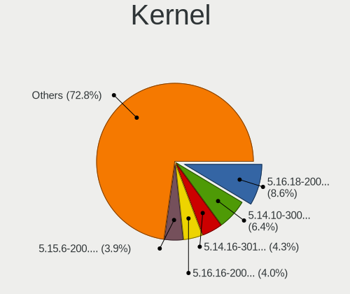

| Version                     | Notebooks | Percent |
|-----------------------------|-----------|---------|
| 5.16.18-200.fc35.x86_64     | 92        | 8.65%   |
| 5.14.10-300.fc35.x86_64     | 68        | 6.4%    |
| 5.14.16-301.fc35.x86_64     | 46        | 4.33%   |
| 5.16.16-200.fc35.x86_64     | 43        | 4.05%   |
| 5.15.6-200.fc35.x86_64      | 42        | 3.95%   |
| 5.16.12-200.fc35.x86_64     | 41        | 3.86%   |
| 5.15.12-200.fc35.x86_64     | 38        | 3.57%   |
| 5.14.18-300.fc35.x86_64     | 38        | 3.57%   |
| 5.17.4-200.fc35.x86_64      | 36        | 3.39%   |
| 5.16.9-200.fc35.x86_64      | 32        | 3.01%   |
| 5.17.5-200.fc35.x86_64      | 29        | 2.73%   |
| 5.14.17-301.fc35.x86_64     | 28        | 2.63%   |
| 5.15.16-200.fc35.x86_64     | 27        | 2.54%   |
| 5.16.20-200.fc35.x86_64     | 26        | 2.45%   |
| 5.16.19-200.fc35.x86_64     | 24        | 2.26%   |
| 5.16.11-200.fc35.x86_64     | 24        | 2.26%   |
| 5.15.11-200.fc35.x86_64     | 24        | 2.26%   |
| 5.15.10-200.fc35.x86_64     | 21        | 1.98%   |
| 5.14.14-300.fc35.x86_64     | 21        | 1.98%   |
| 5.16.5-200.fc35.x86_64      | 19        | 1.79%   |
| 5.15.13-200.fc35.x86_64     | 18        | 1.69%   |
| 5.15.14-200.fc35.x86_64     | 16        | 1.51%   |
| 5.16.8-200.fc35.x86_64      | 15        | 1.41%   |
| 5.15.8-200.fc35.x86_64      | 15        | 1.41%   |
| 5.15.4-201.fc35.x86_64      | 15        | 1.41%   |
| 5.15.18-200.fc35.x86_64     | 14        | 1.32%   |
| 5.16.15-201.fc35.x86_64     | 13        | 1.22%   |
| 5.16.14-200.fc35.x86_64     | 13        | 1.22%   |
| 5.14.15-300.fc35.x86_64     | 13        | 1.22%   |
| 5.15.7-200.fc35.x86_64      | 12        | 1.13%   |
| 5.15.5-200.fc35.x86_64      | 12        | 1.13%   |
| 5.16.7-200.fc35.x86_64      | 10        | 0.94%   |
| 5.15.17-200.fc35.x86_64     | 9         | 0.85%   |
| 5.14.9-300.fc35.x86_64      | 9         | 0.85%   |
| 5.14.0-60.fc35.x86_64       | 7         | 0.66%   |
| 5.16.17-200.fc35.x86_64     | 6         | 0.56%   |
| 5.16.10-200.fc35.x86_64     | 6         | 0.56%   |
| 5.15.15-200.fc35.x86_64     | 6         | 0.56%   |
| 5.14.11-300.fc35.x86_64     | 5         | 0.47%   |
| 5.14.0-0.rc5.42.fc35.x86_64 | 5         | 0.47%   |

Kernel Family
-------------

Linux kernel without a distro release

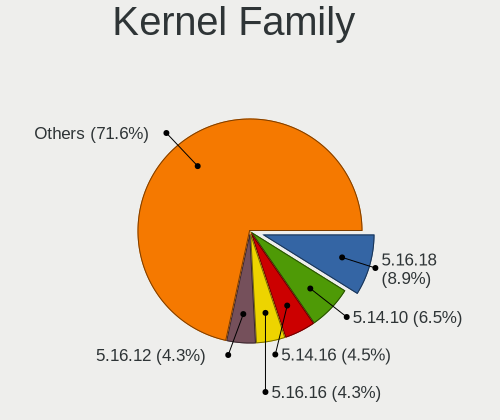

| Version | Notebooks | Percent |
|---------|-----------|---------|
| 5.16.18 | 92        | 8.66%   |
| 5.14.10 | 68        | 6.4%    |
| 5.14.16 | 47        | 4.43%   |
| 5.16.16 | 45        | 4.24%   |
| 5.16.12 | 44        | 4.14%   |
| 5.15.6  | 44        | 4.14%   |
| 5.15.12 | 38        | 3.58%   |
| 5.14.18 | 38        | 3.58%   |
| 5.17.4  | 37        | 3.48%   |
| 5.17.5  | 32        | 3.01%   |
| 5.16.9  | 32        | 3.01%   |
| 5.14.17 | 28        | 2.64%   |
| 5.16.20 | 27        | 2.54%   |
| 5.15.16 | 27        | 2.54%   |
| 5.15.11 | 25        | 2.35%   |
| 5.16.19 | 24        | 2.26%   |
| 5.16.11 | 24        | 2.26%   |
| 5.14.14 | 22        | 2.07%   |
| 5.15.10 | 21        | 1.98%   |
| 5.15.13 | 20        | 1.88%   |
| 5.16.5  | 19        | 1.79%   |
| 5.15.8  | 17        | 1.6%    |
| 5.15.14 | 16        | 1.51%   |
| 5.16.8  | 15        | 1.41%   |
| 5.15.4  | 15        | 1.41%   |
| 5.14.0  | 15        | 1.41%   |
| 5.15.18 | 14        | 1.32%   |
| 5.14.15 | 14        | 1.32%   |
| 5.16.15 | 13        | 1.22%   |
| 5.16.14 | 13        | 1.22%   |
| 5.15.5  | 13        | 1.22%   |
| 5.15.7  | 12        | 1.13%   |
| 5.16.7  | 10        | 0.94%   |
| 5.14.9  | 10        | 0.94%   |
| 5.15.17 | 9         | 0.85%   |
| 5.16.17 | 7         | 0.66%   |
| 5.15.15 | 7         | 0.66%   |
| 5.16.10 | 6         | 0.56%   |
| 5.16.13 | 5         | 0.47%   |
| 5.14.11 | 5         | 0.47%   |

Kernel Major Ver.
-----------------

Linux kernel major version

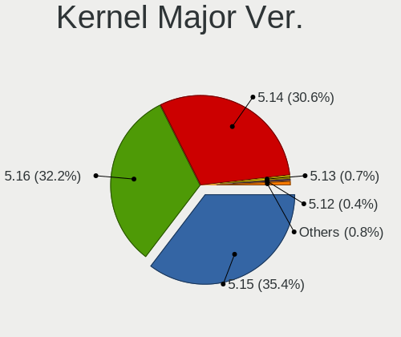

| Version | Notebooks | Percent |
|---------|-----------|---------|
| 5.16    | 364       | 35.31%  |
| 5.15    | 273       | 26.48%  |
| 5.14    | 254       | 24.64%  |
| 5.17    | 94        | 9.12%   |
| 5.18    | 21        | 2.04%   |
| 5.19    | 7         | 0.68%   |
| 5.13    | 5         | 0.48%   |
| 6.0     | 4         | 0.39%   |
| 5.12    | 3         | 0.29%   |
| 5.10    | 3         | 0.29%   |
| 5.11    | 2         | 0.19%   |
| 5.6     | 1         | 0.1%    |

Arch
----

OS architecture (x86_64, i586, etc.)

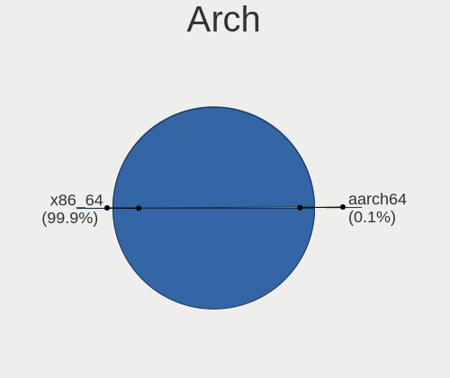

| Name    | Notebooks | Percent |
|---------|-----------|---------|
| x86_64  | 954       | 99.9%   |
| aarch64 | 1         | 0.1%    |

DE
--

Desktop Environment

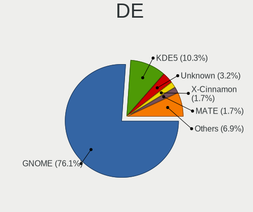

| Name            | Notebooks | Percent |
|-----------------|-----------|---------|
| GNOME           | 738       | 76.32%  |
| KDE5            | 99        | 10.24%  |
| Unknown         | 31        | 3.21%   |
| XFCE            | 16        | 1.65%   |
| X-Cinnamon      | 16        | 1.65%   |
| MATE            | 15        | 1.55%   |
| Cinnamon        | 15        | 1.55%   |
| i3              | 9         | 0.93%   |
| GNOME Classic   | 7         | 0.72%   |
| sway            | 4         | 0.41%   |
| LXQt            | 3         | 0.31%   |
| LXDE            | 3         | 0.31%   |
| Pantheon        | 2         | 0.21%   |
| KDE             | 2         | 0.21%   |
| GNOME Flashback | 2         | 0.21%   |
| fluxbox         | 2         | 0.21%   |
| openbox         | 1         | 0.1%    |
| Deepin          | 1         | 0.1%    |
| bspwm           | 1         | 0.1%    |

Display Server
--------------

X11 or Wayland

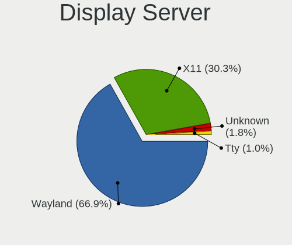

| Name    | Notebooks | Percent |
|---------|-----------|---------|
| Wayland | 637       | 65.53%  |
| X11     | 308       | 31.69%  |
| Unknown | 16        | 1.65%   |
| Tty     | 11        | 1.13%   |

Display Manager
---------------

SDDM, LightDM, etc.

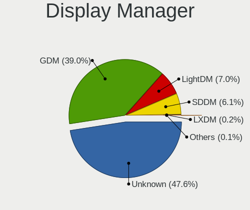

| Name    | Notebooks | Percent |
|---------|-----------|---------|
| Unknown | 458       | 47.51%  |
| GDM     | 377       | 39.11%  |
| LightDM | 67        | 6.95%   |
| SDDM    | 59        | 6.12%   |
| LXDM    | 2         | 0.21%   |
| XDM     | 1         | 0.1%    |

OS Lang
-------

Language

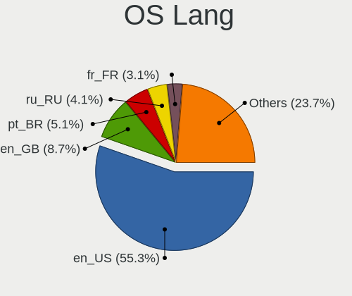

| Lang    | Notebooks | Percent |
|---------|-----------|---------|
| en_US   | 535       | 55.73%  |
| en_GB   | 79        | 8.23%   |
| pt_BR   | 49        | 5.1%    |
| ru_RU   | 41        | 4.27%   |
| fr_FR   | 28        | 2.92%   |
| de_DE   | 26        | 2.71%   |
| it_IT   | 24        | 2.5%    |
| en_AU   | 15        | 1.56%   |
| pl_PL   | 14        | 1.46%   |
| es_ES   | 14        | 1.46%   |
| en_CA   | 14        | 1.46%   |
| es_CL   | 9         | 0.94%   |
| es_MX   | 7         | 0.73%   |
| en_IN   | 7         | 0.73%   |
| tr_TR   | 6         | 0.63%   |
| C       | 6         | 0.63%   |
| zh_CN   | 5         | 0.52%   |
| nl_NL   | 5         | 0.52%   |
| Unknown | 5         | 0.52%   |
| sv_SE   | 4         | 0.42%   |
| fr_CA   | 4         | 0.42%   |
| es_AR   | 4         | 0.42%   |
| en_IL   | 4         | 0.42%   |
| de_AT   | 4         | 0.42%   |
| cs_CZ   | 4         | 0.42%   |
| uk_UA   | 3         | 0.31%   |
| pt_PT   | 3         | 0.31%   |
| es_CO   | 3         | 0.31%   |
| en_ZA   | 3         | 0.31%   |
| en_NZ   | 3         | 0.31%   |
| sk_SK   | 2         | 0.21%   |
| ro_RO   | 2         | 0.21%   |
| nb_NO   | 2         | 0.21%   |
| fr_CH   | 2         | 0.21%   |
| fi_FI   | 2         | 0.21%   |
| es_NI   | 2         | 0.21%   |
| es_GT   | 2         | 0.21%   |
| en_DE   | 2         | 0.21%   |
| ca_ES   | 2         | 0.21%   |
| szl_PL  | 1         | 0.1%    |

Boot Mode
---------

EFI or BIOS

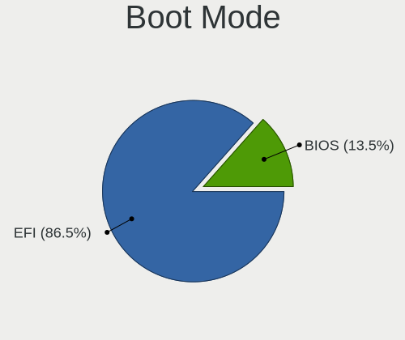

| Mode | Notebooks | Percent |
|------|-----------|---------|
| EFI  | 808       | 83.64%  |
| BIOS | 158       | 16.36%  |

Filesystem
----------

Type of filesystem

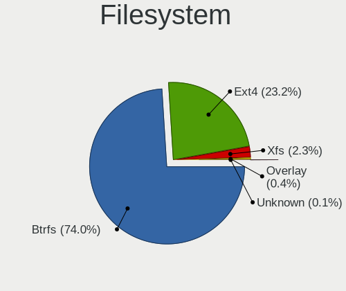

| Type    | Notebooks | Percent |
|---------|-----------|---------|
| Btrfs   | 706       | 73.54%  |
| Ext4    | 225       | 23.44%  |
| Xfs     | 22        | 2.29%   |
| Overlay | 4         | 0.42%   |
| Unknown | 3         | 0.31%   |

Part. scheme
------------

Scheme of partitioning

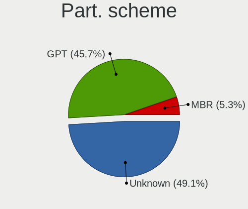

| Type    | Notebooks | Percent |
|---------|-----------|---------|
| Unknown | 466       | 48.14%  |
| GPT     | 451       | 46.59%  |
| MBR     | 51        | 5.27%   |

Dual Boot with Linux/BSD
------------------------

Hosting more than one Linux/BSD

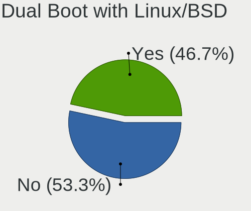

| Dual boot | Notebooks | Percent |
|-----------|-----------|---------|
| No        | 863       | 89.34%  |
| Yes       | 103       | 10.66%  |

Dual Boot (Win)
---------------

Hosting Linux and Windows

| Dual boot | Notebooks | Percent |
|-----------|-----------|---------|
| No        | 791       | 82.14%  |
| Yes       | 172       | 17.86%  |

Board
-----

Vendor
------

Motherboard manufacturer

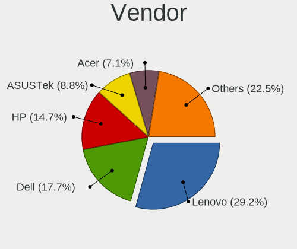

| Name                   | Notebooks | Percent |
|------------------------|-----------|---------|
| Lenovo                 | 278       | 29.11%  |
| Dell                   | 168       | 17.59%  |
| Hewlett-Packard        | 141       | 14.76%  |
| ASUSTek Computer       | 84        | 8.8%    |
| Acer                   | 69        | 7.23%   |
| Apple                  | 38        | 3.98%   |
| HUAWEI                 | 23        | 2.41%   |
| MSI                    | 18        | 1.88%   |
| Toshiba                | 14        | 1.47%   |
| Notebook               | 12        | 1.26%   |
| Framework              | 10        | 1.05%   |
| Sony                   | 9         | 0.94%   |
| Samsung Electronics    | 9         | 0.94%   |
| Google                 | 7         | 0.73%   |
| Positivo               | 6         | 0.63%   |
| System76               | 5         | 0.52%   |
| Razer                  | 5         | 0.52%   |
| TUXEDO                 | 4         | 0.42%   |
| Timi                   | 4         | 0.42%   |
| Fujitsu                | 4         | 0.42%   |
| Alienware              | 4         | 0.42%   |
| Gigabyte Technology    | 3         | 0.31%   |
| Avell High Performance | 3         | 0.31%   |
| PC Specialist          | 2         | 0.21%   |
| Panasonic              | 2         | 0.21%   |
| HONOR                  | 2         | 0.21%   |
| Hampoo                 | 2         | 0.21%   |
| GPU Company            | 2         | 0.21%   |
| Fujitsu Siemens        | 2         | 0.21%   |
| Chuwi                  | 2         | 0.21%   |
| Unknown                | 2         | 0.21%   |
| Teclast                | 1         | 0.1%    |
| SiComputer             | 1         | 0.1%    |
| SCHNEIDER              | 1         | 0.1%    |
| Schenker               | 1         | 0.1%    |
| Positivo Bahia - VAIO  | 1         | 0.1%    |
| Pine Microsystems      | 1         | 0.1%    |
| Medion                 | 1         | 0.1%    |
| Mediacom               | 1         | 0.1%    |
| Login Informatica      | 1         | 0.1%    |

Model
-----

Motherboard model

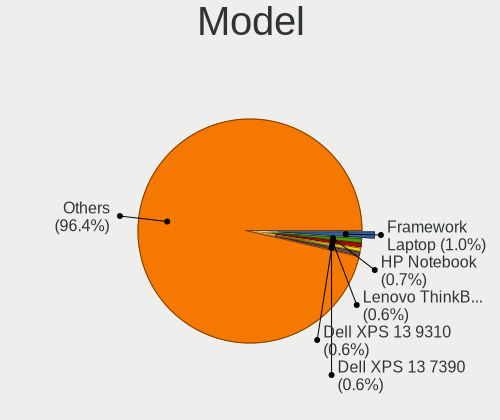

| Name                                  | Notebooks | Percent |
|---------------------------------------|-----------|---------|
| Framework Laptop                      | 10        | 1.05%   |
| HP Notebook                           | 7         | 0.73%   |
| Dell XPS 13 9310                      | 6         | 0.63%   |
| Dell XPS 13 7390                      | 6         | 0.63%   |
| Lenovo ThinkBook 15 G2 ITL 20VE       | 5         | 0.52%   |
| HUAWEI KLVL-WXX9                      | 5         | 0.52%   |
| HP Pavilion Notebook                  | 5         | 0.52%   |
| Dell XPS 13 9370                      | 4         | 0.42%   |
| Dell XPS 13 9305                      | 4         | 0.42%   |
| Dell Precision 5510                   | 4         | 0.42%   |
| Dell Latitude E7440                   | 4         | 0.42%   |
| Apple MacBookPro9,2                   | 4         | 0.42%   |
| Unknown                               | 4         | 0.42%   |
| MSI Delta 15 A5EFK                    | 3         | 0.31%   |
| Lenovo Legion Y530-15ICH 81FV         | 3         | 0.31%   |
| Lenovo IdeaPad S145-15API 81V7        | 3         | 0.31%   |
| Lenovo IdeaPad 530S-14IKB 81EU        | 3         | 0.31%   |
| Lenovo IdeaPad 3 14ALC6 82KT          | 3         | 0.31%   |
| HUAWEI KLVL-WXXW                      | 3         | 0.31%   |
| HUAWEI HVY-WXX9                       | 3         | 0.31%   |
| HP ProBook 430 G5                     | 3         | 0.31%   |
| HP Pavilion Laptop 15-eh0xxx          | 3         | 0.31%   |
| HP Pavilion Aero Laptop 13-be0xxx     | 3         | 0.31%   |
| HP Pavilion 17                        | 3         | 0.31%   |
| HP Pavilion 15                        | 3         | 0.31%   |
| HP EliteBook 840 G3                   | 3         | 0.31%   |
| Dell XPS 17 9700                      | 3         | 0.31%   |
| Dell XPS 15 9570                      | 3         | 0.31%   |
| Dell XPS 15 9550                      | 3         | 0.31%   |
| Dell XPS 13 9380                      | 3         | 0.31%   |
| Dell XPS 13 9360                      | 3         | 0.31%   |
| Dell Latitude E6530                   | 3         | 0.31%   |
| Dell Latitude 7490                    | 3         | 0.31%   |
| Dell Inspiron N5110                   | 3         | 0.31%   |
| Dell Inspiron 5567                    | 3         | 0.31%   |
| Dell Inspiron 5458                    | 3         | 0.31%   |
| ASUS ROG Zephyrus G14 GA401QM_GA401QM | 3         | 0.31%   |
| ASUS ROG Strix G513QY_G513QY          | 3         | 0.31%   |
| Apple MacBookPro6,2                   | 3         | 0.31%   |
| Apple MacBookPro14,1                  | 3         | 0.31%   |

Model Family
------------

Motherboard model prefix

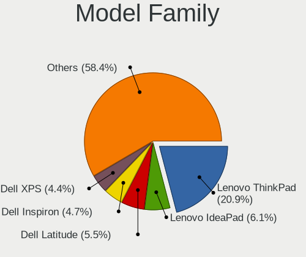

| Name               | Notebooks | Percent |
|--------------------|-----------|---------|
| Lenovo ThinkPad    | 160       | 16.75%  |
| Lenovo IdeaPad     | 61        | 6.39%   |
| Dell Latitude      | 51        | 5.34%   |
| Dell Inspiron      | 47        | 4.92%   |
| Dell XPS           | 42        | 4.4%    |
| Acer Aspire        | 39        | 4.08%   |
| HP Pavilion        | 35        | 3.66%   |
| HP ProBook         | 23        | 2.41%   |
| HP EliteBook       | 20        | 2.09%   |
| HP Laptop          | 19        | 1.99%   |
| ASUS ROG           | 18        | 1.88%   |
| Lenovo Legion      | 14        | 1.47%   |
| ASUS VivoBook      | 14        | 1.47%   |
| Lenovo ThinkBook   | 13        | 1.36%   |
| Dell Precision     | 13        | 1.36%   |
| Acer Swift         | 12        | 1.26%   |
| HP ZBook           | 11        | 1.15%   |
| Acer Nitro         | 11        | 1.15%   |
| Toshiba Satellite  | 10        | 1.05%   |
| Framework Laptop   | 10        | 1.05%   |
| Dell Vostro        | 10        | 1.05%   |
| ASUS ASUS          | 10        | 1.05%   |
| ASUS ZenBook       | 8         | 0.84%   |
| Lenovo Yoga        | 7         | 0.73%   |
| HP Notebook        | 7         | 0.73%   |
| HP ENVY            | 7         | 0.73%   |
| Apple MacBookPro11 | 7         | 0.73%   |
| HUAWEI KLVL-WXX9   | 5         | 0.52%   |
| HP OMEN            | 5         | 0.52%   |
| Razer Blade        | 4         | 0.42%   |
| Apple MacBookPro9  | 4         | 0.42%   |
| Unknown            | 4         | 0.42%   |
| Toshiba TECRA      | 3         | 0.31%   |
| MSI GF63           | 3         | 0.31%   |
| MSI Delta          | 3         | 0.31%   |
| HUAWEI KLVL-WXXW   | 3         | 0.31%   |
| HUAWEI HVY-WXX9    | 3         | 0.31%   |
| Fujitsu LIFEBOOK   | 3         | 0.31%   |
| Apple MacBookPro6  | 3         | 0.31%   |
| Apple MacBookPro14 | 3         | 0.31%   |

MFG Year
--------

Motherboard manufacture year

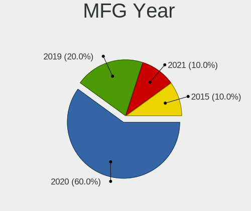

| Year | Notebooks | Percent |
|------|-----------|---------|
| 2020 | 185       | 19.37%  |
| 2021 | 156       | 16.34%  |
| 2019 | 119       | 12.46%  |
| 2018 | 91        | 9.53%   |
| 2017 | 66        | 6.91%   |
| 2013 | 57        | 5.97%   |
| 2016 | 56        | 5.86%   |
| 2015 | 50        | 5.24%   |
| 2011 | 45        | 4.71%   |
| 2012 | 41        | 4.29%   |
| 2014 | 39        | 4.08%   |
| 2010 | 21        | 2.2%    |
| 2008 | 11        | 1.15%   |
| 2009 | 9         | 0.94%   |
| 2022 | 7         | 0.73%   |
| 2007 | 2         | 0.21%   |

Form Factor
-----------

Physical design of the computer

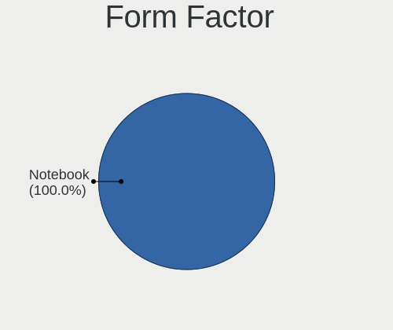

| Name     | Notebooks | Percent |
|----------|-----------|---------|
| Notebook | 955       | 100%    |

Secure Boot
-----------

Enabled or disabled

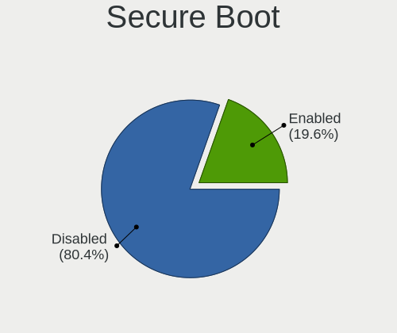

| State    | Notebooks | Percent |
|----------|-----------|---------|
| Disabled | 772       | 80.33%  |
| Enabled  | 189       | 19.67%  |

Coreboot
--------

Have coreboot on board

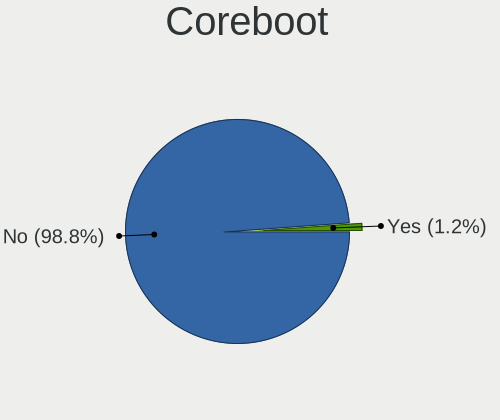

| Used | Notebooks | Percent |
|------|-----------|---------|
| No   | 944       | 98.85%  |
| Yes  | 11        | 1.15%   |

RAM Size
--------

Total RAM memory

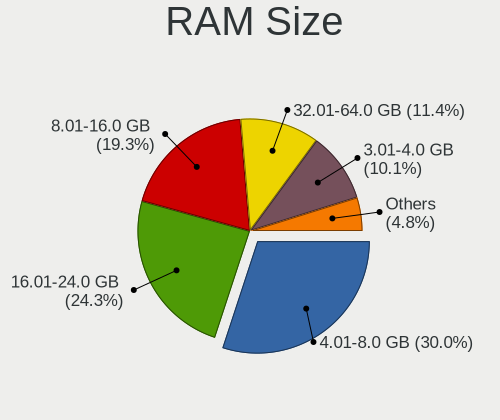

| Size in GB  | Notebooks | Percent |
|-------------|-----------|---------|
| 4.01-8.0    | 288       | 30.06%  |
| 16.01-24.0  | 231       | 24.11%  |
| 8.01-16.0   | 186       | 19.42%  |
| 32.01-64.0  | 111       | 11.59%  |
| 3.01-4.0    | 96        | 10.02%  |
| 64.01-256.0 | 19        | 1.98%   |
| 24.01-32.0  | 11        | 1.15%   |
| 1.01-2.0    | 11        | 1.15%   |
| 2.01-3.0    | 5         | 0.52%   |

RAM Used
--------

Used RAM memory

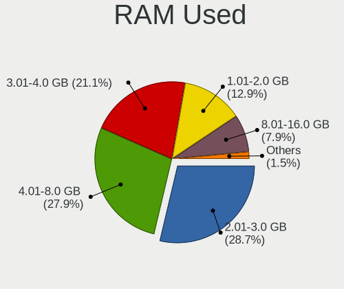

| Used GB    | Notebooks | Percent |
|------------|-----------|---------|
| 2.01-3.0   | 294       | 28.71%  |
| 4.01-8.0   | 287       | 28.03%  |
| 3.01-4.0   | 215       | 21%     |
| 1.01-2.0   | 131       | 12.79%  |
| 8.01-16.0  | 82        | 8.01%   |
| 16.01-24.0 | 6         | 0.59%   |
| 0.51-1.0   | 4         | 0.39%   |
| 32.01-64.0 | 3         | 0.29%   |
| 24.01-32.0 | 2         | 0.2%    |

Total Drives
------------

Number of drives on board

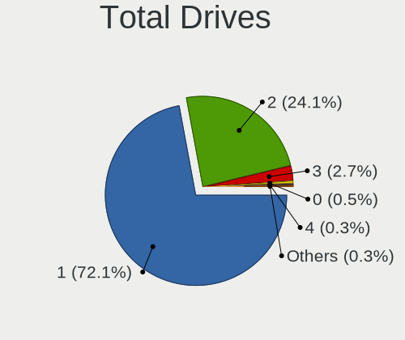

| Drives | Notebooks | Percent |
|--------|-----------|---------|
| 1      | 696       | 72.05%  |
| 2      | 235       | 24.33%  |
| 3      | 25        | 2.59%   |
| 0      | 4         | 0.41%   |
| 4      | 3         | 0.31%   |
| 5      | 2         | 0.21%   |
| 6      | 1         | 0.1%    |

Has CD-ROM
----------

Has CD-ROM on board

| Presented | Notebooks | Percent |
|-----------|-----------|---------|
| No        | 779       | 81.23%  |
| Yes       | 180       | 18.77%  |

Has Ethernet
------------

Has Ethernet on board

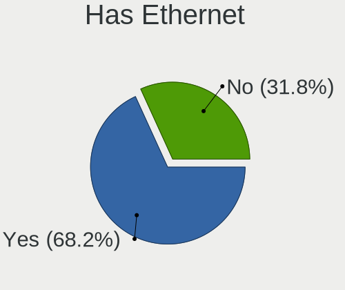

| Presented | Notebooks | Percent |
|-----------|-----------|---------|
| Yes       | 699       | 72.89%  |
| No        | 260       | 27.11%  |

Has WiFi
--------

Has WiFi module

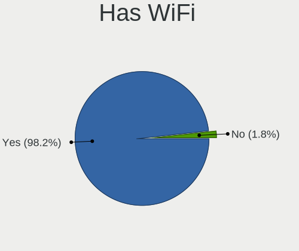

| Presented | Notebooks | Percent |
|-----------|-----------|---------|
| Yes       | 940       | 98.43%  |
| No        | 15        | 1.57%   |

Has Bluetooth
-------------

Has Bluetooth module

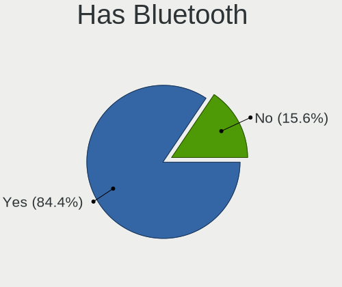

| Presented | Notebooks | Percent |
|-----------|-----------|---------|
| Yes       | 816       | 84.65%  |
| No        | 148       | 15.35%  |

Location
--------

Country
-------

Geographic location (country)

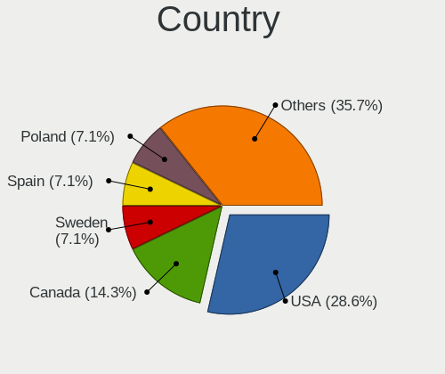

| Country      | Notebooks | Percent |
|--------------|-----------|---------|
| USA          | 157       | 16.39%  |
| Brazil       | 78        | 8.14%   |
| Russia       | 70        | 7.31%   |
| Germany      | 53        | 5.53%   |
| Italy        | 42        | 4.38%   |
| Canada       | 35        | 3.65%   |
| France       | 34        | 3.55%   |
| UK           | 33        | 3.44%   |
| India        | 32        | 3.34%   |
| Spain        | 25        | 2.61%   |
| Poland       | 23        | 2.4%    |
| Netherlands  | 23        | 2.4%    |
| Sweden       | 18        | 1.88%   |
| Austria      | 18        | 1.88%   |
| Turkey       | 16        | 1.67%   |
| Mexico       | 14        | 1.46%   |
| Czechia      | 14        | 1.46%   |
| Australia    | 14        | 1.46%   |
| Norway       | 13        | 1.36%   |
| Indonesia    | 12        | 1.25%   |
| Ukraine      | 11        | 1.15%   |
| Romania      | 11        | 1.15%   |
| Switzerland  | 10        | 1.04%   |
| Hungary      | 10        | 1.04%   |
| Chile        | 10        | 1.04%   |
| Greece       | 9         | 0.94%   |
| Belgium      | 9         | 0.94%   |
| Portugal     | 8         | 0.84%   |
| Israel       | 8         | 0.84%   |
| South Africa | 7         | 0.73%   |
| China        | 7         | 0.73%   |
| Belarus      | 7         | 0.73%   |
| Argentina    | 7         | 0.73%   |
| Japan        | 6         | 0.63%   |
| Finland      | 6         | 0.63%   |
| Saudi Arabia | 5         | 0.52%   |
| New Zealand  | 5         | 0.52%   |
| Iran         | 5         | 0.52%   |
| Denmark      | 5         | 0.52%   |
| Croatia      | 5         | 0.52%   |

City
----

Geographic location (city)

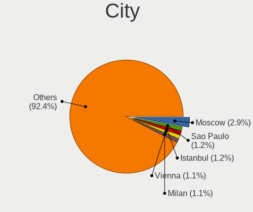

| City              | Notebooks | Percent |
|-------------------|-----------|---------|
| Moscow            | 29        | 2.95%   |
| Sao Paulo         | 12        | 1.22%   |
| Istanbul          | 12        | 1.22%   |
| Vienna            | 11        | 1.12%   |
| Milan             | 11        | 1.12%   |
| Warsaw            | 7         | 0.71%   |
| St Petersburg     | 7         | 0.71%   |
| Oslo              | 7         | 0.71%   |
| Munich            | 7         | 0.71%   |
| Sydney            | 6         | 0.61%   |
| Rome              | 6         | 0.61%   |
| Montreal          | 6         | 0.61%   |
| Athens            | 6         | 0.61%   |
| Yekaterinburg     | 5         | 0.51%   |
| Kyiv              | 5         | 0.51%   |
| Frankfurt am Main | 5         | 0.51%   |
| Fortaleza         | 5         | 0.51%   |
| Coimbatore        | 5         | 0.51%   |
| Berlin            | 5         | 0.51%   |
| Belo Horizonte    | 5         | 0.51%   |
| Amsterdam         | 5         | 0.51%   |
| Zurich            | 4         | 0.41%   |
| Zagreb            | 4         | 0.41%   |
| Vancouver         | 4         | 0.41%   |
| Sofia             | 4         | 0.41%   |
| Santiago          | 4         | 0.41%   |
| Rio de Janeiro    | 4         | 0.41%   |
| Prague            | 4         | 0.41%   |
| Paris             | 4         | 0.41%   |
| Mumbai            | 4         | 0.41%   |
| Minsk             | 4         | 0.41%   |
| Madrid            | 4         | 0.41%   |
| K'alak'i T'bilisi | 4         | 0.41%   |
| Jakarta           | 4         | 0.41%   |
| Chicago           | 4         | 0.41%   |
| Budapest          | 4         | 0.41%   |
| Bucharest         | 4         | 0.41%   |
| Wörgl            | 3         | 0.3%    |
| Strasbourg        | 3         | 0.3%    |
| Southampton       | 3         | 0.3%    |

Drives
------

Drive Vendor
------------

Hard drive vendors

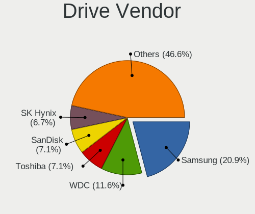

| Vendor                  | Notebooks | Drives | Percent |
|-------------------------|-----------|--------|---------|
| Samsung Electronics     | 251       | 342    | 20.9%   |
| WDC                     | 127       | 136    | 10.57%  |
| Seagate                 | 88        | 102    | 7.33%   |
| SK hynix                | 85        | 101    | 7.08%   |
| Toshiba                 | 83        | 86     | 6.91%   |
| SanDisk                 | 79        | 94     | 6.58%   |
| Unknown                 | 62        | 73     | 5.16%   |
| Kingston                | 57        | 62     | 4.75%   |
| Intel                   | 54        | 71     | 4.5%    |
| Micron Technology       | 39        | 47     | 3.25%   |
| Crucial                 | 38        | 41     | 3.16%   |
| KIOXIA                  | 28        | 33     | 2.33%   |
| Apple                   | 21        | 23     | 1.75%   |
| HGST                    | 16        | 19     | 1.33%   |
| A-DATA Technology       | 16        | 18     | 1.33%   |
| Phison                  | 12        | 13     | 1%      |
| Transcend               | 11        | 14     | 0.92%   |
| LITEON                  | 11        | 11     | 0.92%   |
| Hitachi                 | 8         | 8      | 0.67%   |
| Silicon Motion          | 7         | 7      | 0.58%   |
| China                   | 6         | 6      | 0.5%    |
| XPG                     | 5         | 7      | 0.42%   |
| Plextor                 | 5         | 6      | 0.42%   |
| Corsair                 | 5         | 5      | 0.42%   |
| ADATA Technology        | 5         | 5      | 0.42%   |
| UMIS                    | 4         | 4      | 0.33%   |
| Team                    | 4         | 5      | 0.33%   |
| Lexar                   | 4         | 5      | 0.33%   |
| Unknown                 | 4         | 5      | 0.33%   |
| Union Memory (Shenzhen) | 3         | 3      | 0.25%   |
| PNY                     | 3         | 4      | 0.25%   |
| Patriot                 | 3         | 3      | 0.25%   |
| Netac                   | 3         | 3      | 0.25%   |
| Mushkin                 | 3         | 3      | 0.25%   |
| YMTC                    | 2         | 2      | 0.17%   |
| SPCC                    | 2         | 2      | 0.17%   |
| Realtek Semiconductor   | 2         | 3      | 0.17%   |
| Ramsta                  | 2         | 3      | 0.17%   |
| LITEONIT                | 2         | 2      | 0.17%   |
| Lenovo                  | 2         | 2      | 0.17%   |

Drive Model
-----------

Hard drive models

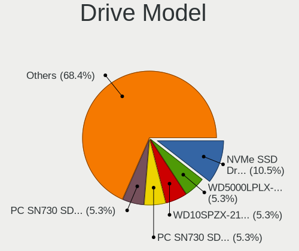

| Model                                  | Notebooks | Percent |
|----------------------------------------|-----------|---------|
| Samsung NVMe SSD Drive 512GB           | 31        | 2.47%   |
| Seagate ST1000LM035-1RK172 1TB         | 18        | 1.43%   |
| SK hynix NVMe SSD Drive 512GB          | 16        | 1.27%   |
| SanDisk NVMe SSD Drive 512GB           | 16        | 1.27%   |
| Samsung SM963 2.5" NVMe PCIe SSD 256GB | 14        | 1.11%   |
| SanDisk NVMe SSD Drive 256GB           | 13        | 1.04%   |
| Samsung NVMe SSD Drive 500GB           | 13        | 1.04%   |
| Kingston SA400S37480G 480GB SSD        | 13        | 1.04%   |
| Samsung NVMe SSD Drive 1TB             | 12        | 0.96%   |
| SK hynix NVMe SSD Drive 256GB          | 11        | 0.88%   |
| Unknown MMC Card  64GB                 | 10        | 0.8%    |
| Unknown MMC Card  32GB                 | 10        | 0.8%    |
| Kingston SA400S37240G 240GB SSD        | 10        | 0.8%    |
| Intel NVMe SSD Drive 512GB             | 10        | 0.8%    |
| Toshiba MQ04ABF100 1TB                 | 9         | 0.72%   |
| KIOXIA NVMe SSD Drive 512GB            | 9         | 0.72%   |
| Toshiba NVMe SSD Drive 512GB           | 8         | 0.64%   |
| Seagate ST1000LM024 HN-M101MBB 1TB     | 8         | 0.64%   |
| SanDisk NVMe SSD Drive 500GB           | 8         | 0.64%   |
| Samsung NVMe SSD Drive 1024GB          | 8         | 0.64%   |
| SK hynix NVMe SSD Drive 1024GB         | 7         | 0.56%   |
| Seagate ST500LT012-1DG142 500GB        | 7         | 0.56%   |
| Seagate ST1000LM048-2E7172 1TB         | 7         | 0.56%   |
| SanDisk NVMe SSD Drive 1TB             | 7         | 0.56%   |
| Samsung MZVLB1T0HBLR-000L7 1TB         | 7         | 0.56%   |
| HGST HTS721010A9E630 1TB               | 7         | 0.56%   |
| Crucial CT1000MX500SSD1 1TB            | 7         | 0.56%   |
| WDC PC SN730 SDBQNTY-256G-1001 256GB   | 6         | 0.48%   |
| Unknown MMC Card  128GB                | 6         | 0.48%   |
| Toshiba MQ01ABD100 1TB                 | 6         | 0.48%   |
| Samsung SSD 970 EVO Plus 500GB         | 6         | 0.48%   |
| Samsung SSD 970 EVO Plus 1TB           | 6         | 0.48%   |
| Samsung SSD 860 EVO 500GB              | 6         | 0.48%   |
| Samsung SSD 850 EVO 250GB              | 6         | 0.48%   |
| Phison 311CD0512GB                     | 6         | 0.48%   |
| Crucial CT500MX500SSD1 500GB           | 6         | 0.48%   |
| Toshiba NVMe SSD Drive 256GB           | 5         | 0.4%    |
| SK hynix BC711 NVMe 512GB              | 5         | 0.4%    |
| SanDisk NVMe SSD Drive 1024GB          | 5         | 0.4%    |
| Samsung SSD 980 PRO 500GB              | 5         | 0.4%    |

HDD Vendor
----------

Hard disk drive vendors

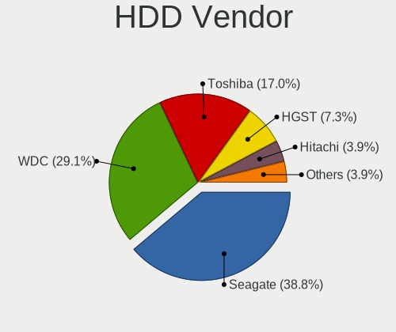

| Vendor              | Notebooks | Drives | Percent |
|---------------------|-----------|--------|---------|
| Seagate             | 87        | 101    | 40.28%  |
| WDC                 | 61        | 64     | 28.24%  |
| Toshiba             | 36        | 37     | 16.67%  |
| HGST                | 16        | 19     | 7.41%   |
| Hitachi             | 8         | 8      | 3.7%    |
| Unknown             | 3         | 3      | 1.39%   |
| Apple               | 2         | 2      | 0.93%   |
| Samsung Electronics | 1         | 1      | 0.46%   |
| LaCie               | 1         | 2      | 0.46%   |
| ASMT                | 1         | 1      | 0.46%   |

SSD Vendor
----------

Solid state drive vendors

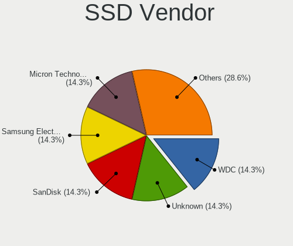

| Vendor              | Notebooks | Drives | Percent |
|---------------------|-----------|--------|---------|
| Samsung Electronics | 77        | 106    | 22.92%  |
| Kingston            | 41        | 45     | 12.2%   |
| Crucial             | 34        | 37     | 10.12%  |
| SanDisk             | 26        | 36     | 7.74%   |
| Intel               | 18        | 23     | 5.36%   |
| WDC                 | 16        | 18     | 4.76%   |
| Apple               | 14        | 14     | 4.17%   |
| Micron Technology   | 11        | 13     | 3.27%   |
| A-DATA Technology   | 11        | 13     | 3.27%   |
| Transcend           | 9         | 12     | 2.68%   |
| LITEON              | 8         | 8      | 2.38%   |
| SK hynix            | 7         | 8      | 2.08%   |
| Toshiba             | 6         | 7      | 1.79%   |
| China               | 6         | 6      | 1.79%   |
| PNY                 | 3         | 4      | 0.89%   |
| Plextor             | 3         | 4      | 0.89%   |
| Patriot             | 3         | 3      | 0.89%   |
| Netac               | 3         | 3      | 0.89%   |
| Mushkin             | 3         | 3      | 0.89%   |
| Team                | 2         | 3      | 0.6%    |
| SPCC                | 2         | 2      | 0.6%    |
| Ramsta              | 2         | 3      | 0.6%    |
| LITEONIT            | 2         | 2      | 0.6%    |
| Lexar               | 2         | 3      | 0.6%    |
| Gigabyte Technology | 2         | 2      | 0.6%    |
| FORESEE             | 2         | 2      | 0.6%    |
| Corsair             | 2         | 2      | 0.6%    |
| Unknown             | 2         | 2      | 0.6%    |
| Zozt                | 1         | 1      | 0.3%    |
| WDC WDS             | 1         | 1      | 0.3%    |
| Vaseky              | 1         | 1      | 0.3%    |
| Unknown             | 1         | 1      | 0.3%    |
| TO Exter            | 1         | 1      | 0.3%    |
| Teclast             | 1         | 1      | 0.3%    |
| TCSUNBOW            | 1         | 1      | 0.3%    |
| MX                  | 1         | 1      | 0.3%    |
| KingSpec            | 1         | 1      | 0.3%    |
| JMicron Technology  | 1         | 1      | 0.3%    |
| HUSKY               | 1         | 1      | 0.3%    |
| HPE                 | 1         | 2      | 0.3%    |

Drive Kind
----------

HDD or SSD

| Kind    | Notebooks | Drives | Percent |
|---------|-----------|--------|---------|
| NVMe    | 537       | 690    | 47.19%  |
| SSD     | 319       | 404    | 28.03%  |
| HDD     | 211       | 238    | 18.54%  |
| MMC     | 58        | 74     | 5.1%    |
| Unknown | 13        | 13     | 1.14%   |

Drive Connector
---------------

SATA, SAS, NVMe, etc.

| Type | Notebooks | Drives | Percent |
|------|-----------|--------|---------|
| NVMe | 537       | 688    | 49.09%  |
| SATA | 458       | 608    | 41.86%  |
| MMC  | 58        | 74     | 5.3%    |
| SAS  | 41        | 49     | 3.75%   |

Drive Size
----------

Size of hard drive

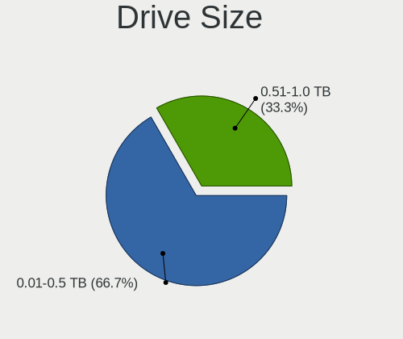

| Size in TB | Notebooks | Drives | Percent |
|------------|-----------|--------|---------|
| 0.01-0.5   | 342       | 414    | 64.53%  |
| 0.51-1.0   | 156       | 185    | 29.43%  |
| 1.01-2.0   | 25        | 36     | 4.72%   |
| 3.01-4.0   | 5         | 5      | 0.94%   |
| 4.01-10.0  | 2         | 2      | 0.38%   |

Space Total
-----------

Amount of disk space available on the file system

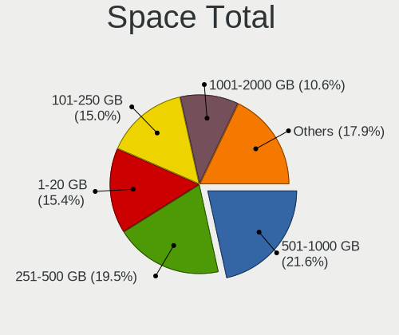

| Size in GB     | Notebooks | Percent |
|----------------|-----------|---------|
| 501-1000       | 207       | 21.43%  |
| 251-500        | 190       | 19.67%  |
| 1-20           | 147       | 15.22%  |
| 101-250        | 145       | 15.01%  |
| 1001-2000      | 103       | 10.66%  |
| Unknown        | 86        | 8.9%    |
| 51-100         | 39        | 4.04%   |
| More than 3000 | 22        | 2.28%   |
| 21-50          | 14        | 1.45%   |
| 2001-3000      | 13        | 1.35%   |

Space Used
----------

Amount of used disk space

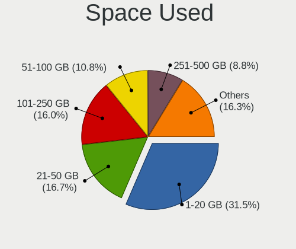

| Used GB        | Notebooks | Percent |
|----------------|-----------|---------|
| 1-20           | 314       | 31.53%  |
| 21-50          | 169       | 16.97%  |
| 101-250        | 159       | 15.96%  |
| 51-100         | 108       | 10.84%  |
| 251-500        | 86        | 8.63%   |
| Unknown        | 86        | 8.63%   |
| 501-1000       | 47        | 4.72%   |
| 1001-2000      | 23        | 2.31%   |
| More than 3000 | 3         | 0.3%    |
| 2001-3000      | 1         | 0.1%    |

Malfunc. Drives
---------------

Drive models with a malfunction

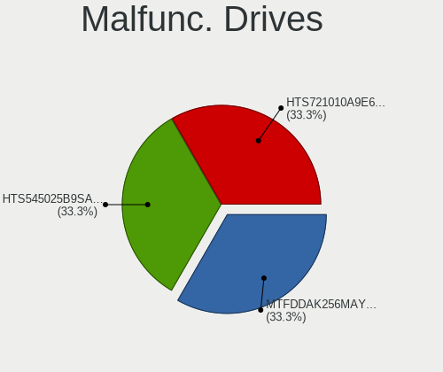

| Model                                               | Notebooks | Drives | Percent |
|-----------------------------------------------------|-----------|--------|---------|
| Seagate ST500LT012-1DG142 500GB                     | 2         | 2      | 5.26%   |
| Seagate ST1000LM024 HN-M101MBB 1TB                  | 2         | 4      | 5.26%   |
| WDC WD5000LPLX-60ZNTT1 500GB                        | 1         | 1      | 2.63%   |
| WDC WD1600BEVT-24A23T0 160GB                        | 1         | 1      | 2.63%   |
| WDC WD1600BEVS-60RST0 160GB                         | 1         | 1      | 2.63%   |
| Toshiba MQ01ABD100 1TB                              | 1         | 1      | 2.63%   |
| Toshiba MQ01ABD075 752GB                            | 1         | 1      | 2.63%   |
| Toshiba MQ01ABD050V 500GB                           | 1         | 1      | 2.63%   |
| Toshiba KSG60ZMV256G M.2 2280 256GB SSD             | 1         | 1      | 2.63%   |
| Teclast 360GB A850 SSD                              | 1         | 1      | 2.63%   |
| SK hynix SC308 SATA 256GB SSD                       | 1         | 1      | 2.63%   |
| SK hynix HFS128G39TND-N210A 128GB SSD               | 1         | 1      | 2.63%   |
| Seagate ST95005620AS 500GB                          | 1         | 1      | 2.63%   |
| Seagate ST9500325AS 500GB                           | 1         | 3      | 2.63%   |
| Seagate ST9320325AS 320GB                           | 1         | 1      | 2.63%   |
| Seagate ST1000LM035-1RK172 1TB                      | 1         | 1      | 2.63%   |
| SanDisk SSD PLUS 240GB                              | 1         | 1      | 2.63%   |
| Samsung Electronics SSD 870 EVO 500GB               | 1         | 1      | 2.63%   |
| Samsung Electronics MZNLH256HAJD-000H1 256GB SSD    | 1         | 1      | 2.63%   |
| Samsung Electronics MZNLH128HBHQ-000H1 128GB SSD    | 1         | 1      | 2.63%   |
| Samsung Electronics MZ7TE256HMHP-000L7 256GB SSD    | 1         | 1      | 2.63%   |
| Plextor PX-256M8PeG 256GB                           | 1         | 1      | 2.63%   |
| Micron Technology MTFDDAK256MAY-1AH12ABHA 256GB SSD | 1         | 2      | 2.63%   |
| LITEON CV3-CE256 256GB SSD                          | 1         | 1      | 2.63%   |
| Intel SSDSCKKF256G8H 256GB                          | 1         | 2      | 2.63%   |
| Intel SSDSC2CT240A3 240GB                           | 1         | 1      | 2.63%   |
| Intel SSDSC2BF180A5L 180GB                          | 1         | 1      | 2.63%   |
| Hitachi HTS545050B9A300 500GB                       | 1         | 1      | 2.63%   |
| Hitachi HTS545025B9SA02 250GB                       | 1         | 1      | 2.63%   |
| Hitachi HTS543225L9A300 250GB                       | 1         | 1      | 2.63%   |
| HGST HTS721010A9E630 1TB                            | 1         | 1      | 2.63%   |
| HGST HTS545050A7E680 500GB                          | 1         | 1      | 2.63%   |
| Crucial CT240BX500SSD1 240GB                        | 1         | 1      | 2.63%   |
| Crucial CT1050MX300SSD1 1TB                         | 1         | 1      | 2.63%   |
| Crucial CT1000P1SSD8 1TB                            | 1         | 1      | 2.63%   |
| A-DATA Technology IM2S3138E-128GM-B 128GB SSD       | 1         | 1      | 2.63%   |

Malfunc. Drive Vendor
---------------------

Vendors of faulty drives

| Vendor              | Notebooks | Drives | Percent |
|---------------------|-----------|--------|---------|
| Seagate             | 8         | 12     | 21.05%  |
| Toshiba             | 4         | 4      | 10.53%  |
| Samsung Electronics | 4         | 4      | 10.53%  |
| WDC                 | 3         | 3      | 7.89%   |
| Intel               | 3         | 4      | 7.89%   |
| Hitachi             | 3         | 3      | 7.89%   |
| Crucial             | 3         | 3      | 7.89%   |
| SK hynix            | 2         | 2      | 5.26%   |
| HGST                | 2         | 2      | 5.26%   |
| Teclast             | 1         | 1      | 2.63%   |
| SanDisk             | 1         | 1      | 2.63%   |
| Plextor             | 1         | 1      | 2.63%   |
| Micron Technology   | 1         | 2      | 2.63%   |
| LITEON              | 1         | 1      | 2.63%   |
| A-DATA Technology   | 1         | 1      | 2.63%   |

Malfunc. HDD Vendor
-------------------

Vendors of faulty HDD drives

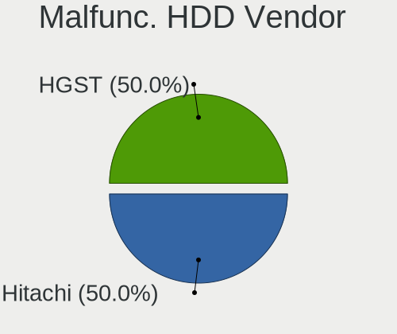

| Vendor  | Notebooks | Drives | Percent |
|---------|-----------|--------|---------|
| Seagate | 8         | 12     | 42.11%  |
| WDC     | 3         | 3      | 15.79%  |
| Toshiba | 3         | 3      | 15.79%  |
| Hitachi | 3         | 3      | 15.79%  |
| HGST    | 2         | 2      | 10.53%  |

Malfunc. Drive Kind
-------------------

Kinds of faulty drives

| Kind | Notebooks | Drives | Percent |
|------|-----------|--------|---------|
| HDD  | 19        | 23     | 50%     |
| SSD  | 17        | 19     | 44.74%  |
| NVMe | 2         | 2      | 5.26%   |

Failed Drives
-------------

Failed drive models

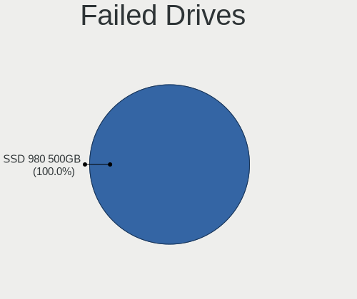

| Model                             | Notebooks | Drives | Percent |
|-----------------------------------|-----------|--------|---------|
| Samsung Electronics SSD 980 500GB | 1         | 1      | 100%    |

Failed Drive Vendor
-------------------

Failed drive vendors

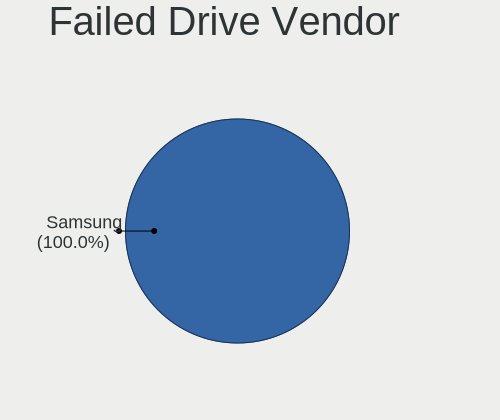

| Vendor              | Notebooks | Drives | Percent |
|---------------------|-----------|--------|---------|
| Samsung Electronics | 1         | 1      | 100%    |

Drive Status
------------

Number of failed and malfunc. drives

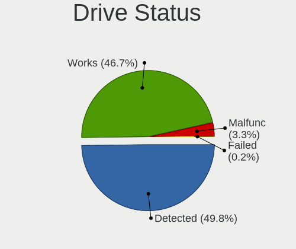

| Status   | Notebooks | Drives | Percent |
|----------|-----------|--------|---------|
| Detected | 515       | 767    | 50.49%  |
| Works    | 466       | 607    | 45.69%  |
| Malfunc  | 38        | 44     | 3.73%   |
| Failed   | 1         | 1      | 0.1%    |

Storage controller
------------------

Storage Vendor
--------------

Storage controller vendors

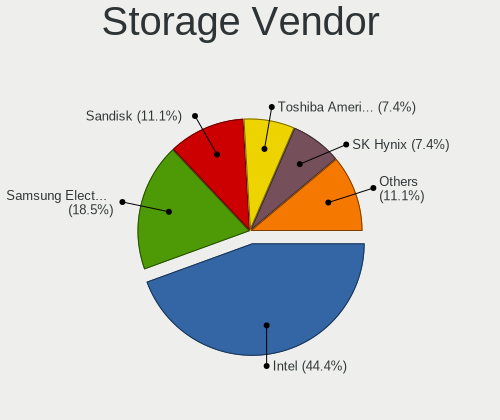

| Vendor                           | Notebooks | Percent |
|----------------------------------|-----------|---------|
| Intel                            | 552       | 45.54%  |
| Samsung Electronics              | 186       | 15.35%  |
| AMD                              | 112       | 9.24%   |
| SanDisk                          | 97        | 8%      |
| SK hynix                         | 76        | 6.27%   |
| Toshiba America Info Systems     | 42        | 3.47%   |
| Micron Technology                | 28        | 2.31%   |
| KIOXIA                           | 26        | 2.15%   |
| Kingston Technology Company      | 16        | 1.32%   |
| Phison Electronics               | 14        | 1.16%   |
| Silicon Motion                   | 12        | 0.99%   |
| ADATA Technology                 | 12        | 0.99%   |
| Union Memory (Shenzhen)          | 6         | 0.5%    |
| Nvidia                           | 6         | 0.5%    |
| Lite-On Technology               | 5         | 0.41%   |
| Micron/Crucial Technology        | 4         | 0.33%   |
| Apple                            | 4         | 0.33%   |
| Realtek Semiconductor            | 3         | 0.25%   |
| Yangtze Memory Technologies      | 2         | 0.17%   |
| Solid State Storage Technology   | 2         | 0.17%   |
| Marvell Technology Group         | 2         | 0.17%   |
| Lenovo                           | 2         | 0.17%   |
| Silicon Integrated Systems [SiS] | 1         | 0.08%   |
| JMicron Technology               | 1         | 0.08%   |
| Beijing Starblaze Technology     | 1         | 0.08%   |

Storage Model
-------------

Storage controller models

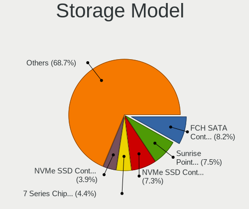

| Model                                                                          | Notebooks | Percent |
|--------------------------------------------------------------------------------|-----------|---------|
| AMD FCH SATA Controller [AHCI mode]                                            | 104       | 8.19%   |
| Intel Sunrise Point-LP SATA Controller [AHCI mode]                             | 97        | 7.64%   |
| Samsung NVMe SSD Controller SM981/PM981/PM983                                  | 93        | 7.32%   |
| Intel 7 Series Chipset Family 6-port SATA Controller [AHCI mode]               | 57        | 4.49%   |
| Samsung NVMe SSD Controller 980                                                | 50        | 3.94%   |
| Intel Volume Management Device NVMe RAID Controller                            | 47        | 3.7%    |
| SK hynix Gold P31/PC711 NVMe Solid State Drive                                 | 35        | 2.76%   |
| Intel 82801 Mobile SATA Controller [RAID mode]                                 | 35        | 2.76%   |
| Intel 8 Series SATA Controller 1 [AHCI mode]                                   | 34        | 2.68%   |
| Intel Cannon Lake Mobile PCH SATA AHCI Controller                              | 31        | 2.44%   |
| Intel 6 Series/C200 Series Chipset Family 6 port Mobile SATA AHCI Controller   | 31        | 2.44%   |
| SanDisk WD Black SN750 / PC SN730 NVMe SSD                                     | 30        | 2.36%   |
| Micron Non-Volatile memory controller                                          | 28        | 2.2%    |
| KIOXIA NVMe SSD Controller BG4                                                 | 25        | 1.97%   |
| Samsung NVMe SSD Controller PM9A1/PM9A3/980PRO                                 | 24        | 1.89%   |
| Intel Wildcat Point-LP SATA Controller [AHCI Mode]                             | 24        | 1.89%   |
| Intel 8 Series/C220 Series Chipset Family 6-port SATA Controller 1 [AHCI mode] | 23        | 1.81%   |
| Toshiba America Info Systems XG6 NVMe SSD Controller                           | 22        | 1.73%   |
| SanDisk WD Blue SN550 NVMe SSD                                                 | 22        | 1.73%   |
| Intel Tiger Lake-LP SATA Controller                                            | 22        | 1.73%   |
| SK hynix Non-Volatile memory controller                                        | 17        | 1.34%   |
| SanDisk Non-Volatile memory controller                                         | 17        | 1.34%   |
| Intel HM170/QM170 Chipset SATA Controller [AHCI Mode]                          | 17        | 1.34%   |
| Intel SSD 660P Series                                                          | 15        | 1.18%   |
| Intel Comet Lake SATA AHCI Controller                                          | 15        | 1.18%   |
| Samsung NVMe SSD Controller SM961/PM961/SM963                                  | 13        | 1.02%   |
| Intel 5 Series/3400 Series Chipset 4 port SATA AHCI Controller                 | 12        | 0.94%   |
| SanDisk WD Blue SN500 / PC SN520 NVMe SSD                                      | 11        | 0.87%   |
| Intel Ice Lake-LP SATA Controller [AHCI mode]                                  | 11        | 0.87%   |
| Intel Celeron/Pentium Silver Processor SATA Controller                         | 11        | 0.87%   |
| Intel 82801IBM/IEM (ICH9M/ICH9M-E) 4 port SATA Controller [AHCI mode]          | 11        | 0.87%   |
| Intel 400 Series Chipset Family SATA AHCI Controller                           | 11        | 0.87%   |
| Intel SSD Pro 7600p/760p/E 6100p Series                                        | 10        | 0.79%   |
| Intel Non-Volatile memory controller                                           | 10        | 0.79%   |
| SK hynix BC511                                                                 | 9         | 0.71%   |
| Phison PS5013 E13 NVMe Controller                                              | 9         | 0.71%   |
| SK hynix PC401 NVMe Solid State Drive 256GB                                    | 8         | 0.63%   |
| Silicon Motion SM2263EN/SM2263XT SSD Controller                                | 8         | 0.63%   |
| Intel Celeron N3350/Pentium N4200/Atom E3900 Series SATA AHCI Controller       | 8         | 0.63%   |
| Intel Cannon Point-LP SATA Controller [AHCI Mode]                              | 8         | 0.63%   |

Storage Kind
------------

Kind of storage controller (IDE, SATA, NVMe, SAS, ...)

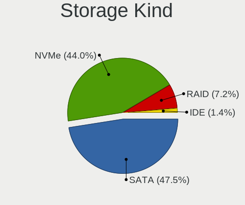

| Kind | Notebooks | Percent |
|------|-----------|---------|
| SATA | 580       | 47.58%  |
| NVMe | 535       | 43.89%  |
| RAID | 87        | 7.14%   |
| IDE  | 17        | 1.39%   |

Processor
---------

CPU Vendor
----------

Processor vendors

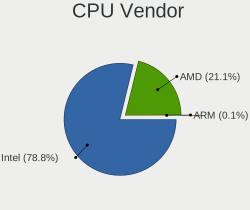

| Vendor | Notebooks | Percent |
|--------|-----------|---------|
| Intel  | 753       | 78.85%  |
| AMD    | 201       | 21.05%  |
| ARM    | 1         | 0.1%    |

CPU Model
---------

Processor models

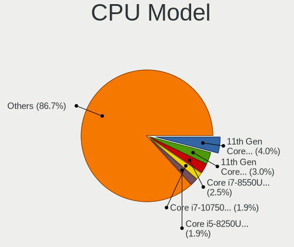

| Model                                         | Notebooks | Percent |
|-----------------------------------------------|-----------|---------|
| Intel 11th Gen Core i7-1165G7 @ 2.80GHz       | 37        | 3.87%   |
| Intel 11th Gen Core i5-1135G7 @ 2.40GHz       | 32        | 3.35%   |
| Intel Core i7-8550U CPU @ 1.80GHz             | 25        | 2.62%   |
| Intel Core i7-7500U CPU @ 2.70GHz             | 17        | 1.78%   |
| Intel Core i7-10510U CPU @ 1.80GHz            | 17        | 1.78%   |
| Intel Core i5-8265U CPU @ 1.60GHz             | 17        | 1.78%   |
| Intel Core i5-8250U CPU @ 1.60GHz             | 17        | 1.78%   |
| AMD Ryzen 7 4800H with Radeon Graphics        | 17        | 1.78%   |
| Intel Core i7-8565U CPU @ 1.80GHz             | 16        | 1.68%   |
| Intel Core i7-10750H CPU @ 2.60GHz            | 15        | 1.57%   |
| AMD Ryzen 5 3500U with Radeon Vega Mobile Gfx | 15        | 1.57%   |
| AMD Ryzen 5 5500U with Radeon Graphics        | 13        | 1.36%   |
| Intel Core i7-8750H CPU @ 2.20GHz             | 12        | 1.26%   |
| Intel Core i7-7700HQ CPU @ 2.80GHz            | 12        | 1.26%   |
| Intel Core i5-6200U CPU @ 2.30GHz             | 11        | 1.15%   |
| Intel Core i5-10210U CPU @ 1.60GHz            | 11        | 1.15%   |
| AMD Ryzen 7 5800H with Radeon Graphics        | 11        | 1.15%   |
| Intel Core i7-9750H CPU @ 2.60GHz             | 10        | 1.05%   |
| Intel Core i5-7200U CPU @ 2.50GHz             | 10        | 1.05%   |
| AMD Ryzen 5 4500U with Radeon Graphics        | 10        | 1.05%   |
| Intel Core i7-1065G7 CPU @ 1.30GHz            | 9         | 0.94%   |
| Intel 11th Gen Core i7-1185G7 @ 3.00GHz       | 9         | 0.94%   |
| AMD Ryzen 7 5700U with Radeon Graphics        | 9         | 0.94%   |
| AMD Ryzen 7 4700U with Radeon Graphics        | 9         | 0.94%   |
| Intel Core i7-8650U CPU @ 1.90GHz             | 8         | 0.84%   |
| Intel Core i7-6700HQ CPU @ 2.60GHz            | 8         | 0.84%   |
| Intel Core i7-10850H CPU @ 2.70GHz            | 8         | 0.84%   |
| AMD Ryzen 9 5900HX with Radeon Graphics       | 8         | 0.84%   |
| AMD Ryzen 5 4600H with Radeon Graphics        | 8         | 0.84%   |
| Intel Core i7-8665U CPU @ 1.90GHz             | 7         | 0.73%   |
| Intel Core i7-4510U CPU @ 2.00GHz             | 7         | 0.73%   |
| Intel Core i5-6300U CPU @ 2.40GHz             | 7         | 0.73%   |
| Intel Core i5-2520M CPU @ 2.50GHz             | 7         | 0.73%   |
| Intel Core i3-5005U CPU @ 2.00GHz             | 7         | 0.73%   |
| Intel 11th Gen Core i7-11800H @ 2.30GHz       | 7         | 0.73%   |
| AMD Ryzen 7 PRO 4750U with Radeon Graphics    | 7         | 0.73%   |
| Intel Core i7-6600U CPU @ 2.60GHz             | 6         | 0.63%   |
| Intel Core i7-6500U CPU @ 2.50GHz             | 6         | 0.63%   |
| Intel Core i7-4600U CPU @ 2.10GHz             | 6         | 0.63%   |
| Intel Core i7-2670QM CPU @ 2.20GHz            | 6         | 0.63%   |

CPU Model Family
----------------

Processor model prefix

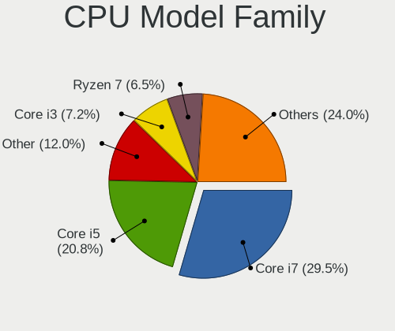

| Model                   | Notebooks | Percent |
|-------------------------|-----------|---------|
| Intel Core i7           | 283       | 29.63%  |
| Intel Core i5           | 199       | 20.84%  |
| Other                   | 115       | 12.04%  |
| Intel Core i3           | 69        | 7.23%   |
| AMD Ryzen 7             | 61        | 6.39%   |
| AMD Ryzen 5             | 61        | 6.39%   |
| Intel Celeron           | 25        | 2.62%   |
| AMD Ryzen 9             | 18        | 1.88%   |
| Intel Core 2 Duo        | 17        | 1.78%   |
| Intel Core i9           | 11        | 1.15%   |
| Intel Atom              | 11        | 1.15%   |
| AMD Ryzen 7 PRO         | 11        | 1.15%   |
| AMD Ryzen 3             | 10        | 1.05%   |
| Intel Pentium           | 9         | 0.94%   |
| Intel Pentium Silver    | 5         | 0.52%   |
| AMD Ryzen 5 PRO         | 5         | 0.52%   |
| AMD A6                  | 5         | 0.52%   |
| AMD A10                 | 5         | 0.52%   |
| AMD Athlon              | 4         | 0.42%   |
| AMD A4                  | 4         | 0.42%   |
| AMD E                   | 3         | 0.31%   |
| AMD A8                  | 3         | 0.31%   |
| Intel Xeon              | 2         | 0.21%   |
| Intel Pentium Dual-Core | 2         | 0.21%   |
| Intel Pentium Dual      | 2         | 0.21%   |
| Intel Core m3           | 2         | 0.21%   |
| AMD Phenom II           | 2         | 0.21%   |
| AMD E2                  | 2         | 0.21%   |
| Intel Genuine           | 1         | 0.1%    |
| Intel Core m7           | 1         | 0.1%    |
| Intel Core m5           | 1         | 0.1%    |
| Intel Core M            | 1         | 0.1%    |
| AMD Ryzen 3 PRO         | 1         | 0.1%    |
| AMD PRO A10             | 1         | 0.1%    |
| AMD E1                  | 1         | 0.1%    |
| AMD C-60                | 1         | 0.1%    |
| AMD Athlon II           | 1         | 0.1%    |

CPU Cores
---------

Number of processor cores

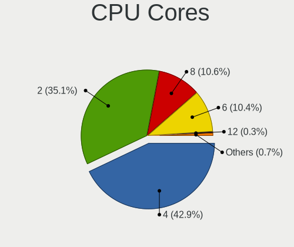

| Number | Notebooks | Percent |
|--------|-----------|---------|
| 4      | 407       | 42.62%  |
| 2      | 338       | 35.39%  |
| 8      | 101       | 10.58%  |
| 6      | 99        | 10.37%  |
| 12     | 3         | 0.31%   |
| 14     | 2         | 0.21%   |
| 10     | 2         | 0.21%   |
| 1      | 2         | 0.21%   |
| 3      | 1         | 0.1%    |

CPU Sockets
-----------

Number of sockets

| Number | Notebooks | Percent |
|--------|-----------|---------|
| 1      | 955       | 100%    |

CPU Threads
-----------

Threads per core (Hyper-Threading)

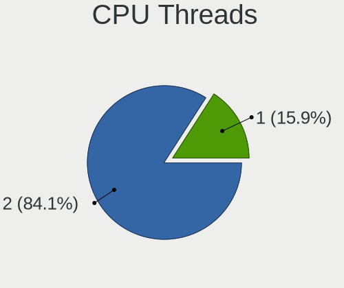

| Number | Notebooks | Percent |
|--------|-----------|---------|
| 2      | 818       | 85.65%  |
| 1      | 137       | 14.35%  |

CPU Op-Modes
------------

CPU Operation Modes (32-bit, 64-bit)

| Op mode        | Notebooks | Percent |
|----------------|-----------|---------|
| 32-bit, 64-bit | 954       | 99.9%   |
| 64-bit         | 1         | 0.1%    |

CPU Microcode
-------------

Microcode number

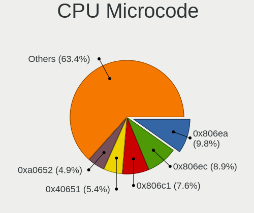

| Number     | Notebooks | Percent |
|------------|-----------|---------|
| 0x806c1    | 88        | 9.14%   |
| 0x806ec    | 70        | 7.27%   |
| 0x306a9    | 57        | 5.92%   |
| 0x806ea    | 54        | 5.61%   |
| Unknown    | 54        | 5.61%   |
| 0x806e9    | 41        | 4.26%   |
| 0x406e3    | 40        | 4.15%   |
| 0x40651    | 38        | 3.95%   |
| 0xa0652    | 37        | 3.84%   |
| 0x206a7    | 36        | 3.74%   |
| 0x0a50000c | 35        | 3.63%   |
| 0x906ea    | 32        | 3.32%   |
| 0x08600106 | 31        | 3.22%   |
| 0x306d4    | 27        | 2.8%    |
| 0x306c3    | 23        | 2.39%   |
| 0x08108109 | 22        | 2.28%   |
| 0x706e5    | 20        | 2.08%   |
| 0x08600104 | 16        | 1.66%   |
| 0x906ed    | 14        | 1.45%   |
| 0x08608103 | 14        | 1.45%   |
| 0x506e3    | 13        | 1.35%   |
| 0x08108102 | 13        | 1.35%   |
| 0x20655    | 12        | 1.25%   |
| 0x1067a    | 12        | 1.25%   |
| 0x906e9    | 11        | 1.14%   |
| 0x806eb    | 10        | 1.04%   |
| 0x806d1    | 10        | 1.04%   |
| 0x506c9    | 10        | 1.04%   |
| 0x08608102 | 9         | 0.93%   |
| 0x706a8    | 8         | 0.83%   |
| 0x30678    | 8         | 0.83%   |
| 0x406c4    | 7         | 0.73%   |
| 0x40661    | 5         | 0.52%   |
| 0x10676    | 5         | 0.52%   |
| 0x08600103 | 5         | 0.52%   |
| 0x06001119 | 5         | 0.52%   |
| 0x806c2    | 4         | 0.42%   |
| 0x706a1    | 4         | 0.42%   |
| 0x6fd      | 4         | 0.42%   |
| 0x906c0    | 3         | 0.31%   |

CPU Microarch
-------------

Microarchitecture

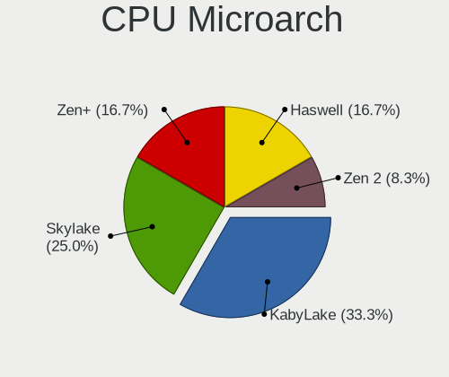

| Name             | Notebooks | Percent |
|------------------|-----------|---------|
| KabyLake         | 242       | 25.34%  |
| TigerLake        | 99        | 10.37%  |
| Haswell          | 70        | 7.33%   |
| Zen 2            | 62        | 6.49%   |
| Skylake          | 59        | 6.18%   |
| IvyBridge        | 59        | 6.18%   |
| CometLake        | 44        | 4.61%   |
| Zen 3            | 39        | 4.08%   |
| SandyBridge      | 38        | 3.98%   |
| Zen+             | 37        | 3.87%   |
| IceLake          | 30        | 3.14%   |
| Unknown          | 29        | 3.04%   |
| Broadwell        | 27        | 2.83%   |
| Silvermont       | 18        | 1.88%   |
| Penryn           | 17        | 1.78%   |
| Westmere         | 16        | 1.68%   |
| Goldmont plus    | 12        | 1.26%   |
| Goldmont         | 10        | 1.05%   |
| Zen              | 7         | 0.73%   |
| Puma             | 6         | 0.63%   |
| Piledriver       | 6         | 0.63%   |
| Excavator        | 5         | 0.52%   |
| Core             | 5         | 0.52%   |
| Bobcat           | 4         | 0.42%   |
| Tremont          | 3         | 0.31%   |
| K10              | 3         | 0.31%   |
| Jaguar           | 3         | 0.31%   |
| K10 Llano        | 2         | 0.21%   |
| Alderlake Hybrid | 2         | 0.21%   |
| Bonnell          | 1         | 0.1%    |

Graphics
--------

GPU Vendor
----------

Vendors of graphics cards

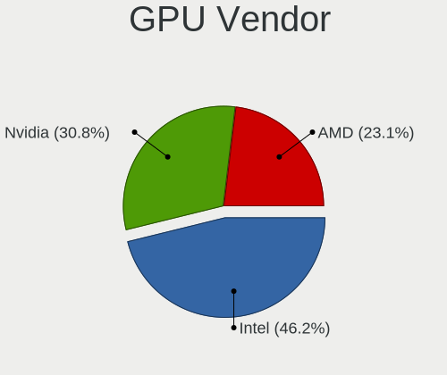

| Vendor                           | Notebooks | Percent |
|----------------------------------|-----------|---------|
| Intel                            | 708       | 56.96%  |
| Nvidia                           | 296       | 23.81%  |
| AMD                              | 238       | 19.15%  |
| Silicon Integrated Systems [SiS] | 1         | 0.08%   |

GPU Model
---------

Graphics card models

| Model                                                                                    | Notebooks | Percent |
|------------------------------------------------------------------------------------------|-----------|---------|
| Intel TigerLake-LP GT2 [Iris Xe Graphics]                                                | 90        | 7.13%   |
| AMD Renoir                                                                               | 57        | 4.51%   |
| Intel UHD Graphics 620                                                                   | 56        | 4.43%   |
| Intel 3rd Gen Core processor Graphics Controller                                         | 53        | 4.2%    |
| Intel WhiskeyLake-U GT2 [UHD Graphics 620]                                               | 43        | 3.4%    |
| Intel CoffeeLake-H GT2 [UHD Graphics 630]                                                | 43        | 3.4%    |
| Intel Haswell-ULT Integrated Graphics Controller                                         | 41        | 3.25%   |
| Intel CometLake-U GT2 [UHD Graphics]                                                     | 38        | 3.01%   |
| AMD Picasso/Raven 2 [Radeon Vega Series / Radeon Vega Mobile Series]                     | 38        | 3.01%   |
| Intel HD Graphics 620                                                                    | 36        | 2.85%   |
| Intel CometLake-H GT2 [UHD Graphics]                                                     | 36        | 2.85%   |
| Intel Skylake GT2 [HD Graphics 520]                                                      | 35        | 2.77%   |
| AMD Cezanne [Radeon Vega Series / Radeon Vega Mobile Series]                             | 35        | 2.77%   |
| Intel 2nd Generation Core Processor Family Integrated Graphics Controller                | 30        | 2.38%   |
| AMD Lucienne                                                                             | 24        | 1.9%    |
| Intel HD Graphics 5500                                                                   | 23        | 1.82%   |
| Intel 4th Gen Core Processor Integrated Graphics Controller                              | 22        | 1.74%   |
| Nvidia GA106M [GeForce RTX 3060 Mobile / Max-Q]                                          | 17        | 1.35%   |
| Intel HD Graphics 530                                                                    | 13        | 1.03%   |
| Nvidia TU117M [GeForce GTX 1650 Mobile / Max-Q]                                          | 12        | 0.95%   |
| Nvidia TU116M [GeForce GTX 1660 Ti Mobile]                                               | 12        | 0.95%   |
| Nvidia GP107M [GeForce GTX 1050 Ti Mobile]                                               | 12        | 0.95%   |
| Intel HD Graphics 630                                                                    | 12        | 0.95%   |
| Intel Core Processor Integrated Graphics Controller                                      | 12        | 0.95%   |
| Nvidia TU117M [GeForce GTX 1650 Ti Mobile]                                               | 11        | 0.87%   |
| Nvidia GF117M [GeForce 610M/710M/810M/820M / GT 620M/625M/630M/720M]                     | 11        | 0.87%   |
| Intel Iris Plus Graphics G1 (Ice Lake)                                                   | 11        | 0.87%   |
| AMD Topaz XT [Radeon R7 M260/M265 / M340/M360 / M440/M445 / 530/535 / 620/625 Mobile]    | 11        | 0.87%   |
| Nvidia TU117M                                                                            | 10        | 0.79%   |
| Intel TigerLake-H GT1 [UHD Graphics]                                                     | 10        | 0.79%   |
| Nvidia GP108M [GeForce MX250]                                                            | 9         | 0.71%   |
| Nvidia GM108M [GeForce 940MX]                                                            | 9         | 0.71%   |
| Intel Iris Plus Graphics G7                                                              | 9         | 0.71%   |
| Intel GeminiLake [UHD Graphics 600]                                                      | 9         | 0.71%   |
| Intel Atom/Celeron/Pentium Processor x5-E8000/J3xxx/N3xxx Integrated Graphics Controller | 9         | 0.71%   |
| Intel Atom Processor Z36xxx/Z37xxx Series Graphics & Display                             | 9         | 0.71%   |
| Nvidia TU106M [GeForce RTX 2060 Mobile]                                                  | 7         | 0.55%   |
| Nvidia GP108M [GeForce MX150]                                                            | 7         | 0.55%   |
| Nvidia GP107M [GeForce GTX 1050 Mobile]                                                  | 7         | 0.55%   |
| Nvidia GA107M [GeForce RTX 3050 Mobile]                                                  | 7         | 0.55%   |

GPU Combo
---------

Combinations of graphics cards

| Name           | Notebooks | Percent |
|----------------|-----------|---------|
| 1 x Intel      | 451       | 47.23%  |
| Intel + Nvidia | 224       | 23.46%  |
| 1 x AMD        | 158       | 16.54%  |
| 1 x Nvidia     | 39        | 4.08%   |
| AMD + Nvidia   | 33        | 3.46%   |
| Intel + AMD    | 29        | 3.04%   |
| 2 x AMD        | 17        | 1.78%   |
| Other          | 3         | 0.31%   |
| 1 x SiS        | 1         | 0.1%    |

GPU Driver
----------

Free vs proprietary

| Driver      | Notebooks | Percent |
|-------------|-----------|---------|
| Free        | 805       | 83.68%  |
| Proprietary | 148       | 15.38%  |
| Unknown     | 9         | 0.94%   |

GPU Memory
----------

Total video memory

| Size in GB | Notebooks | Percent |
|------------|-----------|---------|
| Unknown    | 604       | 62.53%  |
| 1.01-2.0   | 121       | 12.53%  |
| 0.01-0.5   | 120       | 12.42%  |
| 3.01-4.0   | 49        | 5.07%   |
| 0.51-1.0   | 38        | 3.93%   |
| 7.01-8.0   | 15        | 1.55%   |
| 5.01-6.0   | 9         | 0.93%   |
| 8.01-16.0  | 7         | 0.72%   |
| 2.01-3.0   | 3         | 0.31%   |

Monitor
-------

Monitor Vendor
--------------

Monitor vendors

| Vendor                  | Notebooks | Percent |
|-------------------------|-----------|---------|
| AU Optronics            | 199       | 16.91%  |
| Chimei Innolux          | 171       | 14.53%  |
| BOE                     | 169       | 14.36%  |
| LG Display              | 155       | 13.17%  |
| Samsung Electronics     | 84        | 7.14%   |
| Dell                    | 62        | 5.27%   |
| Sharp                   | 61        | 5.18%   |
| Apple                   | 37        | 3.14%   |
| Goldstar                | 33        | 2.8%    |
| Lenovo                  | 26        | 2.21%   |
| PANDA                   | 19        | 1.61%   |
| Philips                 | 15        | 1.27%   |
| InfoVision              | 15        | 1.27%   |
| Hewlett-Packard         | 15        | 1.27%   |
| CSO                     | 14        | 1.19%   |
| Acer                    | 13        | 1.1%    |
| BenQ                    | 12        | 1.02%   |
| AOC                     | 12        | 1.02%   |
| Chi Mei Optoelectronics | 11        | 0.93%   |
| Ancor Communications    | 8         | 0.68%   |
| TMX                     | 6         | 0.51%   |
| Iiyama                  | 4         | 0.34%   |
| ASUSTek Computer        | 4         | 0.34%   |
| ViewSonic               | 3         | 0.25%   |
| MSI                     | 3         | 0.25%   |
| InnoLux Display         | 3         | 0.25%   |
| Sony                    | 2         | 0.17%   |
| Panasonic               | 2         | 0.17%   |
| JRY                     | 2         | 0.17%   |
| Gigabyte Technology     | 2         | 0.17%   |
| Vizio                   | 1         | 0.08%   |
| Toshiba                 | 1         | 0.08%   |
| Tianma XM               | 1         | 0.08%   |
| Targa Visionary         | 1         | 0.08%   |
| Sceptre Tech            | 1         | 0.08%   |
| ONN                     | 1         | 0.08%   |
| LGD                     | 1         | 0.08%   |
| JDI                     | 1         | 0.08%   |
| INX                     | 1         | 0.08%   |
| HUAWEI                  | 1         | 0.08%   |

Monitor Model
-------------

Monitor models

| Model                                                                 | Notebooks | Percent |
|-----------------------------------------------------------------------|-----------|---------|
| Chimei Innolux LCD Monitor CMN14D4 1920x1080 309x173mm 13.9-inch      | 16        | 1.33%   |
| BOE LCD Monitor BOE095F 2256x1504 285x190mm 13.5-inch                 | 10        | 0.83%   |
| Chimei Innolux LCD Monitor CMN15E7 1920x1080 344x193mm 15.5-inch      | 8         | 0.67%   |
| AU Optronics LCD Monitor AUO403D 1920x1080 309x173mm 13.9-inch        | 8         | 0.67%   |
| LG Display LCD Monitor LGD05E5 1920x1080 340x190mm 15.3-inch          | 7         | 0.58%   |
| Goldstar FULL HD GSM5B55 1920x1080 480x270mm 21.7-inch                | 7         | 0.58%   |
| Dell P2419H DELD0DA 1920x1080 527x296mm 23.8-inch                     | 7         | 0.58%   |
| Chimei Innolux LCD Monitor CMN1521 1920x1080 344x193mm 15.5-inch      | 7         | 0.58%   |
| Chimei Innolux LCD Monitor CMN14D5 1920x1080 309x173mm 13.9-inch      | 7         | 0.58%   |
| BOE LCD Monitor BOE0893 2160x1440 296x197mm 14.0-inch                 | 7         | 0.58%   |
| AU Optronics LCD Monitor AUO5B2D 1920x1080 293x162mm 13.2-inch        | 7         | 0.58%   |
| AU Optronics LCD Monitor AUO21ED 1920x1080 344x193mm 15.5-inch        | 7         | 0.58%   |
| Sharp LCD Monitor SHP1453 1920x1080 346x194mm 15.6-inch               | 6         | 0.5%    |
| Chimei Innolux LCD Monitor CMN15F5 1920x1080 344x193mm 15.5-inch      | 6         | 0.5%    |
| AU Optronics LCD Monitor AUO61ED 1920x1080 344x194mm 15.5-inch        | 6         | 0.5%    |
| AU Optronics LCD Monitor AUO38ED 1920x1080 344x193mm 15.5-inch        | 6         | 0.5%    |
| PANDA LCD Monitor NCP004D 1920x1080 344x194mm 15.5-inch               | 5         | 0.42%   |
| LG Display LCD Monitor LGD046F 1920x1080 344x194mm 15.5-inch          | 5         | 0.42%   |
| LG Display LCD Monitor LGD046D 1920x1080 309x174mm 14.0-inch          | 5         | 0.42%   |
| Goldstar ULTRAWIDE GSM59F1 2560x1080 798x334mm 34.1-inch              | 5         | 0.42%   |
| BOE LCD Monitor BOE0877 1920x1080 309x173mm 13.9-inch                 | 5         | 0.42%   |
| BOE LCD Monitor BOE0853 1920x1080 344x194mm 15.5-inch                 | 5         | 0.42%   |
| BOE LCD Monitor BOE0812 1920x1080 344x194mm 15.5-inch                 | 5         | 0.42%   |
| BOE LCD Monitor BOE06A4 1366x768 344x194mm 15.5-inch                  | 5         | 0.42%   |
| AU Optronics LCD Monitor AUO573D 1920x1080 309x174mm 14.0-inch        | 5         | 0.42%   |
| AU Optronics LCD Monitor AUO21EC 1366x768 344x193mm 15.5-inch         | 5         | 0.42%   |
| TMX TL140BDXP01-0 TMX1400 2560x1440 310x174mm 14.0-inch               | 4         | 0.33%   |
| Sharp LQ156M1JW03 SHP155D 1920x1080 344x194mm 15.5-inch               | 4         | 0.33%   |
| Sharp LCD Monitor SHP14F9 1920x1200 288x180mm 13.4-inch               | 4         | 0.33%   |
| Sharp LCD Monitor SHP14AD 3840x2160 294x165mm 13.3-inch               | 4         | 0.33%   |
| Sharp LCD Monitor SHP148B 3840x2160 294x165mm 13.3-inch               | 4         | 0.33%   |
| Samsung Electronics LCD Monitor SDC324C 1920x1080 344x194mm 15.5-inch | 4         | 0.33%   |
| Samsung Electronics C24F390 SAM0D2C 1920x1080 521x293mm 23.5-inch     | 4         | 0.33%   |
| LG Display LCD Monitor LGD0563 1920x1080 344x194mm 15.5-inch          | 4         | 0.33%   |
| LG Display LCD Monitor LGD02DC 1366x768 344x194mm 15.5-inch           | 4         | 0.33%   |
| Dell P2419H DELD0D9 1920x1080 527x296mm 23.8-inch                     | 4         | 0.33%   |
| Chimei Innolux LCD Monitor CMN15DB 1366x768 344x193mm 15.5-inch       | 4         | 0.33%   |
| Chimei Innolux LCD Monitor CMN15C4 1920x1080 344x193mm 15.5-inch      | 4         | 0.33%   |
| Chimei Innolux LCD Monitor CMN1515 1920x1080 344x193mm 15.5-inch      | 4         | 0.33%   |
| Chimei Innolux LCD Monitor CMN14D6 1366x768 309x173mm 13.9-inch       | 4         | 0.33%   |

Monitor Resolution
------------------

Monitor screen resolution

| Resolution         | Notebooks | Percent |
|--------------------|-----------|---------|
| 1920x1080 (FHD)    | 563       | 52.23%  |
| 1366x768 (WXGA)    | 200       | 18.55%  |
| 3840x2160 (4K)     | 70        | 6.49%   |
| 2560x1440 (QHD)    | 52        | 4.82%   |
| 1920x1200 (WUXGA)  | 29        | 2.69%   |
| 1600x900 (HD+)     | 27        | 2.5%    |
| 1280x800 (WXGA)    | 16        | 1.48%   |
| 2880x1800          | 14        | 1.3%    |
| 1440x900 (WXGA+)   | 14        | 1.3%    |
| 2560x1600          | 13        | 1.21%   |
| 3440x1440          | 10        | 0.93%   |
| 2256x1504          | 10        | 0.93%   |
| 3840x2400          | 9         | 0.83%   |
| 2560x1080          | 8         | 0.74%   |
| 2160x1440          | 8         | 0.74%   |
| 1680x1050 (WSXGA+) | 6         | 0.56%   |
| 3200x1800 (QHD+)   | 5         | 0.46%   |
| 2240x1400          | 3         | 0.28%   |
| 1280x1024 (SXGA)   | 3         | 0.28%   |
| 3200x2000          | 2         | 0.19%   |
| 3072x1920          | 2         | 0.19%   |
| 3000x2000          | 2         | 0.19%   |
| 2880x1920          | 2         | 0.19%   |
| 2160x1350          | 2         | 0.19%   |
| 3840x2560          | 1         | 0.09%   |
| 3840x1600          | 1         | 0.09%   |
| 3840x1080          | 1         | 0.09%   |
| 2736x1824          | 1         | 0.09%   |
| 1920x1280          | 1         | 0.09%   |
| 1360x768           | 1         | 0.09%   |
| 1024x600           | 1         | 0.09%   |
| Unknown            | 1         | 0.09%   |

Monitor Diagonal
----------------

Diagonal size in inches

| Inches  | Notebooks | Percent |
|---------|-----------|---------|
| 15      | 420       | 35.47%  |
| 13      | 223       | 18.83%  |
| 14      | 165       | 13.94%  |
| 27      | 64        | 5.41%   |
| 24      | 56        | 4.73%   |
| 17      | 48        | 4.05%   |
| 23      | 36        | 3.04%   |
| 12      | 36        | 3.04%   |
| 21      | 29        | 2.45%   |
| 34      | 16        | 1.35%   |
| 11      | 16        | 1.35%   |
| 16      | 14        | 1.18%   |
| 31      | 11        | 0.93%   |
| 18      | 7         | 0.59%   |
| 40      | 5         | 0.42%   |
| 20      | 4         | 0.34%   |
| 19      | 4         | 0.34%   |
| Unknown | 4         | 0.34%   |
| 84      | 3         | 0.25%   |
| 26      | 3         | 0.25%   |
| 22      | 3         | 0.25%   |
| 35      | 2         | 0.17%   |
| 32      | 2         | 0.17%   |
| 28      | 2         | 0.17%   |
| 25      | 2         | 0.17%   |
| 10      | 2         | 0.17%   |
| 58      | 1         | 0.08%   |
| 54      | 1         | 0.08%   |
| 48      | 1         | 0.08%   |
| 43      | 1         | 0.08%   |
| 42      | 1         | 0.08%   |
| 37      | 1         | 0.08%   |
| 29      | 1         | 0.08%   |

Monitor Width
-------------

Physical width

| Width in mm | Notebooks | Percent |
|-------------|-----------|---------|
| 301-350     | 698       | 59.35%  |
| 201-300     | 169       | 14.37%  |
| 501-600     | 147       | 12.5%   |
| 351-400     | 59        | 5.02%   |
| 401-500     | 44        | 3.74%   |
| 601-700     | 21        | 1.79%   |
| 701-800     | 18        | 1.53%   |
| 801-900     | 8         | 0.68%   |
| Unknown     | 4         | 0.34%   |
| 1501-2000   | 3         | 0.26%   |
| 1001-1500   | 3         | 0.26%   |
| 901-1000    | 2         | 0.17%   |

Aspect Ratio
------------

Proportional relationship between the width and the height

| Ratio   | Notebooks | Percent |
|---------|-----------|---------|
| 16/9    | 824       | 83.23%  |
| 16/10   | 113       | 11.41%  |
| 3/2     | 27        | 2.73%   |
| 21/9    | 19        | 1.92%   |
| 5/4     | 3         | 0.3%    |
| Unknown | 2         | 0.2%    |
| 4/3     | 1         | 0.1%    |
| 32/9    | 1         | 0.1%    |

Monitor Area
------------

Area in inch²

| Area in inch² | Notebooks | Percent |
|----------------|-----------|---------|
| 101-110        | 424       | 35.81%  |
| 81-90          | 300       | 25.34%  |
| 201-250        | 104       | 8.78%   |
| 71-80          | 90        | 7.6%    |
| 301-350        | 65        | 5.49%   |
| 121-130        | 47        | 3.97%   |
| 61-70          | 34        | 2.87%   |
| 351-500        | 34        | 2.87%   |
| 251-300        | 21        | 1.77%   |
| 51-60          | 16        | 1.35%   |
| 151-200        | 13        | 1.1%    |
| 111-120        | 10        | 0.84%   |
| 501-1000       | 9         | 0.76%   |
| More than 1000 | 5         | 0.42%   |
| 141-150        | 5         | 0.42%   |
| Unknown        | 4         | 0.34%   |
| 41-50          | 2         | 0.17%   |
| 131-140        | 1         | 0.08%   |

Pixel Density
-------------

Pixels per inch

| Density       | Notebooks | Percent |
|---------------|-----------|---------|
| 121-160       | 541       | 46.96%  |
| 101-120       | 232       | 20.14%  |
| 51-100        | 171       | 14.84%  |
| 161-240       | 140       | 12.15%  |
| More than 240 | 61        | 5.3%    |
| Unknown       | 4         | 0.35%   |
| 1-50          | 3         | 0.26%   |

Multiple Monitors
-----------------

Total monitors connected

| Total | Notebooks | Percent |
|-------|-----------|---------|
| 1     | 713       | 73.58%  |
| 2     | 205       | 21.16%  |
| 3     | 32        | 3.3%    |
| 0     | 18        | 1.86%   |
| 4     | 1         | 0.1%    |

Network
-------

Net Controller Vendor
---------------------

Controller vendors

| Vendor                            | Notebooks | Percent |
|-----------------------------------|-----------|---------|
| Intel                             | 573       | 39.03%  |
| Realtek Semiconductor             | 484       | 32.97%  |
| Qualcomm Atheros                  | 155       | 10.56%  |
| Broadcom                          | 66        | 4.5%    |
| MediaTek                          | 37        | 2.52%   |
| Lenovo                            | 20        | 1.36%   |
| Broadcom Limited                  | 19        | 1.29%   |
| Ralink                            | 12        | 0.82%   |
| Dell                              | 10        | 0.68%   |
| ASIX Electronics                  | 10        | 0.68%   |
| Sierra Wireless                   | 9         | 0.61%   |
| DisplayLink                       | 9         | 0.61%   |
| Qualcomm                          | 7         | 0.48%   |
| Marvell Technology Group          | 7         | 0.48%   |
| TP-Link                           | 6         | 0.41%   |
| Xiaomi                            | 5         | 0.34%   |
| Ralink Technology                 | 4         | 0.27%   |
| Nvidia                            | 4         | 0.27%   |
| Hewlett-Packard                   | 3         | 0.2%    |
| Ericsson Business Mobile Networks | 3         | 0.2%    |
| ASUSTek Computer                  | 3         | 0.2%    |
| OPPO Electronics                  | 2         | 0.14%   |
| NetGear                           | 2         | 0.14%   |
| Linksys                           | 2         | 0.14%   |
| Huawei Technologies               | 2         | 0.14%   |
| Fibocom                           | 2         | 0.14%   |
| Cypress Semiconductor             | 2         | 0.14%   |
| Spreadtrum Communications         | 1         | 0.07%   |
| Silicon Integrated Systems [SiS]  | 1         | 0.07%   |
| Shenzhen Goodix Technology        | 1         | 0.07%   |
| Samsung Electronics               | 1         | 0.07%   |
| Qualcomm Atheros Communications   | 1         | 0.07%   |
| Motorola PCS                      | 1         | 0.07%   |
| JMicron Technology                | 1         | 0.07%   |
| HMD Global                        | 1         | 0.07%   |
| D-Link                            | 1         | 0.07%   |
| Apple                             | 1         | 0.07%   |

Net Controller Model
--------------------

Controller models

| Model                                                             | Notebooks | Percent |
|-------------------------------------------------------------------|-----------|---------|
| Realtek RTL8111/8168/8411 PCI Express Gigabit Ethernet Controller | 294       | 16.72%  |
| Intel Wi-Fi 6 AX200                                               | 87        | 4.95%   |
| Intel Wi-Fi 6 AX201                                               | 69        | 3.92%   |
| Realtek RTL810xE PCI Express Fast Ethernet controller             | 63        | 3.58%   |
| Realtek RTL8153 Gigabit Ethernet Adapter                          | 62        | 3.53%   |
| Intel Wireless 8265 / 8275                                        | 54        | 3.07%   |
| Qualcomm Atheros QCA6174 802.11ac Wireless Network Adapter        | 36        | 2.05%   |
| Qualcomm Atheros QCA9377 802.11ac Wireless Network Adapter        | 35        | 1.99%   |
| Realtek RTL8822CE 802.11ac PCIe Wireless Network Adapter          | 34        | 1.93%   |
| Intel Wireless 8260                                               | 34        | 1.93%   |
| Intel Wireless 7260                                               | 34        | 1.93%   |
| Intel Comet Lake PCH CNVi WiFi                                    | 33        | 1.88%   |
| Intel 82579LM Gigabit Network Connection (Lewisville)             | 32        | 1.82%   |
| Intel Comet Lake PCH-LP CNVi WiFi                                 | 31        | 1.76%   |
| Intel Cannon Point-LP CNVi [Wireless-AC]                          | 29        | 1.65%   |
| Qualcomm Atheros QCA9565 / AR9565 Wireless Network Adapter        | 28        | 1.59%   |
| MediaTek MT7921 802.11ax PCI Express Wireless Network Adapter     | 28        | 1.59%   |
| Realtek RTL8821CE 802.11ac PCIe Wireless Network Adapter          | 24        | 1.37%   |
| Intel Wireless 7265                                               | 22        | 1.25%   |
| Intel Wi-Fi 6 AX210/AX211/AX411 160MHz                            | 19        | 1.08%   |
| Intel Wireless 3165                                               | 18        | 1.02%   |
| Intel Ethernet Connection (4) I219-LM                             | 18        | 1.02%   |
| Intel Centrino Advanced-N 6205 [Taylor Peak]                      | 18        | 1.02%   |
| Intel Cannon Lake PCH CNVi WiFi                                   | 18        | 1.02%   |
| Qualcomm Atheros AR9485 Wireless Network Adapter                  | 17        | 0.97%   |
| Qualcomm Atheros AR9285 Wireless Network Adapter (PCI-Express)    | 14        | 0.8%    |
| Realtek RTL8822BE 802.11a/b/g/n/ac WiFi adapter                   | 13        | 0.74%   |
| Intel Wireless-AC 9260                                            | 13        | 0.74%   |
| Intel Ice Lake-LP PCH CNVi WiFi                                   | 13        | 0.74%   |
| Intel Ethernet Connection I219-LM                                 | 13        | 0.74%   |
| Lenovo ThinkPad TBT 3 Dock                                        | 12        | 0.68%   |
| Intel Ethernet Connection (6) I219-V                              | 12        | 0.68%   |
| Intel Ethernet Connection (4) I219-V                              | 12        | 0.68%   |
| Intel Dual Band Wireless-AC 3165 Plus Bluetooth                   | 12        | 0.68%   |
| Broadcom BCM4313 802.11bgn Wireless Network Adapter               | 12        | 0.68%   |
| Realtek RTL8852AE 802.11ax PCIe Wireless Network Adapter          | 11        | 0.63%   |
| Realtek RTL8723BE PCIe Wireless Network Adapter                   | 11        | 0.63%   |
| Ralink RT3290 Wireless 802.11n 1T/1R PCIe                         | 11        | 0.63%   |
| Intel Ethernet Connection I218-LM                                 | 11        | 0.63%   |
| Intel Ethernet Connection (7) I219-LM                             | 11        | 0.63%   |

Wireless Vendor
---------------

Wireless vendors

| Vendor                          | Notebooks | Percent |
|---------------------------------|-----------|---------|
| Intel                           | 561       | 56.9%   |
| Qualcomm Atheros                | 139       | 14.1%   |
| Realtek Semiconductor           | 127       | 12.88%  |
| Broadcom                        | 56        | 5.68%   |
| MediaTek                        | 35        | 3.55%   |
| Broadcom Limited                | 15        | 1.52%   |
| Ralink                          | 12        | 1.22%   |
| Sierra Wireless                 | 9         | 0.91%   |
| Dell                            | 7         | 0.71%   |
| Qualcomm                        | 6         | 0.61%   |
| TP-Link                         | 4         | 0.41%   |
| Ralink Technology               | 4         | 0.41%   |
| ASUSTek Computer                | 3         | 0.3%    |
| NetGear                         | 2         | 0.2%    |
| Fibocom                         | 2         | 0.2%    |
| Qualcomm Atheros Communications | 1         | 0.1%    |
| Linksys                         | 1         | 0.1%    |
| Hewlett-Packard                 | 1         | 0.1%    |
| D-Link                          | 1         | 0.1%    |

Wireless Model
--------------

Wireless models

| Model                                                          | Notebooks | Percent |
|----------------------------------------------------------------|-----------|---------|
| Intel Wi-Fi 6 AX200                                            | 87        | 8.8%    |
| Intel Wi-Fi 6 AX201                                            | 69        | 6.98%   |
| Intel Wireless 8265 / 8275                                     | 54        | 5.46%   |
| Qualcomm Atheros QCA6174 802.11ac Wireless Network Adapter     | 36        | 3.64%   |
| Qualcomm Atheros QCA9377 802.11ac Wireless Network Adapter     | 35        | 3.54%   |
| Realtek RTL8822CE 802.11ac PCIe Wireless Network Adapter       | 34        | 3.44%   |
| Intel Wireless 8260                                            | 34        | 3.44%   |
| Intel Wireless 7260                                            | 34        | 3.44%   |
| Intel Comet Lake PCH CNVi WiFi                                 | 33        | 3.34%   |
| Intel Comet Lake PCH-LP CNVi WiFi                              | 31        | 3.13%   |
| Intel Cannon Point-LP CNVi [Wireless-AC]                       | 29        | 2.93%   |
| Qualcomm Atheros QCA9565 / AR9565 Wireless Network Adapter     | 28        | 2.83%   |
| MediaTek MT7921 802.11ax PCI Express Wireless Network Adapter  | 28        | 2.83%   |
| Realtek RTL8821CE 802.11ac PCIe Wireless Network Adapter       | 24        | 2.43%   |
| Intel Wireless 7265                                            | 22        | 2.22%   |
| Intel Wi-Fi 6 AX210/AX211/AX411 160MHz                         | 19        | 1.92%   |
| Intel Wireless 3165                                            | 18        | 1.82%   |
| Intel Centrino Advanced-N 6205 [Taylor Peak]                   | 18        | 1.82%   |
| Intel Cannon Lake PCH CNVi WiFi                                | 18        | 1.82%   |
| Qualcomm Atheros AR9485 Wireless Network Adapter               | 17        | 1.72%   |
| Qualcomm Atheros AR9285 Wireless Network Adapter (PCI-Express) | 14        | 1.42%   |
| Realtek RTL8822BE 802.11a/b/g/n/ac WiFi adapter                | 13        | 1.31%   |
| Intel Wireless-AC 9260                                         | 13        | 1.31%   |
| Intel Ice Lake-LP PCH CNVi WiFi                                | 13        | 1.31%   |
| Intel Dual Band Wireless-AC 3165 Plus Bluetooth                | 12        | 1.21%   |
| Broadcom BCM4313 802.11bgn Wireless Network Adapter            | 12        | 1.21%   |
| Realtek RTL8852AE 802.11ax PCIe Wireless Network Adapter       | 11        | 1.11%   |
| Realtek RTL8723BE PCIe Wireless Network Adapter                | 11        | 1.11%   |
| Ralink RT3290 Wireless 802.11n 1T/1R PCIe                      | 11        | 1.11%   |
| Intel Dual Band Wireless-AC 3168NGW [Stone Peak]               | 9         | 0.91%   |
| Broadcom BCM43142 802.11b/g/n                                  | 8         | 0.81%   |
| Intel Centrino Wireless-N 1000 [Condor Peak]                   | 7         | 0.71%   |
| Broadcom BCM4331 802.11a/b/g/n                                 | 7         | 0.71%   |
| Broadcom BCM43224 802.11a/b/g/n                                | 7         | 0.71%   |
| Realtek RTL8188EE Wireless Network Adapter                     | 6         | 0.61%   |
| Realtek 802.11ac NIC                                           | 6         | 0.61%   |
| Qualcomm QCA6390 Wireless Network Adapter                      | 6         | 0.61%   |
| Intel Tiger Lake PCH CNVi WiFi                                 | 6         | 0.61%   |
| Intel Centrino Ultimate-N 6300                                 | 6         | 0.61%   |
| Broadcom Limited BCM4360 802.11ac Wireless Network Adapter     | 6         | 0.61%   |

Ethernet Vendor
---------------

Ethernet vendors

| Vendor                           | Notebooks | Percent |
|----------------------------------|-----------|---------|
| Realtek Semiconductor            | 424       | 57.3%   |
| Intel                            | 190       | 25.68%  |
| Qualcomm Atheros                 | 28        | 3.78%   |
| Broadcom                         | 22        | 2.97%   |
| Lenovo                           | 20        | 2.7%    |
| ASIX Electronics                 | 10        | 1.35%   |
| DisplayLink                      | 9         | 1.22%   |
| Marvell Technology Group         | 7         | 0.95%   |
| Xiaomi                           | 5         | 0.68%   |
| Nvidia                           | 4         | 0.54%   |
| Broadcom Limited                 | 4         | 0.54%   |
| TP-Link                          | 2         | 0.27%   |
| OPPO Electronics                 | 2         | 0.27%   |
| MediaTek                         | 2         | 0.27%   |
| Cypress Semiconductor            | 2         | 0.27%   |
| Spreadtrum Communications        | 1         | 0.14%   |
| Silicon Integrated Systems [SiS] | 1         | 0.14%   |
| Samsung Electronics              | 1         | 0.14%   |
| Qualcomm                         | 1         | 0.14%   |
| Motorola PCS                     | 1         | 0.14%   |
| Linksys                          | 1         | 0.14%   |
| JMicron Technology               | 1         | 0.14%   |
| HMD Global                       | 1         | 0.14%   |
| Apple                            | 1         | 0.14%   |

Ethernet Model
--------------

Ethernet models

| Model                                                             | Notebooks | Percent |
|-------------------------------------------------------------------|-----------|---------|
| Realtek RTL8111/8168/8411 PCI Express Gigabit Ethernet Controller | 294       | 38.79%  |
| Realtek RTL810xE PCI Express Fast Ethernet controller             | 63        | 8.31%   |
| Realtek RTL8153 Gigabit Ethernet Adapter                          | 62        | 8.18%   |
| Intel 82579LM Gigabit Network Connection (Lewisville)             | 32        | 4.22%   |
| Intel Ethernet Connection (4) I219-LM                             | 18        | 2.37%   |
| Intel Ethernet Connection I219-LM                                 | 13        | 1.72%   |
| Lenovo ThinkPad TBT 3 Dock                                        | 12        | 1.58%   |
| Intel Ethernet Connection (6) I219-V                              | 12        | 1.58%   |
| Intel Ethernet Connection (4) I219-V                              | 12        | 1.58%   |
| Intel Ethernet Connection I218-LM                                 | 11        | 1.45%   |
| Intel Ethernet Connection (7) I219-LM                             | 11        | 1.45%   |
| ASIX AX88179 Gigabit Ethernet                                     | 10        | 1.32%   |
| Realtek Killer E2600 Gigabit Ethernet Controller                  | 9         | 1.19%   |
| Intel Ethernet Connection (6) I219-LM                             | 8         | 1.06%   |
| Intel Ethernet Connection I219-V                                  | 7         | 0.92%   |
| Intel Ethernet Connection (13) I219-V                             | 7         | 0.92%   |
| Intel Ethernet Connection (10) I219-V                             | 7         | 0.92%   |
| Realtek RTL8152 Fast Ethernet Adapter                             | 6         | 0.79%   |
| Intel Ethernet Connection I217-LM                                 | 6         | 0.79%   |
| Intel Ethernet Connection (2) I219-LM                             | 6         | 0.79%   |
| Intel Ethernet Connection (10) I219-LM                            | 6         | 0.79%   |
| Broadcom NetXtreme BCM57765 Gigabit Ethernet PCIe                 | 6         | 0.79%   |
| Qualcomm Atheros AR8162 Fast Ethernet                             | 5         | 0.66%   |
| Qualcomm Atheros AR8161 Gigabit Ethernet                          | 5         | 0.66%   |
| Intel Ethernet Connection (3) I218-LM                             | 5         | 0.66%   |
| Intel Ethernet Connection (11) I219-LM                            | 5         | 0.66%   |
| DisplayLink Dell Universal Dock D6000                             | 5         | 0.66%   |
| Broadcom NetXtreme BCM57786 Gigabit Ethernet PCIe                 | 5         | 0.66%   |
| Broadcom NetXtreme BCM5764M Gigabit Ethernet PCIe                 | 5         | 0.66%   |
| Xiaomi Mi/Redmi series (RNDIS)                                    | 4         | 0.53%   |
| Qualcomm Atheros Killer E2500 Gigabit Ethernet Controller         | 4         | 0.53%   |
| Intel Ethernet Connection (13) I219-LM                            | 4         | 0.53%   |
| Realtek RTL8125 2.5GbE Controller                                 | 3         | 0.4%    |
| Realtek Killer E3000 2.5GbE Controller                            | 3         | 0.4%    |
| Qualcomm Atheros QCA8172 Fast Ethernet                            | 3         | 0.4%    |
| Qualcomm Atheros AR8151 v2.0 Gigabit Ethernet                     | 3         | 0.4%    |
| Nvidia MCP79 Ethernet                                             | 3         | 0.4%    |
| Lenovo USB-C Dock Ethernet                                        | 3         | 0.4%    |
| Intel Ethernet Connection I217-V                                  | 3         | 0.4%    |
| Intel 82567LM Gigabit Network Connection                          | 3         | 0.4%    |

Net Controller Kind
-------------------

Ethernet, WiFi or modem

| Kind     | Notebooks | Percent |
|----------|-----------|---------|
| WiFi     | 940       | 57.04%  |
| Ethernet | 697       | 42.29%  |
| Modem    | 10        | 0.61%   |
| Unknown  | 1         | 0.06%   |

Used Controller
---------------

Currently used network controller

| Kind     | Notebooks | Percent |
|----------|-----------|---------|
| WiFi     | 830       | 81.93%  |
| Ethernet | 183       | 18.07%  |

NICs
----

Total network controllers on board

| Total | Notebooks | Percent |
|-------|-----------|---------|
| 2     | 613       | 64.19%  |
| 1     | 313       | 32.77%  |
| 0     | 18        | 1.88%   |
| 3     | 11        | 1.15%   |

IPv6
----

IPv6 vs IPv4

| Used | Notebooks | Percent |
|------|-----------|---------|
| No   | 734       | 75.9%   |
| Yes  | 233       | 24.1%   |

Bluetooth
---------

Bluetooth Vendor
----------------

Controller vendors

| Vendor                          | Notebooks | Percent |
|---------------------------------|-----------|---------|
| Intel                           | 481       | 58.37%  |
| Realtek Semiconductor           | 75        | 9.1%    |
| Qualcomm Atheros Communications | 63        | 7.65%   |
| Lite-On Technology              | 35        | 4.25%   |
| Foxconn / Hon Hai               | 33        | 4%      |
| IMC Networks                    | 32        | 3.88%   |
| Apple                           | 31        | 3.76%   |
| Broadcom                        | 24        | 2.91%   |
| Realtek                         | 15        | 1.82%   |
| Ralink                          | 11        | 1.33%   |
| Cambridge Silicon Radio         | 6         | 0.73%   |
| Dell                            | 5         | 0.61%   |
| ASUSTek Computer                | 4         | 0.49%   |
| Hewlett-Packard                 | 3         | 0.36%   |
| MediaTek                        | 2         | 0.24%   |
| Foxconn International           | 2         | 0.24%   |
| Toshiba                         | 1         | 0.12%   |
| Alps Electric                   | 1         | 0.12%   |

Bluetooth Model
---------------

Controller models

| Model                                               | Notebooks | Percent |
|-----------------------------------------------------|-----------|---------|
| Intel Bluetooth wireless interface                  | 152       | 18.45%  |
| Intel AX201 Bluetooth                               | 131       | 15.9%   |
| Intel AX200 Bluetooth                               | 85        | 10.32%  |
| Intel Bluetooth 9460/9560 Jefferson Peak (JfP)      | 64        | 7.77%   |
| Realtek Bluetooth Radio                             | 54        | 6.55%   |
| Qualcomm Atheros  Bluetooth Device                  | 36        | 4.37%   |
| Apple Bluetooth Host Controller                     | 21        | 2.55%   |
| Intel AX210 Bluetooth                               | 17        | 2.06%   |
| Realtek  Bluetooth 4.2 Adapter                      | 16        | 1.94%   |
| Realtek Bluetooth Radio                             | 15        | 1.82%   |
| IMC Networks Wireless_Device                        | 15        | 1.82%   |
| Foxconn / Hon Hai Bluetooth Device                  | 14        | 1.7%    |
| Intel Wireless-AC 9260 Bluetooth Adapter            | 12        | 1.46%   |
| Ralink RT3290 Bluetooth                             | 11        | 1.33%   |
| Lite-On Qualcomm Atheros QCA9377 Bluetooth          | 11        | 1.33%   |
| Qualcomm Atheros QCA61x4 Bluetooth 4.0              | 9         | 1.09%   |
| Lite-On Bluetooth Device                            | 9         | 1.09%   |
| Intel Wireless-AC 3168 Bluetooth                    | 9         | 1.09%   |
| Foxconn / Hon Hai Wireless_Device                   | 9         | 1.09%   |
| Qualcomm Atheros AR3012 Bluetooth 4.0               | 8         | 0.97%   |
| Intel Centrino Bluetooth Wireless Transceiver       | 8         | 0.97%   |
| Apple Bluetooth USB Host Controller                 | 8         | 0.97%   |
| IMC Networks Bluetooth Radio                        | 7         | 0.85%   |
| Qualcomm Atheros AR3011 Bluetooth                   | 6         | 0.73%   |
| Lite-On Wireless_Device                             | 6         | 0.73%   |
| Cambridge Silicon Radio Bluetooth Dongle (HCI mode) | 6         | 0.73%   |
| IMC Networks Atheros AR3012 Bluetooth 4.0 Adapter   | 5         | 0.61%   |
| Realtek RTL8723B Bluetooth                          | 4         | 0.49%   |
| Lite-On Atheros AR3012 Bluetooth                    | 4         | 0.49%   |
| Dell BCM20702A0 Bluetooth Module                    | 4         | 0.49%   |
| Broadcom BCM2070 Bluetooth 2.1 + EDR                | 4         | 0.49%   |
| Broadcom BCM2045B (BDC-2.1)                         | 4         | 0.49%   |
| Broadcom HP Portable SoftSailing                    | 3         | 0.36%   |
| Broadcom BCM20702 Bluetooth 4.0 [ThinkPad]          | 3         | 0.36%   |
| Qualcomm Atheros Bluetooth USB Host Controller      | 2         | 0.24%   |
| MediaTek Wireless_Device                            | 2         | 0.24%   |
| Lite-On Broadcom BCM43142A0 Bluetooth Device        | 2         | 0.24%   |
| Intel Bluetooth Device                              | 2         | 0.24%   |
| IMC Networks Bluetooth Device                       | 2         | 0.24%   |
| HP Broadcom 2070 Bluetooth Combo                    | 2         | 0.24%   |

Sound
-----

Sound Vendor
------------

Sound card vendors

| Vendor                           | Notebooks | Percent |
|----------------------------------|-----------|---------|
| Intel                            | 733       | 58.04%  |
| AMD                              | 215       | 17.02%  |
| Nvidia                           | 174       | 13.78%  |
| Lenovo                           | 19        | 1.5%    |
| C-Media Electronics              | 17        | 1.35%   |
| GN Netcom                        | 14        | 1.11%   |
| Realtek Semiconductor            | 13        | 1.03%   |
| SteelSeries ApS                  | 6         | 0.48%   |
| Plantronics                      | 6         | 0.48%   |
| Hewlett-Packard                  | 5         | 0.4%    |
| Logitech                         | 4         | 0.32%   |
| Kingston Technology              | 4         | 0.32%   |
| JMTek                            | 4         | 0.32%   |
| Texas Instruments                | 3         | 0.24%   |
| Razer USA                        | 3         | 0.24%   |
| Creative Technology              | 3         | 0.24%   |
| CMX Systems                      | 3         | 0.24%   |
| XMOS                             | 2         | 0.16%   |
| Sony                             | 2         | 0.16%   |
| RODE Microphones                 | 2         | 0.16%   |
| PreSonus Audio Electronics       | 2         | 0.16%   |
| Generalplus Technology           | 2         | 0.16%   |
| Corsair                          | 2         | 0.16%   |
| Apple                            | 2         | 0.16%   |
| Unknown (ABC)                    | 1         | 0.08%   |
| Tenx Technology                  | 1         | 0.08%   |
| Silicon Integrated Systems [SiS] | 1         | 0.08%   |
| Sennheiser Communications        | 1         | 0.08%   |
| Schiit Audio                     | 1         | 0.08%   |
| SAVITECH                         | 1         | 0.08%   |
| Samson Technologies              | 1         | 0.08%   |
| Micronas                         | 1         | 0.08%   |
| Magic Control Technology         | 1         | 0.08%   |
| M-Audio                          | 1         | 0.08%   |
| GYROCOM C&C                      | 1         | 0.08%   |
| Fujitsu                          | 1         | 0.08%   |
| EDFIER                           | 1         | 0.08%   |
| DSEA A/S                         | 1         | 0.08%   |
| Dell                             | 1         | 0.08%   |
| Cooler Master                    | 1         | 0.08%   |

Sound Model
-----------

Sound card models

| Model                                                                      | Notebooks | Percent |
|----------------------------------------------------------------------------|-----------|---------|
| AMD Family 17h/19h HD Audio Controller                                     | 158       | 10.33%  |
| Intel Sunrise Point-LP HD Audio                                            | 142       | 9.28%   |
| AMD Renoir Radeon High Definition Audio Controller                         | 101       | 6.6%    |
| Intel Tiger Lake-LP Smart Sound Technology Audio Controller                | 99        | 6.47%   |
| Intel 7 Series/C216 Chipset Family High Definition Audio Controller        | 62        | 4.05%   |
| Intel Cannon Lake PCH cAVS                                                 | 47        | 3.07%   |
| Intel Cannon Point-LP High Definition Audio Controller                     | 43        | 2.81%   |
| Intel Comet Lake PCH cAVS                                                  | 42        | 2.75%   |
| Intel Haswell-ULT HD Audio Controller                                      | 41        | 2.68%   |
| Intel 8 Series HD Audio Controller                                         | 41        | 2.68%   |
| AMD Raven/Raven2/Fenghuang HDMI/DP Audio Controller                        | 41        | 2.68%   |
| Intel Comet Lake PCH-LP cAVS                                               | 40        | 2.61%   |
| Intel 6 Series/C200 Series Chipset Family High Definition Audio Controller | 35        | 2.29%   |
| Nvidia TU107 GeForce GTX 1650 High Definition Audio Controller             | 29        | 1.9%    |
| Intel 8 Series/C220 Series Chipset High Definition Audio Controller        | 29        | 1.9%    |
| Intel Wildcat Point-LP High Definition Audio Controller                    | 27        | 1.76%   |
| Intel Broadwell-U Audio Controller                                         | 27        | 1.76%   |
| Intel Xeon E3-1200 v3/4th Gen Core Processor HD Audio Controller           | 21        | 1.37%   |
| Intel Ice Lake-LP Smart Sound Technology Audio Controller                  | 20        | 1.31%   |
| Nvidia GP107GL High Definition Audio Controller                            | 19        | 1.24%   |
| AMD FCH Azalia Controller                                                  | 18        | 1.18%   |
| Nvidia GA106 High Definition Audio Controller                              | 17        | 1.11%   |
| Intel 100 Series/C230 Series Chipset Family HD Audio Controller            | 16        | 1.05%   |
| Intel 5 Series/3400 Series Chipset High Definition Audio                   | 15        | 0.98%   |
| Realtek Semiconductor USB Audio                                            | 13        | 0.85%   |
| Nvidia TU116 High Definition Audio Controller                              | 13        | 0.85%   |
| Nvidia TU106 High Definition Audio Controller                              | 13        | 0.85%   |
| Intel CM238 HD Audio Controller                                            | 13        | 0.85%   |
| Lenovo ThinkPad Thunderbolt 3 Dock USB Audio                               | 12        | 0.78%   |
| Intel Celeron/Pentium Silver Processor High Definition Audio               | 12        | 0.78%   |
| Intel Tiger Lake-H HD Audio Controller                                     | 11        | 0.72%   |
| Intel 82801I (ICH9 Family) HD Audio Controller                             | 11        | 0.72%   |
| AMD Kabini HDMI/DP Audio                                                   | 11        | 0.72%   |
| Nvidia GK107 HDMI Audio Controller                                         | 10        | 0.65%   |
| Nvidia GF108 High Definition Audio Controller                              | 10        | 0.65%   |
| Intel Celeron N3350/Pentium N4200/Atom E3900 Series Audio Cluster          | 10        | 0.65%   |
| Nvidia GP104 High Definition Audio Controller                              | 9         | 0.59%   |
| AMD Navi 21/23 HDMI/DP Audio Controller                                    | 9         | 0.59%   |
| Nvidia GA104 High Definition Audio Controller                              | 7         | 0.46%   |
| Nvidia Audio device                                                        | 7         | 0.46%   |

Memory
------

Memory Vendor
-------------

Memory module vendors

| Vendor              | Notebooks | Percent |
|---------------------|-----------|---------|
| Samsung Electronics | 190       | 30.35%  |
| SK hynix            | 131       | 20.93%  |
| Micron Technology   | 98        | 15.65%  |
| Kingston            | 49        | 7.83%   |
| Crucial             | 44        | 7.03%   |
| Unknown             | 30        | 4.79%   |
| Ramaxel Technology  | 13        | 2.08%   |
| A-DATA Technology   | 12        | 1.92%   |
| Elpida              | 8         | 1.28%   |
| Corsair             | 7         | 1.12%   |
| Smart               | 6         | 0.96%   |
| Team                | 5         | 0.8%    |
| Unknown (ABCD)      | 3         | 0.48%   |
| Transcend           | 3         | 0.48%   |
| Smart Brazil        | 3         | 0.48%   |
| Nanya Technology    | 3         | 0.48%   |
| G.Skill             | 3         | 0.48%   |
| Avant               | 3         | 0.48%   |
| Goldkey             | 2         | 0.32%   |
| Unknown             | 2         | 0.32%   |
| Unknown (0x7301)    | 1         | 0.16%   |
| RZX                 | 1         | 0.16%   |
| Qimonda             | 1         | 0.16%   |
| PUSKILL             | 1         | 0.16%   |
| Patriot             | 1         | 0.16%   |
| Miron               | 1         | 0.16%   |
| GOODRAM             | 1         | 0.16%   |
| fef5                | 1         | 0.16%   |
| CSX                 | 1         | 0.16%   |
| ASint Technology    | 1         | 0.16%   |
| AMD                 | 1         | 0.16%   |

Memory Model
------------

Memory module models

| Model                                                            | Notebooks | Percent |
|------------------------------------------------------------------|-----------|---------|
| Samsung RAM M471A1K43DB1-CWE 8GB SODIMM DDR4 3200MT/s            | 13        | 1.96%   |
| Samsung RAM M471A1G44AB0-CWE 8GB SODIMM DDR4 3200MT/s            | 12        | 1.81%   |
| Micron RAM 4ATF1G64HZ-3G2E1 8GB SODIMM DDR4 3200MT/s             | 11        | 1.66%   |
| SK hynix RAM HMT41GS6BFR8A-PB 8GB SODIMM DDR3 1600MT/s           | 10        | 1.51%   |
| SK hynix RAM H9CCNNNCLGALAR-NVD 8GB Row Of Chips LPDDR3 2133MT/s | 9         | 1.36%   |
| Samsung RAM M471A5244CB0-CTD 4GB SODIMM DDR4 3266MT/s            | 9         | 1.36%   |
| SK hynix RAM HMA81GS6AFR8N-UH 8GB SODIMM DDR4 2667MT/s           | 8         | 1.2%    |
| SK hynix RAM HMA81GS6JJR8N-VK 8GB SODIMM DDR4 2667MT/s           | 7         | 1.05%   |
| SK hynix RAM HMAA1GS6CJR6N-XN 8GB SODIMM DDR4 3200MT/s           | 6         | 0.9%    |
| SK hynix RAM HMA81GS6DJR8N-XN 8GB SODIMM DDR4 3200MT/s           | 6         | 0.9%    |
| SK hynix RAM HMA81GS6CJR8N-VK 8GB SODIMM DDR4 2667MT/s           | 6         | 0.9%    |
| Samsung RAM M471B1G73QH0-YK0 8192MB SODIMM DDR3 1600MT/s         | 6         | 0.9%    |
| Samsung RAM M471A2G44AM0-CWE 16GB SODIMM DDR4 3200MT/s           | 6         | 0.9%    |
| Samsung RAM M471A1K43EB1-CWE 8GB SODIMM DDR4 3200MT/s            | 6         | 0.9%    |
| Samsung RAM M471A1G44AB0-CWE 8GB Row Of Chips DDR4 3200MT/s      | 6         | 0.9%    |
| Micron RAM 4ATF1G64HZ-3G2E2 8GB SODIMM DDR4 3200MT/s             | 6         | 0.9%    |
| Unknown RAM Module 2GB Row Of Chips LPDDR4 4267MT/s              | 5         | 0.75%   |
| Samsung RAM M471B5273DH0-CH9 4096MB SODIMM DDR3 1334MT/s         | 5         | 0.75%   |
| Samsung RAM M471B5173QH0-YK0 4GB SODIMM DDR3 1600MT/s            | 5         | 0.75%   |
| Samsung RAM M471B1G73DB0-YK0 8GB SODIMM DDR3 1600MT/s            | 5         | 0.75%   |
| Samsung RAM M471A4G43MB1-CTD 32GB SODIMM DDR4 2667MT/s           | 5         | 0.75%   |
| Samsung RAM M471A2G43AB2-CWE 16GB SODIMM DDR4 3200MT/s           | 5         | 0.75%   |
| Samsung RAM M471A1K43DB1-CTD 8GB SODIMM DDR4 2667MT/s            | 5         | 0.75%   |
| Samsung RAM M471A1K43CB1-CTD 8GB SODIMM DDR4 2667MT/s            | 5         | 0.75%   |
| Micron RAM 8ATF1G64HZ-3G2J1 8GB SODIMM DDR4 3200MT/s             | 5         | 0.75%   |
| Micron RAM 4ATF51264HZ-3G2J1 4GB Row Of Chips DDR4 3200MT/s      | 5         | 0.75%   |
| Micron RAM 4ATF1G64HZ-3G2E1 8GB Row Of Chips DDR4 3200MT/s       | 5         | 0.75%   |
| SK hynix RAM HMAA4GS6AJR8N-XN 32GB SODIMM DDR4 3200MT/s          | 4         | 0.6%    |
| SK hynix RAM HMAA2GS6CJR8N-XN 16GB SODIMM DDR4 3200MT/s          | 4         | 0.6%    |
| SK hynix RAM HMA851S6CJR6N-VK 4GB Row Of Chips DDR4 2667MT/s     | 4         | 0.6%    |
| SK hynix RAM HMA851S6AFR6N-UH 2GB SODIMM LPDDR4 2667MT/s         | 4         | 0.6%    |
| Samsung RAM M471B5773CHS-CH9 2GB SODIMM DDR3 4199MT/s            | 4         | 0.6%    |
| Samsung RAM M471B5173DB0-YK0 4GB SODIMM DDR3 1600MT/s            | 4         | 0.6%    |
| Samsung RAM M471B1G73EB0-YK0 8GB SODIMM DDR3 1600MT/s            | 4         | 0.6%    |
| Samsung RAM M471A5244CB0-CWE 4GB Row Of Chips DDR4 3200MT/s      | 4         | 0.6%    |
| Samsung RAM M471A2K43DB1-CWE 16GB SODIMM DDR4 3200MT/s           | 4         | 0.6%    |
| Samsung RAM M471A1K43BB1-CTD 8GB SODIMM DDR4 2667MT/s            | 4         | 0.6%    |
| Micron RAM 4ATF51264HZ-3G2J1 4GB SODIMM DDR4 3200MT/s            | 4         | 0.6%    |
| Kingston RAM 99U5428-018.A00LF 8GB SODIMM DDR3 1600MT/s          | 4         | 0.6%    |
| Crucial RAM CT51264BF160BJ.C8F 4GB SODIMM DDR3                   | 4         | 0.6%    |

Memory Kind
-----------

Memory module kinds

| Kind    | Notebooks | Percent |
|---------|-----------|---------|
| DDR4    | 298       | 56.33%  |
| DDR3    | 134       | 25.33%  |
| LPDDR4  | 40        | 7.56%   |
| LPDDR3  | 39        | 7.37%   |
| DDR2    | 9         | 1.7%    |
| SDRAM   | 4         | 0.76%   |
| DDR5    | 3         | 0.57%   |
| Unknown | 2         | 0.38%   |

Memory Form Factor
------------------

Physical design of the memory module

| Name         | Notebooks | Percent |
|--------------|-----------|---------|
| SODIMM       | 439       | 81.15%  |
| Row Of Chips | 90        | 16.64%  |
| Chip         | 7         | 1.29%   |
| DIMM         | 3         | 0.55%   |
| Unknown      | 2         | 0.37%   |

Memory Size
-----------

Memory module size

| Size  | Notebooks | Percent |
|-------|-----------|---------|
| 8192  | 257       | 45.01%  |
| 4096  | 148       | 25.92%  |
| 16384 | 96        | 16.81%  |
| 2048  | 41        | 7.18%   |
| 32768 | 21        | 3.68%   |
| 1024  | 8         | 1.4%    |

Memory Speed
------------

Memory module speed

| Speed   | Notebooks | Percent |
|---------|-----------|---------|
| 3200    | 149       | 26.51%  |
| 2667    | 119       | 21.17%  |
| 1600    | 97        | 17.26%  |
| 2400    | 37        | 6.58%   |
| 2133    | 37        | 6.58%   |
| 4267    | 22        | 3.91%   |
| 1867    | 17        | 3.02%   |
| 1334    | 13        | 2.31%   |
| 1333    | 12        | 2.14%   |
| 1067    | 10        | 1.78%   |
| 3266    | 9         | 1.6%    |
| 1066    | 6         | 1.07%   |
| 667     | 6         | 1.07%   |
| 4266    | 5         | 0.89%   |
| 3733    | 5         | 0.89%   |
| 4199    | 4         | 0.71%   |
| 4800    | 3         | 0.53%   |
| 800     | 3         | 0.53%   |
| 8400    | 2         | 0.36%   |
| 2933    | 2         | 0.36%   |
| 3400    | 1         | 0.18%   |
| 1866    | 1         | 0.18%   |
| 975     | 1         | 0.18%   |
| Unknown | 1         | 0.18%   |

Printers & scanners
-------------------

Printer Vendor
--------------

Printer device vendors

| Vendor              | Notebooks | Percent |
|---------------------|-----------|---------|
| Samsung Electronics | 2         | 40%     |
| Prolific Technology | 1         | 20%     |
| Hewlett-Packard     | 1         | 20%     |
| Canon               | 1         | 20%     |

Printer Model
-------------

Printer device models

| Model                           | Notebooks | Percent |
|---------------------------------|-----------|---------|
| Samsung SCX-3200 Series         | 1         | 20%     |
| Samsung CLX-6260 Series         | 1         | 20%     |
| Prolific PL2305 Parallel Port   | 1         | 20%     |
| HP LaserJet 400 colorMFP M475dw | 1         | 20%     |
| Canon TR8500 series             | 1         | 20%     |

Scanner Vendor
--------------

Scanner device vendors

| Vendor | Notebooks | Percent |
|--------|-----------|---------|
| Canon  | 1         | 100%    |

Scanner Model
-------------

Scanner device models

| Model                   | Notebooks | Percent |
|-------------------------|-----------|---------|
| Canon CanoScan LiDE 220 | 1         | 100%    |

Camera
------

Camera Vendor
-------------

Camera device vendors

| Vendor                                 | Notebooks | Percent |
|----------------------------------------|-----------|---------|
| Chicony Electronics                    | 209       | 22.77%  |
| IMC Networks                           | 107       | 11.66%  |
| Realtek Semiconductor                  | 90        | 9.8%    |
| Acer                                   | 85        | 9.26%   |
| Microdia                               | 81        | 8.82%   |
| Quanta                                 | 59        | 6.43%   |
| Sunplus Innovation Technology          | 45        | 4.9%    |
| Cheng Uei Precision Industry (Foxlink) | 38        | 4.14%   |
| Logitech                               | 30        | 3.27%   |
| Syntek                                 | 26        | 2.83%   |
| Lite-On Technology                     | 25        | 2.72%   |
| Apple                                  | 25        | 2.72%   |
| Suyin                                  | 15        | 1.63%   |
| Luxvisions Innotech Limited            | 14        | 1.53%   |
| Silicon Motion                         | 9         | 0.98%   |
| Samsung Electronics                    | 8         | 0.87%   |
| Alcor Micro                            | 6         | 0.65%   |
| Ricoh                                  | 4         | 0.44%   |
| Lenovo                                 | 4         | 0.44%   |
| ARC International                      | 4         | 0.44%   |
| USB Camera                             | 3         | 0.33%   |
| Sonix Technology                       | 3         | 0.33%   |
| Primax Electronics                     | 3         | 0.33%   |
| Microsoft                              | 3         | 0.33%   |
| Generalplus Technology                 | 3         | 0.33%   |
| Tobii Technology AB                    | 2         | 0.22%   |
| MacroSilicon                           | 2         | 0.22%   |
| Importek                               | 2         | 0.22%   |
| DJJHFA1BIF5595                         | 2         | 0.22%   |
| WaveRider Communications               | 1         | 0.11%   |
| SunplusIT                              | 1         | 0.11%   |
| Razer USA                              | 1         | 0.11%   |
| Pixart Imaging                         | 1         | 0.11%   |
| Omnivision                             | 1         | 0.11%   |
| HD 2MP WEBCAM                          | 1         | 0.11%   |
| Foxconn / Hon Hai                      | 1         | 0.11%   |
| DigiTech                               | 1         | 0.11%   |
| Creative Technology                    | 1         | 0.11%   |
| ANYKA                                  | 1         | 0.11%   |
| ALi                                    | 1         | 0.11%   |

Camera Model
------------

Camera device models

| Model                                                           | Notebooks | Percent |
|-----------------------------------------------------------------|-----------|---------|
| Chicony integrated camera                                       | 69        | 7.47%   |
| Microdia Integrated_Webcam_HD                                   | 53        | 5.74%   |
| IMC Networks Integrated Camera                                  | 49        | 5.3%    |
| Realtek Integrated_Webcam_HD                                    | 39        | 4.22%   |
| Acer Integrated Camera                                          | 34        | 3.68%   |
| Sunplus Integrated_Webcam_HD                                    | 22        | 2.38%   |
| Quanta HD User Facing                                           | 21        | 2.27%   |
| Chicony HD WebCam                                               | 21        | 2.27%   |
| Syntek Integrated Camera                                        | 20        | 2.16%   |
| IMC Networks USB2.0 HD UVC WebCam                               | 20        | 2.16%   |
| Chicony Integrated Camera (1280x720@30)                         | 12        | 1.3%    |
| Quanta HP TrueVision HD Camera                                  | 11        | 1.19%   |
| Lite-On HP HD Camera                                            | 11        | 1.19%   |
| Apple Built-in iSight                                           | 10        | 1.08%   |
| Acer HD Webcam                                                  | 9         | 0.97%   |
| Samsung Galaxy A5 (MTP)                                         | 8         | 0.87%   |
| Microdia Integrated Webcam                                      | 8         | 0.87%   |
| Logitech Webcam C270                                            | 8         | 0.87%   |
| IMC Networks HD Camera                                          | 8         | 0.87%   |
| Chicony USB2.0 Camera                                           | 8         | 0.87%   |
| Chicony HD User Facing                                          | 8         | 0.87%   |
| Acer SunplusIT Integrated Camera                                | 8         | 0.87%   |
| Acer Lenovo EasyCamera                                          | 8         | 0.87%   |
| Acer BisonCam,NB Pro                                            | 8         | 0.87%   |
| Realtek Integrated Webcam                                       | 7         | 0.76%   |
| Logitech HD Pro Webcam C920                                     | 7         | 0.76%   |
| Lite-On Integrated Camera                                       | 7         | 0.76%   |
| IMC Networks USB2.0 VGA UVC WebCam                              | 7         | 0.76%   |
| Chicony HP Wide Vision HD Camera                                | 7         | 0.76%   |
| Chicony HP HD Camera                                            | 7         | 0.76%   |
| Realtek USB Camera                                              | 6         | 0.65%   |
| Realtek Laptop Camera                                           | 6         | 0.65%   |
| Quanta HP HD Camera                                             | 6         | 0.65%   |
| Luxvisions Innotech Limited HP TrueVision HD Camera             | 6         | 0.65%   |
| IMC Networks ov9734_azurewave_camera                            | 6         | 0.65%   |
| Chicony USB 2.0 Camera                                          | 6         | 0.65%   |
| Cheng Uei Precision Industry (Foxlink) Webcam                   | 6         | 0.65%   |
| Cheng Uei Precision Industry (Foxlink) HP Wide Vision HD Camera | 6         | 0.65%   |
| Cheng Uei Precision Industry (Foxlink) HD Camera                | 6         | 0.65%   |
| Apple FaceTime HD Camera                                        | 6         | 0.65%   |

Security
--------

Fingerprint Vendor
------------------

Fingerprint sensor vendors

| Vendor                     | Notebooks | Percent |
|----------------------------|-----------|---------|
| Synaptics                  | 86        | 37.89%  |
| Validity Sensors           | 58        | 25.55%  |
| Shenzhen Goodix Technology | 51        | 22.47%  |
| Elan Microelectronics      | 13        | 5.73%   |
| Upek                       | 9         | 3.96%   |
| LighTuning Technology      | 6         | 2.64%   |
| AuthenTec                  | 4         | 1.76%   |

Fingerprint Model
-----------------

Fingerprint sensor models

| Model                                                                      | Notebooks | Percent |
|----------------------------------------------------------------------------|-----------|---------|
| Synaptics Prometheus MIS Touch Fingerprint Reader                          | 51        | 22.47%  |
| Shenzhen Goodix  FingerPrint Device                                        | 32        | 14.1%   |
| Validity Sensors VFS495 Fingerprint Reader                                 | 17        | 7.49%   |
| Shenzhen Goodix FingerPrint                                                | 13        | 5.73%   |
| Unknown                                                                    | 13        | 5.73%   |
| Validity Sensors VFS 5011 fingerprint sensor                               | 9         | 3.96%   |
| Upek Biometric Touchchip/Touchstrip Fingerprint Sensor                     | 9         | 3.96%   |
| Elan ELAN:Fingerprint                                                      | 8         | 3.52%   |
| Validity Sensors VFS5011 Fingerprint Reader                                | 6         | 2.64%   |
| Validity Sensors Synaptics WBDI                                            | 6         | 2.64%   |
| Validity Sensors Synaptics VFS7552 Touch Fingerprint Sensor with PurePrint | 6         | 2.64%   |
| Synaptics Metallica MIS Touch Fingerprint Reader                           | 6         | 2.64%   |
| Shenzhen Goodix Fingerprint Reader                                         | 6         | 2.64%   |
| Validity Sensors VFS491                                                    | 5         | 2.2%    |
| Synaptics  FS7604 Touch Fingerprint Sensor with PurePrint                  | 5         | 2.2%    |
| Synaptics Metallica MOH Touch Fingerprint Reader                           | 5         | 2.2%    |
| Elan ELAN:ARM-M4                                                           | 5         | 2.2%    |
| LighTuning EgisTec Touch Fingerprint Sensor                                | 4         | 1.76%   |
| Validity Sensors VFS7500 Touch Fingerprint Sensor                          | 3         | 1.32%   |
| Synaptics  VFS7552 Touch Fingerprint Sensor with PurePrint                 | 3         | 1.32%   |
| Validity Sensors Fingerprint scanner                                       | 2         | 0.88%   |
| Synaptics  WBDI                                                            | 2         | 0.88%   |
| LighTuning ES603 Swipe Fingerprint Sensor                                  | 2         | 0.88%   |
| AuthenTec Fingerprint Sensor                                               | 2         | 0.88%   |
| Validity Sensors VFS7552 Touch Fingerprint Sensor                          | 1         | 0.44%   |
| Validity Sensors VFS471 Fingerprint Reader                                 | 1         | 0.44%   |
| Validity Sensors VFS451 Fingerprint Reader                                 | 1         | 0.44%   |
| Validity Sensors Swipe Fingerprint Sensor                                  | 1         | 0.44%   |
| Synaptics WBDI Device                                                      | 1         | 0.44%   |
| AuthenTec AES2810                                                          | 1         | 0.44%   |
| AuthenTec AES2501 Fingerprint Sensor                                       | 1         | 0.44%   |

Chipcard Vendor
---------------

Chipcard module vendors

| Vendor                    | Notebooks | Percent |
|---------------------------|-----------|---------|
| Alcor Micro               | 40        | 48.19%  |
| Broadcom                  | 31        | 37.35%  |
| Lenovo                    | 4         | 4.82%   |
| Upek                      | 3         | 3.61%   |
| O2 Micro                  | 2         | 2.41%   |
| Hewlett-Packard           | 1         | 1.2%    |
| Gemalto (was Gemplus)     | 1         | 1.2%    |
| Aladdin Knowledge Systems | 1         | 1.2%    |

Chipcard Model
--------------

Chipcard module models

| Model                                                                        | Notebooks | Percent |
|------------------------------------------------------------------------------|-----------|---------|
| Alcor Micro AU9540 Smartcard Reader                                          | 40        | 48.19%  |
| Broadcom 58200                                                               | 11        | 13.25%  |
| Broadcom 5880                                                                | 8         | 9.64%   |
| Broadcom BCM5880 Secure Applications Processor                               | 7         | 8.43%   |
| Broadcom BCM5880 Secure Applications Processor with fingerprint swipe sensor | 5         | 6.02%   |
| Lenovo Integrated Smart Card Reader                                          | 4         | 4.82%   |
| Upek TouchChip Fingerprint Coprocessor (WBF advanced mode)                   | 3         | 3.61%   |
| O2 Micro OZ776 CCID Smartcard Reader                                         | 2         | 2.41%   |
| Hewlett-Packard SC Keyboard - Apollo (Liteon)                                | 1         | 1.2%    |
| Gemalto (was Gemplus) Compact Smart Card Reader Writer                       | 1         | 1.2%    |
| Aladdin Knowledge Systems Token JC                                           | 1         | 1.2%    |

Unsupported
-----------

Unsupported Devices
-------------------

Total unsupported devices on board

| Total | Notebooks | Percent |
|-------|-----------|---------|
| 0     | 569       | 58.48%  |
| 1     | 321       | 32.99%  |
| 2     | 70        | 7.19%   |
| 3     | 10        | 1.03%   |
| 4     | 2         | 0.21%   |
| 5     | 1         | 0.1%    |

Unsupported Device Types
------------------------

Types of unsupported devices

| Type                     | Notebooks | Percent |
|--------------------------|-----------|---------|
| Fingerprint reader       | 221       | 45.1%   |
| Graphics card            | 110       | 22.45%  |
| Multimedia controller    | 53        | 10.82%  |
| Net/wireless             | 37        | 7.55%   |
| Camera                   | 20        | 4.08%   |
| Bluetooth                | 15        | 3.06%   |
| Chipcard                 | 14        | 2.86%   |
| Card reader              | 7         | 1.43%   |
| Storage                  | 4         | 0.82%   |
| Network                  | 3         | 0.61%   |
| Net/ethernet             | 3         | 0.61%   |
| Communication controller | 2         | 0.41%   |
| Sound                    | 1         | 0.2%    |

