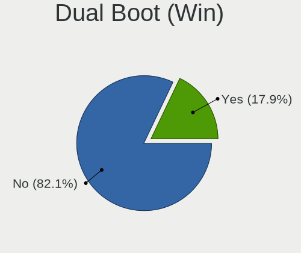
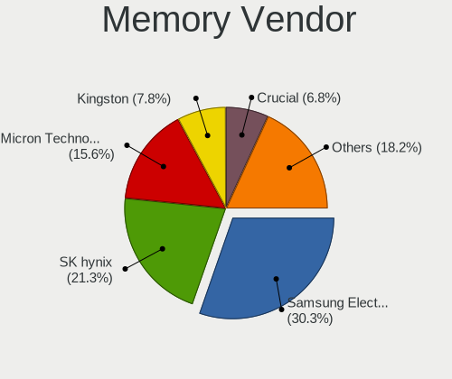

Fedora 35 - Tested Hardware & Statistics (Notebooks)
----------------------------------------------------

A project to collect tested hardware configurations for Fedora 35.

Anyone can contribute to this report by the [hw-probe](https://github.com/linuxhw/hw-probe) tool:

    sudo -E hw-probe -all -upload

Please submit a probe of your configuration if it's not presented on the page or is rare.

Full-feature report is available here: https://linux-hardware.org/?view=trends

Contents
--------

* [ Test Cases ](#test-cases)

* [ System ](#system)
  - [ Kernel                   ](#kernel)
  - [ Kernel Family            ](#kernel-family)
  - [ Kernel Major Ver.        ](#kernel-major-ver)
  - [ Arch                     ](#arch)
  - [ DE                       ](#de)
  - [ Display Server           ](#display-server)
  - [ Display Manager          ](#display-manager)
  - [ OS Lang                  ](#os-lang)
  - [ Boot Mode                ](#boot-mode)
  - [ Filesystem               ](#filesystem)
  - [ Part. scheme             ](#part-scheme)
  - [ Dual Boot with Linux/BSD ](#dual-boot-with-linuxbsd)
  - [ Dual Boot (Win)          ](#dual-boot-win)

* [ Board ](#board)
  - [ Vendor                   ](#vendor)
  - [ Model                    ](#model)
  - [ Model Family             ](#model-family)
  - [ MFG Year                 ](#mfg-year)
  - [ Form Factor              ](#form-factor)
  - [ Secure Boot              ](#secure-boot)
  - [ Coreboot                 ](#coreboot)
  - [ RAM Size                 ](#ram-size)
  - [ RAM Used                 ](#ram-used)
  - [ Total Drives             ](#total-drives)
  - [ Has CD-ROM               ](#has-cd-rom)
  - [ Has Ethernet             ](#has-ethernet)
  - [ Has WiFi                 ](#has-wifi)
  - [ Has Bluetooth            ](#has-bluetooth)

* [ Location ](#location)
  - [ Country                  ](#country)
  - [ City                     ](#city)

* [ Drives ](#drives)
  - [ Drive Vendor             ](#drive-vendor)
  - [ Drive Model              ](#drive-model)
  - [ HDD Vendor               ](#hdd-vendor)
  - [ SSD Vendor               ](#ssd-vendor)
  - [ Drive Kind               ](#drive-kind)
  - [ Drive Connector          ](#drive-connector)
  - [ Drive Size               ](#drive-size)
  - [ Space Total              ](#space-total)
  - [ Space Used               ](#space-used)
  - [ Malfunc. Drives          ](#malfunc-drives)
  - [ Malfunc. Drive Vendor    ](#malfunc-drive-vendor)
  - [ Malfunc. HDD Vendor      ](#malfunc-hdd-vendor)
  - [ Malfunc. Drive Kind      ](#malfunc-drive-kind)
  - [ Failed Drives            ](#failed-drives)
  - [ Failed Drive Vendor      ](#failed-drive-vendor)
  - [ Drive Status             ](#drive-status)

* [ Storage controller ](#storage-controller)
  - [ Storage Vendor           ](#storage-vendor)
  - [ Storage Model            ](#storage-model)
  - [ Storage Kind             ](#storage-kind)

* [ Processor ](#processor)
  - [ CPU Vendor               ](#cpu-vendor)
  - [ CPU Model                ](#cpu-model)
  - [ CPU Model Family         ](#cpu-model-family)
  - [ CPU Cores                ](#cpu-cores)
  - [ CPU Sockets              ](#cpu-sockets)
  - [ CPU Threads              ](#cpu-threads)
  - [ CPU Op-Modes             ](#cpu-op-modes)
  - [ CPU Microcode            ](#cpu-microcode)
  - [ CPU Microarch            ](#cpu-microarch)

* [ Graphics ](#graphics)
  - [ GPU Vendor               ](#gpu-vendor)
  - [ GPU Model                ](#gpu-model)
  - [ GPU Combo                ](#gpu-combo)
  - [ GPU Driver               ](#gpu-driver)
  - [ GPU Memory               ](#gpu-memory)

* [ Monitor ](#monitor)
  - [ Monitor Vendor           ](#monitor-vendor)
  - [ Monitor Model            ](#monitor-model)
  - [ Monitor Resolution       ](#monitor-resolution)
  - [ Monitor Diagonal         ](#monitor-diagonal)
  - [ Monitor Width            ](#monitor-width)
  - [ Aspect Ratio             ](#aspect-ratio)
  - [ Monitor Area             ](#monitor-area)
  - [ Pixel Density            ](#pixel-density)
  - [ Multiple Monitors        ](#multiple-monitors)

* [ Network ](#network)
  - [ Net Controller Vendor    ](#net-controller-vendor)
  - [ Net Controller Model     ](#net-controller-model)
  - [ Wireless Vendor          ](#wireless-vendor)
  - [ Wireless Model           ](#wireless-model)
  - [ Ethernet Vendor          ](#ethernet-vendor)
  - [ Ethernet Model           ](#ethernet-model)
  - [ Net Controller Kind      ](#net-controller-kind)
  - [ Used Controller          ](#used-controller)
  - [ NICs                     ](#nics)
  - [ IPv6                     ](#ipv6)

* [ Bluetooth ](#bluetooth)
  - [ Bluetooth Vendor         ](#bluetooth-vendor)
  - [ Bluetooth Model          ](#bluetooth-model)

* [ Sound ](#sound)
  - [ Sound Vendor             ](#sound-vendor)
  - [ Sound Model              ](#sound-model)

* [ Memory ](#memory)
  - [ Memory Vendor            ](#memory-vendor)
  - [ Memory Model             ](#memory-model)
  - [ Memory Kind              ](#memory-kind)
  - [ Memory Form Factor       ](#memory-form-factor)
  - [ Memory Size              ](#memory-size)
  - [ Memory Speed             ](#memory-speed)

* [ Printers & scanners ](#printers--scanners)
  - [ Printer Vendor           ](#printer-vendor)
  - [ Printer Model            ](#printer-model)
  - [ Scanner Vendor           ](#scanner-vendor)
  - [ Scanner Model            ](#scanner-model)

* [ Camera ](#camera)
  - [ Camera Vendor            ](#camera-vendor)
  - [ Camera Model             ](#camera-model)

* [ Security ](#security)
  - [ Fingerprint Vendor       ](#fingerprint-vendor)
  - [ Fingerprint Model        ](#fingerprint-model)
  - [ Chipcard Vendor          ](#chipcard-vendor)
  - [ Chipcard Model           ](#chipcard-model)

* [ Unsupported ](#unsupported)
  - [ Unsupported Devices      ](#unsupported-devices)
  - [ Unsupported Device Types ](#unsupported-device-types)

Test Cases
----------

| Vendor        | Model                       | Probe                                                      | Date         |
|---------------|-----------------------------|------------------------------------------------------------|--------------|
| Dell          | Latitude 7285               | [8d3fe46d72](https://linux-hardware.org/?probe=8d3fe46d72) | Mar 01, 2022 |
| HP            | EliteBook 840 G3            | [9ffc6b43ec](https://linux-hardware.org/?probe=9ffc6b43ec) | Feb 28, 2022 |
| Acer          | Aspire E1-522               | [4245cd910a](https://linux-hardware.org/?probe=4245cd910a) | Feb 28, 2022 |
| HP            | ProBook 650 G1              | [d58011c0f8](https://linux-hardware.org/?probe=d58011c0f8) | Feb 28, 2022 |
| HP            | ProBook 650 G1              | [6925ab1f20](https://linux-hardware.org/?probe=6925ab1f20) | Feb 28, 2022 |
| HP            | Notebook                    | [c8cd62d913](https://linux-hardware.org/?probe=c8cd62d913) | Feb 28, 2022 |
| Lenovo        | IdeaPad 100-15IBD 80QQ      | [02ea37a7a8](https://linux-hardware.org/?probe=02ea37a7a8) | Feb 28, 2022 |
| Lenovo        | IdeaPad Slim 1-14AST-05 ... | [fa94978a0b](https://linux-hardware.org/?probe=fa94978a0b) | Feb 28, 2022 |
| Apple         | MacBookAir7,2               | [e2bc04b6f4](https://linux-hardware.org/?probe=e2bc04b6f4) | Feb 27, 2022 |
| Apple         | MacBookAir7,2               | [592d42e16c](https://linux-hardware.org/?probe=592d42e16c) | Feb 27, 2022 |
| ASUSTek       | Unknown                     | [78cc2173d9](https://linux-hardware.org/?probe=78cc2173d9) | Feb 27, 2022 |
| Lenovo        | G70-70 80HW007LNX           | [a0ba78ccea](https://linux-hardware.org/?probe=a0ba78ccea) | Feb 27, 2022 |
| HP            | ProBook 640 G2              | [75cdf384b5](https://linux-hardware.org/?probe=75cdf384b5) | Feb 27, 2022 |
| HP            | Pavilion Notebook           | [57bb50b654](https://linux-hardware.org/?probe=57bb50b654) | Feb 27, 2022 |
| Lenovo        | IdeaPad 3 14IML05 81WA      | [0a92c063a1](https://linux-hardware.org/?probe=0a92c063a1) | Feb 27, 2022 |
| Samsung       | 550P5C/550P7C               | [24861666e2](https://linux-hardware.org/?probe=24861666e2) | Feb 27, 2022 |
| Lenovo        | IdeaPad S540-14IML Touch... | [22bb5f0b44](https://linux-hardware.org/?probe=22bb5f0b44) | Feb 27, 2022 |
| HUAWEI        | KLVL-WXX9                   | [efd62e1ed7](https://linux-hardware.org/?probe=efd62e1ed7) | Feb 26, 2022 |
| Dell          | XPS 13 9305                 | [36aacb1723](https://linux-hardware.org/?probe=36aacb1723) | Feb 26, 2022 |
| HP            | Pavilion g4                 | [0e40990ec2](https://linux-hardware.org/?probe=0e40990ec2) | Feb 26, 2022 |
| HP            | Pavilion 15                 | [463d26d75c](https://linux-hardware.org/?probe=463d26d75c) | Feb 26, 2022 |
| HP            | Pavilion 17                 | [d4a3fb2dfc](https://linux-hardware.org/?probe=d4a3fb2dfc) | Feb 26, 2022 |
| Lenovo        | Yoga Slim 7 14ARE05 82A2    | [02ac351573](https://linux-hardware.org/?probe=02ac351573) | Feb 25, 2022 |
| Acer          | Aspire E5-471               | [194baf83e9](https://linux-hardware.org/?probe=194baf83e9) | Feb 25, 2022 |
| Dell          | Latitude 3350               | [093650ba06](https://linux-hardware.org/?probe=093650ba06) | Feb 25, 2022 |
| Lenovo        | Legion 5 15ARH05 82B5       | [6b0f448d7b](https://linux-hardware.org/?probe=6b0f448d7b) | Feb 24, 2022 |
| ASUSTek       | ZenBook UX425UA_UM425UA     | [13b7868e73](https://linux-hardware.org/?probe=13b7868e73) | Feb 24, 2022 |
| Dell          | Inspiron 5567               | [0e9130cffe](https://linux-hardware.org/?probe=0e9130cffe) | Feb 24, 2022 |
| Google        | Snappy                      | [cf0b11bd65](https://linux-hardware.org/?probe=cf0b11bd65) | Feb 24, 2022 |
| Lenovo        | IdeaPad 3 14ITL6 82H7       | [15df5df598](https://linux-hardware.org/?probe=15df5df598) | Feb 24, 2022 |
| ASUSTek       | X553MA                      | [020df21e37](https://linux-hardware.org/?probe=020df21e37) | Feb 23, 2022 |
| Sony          | VPCEH3S6E                   | [334451b6e7](https://linux-hardware.org/?probe=334451b6e7) | Feb 23, 2022 |
| Lenovo        | IdeaPad 3 15IML05 U 81WB    | [73c7d63295](https://linux-hardware.org/?probe=73c7d63295) | Feb 23, 2022 |
| Google        | Edgar                       | [46f5948f03](https://linux-hardware.org/?probe=46f5948f03) | Feb 23, 2022 |
| ASUSTek       | VivoBook_ASUSLaptop X421... | [f09566c9ee](https://linux-hardware.org/?probe=f09566c9ee) | Feb 23, 2022 |
| Samsung       | 750XDA                      | [ad6823c08e](https://linux-hardware.org/?probe=ad6823c08e) | Feb 23, 2022 |
| Lenovo        | ThinkPad T495 20NJ0004US    | [d8002e9eae](https://linux-hardware.org/?probe=d8002e9eae) | Feb 23, 2022 |
| MSI           | GE63VR 7RF                  | [68e1d81309](https://linux-hardware.org/?probe=68e1d81309) | Feb 23, 2022 |
| Apple         | MacBookPro12,1              | [677ffe54b5](https://linux-hardware.org/?probe=677ffe54b5) | Feb 23, 2022 |
| Dell          | Inspiron 7577               | [660240eb93](https://linux-hardware.org/?probe=660240eb93) | Feb 22, 2022 |
| HP            | ProBook 430 G5              | [b9cb7cad60](https://linux-hardware.org/?probe=b9cb7cad60) | Feb 22, 2022 |
| Lenovo        | IdeaPad 5 Pro 14ACN6 82L... | [ee3ef301c2](https://linux-hardware.org/?probe=ee3ef301c2) | Feb 22, 2022 |
| Jumper        | EZbook                      | [9cded25245](https://linux-hardware.org/?probe=9cded25245) | Feb 22, 2022 |
| Lenovo        | V14-ADA 82C6                | [94c0f0f3a3](https://linux-hardware.org/?probe=94c0f0f3a3) | Feb 22, 2022 |
| Panasonic     | CFSV9-1                     | [fa3b39bca1](https://linux-hardware.org/?probe=fa3b39bca1) | Feb 21, 2022 |
| HP            | Notebook                    | [d8dd214532](https://linux-hardware.org/?probe=d8dd214532) | Feb 21, 2022 |
| HP            | Laptop 14z-dk100            | [65130b9760](https://linux-hardware.org/?probe=65130b9760) | Feb 21, 2022 |
| eMachines     | E725 V1.03                  | [0f12be73fa](https://linux-hardware.org/?probe=0f12be73fa) | Feb 21, 2022 |
| Acer          | Swift SFX14-41G             | [5eb9d81462](https://linux-hardware.org/?probe=5eb9d81462) | Feb 20, 2022 |
| Acer          | Aspire A515-54G             | [388a17923c](https://linux-hardware.org/?probe=388a17923c) | Feb 20, 2022 |
| ASUSTek       | G551JK                      | [93e40c8fbc](https://linux-hardware.org/?probe=93e40c8fbc) | Feb 20, 2022 |
| Apple         | MacBookPro14,1              | [229a11c203](https://linux-hardware.org/?probe=229a11c203) | Feb 20, 2022 |
| Acer          | Aspire 5250                 | [65c44b63d6](https://linux-hardware.org/?probe=65c44b63d6) | Feb 20, 2022 |
| Acer          | Aspire 5250                 | [d8c4226f82](https://linux-hardware.org/?probe=d8c4226f82) | Feb 20, 2022 |
| Apple         | MacBookPro14,1              | [2a934577d6](https://linux-hardware.org/?probe=2a934577d6) | Feb 20, 2022 |
| HP            | Notebook                    | [b2bc5693f7](https://linux-hardware.org/?probe=b2bc5693f7) | Feb 20, 2022 |
| Apple         | MacBookAir5,2               | [dc8f1e8a38](https://linux-hardware.org/?probe=dc8f1e8a38) | Feb 20, 2022 |
| Acer          | Aspire E1-532G              | [2ec2b8bf53](https://linux-hardware.org/?probe=2ec2b8bf53) | Feb 20, 2022 |
| Acer          | Aspire A515-54G             | [5d973743c8](https://linux-hardware.org/?probe=5d973743c8) | Feb 19, 2022 |
| Acer          | Nitro AN515-44              | [c73dc0aa9f](https://linux-hardware.org/?probe=c73dc0aa9f) | Feb 19, 2022 |
| TUXEDO        | InfinityBook Pro 14 Gen6    | [1ad67d12e0](https://linux-hardware.org/?probe=1ad67d12e0) | Feb 19, 2022 |
| Positivo      | CHT14B                      | [c2f39e4414](https://linux-hardware.org/?probe=c2f39e4414) | Feb 19, 2022 |
| Positivo      | CHT14B                      | [674256dc2a](https://linux-hardware.org/?probe=674256dc2a) | Feb 19, 2022 |
| HP            | ZBook 17 G4                 | [0ac02f47be](https://linux-hardware.org/?probe=0ac02f47be) | Feb 19, 2022 |
| Lenovo        | ThinkPad L13 Gen 2 20VJS... | [f988c3bfdc](https://linux-hardware.org/?probe=f988c3bfdc) | Feb 18, 2022 |
| Lenovo        | IdeaPad 5 Pro 14ACN6 82L... | [1c65c7204d](https://linux-hardware.org/?probe=1c65c7204d) | Feb 18, 2022 |
| Acer          | Aspire E5-575G              | [4cbc6b81bf](https://linux-hardware.org/?probe=4cbc6b81bf) | Feb 18, 2022 |
| Avell High... | B.ON                        | [3b3e1a7730](https://linux-hardware.org/?probe=3b3e1a7730) | Feb 18, 2022 |
| HP            | Laptop 15s-eq2xxx           | [3221ab6775](https://linux-hardware.org/?probe=3221ab6775) | Feb 17, 2022 |
| Dell          | Latitude E6330              | [4d2f890592](https://linux-hardware.org/?probe=4d2f890592) | Feb 17, 2022 |
| HP            | Dratini                     | [bb3f3445ee](https://linux-hardware.org/?probe=bb3f3445ee) | Feb 17, 2022 |
| Lenovo        | ThinkPad T450 20BUS0VH08    | [c896752de0](https://linux-hardware.org/?probe=c896752de0) | Feb 17, 2022 |
| Inspire Te... | Trio Windows OD 1.0         | [a0f755c28a](https://linux-hardware.org/?probe=a0f755c28a) | Feb 17, 2022 |
| Avell High... | B.ON                        | [26b25d67d6](https://linux-hardware.org/?probe=26b25d67d6) | Feb 17, 2022 |
| Acer          | Predator G9-793             | [45ec93214f](https://linux-hardware.org/?probe=45ec93214f) | Feb 16, 2022 |
| Samsung       | 900X3C/900X3D/900X3E/900... | [c81bbf6c93](https://linux-hardware.org/?probe=c81bbf6c93) | Feb 16, 2022 |
| Lenovo        | IdeaPad S145-15API 81V7     | [e03bf2b8a8](https://linux-hardware.org/?probe=e03bf2b8a8) | Feb 16, 2022 |
| System76      | Lemur Pro                   | [3a7527d1e3](https://linux-hardware.org/?probe=3a7527d1e3) | Feb 16, 2022 |
| Lenovo        | IdeaPad 5 Pro 14ACN6 82L... | [faca13ef0b](https://linux-hardware.org/?probe=faca13ef0b) | Feb 16, 2022 |
| Lenovo        | IdeaPad 5 Pro 14ACN6 82L... | [d2f55f9d63](https://linux-hardware.org/?probe=d2f55f9d63) | Feb 16, 2022 |
| ASUSTek       | T200TAC                     | [87db259935](https://linux-hardware.org/?probe=87db259935) | Feb 15, 2022 |
| Lenovo        | ThinkPad X200T 7449G6G      | [9a9f646438](https://linux-hardware.org/?probe=9a9f646438) | Feb 15, 2022 |
| ASUSTek       | Unknown                     | [890fea8813](https://linux-hardware.org/?probe=890fea8813) | Feb 15, 2022 |
| HUAWEI        | KLVL-WXX9                   | [881b6c0f83](https://linux-hardware.org/?probe=881b6c0f83) | Feb 15, 2022 |
| ASUSTek       | X550WE                      | [beed529fc3](https://linux-hardware.org/?probe=beed529fc3) | Feb 14, 2022 |
| Lenovo        | ThinkPad E14 Gen 2 20T60... | [f199e025e3](https://linux-hardware.org/?probe=f199e025e3) | Feb 14, 2022 |
| Dell          | XPS 15 9550                 | [701eeea0ed](https://linux-hardware.org/?probe=701eeea0ed) | Feb 14, 2022 |
| Lenovo        | ThinkPad P15 Gen 1 20SUS... | [32022a8232](https://linux-hardware.org/?probe=32022a8232) | Feb 14, 2022 |
| Lenovo        | ThinkPad P15 Gen 1 20SUS... | [372c231b58](https://linux-hardware.org/?probe=372c231b58) | Feb 14, 2022 |
| Lenovo        | ThinkPad X1 Carbon 6th 2... | [a8c5477e60](https://linux-hardware.org/?probe=a8c5477e60) | Feb 13, 2022 |
| Lenovo        | ThinkPad Edge E531 68851... | [e82c11b42e](https://linux-hardware.org/?probe=e82c11b42e) | Feb 13, 2022 |
| HP            | Laptop 15s-eq2xxx           | [a4471fe730](https://linux-hardware.org/?probe=a4471fe730) | Feb 13, 2022 |
| Acer          | Aspire A514-54              | [1f5dd04a09](https://linux-hardware.org/?probe=1f5dd04a09) | Feb 13, 2022 |
| Apple         | MacBookPro12,1              | [aeec085062](https://linux-hardware.org/?probe=aeec085062) | Feb 13, 2022 |
| PC Special... | NH5xAx                      | [5e0b855dbf](https://linux-hardware.org/?probe=5e0b855dbf) | Feb 13, 2022 |
| Apple         | MacBookAir7,2               | [91fa01f5a6](https://linux-hardware.org/?probe=91fa01f5a6) | Feb 12, 2022 |
| Apple         | MacBookAir7,2               | [dc1249f2a1](https://linux-hardware.org/?probe=dc1249f2a1) | Feb 12, 2022 |
| HP            | ProBook 635 Aero G8 Note... | [42674c38b2](https://linux-hardware.org/?probe=42674c38b2) | Feb 12, 2022 |
| ASUSTek       | VivoBook_ASUSLaptop X409... | [46d98c991e](https://linux-hardware.org/?probe=46d98c991e) | Feb 12, 2022 |
| Acer          | Aspire A515-54G             | [f8e7f688a6](https://linux-hardware.org/?probe=f8e7f688a6) | Feb 11, 2022 |
| HP            | ProBook 450 G5              | [4c500fd383](https://linux-hardware.org/?probe=4c500fd383) | Feb 11, 2022 |
| HP            | ProBook 635 Aero G8 Note... | [2cfb1f14b9](https://linux-hardware.org/?probe=2cfb1f14b9) | Feb 10, 2022 |
| Dell          | Latitude 5511               | [7a45e17643](https://linux-hardware.org/?probe=7a45e17643) | Feb 10, 2022 |
| Dell          | Latitude 5511               | [bf3129ad00](https://linux-hardware.org/?probe=bf3129ad00) | Feb 10, 2022 |
| ASUSTek       | ASUS TUF Gaming F15 FX50... | [b2d14e7f15](https://linux-hardware.org/?probe=b2d14e7f15) | Feb 10, 2022 |
| ASUSTek       | ASUS TUF Gaming F15 FX50... | [2661cf0743](https://linux-hardware.org/?probe=2661cf0743) | Feb 10, 2022 |
| Acer          | Nitro AN515-42              | [4906efe7f4](https://linux-hardware.org/?probe=4906efe7f4) | Feb 09, 2022 |
| HONOR         | NBD-WXX9                    | [83ab33660d](https://linux-hardware.org/?probe=83ab33660d) | Feb 09, 2022 |
| HONOR         | NBD-WXX9                    | [52bec77385](https://linux-hardware.org/?probe=52bec77385) | Feb 09, 2022 |
| Acer          | Nitro AN515-42              | [52d6fa9b66](https://linux-hardware.org/?probe=52d6fa9b66) | Feb 09, 2022 |
| HP            | EliteBook 840 G6            | [dae40dba1f](https://linux-hardware.org/?probe=dae40dba1f) | Feb 09, 2022 |
| Lenovo        | IdeaPad S340-14IWL 81N7     | [b7e0365760](https://linux-hardware.org/?probe=b7e0365760) | Feb 08, 2022 |
| ASUSTek       | X75VC                       | [55fda8de04](https://linux-hardware.org/?probe=55fda8de04) | Feb 08, 2022 |
| Lenovo        | ThinkPad E595 20NF001PTX    | [b4cfe297d4](https://linux-hardware.org/?probe=b4cfe297d4) | Feb 08, 2022 |
| Lenovo        | ThinkPad X230 23257R2       | [4fa07e0a61](https://linux-hardware.org/?probe=4fa07e0a61) | Feb 08, 2022 |
| Lenovo        | ThinkPad X1 Extreme 2nd ... | [b400a64d30](https://linux-hardware.org/?probe=b400a64d30) | Feb 07, 2022 |
| Acer          | Aspire E5-575               | [cb02bc65cc](https://linux-hardware.org/?probe=cb02bc65cc) | Feb 07, 2022 |
| HP            | Pavilion dv6                | [0ba10bc3bb](https://linux-hardware.org/?probe=0ba10bc3bb) | Feb 07, 2022 |
| Lenovo        | Unknown                     | [8f315e1abe](https://linux-hardware.org/?probe=8f315e1abe) | Feb 07, 2022 |
| Lenovo        | Unknown                     | [bf281646d9](https://linux-hardware.org/?probe=bf281646d9) | Feb 07, 2022 |
| Lenovo        | IdeaPad 5 Pro 14ACN6 82L... | [5b6802c8e3](https://linux-hardware.org/?probe=5b6802c8e3) | Feb 07, 2022 |
| Lenovo        | Legion 5 15ARH05 82B5       | [61e4b1c45e](https://linux-hardware.org/?probe=61e4b1c45e) | Feb 06, 2022 |
| Lenovo        | G70-70 80HW007LNX           | [79e8d4895c](https://linux-hardware.org/?probe=79e8d4895c) | Feb 06, 2022 |
| Lenovo        | Ducati 5 82ES               | [3364f4de6b](https://linux-hardware.org/?probe=3364f4de6b) | Feb 06, 2022 |
| HP            | Compaq 6730s                | [8d1fa47bb0](https://linux-hardware.org/?probe=8d1fa47bb0) | Feb 06, 2022 |
| HUAWEI        | NBLK-WAX9X                  | [73db0d90e9](https://linux-hardware.org/?probe=73db0d90e9) | Feb 06, 2022 |
| ASUSTek       | GL702VSK                    | [d3eb319919](https://linux-hardware.org/?probe=d3eb319919) | Feb 06, 2022 |
| HP            | Pavilion Aero Laptop 13-... | [a3397b67bd](https://linux-hardware.org/?probe=a3397b67bd) | Feb 05, 2022 |
| Dell          | Inspiron 5537               | [79e02b1ade](https://linux-hardware.org/?probe=79e02b1ade) | Feb 05, 2022 |
| Lenovo        | ThinkPad X395 20NLCTO1WW    | [ce23fdbead](https://linux-hardware.org/?probe=ce23fdbead) | Feb 05, 2022 |
| Lenovo        | ThinkPad E14 Gen 2 20TAS... | [d457ee5311](https://linux-hardware.org/?probe=d457ee5311) | Feb 05, 2022 |
| HP            | ProBook 450 G3              | [7b28e44b0e](https://linux-hardware.org/?probe=7b28e44b0e) | Feb 05, 2022 |
| HUAWEI        | NBM-WXX9                    | [5256293dec](https://linux-hardware.org/?probe=5256293dec) | Feb 05, 2022 |
| Framework     | Laptop                      | [64e6669cbc](https://linux-hardware.org/?probe=64e6669cbc) | Feb 04, 2022 |
| Dell          | Inspiron 5521               | [8d4968c10a](https://linux-hardware.org/?probe=8d4968c10a) | Feb 04, 2022 |
| Acer          | Aspire A515-43              | [6bc39a1855](https://linux-hardware.org/?probe=6bc39a1855) | Feb 04, 2022 |
| Toshiba       | Satellite C645              | [d552c9b132](https://linux-hardware.org/?probe=d552c9b132) | Feb 04, 2022 |
| HUAWEI        | KLVL-WXX9                   | [ca238c69a5](https://linux-hardware.org/?probe=ca238c69a5) | Feb 04, 2022 |
| ASUSTek       | ROG Zephyrus G14 GA401QM... | [862367b523](https://linux-hardware.org/?probe=862367b523) | Feb 03, 2022 |
| Lenovo        | IdeaPad S540-14API 81NH     | [e32abec202](https://linux-hardware.org/?probe=e32abec202) | Feb 03, 2022 |
| Dell          | XPS 13 9310                 | [40c74584ee](https://linux-hardware.org/?probe=40c74584ee) | Feb 03, 2022 |
| Lenovo        | Legion 5 15IMH05H 81Y6      | [d9cc5f0548](https://linux-hardware.org/?probe=d9cc5f0548) | Feb 03, 2022 |
| Dell          | Latitude E6230              | [05d9080c0c](https://linux-hardware.org/?probe=05d9080c0c) | Feb 03, 2022 |
| HP            | Pavilion Laptop 15-eh0xx... | [2cb72b3867](https://linux-hardware.org/?probe=2cb72b3867) | Feb 02, 2022 |
| HP            | EliteBook 830 G8 Noteboo... | [f111410eeb](https://linux-hardware.org/?probe=f111410eeb) | Feb 02, 2022 |
| Dell          | XPS 13 7390                 | [978273c0aa](https://linux-hardware.org/?probe=978273c0aa) | Feb 02, 2022 |
| Sony          | SVD1121Q2EB                 | [8e484b15d2](https://linux-hardware.org/?probe=8e484b15d2) | Feb 02, 2022 |
| HP            | ProBook 6465b               | [aca95b9f2d](https://linux-hardware.org/?probe=aca95b9f2d) | Feb 01, 2022 |
| Dell          | Vostro 3500                 | [c9cae610a6](https://linux-hardware.org/?probe=c9cae610a6) | Feb 01, 2022 |
| PC Special... | NH5xAx                      | [6c8a746762](https://linux-hardware.org/?probe=6c8a746762) | Feb 01, 2022 |
| Samsung       | RV409/RV509/RV709           | [535f5504f0](https://linux-hardware.org/?probe=535f5504f0) | Feb 01, 2022 |
| Dell          | Precision 5530              | [3bb85a7897](https://linux-hardware.org/?probe=3bb85a7897) | Jan 31, 2022 |
| Lenovo        | ThinkBook 13s-IML 20RR      | [b7796bb104](https://linux-hardware.org/?probe=b7796bb104) | Jan 31, 2022 |
| Lenovo        | IdeaPad 5 Pro 14ITL6 82L... | [8efcb72970](https://linux-hardware.org/?probe=8efcb72970) | Jan 31, 2022 |
| Lenovo        | Yoga S940-14IWL 81Q7        | [316ea97198](https://linux-hardware.org/?probe=316ea97198) | Jan 31, 2022 |
| Lenovo        | Yoga S940-14IWL 81Q7        | [940c2e990d](https://linux-hardware.org/?probe=940c2e990d) | Jan 31, 2022 |
| Lenovo        | IdeaPad Z500 20202          | [ebe757d792](https://linux-hardware.org/?probe=ebe757d792) | Jan 30, 2022 |
| Dell          | Latitude 7490               | [d3a6ac321f](https://linux-hardware.org/?probe=d3a6ac321f) | Jan 30, 2022 |
| Lenovo        | ThinkPad T490 20N2000LFR    | [0c7293a8ec](https://linux-hardware.org/?probe=0c7293a8ec) | Jan 30, 2022 |
| Lenovo        | ThinkPad T420 4180F65       | [23a97a1da0](https://linux-hardware.org/?probe=23a97a1da0) | Jan 30, 2022 |
| Apple         | MacBookPro14,1              | [88eae6cdfb](https://linux-hardware.org/?probe=88eae6cdfb) | Jan 30, 2022 |
| Apple         | MacBookPro14,1              | [d8040d8fc4](https://linux-hardware.org/?probe=d8040d8fc4) | Jan 30, 2022 |
| HP            | Pavilion Gaming Laptop 1... | [c1494af863](https://linux-hardware.org/?probe=c1494af863) | Jan 30, 2022 |
| Lenovo        | ThinkPad T490 20N20009RT    | [538c4fb88c](https://linux-hardware.org/?probe=538c4fb88c) | Jan 30, 2022 |
| Lenovo        | ThinkPad E570 20H500B4MH    | [209156e57d](https://linux-hardware.org/?probe=209156e57d) | Jan 29, 2022 |
| Lenovo        | ThinkPad E570 20H500B4MH    | [2f9a17c907](https://linux-hardware.org/?probe=2f9a17c907) | Jan 29, 2022 |
| Lenovo        | IdeaPad 3 14ALC6 82KT       | [e06431af49](https://linux-hardware.org/?probe=e06431af49) | Jan 29, 2022 |
| Apple         | MacBookAir6,2               | [2440be23b6](https://linux-hardware.org/?probe=2440be23b6) | Jan 29, 2022 |
| HP            | ZBook 17 G2                 | [4210faf0d2](https://linux-hardware.org/?probe=4210faf0d2) | Jan 29, 2022 |
| Lenovo        | IdeaPad L340-15IRH Gamin... | [4a98af8b6c](https://linux-hardware.org/?probe=4a98af8b6c) | Jan 29, 2022 |
| Lenovo        | IdeaPad 100-14IBD 80RK      | [e6af97e09c](https://linux-hardware.org/?probe=e6af97e09c) | Jan 29, 2022 |
| Dell          | Latitude 5511               | [94f621a74b](https://linux-hardware.org/?probe=94f621a74b) | Jan 29, 2022 |
| Lenovo        | ThinkPad X240 20AMA2AN00    | [3d321c7afd](https://linux-hardware.org/?probe=3d321c7afd) | Jan 28, 2022 |
| Lenovo        | ThinkPad X240 20AMA2AN00    | [dd9909e9f4](https://linux-hardware.org/?probe=dd9909e9f4) | Jan 28, 2022 |
| Lenovo        | ThinkBook 15 G2 ITL 20VE    | [c573633ba7](https://linux-hardware.org/?probe=c573633ba7) | Jan 28, 2022 |
| Lenovo        | ThinkPad E14 Gen 3 20Y70... | [bab2021d07](https://linux-hardware.org/?probe=bab2021d07) | Jan 28, 2022 |
| ASUSTek       | X510UNR                     | [64f7ad2ba1](https://linux-hardware.org/?probe=64f7ad2ba1) | Jan 27, 2022 |
| Toshiba       | Satellite C660              | [8609aaadb3](https://linux-hardware.org/?probe=8609aaadb3) | Jan 27, 2022 |
| Apple         | MacBookPro9,2               | [d112bf0361](https://linux-hardware.org/?probe=d112bf0361) | Jan 27, 2022 |
| Mediacom      | GTZS                        | [10a0d977b0](https://linux-hardware.org/?probe=10a0d977b0) | Jan 27, 2022 |
| HP            | Pavilion Gaming Laptop 1... | [f7633506c3](https://linux-hardware.org/?probe=f7633506c3) | Jan 26, 2022 |
| Lenovo        | IdeaPad 5 15ALC05 82LN      | [b930fcaa84](https://linux-hardware.org/?probe=b930fcaa84) | Jan 26, 2022 |
| Dell          | XPS 13 7390                 | [95d6e59e28](https://linux-hardware.org/?probe=95d6e59e28) | Jan 26, 2022 |
| ASUSTek       | ROG Zephyrus G14 GA401IV... | [738074142b](https://linux-hardware.org/?probe=738074142b) | Jan 26, 2022 |
| Lenovo        | ThinkPad T470s W10DG 20J... | [1bd39d2b68](https://linux-hardware.org/?probe=1bd39d2b68) | Jan 26, 2022 |
| Lenovo        | ThinkPad T470s W10DG 20J... | [9613005856](https://linux-hardware.org/?probe=9613005856) | Jan 26, 2022 |
| MSI           | CR61 2M/CX61 2OC/CX61 2O... | [36a39bf7eb](https://linux-hardware.org/?probe=36a39bf7eb) | Jan 26, 2022 |
| MSI           | CR61 2M/CX61 2OC/CX61 2O... | [9d12ae4f9a](https://linux-hardware.org/?probe=9d12ae4f9a) | Jan 26, 2022 |
| Acer          | Nitro AN515-52              | [e9f06efa7a](https://linux-hardware.org/?probe=e9f06efa7a) | Jan 26, 2022 |
| Lenovo        | IdeaPad L340-15IRH Gamin... | [041c78217d](https://linux-hardware.org/?probe=041c78217d) | Jan 26, 2022 |
| Dell          | Precision 5510              | [511eeac9a0](https://linux-hardware.org/?probe=511eeac9a0) | Jan 25, 2022 |
| Dell          | Latitude E7470              | [c47b0efb73](https://linux-hardware.org/?probe=c47b0efb73) | Jan 25, 2022 |
| HUAWEI        | KLVL-WXX9                   | [5846d2031f](https://linux-hardware.org/?probe=5846d2031f) | Jan 25, 2022 |
| HP            | Pavilion Laptop 15-eh0xx... | [c7fbcbcd07](https://linux-hardware.org/?probe=c7fbcbcd07) | Jan 25, 2022 |
| ASUSTek       | ASUS TUF Gaming A15 FA50... | [f36cdb65e7](https://linux-hardware.org/?probe=f36cdb65e7) | Jan 24, 2022 |
| Lenovo        | ThinkBook 15 G2 ITL 20VE    | [e9c2ec480a](https://linux-hardware.org/?probe=e9c2ec480a) | Jan 24, 2022 |
| Acer          | Nitro AN515-45              | [34568da477](https://linux-hardware.org/?probe=34568da477) | Jan 23, 2022 |
| ASUSTek       | ROG Strix G513IC_G513IC     | [d6ea0ad749](https://linux-hardware.org/?probe=d6ea0ad749) | Jan 23, 2022 |
| Acer          | Nitro AN515-45              | [1cb9ebbbd4](https://linux-hardware.org/?probe=1cb9ebbbd4) | Jan 23, 2022 |
| HP            | Laptop 15s-eq2xxx           | [e10bf3d056](https://linux-hardware.org/?probe=e10bf3d056) | Jan 23, 2022 |
| SCHNEIDER     | SCL141CTP                   | [ff14e3fa97](https://linux-hardware.org/?probe=ff14e3fa97) | Jan 23, 2022 |
| Apple         | MacBookPro14,1              | [783456509a](https://linux-hardware.org/?probe=783456509a) | Jan 22, 2022 |
| HP            | ProBook 470 G5              | [6610c7d6e1](https://linux-hardware.org/?probe=6610c7d6e1) | Jan 22, 2022 |
| Dell          | Inspiron N5110              | [3253470667](https://linux-hardware.org/?probe=3253470667) | Jan 22, 2022 |
| Lenovo        | Legion Y530-15ICH 81FV      | [427ce82d40](https://linux-hardware.org/?probe=427ce82d40) | Jan 22, 2022 |
| Acer          | Aspire ES1-111M             | [02368f5bb1](https://linux-hardware.org/?probe=02368f5bb1) | Jan 22, 2022 |
| HP            | ENVY Laptop 15-ep0xxx       | [2c0f007811](https://linux-hardware.org/?probe=2c0f007811) | Jan 22, 2022 |
| HP            | EliteBook 840 G3            | [4ef203e4a1](https://linux-hardware.org/?probe=4ef203e4a1) | Jan 22, 2022 |
| Lenovo        | ThinkBook 15 G3 ACL 21A4    | [636e98e6e5](https://linux-hardware.org/?probe=636e98e6e5) | Jan 21, 2022 |
| Dell          | XPS 13 9350                 | [485c5e0968](https://linux-hardware.org/?probe=485c5e0968) | Jan 21, 2022 |
| Notebook      | NH55RGQ                     | [92e8102b7d](https://linux-hardware.org/?probe=92e8102b7d) | Jan 21, 2022 |
| Dell          | Latitude E6530              | [bf71e70abb](https://linux-hardware.org/?probe=bf71e70abb) | Jan 21, 2022 |
| Dell          | Inspiron 7591               | [2f1c294587](https://linux-hardware.org/?probe=2f1c294587) | Jan 21, 2022 |
| Lenovo        | IdeaPad 530S-14IKB 81EU     | [c63c055197](https://linux-hardware.org/?probe=c63c055197) | Jan 21, 2022 |
| HP            | Laptop 15s-fq2xxx           | [172a8a48ad](https://linux-hardware.org/?probe=172a8a48ad) | Jan 21, 2022 |
| Acer          | Aspire A315-41G             | [03a8c77758](https://linux-hardware.org/?probe=03a8c77758) | Jan 20, 2022 |
| Acer          | Aspire A315-41G             | [df698a1427](https://linux-hardware.org/?probe=df698a1427) | Jan 20, 2022 |
| Lenovo        | B490 37722QP                | [6b32b6b8ef](https://linux-hardware.org/?probe=6b32b6b8ef) | Jan 20, 2022 |
| HP            | Compaq 6710b (RM405UT#AB... | [0ae4377d83](https://linux-hardware.org/?probe=0ae4377d83) | Jan 19, 2022 |
| Acer          | Aspire E5-573G              | [30829ce42e](https://linux-hardware.org/?probe=30829ce42e) | Jan 19, 2022 |
| HP            | Compaq 6710b (RM405UT#AB... | [1a128aada0](https://linux-hardware.org/?probe=1a128aada0) | Jan 19, 2022 |
| Positivo      | H14BU08                     | [8fb0d7e730](https://linux-hardware.org/?probe=8fb0d7e730) | Jan 19, 2022 |
| Acer          | Swift SF314-42              | [a2e70fe7b1](https://linux-hardware.org/?probe=a2e70fe7b1) | Jan 19, 2022 |
| HP            | Pavilion Notebook           | [533f74b810](https://linux-hardware.org/?probe=533f74b810) | Jan 19, 2022 |
| ASUSTek       | ROG Zephyrus M15 GU502LW... | [2407b5f5bb](https://linux-hardware.org/?probe=2407b5f5bb) | Jan 19, 2022 |
| Dell          | Latitude E6530              | [8559d4a5b0](https://linux-hardware.org/?probe=8559d4a5b0) | Jan 19, 2022 |
| Lenovo        | B490 37722QP                | [3113fb2078](https://linux-hardware.org/?probe=3113fb2078) | Jan 18, 2022 |
| Lenovo        | ThinkPad X240 20AMS1S800    | [a168ef0aa5](https://linux-hardware.org/?probe=a168ef0aa5) | Jan 18, 2022 |
| Notebook      | NH5x_NH7x_HHx_HJx_HKx       | [738f12d2e4](https://linux-hardware.org/?probe=738f12d2e4) | Jan 17, 2022 |
| Acer          | Predator PH315-51           | [d6edc6139f](https://linux-hardware.org/?probe=d6edc6139f) | Jan 17, 2022 |
| Jumper        | EZbook                      | [6c949f1929](https://linux-hardware.org/?probe=6c949f1929) | Jan 17, 2022 |
| HP            | ProBook 650 G1              | [8d78cc6770](https://linux-hardware.org/?probe=8d78cc6770) | Jan 16, 2022 |
| Lenovo        | ThinkPad X61s 7666WCQ       | [7e1d764ca8](https://linux-hardware.org/?probe=7e1d764ca8) | Jan 16, 2022 |
| Notebook      | NS50MU                      | [8527a3e637](https://linux-hardware.org/?probe=8527a3e637) | Jan 16, 2022 |
| Lenovo        | ThinkPad T410 2522PT3       | [a61f1b9d56](https://linux-hardware.org/?probe=a61f1b9d56) | Jan 16, 2022 |
| HP            | Pavilion 11 x360 PC         | [0c41cd2cd0](https://linux-hardware.org/?probe=0c41cd2cd0) | Jan 16, 2022 |
| HP            | Pavilion 11 x360 PC         | [750744f996](https://linux-hardware.org/?probe=750744f996) | Jan 16, 2022 |
| Acer          | Swift SF114-34              | [2098bc3881](https://linux-hardware.org/?probe=2098bc3881) | Jan 16, 2022 |
| HP            | ProBook 650 G1              | [829a2b8221](https://linux-hardware.org/?probe=829a2b8221) | Jan 15, 2022 |
| Lenovo        | ThinkPad E490 20N8CTO1WW    | [779202413e](https://linux-hardware.org/?probe=779202413e) | Jan 15, 2022 |
| Dell          | Latitude 5480               | [6e363cb43c](https://linux-hardware.org/?probe=6e363cb43c) | Jan 15, 2022 |
| HP            | 15                          | [65d1bd3651](https://linux-hardware.org/?probe=65d1bd3651) | Jan 15, 2022 |
| ASUSTek       | VivoBook_ASUS Laptop E21... | [350fb6b638](https://linux-hardware.org/?probe=350fb6b638) | Jan 14, 2022 |
| Dell          | XPS 13 9310                 | [f695de13bf](https://linux-hardware.org/?probe=f695de13bf) | Jan 14, 2022 |
| Dell          | Inspiron M5010              | [21dddfe6a8](https://linux-hardware.org/?probe=21dddfe6a8) | Jan 14, 2022 |
| Apple         | MacBookPro11,3              | [0fbef723d5](https://linux-hardware.org/?probe=0fbef723d5) | Jan 14, 2022 |
| HP            | Pavilion Gaming Laptop 1... | [b2ac4f1622](https://linux-hardware.org/?probe=b2ac4f1622) | Jan 13, 2022 |
| ASUSTek       | VivoBook_ASUS Laptop E21... | [ee8a872afd](https://linux-hardware.org/?probe=ee8a872afd) | Jan 13, 2022 |
| Lenovo        | ThinkPad T440p 20AWS2CH0... | [7f440733c2](https://linux-hardware.org/?probe=7f440733c2) | Jan 13, 2022 |
| Apple         | MacBook6,1                  | [e9f23e9f5f](https://linux-hardware.org/?probe=e9f23e9f5f) | Jan 13, 2022 |
| Apple         | MacBook6,1                  | [85d81f357a](https://linux-hardware.org/?probe=85d81f357a) | Jan 13, 2022 |
| Lenovo        | ThinkPad T430u 3351CTO      | [41f9777fcf](https://linux-hardware.org/?probe=41f9777fcf) | Jan 13, 2022 |
| Lenovo        | ThinkPad T14 Gen 2i 20W0... | [45d63385d2](https://linux-hardware.org/?probe=45d63385d2) | Jan 12, 2022 |
| HP            | ZBook Fury 15 G7 Mobile ... | [9fa645342b](https://linux-hardware.org/?probe=9fa645342b) | Jan 12, 2022 |
| Lenovo        | ThinkPad E15 20RD0015PG     | [008fd40914](https://linux-hardware.org/?probe=008fd40914) | Jan 11, 2022 |
| Dell          | XPS 13 7390                 | [10dea3ac81](https://linux-hardware.org/?probe=10dea3ac81) | Jan 11, 2022 |
| Lenovo        | IdeaPad Y470 20090          | [29ff376953](https://linux-hardware.org/?probe=29ff376953) | Jan 11, 2022 |
| Lenovo        | IdeaPad S540-15IWL          | [34bf588c0b](https://linux-hardware.org/?probe=34bf588c0b) | Jan 11, 2022 |
| Dell          | Venue 10 Pro 5055           | [22d084e747](https://linux-hardware.org/?probe=22d084e747) | Jan 11, 2022 |
| Lenovo        | IdeaPad S540-15IWL          | [63c5a7136b](https://linux-hardware.org/?probe=63c5a7136b) | Jan 11, 2022 |
| HP            | EliteBook 820 G1            | [37dd78dd6e](https://linux-hardware.org/?probe=37dd78dd6e) | Jan 11, 2022 |
| Lenovo        | ThinkPad T530 239265U       | [5aba32fde1](https://linux-hardware.org/?probe=5aba32fde1) | Jan 11, 2022 |
| Toshiba       | Satellite L855              | [5668d7e463](https://linux-hardware.org/?probe=5668d7e463) | Jan 10, 2022 |
| Toshiba       | Satellite L855              | [f14ba2d184](https://linux-hardware.org/?probe=f14ba2d184) | Jan 10, 2022 |
| Lenovo        | ThinkPad T460s 20FAS1NF0... | [b6b9155c53](https://linux-hardware.org/?probe=b6b9155c53) | Jan 10, 2022 |
| HP            | ZBook Fury 15 G7 Mobile ... | [62bf8bc805](https://linux-hardware.org/?probe=62bf8bc805) | Jan 10, 2022 |
| Lenovo        | ThinkPad X1 Carbon 5th 2... | [72db511d09](https://linux-hardware.org/?probe=72db511d09) | Jan 10, 2022 |
| HP            | Laptop 15s-eq2xxx           | [2fa4c0880f](https://linux-hardware.org/?probe=2fa4c0880f) | Jan 09, 2022 |
| Lenovo        | IdeaPad 330-15IKB 81FD      | [6b6c84515a](https://linux-hardware.org/?probe=6b6c84515a) | Jan 09, 2022 |
| Lenovo        | ThinkPad X260 20F5S0W22B    | [b9812a839e](https://linux-hardware.org/?probe=b9812a839e) | Jan 09, 2022 |
| Toshiba       | Satellite C55-A-1NU         | [208f411c99](https://linux-hardware.org/?probe=208f411c99) | Jan 08, 2022 |
| Lenovo        | ThinkPad L14 Gen 1 20U50... | [dc436bb38c](https://linux-hardware.org/?probe=dc436bb38c) | Jan 08, 2022 |
| Dell          | XPS 13 9310                 | [e0dfa537f4](https://linux-hardware.org/?probe=e0dfa537f4) | Jan 08, 2022 |
| Notebook      | P15SM                       | [3b7c794008](https://linux-hardware.org/?probe=3b7c794008) | Jan 08, 2022 |
| Dell          | Precision 3551              | [73d2d759ba](https://linux-hardware.org/?probe=73d2d759ba) | Jan 07, 2022 |
| Dell          | XPS 13 9310                 | [aa1ce4d9ca](https://linux-hardware.org/?probe=aa1ce4d9ca) | Jan 07, 2022 |
| Dell          | Precision 5510              | [7a763a42bb](https://linux-hardware.org/?probe=7a763a42bb) | Jan 07, 2022 |
| Toshiba       | Satellite L755              | [df6cc34c45](https://linux-hardware.org/?probe=df6cc34c45) | Jan 07, 2022 |
| Razer         | Book 13 - RZ09-0357         | [148a68191d](https://linux-hardware.org/?probe=148a68191d) | Jan 06, 2022 |
| Apple         | MacBookPro14,1              | [a37ac164fb](https://linux-hardware.org/?probe=a37ac164fb) | Jan 06, 2022 |
| Apple         | MacBookPro14,1              | [51930e8d89](https://linux-hardware.org/?probe=51930e8d89) | Jan 06, 2022 |
| HUAWEI        | MACHD-WXX9                  | [6c5e2e7851](https://linux-hardware.org/?probe=6c5e2e7851) | Jan 06, 2022 |
| Lenovo        | ThinkPad L14 Gen 1 20U50... | [cafe68988e](https://linux-hardware.org/?probe=cafe68988e) | Jan 06, 2022 |
| HP            | OMEN by Laptop 15-dc1xxx    | [8d8227634a](https://linux-hardware.org/?probe=8d8227634a) | Jan 06, 2022 |
| Panasonic     | CF-195FYCALM                | [19ad0002e5](https://linux-hardware.org/?probe=19ad0002e5) | Jan 06, 2022 |
| HP            | Laptop 15s-eq2xxx           | [527c2f975b](https://linux-hardware.org/?probe=527c2f975b) | Jan 05, 2022 |
| Samsung       | 550XDA                      | [1bdf544285](https://linux-hardware.org/?probe=1bdf544285) | Jan 05, 2022 |
| Lenovo        | ThinkPad T490 20N3S2NJ00    | [e9170a81fe](https://linux-hardware.org/?probe=e9170a81fe) | Jan 05, 2022 |
| Dell          | Latitude E6520              | [f9c32b0bee](https://linux-hardware.org/?probe=f9c32b0bee) | Jan 05, 2022 |
| Dell          | Latitude E7440              | [c8811522dd](https://linux-hardware.org/?probe=c8811522dd) | Jan 05, 2022 |
| ASUSTek       | ASUS EXPERTBOOK B3302CEA... | [270443c029](https://linux-hardware.org/?probe=270443c029) | Jan 05, 2022 |
| Sony          | VPCEB3PGX                   | [b97121f86e](https://linux-hardware.org/?probe=b97121f86e) | Jan 05, 2022 |
| Sony          | VPCEB3PGX                   | [9fa953475a](https://linux-hardware.org/?probe=9fa953475a) | Jan 05, 2022 |
| HP            | ProBook 450 G1              | [3a0d2d3754](https://linux-hardware.org/?probe=3a0d2d3754) | Jan 05, 2022 |
| HP            | ProBook 450 G1              | [4516e6113b](https://linux-hardware.org/?probe=4516e6113b) | Jan 05, 2022 |
| Lenovo        | ThinkBook 14 G3 ACL 21A2    | [8d492fa1d4](https://linux-hardware.org/?probe=8d492fa1d4) | Jan 05, 2022 |
| ASUSTek       | ASUS TUF Dash F15 FX516P... | [56a85d54e4](https://linux-hardware.org/?probe=56a85d54e4) | Jan 04, 2022 |
| Dell          | Latitude E5550              | [8956b15ec8](https://linux-hardware.org/?probe=8956b15ec8) | Jan 04, 2022 |
| Acer          | Swift SF114-34              | [3d15bf4d48](https://linux-hardware.org/?probe=3d15bf4d48) | Jan 04, 2022 |
| Acer          | Extensa 2540                | [c3587d4c57](https://linux-hardware.org/?probe=c3587d4c57) | Jan 04, 2022 |
| Positivo      | VJF155F11UAR                | [9ac42b2131](https://linux-hardware.org/?probe=9ac42b2131) | Jan 04, 2022 |
| Acer          | Extensa 2540                | [0a39d6fe8c](https://linux-hardware.org/?probe=0a39d6fe8c) | Jan 04, 2022 |
| Positivo      | VJF155F11UAR                | [e8bc9392ff](https://linux-hardware.org/?probe=e8bc9392ff) | Jan 04, 2022 |
| Dell          | Latitude 3470               | [9e4742c283](https://linux-hardware.org/?probe=9e4742c283) | Jan 04, 2022 |
| Dell          | Inspiron 7591               | [4044cf11d2](https://linux-hardware.org/?probe=4044cf11d2) | Jan 04, 2022 |
| Dell          | Inspiron 5402               | [3cae008c9d](https://linux-hardware.org/?probe=3cae008c9d) | Jan 04, 2022 |
| Lenovo        | Yoga 2 Pro 20266            | [d5e7352413](https://linux-hardware.org/?probe=d5e7352413) | Jan 04, 2022 |
| Lenovo        | ThinkBook 15 G2 ITL 20VE    | [7f5e49e07a](https://linux-hardware.org/?probe=7f5e49e07a) | Jan 04, 2022 |
| Lenovo        | IdeaPad 3 14ALC6 82KT       | [8cd52a2f8f](https://linux-hardware.org/?probe=8cd52a2f8f) | Jan 03, 2022 |
| ASUSTek       | ZenBook UX425EA_UX425EA     | [3953d7ae46](https://linux-hardware.org/?probe=3953d7ae46) | Jan 03, 2022 |
| Dell          | XPS 15 7590                 | [b661a2cdf0](https://linux-hardware.org/?probe=b661a2cdf0) | Jan 03, 2022 |
| HP            | Pavilion Gaming Laptop 1... | [60514a96e4](https://linux-hardware.org/?probe=60514a96e4) | Jan 02, 2022 |
| ASUSTek       | X542URR                     | [8af11eb0f1](https://linux-hardware.org/?probe=8af11eb0f1) | Jan 02, 2022 |
| Lenovo        | IdeaPad 3 15IIL05 81WE      | [0692c6e121](https://linux-hardware.org/?probe=0692c6e121) | Jan 02, 2022 |
| HP            | Laptop 15s-eq2xxx           | [3bfe8cb49e](https://linux-hardware.org/?probe=3bfe8cb49e) | Jan 01, 2022 |
| Dell          | Latitude E5570              | [34af93663b](https://linux-hardware.org/?probe=34af93663b) | Dec 31, 2021 |
| Google        | Coral                       | [23a0352176](https://linux-hardware.org/?probe=23a0352176) | Dec 31, 2021 |
| ASUSTek       | TP300LD                     | [13e63153f1](https://linux-hardware.org/?probe=13e63153f1) | Dec 31, 2021 |
| Dell          | XPS 13 9380                 | [cd66e486be](https://linux-hardware.org/?probe=cd66e486be) | Dec 31, 2021 |
| Apple         | MacBookPro8,2               | [298d5a0323](https://linux-hardware.org/?probe=298d5a0323) | Dec 31, 2021 |
| HP            | Pavilion Gaming Laptop 1... | [9d60e196d4](https://linux-hardware.org/?probe=9d60e196d4) | Dec 31, 2021 |
| Lenovo        | ThinkPad T460 20FMS1R01K    | [c6dbec8e70](https://linux-hardware.org/?probe=c6dbec8e70) | Dec 31, 2021 |
| Lenovo        | ThinkPad P1 Gen 3 20TJS5... | [c1eeaec01b](https://linux-hardware.org/?probe=c1eeaec01b) | Dec 30, 2021 |
| Google        | Chell                       | [9a2a4a03ed](https://linux-hardware.org/?probe=9a2a4a03ed) | Dec 30, 2021 |
| Lenovo        | ThinkPad T490 20N3S6VU00    | [afb7fa66f5](https://linux-hardware.org/?probe=afb7fa66f5) | Dec 30, 2021 |
| Lenovo        | IdeaPad 5 14ARE05 81YM      | [bfd79da0e0](https://linux-hardware.org/?probe=bfd79da0e0) | Dec 30, 2021 |
| Dell          | Inspiron 3521               | [af800e1071](https://linux-hardware.org/?probe=af800e1071) | Dec 29, 2021 |
| Lenovo        | IdeaPad S540-15IWL          | [c3497fe5bd](https://linux-hardware.org/?probe=c3497fe5bd) | Dec 29, 2021 |
| HP            | EliteBook 840 G7 Noteboo... | [4dfe6a5b8c](https://linux-hardware.org/?probe=4dfe6a5b8c) | Dec 29, 2021 |
| Dell          | Inspiron 7559               | [12ba9454e7](https://linux-hardware.org/?probe=12ba9454e7) | Dec 29, 2021 |
| Lenovo        | ThinkPad X1 Nano Gen 1 2... | [c539559392](https://linux-hardware.org/?probe=c539559392) | Dec 29, 2021 |
| Lenovo        | ThinkPad T520 4243B96       | [9ba0058839](https://linux-hardware.org/?probe=9ba0058839) | Dec 29, 2021 |
| Lenovo        | ThinkPad T520 4243B96       | [dbcf70aced](https://linux-hardware.org/?probe=dbcf70aced) | Dec 29, 2021 |
| Lenovo        | ThinkPad P15s Gen 1 20T4... | [41b463b6c4](https://linux-hardware.org/?probe=41b463b6c4) | Dec 28, 2021 |
| Hampoo        | C3W6_AP108_4GB Reserved     | [433a512192](https://linux-hardware.org/?probe=433a512192) | Dec 28, 2021 |
| Lenovo        | ThinkPad E480 20KN001QPB    | [0615d7a112](https://linux-hardware.org/?probe=0615d7a112) | Dec 28, 2021 |
| Lenovo        | ThinkPad T550 20CKA00ECD    | [bea75ed7d5](https://linux-hardware.org/?probe=bea75ed7d5) | Dec 27, 2021 |
| Lenovo        | IdeaPad 320-15ISK 80XH      | [cc15a65a54](https://linux-hardware.org/?probe=cc15a65a54) | Dec 27, 2021 |
| Toshiba       | Satellite L12-C-104         | [fae8f8e1f9](https://linux-hardware.org/?probe=fae8f8e1f9) | Dec 27, 2021 |
| HUAWEI        | HVY-WXX9                    | [23460afe38](https://linux-hardware.org/?probe=23460afe38) | Dec 27, 2021 |
| Lenovo        | ThinkPad X1 Carbon 6th 2... | [23db048750](https://linux-hardware.org/?probe=23db048750) | Dec 27, 2021 |
| HP            | ZBook Fury 15 G7 Mobile ... | [707835b4ff](https://linux-hardware.org/?probe=707835b4ff) | Dec 27, 2021 |
| HP            | Laptop 15s-eq0xxx           | [f255947b6f](https://linux-hardware.org/?probe=f255947b6f) | Dec 27, 2021 |
| Dell          | XPS 13 7390                 | [572bbe8d7b](https://linux-hardware.org/?probe=572bbe8d7b) | Dec 27, 2021 |
| Lenovo        | ThinkBook 15-IIL 20SM       | [86651ee07a](https://linux-hardware.org/?probe=86651ee07a) | Dec 26, 2021 |
| Lenovo        | Ducati 5 82ES               | [61dd257cc7](https://linux-hardware.org/?probe=61dd257cc7) | Dec 26, 2021 |
| Lenovo        | IdeaPad Flex-14API 81SS     | [56c0a83ab8](https://linux-hardware.org/?probe=56c0a83ab8) | Dec 26, 2021 |
| MSI           | Alpha 15 B5EEK              | [e076af5bf8](https://linux-hardware.org/?probe=e076af5bf8) | Dec 26, 2021 |
| HP            | 2000                        | [e3408eb743](https://linux-hardware.org/?probe=e3408eb743) | Dec 26, 2021 |
| HUAWEI        | NBLK-WAX9X                  | [1e8ce2ec6d](https://linux-hardware.org/?probe=1e8ce2ec6d) | Dec 25, 2021 |
| Dell          | Inspiron 5558               | [58e49e7f72](https://linux-hardware.org/?probe=58e49e7f72) | Dec 25, 2021 |
| Dell          | Latitude 7410               | [71a96bfc8f](https://linux-hardware.org/?probe=71a96bfc8f) | Dec 25, 2021 |
| Lenovo        | IdeaPad Flex-14API 81SS     | [6fe369b6b7](https://linux-hardware.org/?probe=6fe369b6b7) | Dec 25, 2021 |
| Cube          | i18-L                       | [6770cf2a44](https://linux-hardware.org/?probe=6770cf2a44) | Dec 24, 2021 |
| Lenovo        | V470 439627U                | [7c44d560dc](https://linux-hardware.org/?probe=7c44d560dc) | Dec 24, 2021 |
| HP            | EliteBook 2570p             | [a02655b4b8](https://linux-hardware.org/?probe=a02655b4b8) | Dec 24, 2021 |
| HP            | EliteBook 2570p             | [6e08796257](https://linux-hardware.org/?probe=6e08796257) | Dec 24, 2021 |
| Lenovo        | IdeaPad 530S-14IKB 81EU     | [44dd4eee41](https://linux-hardware.org/?probe=44dd4eee41) | Dec 24, 2021 |
| HP            | Laptop 14-dk1xxx            | [ab7902b875](https://linux-hardware.org/?probe=ab7902b875) | Dec 24, 2021 |
| LDLC          | Mercure MH                  | [ff094fa4f3](https://linux-hardware.org/?probe=ff094fa4f3) | Dec 23, 2021 |
| Lenovo        | ThinkPad X250 20CLS2B000    | [abba53c091](https://linux-hardware.org/?probe=abba53c091) | Dec 23, 2021 |
| Lenovo        | ThinkPad E14 Gen 3 20Y70... | [1962ddfdb4](https://linux-hardware.org/?probe=1962ddfdb4) | Dec 23, 2021 |
| ASUSTek       | ASUS TUF Gaming A17 FA70... | [d6d85114b6](https://linux-hardware.org/?probe=d6d85114b6) | Dec 23, 2021 |
| HP            | 250 G1                      | [da8e31b740](https://linux-hardware.org/?probe=da8e31b740) | Dec 23, 2021 |
| Dell          | Inspiron 5447               | [83331a9c7c](https://linux-hardware.org/?probe=83331a9c7c) | Dec 22, 2021 |
| Acer          | Aspire A315-41              | [85da21d9e9](https://linux-hardware.org/?probe=85da21d9e9) | Dec 22, 2021 |
| Apple         | MacBookPro11,3              | [1975ee2fc0](https://linux-hardware.org/?probe=1975ee2fc0) | Dec 22, 2021 |
| Lenovo        | ThinkPad X270 W10DG 20K5... | [df0d434539](https://linux-hardware.org/?probe=df0d434539) | Dec 22, 2021 |
| Apple         | MacBookPro7,1               | [5994dbd498](https://linux-hardware.org/?probe=5994dbd498) | Dec 21, 2021 |
| Lenovo        | ThinkPad X270 W10DG 20K5... | [9724b1359d](https://linux-hardware.org/?probe=9724b1359d) | Dec 21, 2021 |
| Notebook      | NH5x_NH7xHP                 | [0408aca941](https://linux-hardware.org/?probe=0408aca941) | Dec 21, 2021 |
| Apple         | MacBookPro14,1              | [e82554da93](https://linux-hardware.org/?probe=e82554da93) | Dec 21, 2021 |
| Lenovo        | IdeaPad 5 Pro 16ACH6 82L... | [7fc27f5255](https://linux-hardware.org/?probe=7fc27f5255) | Dec 21, 2021 |
| Apple         | MacBookPro7,1               | [5f47284626](https://linux-hardware.org/?probe=5f47284626) | Dec 21, 2021 |
| Apple         | MacBookPro14,1              | [022cabd3f2](https://linux-hardware.org/?probe=022cabd3f2) | Dec 21, 2021 |
| HP            | Laptop 15s-eq2xxx           | [8cd9d762c9](https://linux-hardware.org/?probe=8cd9d762c9) | Dec 20, 2021 |
| HP            | Pavilion 15                 | [7248fa574f](https://linux-hardware.org/?probe=7248fa574f) | Dec 20, 2021 |
| Notebook      | N24_25JU                    | [8ac7d4890e](https://linux-hardware.org/?probe=8ac7d4890e) | Dec 20, 2021 |
| Lenovo        | ThinkPad T14s Gen 2i 20W... | [ddb3571ec6](https://linux-hardware.org/?probe=ddb3571ec6) | Dec 20, 2021 |
| HP            | Laptop 15s-eq2xxx           | [bb28c266ec](https://linux-hardware.org/?probe=bb28c266ec) | Dec 19, 2021 |
| HUAWEI        | HVY-WXX9                    | [d335e16395](https://linux-hardware.org/?probe=d335e16395) | Dec 19, 2021 |
| Samsung       | RV410/RV510/S3510/E3510     | [9c38b95aa0](https://linux-hardware.org/?probe=9c38b95aa0) | Dec 19, 2021 |
| Lenovo        | IdeaPad 510-15ISK 80SR      | [e380536aac](https://linux-hardware.org/?probe=e380536aac) | Dec 19, 2021 |
| Lenovo        | ThinkPad P14s Gen 1 20Y1... | [87399b5e8b](https://linux-hardware.org/?probe=87399b5e8b) | Dec 19, 2021 |
| HUAWEI        | NBLB-WAX9N                  | [ffd979b53f](https://linux-hardware.org/?probe=ffd979b53f) | Dec 19, 2021 |
| HUAWEI        | HVY-WXX9                    | [85e3feaeba](https://linux-hardware.org/?probe=85e3feaeba) | Dec 19, 2021 |
| Lenovo        | ThinkPad E580 20KS001EMX    | [366aae1cd6](https://linux-hardware.org/?probe=366aae1cd6) | Dec 18, 2021 |
| Acer          | Nitro AN515-53              | [a9affc8e28](https://linux-hardware.org/?probe=a9affc8e28) | Dec 18, 2021 |
| Dell          | Precision 5540              | [14a6857b99](https://linux-hardware.org/?probe=14a6857b99) | Dec 18, 2021 |
| Lenovo        | ThinkPad P1 Gen 3 20TJS5... | [cda7a2c35c](https://linux-hardware.org/?probe=cda7a2c35c) | Dec 17, 2021 |
| Lenovo        | ThinkPad T14s Gen 1 20T1... | [6bf6c57117](https://linux-hardware.org/?probe=6bf6c57117) | Dec 17, 2021 |
| HP            | ENVY Pro 4-b000 Ultraboo... | [1bac69aa61](https://linux-hardware.org/?probe=1bac69aa61) | Dec 17, 2021 |
| Lenovo        | ThinkPad E14 Gen 3 20Y70... | [e985e04d6d](https://linux-hardware.org/?probe=e985e04d6d) | Dec 17, 2021 |
| Lenovo        | Yoga S740-14IIL 81RS        | [6deb57beb2](https://linux-hardware.org/?probe=6deb57beb2) | Dec 17, 2021 |
| Dell          | XPS 15 9500                 | [98e451612c](https://linux-hardware.org/?probe=98e451612c) | Dec 17, 2021 |
| AVITA         | NS14A1US                    | [e20bf09217](https://linux-hardware.org/?probe=e20bf09217) | Dec 16, 2021 |
| HP            | Laptop 15s-eq2xxx           | [290b1d081b](https://linux-hardware.org/?probe=290b1d081b) | Dec 16, 2021 |
| Dell          | XPS 17 9700                 | [aba6548652](https://linux-hardware.org/?probe=aba6548652) | Dec 16, 2021 |
| Lenovo        | IdeaPad 3 15ALC6 82KU       | [30a4a58c5d](https://linux-hardware.org/?probe=30a4a58c5d) | Dec 16, 2021 |
| Dell          | XPS 15 9500                 | [4d52a02213](https://linux-hardware.org/?probe=4d52a02213) | Dec 16, 2021 |
| Dell          | XPS 17 9700                 | [ff779fe08f](https://linux-hardware.org/?probe=ff779fe08f) | Dec 16, 2021 |
| MSI           | GL63 9SC                    | [ed637c5d15](https://linux-hardware.org/?probe=ed637c5d15) | Dec 16, 2021 |
| Lenovo        | ThinkPad X1 Extreme 2nd ... | [0fc861a848](https://linux-hardware.org/?probe=0fc861a848) | Dec 16, 2021 |
| ASUSTek       | ASUS TUF Dash F15 FX516P... | [39491139d5](https://linux-hardware.org/?probe=39491139d5) | Dec 15, 2021 |
| ASUSTek       | ASUS TUF Dash F15 FX516P... | [615d071a26](https://linux-hardware.org/?probe=615d071a26) | Dec 15, 2021 |
| HP            | Pavilion dv7                | [0e0f0e3c23](https://linux-hardware.org/?probe=0e0f0e3c23) | Dec 15, 2021 |
| Dell          | Latitude 5500               | [5b9479065e](https://linux-hardware.org/?probe=5b9479065e) | Dec 15, 2021 |
| Lenovo        | ThinkPad E14 20RA007TUE     | [3edd54970c](https://linux-hardware.org/?probe=3edd54970c) | Dec 15, 2021 |
| ASUSTek       | K43U                        | [d7df2cd94e](https://linux-hardware.org/?probe=d7df2cd94e) | Dec 15, 2021 |
| Acer          | Swift SF314-43              | [2cabe8184b](https://linux-hardware.org/?probe=2cabe8184b) | Dec 15, 2021 |
| HP            | ENVY Pro 4-b000 Ultraboo... | [20259384ac](https://linux-hardware.org/?probe=20259384ac) | Dec 14, 2021 |
| Lenovo        | ThinkPad X1 Carbon 5th 2... | [4290797f32](https://linux-hardware.org/?probe=4290797f32) | Dec 14, 2021 |
| Lenovo        | ThinkPad X1 Carbon 5th 2... | [fb79be9e00](https://linux-hardware.org/?probe=fb79be9e00) | Dec 14, 2021 |
| Dell          | Inspiron 15 5510            | [dd29feeb10](https://linux-hardware.org/?probe=dd29feeb10) | Dec 14, 2021 |
| Dell          | Latitude 7300               | [23f38f8a7d](https://linux-hardware.org/?probe=23f38f8a7d) | Dec 14, 2021 |
| Acer          | Aspire A515-55              | [8d121836c9](https://linux-hardware.org/?probe=8d121836c9) | Dec 14, 2021 |
| Dell          | Latitude 7490               | [ae8a45bc5a](https://linux-hardware.org/?probe=ae8a45bc5a) | Dec 14, 2021 |
| Dell          | Inspiron 16 7610            | [e0d697a356](https://linux-hardware.org/?probe=e0d697a356) | Dec 14, 2021 |
| Acer          | Swift SF314-43              | [fd53be96e6](https://linux-hardware.org/?probe=fd53be96e6) | Dec 13, 2021 |
| Notebook      | NH5xAx                      | [fcd36c9b82](https://linux-hardware.org/?probe=fcd36c9b82) | Dec 13, 2021 |
| Dell          | Vostro 5402                 | [2074bdb7a5](https://linux-hardware.org/?probe=2074bdb7a5) | Dec 13, 2021 |
| MSI           | Modern 14 B5M               | [5274b5a06c](https://linux-hardware.org/?probe=5274b5a06c) | Dec 13, 2021 |
| Avell High... | A70 LIV                     | [3930fc87b1](https://linux-hardware.org/?probe=3930fc87b1) | Dec 12, 2021 |
| Acer          | Aspire A315-31              | [24c8e29d95](https://linux-hardware.org/?probe=24c8e29d95) | Dec 12, 2021 |
| Dell          | Latitude 7290               | [8a2ecfe430](https://linux-hardware.org/?probe=8a2ecfe430) | Dec 12, 2021 |
| Acer          | Nitro AN515-45              | [5975d86599](https://linux-hardware.org/?probe=5975d86599) | Dec 12, 2021 |
| Lenovo        | IdeaPad S340-14API 81NB     | [1846fa72b5](https://linux-hardware.org/?probe=1846fa72b5) | Dec 12, 2021 |
| Lenovo        | ThinkPad T440p 20AWS1H60... | [ffb1c97626](https://linux-hardware.org/?probe=ffb1c97626) | Dec 12, 2021 |
| Dell          | Inspiron 5515               | [901f720089](https://linux-hardware.org/?probe=901f720089) | Dec 11, 2021 |
| Dell          | Inspiron 5515               | [7c0553b250](https://linux-hardware.org/?probe=7c0553b250) | Dec 11, 2021 |
| Lenovo        | ThinkPad T14 Gen 1 20UD0... | [54058ac7e2](https://linux-hardware.org/?probe=54058ac7e2) | Dec 11, 2021 |
| HP            | Pavilion Power Laptop 15... | [6d5c35bf9f](https://linux-hardware.org/?probe=6d5c35bf9f) | Dec 11, 2021 |
| Lenovo        | IdeaPad 3 14ITL6 82H7       | [584be17bec](https://linux-hardware.org/?probe=584be17bec) | Dec 11, 2021 |
| Lenovo        | ThinkPad X1 Extreme Gen ... | [4fba952635](https://linux-hardware.org/?probe=4fba952635) | Dec 11, 2021 |
| HP            | ZBook 15 G2                 | [d7faa88624](https://linux-hardware.org/?probe=d7faa88624) | Dec 11, 2021 |
| Dell          | Latitude 7300               | [2bb3c232b6](https://linux-hardware.org/?probe=2bb3c232b6) | Dec 11, 2021 |
| ASUSTek       | ROG Zephyrus G14 GA401QM... | [3030cb05b9](https://linux-hardware.org/?probe=3030cb05b9) | Dec 11, 2021 |
| Fujitsu       | LIFEBOOK U7411              | [65bc5c1c5b](https://linux-hardware.org/?probe=65bc5c1c5b) | Dec 11, 2021 |
| Lenovo        | ThinkPad T14 Gen 1 20UD0... | [f3d37d4574](https://linux-hardware.org/?probe=f3d37d4574) | Dec 10, 2021 |
| Dell          | Inspiron 13 5310            | [7a721d2c05](https://linux-hardware.org/?probe=7a721d2c05) | Dec 10, 2021 |
| Dell          | Vostro 3400                 | [bcb885e52b](https://linux-hardware.org/?probe=bcb885e52b) | Dec 10, 2021 |
| ASUSTek       | VivoBook_ASUSLaptop X435... | [4fe4d7393e](https://linux-hardware.org/?probe=4fe4d7393e) | Dec 10, 2021 |
| Acer          | Swift SFX14-41G             | [a81ed5c974](https://linux-hardware.org/?probe=a81ed5c974) | Dec 10, 2021 |
| Lenovo        | ThinkPad L14 Gen 2 20X10... | [181607bac3](https://linux-hardware.org/?probe=181607bac3) | Dec 10, 2021 |
| Lenovo        | ThinkPad L14 Gen 2 20X10... | [c1de54b513](https://linux-hardware.org/?probe=c1de54b513) | Dec 10, 2021 |
| HP            | OMEN Laptop 15-en0xxx       | [4ba265c070](https://linux-hardware.org/?probe=4ba265c070) | Dec 10, 2021 |
| Lenovo        | G570 20079                  | [439a97ec9b](https://linux-hardware.org/?probe=439a97ec9b) | Dec 09, 2021 |
| Lenovo        | ThinkPad E14 Gen 3 20Y7C... | [195283a93a](https://linux-hardware.org/?probe=195283a93a) | Dec 09, 2021 |
| Dell          | XPS 13 9305                 | [60e57ae6dd](https://linux-hardware.org/?probe=60e57ae6dd) | Dec 09, 2021 |
| Lenovo        | ThinkPad P1 Gen 3 20TJS0... | [73645a62d6](https://linux-hardware.org/?probe=73645a62d6) | Dec 09, 2021 |
| HP            | Laptop 15s-eq2xxx           | [b673a5f067](https://linux-hardware.org/?probe=b673a5f067) | Dec 08, 2021 |
| TUXEDO        | InfinityBook S 15 Gen6      | [3880c485fb](https://linux-hardware.org/?probe=3880c485fb) | Dec 08, 2021 |
| Apple         | MacBookPro12,1              | [fcfdb2cedc](https://linux-hardware.org/?probe=fcfdb2cedc) | Dec 08, 2021 |
| Sony          | SVE1711Z1RB                 | [adb25167ea](https://linux-hardware.org/?probe=adb25167ea) | Dec 07, 2021 |
| HP            | Laptop 15s-fq2xxx           | [9c98446833](https://linux-hardware.org/?probe=9c98446833) | Dec 07, 2021 |
| Lenovo        | ThinkPad T14s Gen 1 20T1... | [ad406a6f63](https://linux-hardware.org/?probe=ad406a6f63) | Dec 07, 2021 |
| Notebook      | NH5xAx                      | [801df46937](https://linux-hardware.org/?probe=801df46937) | Dec 07, 2021 |
| HP            | 15 Notebook PC              | [0523a58e8a](https://linux-hardware.org/?probe=0523a58e8a) | Dec 07, 2021 |
| Lenovo        | ThinkPad X230 23255E4       | [3f2487b1a6](https://linux-hardware.org/?probe=3f2487b1a6) | Dec 07, 2021 |
| Lenovo        | G570 20079                  | [a6722f2ff3](https://linux-hardware.org/?probe=a6722f2ff3) | Dec 07, 2021 |
| Sony          | SVE1713S1RW                 | [41775b7503](https://linux-hardware.org/?probe=41775b7503) | Dec 07, 2021 |
| HP            | Pavilion Aero Laptop 13-... | [8b704c0d3f](https://linux-hardware.org/?probe=8b704c0d3f) | Dec 06, 2021 |
| Lenovo        | ThinkPad T490s 20NX000DR... | [b5a282abf6](https://linux-hardware.org/?probe=b5a282abf6) | Dec 06, 2021 |
| Apple         | MacBookPro9,2               | [4fc7bc5515](https://linux-hardware.org/?probe=4fc7bc5515) | Dec 06, 2021 |
| Lenovo        | ThinkBook 16p Gen 2 20YM    | [42fe75c227](https://linux-hardware.org/?probe=42fe75c227) | Dec 06, 2021 |
| ASUSTek       | ROG Zephyrus G15 GA503QM... | [0dc0958719](https://linux-hardware.org/?probe=0dc0958719) | Dec 06, 2021 |
| ASUSTek       | ROG Zephyrus G14 GA401QM... | [e18de7567f](https://linux-hardware.org/?probe=e18de7567f) | Dec 06, 2021 |
| Lenovo        | ThinkPad T460p 20FXS0550... | [40640fd92f](https://linux-hardware.org/?probe=40640fd92f) | Dec 06, 2021 |
| Framework     | Laptop                      | [64dc54fbc6](https://linux-hardware.org/?probe=64dc54fbc6) | Dec 06, 2021 |
| Acer          | Nitro AN515-45              | [8641f9b078](https://linux-hardware.org/?probe=8641f9b078) | Dec 05, 2021 |
| Lenovo        | ThinkPad W520 42763JF       | [50d1714228](https://linux-hardware.org/?probe=50d1714228) | Dec 05, 2021 |
| Fujitsu Si... | ESPRIMO Mobile V6535        | [e2d660554f](https://linux-hardware.org/?probe=e2d660554f) | Dec 05, 2021 |
| Dell          | Inspiron 5405               | [91806303e6](https://linux-hardware.org/?probe=91806303e6) | Dec 05, 2021 |
| Dell          | Latitude E6530              | [de5ad42b2f](https://linux-hardware.org/?probe=de5ad42b2f) | Dec 04, 2021 |
| Lenovo        | ThinkPad L14 Gen 1 20U50... | [c91db7e021](https://linux-hardware.org/?probe=c91db7e021) | Dec 04, 2021 |
| Lenovo        | ThinkPad T490s 20NX000DR... | [15e8e28073](https://linux-hardware.org/?probe=15e8e28073) | Dec 04, 2021 |
| Acer          | Aspire E5-571G              | [b006a547c8](https://linux-hardware.org/?probe=b006a547c8) | Dec 04, 2021 |
| HP            | ProBook 470 G5              | [1cfd3aadd8](https://linux-hardware.org/?probe=1cfd3aadd8) | Dec 04, 2021 |
| Lenovo        | ThinkPad E480 20KNS0E200    | [be3c6c3e84](https://linux-hardware.org/?probe=be3c6c3e84) | Dec 04, 2021 |
| ASUSTek       | ROG Zephyrus G14 GA401QM... | [826435e568](https://linux-hardware.org/?probe=826435e568) | Dec 04, 2021 |
| Lenovo        | ThinkPad W520 42763JF       | [23d42021b2](https://linux-hardware.org/?probe=23d42021b2) | Dec 04, 2021 |
| Lenovo        | ThinkPad E480 20KNS0E200    | [6239b4eda5](https://linux-hardware.org/?probe=6239b4eda5) | Dec 04, 2021 |
| Lenovo        | ThinkPad T14 Gen 1 20UD0... | [f90f047538](https://linux-hardware.org/?probe=f90f047538) | Dec 03, 2021 |
| Toshiba       | Satellite C70-A-K2W         | [8e46f67032](https://linux-hardware.org/?probe=8e46f67032) | Dec 03, 2021 |
| Lenovo        | ThinkPad X230 23257R2       | [775ec45ab8](https://linux-hardware.org/?probe=775ec45ab8) | Dec 03, 2021 |
| Lenovo        | ThinkPad X230 23257R2       | [b783f0a79d](https://linux-hardware.org/?probe=b783f0a79d) | Dec 03, 2021 |
| Gigabyte      | AERO 15 KB                  | [a7d3041cd2](https://linux-hardware.org/?probe=a7d3041cd2) | Dec 03, 2021 |
| HP            | Laptop 15s-eq2xxx           | [f53047cd0d](https://linux-hardware.org/?probe=f53047cd0d) | Dec 02, 2021 |
| Notebook      | NH55RGQ                     | [4189e1f255](https://linux-hardware.org/?probe=4189e1f255) | Dec 02, 2021 |
| Lenovo        | V15-ADA 82C7                | [5ade9a0569](https://linux-hardware.org/?probe=5ade9a0569) | Dec 02, 2021 |
| Lenovo        | ThinkPad L390 20NSS43600    | [e9aae12812](https://linux-hardware.org/?probe=e9aae12812) | Dec 02, 2021 |
| Acer          | Nitro AN515-55              | [d5c6c6edee](https://linux-hardware.org/?probe=d5c6c6edee) | Dec 01, 2021 |
| HP            | Laptop 15s-fq2xxx           | [94b9d8b093](https://linux-hardware.org/?probe=94b9d8b093) | Dec 01, 2021 |
| HP            | ProBook 470 G5              | [240ca54dfb](https://linux-hardware.org/?probe=240ca54dfb) | Dec 01, 2021 |
| ASUSTek       | ROG Strix G513QY_G513QY     | [8cebf41624](https://linux-hardware.org/?probe=8cebf41624) | Dec 01, 2021 |
| HP            | Laptop 15s-eq1xxx           | [9b11575394](https://linux-hardware.org/?probe=9b11575394) | Dec 01, 2021 |
| HP            | ProBook 470 G5              | [610709bb66](https://linux-hardware.org/?probe=610709bb66) | Nov 30, 2021 |
| Acer          | Aspire E5-571G              | [f940ae414d](https://linux-hardware.org/?probe=f940ae414d) | Nov 30, 2021 |
| Dell          | Inspiron 7460               | [0a6feb58e7](https://linux-hardware.org/?probe=0a6feb58e7) | Nov 30, 2021 |
| Lenovo        | ThinkPad T14 Gen 1 20UD0... | [b2d55bd445](https://linux-hardware.org/?probe=b2d55bd445) | Nov 30, 2021 |
| Lenovo        | ThinkPad P1 Gen 2 20QUS1... | [23ae32af07](https://linux-hardware.org/?probe=23ae32af07) | Nov 30, 2021 |
| Lenovo        | ThinkPad P1 Gen 2 20QUS1... | [074ec973ae](https://linux-hardware.org/?probe=074ec973ae) | Nov 30, 2021 |
| Lenovo        | ThinkPad P1 Gen 3 20TJS5... | [80bbba47f6](https://linux-hardware.org/?probe=80bbba47f6) | Nov 29, 2021 |
| Acer          | Aspire E5-571G              | [95cb3fe8b3](https://linux-hardware.org/?probe=95cb3fe8b3) | Nov 29, 2021 |
| Acer          | Predator G9-793             | [b9dc27ddac](https://linux-hardware.org/?probe=b9dc27ddac) | Nov 29, 2021 |
| Dell          | G5 5590                     | [e569e56450](https://linux-hardware.org/?probe=e569e56450) | Nov 29, 2021 |
| HP            | Laptop 15s-fq2xxx           | [959af2b8dd](https://linux-hardware.org/?probe=959af2b8dd) | Nov 29, 2021 |
| Acer          | Swift SF113-31              | [f1e3d8c722](https://linux-hardware.org/?probe=f1e3d8c722) | Nov 29, 2021 |
| Notebook      | NB50TL                      | [15a716161c](https://linux-hardware.org/?probe=15a716161c) | Nov 28, 2021 |
| HP            | ProBook 470 G5              | [b75e21b247](https://linux-hardware.org/?probe=b75e21b247) | Nov 28, 2021 |
| Dell          | Inspiron 5558               | [b003366a2c](https://linux-hardware.org/?probe=b003366a2c) | Nov 28, 2021 |
| Notebook      | NH5x_NH7x_HHx_HJx_HKx       | [8e5c4cc27b](https://linux-hardware.org/?probe=8e5c4cc27b) | Nov 28, 2021 |
| Apple         | MacBookPro7,1               | [6a4ed949e9](https://linux-hardware.org/?probe=6a4ed949e9) | Nov 28, 2021 |
| Lenovo        | IdeaPad S145-15IWL 81MV     | [0852350348](https://linux-hardware.org/?probe=0852350348) | Nov 28, 2021 |
| Dell          | Latitude 7420               | [7a96812e39](https://linux-hardware.org/?probe=7a96812e39) | Nov 28, 2021 |
| HP            | Pavilion Aero Laptop 13-... | [eabdd46893](https://linux-hardware.org/?probe=eabdd46893) | Nov 28, 2021 |
| Lenovo        | G40-45 80E1                 | [b3cdb202fc](https://linux-hardware.org/?probe=b3cdb202fc) | Nov 28, 2021 |
| HP            | Laptop 15s-fq2xxx           | [d559f82ee3](https://linux-hardware.org/?probe=d559f82ee3) | Nov 28, 2021 |
| Dell          | XPS 13 7390                 | [783b49e383](https://linux-hardware.org/?probe=783b49e383) | Nov 28, 2021 |
| Lenovo        | ThinkPad T400 6474B84       | [67f32be00d](https://linux-hardware.org/?probe=67f32be00d) | Nov 27, 2021 |
| Lenovo        | ThinkPad E480 20KNS0E200    | [968f938b4e](https://linux-hardware.org/?probe=968f938b4e) | Nov 27, 2021 |
| Lenovo        | IdeaPad 320S-14IKB 81BN     | [08612b7f88](https://linux-hardware.org/?probe=08612b7f88) | Nov 27, 2021 |
| Lenovo        | ThinkPad E15 20RD003JRT     | [ef8336f76a](https://linux-hardware.org/?probe=ef8336f76a) | Nov 26, 2021 |
| Dell          | Precision 5550              | [41caa6a4a0](https://linux-hardware.org/?probe=41caa6a4a0) | Nov 26, 2021 |
| Lenovo        | ThinkPad X1 Carbon Gen 9... | [6056117cca](https://linux-hardware.org/?probe=6056117cca) | Nov 26, 2021 |
| ASUSTek       | K54C                        | [2604de426e](https://linux-hardware.org/?probe=2604de426e) | Nov 26, 2021 |
| Acer          | AP714-51T                   | [3fe9bcf889](https://linux-hardware.org/?probe=3fe9bcf889) | Nov 26, 2021 |
| Acer          | AP714-51T                   | [406001fc85](https://linux-hardware.org/?probe=406001fc85) | Nov 26, 2021 |
| Lenovo        | IdeaPad 320-15ISK 80XH      | [c207f61d91](https://linux-hardware.org/?probe=c207f61d91) | Nov 26, 2021 |
| Lenovo        | IdeaPad 320-15ISK 80XH      | [96c90ad6c9](https://linux-hardware.org/?probe=96c90ad6c9) | Nov 26, 2021 |
| Lenovo        | IdeaPad 320-15ISK 80XH      | [039dbf659a](https://linux-hardware.org/?probe=039dbf659a) | Nov 26, 2021 |
| Lenovo        | ThinkBook 15-IML 20RW       | [a000027ce6](https://linux-hardware.org/?probe=a000027ce6) | Nov 26, 2021 |
| Lenovo        | ThinkPad P1 Gen 2 20QT00... | [b9c1906f2b](https://linux-hardware.org/?probe=b9c1906f2b) | Nov 26, 2021 |
| Lenovo        | IdeaPad 3 15IGL05 81WQ      | [366fe373c9](https://linux-hardware.org/?probe=366fe373c9) | Nov 25, 2021 |
| HUAWEI        | KLVL-WXXW                   | [beff046f56](https://linux-hardware.org/?probe=beff046f56) | Nov 25, 2021 |
| HUAWEI        | KLVL-WXXW                   | [2a96a2a7af](https://linux-hardware.org/?probe=2a96a2a7af) | Nov 25, 2021 |
| Sony          | VPCF131FM                   | [f0ba5e0db2](https://linux-hardware.org/?probe=f0ba5e0db2) | Nov 25, 2021 |
| HUAWEI        | KLVL-WXX9                   | [3352efa5cd](https://linux-hardware.org/?probe=3352efa5cd) | Nov 25, 2021 |
| Dell          | Latitude E5470              | [1e35555998](https://linux-hardware.org/?probe=1e35555998) | Nov 24, 2021 |
| Dell          | XPS 13 9300                 | [a91462bd5a](https://linux-hardware.org/?probe=a91462bd5a) | Nov 24, 2021 |
| HP            | EliteBook 735 G5            | [d80b574cb4](https://linux-hardware.org/?probe=d80b574cb4) | Nov 24, 2021 |
| ASUSTek       | VivoBook_ASUSLaptop X512... | [b6bfa4b827](https://linux-hardware.org/?probe=b6bfa4b827) | Nov 24, 2021 |
| Lenovo        | ThinkPad X1 Extreme 2nd ... | [44bf6f6d6f](https://linux-hardware.org/?probe=44bf6f6d6f) | Nov 23, 2021 |
| Lenovo        | ThinkPad X1 Carbon 7th 2... | [3c3fbf498a](https://linux-hardware.org/?probe=3c3fbf498a) | Nov 23, 2021 |
| HP            | ENVY Laptop 14-eb0xxx       | [5be975dd37](https://linux-hardware.org/?probe=5be975dd37) | Nov 23, 2021 |
| Lenovo        | B40-70 80F30006BR           | [d29d6c2f61](https://linux-hardware.org/?probe=d29d6c2f61) | Nov 23, 2021 |
| Lenovo        | B40-70 80F30006BR           | [6e361a8715](https://linux-hardware.org/?probe=6e361a8715) | Nov 23, 2021 |
| Acer          | Nitro AN515-54              | [b58b567113](https://linux-hardware.org/?probe=b58b567113) | Nov 22, 2021 |
| Apple         | MacBookPro11,4              | [7b9225653f](https://linux-hardware.org/?probe=7b9225653f) | Nov 22, 2021 |
| HP            | ENVY Laptop 14-eb0xxx       | [365b3888e6](https://linux-hardware.org/?probe=365b3888e6) | Nov 22, 2021 |
| Fujitsu       | LIFEBOOK U747               | [ece0600e5d](https://linux-hardware.org/?probe=ece0600e5d) | Nov 22, 2021 |
| Apple         | MacBookPro7,1               | [c686d7d85c](https://linux-hardware.org/?probe=c686d7d85c) | Nov 22, 2021 |
| Lenovo        | IdeaPad 3 17IIL05 81WF      | [f13b0fb2b9](https://linux-hardware.org/?probe=f13b0fb2b9) | Nov 22, 2021 |
| HP            | Laptop 15s-eq2xxx           | [a20fe0f647](https://linux-hardware.org/?probe=a20fe0f647) | Nov 21, 2021 |
| Lenovo        | ThinkPad T400 6474B84       | [f779165258](https://linux-hardware.org/?probe=f779165258) | Nov 21, 2021 |
| Dell          | Latitude E5570              | [8cf8db7a89](https://linux-hardware.org/?probe=8cf8db7a89) | Nov 21, 2021 |
| Google        | Relm                        | [92e569bf1e](https://linux-hardware.org/?probe=92e569bf1e) | Nov 21, 2021 |
| HP            | Pavilion 17                 | [2d69072cdf](https://linux-hardware.org/?probe=2d69072cdf) | Nov 20, 2021 |
| Dell          | Latitude 5490               | [cbe23836bf](https://linux-hardware.org/?probe=cbe23836bf) | Nov 20, 2021 |
| Dell          | Latitude E7440              | [a4581f0839](https://linux-hardware.org/?probe=a4581f0839) | Nov 20, 2021 |
| Lenovo        | ThinkPad L15 Gen 2 20X4S... | [8dfec492a4](https://linux-hardware.org/?probe=8dfec492a4) | Nov 19, 2021 |
| Lenovo        | ThinkPad L15 Gen 2 20X4S... | [78341a1a16](https://linux-hardware.org/?probe=78341a1a16) | Nov 19, 2021 |
| ASUSTek       | VivoBook_ASUS Laptop E51... | [31cebd4e96](https://linux-hardware.org/?probe=31cebd4e96) | Nov 19, 2021 |
| ASUSTek       | VivoBook_ASUS Laptop E51... | [0be43eb710](https://linux-hardware.org/?probe=0be43eb710) | Nov 19, 2021 |
| Acer          | Swift SF514-51              | [07e73dc8ab](https://linux-hardware.org/?probe=07e73dc8ab) | Nov 19, 2021 |
| Lenovo        | ThinkPad X1 Extreme 20MF... | [a524ba65b5](https://linux-hardware.org/?probe=a524ba65b5) | Nov 19, 2021 |
| Lenovo        | ThinkPad X1 Extreme 20MF... | [7e7b7d381e](https://linux-hardware.org/?probe=7e7b7d381e) | Nov 19, 2021 |
| HP            | Pavilion Aero Laptop 13-... | [d0aea280e7](https://linux-hardware.org/?probe=d0aea280e7) | Nov 19, 2021 |
| Dell          | Inspiron 3593               | [0e670dc090](https://linux-hardware.org/?probe=0e670dc090) | Nov 19, 2021 |
| Lenovo        | Legion 5 Pro 16ACH6H 82J... | [d7a5775f61](https://linux-hardware.org/?probe=d7a5775f61) | Nov 19, 2021 |
| Notebook      | NH55RGQ                     | [d111fd1549](https://linux-hardware.org/?probe=d111fd1549) | Nov 19, 2021 |
| Lenovo        | ThinkPad P14s Gen 1 20Y1... | [01a15306b9](https://linux-hardware.org/?probe=01a15306b9) | Nov 19, 2021 |
| Lenovo        | ThinkPad X13 Gen 1 20UF0... | [709cd419bc](https://linux-hardware.org/?probe=709cd419bc) | Nov 19, 2021 |
| ASUSTek       | X750JN                      | [bb6f44b058](https://linux-hardware.org/?probe=bb6f44b058) | Nov 19, 2021 |
| Lenovo        | ThinkPad X1 Carbon 6th 2... | [f5a721bf24](https://linux-hardware.org/?probe=f5a721bf24) | Nov 19, 2021 |
| Dell          | Precision 5510              | [1d46cced08](https://linux-hardware.org/?probe=1d46cced08) | Nov 19, 2021 |
| HP            | Laptop 14s-fq0xxx           | [f9b7bdfef8](https://linux-hardware.org/?probe=f9b7bdfef8) | Nov 19, 2021 |
| Dell          | Inspiron 7572               | [0953d49db6](https://linux-hardware.org/?probe=0953d49db6) | Nov 18, 2021 |
| Lenovo        | ThinkPad X1 Nano Gen 1 2... | [dc150f9fba](https://linux-hardware.org/?probe=dc150f9fba) | Nov 18, 2021 |
| HP            | EliteBook 840 G3            | [9e8fd0520d](https://linux-hardware.org/?probe=9e8fd0520d) | Nov 18, 2021 |
| Lenovo        | Legion R9000P2021H 82JQ     | [7734a8d28c](https://linux-hardware.org/?probe=7734a8d28c) | Nov 18, 2021 |
| Acer          | Swift SF314-43              | [46c44d537a](https://linux-hardware.org/?probe=46c44d537a) | Nov 18, 2021 |
| HP            | Pavilion Notebook           | [01f7a4c33d](https://linux-hardware.org/?probe=01f7a4c33d) | Nov 18, 2021 |
| Acer          | Swift SF314-42              | [05020e1e61](https://linux-hardware.org/?probe=05020e1e61) | Nov 18, 2021 |
| Toshiba       | Satellite C855-12R          | [dbde83db50](https://linux-hardware.org/?probe=dbde83db50) | Nov 17, 2021 |
| Lenovo        | ThinkPad X1 Carbon Gen 9... | [427ee1a6de](https://linux-hardware.org/?probe=427ee1a6de) | Nov 17, 2021 |
| Login Info... | LOG-QAL30                   | [585419cd38](https://linux-hardware.org/?probe=585419cd38) | Nov 17, 2021 |
| Login Info... | LOG-QAL30                   | [9dff5423c9](https://linux-hardware.org/?probe=9dff5423c9) | Nov 17, 2021 |
| Dell          | Latitude E7270              | [70a4c30534](https://linux-hardware.org/?probe=70a4c30534) | Nov 17, 2021 |
| HP            | ZBook Fury 15 G7 Mobile ... | [6196137046](https://linux-hardware.org/?probe=6196137046) | Nov 17, 2021 |
| HP            | Pavilion 15                 | [d6caf6dd12](https://linux-hardware.org/?probe=d6caf6dd12) | Nov 17, 2021 |
| Toshiba       | Satellite C855-12R          | [eefe2dc8be](https://linux-hardware.org/?probe=eefe2dc8be) | Nov 17, 2021 |
| HP            | Pavilion 15                 | [581a56e963](https://linux-hardware.org/?probe=581a56e963) | Nov 17, 2021 |
| HP            | ENVY Laptop 15t-ep000       | [02c2ed5954](https://linux-hardware.org/?probe=02c2ed5954) | Nov 16, 2021 |
| HP            | Laptop 15s-eq2xxx           | [ec73e73572](https://linux-hardware.org/?probe=ec73e73572) | Nov 16, 2021 |
| Razer         | Blade 15 Advanced Model ... | [c4763ca2a5](https://linux-hardware.org/?probe=c4763ca2a5) | Nov 16, 2021 |
| Acer          | Swift SF314-43              | [db85b885ae](https://linux-hardware.org/?probe=db85b885ae) | Nov 16, 2021 |
| Lenovo        | ThinkPad E14 Gen 3 20Y70... | [6b1f5ce8b7](https://linux-hardware.org/?probe=6b1f5ce8b7) | Nov 16, 2021 |
| ASUSTek       | S551LN                      | [53b3fced16](https://linux-hardware.org/?probe=53b3fced16) | Nov 16, 2021 |
| Toshiba       | Satellite C855-12R          | [ccf125eb47](https://linux-hardware.org/?probe=ccf125eb47) | Nov 16, 2021 |
| MSI           | Modern 15 A11M              | [6398858488](https://linux-hardware.org/?probe=6398858488) | Nov 16, 2021 |
| Notebook      | NH55RGQ                     | [b3cb30c28d](https://linux-hardware.org/?probe=b3cb30c28d) | Nov 16, 2021 |
| Razer         | Blade 15 Advanced Model ... | [1119a0805e](https://linux-hardware.org/?probe=1119a0805e) | Nov 16, 2021 |
| Acer          | Aspire E1-572               | [dbaa27643e](https://linux-hardware.org/?probe=dbaa27643e) | Nov 16, 2021 |
| Acer          | Aspire E1-572               | [aad4a92e0e](https://linux-hardware.org/?probe=aad4a92e0e) | Nov 16, 2021 |
| Apple         | MacBookPro6,2               | [75e80e1ea8](https://linux-hardware.org/?probe=75e80e1ea8) | Nov 15, 2021 |
| ASUSTek       | ROG Strix G513QY_G513QY     | [06f896ff98](https://linux-hardware.org/?probe=06f896ff98) | Nov 15, 2021 |
| Acer          | Aspire A715-71G             | [dd0bfcd823](https://linux-hardware.org/?probe=dd0bfcd823) | Nov 15, 2021 |
| Lenovo        | IdeaPad 3 17IIL05 81WF      | [ea6139e86c](https://linux-hardware.org/?probe=ea6139e86c) | Nov 15, 2021 |
| Lenovo        | IdeaPad 3 17IIL05 81WF      | [90e882710c](https://linux-hardware.org/?probe=90e882710c) | Nov 15, 2021 |
| Lenovo        | IdeaPad S540-15IWL          | [516e448510](https://linux-hardware.org/?probe=516e448510) | Nov 14, 2021 |
| MSI           | Modern 15 A11M              | [8b02ecc2b6](https://linux-hardware.org/?probe=8b02ecc2b6) | Nov 14, 2021 |
| SiComputer    | Nauta 01W PRO               | [70b84217bd](https://linux-hardware.org/?probe=70b84217bd) | Nov 14, 2021 |
| Dell          | Precision 3541              | [a21fd45ac3](https://linux-hardware.org/?probe=a21fd45ac3) | Nov 14, 2021 |
| ASUSTek       | ZenBook UX433FA_UX433FA     | [54bb479f64](https://linux-hardware.org/?probe=54bb479f64) | Nov 14, 2021 |
| SiComputer    | Nauta 01W PRO               | [d88aea84ef](https://linux-hardware.org/?probe=d88aea84ef) | Nov 14, 2021 |
| Lenovo        | ThinkPad X1 Carbon 7th 2... | [48f29ffe3a](https://linux-hardware.org/?probe=48f29ffe3a) | Nov 14, 2021 |
| Apple         | MacBookPro6,2               | [a778aba19c](https://linux-hardware.org/?probe=a778aba19c) | Nov 14, 2021 |
| Dell          | Vostro 3460                 | [3a6a636384](https://linux-hardware.org/?probe=3a6a636384) | Nov 14, 2021 |
| Dell          | Latitude 5511               | [dc7c10f4e2](https://linux-hardware.org/?probe=dc7c10f4e2) | Nov 13, 2021 |
| Dell          | Latitude 5511               | [b0ca679bc5](https://linux-hardware.org/?probe=b0ca679bc5) | Nov 13, 2021 |
| HP            | ProBook 430 G1              | [68633b9bf5](https://linux-hardware.org/?probe=68633b9bf5) | Nov 13, 2021 |
| MSI           | Delta 15 A5EFK              | [bc348014b5](https://linux-hardware.org/?probe=bc348014b5) | Nov 13, 2021 |
| Lenovo        | IdeaPad MIIX 700-12ISK 8... | [3cfeff5a7f](https://linux-hardware.org/?probe=3cfeff5a7f) | Nov 13, 2021 |
| Lenovo        | ThinkPad T490 20N2CTO1WW    | [9e8eab1073](https://linux-hardware.org/?probe=9e8eab1073) | Nov 13, 2021 |
| Lenovo        | Legion R7000P2021H 82JU     | [19ffbfb846](https://linux-hardware.org/?probe=19ffbfb846) | Nov 13, 2021 |
| Dell          | Inspiron 14-3467            | [ebe54808c2](https://linux-hardware.org/?probe=ebe54808c2) | Nov 13, 2021 |
| Apple         | MacBookPro10,2              | [5cbec68d6e](https://linux-hardware.org/?probe=5cbec68d6e) | Nov 13, 2021 |
| Positivo      | V142N_4G                    | [6afdf02b96](https://linux-hardware.org/?probe=6afdf02b96) | Nov 13, 2021 |
| Acer          | Swift SFX14-41G             | [04e988d138](https://linux-hardware.org/?probe=04e988d138) | Nov 13, 2021 |
| HP            | Pavilion Aero Laptop 13-... | [85929a9a18](https://linux-hardware.org/?probe=85929a9a18) | Nov 12, 2021 |
| HP            | Pavilion Aero Laptop 13-... | [3a33eaa4c0](https://linux-hardware.org/?probe=3a33eaa4c0) | Nov 12, 2021 |
| Samsung       | RV411/RV511/E3511/S3511/... | [3bbda8b194](https://linux-hardware.org/?probe=3bbda8b194) | Nov 12, 2021 |
| ASUSTek       | VivoBook 15_ASUS Laptop ... | [fa348e4f87](https://linux-hardware.org/?probe=fa348e4f87) | Nov 12, 2021 |
| Dell          | Precision 5510              | [80bbc48bce](https://linux-hardware.org/?probe=80bbc48bce) | Nov 12, 2021 |
| Lenovo        | IdeaPad 5 Pro 16IHU6 82L... | [a7998fa53a](https://linux-hardware.org/?probe=a7998fa53a) | Nov 11, 2021 |
| System76      | Oryx Pro                    | [77cf902290](https://linux-hardware.org/?probe=77cf902290) | Nov 11, 2021 |
| Apple         | MacBookPro9,2               | [61afe68685](https://linux-hardware.org/?probe=61afe68685) | Nov 11, 2021 |
| Dell          | Latitude E7440              | [e907f0bbf1](https://linux-hardware.org/?probe=e907f0bbf1) | Nov 11, 2021 |
| ASUSTek       | X202EV                      | [ff0732f245](https://linux-hardware.org/?probe=ff0732f245) | Nov 11, 2021 |
| HP            | EliteBook 850 G5            | [7df8bf1476](https://linux-hardware.org/?probe=7df8bf1476) | Nov 11, 2021 |
| HP            | EliteBook 850 G5            | [1def8c2d0b](https://linux-hardware.org/?probe=1def8c2d0b) | Nov 11, 2021 |
| Dell          | XPS 13 7390                 | [f5ceaaf6fe](https://linux-hardware.org/?probe=f5ceaaf6fe) | Nov 11, 2021 |
| Apple         | MacBookAir6,1               | [588c351d40](https://linux-hardware.org/?probe=588c351d40) | Nov 10, 2021 |
| Lenovo        | ThinkPad X1 Carbon 2nd 2... | [ac9d7f968f](https://linux-hardware.org/?probe=ac9d7f968f) | Nov 10, 2021 |
| ASUSTek       | VivoBook S15 X510UF         | [fc4d285e0a](https://linux-hardware.org/?probe=fc4d285e0a) | Nov 10, 2021 |
| Acer          | Nitro AN515-55              | [d4f75f503d](https://linux-hardware.org/?probe=d4f75f503d) | Nov 10, 2021 |
| ASUSTek       | T102HA                      | [d648620b1a](https://linux-hardware.org/?probe=d648620b1a) | Nov 10, 2021 |
| LG Electro... | 14Z90P-G.AR53A              | [a1fb8771db](https://linux-hardware.org/?probe=a1fb8771db) | Nov 10, 2021 |
| HP            | ProBook 430 G1              | [99ece77400](https://linux-hardware.org/?probe=99ece77400) | Nov 10, 2021 |
| HUAWEI        | KPL-W0X                     | [807e59f1e3](https://linux-hardware.org/?probe=807e59f1e3) | Nov 10, 2021 |
| Lenovo        | ThinkPad X1 Carbon Gen 8... | [5a2fa34576](https://linux-hardware.org/?probe=5a2fa34576) | Nov 10, 2021 |
| HP            | Laptop 15s-fq2xxx           | [c8fb558bb7](https://linux-hardware.org/?probe=c8fb558bb7) | Nov 09, 2021 |
| Lenovo        | ThinkPad X260 20F5S0E000    | [2321968d02](https://linux-hardware.org/?probe=2321968d02) | Nov 09, 2021 |
| Lenovo        | ThinkPad E14 Gen 3 20Y7C... | [81605538eb](https://linux-hardware.org/?probe=81605538eb) | Nov 09, 2021 |
| MSI           | GL62M 7RDX                  | [3538358a06](https://linux-hardware.org/?probe=3538358a06) | Nov 09, 2021 |
| HUAWEI        | HLYL-WXX9                   | [1c63b3b4ce](https://linux-hardware.org/?probe=1c63b3b4ce) | Nov 09, 2021 |
| HP            | OMEN Laptop 15-ek0xxx       | [cb4e2271c0](https://linux-hardware.org/?probe=cb4e2271c0) | Nov 09, 2021 |
| Toshiba       | NB255                       | [3c30b0d7ad](https://linux-hardware.org/?probe=3c30b0d7ad) | Nov 09, 2021 |
| HP            | Notebook                    | [e254c5c947](https://linux-hardware.org/?probe=e254c5c947) | Nov 08, 2021 |
| HP            | ENVY Laptop 17-ce1xxx       | [5f5424fe84](https://linux-hardware.org/?probe=5f5424fe84) | Nov 08, 2021 |
| Lenovo        | ThinkPad E590 20NB005GMH    | [146b572cd0](https://linux-hardware.org/?probe=146b572cd0) | Nov 08, 2021 |
| Lenovo        | IdeaPad Z510 20287          | [0812e26e5a](https://linux-hardware.org/?probe=0812e26e5a) | Nov 08, 2021 |
| Dell          | XPS 13 9360                 | [8988b7e735](https://linux-hardware.org/?probe=8988b7e735) | Nov 08, 2021 |
| Lenovo        | ThinkPad T460s 20F9CTO1W... | [b996ce8823](https://linux-hardware.org/?probe=b996ce8823) | Nov 07, 2021 |
| Lenovo        | Ducati 5 82ES               | [6269149643](https://linux-hardware.org/?probe=6269149643) | Nov 07, 2021 |
| HP            | Pavilion Laptop 15-ck0xx    | [b4d29007be](https://linux-hardware.org/?probe=b4d29007be) | Nov 07, 2021 |
| Dell          | Latitude E7440              | [b2560457a5](https://linux-hardware.org/?probe=b2560457a5) | Nov 06, 2021 |
| HP            | Pavilion Gaming Laptop 1... | [af116b7c35](https://linux-hardware.org/?probe=af116b7c35) | Nov 06, 2021 |
| Lenovo        | ThinkPad X1 Carbon 6th 2... | [ced169a0b1](https://linux-hardware.org/?probe=ced169a0b1) | Nov 06, 2021 |
| Apple         | MacBookPro6,2               | [bde89fd503](https://linux-hardware.org/?probe=bde89fd503) | Nov 06, 2021 |
| HP            | ProBook 455 G1              | [44a11d66ac](https://linux-hardware.org/?probe=44a11d66ac) | Nov 06, 2021 |
| HP            | 250 G1                      | [1c52b861c7](https://linux-hardware.org/?probe=1c52b861c7) | Nov 06, 2021 |
| Lenovo        | ThinkPad E14 20RA001XIX     | [98d8c0fbdb](https://linux-hardware.org/?probe=98d8c0fbdb) | Nov 06, 2021 |
| Lenovo        | ThinkPad X1 Carbon Gen 8... | [bb1201e75c](https://linux-hardware.org/?probe=bb1201e75c) | Nov 06, 2021 |
| HP            | EliteBook 2570p             | [dc62969834](https://linux-hardware.org/?probe=dc62969834) | Nov 05, 2021 |
| Notebook      | W65_W67RZ                   | [153b2a920d](https://linux-hardware.org/?probe=153b2a920d) | Nov 05, 2021 |
| HONOR         | NBD-WXX9                    | [1030fbbff6](https://linux-hardware.org/?probe=1030fbbff6) | Nov 05, 2021 |
| Unknown       | Unknown                     | [c78a5c81b2](https://linux-hardware.org/?probe=c78a5c81b2) | Nov 05, 2021 |
| HP            | ZBook 14u G5                | [ec192642ba](https://linux-hardware.org/?probe=ec192642ba) | Nov 05, 2021 |
| ASUSTek       | ROG Strix G513QY_G513QY     | [8e06f2617d](https://linux-hardware.org/?probe=8e06f2617d) | Nov 05, 2021 |
| ASUSTek       | ROG Strix G513QY_G513QY     | [1a2dda8941](https://linux-hardware.org/?probe=1a2dda8941) | Nov 05, 2021 |
| HP            | Laptop 15s-eq2xxx           | [04d4fca603](https://linux-hardware.org/?probe=04d4fca603) | Nov 04, 2021 |
| HP            | ProBook 430 G5              | [f29c3d7003](https://linux-hardware.org/?probe=f29c3d7003) | Nov 04, 2021 |
| HP            | ProBook 430 G5              | [a795236afd](https://linux-hardware.org/?probe=a795236afd) | Nov 04, 2021 |
| Lenovo        | IdeaPad 5 15ARE05 81YQ      | [cd291857e2](https://linux-hardware.org/?probe=cd291857e2) | Nov 04, 2021 |
| Lenovo        | ThinkPad T460 20FNCTO1WW    | [6ee78bd50a](https://linux-hardware.org/?probe=6ee78bd50a) | Nov 04, 2021 |
| Lenovo        | ThinkPad X270 20HN0013UK    | [8454cff91f](https://linux-hardware.org/?probe=8454cff91f) | Nov 04, 2021 |
| Dell          | Studio 1537                 | [d040c159b8](https://linux-hardware.org/?probe=d040c159b8) | Nov 04, 2021 |
| HP            | ProBook 430 G3              | [1d421060d7](https://linux-hardware.org/?probe=1d421060d7) | Nov 03, 2021 |
| Dell          | Precision 5510              | [eb702ce1e6](https://linux-hardware.org/?probe=eb702ce1e6) | Nov 03, 2021 |
| Dell          | Inspiron 5502               | [c68c3a5c3b](https://linux-hardware.org/?probe=c68c3a5c3b) | Nov 03, 2021 |
| Lenovo        | ThinkPad E15 20RD0011GE     | [10bd49d9c0](https://linux-hardware.org/?probe=10bd49d9c0) | Nov 03, 2021 |
| Dell          | Latitude 5590               | [5bc1ed5978](https://linux-hardware.org/?probe=5bc1ed5978) | Nov 03, 2021 |
| Lenovo        | ThinkPad T420 4236DK9       | [84e39e6c94](https://linux-hardware.org/?probe=84e39e6c94) | Nov 03, 2021 |
| System76      | Pangolin                    | [1eb0a48a30](https://linux-hardware.org/?probe=1eb0a48a30) | Nov 03, 2021 |
| HP            | Laptop 14-dq2xxx            | [f30e20e67b](https://linux-hardware.org/?probe=f30e20e67b) | Nov 03, 2021 |
| Dell          | XPS 15 9570                 | [8e3c5b2ef0](https://linux-hardware.org/?probe=8e3c5b2ef0) | Nov 03, 2021 |
| Lenovo        | ThinkPad X395 20NL0005US    | [b65f4d5ba3](https://linux-hardware.org/?probe=b65f4d5ba3) | Nov 03, 2021 |
| Lenovo        | ThinkPad E14 20RA0020AU     | [8c19662b7e](https://linux-hardware.org/?probe=8c19662b7e) | Nov 03, 2021 |
| Toshiba       | TECRA Z50-A                 | [4aae9bdc03](https://linux-hardware.org/?probe=4aae9bdc03) | Nov 03, 2021 |
| Dell          | XPS 13 9370                 | [458d3682a5](https://linux-hardware.org/?probe=458d3682a5) | Nov 03, 2021 |
| Lenovo        | ThinkPad T480s 20L70026U... | [7205a2ab55](https://linux-hardware.org/?probe=7205a2ab55) | Nov 03, 2021 |
| HUAWEI        | BOHK-WAX9X                  | [54b32173dd](https://linux-hardware.org/?probe=54b32173dd) | Nov 03, 2021 |
| Dell          | XPS 13 7390                 | [40df244ae9](https://linux-hardware.org/?probe=40df244ae9) | Nov 02, 2021 |
| Lenovo        | ThinkPad T480s 20L70026U... | [eeb181f50b](https://linux-hardware.org/?probe=eeb181f50b) | Oct 30, 2021 |
| HUAWEI        | NBLK-WAX9X                  | [1310b8abf4](https://linux-hardware.org/?probe=1310b8abf4) | Oct 30, 2021 |
| Framework     | Laptop                      | [04db6c2222](https://linux-hardware.org/?probe=04db6c2222) | Oct 29, 2021 |
| Acer          | Aspire F5-573G              | [1be6c8dc87](https://linux-hardware.org/?probe=1be6c8dc87) | Oct 29, 2021 |
| Lenovo        | ThinkPad T490 20N3S6VU00    | [f8024b89d4](https://linux-hardware.org/?probe=f8024b89d4) | Oct 28, 2021 |
| Lenovo        | ThinkPad L15 Gen 1 20U70... | [e9a8fb1275](https://linux-hardware.org/?probe=e9a8fb1275) | Oct 27, 2021 |
| BESSTAR Te... | X400                        | [9cfc0bb300](https://linux-hardware.org/?probe=9cfc0bb300) | Oct 27, 2021 |
| Positivo B... | VJFE53F11X-XXXXXX           | [d3720f9145](https://linux-hardware.org/?probe=d3720f9145) | Oct 25, 2021 |
| Alienware     | Area-51m R2                 | [c3f94d8599](https://linux-hardware.org/?probe=c3f94d8599) | Oct 24, 2021 |
| HP            | ProBook 470 G5              | [725627d16b](https://linux-hardware.org/?probe=725627d16b) | Oct 23, 2021 |
| HP            | EliteBook 8560w             | [98bd384a42](https://linux-hardware.org/?probe=98bd384a42) | Oct 23, 2021 |
| Lenovo        | ThinkPad T480 20L5000BMX    | [91fc910cf6](https://linux-hardware.org/?probe=91fc910cf6) | Oct 23, 2021 |
| HP            | Pavilion Gaming Laptop 1... | [1c91bc1deb](https://linux-hardware.org/?probe=1c91bc1deb) | Oct 23, 2021 |
| Lenovo        | ThinkPad T480 20L5000BMX    | [21b13fb067](https://linux-hardware.org/?probe=21b13fb067) | Oct 21, 2021 |
| Lenovo        | ThinkPad T490 20N3S6VU00    | [9932dd3c21](https://linux-hardware.org/?probe=9932dd3c21) | Oct 21, 2021 |
| Lenovo        | ThinkPad T490 20N3S6VU00    | [a99866abc1](https://linux-hardware.org/?probe=a99866abc1) | Oct 21, 2021 |
| Acer          | Swift SF114-32              | [faa49a332b](https://linux-hardware.org/?probe=faa49a332b) | Oct 20, 2021 |
| HP            | EliteBook 820 G1            | [278ec34902](https://linux-hardware.org/?probe=278ec34902) | Oct 19, 2021 |
| Lenovo        | ThinkPad T460 20FMS1R01K    | [4dbc231901](https://linux-hardware.org/?probe=4dbc231901) | Oct 18, 2021 |
| GPU Compan... | GWTN156-1                   | [3cb0b09b48](https://linux-hardware.org/?probe=3cb0b09b48) | Oct 17, 2021 |
| HP            | Laptop 14-df0xxx            | [ac488ba246](https://linux-hardware.org/?probe=ac488ba246) | Oct 16, 2021 |
| HP            | Pavilion Gaming Laptop 1... | [362e1d3b99](https://linux-hardware.org/?probe=362e1d3b99) | Oct 15, 2021 |
| Dell          | Precision 5550              | [15a0f61f84](https://linux-hardware.org/?probe=15a0f61f84) | Oct 14, 2021 |
| Lenovo        | Legion 5 15ARH05H 82B1      | [4bb5ac9410](https://linux-hardware.org/?probe=4bb5ac9410) | Oct 12, 2021 |
| HP            | OMEN Laptop 15-ek0xxx       | [d4acf59f3b](https://linux-hardware.org/?probe=d4acf59f3b) | Oct 11, 2021 |
| Lenovo        | IdeaPad S145-15API 81V7     | [5b4efb9e18](https://linux-hardware.org/?probe=5b4efb9e18) | Oct 10, 2021 |
| Lenovo        | Yoga S740-14IIL 81RS        | [fd09df16d9](https://linux-hardware.org/?probe=fd09df16d9) | Oct 10, 2021 |
| HP            | ProBook 450 G3              | [2eeb05ff03](https://linux-hardware.org/?probe=2eeb05ff03) | Oct 09, 2021 |
| HP            | ENVY Laptop 15t-ep000       | [f9b69ffa3d](https://linux-hardware.org/?probe=f9b69ffa3d) | Oct 08, 2021 |
| Dell          | Inspiron 5505               | [d136f5d8f7](https://linux-hardware.org/?probe=d136f5d8f7) | Oct 08, 2021 |
| Lenovo        | ThinkPad X1 Carbon 7th 2... | [26c62915e0](https://linux-hardware.org/?probe=26c62915e0) | Oct 07, 2021 |
| ASUSTek       | VivoBook S15 X530UA         | [146866c629](https://linux-hardware.org/?probe=146866c629) | Oct 06, 2021 |
| Apple         | MacBookPro5,5               | [db435ab99c](https://linux-hardware.org/?probe=db435ab99c) | Oct 03, 2021 |
| Lenovo        | G580 20150                  | [08adba2c54](https://linux-hardware.org/?probe=08adba2c54) | Oct 02, 2021 |
| HUAWEI        | EUL-WX9                     | [dfc5c12fbf](https://linux-hardware.org/?probe=dfc5c12fbf) | Oct 01, 2021 |
| Lenovo        | G580 20150                  | [1dbb7762f6](https://linux-hardware.org/?probe=1dbb7762f6) | Oct 01, 2021 |
| HP            | EliteBook 840 G5            | [e64aeb5fa4](https://linux-hardware.org/?probe=e64aeb5fa4) | Oct 01, 2021 |
| Lenovo        | IdeaPad 3 14ALC6 82KT       | [17c2d08e41](https://linux-hardware.org/?probe=17c2d08e41) | Oct 01, 2021 |
| HP            | EliteBook 840 G5            | [28bfae31ee](https://linux-hardware.org/?probe=28bfae31ee) | Oct 01, 2021 |
| Dell          | Studio 1537                 | [aae900457c](https://linux-hardware.org/?probe=aae900457c) | Oct 01, 2021 |
| Framework     | Laptop                      | [95576917c8](https://linux-hardware.org/?probe=95576917c8) | Sep 29, 2021 |
| Notebook      | N2x0WU                      | [410a2dab96](https://linux-hardware.org/?probe=410a2dab96) | Sep 28, 2021 |
| Lenovo        | IdeaPad C340-14API 81N6     | [82e0f76133](https://linux-hardware.org/?probe=82e0f76133) | Sep 25, 2021 |
| Lenovo        | ThinkPad E480 20KNS0MC00    | [ba847bc0c4](https://linux-hardware.org/?probe=ba847bc0c4) | Sep 23, 2021 |
| Apple         | MacBook6,1                  | [4fbbe3d05b](https://linux-hardware.org/?probe=4fbbe3d05b) | Sep 19, 2021 |
| HP            | G42                         | [0e9914c9cc](https://linux-hardware.org/?probe=0e9914c9cc) | Sep 18, 2021 |
| HP            | ZBook 15u G5                | [a5331a4d5e](https://linux-hardware.org/?probe=a5331a4d5e) | Sep 15, 2021 |
| Dell          | XPS 17 9700                 | [ebac1c499f](https://linux-hardware.org/?probe=ebac1c499f) | Sep 15, 2021 |
| ASUSTek       | G71V                        | [7904b934a4](https://linux-hardware.org/?probe=7904b934a4) | Sep 09, 2021 |
| Lenovo        | ThinkPad X1 Carbon Gen 8... | [2b21ef140a](https://linux-hardware.org/?probe=2b21ef140a) | Sep 05, 2021 |
| Lenovo        | ThinkPad P51s 20HBCTO1WW    | [e2f22f9f40](https://linux-hardware.org/?probe=e2f22f9f40) | Aug 27, 2021 |
| Dell          | Latitude E5470              | [ac04ecb1e5](https://linux-hardware.org/?probe=ac04ecb1e5) | Aug 22, 2021 |
| Dell          | XPS 15 9550                 | [0a28b37020](https://linux-hardware.org/?probe=0a28b37020) | Aug 15, 2021 |
| Acer          | Aspire A315-42              | [4a54197130](https://linux-hardware.org/?probe=4a54197130) | Aug 15, 2021 |
| Acer          | Aspire ES1-572              | [06ddc49173](https://linux-hardware.org/?probe=06ddc49173) | Aug 13, 2021 |
| Dell          | XPS 15 9570                 | [f20e1ba8fe](https://linux-hardware.org/?probe=f20e1ba8fe) | Aug 13, 2021 |
| Dell          | XPS 13 9380                 | [1c3776f221](https://linux-hardware.org/?probe=1c3776f221) | Aug 13, 2021 |
| Lenovo        | IdeaPad 530S-14IKB 81EU     | [ab00a7e359](https://linux-hardware.org/?probe=ab00a7e359) | Aug 13, 2021 |
| Notebook      | P377SM-A                    | [be5397dd67](https://linux-hardware.org/?probe=be5397dd67) | Aug 05, 2021 |
| HUAWEI        | KLVL-WXX9                   | [d677af1f50](https://linux-hardware.org/?probe=d677af1f50) | Aug 02, 2021 |
| HUAWEI        | KLVL-WXX9                   | [66c25f9637](https://linux-hardware.org/?probe=66c25f9637) | Jul 10, 2021 |
| Notebook      | P377SM-A                    | [bf37a519fa](https://linux-hardware.org/?probe=bf37a519fa) | May 17, 2021 |
| Notebook      | P377SM-A                    | [0834d4df8b](https://linux-hardware.org/?probe=0834d4df8b) | May 16, 2021 |
| Lenovo        | ThinkPad W541 20EF000UMN    | [f366b44668](https://linux-hardware.org/?probe=f366b44668) | Apr 11, 2021 |
| HUAWEI        | BOHK-WAX9X                  | [31475604b7](https://linux-hardware.org/?probe=31475604b7) | Mar 12, 2021 |
| HUAWEI        | BOHK-WAX9X                  | [151d163eb9](https://linux-hardware.org/?probe=151d163eb9) | Mar 12, 2021 |
| HUAWEI        | BOHK-WAX9X                  | [4b33f82ac0](https://linux-hardware.org/?probe=4b33f82ac0) | Mar 06, 2021 |

System
------

Kernel
------

Version of the Linux kernel

| Version                                                       | Notebooks | Percent |
|---------------------------------------------------------------|-----------|---------|
| 5.14.16-301.fc35.x86_64                                       | 45        | 7.23%   |
| 5.15.6-200.fc35.x86_64                                        | 43        | 6.91%   |
| 5.14.10-300.fc35.x86_64                                       | 43        | 6.91%   |
| 5.15.12-200.fc35.x86_64                                       | 40        | 6.43%   |
| 5.14.18-300.fc35.x86_64                                       | 38        | 6.11%   |
| 5.16.9-200.fc35.x86_64                                        | 30        | 4.82%   |
| 5.14.17-301.fc35.x86_64                                       | 28        | 4.5%    |
| 5.15.16-200.fc35.x86_64                                       | 25        | 4.02%   |
| 5.15.11-200.fc35.x86_64                                       | 25        | 4.02%   |
| 5.15.10-200.fc35.x86_64                                       | 21        | 3.38%   |
| 5.14.14-300.fc35.x86_64                                       | 21        | 3.38%   |
| 5.16.5-200.fc35.x86_64                                        | 19        | 3.05%   |
| 5.16.8-200.fc35.x86_64                                        | 16        | 2.57%   |
| 5.15.14-200.fc35.x86_64                                       | 16        | 2.57%   |
| 5.15.13-200.fc35.x86_64                                       | 16        | 2.57%   |
| 5.15.8-200.fc35.x86_64                                        | 15        | 2.41%   |
| 5.15.4-201.fc35.x86_64                                        | 15        | 2.41%   |
| 5.15.5-200.fc35.x86_64                                        | 14        | 2.25%   |
| 5.15.18-200.fc35.x86_64                                       | 13        | 2.09%   |
| 5.14.15-300.fc35.x86_64                                       | 13        | 2.09%   |
| 5.15.7-200.fc35.x86_64                                        | 12        | 1.93%   |
| 5.16.7-200.fc35.x86_64                                        | 10        | 1.61%   |
| 5.16.11-200.fc35.x86_64                                       | 9         | 1.45%   |
| 5.15.17-200.fc35.x86_64                                       | 9         | 1.45%   |
| 5.14.9-300.fc35.x86_64                                        | 9         | 1.45%   |
| 5.15.15-200.fc35.x86_64                                       | 7         | 1.13%   |
| 5.14.0-60.fc35.x86_64                                         | 7         | 1.13%   |
| 5.16.10-200.fc35.x86_64                                       | 5         | 0.8%    |
| 5.14.11-300.fc35.x86_64                                       | 5         | 0.8%    |
| 5.14.0-0.rc5.42.fc35.x86_64                                   | 5         | 0.8%    |
| 5.14.7-300.fc35.x86_64                                        | 3         | 0.48%   |
| 5.14.12-300.fc35.x86_64                                       | 3         | 0.48%   |
| 5.15.6-200.rog.fc35.x86_64                                    | 2         | 0.32%   |
| 5.14.3-300.fc35.x86_64                                        | 2         | 0.32%   |
| 5.11.12-300.fc34.x86_64                                       | 2         | 0.32%   |
| 5.17.0-0.rc5.102.vanilla.1.fc35.x86_64                        | 1         | 0.16%   |
| 5.16.2-200.fc35.x86_64                                        | 1         | 0.16%   |
| 5.16.1-xm1.0.fc35.x86_64                                      | 1         | 0.16%   |
| 5.16.0-0.rc7.20211231git4f3d93c6eaff.52.vanilla.1.fc35.x86_64 | 1         | 0.16%   |
| 5.16.0-0.rc5.35.vanilla.1.fc35.x86_64                         | 1         | 0.16%   |
| 5.15.8_tkg_pds                                                | 1         | 0.16%   |
| 5.15.8-200.rog.fc35.x86_64                                    | 1         | 0.16%   |
| 5.15.6-250.vanilla.1.fc35.x86_64                              | 1         | 0.16%   |
| 5.15.5-xm1tt.0.fc35.x86_64                                    | 1         | 0.16%   |
| 5.15.2-225.vanilla.1.fc35.x86_64                              | 1         | 0.16%   |
| 5.15.19-xm1tt.0.fc35.x86_64                                   | 1         | 0.16%   |
| 5.15.15-200.rog.fc35.x86_64                                   | 1         | 0.16%   |
| 5.15.13-lqx1.0.fc35.x86_64                                    | 1         | 0.16%   |
| 5.15.13-250.vanilla.1.fc35.x86_64                             | 1         | 0.16%   |
| 5.15.12-250.vanilla.1.fc35.x86_64                             | 1         | 0.16%   |
| 5.15.11-250.vanilla.1.fc35.x86_64                             | 1         | 0.16%   |
| 5.14.8-xm1cacule.0.fc35.x86_64                                | 1         | 0.16%   |
| 5.14.6-300.fc35.x86_64                                        | 1         | 0.16%   |
| 5.14.5-300.fc35.x86_64                                        | 1         | 0.16%   |
| 5.14.16-201.fc34.x86_64                                       | 1         | 0.16%   |
| 5.14.15-300.rog.fc35.x86_64                                   | 1         | 0.16%   |
| 5.14.1-300.fc35.x86_64                                        | 1         | 0.16%   |
| 5.14.0-0.rc6.46.fc35.x86_64                                   | 1         | 0.16%   |
| 5.14.0-0.rc4.20210804gitd5ad8ec3cfb5.36.fc35.x86_64           | 1         | 0.16%   |
| 5.14.0-0.rc3.20210728git4010a528219e.32.fc35.x86_64           | 1         | 0.16%   |

Kernel Family
-------------

Linux kernel without a distro release

| Version | Notebooks | Percent |
|---------|-----------|---------|
| 5.15.6  | 46        | 7.41%   |
| 5.14.16 | 46        | 7.41%   |
| 5.14.10 | 43        | 6.92%   |
| 5.15.12 | 41        | 6.6%    |
| 5.14.18 | 38        | 6.12%   |
| 5.16.9  | 30        | 4.83%   |
| 5.14.17 | 28        | 4.51%   |
| 5.15.11 | 26        | 4.19%   |
| 5.15.16 | 25        | 4.03%   |
| 5.15.10 | 21        | 3.38%   |
| 5.14.14 | 21        | 3.38%   |
| 5.16.5  | 19        | 3.06%   |
| 5.15.13 | 18        | 2.9%    |
| 5.15.8  | 17        | 2.74%   |
| 5.16.8  | 16        | 2.58%   |
| 5.15.14 | 16        | 2.58%   |
| 5.15.5  | 15        | 2.42%   |
| 5.15.4  | 15        | 2.42%   |
| 5.14.0  | 15        | 2.42%   |
| 5.14.15 | 14        | 2.25%   |
| 5.15.18 | 13        | 2.09%   |
| 5.15.7  | 12        | 1.93%   |
| 5.16.7  | 10        | 1.61%   |
| 5.16.11 | 9         | 1.45%   |
| 5.15.17 | 9         | 1.45%   |
| 5.14.9  | 9         | 1.45%   |
| 5.15.15 | 8         | 1.29%   |
| 5.16.10 | 5         | 0.81%   |
| 5.14.11 | 5         | 0.81%   |
| 5.14.7  | 3         | 0.48%   |
| 5.14.12 | 3         | 0.48%   |
| 5.16.0  | 2         | 0.32%   |
| 5.14.3  | 2         | 0.32%   |
| 5.13.19 | 2         | 0.32%   |
| 5.12.0  | 2         | 0.32%   |
| 5.11.12 | 2         | 0.32%   |
| 5.17.0  | 1         | 0.16%   |
| 5.16.2  | 1         | 0.16%   |
| 5.16.1  | 1         | 0.16%   |
| 5.15.2  | 1         | 0.16%   |
| 5.15.19 | 1         | 0.16%   |
| 5.14.8  | 1         | 0.16%   |
| 5.14.6  | 1         | 0.16%   |
| 5.14.5  | 1         | 0.16%   |
| 5.14.1  | 1         | 0.16%   |
| 5.13.9  | 1         | 0.16%   |
| 5.13.4  | 1         | 0.16%   |
| 5.13.0  | 1         | 0.16%   |
| 5.12.8  | 1         | 0.16%   |
| 5.10.93 | 1         | 0.16%   |
| 5.10.23 | 1         | 0.16%   |

Kernel Major Ver.
-----------------

Linux kernel major version

| Version | Notebooks | Percent |
|---------|-----------|---------|
| 5.15    | 270       | 44.85%  |
| 5.14    | 226       | 37.54%  |
| 5.16    | 93        | 15.45%  |
| 5.13    | 5         | 0.83%   |
| 5.12    | 3         | 0.5%    |
| 5.11    | 2         | 0.33%   |
| 5.10    | 2         | 0.33%   |
| 5.17    | 1         | 0.17%   |

Arch
----

OS architecture (x86_64, i586, etc.)

| Name   | Notebooks | Percent |
|--------|-----------|---------|
| x86_64 | 572       | 100%    |

DE
--

Desktop Environment

| Name            | Notebooks | Percent |
|-----------------|-----------|---------|
| GNOME           | 449       | 77.82%  |
| KDE5            | 52        | 9.01%   |
| Unknown         | 21        | 3.64%   |
| MATE            | 11        | 1.91%   |
| Cinnamon        | 10        | 1.73%   |
| X-Cinnamon      | 9         | 1.56%   |
| XFCE            | 8         | 1.39%   |
| sway            | 3         | 0.52%   |
| Pantheon        | 2         | 0.35%   |
| LXDE            | 2         | 0.35%   |
| i3              | 2         | 0.35%   |
| fluxbox         | 2         | 0.35%   |
| openbox         | 1         | 0.17%   |
| LXQt            | 1         | 0.17%   |
| KDE             | 1         | 0.17%   |
| GNOME Flashback | 1         | 0.17%   |
| GNOME Classic   | 1         | 0.17%   |
| bspwm           | 1         | 0.17%   |

Display Server
--------------

X11 or Wayland

| Name    | Notebooks | Percent |
|---------|-----------|---------|
| Wayland | 394       | 68.17%  |
| X11     | 167       | 28.89%  |
| Unknown | 10        | 1.73%   |
| Tty     | 7         | 1.21%   |

Display Manager
---------------

SDDM, LightDM, etc.

| Name    | Notebooks | Percent |
|---------|-----------|---------|
| Unknown | 271       | 47.05%  |
| GDM     | 236       | 40.97%  |
| LightDM | 39        | 6.77%   |
| SDDM    | 27        | 4.69%   |
| LXDM    | 2         | 0.35%   |
| XDM     | 1         | 0.17%   |

OS Lang
-------

Language

| Lang    | Notebooks | Percent |
|---------|-----------|---------|
| en_US   | 315       | 54.78%  |
| en_GB   | 55        | 9.57%   |
| pt_BR   | 28        | 4.87%   |
| ru_RU   | 24        | 4.17%   |
| fr_FR   | 16        | 2.78%   |
| it_IT   | 15        | 2.61%   |
| de_DE   | 15        | 2.61%   |
| pl_PL   | 10        | 1.74%   |
| en_CA   | 10        | 1.74%   |
| es_ES   | 9         | 1.57%   |
| en_AU   | 9         | 1.57%   |
| sv_SE   | 4         | 0.7%    |
| nl_NL   | 4         | 0.7%    |
| fr_CA   | 4         | 0.7%    |
| es_MX   | 4         | 0.7%    |
| es_CL   | 4         | 0.7%    |
| en_IN   | 4         | 0.7%    |
| C       | 4         | 0.7%    |
| zh_CN   | 3         | 0.52%   |
| es_AR   | 3         | 0.52%   |
| cs_CZ   | 3         | 0.52%   |
| uk_UA   | 2         | 0.35%   |
| tr_TR   | 2         | 0.35%   |
| pt_PT   | 2         | 0.35%   |
| nb_NO   | 2         | 0.35%   |
| fi_FI   | 2         | 0.35%   |
| es_CO   | 2         | 0.35%   |
| en_NZ   | 2         | 0.35%   |
| en_IL   | 2         | 0.35%   |
| de_AT   | 2         | 0.35%   |
| szl_PL  | 1         | 0.17%   |
| sk_SK   | 1         | 0.17%   |
| ru_UA   | 1         | 0.17%   |
| nl_BE   | 1         | 0.17%   |
| ga_IE   | 1         | 0.17%   |
| fr_CH   | 1         | 0.17%   |
| es_PE   | 1         | 0.17%   |
| es_GT   | 1         | 0.17%   |
| en_ZA   | 1         | 0.17%   |
| en_DK   | 1         | 0.17%   |
| de_CH   | 1         | 0.17%   |
| da_DK   | 1         | 0.17%   |
| ca_ES   | 1         | 0.17%   |
| Unknown | 1         | 0.17%   |

Boot Mode
---------

EFI or BIOS

| Mode | Notebooks | Percent |
|------|-----------|---------|
| EFI  | 484       | 83.88%  |
| BIOS | 93        | 16.12%  |

Filesystem
----------

Type of filesystem

| Type    | Notebooks | Percent |
|---------|-----------|---------|
| Btrfs   | 421       | 73.34%  |
| Ext4    | 136       | 23.69%  |
| Xfs     | 13        | 2.26%   |
| Overlay | 3         | 0.52%   |
| Unknown | 1         | 0.17%   |

Part. scheme
------------

Scheme of partitioning

| Type    | Notebooks | Percent |
|---------|-----------|---------|
| Unknown | 275       | 47.58%  |
| GPT     | 269       | 46.54%  |
| MBR     | 34        | 5.88%   |

Dual Boot with Linux/BSD
------------------------

Hosting more than one Linux/BSD

| Dual boot | Notebooks | Percent |
|-----------|-----------|---------|
| No        | 516       | 89.58%  |
| Yes       | 60        | 10.42%  |

Dual Boot (Win)
---------------

Hosting Linux and Windows

| Dual boot | Notebooks | Percent |
|-----------|-----------|---------|
| No        | 470       | 81.6%   |
| Yes       | 106       | 18.4%   |

Board
-----

Vendor
------

Motherboard manufacturer

| Name                     | Notebooks | Percent |
|--------------------------|-----------|---------|
| Lenovo                   | 176       | 30.77%  |
| Dell                     | 96        | 16.78%  |
| Hewlett-Packard          | 80        | 13.99%  |
| ASUSTek Computer         | 46        | 8.04%   |
| Acer                     | 44        | 7.69%   |
| Apple                    | 24        | 4.2%    |
| HUAWEI                   | 17        | 2.97%   |
| Notebook                 | 11        | 1.92%   |
| Toshiba                  | 10        | 1.75%   |
| MSI                      | 8         | 1.4%    |
| Sony                     | 6         | 1.05%   |
| Samsung Electronics      | 5         | 0.87%   |
| Google                   | 5         | 0.87%   |
| Positivo                 | 4         | 0.7%    |
| Framework                | 4         | 0.7%    |
| System76                 | 3         | 0.52%   |
| Avell High Performance   | 3         | 0.52%   |
| TUXEDO                   | 2         | 0.35%   |
| Razer                    | 2         | 0.35%   |
| Panasonic                | 2         | 0.35%   |
| HONOR                    | 2         | 0.35%   |
| Fujitsu                  | 2         | 0.35%   |
| SiComputer               | 1         | 0.17%   |
| SCHNEIDER                | 1         | 0.17%   |
| Positivo Bahia - VAIO    | 1         | 0.17%   |
| PC Specialist            | 1         | 0.17%   |
| Mediacom                 | 1         | 0.17%   |
| Login Informatica        | 1         | 0.17%   |
| LG Electronics           | 1         | 0.17%   |
| LDLC                     | 1         | 0.17%   |
| Jumper                   | 1         | 0.17%   |
| Inspire Technology Group | 1         | 0.17%   |
| Hampoo                   | 1         | 0.17%   |
| GPU Company              | 1         | 0.17%   |
| Gigabyte Technology      | 1         | 0.17%   |
| Fujitsu Siemens          | 1         | 0.17%   |
| eMachines                | 1         | 0.17%   |
| Cube                     | 1         | 0.17%   |
| BESSTAR Tech             | 1         | 0.17%   |
| AVITA                    | 1         | 0.17%   |
| Alienware                | 1         | 0.17%   |
| Unknown                  | 1         | 0.17%   |

Model
-----

Motherboard model

| Name                                       | Notebooks | Percent |
|--------------------------------------------|-----------|---------|
| HUAWEI KLVL-WXX9                           | 5         | 0.87%   |
| HP Notebook                                | 4         | 0.7%    |
| Framework Laptop                           | 4         | 0.7%    |
| Dell XPS 13 7390                           | 4         | 0.7%    |
| Dell Latitude E7440                        | 4         | 0.7%    |
| Lenovo IdeaPad 530S-14IKB 81EU             | 3         | 0.52%   |
| Lenovo IdeaPad 3 14ALC6 82KT               | 3         | 0.52%   |
| HP Pavilion Notebook                       | 3         | 0.52%   |
| Dell XPS 17 9700                           | 3         | 0.52%   |
| Dell XPS 13 9310                           | 3         | 0.52%   |
| Dell Precision 5510                        | 3         | 0.52%   |
| ASUS ROG Zephyrus G14 GA401QM_GA401QM      | 3         | 0.52%   |
| ASUS ROG Strix G513QY_G513QY               | 3         | 0.52%   |
| Apple MacBookPro9,2                        | 3         | 0.52%   |
| Apple MacBookPro14,1                       | 3         | 0.52%   |
| Unknown                                    | 3         | 0.52%   |
| Lenovo Yoga S740-14IIL 81RS                | 2         | 0.35%   |
| Lenovo ThinkPad X1 Carbon Gen 8 20U9CTO1WW | 2         | 0.35%   |
| Lenovo ThinkPad P1 Gen 3 20TJS53A00        | 2         | 0.35%   |
| Lenovo ThinkPad E14 Gen 3 20Y7CTO1WW       | 2         | 0.35%   |
| Lenovo ThinkBook 15 G2 ITL 20VE            | 2         | 0.35%   |
| Lenovo Legion 5 15ARH05 82B5               | 2         | 0.35%   |
| Lenovo IdeaPad S145-15API 81V7             | 2         | 0.35%   |
| Lenovo IdeaPad 320-15ISK 80XH              | 2         | 0.35%   |
| Lenovo IdeaPad 3 14ITL6 82H7               | 2         | 0.35%   |
| HUAWEI NBLK-WAX9X                          | 2         | 0.35%   |
| HUAWEI HVY-WXX9                            | 2         | 0.35%   |
| HONOR NBD-WXX9                             | 2         | 0.35%   |
| HP ProBook 470 G5                          | 2         | 0.35%   |
| HP ProBook 450 G3                          | 2         | 0.35%   |
| HP ProBook 430 G5                          | 2         | 0.35%   |
| HP Pavilion Gaming Laptop 15-ec0xxx        | 2         | 0.35%   |
| HP Pavilion 17                             | 2         | 0.35%   |
| HP Pavilion 15                             | 2         | 0.35%   |
| HP Laptop 15s-fq2xxx                       | 2         | 0.35%   |
| HP EliteBook 840 G3                        | 2         | 0.35%   |
| Dell XPS 15 9570                           | 2         | 0.35%   |
| Dell XPS 15 9550                           | 2         | 0.35%   |
| Dell XPS 13 9380                           | 2         | 0.35%   |
| Dell XPS 13 9305                           | 2         | 0.35%   |
| Dell Latitude E6530                        | 2         | 0.35%   |
| Dell Latitude E5570                        | 2         | 0.35%   |
| Dell Latitude E5470                        | 2         | 0.35%   |
| Dell Latitude 7490                         | 2         | 0.35%   |
| Dell Latitude 7300                         | 2         | 0.35%   |
| Dell Latitude 5511                         | 2         | 0.35%   |
| Dell Inspiron 7591                         | 2         | 0.35%   |
| Dell Inspiron 5558                         | 2         | 0.35%   |
| Avell High Performance B.ON                | 2         | 0.35%   |
| ASUS VivoBook_ASUS Laptop E210MA_L210MA    | 2         | 0.35%   |
| Apple MacBookPro7,1                        | 2         | 0.35%   |
| Apple MacBookPro6,2                        | 2         | 0.35%   |
| Apple MacBookPro11,3                       | 2         | 0.35%   |
| Apple MacBookAir7,2                        | 2         | 0.35%   |
| Apple MacBook6,1                           | 2         | 0.35%   |
| Acer Swift SF314-43                        | 2         | 0.35%   |
| Acer Swift SF314-42                        | 2         | 0.35%   |
| Acer Swift SF114-34                        | 2         | 0.35%   |
| Acer Nitro AN515-55                        | 2         | 0.35%   |
| Acer Aspire A515-54G                       | 2         | 0.35%   |

Model Family
------------

Motherboard model prefix

| Name                        | Notebooks | Percent |
|-----------------------------|-----------|---------|
| Lenovo ThinkPad             | 102       | 17.83%  |
| Lenovo IdeaPad              | 42        | 7.34%   |
| Dell Latitude               | 32        | 5.59%   |
| Dell Inspiron               | 25        | 4.37%   |
| Dell XPS                    | 24        | 4.2%    |
| Acer Aspire                 | 22        | 3.85%   |
| HP Pavilion                 | 19        | 3.32%   |
| HP ProBook                  | 15        | 2.62%   |
| HP EliteBook                | 11        | 1.92%   |
| HP Laptop                   | 10        | 1.75%   |
| ASUS VivoBook               | 10        | 1.75%   |
| ASUS ROG                    | 10        | 1.75%   |
| Acer Swift                  | 10        | 1.75%   |
| Toshiba Satellite           | 8         | 1.4%    |
| Lenovo ThinkBook            | 8         | 1.4%    |
| Lenovo Legion               | 8         | 1.4%    |
| Dell Precision              | 8         | 1.4%    |
| Acer Nitro                  | 8         | 1.4%    |
| HP ZBook                    | 6         | 1.05%   |
| ASUS ASUS                   | 6         | 1.05%   |
| Lenovo Yoga                 | 5         | 0.87%   |
| HUAWEI KLVL-WXX9            | 5         | 0.87%   |
| HP ENVY                     | 5         | 0.87%   |
| HP Notebook                 | 4         | 0.7%    |
| Framework Laptop            | 4         | 0.7%    |
| Dell Vostro                 | 4         | 0.7%    |
| ASUS ZenBook                | 3         | 0.52%   |
| Apple MacBookPro9           | 3         | 0.52%   |
| Apple MacBookPro14          | 3         | 0.52%   |
| Apple MacBookPro11          | 3         | 0.52%   |
| Unknown                     | 3         | 0.52%   |
| TUXEDO InfinityBook         | 2         | 0.35%   |
| Notebook NH5x               | 2         | 0.35%   |
| MSI Modern                  | 2         | 0.35%   |
| HUAWEI NBLK-WAX9X           | 2         | 0.35%   |
| HUAWEI HVY-WXX9             | 2         | 0.35%   |
| HONOR NBD-WXX9              | 2         | 0.35%   |
| HP OMEN                     | 2         | 0.35%   |
| HP Compaq                   | 2         | 0.35%   |
| HP 15                       | 2         | 0.35%   |
| Fujitsu LIFEBOOK            | 2         | 0.35%   |
| Avell High Performance B.ON | 2         | 0.35%   |
| Apple MacBookPro7           | 2         | 0.35%   |
| Apple MacBookPro6           | 2         | 0.35%   |
| Apple MacBookAir7           | 2         | 0.35%   |
| Apple MacBookAir6           | 2         | 0.35%   |
| Apple MacBook6              | 2         | 0.35%   |
| Acer Predator               | 2         | 0.35%   |
| Toshiba TECRA               | 1         | 0.17%   |
| Toshiba NB255               | 1         | 0.17%   |
| System76 Pangolin           | 1         | 0.17%   |
| System76 Oryx               | 1         | 0.17%   |
| System76 Lemur              | 1         | 0.17%   |
| Sony VPCF131FM              | 1         | 0.17%   |
| Sony VPCEH3S6E              | 1         | 0.17%   |
| Sony VPCEB3PGX              | 1         | 0.17%   |
| Sony SVE1713S1RW            | 1         | 0.17%   |
| Sony SVE1711Z1RB            | 1         | 0.17%   |
| Sony SVD1121Q2EB            | 1         | 0.17%   |
| SiComputer Nauta            | 1         | 0.17%   |

MFG Year
--------

Motherboard manufacture year

| Year | Notebooks | Percent |
|------|-----------|---------|
| 2020 | 111       | 19.41%  |
| 2021 | 93        | 16.26%  |
| 2019 | 78        | 13.64%  |
| 2018 | 58        | 10.14%  |
| 2016 | 42        | 7.34%   |
| 2017 | 39        | 6.82%   |
| 2013 | 30        | 5.24%   |
| 2015 | 25        | 4.37%   |
| 2014 | 24        | 4.2%    |
| 2012 | 23        | 4.02%   |
| 2011 | 20        | 3.5%    |
| 2010 | 13        | 2.27%   |
| 2008 | 8         | 1.4%    |
| 2009 | 6         | 1.05%   |
| 2022 | 1         | 0.17%   |
| 2007 | 1         | 0.17%   |

Form Factor
-----------

Physical design of the computer

| Name     | Notebooks | Percent |
|----------|-----------|---------|
| Notebook | 572       | 100%    |

Secure Boot
-----------

Enabled or disabled

| State    | Notebooks | Percent |
|----------|-----------|---------|
| Disabled | 451       | 78.43%  |
| Enabled  | 124       | 21.57%  |

Coreboot
--------

Have coreboot on board

| Used | Notebooks | Percent |
|------|-----------|---------|
| No   | 565       | 98.78%  |
| Yes  | 7         | 1.22%   |

RAM Size
--------

Total RAM memory

| Size in GB  | Notebooks | Percent |
|-------------|-----------|---------|
| 4.01-8.0    | 180       | 31.41%  |
| 16.01-24.0  | 134       | 23.39%  |
| 8.01-16.0   | 114       | 19.9%   |
| 32.01-64.0  | 64        | 11.17%  |
| 3.01-4.0    | 54        | 9.42%   |
| 64.01-256.0 | 9         | 1.57%   |
| 1.01-2.0    | 8         | 1.4%    |
| 24.01-32.0  | 6         | 1.05%   |
| 2.01-3.0    | 4         | 0.7%    |

RAM Used
--------

Used RAM memory

| Used GB    | Notebooks | Percent |
|------------|-----------|---------|
| 2.01-3.0   | 172       | 28.38%  |
| 4.01-8.0   | 164       | 27.06%  |
| 3.01-4.0   | 138       | 22.77%  |
| 1.01-2.0   | 87        | 14.36%  |
| 8.01-16.0  | 38        | 6.27%   |
| 16.01-24.0 | 3         | 0.5%    |
| 0.51-1.0   | 3         | 0.5%    |
| 24.01-32.0 | 1         | 0.17%   |

Total Drives
------------

Number of drives on board

| Drives | Notebooks | Percent |
|--------|-----------|---------|
| 1      | 421       | 73.34%  |
| 2      | 128       | 22.3%   |
| 3      | 16        | 2.79%   |
| 0      | 4         | 0.7%    |
| 5      | 2         | 0.35%   |
| 4      | 2         | 0.35%   |
| 6      | 1         | 0.17%   |

Has CD-ROM
----------

Has CD-ROM on board

| Presented | Notebooks | Percent |
|-----------|-----------|---------|
| No        | 465       | 81.29%  |
| Yes       | 107       | 18.71%  |

Has Ethernet
------------

Has Ethernet on board

| Presented | Notebooks | Percent |
|-----------|-----------|---------|
| Yes       | 401       | 69.86%  |
| No        | 173       | 30.14%  |

Has WiFi
--------

Has WiFi module

| Presented | Notebooks | Percent |
|-----------|-----------|---------|
| Yes       | 564       | 98.6%   |
| No        | 8         | 1.4%    |

Has Bluetooth
-------------

Has Bluetooth module

| Presented | Notebooks | Percent |
|-----------|-----------|---------|
| Yes       | 487       | 84.55%  |
| No        | 89        | 15.45%  |

Location
--------

Country
-------

Geographic location (country)

| Country             | Notebooks | Percent |
|---------------------|-----------|---------|
| USA                 | 82        | 14.29%  |
| Russia              | 48        | 8.36%   |
| Brazil              | 43        | 7.49%   |
| Germany             | 29        | 5.05%   |
| Italy               | 27        | 4.7%    |
| UK                  | 23        | 4.01%   |
| France              | 21        | 3.66%   |
| Canada              | 21        | 3.66%   |
| India               | 20        | 3.48%   |
| Poland              | 17        | 2.96%   |
| Spain               | 15        | 2.61%   |
| Netherlands         | 12        | 2.09%   |
| Czechia             | 12        | 2.09%   |
| Sweden              | 11        | 1.92%   |
| Austria             | 10        | 1.74%   |
| Turkey              | 9         | 1.57%   |
| Australia           | 9         | 1.57%   |
| Ukraine             | 8         | 1.39%   |
| Norway              | 8         | 1.39%   |
| Mexico              | 8         | 1.39%   |
| Portugal            | 7         | 1.22%   |
| Indonesia           | 7         | 1.22%   |
| Belgium             | 7         | 1.22%   |
| Greece              | 6         | 1.05%   |
| Finland             | 6         | 1.05%   |
| China               | 6         | 1.05%   |
| Argentina           | 6         | 1.05%   |
| Switzerland         | 5         | 0.87%   |
| Hungary             | 5         | 0.87%   |
| Denmark             | 5         | 0.87%   |
| Chile               | 5         | 0.87%   |
| Belarus             | 5         | 0.87%   |
| Romania             | 4         | 0.7%    |
| Israel              | 4         | 0.7%    |
| Croatia             | 4         | 0.7%    |
| South Africa        | 3         | 0.52%   |
| Saudi Arabia        | 3         | 0.52%   |
| New Zealand         | 3         | 0.52%   |
| Japan               | 3         | 0.52%   |
| Georgia             | 3         | 0.52%   |
| Colombia            | 3         | 0.52%   |
| Venezuela           | 2         | 0.35%   |
| Philippines         | 2         | 0.35%   |
| Peru                | 2         | 0.35%   |
| Panama              | 2         | 0.35%   |
| Kazakhstan          | 2         | 0.35%   |
| Ireland             | 2         | 0.35%   |
| Iran                | 2         | 0.35%   |
| Cyprus              | 2         | 0.35%   |
| Bulgaria            | 2         | 0.35%   |
| Algeria             | 2         | 0.35%   |
| Vietnam             | 1         | 0.17%   |
| Tunisia             | 1         | 0.17%   |
| Trinidad and Tobago | 1         | 0.17%   |
| Taiwan              | 1         | 0.17%   |
| Sri Lanka           | 1         | 0.17%   |
| Slovenia            | 1         | 0.17%   |
| Slovakia            | 1         | 0.17%   |
| Singapore           | 1         | 0.17%   |
| Serbia              | 1         | 0.17%   |

City
----

Geographic location (city)

| City               | Notebooks | Percent |
|--------------------|-----------|---------|
| Moscow             | 23        | 3.92%   |
| Istanbul           | 8         | 1.36%   |
| Vienna             | 7         | 1.19%   |
| Montreal           | 7         | 1.19%   |
| Milan              | 7         | 1.19%   |
| So Paulo       | 6         | 1.02%   |
| Sydney             | 5         | 0.85%   |
| St Petersburg      | 5         | 0.85%   |
| Prague             | 5         | 0.85%   |
| Madrid             | 5         | 0.85%   |
| Coimbatore         | 5         | 0.85%   |
| Zagreb             | 4         | 0.68%   |
| Yekaterinburg      | 4         | 0.68%   |
| Warsaw             | 4         | 0.68%   |
| Rome               | 4         | 0.68%   |
| Minsk              | 4         | 0.68%   |
| Helsinki           | 4         | 0.68%   |
| Berlin             | 4         | 0.68%   |
| Belo Horizonte     | 4         | 0.68%   |
| Athens             | 4         | 0.68%   |
| Zurich             | 3         | 0.51%   |
| Wrgl           | 3         | 0.51%   |
| Rotterdam          | 3         | 0.51%   |
| Rio de Janeiro     | 3         | 0.51%   |
| Nizhniy Novgorod   | 3         | 0.51%   |
| New Delhi          | 3         | 0.51%   |
| Munich             | 3         | 0.51%   |
| Mumbai             | 3         | 0.51%   |
| Mexico City        | 3         | 0.51%   |
| Kyiv               | 3         | 0.51%   |
| K'alak'i T'bilisi  | 3         | 0.51%   |
| Jakarta            | 3         | 0.51%   |
| East Longmeadow    | 3         | 0.51%   |
| Chicago            | 3         | 0.51%   |
| Bucharest          | 3         | 0.51%   |
| Brno               | 3         | 0.51%   |
| Wroclaw            | 2         | 0.34%   |
| Ufa                | 2         | 0.34%   |
| Sun City Center    | 2         | 0.34%   |
| Shenzhen           | 2         | 0.34%   |
| Seattle            | 2         | 0.34%   |
| Santo Andr     | 2         | 0.34%   |
| Royse              | 2         | 0.34%   |
| Rostov-on-Don      | 2         | 0.34%   |
| Porto Alegre       | 2         | 0.34%   |
| Paris              | 2         | 0.34%   |
| Panama City        | 2         | 0.34%   |
| Oslo               | 2         | 0.34%   |
| Olympia            | 2         | 0.34%   |
| Odessa             | 2         | 0.34%   |
| Noyelles-sous-Lens | 2         | 0.34%   |
| Nova Russas        | 2         | 0.34%   |
| Mangawhai          | 2         | 0.34%   |
| Madison            | 2         | 0.34%   |
| Lubbock            | 2         | 0.34%   |
| Lodz               | 2         | 0.34%   |
| Lisbon             | 2         | 0.34%   |
| Lawrenceville      | 2         | 0.34%   |
| Krasnoyarsk        | 2         | 0.34%   |
| Krakow             | 2         | 0.34%   |

Drives
------

Drive Vendor
------------

Hard drive vendors

| Vendor                       | Notebooks | Drives | Percent |
|------------------------------|-----------|--------|---------|
| Samsung Electronics          | 151       | 195    | 21.03%  |
| WDC                          | 82        | 85     | 11.42%  |
| Sandisk                      | 54        | 65     | 7.52%   |
| Toshiba                      | 52        | 53     | 7.24%   |
| SK Hynix                     | 48        | 57     | 6.69%   |
| Seagate                      | 45        | 53     | 6.27%   |
| Unknown                      | 39        | 41     | 5.43%   |
| Kingston                     | 34        | 35     | 4.74%   |
| Intel                        | 30        | 37     | 4.18%   |
| Micron Technology            | 24        | 29     | 3.34%   |
| KIOXIA                       | 14        | 20     | 1.95%   |
| Crucial                      | 14        | 15     | 1.95%   |
| A-DATA Technology            | 12        | 12     | 1.67%   |
| HGST                         | 11        | 12     | 1.53%   |
| Apple                        | 11        | 12     | 1.53%   |
| Phison                       | 8         | 9      | 1.11%   |
| LITEON                       | 8         | 8      | 1.11%   |
| Transcend                    | 7         | 7      | 0.97%   |
| Silicon Motion               | 4         | 4      | 0.56%   |
| Corsair                      | 4         | 4      | 0.56%   |
| Union Memory (Shenzhen)      | 3         | 3      | 0.42%   |
| PNY                          | 3         | 4      | 0.42%   |
| PLEXTOR                      | 3         | 3      | 0.42%   |
| Lexar                        | 3         | 3      | 0.42%   |
| Hitachi                      | 3         | 3      | 0.42%   |
| China                        | 3         | 3      | 0.42%   |
| ADATA Technology             | 3         | 3      | 0.42%   |
| Unknown                      | 3         | 3      | 0.42%   |
| XPG                          | 2         | 2      | 0.28%   |
| UMIS                         | 2         | 2      | 0.28%   |
| Team                         | 2         | 2      | 0.28%   |
| SPCC                         | 2         | 2      | 0.28%   |
| Patriot                      | 2         | 2      | 0.28%   |
| Mushkin                      | 2         | 2      | 0.28%   |
| LITEONIT                     | 2         | 2      | 0.28%   |
| HPE                          | 2         | 3      | 0.28%   |
| Hewlett-Packard              | 2         | 1      | 0.28%   |
| YMTC                         | 1         | 1      | 0.14%   |
| WDC WDS                      | 1         | 1      | 0.14%   |
| USB3.1                       | 1         | 1      | 0.14%   |
| TO Exter                     | 1         | 1      | 0.14%   |
| TCSUNBOW                     | 1         | 1      | 0.14%   |
| SSSTC                        | 1         | 1      | 0.14%   |
| SSK                          | 1         | 1      | 0.14%   |
| Realtek Semiconductor        | 1         | 2      | 0.14%   |
| Ramsta                       | 1         | 1      | 0.14%   |
| MX                           | 1         | 1      | 0.14%   |
| Mass                         | 1         | 1      | 0.14%   |
| Lenovo                       | 1         | 1      | 0.14%   |
| LDLC                         | 1         | 1      | 0.14%   |
| LaCie                        | 1         | 2      | 0.14%   |
| HUAWEI                       | 1         | 1      | 0.14%   |
| Gigabyte Technology          | 1         | 1      | 0.14%   |
| FORESEE                      | 1         | 1      | 0.14%   |
| BIWIN                        | 1         | 1      | 0.14%   |
| Beijing Starblaze Technology | 1         | 1      | 0.14%   |
| ASMT                         | 1         | 1      | 0.14%   |
| AMicro                       | 1         | 1      | 0.14%   |
| AMD                          | 1         | 1      | 0.14%   |
| ADATA SU                     | 1         | 1      | 0.14%   |

Drive Model
-----------

Hard drive models

| Model                                  | Notebooks | Percent |
|----------------------------------------|-----------|---------|
| Samsung NVMe SSD Drive 512GB           | 20        | 2.67%   |
| SK Hynix NVMe SSD Drive 512GB          | 12        | 1.6%    |
| Sandisk NVMe SSD Drive 512GB           | 12        | 1.6%    |
| Sandisk NVMe SSD Drive 256GB           | 11        | 1.47%   |
| Samsung SM963 2.5" NVMe PCIe SSD 256GB | 8         | 1.07%   |
| Samsung NVMe SSD Drive 500GB           | 8         | 1.07%   |
| Seagate ST1000LM035-1RK172 1TB         | 7         | 0.93%   |
| Kingston SA400S37480G 480GB SSD        | 7         | 0.93%   |
| Unknown MMC Card  64GB                 | 6         | 0.8%    |
| Samsung SSD 970 EVO Plus 1TB           | 6         | 0.8%    |
| Intel NVMe SSD Drive 512GB             | 6         | 0.8%    |
| WDC PC SN730 SDBQNTY-256G-1001 256GB   | 5         | 0.67%   |
| Toshiba NVMe SSD Drive 512GB           | 5         | 0.67%   |
| SK Hynix NVMe SSD Drive 256GB          | 5         | 0.67%   |
| Seagate ST1000LM024 HN-M101MBB 1TB     | 5         | 0.67%   |
| Sandisk NVMe SSD Drive 500GB           | 5         | 0.67%   |
| Sandisk NVMe SSD Drive 1TB             | 5         | 0.67%   |
| Samsung NVMe SSD Drive 1TB             | 5         | 0.67%   |
| Samsung NVMe SSD Drive 1024GB          | 5         | 0.67%   |
| Kingston SA400S37240G 240GB SSD        | 5         | 0.67%   |
| HGST HTS721010A9E630 1TB               | 5         | 0.67%   |
| Unknown MMC Card  32GB                 | 4         | 0.53%   |
| Toshiba MQ01ABF050 500GB               | 4         | 0.53%   |
| SK Hynix BC711 NVMe 512GB              | 4         | 0.53%   |
| Seagate ST1000LM048-2E7172 1TB         | 4         | 0.53%   |
| Seagate ST1000LM014-1EJ164 1TB         | 4         | 0.53%   |
| Samsung SSD 850 EVO 250GB              | 4         | 0.53%   |
| Samsung NVMe SSD Drive 2TB             | 4         | 0.53%   |
| Samsung MZVLB1T0HBLR-000L7 1TB         | 4         | 0.53%   |
| Phison 311CD0512GB                     | 4         | 0.53%   |
| Kingston SA400S37120G 120GB SSD        | 4         | 0.53%   |
| WDC WD10SPZX-21Z10T0 1TB               | 3         | 0.4%    |
| WDC WD10JPVX-60JC3T0 1TB               | 3         | 0.4%    |
| Unknown SD128  128GB                   | 3         | 0.4%    |
| Unknown MMC Card  8GB                  | 3         | 0.4%    |
| Toshiba MQ04ABF100 1TB                 | 3         | 0.4%    |
| Toshiba MQ01ABD075 752GB               | 3         | 0.4%    |
| Toshiba KXG6AZNV256G 256GB             | 3         | 0.4%    |
| Toshiba KBG30ZMS128G 128GB NVMe SSD    | 3         | 0.4%    |
| Seagate ST500LT012-1DG142 500GB        | 3         | 0.4%    |
| Seagate Expansion+ 2TB                 | 3         | 0.4%    |
| Samsung SSD 980 PRO 500GB              | 3         | 0.4%    |
| Samsung SSD 970 EVO Plus 500GB         | 3         | 0.4%    |
| Samsung SSD 970 EVO Plus 2TB           | 3         | 0.4%    |
| Samsung SSD 860 EVO 500GB              | 3         | 0.4%    |
| Samsung SSD 860 EVO 2TB                | 3         | 0.4%    |
| Samsung SSD 860 EVO 250GB              | 3         | 0.4%    |
| Micron NVMe SSD Drive 512GB            | 3         | 0.4%    |
| KIOXIA NVMe SSD Drive 512GB            | 3         | 0.4%    |
| HGST HTS725050A7E630 500GB             | 3         | 0.4%    |
| Unknown                                | 3         | 0.4%    |
| WDC WDS500G2B0C-00PXH0 500GB           | 2         | 0.27%   |
| WDC WDS500G2B0C 500GB                  | 2         | 0.27%   |
| WDC WDS500G2B0B-00YS70 500GB SSD       | 2         | 0.27%   |
| WDC WDS500G2B0A-00SM50 500GB SSD       | 2         | 0.27%   |
| WDC WD5000LPLX-08ZNTT0 500GB           | 2         | 0.27%   |
| WDC WD3200BPVT-22JJ5T0 320GB           | 2         | 0.27%   |
| WDC WD16 00BEVT-60ZCT 160GB            | 2         | 0.27%   |
| WDC PC SN730 SDBQNTY-512G-1001 512GB   | 2         | 0.27%   |
| WDC PC SN730 SDBPNTY-512G-1027 512GB   | 2         | 0.27%   |

HDD Vendor
----------

Hard disk drive vendors

| Vendor              | Notebooks | Drives | Percent |
|---------------------|-----------|--------|---------|
| Seagate             | 45        | 53     | 35.71%  |
| WDC                 | 40        | 40     | 31.75%  |
| Toshiba             | 23        | 24     | 18.25%  |
| HGST                | 11        | 12     | 8.73%   |
| Hitachi             | 3         | 3      | 2.38%   |
| Unknown             | 1         | 1      | 0.79%   |
| Samsung Electronics | 1         | 1      | 0.79%   |
| LaCie               | 1         | 2      | 0.79%   |
| Apple               | 1         | 1      | 0.79%   |

SSD Vendor
----------

Solid state drive vendors

| Vendor              | Notebooks | Drives | Percent |
|---------------------|-----------|--------|---------|
| Samsung Electronics | 48        | 63     | 23.76%  |
| Kingston            | 24        | 24     | 11.88%  |
| SanDisk             | 17        | 23     | 8.42%   |
| Crucial             | 13        | 14     | 6.44%   |
| WDC                 | 10        | 10     | 4.95%   |
| Intel               | 10        | 12     | 4.95%   |
| Apple               | 8         | 8      | 3.96%   |
| A-DATA Technology   | 7         | 7      | 3.47%   |
| Toshiba             | 6         | 6      | 2.97%   |
| SK Hynix            | 6         | 6      | 2.97%   |
| Micron Technology   | 6         | 7      | 2.97%   |
| LITEON              | 6         | 6      | 2.97%   |
| Transcend           | 5         | 5      | 2.48%   |
| PNY                 | 3         | 4      | 1.49%   |
| China               | 3         | 3      | 1.49%   |
| SPCC                | 2         | 2      | 0.99%   |
| PLEXTOR             | 2         | 2      | 0.99%   |
| Patriot             | 2         | 2      | 0.99%   |
| Mushkin             | 2         | 2      | 0.99%   |
| LITEONIT            | 2         | 2      | 0.99%   |
| Lexar               | 2         | 2      | 0.99%   |
| Corsair             | 2         | 2      | 0.99%   |
| WDC WDS             | 1         | 1      | 0.5%    |
| Unknown             | 1         | 1      | 0.5%    |
| TO Exter            | 1         | 1      | 0.5%    |
| Team                | 1         | 1      | 0.5%    |
| TCSUNBOW            | 1         | 1      | 0.5%    |
| Ramsta              | 1         | 1      | 0.5%    |
| MX                  | 1         | 1      | 0.5%    |
| HPE                 | 1         | 2      | 0.5%    |
| Hewlett-Packard     | 1         | 1      | 0.5%    |
| Gigabyte Technology | 1         | 1      | 0.5%    |
| FORESEE             | 1         | 1      | 0.5%    |
| BIWIN               | 1         | 1      | 0.5%    |
| ASMT                | 1         | 1      | 0.5%    |
| AMD                 | 1         | 1      | 0.5%    |
| ADATA SU            | 1         | 1      | 0.5%    |
| 1TB                 | 1         | 1      | 0.5%    |

Drive Kind
----------

HDD or SSD

| Kind    | Notebooks | Drives | Percent |
|---------|-----------|--------|---------|
| NVMe    | 325       | 404    | 47.45%  |
| SSD     | 190       | 229    | 27.74%  |
| HDD     | 122       | 137    | 17.81%  |
| MMC     | 37        | 41     | 5.4%    |
| Unknown | 11        | 11     | 1.61%   |

Drive Connector
---------------

SATA, SAS, NVMe, etc.

| Type | Notebooks | Drives | Percent |
|------|-----------|--------|---------|
| NVMe | 325       | 404    | 49.62%  |
| SATA | 268       | 347    | 40.92%  |
| MMC  | 37        | 41     | 5.65%   |
| SAS  | 25        | 30     | 3.82%   |

Drive Size
----------

Size of hard drive

| Size in TB | Notebooks | Drives | Percent |
|------------|-----------|--------|---------|
| 0.01-0.5   | 204       | 231    | 65.18%  |
| 0.51-1.0   | 87        | 106    | 27.8%   |
| 1.01-2.0   | 20        | 27     | 6.39%   |
| 3.01-4.0   | 2         | 2      | 0.64%   |

Space Total
-----------

Amount of disk space available on the file system

| Size in GB     | Notebooks | Percent |
|----------------|-----------|---------|
| 501-1000       | 115       | 19.93%  |
| 251-500        | 110       | 19.06%  |
| 1-20           | 101       | 17.5%   |
| 101-250        | 89        | 15.42%  |
| Unknown        | 57        | 9.88%   |
| 1001-2000      | 51        | 8.84%   |
| 51-100         | 26        | 4.51%   |
| More than 3000 | 11        | 1.91%   |
| 21-50          | 10        | 1.73%   |
| 2001-3000      | 7         | 1.21%   |

Space Used
----------

Amount of used disk space

| Used GB        | Notebooks | Percent |
|----------------|-----------|---------|
| 1-20           | 200       | 33.67%  |
| 21-50          | 100       | 16.84%  |
| 101-250        | 94        | 15.82%  |
| 51-100         | 60        | 10.1%   |
| Unknown        | 57        | 9.6%    |
| 251-500        | 40        | 6.73%   |
| 501-1000       | 30        | 5.05%   |
| 1001-2000      | 12        | 2.02%   |
| More than 3000 | 1         | 0.17%   |

Malfunc. Drives
---------------

Drive models with a malfunction

| Model                                               | Notebooks | Drives | Percent |
|-----------------------------------------------------|-----------|--------|---------|
| Seagate ST1000LM024 HN-M101MBB 1TB                  | 2         | 4      | 10%     |
| WDC WD1600BEVT-24A23T0 160GB                        | 1         | 1      | 5%      |
| Toshiba MQ01ABD075 752GB                            | 1         | 1      | 5%      |
| Toshiba MQ01ABD050V 500GB                           | 1         | 1      | 5%      |
| Toshiba KSG60ZMV256G M.2 2280 256GB SSD             | 1         | 1      | 5%      |
| SK Hynix HFS128G39TND-N210A 128GB SSD               | 1         | 1      | 5%      |
| Samsung Electronics SSD 870 EVO 500GB               | 1         | 1      | 5%      |
| Samsung Electronics MZNLH256HAJD-000H1 256GB SSD    | 1         | 1      | 5%      |
| PLEXTOR PX-256M8PeG 256GB                           | 1         | 1      | 5%      |
| Micron Technology MTFDDAK256MAY-1AH12ABHA 256GB SSD | 1         | 2      | 5%      |
| LITEON CV3-CE256 256GB SSD                          | 1         | 1      | 5%      |
| Intel SSDSC2BF180A5L 180GB                          | 1         | 1      | 5%      |
| Hitachi HTS545025B9SA02 250GB                       | 1         | 1      | 5%      |
| Hitachi HTS543225L9A300 250GB                       | 1         | 1      | 5%      |
| HGST HTS721010A9E630 1TB                            | 1         | 1      | 5%      |
| HGST HTS545050A7E680 500GB                          | 1         | 1      | 5%      |
| Crucial CT1050MX300SSD1 1050GB                      | 1         | 1      | 5%      |
| Crucial CT1000P1SSD8 1TB                            | 1         | 1      | 5%      |
| A-DATA Technology IM2S3138E-128GM-B 128GB SSD       | 1         | 1      | 5%      |

Malfunc. Drive Vendor
---------------------

Vendors of faulty drives

| Vendor              | Notebooks | Drives | Percent |
|---------------------|-----------|--------|---------|
| Toshiba             | 3         | 3      | 15%     |
| Seagate             | 2         | 4      | 10%     |
| Samsung Electronics | 2         | 2      | 10%     |
| Hitachi             | 2         | 2      | 10%     |
| HGST                | 2         | 2      | 10%     |
| Crucial             | 2         | 2      | 10%     |
| WDC                 | 1         | 1      | 5%      |
| SK Hynix            | 1         | 1      | 5%      |
| PLEXTOR             | 1         | 1      | 5%      |
| Micron Technology   | 1         | 2      | 5%      |
| LITEON              | 1         | 1      | 5%      |
| Intel               | 1         | 1      | 5%      |
| A-DATA Technology   | 1         | 1      | 5%      |

Malfunc. HDD Vendor
-------------------

Vendors of faulty HDD drives

| Vendor  | Notebooks | Drives | Percent |
|---------|-----------|--------|---------|
| Toshiba | 2         | 2      | 22.22%  |
| Seagate | 2         | 4      | 22.22%  |
| Hitachi | 2         | 2      | 22.22%  |
| HGST    | 2         | 2      | 22.22%  |
| WDC     | 1         | 1      | 11.11%  |

Malfunc. Drive Kind
-------------------

Kinds of faulty drives

| Kind | Notebooks | Drives | Percent |
|------|-----------|--------|---------|
| SSD  | 9         | 10     | 45%     |
| HDD  | 9         | 11     | 45%     |
| NVMe | 2         | 2      | 10%     |

Failed Drives
-------------

Failed drive models

| Model                             | Notebooks | Drives | Percent |
|-----------------------------------|-----------|--------|---------|
| Samsung Electronics SSD 980 500GB | 1         | 1      | 100%    |

Failed Drive Vendor
-------------------

Failed drive vendors

| Vendor              | Notebooks | Drives | Percent |
|---------------------|-----------|--------|---------|
| Samsung Electronics | 1         | 1      | 100%    |

Drive Status
------------

Number of failed and malfunc. drives

| Status   | Notebooks | Drives | Percent |
|----------|-----------|--------|---------|
| Detected | 309       | 441    | 50.41%  |
| Works    | 283       | 357    | 46.17%  |
| Malfunc  | 20        | 23     | 3.26%   |
| Failed   | 1         | 1      | 0.16%   |

Storage controller
------------------

Storage Vendor
--------------

Storage controller vendors

| Vendor                         | Notebooks | Percent |
|--------------------------------|-----------|---------|
| Intel                          | 321       | 44.65%  |
| Samsung Electronics            | 109       | 15.16%  |
| AMD                            | 71        | 9.87%   |
| Sandisk                        | 65        | 9.04%   |
| SK Hynix                       | 41        | 5.7%    |
| Toshiba America Info Systems   | 25        | 3.48%   |
| Micron Technology              | 18        | 2.5%    |
| KIOXIA                         | 11        | 1.53%   |
| Kingston Technology Company    | 10        | 1.39%   |
| Phison Electronics             | 9         | 1.25%   |
| ADATA Technology               | 9         | 1.25%   |
| Silicon Motion                 | 7         | 0.97%   |
| Union Memory (Shenzhen)        | 5         | 0.7%    |
| Nvidia                         | 5         | 0.7%    |
| Lite-On Technology             | 3         | 0.42%   |
| Realtek Semiconductor          | 2         | 0.28%   |
| Marvell Technology Group       | 2         | 0.28%   |
| Yangtze Memory Technologies    | 1         | 0.14%   |
| Solid State Storage Technology | 1         | 0.14%   |
| Micron/Crucial Technology      | 1         | 0.14%   |
| Lenovo                         | 1         | 0.14%   |
| Beijing Starblaze Technology   | 1         | 0.14%   |
| Apple                          | 1         | 0.14%   |

Storage Model
-------------

Storage controller models

| Model                                                                            | Notebooks | Percent |
|----------------------------------------------------------------------------------|-----------|---------|
| AMD FCH SATA Controller [AHCI mode]                                              | 67        | 8.99%   |
| Intel Sunrise Point-LP SATA Controller [AHCI mode]                               | 63        | 8.46%   |
| Samsung NVMe SSD Controller SM981/PM981/PM983                                    | 54        | 7.25%   |
| Intel 7 Series Chipset Family 6-port SATA Controller [AHCI mode]                 | 32        | 4.3%    |
| Samsung NVMe SSD Controller 980                                                  | 29        | 3.89%   |
| Intel Volume Management Device NVMe RAID Controller                              | 25        | 3.36%   |
| Sandisk WD Black SN750 / PC SN730 NVMe SSD                                       | 22        | 2.95%   |
| Intel 82801 Mobile SATA Controller [RAID mode]                                   | 21        | 2.82%   |
| Intel 8 Series SATA Controller 1 [AHCI mode]                                     | 19        | 2.55%   |
| Micron Non-Volatile memory controller                                            | 18        | 2.42%   |
| Intel Cannon Lake Mobile PCH SATA AHCI Controller                                | 18        | 2.42%   |
| SK Hynix Gold P31 SSD                                                            | 16        | 2.15%   |
| Samsung NVMe SSD Controller PM9A1/PM9A3/980PRO                                   | 16        | 2.15%   |
| Intel 6 Series/C200 Series Chipset Family 6 port Mobile SATA AHCI Controller     | 16        | 2.15%   |
| Sandisk WD Blue SN550 NVMe SSD                                                   | 15        | 2.01%   |
| Toshiba America Info Systems XG6 NVMe SSD Controller                             | 14        | 1.88%   |
| Sandisk Non-Volatile memory controller                                           | 13        | 1.74%   |
| Intel Comet Lake SATA AHCI Controller                                            | 12        | 1.61%   |
| Intel 8 Series/C220 Series Chipset Family 6-port SATA Controller 1 [AHCI mode]   | 12        | 1.61%   |
| SK Hynix Non-Volatile memory controller                                          | 11        | 1.48%   |
| KIOXIA Non-Volatile memory controller                                            | 11        | 1.48%   |
| Intel Wildcat Point-LP SATA Controller [AHCI Mode]                               | 11        | 1.48%   |
| Intel HM170/QM170 Chipset SATA Controller [AHCI Mode]                            | 11        | 1.48%   |
| Intel SSD 660P Series                                                            | 10        | 1.34%   |
| Samsung NVMe SSD Controller SM961/PM961/SM963                                    | 8         | 1.07%   |
| Intel Tiger Lake-LP SATA Controller [AHCI mode]                                  | 8         | 1.07%   |
| Intel 82801IBM/IEM (ICH9M/ICH9M-E) 4 port SATA Controller [AHCI mode]            | 8         | 1.07%   |
| Intel Ice Lake-LP SATA Controller [AHCI mode]                                    | 7         | 0.94%   |
| Intel 5 Series/3400 Series Chipset 4 port SATA AHCI Controller                   | 7         | 0.94%   |
| SK Hynix PC401 NVMe Solid State Drive 256GB                                      | 6         | 0.81%   |
| SK Hynix BC511                                                                   | 6         | 0.81%   |
| Phison PS5013 E13 NVMe Controller                                                | 6         | 0.81%   |
| Intel Celeron/Pentium Silver Processor SATA Controller                           | 6         | 0.81%   |
| Intel Celeron N3350/Pentium N4200/Atom E3900 Series SATA AHCI Controller         | 6         | 0.81%   |
| Intel 400 Series Chipset Family SATA AHCI Controller                             | 6         | 0.81%   |
| ADATA Non-Volatile memory controller                                             | 6         | 0.81%   |
| Toshiba America Info Systems BG3 NVMe SSD Controller                             | 5         | 0.67%   |
| Sandisk PC SN520 NVMe SSD                                                        | 5         | 0.67%   |
| Intel SSD Pro 7600p/760p/E 6100p Series                                          | 5         | 0.67%   |
| Intel Q170/Q150/B150/H170/H110/Z170/CM236 Chipset SATA Controller [AHCI Mode]    | 5         | 0.67%   |
| Union Memory (Shenzhen) Non-Volatile memory controller                           | 4         | 0.54%   |
| Toshiba America Info Systems Toshiba America Info Non-Volatile memory controller | 4         | 0.54%   |
| Silicon Motion SM2263EN/SM2263XT SSD Controller                                  | 4         | 0.54%   |
| Sandisk WD Blue SN500 / PC SN520 NVMe SSD                                        | 4         | 0.54%   |
| Intel Non-Volatile memory controller                                             | 4         | 0.54%   |
| Intel Cannon Point-LP SATA Controller [AHCI Mode]                                | 4         | 0.54%   |
| Sandisk WD PC SN810 / Black SN850 NVMe SSD                                       | 3         | 0.4%    |
| Sandisk WD Black 2018/SN750 / PC SN720 NVMe SSD                                  | 3         | 0.4%    |
| Samsung Electronics SATA controller                                              | 3         | 0.4%    |
| Phison E12 NVMe Controller                                                       | 3         | 0.4%    |
| Nvidia MCP79 AHCI Controller                                                     | 3         | 0.4%    |
| Kingston Company Company Non-Volatile memory controller                          | 3         | 0.4%    |
| Intel Atom Processor E3800 Series SATA AHCI Controller                           | 3         | 0.4%    |
| AMD SB7x0/SB8x0/SB9x0 SATA Controller [AHCI mode]                                | 3         | 0.4%    |
| AMD 400 Series Chipset SATA Controller                                           | 3         | 0.4%    |
| ADATA XPG SX8200 Pro PCIe Gen3x4 M.2 2280 Solid State Drive                      | 3         | 0.4%    |
| SK Hynix BC501 NVMe Solid State Drive                                            | 2         | 0.27%   |
| Silicon Motion SM2262/SM2262EN SSD Controller                                    | 2         | 0.27%   |
| Samsung Apple PCIe SSD                                                           | 2         | 0.27%   |
| Nvidia MCP89 SATA Controller (AHCI mode)                                         | 2         | 0.27%   |

Storage Kind
------------

Kind of storage controller (IDE, SATA, NVMe, SAS, ...)

| Kind | Notebooks | Percent |
|------|-----------|---------|
| SATA | 346       | 47.72%  |
| NVMe | 324       | 44.69%  |
| RAID | 48        | 6.62%   |
| IDE  | 7         | 0.97%   |

Processor
---------

CPU Vendor
----------

Processor vendors

| Vendor | Notebooks | Percent |
|--------|-----------|---------|
| Intel  | 445       | 77.8%   |
| AMD    | 127       | 22.2%   |

CPU Model
---------

Processor models

| Model                                         | Notebooks | Percent |
|-----------------------------------------------|-----------|---------|
| Intel 11th Gen Core i7-1165G7 @ 2.80GHz       | 23        | 4.02%   |
| Intel 11th Gen Core i5-1135G7 @ 2.40GHz       | 18        | 3.15%   |
| Intel Core i7-8550U CPU @ 1.80GHz             | 15        | 2.62%   |
| Intel Core i7-10510U CPU @ 1.80GHz            | 12        | 2.1%    |
| Intel Core i5-8250U CPU @ 1.60GHz             | 12        | 2.1%    |
| Intel Core i7-10750H CPU @ 2.60GHz            | 11        | 1.92%   |
| AMD Ryzen 5 5500U with Radeon Graphics        | 11        | 1.92%   |
| Intel Core i7-8565U CPU @ 1.80GHz             | 10        | 1.75%   |
| Intel Core i5-8265U CPU @ 1.60GHz             | 10        | 1.75%   |
| Intel Core i5-6200U CPU @ 2.30GHz             | 10        | 1.75%   |
| AMD Ryzen 7 4800H with Radeon Graphics        | 10        | 1.75%   |
| Intel Core i7-7500U CPU @ 2.70GHz             | 9         | 1.57%   |
| AMD Ryzen 5 3500U with Radeon Vega Mobile Gfx | 9         | 1.57%   |
| Intel Core i7-6700HQ CPU @ 2.60GHz            | 8         | 1.4%    |
| Intel Core i7-9750H CPU @ 2.60GHz             | 7         | 1.22%   |
| AMD Ryzen 7 5700U with Radeon Graphics        | 7         | 1.22%   |
| Intel Core i7-8650U CPU @ 1.90GHz             | 6         | 1.05%   |
| Intel Core i7-7700HQ CPU @ 2.80GHz            | 6         | 1.05%   |
| Intel Core i7-10850H CPU @ 2.70GHz            | 6         | 1.05%   |
| Intel Core i5-6300U CPU @ 2.40GHz             | 6         | 1.05%   |
| Intel Core i5-10210U CPU @ 1.60GHz            | 6         | 1.05%   |
| Intel Core i3-6006U CPU @ 2.00GHz             | 6         | 1.05%   |
| AMD Ryzen 5 4600H with Radeon Graphics        | 6         | 1.05%   |
| AMD Ryzen 5 4500U with Radeon Graphics        | 6         | 1.05%   |
| Intel Core i7-8750H CPU @ 2.20GHz             | 5         | 0.87%   |
| Intel Core i7-4600U CPU @ 2.10GHz             | 5         | 0.87%   |
| Intel Core i7-2670QM CPU @ 2.20GHz            | 5         | 0.87%   |
| Intel Core i5-4200U CPU @ 1.60GHz             | 5         | 0.87%   |
| Intel Core i5-1035G1 CPU @ 1.00GHz            | 5         | 0.87%   |
| Intel 11th Gen Core i7-1185G7 @ 3.00GHz       | 5         | 0.87%   |
| AMD Ryzen 9 5900HX with Radeon Graphics       | 5         | 0.87%   |
| AMD Ryzen 7 PRO 4750U with Radeon Graphics    | 5         | 0.87%   |
| AMD Ryzen 7 4700U with Radeon Graphics        | 5         | 0.87%   |
| Intel Core i7-1065G7 CPU @ 1.30GHz            | 4         | 0.7%    |
| Intel Core i7-10610U CPU @ 1.80GHz            | 4         | 0.7%    |
| Intel Core i5-8300H CPU @ 2.30GHz             | 4         | 0.7%    |
| Intel Core i5-7200U CPU @ 2.50GHz             | 4         | 0.7%    |
| Intel Core i5-3320M CPU @ 2.60GHz             | 4         | 0.7%    |
| Intel Core i5-10300H CPU @ 2.50GHz            | 4         | 0.7%    |
| Intel Core i3-5005U CPU @ 2.00GHz             | 4         | 0.7%    |
| Intel Core i3-3120M CPU @ 2.50GHz             | 4         | 0.7%    |
| Intel Core i3-10110U CPU @ 2.10GHz            | 4         | 0.7%    |
| Intel 11th Gen Core i7-11370H @ 3.30GHz       | 4         | 0.7%    |
| Intel 11th Gen Core i3-1115G4 @ 3.00GHz       | 4         | 0.7%    |
| AMD Ryzen 9 5900HS with Radeon Graphics       | 4         | 0.7%    |
| AMD Ryzen 7 5800H with Radeon Graphics        | 4         | 0.7%    |
| AMD Ryzen 5 2500U with Radeon Vega Mobile Gfx | 4         | 0.7%    |
| Intel Core i7-9850H CPU @ 2.60GHz             | 3         | 0.52%   |
| Intel Core i7-8665U CPU @ 1.90GHz             | 3         | 0.52%   |
| Intel Core i7-4510U CPU @ 2.00GHz             | 3         | 0.52%   |
| Intel Core i7-3520M CPU @ 2.90GHz             | 3         | 0.52%   |
| Intel Core i5-9300H CPU @ 2.40GHz             | 3         | 0.52%   |
| Intel Core i5-6440HQ CPU @ 2.60GHz            | 3         | 0.52%   |
| Intel Core i5-5300U CPU @ 2.30GHz             | 3         | 0.52%   |
| Intel Core i5-3317U CPU @ 1.70GHz             | 3         | 0.52%   |
| Intel Core i5-3230M CPU @ 2.60GHz             | 3         | 0.52%   |
| Intel Core i3-3110M CPU @ 2.40GHz             | 3         | 0.52%   |
| Intel Core i3 CPU M 370 @ 2.40GHz             | 3         | 0.52%   |
| Intel Celeron N4020 CPU @ 1.10GHz             | 3         | 0.52%   |
| Intel Celeron CPU N3450 @ 1.10GHz             | 3         | 0.52%   |

CPU Model Family
----------------

Processor model prefix

| Model                   | Notebooks | Percent |
|-------------------------|-----------|---------|
| Intel Core i7           | 166       | 29.02%  |
| Intel Core i5           | 118       | 20.63%  |
| Other                   | 64        | 11.19%  |
| Intel Core i3           | 44        | 7.69%   |
| AMD Ryzen 5             | 42        | 7.34%   |
| AMD Ryzen 7             | 34        | 5.94%   |
| Intel Celeron           | 14        | 2.45%   |
| AMD Ryzen 9             | 12        | 2.1%    |
| Intel Core 2 Duo        | 11        | 1.92%   |
| Intel Atom              | 8         | 1.4%    |
| Intel Pentium           | 7         | 1.22%   |
| AMD Ryzen 7 PRO         | 6         | 1.05%   |
| AMD Ryzen 3             | 6         | 1.05%   |
| Intel Pentium Silver    | 5         | 0.87%   |
| Intel Core i9           | 4         | 0.7%    |
| AMD Ryzen 5 PRO         | 4         | 0.7%    |
| AMD A6                  | 4         | 0.7%    |
| AMD Athlon              | 3         | 0.52%   |
| AMD A4                  | 3         | 0.52%   |
| Intel Pentium Dual-Core | 2         | 0.35%   |
| AMD E                   | 2         | 0.35%   |
| AMD A8                  | 2         | 0.35%   |
| AMD A10                 | 2         | 0.35%   |
| Intel Pentium Dual      | 1         | 0.17%   |
| Intel Genuine           | 1         | 0.17%   |
| Intel Core m7           | 1         | 0.17%   |
| Intel Core m3           | 1         | 0.17%   |
| AMD PRO A10             | 1         | 0.17%   |
| AMD E2                  | 1         | 0.17%   |
| AMD E1                  | 1         | 0.17%   |
| AMD C-60                | 1         | 0.17%   |
| AMD Athlon II           | 1         | 0.17%   |

CPU Cores
---------

Number of processor cores

| Number | Notebooks | Percent |
|--------|-----------|---------|
| 4      | 255       | 44.58%  |
| 2      | 195       | 34.09%  |
| 6      | 64        | 11.19%  |
| 8      | 53        | 9.27%   |
| 12     | 2         | 0.35%   |
| 1      | 2         | 0.35%   |
| 10     | 1         | 0.17%   |

CPU Sockets
-----------

Number of sockets

| Number | Notebooks | Percent |
|--------|-----------|---------|
| 1      | 572       | 100%    |

CPU Threads
-----------

Threads per core (Hyper-Threading)

| Number | Notebooks | Percent |
|--------|-----------|---------|
| 2      | 481       | 84.09%  |
| 1      | 91        | 15.91%  |

CPU Op-Modes
------------

CPU Operation Modes (32-bit, 64-bit)

| Op mode        | Notebooks | Percent |
|----------------|-----------|---------|
| 32-bit, 64-bit | 572       | 100%    |

CPU Microcode
-------------

Microcode number

| Number     | Notebooks | Percent |
|------------|-----------|---------|
| 0x806c1    | 56        | 9.71%   |
| 0x806ec    | 46        | 7.97%   |
| 0x806ea    | 33        | 5.72%   |
| 0x306a9    | 30        | 5.2%    |
| 0x406e3    | 27        | 4.68%   |
| Unknown    | 27        | 4.68%   |
| 0x806e9    | 25        | 4.33%   |
| 0xa0652    | 24        | 4.16%   |
| 0x40651    | 21        | 3.64%   |
| 0x08600106 | 21        | 3.64%   |
| 0x906ea    | 20        | 3.47%   |
| 0x206a7    | 18        | 3.12%   |
| 0x0a50000c | 18        | 3.12%   |
| 0x306d4    | 14        | 2.43%   |
| 0x08108109 | 14        | 2.43%   |
| 0x08608103 | 13        | 2.25%   |
| 0x306c3    | 12        | 2.08%   |
| 0x706e5    | 11        | 1.91%   |
| 0x08600104 | 11        | 1.91%   |
| 0x506e3    | 10        | 1.73%   |
| 0x1067a    | 9         | 1.56%   |
| 0x506c9    | 8         | 1.39%   |
| 0x08108102 | 8         | 1.39%   |
| 0x906e9    | 7         | 1.21%   |
| 0x08608102 | 7         | 1.21%   |
| 0x906ed    | 6         | 1.04%   |
| 0x20655    | 6         | 1.04%   |
| 0x706a8    | 5         | 0.87%   |
| 0x406c4    | 5         | 0.87%   |
| 0x30678    | 5         | 0.87%   |
| 0x806eb    | 4         | 0.69%   |
| 0x06001119 | 4         | 0.69%   |
| 0x40661    | 3         | 0.52%   |
| 0x10676    | 3         | 0.52%   |
| 0x08600103 | 3         | 0.52%   |
| 0x0810100b | 3         | 0.52%   |
| 0x0700010b | 3         | 0.52%   |
| 0xa0660    | 2         | 0.35%   |
| 0x906c0    | 2         | 0.35%   |
| 0x806d1    | 2         | 0.35%   |
| 0x806c2    | 2         | 0.35%   |
| 0x406c3    | 2         | 0.35%   |
| 0x20652    | 2         | 0.35%   |
| 0x08701013 | 2         | 0.35%   |
| 0x07030106 | 2         | 0.35%   |
| 0x07030105 | 2         | 0.35%   |
| 0x05000101 | 2         | 0.35%   |
| 0xa0655    | 1         | 0.17%   |
| 0x906eb    | 1         | 0.17%   |
| 0x706a1    | 1         | 0.17%   |
| 0x6fd      | 1         | 0.17%   |
| 0x6fa      | 1         | 0.17%   |
| 0x106ca    | 1         | 0.17%   |
| 0x08600102 | 1         | 0.17%   |
| 0x08200103 | 1         | 0.17%   |
| 0x08101016 | 1         | 0.17%   |
| 0x08101007 | 1         | 0.17%   |
| 0x0800820d | 1         | 0.17%   |
| 0x06006705 | 1         | 0.17%   |
| 0x0600611a | 1         | 0.17%   |

CPU Microarch
-------------

Microarchitecture

| Name          | Notebooks | Percent |
|---------------|-----------|---------|
| KabyLake      | 146       | 25.52%  |
| TigerLake     | 59        | 10.31%  |
| Skylake       | 40        | 6.99%   |
| Zen 2         | 39        | 6.82%   |
| Haswell       | 39        | 6.82%   |
| IvyBridge     | 32        | 5.59%   |
| CometLake     | 28        | 4.9%    |
| Zen+          | 24        | 4.2%    |
| Unknown       | 21        | 3.67%   |
| Zen 3         | 19        | 3.32%   |
| SandyBridge   | 19        | 3.32%   |
| Broadwell     | 14        | 2.45%   |
| Silvermont    | 13        | 2.27%   |
| IceLake       | 13        | 2.27%   |
| Penryn        | 12        | 2.1%    |
| Westmere      | 9         | 1.57%   |
| Goldmont      | 8         | 1.4%    |
| Zen           | 6         | 1.05%   |
| Goldmont plus | 6         | 1.05%   |
| Puma          | 4         | 0.7%    |
| Piledriver    | 4         | 0.7%    |
| Jaguar        | 3         | 0.52%   |
| Core          | 3         | 0.52%   |
| Bobcat        | 3         | 0.52%   |
| Tremont       | 2         | 0.35%   |
| K10 Llano     | 2         | 0.35%   |
| Excavator     | 2         | 0.35%   |
| K10           | 1         | 0.17%   |
| Bonnell       | 1         | 0.17%   |

Graphics
--------

GPU Vendor
----------

Vendors of graphics cards

| Vendor | Notebooks | Percent |
|--------|-----------|---------|
| Intel  | 419       | 57.48%  |
| Nvidia | 168       | 23.05%  |
| AMD    | 142       | 19.48%  |

GPU Model
---------

Graphics card models

| Model                                                                                    | Notebooks | Percent |
|------------------------------------------------------------------------------------------|-----------|---------|
| Intel TigerLake-LP GT2 [Iris Xe Graphics]                                                | 52        | 7.01%   |
| AMD Renoir                                                                               | 36        | 4.85%   |
| Intel UHD Graphics 620                                                                   | 35        | 4.72%   |
| Intel 3rd Gen Core processor Graphics Controller                                         | 30        | 4.04%   |
| Intel CometLake-U GT2 [UHD Graphics]                                                     | 26        | 3.5%    |
| Intel CoffeeLake-H GT2 [UHD Graphics 630]                                                | 26        | 3.5%    |
| Intel WhiskeyLake-U GT2 [UHD Graphics 620]                                               | 25        | 3.37%   |
| Intel Skylake GT2 [HD Graphics 520]                                                      | 25        | 3.37%   |
| AMD Picasso/Raven 2 [Radeon Vega Series / Radeon Vega Mobile Series]                     | 24        | 3.23%   |
| Intel Haswell-ULT Integrated Graphics Controller                                         | 23        | 3.1%    |
| Intel CometLake-H GT2 [UHD Graphics]                                                     | 23        | 3.1%    |
| AMD Lucienne                                                                             | 20        | 2.7%    |
| Intel HD Graphics 620                                                                    | 19        | 2.56%   |
| AMD Cezanne                                                                              | 17        | 2.29%   |
| Intel 2nd Generation Core Processor Family Integrated Graphics Controller                | 13        | 1.75%   |
| Nvidia GA106M [GeForce RTX 3060 Mobile / Max-Q]                                          | 12        | 1.62%   |
| Intel HD Graphics 5500                                                                   | 11        | 1.48%   |
| Intel HD Graphics 530                                                                    | 11        | 1.48%   |
| Intel 4th Gen Core Processor Integrated Graphics Controller                              | 11        | 1.48%   |
| Nvidia TU117M [GeForce GTX 1650 Ti Mobile]                                               | 8         | 1.08%   |
| Nvidia TU116M [GeForce GTX 1660 Ti Mobile]                                               | 7         | 0.94%   |
| Nvidia GP108M [GeForce MX250]                                                            | 7         | 0.94%   |
| Nvidia GP107M [GeForce GTX 1050 Ti Mobile]                                               | 7         | 0.94%   |
| Intel Iris Plus Graphics G1 (Ice Lake)                                                   | 7         | 0.94%   |
| Intel Core Processor Integrated Graphics Controller                                      | 7         | 0.94%   |
| Intel Atom/Celeron/Pentium Processor x5-E8000/J3xxx/N3xxx Integrated Graphics Controller | 7         | 0.94%   |
| Nvidia TU117M [GeForce GTX 1650 Mobile / Max-Q]                                          | 6         | 0.81%   |
| Nvidia GM108M [GeForce 940MX]                                                            | 6         | 0.81%   |
| Intel Mobile 4 Series Chipset Integrated Graphics Controller                             | 6         | 0.81%   |
| Intel HD Graphics 630                                                                    | 6         | 0.81%   |
| Intel HD Graphics 500                                                                    | 6         | 0.81%   |
| Intel Atom Processor Z36xxx/Z37xxx Series Graphics & Display                             | 6         | 0.81%   |
| Nvidia TU117GLM [Quadro T1000 Mobile]                                                    | 5         | 0.67%   |
| Nvidia GF117M [GeForce 610M/710M/810M/820M / GT 620M/625M/630M/720M]                     | 5         | 0.67%   |
| Intel Tiger Lake UHD Graphics                                                            | 5         | 0.67%   |
| AMD Topaz XT [Radeon R7 M260/M265 / M340/M360 / M440/M445 / 530/535 / 620/625 Mobile]    | 5         | 0.67%   |
| AMD Raven Ridge [Radeon Vega Series / Radeon Vega Mobile Series]                         | 5         | 0.67%   |
| Nvidia TU106M [GeForce RTX 2060 Mobile]                                                  | 4         | 0.54%   |
| Nvidia GP108M [GeForce MX150]                                                            | 4         | 0.54%   |
| Nvidia GP107M [GeForce GTX 1050 Mobile]                                                  | 4         | 0.54%   |
| Nvidia GP107M [GeForce GTX 1050 3 GB Max-Q]                                              | 4         | 0.54%   |
| Intel Iris Plus Graphics G7                                                              | 4         | 0.54%   |
| AMD Sun XT [Radeon HD 8670A/8670M/8690M / R5 M330 / M430 / Radeon 520 Mobile]            | 4         | 0.54%   |
| AMD Navi 22 [Radeon RX 6700/6700 XT / 6800M]                                             | 4         | 0.54%   |
| Nvidia TU106M [GeForce RTX 2070 Mobile / Max-Q Refresh]                                  | 3         | 0.4%    |
| Nvidia GP108M [GeForce MX330]                                                            | 3         | 0.4%    |
| Nvidia GP104M [GeForce GTX 1070 Mobile]                                                  | 3         | 0.4%    |
| Nvidia GM108M [GeForce 930MX]                                                            | 3         | 0.4%    |
| Nvidia GM108M [GeForce 920MX]                                                            | 3         | 0.4%    |
| Nvidia GM108M [GeForce 840M]                                                             | 3         | 0.4%    |
| Nvidia GM107M [GeForce GTX 960M]                                                         | 3         | 0.4%    |
| Nvidia GM107GLM [Quadro M1000M]                                                          | 3         | 0.4%    |
| Nvidia GK208BM [GeForce 920M]                                                            | 3         | 0.4%    |
| Nvidia C79 [GeForce 9400M]                                                               | 3         | 0.4%    |
| Intel TigerLake-H GT1 [UHD Graphics]                                                     | 3         | 0.4%    |
| Intel Iris Plus Graphics 640                                                             | 3         | 0.4%    |
| Intel HD Graphics 615                                                                    | 3         | 0.4%    |
| Intel GeminiLake [UHD Graphics 605]                                                      | 3         | 0.4%    |
| Intel GeminiLake [UHD Graphics 600]                                                      | 3         | 0.4%    |
| Nvidia TU117M [GeForce MX450]                                                            | 2         | 0.27%   |

GPU Combo
---------

Combinations of graphics cards

| Name           | Notebooks | Percent |
|----------------|-----------|---------|
| 1 x Intel      | 280       | 48.95%  |
| Intel + Nvidia | 122       | 21.33%  |
| 1 x AMD        | 97        | 16.96%  |
| 1 x Nvidia     | 28        | 4.9%    |
| AMD + Nvidia   | 18        | 3.15%   |
| Intel + AMD    | 15        | 2.62%   |
| 2 x AMD        | 11        | 1.92%   |
| Other          | 1         | 0.17%   |

GPU Driver
----------

Free vs proprietary

| Driver      | Notebooks | Percent |
|-------------|-----------|---------|
| Free        | 495       | 85.79%  |
| Proprietary | 79        | 13.69%  |
| Unknown     | 3         | 0.52%   |

GPU Memory
----------

Total video memory

| Size in GB | Notebooks | Percent |
|------------|-----------|---------|
| Unknown    | 360       | 62.28%  |
| 0.01-0.5   | 75        | 12.98%  |
| 1.01-2.0   | 72        | 12.46%  |
| 3.01-4.0   | 27        | 4.67%   |
| 0.51-1.0   | 23        | 3.98%   |
| 7.01-8.0   | 8         | 1.38%   |
| 5.01-6.0   | 7         | 1.21%   |
| 8.01-16.0  | 4         | 0.69%   |
| 2.01-3.0   | 2         | 0.35%   |

Monitor
-------

Monitor Vendor
--------------

Monitor vendors

| Vendor                  | Notebooks | Percent |
|-------------------------|-----------|---------|
| AU Optronics            | 119       | 17.25%  |
| Chimei Innolux          | 106       | 15.36%  |
| BOE                     | 102       | 14.78%  |
| LG Display              | 94        | 13.62%  |
| Samsung Electronics     | 48        | 6.96%   |
| Sharp                   | 29        | 4.2%    |
| Dell                    | 26        | 3.77%   |
| Apple                   | 23        | 3.33%   |
| Lenovo                  | 17        | 2.46%   |
| Goldstar                | 16        | 2.32%   |
| Philips                 | 11        | 1.59%   |
| InfoVision              | 11        | 1.59%   |
| PANDA                   | 9         | 1.3%    |
| Hewlett-Packard         | 9         | 1.3%    |
| CSO                     | 9         | 1.3%    |
| Acer                    | 9         | 1.3%    |
| Chi Mei Optoelectronics | 8         | 1.16%   |
| BenQ                    | 8         | 1.16%   |
| AOC                     | 8         | 1.16%   |
| TMX                     | 5         | 0.72%   |
| Iiyama                  | 4         | 0.58%   |
| ASUSTek Computer        | 3         | 0.43%   |
| Ancor Communications    | 3         | 0.43%   |
| ViewSonic               | 2         | 0.29%   |
| JRY                     | 2         | 0.29%   |
| TIANMA XM               | 1         | 0.14%   |
| Sony                    | 1         | 0.14%   |
| Panasonic               | 1         | 0.14%   |
| MSI                     | 1         | 0.14%   |
| JDI                     | 1         | 0.14%   |
| InnoLux Display         | 1         | 0.14%   |
| HUAWEI                  | 1         | 0.14%   |
| Hitachi                 | 1         | 0.14%   |
| Gigabyte Technology     | 1         | 0.14%   |

Monitor Model
-------------

Monitor models

| Model                                                                    | Notebooks | Percent |
|--------------------------------------------------------------------------|-----------|---------|
| Chimei Innolux LCD Monitor CMN14D4 1920x1080 309x173mm 13.9-inch         | 12        | 1.7%    |
| AU Optronics LCD Monitor AUO403D 1920x1080 309x174mm 14.0-inch           | 7         | 0.99%   |
| AU Optronics LCD Monitor AUO38ED 1920x1080 344x193mm 15.5-inch           | 6         | 0.85%   |
| BOE LCD Monitor BOE0893 2160x1440 296x197mm 14.0-inch                    | 5         | 0.71%   |
| BOE LCD Monitor BOE0877 1920x1080 309x173mm 13.9-inch                    | 5         | 0.71%   |
| AU Optronics LCD Monitor AUO5B2D 1920x1080 293x162mm 13.2-inch           | 5         | 0.71%   |
| Sharp LCD Monitor SHP1453 1920x1080 346x194mm 15.6-inch                  | 4         | 0.57%   |
| LG Display LCD Monitor LGD02DC 1366x768 344x194mm 15.5-inch              | 4         | 0.57%   |
| Goldstar LG FULL HD GSM5B55 1920x1080 480x270mm 21.7-inch                | 4         | 0.57%   |
| Chimei Innolux LCD Monitor CMN15F5 1920x1080 344x193mm 15.5-inch         | 4         | 0.57%   |
| Chimei Innolux LCD Monitor CMN15E7 1920x1080 344x193mm 15.5-inch         | 4         | 0.57%   |
| Chimei Innolux LCD Monitor CMN1521 1920x1080 344x193mm 15.5-inch         | 4         | 0.57%   |
| Chimei Innolux LCD Monitor CMN14D5 1920x1080 309x173mm 13.9-inch         | 4         | 0.57%   |
| Chimei Innolux LCD Monitor CMN140A 1920x1080 309x173mm 13.9-inch         | 4         | 0.57%   |
| Chi Mei Optoelectronics LCD Monitor CMO15A7 1366x768 344x193mm 15.5-inch | 4         | 0.57%   |
| BOE LCD Monitor BOE095F 2256x1504 285x190mm 13.5-inch                    | 4         | 0.57%   |
| BOE LCD Monitor BOE08D7 1920x1080 309x174mm 14.0-inch                    | 4         | 0.57%   |
| BOE LCD Monitor BOE0853 1920x1080 344x194mm 15.5-inch                    | 4         | 0.57%   |
| BOE LCD Monitor BOE0812 1920x1080 344x194mm 15.5-inch                    | 4         | 0.57%   |
| AU Optronics LCD Monitor AUO61ED 1920x1080 344x194mm 15.5-inch           | 4         | 0.57%   |
| TMX TL140BDXP01-0 TMX1400 2560x1440 310x174mm 14.0-inch                  | 3         | 0.43%   |
| Samsung Electronics LCD Monitor SEC5441 1366x768 344x194mm 15.5-inch     | 3         | 0.43%   |
| Samsung Electronics C24F390 SAM0D2C 1920x1080 521x293mm 23.5-inch        | 3         | 0.43%   |
| PANDA LCD Monitor NCP004D 1920x1080 344x194mm 15.5-inch                  | 3         | 0.43%   |
| LG Display LCD Monitor LGD062C 1920x1080 309x174mm 14.0-inch             | 3         | 0.43%   |
| LG Display LCD Monitor LGD046F 1920x1080 344x194mm 15.5-inch             | 3         | 0.43%   |
| LG Display LCD Monitor LGD046D 1920x1080 309x174mm 14.0-inch             | 3         | 0.43%   |
| Lenovo LCD Monitor LEN40BA 1920x1080 344x194mm 15.5-inch                 | 3         | 0.43%   |
| Dell P2419H DELD0DA 1920x1080 527x296mm 23.8-inch                        | 3         | 0.43%   |
| Chimei Innolux LCD Monitor CMN15C3 1920x1080 344x193mm 15.5-inch         | 3         | 0.43%   |
| Chimei Innolux LCD Monitor CMN1515 1920x1080 340x190mm 15.3-inch         | 3         | 0.43%   |
| BOE LCD Monitor BOE07DB 1920x1080 309x174mm 14.0-inch                    | 3         | 0.43%   |
| AU Optronics LCD Monitor AUO5A2D 1920x1080 293x165mm 13.2-inch           | 3         | 0.43%   |
| AU Optronics LCD Monitor AUO21ED 1920x1080 344x194mm 15.5-inch           | 3         | 0.43%   |
| AU Optronics LCD Monitor AUO2036 2560x1440 309x174mm 14.0-inch           | 3         | 0.43%   |
| AU Optronics LCD Monitor AUO133D 1920x1080 309x173mm 13.9-inch           | 3         | 0.43%   |
| AU Optronics LCD Monitor AUO109D 1920x1080 381x214mm 17.2-inch           | 3         | 0.43%   |
| Apple Color LCD APPA034 2880x1800 286x179mm 13.3-inch                    | 3         | 0.43%   |
| Apple Color LCD APP9CDF 1440x900 286x179mm 13.3-inch                     | 3         | 0.43%   |
| Apple Color LCD APP9CC7 1280x800 286x179mm 13.3-inch                     | 3         | 0.43%   |
| TMX TL156MDMP01-0 TMX1560 3200x2000 336x210mm 15.6-inch                  | 2         | 0.28%   |
| Sharp LCD Monitor SHP14F9 1920x1200 288x180mm 13.4-inch                  | 2         | 0.28%   |
| Sharp LCD Monitor SHP14D6 3840x2400 366x229mm 17.0-inch                  | 2         | 0.28%   |
| Sharp LCD Monitor SHP14BA 1920x1080 344x194mm 15.5-inch                  | 2         | 0.28%   |
| Sharp LCD Monitor SHP14AD 3840x2160 294x165mm 13.3-inch                  | 2         | 0.28%   |
| Sharp LCD Monitor SHP149A 1920x1080 344x194mm 15.5-inch                  | 2         | 0.28%   |
| Sharp LCD Monitor SHP1449 1920x1080 294x165mm 13.3-inch                  | 2         | 0.28%   |
| PANDA LCD Monitor NCP002B 1920x1080 309x174mm 14.0-inch                  | 2         | 0.28%   |
| LG Display LCD Monitor LGD064E 1920x1080 309x174mm 14.0-inch             | 2         | 0.28%   |
| LG Display LCD Monitor LGD0625 1920x1080 344x194mm 15.5-inch             | 2         | 0.28%   |
| LG Display LCD Monitor LGD061A 1920x1080 344x194mm 15.5-inch             | 2         | 0.28%   |
| LG Display LCD Monitor LGD05FE 1920x1080 344x194mm 15.5-inch             | 2         | 0.28%   |
| LG Display LCD Monitor LGD05F2 1920x1080 344x194mm 15.5-inch             | 2         | 0.28%   |
| LG Display LCD Monitor LGD05EC 1920x1080 309x174mm 14.0-inch             | 2         | 0.28%   |
| LG Display LCD Monitor LGD05E5 1920x1080 344x194mm 15.5-inch             | 2         | 0.28%   |
| LG Display LCD Monitor LGD0563 1920x1080 344x194mm 15.5-inch             | 2         | 0.28%   |
| LG Display LCD Monitor LGD04B1 1366x768 310x174mm 14.0-inch              | 2         | 0.28%   |
| LG Display LCD Monitor LGD03CD 1366x768 277x156mm 12.5-inch              | 2         | 0.28%   |
| LG Display LCD Monitor LGD03AB 1366x768 344x194mm 15.5-inch              | 2         | 0.28%   |
| LG Display LCD Monitor LGD03A3 1366x768 277x156mm 12.5-inch              | 2         | 0.28%   |

Monitor Resolution
------------------

Monitor screen resolution

| Resolution         | Notebooks | Percent |
|--------------------|-----------|---------|
| 1920x1080 (FHD)    | 342       | 53.11%  |
| 1366x768 (WXGA)    | 115       | 17.86%  |
| 3840x2160 (4K)     | 39        | 6.06%   |
| 2560x1440 (QHD)    | 31        | 4.81%   |
| 1920x1200 (WUXGA)  | 17        | 2.64%   |
| 1600x900 (HD+)     | 16        | 2.48%   |
| 1280x800 (WXGA)    | 11        | 1.71%   |
| 1440x900 (WXGA+)   | 10        | 1.55%   |
| 2560x1600          | 9         | 1.4%    |
| 2880x1800          | 7         | 1.09%   |
| 3440x1440          | 6         | 0.93%   |
| 2160x1440          | 6         | 0.93%   |
| 3840x2400          | 5         | 0.78%   |
| 2560x1080          | 4         | 0.62%   |
| 2256x1504          | 4         | 0.62%   |
| 1680x1050 (WSXGA+) | 4         | 0.62%   |
| 3200x2000          | 2         | 0.31%   |
| 3200x1800 (QHD+)   | 2         | 0.31%   |
| 3000x2000          | 2         | 0.31%   |
| 2240x1400          | 2         | 0.31%   |
| 2160x1350          | 2         | 0.31%   |
| 1280x1024 (SXGA)   | 2         | 0.31%   |
| 3840x2560          | 1         | 0.16%   |
| 3072x1920          | 1         | 0.16%   |
| 2880x1920          | 1         | 0.16%   |
| 1360x768           | 1         | 0.16%   |
| 1024x600           | 1         | 0.16%   |
| Unknown            | 1         | 0.16%   |

Monitor Diagonal
----------------

Diagonal size in inches

| Inches  | Notebooks | Percent |
|---------|-----------|---------|
| 15      | 240       | 34.43%  |
| 13      | 136       | 19.51%  |
| 14      | 112       | 16.07%  |
| 27      | 34        | 4.88%   |
| 24      | 31        | 4.45%   |
| 17      | 28        | 4.02%   |
| 21      | 20        | 2.87%   |
| 23      | 18        | 2.58%   |
| 12      | 18        | 2.58%   |
| 11      | 11        | 1.58%   |
| 34      | 9         | 1.29%   |
| 16      | 9         | 1.29%   |
| 31      | 5         | 0.72%   |
| 40      | 3         | 0.43%   |
| 28      | 3         | 0.43%   |
| 19      | 3         | 0.43%   |
| 84      | 2         | 0.29%   |
| 26      | 2         | 0.29%   |
| 22      | 2         | 0.29%   |
| 20      | 2         | 0.29%   |
| 10      | 2         | 0.29%   |
| 54      | 1         | 0.14%   |
| 43      | 1         | 0.14%   |
| 35      | 1         | 0.14%   |
| 29      | 1         | 0.14%   |
| 25      | 1         | 0.14%   |
| 18      | 1         | 0.14%   |
| Unknown | 1         | 0.14%   |

Monitor Width
-------------

Physical width

| Width in mm | Notebooks | Percent |
|-------------|-----------|---------|
| 301-350     | 420       | 60.69%  |
| 201-300     | 102       | 14.74%  |
| 501-600     | 77        | 11.13%  |
| 351-400     | 35        | 5.06%   |
| 401-500     | 27        | 3.9%    |
| 601-700     | 13        | 1.88%   |
| 701-800     | 9         | 1.3%    |
| 801-900     | 4         | 0.58%   |
| 1501-2000   | 2         | 0.29%   |
| 1001-1500   | 1         | 0.14%   |
| 901-1000    | 1         | 0.14%   |
| Unknown     | 1         | 0.14%   |

Aspect Ratio
------------

Proportional relationship between the width and the height

| Ratio   | Notebooks | Percent |
|---------|-----------|---------|
| 16/9    | 491       | 82.8%   |
| 16/10   | 74        | 12.48%  |
| 3/2     | 15        | 2.53%   |
| 21/9    | 10        | 1.69%   |
| 5/4     | 2         | 0.34%   |
| Unknown | 1         | 0.17%   |

Monitor Area
------------

Area in inch

| Area in inch | Notebooks | Percent |
|----------------|-----------|---------|
| 101-110        | 243       | 34.91%  |
| 81-90          | 194       | 27.87%  |
| 201-250        | 57        | 8.19%   |
| 71-80          | 54        | 7.76%   |
| 301-350        | 35        | 5.03%   |
| 121-130        | 27        | 3.88%   |
| 351-500        | 19        | 2.73%   |
| 61-70          | 18        | 2.59%   |
| 251-300        | 12        | 1.72%   |
| 51-60          | 11        | 1.58%   |
| 151-200        | 8         | 1.15%   |
| 111-120        | 6         | 0.86%   |
| 501-1000       | 4         | 0.57%   |
| More than 1000 | 3         | 0.43%   |
| 41-50          | 2         | 0.29%   |
| 141-150        | 1         | 0.14%   |
| 131-140        | 1         | 0.14%   |
| Unknown        | 1         | 0.14%   |

Pixel Density
-------------

Pixels per inch

| Density       | Notebooks | Percent |
|---------------|-----------|---------|
| 121-160       | 334       | 49.26%  |
| 101-120       | 135       | 19.91%  |
| 51-100        | 91        | 13.42%  |
| 161-240       | 84        | 12.39%  |
| More than 240 | 32        | 4.72%   |
| 1-50          | 1         | 0.15%   |
| Unknown       | 1         | 0.15%   |

Multiple Monitors
-----------------

Total monitors connected

| Total | Notebooks | Percent |
|-------|-----------|---------|
| 1     | 439       | 76.08%  |
| 2     | 113       | 19.58%  |
| 3     | 16        | 2.77%   |
| 0     | 9         | 1.56%   |

Network
-------

Net Controller Vendor
---------------------

Controller vendors

| Vendor                            | Notebooks | Percent |
|-----------------------------------|-----------|---------|
| Intel                             | 348       | 40.65%  |
| Realtek Semiconductor             | 276       | 32.24%  |
| Qualcomm Atheros                  | 87        | 10.16%  |
| Broadcom                          | 36        | 4.21%   |
| MEDIATEK                          | 21        | 2.45%   |
| Lenovo                            | 11        | 1.29%   |
| Broadcom Limited                  | 9         | 1.05%   |
| Ralink                            | 8         | 0.93%   |
| TP-Link                           | 6         | 0.7%    |
| Dell                              | 6         | 0.7%    |
| Sierra Wireless                   | 5         | 0.58%   |
| Qualcomm                          | 5         | 0.58%   |
| Marvell Technology Group          | 4         | 0.47%   |
| DisplayLink                       | 4         | 0.47%   |
| ASIX Electronics                  | 4         | 0.47%   |
| Ralink Technology                 | 3         | 0.35%   |
| Nvidia                            | 3         | 0.35%   |
| Xiaomi                            | 2         | 0.23%   |
| Linksys                           | 2         | 0.23%   |
| Fibocom                           | 2         | 0.23%   |
| Cypress Semiconductor             | 2         | 0.23%   |
| ASUSTek Computer                  | 2         | 0.23%   |
| Spreadtrum Communications         | 1         | 0.12%   |
| Shenzhen Goodix Technology        | 1         | 0.12%   |
| Samsung Electronics               | 1         | 0.12%   |
| Qualcomm Atheros Communications   | 1         | 0.12%   |
| OPPO Electronics                  | 1         | 0.12%   |
| NetGear                           | 1         | 0.12%   |
| Huawei Technologies               | 1         | 0.12%   |
| Hewlett-Packard                   | 1         | 0.12%   |
| Ericsson Business Mobile Networks | 1         | 0.12%   |
| D-Link                            | 1         | 0.12%   |

Net Controller Model
--------------------

Controller models

| Model                                                             | Notebooks | Percent |
|-------------------------------------------------------------------|-----------|---------|
| Realtek RTL8111/8168/8411 PCI Express Gigabit Ethernet Controller | 165       | 15.93%  |
| Intel Wi-Fi 6 AX200                                               | 53        | 5.12%   |
| Intel Wi-Fi 6 AX201                                               | 42        | 4.05%   |
| Realtek RTL8153 Gigabit Ethernet Adapter                          | 36        | 3.47%   |
| Realtek RTL810xE PCI Express Fast Ethernet controller             | 34        | 3.28%   |
| Intel Wireless 8265 / 8275                                        | 33        | 3.19%   |
| Realtek RTL8822CE 802.11ac PCIe Wireless Network Adapter          | 25        | 2.41%   |
| Intel Comet Lake PCH-LP CNVi WiFi                                 | 23        | 2.22%   |
| Qualcomm Atheros QCA6174 802.11ac Wireless Network Adapter        | 22        | 2.12%   |
| Intel Wireless 8260                                               | 22        | 2.12%   |
| Intel Comet Lake PCH CNVi WiFi                                    | 21        | 2.03%   |
| Qualcomm Atheros QCA9377 802.11ac Wireless Network Adapter        | 20        | 1.93%   |
| Intel Wireless 7260                                               | 20        | 1.93%   |
| Qualcomm Atheros QCA9565 / AR9565 Wireless Network Adapter        | 17        | 1.64%   |
| MEDIATEK MT7921 802.11ax PCI Express Wireless Network Adapter     | 16        | 1.54%   |
| Intel Cannon Point-LP CNVi [Wireless-AC]                          | 16        | 1.54%   |
| Intel 82579LM Gigabit Network Connection (Lewisville)             | 15        | 1.45%   |
| Intel Wireless 7265                                               | 14        | 1.35%   |
| Realtek RTL8821CE 802.11ac PCIe Wireless Network Adapter          | 12        | 1.16%   |
| Intel Wireless 3165                                               | 11        | 1.06%   |
| Intel Wireless-AC 9260                                            | 10        | 0.97%   |
| Intel Ice Lake-LP PCH CNVi WiFi                                   | 10        | 0.97%   |
| Intel Ethernet Connection (4) I219-LM                             | 10        | 0.97%   |
| Intel Cannon Lake PCH CNVi WiFi                                   | 10        | 0.97%   |
| Qualcomm Atheros AR9485 Wireless Network Adapter                  | 9         | 0.87%   |
| Intel Ethernet Connection I219-LM                                 | 9         | 0.87%   |
| Intel Ethernet Connection I218-LM                                 | 9         | 0.87%   |
| Intel Dual Band Wireless-AC 3165 Plus Bluetooth                   | 9         | 0.87%   |
| Intel Centrino Advanced-N 6205 [Taylor Peak]                      | 9         | 0.87%   |
| Realtek RTL8822BE 802.11a/b/g/n/ac WiFi adapter                   | 8         | 0.77%   |
| Qualcomm Atheros AR9285 Wireless Network Adapter (PCI-Express)    | 8         | 0.77%   |
| Intel Ethernet Connection (6) I219-V                              | 8         | 0.77%   |
| Intel Ethernet Connection (4) I219-V                              | 8         | 0.77%   |
| Broadcom BCM4313 802.11bgn Wireless Network Adapter               | 8         | 0.77%   |
| Realtek RTL8852AE 802.11ax PCIe Wireless Network Adapter          | 7         | 0.68%   |
| Ralink RT3290 Wireless 802.11n 1T/1R PCIe                         | 7         | 0.68%   |
| Realtek RTL8723BE PCIe Wireless Network Adapter                   | 6         | 0.58%   |
| Lenovo ThinkPad TBT 3 Dock                                        | 6         | 0.58%   |
| Intel Wi-Fi 6 AX210/AX211/AX411 160MHz                            | 6         | 0.58%   |
| Intel Dual Band Wireless-AC 3168NGW [Stone Peak]                  | 6         | 0.58%   |
| Realtek RTL8188EE Wireless Network Adapter                        | 5         | 0.48%   |
| Realtek RTL8152 Fast Ethernet Adapter                             | 5         | 0.48%   |
| Realtek Killer E2600 Gigabit Ethernet Controller                  | 5         | 0.48%   |
| Intel Ethernet Connection I219-V                                  | 5         | 0.48%   |
| Intel Ethernet Connection I217-LM                                 | 5         | 0.48%   |
| Intel Ethernet Connection (7) I219-LM                             | 5         | 0.48%   |
| Intel Ethernet Connection (2) I219-LM                             | 5         | 0.48%   |
| Intel Ethernet Connection (13) I219-V                             | 5         | 0.48%   |
| Broadcom BCM4331 802.11a/b/g/n                                    | 5         | 0.48%   |
| Broadcom BCM43224 802.11a/b/g/n                                   | 5         | 0.48%   |
| Qualcomm QCA6390 Wireless Network Adapter [AX500-DBS (2x2)]       | 4         | 0.39%   |
| Qualcomm Atheros AR8162 Fast Ethernet                             | 4         | 0.39%   |
| Intel Ethernet Connection (6) I219-LM                             | 4         | 0.39%   |
| Intel Ethernet Connection (10) I219-V                             | 4         | 0.39%   |
| Intel Ethernet Connection (10) I219-LM                            | 4         | 0.39%   |
| Intel Centrino Wireless-N 1000 [Condor Peak]                      | 4         | 0.39%   |
| Broadcom NetXtreme BCM57765 Gigabit Ethernet PCIe                 | 4         | 0.39%   |
| Broadcom NetXtreme BCM5764M Gigabit Ethernet PCIe                 | 4         | 0.39%   |
| Broadcom Limited BCM4360 802.11ac Wireless Network Adapter        | 4         | 0.39%   |
| ASIX AX88179 Gigabit Ethernet                                     | 4         | 0.39%   |

Wireless Vendor
---------------

Wireless vendors

| Vendor                          | Notebooks | Percent |
|---------------------------------|-----------|---------|
| Intel                           | 341       | 57.31%  |
| Qualcomm Atheros                | 80        | 13.45%  |
| Realtek Semiconductor           | 78        | 13.11%  |
| Broadcom                        | 32        | 5.38%   |
| MEDIATEK                        | 20        | 3.36%   |
| Ralink                          | 8         | 1.34%   |
| Broadcom Limited                | 7         | 1.18%   |
| Sierra Wireless                 | 5         | 0.84%   |
| TP-Link                         | 4         | 0.67%   |
| Qualcomm                        | 4         | 0.67%   |
| Dell                            | 4         | 0.67%   |
| Ralink Technology               | 3         | 0.5%    |
| Fibocom                         | 2         | 0.34%   |
| ASUSTek Computer                | 2         | 0.34%   |
| Qualcomm Atheros Communications | 1         | 0.17%   |
| NetGear                         | 1         | 0.17%   |
| Linksys                         | 1         | 0.17%   |
| Hewlett-Packard                 | 1         | 0.17%   |
| D-Link                          | 1         | 0.17%   |

Wireless Model
--------------

Wireless models

| Model                                                          | Notebooks | Percent |
|----------------------------------------------------------------|-----------|---------|
| Intel Wi-Fi 6 AX200                                            | 53        | 8.88%   |
| Intel Wi-Fi 6 AX201                                            | 42        | 7.04%   |
| Intel Wireless 8265 / 8275                                     | 33        | 5.53%   |
| Realtek RTL8822CE 802.11ac PCIe Wireless Network Adapter       | 25        | 4.19%   |
| Intel Comet Lake PCH-LP CNVi WiFi                              | 23        | 3.85%   |
| Qualcomm Atheros QCA6174 802.11ac Wireless Network Adapter     | 22        | 3.69%   |
| Intel Wireless 8260                                            | 22        | 3.69%   |
| Intel Comet Lake PCH CNVi WiFi                                 | 21        | 3.52%   |
| Qualcomm Atheros QCA9377 802.11ac Wireless Network Adapter     | 20        | 3.35%   |
| Intel Wireless 7260                                            | 20        | 3.35%   |
| Qualcomm Atheros QCA9565 / AR9565 Wireless Network Adapter     | 17        | 2.85%   |
| MEDIATEK MT7921 802.11ax PCI Express Wireless Network Adapter  | 16        | 2.68%   |
| Intel Cannon Point-LP CNVi [Wireless-AC]                       | 16        | 2.68%   |
| Intel Wireless 7265                                            | 14        | 2.35%   |
| Realtek RTL8821CE 802.11ac PCIe Wireless Network Adapter       | 12        | 2.01%   |
| Intel Wireless 3165                                            | 11        | 1.84%   |
| Intel Wireless-AC 9260                                         | 10        | 1.68%   |
| Intel Ice Lake-LP PCH CNVi WiFi                                | 10        | 1.68%   |
| Intel Cannon Lake PCH CNVi WiFi                                | 10        | 1.68%   |
| Qualcomm Atheros AR9485 Wireless Network Adapter               | 9         | 1.51%   |
| Intel Dual Band Wireless-AC 3165 Plus Bluetooth                | 9         | 1.51%   |
| Intel Centrino Advanced-N 6205 [Taylor Peak]                   | 9         | 1.51%   |
| Realtek RTL8822BE 802.11a/b/g/n/ac WiFi adapter                | 8         | 1.34%   |
| Qualcomm Atheros AR9285 Wireless Network Adapter (PCI-Express) | 8         | 1.34%   |
| Broadcom BCM4313 802.11bgn Wireless Network Adapter            | 8         | 1.34%   |
| Realtek RTL8852AE 802.11ax PCIe Wireless Network Adapter       | 7         | 1.17%   |
| Ralink RT3290 Wireless 802.11n 1T/1R PCIe                      | 7         | 1.17%   |
| Realtek RTL8723BE PCIe Wireless Network Adapter                | 6         | 1.01%   |
| Intel Wi-Fi 6 AX210/AX211/AX411 160MHz                         | 6         | 1.01%   |
| Intel Dual Band Wireless-AC 3168NGW [Stone Peak]               | 6         | 1.01%   |
| Realtek RTL8188EE Wireless Network Adapter                     | 5         | 0.84%   |
| Broadcom BCM4331 802.11a/b/g/n                                 | 5         | 0.84%   |
| Broadcom BCM43224 802.11a/b/g/n                                | 5         | 0.84%   |
| Qualcomm QCA6390 Wireless Network Adapter [AX500-DBS (2x2)]    | 4         | 0.67%   |
| Intel Centrino Wireless-N 1000 [Condor Peak]                   | 4         | 0.67%   |
| Broadcom Limited BCM4360 802.11ac Wireless Network Adapter     | 4         | 0.67%   |
| Realtek 802.11ac NIC                                           | 3         | 0.5%    |
| Dell DW5811e Snapdragon X7 LTE                           | 3         | 0.5%    |
| Broadcom BCM4350 802.11ac Wireless Network Adapter             | 3         | 0.5%    |
| Broadcom BCM4322 802.11a/b/g/n Wireless LAN Controller         | 3         | 0.5%    |
| TP-Link 802.11ac NIC                                           | 2         | 0.34%   |
| Sierra Wireless EM7345 4G LTE                                  | 2         | 0.34%   |
| Sierra Wireless EM7305                                         | 2         | 0.34%   |
| Realtek RTL8723AE PCIe Wireless Network Adapter                | 2         | 0.34%   |
| Qualcomm Atheros AR9462 Wireless Network Adapter               | 2         | 0.34%   |
| MEDIATEK Network controller                                    | 2         | 0.34%   |
| MEDIATEK MT7630e 802.11bgn Wireless Network Adapter            | 2         | 0.34%   |
| Intel Wireless 3160                                            | 2         | 0.34%   |
| Intel Wi-Fi 6 AX201 160MHz                                     | 2         | 0.34%   |
| Intel PRO/Wireless 5100 AGN [Shiloh] Network Connection        | 2         | 0.34%   |
| Intel PRO/Wireless 3945ABG [Golan] Network Connection          | 2         | 0.34%   |
| Intel Gemini Lake PCH CNVi WiFi                                | 2         | 0.34%   |
| Intel Centrino Wireless-N 2230                                 | 2         | 0.34%   |
| Intel Centrino Ultimate-N 6300                                 | 2         | 0.34%   |
| Intel Centrino Advanced-N 6235                                 | 2         | 0.34%   |
| Fibocom L830-EB-00 LTE WWAN Modem                              | 2         | 0.34%   |
| Broadcom BCM43602 802.11ac Wireless LAN SoC                    | 2         | 0.34%   |
| Broadcom BCM4360 802.11ac Wireless Network Adapter             | 2         | 0.34%   |
| Broadcom BCM43142 802.11b/g/n                                  | 2         | 0.34%   |
| TP-Link TL WN823N RTL8192EU                                    | 1         | 0.17%   |

Ethernet Vendor
---------------

Ethernet vendors

| Vendor                    | Notebooks | Percent |
|---------------------------|-----------|---------|
| Realtek Semiconductor     | 237       | 56.16%  |
| Intel                     | 114       | 27.01%  |
| Qualcomm Atheros          | 18        | 4.27%   |
| Broadcom                  | 13        | 3.08%   |
| Lenovo                    | 11        | 2.61%   |
| Marvell Technology Group  | 4         | 0.95%   |
| DisplayLink               | 4         | 0.95%   |
| ASIX Electronics          | 4         | 0.95%   |
| Nvidia                    | 3         | 0.71%   |
| Xiaomi                    | 2         | 0.47%   |
| TP-Link                   | 2         | 0.47%   |
| Cypress Semiconductor     | 2         | 0.47%   |
| Broadcom Limited          | 2         | 0.47%   |
| Spreadtrum Communications | 1         | 0.24%   |
| Samsung Electronics       | 1         | 0.24%   |
| Qualcomm                  | 1         | 0.24%   |
| OPPO Electronics          | 1         | 0.24%   |
| MediaTek                  | 1         | 0.24%   |
| Linksys                   | 1         | 0.24%   |

Ethernet Model
--------------

Ethernet models

| Model                                                                          | Notebooks | Percent |
|--------------------------------------------------------------------------------|-----------|---------|
| Realtek RTL8111/8168/8411 PCI Express Gigabit Ethernet Controller              | 165       | 38.02%  |
| Realtek RTL8153 Gigabit Ethernet Adapter                                       | 36        | 8.29%   |
| Realtek RTL810xE PCI Express Fast Ethernet controller                          | 34        | 7.83%   |
| Intel 82579LM Gigabit Network Connection (Lewisville)                          | 15        | 3.46%   |
| Intel Ethernet Connection (4) I219-LM                                          | 10        | 2.3%    |
| Intel Ethernet Connection I219-LM                                              | 9         | 2.07%   |
| Intel Ethernet Connection I218-LM                                              | 9         | 2.07%   |
| Intel Ethernet Connection (6) I219-V                                           | 8         | 1.84%   |
| Intel Ethernet Connection (4) I219-V                                           | 8         | 1.84%   |
| Lenovo ThinkPad TBT 3 Dock                                                     | 6         | 1.38%   |
| Realtek RTL8152 Fast Ethernet Adapter                                          | 5         | 1.15%   |
| Realtek Killer E2600 Gigabit Ethernet Controller                               | 5         | 1.15%   |
| Intel Ethernet Connection I219-V                                               | 5         | 1.15%   |
| Intel Ethernet Connection I217-LM                                              | 5         | 1.15%   |
| Intel Ethernet Connection (7) I219-LM                                          | 5         | 1.15%   |
| Intel Ethernet Connection (2) I219-LM                                          | 5         | 1.15%   |
| Intel Ethernet Connection (13) I219-V                                          | 5         | 1.15%   |
| Qualcomm Atheros AR8162 Fast Ethernet                                          | 4         | 0.92%   |
| Intel Ethernet Connection (6) I219-LM                                          | 4         | 0.92%   |
| Intel Ethernet Connection (10) I219-V                                          | 4         | 0.92%   |
| Intel Ethernet Connection (10) I219-LM                                         | 4         | 0.92%   |
| Broadcom NetXtreme BCM57765 Gigabit Ethernet PCIe                              | 4         | 0.92%   |
| Broadcom NetXtreme BCM5764M Gigabit Ethernet PCIe                              | 4         | 0.92%   |
| ASIX AX88179 Gigabit Ethernet                                                  | 4         | 0.92%   |
| Qualcomm Atheros AR8161 Gigabit Ethernet                                       | 3         | 0.69%   |
| Nvidia MCP79 Ethernet                                                          | 3         | 0.69%   |
| Intel Ethernet Connection (3) I218-LM                                          | 3         | 0.69%   |
| Intel Ethernet Connection (11) I219-LM                                         | 3         | 0.69%   |
| Broadcom NetXtreme BCM57786 Gigabit Ethernet PCIe                              | 3         | 0.69%   |
| Realtek Killer E2500 Gigabit Ethernet Controller                               | 2         | 0.46%   |
| Qualcomm Atheros QCA8171 Gigabit Ethernet                                      | 2         | 0.46%   |
| Qualcomm Atheros AR8152 v2.0 Fast Ethernet                                     | 2         | 0.46%   |
| Qualcomm Atheros AR8151 v2.0 Gigabit Ethernet                                  | 2         | 0.46%   |
| Lenovo USB-C Dock Ethernet                                                     | 2         | 0.46%   |
| Lenovo ThinkPad TBT3 LAN                                                       | 2         | 0.46%   |
| Intel Ethernet Connection (7) I219-V                                           | 2         | 0.46%   |
| Intel Ethernet Connection (13) I219-LM                                         | 2         | 0.46%   |
| Intel 82567LM Gigabit Network Connection                                       | 2         | 0.46%   |
| DisplayLink Dell Universal Dock D6000                                          | 2         | 0.46%   |
| Cypress K38231_03                                                              | 2         | 0.46%   |
| Xiaomi Mi/Redmi series (RNDIS)                                                 | 1         | 0.23%   |
| Xiaomi Mi/Redmi series (RNDIS + ADB)                                           | 1         | 0.23%   |
| TP-Link USB 10/100 LAN                                                         | 1         | 0.23%   |
| TP-Link UE300 10/100/1000 LAN (ethernet mode) [Realtek RTL8153]                | 1         | 0.23%   |
| Spreadtrum Unisoc Phone                                                        | 1         | 0.23%   |
| Samsung Galaxy series, misc. (tethering mode)                                  | 1         | 0.23%   |
| Realtek RTL8125 2.5GbE Controller                                              | 1         | 0.23%   |
| Realtek Killer E3000 2.5GbE Controller                                         | 1         | 0.23%   |
| Qualcomm Atheros QCA8172 Fast Ethernet                                         | 1         | 0.23%   |
| Qualcomm Atheros Killer E2500 Gigabit Ethernet Controller                      | 1         | 0.23%   |
| Qualcomm Atheros Killer E2400 Gigabit Ethernet Controller                      | 1         | 0.23%   |
| Qualcomm Atheros AR8152 v1.1 Fast Ethernet                                     | 1         | 0.23%   |
| Qualcomm Atheros AR8132 Fast Ethernet                                          | 1         | 0.23%   |
| Qualcomm 8920FT CD-ROM                                                         | 1         | 0.23%   |
| OPPO SM6115-QRD _SN:D6BC0450                                                   | 1         | 0.23%   |
| MediaTek Wiko U316AT                                                           | 1         | 0.23%   |
| Marvell Group Yukon Optima 88E8059 [PCIe Gigabit Ethernet Controller with AVB] | 1         | 0.23%   |
| Marvell Group 88E8057 PCI-E Gigabit Ethernet Controller                        | 1         | 0.23%   |
| Marvell Group 88E8042 PCI-E Fast Ethernet Controller                           | 1         | 0.23%   |
| Marvell Group 88E8040 PCI-E Fast Ethernet Controller                           | 1         | 0.23%   |

Net Controller Kind
-------------------

Ethernet, WiFi or modem

| Kind     | Notebooks | Percent |
|----------|-----------|---------|
| WiFi     | 564       | 58.2%   |
| Ethernet | 400       | 41.28%  |
| Modem    | 4         | 0.41%   |
| Unknown  | 1         | 0.1%    |

Used Controller
---------------

Currently used network controller

| Kind     | Notebooks | Percent |
|----------|-----------|---------|
| WiFi     | 525       | 67.14%  |
| Ethernet | 257       | 32.86%  |

NICs
----

Total network controllers on board

| Total | Notebooks | Percent |
|-------|-----------|---------|
| 2     | 353       | 61.61%  |
| 1     | 204       | 35.6%   |
| 0     | 10        | 1.75%   |
| 3     | 6         | 1.05%   |

IPv6
----

IPv6 vs IPv4

| Used | Notebooks | Percent |
|------|-----------|---------|
| No   | 436       | 75.69%  |
| Yes  | 140       | 24.31%  |

Bluetooth
---------

Bluetooth Vendor
----------------

Controller vendors

| Vendor                          | Notebooks | Percent |
|---------------------------------|-----------|---------|
| Intel                           | 291       | 59.15%  |
| Realtek Semiconductor           | 45        | 9.15%   |
| Qualcomm Atheros Communications | 31        | 6.3%    |
| Lite-On Technology              | 22        | 4.47%   |
| Apple                           | 21        | 4.27%   |
| IMC Networks                    | 18        | 3.66%   |
| Foxconn / Hon Hai               | 16        | 3.25%   |
| Realtek                         | 12        | 2.44%   |
| Broadcom                        | 10        | 2.03%   |
| Ralink                          | 7         | 1.42%   |
| Cambridge Silicon Radio         | 5         | 1.02%   |
| ASUSTek Computer                | 4         | 0.81%   |
| Dell                            | 3         | 0.61%   |
| Qualcomm Atheros                | 2         | 0.41%   |
| MediaTek                        | 2         | 0.41%   |
| Hewlett-Packard                 | 2         | 0.41%   |
| Foxconn International           | 1         | 0.2%    |

Bluetooth Model
---------------

Controller models

| Model                                                                               | Notebooks | Percent |
|-------------------------------------------------------------------------------------|-----------|---------|
| Intel Bluetooth Device                                                              | 93        | 18.9%   |
| Intel AX201 Bluetooth                                                               | 80        | 16.26%  |
| Intel AX200 Bluetooth                                                               | 51        | 10.37%  |
| Intel Bluetooth wireless interface                                                  | 46        | 9.35%   |
| Realtek Bluetooth Radio                                                             | 38        | 7.72%   |
| Qualcomm Atheros  Bluetooth Device                                                  | 24        | 4.88%   |
| Apple Bluetooth Host Controller                                                     | 13        | 2.64%   |
| Realtek Bluetooth Radio                                                             | 12        | 2.44%   |
| Lite-On Bluetooth Device                                                            | 12        | 2.44%   |
| Intel Wireless-AC 9260 Bluetooth Adapter                                            | 9         | 1.83%   |
| IMC Networks Wireless_Device                                                        | 8         | 1.63%   |
| Ralink RT3290 Bluetooth                                                             | 7         | 1.42%   |
| Foxconn / Hon Hai Bluetooth Device                                                  | 7         | 1.42%   |
| Apple Bluetooth USB Host Controller                                                 | 7         | 1.42%   |
| Realtek  Bluetooth 4.2 Adapter                                                      | 6         | 1.22%   |
| Intel Wireless-AC 3168 Bluetooth                                                    | 6         | 1.22%   |
| Intel Centrino Bluetooth Wireless Transceiver                                       | 6         | 1.22%   |
| IMC Networks Bluetooth Radio                                                        | 5         | 1.02%   |
| Cambridge Silicon Radio Bluetooth Dongle (HCI mode)                                 | 5         | 1.02%   |
| Lite-On Wireless_Device                                                             | 4         | 0.81%   |
| Lite-On Atheros AR3012 Bluetooth                                                    | 4         | 0.81%   |
| Foxconn / Hon Hai Wireless_Device                                                   | 4         | 0.81%   |
| Qualcomm Atheros AR3011 Bluetooth                                                   | 3         | 0.61%   |
| Broadcom BCM2070 Bluetooth 2.1 + EDR                                                | 3         | 0.61%   |
| Broadcom BCM2045B (BDC-2.1)                                                         | 3         | 0.61%   |
| Qualcomm Atheros Bluetooth USB Host Controller                                      | 2         | 0.41%   |
| Qualcomm Atheros AR3012 Bluetooth 4.0                                               | 2         | 0.41%   |
| MediaTek Wireless_Device                                                            | 2         | 0.41%   |
| IMC Networks Bluetooth Device                                                       | 2         | 0.41%   |
| Foxconn / Hon Hai BT                                                                | 2         | 0.41%   |
| Dell BCM20702A0                                                                     | 2         | 0.41%   |
| Realtek RTL8821A Bluetooth                                                          | 1         | 0.2%    |
| Qualcomm Atheros AR9462 Bluetooth                                                   | 1         | 0.2%    |
| Qualcomm Atheros AR3012 Bluetooth                                                   | 1         | 0.2%    |
| Lite-On Qualcomm Atheros Bluetooth                                                  | 1         | 0.2%    |
| Lite-On Broadcom BCM43142A0 Bluetooth Device                                        | 1         | 0.2%    |
| IMC Networks Bluetooth                                                              | 1         | 0.2%    |
| IMC Networks Atheros AR3012 Bluetooth 4.0 Adapter                                   | 1         | 0.2%    |
| IMC Networks Atheros AR3012 Bluetooth                                               | 1         | 0.2%    |
| HP Broadcom 2070 Bluetooth Combo                                                    | 1         | 0.2%    |
| HP Bluetooth 2.0 Interface [Broadcom BCM2045]                                       | 1         | 0.2%    |
| Foxconn International BCM43142A0 Bluetooth module                                   | 1         | 0.2%    |
| Foxconn / Hon Hai Foxconn T77H114 BCM2070 [Single-Chip Bluetooth 2.1 + EDR Adapter] | 1         | 0.2%    |
| Foxconn / Hon Hai Broadcom Bluetooth 2.1 Device                                     | 1         | 0.2%    |
| Foxconn / Hon Hai Bluetooth USB Host Controller                                     | 1         | 0.2%    |
| Dell Wireless 370 Bluetooth Mini-card                                               | 1         | 0.2%    |
| Broadcom HP Portable Bumble Bee                                                     | 1         | 0.2%    |
| Broadcom BCM20702 Bluetooth 4.0 [ThinkPad]                                          | 1         | 0.2%    |
| Broadcom BCM2070 Bluetooth Device                                                   | 1         | 0.2%    |
| Broadcom BCM2035 Bluetooth dongle                                                   | 1         | 0.2%    |
| ASUS BT-253 Bluetooth Adapter                                                       | 1         | 0.2%    |
| ASUS Broadcom BCM20702A0 Bluetooth                                                  | 1         | 0.2%    |
| ASUS Bluetooth Radio                                                                | 1         | 0.2%    |
| ASUS ASUS USB-BT500                                                                 | 1         | 0.2%    |
| Apple Built-in Bluetooth 2.0+EDR HCI                                                | 1         | 0.2%    |

Sound
-----

Sound Vendor
------------

Sound card vendors

| Vendor                     | Notebooks | Percent |
|----------------------------|-----------|---------|
| Intel                      | 433       | 58.28%  |
| AMD                        | 132       | 17.77%  |
| Nvidia                     | 97        | 13.06%  |
| C-Media Electronics        | 15        | 2.02%   |
| Lenovo                     | 11        | 1.48%   |
| GN Netcom                  | 8         | 1.08%   |
| Realtek Semiconductor      | 5         | 0.67%   |
| Kingston Technology        | 4         | 0.54%   |
| Sennheiser Communications  | 3         | 0.4%    |
| Plantronics                | 3         | 0.4%    |
| Hewlett-Packard            | 3         | 0.4%    |
| Creative Technology        | 3         | 0.4%    |
| Texas Instruments          | 2         | 0.27%   |
| SteelSeries ApS            | 2         | 0.27%   |
| Logitech                   | 2         | 0.27%   |
| JMTek                      | 2         | 0.27%   |
| CMX Systems                | 2         | 0.27%   |
| XMOS                       | 1         | 0.13%   |
| Sony                       | 1         | 0.13%   |
| ShareWave                  | 1         | 0.13%   |
| SAVITECH                   | 1         | 0.13%   |
| Razer USA                  | 1         | 0.13%   |
| PreSonus Audio Electronics | 1         | 0.13%   |
| Micronas                   | 1         | 0.13%   |
| Magic Control Technology   | 1         | 0.13%   |
| M-Audio                    | 1         | 0.13%   |
| HECATE G2 GAMING HEADSET   | 1         | 0.13%   |
| GYROCOM C&C                | 1         | 0.13%   |
| Fujitsu                    | 1         | 0.13%   |
| FIFINE Microphones         | 1         | 0.13%   |
| EDFIER                     | 1         | 0.13%   |
| Conexant Systems           | 1         | 0.13%   |
| Arturia                    | 1         | 0.13%   |

Sound Model
-----------

Sound card models

| Model                                                                                             | Notebooks | Percent |
|---------------------------------------------------------------------------------------------------|-----------|---------|
| AMD Family 17h/19h HD Audio Controller                                                            | 98        | 10.9%   |
| Intel Sunrise Point-LP HD Audio                                                                   | 88        | 9.79%   |
| AMD Renoir Radeon High Definition Audio Controller                                                | 65        | 7.23%   |
| Intel Tiger Lake-LP Smart Sound Technology Audio Controller                                       | 59        | 6.56%   |
| Intel 7 Series/C216 Chipset Family High Definition Audio Controller                               | 35        | 3.89%   |
| Intel Comet Lake PCH-LP cAVS                                                                      | 28        | 3.11%   |
| Intel Cannon Lake PCH cAVS                                                                        | 28        | 3.11%   |
| AMD Raven/Raven2/Fenghuang HDMI/DP Audio Controller                                               | 27        | 3%      |
| Intel Comet Lake PCH cAVS                                                                         | 26        | 2.89%   |
| Intel Cannon Point-LP High Definition Audio Controller                                            | 25        | 2.78%   |
| Intel Haswell-ULT HD Audio Controller                                                             | 23        | 2.56%   |
| Intel 8 Series HD Audio Controller                                                                | 23        | 2.56%   |
| Intel 8 Series/C220 Series Chipset High Definition Audio Controller                               | 16        | 1.78%   |
| Intel 6 Series/C200 Series Chipset Family High Definition Audio Controller                        | 16        | 1.78%   |
| Nvidia TU107 GeForce GTX 1650 High Definition Audio Controller                                    | 15        | 1.67%   |
| Nvidia Audio device                                                                               | 15        | 1.67%   |
| Intel Wildcat Point-LP High Definition Audio Controller                                           | 14        | 1.56%   |
| Intel Broadwell-U Audio Controller                                                                | 14        | 1.56%   |
| AMD FCH Azalia Controller                                                                         | 14        | 1.56%   |
| Intel 100 Series/C230 Series Chipset Family HD Audio Controller                                   | 12        | 1.33%   |
| Intel Ice Lake-LP Smart Sound Technology Audio Controller                                         | 11        | 1.22%   |
| Nvidia GP107GL High Definition Audio Controller                                                   | 10        | 1.11%   |
| Intel Xeon E3-1200 v3/4th Gen Core Processor HD Audio Controller                                  | 10        | 1.11%   |
| Nvidia TU106 High Definition Audio Controller                                                     | 9         | 1%      |
| Intel 5 Series/3400 Series Chipset High Definition Audio                                          | 9         | 1%      |
| Intel Celeron N3350/Pentium N4200/Atom E3900 Series Audio Cluster                                 | 8         | 0.89%   |
| Intel 82801I (ICH9 Family) HD Audio Controller                                                    | 8         | 0.89%   |
| AMD Kabini HDMI/DP Audio                                                                          | 8         | 0.89%   |
| Nvidia TU116 High Definition Audio Controller                                                     | 7         | 0.78%   |
| Intel CM238 HD Audio Controller                                                                   | 7         | 0.78%   |
| Nvidia GP104 High Definition Audio Controller                                                     | 6         | 0.67%   |
| Lenovo ThinkPad Thunderbolt 3 Dock USB Audio                                                      | 6         | 0.67%   |
| Intel Celeron/Pentium Silver Processor High Definition Audio                                      | 6         | 0.67%   |
| Realtek Semiconductor USB Audio                                                                   | 5         | 0.56%   |
| AMD Turks HDMI Audio [Radeon HD 6500/6600 / 6700M Series]                                         | 5         | 0.56%   |
| AMD Navi 21 HDMI Audio [Radeon RX 6800/6800 XT / 6900 XT]                                         | 5         | 0.56%   |
| Nvidia GF108 High Definition Audio Controller                                                     | 4         | 0.44%   |
| C-Media Electronics Audio Adapter (Unitek Y-247A)                                                 | 4         | 0.44%   |
| AMD Trinity HDMI Audio Controller                                                                 | 4         | 0.44%   |
| Nvidia TU104 HD Audio Controller                                                                  | 3         | 0.33%   |
| Nvidia MCP79 High Definition Audio                                                                | 3         | 0.33%   |
| Nvidia High Definition Audio Controller                                                           | 3         | 0.33%   |
| Nvidia GP106 High Definition Audio Controller                                                     | 3         | 0.33%   |
| Nvidia GK208 HDMI/DP Audio Controller                                                             | 3         | 0.33%   |
| Nvidia GK106 HDMI Audio Controller                                                                | 3         | 0.33%   |
| Intel Tiger Lake-H HD Audio Controller                                                            | 3         | 0.33%   |
| Intel Atom/Celeron/Pentium Processor x5-E8000/J3xxx/N3xxx Series High Definition Audio Controller | 3         | 0.33%   |
| Intel Atom Processor Z36xxx/Z37xxx Series High Definition Audio Controller                        | 3         | 0.33%   |
| Hewlett-Packard USB Audio                                                                         | 3         | 0.33%   |
| C-Media Electronics Blue Snowball                                                                 | 3         | 0.33%   |
| AMD SBx00 Azalia (Intel HDA)                                                                      | 3         | 0.33%   |
| Texas Instruments PCM2912A Audio Codec                                                            | 2         | 0.22%   |
| SteelSeries ApS SteelSeries Arctis 7                                                              | 2         | 0.22%   |
| Nvidia MCP89 High Definition Audio                                                                | 2         | 0.22%   |
| Nvidia GT216 HDMI Audio Controller                                                                | 2         | 0.22%   |
| Nvidia GM107 High Definition Audio Controller [GeForce 940MX]                                     | 2         | 0.22%   |
| Nvidia GK107 HDMI Audio Controller                                                                | 2         | 0.22%   |
| Nvidia GF119 HDMI Audio Controller                                                                | 2         | 0.22%   |
| Nvidia GA104 High Definition Audio Controller                                                     | 2         | 0.22%   |
| Lenovo ThinkPad USB-C Dock Gen2 USB Audio                                                         | 2         | 0.22%   |

Memory
------

Memory Vendor
-------------

Memory module vendors

| Vendor              | Notebooks | Percent |
|---------------------|-----------|---------|
| Samsung Electronics | 122       | 32.36%  |
| SK Hynix            | 77        | 20.42%  |
| Micron Technology   | 60        | 15.92%  |
| Kingston            | 32        | 8.49%   |
| Crucial             | 22        | 5.84%   |
| Unknown             | 20        | 5.31%   |
| A-DATA Technology   | 7         | 1.86%   |
| Ramaxel Technology  | 6         | 1.59%   |
| Team                | 4         | 1.06%   |
| Elpida              | 4         | 1.06%   |
| Smart Brazil        | 3         | 0.8%    |
| Smart               | 3         | 0.8%    |
| Avant               | 3         | 0.8%    |
| Unknown (ABCD)      | 2         | 0.53%   |
| Corsair             | 2         | 0.53%   |
| Transcend           | 1         | 0.27%   |
| Qimonda             | 1         | 0.27%   |
| PUSKILL             | 1         | 0.27%   |
| Nanya Technology    | 1         | 0.27%   |
| Miron               | 1         | 0.27%   |
| GOODRAM             | 1         | 0.27%   |
| Goldkey             | 1         | 0.27%   |
| G.Skill             | 1         | 0.27%   |
| fef5                | 1         | 0.27%   |
| ASint Technology    | 1         | 0.27%   |

Memory Model
------------

Memory module models

| Model                                                               | Notebooks | Percent |
|---------------------------------------------------------------------|-----------|---------|
| Samsung RAM M471A1K43DB1-CWE 8GB SODIMM DDR4 3200MT/s               | 9         | 2.24%   |
| Samsung RAM M471A1G44AB0-CWE 8GB SODIMM DDR4 3200MT/s               | 9         | 2.24%   |
| SK Hynix RAM HMT41GS6BFR8A-PB 8192MB SODIMM DDR3 1600MT/s           | 6         | 1.49%   |
| Samsung RAM M471A5244CB0-CTD 4096MB SODIMM DDR4 3266MT/s            | 6         | 1.49%   |
| Micron RAM 4ATF1G64HZ-3G2E2 8GB SODIMM DDR4 3200MT/s                | 6         | 1.49%   |
| SK Hynix RAM HMA81GS6JJR8N-VK 8GB SODIMM DDR4 2667MT/s              | 5         | 1.24%   |
| SK Hynix RAM HMA81GS6AFR8N-UH 8192MB SODIMM DDR4 2667MT/s           | 5         | 1.24%   |
| SK Hynix RAM H9CCNNNCLGALAR-NVD 8192MB Row Of Chips LPDDR3 2133MT/s | 5         | 1.24%   |
| Samsung RAM M471A1K43DB1-CTD 8GB SODIMM DDR4 2667MT/s               | 5         | 1.24%   |
| Samsung RAM M471A1G44AB0-CWE 8GB Row Of Chips DDR4 3200MT/s         | 5         | 1.24%   |
| Micron RAM 4ATF1G64HZ-3G2E1 8192MB SODIMM DDR4 3200MT/s             | 5         | 1.24%   |
| Samsung RAM M471A2G44AM0-CWE 16GB SODIMM DDR4 3200MT/s              | 4         | 1%      |
| Samsung RAM M471A2G43AB2-CWE 16GB SODIMM DDR4 3200MT/s              | 4         | 1%      |
| Samsung RAM M471A1K43BB1-CTD 8GB SODIMM DDR4 2667MT/s               | 4         | 1%      |
| Micron RAM 4ATF51264HZ-3G2J1 4GB SODIMM DDR4 3200MT/s               | 4         | 1%      |
| Micron RAM 4ATF51264HZ-3G2J1 4GB Row Of Chips DDR4 3200MT/s         | 4         | 1%      |
| Unknown RAM Module 2GB Row Of Chips LPDDR4 4267MT/s                 | 3         | 0.75%   |
| SK Hynix RAM Module 4GB SODIMM DDR3 1600MT/s                        | 3         | 0.75%   |
| SK Hynix RAM HMA851S6CJR6N-VK 4GB Row Of Chips DDR4 2667MT/s        | 3         | 0.75%   |
| SK Hynix RAM HMA81GS6CJR8N-VK 8GB SODIMM DDR4 2667MT/s              | 3         | 0.75%   |
| Samsung RAM M471B5273DH0-CH9 4GB SODIMM DDR3 1334MT/s               | 3         | 0.75%   |
| Samsung RAM M471B5173QH0-YK0 4096MB SODIMM DDR3 1600MT/s            | 3         | 0.75%   |
| Samsung RAM M471B1G73DB0-YK0 8GB SODIMM DDR3 1600MT/s               | 3         | 0.75%   |
| Samsung RAM M471A5244CB0-CWE 4GB Row Of Chips DDR4 3200MT/s         | 3         | 0.75%   |
| Samsung RAM M471A4G43MB1-CTD 32GB SODIMM DDR4 2667MT/s              | 3         | 0.75%   |
| Samsung RAM M471A2K43DB1-CWE 16GB SODIMM DDR4 3200MT/s              | 3         | 0.75%   |
| Samsung RAM M471A1K43EB1-CWE 8GB SODIMM DDR4 3200MT/s               | 3         | 0.75%   |
| Samsung RAM M471A1K43CB1-CTD 8192MB SODIMM DDR4 2667MT/s            | 3         | 0.75%   |
| Samsung RAM M471A1K43CB1-CRC 8192MB SODIMM DDR4 2667MT/s            | 3         | 0.75%   |
| Micron RAM 4ATS1G64HZ-2G6E1 8GB SODIMM DDR4 2667MT/s                | 3         | 0.75%   |
| Micron RAM 4ATF1G64HZ-3G2E1 8192MB Row Of Chips DDR4 3200MT/s       | 3         | 0.75%   |
| Unknown RAM Module 2GB SODIMM DDR2 667MT/s                          | 2         | 0.5%    |
| Team RAM TEAMGROUP-SD4-2666 8GB SODIMM DDR4 2667MT/s                | 2         | 0.5%    |
| SMART Brazil RAM SMS4TDC3C0K0446SCG 4096MB SODIMM DDR4 2667MT/s     | 2         | 0.5%    |
| SK Hynix RAM Module 8GB Row Of Chips LPDDR3 2133MT/s                | 2         | 0.5%    |
| SK Hynix RAM Module 4GB SODIMM DDR3 1066MT/s                        | 2         | 0.5%    |
| SK Hynix RAM HMA851S6AFR6N-UH 4GB SODIMM DDR4 2667MT/s              | 2         | 0.5%    |
| SK Hynix RAM HMA82GS6JJR8N-VK 16GB SODIMM DDR4 2667MT/s             | 2         | 0.5%    |
| SK Hynix RAM HMA82GS6DJR8N-XN 16GB SODIMM DDR4 3200MT/s             | 2         | 0.5%    |
| SK Hynix RAM HMA81GS6DJR8N-XN 8192MB SODIMM DDR4 3200MT/s           | 2         | 0.5%    |
| SK Hynix RAM HMA41GS6AFR8N-TF 8GB SODIMM DDR4 2667MT/s              | 2         | 0.5%    |
| SK Hynix RAM H9HCNNNCPMMLXR-NEE 8GB SODIMM LPDDR4 4266MT/s          | 2         | 0.5%    |
| Samsung RAM U6E3S4AA-MGCR 4096MB Row Of Chips LPDDR4 4267MT/s       | 2         | 0.5%    |
| Samsung RAM Module 8GB SODIMM DDR4 3200MT/s                         | 2         | 0.5%    |
| Samsung RAM Module 8GB SODIMM DDR4 2400MT/s                         | 2         | 0.5%    |
| Samsung RAM Module 8GB Row Of Chips LPDDR3 2133MT/s                 | 2         | 0.5%    |
| Samsung RAM Module 4GB SODIMM DDR3 1600MT/s                         | 2         | 0.5%    |
| Samsung RAM M471B5173DB0-YK0 4GB SODIMM DDR3 1600MT/s               | 2         | 0.5%    |
| Samsung RAM M471B1G73QH0-YK0 8GB SODIMM DDR3 2667MT/s               | 2         | 0.5%    |
| Samsung RAM M471B1G73EB0-YK0 8192MB SODIMM DDR3 1600MT/s            | 2         | 0.5%    |
| Samsung RAM M471A5244CB0-CWE 4GB SODIMM DDR4 3200MT/s               | 2         | 0.5%    |
| Samsung RAM M471A5244CB0-CTD 4GB Row Of Chips DDR4 2667MT/s         | 2         | 0.5%    |
| Samsung RAM M471A5244CB0-CRC 4096MB SODIMM DDR4 2667MT/s            | 2         | 0.5%    |
| Samsung RAM M471A2K43DB1-CTD 16GB SODIMM DDR4 2667MT/s              | 2         | 0.5%    |
| Samsung RAM M471A2K43BB1-CPB 16GB SODIMM DDR4 2133MT/s              | 2         | 0.5%    |
| Samsung RAM K4E6E304EC-EGCG 4GB Row Of Chips LPDDR3 2133MT/s        | 2         | 0.5%    |
| Ramaxel RAM RMSA3310MJ86H9F-3200 4GB SODIMM DDR4 3200MT/s           | 2         | 0.5%    |
| Micron RAM MT52L1G32D4PG-093 8GB Row Of Chips LPDDR3 2133MT/s       | 2         | 0.5%    |
| Micron RAM 8ATF1G64HZ-3G2J1 8192MB SODIMM DDR4 3200MT/s             | 2         | 0.5%    |
| Micron RAM 8ATF1G64HZ-2G6E1 8GB SODIMM DDR4 2667MT/s                | 2         | 0.5%    |

Memory Kind
-----------

Memory module kinds

| Kind    | Notebooks | Percent |
|---------|-----------|---------|
| DDR4    | 184       | 57.5%   |
| DDR3    | 75        | 23.44%  |
| LPDDR4  | 31        | 9.69%   |
| LPDDR3  | 21        | 6.56%   |
| DDR2    | 6         | 1.88%   |
| Unknown | 2         | 0.63%   |
| SDRAM   | 1         | 0.31%   |

Memory Form Factor
------------------

Physical design of the memory module

| Name         | Notebooks | Percent |
|--------------|-----------|---------|
| SODIMM       | 260       | 78.31%  |
| Row Of Chips | 63        | 18.98%  |
| Chip         | 4         | 1.2%    |
| DIMM         | 3         | 0.9%    |
| Unknown      | 2         | 0.6%    |

Memory Size
-----------

Memory module size

| Size  | Notebooks | Percent |
|-------|-----------|---------|
| 8192  | 153       | 44.22%  |
| 4096  | 97        | 28.03%  |
| 16384 | 56        | 16.18%  |
| 2048  | 26        | 7.51%   |
| 32768 | 10        | 2.89%   |
| 1024  | 4         | 1.16%   |

Memory Speed
------------

Memory module speed

| Speed   | Notebooks | Percent |
|---------|-----------|---------|
| 3200    | 84        | 24.63%  |
| 2667    | 79        | 23.17%  |
| 1600    | 53        | 15.54%  |
| 2400    | 26        | 7.62%   |
| 2133    | 24        | 7.04%   |
| 4267    | 18        | 5.28%   |
| 1333    | 8         | 2.35%   |
| 1867    | 7         | 2.05%   |
| 3266    | 6         | 1.76%   |
| 1334    | 6         | 1.76%   |
| 1067    | 6         | 1.76%   |
| 4266    | 5         | 1.47%   |
| 1066    | 4         | 1.17%   |
| 667     | 4         | 1.17%   |
| 3733    | 3         | 0.88%   |
| 2933    | 2         | 0.59%   |
| 800     | 2         | 0.59%   |
| 8400    | 1         | 0.29%   |
| 4199    | 1         | 0.29%   |
| 975     | 1         | 0.29%   |
| Unknown | 1         | 0.29%   |

Printers & scanners
-------------------

Printer Vendor
--------------

Printer device vendors

| Vendor              | Notebooks | Percent |
|---------------------|-----------|---------|
| Samsung Electronics | 2         | 40%     |
| Prolific Technology | 1         | 20%     |
| Hewlett-Packard     | 1         | 20%     |
| Canon               | 1         | 20%     |

Printer Model
-------------

Printer device models

| Model                           | Notebooks | Percent |
|---------------------------------|-----------|---------|
| Samsung SCX-3200 Series         | 1         | 20%     |
| Samsung CLX-6260 Series         | 1         | 20%     |
| Prolific PL2305 Parallel Port   | 1         | 20%     |
| HP LaserJet 400 colorMFP M475dw | 1         | 20%     |
| Canon TR8500 series             | 1         | 20%     |

Scanner Vendor
--------------

Scanner device vendors

| Vendor | Notebooks | Percent |
|--------|-----------|---------|
| Canon  | 1         | 100%    |

Scanner Model
-------------

Scanner device models

| Model                   | Notebooks | Percent |
|-------------------------|-----------|---------|
| Canon CanoScan LiDE 220 | 1         | 100%    |

Camera
------

Camera Vendor
-------------

Camera device vendors

| Vendor                                 | Notebooks | Percent |
|----------------------------------------|-----------|---------|
| Chicony Electronics                    | 129       | 23.33%  |
| IMC Networks                           | 66        | 11.93%  |
| Acer                                   | 56        | 10.13%  |
| Microdia                               | 51        | 9.22%   |
| Realtek Semiconductor                  | 44        | 7.96%   |
| Quanta                                 | 39        | 7.05%   |
| Sunplus Innovation Technology          | 24        | 4.34%   |
| Cheng Uei Precision Industry (Foxlink) | 23        | 4.16%   |
| Logitech                               | 19        | 3.44%   |
| Syntek                                 | 17        | 3.07%   |
| Lite-On Technology                     | 15        | 2.71%   |
| Apple                                  | 13        | 2.35%   |
| Suyin                                  | 10        | 1.81%   |
| Silicon Motion                         | 6         | 1.08%   |
| Samsung Electronics                    | 6         | 1.08%   |
| Luxvisions Innotech Limited            | 6         | 1.08%   |
| Ricoh                                  | 2         | 0.36%   |
| Microsoft                              | 2         | 0.36%   |
| Lenovo                                 | 2         | 0.36%   |
| Importek                               | 2         | 0.36%   |
| DJKANA1BIF866I                         | 2         | 0.36%   |
| ARC International                      | 2         | 0.36%   |
| Alcor Micro                            | 2         | 0.36%   |
| 8SSC20F27114V1SR0C91796                | 2         | 0.36%   |
| WaveRider Communications               | 1         | 0.18%   |
| Tobii Technology AB                    | 1         | 0.18%   |
| Sonix Technology                       | 1         | 0.18%   |
| Razer USA                              | 1         | 0.18%   |
| Pixart Imaging                         | 1         | 0.18%   |
| Omnivision                             | 1         | 0.18%   |
| icSpring                               | 1         | 0.18%   |
| HD 2MP WEBCAM                          | 1         | 0.18%   |
| Generalplus Technology                 | 1         | 0.18%   |
| Foxconn / Hon Hai                      | 1         | 0.18%   |
| Creative Technology                    | 1         | 0.18%   |
| ANYKA                                  | 1         | 0.18%   |
| ALi                                    | 1         | 0.18%   |

Camera Model
------------

Camera device models

| Model                                                           | Notebooks | Percent |
|-----------------------------------------------------------------|-----------|---------|
| Chicony Integrated Camera                                       | 48        | 8.63%   |
| Microdia Integrated_Webcam_HD                                   | 33        | 5.94%   |
| IMC Networks Integrated Camera                                  | 32        | 5.76%   |
| Acer Integrated Camera                                          | 23        | 4.14%   |
| Realtek Integrated_Webcam_HD                                    | 18        | 3.24%   |
| Quanta HD User Facing                                           | 16        | 2.88%   |
| Syntek Integrated Camera                                        | 14        | 2.52%   |
| Chicony HD WebCam                                               | 14        | 2.52%   |
| Sunplus Integrated_Webcam_HD                                    | 12        | 2.16%   |
| Microdia Integrated Webcam                                      | 8         | 1.44%   |
| IMC Networks USB2.0 VGA UVC WebCam                              | 8         | 1.44%   |
| Chicony Integrated Camera (1280x720@30)                         | 8         | 1.44%   |
| Quanta HP TrueVision HD Camera                                  | 7         | 1.26%   |
| Logitech Webcam C270                                            | 7         | 1.26%   |
| Lite-On HP HD Camera                                            | 7         | 1.26%   |
| IMC Networks USB2.0 HD UVC WebCam                               | 7         | 1.26%   |
| Chicony USB2.0 Camera                                           | 7         | 1.26%   |
| Apple Built-in iSight                                           | 7         | 1.26%   |
| Samsung Galaxy A5 (MTP)                                         | 6         | 1.08%   |
| Logitech HD Pro Webcam C920                                     | 6         | 1.08%   |
| Cheng Uei Precision Industry (Foxlink) HD Camera                | 6         | 1.08%   |
| Acer SunplusIT Integrated Camera                                | 6         | 1.08%   |
| Logitech C922 Pro Stream Webcam                                 | 5         | 0.9%    |
| IMC Networks ov9734_azurewave_camera                            | 5         | 0.9%    |
| IMC Networks HD Camera                                          | 5         | 0.9%    |
| Chicony HP HD Camera                                            | 5         | 0.9%    |
| Suyin HP TrueVision HD Integrated Webcam                        | 4         | 0.72%   |
| Realtek USB Camera                                              | 4         | 0.72%   |
| Realtek Integrated Webcam HD                                    | 4         | 0.72%   |
| Chicony USB 2.0 Camera                                          | 4         | 0.72%   |
| Chicony HD User Facing                                          | 4         | 0.72%   |
| Cheng Uei Precision Industry (Foxlink) HP Wide Vision HD Camera | 4         | 0.72%   |
| Apple FaceTime HD Camera                                        | 4         | 0.72%   |
| Acer HD Webcam                                                  | 4         | 0.72%   |
| Acer BisonCam,NB Pro                                            | 4         | 0.72%   |
| Acer BisonCam, NB Pro                                           | 4         | 0.72%   |
| Syntek EasyCamera                                               | 3         | 0.54%   |
| Realtek Laptop Camera                                           | 3         | 0.54%   |
| Quanta VGA WebCam                                               | 3         | 0.54%   |
| Quanta HP HD Camera                                             | 3         | 0.54%   |
| Luxvisions Innotech Limited HP HD Camera                        | 3         | 0.54%   |
| Lite-On Integrated Camera                                       | 3         | 0.54%   |
| Lite-On HP HD Webcam                                            | 3         | 0.54%   |
| Chicony USB2.0 HD UVC WebCam                                    | 3         | 0.54%   |
| Chicony Lenovo EasyCamera                                       | 3         | 0.54%   |
| Chicony HP Truevision HD                                        | 3         | 0.54%   |
| Chicony EasyCamera                                              | 3         | 0.54%   |
| Cheng Uei Precision Industry (Foxlink) Webcam                   | 3         | 0.54%   |
| Acer ThinkPad P50 Integrated Camera                             | 3         | 0.54%   |
| Acer ThinkPad Integrated Camera                                 | 3         | 0.54%   |
| Acer Lenovo EasyCamera                                          | 3         | 0.54%   |
| Suyin Integrated_Webcam_HD                                      | 2         | 0.36%   |
| Sunplus WebCamera                                               | 2         | 0.36%   |
| Sunplus HD WebCam                                               | 2         | 0.36%   |
| Realtek USB2.0 camera                                           | 2         | 0.36%   |
| Realtek Lenovo EasyCamera                                       | 2         | 0.36%   |
| Realtek Integrated Webcam                                       | 2         | 0.36%   |
| Realtek HD WebCam                                               | 2         | 0.36%   |
| Quanta USB2.0 HD UVC WebCam                                     | 2         | 0.36%   |
| Quanta ov9734_techfront_camera                                  | 2         | 0.36%   |

Security
--------

Fingerprint Vendor
------------------

Fingerprint sensor vendors

| Vendor                     | Notebooks | Percent |
|----------------------------|-----------|---------|
| Synaptics                  | 54        | 37.5%   |
| Validity Sensors           | 37        | 25.69%  |
| Shenzhen Goodix Technology | 36        | 25%     |
| Elan Microelectronics      | 6         | 4.17%   |
| Upek                       | 5         | 3.47%   |
| LighTuning Technology      | 4         | 2.78%   |
| AuthenTec                  | 2         | 1.39%   |

Fingerprint Model
-----------------

Fingerprint sensor models

| Model                                                                      | Notebooks | Percent |
|----------------------------------------------------------------------------|-----------|---------|
| Synaptics Prometheus MIS Touch Fingerprint Reader                          | 30        | 20.83%  |
| Shenzhen Goodix  Fingerprint Device                                        | 24        | 16.67%  |
| Validity Sensors VFS495 Fingerprint Reader                                 | 13        | 9.03%   |
| Unknown                                                                    | 9         | 6.25%   |
| Shenzhen Goodix FingerPrint                                                | 8         | 5.56%   |
| Validity Sensors VFS 5011 fingerprint sensor                               | 7         | 4.86%   |
| Elan ELAN:Fingerprint                                                      | 6         | 4.17%   |
| Upek Biometric Touchchip/Touchstrip Fingerprint Sensor                     | 5         | 3.47%   |
| Synaptics Metallica MOH Touch Fingerprint Reader                           | 5         | 3.47%   |
| Synaptics Metallica MIS Touch Fingerprint Reader                           | 5         | 3.47%   |
| Validity Sensors Synaptics VFS7552 Touch Fingerprint Sensor with PurePrint | 4         | 2.78%   |
| Shenzhen Goodix Fingerprint Reader                                         | 4         | 2.78%   |
| Validity Sensors VFS5011 Fingerprint Reader                                | 3         | 2.08%   |
| Validity Sensors Synaptics WBDI                                            | 3         | 2.08%   |
| Validity Sensors VFS7500 Touch Fingerprint Sensor                          | 2         | 1.39%   |
| Validity Sensors Fingerprint scanner                                       | 2         | 1.39%   |
| Synaptics  FS7604 Touch Fingerprint Sensor with PurePrint                  | 2         | 1.39%   |
| LighTuning ES603 Swipe Fingerprint Sensor                                  | 2         | 1.39%   |
| LighTuning EgisTec Touch Fingerprint Sensor                                | 2         | 1.39%   |
| Validity Sensors VFS491                                                    | 1         | 0.69%   |
| Validity Sensors VFS471 Fingerprint Reader                                 | 1         | 0.69%   |
| Validity Sensors Swipe Fingerprint Sensor                                  | 1         | 0.69%   |
| Synaptics WBDI Device                                                      | 1         | 0.69%   |
| Synaptics  WBDI                                                            | 1         | 0.69%   |
| Synaptics  VFS7552 Touch Fingerprint Sensor with PurePrint                 | 1         | 0.69%   |
| AuthenTec AES2810                                                          | 1         | 0.69%   |
| AuthenTec AES2501 Fingerprint Sensor                                       | 1         | 0.69%   |

Chipcard Vendor
---------------

Chipcard module vendors

| Vendor      | Notebooks | Percent |
|-------------|-----------|---------|
| Alcor Micro | 22        | 46.81%  |
| Broadcom    | 19        | 40.43%  |
| Lenovo      | 3         | 6.38%   |
| Upek        | 2         | 4.26%   |
| O2 Micro    | 1         | 2.13%   |

Chipcard Model
--------------

Chipcard module models

| Model                                                                        | Notebooks | Percent |
|------------------------------------------------------------------------------|-----------|---------|
| Alcor Micro AU9540 Smartcard Reader                                          | 22        | 46.81%  |
| Broadcom 5880                                                                | 6         | 12.77%  |
| Broadcom BCM5880 Secure Applications Processor                               | 5         | 10.64%  |
| Broadcom 58200                                                               | 5         | 10.64%  |
| Lenovo Integrated Smart Card Reader                                          | 3         | 6.38%   |
| Broadcom BCM5880 Secure Applications Processor with fingerprint swipe sensor | 3         | 6.38%   |
| Upek TouchChip Fingerprint Coprocessor (WBF advanced mode)                   | 2         | 4.26%   |
| O2 Micro OZ776 CCID Smartcard Reader                                         | 1         | 2.13%   |

Unsupported
-----------

Unsupported Devices
-------------------

Total unsupported devices on board

| Total | Notebooks | Percent |
|-------|-----------|---------|
| 0     | 328       | 56.55%  |
| 1     | 202       | 34.83%  |
| 2     | 40        | 6.9%    |
| 3     | 7         | 1.21%   |
| 4     | 2         | 0.34%   |
| 5     | 1         | 0.17%   |

Unsupported Device Types
------------------------

Types of unsupported devices

| Type                  | Notebooks | Percent |
|-----------------------|-----------|---------|
| Fingerprint reader    | 142       | 46.25%  |
| Graphics card         | 63        | 20.52%  |
| Multimedia controller | 37        | 12.05%  |
| Net/wireless          | 26        | 8.47%   |
| Camera                | 12        | 3.91%   |
| Bluetooth             | 10        | 3.26%   |
| Chipcard              | 9         | 2.93%   |
| Card reader           | 4         | 1.3%    |
| Storage               | 1         | 0.33%   |
| Sound                 | 1         | 0.33%   |
| Network               | 1         | 0.33%   |
| Net/ethernet          | 1         | 0.33%   |

