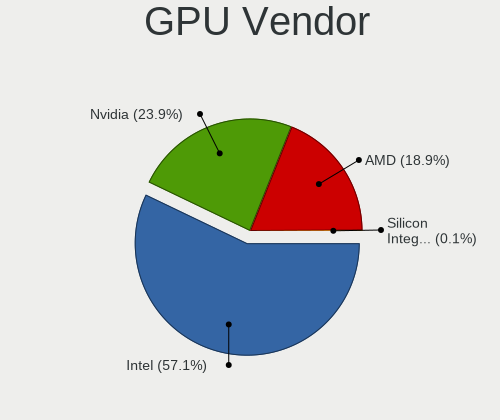
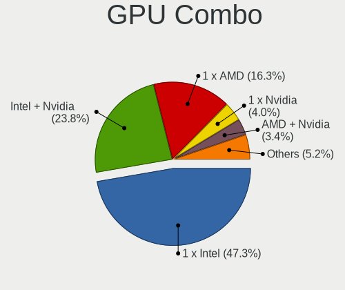

Fedora 35 - Tested Hardware & Statistics (Notebooks)
----------------------------------------------------

A project to collect tested hardware configurations for Fedora 35.

Anyone can contribute to this report by the [hw-probe](https://github.com/linuxhw/hw-probe) tool:

    sudo -E hw-probe -all -upload

Please submit a probe of your configuration if it's not presented on the page or is rare.

Full-feature report is available here: https://linux-hardware.org/?view=trends

Contents
--------

* [ Test Cases ](#test-cases)

* [ System ](#system)
  - [ Kernel                   ](#kernel)
  - [ Kernel Family            ](#kernel-family)
  - [ Kernel Major Ver.        ](#kernel-major-ver)
  - [ Arch                     ](#arch)
  - [ DE                       ](#de)
  - [ Display Server           ](#display-server)
  - [ Display Manager          ](#display-manager)
  - [ OS Lang                  ](#os-lang)
  - [ Boot Mode                ](#boot-mode)
  - [ Filesystem               ](#filesystem)
  - [ Part. scheme             ](#part-scheme)
  - [ Dual Boot with Linux/BSD ](#dual-boot-with-linuxbsd)
  - [ Dual Boot (Win)          ](#dual-boot-win)

* [ Board ](#board)
  - [ Vendor                   ](#vendor)
  - [ Model                    ](#model)
  - [ Model Family             ](#model-family)
  - [ MFG Year                 ](#mfg-year)
  - [ Form Factor              ](#form-factor)
  - [ Secure Boot              ](#secure-boot)
  - [ Coreboot                 ](#coreboot)
  - [ RAM Size                 ](#ram-size)
  - [ RAM Used                 ](#ram-used)
  - [ Total Drives             ](#total-drives)
  - [ Has CD-ROM               ](#has-cd-rom)
  - [ Has Ethernet             ](#has-ethernet)
  - [ Has WiFi                 ](#has-wifi)
  - [ Has Bluetooth            ](#has-bluetooth)

* [ Location ](#location)
  - [ Country                  ](#country)
  - [ City                     ](#city)

* [ Drives ](#drives)
  - [ Drive Vendor             ](#drive-vendor)
  - [ Drive Model              ](#drive-model)
  - [ HDD Vendor               ](#hdd-vendor)
  - [ SSD Vendor               ](#ssd-vendor)
  - [ Drive Kind               ](#drive-kind)
  - [ Drive Connector          ](#drive-connector)
  - [ Drive Size               ](#drive-size)
  - [ Space Total              ](#space-total)
  - [ Space Used               ](#space-used)
  - [ Malfunc. Drives          ](#malfunc-drives)
  - [ Malfunc. Drive Vendor    ](#malfunc-drive-vendor)
  - [ Malfunc. HDD Vendor      ](#malfunc-hdd-vendor)
  - [ Malfunc. Drive Kind      ](#malfunc-drive-kind)
  - [ Failed Drives            ](#failed-drives)
  - [ Failed Drive Vendor      ](#failed-drive-vendor)
  - [ Drive Status             ](#drive-status)

* [ Storage controller ](#storage-controller)
  - [ Storage Vendor           ](#storage-vendor)
  - [ Storage Model            ](#storage-model)
  - [ Storage Kind             ](#storage-kind)

* [ Processor ](#processor)
  - [ CPU Vendor               ](#cpu-vendor)
  - [ CPU Model                ](#cpu-model)
  - [ CPU Model Family         ](#cpu-model-family)
  - [ CPU Cores                ](#cpu-cores)
  - [ CPU Sockets              ](#cpu-sockets)
  - [ CPU Threads              ](#cpu-threads)
  - [ CPU Op-Modes             ](#cpu-op-modes)
  - [ CPU Microcode            ](#cpu-microcode)
  - [ CPU Microarch            ](#cpu-microarch)

* [ Graphics ](#graphics)
  - [ GPU Vendor               ](#gpu-vendor)
  - [ GPU Model                ](#gpu-model)
  - [ GPU Combo                ](#gpu-combo)
  - [ GPU Driver               ](#gpu-driver)
  - [ GPU Memory               ](#gpu-memory)

* [ Monitor ](#monitor)
  - [ Monitor Vendor           ](#monitor-vendor)
  - [ Monitor Model            ](#monitor-model)
  - [ Monitor Resolution       ](#monitor-resolution)
  - [ Monitor Diagonal         ](#monitor-diagonal)
  - [ Monitor Width            ](#monitor-width)
  - [ Aspect Ratio             ](#aspect-ratio)
  - [ Monitor Area             ](#monitor-area)
  - [ Pixel Density            ](#pixel-density)
  - [ Multiple Monitors        ](#multiple-monitors)

* [ Network ](#network)
  - [ Net Controller Vendor    ](#net-controller-vendor)
  - [ Net Controller Model     ](#net-controller-model)
  - [ Wireless Vendor          ](#wireless-vendor)
  - [ Wireless Model           ](#wireless-model)
  - [ Ethernet Vendor          ](#ethernet-vendor)
  - [ Ethernet Model           ](#ethernet-model)
  - [ Net Controller Kind      ](#net-controller-kind)
  - [ Used Controller          ](#used-controller)
  - [ NICs                     ](#nics)
  - [ IPv6                     ](#ipv6)

* [ Bluetooth ](#bluetooth)
  - [ Bluetooth Vendor         ](#bluetooth-vendor)
  - [ Bluetooth Model          ](#bluetooth-model)

* [ Sound ](#sound)
  - [ Sound Vendor             ](#sound-vendor)
  - [ Sound Model              ](#sound-model)

* [ Memory ](#memory)
  - [ Memory Vendor            ](#memory-vendor)
  - [ Memory Model             ](#memory-model)
  - [ Memory Kind              ](#memory-kind)
  - [ Memory Form Factor       ](#memory-form-factor)
  - [ Memory Size              ](#memory-size)
  - [ Memory Speed             ](#memory-speed)

* [ Printers & scanners ](#printers--scanners)
  - [ Printer Vendor           ](#printer-vendor)
  - [ Printer Model            ](#printer-model)
  - [ Scanner Vendor           ](#scanner-vendor)
  - [ Scanner Model            ](#scanner-model)

* [ Camera ](#camera)
  - [ Camera Vendor            ](#camera-vendor)
  - [ Camera Model             ](#camera-model)

* [ Security ](#security)
  - [ Fingerprint Vendor       ](#fingerprint-vendor)
  - [ Fingerprint Model        ](#fingerprint-model)
  - [ Chipcard Vendor          ](#chipcard-vendor)
  - [ Chipcard Model           ](#chipcard-model)

* [ Unsupported ](#unsupported)
  - [ Unsupported Devices      ](#unsupported-devices)
  - [ Unsupported Device Types ](#unsupported-device-types)

Test Cases
----------

| Vendor        | Model                       | Probe                                                      | Date         |
|---------------|-----------------------------|------------------------------------------------------------|--------------|
| Toshiba       | Satellite C70-A-K2W         | [8e46f67032](https://linux-hardware.org/?probe=8e46f67032) | Dec 03, 2021 |
| Lenovo        | ThinkPad X230 23257R2       | [775ec45ab8](https://linux-hardware.org/?probe=775ec45ab8) | Dec 03, 2021 |
| Lenovo        | ThinkPad X230 23257R2       | [b783f0a79d](https://linux-hardware.org/?probe=b783f0a79d) | Dec 03, 2021 |
| Gigabyte      | AERO 15 KB                  | [a7d3041cd2](https://linux-hardware.org/?probe=a7d3041cd2) | Dec 03, 2021 |
| HP            | Laptop 15s-eq2xxx           | [f53047cd0d](https://linux-hardware.org/?probe=f53047cd0d) | Dec 02, 2021 |
| Notebook      | NH55RGQ                     | [4189e1f255](https://linux-hardware.org/?probe=4189e1f255) | Dec 02, 2021 |
| Lenovo        | V15-ADA 82C7                | [5ade9a0569](https://linux-hardware.org/?probe=5ade9a0569) | Dec 02, 2021 |
| Lenovo        | ThinkPad L390 20NSS43600    | [e9aae12812](https://linux-hardware.org/?probe=e9aae12812) | Dec 02, 2021 |
| Acer          | Nitro AN515-55              | [d5c6c6edee](https://linux-hardware.org/?probe=d5c6c6edee) | Dec 01, 2021 |
| HP            | Laptop 15s-fq2xxx           | [94b9d8b093](https://linux-hardware.org/?probe=94b9d8b093) | Dec 01, 2021 |
| HP            | ProBook 470 G5              | [240ca54dfb](https://linux-hardware.org/?probe=240ca54dfb) | Dec 01, 2021 |
| ASUSTek       | ROG Strix G513QY_G513QY     | [8cebf41624](https://linux-hardware.org/?probe=8cebf41624) | Dec 01, 2021 |
| HP            | Laptop 15s-eq1xxx           | [9b11575394](https://linux-hardware.org/?probe=9b11575394) | Dec 01, 2021 |
| HP            | ProBook 470 G5              | [610709bb66](https://linux-hardware.org/?probe=610709bb66) | Nov 30, 2021 |
| Acer          | Aspire E5-571G              | [f940ae414d](https://linux-hardware.org/?probe=f940ae414d) | Nov 30, 2021 |
| Dell          | Inspiron 7460               | [0a6feb58e7](https://linux-hardware.org/?probe=0a6feb58e7) | Nov 30, 2021 |
| Lenovo        | ThinkPad T14 Gen 1 20UD0... | [b2d55bd445](https://linux-hardware.org/?probe=b2d55bd445) | Nov 30, 2021 |
| Lenovo        | ThinkPad P1 Gen 2 20QUS1... | [23ae32af07](https://linux-hardware.org/?probe=23ae32af07) | Nov 30, 2021 |
| Lenovo        | ThinkPad P1 Gen 2 20QUS1... | [074ec973ae](https://linux-hardware.org/?probe=074ec973ae) | Nov 30, 2021 |
| Lenovo        | ThinkPad P1 Gen 3 20TJS5... | [80bbba47f6](https://linux-hardware.org/?probe=80bbba47f6) | Nov 29, 2021 |
| Acer          | Aspire E5-571G              | [95cb3fe8b3](https://linux-hardware.org/?probe=95cb3fe8b3) | Nov 29, 2021 |
| Acer          | Predator G9-793             | [b9dc27ddac](https://linux-hardware.org/?probe=b9dc27ddac) | Nov 29, 2021 |
| Dell          | G5 5590                     | [e569e56450](https://linux-hardware.org/?probe=e569e56450) | Nov 29, 2021 |
| HP            | Laptop 15s-fq2xxx           | [959af2b8dd](https://linux-hardware.org/?probe=959af2b8dd) | Nov 29, 2021 |
| Acer          | Swift SF113-31              | [f1e3d8c722](https://linux-hardware.org/?probe=f1e3d8c722) | Nov 29, 2021 |
| Notebook      | NB50TL                      | [15a716161c](https://linux-hardware.org/?probe=15a716161c) | Nov 28, 2021 |
| HP            | ProBook 470 G5              | [b75e21b247](https://linux-hardware.org/?probe=b75e21b247) | Nov 28, 2021 |
| Dell          | Inspiron 5558               | [b003366a2c](https://linux-hardware.org/?probe=b003366a2c) | Nov 28, 2021 |
| Notebook      | NH5x_NH7x_HHx_HJx_HKx       | [8e5c4cc27b](https://linux-hardware.org/?probe=8e5c4cc27b) | Nov 28, 2021 |
| Apple         | MacBookPro7,1               | [6a4ed949e9](https://linux-hardware.org/?probe=6a4ed949e9) | Nov 28, 2021 |
| Lenovo        | IdeaPad S145-15IWL 81MV     | [0852350348](https://linux-hardware.org/?probe=0852350348) | Nov 28, 2021 |
| Dell          | Latitude 7420               | [7a96812e39](https://linux-hardware.org/?probe=7a96812e39) | Nov 28, 2021 |
| HP            | Pavilion Aero Laptop 13-... | [eabdd46893](https://linux-hardware.org/?probe=eabdd46893) | Nov 28, 2021 |
| Lenovo        | G40-45 80E1                 | [b3cdb202fc](https://linux-hardware.org/?probe=b3cdb202fc) | Nov 28, 2021 |
| HP            | Laptop 15s-fq2xxx           | [d559f82ee3](https://linux-hardware.org/?probe=d559f82ee3) | Nov 28, 2021 |
| Dell          | XPS 13 7390                 | [783b49e383](https://linux-hardware.org/?probe=783b49e383) | Nov 28, 2021 |
| Lenovo        | ThinkPad T400 6474B84       | [67f32be00d](https://linux-hardware.org/?probe=67f32be00d) | Nov 27, 2021 |
| Lenovo        | ThinkPad E480 20KNS0E200    | [968f938b4e](https://linux-hardware.org/?probe=968f938b4e) | Nov 27, 2021 |
| Lenovo        | IdeaPad 320S-14IKB 81BN     | [08612b7f88](https://linux-hardware.org/?probe=08612b7f88) | Nov 27, 2021 |
| Lenovo        | ThinkPad E15 20RD003JRT     | [ef8336f76a](https://linux-hardware.org/?probe=ef8336f76a) | Nov 26, 2021 |
| Dell          | Precision 5550              | [41caa6a4a0](https://linux-hardware.org/?probe=41caa6a4a0) | Nov 26, 2021 |
| Lenovo        | ThinkPad X1 Carbon Gen 9... | [6056117cca](https://linux-hardware.org/?probe=6056117cca) | Nov 26, 2021 |
| ASUSTek       | K54C                        | [2604de426e](https://linux-hardware.org/?probe=2604de426e) | Nov 26, 2021 |
| Acer          | AP714-51T                   | [3fe9bcf889](https://linux-hardware.org/?probe=3fe9bcf889) | Nov 26, 2021 |
| Acer          | AP714-51T                   | [406001fc85](https://linux-hardware.org/?probe=406001fc85) | Nov 26, 2021 |
| Lenovo        | IdeaPad 320-15ISK 80XH      | [c207f61d91](https://linux-hardware.org/?probe=c207f61d91) | Nov 26, 2021 |
| Lenovo        | IdeaPad 320-15ISK 80XH      | [96c90ad6c9](https://linux-hardware.org/?probe=96c90ad6c9) | Nov 26, 2021 |
| Lenovo        | IdeaPad 320-15ISK 80XH      | [039dbf659a](https://linux-hardware.org/?probe=039dbf659a) | Nov 26, 2021 |
| Lenovo        | ThinkBook 15-IML 20RW       | [a000027ce6](https://linux-hardware.org/?probe=a000027ce6) | Nov 26, 2021 |
| Lenovo        | ThinkPad P1 Gen 2 20QT00... | [b9c1906f2b](https://linux-hardware.org/?probe=b9c1906f2b) | Nov 26, 2021 |
| Lenovo        | IdeaPad 3 15IGL05 81WQ      | [366fe373c9](https://linux-hardware.org/?probe=366fe373c9) | Nov 25, 2021 |
| HUAWEI        | KLVL-WXXW                   | [beff046f56](https://linux-hardware.org/?probe=beff046f56) | Nov 25, 2021 |
| HUAWEI        | KLVL-WXXW                   | [2a96a2a7af](https://linux-hardware.org/?probe=2a96a2a7af) | Nov 25, 2021 |
| Sony          | VPCF131FM                   | [f0ba5e0db2](https://linux-hardware.org/?probe=f0ba5e0db2) | Nov 25, 2021 |
| HUAWEI        | KLVL-WXX9                   | [3352efa5cd](https://linux-hardware.org/?probe=3352efa5cd) | Nov 25, 2021 |
| Dell          | Latitude E5470              | [1e35555998](https://linux-hardware.org/?probe=1e35555998) | Nov 24, 2021 |
| Dell          | XPS 13 9300                 | [a91462bd5a](https://linux-hardware.org/?probe=a91462bd5a) | Nov 24, 2021 |
| HP            | EliteBook 735 G5            | [d80b574cb4](https://linux-hardware.org/?probe=d80b574cb4) | Nov 24, 2021 |
| ASUSTek       | VivoBook_ASUSLaptop X512... | [b6bfa4b827](https://linux-hardware.org/?probe=b6bfa4b827) | Nov 24, 2021 |
| Lenovo        | ThinkPad X1 Extreme 2nd ... | [44bf6f6d6f](https://linux-hardware.org/?probe=44bf6f6d6f) | Nov 23, 2021 |
| Lenovo        | ThinkPad X1 Carbon 7th 2... | [3c3fbf498a](https://linux-hardware.org/?probe=3c3fbf498a) | Nov 23, 2021 |
| HP            | ENVY Laptop 14-eb0xxx       | [5be975dd37](https://linux-hardware.org/?probe=5be975dd37) | Nov 23, 2021 |
| Lenovo        | B40-70 80F30006BR           | [d29d6c2f61](https://linux-hardware.org/?probe=d29d6c2f61) | Nov 23, 2021 |
| Lenovo        | B40-70 80F30006BR           | [6e361a8715](https://linux-hardware.org/?probe=6e361a8715) | Nov 23, 2021 |
| Acer          | Nitro AN515-54              | [b58b567113](https://linux-hardware.org/?probe=b58b567113) | Nov 22, 2021 |
| Apple         | MacBookPro11,4              | [7b9225653f](https://linux-hardware.org/?probe=7b9225653f) | Nov 22, 2021 |
| HP            | ENVY Laptop 14-eb0xxx       | [365b3888e6](https://linux-hardware.org/?probe=365b3888e6) | Nov 22, 2021 |
| Fujitsu       | LIFEBOOK U747               | [ece0600e5d](https://linux-hardware.org/?probe=ece0600e5d) | Nov 22, 2021 |
| Apple         | MacBookPro7,1               | [c686d7d85c](https://linux-hardware.org/?probe=c686d7d85c) | Nov 22, 2021 |
| Lenovo        | IdeaPad 3 17IIL05 81WF      | [f13b0fb2b9](https://linux-hardware.org/?probe=f13b0fb2b9) | Nov 22, 2021 |
| HP            | Laptop 15s-eq2xxx           | [a20fe0f647](https://linux-hardware.org/?probe=a20fe0f647) | Nov 21, 2021 |
| Lenovo        | ThinkPad T400 6474B84       | [f779165258](https://linux-hardware.org/?probe=f779165258) | Nov 21, 2021 |
| Dell          | Latitude E5570              | [8cf8db7a89](https://linux-hardware.org/?probe=8cf8db7a89) | Nov 21, 2021 |
| Google        | Relm                        | [92e569bf1e](https://linux-hardware.org/?probe=92e569bf1e) | Nov 21, 2021 |
| HP            | Pavilion 17                 | [2d69072cdf](https://linux-hardware.org/?probe=2d69072cdf) | Nov 20, 2021 |
| Dell          | Latitude 5490               | [cbe23836bf](https://linux-hardware.org/?probe=cbe23836bf) | Nov 20, 2021 |
| Dell          | Latitude E7440              | [a4581f0839](https://linux-hardware.org/?probe=a4581f0839) | Nov 20, 2021 |
| Lenovo        | ThinkPad L15 Gen 2 20X4S... | [8dfec492a4](https://linux-hardware.org/?probe=8dfec492a4) | Nov 19, 2021 |
| Lenovo        | ThinkPad L15 Gen 2 20X4S... | [78341a1a16](https://linux-hardware.org/?probe=78341a1a16) | Nov 19, 2021 |
| ASUSTek       | VivoBook_ASUS Laptop E51... | [31cebd4e96](https://linux-hardware.org/?probe=31cebd4e96) | Nov 19, 2021 |
| ASUSTek       | VivoBook_ASUS Laptop E51... | [0be43eb710](https://linux-hardware.org/?probe=0be43eb710) | Nov 19, 2021 |
| Acer          | Swift SF514-51              | [07e73dc8ab](https://linux-hardware.org/?probe=07e73dc8ab) | Nov 19, 2021 |
| Lenovo        | ThinkPad X1 Extreme 20MF... | [a524ba65b5](https://linux-hardware.org/?probe=a524ba65b5) | Nov 19, 2021 |
| Lenovo        | ThinkPad X1 Extreme 20MF... | [7e7b7d381e](https://linux-hardware.org/?probe=7e7b7d381e) | Nov 19, 2021 |
| HP            | Pavilion Aero Laptop 13-... | [d0aea280e7](https://linux-hardware.org/?probe=d0aea280e7) | Nov 19, 2021 |
| Dell          | Inspiron 3593               | [0e670dc090](https://linux-hardware.org/?probe=0e670dc090) | Nov 19, 2021 |
| Lenovo        | Legion 5 Pro 16ACH6H 82J... | [d7a5775f61](https://linux-hardware.org/?probe=d7a5775f61) | Nov 19, 2021 |
| Notebook      | NH55RGQ                     | [d111fd1549](https://linux-hardware.org/?probe=d111fd1549) | Nov 19, 2021 |
| Lenovo        | ThinkPad P14s Gen 1 20Y1... | [01a15306b9](https://linux-hardware.org/?probe=01a15306b9) | Nov 19, 2021 |
| Lenovo        | ThinkPad X13 Gen 1 20UF0... | [709cd419bc](https://linux-hardware.org/?probe=709cd419bc) | Nov 19, 2021 |
| ASUSTek       | X750JN                      | [bb6f44b058](https://linux-hardware.org/?probe=bb6f44b058) | Nov 19, 2021 |
| Lenovo        | ThinkPad X1 Carbon 6th 2... | [f5a721bf24](https://linux-hardware.org/?probe=f5a721bf24) | Nov 19, 2021 |
| Dell          | Precision 5510              | [1d46cced08](https://linux-hardware.org/?probe=1d46cced08) | Nov 19, 2021 |
| HP            | Laptop 14s-fq0xxx           | [f9b7bdfef8](https://linux-hardware.org/?probe=f9b7bdfef8) | Nov 19, 2021 |
| Dell          | Inspiron 7572               | [0953d49db6](https://linux-hardware.org/?probe=0953d49db6) | Nov 18, 2021 |
| Lenovo        | ThinkPad X1 Nano Gen 1 2... | [dc150f9fba](https://linux-hardware.org/?probe=dc150f9fba) | Nov 18, 2021 |
| HP            | EliteBook 840 G3            | [9e8fd0520d](https://linux-hardware.org/?probe=9e8fd0520d) | Nov 18, 2021 |
| Lenovo        | Legion R9000P2021H 82JQ     | [7734a8d28c](https://linux-hardware.org/?probe=7734a8d28c) | Nov 18, 2021 |
| Acer          | Swift SF314-43              | [46c44d537a](https://linux-hardware.org/?probe=46c44d537a) | Nov 18, 2021 |
| HP            | Pavilion Notebook           | [01f7a4c33d](https://linux-hardware.org/?probe=01f7a4c33d) | Nov 18, 2021 |
| Acer          | Swift SF314-42              | [05020e1e61](https://linux-hardware.org/?probe=05020e1e61) | Nov 18, 2021 |
| Toshiba       | Satellite C855-12R          | [dbde83db50](https://linux-hardware.org/?probe=dbde83db50) | Nov 17, 2021 |
| Lenovo        | ThinkPad X1 Carbon Gen 9... | [427ee1a6de](https://linux-hardware.org/?probe=427ee1a6de) | Nov 17, 2021 |
| Login Info... | LOG-QAL30                   | [585419cd38](https://linux-hardware.org/?probe=585419cd38) | Nov 17, 2021 |
| Login Info... | LOG-QAL30                   | [9dff5423c9](https://linux-hardware.org/?probe=9dff5423c9) | Nov 17, 2021 |
| Dell          | Latitude E7270              | [70a4c30534](https://linux-hardware.org/?probe=70a4c30534) | Nov 17, 2021 |
| HP            | ZBook Fury 15 G7 Mobile ... | [6196137046](https://linux-hardware.org/?probe=6196137046) | Nov 17, 2021 |
| HP            | Pavilion 15                 | [d6caf6dd12](https://linux-hardware.org/?probe=d6caf6dd12) | Nov 17, 2021 |
| Toshiba       | Satellite C855-12R          | [eefe2dc8be](https://linux-hardware.org/?probe=eefe2dc8be) | Nov 17, 2021 |
| HP            | Pavilion 15                 | [581a56e963](https://linux-hardware.org/?probe=581a56e963) | Nov 17, 2021 |
| HP            | ENVY Laptop 15t-ep000       | [02c2ed5954](https://linux-hardware.org/?probe=02c2ed5954) | Nov 16, 2021 |
| HP            | Laptop 15s-eq2xxx           | [ec73e73572](https://linux-hardware.org/?probe=ec73e73572) | Nov 16, 2021 |
| Razer         | Blade 15 Advanced Model ... | [c4763ca2a5](https://linux-hardware.org/?probe=c4763ca2a5) | Nov 16, 2021 |
| Acer          | Swift SF314-43              | [db85b885ae](https://linux-hardware.org/?probe=db85b885ae) | Nov 16, 2021 |
| Lenovo        | ThinkPad E14 Gen 3 20Y70... | [6b1f5ce8b7](https://linux-hardware.org/?probe=6b1f5ce8b7) | Nov 16, 2021 |
| ASUSTek       | S551LN                      | [53b3fced16](https://linux-hardware.org/?probe=53b3fced16) | Nov 16, 2021 |
| Toshiba       | Satellite C855-12R          | [ccf125eb47](https://linux-hardware.org/?probe=ccf125eb47) | Nov 16, 2021 |
| MSI           | Modern 15 A11M              | [6398858488](https://linux-hardware.org/?probe=6398858488) | Nov 16, 2021 |
| Notebook      | NH55RGQ                     | [b3cb30c28d](https://linux-hardware.org/?probe=b3cb30c28d) | Nov 16, 2021 |
| Razer         | Blade 15 Advanced Model ... | [1119a0805e](https://linux-hardware.org/?probe=1119a0805e) | Nov 16, 2021 |
| Acer          | Aspire E1-572               | [dbaa27643e](https://linux-hardware.org/?probe=dbaa27643e) | Nov 16, 2021 |
| Acer          | Aspire E1-572               | [aad4a92e0e](https://linux-hardware.org/?probe=aad4a92e0e) | Nov 16, 2021 |
| Apple         | MacBookPro6,2               | [75e80e1ea8](https://linux-hardware.org/?probe=75e80e1ea8) | Nov 15, 2021 |
| ASUSTek       | ROG Strix G513QY_G513QY     | [06f896ff98](https://linux-hardware.org/?probe=06f896ff98) | Nov 15, 2021 |
| Acer          | Aspire A715-71G             | [dd0bfcd823](https://linux-hardware.org/?probe=dd0bfcd823) | Nov 15, 2021 |
| Lenovo        | IdeaPad 3 17IIL05 81WF      | [ea6139e86c](https://linux-hardware.org/?probe=ea6139e86c) | Nov 15, 2021 |
| Lenovo        | IdeaPad 3 17IIL05 81WF      | [90e882710c](https://linux-hardware.org/?probe=90e882710c) | Nov 15, 2021 |
| Lenovo        | IdeaPad S540-15IWL          | [516e448510](https://linux-hardware.org/?probe=516e448510) | Nov 14, 2021 |
| MSI           | Modern 15 A11M              | [8b02ecc2b6](https://linux-hardware.org/?probe=8b02ecc2b6) | Nov 14, 2021 |
| SiComputer    | Nauta 01W PRO               | [70b84217bd](https://linux-hardware.org/?probe=70b84217bd) | Nov 14, 2021 |
| Dell          | Precision 3541              | [a21fd45ac3](https://linux-hardware.org/?probe=a21fd45ac3) | Nov 14, 2021 |
| ASUSTek       | ZenBook UX433FA_UX433FA     | [54bb479f64](https://linux-hardware.org/?probe=54bb479f64) | Nov 14, 2021 |
| SiComputer    | Nauta 01W PRO               | [d88aea84ef](https://linux-hardware.org/?probe=d88aea84ef) | Nov 14, 2021 |
| Lenovo        | ThinkPad X1 Carbon 7th 2... | [48f29ffe3a](https://linux-hardware.org/?probe=48f29ffe3a) | Nov 14, 2021 |
| Apple         | MacBookPro6,2               | [a778aba19c](https://linux-hardware.org/?probe=a778aba19c) | Nov 14, 2021 |
| Dell          | Vostro 3460                 | [3a6a636384](https://linux-hardware.org/?probe=3a6a636384) | Nov 14, 2021 |
| Dell          | Latitude 5511               | [dc7c10f4e2](https://linux-hardware.org/?probe=dc7c10f4e2) | Nov 13, 2021 |
| Dell          | Latitude 5511               | [b0ca679bc5](https://linux-hardware.org/?probe=b0ca679bc5) | Nov 13, 2021 |
| HP            | ProBook 430 G1              | [68633b9bf5](https://linux-hardware.org/?probe=68633b9bf5) | Nov 13, 2021 |
| MSI           | Delta 15 A5EFK              | [bc348014b5](https://linux-hardware.org/?probe=bc348014b5) | Nov 13, 2021 |
| Lenovo        | IdeaPad MIIX 700-12ISK 8... | [3cfeff5a7f](https://linux-hardware.org/?probe=3cfeff5a7f) | Nov 13, 2021 |
| Lenovo        | ThinkPad T490 20N2CTO1WW    | [9e8eab1073](https://linux-hardware.org/?probe=9e8eab1073) | Nov 13, 2021 |
| Lenovo        | Legion R7000P2021H 82JU     | [19ffbfb846](https://linux-hardware.org/?probe=19ffbfb846) | Nov 13, 2021 |
| Dell          | Inspiron 14-3467            | [ebe54808c2](https://linux-hardware.org/?probe=ebe54808c2) | Nov 13, 2021 |
| Apple         | MacBookPro10,2              | [5cbec68d6e](https://linux-hardware.org/?probe=5cbec68d6e) | Nov 13, 2021 |
| Positivo      | V142N_4G                    | [6afdf02b96](https://linux-hardware.org/?probe=6afdf02b96) | Nov 13, 2021 |
| Acer          | Swift SFX14-41G             | [04e988d138](https://linux-hardware.org/?probe=04e988d138) | Nov 13, 2021 |
| HP            | Pavilion Aero Laptop 13-... | [85929a9a18](https://linux-hardware.org/?probe=85929a9a18) | Nov 12, 2021 |
| HP            | Pavilion Aero Laptop 13-... | [3a33eaa4c0](https://linux-hardware.org/?probe=3a33eaa4c0) | Nov 12, 2021 |
| Samsung       | RV411/RV511/E3511/S3511/... | [3bbda8b194](https://linux-hardware.org/?probe=3bbda8b194) | Nov 12, 2021 |
| ASUSTek       | VivoBook 15_ASUS Laptop ... | [fa348e4f87](https://linux-hardware.org/?probe=fa348e4f87) | Nov 12, 2021 |
| Dell          | Precision 5510              | [80bbc48bce](https://linux-hardware.org/?probe=80bbc48bce) | Nov 12, 2021 |
| Lenovo        | IdeaPad 5 Pro 16IHU6 82L... | [a7998fa53a](https://linux-hardware.org/?probe=a7998fa53a) | Nov 11, 2021 |
| System76      | Oryx Pro                    | [77cf902290](https://linux-hardware.org/?probe=77cf902290) | Nov 11, 2021 |
| Apple         | MacBookPro9,2               | [61afe68685](https://linux-hardware.org/?probe=61afe68685) | Nov 11, 2021 |
| Dell          | Latitude E7440              | [e907f0bbf1](https://linux-hardware.org/?probe=e907f0bbf1) | Nov 11, 2021 |
| ASUSTek       | X202EV                      | [ff0732f245](https://linux-hardware.org/?probe=ff0732f245) | Nov 11, 2021 |
| HP            | EliteBook 850 G5            | [7df8bf1476](https://linux-hardware.org/?probe=7df8bf1476) | Nov 11, 2021 |
| HP            | EliteBook 850 G5            | [1def8c2d0b](https://linux-hardware.org/?probe=1def8c2d0b) | Nov 11, 2021 |
| Dell          | XPS 13 7390                 | [f5ceaaf6fe](https://linux-hardware.org/?probe=f5ceaaf6fe) | Nov 11, 2021 |
| Apple         | MacBookAir6,1               | [588c351d40](https://linux-hardware.org/?probe=588c351d40) | Nov 10, 2021 |
| Lenovo        | ThinkPad X1 Carbon 2nd 2... | [ac9d7f968f](https://linux-hardware.org/?probe=ac9d7f968f) | Nov 10, 2021 |
| ASUSTek       | VivoBook S15 X510UF         | [fc4d285e0a](https://linux-hardware.org/?probe=fc4d285e0a) | Nov 10, 2021 |
| Acer          | Nitro AN515-55              | [d4f75f503d](https://linux-hardware.org/?probe=d4f75f503d) | Nov 10, 2021 |
| ASUSTek       | T102HA                      | [d648620b1a](https://linux-hardware.org/?probe=d648620b1a) | Nov 10, 2021 |
| LG Electro... | 14Z90P-G.AR53A              | [a1fb8771db](https://linux-hardware.org/?probe=a1fb8771db) | Nov 10, 2021 |
| HP            | ProBook 430 G1              | [99ece77400](https://linux-hardware.org/?probe=99ece77400) | Nov 10, 2021 |
| HUAWEI        | KPL-W0X                     | [807e59f1e3](https://linux-hardware.org/?probe=807e59f1e3) | Nov 10, 2021 |
| Lenovo        | ThinkPad X1 Carbon Gen 8... | [5a2fa34576](https://linux-hardware.org/?probe=5a2fa34576) | Nov 10, 2021 |
| HP            | Laptop 15s-fq2xxx           | [c8fb558bb7](https://linux-hardware.org/?probe=c8fb558bb7) | Nov 09, 2021 |
| Lenovo        | ThinkPad X260 20F5S0E000    | [2321968d02](https://linux-hardware.org/?probe=2321968d02) | Nov 09, 2021 |
| Lenovo        | ThinkPad E14 Gen 3 20Y7C... | [81605538eb](https://linux-hardware.org/?probe=81605538eb) | Nov 09, 2021 |
| MSI           | GL62M 7RDX                  | [3538358a06](https://linux-hardware.org/?probe=3538358a06) | Nov 09, 2021 |
| HUAWEI        | HLYL-WXX9                   | [1c63b3b4ce](https://linux-hardware.org/?probe=1c63b3b4ce) | Nov 09, 2021 |
| HP            | OMEN Laptop 15-ek0xxx       | [cb4e2271c0](https://linux-hardware.org/?probe=cb4e2271c0) | Nov 09, 2021 |
| Toshiba       | NB255                       | [3c30b0d7ad](https://linux-hardware.org/?probe=3c30b0d7ad) | Nov 09, 2021 |
| HP            | Notebook                    | [e254c5c947](https://linux-hardware.org/?probe=e254c5c947) | Nov 08, 2021 |
| HP            | ENVY Laptop 17-ce1xxx       | [5f5424fe84](https://linux-hardware.org/?probe=5f5424fe84) | Nov 08, 2021 |
| Lenovo        | ThinkPad E590 20NB005GMH    | [146b572cd0](https://linux-hardware.org/?probe=146b572cd0) | Nov 08, 2021 |
| Lenovo        | IdeaPad Z510 20287          | [0812e26e5a](https://linux-hardware.org/?probe=0812e26e5a) | Nov 08, 2021 |
| Dell          | XPS 13 9360                 | [8988b7e735](https://linux-hardware.org/?probe=8988b7e735) | Nov 08, 2021 |
| Lenovo        | ThinkPad T460s 20F9CTO1W... | [b996ce8823](https://linux-hardware.org/?probe=b996ce8823) | Nov 07, 2021 |
| Lenovo        | Ducati 5 82ES               | [6269149643](https://linux-hardware.org/?probe=6269149643) | Nov 07, 2021 |
| HP            | Pavilion Laptop 15-ck0xx    | [b4d29007be](https://linux-hardware.org/?probe=b4d29007be) | Nov 07, 2021 |
| Dell          | Latitude E7440              | [b2560457a5](https://linux-hardware.org/?probe=b2560457a5) | Nov 06, 2021 |
| HP            | Pavilion Gaming Laptop 1... | [af116b7c35](https://linux-hardware.org/?probe=af116b7c35) | Nov 06, 2021 |
| Lenovo        | ThinkPad X1 Carbon 6th 2... | [ced169a0b1](https://linux-hardware.org/?probe=ced169a0b1) | Nov 06, 2021 |
| Apple         | MacBookPro6,2               | [bde89fd503](https://linux-hardware.org/?probe=bde89fd503) | Nov 06, 2021 |
| HP            | ProBook 455 G1              | [44a11d66ac](https://linux-hardware.org/?probe=44a11d66ac) | Nov 06, 2021 |
| HP            | 250 G1                      | [1c52b861c7](https://linux-hardware.org/?probe=1c52b861c7) | Nov 06, 2021 |
| Lenovo        | ThinkPad E14 20RA001XIX     | [98d8c0fbdb](https://linux-hardware.org/?probe=98d8c0fbdb) | Nov 06, 2021 |
| Lenovo        | ThinkPad X1 Carbon Gen 8... | [bb1201e75c](https://linux-hardware.org/?probe=bb1201e75c) | Nov 06, 2021 |
| HP            | EliteBook 2570p             | [dc62969834](https://linux-hardware.org/?probe=dc62969834) | Nov 05, 2021 |
| Notebook      | W65_W67RZ                   | [153b2a920d](https://linux-hardware.org/?probe=153b2a920d) | Nov 05, 2021 |
| HONOR         | NBD-WXX9                    | [1030fbbff6](https://linux-hardware.org/?probe=1030fbbff6) | Nov 05, 2021 |
| Unknown       | Unknown                     | [c78a5c81b2](https://linux-hardware.org/?probe=c78a5c81b2) | Nov 05, 2021 |
| HP            | ZBook 14u G5                | [ec192642ba](https://linux-hardware.org/?probe=ec192642ba) | Nov 05, 2021 |
| ASUSTek       | ROG Strix G513QY_G513QY     | [8e06f2617d](https://linux-hardware.org/?probe=8e06f2617d) | Nov 05, 2021 |
| ASUSTek       | ROG Strix G513QY_G513QY     | [1a2dda8941](https://linux-hardware.org/?probe=1a2dda8941) | Nov 05, 2021 |
| HP            | Laptop 15s-eq2xxx           | [04d4fca603](https://linux-hardware.org/?probe=04d4fca603) | Nov 04, 2021 |
| HP            | ProBook 430 G5              | [f29c3d7003](https://linux-hardware.org/?probe=f29c3d7003) | Nov 04, 2021 |
| HP            | ProBook 430 G5              | [a795236afd](https://linux-hardware.org/?probe=a795236afd) | Nov 04, 2021 |
| Lenovo        | IdeaPad 5 15ARE05 81YQ      | [cd291857e2](https://linux-hardware.org/?probe=cd291857e2) | Nov 04, 2021 |
| Lenovo        | ThinkPad T460 20FNCTO1WW    | [6ee78bd50a](https://linux-hardware.org/?probe=6ee78bd50a) | Nov 04, 2021 |
| Lenovo        | ThinkPad X270 20HN0013UK    | [8454cff91f](https://linux-hardware.org/?probe=8454cff91f) | Nov 04, 2021 |
| Dell          | Studio 1537                 | [d040c159b8](https://linux-hardware.org/?probe=d040c159b8) | Nov 04, 2021 |
| HP            | ProBook 430 G3              | [1d421060d7](https://linux-hardware.org/?probe=1d421060d7) | Nov 03, 2021 |
| Dell          | Precision 5510              | [eb702ce1e6](https://linux-hardware.org/?probe=eb702ce1e6) | Nov 03, 2021 |
| Dell          | Inspiron 5502               | [c68c3a5c3b](https://linux-hardware.org/?probe=c68c3a5c3b) | Nov 03, 2021 |
| Lenovo        | ThinkPad E15 20RD0011GE     | [10bd49d9c0](https://linux-hardware.org/?probe=10bd49d9c0) | Nov 03, 2021 |
| Dell          | Latitude 5590               | [5bc1ed5978](https://linux-hardware.org/?probe=5bc1ed5978) | Nov 03, 2021 |
| Lenovo        | ThinkPad T420 4236DK9       | [84e39e6c94](https://linux-hardware.org/?probe=84e39e6c94) | Nov 03, 2021 |
| System76      | Pangolin                    | [1eb0a48a30](https://linux-hardware.org/?probe=1eb0a48a30) | Nov 03, 2021 |
| HP            | Laptop 14-dq2xxx            | [f30e20e67b](https://linux-hardware.org/?probe=f30e20e67b) | Nov 03, 2021 |
| Dell          | XPS 15 9570                 | [8e3c5b2ef0](https://linux-hardware.org/?probe=8e3c5b2ef0) | Nov 03, 2021 |
| Lenovo        | ThinkPad X395 20NL0005US    | [b65f4d5ba3](https://linux-hardware.org/?probe=b65f4d5ba3) | Nov 03, 2021 |
| Lenovo        | ThinkPad E14 20RA0020AU     | [8c19662b7e](https://linux-hardware.org/?probe=8c19662b7e) | Nov 03, 2021 |
| Toshiba       | TECRA Z50-A                 | [4aae9bdc03](https://linux-hardware.org/?probe=4aae9bdc03) | Nov 03, 2021 |
| Dell          | XPS 13 9370                 | [458d3682a5](https://linux-hardware.org/?probe=458d3682a5) | Nov 03, 2021 |
| Lenovo        | ThinkPad T480s 20L70026U... | [7205a2ab55](https://linux-hardware.org/?probe=7205a2ab55) | Nov 03, 2021 |
| HUAWEI        | BOHK-WAX9X                  | [54b32173dd](https://linux-hardware.org/?probe=54b32173dd) | Nov 03, 2021 |
| Dell          | XPS 13 7390                 | [40df244ae9](https://linux-hardware.org/?probe=40df244ae9) | Nov 02, 2021 |
| Lenovo        | ThinkPad T480s 20L70026U... | [eeb181f50b](https://linux-hardware.org/?probe=eeb181f50b) | Oct 30, 2021 |
| HUAWEI        | NBLK-WAX9X                  | [1310b8abf4](https://linux-hardware.org/?probe=1310b8abf4) | Oct 30, 2021 |
| Framework     | Laptop                      | [04db6c2222](https://linux-hardware.org/?probe=04db6c2222) | Oct 29, 2021 |
| Acer          | Aspire F5-573G              | [1be6c8dc87](https://linux-hardware.org/?probe=1be6c8dc87) | Oct 29, 2021 |
| Lenovo        | ThinkPad T490 20N3S6VU00    | [f8024b89d4](https://linux-hardware.org/?probe=f8024b89d4) | Oct 28, 2021 |
| Lenovo        | ThinkPad L15 Gen 1 20U70... | [e9a8fb1275](https://linux-hardware.org/?probe=e9a8fb1275) | Oct 27, 2021 |
| BESSTAR Te... | X400                        | [9cfc0bb300](https://linux-hardware.org/?probe=9cfc0bb300) | Oct 27, 2021 |
| Positivo B... | VJFE53F11X-XXXXXX           | [d3720f9145](https://linux-hardware.org/?probe=d3720f9145) | Oct 25, 2021 |
| Alienware     | Area-51m R2                 | [c3f94d8599](https://linux-hardware.org/?probe=c3f94d8599) | Oct 24, 2021 |
| HP            | ProBook 470 G5              | [725627d16b](https://linux-hardware.org/?probe=725627d16b) | Oct 23, 2021 |
| HP            | EliteBook 8560w             | [98bd384a42](https://linux-hardware.org/?probe=98bd384a42) | Oct 23, 2021 |
| Lenovo        | ThinkPad T480 20L5000BMX    | [91fc910cf6](https://linux-hardware.org/?probe=91fc910cf6) | Oct 23, 2021 |
| HP            | Pavilion Gaming Laptop 1... | [1c91bc1deb](https://linux-hardware.org/?probe=1c91bc1deb) | Oct 23, 2021 |
| Lenovo        | ThinkPad T480 20L5000BMX    | [21b13fb067](https://linux-hardware.org/?probe=21b13fb067) | Oct 21, 2021 |
| Lenovo        | ThinkPad T490 20N3S6VU00    | [9932dd3c21](https://linux-hardware.org/?probe=9932dd3c21) | Oct 21, 2021 |
| Lenovo        | ThinkPad T490 20N3S6VU00    | [a99866abc1](https://linux-hardware.org/?probe=a99866abc1) | Oct 21, 2021 |
| Acer          | Swift SF114-32              | [faa49a332b](https://linux-hardware.org/?probe=faa49a332b) | Oct 20, 2021 |
| HP            | EliteBook 820 G1            | [278ec34902](https://linux-hardware.org/?probe=278ec34902) | Oct 19, 2021 |
| Lenovo        | ThinkPad T460 20FMS1R01K    | [4dbc231901](https://linux-hardware.org/?probe=4dbc231901) | Oct 18, 2021 |
| GPU Compan... | GWTN156-1                   | [3cb0b09b48](https://linux-hardware.org/?probe=3cb0b09b48) | Oct 17, 2021 |
| HP            | Laptop 14-df0xxx            | [ac488ba246](https://linux-hardware.org/?probe=ac488ba246) | Oct 16, 2021 |
| HP            | Pavilion Gaming Laptop 1... | [362e1d3b99](https://linux-hardware.org/?probe=362e1d3b99) | Oct 15, 2021 |
| Dell          | Precision 5550              | [15a0f61f84](https://linux-hardware.org/?probe=15a0f61f84) | Oct 14, 2021 |
| Lenovo        | Legion 5 15ARH05H 82B1      | [4bb5ac9410](https://linux-hardware.org/?probe=4bb5ac9410) | Oct 12, 2021 |
| HP            | OMEN Laptop 15-ek0xxx       | [d4acf59f3b](https://linux-hardware.org/?probe=d4acf59f3b) | Oct 11, 2021 |
| Lenovo        | IdeaPad S145-15API 81V7     | [5b4efb9e18](https://linux-hardware.org/?probe=5b4efb9e18) | Oct 10, 2021 |
| Lenovo        | Yoga S740-14IIL 81RS        | [fd09df16d9](https://linux-hardware.org/?probe=fd09df16d9) | Oct 10, 2021 |
| HP            | ProBook 450 G3              | [2eeb05ff03](https://linux-hardware.org/?probe=2eeb05ff03) | Oct 09, 2021 |
| HP            | ENVY Laptop 15t-ep000       | [f9b69ffa3d](https://linux-hardware.org/?probe=f9b69ffa3d) | Oct 08, 2021 |
| Dell          | Inspiron 5505               | [d136f5d8f7](https://linux-hardware.org/?probe=d136f5d8f7) | Oct 08, 2021 |
| Lenovo        | ThinkPad X1 Carbon 7th 2... | [26c62915e0](https://linux-hardware.org/?probe=26c62915e0) | Oct 07, 2021 |
| ASUSTek       | VivoBook S15 X530UA         | [146866c629](https://linux-hardware.org/?probe=146866c629) | Oct 06, 2021 |
| Apple         | MacBookPro5,5               | [db435ab99c](https://linux-hardware.org/?probe=db435ab99c) | Oct 03, 2021 |
| Lenovo        | G580 20150                  | [08adba2c54](https://linux-hardware.org/?probe=08adba2c54) | Oct 02, 2021 |
| HUAWEI        | EUL-WX9                     | [dfc5c12fbf](https://linux-hardware.org/?probe=dfc5c12fbf) | Oct 01, 2021 |
| Lenovo        | G580 20150                  | [1dbb7762f6](https://linux-hardware.org/?probe=1dbb7762f6) | Oct 01, 2021 |
| HP            | EliteBook 840 G5            | [e64aeb5fa4](https://linux-hardware.org/?probe=e64aeb5fa4) | Oct 01, 2021 |
| Lenovo        | IdeaPad 3 14ALC6 82KT       | [17c2d08e41](https://linux-hardware.org/?probe=17c2d08e41) | Oct 01, 2021 |
| HP            | EliteBook 840 G5            | [28bfae31ee](https://linux-hardware.org/?probe=28bfae31ee) | Oct 01, 2021 |
| Dell          | Studio 1537                 | [aae900457c](https://linux-hardware.org/?probe=aae900457c) | Oct 01, 2021 |
| Framework     | Laptop                      | [95576917c8](https://linux-hardware.org/?probe=95576917c8) | Sep 29, 2021 |
| Notebook      | N2x0WU                      | [410a2dab96](https://linux-hardware.org/?probe=410a2dab96) | Sep 28, 2021 |
| Lenovo        | IdeaPad C340-14API 81N6     | [82e0f76133](https://linux-hardware.org/?probe=82e0f76133) | Sep 25, 2021 |
| Lenovo        | ThinkPad E480 20KNS0MC00    | [ba847bc0c4](https://linux-hardware.org/?probe=ba847bc0c4) | Sep 23, 2021 |
| Apple         | MacBook6,1                  | [4fbbe3d05b](https://linux-hardware.org/?probe=4fbbe3d05b) | Sep 19, 2021 |
| HP            | G42                         | [0e9914c9cc](https://linux-hardware.org/?probe=0e9914c9cc) | Sep 18, 2021 |
| HP            | ZBook 15u G5                | [a5331a4d5e](https://linux-hardware.org/?probe=a5331a4d5e) | Sep 15, 2021 |
| Dell          | XPS 17 9700                 | [ebac1c499f](https://linux-hardware.org/?probe=ebac1c499f) | Sep 15, 2021 |
| ASUSTek       | G71V                        | [7904b934a4](https://linux-hardware.org/?probe=7904b934a4) | Sep 09, 2021 |
| Lenovo        | ThinkPad X1 Carbon Gen 8... | [2b21ef140a](https://linux-hardware.org/?probe=2b21ef140a) | Sep 05, 2021 |
| Lenovo        | ThinkPad P51s 20HBCTO1WW    | [e2f22f9f40](https://linux-hardware.org/?probe=e2f22f9f40) | Aug 27, 2021 |
| Dell          | Latitude E5470              | [ac04ecb1e5](https://linux-hardware.org/?probe=ac04ecb1e5) | Aug 22, 2021 |
| Dell          | XPS 15 9550                 | [0a28b37020](https://linux-hardware.org/?probe=0a28b37020) | Aug 15, 2021 |
| Acer          | Aspire A315-42              | [4a54197130](https://linux-hardware.org/?probe=4a54197130) | Aug 15, 2021 |
| Acer          | Aspire ES1-572              | [06ddc49173](https://linux-hardware.org/?probe=06ddc49173) | Aug 13, 2021 |
| Dell          | XPS 15 9570                 | [f20e1ba8fe](https://linux-hardware.org/?probe=f20e1ba8fe) | Aug 13, 2021 |
| Dell          | XPS 13 9380                 | [1c3776f221](https://linux-hardware.org/?probe=1c3776f221) | Aug 13, 2021 |
| Lenovo        | IdeaPad 530S-14IKB 81EU     | [ab00a7e359](https://linux-hardware.org/?probe=ab00a7e359) | Aug 13, 2021 |
| Notebook      | P377SM-A                    | [be5397dd67](https://linux-hardware.org/?probe=be5397dd67) | Aug 05, 2021 |
| HUAWEI        | KLVL-WXX9                   | [d677af1f50](https://linux-hardware.org/?probe=d677af1f50) | Aug 02, 2021 |
| HUAWEI        | KLVL-WXX9                   | [66c25f9637](https://linux-hardware.org/?probe=66c25f9637) | Jul 10, 2021 |
| Notebook      | P377SM-A                    | [bf37a519fa](https://linux-hardware.org/?probe=bf37a519fa) | May 17, 2021 |
| Notebook      | P377SM-A                    | [0834d4df8b](https://linux-hardware.org/?probe=0834d4df8b) | May 16, 2021 |
| Lenovo        | ThinkPad W541 20EF000UMN    | [f366b44668](https://linux-hardware.org/?probe=f366b44668) | Apr 11, 2021 |
| HUAWEI        | BOHK-WAX9X                  | [31475604b7](https://linux-hardware.org/?probe=31475604b7) | Mar 12, 2021 |
| HUAWEI        | BOHK-WAX9X                  | [151d163eb9](https://linux-hardware.org/?probe=151d163eb9) | Mar 12, 2021 |
| HUAWEI        | BOHK-WAX9X                  | [4b33f82ac0](https://linux-hardware.org/?probe=4b33f82ac0) | Mar 06, 2021 |

System
------

Kernel
------

Version of the Linux kernel

| Version                                              | Notebooks | Percent |
|------------------------------------------------------|-----------|---------|
| 5.14.16-301.fc35.x86_64                              | 44        | 18.88%  |
| 5.14.18-300.fc35.x86_64                              | 33        | 14.16%  |
| 5.14.17-301.fc35.x86_64                              | 27        | 11.59%  |
| 5.14.14-300.fc35.x86_64                              | 21        | 9.01%   |
| 5.14.10-300.fc35.x86_64                              | 19        | 8.15%   |
| 5.14.15-300.fc35.x86_64                              | 13        | 5.58%   |
| 5.15.5-200.fc35.x86_64                               | 11        | 4.72%   |
| 5.15.4-201.fc35.x86_64                               | 11        | 4.72%   |
| 5.14.9-300.fc35.x86_64                               | 9         | 3.86%   |
| 5.14.0-60.fc35.x86_64                                | 7         | 3%      |
| 5.14.0-0.rc5.42.fc35.x86_64                          | 5         | 2.15%   |
| 5.14.11-300.fc35.x86_64                              | 4         | 1.72%   |
| 5.14.7-300.fc35.x86_64                               | 3         | 1.29%   |
| 5.14.12-300.fc35.x86_64                              | 3         | 1.29%   |
| 5.14.3-300.fc35.x86_64                               | 2         | 0.86%   |
| 5.15.2-225.vanilla.1.fc35.x86_64                     | 1         | 0.43%   |
| 5.14.8-xm1cacule.0.fc35.x86_64                       | 1         | 0.43%   |
| 5.14.6-300.fc35.x86_64                               | 1         | 0.43%   |
| 5.14.5-300.fc35.x86_64                               | 1         | 0.43%   |
| 5.14.16-201.fc34.x86_64                              | 1         | 0.43%   |
| 5.14.15-300.rog.fc35.x86_64                          | 1         | 0.43%   |
| 5.14.1-300.fc35.x86_64                               | 1         | 0.43%   |
| 5.14.0-0.rc6.46.fc35.x86_64                          | 1         | 0.43%   |
| 5.14.0-0.rc4.20210804gitd5ad8ec3cfb5.36.fc35.x86_64  | 1         | 0.43%   |
| 5.14.0-0.rc3.20210728git4010a528219e.32.fc35.x86_64  | 1         | 0.43%   |
| 5.14.0-0.rc0.20210701gitdbe69e433722.6.fc35.x86_64   | 1         | 0.43%   |
| 5.13.9-200.fc34.x86_64                               | 1         | 0.43%   |
| 5.13.4-200.fc34.x86_64                               | 1         | 0.43%   |
| 5.13.19-200.fc35.x86_64                              | 1         | 0.43%   |
| 5.13.19-200.fc34.x86_64                              | 1         | 0.43%   |
| 5.13.0-0.rc1.20210513gitc06a2ba62fc4.15.fc35.x86_64  | 1         | 0.43%   |
| 5.12.8-300.fc34.x86_64                               | 1         | 0.43%   |
| 5.12.0-0.rc6.20210408git454859c552da.186.fc35.x86_64 | 1         | 0.43%   |
| 5.12.0-0.rc1.162.fc35.x86_64                         | 1         | 0.43%   |
| 5.11.12-300.fc34.x86_64                              | 1         | 0.43%   |
| 5.10.23-200.fc35.x86_64                              | 1         | 0.43%   |

Kernel Family
-------------

Linux kernel without a distro release

| Version | Notebooks | Percent |
|---------|-----------|---------|
| 5.14.16 | 45        | 19.4%   |
| 5.14.18 | 33        | 14.22%  |
| 5.14.17 | 27        | 11.64%  |
| 5.14.14 | 21        | 9.05%   |
| 5.14.10 | 19        | 8.19%   |
| 5.14.0  | 15        | 6.47%   |
| 5.14.15 | 14        | 6.03%   |
| 5.15.5  | 11        | 4.74%   |
| 5.15.4  | 11        | 4.74%   |
| 5.14.9  | 9         | 3.88%   |
| 5.14.11 | 4         | 1.72%   |
| 5.14.7  | 3         | 1.29%   |
| 5.14.12 | 3         | 1.29%   |
| 5.14.3  | 2         | 0.86%   |
| 5.13.19 | 2         | 0.86%   |
| 5.12.0  | 2         | 0.86%   |
| 5.15.2  | 1         | 0.43%   |
| 5.14.8  | 1         | 0.43%   |
| 5.14.6  | 1         | 0.43%   |
| 5.14.5  | 1         | 0.43%   |
| 5.14.1  | 1         | 0.43%   |
| 5.13.9  | 1         | 0.43%   |
| 5.13.4  | 1         | 0.43%   |
| 5.13.0  | 1         | 0.43%   |
| 5.12.8  | 1         | 0.43%   |
| 5.11.12 | 1         | 0.43%   |
| 5.10.23 | 1         | 0.43%   |

Kernel Major Ver.
-----------------

Linux kernel major version

| Version | Notebooks | Percent |
|---------|-----------|---------|
| 5.14    | 194       | 85.84%  |
| 5.15    | 22        | 9.73%   |
| 5.13    | 5         | 2.21%   |
| 5.12    | 3         | 1.33%   |
| 5.11    | 1         | 0.44%   |
| 5.10    | 1         | 0.44%   |

Arch
----

OS architecture (x86_64, i586, etc.)

| Name   | Notebooks | Percent |
|--------|-----------|---------|
| x86_64 | 222       | 100%    |

DE
--

Desktop Environment

| Name       | Notebooks | Percent |
|------------|-----------|---------|
| GNOME      | 174       | 77.33%  |
| KDE5       | 14        | 6.22%   |
| Unknown    | 13        | 5.78%   |
| MATE       | 7         | 3.11%   |
| X-Cinnamon | 6         | 2.67%   |
| Cinnamon   | 4         | 1.78%   |
| XFCE       | 2         | 0.89%   |
| sway       | 2         | 0.89%   |
| KDE        | 1         | 0.44%   |
| i3         | 1         | 0.44%   |
| fluxbox    | 1         | 0.44%   |

Display Server
--------------

X11 or Wayland

| Name    | Notebooks | Percent |
|---------|-----------|---------|
| Wayland | 157       | 70.09%  |
| X11     | 57        | 25.45%  |
| Unknown | 6         | 2.68%   |
| Tty     | 4         | 1.79%   |

Display Manager
---------------

SDDM, LightDM, etc.

| Name    | Notebooks | Percent |
|---------|-----------|---------|
| Unknown | 108       | 48.21%  |
| GDM     | 93        | 41.52%  |
| LightDM | 14        | 6.25%   |
| SDDM    | 8         | 3.57%   |
| XDM     | 1         | 0.45%   |

OS Lang
-------

Language

| Lang    | Notebooks | Percent |
|---------|-----------|---------|
| en_US   | 111       | 49.55%  |
| en_GB   | 23        | 10.27%  |
| ru_RU   | 14        | 6.25%   |
| pt_BR   | 13        | 5.8%    |
| it_IT   | 9         | 4.02%   |
| fr_FR   | 7         | 3.13%   |
| pl_PL   | 5         | 2.23%   |
| de_DE   | 5         | 2.23%   |
| sv_SE   | 3         | 1.34%   |
| nl_NL   | 3         | 1.34%   |
| es_ES   | 3         | 1.34%   |
| en_CA   | 3         | 1.34%   |
| nb_NO   | 2         | 0.89%   |
| en_NZ   | 2         | 0.89%   |
| en_IN   | 2         | 0.89%   |
| en_AU   | 2         | 0.89%   |
| C       | 2         | 0.89%   |
| zh_CN   | 1         | 0.45%   |
| uk_UA   | 1         | 0.45%   |
| ru_UA   | 1         | 0.45%   |
| pt_PT   | 1         | 0.45%   |
| nl_BE   | 1         | 0.45%   |
| ga_IE   | 1         | 0.45%   |
| fr_CA   | 1         | 0.45%   |
| fi_FI   | 1         | 0.45%   |
| es_GT   | 1         | 0.45%   |
| es_CL   | 1         | 0.45%   |
| es_AR   | 1         | 0.45%   |
| en_IL   | 1         | 0.45%   |
| da_DK   | 1         | 0.45%   |
| cs_CZ   | 1         | 0.45%   |
| Unknown | 1         | 0.45%   |

Boot Mode
---------

EFI or BIOS

| Mode | Notebooks | Percent |
|------|-----------|---------|
| EFI  | 193       | 86.55%  |
| BIOS | 30        | 13.45%  |

Filesystem
----------

Type of filesystem

| Type    | Notebooks | Percent |
|---------|-----------|---------|
| Btrfs   | 167       | 74.55%  |
| Ext4    | 49        | 21.88%  |
| Xfs     | 6         | 2.68%   |
| Overlay | 1         | 0.45%   |
| Unknown | 1         | 0.45%   |

Part. scheme
------------

Scheme of partitioning

| Type    | Notebooks | Percent |
|---------|-----------|---------|
| GPT     | 107       | 47.98%  |
| Unknown | 105       | 47.09%  |
| MBR     | 11        | 4.93%   |

Dual Boot with Linux/BSD
------------------------

Hosting more than one Linux/BSD

| Dual boot | Notebooks | Percent |
|-----------|-----------|---------|
| No        | 194       | 86.61%  |
| Yes       | 30        | 13.39%  |

Dual Boot (Win)
---------------

Hosting Linux and Windows

| Dual boot | Notebooks | Percent |
|-----------|-----------|---------|
| No        | 186       | 83.41%  |
| Yes       | 37        | 16.59%  |

Board
-----

Vendor
------

Motherboard manufacturer

| Name                  | Notebooks | Percent |
|-----------------------|-----------|---------|
| Lenovo                | 68        | 30.63%  |
| Hewlett-Packard       | 38        | 17.12%  |
| Dell                  | 34        | 15.32%  |
| Acer                  | 17        | 7.66%   |
| ASUSTek Computer      | 15        | 6.76%   |
| Apple                 | 9         | 4.05%   |
| HUAWEI                | 8         | 3.6%    |
| Notebook              | 6         | 2.7%    |
| Toshiba               | 4         | 1.8%    |
| MSI                   | 3         | 1.35%   |
| System76              | 2         | 0.9%    |
| Framework             | 2         | 0.9%    |
| Sony                  | 1         | 0.45%   |
| SiComputer            | 1         | 0.45%   |
| Samsung Electronics   | 1         | 0.45%   |
| Razer                 | 1         | 0.45%   |
| Positivo Bahia - VAIO | 1         | 0.45%   |
| Positivo              | 1         | 0.45%   |
| Login Informatica     | 1         | 0.45%   |
| LG Electronics        | 1         | 0.45%   |
| HONOR                 | 1         | 0.45%   |
| GPU Company           | 1         | 0.45%   |
| Google                | 1         | 0.45%   |
| Gigabyte Technology   | 1         | 0.45%   |
| Fujitsu               | 1         | 0.45%   |
| BESSTAR Tech          | 1         | 0.45%   |
| Alienware             | 1         | 0.45%   |
| Unknown               | 1         | 0.45%   |

Model
-----

Motherboard model

| Name                                                  | Notebooks | Percent |
|-------------------------------------------------------|-----------|---------|
| Dell Latitude E7440                                   | 3         | 1.35%   |
| ASUS ROG Strix G513QY_G513QY                          | 3         | 1.35%   |
| Lenovo ThinkPad X1 Carbon Gen 8 20U9CTO1WW            | 2         | 0.9%    |
| HUAWEI KLVL-WXX9                                      | 2         | 0.9%    |
| HP ProBook 470 G5                                     | 2         | 0.9%    |
| HP Laptop 15s-fq2xxx                                  | 2         | 0.9%    |
| Framework Laptop                                      | 2         | 0.9%    |
| Dell XPS 15 9570                                      | 2         | 0.9%    |
| Dell Precision 5510                                   | 2         | 0.9%    |
| Dell Latitude E5470                                   | 2         | 0.9%    |
| Apple MacBookPro6,2                                   | 2         | 0.9%    |
| Acer Nitro AN515-55                                   | 2         | 0.9%    |
| Toshiba TECRA Z50-A                                   | 1         | 0.45%   |
| Toshiba Satellite C855-12R                            | 1         | 0.45%   |
| Toshiba Satellite C70-A-K2W                           | 1         | 0.45%   |
| Toshiba NB255                                         | 1         | 0.45%   |
| System76 Pangolin                                     | 1         | 0.45%   |
| System76 Oryx Pro                                     | 1         | 0.45%   |
| Sony VPCF131FM                                        | 1         | 0.45%   |
| SiComputer Nauta 01W PRO                              | 1         | 0.45%   |
| Samsung RV411/RV511/E3511/S3511/RV711/E3411           | 1         | 0.45%   |
| Razer Blade 15 Advanced Model (Early 2020) - RZ09-033 | 1         | 0.45%   |
| Positivo V142N_4G                                     | 1         | 0.45%   |
| Positivo Bahia - VAIO VJFE53F11X-XXXXXX               | 1         | 0.45%   |
| Notebook W65_W67RZ                                    | 1         | 0.45%   |
| Notebook P377SM-A                                     | 1         | 0.45%   |
| Notebook NH5x_NH7x_HHx_HJx_HKx                        | 1         | 0.45%   |
| Notebook NH55RGQ                                      | 1         | 0.45%   |
| Notebook NB50TL                                       | 1         | 0.45%   |
| Notebook N2x0WU                                       | 1         | 0.45%   |
| MSI Modern 15 A11M                                    | 1         | 0.45%   |
| MSI GL62M 7RDX                                        | 1         | 0.45%   |
| MSI Delta 15 A5EFK                                    | 1         | 0.45%   |
| Login Informatica LOG-QAL30                           | 1         | 0.45%   |
| LG 14Z90P-G.AR53A                                     | 1         | 0.45%   |
| Lenovo Yoga S740-14IIL 81RS                           | 1         | 0.45%   |
| Lenovo V15-ADA 82C7                                   | 1         | 0.45%   |
| Lenovo ThinkPad X395 20NL0005US                       | 1         | 0.45%   |
| Lenovo ThinkPad X270 20HN0013UK                       | 1         | 0.45%   |
| Lenovo ThinkPad X260 20F5S0E000                       | 1         | 0.45%   |
| Lenovo ThinkPad X230 23257R2                          | 1         | 0.45%   |
| Lenovo ThinkPad X13 Gen 1 20UF000NMH                  | 1         | 0.45%   |
| Lenovo ThinkPad X1 Nano Gen 1 20UN005PRT              | 1         | 0.45%   |
| Lenovo ThinkPad X1 Extreme 2nd 20QV00BTUK             | 1         | 0.45%   |
| Lenovo ThinkPad X1 Extreme 20MF000CUS                 | 1         | 0.45%   |
| Lenovo ThinkPad X1 Carbon Gen 9 20XWCTO1WW            | 1         | 0.45%   |
| Lenovo ThinkPad X1 Carbon Gen 9 20XW008BMX            | 1         | 0.45%   |
| Lenovo ThinkPad X1 Carbon Gen 8 20U90084MX            | 1         | 0.45%   |
| Lenovo ThinkPad X1 Carbon 7th 20QES0EJ00              | 1         | 0.45%   |
| Lenovo ThinkPad X1 Carbon 7th 20QDCTO1WW              | 1         | 0.45%   |
| Lenovo ThinkPad X1 Carbon 7th 20QD001FZA              | 1         | 0.45%   |
| Lenovo ThinkPad X1 Carbon 6th 20KH007BUK              | 1         | 0.45%   |
| Lenovo ThinkPad X1 Carbon 2nd 20A8S0ET00              | 1         | 0.45%   |
| Lenovo ThinkPad W541 20EF000UMN                       | 1         | 0.45%   |
| Lenovo ThinkPad T490 20N3S6VU00                       | 1         | 0.45%   |
| Lenovo ThinkPad T490 20N2CTO1WW                       | 1         | 0.45%   |
| Lenovo ThinkPad T480s 20L70026US                      | 1         | 0.45%   |
| Lenovo ThinkPad T480 20L5000BMX                       | 1         | 0.45%   |
| Lenovo ThinkPad T460s 20F9CTO1WW                      | 1         | 0.45%   |
| Lenovo ThinkPad T460 20FNCTO1WW                       | 1         | 0.45%   |

Model Family
------------

Motherboard model prefix

| Name                                    | Notebooks | Percent |
|-----------------------------------------|-----------|---------|
| Lenovo ThinkPad                         | 45        | 20.27%  |
| Lenovo IdeaPad                          | 12        | 5.41%   |
| Dell Latitude                           | 11        | 4.95%   |
| Dell XPS                                | 9         | 4.05%   |
| HP ProBook                              | 7         | 3.15%   |
| HP Pavilion                             | 7         | 3.15%   |
| HP Laptop                               | 7         | 3.15%   |
| HP EliteBook                            | 7         | 3.15%   |
| Dell Inspiron                           | 7         | 3.15%   |
| Acer Swift                              | 6         | 2.7%    |
| Acer Aspire                             | 6         | 2.7%    |
| ASUS VivoBook                           | 5         | 2.25%   |
| Lenovo Legion                           | 4         | 1.8%    |
| Dell Precision                          | 4         | 1.8%    |
| HP ZBook                                | 3         | 1.35%   |
| HP ENVY                                 | 3         | 1.35%   |
| ASUS ROG                                | 3         | 1.35%   |
| Acer Nitro                              | 3         | 1.35%   |
| Toshiba Satellite                       | 2         | 0.9%    |
| HUAWEI KLVL-WXX9                        | 2         | 0.9%    |
| Framework Laptop                        | 2         | 0.9%    |
| Apple MacBookPro6                       | 2         | 0.9%    |
| Toshiba TECRA                           | 1         | 0.45%   |
| Toshiba NB255                           | 1         | 0.45%   |
| System76 Pangolin                       | 1         | 0.45%   |
| System76 Oryx                           | 1         | 0.45%   |
| Sony VPCF131FM                          | 1         | 0.45%   |
| SiComputer Nauta                        | 1         | 0.45%   |
| Samsung RV411                           | 1         | 0.45%   |
| Razer Blade                             | 1         | 0.45%   |
| Positivo V142N                          | 1         | 0.45%   |
| Positivo Bahia - VAIO VJFE53F11X-XXXXXX | 1         | 0.45%   |
| Notebook W65                            | 1         | 0.45%   |
| Notebook P377SM-A                       | 1         | 0.45%   |
| Notebook NH5x                           | 1         | 0.45%   |
| Notebook NH55RGQ                        | 1         | 0.45%   |
| Notebook NB50TL                         | 1         | 0.45%   |
| Notebook N2x0WU                         | 1         | 0.45%   |
| MSI Modern                              | 1         | 0.45%   |
| MSI GL62M                               | 1         | 0.45%   |
| MSI Delta                               | 1         | 0.45%   |
| Login Informatica LOG-QAL30             | 1         | 0.45%   |
| LG 14Z90P-G.AR53A                       | 1         | 0.45%   |
| Lenovo Yoga                             | 1         | 0.45%   |
| Lenovo V15-ADA                          | 1         | 0.45%   |
| Lenovo ThinkBook                        | 1         | 0.45%   |
| Lenovo G580                             | 1         | 0.45%   |
| Lenovo G40-45                           | 1         | 0.45%   |
| Lenovo Ducati                           | 1         | 0.45%   |
| Lenovo B40-70                           | 1         | 0.45%   |
| HUAWEI NBLK-WAX9X                       | 1         | 0.45%   |
| HUAWEI KPL-W0X                          | 1         | 0.45%   |
| HUAWEI KLVL-WXXW                        | 1         | 0.45%   |
| HUAWEI HLYL-WXX9                        | 1         | 0.45%   |
| HUAWEI EUL-WX9                          | 1         | 0.45%   |
| HUAWEI BOHK-WAX9X                       | 1         | 0.45%   |
| HONOR NBD-WXX9                          | 1         | 0.45%   |
| HP OMEN                                 | 1         | 0.45%   |
| HP Notebook                             | 1         | 0.45%   |
| HP G42                                  | 1         | 0.45%   |

MFG Year
--------

Motherboard manufacture year

| Year | Notebooks | Percent |
|------|-----------|---------|
| 2021 | 95        | 42.79%  |
| 2020 | 48        | 21.62%  |
| 2019 | 25        | 11.26%  |
| 2018 | 12        | 5.41%   |
| 2017 | 9         | 4.05%   |
| 2014 | 7         | 3.15%   |
| 2013 | 6         | 2.7%    |
| 2016 | 5         | 2.25%   |
| 2011 | 5         | 2.25%   |
| 2015 | 4         | 1.8%    |
| 2012 | 2         | 0.9%    |
| 2010 | 2         | 0.9%    |
| 2009 | 1         | 0.45%   |
| 2008 | 1         | 0.45%   |

Form Factor
-----------

Physical design of the computer

| Name     | Notebooks | Percent |
|----------|-----------|---------|
| Notebook | 222       | 100%    |

Secure Boot
-----------

Enabled or disabled

| State    | Notebooks | Percent |
|----------|-----------|---------|
| Disabled | 173       | 77.23%  |
| Enabled  | 51        | 22.77%  |

Coreboot
--------

Have coreboot on board

| Used | Notebooks | Percent |
|------|-----------|---------|
| No   | 221       | 99.55%  |
| Yes  | 1         | 0.45%   |

RAM Size
--------

Total RAM memory

| Size in GB  | Notebooks | Percent |
|-------------|-----------|---------|
| 4.01-8.0    | 76        | 34.23%  |
| 16.01-24.0  | 51        | 22.97%  |
| 8.01-16.0   | 42        | 18.92%  |
| 32.01-64.0  | 29        | 13.06%  |
| 3.01-4.0    | 18        | 8.11%   |
| 24.01-32.0  | 3         | 1.35%   |
| 1.01-2.0    | 2         | 0.9%    |
| 64.01-256.0 | 1         | 0.45%   |

RAM Used
--------

Used RAM memory

| Used GB    | Notebooks | Percent |
|------------|-----------|---------|
| 3.01-4.0   | 65        | 28.26%  |
| 2.01-3.0   | 62        | 26.96%  |
| 4.01-8.0   | 56        | 24.35%  |
| 1.01-2.0   | 28        | 12.17%  |
| 8.01-16.0  | 16        | 6.96%   |
| 0.51-1.0   | 2         | 0.87%   |
| 24.01-32.0 | 1         | 0.43%   |

Total Drives
------------

Number of drives on board

| Drives | Notebooks | Percent |
|--------|-----------|---------|
| 1      | 167       | 74.89%  |
| 2      | 46        | 20.63%  |
| 3      | 4         | 1.79%   |
| 5      | 2         | 0.9%    |
| 0      | 2         | 0.9%    |
| 6      | 1         | 0.45%   |
| 4      | 1         | 0.45%   |

Has CD-ROM
----------

Has CD-ROM on board

| Presented | Notebooks | Percent |
|-----------|-----------|---------|
| No        | 187       | 84.23%  |
| Yes       | 35        | 15.77%  |

Has Ethernet
------------

Has Ethernet on board

| Presented | Notebooks | Percent |
|-----------|-----------|---------|
| Yes       | 159       | 71.62%  |
| No        | 63        | 28.38%  |

Has WiFi
--------

Has WiFi module

| Presented | Notebooks | Percent |
|-----------|-----------|---------|
| Yes       | 220       | 99.1%   |
| No        | 2         | 0.9%    |

Has Bluetooth
-------------

Has Bluetooth module

| Presented | Notebooks | Percent |
|-----------|-----------|---------|
| Yes       | 193       | 86.55%  |
| No        | 30        | 13.45%  |

Location
--------

Country
-------

Geographic location (country)

| Country               | Notebooks | Percent |
|-----------------------|-----------|---------|
| USA                   | 32        | 14.35%  |
| Russia                | 17        | 7.62%   |
| Italy                 | 16        | 7.17%   |
| Brazil                | 16        | 7.17%   |
| Netherlands           | 9         | 4.04%   |
| Germany               | 9         | 4.04%   |
| France                | 9         | 4.04%   |
| UK                    | 8         | 3.59%   |
| Canada                | 8         | 3.59%   |
| Norway                | 7         | 3.14%   |
| Spain                 | 6         | 2.69%   |
| Poland                | 6         | 2.69%   |
| India                 | 6         | 2.69%   |
| Sweden                | 5         | 2.24%   |
| Indonesia             | 4         | 1.79%   |
| Belarus               | 4         | 1.79%   |
| Hungary               | 3         | 1.35%   |
| Greece                | 3         | 1.35%   |
| Finland               | 3         | 1.35%   |
| Denmark               | 3         | 1.35%   |
| China                 | 3         | 1.35%   |
| Australia             | 3         | 1.35%   |
| Ukraine               | 2         | 0.9%    |
| Turkey                | 2         | 0.9%    |
| Switzerland           | 2         | 0.9%    |
| South Africa          | 2         | 0.9%    |
| Portugal              | 2         | 0.9%    |
| New Zealand           | 2         | 0.9%    |
| Iran                  | 2         | 0.9%    |
| Czechia               | 2         | 0.9%    |
| Belgium               | 2         | 0.9%    |
| Austria               | 2         | 0.9%    |
| Venezuela             | 1         | 0.45%   |
| Trinidad and Tobago   | 1         | 0.45%   |
| Slovenia              | 1         | 0.45%   |
| Singapore             | 1         | 0.45%   |
| Serbia                | 1         | 0.45%   |
| Romania               | 1         | 0.45%   |
| Philippines           | 1         | 0.45%   |
| Palestinian Territory | 1         | 0.45%   |
| Palestine             | 1         | 0.45%   |
| Mexico                | 1         | 0.45%   |
| Latvia                | 1         | 0.45%   |
| Kazakhstan            | 1         | 0.45%   |
| Japan                 | 1         | 0.45%   |
| Israel                | 1         | 0.45%   |
| Ireland               | 1         | 0.45%   |
| Guatemala             | 1         | 0.45%   |
| Georgia               | 1         | 0.45%   |
| Cyprus                | 1         | 0.45%   |
| Colombia              | 1         | 0.45%   |
| Chile                 | 1         | 0.45%   |
| Azerbaijan            | 1         | 0.45%   |
| Armenia               | 1         | 0.45%   |
| Argentina             | 1         | 0.45%   |

City
----

Geographic location (city)

| City               | Notebooks | Percent |
|--------------------|-----------|---------|
| Moscow             | 8         | 3.51%   |
| Montreal           | 4         | 1.75%   |
| Milan              | 4         | 1.75%   |
| Minsk              | 3         | 1.32%   |
| Helsinki           | 3         | 1.32%   |
| East Longmeadow    | 3         | 1.32%   |
| Warsaw             | 2         | 0.88%   |
| Vienna             | 2         | 0.88%   |
| St Petersburg      | 2         | 0.88%   |
| Shenzhen           | 2         | 0.88%   |
| Seattle            | 2         | 0.88%   |
| S??o Paulo         | 2         | 0.88%   |
| Royse              | 2         | 0.88%   |
| Rotterdam          | 2         | 0.88%   |
| Rome               | 2         | 0.88%   |
| Rio de Janeiro     | 2         | 0.88%   |
| Paris              | 2         | 0.88%   |
| Noyelles-sous-Lens | 2         | 0.88%   |
| Nova Russas        | 2         | 0.88%   |
| Munich             | 2         | 0.88%   |
| Mangawhai          | 2         | 0.88%   |
| Madrid             | 2         | 0.88%   |
| Madison            | 2         | 0.88%   |
| Lawrenceville      | 2         | 0.88%   |
| Jakarta            | 2         | 0.88%   |
| Istanbul           | 2         | 0.88%   |
| Bolzano            | 2         | 0.88%   |
| Athens             | 2         | 0.88%   |
| Amsterdam          | 2         | 0.88%   |
| Zurich             | 1         | 0.44%   |
| Zulte              | 1         | 0.44%   |
| Zhlobin            | 1         | 0.44%   |
| Zhengzhou          | 1         | 0.44%   |
| Yuma               | 1         | 0.44%   |
| Yerevan            | 1         | 0.44%   |
| Yekaterinburg      | 1         | 0.44%   |
| Yakima             | 1         | 0.44%   |
| Wroclaw            | 1         | 0.44%   |
| Winterthur         | 1         | 0.44%   |
| Whittier           | 1         | 0.44%   |
| Weinsberg          | 1         | 0.44%   |
| Weert              | 1         | 0.44%   |
| Wattrelos          | 1         | 0.44%   |
| Watertown          | 1         | 0.44%   |
| Waterloo           | 1         | 0.44%   |
| Vriezenveen        | 1         | 0.44%   |
| Voula              | 1         | 0.44%   |
| Vicenza            | 1         | 0.44%   |
| V?ster??s         | 1         | 0.44%   |
| Ufa                | 1         | 0.44%   |
| Uberl??ndia        | 1         | 0.44%   |
| Szigetszentmiklos  | 1         | 0.44%   |
| Surabaya           | 1         | 0.44%   |
| Sunderland         | 1         | 0.44%   |
| Sun City Center    | 1         | 0.44%   |
| Sukhaya Chemrovka  | 1         | 0.44%   |
| Stara Biala        | 1         | 0.44%   |
| Solihull           | 1         | 0.44%   |
| Sofiemyr           | 1         | 0.44%   |
| Smyrna             | 1         | 0.44%   |

Drives
------

Drive Vendor
------------

Hard drive vendors

| Vendor              | Notebooks | Drives | Percent |
|---------------------|-----------|--------|---------|
| Samsung Electronics | 61        | 82     | 22.1%   |
| WDC                 | 30        | 31     | 10.87%  |
| SK Hynix            | 24        | 27     | 8.7%    |
| SanDisk             | 22        | 26     | 7.97%   |
| Toshiba             | 20        | 20     | 7.25%   |
| Seagate             | 16        | 18     | 5.8%    |
| Micron Technology   | 15        | 15     | 5.43%   |
| Unknown             | 12        | 13     | 4.35%   |
| Kingston            | 9         | 9      | 3.26%   |
| Intel               | 9         | 11     | 3.26%   |
| KIOXIA              | 7         | 9      | 2.54%   |
| HGST                | 6         | 6      | 2.17%   |
| Crucial             | 6         | 7      | 2.17%   |
| LITEON              | 5         | 5      | 1.81%   |
| Phison              | 3         | 3      | 1.09%   |
| Apple               | 3         | 3      | 1.09%   |
| Silicon Motion      | 2         | 2      | 0.72%   |
| Corsair             | 2         | 2      | 0.72%   |
| XPG                 | 1         | 1      | 0.36%   |
| WDC WDS             | 1         | 1      | 0.36%   |
| USB3.1              | 1         | 1      | 0.36%   |
| Transcend           | 1         | 1      | 0.36%   |
| TO Exter            | 1         | 1      | 0.36%   |
| TCSUNBOW            | 1         | 1      | 0.36%   |
| SSSTC               | 1         | 1      | 0.36%   |
| PNY                 | 1         | 2      | 0.36%   |
| PLEXTOR             | 1         | 1      | 0.36%   |
| Patriot             | 1         | 1      | 0.36%   |
| Mushkin             | 1         | 1      | 0.36%   |
| Mass                | 1         | 1      | 0.36%   |
| LITEONIT            | 1         | 1      | 0.36%   |
| Lexar               | 1         | 1      | 0.36%   |
| LDLC                | 1         | 1      | 0.36%   |
| HPE                 | 1         | 1      | 0.36%   |
| Hitachi             | 1         | 1      | 0.36%   |
| Hewlett-Packard     | 1         | 1      | 0.36%   |
| FORESEE             | 1         | 1      | 0.36%   |
| China               | 1         | 1      | 0.36%   |
| ASMT                | 1         | 1      | 0.36%   |
| AMicro              | 1         | 1      | 0.36%   |
| ADATA Technology    | 1         | 1      | 0.36%   |
| A-DATA Technology   | 1         | 1      | 0.36%   |

Drive Model
-----------

Hard drive models

| Model                                | Notebooks | Percent |
|--------------------------------------|-----------|---------|
| Samsung NVMe SSD Drive 512GB         | 8         | 2.76%   |
| Sandisk NVMe SSD Drive 512GB         | 5         | 1.72%   |
| Samsung NVMe SSD Drive 500GB         | 5         | 1.72%   |
| SK Hynix NVMe SSD Drive 512GB        | 4         | 1.38%   |
| WDC PC SN730 SDBQNTY-256G-1001 256GB | 3         | 1.03%   |
| SK Hynix NVMe SSD Drive 256GB        | 3         | 1.03%   |
| Seagate ST1000LM024 HN-M101MBB 1TB   | 3         | 1.03%   |
| Seagate ST1000LM014-1EJ164 1TB       | 3         | 1.03%   |
| Sandisk NVMe SSD Drive 256GB         | 3         | 1.03%   |
| Samsung SSD 980 PRO 500GB            | 3         | 1.03%   |
| Samsung SSD 860 EVO 250GB            | 3         | 1.03%   |
| Samsung NVMe SSD Drive 2TB           | 3         | 1.03%   |
| Samsung NVMe SSD Drive 256GB         | 3         | 1.03%   |
| Intel NVMe SSD Drive 512GB           | 3         | 1.03%   |
| HGST HTS721010A9E630 1TB             | 3         | 1.03%   |
| WDC WDS500G2B0B-00YS70 500GB SSD     | 2         | 0.69%   |
| WDC WD5000LPLX-08ZNTT0 500GB         | 2         | 0.69%   |
| WDC WD16 00BEVT-60ZCT 160GB          | 2         | 0.69%   |
| Unknown USB DISK 3.2 1TB             | 2         | 0.69%   |
| Unknown MMC Card  32GB               | 2         | 0.69%   |
| Unknown MMC Card  128GB              | 2         | 0.69%   |
| Toshiba NVMe SSD Drive 512GB         | 2         | 0.69%   |
| Toshiba MQ04ABF100 1TB               | 2         | 0.69%   |
| Toshiba MK5061GSYN 500GB             | 2         | 0.69%   |
| Toshiba KXG6AZNV256G 256GB           | 2         | 0.69%   |
| Seagate ST2000LM003 HN-M201RAD 2TB   | 2         | 0.69%   |
| Seagate ST1000LM035-1RK172 1TB       | 2         | 0.69%   |
| SanDisk SDSSDA240G 240GB             | 2         | 0.69%   |
| Samsung SSD 860 EVO 2TB              | 2         | 0.69%   |
| Samsung SSD 850 PRO 512GB            | 2         | 0.69%   |
| Samsung NVMe SSD Drive 1024GB        | 2         | 0.69%   |
| Samsung MZVLW256HEHP-000L7 256GB     | 2         | 0.69%   |
| Phison 311CD0512GB                   | 2         | 0.69%   |
| Micron NVMe SSD Drive 512GB          | 2         | 0.69%   |
| Micron MTFDHBA256TCK-1AS1AABHA 256GB | 2         | 0.69%   |
| LITEON CX2-8B256-Q11 NVMe 256GB      | 2         | 0.69%   |
| LITEON CV3-8D128-11 SATA 128GB SSD   | 2         | 0.69%   |
| KIOXIA NVMe SSD Drive 512GB          | 2         | 0.69%   |
| Kingston SA400S37480G 480GB SSD      | 2         | 0.69%   |
| Kingston SA400S37240G 240GB SSD      | 2         | 0.69%   |
| Intel SSDPEKNW512G8L 512GB           | 2         | 0.69%   |
| Intel SSDPEKNU512GZ 512GB            | 2         | 0.69%   |
| Corsair MP400 1TB                    | 2         | 0.69%   |
| XPG NVMe SSD Drive 512GB             | 1         | 0.34%   |
| WDC WDS500G2B0C 500GB                | 1         | 0.34%   |
| WDC WDS100T2B0A-00SM50 1TB SSD       | 1         | 0.34%   |
| WDC WDS 100T2B0A-00SM50 1TB SSD      | 1         | 0.34%   |
| WDC WD5000LPCX-24C6HT0 500GB         | 1         | 0.34%   |
| WDC WD5000BPKT-00PK4T0 500GB         | 1         | 0.34%   |
| WDC WD40 EZRZ-00GXCB0 4TB            | 1         | 0.34%   |
| WDC WD3200BPVT-22JJ5T0 320GB         | 1         | 0.34%   |
| WDC WD1600BEVT-24A23T0 160GB         | 1         | 0.34%   |
| WDC WD1600BEVT-22ZCT0 160GB          | 1         | 0.34%   |
| WDC WD10SPZX-80Z10T2 1TB             | 1         | 0.34%   |
| WDC WD10SPZX-75Z10T1 1TB             | 1         | 0.34%   |
| WDC WD10SPZX-75Z10T0 1TB             | 1         | 0.34%   |
| WDC WD10SPZX-21Z10T0 1TB             | 1         | 0.34%   |
| WDC PC SN730 SDBQNTY-512G-1001 512GB | 1         | 0.34%   |
| WDC PC SN730 SDBPNTY-512G-1101 512GB | 1         | 0.34%   |
| WDC PC SN730 SDBPNTY-512G-1027 512GB | 1         | 0.34%   |

HDD Vendor
----------

Hard disk drive vendors

| Vendor              | Notebooks | Drives | Percent |
|---------------------|-----------|--------|---------|
| Seagate             | 16        | 18     | 33.33%  |
| WDC                 | 14        | 14     | 29.17%  |
| Toshiba             | 9         | 9      | 18.75%  |
| HGST                | 6         | 6      | 12.5%   |
| TO Exter            | 1         | 1      | 2.08%   |
| Samsung Electronics | 1         | 1      | 2.08%   |
| Hitachi             | 1         | 1      | 2.08%   |

SSD Vendor
----------

Solid state drive vendors

| Vendor              | Notebooks | Drives | Percent |
|---------------------|-----------|--------|---------|
| Samsung Electronics | 22        | 31     | 29.33%  |
| SanDisk             | 12        | 14     | 16%     |
| Kingston            | 6         | 6      | 8%      |
| Crucial             | 5         | 6      | 6.67%   |
| Micron Technology   | 4         | 4      | 5.33%   |
| WDC                 | 3         | 3      | 4%      |
| LITEON              | 3         | 3      | 4%      |
| Apple               | 3         | 3      | 4%      |
| SK Hynix            | 2         | 2      | 2.67%   |
| WDC WDS             | 1         | 1      | 1.33%   |
| Unknown             | 1         | 1      | 1.33%   |
| Toshiba             | 1         | 1      | 1.33%   |
| TCSUNBOW            | 1         | 1      | 1.33%   |
| PNY                 | 1         | 2      | 1.33%   |
| PLEXTOR             | 1         | 1      | 1.33%   |
| Patriot             | 1         | 1      | 1.33%   |
| Mushkin             | 1         | 1      | 1.33%   |
| LITEONIT            | 1         | 1      | 1.33%   |
| Lexar               | 1         | 1      | 1.33%   |
| Intel               | 1         | 1      | 1.33%   |
| Hewlett-Packard     | 1         | 1      | 1.33%   |
| FORESEE             | 1         | 1      | 1.33%   |
| China               | 1         | 1      | 1.33%   |
| ASMT                | 1         | 1      | 1.33%   |

Drive Kind
----------

HDD or SSD

| Kind    | Notebooks | Drives | Percent |
|---------|-----------|--------|---------|
| NVMe    | 132       | 159    | 50.38%  |
| SSD     | 70        | 88     | 26.72%  |
| HDD     | 45        | 50     | 17.18%  |
| MMC     | 9         | 10     | 3.44%   |
| Unknown | 6         | 7      | 2.29%   |

Drive Connector
---------------

SATA, SAS, NVMe, etc.

| Type | Notebooks | Drives | Percent |
|------|-----------|--------|---------|
| NVMe | 132       | 159    | 52.59%  |
| SATA | 98        | 130    | 39.04%  |
| SAS  | 12        | 15     | 4.78%   |
| MMC  | 9         | 10     | 3.59%   |

Drive Size
----------

Size of hard drive

| Size in TB | Notebooks | Drives | Percent |
|------------|-----------|--------|---------|
| 0.01-0.5   | 71        | 79     | 61.21%  |
| 0.51-1.0   | 38        | 48     | 32.76%  |
| 1.01-2.0   | 6         | 10     | 5.17%   |
| 3.01-4.0   | 1         | 1      | 0.86%   |

Space Total
-----------

Amount of disk space available on the file system

| Size in GB     | Notebooks | Percent |
|----------------|-----------|---------|
| 1-20           | 44        | 19.64%  |
| 501-1000       | 43        | 19.2%   |
| 251-500        | 42        | 18.75%  |
| 101-250        | 39        | 17.41%  |
| Unknown        | 20        | 8.93%   |
| 1001-2000      | 19        | 8.48%   |
| 51-100         | 7         | 3.13%   |
| 21-50          | 5         | 2.23%   |
| More than 3000 | 3         | 1.34%   |
| 2001-3000      | 2         | 0.89%   |

Space Used
----------

Amount of used disk space

| Used GB   | Notebooks | Percent |
|-----------|-----------|---------|
| 1-20      | 81        | 36.16%  |
| 21-50     | 34        | 15.18%  |
| 101-250   | 29        | 12.95%  |
| 51-100    | 24        | 10.71%  |
| 251-500   | 22        | 9.82%   |
| Unknown   | 20        | 8.93%   |
| 501-1000  | 12        | 5.36%   |
| 1001-2000 | 2         | 0.89%   |

Malfunc. Drives
---------------

Drive models with a malfunction

| Model                                               | Notebooks | Drives | Percent |
|-----------------------------------------------------|-----------|--------|---------|
| Seagate ST1000LM024 HN-M101MBB 1TB                  | 2         | 2      | 22.22%  |
| WDC WD1600BEVT-24A23T0 160GB                        | 1         | 1      | 11.11%  |
| Micron Technology MTFDDAK256MAY-1AH12ABHA 256GB SSD | 1         | 1      | 11.11%  |
| Hitachi HTS545025B9SA02 250GB                       | 1         | 1      | 11.11%  |
| HGST HTS721010A9E630 1TB                            | 1         | 1      | 11.11%  |
| HGST HTS545050A7E680 500GB                          | 1         | 1      | 11.11%  |
| Crucial CT1050MX300SSD1 1TB                         | 1         | 1      | 11.11%  |
| Crucial CT1000P1SSD8 1TB                            | 1         | 1      | 11.11%  |

Malfunc. Drive Vendor
---------------------

Vendors of faulty drives

| Vendor            | Notebooks | Drives | Percent |
|-------------------|-----------|--------|---------|
| Seagate           | 2         | 2      | 22.22%  |
| HGST              | 2         | 2      | 22.22%  |
| Crucial           | 2         | 2      | 22.22%  |
| WDC               | 1         | 1      | 11.11%  |
| Micron Technology | 1         | 1      | 11.11%  |
| Hitachi           | 1         | 1      | 11.11%  |

Malfunc. HDD Vendor
-------------------

Vendors of faulty HDD drives

| Vendor  | Notebooks | Drives | Percent |
|---------|-----------|--------|---------|
| Seagate | 2         | 2      | 33.33%  |
| HGST    | 2         | 2      | 33.33%  |
| WDC     | 1         | 1      | 16.67%  |
| Hitachi | 1         | 1      | 16.67%  |

Malfunc. Drive Kind
-------------------

Kinds of faulty drives

| Kind | Notebooks | Drives | Percent |
|------|-----------|--------|---------|
| HDD  | 6         | 6      | 66.67%  |
| SSD  | 2         | 2      | 22.22%  |
| NVMe | 1         | 1      | 11.11%  |

Failed Drives
-------------

Failed drive models

| Model                             | Notebooks | Drives | Percent |
|-----------------------------------|-----------|--------|---------|
| Samsung Electronics SSD 980 500GB | 1         | 1      | 100%    |

Failed Drive Vendor
-------------------

Failed drive vendors

| Vendor              | Notebooks | Drives | Percent |
|---------------------|-----------|--------|---------|
| Samsung Electronics | 1         | 1      | 100%    |

Drive Status
------------

Number of failed and malfunc. drives

| Status   | Notebooks | Drives | Percent |
|----------|-----------|--------|---------|
| Detected | 118       | 167    | 49.58%  |
| Works    | 110       | 137    | 46.22%  |
| Malfunc  | 9         | 9      | 3.78%   |
| Failed   | 1         | 1      | 0.42%   |

Storage controller
------------------

Storage Vendor
--------------

Storage controller vendors

| Vendor                         | Notebooks | Percent |
|--------------------------------|-----------|---------|
| Intel                          | 126       | 45%     |
| Samsung Electronics            | 41        | 14.64%  |
| SK Hynix                       | 22        | 7.86%   |
| Sandisk                        | 22        | 7.86%   |
| AMD                            | 22        | 7.86%   |
| Toshiba America Info Systems   | 12        | 4.29%   |
| Micron Technology              | 11        | 3.93%   |
| Phison Electronics             | 4         | 1.43%   |
| KIOXIA                         | 4         | 1.43%   |
| Silicon Motion                 | 3         | 1.07%   |
| Nvidia                         | 3         | 1.07%   |
| Kingston Technology Company    | 3         | 1.07%   |
| Lite-On Technology             | 2         | 0.71%   |
| ADATA Technology               | 2         | 0.71%   |
| Solid State Storage Technology | 1         | 0.36%   |
| Realtek Semiconductor          | 1         | 0.36%   |
| Micron/Crucial Technology      | 1         | 0.36%   |

Storage Model
-------------

Storage controller models

| Model                                                                            | Notebooks | Percent |
|----------------------------------------------------------------------------------|-----------|---------|
| Intel Sunrise Point-LP SATA Controller [AHCI mode]                               | 30        | 10.49%  |
| Samsung NVMe SSD Controller SM981/PM981/PM983                                    | 23        | 8.04%   |
| AMD FCH SATA Controller [AHCI mode]                                              | 21        | 7.34%   |
| Intel 82801 Mobile SATA Controller [RAID mode]                                   | 14        | 4.9%    |
| Sandisk WD Black SN750 / PC SN730 NVMe SSD                                       | 12        | 4.2%    |
| Micron Non-Volatile memory controller                                            | 11        | 3.85%   |
| Intel 7 Series Chipset Family 6-port SATA Controller [AHCI mode]                 | 11        | 3.85%   |
| Samsung NVMe SSD Controller PM9A1/PM9A3/980PRO                                   | 9         | 3.15%   |
| Intel Cannon Lake Mobile PCH SATA AHCI Controller                                | 9         | 3.15%   |
| Intel 8 Series SATA Controller 1 [AHCI mode]                                     | 9         | 3.15%   |
| Toshiba America Info Systems XG6 NVMe SSD Controller                             | 8         | 2.8%    |
| SK Hynix Gold P31 SSD                                                            | 7         | 2.45%   |
| Samsung NVMe SSD Controller 980                                                  | 7         | 2.45%   |
| Intel Volume Management Device NVMe RAID Controller                              | 6         | 2.1%    |
| SK Hynix Non-Volatile memory controller                                          | 5         | 1.75%   |
| SK Hynix BC511                                                                   | 5         | 1.75%   |
| Sandisk WD Blue SN550 NVMe SSD                                                   | 4         | 1.4%    |
| KIOXIA Non-Volatile memory controller                                            | 4         | 1.4%    |
| Intel SSD 660P Series                                                            | 4         | 1.4%    |
| Intel Ice Lake-LP SATA Controller [AHCI mode]                                    | 4         | 1.4%    |
| Intel HM170/QM170 Chipset SATA Controller [AHCI Mode]                            | 4         | 1.4%    |
| Intel Comet Lake SATA AHCI Controller                                            | 4         | 1.4%    |
| Intel Celeron/Pentium Silver Processor SATA Controller                           | 4         | 1.4%    |
| Intel 5 Series/3400 Series Chipset 4 port SATA AHCI Controller                   | 4         | 1.4%    |
| SK Hynix PC401 NVMe Solid State Drive 256GB                                      | 3         | 1.05%   |
| Intel Q170/Q150/B150/H170/H110/Z170/CM236 Chipset SATA Controller [AHCI Mode]    | 3         | 1.05%   |
| Intel 82801IBM/IEM (ICH9M/ICH9M-E) 4 port SATA Controller [AHCI mode]            | 3         | 1.05%   |
| Intel 6 Series/C200 Series Chipset Family 6 port Mobile SATA AHCI Controller     | 3         | 1.05%   |
| Toshiba America Info Systems Toshiba America Info Non-Volatile memory controller | 2         | 0.7%    |
| SK Hynix BC501 NVMe Solid State Drive                                            | 2         | 0.7%    |
| Silicon Motion SM2263EN/SM2263XT SSD Controller                                  | 2         | 0.7%    |
| Sandisk WD Black 2018/SN750 / PC SN720 NVMe SSD                                  | 2         | 0.7%    |
| Samsung NVMe SSD Controller SM961/PM961/SM963                                    | 2         | 0.7%    |
| Phison PS5013 E13 NVMe Controller                                                | 2         | 0.7%    |
| Phison E12 NVMe Controller                                                       | 2         | 0.7%    |
| Nvidia MCP79 AHCI Controller                                                     | 2         | 0.7%    |
| Lite-On Lite-On Non-Volatile memory controller                                   | 2         | 0.7%    |
| Intel SSD Pro 7600p/760p/E 6100p Series                                          | 2         | 0.7%    |
| Intel Non-Volatile memory controller                                             | 2         | 0.7%    |
| Intel 8 Series/C220 Series Chipset Family 6-port SATA Controller 1 [AHCI mode]   | 2         | 0.7%    |
| Toshiba America Info Systems XG4 NVMe SSD Controller                             | 1         | 0.35%   |
| Toshiba America Info Systems BG3 NVMe SSD Controller                             | 1         | 0.35%   |
| Solid State Storage Non-Volatile memory controller                               | 1         | 0.35%   |
| Silicon Motion SM2262/SM2262EN SSD Controller                                    | 1         | 0.35%   |
| Sandisk WD PC SN810 / Black SN850 NVMe SSD                                       | 1         | 0.35%   |
| Sandisk WD Blue SN500 / PC SN520 NVMe SSD                                        | 1         | 0.35%   |
| Sandisk PC SN520 NVMe SSD                                                        | 1         | 0.35%   |
| Sandisk Non-Volatile memory controller                                           | 1         | 0.35%   |
| Samsung NVMe SSD Controller SM951/PM951                                          | 1         | 0.35%   |
| Samsung Electronics SATA controller                                              | 1         | 0.35%   |
| Samsung Apple PCIe SSD                                                           | 1         | 0.35%   |
| Realtek Realtek Non-Volatile memory controller                                   | 1         | 0.35%   |
| Nvidia MCP89 SATA Controller (AHCI mode)                                         | 1         | 0.35%   |
| Micron/Crucial P1 NVMe PCIe SSD                                                  | 1         | 0.35%   |
| Kingston Company U-SNS8154P3 NVMe SSD                                            | 1         | 0.35%   |
| Kingston Company Company Non-Volatile memory controller                          | 1         | 0.35%   |
| Kingston Company OM3PDP3 NVMe SSD                                                | 1         | 0.35%   |
| Intel Wildcat Point-LP SATA Controller [AHCI Mode]                               | 1         | 0.35%   |
| Intel SATA Controller [RAID mode]                                                | 1         | 0.35%   |
| Intel NM10/ICH7 Family SATA Controller [AHCI mode]                               | 1         | 0.35%   |

Storage Kind
------------

Kind of storage controller (IDE, SATA, NVMe, SAS, ...)

| Kind | Notebooks | Percent |
|------|-----------|---------|
| NVMe | 130       | 46.76%  |
| SATA | 125       | 44.96%  |
| RAID | 22        | 7.91%   |
| IDE  | 1         | 0.36%   |

Processor
---------

CPU Vendor
----------

Processor vendors

| Vendor | Notebooks | Percent |
|--------|-----------|---------|
| Intel  | 177       | 79.73%  |
| AMD    | 45        | 20.27%  |

CPU Model
---------

Processor models

| Model                                         | Notebooks | Percent |
|-----------------------------------------------|-----------|---------|
| Intel Core i7-8550U CPU @ 1.80GHz             | 11        | 4.95%   |
| Intel 11th Gen Core i5-1135G7 @ 2.40GHz       | 8         | 3.6%    |
| Intel Core i5-8250U CPU @ 1.60GHz             | 7         | 3.15%   |
| Intel Core i7-7500U CPU @ 2.70GHz             | 5         | 2.25%   |
| Intel Core i7-6700HQ CPU @ 2.60GHz            | 5         | 2.25%   |
| Intel Core i7-10750H CPU @ 2.60GHz            | 5         | 2.25%   |
| Intel 11th Gen Core i7-1165G7 @ 2.80GHz       | 5         | 2.25%   |
| Intel Core i7-9750H CPU @ 2.60GHz             | 4         | 1.8%    |
| Intel Core i7-8565U CPU @ 1.80GHz             | 4         | 1.8%    |
| Intel Core i7-4600U CPU @ 2.10GHz             | 4         | 1.8%    |
| Intel Core i7-10510U CPU @ 1.80GHz            | 4         | 1.8%    |
| Intel Core i5-8265U CPU @ 1.60GHz             | 4         | 1.8%    |
| Intel Core i5-6200U CPU @ 2.30GHz             | 4         | 1.8%    |
| Intel Core i5-1035G1 CPU @ 1.00GHz            | 4         | 1.8%    |
| Intel Core i5-10210U CPU @ 1.60GHz            | 4         | 1.8%    |
| AMD Ryzen 9 5900HX with Radeon Graphics       | 4         | 1.8%    |
| AMD Ryzen 5 3500U with Radeon Vega Mobile Gfx | 4         | 1.8%    |
| Intel Core i7-8750H CPU @ 2.20GHz             | 3         | 1.35%   |
| Intel Core i7-8665U CPU @ 1.90GHz             | 3         | 1.35%   |
| Intel Core i7-8650U CPU @ 1.90GHz             | 3         | 1.35%   |
| Intel Core i7-3520M CPU @ 2.90GHz             | 3         | 1.35%   |
| Intel Core i7-10850H CPU @ 2.70GHz            | 3         | 1.35%   |
| Intel Core i5-7200U CPU @ 2.50GHz             | 3         | 1.35%   |
| Intel Core i5-4200U CPU @ 1.60GHz             | 3         | 1.35%   |
| AMD Ryzen 7 PRO 4750U with Radeon Graphics    | 3         | 1.35%   |
| AMD Ryzen 7 5800H with Radeon Graphics        | 3         | 1.35%   |
| AMD Ryzen 7 5700U with Radeon Graphics        | 3         | 1.35%   |
| AMD Ryzen 5 5500U with Radeon Graphics        | 3         | 1.35%   |
| AMD Ryzen 5 4500U with Radeon Graphics        | 3         | 1.35%   |
| Intel Pentium Silver N5030 CPU @ 1.10GHz      | 2         | 0.9%    |
| Intel Core i7-9850H CPU @ 2.60GHz             | 2         | 0.9%    |
| Intel Core i7-6500U CPU @ 2.50GHz             | 2         | 0.9%    |
| Intel Core i7-1065G7 CPU @ 1.30GHz            | 2         | 0.9%    |
| Intel Core i5-8300H CPU @ 2.30GHz             | 2         | 0.9%    |
| Intel Core i5-6440HQ CPU @ 2.60GHz            | 2         | 0.9%    |
| Intel Core i5-6300U CPU @ 2.40GHz             | 2         | 0.9%    |
| Intel Core i5-4310U CPU @ 2.00GHz             | 2         | 0.9%    |
| Intel Core i5-10300H CPU @ 2.50GHz            | 2         | 0.9%    |
| Intel Core i3-8130U CPU @ 2.20GHz             | 2         | 0.9%    |
| Intel Core i3-6006U CPU @ 2.00GHz             | 2         | 0.9%    |
| Intel Core i3-3120M CPU @ 2.50GHz             | 2         | 0.9%    |
| AMD Ryzen 7 4800H with Radeon Graphics        | 2         | 0.9%    |
| AMD Ryzen 5 4600H with Radeon Graphics        | 2         | 0.9%    |
| Intel Pentium Silver N5000 CPU @ 1.10GHz      | 1         | 0.45%   |
| Intel Pentium CPU P6100 @ 2.00GHz             | 1         | 0.45%   |
| Intel Pentium CPU N4200 @ 1.10GHz             | 1         | 0.45%   |
| Intel Core i9-10900K CPU @ 3.70GHz            | 1         | 0.45%   |
| Intel Core i7-8850H CPU @ 2.60GHz             | 1         | 0.45%   |
| Intel Core i7-7700HQ CPU @ 2.80GHz            | 1         | 0.45%   |
| Intel Core i7-7600U CPU @ 2.80GHz             | 1         | 0.45%   |
| Intel Core i7-6600U CPU @ 2.60GHz             | 1         | 0.45%   |
| Intel Core i7-5500U CPU @ 2.40GHz             | 1         | 0.45%   |
| Intel Core i7-4910MQ CPU @ 2.90GHz            | 1         | 0.45%   |
| Intel Core i7-4810MQ CPU @ 2.80GHz            | 1         | 0.45%   |
| Intel Core i7-4770HQ CPU @ 2.20GHz            | 1         | 0.45%   |
| Intel Core i7-4710HQ CPU @ 2.50GHz            | 1         | 0.45%   |
| Intel Core i7-4650U CPU @ 1.70GHz             | 1         | 0.45%   |
| Intel Core i7-4510U CPU @ 2.00GHz             | 1         | 0.45%   |
| Intel Core i7-3632QM CPU @ 2.20GHz            | 1         | 0.45%   |
| Intel Core i7-2670QM CPU @ 2.20GHz            | 1         | 0.45%   |

CPU Model Family
----------------

Processor model prefix

| Model                | Notebooks | Percent |
|----------------------|-----------|---------|
| Intel Core i7        | 79        | 35.59%  |
| Intel Core i5        | 47        | 21.17%  |
| Other                | 19        | 8.56%   |
| Intel Core i3        | 15        | 6.76%   |
| AMD Ryzen 5          | 14        | 6.31%   |
| AMD Ryzen 7          | 12        | 5.41%   |
| Intel Core 2 Duo     | 6         | 2.7%    |
| AMD Ryzen 9          | 4         | 1.8%    |
| AMD Ryzen 7 PRO      | 4         | 1.8%    |
| Intel Pentium Silver | 3         | 1.35%   |
| Intel Celeron        | 3         | 1.35%   |
| Intel Atom           | 3         | 1.35%   |
| AMD Ryzen 3          | 3         | 1.35%   |
| Intel Pentium        | 2         | 0.9%    |
| AMD Ryzen 5 PRO      | 2         | 0.9%    |
| Intel Core i9        | 1         | 0.45%   |
| AMD PRO A10          | 1         | 0.45%   |
| AMD E1               | 1         | 0.45%   |
| AMD A8               | 1         | 0.45%   |
| AMD A4               | 1         | 0.45%   |
| AMD A10              | 1         | 0.45%   |

CPU Cores
---------

Number of processor cores

| Number | Notebooks | Percent |
|--------|-----------|---------|
| 4      | 105       | 47.3%   |
| 2      | 67        | 30.18%  |
| 6      | 27        | 12.16%  |
| 8      | 20        | 9.01%   |
| 1      | 2         | 0.9%    |
| 10     | 1         | 0.45%   |

CPU Sockets
-----------

Number of sockets

| Number | Notebooks | Percent |
|--------|-----------|---------|
| 1      | 222       | 100%    |

CPU Threads
-----------

Threads per core (Hyper-Threading)

| Number | Notebooks | Percent |
|--------|-----------|---------|
| 2      | 189       | 85.14%  |
| 1      | 33        | 14.86%  |

CPU Op-Modes
------------

CPU Operation Modes (32-bit, 64-bit)

| Op mode        | Notebooks | Percent |
|----------------|-----------|---------|
| 32-bit, 64-bit | 222       | 100%    |

CPU Microcode
-------------

Microcode number

| Number     | Notebooks | Percent |
|------------|-----------|---------|
| 0x806ea    | 22        | 9.82%   |
| 0x806ec    | 20        | 8.93%   |
| 0x806c1    | 17        | 7.59%   |
| 0x40651    | 12        | 5.36%   |
| 0xa0652    | 11        | 4.91%   |
| 0x906ea    | 11        | 4.91%   |
| Unknown    | 11        | 4.91%   |
| 0x406e3    | 10        | 4.46%   |
| 0x806e9    | 9         | 4.02%   |
| 0x0a50000c | 9         | 4.02%   |
| 0x306a9    | 8         | 3.57%   |
| 0x08600106 | 8         | 3.57%   |
| 0x706e5    | 7         | 3.13%   |
| 0x506e3    | 5         | 2.23%   |
| 0x08108109 | 5         | 2.23%   |
| 0x206a7    | 4         | 1.79%   |
| 0x1067a    | 4         | 1.79%   |
| 0x08608102 | 4         | 1.79%   |
| 0x08600104 | 4         | 1.79%   |
| 0x906ed    | 3         | 1.34%   |
| 0x706a8    | 3         | 1.34%   |
| 0x306c3    | 3         | 1.34%   |
| 0x20655    | 3         | 1.34%   |
| 0x08608103 | 3         | 1.34%   |
| 0x06001119 | 3         | 1.34%   |
| 0x906e9    | 2         | 0.89%   |
| 0x406c4    | 2         | 0.89%   |
| 0x10676    | 2         | 0.89%   |
| 0x08108102 | 2         | 0.89%   |
| 0xa0655    | 1         | 0.45%   |
| 0x906eb    | 1         | 0.45%   |
| 0x806eb    | 1         | 0.45%   |
| 0x806d1    | 1         | 0.45%   |
| 0x706a1    | 1         | 0.45%   |
| 0x506c9    | 1         | 0.45%   |
| 0x406c3    | 1         | 0.45%   |
| 0x40661    | 1         | 0.45%   |
| 0x306d4    | 1         | 0.45%   |
| 0x20652    | 1         | 0.45%   |
| 0x106ca    | 1         | 0.45%   |
| 0x08600102 | 1         | 0.45%   |
| 0x08200103 | 1         | 0.45%   |
| 0x08101016 | 1         | 0.45%   |
| 0x08101007 | 1         | 0.45%   |
| 0x07030105 | 1         | 0.45%   |
| 0x0600611a | 1         | 0.45%   |

CPU Microarch
-------------

Microarchitecture

| Name          | Notebooks | Percent |
|---------------|-----------|---------|
| KabyLake      | 71        | 31.98%  |
| Skylake       | 18        | 8.11%   |
| TigerLake     | 17        | 7.66%   |
| Haswell       | 16        | 7.21%   |
| Zen 2         | 13        | 5.86%   |
| CometLake     | 12        | 5.41%   |
| Zen 3         | 9         | 4.05%   |
| IvyBridge     | 9         | 4.05%   |
| Zen+          | 8         | 3.6%    |
| IceLake       | 8         | 3.6%    |
| Unknown       | 7         | 3.15%   |
| Penryn        | 6         | 2.7%    |
| Westmere      | 5         | 2.25%   |
| SandyBridge   | 5         | 2.25%   |
| Goldmont plus | 4         | 1.8%    |
| Zen           | 3         | 1.35%   |
| Silvermont    | 3         | 1.35%   |
| Piledriver    | 3         | 1.35%   |
| Puma          | 1         | 0.45%   |
| Goldmont      | 1         | 0.45%   |
| Excavator     | 1         | 0.45%   |
| Broadwell     | 1         | 0.45%   |
| Bonnell       | 1         | 0.45%   |

Graphics
--------

GPU Vendor
----------

Vendors of graphics cards

| Vendor | Notebooks | Percent |
|--------|-----------|---------|
| Intel  | 167       | 57.79%  |
| Nvidia | 72        | 24.91%  |
| AMD    | 50        | 17.3%   |

GPU Model
---------

Graphics card models

| Model                                                                                    | Notebooks | Percent |
|------------------------------------------------------------------------------------------|-----------|---------|
| Intel UHD Graphics 620                                                                   | 23        | 7.77%   |
| Intel TigerLake-LP GT2 [Iris Xe Graphics]                                                | 15        | 5.07%   |
| Intel CoffeeLake-H GT2 [UHD Graphics 630]                                                | 14        | 4.73%   |
| AMD Renoir                                                                               | 13        | 4.39%   |
| Intel WhiskeyLake-U GT2 [UHD Graphics 620]                                               | 12        | 4.05%   |
| Intel Haswell-ULT Integrated Graphics Controller                                         | 12        | 4.05%   |
| Intel Skylake GT2 [HD Graphics 520]                                                      | 10        | 3.38%   |
| Intel CometLake-U GT2 [UHD Graphics]                                                     | 10        | 3.38%   |
| Intel CometLake-H GT2 [UHD Graphics]                                                     | 10        | 3.38%   |
| Intel HD Graphics 620                                                                    | 9         | 3.04%   |
| Intel 3rd Gen Core processor Graphics Controller                                         | 9         | 3.04%   |
| AMD Picasso/Raven 2 [Radeon Vega Series / Radeon Vega Mobile Series]                     | 9         | 3.04%   |
| AMD Lucienne                                                                             | 7         | 2.36%   |
| AMD Cezanne                                                                              | 7         | 2.36%   |
| Intel HD Graphics 530                                                                    | 6         | 2.03%   |
| Nvidia TU116M [GeForce GTX 1660 Ti Mobile]                                               | 5         | 1.69%   |
| Nvidia GP108M [GeForce MX250]                                                            | 5         | 1.69%   |
| Nvidia GP107M [GeForce GTX 1050 Ti Mobile]                                               | 5         | 1.69%   |
| Intel Iris Plus Graphics G1 (Ice Lake)                                                   | 5         | 1.69%   |
| Intel Core Processor Integrated Graphics Controller                                      | 4         | 1.35%   |
| AMD Navi 22 [Radeon RX 6700/6700 XT / 6800M]                                             | 4         | 1.35%   |
| Nvidia TU117M [GeForce GTX 1650 Ti Mobile]                                               | 3         | 1.01%   |
| Nvidia GP108M [GeForce MX150]                                                            | 3         | 1.01%   |
| Nvidia GM108M [GeForce 840M]                                                             | 3         | 1.01%   |
| Intel GeminiLake [UHD Graphics 605]                                                      | 3         | 1.01%   |
| Intel Atom/Celeron/Pentium Processor x5-E8000/J3xxx/N3xxx Integrated Graphics Controller | 3         | 1.01%   |
| Intel 2nd Generation Core Processor Family Integrated Graphics Controller                | 3         | 1.01%   |
| AMD Topaz XT [Radeon R7 M260/M265 / M340/M360 / M440/M445 / 530/535 / 620/625 Mobile]    | 3         | 1.01%   |
| Nvidia TU117M [GeForce GTX 1650 Mobile / Max-Q]                                          | 2         | 0.68%   |
| Nvidia TU117GLM [Quadro T1000 Mobile]                                                    | 2         | 0.68%   |
| Nvidia TU106M [GeForce RTX 2060 Mobile]                                                  | 2         | 0.68%   |
| Nvidia TU104M [GeForce RTX 2080 SUPER Mobile / Max-Q]                                    | 2         | 0.68%   |
| Nvidia GT216M [GeForce GT 330M]                                                          | 2         | 0.68%   |
| Nvidia GP107M [GeForce GTX 1050 Mobile]                                                  | 2         | 0.68%   |
| Nvidia GP104M [GeForce GTX 1070 Mobile]                                                  | 2         | 0.68%   |
| Nvidia GM108M [GeForce MX110]                                                            | 2         | 0.68%   |
| Nvidia GM108M [GeForce 940MX]                                                            | 2         | 0.68%   |
| Nvidia GM108M [GeForce 930MX]                                                            | 2         | 0.68%   |
| Nvidia GM107GLM [Quadro M1000M]                                                          | 2         | 0.68%   |
| Nvidia GA107M [GeForce RTX 3050 Ti Mobile]                                               | 2         | 0.68%   |
| Nvidia GA106M [GeForce RTX 3060 Mobile / Max-Q]                                          | 2         | 0.68%   |
| Nvidia C79 [GeForce 9400M]                                                               | 2         | 0.68%   |
| Intel Mobile 4 Series Chipset Integrated Graphics Controller                             | 2         | 0.68%   |
| Intel Iris Plus Graphics G7                                                              | 2         | 0.68%   |
| Intel HD Graphics 630                                                                    | 2         | 0.68%   |
| Intel 4th Gen Core Processor Integrated Graphics Controller                              | 2         | 0.68%   |
| AMD Raven Ridge [Radeon Vega Series / Radeon Vega Mobile Series]                         | 2         | 0.68%   |
| Nvidia TU117M [GeForce MX450]                                                            | 1         | 0.34%   |
| Nvidia TU117GLM [Quadro T2000 Mobile / Max-Q]                                            | 1         | 0.34%   |
| Nvidia MCP89 [GeForce 320M]                                                              | 1         | 0.34%   |
| Nvidia GT218M [GeForce 310M]                                                             | 1         | 0.34%   |
| Nvidia GP108M [GeForce MX330]                                                            | 1         | 0.34%   |
| Nvidia GP108M [GeForce MX230]                                                            | 1         | 0.34%   |
| Nvidia GP107GLM [Quadro P620]                                                            | 1         | 0.34%   |
| Nvidia GP106BM [GeForce GTX 1060 Mobile 6GB]                                             | 1         | 0.34%   |
| Nvidia GM108M [GeForce MX130]                                                            | 1         | 0.34%   |
| Nvidia GM108M [GeForce 920MX]                                                            | 1         | 0.34%   |
| Nvidia GM108GLM [Quadro M520 Mobile]                                                     | 1         | 0.34%   |
| Nvidia GM107M [GeForce GTX 960M]                                                         | 1         | 0.34%   |
| Nvidia GM107 [GeForce 940MX]                                                             | 1         | 0.34%   |

GPU Combo
---------

Combinations of graphics cards

| Name           | Notebooks | Percent |
|----------------|-----------|---------|
| 1 x Intel      | 104       | 46.85%  |
| Intel + Nvidia | 57        | 25.68%  |
| 1 x AMD        | 34        | 15.32%  |
| 1 x Nvidia     | 11        | 4.95%   |
| 2 x AMD        | 7         | 3.15%   |
| Intel + AMD    | 5         | 2.25%   |
| AMD + Nvidia   | 4         | 1.8%    |

GPU Driver
----------

Free vs proprietary

| Driver      | Notebooks | Percent |
|-------------|-----------|---------|
| Free        | 190       | 84.82%  |
| Proprietary | 34        | 15.18%  |

GPU Memory
----------

Total video memory

| Size in GB | Notebooks | Percent |
|------------|-----------|---------|
| Unknown    | 145       | 64.44%  |
| 0.01-0.5   | 26        | 11.56%  |
| 1.01-2.0   | 21        | 9.33%   |
| 3.01-4.0   | 12        | 5.33%   |
| 0.51-1.0   | 12        | 5.33%   |
| 8.01-16.0  | 4         | 1.78%   |
| 5.01-6.0   | 3         | 1.33%   |
| 7.01-8.0   | 2         | 0.89%   |

Monitor
-------

Monitor Vendor
--------------

Monitor vendors

| Vendor                  | Notebooks | Percent |
|-------------------------|-----------|---------|
| AU Optronics            | 55        | 20.3%   |
| BOE                     | 48        | 17.71%  |
| LG Display              | 37        | 13.65%  |
| Chimei Innolux          | 35        | 12.92%  |
| Samsung Electronics     | 12        | 4.43%   |
| Sharp                   | 11        | 4.06%   |
| Dell                    | 10        | 3.69%   |
| Apple                   | 9         | 3.32%   |
| Philips                 | 6         | 2.21%   |
| Lenovo                  | 6         | 2.21%   |
| InfoVision              | 5         | 1.85%   |
| Hewlett-Packard         | 5         | 1.85%   |
| Goldstar                | 5         | 1.85%   |
| CSO                     | 5         | 1.85%   |
| PANDA                   | 4         | 1.48%   |
| AOC                     | 3         | 1.11%   |
| TMX                     | 2         | 0.74%   |
| Iiyama                  | 2         | 0.74%   |
| BenQ                    | 2         | 0.74%   |
| Acer                    | 2         | 0.74%   |
| ViewSonic               | 1         | 0.37%   |
| Sony                    | 1         | 0.37%   |
| Panasonic               | 1         | 0.37%   |
| JDI                     | 1         | 0.37%   |
| Chi Mei Optoelectronics | 1         | 0.37%   |
| ASUSTek Computer        | 1         | 0.37%   |
| Ancor Communications    | 1         | 0.37%   |

Monitor Model
-------------

Monitor models

| Model                                                                 | Notebooks | Percent |
|-----------------------------------------------------------------------|-----------|---------|
| Chimei Innolux LCD Monitor CMN14D4 1920x1080 309x173mm 13.9-inch      | 4         | 1.45%   |
| Sharp LCD Monitor SHP1453 1920x1080 346x194mm 15.6-inch               | 3         | 1.09%   |
| BOE LCD Monitor BOE08D7 1920x1080 309x174mm 14.0-inch                 | 3         | 1.09%   |
| BOE LCD Monitor BOE0893 2160x1440 296x197mm 14.0-inch                 | 3         | 1.09%   |
| BOE LCD Monitor BOE0853 1920x1080 344x194mm 15.5-inch                 | 3         | 1.09%   |
| BOE LCD Monitor BOE0812 1920x1080 344x194mm 15.5-inch                 | 3         | 1.09%   |
| TMX TL156MDMP01-0 TMX1560 3200x2000 336x210mm 15.6-inch               | 2         | 0.72%   |
| Samsung Electronics C24F390 SAM0D2C 1920x1080 520x290mm 23.4-inch     | 2         | 0.72%   |
| LG Display LCD Monitor LGD05F2 1920x1080 344x194mm 15.5-inch          | 2         | 0.72%   |
| InfoVision LCD Monitor IVO057C 1366x768 310x170mm 13.9-inch           | 2         | 0.72%   |
| Chimei Innolux LCD Monitor CMN15F5 1920x1080 344x193mm 15.5-inch      | 2         | 0.72%   |
| Chimei Innolux LCD Monitor CMN15E8 1920x1080 344x193mm 15.5-inch      | 2         | 0.72%   |
| Chimei Innolux LCD Monitor CMN15C3 1920x1080 340x190mm 15.3-inch      | 2         | 0.72%   |
| Chimei Innolux LCD Monitor CMN1526 1920x1080 344x193mm 15.5-inch      | 2         | 0.72%   |
| Chimei Innolux LCD Monitor CMN14D5 1920x1080 309x173mm 13.9-inch      | 2         | 0.72%   |
| Chimei Innolux LCD Monitor CMN14B1 1920x1080 308x173mm 13.9-inch      | 2         | 0.72%   |
| BOE LCD Monitor BOE095F 2256x1504 285x190mm 13.5-inch                 | 2         | 0.72%   |
| BOE LCD Monitor BOE0877 1920x1080 309x173mm 13.9-inch                 | 2         | 0.72%   |
| BOE LCD Monitor BOE07DB 1920x1080 309x174mm 14.0-inch                 | 2         | 0.72%   |
| AU Optronics LCD Monitor AUOD291 1920x1200 301x188mm 14.0-inch        | 2         | 0.72%   |
| AU Optronics LCD Monitor AUO61ED 1920x1080 340x190mm 15.3-inch        | 2         | 0.72%   |
| AU Optronics LCD Monitor AUO5B2D 1920x1080 293x162mm 13.2-inch        | 2         | 0.72%   |
| AU Optronics LCD Monitor AUO5A2D 1920x1080 293x165mm 13.2-inch        | 2         | 0.72%   |
| AU Optronics LCD Monitor AUO573D 1920x1080 309x174mm 14.0-inch        | 2         | 0.72%   |
| AU Optronics LCD Monitor AUO403D 1920x1080 309x173mm 13.9-inch        | 2         | 0.72%   |
| AU Optronics LCD Monitor AUO2036 2560x1440 309x174mm 14.0-inch        | 2         | 0.72%   |
| AU Optronics LCD Monitor AUO133D 1920x1080 309x173mm 13.9-inch        | 2         | 0.72%   |
| AU Optronics LCD Monitor AUO113D 1920x1080 309x173mm 13.9-inch        | 2         | 0.72%   |
| AU Optronics LCD Monitor AUO109D 1920x1080 381x214mm 17.2-inch        | 2         | 0.72%   |
| Apple LCD Monitor APP9CA3 1440x900 330x210mm 15.4-inch                | 2         | 0.72%   |
| ViewSonic VG2719-2K VSC1935 2560x1440 597x336mm 27.0-inch             | 1         | 0.36%   |
| Sony Nvidia Defaul t Flat Panel SNY06FA 1600x900 360x200mm 16.2-inch  | 1         | 0.36%   |
| Sharp LQ156M1JW03 SHP155D 1920x1080 344x194mm 15.5-inch               | 1         | 0.36%   |
| Sharp LCD Monitor SHP14D7 1920x1200 366x229mm 17.0-inch               | 1         | 0.36%   |
| Sharp LCD Monitor SHP14D1 1920x1200 336x210mm 15.6-inch               | 1         | 0.36%   |
| Sharp LCD Monitor SHP14CC 3840x2400 288x180mm 13.4-inch               | 1         | 0.36%   |
| Sharp LCD Monitor SHP149A 1920x1080 344x194mm 15.5-inch               | 1         | 0.36%   |
| Sharp LCD Monitor SHP148D 3840x2160 344x194mm 15.5-inch               | 1         | 0.36%   |
| Sharp LCD Monitor SHP148B 3840x2160 294x165mm 13.3-inch               | 1         | 0.36%   |
| Sharp LCD Monitor SHP1449 1920x1080 294x165mm 13.3-inch               | 1         | 0.36%   |
| Samsung Electronics S24F350 SAM0D20 1920x1080 521x293mm 23.5-inch     | 1         | 0.36%   |
| Samsung Electronics S22F350 SAM0D1A 1920x1080 480x270mm 21.7-inch     | 1         | 0.36%   |
| Samsung Electronics S19D300 SAM0B36 1366x768 410x230mm 18.5-inch      | 1         | 0.36%   |
| Samsung Electronics LCD Monitor SEC5441 1366x768 344x194mm 15.5-inch  | 1         | 0.36%   |
| Samsung Electronics LCD Monitor SEC4542 1280x800 303x190mm 14.1-inch  | 1         | 0.36%   |
| Samsung Electronics LCD Monitor SEC3046 1366x768 340x190mm 15.3-inch  | 1         | 0.36%   |
| Samsung Electronics LCD Monitor SDC4255 1366x768 293x164mm 13.2-inch  | 1         | 0.36%   |
| Samsung Electronics LCD Monitor SAM7103 3840x2160 700x390mm 31.5-inch | 1         | 0.36%   |
| Samsung Electronics C32HG7x SAM0E13 2560x1440 697x392mm 31.5-inch     | 1         | 0.36%   |
| Samsung Electronics C27JG5x SAM0F57 2560x1440 600x340mm 27.2-inch     | 1         | 0.36%   |
| Philips PHL 322E1 PHLC20F 1920x1080 698x393mm 31.5-inch               | 1         | 0.36%   |
| Philips PHL 276E8V PHLC18F 3840x2160 597x336mm 27.0-inch              | 1         | 0.36%   |
| Philips PHL 273V7 PHLC156 1920x1080 598x336mm 27.0-inch               | 1         | 0.36%   |
| Philips PHL 243V5 PHLC0D1 1920x1080 521x293mm 23.5-inch               | 1         | 0.36%   |
| Philips PHL 243S7 PHL090F 1920x1080 527x296mm 23.8-inch               | 1         | 0.36%   |
| Philips LCD Monitor PHL0001 1920x1080 710x400mm 32.1-inch             | 1         | 0.36%   |
| PANDA LM133LF5L01 NCP0020 1920x1080 294x165mm 13.3-inch               | 1         | 0.36%   |
| PANDA LCD Monitor NCP004D 1920x1080 344x194mm 15.5-inch               | 1         | 0.36%   |
| PANDA LCD Monitor NCP0040 1920x1080 344x194mm 15.5-inch               | 1         | 0.36%   |
| PANDA LCD Monitor NCP002D 1920x1080 344x194mm 15.5-inch               | 1         | 0.36%   |

Monitor Resolution
------------------

Monitor screen resolution

| Resolution         | Notebooks | Percent |
|--------------------|-----------|---------|
| 1920x1080 (FHD)    | 141       | 56.18%  |
| 1366x768 (WXGA)    | 36        | 14.34%  |
| 2560x1440 (QHD)    | 18        | 7.17%   |
| 3840x2160 (4K)     | 14        | 5.58%   |
| 1920x1200 (WUXGA)  | 9         | 3.59%   |
| 1600x900 (HD+)     | 5         | 1.99%   |
| 2560x1600          | 4         | 1.59%   |
| 1440x900 (WXGA+)   | 4         | 1.59%   |
| 1280x800 (WXGA)    | 4         | 1.59%   |
| 2160x1440          | 3         | 1.2%    |
| 3440x1440          | 2         | 0.8%    |
| 3200x2000          | 2         | 0.8%    |
| 2256x1504          | 2         | 0.8%    |
| 3840x2400          | 1         | 0.4%    |
| 3000x2000          | 1         | 0.4%    |
| 2880x1800          | 1         | 0.4%    |
| 2160x1350          | 1         | 0.4%    |
| 1680x1050 (WSXGA+) | 1         | 0.4%    |
| 1280x1024 (SXGA)   | 1         | 0.4%    |
| 1024x600           | 1         | 0.4%    |

Monitor Diagonal
----------------

Diagonal size in inches

| Inches | Notebooks | Percent |
|--------|-----------|---------|
| 15     | 94        | 34.43%  |
| 13     | 49        | 17.95%  |
| 14     | 47        | 17.22%  |
| 17     | 17        | 6.23%   |
| 27     | 12        | 4.4%    |
| 24     | 9         | 3.3%    |
| 21     | 9         | 3.3%    |
| 23     | 8         | 2.93%   |
| 12     | 7         | 2.56%   |
| 31     | 4         | 1.47%   |
| 16     | 4         | 1.47%   |
| 11     | 3         | 1.1%    |
| 34     | 2         | 0.73%   |
| 19     | 2         | 0.73%   |
| 43     | 1         | 0.37%   |
| 40     | 1         | 0.37%   |
| 25     | 1         | 0.37%   |
| 22     | 1         | 0.37%   |
| 18     | 1         | 0.37%   |
| 10     | 1         | 0.37%   |

Monitor Width
-------------

Physical width

| Width in mm | Notebooks | Percent |
|-------------|-----------|---------|
| 301-350     | 166       | 61.48%  |
| 201-300     | 36        | 13.33%  |
| 501-600     | 29        | 10.74%  |
| 351-400     | 19        | 7.04%   |
| 401-500     | 12        | 4.44%   |
| 601-700     | 4         | 1.48%   |
| 701-800     | 2         | 0.74%   |
| 801-900     | 1         | 0.37%   |
| 901-1000    | 1         | 0.37%   |

Aspect Ratio
------------

Proportional relationship between the width and the height

| Ratio | Notebooks | Percent |
|-------|-----------|---------|
| 16/9  | 193       | 83.91%  |
| 16/10 | 28        | 12.17%  |
| 3/2   | 6         | 2.61%   |
| 21/9  | 2         | 0.87%   |
| 5/4   | 1         | 0.43%   |

Monitor Area
------------

Area in inch

| Area in inch | Notebooks | Percent |
|----------------|-----------|---------|
| 101-110        | 95        | 34.93%  |
| 81-90          | 77        | 28.31%  |
| 201-250        | 22        | 8.09%   |
| 71-80          | 19        | 6.99%   |
| 121-130        | 17        | 6.25%   |
| 301-350        | 12        | 4.41%   |
| 61-70          | 7         | 2.57%   |
| 351-500        | 6         | 2.21%   |
| 251-300        | 4         | 1.47%   |
| 51-60          | 3         | 1.1%    |
| 151-200        | 3         | 1.1%    |
| 111-120        | 3         | 1.1%    |
| 501-1000       | 2         | 0.74%   |
| 41-50          | 1         | 0.37%   |
| 141-150        | 1         | 0.37%   |

Pixel Density
-------------

Pixels per inch

| Density       | Notebooks | Percent |
|---------------|-----------|---------|
| 121-160       | 140       | 53.03%  |
| 101-120       | 49        | 18.56%  |
| 161-240       | 36        | 13.64%  |
| 51-100        | 27        | 10.23%  |
| More than 240 | 12        | 4.55%   |

Multiple Monitors
-----------------

Total monitors connected

| Total | Notebooks | Percent |
|-------|-----------|---------|
| 1     | 173       | 77.58%  |
| 2     | 43        | 19.28%  |
| 3     | 7         | 3.14%   |

Network
-------

Net Controller Vendor
---------------------

Controller vendors

| Vendor                          | Notebooks | Percent |
|---------------------------------|-----------|---------|
| Intel                           | 141       | 43.25%  |
| Realtek Semiconductor           | 104       | 31.9%   |
| Qualcomm Atheros                | 33        | 10.12%  |
| Broadcom                        | 11        | 3.37%   |
| MEDIATEK                        | 6         | 1.84%   |
| Lenovo                          | 5         | 1.53%   |
| Ralink                          | 4         | 1.23%   |
| Sierra Wireless                 | 3         | 0.92%   |
| DisplayLink                     | 3         | 0.92%   |
| TP-Link                         | 2         | 0.61%   |
| Ralink Technology               | 2         | 0.61%   |
| Nvidia                          | 2         | 0.61%   |
| Dell                            | 2         | 0.61%   |
| Qualcomm Atheros Communications | 1         | 0.31%   |
| NetGear                         | 1         | 0.31%   |
| Marvell Technology Group        | 1         | 0.31%   |
| Hewlett-Packard                 | 1         | 0.31%   |
| Fibocom                         | 1         | 0.31%   |
| D-Link                          | 1         | 0.31%   |
| Broadcom Limited                | 1         | 0.31%   |
| ASIX Electronics                | 1         | 0.31%   |

Net Controller Model
--------------------

Controller models

| Model                                                             | Notebooks | Percent |
|-------------------------------------------------------------------|-----------|---------|
| Realtek RTL8111/8168/8411 PCI Express Gigabit Ethernet Controller | 64        | 15.84%  |
| Intel Wi-Fi 6 AX200                                               | 22        | 5.45%   |
| Intel Wireless 8265 / 8275                                        | 18        | 4.46%   |
| Realtek RTL8153 Gigabit Ethernet Adapter                          | 12        | 2.97%   |
| Qualcomm Atheros QCA6174 802.11ac Wireless Network Adapter        | 12        | 2.97%   |
| Intel Wi-Fi 6 AX201                                               | 11        | 2.72%   |
| Intel Comet Lake PCH CNVi WiFi                                    | 11        | 2.72%   |
| Realtek RTL8822CE 802.11ac PCIe Wireless Network Adapter          | 10        | 2.48%   |
| Intel Wireless 8260                                               | 10        | 2.48%   |
| Realtek RTL810xE PCI Express Fast Ethernet controller             | 9         | 2.23%   |
| Intel Wireless 7260                                               | 9         | 2.23%   |
| Intel Comet Lake PCH-LP CNVi WiFi                                 | 9         | 2.23%   |
| Intel Cannon Point-LP CNVi [Wireless-AC]                          | 9         | 2.23%   |
| Qualcomm Atheros QCA9565 / AR9565 Wireless Network Adapter        | 8         | 1.98%   |
| Realtek RTL8821CE 802.11ac PCIe Wireless Network Adapter          | 6         | 1.49%   |
| Intel Ice Lake-LP PCH CNVi WiFi                                   | 6         | 1.49%   |
| Intel Ethernet Connection I218-LM                                 | 6         | 1.49%   |
| Intel Ethernet Connection (4) I219-V                              | 6         | 1.49%   |
| Qualcomm Atheros QCA9377 802.11ac Wireless Network Adapter        | 5         | 1.24%   |
| MEDIATEK Network controller                                       | 5         | 1.24%   |
| Intel Wireless-AC 9260                                            | 5         | 1.24%   |
| Intel Ethernet Connection (4) I219-LM                             | 5         | 1.24%   |
| Realtek RTL8852AE 802.11ax PCIe Wireless Network Adapter          | 4         | 0.99%   |
| Realtek RTL8822BE 802.11a/b/g/n/ac WiFi adapter                   | 4         | 0.99%   |
| Qualcomm Atheros AR9485 Wireless Network Adapter                  | 4         | 0.99%   |
| Intel Wi-Fi 6 AX210/AX211/AX411 160MHz                            | 4         | 0.99%   |
| Intel Ethernet Connection I219-LM                                 | 4         | 0.99%   |
| Intel Ethernet Connection (7) I219-LM                             | 4         | 0.99%   |
| Intel Ethernet Connection (6) I219-LM                             | 4         | 0.99%   |
| Intel Dual Band Wireless-AC 3168NGW [Stone Peak]                  | 4         | 0.99%   |
| Intel Cannon Lake PCH CNVi WiFi                                   | 4         | 0.99%   |
| Intel 82579LM Gigabit Network Connection (Lewisville)             | 4         | 0.99%   |
| Realtek Killer E2600 Gigabit Ethernet Controller                  | 3         | 0.74%   |
| Ralink RT3290 Wireless 802.11n 1T/1R PCIe                         | 3         | 0.74%   |
| Qualcomm Atheros AR8162 Fast Ethernet                             | 3         | 0.74%   |
| Lenovo ThinkPad TBT 3 Dock                                        | 3         | 0.74%   |
| Intel Wireless 7265                                               | 3         | 0.74%   |
| Intel Wireless 3165                                               | 3         | 0.74%   |
| Intel Ethernet Connection I219-V                                  | 3         | 0.74%   |
| Broadcom NetXtreme BCM5764M Gigabit Ethernet PCIe                 | 3         | 0.74%   |
| Broadcom BCM43224 802.11a/b/g/n                                   | 3         | 0.74%   |
| Realtek RTL8723BE PCIe Wireless Network Adapter                   | 2         | 0.5%    |
| Realtek RTL8152 Fast Ethernet Adapter                             | 2         | 0.5%    |
| Qualcomm Atheros AR9285 Wireless Network Adapter (PCI-Express)    | 2         | 0.5%    |
| Nvidia MCP79 Ethernet                                             | 2         | 0.5%    |
| Intel Gemini Lake PCH CNVi WiFi                                   | 2         | 0.5%    |
| Intel Ethernet Connection (6) I219-V                              | 2         | 0.5%    |
| Intel Ethernet Connection (2) I219-LM                             | 2         | 0.5%    |
| Intel Ethernet Connection (10) I219-V                             | 2         | 0.5%    |
| Intel Ethernet Connection (10) I219-LM                            | 2         | 0.5%    |
| Intel Dual Band Wireless-AC 3165 Plus Bluetooth                   | 2         | 0.5%    |
| Intel Centrino Advanced-N 6205 [Taylor Peak]                      | 2         | 0.5%    |
| DisplayLink Dell Universal Dock D6000                             | 2         | 0.5%    |
| Dell DW5811e Snapdragon????? X7 LTE                              | 2         | 0.5%    |
| Broadcom NetXtreme BCM57786 Gigabit Ethernet PCIe                 | 2         | 0.5%    |
| Broadcom BCM4331 802.11a/b/g/n                                    | 2         | 0.5%    |
| Broadcom BCM4322 802.11a/b/g/n Wireless LAN Controller            | 2         | 0.5%    |
| TP-Link USB 10/100 LAN                                            | 1         | 0.25%   |
| TP-Link 802.11ac NIC                                              | 1         | 0.25%   |
| Sierra Wireless EM7455                                            | 1         | 0.25%   |

Wireless Vendor
---------------

Wireless vendors

| Vendor                          | Notebooks | Percent |
|---------------------------------|-----------|---------|
| Intel                           | 140       | 59.83%  |
| Realtek Semiconductor           | 31        | 13.25%  |
| Qualcomm Atheros                | 31        | 13.25%  |
| Broadcom                        | 8         | 3.42%   |
| MEDIATEK                        | 6         | 2.56%   |
| Ralink                          | 4         | 1.71%   |
| Sierra Wireless                 | 3         | 1.28%   |
| Ralink Technology               | 2         | 0.85%   |
| Dell                            | 2         | 0.85%   |
| TP-Link                         | 1         | 0.43%   |
| Qualcomm Atheros Communications | 1         | 0.43%   |
| NetGear                         | 1         | 0.43%   |
| Hewlett-Packard                 | 1         | 0.43%   |
| Fibocom                         | 1         | 0.43%   |
| D-Link                          | 1         | 0.43%   |
| Broadcom Limited                | 1         | 0.43%   |

Wireless Model
--------------

Wireless models

| Model                                                          | Notebooks | Percent |
|----------------------------------------------------------------|-----------|---------|
| Intel Wi-Fi 6 AX200                                            | 22        | 9.4%    |
| Intel Wireless 8265 / 8275                                     | 18        | 7.69%   |
| Qualcomm Atheros QCA6174 802.11ac Wireless Network Adapter     | 12        | 5.13%   |
| Intel Wi-Fi 6 AX201                                            | 11        | 4.7%    |
| Intel Comet Lake PCH CNVi WiFi                                 | 11        | 4.7%    |
| Realtek RTL8822CE 802.11ac PCIe Wireless Network Adapter       | 10        | 4.27%   |
| Intel Wireless 8260                                            | 10        | 4.27%   |
| Intel Wireless 7260                                            | 9         | 3.85%   |
| Intel Comet Lake PCH-LP CNVi WiFi                              | 9         | 3.85%   |
| Intel Cannon Point-LP CNVi [Wireless-AC]                       | 9         | 3.85%   |
| Qualcomm Atheros QCA9565 / AR9565 Wireless Network Adapter     | 8         | 3.42%   |
| Realtek RTL8821CE 802.11ac PCIe Wireless Network Adapter       | 6         | 2.56%   |
| Intel Ice Lake-LP PCH CNVi WiFi                                | 6         | 2.56%   |
| Qualcomm Atheros QCA9377 802.11ac Wireless Network Adapter     | 5         | 2.14%   |
| MEDIATEK Network controller                                    | 5         | 2.14%   |
| Intel Wireless-AC 9260                                         | 5         | 2.14%   |
| Realtek RTL8852AE 802.11ax PCIe Wireless Network Adapter       | 4         | 1.71%   |
| Realtek RTL8822BE 802.11a/b/g/n/ac WiFi adapter                | 4         | 1.71%   |
| Qualcomm Atheros AR9485 Wireless Network Adapter               | 4         | 1.71%   |
| Intel Wi-Fi 6 AX210/AX211/AX411 160MHz                         | 4         | 1.71%   |
| Intel Dual Band Wireless-AC 3168NGW [Stone Peak]               | 4         | 1.71%   |
| Intel Cannon Lake PCH CNVi WiFi                                | 4         | 1.71%   |
| Ralink RT3290 Wireless 802.11n 1T/1R PCIe                      | 3         | 1.28%   |
| Intel Wireless 7265                                            | 3         | 1.28%   |
| Intel Wireless 3165                                            | 3         | 1.28%   |
| Broadcom BCM43224 802.11a/b/g/n                                | 3         | 1.28%   |
| Realtek RTL8723BE PCIe Wireless Network Adapter                | 2         | 0.85%   |
| Qualcomm Atheros AR9285 Wireless Network Adapter (PCI-Express) | 2         | 0.85%   |
| Intel Gemini Lake PCH CNVi WiFi                                | 2         | 0.85%   |
| Intel Dual Band Wireless-AC 3165 Plus Bluetooth                | 2         | 0.85%   |
| Intel Centrino Advanced-N 6205 [Taylor Peak]                   | 2         | 0.85%   |
| Dell DW5811e Snapdragon????? X7 LTE                           | 2         | 0.85%   |
| Broadcom BCM4331 802.11a/b/g/n                                 | 2         | 0.85%   |
| Broadcom BCM4322 802.11a/b/g/n Wireless LAN Controller         | 2         | 0.85%   |
| TP-Link 802.11ac NIC                                           | 1         | 0.43%   |
| Sierra Wireless EM7455                                         | 1         | 0.43%   |
| Sierra Wireless EM7345 4G LTE                                  | 1         | 0.43%   |
| Sierra Wireless EM7305                                         | 1         | 0.43%   |
| Realtek RTL8723DE Wireless Network Adapter                     | 1         | 0.43%   |
| Realtek RTL8723AE PCIe Wireless Network Adapter                | 1         | 0.43%   |
| Realtek RTL8192EU 802.11b/g/n WLAN Adapter                     | 1         | 0.43%   |
| Realtek RTL8191SEvA Wireless LAN Controller                    | 1         | 0.43%   |
| Realtek 802.11ac NIC                                           | 1         | 0.43%   |
| Ralink RT5370 Wireless Adapter                                 | 1         | 0.43%   |
| Ralink RT2870/RT3070 Wireless Adapter                          | 1         | 0.43%   |
| Ralink RT5390 Wireless 802.11n 1T/1R PCIe                      | 1         | 0.43%   |
| Qualcomm Atheros AR9271 802.11n                                | 1         | 0.43%   |
| NetGear WG111v2 54 Mbps Wireless [RealTek RTL8187L]            | 1         | 0.43%   |
| MEDIATEK MT7630e 802.11bgn Wireless Network Adapter            | 1         | 0.43%   |
| Intel Wireless 3160                                            | 1         | 0.43%   |
| Intel WiFi Link 5100                                           | 1         | 0.43%   |
| Intel PRO/Wireless 5100 AGN [Shiloh] Network Connection        | 1         | 0.43%   |
| Intel Centrino Wireless-N 1000 [Condor Peak]                   | 1         | 0.43%   |
| Intel Centrino Ultimate-N 6300                                 | 1         | 0.43%   |
| Intel Centrino Advanced-N + WiMAX 6250 [Kilmer Peak]           | 1         | 0.43%   |
| HP lt4112 Gobi 4G Module Network Device                        | 1         | 0.43%   |
| Fibocom L830-EB-00 LTE WWAN Modem                              | 1         | 0.43%   |
| D-Link 802.11ac NIC                                            | 1         | 0.43%   |
| Broadcom Limited BCM4360 802.11ac Wireless Network Adapter     | 1         | 0.43%   |
| Broadcom BCM43602 802.11ac Wireless LAN SoC                    | 1         | 0.43%   |

Ethernet Vendor
---------------

Ethernet vendors

| Vendor                   | Notebooks | Percent |
|--------------------------|-----------|---------|
| Realtek Semiconductor    | 89        | 53.29%  |
| Intel                    | 50        | 29.94%  |
| Broadcom                 | 8         | 4.79%   |
| Qualcomm Atheros         | 7         | 4.19%   |
| Lenovo                   | 5         | 2.99%   |
| DisplayLink              | 3         | 1.8%    |
| Nvidia                   | 2         | 1.2%    |
| TP-Link                  | 1         | 0.6%    |
| Marvell Technology Group | 1         | 0.6%    |
| ASIX Electronics         | 1         | 0.6%    |

Ethernet Model
--------------

Ethernet models

| Model                                                             | Notebooks | Percent |
|-------------------------------------------------------------------|-----------|---------|
| Realtek RTL8111/8168/8411 PCI Express Gigabit Ethernet Controller | 64        | 37.65%  |
| Realtek RTL8153 Gigabit Ethernet Adapter                          | 12        | 7.06%   |
| Realtek RTL810xE PCI Express Fast Ethernet controller             | 9         | 5.29%   |
| Intel Ethernet Connection I218-LM                                 | 6         | 3.53%   |
| Intel Ethernet Connection (4) I219-V                              | 6         | 3.53%   |
| Intel Ethernet Connection (4) I219-LM                             | 5         | 2.94%   |
| Intel Ethernet Connection I219-LM                                 | 4         | 2.35%   |
| Intel Ethernet Connection (7) I219-LM                             | 4         | 2.35%   |
| Intel Ethernet Connection (6) I219-LM                             | 4         | 2.35%   |
| Intel 82579LM Gigabit Network Connection (Lewisville)             | 4         | 2.35%   |
| Realtek Killer E2600 Gigabit Ethernet Controller                  | 3         | 1.76%   |
| Qualcomm Atheros AR8162 Fast Ethernet                             | 3         | 1.76%   |
| Lenovo ThinkPad TBT 3 Dock                                        | 3         | 1.76%   |
| Intel Ethernet Connection I219-V                                  | 3         | 1.76%   |
| Broadcom NetXtreme BCM5764M Gigabit Ethernet PCIe                 | 3         | 1.76%   |
| Realtek RTL8152 Fast Ethernet Adapter                             | 2         | 1.18%   |
| Nvidia MCP79 Ethernet                                             | 2         | 1.18%   |
| Intel Ethernet Connection (6) I219-V                              | 2         | 1.18%   |
| Intel Ethernet Connection (2) I219-LM                             | 2         | 1.18%   |
| Intel Ethernet Connection (10) I219-V                             | 2         | 1.18%   |
| Intel Ethernet Connection (10) I219-LM                            | 2         | 1.18%   |
| DisplayLink Dell Universal Dock D6000                             | 2         | 1.18%   |
| Broadcom NetXtreme BCM57786 Gigabit Ethernet PCIe                 | 2         | 1.18%   |
| TP-Link USB 10/100 LAN                                            | 1         | 0.59%   |
| Realtek Killer E3000 2.5GbE Controller                            | 1         | 0.59%   |
| Realtek Killer E2500 Gigabit Ethernet Controller                  | 1         | 0.59%   |
| Qualcomm Atheros QCA8171 Gigabit Ethernet                         | 1         | 0.59%   |
| Qualcomm Atheros Killer E2400 Gigabit Ethernet Controller         | 1         | 0.59%   |
| Qualcomm Atheros AR8161 Gigabit Ethernet                          | 1         | 0.59%   |
| Qualcomm Atheros AR8151 v2.0 Gigabit Ethernet                     | 1         | 0.59%   |
| Marvell Group 88E8057 PCI-E Gigabit Ethernet Controller           | 1         | 0.59%   |
| Lenovo USB-C Dock Ethernet                                        | 1         | 0.59%   |
| Lenovo RTL8153 Gigabit Ethernet [ThinkPad OneLink Pro Dock]       | 1         | 0.59%   |
| Intel WiMAX Connection 2400m                                      | 1         | 0.59%   |
| Intel Ethernet Connection I217-LM                                 | 1         | 0.59%   |
| Intel Ethernet Connection (7) I219-V                              | 1         | 0.59%   |
| Intel Ethernet Connection (13) I219-V                             | 1         | 0.59%   |
| Intel Ethernet Connection (11) I219-LM                            | 1         | 0.59%   |
| Intel 82567LM Gigabit Network Connection                          | 1         | 0.59%   |
| DisplayLink Dell D3100 Docking Station                            | 1         | 0.59%   |
| Broadcom NetXtreme BCM57765 Gigabit Ethernet PCIe                 | 1         | 0.59%   |
| Broadcom NetXtreme BCM57762 Gigabit Ethernet PCIe                 | 1         | 0.59%   |
| Broadcom NetLink BCM5784M Gigabit Ethernet PCIe                   | 1         | 0.59%   |
| ASIX AX88179 Gigabit Ethernet                                     | 1         | 0.59%   |

Net Controller Kind
-------------------

Ethernet, WiFi or modem

| Kind     | Notebooks | Percent |
|----------|-----------|---------|
| WiFi     | 220       | 58.05%  |
| Ethernet | 159       | 41.95%  |

Used Controller
---------------

Currently used network controller

| Kind     | Notebooks | Percent |
|----------|-----------|---------|
| WiFi     | 204       | 67.77%  |
| Ethernet | 97        | 32.23%  |

NICs
----

Total network controllers on board

| Total | Notebooks | Percent |
|-------|-----------|---------|
| 2     | 139       | 62.61%  |
| 1     | 77        | 34.68%  |
| 3     | 4         | 1.8%    |
| 0     | 2         | 0.9%    |

IPv6
----

IPv6 vs IPv4

| Used | Notebooks | Percent |
|------|-----------|---------|
| No   | 178       | 79.82%  |
| Yes  | 45        | 20.18%  |

Bluetooth
---------

Bluetooth Vendor
----------------

Controller vendors

| Vendor                          | Notebooks | Percent |
|---------------------------------|-----------|---------|
| Intel                           | 119       | 61.03%  |
| Realtek Semiconductor           | 19        | 9.74%   |
| Qualcomm Atheros Communications | 14        | 7.18%   |
| Apple                           | 9         | 4.62%   |
| Lite-On Technology              | 8         | 4.1%    |
| Realtek                         | 6         | 3.08%   |
| IMC Networks                    | 6         | 3.08%   |
| Foxconn / Hon Hai               | 5         | 2.56%   |
| Ralink                          | 3         | 1.54%   |
| Cambridge Silicon Radio         | 3         | 1.54%   |
| ASUSTek Computer                | 2         | 1.03%   |
| Dell                            | 1         | 0.51%   |

Bluetooth Model
---------------

Controller models

| Model                                               | Notebooks | Percent |
|-----------------------------------------------------|-----------|---------|
| Intel Bluetooth wireless interface                  | 39        | 20%     |
| Intel Bluetooth Device                              | 31        | 15.9%   |
| Intel AX200 Bluetooth                               | 19        | 9.74%   |
| Intel Bluetooth 9460/9560 Jefferson Peak (JfP)      | 17        | 8.72%   |
| Realtek Bluetooth Radio                             | 11        | 5.64%   |
| Qualcomm Atheros  Bluetooth Device                  | 8         | 4.1%    |
| Apple Bluetooth Host Controller                     | 7         | 3.59%   |
| Realtek Bluetooth Radio                             | 6         | 3.08%   |
| Intel Wireless-AC 9260 Bluetooth Adapter            | 5         | 2.56%   |
| Intel Wireless-AC 3168 Bluetooth                    | 4         | 2.05%   |
| Intel AX210 Bluetooth                               | 4         | 2.05%   |
| Realtek RTL8822BE Bluetooth 4.2 Adapter             | 3         | 1.54%   |
| Realtek  Bluetooth 4.2 Adapter                      | 3         | 1.54%   |
| Ralink RT3290 Bluetooth                             | 3         | 1.54%   |
| Qualcomm Atheros QCA61x4 Bluetooth 4.0              | 3         | 1.54%   |
| Foxconn / Hon Hai Bluetooth Device                  | 3         | 1.54%   |
| Cambridge Silicon Radio Bluetooth Dongle (HCI mode) | 3         | 1.54%   |
| Lite-On Wireless_Device                             | 2         | 1.03%   |
| Lite-On Bluetooth Device                            | 2         | 1.03%   |
| Lite-On Atheros AR3012 Bluetooth                    | 2         | 1.03%   |
| IMC Networks Wireless_Device                        | 2         | 1.03%   |
| IMC Networks Bluetooth Radio                        | 2         | 1.03%   |
| Apple Bluetooth USB Host Controller                 | 2         | 1.03%   |
| Realtek RTL8723B Bluetooth                          | 1         | 0.51%   |
| Realtek 802.11n WLAN Adapter                        | 1         | 0.51%   |
| Qualcomm Atheros Bluetooth USB Host Controller      | 1         | 0.51%   |
| Qualcomm Atheros AR3012 Bluetooth 4.0               | 1         | 0.51%   |
| Qualcomm Atheros AR3012 Bluetooth                   | 1         | 0.51%   |
| Lite-On Qualcomm Atheros QCA9377 Bluetooth          | 1         | 0.51%   |
| Lite-On Qualcomm Atheros Bluetooth                  | 1         | 0.51%   |
| IMC Networks Bluetooth Device                       | 1         | 0.51%   |
| IMC Networks Atheros AR3012 Bluetooth 4.0 Adapter   | 1         | 0.51%   |
| Foxconn / Hon Hai Wireless_Device                   | 1         | 0.51%   |
| Foxconn / Hon Hai BT                                | 1         | 0.51%   |
| Dell Wireless 370 Bluetooth Mini-card               | 1         | 0.51%   |
| ASUS BT-253 Bluetooth Adapter                       | 1         | 0.51%   |
| ASUS Broadcom BCM20702A0 Bluetooth                  | 1         | 0.51%   |

Sound
-----

Sound Vendor
------------

Sound card vendors

| Vendor                    | Notebooks | Percent |
|---------------------------|-----------|---------|
| Intel                     | 172       | 60.56%  |
| AMD                       | 47        | 16.55%  |
| Nvidia                    | 36        | 12.68%  |
| C-Media Electronics       | 7         | 2.46%   |
| Lenovo                    | 5         | 1.76%   |
| Realtek Semiconductor     | 2         | 0.7%    |
| CMX Systems               | 2         | 0.7%    |
| SteelSeries ApS           | 1         | 0.35%   |
| Sony                      | 1         | 0.35%   |
| Sennheiser Communications | 1         | 0.35%   |
| Plantronics               | 1         | 0.35%   |
| Micronas                  | 1         | 0.35%   |
| Logitech                  | 1         | 0.35%   |
| Kingston Technology       | 1         | 0.35%   |
| Hewlett-Packard           | 1         | 0.35%   |
| GN Netcom                 | 1         | 0.35%   |
| Fujitsu                   | 1         | 0.35%   |
| FIFINE Microphones        | 1         | 0.35%   |
| Creative Technology       | 1         | 0.35%   |
| Conexant Systems          | 1         | 0.35%   |

Sound Model
-----------

Sound card models

| Model                                                                      | Notebooks | Percent |
|----------------------------------------------------------------------------|-----------|---------|
| Intel Sunrise Point-LP HD Audio                                            | 43        | 12.57%  |
| AMD Family 17h (Models 10h-1fh) HD Audio Controller                        | 38        | 11.11%  |
| AMD Renoir Radeon High Definition Audio Controller                         | 25        | 7.31%   |
| Intel Tiger Lake-LP Smart Sound Technology Audio Controller                | 17        | 4.97%   |
| Intel Cannon Lake PCH cAVS                                                 | 15        | 4.39%   |
| Intel Haswell-ULT HD Audio Controller                                      | 12        | 3.51%   |
| Intel Comet Lake PCH cAVS                                                  | 12        | 3.51%   |
| Intel Cannon Point-LP High Definition Audio Controller                     | 12        | 3.51%   |
| Intel 8 Series HD Audio Controller                                         | 12        | 3.51%   |
| Intel 7 Series/C216 Chipset Family High Definition Audio Controller        | 11        | 3.22%   |
| Intel Comet Lake PCH-LP cAVS                                               | 10        | 2.92%   |
| AMD Raven/Raven2/Fenghuang HDMI/DP Audio Controller                        | 10        | 2.92%   |
| Intel Ice Lake-LP Smart Sound Technology Audio Controller                  | 7         | 2.05%   |
| Intel 100 Series/C230 Series Chipset Family HD Audio Controller            | 7         | 2.05%   |
| Nvidia TU116 High Definition Audio Controller                              | 5         | 1.46%   |
| Nvidia TU107 GeForce GTX 1650 High Definition Audio Controller             | 5         | 1.46%   |
| Intel 5 Series/3400 Series Chipset High Definition Audio                   | 5         | 1.46%   |
| Nvidia GP107GL High Definition Audio Controller                            | 4         | 1.17%   |
| Nvidia Audio device                                                        | 4         | 1.17%   |
| Intel Celeron/Pentium Silver Processor High Definition Audio               | 4         | 1.17%   |
| Intel 8 Series/C220 Series Chipset High Definition Audio Controller        | 4         | 1.17%   |
| AMD Navi 21 HDMI Audio [Radeon RX 6800/6800 XT / 6900 XT]                  | 4         | 1.17%   |
| AMD FCH Azalia Controller                                                  | 4         | 1.17%   |
| Lenovo ThinkPad Thunderbolt 3 Dock USB Audio                               | 3         | 0.88%   |
| Intel 82801I (ICH9 Family) HD Audio Controller                             | 3         | 0.88%   |
| Intel 6 Series/C200 Series Chipset Family High Definition Audio Controller | 3         | 0.88%   |
| AMD Trinity HDMI Audio Controller                                          | 3         | 0.88%   |
| Realtek Semiconductor USB Audio                                            | 2         | 0.58%   |
| Nvidia TU106 High Definition Audio Controller                              | 2         | 0.58%   |
| Nvidia TU104 HD Audio Controller                                           | 2         | 0.58%   |
| Nvidia MCP79 High Definition Audio                                         | 2         | 0.58%   |
| Nvidia GT216 HDMI Audio Controller                                         | 2         | 0.58%   |
| Nvidia GP104 High Definition Audio Controller                              | 2         | 0.58%   |
| Intel Xeon E3-1200 v3/4th Gen Core Processor HD Audio Controller           | 2         | 0.58%   |
| Intel CM238 HD Audio Controller                                            | 2         | 0.58%   |
| CMX Systems USB PnP Audio Device                                           | 2         | 0.58%   |
| C-Media Electronics Audio Adapter (Unitek Y-247A)                          | 2         | 0.58%   |
| AMD Turks HDMI Audio [Radeon HD 6500/6600 / 6700M Series]                  | 2         | 0.58%   |
| AMD Kabini HDMI/DP Audio                                                   | 2         | 0.58%   |
| SteelSeries ApS SteelSeries Arctis 7                                       | 1         | 0.29%   |
| Sony DualShock 4 [CUH-ZCT2x]                                               | 1         | 0.29%   |
| Sennheiser Communications GSX 1200 Pro Main Audio                          | 1         | 0.29%   |
| Plantronics Audio 622 USB                                                  | 1         | 0.29%   |
| Nvidia MCP89 High Definition Audio                                         | 1         | 0.29%   |
| Nvidia High Definition Audio Controller                                    | 1         | 0.29%   |
| Nvidia GP106 High Definition Audio Controller                              | 1         | 0.29%   |
| Nvidia GM107 High Definition Audio Controller [GeForce 940MX]              | 1         | 0.29%   |
| Nvidia GK208 HDMI/DP Audio Controller                                      | 1         | 0.29%   |
| Nvidia GK106 HDMI Audio Controller                                         | 1         | 0.29%   |
| Nvidia GF108 High Definition Audio Controller                              | 1         | 0.29%   |
| Nvidia GA104 High Definition Audio Controller                              | 1         | 0.29%   |
| Micronas BLUE USB Audio 2.0                                                | 1         | 0.29%   |
| Logitech H600 [Wireless Headset]                                           | 1         | 0.29%   |
| Lenovo ThinkPad USB-C Dock Gen2 USB Audio                                  | 1         | 0.29%   |
| Lenovo ThinkPad Dock USB Audio                                             | 1         | 0.29%   |
| Kingston Technology HyperX 7.1 Audio                                       | 1         | 0.29%   |
| Intel Wildcat Point-LP High Definition Audio Controller                    | 1         | 0.29%   |
| Intel Tiger Lake-H HD Audio Controller                                     | 1         | 0.29%   |
| Intel NM10/ICH7 Family High Definition Audio Controller                    | 1         | 0.29%   |
| Intel Crystal Well HD Audio Controller                                     | 1         | 0.29%   |

Memory
------

Memory Vendor
-------------

Memory module vendors

| Vendor              | Notebooks | Percent |
|---------------------|-----------|---------|
| Samsung Electronics | 50        | 35.71%  |
| SK Hynix            | 34        | 24.29%  |
| Micron Technology   | 21        | 15%     |
| Crucial             | 14        | 10%     |
| Kingston            | 8         | 5.71%   |
| Unknown             | 4         | 2.86%   |
| Ramaxel Technology  | 2         | 1.43%   |
| Avant               | 2         | 1.43%   |
| SMART Brazil        | 1         | 0.71%   |
| Goldkey             | 1         | 0.71%   |
| Elpida              | 1         | 0.71%   |
| Corsair             | 1         | 0.71%   |
| A-DATA Technology   | 1         | 0.71%   |

Memory Model
------------

Memory module models

| Model                                                             | Notebooks | Percent |
|-------------------------------------------------------------------|-----------|---------|
| Samsung RAM M471A1G44AB0-CWE 8192MB SODIMM DDR4 3200MT/s          | 4         | 2.74%   |
| Micron RAM 4ATF1G64HZ-3G2E2 8192MB SODIMM DDR4 3200MT/s           | 4         | 2.74%   |
| SK Hynix RAM HMA81GS6JJR8N-VK 8GB SODIMM DDR4 2667MT/s            | 3         | 2.05%   |
| Samsung RAM M471A5244CB0-CTD 4GB SODIMM DDR4 3266MT/s             | 3         | 2.05%   |
| Samsung RAM M471A1K43DB1-CTD 8GB SODIMM DDR4 2667MT/s             | 3         | 2.05%   |
| SK Hynix RAM Module 8GB Row Of Chips LPDDR3 2133MT/s              | 2         | 1.37%   |
| SK Hynix RAM Module 4GB SODIMM DDR3 1600MT/s                      | 2         | 1.37%   |
| SK Hynix RAM HMA81GS6DJR8N-XN 8GB SODIMM DDR4 3200MT/s            | 2         | 1.37%   |
| SK Hynix RAM HMA81GS6CJR8N-VK 8192MB SODIMM DDR4 2667MT/s         | 2         | 1.37%   |
| SK Hynix RAM HMA81GS6AFR8N-UH 8192MB SODIMM DDR4 2667MT/s         | 2         | 1.37%   |
| SK Hynix RAM HMA41GS6AFR8N-TF 8192MB SODIMM DDR4 2667MT/s         | 2         | 1.37%   |
| Samsung RAM Module 8GB Row Of Chips LPDDR3 2133MT/s               | 2         | 1.37%   |
| Samsung RAM M471B5273DH0-CH9 4096MB SODIMM DDR3 1334MT/s          | 2         | 1.37%   |
| Samsung RAM M471B1G73QH0-YK0 8192MB SODIMM DDR3 2667MT/s          | 2         | 1.37%   |
| Samsung RAM M471A5244CB0-CWE 4GB SODIMM DDR4 3200MT/s             | 2         | 1.37%   |
| Samsung RAM M471A5244CB0-CRC 4GB SODIMM DDR4 2667MT/s             | 2         | 1.37%   |
| Samsung RAM M471A2K43DB1-CWE 16GB SODIMM DDR4 3200MT/s            | 2         | 1.37%   |
| Samsung RAM M471A1K43EB1-CWE 8192MB SODIMM DDR4 3200MT/s          | 2         | 1.37%   |
| Samsung RAM M471A1K43CB1-CRC 8GB SODIMM DDR4 2667MT/s             | 2         | 1.37%   |
| Samsung RAM K4E6E304EC-EGCG 4GB Row Of Chips LPDDR3 2133MT/s      | 2         | 1.37%   |
| Micron RAM 4ATF51264HZ-3G2J1 4GB SODIMM DDR4 3200MT/s             | 2         | 1.37%   |
| Micron RAM 4ATF1G64HZ-3G2E1 8GB SODIMM DDR4 3200MT/s              | 2         | 1.37%   |
| Crucial RAM Module 8GB SODIMM DDR3 1600MT/s                       | 2         | 1.37%   |
| Crucial RAM Module 4GB SODIMM DDR3 1067MT/s                       | 2         | 1.37%   |
| Crucial RAM CT16G4SFRA32A.M16FRS 16384MB SODIMM DDR4 3200MT/s     | 2         | 1.37%   |
| Crucial RAM CT16G4SFD824A.C16FE 16GB SODIMM DDR4 2400MT/s         | 2         | 1.37%   |
| Unknown RAM Module 8GB Row Of Chips LPDDR4 4267MT/s               | 1         | 0.68%   |
| Unknown RAM Module 4GB SODIMM 1066MT/s                            | 1         | 0.68%   |
| Unknown RAM Module 4GB Chip DDR4 2133MT/s                         | 1         | 0.68%   |
| Unknown RAM Module 2GB SODIMM DDR2 667MT/s                        | 1         | 0.68%   |
| SMART Brazil RAM SMS4TDC3C0K0446SCG 4GB SODIMM DDR4 2667MT/s      | 1         | 0.68%   |
| SK Hynix RAM Module 8GB SODIMM DDR4 2400MT/s                      | 1         | 0.68%   |
| SK Hynix RAM Module 4GB SODIMM DDR3 1066MT/s                      | 1         | 0.68%   |
| SK Hynix RAM Module 32GB SODIMM DDR4 2667MT/s                     | 1         | 0.68%   |
| SK Hynix RAM HMT41GS6BFR8A-PB 8GB SODIMM DDR3 1600MT/s            | 1         | 0.68%   |
| SK Hynix RAM HMT351S6CFR8C-H9 4096MB SODIMM DDR3 1333MT/s         | 1         | 0.68%   |
| SK Hynix RAM HMAA2GS6CJR8N-XN 16384MB SODIMM DDR4 3200MT/s        | 1         | 0.68%   |
| SK Hynix RAM HMAA1GS6CJR6N-XN 8GB SODIMM DDR4 3200MT/s            | 1         | 0.68%   |
| SK Hynix RAM HMAA1GS6CJR6N-XN 8GB Row Of Chips DDR4 3200MT/s      | 1         | 0.68%   |
| SK Hynix RAM HMA851S6JJR6N-VK 4GB SODIMM DDR4 2667MT/s            | 1         | 0.68%   |
| SK Hynix RAM HMA851S6CJR6N-VK 4GB Row Of Chips DDR4 2667MT/s      | 1         | 0.68%   |
| SK Hynix RAM HMA851S6AFR6N-UH 4096MB SODIMM DDR4 2667MT/s         | 1         | 0.68%   |
| SK Hynix RAM HMA82GS6JJR8N-VK 16GB SODIMM DDR4 2667MT/s           | 1         | 0.68%   |
| SK Hynix RAM HMA82GS6AFR8N-UH 16GB SODIMM DDR4 2667MT/s           | 1         | 0.68%   |
| SK Hynix RAM HMA451S6AFR8N-TF 4GB SODIMM DDR4 2133MT/s            | 1         | 0.68%   |
| SK Hynix RAM HCNNNFAMMLXR-NEE 4GB Row Of Chips LPDDR4 4267MT/s    | 1         | 0.68%   |
| SK Hynix RAM HCNNNCPMBLHR-NEE 2048MB Row Of Chips LPDDR4 4267MT/s | 1         | 0.68%   |
| SK Hynix RAM H9HCNNNCPUMLHR-NME 4GB SODIMM LPDDR4 3733MT/s        | 1         | 0.68%   |
| SK Hynix RAM H9HCNNNCPMMLXR-NEE 8192MB SODIMM LPDDR4 4266MT/s     | 1         | 0.68%   |
| SK Hynix RAM H9CCNNNCLGALAR-NVD 8GB Row Of Chips LPDDR3 2133MT/s  | 1         | 0.68%   |
| Samsung RAM U6E3S4AA-MGCR 4GB Row Of Chips LPDDR4 4267MT/s        | 1         | 0.68%   |
| Samsung RAM Module 8GB SODIMM DDR4 2400MT/s                       | 1         | 0.68%   |
| Samsung RAM Module 8GB SODIMM DDR4 2133MT/s                       | 1         | 0.68%   |
| Samsung RAM Module 4GB SODIMM DDR3 1600MT/s                       | 1         | 0.68%   |
| Samsung RAM Module 4096MB Row Of Chips DDR4 2400MT/s              | 1         | 0.68%   |
| Samsung RAM M471B5773CHS-CH9 2048MB SODIMM DDR3 4199MT/s          | 1         | 0.68%   |
| Samsung RAM M471B5674-H0-YK0--- 4GB Chip DDR3 1600MT/s            | 1         | 0.68%   |
| Samsung RAM M471B5173QH0-YK0 4096MB SODIMM DDR3 1600MT/s          | 1         | 0.68%   |
| Samsung RAM M471B5173EB0-YK0 4096MB SODIMM DDR3 1600MT/s          | 1         | 0.68%   |
| Samsung RAM M471B5173DB0-YK0 4GB SODIMM DDR3 1600MT/s             | 1         | 0.68%   |

Memory Kind
-----------

Memory module kinds

| Kind    | Notebooks | Percent |
|---------|-----------|---------|
| DDR4    | 78        | 62.4%   |
| DDR3    | 24        | 19.2%   |
| LPDDR4  | 11        | 8.8%    |
| LPDDR3  | 9         | 7.2%    |
| SDRAM   | 1         | 0.8%    |
| DDR2    | 1         | 0.8%    |
| Unknown | 1         | 0.8%    |

Memory Form Factor
------------------

Physical design of the memory module

| Name         | Notebooks | Percent |
|--------------|-----------|---------|
| SODIMM       | 101       | 78.29%  |
| Row Of Chips | 24        | 18.6%   |
| Chip         | 3         | 2.33%   |
| Unknown      | 1         | 0.78%   |

Memory Size
-----------

Memory module size

| Size  | Notebooks | Percent |
|-------|-----------|---------|
| 8192  | 63        | 47.37%  |
| 4096  | 40        | 30.08%  |
| 16384 | 24        | 18.05%  |
| 2048  | 4         | 3.01%   |
| 32768 | 2         | 1.5%    |

Memory Speed
------------

Memory module speed

| Speed | Notebooks | Percent |
|-------|-----------|---------|
| 2667  | 36        | 27.69%  |
| 3200  | 30        | 23.08%  |
| 1600  | 16        | 12.31%  |
| 2133  | 12        | 9.23%   |
| 2400  | 11        | 8.46%   |
| 4267  | 6         | 4.62%   |
| 1067  | 4         | 3.08%   |
| 3266  | 3         | 2.31%   |
| 4266  | 2         | 1.54%   |
| 3733  | 2         | 1.54%   |
| 1334  | 2         | 1.54%   |
| 1066  | 2         | 1.54%   |
| 4199  | 1         | 0.77%   |
| 1867  | 1         | 0.77%   |
| 1333  | 1         | 0.77%   |
| 667   | 1         | 0.77%   |

Printers & scanners
-------------------

Printer Vendor
--------------

Printer device vendors

| Vendor              | Notebooks | Percent |
|---------------------|-----------|---------|
| Samsung Electronics | 2         | 100%    |

Printer Model
-------------

Printer device models

| Model                   | Notebooks | Percent |
|-------------------------|-----------|---------|
| Samsung SCX-3200 Series | 1         | 50%     |
| Samsung CLX-6260 Series | 1         | 50%     |

Scanner Vendor
--------------

Scanner device vendors

Zero info for selected period =(

Scanner Model
-------------

Scanner device models

Zero info for selected period =(

Camera
------

Camera Vendor
-------------

Camera device vendors

| Vendor                                 | Notebooks | Percent |
|----------------------------------------|-----------|---------|
| Chicony Electronics                    | 53        | 24.65%  |
| IMC Networks                           | 28        | 13.02%  |
| Acer                                   | 22        | 10.23%  |
| Quanta                                 | 20        | 9.3%    |
| Realtek Semiconductor                  | 19        | 8.84%   |
| Microdia                               | 13        | 6.05%   |
| Syntek                                 | 8         | 3.72%   |
| Sunplus Innovation Technology          | 8         | 3.72%   |
| Logitech                               | 7         | 3.26%   |
| Lite-On Technology                     | 7         | 3.26%   |
| Apple                                  | 7         | 3.26%   |
| Suyin                                  | 4         | 1.86%   |
| Luxvisions Innotech Limited            | 4         | 1.86%   |
| Cheng Uei Precision Industry (Foxlink) | 4         | 1.86%   |
| Silicon Motion                         | 2         | 0.93%   |
| Samsung Electronics                    | 2         | 0.93%   |
| Ricoh                                  | 2         | 0.93%   |
| DLEQNA14PF8SVW                         | 2         | 0.93%   |
| Tobii Technology AB                    | 1         | 0.47%   |
| Razer USA                              | 1         | 0.47%   |
| Generalplus Technology                 | 1         | 0.47%   |

Camera Model
------------

Camera device models

| Model                                                | Notebooks | Percent |
|------------------------------------------------------|-----------|---------|
| Chicony Integrated Camera                            | 17        | 7.83%   |
| IMC Networks Integrated Camera                       | 13        | 5.99%   |
| Acer Integrated Camera                               | 13        | 5.99%   |
| Realtek Integrated_Webcam_HD                         | 10        | 4.61%   |
| Microdia Integrated_Webcam_HD                        | 8         | 3.69%   |
| Quanta HD User Facing                                | 7         | 3.23%   |
| Syntek Integrated Camera                             | 6         | 2.76%   |
| Quanta HP TrueVision HD Camera                       | 5         | 2.3%    |
| Chicony Integrated Camera (1280x720@30)              | 5         | 2.3%    |
| Chicony HD WebCam                                    | 5         | 2.3%    |
| Apple Built-in iSight                                | 5         | 2.3%    |
| Sunplus Integrated_Webcam_HD                         | 4         | 1.84%   |
| Microdia Integrated Webcam                           | 4         | 1.84%   |
| Lite-On HP HD Camera                                 | 4         | 1.84%   |
| Chicony HP HD Camera                                 | 4         | 1.84%   |
| Logitech HD Pro Webcam C920                          | 3         | 1.38%   |
| Logitech C922 Pro Stream Webcam                      | 3         | 1.38%   |
| IMC Networks USB2.0 VGA UVC WebCam                   | 3         | 1.38%   |
| IMC Networks HD Camera                               | 3         | 1.38%   |
| Chicony USB2.0 HD UVC WebCam                         | 3         | 1.38%   |
| Acer BisonCam, NB Pro                                | 3         | 1.38%   |
| Syntek EasyCamera                                    | 2         | 0.92%   |
| Samsung Galaxy A5 (MTP)                              | 2         | 0.92%   |
| Realtek USB Camera                                   | 2         | 0.92%   |
| Realtek HD WebCam                                    | 2         | 0.92%   |
| Quanta HP Wide Vision HD Camera                      | 2         | 0.92%   |
| Quanta HP HD Camera                                  | 2         | 0.92%   |
| Luxvisions Innotech Limited HP Wide Vision HD Camera | 2         | 0.92%   |
| IMC Networks USB2.0 HD UVC WebCam                    | 2         | 0.92%   |
| IMC Networks ov9734_azurewave_camera                 | 2         | 0.92%   |
| DLEQNA14PF8SVW HP TrueVision HD Camera               | 2         | 0.92%   |
| Chicony USB2.0 Camera                                | 2         | 0.92%   |
| Chicony USB 2.0 Camera                               | 2         | 0.92%   |
| Chicony HP Truevision HD                             | 2         | 0.92%   |
| Chicony HP HD Webcam                                 | 2         | 0.92%   |
| Acer HD Webcam                                       | 2         | 0.92%   |
| Acer BisonCam,NB Pro                                 | 2         | 0.92%   |
| Tobii AB EyeChip                                     | 1         | 0.46%   |
| Suyin Integrated_Webcam_HD                           | 1         | 0.46%   |
| Suyin HP Webcam-101                                  | 1         | 0.46%   |
| Suyin HP TrueVision HD Integrated Webcam             | 1         | 0.46%   |
| Suyin HP Truevision HD                               | 1         | 0.46%   |
| Sunplus Integrated_Webcam_FHD                        | 1         | 0.46%   |
| Sunplus HD WebCam                                    | 1         | 0.46%   |
| Sunplus FHD Camera Microphone                        | 1         | 0.46%   |
| Sunplus Dell E5570 integrated webcam                 | 1         | 0.46%   |
| Silicon Motion WebCam SCB-0385N                      | 1         | 0.46%   |
| Silicon Motion HD WebCam                             | 1         | 0.46%   |
| Ricoh Sony Visual Communication Camera               | 1         | 0.46%   |
| Ricoh Integrated Webcam                              | 1         | 0.46%   |
| Realtek LG Camera                                    | 1         | 0.46%   |
| Realtek Lenovo EasyCamera                            | 1         | 0.46%   |
| Realtek Laptop Camera                                | 1         | 0.46%   |
| Realtek Integrated Webcam HD                         | 1         | 0.46%   |
| Realtek Integrated Webcam                            | 1         | 0.46%   |
| Razer USA Razer Kiyo Pro                             | 1         | 0.46%   |
| Quanta VGA WebCam                                    | 1         | 0.46%   |
| Quanta ov9734_techfront_camera                       | 1         | 0.46%   |
| Quanta hm1091_techfront                              | 1         | 0.46%   |
| Quanta Chromebook HD Camera                          | 1         | 0.46%   |

Security
--------

Fingerprint Vendor
------------------

Fingerprint sensor vendors

| Vendor                     | Notebooks | Percent |
|----------------------------|-----------|---------|
| Synaptics                  | 27        | 40.3%   |
| Validity Sensors           | 20        | 29.85%  |
| Shenzhen Goodix Technology | 14        | 20.9%   |
| LighTuning Technology      | 3         | 4.48%   |
| Elan Microelectronics      | 3         | 4.48%   |

Fingerprint Model
-----------------

Fingerprint sensor models

| Model                                                                      | Notebooks | Percent |
|----------------------------------------------------------------------------|-----------|---------|
| Synaptics Prometheus MIS Touch Fingerprint Reader                          | 16        | 23.88%  |
| Shenzhen Goodix  FingerPrint Device                                        | 10        | 14.93%  |
| Validity Sensors VFS495 Fingerprint Reader                                 | 7         | 10.45%  |
| Validity Sensors Synaptics VFS7552 Touch Fingerprint Sensor with PurePrint | 4         | 5.97%   |
| Validity Sensors VFS 5011 fingerprint sensor                               | 3         | 4.48%   |
| Synaptics Metallica MOH Touch Fingerprint Reader                           | 3         | 4.48%   |
| Synaptics Metallica MIS Touch Fingerprint Reader                           | 3         | 4.48%   |
| Elan ELAN:Fingerprint                                                      | 3         | 4.48%   |
| Unknown                                                                    | 3         | 4.48%   |
| Validity Sensors VFS5011 Fingerprint Reader                                | 2         | 2.99%   |
| Shenzhen Goodix Fingerprint Reader                                         | 2         | 2.99%   |
| Shenzhen Goodix FingerPrint                                                | 2         | 2.99%   |
| LighTuning EgisTec Touch Fingerprint Sensor                                | 2         | 2.99%   |
| Validity Sensors VFS7500 Touch Fingerprint Sensor                          | 1         | 1.49%   |
| Validity Sensors VFS491                                                    | 1         | 1.49%   |
| Validity Sensors Synaptics WBDI                                            | 1         | 1.49%   |
| Validity Sensors Swipe Fingerprint Sensor                                  | 1         | 1.49%   |
| Synaptics WBDI Device                                                      | 1         | 1.49%   |
| Synaptics  FS7604 Touch Fingerprint Sensor with PurePrint                  | 1         | 1.49%   |
| LighTuning ES603 Swipe Fingerprint Sensor                                  | 1         | 1.49%   |

Chipcard Vendor
---------------

Chipcard module vendors

| Vendor      | Notebooks | Percent |
|-------------|-----------|---------|
| Alcor Micro | 9         | 50%     |
| Broadcom    | 8         | 44.44%  |
| O2 Micro    | 1         | 5.56%   |

Chipcard Model
--------------

Chipcard module models

| Model                                          | Notebooks | Percent |
|------------------------------------------------|-----------|---------|
| Alcor Micro AU9540 Smartcard Reader            | 9         | 50%     |
| Broadcom 5880                                  | 4         | 22.22%  |
| Broadcom BCM5880 Secure Applications Processor | 2         | 11.11%  |
| Broadcom 58200                                 | 2         | 11.11%  |
| O2 Micro OZ776 CCID Smartcard Reader           | 1         | 5.56%   |

Unsupported
-----------

Unsupported Devices
-------------------

Total unsupported devices on board

| Total | Notebooks | Percent |
|-------|-----------|---------|
| 0     | 122       | 54.71%  |
| 1     | 83        | 37.22%  |
| 2     | 15        | 6.73%   |
| 3     | 3         | 1.35%   |

Unsupported Device Types
------------------------

Types of unsupported devices

| Type                  | Notebooks | Percent |
|-----------------------|-----------|---------|
| Fingerprint reader    | 66        | 54.55%  |
| Graphics card         | 20        | 16.53%  |
| Net/wireless          | 11        | 9.09%   |
| Multimedia controller | 10        | 8.26%   |
| Chipcard              | 4         | 3.31%   |
| Bluetooth             | 4         | 3.31%   |
| Camera                | 3         | 2.48%   |
| Card reader           | 2         | 1.65%   |
| Net/ethernet          | 1         | 0.83%   |

