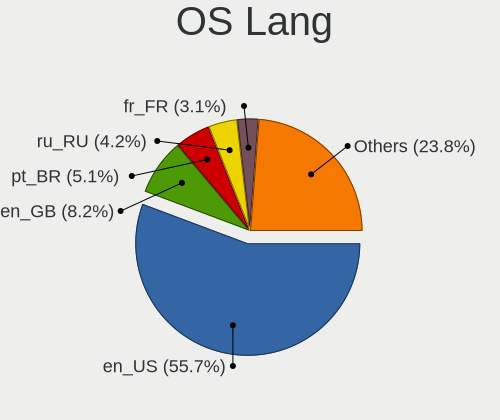

Fedora 35 - Tested Hardware & Statistics (Notebooks)
----------------------------------------------------

A project to collect tested hardware configurations for Fedora 35 (Beta test).

Anyone can contribute to this report by the [hw-probe](https://github.com/linuxhw/hw-probe) tool:

    sudo -E hw-probe -all -upload

Please submit a probe of your configuration if it's not presented on the page or is rare.

Full-feature report is available here: https://linux-hardware.org/?view=trends&rel=fedora-35

Contents
--------

* [ Test Cases ](#test-cases)

* [ System ](#system)
  - [ Kernel                   ](#kernel)
  - [ Kernel Family            ](#kernel-family)
  - [ Kernel Major Ver.        ](#kernel-major-ver)
  - [ Arch                     ](#arch)
  - [ DE                       ](#de)
  - [ Display Server           ](#display-server)
  - [ Display Manager          ](#display-manager)
  - [ OS Lang                  ](#os-lang)
  - [ Boot Mode                ](#boot-mode)
  - [ Filesystem               ](#filesystem)
  - [ Part. scheme             ](#part-scheme)
  - [ Dual Boot with Linux/BSD ](#dual-boot-with-linuxbsd)
  - [ Dual Boot (Win)          ](#dual-boot-win)

* [ Board ](#board)
  - [ Vendor                   ](#vendor)
  - [ Model                    ](#model)
  - [ Model Family             ](#model-family)
  - [ MFG Year                 ](#mfg-year)
  - [ Form Factor              ](#form-factor)
  - [ Secure Boot              ](#secure-boot)
  - [ Coreboot                 ](#coreboot)
  - [ RAM Size                 ](#ram-size)
  - [ RAM Used                 ](#ram-used)
  - [ Total Drives             ](#total-drives)
  - [ Has CD-ROM               ](#has-cd-rom)
  - [ Has Ethernet             ](#has-ethernet)
  - [ Has WiFi                 ](#has-wifi)
  - [ Has Bluetooth            ](#has-bluetooth)

* [ Location ](#location)
  - [ Country                  ](#country)
  - [ City                     ](#city)

* [ Drives ](#drives)
  - [ Drive Vendor             ](#drive-vendor)
  - [ Drive Model              ](#drive-model)
  - [ HDD Vendor               ](#hdd-vendor)
  - [ SSD Vendor               ](#ssd-vendor)
  - [ Drive Kind               ](#drive-kind)
  - [ Drive Connector          ](#drive-connector)
  - [ Drive Size               ](#drive-size)
  - [ Space Total              ](#space-total)
  - [ Space Used               ](#space-used)
  - [ Malfunc. Drives          ](#malfunc-drives)
  - [ Malfunc. Drive Vendor    ](#malfunc-drive-vendor)
  - [ Malfunc. HDD Vendor      ](#malfunc-hdd-vendor)
  - [ Malfunc. Drive Kind      ](#malfunc-drive-kind)
  - [ Failed Drives            ](#failed-drives)
  - [ Failed Drive Vendor      ](#failed-drive-vendor)
  - [ Drive Status             ](#drive-status)

* [ Storage controller ](#storage-controller)
  - [ Storage Vendor           ](#storage-vendor)
  - [ Storage Model            ](#storage-model)
  - [ Storage Kind             ](#storage-kind)

* [ Processor ](#processor)
  - [ CPU Vendor               ](#cpu-vendor)
  - [ CPU Model                ](#cpu-model)
  - [ CPU Model Family         ](#cpu-model-family)
  - [ CPU Cores                ](#cpu-cores)
  - [ CPU Sockets              ](#cpu-sockets)
  - [ CPU Threads              ](#cpu-threads)
  - [ CPU Op-Modes             ](#cpu-op-modes)
  - [ CPU Microcode            ](#cpu-microcode)
  - [ CPU Microarch            ](#cpu-microarch)

* [ Graphics ](#graphics)
  - [ GPU Vendor               ](#gpu-vendor)
  - [ GPU Model                ](#gpu-model)
  - [ GPU Combo                ](#gpu-combo)
  - [ GPU Driver               ](#gpu-driver)
  - [ GPU Memory               ](#gpu-memory)

* [ Monitor ](#monitor)
  - [ Monitor Vendor           ](#monitor-vendor)
  - [ Monitor Model            ](#monitor-model)
  - [ Monitor Resolution       ](#monitor-resolution)
  - [ Monitor Diagonal         ](#monitor-diagonal)
  - [ Monitor Width            ](#monitor-width)
  - [ Aspect Ratio             ](#aspect-ratio)
  - [ Monitor Area             ](#monitor-area)
  - [ Pixel Density            ](#pixel-density)
  - [ Multiple Monitors        ](#multiple-monitors)

* [ Network ](#network)
  - [ Net Controller Vendor    ](#net-controller-vendor)
  - [ Net Controller Model     ](#net-controller-model)
  - [ Wireless Vendor          ](#wireless-vendor)
  - [ Wireless Model           ](#wireless-model)
  - [ Ethernet Vendor          ](#ethernet-vendor)
  - [ Ethernet Model           ](#ethernet-model)
  - [ Net Controller Kind      ](#net-controller-kind)
  - [ Used Controller          ](#used-controller)
  - [ NICs                     ](#nics)
  - [ IPv6                     ](#ipv6)

* [ Bluetooth ](#bluetooth)
  - [ Bluetooth Vendor         ](#bluetooth-vendor)
  - [ Bluetooth Model          ](#bluetooth-model)

* [ Sound ](#sound)
  - [ Sound Vendor             ](#sound-vendor)
  - [ Sound Model              ](#sound-model)

* [ Memory ](#memory)
  - [ Memory Vendor            ](#memory-vendor)
  - [ Memory Model             ](#memory-model)
  - [ Memory Kind              ](#memory-kind)
  - [ Memory Form Factor       ](#memory-form-factor)
  - [ Memory Size              ](#memory-size)
  - [ Memory Speed             ](#memory-speed)

* [ Printers & scanners ](#printers--scanners)
  - [ Printer Vendor           ](#printer-vendor)
  - [ Printer Model            ](#printer-model)
  - [ Scanner Vendor           ](#scanner-vendor)
  - [ Scanner Model            ](#scanner-model)

* [ Camera ](#camera)
  - [ Camera Vendor            ](#camera-vendor)
  - [ Camera Model             ](#camera-model)

* [ Security ](#security)
  - [ Fingerprint Vendor       ](#fingerprint-vendor)
  - [ Fingerprint Model        ](#fingerprint-model)
  - [ Chipcard Vendor          ](#chipcard-vendor)
  - [ Chipcard Model           ](#chipcard-model)

* [ Unsupported ](#unsupported)
  - [ Unsupported Devices      ](#unsupported-devices)
  - [ Unsupported Device Types ](#unsupported-device-types)

Test Cases
----------

| Vendor   | Model                    | Probe                                                      | Date         |
|----------|--------------------------|------------------------------------------------------------|--------------|
| Acer     | Aspire ES1-572           | [06ddc49173](https://linux-hardware.org/?probe=06ddc49173) | Aug 13, 2021 |
| Dell     | XPS 15 9570              | [f20e1ba8fe](https://linux-hardware.org/?probe=f20e1ba8fe) | Aug 13, 2021 |
| Dell     | XPS 13 9380              | [1c3776f221](https://linux-hardware.org/?probe=1c3776f221) | Aug 13, 2021 |
| Lenovo   | IdeaPad 530S-14IKB 81EU  | [ab00a7e359](https://linux-hardware.org/?probe=ab00a7e359) | Aug 13, 2021 |
| Notebook | P377SM-A                 | [be5397dd67](https://linux-hardware.org/?probe=be5397dd67) | Aug 05, 2021 |
| HUAWEI   | KLVL-WXX9                | [d677af1f50](https://linux-hardware.org/?probe=d677af1f50) | Aug 02, 2021 |
| HUAWEI   | KLVL-WXX9                | [66c25f9637](https://linux-hardware.org/?probe=66c25f9637) | Jul 10, 2021 |
| Notebook | P377SM-A                 | [bf37a519fa](https://linux-hardware.org/?probe=bf37a519fa) | May 17, 2021 |
| Notebook | P377SM-A                 | [0834d4df8b](https://linux-hardware.org/?probe=0834d4df8b) | May 16, 2021 |
| Lenovo   | ThinkPad W541 20EF000UMN | [f366b44668](https://linux-hardware.org/?probe=f366b44668) | Apr 11, 2021 |
| HUAWEI   | BOHK-WAX9X               | [31475604b7](https://linux-hardware.org/?probe=31475604b7) | Mar 12, 2021 |
| HUAWEI   | BOHK-WAX9X               | [151d163eb9](https://linux-hardware.org/?probe=151d163eb9) | Mar 12, 2021 |
| HUAWEI   | BOHK-WAX9X               | [4b33f82ac0](https://linux-hardware.org/?probe=4b33f82ac0) | Mar 06, 2021 |

System
------

Kernel
------

Version of the Linux kernel

| Version                                              | Notebooks | Percent |
|------------------------------------------------------|-----------|---------|
| 5.14.0-0.rc5.42.fc35.x86_64                          | 3         | 30%     |
| 5.14.0-0.rc4.20210804gitd5ad8ec3cfb5.36.fc35.x86_64  | 1         | 10%     |
| 5.14.0-0.rc3.20210728git4010a528219e.32.fc35.x86_64  | 1         | 10%     |
| 5.14.0-0.rc0.20210701gitdbe69e433722.6.fc35.x86_64   | 1         | 10%     |
| 5.13.0-0.rc1.20210513gitc06a2ba62fc4.15.fc35.x86_64  | 1         | 10%     |
| 5.12.8-300.fc34.x86_64                               | 1         | 10%     |
| 5.12.0-0.rc6.20210408git454859c552da.186.fc35.x86_64 | 1         | 10%     |
| 5.12.0-0.rc1.162.fc35.x86_64                         | 1         | 10%     |

Kernel Family
-------------

Linux kernel without a distro release

| Version | Notebooks | Percent |
|---------|-----------|---------|
| 5.14.0  | 5         | 55.56%  |
| 5.12.0  | 2         | 22.22%  |
| 5.13.0  | 1         | 11.11%  |
| 5.12.8  | 1         | 11.11%  |

Kernel Major Ver.
-----------------

Linux kernel major version

| Version | Notebooks | Percent |
|---------|-----------|---------|
| 5.14    | 5         | 55.56%  |
| 5.12    | 3         | 33.33%  |
| 5.13    | 1         | 11.11%  |

Arch
----

OS architecture (x86_64, i586, etc.)

| Name   | Notebooks | Percent |
|--------|-----------|---------|
| x86_64 | 8         | 100%    |

DE
--

Desktop Environment

| Name  | Notebooks | Percent |
|-------|-----------|---------|
| GNOME | 8         | 88.89%  |
| KDE   | 1         | 11.11%  |

Display Server
--------------

X11 or Wayland

| Name    | Notebooks | Percent |
|---------|-----------|---------|
| Wayland | 7         | 87.5%   |
| X11     | 1         | 12.5%   |

Display Manager
---------------

SDDM, LightDM, etc.

| Name    | Notebooks | Percent |
|---------|-----------|---------|
| GDM     | 6         | 75%     |
| Unknown | 2         | 25%     |

OS Lang
-------

Language

| Lang  | Notebooks | Percent |
|-------|-----------|---------|
| en_US | 6         | 66.67%  |
| sv_SE | 1         | 11.11%  |
| pl_PL | 1         | 11.11%  |
| es_ES | 1         | 11.11%  |

Boot Mode
---------

EFI or BIOS

| Mode | Notebooks | Percent |
|------|-----------|---------|
| EFI  | 7         | 87.5%   |
| BIOS | 1         | 12.5%   |

Filesystem
----------

Type of filesystem

| Type  | Notebooks | Percent |
|-------|-----------|---------|
| Ext4  | 5         | 55.56%  |
| Btrfs | 3         | 33.33%  |
| Xfs   | 1         | 11.11%  |

Part. scheme
------------

Scheme of partitioning

| Type    | Notebooks | Percent |
|---------|-----------|---------|
| GPT     | 6         | 75%     |
| Unknown | 2         | 25%     |

Dual Boot with Linux/BSD
------------------------

Hosting more than one Linux/BSD

| Dual boot | Notebooks | Percent |
|-----------|-----------|---------|
| Yes       | 5         | 55.56%  |
| No        | 4         | 44.44%  |

Dual Boot (Win)
---------------

Hosting Linux and Windows

| Dual boot | Notebooks | Percent |
|-----------|-----------|---------|
| No        | 7         | 77.78%  |
| Yes       | 2         | 22.22%  |

Board
-----

Vendor
------

Motherboard manufacturer

| Name     | Notebooks | Percent |
|----------|-----------|---------|
| Lenovo   | 2         | 25%     |
| HUAWEI   | 2         | 25%     |
| Dell     | 2         | 25%     |
| Notebook | 1         | 12.5%   |
| Acer     | 1         | 12.5%   |

Model
-----

Motherboard model

| Name                            | Notebooks | Percent |
|---------------------------------|-----------|---------|
| Notebook P377SM-A               | 1         | 12.5%   |
| Lenovo ThinkPad W541 20EF000UMN | 1         | 12.5%   |
| Lenovo IdeaPad 530S-14IKB 81EU  | 1         | 12.5%   |
| HUAWEI KLVL-WXX9                | 1         | 12.5%   |
| HUAWEI BOHK-WAX9X               | 1         | 12.5%   |
| Dell XPS 15 9570                | 1         | 12.5%   |
| Dell XPS 13 9380                | 1         | 12.5%   |
| Acer Aspire ES1-572             | 1         | 12.5%   |

Model Family
------------

Motherboard model prefix

| Name              | Notebooks | Percent |
|-------------------|-----------|---------|
| Dell XPS          | 2         | 25%     |
| Notebook P377SM-A | 1         | 12.5%   |
| Lenovo ThinkPad   | 1         | 12.5%   |
| Lenovo IdeaPad    | 1         | 12.5%   |
| HUAWEI KLVL-WXX9  | 1         | 12.5%   |
| HUAWEI BOHK-WAX9X | 1         | 12.5%   |
| Acer Aspire       | 1         | 12.5%   |

MFG Year
--------

Motherboard manufacture year

| Year | Notebooks | Percent |
|------|-----------|---------|
| 2020 | 4         | 50%     |
| 2019 | 2         | 25%     |
| 2021 | 1         | 12.5%   |
| 2015 | 1         | 12.5%   |

Form Factor
-----------

Physical design of the computer

| Name     | Notebooks | Percent |
|----------|-----------|---------|
| Notebook | 8         | 100%    |

Secure Boot
-----------

Enabled or disabled

| State    | Notebooks | Percent |
|----------|-----------|---------|
| Disabled | 5         | 62.5%   |
| Enabled  | 3         | 37.5%   |

Coreboot
--------

Have coreboot on board

| Used | Notebooks | Percent |
|------|-----------|---------|
| No   | 8         | 100%    |

RAM Size
--------

Total RAM memory

| Size in GB | Notebooks | Percent |
|------------|-----------|---------|
| 4.01-8.0   | 4         | 50%     |
| 32.01-64.0 | 2         | 25%     |
| 3.01-4.0   | 1         | 12.5%   |
| 8.01-16.0  | 1         | 12.5%   |

RAM Used
--------

Used RAM memory

| Used GB  | Notebooks | Percent |
|----------|-----------|---------|
| 2.01-3.0 | 4         | 44.44%  |
| 3.01-4.0 | 3         | 33.33%  |
| 4.01-8.0 | 1         | 11.11%  |
| 1.01-2.0 | 1         | 11.11%  |

Total Drives
------------

Number of drives on board

| Drives | Notebooks | Percent |
|--------|-----------|---------|
| 1      | 6         | 75%     |
| 5      | 1         | 12.5%   |
| 2      | 1         | 12.5%   |

Has CD-ROM
----------

Has CD-ROM on board

| Presented | Notebooks | Percent |
|-----------|-----------|---------|
| No        | 7         | 87.5%   |
| Yes       | 1         | 12.5%   |

Has Ethernet
------------

Has Ethernet on board

| Presented | Notebooks | Percent |
|-----------|-----------|---------|
| No        | 5         | 62.5%   |
| Yes       | 3         | 37.5%   |

Has WiFi
--------

Has WiFi module

| Presented | Notebooks | Percent |
|-----------|-----------|---------|
| Yes       | 8         | 100%    |

Has Bluetooth
-------------

Has Bluetooth module

| Presented | Notebooks | Percent |
|-----------|-----------|---------|
| Yes       | 7         | 87.5%   |
| No        | 1         | 12.5%   |

Location
--------

Country
-------

Geographic location (country)

| Country | Notebooks | Percent |
|---------|-----------|---------|
| USA     | 2         | 25%     |
| Sweden  | 1         | 12.5%   |
| Spain   | 1         | 12.5%   |
| Poland  | 1         | 12.5%   |
| Germany | 1         | 12.5%   |
| Canada  | 1         | 12.5%   |
| Brazil  | 1         | 12.5%   |

City
----

Geographic location (city)

| City           | Notebooks | Percent |
|----------------|-----------|---------|
| Yakima         | 1         | 10%     |
| Wroclaw        | 1         | 10%     |
| Whittier       | 1         | 10%     |
| Seattle        | 1         | 10%     |
| Raesfeld       | 1         | 10%     |
| Porto Ferreira | 1         | 10%     |
| Montreal       | 1         | 10%     |
| Madrid         | 1         | 10%     |
| Handen         | 1         | 10%     |
| Bolszewo       | 1         | 10%     |

Drives
------

Drive Vendor
------------

Hard drive vendors

| Vendor              | Notebooks | Drives | Percent |
|---------------------|-----------|--------|---------|
| WDC                 | 3         | 4      | 27.27%  |
| Unknown             | 2         | 2      | 18.18%  |
| Toshiba             | 2         | 2      | 18.18%  |
| SanDisk             | 2         | 3      | 18.18%  |
| Samsung Electronics | 1         | 8      | 9.09%   |
| Micron Technology   | 1         | 1      | 9.09%   |

Drive Model
-----------

Hard drive models

| Model                                | Notebooks | Percent |
|--------------------------------------|-----------|---------|
| WDC WD10SPZX-21Z10T0 1TB             | 1         | 8.33%   |
| WDC PC SN730 SDBPNTY-512G-1027 512GB | 1         | 8.33%   |
| WDC PC SN730 SDBPNTY-256G-1027 256GB | 1         | 8.33%   |
| Unknown SSD0240S00 240GB             | 1         | 8.33%   |
| Unknown SD256  249GB                 | 1         | 8.33%   |
| Toshiba KXG60ZNV256G NVMe 256GB      | 1         | 8.33%   |
| Toshiba KXG50ZNV512G NVMe 512GB      | 1         | 8.33%   |
| SanDisk SDSSDH3512G 512GB            | 1         | 8.33%   |
| Sandisk NVMe SSD Drive 256GB         | 1         | 8.33%   |
| Samsung SSD 850 PRO 1TB              | 1         | 8.33%   |
| Samsung SSD 850 EVO mSATA 1TB        | 1         | 8.33%   |
| Micron 1100_MTFDDAV256TBN 256GB SSD  | 1         | 8.33%   |

HDD Vendor
----------

Hard disk drive vendors

| Vendor | Notebooks | Drives | Percent |
|--------|-----------|--------|---------|
| WDC    | 1         | 1      | 100%    |

SSD Vendor
----------

Solid state drive vendors

| Vendor              | Notebooks | Drives | Percent |
|---------------------|-----------|--------|---------|
| Unknown             | 1         | 1      | 25%     |
| SanDisk             | 1         | 2      | 25%     |
| Samsung Electronics | 1         | 8      | 25%     |
| Micron Technology   | 1         | 1      | 25%     |

Drive Kind
----------

HDD or SSD

| Kind | Notebooks | Drives | Percent |
|------|-----------|--------|---------|
| NVMe | 4         | 6      | 44.44%  |
| SSD  | 3         | 12     | 33.33%  |
| MMC  | 1         | 1      | 11.11%  |
| HDD  | 1         | 1      | 11.11%  |

Drive Connector
---------------

SATA, SAS, NVMe, etc.

| Type | Notebooks | Drives | Percent |
|------|-----------|--------|---------|
| NVMe | 4         | 6      | 44.44%  |
| SATA | 4         | 13     | 44.44%  |
| MMC  | 1         | 1      | 11.11%  |

Drive Size
----------

Size of hard drive

| Size in TB | Notebooks | Drives | Percent |
|------------|-----------|--------|---------|
| 0.51-1.0   | 2         | 11     | 50%     |
| 0.01-0.5   | 2         | 2      | 50%     |

Space Total
-----------

Amount of disk space available on the file system

| Size in GB | Notebooks | Percent |
|------------|-----------|---------|
| 251-500    | 3         | 33.33%  |
| 1-20       | 3         | 33.33%  |
| 21-50      | 1         | 11.11%  |
| 101-250    | 1         | 11.11%  |
| 501-1000   | 1         | 11.11%  |

Space Used
----------

Amount of used disk space

| Used GB | Notebooks | Percent |
|---------|-----------|---------|
| 1-20    | 4         | 50%     |
| 21-50   | 2         | 25%     |
| 101-250 | 2         | 25%     |

Malfunc. Drives
---------------

Drive models with a malfunction

Zero info for selected period =(

Malfunc. Drive Vendor
---------------------

Vendors of faulty drives

Zero info for selected period =(

Malfunc. HDD Vendor
-------------------

Vendors of faulty HDD drives

Zero info for selected period =(

Malfunc. Drive Kind
-------------------

Kinds of faulty drives

Zero info for selected period =(

Failed Drives
-------------

Failed drive models

Zero info for selected period =(

Failed Drive Vendor
-------------------

Failed drive vendors

Zero info for selected period =(

Drive Status
------------

Number of failed and malfunc. drives

| Status   | Notebooks | Drives | Percent |
|----------|-----------|--------|---------|
| Works    | 6         | 7      | 60%     |
| Detected | 4         | 13     | 40%     |

Storage controller
------------------

Storage Vendor
--------------

Storage controller vendors

| Vendor                       | Notebooks | Percent |
|------------------------------|-----------|---------|
| Intel                        | 5         | 55.56%  |
| Toshiba America Info Systems | 2         | 22.22%  |
| Sandisk                      | 2         | 22.22%  |

Storage Model
-------------

Storage controller models

| Model                                                                            | Notebooks | Percent |
|----------------------------------------------------------------------------------|-----------|---------|
| Sandisk WD Black SN750 / PC SN730 NVMe SSD                                       | 2         | 22.22%  |
| Intel Sunrise Point-LP SATA Controller [AHCI mode]                               | 2         | 22.22%  |
| Toshiba America Info Systems XG6 NVMe SSD Controller                             | 1         | 11.11%  |
| Toshiba America Info Systems Toshiba America Info Non-Volatile memory controller | 1         | 11.11%  |
| Intel Cannon Lake Mobile PCH SATA AHCI Controller                                | 1         | 11.11%  |
| Intel 82801 Mobile SATA Controller [RAID mode]                                   | 1         | 11.11%  |
| Intel 8 Series/C220 Series Chipset Family 6-port SATA Controller 1 [AHCI mode]   | 1         | 11.11%  |

Storage Kind
------------

Kind of storage controller (IDE, SATA, NVMe, SAS, ...)

| Kind | Notebooks | Percent |
|------|-----------|---------|
| NVMe | 4         | 44.44%  |
| SATA | 4         | 44.44%  |
| RAID | 1         | 11.11%  |

Processor
---------

CPU Vendor
----------

Processor vendors

| Vendor | Notebooks | Percent |
|--------|-----------|---------|
| Intel  | 6         | 75%     |
| AMD    | 2         | 25%     |

CPU Model
---------

Processor models

| Model                                         | Notebooks | Percent |
|-----------------------------------------------|-----------|---------|
| Intel Core i7-8750H CPU @ 2.20GHz             | 1         | 12.5%   |
| Intel Core i7-8565U CPU @ 1.80GHz             | 1         | 12.5%   |
| Intel Core i7-4910MQ CPU @ 2.90GHz            | 1         | 12.5%   |
| Intel Core i7-4810MQ CPU @ 2.80GHz            | 1         | 12.5%   |
| Intel Core i5-8250U CPU @ 1.60GHz             | 1         | 12.5%   |
| Intel Core i3-6006U CPU @ 2.00GHz             | 1         | 12.5%   |
| AMD Ryzen 5 4600H with Radeon Graphics        | 1         | 12.5%   |
| AMD Ryzen 5 3500U with Radeon Vega Mobile Gfx | 1         | 12.5%   |

CPU Model Family
----------------

Processor model prefix

| Model         | Notebooks | Percent |
|---------------|-----------|---------|
| Intel Core i7 | 4         | 50%     |
| AMD Ryzen 5   | 2         | 25%     |
| Intel Core i5 | 1         | 12.5%   |
| Intel Core i3 | 1         | 12.5%   |

CPU Cores
---------

Number of processor cores

| Number | Notebooks | Percent |
|--------|-----------|---------|
| 4      | 5         | 62.5%   |
| 6      | 2         | 25%     |
| 2      | 1         | 12.5%   |

CPU Sockets
-----------

Number of sockets

| Number | Notebooks | Percent |
|--------|-----------|---------|
| 1      | 8         | 100%    |

CPU Threads
-----------

Threads per core (Hyper-Threading)

| Number | Notebooks | Percent |
|--------|-----------|---------|
| 2      | 8         | 100%    |

CPU Op-Modes
------------

CPU Operation Modes (32-bit, 64-bit)

| Op mode        | Notebooks | Percent |
|----------------|-----------|---------|
| 32-bit, 64-bit | 8         | 100%    |

CPU Microcode
-------------

Microcode number

| Number     | Notebooks | Percent |
|------------|-----------|---------|
| 0x306c3    | 2         | 25%     |
| 0x906ea    | 1         | 12.5%   |
| 0x806ec    | 1         | 12.5%   |
| 0x806ea    | 1         | 12.5%   |
| 0x406e3    | 1         | 12.5%   |
| 0x08600104 | 1         | 12.5%   |
| 0x08108109 | 1         | 12.5%   |

CPU Microarch
-------------

Microarchitecture

| Name     | Notebooks | Percent |
|----------|-----------|---------|
| KabyLake | 3         | 37.5%   |
| Haswell  | 2         | 25%     |
| Zen+     | 1         | 12.5%   |
| Zen 2    | 1         | 12.5%   |
| Skylake  | 1         | 12.5%   |

Graphics
--------

GPU Vendor
----------

Vendors of graphics cards

| Vendor | Notebooks | Percent |
|--------|-----------|---------|
| Intel  | 5         | 50%     |
| Nvidia | 3         | 30%     |
| AMD    | 2         | 20%     |

GPU Model
---------

Graphics card models

| Model                                                       | Notebooks | Percent |
|-------------------------------------------------------------|-----------|---------|
| Nvidia GP107M [GeForce GTX 1050 Ti Mobile]                  | 1         | 10%     |
| Nvidia GP104M [GeForce GTX 1070 Mobile]                     | 1         | 10%     |
| Nvidia GK106GLM [Quadro K2100M]                             | 1         | 10%     |
| Intel WhiskeyLake-U GT2 [UHD Graphics 620]                  | 1         | 10%     |
| Intel UHD Graphics 620                                      | 1         | 10%     |
| Intel Skylake GT2 [HD Graphics 520]                         | 1         | 10%     |
| Intel CoffeeLake-H GT2 [UHD Graphics 630]                   | 1         | 10%     |
| Intel 4th Gen Core Processor Integrated Graphics Controller | 1         | 10%     |
| AMD Renoir                                                  | 1         | 10%     |
| AMD Picasso                                                 | 1         | 10%     |

GPU Combo
---------

Combinations of graphics cards

| Name           | Notebooks | Percent |
|----------------|-----------|---------|
| 1 x Intel      | 3         | 37.5%   |
| Intel + Nvidia | 2         | 25%     |
| 1 x AMD        | 2         | 25%     |
| 1 x Nvidia     | 1         | 12.5%   |

GPU Driver
----------

Free vs proprietary

| Driver      | Notebooks | Percent |
|-------------|-----------|---------|
| Free        | 8         | 88.89%  |
| Proprietary | 1         | 11.11%  |

GPU Memory
----------

Total video memory

| Size in GB | Notebooks | Percent |
|------------|-----------|---------|
| Unknown    | 4         | 44.44%  |
| 7.01-8.0   | 1         | 11.11%  |
| 3.01-4.0   | 1         | 11.11%  |
| 1.01-2.0   | 1         | 11.11%  |
| 0.51-1.0   | 1         | 11.11%  |
| 0.01-0.5   | 1         | 11.11%  |

Monitor
-------

Monitor Vendor
--------------

Monitor vendors

| Vendor         | Notebooks | Percent |
|----------------|-----------|---------|
| AU Optronics   | 3         | 33.33%  |
| Chimei Innolux | 2         | 22.22%  |
| Sharp          | 1         | 11.11%  |
| LG Display     | 1         | 11.11%  |
| Dell           | 1         | 11.11%  |
| BOE            | 1         | 11.11%  |

Monitor Model
-------------

Monitor models

| Model                                                            | Notebooks | Percent |
|------------------------------------------------------------------|-----------|---------|
| Sharp LCD Monitor SHP148D 3840x2160 344x194mm 15.5-inch          | 1         | 10%     |
| LG Display LCD Monitor LGD02C5 1920x1080 380x210mm 17.1-inch     | 1         | 10%     |
| Dell P2214H DELA098 1920x1080 480x270mm 21.7-inch                | 1         | 10%     |
| Dell P2214H DELA097 1920x1080 480x270mm 21.7-inch                | 1         | 10%     |
| Chimei Innolux LCD Monitor CMN15DC 1366x768 344x193mm 15.5-inch  | 1         | 10%     |
| Chimei Innolux LCD Monitor CMN15C3 1920x1080 340x190mm 15.3-inch | 1         | 10%     |
| BOE LCD Monitor BOE0893 2160x1440 296x197mm 14.0-inch            | 1         | 10%     |
| AU Optronics LCD Monitor AUO5B2D 1920x1080 293x162mm 13.2-inch   | 1         | 10%     |
| AU Optronics LCD Monitor AUO403D 1920x1080 309x173mm 13.9-inch   | 1         | 10%     |
| AU Optronics LCD Monitor AUO28ED 1920x1080 344x193mm 15.5-inch   | 1         | 10%     |

Monitor Resolution
------------------

Monitor screen resolution

| Resolution      | Notebooks | Percent |
|-----------------|-----------|---------|
| 1920x1080 (FHD) | 5         | 62.5%   |
| 3840x2160 (4K)  | 1         | 12.5%   |
| 2160x1440       | 1         | 12.5%   |
| 1366x768 (WXGA) | 1         | 12.5%   |

Monitor Diagonal
----------------

Diagonal size in inches

| Inches | Notebooks | Percent |
|--------|-----------|---------|
| 15     | 4         | 44.44%  |
| 14     | 2         | 22.22%  |
| 21     | 1         | 11.11%  |
| 17     | 1         | 11.11%  |
| 13     | 1         | 11.11%  |

Monitor Width
-------------

Physical width

| Width in mm | Notebooks | Percent |
|-------------|-----------|---------|
| 301-350     | 5         | 55.56%  |
| 201-300     | 2         | 22.22%  |
| 401-500     | 1         | 11.11%  |
| 351-400     | 1         | 11.11%  |

Aspect Ratio
------------

Proportional relationship between the width and the height

| Ratio | Notebooks | Percent |
|-------|-----------|---------|
| 16/9  | 7         | 87.5%   |
| 3/2   | 1         | 12.5%   |

Monitor Area
------------

Area in inch²

| Area in inch² | Notebooks | Percent |
|----------------|-----------|---------|
| 101-110        | 4         | 44.44%  |
| 81-90          | 2         | 22.22%  |
| 71-80          | 1         | 11.11%  |
| 201-250        | 1         | 11.11%  |
| 121-130        | 1         | 11.11%  |

Pixel Density
-------------

Pixels per inch

| Density       | Notebooks | Percent |
|---------------|-----------|---------|
| 121-160       | 4         | 44.44%  |
| 161-240       | 2         | 22.22%  |
| 101-120       | 2         | 22.22%  |
| More than 240 | 1         | 11.11%  |

Multiple Monitors
-----------------

Total monitors connected

| Total | Notebooks | Percent |
|-------|-----------|---------|
| 1     | 8         | 88.89%  |
| 3     | 1         | 11.11%  |

Network
-------

Net Controller Vendor
---------------------

Controller vendors

| Vendor                | Notebooks | Percent |
|-----------------------|-----------|---------|
| Realtek Semiconductor | 5         | 50%     |
| Intel                 | 3         | 30%     |
| Qualcomm Atheros      | 2         | 20%     |

Net Controller Model
--------------------

Controller models

| Model                                                             | Notebooks | Percent |
|-------------------------------------------------------------------|-----------|---------|
| Realtek RTL8822CE 802.11ac PCIe Wireless Network Adapter          | 2         | 18.18%  |
| Realtek RTL8111/8168/8411 PCI Express Gigabit Ethernet Controller | 2         | 18.18%  |
| Intel Wireless 7260                                               | 2         | 18.18%  |
| Realtek RTL8822BE 802.11a/b/g/n/ac WiFi adapter                   | 1         | 9.09%   |
| Qualcomm Atheros QCA9565 / AR9565 Wireless Network Adapter        | 1         | 9.09%   |
| Qualcomm Atheros QCA6174 802.11ac Wireless Network Adapter        | 1         | 9.09%   |
| Intel Wireless-AC 9260                                            | 1         | 9.09%   |
| Intel Ethernet Connection I217-LM                                 | 1         | 9.09%   |

Wireless Vendor
---------------

Wireless vendors

| Vendor                | Notebooks | Percent |
|-----------------------|-----------|---------|
| Realtek Semiconductor | 3         | 37.5%   |
| Intel                 | 3         | 37.5%   |
| Qualcomm Atheros      | 2         | 25%     |

Wireless Model
--------------

Wireless models

| Model                                                      | Notebooks | Percent |
|------------------------------------------------------------|-----------|---------|
| Realtek RTL8822CE 802.11ac PCIe Wireless Network Adapter   | 2         | 25%     |
| Intel Wireless 7260                                        | 2         | 25%     |
| Realtek RTL8822BE 802.11a/b/g/n/ac WiFi adapter            | 1         | 12.5%   |
| Qualcomm Atheros QCA9565 / AR9565 Wireless Network Adapter | 1         | 12.5%   |
| Qualcomm Atheros QCA6174 802.11ac Wireless Network Adapter | 1         | 12.5%   |
| Intel Wireless-AC 9260                                     | 1         | 12.5%   |

Ethernet Vendor
---------------

Ethernet vendors

| Vendor                | Notebooks | Percent |
|-----------------------|-----------|---------|
| Realtek Semiconductor | 2         | 66.67%  |
| Intel                 | 1         | 33.33%  |

Ethernet Model
--------------

Ethernet models

| Model                                                             | Notebooks | Percent |
|-------------------------------------------------------------------|-----------|---------|
| Realtek RTL8111/8168/8411 PCI Express Gigabit Ethernet Controller | 2         | 66.67%  |
| Intel Ethernet Connection I217-LM                                 | 1         | 33.33%  |

Net Controller Kind
-------------------

Ethernet, WiFi or modem

| Kind     | Notebooks | Percent |
|----------|-----------|---------|
| WiFi     | 8         | 72.73%  |
| Ethernet | 3         | 27.27%  |

Used Controller
---------------

Currently used network controller

| Kind     | Notebooks | Percent |
|----------|-----------|---------|
| WiFi     | 7         | 70%     |
| Ethernet | 3         | 30%     |

NICs
----

Total network controllers on board

| Total | Notebooks | Percent |
|-------|-----------|---------|
| 1     | 5         | 62.5%   |
| 2     | 3         | 37.5%   |

IPv6
----

IPv6 vs IPv4

| Used | Notebooks | Percent |
|------|-----------|---------|
| No   | 6         | 75%     |
| Yes  | 2         | 25%     |

Bluetooth
---------

Bluetooth Vendor
----------------

Controller vendors

| Vendor                | Notebooks | Percent |
|-----------------------|-----------|---------|
| Realtek               | 2         | 28.57%  |
| Intel                 | 2         | 28.57%  |
| Foxconn / Hon Hai     | 2         | 28.57%  |
| Realtek Semiconductor | 1         | 14.29%  |

Bluetooth Model
---------------

Controller models

| Model                                    | Notebooks | Percent |
|------------------------------------------|-----------|---------|
| Realtek Bluetooth Radio                  | 2         | 28.57%  |
| Foxconn / Hon Hai Bluetooth Device       | 2         | 28.57%  |
| Realtek RTL8822BE Bluetooth 4.2 Adapter  | 1         | 14.29%  |
| Intel Wireless-AC 9260 Bluetooth Adapter | 1         | 14.29%  |
| Intel Bluetooth wireless interface       | 1         | 14.29%  |

Sound
-----

Sound Vendor
------------

Sound card vendors

| Vendor   | Notebooks | Percent |
|----------|-----------|---------|
| Intel    | 6         | 54.55%  |
| Nvidia   | 2         | 18.18%  |
| AMD      | 2         | 18.18%  |
| Micronas | 1         | 9.09%   |

Sound Model
-----------

Sound card models

| Model                                                               | Notebooks | Percent |
|---------------------------------------------------------------------|-----------|---------|
| Intel Sunrise Point-LP HD Audio                                     | 2         | 14.29%  |
| Intel 8 Series/C220 Series Chipset High Definition Audio Controller | 2         | 14.29%  |
| AMD Family 17h (Models 10h-1fh) HD Audio Controller                 | 2         | 14.29%  |
| Nvidia GP104 High Definition Audio Controller                       | 1         | 7.14%   |
| Nvidia GK106 HDMI Audio Controller                                  | 1         | 7.14%   |
| Micronas BLUE USB Audio 2.0                                         | 1         | 7.14%   |
| Intel Xeon E3-1200 v3/4th Gen Core Processor HD Audio Controller    | 1         | 7.14%   |
| Intel Cannon Point-LP High Definition Audio Controller              | 1         | 7.14%   |
| Intel Cannon Lake PCH cAVS                                          | 1         | 7.14%   |
| AMD Renoir Radeon High Definition Audio Controller                  | 1         | 7.14%   |
| AMD Raven/Raven2/Fenghuang HDMI/DP Audio Controller                 | 1         | 7.14%   |

Memory
------

Memory Vendor
-------------

Memory module vendors

| Vendor              | Notebooks | Percent |
|---------------------|-----------|---------|
| Samsung Electronics | 3         | 42.86%  |
| SK Hynix            | 1         | 14.29%  |
| Micron Technology   | 1         | 14.29%  |
| Crucial             | 1         | 14.29%  |
| A-DATA Technology   | 1         | 14.29%  |

Memory Model
------------

Memory module models

| Model                                                        | Notebooks | Percent |
|--------------------------------------------------------------|-----------|---------|
| SK Hynix RAM HMA81GS6CJR8N-VK 8GB SODIMM DDR4 2667MT/s       | 1         | 14.29%  |
| Samsung RAM M471A5244CB0-CTD 4GB Row Of Chips DDR4 2667MT/s  | 1         | 14.29%  |
| Samsung RAM M471A1G44AB0-CTD 8GB Row Of Chips DDR4 2667MT/s  | 1         | 14.29%  |
| Samsung RAM K4E6E304EC-EGCG 4GB Row Of Chips LPDDR3 2133MT/s | 1         | 14.29%  |
| Micron RAM 16KTF1G64HZ-1G9P1 8GB SODIMM DDR3 1867MT/s        | 1         | 14.29%  |
| Crucial RAM CT16G4SFD8266.C16FD1 16GB SODIMM DDR4 2667MT/s   | 1         | 14.29%  |
| A-DATA RAM AM1P24HC4U1-BBGS 4GB SODIMM DDR4 2400MT/s         | 1         | 14.29%  |

Memory Kind
-----------

Memory module kinds

| Kind   | Notebooks | Percent |
|--------|-----------|---------|
| DDR4   | 5         | 71.43%  |
| LPDDR3 | 1         | 14.29%  |
| DDR3   | 1         | 14.29%  |

Memory Form Factor
------------------

Physical design of the memory module

| Name         | Notebooks | Percent |
|--------------|-----------|---------|
| SODIMM       | 4         | 57.14%  |
| Row Of Chips | 3         | 42.86%  |

Memory Size
-----------

Memory module size

| Size  | Notebooks | Percent |
|-------|-----------|---------|
| 8192  | 3         | 42.86%  |
| 4096  | 3         | 42.86%  |
| 16384 | 1         | 14.29%  |

Memory Speed
------------

Memory module speed

| Speed | Notebooks | Percent |
|-------|-----------|---------|
| 2667  | 4         | 57.14%  |
| 2400  | 1         | 14.29%  |
| 2133  | 1         | 14.29%  |
| 1867  | 1         | 14.29%  |

Printers & scanners
-------------------

Printer Vendor
--------------

Printer device vendors

Zero info for selected period =(

Printer Model
-------------

Printer device models

Zero info for selected period =(

Scanner Vendor
--------------

Scanner device vendors

Zero info for selected period =(

Scanner Model
-------------

Scanner device models

Zero info for selected period =(

Camera
------

Camera Vendor
-------------

Camera device vendors

| Vendor              | Notebooks | Percent |
|---------------------|-----------|---------|
| IMC Networks        | 3         | 37.5%   |
| Chicony Electronics | 3         | 37.5%   |
| Microdia            | 2         | 25%     |

Camera Model
------------

Camera device models

| Model                                | Notebooks | Percent |
|--------------------------------------|-----------|---------|
| Microdia Integrated_Webcam_HD        | 2         | 22.22%  |
| IMC Networks ov9734_azurewave_camera | 1         | 11.11%  |
| IMC Networks Integrated Camera       | 1         | 11.11%  |
| IMC Networks HD Camera               | 1         | 11.11%  |
| Chicony VGA Webcam                   | 1         | 11.11%  |
| Chicony USB2.0 2M WebCam             | 1         | 11.11%  |
| Chicony USB 5M WebCam                | 1         | 11.11%  |
| Chicony Integrated Camera            | 1         | 11.11%  |

Security
--------

Fingerprint Vendor
------------------

Fingerprint sensor vendors

| Vendor                     | Notebooks | Percent |
|----------------------------|-----------|---------|
| Shenzhen Goodix Technology | 2         | 50%     |
| Validity Sensors           | 1         | 25%     |
| LighTuning Technology      | 1         | 25%     |

Fingerprint Model
-----------------

Fingerprint sensor models

| Model                                        | Notebooks | Percent |
|----------------------------------------------|-----------|---------|
| Shenzhen Goodix  Fingerprint Device          | 2         | 50%     |
| Validity Sensors VFS 5011 fingerprint sensor | 1         | 25%     |
| LighTuning EgisTec_ES603                     | 1         | 25%     |

Chipcard Vendor
---------------

Chipcard module vendors

| Vendor      | Notebooks | Percent |
|-------------|-----------|---------|
| Alcor Micro | 1         | 100%    |

Chipcard Model
--------------

Chipcard module models

| Model                               | Notebooks | Percent |
|-------------------------------------|-----------|---------|
| Alcor Micro AU9540 Smartcard Reader | 1         | 100%    |

Unsupported
-----------

Unsupported Devices
-------------------

Total unsupported devices on board

| Total | Notebooks | Percent |
|-------|-----------|---------|
| 1     | 4         | 50%     |
| 0     | 4         | 50%     |

Unsupported Device Types
------------------------

Types of unsupported devices

| Type               | Notebooks | Percent |
|--------------------|-----------|---------|
| Fingerprint reader | 4         | 100%    |

