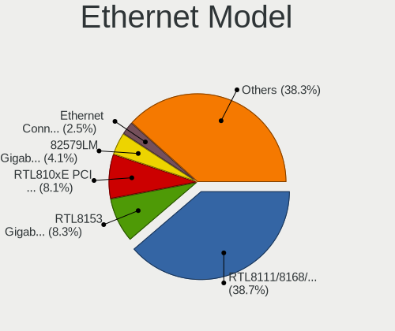

Fedora 35 - Tested Hardware & Statistics (Notebooks)
----------------------------------------------------

A project to collect tested hardware configurations for Fedora 35.

Anyone can contribute to this report by the [hw-probe](https://github.com/linuxhw/hw-probe) tool:

    sudo -E hw-probe -all -upload

Please submit a probe of your configuration if it's not presented on the page or is rare.

Full-feature report is available here: https://linux-hardware.org/?view=trends&rel=fedora-35

Contents
--------

* [ Test Cases ](#test-cases)

* [ System ](#system)
  - [ Kernel                   ](#kernel)
  - [ Kernel Family            ](#kernel-family)
  - [ Kernel Major Ver.        ](#kernel-major-ver)
  - [ Arch                     ](#arch)
  - [ DE                       ](#de)
  - [ Display Server           ](#display-server)
  - [ Display Manager          ](#display-manager)
  - [ OS Lang                  ](#os-lang)
  - [ Boot Mode                ](#boot-mode)
  - [ Filesystem               ](#filesystem)
  - [ Part. scheme             ](#part-scheme)
  - [ Dual Boot with Linux/BSD ](#dual-boot-with-linuxbsd)
  - [ Dual Boot (Win)          ](#dual-boot-win)

* [ Board ](#board)
  - [ Vendor                   ](#vendor)
  - [ Model                    ](#model)
  - [ Model Family             ](#model-family)
  - [ MFG Year                 ](#mfg-year)
  - [ Form Factor              ](#form-factor)
  - [ Secure Boot              ](#secure-boot)
  - [ Coreboot                 ](#coreboot)
  - [ RAM Size                 ](#ram-size)
  - [ RAM Used                 ](#ram-used)
  - [ Total Drives             ](#total-drives)
  - [ Has CD-ROM               ](#has-cd-rom)
  - [ Has Ethernet             ](#has-ethernet)
  - [ Has WiFi                 ](#has-wifi)
  - [ Has Bluetooth            ](#has-bluetooth)

* [ Location ](#location)
  - [ Country                  ](#country)
  - [ City                     ](#city)

* [ Drives ](#drives)
  - [ Drive Vendor             ](#drive-vendor)
  - [ Drive Model              ](#drive-model)
  - [ HDD Vendor               ](#hdd-vendor)
  - [ SSD Vendor               ](#ssd-vendor)
  - [ Drive Kind               ](#drive-kind)
  - [ Drive Connector          ](#drive-connector)
  - [ Drive Size               ](#drive-size)
  - [ Space Total              ](#space-total)
  - [ Space Used               ](#space-used)
  - [ Malfunc. Drives          ](#malfunc-drives)
  - [ Malfunc. Drive Vendor    ](#malfunc-drive-vendor)
  - [ Malfunc. HDD Vendor      ](#malfunc-hdd-vendor)
  - [ Malfunc. Drive Kind      ](#malfunc-drive-kind)
  - [ Failed Drives            ](#failed-drives)
  - [ Failed Drive Vendor      ](#failed-drive-vendor)
  - [ Drive Status             ](#drive-status)

* [ Storage controller ](#storage-controller)
  - [ Storage Vendor           ](#storage-vendor)
  - [ Storage Model            ](#storage-model)
  - [ Storage Kind             ](#storage-kind)

* [ Processor ](#processor)
  - [ CPU Vendor               ](#cpu-vendor)
  - [ CPU Model                ](#cpu-model)
  - [ CPU Model Family         ](#cpu-model-family)
  - [ CPU Cores                ](#cpu-cores)
  - [ CPU Sockets              ](#cpu-sockets)
  - [ CPU Threads              ](#cpu-threads)
  - [ CPU Op-Modes             ](#cpu-op-modes)
  - [ CPU Microcode            ](#cpu-microcode)
  - [ CPU Microarch            ](#cpu-microarch)

* [ Graphics ](#graphics)
  - [ GPU Vendor               ](#gpu-vendor)
  - [ GPU Model                ](#gpu-model)
  - [ GPU Combo                ](#gpu-combo)
  - [ GPU Driver               ](#gpu-driver)
  - [ GPU Memory               ](#gpu-memory)

* [ Monitor ](#monitor)
  - [ Monitor Vendor           ](#monitor-vendor)
  - [ Monitor Model            ](#monitor-model)
  - [ Monitor Resolution       ](#monitor-resolution)
  - [ Monitor Diagonal         ](#monitor-diagonal)
  - [ Monitor Width            ](#monitor-width)
  - [ Aspect Ratio             ](#aspect-ratio)
  - [ Monitor Area             ](#monitor-area)
  - [ Pixel Density            ](#pixel-density)
  - [ Multiple Monitors        ](#multiple-monitors)

* [ Network ](#network)
  - [ Net Controller Vendor    ](#net-controller-vendor)
  - [ Net Controller Model     ](#net-controller-model)
  - [ Wireless Vendor          ](#wireless-vendor)
  - [ Wireless Model           ](#wireless-model)
  - [ Ethernet Vendor          ](#ethernet-vendor)
  - [ Ethernet Model           ](#ethernet-model)
  - [ Net Controller Kind      ](#net-controller-kind)
  - [ Used Controller          ](#used-controller)
  - [ NICs                     ](#nics)
  - [ IPv6                     ](#ipv6)

* [ Bluetooth ](#bluetooth)
  - [ Bluetooth Vendor         ](#bluetooth-vendor)
  - [ Bluetooth Model          ](#bluetooth-model)

* [ Sound ](#sound)
  - [ Sound Vendor             ](#sound-vendor)
  - [ Sound Model              ](#sound-model)

* [ Memory ](#memory)
  - [ Memory Vendor            ](#memory-vendor)
  - [ Memory Model             ](#memory-model)
  - [ Memory Kind              ](#memory-kind)
  - [ Memory Form Factor       ](#memory-form-factor)
  - [ Memory Size              ](#memory-size)
  - [ Memory Speed             ](#memory-speed)

* [ Printers & scanners ](#printers--scanners)
  - [ Printer Vendor           ](#printer-vendor)
  - [ Printer Model            ](#printer-model)
  - [ Scanner Vendor           ](#scanner-vendor)
  - [ Scanner Model            ](#scanner-model)

* [ Camera ](#camera)
  - [ Camera Vendor            ](#camera-vendor)
  - [ Camera Model             ](#camera-model)

* [ Security ](#security)
  - [ Fingerprint Vendor       ](#fingerprint-vendor)
  - [ Fingerprint Model        ](#fingerprint-model)
  - [ Chipcard Vendor          ](#chipcard-vendor)
  - [ Chipcard Model           ](#chipcard-model)

* [ Unsupported ](#unsupported)
  - [ Unsupported Devices      ](#unsupported-devices)
  - [ Unsupported Device Types ](#unsupported-device-types)

Test Cases
----------

| Vendor        | Model                       | Probe                                                      | Date         |
|---------------|-----------------------------|------------------------------------------------------------|--------------|
| Lenovo        | ThinkPad T480s 20L70026U... | [eeb181f50b](https://linux-hardware.org/?probe=eeb181f50b) | Oct 30, 2021 |
| HUAWEI        | NBLK-WAX9X                  | [1310b8abf4](https://linux-hardware.org/?probe=1310b8abf4) | Oct 30, 2021 |
| Framework     | Laptop                      | [04db6c2222](https://linux-hardware.org/?probe=04db6c2222) | Oct 29, 2021 |
| Acer          | Aspire F5-573G              | [1be6c8dc87](https://linux-hardware.org/?probe=1be6c8dc87) | Oct 29, 2021 |
| Lenovo        | ThinkPad T490 20N3S6VU00    | [f8024b89d4](https://linux-hardware.org/?probe=f8024b89d4) | Oct 28, 2021 |
| Lenovo        | ThinkPad L15 Gen 1 20U70... | [e9a8fb1275](https://linux-hardware.org/?probe=e9a8fb1275) | Oct 27, 2021 |
| BESSTAR Te... | X400                        | [9cfc0bb300](https://linux-hardware.org/?probe=9cfc0bb300) | Oct 27, 2021 |
| Positivo B... | VJFE53F11X-XXXXXX           | [d3720f9145](https://linux-hardware.org/?probe=d3720f9145) | Oct 25, 2021 |
| Alienware     | Area-51m R2                 | [c3f94d8599](https://linux-hardware.org/?probe=c3f94d8599) | Oct 24, 2021 |
| HP            | ProBook 470 G5              | [725627d16b](https://linux-hardware.org/?probe=725627d16b) | Oct 23, 2021 |
| HP            | EliteBook 8560w             | [98bd384a42](https://linux-hardware.org/?probe=98bd384a42) | Oct 23, 2021 |
| Lenovo        | ThinkPad T480 20L5000BMX    | [91fc910cf6](https://linux-hardware.org/?probe=91fc910cf6) | Oct 23, 2021 |
| HP            | Pavilion Gaming Laptop 1... | [1c91bc1deb](https://linux-hardware.org/?probe=1c91bc1deb) | Oct 23, 2021 |
| Lenovo        | ThinkPad T480 20L5000BMX    | [21b13fb067](https://linux-hardware.org/?probe=21b13fb067) | Oct 21, 2021 |
| Lenovo        | ThinkPad T490 20N3S6VU00    | [9932dd3c21](https://linux-hardware.org/?probe=9932dd3c21) | Oct 21, 2021 |
| Lenovo        | ThinkPad T490 20N3S6VU00    | [a99866abc1](https://linux-hardware.org/?probe=a99866abc1) | Oct 21, 2021 |
| Acer          | Swift SF114-32              | [faa49a332b](https://linux-hardware.org/?probe=faa49a332b) | Oct 20, 2021 |
| HP            | EliteBook 820 G1            | [278ec34902](https://linux-hardware.org/?probe=278ec34902) | Oct 19, 2021 |
| Lenovo        | ThinkPad T460 20FMS1R01K    | [4dbc231901](https://linux-hardware.org/?probe=4dbc231901) | Oct 18, 2021 |
| GPU Compan... | GWTN156-1                   | [3cb0b09b48](https://linux-hardware.org/?probe=3cb0b09b48) | Oct 17, 2021 |
| HP            | Laptop 14-df0xxx            | [ac488ba246](https://linux-hardware.org/?probe=ac488ba246) | Oct 16, 2021 |
| HP            | Pavilion Gaming Laptop 1... | [362e1d3b99](https://linux-hardware.org/?probe=362e1d3b99) | Oct 15, 2021 |
| Dell          | Precision 5550              | [15a0f61f84](https://linux-hardware.org/?probe=15a0f61f84) | Oct 14, 2021 |
| Lenovo        | Legion 5 15ARH05H 82B1      | [4bb5ac9410](https://linux-hardware.org/?probe=4bb5ac9410) | Oct 12, 2021 |
| HP            | OMEN Laptop 15-ek0xxx       | [d4acf59f3b](https://linux-hardware.org/?probe=d4acf59f3b) | Oct 11, 2021 |
| Lenovo        | IdeaPad S145-15API 81V7     | [5b4efb9e18](https://linux-hardware.org/?probe=5b4efb9e18) | Oct 10, 2021 |
| Lenovo        | Yoga S740-14IIL 81RS        | [fd09df16d9](https://linux-hardware.org/?probe=fd09df16d9) | Oct 10, 2021 |
| HP            | ProBook 450 G3              | [2eeb05ff03](https://linux-hardware.org/?probe=2eeb05ff03) | Oct 09, 2021 |
| HP            | ENVY Laptop 15t-ep000       | [f9b69ffa3d](https://linux-hardware.org/?probe=f9b69ffa3d) | Oct 08, 2021 |
| Dell          | Inspiron 5505               | [d136f5d8f7](https://linux-hardware.org/?probe=d136f5d8f7) | Oct 08, 2021 |
| Lenovo        | ThinkPad X1 Carbon 7th 2... | [26c62915e0](https://linux-hardware.org/?probe=26c62915e0) | Oct 07, 2021 |
| ASUSTek       | VivoBook S15 X530UA         | [146866c629](https://linux-hardware.org/?probe=146866c629) | Oct 06, 2021 |
| Apple         | MacBookPro5,5               | [db435ab99c](https://linux-hardware.org/?probe=db435ab99c) | Oct 03, 2021 |
| Lenovo        | G580 20150                  | [08adba2c54](https://linux-hardware.org/?probe=08adba2c54) | Oct 02, 2021 |
| HUAWEI        | EUL-WX9                     | [dfc5c12fbf](https://linux-hardware.org/?probe=dfc5c12fbf) | Oct 01, 2021 |
| Lenovo        | G580 20150                  | [1dbb7762f6](https://linux-hardware.org/?probe=1dbb7762f6) | Oct 01, 2021 |
| HP            | EliteBook 840 G5            | [e64aeb5fa4](https://linux-hardware.org/?probe=e64aeb5fa4) | Oct 01, 2021 |
| Lenovo        | IdeaPad 3 14ALC6 82KT       | [17c2d08e41](https://linux-hardware.org/?probe=17c2d08e41) | Oct 01, 2021 |
| HP            | EliteBook 840 G5            | [28bfae31ee](https://linux-hardware.org/?probe=28bfae31ee) | Oct 01, 2021 |
| Dell          | Studio 1537                 | [aae900457c](https://linux-hardware.org/?probe=aae900457c) | Oct 01, 2021 |
| Framework     | Laptop                      | [95576917c8](https://linux-hardware.org/?probe=95576917c8) | Sep 29, 2021 |
| Notebook      | N2x0WU                      | [410a2dab96](https://linux-hardware.org/?probe=410a2dab96) | Sep 28, 2021 |
| Lenovo        | IdeaPad C340-14API 81N6     | [82e0f76133](https://linux-hardware.org/?probe=82e0f76133) | Sep 25, 2021 |
| Lenovo        | ThinkPad E480 20KNS0MC00    | [ba847bc0c4](https://linux-hardware.org/?probe=ba847bc0c4) | Sep 23, 2021 |
| Apple         | MacBook6,1                  | [4fbbe3d05b](https://linux-hardware.org/?probe=4fbbe3d05b) | Sep 19, 2021 |
| HP            | G42                         | [0e9914c9cc](https://linux-hardware.org/?probe=0e9914c9cc) | Sep 18, 2021 |
| HP            | ZBook 15u G5                | [a5331a4d5e](https://linux-hardware.org/?probe=a5331a4d5e) | Sep 15, 2021 |
| Dell          | XPS 17 9700                 | [ebac1c499f](https://linux-hardware.org/?probe=ebac1c499f) | Sep 15, 2021 |
| ASUSTek       | G71V                        | [7904b934a4](https://linux-hardware.org/?probe=7904b934a4) | Sep 09, 2021 |
| Lenovo        | ThinkPad X1 Carbon Gen 8... | [2b21ef140a](https://linux-hardware.org/?probe=2b21ef140a) | Sep 05, 2021 |
| Lenovo        | ThinkPad P51s 20HBCTO1WW    | [e2f22f9f40](https://linux-hardware.org/?probe=e2f22f9f40) | Aug 27, 2021 |
| Dell          | Latitude E5470              | [ac04ecb1e5](https://linux-hardware.org/?probe=ac04ecb1e5) | Aug 22, 2021 |
| Dell          | XPS 15 9550                 | [0a28b37020](https://linux-hardware.org/?probe=0a28b37020) | Aug 15, 2021 |
| Acer          | Aspire A315-42              | [4a54197130](https://linux-hardware.org/?probe=4a54197130) | Aug 15, 2021 |
| Acer          | Aspire ES1-572              | [06ddc49173](https://linux-hardware.org/?probe=06ddc49173) | Aug 13, 2021 |
| Dell          | XPS 15 9570                 | [f20e1ba8fe](https://linux-hardware.org/?probe=f20e1ba8fe) | Aug 13, 2021 |
| Dell          | XPS 13 9380                 | [1c3776f221](https://linux-hardware.org/?probe=1c3776f221) | Aug 13, 2021 |
| Lenovo        | IdeaPad 530S-14IKB 81EU     | [ab00a7e359](https://linux-hardware.org/?probe=ab00a7e359) | Aug 13, 2021 |
| Notebook      | P377SM-A                    | [be5397dd67](https://linux-hardware.org/?probe=be5397dd67) | Aug 05, 2021 |
| HUAWEI        | KLVL-WXX9                   | [d677af1f50](https://linux-hardware.org/?probe=d677af1f50) | Aug 02, 2021 |
| HUAWEI        | KLVL-WXX9                   | [66c25f9637](https://linux-hardware.org/?probe=66c25f9637) | Jul 10, 2021 |
| Notebook      | P377SM-A                    | [bf37a519fa](https://linux-hardware.org/?probe=bf37a519fa) | May 17, 2021 |
| Notebook      | P377SM-A                    | [0834d4df8b](https://linux-hardware.org/?probe=0834d4df8b) | May 16, 2021 |
| Lenovo        | ThinkPad W541 20EF000UMN    | [f366b44668](https://linux-hardware.org/?probe=f366b44668) | Apr 11, 2021 |
| HUAWEI        | BOHK-WAX9X                  | [31475604b7](https://linux-hardware.org/?probe=31475604b7) | Mar 12, 2021 |
| HUAWEI        | BOHK-WAX9X                  | [151d163eb9](https://linux-hardware.org/?probe=151d163eb9) | Mar 12, 2021 |
| HUAWEI        | BOHK-WAX9X                  | [4b33f82ac0](https://linux-hardware.org/?probe=4b33f82ac0) | Mar 06, 2021 |

System
------

Kernel
------

Version of the Linux kernel

| Version                                              | Notebooks | Percent |
|------------------------------------------------------|-----------|---------|
| 5.14.9-300.fc35.x86_64                               | 9         | 15.25%  |
| 5.14.10-300.fc35.x86_64                              | 9         | 15.25%  |
| 5.14.0-60.fc35.x86_64                                | 7         | 11.86%  |
| 5.14.0-0.rc5.42.fc35.x86_64                          | 5         | 8.47%   |
| 5.14.11-300.fc35.x86_64                              | 4         | 6.78%   |
| 5.14.7-300.fc35.x86_64                               | 3         | 5.08%   |
| 5.14.12-300.fc35.x86_64                              | 3         | 5.08%   |
| 5.14.3-300.fc35.x86_64                               | 2         | 3.39%   |
| 5.14.8-xm1cacule.0.fc35.x86_64                       | 1         | 1.69%   |
| 5.14.6-300.fc35.x86_64                               | 1         | 1.69%   |
| 5.14.5-300.fc35.x86_64                               | 1         | 1.69%   |
| 5.14.15-300.fc35.x86_64                              | 1         | 1.69%   |
| 5.14.14-300.fc35.x86_64                              | 1         | 1.69%   |
| 5.14.1-300.fc35.x86_64                               | 1         | 1.69%   |
| 5.14.0-0.rc6.46.fc35.x86_64                          | 1         | 1.69%   |
| 5.14.0-0.rc4.20210804gitd5ad8ec3cfb5.36.fc35.x86_64  | 1         | 1.69%   |
| 5.14.0-0.rc3.20210728git4010a528219e.32.fc35.x86_64  | 1         | 1.69%   |
| 5.14.0-0.rc0.20210701gitdbe69e433722.6.fc35.x86_64   | 1         | 1.69%   |
| 5.13.9-200.fc34.x86_64                               | 1         | 1.69%   |
| 5.13.4-200.fc34.x86_64                               | 1         | 1.69%   |
| 5.13.0-0.rc1.20210513gitc06a2ba62fc4.15.fc35.x86_64  | 1         | 1.69%   |
| 5.12.8-300.fc34.x86_64                               | 1         | 1.69%   |
| 5.12.0-0.rc6.20210408git454859c552da.186.fc35.x86_64 | 1         | 1.69%   |
| 5.12.0-0.rc1.162.fc35.x86_64                         | 1         | 1.69%   |
| 5.10.23-200.fc35.x86_64                              | 1         | 1.69%   |

Kernel Family
-------------

Linux kernel without a distro release

| Version | Notebooks | Percent |
|---------|-----------|---------|
| 5.14.0  | 15        | 25.86%  |
| 5.14.9  | 9         | 15.52%  |
| 5.14.10 | 9         | 15.52%  |
| 5.14.11 | 4         | 6.9%    |
| 5.14.7  | 3         | 5.17%   |
| 5.14.12 | 3         | 5.17%   |
| 5.14.3  | 2         | 3.45%   |
| 5.12.0  | 2         | 3.45%   |
| 5.14.8  | 1         | 1.72%   |
| 5.14.6  | 1         | 1.72%   |
| 5.14.5  | 1         | 1.72%   |
| 5.14.15 | 1         | 1.72%   |
| 5.14.14 | 1         | 1.72%   |
| 5.14.1  | 1         | 1.72%   |
| 5.13.9  | 1         | 1.72%   |
| 5.13.4  | 1         | 1.72%   |
| 5.13.0  | 1         | 1.72%   |
| 5.12.8  | 1         | 1.72%   |
| 5.10.23 | 1         | 1.72%   |

Kernel Major Ver.
-----------------

Linux kernel major version

| Version | Notebooks | Percent |
|---------|-----------|---------|
| 5.14    | 51        | 87.93%  |
| 5.13    | 3         | 5.17%   |
| 5.12    | 3         | 5.17%   |
| 5.10    | 1         | 1.72%   |

Arch
----

OS architecture (x86_64, i586, etc.)

| Name   | Notebooks | Percent |
|--------|-----------|---------|
| x86_64 | 57        | 100%    |

DE
--

Desktop Environment

| Name     | Notebooks | Percent |
|----------|-----------|---------|
| GNOME    | 48        | 82.76%  |
| Unknown  | 4         | 6.9%    |
| KDE5     | 3         | 5.17%   |
| MATE     | 1         | 1.72%   |
| KDE      | 1         | 1.72%   |
| Cinnamon | 1         | 1.72%   |

Display Server
--------------

X11 or Wayland

| Name    | Notebooks | Percent |
|---------|-----------|---------|
| Wayland | 44        | 77.19%  |
| X11     | 10        | 17.54%  |
| Unknown | 3         | 5.26%   |

Display Manager
---------------

SDDM, LightDM, etc.

| Name    | Notebooks | Percent |
|---------|-----------|---------|
| Unknown | 31        | 54.39%  |
| GDM     | 22        | 38.6%   |
| SDDM    | 2         | 3.51%   |
| LightDM | 2         | 3.51%   |

OS Lang
-------

Language

| Lang  | Notebooks | Percent |
|-------|-----------|---------|
| en_US | 34        | 58.62%  |
| pt_BR | 4         | 6.9%    |
| ru_RU | 3         | 5.17%   |
| pl_PL | 3         | 5.17%   |
| en_GB | 3         | 5.17%   |
| uk_UA | 1         | 1.72%   |
| sv_SE | 1         | 1.72%   |
| nl_NL | 1         | 1.72%   |
| nl_BE | 1         | 1.72%   |
| it_IT | 1         | 1.72%   |
| ga_IE | 1         | 1.72%   |
| fr_CA | 1         | 1.72%   |
| es_ES | 1         | 1.72%   |
| en_IL | 1         | 1.72%   |
| en_CA | 1         | 1.72%   |
| de_DE | 1         | 1.72%   |

Boot Mode
---------

EFI or BIOS

| Mode | Notebooks | Percent |
|------|-----------|---------|
| EFI  | 48        | 84.21%  |
| BIOS | 9         | 15.79%  |

Filesystem
----------

Type of filesystem

| Type  | Notebooks | Percent |
|-------|-----------|---------|
| Btrfs | 36        | 62.07%  |
| Ext4  | 20        | 34.48%  |
| Xfs   | 2         | 3.45%   |

Part. scheme
------------

Scheme of partitioning

| Type    | Notebooks | Percent |
|---------|-----------|---------|
| GPT     | 28        | 49.12%  |
| Unknown | 27        | 47.37%  |
| MBR     | 2         | 3.51%   |

Dual Boot with Linux/BSD
------------------------

Hosting more than one Linux/BSD

| Dual boot | Notebooks | Percent |
|-----------|-----------|---------|
| No        | 45        | 77.59%  |
| Yes       | 13        | 22.41%  |

Dual Boot (Win)
---------------

Hosting Linux and Windows

| Dual boot | Notebooks | Percent |
|-----------|-----------|---------|
| No        | 48        | 82.76%  |
| Yes       | 10        | 17.24%  |

Board
-----

Vendor
------

Motherboard manufacturer

| Name                  | Notebooks | Percent |
|-----------------------|-----------|---------|
| Lenovo                | 17        | 29.82%  |
| Hewlett-Packard       | 12        | 21.05%  |
| Dell                  | 8         | 14.04%  |
| HUAWEI                | 4         | 7.02%   |
| Acer                  | 4         | 7.02%   |
| Notebook              | 2         | 3.51%   |
| Framework             | 2         | 3.51%   |
| ASUSTek Computer      | 2         | 3.51%   |
| Apple                 | 2         | 3.51%   |
| Positivo Bahia - VAIO | 1         | 1.75%   |
| GPU Company           | 1         | 1.75%   |
| BESSTAR Tech          | 1         | 1.75%   |
| Alienware             | 1         | 1.75%   |

Model
-----

Motherboard model

| Name                                       | Notebooks | Percent |
|--------------------------------------------|-----------|---------|
| Framework Laptop                           | 2         | 3.51%   |
| Positivo Bahia - VAIO VJFE53F11X-XXXXXX    | 1         | 1.75%   |
| Notebook P377SM-A                          | 1         | 1.75%   |
| Notebook N2x0WU                            | 1         | 1.75%   |
| Lenovo Yoga S740-14IIL 81RS                | 1         | 1.75%   |
| Lenovo ThinkPad X1 Carbon Gen 8 20U9CTO1WW | 1         | 1.75%   |
| Lenovo ThinkPad X1 Carbon 7th 20QD001FZA   | 1         | 1.75%   |
| Lenovo ThinkPad W541 20EF000UMN            | 1         | 1.75%   |
| Lenovo ThinkPad T490 20N3S6VU00            | 1         | 1.75%   |
| Lenovo ThinkPad T480s 20L70026US           | 1         | 1.75%   |
| Lenovo ThinkPad T480 20L5000BMX            | 1         | 1.75%   |
| Lenovo ThinkPad T460 20FMS1R01K            | 1         | 1.75%   |
| Lenovo ThinkPad P51s 20HBCTO1WW            | 1         | 1.75%   |
| Lenovo ThinkPad L15 Gen 1 20U70002GE       | 1         | 1.75%   |
| Lenovo ThinkPad E480 20KNS0MC00            | 1         | 1.75%   |
| Lenovo Legion 5 15ARH05H 82B1              | 1         | 1.75%   |
| Lenovo IdeaPad S145-15API 81V7             | 1         | 1.75%   |
| Lenovo IdeaPad C340-14API 81N6             | 1         | 1.75%   |
| Lenovo IdeaPad 530S-14IKB 81EU             | 1         | 1.75%   |
| Lenovo IdeaPad 3 14ALC6 82KT               | 1         | 1.75%   |
| Lenovo G580 20150                          | 1         | 1.75%   |
| HUAWEI NBLK-WAX9X                          | 1         | 1.75%   |
| HUAWEI KLVL-WXX9                           | 1         | 1.75%   |
| HUAWEI EUL-WX9                             | 1         | 1.75%   |
| HUAWEI BOHK-WAX9X                          | 1         | 1.75%   |
| HP ZBook 15u G5                            | 1         | 1.75%   |
| HP ProBook 470 G5                          | 1         | 1.75%   |
| HP ProBook 450 G3                          | 1         | 1.75%   |
| HP Pavilion Gaming Laptop 15-ec0xxx        | 1         | 1.75%   |
| HP Pavilion Gaming Laptop 15-cx0xxx        | 1         | 1.75%   |
| HP OMEN Laptop 15-ek0xxx                   | 1         | 1.75%   |
| HP Laptop 14-df0xxx                        | 1         | 1.75%   |
| HP G42                                     | 1         | 1.75%   |
| HP ENVY Laptop 15t-ep000                   | 1         | 1.75%   |
| HP EliteBook 8560w                         | 1         | 1.75%   |
| HP EliteBook 840 G5                        | 1         | 1.75%   |
| HP EliteBook 820 G1                        | 1         | 1.75%   |
| GPU Company GWTN156-1                      | 1         | 1.75%   |
| Dell XPS 17 9700                           | 1         | 1.75%   |
| Dell XPS 15 9570                           | 1         | 1.75%   |
| Dell XPS 15 9550                           | 1         | 1.75%   |
| Dell XPS 13 9380                           | 1         | 1.75%   |
| Dell Studio 1537                           | 1         | 1.75%   |
| Dell Precision 5550                        | 1         | 1.75%   |
| Dell Latitude E5470                        | 1         | 1.75%   |
| Dell Inspiron 5505                         | 1         | 1.75%   |
| BESSTAR Tech X400                          | 1         | 1.75%   |
| ASUS VivoBook S15 X530UA                   | 1         | 1.75%   |
| ASUS G71V                                  | 1         | 1.75%   |
| Apple MacBookPro5,5                        | 1         | 1.75%   |
| Apple MacBook6,1                           | 1         | 1.75%   |
| Alienware Area-51m R2                      | 1         | 1.75%   |
| Acer Swift SF114-32                        | 1         | 1.75%   |
| Acer Aspire F5-573G                        | 1         | 1.75%   |
| Acer Aspire ES1-572                        | 1         | 1.75%   |
| Acer Aspire A315-42                        | 1         | 1.75%   |

Model Family
------------

Motherboard model prefix

| Name                                    | Notebooks | Percent |
|-----------------------------------------|-----------|---------|
| Lenovo ThinkPad                         | 10        | 17.54%  |
| Lenovo IdeaPad                          | 4         | 7.02%   |
| Dell XPS                                | 4         | 7.02%   |
| HP EliteBook                            | 3         | 5.26%   |
| Acer Aspire                             | 3         | 5.26%   |
| HP ProBook                              | 2         | 3.51%   |
| HP Pavilion                             | 2         | 3.51%   |
| Framework Laptop                        | 2         | 3.51%   |
| Positivo Bahia - VAIO VJFE53F11X-XXXXXX | 1         | 1.75%   |
| Notebook P377SM-A                       | 1         | 1.75%   |
| Notebook N2x0WU                         | 1         | 1.75%   |
| Lenovo Yoga                             | 1         | 1.75%   |
| Lenovo Legion                           | 1         | 1.75%   |
| Lenovo G580                             | 1         | 1.75%   |
| HUAWEI NBLK-WAX9X                       | 1         | 1.75%   |
| HUAWEI KLVL-WXX9                        | 1         | 1.75%   |
| HUAWEI EUL-WX9                          | 1         | 1.75%   |
| HUAWEI BOHK-WAX9X                       | 1         | 1.75%   |
| HP ZBook                                | 1         | 1.75%   |
| HP OMEN                                 | 1         | 1.75%   |
| HP Laptop                               | 1         | 1.75%   |
| HP G42                                  | 1         | 1.75%   |
| HP ENVY                                 | 1         | 1.75%   |
| GPU Company GWTN156-1                   | 1         | 1.75%   |
| Dell Studio                             | 1         | 1.75%   |
| Dell Precision                          | 1         | 1.75%   |
| Dell Latitude                           | 1         | 1.75%   |
| Dell Inspiron                           | 1         | 1.75%   |
| BESSTAR Tech X400                       | 1         | 1.75%   |
| ASUS VivoBook                           | 1         | 1.75%   |
| ASUS G71V                               | 1         | 1.75%   |
| Apple MacBookPro5                       | 1         | 1.75%   |
| Apple MacBook6                          | 1         | 1.75%   |
| Alienware Area-51m                      | 1         | 1.75%   |
| Acer Swift                              | 1         | 1.75%   |

MFG Year
--------

Motherboard manufacture year

| Year | Notebooks | Percent |
|------|-----------|---------|
| 2020 | 21        | 36.84%  |
| 2021 | 18        | 31.58%  |
| 2019 | 5         | 8.77%   |
| 2018 | 3         | 5.26%   |
| 2017 | 2         | 3.51%   |
| 2016 | 2         | 3.51%   |
| 2011 | 2         | 3.51%   |
| 2015 | 1         | 1.75%   |
| 2013 | 1         | 1.75%   |
| 2009 | 1         | 1.75%   |
| 2008 | 1         | 1.75%   |

Form Factor
-----------

Physical design of the computer

| Name     | Notebooks | Percent |
|----------|-----------|---------|
| Notebook | 57        | 100%    |

Secure Boot
-----------

Enabled or disabled

| State    | Notebooks | Percent |
|----------|-----------|---------|
| Disabled | 45        | 78.95%  |
| Enabled  | 12        | 21.05%  |

Coreboot
--------

Have coreboot on board

| Used | Notebooks | Percent |
|------|-----------|---------|
| No   | 57        | 100%    |

RAM Size
--------

Total RAM memory

| Size in GB | Notebooks | Percent |
|------------|-----------|---------|
| 4.01-8.0   | 21        | 36.84%  |
| 16.01-24.0 | 12        | 21.05%  |
| 32.01-64.0 | 10        | 17.54%  |
| 8.01-16.0  | 10        | 17.54%  |
| 3.01-4.0   | 4         | 7.02%   |

RAM Used
--------

Used RAM memory

| Used GB   | Notebooks | Percent |
|-----------|-----------|---------|
| 4.01-8.0  | 18        | 31.03%  |
| 3.01-4.0  | 15        | 25.86%  |
| 2.01-3.0  | 15        | 25.86%  |
| 1.01-2.0  | 7         | 12.07%  |
| 8.01-16.0 | 3         | 5.17%   |

Total Drives
------------

Number of drives on board

| Drives | Notebooks | Percent |
|--------|-----------|---------|
| 1      | 41        | 71.93%  |
| 2      | 13        | 22.81%  |
| 3      | 2         | 3.51%   |
| 5      | 1         | 1.75%   |

Has CD-ROM
----------

Has CD-ROM on board

| Presented | Notebooks | Percent |
|-----------|-----------|---------|
| No        | 50        | 87.72%  |
| Yes       | 7         | 12.28%  |

Has Ethernet
------------

Has Ethernet on board

| Presented | Notebooks | Percent |
|-----------|-----------|---------|
| Yes       | 38        | 66.67%  |
| No        | 19        | 33.33%  |

Has WiFi
--------

Has WiFi module

| Presented | Notebooks | Percent |
|-----------|-----------|---------|
| Yes       | 57        | 100%    |

Has Bluetooth
-------------

Has Bluetooth module

| Presented | Notebooks | Percent |
|-----------|-----------|---------|
| Yes       | 50        | 87.72%  |
| No        | 7         | 12.28%  |

Location
--------

Country
-------

Geographic location (country)

| Country               | Notebooks | Percent |
|-----------------------|-----------|---------|
| USA                   | 14        | 24.56%  |
| Brazil                | 6         | 10.53%  |
| Russia                | 4         | 7.02%   |
| Canada                | 4         | 7.02%   |
| Poland                | 3         | 5.26%   |
| Norway                | 3         | 5.26%   |
| Ukraine               | 1         | 1.75%   |
| UK                    | 1         | 1.75%   |
| Turkey                | 1         | 1.75%   |
| Switzerland           | 1         | 1.75%   |
| Sweden                | 1         | 1.75%   |
| Spain                 | 1         | 1.75%   |
| South Africa          | 1         | 1.75%   |
| Serbia                | 1         | 1.75%   |
| Palestinian Territory | 1         | 1.75%   |
| Netherlands           | 1         | 1.75%   |
| Japan                 | 1         | 1.75%   |
| Italy                 | 1         | 1.75%   |
| Israel                | 1         | 1.75%   |
| Ireland               | 1         | 1.75%   |
| Indonesia             | 1         | 1.75%   |
| India                 | 1         | 1.75%   |
| Germany               | 1         | 1.75%   |
| Finland               | 1         | 1.75%   |
| Denmark               | 1         | 1.75%   |
| Czechia               | 1         | 1.75%   |
| Belgium               | 1         | 1.75%   |
| Belarus               | 1         | 1.75%   |
| Azerbaijan            | 1         | 1.75%   |

City
----

Geographic location (city)

| City                  | Notebooks | Percent |
|-----------------------|-----------|---------|
| Montreal              | 3         | 5.08%   |
| Seattle               | 2         | 3.39%   |
| Royse                 | 2         | 3.39%   |
| Moscow                | 2         | 3.39%   |
| Zurich                | 1         | 1.69%   |
| Yuma                  | 1         | 1.69%   |
| Yekaterinburg         | 1         | 1.69%   |
| Yakima                | 1         | 1.69%   |
| Wroclaw               | 1         | 1.69%   |
| Whittier              | 1         | 1.69%   |
| Warsaw                | 1         | 1.69%   |
| Stokke                | 1         | 1.69%   |
| S??o Paulo            | 1         | 1.69%   |
| Ramallah              | 1         | 1.69%   |
| Raesfeld              | 1         | 1.69%   |
| Pretoria              | 1         | 1.69%   |
| Porto Ferreira        | 1         | 1.69%   |
| Porto Alegre          | 1         | 1.69%   |
| Pleasanton            | 1         | 1.69%   |
| Passo Fundo           | 1         | 1.69%   |
| Osaka                 | 1         | 1.69%   |
| Novosibirsk           | 1         | 1.69%   |
| Newton                | 1         | 1.69%   |
| Minsk                 | 1         | 1.69%   |
| Milan                 | 1         | 1.69%   |
| Miami                 | 1         | 1.69%   |
| Madrid                | 1         | 1.69%   |
| London                | 1         | 1.69%   |
| Laurel                | 1         | 1.69%   |
| Las Vegas             | 1         | 1.69%   |
| Lake Elsinore         | 1         | 1.69%   |
| Kamen?ˆ™-Kashirskiy   | 1         | 1.69%   |
| Jindrichuv Hradec     | 1         | 1.69%   |
| Jambes                | 1         | 1.69%   |
| Jakarta               | 1         | 1.69%   |
| Istanbul              | 1         | 1.69%   |
| Helsinki              | 1         | 1.69%   |
| Handen                | 1         | 1.69%   |
| Haifa                 | 1         | 1.69%   |
| Gentofte Municipality | 1         | 1.69%   |
| Fortaleza             | 1         | 1.69%   |
| Dublin                | 1         | 1.69%   |
| Dallas                | 1         | 1.69%   |
| Concord               | 1         | 1.69%   |
| Chicago               | 1         | 1.69%   |
| Bytom                 | 1         | 1.69%   |
| Bolszewo              | 1         | 1.69%   |
| Bengaluru             | 1         | 1.69%   |
| Belgrade              | 1         | 1.69%   |
| Bela Cruz             | 1         | 1.69%   |
| Baku                  | 1         | 1.69%   |
| Atlanta               | 1         | 1.69%   |
| Amsterdam             | 1         | 1.69%   |
| Ames                  | 1         | 1.69%   |

Drives
------

Drive Vendor
------------

Hard drive vendors

| Vendor              | Notebooks | Drives | Percent |
|---------------------|-----------|--------|---------|
| Samsung Electronics | 16        | 25     | 21.92%  |
| WDC                 | 9         | 10     | 12.33%  |
| Sandisk             | 9         | 10     | 12.33%  |
| Toshiba             | 6         | 6      | 8.22%   |
| SK Hynix            | 6         | 6      | 8.22%   |
| Unknown             | 5         | 5      | 6.85%   |
| Kingston            | 4         | 4      | 5.48%   |
| Micron Technology   | 3         | 3      | 4.11%   |
| Seagate             | 2         | 2      | 2.74%   |
| USB3.1              | 1         | 1      | 1.37%   |
| Silicon Motion      | 1         | 1      | 1.37%   |
| PNY                 | 1         | 1      | 1.37%   |
| Patriot             | 1         | 1      | 1.37%   |
| LITEON              | 1         | 1      | 1.37%   |
| KIOXIA              | 1         | 1      | 1.37%   |
| Intel               | 1         | 1      | 1.37%   |
| HPE                 | 1         | 1      | 1.37%   |
| Hitachi             | 1         | 1      | 1.37%   |
| HGST                | 1         | 1      | 1.37%   |
| FORESEE             | 1         | 1      | 1.37%   |
| China               | 1         | 1      | 1.37%   |
| ASMT                | 1         | 1      | 1.37%   |

Drive Model
-----------

Hard drive models

| Model                                     | Notebooks | Percent |
|-------------------------------------------|-----------|---------|
| WDC WD5000LPLX-08ZNTT0 500GB              | 2         | 2.67%   |
| Unknown USB DISK 3.2 250GB                | 2         | 2.67%   |
| Toshiba NVMe SSD Drive 512GB              | 2         | 2.67%   |
| SK Hynix NVMe SSD Drive 256GB             | 2         | 2.67%   |
| Sandisk NVMe SSD Drive 256GB              | 2         | 2.67%   |
| Samsung PM963 2.5" NVMe PCIe SSD 512GB    | 2         | 2.67%   |
| Samsung NVMe SSD Drive 2TB                | 2         | 2.67%   |
| Kingston SA400S37240G 240GB SSD           | 2         | 2.67%   |
| WDC WDS500G2B0C 500GB                     | 1         | 1.33%   |
| WDC WDS500G2B0B-00YS70 500GB SSD          | 1         | 1.33%   |
| WDC WDS100T2B0A-00SM50 1TB SSD            | 1         | 1.33%   |
| WDC WD10SPZX-21Z10T0 1TB                  | 1         | 1.33%   |
| WDC PC SN730 SDBQNTY-256G-1001 256GB      | 1         | 1.33%   |
| WDC PC SN730 SDBPNTY-512G-1027 512GB      | 1         | 1.33%   |
| WDC PC SN730 SDBPNTY-256G-1027 256GB      | 1         | 1.33%   |
| USB3.1 NVME&SATA 1TB                      | 1         | 1.33%   |
| Unknown SSD0240S00 240GB                  | 1         | 1.33%   |
| Unknown SD256  249GB                      | 1         | 1.33%   |
| Unknown SD128  128GB                      | 1         | 1.33%   |
| Toshiba MQ01ABD100 1TB                    | 1         | 1.33%   |
| Toshiba MK5065GSXF 500GB                  | 1         | 1.33%   |
| Toshiba KXG60ZNV256G NVMe 256GB           | 1         | 1.33%   |
| Toshiba KXG50ZNV512G NVMe 512GB           | 1         | 1.33%   |
| SK Hynix SKHynix_HFS512GD9TNI-L2A0B 512GB | 1         | 1.33%   |
| SK Hynix SHGP31-1000GM-2 1TB              | 1         | 1.33%   |
| SK Hynix NVMe SSD Drive 512GB             | 1         | 1.33%   |
| SK Hynix HFM256GDJTNG-8310A 256GB         | 1         | 1.33%   |
| Silicon Motion NVMe SSD Drive 256GB       | 1         | 1.33%   |
| Seagate ST9500325AS 500GB                 | 1         | 1.33%   |
| Seagate ST1000LM024 HN-M101MBB 1TB        | 1         | 1.33%   |
| SanDisk SSD PLUS 240 GB                   | 1         | 1.33%   |
| SanDisk SDSSDH3512G 512GB                 | 1         | 1.33%   |
| SanDisk SDSSDA240G 240GB                  | 1         | 1.33%   |
| SanDisk SD9SN8W256G1002 256GB SSD         | 1         | 1.33%   |
| SanDisk SD8SN8U-128G-1006 128GB SSD       | 1         | 1.33%   |
| Sandisk NVMe SSD Drive 512GB              | 1         | 1.33%   |
| Sandisk NVMe SSD Drive 2TB                | 1         | 1.33%   |
| Samsung SSD 980 PRO 500GB                 | 1         | 1.33%   |
| Samsung SSD 970 EVO Plus 500GB            | 1         | 1.33%   |
| Samsung SSD 970 EVO 500GB                 | 1         | 1.33%   |
| Samsung SSD 860 EVO 250GB                 | 1         | 1.33%   |
| Samsung SSD 850 PRO 1TB                   | 1         | 1.33%   |
| Samsung SSD 850 EVO mSATA 1TB             | 1         | 1.33%   |
| Samsung PM9A1 NVMe 512GB                  | 1         | 1.33%   |
| Samsung NVMe SSD Drive 256GB              | 1         | 1.33%   |
| Samsung MZVLW256HEHP-000L7 256GB          | 1         | 1.33%   |
| Samsung MZVLB512HAJQ-000H1 512GB          | 1         | 1.33%   |
| Samsung MZVLB256HAHQ-000L7 256GB          | 1         | 1.33%   |
| Samsung MZNLN128HAHQ-000H1 128GB SSD      | 1         | 1.33%   |
| Samsung MZALQ512HBLU-00BL2 512GB          | 1         | 1.33%   |
| Samsung MZ7LN512HMJP-000L7 512GB SSD      | 1         | 1.33%   |
| PNY CS1311 240GB SSD                      | 1         | 1.33%   |
| Patriot Burst 120GB SSD                   | 1         | 1.33%   |
| Micron MTFDHBA1T0TCK 1TB                  | 1         | 1.33%   |
| Micron MTFDDAK256MAY-1AH12ABHA 256GB SSD  | 1         | 1.33%   |
| Micron 1100_MTFDDAV256TBN 256GB SSD       | 1         | 1.33%   |
| LITEON CX2-8B256-Q11 NVMe 256GB           | 1         | 1.33%   |
| KIOXIA KXG60ZNV256G 256GB                 | 1         | 1.33%   |
| Kingston SA400S37480G 480GB SSD           | 1         | 1.33%   |
| Kingston NVMe SSD Drive 128GB             | 1         | 1.33%   |

HDD Vendor
----------

Hard disk drive vendors

| Vendor  | Notebooks | Drives | Percent |
|---------|-----------|--------|---------|
| WDC     | 3         | 3      | 33.33%  |
| Toshiba | 2         | 2      | 22.22%  |
| Seagate | 2         | 2      | 22.22%  |
| Hitachi | 1         | 1      | 11.11%  |
| HGST    | 1         | 1      | 11.11%  |

SSD Vendor
----------

Solid state drive vendors

| Vendor              | Notebooks | Drives | Percent |
|---------------------|-----------|--------|---------|
| SanDisk             | 5         | 6      | 22.73%  |
| Samsung Electronics | 4         | 11     | 18.18%  |
| Kingston            | 3         | 3      | 13.64%  |
| WDC                 | 2         | 2      | 9.09%   |
| Micron Technology   | 2         | 2      | 9.09%   |
| Unknown             | 1         | 1      | 4.55%   |
| PNY                 | 1         | 1      | 4.55%   |
| Patriot             | 1         | 1      | 4.55%   |
| FORESEE             | 1         | 1      | 4.55%   |
| China               | 1         | 1      | 4.55%   |
| ASMT                | 1         | 1      | 4.55%   |

Drive Kind
----------

HDD or SSD

| Kind    | Notebooks | Drives | Percent |
|---------|-----------|--------|---------|
| NVMe    | 34        | 39     | 50.75%  |
| SSD     | 19        | 30     | 28.36%  |
| HDD     | 9         | 9      | 13.43%  |
| Unknown | 3         | 4      | 4.48%   |
| MMC     | 2         | 2      | 2.99%   |

Drive Connector
---------------

SATA, SAS, NVMe, etc.

| Type | Notebooks | Drives | Percent |
|------|-----------|--------|---------|
| NVMe | 34        | 39     | 53.13%  |
| SATA | 25        | 39     | 39.06%  |
| SAS  | 3         | 4      | 4.69%   |
| MMC  | 2         | 2      | 3.13%   |

Drive Size
----------

Size of hard drive

| Size in TB | Notebooks | Drives | Percent |
|------------|-----------|--------|---------|
| 0.01-0.5   | 20        | 22     | 68.97%  |
| 0.51-1.0   | 8         | 13     | 27.59%  |
| 1.01-2.0   | 1         | 4      | 3.45%   |

Space Total
-----------

Amount of disk space available on the file system

| Size in GB     | Notebooks | Percent |
|----------------|-----------|---------|
| 251-500        | 14        | 24.14%  |
| 101-250        | 12        | 20.69%  |
| 1-20           | 9         | 15.52%  |
| 501-1000       | 8         | 13.79%  |
| Unknown        | 6         | 10.34%  |
| 21-50          | 3         | 5.17%   |
| More than 3000 | 2         | 3.45%   |
| 1001-2000      | 2         | 3.45%   |
| 2001-3000      | 1         | 1.72%   |
| 51-100         | 1         | 1.72%   |

Space Used
----------

Amount of used disk space

| Used GB   | Notebooks | Percent |
|-----------|-----------|---------|
| 1-20      | 19        | 33.33%  |
| 21-50     | 12        | 21.05%  |
| 101-250   | 7         | 12.28%  |
| 51-100    | 6         | 10.53%  |
| Unknown   | 6         | 10.53%  |
| 251-500   | 4         | 7.02%   |
| 501-1000  | 2         | 3.51%   |
| 1001-2000 | 1         | 1.75%   |

Malfunc. Drives
---------------

Drive models with a malfunction

| Model                                               | Notebooks | Drives | Percent |
|-----------------------------------------------------|-----------|--------|---------|
| Micron Technology MTFDDAK256MAY-1AH12ABHA 256GB SSD | 1         | 1      | 33.33%  |
| Hitachi HTS545025B9SA02 250GB                       | 1         | 1      | 33.33%  |
| HGST HTS721010A9E630 1TB                            | 1         | 1      | 33.33%  |

Malfunc. Drive Vendor
---------------------

Vendors of faulty drives

| Vendor            | Notebooks | Drives | Percent |
|-------------------|-----------|--------|---------|
| Micron Technology | 1         | 1      | 33.33%  |
| Hitachi           | 1         | 1      | 33.33%  |
| HGST              | 1         | 1      | 33.33%  |

Malfunc. HDD Vendor
-------------------

Vendors of faulty HDD drives

| Vendor  | Notebooks | Drives | Percent |
|---------|-----------|--------|---------|
| Hitachi | 1         | 1      | 50%     |
| HGST    | 1         | 1      | 50%     |

Malfunc. Drive Kind
-------------------

Kinds of faulty drives

| Kind | Notebooks | Drives | Percent |
|------|-----------|--------|---------|
| HDD  | 2         | 2      | 66.67%  |
| SSD  | 1         | 1      | 33.33%  |

Failed Drives
-------------

Failed drive models

Zero info for selected period =(

Failed Drive Vendor
-------------------

Failed drive vendors

Zero info for selected period =(

Drive Status
------------

Number of failed and malfunc. drives

| Status   | Notebooks | Drives | Percent |
|----------|-----------|--------|---------|
| Detected | 32        | 48     | 51.61%  |
| Works    | 27        | 33     | 43.55%  |
| Malfunc  | 3         | 3      | 4.84%   |

Storage controller
------------------

Storage Vendor
--------------

Storage controller vendors

| Vendor                       | Notebooks | Percent |
|------------------------------|-----------|---------|
| Intel                        | 29        | 40.85%  |
| Samsung Electronics          | 12        | 16.9%   |
| Sandisk                      | 7         | 9.86%   |
| SK Hynix                     | 6         | 8.45%   |
| AMD                          | 6         | 8.45%   |
| Toshiba America Info Systems | 5         | 7.04%   |
| Nvidia                       | 2         | 2.82%   |
| Silicon Motion               | 1         | 1.41%   |
| Micron Technology            | 1         | 1.41%   |
| Lite-On Technology           | 1         | 1.41%   |
| Kingston Technology Company  | 1         | 1.41%   |

Storage Model
-------------

Storage controller models

| Model                                                                            | Notebooks | Percent |
|----------------------------------------------------------------------------------|-----------|---------|
| Intel Sunrise Point-LP SATA Controller [AHCI mode]                               | 10        | 13.89%  |
| Samsung NVMe SSD Controller SM981/PM981/PM983                                    | 8         | 11.11%  |
| AMD FCH SATA Controller [AHCI mode]                                              | 6         | 8.33%   |
| Sandisk WD Black SN750 / PC SN730 NVMe SSD                                       | 5         | 6.94%   |
| Toshiba America Info Systems XG6 NVMe SSD Controller                             | 4         | 5.56%   |
| Intel 82801 Mobile SATA Controller [RAID mode]                                   | 4         | 5.56%   |
| SK Hynix Non-Volatile memory controller                                          | 3         | 4.17%   |
| Samsung NVMe SSD Controller PM9A1/PM9A3/980PRO                                   | 3         | 4.17%   |
| Nvidia MCP79 AHCI Controller                                                     | 2         | 2.78%   |
| Intel Ice Lake-LP SATA Controller [AHCI mode]                                    | 2         | 2.78%   |
| Intel Cannon Lake Mobile PCH SATA AHCI Controller                                | 2         | 2.78%   |
| Intel 82801IBM/IEM (ICH9M/ICH9M-E) 4 port SATA Controller [AHCI mode]            | 2         | 2.78%   |
| Toshiba America Info Systems Toshiba America Info Non-Volatile memory controller | 1         | 1.39%   |
| SK Hynix Gold P31 SSD                                                            | 1         | 1.39%   |
| SK Hynix BC511                                                                   | 1         | 1.39%   |
| SK Hynix BC501 NVMe Solid State Drive                                            | 1         | 1.39%   |
| Silicon Motion SM2263EN/SM2263XT SSD Controller                                  | 1         | 1.39%   |
| Sandisk WD Blue SN550 NVMe SSD                                                   | 1         | 1.39%   |
| Sandisk WD Black SN850                                                           | 1         | 1.39%   |
| Samsung NVMe SSD Controller SM961/PM961/SM963                                    | 1         | 1.39%   |
| Samsung NVMe SSD Controller 980                                                  | 1         | 1.39%   |
| Micron Non-Volatile memory controller                                            | 1         | 1.39%   |
| Lite-On Lite-On Non-Volatile memory controller                                   | 1         | 1.39%   |
| Kingston Company U-SNS8154P3 NVMe SSD                                            | 1         | 1.39%   |
| Intel SSD 660P Series                                                            | 1         | 1.39%   |
| Intel Q170/Q150/B150/H170/H110/Z170/CM236 Chipset SATA Controller [AHCI Mode]    | 1         | 1.39%   |
| Intel HM170/QM170 Chipset SATA Controller [AHCI Mode]                            | 1         | 1.39%   |
| Intel Celeron/Pentium Silver Processor SATA Controller                           | 1         | 1.39%   |
| Intel 8 Series/C220 Series Chipset Family 6-port SATA Controller 1 [AHCI mode]   | 1         | 1.39%   |
| Intel 8 Series SATA Controller 1 [AHCI mode]                                     | 1         | 1.39%   |
| Intel 7 Series Chipset Family 6-port SATA Controller [AHCI mode]                 | 1         | 1.39%   |
| Intel 6 Series/C200 Series Chipset Family 6 port Mobile SATA AHCI Controller     | 1         | 1.39%   |
| Intel 5 Series/3400 Series Chipset 4 port SATA AHCI Controller                   | 1         | 1.39%   |

Storage Kind
------------

Kind of storage controller (IDE, SATA, NVMe, SAS, ...)

| Kind | Notebooks | Percent |
|------|-----------|---------|
| NVMe | 34        | 48.57%  |
| SATA | 32        | 45.71%  |
| RAID | 4         | 5.71%   |

Processor
---------

CPU Vendor
----------

Processor vendors

| Vendor | Notebooks | Percent |
|--------|-----------|---------|
| Intel  | 45        | 78.95%  |
| AMD    | 12        | 21.05%  |

CPU Model
---------

Processor models

| Model                                         | Notebooks | Percent |
|-----------------------------------------------|-----------|---------|
| Intel Core i7-10750H CPU @ 2.60GHz            | 4         | 7.02%   |
| Intel Core i7-8550U CPU @ 1.80GHz             | 3         | 5.26%   |
| Intel Core i5-8250U CPU @ 1.60GHz             | 3         | 5.26%   |
| AMD Ryzen 5 3500U with Radeon Vega Mobile Gfx | 3         | 5.26%   |
| Intel Core i7-8650U CPU @ 1.90GHz             | 2         | 3.51%   |
| Intel Core i7-8565U CPU @ 1.80GHz             | 2         | 3.51%   |
| Intel Core i5-1035G1 CPU @ 1.00GHz            | 2         | 3.51%   |
| Intel Core i3-8130U CPU @ 2.20GHz             | 2         | 3.51%   |
| AMD Ryzen 5 4500U with Radeon Graphics        | 2         | 3.51%   |
| Intel Pentium Silver N5030 CPU @ 1.10GHz      | 1         | 1.75%   |
| Intel Core i9-10900K CPU @ 3.70GHz            | 1         | 1.75%   |
| Intel Core i7-8750H CPU @ 2.20GHz             | 1         | 1.75%   |
| Intel Core i7-8665U CPU @ 1.90GHz             | 1         | 1.75%   |
| Intel Core i7-7500U CPU @ 2.70GHz             | 1         | 1.75%   |
| Intel Core i7-6700HQ CPU @ 2.60GHz            | 1         | 1.75%   |
| Intel Core i7-6500U CPU @ 2.50GHz             | 1         | 1.75%   |
| Intel Core i7-4910MQ CPU @ 2.90GHz            | 1         | 1.75%   |
| Intel Core i7-4810MQ CPU @ 2.80GHz            | 1         | 1.75%   |
| Intel Core i7-2670QM CPU @ 2.20GHz            | 1         | 1.75%   |
| Intel Core i7-1065G7 CPU @ 1.30GHz            | 1         | 1.75%   |
| Intel Core i7-10610U CPU @ 1.80GHz            | 1         | 1.75%   |
| Intel Core i5-8300H CPU @ 2.30GHz             | 1         | 1.75%   |
| Intel Core i5-7200U CPU @ 2.50GHz             | 1         | 1.75%   |
| Intel Core i5-6440HQ CPU @ 2.60GHz            | 1         | 1.75%   |
| Intel Core i5-6300U CPU @ 2.40GHz             | 1         | 1.75%   |
| Intel Core i5-4310U CPU @ 2.00GHz             | 1         | 1.75%   |
| Intel Core i5-10210U CPU @ 1.60GHz            | 1         | 1.75%   |
| Intel Core i3-6006U CPU @ 2.00GHz             | 1         | 1.75%   |
| Intel Core i3-3120M CPU @ 2.50GHz             | 1         | 1.75%   |
| Intel Core i3 CPU M 350 @ 2.27GHz             | 1         | 1.75%   |
| Intel Core 2 Duo CPU T9600 @ 2.80GHz          | 1         | 1.75%   |
| Intel Core 2 Duo CPU T9400 @ 2.53GHz          | 1         | 1.75%   |
| Intel Core 2 Duo CPU P8700 @ 2.53GHz          | 1         | 1.75%   |
| Intel Core 2 Duo CPU P7550 @ 2.26GHz          | 1         | 1.75%   |
| Intel 11th Gen Core i7-1165G7 @ 2.80GHz       | 1         | 1.75%   |
| Intel 11th Gen Core i5-1135G7 @ 2.40GHz       | 1         | 1.75%   |
| AMD Ryzen 7 PRO 4750G with Radeon Graphics    | 1         | 1.75%   |
| AMD Ryzen 7 4800H with Radeon Graphics        | 1         | 1.75%   |
| AMD Ryzen 7 3750H with Radeon Vega Mobile Gfx | 1         | 1.75%   |
| AMD Ryzen 7 3700U with Radeon Vega Mobile Gfx | 1         | 1.75%   |
| AMD Ryzen 5 5500U with Radeon Graphics        | 1         | 1.75%   |
| AMD Ryzen 5 4600H with Radeon Graphics        | 1         | 1.75%   |
| AMD Ryzen 3 3200U with Radeon Vega Mobile Gfx | 1         | 1.75%   |

CPU Model Family
----------------

Processor model prefix

| Model                | Notebooks | Percent |
|----------------------|-----------|---------|
| Intel Core i7        | 21        | 36.84%  |
| Intel Core i5        | 11        | 19.3%   |
| AMD Ryzen 5          | 7         | 12.28%  |
| Intel Core i3        | 5         | 8.77%   |
| Intel Core 2 Duo     | 4         | 7.02%   |
| AMD Ryzen 7          | 3         | 5.26%   |
| Other                | 2         | 3.51%   |
| Intel Pentium Silver | 1         | 1.75%   |
| Intel Core i9        | 1         | 1.75%   |
| AMD Ryzen 7 PRO      | 1         | 1.75%   |
| AMD Ryzen 3          | 1         | 1.75%   |

CPU Cores
---------

Number of processor cores

| Number | Notebooks | Percent |
|--------|-----------|---------|
| 4      | 30        | 52.63%  |
| 2      | 15        | 26.32%  |
| 6      | 9         | 15.79%  |
| 8      | 2         | 3.51%   |
| 10     | 1         | 1.75%   |

CPU Sockets
-----------

Number of sockets

| Number | Notebooks | Percent |
|--------|-----------|---------|
| 1      | 57        | 100%    |

CPU Threads
-----------

Threads per core (Hyper-Threading)

| Number | Notebooks | Percent |
|--------|-----------|---------|
| 2      | 48        | 84.21%  |
| 1      | 9         | 15.79%  |

CPU Op-Modes
------------

CPU Operation Modes (32-bit, 64-bit)

| Op mode        | Notebooks | Percent |
|----------------|-----------|---------|
| 32-bit, 64-bit | 57        | 100%    |

CPU Microcode
-------------

Microcode number

| Number     | Notebooks | Percent |
|------------|-----------|---------|
| 0x806ea    | 10        | 17.54%  |
| 0x806ec    | 5         | 8.77%   |
| 0xa0652    | 4         | 7.02%   |
| 0x08108109 | 4         | 7.02%   |
| 0x706e5    | 3         | 5.26%   |
| 0x08600104 | 3         | 5.26%   |
| Unknown    | 3         | 5.26%   |
| 0x906ea    | 2         | 3.51%   |
| 0x806e9    | 2         | 3.51%   |
| 0x806c1    | 2         | 3.51%   |
| 0x506e3    | 2         | 3.51%   |
| 0x406e3    | 2         | 3.51%   |
| 0x306c3    | 2         | 3.51%   |
| 0x1067a    | 2         | 3.51%   |
| 0x10676    | 2         | 3.51%   |
| 0x08600106 | 2         | 3.51%   |
| 0xa0655    | 1         | 1.75%   |
| 0x706a8    | 1         | 1.75%   |
| 0x40651    | 1         | 1.75%   |
| 0x306a9    | 1         | 1.75%   |
| 0x206a7    | 1         | 1.75%   |
| 0x08608103 | 1         | 1.75%   |
| 0x08108102 | 1         | 1.75%   |

CPU Microarch
-------------

Microarchitecture

| Name          | Notebooks | Percent |
|---------------|-----------|---------|
| KabyLake      | 19        | 33.33%  |
| Zen+          | 6         | 10.53%  |
| Zen 2         | 5         | 8.77%   |
| Skylake       | 5         | 8.77%   |
| CometLake     | 5         | 8.77%   |
| Penryn        | 4         | 7.02%   |
| IceLake       | 3         | 5.26%   |
| Haswell       | 3         | 5.26%   |
| TigerLake     | 2         | 3.51%   |
| Westmere      | 1         | 1.75%   |
| SandyBridge   | 1         | 1.75%   |
| IvyBridge     | 1         | 1.75%   |
| Goldmont plus | 1         | 1.75%   |
| Unknown       | 1         | 1.75%   |

Graphics
--------

GPU Vendor
----------

Vendors of graphics cards

| Vendor | Notebooks | Percent |
|--------|-----------|---------|
| Intel  | 40        | 52.63%  |
| Nvidia | 20        | 26.32%  |
| AMD    | 16        | 21.05%  |

GPU Model
---------

Graphics card models

| Model                                                                                 | Notebooks | Percent |
|---------------------------------------------------------------------------------------|-----------|---------|
| Intel UHD Graphics 620                                                                | 10        | 13.16%  |
| AMD Picasso                                                                           | 6         | 7.89%   |
| AMD Renoir                                                                            | 5         | 6.58%   |
| Intel CometLake-H GT2 [UHD Graphics]                                                  | 4         | 5.26%   |
| Nvidia TU116M [GeForce GTX 1660 Ti Mobile]                                            | 3         | 3.95%   |
| Intel WhiskeyLake-U GT2 [UHD Graphics 620]                                            | 3         | 3.95%   |
| Intel Skylake GT2 [HD Graphics 520]                                                   | 3         | 3.95%   |
| Nvidia GP107M [GeForce GTX 1050 Ti Mobile]                                            | 2         | 2.63%   |
| Nvidia C79 [GeForce 9400M]                                                            | 2         | 2.63%   |
| Intel TigerLake-LP GT2 [Iris Xe Graphics]                                             | 2         | 2.63%   |
| Intel Iris Plus Graphics G1 (Ice Lake)                                                | 2         | 2.63%   |
| Intel HD Graphics 620                                                                 | 2         | 2.63%   |
| Intel HD Graphics 530                                                                 | 2         | 2.63%   |
| Intel CometLake-U GT2 [UHD Graphics]                                                  | 2         | 2.63%   |
| Intel CoffeeLake-H GT2 [UHD Graphics 630]                                             | 2         | 2.63%   |
| Nvidia TU117M [GeForce GTX 1650 Ti Mobile]                                            | 1         | 1.32%   |
| Nvidia TU117GLM [Quadro T1000 Mobile]                                                 | 1         | 1.32%   |
| Nvidia TU106M [GeForce RTX 2060 Mobile]                                               | 1         | 1.32%   |
| Nvidia TU104M [GeForce RTX 2080 SUPER Mobile / Max-Q]                                 | 1         | 1.32%   |
| Nvidia GP108M [GeForce MX250]                                                         | 1         | 1.32%   |
| Nvidia GP108M [GeForce MX150]                                                         | 1         | 1.32%   |
| Nvidia GP104M [GeForce GTX 1070 Mobile]                                               | 1         | 1.32%   |
| Nvidia GM108M [GeForce 930MX]                                                         | 1         | 1.32%   |
| Nvidia GM108GLM [Quadro M520 Mobile]                                                  | 1         | 1.32%   |
| Nvidia GM107M [GeForce GTX 960M]                                                      | 1         | 1.32%   |
| Nvidia GM107 [GeForce 940MX]                                                          | 1         | 1.32%   |
| Nvidia GK106GLM [Quadro K2100M]                                                       | 1         | 1.32%   |
| Nvidia G96M [GeForce 9700M GT]                                                        | 1         | 1.32%   |
| Intel Mobile 4 Series Chipset Integrated Graphics Controller                          | 1         | 1.32%   |
| Intel Iris Plus Graphics G7                                                           | 1         | 1.32%   |
| Intel Haswell-ULT Integrated Graphics Controller                                      | 1         | 1.32%   |
| Intel GeminiLake [UHD Graphics 605]                                                   | 1         | 1.32%   |
| Intel Core Processor Integrated Graphics Controller                                   | 1         | 1.32%   |
| Intel CometLake-S GT2 [UHD Graphics 630]                                              | 1         | 1.32%   |
| Intel 4th Gen Core Processor Integrated Graphics Controller                           | 1         | 1.32%   |
| Intel 3rd Gen Core processor Graphics Controller                                      | 1         | 1.32%   |
| AMD Whistler [Radeon HD 6730M/6770M/7690M XT]                                         | 1         | 1.32%   |
| AMD Topaz XT [Radeon R7 M260/M265 / M340/M360 / M440/M445 / 530/535 / 620/625 Mobile] | 1         | 1.32%   |
| AMD Lucienne                                                                          | 1         | 1.32%   |
| AMD Lexa XT [Radeon PRO WX 3100]                                                      | 1         | 1.32%   |
| AMD Lexa PRO [Radeon 540/540X/550/550X / RX 540X/550/550X]                            | 1         | 1.32%   |

GPU Combo
---------

Combinations of graphics cards

| Name           | Notebooks | Percent |
|----------------|-----------|---------|
| 1 x Intel      | 23        | 40.35%  |
| Intel + Nvidia | 13        | 22.81%  |
| 1 x AMD        | 11        | 19.3%   |
| 1 x Nvidia     | 5         | 8.77%   |
| Intel + AMD    | 3         | 5.26%   |
| AMD + Nvidia   | 2         | 3.51%   |

GPU Driver
----------

Free vs proprietary

| Driver      | Notebooks | Percent |
|-------------|-----------|---------|
| Free        | 50        | 86.21%  |
| Proprietary | 8         | 13.79%  |

GPU Memory
----------

Total video memory

| Size in GB | Notebooks | Percent |
|------------|-----------|---------|
| Unknown    | 32        | 55.17%  |
| 1.01-2.0   | 10        | 17.24%  |
| 0.01-0.5   | 9         | 15.52%  |
| 0.51-1.0   | 3         | 5.17%   |
| 7.01-8.0   | 2         | 3.45%   |
| 3.01-4.0   | 2         | 3.45%   |

Monitor
-------

Monitor Vendor
--------------

Monitor vendors

| Vendor                  | Notebooks | Percent |
|-------------------------|-----------|---------|
| AU Optronics            | 13        | 18.57%  |
| Chimei Innolux          | 11        | 15.71%  |
| LG Display              | 10        | 14.29%  |
| BOE                     | 10        | 14.29%  |
| Sharp                   | 4         | 5.71%   |
| Goldstar                | 3         | 4.29%   |
| Dell                    | 3         | 4.29%   |
| Samsung Electronics     | 2         | 2.86%   |
| Philips                 | 2         | 2.86%   |
| PANDA                   | 2         | 2.86%   |
| Hewlett-Packard         | 2         | 2.86%   |
| Apple                   | 2         | 2.86%   |
| JDI                     | 1         | 1.43%   |
| InfoVision              | 1         | 1.43%   |
| Chi Mei Optoelectronics | 1         | 1.43%   |
| BenQ                    | 1         | 1.43%   |
| AOC                     | 1         | 1.43%   |
| Ancor Communications    | 1         | 1.43%   |

Monitor Model
-------------

Monitor models

| Model                                                                    | Notebooks | Percent |
|--------------------------------------------------------------------------|-----------|---------|
| Chimei Innolux LCD Monitor CMN14D4 1920x1080 309x173mm 13.9-inch         | 3         | 4.17%   |
| BOE LCD Monitor BOE095F 2256x1504 285x190mm 13.5-inch                    | 2         | 2.78%   |
| BOE LCD Monitor BOE0812 1920x1080 344x194mm 15.5-inch                    | 2         | 2.78%   |
| Sharp LCD Monitor SHP14D7 1920x1200 366x229mm 17.0-inch                  | 1         | 1.39%   |
| Sharp LCD Monitor SHP14D1 1920x1200 336x210mm 15.6-inch                  | 1         | 1.39%   |
| Sharp LCD Monitor SHP148D 3840x2160 344x194mm 15.5-inch                  | 1         | 1.39%   |
| Sharp LCD Monitor SHP1453 1920x1080 346x194mm 15.6-inch                  | 1         | 1.39%   |
| Samsung Electronics S24F350 SAM0D20 1920x1080 521x293mm 23.5-inch        | 1         | 1.39%   |
| Samsung Electronics LCD Monitor SEC5441 1366x768 344x194mm 15.5-inch     | 1         | 1.39%   |
| Philips PHL 322E1 PHLC20F 1920x1080 698x393mm 31.5-inch                  | 1         | 1.39%   |
| Philips LCD Monitor PHL0001 1920x1080 710x400mm 32.1-inch                | 1         | 1.39%   |
| PANDA LCD Monitor NCP0040 1920x1080 344x194mm 15.5-inch                  | 1         | 1.39%   |
| PANDA LCD Monitor NCP002D 1920x1080 344x194mm 15.5-inch                  | 1         | 1.39%   |
| LG Display LCD Monitor LGD069C 1920x1080 309x174mm 14.0-inch             | 1         | 1.39%   |
| LG Display LCD Monitor LGD05FE 1920x1080 344x194mm 15.5-inch             | 1         | 1.39%   |
| LG Display LCD Monitor LGD05F2 1920x1080 344x194mm 15.5-inch             | 1         | 1.39%   |
| LG Display LCD Monitor LGD05EE 2560x1440 309x174mm 14.0-inch             | 1         | 1.39%   |
| LG Display LCD Monitor LGD056E 1920x1080 344x194mm 15.5-inch             | 1         | 1.39%   |
| LG Display LCD Monitor LGD0505 1366x768 344x194mm 15.5-inch              | 1         | 1.39%   |
| LG Display LCD Monitor LGD0446 1920x1080 309x174mm 14.0-inch             | 1         | 1.39%   |
| LG Display LCD Monitor LGD02C5 1920x1080 380x210mm 17.1-inch             | 1         | 1.39%   |
| LG Display LCD Monitor LGD02B2 1366x768 310x174mm 14.0-inch              | 1         | 1.39%   |
| LG Display LCD Monitor LGD0259 1920x1080 350x190mm 15.7-inch             | 1         | 1.39%   |
| JDI LCD Monitor JDI364C 3000x2000 274x183mm 13.0-inch                    | 1         | 1.39%   |
| InfoVision LCD Monitor IVO057F 1920x1080 309x174mm 14.0-inch             | 1         | 1.39%   |
| Hewlett-Packard E273 HPN3471 1920x1080 598x336mm 27.0-inch               | 1         | 1.39%   |
| Hewlett-Packard E271i HWP3106 1920x1080 600x340mm 27.2-inch              | 1         | 1.39%   |
| Goldstar LG FULL HD GSM5ABB 1920x1080 480x270mm 21.7-inch                | 1         | 1.39%   |
| Goldstar IPS FULLHD GSM5AB8 1920x1080 480x270mm 21.7-inch                | 1         | 1.39%   |
| Goldstar 31MU97 GSM76E7 3840x2160 600x340mm 27.2-inch                    | 1         | 1.39%   |
| Goldstar 31MU97 GSM76E6 3840x2160 696x367mm 31.0-inch                    | 1         | 1.39%   |
| Dell U2412M DELA079 1920x1200 518x324mm 24.1-inch                        | 1         | 1.39%   |
| Dell P2720DC DELD0FC 2560x1440 597x336mm 27.0-inch                       | 1         | 1.39%   |
| Dell P2214H DELA098 1920x1080 480x270mm 21.7-inch                        | 1         | 1.39%   |
| Dell P2214H DELA097 1920x1080 480x270mm 21.7-inch                        | 1         | 1.39%   |
| Chimei Innolux LCD Monitor CMN1738 1920x1080 381x214mm 17.2-inch         | 1         | 1.39%   |
| Chimei Innolux LCD Monitor CMN15E5 1920x1080 344x193mm 15.5-inch         | 1         | 1.39%   |
| Chimei Innolux LCD Monitor CMN15DC 1366x768 344x193mm 15.5-inch          | 1         | 1.39%   |
| Chimei Innolux LCD Monitor CMN15C3 1920x1080 340x190mm 15.3-inch         | 1         | 1.39%   |
| Chimei Innolux LCD Monitor CMN15BE 1366x768 340x190mm 15.3-inch          | 1         | 1.39%   |
| Chimei Innolux LCD Monitor CMN1519 1920x1080 340x190mm 15.3-inch         | 1         | 1.39%   |
| Chimei Innolux LCD Monitor CMN1515 1920x1080 344x193mm 15.5-inch         | 1         | 1.39%   |
| Chimei Innolux LCD Monitor CMN14B1 1920x1080 308x173mm 13.9-inch         | 1         | 1.39%   |
| Chi Mei Optoelectronics LCD Monitor CMO15A7 1366x768 350x190mm 15.7-inch | 1         | 1.39%   |
| BOE LCD Monitor BOE08C6 1920x1080 344x194mm 15.5-inch                    | 1         | 1.39%   |
| BOE LCD Monitor BOE0893 2160x1440 296x197mm 14.0-inch                    | 1         | 1.39%   |
| BOE LCD Monitor BOE0877 1920x1080 309x173mm 13.9-inch                    | 1         | 1.39%   |
| BOE LCD Monitor BOE0742 1920x1080 309x173mm 13.9-inch                    | 1         | 1.39%   |
| BOE LCD Monitor BOE072B 1920x1080 309x173mm 13.9-inch                    | 1         | 1.39%   |
| BOE LCD Monitor BOE05F5 1366x768 277x156mm 12.5-inch                     | 1         | 1.39%   |
| BenQ GW2270 BNQ78DB 1920x1080 476x268mm 21.5-inch                        | 1         | 1.39%   |
| AU Optronics LCD Monitor AUOB78D 1920x1080 344x193mm 15.5-inch           | 1         | 1.39%   |
| AU Optronics LCD Monitor AUO61ED 1920x1080 340x190mm 15.3-inch           | 1         | 1.39%   |
| AU Optronics LCD Monitor AUO5B2D 1920x1080 293x162mm 13.2-inch           | 1         | 1.39%   |
| AU Optronics LCD Monitor AUO5A3D 1920x1080 309x174mm 14.0-inch           | 1         | 1.39%   |
| AU Optronics LCD Monitor AUO403D 1920x1080 309x173mm 13.9-inch           | 1         | 1.39%   |
| AU Optronics LCD Monitor AUO329B 3840x2160 381x214mm 17.2-inch           | 1         | 1.39%   |
| AU Optronics LCD Monitor AUO28ED 1920x1080 344x193mm 15.5-inch           | 1         | 1.39%   |
| AU Optronics LCD Monitor AUO23ED 1920x1080 344x193mm 15.5-inch           | 1         | 1.39%   |
| AU Optronics LCD Monitor AUO233D 1920x1080 309x174mm 14.0-inch           | 1         | 1.39%   |

Monitor Resolution
------------------

Monitor screen resolution

| Resolution        | Notebooks | Percent |
|-------------------|-----------|---------|
| 1920x1080 (FHD)   | 39        | 62.9%   |
| 1366x768 (WXGA)   | 7         | 11.29%  |
| 3840x2160 (4K)    | 4         | 6.45%   |
| 2560x1440 (QHD)   | 3         | 4.84%   |
| 1920x1200 (WUXGA) | 3         | 4.84%   |
| 2256x1504         | 2         | 3.23%   |
| 1280x800 (WXGA)   | 2         | 3.23%   |
| 3000x2000         | 1         | 1.61%   |
| 2160x1440         | 1         | 1.61%   |

Monitor Diagonal
----------------

Diagonal size in inches

| Inches | Notebooks | Percent |
|--------|-----------|---------|
| 15     | 25        | 34.72%  |
| 13     | 14        | 19.44%  |
| 14     | 10        | 13.89%  |
| 27     | 5         | 6.94%   |
| 17     | 5         | 6.94%   |
| 21     | 4         | 5.56%   |
| 31     | 2         | 2.78%   |
| 24     | 2         | 2.78%   |
| 23     | 2         | 2.78%   |
| 12     | 2         | 2.78%   |
| 40     | 1         | 1.39%   |

Monitor Width
-------------

Physical width

| Width in mm | Notebooks | Percent |
|-------------|-----------|---------|
| 301-350     | 42        | 59.15%  |
| 501-600     | 8         | 11.27%  |
| 201-300     | 8         | 11.27%  |
| 351-400     | 6         | 8.45%   |
| 401-500     | 4         | 5.63%   |
| 601-700     | 2         | 2.82%   |
| 801-900     | 1         | 1.41%   |

Aspect Ratio
------------

Proportional relationship between the width and the height

| Ratio | Notebooks | Percent |
|-------|-----------|---------|
| 16/9  | 48        | 84.21%  |
| 16/10 | 5         | 8.77%   |
| 3/2   | 4         | 7.02%   |

Monitor Area
------------

Area in inch²

| Area in inch² | Notebooks | Percent |
|----------------|-----------|---------|
| 101-110        | 25        | 35.21%  |
| 81-90          | 21        | 29.58%  |
| 201-250        | 6         | 8.45%   |
| 301-350        | 5         | 7.04%   |
| 121-130        | 5         | 7.04%   |
| 71-80          | 3         | 4.23%   |
| 61-70          | 2         | 2.82%   |
| 351-500        | 2         | 2.82%   |
| 251-300        | 1         | 1.41%   |
| 501-1000       | 1         | 1.41%   |

Pixel Density
-------------

Pixels per inch

| Density       | Notebooks | Percent |
|---------------|-----------|---------|
| 121-160       | 40        | 57.14%  |
| 101-120       | 10        | 14.29%  |
| 51-100        | 9         | 12.86%  |
| 161-240       | 8         | 11.43%  |
| More than 240 | 3         | 4.29%   |

Multiple Monitors
-----------------

Total monitors connected

| Total | Notebooks | Percent |
|-------|-----------|---------|
| 1     | 44        | 75.86%  |
| 2     | 11        | 18.97%  |
| 3     | 3         | 5.17%   |

Network
-------

Net Controller Vendor
---------------------

Controller vendors

| Vendor                | Notebooks | Percent |
|-----------------------|-----------|---------|
| Intel                 | 39        | 46.43%  |
| Realtek Semiconductor | 29        | 34.52%  |
| Qualcomm Atheros      | 6         | 7.14%   |
| Broadcom              | 4         | 4.76%   |
| Nvidia                | 2         | 2.38%   |
| TP-Link               | 1         | 1.19%   |
| Sierra Wireless       | 1         | 1.19%   |
| Hewlett-Packard       | 1         | 1.19%   |
| Fibocom               | 1         | 1.19%   |

Net Controller Model
--------------------

Controller models

| Model                                                             | Notebooks | Percent |
|-------------------------------------------------------------------|-----------|---------|
| Realtek RTL8111/8168/8411 PCI Express Gigabit Ethernet Controller | 17        | 16.67%  |
| Intel Wireless 8265 / 8275                                        | 7         | 6.86%   |
| Realtek RTL8153 Gigabit Ethernet Adapter                          | 6         | 5.88%   |
| Intel Comet Lake PCH CNVi WiFi                                    | 5         | 4.9%    |
| Realtek RTL8822CE 802.11ac PCIe Wireless Network Adapter          | 4         | 3.92%   |
| Realtek RTL8822BE 802.11a/b/g/n/ac WiFi adapter                   | 4         | 3.92%   |
| Intel Wireless 7260                                               | 4         | 3.92%   |
| Intel Wi-Fi 6 AX200                                               | 4         | 3.92%   |
| Intel Ice Lake-LP PCH CNVi WiFi                                   | 3         | 2.94%   |
| Qualcomm Atheros QCA9565 / AR9565 Wireless Network Adapter        | 2         | 1.96%   |
| Qualcomm Atheros QCA9377 802.11ac Wireless Network Adapter        | 2         | 1.96%   |
| Nvidia MCP79 Ethernet                                             | 2         | 1.96%   |
| Intel Wireless-AC 9260                                            | 2         | 1.96%   |
| Intel Wireless 8260                                               | 2         | 1.96%   |
| Intel Wi-Fi 6 AX210/AX211/AX411 160MHz                            | 2         | 1.96%   |
| Intel Ethernet Connection (4) I219-V                              | 2         | 1.96%   |
| Intel Ethernet Connection (4) I219-LM                             | 2         | 1.96%   |
| Intel Comet Lake PCH-LP CNVi WiFi                                 | 2         | 1.96%   |
| Intel Cannon Point-LP CNVi [Wireless-AC]                          | 2         | 1.96%   |
| TP-Link 802.11ac NIC                                              | 1         | 0.98%   |
| Sierra Wireless EM7455                                            | 1         | 0.98%   |
| Realtek RTL8191SEvA Wireless LAN Controller                       | 1         | 0.98%   |
| Realtek RTL810xE PCI Express Fast Ethernet controller             | 1         | 0.98%   |
| Realtek Killer E3000 2.5GbE Controller                            | 1         | 0.98%   |
| Qualcomm Atheros QCA6174 802.11ac Wireless Network Adapter        | 1         | 0.98%   |
| Qualcomm Atheros AR9285 Wireless Network Adapter (PCI-Express)    | 1         | 0.98%   |
| Qualcomm Atheros AR8162 Fast Ethernet                             | 1         | 0.98%   |
| Intel Wireless 3165                                               | 1         | 0.98%   |
| Intel WiFi Link 5100                                              | 1         | 0.98%   |
| Intel Gemini Lake PCH CNVi WiFi                                   | 1         | 0.98%   |
| Intel Ethernet Connection I219-LM                                 | 1         | 0.98%   |
| Intel Ethernet Connection I218-LM                                 | 1         | 0.98%   |
| Intel Ethernet Connection I217-LM                                 | 1         | 0.98%   |
| Intel Ethernet Connection (6) I219-V                              | 1         | 0.98%   |
| Intel Ethernet Connection (6) I219-LM                             | 1         | 0.98%   |
| Intel Ethernet Connection (2) I219-LM                             | 1         | 0.98%   |
| Intel Ethernet Connection (10) I219-LM                            | 1         | 0.98%   |
| Intel Dual Band Wireless-AC 3168NGW [Stone Peak]                  | 1         | 0.98%   |
| Intel Centrino Ultimate-N 6300                                    | 1         | 0.98%   |
| Intel Cannon Lake PCH CNVi WiFi                                   | 1         | 0.98%   |
| Intel 82579LM Gigabit Network Connection (Lewisville)             | 1         | 0.98%   |
| HP lt4112 Gobi 4G Module Network Device                           | 1         | 0.98%   |
| Fibocom L830-EB-00 LTE WWAN Modem                                 | 1         | 0.98%   |
| Broadcom NetXtreme BCM57762 Gigabit Ethernet PCIe                 | 1         | 0.98%   |
| Broadcom NetLink BCM5784M Gigabit Ethernet PCIe                   | 1         | 0.98%   |
| Broadcom BCM43224 802.11a/b/g/n                                   | 1         | 0.98%   |
| Broadcom BCM4322 802.11a/b/g/n Wireless LAN Controller            | 1         | 0.98%   |

Wireless Vendor
---------------

Wireless vendors

| Vendor                | Notebooks | Percent |
|-----------------------|-----------|---------|
| Intel                 | 39        | 65%     |
| Realtek Semiconductor | 9         | 15%     |
| Qualcomm Atheros      | 6         | 10%     |
| Broadcom              | 2         | 3.33%   |
| TP-Link               | 1         | 1.67%   |
| Sierra Wireless       | 1         | 1.67%   |
| Hewlett-Packard       | 1         | 1.67%   |
| Fibocom               | 1         | 1.67%   |

Wireless Model
--------------

Wireless models

| Model                                                          | Notebooks | Percent |
|----------------------------------------------------------------|-----------|---------|
| Intel Wireless 8265 / 8275                                     | 7         | 11.67%  |
| Intel Comet Lake PCH CNVi WiFi                                 | 5         | 8.33%   |
| Realtek RTL8822CE 802.11ac PCIe Wireless Network Adapter       | 4         | 6.67%   |
| Realtek RTL8822BE 802.11a/b/g/n/ac WiFi adapter                | 4         | 6.67%   |
| Intel Wireless 7260                                            | 4         | 6.67%   |
| Intel Wi-Fi 6 AX200                                            | 4         | 6.67%   |
| Intel Ice Lake-LP PCH CNVi WiFi                                | 3         | 5%      |
| Qualcomm Atheros QCA9565 / AR9565 Wireless Network Adapter     | 2         | 3.33%   |
| Qualcomm Atheros QCA9377 802.11ac Wireless Network Adapter     | 2         | 3.33%   |
| Intel Wireless-AC 9260                                         | 2         | 3.33%   |
| Intel Wireless 8260                                            | 2         | 3.33%   |
| Intel Wi-Fi 6 AX210/AX211/AX411 160MHz                         | 2         | 3.33%   |
| Intel Comet Lake PCH-LP CNVi WiFi                              | 2         | 3.33%   |
| Intel Cannon Point-LP CNVi [Wireless-AC]                       | 2         | 3.33%   |
| TP-Link 802.11ac NIC                                           | 1         | 1.67%   |
| Sierra Wireless EM7455                                         | 1         | 1.67%   |
| Realtek RTL8191SEvA Wireless LAN Controller                    | 1         | 1.67%   |
| Qualcomm Atheros QCA6174 802.11ac Wireless Network Adapter     | 1         | 1.67%   |
| Qualcomm Atheros AR9285 Wireless Network Adapter (PCI-Express) | 1         | 1.67%   |
| Intel Wireless 3165                                            | 1         | 1.67%   |
| Intel WiFi Link 5100                                           | 1         | 1.67%   |
| Intel Gemini Lake PCH CNVi WiFi                                | 1         | 1.67%   |
| Intel Dual Band Wireless-AC 3168NGW [Stone Peak]               | 1         | 1.67%   |
| Intel Centrino Ultimate-N 6300                                 | 1         | 1.67%   |
| Intel Cannon Lake PCH CNVi WiFi                                | 1         | 1.67%   |
| HP lt4112 Gobi 4G Module Network Device                        | 1         | 1.67%   |
| Fibocom L830-EB-00 LTE WWAN Modem                              | 1         | 1.67%   |
| Broadcom BCM43224 802.11a/b/g/n                                | 1         | 1.67%   |
| Broadcom BCM4322 802.11a/b/g/n Wireless LAN Controller         | 1         | 1.67%   |

Ethernet Vendor
---------------

Ethernet vendors

| Vendor                | Notebooks | Percent |
|-----------------------|-----------|---------|
| Realtek Semiconductor | 24        | 58.54%  |
| Intel                 | 12        | 29.27%  |
| Nvidia                | 2         | 4.88%   |
| Broadcom              | 2         | 4.88%   |
| Qualcomm Atheros      | 1         | 2.44%   |

Ethernet Model
--------------

Ethernet models

| Model                                                             | Notebooks | Percent |
|-------------------------------------------------------------------|-----------|---------|
| Realtek RTL8111/8168/8411 PCI Express Gigabit Ethernet Controller | 17        | 40.48%  |
| Realtek RTL8153 Gigabit Ethernet Adapter                          | 6         | 14.29%  |
| Nvidia MCP79 Ethernet                                             | 2         | 4.76%   |
| Intel Ethernet Connection (4) I219-V                              | 2         | 4.76%   |
| Intel Ethernet Connection (4) I219-LM                             | 2         | 4.76%   |
| Realtek RTL810xE PCI Express Fast Ethernet controller             | 1         | 2.38%   |
| Realtek Killer E3000 2.5GbE Controller                            | 1         | 2.38%   |
| Qualcomm Atheros AR8162 Fast Ethernet                             | 1         | 2.38%   |
| Intel Ethernet Connection I219-LM                                 | 1         | 2.38%   |
| Intel Ethernet Connection I218-LM                                 | 1         | 2.38%   |
| Intel Ethernet Connection I217-LM                                 | 1         | 2.38%   |
| Intel Ethernet Connection (6) I219-V                              | 1         | 2.38%   |
| Intel Ethernet Connection (6) I219-LM                             | 1         | 2.38%   |
| Intel Ethernet Connection (2) I219-LM                             | 1         | 2.38%   |
| Intel Ethernet Connection (10) I219-LM                            | 1         | 2.38%   |
| Intel 82579LM Gigabit Network Connection (Lewisville)             | 1         | 2.38%   |
| Broadcom NetXtreme BCM57762 Gigabit Ethernet PCIe                 | 1         | 2.38%   |
| Broadcom NetLink BCM5784M Gigabit Ethernet PCIe                   | 1         | 2.38%   |

Net Controller Kind
-------------------

Ethernet, WiFi or modem

| Kind     | Notebooks | Percent |
|----------|-----------|---------|
| WiFi     | 57        | 60%     |
| Ethernet | 38        | 40%     |

Used Controller
---------------

Currently used network controller

| Kind     | Notebooks | Percent |
|----------|-----------|---------|
| WiFi     | 51        | 62.96%  |
| Ethernet | 30        | 37.04%  |

NICs
----

Total network controllers on board

| Total | Notebooks | Percent |
|-------|-----------|---------|
| 2     | 33        | 57.89%  |
| 1     | 21        | 36.84%  |
| 3     | 2         | 3.51%   |
| 0     | 1         | 1.75%   |

IPv6
----

IPv6 vs IPv4

| Used | Notebooks | Percent |
|------|-----------|---------|
| No   | 45        | 78.95%  |
| Yes  | 12        | 21.05%  |

Bluetooth
---------

Bluetooth Vendor
----------------

Controller vendors

| Vendor                          | Notebooks | Percent |
|---------------------------------|-----------|---------|
| Intel                           | 33        | 66%     |
| Realtek Semiconductor           | 6         | 12%     |
| Realtek                         | 3         | 6%      |
| Lite-On Technology              | 2         | 4%      |
| Foxconn / Hon Hai               | 2         | 4%      |
| Apple                           | 2         | 4%      |
| Qualcomm Atheros Communications | 1         | 2%      |
| ASUSTek Computer                | 1         | 2%      |

Bluetooth Model
---------------

Controller models

| Model                                          | Notebooks | Percent |
|------------------------------------------------|-----------|---------|
| Intel Bluetooth Device                         | 8         | 16%     |
| Intel AX201 Bluetooth                          | 8         | 16%     |
| Intel Bluetooth 9460/9560 Jefferson Peak (JfP) | 5         | 10%     |
| Intel AX200 Bluetooth                          | 4         | 8%      |
| Realtek RTL8822BE Bluetooth 4.2 Adapter        | 3         | 6%      |
| Realtek Bluetooth Radio                        | 3         | 6%      |
| Intel Bluetooth wireless interface             | 3         | 6%      |
| Realtek Bluetooth Radio                        | 2         | 4%      |
| Intel Wireless-AC 9260 Bluetooth Adapter       | 2         | 4%      |
| Intel AX210 Bluetooth                          | 2         | 4%      |
| Foxconn / Hon Hai Bluetooth Device             | 2         | 4%      |
| Apple Bluetooth Host Controller                | 2         | 4%      |
| Realtek  Bluetooth 4.2 Adapter                 | 1         | 2%      |
| Qualcomm Atheros  Bluetooth Device             | 1         | 2%      |
| Lite-On Qualcomm Atheros Bluetooth             | 1         | 2%      |
| Lite-On Bluetooth Device                       | 1         | 2%      |
| Intel Wireless-AC 3168 Bluetooth               | 1         | 2%      |
| ASUS BT-253 Bluetooth Adapter                  | 1         | 2%      |

Sound
-----

Sound Vendor
------------

Sound card vendors

| Vendor                | Notebooks | Percent |
|-----------------------|-----------|---------|
| Intel                 | 43        | 54.43%  |
| AMD                   | 13        | 16.46%  |
| Nvidia                | 11        | 13.92%  |
| Realtek Semiconductor | 2         | 2.53%   |
| C-Media Electronics   | 2         | 2.53%   |
| SteelSeries ApS       | 1         | 1.27%   |
| Sony                  | 1         | 1.27%   |
| Micronas              | 1         | 1.27%   |
| Lenovo                | 1         | 1.27%   |
| Kingston Technology   | 1         | 1.27%   |
| Hewlett-Packard       | 1         | 1.27%   |
| Conexant Systems      | 1         | 1.27%   |
| CMX Systems           | 1         | 1.27%   |

Sound Model
-----------

Sound card models

| Model                                                                      | Notebooks | Percent |
|----------------------------------------------------------------------------|-----------|---------|
| Intel Sunrise Point-LP HD Audio                                            | 15        | 16.48%  |
| AMD Family 17h (Models 10h-1fh) HD Audio Controller                        | 12        | 13.19%  |
| Intel Comet Lake PCH cAVS                                                  | 5         | 5.49%   |
| AMD Renoir Radeon High Definition Audio Controller                         | 5         | 5.49%   |
| AMD Raven/Raven2/Fenghuang HDMI/DP Audio Controller                        | 5         | 5.49%   |
| Nvidia TU116 High Definition Audio Controller                              | 3         | 3.3%    |
| Intel Ice Lake-LP Smart Sound Technology Audio Controller                  | 3         | 3.3%    |
| Intel Cannon Point-LP High Definition Audio Controller                     | 3         | 3.3%    |
| Realtek Semiconductor USB Audio                                            | 2         | 2.2%    |
| Nvidia MCP79 High Definition Audio                                         | 2         | 2.2%    |
| Intel Tiger Lake-LP Smart Sound Technology Audio Controller                | 2         | 2.2%    |
| Intel Comet Lake PCH-LP cAVS                                               | 2         | 2.2%    |
| Intel Cannon Lake PCH cAVS                                                 | 2         | 2.2%    |
| Intel 82801I (ICH9 Family) HD Audio Controller                             | 2         | 2.2%    |
| Intel 8 Series/C220 Series Chipset High Definition Audio Controller        | 2         | 2.2%    |
| Intel 100 Series/C230 Series Chipset Family HD Audio Controller            | 2         | 2.2%    |
| SteelSeries ApS SteelSeries Arctis 7                                       | 1         | 1.1%    |
| Sony DualShock 4 [CUH-ZCT2x]                                               | 1         | 1.1%    |
| Nvidia TU106 High Definition Audio Controller                              | 1         | 1.1%    |
| Nvidia TU104 HD Audio Controller                                           | 1         | 1.1%    |
| Nvidia GP107GL High Definition Audio Controller                            | 1         | 1.1%    |
| Nvidia GP104 High Definition Audio Controller                              | 1         | 1.1%    |
| Nvidia GM107 High Definition Audio Controller [GeForce 940MX]              | 1         | 1.1%    |
| Nvidia GK106 HDMI Audio Controller                                         | 1         | 1.1%    |
| Micronas BLUE USB Audio 2.0                                                | 1         | 1.1%    |
| Lenovo ThinkPad Dock USB Audio                                             | 1         | 1.1%    |
| Kingston Technology HyperX 7.1 Audio                                       | 1         | 1.1%    |
| Intel Xeon E3-1200 v3/4th Gen Core Processor HD Audio Controller           | 1         | 1.1%    |
| Intel Haswell-ULT HD Audio Controller                                      | 1         | 1.1%    |
| Intel Celeron/Pentium Silver Processor High Definition Audio               | 1         | 1.1%    |
| Intel 8 Series HD Audio Controller                                         | 1         | 1.1%    |
| Intel 7 Series/C216 Chipset Family High Definition Audio Controller        | 1         | 1.1%    |
| Intel 6 Series/C200 Series Chipset Family High Definition Audio Controller | 1         | 1.1%    |
| Intel 5 Series/3400 Series Chipset High Definition Audio                   | 1         | 1.1%    |
| Hewlett-Packard USB Audio                                                  | 1         | 1.1%    |
| Conexant Systems HP Dock Audio                                             | 1         | 1.1%    |
| CMX Systems USB PnP Audio Device                                           | 1         | 1.1%    |
| C-Media Electronics USB 2.0 HD Audio                                       | 1         | 1.1%    |
| C-Media Electronics Audio Adapter (Unitek Y-247A)                          | 1         | 1.1%    |
| AMD Turks HDMI Audio [Radeon HD 6500/6600 / 6700M Series]                  | 1         | 1.1%    |

Memory
------

Memory Vendor
-------------

Memory module vendors

| Vendor              | Notebooks | Percent |
|---------------------|-----------|---------|
| SK Hynix            | 9         | 26.47%  |
| Samsung Electronics | 8         | 23.53%  |
| Micron Technology   | 6         | 17.65%  |
| Crucial             | 3         | 8.82%   |
| Kingston            | 2         | 5.88%   |
| Avant               | 2         | 5.88%   |
| Unknown             | 1         | 2.94%   |
| SMART Brazil        | 1         | 2.94%   |
| Corsair             | 1         | 2.94%   |
| A-DATA Technology   | 1         | 2.94%   |

Memory Model
------------

Memory module models

| Model                                                         | Notebooks | Percent |
|---------------------------------------------------------------|-----------|---------|
| SK Hynix RAM HMA81GS6CJR8N-VK 8GB SODIMM DDR4 2667MT/s        | 2         | 5.71%   |
| SK Hynix RAM HMA81GS6AFR8N-UH 8GB SODIMM DDR4 2667MT/s        | 2         | 5.71%   |
| Micron RAM 4ATF1G64HZ-3G2E2 8GB SODIMM DDR4 3200MT/s          | 2         | 5.71%   |
| Unknown RAM Module 4GB SODIMM 1066MT/s                        | 1         | 2.86%   |
| SMART Brazil RAM SMS4TDC3C0K0446SCG 4GB SODIMM DDR4 2667MT/s  | 1         | 2.86%   |
| SK Hynix RAM Module 8GB SODIMM DDR4 2400MT/s                  | 1         | 2.86%   |
| SK Hynix RAM HMA851S6CJR6N-VK 4GB Row Of Chips DDR4 2667MT/s  | 1         | 2.86%   |
| SK Hynix RAM HMA851S6AFR6N-UH 4GB SODIMM DDR4 2667MT/s        | 1         | 2.86%   |
| SK Hynix RAM HMA82GS6AFR8N-UH 16GB SODIMM DDR4 2667MT/s       | 1         | 2.86%   |
| SK Hynix RAM HMA81GS6JJR8N-VK 8192MB SODIMM DDR4 2667MT/s     | 1         | 2.86%   |
| Samsung RAM M471B1G73QH0-YK0 8GB SODIMM DDR3 2667MT/s         | 1         | 2.86%   |
| Samsung RAM M471A5244CB0-CTD 4GB Row Of Chips DDR4 2667MT/s   | 1         | 2.86%   |
| Samsung RAM M471A1K43DB1-CWE 8GB SODIMM DDR4 3200MT/s         | 1         | 2.86%   |
| Samsung RAM M471A1K43CB1-CRC 8GB SODIMM DDR4 2667MT/s         | 1         | 2.86%   |
| Samsung RAM M471A1G44AB0-CWE 8GB SODIMM DDR4 3200MT/s         | 1         | 2.86%   |
| Samsung RAM M471A1G44AB0-CTD 8GB Row Of Chips DDR4 2667MT/s   | 1         | 2.86%   |
| Samsung RAM K4UBE3D4AA-M 8GB Row Of Chips LPDDR4 3733MT/s     | 1         | 2.86%   |
| Samsung RAM K4E6E304EC-EGCG 4GB Row Of Chips LPDDR3 2133MT/s  | 1         | 2.86%   |
| Micron RAM Module 4GB SODIMM DDR3 1067MT/s                    | 1         | 2.86%   |
| Micron RAM Module 16GB SODIMM DDR4 2400MT/s                   | 1         | 2.86%   |
| Micron RAM 4ATF51264HZ-3G2J1 4GB SODIMM DDR4 3200MT/s         | 1         | 2.86%   |
| Micron RAM 4ATF51264HZ-3G2J1 4GB Row Of Chips DDR4 3200MT/s   | 1         | 2.86%   |
| Micron RAM 16KTF1G64HZ-1G9P1 8GB SODIMM DDR3 1867MT/s         | 1         | 2.86%   |
| Kingston RAM KWTHG4-HYD 16GB SODIMM DDR4 3200MT/s             | 1         | 2.86%   |
| Kingston RAM 9905428-417.A00LF 8GB SODIMM DDR3 1600MT/s       | 1         | 2.86%   |
| Crucial RAM CT8G4SFRA32A.C16FG 8GB SODIMM DDR4 3200MT/s       | 1         | 2.86%   |
| Crucial RAM CT16G4SFRA32A.M16FRS 16GB SODIMM DDR4 3200MT/s    | 1         | 2.86%   |
| Crucial RAM CT16G4SFD8266.C16FD1 16384MB SODIMM DDR4 2667MT/s | 1         | 2.86%   |
| Corsair RAM Module 4GB SODIMM DDR3 1067MT/s                   | 1         | 2.86%   |
| Avant RAM J642GU42J7240N2 16GB SODIMM DDR4 2400MT/s           | 1         | 2.86%   |
| Avant RAM J642GU42J5213N2 16GB SODIMM DDR4 2133MT/s           | 1         | 2.86%   |
| A-DATA RAM AM1P24HC4U1-BBGS 4096MB SODIMM DDR4 2400MT/s       | 1         | 2.86%   |

Memory Kind
-----------

Memory module kinds

| Kind    | Notebooks | Percent |
|---------|-----------|---------|
| DDR4    | 23        | 74.19%  |
| DDR3    | 4         | 12.9%   |
| LPDDR4  | 2         | 6.45%   |
| LPDDR3  | 1         | 3.23%   |
| Unknown | 1         | 3.23%   |

Memory Form Factor
------------------

Physical design of the memory module

| Name         | Notebooks | Percent |
|--------------|-----------|---------|
| SODIMM       | 26        | 81.25%  |
| Row Of Chips | 6         | 18.75%  |

Memory Size
-----------

Memory module size

| Size  | Notebooks | Percent |
|-------|-----------|---------|
| 8192  | 15        | 48.39%  |
| 4096  | 10        | 32.26%  |
| 16384 | 6         | 19.35%  |

Memory Speed
------------

Memory module speed

| Speed | Notebooks | Percent |
|-------|-----------|---------|
| 2667  | 14        | 42.42%  |
| 3200  | 7         | 21.21%  |
| 2400  | 4         | 12.12%  |
| 2133  | 2         | 6.06%   |
| 1067  | 2         | 6.06%   |
| 3733  | 1         | 3.03%   |
| 1867  | 1         | 3.03%   |
| 1600  | 1         | 3.03%   |
| 1066  | 1         | 3.03%   |

Printers & scanners
-------------------

Printer Vendor
--------------

Printer device vendors

| Vendor              | Notebooks | Percent |
|---------------------|-----------|---------|
| Samsung Electronics | 2         | 100%    |

Printer Model
-------------

Printer device models

| Model                   | Notebooks | Percent |
|-------------------------|-----------|---------|
| Samsung SCX-3200 Series | 1         | 50%     |
| Samsung CLX-6260 Series | 1         | 50%     |

Scanner Vendor
--------------

Scanner device vendors

Zero info for selected period =(

Scanner Model
-------------

Scanner device models

Zero info for selected period =(

Camera
------

Camera Vendor
-------------

Camera device vendors

| Vendor                        | Notebooks | Percent |
|-------------------------------|-----------|---------|
| Chicony Electronics           | 14        | 23.33%  |
| IMC Networks                  | 11        | 18.33%  |
| Realtek Semiconductor         | 6         | 10%     |
| Microdia                      | 4         | 6.67%   |
| Logitech                      | 4         | 6.67%   |
| Lite-On Technology            | 4         | 6.67%   |
| Quanta                        | 3         | 5%      |
| Acer                          | 3         | 5%      |
| Samsung Electronics           | 2         | 3.33%   |
| Apple                         | 2         | 3.33%   |
| Tobii Technology AB           | 1         | 1.67%   |
| Syntek                        | 1         | 1.67%   |
| Suyin                         | 1         | 1.67%   |
| Sunplus Innovation Technology | 1         | 1.67%   |
| Ricoh                         | 1         | 1.67%   |
| Razer USA                     | 1         | 1.67%   |
| DJKANA1RSF34LM                | 1         | 1.67%   |

Camera Model
------------

Camera device models

| Model                                   | Notebooks | Percent |
|-----------------------------------------|-----------|---------|
| IMC Networks Integrated Camera          | 6         | 9.84%   |
| Microdia Integrated_Webcam_HD           | 4         | 6.56%   |
| Chicony Integrated Camera               | 4         | 6.56%   |
| Lite-On HP HD Camera                    | 3         | 4.92%   |
| IMC Networks ov9734_azurewave_camera    | 3         | 4.92%   |
| Samsung Galaxy A5 (MTP)                 | 2         | 3.28%   |
| Realtek USB Camera                      | 2         | 3.28%   |
| Realtek Integrated_Webcam_HD            | 2         | 3.28%   |
| Quanta HP TrueVision HD Camera          | 2         | 3.28%   |
| Logitech HD Pro Webcam C920             | 2         | 3.28%   |
| Logitech C922 Pro Stream Webcam         | 2         | 3.28%   |
| Chicony Integrated Camera (1280x720@30) | 2         | 3.28%   |
| Apple Built-in iSight                   | 2         | 3.28%   |
| Acer Integrated Camera                  | 2         | 3.28%   |
| Tobii AB EyeChip                        | 1         | 1.64%   |
| Syntek Integrated Camera                | 1         | 1.64%   |
| Suyin HP Webcam-101                     | 1         | 1.64%   |
| Sunplus Integrated_Webcam_HD            | 1         | 1.64%   |
| Ricoh Integrated Webcam                 | 1         | 1.64%   |
| Realtek Laptop Camera                   | 1         | 1.64%   |
| Realtek HD WebCam                       | 1         | 1.64%   |
| Razer USA Razer Kiyo Pro                | 1         | 1.64%   |
| Quanta VGA WebCam                       | 1         | 1.64%   |
| Lite-On HP Wide Vision HD Camera        | 1         | 1.64%   |
| IMC Networks USB2.0 HD UVC WebCam       | 1         | 1.64%   |
| IMC Networks USB camera                 | 1         | 1.64%   |
| DJKANA1RSF34LM HP Wide Vision HD Camera | 1         | 1.64%   |
| Chicony VGA Webcam                      | 1         | 1.64%   |
| Chicony USB2.0 2M WebCam                | 1         | 1.64%   |
| Chicony USB 5M WebCam                   | 1         | 1.64%   |
| Chicony Lenovo EasyCamera               | 1         | 1.64%   |
| Chicony HP Wide Vision HD Camera        | 1         | 1.64%   |
| Chicony HP HD Webcam                    | 1         | 1.64%   |
| Chicony HP HD Camera                    | 1         | 1.64%   |
| Chicony HD WebCam                       | 1         | 1.64%   |
| Chicony CNF7246                         | 1         | 1.64%   |
| Acer BisonCam, NB Pro                   | 1         | 1.64%   |

Security
--------

Fingerprint Vendor
------------------

Fingerprint sensor vendors

| Vendor                     | Notebooks | Percent |
|----------------------------|-----------|---------|
| Synaptics                  | 7         | 36.84%  |
| Validity Sensors           | 6         | 31.58%  |
| Shenzhen Goodix Technology | 4         | 21.05%  |
| LighTuning Technology      | 2         | 10.53%  |

Fingerprint Model
-----------------

Fingerprint sensor models

| Model                                                                      | Notebooks | Percent |
|----------------------------------------------------------------------------|-----------|---------|
| Synaptics Prometheus MIS Touch Fingerprint Reader                          | 3         | 15.79%  |
| Shenzhen Goodix  Fingerprint Device                                        | 3         | 15.79%  |
| Validity Sensors VFS495 Fingerprint Reader                                 | 2         | 10.53%  |
| Validity Sensors VFS 5011 fingerprint sensor                               | 2         | 10.53%  |
| Unknown                                                                    | 2         | 10.53%  |
| Validity Sensors Synaptics WBDI                                            | 1         | 5.26%   |
| Validity Sensors Synaptics VFS7552 Touch Fingerprint Sensor with PurePrint | 1         | 5.26%   |
| Synaptics Metallica MOH Touch Fingerprint Reader                           | 1         | 5.26%   |
| Synaptics Metallica MIS Touch Fingerprint Reader                           | 1         | 5.26%   |
| Shenzhen Goodix FingerPrint                                                | 1         | 5.26%   |
| LighTuning ES603 Swipe Fingerprint Sensor                                  | 1         | 5.26%   |
| LighTuning EgisTec Touch Fingerprint Sensor                                | 1         | 5.26%   |

Chipcard Vendor
---------------

Chipcard module vendors

| Vendor      | Notebooks | Percent |
|-------------|-----------|---------|
| Alcor Micro | 2         | 66.67%  |
| Broadcom    | 1         | 33.33%  |

Chipcard Model
--------------

Chipcard module models

| Model                               | Notebooks | Percent |
|-------------------------------------|-----------|---------|
| Alcor Micro AU9540 Smartcard Reader | 2         | 66.67%  |
| Broadcom 5880                       | 1         | 33.33%  |

Unsupported
-----------

Unsupported Devices
-------------------

Total unsupported devices on board

| Total | Notebooks | Percent |
|-------|-----------|---------|
| 0     | 35        | 61.4%   |
| 1     | 16        | 28.07%  |
| 2     | 5         | 8.77%   |
| 3     | 1         | 1.75%   |

Unsupported Device Types
------------------------

Types of unsupported devices

| Type                  | Notebooks | Percent |
|-----------------------|-----------|---------|
| Fingerprint reader    | 19        | 65.52%  |
| Graphics card         | 5         | 17.24%  |
| Net/wireless          | 3         | 10.34%  |
| Multimedia controller | 1         | 3.45%   |
| Card reader           | 1         | 3.45%   |

