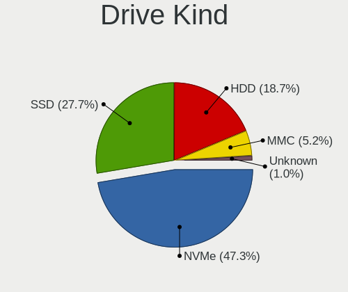
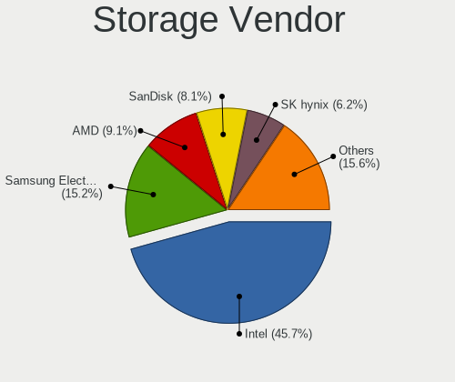
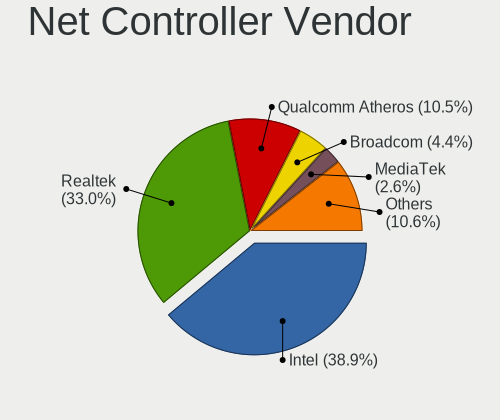

Fedora 35 - Tested Hardware & Statistics (Notebooks)
----------------------------------------------------

A project to collect tested hardware configurations for Fedora 35.

Anyone can contribute to this report by the [hw-probe](https://github.com/linuxhw/hw-probe) tool:

    sudo -E hw-probe -all -upload

Please submit a probe of your configuration if it's not presented on the page or is rare.

Full-feature report is available here: https://linux-hardware.org/?view=trends

Contents
--------

* [ Test Cases ](#test-cases)

* [ System ](#system)
  - [ Kernel                   ](#kernel)
  - [ Kernel Family            ](#kernel-family)
  - [ Kernel Major Ver.        ](#kernel-major-ver)
  - [ Arch                     ](#arch)
  - [ DE                       ](#de)
  - [ Display Server           ](#display-server)
  - [ Display Manager          ](#display-manager)
  - [ OS Lang                  ](#os-lang)
  - [ Boot Mode                ](#boot-mode)
  - [ Filesystem               ](#filesystem)
  - [ Part. scheme             ](#part-scheme)
  - [ Dual Boot with Linux/BSD ](#dual-boot-with-linuxbsd)
  - [ Dual Boot (Win)          ](#dual-boot-win)

* [ Board ](#board)
  - [ Vendor                   ](#vendor)
  - [ Model                    ](#model)
  - [ Model Family             ](#model-family)
  - [ MFG Year                 ](#mfg-year)
  - [ Form Factor              ](#form-factor)
  - [ Secure Boot              ](#secure-boot)
  - [ Coreboot                 ](#coreboot)
  - [ RAM Size                 ](#ram-size)
  - [ RAM Used                 ](#ram-used)
  - [ Total Drives             ](#total-drives)
  - [ Has CD-ROM               ](#has-cd-rom)
  - [ Has Ethernet             ](#has-ethernet)
  - [ Has WiFi                 ](#has-wifi)
  - [ Has Bluetooth            ](#has-bluetooth)

* [ Location ](#location)
  - [ Country                  ](#country)
  - [ City                     ](#city)

* [ Drives ](#drives)
  - [ Drive Vendor             ](#drive-vendor)
  - [ Drive Model              ](#drive-model)
  - [ HDD Vendor               ](#hdd-vendor)
  - [ SSD Vendor               ](#ssd-vendor)
  - [ Drive Kind               ](#drive-kind)
  - [ Drive Connector          ](#drive-connector)
  - [ Drive Size               ](#drive-size)
  - [ Space Total              ](#space-total)
  - [ Space Used               ](#space-used)
  - [ Malfunc. Drives          ](#malfunc-drives)
  - [ Malfunc. Drive Vendor    ](#malfunc-drive-vendor)
  - [ Malfunc. HDD Vendor      ](#malfunc-hdd-vendor)
  - [ Malfunc. Drive Kind      ](#malfunc-drive-kind)
  - [ Failed Drives            ](#failed-drives)
  - [ Failed Drive Vendor      ](#failed-drive-vendor)
  - [ Drive Status             ](#drive-status)

* [ Storage controller ](#storage-controller)
  - [ Storage Vendor           ](#storage-vendor)
  - [ Storage Model            ](#storage-model)
  - [ Storage Kind             ](#storage-kind)

* [ Processor ](#processor)
  - [ CPU Vendor               ](#cpu-vendor)
  - [ CPU Model                ](#cpu-model)
  - [ CPU Model Family         ](#cpu-model-family)
  - [ CPU Cores                ](#cpu-cores)
  - [ CPU Sockets              ](#cpu-sockets)
  - [ CPU Threads              ](#cpu-threads)
  - [ CPU Op-Modes             ](#cpu-op-modes)
  - [ CPU Microcode            ](#cpu-microcode)
  - [ CPU Microarch            ](#cpu-microarch)

* [ Graphics ](#graphics)
  - [ GPU Vendor               ](#gpu-vendor)
  - [ GPU Model                ](#gpu-model)
  - [ GPU Combo                ](#gpu-combo)
  - [ GPU Driver               ](#gpu-driver)
  - [ GPU Memory               ](#gpu-memory)

* [ Monitor ](#monitor)
  - [ Monitor Vendor           ](#monitor-vendor)
  - [ Monitor Model            ](#monitor-model)
  - [ Monitor Resolution       ](#monitor-resolution)
  - [ Monitor Diagonal         ](#monitor-diagonal)
  - [ Monitor Width            ](#monitor-width)
  - [ Aspect Ratio             ](#aspect-ratio)
  - [ Monitor Area             ](#monitor-area)
  - [ Pixel Density            ](#pixel-density)
  - [ Multiple Monitors        ](#multiple-monitors)

* [ Network ](#network)
  - [ Net Controller Vendor    ](#net-controller-vendor)
  - [ Net Controller Model     ](#net-controller-model)
  - [ Wireless Vendor          ](#wireless-vendor)
  - [ Wireless Model           ](#wireless-model)
  - [ Ethernet Vendor          ](#ethernet-vendor)
  - [ Ethernet Model           ](#ethernet-model)
  - [ Net Controller Kind      ](#net-controller-kind)
  - [ Used Controller          ](#used-controller)
  - [ NICs                     ](#nics)
  - [ IPv6                     ](#ipv6)

* [ Bluetooth ](#bluetooth)
  - [ Bluetooth Vendor         ](#bluetooth-vendor)
  - [ Bluetooth Model          ](#bluetooth-model)

* [ Sound ](#sound)
  - [ Sound Vendor             ](#sound-vendor)
  - [ Sound Model              ](#sound-model)

* [ Memory ](#memory)
  - [ Memory Vendor            ](#memory-vendor)
  - [ Memory Model             ](#memory-model)
  - [ Memory Kind              ](#memory-kind)
  - [ Memory Form Factor       ](#memory-form-factor)
  - [ Memory Size              ](#memory-size)
  - [ Memory Speed             ](#memory-speed)

* [ Printers & scanners ](#printers--scanners)
  - [ Printer Vendor           ](#printer-vendor)
  - [ Printer Model            ](#printer-model)
  - [ Scanner Vendor           ](#scanner-vendor)
  - [ Scanner Model            ](#scanner-model)

* [ Camera ](#camera)
  - [ Camera Vendor            ](#camera-vendor)
  - [ Camera Model             ](#camera-model)

* [ Security ](#security)
  - [ Fingerprint Vendor       ](#fingerprint-vendor)
  - [ Fingerprint Model        ](#fingerprint-model)
  - [ Chipcard Vendor          ](#chipcard-vendor)
  - [ Chipcard Model           ](#chipcard-model)

* [ Unsupported ](#unsupported)
  - [ Unsupported Devices      ](#unsupported-devices)
  - [ Unsupported Device Types ](#unsupported-device-types)

Test Cases
----------

| Vendor        | Model                       | Probe                                                      | Date         |
|---------------|-----------------------------|------------------------------------------------------------|--------------|
| Dell          | Latitude E5570              | [34af93663b](https://linux-hardware.org/?probe=34af93663b) | Dec 31, 2021 |
| Google        | Coral                       | [23a0352176](https://linux-hardware.org/?probe=23a0352176) | Dec 31, 2021 |
| ASUSTek       | TP300LD                     | [13e63153f1](https://linux-hardware.org/?probe=13e63153f1) | Dec 31, 2021 |
| Dell          | XPS 13 9380                 | [cd66e486be](https://linux-hardware.org/?probe=cd66e486be) | Dec 31, 2021 |
| Apple         | MacBookPro8,2               | [298d5a0323](https://linux-hardware.org/?probe=298d5a0323) | Dec 31, 2021 |
| HP            | Pavilion Gaming Laptop 1... | [9d60e196d4](https://linux-hardware.org/?probe=9d60e196d4) | Dec 31, 2021 |
| Lenovo        | ThinkPad T460 20FMS1R01K    | [c6dbec8e70](https://linux-hardware.org/?probe=c6dbec8e70) | Dec 31, 2021 |
| Lenovo        | ThinkPad P1 Gen 3 20TJS5... | [c1eeaec01b](https://linux-hardware.org/?probe=c1eeaec01b) | Dec 30, 2021 |
| Google        | Chell                       | [9a2a4a03ed](https://linux-hardware.org/?probe=9a2a4a03ed) | Dec 30, 2021 |
| Lenovo        | ThinkPad T490 20N3S6VU00    | [afb7fa66f5](https://linux-hardware.org/?probe=afb7fa66f5) | Dec 30, 2021 |
| Lenovo        | IdeaPad 5 14ARE05 81YM      | [bfd79da0e0](https://linux-hardware.org/?probe=bfd79da0e0) | Dec 30, 2021 |
| Dell          | Inspiron 3521               | [af800e1071](https://linux-hardware.org/?probe=af800e1071) | Dec 29, 2021 |
| Lenovo        | IdeaPad S540-15IWL          | [c3497fe5bd](https://linux-hardware.org/?probe=c3497fe5bd) | Dec 29, 2021 |
| HP            | EliteBook 840 G7 Noteboo... | [4dfe6a5b8c](https://linux-hardware.org/?probe=4dfe6a5b8c) | Dec 29, 2021 |
| Dell          | Inspiron 7559               | [12ba9454e7](https://linux-hardware.org/?probe=12ba9454e7) | Dec 29, 2021 |
| Lenovo        | ThinkPad X1 Nano Gen 1 2... | [c539559392](https://linux-hardware.org/?probe=c539559392) | Dec 29, 2021 |
| Lenovo        | ThinkPad T520 4243B96       | [9ba0058839](https://linux-hardware.org/?probe=9ba0058839) | Dec 29, 2021 |
| Lenovo        | ThinkPad T520 4243B96       | [dbcf70aced](https://linux-hardware.org/?probe=dbcf70aced) | Dec 29, 2021 |
| Lenovo        | ThinkPad P15s Gen 1 20T4... | [41b463b6c4](https://linux-hardware.org/?probe=41b463b6c4) | Dec 28, 2021 |
| Hampoo        | C3W6_AP108_4GB Reserved     | [433a512192](https://linux-hardware.org/?probe=433a512192) | Dec 28, 2021 |
| Lenovo        | ThinkPad E480 20KN001QPB    | [0615d7a112](https://linux-hardware.org/?probe=0615d7a112) | Dec 28, 2021 |
| Lenovo        | ThinkPad T550 20CKA00ECD    | [bea75ed7d5](https://linux-hardware.org/?probe=bea75ed7d5) | Dec 27, 2021 |
| Lenovo        | IdeaPad 320-15ISK 80XH      | [cc15a65a54](https://linux-hardware.org/?probe=cc15a65a54) | Dec 27, 2021 |
| Toshiba       | Satellite L12-C-104         | [fae8f8e1f9](https://linux-hardware.org/?probe=fae8f8e1f9) | Dec 27, 2021 |
| HUAWEI        | HVY-WXX9                    | [23460afe38](https://linux-hardware.org/?probe=23460afe38) | Dec 27, 2021 |
| Lenovo        | ThinkPad X1 Carbon 6th 2... | [23db048750](https://linux-hardware.org/?probe=23db048750) | Dec 27, 2021 |
| HP            | ZBook Fury 15 G7 Mobile ... | [707835b4ff](https://linux-hardware.org/?probe=707835b4ff) | Dec 27, 2021 |
| HP            | Laptop 15s-eq0xxx           | [f255947b6f](https://linux-hardware.org/?probe=f255947b6f) | Dec 27, 2021 |
| Dell          | XPS 13 7390                 | [572bbe8d7b](https://linux-hardware.org/?probe=572bbe8d7b) | Dec 27, 2021 |
| Lenovo        | ThinkBook 15-IIL 20SM       | [86651ee07a](https://linux-hardware.org/?probe=86651ee07a) | Dec 26, 2021 |
| Lenovo        | Ducati 5 82ES               | [61dd257cc7](https://linux-hardware.org/?probe=61dd257cc7) | Dec 26, 2021 |
| Lenovo        | IdeaPad Flex-14API 81SS     | [56c0a83ab8](https://linux-hardware.org/?probe=56c0a83ab8) | Dec 26, 2021 |
| MSI           | Alpha 15 B5EEK              | [e076af5bf8](https://linux-hardware.org/?probe=e076af5bf8) | Dec 26, 2021 |
| HP            | 2000                        | [e3408eb743](https://linux-hardware.org/?probe=e3408eb743) | Dec 26, 2021 |
| HUAWEI        | NBLK-WAX9X                  | [1e8ce2ec6d](https://linux-hardware.org/?probe=1e8ce2ec6d) | Dec 25, 2021 |
| Dell          | Inspiron 5558               | [58e49e7f72](https://linux-hardware.org/?probe=58e49e7f72) | Dec 25, 2021 |
| Dell          | Latitude 7410               | [71a96bfc8f](https://linux-hardware.org/?probe=71a96bfc8f) | Dec 25, 2021 |
| Lenovo        | IdeaPad Flex-14API 81SS     | [6fe369b6b7](https://linux-hardware.org/?probe=6fe369b6b7) | Dec 25, 2021 |
| Cube          | i18-L                       | [6770cf2a44](https://linux-hardware.org/?probe=6770cf2a44) | Dec 24, 2021 |
| Lenovo        | V470 439627U                | [7c44d560dc](https://linux-hardware.org/?probe=7c44d560dc) | Dec 24, 2021 |
| HP            | EliteBook 2570p             | [a02655b4b8](https://linux-hardware.org/?probe=a02655b4b8) | Dec 24, 2021 |
| HP            | EliteBook 2570p             | [6e08796257](https://linux-hardware.org/?probe=6e08796257) | Dec 24, 2021 |
| Lenovo        | IdeaPad 530S-14IKB 81EU     | [44dd4eee41](https://linux-hardware.org/?probe=44dd4eee41) | Dec 24, 2021 |
| HP            | Laptop 14-dk1xxx            | [ab7902b875](https://linux-hardware.org/?probe=ab7902b875) | Dec 24, 2021 |
| LDLC          | Mercure MH                  | [ff094fa4f3](https://linux-hardware.org/?probe=ff094fa4f3) | Dec 23, 2021 |
| Lenovo        | ThinkPad X250 20CLS2B000    | [abba53c091](https://linux-hardware.org/?probe=abba53c091) | Dec 23, 2021 |
| Lenovo        | ThinkPad E14 Gen 3 20Y70... | [1962ddfdb4](https://linux-hardware.org/?probe=1962ddfdb4) | Dec 23, 2021 |
| ASUSTek       | ASUS TUF Gaming A17 FA70... | [d6d85114b6](https://linux-hardware.org/?probe=d6d85114b6) | Dec 23, 2021 |
| HP            | 250 G1                      | [da8e31b740](https://linux-hardware.org/?probe=da8e31b740) | Dec 23, 2021 |
| Dell          | Inspiron 5447               | [83331a9c7c](https://linux-hardware.org/?probe=83331a9c7c) | Dec 22, 2021 |
| Acer          | Aspire A315-41              | [85da21d9e9](https://linux-hardware.org/?probe=85da21d9e9) | Dec 22, 2021 |
| Apple         | MacBookPro11,3              | [1975ee2fc0](https://linux-hardware.org/?probe=1975ee2fc0) | Dec 22, 2021 |
| Lenovo        | ThinkPad X270 W10DG 20K5... | [df0d434539](https://linux-hardware.org/?probe=df0d434539) | Dec 22, 2021 |
| Apple         | MacBookPro7,1               | [5994dbd498](https://linux-hardware.org/?probe=5994dbd498) | Dec 21, 2021 |
| Lenovo        | ThinkPad X270 W10DG 20K5... | [9724b1359d](https://linux-hardware.org/?probe=9724b1359d) | Dec 21, 2021 |
| Notebook      | NH5x_NH7xHP                 | [0408aca941](https://linux-hardware.org/?probe=0408aca941) | Dec 21, 2021 |
| Apple         | MacBookPro14,1              | [e82554da93](https://linux-hardware.org/?probe=e82554da93) | Dec 21, 2021 |
| Lenovo        | IdeaPad 5 Pro 16ACH6 82L... | [7fc27f5255](https://linux-hardware.org/?probe=7fc27f5255) | Dec 21, 2021 |
| Apple         | MacBookPro7,1               | [5f47284626](https://linux-hardware.org/?probe=5f47284626) | Dec 21, 2021 |
| Apple         | MacBookPro14,1              | [022cabd3f2](https://linux-hardware.org/?probe=022cabd3f2) | Dec 21, 2021 |
| HP            | Laptop 15s-eq2xxx           | [8cd9d762c9](https://linux-hardware.org/?probe=8cd9d762c9) | Dec 20, 2021 |
| HP            | Pavilion 15                 | [7248fa574f](https://linux-hardware.org/?probe=7248fa574f) | Dec 20, 2021 |
| Notebook      | N24_25JU                    | [8ac7d4890e](https://linux-hardware.org/?probe=8ac7d4890e) | Dec 20, 2021 |
| Lenovo        | ThinkPad T14s Gen 2i 20W... | [ddb3571ec6](https://linux-hardware.org/?probe=ddb3571ec6) | Dec 20, 2021 |
| HP            | Laptop 15s-eq2xxx           | [bb28c266ec](https://linux-hardware.org/?probe=bb28c266ec) | Dec 19, 2021 |
| HUAWEI        | HVY-WXX9                    | [d335e16395](https://linux-hardware.org/?probe=d335e16395) | Dec 19, 2021 |
| Samsung       | RV410/RV510/S3510/E3510     | [9c38b95aa0](https://linux-hardware.org/?probe=9c38b95aa0) | Dec 19, 2021 |
| Lenovo        | IdeaPad 510-15ISK 80SR      | [e380536aac](https://linux-hardware.org/?probe=e380536aac) | Dec 19, 2021 |
| Lenovo        | ThinkPad P14s Gen 1 20Y1... | [87399b5e8b](https://linux-hardware.org/?probe=87399b5e8b) | Dec 19, 2021 |
| HUAWEI        | NBLB-WAX9N                  | [ffd979b53f](https://linux-hardware.org/?probe=ffd979b53f) | Dec 19, 2021 |
| HUAWEI        | HVY-WXX9                    | [85e3feaeba](https://linux-hardware.org/?probe=85e3feaeba) | Dec 19, 2021 |
| Lenovo        | ThinkPad E580 20KS001EMX    | [366aae1cd6](https://linux-hardware.org/?probe=366aae1cd6) | Dec 18, 2021 |
| Acer          | Nitro AN515-53              | [a9affc8e28](https://linux-hardware.org/?probe=a9affc8e28) | Dec 18, 2021 |
| Dell          | Precision 5540              | [14a6857b99](https://linux-hardware.org/?probe=14a6857b99) | Dec 18, 2021 |
| Lenovo        | ThinkPad P1 Gen 3 20TJS5... | [cda7a2c35c](https://linux-hardware.org/?probe=cda7a2c35c) | Dec 17, 2021 |
| Lenovo        | ThinkPad T14s Gen 1 20T1... | [6bf6c57117](https://linux-hardware.org/?probe=6bf6c57117) | Dec 17, 2021 |
| HP            | ENVY Pro 4-b000 Ultraboo... | [1bac69aa61](https://linux-hardware.org/?probe=1bac69aa61) | Dec 17, 2021 |
| Lenovo        | ThinkPad E14 Gen 3 20Y70... | [e985e04d6d](https://linux-hardware.org/?probe=e985e04d6d) | Dec 17, 2021 |
| Lenovo        | Yoga S740-14IIL 81RS        | [6deb57beb2](https://linux-hardware.org/?probe=6deb57beb2) | Dec 17, 2021 |
| Dell          | XPS 15 9500                 | [98e451612c](https://linux-hardware.org/?probe=98e451612c) | Dec 17, 2021 |
| AVITA         | NS14A1US                    | [e20bf09217](https://linux-hardware.org/?probe=e20bf09217) | Dec 16, 2021 |
| HP            | Laptop 15s-eq2xxx           | [290b1d081b](https://linux-hardware.org/?probe=290b1d081b) | Dec 16, 2021 |
| Dell          | XPS 17 9700                 | [aba6548652](https://linux-hardware.org/?probe=aba6548652) | Dec 16, 2021 |
| Lenovo        | IdeaPad 3 15ALC6 82KU       | [30a4a58c5d](https://linux-hardware.org/?probe=30a4a58c5d) | Dec 16, 2021 |
| Dell          | XPS 15 9500                 | [4d52a02213](https://linux-hardware.org/?probe=4d52a02213) | Dec 16, 2021 |
| Dell          | XPS 17 9700                 | [ff779fe08f](https://linux-hardware.org/?probe=ff779fe08f) | Dec 16, 2021 |
| MSI           | GL63 9SC                    | [ed637c5d15](https://linux-hardware.org/?probe=ed637c5d15) | Dec 16, 2021 |
| Lenovo        | ThinkPad X1 Extreme 2nd ... | [0fc861a848](https://linux-hardware.org/?probe=0fc861a848) | Dec 16, 2021 |
| ASUSTek       | ASUS TUF Dash F15 FX516P... | [39491139d5](https://linux-hardware.org/?probe=39491139d5) | Dec 15, 2021 |
| ASUSTek       | ASUS TUF Dash F15 FX516P... | [615d071a26](https://linux-hardware.org/?probe=615d071a26) | Dec 15, 2021 |
| HP            | Pavilion dv7                | [0e0f0e3c23](https://linux-hardware.org/?probe=0e0f0e3c23) | Dec 15, 2021 |
| Dell          | Latitude 5500               | [5b9479065e](https://linux-hardware.org/?probe=5b9479065e) | Dec 15, 2021 |
| Lenovo        | ThinkPad E14 20RA007TUE     | [3edd54970c](https://linux-hardware.org/?probe=3edd54970c) | Dec 15, 2021 |
| ASUSTek       | K43U                        | [d7df2cd94e](https://linux-hardware.org/?probe=d7df2cd94e) | Dec 15, 2021 |
| Acer          | Swift SF314-43              | [2cabe8184b](https://linux-hardware.org/?probe=2cabe8184b) | Dec 15, 2021 |
| HP            | ENVY Pro 4-b000 Ultraboo... | [20259384ac](https://linux-hardware.org/?probe=20259384ac) | Dec 14, 2021 |
| Lenovo        | ThinkPad X1 Carbon 5th 2... | [4290797f32](https://linux-hardware.org/?probe=4290797f32) | Dec 14, 2021 |
| Lenovo        | ThinkPad X1 Carbon 5th 2... | [fb79be9e00](https://linux-hardware.org/?probe=fb79be9e00) | Dec 14, 2021 |
| Dell          | Inspiron 15 5510            | [dd29feeb10](https://linux-hardware.org/?probe=dd29feeb10) | Dec 14, 2021 |
| Dell          | Latitude 7300               | [23f38f8a7d](https://linux-hardware.org/?probe=23f38f8a7d) | Dec 14, 2021 |
| Acer          | Aspire A515-55              | [8d121836c9](https://linux-hardware.org/?probe=8d121836c9) | Dec 14, 2021 |
| Dell          | Latitude 7490               | [ae8a45bc5a](https://linux-hardware.org/?probe=ae8a45bc5a) | Dec 14, 2021 |
| Dell          | Inspiron 16 7610            | [e0d697a356](https://linux-hardware.org/?probe=e0d697a356) | Dec 14, 2021 |
| Acer          | Swift SF314-43              | [fd53be96e6](https://linux-hardware.org/?probe=fd53be96e6) | Dec 13, 2021 |
| Notebook      | NH5xAx                      | [fcd36c9b82](https://linux-hardware.org/?probe=fcd36c9b82) | Dec 13, 2021 |
| Dell          | Vostro 5402                 | [2074bdb7a5](https://linux-hardware.org/?probe=2074bdb7a5) | Dec 13, 2021 |
| MSI           | Modern 14 B5M               | [5274b5a06c](https://linux-hardware.org/?probe=5274b5a06c) | Dec 13, 2021 |
| Avell High... | A70 LIV                     | [3930fc87b1](https://linux-hardware.org/?probe=3930fc87b1) | Dec 12, 2021 |
| Acer          | Aspire A315-31              | [24c8e29d95](https://linux-hardware.org/?probe=24c8e29d95) | Dec 12, 2021 |
| Dell          | Latitude 7290               | [8a2ecfe430](https://linux-hardware.org/?probe=8a2ecfe430) | Dec 12, 2021 |
| Acer          | Nitro AN515-45              | [5975d86599](https://linux-hardware.org/?probe=5975d86599) | Dec 12, 2021 |
| Lenovo        | IdeaPad S340-14API 81NB     | [1846fa72b5](https://linux-hardware.org/?probe=1846fa72b5) | Dec 12, 2021 |
| Lenovo        | ThinkPad T440p 20AWS1H60... | [ffb1c97626](https://linux-hardware.org/?probe=ffb1c97626) | Dec 12, 2021 |
| Dell          | Inspiron 5515               | [901f720089](https://linux-hardware.org/?probe=901f720089) | Dec 11, 2021 |
| Dell          | Inspiron 5515               | [7c0553b250](https://linux-hardware.org/?probe=7c0553b250) | Dec 11, 2021 |
| Lenovo        | ThinkPad T14 Gen 1 20UD0... | [54058ac7e2](https://linux-hardware.org/?probe=54058ac7e2) | Dec 11, 2021 |
| HP            | Pavilion Power Laptop 15... | [6d5c35bf9f](https://linux-hardware.org/?probe=6d5c35bf9f) | Dec 11, 2021 |
| Lenovo        | IdeaPad 3 14ITL6 82H7       | [584be17bec](https://linux-hardware.org/?probe=584be17bec) | Dec 11, 2021 |
| Lenovo        | ThinkPad X1 Extreme Gen ... | [4fba952635](https://linux-hardware.org/?probe=4fba952635) | Dec 11, 2021 |
| HP            | ZBook 15 G2                 | [d7faa88624](https://linux-hardware.org/?probe=d7faa88624) | Dec 11, 2021 |
| Dell          | Latitude 7300               | [2bb3c232b6](https://linux-hardware.org/?probe=2bb3c232b6) | Dec 11, 2021 |
| ASUSTek       | ROG Zephyrus G14 GA401QM... | [3030cb05b9](https://linux-hardware.org/?probe=3030cb05b9) | Dec 11, 2021 |
| Fujitsu       | LIFEBOOK U7411              | [65bc5c1c5b](https://linux-hardware.org/?probe=65bc5c1c5b) | Dec 11, 2021 |
| Lenovo        | ThinkPad T14 Gen 1 20UD0... | [f3d37d4574](https://linux-hardware.org/?probe=f3d37d4574) | Dec 10, 2021 |
| Dell          | Inspiron 13 5310            | [7a721d2c05](https://linux-hardware.org/?probe=7a721d2c05) | Dec 10, 2021 |
| Dell          | Vostro 3400                 | [bcb885e52b](https://linux-hardware.org/?probe=bcb885e52b) | Dec 10, 2021 |
| ASUSTek       | VivoBook_ASUSLaptop X435... | [4fe4d7393e](https://linux-hardware.org/?probe=4fe4d7393e) | Dec 10, 2021 |
| Acer          | Swift SFX14-41G             | [a81ed5c974](https://linux-hardware.org/?probe=a81ed5c974) | Dec 10, 2021 |
| Lenovo        | ThinkPad L14 Gen 2 20X10... | [181607bac3](https://linux-hardware.org/?probe=181607bac3) | Dec 10, 2021 |
| Lenovo        | ThinkPad L14 Gen 2 20X10... | [c1de54b513](https://linux-hardware.org/?probe=c1de54b513) | Dec 10, 2021 |
| HP            | OMEN Laptop 15-en0xxx       | [4ba265c070](https://linux-hardware.org/?probe=4ba265c070) | Dec 10, 2021 |
| Lenovo        | G570 20079                  | [439a97ec9b](https://linux-hardware.org/?probe=439a97ec9b) | Dec 09, 2021 |
| Lenovo        | ThinkPad E14 Gen 3 20Y7C... | [195283a93a](https://linux-hardware.org/?probe=195283a93a) | Dec 09, 2021 |
| Dell          | XPS 13 9305                 | [60e57ae6dd](https://linux-hardware.org/?probe=60e57ae6dd) | Dec 09, 2021 |
| Lenovo        | ThinkPad P1 Gen 3 20TJS0... | [73645a62d6](https://linux-hardware.org/?probe=73645a62d6) | Dec 09, 2021 |
| HP            | Laptop 15s-eq2xxx           | [b673a5f067](https://linux-hardware.org/?probe=b673a5f067) | Dec 08, 2021 |
| TUXEDO        | InfinityBook S 15 Gen6      | [3880c485fb](https://linux-hardware.org/?probe=3880c485fb) | Dec 08, 2021 |
| Apple         | MacBookPro12,1              | [fcfdb2cedc](https://linux-hardware.org/?probe=fcfdb2cedc) | Dec 08, 2021 |
| Sony          | SVE1711Z1RB                 | [adb25167ea](https://linux-hardware.org/?probe=adb25167ea) | Dec 07, 2021 |
| HP            | Laptop 15s-fq2xxx           | [9c98446833](https://linux-hardware.org/?probe=9c98446833) | Dec 07, 2021 |
| Lenovo        | ThinkPad T14s Gen 1 20T1... | [ad406a6f63](https://linux-hardware.org/?probe=ad406a6f63) | Dec 07, 2021 |
| Notebook      | NH5xAx                      | [801df46937](https://linux-hardware.org/?probe=801df46937) | Dec 07, 2021 |
| HP            | 15 Notebook PC              | [0523a58e8a](https://linux-hardware.org/?probe=0523a58e8a) | Dec 07, 2021 |
| Lenovo        | ThinkPad X230 23255E4       | [3f2487b1a6](https://linux-hardware.org/?probe=3f2487b1a6) | Dec 07, 2021 |
| Lenovo        | G570 20079                  | [a6722f2ff3](https://linux-hardware.org/?probe=a6722f2ff3) | Dec 07, 2021 |
| Sony          | SVE1713S1RW                 | [41775b7503](https://linux-hardware.org/?probe=41775b7503) | Dec 07, 2021 |
| HP            | Pavilion Aero Laptop 13-... | [8b704c0d3f](https://linux-hardware.org/?probe=8b704c0d3f) | Dec 06, 2021 |
| Lenovo        | ThinkPad T490s 20NX000DR... | [b5a282abf6](https://linux-hardware.org/?probe=b5a282abf6) | Dec 06, 2021 |
| Apple         | MacBookPro9,2               | [4fc7bc5515](https://linux-hardware.org/?probe=4fc7bc5515) | Dec 06, 2021 |
| Lenovo        | ThinkBook 16p Gen 2 20YM    | [42fe75c227](https://linux-hardware.org/?probe=42fe75c227) | Dec 06, 2021 |
| ASUSTek       | ROG Zephyrus G15 GA503QM... | [0dc0958719](https://linux-hardware.org/?probe=0dc0958719) | Dec 06, 2021 |
| ASUSTek       | ROG Zephyrus G14 GA401QM... | [e18de7567f](https://linux-hardware.org/?probe=e18de7567f) | Dec 06, 2021 |
| Lenovo        | ThinkPad T460p 20FXS0550... | [40640fd92f](https://linux-hardware.org/?probe=40640fd92f) | Dec 06, 2021 |
| Framework     | Laptop                      | [64dc54fbc6](https://linux-hardware.org/?probe=64dc54fbc6) | Dec 06, 2021 |
| Acer          | Nitro AN515-45              | [8641f9b078](https://linux-hardware.org/?probe=8641f9b078) | Dec 05, 2021 |
| Lenovo        | ThinkPad W520 42763JF       | [50d1714228](https://linux-hardware.org/?probe=50d1714228) | Dec 05, 2021 |
| Fujitsu Si... | ESPRIMO Mobile V6535        | [e2d660554f](https://linux-hardware.org/?probe=e2d660554f) | Dec 05, 2021 |
| Dell          | Inspiron 5405               | [91806303e6](https://linux-hardware.org/?probe=91806303e6) | Dec 05, 2021 |
| Dell          | Latitude E6530              | [de5ad42b2f](https://linux-hardware.org/?probe=de5ad42b2f) | Dec 04, 2021 |
| Lenovo        | ThinkPad L14 Gen 1 20U50... | [c91db7e021](https://linux-hardware.org/?probe=c91db7e021) | Dec 04, 2021 |
| Lenovo        | ThinkPad T490s 20NX000DR... | [15e8e28073](https://linux-hardware.org/?probe=15e8e28073) | Dec 04, 2021 |
| Acer          | Aspire E5-571G              | [b006a547c8](https://linux-hardware.org/?probe=b006a547c8) | Dec 04, 2021 |
| HP            | ProBook 470 G5              | [1cfd3aadd8](https://linux-hardware.org/?probe=1cfd3aadd8) | Dec 04, 2021 |
| Lenovo        | ThinkPad E480 20KNS0E200    | [be3c6c3e84](https://linux-hardware.org/?probe=be3c6c3e84) | Dec 04, 2021 |
| ASUSTek       | ROG Zephyrus G14 GA401QM... | [826435e568](https://linux-hardware.org/?probe=826435e568) | Dec 04, 2021 |
| Lenovo        | ThinkPad W520 42763JF       | [23d42021b2](https://linux-hardware.org/?probe=23d42021b2) | Dec 04, 2021 |
| Lenovo        | ThinkPad E480 20KNS0E200    | [6239b4eda5](https://linux-hardware.org/?probe=6239b4eda5) | Dec 04, 2021 |
| Lenovo        | ThinkPad T14 Gen 1 20UD0... | [f90f047538](https://linux-hardware.org/?probe=f90f047538) | Dec 03, 2021 |
| Toshiba       | Satellite C70-A-K2W         | [8e46f67032](https://linux-hardware.org/?probe=8e46f67032) | Dec 03, 2021 |
| Lenovo        | ThinkPad X230 23257R2       | [775ec45ab8](https://linux-hardware.org/?probe=775ec45ab8) | Dec 03, 2021 |
| Lenovo        | ThinkPad X230 23257R2       | [b783f0a79d](https://linux-hardware.org/?probe=b783f0a79d) | Dec 03, 2021 |
| Gigabyte      | AERO 15 KB                  | [a7d3041cd2](https://linux-hardware.org/?probe=a7d3041cd2) | Dec 03, 2021 |
| HP            | Laptop 15s-eq2xxx           | [f53047cd0d](https://linux-hardware.org/?probe=f53047cd0d) | Dec 02, 2021 |
| Notebook      | NH55RGQ                     | [4189e1f255](https://linux-hardware.org/?probe=4189e1f255) | Dec 02, 2021 |
| Lenovo        | V15-ADA 82C7                | [5ade9a0569](https://linux-hardware.org/?probe=5ade9a0569) | Dec 02, 2021 |
| Lenovo        | ThinkPad L390 20NSS43600    | [e9aae12812](https://linux-hardware.org/?probe=e9aae12812) | Dec 02, 2021 |
| Acer          | Nitro AN515-55              | [d5c6c6edee](https://linux-hardware.org/?probe=d5c6c6edee) | Dec 01, 2021 |
| HP            | Laptop 15s-fq2xxx           | [94b9d8b093](https://linux-hardware.org/?probe=94b9d8b093) | Dec 01, 2021 |
| HP            | ProBook 470 G5              | [240ca54dfb](https://linux-hardware.org/?probe=240ca54dfb) | Dec 01, 2021 |
| ASUSTek       | ROG Strix G513QY_G513QY     | [8cebf41624](https://linux-hardware.org/?probe=8cebf41624) | Dec 01, 2021 |
| HP            | Laptop 15s-eq1xxx           | [9b11575394](https://linux-hardware.org/?probe=9b11575394) | Dec 01, 2021 |
| HP            | ProBook 470 G5              | [610709bb66](https://linux-hardware.org/?probe=610709bb66) | Nov 30, 2021 |
| Acer          | Aspire E5-571G              | [f940ae414d](https://linux-hardware.org/?probe=f940ae414d) | Nov 30, 2021 |
| Dell          | Inspiron 7460               | [0a6feb58e7](https://linux-hardware.org/?probe=0a6feb58e7) | Nov 30, 2021 |
| Lenovo        | ThinkPad T14 Gen 1 20UD0... | [b2d55bd445](https://linux-hardware.org/?probe=b2d55bd445) | Nov 30, 2021 |
| Lenovo        | ThinkPad P1 Gen 2 20QUS1... | [23ae32af07](https://linux-hardware.org/?probe=23ae32af07) | Nov 30, 2021 |
| Lenovo        | ThinkPad P1 Gen 2 20QUS1... | [074ec973ae](https://linux-hardware.org/?probe=074ec973ae) | Nov 30, 2021 |
| Lenovo        | ThinkPad P1 Gen 3 20TJS5... | [80bbba47f6](https://linux-hardware.org/?probe=80bbba47f6) | Nov 29, 2021 |
| Acer          | Aspire E5-571G              | [95cb3fe8b3](https://linux-hardware.org/?probe=95cb3fe8b3) | Nov 29, 2021 |
| Acer          | Predator G9-793             | [b9dc27ddac](https://linux-hardware.org/?probe=b9dc27ddac) | Nov 29, 2021 |
| Dell          | G5 5590                     | [e569e56450](https://linux-hardware.org/?probe=e569e56450) | Nov 29, 2021 |
| HP            | Laptop 15s-fq2xxx           | [959af2b8dd](https://linux-hardware.org/?probe=959af2b8dd) | Nov 29, 2021 |
| Acer          | Swift SF113-31              | [f1e3d8c722](https://linux-hardware.org/?probe=f1e3d8c722) | Nov 29, 2021 |
| Notebook      | NB50TL                      | [15a716161c](https://linux-hardware.org/?probe=15a716161c) | Nov 28, 2021 |
| HP            | ProBook 470 G5              | [b75e21b247](https://linux-hardware.org/?probe=b75e21b247) | Nov 28, 2021 |
| Dell          | Inspiron 5558               | [b003366a2c](https://linux-hardware.org/?probe=b003366a2c) | Nov 28, 2021 |
| Notebook      | NH5x_NH7x_HHx_HJx_HKx       | [8e5c4cc27b](https://linux-hardware.org/?probe=8e5c4cc27b) | Nov 28, 2021 |
| Apple         | MacBookPro7,1               | [6a4ed949e9](https://linux-hardware.org/?probe=6a4ed949e9) | Nov 28, 2021 |
| Lenovo        | IdeaPad S145-15IWL 81MV     | [0852350348](https://linux-hardware.org/?probe=0852350348) | Nov 28, 2021 |
| Dell          | Latitude 7420               | [7a96812e39](https://linux-hardware.org/?probe=7a96812e39) | Nov 28, 2021 |
| HP            | Pavilion Aero Laptop 13-... | [eabdd46893](https://linux-hardware.org/?probe=eabdd46893) | Nov 28, 2021 |
| Lenovo        | G40-45 80E1                 | [b3cdb202fc](https://linux-hardware.org/?probe=b3cdb202fc) | Nov 28, 2021 |
| HP            | Laptop 15s-fq2xxx           | [d559f82ee3](https://linux-hardware.org/?probe=d559f82ee3) | Nov 28, 2021 |
| Dell          | XPS 13 7390                 | [783b49e383](https://linux-hardware.org/?probe=783b49e383) | Nov 28, 2021 |
| Lenovo        | ThinkPad T400 6474B84       | [67f32be00d](https://linux-hardware.org/?probe=67f32be00d) | Nov 27, 2021 |
| Lenovo        | ThinkPad E480 20KNS0E200    | [968f938b4e](https://linux-hardware.org/?probe=968f938b4e) | Nov 27, 2021 |
| Lenovo        | IdeaPad 320S-14IKB 81BN     | [08612b7f88](https://linux-hardware.org/?probe=08612b7f88) | Nov 27, 2021 |
| Lenovo        | ThinkPad E15 20RD003JRT     | [ef8336f76a](https://linux-hardware.org/?probe=ef8336f76a) | Nov 26, 2021 |
| Dell          | Precision 5550              | [41caa6a4a0](https://linux-hardware.org/?probe=41caa6a4a0) | Nov 26, 2021 |
| Lenovo        | ThinkPad X1 Carbon Gen 9... | [6056117cca](https://linux-hardware.org/?probe=6056117cca) | Nov 26, 2021 |
| ASUSTek       | K54C                        | [2604de426e](https://linux-hardware.org/?probe=2604de426e) | Nov 26, 2021 |
| Acer          | AP714-51T                   | [3fe9bcf889](https://linux-hardware.org/?probe=3fe9bcf889) | Nov 26, 2021 |
| Acer          | AP714-51T                   | [406001fc85](https://linux-hardware.org/?probe=406001fc85) | Nov 26, 2021 |
| Lenovo        | IdeaPad 320-15ISK 80XH      | [c207f61d91](https://linux-hardware.org/?probe=c207f61d91) | Nov 26, 2021 |
| Lenovo        | IdeaPad 320-15ISK 80XH      | [96c90ad6c9](https://linux-hardware.org/?probe=96c90ad6c9) | Nov 26, 2021 |
| Lenovo        | IdeaPad 320-15ISK 80XH      | [039dbf659a](https://linux-hardware.org/?probe=039dbf659a) | Nov 26, 2021 |
| Lenovo        | ThinkBook 15-IML 20RW       | [a000027ce6](https://linux-hardware.org/?probe=a000027ce6) | Nov 26, 2021 |
| Lenovo        | ThinkPad P1 Gen 2 20QT00... | [b9c1906f2b](https://linux-hardware.org/?probe=b9c1906f2b) | Nov 26, 2021 |
| Lenovo        | IdeaPad 3 15IGL05 81WQ      | [366fe373c9](https://linux-hardware.org/?probe=366fe373c9) | Nov 25, 2021 |
| HUAWEI        | KLVL-WXXW                   | [beff046f56](https://linux-hardware.org/?probe=beff046f56) | Nov 25, 2021 |
| HUAWEI        | KLVL-WXXW                   | [2a96a2a7af](https://linux-hardware.org/?probe=2a96a2a7af) | Nov 25, 2021 |
| Sony          | VPCF131FM                   | [f0ba5e0db2](https://linux-hardware.org/?probe=f0ba5e0db2) | Nov 25, 2021 |
| HUAWEI        | KLVL-WXX9                   | [3352efa5cd](https://linux-hardware.org/?probe=3352efa5cd) | Nov 25, 2021 |
| Dell          | Latitude E5470              | [1e35555998](https://linux-hardware.org/?probe=1e35555998) | Nov 24, 2021 |
| Dell          | XPS 13 9300                 | [a91462bd5a](https://linux-hardware.org/?probe=a91462bd5a) | Nov 24, 2021 |
| HP            | EliteBook 735 G5            | [d80b574cb4](https://linux-hardware.org/?probe=d80b574cb4) | Nov 24, 2021 |
| ASUSTek       | VivoBook_ASUSLaptop X512... | [b6bfa4b827](https://linux-hardware.org/?probe=b6bfa4b827) | Nov 24, 2021 |
| Lenovo        | ThinkPad X1 Extreme 2nd ... | [44bf6f6d6f](https://linux-hardware.org/?probe=44bf6f6d6f) | Nov 23, 2021 |
| Lenovo        | ThinkPad X1 Carbon 7th 2... | [3c3fbf498a](https://linux-hardware.org/?probe=3c3fbf498a) | Nov 23, 2021 |
| HP            | ENVY Laptop 14-eb0xxx       | [5be975dd37](https://linux-hardware.org/?probe=5be975dd37) | Nov 23, 2021 |
| Lenovo        | B40-70 80F30006BR           | [d29d6c2f61](https://linux-hardware.org/?probe=d29d6c2f61) | Nov 23, 2021 |
| Lenovo        | B40-70 80F30006BR           | [6e361a8715](https://linux-hardware.org/?probe=6e361a8715) | Nov 23, 2021 |
| Acer          | Nitro AN515-54              | [b58b567113](https://linux-hardware.org/?probe=b58b567113) | Nov 22, 2021 |
| Apple         | MacBookPro11,4              | [7b9225653f](https://linux-hardware.org/?probe=7b9225653f) | Nov 22, 2021 |
| HP            | ENVY Laptop 14-eb0xxx       | [365b3888e6](https://linux-hardware.org/?probe=365b3888e6) | Nov 22, 2021 |
| Fujitsu       | LIFEBOOK U747               | [ece0600e5d](https://linux-hardware.org/?probe=ece0600e5d) | Nov 22, 2021 |
| Apple         | MacBookPro7,1               | [c686d7d85c](https://linux-hardware.org/?probe=c686d7d85c) | Nov 22, 2021 |
| Lenovo        | IdeaPad 3 17IIL05 81WF      | [f13b0fb2b9](https://linux-hardware.org/?probe=f13b0fb2b9) | Nov 22, 2021 |
| HP            | Laptop 15s-eq2xxx           | [a20fe0f647](https://linux-hardware.org/?probe=a20fe0f647) | Nov 21, 2021 |
| Lenovo        | ThinkPad T400 6474B84       | [f779165258](https://linux-hardware.org/?probe=f779165258) | Nov 21, 2021 |
| Dell          | Latitude E5570              | [8cf8db7a89](https://linux-hardware.org/?probe=8cf8db7a89) | Nov 21, 2021 |
| Google        | Relm                        | [92e569bf1e](https://linux-hardware.org/?probe=92e569bf1e) | Nov 21, 2021 |
| HP            | Pavilion 17                 | [2d69072cdf](https://linux-hardware.org/?probe=2d69072cdf) | Nov 20, 2021 |
| Dell          | Latitude 5490               | [cbe23836bf](https://linux-hardware.org/?probe=cbe23836bf) | Nov 20, 2021 |
| Dell          | Latitude E7440              | [a4581f0839](https://linux-hardware.org/?probe=a4581f0839) | Nov 20, 2021 |
| Lenovo        | ThinkPad L15 Gen 2 20X4S... | [8dfec492a4](https://linux-hardware.org/?probe=8dfec492a4) | Nov 19, 2021 |
| Lenovo        | ThinkPad L15 Gen 2 20X4S... | [78341a1a16](https://linux-hardware.org/?probe=78341a1a16) | Nov 19, 2021 |
| ASUSTek       | VivoBook_ASUS Laptop E51... | [31cebd4e96](https://linux-hardware.org/?probe=31cebd4e96) | Nov 19, 2021 |
| ASUSTek       | VivoBook_ASUS Laptop E51... | [0be43eb710](https://linux-hardware.org/?probe=0be43eb710) | Nov 19, 2021 |
| Acer          | Swift SF514-51              | [07e73dc8ab](https://linux-hardware.org/?probe=07e73dc8ab) | Nov 19, 2021 |
| Lenovo        | ThinkPad X1 Extreme 20MF... | [a524ba65b5](https://linux-hardware.org/?probe=a524ba65b5) | Nov 19, 2021 |
| Lenovo        | ThinkPad X1 Extreme 20MF... | [7e7b7d381e](https://linux-hardware.org/?probe=7e7b7d381e) | Nov 19, 2021 |
| HP            | Pavilion Aero Laptop 13-... | [d0aea280e7](https://linux-hardware.org/?probe=d0aea280e7) | Nov 19, 2021 |
| Dell          | Inspiron 3593               | [0e670dc090](https://linux-hardware.org/?probe=0e670dc090) | Nov 19, 2021 |
| Lenovo        | Legion 5 Pro 16ACH6H 82J... | [d7a5775f61](https://linux-hardware.org/?probe=d7a5775f61) | Nov 19, 2021 |
| Notebook      | NH55RGQ                     | [d111fd1549](https://linux-hardware.org/?probe=d111fd1549) | Nov 19, 2021 |
| Lenovo        | ThinkPad P14s Gen 1 20Y1... | [01a15306b9](https://linux-hardware.org/?probe=01a15306b9) | Nov 19, 2021 |
| Lenovo        | ThinkPad X13 Gen 1 20UF0... | [709cd419bc](https://linux-hardware.org/?probe=709cd419bc) | Nov 19, 2021 |
| ASUSTek       | X750JN                      | [bb6f44b058](https://linux-hardware.org/?probe=bb6f44b058) | Nov 19, 2021 |
| Lenovo        | ThinkPad X1 Carbon 6th 2... | [f5a721bf24](https://linux-hardware.org/?probe=f5a721bf24) | Nov 19, 2021 |
| Dell          | Precision 5510              | [1d46cced08](https://linux-hardware.org/?probe=1d46cced08) | Nov 19, 2021 |
| HP            | Laptop 14s-fq0xxx           | [f9b7bdfef8](https://linux-hardware.org/?probe=f9b7bdfef8) | Nov 19, 2021 |
| Dell          | Inspiron 7572               | [0953d49db6](https://linux-hardware.org/?probe=0953d49db6) | Nov 18, 2021 |
| Lenovo        | ThinkPad X1 Nano Gen 1 2... | [dc150f9fba](https://linux-hardware.org/?probe=dc150f9fba) | Nov 18, 2021 |
| HP            | EliteBook 840 G3            | [9e8fd0520d](https://linux-hardware.org/?probe=9e8fd0520d) | Nov 18, 2021 |
| Lenovo        | Legion R9000P2021H 82JQ     | [7734a8d28c](https://linux-hardware.org/?probe=7734a8d28c) | Nov 18, 2021 |
| Acer          | Swift SF314-43              | [46c44d537a](https://linux-hardware.org/?probe=46c44d537a) | Nov 18, 2021 |
| HP            | Pavilion Notebook           | [01f7a4c33d](https://linux-hardware.org/?probe=01f7a4c33d) | Nov 18, 2021 |
| Acer          | Swift SF314-42              | [05020e1e61](https://linux-hardware.org/?probe=05020e1e61) | Nov 18, 2021 |
| Toshiba       | Satellite C855-12R          | [dbde83db50](https://linux-hardware.org/?probe=dbde83db50) | Nov 17, 2021 |
| Lenovo        | ThinkPad X1 Carbon Gen 9... | [427ee1a6de](https://linux-hardware.org/?probe=427ee1a6de) | Nov 17, 2021 |
| Login Info... | LOG-QAL30                   | [585419cd38](https://linux-hardware.org/?probe=585419cd38) | Nov 17, 2021 |
| Login Info... | LOG-QAL30                   | [9dff5423c9](https://linux-hardware.org/?probe=9dff5423c9) | Nov 17, 2021 |
| Dell          | Latitude E7270              | [70a4c30534](https://linux-hardware.org/?probe=70a4c30534) | Nov 17, 2021 |
| HP            | ZBook Fury 15 G7 Mobile ... | [6196137046](https://linux-hardware.org/?probe=6196137046) | Nov 17, 2021 |
| HP            | Pavilion 15                 | [d6caf6dd12](https://linux-hardware.org/?probe=d6caf6dd12) | Nov 17, 2021 |
| Toshiba       | Satellite C855-12R          | [eefe2dc8be](https://linux-hardware.org/?probe=eefe2dc8be) | Nov 17, 2021 |
| HP            | Pavilion 15                 | [581a56e963](https://linux-hardware.org/?probe=581a56e963) | Nov 17, 2021 |
| HP            | ENVY Laptop 15t-ep000       | [02c2ed5954](https://linux-hardware.org/?probe=02c2ed5954) | Nov 16, 2021 |
| HP            | Laptop 15s-eq2xxx           | [ec73e73572](https://linux-hardware.org/?probe=ec73e73572) | Nov 16, 2021 |
| Razer         | Blade 15 Advanced Model ... | [c4763ca2a5](https://linux-hardware.org/?probe=c4763ca2a5) | Nov 16, 2021 |
| Acer          | Swift SF314-43              | [db85b885ae](https://linux-hardware.org/?probe=db85b885ae) | Nov 16, 2021 |
| Lenovo        | ThinkPad E14 Gen 3 20Y70... | [6b1f5ce8b7](https://linux-hardware.org/?probe=6b1f5ce8b7) | Nov 16, 2021 |
| ASUSTek       | S551LN                      | [53b3fced16](https://linux-hardware.org/?probe=53b3fced16) | Nov 16, 2021 |
| Toshiba       | Satellite C855-12R          | [ccf125eb47](https://linux-hardware.org/?probe=ccf125eb47) | Nov 16, 2021 |
| MSI           | Modern 15 A11M              | [6398858488](https://linux-hardware.org/?probe=6398858488) | Nov 16, 2021 |
| Notebook      | NH55RGQ                     | [b3cb30c28d](https://linux-hardware.org/?probe=b3cb30c28d) | Nov 16, 2021 |
| Razer         | Blade 15 Advanced Model ... | [1119a0805e](https://linux-hardware.org/?probe=1119a0805e) | Nov 16, 2021 |
| Acer          | Aspire E1-572               | [dbaa27643e](https://linux-hardware.org/?probe=dbaa27643e) | Nov 16, 2021 |
| Acer          | Aspire E1-572               | [aad4a92e0e](https://linux-hardware.org/?probe=aad4a92e0e) | Nov 16, 2021 |
| Apple         | MacBookPro6,2               | [75e80e1ea8](https://linux-hardware.org/?probe=75e80e1ea8) | Nov 15, 2021 |
| ASUSTek       | ROG Strix G513QY_G513QY     | [06f896ff98](https://linux-hardware.org/?probe=06f896ff98) | Nov 15, 2021 |
| Acer          | Aspire A715-71G             | [dd0bfcd823](https://linux-hardware.org/?probe=dd0bfcd823) | Nov 15, 2021 |
| Lenovo        | IdeaPad 3 17IIL05 81WF      | [ea6139e86c](https://linux-hardware.org/?probe=ea6139e86c) | Nov 15, 2021 |
| Lenovo        | IdeaPad 3 17IIL05 81WF      | [90e882710c](https://linux-hardware.org/?probe=90e882710c) | Nov 15, 2021 |
| Lenovo        | IdeaPad S540-15IWL          | [516e448510](https://linux-hardware.org/?probe=516e448510) | Nov 14, 2021 |
| MSI           | Modern 15 A11M              | [8b02ecc2b6](https://linux-hardware.org/?probe=8b02ecc2b6) | Nov 14, 2021 |
| SiComputer    | Nauta 01W PRO               | [70b84217bd](https://linux-hardware.org/?probe=70b84217bd) | Nov 14, 2021 |
| Dell          | Precision 3541              | [a21fd45ac3](https://linux-hardware.org/?probe=a21fd45ac3) | Nov 14, 2021 |
| ASUSTek       | ZenBook UX433FA_UX433FA     | [54bb479f64](https://linux-hardware.org/?probe=54bb479f64) | Nov 14, 2021 |
| SiComputer    | Nauta 01W PRO               | [d88aea84ef](https://linux-hardware.org/?probe=d88aea84ef) | Nov 14, 2021 |
| Lenovo        | ThinkPad X1 Carbon 7th 2... | [48f29ffe3a](https://linux-hardware.org/?probe=48f29ffe3a) | Nov 14, 2021 |
| Apple         | MacBookPro6,2               | [a778aba19c](https://linux-hardware.org/?probe=a778aba19c) | Nov 14, 2021 |
| Dell          | Vostro 3460                 | [3a6a636384](https://linux-hardware.org/?probe=3a6a636384) | Nov 14, 2021 |
| Dell          | Latitude 5511               | [dc7c10f4e2](https://linux-hardware.org/?probe=dc7c10f4e2) | Nov 13, 2021 |
| Dell          | Latitude 5511               | [b0ca679bc5](https://linux-hardware.org/?probe=b0ca679bc5) | Nov 13, 2021 |
| HP            | ProBook 430 G1              | [68633b9bf5](https://linux-hardware.org/?probe=68633b9bf5) | Nov 13, 2021 |
| MSI           | Delta 15 A5EFK              | [bc348014b5](https://linux-hardware.org/?probe=bc348014b5) | Nov 13, 2021 |
| Lenovo        | IdeaPad MIIX 700-12ISK 8... | [3cfeff5a7f](https://linux-hardware.org/?probe=3cfeff5a7f) | Nov 13, 2021 |
| Lenovo        | ThinkPad T490 20N2CTO1WW    | [9e8eab1073](https://linux-hardware.org/?probe=9e8eab1073) | Nov 13, 2021 |
| Lenovo        | Legion R7000P2021H 82JU     | [19ffbfb846](https://linux-hardware.org/?probe=19ffbfb846) | Nov 13, 2021 |
| Dell          | Inspiron 14-3467            | [ebe54808c2](https://linux-hardware.org/?probe=ebe54808c2) | Nov 13, 2021 |
| Apple         | MacBookPro10,2              | [5cbec68d6e](https://linux-hardware.org/?probe=5cbec68d6e) | Nov 13, 2021 |
| Positivo      | V142N_4G                    | [6afdf02b96](https://linux-hardware.org/?probe=6afdf02b96) | Nov 13, 2021 |
| Acer          | Swift SFX14-41G             | [04e988d138](https://linux-hardware.org/?probe=04e988d138) | Nov 13, 2021 |
| HP            | Pavilion Aero Laptop 13-... | [85929a9a18](https://linux-hardware.org/?probe=85929a9a18) | Nov 12, 2021 |
| HP            | Pavilion Aero Laptop 13-... | [3a33eaa4c0](https://linux-hardware.org/?probe=3a33eaa4c0) | Nov 12, 2021 |
| Samsung       | RV411/RV511/E3511/S3511/... | [3bbda8b194](https://linux-hardware.org/?probe=3bbda8b194) | Nov 12, 2021 |
| ASUSTek       | VivoBook 15_ASUS Laptop ... | [fa348e4f87](https://linux-hardware.org/?probe=fa348e4f87) | Nov 12, 2021 |
| Dell          | Precision 5510              | [80bbc48bce](https://linux-hardware.org/?probe=80bbc48bce) | Nov 12, 2021 |
| Lenovo        | IdeaPad 5 Pro 16IHU6 82L... | [a7998fa53a](https://linux-hardware.org/?probe=a7998fa53a) | Nov 11, 2021 |
| System76      | Oryx Pro                    | [77cf902290](https://linux-hardware.org/?probe=77cf902290) | Nov 11, 2021 |
| Apple         | MacBookPro9,2               | [61afe68685](https://linux-hardware.org/?probe=61afe68685) | Nov 11, 2021 |
| Dell          | Latitude E7440              | [e907f0bbf1](https://linux-hardware.org/?probe=e907f0bbf1) | Nov 11, 2021 |
| ASUSTek       | X202EV                      | [ff0732f245](https://linux-hardware.org/?probe=ff0732f245) | Nov 11, 2021 |
| HP            | EliteBook 850 G5            | [7df8bf1476](https://linux-hardware.org/?probe=7df8bf1476) | Nov 11, 2021 |
| HP            | EliteBook 850 G5            | [1def8c2d0b](https://linux-hardware.org/?probe=1def8c2d0b) | Nov 11, 2021 |
| Dell          | XPS 13 7390                 | [f5ceaaf6fe](https://linux-hardware.org/?probe=f5ceaaf6fe) | Nov 11, 2021 |
| Apple         | MacBookAir6,1               | [588c351d40](https://linux-hardware.org/?probe=588c351d40) | Nov 10, 2021 |
| Lenovo        | ThinkPad X1 Carbon 2nd 2... | [ac9d7f968f](https://linux-hardware.org/?probe=ac9d7f968f) | Nov 10, 2021 |
| ASUSTek       | VivoBook S15 X510UF         | [fc4d285e0a](https://linux-hardware.org/?probe=fc4d285e0a) | Nov 10, 2021 |
| Acer          | Nitro AN515-55              | [d4f75f503d](https://linux-hardware.org/?probe=d4f75f503d) | Nov 10, 2021 |
| ASUSTek       | T102HA                      | [d648620b1a](https://linux-hardware.org/?probe=d648620b1a) | Nov 10, 2021 |
| LG Electro... | 14Z90P-G.AR53A              | [a1fb8771db](https://linux-hardware.org/?probe=a1fb8771db) | Nov 10, 2021 |
| HP            | ProBook 430 G1              | [99ece77400](https://linux-hardware.org/?probe=99ece77400) | Nov 10, 2021 |
| HUAWEI        | KPL-W0X                     | [807e59f1e3](https://linux-hardware.org/?probe=807e59f1e3) | Nov 10, 2021 |
| Lenovo        | ThinkPad X1 Carbon Gen 8... | [5a2fa34576](https://linux-hardware.org/?probe=5a2fa34576) | Nov 10, 2021 |
| HP            | Laptop 15s-fq2xxx           | [c8fb558bb7](https://linux-hardware.org/?probe=c8fb558bb7) | Nov 09, 2021 |
| Lenovo        | ThinkPad X260 20F5S0E000    | [2321968d02](https://linux-hardware.org/?probe=2321968d02) | Nov 09, 2021 |
| Lenovo        | ThinkPad E14 Gen 3 20Y7C... | [81605538eb](https://linux-hardware.org/?probe=81605538eb) | Nov 09, 2021 |
| MSI           | GL62M 7RDX                  | [3538358a06](https://linux-hardware.org/?probe=3538358a06) | Nov 09, 2021 |
| HUAWEI        | HLYL-WXX9                   | [1c63b3b4ce](https://linux-hardware.org/?probe=1c63b3b4ce) | Nov 09, 2021 |
| HP            | OMEN Laptop 15-ek0xxx       | [cb4e2271c0](https://linux-hardware.org/?probe=cb4e2271c0) | Nov 09, 2021 |
| Toshiba       | NB255                       | [3c30b0d7ad](https://linux-hardware.org/?probe=3c30b0d7ad) | Nov 09, 2021 |
| HP            | Notebook                    | [e254c5c947](https://linux-hardware.org/?probe=e254c5c947) | Nov 08, 2021 |
| HP            | ENVY Laptop 17-ce1xxx       | [5f5424fe84](https://linux-hardware.org/?probe=5f5424fe84) | Nov 08, 2021 |
| Lenovo        | ThinkPad E590 20NB005GMH    | [146b572cd0](https://linux-hardware.org/?probe=146b572cd0) | Nov 08, 2021 |
| Lenovo        | IdeaPad Z510 20287          | [0812e26e5a](https://linux-hardware.org/?probe=0812e26e5a) | Nov 08, 2021 |
| Dell          | XPS 13 9360                 | [8988b7e735](https://linux-hardware.org/?probe=8988b7e735) | Nov 08, 2021 |
| Lenovo        | ThinkPad T460s 20F9CTO1W... | [b996ce8823](https://linux-hardware.org/?probe=b996ce8823) | Nov 07, 2021 |
| Lenovo        | Ducati 5 82ES               | [6269149643](https://linux-hardware.org/?probe=6269149643) | Nov 07, 2021 |
| HP            | Pavilion Laptop 15-ck0xx    | [b4d29007be](https://linux-hardware.org/?probe=b4d29007be) | Nov 07, 2021 |
| Dell          | Latitude E7440              | [b2560457a5](https://linux-hardware.org/?probe=b2560457a5) | Nov 06, 2021 |
| HP            | Pavilion Gaming Laptop 1... | [af116b7c35](https://linux-hardware.org/?probe=af116b7c35) | Nov 06, 2021 |
| Lenovo        | ThinkPad X1 Carbon 6th 2... | [ced169a0b1](https://linux-hardware.org/?probe=ced169a0b1) | Nov 06, 2021 |
| Apple         | MacBookPro6,2               | [bde89fd503](https://linux-hardware.org/?probe=bde89fd503) | Nov 06, 2021 |
| HP            | ProBook 455 G1              | [44a11d66ac](https://linux-hardware.org/?probe=44a11d66ac) | Nov 06, 2021 |
| HP            | 250 G1                      | [1c52b861c7](https://linux-hardware.org/?probe=1c52b861c7) | Nov 06, 2021 |
| Lenovo        | ThinkPad E14 20RA001XIX     | [98d8c0fbdb](https://linux-hardware.org/?probe=98d8c0fbdb) | Nov 06, 2021 |
| Lenovo        | ThinkPad X1 Carbon Gen 8... | [bb1201e75c](https://linux-hardware.org/?probe=bb1201e75c) | Nov 06, 2021 |
| HP            | EliteBook 2570p             | [dc62969834](https://linux-hardware.org/?probe=dc62969834) | Nov 05, 2021 |
| Notebook      | W65_W67RZ                   | [153b2a920d](https://linux-hardware.org/?probe=153b2a920d) | Nov 05, 2021 |
| HONOR         | NBD-WXX9                    | [1030fbbff6](https://linux-hardware.org/?probe=1030fbbff6) | Nov 05, 2021 |
| Unknown       | Unknown                     | [c78a5c81b2](https://linux-hardware.org/?probe=c78a5c81b2) | Nov 05, 2021 |
| HP            | ZBook 14u G5                | [ec192642ba](https://linux-hardware.org/?probe=ec192642ba) | Nov 05, 2021 |
| ASUSTek       | ROG Strix G513QY_G513QY     | [8e06f2617d](https://linux-hardware.org/?probe=8e06f2617d) | Nov 05, 2021 |
| ASUSTek       | ROG Strix G513QY_G513QY     | [1a2dda8941](https://linux-hardware.org/?probe=1a2dda8941) | Nov 05, 2021 |
| HP            | Laptop 15s-eq2xxx           | [04d4fca603](https://linux-hardware.org/?probe=04d4fca603) | Nov 04, 2021 |
| HP            | ProBook 430 G5              | [f29c3d7003](https://linux-hardware.org/?probe=f29c3d7003) | Nov 04, 2021 |
| HP            | ProBook 430 G5              | [a795236afd](https://linux-hardware.org/?probe=a795236afd) | Nov 04, 2021 |
| Lenovo        | IdeaPad 5 15ARE05 81YQ      | [cd291857e2](https://linux-hardware.org/?probe=cd291857e2) | Nov 04, 2021 |
| Lenovo        | ThinkPad T460 20FNCTO1WW    | [6ee78bd50a](https://linux-hardware.org/?probe=6ee78bd50a) | Nov 04, 2021 |
| Lenovo        | ThinkPad X270 20HN0013UK    | [8454cff91f](https://linux-hardware.org/?probe=8454cff91f) | Nov 04, 2021 |
| Dell          | Studio 1537                 | [d040c159b8](https://linux-hardware.org/?probe=d040c159b8) | Nov 04, 2021 |
| HP            | ProBook 430 G3              | [1d421060d7](https://linux-hardware.org/?probe=1d421060d7) | Nov 03, 2021 |
| Dell          | Precision 5510              | [eb702ce1e6](https://linux-hardware.org/?probe=eb702ce1e6) | Nov 03, 2021 |
| Dell          | Inspiron 5502               | [c68c3a5c3b](https://linux-hardware.org/?probe=c68c3a5c3b) | Nov 03, 2021 |
| Lenovo        | ThinkPad E15 20RD0011GE     | [10bd49d9c0](https://linux-hardware.org/?probe=10bd49d9c0) | Nov 03, 2021 |
| Dell          | Latitude 5590               | [5bc1ed5978](https://linux-hardware.org/?probe=5bc1ed5978) | Nov 03, 2021 |
| Lenovo        | ThinkPad T420 4236DK9       | [84e39e6c94](https://linux-hardware.org/?probe=84e39e6c94) | Nov 03, 2021 |
| System76      | Pangolin                    | [1eb0a48a30](https://linux-hardware.org/?probe=1eb0a48a30) | Nov 03, 2021 |
| HP            | Laptop 14-dq2xxx            | [f30e20e67b](https://linux-hardware.org/?probe=f30e20e67b) | Nov 03, 2021 |
| Dell          | XPS 15 9570                 | [8e3c5b2ef0](https://linux-hardware.org/?probe=8e3c5b2ef0) | Nov 03, 2021 |
| Lenovo        | ThinkPad X395 20NL0005US    | [b65f4d5ba3](https://linux-hardware.org/?probe=b65f4d5ba3) | Nov 03, 2021 |
| Lenovo        | ThinkPad E14 20RA0020AU     | [8c19662b7e](https://linux-hardware.org/?probe=8c19662b7e) | Nov 03, 2021 |
| Toshiba       | TECRA Z50-A                 | [4aae9bdc03](https://linux-hardware.org/?probe=4aae9bdc03) | Nov 03, 2021 |
| Dell          | XPS 13 9370                 | [458d3682a5](https://linux-hardware.org/?probe=458d3682a5) | Nov 03, 2021 |
| Lenovo        | ThinkPad T480s 20L70026U... | [7205a2ab55](https://linux-hardware.org/?probe=7205a2ab55) | Nov 03, 2021 |
| HUAWEI        | BOHK-WAX9X                  | [54b32173dd](https://linux-hardware.org/?probe=54b32173dd) | Nov 03, 2021 |
| Dell          | XPS 13 7390                 | [40df244ae9](https://linux-hardware.org/?probe=40df244ae9) | Nov 02, 2021 |
| Lenovo        | ThinkPad T480s 20L70026U... | [eeb181f50b](https://linux-hardware.org/?probe=eeb181f50b) | Oct 30, 2021 |
| HUAWEI        | NBLK-WAX9X                  | [1310b8abf4](https://linux-hardware.org/?probe=1310b8abf4) | Oct 30, 2021 |
| Framework     | Laptop                      | [04db6c2222](https://linux-hardware.org/?probe=04db6c2222) | Oct 29, 2021 |
| Acer          | Aspire F5-573G              | [1be6c8dc87](https://linux-hardware.org/?probe=1be6c8dc87) | Oct 29, 2021 |
| Lenovo        | ThinkPad T490 20N3S6VU00    | [f8024b89d4](https://linux-hardware.org/?probe=f8024b89d4) | Oct 28, 2021 |
| Lenovo        | ThinkPad L15 Gen 1 20U70... | [e9a8fb1275](https://linux-hardware.org/?probe=e9a8fb1275) | Oct 27, 2021 |
| BESSTAR Te... | X400                        | [9cfc0bb300](https://linux-hardware.org/?probe=9cfc0bb300) | Oct 27, 2021 |
| Positivo B... | VJFE53F11X-XXXXXX           | [d3720f9145](https://linux-hardware.org/?probe=d3720f9145) | Oct 25, 2021 |
| Alienware     | Area-51m R2                 | [c3f94d8599](https://linux-hardware.org/?probe=c3f94d8599) | Oct 24, 2021 |
| HP            | ProBook 470 G5              | [725627d16b](https://linux-hardware.org/?probe=725627d16b) | Oct 23, 2021 |
| HP            | EliteBook 8560w             | [98bd384a42](https://linux-hardware.org/?probe=98bd384a42) | Oct 23, 2021 |
| Lenovo        | ThinkPad T480 20L5000BMX    | [91fc910cf6](https://linux-hardware.org/?probe=91fc910cf6) | Oct 23, 2021 |
| HP            | Pavilion Gaming Laptop 1... | [1c91bc1deb](https://linux-hardware.org/?probe=1c91bc1deb) | Oct 23, 2021 |
| Lenovo        | ThinkPad T480 20L5000BMX    | [21b13fb067](https://linux-hardware.org/?probe=21b13fb067) | Oct 21, 2021 |
| Lenovo        | ThinkPad T490 20N3S6VU00    | [9932dd3c21](https://linux-hardware.org/?probe=9932dd3c21) | Oct 21, 2021 |
| Lenovo        | ThinkPad T490 20N3S6VU00    | [a99866abc1](https://linux-hardware.org/?probe=a99866abc1) | Oct 21, 2021 |
| Acer          | Swift SF114-32              | [faa49a332b](https://linux-hardware.org/?probe=faa49a332b) | Oct 20, 2021 |
| HP            | EliteBook 820 G1            | [278ec34902](https://linux-hardware.org/?probe=278ec34902) | Oct 19, 2021 |
| Lenovo        | ThinkPad T460 20FMS1R01K    | [4dbc231901](https://linux-hardware.org/?probe=4dbc231901) | Oct 18, 2021 |
| GPU Compan... | GWTN156-1                   | [3cb0b09b48](https://linux-hardware.org/?probe=3cb0b09b48) | Oct 17, 2021 |
| HP            | Laptop 14-df0xxx            | [ac488ba246](https://linux-hardware.org/?probe=ac488ba246) | Oct 16, 2021 |
| HP            | Pavilion Gaming Laptop 1... | [362e1d3b99](https://linux-hardware.org/?probe=362e1d3b99) | Oct 15, 2021 |
| Dell          | Precision 5550              | [15a0f61f84](https://linux-hardware.org/?probe=15a0f61f84) | Oct 14, 2021 |
| Lenovo        | Legion 5 15ARH05H 82B1      | [4bb5ac9410](https://linux-hardware.org/?probe=4bb5ac9410) | Oct 12, 2021 |
| HP            | OMEN Laptop 15-ek0xxx       | [d4acf59f3b](https://linux-hardware.org/?probe=d4acf59f3b) | Oct 11, 2021 |
| Lenovo        | IdeaPad S145-15API 81V7     | [5b4efb9e18](https://linux-hardware.org/?probe=5b4efb9e18) | Oct 10, 2021 |
| Lenovo        | Yoga S740-14IIL 81RS        | [fd09df16d9](https://linux-hardware.org/?probe=fd09df16d9) | Oct 10, 2021 |
| HP            | ProBook 450 G3              | [2eeb05ff03](https://linux-hardware.org/?probe=2eeb05ff03) | Oct 09, 2021 |
| HP            | ENVY Laptop 15t-ep000       | [f9b69ffa3d](https://linux-hardware.org/?probe=f9b69ffa3d) | Oct 08, 2021 |
| Dell          | Inspiron 5505               | [d136f5d8f7](https://linux-hardware.org/?probe=d136f5d8f7) | Oct 08, 2021 |
| Lenovo        | ThinkPad X1 Carbon 7th 2... | [26c62915e0](https://linux-hardware.org/?probe=26c62915e0) | Oct 07, 2021 |
| ASUSTek       | VivoBook S15 X530UA         | [146866c629](https://linux-hardware.org/?probe=146866c629) | Oct 06, 2021 |
| Apple         | MacBookPro5,5               | [db435ab99c](https://linux-hardware.org/?probe=db435ab99c) | Oct 03, 2021 |
| Lenovo        | G580 20150                  | [08adba2c54](https://linux-hardware.org/?probe=08adba2c54) | Oct 02, 2021 |
| HUAWEI        | EUL-WX9                     | [dfc5c12fbf](https://linux-hardware.org/?probe=dfc5c12fbf) | Oct 01, 2021 |
| Lenovo        | G580 20150                  | [1dbb7762f6](https://linux-hardware.org/?probe=1dbb7762f6) | Oct 01, 2021 |
| HP            | EliteBook 840 G5            | [e64aeb5fa4](https://linux-hardware.org/?probe=e64aeb5fa4) | Oct 01, 2021 |
| Lenovo        | IdeaPad 3 14ALC6 82KT       | [17c2d08e41](https://linux-hardware.org/?probe=17c2d08e41) | Oct 01, 2021 |
| HP            | EliteBook 840 G5            | [28bfae31ee](https://linux-hardware.org/?probe=28bfae31ee) | Oct 01, 2021 |
| Dell          | Studio 1537                 | [aae900457c](https://linux-hardware.org/?probe=aae900457c) | Oct 01, 2021 |
| Framework     | Laptop                      | [95576917c8](https://linux-hardware.org/?probe=95576917c8) | Sep 29, 2021 |
| Notebook      | N2x0WU                      | [410a2dab96](https://linux-hardware.org/?probe=410a2dab96) | Sep 28, 2021 |
| Lenovo        | IdeaPad C340-14API 81N6     | [82e0f76133](https://linux-hardware.org/?probe=82e0f76133) | Sep 25, 2021 |
| Lenovo        | ThinkPad E480 20KNS0MC00    | [ba847bc0c4](https://linux-hardware.org/?probe=ba847bc0c4) | Sep 23, 2021 |
| Apple         | MacBook6,1                  | [4fbbe3d05b](https://linux-hardware.org/?probe=4fbbe3d05b) | Sep 19, 2021 |
| HP            | G42                         | [0e9914c9cc](https://linux-hardware.org/?probe=0e9914c9cc) | Sep 18, 2021 |
| HP            | ZBook 15u G5                | [a5331a4d5e](https://linux-hardware.org/?probe=a5331a4d5e) | Sep 15, 2021 |
| Dell          | XPS 17 9700                 | [ebac1c499f](https://linux-hardware.org/?probe=ebac1c499f) | Sep 15, 2021 |
| ASUSTek       | G71V                        | [7904b934a4](https://linux-hardware.org/?probe=7904b934a4) | Sep 09, 2021 |
| Lenovo        | ThinkPad X1 Carbon Gen 8... | [2b21ef140a](https://linux-hardware.org/?probe=2b21ef140a) | Sep 05, 2021 |
| Lenovo        | ThinkPad P51s 20HBCTO1WW    | [e2f22f9f40](https://linux-hardware.org/?probe=e2f22f9f40) | Aug 27, 2021 |
| Dell          | Latitude E5470              | [ac04ecb1e5](https://linux-hardware.org/?probe=ac04ecb1e5) | Aug 22, 2021 |
| Dell          | XPS 15 9550                 | [0a28b37020](https://linux-hardware.org/?probe=0a28b37020) | Aug 15, 2021 |
| Acer          | Aspire A315-42              | [4a54197130](https://linux-hardware.org/?probe=4a54197130) | Aug 15, 2021 |
| Acer          | Aspire ES1-572              | [06ddc49173](https://linux-hardware.org/?probe=06ddc49173) | Aug 13, 2021 |
| Dell          | XPS 15 9570                 | [f20e1ba8fe](https://linux-hardware.org/?probe=f20e1ba8fe) | Aug 13, 2021 |
| Dell          | XPS 13 9380                 | [1c3776f221](https://linux-hardware.org/?probe=1c3776f221) | Aug 13, 2021 |
| Lenovo        | IdeaPad 530S-14IKB 81EU     | [ab00a7e359](https://linux-hardware.org/?probe=ab00a7e359) | Aug 13, 2021 |
| Notebook      | P377SM-A                    | [be5397dd67](https://linux-hardware.org/?probe=be5397dd67) | Aug 05, 2021 |
| HUAWEI        | KLVL-WXX9                   | [d677af1f50](https://linux-hardware.org/?probe=d677af1f50) | Aug 02, 2021 |
| HUAWEI        | KLVL-WXX9                   | [66c25f9637](https://linux-hardware.org/?probe=66c25f9637) | Jul 10, 2021 |
| Notebook      | P377SM-A                    | [bf37a519fa](https://linux-hardware.org/?probe=bf37a519fa) | May 17, 2021 |
| Notebook      | P377SM-A                    | [0834d4df8b](https://linux-hardware.org/?probe=0834d4df8b) | May 16, 2021 |
| Lenovo        | ThinkPad W541 20EF000UMN    | [f366b44668](https://linux-hardware.org/?probe=f366b44668) | Apr 11, 2021 |
| HUAWEI        | BOHK-WAX9X                  | [31475604b7](https://linux-hardware.org/?probe=31475604b7) | Mar 12, 2021 |
| HUAWEI        | BOHK-WAX9X                  | [151d163eb9](https://linux-hardware.org/?probe=151d163eb9) | Mar 12, 2021 |
| HUAWEI        | BOHK-WAX9X                  | [4b33f82ac0](https://linux-hardware.org/?probe=4b33f82ac0) | Mar 06, 2021 |

System
------

Kernel
------

Version of the Linux kernel

| Version                                              | Notebooks | Percent |
|------------------------------------------------------|-----------|---------|
| 5.14.16-301.fc35.x86_64                              | 44        | 11.89%  |
| 5.15.6-200.fc35.x86_64                               | 41        | 11.08%  |
| 5.14.18-300.fc35.x86_64                              | 36        | 9.73%   |
| 5.14.10-300.fc35.x86_64                              | 31        | 8.38%   |
| 5.14.17-301.fc35.x86_64                              | 28        | 7.57%   |
| 5.15.11-200.fc35.x86_64                              | 22        | 5.95%   |
| 5.14.14-300.fc35.x86_64                              | 21        | 5.68%   |
| 5.15.10-200.fc35.x86_64                              | 18        | 4.86%   |
| 5.15.8-200.fc35.x86_64                               | 15        | 4.05%   |
| 5.15.4-201.fc35.x86_64                               | 15        | 4.05%   |
| 5.15.5-200.fc35.x86_64                               | 14        | 3.78%   |
| 5.14.15-300.fc35.x86_64                              | 13        | 3.51%   |
| 5.15.7-200.fc35.x86_64                               | 11        | 2.97%   |
| 5.14.9-300.fc35.x86_64                               | 9         | 2.43%   |
| 5.14.0-60.fc35.x86_64                                | 7         | 1.89%   |
| 5.14.0-0.rc5.42.fc35.x86_64                          | 5         | 1.35%   |
| 5.14.11-300.fc35.x86_64                              | 4         | 1.08%   |
| 5.14.7-300.fc35.x86_64                               | 3         | 0.81%   |
| 5.14.12-300.fc35.x86_64                              | 3         | 0.81%   |
| 5.15.6-200.rog.fc35.x86_64                           | 2         | 0.54%   |
| 5.14.3-300.fc35.x86_64                               | 2         | 0.54%   |
| 5.16.0-0.rc5.35.vanilla.1.fc35.x86_64                | 1         | 0.27%   |
| 5.15.8_tkg_pds                                       | 1         | 0.27%   |
| 5.15.6-250.vanilla.1.fc35.x86_64                     | 1         | 0.27%   |
| 5.15.5-xm1tt.0.fc35.x86_64                           | 1         | 0.27%   |
| 5.15.2-225.vanilla.1.fc35.x86_64                     | 1         | 0.27%   |
| 5.15.11-250.vanilla.1.fc35.x86_64                    | 1         | 0.27%   |
| 5.14.8-xm1cacule.0.fc35.x86_64                       | 1         | 0.27%   |
| 5.14.6-300.fc35.x86_64                               | 1         | 0.27%   |
| 5.14.5-300.fc35.x86_64                               | 1         | 0.27%   |
| 5.14.16-201.fc34.x86_64                              | 1         | 0.27%   |
| 5.14.15-300.rog.fc35.x86_64                          | 1         | 0.27%   |
| 5.14.1-300.fc35.x86_64                               | 1         | 0.27%   |
| 5.14.0-0.rc6.46.fc35.x86_64                          | 1         | 0.27%   |
| 5.14.0-0.rc4.20210804gitd5ad8ec3cfb5.36.fc35.x86_64  | 1         | 0.27%   |
| 5.14.0-0.rc3.20210728git4010a528219e.32.fc35.x86_64  | 1         | 0.27%   |
| 5.14.0-0.rc0.20210701gitdbe69e433722.6.fc35.x86_64   | 1         | 0.27%   |
| 5.13.9-200.fc34.x86_64                               | 1         | 0.27%   |
| 5.13.4-200.fc34.x86_64                               | 1         | 0.27%   |
| 5.13.19-200.fc35.x86_64                              | 1         | 0.27%   |
| 5.13.19-200.fc34.x86_64                              | 1         | 0.27%   |
| 5.13.0-0.rc1.20210513gitc06a2ba62fc4.15.fc35.x86_64  | 1         | 0.27%   |
| 5.12.8-300.fc34.x86_64                               | 1         | 0.27%   |
| 5.12.0-0.rc6.20210408git454859c552da.186.fc35.x86_64 | 1         | 0.27%   |
| 5.12.0-0.rc1.162.fc35.x86_64                         | 1         | 0.27%   |
| 5.11.12-300.fc34.x86_64                              | 1         | 0.27%   |
| 5.10.23-200.fc35.x86_64                              | 1         | 0.27%   |

Kernel Family
-------------

Linux kernel without a distro release

| Version | Notebooks | Percent |
|---------|-----------|---------|
| 5.14.16 | 45        | 12.2%   |
| 5.15.6  | 44        | 11.92%  |
| 5.14.18 | 36        | 9.76%   |
| 5.14.10 | 31        | 8.4%    |
| 5.14.17 | 28        | 7.59%   |
| 5.15.11 | 23        | 6.23%   |
| 5.14.14 | 21        | 5.69%   |
| 5.15.10 | 18        | 4.88%   |
| 5.15.8  | 16        | 4.34%   |
| 5.15.5  | 15        | 4.07%   |
| 5.15.4  | 15        | 4.07%   |
| 5.14.0  | 15        | 4.07%   |
| 5.14.15 | 14        | 3.79%   |
| 5.15.7  | 11        | 2.98%   |
| 5.14.9  | 9         | 2.44%   |
| 5.14.11 | 4         | 1.08%   |
| 5.14.7  | 3         | 0.81%   |
| 5.14.12 | 3         | 0.81%   |
| 5.14.3  | 2         | 0.54%   |
| 5.13.19 | 2         | 0.54%   |
| 5.12.0  | 2         | 0.54%   |
| 5.16.0  | 1         | 0.27%   |
| 5.15.2  | 1         | 0.27%   |
| 5.14.8  | 1         | 0.27%   |
| 5.14.6  | 1         | 0.27%   |
| 5.14.5  | 1         | 0.27%   |
| 5.14.1  | 1         | 0.27%   |
| 5.13.9  | 1         | 0.27%   |
| 5.13.4  | 1         | 0.27%   |
| 5.13.0  | 1         | 0.27%   |
| 5.12.8  | 1         | 0.27%   |
| 5.11.12 | 1         | 0.27%   |
| 5.10.23 | 1         | 0.27%   |

Kernel Major Ver.
-----------------

Linux kernel major version

| Version | Notebooks | Percent |
|---------|-----------|---------|
| 5.14    | 210       | 58.01%  |
| 5.15    | 141       | 38.95%  |
| 5.13    | 5         | 1.38%   |
| 5.12    | 3         | 0.83%   |
| 5.16    | 1         | 0.28%   |
| 5.11    | 1         | 0.28%   |
| 5.10    | 1         | 0.28%   |

Arch
----

OS architecture (x86_64, i586, etc.)

| Name   | Notebooks | Percent |
|--------|-----------|---------|
| x86_64 | 344       | 100%    |

DE
--

Desktop Environment

| Name          | Notebooks | Percent |
|---------------|-----------|---------|
| GNOME         | 270       | 77.36%  |
| KDE5          | 31        | 8.88%   |
| Unknown       | 15        | 4.3%    |
| MATE          | 10        | 2.87%   |
| X-Cinnamon    | 7         | 2.01%   |
| XFCE          | 4         | 1.15%   |
| Cinnamon      | 4         | 1.15%   |
| sway          | 2         | 0.57%   |
| Pantheon      | 1         | 0.29%   |
| openbox       | 1         | 0.29%   |
| KDE           | 1         | 0.29%   |
| i3            | 1         | 0.29%   |
| GNOME Classic | 1         | 0.29%   |
| fluxbox       | 1         | 0.29%   |

Display Server
--------------

X11 or Wayland

| Name    | Notebooks | Percent |
|---------|-----------|---------|
| Wayland | 240       | 68.77%  |
| X11     | 96        | 27.51%  |
| Unknown | 7         | 2.01%   |
| Tty     | 6         | 1.72%   |

Display Manager
---------------

SDDM, LightDM, etc.

| Name    | Notebooks | Percent |
|---------|-----------|---------|
| Unknown | 163       | 46.84%  |
| GDM     | 142       | 40.8%   |
| LightDM | 24        | 6.9%    |
| SDDM    | 18        | 5.17%   |
| XDM     | 1         | 0.29%   |

OS Lang
-------

Language

| Lang    | Notebooks | Percent |
|---------|-----------|---------|
| en_US   | 192       | 55.33%  |
| en_GB   | 31        | 8.93%   |
| ru_RU   | 18        | 5.19%   |
| pt_BR   | 18        | 5.19%   |
| it_IT   | 10        | 2.88%   |
| fr_FR   | 10        | 2.88%   |
| de_DE   | 9         | 2.59%   |
| pl_PL   | 6         | 1.73%   |
| es_ES   | 6         | 1.73%   |
| en_CA   | 6         | 1.73%   |
| sv_SE   | 4         | 1.15%   |
| nl_NL   | 3         | 0.86%   |
| en_AU   | 3         | 0.86%   |
| C       | 3         | 0.86%   |
| zh_CN   | 2         | 0.58%   |
| uk_UA   | 2         | 0.58%   |
| nb_NO   | 2         | 0.58%   |
| fr_CA   | 2         | 0.58%   |
| es_AR   | 2         | 0.58%   |
| en_NZ   | 2         | 0.58%   |
| en_IN   | 2         | 0.58%   |
| tr_TR   | 1         | 0.29%   |
| ru_UA   | 1         | 0.29%   |
| pt_PT   | 1         | 0.29%   |
| nl_BE   | 1         | 0.29%   |
| ga_IE   | 1         | 0.29%   |
| fi_FI   | 1         | 0.29%   |
| es_GT   | 1         | 0.29%   |
| es_CL   | 1         | 0.29%   |
| en_IL   | 1         | 0.29%   |
| de_CH   | 1         | 0.29%   |
| de_AT   | 1         | 0.29%   |
| da_DK   | 1         | 0.29%   |
| cs_CZ   | 1         | 0.29%   |
| Unknown | 1         | 0.29%   |

Boot Mode
---------

EFI or BIOS

| Mode | Notebooks | Percent |
|------|-----------|---------|
| EFI  | 300       | 86.46%  |
| BIOS | 47        | 13.54%  |

Filesystem
----------

Type of filesystem

| Type    | Notebooks | Percent |
|---------|-----------|---------|
| Btrfs   | 255       | 73.7%   |
| Ext4    | 79        | 22.83%  |
| Xfs     | 9         | 2.6%    |
| Overlay | 2         | 0.58%   |
| Unknown | 1         | 0.29%   |

Part. scheme
------------

Scheme of partitioning

| Type    | Notebooks | Percent |
|---------|-----------|---------|
| GPT     | 168       | 48.28%  |
| Unknown | 163       | 46.84%  |
| MBR     | 17        | 4.89%   |

Dual Boot with Linux/BSD
------------------------

Hosting more than one Linux/BSD

| Dual boot | Notebooks | Percent |
|-----------|-----------|---------|
| No        | 306       | 87.93%  |
| Yes       | 42        | 12.07%  |

Dual Boot (Win)
---------------

Hosting Linux and Windows

| Dual boot | Notebooks | Percent |
|-----------|-----------|---------|
| No        | 283       | 81.79%  |
| Yes       | 63        | 18.21%  |

Board
-----

Vendor
------

Motherboard manufacturer

| Name                   | Notebooks | Percent |
|------------------------|-----------|---------|
| Lenovo                 | 109       | 31.69%  |
| Dell                   | 60        | 17.44%  |
| Hewlett-Packard        | 49        | 14.24%  |
| ASUSTek Computer       | 23        | 6.69%   |
| Acer                   | 23        | 6.69%   |
| Apple                  | 15        | 4.36%   |
| HUAWEI                 | 11        | 3.2%    |
| Notebook               | 9         | 2.62%   |
| MSI                    | 6         | 1.74%   |
| Toshiba                | 5         | 1.45%   |
| Sony                   | 3         | 0.87%   |
| Google                 | 3         | 0.87%   |
| Framework              | 3         | 0.87%   |
| System76               | 2         | 0.58%   |
| Samsung Electronics    | 2         | 0.58%   |
| Fujitsu                | 2         | 0.58%   |
| TUXEDO                 | 1         | 0.29%   |
| SiComputer             | 1         | 0.29%   |
| Razer                  | 1         | 0.29%   |
| Positivo Bahia - VAIO  | 1         | 0.29%   |
| Positivo               | 1         | 0.29%   |
| Login Informatica      | 1         | 0.29%   |
| LG Electronics         | 1         | 0.29%   |
| LDLC                   | 1         | 0.29%   |
| HONOR                  | 1         | 0.29%   |
| Hampoo                 | 1         | 0.29%   |
| GPU Company            | 1         | 0.29%   |
| Gigabyte Technology    | 1         | 0.29%   |
| Fujitsu Siemens        | 1         | 0.29%   |
| Cube                   | 1         | 0.29%   |
| BESSTAR Tech           | 1         | 0.29%   |
| AVITA                  | 1         | 0.29%   |
| Avell High Performance | 1         | 0.29%   |
| Alienware              | 1         | 0.29%   |
| Unknown                | 1         | 0.29%   |

Model
-----

Motherboard model

| Name                                                  | Notebooks | Percent |
|-------------------------------------------------------|-----------|---------|
| Framework Laptop                                      | 3         | 0.87%   |
| Dell XPS 17 9700                                      | 3         | 0.87%   |
| Dell Latitude E7440                                   | 3         | 0.87%   |
| ASUS ROG Strix G513QY_G513QY                          | 3         | 0.87%   |
| Lenovo Yoga S740-14IIL 81RS                           | 2         | 0.58%   |
| Lenovo ThinkPad X1 Carbon Gen 8 20U9CTO1WW            | 2         | 0.58%   |
| Lenovo ThinkPad P1 Gen 3 20TJS53A00                   | 2         | 0.58%   |
| Lenovo ThinkPad E14 Gen 3 20Y7CTO1WW                  | 2         | 0.58%   |
| Lenovo IdeaPad 530S-14IKB 81EU                        | 2         | 0.58%   |
| Lenovo IdeaPad 320-15ISK 80XH                         | 2         | 0.58%   |
| HUAWEI KLVL-WXX9                                      | 2         | 0.58%   |
| HUAWEI HVY-WXX9                                       | 2         | 0.58%   |
| HP ProBook 470 G5                                     | 2         | 0.58%   |
| HP Laptop 15s-fq2xxx                                  | 2         | 0.58%   |
| Dell XPS 15 9570                                      | 2         | 0.58%   |
| Dell XPS 13 9380                                      | 2         | 0.58%   |
| Dell XPS 13 7390                                      | 2         | 0.58%   |
| Dell Precision 5510                                   | 2         | 0.58%   |
| Dell Latitude E5570                                   | 2         | 0.58%   |
| Dell Latitude E5470                                   | 2         | 0.58%   |
| Dell Latitude 7300                                    | 2         | 0.58%   |
| Dell Inspiron 5558                                    | 2         | 0.58%   |
| ASUS ROG Zephyrus G14 GA401QM_GA401QM                 | 2         | 0.58%   |
| Apple MacBookPro9,2                                   | 2         | 0.58%   |
| Apple MacBookPro7,1                                   | 2         | 0.58%   |
| Apple MacBookPro6,2                                   | 2         | 0.58%   |
| Acer Swift SF314-43                                   | 2         | 0.58%   |
| Acer Nitro AN515-55                                   | 2         | 0.58%   |
| TUXEDO InfinityBook S 15 Gen6                         | 1         | 0.29%   |
| Toshiba TECRA Z50-A                                   | 1         | 0.29%   |
| Toshiba Satellite L12-C-104                           | 1         | 0.29%   |
| Toshiba Satellite C855-12R                            | 1         | 0.29%   |
| Toshiba Satellite C70-A-K2W                           | 1         | 0.29%   |
| Toshiba NB255                                         | 1         | 0.29%   |
| System76 Pangolin                                     | 1         | 0.29%   |
| System76 Oryx Pro                                     | 1         | 0.29%   |
| Sony VPCF131FM                                        | 1         | 0.29%   |
| Sony SVE1713S1RW                                      | 1         | 0.29%   |
| Sony SVE1711Z1RB                                      | 1         | 0.29%   |
| SiComputer Nauta 01W PRO                              | 1         | 0.29%   |
| Samsung RV411/RV511/E3511/S3511/RV711/E3411           | 1         | 0.29%   |
| Samsung RV410/RV510/S3510/E3510                       | 1         | 0.29%   |
| Razer Blade 15 Advanced Model (Early 2020) - RZ09-033 | 1         | 0.29%   |
| Positivo V142N_4G                                     | 1         | 0.29%   |
| Positivo Bahia - VAIO VJFE53F11X-XXXXXX               | 1         | 0.29%   |
| Notebook W65_W67RZ                                    | 1         | 0.29%   |
| Notebook P377SM-A                                     | 1         | 0.29%   |
| Notebook NH5x_NH7x_HHx_HJx_HKx                        | 1         | 0.29%   |
| Notebook NH5x_NH7xHP                                  | 1         | 0.29%   |
| Notebook NH5xAx                                       | 1         | 0.29%   |
| Notebook NH55RGQ                                      | 1         | 0.29%   |
| Notebook NB50TL                                       | 1         | 0.29%   |
| Notebook N2x0WU                                       | 1         | 0.29%   |
| Notebook N24_25JU                                     | 1         | 0.29%   |
| MSI Modern 15 A11M                                    | 1         | 0.29%   |
| MSI Modern 14 B5M                                     | 1         | 0.29%   |
| MSI GL63 9SC                                          | 1         | 0.29%   |
| MSI GL62M 7RDX                                        | 1         | 0.29%   |
| MSI Delta 15 A5EFK                                    | 1         | 0.29%   |
| MSI Alpha 15 B5EEK                                    | 1         | 0.29%   |

Model Family
------------

Motherboard model prefix

| Name                                    | Notebooks | Percent |
|-----------------------------------------|-----------|---------|
| Lenovo ThinkPad                         | 72        | 20.93%  |
| Lenovo IdeaPad                          | 21        | 6.1%    |
| Dell Latitude                           | 19        | 5.52%   |
| Dell Inspiron                           | 16        | 4.65%   |
| Dell XPS                                | 15        | 4.36%   |
| HP Pavilion                             | 10        | 2.91%   |
| HP Laptop                               | 9         | 2.62%   |
| Acer Aspire                             | 9         | 2.62%   |
| HP EliteBook                            | 8         | 2.33%   |
| HP ProBook                              | 7         | 2.03%   |
| Acer Swift                              | 7         | 2.03%   |
| ASUS VivoBook                           | 6         | 1.74%   |
| ASUS ROG                                | 6         | 1.74%   |
| Dell Precision                          | 5         | 1.45%   |
| Acer Nitro                              | 5         | 1.45%   |
| Lenovo Legion                           | 4         | 1.16%   |
| HP ZBook                                | 4         | 1.16%   |
| HP ENVY                                 | 4         | 1.16%   |
| Toshiba Satellite                       | 3         | 0.87%   |
| Lenovo ThinkBook                        | 3         | 0.87%   |
| Framework Laptop                        | 3         | 0.87%   |
| Dell Vostro                             | 3         | 0.87%   |
| Notebook NH5x                           | 2         | 0.58%   |
| MSI Modern                              | 2         | 0.58%   |
| Lenovo Yoga                             | 2         | 0.58%   |
| HUAWEI KLVL-WXX9                        | 2         | 0.58%   |
| HUAWEI HVY-WXX9                         | 2         | 0.58%   |
| HP OMEN                                 | 2         | 0.58%   |
| Fujitsu LIFEBOOK                        | 2         | 0.58%   |
| ASUS ASUS                               | 2         | 0.58%   |
| Apple MacBookPro9                       | 2         | 0.58%   |
| Apple MacBookPro7                       | 2         | 0.58%   |
| Apple MacBookPro6                       | 2         | 0.58%   |
| Apple MacBookPro11                      | 2         | 0.58%   |
| TUXEDO InfinityBook                     | 1         | 0.29%   |
| Toshiba TECRA                           | 1         | 0.29%   |
| Toshiba NB255                           | 1         | 0.29%   |
| System76 Pangolin                       | 1         | 0.29%   |
| System76 Oryx                           | 1         | 0.29%   |
| Sony VPCF131FM                          | 1         | 0.29%   |
| Sony SVE1713S1RW                        | 1         | 0.29%   |
| Sony SVE1711Z1RB                        | 1         | 0.29%   |
| SiComputer Nauta                        | 1         | 0.29%   |
| Samsung RV411                           | 1         | 0.29%   |
| Samsung RV410                           | 1         | 0.29%   |
| Razer Blade                             | 1         | 0.29%   |
| Positivo V142N                          | 1         | 0.29%   |
| Positivo Bahia - VAIO VJFE53F11X-XXXXXX | 1         | 0.29%   |
| Notebook W65                            | 1         | 0.29%   |
| Notebook P377SM-A                       | 1         | 0.29%   |
| Notebook NH5xAx                         | 1         | 0.29%   |
| Notebook NH55RGQ                        | 1         | 0.29%   |
| Notebook NB50TL                         | 1         | 0.29%   |
| Notebook N2x0WU                         | 1         | 0.29%   |
| Notebook N24                            | 1         | 0.29%   |
| MSI GL63                                | 1         | 0.29%   |
| MSI GL62M                               | 1         | 0.29%   |
| MSI Delta                               | 1         | 0.29%   |
| MSI Alpha                               | 1         | 0.29%   |
| Login Informatica LOG-QAL30             | 1         | 0.29%   |

MFG Year
--------

Motherboard manufacture year

| Year | Notebooks | Percent |
|------|-----------|---------|
| 2021 | 160       | 46.51%  |
| 2020 | 62        | 18.02%  |
| 2019 | 35        | 10.17%  |
| 2018 | 19        | 5.52%   |
| 2017 | 14        | 4.07%   |
| 2014 | 9         | 2.62%   |
| 2013 | 9         | 2.62%   |
| 2016 | 8         | 2.33%   |
| 2011 | 8         | 2.33%   |
| 2015 | 7         | 2.03%   |
| 2012 | 7         | 2.03%   |
| 2010 | 3         | 0.87%   |
| 2009 | 2         | 0.58%   |
| 2008 | 1         | 0.29%   |

Form Factor
-----------

Physical design of the computer

| Name     | Notebooks | Percent |
|----------|-----------|---------|
| Notebook | 344       | 100%    |

Secure Boot
-----------

Enabled or disabled

| State    | Notebooks | Percent |
|----------|-----------|---------|
| Disabled | 268       | 77.46%  |
| Enabled  | 78        | 22.54%  |

Coreboot
--------

Have coreboot on board

| Used | Notebooks | Percent |
|------|-----------|---------|
| No   | 341       | 99.13%  |
| Yes  | 3         | 0.87%   |

RAM Size
--------

Total RAM memory

| Size in GB  | Notebooks | Percent |
|-------------|-----------|---------|
| 4.01-8.0    | 105       | 30.43%  |
| 16.01-24.0  | 80        | 23.19%  |
| 8.01-16.0   | 71        | 20.58%  |
| 32.01-64.0  | 49        | 14.2%   |
| 3.01-4.0    | 29        | 8.41%   |
| 64.01-256.0 | 5         | 1.45%   |
| 24.01-32.0  | 3         | 0.87%   |
| 1.01-2.0    | 2         | 0.58%   |
| 2.01-3.0    | 1         | 0.29%   |

RAM Used
--------

Used RAM memory

| Used GB    | Notebooks | Percent |
|------------|-----------|---------|
| 2.01-3.0   | 101       | 27.6%   |
| 4.01-8.0   | 98        | 26.78%  |
| 3.01-4.0   | 89        | 24.32%  |
| 1.01-2.0   | 43        | 11.75%  |
| 8.01-16.0  | 29        | 7.92%   |
| 16.01-24.0 | 3         | 0.82%   |
| 0.51-1.0   | 2         | 0.55%   |
| 24.01-32.0 | 1         | 0.27%   |

Total Drives
------------

Number of drives on board

| Drives | Notebooks | Percent |
|--------|-----------|---------|
| 1      | 256       | 74.2%   |
| 2      | 74        | 21.45%  |
| 3      | 8         | 2.32%   |
| 0      | 3         | 0.87%   |
| 5      | 2         | 0.58%   |
| 6      | 1         | 0.29%   |
| 4      | 1         | 0.29%   |

Has CD-ROM
----------

Has CD-ROM on board

| Presented | Notebooks | Percent |
|-----------|-----------|---------|
| No        | 291       | 84.59%  |
| Yes       | 53        | 15.41%  |

Has Ethernet
------------

Has Ethernet on board

| Presented | Notebooks | Percent |
|-----------|-----------|---------|
| Yes       | 241       | 70.06%  |
| No        | 103       | 29.94%  |

Has WiFi
--------

Has WiFi module

| Presented | Notebooks | Percent |
|-----------|-----------|---------|
| Yes       | 341       | 99.13%  |
| No        | 3         | 0.87%   |

Has Bluetooth
-------------

Has Bluetooth module

| Presented | Notebooks | Percent |
|-----------|-----------|---------|
| Yes       | 295       | 84.77%  |
| No        | 53        | 15.23%  |

Location
--------

Country
-------

Geographic location (country)

| Country               | Notebooks | Percent |
|-----------------------|-----------|---------|
| USA                   | 52        | 15.03%  |
| Russia                | 30        | 8.67%   |
| Brazil                | 25        | 7.23%   |
| Italy                 | 19        | 5.49%   |
| Germany               | 18        | 5.2%    |
| Canada                | 14        | 4.05%   |
| UK                    | 13        | 3.76%   |
| France                | 13        | 3.76%   |
| Spain                 | 11        | 3.18%   |
| India                 | 10        | 2.89%   |
| Poland                | 9         | 2.6%    |
| Netherlands           | 9         | 2.6%    |
| Norway                | 8         | 2.31%   |
| Sweden                | 7         | 2.02%   |
| Indonesia             | 6         | 1.73%   |
| Denmark               | 5         | 1.45%   |
| Belgium               | 5         | 1.45%   |
| Belarus               | 5         | 1.45%   |
| Ukraine               | 4         | 1.16%   |
| Turkey                | 4         | 1.16%   |
| Switzerland           | 4         | 1.16%   |
| Portugal              | 4         | 1.16%   |
| Mexico                | 4         | 1.16%   |
| Greece                | 4         | 1.16%   |
| Czechia               | 4         | 1.16%   |
| China                 | 4         | 1.16%   |
| Romania               | 3         | 0.87%   |
| Israel                | 3         | 0.87%   |
| Hungary               | 3         | 0.87%   |
| Finland               | 3         | 0.87%   |
| Austria               | 3         | 0.87%   |
| Australia             | 3         | 0.87%   |
| Argentina             | 3         | 0.87%   |
| Venezuela             | 2         | 0.58%   |
| South Africa          | 2         | 0.58%   |
| Saudi Arabia          | 2         | 0.58%   |
| New Zealand           | 2         | 0.58%   |
| Iran                  | 2         | 0.58%   |
| Trinidad and Tobago   | 1         | 0.29%   |
| Slovenia              | 1         | 0.29%   |
| Singapore             | 1         | 0.29%   |
| Serbia                | 1         | 0.29%   |
| Philippines           | 1         | 0.29%   |
| Palestinian Territory | 1         | 0.29%   |
| Palestine             | 1         | 0.29%   |
| Pakistan              | 1         | 0.29%   |
| Nigeria               | 1         | 0.29%   |
| Malaysia              | 1         | 0.29%   |
| Latvia                | 1         | 0.29%   |
| Kenya                 | 1         | 0.29%   |
| Kazakhstan            | 1         | 0.29%   |
| Japan                 | 1         | 0.29%   |
| Ireland               | 1         | 0.29%   |
| Guatemala             | 1         | 0.29%   |
| Georgia               | 1         | 0.29%   |
| Cyprus                | 1         | 0.29%   |
| Colombia              | 1         | 0.29%   |
| Chile                 | 1         | 0.29%   |
| Bulgaria              | 1         | 0.29%   |
| Azerbaijan            | 1         | 0.29%   |

City
----

Geographic location (city)

| City               | Notebooks | Percent |
|--------------------|-----------|---------|
| Moscow             | 13        | 3.67%   |
| St Petersburg      | 5         | 1.41%   |
| S??o Paulo         | 5         | 1.41%   |
| Montreal           | 5         | 1.41%   |
| Milan              | 5         | 1.41%   |
| Madrid             | 5         | 1.41%   |
| Minsk              | 4         | 1.13%   |
| Istanbul           | 4         | 1.13%   |
| Zurich             | 3         | 0.85%   |
| Warsaw             | 3         | 0.85%   |
| Vienna             | 3         | 0.85%   |
| Jakarta            | 3         | 0.85%   |
| Helsinki           | 3         | 0.85%   |
| East Longmeadow    | 3         | 0.85%   |
| Ufa                | 2         | 0.56%   |
| Shenzhen           | 2         | 0.56%   |
| Seattle            | 2         | 0.56%   |
| Royse              | 2         | 0.56%   |
| Rotterdam          | 2         | 0.56%   |
| Rome               | 2         | 0.56%   |
| Rio de Janeiro     | 2         | 0.56%   |
| Prague             | 2         | 0.56%   |
| Porto Alegre       | 2         | 0.56%   |
| Paris              | 2         | 0.56%   |
| Noyelles-sous-Lens | 2         | 0.56%   |
| Nova Russas        | 2         | 0.56%   |
| New Delhi          | 2         | 0.56%   |
| Munich             | 2         | 0.56%   |
| Mumbai             | 2         | 0.56%   |
| Mexico City        | 2         | 0.56%   |
| Mangawhai          | 2         | 0.56%   |
| Madison            | 2         | 0.56%   |
| Lubbock            | 2         | 0.56%   |
| Lodz               | 2         | 0.56%   |
| Lawrenceville      | 2         | 0.56%   |
| Kyiv               | 2         | 0.56%   |
| Haifa              | 2         | 0.56%   |
| Edmonton           | 2         | 0.56%   |
| Coimbatore         | 2         | 0.56%   |
| Chicago            | 2         | 0.56%   |
| Caracas            | 2         | 0.56%   |
| Buenos Aires       | 2         | 0.56%   |
| Bucharest          | 2         | 0.56%   |
| Bolzano            | 2         | 0.56%   |
| Berlin             | 2         | 0.56%   |
| Belo Horizonte     | 2         | 0.56%   |
| Athens             | 2         | 0.56%   |
| Amsterdam          | 2         | 0.56%   |
| Zulte              | 1         | 0.28%   |
| Zhlobin            | 1         | 0.28%   |
| Zhengzhou          | 1         | 0.28%   |
| Yuma               | 1         | 0.28%   |
| Yerevan            | 1         | 0.28%   |
| Yekaterinburg      | 1         | 0.28%   |
| Yakima             | 1         | 0.28%   |
| Wroclaw            | 1         | 0.28%   |
| Worthing           | 1         | 0.28%   |
| Woolwich           | 1         | 0.28%   |
| Wolcott            | 1         | 0.28%   |
| Winterthur         | 1         | 0.28%   |

Drives
------

Drive Vendor
------------

Hard drive vendors

| Vendor              | Notebooks | Drives | Percent |
|---------------------|-----------|--------|---------|
| Samsung Electronics | 103       | 134    | 24.29%  |
| WDC                 | 40        | 42     | 9.43%   |
| SK Hynix            | 34        | 40     | 8.02%   |
| Toshiba             | 33        | 34     | 7.78%   |
| SanDisk             | 31        | 38     | 7.31%   |
| Seagate             | 24        | 29     | 5.66%   |
| Unknown             | 21        | 22     | 4.95%   |
| Micron Technology   | 21        | 23     | 4.95%   |
| Kingston            | 17        | 18     | 4.01%   |
| Intel               | 14        | 17     | 3.3%    |
| KIOXIA              | 11        | 14     | 2.59%   |
| HGST                | 7         | 7      | 1.65%   |
| Crucial             | 7         | 8      | 1.65%   |
| Apple               | 6         | 7      | 1.42%   |
| Transcend           | 5         | 5      | 1.18%   |
| Phison              | 5         | 5      | 1.18%   |
| LITEON              | 5         | 5      | 1.18%   |
| Silicon Motion      | 3         | 3      | 0.71%   |
| Corsair             | 3         | 3      | 0.71%   |
| PNY                 | 2         | 3      | 0.47%   |
| Patriot             | 2         | 2      | 0.47%   |
| Mushkin             | 2         | 2      | 0.47%   |
| ADATA Technology    | 2         | 2      | 0.47%   |
| A-DATA Technology   | 2         | 2      | 0.47%   |
| YMTC                | 1         | 1      | 0.24%   |
| XPG                 | 1         | 1      | 0.24%   |
| WDC WDS             | 1         | 1      | 0.24%   |
| USB3.1              | 1         | 1      | 0.24%   |
| TO Exter            | 1         | 1      | 0.24%   |
| TCSUNBOW            | 1         | 1      | 0.24%   |
| SSSTC               | 1         | 1      | 0.24%   |
| SPCC                | 1         | 1      | 0.24%   |
| PLEXTOR             | 1         | 1      | 0.24%   |
| Mass                | 1         | 1      | 0.24%   |
| LITEONIT            | 1         | 1      | 0.24%   |
| Lexar               | 1         | 1      | 0.24%   |
| LDLC                | 1         | 1      | 0.24%   |
| LaCie               | 1         | 2      | 0.24%   |
| HPE                 | 1         | 1      | 0.24%   |
| Hitachi             | 1         | 1      | 0.24%   |
| Hewlett-Packard     | 1         | 1      | 0.24%   |
| Gigabyte Technology | 1         | 1      | 0.24%   |
| FORESEE             | 1         | 1      | 0.24%   |
| China               | 1         | 1      | 0.24%   |
| BIWIN               | 1         | 1      | 0.24%   |
| ASMT                | 1         | 1      | 0.24%   |
| AMicro              | 1         | 1      | 0.24%   |
| Unknown             | 1         | 1      | 0.24%   |

Drive Model
-----------

Hard drive models

| Model                                   | Notebooks | Percent |
|-----------------------------------------|-----------|---------|
| Samsung NVMe SSD Drive 512GB            | 13        | 2.91%   |
| SK Hynix NVMe SSD Drive 512GB           | 7         | 1.57%   |
| Sandisk NVMe SSD Drive 512GB            | 6         | 1.34%   |
| Sandisk NVMe SSD Drive 256GB            | 6         | 1.34%   |
| WDC PC SN730 SDBQNTY-256G-1001 256GB    | 5         | 1.12%   |
| Unknown MMC Card  64GB                  | 5         | 1.12%   |
| Samsung NVMe SSD Drive 500GB            | 5         | 1.12%   |
| Kingston SA400S37480G 480GB SSD         | 5         | 1.12%   |
| SK Hynix NVMe SSD Drive 256GB           | 4         | 0.89%   |
| Seagate ST1000LM014-1EJ164 1TB          | 4         | 0.89%   |
| Samsung SSD 970 EVO Plus 1TB            | 4         | 0.89%   |
| Samsung NVMe SSD Drive 2TB              | 4         | 0.89%   |
| Samsung NVMe SSD Drive 256GB            | 4         | 0.89%   |
| Intel NVMe SSD Drive 512GB              | 4         | 0.89%   |
| HGST HTS721010A9E630 1TB                | 4         | 0.89%   |
| Toshiba NVMe SSD Drive 512GB            | 3         | 0.67%   |
| Toshiba NVMe SSD Drive 256GB            | 3         | 0.67%   |
| Toshiba KXG6AZNV256G 256GB              | 3         | 0.67%   |
| Seagate ST1000LM048-2E7172 1TB          | 3         | 0.67%   |
| Seagate ST1000LM035-1RK172 1TB          | 3         | 0.67%   |
| Seagate ST1000LM024 HN-M101MBB 1TB      | 3         | 0.67%   |
| Samsung SSD 980 PRO 500GB               | 3         | 0.67%   |
| Samsung SSD 860 EVO 500GB               | 3         | 0.67%   |
| Samsung SSD 860 EVO 2TB                 | 3         | 0.67%   |
| Samsung SSD 860 EVO 250GB               | 3         | 0.67%   |
| Samsung SSD 850 EVO 250GB               | 3         | 0.67%   |
| Samsung NVMe SSD Drive 1024GB           | 3         | 0.67%   |
| KIOXIA NVMe SSD Drive 512GB             | 3         | 0.67%   |
| WDC WDS500G2B0B-00YS70 500GB SSD        | 2         | 0.45%   |
| WDC WD5000LPLX-08ZNTT0 500GB            | 2         | 0.45%   |
| WDC WD16 00BEVT-60ZCT 160GB             | 2         | 0.45%   |
| WDC WD10SPZX-21Z10T0 1TB                | 2         | 0.45%   |
| Unknown USB DISK 3.2 1TB                | 2         | 0.45%   |
| Unknown MMC Card  8GB                   | 2         | 0.45%   |
| Unknown MMC Card  32GB                  | 2         | 0.45%   |
| Unknown MMC Card  128GB                 | 2         | 0.45%   |
| Toshiba MQ04ABF100 1TB                  | 2         | 0.45%   |
| Toshiba MQ01ABF050 500GB                | 2         | 0.45%   |
| Toshiba MQ01ABD100 1TB                  | 2         | 0.45%   |
| Toshiba MK5061GSYN 500GB                | 2         | 0.45%   |
| Toshiba KXG6AZNV512G 512GB              | 2         | 0.45%   |
| Toshiba KSG60ZMV256G M.2 2280 256GB SSD | 2         | 0.45%   |
| SK Hynix PC401 NVMe 512GB               | 2         | 0.45%   |
| SK Hynix HFS128G39TND-N210A 128GB SSD   | 2         | 0.45%   |
| SK Hynix HFM001TD3JX013N 1TB            | 2         | 0.45%   |
| SK Hynix BC711 NVMe 512GB               | 2         | 0.45%   |
| Seagate ST2000LM007-1R8174 2TB          | 2         | 0.45%   |
| Seagate ST2000LM003 HN-M201RAD 2TB      | 2         | 0.45%   |
| SanDisk SDSSDA240G 240GB                | 2         | 0.45%   |
| Sandisk NVMe SSD Drive 500GB            | 2         | 0.45%   |
| Sandisk NVMe SSD Drive 1TB              | 2         | 0.45%   |
| Sandisk NVMe SSD Drive 1024GB           | 2         | 0.45%   |
| Samsung SSD 980 500GB                   | 2         | 0.45%   |
| Samsung SSD 980 1TB                     | 2         | 0.45%   |
| Samsung SSD 970 EVO Plus 500GB          | 2         | 0.45%   |
| Samsung SSD 970 EVO Plus 2TB            | 2         | 0.45%   |
| Samsung SSD 860 EVO 1TB                 | 2         | 0.45%   |
| Samsung SSD 850 PRO 512GB               | 2         | 0.45%   |
| Samsung NVMe SSD Drive 1TB              | 2         | 0.45%   |
| Samsung MZVLW256HEHP-000L7 256GB        | 2         | 0.45%   |

HDD Vendor
----------

Hard disk drive vendors

| Vendor              | Notebooks | Drives | Percent |
|---------------------|-----------|--------|---------|
| Seagate             | 24        | 29     | 35.82%  |
| WDC                 | 17        | 17     | 25.37%  |
| Toshiba             | 14        | 15     | 20.9%   |
| HGST                | 7         | 7      | 10.45%  |
| TO Exter            | 1         | 1      | 1.49%   |
| Samsung Electronics | 1         | 1      | 1.49%   |
| LaCie               | 1         | 2      | 1.49%   |
| Hitachi             | 1         | 1      | 1.49%   |
| Apple               | 1         | 1      | 1.49%   |

SSD Vendor
----------

Solid state drive vendors

| Vendor              | Notebooks | Drives | Percent |
|---------------------|-----------|--------|---------|
| Samsung Electronics | 38        | 51     | 33.33%  |
| SanDisk             | 12        | 16     | 10.53%  |
| Kingston            | 10        | 10     | 8.77%   |
| Crucial             | 6         | 7      | 5.26%   |
| WDC                 | 5         | 5      | 4.39%   |
| Micron Technology   | 5         | 5      | 4.39%   |
| Transcend           | 4         | 4      | 3.51%   |
| Apple               | 4         | 4      | 3.51%   |
| Toshiba             | 3         | 3      | 2.63%   |
| SK Hynix            | 3         | 3      | 2.63%   |
| LITEON              | 3         | 3      | 2.63%   |
| PNY                 | 2         | 3      | 1.75%   |
| Patriot             | 2         | 2      | 1.75%   |
| Mushkin             | 2         | 2      | 1.75%   |
| WDC WDS             | 1         | 1      | 0.88%   |
| Unknown             | 1         | 1      | 0.88%   |
| TCSUNBOW            | 1         | 1      | 0.88%   |
| SPCC                | 1         | 1      | 0.88%   |
| PLEXTOR             | 1         | 1      | 0.88%   |
| LITEONIT            | 1         | 1      | 0.88%   |
| Lexar               | 1         | 1      | 0.88%   |
| Intel               | 1         | 1      | 0.88%   |
| Hewlett-Packard     | 1         | 1      | 0.88%   |
| Gigabyte Technology | 1         | 1      | 0.88%   |
| FORESEE             | 1         | 1      | 0.88%   |
| Corsair             | 1         | 1      | 0.88%   |
| China               | 1         | 1      | 0.88%   |
| BIWIN               | 1         | 1      | 0.88%   |
| ASMT                | 1         | 1      | 0.88%   |

Drive Kind
----------

HDD or SSD

| Kind    | Notebooks | Drives | Percent |
|---------|-----------|--------|---------|
| NVMe    | 208       | 256    | 51.61%  |
| SSD     | 107       | 133    | 26.55%  |
| HDD     | 63        | 74     | 15.63%  |
| MMC     | 18        | 19     | 4.47%   |
| Unknown | 7         | 8      | 1.74%   |

Drive Connector
---------------

SATA, SAS, NVMe, etc.

| Type | Notebooks | Drives | Percent |
|------|-----------|--------|---------|
| NVMe | 208       | 256    | 53.2%   |
| SATA | 151       | 197    | 38.62%  |
| MMC  | 18        | 19     | 4.6%    |
| SAS  | 14        | 18     | 3.58%   |

Drive Size
----------

Size of hard drive

| Size in TB | Notebooks | Drives | Percent |
|------------|-----------|--------|---------|
| 0.01-0.5   | 109       | 122    | 62.64%  |
| 0.51-1.0   | 52        | 65     | 29.89%  |
| 1.01-2.0   | 12        | 19     | 6.9%    |
| 3.01-4.0   | 1         | 1      | 0.57%   |

Space Total
-----------

Amount of disk space available on the file system

| Size in GB     | Notebooks | Percent |
|----------------|-----------|---------|
| 1-20           | 70        | 20.17%  |
| 251-500        | 66        | 19.02%  |
| 501-1000       | 65        | 18.73%  |
| 101-250        | 52        | 14.99%  |
| Unknown        | 37        | 10.66%  |
| 1001-2000      | 29        | 8.36%   |
| 51-100         | 11        | 3.17%   |
| More than 3000 | 8         | 2.31%   |
| 21-50          | 6         | 1.73%   |
| 2001-3000      | 3         | 0.86%   |

Space Used
----------

Amount of used disk space

| Used GB        | Notebooks | Percent |
|----------------|-----------|---------|
| 1-20           | 127       | 35.88%  |
| 21-50          | 54        | 15.25%  |
| 101-250        | 45        | 12.71%  |
| 51-100         | 38        | 10.73%  |
| Unknown        | 37        | 10.45%  |
| 251-500        | 28        | 7.91%   |
| 501-1000       | 19        | 5.37%   |
| 1001-2000      | 5         | 1.41%   |
| More than 3000 | 1         | 0.28%   |

Malfunc. Drives
---------------

Drive models with a malfunction

| Model                                               | Notebooks | Drives | Percent |
|-----------------------------------------------------|-----------|--------|---------|
| Seagate ST1000LM024 HN-M101MBB 1TB                  | 2         | 3      | 15.38%  |
| WDC WD1600BEVT-24A23T0 160GB                        | 1         | 1      | 7.69%   |
| Toshiba MQ01ABD050V 500GB                           | 1         | 1      | 7.69%   |
| Toshiba KSG60ZMV256G M.2 2280 256GB SSD             | 1         | 1      | 7.69%   |
| SK Hynix HFS128G39TND-N210A 128GB SSD               | 1         | 1      | 7.69%   |
| Samsung Electronics MZNLH256HAJD-000H1 256GB SSD    | 1         | 1      | 7.69%   |
| Micron Technology MTFDDAK256MAY-1AH12ABHA 256GB SSD | 1         | 1      | 7.69%   |
| Hitachi HTS545025B9SA02 250GB                       | 1         | 1      | 7.69%   |
| HGST HTS721010A9E630 1TB                            | 1         | 1      | 7.69%   |
| HGST HTS545050A7E680 500GB                          | 1         | 1      | 7.69%   |
| Crucial CT1050MX300SSD1 1050GB                      | 1         | 1      | 7.69%   |
| Crucial CT1000P1SSD8 1TB                            | 1         | 1      | 7.69%   |

Malfunc. Drive Vendor
---------------------

Vendors of faulty drives

| Vendor              | Notebooks | Drives | Percent |
|---------------------|-----------|--------|---------|
| Toshiba             | 2         | 2      | 15.38%  |
| Seagate             | 2         | 3      | 15.38%  |
| HGST                | 2         | 2      | 15.38%  |
| Crucial             | 2         | 2      | 15.38%  |
| WDC                 | 1         | 1      | 7.69%   |
| SK Hynix            | 1         | 1      | 7.69%   |
| Samsung Electronics | 1         | 1      | 7.69%   |
| Micron Technology   | 1         | 1      | 7.69%   |
| Hitachi             | 1         | 1      | 7.69%   |

Malfunc. HDD Vendor
-------------------

Vendors of faulty HDD drives

| Vendor  | Notebooks | Drives | Percent |
|---------|-----------|--------|---------|
| Seagate | 2         | 3      | 28.57%  |
| HGST    | 2         | 2      | 28.57%  |
| WDC     | 1         | 1      | 14.29%  |
| Toshiba | 1         | 1      | 14.29%  |
| Hitachi | 1         | 1      | 14.29%  |

Malfunc. Drive Kind
-------------------

Kinds of faulty drives

| Kind | Notebooks | Drives | Percent |
|------|-----------|--------|---------|
| HDD  | 7         | 8      | 53.85%  |
| SSD  | 5         | 5      | 38.46%  |
| NVMe | 1         | 1      | 7.69%   |

Failed Drives
-------------

Failed drive models

| Model                             | Notebooks | Drives | Percent |
|-----------------------------------|-----------|--------|---------|
| Samsung Electronics SSD 980 500GB | 1         | 1      | 100%    |

Failed Drive Vendor
-------------------

Failed drive vendors

| Vendor              | Notebooks | Drives | Percent |
|---------------------|-----------|--------|---------|
| Samsung Electronics | 1         | 1      | 100%    |

Drive Status
------------

Number of failed and malfunc. drives

| Status   | Notebooks | Drives | Percent |
|----------|-----------|--------|---------|
| Detected | 177       | 252    | 48.23%  |
| Works    | 176       | 223    | 47.96%  |
| Malfunc  | 13        | 14     | 3.54%   |
| Failed   | 1         | 1      | 0.27%   |

Storage controller
------------------

Storage Vendor
--------------

Storage controller vendors

| Vendor                         | Notebooks | Percent |
|--------------------------------|-----------|---------|
| Intel                          | 188       | 43.32%  |
| Samsung Electronics            | 68        | 15.67%  |
| AMD                            | 37        | 8.53%   |
| Sandisk                        | 36        | 8.29%   |
| SK Hynix                       | 31        | 7.14%   |
| Toshiba America Info Systems   | 18        | 4.15%   |
| Micron Technology              | 16        | 3.69%   |
| KIOXIA                         | 8         | 1.84%   |
| Kingston Technology Company    | 7         | 1.61%   |
| Phison Electronics             | 6         | 1.38%   |
| Silicon Motion                 | 4         | 0.92%   |
| Nvidia                         | 4         | 0.92%   |
| ADATA Technology               | 4         | 0.92%   |
| Lite-On Technology             | 2         | 0.46%   |
| Yangtze Memory Technologies    | 1         | 0.23%   |
| Solid State Storage Technology | 1         | 0.23%   |
| Realtek Semiconductor          | 1         | 0.23%   |
| Micron/Crucial Technology      | 1         | 0.23%   |
| Apple                          | 1         | 0.23%   |

Storage Model
-------------

Storage controller models

| Model                                                                            | Notebooks | Percent |
|----------------------------------------------------------------------------------|-----------|---------|
| Intel Sunrise Point-LP SATA Controller [AHCI mode]                               | 39        | 8.72%   |
| Samsung NVMe SSD Controller SM981/PM981/PM983                                    | 36        | 8.05%   |
| AMD FCH SATA Controller [AHCI mode]                                              | 35        | 7.83%   |
| Sandisk WD Black SN750 / PC SN730 NVMe SSD                                       | 16        | 3.58%   |
| Samsung NVMe SSD Controller 980                                                  | 16        | 3.58%   |
| Micron Non-Volatile memory controller                                            | 16        | 3.58%   |
| Intel 82801 Mobile SATA Controller [RAID mode]                                   | 16        | 3.58%   |
| Intel 7 Series Chipset Family 6-port SATA Controller [AHCI mode]                 | 16        | 3.58%   |
| Intel Volume Management Device NVMe RAID Controller                              | 14        | 3.13%   |
| Toshiba America Info Systems XG6 NVMe SSD Controller                             | 12        | 2.68%   |
| SK Hynix Gold P31 SSD                                                            | 12        | 2.68%   |
| Intel Cannon Lake Mobile PCH SATA AHCI Controller                                | 12        | 2.68%   |
| Samsung NVMe SSD Controller PM9A1/PM9A3/980PRO                                   | 11        | 2.46%   |
| Intel 8 Series SATA Controller 1 [AHCI mode]                                     | 11        | 2.46%   |
| Intel 6 Series/C200 Series Chipset Family 6 port Mobile SATA AHCI Controller     | 9         | 2.01%   |
| SK Hynix Non-Volatile memory controller                                          | 8         | 1.79%   |
| KIOXIA Non-Volatile memory controller                                            | 8         | 1.79%   |
| Sandisk WD Blue SN550 NVMe SSD                                                   | 7         | 1.57%   |
| Intel HM170/QM170 Chipset SATA Controller [AHCI Mode]                            | 7         | 1.57%   |
| Intel SSD 660P Series                                                            | 6         | 1.34%   |
| Intel Ice Lake-LP SATA Controller [AHCI mode]                                    | 6         | 1.34%   |
| Intel Comet Lake SATA AHCI Controller                                            | 6         | 1.34%   |
| SK Hynix BC511                                                                   | 5         | 1.12%   |
| Sandisk Non-Volatile memory controller                                           | 5         | 1.12%   |
| Intel 82801IBM/IEM (ICH9M/ICH9M-E) 4 port SATA Controller [AHCI mode]            | 5         | 1.12%   |
| SK Hynix PC401 NVMe Solid State Drive 256GB                                      | 4         | 0.89%   |
| Samsung NVMe SSD Controller SM961/PM961/SM963                                    | 4         | 0.89%   |
| Intel Wildcat Point-LP SATA Controller [AHCI Mode]                               | 4         | 0.89%   |
| Intel SSD Pro 7600p/760p/E 6100p Series                                          | 4         | 0.89%   |
| Intel Celeron/Pentium Silver Processor SATA Controller                           | 4         | 0.89%   |
| Intel Celeron N3350/Pentium N4200/Atom E3900 Series SATA AHCI Controller         | 4         | 0.89%   |
| Intel 8 Series/C220 Series Chipset Family 6-port SATA Controller 1 [AHCI mode]   | 4         | 0.89%   |
| Intel 5 Series/3400 Series Chipset 4 port SATA AHCI Controller                   | 4         | 0.89%   |
| Toshiba America Info Systems Toshiba America Info Non-Volatile memory controller | 3         | 0.67%   |
| Sandisk PC SN520 NVMe SSD                                                        | 3         | 0.67%   |
| Phison PS5013 E13 NVMe Controller                                                | 3         | 0.67%   |
| Phison E12 NVMe Controller                                                       | 3         | 0.67%   |
| Intel Tiger Lake-LP SATA Controller [AHCI mode]                                  | 3         | 0.67%   |
| Intel Q170/Q150/B150/H170/H110/Z170/CM236 Chipset SATA Controller [AHCI Mode]    | 3         | 0.67%   |
| ADATA Non-Volatile memory controller                                             | 3         | 0.67%   |
| Toshiba America Info Systems BG3 NVMe SSD Controller                             | 2         | 0.45%   |
| SK Hynix BC501 NVMe Solid State Drive                                            | 2         | 0.45%   |
| Silicon Motion SM2263EN/SM2263XT SSD Controller                                  | 2         | 0.45%   |
| Sandisk WD PC SN810 / Black SN850 NVMe SSD                                       | 2         | 0.45%   |
| Sandisk WD Black 2018/SN750 / PC SN720 NVMe SSD                                  | 2         | 0.45%   |
| Samsung Electronics SATA controller                                              | 2         | 0.45%   |
| Nvidia MCP89 SATA Controller (AHCI mode)                                         | 2         | 0.45%   |
| Nvidia MCP79 AHCI Controller                                                     | 2         | 0.45%   |
| Lite-On Lite-On Non-Volatile memory controller                                   | 2         | 0.45%   |
| Kingston Company U-SNS8154P3 NVMe SSD                                            | 2         | 0.45%   |
| Kingston Company Company Non-Volatile memory controller                          | 2         | 0.45%   |
| Kingston Company OM3PDP3 NVMe SSD                                                | 2         | 0.45%   |
| Intel SATA Controller [RAID mode]                                                | 2         | 0.45%   |
| Intel Non-Volatile memory controller                                             | 2         | 0.45%   |
| Intel Cannon Point-LP SATA Controller [AHCI Mode]                                | 2         | 0.45%   |
| Intel 500 Series Chipset Family SATA AHCI Controller                             | 2         | 0.45%   |
| Intel 400 Series Chipset Family SATA AHCI Controller                             | 2         | 0.45%   |
| Yangtze Memory Non-Volatile memory controller                                    | 1         | 0.22%   |
| Toshiba America Info Systems XG4 NVMe SSD Controller                             | 1         | 0.22%   |
| Solid State Storage Non-Volatile memory controller                               | 1         | 0.22%   |

Storage Kind
------------

Kind of storage controller (IDE, SATA, NVMe, SAS, ...)

| Kind | Notebooks | Percent |
|------|-----------|---------|
| NVMe | 206       | 47.58%  |
| SATA | 191       | 44.11%  |
| RAID | 33        | 7.62%   |
| IDE  | 3         | 0.69%   |

Processor
---------

CPU Vendor
----------

Processor vendors

| Vendor | Notebooks | Percent |
|--------|-----------|---------|
| Intel  | 269       | 78.2%   |
| AMD    | 75        | 21.8%   |

CPU Model
---------

Processor models

| Model                                         | Notebooks | Percent |
|-----------------------------------------------|-----------|---------|
| Intel Core i7-8550U CPU @ 1.80GHz             | 12        | 3.49%   |
| Intel 11th Gen Core i7-1165G7 @ 2.80GHz       | 11        | 3.2%    |
| Intel Core i5-8250U CPU @ 1.60GHz             | 9         | 2.62%   |
| Intel 11th Gen Core i5-1135G7 @ 2.40GHz       | 9         | 2.62%   |
| Intel Core i7-10750H CPU @ 2.60GHz            | 8         | 2.33%   |
| AMD Ryzen 5 5500U with Radeon Graphics        | 8         | 2.33%   |
| Intel Core i7-6700HQ CPU @ 2.60GHz            | 7         | 2.03%   |
| Intel Core i7-10510U CPU @ 1.80GHz            | 7         | 2.03%   |
| Intel Core i7-8565U CPU @ 1.80GHz             | 6         | 1.74%   |
| Intel Core i5-8265U CPU @ 1.60GHz             | 6         | 1.74%   |
| AMD Ryzen 5 3500U with Radeon Vega Mobile Gfx | 6         | 1.74%   |
| Intel Core i7-8650U CPU @ 1.90GHz             | 5         | 1.45%   |
| Intel Core i7-7500U CPU @ 2.70GHz             | 5         | 1.45%   |
| Intel Core i7-10850H CPU @ 2.70GHz            | 5         | 1.45%   |
| Intel Core i5-6200U CPU @ 2.30GHz             | 5         | 1.45%   |
| AMD Ryzen 9 5900HX with Radeon Graphics       | 5         | 1.45%   |
| AMD Ryzen 7 4800H with Radeon Graphics        | 5         | 1.45%   |
| AMD Ryzen 5 4500U with Radeon Graphics        | 5         | 1.45%   |
| Intel Core i7-9750H CPU @ 2.60GHz             | 4         | 1.16%   |
| Intel Core i7-4600U CPU @ 2.10GHz             | 4         | 1.16%   |
| Intel Core i7-1065G7 CPU @ 1.30GHz            | 4         | 1.16%   |
| Intel Core i7-10610U CPU @ 1.80GHz            | 4         | 1.16%   |
| Intel Core i5-7200U CPU @ 2.50GHz             | 4         | 1.16%   |
| Intel Core i5-1035G1 CPU @ 1.00GHz            | 4         | 1.16%   |
| Intel Core i5-10210U CPU @ 1.60GHz            | 4         | 1.16%   |
| AMD Ryzen 7 PRO 4750U with Radeon Graphics    | 4         | 1.16%   |
| AMD Ryzen 7 5800H with Radeon Graphics        | 4         | 1.16%   |
| AMD Ryzen 7 5700U with Radeon Graphics        | 4         | 1.16%   |
| AMD Ryzen 5 4600H with Radeon Graphics        | 4         | 1.16%   |
| Intel Core i7-9850H CPU @ 2.60GHz             | 3         | 0.87%   |
| Intel Core i7-8750H CPU @ 2.20GHz             | 3         | 0.87%   |
| Intel Core i7-8665U CPU @ 1.90GHz             | 3         | 0.87%   |
| Intel Core i7-3520M CPU @ 2.90GHz             | 3         | 0.87%   |
| Intel Core i5-8300H CPU @ 2.30GHz             | 3         | 0.87%   |
| Intel Core i5-6440HQ CPU @ 2.60GHz            | 3         | 0.87%   |
| Intel Core i5-6300U CPU @ 2.40GHz             | 3         | 0.87%   |
| Intel Core i5-4200U CPU @ 1.60GHz             | 3         | 0.87%   |
| Intel Core i3-6006U CPU @ 2.00GHz             | 3         | 0.87%   |
| Intel Core i3-3120M CPU @ 2.50GHz             | 3         | 0.87%   |
| Intel Celeron CPU N3450 @ 1.10GHz             | 3         | 0.87%   |
| Intel 11th Gen Core i7-11800H @ 2.30GHz       | 3         | 0.87%   |
| AMD Ryzen 9 5900HS with Radeon Graphics       | 3         | 0.87%   |
| Intel Pentium Silver N5030 CPU @ 1.10GHz      | 2         | 0.58%   |
| Intel Pentium CPU N4200 @ 1.10GHz             | 2         | 0.58%   |
| Intel Core i9-10885H CPU @ 2.40GHz            | 2         | 0.58%   |
| Intel Core i7-7700HQ CPU @ 2.80GHz            | 2         | 0.58%   |
| Intel Core i7-6500U CPU @ 2.50GHz             | 2         | 0.58%   |
| Intel Core i7-4810MQ CPU @ 2.80GHz            | 2         | 0.58%   |
| Intel Core i7-4510U CPU @ 2.00GHz             | 2         | 0.58%   |
| Intel Core i7-2670QM CPU @ 2.20GHz            | 2         | 0.58%   |
| Intel Core i7-2630QM CPU @ 2.00GHz            | 2         | 0.58%   |
| Intel Core i5-9300H CPU @ 2.40GHz             | 2         | 0.58%   |
| Intel Core i5-8365U CPU @ 1.60GHz             | 2         | 0.58%   |
| Intel Core i5-5200U CPU @ 2.20GHz             | 2         | 0.58%   |
| Intel Core i5-4310U CPU @ 2.00GHz             | 2         | 0.58%   |
| Intel Core i5-3320M CPU @ 2.60GHz             | 2         | 0.58%   |
| Intel Core i5-3317U CPU @ 1.70GHz             | 2         | 0.58%   |
| Intel Core i5-10300H CPU @ 2.50GHz            | 2         | 0.58%   |
| Intel Core i3-8130U CPU @ 2.20GHz             | 2         | 0.58%   |
| Intel Core i3-10110U CPU @ 2.10GHz            | 2         | 0.58%   |

CPU Model Family
----------------

Processor model prefix

| Model                   | Notebooks | Percent |
|-------------------------|-----------|---------|
| Intel Core i7           | 113       | 32.85%  |
| Intel Core i5           | 70        | 20.35%  |
| Other                   | 35        | 10.17%  |
| AMD Ryzen 5             | 28        | 8.14%   |
| Intel Core i3           | 21        | 6.1%    |
| AMD Ryzen 7             | 17        | 4.94%   |
| AMD Ryzen 9             | 9         | 2.62%   |
| Intel Core 2 Duo        | 7         | 2.03%   |
| Intel Celeron           | 7         | 2.03%   |
| AMD Ryzen 7 PRO         | 5         | 1.45%   |
| Intel Core i9           | 4         | 1.16%   |
| AMD Ryzen 3             | 4         | 1.16%   |
| Intel Pentium Silver    | 3         | 0.87%   |
| Intel Pentium           | 3         | 0.87%   |
| Intel Atom              | 3         | 0.87%   |
| AMD Ryzen 5 PRO         | 2         | 0.58%   |
| Intel Pentium Dual-Core | 1         | 0.29%   |
| Intel Pentium Dual      | 1         | 0.29%   |
| Intel Core m7           | 1         | 0.29%   |
| Intel Core m3           | 1         | 0.29%   |
| AMD PRO A10             | 1         | 0.29%   |
| AMD E1                  | 1         | 0.29%   |
| AMD E                   | 1         | 0.29%   |
| AMD C-60                | 1         | 0.29%   |
| AMD Athlon              | 1         | 0.29%   |
| AMD A8                  | 1         | 0.29%   |
| AMD A6                  | 1         | 0.29%   |
| AMD A4                  | 1         | 0.29%   |
| AMD A10                 | 1         | 0.29%   |

CPU Cores
---------

Number of processor cores

| Number | Notebooks | Percent |
|--------|-----------|---------|
| 4      | 157       | 45.64%  |
| 2      | 103       | 29.94%  |
| 6      | 45        | 13.08%  |
| 8      | 35        | 10.17%  |
| 1      | 2         | 0.58%   |
| 12     | 1         | 0.29%   |
| 10     | 1         | 0.29%   |

CPU Sockets
-----------

Number of sockets

| Number | Notebooks | Percent |
|--------|-----------|---------|
| 1      | 344       | 100%    |

CPU Threads
-----------

Threads per core (Hyper-Threading)

| Number | Notebooks | Percent |
|--------|-----------|---------|
| 2      | 296       | 86.05%  |
| 1      | 48        | 13.95%  |

CPU Op-Modes
------------

CPU Operation Modes (32-bit, 64-bit)

| Op mode        | Notebooks | Percent |
|----------------|-----------|---------|
| 32-bit, 64-bit | 344       | 100%    |

CPU Microcode
-------------

Microcode number

| Number     | Notebooks | Percent |
|------------|-----------|---------|
| 0x806ec    | 31        | 8.93%   |
| 0x806c1    | 29        | 8.36%   |
| 0x806ea    | 26        | 7.49%   |
| 0xa0652    | 17        | 4.9%    |
| Unknown    | 17        | 4.9%    |
| 0x406e3    | 15        | 4.32%   |
| 0x306a9    | 15        | 4.32%   |
| 0x0a50000c | 15        | 4.32%   |
| 0x806e9    | 14        | 4.03%   |
| 0x40651    | 14        | 4.03%   |
| 0x08600106 | 13        | 3.75%   |
| 0x906ea    | 12        | 3.46%   |
| 0x706e5    | 10        | 2.88%   |
| 0x206a7    | 10        | 2.88%   |
| 0x08108109 | 9         | 2.59%   |
| 0x506e3    | 8         | 2.31%   |
| 0x08608103 | 8         | 2.31%   |
| 0x08600104 | 7         | 2.02%   |
| 0x1067a    | 6         | 1.73%   |
| 0x906ed    | 5         | 1.44%   |
| 0x506c9    | 5         | 1.44%   |
| 0x306d4    | 5         | 1.44%   |
| 0x306c3    | 5         | 1.44%   |
| 0x08608102 | 5         | 1.44%   |
| 0x906e9    | 3         | 0.86%   |
| 0x706a8    | 3         | 0.86%   |
| 0x20655    | 3         | 0.86%   |
| 0x06001119 | 3         | 0.86%   |
| 0x806eb    | 2         | 0.58%   |
| 0x806d1    | 2         | 0.58%   |
| 0x806c2    | 2         | 0.58%   |
| 0x406c4    | 2         | 0.58%   |
| 0x406c3    | 2         | 0.58%   |
| 0x40661    | 2         | 0.58%   |
| 0x10676    | 2         | 0.58%   |
| 0x08108102 | 2         | 0.58%   |
| 0xa0660    | 1         | 0.29%   |
| 0xa0655    | 1         | 0.29%   |
| 0x906eb    | 1         | 0.29%   |
| 0x706a1    | 1         | 0.29%   |
| 0x6fd      | 1         | 0.29%   |
| 0x20652    | 1         | 0.29%   |
| 0x106ca    | 1         | 0.29%   |
| 0x08701013 | 1         | 0.29%   |
| 0x08600102 | 1         | 0.29%   |
| 0x08200103 | 1         | 0.29%   |
| 0x08101016 | 1         | 0.29%   |
| 0x0810100b | 1         | 0.29%   |
| 0x08101007 | 1         | 0.29%   |
| 0x07030105 | 1         | 0.29%   |
| 0x0700010b | 1         | 0.29%   |
| 0x0600611a | 1         | 0.29%   |
| 0x0500010d | 1         | 0.29%   |
| 0x05000101 | 1         | 0.29%   |

CPU Microarch
-------------

Microarchitecture

| Name          | Notebooks | Percent |
|---------------|-----------|---------|
| KabyLake      | 98        | 28.49%  |
| TigerLake     | 31        | 9.01%   |
| Skylake       | 26        | 7.56%   |
| Zen 2         | 22        | 6.4%    |
| Haswell       | 21        | 6.1%    |
| CometLake     | 20        | 5.81%   |
| Zen 3         | 16        | 4.65%   |
| IvyBridge     | 16        | 4.65%   |
| Unknown       | 14        | 4.07%   |
| Zen+          | 12        | 3.49%   |
| IceLake       | 12        | 3.49%   |
| SandyBridge   | 11        | 3.2%    |
| Penryn        | 8         | 2.33%   |
| Westmere      | 5         | 1.45%   |
| Goldmont      | 5         | 1.45%   |
| Broadwell     | 5         | 1.45%   |
| Zen           | 4         | 1.16%   |
| Silvermont    | 4         | 1.16%   |
| Goldmont plus | 4         | 1.16%   |
| Piledriver    | 3         | 0.87%   |
| Bobcat        | 2         | 0.58%   |
| Puma          | 1         | 0.29%   |
| Jaguar        | 1         | 0.29%   |
| Excavator     | 1         | 0.29%   |
| Core          | 1         | 0.29%   |
| Bonnell       | 1         | 0.29%   |

Graphics
--------

GPU Vendor
----------

Vendors of graphics cards

| Vendor | Notebooks | Percent |
|--------|-----------|---------|
| Intel  | 253       | 55.97%  |
| Nvidia | 111       | 24.56%  |
| AMD    | 88        | 19.47%  |

GPU Model
---------

Graphics card models

| Model                                                                                    | Notebooks | Percent |
|------------------------------------------------------------------------------------------|-----------|---------|
| Intel UHD Graphics 620                                                                   | 28        | 6.09%   |
| Intel TigerLake-LP GT2 [Iris Xe Graphics]                                                | 26        | 5.65%   |
| AMD Renoir                                                                               | 21        | 4.57%   |
| Intel CoffeeLake-H GT2 [UHD Graphics 630]                                                | 18        | 3.91%   |
| Intel WhiskeyLake-U GT2 [UHD Graphics 620]                                               | 17        | 3.7%    |
| Intel CometLake-U GT2 [UHD Graphics]                                                     | 17        | 3.7%    |
| Intel CometLake-H GT2 [UHD Graphics]                                                     | 17        | 3.7%    |
| Intel Haswell-ULT Integrated Graphics Controller                                         | 14        | 3.04%   |
| Intel 3rd Gen Core processor Graphics Controller                                         | 14        | 3.04%   |
| AMD Cezanne                                                                              | 14        | 3.04%   |
| Intel Skylake GT2 [HD Graphics 520]                                                      | 13        | 2.83%   |
| AMD Picasso/Raven 2 [Radeon Vega Series / Radeon Vega Mobile Series]                     | 13        | 2.83%   |
| AMD Lucienne                                                                             | 13        | 2.83%   |
| Intel HD Graphics 620                                                                    | 11        | 2.39%   |
| Nvidia GA106M [GeForce RTX 3060 Mobile / Max-Q]                                          | 10        | 2.17%   |
| Intel HD Graphics 530                                                                    | 9         | 1.96%   |
| Intel 2nd Generation Core Processor Family Integrated Graphics Controller                | 8         | 1.74%   |
| Nvidia TU117M [GeForce GTX 1650 Ti Mobile]                                               | 6         | 1.3%    |
| Nvidia TU116M [GeForce GTX 1660 Ti Mobile]                                               | 6         | 1.3%    |
| Nvidia GP108M [GeForce MX250]                                                            | 6         | 1.3%    |
| Nvidia GP107M [GeForce GTX 1050 Ti Mobile]                                               | 6         | 1.3%    |
| Intel Iris Plus Graphics G1 (Ice Lake)                                                   | 6         | 1.3%    |
| Nvidia TU117M [GeForce GTX 1650 Mobile / Max-Q]                                          | 4         | 0.87%   |
| Nvidia TU117GLM [Quadro T1000 Mobile]                                                    | 4         | 0.87%   |
| Nvidia GM108M [GeForce 940MX]                                                            | 4         | 0.87%   |
| Intel Iris Plus Graphics G7                                                              | 4         | 0.87%   |
| Intel HD Graphics 5500                                                                   | 4         | 0.87%   |
| Intel Core Processor Integrated Graphics Controller                                      | 4         | 0.87%   |
| Intel Atom/Celeron/Pentium Processor x5-E8000/J3xxx/N3xxx Integrated Graphics Controller | 4         | 0.87%   |
| Intel 4th Gen Core Processor Integrated Graphics Controller                              | 4         | 0.87%   |
| AMD Topaz XT [Radeon R7 M260/M265 / M340/M360 / M440/M445 / 530/535 / 620/625 Mobile]    | 4         | 0.87%   |
| AMD Navi 22 [Radeon RX 6700/6700 XT / 6800M]                                             | 4         | 0.87%   |
| Nvidia TU106M [GeForce RTX 2060 Mobile]                                                  | 3         | 0.65%   |
| Nvidia GP108M [GeForce MX150]                                                            | 3         | 0.65%   |
| Nvidia GP107M [GeForce GTX 1050 Mobile]                                                  | 3         | 0.65%   |
| Nvidia GM108M [GeForce 840M]                                                             | 3         | 0.65%   |
| Intel TigerLake-H GT1 [UHD Graphics]                                                     | 3         | 0.65%   |
| Intel Tiger Lake UHD Graphics                                                            | 3         | 0.65%   |
| Intel Mobile 4 Series Chipset Integrated Graphics Controller                             | 3         | 0.65%   |
| Intel HD Graphics 630                                                                    | 3         | 0.65%   |
| Intel HD Graphics 500                                                                    | 3         | 0.65%   |
| Intel GeminiLake [UHD Graphics 605]                                                      | 3         | 0.65%   |
| AMD Raven Ridge [Radeon Vega Series / Radeon Vega Mobile Series]                         | 3         | 0.65%   |
| Nvidia TU117M [GeForce MX450]                                                            | 2         | 0.43%   |
| Nvidia TU106M [GeForce RTX 2060 Max-Q]                                                   | 2         | 0.43%   |
| Nvidia TU104M [GeForce RTX 2080 SUPER Mobile / Max-Q]                                    | 2         | 0.43%   |
| Nvidia MCP89 [GeForce 320M]                                                              | 2         | 0.43%   |
| Nvidia GT216M [GeForce GT 330M]                                                          | 2         | 0.43%   |
| Nvidia GP108M [GeForce MX330]                                                            | 2         | 0.43%   |
| Nvidia GP104M [GeForce GTX 1070 Mobile]                                                  | 2         | 0.43%   |
| Nvidia GM108M [GeForce MX110]                                                            | 2         | 0.43%   |
| Nvidia GM108M [GeForce 930MX]                                                            | 2         | 0.43%   |
| Nvidia GM108M [GeForce 920MX]                                                            | 2         | 0.43%   |
| Nvidia GM107M [GeForce GTX 960M]                                                         | 2         | 0.43%   |
| Nvidia GM107GLM [Quadro M1000M]                                                          | 2         | 0.43%   |
| Nvidia GK208BM [GeForce 920M]                                                            | 2         | 0.43%   |
| Nvidia GK106GLM [Quadro K2100M]                                                          | 2         | 0.43%   |
| Nvidia GF117M [GeForce 610M/710M/810M/820M / GT 620M/625M/630M/720M]                     | 2         | 0.43%   |
| Nvidia GA107M [GeForce RTX 3050 Ti Mobile]                                               | 2         | 0.43%   |
| Nvidia GA104M [GeForce RTX 3070 Mobile / Max-Q]                                          | 2         | 0.43%   |

GPU Combo
---------

Combinations of graphics cards

| Name           | Notebooks | Percent |
|----------------|-----------|---------|
| 1 x Intel      | 158       | 45.93%  |
| Intel + Nvidia | 84        | 24.42%  |
| 1 x AMD        | 57        | 16.57%  |
| 1 x Nvidia     | 15        | 4.36%   |
| AMD + Nvidia   | 12        | 3.49%   |
| Intel + AMD    | 10        | 2.91%   |
| 2 x AMD        | 8         | 2.33%   |

GPU Driver
----------

Free vs proprietary

| Driver      | Notebooks | Percent |
|-------------|-----------|---------|
| Free        | 296       | 85.3%   |
| Proprietary | 50        | 14.41%  |
| Unknown     | 1         | 0.29%   |

GPU Memory
----------

Total video memory

| Size in GB | Notebooks | Percent |
|------------|-----------|---------|
| Unknown    | 211       | 60.63%  |
| 0.01-0.5   | 46        | 13.22%  |
| 1.01-2.0   | 39        | 11.21%  |
| 3.01-4.0   | 20        | 5.75%   |
| 0.51-1.0   | 18        | 5.17%   |
| 7.01-8.0   | 5         | 1.44%   |
| 5.01-6.0   | 5         | 1.44%   |
| 8.01-16.0  | 4         | 1.15%   |

Monitor
-------

Monitor Vendor
--------------

Monitor vendors

| Vendor                  | Notebooks | Percent |
|-------------------------|-----------|---------|
| AU Optronics            | 75        | 18.07%  |
| BOE                     | 68        | 16.39%  |
| Chimei Innolux          | 61        | 14.7%   |
| LG Display              | 59        | 14.22%  |
| Samsung Electronics     | 21        | 5.06%   |
| Dell                    | 18        | 4.34%   |
| Sharp                   | 16        | 3.86%   |
| Apple                   | 15        | 3.61%   |
| Lenovo                  | 11        | 2.65%   |
| Philips                 | 8         | 1.93%   |
| Goldstar                | 7         | 1.69%   |
| CSO                     | 7         | 1.69%   |
| PANDA                   | 6         | 1.45%   |
| InfoVision              | 6         | 1.45%   |
| Hewlett-Packard         | 6         | 1.45%   |
| TMX                     | 4         | 0.96%   |
| AOC                     | 4         | 0.96%   |
| Acer                    | 4         | 0.96%   |
| BenQ                    | 3         | 0.72%   |
| Iiyama                  | 2         | 0.48%   |
| Chi Mei Optoelectronics | 2         | 0.48%   |
| Ancor Communications    | 2         | 0.48%   |
| ViewSonic               | 1         | 0.24%   |
| Sony                    | 1         | 0.24%   |
| Panasonic               | 1         | 0.24%   |
| MSI                     | 1         | 0.24%   |
| JRY                     | 1         | 0.24%   |
| JDI                     | 1         | 0.24%   |
| InnoLux Display         | 1         | 0.24%   |
| Hitachi                 | 1         | 0.24%   |
| Gigabyte Technology     | 1         | 0.24%   |
| ASUSTek Computer        | 1         | 0.24%   |

Monitor Model
-------------

Monitor models

| Model                                                                | Notebooks | Percent |
|----------------------------------------------------------------------|-----------|---------|
| Chimei Innolux LCD Monitor CMN14D4 1920x1080 309x173mm 13.9-inch     | 8         | 1.89%   |
| BOE LCD Monitor BOE08D7 1920x1080 309x174mm 14.0-inch                | 4         | 0.94%   |
| BOE LCD Monitor BOE0853 1920x1080 344x194mm 15.5-inch                | 4         | 0.94%   |
| AU Optronics LCD Monitor AUO5B2D 1920x1080 293x162mm 13.2-inch       | 4         | 0.94%   |
| Sharp LCD Monitor SHP1453 1920x1080 346x194mm 15.6-inch              | 3         | 0.71%   |
| Samsung Electronics C24F390 SAM0D2C 1920x1080 520x290mm 23.4-inch    | 3         | 0.71%   |
| LG Display LCD Monitor LGD046D 1920x1080 309x174mm 14.0-inch         | 3         | 0.71%   |
| Lenovo LCD Monitor LEN40BA 1920x1080 344x194mm 15.5-inch             | 3         | 0.71%   |
| Chimei Innolux LCD Monitor CMN15C3 1920x1080 340x190mm 15.3-inch     | 3         | 0.71%   |
| Chimei Innolux LCD Monitor CMN1521 1920x1080 344x193mm 15.5-inch     | 3         | 0.71%   |
| Chimei Innolux LCD Monitor CMN1515 1920x1080 344x193mm 15.5-inch     | 3         | 0.71%   |
| BOE LCD Monitor BOE095F 2256x1504 285x190mm 13.5-inch                | 3         | 0.71%   |
| BOE LCD Monitor BOE0893 2160x1440 296x197mm 14.0-inch                | 3         | 0.71%   |
| BOE LCD Monitor BOE0877 1920x1080 309x173mm 13.9-inch                | 3         | 0.71%   |
| BOE LCD Monitor BOE0812 1920x1080 344x194mm 15.5-inch                | 3         | 0.71%   |
| AU Optronics LCD Monitor AUO61ED 1920x1080 340x190mm 15.3-inch       | 3         | 0.71%   |
| AU Optronics LCD Monitor AUO403D 1920x1080 309x173mm 13.9-inch       | 3         | 0.71%   |
| TMX TL156MDMP01-0 TMX1560 3200x2000 336x210mm 15.6-inch              | 2         | 0.47%   |
| TMX TL140BDXP01-0 TMX1400 2560x1440 310x174mm 14.0-inch              | 2         | 0.47%   |
| Sharp LCD Monitor SHP14D6 3840x2400 366x229mm 17.0-inch              | 2         | 0.47%   |
| PANDA LCD Monitor NCP002B 1920x1080 309x174mm 14.0-inch              | 2         | 0.47%   |
| LG Display LCD Monitor LGD062C 1920x1080 309x174mm 14.0-inch         | 2         | 0.47%   |
| LG Display LCD Monitor LGD0625 1920x1080 344x194mm 15.5-inch         | 2         | 0.47%   |
| LG Display LCD Monitor LGD05FE 1920x1080 344x194mm 15.5-inch         | 2         | 0.47%   |
| LG Display LCD Monitor LGD05F2 1920x1080 344x194mm 15.5-inch         | 2         | 0.47%   |
| LG Display LCD Monitor LGD046F 1920x1080 344x194mm 15.5-inch         | 2         | 0.47%   |
| LG Display LCD Monitor LGD03A3 1366x768 277x156mm 12.5-inch          | 2         | 0.47%   |
| LG Display LCD Monitor LGD02DC 1366x768 344x194mm 15.5-inch          | 2         | 0.47%   |
| InfoVision LCD Monitor IVO057C 1366x768 310x170mm 13.9-inch          | 2         | 0.47%   |
| Dell U2412M DELA079 1920x1200 518x324mm 24.1-inch                    | 2         | 0.47%   |
| Dell P2419H DELD0DA 1920x1080 527x296mm 23.8-inch                    | 2         | 0.47%   |
| Dell P2419H DELD0D9 1920x1080 527x296mm 23.8-inch                    | 2         | 0.47%   |
| CSO LCD Monitor CSO1303 2160x1350 280x175mm 13.0-inch                | 2         | 0.47%   |
| Chimei Innolux LCD Monitor CMN1604 1920x1080 355x199mm 16.0-inch     | 2         | 0.47%   |
| Chimei Innolux LCD Monitor CMN15F5 1920x1080 344x193mm 15.5-inch     | 2         | 0.47%   |
| Chimei Innolux LCD Monitor CMN15E8 1920x1080 344x193mm 15.5-inch     | 2         | 0.47%   |
| Chimei Innolux LCD Monitor CMN15E7 1920x1080 344x193mm 15.5-inch     | 2         | 0.47%   |
| Chimei Innolux LCD Monitor CMN15D5 1920x1080 340x190mm 15.3-inch     | 2         | 0.47%   |
| Chimei Innolux LCD Monitor CMN1526 1920x1080 344x193mm 15.5-inch     | 2         | 0.47%   |
| Chimei Innolux LCD Monitor CMN150C 1920x1080 344x193mm 15.5-inch     | 2         | 0.47%   |
| Chimei Innolux LCD Monitor CMN14D5 1920x1080 309x173mm 13.9-inch     | 2         | 0.47%   |
| Chimei Innolux LCD Monitor CMN14B1 1920x1080 308x173mm 13.9-inch     | 2         | 0.47%   |
| BOE LCD Monitor BOE0973 2560x1440 344x194mm 15.5-inch                | 2         | 0.47%   |
| BOE LCD Monitor BOE07DB 1920x1080 309x174mm 14.0-inch                | 2         | 0.47%   |
| AU Optronics LCD Monitor AUOD291 1920x1200 301x188mm 14.0-inch       | 2         | 0.47%   |
| AU Optronics LCD Monitor AUO5A2D 1920x1080 293x165mm 13.2-inch       | 2         | 0.47%   |
| AU Optronics LCD Monitor AUO573D 1920x1080 309x174mm 14.0-inch       | 2         | 0.47%   |
| AU Optronics LCD Monitor AUO38ED 1920x1080 340x190mm 15.3-inch       | 2         | 0.47%   |
| AU Optronics LCD Monitor AUO21ED 1920x1080 344x194mm 15.5-inch       | 2         | 0.47%   |
| AU Optronics LCD Monitor AUO2036 2560x1440 309x174mm 14.0-inch       | 2         | 0.47%   |
| AU Optronics LCD Monitor AUO133D 1920x1080 309x173mm 13.9-inch       | 2         | 0.47%   |
| AU Optronics LCD Monitor AUO113D 1920x1080 309x173mm 13.9-inch       | 2         | 0.47%   |
| AU Optronics LCD Monitor AUO109D 1920x1080 381x214mm 17.2-inch       | 2         | 0.47%   |
| Apple LCD Monitor APP9CCB 1280x800 286x179mm 13.3-inch               | 2         | 0.47%   |
| Apple LCD Monitor APP9CA3 1440x900 330x210mm 15.4-inch               | 2         | 0.47%   |
| Apple Color LCD APP9CC7 1280x800 290x180mm 13.4-inch                 | 2         | 0.47%   |
| ViewSonic VG2719-2K VSC1935 2560x1440 597x336mm 27.0-inch            | 1         | 0.24%   |
| Sony Nvidia Defaul t Flat Panel SNY06FA 1600x900 360x200mm 16.2-inch | 1         | 0.24%   |
| Sharp LQ156M1JW03 SHP155D 1920x1080 344x194mm 15.5-inch              | 1         | 0.24%   |
| Sharp LCD Monitor SHP14D7 1920x1200 366x229mm 17.0-inch              | 1         | 0.24%   |

Monitor Resolution
------------------

Monitor screen resolution

| Resolution         | Notebooks | Percent |
|--------------------|-----------|---------|
| 1920x1080 (FHD)    | 216       | 55.67%  |
| 1366x768 (WXGA)    | 55        | 14.18%  |
| 2560x1440 (QHD)    | 25        | 6.44%   |
| 3840x2160 (4K)     | 21        | 5.41%   |
| 1920x1200 (WUXGA)  | 11        | 2.84%   |
| 2560x1600          | 9         | 2.32%   |
| 1600x900 (HD+)     | 7         | 1.8%    |
| 1280x800 (WXGA)    | 7         | 1.8%    |
| 3440x1440          | 5         | 1.29%   |
| 1440x900 (WXGA+)   | 5         | 1.29%   |
| 3840x2400          | 4         | 1.03%   |
| 2880x1800          | 3         | 0.77%   |
| 2256x1504          | 3         | 0.77%   |
| 2160x1440          | 3         | 0.77%   |
| 1680x1050 (WSXGA+) | 3         | 0.77%   |
| 3200x2000          | 2         | 0.52%   |
| 2560x1080          | 2         | 0.52%   |
| 2160x1350          | 2         | 0.52%   |
| 3200x1800 (QHD+)   | 1         | 0.26%   |
| 3072x1920          | 1         | 0.26%   |
| 3000x2000          | 1         | 0.26%   |
| 1280x1024 (SXGA)   | 1         | 0.26%   |
| 1024x600           | 1         | 0.26%   |

Monitor Diagonal
----------------

Diagonal size in inches

| Inches | Notebooks | Percent |
|--------|-----------|---------|
| 15     | 141       | 33.57%  |
| 13     | 76        | 18.1%   |
| 14     | 72        | 17.14%  |
| 17     | 22        | 5.24%   |
| 27     | 21        | 5%      |
| 24     | 18        | 4.29%   |
| 21     | 11        | 2.62%   |
| 12     | 11        | 2.62%   |
| 16     | 9         | 2.14%   |
| 23     | 8         | 1.9%    |
| 34     | 7         | 1.67%   |
| 11     | 5         | 1.19%   |
| 31     | 4         | 0.95%   |
| 40     | 3         | 0.71%   |
| 22     | 2         | 0.48%   |
| 19     | 2         | 0.48%   |
| 10     | 2         | 0.48%   |
| 84     | 1         | 0.24%   |
| 43     | 1         | 0.24%   |
| 29     | 1         | 0.24%   |
| 26     | 1         | 0.24%   |
| 25     | 1         | 0.24%   |
| 18     | 1         | 0.24%   |

Monitor Width
-------------

Physical width

| Width in mm | Notebooks | Percent |
|-------------|-----------|---------|
| 301-350     | 255       | 61.45%  |
| 201-300     | 56        | 13.49%  |
| 501-600     | 44        | 10.6%   |
| 351-400     | 26        | 6.27%   |
| 401-500     | 15        | 3.61%   |
| 701-800     | 7         | 1.69%   |
| 601-700     | 7         | 1.69%   |
| 801-900     | 3         | 0.72%   |
| 1501-2000   | 1         | 0.24%   |
| 901-1000    | 1         | 0.24%   |

Aspect Ratio
------------

Proportional relationship between the width and the height

| Ratio | Notebooks | Percent |
|-------|-----------|---------|
| 16/9  | 295       | 81.94%  |
| 16/10 | 50        | 13.89%  |
| 3/2   | 7         | 1.94%   |
| 21/9  | 7         | 1.94%   |
| 5/4   | 1         | 0.28%   |

Monitor Area
------------

Area in inch

| Area in inch | Notebooks | Percent |
|----------------|-----------|---------|
| 101-110        | 144       | 34.37%  |
| 81-90          | 119       | 28.4%   |
| 71-80          | 29        | 6.92%   |
| 201-250        | 29        | 6.92%   |
| 301-350        | 22        | 5.25%   |
| 121-130        | 22        | 5.25%   |
| 351-500        | 12        | 2.86%   |
| 61-70          | 11        | 2.63%   |
| 251-300        | 8         | 1.91%   |
| 111-120        | 6         | 1.43%   |
| 51-60          | 5         | 1.19%   |
| 151-200        | 4         | 0.95%   |
| 501-1000       | 4         | 0.95%   |
| 41-50          | 2         | 0.48%   |
| More than 1000 | 1         | 0.24%   |
| 141-150        | 1         | 0.24%   |

Pixel Density
-------------

Pixels per inch

| Density       | Notebooks | Percent |
|---------------|-----------|---------|
| 121-160       | 209       | 51.35%  |
| 101-120       | 76        | 18.67%  |
| 161-240       | 57        | 14%     |
| 51-100        | 46        | 11.3%   |
| More than 240 | 19        | 4.67%   |

Multiple Monitors
-----------------

Total monitors connected

| Total | Notebooks | Percent |
|-------|-----------|---------|
| 1     | 265       | 76.81%  |
| 2     | 66        | 19.13%  |
| 3     | 11        | 3.19%   |
| 0     | 3         | 0.87%   |

Network
-------

Net Controller Vendor
---------------------

Controller vendors

| Vendor                            | Notebooks | Percent |
|-----------------------------------|-----------|---------|
| Intel                             | 220       | 42.72%  |
| Realtek Semiconductor             | 161       | 31.26%  |
| Qualcomm Atheros                  | 46        | 8.93%   |
| Broadcom                          | 19        | 3.69%   |
| MEDIATEK                          | 17        | 3.3%    |
| Lenovo                            | 10        | 1.94%   |
| Sierra Wireless                   | 4         | 0.78%   |
| Ralink                            | 4         | 0.78%   |
| DisplayLink                       | 4         | 0.78%   |
| TP-Link                           | 3         | 0.58%   |
| Ralink Technology                 | 3         | 0.58%   |
| Qualcomm                          | 3         | 0.58%   |
| Dell                              | 3         | 0.58%   |
| Nvidia                            | 2         | 0.39%   |
| Marvell Technology Group          | 2         | 0.39%   |
| FIBOCOM                           | 2         | 0.39%   |
| Xiaomi                            | 1         | 0.19%   |
| Spreadtrum Communications         | 1         | 0.19%   |
| Shenzhen Goodix Technology        | 1         | 0.19%   |
| Qualcomm Atheros Communications   | 1         | 0.19%   |
| OPPO Electronics                  | 1         | 0.19%   |
| NetGear                           | 1         | 0.19%   |
| Linksys                           | 1         | 0.19%   |
| Hewlett-Packard                   | 1         | 0.19%   |
| Ericsson Business Mobile Networks | 1         | 0.19%   |
| D-Link                            | 1         | 0.19%   |
| Broadcom Limited                  | 1         | 0.19%   |
| ASIX Electronics                  | 1         | 0.19%   |

Net Controller Model
--------------------

Controller models

| Model                                                             | Notebooks | Percent |
|-------------------------------------------------------------------|-----------|---------|
| Realtek RTL8111/8168/8411 PCI Express Gigabit Ethernet Controller | 99        | 15.74%  |
| Intel Wi-Fi 6 AX200                                               | 36        | 5.72%   |
| Intel Wireless 8265 / 8275                                        | 22        | 3.5%    |
| Realtek RTL8153 Gigabit Ethernet Adapter                          | 20        | 3.18%   |
| Intel Wi-Fi 6 AX201                                               | 20        | 3.18%   |
| Realtek RTL8822CE 802.11ac PCIe Wireless Network Adapter          | 16        | 2.54%   |
| Intel Comet Lake PCH-LP CNVi WiFi                                 | 16        | 2.54%   |
| Intel Comet Lake PCH CNVi WiFi                                    | 16        | 2.54%   |
| Realtek RTL810xE PCI Express Fast Ethernet controller             | 15        | 2.38%   |
| Qualcomm Atheros QCA6174 802.11ac Wireless Network Adapter        | 14        | 2.23%   |
| MEDIATEK Network controller                                       | 14        | 2.23%   |
| Intel Wireless 8260                                               | 13        | 2.07%   |
| Intel Wireless 7260                                               | 13        | 2.07%   |
| Intel Cannon Point-LP CNVi [Wireless-AC]                          | 12        | 1.91%   |
| Qualcomm Atheros QCA9565 / AR9565 Wireless Network Adapter        | 9         | 1.43%   |
| Intel Wireless 3165                                               | 9         | 1.43%   |
| Intel Ice Lake-LP PCH CNVi WiFi                                   | 9         | 1.43%   |
| Qualcomm Atheros QCA9377 802.11ac Wireless Network Adapter        | 8         | 1.27%   |
| Intel Wireless 7265                                               | 8         | 1.27%   |
| Intel Ethernet Connection (4) I219-LM                             | 8         | 1.27%   |
| Intel 82579LM Gigabit Network Connection (Lewisville)             | 8         | 1.27%   |
| Realtek RTL8821CE 802.11ac PCIe Wireless Network Adapter          | 7         | 1.11%   |
| Qualcomm Atheros AR9485 Wireless Network Adapter                  | 7         | 1.11%   |
| Intel Ethernet Connection (4) I219-V                              | 7         | 1.11%   |
| Realtek RTL8822BE 802.11a/b/g/n/ac WiFi adapter                   | 6         | 0.95%   |
| Intel Wireless-AC 9260                                            | 6         | 0.95%   |
| Intel Ethernet Connection I218-LM                                 | 6         | 0.95%   |
| Intel Dual Band Wireless-AC 3165 Plus Bluetooth                   | 6         | 0.95%   |
| Intel Cannon Lake PCH CNVi WiFi                                   | 6         | 0.95%   |
| Lenovo ThinkPad TBT 3 Dock                                        | 5         | 0.79%   |
| Intel Wi-Fi 6 AX210/AX211/AX411 160MHz                            | 5         | 0.79%   |
| Intel Ethernet Connection I219-LM                                 | 5         | 0.79%   |
| Intel Ethernet Connection (7) I219-LM                             | 5         | 0.79%   |
| Realtek RTL8852AE 802.11ax PCIe Wireless Network Adapter          | 4         | 0.64%   |
| Realtek Killer E2600 Gigabit Ethernet Controller                  | 4         | 0.64%   |
| Qualcomm Atheros AR9285 Wireless Network Adapter (PCI-Express)    | 4         | 0.64%   |
| Intel Ethernet Connection (6) I219-V                              | 4         | 0.64%   |
| Intel Ethernet Connection (6) I219-LM                             | 4         | 0.64%   |
| Intel Ethernet Connection (2) I219-LM                             | 4         | 0.64%   |
| Intel Ethernet Connection (10) I219-LM                            | 4         | 0.64%   |
| Intel Dual Band Wireless-AC 3168NGW [Stone Peak]                  | 4         | 0.64%   |
| Intel Centrino Advanced-N 6205 [Taylor Peak]                      | 4         | 0.64%   |
| Broadcom NetXtreme BCM5764M Gigabit Ethernet PCIe                 | 4         | 0.64%   |
| Broadcom BCM4331 802.11a/b/g/n                                    | 4         | 0.64%   |
| Realtek RTL8152 Fast Ethernet Adapter                             | 3         | 0.48%   |
| Ralink RT3290 Wireless 802.11n 1T/1R PCIe                         | 3         | 0.48%   |
| Qualcomm Atheros AR8162 Fast Ethernet                             | 3         | 0.48%   |
| Intel Ethernet Connection I219-V                                  | 3         | 0.48%   |
| Intel Ethernet Connection I217-LM                                 | 3         | 0.48%   |
| Intel Ethernet Connection (10) I219-V                             | 3         | 0.48%   |
| Broadcom NetXtreme BCM57765 Gigabit Ethernet PCIe                 | 3         | 0.48%   |
| Broadcom BCM43224 802.11a/b/g/n                                   | 3         | 0.48%   |
| Broadcom BCM4322 802.11a/b/g/n Wireless LAN Controller            | 3         | 0.48%   |
| TP-Link 802.11ac NIC                                              | 2         | 0.32%   |
| Sierra Wireless EM7305                                            | 2         | 0.32%   |
| Realtek RTL8723BE PCIe Wireless Network Adapter                   | 2         | 0.32%   |
| Realtek Killer E2500 Gigabit Ethernet Controller                  | 2         | 0.32%   |
| Qualcomm QCA6390 Wireless Network Adapter [AX500-DBS (2x2)]       | 2         | 0.32%   |
| Nvidia MCP79 Ethernet                                             | 2         | 0.32%   |
| MEDIATEK MT7630e 802.11bgn Wireless Network Adapter               | 2         | 0.32%   |

Wireless Vendor
---------------

Wireless vendors

| Vendor                          | Notebooks | Percent |
|---------------------------------|-----------|---------|
| Intel                           | 217       | 60.45%  |
| Realtek Semiconductor           | 44        | 12.26%  |
| Qualcomm Atheros                | 43        | 11.98%  |
| MEDIATEK                        | 16        | 4.46%   |
| Broadcom                        | 16        | 4.46%   |
| Ralink                          | 4         | 1.11%   |
| Sierra Wireless                 | 3         | 0.84%   |
| Ralink Technology               | 3         | 0.84%   |
| TP-Link                         | 2         | 0.56%   |
| Qualcomm                        | 2         | 0.56%   |
| FIBOCOM                         | 2         | 0.56%   |
| Dell                            | 2         | 0.56%   |
| Qualcomm Atheros Communications | 1         | 0.28%   |
| NetGear                         | 1         | 0.28%   |
| Hewlett-Packard                 | 1         | 0.28%   |
| D-Link                          | 1         | 0.28%   |
| Broadcom Limited                | 1         | 0.28%   |

Wireless Model
--------------

Wireless models

| Model                                                                   | Notebooks | Percent |
|-------------------------------------------------------------------------|-----------|---------|
| Intel Wi-Fi 6 AX200                                                     | 36        | 9.97%   |
| Intel Wireless 8265 / 8275                                              | 22        | 6.09%   |
| Intel Wi-Fi 6 AX201                                                     | 20        | 5.54%   |
| Realtek RTL8822CE 802.11ac PCIe Wireless Network Adapter                | 16        | 4.43%   |
| Intel Comet Lake PCH-LP CNVi WiFi                                       | 16        | 4.43%   |
| Intel Comet Lake PCH CNVi WiFi                                          | 16        | 4.43%   |
| Qualcomm Atheros QCA6174 802.11ac Wireless Network Adapter              | 14        | 3.88%   |
| MEDIATEK Network controller                                             | 14        | 3.88%   |
| Intel Wireless 8260                                                     | 13        | 3.6%    |
| Intel Wireless 7260                                                     | 13        | 3.6%    |
| Intel Cannon Point-LP CNVi [Wireless-AC]                                | 12        | 3.32%   |
| Qualcomm Atheros QCA9565 / AR9565 Wireless Network Adapter              | 9         | 2.49%   |
| Intel Wireless 3165                                                     | 9         | 2.49%   |
| Intel Ice Lake-LP PCH CNVi WiFi                                         | 9         | 2.49%   |
| Qualcomm Atheros QCA9377 802.11ac Wireless Network Adapter              | 8         | 2.22%   |
| Intel Wireless 7265                                                     | 8         | 2.22%   |
| Realtek RTL8821CE 802.11ac PCIe Wireless Network Adapter                | 7         | 1.94%   |
| Qualcomm Atheros AR9485 Wireless Network Adapter                        | 7         | 1.94%   |
| Realtek RTL8822BE 802.11a/b/g/n/ac WiFi adapter                         | 6         | 1.66%   |
| Intel Wireless-AC 9260                                                  | 6         | 1.66%   |
| Intel Dual Band Wireless-AC 3165 Plus Bluetooth                         | 6         | 1.66%   |
| Intel Cannon Lake PCH CNVi WiFi                                         | 6         | 1.66%   |
| Intel Wi-Fi 6 AX210/AX211/AX411 160MHz                                  | 5         | 1.39%   |
| Realtek RTL8852AE 802.11ax PCIe Wireless Network Adapter                | 4         | 1.11%   |
| Qualcomm Atheros AR9285 Wireless Network Adapter (PCI-Express)          | 4         | 1.11%   |
| Intel Dual Band Wireless-AC 3168NGW [Stone Peak]                        | 4         | 1.11%   |
| Intel Centrino Advanced-N 6205 [Taylor Peak]                            | 4         | 1.11%   |
| Broadcom BCM4331 802.11a/b/g/n                                          | 4         | 1.11%   |
| Ralink RT3290 Wireless 802.11n 1T/1R PCIe                               | 3         | 0.83%   |
| Broadcom BCM43224 802.11a/b/g/n                                         | 3         | 0.83%   |
| Broadcom BCM4322 802.11a/b/g/n Wireless LAN Controller                  | 3         | 0.83%   |
| TP-Link 802.11ac NIC                                                    | 2         | 0.55%   |
| Sierra Wireless EM7305                                                  | 2         | 0.55%   |
| Realtek RTL8723BE PCIe Wireless Network Adapter                         | 2         | 0.55%   |
| Qualcomm QCA6390 Wireless Network Adapter [AX500-DBS (2x2)]             | 2         | 0.55%   |
| MEDIATEK MT7630e 802.11bgn Wireless Network Adapter                     | 2         | 0.55%   |
| Intel Wireless 3160                                                     | 2         | 0.55%   |
| Intel Gemini Lake PCH CNVi WiFi                                         | 2         | 0.55%   |
| Intel Centrino Wireless-N 1000 [Condor Peak]                            | 2         | 0.55%   |
| Intel Centrino Ultimate-N 6300                                          | 2         | 0.55%   |
| FIBOCOM L830-EB                                                         | 2         | 0.55%   |
| Dell DW5811e Snapdragon????? X7 LTE                                    | 2         | 0.55%   |
| Broadcom BCM43602 802.11ac Wireless LAN SoC                             | 2         | 0.55%   |
| Broadcom BCM4313 802.11bgn Wireless Network Adapter                     | 2         | 0.55%   |
| Sierra Wireless EM7455                                                  | 1         | 0.28%   |
| Realtek RTL8821AE 802.11ac PCIe Wireless Network Adapter                | 1         | 0.28%   |
| Realtek RTL8814AU 802.11a/b/g/n/ac Wireless Adapter                     | 1         | 0.28%   |
| Realtek RTL8723DE Wireless Network Adapter                              | 1         | 0.28%   |
| Realtek RTL8723BU 802.11b/g/n WLAN Adapter                              | 1         | 0.28%   |
| Realtek RTL8723AE PCIe Wireless Network Adapter                         | 1         | 0.28%   |
| Realtek RTL8192EU 802.11b/g/n WLAN Adapter                              | 1         | 0.28%   |
| Realtek RTL8191SEvA Wireless LAN Controller                             | 1         | 0.28%   |
| Realtek RTL8188EE Wireless Network Adapter                              | 1         | 0.28%   |
| Realtek 802.11ac NIC                                                    | 1         | 0.28%   |
| Ralink RT5370 Wireless Adapter                                          | 1         | 0.28%   |
| Ralink RT3573 Wireless Adapter                                          | 1         | 0.28%   |
| Ralink RT2870/RT3070 Wireless Adapter                                   | 1         | 0.28%   |
| Ralink RT5390 Wireless 802.11n 1T/1R PCIe                               | 1         | 0.28%   |
| Qualcomm Atheros AR9271 802.11n                                         | 1         | 0.28%   |
| Qualcomm Atheros AR242x / AR542x Wireless Network Adapter (PCI-Express) | 1         | 0.28%   |

Ethernet Vendor
---------------

Ethernet vendors

| Vendor                    | Notebooks | Percent |
|---------------------------|-----------|---------|
| Realtek Semiconductor     | 139       | 53.67%  |
| Intel                     | 74        | 28.57%  |
| Broadcom                  | 11        | 4.25%   |
| Lenovo                    | 10        | 3.86%   |
| Qualcomm Atheros          | 8         | 3.09%   |
| DisplayLink               | 4         | 1.54%   |
| Nvidia                    | 2         | 0.77%   |
| Marvell Technology Group  | 2         | 0.77%   |
| Xiaomi                    | 1         | 0.39%   |
| TP-Link                   | 1         | 0.39%   |
| Spreadtrum Communications | 1         | 0.39%   |
| Sierra Wireless           | 1         | 0.39%   |
| Qualcomm                  | 1         | 0.39%   |
| OPPO Electronics          | 1         | 0.39%   |
| MediaTek                  | 1         | 0.39%   |
| Linksys                   | 1         | 0.39%   |
| ASIX Electronics          | 1         | 0.39%   |

Ethernet Model
--------------

Ethernet models

| Model                                                             | Notebooks | Percent |
|-------------------------------------------------------------------|-----------|---------|
| Realtek RTL8111/8168/8411 PCI Express Gigabit Ethernet Controller | 99        | 37.36%  |
| Realtek RTL8153 Gigabit Ethernet Adapter                          | 20        | 7.55%   |
| Realtek RTL810xE PCI Express Fast Ethernet controller             | 15        | 5.66%   |
| Intel Ethernet Connection (4) I219-LM                             | 8         | 3.02%   |
| Intel 82579LM Gigabit Network Connection (Lewisville)             | 8         | 3.02%   |
| Intel Ethernet Connection (4) I219-V                              | 7         | 2.64%   |
| Intel Ethernet Connection I218-LM                                 | 6         | 2.26%   |
| Lenovo ThinkPad TBT 3 Dock                                        | 5         | 1.89%   |
| Intel Ethernet Connection I219-LM                                 | 5         | 1.89%   |
| Intel Ethernet Connection (7) I219-LM                             | 5         | 1.89%   |
| Realtek Killer E2600 Gigabit Ethernet Controller                  | 4         | 1.51%   |
| Intel Ethernet Connection (6) I219-V                              | 4         | 1.51%   |
| Intel Ethernet Connection (6) I219-LM                             | 4         | 1.51%   |
| Intel Ethernet Connection (2) I219-LM                             | 4         | 1.51%   |
| Intel Ethernet Connection (10) I219-LM                            | 4         | 1.51%   |
| Broadcom NetXtreme BCM5764M Gigabit Ethernet PCIe                 | 4         | 1.51%   |
| Realtek RTL8152 Fast Ethernet Adapter                             | 3         | 1.13%   |
| Qualcomm Atheros AR8162 Fast Ethernet                             | 3         | 1.13%   |
| Intel Ethernet Connection I219-V                                  | 3         | 1.13%   |
| Intel Ethernet Connection I217-LM                                 | 3         | 1.13%   |
| Intel Ethernet Connection (10) I219-V                             | 3         | 1.13%   |
| Broadcom NetXtreme BCM57765 Gigabit Ethernet PCIe                 | 3         | 1.13%   |
| Realtek Killer E2500 Gigabit Ethernet Controller                  | 2         | 0.75%   |
| Nvidia MCP79 Ethernet                                             | 2         | 0.75%   |
| Lenovo USB-C Dock Ethernet                                        | 2         | 0.75%   |
| Lenovo ThinkPad TBT3 LAN                                          | 2         | 0.75%   |
| Intel Ethernet Connection (13) I219-V                             | 2         | 0.75%   |
| Intel Ethernet Connection (13) I219-LM                            | 2         | 0.75%   |
| DisplayLink Dell Universal Dock D6000                             | 2         | 0.75%   |
| Broadcom NetXtreme BCM57786 Gigabit Ethernet PCIe                 | 2         | 0.75%   |
| Xiaomi Mi/Redmi series (RNDIS + ADB)                              | 1         | 0.38%   |
| TP-Link USB 10/100 LAN                                            | 1         | 0.38%   |
| Spreadtrum Nokia C30                                              | 1         | 0.38%   |
| Sierra Wireless EM7345 4G LTE                                     | 1         | 0.38%   |
| Realtek RTL8125 2.5GbE Controller                                 | 1         | 0.38%   |
| Realtek Killer E3000 2.5GbE Controller                            | 1         | 0.38%   |
| Qualcomm Mobile Router                                            | 1         | 0.38%   |
| Qualcomm Atheros QCA8171 Gigabit Ethernet                         | 1         | 0.38%   |
| Qualcomm Atheros Killer E2400 Gigabit Ethernet Controller         | 1         | 0.38%   |
| Qualcomm Atheros AR8161 Gigabit Ethernet                          | 1         | 0.38%   |
| Qualcomm Atheros AR8152 v2.0 Fast Ethernet                        | 1         | 0.38%   |
| Qualcomm Atheros AR8151 v2.0 Gigabit Ethernet                     | 1         | 0.38%   |
| OPPO realme X50 Pro 5G                                            | 1         | 0.38%   |
| MediaTek WP5 Pro                                                  | 1         | 0.38%   |
| Marvell Group 88E8057 PCI-E Gigabit Ethernet Controller           | 1         | 0.38%   |
| Marvell Group 88E8040 PCI-E Fast Ethernet Controller              | 1         | 0.38%   |
| Linksys Gigabit Ethernet Adapter                                  | 1         | 0.38%   |
| Lenovo RTL8153 Gigabit Ethernet [ThinkPad OneLink Pro Dock]       | 1         | 0.38%   |
| Intel WiMAX Connection 2400m                                      | 1         | 0.38%   |
| Intel Ethernet Connection (7) I219-V                              | 1         | 0.38%   |
| Intel Ethernet Connection (3) I218-V                              | 1         | 0.38%   |
| Intel Ethernet Connection (3) I218-LM                             | 1         | 0.38%   |
| Intel Ethernet Connection (11) I219-LM                            | 1         | 0.38%   |
| Intel 82567LM Gigabit Network Connection                          | 1         | 0.38%   |
| DisplayLink USB-C Triple-4K Dock                                  | 1         | 0.38%   |
| DisplayLink Dell D3100 USB3.0 Dock                                | 1         | 0.38%   |
| Broadcom NetXtreme BCM57762 Gigabit Ethernet PCIe                 | 1         | 0.38%   |
| Broadcom NetLink BCM5784M Gigabit Ethernet PCIe                   | 1         | 0.38%   |
| ASIX AX88179 Gigabit Ethernet                                     | 1         | 0.38%   |

Net Controller Kind
-------------------

Ethernet, WiFi or modem

| Kind     | Notebooks | Percent |
|----------|-----------|---------|
| WiFi     | 341       | 58.29%  |
| Ethernet | 241       | 41.2%   |
| Modem    | 2         | 0.34%   |
| Unknown  | 1         | 0.17%   |

Used Controller
---------------

Currently used network controller

| Kind     | Notebooks | Percent |
|----------|-----------|---------|
| WiFi     | 318       | 68.68%  |
| Ethernet | 145       | 31.32%  |

NICs
----

Total network controllers on board

| Total | Notebooks | Percent |
|-------|-----------|---------|
| 2     | 210       | 61.05%  |
| 1     | 126       | 36.63%  |
| 3     | 5         | 1.45%   |
| 0     | 3         | 0.87%   |

IPv6
----

IPv6 vs IPv4

| Used | Notebooks | Percent |
|------|-----------|---------|
| No   | 258       | 74.14%  |
| Yes  | 90        | 25.86%  |

Bluetooth
---------

Bluetooth Vendor
----------------

Controller vendors

| Vendor                          | Notebooks | Percent |
|---------------------------------|-----------|---------|
| Intel                           | 184       | 61.33%  |
| Realtek Semiconductor           | 29        | 9.67%   |
| Qualcomm Atheros Communications | 18        | 6%      |
| Apple                           | 14        | 4.67%   |
| Lite-On Technology              | 12        | 4%      |
| IMC Networks                    | 10        | 3.33%   |
| Foxconn / Hon Hai               | 10        | 3.33%   |
| Realtek                         | 6         | 2%      |
| Cambridge Silicon Radio         | 4         | 1.33%   |
| Broadcom                        | 4         | 1.33%   |
| Ralink                          | 3         | 1%      |
| MediaTek                        | 2         | 0.67%   |
| Dell                            | 2         | 0.67%   |
| ASUSTek Computer                | 2         | 0.67%   |

Bluetooth Model
---------------

Controller models

| Model                                               | Notebooks | Percent |
|-----------------------------------------------------|-----------|---------|
| Intel Bluetooth Device                              | 109       | 36.33%  |
| Intel AX200 Bluetooth                               | 34        | 11.33%  |
| Intel Bluetooth wireless interface                  | 30        | 10%     |
| Realtek Bluetooth Radio                             | 18        | 6%      |
| Qualcomm Atheros  Bluetooth Device                  | 14        | 4.67%   |
| Apple Bluetooth Host Controller                     | 11        | 3.67%   |
| Realtek Bluetooth Radio                             | 6         | 2%      |
| Intel Wireless-AC 9260 Bluetooth Adapter            | 6         | 2%      |
| Realtek RTL8822BE Bluetooth 4.2 Adapter             | 5         | 1.67%   |
| Realtek  Bluetooth 4.2 Adapter                      | 5         | 1.67%   |
| IMC Networks Wireless_Device                        | 5         | 1.67%   |
| Lite-On Wireless_Device                             | 4         | 1.33%   |
| Intel Wireless-AC 3168 Bluetooth                    | 4         | 1.33%   |
| Foxconn / Hon Hai Bluetooth Device                  | 4         | 1.33%   |
| Cambridge Silicon Radio Bluetooth Dongle (HCI mode) | 4         | 1.33%   |
| Ralink RT3290 Bluetooth                             | 3         | 1%      |
| Lite-On Qualcomm Atheros QCA9377 Bluetooth          | 3         | 1%      |
| IMC Networks Bluetooth Radio                        | 3         | 1%      |
| Foxconn / Hon Hai Wireless_Device                   | 3         | 1%      |
| Apple Bluetooth USB Host Controller                 | 3         | 1%      |
| Qualcomm Atheros Bluetooth USB Host Controller      | 2         | 0.67%   |
| MediaTek Wireless_Device                            | 2         | 0.67%   |
| Lite-On Bluetooth Device                            | 2         | 0.67%   |
| Lite-On Atheros AR3012 Bluetooth                    | 2         | 0.67%   |
| Foxconn / Hon Hai BT                                | 2         | 0.67%   |
| Broadcom BCM2045B (BDC-2.1)                         | 2         | 0.67%   |
| Realtek RTL8723B Bluetooth                          | 1         | 0.33%   |
| Qualcomm Atheros AR3012 Bluetooth 4.0               | 1         | 0.33%   |
| Qualcomm Atheros AR3012 Bluetooth                   | 1         | 0.33%   |
| Lite-On Qualcomm Atheros Bluetooth                  | 1         | 0.33%   |
| Intel Centrino Bluetooth Wireless Transceiver       | 1         | 0.33%   |
| IMC Networks Bluetooth Device                       | 1         | 0.33%   |
| IMC Networks Atheros AR3012 Bluetooth 4.0 Adapter   | 1         | 0.33%   |
| Foxconn / Hon Hai Bluetooth USB Host Controller     | 1         | 0.33%   |
| Dell Wireless 370 Bluetooth Mini-card               | 1         | 0.33%   |
| Dell BCM20702A0 Bluetooth Module                    | 1         | 0.33%   |
| Broadcom BCM20702 Bluetooth 4.0 [ThinkPad]          | 1         | 0.33%   |
| Broadcom BCM2035 Bluetooth dongle                   | 1         | 0.33%   |
| ASUS BT-253 Bluetooth Adapter                       | 1         | 0.33%   |
| ASUS Broadcom BCM20702A0 Bluetooth                  | 1         | 0.33%   |

Sound
-----

Sound Vendor
------------

Sound card vendors

| Vendor                    | Notebooks | Percent |
|---------------------------|-----------|---------|
| Intel                     | 263       | 58.19%  |
| AMD                       | 80        | 17.7%   |
| Nvidia                    | 62        | 13.72%  |
| Lenovo                    | 10        | 2.21%   |
| C-Media Electronics       | 9         | 1.99%   |
| GN Netcom                 | 5         | 1.11%   |
| Realtek Semiconductor     | 3         | 0.66%   |
| Plantronics               | 2         | 0.44%   |
| Kingston Technology       | 2         | 0.44%   |
| Hewlett-Packard           | 2         | 0.44%   |
| CMX Systems               | 2         | 0.44%   |
| SteelSeries ApS           | 1         | 0.22%   |
| Sony                      | 1         | 0.22%   |
| Sennheiser Communications | 1         | 0.22%   |
| SAVITECH                  | 1         | 0.22%   |
| Micronas                  | 1         | 0.22%   |
| Logitech                  | 1         | 0.22%   |
| HECATE G2 GAMING HEADSET  | 1         | 0.22%   |
| Fujitsu                   | 1         | 0.22%   |
| FIFINE Microphones        | 1         | 0.22%   |
| Creative Technology       | 1         | 0.22%   |
| Conexant Systems          | 1         | 0.22%   |
| Arturia                   | 1         | 0.22%   |

Sound Model
-----------

Sound card models

| Model                                                                                             | Notebooks | Percent |
|---------------------------------------------------------------------------------------------------|-----------|---------|
| AMD Family 17h (Models 10h-1fh) HD Audio Controller                                               | 63        | 11.62%  |
| Intel Sunrise Point-LP HD Audio                                                                   | 58        | 10.7%   |
| AMD Renoir Radeon High Definition Audio Controller                                                | 42        | 7.75%   |
| Intel Tiger Lake-LP Smart Sound Technology Audio Controller                                       | 31        | 5.72%   |
| Intel Comet Lake PCH cAVS                                                                         | 19        | 3.51%   |
| Intel Cannon Lake PCH cAVS                                                                        | 19        | 3.51%   |
| Intel Comet Lake PCH-LP cAVS                                                                      | 18        | 3.32%   |
| Intel 7 Series/C216 Chipset Family High Definition Audio Controller                               | 18        | 3.32%   |
| Intel Cannon Point-LP High Definition Audio Controller                                            | 17        | 3.14%   |
| AMD Raven/Raven2/Fenghuang HDMI/DP Audio Controller                                               | 15        | 2.77%   |
| Intel Haswell-ULT HD Audio Controller                                                             | 14        | 2.58%   |
| Intel 8 Series HD Audio Controller                                                                | 14        | 2.58%   |
| Nvidia Audio device                                                                               | 12        | 2.21%   |
| Intel Ice Lake-LP Smart Sound Technology Audio Controller                                         | 10        | 1.85%   |
| Intel 100 Series/C230 Series Chipset Family HD Audio Controller                                   | 10        | 1.85%   |
| Nvidia TU107 GeForce GTX 1650 High Definition Audio Controller                                    | 9         | 1.66%   |
| Intel 6 Series/C200 Series Chipset Family High Definition Audio Controller                        | 9         | 1.66%   |
| Intel 8 Series/C220 Series Chipset High Definition Audio Controller                               | 7         | 1.29%   |
| Nvidia TU116 High Definition Audio Controller                                                     | 6         | 1.11%   |
| Nvidia TU106 High Definition Audio Controller                                                     | 6         | 1.11%   |
| Nvidia GP107GL High Definition Audio Controller                                                   | 6         | 1.11%   |
| AMD FCH Azalia Controller                                                                         | 6         | 1.11%   |
| Lenovo ThinkPad Thunderbolt 3 Dock USB Audio                                                      | 5         | 0.92%   |
| Intel Wildcat Point-LP High Definition Audio Controller                                           | 5         | 0.92%   |
| Intel Celeron N3350/Pentium N4200/Atom E3900 Series Audio Cluster                                 | 5         | 0.92%   |
| Intel Broadwell-U Audio Controller                                                                | 5         | 0.92%   |
| Intel 82801I (ICH9 Family) HD Audio Controller                                                    | 5         | 0.92%   |
| Intel 5 Series/3400 Series Chipset High Definition Audio                                          | 5         | 0.92%   |
| AMD Turks HDMI Audio [Radeon HD 6500/6600 / 6700M Series]                                         | 5         | 0.92%   |
| AMD Navi 21 HDMI Audio [Radeon RX 6800/6800 XT / 6900 XT]                                         | 5         | 0.92%   |
| Intel Celeron/Pentium Silver Processor High Definition Audio                                      | 4         | 0.74%   |
| Realtek Semiconductor USB Audio                                                                   | 3         | 0.55%   |
| Nvidia GF108 High Definition Audio Controller                                                     | 3         | 0.55%   |
| Intel Xeon E3-1200 v3/4th Gen Core Processor HD Audio Controller                                  | 3         | 0.55%   |
| Intel Tiger Lake-H HD Audio Controller                                                            | 3         | 0.55%   |
| Intel CM238 HD Audio Controller                                                                   | 3         | 0.55%   |
| C-Media Electronics Audio Adapter (Unitek Y-247A)                                                 | 3         | 0.55%   |
| AMD Trinity HDMI Audio Controller                                                                 | 3         | 0.55%   |
| AMD Kabini HDMI/DP Audio                                                                          | 3         | 0.55%   |
| Nvidia TU104 HD Audio Controller                                                                  | 2         | 0.37%   |
| Nvidia MCP89 High Definition Audio                                                                | 2         | 0.37%   |
| Nvidia MCP79 High Definition Audio                                                                | 2         | 0.37%   |
| Nvidia GT216 HDMI Audio Controller                                                                | 2         | 0.37%   |
| Nvidia GP104 High Definition Audio Controller                                                     | 2         | 0.37%   |
| Nvidia GK208 HDMI/DP Audio Controller                                                             | 2         | 0.37%   |
| Nvidia GK106 HDMI Audio Controller                                                                | 2         | 0.37%   |
| Nvidia GA104 High Definition Audio Controller                                                     | 2         | 0.37%   |
| Lenovo ThinkPad USB-C Dock Gen2 USB Audio                                                         | 2         | 0.37%   |
| Lenovo ThinkPad Thunderbolt 3 Dock Audio                                                          | 2         | 0.37%   |
| Intel Atom/Celeron/Pentium Processor x5-E8000/J3xxx/N3xxx Series High Definition Audio Controller | 2         | 0.37%   |
| Hewlett-Packard USB Audio                                                                         | 2         | 0.37%   |
| CMX Systems USB PnP Audio Device                                                                  | 2         | 0.37%   |
| AMD Wrestler HDMI Audio                                                                           | 2         | 0.37%   |
| SteelSeries ApS SteelSeries Arctis 7                                                              | 1         | 0.18%   |
| Sony DualShock 4 [CUH-ZCT2x]                                                                      | 1         | 0.18%   |
| Sennheiser Communications GSX 1200 Pro Main Audio                                                 | 1         | 0.18%   |
| SAVITECH ODAC-revB                                                                                | 1         | 0.18%   |
| Plantronics Blackwire 3210 Series                                                                 | 1         | 0.18%   |
| Plantronics Audio 622 USB                                                                         | 1         | 0.18%   |
| Nvidia High Definition Audio Controller                                                           | 1         | 0.18%   |

Memory
------

Memory Vendor
-------------

Memory module vendors

| Vendor              | Notebooks | Percent |
|---------------------|-----------|---------|
| Samsung Electronics | 78        | 35.78%  |
| SK Hynix            | 46        | 21.1%   |
| Micron Technology   | 36        | 16.51%  |
| Crucial             | 18        | 8.26%   |
| Kingston            | 15        | 6.88%   |
| Unknown             | 8         | 3.67%   |
| A-DATA Technology   | 4         | 1.83%   |
| Team                | 3         | 1.38%   |
| Ramaxel Technology  | 2         | 0.92%   |
| Corsair             | 2         | 0.92%   |
| Avant               | 2         | 0.92%   |
| SMART Brazil        | 1         | 0.46%   |
| Miron               | 1         | 0.46%   |
| Goldkey             | 1         | 0.46%   |
| Elpida              | 1         | 0.46%   |

Memory Model
------------

Memory module models

| Model                                                            | Notebooks | Percent |
|------------------------------------------------------------------|-----------|---------|
| Samsung RAM M471A1G44AB0-CWE 8GB SODIMM DDR4 3200MT/s            | 6         | 2.6%    |
| Samsung RAM M471A5244CB0-CTD 4GB SODIMM DDR4 3266MT/s            | 5         | 2.16%   |
| Micron RAM 4ATF1G64HZ-3G2E2 8192MB SODIMM DDR4 3200MT/s          | 5         | 2.16%   |
| Micron RAM 4ATF1G64HZ-3G2E1 8GB SODIMM DDR4 3200MT/s             | 5         | 2.16%   |
| SK Hynix RAM HMA81GS6JJR8N-VK 8GB SODIMM DDR4 2667MT/s           | 4         | 1.73%   |
| Samsung RAM M471A2G44AM0-CWE 16GB SODIMM DDR4 3200MT/s           | 4         | 1.73%   |
| Samsung RAM M471A1K43DB1-CWE 8192MB SODIMM DDR4 3200MT/s         | 4         | 1.73%   |
| SK Hynix RAM HMA81GS6AFR8N-UH 8GB SODIMM DDR4 2667MT/s           | 3         | 1.3%    |
| SK Hynix RAM H9CCNNNCLGALAR-NVD 8GB Row Of Chips LPDDR3 2133MT/s | 3         | 1.3%    |
| Samsung RAM M471A2K43DB1-CWE 16384MB SODIMM DDR4 3200MT/s        | 3         | 1.3%    |
| Samsung RAM M471A1K43EB1-CWE 8GB SODIMM DDR4 3200MT/s            | 3         | 1.3%    |
| Samsung RAM M471A1K43DB1-CTD 8GB SODIMM DDR4 2667MT/s            | 3         | 1.3%    |
| Micron RAM 4ATF51264HZ-3G2J1 4096MB SODIMM DDR4 3200MT/s         | 3         | 1.3%    |
| Micron RAM 4ATF1G64HZ-3G2E1 8GB Row Of Chips DDR4 3200MT/s       | 3         | 1.3%    |
| SK Hynix RAM Module 8GB Row Of Chips LPDDR3 2133MT/s             | 2         | 0.87%   |
| SK Hynix RAM Module 4GB SODIMM DDR3 1600MT/s                     | 2         | 0.87%   |
| SK Hynix RAM HMT41GS6BFR8A-PB 8192MB SODIMM DDR3 1600MT/s        | 2         | 0.87%   |
| SK Hynix RAM HMA82GS6JJR8N-VK 16GB SODIMM DDR4 2667MT/s          | 2         | 0.87%   |
| SK Hynix RAM HMA81GS6DJR8N-XN 8192MB SODIMM DDR4 3200MT/s        | 2         | 0.87%   |
| SK Hynix RAM HMA81GS6CJR8N-VK 8GB SODIMM DDR4 2667MT/s           | 2         | 0.87%   |
| SK Hynix RAM HMA41GS6AFR8N-TF 8GB SODIMM DDR4 2667MT/s           | 2         | 0.87%   |
| Samsung RAM Module 8GB Row Of Chips LPDDR3 2133MT/s              | 2         | 0.87%   |
| Samsung RAM M471B5273DH0-CH9 4096MB SODIMM DDR3 1334MT/s         | 2         | 0.87%   |
| Samsung RAM M471B5173QH0-YK0 4GB SODIMM DDR3 1600MT/s            | 2         | 0.87%   |
| Samsung RAM M471B1G73QH0-YK0 8192MB SODIMM DDR3 2667MT/s         | 2         | 0.87%   |
| Samsung RAM M471B1G73EB0-YK0 8GB SODIMM DDR3 1600MT/s            | 2         | 0.87%   |
| Samsung RAM M471A5244CB0-CWE 4GB SODIMM DDR4 3200MT/s            | 2         | 0.87%   |
| Samsung RAM M471A5244CB0-CWE 4GB Row Of Chips DDR4 3200MT/s      | 2         | 0.87%   |
| Samsung RAM M471A5244CB0-CRC 4096MB SODIMM DDR4 2667MT/s         | 2         | 0.87%   |
| Samsung RAM M471A4G43MB1-CTD 32GB SODIMM DDR4 2667MT/s           | 2         | 0.87%   |
| Samsung RAM M471A2K43DB1-CTD 16384MB SODIMM DDR4 2667MT/s        | 2         | 0.87%   |
| Samsung RAM M471A2G43AB2-CWE 16GB SODIMM DDR4 3200MT/s           | 2         | 0.87%   |
| Samsung RAM M471A1K43CB1-CTD 8192MB SODIMM DDR4 2667MT/s         | 2         | 0.87%   |
| Samsung RAM M471A1K43CB1-CRC 8192MB SODIMM DDR4 2667MT/s         | 2         | 0.87%   |
| Samsung RAM K4E6E304EC-EGCG 4096MB Row Of Chips LPDDR3 2133MT/s  | 2         | 0.87%   |
| Micron RAM 53E512M32D2NP-046 1GB Row Of Chips LPDDR4 4267MT/s    | 2         | 0.87%   |
| Crucial RAM Module 8GB SODIMM DDR3 1600MT/s                      | 2         | 0.87%   |
| Crucial RAM Module 4GB SODIMM DDR3 1067MT/s                      | 2         | 0.87%   |
| Crucial RAM CT51264BF160BJ.C8F 4GB SODIMM DDR3 1600MT/s          | 2         | 0.87%   |
| Crucial RAM CT16G4SFRA32A.M16FRS 16GB SODIMM DDR4 3200MT/s       | 2         | 0.87%   |
| Crucial RAM CT16G4SFD8266.C16FD1 16GB SODIMM DDR4 2667MT/s       | 2         | 0.87%   |
| Crucial RAM CT16G4SFD824A.C16FE 16GB SODIMM DDR4 2400MT/s        | 2         | 0.87%   |
| Unknown RAM Module 8GB SODIMM DDR3 1600MT/s                      | 1         | 0.43%   |
| Unknown RAM Module 8GB Row Of Chips LPDDR4 4267MT/s              | 1         | 0.43%   |
| Unknown RAM Module 4GB SODIMM 1066MT/s                           | 1         | 0.43%   |
| Unknown RAM Module 4GB Chip DDR4 2133MT/s                        | 1         | 0.43%   |
| Unknown RAM Module 2GB SODIMM DDR2 800MT/s                       | 1         | 0.43%   |
| Unknown RAM Module 2GB SODIMM DDR2 667MT/s                       | 1         | 0.43%   |
| Unknown RAM Module 2GB Row Of Chips LPDDR4 4267MT/s              | 1         | 0.43%   |
| Unknown RAM Module 16GB Row Of Chips LPDDR4 4267MT/s             | 1         | 0.43%   |
| Team RAM TEAMGROUP-SD4-3200 16GB SODIMM DDR4 3200MT/s            | 1         | 0.43%   |
| Team RAM TEAMGROUP-SD4-2666 32GB SODIMM DDR4 2667MT/s            | 1         | 0.43%   |
| Team RAM TEAMGROUP-SD4-2400 8GB SODIMM DDR4 2667MT/s             | 1         | 0.43%   |
| SMART Brazil RAM SMS4TDC3C0K0446SCG 4GB SODIMM DDR4 2667MT/s     | 1         | 0.43%   |
| SK Hynix RAM Module 8GB SODIMM DDR4 2400MT/s                     | 1         | 0.43%   |
| SK Hynix RAM Module 8192MB SODIMM DDR3 1600MT/s                  | 1         | 0.43%   |
| SK Hynix RAM Module 4GB SODIMM DDR3 1066MT/s                     | 1         | 0.43%   |
| SK Hynix RAM Module 32GB SODIMM DDR4 2667MT/s                    | 1         | 0.43%   |
| SK Hynix RAM HMT451S6BFR8A-PB 4GB SODIMM DDR3 1600MT/s           | 1         | 0.43%   |
| SK Hynix RAM HMT451S6AFR8A-PB 4GB SODIMM DDR3 1600MT/s           | 1         | 0.43%   |

Memory Kind
-----------

Memory module kinds

| Kind    | Notebooks | Percent |
|---------|-----------|---------|
| DDR4    | 119       | 61.98%  |
| DDR3    | 40        | 20.83%  |
| LPDDR4  | 17        | 8.85%   |
| LPDDR3  | 12        | 6.25%   |
| DDR2    | 2         | 1.04%   |
| SDRAM   | 1         | 0.52%   |
| Unknown | 1         | 0.52%   |

Memory Form Factor
------------------

Physical design of the memory module

| Name         | Notebooks | Percent |
|--------------|-----------|---------|
| SODIMM       | 159       | 79.9%   |
| Row Of Chips | 36        | 18.09%  |
| Chip         | 3         | 1.51%   |
| Unknown      | 1         | 0.5%    |

Memory Size
-----------

Memory module size

| Size  | Notebooks | Percent |
|-------|-----------|---------|
| 8192  | 94        | 46.31%  |
| 4096  | 54        | 26.6%   |
| 16384 | 41        | 20.2%   |
| 2048  | 8         | 3.94%   |
| 32768 | 6         | 2.96%   |

Memory Speed
------------

Memory module speed

| Speed | Notebooks | Percent |
|-------|-----------|---------|
| 3200  | 54        | 26.73%  |
| 2667  | 48        | 23.76%  |
| 1600  | 29        | 14.36%  |
| 2400  | 16        | 7.92%   |
| 2133  | 15        | 7.43%   |
| 4267  | 10        | 4.95%   |
| 3266  | 5         | 2.48%   |
| 1867  | 5         | 2.48%   |
| 1067  | 4         | 1.98%   |
| 4266  | 3         | 1.49%   |
| 3733  | 3         | 1.49%   |
| 1334  | 2         | 0.99%   |
| 1333  | 2         | 0.99%   |
| 1066  | 2         | 0.99%   |
| 4199  | 1         | 0.5%    |
| 2933  | 1         | 0.5%    |
| 800   | 1         | 0.5%    |
| 667   | 1         | 0.5%    |

Printers & scanners
-------------------

Printer Vendor
--------------

Printer device vendors

| Vendor              | Notebooks | Percent |
|---------------------|-----------|---------|
| Samsung Electronics | 2         | 66.67%  |
| Prolific Technology | 1         | 33.33%  |

Printer Model
-------------

Printer device models

| Model                         | Notebooks | Percent |
|-------------------------------|-----------|---------|
| Samsung SCX-3200 Series       | 1         | 33.33%  |
| Samsung CLX-6260 Series       | 1         | 33.33%  |
| Prolific PL2305 Parallel Port | 1         | 33.33%  |

Scanner Vendor
--------------

Scanner device vendors

Zero info for selected period =(

Scanner Model
-------------

Scanner device models

Zero info for selected period =(

Camera
------

Camera Vendor
-------------

Camera device vendors

| Vendor                                 | Notebooks | Percent |
|----------------------------------------|-----------|---------|
| Chicony Electronics                    | 85        | 25.68%  |
| IMC Networks                           | 39        | 11.78%  |
| Acer                                   | 32        | 9.67%   |
| Realtek Semiconductor                  | 31        | 9.37%   |
| Quanta                                 | 27        | 8.16%   |
| Microdia                               | 25        | 7.55%   |
| Sunplus Innovation Technology          | 12        | 3.63%   |
| Logitech                               | 11        | 3.32%   |
| Lite-On Technology                     | 11        | 3.32%   |
| Syntek                                 | 10        | 3.02%   |
| Apple                                  | 10        | 3.02%   |
| Suyin                                  | 8         | 2.42%   |
| Cheng Uei Precision Industry (Foxlink) | 8         | 2.42%   |
| Luxvisions Innotech Limited            | 5         | 1.51%   |
| Samsung Electronics                    | 4         | 1.21%   |
| Silicon Motion                         | 3         | 0.91%   |
| Ricoh                                  | 2         | 0.6%    |
| DLEQNA1G4FA2WJ                         | 2         | 0.6%    |
| Tobii Technology AB                    | 1         | 0.3%    |
| Razer USA                              | 1         | 0.3%    |
| Pixart Imaging                         | 1         | 0.3%    |
| Generalplus Technology                 | 1         | 0.3%    |
| ARC International                      | 1         | 0.3%    |
| 8SSC20F27114V1SR0CV12SG                | 1         | 0.3%    |

Camera Model
------------

Camera device models

| Model                                                           | Notebooks | Percent |
|-----------------------------------------------------------------|-----------|---------|
| Chicony Integrated Camera                                       | 33        | 9.91%   |
| Microdia Integrated_Webcam_HD                                   | 19        | 5.71%   |
| IMC Networks Integrated Camera                                  | 19        | 5.71%   |
| Realtek Integrated_Webcam_HD                                    | 16        | 4.8%    |
| Acer Integrated Camera                                          | 13        | 3.9%    |
| Quanta HD User Facing                                           | 10        | 3%      |
| Syntek Integrated Camera                                        | 8         | 2.4%    |
| Sunplus Integrated_Webcam_HD                                    | 7         | 2.1%    |
| Quanta HP TrueVision HD Camera                                  | 6         | 1.8%    |
| Chicony Integrated Camera (1280x720@30)                         | 6         | 1.8%    |
| Chicony HD Webcam                                               | 6         | 1.8%    |
| Apple Built-in iSight                                           | 6         | 1.8%    |
| Microdia Integrated Webcam                                      | 5         | 1.5%    |
| IMC Networks HD Camera                                          | 5         | 1.5%    |
| Samsung Galaxy A5 (MTP)                                         | 4         | 1.2%    |
| Logitech C922 Pro Stream Webcam                                 | 4         | 1.2%    |
| Lite-On HP HD Camera                                            | 4         | 1.2%    |
| IMC Networks USB2.0 HD UVC WebCam                               | 4         | 1.2%    |
| Chicony HP HD Camera                                            | 4         | 1.2%    |
| Acer BisonCam,NB Pro                                            | 4         | 1.2%    |
| Suyin HP TrueVision HD Integrated Webcam                        | 3         | 0.9%    |
| Realtek Integrated Webcam HD                                    | 3         | 0.9%    |
| Logitech Webcam C270                                            | 3         | 0.9%    |
| Logitech HD Pro Webcam C920                                     | 3         | 0.9%    |
| Lite-On Integrated Camera                                       | 3         | 0.9%    |
| Chicony USB2.0 HD UVC WebCam                                    | 3         | 0.9%    |
| Chicony USB2.0 Camera                                           | 3         | 0.9%    |
| Chicony USB 2.0 Camera                                          | 3         | 0.9%    |
| Chicony EasyCamera                                              | 3         | 0.9%    |
| Apple FaceTime HD Camera                                        | 3         | 0.9%    |
| Acer SunplusIT Integrated Camera                                | 3         | 0.9%    |
| Acer HD Webcam                                                  | 3         | 0.9%    |
| Acer BisonCam, NB Pro                                           | 3         | 0.9%    |
| Syntek EasyCamera                                               | 2         | 0.6%    |
| Suyin Integrated_Webcam_HD                                      | 2         | 0.6%    |
| Realtek USB Camera                                              | 2         | 0.6%    |
| Realtek Laptop Camera                                           | 2         | 0.6%    |
| Realtek HD WebCam                                               | 2         | 0.6%    |
| Quanta VGA WebCam                                               | 2         | 0.6%    |
| Quanta HP Wide Vision HD Camera                                 | 2         | 0.6%    |
| Quanta HP HD Camera                                             | 2         | 0.6%    |
| Luxvisions Innotech Limited HP Wide Vision HD Camera            | 2         | 0.6%    |
| Luxvisions Innotech Limited HP HD Camera                        | 2         | 0.6%    |
| Lite-On HP HD Webcam                                            | 2         | 0.6%    |
| IMC Networks USB2.0 VGA UVC WebCam                              | 2         | 0.6%    |
| IMC Networks ov9734_azurewave_camera                            | 2         | 0.6%    |
| IMC Networks HP TrueVision HD Camera                            | 2         | 0.6%    |
| DLEQNA1G4FA2WJ HP TrueVision HD Camera                          | 2         | 0.6%    |
| Chicony VGA WebCam                                              | 2         | 0.6%    |
| Chicony Lenovo Integrated Camera (0.3MP)                        | 2         | 0.6%    |
| Chicony Lenovo EasyCamera                                       | 2         | 0.6%    |
| Chicony HP Truevision HD                                        | 2         | 0.6%    |
| Chicony HP HD Webcam                                            | 2         | 0.6%    |
| Chicony FJ Camera                                               | 2         | 0.6%    |
| Cheng Uei Precision Industry (Foxlink) HP Wide Vision HD Camera | 2         | 0.6%    |
| Cheng Uei Precision Industry (Foxlink) HD Camera                | 2         | 0.6%    |
| Acer USB2.0 Camera                                              | 2         | 0.6%    |
| Acer ThinkPad P50 Integrated Camera                             | 2         | 0.6%    |
| Acer Lenovo EasyCamera                                          | 2         | 0.6%    |
| Tobii AB EyeChip                                                | 1         | 0.3%    |

Security
--------

Fingerprint Vendor
------------------

Fingerprint sensor vendors

| Vendor                     | Notebooks | Percent |
|----------------------------|-----------|---------|
| Synaptics                  | 40        | 40.82%  |
| Validity Sensors           | 25        | 25.51%  |
| Shenzhen Goodix Technology | 24        | 24.49%  |
| LighTuning Technology      | 4         | 4.08%   |
| Elan Microelectronics      | 4         | 4.08%   |
| Upek                       | 1         | 1.02%   |

Fingerprint Model
-----------------

Fingerprint sensor models

| Model                                                                      | Notebooks | Percent |
|----------------------------------------------------------------------------|-----------|---------|
| Synaptics Prometheus MIS Touch Fingerprint Reader                          | 24        | 24.49%  |
| Shenzhen Goodix  FingerPrint Device                                        | 15        | 15.31%  |
| Validity Sensors VFS495 Fingerprint Reader                                 | 8         | 8.16%   |
| Synaptics Metallica MOH Touch Fingerprint Reader                           | 5         | 5.1%    |
| Shenzhen Goodix FingerPrint                                                | 5         | 5.1%    |
| Validity Sensors VFS 5011 fingerprint sensor                               | 4         | 4.08%   |
| Validity Sensors Synaptics VFS7552 Touch Fingerprint Sensor with PurePrint | 4         | 4.08%   |
| Synaptics Metallica MIS Touch Fingerprint Reader                           | 4         | 4.08%   |
| Shenzhen Goodix Fingerprint Reader                                         | 4         | 4.08%   |
| Elan ELAN:Fingerprint                                                      | 4         | 4.08%   |
| Unknown                                                                    | 4         | 4.08%   |
| Validity Sensors VFS7500 Touch Fingerprint Sensor                          | 2         | 2.04%   |
| Validity Sensors VFS5011 Fingerprint Reader                                | 2         | 2.04%   |
| Validity Sensors Synaptics WBDI                                            | 2         | 2.04%   |
| Synaptics  FS7604 Touch Fingerprint Sensor with PurePrint                  | 2         | 2.04%   |
| LighTuning ES603 Swipe Fingerprint Sensor                                  | 2         | 2.04%   |
| LighTuning EgisTec Touch Fingerprint Sensor                                | 2         | 2.04%   |
| Validity Sensors VFS491                                                    | 1         | 1.02%   |
| Validity Sensors Swipe Fingerprint Sensor                                  | 1         | 1.02%   |
| Validity Sensors Fingerprint scanner                                       | 1         | 1.02%   |
| Upek Biometric Touchchip/Touchstrip Fingerprint Sensor                     | 1         | 1.02%   |
| Synaptics WBDI Device                                                      | 1         | 1.02%   |

Chipcard Vendor
---------------

Chipcard module vendors

| Vendor      | Notebooks | Percent |
|-------------|-----------|---------|
| Alcor Micro | 15        | 50%     |
| Broadcom    | 12        | 40%     |
| Upek        | 1         | 3.33%   |
| O2 Micro    | 1         | 3.33%   |
| Lenovo      | 1         | 3.33%   |

Chipcard Model
--------------

Chipcard module models

| Model                                                                        | Notebooks | Percent |
|------------------------------------------------------------------------------|-----------|---------|
| Alcor Micro AU9540 Smartcard Reader                                          | 15        | 50%     |
| Broadcom 5880                                                                | 5         | 16.67%  |
| Broadcom 58200                                                               | 4         | 13.33%  |
| Broadcom BCM5880 Secure Applications Processor                               | 2         | 6.67%   |
| Upek TouchChip Fingerprint Coprocessor (WBF advanced mode)                   | 1         | 3.33%   |
| O2 Micro OZ776 CCID Smartcard Reader                                         | 1         | 3.33%   |
| Lenovo Integrated Smart Card Reader                                          | 1         | 3.33%   |
| Broadcom BCM5880 Secure Applications Processor with fingerprint swipe sensor | 1         | 3.33%   |

Unsupported
-----------

Unsupported Devices
-------------------

Total unsupported devices on board

| Total | Notebooks | Percent |
|-------|-----------|---------|
| 0     | 185       | 53.31%  |
| 1     | 127       | 36.6%   |
| 2     | 29        | 8.36%   |
| 3     | 4         | 1.15%   |
| 4     | 2         | 0.58%   |

Unsupported Device Types
------------------------

Types of unsupported devices

| Type                  | Notebooks | Percent |
|-----------------------|-----------|---------|
| Fingerprint reader    | 96        | 48%     |
| Graphics card         | 40        | 20%     |
| Multimedia controller | 22        | 11%     |
| Net/wireless          | 17        | 8.5%    |
| Camera                | 8         | 4%      |
| Chipcard              | 7         | 3.5%    |
| Bluetooth             | 5         | 2.5%    |
| Card reader           | 3         | 1.5%    |
| Network               | 1         | 0.5%    |
| Net/ethernet          | 1         | 0.5%    |

