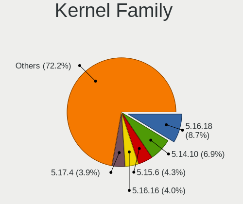
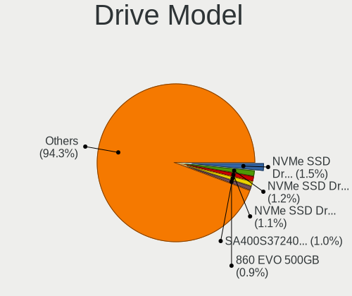
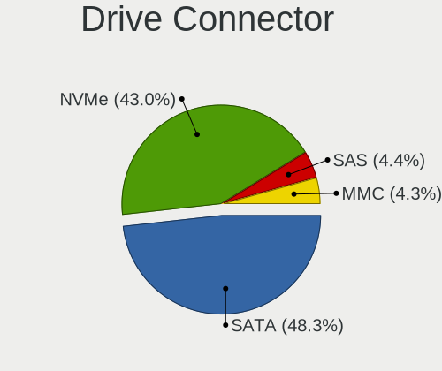
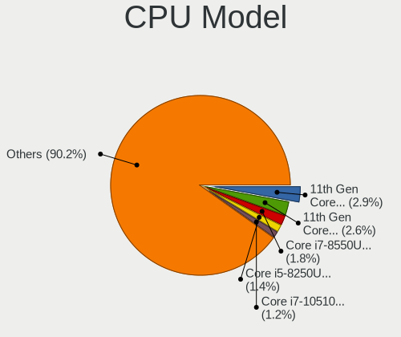
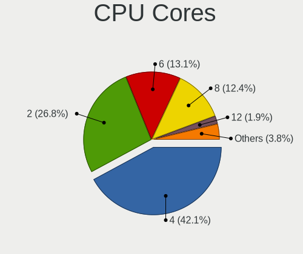
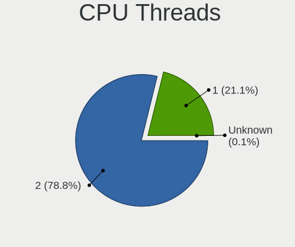
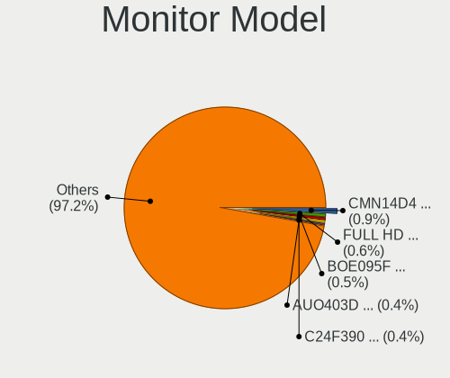
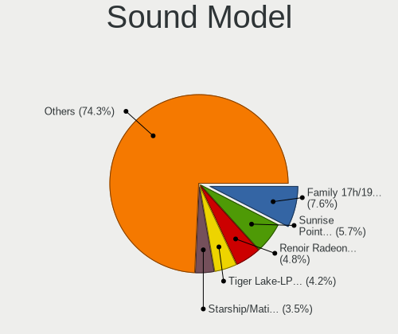

Fedora 35 - Tested Hardware & Statistics
----------------------------------------

A project to collect tested hardware configurations for Fedora 35.

Anyone can contribute to this report by the [hw-probe](https://github.com/linuxhw/hw-probe) tool:

    sudo -E hw-probe -all -upload

Please submit a probe of your configuration if it's not presented on the page or is rare.

This is a report for all computer types. See also reports for [desktops](/Dist/Fedora_35/Desktop/README.md) and [notebooks](/Dist/Fedora_35/Notebook/README.md).

Full-feature report is available here: https://linux-hardware.org/?view=trends&rel=fedora-35

Contents
--------

* [ Test Cases ](#test-cases)

* [ System ](#system)
  - [ Kernel                   ](#kernel)
  - [ Kernel Family            ](#kernel-family)
  - [ Kernel Major Ver.        ](#kernel-major-ver)
  - [ Arch                     ](#arch)
  - [ DE                       ](#de)
  - [ Display Server           ](#display-server)
  - [ Display Manager          ](#display-manager)
  - [ OS Lang                  ](#os-lang)
  - [ Boot Mode                ](#boot-mode)
  - [ Filesystem               ](#filesystem)
  - [ Part. scheme             ](#part-scheme)
  - [ Dual Boot with Linux/BSD ](#dual-boot-with-linuxbsd)
  - [ Dual Boot (Win)          ](#dual-boot-win)

* [ Board ](#board)
  - [ Vendor                   ](#vendor)
  - [ Model                    ](#model)
  - [ Model Family             ](#model-family)
  - [ MFG Year                 ](#mfg-year)
  - [ Form Factor              ](#form-factor)
  - [ Secure Boot              ](#secure-boot)
  - [ Coreboot                 ](#coreboot)
  - [ RAM Size                 ](#ram-size)
  - [ RAM Used                 ](#ram-used)
  - [ Total Drives             ](#total-drives)
  - [ Has CD-ROM               ](#has-cd-rom)
  - [ Has Ethernet             ](#has-ethernet)
  - [ Has WiFi                 ](#has-wifi)
  - [ Has Bluetooth            ](#has-bluetooth)

* [ Location ](#location)
  - [ Country                  ](#country)
  - [ City                     ](#city)

* [ Drives ](#drives)
  - [ Drive Vendor             ](#drive-vendor)
  - [ Drive Model              ](#drive-model)
  - [ HDD Vendor               ](#hdd-vendor)
  - [ SSD Vendor               ](#ssd-vendor)
  - [ Drive Kind               ](#drive-kind)
  - [ Drive Connector          ](#drive-connector)
  - [ Drive Size               ](#drive-size)
  - [ Space Total              ](#space-total)
  - [ Space Used               ](#space-used)
  - [ Malfunc. Drives          ](#malfunc-drives)
  - [ Malfunc. Drive Vendor    ](#malfunc-drive-vendor)
  - [ Malfunc. HDD Vendor      ](#malfunc-hdd-vendor)
  - [ Malfunc. Drive Kind      ](#malfunc-drive-kind)
  - [ Failed Drives            ](#failed-drives)
  - [ Failed Drive Vendor      ](#failed-drive-vendor)
  - [ Drive Status             ](#drive-status)

* [ Storage controller ](#storage-controller)
  - [ Storage Vendor           ](#storage-vendor)
  - [ Storage Model            ](#storage-model)
  - [ Storage Kind             ](#storage-kind)

* [ Processor ](#processor)
  - [ CPU Vendor               ](#cpu-vendor)
  - [ CPU Model                ](#cpu-model)
  - [ CPU Model Family         ](#cpu-model-family)
  - [ CPU Cores                ](#cpu-cores)
  - [ CPU Sockets              ](#cpu-sockets)
  - [ CPU Threads              ](#cpu-threads)
  - [ CPU Op-Modes             ](#cpu-op-modes)
  - [ CPU Microcode            ](#cpu-microcode)
  - [ CPU Microarch            ](#cpu-microarch)

* [ Graphics ](#graphics)
  - [ GPU Vendor               ](#gpu-vendor)
  - [ GPU Model                ](#gpu-model)
  - [ GPU Combo                ](#gpu-combo)
  - [ GPU Driver               ](#gpu-driver)
  - [ GPU Memory               ](#gpu-memory)

* [ Monitor ](#monitor)
  - [ Monitor Vendor           ](#monitor-vendor)
  - [ Monitor Model            ](#monitor-model)
  - [ Monitor Resolution       ](#monitor-resolution)
  - [ Monitor Diagonal         ](#monitor-diagonal)
  - [ Monitor Width            ](#monitor-width)
  - [ Aspect Ratio             ](#aspect-ratio)
  - [ Monitor Area             ](#monitor-area)
  - [ Pixel Density            ](#pixel-density)
  - [ Multiple Monitors        ](#multiple-monitors)

* [ Network ](#network)
  - [ Net Controller Vendor    ](#net-controller-vendor)
  - [ Net Controller Model     ](#net-controller-model)
  - [ Wireless Vendor          ](#wireless-vendor)
  - [ Wireless Model           ](#wireless-model)
  - [ Ethernet Vendor          ](#ethernet-vendor)
  - [ Ethernet Model           ](#ethernet-model)
  - [ Net Controller Kind      ](#net-controller-kind)
  - [ Used Controller          ](#used-controller)
  - [ NICs                     ](#nics)
  - [ IPv6                     ](#ipv6)

* [ Bluetooth ](#bluetooth)
  - [ Bluetooth Vendor         ](#bluetooth-vendor)
  - [ Bluetooth Model          ](#bluetooth-model)

* [ Sound ](#sound)
  - [ Sound Vendor             ](#sound-vendor)
  - [ Sound Model              ](#sound-model)

* [ Memory ](#memory)
  - [ Memory Vendor            ](#memory-vendor)
  - [ Memory Model             ](#memory-model)
  - [ Memory Kind              ](#memory-kind)
  - [ Memory Form Factor       ](#memory-form-factor)
  - [ Memory Size              ](#memory-size)
  - [ Memory Speed             ](#memory-speed)

* [ Printers & scanners ](#printers--scanners)
  - [ Printer Vendor           ](#printer-vendor)
  - [ Printer Model            ](#printer-model)
  - [ Scanner Vendor           ](#scanner-vendor)
  - [ Scanner Model            ](#scanner-model)

* [ Camera ](#camera)
  - [ Camera Vendor            ](#camera-vendor)
  - [ Camera Model             ](#camera-model)

* [ Security ](#security)
  - [ Fingerprint Vendor       ](#fingerprint-vendor)
  - [ Fingerprint Model        ](#fingerprint-model)
  - [ Chipcard Vendor          ](#chipcard-vendor)
  - [ Chipcard Model           ](#chipcard-model)

* [ Unsupported ](#unsupported)
  - [ Unsupported Devices      ](#unsupported-devices)
  - [ Unsupported Device Types ](#unsupported-device-types)

Test Cases
----------

| Vendor    | Model                       | Form-Factor | Probe                                                      | Date         |
|-----------|-----------------------------|-------------|------------------------------------------------------------|--------------|
| ASUSTek   | G71V                        | Notebook    | [7904b934a4](https://linux-hardware.org/?probe=7904b934a4) | Sep 09, 2021 |
| Dell      | XPS 13 9310 2-in-1          | Convertible | [2766de5f8a](https://linux-hardware.org/?probe=2766de5f8a) | Sep 08, 2021 |
| Lenovo    | ThinkPad X1 Carbon Gen 8... | Notebook    | [2b21ef140a](https://linux-hardware.org/?probe=2b21ef140a) | Sep 05, 2021 |
| Lenovo    | ThinkPad P51s 20HBCTO1WW    | Notebook    | [e2f22f9f40](https://linux-hardware.org/?probe=e2f22f9f40) | Aug 27, 2021 |
| Dell      | 0WMJ54 A01                  | Desktop     | [3231b34d4d](https://linux-hardware.org/?probe=3231b34d4d) | Aug 24, 2021 |
| Dell      | Latitude E5470              | Notebook    | [ac04ecb1e5](https://linux-hardware.org/?probe=ac04ecb1e5) | Aug 22, 2021 |
| Dell      | 0WMJ54 A01                  | Desktop     | [a94ad8a323](https://linux-hardware.org/?probe=a94ad8a323) | Aug 22, 2021 |
| AZW       | GK mini                     | Mini pc     | [995cc09b8d](https://linux-hardware.org/?probe=995cc09b8d) | Aug 22, 2021 |
| AZW       | GK mini                     | Mini pc     | [2024a6712e](https://linux-hardware.org/?probe=2024a6712e) | Aug 22, 2021 |
| Dell      | XPS 15 9550                 | Notebook    | [0a28b37020](https://linux-hardware.org/?probe=0a28b37020) | Aug 15, 2021 |
| Acer      | Aspire A315-42              | Notebook    | [4a54197130](https://linux-hardware.org/?probe=4a54197130) | Aug 15, 2021 |
| Acer      | Aspire ES1-572              | Notebook    | [06ddc49173](https://linux-hardware.org/?probe=06ddc49173) | Aug 13, 2021 |
| Dell      | XPS 15 9570                 | Notebook    | [f20e1ba8fe](https://linux-hardware.org/?probe=f20e1ba8fe) | Aug 13, 2021 |
| Dell      | XPS 13 9380                 | Notebook    | [1c3776f221](https://linux-hardware.org/?probe=1c3776f221) | Aug 13, 2021 |
| Lenovo    | IdeaPad 530S-14IKB 81EU     | Notebook    | [ab00a7e359](https://linux-hardware.org/?probe=ab00a7e359) | Aug 13, 2021 |
| HP        | 8055                        | Desktop     | [29f5b9a7ab](https://linux-hardware.org/?probe=29f5b9a7ab) | Aug 12, 2021 |
| Dell      | 0KC9NP A01                  | Desktop     | [142e0703fb](https://linux-hardware.org/?probe=142e0703fb) | Aug 12, 2021 |
| Dell      | 0KC9NP A01                  | Desktop     | [f48bc9ac9d](https://linux-hardware.org/?probe=f48bc9ac9d) | Aug 07, 2021 |
| Notebook  | P377SM-A                    | Notebook    | [be5397dd67](https://linux-hardware.org/?probe=be5397dd67) | Aug 05, 2021 |
| HUAWEI    | KLVL-WXX9                   | Notebook    | [d677af1f50](https://linux-hardware.org/?probe=d677af1f50) | Aug 02, 2021 |
| ASUSTek   | Maximus V FORMULA           | Desktop     | [466ef3bd27](https://linux-hardware.org/?probe=466ef3bd27) | Jul 29, 2021 |
| Dell      | 0KC9NP A01                  | Desktop     | [7dcd16d3fd](https://linux-hardware.org/?probe=7dcd16d3fd) | Jul 14, 2021 |
| Dell      | 0KC9NP A01                  | Desktop     | [eedd464065](https://linux-hardware.org/?probe=eedd464065) | Jul 14, 2021 |
| HUAWEI    | KLVL-WXX9                   | Notebook    | [66c25f9637](https://linux-hardware.org/?probe=66c25f9637) | Jul 10, 2021 |
| Dell      | 0KC9NP A01                  | Desktop     | [8d1e68aad0](https://linux-hardware.org/?probe=8d1e68aad0) | Jul 07, 2021 |
| Dell      | 0KC9NP A01                  | Desktop     | [852a8a103d](https://linux-hardware.org/?probe=852a8a103d) | Jul 04, 2021 |
| Dell      | 0KC9NP A01                  | Desktop     | [3a0ca9b90c](https://linux-hardware.org/?probe=3a0ca9b90c) | Jul 01, 2021 |
| Dell      | 0KC9NP A01                  | Desktop     | [3ed1ee1f81](https://linux-hardware.org/?probe=3ed1ee1f81) | Jun 25, 2021 |
| Dell      | 0KC9NP A01                  | Desktop     | [f611d9ec88](https://linux-hardware.org/?probe=f611d9ec88) | Jun 23, 2021 |
| ASUSTek   | Maximus V FORMULA           | Desktop     | [95ba18d5da](https://linux-hardware.org/?probe=95ba18d5da) | Jun 23, 2021 |
| Dell      | 0KC9NP A01                  | Desktop     | [511e8019e0](https://linux-hardware.org/?probe=511e8019e0) | Jun 19, 2021 |
| Dell      | 0KC9NP A01                  | Desktop     | [6687380bd7](https://linux-hardware.org/?probe=6687380bd7) | Jun 18, 2021 |
| Gigabyte  | F2A88XN-WIFI                | Desktop     | [c22e6d8669](https://linux-hardware.org/?probe=c22e6d8669) | May 25, 2021 |
| ASUSTek   | Maximus V FORMULA           | Desktop     | [3e15dd7136](https://linux-hardware.org/?probe=3e15dd7136) | May 19, 2021 |
| Notebook  | P377SM-A                    | Notebook    | [bf37a519fa](https://linux-hardware.org/?probe=bf37a519fa) | May 17, 2021 |
| Notebook  | P377SM-A                    | Notebook    | [0834d4df8b](https://linux-hardware.org/?probe=0834d4df8b) | May 16, 2021 |
| Microsoft | Surface Pro                 | Tablet      | [7a294509de](https://linux-hardware.org/?probe=7a294509de) | May 15, 2021 |
| Microsoft | Surface Pro                 | Tablet      | [4238374bcc](https://linux-hardware.org/?probe=4238374bcc) | Apr 26, 2021 |
| HP        | Pavilion x360 Convertibl... | Convertible | [89892d4957](https://linux-hardware.org/?probe=89892d4957) | Apr 18, 2021 |
| HP        | Pavilion x360 Convertibl... | Convertible | [97c124c8a3](https://linux-hardware.org/?probe=97c124c8a3) | Apr 18, 2021 |
| ECS       | MCP61M-M3                   | Desktop     | [2e5b21af19](https://linux-hardware.org/?probe=2e5b21af19) | Apr 17, 2021 |
| ASUSTek   | PRIME X570-PRO              | Desktop     | [3f7cbcea74](https://linux-hardware.org/?probe=3f7cbcea74) | Apr 14, 2021 |
| Lenovo    | ThinkPad W541 20EF000UMN    | Notebook    | [f366b44668](https://linux-hardware.org/?probe=f366b44668) | Apr 11, 2021 |
| HP        | Pavilion x360 Convertibl... | Convertible | [c0901f4607](https://linux-hardware.org/?probe=c0901f4607) | Mar 29, 2021 |
| HUAWEI    | BOHK-WAX9X                  | Notebook    | [31475604b7](https://linux-hardware.org/?probe=31475604b7) | Mar 12, 2021 |
| HUAWEI    | BOHK-WAX9X                  | Notebook    | [151d163eb9](https://linux-hardware.org/?probe=151d163eb9) | Mar 12, 2021 |
| HUAWEI    | BOHK-WAX9X                  | Notebook    | [4b33f82ac0](https://linux-hardware.org/?probe=4b33f82ac0) | Mar 06, 2021 |

System
------

Kernel
------

Version of the Linux kernel

| Version                                              | Computers | Percent |
|------------------------------------------------------|-----------|---------|
| 5.14.0-0.rc5.42.fc35.x86_64                          | 5         | 15.63%  |
| 5.14.0-0.rc6.46.fc35.x86_64                          | 3         | 9.38%   |
| 5.12.0-0.rc7.189.fc35.x86_64                         | 2         | 6.25%   |
| 5.14.1-300.fc35.x86_64                               | 1         | 3.13%   |
| 5.14.0-60.fc35.x86_64                                | 1         | 3.13%   |
| 5.14.0-0.rc4.20210804gitd5ad8ec3cfb5.36.fc35.x86_64  | 1         | 3.13%   |
| 5.14.0-0.rc3.20210728git4010a528219e.32.fc35.x86_64  | 1         | 3.13%   |
| 5.14.0-0.rc0.20210701gitdbe69e433722.6.fc35.x86_64   | 1         | 3.13%   |
| 5.13.7-200.fc34.x86_64                               | 1         | 3.13%   |
| 5.13.4-200.fc34.x86_64                               | 1         | 3.13%   |
| 5.13.0-58.fc35.x86_64                                | 1         | 3.13%   |
| 5.13.0-0.rc7.20210623git0c18f29aae7c.53.fc35.x86_64  | 1         | 3.13%   |
| 5.13.0-0.rc6.45.fc35.x86_64                          | 1         | 3.13%   |
| 5.13.0-0.rc2.20210521git79a106fc6585.22.fc35.x86_64  | 1         | 3.13%   |
| 5.13.0-0.rc2.19.fc35.x86_64                          | 1         | 3.13%   |
| 5.13.0-0.rc1.20210513gitc06a2ba62fc4.15.fc35.x86_64  | 1         | 3.13%   |
| 5.13.0-0.rc1.13.fc35.x86_64                          | 1         | 3.13%   |
| 5.12.8-300.fc34.x86_64                               | 1         | 3.13%   |
| 5.12.0-0.rc8.20210423git7af08140979a.193.fc35.x86_64 | 1         | 3.13%   |
| 5.12.0-0.rc8.191.fc35.x86_64                         | 1         | 3.13%   |
| 5.12.0-0.rc7.20210416git7e25f40eab52.191.fc35.x86_64 | 1         | 3.13%   |
| 5.12.0-0.rc6.20210408git454859c552da.186.fc35.x86_64 | 1         | 3.13%   |
| 5.12.0-0.rc4.20210326gitdb24726bfefa.178.fc35.x86_64 | 1         | 3.13%   |
| 5.12.0-0.rc1.162.fc35.x86_64                         | 1         | 3.13%   |
| 5.11.18-300.fc34.x86_64                              | 1         | 3.13%   |

Kernel Family
-------------

Linux kernel without a distro release

| Version | Computers | Percent |
|---------|-----------|---------|
| 5.14.0  | 11        | 40.74%  |
| 5.12.0  | 7         | 25.93%  |
| 5.13.0  | 4         | 14.81%  |
| 5.14.1  | 1         | 3.7%    |
| 5.13.7  | 1         | 3.7%    |
| 5.13.4  | 1         | 3.7%    |
| 5.12.8  | 1         | 3.7%    |
| 5.11.18 | 1         | 3.7%    |

Kernel Major Ver.
-----------------

Linux kernel major version

| Version | Computers | Percent |
|---------|-----------|---------|
| 5.14    | 12        | 44.44%  |
| 5.12    | 8         | 29.63%  |
| 5.13    | 6         | 22.22%  |
| 5.11    | 1         | 3.7%    |

Arch
----

OS architecture (x86_64, i586, etc.)

| Name   | Computers | Percent |
|--------|-----------|---------|
| x86_64 | 26        | 100%    |

DE
--

Desktop Environment

| Name    | Computers | Percent |
|---------|-----------|---------|
| GNOME   | 18        | 66.67%  |
| KDE     | 5         | 18.52%  |
| MATE    | 3         | 11.11%  |
| Unknown | 1         | 3.7%    |

Display Server
--------------

X11 or Wayland

| Name    | Computers | Percent |
|---------|-----------|---------|
| Wayland | 18        | 69.23%  |
| X11     | 6         | 23.08%  |
| Tty     | 2         | 7.69%   |

Display Manager
---------------

SDDM, LightDM, etc.

| Name    | Computers | Percent |
|---------|-----------|---------|
| GDM     | 14        | 53.85%  |
| Unknown | 9         | 34.62%  |
| LightDM | 2         | 7.69%   |
| TDM     | 1         | 3.85%   |

OS Lang
-------

Language

| Lang  | Computers | Percent |
|-------|-----------|---------|
| en_US | 18        | 66.67%  |
| ru_RU | 2         | 7.41%   |
| en_CA | 2         | 7.41%   |
| sv_SE | 1         | 3.7%    |
| pl_PL | 1         | 3.7%    |
| es_ES | 1         | 3.7%    |
| es_CL | 1         | 3.7%    |
| en_GB | 1         | 3.7%    |

Boot Mode
---------

EFI or BIOS

| Mode | Computers | Percent |
|------|-----------|---------|
| EFI  | 23        | 88.46%  |
| BIOS | 3         | 11.54%  |

Filesystem
----------

Type of filesystem

| Type  | Computers | Percent |
|-------|-----------|---------|
| Ext4  | 13        | 48.15%  |
| Btrfs | 12        | 44.44%  |
| Xfs   | 2         | 7.41%   |

Part. scheme
------------

Scheme of partitioning

| Type    | Computers | Percent |
|---------|-----------|---------|
| GPT     | 17        | 62.96%  |
| Unknown | 8         | 29.63%  |
| MBR     | 2         | 7.41%   |

Dual Boot with Linux/BSD
------------------------

Hosting more than one Linux/BSD

| Dual boot | Computers | Percent |
|-----------|-----------|---------|
| No        | 19        | 67.86%  |
| Yes       | 9         | 32.14%  |

Dual Boot (Win)
---------------

Hosting Linux and Windows

| Dual boot | Computers | Percent |
|-----------|-----------|---------|
| No        | 22        | 78.57%  |
| Yes       | 6         | 21.43%  |

Board
-----

Vendor
------

Motherboard manufacturer

| Name                | Computers | Percent |
|---------------------|-----------|---------|
| Dell                | 7         | 26.92%  |
| Lenovo              | 4         | 15.38%  |
| Hewlett-Packard     | 3         | 11.54%  |
| ASUSTek Computer    | 3         | 11.54%  |
| HUAWEI              | 2         | 7.69%   |
| Acer                | 2         | 7.69%   |
| Notebook            | 1         | 3.85%   |
| Microsoft           | 1         | 3.85%   |
| Gigabyte Technology | 1         | 3.85%   |
| ECS                 | 1         | 3.85%   |
| AZW                 | 1         | 3.85%   |

Model
-----

Motherboard model

| Name                                       | Computers | Percent |
|--------------------------------------------|-----------|---------|
| Notebook P377SM-A                          | 1         | 3.85%   |
| Microsoft Surface Pro                      | 1         | 3.85%   |
| Lenovo ThinkPad X1 Carbon Gen 8 20U9CTO1WW | 1         | 3.85%   |
| Lenovo ThinkPad W541 20EF000UMN            | 1         | 3.85%   |
| Lenovo ThinkPad P51s 20HBCTO1WW            | 1         | 3.85%   |
| Lenovo IdeaPad 530S-14IKB 81EU             | 1         | 3.85%   |
| HUAWEI KLVL-WXX9                           | 1         | 3.85%   |
| HUAWEI BOHK-WAX9X                          | 1         | 3.85%   |
| HP Pavilion x360 Convertible 15-cr0xxx     | 1         | 3.85%   |
| HP Pavilion x360 Convertible 14-dh0xxx     | 1         | 3.85%   |
| HP EliteDesk 800 G2 DM 35W                 | 1         | 3.85%   |
| Gigabyte F2A88XN-WIFI                      | 1         | 3.85%   |
| ECS MCP61M-M3                              | 1         | 3.85%   |
| Dell XPS 15 9570                           | 1         | 3.85%   |
| Dell XPS 15 9550                           | 1         | 3.85%   |
| Dell XPS 13 9380                           | 1         | 3.85%   |
| Dell XPS 13 9310 2-in-1                    | 1         | 3.85%   |
| Dell OptiPlex 9020                         | 1         | 3.85%   |
| Dell OptiPlex 3020                         | 1         | 3.85%   |
| Dell Latitude E5470                        | 1         | 3.85%   |
| AZW GK mini                                | 1         | 3.85%   |
| ASUS PRIME X570-PRO                        | 1         | 3.85%   |
| ASUS Maximus V FORMULA                     | 1         | 3.85%   |
| ASUS G71V                                  | 1         | 3.85%   |
| Acer Aspire ES1-572                        | 1         | 3.85%   |
| Acer Aspire A315-42                        | 1         | 3.85%   |

Model Family
------------

Motherboard model prefix

| Name                  | Computers | Percent |
|-----------------------|-----------|---------|
| Dell XPS              | 4         | 15.38%  |
| Lenovo ThinkPad       | 3         | 11.54%  |
| HP Pavilion           | 2         | 7.69%   |
| Dell OptiPlex         | 2         | 7.69%   |
| Acer Aspire           | 2         | 7.69%   |
| Notebook P377SM-A     | 1         | 3.85%   |
| Microsoft Surface     | 1         | 3.85%   |
| Lenovo IdeaPad        | 1         | 3.85%   |
| HUAWEI KLVL-WXX9      | 1         | 3.85%   |
| HUAWEI BOHK-WAX9X     | 1         | 3.85%   |
| HP EliteDesk          | 1         | 3.85%   |
| Gigabyte F2A88XN-WIFI | 1         | 3.85%   |
| ECS MCP61M-M3         | 1         | 3.85%   |
| Dell Latitude         | 1         | 3.85%   |
| AZW GK                | 1         | 3.85%   |
| ASUS PRIME            | 1         | 3.85%   |
| ASUS Maximus          | 1         | 3.85%   |
| ASUS G71V             | 1         | 3.85%   |

MFG Year
--------

Motherboard manufacture year

| Year | Computers | Percent |
|------|-----------|---------|
| 2020 | 9         | 34.62%  |
| 2021 | 5         | 19.23%  |
| 2019 | 5         | 19.23%  |
| 2015 | 3         | 11.54%  |
| 2018 | 1         | 3.85%   |
| 2013 | 1         | 3.85%   |
| 2010 | 1         | 3.85%   |
| 2008 | 1         | 3.85%   |

Form Factor
-----------

Physical design of the computer

| Name        | Computers | Percent |
|-------------|-----------|---------|
| Notebook    | 14        | 53.85%  |
| Desktop     | 7         | 26.92%  |
| Convertible | 3         | 11.54%  |
| Tablet      | 1         | 3.85%   |
| Mini pc     | 1         | 3.85%   |

Secure Boot
-----------

Enabled or disabled

| State    | Computers | Percent |
|----------|-----------|---------|
| Disabled | 21        | 77.78%  |
| Enabled  | 6         | 22.22%  |

Coreboot
--------

Have coreboot on board

| Used | Computers | Percent |
|------|-----------|---------|
| No   | 26        | 100%    |

RAM Size
--------

Total RAM memory

| Size in GB | Computers | Percent |
|------------|-----------|---------|
| 4.01-8.0   | 11        | 40.74%  |
| 16.01-24.0 | 5         | 18.52%  |
| 8.01-16.0  | 5         | 18.52%  |
| 32.01-64.0 | 3         | 11.11%  |
| 3.01-4.0   | 3         | 11.11%  |

RAM Used
--------

Used RAM memory

| Used GB  | Computers | Percent |
|----------|-----------|---------|
| 2.01-3.0 | 11        | 36.67%  |
| 3.01-4.0 | 9         | 30%     |
| 1.01-2.0 | 6         | 20%     |
| 4.01-8.0 | 2         | 6.67%   |
| 0.51-1.0 | 1         | 3.33%   |
| 0.01-0.5 | 1         | 3.33%   |

Total Drives
------------

Number of drives on board

| Drives | Computers | Percent |
|--------|-----------|---------|
| 1      | 19        | 73.08%  |
| 2      | 5         | 19.23%  |
| 5      | 1         | 3.85%   |
| 4      | 1         | 3.85%   |

Has CD-ROM
----------

Has CD-ROM on board

| Presented | Computers | Percent |
|-----------|-----------|---------|
| No        | 21        | 80.77%  |
| Yes       | 5         | 19.23%  |

Has Ethernet
------------

Has Ethernet on board

| Presented | Computers | Percent |
|-----------|-----------|---------|
| Yes       | 18        | 69.23%  |
| No        | 8         | 30.77%  |

Has WiFi
--------

Has WiFi module

| Presented | Computers | Percent |
|-----------|-----------|---------|
| Yes       | 23        | 88.46%  |
| No        | 3         | 11.54%  |

Has Bluetooth
-------------

Has Bluetooth module

| Presented | Computers | Percent |
|-----------|-----------|---------|
| Yes       | 20        | 76.92%  |
| No        | 6         | 23.08%  |

Location
--------

Country
-------

Geographic location (country)

| Country     | Computers | Percent |
|-------------|-----------|---------|
| USA         | 8         | 30.77%  |
| Canada      | 3         | 11.54%  |
| Brazil      | 2         | 7.69%   |
| Turkey      | 1         | 3.85%   |
| Switzerland | 1         | 3.85%   |
| Sweden      | 1         | 3.85%   |
| Spain       | 1         | 3.85%   |
| Russia      | 1         | 3.85%   |
| Poland      | 1         | 3.85%   |
| Netherlands | 1         | 3.85%   |
| Japan       | 1         | 3.85%   |
| India       | 1         | 3.85%   |
| Hong Kong   | 1         | 3.85%   |
| Germany     | 1         | 3.85%   |
| Chile       | 1         | 3.85%   |
| Belarus     | 1         | 3.85%   |

City
----

Geographic location (city)

| City           | Computers | Percent |
|----------------|-----------|---------|
| Yakima         | 2         | 7.14%   |
| Laurel         | 2         | 7.14%   |
| Zurich         | 1         | 3.57%   |
| Wroclaw        | 1         | 3.57%   |
| Whittier       | 1         | 3.57%   |
| Wateringen     | 1         | 3.57%   |
| Vancouver      | 1         | 3.57%   |
| St Petersburg  | 1         | 3.57%   |
| Seattle        | 1         | 3.57%   |
| S??o Paulo     | 1         | 3.57%   |
| Salt Lake City | 1         | 3.57%   |
| Raesfeld       | 1         | 3.57%   |
| Porto Ferreira | 1         | 3.57%   |
| Owatonna       | 1         | 3.57%   |
| Osaka          | 1         | 3.57%   |
| Montreal       | 1         | 3.57%   |
| Minsk          | 1         | 3.57%   |
| Miami          | 1         | 3.57%   |
| Madrid         | 1         | 3.57%   |
| La Florida     | 1         | 3.57%   |
| Kwu Tung       | 1         | 3.57%   |
| Istanbul       | 1         | 3.57%   |
| Handen         | 1         | 3.57%   |
| Concord        | 1         | 3.57%   |
| Bolszewo       | 1         | 3.57%   |
| Bengaluru      | 1         | 3.57%   |

Drives
------

Drive Vendor
------------

Hard drive vendors

| Vendor              | Computers | Drives | Percent |
|---------------------|-----------|--------|---------|
| WDC                 | 7         | 10     | 20%     |
| Samsung Electronics | 7         | 18     | 20%     |
| Unknown             | 3         | 3      | 8.57%   |
| Toshiba             | 3         | 3      | 8.57%   |
| SanDisk             | 3         | 4      | 8.57%   |
| SK Hynix            | 2         | 3      | 5.71%   |
| Seagate             | 2         | 7      | 5.71%   |
| LITEON              | 2         | 2      | 5.71%   |
| SUNEAST             | 1         | 1      | 2.86%   |
| SABRENT             | 1         | 1      | 2.86%   |
| Micron Technology   | 1         | 1      | 2.86%   |
| KIOXIA              | 1         | 1      | 2.86%   |
| Kingston            | 1         | 1      | 2.86%   |
| ASMT                | 1         | 1      | 2.86%   |

Drive Model
-----------

Hard drive models

| Model                                   | Computers | Percent |
|-----------------------------------------|-----------|---------|
| Sandisk NVMe SSD Drive 256GB            | 2         | 5.26%   |
| WDC WDS240G2G0B-00EPW0 240GB SSD        | 1         | 2.63%   |
| WDC WDS240G2G0A-00JH30 240GB SSD        | 1         | 2.63%   |
| WDC WD5000LPLX-08ZNTT0 500GB            | 1         | 2.63%   |
| WDC WD30EZRX-00MMMB0 3TB                | 1         | 2.63%   |
| WDC WD10SPZX-21Z10T0 1TB                | 1         | 2.63%   |
| WDC PC SN730 SDBPNTY-512G-1027 512GB    | 1         | 2.63%   |
| WDC PC SN730 SDBPNTY-256G-1027 256GB    | 1         | 2.63%   |
| Unknown SSD0240S00 240GB                | 1         | 2.63%   |
| Unknown SD256  249GB                    | 1         | 2.63%   |
| Unknown M.2 SSD 256GB                   | 1         | 2.63%   |
| Toshiba MG05ACA800E 8TB                 | 1         | 2.63%   |
| Toshiba KXG60ZNV256G NVMe 256GB         | 1         | 2.63%   |
| Toshiba KXG50ZNV512G NVMe 512GB         | 1         | 2.63%   |
| SUNEAST SSD SE800 256GB                 | 1         | 2.63%   |
| SK Hynix NVMe SSD Drive 256GB           | 1         | 2.63%   |
| SK Hynix HFM256GDJTNG-8310A 256GB       | 1         | 2.63%   |
| SK Hynix BC501 HFM256GDJTNG-8310A 256GB | 1         | 2.63%   |
| Seagate ST3500630AS 500GB               | 1         | 2.63%   |
| Seagate ST3000DM001-1CH166 3TB          | 1         | 2.63%   |
| Seagate ST2000DM008-2FR102 2TB          | 1         | 2.63%   |
| SanDisk SDSSDH3512G 512GB               | 1         | 2.63%   |
| Samsung SSD 860 EVO 250GB               | 1         | 2.63%   |
| Samsung SSD 860 EVO 1TB                 | 1         | 2.63%   |
| Samsung SSD 850 PRO 1TB                 | 1         | 2.63%   |
| Samsung SSD 850 EVO mSATA 1TB           | 1         | 2.63%   |
| Samsung SSD 840 EVO 250GB               | 1         | 2.63%   |
| Samsung NVMe SSD Drive 500GB            | 1         | 2.63%   |
| Samsung MZVLW256HEHP-000L7 256GB        | 1         | 2.63%   |
| Samsung KUS020203M-B000 128GB           | 1         | 2.63%   |
| SABRENT ASM1153E 512GB                  | 1         | 2.63%   |
| Micron 1100_MTFDDAV256TBN 256GB SSD     | 1         | 2.63%   |
| LITEON CX2-8B256-Q11 NVMe 256GB         | 1         | 2.63%   |
| LITEON CV8-8E128-HP 128GB SSD           | 1         | 2.63%   |
| KIOXIA KBG40ZPZ512G NVMe 512GB          | 1         | 2.63%   |
| Kingston SA400S37480G 480GB SSD         | 1         | 2.63%   |
| ASMT ASM105x 400GB SSD                  | 1         | 2.63%   |

HDD Vendor
----------

Hard disk drive vendors

| Vendor  | Computers | Drives | Percent |
|---------|-----------|--------|---------|
| WDC     | 3         | 5      | 50%     |
| Seagate | 2         | 7      | 33.33%  |
| Toshiba | 1         | 1      | 16.67%  |

SSD Vendor
----------

Solid state drive vendors

| Vendor              | Computers | Drives | Percent |
|---------------------|-----------|--------|---------|
| Samsung Electronics | 4         | 14     | 26.67%  |
| WDC                 | 2         | 2      | 13.33%  |
| Unknown             | 2         | 2      | 13.33%  |
| SUNEAST             | 1         | 1      | 6.67%   |
| SanDisk             | 1         | 2      | 6.67%   |
| SABRENT             | 1         | 1      | 6.67%   |
| Micron Technology   | 1         | 1      | 6.67%   |
| LITEON              | 1         | 1      | 6.67%   |
| Kingston            | 1         | 1      | 6.67%   |
| ASMT                | 1         | 1      | 6.67%   |

Drive Kind
----------

HDD or SSD

| Kind | Computers | Drives | Percent |
|------|-----------|--------|---------|
| NVMe | 12        | 16     | 40%     |
| SSD  | 12        | 26     | 40%     |
| HDD  | 5         | 13     | 16.67%  |
| MMC  | 1         | 1      | 3.33%   |

Drive Connector
---------------

SATA, SAS, NVMe, etc.

| Type | Computers | Drives | Percent |
|------|-----------|--------|---------|
| SATA | 15        | 37     | 50%     |
| NVMe | 12        | 16     | 40%     |
| SAS  | 2         | 2      | 6.67%   |
| MMC  | 1         | 1      | 3.33%   |

Drive Size
----------

Size of hard drive

| Size in TB | Computers | Drives | Percent |
|------------|-----------|--------|---------|
| 0.01-0.5   | 11        | 18     | 57.89%  |
| 0.51-1.0   | 4         | 9      | 21.05%  |
| 1.01-2.0   | 2         | 5      | 10.53%  |
| 2.01-3.0   | 1         | 6      | 5.26%   |
| 4.01-10.0  | 1         | 1      | 5.26%   |

Space Total
-----------

Amount of disk space available on the file system

| Size in GB | Computers | Percent |
|------------|-----------|---------|
| 1-20       | 8         | 28.57%  |
| 101-250    | 7         | 25%     |
| 251-500    | 6         | 21.43%  |
| 501-1000   | 2         | 7.14%   |
| 51-100     | 2         | 7.14%   |
| 21-50      | 1         | 3.57%   |
| 2001-3000  | 1         | 3.57%   |
| 1001-2000  | 1         | 3.57%   |

Space Used
----------

Amount of used disk space

| Used GB   | Computers | Percent |
|-----------|-----------|---------|
| 1-20      | 14        | 51.85%  |
| 21-50     | 5         | 18.52%  |
| 251-500   | 2         | 7.41%   |
| 101-250   | 2         | 7.41%   |
| 51-100    | 2         | 7.41%   |
| 1001-2000 | 1         | 3.7%    |
| 501-1000  | 1         | 3.7%    |

Malfunc. Drives
---------------

Drive models with a malfunction

| Model                         | Computers | Drives | Percent |
|-------------------------------|-----------|--------|---------|
| WDC WD30EZRX-00MMMB0 3TB      | 1         | 1      | 33.33%  |
| Seagate ST3500630AS 500GB     | 1         | 1      | 33.33%  |
| LITEON CV8-8E128-HP 128GB SSD | 1         | 1      | 33.33%  |

Malfunc. Drive Vendor
---------------------

Vendors of faulty drives

| Vendor  | Computers | Drives | Percent |
|---------|-----------|--------|---------|
| WDC     | 1         | 1      | 33.33%  |
| Seagate | 1         | 1      | 33.33%  |
| LITEON  | 1         | 1      | 33.33%  |

Malfunc. HDD Vendor
-------------------

Vendors of faulty HDD drives

| Vendor  | Computers | Drives | Percent |
|---------|-----------|--------|---------|
| WDC     | 1         | 1      | 50%     |
| Seagate | 1         | 1      | 50%     |

Malfunc. Drive Kind
-------------------

Kinds of faulty drives

| Kind | Computers | Drives | Percent |
|------|-----------|--------|---------|
| SSD  | 1         | 1      | 50%     |
| HDD  | 1         | 2      | 50%     |

Failed Drives
-------------

Failed drive models

Zero info for selected period =(

Failed Drive Vendor
-------------------

Failed drive vendors

Zero info for selected period =(

Drive Status
------------

Number of failed and malfunc. drives

| Status   | Computers | Drives | Percent |
|----------|-----------|--------|---------|
| Works    | 19        | 23     | 57.58%  |
| Detected | 12        | 30     | 36.36%  |
| Malfunc  | 2         | 3      | 6.06%   |

Storage controller
------------------

Storage Vendor
--------------

Storage controller vendors

| Vendor                       | Computers | Percent |
|------------------------------|-----------|---------|
| Intel                        | 17        | 50%     |
| Sandisk                      | 3         | 8.82%   |
| Samsung Electronics          | 3         | 8.82%   |
| AMD                          | 3         | 8.82%   |
| Toshiba America Info Systems | 2         | 5.88%   |
| SK Hynix                     | 2         | 5.88%   |
| Nvidia                       | 1         | 2.94%   |
| Lite-On Technology           | 1         | 2.94%   |
| KIOXIA                       | 1         | 2.94%   |
| ASMedia Technology           | 1         | 2.94%   |

Storage Model
-------------

Storage controller models

| Model                                                                            | Computers | Percent |
|----------------------------------------------------------------------------------|-----------|---------|
| Intel Sunrise Point-LP SATA Controller [AHCI mode]                               | 4         | 11.43%  |
| Sandisk WD Black SN750 / PC SN730 NVMe SSD                                       | 3         | 8.57%   |
| Intel 8 Series/C220 Series Chipset Family 6-port SATA Controller 1 [AHCI mode]   | 3         | 8.57%   |
| AMD FCH SATA Controller [AHCI mode]                                              | 3         | 8.57%   |
| SK Hynix BC501 NVMe Solid State Drive                                            | 2         | 5.71%   |
| Intel Q170/Q150/B150/H170/H110/Z170/CM236 Chipset SATA Controller [AHCI Mode]    | 2         | 5.71%   |
| Intel 82801 Mobile SATA Controller [RAID mode]                                   | 2         | 5.71%   |
| Toshiba America Info Systems XG6 NVMe SSD Controller                             | 1         | 2.86%   |
| Toshiba America Info Systems Toshiba America Info Non-Volatile memory controller | 1         | 2.86%   |
| Samsung NVMe SSD Controller SM981/PM981/PM983                                    | 1         | 2.86%   |
| Samsung NVMe SSD Controller SM961/PM961/SM963                                    | 1         | 2.86%   |
| Samsung Electronics Non-Volatile memory controller                               | 1         | 2.86%   |
| Nvidia MCP61 SATA Controller                                                     | 1         | 2.86%   |
| Nvidia MCP61 IDE                                                                 | 1         | 2.86%   |
| Lite-On Lite-On Non-Volatile memory controller                                   | 1         | 2.86%   |
| KIOXIA Non-Volatile memory controller                                            | 1         | 2.86%   |
| Intel Volume Management Device NVMe RAID Controller                              | 1         | 2.86%   |
| Intel HM170/QM170 Chipset SATA Controller [AHCI Mode]                            | 1         | 2.86%   |
| Intel Celeron/Pentium Silver Processor SATA Controller                           | 1         | 2.86%   |
| Intel Cannon Lake Mobile PCH SATA AHCI Controller                                | 1         | 2.86%   |
| Intel 82801IBM/IEM (ICH9M/ICH9M-E) 4 port SATA Controller [AHCI mode]            | 1         | 2.86%   |
| Intel 7 Series/C210 Series Chipset Family 6-port SATA Controller [AHCI mode]     | 1         | 2.86%   |
| ASMedia ASM1062 Serial ATA Controller                                            | 1         | 2.86%   |

Storage Kind
------------

Kind of storage controller (IDE, SATA, NVMe, SAS, ...)

| Kind | Computers | Percent |
|------|-----------|---------|
| SATA | 17        | 51.52%  |
| NVMe | 12        | 36.36%  |
| RAID | 3         | 9.09%   |
| IDE  | 1         | 3.03%   |

Processor
---------

CPU Vendor
----------

Processor vendors

| Vendor | Computers | Percent |
|--------|-----------|---------|
| Intel  | 20        | 76.92%  |
| AMD    | 6         | 23.08%  |

CPU Model
---------

Processor models

| Model                                           | Computers | Percent |
|-------------------------------------------------|-----------|---------|
| Intel Core i5-8250U CPU @ 1.60GHz               | 2         | 7.69%   |
| Intel Core i7-8750H CPU @ 2.20GHz               | 1         | 3.85%   |
| Intel Core i7-8565U CPU @ 1.80GHz               | 1         | 3.85%   |
| Intel Core i7-7500U CPU @ 2.70GHz               | 1         | 3.85%   |
| Intel Core i7-6700HQ CPU @ 2.60GHz              | 1         | 3.85%   |
| Intel Core i7-4910MQ CPU @ 2.90GHz              | 1         | 3.85%   |
| Intel Core i7-4810MQ CPU @ 2.80GHz              | 1         | 3.85%   |
| Intel Core i7-3770K CPU @ 3.50GHz               | 1         | 3.85%   |
| Intel Core i7-10610U CPU @ 1.80GHz              | 1         | 3.85%   |
| Intel Core i5-7300U CPU @ 2.60GHz               | 1         | 3.85%   |
| Intel Core i5-6500T CPU @ 2.50GHz               | 1         | 3.85%   |
| Intel Core i5-6440HQ CPU @ 2.60GHz              | 1         | 3.85%   |
| Intel Core i5-4590S CPU @ 3.00GHz               | 1         | 3.85%   |
| Intel Core i5-4590 CPU @ 3.30GHz                | 1         | 3.85%   |
| Intel Core i3-8145U CPU @ 2.10GHz               | 1         | 3.85%   |
| Intel Core i3-6006U CPU @ 2.00GHz               | 1         | 3.85%   |
| Intel Core 2 Duo CPU T9400 @ 2.53GHz            | 1         | 3.85%   |
| Intel Celeron J4125 CPU @ 2.00GHz               | 1         | 3.85%   |
| Intel 11th Gen Core i5-1135G7 @ 2.40GHz         | 1         | 3.85%   |
| AMD Ryzen 5 4600H with Radeon Graphics          | 1         | 3.85%   |
| AMD Ryzen 5 3600 6-Core Processor               | 1         | 3.85%   |
| AMD Ryzen 5 3500U with Radeon Vega Mobile Gfx   | 1         | 3.85%   |
| AMD Ryzen 3 3200U with Radeon Vega Mobile Gfx   | 1         | 3.85%   |
| AMD Athlon II X2 250 Processor                  | 1         | 3.85%   |
| AMD A10-7850K Radeon R7, 12 Compute Cores 4C+8G | 1         | 3.85%   |

CPU Model Family
----------------

Processor model prefix

| Model            | Computers | Percent |
|------------------|-----------|---------|
| Intel Core i7    | 8         | 30.77%  |
| Intel Core i5    | 7         | 26.92%  |
| AMD Ryzen 5      | 3         | 11.54%  |
| Intel Core i3    | 2         | 7.69%   |
| Other            | 1         | 3.85%   |
| Intel Core 2 Duo | 1         | 3.85%   |
| Intel Celeron    | 1         | 3.85%   |
| AMD Ryzen 3      | 1         | 3.85%   |
| AMD Athlon II X2 | 1         | 3.85%   |
| AMD A10          | 1         | 3.85%   |

CPU Cores
---------

Number of processor cores

| Number | Computers | Percent |
|--------|-----------|---------|
| 4      | 15        | 57.69%  |
| 2      | 8         | 30.77%  |
| 6      | 3         | 11.54%  |

CPU Sockets
-----------

Number of sockets

| Number | Computers | Percent |
|--------|-----------|---------|
| 1      | 26        | 100%    |

CPU Threads
-----------

Threads per core (Hyper-Threading)

| Number | Computers | Percent |
|--------|-----------|---------|
| 2      | 19        | 73.08%  |
| 1      | 7         | 26.92%  |

CPU Op-Modes
------------

CPU Operation Modes (32-bit, 64-bit)

| Op mode        | Computers | Percent |
|----------------|-----------|---------|
| 32-bit, 64-bit | 26        | 100%    |

CPU Microcode
-------------

Microcode number

| Number     | Computers | Percent |
|------------|-----------|---------|
| 0x306c3    | 4         | 15.38%  |
| 0x806ec    | 3         | 11.54%  |
| 0x506e3    | 3         | 11.54%  |
| 0x806ea    | 2         | 7.69%   |
| 0x806e9    | 2         | 7.69%   |
| 0x08108109 | 2         | 7.69%   |
| 0x906ea    | 1         | 3.85%   |
| 0x806c1    | 1         | 3.85%   |
| 0x706a8    | 1         | 3.85%   |
| 0x406e3    | 1         | 3.85%   |
| 0x306a9    | 1         | 3.85%   |
| 0x10676    | 1         | 3.85%   |
| 0x08701021 | 1         | 3.85%   |
| 0x08600104 | 1         | 3.85%   |
| 0x06003106 | 1         | 3.85%   |
| 0x010000b6 | 1         | 3.85%   |

CPU Microarch
-------------

Microarchitecture

| Name          | Computers | Percent |
|---------------|-----------|---------|
| KabyLake      | 8         | 30.77%  |
| Skylake       | 4         | 15.38%  |
| Haswell       | 4         | 15.38%  |
| Zen+          | 2         | 7.69%   |
| Zen 2         | 2         | 7.69%   |
| TigerLake     | 1         | 3.85%   |
| Steamroller   | 1         | 3.85%   |
| Penryn        | 1         | 3.85%   |
| K10           | 1         | 3.85%   |
| IvyBridge     | 1         | 3.85%   |
| Goldmont plus | 1         | 3.85%   |

Graphics
--------

GPU Vendor
----------

Vendors of graphics cards

| Vendor | Computers | Percent |
|--------|-----------|---------|
| Intel  | 18        | 58.06%  |
| Nvidia | 7         | 22.58%  |
| AMD    | 6         | 19.35%  |

GPU Model
---------

Graphics card models

| Model                                                                       | Computers | Percent |
|-----------------------------------------------------------------------------|-----------|---------|
| Intel HD Graphics 530                                                       | 3         | 9.68%   |
| Intel Xeon E3-1200 v3/4th Gen Core Processor Integrated Graphics Controller | 2         | 6.45%   |
| Intel WhiskeyLake-U GT2 [UHD Graphics 620]                                  | 2         | 6.45%   |
| Intel UHD Graphics 620                                                      | 2         | 6.45%   |
| Intel HD Graphics 620                                                       | 2         | 6.45%   |
| AMD Picasso                                                                 | 2         | 6.45%   |
| Nvidia GP107M [GeForce GTX 1050 Ti Mobile]                                  | 1         | 3.23%   |
| Nvidia GP104M [GeForce GTX 1070 Mobile]                                     | 1         | 3.23%   |
| Nvidia GM108GLM [Quadro M520 Mobile]                                        | 1         | 3.23%   |
| Nvidia GM107M [GeForce GTX 960M]                                            | 1         | 3.23%   |
| Nvidia GK106GLM [Quadro K2100M]                                             | 1         | 3.23%   |
| Nvidia GK104 [GeForce GTX 670]                                              | 1         | 3.23%   |
| Nvidia G96M [GeForce 9700M GT]                                              | 1         | 3.23%   |
| Intel Xeon E3-1200 v2/3rd Gen Core processor Graphics Controller            | 1         | 3.23%   |
| Intel TigerLake-LP GT2 [Iris Xe Graphics]                                   | 1         | 3.23%   |
| Intel Skylake GT2 [HD Graphics 520]                                         | 1         | 3.23%   |
| Intel GeminiLake [UHD Graphics 600]                                         | 1         | 3.23%   |
| Intel CometLake-U GT2 [UHD Graphics]                                        | 1         | 3.23%   |
| Intel CoffeeLake-H GT2 [UHD Graphics 630]                                   | 1         | 3.23%   |
| Intel 4th Gen Core Processor Integrated Graphics Controller                 | 1         | 3.23%   |
| AMD Turks PRO [Radeon HD 6570/7570/8550 / R5 230]                           | 1         | 3.23%   |
| AMD Renoir                                                                  | 1         | 3.23%   |
| AMD Kaveri [Radeon R7 Graphics]                                             | 1         | 3.23%   |
| AMD Baffin [Radeon RX 550 640SP / RX 560/560X]                              | 1         | 3.23%   |

GPU Combo
---------

Combinations of graphics cards

| Name           | Computers | Percent |
|----------------|-----------|---------|
| 1 x Intel      | 13        | 50%     |
| 1 x AMD        | 6         | 23.08%  |
| Intel + Nvidia | 4         | 15.38%  |
| 1 x Nvidia     | 3         | 11.54%  |

GPU Driver
----------

Free vs proprietary

| Driver      | Computers | Percent |
|-------------|-----------|---------|
| Free        | 24        | 88.89%  |
| Proprietary | 3         | 11.11%  |

GPU Memory
----------

Total video memory

| Size in GB | Computers | Percent |
|------------|-----------|---------|
| Unknown    | 16        | 57.14%  |
| 1.01-2.0   | 4         | 14.29%  |
| 0.01-0.5   | 3         | 10.71%  |
| 3.01-4.0   | 2         | 7.14%   |
| 0.51-1.0   | 2         | 7.14%   |
| 7.01-8.0   | 1         | 3.57%   |

Monitor
-------

Monitor Vendor
--------------

Monitor vendors

| Vendor               | Computers | Percent |
|----------------------|-----------|---------|
| AU Optronics         | 6         | 22.22%  |
| LG Display           | 4         | 14.81%  |
| Dell                 | 4         | 14.81%  |
| Sharp                | 3         | 11.11%  |
| Chimei Innolux       | 3         | 11.11%  |
| BOE                  | 2         | 7.41%   |
| AOC                  | 2         | 7.41%   |
| Hewlett-Packard      | 1         | 3.7%    |
| Goldstar             | 1         | 3.7%    |
| Ancor Communications | 1         | 3.7%    |

Monitor Model
-------------

Monitor models

| Model                                                                  | Computers | Percent |
|------------------------------------------------------------------------|-----------|---------|
| Sharp LCD Monitor SHP14F7 1920x1200 288x180mm 13.4-inch                | 1         | 3.57%   |
| Sharp LCD Monitor SHP148D 3840x2160 344x194mm 15.5-inch                | 1         | 3.57%   |
| Sharp LCD Monitor SHP1453 1920x1080 346x194mm 15.6-inch                | 1         | 3.57%   |
| LG Display LCD Monitor LGD060F 1920x1080 309x174mm 14.0-inch           | 1         | 3.57%   |
| LG Display LCD Monitor LGD05EE 2560x1440 309x174mm 14.0-inch           | 1         | 3.57%   |
| LG Display LCD Monitor LGD0555 2736x1824 260x173mm 12.3-inch           | 1         | 3.57%   |
| LG Display LCD Monitor LGD02C5 1920x1080 380x210mm 17.1-inch           | 1         | 3.57%   |
| Hewlett-Packard ZR2740w HWP2957 2560x1440 597x336mm 27.0-inch          | 1         | 3.57%   |
| Goldstar LG FULL HD GSM5ABB 1920x1080 480x270mm 21.7-inch              | 1         | 3.57%   |
| Dell U2412M DELA079 1920x1200 518x324mm 24.1-inch                      | 1         | 3.57%   |
| Dell P2314H DEL4099 1920x1080 510x290mm 23.1-inch                      | 1         | 3.57%   |
| Dell P2219H DELA115 1920x1080 476x267mm 21.5-inch                      | 1         | 3.57%   |
| Dell P2214H DELA098 1920x1080 480x270mm 21.7-inch                      | 1         | 3.57%   |
| Dell P2214H DELA097 1920x1080 480x270mm 21.7-inch                      | 1         | 3.57%   |
| Chimei Innolux LCD Monitor CMN15E5 1920x1080 344x193mm 15.5-inch       | 1         | 3.57%   |
| Chimei Innolux LCD Monitor CMN15DC 1366x768 344x193mm 15.5-inch        | 1         | 3.57%   |
| Chimei Innolux LCD Monitor CMN15C3 1920x1080 340x190mm 15.3-inch       | 1         | 3.57%   |
| BOE LCD Monitor BOE0900 1920x1080 344x194mm 15.5-inch                  | 1         | 3.57%   |
| BOE LCD Monitor BOE0893 2160x1440 296x197mm 14.0-inch                  | 1         | 3.57%   |
| AU Optronics LCD Monitor AUO61ED 1920x1080 340x190mm 15.3-inch         | 1         | 3.57%   |
| AU Optronics LCD Monitor AUO5B2D 1920x1080 293x162mm 13.2-inch         | 1         | 3.57%   |
| AU Optronics LCD Monitor AUO403D 1920x1080 309x173mm 13.9-inch         | 1         | 3.57%   |
| AU Optronics LCD Monitor AUO28ED 1920x1080 344x193mm 15.5-inch         | 1         | 3.57%   |
| AU Optronics LCD Monitor AUO133D 1920x1080 309x173mm 13.9-inch         | 1         | 3.57%   |
| AU Optronics LCD Monitor AUO1088 1920x1200 367x229mm 17.0-inch         | 1         | 3.57%   |
| AOC LE22H037 AOC2207 1920x1080 480x270mm 21.7-inch                     | 1         | 3.57%   |
| AOC 2220W AOC2220 1920x1080 477x268mm 21.5-inch                        | 1         | 3.57%   |
| Ancor Communications ASUS VW266H ACI26A4 1920x1200 550x340mm 25.5-inch | 1         | 3.57%   |

Monitor Resolution
------------------

Monitor screen resolution

| Resolution        | Computers | Percent |
|-------------------|-----------|---------|
| 1920x1080 (FHD)   | 15        | 62.5%   |
| 1920x1200 (WUXGA) | 3         | 12.5%   |
| 2560x1440 (QHD)   | 2         | 8.33%   |
| 3840x2160 (4K)    | 1         | 4.17%   |
| 2736x1824         | 1         | 4.17%   |
| 2160x1440         | 1         | 4.17%   |
| 1366x768 (WXGA)   | 1         | 4.17%   |

Monitor Diagonal
----------------

Diagonal size in inches

| Inches | Computers | Percent |
|--------|-----------|---------|
| 15     | 8         | 29.63%  |
| 21     | 5         | 18.52%  |
| 14     | 4         | 14.81%  |
| 13     | 3         | 11.11%  |
| 17     | 2         | 7.41%   |
| 27     | 1         | 3.7%    |
| 25     | 1         | 3.7%    |
| 24     | 1         | 3.7%    |
| 23     | 1         | 3.7%    |
| 12     | 1         | 3.7%    |

Monitor Width
-------------

Physical width

| Width in mm | Computers | Percent |
|-------------|-----------|---------|
| 301-350     | 12        | 44.44%  |
| 401-500     | 5         | 18.52%  |
| 501-600     | 4         | 14.81%  |
| 201-300     | 4         | 14.81%  |
| 351-400     | 2         | 7.41%   |

Aspect Ratio
------------

Proportional relationship between the width and the height

| Ratio | Computers | Percent |
|-------|-----------|---------|
| 16/9  | 19        | 79.17%  |
| 16/10 | 3         | 12.5%   |
| 3/2   | 2         | 8.33%   |

Monitor Area
------------

Area in inch

| Area in inch | Computers | Percent |
|----------------|-----------|---------|
| 101-110        | 8         | 29.63%  |
| 81-90          | 5         | 18.52%  |
| 201-250        | 5         | 18.52%  |
| 71-80          | 3         | 11.11%  |
| 251-300        | 2         | 7.41%   |
| 121-130        | 2         | 7.41%   |
| 301-350        | 1         | 3.7%    |
| 151-200        | 1         | 3.7%    |

Pixel Density
-------------

Pixels per inch

| Density       | Computers | Percent |
|---------------|-----------|---------|
| 121-160       | 12        | 44.44%  |
| 101-120       | 7         | 25.93%  |
| 161-240       | 4         | 14.81%  |
| 51-100        | 3         | 11.11%  |
| More than 240 | 1         | 3.7%    |

Multiple Monitors
-----------------

Total monitors connected

| Total | Computers | Percent |
|-------|-----------|---------|
| 1     | 22        | 81.48%  |
| 2     | 3         | 11.11%  |
| 3     | 1         | 3.7%    |
| 0     | 1         | 3.7%    |

Network
-------

Net Controller Vendor
---------------------

Controller vendors

| Vendor                   | Computers | Percent |
|--------------------------|-----------|---------|
| Intel                    | 15        | 37.5%   |
| Realtek Semiconductor    | 14        | 35%     |
| Qualcomm Atheros         | 3         | 7.5%    |
| TP-Link                  | 1         | 2.5%    |
| Sierra Wireless          | 1         | 2.5%    |
| Ralink Technology        | 1         | 2.5%    |
| Nvidia                   | 1         | 2.5%    |
| Marvell Technology Group | 1         | 2.5%    |
| Linksys                  | 1         | 2.5%    |
| Broadcom                 | 1         | 2.5%    |
| ASIX Electronics         | 1         | 2.5%    |

Net Controller Model
--------------------

Controller models

| Model                                                             | Computers | Percent |
|-------------------------------------------------------------------|-----------|---------|
| Realtek RTL8111/8168/8411 PCI Express Gigabit Ethernet Controller | 7         | 15.91%  |
| Intel Wireless 7260                                               | 3         | 6.82%   |
| Realtek RTL8822CE 802.11ac PCIe Wireless Network Adapter          | 2         | 4.55%   |
| Realtek RTL8822BE 802.11a/b/g/n/ac WiFi adapter                   | 2         | 4.55%   |
| Realtek RTL8153 Gigabit Ethernet Adapter                          | 2         | 4.55%   |
| Intel Wireless-AC 9260                                            | 2         | 4.55%   |
| Intel Ethernet Connection I217-LM                                 | 2         | 4.55%   |
| Intel Ethernet Connection (2) I219-LM                             | 2         | 4.55%   |
| TP-Link TL-WN823N v2/v3 [Realtek RTL8192EU]                       | 1         | 2.27%   |
| Sierra Wireless EM7455                                            | 1         | 2.27%   |
| Realtek RTL8821CE 802.11ac PCIe Wireless Network Adapter          | 1         | 2.27%   |
| Ralink RT5370 Wireless Adapter                                    | 1         | 2.27%   |
| Qualcomm Atheros QCA9565 / AR9565 Wireless Network Adapter        | 1         | 2.27%   |
| Qualcomm Atheros QCA9377 802.11ac Wireless Network Adapter        | 1         | 2.27%   |
| Qualcomm Atheros QCA6174 802.11ac Wireless Network Adapter        | 1         | 2.27%   |
| Nvidia MCP61 Ethernet                                             | 1         | 2.27%   |
| Marvell Group 88W8897 [AVASTAR] 802.11ac Wireless                 | 1         | 2.27%   |
| Linksys WUSB6100M 802.11a/b/g/n/ac Wireless Adapter               | 1         | 2.27%   |
| Intel Wireless 8265 / 8275                                        | 1         | 2.27%   |
| Intel Wireless 8260                                               | 1         | 2.27%   |
| Intel Wireless 3165                                               | 1         | 2.27%   |
| Intel Wi-Fi 6 AX201                                               | 1         | 2.27%   |
| Intel I211 Gigabit Network Connection                             | 1         | 2.27%   |
| Intel Ethernet Connection (4) I219-V                              | 1         | 2.27%   |
| Intel Ethernet Connection (10) I219-LM                            | 1         | 2.27%   |
| Intel Comet Lake PCH-LP CNVi WiFi                                 | 1         | 2.27%   |
| Intel Centrino Wireless-N 1030 [Rainbow Peak]                     | 1         | 2.27%   |
| Intel 82579V Gigabit Network Connection                           | 1         | 2.27%   |
| Broadcom BCM43228 802.11a/b/g/n                                   | 1         | 2.27%   |
| ASIX AX88179 Gigabit Ethernet                                     | 1         | 2.27%   |

Wireless Vendor
---------------

Wireless vendors

| Vendor                   | Computers | Percent |
|--------------------------|-----------|---------|
| Intel                    | 11        | 44%     |
| Realtek Semiconductor    | 5         | 20%     |
| Qualcomm Atheros         | 3         | 12%     |
| TP-Link                  | 1         | 4%      |
| Sierra Wireless          | 1         | 4%      |
| Ralink Technology        | 1         | 4%      |
| Marvell Technology Group | 1         | 4%      |
| Linksys                  | 1         | 4%      |
| Broadcom                 | 1         | 4%      |

Wireless Model
--------------

Wireless models

| Model                                                      | Computers | Percent |
|------------------------------------------------------------|-----------|---------|
| Intel Wireless 7260                                        | 3         | 12%     |
| Realtek RTL8822CE 802.11ac PCIe Wireless Network Adapter   | 2         | 8%      |
| Realtek RTL8822BE 802.11a/b/g/n/ac WiFi adapter            | 2         | 8%      |
| Intel Wireless-AC 9260                                     | 2         | 8%      |
| TP-Link TL-WN823N v2/v3 [Realtek RTL8192EU]                | 1         | 4%      |
| Sierra Wireless EM7455                                     | 1         | 4%      |
| Realtek RTL8821CE 802.11ac PCIe Wireless Network Adapter   | 1         | 4%      |
| Ralink RT5370 Wireless Adapter                             | 1         | 4%      |
| Qualcomm Atheros QCA9565 / AR9565 Wireless Network Adapter | 1         | 4%      |
| Qualcomm Atheros QCA9377 802.11ac Wireless Network Adapter | 1         | 4%      |
| Qualcomm Atheros QCA6174 802.11ac Wireless Network Adapter | 1         | 4%      |
| Marvell Group 88W8897 [AVASTAR] 802.11ac Wireless          | 1         | 4%      |
| Linksys WUSB6100M 802.11a/b/g/n/ac Wireless Adapter        | 1         | 4%      |
| Intel Wireless 8265 / 8275                                 | 1         | 4%      |
| Intel Wireless 8260                                        | 1         | 4%      |
| Intel Wireless 3165                                        | 1         | 4%      |
| Intel Wi-Fi 6 AX201                                        | 1         | 4%      |
| Intel Comet Lake PCH-LP CNVi WiFi                          | 1         | 4%      |
| Intel Centrino Wireless-N 1030 [Rainbow Peak]              | 1         | 4%      |
| Broadcom BCM43228 802.11a/b/g/n                            | 1         | 4%      |

Ethernet Vendor
---------------

Ethernet vendors

| Vendor                | Computers | Percent |
|-----------------------|-----------|---------|
| Realtek Semiconductor | 9         | 47.37%  |
| Intel                 | 8         | 42.11%  |
| Nvidia                | 1         | 5.26%   |
| ASIX Electronics      | 1         | 5.26%   |

Ethernet Model
--------------

Ethernet models

| Model                                                             | Computers | Percent |
|-------------------------------------------------------------------|-----------|---------|
| Realtek RTL8111/8168/8411 PCI Express Gigabit Ethernet Controller | 7         | 36.84%  |
| Realtek RTL8153 Gigabit Ethernet Adapter                          | 2         | 10.53%  |
| Intel Ethernet Connection I217-LM                                 | 2         | 10.53%  |
| Intel Ethernet Connection (2) I219-LM                             | 2         | 10.53%  |
| Nvidia MCP61 Ethernet                                             | 1         | 5.26%   |
| Intel I211 Gigabit Network Connection                             | 1         | 5.26%   |
| Intel Ethernet Connection (4) I219-V                              | 1         | 5.26%   |
| Intel Ethernet Connection (10) I219-LM                            | 1         | 5.26%   |
| Intel 82579V Gigabit Network Connection                           | 1         | 5.26%   |
| ASIX AX88179 Gigabit Ethernet                                     | 1         | 5.26%   |

Net Controller Kind
-------------------

Ethernet, WiFi or modem

| Kind     | Computers | Percent |
|----------|-----------|---------|
| WiFi     | 23        | 56.1%   |
| Ethernet | 18        | 43.9%   |

Used Controller
---------------

Currently used network controller

| Kind     | Computers | Percent |
|----------|-----------|---------|
| WiFi     | 20        | 58.82%  |
| Ethernet | 14        | 41.18%  |

NICs
----

Total network controllers on board

| Total | Computers | Percent |
|-------|-----------|---------|
| 1     | 15        | 57.69%  |
| 2     | 11        | 42.31%  |

IPv6
----

IPv6 vs IPv4

| Used | Computers | Percent |
|------|-----------|---------|
| No   | 19        | 73.08%  |
| Yes  | 7         | 26.92%  |

Bluetooth
---------

Bluetooth Vendor
----------------

Controller vendors

| Vendor                  | Computers | Percent |
|-------------------------|-----------|---------|
| Intel                   | 9         | 42.86%  |
| Realtek Semiconductor   | 3         | 14.29%  |
| Realtek                 | 2         | 9.52%   |
| Foxconn / Hon Hai       | 2         | 9.52%   |
| ASUSTek Computer        | 2         | 9.52%   |
| Marvell Semiconductor   | 1         | 4.76%   |
| Lite-On Technology      | 1         | 4.76%   |
| Cambridge Silicon Radio | 1         | 4.76%   |

Bluetooth Model
---------------

Controller models

| Model                                               | Computers | Percent |
|-----------------------------------------------------|-----------|---------|
| Intel Bluetooth Device                              | 5         | 23.81%  |
| Realtek  Bluetooth 4.2 Adapter                      | 2         | 9.52%   |
| Realtek Bluetooth Radio                             | 2         | 9.52%   |
| Intel Wireless-AC 9260 Bluetooth Adapter            | 2         | 9.52%   |
| Foxconn / Hon Hai Bluetooth Device                  | 2         | 9.52%   |
| Realtek RTL8822BE Bluetooth 4.2 Adapter             | 1         | 4.76%   |
| Marvell Bluetooth and Wireless LAN Composite        | 1         | 4.76%   |
| Lite-On Qualcomm Atheros QCA9377 Bluetooth          | 1         | 4.76%   |
| Intel Centrino Advanced-N 6230 Bluetooth adapter    | 1         | 4.76%   |
| Intel Bluetooth wireless interface                  | 1         | 4.76%   |
| Cambridge Silicon Radio Bluetooth Dongle (HCI mode) | 1         | 4.76%   |
| ASUS BT-253 Bluetooth Adapter                       | 1         | 4.76%   |
| ASUS BCM20702A0                                     | 1         | 4.76%   |

Sound
-----

Sound Vendor
------------

Sound card vendors

| Vendor                | Computers | Percent |
|-----------------------|-----------|---------|
| Intel                 | 20        | 57.14%  |
| AMD                   | 6         | 17.14%  |
| Nvidia                | 4         | 11.43%  |
| Realtek Semiconductor | 2         | 5.71%   |
| Micronas              | 1         | 2.86%   |
| Dell                  | 1         | 2.86%   |
| C-Media Electronics   | 1         | 2.86%   |

Sound Model
-----------

Sound card models

| Model                                                               | Computers | Percent |
|---------------------------------------------------------------------|-----------|---------|
| Intel Sunrise Point-LP HD Audio                                     | 5         | 11.63%  |
| Intel 8 Series/C220 Series Chipset High Definition Audio Controller | 4         | 9.3%    |
| Intel Xeon E3-1200 v3/4th Gen Core Processor HD Audio Controller    | 3         | 6.98%   |
| Intel 100 Series/C230 Series Chipset Family HD Audio Controller     | 3         | 6.98%   |
| AMD Family 17h (Models 10h-1fh) HD Audio Controller                 | 3         | 6.98%   |
| Realtek Semiconductor USB Audio                                     | 2         | 4.65%   |
| Intel Cannon Point-LP High Definition Audio Controller              | 2         | 4.65%   |
| AMD Raven/Raven2/Fenghuang HDMI/DP Audio Controller                 | 2         | 4.65%   |
| Nvidia MCP61 High Definition Audio                                  | 1         | 2.33%   |
| Nvidia GP104 High Definition Audio Controller                       | 1         | 2.33%   |
| Nvidia GK106 HDMI Audio Controller                                  | 1         | 2.33%   |
| Nvidia GK104 HDMI Audio Controller                                  | 1         | 2.33%   |
| Micronas BLUE USB Audio 2.0                                         | 1         | 2.33%   |
| Intel Tiger Lake-LP Smart Sound Technology Audio Controller         | 1         | 2.33%   |
| Intel Comet Lake PCH-LP cAVS                                        | 1         | 2.33%   |
| Intel Celeron/Pentium Silver Processor High Definition Audio        | 1         | 2.33%   |
| Intel Cannon Lake PCH cAVS                                          | 1         | 2.33%   |
| Intel 82801I (ICH9 Family) HD Audio Controller                      | 1         | 2.33%   |
| Intel 7 Series/C216 Chipset Family High Definition Audio Controller | 1         | 2.33%   |
| Dell AC511 Sound Bar                                                | 1         | 2.33%   |
| C-Media Electronics Audio Adapter                                   | 1         | 2.33%   |
| AMD Turks HDMI Audio [Radeon HD 6500/6600 / 6700M Series]           | 1         | 2.33%   |
| AMD Starship/Matisse HD Audio Controller                            | 1         | 2.33%   |
| AMD Renoir Radeon High Definition Audio Controller                  | 1         | 2.33%   |
| AMD Kaveri HDMI/DP Audio Controller                                 | 1         | 2.33%   |
| AMD FCH Azalia Controller                                           | 1         | 2.33%   |
| AMD Baffin HDMI/DP Audio [Radeon RX 550 640SP / RX 560/560X]        | 1         | 2.33%   |

Memory
------

Memory Vendor
-------------

Memory module vendors

| Vendor              | Computers | Percent |
|---------------------|-----------|---------|
| Samsung Electronics | 8         | 36.36%  |
| SK Hynix            | 5         | 22.73%  |
| Unknown             | 2         | 9.09%   |
| Micron Technology   | 2         | 9.09%   |
| Crucial             | 2         | 9.09%   |
| Corsair             | 2         | 9.09%   |
| A-DATA Technology   | 1         | 4.55%   |

Memory Model
------------

Memory module models

| Model                                                            | Computers | Percent |
|------------------------------------------------------------------|-----------|---------|
| Unknown RAM Module 4GB SODIMM 1066MT/s                           | 1         | 4.35%   |
| Unknown RAM Module 2GB Row Of Chips LPDDR4 4267MT/s              | 1         | 4.35%   |
| SK Hynix RAM HMA851S6AFR6N-UH 4GB SODIMM DDR4 2667MT/s           | 1         | 4.35%   |
| SK Hynix RAM HMA81GS6JJR8N-VK 8GB SODIMM DDR4 2667MT/s           | 1         | 4.35%   |
| SK Hynix RAM HMA81GS6CJR8N-VK 8GB SODIMM DDR4 2667MT/s           | 1         | 4.35%   |
| SK Hynix RAM HMA81GS6AFR8N-UH 8GB SODIMM DDR4 2667MT/s           | 1         | 4.35%   |
| SK Hynix RAM H9CCNNNBJTALAR-NUD 4GB Row Of Chips LPDDR3 1867MT/s | 1         | 4.35%   |
| Samsung RAM Module 8GB SODIMM DDR4 2133MT/s                      | 1         | 4.35%   |
| Samsung RAM M471A5244CB0-CTD 4GB Row Of Chips DDR4 2667MT/s      | 1         | 4.35%   |
| Samsung RAM M471A5244CB0-CTD 4096MB SODIMM DDR4 2667MT/s         | 1         | 4.35%   |
| Samsung RAM M471A1K43CB1-CTD 8GB SODIMM DDR4 2667MT/s            | 1         | 4.35%   |
| Samsung RAM M471A1K43CB1-CRC 8GB SODIMM DDR4 2667MT/s            | 1         | 4.35%   |
| Samsung RAM M471A1G44AB0-CTD 8GB Row Of Chips DDR4 2667MT/s      | 1         | 4.35%   |
| Samsung RAM M378B1G73QH0-CK0 8192MB DIMM DDR3 1600MT/s           | 1         | 4.35%   |
| Samsung RAM K4E6E304EC-EGCG 4GB Row Of Chips LPDDR3 2133MT/s     | 1         | 4.35%   |
| Micron RAM 8KTF51264AZ-1G6E1 4GB DIMM DDR3 1600MT/s              | 1         | 4.35%   |
| Micron RAM 16KTF1G64HZ-1G9P1 8GB SODIMM DDR3 1867MT/s            | 1         | 4.35%   |
| Crucial RAM CT8G4SFS824A.C8FBR1 8GB SODIMM DDR4 2400MT/s         | 1         | 4.35%   |
| Crucial RAM CT16G4SFD8266.C16FD1 16GB SODIMM DDR4 2667MT/s       | 1         | 4.35%   |
| Corsair RAM VS2GB1333D4 2048MB DIMM DDR3 1600MT/s                | 1         | 4.35%   |
| Corsair RAM VS2GB1333D3 2048MB DIMM DDR3 1333MT/s                | 1         | 4.35%   |
| Corsair RAM CMZ32GX3M4X1866C10 8GB DIMM DDR3 1333MT/s            | 1         | 4.35%   |
| A-DATA RAM AM1P24HC4U1-BBGS 4096MB SODIMM DDR4 2400MT/s          | 1         | 4.35%   |

Memory Kind
-----------

Memory module kinds

| Kind    | Computers | Percent |
|---------|-----------|---------|
| DDR4    | 11        | 52.38%  |
| DDR3    | 5         | 23.81%  |
| LPDDR4  | 2         | 9.52%   |
| LPDDR3  | 2         | 9.52%   |
| Unknown | 1         | 4.76%   |

Memory Form Factor
------------------

Physical design of the memory module

| Name         | Computers | Percent |
|--------------|-----------|---------|
| SODIMM       | 12        | 57.14%  |
| Row Of Chips | 5         | 23.81%  |
| DIMM         | 4         | 19.05%  |

Memory Size
-----------

Memory module size

| Size  | Computers | Percent |
|-------|-----------|---------|
| 8192  | 10        | 45.45%  |
| 4096  | 9         | 40.91%  |
| 2048  | 2         | 9.09%   |
| 16384 | 1         | 4.55%   |

Memory Speed
------------

Memory module speed

| Speed | Computers | Percent |
|-------|-----------|---------|
| 2667  | 10        | 43.48%  |
| 1600  | 3         | 13.04%  |
| 2400  | 2         | 8.7%    |
| 2133  | 2         | 8.7%    |
| 1867  | 2         | 8.7%    |
| 1333  | 2         | 8.7%    |
| 4267  | 1         | 4.35%   |
| 1066  | 1         | 4.35%   |

Printers & scanners
-------------------

Printer Vendor
--------------

Printer device vendors

| Vendor              | Computers | Percent |
|---------------------|-----------|---------|
| Samsung Electronics | 1         | 100%    |

Printer Model
-------------

Printer device models

| Model                   | Computers | Percent |
|-------------------------|-----------|---------|
| Samsung SCX-3200 Series | 1         | 100%    |

Scanner Vendor
--------------

Scanner device vendors

Zero info for selected period =(

Scanner Model
-------------

Scanner device models

Zero info for selected period =(

Camera
------

Camera Vendor
-------------

Camera device vendors

| Vendor                        | Computers | Percent |
|-------------------------------|-----------|---------|
| IMC Networks                  | 4         | 22.22%  |
| Chicony Electronics           | 4         | 22.22%  |
| Quanta                        | 3         | 16.67%  |
| Microdia                      | 3         | 16.67%  |
| Sunplus Innovation Technology | 1         | 5.56%   |
| Microsoft                     | 1         | 5.56%   |
| Logitech                      | 1         | 5.56%   |
| Acer                          | 1         | 5.56%   |

Camera Model
------------

Camera device models

| Model                                | Computers | Percent |
|--------------------------------------|-----------|---------|
| Microdia Integrated_Webcam_HD        | 3         | 15.79%  |
| Quanta HP Wide Vision HD Camera      | 2         | 10.53%  |
| IMC Networks Integrated Camera       | 2         | 10.53%  |
| Sunplus Dell E5570 integrated webcam | 1         | 5.26%   |
| Quanta VGA WebCam                    | 1         | 5.26%   |
| Microsoft LifeCam Cinema             | 1         | 5.26%   |
| Logitech QuickCam Pro 9000           | 1         | 5.26%   |
| IMC Networks ov9734_azurewave_camera | 1         | 5.26%   |
| IMC Networks HD Camera               | 1         | 5.26%   |
| Chicony VGA Webcam                   | 1         | 5.26%   |
| Chicony USB2.0 2M WebCam             | 1         | 5.26%   |
| Chicony USB 5M WebCam                | 1         | 5.26%   |
| Chicony Integrated Camera            | 1         | 5.26%   |
| Chicony CNF7246                      | 1         | 5.26%   |
| Acer Integrated Camera               | 1         | 5.26%   |

Security
--------

Fingerprint Vendor
------------------

Fingerprint sensor vendors

| Vendor                     | Computers | Percent |
|----------------------------|-----------|---------|
| Validity Sensors           | 2         | 33.33%  |
| Shenzhen Goodix Technology | 2         | 33.33%  |
| Synaptics                  | 1         | 16.67%  |
| LighTuning Technology      | 1         | 16.67%  |

Fingerprint Model
-----------------

Fingerprint sensor models

| Model                                             | Computers | Percent |
|---------------------------------------------------|-----------|---------|
| Shenzhen Goodix  Fingerprint Device               | 2         | 33.33%  |
| Validity Sensors VFS 5011 fingerprint sensor      | 1         | 16.67%  |
| Validity Sensors Synaptics WBDI                   | 1         | 16.67%  |
| Synaptics Prometheus MIS Touch Fingerprint Reader | 1         | 16.67%  |
| LighTuning ES603 Swipe Fingerprint Sensor         | 1         | 16.67%  |

Chipcard Vendor
---------------

Chipcard module vendors

| Vendor      | Computers | Percent |
|-------------|-----------|---------|
| Broadcom    | 1         | 50%     |
| Alcor Micro | 1         | 50%     |

Chipcard Model
--------------

Chipcard module models

| Model                               | Computers | Percent |
|-------------------------------------|-----------|---------|
| Broadcom 5880                       | 1         | 50%     |
| Alcor Micro AU9540 Smartcard Reader | 1         | 50%     |

Unsupported
-----------

Unsupported Devices
-------------------

Total unsupported devices on board

| Total | Computers | Percent |
|-------|-----------|---------|
| 0     | 19        | 73.08%  |
| 1     | 7         | 26.92%  |

Unsupported Device Types
------------------------

Types of unsupported devices

| Type                  | Computers | Percent |
|-----------------------|-----------|---------|
| Fingerprint reader    | 6         | 85.71%  |
| Multimedia controller | 1         | 14.29%  |

